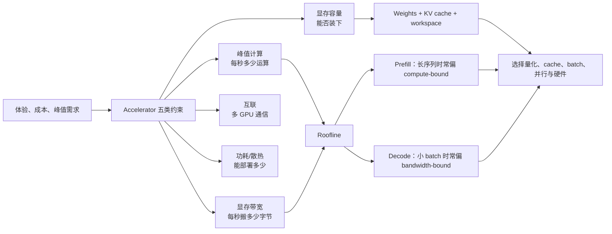
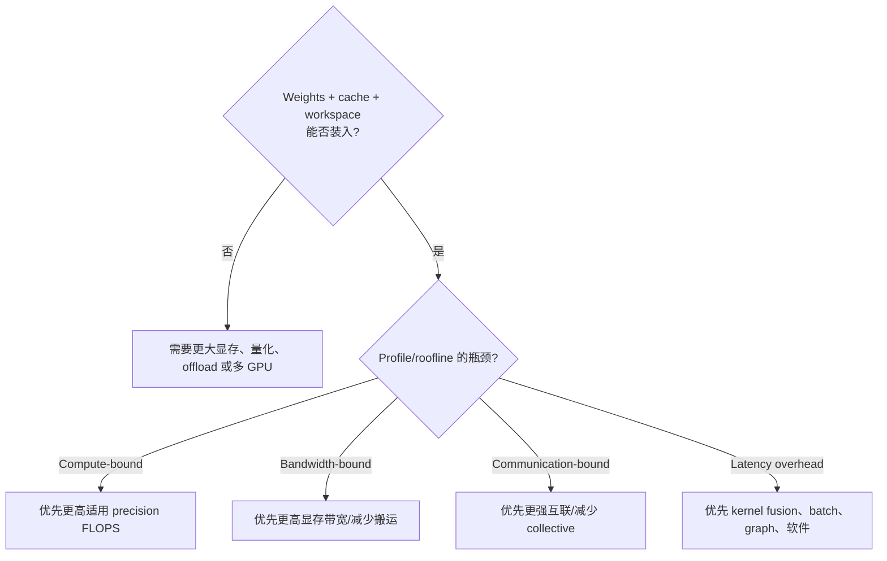
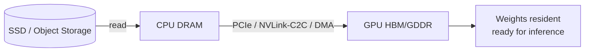
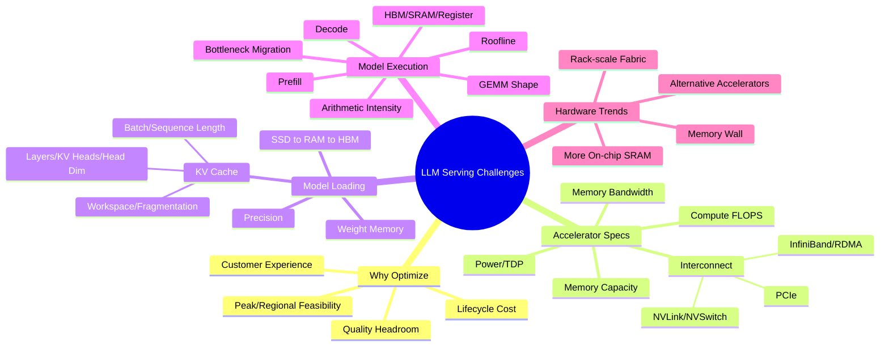

> 原章：*Challenges When Serving LLMs*
> 核心问题：为什么一个“能运行”的 LLM 服务仍可能在体验、成本和规模上不可行？GPU 的算力、显存容量、显存带宽、互联与功耗分别约束什么？怎样估算模型权重和 KV cache 的显存需求，又怎样用算术强度（arithmetic intensity）与 roofline model 判断 prefill 和 decode 究竟受计算还是数据搬运限制？

## 0. 本章定位、学习目标与分析主线

前四章已经回答了模型如何执行、服务如何构建、平台如何分层。本章是后续优化章节的“瓶颈地图”：在学习量化、batching、FlashAttention、PagedAttention、并行和 speculative decoding 之前，先知道它们分别在消除哪类约束。

作者的分析顺序非常重要：

1. 从客户体验、持续成本和峰值可扩展性证明“为什么必须优化”；
2. 将 accelerator 拆成计算、容量、带宽、互联和功耗，建立硬件约束模型；
3. 先分析模型加载阶段，判断权重与动态 KV cache 能否装入显存；
4. 再分析执行阶段，用 arithmetic intensity 和 roofline 区分 compute-bound 与 memory-bandwidth-bound；
5. 最后将结论映射到 prefill/decode，并观察整个行业如何应对 memory wall。



读完本章，应能回答：

- 为什么将 TTFT 从 20 秒降至 1 秒价值巨大，而从 0.1 秒降至 0.01 秒可能不值得？
- 训练是一次性大额投入，为什么 inference 仍可能成为全生命周期主成本？
- FLOP、FLOPS、TOPS、precision、显存容量和显存带宽分别表示什么？
- H100 SXM 与 NVL 的算力、容量和带宽不一致时，应怎样按 workload 选择？
- PCIe、NVLink、NVSwitch、InfiniBand 和 GPUDirect RDMA 位于什么通信层次？
- 权重为什么通常应常驻 GPU memory，SSD/CPU offload 的代价是什么？
- 怎样由参数量与 dtype 估算权重大小，并解释 14 GB 与仓库约 13 GB 的差异？
- KV cache 公式为什么有系数 2，MHA/GQA/MQA/MLA 会怎样改变它？
- 为什么 14 GB 模型装进 16 GB GPU，不等于它能以有用并发稳定服务？
- arithmetic intensity 如何计算，roofline crossover point 有什么含义与局限？
- 为什么 batch=1 的 decode arithmetic intensity 约为 1 FLOP/byte？
- prefill 为什么会随 prompt/batch 变得 compute-bound，而 decode 常受 memory bandwidth 限制？

> **规格口径说明**：本章 GPU 峰值与价格来自原章写作时的厂商资料和市场数据。Tensor Core 峰值可能依赖特定 precision、矩阵形状、稀疏性或 boost 条件；“GB/s”通常是十进制单位，模型内存工具又常显示 GiB。所有规格都是理论或标称值，真实吞吐还受 kernel、利用率、功耗、拓扑、软件版本和 workload 影响。

---

## 1. Why Optimizing LLM Serving Is Important

模型功能正确只是最低门槛。生产优化本质上是在质量与可靠性约束下寻找 latency、throughput 和 cost 的可行点：

$$
\min C_{serve}
\quad\text{s.t.}\quad
Q\ge Q_{min},\quad
L_{p95}\le L_{SLO},\quad
X\ge X_{demand},\quad
A\ge A_{min}.
$$

### 1.1 Customer Experience

#### 1.1.1 延迟收益具有边际递减

原章用 TTFT 说明：20 秒到 1 秒会把“几乎不可交互”变成可用；0.1 秒到 0.01 秒虽然数值上快 10 倍，人类却很可能感知不到。这说明目标不是无限最小化延迟，而是先跨过用户体验阈值，再用剩余预算换 throughput/cost。

可以用饱和效用函数表达直觉：

$$
U(L)=U_{max}e^{-\alpha L}
$$

或其他单调递减曲线。其具体形状必须从产品实验获得；图 5-1 是概念关系，不是通用心理学定律。聊天看 TTFT 和 ITL，Agent 下游必须等完整结果时更看 E2E，离线任务则可容忍 latency 换吞吐。

#### 1.1.2 优化还可换取更高模型质量

同一家族中，大模型通常在多项 benchmark 上更强。原章用 Llama-3 70B 与 8B 对比说明：若未经优化只能用 8B 满足 SLO，优化后在相同硬件与 latency/throughput 下可能使用 32B 或 70B，从而提高质量。

但“更大必然更好”不是定律：领域微调、数据、量化、prompt、评测污染和任务难度都影响结果。应优化单位成功业务结果，而不是只追参数量：

$$
\mathrm{utility}
=\frac{\mathrm{quality\ adjusted\ successful\ outcomes}}
{\mathrm{latency\ and\ monetary\ cost}}.
$$

### 1.2 Cost Efficiency

训练成本高但具有较强的前置固定性；inference 每次使用都消耗资源。若训练总成本为 $C_{train}$，每请求 inference 成本为 $c_{inf}$，累计请求数为 $N$：

$$
C_{lifecycle}=C_{train}+Nc_{inf}+C_{ops}.
$$

当

$$
N>\frac{C_{train}}{c_{inf}},
$$

累计 inference 就可超过一次训练成本。原章提到 GPT-4 训练超过 5000 万美元的外部说法，重点不是精确数字，而是持续请求会最终放大微小的单位成本。

Agent 每个任务又包含多个 LLM/embedding calls，使有效单任务成本为：

$$
C_{task}=\sum_{i=1}^{K}C_{call,i}+C_{tools}+C_{retry}.
$$

若同一 GPU 小时成本不变、满足 SLO 的 throughput 提高 $r$ 倍，纯计算部分的单位成本理想上降为 $1/r$；若优化让模型能运行在更便宜且更易获得的芯片上，也会降低成本。真实 TCO 还包括空闲、冗余、网络、存储和工程人员。

### 1.3 Scalability, Peak Load Handling, and Feasibility

原章用 Black Friday 流量增长 400% 或更多说明峰值问题。若“增长 400%”按相对增量解释，峰值是基线的 5 倍；实践中营销材料有时也把它宽泛称为达到 400%，容量规划必须澄清口径。

若每 replica 的 SLO-constrained throughput 为 $X_r$，峰值需求为 $X_p$，最低副本数近似：

$$
R_{min}=\left\lceil\frac{X_p}{X_r\rho_{target}}\right\rceil,
$$

$\rho_{target}<1$ 为 burst、故障和尾延迟留 headroom。优化提高 $X_r$，能减少副本；更重要的是，高端 GPU 在部分 region 供应不足时，优化可扩大可用硬件集合，决定产品是否能落地。

autoscaling 不能瞬间解决峰值：节点申请、镜像拉取、模型下载和 warm-up 都有延迟。因此要用压测、最小热容量、预测扩容、admission control 和降级共同应对。

---

## 2. The Role of Accelerator Chips in LLM Serving

本章聚焦 NVIDIA GPU，但分析框架适用于 TPU、NPU 和其他 accelerator：

$$
\text{适用硬件}
=f(\text{capacity},\text{compute},\text{bandwidth},
\text{interconnect},\text{power},\text{software}).
$$

### 2.1 Reading GPU Specs

#### 2.1.1 Table 5-1：H100 SXM 与 H100 NVL

| 指标 | H100 SXM | H100 NVL |
|---|---:|---:|
| FP64 | 34 TFLOPS | 30 TFLOPS |
| FP64 Tensor Core | 67 TFLOPS | 60 TFLOPS |
| FP32 | 67 TFLOPS | 60 TFLOPS |
| TF32 Tensor Core | 989 TFLOPS | 835 TFLOPS |
| BF16 Tensor Core | 1979 TFLOPS | 1671 TFLOPS |
| FP16 Tensor Core | 1979 TFLOPS | 1671 TFLOPS |
| FP8 Tensor Core | 3958 TFLOPS | 3341 TFLOPS |
| INT8 Tensor Core | 3958 TOPS | 3341 TOPS |
| GPU memory | 80 GB | 94 GB |
| GPU memory bandwidth | 3.35 TB/s | 3.9 TB/s |

这些是原章表 5-1 的标称数据。比较时必须确认是否为 dense/sparse peak；例如某些厂商表中的 Tensor Core 最大值包含 structured sparsity，实际 dense workload 上限可能约为其一半。不能只抄最大数字。

#### 2.1.2 GPU compute attribute

**FLOP** 是一次浮点运算计数；**FLOPS** 是每秒浮点运算数。Tera 表示 $10^{12}$。因此 1979 TFLOPS 表示特定条件下理论每秒 $1.979\times10^{15}$ 次浮点运算。

TOPS 是 operations/s，常用于整数或非浮点运算。FLOPS/TOPS 不能在不知道 precision、sparsity 和操作定义时横向比较。

低 precision 可提高峰值，原因不只是“数值占一半”：更少 bits 减少存储/带宽，Tensor Core 也能在同面积并行更多乘加。但 FP8 相对 FP16 接近 2 倍只是硬件峰值直觉，实际加速受量化/转换、kernel、shape 和 accuracy 限制。

#### 2.1.3 GPU memory capacity 与 bandwidth

- **Capacity（GB）**：能否容纳 weights、KV cache、activation 和 workspace；
- **Bandwidth（GB/s 或 TB/s）**：运行时每秒能在 HBM/GDDR 与计算单元间搬多少数据；
- **Compute（FLOPS）**：数据到达计算单元后每秒最多做多少算术。

H100 SXM 的峰值 compute 更高，H100 NVL 的容量与 bandwidth 更大。选择取决于瓶颈：模型装不下时再高 FLOPS 也无用；decode bandwidth-bound 时 NVL 的带宽可能更有价值；长 prefill compute-bound 时 SXM 可能更强。



### 2.2 GPU Interconnect Attributes

单 GPU 装不下模型，或单卡 latency 不达标时，需要多 GPU。此时每个 step 的 collective、activation 或 expert 数据会经过互联，通信可能成为新瓶颈。

#### 2.2.1 Intra-node interconnects

**Table 5-2：三种 H100 的节点内互联比较**

| 变体 | Form factor | 互联 | 标称 GPU-to-GPU bandwidth |
|---|---|---|---:|
| H100 PCIe | PCIe card | PCIe；部分组合可另配 bridge | 128 GB/s（原章口径） |
| H100 NVL | PCIe card | 两卡 NVLink Bridge | 600 GB/s |
| H100 SXM | SXM module | NVLink/NVSwitch | 900 GB/s，最多 8 GPU 系统 |

SXM 直接以专用 module/socket 集成，通常允许更高功耗、更强散热和高带宽 fabric；PCIe card 兼容性更广、成本较低。

若两张卡独立运行两个模型/replicas，模型之间没有频繁 collective，PCIe 可能足够。若同一模型做 tensor parallel，每层都有通信，拓扑就很关键。

两卡 NVL pair 内为高带宽，四卡中不同 pair 间仍可能走较慢路径；平均带宽不能代表最慢 collective path。

原章将 900 GB/s 平均除以 7 得到每个 peer 约 128 GB/s，以帮助理解总带宽共享。这个除法不是实际 topology/per-link 性能模型：900 GB/s 通常是每 GPU 双向聚合 NVLink bandwidth，具体每 link、路由、并发和单向/双向口径依平台。不能据此断言每个 peer 固定获得 128 GB/s。

NVSwitch 让多 GPU 通过 switch fabric 获得更均匀的 all-to-all connectivity，但“每一对连接都独占完整 900 GB/s”也不是准确理解；900 GB/s 仍是 GPU 的聚合注入带宽，不可能同时对每个 peer 各提供完整 900 GB/s。NVSwitch 的价值是减少拓扑瓶颈和提供高 bisection bandwidth。

#### 2.2.2 Inter-node interconnects

单节点通常最多 8 GPU；更大模型或 expert parallel 可能跨节点。InfiniBand + GPUDirect RDMA 允许 GPU memory 之间直接传输，绕过不必要的 CPU staging。

400 Gbit/s 的理论换算：

$$
400\ \mathrm{Gbit/s}\div8
=50\ \mathrm{GB/s},
$$

尚未扣协议、拓扑和 contention。

**Table 5-3：节点内与跨节点通信带宽示例**

| Setup | 示例 bandwidth |
|---|---:|
| Node 内 NVLink/NVSwitch | 900 GB/s |
| Node 内 NVLink Bridge | 600 GB/s |
| Node 内 PCIe | 128 GB/s |
| 跨 node | 50 GB/s |

跨节点示例仅为 node 内最强链路的约 $50/900\approx5.6\%$，所以常优先把一个 replica 放在单 node 的 1～8 GPU，再通过增加完整 replicas 水平扩流量。模型确实跨节点时，tensor/pipeline/expert parallel 的通信量和重叠能力决定性能。

#### 2.2.3 Interconnect bandwidth 不等于有效 collective bandwidth

真实 all-reduce/all-to-all 还受：

- 单向/双向和 per-link/per-GPU/per-system 口径；
- topology、NUMA、NIC 与 GPU affinity；
- NCCL/driver 版本与 message size；
- contention、oversubscription 和 route；
- latency，对小消息尤其重要；
- 计算通信重叠。

硬件表只能排除明显不合适方案，最终用目标 collective 和模型实测。

### 2.3 GPU Power Consumption

TDP 表示芯片设计用于持续负载的功耗/散热等级，现代 datacenter GPU 可从数百瓦到 700 W 以上。它不是每时每刻的实际功耗，也不代表整机、网络和冷却总功耗。

不同环境的约束不同：

- 公有云用户主要通过实例价格、quota 和 availability 间接感受功耗；
- 数据中心受机架供电、冷却和设施容量限制，看重 performance/watt；
- edge/on-device 受电池、温升和 form factor 限制，功耗可直接决定模型、precision 和运行频率。

能效应以有效工作衡量：

$$
\mathrm{good\ tokens/J}
=\frac{\mathrm{tokens\ satisfying\ quality\ and\ SLO}}
{\mathrm{energy\ in\ joules}}.
$$

### 2.4 Comparing the Specs of Popular GPUs

**Table 5-4：常见 LLM inference GPU 规格与成本比较（价格为 2026 年春示例）**

| GPU | Memory | FP16/BF16 peak | Bandwidth | FP8 | NVLink/NVSwitch | 示例 $/GPU-hour |
|---|---:|---:|---:|---:|---:|---:|
| H200 SXM | 141 GB | 1979 TFLOPS | 4.8 TB/s | Yes | Yes | ~$6.3 |
| H100 SXM | 80 GB | 1979 TFLOPS | 3.35 TB/s | Yes | Yes | ~$6.2 |
| A100 SXM | 80 GB | 312 TFLOPS | 1.935 TB/s | No | Yes | ~$2.7 |
| L40S | 48 GB | 362 TFLOPS | 0.864 TB/s | Yes | No | ~$2.25 |
| A10 | 24 GB | 125 TFLOPS | 0.6 TB/s | No | No | <$1.25 或部分渠道不可用 |

同样要核对 sparse/dense peak、云实例中每卡实际价格、host CPU/network 和区域折扣。

#### Small model：Llama-3-8B

若用 FP16/BF16，权重粗估 16 GB，A10 24 GB 能放下，但动态 cache/headroom 有限；若 latency 不苛刻且并发低，它价格和供给可能更合适。不能只凭“能装下”判断，还要压测 TTFT/TPOT 和 OOM。

#### Mid-sized model：DeepSeek-R1-Distill-Qwen-14B

FP16 权重粗估 28 GB，A10 放不下，L40S 48 GB 更合理；FP8 可进一步减少容量和搬运，并保留更多 KV cache。单卡避免多 GPU 通信，常比两张便宜卡更简单，但 accuracy 与 kernel 支持需验证。

#### Large model：DeepSeek-R1 671B

原章建议考虑 8×H200 + FP8 + NVSwitch。671B 若所有参数以 1 byte 存储，权重约 671 GB；8×141 GB = 1128 GB，容量有余量。它是 MoE，**总参数**决定权重存储与跨 expert placement，**每 token 激活参数**决定主要计算，不能把 671B dense model 的 FLOPs 直接套用。实际部署还需 expert parallel、KV cache、runtime 和模型支持。

硬件选择的一般顺序：

1. 用 weights + KV + workspace 排除容量不够的方案；
2. 用 workload 的 compute/bandwidth/communication 特征找适配硬件；
3. 在 SLO 下实测 goodput；
4. 比较 $/good token、W/good token、availability 和运维复杂度。

---

## 3. Bottlenecks in LLM Model Loading

### 3.1 The Model Loading Process

权重通常经过：



**Table 5-5：SSD、CPU memory 与 GPU memory 的带宽数量级**

| 存储层级 | 示例 bandwidth |
|---|---:|
| SSD | 0.5～14 GB/s |
| CPU memory | 50～200 GB/s |
| GPU memory | 300 GB/s～3 TB/s |

这里比较的是不同路径的峰值范围，不表示 CPU→GPU 可达到 GPU HBM 内部带宽；CPU→GPU 还受 PCIe/NVLink-C2C 限制。

若权重大小 $M$、有效传输带宽 $B$，不可压缩的传输时间下界：

$$
T_{transfer}\ge\frac{M}{B}.
$$

14 GB 模型从 1 GB/s SSD 理论至少 14 s，从 32 GB/s PCIe 理论至少 0.44 s；还未计网络下载、文件解析、反序列化、分片、内存分配和 warm-up。逐 token 执行若每层都从 CPU 搬权重，会反复支付慢链路，通常无法满足实时 SLO。

CPU offload 不是绝对不可用：显存不足、低流量、离线或部分 expert 按需加载时可用，但它以 latency/throughput 换容量。生产常把权重放本地 NVMe/host RAM 缩短冷启动，运行热路径仍尽量驻留 GPU。

### 3.2 Estimating Model Size

若参数数为 $P$，每参数 $q$ bits：

$$
M_{weights}=P\frac{q}{8}\ \mathrm{bytes}.
$$

**Table 5-6：参数精度与存储字节数**

| dtype | bits | bytes/parameter |
|---|---:|---:|
| FP32 | 32 | 4 |
| FP16/BF16 | 16 | 2 |
| INT8/FP8 | 8 | 1 |

Llama-2-7B 约 7B 参数、FP16：

$$
7\times10^9\times2
=14\times10^9\ \mathrm{bytes}
=14\ \mathrm{GB}
\approx13.04\ \mathrm{GiB}.
$$

原章“14 GB 估算、文件约 13 GB”并不矛盾：十进制 GB 与二进制 GiB 换算就是约 13.04 GiB；此外参数数是约数，权重 tying、metadata、分片和 serialization 也会造成差异。

`torch_dtype` 提供默认/存储线索，但不能只靠 config 断言实际 checkpoint 每个 tensor dtype；量化模型可能还有 scale、zero-point 和 metadata。加载时 runtime 也可能 cast 到另一 dtype。

权重显存之外还包括：

- embedding/LM head 是否 tied；
- quantization metadata；
- CUDA context、allocator 与 runtime；
- kernel workspace/CUDA graph pools；
- activation 和 temporary tensors；
- KV/prefix cache；
- memory fragmentation 与安全余量。

### 3.3 Estimating KV Cache Size

#### 3.3.1 通用公式

设：

- layers 为 $L$；
- KV heads 为 $H_{kv}$；
- head dimension 为 $d_h$；
- cache dtype 每元素 $b$ bytes；
- batch/并发 sequences 为 $B$；
- 每序列 cache tokens 为 $T$。

每 token、每 sequence 的 KV cache：

$$
m_{KV/token}=2LH_{kv}d_hb.
$$

系数 2 表示 Key 与 Value 两份。总 cache：

$$
M_{KV}=2LBTH_{kv}d_hb.
$$

原章写“attention heads”，对 Llama-2-7B 的 MHA 正确；通用公式必须用 **KV heads**。GQA/MQA 让多个 query heads 共享更少 K/V heads，可按 $H_{kv}/H_q$ 比例缩小 cache；MLA 使用 latent representation，需按具体架构另算。

#### 3.3.2 Llama-2-7B 数值推导

配置：$L=32$、$H_{kv}=32$、hidden size $4096$，所以：

$$
d_h=4096/32=128.
$$

FP16/BF16 cache $b=2$ bytes：

$$
m_{KV/token}
=2\times32\times32\times128\times2
=524{,}288\ \mathrm{bytes}
=512\ \mathrm{KiB}
=0.5\ \mathrm{MiB}.
$$

若 $B=16,T=4096$：

$$
M_{KV}
=524{,}288\times16\times4096
=34{,}359{,}738{,}368\ \mathrm{bytes}
=32\ \mathrm{GiB}.
$$

这比约 13.04 GiB 的权重还大，说明高并发长上下文中 KV cache 可成为第一容量约束。

#### 3.3.3 Table 5-7：A10 与 L40S

原章按 14 GB 权重和 4096 tokens/sequence 比较：

| GPU | 标称 memory | 权重后余量 | 理论 KV-only batch | 原章建议 batch | 示例 $/hour |
|---|---:|---:|---:|---:|---:|
| A10 | 24 GB | 10 GB | $10\times1024/(0.5\times4096)=5$ | 4 | $2 |
| L40S | 48 GB | 34 GB | $34\times1024/(0.5\times4096)=17$ | 16 | $3.75 |

原表在公式结果 5/17 后采用 4/16，可理解为保守下调；但仅减一个 sequence 未必足够覆盖所有 activation/workspace。GB/GiB 混用也让结果只是粗估。

若只用原章建议并发除以时价：

$$
\frac{4}{2}=2.0\ \mathrm{concurrent\ slots/\$h},
$$

$$
\frac{16}{3.75}\approx4.27\ \mathrm{slots/\$h}.
$$

L40S 约高 $2.13\times$，但 slot 不等于 throughput：L40S 的 bandwidth/compute 也不同，真实 $/good token 必须实测。

#### 3.3.4 `max_batch_size × max_sequence_length` 是上界模型

现实 continuous batching 中每个 sequence 长度不同，cache token 总数是：

$$
T_{active}=\sum_{i=1}^{B}(T_{prompt,i}+T_{generated,i}),
$$

而不是每个请求都占满 `max_sequence_length`。按最大值相乘适合 worst-case admission 上界，却会过度保守；按平均值又可能 OOM。服务框架常按 token blocks 做 admission，并设置总 KV token budget。

OOM 可能发生在最后几个 token，因此“短 smoke test 通过”不能证明长生成安全。应压测最大/分位长度、并发、prefix cache、CUDA graph 和 fragmentation。

#### 3.3.5 “显存约为模型大小两倍”的边界

原章建议以约 2× weight memory 起步，以留出 cache、activation 和并行空间。这是方便的 heuristic，不是容量保证：

- GQA 小模型、短 context 可能不需要 2×；
- MHA、超长 context、高并发或 prefix caching 可能远超 2×；
- tensor parallel 后每卡 weights/cache 的切分方式不同；
- quantized weights 不一定等比例量化 KV；
- MoE 总权重与 active experts 的 compute/placement 不同。

更可靠流程是显式预算：

$$
M_{GPU}
\ge M_{weights}+M_{KV,max}+M_{activation,peak}
+M_{workspace}+M_{runtime}+M_{fragmentation}.
$$

---

## 4. Bottlenecks in LLM Model Execution

模型已驻留 GPU 后，问题从“装不装得下”转为“每一步由算力还是搬运速度限制”。Prefill 与 decode 的矩阵形状不同，因此不能用一个“GPU 利用率”概括。

### 4.1 Boundaries of GPU Compute and Memory Bandwidth

#### 4.1.1 Data movement 不等于 model loading

Model loading 是服务启动/换入时 SSD/CPU→GPU 的低频传输；execution data movement 是每个 kernel 运行时 HBM→L2→shared/L1→register 以及写回的高频搬运。

HBM/GDDR 容量大但相对慢；on-chip SRAM（cache/shared）小、贵、快。算法和 kernel 的关键任务之一是提高数据复用，让从 HBM 读入的数据在 on-chip memory 中参与更多运算。FlashAttention 正是通过 tiling 避免大 attention matrix 反复写回 HBM。

#### 4.1.2 Arithmetic intensity

$$
I=\frac{F}{D}
\quad(\mathrm{FLOP/byte}),
$$

$F$ 是执行的浮点运算数，$D$ 是相应内存层级的数据移动 bytes。必须说明计算的是 DRAM/HBM intensity 还是 cache-level intensity；本章用 HBM bandwidth 做 naive roofline。

低 $I$ 表示每搬一个 byte 只做少量计算，容易 bandwidth-bound；高 $I$ 表示数据复用充分，可能 compute-bound。

#### 4.1.3 Roofline model

设适用 precision 的峰值计算为 $P_{peak}$，memory bandwidth 为 $B_{mem}$，workload intensity 为 $I$：

$$
P_{attainable}(I)
\le\min(P_{peak},B_{mem}I).
$$

两条 roof 相交的 hardware balance/crossover：

$$
I^{\ast}=\frac{P_{peak}}{B_{mem}}.
$$

**Table 5-8：L40S 与 roofline 计算相关的核心规格**

| 属性 | 原章规格 |
|---|---:|
| GPU memory | 48 GB GDDR6 ECC |
| Memory bandwidth | 864 GB/s |
| PCIe Gen4 x16 | 64 GB/s bidirectional |
| FP32 | 91.6 TFLOPS |
| TF32 Tensor Core | 183 TFLOPS |
| BF16/FP16 Tensor Core | 362.05 TFLOPS |
| FP8 Tensor Core | 733 TFLOPS |

对原章 L40S FP16：

$$
I^{\ast}=\frac{362\times10^{12}}
{864\times10^9}
\approx418.98\ \mathrm{FLOP/byte}.
$$

当 $I<I^{\ast}$，斜线 $B I$ 较低，受 bandwidth 上界；当 $I>I^{\ast}$，水平线 $P_{peak}$ 较低，受 compute 上界。

210 FLOP/byte 的理论 performance：

$$
864\times10^9\times210
=181.44\times10^{12}\ \mathrm{FLOP/s},
$$

约为 362 TFLOPS 的一半；1000 FLOP/byte 时 $BI$ 超过 compute roof，最高仍受 362 TFLOPS 限制。

#### 4.1.4 Naive roofline 的局限

它是假设理想峰值的上界，不含：

- kernel launch、同步、dependency 和 occupancy；
- shape 对 Tensor Core tile 的匹配；
- cache hit、fusion 和实际 DRAM traffic；
- mixed operations、softmax、norm、sampling；
- communication 和 CPU/network；
- sparse/dense peak 口径；
- 功耗/thermal throttling。

“在 roofline 右边”不保证实测达到峰值；它只告诉你优先调查哪类资源。应以 profiler 的 achieved FLOPS、HBM throughput、kernel time 校准。

### 4.2 Arithmetic Intensity in Matrix Multiplications

#### 4.2.1 运算量

每个输出元素做 $K$ 次乘法和约 $K-1$ 次加法，常把 fused multiply-add 计作 2 FLOPs：

$$
F\approx2MNK.
$$

#### 4.2.2 最乐观的数据移动模型

假设每个 input、weight 只从 HBM 读一次，每个 output 写一次；元素为 $p$ bytes：

$$
D=p(MK+KN+MN).
$$

于是：

$$
I_{matmul}
=\frac{2MNK}{p(MK+KN+MN)}.
$$

FP16/BF16 时 $p=2$：

$$
I_{matmul}
=\frac{MNK}{MK+KN+MN}.
$$

原章最终公式缺少分母括号，正确含义是上式，不是按运算优先级逐项相加。

#### 4.2.3 $M=N=K=n$ 的推导

$$
I=\frac{n^3}{3n^2}=\frac{n}{3}.
$$

**Table 5-9：不同方阵尺寸的 arithmetic intensity**

| $n$ | 精确 intensity | 原章取整 | 相对 L40S 419 |
|---:|---:|---:|---|
| 64 | 21.33 | 21 | bandwidth-bound |
| 512 | 170.67 | 170 | bandwidth-bound |
| 4096 | 1365.33 | 1365 | compute-bound |

矩阵越大，input/weight tile 能在片上复用越多，compute 相对 bytes 增长更快。但公式假设完美复用；naive 三重循环若每次从 HBM 重读，traffic 会大得多。高性能 GEMM 依靠 tiling/shared memory 才接近该下界。

下面的可运行代码复算核心数字：

```python
def matmul_intensity(rows, inner, columns, bytes_per_element=2):
    flops = 2 * rows * inner * columns
    bytes_moved = bytes_per_element * (
        rows * inner + inner * columns + rows * columns
    )
    return flops / bytes_moved

for size in (64, 512, 4096):
    print(size, matmul_intensity(size, size, size))

hidden_size = 4096
for sequence_length in (64, 512, 4096):
    prefill = matmul_intensity(
        sequence_length,
        hidden_size,
        hidden_size,
    )
    decode = matmul_intensity(1, hidden_size, hidden_size)
    print(sequence_length, prefill, decode)
```

### 4.3 Applying the Analysis to Prefill and Decode

LLM input tensor通常为 $[B,S,H]$。先按原章固定 batch $B=1$，线性层可看成：

- prefill：$[S,H]\times[H,H]$；
- decode：$[1,H]\times[H,H]$。

#### 4.3.1 Prefill intensity

令 $M=S,K=N=H$：

$$
I_{prefill}
=\frac{SH^2}{SH+H^2+SH}
=\frac{SH}{2S+H}.
$$

当 $S\ll H$，$I\approx S$；当 $S\gg H$，上限趋近 $H/2$。长 prompt 增加权重复用，线性层可越过 compute crossover。

#### 4.3.2 Decode intensity

令 $M=1$：

$$
I_{decode}
=\frac{H^2}{H+H^2+H}
=\frac{H}{H+2}
\approx1.
$$

对 $H=4096$：

$$
I_{decode}=4096/4098\approx0.9995.
$$

每步要读取巨大权重，却只为一个 token 做一次 matrix-vector product，数据复用极低，因此小 batch decode 强烈 bandwidth-bound。

#### 4.3.3 Table 5-10 复算

固定 $H=4096$：

| $S$ | Prefill intensity | Decode intensity | L40S naive verdict |
|---:|---:|---:|---|
| 64 | 62.06 | ~1.0 | 二者 bandwidth-bound |
| 512 | 409.60 | ~1.0 | prefill 接近但略低于 419；decode bandwidth-bound |
| 4096 | 1365.33 | ~1.0 | prefill compute-bound；decode bandwidth-bound |

#### 4.3.4 Batch size 怎样改变 decode

原章故意固定 batch=1。若同一步同时 decode $B$ 个 sequences，线性层近似 $M=B$：

$$
I_{decode,batch}
=\frac{BH}{2B+H}
\approx B\quad(B\ll H).
$$

因此 continuous batching 增大 active sequences，可让同一份 weights 服务更多 token，提高 arithmetic intensity；这正是 batching 能提高 decode throughput 的硬件直觉。要达到 L40S 约 419 crossover，理想公式需要很大 batch，实际先受 KV memory、latency SLO、请求供给和 kernel 限制。

#### 4.3.5 这只是线性层近似，不是完整 Transformer

完整 prefill 还有 attention $QK^\top$、softmax、$PV$、norm 和 activation；decode 还读取增长的 KV cache。Attention 的 shape、FlashAttention traffic、GQA 和 context length 都会改变整体 intensity。不能由单个 $H\times H$ matmul 精确预测端到端性能。

#### 4.3.6 从瓶颈到优化方向

| 诊断 | 典型信号 | 优化方向 |
|---|---|---|
| Capacity-bound | OOM、cache token budget 太小 | weight/KV quantization、GQA、PagedAttention、并行/offload |
| Compute-bound | Tensor Core 高、HBM 未满 | 降 FLOPs、低 precision、更快 GPU、kernel/parallel |
| Memory-bandwidth-bound | HBM 接近峰值、compute 低 | batch/fusion、quantization、cache reuse、减少读写 |
| Communication-bound | collective 占比高 | 更强 topology、减少/重叠通信、调整 parallelism |
| Launch/CPU-bound | 小 kernel、GPU gaps | CUDA graph、fusion、async pipeline、减少 Python overhead |

关键方法是“先测量瓶颈，再选改变该上界的技术”。给 bandwidth-bound decode 换更多 FLOPS 而带宽不变，收益可能很小；给 compute-bound 长 prefill 只优化 CPU routing，也不会解决核心问题。

---

## 5. Other AI Accelerators and Trends

### 5.1 替代 accelerator

原章列举 AMD MI300X、Intel Gaudi2、Google TPU、AWS Inferentia、Huawei Ascend，以及 Groq、Cerebras、Untether AI、SambaNova、d-Matrix 等。选择不只看芯片表：

$$
\mathrm{effective\ value}
=f(\mathrm{hardware},\mathrm{compiler/runtime},
\mathrm{model\ support},\mathrm{availability},\mathrm{TCO}).
$$

专用 inference chip 可简化架构、提高能效或 latency，但模型 architecture 快速变化，unsupported op、compiler maturity 和 proprietary toolchain 会成为迁移成本。NVIDIA 的优势很大一部分来自 CUDA、library、framework 和社区，而非单个芯片数字。

### 5.2 Memory wall

峰值 FLOPS 增长速度超过 HBM 和 GPU-to-GPU bandwidth，越来越多 workload 无法喂满计算单元，这就是 memory wall。它同时发生在：

- chip 内：HBM→compute；
- chip 间：GPU↔GPU；
- host/device：CPU↔GPU；
- storage/loading：SSD/object store→RAM/HBM。

### 5.3 趋势一：更多 on-chip SRAM / compute near data

将参数和中间值靠近 compute 可降低 latency、提高可预测性。但 SRAM 面积和价格高，容量有限；大模型需要跨更多 chips partition，反而增加 inter-chip challenge。适合极低 latency workload，不一定有最低 $/token。

### 5.4 趋势二：把 rack 当作一台 accelerator

通过更紧密 GPU-GPU、CPU-GPU coupling 扩大高带宽域。原章以 GB200 NVL72 为例：

- B200：Blackwell GPU；
- GB200：Grace CPU 与 Blackwell GPU 通过 NVLink-C2C 紧耦合；
- NVL72：36 Grace CPUs + 72 Blackwell GPUs 构成 rack-scale NVLink domain。

这种系统有利于大 MoE、disaggregated prefill/decode 和 expert parallel，但需要软硬件协同、功耗/冷却、拓扑感知调度和成熟 runtime，并非普通 workload 自动受益。

### 5.5 不变的判断框架

芯片会更新，以下问题保持稳定：

1. weights/cache/workspace 能否放下？
2. 目标 phase 的 arithmetic intensity 多高？
3. 是 compute、HBM、communication、power 还是 software 限制？
4. precision 与 kernel 是否受支持且质量达标？
5. 单卡、单 node 还是跨 node 的拓扑最合适？
6. 在真实 SLO 下 goodput/$ 与 goodput/W 是多少？

---

## 6. 容易混淆的概念与常见误区

### 6.1 功能可用 = 生产可行

错误。单请求能生成不代表高并发、长 context、峰值和单位成本可行。

### 6.2 Latency 越低永远越有价值

错误。用户效用会饱和；越过体验目标后，适度增加 batch/等待换吞吐可能更有价值。

### 6.3 Training 一定比 inference 贵

错误。训练常是前置固定成本，inference 随累计调用增长；结论取决于生命周期请求量和 retraining。

### 6.4 FLOP = FLOPS

错误。FLOP 是运算数量，FLOPS 是每秒速率；TFLOPS 是 $10^{12}$ FLOPS。

### 6.5 所有 precision 的 TFLOPS 可以直接比较

错误。FP16、FP8、INT8、dense/sparse 和 Tensor Core 条件不同，模型与 kernel 也未必支持峰值。

### 6.6 更高 FLOPS 的 GPU 对所有 workload 更快

错误。装不下模型、decode bandwidth-bound 或 communication-bound 时，额外 compute 会闲置。

### 6.7 显存容量 = 显存带宽

错误。容量决定能放多少，带宽决定每秒能搬多少；大显存不保证快，高带宽也不能弥补装不下。

### 6.8 Model loading = execution data movement

错误。前者是启动/换入路径，后者是每个 kernel 在 HBM/cache/register 间持续搬运。

### 6.9 400G network = 400 GB/s

错误。网络常以 bit/s 标注；400 Gbit/s 理论为 50 GB/s，且实际更低。

### 6.10 NVSwitch 给每一对 GPU 独占 900 GB/s

错误。900 GB/s 通常是每 GPU 聚合双向带宽；NVSwitch 提供更均匀 fabric，不会让总注入带宽无限倍增。

### 6.11 GPU 表上的 bandwidth 就是应用实测 bandwidth

错误。峰值受读写模式、ECC、拓扑、kernel、并发和测量口径影响。

### 6.12 TDP = 实时功耗 = 整机功耗

错误。TDP 是设计热功耗等级；实际芯片功耗随 workload，整机还含 CPU、memory、network、fans。

### 6.13 模型名称中的 7B 是精确参数数

通常只是规模级别；实际参数、tying、quantization metadata 和 checkpoint 格式需检查。

### 6.14 14 GB = 14 GiB

错误。$14\times10^9$ bytes 约为 13.04 GiB。容量规划必须统一单位。

### 6.15 `torch_dtype` 足以证明实际显存 dtype

错误。checkpoint tensor、量化格式和 runtime cast 可能不同，应检查真实加载配置和 tensors。

### 6.16 权重能装下就能稳定服务

错误。还要 KV cache、activation、workspace、runtime 和 fragmentation；峰值常在长生成末尾。

### 6.17 KV cache 公式永远用 query attention heads

错误。通用公式使用 KV heads；GQA/MQA 的 $H_{kv}<H_q$，cache 更小。

### 6.18 `batch × max length` 是实际 cache 使用量

它是简单 worst-case 上界。continuous batch 的实际值是活跃 sequences 各自 token 数之和。

### 6.19 2× weight memory 是安全保证

错误。只是起步 heuristic，长 context/MHA/prefix cache 可能远超，短 context/GQA 则可能更少。

### 6.20 Arithmetic intensity 是 GPU 的固定属性

错误。Workload 有 intensity；GPU 有 crossover $P_{peak}/B$。同一操作的 shape、batch、dtype 与实现会改变 intensity。

### 6.21 Roofline crossover 越高越好

不一定。它是 compute-to-bandwidth 比；高 crossover 可能意味着 compute 增长远快于 bandwidth，更多 workload 落在 bandwidth-bound 区域。

### 6.22 Roofline 预测就是实测性能

错误。它是理想上界，不含 occupancy、launch、cache、通信和非 matmul operations。

### 6.23 大模型意味着所有 matmul 都很大

错误。decode batch=1 时输入只有一行，即使 weight 是 $4096\times4096$，仍近似 matrix-vector，复用低。

### 6.24 Decode intensity 永远等于 1

只在原章的 FP16、batch=1、方形线性层和理想 traffic 模型下约为 1。Batch、dtype、GQA、cache traffic 和其他层会改变整体值。

### 6.25 Prefill 永远 compute-bound

错误。短 prompt 的 intensity 可低于 crossover；长 prompt/大 batch 才更可能 compute-bound。

### 6.26 Memory-bound 只需购买更高带宽 GPU

不完整。也可通过 quantization、batching、fusion、tiling、cache reuse 和减少 HBM traffic 提高有效性能。

### 6.27 MoE 总参数等于每 token 计算参数

错误。总参数影响存储，路由激活的 experts 决定主要 token compute；通信与 load balance 又是额外约束。

---

## 7. 从本章抽象出的通用瓶颈分析方法

### 第一步：明确业务约束

记录质量、TTFT/TPOT/E2E、throughput、峰值、region availability 和单位成本，确定哪些是硬约束、哪些可交换。

### 第二步：建立 workload 分布

测 input/output length、active sequences、batch、prefix reuse、模型 mix 和 burst。不要只用一个短 prompt 推导硬件。

### 第三步：先做容量预算

由真实 parameter/dtype 算 weights，由 $2LBTH_{kv}d_hb$ 算 cache，再加 activation、workspace、runtime、fragmentation。装不下时性能讨论没有意义。

### 第四步：确认数据路径和拓扑

画 SSD→RAM→HBM 与 GPU↔GPU/Node↔Node，统一 bit/byte、decimal/binary 和单向/双向口径，找最慢且高频的链路。

### 第五步：按 phase/profile kernel

分开 prefill、decode、sampling、communication；看 achieved FLOPS、HBM bandwidth、collective 和 GPU gaps。

### 第六步：用 roofline 建立可证伪假设

计算 workload intensity 与 hardware crossover。低于 crossover 假设 bandwidth-bound，高于则 compute-bound，再用 profiler 验证，而不是把 roofline 当结论。

### 第七步：选择能改变瓶颈上界的技术

- capacity：量化、KV compression、PagedAttention、并行；
- compute：低精度、减少 FLOPs、优化 kernel；
- bandwidth：batch、fusion、quantization、片上复用；
- communication：拓扑、parallel strategy、重叠；
- launch/CPU：graph、async、减少小 kernel。

### 第八步：检查瓶颈迁移

量化权重后可能从 capacity/带宽转成 compute 或 dequant overhead；增大 batch 后 decode 可从 bandwidth 转向 compute/latency；多 GPU 解决容量后可能 communication-bound。

### 第九步：在 SLO 下计算 goodput 与成本

比较 $/good token、good requests/GPU-hour、good tokens/J，而不是峰值 TFLOPS 或裸 TPS。

### 第十步：做峰值和长尾验证

压测最大长度、真实并发、突发、生成末尾显存、cache fragmentation、worker/node failure 和冷启动；稳定均值不是容量证明。

---

## 8. 本章知识结构与核心结论

### 8.1 知识结构



### 8.2 核心结论

1. **优化的目标是业务可行性，不是追求漂亮的 benchmark。** 它让体验跨过阈值、降低生命周期单位成本，并决定峰值和区域部署能否实现。
2. **Latency 的价值有边际递减。** 先满足体验 SLO，再考虑用 latency headroom 换 throughput/cost。
3. **GPU 不能用一个“快”字描述。** Capacity、compute、bandwidth、interconnect、power 和 software 分别约束装载、执行、扩展和部署。
4. **峰值 FLOPS 必须绑定 precision、dense/sparse 与 kernel 条件。** 最大规格不等于目标 workload 可达到的性能。
5. **多 GPU 后拓扑成为算法的一部分。** 单 node NVLink/NVSwitch 远快于跨 node 示例链路，parallel strategy 必须匹配通信特征。
6. **权重应尽量常驻 GPU，但运行显存远不止权重。** CPU/SSD offload 以数据搬运 latency 换容量，适用范围有限。
7. **权重显存由参数量与 dtype 一阶决定。** $M=Pq/8$，但 GB/GiB、量化 metadata 和 runtime cast 必须厘清。
8. **KV cache 可大于权重。** $M_{KV}=2LBTH_{kv}d_hb$，并随并发与 token 数增长；GQA/MQA 通过减少 KV heads 缩小 cache。
9. **“能装下”不等于“能高效服务”。** 还需 activation、workspace、fragmentation 和并发 headroom，2× weight 只是 heuristic。
10. **Arithmetic intensity 把算法 shape 与硬件资源连接起来。** $I=F/D$，GPU crossover 为 $P_{peak}/B_{mem}$。
11. **Roofline 给上界和方向，不给实测答案。** 需要 profiler 验证，并考虑 kernel、cache、通信和非 matmul 开销。
12. **矩阵大小决定数据复用。** FP16 方阵 intensity 为 $n/3$；shape 小时 bandwidth-bound，shape 大时可能 compute-bound。
13. **Prefill 和 decode 是两种不同 workload。** 长 prefill 可达到高 intensity；batch=1 decode 约 1 FLOP/byte，通常强烈 bandwidth-bound。
14. **Batching 的硬件本质是复用同一份权重。** 小 batch 下 decode intensity 近似随 batch 增长，但受 latency、KV memory 和请求供给约束。
15. **优化会移动瓶颈。** Capacity、compute、bandwidth、communication 和 launch overhead 需反复测量，而非一次归类。
16. **Memory wall 正在塑造硬件。** 更多片上 SRAM 和 rack-scale 高带宽 fabric 分别从 chip 内与 chip 间减少数据移动限制。

### 8.3 一句话复盘

本章的总方法是：**先用业务 SLO 和流量证明优化价值，再将硬件能力拆为容量、计算、带宽、互联与功耗；先按 weights、KV cache 和 workspace 判断模型能否以目标并发装入，再按 prefill/decode 的矩阵形状计算 arithmetic intensity，并与 hardware roofline 比较形成瓶颈假设；最后用 profiler 和真实 goodput 验证，选择真正改变当前上界的优化，并持续检查瓶颈是否迁移。**

---

## 9. 术语速查

| 术语 | 简明定义 | 不要与之混淆 |
|---|---|---|
| FLOP | 一次浮点运算计数 | FLOPS 是每秒速率 |
| TFLOPS | 每秒 $10^{12}$ 浮点运算 | 必须说明 precision/sparsity |
| TOPS | 每秒 $10^{12}$ operations | 不必然是 floating-point |
| Precision | 每个数值的格式与位宽 | 低位宽不保证质量不变 |
| VRAM/GPU memory | GPU 的设备内存容量 | 不等于 memory bandwidth |
| HBM/GDDR | 存储大权重/cache 的 off-chip GPU memory | SRAM 更快但容量小 |
| Memory bandwidth | 每秒可从设备内存搬运的数据量 | 不等于 CPU→GPU bandwidth |
| PCIe | 通用 host/device 与设备互联标准 | 通常慢于 NVLink fabric |
| NVLink | NVIDIA 高带宽 GPU/组件互联 | NVSwitch 是交换 fabric |
| NVSwitch | 连接多个 NVLink endpoint 的交换系统 | 不给每个 peer 无限独占带宽 |
| InfiniBand | 常用于跨节点高性能网络 | 400G 通常是 Gbit/s |
| RDMA | 远程直接内存访问 | GPUDirect RDMA 面向 GPU memory path |
| TDP | 芯片持续设计热功耗等级 | 不等于整机实时功耗 |
| Model loading | 将权重移入并初始化设备的过程 | 不同于每步 execution traffic |
| Weight memory | 参数数乘每参数 bytes 的一阶大小 | 不含 KV/workspace/runtime |
| GB/GiB | $10^9$/$2^{30}$ bytes | 容量估算不可混用 |
| KV cache | 每层历史 token 的 key/value 状态 | 大小用 KV heads 而非必然 query heads |
| MHA | 每个 query head 通常有独立 K/V head | GQA/MQA 共享 K/V heads |
| Activation | 执行中产生的中间 tensor | 推理仍需，只是不保存训练反向状态 |
| OOM | 设备无法满足内存分配 | 短请求不 OOM 不代表峰值安全 |
| Data movement | 执行时在 memory hierarchy 搬运 bytes | 不只是服务启动时传权重 |
| Arithmetic intensity | 每搬 1 byte 完成的 FLOPs | 是 workload/实现属性 |
| Hardware balance | $P_{peak}/B_{mem}$ 的 roofline 转折点 | 不是 workload intensity |
| Roofline model | $\min(P_{peak},BI)$ 的性能上界模型 | 不等于实际 benchmark |
| Compute-bound | 性能主要受计算吞吐上限 | 更多 bandwidth 收益有限 |
| Memory-bandwidth-bound | 性能主要受数据搬运上限 | 更多 FLOPS 收益有限 |
| Communication-bound | 多设备数据交换占主要时间 | 不等于单卡 HBM bandwidth-bound |
| Prefill | 并行处理 prompt 并建立 KV cache | 短 prompt 未必 compute-bound |
| Decode | 自回归逐 token 生成并读取 KV cache | 小 batch 常 bandwidth-bound |
| Memory wall | Compute 增长快于 memory/interconnect movement | 不只指容量不足 |
| Goodput | 满足质量和 SLO 的有效吞吐 | 比裸 tokens/s 更有业务意义 |
