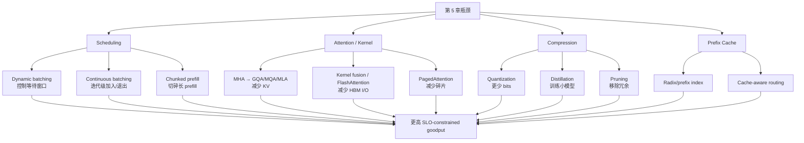
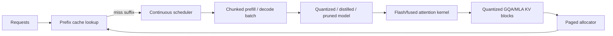
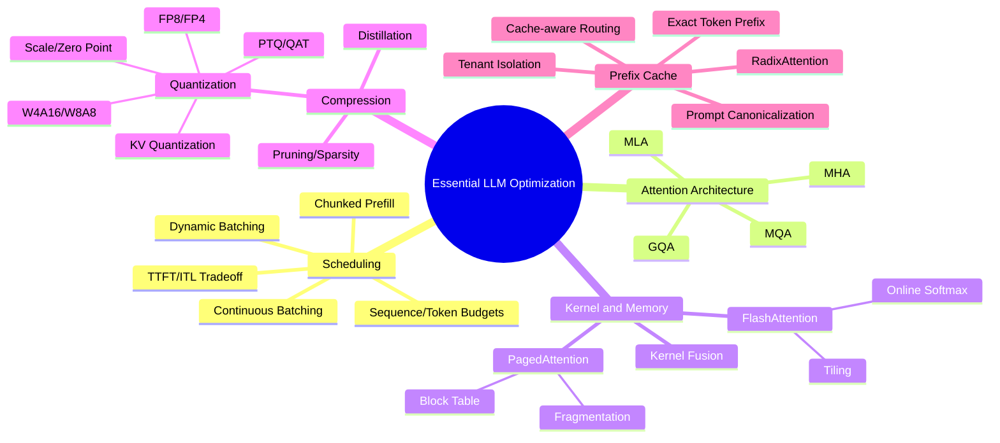

> 原章：*Essential LLM Optimization Techniques*
> 核心问题：在单个 LLM replica 内，怎样通过请求调度提高数据复用，通过 attention architecture、kernel 和分页式 KV cache 减少数据量与 HBM 往返，通过量化、蒸馏和剪枝压缩模型，并通过 prefix caching 直接跳过重复 prefill？每项技术分别改变哪个性能上界，又会牺牲什么？

## 0. 本章定位、学习目标与优化地图

第 5 章建立了容量、计算、显存带宽和通信四类瓶颈。本章开始逐项解决这些问题，重点仍是单模型、单 replica 内最常用的技术；跨 GPU/节点和系统级高级优化留到第 7 章。

作者按四条路径展开：

1. **Batching 与 scheduling**：让一次权重读取服务更多 token，减少长度不齐产生的空槽；
2. **Attention 与 kernel**：减少 KV 数据、HBM I/O 和显存碎片；
3. **Model compression**：减少权重字节、搬运、计算或整个模型规模；
4. **Prefix caching**：复用已经计算过的前缀 KV，跳过重复 prefill。



读完本章，应能回答：

- 为什么 batching 对低 arithmetic intensity 的 decode 尤其有效？
- Client/static/dynamic/continuous batching 的调度边界分别是什么？
- `max_num_seqs`、`max_num_batched_tokens` 和 `max_model_len` 如何共同约束 admission？
- 为什么长 prefill 会阻塞已有 decode，chunked prefill 怎样改善 ITL、又为何可能恶化 TTFT？
- MHA、GQA、MQA、MLA 的 KV 状态有何差异，cache 缩小比例怎样推导？
- Kernel fusion、FlashAttention 和 PagedAttention 分别优化计算图、attention I/O 和 KV allocator 的哪一层？
- FlashAttention 怎样在不物化完整 $N\times N$ attention matrix 的情况下精确计算 softmax？
- Quantization 的 rounding、clamping、scale 和 zero point 是什么？
- W4A16 与 W8A8 为什么分别适合低 batch decode 和高 batch/长 prefill？
- Weight、activation、KV cache 和 attention quantization 能否独立选择？
- PTQ、QAT、distillation 和 pruning 的成本、质量与硬件要求有什么区别？
- Exact response cache 与 prefix KV cache 有何不同，为什么后者仍要求 token-level exact prefix？
- RadixAttention、LRU、cache-aware routing 和 tenant isolation 怎样协作？

> **版本与实验说明**：本章包含 vLLM/SGLang 参数、kernel backend、GPU 格式和 benchmark 数据。框架 API、默认 kernel 和硬件支持会快速变化；原章中的版本与倍数只说明机制和特定实验，不能替代目标环境的官方兼容矩阵、质量评估和基准测试。

---

## 1. Request Batching and Scheduling-Level Optimizations

### 1.1 Why Do We Need Batching in Real-Time Serving?

#### 1.1.1 Prefill 与 decode 的复用差异

Prefill 一次处理多个 prompt tokens，线性层输入近似 $[S,H]$；decode 在 batch=1 时每轮只有 $[1,H]$。第 5 章得到 FP16 方形线性层的 arithmetic intensity：

$$
I(B)=\frac{BH^2}{2BH+H^2}
=\frac{BH}{2B+H}
\approx B\quad(B\ll H).
$$

这里 decode 的有效行数 $B$ 就是同一步处理的 sequences 数。单请求时同一份 $H\times H$ 权重只服务一个 token；batch 为 3 时，权重可被三个 token 复用，intensity 近似从 1 提到 3。

> 原章有一句将 decode 的 GPU memory bandwidth 描述为“measured in FLOPS”；正确口径是 bandwidth 用 bytes/s，FLOPS 衡量计算吞吐。Batching 提高每次搬运权重后的计算量，从而改善 FLOPS 利用率。

#### 1.1.2 Batching 的收益不是免费并行

Batching 常带来：

- 更高 aggregate output TPS；
- 权重和 kernel launch 开销摊薄；
- 更高 Tensor Core occupancy；
- 更少设备空闲。

代价包括：

- 等待组 batch 增加 queue/TTFT；
- KV cache 和 activation 随 active tokens 增长；
- 每请求 TPOT/ITL 可能因共享设备恶化；
- 大 batch 可把 workload 从 bandwidth-bound 推向 compute-bound；
- 一次 iteration 更长，取消和高优先级请求响应更慢。

“Prompt 超过 1024 tokens 时 prefill 自己就能饱和 GPU”是原章的经验性例子，不是通用阈值。模型 hidden size、GPU、precision、kernel 和 prompt shape 都会改变 crossover。

### 1.2 Dynamic Batching in Online Inference

#### 1.2.1 四种 batching 边界

| 方法 | 何处组 batch | 何时封闭 batch | 适用场景 |
|---|---|---|---|
| Offline batching | 作业提交前 | 数据集已知 | embedding、批量摘要 |
| Client-side batching | 客户端 | 客户端积满/自行超时 | 同一调用方掌握多输入 |
| Static server batching | 服务端 | 固定数量凑满 | 到达稳定、可等待的离线流量 |
| Dynamic batching | 服务端 | 达到 max size 或 max delay | 通用在线 inference |

Static batching 的问题可由原章例子看出：batch size 10，前 9 个请求一秒内到达，第 10 个五分钟后才到，前 9 个全部被无界等待。

Dynamic batching 增加 max delay，满足任一条件即 dispatch：

$$
\mathrm{dispatch}\iff
|Q|\ge B_{max}
\quad\lor\quad
t_{now}-t_{oldest}\ge D_{max}.
$$

#### 1.2.2 调度伪代码

```text
while serving:
    wait until queue is nonempty
    deadline = oldest.arrival + max_delay

    while queue_size < max_batch_size and now < deadline:
        wait for request arrival or deadline

    batch = dequeue up to max_batch_size eligible requests
    execute(batch)
    correlate results by request ID
```

`D_max` 应从 queue latency budget 推导，不是任意“等五分钟”。若 TTFT SLO 为 $L_{SLO}$，预估执行与网络需要 $L_{exec}$，可留给 batching 的等待最多约：

$$
D_{max}\le L_{SLO}-L_{exec}-L_{other}.
$$

#### 1.2.3 参数权衡

- $B_{max}$ 太小：GPU 利用率低；
- $B_{max}$ 太大：显存、单次 execution、tail latency 增长；
- $D_{max}$ 太短：实际 batch 常填不满；
- $D_{max}$ 太长：低流量时 TTFT 由排队主导。

最优值依到达率。若 Poisson 到达率为 $\lambda$，等待窗口 $D$ 内新增请求期望约为 $\lambda D$；它只提供直觉，真实 burst、priority 和不同模型流量不满足简单 Poisson。

### 1.3 Continuous Batching for LLM Online Inference

#### 1.3.1 Dynamic batch 的 straggler 问题

LLM output 长度未知。固定 batch 中短请求完成后，其槽位若不能补入新请求，就一直空闲到最长请求结束。

若三个请求分别 decode 10、20、100 steps，固定三槽 batch 的理想槽位容量为 $300$ token-steps，有效工作为 $130$：

$$
\eta_{slot}=130/300\approx43.3\%.
$$

即使 kernel 会 mask finished sequences，后期并行度仍下降。

#### 1.3.2 Continuous/inflight/iterative batching

Continuous batching 在 iteration 边界更新 active set：完成/取消者退出，等待者立即补入，而非等整个 cohort 完成。

```text
repeat every model iteration:
    retire finished, cancelled, or timed-out sequences
    reclaim their KV-cache blocks
    inspect waiting requests and available token/memory budget
    admit eligible prefill chunks or decode sequences
    execute one mixed or phase-specific model step
    update KV state and stream newly generated tokens
```

它通常不需要像 dynamic batching 那样为“凑满一个固定 cohort”设置显式 max delay，但仍有 queue、admission、priority、iteration 边界和可能的 scheduler delay，不能理解为零等待。

#### 1.3.3 三个不同限制

1. **Max model length**：每个 sequence 的 prompt + output 位置上限；
2. **Max number of sequences**：同时 active requests 上限；
3. **Max number of batched tokens**：一次 scheduler/model iteration 的 token work 上限。

约束可写为：

$$
|A|\le S_{max},
$$

$$
T_i^{prompt}+T_i^{generated}+T_i^{remaining}
\le L_{model},
$$

$$
\sum_{i\in step}T_{scheduled,i}\le T_{batch,max}.
$$

`max_num_seqs` 只按请求计数，无法区分 10 个 20-token prompts 与 2 个 100k-token prompts；token budget 才能更细地控制 prefill 工作和 iteration 时长。显存 admission 还要看整个 active set 的已占 KV tokens，不只是本 iteration token 数。

#### 1.3.4 Prefill 与 decode 的主要限制不同

- Prefill 一次 sequence 可贡献很多 tokens，常先撞 `max_num_batched_tokens`；
- Decode 每 active sequence 每步通常贡献 1 token，常先撞 `max_num_seqs`；
- 混合 iteration 中两者共享 token/compute budget；
- token budget 太低会把大 prompt 切得过碎，降低 GEMM 利用率；
- 太高会形成很长 iteration，伤害已有 decode ITL。

#### 1.3.5 Example 6-1：vLLM 配置

```bash
vllm serve Qwen/Qwen2.5-7B-Instruct \
  --max-num-batched-tokens 4096 \
  --max-num-seqs 128
```

原章命令在 `4096` 行后漏了续行反斜杠；上面是结构修正版。4096/128 是示例，不是 Qwen 7B 的推荐常数。需要配合 GPU memory、`max_model_len`、input/output 分布和 TTFT/ITL SLO 压测。

### 1.4 Continuous Batching with Chunked Prefill

#### 1.4.1 问题：Prefill 与 decode 是异质工作

理想图中三个请求同时到达、prompt 和 output 等长，prefill/decode 完美对齐。

实际到达错开。若已有 request 1 在 decode，新到 request 2/3 需要长 prefill：

- Prefill priority 改善新请求 TTFT，却让 request 1 的 ITL 出现长气泡；
- Decode priority 保护已有 stream，却可能让新请求长期拿不到首 token；
- 公平性、TTFT 与 ITL 构成多目标调度。

即使把一个 decode token 与完整长 prefill 放进同一 mixed batch，iteration wall time 仍由长 prefill 主导，decode token 要等整个 kernel/iteration 返回。

#### 1.4.2 Chunked prefill 的解法

将 prompt 的 $S$ tokens 切为若干不超过 $C$ 的 chunks：

$$
n_{chunks}=\left\lceil\frac{S}{C}\right\rceil.
$$

每个 iteration 只调度一部分 prefill，与已有 decode steps 混合，让 iteration duration 更可控。

#### 1.4.3 收益与代价

| 指标 | 典型影响 | 原因 |
|---|---|---|
| 已在生成请求的 ITL | 改善 | 长 prefill 不再独占一个超长 iteration |
| 新请求 TTFT | 可能恶化 | Prefill 分多轮且与 decode 分享资源 |
| E2E | 不一定改善，可能略差 | 多次调度/kernel 与更小 GEMM 开销 |
| Aggregate throughput | 常改善 | 填补 decode/prefill 的 idle gap |
| 公平性 | 更可控 | Scheduler 能在 chunk 边界轮转 |

Chunk size 太大等于没有切分；太小则 arithmetic intensity、kernel efficiency 下降且 scheduler overhead 增长。最佳 $C$ 应通过 TTFT/ITL Pareto curve 选择，而不是让 chunk 和 decode “耗时完全相同”，因为不同硬件、batch 和层的时间会变化。

#### 1.4.4 Chunked prefill 不是 disaggregated serving

Chunked prefill 在同一个 engine/GPU pool 中分时混合两种 phase；prefill-decode disaggregation 将 phase 放到不同 workers/GPUs，增加 KV transfer 和系统调度问题，属于第 7 章范围。

---

## 2. Scaling Attention and Kernel Optimization

这一节的三类方法处于不同层：

| 方法 | 改什么 | 主要瓶颈 |
|---|---|---|
| MQA/GQA/MLA | 模型 attention architecture 与 KV 表示 | KV capacity + decode bandwidth |
| Fusion/FlashAttention | GPU kernel 与 I/O schedule | HBM traffic + launch overhead |
| PagedAttention | KV cache allocator/addressing | Fragmentation + admission capacity |

它们可组合，不应把 PagedAttention 当 FlashAttention 的替代品。

### 2.1 Scalable Attention Mechanisms

#### 2.1.1 KV cache 的 head 维度

通用 KV cache：

$$
M_{KV}=2LBTH_{kv}d_hb.
$$

固定其他变量，cache 与 KV heads $H_{kv}$ 成正比。Query heads 数 $H_q$ 影响 attention 并行表示；不同机制主要改变 query heads 如何共享 KV heads。

#### 2.1.2 MHA

$$
H_{kv}=H_q.
$$

每个 query head 有对应 K/V head，表达能力强但 cache 最大。若 $H_q=32$，cache 比单 KV head 的 MQA 大约 32 倍。

#### 2.1.3 MQA

$$
H_{kv}=1.
$$

所有 query heads 共享同一组 K/V。相对 MHA 的 cache reduction：

$$
r=\frac{H_q}{H_{kv}}=H_q.
$$

所以 32/64 query heads 的理想缩小为 32×/64×。它也减少每步读取 KV 的 bytes，但共享过强可能损失质量；损失程度依模型规模、训练 recipe 和任务，不能笼统认为一定“显著”。

#### 2.1.4 GQA

$H_q$ 个 query heads 分为 $H_{kv}$ 组，每组共享一套 K/V：

$$
g=\frac{H_q}{H_{kv}}
$$

是每个 KV head 服务的 query heads 数，cache 相对 MHA 缩小 $g$ 倍。

Llama 2 配置：$H_q=H_{kv}=32$，是 MHA。Llama 3 示例：$H_q=32,H_{kv}=8$，每组 4 query heads，cache 理想缩小 4×。

```json
{
  "num_attention_heads": 32,
  "num_hidden_layers": 32,
  "num_key_value_heads": 8
}
```

#### 2.1.5 MLA

Multi-head Latent Attention 不只是减少 KV head 数，而是将 K/V 投影到低维 latent representation，并在 attention 时恢复/使用所需表示。DeepSeek 论文给出的说法是其 cache 相当于约 2.25-group GQA，同时质量强于相应 MHA baseline。

MLA cache 不能简单套 $H_{kv}d_h$ 公式，需要根据 latent dimension、RoPE 分量和具体实现计算；高收益还依赖专门 kernel。它属于模型 architecture 选择，无法在不重训/转换的情况下给现有 MHA checkpoint “打开一个开关”。

#### 2.1.6 Architecture 选择是质量与 serving 联合决策

更少 KV 不仅增加可容纳 tokens，还减少 decode 每步从 HBM 读取的数据，可能改善 TPOT。代价是训练设计、kernel compatibility 和质量。选模型时应同时比较：

$$
(Q, M_{weights}, M_{KV/token}, TTFT, TPOT, X, hardware\ support).
$$

### 2.2 Kernel Fusion and Custom Attention Kernels

#### 2.2.1 GPU kernel 与 launch

Kernel 是在 GPU 上执行某个并行操作的程序。若操作 A 和 B 分开：

```text
read x from HBM -> kernel A -> write y to HBM
read y from HBM -> kernel B -> write z to HBM
```

Fusion 可让中间 $y$ 保留在 register/shared memory，并减少一次 kernel launch：

```text
read x -> fused(A, B) -> write z
```

Fusion 的收益来自更少 HBM bytes、launch 和同步；局限是 register pressure、编译复杂度、动态 shape、数值稳定性和可维护性。过度 fusion 可能降低 occupancy。

#### 2.2.2 FlashAttention 要解决什么

标准 attention：

$$
O=\mathrm{softmax}\left(\frac{QK^\top}{\sqrt d}+M\right)V.
$$

Naive 实现可能在 HBM 物化 $S=QK^\top$ 和概率矩阵 $P$，大小 $O(N^2)$，读写成本很高。FlashAttention 通过 tiling 将 Q/K/V blocks 搬入 SRAM，分块更新输出和 softmax statistics，避免把完整 $N\times N$ 中间矩阵写入 HBM。

> FlashAttention **仍然访问 HBM**：它要读取 Q/K/V 并写最终 O。准确说法是减少 HBM I/O、避免物化大中间矩阵，而不是“所有计算都不利用 HBM”。

#### 2.2.3 Online softmax 为什么可精确分块

直接 softmax 需要整行最大值与分母。对已处理块统计最大值 $m$、指数和 $l$、未归一化加权输出 $o$；新块 scores 为 $x$：

$$
m'=\max(m,\max x),
$$

$$
l'=e^{m-m'}l+\sum_j e^{x_j-m'},
$$

$$
o'=e^{m-m'}o+\sum_j e^{x_j-m'}v_j.
$$

遍历所有 K/V blocks 后输出 $o'/l'$。旧统计按新的最大值重新缩放，因此不需要保存全部 scores，仍得到与普通 softmax 等价（浮点舍入范围内）的结果。FlashAttention 是 exact attention algorithm，不是稀疏/近似 attention。

#### 2.2.4 FlashAttention 版本与适用性

FlashAttention 2/3 改善工作划分、并行、GEMM/softmax overlap，并针对较新架构。实际支持依 GPU compute capability、head dimension、dtype、causal/mask、GQA 和框架版本。

其他 backend 有 FlashInfer、xFormers、OpenAI Triton language kernels 等。这里的 **Triton compiler/language** 与 **NVIDIA Triton Inference Server** 是两个不同项目。

原章示例固定 vLLM 0.8.5.post1 和 FlashInfer 0.2.2；截至实际部署时可能已过期。优先使用锁定版本的 compatibility matrix 和框架自动选择，再以目标 workload 比较。

### 2.3 PagedAttention

#### 2.3.1 连续预分配为什么浪费

LLM output 长度未知。若按最大长度为每个 request 预留连续 cache：

- 实际短输出产生 internal fragmentation；
- 不同 sequence 结束后留下散落空洞；
- 要求大连续区域导致 external fragmentation；
- beam/prefix 的共享与 copy-on-write 困难。

#### 2.3.2 分页思想

PagedAttention 将每个 sequence 的逻辑 KV token range 切成固定 token blocks，由 block table 映射到任意 physical blocks：

$$
\mathrm{logical\ block\ }i
\xrightarrow{block\ table}
\mathrm{physical\ block\ }p_i.
$$

它映射的是**逻辑 KV blocks**，不是原章文字所说的“query keys”。Attention kernel 按表收集 K/V blocks，无需物理连续。

图中每 block 容纳 4 tokens，最后一块只用了 2；浪费最多集中在每个 sequence 的最后 block。若 block size 为 $P$ tokens，单 sequence internal waste 小于 $P$ tokens，平均约与长度分布相关。

#### 2.3.3 论文数字如何理解

原 PagedAttention/vLLM 论文报告 baseline 只有 20.4%～38.2% KV memory 存实际 token states，分页后接近零浪费。这是其特定 baseline/workload 的实验，不表示所有现代 allocator 都固定浪费 61.8%～79.6%。

#### 2.3.4 代价与组合关系

收益：高 memory utilization、快速分配回收、支持更高 batch/长 context、prefix/beam block sharing。代价：block table metadata、indirection、block-size 选择和 cache-aware kernel complexity。

PagedAttention 管“放在哪里”；FlashAttention 管“attention 怎样少搬 I/O”；GQA/quantization 管“每 token 有多少 bytes”。三者可以同时启用。

---

## 3. Model Compression

三类技术的根本差异：

| 方法 | 被改变的对象 | 是否需要训练 | 主要收益 |
|---|---|---|---|
| Quantization | 数值表示的 bit width | PTQ 不需要；QAT 需要 | 容量、bandwidth、可能 compute |
| Distillation | 训练一个新 student model | 需要 | 参数/FLOPs 大幅下降 |
| Pruning | 移除结构或 weights | 通常需微调/恢复 | 稀疏或更小结构 |

### 3.1 Quantization

Quantization 将 weights、activations 或 KV cache 从 FP32/FP16/BF16 映射到 INT8/FP8/INT4/FP4 等低位表示。它不是单一技术，而是“对象 × 格式 × 粒度 × scale 方法 × kernel × calibration/training”的组合。

#### 3.1.1 Quantization error

**Rounding error**：目标网格无法精确表示原值。例如 7.6 直接舍入到整数 8，误差：

$$
e_r=8-7.6=0.4.
$$

**Clamping/saturation error**：超出目标可表示范围。例如假设某 FP8 variant 最大有限值为 448，则 1000 被截到 448，误差巨大。不同 FP8 variant 的范围不同，不能把 ±448 当所有 FP8 的范围。

#### 3.1.2 Affine integer quantization

常用映射：

$$
q=\mathrm{clip}\left(\mathrm{round}\left(\frac{x}{s}\right)+z,
q_{min},q_{max}\right),
$$

$$
\hat x=s(q-z).
$$

$s>0$ 是 scale，$z$ 是 zero point。Asymmetric scaling 用 min/max 覆盖偏斜范围：

$$
s=\frac{x_{max}-x_{min}}{q_{max}-q_{min}},
\qquad
z\approx q_{min}-x_{min}/s.
$$

Symmetric scaling 常设 $z=0$：

$$
s=\frac{\max|x|}{q_{max}}.
$$

Scale 可按整个 tensor、channel、group 或 block 计算。粒度越细越能适应 outliers、质量通常越好，但 metadata、转换和 kernel 更复杂。

#### 3.1.3 Storing numbers

浮点格式一般由 sign、exponent、fraction/significand 构成：

$$
\mathrm{value}=(-1)^s\times significand\times2^{exponent-bias}.
$$

**Table 6-1：常见浮点格式 bit 分配**

| Format | Total | Sign | Exponent | Fraction |
|---|---:|---:|---:|---:|
| FP32 | 32 | 1 | 8 | 23 |
| FP16 | 16 | 1 | 5 | 10 |
| BF16 | 16 | 1 | 8 | 7 |

FP32/BF16 exponent 位相同，动态范围数量级相近；BF16 fraction 更短，精度低。FP16 fraction 比 BF16 长但 exponent 少，最大有限值约 65,504，最小 normal 约 $6.1\times10^{-5}$。原章表 6-1 将 FP16 “range level”写成 ±$10^{-5}$，混淆了最小量级与正负范围；不能据此认为 FP16 只能表示很小的数。

Integer 网格在量化尺度下均匀；floating-point 的 absolute spacing 随 exponent 增长，在零附近更密、数量级大处更疏。

具体 FP 的 normal/subnormal、NaN/Inf 和隐含位规则依标准与 variant，简化公式不覆盖全部编码。

#### 3.1.4 How does quantization help in model serving?（量化怎样帮助服务）

1. **Capacity**：7B FP16 权重约 14 GB，8-bit 约 7 GB，4-bit ideal payload 约 3.5 GB；实际加 scales/metadata。
2. **Bandwidth**：decode 每步读权重，bytes 减半/四分之一可直接降低 HBM traffic。
3. **Topology**：模型可能从跨 node 缩到单 node，或跨 GPU 缩到单 GPU，消除通信。
4. **KV headroom**：weights 更小可留更多 KV blocks，提高并发/上下文。
5. **Compute**：硬件与 kernel 支持时，低位 Tensor Core 每秒操作更多。

**Table 6-2：原章 H100 各 precision 标称峰值**

| Precision | Peak |
|---|---:|
| FP32 | 67 TFLOPS |
| TF32 Tensor Core | 989 TFLOPS |
| BF16/FP16 Tensor Core | 1979 TFLOPS |
| FP8 Tensor Core | 3958 TFLOPS |
| INT8 Tensor Core | 3958 TOPS |

峰值可能含 structured sparsity 条件；低 bits 理论翻倍不等于应用自动 2×，还受 conversion、scale、shape、kernel 和瓶颈迁移影响。

#### 3.1.5 Weight-only 与 weight-and-activation

Notation `WmAn` 表示 weights m bits、activations n bits。

**Weight-only（如 W4A16）**：

- weights 存 4 bit，activation/accumulation 仍高精度；
- 极大减少 weight capacity 与读取 bytes；
- kernel 内需解包/dequantize 或 mixed GEMM；
- 不改变 activation bit width，compute peak 不简单变成 4-bit peak；
- 低 batch、decode bandwidth-bound 时常有优势。

原章说 weight-only “不获得更快计算”是指 arithmetic precision 仍高、没有纯低位 W×A Tensor Core 的理论提升；但优化 mixed kernel 可因更少 HBM traffic 和融合解量化显著加速端到端。

**Weight-and-activation（如 W8A8）**：

- weights 与 activations 都低位；
- 降低双方 traffic，并可用低位 GEMM；
- activation 动态依输入，outlier 和 scale 更难处理；
- 长 prefill/高 batch compute-bound 时更有优势。

Static activation scale 用 calibration dataset 预估，运行快但遇到 distribution shift 易饱和；dynamic scale 每次/每 token/group 计算，更适应输入但增加 reduction 与 synchronization。

**Table 6-3：原章 W4A16 与 W8A8 的方向性比较**

| 维度 | W4A16 | W8A8 |
|---|---|---|
| Ideal weight size reduction | 75%（到 1/4） | 50%（到 1/2） |
| 低位 W×A compute peak | activation 仍 16 bit | 硬件支持时约 2× FP16 peak |
| Prefill | 主要容量/搬运收益 | compute-bound 时更有利 |
| Decode | 低 batch bandwidth-bound 优势强 | 高 batch 推向 compute-bound 后更强 |
| 常见目标 | 长生成、低延迟、模型必须缩 4× | 长 context、高 batch/high throughput |

选择不是 W4A16 永远低 latency、W8A8 永远高 throughput。Marlin、Machete 等 mixed-precision kernel、GPU generation、group size 和 workload 会改变交叉点。

#### 3.1.6 FP8 variants

**Table 6-4：FP8 bit allocation**

| Format | Total | Sign | Exponent | Fraction |
|---|---:|---:|---:|---:|
| E4M3 | 8 | 1 | 4 | 3 |
| E5M2 | 8 | 1 | 5 | 2 |

E4M3 精度较高、range 较小，常用于 inference；E5M2 range 更大、精度更低。Scaling 仍常需要。原章说 FP8 不需要像 INT8 一样 calibration 是某些方法/实验的结论，不应泛化：Static FP8 scale、outlier handling 和准确度验证仍可能使用 calibration。

原章称只有 Hopper/Blackwell 支持 FP8；更准确地说，在列举的 NVIDIA datacenter 世代中它们有原生 FP8 Tensor Core，Ampere 无原生 FP8。软件模拟可运行但不会获得同等硬件峰值。

#### 3.1.7 Hands-on quantization

##### Find the quantized model

复用别人发布的 quantized checkpoint 前应验证：base revision、license、method、bits/group size、calibration data、kernel/runtime compatibility、hash 和 quality。名称中带 GPTQ/AWQ 不足以证明适合目标引擎。

##### Quantize a model yourself

GPTQ 教学代码：

```python
from transformers import AutoModelForCausalLM, AutoTokenizer, GPTQConfig

model_id = "Qwen/Qwen2.5-7B-Instruct"
tokenizer = AutoTokenizer.from_pretrained(model_id)
calibration_data = [
    "Quantization calibration data should represent production inputs."
]
config = GPTQConfig(
    bits=4,
    dataset=calibration_data,
    tokenizer=tokenizer,
)
quantized_model = AutoModelForCausalLM.from_pretrained(
    model_id,
    device_map="auto",
    quantization_config=config,
)
```

单句 calibration 只能演示 API，不能支持生产质量结论。应覆盖语言、长度、领域、chat template、代码/数学和 outliers，并保存 tokenizer/config/revision。

##### Running benchmarks

应使用目标 serving engine 的 benchmark 工具，在固定 input/output 分布、concurrency、sampling、warm-up 和硬件条件下运行原始与量化模型。

##### Performance analysis

原章比较 Qwen2.5-7B 原始、GPTQ W4A16 和 FP8 W8A8：

低 concurrency 时 bandwidth 是主瓶颈，INT4 更少 weight bytes，GPTQ 较强；高 concurrency 时 workload 更 compute-heavy，W4A16 的解量化/16-bit activation 可能使 TTFT 甚至慢于原始，FP8 W8A8 更有优势。

原章“300% performance gain”存在常见歧义：

- 提升 300% 通常表示新值是 4×；
- 达到 300% 通常表示 3×；
- 对 latency 越低越好，也不能直接称百分比 gain。

因此容量规划应从图或原始数据计算 speedup，例如 $L_{base}/L_{new}$ 或 $X_{new}/X_{base}$，而不复用含糊百分比。150% 同理。

#### 3.1.9 Other quantization methods

##### KV cache quantization and attention quantization

Weight/activation quantization 默认不必然改变 KV dtype。KV 从 FP16 降到 FP8，ideal cache 减半，可容纳更多 active/prefix tokens，并减少 decode KV reads；但 attention 若需先 dequantize，收益依 kernel 和 context length。

“KV quantization 通常不显著降 latency”不是定律：超长 context decode 对 KV bandwidth 敏感，配合 FP8 attention kernel 可改善 TPOT。必须同时验证长上下文质量，因为 cache error 会跨后续 tokens 影响 attention。

##### GGUF quantization

GGUF 是 llama.cpp 生态常用的模型文件/metadata 容器，可承载多种 CPU/Metal/GPU-offload 量化方案。它不是一种单独 quantization algorithm。适合本地、Apple Silicon、CPU 和资源受限部署；与 datacenter vLLM 的 GPTQ/AWQ/FP8 kernel 路线不同。

#### 3.1.11 Accuracy trade-offs

公开 benchmark 中“minimal loss”不能替代应用评测。量化误差可能集中在 long context、稀有语言、代码、数学、tool JSON、safety 和特定 layers。评估至少比较：

- task success/业务指标；
- perplexity/标准 benchmark；
- long-context retrieval；
- structured output validity；
- safety/refusal；
- TTFT/TPOT/throughput/memory/cost。

量化后能部署更大的模型，可能比小模型高精度版本质量更好；要比较整条 Pareto frontier，而不是同一 checkpoint 的单一精度。

#### 3.1.12 PTQ 与 QAT

**Post-training quantization（PTQ）**在训练后转换 weights，可能使用 calibration，不改原始训练 pipeline。**Quantization-aware training（QAT）**在训练/微调中插入 fake quantization，使 weights 学会补偿目标格式误差。

Fake quantization 的 forward 可写成：

$$
\hat x=Q^{-1}(Q(x)),
$$

训练通过 straight-through estimator 等方法近似处理 rounding 的不可导性。

**Table 6-5：PTQ 与 QAT**

| 维度 | PTQ | QAT |
|---|---|---|
| 时间 | 训练后 | 训练/微调中模拟量化 |
| 成本 | 低，可能 calibration | 高，需要数据、训练和工程 |
| 8 bit | 常可保持质量 | 也可保持 |
| 4 bit 及以下 | 方法/模型依赖，可能可用 | 通常更稳 |
| 灵活性 | 易针对不同硬件重做 | 与目标 scheme/kernel 更耦合 |

原章表称 4-bit PTQ “通常不可接受”，但 GPTQ/AWQ W4A16 本章又被广泛使用；应理解为**激进的全路径低位或简单 rounding PTQ**更困难，而成熟 weight-only 4-bit PTQ 在很多模型上可用。最终仍以任务质量为准。

#### 3.1.13 GPT-OSS / MXFP4 案例

原章给出 117B 与 21B 参数、0.5 byte/parameter 的理想估算：

$$
117\times10^9\times0.5=58.5\ \mathrm{GB}<80\ \mathrm{GB},
$$

$$
21\times10^9\times0.5=10.5\ \mathrm{GB}<16\ \mathrm{GB}.
$$

实际并非所有参数都 FP4；原章称 90% 以上参数位于量化的 MoE layers，所以数量级仍有参考价值。还需非量化 weights、scale、KV、activation 和 runtime headroom，因此“权重估算小于显存”不是完整可部署证明。

MXFP4/NVFP4 等 block-scaled format 与硬件/engine 强耦合。Blackwell 原生支持更强，Hopper 主要原生 FP8，Ampere 更弱。Ready-to-run quantized model 降低部署迭代，却提高对特定 kernel stack 的依赖。

### 3.2 Distillation

#### 3.2.1 原理

Teacher 产生 hard labels、soft logits 或 reasoning traces，student 学习其行为。

经典 logit distillation loss：

$$
L=\alpha L_{hard}
+(1-\alpha)T^2
\mathrm{KL}\left(
\mathrm{softmax}(z_t/T)
\parallel
\mathrm{softmax}(z_s/T)
\right),
$$

$z_t,z_s$ 是 teacher/student logits，$T$ 是温度。较高 $T$ 展示非最大类别之间的“暗知识”。

原章说 distillation 必须完整访问 teacher，准确说是 **logit/hidden-state distillation** 需要内部输出；只有 API token 也可做 sequence/hard-label distillation，只是信息少、成本高且受条款限制。

#### 3.2.2 DeepSeek 案例

**Table 6-6：DeepSeek-R1 671B 与 Distill-Llama-70B**

| Benchmark | R1-671B | Distill-Llama-70B |
|---|---:|---:|
| MATH-500 pass@1 | 97.3 | 94.5 |
| GPQA Diamond pass@1 | 71.5 | 65.2 |
| LiveCodeBench pass@1 | 65.9 | 57.5 |

70B 总参数约为 671B 的 10.4%，weight capacity 大幅下降；但 R1 是 MoE，不能只按总参数推理每 token speedup。Student architecture、output length 和 reasoning behavior 也决定 serving。

#### 3.2.3 Quantization 与 distillation

**Table 6-7：原章方向性比较**

| 维度 | Quantization | Distillation |
|---|---|---|
| 质量下降 | 原章称通常 ≤3%，高度任务依赖 | 通常更大 |
| 速度收益 | 原章示例 1.5～3× | 小 student 可高得多 |
| 工程 | PTQ 相对容易 | 需训练数据、teacher、训练与评估 |
| 成本 | 低 | 原章估计可达原训练成本约 10%，非定律 |

实用顺序：已有合格 distilled model 就先评估；否则先 PTQ；student 达标后还可继续量化。Distillation 不保证复制 teacher 的全部泛化、安全和长尾能力。

### 3.3 Pruning

#### 3.3.1 三种 sparsity

- **Unstructured**：任意单 weights 置零，灵活、质量恢复好，但通用 dense hardware 未必加速；
- **Structured**：移除 head、channel、neuron、layer，直接缩小 dense shape，但质量冲击大；
- **Semi-structured N:M**：每 M 个 weights 保留 N 个，如 2:4，匹配 sparse Tensor Core。

2:4 是 50% weight sparsity，但“不经条件直接 2×模型端到端速度”不成立：只有支持的 sparse matmul 理论 peak 可翻倍，模型还有 dense ops、metadata、memory、scheduler 和无法稀疏的层。

原章引用 Sparse Llama 3.1 声称 98% accuracy recovery、30% throughput 提升、20% latency 降低，属于特定模型/vLLM/硬件实验。Pruning 生产普及度低于 quantization，核心障碍是质量恢复和硬件/kernel 对 irregular sparsity 的支持。

---

## 4. Prefix Caching

### 4.1 Response Cache 与 Prefix KV Cache

**Exact response cache** 的 key 可含 model/version、完整 inputs、shape/dtype 和 generation params；hit 时直接返回最终 output，完全不执行模型。对 deterministic traditional model 很有效，对自由文本和随机 sampling hit 较低，还要处理 stale/version/safety。

**Prefix cache** 不缓存最终答案，而是缓存前缀 prefill 产生的各层 KV。新 prompt token IDs 只要与已有前缀 exact match，就从命中位置继续 prefill/decode：

$$
\mathrm{saved\ prefill\ tokens}
=\mathrm{LCP}(old\_tokens,new\_tokens),
$$

其中 LCP 是 longest common prefix。语义相似但 token 不同不会命中，这不是 semantic cache。

Cache key 至少应条件化：model/weights revision、tokenizer、adapter、KV dtype、position/attention config、tenant/security domain 和 exact token blocks。Sampling 参数通常不影响前缀 KV，但可能影响最终 response cache。

### 4.2 RadixAttention

Radix tree/trie 将共享 token spans 压缩成路径，节点/edge metadata 在 CPU，叶/节点关联 GPU KV blocks。新 request 查最长前缀，分叉处新增路径；容量不足时从可驱逐 leaves 按 LRU 递归释放。

概念伪代码：

```text
lookup_or_insert(token_ids):
    node, matched = radix_tree.longest_prefix(token_ids)
    pin KV blocks on matched path

    compute prefill only for token_ids[matched:]
    attach newly produced KV blocks as radix edges

    while cache over budget:
        victim = least-recently-used unpinned leaf
        evict victim blocks and prune empty ancestors

    return matched, KV block table
```

不能驱逐正在被 active sequence 引用的 blocks；并发相同 miss 要 single-flight，避免重复 prefill/cache stampede。

### 4.3 Use Cases

原章三个 prompt：

```text
1: Hi, what is the weather like today?
2: Hi, what is the weather like now?
3: What is the weather like today?
```

1/2 共享较长 token prefix；3 因开头不同不能复用该路径。实际 tokenizer 可能将空格、标点、chat template 编成不同 token，因此 human-visible 字符相同也应按最终 token IDs 判断。

#### 4.3.1 Multiturn chat

第 $n$ 轮 prompt 包含前 $n-1$ 轮历史。无 cache 时每轮重做历史 prefill；有 cache 时只处理新增 turn。若每轮新增约 $u$ tokens，共 $k$ 轮：

无 cache 重处理 token 数量级：

$$
u(1+2+\cdots+k)=u\frac{k(k+1)}{2}.
$$

理想 prefix reuse 后新增 prefill 约：

$$
uk.
$$

所以对增长历史，节省从二次累计降到线性新增，显著改善后续 TTFT。

#### 4.3.2 Long-context / CAG

4k、128k、1M context 中，共享文档/system prefix 的 prefill 很贵。预热一次并复用可大幅降低 TTFT。但 decode 仍需读取长 KV，cache 也占大量显存；prefix caching 消除重复计算，不消除长 context 的全部执行成本。

#### 4.3.3 低 hit 场景

原章认为即使 5% hit 也值得，因为现代实现 overhead 很低。这需要具体验证：cache 占用可能驱逐 active KV、降低 batch capacity；索引和 routing 有开销；低 hit 在内存紧张时未必免费。应看 **saved prefill tokens**，不只看 request hit rate：

$$
HitRate_{token}
=\frac{\sum matched\ prefix\ tokens}
{\sum eligible\ prompt\ tokens}.
$$

### 4.4 Best Practices

#### 4.4.1 Static first, dynamic last

Prompt 排序：

```text
stable system prompt
stable tenant/session discriminator
stable tools/schema/context ordered canonically
dynamic user/history suffix
```

若把 timestamp、request ID 或用户问题放在开头，会在很早处分叉。Static prefix 必须 byte/token 级稳定，包括空格、换行、JSON key order、chat template、tool schema 和文档顺序。

#### 4.4.2 Canonicalize RAG context

- 固定 `Document {n}: ` 格式；
- 以稳定 document/chunk ID 和 deterministic tie-break 排序；
- 去重；
- 固定 whitespace/newline/Unicode normalization；
- 不把不必要动态 metadata 放在前面；
- 保证 ACL 后再复用。

Relevance 排序可能每 query 改变，从第一处顺序变化就失去后续 prefix。可以将稳定 corpus prefix 与 query-specific retrieved suffix 分开，或对热门 retrieval bundles 缓存。

#### 4.4.3 Version and invalidate

模型权重、LoRA adapter、tokenizer、system prompt、tool schema、rope/position config 或 KV dtype 改变时，旧 KV 通常不可复用。Cache namespace 应含版本，不要仅 hash prompt text。

### 4.5 Scaling Prefix Cache

#### 4.5.1 单 replica 容量

Prefix blocks 与 active request KV 竞争 GPU memory。应设置 active/reserved watermarks，避免为了历史 hit 导致新请求 OOM 或并发下降。LRU 只按 recency，生产还可按 prefix length、recompute cost、frequency 和 tenant quota 计算价值：

$$
V_i\approx
\frac{\lambda_i\times T_{prefix,i}\times C_{prefill/token}}
{M_{KV,i}}.
$$

#### 4.5.2 水平扩展与 cache-aware routing

Round robin/least-connections 不知道哪个 replica 有前缀。Cache-aware router 用 prefix hash/目录创建 affinity，优先发送到 resident replica。

路由目标是多目标：

$$
score(r)
=w_h\,matchedTokens(r)
-w_q\,queueDelay(r)
-w_l\,estimatedLoad(r).
$$

只追 cache hit 会把热门 prefix 流量压到单 replica，queue 延迟超过重算收益。Consistent hashing 提供稳定 affinity，但扩缩容仍会重映射一部分 keys；可做 prefix replication、fallback 到次优 replica 和目录 TTL。

#### 4.5.3 分层存储

GPU 不够可 offload CPU/SSD/remote store。命中是否有价值取决于：

$$
T_{load\ cache}<T_{recompute\ prefill}.
$$

短 prefix 从 SSD 读回可能比重算慢；长 prefix 才更可能值得。跨 node KV transfer 还依格式、网络和目标 GPU topology。

#### 4.5.4 Multi-tenant timing side channel

若 tenant A/B 意外共享 private prefix，B 可通过 TTFT 差异推测某前缀是否被 A 使用。Tenant/session ID 插入 system prompt 后、private context 前，可让公共 system prefix 共享，但 private branches 分离：

```text
<system>
You are a helpful assistant.
<tenant_or_session_id>
opaque-cache-namespace
<context>
private documents
<user>
dynamic question
```

更稳妥的是 cache allocator/router 直接以 tenant security domain namespace 隔离，而不只依靠 prompt 文本注入；还需 authorization、encryption、eviction 清理和日志脱敏。

---

## 5. 技术之间的组合与优化顺序

### 5.1 四类技术不是互斥选项



一个生产配置可同时使用：distilled GQA model + W8A8 + FP8 KV + continuous batching + chunked prefill + FlashAttention + PagedAttention + prefix caching。

### 5.2 推荐的证据驱动顺序

1. 固定质量、workload 和 SLO baseline；
2. 使用成熟 serving engine 默认 continuous batching/Paged KV/kernel；
3. 调 `max_num_seqs`、token budget 和 chunk size 找 latency-throughput frontier；
4. 开 prefix cache，测 matched tokens 与 capacity 影响；
5. 优先评估已有 quantized/distilled checkpoint；
6. 按瓶颈选 W4A16/W8A8/KV quantization；
7. 再比较 alternate kernels、pruning 或自做 distillation/QAT；
8. 每次复测 quality、TTFT、TPOT、goodput、memory、cost 和稳定性。

---

## 6. 容易混淆的概念与常见误区

### 6.1 Batching = 同时收到多个 HTTP 请求

错误。请求并发只有被 scheduler 合成同一 model iteration 才形成设备 batch。

### 6.2 Dynamic batching = Continuous batching

错误。Dynamic batching 在 dispatch 前按 size/delay 形成固定 cohort；continuous batching 在 iteration 边界持续改变 active set。

### 6.3 Continuous batching 完全没有等待时间

错误。它不必为凑固定 cohort 设置同类 max delay，但仍有 queue、token/memory admission、priority 和 iteration 等待。

### 6.4 `max_num_seqs` 足以限制 LLM workload

错误。请求长度差异巨大，还需 batched-token、KV token、model length 和 memory budget。

### 6.5 Batch 越大 latency 和 throughput 都越好

错误。Throughput 先提高后饱和，queue/iteration/KV 压力会恶化 latency 和 OOM 风险。

### 6.6 Chunked prefill 会降低所有 latency

错误。它通常保护已有 decode ITL、改善 batch efficiency，但可能增加新请求 TTFT 和 E2E overhead。

### 6.7 MHA/MQA/GQA 可在 serving 时任意切换

错误。它们是训练时 architecture；checkpoint tensor shape 与 kernel 必须匹配。

### 6.8 MQA 必然比 GQA 质量差很多

不一定。共享更激进增加风险，但最终由模型规模、数据和训练 recipe 决定。

### 6.9 MLA = 只有 2.25 个 KV heads

错误。2.25 groups 是论文的等效 cache 说法；MLA 使用 latent compression，不能按普通 GQA head 数解释。

### 6.10 Kernel fusion 总能加速

错误。Register pressure、occupancy、dynamic shape 和不兼容操作可能抵消收益。

### 6.11 FlashAttention 不访问 HBM

错误。它读 Q/K/V、写 O，但避免物化/往返完整 attention 中间矩阵。

### 6.12 FlashAttention 是近似 attention

错误。它用 online softmax/tiling 计算精确 attention（浮点舍入范围内）。

### 6.13 Triton kernel = Triton Inference Server

错误。前者是 GPU programming language/compiler 生态，后者是 NVIDIA model server。

### 6.14 PagedAttention 是 attention 数学的新变体

不准确。它主要是 KV block allocation/addressing 与对应 kernel，使非连续 cache 可被 attention 使用。

### 6.15 PagedAttention = Prefix caching

错误。分页让 blocks 高效分配/共享；prefix caching 决定完成请求后哪些 blocks 保留并复用。

### 6.16 Quantization 只是把浮点数强转整数

错误。需要 scale、zero point/group、clipping、kernel 和质量校准；FP8/FP4 仍是浮点格式。

### 6.17 W4A16 具有 4-bit Tensor Core compute peak

错误。Activation/accumulation 仍高精度；收益主要来自 weight capacity/bandwidth 和 mixed kernel。

### 6.18 W8A8 一定比 W4A16 快

错误。高 batch compute-bound 常占优，低 batch bandwidth-bound 下 INT4 更少 bytes 可能更快。

### 6.19 Weight quantization 自动量化 KV cache

错误。Weight、activation、KV 和 attention kernel 的 dtype 是可分别配置但互相约束的维度。

### 6.20 FP8 不需要 calibration

不应泛化。某些 dynamic/per-tensor 方法无需离线 calibration，static scale 和质量优化仍可能需要。

### 6.21 300% gain 的含义总是清楚

错误。可能指 4×、3×或相对降低；应直接报告 ratio 和原始数值。

### 6.22 PTQ 4-bit 一定不可用

错误。成熟 W4A16 GPTQ/AWQ 常可用；更激进 activation/full-path 4-bit 更依赖 QAT、model 和 hardware。

### 6.23 Distillation 必须访问 teacher weights

Logit/hidden distillation 需要内部访问；仅 API outputs 也可做 sequence distillation，但信息和控制较少。

### 6.24 50% sparsity 自动带来端到端 2×

错误。需要符合硬件 pattern/kernel，且非稀疏部分和系统开销受 Amdahl's Law 限制。

### 6.25 Prefix cache 是 semantic cache

错误。它要求 model/tokenizer/version namespace 下 exact token prefix；同义改写通常不命中。

### 6.26 Prefix caching 会直接返回旧答案

错误。它只复用 prefill KV，suffix 与 decode 仍执行；response cache 才直接返回 output。

### 6.27 Prefix cache 开启总是零代价

错误。它占 GPU memory、可能降低 active batch capacity，并增加索引、路由和隔离复杂度。

### 6.28 Cache request hit rate 足以评价收益

错误。命中 10 tokens 与 100k tokens 价值不同，应看 matched tokens、saved prefill time 与成本。

### 6.29 Consistent hashing 只提高 hit、不影响均衡

错误。热门 prefix 会形成热点，router 必须在 locality 与 queue/load 间取舍。

---

## 7. 从本章抽象出的通用优化方法

### 第一步：为每项技术标注目标资源

明确它改变 capacity、HBM bytes、FLOPs、fragmentation、queue 还是重复计算，避免把所有技术都称为“加速 attention”。

### 第二步：固定真实 workload 与质量门槛

记录 input/output 长度、concurrency、arrival、prefix locality、tenant mix；先定义 task quality、TTFT、ITL、goodput 和 memory SLO。

### 第三步：从成熟 engine 默认能力开始

Continuous batching、PagedAttention、推荐 kernel 通常已有可靠实现。先建立 baseline，不从手写 scheduler/kernel 起步。

### 第四步：联合调度参数，而不是单独拉大 batch

同时扫描 max sequences、batched tokens、model length、chunk size 和 memory utilization，绘制 TTFT-ITL-throughput Pareto frontier。

### 第五步：把异质 phase 纳入调度

分开观察 prefill/decode time 与 queue。长 prefill 干扰 decode 时再用 chunking；不能只看 aggregate TPS。

### 第六步：容量、带宽和计算分别选 quantization

模型装不下/低 batch decode：先 W4A16；长 prefill/高 batch compute：评估 W8A8；KV capacity/长 context：再评估 KV + attention kernel。

### 第七步：任何压缩先过质量关

在领域、长上下文、工具、安全和 structured output 上评估；不能用通用 leaderboard 代替生产任务。

### 第八步：把硬件与格式看成共同契约

FP8/FP4/sparsity/MLA 的收益依 GPU generation、kernel 和 framework。部署前验证原生支持、fallback 和 mixed precision 路径。

### 第九步：用 exact token 与版本分析 cache

测最长匹配 token 分布、reuse frequency、eviction、saved prefill；规范 prompt，版本化 namespace，并隔离 tenant。

### 第十步：扩展 cache 时同时优化 routing

局部 cache 需要 affinity，热门 prefix 又需要 replica/load balance。用 matched-work saved 减 queue cost，而不是只最大化 hit。

### 第十一步：每次检查瓶颈迁移

W4A16 消除 bandwidth 后可能 dequant/compute-bound；batch 提高后可能 compute/KV-bound；FlashAttention 后 FFN 占比上升；cache 命中后 decode 成为主成本。

### 第十二步：用 goodput 和单位成功成本作最终选择

只有满足 quality、TTFT、ITL 和 error SLO 的 tokens/requests 才进入收益；同时计算 GPU-hour、energy 和工程复杂度。

---

## 8. 本章知识结构与核心结论

### 8.1 知识结构



### 8.2 核心结论

1. **Batching 的硬件本质是提高数据复用。** Decode 同一步服务更多 sequences，使一次 weight read 产生更多 tokens，提高 arithmetic intensity。
2. **Dynamic 与 continuous batching 解决不同等待。** 前者按 size/delay 封闭在线 batch；后者逐 iteration 加入/移除，消除长短输出造成的空槽。
3. **LLM admission 必须 token-aware。** Max sequences、batched tokens、model length 和 KV memory 共同限制 workload。
4. **Chunked prefill 是 TTFT/ITL/throughput 折中。** 它保护已有 decode stream，却可能让新请求 prefill 多轮完成并增加 E2E overhead。
5. **MHA→GQA/MQA/MLA 从 architecture 层减少 KV bytes。** 这同时改善 capacity 与 decode bandwidth，但质量和 kernel compatibility 必须在选模型时评估。
6. **Kernel fusion 减少中间 HBM 往返与 launch。** 它不改变模型数学，但可能受 register pressure 和 shape 限制。
7. **FlashAttention 是 I/O-aware exact attention。** Tiling 与 online softmax 避免物化 $N^2$ 中间矩阵，不是“不访问 HBM”或近似算法。
8. **PagedAttention 管理 KV 的物理布局。** 固定 blocks 与 block table 减少 fragmentation、提高 admission，并为 sharing 提供基础。
9. **Quantization 的三重收益是容量、bandwidth 和有条件的 compute。** 具体收益取决于被量化对象、format、scale、kernel 和当前瓶颈。
10. **W4A16 与 W8A8 的优势随 batch 交叉。** 低 batch decode 偏爱更小 weights；高 batch/长 prefill 更能利用低位 activation compute。
11. **KV quantization 是独立维度。** 它主要释放 cache 和减少 KV traffic，要配合 quantized attention kernel 才能充分改善 latency。
12. **PTQ 实用，QAT 在极低 bits 更有质量潜力。** 但 QAT 成本高且与部署 scheme 耦合；4-bit weight-only PTQ 已广泛可用。
13. **Distillation 改的是模型本身。** 它可获得远大于量化的缩小，却需要训练并损失更多 teacher 能力；二者可叠加。
14. **Sparsity 只有被硬件/kernel 利用才加速。** 2:4 的 50% zeros 不等于端到端自动 2×。
15. **Prefix caching 跳过重复 prefill，不返回旧答案。** 命中要求 exact token prefix 和兼容版本，最适合多轮 chat、稳定长 context 和重复模板。
16. **Cache 的最终指标是 saved work。** Matched tokens、saved TTFT、memory opportunity cost 与 queue balance 比 request hit rate 更有意义。
17. **水平扩展需要 cache-aware routing 与安全 namespace。** Locality、负载、replication 和 tenant timing side channel 必须联合设计。
18. **优化是组合与瓶颈迁移过程。** 调度、architecture、kernel、压缩和 cache 可叠加，但每一步都要重新 profile 与评估质量。

### 8.3 一句话复盘

本章的总方法是：**先让 scheduler 以 sequence/token budget 持续填满 GPU，并用 chunked prefill 控制长 prompt 对 stream 的干扰；再从 architecture、kernel 和 allocator 三层减少 KV bytes、HBM I/O 与碎片；随后按当前容量、带宽或计算瓶颈选择 W4A16、W8A8、KV quantization、distillation 或 sparsity；最后以 exact prefix cache 跳过可复用 prefill，并用版本、路由和 tenant namespace 把局部缓存扩展为安全的生产能力。**

---

## 9. 术语速查

| 术语 | 简明定义 | 不要与之混淆 |
|---|---|---|
| Offline batching | 已知数据集预先组 batch | Online 请求到达未知 |
| Static batching | 等固定 batch 填满 | 可能无界等待 |
| Dynamic batching | Size 或 max delay 到达即 dispatch | Batch 执行期间成员固定 |
| Continuous batching | Iteration 级动态加入/移除 sequences | 仍有 admission 和 queue |
| Max sequences | 同时 active request 上限 | 不表达每请求 token 长度 |
| Batched token budget | 一个 iteration 可调度 token 上限 | 不等于总 KV tokens |
| Max model length | 单 sequence prompt+output 上限 | 不等于 batch token budget |
| Chunked prefill | 将长 prompt 分多 iteration prefill | 不等于跨 GPU phase disaggregation |
| MHA | 每 query head 对应 KV head | KV cache 最大 |
| MQA | 所有 query heads 共享一个 KV head | 质量影响依训练而定 |
| GQA | 每组 query heads 共享 KV head | Cache 缩小 $H_q/H_{kv}$ 倍 |
| MLA | 用 latent representation 压缩 K/V | 不能按普通 KV head 数直接算 |
| GPU kernel | GPU 上执行并行运算的程序 | 不等于 model server |
| Kernel fusion | 合并操作以减少 HBM/launch | 过度 fusion 可能降 occupancy |
| FlashAttention | Tiled、IO-aware exact attention kernel | 仍读写 HBM 的输入/最终输出 |
| Online softmax | 分块维护 max/sum/output statistics | 使 softmax 无需保存整行 scores |
| PagedAttention | 分块管理/访问非连续 KV cache | 不等于 prefix cache |
| Block table | 逻辑 KV blocks 到物理 blocks 的映射 | 不映射 query key 内容 |
| Quantization | 以低位表示 weights/activation/KV | 不只是 cast |
| Scale | 原值与量化网格的比例 | 粒度可为 tensor/channel/group/block |
| Zero point | Affine quantization 中表示实数 0 的整数 | Symmetric 常设为 0 |
| W4A16 | 4-bit weights、16-bit activations | Compute 不等于纯 4-bit GEMM |
| W8A8 | 8-bit weights 与 activations | 可用 INT8 或 FP8 等方案 |
| PTQ | 训练后量化 | 可能需要 calibration |
| QAT | 训练中模拟量化误差 | 成本高、方案耦合强 |
| GGUF | llama.cpp 常用模型/metadata 文件格式 | 不是单一 quantization algorithm |
| Distillation | Teacher 训练更小 student | 不只是压低原权重精度 |
| Pruning | 移除 weights/heads/channels/layers | Zero 不被 kernel 利用就不加速 |
| 2:4 sparsity | 每四个 weights 保留两个的硬件 pattern | 50% sparsity 不保证 E2E 2× |
| Response cache | 完整 request 命中后返回旧 output | 与 prefix KV cache 不同 |
| Prefix cache | 复用 exact token prefix 的 KV | 语义相似不能直接命中 |
| RadixAttention | Radix tree 索引共享 prefix/KV blocks | LRU 需避开 pinned blocks |
| Token hit rate | 命中的 prefix tokens 占比 | 比 request hit rate 更能量化 saved work |
| Cache-aware routing | 按 prefix locality 选择 replica | 还需平衡 queue/load |
