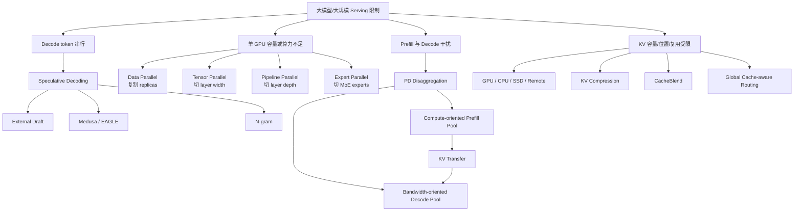
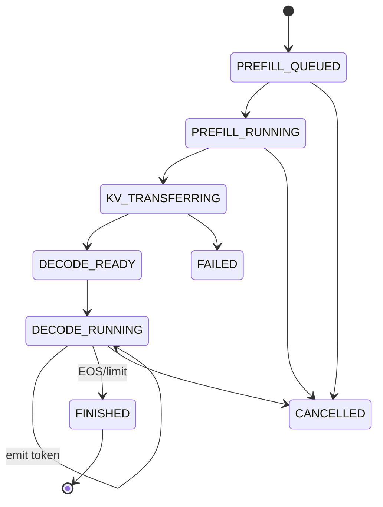
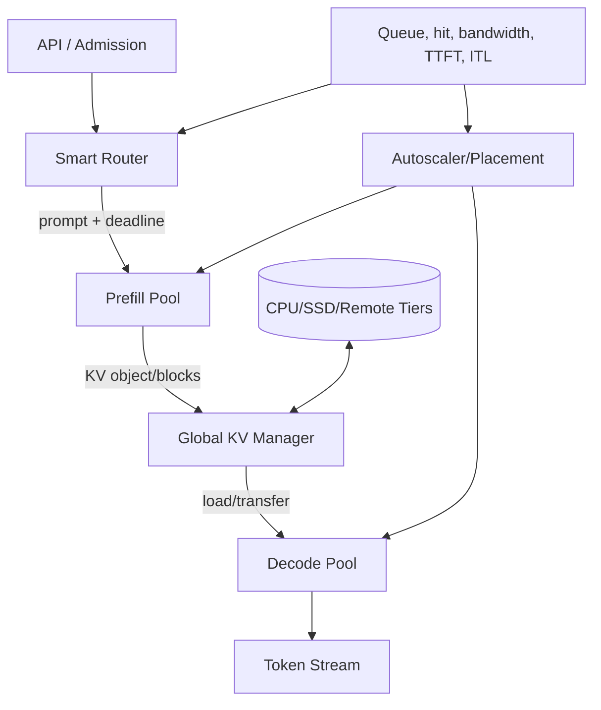
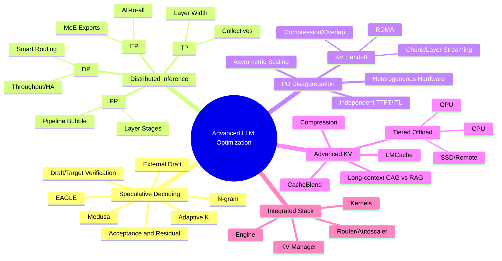

> 原章：*Advanced LLM Optimization Techniques*
> 核心问题：当模型太大、单卡性能不足或服务规模很高时，怎样让一次 target-model forward 接受多个 token，怎样把流量、张量、层和 MoE experts 分布到多 GPU/节点，怎样将 prefill 与 decode 拆成独立资源池，以及怎样把 KV cache 从 GPU 内部状态提升为可传输、分层存储、压缩和组合的系统对象？

## 0. 本章定位、学习目标与系统主线

第 6 章主要优化单个 replica：continuous batching、Flash/PagedAttention、量化和 prefix caching。本章向系统外扩展，处理四类更大规模的问题：

1. **Decode 串行依赖**：speculative decoding 让一次昂贵 target pass 验证多个候选 token；
2. **单 GPU 容量/性能不足**：DP、TP、PP、EP 从不同维度切分流量或模型；
3. **Prefill/decode 相互干扰**：PD disaggregation 将异质 phase 放入独立 worker pools；
4. **GPU KV cache 容量与局部性不足**：分层 offload、compression、blending 和 global routing 扩展 cache。



读完本章，应能回答：

- Speculative decoding 的 proposal、verification、accept/reject 和 residual sampling 如何保证目标分布不变？
- Draft model 快但不准、target model 慢但准，收益由哪些变量共同决定？
- Medusa、EAGLE 和 n-gram 分别怎样提出候选，为什么适用 workload 不同？
- $K$ 与逐位置 acceptance rate 如何影响每轮 accepted tokens 和净 speedup？
- DP、TP、PP、EP 分别切分 traffic、tensor、layers 和 experts 的哪一维？
- 为什么单 node NVLink 常适合 TP、跨 node 慢网络更偏向 PP？
- Pipeline bubble、TP collective 和 MoE all-to-all 怎样限制线性扩展？
- “总参数”和“每 token 激活参数”在 MoE serving 中为什么必须分开？
- PD disaggregation 怎样独立优化 TTFT/ITL、batch、parallelism、hardware 和 autoscaling？
- Prefill 生成的 KV 有多大，什么时候传输成本会抵消 PD 收益？
- Chunk/layer streaming、RDMA、async overlap 和 KV compression 如何隐藏传输？
- RAG 与 long-context CAG 的 latency/cost 计算怎样做，原书算例的标签哪里需修正？
- KV offloading 何时比 recompute 快，GPU/CPU/SSD/remote tiers 应怎样 admission 与 eviction？
- 为什么多个 RAG chunks 的 KV 不能直接拼接，CacheBlend 为什么需要选择性重算？

> **数据与版本说明**：本章引用 2025 年末的模型、vendor price、vLLM/LMCache 参数和 benchmark。它们用于解释机制，不代表当前产品或版本保证。尤其是 speculative config、KV connector、cache format 和 distributed runtime 协议会变化，部署前应核对目标版本并复现实验。

---

## 1. Speculative Decoding

普通 autoregressive decode 每次 target forward 只确认一个 token。Speculative decoding 用便宜 proposal mechanism 先产生 $K$ 个候选，昂贵 target 用一次并行 forward 对整段候选打分；若接受多个，就把 target forward 的固定权重读取/launch 摊到多个有效 token 上。

### 1.1 Detailed Steps

设 draft distribution 为 $q(x\mid h)$，target distribution 为 $p(x\mid h)$，历史为 $h$。

#### 1.1.1 Proposal

Draft 自回归生成 $K$ 个 tokens：

$$
x_1\sim q(\cdot\mid h),
\quad
x_2\sim q(\cdot\mid h,x_1),\ldots,x_K.
$$

虽然 draft 小，它仍逐 token 生成；收益要求这 $K$ 步加 target verification 的成本低于 target 自己做多轮 decode。

#### 1.1.2 Parallel verification

Target 对 $h,x_{1:K}$ 做一次 forward，得到每个位置的 target conditional distributions $p_i$。多个位置的 logits 能像 prefill 一样并行计算，但 causal mask 仍保证每个位置只依赖左侧。

#### 1.1.3 Probabilistic acceptance

对候选 $x_i$，接受概率：

$$
a_i=\min\left(1,\frac{p_i(x_i)}{q_i(x_i)}\right).
$$

原章例子中 $q(\text{States})=0.6$：

- 若 $p=0.8$，$a=1$，必接受；
- 若 $p=0.4$，$a=0.4/0.6=2/3$，按概率接受。

只有此前所有候选都接受，才继续检查下一位置。第一处 rejection 后，后续 draft tokens 基于错误历史，全部丢弃。

#### 1.1.4 Residual sampling

拒绝 $x_i$ 时，不能简单“排除该 token 后直接从 $p$ 采样”，否则会改变 target distribution。正确 residual distribution 为：

$$
r_i(y)
=\frac{[p_i(y)-q_i(y)]_+}
{\sum_z[p_i(z)-q_i(z)]_+},
$$

其中 $[u]_+=\max(u,0)$。从 $r_i$ 采样 correction token 后停止本轮。若 $K$ 个候选全接受，还可从 target 的下一位置分布再采一个 token，所以一轮最多推进 $K+1$ tokens。

#### 1.1.5 “不损失准确率”的准确含义

标准 speculative sampling 在 proposal/accept/residual 实现正确、draft/target tokenizer 和 sampling 条件兼容时，**保持 target model 的输出概率分布**。它不保证一次运行字面输出与普通 decode 相同，因为随机采样本来就可能不同；在耦合相同随机数和 deterministic greedy 规则时才可能逐 token 一致。

Temperature、top-$k$/top-$p$、penalty、grammar、logit processors 必须在验证协议中正确处理，否则分布不再等价。

### 1.2 收益模型：Accepted Tokens 必须覆盖额外成本

设：

- $C_t(1)$：target 普通一步 decode 成本；
- $C_t(K)$：target 一次验证 $K$ draft tokens 的成本；
- $C_d(K)$：draft 提出 $K$ tokens 的成本；
- $A$：本轮平均推进 tokens，含 correction/extra target token；
- $C_o$：调度、tree、sampling 等开销。

普通 decode 每 token 约 $C_t(1)$；speculative 每 token：

$$
C_{spec/token}
=\frac{C_d(K)+C_t(K)+C_o}{E[A]}.
$$

理想 speedup：

$$
S\approx
\frac{E[A]\,C_t(1)}
{C_d(K)+C_t(K)+C_o}.
$$

只有 $S>1$ 才有净收益。Target verification 能并行多个位置，所以 $C_t(K)<K C_t(1)$ 才有机会；高 batch/compute-bound 时这种额外 compute 更昂贵，收益缩小。

若第 $i$ 个候选在前面都接受的条件概率为 $\alpha_i$，被接受 draft token 的期望数：

$$
E[A_{draft}]
=\sum_{i=1}^{K}\prod_{j=1}^{i}\alpha_j.
$$

若所有位置 acceptance 都是 $\alpha$：

$$
E[A_{draft}]
=\sum_{i=1}^{K}\alpha^i
=\frac{\alpha(1-\alpha^K)}{1-\alpha}.
$$

当后部位置 acceptance 很低，继续增大 $K$ 的边际收益很小，却增加 proposal/verification。

### 1.3 Tuning and Usage

#### 1.3.1 Choose an existing small model

理想 draft 同时满足：

- 参数少、单 token 很快；
- 与 target 使用相同 tokenizer/vocabulary；
- 同家族、同域、输出分布接近，acceptance 高；
- 显存和 bandwidth overhead 小；
- 支持 target 的 chat template、sampling 和 context。

量化 draft 可进一步降低开销，因 target 会验证最终分布；但量化若让 draft distribution 偏差过大，acceptance 降低，可能得不偿失。用 target 蒸馏 draft 通常提高 alignment，但增加训练成本。

#### 1.3.2 Use self-drafting：Medusa

Medusa 在 target backbone 上增加多个轻量 heads，并行预测未来位置候选，形成 candidate tree；target 用 tree attention/verification 选最长接受路径。

图中一次 pass 最终接受 `It is difficult` 三个 tokens，而普通模型只产生 `It`。优点是无需部署第二完整 draft model、tokenizer 天然一致；代价是新增 heads、训练、candidate explosion 和 verification kernel。

#### 1.3.3 EAGLE

EAGLE 不是直接预测离散 tokens，而用辅助模块预测未来 hidden states，再通过 target LM head 得候选。Hidden state 含比 token ID 更丰富的信息，alignment 通常更稳。

- EAGLE-2：根据可预测性使用 dynamic draft tree；
- EAGLE-3：融合 target 多层 features，改善 draft accuracy。

它仍需要特定 target 的 auxiliary model、训练和版本匹配；target 权重升级后 speculator 可能需重训。

#### 1.3.4 N-gram

N-gram 不用神经 draft，查找 prompt/已生成序列中的重复 token spans，并把匹配位置后续 tokens 当 proposal。

**Table 7-1：原章 trigram 示例**

| Trigram context | Next token | Count |
|---|---|---:|
| `a quick` | `brown` | 1 |
| `quick brown` | `fox` | 1 |

在 `... that quick brown` 后匹配 `quick brown`，提议 `fox`。它适合 JSON、SQL、代码、模板复写、文档改写等重复度高 workload。Proposal 近乎零 GPU compute，即使 acceptance 中等也可能有净收益；自然开放文本重复少时收益有限。

N-gram 中的 $n$ 是匹配 context 长度，speculative $K$ 是最多提议的未来 token 数，两者不是同一个参数。

#### 1.3.5 Tune the number of draft tokens

原章建议从 $K=2$ 或 4 建 baseline，常见最优 4～8，可预测结构化输出可能 16/32。它们只是经验区间。

若 $K=6$ 的逐位置条件/观测 acceptance 为 `[0.8,0.7,0.6,0.5,0.10,0.02]`，越靠后收益快速衰减。若这些是“到达该位置后的接受率”，期望接受数为：

$$
0.8+(0.8)(0.7)+(0.8)(0.7)(0.6)+\cdots
\approx1.88.
$$

第 5/6 位贡献很小，应比较降低 $K$ 后 verification savings。若框架报告的是无条件 position acceptance，计算方式需按指标定义。

Adaptive $K$ 可根据 entropy、历史 acceptance、request type、batch pressure 和 latency budget 动态调整，比全局静态值更稳。

#### 1.3.6 Limitations

- 只直接优化 decode，不减少 prompt prefill；
- Draft/heads/tree 占显存和 compute，可能提高 TTFT；
- Acceptance 低会浪费 proposal 和 target verification；
- 高 concurrency/batch 已使 target compute-bound 时，额外计算伤 throughput；
- 两模型 co-location、scheduler、KV 和 tokenizer 管理复杂；
- Grammar、sampling、LoRA、distributed TP 等组合需专门支持；
- 优化 ITL 可能以 aggregate throughput 或 TTFT 为代价。

最佳场景是输出长、输入输出比低、小 batch、decode bandwidth-bound、ITL 敏感且文本可预测。长 prompt/短 output、离线 high-throughput 或极高 batch 不一定适合。

### 1.4 Hands-on Speculative Decoding

#### 1.4.1 Enable speculative decoding

原章比较 Qwen3-32B 的 vanilla、n-gram、improved n-gram、EAGLE-3；关键配置分别为：

```json
{
  "method": "ngram",
  "num_speculative_tokens": 4,
  "prompt_lookup_min": 2,
  "prompt_lookup_max": 128
}
```

```json
{
  "method": "eagle3",
  "model": "RedHatAI/Qwen3-32B-speculator.eagle3",
  "num_speculative_tokens": 3
}
```

API 与 method 名依 vLLM 版本；还要保证 speculator 与 exact target revision 兼容。`gpu-memory-utilization=0.95` 留余量很少，是否稳定需压测 workspace、KV 和峰值。

#### 1.4.2 Run benchmarks

原章以 concurrency 1 和 16 模拟低/高负载。公平比较必须固定实际 output tokens、prompt distribution、sampling、seed、warm-up、batch/token budgets 和 stop；同时报告 acceptance by position、TTFT、ITL、aggregate output TPS、request goodput、GPU memory 与 quality。

#### 1.4.3 Performance analysis

Concurrency=1：improved n-gram 约提升 16%；EAGLE-3 为 56.5 tokens/s，vanilla 28.9 tokens/s：

$$
S=56.5/28.9\approx1.96.
$$

Concurrency=16：两种 n-gram 低于 vanilla，说明 proposal/verification CPU/GPU overhead 在高负载下盖过 accepted-token 收益；EAGLE-3 仍领先但倍数缩小。

EAGLE-3 ITL 更好但 TTFT 更长，印证 speculative decode 不是全指标优化。应按交互场景的 TTFT/ITL SLO 选择，而不能只看总 token throughput。

---

## 2. Multi-GPU and Multi-Node Inferencing

四种 parallelism 切不同维度：

| 方法 | 切分对象 | 每 GPU 是否有完整模型 | 主要目标 | 主要通信 |
|---|---|---:|---|---|
| DP | Requests/traffic | 是 | Throughput/HA | Router；通常无每层 collective |
| TP | Layer tensor width | 否 | Fit + 单请求 latency | 几乎每层 all-reduce/all-gather |
| PP | Layer depth/stages | 否 | Fit，降低跨慢链路频率 | Stage boundary activations |
| EP | MoE experts/tokens | 共享层可能复制，experts 分片 | 稀疏 MoE fit/compute | Token dispatch/combine all-to-all |

总设备数常可组合为：

$$
N_{GPU}=DP\times TP\times PP\times EP_{effective},
$$

但不同框架对 EP 与 TP/DP mesh 的定义不同，不能只乘数字而忽略 placement。

### 2.1 Data Parallelism

每个 replica 加载完整模型并处理不同 requests。

理想 throughput：

$$
X_{DP}\approx R\,X_{replica}\,\eta_{route},
$$

$R$ 为 replicas，$\eta$ 受负载不均、故障和 shared infrastructure 限制。DP 不帮助单 replica 装下模型，也不直接降低单请求 model compute latency。

剩余两个 replicas 容量若无 headroom，故障转移仍会过载；HA 需要 N+1 capacity、readiness、drain 和 retry budget。

#### 2.1.1 Routing 策略

- Round robin：均衡请求数，不均衡 token work；
- Least connections：考虑 active count，不考虑每请求长度；
- Latency-based：适应实例变化，但指标滞后可造成 herd/oscillation；
- Cache-aware：以 prefix/KV locality 避免 prefill；
- Token/load-aware：考虑 input、queue tokens、active KV、generated tokens、SLO deadline。

Router 可估计每 replica completion cost：

$$
score_r
=w_q QTokens_r+w_a ActiveTokens_r
-w_h PrefixHitTokens_r+w_d DeadlineRisk_r.
$$

Cache locality 与 load 常冲突：命中 50k prefix 的繁忙 replica，可能仍比空闲 miss replica 快；需估算 saved prefill 与 queue wait，而非固定 affinity。

### 2.2 Tensor Parallelism and Pipeline Parallelism

#### 2.2.1 Tensor Parallelism（横向/宽度切分）

以线性层 $Y=XW$ 为例，column parallel 将：

$$
W=[W_1,W_2,\ldots,W_p],
\qquad
Y_i=XW_i,
$$

各 GPU 计算部分 output，后续通过 all-gather 或与 row-parallel 配对；row parallel 将输入/weight 行分片并 all-reduce partial sums。Transformer 每层 attention/MLP 常有 collective。

优点：每层权重和 compute 分给 $p$ GPU，单请求 layer latency 可下降，pipeline bubble 少。代价：每层同步，强依赖 NVLink/NVSwitch；小 batch/小 shape 还可能通信和 launch 主导。

#### 2.2.2 Pipeline Parallelism（纵向/深度切分）

将 $L$ 层分成 $p$ 个连续 stages：

$$
f(x)=f_p(f_{p-1}(\cdots f_1(x))).
$$

每 stage 只存其 layers，边界传 activation。通信次数少于 TP，但单 request 必须依次过 stages。

#### 2.2.3 Pipeline bubble

若 $p$ stages、$m$ microbatches、各 stage 理想等时 $t$，简单 pipeline 总时间约：

$$
T\approx(m+p-1)t.
$$

有用 stage-work 为 $mpt$，设备总可用时间为 $p(m+p-1)t$，理想利用率：

$$
\eta_{PP}=\frac{m}{m+p-1}.
$$

Microbatches 太少或 stages 不平衡时 bubble 大。Decode 的 token dependency、variable sequence、stage imbalance 和 communication 又会降低实际效率。

#### 2.2.4 为什么多一张 GPU 不等于 2×

单 H100 HBM 原章约 3 TB/s，而 NVLink 聚合约 900 GB/s，跨 node 更低。分片增加 compute/capacity，却引入 communication、同步和更小 local GEMM：

$$
S_p=\frac{T_1}{T_1/p+T_{comm}(p)+T_{imbalance}+T_{launch}}<p.
$$

如果量化能把模型放回单 GPU/单 node，往往优于增加慢互联设备。

#### 2.2.5 决策顺序

1. 单 GPU 能满足 capacity/SLO：保持单卡；
2. 量化/压缩后能单卡：优先评估；
3. 单 node 多 GPU + NVLink：通常先 TP，必要时 TP+PP；
4. 只有 PCIe：TP communication 可能差，考虑更好实例或较小 TP/PP；
5. 模型超单 node：node 内 TP、node 间 PP，减少慢网络 collective；
6. 任何方案都用目标 model/kernel/topology benchmark。

原章 AWS P5 例子的具体 SKU/网络会变化，关键不是实例名，而是“8 GPUs 在同一 NVLink domain”与“8 个单 GPU nodes 走跨节点 fabric”不等价。

#### 2.2.6 混合 TP+PP

总 16 GPUs。每 stage 用 8-way TP，两个 stage 以 PP 跨 node。这样高频 layer collective 留在 NVLink 域，跨 InfiniBand 只传 stage activation。

vLLM 单 node 示例：

```bash
vllm serve Qwen/Qwen2.5-7B-Instruct \
  --tensor-parallel-size 4 \
  --pipeline-parallel-size 2
```

TP×PP=8，需 8 GPUs；原章命令漏了 model positional argument，已补齐。跨 nodes 还需 Ray/launcher、placement、network/NCCL 和 failure coordination。

### 2.3 Expert Parallelism

MoE 每层包含 router 和多个 experts，每 token 只选择 top-$k$ experts：

$$
y=\sum_{e\in TopK(x)}g_e(x)E_e(x).
$$

总 experts 参数都需存储，但每 token 只计算少数 experts。

EP 把 experts 分到 GPUs，tokens 通过 all-to-all dispatch 到 expert owner，计算后再 all-to-all combine。

难点：

- Router load imbalance，热门 expert 形成 straggler；
- Token dispatch 是 variable-size all-to-all，网络敏感；
- 小 token batch 让每 expert GEMM 太小；
- Capacity factor/drop token policy 影响质量；
- Shared attention/dense layers 仍需 TP/DP/PP；
- Expert replication 可缓解热点但增加 memory。

EP 不是 DP 的别名：DP 复制完整模型处理不同 requests；EP 将一个 MoE layer 的不同 experts 分片，单 request 的 tokens 可能跨多设备。

---

## 3. Prefill-Decode Disaggregation

Chunked prefill 在同一 GPU pool 时间复用两种 phase；PD disaggregation 从空间上拆成独立 pools，并通过 KV handoff 连接。

### 3.1 为什么拆分

#### 3.1.1 独立优化 TTFT 与 ITL

Input-heavy workload 增 prefill capacity；long-generation workload 墅 decode capacity。Decode 不再被长 prefill iteration 打断，ITL 更稳定。

#### 3.1.2 独立 batch 和 parallelism

- Prefill：batch enough tokens 形成大 GEMM，优化 compute utilization；
- Decode：batch enough sequences 复用 weights，同时守住 ITL；
- Prefill/Decode 可使用不同 TP/PP degree、quantization、kernel 和 scheduler。

#### 3.1.3 Heterogeneous hardware

原章例子：H100/H200 compute peak 类似，H200 有 141 GB 与 4.8 TB/s，H100 80 GB 与 3.35 TB/s。Prefill 可选较便宜 compute/$ 较好的 H100，decode 可选 H200 的 capacity/bandwidth；低要求 decode 可选 L40S。

Hardware 异构还受 model format、kernel、KV layout 和 transfer conversion 约束，不能只看一个规格。

#### 3.1.4 Asymmetric autoscaling

若到达率 $\lambda$，平均 input/output tokens 为 $I/O$，prefill 与 decode 每 replica token throughput 为 $X_p/X_d$：

$$
R_p\gtrsim\frac{\lambda I}{X_p\rho_p},
\qquad
R_d\gtrsim\frac{\lambda O}{X_d\rho_d}.
$$

Input burst 直接冲击 prefill queue；decode load 被长时间摊开，通常更平滑。但 output length 难预测，decode pool 也会积压，需 admission 和 backpressure。

### 3.2 Overall Architecture

请求状态机：



Controller 必须选择 compatible prefill/decode workers、reserve decode KV capacity、传播 request ID/cancel/deadline，并处理 handoff failure。若 prefill 完成后 decode 没空间，KV 只能等待/offload/retry，会浪费已做工作。

PD 的收益来自消除 phase interference 和独立配置；代价是 duplicated model weights、额外网络、controller、failure states 和 pool fragmentation。

### 3.3 KV Cache Transfer

#### 3.3.1 Transfer bandwidth 需求

原章例子：8B model、1024 input tokens 的 KV 约 0.1～0.15 GB；input 长 10× 变 1～1.5 GB/request；16 req/s：

$$
B_{required}=16\times(1\text{ to }1.5)
=16\text{ to }24\ \mathrm{GB/s},
$$

约“接近 25 GB/s”。它随 model layers、KV heads、head dim、dtype 和 input tokens 线性增长，8B 参数量本身不足以唯一决定 KV 大小。

传输最低时间：

$$
T_{KV}\ge\frac{M_{KV}}{B_{effective}}.
$$

1.5 GB KV 在理想 900 GB/s 约 1.7 ms；50 GB/s 约 30 ms；10 GB/s 约 150 ms，未计排队/协议。25 GB/s aggregate 会超过 10 GB/s path，系统不稳定积压。

原章将无 RDMA 跨节点路径描述为“经 PCIe 约 10 GB/s”，实际跨节点还包括 NIC/Ethernet；瓶颈是 host-staged network path，不是 PCIe 单独等于 inter-node network。

#### 3.3.2 降低/隐藏 transfer 的方法

1. **Chunk streaming**：KV blocks 生成后立即分块传，不等完整 prompt；
2. **Layer-wise streaming**：第 $l$ 层 KV 完成就传，同时计算 $l+1$；
3. **Async nonblocking DMA/RDMA**：compute 与 transfer overlap；
4. **Direct GPU path**：GPUDirect RDMA 避免 CPU copies；
5. **Compression/quantization**：减少 bytes，但加编码/解码与质量成本；
6. **Topology-aware placement**：优先同 node/同 fabric；
7. **Reservation and flow control**：decode 先预留 blocks，防止传到一半无空间。

若通信被完全覆盖，总 critical path 近似不是三者之和，而是：

$$
T\approx T_{prefill}+\max(T_{unhidden\ transfer},0)+T_{decode}.
$$

原章引用 transfer overhead 可低于每请求 latency 1%，这是特定系统/硬件/调度结果，不是默认保证。

#### 3.3.3 Compatibility contract

接收方必须与发送方在 model revision、layer partition、KV head/layout、dtype、block size、RoPE/position、parallel sharding 和 sequence ID 上一致。异构 GPU 可以不同，KV semantic/layout 不能不兼容；必要转换也计入 transfer overhead。

### 3.4 When to Use

优先 aggregated serving，当：模型较小、流量低/不稳定、input/output mix 简单、单 pool 已满足 SLO、network/运维能力有限。

评估 PD，当：

- 大模型高负载，phase interference 明显；
- input/output ratio 差异大且可独立预测；
- TTFT 与 ITL 都需细调；
- 有高速 KV path/RDMA 和成熟 runtime；
- 不同 hardware/parallelism 的收益覆盖 duplicate weights 和系统复杂度；
- 能运行独立 autoscaling、admission、routing、failure recovery。

先 profile aggregated baseline，量化 blocked decode time、prefill/decode queue、KV bytes 和 transfer headroom，再做决定。

---

## 4. Advanced KV Caching

高级系统将 KV cache 视为带 identity、version、location、size、lifecycle 和 security domain 的一等对象，而不是 worker 进程里的匿名 tensor。

### 4.1 Long-Context Serving

RAG 每次检索少量新 chunks，context 小、新鲜、可引用；long-context CAG 将稳定 corpus 预填充并复用 KV，省 retrieval 和重复 prefill。100k～1M context 与 lost-in-the-middle 改善让 CAG 更可行，但不消除：

- KV capacity 与 decode attention cost；
- Corpus 更新导致 cache invalidation；
- Tenant ACL 和 stale data；
- Cache 首次构建与低 reuse 成本；
- 长上下文质量仍需应用评估。

RAG 与 CAG 可组合：RAG 找 chunks，热门稳定 bundle 缓存；CacheBlend 复用非 prefix chunks。

### 4.2 Cost and Latency Calculations

#### 4.2.1 Token work

RAG：500 system cached，10×500 chunks + 500 user uncached：

$$
T_{cached,R}=500,
\quad T_{regular,R}=5500.
$$

CAG：500 system + 100,000 context cached，500 user uncached：

$$
T_{cached,C}=100{,}500,
\quad T_{regular,C}=500.
$$

Uncached prefill 比例：$500/5500=1/11\approx9.1\%$，接近“约 1/10”。若 TTFT 与 uncached tokens 线性，5 s 可降到约 0.45～0.5 s；真实 prefill 非严格线性，还含 cache load、attention、queue、RAG embedding/search。

#### 4.2.2 Table 7-2：原章 vendor input price（$/1M tokens）

| Vendor/model | Regular input | Cached input / extra |
|---|---:|---:|
| GPT-5 | 1.25 | 0.125 |
| Gemini 2.5 Pro | 1.25 | 0.31 + storage 4.5/hour |
| Claude Sonnet 4 | 3 | 0.3 + first write 3.25 |

这些是 2025 年末示例，单位/缓存生命周期/写入价需查当前文档。

GPT-5 RAG cost：

$$
C_R
=\frac{500(0.125)+5500(1.25)}{10^6}
=\$0.0069375\approx\$0.007.
$$

CAG 正确分类应是 100,500 cached + 500 regular：

$$
C_C
=\frac{100{,}500(0.125)+500(1.25)}{10^6}
=\$0.0131875\approx\$0.013.
$$

原章 CAG 公式文字把 `500 cached` 与 `100,500 regular` 写反，却又对 100,500 使用 cached price；按前文 token 分类，上式才一致。结论不变：该假设下 CAG 约为 RAG 的：

$$
C_C/C_R\approx1.90.
$$

因为 100k cached tokens 即使打 9 折，绝对量仍远大于 5k regular chunks。还需计 cache write/storage/reuse 次数、RAG index/retrieval 和 output；CAG 的低 TTFT 是以 cache capacity/费用换来的。

#### 4.2.3 Break-even reuse

若 context $C$ 首次 regular prefill，之后 $n-1$ 次按 cached price，RAG 每次检索 $R$ regular tokens，忽略共同项：

$$
C_{CAG}=C p_r+(n-1)C p_c,
$$

$$
C_{RAG}=nR p_r+C_{retrieval}.
$$

只有高 reuse、低 cached price 或 RAG chunks 很大时 CAG 才可能成本反超。还要满足缓存 TTL 内重用，否则首次写成本无法摊薄。

### 4.3 Self-Hosting LLMs

#### 4.3.1 KV cache offloading

层级原则：越远容量越大/便宜，latency/bandwidth 越差。

| Tier | 优点 | 局限 | 典型用途 |
|---|---|---|---|
| GPU HBM | 最低访问 latency | 容量最小、机会成本最高 | Active/hot prefixes |
| CPU DRAM | 大很多、较快 | PCIe/NVLink-C2C transfer | Warm prefixes |
| Local SSD | 容量巨大、便宜 | I/O latency/bandwidth | Cold large contexts |
| Remote/Redis/S3 | 跨 replica、弹性 | Network/serialization/费用 | Shared cold cache/persistence |

原章称 CPU 可约 3×、SSD 50× capacity，是特定 AWS p5.48xlarge 配置示例，不是固定比例；“已有实例所以免费”也忽略 DRAM/SSD 对其他 workload 的机会成本、I/O 和寿命。

若没有 offload，每个 replica 只能存一个 hot context，四 contexts 需要四 replicas；CPU tier 能让一个 replica 保存四份并按需 swap，原章给出理想 4× cost saving。前提是单 replica compute 足以承载总流量，swap latency 满足 SLO，且不会 thrash。

Tier admission 基本判断：

$$
T_{load}(tier)+T_{decode\ impact}
<T_{recompute\ prefill}.
$$

短 prefix 从 SSD/remote 载入可能比重算慢；只有足够长、复用高的 KV 值得远端保存。

#### 4.3.2 Cache key、metadata 与生命周期

KV object 至少携带：model/tokenizer/adapter revision、token hash/range、layer/shard、dtype/layout、position、tenant namespace、size、checksum、last access、pin/refcount 和 tier location。

需要 single-flight load、active pin、LRU/cost-aware eviction、atomic publish、corruption detection、version invalidation、encryption 与 quota。不同 TP/PP sharding 的 KV object 不能无转换任意加载。

#### 4.3.3 KV cache compression

FP8/INT8 KV quantization 是固定低位表示；CacheGen 等方法根据 KV distribution 编码更紧凑 bitstream。收益：更多 cache、低 transfer bytes；代价：encode/decode compute、quality、random access、format/version 和 hardware kernel。

压缩是否值得：

$$
T_{encode}+\frac{M/r}{B}+T_{decodeCodec}
<\frac{M}{B},
$$

$r$ 为 compression ratio。高速 NVLink 上 codec overhead 可能盖过收益；慢 network/SSD 上更有价值。

#### 4.3.4 KV cache blending

Transformer 第 2 个 chunk 的 K/V 不是只由其本身决定：其 hidden states 在每层已 attend 到 chunk 1，因此独立计算 `KV(chunk2)` 再拼接不等于 `KV(chunk1 || chunk2)`。位置编码也随排列变化。

CacheBlend 载入各 chunk KV 后，识别受跨 chunk context 影响较大的 token/layers，选择性重算部分 KV；原章默认 ratio 15%，可调 `blend_recompute_ratios`。它以少量 compute 恢复 cross-token dependencies，仍是近似/系统技术，必须评估 answer quality、chunk order 和模型兼容。

### 4.4 Hands-on LMCache

#### 4.4.1 Enable LMCache and CPU offloading

原章 Qwen3-14B 示例配置 CPU KV tier 150 GB、max model len 40,960、GPU utilization 0.9，并可启用 120 GB SSD：

```bash
export LMCACHE_USE_EXPERIMENTAL=True
export LMCACHE_LOCAL_CPU=True
export LMCACHE_MAX_LOCAL_CPU_SIZE=150.0

vllm serve Qwen/Qwen3-14B \
  --disable-log-requests \
  --kv-transfer-config '{
    "kv_connector": "LMCacheConnectorV1",
    "kv_role": "kv_both"
  }' \
  --max-model-len 40960 \
  --gpu-memory-utilization 0.9
```

环境变量/API 可能变化；150 GB 必须小于可用 host RAM 并留 OS/model staging/其他进程余量。SSD 路径需考虑容量、filesystem、并发 I/O 和 cleanup。

#### 4.4.2 Run benchmarks

Benchmark 1：30 个 unique prefixes sequential warm-up，再逆序请求；逆序让早期被 GPU LRU eviction 的 prefixes 首先被访问，检验 CPU tier retention。

Benchmark 2：20 个 long contexts 三波：cold sequential、warm sequential、warm concurrency=5。它区分 miss overhead、warm hit 和高 load 下 GPU cache/activation 竞争。

必须固定 prefix tokens、suffix/output、model config，并分别统计 GPU/CPU/SSD hit、bytes loaded、TTFT、throughput 和 quality。

#### 4.4.3 Performance analysis

图注称“cold start without hit”，正文结论是 LMCache 始终更慢；这说明低 reuse/random short prefix 默认用 vanilla 更合理。

前九个都在 GPU 时两者接近；之后 vanilla 约回到 6～7 s full prefill，LMCache CPU load 约 1 s。CPU hit 低于 GPU hit，但远快于长 prefill recompute。

高 concurrency 时 active KV/activation 挤占 GPU prefix capacity，vanilla hit 降低，LMCache tiered capacity 优势扩大。

原章称 vanilla 瓶颈约 4,700 tokens/s，LMCache 约 16×。这是刻意高复用长上下文 workload，不可推广到 cold/random traffic；若 cache miss 多，图 7-24 已说明 LMCache 可能更慢。

---

## 5. Integrated Optimization Stack

本章结尾将系统分成四层：

1. Kernel：CUDA/Triton kernels 优化单算子；
2. Execution engine：vLLM/SGLang/TensorRT-LLM 调度 batch、stream、PD 和 distributed execution；
3. Cache manager：GPU/CPU/SSD/remote KV allocation、compression、offload；
4. Routing/orchestration：按 KV locality、queue、phase、SLO 路由并全局 autoscale。



局部优化可能互相干扰：

- Speculation 增 compute，和 high batch 竞争；
- TP 提高单 replica capacity，却增加 collective，影响 PD KV topology；
- PD duplicate weights，减少可用于 DP 的 GPUs；
- KV offload 提高 hit capacity，却增加 PCIe/network；
- Cache-aware routing 提高 locality，却形成 load hotspot；
- Compression 减 bytes，却增加 codec compute。

因此最终目标是全栈 SLO-constrained goodput/$，不是每层各自最大化指标。

---

## 6. 容易混淆的概念与常见误区

### 6.1 Speculative decoding 会改变 target 质量

标准 acceptance/residual sampling 保持 target distribution；错误或简化 verification 才可能改变。随机样本字面文本不保证与另一次普通采样相同。

### 6.2 Target 只是比较 draft token 是否为 argmax

错误。Sampling 版本使用 $\min(1,p/q)$ 接受并从 residual distribution 修正；greedy 可用更简单验证。

### 6.3 Reject 一个 token 后仍可保留后续 draft

错误。后续基于被拒绝历史，自回归条件失效，必须丢弃或走专门 tree branch。

### 6.4 $K$ 越大 speedup 越高

错误。后部 acceptance 下降且 verification/proposal 墳长，存在 workload-specific optimum。

### 6.5 Self-drafting 不需要额外训练或显存

错误。Medusa heads/EAGLE modules 通常需训练、参数、activation 和专门 runtime，只是比完整 draft model 轻。

### 6.6 N-gram 的 n = Speculative K

错误。n 是历史匹配长度，K 是最多提议未来 tokens 数。

### 6.7 Speculative decoding 同时优化 prefill

错误。主要优化 decode；还可能因 draft initialization 增加 TTFT。

### 6.8 DP 能让超大模型装入单 replica

错误。DP 复制完整模型扩 throughput/HA；TP/PP/EP 才分片模型。

### 6.9 TP 是切 layers，PP 是切 tensor

正好相反。TP 横切每层 tensors；PP 纵切连续 layer stages。

### 6.10 多 GPU 数量翻倍，性能必然翻倍

错误。Collective、同步、小 local GEMM、bubble 和 load imbalance 使 scaling efficiency < 1。

### 6.11 PP 通信少，所以总比 TP 快

错误。PP 有 stage serial dependency 和 bubbles；强 NVLink 域中 TP 常更适合低 latency。

### 6.12 PCIe 多卡与 NVLink 多卡等价

错误。TP 每层通信使 topology 差异进入 critical path。

### 6.13 EP = MoE 的 DP

错误。EP 分布 experts，tokens 跨 GPU dispatch；DP 复制完整模型处理不同 requests。

### 6.14 MoE 671B 每 token 都计算 671B 参数

错误。总参数主要决定 storage，top-k active experts 决定稀疏 compute，但 routing/communication 另有成本。

### 6.15 Chunked prefill = PD disaggregation

错误。前者同 pool 分时，后者不同 pools 并传 KV。

### 6.16 PD 天然降低所有延迟和成本

错误。它复制 weights、传 KV、增加 queues/controller；小模型/低流量常不回本。

### 6.17 Prefill 与 decode 可使用任意不同模型版本

错误。KV semantic/layout 必须兼容，包括 weights、tokenizer、position、sharding 和 dtype。

### 6.18 NVLink 900 GB/s 表示每条传输实测 900 GB/s

错误。是标称聚合口径，effective bandwidth 受 topology、方向、contention 和 software。

### 6.19 KV transfer 只需看单请求 bytes

错误。还要乘 requests/s、并发 streams、其他 network traffic，并看 burst/queue。

### 6.20 异步传输会把所有通信变成零成本

错误。只能覆盖与 compute 重叠部分；bandwidth 饱和、tail chunk 和同步仍在 critical path。

### 6.21 Long-context CAG 总比 RAG 便宜

错误。Cached token 单价低但 context 巨大；原章算例 CAG 约为 RAG 1.9×，换来更低 TTFT。

### 6.22 Long-context CAG 不需要 RAG

错误。知识巨大、动态、需 ACL/citation 时 RAG 仍有优势，二者可组合。

### 6.23 CPU/SSD KV offload 是免费扩容

错误。占 host/SSD 资源并引入 transfer、I/O、codec、wear 和 opportunity cost。

### 6.24 Cache capacity 越大 performance 一定越好

错误。低 hit/random traffic 下管理和 offload overhead 使其更慢；需复用分布。

### 6.25 独立 RAG chunks 的 KV 可直接拼接

错误。后块 hidden/KV 应 attend 前块，位置也变化；需 full 或 selective recompute。

### 6.26 CacheBlend 15% 是普适最优

错误。是默认/示例 ratio，质量与性能依模型、chunks 和 query。

### 6.27 LMCache benchmark 的 16×适用于普通聊天

错误。实验刻意使用大量重复 long prefixes；cold miss 时 LMCache 反而更慢。

---

## 7. 从本章抽象出的高级优化方法

### 第一步：先确认瓶颈确实超出单 replica 基础优化

先使用量化、continuous batching、Flash/PagedAttention 和 prefix cache。只有 decode 串行、单卡 capacity、phase interference 或 KV locality 仍主导时再增加高级系统。

### 第二步：按 phase 和 resource 量化 workload

记录 input/output ratio、acceptance potential、model/KV bytes、batch、prefill/decode compute、collective 和 cache reuse，而不是只看参数量。

### 第三步：为 speculation 建立净收益模型

测 draft cost、target verify cost、逐位置 acceptance 和 accepted tokens/iteration；同时看 TTFT、ITL、throughput，动态调 K。

### 第四步：按切分目标选择 parallelism

Traffic/HA 用 DP；强互联 layer width 用 TP；慢跨节点/容量用 PP；MoE experts 用 EP。优先单 GPU、单 node，再跨 node。

### 第五步：将 topology 视为 algorithm input

记录 NVLink domain、PCIe/NIC affinity、InfiniBand/RDMA 和 collective 实测；让高频 TP/EP communication 留在快域。

### 第六步：PD 前先算 KV data plane

由 layers、KV heads、dtype、input 和 RPS 算 bytes/s；确认 decode reservation、bandwidth、chunk/layer streaming 和 overlap 后再拆 pools。

### 第七步：独立 capacity planning 但保留端到端 backpressure

Prefill/decode 各自 autoscale；decode 满时限制 prefill admission，避免生产大量无处接收的 KV。

### 第八步：把 KV 定义为版本化对象

Key、layout、shard、tier、tenant、refcount、checksum、TTL 和 access cost 进入 cache manager，不让 tensor 生命周期隐含在 worker。

### 第九步：按 load-vs-recompute 决定 cache tier

只有载入/解压总时间小于重算 prefill，且 reuse 足够高，才把 KV 放远端；短/冷 prefix 直接重算。

### 第十步：非 prefix 复用必须恢复依赖

RAG chunks 改顺序/上下文后，不能拼接独立 KV；使用 selective recompute 时必须做质量评估。

### 第十一步：同时评估 cold、warm、capacity churn 与 concurrency

Cache 系统只测 warm hit 会严重偏乐观。测试 miss overhead、LRU 逆序、mixed tenants、突发和 active KV 竞争。

### 第十二步：以全栈 goodput/$作最终目标

Kernel、engine、cache、router 和 autoscaler 联合优化。任何局部 speedup 若增加另一层 queue、network 或质量失败，都不算收益。

---

## 8. 本章知识结构与核心结论

### 8.1 知识结构



### 8.2 核心结论

1. **Speculative decoding 用便宜 proposal 换取一次 target pass 推进多个 tokens。** 净收益取决于 accepted tokens 是否覆盖 draft、verification 和调度成本。
2. **正确 speculative sampling 保持 target distribution。** 接受率为 $\min(1,p/q)$，拒绝后从 $[p-q]_+$ residual 采样；不是简单 argmax 比较。
3. **Draft 选择是速度与 acceptance 的共同优化。** 同家族 distilled model、Medusa/EAGLE self-drafting 和低开销 n-gram 各适合不同 workload。
4. **$K$ 有边际收益与浪费。** 应使用逐位置 acceptance、batch pressure 和 SLO 动态调节，而不是一味增大。
5. **Speculation 主要改善 decode/ITL，可能牺牲 TTFT 和 throughput。** 小 batch、长输出、bandwidth-bound 最适合。
6. **DP、TP、PP、EP 切分维度不同。** DP 复制模型，TP 横切 tensors，PP 纵切 layers，EP 分布 MoE experts。
7. **Topology 决定 model parallelism。** TP 的每层 collective 适合 node 内 NVLink；跨慢节点常以 PP 减少通信频率。
8. **PP 用较少通信换 pipeline bubbles。** Microbatch 数、stage balance 和 decode dependency 决定利用率，不能因通信少就认为一定更快。
9. **MoE 的 storage 与 compute 要分开。** 总 experts 决定权重容量，top-k active experts 决定主要 token compute，EP all-to-all 又可能成为瓶颈。
10. **PD disaggregation 将 phase 变成独立产品单元。** Prefill/decode 可有不同硬件、batch、parallelism 和 autoscaling，从而独立优化 TTFT/ITL。
11. **KV handoff 是 PD 成败关键。** Required bandwidth 是 KV bytes/request × RPS；RDMA、chunk/layer streaming、compression 和 overlap 用于降低 critical-path overhead。
12. **PD 不是默认方案。** Duplicate weights、network、controller 和 pool fragmentation 只有在大模型高负载与细粒度 SLO 下才可能回本。
13. **Long-context CAG 用容量/缓存费用换低 TTFT。** 原章算例 CAG uncached prefill 约为 RAG 1/11，但 input cost 约 1.9×。
14. **KV cache 必须成为一等系统对象。** 它需要 version、layout、tier、tenant、pin、eviction、transfer 和 integrity 管理。
15. **Offload 扩容量但增加 data movement。** 只有 tier load/decompress 快于 recompute 且 reuse 足够时才有价值。
16. **非 prefix KV 不能直接拼接。** Self-attention 存在跨 chunk dependencies；CacheBlend 用选择性重算在复用与质量间折中。
17. **Cache benchmark 必须同时看 cold/warm/churn/concurrency。** LMCache 在高复用长 context 可有数量级收益，cold random workload 反而有 overhead。
18. **高级 serving 是分层协同系统。** Kernel、engine、KV manager、router 和 autoscaler 任一层的瓶颈都能抹掉其他层收益。

### 8.3 一句话复盘

本章的总方法是：**先以 proposal/verification 改变 decode 每次 target pass 的有效产出，再按 traffic、tensor、layer 和 expert 四个维度选择 DP/TP/PP/EP，并让高频通信匹配硬件拓扑；当 prefill/decode 干扰成为主瓶颈时，将它们拆成独立 pools，并以可计算的 KV bandwidth、reservation 和 overlap 构建 handoff；最后把 KV cache 作为跨 GPU、CPU、SSD 和网络的版本化对象，只有在 load/compress/blend 成本小于重算且质量达标时复用。**

---

## 9. 术语速查

| 术语 | 简明定义 | 不要与之混淆 |
|---|---|---|
| Speculative decoding | Draft 提议多个 tokens，target 并行验证 | 不是直接采用小模型答案 |
| Draft model | 低成本 proposal distribution | Target 决定最终分布 |
| Target model | 要保持其输出分布的主模型 | Verification 仍需执行 target |
| Acceptance rate | Draft token 被 target 接受的概率/比例 | 必须说明 conditional/unconditional |
| Residual distribution | Reject 后按 $[p-q]_+$ 修正采样 | 不是简单排除 rejected token |
| K | 一轮最多 proposal tokens | 不等于 n-gram 的 n |
| Self-drafting | Target 附加 heads/modules 自行提议未来 | 仍需训练和 runtime 支持 |
| Medusa | 多 heads 直接预测多位置候选树 | EAGLE 主要预测 hidden features |
| EAGLE | 辅助模块预测未来 hidden states/features | 与完整 external draft 不同 |
| N-gram speculation | 从已有 token spans 查找重复后续 | 适合模板/代码/结构化输出 |
| DP | 完整 replicas 分担 requests | 不帮助单模型 fit |
| TP | 每层 tensor/矩阵横向分片 | 高频 collective |
| PP | 连续 layers 分成 pipeline stages | 有 fill/drain bubble |
| Pipeline bubble | Stage 因依赖/不均衡处于空闲 | Microbatch 可缓解但不消除 |
| EP | MoE experts 分布到 devices | Token dispatch 通常 all-to-all |
| Active parameters | 每 token 实际经过的 expert 参数 | 不等于模型总 storage 参数 |
| PD disaggregation | Prefill 与 decode 使用独立 worker pools | 不等于 chunked prefill |
| KV handoff | Prefill KV 从 producer 交给 decode consumer | 需 layout/version/shard 兼容 |
| GPUDirect RDMA | 跨节点 GPU memory 直接网络传输 | 不等于普通 host-staged TCP |
| Aggregated serving | 同一 pool 同时承担 prefill/decode | 架构简单但 phase interference |
| Long-context CAG | 预载并复用大规模静态 context KV | Cached tokens 仍有容量/费用 |
| KV offloading | 将冷 KV 移到 CPU/SSD/remote tier | Load 可能比短 prefix 重算慢 |
| Cache compression | 量化/编码 KV 减少存储与传输 | 增加 codec 与质量成本 |
| CacheBlend | 复用非 prefix chunk KV 并选择性重算 | 不是直接拼接独立 KV |
| LMCache | 提供 KV tiering/transfer/blending 的系统 | 收益依长前缀 reuse |
| Cache churn | Cache 因容量和访问模式频繁 eviction/load | Warm 单次测试无法暴露 |
| Smart router | 综合 KV locality、queue、phase 和 SLO 路由 | 不只是 round robin |
