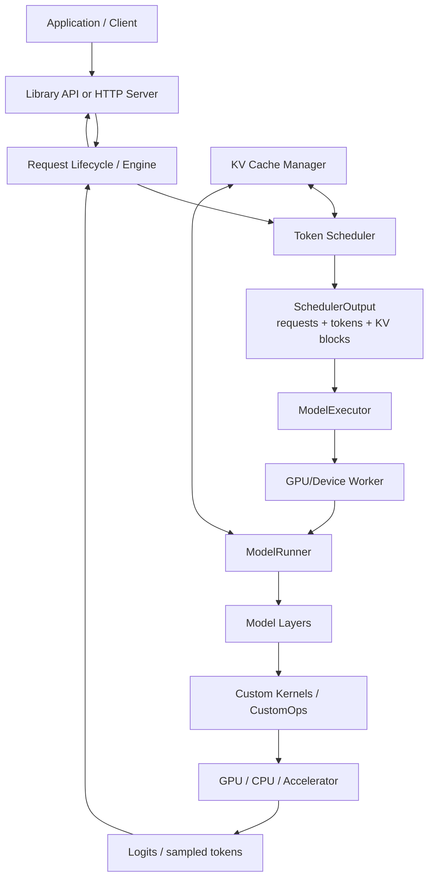
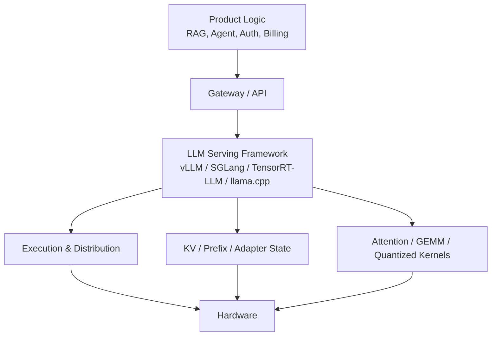
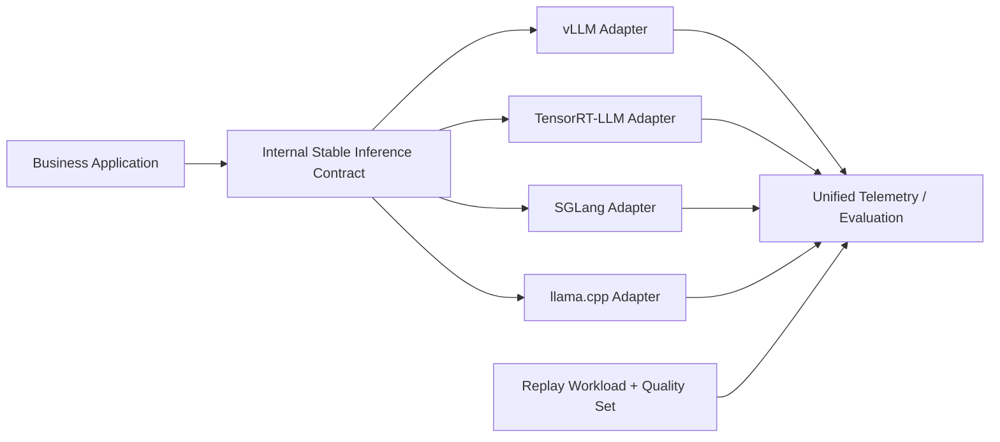
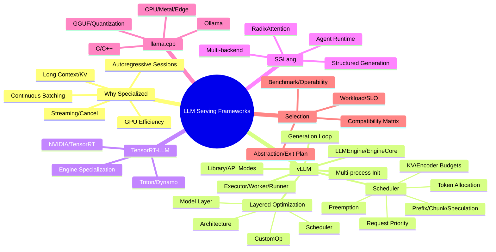

> 原章：*LLM Serving Frameworks*
> 核心问题：前几章的 continuous batching、PagedAttention、prefix caching、chunked prefill、speculative decoding、量化和分布式并行，怎样被组织成一个可持续运行的推理引擎？vLLM 的 API、Engine、Scheduler、Executor、Worker、ModelRunner 和 CustomOp 各负责什么？面对 vLLM、TensorRT-LLM、SGLang 与 llama.cpp，怎样基于 workload、硬件、SLO 和运维能力做可复现、可退出的选择？

## 0. 本章定位、学习目标与框架地图

第 5～7 章讨论“优化技术本身”，第 8 章讨论“谁在什么时间、什么层次应用这些技术”。单个 kernel 再快，如果 scheduler 让 GPU 空闲；cache 再大，如果 request 没有被路由到它；量化再激进，如果 runtime 没有对应 kernel，最终都不会形成生产收益。

本章先解释通用 ML serving 为什么不足，再深挖 vLLM，最后以三个互补框架建立选型方法：

- **vLLM**：广泛的开源模型支持、Python 生态、强 baseline 与快速产品化；
- **TensorRT-LLM**：深度绑定 NVIDIA TensorRT/CUDA，追求 NVIDIA GPU 极致性能；
- **SGLang**：后端 runtime 与结构化/agent frontend 协同，强调 RadixAttention 和多步生成；
- **llama.cpp**：C/C++、GGUF、CPU/Metal/轻量 GPU，强调本地、边缘与可移植。



读完本章，应能够回答：

- 为什么一般图像/分类 serving 的固定 tensor batching 无法覆盖 LLM 长会话和逐 token 状态？
- “Serving framework”与 Web API、model server、distributed platform、kernel library 分别是什么关系？
- vLLM library mode 与 OpenAI-compatible server mode 的责任边界是什么？
- `LLMEngine`、`EngineCore`、`Scheduler`、`ModelExecutor`、`GPUWorker`、`GPUModelRunner` 怎样协作？
- 多进程 TP 初始化时，谁创建 worker、谁绑定 CUDA device、谁解析 model implementation、谁加载权重？
- 一次 `generate()` 为什么不是一次 forward，而是 scheduler/worker/output processor 的多轮闭环？
- Request priority 与 token allocation 为什么必须分开？
- `num_computed_tokens` 与 `num_tokens_with_spec` 的 gap 怎样统一描述 prefill、decode 和 speculation？
- Token budget、KV blocks、encoder budget、LoRA、prefix hit 和 preemption 如何共同约束一个 schedule step？
- vLLM 的四层优化分工为什么有利于支持新模型和新硬件？
- TensorRT-LLM、SGLang 和 llama.cpp 各自牺牲什么来换取性能、控制或可移植性？
- 怎样设计 apples-to-apples benchmark、运维评估和 framework abstraction/exit plan？

> **版本边界说明**：本章描述的是原书写作时的框架架构和 API。vLLM、TensorRT-LLM、SGLang 与 llama.cpp 都高速迭代，内部类名、消息队列、模型实现、默认 kernel 和参数可能变化。这里应学习稳定职责和数据流，不应把内部符号当永久公共 API。

---

## 1. Why We Need Specialized LLM Serving Frameworks

### 1.1 传统推理与 LLM 推理的工作负载差异

| 维度 | 传统分类/视觉模型 | 自回归 LLM |
|---|---|---|
| 输入 shape | 常固定或小范围变化 | 几个到十万/百万 tokens |
| 单请求执行 | 一次/少数 forward 即结束 | Prefill 后逐 token 多轮 forward |
| 请求状态 | 通常 stateless | 每个 sequence 持有增长的 KV cache |
| 服务时间 | 相对短且可预测 | 由 prompt、EOS、max tokens 等决定 |
| Batch | 固定/static/dynamic batch 常够用 | 成员需 iteration 级加入和退出 |
| 返回 | 完整 tensor/label | 首 token 后持续 streaming |
| 内存 | 权重与暂态 activation | 权重 + 动态 KV + prefix/adapter state |
| 调度单位 | Request/sample | Sequence、token、KV block、encoder item |

TensorFlow Serving、TorchServe、通用 Triton 等不是“不能运行 LLM”，而是其原始核心抽象主要针对一次调用完成、shape 较稳定的模型。要高效服务 LLM，还需专门的 token scheduler、KV allocator、stream/cancel 和模型感知 kernel。

### 1.2 五个专用挑战

#### 1.2.1 Autoregressive generation

输出 $y_t$ 依赖 $y_{<t}$，一次 request 可持续数秒或数分钟。Framework 要在每轮后更新 sequence state、sample token、回收完成 request，并让其他 request 插入 active batch。

#### 1.2.2 Context length explosion

KV cache 近似：

$$
M_{KV}=2LBTH_{kv}d_hb.
$$

它随 active tokens 增长。Framework 必须按 blocks admission、allocate、share、swap、evict，而不能只在启动时检查 weight memory。

#### 1.2.3 Continuous batching

固定 batch 的短请求完成后会留下空槽。Continuous scheduler 每个 iteration 重新选择 sequences/tokens，使 active set 与真实到达/完成同步。

#### 1.2.4 Streaming-first execution

低 TTFT 只是模型侧条件；Framework 还要增量输出、取消、backpressure、stop/grammar、错误和 request ID。原章“数百毫秒 TTFT”是产品目标示例，不是所有模型/上下文的通用门槛。

#### 1.2.5 Expensive resource utilization

性能损失来自 GPU idle、低 arithmetic intensity、KV fragmentation、排队和通信。专用框架把 Paged KV、continuous batching、quantization、speculation 与 parallelism 放在统一 runtime 中，目标是在 latency/quality SLO 下最大化 goodput，而不只是裸 FLOPS。

### 1.3 Serving framework 在技术栈中的位置



Framework 通常不替代企业 gateway、tenant billing、RAG、全局 model routing、Kubernetes node provisioning 和业务治理。它是高性能 **model execution backend**，有时附带 HTTP server。生产平台仍需在外层处理身份、配额、跨 replica routing、发布和 observability。

---

## 2. vLLM

vLLM 的核心价值不是单独一项功能，而是把 paged KV、continuous scheduling、prefix/speculation/quantization 和 distributed execution 组合为可扩展引擎，同时保持较低使用门槛。

### 2.1 vLLM's Architecture

#### 2.1.1 Library mode 与 API server mode

**In-process `LLM` class** 适合 offline/batch、Python pipeline 或自定义 service 内嵌：

```python
from vllm import LLM, SamplingParams

llm = LLM(
    model="Qwen/Qwen3-7B-Instruct",
    trust_remote_code=True,
    dtype="float16",
    max_model_len=32768,
    gpu_memory_utilization=0.8,
)
sampling = SamplingParams(temperature=0.7, max_tokens=256)
outputs = llm.generate(["Explain KV cache."], sampling)
```

优点是少一层网络、生命周期与应用紧密集成；缺点是进程 crash、GPU engine 和业务服务耦合，多个应用难共享，扩缩容边界不清。

**Standalone OpenAI-compatible API server** 适合多客户端、streaming 与独立扩缩容：

```bash
vllm serve Qwen/Qwen3-7B-Instruct \
  --trust-remote-code \
  --dtype bfloat16 \
  --max-model-len 32768 \
  --gpu-memory-utilization 0.8
```

API compatibility 降低集成成本，但不代表和某 vendor 在 chat template、token count、sampling、error、usage、stream event 和 tool calling 上完全语义等价。应做 contract tests。

`trust_remote_code=True` 会执行模型仓库提供的 Python code，属于供应链信任决策；生产应 pin revision、审查代码、隔离下载和校验 artifact，而非默认打开。

#### 2.1.2 总体组件

| 组件 | 稳定职责 | 关键输入/输出 |
|---|---|---|
| Processor | 校验、模板、tokenize、构造内部 Request | Raw input → Request |
| LLMEngine | 对外/高层 request lifecycle 与主循环 | Requests ↔ outputs |
| EngineCore | 内部迭代编排边界 | Schedule → execute → update |
| Scheduler | 排序、token/KV/encoder budget、preemption | State → SchedulerOutput |
| KVCacheManager | Block allocation、prefix match、free | Requests ↔ block tables |
| ModelExecutor | 调用一个或多个 worker、collective/RPC | Execution plan ↔ worker result |
| GPUWorker | Device/process lifecycle 与 worker interface | Commands ↔ runner |
| GPUModelRunner | 构造 GPU batch 并执行 model forward | Tensor metadata → logits/state |
| Output processor | Sample/detokenize/finish/stream | Model output → user output |

内部归属随版本重构，重要的是 **policy 与 mechanism 分离**：Scheduler 决定“谁做多少工作”；Runner/CustomOp 决定“怎样在硬件上执行”。

#### 2.1.3 LLMEngine 与 EngineCore

`LLMEngine` 是较高层入口，接受/管理请求并驱动同步或异步生命周期。`EngineCore` 位于 hot loop，把 scheduler、executor 和 output/result state 串起来。

它们分开有几个价值：

- API/web/offline 模式共享同一执行 core；
- Core 可放在独立进程，隔离 frontend；
- Request validation 与 GPU scheduling 不互相污染；
- 调度/执行协议可单独演进。

不要仅凭类名推断 public API stability；内部类通常不是应用直接依赖面。

#### 2.1.4 Scheduler

Scheduler 持有 WAITING/RUNNING/preempted 等请求视图，并分配：

- 一次 step 的 token budget；
- 最大 active sequences；
- KV physical blocks；
- multimodal encoder budget/cache；
- prefix local/external matches；
- speculative draft tokens；
- LoRA adapter/grammar 等执行 metadata。

它输出 `SchedulerOutput` 作为 work order。Executor 不应重新发明 priority；它按 plan 构造 flattened token IDs、positions、attention metadata、block table 并执行。

#### 2.1.5 ModelExecutor、GPUWorker 与 GPUModelRunner

- `ModelExecutor`：管理 single/multiprocess/Ray workers、broadcast commands、distributed coordination；
- `GPUWorker`：绑定 rank/device、初始化 distributed environment、管理显存预算、健康与 model lifecycle；
- `GPUModelRunner`：加载 model implementation，准备 model inputs，运行 CUDA graph/eager forward、sampling 等。

这种分层避免每个 model layer 知道 RPC，也避免 Scheduler 知道 Qwen/Llama 的 tensor shape。

### 2.2 Model Initialization Workflow（Multi-Process Worker）

#### 2.2.1 Step 1：解析配置与初始化主进程组件

原章示例：

```python
from vllm import LLM

llm = LLM(
    model="Qwen/Qwen2.5-7B-Instruct",
    tensor_parallel_size=4,
    distributed_executor_backend="mp",
)
```

`tensor_parallel_size=4` 意味着一个 replica 用 4 workers/GPUs 分片每层，不是四个 DP replicas。`mp` 通常适合单 node；跨 node 常使用 Ray 或其他 launcher。配置还需检查 TP degree 是否匹配 GPU 数和模型 head/shape 支持。

主进程创建/配置 Engine、Scheduler、KV manager 和 executor，并确定 model config、dtype、max length、parallel ranks、memory utilization、quantization 与 kernel path。

#### 2.2.2 Step 2：创建 worker process group 与 IPC

Executor spawn 4 worker processes，建立 command broadcast 与 response channels。生产关注：

- Start method 与 CUDA initialization 顺序；
- Worker rank/local rank/world size；
- IPC serialization/shared memory；
- 一个 worker 启动失败时全组 fail-fast；
- startup timeout、log aggregation 和 graceful shutdown。

原章提及 `rpc_broadcast_mq` 等内部队列名，它们是版本实现细节，不应成为用户集成契约。

#### 2.2.3 Step 3：初始化 GPUWorker

每个 worker：

1. 绑定 CUDA device/rank；
2. 建立 NCCL/process group；
3. 检查可用显存与 KV budget；
4. 创建 GPUModelRunner；
5. 建立响应 channel；
6. 报告 ready/error。

Readiness 只能在所有 ranks 权重就绪、collective 和 warm-up 成功后发布；进程存活不等于 model ready。

#### 2.2.4 Step 4：选择实现并加载模型

Runner 根据 model registry/config 选择 architecture implementation，实例化 modules，读取 checkpoint shards 并按 TP rank 放置权重。还可能执行：

- dtype/quantized loader 选择；
- Weight tying 和 parameter mapping；
- Kernel backend/CustomOp 选择；
- Memory profiling、KV block sizing；
- CUDA graph capture/warm-up。

原章称 Qwen2.5 示例选择 `Qwen3NextForCausalLM`，这可能是写作时 registry/示例版本不一致；实际实现必须以 model config `architectures` 和当前 vLLM registry/log 为准，不能从书中类名硬编码。

#### 2.2.5 初始化时间和失败面

$$
T_{ready}=T_{download}+T_{deserialize}+T_{host/device\ copy}
+T_{distributed}+T_{compile/capture}+T_{warmup}.
$$

Autoscaling 必须考虑该冷启动。Model artifact 最好本地化、分片并可校验；不同 workers 不应无控制地重复从远端下载同一文件。

### 2.3 Generation-Request Execution Workflow

原章文字称“四步”，实际列出五项。完整闭环如下：

#### 2.3.1 Processor：外部输入转内部 Request

校验 model/input/sampling，应用 chat template，tokenize，处理 multimodal/adapter/grammar，生成 request ID。错误应在占用 GPU 前返回。

#### 2.3.2 Engine loop：反复调度而非一次 forward

```text
add incoming requests
while unfinished requests exist:
    scheduler_output = scheduler.schedule(current_state)
    model_output = executor.execute(scheduler_output)
    update request/KV/sampling state
    emit incremental outputs
    free finished/cancelled resources
```

一个长 request 经历一次/多次 prefill step 和数十到数千 decode steps；`generate()` 是多轮状态机，不是一次函数式 model call。

#### 2.3.3 SchedulerOutput → Executor

Plan 至少包含 scheduled request IDs、每请求 token 数、总 token 数、KV block mapping、encoder input、speculative/adapter metadata。它是 policy/mechanism 边界：可记录/trace 这个 plan 来解释为什么某请求被调度或 preempt。

#### 2.3.4 Worker forward

Runner 将不同请求的 scheduled tokens flatten/pack 成 GPU tensors，调用 attention/model layers。TP workers 执行 collective；model output 可能包含 hidden states/logits/sampled IDs 与 updated metadata。

#### 2.3.5 Output processor

更新 token sequence、stop/EOS、detokenize、structured output state、usage 和 stream event；完成/取消后释放 KV blocks。客户端 cancel 若不传播到 Scheduler，只停止网络发送而不会节省 GPU。

### 2.4 Scheduler Deep Dive

#### 2.4.1 五项职责

1. **Request resource orchestration**：WAITING/RUNNING/preempted 生命周期与 KV/compute 分配；
2. **Token-level allocation**：每 step 为每 request 分配 tokens，而非整个 request；
3. **Optimization integration**：prefix、chunked prefill、speculation、remote KV、multimodal；
4. **Dynamic balancing**：到达、完成、cancel、preempt 后重算；
5. **Lifecycle/fairness policy**：FCFS/priority、starvation/preemption 和 finish cleanup。

“模型无关”不是 Scheduler 完全不知道 workload，它知道 token、KV、encoder、LoRA 等抽象资源，但不应知道某个 model layer 的 CUDA 实现。

#### 2.4.2 Request scheduling workflow

一次 cycle：

1. 收集 RUNNING、WAITING、resumed/preempted requests；
2. 初始化 token、KV、encoder 等 budgets；
3. 优先尝试推进 RUNNING，保护已有 stream/KV investment；
4. 应用 prefix match、chunk threshold、speculation 等计算 token gap；
5. KV 不足时 stop/preempt/recompute/swap（策略依版本）；
6. 用剩余 budget admission WAITING requests；
7. 准备 LoRA、multimodal encoder、grammar/draft metadata；
8. 生成 `SchedulerOutput`；
9. Executor forward 后更新 computed tokens、KV 与 finish state。

Running first 可保护 ITL，却可能让长寿命 decode 持续占资源；priority/aging、token cap 和 preemption 要防 waiting starvation。

#### 2.4.3 Priority 与 token allocation 分离

**Priority policy** 决定遍历顺序：FCFS、explicit priority、deadline/tenant class。**Token allocation** 决定选中的 request 本 step 做多少工作。

原章核心 gap：

$$
G_r
=N_{tokens\ with\ spec}
+N_{output\ placeholders}
-N_{computed}.
$$

- 新 prompt：gap 是未 prefill tokens；
- Decode：通常 gap 是下一个待计算 token；
- Speculation：gap 包括 draft tokens；
- External prefix hit 会增加 `N_computed`，缩小 gap；
- Chunked prefill 给本轮 $G_r$ 再设上限。

这让一个统一 scheduler 不必把“prefill request”和“decode request”做成两个完全不同类型；它只看已计算与目标 token frontier 的差。

#### 2.4.4 Token budget 与 memory budget

Scheduler 需同时满足：

$$
\sum_r n_{scheduled,r}\le T_{step,max},
$$

$$
|R_{active}|\le R_{max},
$$

$$
KVBlocks_{required}\le KVBlocks_{free}+KVBlocks_{reclaimable},
$$

以及 multimodal encoder、LoRA slot、model length 等约束。Token budget 控制本 iteration work；KV budget 控制整个 active history，它们不是同一数字。

#### Applying model optimization techniques（应用模型优化技术）

#### 2.4.5 Chunked prefill

原章代码将 long prefill 本轮 tokens 截到 threshold：

```python
if 0 < long_prefill_token_threshold < num_new_tokens:
    num_new_tokens = long_prefill_token_threshold
```

这样降低长 iteration 对 decode ITL 的阻塞，但增加 prompt 完成轮次和 scheduler/kernel overhead。Threshold 是 SLO tuning knob，不是模型常量。

#### 2.4.6 Local/remote prefix cache

当 request 尚未计算 token 时，KV manager 查 local block matches；connector 再查 external tier/remote cache，并决定 async load：

```text
local_blocks, local_tokens = kv_manager.lookup(request)
external_tokens, async_load = connector.lookup(request, local_tokens)
computed_frontier = local_tokens + external_tokens
schedule only the unmatched suffix, subject to load readiness
```

外部命中不是立即可计算：若 KV 尚未加载到目标 device，Scheduler 必须跟踪 future/readiness，避免 model runner 使用不存在的 blocks。

#### 2.4.7 Preemption

KV 不足时可 preempt request 并 later recompute/swap/resume。Preemption 不是免费公平机制：

- Recompute 浪费已完成 prefill/decode；
- Swap 产生 PCIe/network I/O；
- 高频 victim 会 starvation/thrash；
- Stream ITL 会出现大尾部。

应监控 preemption rate、recomputed tokens、swap bytes 和 per-tenant impact，而不只监控 TPS。

### 2.5 vLLM's Layered Optimization Strategy

#### 2.5.1 为什么分层

调度政策、model architecture 和硬件 kernel 的变化速度不同。若 Scheduler 硬编码每个 attention variant，新模型会使核心逻辑失控；若 kernel 自己决定 request priority，又无法全局公平。

#### 2.5.2 四层职责

| 层 | 知道什么 | 优化示例 | 不应承担 |
|---|---|---|---|
| Scheduler | Requests、tokens、KV/encoder budgets | Continuous/chunked schedule、prefix、fairness | Qwen layer tensor 细节 |
| ModelExecutor/Runner | Parallel group、architecture、batch metadata | TP/PP、model-specific execution path | 外部 tenant policy |
| Model layer | Attention/MLP/norm/component semantics | KV reuse、FlashAttention、operator fusion | 全局 request ordering |
| CustomOp/kernel | Device ISA、dtype、layout、tile | CUDA/Triton、Tensor Core、quantized GEMM | Request lifecycle |

有些职责在具体版本可能位于 Runner 而非 Executor；稳定原则是把全局 policy、architecture mechanism 和 hardware specialization 分开。

#### 2.5.3 层间优化必须协商

Scheduler 选择 token shape，影响 kernel efficiency；quantized model 改变 KV/weight capacity，影响 admission；speculation 增加 tokens，影响 token budget；remote cache load 影响 request readiness。分层不是隔绝，而是通过清晰 metadata 契约协作。

---

## 3. TensorRT-LLM

TensorRT-LLM 是 NVIDIA 面向 NVIDIA GPU 的高性能 LLM inference library/runtime。它从 checkpoint 构建或选择高度优化的 TensorRT execution engine，并提供 Python/C++ runtime、in-flight batching、paged KV、speculation、FP8/FP4/INT4/INT8、TP/PP 等。

### 3.1 设计哲学

- 深度利用 CUDA、Tensor Cores、NCCL 与 NVIDIA generation features；
- 通过 graph/kernel specialization 换 peak efficiency；
- Engine/build profile 与 model/hardware/shape/precision 更强耦合；
- 与 NVIDIA Triton Inference Server、Dynamo 生态集成。

TensorRT（优化/编译 runtime）、TensorRT-LLM（LLM library/runtime）和 Triton Inference Server（model server）不是同一组件。

### 3.2 高层 API 示例的含义

```python
from tensorrt_llm import LLM, SamplingParams

llm = LLM(model="Qwen/Qwen3-7B")
prompts = [
    "Hello, my name is",
    "The capital of France is",
    "The future of AI is",
]
params = SamplingParams(temperature=0.8, top_p=0.95)

for output in llm.generate(prompts, params):
    print(output.outputs[0].text)
```

高层 API 隐藏 engine build/load、profile、kernel/plugin 和 runtime scheduling。真正生产要验证：

- Model architecture/quantization 支持；
- Build time 与 artifact portability；
- GPU compute capability 与 engine compatibility；
- Dynamic shape/context/batch profiles；
- Multi-GPU topology；
- Upgrade 时是否需要 rebuild；
- Triton/Dynamo 部署和 observability。

### 3.3 适用与局限

适合：NVIDIA-only fleet、模型相对稳定、团队愿意为 peak tokens/$投入编译/调优、需要 C++/Triton/Dynamo 集成。

局限：Vendor/hardware lock-in 更强，新 architecture 到支持完成可能有时间差；build/profile/engine 管理比“直接加载 HF checkpoint”复杂。是否最快必须按 model、precision、GPU 和 workload 测，不能由品牌推断。

---

## 4. SGLang

SGLang 将高性能 runtime 与用于结构化、多步生成的 frontend/API 共同设计，支持 LLM/VLM、OpenAI-compatible API、RadixAttention、continuous batching、paged KV、EAGLE speculation、chunked prefill、JSON/regex/EBNF、multi-LoRA 和多种 parallelism。

### 4.1 为什么面向 Agent/结构化工作流

Agent 会在多次调用间复用 system/tool/schema/history prefix，并要求严格 JSON/grammar。RadixAttention 通过 longest-prefix KV reuse 减少重复 prefill；grammar-constrained decoding 在每步限制合法 tokens，提高结构正确率；frontend/runtime 协同减少多步 orchestration overhead。

### 4.2 示例

```python
import sglang as sgl

engine = sgl.Engine(model_path="Qwen/Qwen3-7B")
prompts = [
    "Hello, my name is",
    "The capital of France is",
    "The future of AI is",
]
params = {"temperature": 0.8, "top_p": 0.95}
outputs = engine.generate(prompts, params)

for prompt, output in zip(prompts, outputs):
    print(prompt, output["text"])
```

API 依版本变化；同步列表调用只是最小示例，不展示 server streaming、router、grammar 或 Radix cache。

### 4.3 Hardware portability 的边界

原章列出 NVIDIA、AMD、CPU、TPU、Jetson、Ascend 等文档/部署覆盖。广泛 backend 支持不等于每个 feature、model、kernel 在所有硬件等价：EAGLE、FP8、FlashAttention、quantization 和 distributed modes 仍有 backend-specific matrix。必须逐项验证目标组合。

### 4.4 与 vLLM 的关系

二者是功能重叠的 peers，不是 SGLang frontend 调 vLLM backend 的固定层级。vLLM 通常拥有更大社区/生态和广泛 baseline；SGLang 对 agentic prefix reuse、structured generation 和某些 workload 可能更有优势。结论需定期重测。

---

## 5. Llama.cpp

llama.cpp 是轻量 C/C++ inference stack，以 GGUF、CPU SIMD、Metal、CUDA/ROCm、Vulkan 等 backend 实现“在尽可能多设备上运行开放权重 LLM”。

### 5.1 设计取向

- 少依赖、易构建、启动快；
- GGUF 将 tensors、quantization metadata、tokenizer/config 打包；
- 多种 2～8 bit CPU-friendly quantization；
- Layer/GPU offload，可在 CPU 与 accelerator 之间分配；
- CLI、benchmark 和 OpenAI-compatible local server；
- 优先 single-user/local latency、memory/power/privacy，而非 datacenter aggregate TPS。

GGUF 是文件格式/容器，不是单一量化算法；`Q8_0`、`Q4_K_M` 等才描述具体量化 scheme。

### 5.2 Python binding 示例

```python
from llama_cpp import Llama

llm = Llama.from_pretrained(
    repo_id="Qwen/Qwen3-8B-GGUF",
    filename="*Q8_0.gguf",
    verbose=False,
)
output = llm(
    "Q: Name the planets in the solar system? A:",
    max_tokens=32,
    stop=["Q:", "\n"],
    echo=True,
)
```

Wildcard 可能匹配多个 artifacts，生产应选择精确 filename/revision/hash。Q8_0 对 8B 模型仍需约 8 GB 级权重外加 KV/runtime；CPU latency 取决于 memory bandwidth、threads、NUMA、BLAS/backend 和 context。

### 5.3 Ollama 的关系

Ollama 是更高层 local model packaging/management/API 工具，常使用 llama.cpp，也可能集成其他 runners。它简化模型下载、Modelfile、进程与 REST API，但不是 llama.cpp 的同义词，也不改变底层硬件限制。

### 5.4 适用与局限

适用：本地开发、隐私/离线、on-prem assistant、Apple Silicon、CPU/小 GPU、低并发、预算/功耗敏感。

局限：同硬件条件外无法与 datacenter GPU framework 简单比较；低并发下复杂 continuous scheduler 价值小，但大模型 CPU TPOT 可能高。Local “无 per-token 云费”仍有设备、电力、维护和机会成本。

---

## 6. Selecting the Right Framework

### 6.1 先定义 workload，而不是列 feature

记录：

- Model/revision、architecture、LoRA/VLM；
- Input/output token 联合分布；
- Prefill-heavy 还是 decode-heavy；
- Concurrency、arrival burst、stream/cancel；
- Prefix reuse、structured output、speculation；
- GPU/CPU/vendor/topology；
- TTFT/ITL/E2E p95/p99、goodput、quality、availability；
- Cost、cold start、upgrade 和团队能力。

### 6.2 四框架的方向性矩阵

| 维度 | vLLM | TensorRT-LLM | SGLang | llama.cpp |
|---|---|---|---|---|
| 核心取向 | 易用 + 强 datacenter baseline | NVIDIA peak efficiency | Agent/structured + fast runtime | Portability/local/edge |
| 主要硬件 | 以 GPU 为主，生态较广 | NVIDIA GPU | 多 backend，逐 feature 核验 | CPU/Metal/多轻量 GPU |
| 模型接入 | HF/open models 快 | 需 TRT-LLM 支持/build | Open LLM/VLM | GGUF conversion/artifact |
| Scheduling | Token-level continuous | In-flight batching | Continuous + agent/runtime | 低并发/local 为主，也有 server batch |
| KV 特色 | Paged KV、prefix/external connector | Paged KV、NVIDIA stack | RadixAttention/paged KV | KV/context 参数与本地内存优化 |
| Structured output | 支持，版本依功能 | Runtime/上层集成 | 强 JSON/regex/EBNF 取向 | Grammar 支持，生态/API 不同 |
| 分布式 | TP/PP/DP/PD 等持续演进 | NVIDIA TP/PP/Dynamo/Triton | TP/PP/EP/DP/router | 主要单机/offload，分布式非核心 |
| 运维门槛 | 中 | 中高/高 | 中 | 低到中 |
| Lock-in | Python/vLLM API | NVIDIA/TensorRT 强 | SGLang runtime/API | GGUF/llama.cpp ecosystem |

这是方向，不是 feature guarantee；每个版本都需 compatibility test。

### 6.3 Apples-to-apples benchmark

固定：

```text
model + tokenizer revision
chat template and prompts
dtype/quantization/KV dtype
max model/output length
actual input/output distributions
concurrency and arrival process
streaming and stop rules
parallel degree and GPU topology
prefix-cache warm/cold state
speculation/grammar/LoRA settings
warm-up and measurement window
```

报告：

- Quality/task success/JSON validity；
- TTFT、ITL/TPOT、E2E p50/p95/p99；
- Input/output/total TPS、RPS、SLO goodput；
- GPU memory、KV occupancy、compute/HBM、preemption；
- Cold-start/model-load/engine-build；
- Error/OOM/cancel/failure recovery；
- $/good token 与 energy；
- Operator time、upgrade/rebuild 和 observability。

Peak throughput benchmark 若使用不同 output length、prefix warm state 或失败率就没有比较意义。

### 6.4 Operability 也是性能的一部分

评估：metrics/traces/logs、request IDs、per-tenant fairness、health/readiness、graceful drain、rolling/canary、autoscaling signal、distributed failure、artifact security、CVEs、support/community、release cadence 和 backward compatibility。

一个 benchmark 快 10% 但频繁 OOM、升级需长停机、缺少关键 model feature，整体 goodput/TCO 可能更差。

### 6.5 原章推荐如何使用

- 快速生产、模型覆盖、Python-native：先评估 vLLM；
- Agent/多步、严格 grammar、多 vendor：先评估 SGLang；
- NVIDIA 标准化、追求规模 tokens/$：先评估 TensorRT-LLM；
- 本地/on-prem/edge、低 footprint、privacy：先评估 llama.cpp。

“先评估”比“直接选择”准确。框架性能随版本、model/hardware/workload 变化。

### 6.6 Framework abstraction 与退出计划

OpenAI-compatible API 是有用的最低公分母，但不能覆盖全部扩展。可在业务层定义自己的稳定 contract：

```text
generate/chat request
stream delta + finish + error events
cancel(request_id)
usage/token accounting
health/model metadata
structured output/tool calls
adapter/cache/priority hints as optional capabilities
normalized metrics and error taxonomy
```

Adapter 将其映射到各 framework；capability negotiation 避免为了可移植性放弃所有高级特性。保存 replay workload、quality set 和 deployment manifests，3～6 个月重评一次是原章经验，不是硬性周期。



---

## 7. 容易混淆的概念与常见误区

### 7.1 通用 ML framework 完全不能服务 LLM

错误。它们可以运行某些 LLM，但原始 abstraction 往往缺少高效 token scheduling、KV management 和 streaming lifecycle。

### 7.2 Serving framework = HTTP API server

错误。Framework 核心是 execution/scheduling/cache/kernel；HTTP server 只是使用模式之一。

### 7.3 OpenAI-compatible = 与 OpenAI 行为完全一致

错误。Endpoint shape 相似，不保证 tokenizer、template、tool、usage、error、stream 和 sampling 语义完全相同。

### 7.4 `LLM.generate()` = 一次 model forward

错误。它驱动多轮 prefill/decode scheduler loop，直到所有 sequences 完成。

### 7.5 `tensor_parallel_size=4` = 四个独立 replicas

错误。是一个模型 replica 横跨四 GPU；DP replica 是另一维。

### 7.6 Worker process 活着 = 服务 ready

错误。还需所有 ranks 权重、collective、KV allocation、capture/warm-up 成功。

### 7.7 Scheduler 决定 CUDA kernel 具体 tile

错误。Scheduler 决定 request/token/resource plan；ModelRunner/CustomOp 选择执行机制。

### 7.8 ModelExecutor 直接实现所有 model layers

错误。Executor 管 worker/distributed execution；Runner/model implementation 执行网络，边界依版本略变。

### 7.9 Token scheduler 每次只给每请求一个 token

错误。Decode 常是一个，prefill chunk/speculation 可一次分配多个；核心是 token-granular budget。

### 7.10 Running queue 永远优先就一定公平

错误。保护 ITL 但可能饿死 waiting；priority、aging、cap 和 preemption 仍需设计。

### 7.11 Token budget = KV cache budget

错误。前者限制本 step work，后者承载 active sequences 的全部历史状态。

### 7.12 Prefix cache hit 后 request 可立刻执行

Local GPU hit 通常可用；remote/external hit 还需 async load readiness。

### 7.13 Preemption 免费释放资源

错误。Recompute/swap 产生计算或 I/O，并伤害 tail latency。

### 7.14 PagedAttention 和 continuous batching 是 vLLM 的全部价值

错误。现代价值还包括 model/kernel support、quantization、speculation、distributed execution、API 和生态集成。

### 7.15 TensorRT = TensorRT-LLM = Triton Server

错误。分别是通用优化 runtime、LLM library/runtime、model serving server。

### 7.16 TensorRT-LLM 在所有 NVIDIA workload 必然最快

错误。Model support、engine profile、batch/context、版本和调优决定结果，必须测。

### 7.17 SGLang 只是一门 prompt language

错误。它同时包含高性能 backend runtime、cache、scheduler、server 和 routing 能力。

### 7.18 SGLang 支持某硬件 = 所有 feature 等价可用

错误。Kernel、quantization、speculation 和 parallelism 有 backend-specific support matrix。

### 7.19 GGUF 是一种固定 4-bit quantization

错误。GGUF 是文件/metadata 格式，可装多种精度和量化 scheme。

### 7.20 Ollama = llama.cpp

错误。Ollama 是更高层管理/API 产品，可使用 llama.cpp 或其他 runner。

### 7.21 Local inference 没有成本

错误。没有 vendor token bill，但有设备、电力、内存、维护和机会成本。

### 7.22 Feature 最多的框架就是最佳框架

错误。只有目标 model/hardware/workload 上稳定、质量达标且可运营的 feature 才有价值。

### 7.23 一次 benchmark 可以永久定框架

错误。框架和模型快速变化，应保留 contract/replay/exit plan，周期性重评。

### 7.24 为可移植性只能使用最低公分母

错误。稳定核心 contract + optional capabilities 可兼顾 portability 与高级优化。

---

## 8. 从本章抽象出的框架分析方法

### 第一步：先定义框架边界

区分 business gateway、serving engine、distributed platform、cache manager、kernel library 和 hardware，避免比较不同层产品。

### 第二步：把 request 还原成长期状态机

列出 preprocess、WAITING/RUNNING、prefill/decode、KV allocate、sample/stream、cancel/free。检查 framework 是否为每个状态提供正确机制。

### 第三步：验证 policy 与 mechanism 分离

Priority/token/resource policy 应在 scheduler；model architecture 在 runner/layer；hardware specialization 在 CustomOp/kernel。边界混乱会妨碍新模型与新硬件。

### 第四步：检查 token 和 memory 双预算

Feature list 不够。确认 scheduler 如何同时限制 step tokens、active sequences、KV blocks、encoder/LoRA，并在不足时 preempt/admit。

### 第五步：走通初始化和失败路径

追踪 config→process group→device/rank→registry→weights→warm-up→ready，并测试 partial rank failure、OOM、download corruption 和 shutdown。

### 第六步：按真实 workload 建 compatibility matrix

不是问“支持 Qwen/FP8/TP 吗”，而是问“这个 exact revision + quantization + GPU + TP + grammar + prefix cache 组合是否支持并通过质量测试”。

### 第七步：做 apples-to-apples benchmark

固定模型、tokens、cache state、sampling、并发、topology 和错误条件，报告 quality、tail latency、goodput、memory、cost 和 cold start。

### 第八步：把 operability 量化

记录升级耗时、engine build、回滚、监控缺口、preemption/OOM、故障恢复和 on-call 工时，纳入 TCO。

### 第九步：选择最合适的 lock-in

TensorRT/NVIDIA、Python/vLLM、SGLang runtime、GGUF/llama.cpp 都有锁定。只要收益大于退出成本且边界清晰，锁定并非绝对坏事。

### 第十步：建立内部 contract 与 capability negotiation

统一 chat/generate/stream/cancel/usage/error/metrics；高级 cache、adapter、priority、grammar 作为可选能力，不渗透业务核心。

### 第十一步：保留 replay 与退出路径

真实 prompts 脱敏重放、质量集、部署清单和成本模型是切换框架的基础。没有这些，抽象 API 也无法低风险迁移。

### 第十二步：持续重评而非追逐每个 release

按业务窗口定期评估；只有可测 SLO/TCO/feature gap 才触发迁移，避免 benchmark 新闻驱动架构震荡。

---

## 9. 本章知识结构与核心结论

### 9.1 知识结构



### 9.2 核心结论

1. **LLM framework 的核心抽象是有状态 token execution。** 长序列、逐 token decode、KV、stream/cancel 让固定 request batch 不再足够。
2. **Framework 是 execution backend，不是整个企业平台。** Auth、billing、global routing、node provisioning 和业务 orchestration 通常仍在外层。
3. **vLLM 的关键是 policy/mechanism 分层。** Engine 管生命周期，Scheduler 分配 requests/tokens/KV，Executor 管 workers，Runner/model/kernel 执行硬件路径。
4. **多进程初始化是生产性能的一部分。** Distributed ranks、权重分片、KV sizing、capture/warm-up 与 readiness 决定冷启动和故障行为。
5. **一次 generation 是多轮闭环。** Processor、Scheduler、Worker、Output processor 反复推进 computed-token frontier，直到 EOS/limit/cancel。
6. **Priority 与 token allocation 必须分离。** Queue policy 决定先处理谁，token gap/budget 决定本轮做多少，才能同时支持公平和统一优化。
7. **Token、KV 和 encoder 是不同预算。** 本 step 算多少与 active history 占多少不能用一个 batch-size 参数替代。
8. **Scheduler 是模型无关优化的 integration hub。** Chunked prefill、prefix local/remote、speculation 和 preemption 通过 token/KV metadata 组合。
9. **Preemption 是有成本的最后手段。** Recompute/swap 会伤 goodput 和 tail latency，必须监控而非隐形发生。
10. **Layered optimization 使框架能追赶模型和硬件。** 全局 policy、architecture path、component fusion 和 device CustomOp 各自在正确层演进。
11. **TensorRT-LLM 用更强 NVIDIA 耦合换 peak efficiency。** Engine/profile/build 和 vendor lock-in 是成本，适合稳定 NVIDIA fleet。
12. **SGLang 强调 agent/structured workload 的 frontend-runtime co-design。** Radix prefix reuse 与 grammar 是主要差异化，但硬件 feature 需逐项核验。
13. **llama.cpp 用 portability 和小 footprint 换 datacenter peak throughput。** GGUF、多量化和 CPU/Metal backend 适合本地、隐私与 edge。
14. **框架没有永久冠军。** 性能依 model、revision、dtype、GPU、context、concurrency、cache 和版本，必须 apples-to-apples 实测。
15. **Operability 与质量属于框架性能。** Cold start、OOM、升级、故障、公平和 structured validity 会决定实际 goodput/TCO。
16. **稳定内部 contract 和 replay set 是退出能力。** OpenAI compatibility 只是起点；optional capabilities 才能保留高级优化。

### 9.3 一句话复盘

本章的总方法是：**先把 LLM 请求视为携带 KV 状态、跨越多轮 forward 的 token 状态机，再检查框架是否把 request priority、token/KV allocation、distributed execution、model architecture 和 hardware kernel 放在正确层；随后在同一模型、同一 workload、同一硬件和同一质量门槛下比较 vLLM、TensorRT-LLM、SGLang 与 llama.cpp 的 tail latency、goodput、成本和运维；最后用稳定内部 contract、capability negotiation、replay workload 和退出计划应对框架持续变化。**

---

## 10. 术语速查

| 术语 | 简明定义 | 不要与之混淆 |
|---|---|---|
| LLM serving framework | 管理 token scheduling、KV、model execution 的 runtime | 不等于整个 API/企业平台 |
| Library mode | Framework 嵌入应用进程 | 生命周期与故障域更耦合 |
| API server mode | 独立网络服务暴露 inference API | OpenAI-compatible 不等于完全同义 |
| Processor | 将 raw/chat/multimodal 输入构造成内部 Request | 不执行 GPU model forward |
| LLMEngine | 高层 request lifecycle 与执行循环 | 内部名字随版本变化 |
| EngineCore | Scheduler/Executor hot-loop 编排核心 | 不直接实现每个 model layer |
| Scheduler | 决定谁在本 step 处理多少 tokens/blocks | 不决定 CUDA tile 细节 |
| SchedulerOutput | Scheduler 发给 Executor 的 work order | 不是最终用户输出 |
| Token budget | 一次 step 可执行 token work 上限 | 不等于总 KV history |
| KV budget | Active histories 可占用的 cache blocks | 不等于 max output tokens |
| Computed-token frontier | Request 已经完成 model compute 的 token 位置 | 可能含 prefix/external cache |
| Preemption | 暂停/移出 request 以回收资源 | Recompute/swap 有成本 |
| ModelExecutor | 管理/调用 worker group 与 distributed execution | ModelRunner 执行具体网络 |
| GPUWorker | 每 worker process 的 device/model lifecycle interface | 不是外部 Web worker |
| GPUModelRunner | 构造 GPU batch 并运行 model forward | 不负责全局 request fairness |
| CustomOp | 针对硬件/dtype/layout 的专用 operator | 不等于业务自定义 action |
| TensorRT | NVIDIA graph/runtime optimization system | 不等于 TensorRT-LLM/Triton Server |
| TensorRT-LLM | NVIDIA LLM inference library/runtime | 可集成 Triton/Dynamo |
| In-flight batching | TensorRT-LLM 对 continuous batching 的实现/称谓 | Batch 成员动态变化 |
| SGLang | Structured/agent frontend 与高性能 runtime | 不只是 prompt DSL |
| RadixAttention | Radix tree 索引共享 prefix KV | 不是 semantic cache |
| llama.cpp | 可移植 C/C++ local/edge inference stack | 不等于 Ollama |
| GGUF | Model tensors/metadata 文件格式 | 可包含多种量化 scheme |
| Ollama | Local model 管理、packaging 与 API 层 | 可使用多种 runner |
| Compatibility matrix | Exact model×dtype×hardware×feature 支持表 | “支持模型家族”过于宽泛 |
| Goodput | 满足质量、错误率和 latency SLO 的有效吞吐 | 不等于峰值 TPS |
| Capability negotiation | Adapter 声明可选 grammar/cache/LoRA 等能力 | 避免最低公分母限制 |
| Replay workload | 用脱敏真实请求重复 benchmark/回归 | 比 synthetic 单一 prompt 更可信 |
