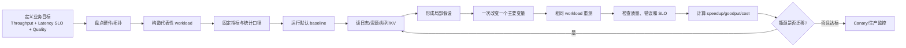
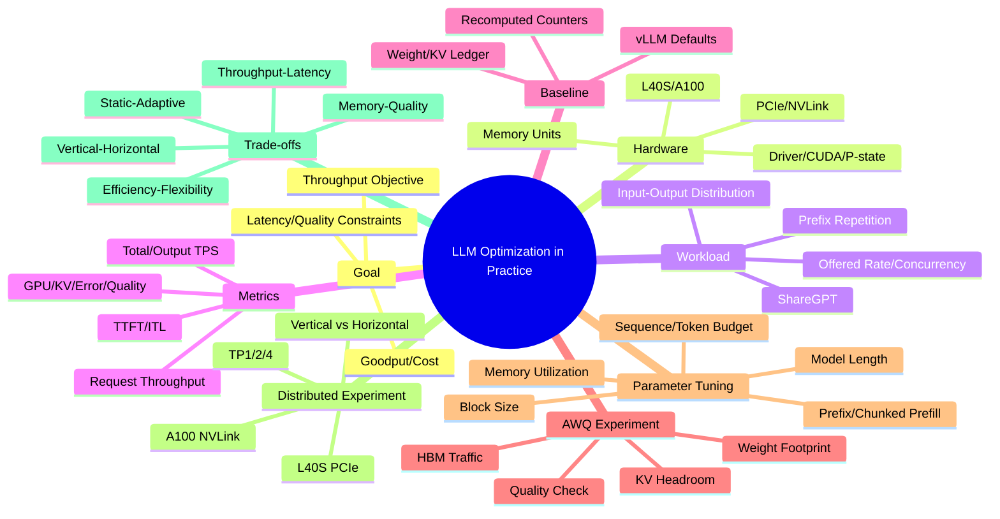

> 原章：*LLM Optimization in Practice*
> 核心问题：面对有限硬件与不断变化的流量，怎样把前几章的理论变成一套可复用的实验方法？如何从业务目标出发构造代表性 workload，建立可解释 baseline，利用显存日志提出量化假设，再通过单 GPU、AWQ 与多 GPU 实验识别容量、带宽和通信瓶颈，并避免把偶然 benchmark 或过拟合参数当成普适最优？

## 0. 本章定位、学习目标与实验主线

第 5～8 章分别给出瓶颈模型、优化技术、高级分布式方法和框架内部机制。第 9 章不再引入大量新算法，而是展示**优化过程本身**：先测量，再假设，再做可归因实验，最后根据瓶颈迁移决定下一步。

作者以 vLLM 服务 Qwen3-14B 为主线，依次比较：

1. L40S 单 GPU 上的原始 BF16/FP16 模型 baseline；
2. 同 GPU 上的 Qwen3-14B-AWQ 4-bit weight-only 量化模型；
3. 针对 workload 的 cache、batch、chunked prefill 等可选参数；
4. L40S/PCIe 与 A100/NVLink 上的 1/2/4 GPU tensor parallel；
5. Vertical TP 与 horizontal replicas 的不同目标。



读完本章，应能够回答：

- 为什么调优前必须先确定 throughput 与 latency 的主次和硬约束？
- `nvidia-smi` 的 driver、CUDA、P-state、power、utilization 与 memory 分别能说明什么，不能说明什么？
- ShareGPT 与 Prefix Repetition 分别模拟哪种流量，为什么二者 TPS 不能直接当作模型速度比较？
- Offered request rate、max concurrency、achieved request throughput 与 queue latency 有何关系？
- Total TPS、output TPS、request throughput、TTFT、ITL 应怎样从原始计数复算？
- vLLM 启动日志中的 model memory、KV GiB、KV token capacity 和 max concurrency 怎样相互验证？
- 为什么 AWQ 同时改善 weight bandwidth 和 KV headroom，但不等于低位 activation compute？
- 原始与 AWQ 图中的 2.7× throughput、42% TTFT 和 ITL 改善怎样精确计算？
- 为什么日志表与图 9-2/9-3 数字略有差异，怎样避免跨运行混合指标？
- 为什么把 `max_model_len` 从 40,960 改成 1,024 会破坏与 baseline 的直接可比性？
- 为什么同样使用 TP，L40S/PCIe 上多 GPU 变慢，A100/NVLink 上却变快？
- 为什么 4 个独立 replicas 的总 throughput 可远高于 TP=4，但不能降低单请求 TTFT？
- 怎样在 throughput/latency、memory/quality、utilization/flexibility、vertical/horizontal、static/adaptive 之间选点？

> **实验时效说明**：本章结果取决于 vLLM 版本、Qwen checkpoint、AWS instance、driver、CUDA、数据采样和 benchmark CLI。正文日志与绘图部分存在相邻运行的轻微数字差异，本笔记分别保留并解释，不将不同运行拼成一个精确实验记录。若本地无 L40S/A100 环境，不应安装或租用硬件只为机械复现；可阅读 captured notebook，并用现有硬件做方法验证。

---

## 1. LLM Serving Optimization Plan

### 1.1 优化目标：最大化什么

原章将主要目标设为**单 model instance 的 total token throughput**。若测试时间为 $T$：

$$
X_{total}
=\frac{N_{input}+N_{output}}{T},
$$

同时约束 latency 在可接受范围。更完整的生产目标应写为：

$$
\max X_{good}
\quad\text{s.t.}\quad
TTFT_{p95}\le S_1,
\quad ITL_{p95}\le S_2,
\quad Q\ge Q_{min},
\quad ErrorRate\le\epsilon.
$$

其中 goodput 只计算成功、质量达标且满足 SLO 的工作。仅最大化 total TPS 可能偏向长 input 或大 batch，却不改善用户可见 decode 和任务成功率。

### 1.2 Throughput 与 latency 为什么冲突

更大 batch/等待窗口提高权重复用和 arithmetic intensity，却增加：

$$
L_{E2E}=L_{queue}+L_{prefill}+\sum ITL_i+L_{other}.
$$

最低 latency 通常让请求立即执行、减少共享，GPU 可能低利用；峰值 throughput 则让请求等待并共享大 batch。真正目标是 latency constraint 下的 Pareto frontier，而不是两个互斥极端。

### 1.3 八步计划及每步的可证伪问题

| Step | 操作 | 要回答的可证伪问题 |
|---|---|---|
| 1 | 检查 hardware | 模型/缓存能否装下？拓扑会限制 TP 吗？ |
| 2 | 生成 traffic | 测试是否复现真实长度、重复和到达？ |
| 3 | 定义 metrics | 每个数字的边界、方向和统计量是什么？ |
| 4 | 启动 server | 权重/KV/workspace 如何分配？是否 ready？ |
| 5 | 跑原始 baseline | 当前吞吐、TTFT、ITL、错误和 saturation 是多少？ |
| 6 | 跑 AWQ | 更小 weights 是否释放 KV 并降低 bandwidth？质量是否达标？ |
| 7 | 加定向优化 | Long-prefill/decode/repetition 的主瓶颈分别是什么？ |
| 8 | 分布式 benchmark | 新增 compute 是否超过 collective overhead？ |

“先写问题，再改参数”可以防止看到任何数字都事后编故事。

### 1.4 一个严谨的实验记录单元

每次 run 应保存：

```text
Run ID / timestamp / git revision
Model + tokenizer revision + chat template
Serving image / vLLM / CUDA / driver
GPU model/count/topology/P-state/power limit
All CLI/config/env parameters
Dataset file hash + random seed + sampled IDs
Input/output token distributions
Arrival process, offered RPS, concurrency cap
Warm/cold cache state and warm-up procedure
Success/error/timeout/cancel counts
TTFT/ITL/TPOT/E2E distributions
Input/output/total TPS and request throughput
GPU compute/memory/KV/preemption/queue metrics
Quality evaluation and cost
```

否则“只改变模型”可能暗中同时改变请求样本、cache warm state 或 max length。

---

## 2. Optimize Qwen3-14B Serving with vLLM

### 2.1 Step 1: Examine the GPU Hardware

实验 baseline 使用 AWS `g6e.2xlarge` 的单张 NVIDIA L40S。

#### 2.1.1 `nvidia-smi` 五项检查

1. **Driver/CUDA compatibility**：`nvidia-smi` 的 CUDA 是 driver 支持的最高 CUDA compatibility，不一定等于 Python 环境 toolkit/runtime 版本；还要检查 PyTorch/vLLM build。
2. **GPU identity/compute capability**：L40S compute capability 8.9，决定可用 kernel/precision。
3. **Memory**：46068 MiB 是约：

$$
46068/1024\approx44.99\ \mathrm{GiB},
$$

或按产品十进制标称约 48 GB。原章写“约 46 GB”混用了显示数值与单位；容量计算应统一 MiB/GiB。
4. **P-state**：P8 常表示空闲/低功耗，P0/P1 常见于活动状态，但具体 boost、clock 和 power policy 还需查询 clocks。
5. **Power/utilization/process**：确认测试前无其他进程；测试中观察是否达到 power/thermal throttle。

#### 2.1.2 `nvidia-smi` 不能独立证明什么

- 97% GPU utilization 表示采样窗口内 GPU active，不说明 Tensor Core/HBM/有用工作占比；
- 高 power 低 TPS 不能仅凭此断言 memory bottleneck，需要 profiler/带宽指标；
- Memory used 不区分 weights、KV、CUDA graph、workspace 和 fragmentation；
- 空闲 P8 不证明 clocks/persistence/config 在 benchmark 时一致。

建议同时记录 `nvidia-smi dmon`, DCGM、framework metrics 和 Nsight/torch profiler（需要时）。

### 2.2 Step 2: Generate Benchmark Traffic

#### 2.2.1 Dataset 是优化目标的一部分

同一 model/hardware 在长 input、长 output、重复 prefix 和随机 prompt 上瓶颈不同。Benchmark 不是中立数据源；你选择的长度和重复率会选择“获胜”的优化。

#### 2.2.2 ShareGPT：自然对话近似

100 samples 统计：

| 指标 | Prompt tokens | Output tokens |
|---|---:|---:|
| Min | 5 | 4 |
| Max | 817 | 771 |
| Mean | 232.60 | 220.61 |
| Median | 141.50 | 164.50 |
| Std | 241.42 | 210.23 |

均值接近平衡，但分布方差大、右尾长。Mean 大于 median 说明长请求拉高平均。仅报告均值无法重现 scheduler 压力；应保存 histogram/percentiles 和 input-output 相关性。

ShareGPT 代表某类历史聊天流量，不自动代表生产：语言、chat template、模型 response、license/隐私、过滤规则和输出长度都可能不同。

#### 2.2.3 Prefix Repetition：可控 cache stress test

原章示例：50 prompts，prefix=256、suffix=256、5 unique prefixes、output=128。每个 prompt input 为 512 tokens。减少 unique prefixes 提高重复次数和理论 hit；它是刻意放大 prefix reuse 的 synthetic workload。

若 50 requests 均匀使用 5 prefixes，每个 prefix 约复用 10 次；理想情况下第一次 cold，后 9 次可命中 256-token prefix。Token-level ideal hit fraction（忽略调度/eviction）：

$$
\frac{5\times9\times256}{50\times512}
=45\%.
$$

真实 tokenizer/调度顺序、block boundary 和 cache capacity 会改变结果。

原章将它描述为测试“repetition bias”和 cache；服务性能实验的主要价值是**已知 prefix locality**。模型是否复制输入属于模型质量/解码行为，不能和 serving cache hit 混为一个指标。

#### 2.2.4 Offered load 与 achieved throughput

`vllm bench serve` 示例：2000 prompts、`request-rate=10`、`max-concurrency=10`。`request-rate` 是生成器试图提交的到达率；若 concurrency cap 已满，客户端会等待，实际 completed RPS 可能远低于 10。

必须区分：

- Offered arrival rate $\lambda_{offered}$；
- Admitted rate $\lambda_{admitted}$；
- Completed throughput $X_{req}$；
- In-flight concurrency $L$；
- Queue/client wait。

Stable system 下 Little's Law：

$$
L=X_{req}W.
$$

如果 capped concurrency=10、completed 1.10 req/s，则平均系统/客户端观察的停留时间数量级可达 $10/1.10\approx9.1$ s（边界取决于 benchmark 对 in-flight 的定义）。

#### 2.2.5 Open-loop 与 closed-loop

设置有限 max concurrency 后，生成器在高压时会受背压，兼有 closed-loop 特性；纯 open-loop 应继续按时刻提交并让 queue 增长。两类测试都需要：

- Open-loop 找 saturation/knee 和 overload failure；
- Closed-loop 测固定用户并发体验。

### 2.3 Step 3: Define Evaluation Metrics

**Table 9-1：LLM serving 主要评价维度**

| Category | Metrics |
|---|---|
| Throughput | Total TPS、output TPS、request/s |
| Latency | TTFT、TPOT/ITL mean + p99 |
| Resource | GPU utilization、memory、KV occupancy |
| Workload | Input/output ratio、concurrency、request rate |
| Reliability/cost | Error、goodput、cost efficiency |

#### 2.3.1 Throughput 公式

$$
X_{req}=\frac{N_{success}}{T},
$$

$$
X_{out}=\frac{N_{output}}{T},
$$

$$
X_{total}=\frac{N_{input}+N_{output}}{T}.
$$

Total TPS 将 prefill input 和 decode output 相加，但二者 FLOPs/bytes 不同，不能当同质 token。Output TPS 更接近 decode aggregate performance；单用户 decode speed 还应看 TPOT/ITL。

原章说 output token 是 LLM cost 的主要驱动不适用于所有场景：长-context input 可能更贵，vendor 也分别计价；自托管 cost 由 GPU time/goodput 决定。

#### 2.3.2 Latency 公式

TTFT 包含 admission/queue/tokenize/prefill/first decode/emit；ITL 是相邻 token/chunk 间隔。平均值会隐藏拥塞，应至少同时报告 p50/p95/p99。

若输出 $N$ tokens：

$$
L_{E2E}\approx TTFT+\sum_{i=2}^{N}ITL_i.
$$

#### 2.3.3 Metric 完整性

只用四个指标做教学可行，但生产优化还需：quality、success/error/timeout、p99 TTFT、E2E、queue、preemption、GPU memory/HBM、power 和 cost。否则降低质量或丢请求也可“提高 TPS”。

### 2.4 Step 4: Set Up the Model Serving Server

Baseline 命令：

```bash
vllm serve Qwen/Qwen3-14B
```

生产需 pin model revision、vLLM image、dtype 和 chat template；“default”随版本/硬件变化，本身不是稳定 benchmark config。

#### 2.4.1 启动日志的容量账本

原始模型日志：

```text
Model loading: 27.5185 GiB
Available KV cache: 11.00 GiB
GPU KV cache: 72,064 tokens
Max concurrency at 40,960 tokens/request: 1.76x
```

验证：

$$
72{,}064/40{,}960=1.759375\approx1.76.
$$

每 KV token 平均 bytes：

$$
11\times2^{30}/72{,}064
\approx163{,}874\ \mathrm{bytes/token}
\approx160\ \mathrm{KiB/token}.
$$

这可与 Qwen3 layers/KV heads/dtype 理论公式交叉检查。

Weights + KV：

$$
27.5185+11=38.5185\ \mathrm{GiB}.
$$

相对 `nvidia-smi` 44.99 GiB，还约有 6.47 GiB 用于 CUDA context、graph/workspace、activation、allocator reserve/fragmentation 等。原章说 38.5 GiB/46 GB，需注意 GiB/GB 口径。

#### 2.4.2 “模型占总显存 65%”的口径问题

若分母是 weights+KV allocated：

$$
27.5185/38.5185\approx71.45\%.
$$

若分母是 46 GB 显示总量：约 59.8%。因此“超过 65% of total GPU memory”与给出的两个自然分母都不完全一致。正确做法是明确分母，不影响核心结论：weights 是最大静态项，压缩它能释放大量 KV/headroom。

#### 2.4.3 KV 少不等于会“频繁驱逐 decode cache”

Active request KV 通常不能随意驱逐而继续无代价 decode；容量不足更常导致 admission 降低、preemption/recompute/swap 或更少 active sequences。Prefix cache blocks 才可能按 LRU 驱逐。应区分 active KV 与 reusable prefix KV。

### 2.5 Step 5: Benchmark the Qwen3 Model with vLLM

#### 2.5.1 ShareGPT baseline

原章输出：

```text
Success: 2000
Duration: 1810.09 s
Input: 446,619 tokens
Output: 412,052 tokens
Request throughput: 1.10 req/s
Output throughput: 227.64 tok/s
Total throughput: 474.38 tok/s
Mean TTFT: 104.15 ms
Mean ITL: 43.24 ms
P99 ITL: 72.15 ms
```

复算：

$$
2000/1810.09=1.105\ \mathrm{req/s},
$$

$$
412{,}052/1810.09=227.64\ \mathrm{output\ tok/s},
$$

$$
(446{,}619+412{,}052)/1810.09=474.38\ \mathrm{total\ tok/s}.
$$

Offered 10 RPS 但 achieved 1.10 RPS，说明 workload/service time/concurrency cap 限制完成率；不能说系统“处理 10 RPS”。`Maximum request concurrency=10` 与报告的 `Peak concurrent requests=15` 表面不一致，可能来自 CLI 版本中两个统计边界不同或输出记录问题，应查询 benchmark 定义而非强行解释。

#### 2.5.2 Prefix Repetition baseline

```text
Success: 1000
Duration: 569.00 s
Input: 512,000 tokens
Output: 127,066 tokens
Request throughput: 1.76 req/s
Output throughput: 223.31 tok/s
Total throughput: 1123.13 tok/s
Mean TTFT: 104.64 ms
Mean ITL: 43.95 ms
P99 ITL: 59.22 ms
```

$$
1000/569=1.7575,
$$

$$
127{,}066/569=223.31,
$$

$$
(512{,}000+127{,}066)/569=1123.14\ \mathrm{tok/s},
$$

与报告的 1123.13 仅有取整/原始 duration 精度差异。

#### 2.5.3 为什么 total TPS 高 2.37×而 output TPS几乎相同

$$
1123.13/474.38\approx2.37,
$$

但 output TPS：

$$
223.31/227.64\approx0.981.
$$

Prefix workload 每请求固定 512 input/约127 output，input/output ratio 约 4.03；ShareGPT 总 input/output ratio 约 1.08。Total TPS 高主要因为更多 input tokens 被计入，且 prefix cache 使部分 prefill 便宜，并不表示 decode 快 2.37×。

类似 Mean TTFT/ITL 说明用户可见平均 latency 未显著改善；prefix caching 的价值可能体现在服务能处理更多 input work、tail 或同一时间完成更多请求。要证明 cache 原因，应报告 prefix cache hit tokens/rate；“prefix caching + continuous batching + block sharing”是合理假设，但仅凭两个不同数据集不能做严格因果归因。

#### 2.5.4 97% utilization 的正确解读

它证明 GPU 大部分采样窗口 active，但不知道是 prefill、decode、memory stalls 还是有效 Tensor Core。优化后仍可提高 2.7×，正说明 utilization 百分比不是“无优化空间”的证据。

### 2.6 Step 6: Benchmark the Quantized Qwen3 Model with vLLM

#### 2.6.1 局部假设

AWQ W4A16 将 weights 压到约 4-bit、activation 通常保留 16-bit。预期：

1. 权重容量下降，KV blocks 增多；
2. Decode 每步 HBM weight bytes 下降，ITL 改善；
3. Mixed kernel 可融合解量化，但并非低位 activation compute；
4. Model load/解包可能更慢；
5. 质量可能略降，必须独立评估。

原章说减少“CPU 与 GPU 之间的数据移动”不准确：steady-state inference 的主要收益是 **GPU HBM 到 compute 的 weight data movement** 减少；CPU→GPU 主要发生在加载/部分 offload 路径。

#### 2.6.2 显存日志比较

| 指标 | 原始 | AWQ | 比值/变化 |
|---|---:|---:|---:|
| Model loading memory | 27.5185 GiB | 9.3619 GiB | 2.94× smaller |
| Load time | 5.2659 s | 10.6523 s | AWQ 2.02× slower load |
| KV memory | 11.00 GiB | 29.15 GiB | 2.65× |
| KV tokens | 72,064 | 191,056 | 2.65× |
| Max concurrency @40,960 | 1.76× | 4.66× | 2.65× |

`27.5→9.36` 不是理想 4×，因为 checkpoint/model 还有 scales、metadata、非量化参数、allocator 和 loader 口径。KV 验证：

$$
191{,}056/40{,}960=4.6645,
$$

与 4.66 一致。

原章“释放 17 GB”按显示值实际：

$$
27.5185-9.3619=18.1566\ \mathrm{GiB}.
$$

若按粗略 27.5 与 9.6 得 17.9，称 17 GB 是保守取整。

#### 2.6.3 Figure 9-2：ShareGPT 精确结果

| Metric | Original | AWQ | 改善 |
|---|---:|---:|---:|
| Total TPS | 474.75 | 1280.83 | $2.698\times$ |
| Output TPS | 227.84 | 614.86 | $2.699\times$ |
| Mean TTFT | 103.61 ms | 59.29 ms | 降 42.78% |
| Mean ITL | 43.20 ms | 15.91 ms | 降 63.17% |

图与 Step 5 文本 baseline（474.38/104.15/43.24）略不同，说明图使用另一相邻 run 或数据处理结果。计算同一图内 ratio 是有效的，不能用一个 run 的分子配另一个 run 的分母。

AWQ output TPS 与 ITL 都约 2.7× 改善，符合低 batch/decode bandwidth 减少 weight bytes；更多 KV capacity 还允许 scheduler 保留更高并发。

#### 2.6.4 Figure 9-3：Prefix Repetition 精确结果

| Metric | Original | AWQ | 改善 |
|---|---:|---:|---:|
| Total TPS | 1124.18 | 2822.13 | $2.510\times$ |
| Output TPS | 223.47 | 562.57 | $2.518\times$ |
| Mean TTFT | 102.97 ms | 64.18 ms | 降 37.67% |
| Mean ITL | 43.95 ms | 17.16 ms | 降 60.96% |

同样，图 baseline 与 Step 5 文本的 1123.13/104.64 有轻微 run-to-run 差异。

#### 2.6.5 性能提升不能替代质量验证

AWQ 需要在实际聊天、工具、语言、长上下文和 safety 上比较原始模型。若任务成功率下降，$X_{good}$ 可能低于裸 TPS 暗示的收益。还应检查不同 concurrency 下 W4A16 mixed kernel 是否从 bandwidth 转成 dequant/compute bottleneck。

### 2.7 Step 7: Apply Additional Optimization Techniques

#### 2.7.1 根据 workload 选技术，而非罗列开关

| Workload/证据 | 候选技术 | 需观察的代价 |
|---|---|---|
| 重复长 prefix、低 TTFT hit | Prefix cache/LMCache | Miss overhead、CPU/SSD load、KV capacity |
| 长 output、小 batch、decode-bound | Speculative decoding | Acceptance、TTFT、aggregate throughput |
| 长 prompt 阻塞 stream | Chunked prefill | TTFT 与 E2E 可能增加 |
| KV OOM/并发不足 | Quantization、KV dtype、memory utilization | Quality、OOM headroom |
| GPU 低利用/queue 有量 | Max seq/token budget | Queue/ITL、memory |
| 单卡装不下/TTFT 必须更低 | TP/PP | Collective/bubble/cost |

LMCache 不是所有 prefill-heavy workload 都有效，还要求 prefix reuse；完全随机的长 prompts 只有 offload overhead，没有命中收益。

#### 2.7.2 参数含义与边界

`--gpu-memory-utilization` 提高 KV 可用显存，但 0.95 可能给 workspace/波动留下太少余量；需最大并发/长度 soak test。

`--max-model-len` 决定单请求支持上限，也影响可规划 KV capacity。为了 benchmark 提高吞吐而从默认/40960 降到 1024，会拒绝或截断长请求，改变 workload，不能与原 baseline 直接比较。

`--block-size 16` 是 allocator/kernel 粒度。小 block 减 internal fragmentation，但增加 block table/metadata/调度，且支持值依 backend/hardware；“越小越好”不成立。

`--max-num-seqs` 限 active sequences；`--max-num-batched-tokens` 限单 step token work。512/16384 是否可用取决于 KV、prompt 和 SLO。

原章列 `--max-paddings 256`，参数可能属于特定版本或已变化；现代 packed/continuous LLM scheduler 不应按传统 padding 直觉配置。必须以安装版本 `vllm serve --help` 为准。

`--enable-prefix-caching`、chunked prefill 的默认值随版本改变；显式写参数便于实验可复现，但先确认是否重复/冲突。

#### 2.7.3 原章综合脚本为何不是 apples-to-apples 结论

```text
--gpu-memory-utilization 0.95
--max-model-len 1024
--block-size 16
--enable-prefix-caching
--max-num-seqs 8
--max-num-batched-tokens 8192
--enable-chunked-prefill
```

它同时改了模型、显存、length、block、cache、sequence、tokens、chunking，无法归因哪项有效；而 max length 1024 又改变可接受请求。它是“候选部署配置示例”，不是实验设计。

严谨顺序：

```text
baseline
→ only AWQ
→ only memory utilization
→ scan max sequences/token budget grid
→ enable prefix cache under cold/warm workloads
→ scan chunk size under long-prefill interference
→ combine winning settings and rerun regression
```

每一步固定 sampled request IDs 和 cache state。

#### 2.7.4 不要 overfit 一个 benchmark

调优参数应覆盖 traffic envelope，而不是一个均值。可用多 workload suite：自然聊天、长 input、长 output、prefix hot/cold、burst、mixed tenants；在所有硬件目标上选择稳健点，或按 workload class 自适应 route/config。

### 2.8 Step 8: Benchmark the Qwen3 Model with Distributed Serving

实验模型为 Qwen3-14B-AWQ；比较：

- `g6e.12xlarge`：4×L40S，GPU 间 PCIe；
- `p4d.24xlarge`：8×A100，NVLink/NVSwitch 拓扑；
- TP=1/2/4，单 node。

#### 2.8.1 Host model in a distributed setup

```bash
vllm serve Qwen/Qwen3-14B-AWQ \
  --tensor-parallel-size 2
```

TP=2 是一个 replica 横跨两卡，切分每层并每层 collective；不是两个独立 replicas。所有测试应固定同一 dataset、arrival/concurrency 和其他 config。

#### Distributed serving performance analysis（分布式服务性能分析）

#### 2.8.2 Figure 9-4：L40S/PCIe 上 TP 越大越差

| TP | ShareGPT TPS | Repetition TPS | ShareGPT TTFT | Repetition TTFT |
|---:|---:|---:|---:|---:|
| 1 | 2066.98 | 4375.46 | 67.92 ms | 106.80 ms |
| 2 | 1725.72 | 3440.61 | 104.58 ms | 246.66 ms |
| 4 | 1755.80 | 3471.24 | 106.24 ms | 259.25 ms |

相对 TP=1：

- TP=4 ShareGPT TPS 仅 $1755.80/2066.98=84.95\%$；
- Repetition TPS 仅 $79.33\%$；
- ShareGPT TTFT 增加 56.42%；
- Repetition TTFT 增加 142.74%。

AWQ 14B 已能单 L40S 放下；增加 TP 解决了不存在的 capacity 问题，却引入每层 PCIe collective，并使每卡 local GEMM 更小，通信/launch 占比上升。因此单卡最佳。

#### 2.8.3 Figure 9-5：A100/NVLink 上 TP 改善 latency

| TP | ShareGPT TPS | Repetition TPS | ShareGPT TTFT | Repetition TTFT |
|---:|---:|---:|---:|---:|
| 1 | 2454.63 | 5071.34 | 66.73 ms | 122.69 ms |
| 2 | 3342.38 | 7107.55 | 44.18 ms | 58.90 ms |
| 4 | 3926.27 | 8566.93 | 33.46 ms | 40.27 ms |

TP=4 相对 TP=1：

$$
S_{Share}=3926.27/2454.63\approx1.60,
$$

$$
S_{Repeat}=8566.93/5071.34\approx1.69.
$$

TTFT 降低：

$$
(66.73-33.46)/66.73\approx49.86\%,
$$

$$
(122.69-40.27)/122.69\approx67.18\%.
$$

NVLink 让每层 collective 足够快，使额外 compute 超过通信成本；但 4 GPUs 只得到 1.6～1.69× throughput，scaling efficiency 约 40%～42%，仍远非线性。

#### 2.8.4 L40S 单卡与 A100 多卡为什么不能只按芯片代际解释

结果由以下共同决定：

$$
T_{TP}(p)=T_{compute}/p+T_{collective}(p,topology)
+T_{launch}+T_{imbalance}.
$$

L40S 单卡 inference 强，但没有 NVLink；A100 单卡较老，p4d 的高速 GPU fabric 使 TP 更有效。模型已经能 fit 时，是否 TP 由 latency 需求与 topology 决定，而不是“更多 GPU”或“更新 GPU”单独决定。

#### 2.8.5 Vertical TP 与 Horizontal DP

若 p4d 四张 A100 分别运行四个 TP=1 replicas，理想总 ShareGPT throughput：

$$
4\times2454.63=9818.52\ \mathrm{TPS}.
$$

原章写约 9816 TPS。相对一个 TP=4 replica 的 3926.27：

$$
9818.52/3926.27\approx2.50,
$$

是 2.5×，严格说并非“nearly triple”。但四 replicas 的每请求 TTFT 仍约单卡 66.73 ms；TP=4 可降至 33.46 ms。选择：

- DP/horizontal：总 throughput、HA、隔离；
- TP/vertical：单模型 fit、降低单请求 compute latency；
- 常见组合：每 replica TP=$p$，再用 DP=$r$ 水平复制。

#### 2.8.6 成本与资源归一化

比较 TP1/2/4 不只看每 replica TPS，还应看：

$$
\mathrm{TPS/GPU}=\frac{X}{p},
\qquad
\$/\mathrm{good\ token}
=\frac{p\times C_{GPU/hour}}
{3600X_{good}}.
$$

TP=4 在 p4d 虽 latency 最低，TPS/GPU 可能低于 TP=1。只有 latency SLO 或 capacity 要求值得支付额外卡数时才选。

---

## 3. Common Optimization Trade-offs

> 原章标题写作 `Trade-0ffs`，应为 `Trade-offs`。

### 3.1 Throughput versus Latency

Batch、queue、token budget 提高设备利用率但增加等待/iteration。按 use case 设 TTFT/ITL hard constraint，在其下最大化 goodput；不要分别追求“最大 TPS”和“最低 latency”两个无法共存的点。

### 3.2 Memory Efficiency versus Model Quality

AWQ/FP8/KV quantization 释放 weights/KV，并可能加速 bandwidth/compute；代价是 rounding/outlier 和 task quality。比较：

$$
(Quality,TTFT,ITL,TPS,Memory,Cost)
$$

的 Pareto frontier。4-bit 与 8-bit 的正确选择由 task tolerance、hardware kernel 和 batch 决定。

### 3.3 Hardware Utilization versus Flexibility

L40S 专用 block/batch/TP 最优配置可能在 A100/H100 或不同流量上失败。牺牲少量峰值换版本/硬件/traffic envelope 的稳健性，往往降低长期 TCO。可将少数参数交给 runtime adaptive policy，而不是全部静态写死。

### 3.4 Vertical versus Horizontal Scaling

Vertical TP/PP：fit/单请求 latency，但通信、故障域和每 token GPU 成本上升。Horizontal DP：aggregate throughput/HA，不能降低单请求 model latency。通常先单 GPU + DP；只有 fit 或 latency 需要才增加 TP。

### 3.5 Static Optimization versus Adaptive Serving

Static config 可重复、易容量规划，却会过拟合固定 arrival/length。Adaptive runtime 可按 queue、tokens、KV、SLO 调 batch/cache/schedule，但控制环会振荡、难调试。需保留 bounds、hysteresis、fallback 和决策 telemetry。

### 3.6 其他隐含 trade-offs

- Cold start vs runtime：AWQ 本实验加载更慢但 serving 更快；
- Cache hit vs active capacity：保留 prefix 会占并发 KV；
- Reproducibility vs auto-tuning：默认智能参数随版本变化；
- Peak performance vs reliability headroom：memory utilization 0.95 更容易 OOM；
- Benchmark specialization vs production diversity：Prefix Repetition 结果不能代表随机聊天。

---

## 4. 容易混淆的概念与常见误区

### 4.1 Optimization 是找一个全局永久最佳配置

错误。最优点随 model、framework、GPU、topology、traffic、SLO 和价格变化。

### 4.2 Throughput 高就一定成本低

只有成功、质量和 SLO 达标的 goodput 提高才降低单位结果成本；错误/超时/无用 input TPS 不算。

### 4.3 Offered 10 RPS = Server 实际完成 10 RPS

错误。原实验 completed 仅约 1.10 req/s；concurrency cap 和 service time 施加背压。

### 4.4 `max-concurrency=10` 与 GPU batch size 相同

错误。前者是 benchmark/client in-flight cap；vLLM active/scheduled batch 由 scheduler、tokens 和 KV 决定。

### 4.5 ShareGPT mean input/output 接近就代表每请求平衡

错误。Std 很大，单请求从短 input/长 output 到相反模式；联合分布决定调度。

### 4.6 Prefix Repetition 是通用生产流量

错误。它刻意制造 cache locality，是 cache stress/best-case 类测试，必须与自然/冷流量一起看。

### 4.7 Total TPS 可直接比较不同数据集的模型速度

错误。Input/output ratio 不同，prefill/cache 成本不同；本章 1123 vs474 主要由 input work composition 变化。

### 4.8 97% GPU utilization 表示已达峰值

错误。可以 memory-stalled 或执行低效 kernel；AWQ 在同高 active 情况仍有大提升。

### 4.9 `nvidia-smi` CUDA version = 环境编译 CUDA

错误。它主要显示 driver compatibility；还需检查 runtime/PyTorch/vLLM build。

### 4.10 46068 MiB = 46 GiB = 48 GB

错误。约 44.99 GiB，产品十进制标称约48 GB；必须统一单位。

### 4.11 Model memory + KV memory = 全部显存

错误。还有 CUDA context、graphs、activation、workspace、allocator 和 fragmentation。

### 4.12 KV cache 小会随意驱逐 active decode state

不准确。Active KV 被占用；容量不足通常减少 admission 或触发 preemption/swap/recompute。LRU 主要作用于可复用 prefix blocks。

### 4.13 AWQ 4-bit 模型应正好缩小 4×

错误。Scales、metadata、非量化层、loader/runtime 使本实验仅约 2.94×。

### 4.14 AWQ 的主要稳态收益是减少 CPU-GPU 传输

错误。Weights 常驻 GPU，主要减少 HBM→compute 搬运与容量；加载时才有 host-device transfer。

### 4.15 Weight-only AWQ 同时把 activation 计算变成 4-bit

错误。W4A16 activation 仍 16-bit；收益来自 weight bytes 和 mixed kernel，非纯 4-bit compute peak。

### 4.16 KV token capacity 增加只会提高 prefix cache

错误。也提高 active sequence admission、长 context 和 continuous batch；具体分配由 scheduler/cache policy 决定。

### 4.17 图表与日志 baseline 可任意混用

错误。474.38 vs474.75、104.15 vs103.61 来自不同 run/处理；ratio 应在同一 run 内计算。

### 4.18 同时改八个参数可证明综合配置中每个参数有效

错误。只能证明组合结果；单变量/受控 grid 才能归因。

### 4.19 降低 `max-model-len` 是无代价优化

错误。改变可接受 workload，可能排除长请求；必须与 baseline 使用同一长度范围。

### 4.20 Block size 越小 cache utilization 越好且无代价

错误。Internal fragmentation 降低，但 metadata、indirection 和 kernel 限制增加。

### 4.21 Multi-GPU 一定更快

错误。L40S/PCIe 实验 TP2/4 同时降低 throughput、提高 TTFT。

### 4.22 更新一代 GPU 一定比旧 GPU 多卡更好

错误。Topology 是算法输入；A100/NVLink TP scaling 胜过 L40S/PCIe。

### 4.23 TP=4 的目标是获得 4× fleet throughput

错误。主要用于 fit/单请求 latency；aggregate throughput 通常由 4 个 DP replicas 更高。

### 4.24 四 replicas 与 TP=4 提供相同 latency/HA

错误。Replicas 有独立故障域和单卡 latency；TP 降低单请求 compute latency，但任一 rank 故障可影响整个 replica。

### 4.25 Default config 永远是公平 baseline

Default 随版本/硬件变化。它是现实起点，但要保存解析后的完整 config 才可复现。

### 4.26 自动调优意味着不必监控

错误。Adaptive policy 也会在 drift/burst 下失效，需要 decision metrics、bounds 和 rollback。

---

## 5. 从本章抽象出的通用优化方法

### 第一步：将业务目标写成约束优化

定义质量、TTFT/ITL/E2E、arrival/peak、availability 和成本，选择 primary objective。不要只说“让模型更快”。

### 第二步：保存真实 workload 的联合分布

Input/output tokens、相关性、arrival、concurrency、prefix reuse、cancel、tenant/model mix 都进入 replay；同时保留 synthetic stress cases。

### 第三步：盘点 hardware 和 topology

统一 MiB/GiB/GB，记录 compute/bandwidth、NVLink/PCIe、driver/runtime、power 和空闲进程。Topology 不能等到 TP 失败后再发现。

### 第四步：定义指标公式和原始计数

保存 duration、success、input/output tokens，复算 RPS/TPS；报告分位 latency、error 和 goodput，检查 CLI 输出自洽性。

### 第五步：建立显存账本

拆 weights、KV、active/prefix、activation、graphs、workspace、fragmentation；用 KV tokens/max length 验证 concurrency。

### 第六步：从日志提出一个局部假设

本章假设：weights 27.5 GiB 限制 KV 且 decode 搬运大，AWQ 应释放 capacity/bandwidth。先写预期指标方向，再实验。

### 第七步：一次改一个主要变量

固定 sampled IDs、arrival、cache state 和 config，只换 AWQ；之后单独扫 memory、sequences、token budget、chunk/cache。组合前先知道每项作用。

### 第八步：同 run 内计算比率并保留方差

不要跨日志和图混分子分母。重复多轮、报告 median/CI/run-to-run variance，避免一次噪声。

### 第九步：检查性能、质量和可靠性三联表

Quantization/length/config 变化同时跑任务质量、structured output、安全、OOM、timeout 和 latency；裸 TPS 不是发布门槛。

### 第十步：分布式前先证明单卡为什么不够

只有 fit 或 per-request latency 不达标才 TP；先确认 fast interconnect。若目标是 fleet throughput，优先 DP replicas。

### 第十一步：归一化资源和成本

报告 TPS/GPU、good tokens/GPU-hour、$/good token、power 和故障域；TP4 replica TPS 不能直接与单卡 TPS 比“更高就是赚”。

### 第十二步：生产中闭环并防 overfit

Canary 新配置，监控 workload drift、queue、KV、preemption、quality 和 cost；保留 adaptive defaults、范围和 fallback，定期重放 suite。

---

## 6. 本章知识结构与核心结论

### 6.1 知识结构



### 6.2 核心结论

1. **优化首先是一套实验方法。** 业务目标、代表性 workload、指标、baseline、局部假设和受控实验比参数清单更重要。
2. **Peak throughput 与最低 latency 常冲突。** 应在质量和 tail-latency SLO 下最大化 goodput，而不是无约束 TPS。
3. **数据集会决定赢家。** ShareGPT 测自然异质对话，Prefix Repetition 刻意测 prefix locality；两者结果不能脱离 token composition 比较。
4. **Offered RPS 不是 achieved RPS。** Concurrency/backpressure/service time 会使 10 RPS 配置只完成约 1.10 req/s；必须记录 queue 和实际完成率。
5. **Total TPS 会被 input/output ratio影响。** Prefix baseline total TPS 是 ShareGPT 2.37×，但 output TPS 基本相同，不能解释为 decode 快 2.37×。
6. **框架输出应由原始计数复算。** 请求、input/output tokens 和 duration 可发现口径、取整和统计异常。
7. **显存日志是调优证据。** 原始 weights 27.52 GiB、KV 11 GiB、72,064 tokens 揭示 capacity 分配，并由 $72064/40960=1.76$ 自洽验证。
8. **AWQ 同时改变容量和 bandwidth。** Model memory 降到 9.36 GiB，KV token capacity 增 2.65×，并减少 decode HBM weight bytes；它不是 activation 4-bit compute。
9. **本实验 AWQ 在自然流量中带来约 2.70× total/output TPS。** Mean TTFT 降 42.78%，ITL 降 63.17%；prefix traffic 也获得约 2.51× TPS。
10. **压缩比不等于 bit-width 理想比。** 4-bit AWQ 实际 model memory 仅缩 2.94×，且 load time 约翻倍；metadata、非量化层和 loader 都有成本。
11. **不同 run 的近似数字不能混用。** 图与日志 baseline 有轻微差异，应在同 run 内计算 speedup 并报告方差。
12. **参数调优必须保持 workload 不变。** 降 max length、同时改八个 knobs 会破坏归因；组合配置需要由单变量结果构建。
13. **Distributed serving 的收益由 topology 决定。** L40S/PCIe 上 TP 变慢，A100/NVLink 上 TP=4 将 ShareGPT TTFT 约减半。
14. **多 GPU 不线性。** A100 TP=4 只带来约 1.60～1.69× throughput，通信、同步和小 GEMM 吃掉扩展收益。
15. **Vertical 和 horizontal 解决不同问题。** 四个独立 A100 replicas 理想总吞吐约为 TP=4 的 2.5×；TP=4 则把单请求 TTFT 从 66.73 ms 降到 33.46 ms。
16. **对多数能单卡 fit 的服务，单 GPU replica + horizontal DP 更简单高效。** 只有模型 fit 或严格 latency 需求才为 TP 的通信和成本买单。
17. **过度静态调优会失去可移植性。** 现代 runtime 的 adaptive defaults 是起点，生产仍需 telemetry、bounds、canary 和 workload replay。
18. **优化永远是迭代的瓶颈迁移。** AWQ 解决 weight/KV 后，下一瓶颈可能是 compute、queue、network、quality 或 framework overhead。

### 6.3 一句话复盘

本章的总方法是：**把 serving 优化写成“在质量与 tail-latency 约束下最大化 goodput”的实验问题，用真实自然流量与可控 synthetic workload 建 baseline，从原始 token 计数和显存账本验证框架输出，再一次只改变模型、cache、scheduler 或 parallel topology 中的一项；当 AWQ、TP 或其他技术改变容量和数据路径后，重新识别瓶颈，并以同 run speedup、TPS/GPU、$/good token 和质量决定是否进入生产。**

---

## 7. 术语速查

| 术语 | 简明定义 | 不要与之混淆 |
|---|---|---|
| Baseline | 固定 model/workload/config 的起始测量 | Default 随版本变化，仍需完整记录 |
| Offered RPS | Load generator 尝试提交的到达率 | 不等于完成 request throughput |
| Achieved RPS | 成功完成 requests / duration | 受 concurrency、queue、service time 限制 |
| Max concurrency | Benchmark 允许的 in-flight 上限 | 不等于 GPU batch size |
| ShareGPT workload | 自然异质聊天数据近似 | 不代表所有生产分布 |
| Prefix Repetition | 可控重复 prefix synthetic dataset | 是 cache stress，不是通用流量 |
| Total TPS | $(input+output)/time$ | Input/output token 成本不同 |
| Output TPS | Generated output tokens/time | Aggregate 值不等于单用户速度 |
| Request throughput | Completed requests/time | 依请求长度分布 |
| TTFT | 请求到首 token 的时间 | 含 queue/prefill/first decode 等 |
| ITL | 相邻 streamed tokens/chunks 间隔 | Mean 会隐藏 p99 抖动 |
| GPU utilization | GPU 在采样窗口内 active 比例 | 不等于 peak useful compute |
| P-state | NVIDIA performance/power state | P8 空闲、P0/P1 活跃是常见而非绝对解释 |
| MiB/GiB/GB | 二进制/十进制容量单位 | 46068 MiB 约44.99 GiB |
| Memory ledger | Weights、KV、activation、graphs 等显存账本 | Model+KV 不等于全部显存 |
| KV token capacity | 当前 allocator 可容纳的 KV token 数 | 除 max length 可估极限 concurrency |
| AWQ | Activation-aware weight-only quantization | 名称含 activation-aware 不等于量化 activation |
| W4A16 | 4-bit weights、16-bit activation | 主要改善 weight capacity/bandwidth |
| Speedup | Baseline time/new time 或 new throughput/base throughput | 必须说明方向与同一 run |
| Block size | Paged KV 的 token block 粒度 | 越小不一定越好 |
| Max model length | 单请求 context+output 上限 | 调低会改变 workload |
| Max sequences | Active request 数上限 | 还需 token/KV budget |
| Max batched tokens | 单 scheduler step 的 token work 上限 | 不等于总 active KV tokens |
| Tensor parallelism | 一个 replica 跨 GPU 切 layer tensors | 不等于多个 replicas |
| Data parallelism | 完整 replicas 分流 requests | 不降低单请求 model compute latency |
| Scaling efficiency | 实际 speedup / GPU count | 通信使其通常小于1 |
| TPS/GPU | Aggregate TPS 除使用 GPU 数 | 比较资源效率的重要归一化 |
| Goodput | 满足质量、错误和 SLO 的有效吞吐 | 裸 TPS 可能误导 |
| Parameter overfitting | 配置只适合一个 GPU/workload | 需 workload suite/adaptive runtime |
