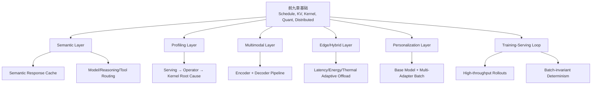
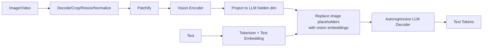
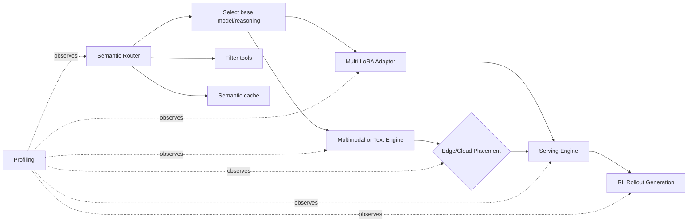
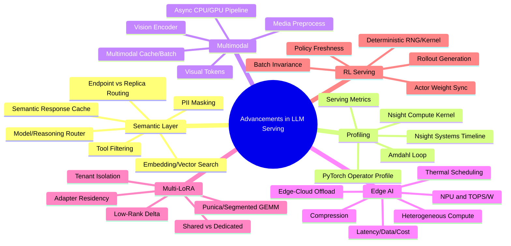

> 原章：*Advancements in LLM Serving*
> 核心问题：当 serving 不再只是执行一个文本模型时，怎样让系统理解请求语义并缓存/路由，怎样从服务指标逐层定位到 GPU kernel 根因，怎样服务图像等异构输入并将推理下沉到边缘，怎样用一个 base model 并发承载多个 LoRA 个性化版本，以及为什么 RL 训练反过来要求 serving 同时具备极高采样吞吐和 batch-invariant determinism？

## 0. 本章定位、学习目标与发展主线

最后一章不是一份“未来技术名单”，而是在已有基础上继续扩大 serving 的优化对象：

- 从 **exact token** 扩到 **semantic intent**；
- 从 **server metric** 下钻到 **operator/kernel**；
- 从 **text token** 扩到 **image/audio/video encoder input**；
- 从 **cloud GPU** 扩到 **edge heterogeneous SoC**；
- 从 **一个 checkpoint** 扩到 **base + many adapters**；
- 从 **production inference** 扩到 **RL rollout generation loop**。



读完本章，应能够回答：

- Endpoint-level semantic routing 与 replica-level load balancing 的输入、动作和目标有何不同？
- Semantic response cache、exact response cache、prefix KV cache 和 RAG 分别缓存/检索什么？
- 为什么 embedding 相似不等于答案可安全复用，cache key 还需条件化哪些业务状态？
- PII masking、semantic cache、tool filtering、model/reasoning selection 的顺序为什么重要？
- Serving、framework/operator、runtime/kernel 三层 profiler 分别回答什么问题？
- 何时使用 Nsight Systems、PyTorch Profiler CPU/CUDA、Nsight Compute，怎样避免一开始就钻进 kernel？
- VLM 如何将 image placeholder 替换为 vision embeddings，644 个 placeholder 对 serving 有什么含义？
- Multimodal preprocessing 为什么可能让 GPU 闲置，进程隔离与异步流水怎样缓解？
- Edge 的 latency、data locality、network cost 为什么会改变最优部署位置？
- TOPS/W、thermal throttling、heterogeneous CPU/GPU/NPU partition 为什么比峰值 TOPS 更重要？
- 怎样在 edge 与 cloud 之间按 bandwidth、battery、thermal、privacy 和 SLO 动态 offload？
- LoRA 的 $\Delta W=BA$ 怎样减少参数，multi-LoRA kernel 如何在同一 batch 中应用不同 adapters？
- Multi-LoRA 什么时候节省 N 个 base replicas，什么时候 merged dedicated model 反而更好？
- RLHF rollout 为何可占训练 80% 时间，serving replicas 怎样与持续更新的 actor weights 同步？
- Seeded reproducibility、bitwise determinism 与 batch invariance 有何区别，为什么后者会影响 RL reward/gradient？

> **前沿边界说明**：原章中的模型、框架、版本和业界判断来自写作时点。Semantic router、vLLM V1、Punica、OpenRLHF 和 deterministic kernels 均会继续变化。应复用问题分解与证据链，不把具体产品描述当永久事实。

---

## 1. Semantic Caching

### 1.1 从 Replica Routing 到 Endpoint Routing

| 层次 | 候选 | 主要输入 | 主要目标 |
|---|---|---|---|
| Endpoint-level semantic routing | 大/中/小模型、reasoning、tool workflow、cache | Intent、risk、quality、cost、tenant policy | 选“做什么/用哪个能力” |
| Replica-level routing | 同 endpoint 的实例 | Queue、KV locality、GPU load、deadline | 选“在哪个实例执行” |

两层可组合：先按语义选 endpoint，再按 prefix locality/load 选 replica。若混在一个不可观察 classifier 中，质量错误与容量错误难以区分。

### 1.2 Semantic Cache 与其他缓存的区别

| 机制 | Match | Cached value | Hit 后是否执行 LLM | 风险 |
|---|---|---|---:|---|
| Exact response cache | 完整 canonical request hash | Final response | 否 | Hit 低、stale |
| Prefix KV cache | Exact token prefix + model namespace | Layer KV tensors | 对 suffix/decode 执行 | GPU capacity、version |
| Semantic response cache | Embedding/learned intent 相似 | Prior response | 否 | False hit、授权/新鲜度 |
| RAG | Query 与 documents 语义相关 | Documents/chunks | 是 | Retrieval error |

“How long is the flight from Seattle to Hawaii?”与改写可能共享答案，但只有 origin/destination、route/date/airline/实时风等业务条件一致时才安全。Semantic similarity 是候选生成，不是 correctness proof。

### 1.3 Semantic similarity 与阈值

Embedding model 输出 $e(q)\in\mathbb{R}^{d}$，原章示例维度为 768。常用 cosine：

$$
s(q,k)=\frac{e(q)\cdot e(k)}{\|e(q)\|\|e(k)\|}.
$$

候选 hit：

$$
k^*=\arg\max_k s(q,k),
\qquad
\text{hit if }s(q,k^*)\ge\tau.
$$

$\tau$ 低提高 hit/成本节省，却增加 false positive；高则相反。应在 labeled paraphrase/non-equivalent pairs 上画 precision-recall，并按错误代价选 threshold：

$$
\min_{\tau}
C_{FP}P(FP\mid\tau)+C_{FN}P(FN\mid\tau)+C_{LLM}P(miss\mid\tau).
$$

医疗、金融、实时状态的 $C_{FP}$ 很高，可能禁用语义 response reuse，只将 embedding 用于 endpoint routing。

### 1.4 Cache key 必须完整条件化

除 normalized intent 外，至少考虑：

```text
tenant/security domain
user entitlement/locale/timezone
model and prompt-policy version
tool/data-source versions
freshness/TTL and event time
retrieval corpus revision
response format/temperature/safety policy
PII redaction state
```

同语义 query 在不同 tenant 的数据权限不同，绝不能跨租户复用 private response。Cache entry 应保存 provenance、quality/safety validation、created_at、TTL 和 invalidation tags。

### 1.5 Semantic Router 的五步 pipeline

#### 1.5.1 PII detection/masking

NER 输出 span、label、confidence，例如 PERSON 与 EMAIL；regex 可补信用卡、邮箱等规则实体。处理要点：

- Span replacement 从后向前做，避免前面替换导致 offset 偏移；
- Unicode、重叠实体、误报/漏报和 prompt injection；
- Placeholder 应稳定但不可跨安全域可关联；
- Raw prompt、embedding、cache、logs 都要执行数据保留策略；
- Redaction 本身是模型，需 precision/recall 和人工审计。

先 mask 再 embedding/cache 可避免敏感内容进入向量库，但 masking 可能改变语义和命中；可保留受控 feature 或在可信边界内做 embedding。

#### 1.5.2 Embedding

把文本压缩为语义向量。768 是示例维度，不表示越大越好；延迟、index memory、域内检索质量和多语言能力共同决定模型。

#### 1.5.3 Semantic response lookup

ANN/vector search 找历史 query；应用 threshold、metadata filter、TTL、tenant ACL 后才返回。高风险可增加 lightweight verifier，判断 prior answer 是否适用于新 query。

#### 1.5.4 Tool filtering

将 user intent 与 MCP/tool schemas 做 retrieval，只给 LLM 少量 tools，减少 prompt tokens和选择错误。Router 只能推荐候选；最终 tool authorization、arguments validation 和 side-effect approval 仍由确定性 policy 执行。

#### 1.5.5 Model/reasoning selection

Embedding/classifier 选择 external frontier、internal medium、small SLM 或 reasoning mode。原章提到 8B～32B task-specific SLM 可在特定任务媲美大模型，这是领域性结论，必须用业务 eval 验证。

可写成 constrained routing：

$$
m^*=\arg\min_m C(m,q)
$$

$$
\text{s.t.}\quad
\hat Q(m,q)\ge Q_{min},
\quad \hat L(m,q)\le L_{SLO},
\quad m\in Allowed(tenant,region).
$$

低 confidence 时升级强模型；线上记录 route reason、confidence、fallback 和最终质量，持续校准。

### 1.6 Semantic Layer 的成本与失败模式

Router 自身增加：PII model + embedding + vector search + classifier latency/cost。只有：

$$
C_{router}<P(cacheHit)C_{avoidedLLM}
+P(routeSmall)\Delta C_{model}
+\text{risk reduction value}
$$

才有经济收益。还需防 cache poisoning、embedding drift、stale response、adversarial similarity、routing feedback loop 和 single point of failure。

---

## 2. Performance Profiling Strategies

Profiling 的原则是**从用户症状向内逐层缩小范围**，而不是看到 GPU 慢就直接打开最细粒度 profiler。Profiler 自身有 overhead，应先采短而代表性的窗口。

### 2.1 三层证据

| 层 | 典型指标/工具 | 回答的问题 | 可能动作 |
|---|---|---|---|
| Serving | TTFT/ITL/E2E/TPS、queue、KV、GPU/DCGM | 哪类请求/phase/SLO 慢？ | Batch/cache/route/capacity |
| Framework/operator | PyTorch Profiler CPU/CUDA、execution graph | 哪个 op/CPU task 占时？ | Async、fusion、替换 op |
| Runtime/kernel | Nsight Systems/Compute | Kernel 间有 gap？单 kernel 为何慢？ | Streams、layout、tile、kernel |

### 2.2 Serving Layer：先定位场景与 phase

按 model/version、input/output bucket、concurrency、cache hit、tenant、GPU、prefill/decode 分 slice。示例：

- TTFT 高、queue 高：capacity/scheduler；
- TTFT 高、queue 低、长 input：prefill/kernel；
- ITL 高、HBM 高：decode bandwidth；
- GPU low、CPU high：pre/postprocess/launch；
- GPU high、TPS low：不能直接定性，需 framework/runtime 下钻。

先确保 workload 与问题一致，避免在 synthetic short prompt 上 profile 生产 long-context 症状。

### 2.3 Framework Layer：Operator Attribution

PyTorch Profiler CPU mode 找 Python dispatch、tokenization、serialization、data transforms 和 synchronization；CUDA mode 将 device time 归因到 `matmul`、attention、layernorm 等 operator。

重要观测：

- CPU self/total time；
- CUDA self/total time；
- Calls、shape、stack/module；
- H2D/D2H copies；
- Synchronization；
- Memory allocation。

Profiler instrumentation 会改变 timing，尤其小 kernel；先 warm-up、限定 steps，并与无 profiler baseline 对照。

### 2.4 Runtime Layer：Timeline 与 Kernel Microarchitecture

#### 2.4.1 Nsight Systems

看全系统时间线：CPU threads、CUDA API、kernels、memcpy、NCCL、streams。适合发现：

- Kernel 之间 host launch gaps；
- H2D 没与 compute overlap；
- 隐式 synchronization；
- NCCL collective 串行；
- 多进程 CPU contention。

更多 CUDA streams 只有在 dependency、copy engine 和资源允许时才产生 overlap；盲目增加会竞争、增加 synchronization。

#### 2.4.2 Nsight Compute

当某 kernel 明确主导时，分析：

- Achieved occupancy、active warps；
- Tensor Core utilization；
- DRAM/L2/shared throughput；
- Memory coalescing/cache hit；
- Warp stall reasons；
- Register/shared-memory pressure；
- Branch divergence。

由此判断 compute-bound、memory-bound、latency/occupancy-bound，并选择 tile、block/grid、fusion 或替换 Flash/kernel。

### 2.5 End-to-End 决策流程

```text
Reproduce user-visible symptom with representative workload
→ Nsight Systems / service trace: CPU, GPU, I/O, network or queue?
→ GPU underfed: PyTorch CPU profile / preprocess / async pipeline
→ GPU busy but slow: PyTorch CUDA profile identifies heavy operator
→ One kernel dominates: Nsight Compute microarchitecture
→ No kernel dominates: return to Systems for launch/sync/overlap
→ Make one change and rerun end-to-end SLO benchmark
```

### 2.6 Profiling 闭环与 Amdahl's Law

若热点占总时间比例 $p$，优化该部分 $s$ 倍，总 speedup 上限：

$$
S=\frac{1}{(1-p)+p/s}.
$$

例如 kernel 占 20%，即使无限加速，总体最多 $1/(0.8)=1.25\times$。这防止投入数周优化一个显眼但非主导 kernel。每次优化后 bottleneck 会迁移，必须回到 serving metric 验证。

---

## 3. Multimodal Serving

### 3.1 范围：多模态输入，文本输出

原章聚焦 VLM：输入 image/video/audio + text，经 encoder 后仍由 autoregressive language decoder 输出 text tokens。Diffusion image/video generation 的噪声迭代、latent 和 serving 形态不同，不在本章范围。

### 3.2 Multimodal Input Processing

Chat message 中 image 与 text 并存；template 插入 `<vision_start><image_pad>...<vision_end>`。原章示例有 644 个 image placeholder IDs。

流程：



若 image placeholder 数为 $V=644$、text tokens 为 $T$，LLM prefill sequence 约增加 $V$ visual tokens。Vision encoder 还有独立 compute/memory，VLM request 不能只按 text token quota 计费/限流。

Visual token 数依 resolution、patch size、dynamic tiling/frame sampling，不是每图固定 644。Video 可能产生大量 frames/tokens，需 resolution/frame/token budget 和 payload limit。

### 3.3 Architectural and System Implications

#### 3.3.1 CPU-heavy front-loading

Image decode、resize、crop、color conversion、tensor transform 常在 LLM forward 前串行完成。若 CPU service rate $\mu_{pre}$ 小于 arrival $\lambda$，GPU 即使很快也会饿死：

$$
X_{system}\le\min(X_{preprocess},X_{encoder},X_{decoder}).
$$

应监控 stage queue/latency、CPU cores/memory bandwidth、decoder/GPU idle gaps，不用单一 GPU utilization 猜测。

#### 3.3.2 异步解耦

Process 0 处理 API、preprocess、postprocess；Process 1 持续 scheduler/kernel launch。价值是 pipeline overlap 与 failure/resource isolation，不是 CPU 工作消失。

生产设计还需：

- Bounded queues/backpressure，防大图片耗尽 RAM；
- CPU worker pool、NUMA 和 pinned memory；
- Async H2D copy 与 vision/LLM overlap；
- Image hash/vision embedding cache；
- Fair scheduling，避免一个视频阻塞 text requests；
- Payload scanning、decompression bomb、malformed media；
- Encoder/decoder batching shape bucketing。

#### 3.3.3 Cache 与 batching 扩展

- Exact image bytes/hash 可缓存 preprocessing/vision embedding；
- 相同 image + prompt prefix 可缓存跨模态 KV，但 model/processor/version 必须相同；
- Dynamic resolution 导致 shape 不齐，batching 需 bucket/padding/packing；
- Encoder cache 占 memory，也需要 tenant ACL、TTL 与 eviction；
- Streaming text 与上传大 media 的网络方向/背压不同。

---

## 4. Edge AI: Drivers and Enablers

### 4.1 三个驱动力

#### 4.1.1 Latency

机器人、自动驾驶、AR/VR 的 20～50 ms cloud network hop 可能已超 control-loop budget。Edge 消除 WAN，但 local compute 若慢也未必更低 latency。比较：

$$
L_{edge}=L_{local\ pre}+L_{local\ infer}+L_{local\ post},
$$

$$
L_{cloud}=L_{uplink}+L_{queue}+L_{cloud\ infer}+L_{downlink}.
$$

#### 4.1.2 Data locality

Audio/video/medical/financial/industrial raw data 本地处理减少传输与暴露，帮助满足 sovereignty/privacy，但 edge 不自动安全：设备物理访问、model extraction、local logs、OTA 和 key storage 都是攻击面。

#### 4.1.3 Cost

先本地过滤视频/IoT，只上传 metadata/alerts/embeddings 可减少 bytes、storage 和 cloud compute。成本模型：

$$
C_{hybrid}=C_{device\ energy}+C_{edge\ hardware}
+C_{network\ reduced}+C_{cloud\ residual}+C_{ops}.
$$

设备已存在不等于 edge compute 免费；电池寿命、热、芯片 BOM 和更新都要计入。

### 4.2 Specialized Low-Power Hardware

NPU 由大量适合低精度 tensor math 的处理单元构成，与少量通用 CPU cores 分工。Edge 关键指标是 TOPS/W：

$$
Efficiency=\frac{\mathrm{operations/s}}{\mathrm{watts}}.
$$

厂商 TOPS 只有在相同 precision、sparsity、supported ops 和 sustained power 下可比。实际还看 memory bandwidth/capacity、operator coverage、compiler/runtime 和 thermal steady state。

### 4.3 Model Compression and Optimization

Edge 上量化、蒸馏、剪枝常是 fit/energy 前提，而不是锦上添花。KV cache、speculative decoding、kernel optimization 也可用，但：

- Draft/self-speculation 增 code/model memory；
- KV cache 增 RAM 与 bandwidth；
- Custom kernel 受 NPU operator support；
- Aggressive quantization 必须设备上做质量/能耗/thermal benchmark。

### 4.4 Heterogeneous Compute

典型分工：

- CPU：branch-heavy decode/resize/control；
- NPU：supported low-precision dense model subgraphs；
- GPU：unsupported/general kernels、vision、render/postprocess；
- DSP/ISP：audio/image signal preprocessing（具体 SoC）。

这类似 pipeline partition，但 CPU/GPU/NPU ISA、memory 和 runtime 不同。总时间：

$$
T=\sum_i T_{compute,i}+\sum_j T_{transfer,j}+T_{sync}.
$$

把一个小 layer offload 到 NPU 若 transfer/sync 大于 compute saving 会变慢。Subgraph partitioner 应最小化边界，并利用 shared/unified memory；unsupported op fallback 可造成 CPU↔NPU ping-pong。

### 4.5 Thermal-Aware Scheduling

Fanless device 达温度阈值会 DVFS/throttle，短 benchmark 的峰值不可代表持续性能。Scheduler 可：

- 降 frame/token rate；
- 选择小模型/低 resolution/低 context；
- 迁移 big/little CPU、GPU/NPU；
- duty cycling；
- 允许 cloud fallback。

目标可写为：

$$
\max QualityAdjustedThroughput
\quad\text{s.t.}\quad
Temperature(t)\le T_{safe},
\quad Power_{avg}\le P_{budget},
\quad L_{p95}\le SLO.
$$

需要 hysteresis，避免在阈值附近频繁切换；记录 sustained 10～30 分钟以上测试、battery 和环境温度。

### 4.6 Edge-Cloud Hybrid Compute

Edge 做 wake word、隐私过滤、轻 intent、feature extraction/compression；cloud 做大模型 reasoning。Adaptive offloading 决策：

$$
place^*=\arg\min_{p\in\{edge,cloud,hybrid\}}
\left(w_L\hat L_p+w_E\hat E_p+w_C\hat C_p+w_R\hat R_p\right)
$$

满足 privacy、network、battery、thermal、quality 等硬约束。

需要处理断网 fallback、模型版本一致、feature compatibility、partial failure、privacy leakage from embeddings 和 cloud response cache。Cloud/edge 模型不同会产生行为 drift，应建立统一 eval。

---

## 5. Multi-LoRA Serving

### 5.1 PEFT 与 LoRA 数学

全量微调更新 $W\in\mathbb{R}^{d_{out}\times d_{in}}$ 的全部参数。LoRA 冻结 $W$，学习低秩更新：

$$
W'=W+\Delta W,
\qquad
\Delta W=\frac{\alpha}{r}BA,
$$

$$
A\in\mathbb{R}^{r\times d_{in}},
\quad
B\in\mathbb{R}^{d_{out}\times r},
\quad r\ll\min(d_{in},d_{out}).
$$

参数从 $d_{out}d_{in}$ 降为：

$$
r(d_{in}+d_{out}).
$$

若方阵 $d=4096,r=16$：

$$
\frac{16(4096+4096)}{4096^2}
=0.0078125\approx0.78\%.
$$

实际 adapter 可插多个 projections/layers，还有 optimizer/checkpoint metadata。

### 5.2 Multi-LoRA Serving 的两个条件

1. 多个 active adapters 与 base weights 同驻 GPU，cold adapters 可从 CPU/disk load；
2. 不同 requests 即使 adapter ID 不同，仍应 continuous batch，避免每 adapter 单独小 batch。

对 batch 中第 $i$ 个 request：

$$
y_i=x_iW+x_iB_{a_i}A_{a_i},
$$

$a_i$ 是其 adapter。Naive 按 adapter 分组会产生许多小 GEMM；Punica 等 kernel 用 segmented/grouped GEMM 和 gather/scatter 高效应用不同低秩更新，再与 base output 合并。

### 5.3 为什么节省 GPU

若 N 个完整 fine-tuned checkpoints 各需一个低利用 replica，权重约 $N M_{base}$；multi-LoRA 近似：

$$
M\approx M_{base}+\sum_{i=1}^{N}M_{adapter,i}+M_{KV/workspace}.
$$

“N GPUs 降到 1 GPU”是理想低流量示意：单 GPU compute/KV 必须容纳聚合流量，且 adapters fit。真实可能从 N 个 pools 降为少量 shared replicas，而非永远 1 张卡。

### 5.4 Scheduler 与 cache 新约束

Scheduler 要跟踪：

- Adapter ID/version 与 base compatibility；
- GPU adapter slots、load/evict/pin；
- Per-adapter queue/tenant quota；
- Same-base cross-adapter continuous batching；
- Adapter switch/load latency；
- Prefix KV 是否与 adapter 绑定。

不同 LoRA 会改变各层 K/V，prefix cache key 必须含 adapter ID/revision，通常不能跨 adapter 共享 private KV；共享发生在 base weights 和计算 kernel，而非所有 cache state。

### 5.5 何时 multi-LoRA，何时 merge/dedicated

Multi-LoRA 适合：adapters 多、每个低/突发流量、同 base/version、共享 SLO/security、个性化长尾。

Merge + dedicated 适合：某 adapter 热到能独占/需多 replicas、严格性能隔离、需要 standalone artifact/kernel、base/version 不同、adapter composition 固定。

简化 break-even：adapter $i$ 的独占 replica 成本 $C_i$，shared 中增量 adapter/cache/干扰成本 $c_i$。低利用时 $c_i\ll C_i$；流量升高导致 shared queue/SLO 违约时应 promote 为 dedicated。系统可自动将 hot adapters 从 multiplex pool 提升。

### 5.6 Multi-tenant 安全

Adapter artifact 是 tenant-specific intellectual property。需 registry ACL、signature/hash、加密、load authorization、GPU eviction zeroization、日志隔离和 side-channel 评估。不能允许用户任意指定 HF path 让 worker 下载/执行不可信 adapter。

---

## 6. Model Serving in Reinforcement Learning

### 6.1 RLHF 所处阶段

- Pretraining 学通用分布；
- SFT 学指令/示例；
- RLHF/RLAIF/可验证奖励优化偏好、helpfulness/safety/reasoning behavior。

RL 并非保证“更正确/礼貌/安全”，结果由 reward signal、data、algorithm 和 evaluation 决定，可能 reward hacking。

### 6.2 LLM Serving in RL

原章引用 OpenRLHF 估计 80% RLHF time 用在 sample generation。该比例依 algorithm、model、sequence、hardware 和 implementation，核心事实是 rollout autoregressive generation 往往是主成本。

循环：

1. 取 prompts；
2. 当前 actor/policy 生成多个 candidate trajectories；
3. Reward/verifier 打分，reference/critic 参与 KL/value 等计算；
4. RL algorithm 计算更新；
5. 新 actor weights 同步到 serving replicas；
6. 下一轮 rollouts。

Serving 优化对象从用户 latency 变为 training samples/hour、GPU utilization、policy freshness 和统计正确性。Thousands concurrency 可用于批量 rollouts，不要求用户 streaming，但 output 常很长。

### 6.3 Weight Synchronization 与 Policy Staleness

Actor 频繁更新，serving replicas 需要获得一致 policy version。方案：

- Stop-and-reload：简单但停顿/冷启动；
- Double buffer：后台加载新 weights，原子切换；
- Parameter broadcast/delta：高效但 protocol/consistency 复杂；
- Colocated train/inference weight sharing：减少复制但资源干扰。

每个 trajectory 必须记录 policy version/log probabilities；混用旧/新 policy 会改变 on-policy 假设或 importance weighting。Router 不能在同一 rollout 中跨不一致 replicas。

### 6.4 Determinism in RL Serving

#### 6.4.1 三个不同概念

| 概念 | 含义 | 保证强度 |
|---|---|---|
| Seeded reproducibility | 同 seed/环境通常重现 | 易受并发/kernel变化影响 |
| Bitwise determinism | Floating outputs bit-for-bit 相同 | 最强、可能慢且硬件/版本耦合 |
| Batch invariance | 单 request 输出不因与谁组成 batch/shape 改变 | RL distributed serving 特别重要 |

相同 seed 不足以保证 batch invariance，因为不同 batch shape/algorithm/reduction order 改变 floating-point accumulation；微小 logit 差异可在 sampling 边界选择不同 token，之后 autoregressive path 完全分叉。

#### 6.4.2 Nondeterminism 来源

- Non-associative floating-point reductions；
- Shape-dependent GEMM/kernel/autotuning；
- Atomic operations/race order；
- Distributed collective order；
- Dynamic batching 和 sequence packing；
- Speculative decoding/sampling RNG consumption；
- Mixed precision/quantization；
- Framework/driver/hardware version。

#### 6.4.3 为什么影响 RL

同 policy 在不同 rollout batch 产生不一致 trajectory，会改变 rewards、advantages 和 gradients；在千次迭代中可能放大，降低 debug/reproducibility。它不必然“使训练数学上错误”，但增加 variance、实验混杂和回归定位难度。

#### 6.4.4 实现策略与代价

- Counter-based RNG，按 request/sequence/token position 分配，不依 batch order；
- Deterministic kernels/collectives 与固定 reduction；
- Canonical packing/scheduling；
- 固定 model/runtime/driver/hardware；
- 禁用 nondeterministic autotune/ops；
- 记录 seeds、policy version、sampling config 和 request IDs；
- Batch-invariance regression：同 prompt 单独/不同 batch 运行比对。

Determinism 可能牺牲 kernel choice、batch flexibility 和 throughput。应按 RL reproducibility 需求选择：token-level exact、logit tolerance 还是 distribution-level statistical equivalence。

### 6.5 RL Serving 的整体目标

$$
\max\frac{\text{valid rollout tokens or trajectories}}
{\text{GPU-hour}}
$$

满足：

$$
PolicyFreshness\le\Delta,
\quad Reproducibility\ge R_{min},
\quad SamplingCorrectness=true,
\quad FailureRate\le\epsilon.
$$

不能只追 TPS：重复/过旧/不可归因 trajectories 对训练价值低。

---

## 7. 主题之间的统一关系

这些前沿并非孤立：



- Semantic router 可选择 edge/cloud、base/LoRA、reasoning/tool；
- Multimodal preprocessing 可能成为 profiling 找到的 CPU bottleneck；
- Multi-LoRA serving 可为 RL 同时评估多个 adapter/policies，但需版本隔离；
- Edge semantic cache 降云调用，却增加本地 privacy/cache治理；
- RL 的 deterministic requirement 会限制动态 scheduler/kernel 的自由度；
- Profiling 是所有新能力验证收益的共同方法。

---

## 8. 容易混淆的概念与常见误区

### 8.1 Semantic cache = Prefix cache

错误。Semantic cache 以相似 intent 返回旧 response，不执行 LLM；prefix cache exact token match 后复用 KV，仍执行 suffix/decode。

### 8.2 Embedding similarity 高就能安全返回同一答案

错误。答案还依 tenant、time、data、policy、format 和 hidden slots；高风险需 metadata/verification 或禁用。

### 8.3 Semantic router 只做 load balancing

错误。它可做 cache、model/reasoning、tool、policy；replica router 才主要处理 queue/KV locality。

### 8.4 PII masking 会消除全部隐私风险

错误。NER 有漏报/误报，向量/response/log 也可能泄露；需端到端数据治理。

### 8.5 MCP tool filtering 就是授权

错误。Semantic retrieval 只缩候选，最终权限和 side-effect approval 必须确定性执行。

### 8.6 Profiling 应从 Nsight Compute 开始

错误。先确认服务症状和 system timeline；只有单 kernel 已知主导才下钻 microarchitecture。

### 8.7 GPU utilization 高就无需 profile

错误。可能 kernel 间 gaps 被采样掩盖、memory stall、低-value work；需 timeline/operator证据。

### 8.8 Operator 慢一定是其单 kernel 慢

错误。可能多 kernel launch、同步、copy 或 shape；先 Nsight Systems/PyTorch attribution。

### 8.9 更多 CUDA streams 自动增加 overlap

错误。Dependency和资源竞争可能无 overlap 或更慢。

### 8.10 Multimodal serving 包括 diffusion 图像输出

本章不包括。这里只讨论多模态 input + autoregressive text output；diffusion serving 不同。

### 8.11 一张图片固定等于 644 visual tokens

错误。644 是示例，取决于 processor、resolution、patch、tiling 和 model。

### 8.12 VLM 瓶颈仍只在 GPU decoder

错误。Image decode/resize/vision encoder/CPU queue/network 都可能主导。

### 8.13 分进程后 CPU preprocessing 成本消失

错误。只是与 GPU overlap/隔离；CPU capacity 和 queue 仍需扩展。

### 8.14 Edge 天然更低 latency、更安全、更便宜

错误。Local compute、device attack、energy/BOM/OTA 可能抵消；需端到端比较。

### 8.15 TOPS/W 可跨厂商直接比较

错误。Precision、sparsity、operator coverage、sustained thermal 和 memory 不同。

### 8.16 Heterogeneous compute 就是把每层轮流放 CPU/GPU/NPU

不应频繁切换。Transfer/sync 边界应最少，按大 subgraph 与 supported ops partition。

### 8.17 Thermal benchmark 跑几秒即可

错误。短时 boost 不能代表 fanless sustained performance，应 soak test。

### 8.18 LoRA 会直接修改 base weights

标准 LoRA 冻结 base，以低秩 $BA$ 叠加；merge 后才可生成新静态权重。

### 8.19 Multi-LoRA = 请求到来时每次从磁盘加载 adapter

错误。Active adapters 常驻 GPU，cold 才按需加载；scheduler 管 slots。

### 8.20 Multi-LoRA 可无限减少到一张 GPU

错误。聚合 compute/KV/adapter memory 和 SLO 决定 replicas；N→1 是低流量示意。

### 8.21 不同 LoRA requests 不能组成 batch

普通 GEMM 不易高效，但 Punica/segmented kernel 正是为跨 adapter batch 设计。

### 8.22 Prefix KV 可跨 LoRA adapters 共享

通常错误。Adapter 改变 hidden/K/V，cache key 必须含 adapter revision。

### 8.23 RL serving 与普通在线 serving 完全一样

错误。目标偏 rollout samples/hour、policy freshness、权重同步和 determinism，不一定面向用户 streaming。

### 8.24 固定 seed 就保证 deterministic

错误。Batch shape、kernel、reduction、collective 和 RNG consumption 都可改变结果。

### 8.25 Determinism 只影响 debug，不影响训练

错误。Trajectory 分叉可改变 reward/advantage/gradient，也增加统计 variance 和实验混杂。

### 8.26 Determinism 越强永远越好

错误。Bitwise deterministic kernel 可能降低 throughput；按训练需求选择 batch invariance/tolerance。

---

## 9. 从本章抽象出的前沿技术评估方法

### 第一步：把“新技术”还原为它改变的抽象层

是 semantic decision、operator/kernel、input modality、placement、parameter multiplexing，还是 training loop？避免拿不同层 feature 直接比较。

### 第二步：定义 saved work 与新增工作

Semantic cache 省 LLM call 但加 embedding/search；multi-LoRA 省 base replicas 但加 adapter GEMM；offload 省 network/privacy 但加 edge compute。写出净收益式。

### 第三步：先定义错误成本和硬约束

False semantic hit、PII leak、tool misuse、thermal violation、adapter cross-tenant、policy staleness 的风险可能高于性能收益。

### 第四步：从端到端症状逐层 profiling

Serving metric → system timeline → operator → kernel；每次只下钻一层，并用 Amdahl 判断优化上限。

### 第五步：扩展 resource accounting

VLM 加 visual tokens/encoder/CPU；edge 加 energy/thermal/network；LoRA 加 adapter slots；RL 加 rollout/policy version。不能沿用纯文本 TPS 单一账本。

### 第六步：建立版本化 identity

Semantic cache/model route、vision processor、edge/cloud feature、base/adapter、RL policy 都需 revision，确保 cache、同步与复现正确。

### 第七步：将自适应决策限制在安全边界

Router/offloader/thermal scheduler 可动态选择，但必须有 allow-list、threshold/hysteresis、fallback、budget、audit。

### 第八步：同时测试 steady state 与 transitions

Cache cold/warm/stale，VLM burst，edge thermal warm-up/throttle，LoRA load/evict/hot promotion，RL weight switch 都是关键故障点。

### 第九步：用分层指标评价

业务质量/安全、user/task latency、stage throughput、hardware efficiency、energy/cost、operability/determinism 同时报告。

### 第十步：使用 shadow/canary 而非直接替换

Semantic router 先 shadow 比 route；new kernel profile+canary；edge fallback；LoRA 与 merged A/B；RL deterministic replay。

### 第十一步：检查瓶颈与风险迁移

Async VLM 解 GPU 饥饿后 CPU/RAM 可能满；multi-LoRA 解 GPU idle 后 adapter hot spot；semantic cache解成本后 stale/false hit 成主风险。

### 第十二步：保留持续学习接口

Telemetry、replay dataset、capability/version registry 和实验记录，使新模型、硬件和框架出现时可快速验证，而不是重建方法论。

---

## 10. 本章知识结构与核心结论

### 10.1 知识结构



### 10.2 核心结论

1. **Semantic serving 将优化从 replica 提升到 intent。** 它能跳过 LLM、选择小/大模型、reasoning 和 tools，但 false hit/route 的质量与安全代价更高。
2. **Embedding similarity 只是候选信号。** Semantic response reuse 必须条件化 tenant、freshness、policy、data 和 format，并按错误成本校准 threshold。
3. **PII、cache、tool 和 model routing 形成治理链。** Masking 不完美，tool retrieval 不是授权，router 应可审计和 fallback。
4. **Profiling 必须 top-down。** Serving 发现症状，Systems 找 CPU/GPU/I/O，PyTorch 归因 operator，Nsight Compute 解释单 kernel。
5. **Amdahl 限制局部优化价值。** 只有主导路径值得深挖；每次修复后要回到端到端 SLO 观察瓶颈迁移。
6. **Multimodal input 引入新的前置 pipeline。** Media preprocessing、vision encoder、visual tokens 和 shape batching 使 CPU、network、encoder memory 都可成为瓶颈。
7. **进程解耦提高 overlap，不消除 CPU 工作。** 仍需 bounded queue、worker capacity、H2D 和 fair scheduling。
8. **Edge 优化目标是 sustained quality/TOPS per watt。** Latency、privacy 和 network cost 推动下沉，battery、thermal、memory 和 OTA 限制能力。
9. **Heterogeneous compute 的关键是少切边界。** CPU/GPU/NPU 分配须将 transfer/sync 纳入，不按峰值 TOPS 机械切层。
10. **Thermal-aware scheduler 优先稳定而非峰值。** 模型、resolution、rate 和 placement 可动态降级，并需要 hysteresis。
11. **Edge-cloud hybrid 是约束路由问题。** 根据 privacy、bandwidth、battery、thermal、latency 和 quality 动态选择 placement，并提供离线 fallback。
12. **LoRA 以低秩更新共享 base。** 参数从 $d_{out}d_{in}$ 降到 $r(d_{in}+d_{out})$，multi-LoRA 进一步在一个 batch 中应用不同 adapters。
13. **Multi-LoRA 最适合长尾低流量个性化。** Hot adapter 应 merge/promote dedicated；N adapters→1 GPU 只是容量和流量允许时的理想图。
14. **Adapter identity 进入 scheduler/cache/security。** GPU slots、load/evict、prefix namespace、tenant ACL 和 artifact integrity 都需管理。
15. **Serving 是 RL 训练的数据生产引擎。** Rollout 可占主要训练时间，优化目标是 valid trajectories/GPU-hour 与 policy freshness，而非用户 TTFT。
16. **RL 引入 batch-invariant determinism 要求。** Seed 不足以抵消 shape、reduction、kernel 和 collective 差异；微小 logit drift 会导致自回归路径分叉。
17. **Determinism 也有性能代价。** 应明确 bitwise、token-level 或 statistical reproducibility 需要，采用 counter RNG、version pin 和 replay test。
18. **不变的方法是分层、计量、约束和迭代。** 模态、硬件和训练方式会变，但 saved work、新增成本、错误边界与瓶颈迁移仍是评估核心。

### 10.3 一句话复盘

本章的总方法是：**把 serving 从“执行 text model”扩展为语义决策、异构输入/硬件、参数多租户和训练数据生产系统；对每项新能力先写清它节省的模型调用、数据搬运或副本成本，再加入 embedding、preprocessing、adapter、offload、同步和 determinism 的新开销及安全约束；随后用 top-down profiling、版本化 identity、shadow/canary 和端到端质量/latency/energy/goodput 指标持续验证。**

---

## 11. 术语速查

| 术语 | 简明定义 | 不要与之混淆 |
|---|---|---|
| Semantic routing | 按 intent/quality/cost 选择 endpoint/能力 | Replica routing 选具体实例 |
| Semantic response cache | 相似 query 命中旧 response | 不同于 exact/prefix KV cache |
| Embedding | 文本/工具的稠密语义向量 | 相似不等于答案等价 |
| ANN/vector search | 近似最近邻查语义候选 | 仍需 metadata/ACL/threshold |
| PII masking | 检测并替换敏感 spans | 不能保证零隐私风险 |
| Tool filtering | 从大量 tools 检索相关子集 | 不等于 tool authorization |
| Endpoint router | 选择模型/reasoning/tool/cache path | Replica router 做负载/KV locality |
| Serving profiler | 观察 TTFT/ITL/TPS/queue/KV | 先定位 workload/phase |
| PyTorch Profiler | 将 CPU/CUDA time 归因到 operators | 不提供全部 kernel 微架构细节 |
| Nsight Systems | 系统 timeline：CPU、CUDA、copy、NCCL | 与 Nsight Compute 深度不同 |
| Nsight Compute | 单 kernel occupancy/memory/stall 分析 | 不适合先看全局瓶颈 |
| Amdahl's Law | 局部优化受非优化部分限制 | 防止热点占比错觉 |
| VLM | 接受视觉与文本并进行语言推理的模型 | 本章不含 diffusion 输出 |
| Visual token | Vision encoder/projection 产生并送入 decoder 的位置 | 数量不是每图固定 |
| Heterogeneous compute | CPU/GPU/NPU 按能力分工 | Transfer/sync 是关键成本 |
| NPU | 低功耗 tensor-oriented accelerator | 支持 op/precision 受限 |
| TOPS/W | 每瓦 operations throughput | 需统一 precision/sparsity/thermal |
| Thermal throttling | 过热后降频保护硬件 | 短时 peak benchmark 看不到 |
| Adaptive offloading | 动态选择 edge/cloud/hybrid placement | 需 privacy/SLO/fallback |
| PEFT | 只训练少量参数的适配方法家族 | LoRA 是其中一种 |
| LoRA | 以 $BA$ 低秩矩阵表示 weight delta | Base weights 通常冻结 |
| Multi-LoRA | 一个 base replica 并发服务多个 adapters | Hot adapter 不一定适合共享 |
| Punica | 面向多 LoRA batch 的 kernel/system 思路 | 不是普通单 adapter merge |
| Adapter slot | GPU 中可驻留/激活 adapter 的资源 | 需 load/evict/pin |
| RLHF rollout | 当前 actor 对 prompts 生成候选 trajectories | Serving 成为训练环节 |
| Actor/policy | RL 中当前被优化的生成模型 | 会频繁更新版本 |
| Policy staleness | Rollout 使用落后 actor version | 影响 on-policy 假设/归因 |
| Seeded reproducibility | 固定 seed 尝试复现 | 不保证 batch invariance |
| Bitwise determinism | 输出 bit 完全一致 | 最强且可能降性能 |
| Batch invariance | Request 输出不受 batch composition/shape 影响 | RL serving 关键要求 |
| Counter-based RNG | 按 request/token counter 决定随机数 | 避免 batch order 改变 RNG |
