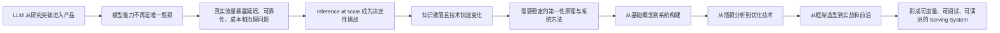
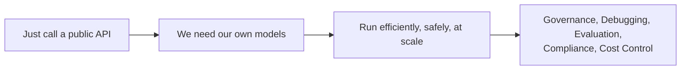
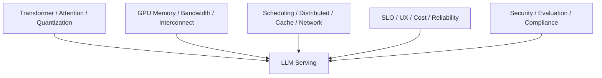
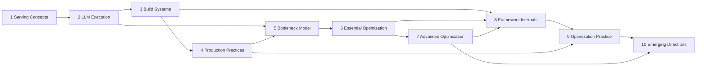
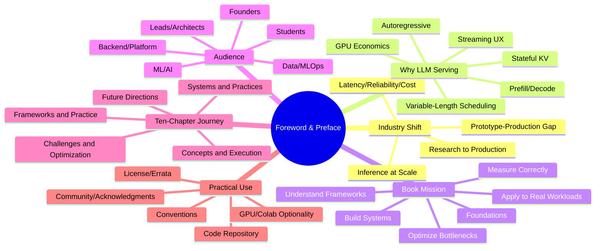

> 原文：*Foreword*、*Preface*
> 核心问题：为什么大模型进入生产后，决定成败的重点从“模型是否足够聪明”转向“能否以可接受的延迟、可靠性和成本持续提供推理”？作者为什么认为 LLM serving 已形成一门独立的系统工程学科，这本书准备解决什么、不解决什么，又应当怎样根据自己的角色和目标来阅读？

## 0. 两篇书前材料的作用与阅读主线

Foreword 与 Preface 没有展开具体算法，却共同给出了全书的“问题定义”。二者承担的角色不同：

- **Foreword（推荐序）**由 Caiming Xiong 从行业和生产经验出发，判断规模化 inference 已成为 AI 产品的主要挑战，并说明本书为什么值得读。
- **Preface（前言）**由作者解释写作动机、LLM serving 与传统 ML serving 的本质差异、全书目标与边界、目标读者、十章结构和实践条件。

二者的逻辑关系如下：



读完这两篇材料，应能回答：

1. 推荐者与作者分别依据什么认为 inference 已成为核心问题？
2. Prototype 到 production 的鸿沟为什么通常不只来自模型能力？
3. LLM 的 autoregressive、stateful、variable-length 特征怎样改变 latency、memory 和 scheduling？
4. 为什么 serving 不再只是产品背后的基础设施，而是用户体验本身？
5. 这本书要提供的是工具教程、研究综述，还是可迁移的方法论？
6. 哪些读者最适合本书，需要哪些前置知识？
7. 十章分别解决什么问题，为什么采用当前顺序？
8. 不同学习目标应怎样选择阅读路径？
9. 没有高端 GPU 是否仍能学习本书？
10. 如何正确理解代码示例、排版约定、许可、勘误和配套资源？

---

## 1. Foreword：规模化推理为何成为决定性挑战

### 1.1 从研究突破到软件系统范式变化

推荐序首先把 LLM 的兴起定义为软件构建和人机交互方式的根本变化。LLM 从研究成果迅速演变为 copilots、autonomous agents 等现代 AI 应用的基础。

这里隐含着一个重要转折：

$$
\text{研究阶段的核心问题}
\approx\text{模型能否获得某种能力},
$$

$$
\text{生产阶段的核心问题}
\approx\text{这种能力能否持续交付给真实用户}.
$$

模型开发和部署速度提高以后，行业的共同约束转移到 **inference at scale**。这不是说训练不重要，而是产品上线后，每次用户交互都要经过推理，推理能力便从一次性工程任务变成持续运营能力。

### 1.2 “Serve 得好”包含四个维度

推荐序用四个问题概括生产推理：

- **How quickly**：延迟是否符合交互体验和下游 deadline？
- **How reliably**：在故障、峰值和升级期间是否仍可用？
- **At what cost**：单位有效请求或 token 的成本是否可持续？
- **At what scale**：用户与调用链增长后，系统能否扩展？

可以把生产可行性表达为约束优化：

$$
\min C_{serve}
\quad\text{s.t.}\quad
L_{p95}\le L_{SLO},\quad
A\ge A_{min},\quad
X\ge X_{demand},\quad
Q\ge Q_{min}.
$$

其中 $C$ 是成本，$L$ 是延迟，$A$ 是可用性，$X$ 是吞吐，$Q$ 是模型或业务质量。推荐序没有给出这个公式，但其核心判断正是：AI 产品不能只优化 $Q$，而要在多项约束下持续运行。

### 1.3 为什么 Serving 已不是次要问题

推荐者明确指出，模型服务效率已经从“上线后的辅助优化”变成 AI 公司的主要关注点。原因是：

1. 模型能力只有通过推理服务才能被用户消费；
2. 延迟直接决定交互是否自然；
3. 故障直接使产品能力消失；
4. GPU 和 API 成本随调用量持续累积；
5. 同一模型的服务效率会决定可承受的用户规模和商业毛利。

因此，训练得到 checkpoint 不等于交付产品：

$$
\text{Real-world value}
=\text{Model capability}
\times\text{Serving availability}
\times\text{Usability under latency/cost constraints}.
$$

如果服务可用性为零，或成本超过业务价值，再强的模型也无法创造持续价值。

### 1.4 作者经验为什么是本书的重要基础

推荐序强调 Chi Wang 和 Peiheng Hu 在大型 AI 系统建设和运营前沿合作超过八年。这里真正有价值的不是年数本身，而是视角来自 production trade-offs：

- 延迟与吞吐不能同时无限优化；
- 高可用需要冗余，冗余增加成本；
- 更大的模型可能提高质量，也增加 GPU 和通信压力；
- 高度定制可能提高效率，也增加运维复杂度；
- 框架默认值简单易用，却不一定适合具体 workload。

生产经验让本书的目标不是证明某项算法在理想 benchmark 中最快，而是解释如何在相互冲突的目标中做选择。

### 1.5 本书结构为何受到推荐

推荐序认为本书的一项主要优势是循序渐进：

1. 从适用于广泛 ML 系统的 model serving 基础和 system design 开始；
2. 再进入 LLM 特有执行和瓶颈；
3. 逐步走向系统构建与优化；
4. 同时兼顾新读者的可进入性和大规模系统从业者的深度需求。

这反映了作者的教学假设：如果不先理解模型工件、请求路径、batch、cache、硬件和性能指标，直接学习 FlashAttention、speculative decoding 或某个框架参数，只会得到容易过时的操作清单。

### 1.6 “没有 one-size-fits-all”是全书方法论

推荐序没有把某个云厂商、框架或架构称为永久答案，而是强调培养判断 trade-offs 的直觉。其可迁移方法是：

```text
明确业务与 SLO
→ 描述真实 workload
→ 理解模型执行和硬件限制
→ 定位主瓶颈
→ 选择能改变该瓶颈的方案
→ 测量质量、延迟、吞吐、可靠性和成本
→ 随模型、流量与技术变化重新评估
```

工具会变化，资源约束和系统推理方法更持久。

### 1.7 Prototype 与 Production 的真正鸿沟

推荐者总结自己的经验：原型到生产的差距很少只因为模型能力不足，更常见的问题是 inference 能否承受真实应用需求。

| Prototype 常验证 | Production 必须持续保证 |
|---|---|
| 一次调用能返回合理答案 | 尾延迟、吞吐和错误率达标 |
| 少量手工 prompt | 输入/输出长度和并发呈分布 |
| 单用户或单 batch | 多租户、公平、限流和峰值 |
| 临时 API key 和日志 | 身份、审计、隐私和合规 |
| 只看模型答案 | 版本、监控、回滚和故障恢复 |
| 忽略单位成本 | GPU/API/空闲/人力构成 TCO |

这也是本书将 system design、measurement 和 optimization 放在同一体系中的原因。

### 1.8 推荐序的阅读建议

推荐序最后建议超越书中具体工具和技术来阅读。可以把每个章节都追问为：

- 它解决哪一类稳定问题？
- 它把成本从哪里转移到哪里？
- 它依赖哪些模型、硬件和 workload 条件？
- 如果框架或 GPU 更新，这个原理是否仍成立？

推荐序署名信息：Caiming Xiong，Recursive AI Startup 联合创始人、Salesforce 前 AI Research & Applied Research 高级副总裁；2026 年 3 月写于旧金山。该身份提供的是推荐者视角与时间边界，不应把行业判断理解成无需验证的普遍定律。

---

## 2. Preface：为什么需要一门独立的 LLM Serving 学科

### 2.1 写作背景：应用“Tokenization”与控制权回收

前言把 LLM 从研究新奇事物到 production-critical infrastructure 的变化类比互联网革命，并提出一个“agentic world”正在到来。作者所说的新一轮“tokenization”并不是 NLP tokenizer 的技术过程，而是一种产业比喻：越来越多应用构建在 token-generating LLM infrastructure 之上，而非只调用传统确定性 API/service。

这个词容易混淆：

| 语境 | Tokenization 的含义 |
|---|---|
| NLP/模型执行 | 将文本切成模型 token IDs |
| 前言的产业比喻 | 软件能力越来越由 LLM token infrastructure 提供 |

作者观察到需求依次演变：



初期 public API 帮助快速验证产品；随着规模和业务重要性提升，团队希望获得模型、数据和执行层的更多控制。这不是“所有公司最终都必须自建”的线性结论，而是一条由规模、隐私、成本和定制需求驱动的责任连续谱。

### 2.2 “Everything in between”为什么最难

作者认为 GenAI 的难点往往既不是训练模型，也不是接一个聊天 UI，而是两者之间的生产系统：

- 将权重、tokenizer、runtime 部署到合适硬件；
- 处理 variable-length 并发请求；
- 管理 growing KV cache；
- streaming、取消、batch 和调度；
- 性能与质量评估；
- 数据治理、合规、日志和排障；
- 在 cloud API、managed endpoint、framework 和 self-hosted stack 间选择；
- 让单位成本支持商业模式。

作者列举的失败现象包括：优秀 demo 在真实流量下崩溃、一周耗尽 GPU 预算、组织因 public API 成本和数据安全放弃关键 use case、团队面对框架与云选项不知从何开始。

这些现象可以统一为“原型没有验证约束分布”：

$$
\text{Demo success}
\not\Rightarrow
\text{Production feasibility under traffic, SLO, governance and TCO}.
$$

### 2.3 知识碎片化与本书的回应

LLM serving 知识分布在：

- Research papers：提出算法，常使用受控 benchmark；
- Framework documentation：解释 API/feature，依版本变化；
- Technical blogs：提供直觉，证据和时效不一；
- Production war stories：接近现实，但常缺完整数据或不可公开；
- Hardware manuals：规格准确，却不直接给 workload 结论。

领域按周/月演进，单纯“收录当前工具”很快过时。因此作者要提供的是系统性 foundation，让读者能理解后来出现的新技术，而非记住当前答案。

---

## 3. Why LLM Serving and Optimization?

### 3.1 LLM 不是经典 Serving 的简单放大版

前言把传统 ML 概括为 stateless、bounded、predictable：输入固定计算图，得到结果；latency 和 memory 较稳定，扩容常可增加 replicas。

LLM 在多个维度改变问题：

| 特征 | 传统模型常见形态 | LLM 形态 | 系统后果 |
|---|---|---|---|
| 生成 | 一次 forward | Autoregressive token-by-token | 长生命周期、多轮调度 |
| 状态 | Request 后可释放 | Growing KV/history | 动态显存、cache lifecycle |
| Phase | 较统一 | Prefill 与 decode 异质 | Compute/bandwidth 分别优化 |
| Shape | 较固定 | Input/output 长度差异巨大 | Continuous/token batching |
| 并发 | Samples 近似同质 | 数千 variable-length conversations | 公平、尾延迟、admission |
| 交付 | 完整结果 | Streaming | TTFT、ITL、cancel/backpressure |
| 硬件 | CPU/GPU 均可能便宜 | 大量 GPU capacity/bandwidth | 成本和供给成为架构约束 |

传统 ML 也并非都 stateless 或完全 predictable，LLM 也并非绝对不能使用通用 serving framework；前言是在概括主流 workload 差异，而不是划定严格分类边界。

### 3.2 Performance 的定义发生变化

不再只测“模型单次运行多久”，而是：

$$
\max X_{good}
\quad\text{s.t.}\quad
TTFT_{p95}\le S_1,
\quad ITL_{p95}\le S_2,
\quad M_{KV}\le M_{device},
\quad Q\ge Q_{min}.
$$

需要同时调度数千 conversations，避免长 prompt、长 output 或高优先级任务破坏他人延迟。Batching 从“把固定 tensors 拼一起”变成 token/KV-aware scheduling。

### 3.3 LLM 直接构成用户体验

传统 ranking/classification 常在后台辅助决策，用户不一定直接感知每次 inference。LLM 常直接呈现于 assistant、reasoning、RAG 和 agent：

- TTFT 决定用户是否觉得系统响应；
- ITL 决定流式输出是否顺畅；
- 完整输出决定下游 tool/workflow 是否继续；
- 错误或不可靠会直接损害信任；
- Agent 的一个目标会放大成多次模型和工具调用。

因此 serving 不是产品背后透明的 plumbing，而是 product experience 的组成部分。

### 3.4 运营、财务和法律 stakes

LLM service 变慢或行为不稳定会让工作流停滞、员工失去信任、客户流失。Accuracy、guardrails 和 observability 分别对应：

- 技术：结果是否有用、服务是否健康；
- 财务：失败和重试是否浪费 GPU/API 费用；
- 法律/治理：隐私、安全、审计和合规是否满足要求。

Guardrail 不是一个单独 filter 就能解决，需要输入、工具、模型输出、权限和人工流程共同治理。

### 3.5 为什么 inference 成为主成本

前言将 LLM inference 称为 dominant cost，强调 GPU memory 的战略性和低效 scheduling 的直接浪费。这个判断对高使用量产品常成立，但不是所有阶段的定律：预训练、低流量 API、离线 fine-tune、工程人力等都可能成为主要成本。

一般生命周期模型：

$$
C_{total}=C_{train}+N\,c_{inference}+C_{platform}+C_{people}.
$$

当累计调用 $N$ 足够大，单位 inference 的小差异会超过前期训练。API-only 是否昂贵也取决于流量稳定性、自建利用率、冗余和团队能力。

### 3.6 新 Serving Patterns 为什么必要

前言列出：

- Continuous batching；
- Token schedulers；
- KV cache management；
- Quantization；
- Model routing；
- Retrieval/reasoning/tool hybrid pipelines。

它们分别应对 variable-length、token lifecycle、state memory、weights/bandwidth、模型能力分层和 agent workflow。所谓“在以前不存在”应理解为这些模式未以当前 LLM 形态成为主流 serving 约束；cache、batch、routing 的一般思想本身早已存在。

### 3.7 独立学科的理由

LLM serving 需要连接：



任何单一领域都不足以解决生产问题，因此值得集中讨论。

---

## 4. What This Book Aims to Do

本书要弥合的是：

$$
\text{Having an LLM}
\longrightarrow
\text{Running LLMs efficiently, reliably and affordably}.
$$

### 4.1 七项目标及其关系

1. **定义 serving**：模型怎样变成可访问、可运营的生产能力；
2. **解释 execution**：attention、prefill、decode 如何塑造 latency/throughput/cost；
3. **从零构建系统**：看懂 API、scheduler、cache、worker 和 framework 取舍；
4. **正确测量**：用代表性 workload 和指标取代猜测；
5. **应用优化技术**：batch、quantization、fusion、continuous batching、prefix cache、speculation；
6. **理解框架而非黑盒使用**：知道参数对应哪种机制和瓶颈；
7. **连接真实 workload**：chat、RAG、agent、enterprise、cloud/self-hosted。

其依赖顺序为：

```text
定义问题
→ 理解执行
→ 理解系统
→ 建立测量
→ 定位瓶颈
→ 应用优化
→ 借助框架落地
→ 在真实 workload 中持续迭代
```

### 4.2 本书承诺的是判断能力

作者没有承诺一个永久最佳 framework/config，而是希望读者能够：

- 解释为什么某设置有效；
- 判断是否适用于当前 model/hardware/traffic；
- 发现瓶颈迁移；
- 在 vendor 与 self-hosted 间量化 trade-off；
- 面对新技术时快速建立心智模型。

---

## 5. Who Should Read This Book

### 5.1 六类目标读者

| 读者 | 常见起点 | 希望解决的问题 | 推荐重点 |
|---|---|---|---|
| ML/AI 工程师与研究者 | 已训练/微调模型 | 高效部署给用户 | 执行、优化、框架 |
| Backend/Platform 工程师 | 突然接手 LLM service | API、并发、可靠、扩缩 | 系统设计与 best practices |
| Data/MLOps 工程师 | 已有 ML platform | 支持 LLM、Agent、RAG | 生命周期、平台、监控 |
| Tech Lead/Architect | 做技术与 GPU 决策 | Cloud/self-host、框架、成本 | 全书 trade-offs 与实践 |
| Startup/Small Business Builder | 做 Agent/AI 产品 | 降 hosting cost、恢复控制 | Serving 范式、云选型、优化实战 |
| 学生/新工程师 | 懂 LLM 基础 | 学 production system | 顺序通读并做实验 |

### 5.2 前置知识

作者假设读者：

- 能阅读 Python；
- 熟悉基本 deep learning；
- 对 Transformer/LLM 有初步理解；
- 愿意阅读性能指标、架构图和系统设计。

不要求成为 GPU kernel 或 distributed systems 专家。这里的边界是“能够理解和使用 profiler/框架/公式”，不是“从零编写 CUDA collective”。

### 5.3 如何判断自己是否需要补前置知识

若以下概念完全陌生，适合先补基础或与本书并读：tensor shape、forward pass、Transformer attention、tokenizer、GPU memory、HTTP/API、process/thread、latency percentile。

不必等全部学完再开始：本书会为 serving 决策解释必要背景，但不会系统教授整个 ML/LLM。

---

## 6. What This Book Isn't

本书明确不是：

- 通用 ML/deep learning 入门；
- “GenAI 是什么/能做什么”的宽泛概览；
- 市场上所有产品和框架的目录；
- 所有优化算法的形式化研究综述。

### 6.1 这个边界为什么合理

如果同时系统讲训练理论、应用产品、全部框架和所有研究，serving 主线会被稀释。作者选择“just enough background”：只解释 attention、KV cache、quantization 等如何影响 serving decision。

### 6.2 推荐搭配阅读

新读者可搭配 Jay Alammar 与 Maarten Grootendorst 的 *Hands-On Large Language Models*（原文链接显示书名处有 “Large Learning Models” 的文字差异，应以实际出版物为准），将其作为模型/LLM 基础，本书作为 serving/systems companion。

### 6.3 不应产生的预期

- 读完不等于能为所有模型写最优 CUDA kernel；
- 示例 benchmark 不等于你的生产结果；
- 书中产品价格和 API 不会永久有效；
- “Hands-on”不意味着每位读者必须具备高端多 GPU；
- 框架对比提供方向，不替代当前版本 compatibility matrix。

---

## 7. How This Book Is Organized

十章从基础、构建、瓶颈、优化到实战与前沿形成一条因果链。

### 7.1 第一部分：建立 Serving 心智模型（Chapters 1～2）

#### Chapter 1：Introduction to Model Serving and Optimization

定义模型工件、lifecycle、serving、部署位置与端侧/单模型/多模型/平台范式，并解释为什么业务需要理解与优化 serving。

#### Chapter 2：Large Language Model Serving

打开 decoder-only Transformer：autoregressive、attention、KV cache、prefill/decode、streaming、batching 和 vLLM 入门。它把“LLM 为什么特殊”落到执行时间线上。

### 7.2 第二部分：从推理到生产系统（Chapters 3～4）

#### Chapter 3：Model Serving System Design: A Deep Dive

从零拆出 API、Engine、Workload Manager、Executor、Worker，构建 batch/stream；再扩展 metadata、LRU、Triton 和多模型架构。

#### Chapter 4：Model Serving Best Practices

将 endpoint 放入 Agent、RAG/CAG 和企业平台；讨论开源栈、六档云方案、build/buy 以及 TTFT/ITL/TPS 等测量。

### 7.3 第三部分：先理解瓶颈，再选择优化（Chapters 5～7）

#### Chapter 5：Challenges When Serving LLMs

从 GPU capacity、FLOPS、HBM bandwidth、interconnect、weights/KV 到 arithmetic intensity/roofline，判断 prefill/decode 的资源上界。

#### Chapter 6：Essential LLM Optimization Techniques

Continuous/chunked batching、MHA/GQA/MQA/MLA、fusion/Flash/PagedAttention、quantization/distillation/pruning 和 prefix caching。

#### Chapter 7：Advanced LLM Optimization Techniques

Speculative decoding、DP/TP/PP/EP、prefill-decode disaggregation，以及 KV transfer/offload/compression/blending。

### 7.4 第四部分：框架、实战和未来（Chapters 8～10）

#### Chapter 8：LLM Serving Frameworks

解释专用框架和 vLLM Scheduler/Worker/Runner 内部，并比较 TensorRT-LLM、SGLang、llama.cpp。

> Preface 将 vLLM 展开为 “virtual LLM”，而项目名称通常直接写作 vLLM；不应将该展开当作必须使用的官方全称。

#### Chapter 9：LLM Optimization in Practice

以 Qwen3-14B/vLLM 演示 hardware→dataset→metrics→baseline→AWQ→参数→TP 实验，强调 topology 和受控比较。

#### Chapter 10：Advancements in LLM Serving

语义缓存/路由、profiling、multimodal、edge、multi-LoRA 和 RL serving determinism，将方法扩到未来场景。

### 7.5 十章的依赖图



当前顺序有效，因为后面的“怎么调”依赖前面的“瓶颈为什么产生”。

---

## 8. How to Use This Book

### 8.1 顺序阅读

适合学生、初次负责 LLM serving 的工程师和希望建立完整体系的读者。按 1→10 阅读可看到概念逐层复用，避免把术语孤立记忆。

### 8.2 按目标选择路径

| 目标 | 阅读路径 | 获得什么 |
|---|---|---|
| Serving 基础与 LLM 执行 | Ch.1～2 | 模型工件、范式、token/KV/phase |
| 设计和运营系统 | Ch.3～4 | API、batch/stream、多模型、企业/cloud |
| 性能、扩展和成本 | Ch.5～7 | Hardware bottleneck 与优化技术 |
| Framework 选型 | Ch.8，并回查 Ch.5～7 | vLLM internals 与四框架比较 |
| 端到端调优 | Ch.9，依赖 Ch.4～8 | Benchmark、AWQ、TP 与实验方法 |
| 前沿方向 | Ch.10，依赖全书概念 | Semantic/multimodal/edge/LoRA/RL |

### 8.3 按角色选择路径

- Application/Agent developer：2→4→8→10，再补 3；
- Platform/SRE：1→3→4→8→9；
- Performance engineer：2→5→6→7→9；
- Architect/Tech lead：1→4→5→8→9，再按需深入；
- Edge engineer：1→5→6→8 的 llama.cpp→10；
- RL infrastructure engineer：2→5～8→10 RL 部分。

这些是补充建议，不是原文指定顺序。

### 8.4 如何使用 Lab

配套仓库：`https://github.com/orca3/llm-model-serving`。合理方式：

1. 先阅读概念和预测结果方向；
2. 固定 model/framework/hardware 版本；
3. 跑原始 baseline；
4. 一次改一个关键变量；
5. 复算 token、latency、memory；
6. 记录失败和不符合预期的结果；
7. 对比预执行 notebook，但不期待数字完全一致。

---

## 9. What You'll Need

### 9.1 推荐条件

- 至少一张能运行小到中型 LLM 的 GPU，可用 cloud/on-prem/Google Colab；
- Python 与基本 CLI；
- 能安装配置 vLLM、NVIDIA Triton 等开源工具；
- 愿意改变 batch、model、sequence、schedule 并测量。

### 9.2 GPU 不是理解全书的硬门槛

没有 GPU 仍可学习：

- 系统概念和架构；
- 作者预执行实验与分析；
- 性能公式和容量估算；
- Framework API/设计；
- 用 CPU/小模型做功能性验证。

不要把“无法复现绝对 TPS”误解为无法验证因果。可以检查：量化是否减少文件/内存、batch 是否改变吞吐/延迟方向、cache 是否跳过工作、公式是否自洽。

### 9.3 环境差异为何必然存在

Driver、CUDA、PyTorch、framework、checkpoint revision、GPU、power、cloud contention 和数据采样都会改变结果。因此实验目标是获得**自己环境中的证据**，而不是复制书中数字。

### 9.4 作者希望读者完成的能力跃迁

从：

> “我们有一个 LLM endpoint。”

到：

> “我们有一个 robust、efficient、understandable，能够 reasoning、debug 和 evolve 的 LLM serving system。”

这四个形容词分别要求：可靠运行、资源有效、机制可解释、技术可演进。

---

## 10. Conventions Used in This Book

### 10.1 排版约定

| 形式 | 含义 |
|---|---|
| *Italic* | 新术语、URL、邮箱、文件名和扩展名 |
| `Constant width` | 程序、变量/函数、数据库、数据类型、环境变量、语句和关键字 |
| Tip | 实用建议 |
| Note | 一般说明或边界 |
| Warning | 风险、警告或注意事项 |

这些约定是阅读导航：看到斜体先确认定义，看到 monospace 应理解为字面 API/config，看到 Warning 则检查适用前提。

### 10.2 术语与代码不应混读

例如 `prefill` 可能是概念名称，也可能出现在参数/API；文字概念跨框架稳定，`--enable-chunked-prefill` 等字面配置依版本。排版能帮助区分，但最终仍需查当前文档。

---

## 11. Using Code Examples

### 11.1 配套代码和支持

代码、练习和补充材料位于：`https://github.com/orca3/llm-model-serving`。代码使用问题可联系 O'Reilly support 邮箱。

### 11.2 许可的实用边界

原文说明一般可以：

- 在自己的程序和文档中使用示例；
- 使用若干代码片段，无需逐次申请；
- 回答问题时引用书和示例代码。

通常需要权限的情形：

- 销售或分发 O'Reilly 示例；
- 在产品文档中纳入大量/显著部分代码；
- 超出 fair use 和书中许可的使用。

这不是法律建议；边界不清时联系 `permissions@oreilly.com`。

### 11.3 Attribution

作者/出版社一般感谢但不强制普通使用署名。推荐 attribution 包含书名、作者、出版社和 ISBN。原书示例：

```text
Hands-On LLM Serving and Optimization
Chi Wang and Peiheng Hu, O'Reilly
Copyright 2026
ISBN 979-8-341-62149-7
```

### 11.4 代码示例的工程责任

“可以使用”不等于“可直接生产”：

- Pin dependencies 和 model revision；
- 检查 license 与 remote code；
- 补 error/timeout/security/observability；
- 运行质量和负载测试；
- 不把示例 secret 写进代码；
- 关注仓库 README 和 errata。

---

## 12. O'Reilly Online Learning

这一节介绍 O'Reilly 的学习平台和出版生态：live training、learning paths、interactive coding、书籍与视频，以及来自 200 多家出版社的内容。

它与本书技术论证没有直接依赖，实用价值在于提供补充学习材料。读者不需要订阅平台才能理解书中核心内容。

---

## 13. How to Contact Us

### 13.1 联系渠道的用途

- 技术/代码问题：O'Reilly support；
- 权限问题：permissions；
- 书籍评论、勘误与附加信息：出版社联系页和本书页面；
- 新闻与课程：O'Reilly 官网、LinkedIn、YouTube。

本书页面：`https://oreil.ly/hands-on-llm-serving`。它比静态正文更适合查询 errata、更新示例和附加材料。

### 13.2 为什么勘误尤其重要

LLM serving 技术和 API 更新快，且书中存在少量可能的命名、公式或版本差异。遇到异常时应依次：

1. 查看书籍 errata；
2. 查看代码仓库对应 commit/README；
3. 核对框架当前版本文档；
4. 用原始公式和日志复算；
5. 再向 support/社区提问并附环境信息。

---

## 14. Acknowledgments

### 14.1 知识来源不是单一作者

作者感谢编辑、雇主团队、同事、家人、朋友、导师、reviewers，以及开放源代码和研究社区。这个致谢揭示了全书知识的来源结构：

$$
\text{Book knowledge}
=\text{Production incidents/experiments}
+\text{Team discussions}
+\text{Research}
+\text{Open source}
+\text{Editorial review}.
$$

LLM serving 是高度协作的领域，框架、论文、kernel、硬件和 production feedback 共同推动进展。

### 14.2 Salesforce 生产经验的影响

作者特别感谢 Salesforce 提供 agent platform、in-house/vendor/hybrid POC 和真实客户规模的实践环境。它解释了为何书中反复强调：

- Agentic workload；
- 自建、vendor 和 hybrid 不是二选一；
- Cost efficiency；
- Framework 与 architecture trade-off；
- 实验和业务结果。

同时，这也意味着案例视角可能更接近 enterprise platform，读者应按自己的组织规模和约束调整。

### 14.3 家庭支持与写作过程

两位作者分别感谢家庭对长时间写作、代码、图表和章节迭代的支持。技术书的“完整性”不仅来自技术工作，也来自编辑、生活时间和长期坚持。

### 14.4 对错误负责

作者最后声明剩余错误由自己承担。对读者而言，合适态度也是：尊重作者经验，同时独立复核公式、规格、价格、API 和实验条件。

---

## 15. 容易混淆的概念与常见误区

### 15.1 模型能力是生产成败的唯一因素

错误。Serving latency、reliability、cost、governance 和 scale 会使优秀模型无法落地。

### 15.2 Model deployment = Model serving

部署是发布工件；serving 还包含持续请求处理、调度、缓存、扩缩、监控、安全和版本。

### 15.3 Training cost 高，所以 serving cost 不重要

错误。训练偏前置，inference 随累计调用增长；高流量时可成为主要生命周期成本。

### 15.4 LLM serving 只是传统 serving 多用几张 GPU

错误。Autoregressive、state、prefill/decode、variable length、streaming 和 KV 改变了 scheduler 与 memory abstraction。

### 15.5 “Serving 是产品体验”表示后端架构等同产品功能

不是。它表示 TTFT、ITL、reliability 和 failure 直接被用户感知，后端质量成为产品体验的一部分。

### 15.6 Public API 一定只适合原型

错误。Managed API 可长期适用低/波动流量和通用模型；选择取决于 TCO、隐私、定制和团队。

### 15.7 自建一定更便宜、更安全、更可控

错误。低利用率、运维不足和配置错误会更贵或更危险；必须比较完整责任与 TCO。

### 15.8 新一轮“tokenization”只是分词技术

前言中主要是产业比喻，指应用建立在 LLM token infrastructure 上；与 tokenizer 的技术过程不同。

### 15.9 本书会完整教授 LLM 训练和所有 Transformer 数学

错误。只提供连接 serving 决策所需背景。

### 15.10 本书是框架和产品大全

错误。选择代表性框架解释机制，强调可迁移 trade-off。

### 15.11 Hands-on 意味着必须购买高端 GPU

错误。无 GPU 仍可学习架构、公式和 captured experiments；可用 Colab、CPU 或小模型验证部分机制。

### 15.12 复现不出相同 TPS 说明实验失败

错误。环境差异必然存在；先验证条件、方向、公式和瓶颈，再比较绝对数字。

### 15.13 读完 Chapter 8 就能脱离 Chapters 5～7 选框架

错误。Feature 的价值依 bottleneck 和 workload，框架选型需要硬件与优化基础。

### 15.14 代码许可意味着示例可不经审查投入生产

错误。法律许可与工程正确、安全、兼容是不同问题。

### 15.15 推荐序中的判断等于作者证明的技术结论

错误。Foreword 是推荐者基于经验的行业判断；正文和自己的实验才提供具体机制与证据。

### 15.16 快速变化意味着书很快完全过时

具体 API/价格会过时，但 state、capacity、bandwidth、communication、queue、quality 和 cost 的分析框架仍可迁移。

---

## 16. 从书前材料抽象出的通用学习与解题方法

### 第一步：从交付价值而非模型能力定义问题

先写用户、SLO、质量、流量、治理和预算。模型 benchmark 不是完整需求。

### 第二步：将 LLM 特性映射为系统约束

Autoregressive→多轮调度；stateful→KV；variable length→continuous batch；interactive→stream/TTFT；large weights→GPU/parallel。

### 第三步：按因果顺序学习

模型执行→系统架构→硬件瓶颈→优化技术→框架→实战。不要先从参数表开始。

### 第四步：区分稳定原理和易变实现

稳定：capacity、data movement、queue、cache、parallel trade-off。易变：CLI、class、default、vendor price、最新 kernel。

### 第五步：对每项技术问五个问题

```text
What is it?
Why introduced?
Which bottleneck does it change?
What new cost/risk does it introduce?
Under which workload/hardware does net value become positive?
```

### 第六步：用完整目标函数避免局部优化

$$
\max Goodput
\quad\text{s.t. quality, latency, reliability, security}
$$

并最小化 TCO，而不是最大化裸 TPS/GPU utilization。

### 第七步：让阅读与实验互相校正

阅读先形成预测，实验验证；数字不一致时检查单位、版本、workload、warm/cache 和统计边界。

### 第八步：根据角色选择最短路径，但补齐依赖

Selective reading 可以提高效率，遇到术语时回查其因果前置章节，避免只会调用 API。

### 第九步：建立自己的术语、公式和实验账本

记录 metric definition、model/GPU/config、原始 counters、推导和结论；这比散落收藏 blog 更能积累能力。

### 第十步：把框架与 vendor 看作可替换实现

业务 contract、evaluation set 和 telemetry 尽量稳定，具体 backend 通过 adapter/capability 接入。

### 第十一步：持续查勘误、版本与来源

书籍、仓库、官方文档、论文和 production evidence 交叉验证，不从单一来源得出永久结论。

### 第十二步：接受没有 one-size-fits-all

没有永久架构不等于没有方法；恰恰需要可重复的约束、测量和 trade-off 流程。

---

## 17. 知识结构与核心结论

### 17.1 书前知识结构



### 17.2 核心结论

1. **规模化 inference 已从次要部署环节变成 AI 产品的决定性挑战。** 模型价值只有在 latency、reliability、cost 和 scale 可行时才能持续交付。
2. **Prototype-production gap 很少只由模型能力决定。** 真实流量、尾延迟、GPU 预算、治理、故障和运维才是常见失效点。
3. **LLM serving 不是传统 serving 的简单放大。** Autoregressive、stateful KV、prefill/decode、variable-length conversations 和 streaming 改变了计算与系统抽象。
4. **Serving 直接构成用户体验。** TTFT、ITL、failure 和行为一致性被用户直接感知，基础设施质量成为产品质量。
5. **Inference 的持续性改变经济模型。** 训练偏前置，推理随调用累积；GPU memory、scheduling 和 API/self-host 利用率决定单位经济。
6. **作者试图提供系统 foundation，而非当前工具目录。** 核心能力是解释瓶颈、量化 trade-off 和面对新技术继续学习。
7. **本书按因果依赖组织。** 从模型和执行，到系统、硬件瓶颈、基础/高级优化、框架、实战和前沿，后章建立在前章心智模型之上。
8. **目标读者跨越模型与系统角色。** 共同前提是能读 Python、懂基本 LLM，并愿意处理指标和架构，而非必须会 CUDA。
9. **边界清晰使内容更聚焦。** 本书不系统教授 ML/GenAI，不穷举产品，也不形式化综述全部研究。
10. **Selective reading 可行，但不能跳过概念依赖。** 不同角色可选择路径，遇到优化和框架问题时要回查 execution/hardware 基础。
11. **GPU 访问不是学习门槛。** Captured experiments、公式和小环境仍可建立判断力；绝对数字的复现不是唯一目标。
12. **代码示例是学习材料，不是 production guarantee。** 许可、兼容、安全和工程完备性是不同维度。
13. **生产经验、研究、开源和编辑共同构成本书。** 应尊重经验，同时对规格、价格、公式和版本独立复核。
14. **没有 one-size-fits-all 并不意味着只能靠经验猜。** 稳定的方法是定义约束、描述 workload、定位瓶颈、受控实验和持续重评。

### 17.3 一句话复盘

Foreword 与 Preface 共同提出的总命题是：**LLM 的商业和社会价值不由 checkpoint 能力单独决定，而由一套可理解、可度量、可靠且经济的 inference system 将能力持续交付；由于模型、硬件和框架不断变化，最值得学习的不是某个当前配置，而是从执行机制和真实 workload 出发，在质量、延迟、吞吐、可靠性、治理与成本之间反复建立证据和做取舍。**

---

## 18. 术语速查

| 术语 | 在书前材料中的含义 | 不要与之混淆 |
|---|---|---|
| Inference at scale | 大量真实请求下持续提供模型推理 | 不只是运行一次 forward |
| Model deployment | 发布模型工件到环境 | Serving 还包括持续运营 |
| Model serving | 通过 API/system 提供推理能力 | 不只等于模型内部 inference |
| Optimization | 在约束下改善性能/资源/成本 | 不等于无限追求最低 latency |
| Autoregressive | 下一 token 依赖历史 tokens | 造成单序列 decode 串行 |
| Stateful | Request 保留 KV/history 等状态 | 不表示模型权重每次更新 |
| Prefill | 处理 prompt 并建立 KV | 常与 TTFT 相关 |
| Decode | 逐 token 生成输出 | 常与 ITL/TPOT 相关 |
| Continuous batching | 迭代级动态加入/移出 requests | 不同于固定 static batch |
| Token scheduler | 按 token/KV/resource 分配执行 | 不只是 HTTP queue |
| KV cache | 历史 attention key/value 状态 | 不等于最终 response cache |
| Throughput | 单位时间处理的 request/token | 必须声明口径和 workload |
| Reliability | 故障和变化下持续正确服务 | 不只是进程存活 |
| Guardrails | 模型/工具/数据行为的约束体系 | 不是单个关键词 filter |
| Observability | Metrics、logs、traces 支持诊断 | 不只是 GPU utilization |
| API-only | 主要调用外部托管模型 API | 不必然一直贵或不安全 |
| Self-hosting | 自己承担更多 serving runtime/infra | 不必然成本更低 |
| Hybrid | Vendor 与自建按 workload 组合 | 常是现实长期形态 |
| One-size-fits-all | 假定一个永久通用方案 | 本书明确反对这种思路 |
| Tokenization（产业比喻） | 应用建立在 LLM token infrastructure 上 | 不同于文本分词 |
| Hands-on | 通过代码、实验和设计建立直觉 | 不表示代码可直接生产 |
| TCO | Compute、空闲、网络、人力和风险总成本 | 不只是 GPU/API 标价 |
| Errata | 出版后勘误和修正 | 快速变化领域应主动查询 |
