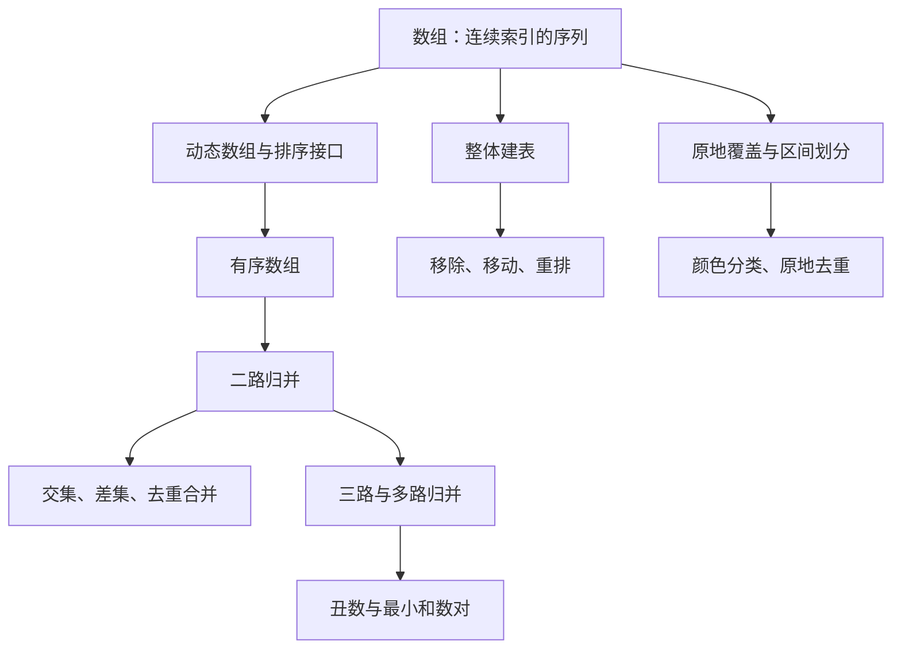

> 原书：李春葆、李筱驰《算法面试（全二册）》<br>
> 阅读范围：第 1 章 数组<br>
> 说明：本文按原书 1.1、1.2、1.3 的顺序整理。标题含“补充”的内容用于补足定义、证明或替代方案，不代表原书原文；原页中个别明显代码或复杂度问题会明确标为“勘误说明”。

## 0. 本章问题主线与知识图谱

数组看似只是“把元素排成一行”，本章真正训练的是如何利用两种性质：

1. **连续索引**：可按下标直接访问和覆盖元素，适合原地写回、区间划分和双指针。
2. **有序性**：较小元素只可能出现在指针当前或更靠前的位置，可据此排除大量候选，形成二路或多路归并。



本章正文共包含 16 道例题：1.2 有 5 道，1.3 有 11 道。核心方法不是 16 个互不相关的模板，而是“读指针扫描输入、写指针维护结果、利用有序性排除不可能候选”这组可迁移思想。

## 1.1 数组概述

### 1.1.1 数组的定义

#### 数组要解决什么问题

程序经常需要保存一批同类且有顺序的数据，并高效地读取“第 $i$ 个元素”。若每次访问都从头寻找，访问成本会随位置增长；数组给每个元素一个整数索引，使按位置读取和修改成为基本操作。

原书把含 $n$ 个元素的序列写成

$$
a=[a_0,a_1,\ldots,a_{n-1}],
$$

其中：

- $n$ 是元素个数，也称数组长度；
- $i\in\{0,1,\ldots,n-1\}$ 是合法索引；
- $a_i$ 是索引 $i$ 处的元素；
- $a_0$ 是首元素，$a_{n-1}$ 是尾元素；
- 除首尾外，每个元素在序列关系中各有一个直接前驱和直接后继。

严格地说，**线性表**是元素之间具有线性次序的抽象数据类型；**数组**是常用的顺序存储实现。两者不宜完全等同：线性表还可以用链表实现，而多维数组也不仅是在讨论抽象线性表。

#### 补充：为什么随机访问是 $O(1)$

在元素定长且连续存放的典型数组中，设首地址为 $B$，每个元素占 $w$ 字节，则 $a_i$ 的地址为

$$
\operatorname{addr}(a_i)=B+i\cdot w.
$$

计算地址只需常数次算术运算，故在随机存取机模型下，读取或写入 $a_i$ 的时间为 $O(1)$。成立条件是：索引合法、元素能通过固定步长定位，且把一次机器字地址计算视为常数时间。这个结论不表示访问任意规模对象的全部内容也是 $O(1)$。

#### 一维、多维与静态、动态

- **一维数组**用一个索引定位元素。
- **二维数组**用行、列两个索引定位，也可看作“元素是一维数组的一维数组”。更高维可递归理解。
- **静态数组**的容量通常在创建时确定，结构简单但不便扩展。
- **动态数组**维护可用容量，在空间不足时申请更大区域并搬移旧元素，使用更灵活。

数组的基本操作是按索引取值 $x=a_i$ 和存值 $a_i=x$。中间插入或删除通常要移动后缀：在索引 $i$ 插入时，最多移动 $n-i$ 个元素，因此最坏为 $O(n)$；这正是数组随机访问快但中间更新可能慢的根源。

### 1.1.2 数组的知识点

#### 1. C++ 中的动态数组 `vector`

`std::vector<T>`把同类型元素连续存储，并自动管理容量。原书介绍的常用接口可按用途整理如下：

| 用途 | 接口 | 含义与典型代价 |
|---|---|---|
| 状态 | `size()`、`empty()`、`capacity()` | 长度、是否为空、已分配容量，通常 $O(1)$ |
| 访问 | `operator[]`、`front()`、`back()` | 按位置或首尾访问，通常 $O(1)$ |
| 尾部更新 | `push_back()`、`pop_back()` | 尾插摊还 $O(1)$，尾删通常 $O(1)$ |
| 中间更新 | `insert()`、`erase()` | 需要搬移后缀，最坏 $O(n)$ |
| 容量/长度 | `resize()`、`clear()` | 改变逻辑长度或清空元素 |
| 遍历 | `begin()/end()`、`rbegin()/rend()` | 正向或反向迭代器区间 |

必须区分：

- `size()` 是当前实际元素数；
- `capacity()` 是不重新分配时最多可容纳的元素数；
- `resize(n)` 改变 `size()`，新增位置会构造元素；
- 容量不足时的扩容可能使原迭代器、指针和引用失效。

#### 补充：尾插为什么只是“摊还” $O(1)$

一次触发扩容的 `push_back` 需要复制或移动已有元素，单次可能为 $O(n)$。若容量每次按常数比例（用 2 倍便于推导）增长，从空数组连续插入 $n$ 个元素，扩容搬移总数不超过

$$
1+2+4+\cdots+2^{\lfloor\log_2 n\rfloor}<2n.
$$

再加上每次写入新元素的 $n$ 次操作，总工作量小于 $3n$，平均到每次插入为常数，因此是摊还 $O(1)$。这不是保证每一次尾插都为 $O(1)$；实际增长因子也由实现决定，不能把“必定 2 倍扩容”当作 C++ 标准保证。

#### 2. C++ 的 `sort`

原书分别说明了内置类型和自定义类型排序：

- `sort(first, last)`默认按 `<` 形成的升序排列；
- 可传 `greater<T>()` 实现降序；
- 自定义类型可重载 `<`，也可传函数对象或 Lambda 比较器；
- 标准排序区间是左闭右开 `[first,last)`。

`std::sort` 对 $n$ 个元素需要 $O(n\log n)$ 次量级的比较，但它不保证稳定性。若相等关键字元素的原相对顺序必须保留，应考虑 `std::stable_sort`。

#### 补充：比较器的严格弱序

比较器 `comp(x,y)`表达“$x$ 应排在 $y$ 前面”，必须形成严格弱序，至少满足：

- 非自反：`comp(x,x)` 为假；
- 非对称：若 `comp(x,y)` 为真，则 `comp(y,x)` 为假；
- 传递：若 $x<y$ 且 $y<z$，则 $x<z$；
- “等价”关系也应传递，其中等价指两方向比较都为假。

写成 `return x <= y` 会破坏非自反性，排序行为不再有保证。多关键字排序本质上是字典序：仅在前一关键字相等时比较后一关键字。

#### 3. Python 中的列表

原书把 Python `list`视作动态数组。列表支持正索引和负索引：长度为 $n$ 时，负索引 $-k$ 对应正索引 $n-k$，前提是 $1\le k\le n$。

切片的一般形式是 `a[start:end:step]`，区间不含 `end`。正步长从左向右，负步长从右向左；切片通常创建新列表，时间和空间与切片结果长度成正比，不能把它误当成 $O(1)$ 的“视图”。

原书列出的列表方法包括 `clear`、`append`、`count`、`index`、`insert`、`pop`、`remove`、`reverse`；相关函数包括 `len`、`sum`、`max`、`min`、`list`。其中尾部 `append` 为摊还 $O(1)$，中间插入和删除通常为 $O(n)$。

#### 4. Python 列表排序

- `a.sort(...)` 原地修改 `a`，返回 `None`；
- `sorted(a, ...)` 返回新列表，不改变原可迭代对象；
- `key`把每个元素映射为排序键；
- `reverse=True` 表示整体降序；
- Python 排序是稳定的，相等键保留原相对顺序。

`key=lambda x: (x[0], -x[1])`表示第一关键字升序、数值型第二关键字降序。负号技巧只适合支持取负且语义正确的键；字符串降序、多类型键等情况不应机械套用。

#### 5. 整体建表法

整体建表法要解决“从输入中按条件生成一个结果序列”的问题。其骨架是：从左到右扫描输入，遇到应保留或生成的元素，就追加到结果尾部。

设输入为 $a_0,\ldots,a_{n-1}$，结果为 `ans`。扫描到索引 $i$ 后的循环不变量是：

> `ans` 恰好包含输入前缀 $a_0,\ldots,a_i$ 中所有满足条件的元素，并保持它们的相对顺序。

初始化时前缀为空，结论成立；处理 $a_i$ 时，满足条件则追加，否则跳过，不变量继续成立；循环结束时前缀就是整个输入，所以结果正确。

若每次尾部追加按摊还 $O(1)$ 计，扫描 $n$ 个元素的时间为

$$
T(n)=\sum_{i=0}^{n-1}O(1)=O(n).
$$

结果数组最多含 $n$ 个元素，额外空间为 $O(n)$。若复用原数组前缀作为结果区，则额外空间可降为 $O(1)$。

##### C++17：把筛选条件直接写进扫描

```cpp
#include <vector>

std::vector<int> getOdd(const std::vector<int>& values) {
    std::vector<int> answer;
    for (int value : values) {
        // answer 始终是已扫描前缀中所有奇数的稳定结果。
        if (value % 2 != 0) {
            answer.push_back(value);
        }
    }
    return answer;
}
```

对 `[1,2,3,4,5]`，扫描后的 `answer` 依次为：

```text
[] → [1] → [1] → [1,3] → [1,3] → [1,3,5]
```

**举一反三的抓手**：只要题目是“保持相对顺序，筛出满足谓词 $P(x)$ 的元素”，都可先写成整体建表；若又要求 $O(1)$ 额外空间，再把 `answer.push_back(x)` 改成写回原数组前缀。

#### 6. 基本二路归并法

给定递增数组

$$
a=[a_0,\ldots,a_{m-1}],\qquad b=[b_0,\ldots,b_{n-1}],
$$

目标是生成含全部元素的递增数组 $c$。用指针 $i,j$ 指向两个数组尚未处理的首元素：

1. 当 $i<m$ 且 $j<n$ 时，比较 $a_i,b_j$，把较小者加入 $c$，并移动对应指针。
2. 某一数组耗尽后，把另一数组的剩余后缀追加到 $c$。

**为什么只比较两个当前元素就够？** 因为输入有序，$a_i$ 是 $a$ 未处理部分最小值，$b_j$ 是 $b$ 未处理部分最小值；两者较小者必是全部未处理元素的最小值。

循环不变量是：每轮开始时，$c$ 已按序包含 $a[0..i-1]$ 和 $b[0..j-1]$ 的全部元素，并且这些元素不大于尚未处理元素。选择两个头部的较小者不会破坏有序性，也不会漏元素。主循环结束后，一边已空；另一边本来有序且都不小于 $c$ 尾部，可直接追加。

每轮至少使 $i$ 或 $j$ 增加 1，两个指针合计最多移动 $m+n$ 次，因此

$$
T(m,n)=O(m+n).
$$

新建结果数组需 $O(m+n)$ 空间。若目标数组预留了尾部空间，可像 1.3.5 那样从后向前原地归并。

##### C++17：两个读指针只暴露各路最小值

```cpp
#include <vector>

std::vector<int> mergeTwo(const std::vector<int>& a,
                          const std::vector<int>& b) {
    std::vector<int> result;
    std::size_t i = 0;
    std::size_t j = 0;
    while (i < a.size() && j < b.size()) {
        if (a[i] <= b[j]) {
            result.push_back(a[i++]);
        } else {
            result.push_back(b[j++]);
        }
    }
    while (i < a.size()) result.push_back(a[i++]);
    while (j < b.size()) result.push_back(b[j++]);
    return result;
}
```

例如合并 `a=[1,5,7]`、`b=[2,3,6]`，每轮候选与选择为：

| 当前候选 | 选择 | 新指针 |
| --- | ---: | --- |
| 1 与 2 | 1 | $i=1,j=0$ |
| 5 与 2 | 2 | $i=1,j=1$ |
| 5 与 3 | 3 | $i=1,j=2$ |
| 5 与 6 | 5 | $i=2,j=2$ |
| 7 与 6 | 6 | $i=2,j=3$ |

最后追加 `a` 的剩余值 7，得到 `[1,2,3,5,6,7]`。真正可迁移的判断是：**每一路未处理部分是否有一个可直接取得的最小候选**。若有，就可能转化为归并。

#### 7. 二路归并的扩展应用

##### 求交集

输入是两个严格递增、无重复元素的集合数组。若 $a_i=b_j$，该值属于交集，加入结果并同时移动；若 $a_i<b_j$，由于 $b$ 后面只会更大，$a_i$ 不可能再匹配，故移动 $i$；反之移动 $j$。每个指针至多走完整个数组，时间 $O(m+n)$。

##### 求差集 $a-b$

目标保留“属于 $a$ 但不属于 $b$”的值：

- $a_i<b_j$：$a_i$ 不会出现在 $b$ 后缀，加入结果并移动 $i$；
- $a_i=b_j$：该值应删除，同时移动；
- $a_i>b_j$：只移动 $j$，寻找可能与 $a_i$ 相等的值；
- $b$ 耗尽后，$a$ 剩余值全部属于差集。

##### 去重合并

输入允许重复时，仍按基本归并产生候选值 $x$，但只有在结果为空或 `result.back() != x` 时才追加。归并候选非递减，因此同值候选连续出现；与结果尾比较足以除重。

> **勘误说明：** 原书第 26 页 C++ `uniquemerge` 的 `else` 分支比较的是 `b[j]`，却误写为 `c.push_back(a[i])`；同页 Python 代码和算法语义均应追加 `b[j]`。本文代码采用正确写法。

##### C++17：同一套指针，改变“何时输出”

```cpp
#include <vector>

std::vector<int> intersection(const std::vector<int>& a,
                              const std::vector<int>& b) {
    std::vector<int> result;
    std::size_t i = 0, j = 0;
    while (i < a.size() && j < b.size()) {
        if (a[i] < b[j]) {
            ++i;
        } else if (a[i] > b[j]) {
            ++j;
        } else {
            result.push_back(a[i]);
            ++i;
            ++j;
        }
    }
    return result;
}

std::vector<int> differenceAB(const std::vector<int>& a,
                              const std::vector<int>& b) {
    std::vector<int> result;
    std::size_t i = 0, j = 0;
    while (i < a.size() && j < b.size()) {
        if (a[i] < b[j]) {
            result.push_back(a[i++]);
        } else if (a[i] > b[j]) {
            ++j;
        } else {
            ++i;
            ++j;
        }
    }
    while (i < a.size()) result.push_back(a[i++]);
    return result;
}

std::vector<int> uniqueMerge(const std::vector<int>& a,
                             const std::vector<int>& b) {
    std::vector<int> merged;
    std::size_t i = 0, j = 0;
    while (i < a.size() || j < b.size()) {
        int value;
        if (j == b.size() || (i < a.size() && a[i] <= b[j])) {
            value = a[i++];
        } else {
            value = b[j++];
        }
        if (merged.empty() || merged.back() != value) {
            merged.push_back(value);
        }
    }
    return merged;
}
```

对 `a=[1,2,5,8]`、`b=[1,3,4,5,8,10]`：交集为 `[1,5,8]`，差集 $a-b$ 为 `[2]`。三种算法移动指针的规则相同，区别只在“较小、相等、较大”三种关系下是否输出当前值。

#### 8. 多路归并法

给定 $k\ge3$ 个非空递增数组，总元素数为

$$
N=\sum_{r=0}^{k-1}n_r,
$$

其中 $n_r$ 是第 $r$ 路长度。每一路只需暴露当前未处理的首元素；全局下一个元素就是这 $k$ 个候选中的最小值。

原书方法每输出一个元素，就线性扫描至多 $k$ 个当前值来找最小者。因此输出 $N$ 个元素的时间为

$$
T(N,k)=N\cdot O(k)=O(Nk),
$$

指针和当前值数组使用 $O(k)$ 辅助空间，结果另占 $O(N)$。

##### 补充：用优先队列优化

把每一路当前元素放入最小堆。弹出最小值和插入该路下一个值都为 $O(\log k)$，因此总时间降为

$$
O(N\log k),
$$

堆空间为 $O(k)$。该优化要求能比较元素，并在堆节点中保存“来自哪一路、该路哪个位置”，以便推进正确指针。

##### C++17：用最小堆保存每一路的当前头部

```cpp
#include <algorithm>
#include <functional>
#include <queue>
#include <tuple>
#include <vector>

std::vector<int> mergeKHeap(const std::vector<std::vector<int>>& runs) {
    using Node = std::tuple<int, std::size_t, std::size_t>;
    std::priority_queue<Node, std::vector<Node>, std::greater<Node>> heap;
    for (std::size_t run = 0; run < runs.size(); ++run) {
        if (!runs[run].empty()) {
            heap.emplace(runs[run][0], run, 0);
        }
    }

    std::vector<int> result;
    while (!heap.empty()) {
        auto [value, run, index] = heap.top();
        heap.pop();
        result.push_back(value);
        if (index + 1 < runs[run].size()) {
            heap.emplace(runs[run][index + 1], run, index + 1);
        }
    }
    return result;
}
```

对三路 `[1,3,5,6]`、`[1,2,5]`、`[2,6,8]`，堆中始终只保存每一路一个“门面候选”。弹出 `(1,第0路)` 后只推进第 0 路，而不是重新扫描所有元素，最终得到 `[1,1,2,2,3,5,5,6,6,8]`。

**迁移判断**：当候选来源有 $k$ 路、每路内部单调，且取出一路当前值后只会暴露该路下一个值时，优先考虑“堆中每路一个结点”的多路归并模型。

## 1.2 数组的基本算法设计

这一节把 1.1 的整体建表改造成“复用输入数组前缀作为结果”。若 `read` 负责读取原元素，`write` 指向下一个结果位置，那么处理时执行 `a[write] = a[read]` 并推进 `write`，就能在 $O(1)$ 额外空间内完成稳定压缩。

### 1.2.1 LeetCode 27：移除元素（★）

#### 问题、约束与难点

给定数组 `nums` 和值 `val`，原地移除所有等于 `val` 的元素，返回新长度。只要求前 $k$ 个位置保存有效结果，后面的内容可以忽略；允许改变元素顺序；额外空间必须为 $O(1)$。

难点不是判断 `nums[i] == val`，而是删除后如何在不新建结果数组的前提下维持一段连续有效前缀。原书给出三种等价视角。

#### 解法一：整体建表法

把原数组本身当作结果表，令 $k=0$ 表示当前保留元素数。扫描索引 $i$：

- 若 `nums[i] != val`，写入 `nums[k]`，再令 $k\leftarrow k+1$；
- 否则跳过。

循环不变量：处理原前缀 `nums[0..i-1]` 后，`nums[0..k-1]`按原相对顺序包含其中全部非 `val` 元素。写位置永远满足 $k\le i$，因此只会覆盖已读取位置或当前元素，不会破坏未来输入。

#### 解法二：元素移动法

令 $d$ 表示截至当前位置已删除的元素数。非目标元素 `nums[i]` 的新位置是

$$
i-d.
$$

因为它前面原有 $i$ 个元素，其中恰有 $d$ 个被删除，剩下 $i-d$ 个元素占据索引 $0$ 到 $i-d-1$，所以当前元素应放在 $i-d$。最终删除数为 $d$，新长度为 $n-d$。

这与解法一只是变量含义不同：解法一的写指针 $k=i-d$（在写入当前保留元素之前）。

#### 解法三：区间划分法

维护：

- `nums[0..j]` 是保留区间；
- `nums[j+1..i-1]` 是已扫描的删除区间；
- `nums[i..n-1]` 尚未处理。

初始 $j=-1$。遇到保留元素时先令 $j++$，再交换 `nums[i]` 与 `nums[j]`；遇到目标值则不动。结束后保留区间长度为 $j+1$。

题目允许改变顺序，所以交换法合法。若题目要求稳定，整体建表式覆盖更容易直接说明顺序不变。三种方法都扫描一次，时间 $O(n)$、额外空间 $O(1)$。

#### C++17：三种视角对应三种变量定义

```cpp
#include <algorithm>
#include <vector>

int removeBuild(std::vector<int>& nums, int value) {
    int write = 0;
    for (int read = 0; read < static_cast<int>(nums.size()); ++read) {
        if (nums[read] != value) {
            nums[write++] = nums[read];
        }
    }
    return write;
}

int removeMove(std::vector<int>& nums, int value) {
    int deleted = 0;
    for (int read = 0; read < static_cast<int>(nums.size()); ++read) {
        if (nums[read] == value) {
            ++deleted;
        } else {
            nums[read - deleted] = nums[read];
        }
    }
    return static_cast<int>(nums.size()) - deleted;
}

int removePartition(std::vector<int>& nums, int value) {
    int keptEnd = -1;
    for (int scan = 0; scan < static_cast<int>(nums.size()); ++scan) {
        if (nums[scan] != value) {
            ++keptEnd;
            std::swap(nums[keptEnd], nums[scan]);
        }
    }
    return keptEnd + 1;
}
```

以 `[3,2,2,3]` 删除 3 为例，整体建表法的关键状态是：

| `read` | 读取值 | 动作 | 有效前缀 | `write` |
| ---: | ---: | --- | --- | ---: |
| 0 | 3 | 跳过 | `[]` | 0 |
| 1 | 2 | 写到 0 | `[2]` | 1 |
| 2 | 2 | 写到 1 | `[2,2]` | 2 |
| 3 | 3 | 跳过 | `[2,2]` | 2 |

返回值 2 不是“删除次数”，而是调用者后续应读取的有效前缀长度。遇到“原地删除但后缀可忽略”的题目，应先确认接口是否也是这种**逻辑删除**语义。

### 1.2.2 LeetCode 283：移动零（★）

#### 从“删除”到“压缩后填充”

目标是把所有 0 移到末尾，同时保持非零元素相对顺序，并原地修改。它可分成两步：

1. 把非零元素稳定压缩到前缀 `nums[0..k-1]`；
2. 把后缀 `nums[k..n-1]` 全部写成 0。

第一步就是 1.2.1 把 `val` 设为 0 的整体建表或元素移动方法；第二步恢复被覆盖的零。若非零元素有 $k$ 个，则零有 $n-k$ 个，最终数组恰含原来的元素多重集合。

正确性来自两个事实：读指针从左向右，所以非零元素写入顺序不变；写完前缀后，剩余位置数正好等于零的个数。时间 $O(n)$，额外空间 $O(1)$。

常见错误是遇到零就立刻与数组尾交换。这样虽能把零移到后面，却可能打乱非零元素相对顺序，不满足题意。

#### C++17：稳定压缩后统一填零

```cpp
#include <vector>

void moveZeroes(std::vector<int>& nums) {
    int write = 0;
    for (int value : nums) {
        if (value != 0) {
            nums[write++] = value;
        }
    }
    while (write < static_cast<int>(nums.size())) {
        nums[write++] = 0;
    }
}
```

`[0,1,0,3,12]` 的两阶段状态为：

```text
稳定压缩非零值：[1,3,12,3,12]，有效前缀长度为 3
后缀统一填零：[1,3,12,0,0]
```

第一阶段后整个数组暂时不代表答案，只有 `[0,write)` 有意义。这种“中间态只承诺一个有效区域”的意识，是理解原地算法的关键。

### 1.2.3 LeetCode 2460：对数组执行操作（★）

#### 顺序语义为什么重要

对 $i=0,1,\ldots,n-2$ 依次检查相邻元素：若 `nums[i] == nums[i+1]`，就把前者加倍、后者置零；全部操作结束后再移动零。

“依次”意味着第 $i$ 步写出的 `nums[i+1]=0` 会被第 $i+1$ 步读取。不能先把所有相等位置一次找出再批量修改，因为那相当于用旧数组并行计算，语义不同。

例如 `[2,2,2]`：顺序执行先变成 `[4,0,2]`，下一步比较 `0` 和 `2`，结果仍为 `[4,0,2]`；若错误地同时处理两对，可能让中间元素参与两次修改。

#### 两阶段方法

1. 从左到右执行 $n-1$ 次相邻判断与必要修改。
2. 用 1.2.2 的稳定压缩把非零元素移到前面并填零。

每一阶段都是线性时间，所以

$$
T(n)=O(n-1)+O(n)=O(n),
$$

额外空间为 $O(1)$。原书还指出可在一次主遍历中结合修改与收集非零值；分成两阶段更容易证明，渐近复杂度不变。

#### C++17：先完成有时序依赖的修改，再复用压缩逻辑

```cpp
#include <vector>

std::vector<int> applyOperations(std::vector<int> nums) {
    for (int i = 0; i + 1 < static_cast<int>(nums.size()); ++i) {
        if (nums[i] == nums[i + 1]) {
            nums[i] *= 2;
            nums[i + 1] = 0;
        }
    }

    int write = 0;
    for (int value : nums) {
        if (value != 0) nums[write++] = value;
    }
    while (write < static_cast<int>(nums.size())) nums[write++] = 0;
    return nums;
}
```

对 `[1,2,2,1,1,0]`：

```text
i=0：1 != 2，不变
i=1：2 == 2，变为 [1,4,0,1,1,0]
i=2：0 != 1，不变
i=3：1 == 1，变为 [1,4,0,2,0,0]
移动零：             [1,4,2,0,0,0]
```

**迁移判断**：若题目说“按顺序执行操作”，先问本轮写入是否会影响下一轮读取。会影响时不能用旧数组并行计算，也不能随意调整循环顺序。

### 1.2.4 LeetCode 75：颜色分类（★★）

数组只含 0、1、2，要求不用库排序，原地按 0、1、2 排列。有限值域使通用 $O(n\log n)$ 比较排序并非必要。

#### 解法一：区间划分法（荷兰国旗）

令 `low`、`scan`、`high` 维护四段：

$$
\underbrace{[0,low)}_{全是0}\quad
\underbrace{[low,scan)}_{全是1}\quad
\underbrace{[scan,high]}_{未知}\quad
\underbrace{(high,n)}_{全是2}.
$$

初始 `low=scan=0, high=n-1`，前三个已分类区间为空。只要 `scan <= high`：

- 当前为 0：与 `low` 交换，`low++`、`scan++`；
- 当前为 1：它已处于 1 区，`scan++`；
- 当前为 2：与 `high` 交换，`high--`，但不推进 `scan`。

处理 2 后为什么不能执行 `scan++`？因为从右侧未知区交换过来的元素尚未分类，可能是 0、1 或 2，必须留在 `scan` 再检查。处理 0 时，从 `low` 换来的若不是当前位置本身，只会是 1：区间不变量保证 `[low,scan)` 全为 1，因此可以安全推进。

每轮使 `scan` 增加或 `high` 减少，未知区长度严格减 1，故算法终止且执行 $n$ 轮量级，时间 $O(n)$、额外空间 $O(1)$。

#### 解法二：计数排序

先统计 $c_0,c_1,c_2$，满足

$$
c_0+c_1+c_2=n.
$$

再写回 $c_0$ 个 0、$c_1$ 个 1、$c_2$ 个 2。两趟扫描仍是 $O(n)$；计数数组长度固定为 3，所以额外空间是 $O(1)$。

区间划分一趟完成；计数法概念简单但要两趟。颜色本身没有需要保留的身份，所以稳定性不影响本题；若元素还携带附加信息并要求同色内保持原顺序，两种原地写法都要重新审视。

#### C++17：荷兰国旗与计数写回

```cpp
#include <algorithm>
#include <vector>

void sortColorsPartition(std::vector<int>& nums) {
    int low = 0;
    int scan = 0;
    int high = static_cast<int>(nums.size()) - 1;
    while (scan <= high) {
        if (nums[scan] == 0) {
            std::swap(nums[low++], nums[scan++]);
        } else if (nums[scan] == 1) {
            ++scan;
        } else {
            std::swap(nums[scan], nums[high--]);
            // 右侧换来的值未知，scan 暂时不能前进。
        }
    }
}

void sortColorsCount(std::vector<int>& nums) {
    int count[3] = {0, 0, 0};
    for (int value : nums) ++count[value];
    int write = 0;
    for (int value = 0; value < 3; ++value) {
        for (int times = 0; times < count[value]; ++times) {
            nums[write++] = value;
        }
    }
}
```

对 `[2,0,2,1,1,0]`，第一次处理 `scan=0` 时把 2 与末尾 0 交换，数组变为 `[0,0,2,1,1,2]`。此时 `scan` 仍为 0，下一轮才能把新换来的 0 送入左区。若错误地同步执行 `scan++`，这个 0 会留在未知区之外，区间不变量立即失效。

荷兰国旗法可迁移到“按某个枢轴分成小于、等于、大于三段”的快速排序划分；迁移时关键不是值必须为 0、1、2，而是每个元素能被归入三个互斥类别。

### 1.2.5 LeetCode 189：轮转数组（★★）

#### 先规范化位移量

长度为 $n>0$ 的数组右移 $k$ 位。每移动 $n$ 位会回到原状，因此有效位移为

$$
k' = k\bmod n,
$$

后文仍记为 $k$。这一步避免 $k>n$ 时下标越界；$k=0$ 时结果不变。

#### 三次逆置的推导

把数组分成

$$
A=XY,
$$

其中 $X$ 是前 $n-k$ 个元素，$Y$ 是后 $k$ 个元素。右轮转目标是 $YX$。用 $R(S)$ 表示序列 $S$ 的逆置，逆置满足：

$$
R(PQ)=R(Q)R(P),\qquad R(R(P))=P.
$$

先分别逆置 $X,Y$ 得 $R(X)R(Y)$，再整体逆置：

$$
R(R(X)R(Y))=R(R(Y))R(R(X))=YX.
$$

因此可依次逆置 `[0,n-k)`、`[n-k,n)`、`[0,n)`。每个元素只参与常数次交换，总时间 $O(n)$、额外空间 $O(1)$。

原书还给出 Python 切片拼接写法。它表达简洁，但切片和临时列表占 $O(n)$ 空间，不满足严格的 $O(1)$ 额外空间版本；原地 `reverse`/双指针交换才满足该边界。

#### C++17：把代数分解直接翻译成三次区间逆置

```cpp
#include <algorithm>
#include <vector>

void reverseRange(std::vector<int>& nums, int left, int right) {
    while (left < right) {
        std::swap(nums[left++], nums[right--]);
    }
}

void rotateRight(std::vector<int>& nums, int k) {
    int n = static_cast<int>(nums.size());
    if (n == 0) return;
    k %= n;
    if (k == 0) return;
    reverseRange(nums, 0, n - k - 1);
    reverseRange(nums, n - k, n - 1);
    reverseRange(nums, 0, n - 1);
}
```

`[1,2,3,4,5,6,7]` 右移 3 位：

```text
X=[1,2,3,4], Y=[5,6,7]
分别逆置：[4,3,2,1,7,6,5]
整体逆置：[5,6,7,1,2,3,4]
```

**迁移判断**：轮转、块交换和字符串移位题中，如果目标只是把两个连续块 $XY$ 变为 $YX$，优先尝试逆置恒等式，而不是模拟 $k$ 次单步移动。

## 1.3 有序数组的算法设计

有序性提供了额外信息：相等元素连续出现；当前较小值若无法匹配另一数组当前值，也不可能匹配其更大后缀；某些全局最优候选只需在相邻元素或各路首元素中寻找。本节的关键是说明每次“跳过”为什么不会漏掉答案。

### 1.3.1 LeetCode 26：删除有序数组中的重复项（★）

#### 从有序性得到判重条件

升序数组中，同值元素构成连续段。因此每段只保留第一个元素即可。原书沿用 1.2.1 的三种视角：

1. **整体建表**：先保留 `nums[0]`，若原数组当前值不同于前一个原值，就写到结果末尾。
2. **元素移动**：累计删除数，把每段第一个元素左移相应距离。
3. **区间划分**：`nums[0..j]` 是去重结果，只有 `nums[i] != nums[j]` 才扩展结果区。

第三种最稳健，因为原地覆盖后，`nums[i-1]` 可能已不再表示“结果的最后一个唯一值”，而 `nums[j]` 始终具有这个语义。

循环不变量：处理到 `i` 前，`nums[0..j]` 是原前缀去重后的严格递增序列。若 `nums[i]==nums[j]`，它属于当前最后一段，跳过；否则因原数组有序，必有 `nums[i]>nums[j]`，追加后仍严格递增。时间 $O(n)$、额外空间 $O(1)$。

#### C++17：写指针始终指向结果末尾之后

```cpp
#include <vector>

int removeDuplicatesOnce(std::vector<int>& nums) {
    if (nums.empty()) return 0;
    int write = 1;
    for (int read = 1; read < static_cast<int>(nums.size()); ++read) {
        if (nums[read] != nums[write - 1]) {
            nums[write++] = nums[read];
        }
    }
    return write;
}
```

对 `[0,0,1,1,1,2,2,3,3,4]`，只有当前值不同于 `nums[write-1]` 时才写入，最终有效前缀为 `[0,1,2,3,4]`，返回 5。

**迁移抓手**：有序数组去重不需要集合，因为“是否见过”退化为“是否与结果末尾相同”。当输入不再有序时，这个条件失效，通常需要哈希集合或先排序。

### 1.3.2 LeetCode 80：删除有序数组中的重复项 II（★★）

目标从“每值最多 1 次”改为“每值最多 2 次”。原书仍分别用整体建表、删除计数和区间划分解释，并强调判重必须看**结果区**末尾，而不是已被覆盖的原相邻位置。

若当前结果长度为 $w\ge2$，因为结果有序，当前值 `x` 只有在

$$
x=\text{nums}[w-1]=\text{nums}[w-2]
$$

时才是该值的第 3 次或更多次，应删除；否则保留。前两个输入必可保留，所以可从 `w=2` 开始。长度小于等于 2 时直接返回。

#### 补充：推广到“最多保留 $r$ 次”

对固定 $r\ge1$，写指针为 $w$ 时，只需在 $w<r$ 或

$$
\mathrm{nums}[i]\ne\mathrm{nums}[w-r]
$$

时保留当前值。若二者相等，结果中从 `w-r` 起已有 $r$ 个该值；若不等，由有序性可知当前值在结果中尚不足 $r$ 次。时间仍为 $O(n)$，额外空间 $O(1)$。

#### C++17：把“最多两次”写成通用的“最多 $r$ 次”

```cpp
#include <stdexcept>
#include <vector>

int removeDuplicatesAtMost(std::vector<int>& nums, int allowed) {
    if (allowed <= 0) throw std::invalid_argument("allowed 必须为正数");
    int write = 0;
    for (int value : nums) {
        if (write < allowed || value != nums[write - allowed]) {
            nums[write++] = value;
        }
    }
    return write;
}

int removeDuplicatesTwice(std::vector<int>& nums) {
    return removeDuplicatesAtMost(nums, 2);
}
```

对 `[1,1,1,2,2,3]`，第三个 1 与 `nums[write-2]` 相等而被跳过，结果为 `[1,1,2,2,3]`。

这里的 `write-allowed` 不是随手记忆的模板：它指向“如果当前值已保留满额，那么结果中最早的那一个同值”。理解这个语义后，“每个值最多保留 3 次、5 次”都只需改变参数。

### 1.3.3 LeetCode 1287：有序数组中出现次数超过 25% 的元素（★）

题目保证恰有一个整数出现次数超过总数的 25%。有序性让相同元素连续，因此扫描每个连续段并计数即可。

设数组长度为 $n$，当前段长度为 `count`。判断条件应写成

$$
4\cdot\text{count}>n,
$$

它与 `count > 0.25*n` 等价，却避免浮点误差和整数除法截断。每个元素只访问一次，时间 $O(n)$、额外空间 $O(1)$。

题目中的“保证存在且唯一”是重要成立条件：没有该保证时，扫描结束可能没有答案；若阈值改成“至少 25%”，条件应改为 $4\cdot count\ge n$。

#### 补充：利用四分位候选

超过 $n/4$ 的连续段必覆盖索引约为 $n/4,n/2,3n/4$ 的至少一个位置。可把这些位置的值作为常数个候选，再用二分查找求每个值的左右边界，做到 $O(\log n)$ 时间、$O(1)$ 空间。原书采用线性计数法，逻辑更直接。

#### C++17：按连续段计数，使用整数不等式

```cpp
#include <stdexcept>
#include <vector>

int specialInteger25(const std::vector<int>& values) {
    int n = static_cast<int>(values.size());
    int start = 0;
    while (start < n) {
        int end = start + 1;
        while (end < n && values[end] == values[start]) ++end;
        if (4 * (end - start) > n) return values[start];
        start = end;
    }
    throw std::logic_error("输入不满足题目保证");
}
```

例如 `[1,2,2,6,6,6,6,7,10]` 长度为 9，值 6 的段长为 4：

$$
4\times4=16>9,
$$

因此 6 出现比例超过 25%。

**迁移抓手**：有序数组中的频率问题先转成“连续段长度”；阈值 $p/q$ 可用 $q\cdot count>p\cdot n$ 比较，避免浮点误差。

### 1.3.4 LeetCode 1200：最小绝对差（★）

输入元素互不相同，要求返回所有差值达到全局最小的升序数对。先排序为

$$
x_0<x_1<\cdots<x_{n-1}.
$$

#### 为什么只检查相邻元素

对任意 $i<j$，若 $j\ge i+2$，则

$$
x_j-x_i=(x_{i+1}-x_i)+\cdots+(x_j-x_{j-1}).
$$

右侧每项为正，因此 $x_j-x_i$ 不小于其中任一相邻差。于是某个全局最小差一定出现在相邻元素之间；检查非相邻对不会得到更小值。

扫描相邻差 $d_i=x_i-x_{i-1}$：若 $d_i$ 小于当前最小值，清空旧答案并加入当前对；若相等，追加当前对。排序为 $O(n\log n)$，扫描为 $O(n)$，总时间 $O(n\log n)$；除排序实现和输出外，额外空间取决于语言排序算法。

> **勘误说明：** 原书文字演算把若干数对写成 `[5,3]`、`[6,5]`、`[7,6]`，与题目要求的 $a<b$ 不符；紧随其后的 C++、Python 正式代码均按 `[arr[i-1],arr[i]]` 正确输出。

#### C++17：排序后只比较相邻差

```cpp
#include <algorithm>
#include <limits>
#include <vector>

std::vector<std::vector<int>> minimumAbsDifference(std::vector<int> values) {
    std::sort(values.begin(), values.end());
    int minimum = std::numeric_limits<int>::max();
    std::vector<std::vector<int>> answer;
    for (int i = 1; i < static_cast<int>(values.size()); ++i) {
        int difference = values[i] - values[i - 1];
        if (difference < minimum) {
            minimum = difference;
            answer.clear();
        }
        if (difference == minimum) {
            answer.push_back({values[i - 1], values[i]});
        }
    }
    return answer;
}
```

`[4,2,1,3]` 排序为 `[1,2,3,4]`，三个相邻差都为 1，所以答案是 `[[1,2],[2,3],[3,4]]`。

**迁移抓手**：在数轴上寻找全局最近的两个点，排序后最优对必相邻；这一结论也用于最小时间差、相邻坐标间距和一维聚类预处理。

### 1.3.5 LeetCode 88：合并两个有序数组（★）

`nums1` 前 $m$ 位和 `nums2` 前 $n$ 位有效，`nums1` 总容量为 $m+n$。若从前向后写 `nums1`，会覆盖尚未读取的有效元素；解决方法是从后向前放较大值。

令 $i=m-1,j=n-1,k=m+n-1$。比较 `nums1[i]` 和 `nums2[j]`，把较大者写入 `nums1[k]`，移动相应指针和 $k$。

循环不变量：`nums1[k+1..m+n-1]` 已包含两数组已处理后缀中的最大元素，且顺序正确。当前两路最大剩余值一定在 `nums1[i]`、`nums2[j]` 之间，选择较大者不会漏解。

当 `nums2` 耗尽即可结束，因为 `nums1` 剩余前缀已在正确位置；若 `nums1` 先耗尽，则必须继续把 `nums2` 前缀复制过去。时间 $O(m+n)$、额外空间 $O(1)$。

#### C++17：从后向前写，避免覆盖未读输入

```cpp
#include <vector>

void mergeIntoFirst(std::vector<int>& nums1,
                    int m,
                    const std::vector<int>& nums2,
                    int n) {
    int i = m - 1;
    int j = n - 1;
    int write = m + n - 1;
    while (j >= 0) {
        if (i >= 0 && nums1[i] > nums2[j]) {
            nums1[write--] = nums1[i--];
        } else {
            nums1[write--] = nums2[j--];
        }
    }
}
```

合并 `[1,2,3,0,0,0]` 与 `[2,5,6]` 时，写入顺序是 6、5、3、2；最后 `nums1` 剩余的 `[1,2]` 已在正确位置，得到 `[1,2,2,3,5,6]`。

**迁移抓手**：当目标缓冲区的空闲空间位于尾部，而输入有效数据位于前部时，问自己“从前写会不会覆盖未读数据”。若会，常可反向归并。

### 1.3.6 LeetCode 349：两个数组的交集（★）

原输入无序且可重复，输出要求唯一、顺序任意。原书方法是：

1. 分别排序，代价 $O(m\log m+n\log n)$；
2. 二路扫描求相等值；
3. 仅在答案为空或新值不同于答案尾时追加，完成除重。

归并阶段为 $O(m+n)$，所以总时间由排序主导。若允许 $O(m+n)$ 额外空间，可用两个哈希集合获得平均 $O(m+n)$ 时间；代价是依赖平均哈希性能且不自然产生有序输出。原书方案的优势是排序后指针逻辑确定。

#### C++17：排序后用二路指针求唯一交集

```cpp
#include <algorithm>
#include <vector>

std::vector<int> intersectionUnique(std::vector<int> a,
                                    std::vector<int> b) {
    std::sort(a.begin(), a.end());
    std::sort(b.begin(), b.end());
    std::vector<int> answer;
    std::size_t i = 0, j = 0;
    while (i < a.size() && j < b.size()) {
        if (a[i] < b[j]) {
            ++i;
        } else if (a[i] > b[j]) {
            ++j;
        } else {
            if (answer.empty() || answer.back() != a[i]) {
                answer.push_back(a[i]);
            }
            ++i;
            ++j;
        }
    }
    return answer;
}
```

`[1,2,2,1]` 与 `[2,2]` 排序后分别为 `[1,1,2,2]`、`[2,2]`。两个指针第一次相遇于 2 时输出，第二次相遇时因答案尾已是 2 而跳过，结果 `[2]`。

选择排序双指针还是哈希集合，应看约束：若输入可被修改、希望确定有序输出，排序法合适；若输入很大且只需任意顺序，哈希法可把平均时间降为线性。

### 1.3.7 LeetCode 977：有序数组的平方（★）

直接平方会破坏顺序，因为负数绝对值越大，平方越大。例如 `[-4,-1,0,3]` 变成 `[16,1,0,9]`。

原书先平方并找到最小平方位置 `mid`。平方数组以 `mid` 附近为谷底：

- 左侧从 `mid-1` 向 0 走，平方值非递减；
- 右侧从 `mid+1` 向 $n-1$ 走，平方值非递减。

于是可把这两路连同谷底做二路归并。找最小值、平方和归并都是线性过程，总时间 $O(n)$，结果数组空间 $O(n)$。

#### 补充：从两端填最大值

更常见的写法比较原数组两端的绝对值，把较大平方从结果末尾向前填。因为剩余元素的最大绝对值必在有序区间两端，该方法同样是 $O(n)$，且省去显式寻找谷底。

#### C++17（补充方案）：双端候选从结果尾部写入

```cpp
#include <cstdlib>
#include <vector>

std::vector<int> sortedSquares(const std::vector<int>& nums) {
    std::vector<int> answer(nums.size());
    int left = 0;
    int right = static_cast<int>(nums.size()) - 1;
    for (int write = right; write >= 0; --write) {
        if (std::abs(nums[left]) > std::abs(nums[right])) {
            answer[write] = nums[left] * nums[left];
            ++left;
        } else {
            answer[write] = nums[right] * nums[right];
            --right;
        }
    }
    return answer;
}
```

对 `[-4,-1,0,3,10]`，两端绝对值依次比较出 10、4、3、1、0，平方后从结果尾向前填，得到 `[0,1,9,16,100]`。

这不是普通的“有序数组两端谁数值大”，而是利用变换 $f(x)=x^2$ 在负半轴递减、正半轴递增的性质。类似的 V 形或 U 形变换，也可寻找谷底后二路归并，或从两端提取最大值。

### 1.3.8 LeetCode 1470：重新排列数组（★）

输入为

$$
[x_1,x_2,\ldots,x_n,y_1,y_2,\ldots,y_n],
$$

目标为

$$
[x_1,y_1,x_2,y_2,\ldots,x_n,y_n].
$$

这不是按大小归并，而是借用“双路同步推进”的结构：第 $i$ 轮依次追加 `nums[i]` 和 `nums[i+n]`。共执行 $n$ 轮，时间 $O(n)$，结果空间 $O(n)$。称作“二路归并”时应理解为交替取两路元素，而不是比较并选择较小值。

#### C++17：把输入视为两个等长视图

```cpp
#include <vector>

std::vector<int> shuffleArray(const std::vector<int>& nums, int n) {
    std::vector<int> answer;
    answer.reserve(2 * n);
    for (int i = 0; i < n; ++i) {
        answer.push_back(nums[i]);
        answer.push_back(nums[i + n]);
    }
    return answer;
}
```

`[2,5,1,3,4,7]` 可看作 `x=[2,5,1]`、`y=[3,4,7]`，同步读取第 $i$ 项得到 `[2,3,5,4,1,7]`。

**迁移抓手**：先把线性数组重新解释成多个逻辑分区，再写清每轮从哪个分区取几个元素。许多“重排数组”题本质是索引映射，不需要排序。

### 1.3.9 LeetCode 1213：三个有序数组的交集（★）

三个数组严格递增。用三个指针暴露当前值：

- 若三值相等，加入答案并同时推进；严格递增保证无需额外去重。
- 否则令最小当前值所在指针前进。该最小值不可能匹配另外更大的当前值及其后缀，所以跳过安全。

每一步至少有一个指针前进，三个指针总移动次数不超过 $m+n+p$，故时间 $O(m+n+p)$，除输出外额外空间 $O(1)$。

原书还给出集合交集后排序的 Python 写法。它简洁，平均集合运算近似线性，但需要额外集合空间，并没有利用输入已有序这一性质。

#### C++17：不相等时同时推进所有最小指针

```cpp
#include <algorithm>
#include <vector>

std::vector<int> intersectionThree(const std::vector<int>& a,
                                   const std::vector<int>& b,
                                   const std::vector<int>& c) {
    std::vector<int> answer;
    std::size_t i = 0, j = 0, k = 0;
    while (i < a.size() && j < b.size() && k < c.size()) {
        if (a[i] == b[j] && b[j] == c[k]) {
            answer.push_back(a[i]);
            ++i;
            ++j;
            ++k;
        } else {
            int minimum = std::min({a[i], b[j], c[k]});
            if (a[i] == minimum) ++i;
            if (b[j] == minimum) ++j;
            if (c[k] == minimum) ++k;
        }
    }
    return answer;
}
```

若当前值为 `(2,2,3)`，两个 2 都不可能再匹配第三路当前及后续的值，所以可以同时推进前两路，而不必一次只动一个。对示例三数组，最终交集为 `[1,5]`。

推广到 $k$ 个严格递增数组时，朴素做法每轮寻找当前最小值并推进所有等于它的路；若 $k$ 很大，可考虑计数、堆或分治交集，但要结合总数据量与值域。

### 1.3.10 LeetCode 264：丑数 II（★★）

丑数是质因数只来自 $\{2,3,5\}$ 的正整数，按约定 1 是第一个丑数。目标是第 $n$ 个丑数，$1\le n\le1690$。

#### 三路生成的来源

任意大于 1 的丑数 $u$ 至少含因子 2、3、5 中的一个。除去其中一个因子后仍是更小丑数，所以全部丑数（除 1）来自三路：

$$
2U,\qquad3U,\qquad5U,
$$

其中 $U$ 是已按升序生成的丑数序列。令指针 $p_2,p_3,p_5$ 指向每一路尚未使用的最小候选，下一项为

$$
u_{t}=\min(2u_{p_2},3u_{p_3},5u_{p_5}).
$$

#### 为什么既不漏也不重

不漏：任何下一丑数都能写成三路之一的“因子乘更小丑数”，其更小丑数已经生成，因此它必在候选中出现。

有序：选择三路当前最小值，任何未暴露后继都不小于对应当前值，所以没有更小候选被跳过。

不重：同一个数可能来自多路，如 $6=2\times3=3\times2$。凡候选等于本轮最小值的指针都必须前进，不能写成互斥的 `if/else if`；否则下一轮会再次输出 6。

每轮做常数次比较并至少推进一个指针，共生成 $n$ 项，时间 $O(n)$，保存序列需 $O(n)$ 空间。该方法依赖质因子集合固定且很小；若因子种类很多，可推广为堆或多路归并。

#### C++17：三个独立 `if` 消除多路重复候选

```cpp
#include <algorithm>
#include <vector>

int nthUglyNumber(int n) {
    std::vector<int> ugly(n, 1);
    int p2 = 0, p3 = 0, p5 = 0;
    for (int i = 1; i < n; ++i) {
        int next = std::min({2 * ugly[p2], 3 * ugly[p3], 5 * ugly[p5]});
        ugly[i] = next;
        if (2 * ugly[p2] == next) ++p2;
        if (3 * ugly[p3] == next) ++p3;
        if (5 * ugly[p5] == next) ++p5;
    }
    return ugly[n - 1];
}
```

前 10 个丑数的生成过程是：

```text
1, 2, 3, 4, 5, 6, 8, 9, 10, 12
```

生成 6 时，`2×3` 与 `3×2` 两路都命中 6，所以 `p2`、`p3` 必须同时前进。若使用 `else if`，下一轮另一条路仍会暴露 6，产生重复。

**迁移抓手**：多个单调生成器可能产生相同值时，“弹出/选择最小值后推进所有相等来源”是去重多路归并的通用规则。

### 1.3.11 LeetCode 373：查找和最小的 $k$ 对数字（★★）

数组 $a,b$ 均升序。固定 $a_i$ 后，数对和形成一行：

$$
a_i+b_0\le a_i+b_1\le\cdots\le a_i+b_{n-1}.
$$

共有 $m$ 行递增序列，问题转化为从 $m$ 路归并中取前 $k$ 项，并同时保留每项的行列索引。

#### 原书方法及超时原因

原书为每行保存当前列指针，每输出一对就线性扫描 $m$ 行找最小当前和。设实际输出数

$$
q=\min(k,mn),
$$

则初始化 $O(m)$，每次选择 $O(m)$，总时间为

$$
O(qm),
$$

额外指针空间 $O(m)$。原书的 C++ 和 Python 提交均超时，这与每次重复扫描全部行直接相关。

> **补充/勘误说明：** 原书说明先指出 `mink()` 每次为 $O(m)$、最多参与归并 $mn$ 个元素，却把整体复杂度写成 $O(mn)$。按其实际代码相乘，输出全部 $mn$ 对时应为 $O(m\cdot mn)=O(m^2n)$；一般形式是 $O(qm)$。

#### 补充：最小堆优化

最小堆保存每行当前节点 `(sum,i,j)`：

1. 初始放入若干行的 `(a[i]+b[0],i,0)`；
2. 弹出全局最小节点并输出 `(a[i],b[j])`；
3. 若该行还有下一列，压入 `(a[i]+b[j+1],i,j+1)`。

最多只需初始化 $r=\min(m,k)$ 行。因为第 $i\ge k$ 行的首项不小于前 $k$ 行各自的首项，它不可能成为必须取得的前 $k$ 项之一（并列时任选合法的 $k$ 对即可）。

堆大小至多 $r$，每次弹出/压入为 $O(\log r)$，所以

$$
T=O(r+q\log r),\qquad S=O(r)
$$

（不计输出）。这正对应 1.1.2 中“用优先队列把找最小者从 $O(m)$ 降到 $O(\log m)$”的提示。

#### C++17（补充优化）：把每个固定 $a_i$ 的数对看成一条有序路

```cpp
#include <functional>
#include <queue>
#include <tuple>
#include <vector>

std::vector<std::vector<int>> kSmallestPairsHeap(
    const std::vector<int>& a,
    const std::vector<int>& b,
    int k
) {
    if (a.empty() || b.empty() || k <= 0) return {};

    using Node = std::tuple<long long, int, int>;
    std::priority_queue<Node, std::vector<Node>, std::greater<Node>> heap;
    int rows = std::min(static_cast<int>(a.size()), k);
    for (int i = 0; i < rows; ++i) {
        heap.emplace(static_cast<long long>(a[i]) + b[0], i, 0);
    }

    std::vector<std::vector<int>> answer;
    while (k-- > 0 && !heap.empty()) {
        auto [sum, i, j] = heap.top();
        heap.pop();
        answer.push_back({a[i], b[j]});
        if (j + 1 < static_cast<int>(b.size())) {
            heap.emplace(static_cast<long long>(a[i]) + b[j + 1], i, j + 1);
        }
    }
    return answer;
}
```

对 `a=[1,7,11]`、`b=[2,4,6]`，初始堆放每行首项 `(3,9,13)`。连续弹出并推进第 0 行得到和 3、5、7，对应 `[[1,2],[1,4],[1,6]]`。

这里最容易迁移的不是“数对”外观，而是矩阵视角：第 $i$ 行 `a[i]+b[j]` 随 $j$ 递增，求全局前 $k$ 小就等于对有序行做截断多路归并。二维有序矩阵、合并多个排行榜也常用同一模型。

## 推荐练习题

原书在本章末尾列出以下练习，但没有在第一章正文中展开解法。为避免把补充推导误写成原书内容，这里只保留题目与难度：

1. LeetCode 66：加 1（★）
2. LeetCode 280：摆动排序（★★）
3. LeetCode 360：有序转化数组（★★）
4. LeetCode 905：按奇偶排序数组（★）
5. LeetCode 986：区间列表的交集（★★）
6. LeetCode 1243：数组的变换（★）
7. LeetCode 1439：有序矩阵中的第 $k$ 个最小数组和（★★★）
8. LeetCode 1920：基于排列构建数组（★）
9. LeetCode 1929：数组的串联（★）
10. LeetCode 2089：找出数组排序后的目标下标（★）

## 补充：易混淆概念与常见误解

| 易混淆点 | 正确理解 |
|---|---|
| `size` 与 `capacity` | 前者是实际元素数，后者是重新分配前可容纳数 |
| 尾插是 $O(1)$ | 动态数组尾插通常是摊还 $O(1)$，触发扩容的单次操作可为 $O(n)$ |
| 原地算法完全不用空间 | 通常指额外空间为 $O(1)$；输入数组本身仍占空间 |
| 覆盖写回一定破坏未读数据 | 若写指针始终不超过读指针，覆盖的是已处理位置，未来输入安全 |
| 双指针必为 $O(n)$ | 只有指针单调且总移动次数受输入长度线性约束时才成立 |
| 输入有序只方便排序 | 有序性还使相等值连续，并支持排除、二分和归并 |
| `sort` 比较器可写 `<=` | 比较器必须满足严格弱序，`<=` 会破坏非自反性 |
| 平台毫秒数就是复杂度 | 实测受环境和常数影响，复杂度需由操作次数与数据规模推导 |
| 三路归并只推进一个最小指针 | 需要去重时，所有等于最小候选的指针都要推进 |
| Python 切片轮转是原地 $O(1)$ 空间 | 切片通常创建临时列表，额外空间为 $O(n)$ |

## 本章方法总结

### 1. 从“结果数组”到“结果前缀”

整体建表先帮助明确结果语义；当题目要求原地操作时，把结果表映射到输入数组前缀，并维持 `write <= read`，就得到稳定的 $O(1)$ 额外空间算法。移除元素、移动零和有序去重本质上都属于这种压缩。

### 2. 区间不变量解释原地交换

颜色分类不是凭经验移动指针，而是始终维护“0 区、1 区、未知区、2 区”。只要每个分支恢复不变量并缩小未知区，正确性和终止性就同时得到说明。

### 3. 有序性使排除成为可能

二路归并每次只看两路首元素，是因为它们分别是各自剩余部分最小值；交集跳过较小值，是因为它不可能再匹配更大的后缀；最小绝对差只看相邻项，是因为非相邻差可分解为若干正的相邻差。

### 4. 多路归并的瓶颈是“找当前最小值”

线性扫描 $k$ 路使每次选择为 $O(k)$，总计 $O(Nk)$；最小堆把选择和更新降为 $O(\log k)$，总计 $O(N\log k)$。丑数因路数固定为 3，可直接比较；最小和数对的路数可能很大，堆优化才决定能否通过。

### 5. 每个复杂度结论都要说明口径

- 扫描次数由指针总移动次数决定；
- 排序后扫描时，总时间还必须包含排序；
- 输出本身若有 $q$ 项，时间和空间至少有 $\Omega(q)$ 的下界；
- `vector::push_back` 要按摊还复杂度理解；
- 原地算法的“空间 $O(1)$”通常不计返回结果，但必须明确是否计算排序栈、临时切片和输出。

掌握这些论证后，本章 16 道题就不再是独立代码，而是少数不变量和有序性推理在不同约束下的组合。

## 附录 A：Python 3 实现速查

本附录只用于语言查阅。算法原理、循环不变量、数值走查和 C++ 主实现均放在对应正文附近。

```python
from __future__ import annotations

import heapq


def get_odd(values: list[int]) -> list[int]:
    return [value for value in values if value % 2 != 0]


def merge_two(left: list[int], right: list[int]) -> list[int]:
    result: list[int] = []
    first = second = 0
    while first < len(left) and second < len(right):
        if left[first] <= right[second]:
            result.append(left[first])
            first += 1
        else:
            result.append(right[second])
            second += 1
    result.extend(left[first:])
    result.extend(right[second:])
    return result


def intersection_sorted(left: list[int], right: list[int]) -> list[int]:
    result: list[int] = []
    first = second = 0
    while first < len(left) and second < len(right):
        if left[first] < right[second]:
            first += 1
        elif left[first] > right[second]:
            second += 1
        else:
            result.append(left[first])
            first += 1
            second += 1
    return result


def difference_ab(left: list[int], right: list[int]) -> list[int]:
    result: list[int] = []
    first = second = 0
    while first < len(left) and second < len(right):
        if left[first] < right[second]:
            result.append(left[first])
            first += 1
        elif left[first] > right[second]:
            second += 1
        else:
            first += 1
            second += 1
    result.extend(left[first:])
    return result


def unique_merge(left: list[int], right: list[int]) -> list[int]:
    result: list[int] = []
    for value in merge_two(left, right):
        if not result or result[-1] != value:
            result.append(value)
    return result


def merge_k_heap(runs: list[list[int]]) -> list[int]:
    queue: list[tuple[int, int, int]] = []
    for run, values in enumerate(runs):
        if values:
            heapq.heappush(queue, (values[0], run, 0))

    result: list[int] = []
    while queue:
        value, run, index = heapq.heappop(queue)
        result.append(value)
        if index + 1 < len(runs[run]):
            heapq.heappush(queue, (runs[run][index + 1], run, index + 1))
    return result


def remove_element(nums: list[int], target: int) -> int:
    write = 0
    for value in nums:
        if value != target:
            nums[write] = value
            write += 1
    return write


def move_zeroes(nums: list[int]) -> None:
    write = 0
    for value in nums:
        if value != 0:
            nums[write] = value
            write += 1
    nums[write:] = [0] * (len(nums) - write)


def apply_operations(nums: list[int]) -> list[int]:
    for index in range(len(nums) - 1):
        if nums[index] == nums[index + 1]:
            nums[index] *= 2
            nums[index + 1] = 0
    move_zeroes(nums)
    return nums


def sort_colors(nums: list[int]) -> None:
    low = scan = 0
    high = len(nums) - 1
    while scan <= high:
        if nums[scan] == 0:
            nums[low], nums[scan] = nums[scan], nums[low]
            low += 1
            scan += 1
        elif nums[scan] == 1:
            scan += 1
        else:
            nums[scan], nums[high] = nums[high], nums[scan]
            high -= 1


def rotate_right(nums: list[int], steps: int) -> None:
    if not nums:
        return
    steps %= len(nums)
    if steps:
        nums[:] = nums[-steps:] + nums[:-steps]


def remove_duplicates_once(nums: list[int]) -> int:
    if not nums:
        return 0
    write = 1
    for read in range(1, len(nums)):
        if nums[read] != nums[write - 1]:
            nums[write] = nums[read]
            write += 1
    return write


def remove_duplicates_at_most(nums: list[int], allowed: int) -> int:
    if allowed <= 0:
        raise ValueError("allowed 必须为正数")
    write = 0
    for value in nums:
        if write < allowed or value != nums[write - allowed]:
            nums[write] = value
            write += 1
    return write


def special_integer_25(values: list[int]) -> int:
    start = 0
    while start < len(values):
        end = start + 1
        while end < len(values) and values[end] == values[start]:
            end += 1
        if 4 * (end - start) > len(values):
            return values[start]
        start = end
    raise ValueError("输入不满足题目保证")


def minimum_abs_difference(values: list[int]) -> list[list[int]]:
    values.sort()
    minimum = float("inf")
    result: list[list[int]] = []
    for previous, current in zip(values, values[1:]):
        difference = current - previous
        if difference < minimum:
            minimum = difference
            result.clear()
        if difference == minimum:
            result.append([previous, current])
    return result


def merge_into_first(nums1: list[int], valid1: int,
                     nums2: list[int], valid2: int) -> None:
    first = valid1 - 1
    second = valid2 - 1
    write = valid1 + valid2 - 1
    while second >= 0:
        if first >= 0 and nums1[first] > nums2[second]:
            nums1[write] = nums1[first]
            first -= 1
        else:
            nums1[write] = nums2[second]
            second -= 1
        write -= 1


def intersection_unique(left: list[int], right: list[int]) -> list[int]:
    left.sort()
    right.sort()
    result: list[int] = []
    first = second = 0
    while first < len(left) and second < len(right):
        if left[first] < right[second]:
            first += 1
        elif left[first] > right[second]:
            second += 1
        else:
            if not result or result[-1] != left[first]:
                result.append(left[first])
            first += 1
            second += 1
    return result


def sorted_squares(nums: list[int]) -> list[int]:
    result = [0] * len(nums)
    left, right = 0, len(nums) - 1
    for write in range(len(nums) - 1, -1, -1):
        if abs(nums[left]) > abs(nums[right]):
            result[write] = nums[left] ** 2
            left += 1
        else:
            result[write] = nums[right] ** 2
            right -= 1
    return result


def shuffle_array(nums: list[int], half: int) -> list[int]:
    result: list[int] = []
    for index in range(half):
        result.extend((nums[index], nums[index + half]))
    return result


def intersection_three(first: list[int], second: list[int],
                       third: list[int]) -> list[int]:
    result: list[int] = []
    i = j = k = 0
    while i < len(first) and j < len(second) and k < len(third):
        if first[i] == second[j] == third[k]:
            result.append(first[i])
            i += 1
            j += 1
            k += 1
        else:
            minimum = min(first[i], second[j], third[k])
            if first[i] == minimum:
                i += 1
            if second[j] == minimum:
                j += 1
            if third[k] == minimum:
                k += 1
    return result


def nth_ugly_number(index: int) -> int:
    ugly = [1] * index
    pointer2 = pointer3 = pointer5 = 0
    for position in range(1, index):
        next_value = min(
            2 * ugly[pointer2],
            3 * ugly[pointer3],
            5 * ugly[pointer5],
        )
        ugly[position] = next_value
        if 2 * ugly[pointer2] == next_value:
            pointer2 += 1
        if 3 * ugly[pointer3] == next_value:
            pointer3 += 1
        if 5 * ugly[pointer5] == next_value:
            pointer5 += 1
    return ugly[-1]


def k_smallest_pairs(first: list[int], second: list[int],
                     count: int) -> list[list[int]]:
    if not first or not second or count <= 0:
        return []
    queue = [
        (first[row] + second[0], row, 0)
        for row in range(min(len(first), count))
    ]
    heapq.heapify(queue)
    result: list[list[int]] = []
    while queue and len(result) < count:
        _, row, column = heapq.heappop(queue)
        result.append([first[row], second[column]])
        if column + 1 < len(second):
            heapq.heappush(
                queue,
                (first[row] + second[column + 1], row, column + 1),
            )
    return result


if __name__ == "__main__":
    removed = [3, 2, 2, 3]
    removed_length = remove_element(removed, 3)
    colors = [2, 0, 2, 1, 1, 0]
    sort_colors(colors)
    rotated = [1, 2, 3, 4, 5, 6, 7]
    rotate_right(rotated, 3)
    print("foundation:", get_odd([1, 2, 3, 4, 5]), merge_k_heap([[1, 3], [1, 2]]))
    print("basic:", removed[:removed_length], apply_operations([1, 2, 2, 1, 1, 0]), colors, rotated)
    print("ordered:", sorted_squares([-4, -1, 0, 3, 10]), nth_ugly_number(10))
    print("pairs:", k_smallest_pairs([1, 7, 11], [2, 4, 6], 3))
```

运行输出：

```text
foundation: [1, 3, 5] [1, 1, 2, 3]
basic: [2, 2] [1, 4, 2, 0, 0, 0] [0, 0, 1, 1, 2, 2] [5, 6, 7, 1, 2, 3, 4]
ordered: [0, 1, 9, 16, 100] 12
pairs: [[1, 2], [1, 4], [1, 6]]
```

## 附录 B：Go 1.22 实现速查

与 Python 附录相同，这里只集中提供语言实现；理解算法时应回到正文中的不变量、例子和就地 C++ 代码。

```go
package main

import (
    "container/heap"
    "fmt"
    "sort"
)

type MergeNode struct {
    value int
    run   int
    index int
}

type MergeHeap []MergeNode

func (nodes MergeHeap) Len() int { return len(nodes) }
func (nodes MergeHeap) Less(left, right int) bool {
    if nodes[left].value != nodes[right].value {
        return nodes[left].value < nodes[right].value
    }
    if nodes[left].run != nodes[right].run {
        return nodes[left].run < nodes[right].run
    }
    return nodes[left].index < nodes[right].index
}
func (nodes MergeHeap) Swap(left, right int) {
    nodes[left], nodes[right] = nodes[right], nodes[left]
}
func (nodes *MergeHeap) Push(value any) {
    *nodes = append(*nodes, value.(MergeNode))
}
func (nodes *MergeHeap) Pop() any {
    old := *nodes
    last := old[len(old)-1]
    *nodes = old[:len(old)-1]
    return last
}

// ---------- 1.1 建表与归并 ----------

func getOdd(values []int) []int {
    result := make([]int, 0)
    for _, value := range values {
        if value%2 != 0 {
            result = append(result, value)
        }
    }
    return result
}

func mergeTwo(left, right []int) []int {
    result := make([]int, 0, len(left)+len(right))
    first, second := 0, 0
    for first < len(left) && second < len(right) {
        if left[first] <= right[second] {
            result = append(result, left[first])
            first++
        } else {
            result = append(result, right[second])
            second++
        }
    }
    result = append(result, left[first:]...)
    result = append(result, right[second:]...)
    return result
}

func intersectionSorted(left, right []int) []int {
    result := make([]int, 0)
    first, second := 0, 0
    for first < len(left) && second < len(right) {
        if left[first] < right[second] {
            first++
        } else if left[first] > right[second] {
            second++
        } else {
            result = append(result, left[first])
            first++
            second++
        }
    }
    return result
}

func differenceAB(left, right []int) []int {
    result := make([]int, 0)
    first, second := 0, 0
    for first < len(left) && second < len(right) {
        if left[first] < right[second] {
            result = append(result, left[first])
            first++
        } else if left[first] > right[second] {
            second++
        } else {
            first++
            second++
        }
    }
    result = append(result, left[first:]...)
    return result
}

func uniqueMerge(left, right []int) []int {
    result := make([]int, 0)
    for _, value := range mergeTwo(left, right) {
        if len(result) == 0 || result[len(result)-1] != value {
            result = append(result, value)
        }
    }
    return result
}

func mergeKHeap(runs [][]int) []int {
    queue := &MergeHeap{}
    heap.Init(queue)
    for run, values := range runs {
        if len(values) > 0 {
            heap.Push(queue, MergeNode{values[0], run, 0})
        }
    }

    result := make([]int, 0)
    for queue.Len() > 0 {
        node := heap.Pop(queue).(MergeNode)
        result = append(result, node.value)
        if node.index+1 < len(runs[node.run]) {
            nextIndex := node.index + 1
            heap.Push(queue, MergeNode{runs[node.run][nextIndex], node.run, nextIndex})
        }
    }
    return result
}

// ---------- 1.2 原地覆盖与区间划分 ----------

func removeElement(nums []int, target int) int {
    write := 0
    for _, value := range nums {
        if value != target {
            nums[write] = value
            write++
        }
    }
    return write
}

func moveZeroes(nums []int) {
    write := 0
    for _, value := range nums {
        if value != 0 {
            nums[write] = value
            write++
        }
    }
    for write < len(nums) {
        nums[write] = 0
        write++
    }
}

func applyOperations(nums []int) []int {
    for index := 0; index+1 < len(nums); index++ {
        if nums[index] == nums[index+1] {
            nums[index] *= 2
            nums[index+1] = 0
        }
    }
    moveZeroes(nums)
    return nums
}

func sortColors(nums []int) {
    low, scan, high := 0, 0, len(nums)-1
    for scan <= high {
        switch nums[scan] {
        case 0:
            nums[low], nums[scan] = nums[scan], nums[low]
            low++
            scan++
        case 1:
            scan++
        default:
            nums[scan], nums[high] = nums[high], nums[scan]
            high--
        }
    }
}

func reverseRange(nums []int, left, right int) {
    for left < right {
        nums[left], nums[right] = nums[right], nums[left]
        left++
        right--
    }
}

func rotateRight(nums []int, steps int) {
    if len(nums) == 0 {
        return
    }
    steps %= len(nums)
    if steps == 0 {
        return
    }
    reverseRange(nums, 0, len(nums)-steps-1)
    reverseRange(nums, len(nums)-steps, len(nums)-1)
    reverseRange(nums, 0, len(nums)-1)
}

// ---------- 1.3 有序数组 ----------

func removeDuplicatesOnce(nums []int) int {
    if len(nums) == 0 {
        return 0
    }
    write := 1
    for read := 1; read < len(nums); read++ {
        if nums[read] != nums[write-1] {
            nums[write] = nums[read]
            write++
        }
    }
    return write
}

func removeDuplicatesAtMost(nums []int, allowed int) int {
    if allowed <= 0 {
        panic("allowed 必须为正数")
    }
    write := 0
    for _, value := range nums {
        if write < allowed || value != nums[write-allowed] {
            nums[write] = value
            write++
        }
    }
    return write
}

func specialInteger25(values []int) int {
    for start := 0; start < len(values); {
        end := start + 1
        for end < len(values) && values[end] == values[start] {
            end++
        }
        if 4*(end-start) > len(values) {
            return values[start]
        }
        start = end
    }
    panic("输入不满足题目保证")
}

func minimumAbsDifference(values []int) [][]int {
    sort.Ints(values)
    minimum := int(^uint(0) >> 1)
    result := make([][]int, 0)
    for index := 1; index < len(values); index++ {
        difference := values[index] - values[index-1]
        if difference < minimum {
            minimum = difference
            result = result[:0]
        }
        if difference == minimum {
            result = append(result, []int{values[index-1], values[index]})
        }
    }
    return result
}

func mergeIntoFirst(nums1 []int, valid1 int, nums2 []int, valid2 int) {
    first, second, write := valid1-1, valid2-1, valid1+valid2-1
    for second >= 0 {
        if first >= 0 && nums1[first] > nums2[second] {
            nums1[write] = nums1[first]
            first--
        } else {
            nums1[write] = nums2[second]
            second--
        }
        write--
    }
}

func intersectionUnique(left, right []int) []int {
    sort.Ints(left)
    sort.Ints(right)
    result := make([]int, 0)
    first, second := 0, 0
    for first < len(left) && second < len(right) {
        if left[first] < right[second] {
            first++
        } else if left[first] > right[second] {
            second++
        } else {
            if len(result) == 0 || result[len(result)-1] != left[first] {
                result = append(result, left[first])
            }
            first++
            second++
        }
    }
    return result
}

func absInt(value int) int {
    if value < 0 {
        return -value
    }
    return value
}

func sortedSquares(nums []int) []int {
    result := make([]int, len(nums))
    left, right := 0, len(nums)-1
    for write := len(nums) - 1; write >= 0; write-- {
        if absInt(nums[left]) > absInt(nums[right]) {
            result[write] = nums[left] * nums[left]
            left++
        } else {
            result[write] = nums[right] * nums[right]
            right--
        }
    }
    return result
}

func shuffleArray(nums []int, half int) []int {
    result := make([]int, 0, 2*half)
    for index := 0; index < half; index++ {
        result = append(result, nums[index], nums[index+half])
    }
    return result
}

func minThree(first, second, third int) int {
    if first > second {
        first = second
    }
    if first > third {
        first = third
    }
    return first
}

func intersectionThree(first, second, third []int) []int {
    result := make([]int, 0)
    i, j, k := 0, 0, 0
    for i < len(first) && j < len(second) && k < len(third) {
        if first[i] == second[j] && second[j] == third[k] {
            result = append(result, first[i])
            i++
            j++
            k++
        } else {
            minimum := minThree(first[i], second[j], third[k])
            if first[i] == minimum {
                i++
            }
            if second[j] == minimum {
                j++
            }
            if third[k] == minimum {
                k++
            }
        }
    }
    return result
}

func nthUglyNumber(index int) int {
    ugly := make([]int, index)
    ugly[0] = 1
    pointer2, pointer3, pointer5 := 0, 0, 0
    for position := 1; position < index; position++ {
        next := minThree(
            2*ugly[pointer2],
            3*ugly[pointer3],
            5*ugly[pointer5],
        )
        ugly[position] = next
        if 2*ugly[pointer2] == next {
            pointer2++
        }
        if 3*ugly[pointer3] == next {
            pointer3++
        }
        if 5*ugly[pointer5] == next {
            pointer5++
        }
    }
    return ugly[index-1]
}

func kSmallestPairs(first, second []int, count int) [][]int {
    if len(first) == 0 || len(second) == 0 || count <= 0 {
        return nil
    }
    queue := &MergeHeap{}
    heap.Init(queue)
    rows := len(first)
    if rows > count {
        rows = count
    }
    for row := 0; row < rows; row++ {
        heap.Push(queue, MergeNode{first[row] + second[0], row, 0})
    }

    result := make([][]int, 0, count)
    for queue.Len() > 0 && len(result) < count {
        node := heap.Pop(queue).(MergeNode)
        result = append(result, []int{first[node.run], second[node.index]})
        if node.index+1 < len(second) {
            nextIndex := node.index + 1
            heap.Push(
                queue,
                MergeNode{first[node.run] + second[nextIndex], node.run, nextIndex},
            )
        }
    }
    return result
}

func main() {
    removed := []int{3, 2, 2, 3}
    removedLength := removeElement(removed, 3)
    colors := []int{2, 0, 2, 1, 1, 0}
    sortColors(colors)
    rotated := []int{1, 2, 3, 4, 5, 6, 7}
    rotateRight(rotated, 3)
    fmt.Println("foundation:", getOdd([]int{1, 2, 3, 4, 5}), mergeKHeap([][]int{{1, 3}, {1, 2}}))
    fmt.Println("basic:", removed[:removedLength], applyOperations([]int{1, 2, 2, 1, 1, 0}), colors, rotated)
    fmt.Println("ordered:", sortedSquares([]int{-4, -1, 0, 3, 10}), nthUglyNumber(10))
    fmt.Println("pairs:", kSmallestPairs([]int{1, 7, 11}, []int{2, 4, 6}, 3))
}
```

运行输出：

```text
foundation: [1 3 5] [1 1 2 3]
basic: [2 2] [1 4 2 0 0 0] [0 0 1 1 2 2] [5 6 7 1 2 3 4]
ordered: [0 1 9 16 100] 12
pairs: [[1 2] [1 4] [1 6]]
```
