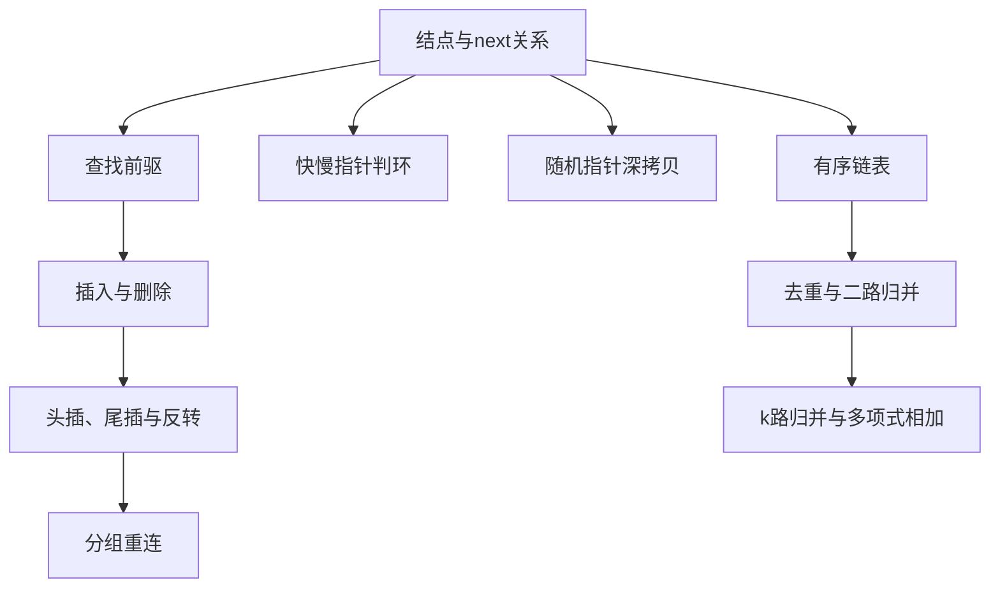

> 原书：李春葆、李筱驰《算法面试（全二册）》<br>
> 阅读范围：第 2 章 链表<br>
> 说明：本文按原书 2.1～2.4 的顺序整理。标题含“补充”的内容用于补足定义、证明、边界或替代方案，不代表原书原文；原页中的明显边界或排版问题会标为“勘误说明”。

## 0. 本章主线

数组用连续索引组织序列，链表则把“元素值”和“下一个结点在哪里”一起保存在结点中。地址可以不连续，改变序列关系主要靠改指针，而不是搬移整段元素。



第二章共有 15 道正文例题：2.2 有 7 道，2.3 有 3 道，2.4 有 5 道。贯穿全章的检查清单是：

1. 当前指针指向哪个结点，还是可能为空？
2. 修改 `next` 前是否保存了仍需访问的后继？
3. 谁是被修改区间的前驱和尾结点？
4. 修改后是否丢失结点、形成意外环或留下旧连接？
5. 题目要求复用原结点，还是必须创建全新结点？

## 2.1 链表概述

### 2.1.1 链表的定义

#### 链表解决什么问题

数组擅长按索引随机访问，但在中间插入、删除时通常要搬移后缀。链表把序列关系显式存进指针域：若结点 $u$ 后面是结点 $v$，就令 `u.next = v`。只要已知前驱，插入或删除只需改常数个指针。

对序列

$$
[a_0,a_1,\ldots,a_{n-1}],
$$

单链表由结点 $v_0,v_1,\ldots,v_{n-1}$ 构成，并满足：

$$
v_i.\text{val}=a_i,
$$

$$
v_i.\text{next}=v_{i+1}\quad(0\le i<n-1),
$$

$$
v_{n-1}.\text{next}=\text{null}.
$$

`head`保存首结点 $v_0$ 的引用；空链表的 `head=null`。结点地址不要求连续，序列顺序由 `next` 可达关系决定。

#### 补充：值、结点身份与引用

两个结点可以有相同 `val`，却仍是不同结点。链表题中的“交换结点”通常要求改变连接关系，不能只交换值；“深拷贝”要求新旧结点身份完全不同；“相交链表”判断的是两个指针是否指向同一结点，而不是值是否相等。

因此应区分：

- **值相等**：`p.val == q.val`；
- **结点相同**：`p == q`，即引用同一对象或地址；
- **结构相同**：从两个起点沿指针得到相同形状和值，但结点身份未必相同。

#### 单链表、双链表与循环链表

- **单链表**：每个结点只有指向后继的 `next`；从当前结点不能直接得到前驱。
- **双链表**：同时保存 `prev` 和 `next`；已知当前结点时可双向移动，但每次更新需维护更多指针。
- **循环链表**：尾结点不指向空，而是连回某个约定结点；遍历终止条件不能再写成“直到空”。

原书若无特别说明，默认讨论单链表。

#### 带头结点与不带头结点

LeetCode 通常传入不带头结点的 `head`，它直接指向第一个数据结点。原书基础操作使用带头结点的链表：额外建立一个不保存序列元素的哨兵 `dummy`，令 `dummy.next=head`。

头结点的价值是统一边界。插入或删除第 0 个数据结点时，其前驱就是 `dummy`，无需单独修改外部 `head`。完成操作后返回 `dummy.next`。

头结点不计入数据长度。原书把它的逻辑序号视为 $-1$，数据结点序号仍为 $0$ 到 $n-1$。

#### 补充：链表的复杂度来自“是否已知位置”

| 操作 | 已知条件 | 时间 |
|---|---|---|
| 读取第 $i$ 个结点 | 只有 `head` | $O(i)$，最坏 $O(n)$ |
| 在已知结点后插入 | 已有该结点指针 | $O(1)$ |
| 删除已知前驱的后继 | 已有前驱指针 | $O(1)$ |
| 按序号插入/删除 | 需先找前驱 | 最坏 $O(n)$ |
| 表头插入 | 已有头指针 | $O(1)$ |
| 表尾插入 | 只有头指针 | $O(n)$ |
| 表尾插入 | 维护尾指针 | $O(1)$ |

“链表插入删除是 $O(1)$”只有在目标位置或前驱已知时成立。按索引操作的查找成本不能省略。

### 2.1.2 链表的知识点

本小节沿用原书约定：`h` 指向哨兵头结点，$n$ 个数据结点编号 $0,\ldots,n-1$。

#### 1. 查找序号为 $i$ 的结点

有效范围是 $-1\le i<n$；$i=-1$ 返回头结点。对 $i\ge0$，从 `h.next` 出发移动 $i$ 次。

循环不变量：每轮开始时，若 `p` 非空，则 `p` 指向序号为 $j$ 的数据结点。初始 $j=0$；每执行 `p=p.next, j++`，结点序号同步增加 1。若到达 $j=i$，返回目标；若先到空，说明索引越界。

时间为 $O(i+1)$，最坏 $O(n)$，额外空间 $O(1)$。

> **勘误说明：** 原书第 71 页 C++/Python `geti` 的循环只检查 `j<i`，没有检查 `p` 是否为空。当 $i$ 比链表长度大 1 以上时会解引用空指针。健壮条件应为 `while j < i and p is not None`。

#### 2. 在序号 $i$ 处插入值 $x$

合法范围是 $0\le i\le n$。先找逻辑序号 $i-1$ 的前驱 `p`，再创建 `s`：

```text
s.next = p.next
p.next = s
```

顺序不能随意交换。若先执行 `p.next=s`，原后继地址会丢失，除非事前另存。两次赋值后，原来的边 `p -> oldNext` 被替换为 `p -> s -> oldNext`。

查找前驱最坏 $O(n)$，实际链接 $O(1)$。若 `i<0` 或找不到合法前驱，则不插入。

#### 3. 删除序号 $i$ 的结点

合法范围是 $0\le i<n$。找到前驱 `p` 后，还必须确认 `p.next` 存在。令 `target=p.next`，执行

```text
p.next = target.next
```

即可把 `target` 从可达链中绕过。C++ 还应 `delete target`；Python、Go 由垃圾回收器在对象不可达后回收。

> **勘误说明：** 原书第 73 页只判断 `p != NULL`。当 $i=n$ 时，前驱 `p` 恰是尾结点但 `p.next` 为空，随后访问 `s.next` 会出错。正确判断必须是 `p != null && p.next != null`。

#### 4. 用头插法建表

每次把新结点插到头结点之后：

$$
s.\text{next}\leftarrow h.\text{next},\qquad
h.\text{next}\leftarrow s.
$$

若输入依次为 $a_0,a_1,\ldots,a_{n-1}$，第 $t$ 次插入后链表为

$$
[a_t,a_{t-1},\ldots,a_0],
$$

可用归纳证明：新值总被放到已有序列之前。因此最终顺序是输入的逆序。每次插入 $O(1)$，总时间 $O(n)$。

#### 5. 用尾插法建表

维护尾指针 `rear`。初始 `rear=h`；对每个新结点 `s` 执行 `rear.next=s; rear=s`。循环不变量是：`rear` 始终指向当前结果最后一个结点，结果顺序与已读输入相同。

有尾指针时每次尾插 $O(1)$，总时间 $O(n)$。若每次都从头寻找尾结点，则代价为

$$
0+1+2+\cdots+(n-1)=\frac{n(n-1)}2=O(n^2).
$$

#### 6. 两个有序链表的合并

原书 2.1.2 的版本要求**不破坏**两个输入链表，因此归并时复制值到全新结点。令 `p,q` 分别指向两链表未处理首结点：

- 若 `p.val <= q.val`，复制 `p` 并推进 `p`；
- 否则复制 `q` 并推进 `q`；
- 一路耗尽后复制另一路剩余结点。

正确性与数组二路归并相同：`p`、`q` 分别是两路剩余最小值，二者较小者就是全局最小未处理值。结果尾指针让每次追加为 $O(1)$。

设两链长度为 $m,n$，每个输入结点恰访问并复制一次，故时间 $O(m+n)$；新建 $m+n$ 个结点，额外空间 $O(m+n)$。2.4.3 的题目要求拼接原结点，届时会改用 $O(1)$ 额外空间的复用版本。

#### C++17：共享结点定义与基础操作

后续正文中的 C++ 函数都沿用这一结点定义。每个题解代码块只展示该题的核心函数，和这里的定义放在同一源文件即可编译。

```cpp
#include <initializer_list>
#include <vector>

struct ListNode {
    int val;
    ListNode* next;
    explicit ListNode(int value = 0, ListNode* following = nullptr)
        : val(value), next(following) {}
};

ListNode* getNode(ListNode* dummy, int index) {
    if (index < -1) return nullptr;
    ListNode* current = dummy;
    for (int position = -1; position < index && current != nullptr; ++position) {
        current = current->next;
    }
    return current;
}

bool insertAt(ListNode* dummy, int index, int value) {
    ListNode* predecessor = getNode(dummy, index - 1);
    if (predecessor == nullptr) return false;
    predecessor->next = new ListNode(value, predecessor->next);
    return true;
}

bool deleteAt(ListNode* dummy, int index) {
    ListNode* predecessor = getNode(dummy, index - 1);
    if (predecessor == nullptr || predecessor->next == nullptr) return false;
    ListNode* removed = predecessor->next;
    predecessor->next = removed->next;
    delete removed;
    return true;
}

ListNode* buildFront(std::initializer_list<int> values) {
    ListNode* dummy = new ListNode();
    for (int value : values) {
        dummy->next = new ListNode(value, dummy->next);
    }
    return dummy;
}

ListNode* buildRear(std::initializer_list<int> values) {
    ListNode* dummy = new ListNode();
    ListNode* rear = dummy;
    for (int value : values) {
        rear->next = new ListNode(value);
        rear = rear->next;
    }
    return dummy;
}

ListNode* mergeCopy(ListNode* first, ListNode* second) {
    ListNode dummy;
    ListNode* rear = &dummy;
    while (first != nullptr || second != nullptr) {
        if (second == nullptr || (first != nullptr && first->val <= second->val)) {
            rear->next = new ListNode(first->val);
            first = first->next;
        } else {
            rear->next = new ListNode(second->val);
            second = second->next;
        }
        rear = rear->next;
    }
    return dummy.next;
}

std::vector<int> listValues(ListNode* head) {
    std::vector<int> result;
    while (head != nullptr) {
        result.push_back(head->val);
        head = head->next;
    }
    return result;
}
```

输入 `[1,2,3]` 时，头插建表得到 `[3,2,1]`，尾插建表得到 `[1,2,3]`。对尾插结果执行“位置 1 插入 9、位置 2 删除”后得到 `[1,9,3]`。

**迁移抓手**：链表操作先问“我是否已经拿到目标位置的前驱”。拿到后，插删是常数次改边；没拿到时，查找前驱才是主要成本。

## 2.2 链表基本操作的算法设计

本节把遍历、插入、删除、头插和尾插组合成完整题目。分析链表代码时，不要只看结点值，应在纸上画出“修改前的边、要删除的边、要新建的边”。

### 2.2.1 LeetCode 203：移除链表元素（★）

给定不带头结点的 `head` 和 `val`，删除所有值等于 `val` 的结点。难点在于首结点也可能连续被删，删除后遍历指针必须落到正确的下一个候选。

#### 解法一：直接删除法

原书先跳过开头所有目标结点，确定新的 `head`；随后用同步指针 `(pre,current)`：

- 若 `current.val == val`，执行 `pre.next=current.next`，`pre` 不动，`current=pre.next`；
- 否则两指针同步后移。

删除时 `pre` 不动，因为它仍是下一候选的前驱。若错误地同时移动 `pre`，连续目标结点可能被跳过。

#### 解法二：尾插法筛选

遍历原链，把非目标结点依次接到结果尾部，最后令结果尾 `next=null`，切断可能残留的旧连接。它复用保留结点，额外只需哨兵和尾指针。

C++ 若复用结点，必须保存下一结点后再 `delete` 被移除结点；Python、Go 可交给垃圾回收。原书特别提醒了 C++ 内存泄漏风险。

#### 补充：统一哨兵写法

令 `dummy.next=head`，直接从 `pre=dummy` 开始检查 `pre.next`。这样删除首结点与中间结点使用同一条语句，结束返回 `dummy.next`。每个结点至多访问一次，时间 $O(n)$、额外空间 $O(1)$。

#### C++17：哨兵统一删除首结点与中间结点

```cpp
ListNode* removeElements(ListNode* head, int target) {
    ListNode dummy(0, head);
    ListNode* predecessor = &dummy;
    while (predecessor->next != nullptr) {
        if (predecessor->next->val == target) {
            ListNode* removed = predecessor->next;
            predecessor->next = removed->next;
            delete removed;
            // predecessor 不动，继续检查新的后继。
        } else {
            predecessor = predecessor->next;
        }
    }
    return dummy.next;
}
```

`[1,2,6,3,4,5,6]` 删除 6 时，第一个 6 被绕过后前驱仍是值 2 的结点；尾部 6 被绕过后前驱仍是值 5 的结点，结果 `[1,2,3,4,5]`。

### 2.2.2 LeetCode 206：反转链表（★）

原书把反转理解为“复用原结点的头插建表”。遍历指针 `current` 指向尚未处理部分，`reversed` 指向已反转前缀：

```text
next = current.next       // 先保存后缀
current.next = reversed   // 当前结点插到结果表头
reversed = current
current = next
```

循环不变量：

- `reversed` 是原链已处理前缀的逆序；
- `current` 是原链第一个未处理结点；
- 两部分结点不重不漏。

最关键的是先保存 `current.next`。若先改 `current.next` 而未保存，未处理后缀入口会丢失。每轮处理一个结点，时间 $O(n)$、额外空间 $O(1)$。

补充的递归写法虽简洁，但调用栈需要 $O(n)$ 空间，长链还可能栈溢出，不满足严格 $O(1)$ 辅助空间。

#### C++17：保存后继后再反转当前边

```cpp
ListNode* reverseList(ListNode* head) {
    ListNode* reversed = nullptr;
    while (head != nullptr) {
        ListNode* following = head->next;
        head->next = reversed;
        reversed = head;
        head = following;
    }
    return reversed;
}
```

对 `1→2→3`：处理 1 后为 `1→null` 与未处理 `2→3`；处理 2 后为 `2→1` 与未处理 `3`；最后得到 `3→2→1`。每一步都先把未处理后缀入口保存在 `following`。

### 2.2.3 LeetCode 328：奇偶链表（★★）

题目按**位置编号**分组：第 1、3、5 个结点在前，第 2、4、6 个结点在后，并保持各组内部相对顺序。这里的“奇偶”不是结点值的奇偶，也不是从 0 开始的数组索引奇偶。

原书建立奇位置链和偶位置链，分别维护尾指针；遍历时把原结点交替尾插到两条链，最后连接“奇链尾 -> 偶链首”，并把偶链尾的 `next` 置空。

可进一步直接用原链中的 `odd=head`、`even=head.next` 两条指针交错重连，并保存 `evenHead`：

```text
odd.next = even.next
odd = odd.next
even.next = odd.next
even = even.next
```

循环不变量是奇链和偶链分别保持已处理对应位置结点的原顺序。最终 `odd.next=evenHead`。时间 $O(n)$、额外空间 $O(1)$。

#### C++17：在原链上同步延长奇链与偶链

```cpp
ListNode* oddEvenList(ListNode* head) {
    if (head == nullptr || head->next == nullptr) return head;
    ListNode* odd = head;
    ListNode* even = head->next;
    ListNode* evenHead = even;
    while (even != nullptr && even->next != nullptr) {
        odd->next = even->next;
        odd = odd->next;
        even->next = odd->next;
        even = even->next;
    }
    odd->next = evenHead;
    return head;
}
```

`1→2→3→4→5` 中，奇链逐步成为 `1→3→5`，偶链成为 `2→4`，最后拼接为 `1→3→5→2→4`。这里分组依据是结点位置，不要写成 `node->val % 2`。

### 2.2.4 LeetCode 61：旋转链表（★★）

长度为 $n$ 的链表右移 $k$ 位，等价于把后 $k$ 个结点搬到前面。空链、单结点或 $k=0$ 可直接返回。

#### 位移规范化

移动 $n$ 次回到原结构，因此有效位移是

$$
k'=k\bmod n.
$$

若 $k'=0$，无需改变。否则新首结点原序号为 $n-k'$，新尾结点原序号为 $n-k'-1$。

#### 成环再断开

1. 遍历求 $n$，同时得到原尾结点 `tail`。
2. 令 `tail.next=head`，临时构成环。
3. 从原首结点走 $n-k'-1$ 步到新尾 `newTail`。
4. `newHead=newTail.next`，再令 `newTail.next=null`。

之所以先成环，是因为旋转只是改变“在哪里断开”。遍历求长度和寻找新尾合计 $O(n)$，额外空间 $O(1)$。必须在所有返回路径上确保临时环被断开。

#### C++17：成环后在新尾处断开

```cpp
ListNode* rotateRight(ListNode* head, int shift) {
    if (head == nullptr || head->next == nullptr || shift == 0) return head;
    int length = 1;
    ListNode* tail = head;
    while (tail->next != nullptr) {
        tail = tail->next;
        ++length;
    }
    shift %= length;
    if (shift == 0) return head;

    tail->next = head;
    ListNode* newTail = head;
    for (int step = 0; step < length - shift - 1; ++step) {
        newTail = newTail->next;
    }
    ListNode* newHead = newTail->next;
    newTail->next = nullptr;
    return newHead;
}
```

`1→2→3→4→5` 右移 3 位时，$n-k-1=1$，新尾是值 2 的结点，新首是 3，结果 `3→4→5→1→2`。

### 2.2.5 LeetCode 141：环形链表（★）

若从某结点开始沿 `next` 能再次访问同一结点，则存在环。不能用结点值判断，因为不同结点可有相同值。

#### Floyd 快慢指针

`slow` 每轮走 1 步，`fast` 每轮走 2 步；先移动，再比较身份：

- 若 `fast` 或 `fast.next` 为空，快指针走到链尾，无环；
- 若 `slow == fast`，两者指向同一结点，有环。

> **勘误说明：** 原书文字有“若初始 fast 和 slow 指向同一个结点，则有环”的表述。两者本来都从 `head` 出发，若移动前比较会让所有非空链都误判。原书正式代码正确地在移动后比较。

#### 为什么有环必相遇

设入环前长度为 $\mu$，环长为 $\lambda$。慢指针进入环后，快指针也在环中。每轮快指针相对慢指针多走 1 步，所以二者在环上的相对距离按模 $\lambda$ 每轮增加 1：

$$
d_{t+1}\equiv d_t+1\pmod\lambda.
$$

在至多 $\lambda$ 轮内，相对距离必取到 0，二者相遇。无环时快指针每轮走两步，必先遇空。总时间 $O(n)$、额外空间 $O(1)$。

补充的哈希集合方法可记录访问过的结点，时间 $O(n)$，但需要 $O(n)$ 空间；它更直观，却没有利用速度差。

#### C++17：移动后比较结点身份

```cpp
bool hasCycle(ListNode* head) {
    ListNode* slow = head;
    ListNode* fast = head;
    while (fast != nullptr && fast->next != nullptr) {
        slow = slow->next;
        fast = fast->next->next;
        if (slow == fast) return true;
    }
    return false;
}
```

判断的是指针身份 `slow == fast`，不是 `slow->val == fast->val`。若链表值为 `[1,1]` 且无环，值相等不能说明两个指针指向同一结点。

### 2.2.6 LeetCode 138：复制带随机指针的链表（★★）

每个结点除了 `next`，还有可指向任意原链结点或空的 `random`。深拷贝要求存在一一映射 $f$，满足：

$$
f(p).val=p.val,
$$

$$
f(p.next)=f(p).next,
$$

$$
f(p.random)=f(p).random,
$$

且所有 $f(p)$ 都是新结点，不能指回原链。

难点是设置复制结点的 `random` 时，如何在 $O(1)$ 辅助空间内找到“原 random 目标对应的复制结点”。

#### 原书的交织复制法

**第一遍：交织。** 在每个原结点 $p$ 后插入复制结点 $p'$：

```text
p -> p' -> 原来的p.next
```

于是对任何原结点 $x$，其复制结点恒为 `x.next`。

**第二遍：连接 random。** 若 `p.random` 非空，则

$$
p'.random=p.random.next.
$$

右侧正是 random 目标之后插入的复制结点；若原 random 为空，则复制 random 也为空。

**第三遍：拆分。** 交替恢复原链 `p.next=p'.next`，并把所有 $p'$ 尾插到复制链。结束时原链结构必须与输入完全一致。

三遍都是 $O(n)$。除必须创建的 $n$ 个输出结点外，只用常数个指针，所以辅助空间 $O(1)$。若把输出也计入空间，总新增空间当然是 $O(n)$。

#### 补充：哈希映射法

建立 `original -> copy` 映射，再遍历设置 `next`、`random`，更容易理解且不临时修改原链，但映射额外占 $O(n)$ 空间。并发环境或原结构不可暂改时，这一替代方案更稳妥。

#### C++17：交织、连接随机边、拆分

```cpp
struct RandomNode {
    int val;
    RandomNode* next = nullptr;
    RandomNode* random = nullptr;
    explicit RandomNode(int value) : val(value) {}
};

RandomNode* copyRandomList(RandomNode* head) {
    for (RandomNode* current = head; current != nullptr;) {
        RandomNode* copied = new RandomNode(current->val);
        copied->next = current->next;
        current->next = copied;
        current = copied->next;
    }
    for (RandomNode* current = head; current != nullptr;
         current = current->next->next) {
        current->next->random =
            current->random == nullptr ? nullptr : current->random->next;
    }

    RandomNode dummy(0);
    RandomNode* rear = &dummy;
    for (RandomNode* current = head; current != nullptr;) {
        RandomNode* copied = current->next;
        current->next = copied->next;
        rear->next = copied;
        rear = copied;
        current = current->next;
    }
    return dummy.next;
}
```

若原结点 13 的 `random` 指向原结点 7，交织后原 7 的复制结点恰是 `original7->next`，所以复制 13 的随机边可直接指向 `original13->random->next`。

### 2.2.7 LeetCode 707：设计链表（★★）

需要实现 `get`、头插、尾插、按索引插入和按索引删除。设计难点不是单个指针语句，而是持续维护数据结构不变量。

#### 解法一：带头结点和长度的单链表

维护：

- `dummy` 永远存在且不计入长度；
- `length` 等于从 `dummy.next` 可达的数据结点数；
- 插入成功后 `length++`，删除成功后 `length--`。

索引规则：

- `get(i)`：仅 $0\le i<length$ 有效；
- `addAtIndex(i,val)`：$i<0$ 按 0 处理，$0\le i\le length$ 可插入，$i>length$ 不操作；
- `deleteAtIndex(i)`：仅 $0\le i<length$ 有效。

头插为 $O(1)$；`get`、按索引操作和不带尾指针的尾插最坏 $O(n)$。

#### 解法二：带尾指针的循环单链表

原书用 `rear` 保存尾结点，并让尾结点连接回约定结点，使尾插降为 $O(1)$。但实现必须额外维护空表、删除尾结点、删除唯一结点时的 `rear` 和环连接。

更常见的补充选择是“哨兵 + 普通尾指针”：不必成环，也能让尾插为 $O(1)$；代价同样是每次删除尾结点后要更新 `rear`。若需要频繁按索引向前、向后访问，双链表会比单链表更合适。

#### C++17：哨兵与长度共同约束索引

```cpp
class MyLinkedList {
private:
    ListNode* dummy = new ListNode();
    int length = 0;

    ListNode* predecessor(int index) const {
        ListNode* current = dummy;
        for (int step = 0; step < index; ++step) current = current->next;
        return current;
    }

public:
    ~MyLinkedList() {
        while (dummy != nullptr) {
            ListNode* following = dummy->next;
            delete dummy;
            dummy = following;
        }
    }

    int get(int index) const {
        if (index < 0 || index >= length) return -1;
        return predecessor(index)->next->val;
    }

    void addAtIndex(int index, int value) {
        if (index < 0) index = 0;
        if (index > length) return;
        ListNode* previous = predecessor(index);
        previous->next = new ListNode(value, previous->next);
        ++length;
    }

    void addAtHead(int value) { addAtIndex(0, value); }
    void addAtTail(int value) { addAtIndex(length, value); }

    void deleteAtIndex(int index) {
        if (index < 0 || index >= length) return;
        ListNode* previous = predecessor(index);
        ListNode* removed = previous->next;
        previous->next = removed->next;
        delete removed;
        --length;
    }
};
```

操作 `addAtHead(1), addAtTail(3), addAtIndex(1,2)` 得到 `[1,2,3]`；删除索引 1 后得到 `[1,3]`。`length` 不只是优化字段，它决定哪些索引合法，必须与实际结点数同步。

### 2.2 方法小结

```mermaid
flowchart LR
    A[需要统一删除首结点] --> B[加哨兵]
    C[需要反转] --> D[先存后继再改next]
    E[需要稳定分组] --> F[多条尾插链]
    G[需要旋转] --> H[成环后重新断开]
    I[需要判环] --> J[快慢指针速度差]
    K[需要复制任意引用] --> L[交织建立O(1)映射]
```

## 2.3 链表的分组算法设计

分组题的共同结构是：找到一段连续结点，只改这段内部次序，再把“前缀—修改段—后缀”重新接好。哨兵让第一组从首结点开始时也有统一前驱。

### 2.3.1 LeetCode 92：反转链表 II（★★）

给定 1 开始的位置 `left <= right`，只反转闭区间 `[left,right]`。

#### 原书的组内头插法

建立 `dummy.next=head`，找到第 `left` 个结点的前驱 `pre`。令 `segmentTail=pre.next`，它是反转前的段首，反转后会成为段尾。重复 $right-left$ 次：

```text
moving = segmentTail.next
segmentTail.next = moving.next
moving.next = pre.next
pre.next = moving
```

每轮从 `segmentTail` 后摘下一个结点，插到 `pre` 后面。以 `1->2->3->4->5`、`left=2,right=4` 为例：

```text
初始：1 -> [2 -> 3 -> 4] -> 5
一次：1 -> [3 -> 2 -> 4] -> 5
二次：1 -> [4 -> 3 -> 2] -> 5
```

循环不变量：`pre` 不变；`pre.next` 是当前反转段首；`segmentTail` 是已反转部分尾；`segmentTail.next` 是下一个待头插结点。每次保持前后缀连通，不会丢结点。

寻找 `pre` 加组内移动共 $O(n)$，额外空间 $O(1)$。成立条件是题目保证 `left,right` 合法；通用库代码还应在每次解引用前检查空指针。

#### C++17：固定段前驱，不断把后继头插

```cpp
ListNode* reverseBetween(ListNode* head, int left, int right) {
    ListNode dummy(0, head);
    ListNode* predecessor = &dummy;
    for (int position = 1; position < left; ++position) {
        predecessor = predecessor->next;
    }

    ListNode* segmentTail = predecessor->next;
    for (int step = 0; step < right - left; ++step) {
        ListNode* moving = segmentTail->next;
        segmentTail->next = moving->next;
        moving->next = predecessor->next;
        predecessor->next = moving;
    }
    return dummy.next;
}
```

反转 `1→[2→3→4]→5` 时，`pre` 始终是 1，`segmentTail` 始终是 2；3、4 依次被摘下并插到 1 后，得到 `1→4→3→2→5`。

### 2.3.2 LeetCode 24：两两交换链表中的结点（★★）

每两个相邻结点一组，交换结点身份而非只交换值；最后不足两结点的组保持不变。

原书用结果哨兵和尾指针。若当前组为 `a->b->rest`，先保存 `rest=b.next`，再按 `b,a` 尾插：

```text
rear.next = b
b.next = a
rear = a
current = rest
```

循环结束后把剩余单结点接到尾部，并保证尾结点指向空。每个结点重连一次，时间 $O(n)$、额外空间 $O(1)$。

#### 补充：直接在原位置交换

维护组前驱 `pre`：

```text
a = pre.next
b = a.next
a.next = b.next
b.next = a
pre.next = b
pre = a
```

三条边从 `pre->a->b->rest` 变为 `pre->b->a->rest`。这个写法不需要独立结果链，但必须按能保留 `rest` 的顺序赋值。

#### C++17：每轮完成一个三边替换

```cpp
ListNode* swapPairs(ListNode* head) {
    ListNode dummy(0, head);
    ListNode* predecessor = &dummy;
    while (predecessor->next != nullptr &&
           predecessor->next->next != nullptr) {
        ListNode* first = predecessor->next;
        ListNode* second = first->next;
        first->next = second->next;
        second->next = first;
        predecessor->next = second;
        predecessor = first;
    }
    return dummy.next;
}
```

处理 `pre→1→2→3` 后变成 `pre→2→1→3`，新的组前驱就是原第一个结点 1。末尾只剩一个结点时，循环条件阻止不完整组进入交换。

### 2.3.3 LeetCode 25：$k$ 个一组翻转链表（★★★）

每个完整的 $k$ 结点组反转，末尾不足 $k$ 个保持原序。真正难点是**确认组完整后再修改**；若先反转才发现不够 $k$ 个，还要恢复。

#### 原书的组内头插

`pre` 是当前组前驱，`tail` 用于发现完整组。每找到一个完整 $k$ 组，令 `segmentTail=pre.next`，再执行 $k-1$ 次“摘下 `segmentTail.next` 并插到 `pre` 后”。完成后：

- 原组首 `segmentTail` 已成为组尾；
- 它自然成为下一组的 `pre`；
- 下一组从 `segmentTail.next` 开始。

例如 $k=3$，`pre->1->2->3->rest`：

```text
头插2：pre -> 2 -> 1 -> 3 -> rest
头插3：pre -> 3 -> 2 -> 1 -> rest
```

#### 补充：先找第 $k$ 个结点

从 `groupPrev` 向后走 $k$ 步找 `kth`。若途中为空，直接返回，保证残组不变。保存 `groupNext=kth.next` 后，可用标准反转把 `[groupPrev.next,kth]` 的 `next` 方向全部翻转，再接回两端。

每个结点只参与常数次查找与重连，总时间 $O(n)$；无递归、无数组，额外空间 $O(1)$。虽然每组先数 $k$ 步再反转 $k$ 步，看似两遍，但共有约 $n/k$ 组：

$$
\frac nk\cdot(2k)=2n=O(n).
$$

#### C++17：先确认完整组，再反转到组后继

```cpp
ListNode* reverseKGroup(ListNode* head, int groupSize) {
    if (groupSize <= 1) return head;
    ListNode dummy(0, head);
    ListNode* groupPredecessor = &dummy;

    while (true) {
        ListNode* kth = groupPredecessor;
        for (int step = 0; step < groupSize; ++step) {
            kth = kth->next;
            if (kth == nullptr) return dummy.next;
        }

        ListNode* groupFollowing = kth->next;
        ListNode* previous = groupFollowing;
        ListNode* current = groupPredecessor->next;
        while (current != groupFollowing) {
            ListNode* following = current->next;
            current->next = previous;
            previous = current;
            current = following;
        }

        ListNode* oldFirst = groupPredecessor->next;
        groupPredecessor->next = kth;
        groupPredecessor = oldFirst;
    }
}
```

`1→2→3→4→5`、$k=3$ 时，先确认结点 3 存在，再把反转初始前驱设为组后继 4，因此反转过程自然形成 `3→2→1→4`；剩余 `4→5` 不足 3 个，保持原序。

**迁移抓手**：凡是“完整组才处理”的链表题，先探测组尾、保存组后继，再改边；不要边改边数，否则发现残组时需要恢复。

## 2.4 有序链表的算法设计

有序链表与有序数组共享“相同值连续、当前首结点是剩余最小值”的性质，但链表没有随机访问。优势是归并时可直接重连结点，无需移动后缀。

### 2.4.1 LeetCode 83：删除排序链表中的重复元素（★）

目标是每个值保留一个。因为相同值相邻，维护当前保留结点 `current`：

- 若 `current.next.val == current.val`，删除 `current.next`，`current` 不动；
- 否则推进 `current`。

循环不变量是 `head..current` 已去重且有序。连续重复时不推进，保证整段都与同一个保留结点比较。时间 $O(n)$、额外空间 $O(1)$。

原书还给出尾插筛选法：仅把与结果尾值不同的结点接到尾部，最后断开旧尾连接。原文文本层中“`p.val != p.val`”显然是排版丢失，语义应是“当前结点值不同于结果尾结点值”。

C++ 直接删除时应释放被移除结点；在线评测常省略析构管理不等于工程代码可以泄漏。

#### C++17：连续删除时保留结点不动

```cpp
ListNode* deleteDuplicatesOnce(ListNode* head) {
    ListNode* current = head;
    while (current != nullptr && current->next != nullptr) {
        if (current->val == current->next->val) {
            ListNode* removed = current->next;
            current->next = removed->next;
            delete removed;
        } else {
            current = current->next;
        }
    }
    return head;
}
```

`1→1→1→2` 中，删除第二个 1 后 `current` 仍指向第一个 1，才能继续发现第三个 1；若立即前进，会漏删连续重复。

### 2.4.2 LeetCode 82：删除排序链表中的重复元素 II（★★）

本题不是“每值留一个”，而是**出现超过一次的值全部不留**。例如 `[1,2,3,3,4,4,5]` 变为 `[1,2,5]`。

#### 解法一：计数后筛选

原书利用值域 $[-100,100]$，设置长度 201 的数组：

$$
cnt[x+100]=x\text{ 的出现次数}.
$$

第二遍只尾插计数为 1 的结点。对本题固定值域，额外数组可视为 $O(1)$；若值域不受常数约束，则空间应写成 $O(U)$（$U$ 为值域大小）或改用哈希表 $O(d)$（$d$ 为不同值数），不能无条件称为常数空间。

#### 解法二：按连续段直接删除

加哨兵，令 `pre` 指向结果中最后一个确认保留结点，`current=pre.next`：

1. 若 `current.next` 与 `current` 同值，移动扫描指针越过整个同值段，再令 `pre.next` 指向段后；`pre` 不动。
2. 若下一结点不同，当前值只出现一次，令 `pre=current`。

有序性保证同值段连续，所以跳过整段不会漏掉同值结点。每个结点至多被扫描一次，时间 $O(n)$、额外空间 $O(1)$。

#### C++17：前驱只越过确认保留的单结点段

```cpp
ListNode* deleteDuplicatesAll(ListNode* head) {
    ListNode dummy(0, head);
    ListNode* predecessor = &dummy;
    while (predecessor->next != nullptr) {
        ListNode* current = predecessor->next;
        if (current->next != nullptr && current->val == current->next->val) {
            int duplicate = current->val;
            while (predecessor->next != nullptr &&
                   predecessor->next->val == duplicate) {
                ListNode* removed = predecessor->next;
                predecessor->next = removed->next;
                delete removed;
            }
        } else {
            predecessor = predecessor->next;
        }
    }
    return dummy.next;
}
```

`[1,2,3,3,4,4,5]` 中，`pre` 到达 2 后发现下一段 3 重复，于是保持在 2 并绕过整个 3 段；同理绕过 4 段，结果 `[1,2,5]`。这与 LeetCode 83 的“每段留一个”目标完全不同。

### 2.4.3 LeetCode 21：合并两个有序链表（★）

与 2.1.2 的复制式归并不同，本题要求结果由给定链表的全部原结点拼接而成。维护结果尾 `rear` 和两路指针 `p,q`：每次把值较小的当前结点接到 `rear`，再推进该路；一路为空后可一次性连接另一整段后缀。

循环不变量：结果链有序，包含两输入已处理结点且不重不漏；`p,q` 分别是两路最小未处理结点。选择较小者是安全的。

时间 $O(m+n)$，除哨兵外额外空间 $O(1)$。等值时先选哪一路都能得到非递减结果；若还要求跨链稳定性，必须明确约定平局顺序。

#### C++17：复用原结点的稳定二路归并

```cpp
ListNode* mergeTwo(ListNode* first, ListNode* second) {
    ListNode dummy;
    ListNode* rear = &dummy;
    while (first != nullptr && second != nullptr) {
        if (first->val <= second->val) {
            rear->next = first;
            first = first->next;
        } else {
            rear->next = second;
            second = second->next;
        }
        rear = rear->next;
    }
    rear->next = first == nullptr ? second : first;
    return dummy.next;
}
```

合并 `1→2→4` 与 `1→3→4` 时，平局先取第一条链，因此得到值序列 `[1,1,2,3,4,4]`，且第一条链中的同值结点位于第二条链同值结点之前。

### 2.4.4 LeetCode 23：合并 $k$ 个有序链表（★★★）

设第 $i$ 条链长度为 $n_i$，总结点数

$$
N=\sum_{i=0}^{k-1}n_i.
$$

#### 解法一：依次二路归并

先合并链 0、1，再用结果合并链 2，如此继续。总代价为

$$
T=\sum_{j=1}^{k-1}\left(\sum_{i=0}^{j}n_i\right).
$$

因为早加入的结点会被反复遍历。若各链等长 $n_i=N/k$，则

$$
T=\frac Nk\sum_{j=1}^{k-1}(j+1)=\Theta(Nk).
$$

原书给出 $O(kN)$ 量级结论（书中符号排版把总数和分段长度都写成近似的 $n$，这里重新定义以免混淆）。输入顺序会影响常数和实际代价：先合并很长链会让其被重复扫描更多次。

#### 解法二：朴素 $k$ 路归并

保留每条链当前结点，每输出一个结点就扫描全部 $k$ 路找最小值。输出 $N$ 个结点，每次 $O(k)$：

$$
T=O(Nk).
$$

原书实测该方法比依次二路归并更慢，并提示用小根堆优化。

#### 补充：小根堆

堆中最多放每条非空链的一个当前结点。弹出最小结点接到结果尾，再把它的后继入堆。每个结点恰好入堆、出堆一次：

$$
T=O(N\log k),\qquad S=O(k).
$$

堆键相等时还应带一个唯一序号，避免 Python 等语言尝试直接比较结点对象。

#### 补充：平衡分治归并

两两配对归并，再归并上一层结果。每层所有链的总长度为 $N$，层数为 $\lceil\log_2k\rceil$，故时间 $O(N\log k)$。迭代实现可只用 $O(1)$ 结点外辅助空间（不计保存链表首指针的输入数组），且常数通常较小。

#### C++17（补充优化）：堆中每条链只保留当前结点

```cpp
#include <queue>
#include <vector>

struct NodeGreater {
    bool operator()(ListNode* left, ListNode* right) const {
        return left->val > right->val;
    }
};

ListNode* mergeK(std::vector<ListNode*> lists) {
    std::priority_queue<
        ListNode*,
        std::vector<ListNode*>,
        NodeGreater
    > minimumHeap;
    for (ListNode* node : lists) {
        if (node != nullptr) minimumHeap.push(node);
    }

    ListNode dummy;
    ListNode* rear = &dummy;
    while (!minimumHeap.empty()) {
        ListNode* node = minimumHeap.top();
        minimumHeap.pop();
        if (node->next != nullptr) minimumHeap.push(node->next);
        rear->next = node;
        rear = node;
    }
    return dummy.next;
}
```

三链 `[1,4,5]`、`[1,3,4]`、`[2,6]` 中，堆初始只含 1、1、2。每弹出一个结点，才暴露同一条链的后继，最终得到 `[1,1,2,3,4,4,5,6]`。

**迁移抓手**：链表无法随机访问，但每条有序链的表头就是该路最小候选；把“当前表头”放堆即可，不要把全部结点预先入堆。

### 2.4.5 LeetCode 1634：求两个多项式链表的和（★★）

每个结点表示

$$
c x^p,
$$

其中 $c$ 是非零系数 `coefficient`，$p\ge0$ 是指数 `power`。标准形式要求指数严格递减，零系数项省略。

给定两个降幂链表，当前指针 `p,q` 分别指向各多项式尚未处理的最高次项：

- `p.power > q.power`：复制 `p` 项到结果并推进 `p`；
- `p.power < q.power`：复制 `q` 项并推进 `q`；
- 指数相等：系数相加；和非零才创建该指数项，然后同时推进。

#### 为什么结果仍是标准形式

每次选择剩余最高指数，故输出指数严格下降；相同指数只在同一轮合并一次；系数和为 0 时省略，因此没有零系数项。输入标准形式是该证明的重要前提。

例如

$$
(2x^2+4x+3)+(3x^2-4x-1)=5x^2+2.
$$

$x^1$ 项系数 $4+(-4)=0$，所以不输出；$x^0$ 项为 $3+(-1)=2$。

两链长度为 $m,n$ 时，每项至多处理一次，时间 $O(m+n)$；题目要求返回新多项式，复制结点的输出空间最多 $O(m+n)$。

#### C++17：指数是归并键，系数是同键聚合值

```cpp
struct PolyNode {
    long long coefficient;
    int power;
    PolyNode* next;
    PolyNode(long long coefficientValue = 0, int powerValue = 0)
        : coefficient(coefficientValue), power(powerValue), next(nullptr) {}
};

PolyNode* addPoly(PolyNode* first, PolyNode* second) {
    PolyNode dummy;
    PolyNode* rear = &dummy;
    while (first != nullptr || second != nullptr) {
        long long coefficient;
        int power;
        if (second == nullptr ||
            (first != nullptr && first->power > second->power)) {
            coefficient = first->coefficient;
            power = first->power;
            first = first->next;
        } else if (first == nullptr || second->power > first->power) {
            coefficient = second->coefficient;
            power = second->power;
            second = second->next;
        } else {
            coefficient = first->coefficient + second->coefficient;
            power = first->power;
            first = first->next;
            second = second->next;
        }
        if (coefficient != 0) {
            rear->next = new PolyNode(coefficient, power);
            rear = rear->next;
        }
    }
    return dummy.next;
}
```

$(2x^2+4x+3)+(3x^2-4x-1)$ 的指数 2 合并为系数 5，指数 1 合并为 0 后省略，指数 0 合并为 2，输出结点 `[(5,2),(2,0)]`。

这种模式可迁移到“两个按键有序的稀疏表示做合并”：键不同就输出较大/较小键，键相同就聚合值，聚合为单位元时省略。

## 推荐练习题

原书列出以下 18 道练习，但未在本章正文展开解法。这里保留题目范围，不虚构原书分析：

1. LeetCode 19：删除链表的倒数第 $n$ 个结点（★★）
2. LeetCode 86：划分链表（★★）
3. LeetCode 141：环形链表（★）
4. LeetCode 142：环形链表 II（★★）
5. LeetCode 143：重排链表（★★）
6. LeetCode 147：对链表进行插入排序（★★）
7. LeetCode 160：相交链表（★）
8. LeetCode 234：回文链表（★）
9. LeetCode 237：删除链表中的结点（★★）
10. LeetCode 725：分隔链表（★★）
11. LeetCode 876：链表的中间结点（★）
12. LeetCode 1474：删除链表中 $m$ 个结点之后的 $n$ 个结点（★）
13. LeetCode 1669：合并两个链表（★★）
14. LeetCode 1721：交换链表中的结点（★★）
15. LeetCode 1836：从未排序的链表中移除重复元素（★★）
16. LeetCode 2046：给按照绝对值排序的链表排序（★★）
17. LeetCode 2095：删除链表的中间结点（★★）
18. LeetCode 2296：设计一个文本编辑器（★★★）

## 附录 A：Python 3 实现速查

本附录集中提供 Python 版本以便查阅。算法原理、连接图示、数值走查和 C++ 主实现均放在对应正文附近。

```python
from __future__ import annotations

import heapq
from itertools import count
from typing import Optional


class ListNode:
    def __init__(self, val: int = 0, next: Optional["ListNode"] = None):
        self.val = val
        self.next = next


def build(values: list[int]) -> Optional[ListNode]:
    dummy = ListNode()
    rear = dummy
    for value in values:
        rear.next = ListNode(value)
        rear = rear.next
    return dummy.next


def values(head: Optional[ListNode]) -> list[int]:
    answer: list[int] = []
    while head is not None:
        answer.append(head.val)
        head = head.next
    return answer


def get_node(dummy: ListNode, index: int) -> Optional[ListNode]:
    """返回逻辑序号 index 的结点；-1 表示哨兵。"""
    if index < -1:
        return None
    current: Optional[ListNode] = dummy
    position = -1
    while position < index and current is not None:
        current = current.next
        position += 1
    return current


def insert_at(dummy: ListNode, index: int, value: int) -> bool:
    predecessor = get_node(dummy, index - 1)
    if predecessor is None:
        return False
    predecessor.next = ListNode(value, predecessor.next)
    return True


def delete_at(dummy: ListNode, index: int) -> bool:
    predecessor = get_node(dummy, index - 1)
    if predecessor is None or predecessor.next is None:
        return False
    predecessor.next = predecessor.next.next
    return True


def build_front(values_to_add: list[int]) -> ListNode:
    dummy = ListNode()
    for value in values_to_add:
        dummy.next = ListNode(value, dummy.next)
    return dummy


def build_rear(values_to_add: list[int]) -> ListNode:
    dummy = ListNode()
    rear = dummy
    for value in values_to_add:
        rear.next = ListNode(value)
        rear = rear.next
    return dummy


def merge_copy(first: Optional[ListNode],
               second: Optional[ListNode]) -> Optional[ListNode]:
    dummy = ListNode()
    rear = dummy
    while first is not None or second is not None:
        if second is None or (first is not None and first.val <= second.val):
            value = first.val
            first = first.next
        else:
            value = second.val
            second = second.next
        rear.next = ListNode(value)
        rear = rear.next
    return dummy.next


def remove_elements(head: Optional[ListNode], target: int) -> Optional[ListNode]:
    dummy = ListNode(0, head)
    predecessor = dummy
    while predecessor.next is not None:
        if predecessor.next.val == target:
            predecessor.next = predecessor.next.next
        else:
            predecessor = predecessor.next
    return dummy.next


def reverse_list(head: Optional[ListNode]) -> Optional[ListNode]:
    reversed_head = None
    while head is not None:
        following = head.next
        head.next = reversed_head
        reversed_head = head
        head = following
    return reversed_head


def odd_even_list(head: Optional[ListNode]) -> Optional[ListNode]:
    if head is None or head.next is None:
        return head
    odd, even, even_head = head, head.next, head.next
    while even is not None and even.next is not None:
        odd.next = even.next
        odd = odd.next
        even.next = odd.next
        even = even.next
    odd.next = even_head
    return head


def rotate_right(head: Optional[ListNode], shift: int) -> Optional[ListNode]:
    if head is None or head.next is None or shift == 0:
        return head
    length, tail = 1, head
    while tail.next is not None:
        tail = tail.next
        length += 1
    shift %= length
    if shift == 0:
        return head
    tail.next = head
    new_tail = head
    for _ in range(length - shift - 1):
        new_tail = new_tail.next
    new_head = new_tail.next
    new_tail.next = None
    return new_head


def has_cycle(head: Optional[ListNode]) -> bool:
    slow = fast = head
    while fast is not None and fast.next is not None:
        slow = slow.next
        fast = fast.next.next
        if slow is fast:
            return True
    return False


class RandomNode:
    def __init__(self, val: int):
        self.val = val
        self.next: Optional[RandomNode] = None
        self.random: Optional[RandomNode] = None


def copy_random_list(head: Optional[RandomNode]) -> Optional[RandomNode]:
    current = head
    while current is not None:
        copied = RandomNode(current.val)
        copied.next = current.next
        current.next = copied
        current = copied.next
    current = head
    while current is not None:
        copied = current.next
        copied.random = current.random.next if current.random is not None else None
        current = copied.next
    dummy = RandomNode(0)
    rear = dummy
    current = head
    while current is not None:
        copied = current.next
        current.next = copied.next  # 恢复原链
        rear.next = copied
        rear = copied
        current = current.next
    return dummy.next


class MyLinkedList:
    def __init__(self):
        self.dummy = ListNode()
        self.length = 0

    def _predecessor(self, index: int) -> ListNode:
        current = self.dummy
        for _ in range(index):
            current = current.next
        return current

    def get(self, index: int) -> int:
        if not 0 <= index < self.length:
            return -1
        return self._predecessor(index).next.val

    def add_at_head(self, val: int) -> None:
        self.add_at_index(0, val)

    def add_at_tail(self, val: int) -> None:
        self.add_at_index(self.length, val)

    def add_at_index(self, index: int, val: int) -> None:
        index = max(index, 0)
        if index > self.length:
            return
        predecessor = self._predecessor(index)
        predecessor.next = ListNode(val, predecessor.next)
        self.length += 1

    def delete_at_index(self, index: int) -> None:
        if not 0 <= index < self.length:
            return
        predecessor = self._predecessor(index)
        predecessor.next = predecessor.next.next
        self.length -= 1


def reverse_between(head: Optional[ListNode], left: int, right: int) -> Optional[ListNode]:
    dummy = ListNode(0, head)
    predecessor = dummy
    for _ in range(left - 1):
        predecessor = predecessor.next
    segment_tail = predecessor.next
    for _ in range(right - left):
        moving = segment_tail.next
        segment_tail.next = moving.next
        moving.next = predecessor.next
        predecessor.next = moving
    return dummy.next


def swap_pairs(head: Optional[ListNode]) -> Optional[ListNode]:
    dummy = ListNode(0, head)
    predecessor = dummy
    while predecessor.next is not None and predecessor.next.next is not None:
        first = predecessor.next
        second = first.next
        first.next = second.next
        second.next = first
        predecessor.next = second
        predecessor = first
    return dummy.next


def reverse_k_group(head: Optional[ListNode], group_size: int) -> Optional[ListNode]:
    dummy = ListNode(0, head)
    group_predecessor = dummy
    while True:
        kth = group_predecessor
        for _ in range(group_size):
            kth = kth.next
            if kth is None:
                return dummy.next
        group_following = kth.next
        previous, current = group_following, group_predecessor.next
        while current is not group_following:
            following = current.next
            current.next = previous
            previous, current = current, following
        old_first = group_predecessor.next
        group_predecessor.next = kth
        group_predecessor = old_first


def delete_duplicates_once(head: Optional[ListNode]) -> Optional[ListNode]:
    current = head
    while current is not None and current.next is not None:
        if current.val == current.next.val:
            current.next = current.next.next
        else:
            current = current.next
    return head


def delete_duplicates_all(head: Optional[ListNode]) -> Optional[ListNode]:
    dummy = ListNode(0, head)
    predecessor = dummy
    while predecessor.next is not None:
        current = predecessor.next
        if current.next is not None and current.val == current.next.val:
            duplicate = current.val
            while predecessor.next is not None and predecessor.next.val == duplicate:
                predecessor.next = predecessor.next.next
        else:
            predecessor = predecessor.next
    return dummy.next


def merge_two(first: Optional[ListNode], second: Optional[ListNode]) -> Optional[ListNode]:
    dummy = ListNode()
    rear = dummy
    while first is not None and second is not None:
        if first.val <= second.val:
            rear.next, first = first, first.next
        else:
            rear.next, second = second, second.next
        rear = rear.next
    rear.next = first if first is not None else second
    return dummy.next


def merge_k(lists: list[Optional[ListNode]]) -> Optional[ListNode]:
    unique = count()
    heap: list[tuple[int, int, ListNode]] = []
    for node in lists:
        if node is not None:
            heapq.heappush(heap, (node.val, next(unique), node))
    dummy = ListNode()
    rear = dummy
    while heap:
        _, _, node = heapq.heappop(heap)
        if node.next is not None:
            heapq.heappush(heap, (node.next.val, next(unique), node.next))
        rear.next = node
        rear = node
    return dummy.next


class PolyNode:
    def __init__(self, coefficient: int, power: int):
        self.coefficient = coefficient
        self.power = power
        self.next: Optional[PolyNode] = None


def add_poly(first: Optional[PolyNode], second: Optional[PolyNode]) -> Optional[PolyNode]:
    dummy = PolyNode(0, 0)
    rear = dummy
    while first is not None or second is not None:
        if second is None or (first is not None and first.power > second.power):
            coefficient, power, first = first.coefficient, first.power, first.next
        elif first is None or second.power > first.power:
            coefficient, power, second = second.coefficient, second.power, second.next
        else:
            coefficient = first.coefficient + second.coefficient
            power = first.power
            first, second = first.next, second.next
        if coefficient != 0:
            rear.next = PolyNode(coefficient, power)
            rear = rear.next
    return dummy.next


def build_poly(terms: list[tuple[int, int]]) -> Optional[PolyNode]:
    dummy = PolyNode(0, 0)
    rear = dummy
    for coefficient, power in terms:
        rear.next = PolyNode(coefficient, power)
        rear = rear.next
    return dummy.next


def poly_values(head: Optional[PolyNode]) -> list[tuple[int, int]]:
    answer: list[tuple[int, int]] = []
    while head is not None:
        answer.append((head.coefficient, head.power))
        head = head.next
    return answer


if __name__ == "__main__":
    print(values(remove_elements(build([1, 2, 6, 3, 4, 5, 6]), 6)))
    print(values(reverse_list(build([1, 2, 3, 4, 5]))))
    print(values(odd_even_list(build([1, 2, 3, 4, 5]))))
    print(values(rotate_right(build([1, 2, 3, 4, 5]), 3)))
    cycle = build([3, 2, 0, -4])
    cycle.next.next.next.next = cycle.next
    print(has_cycle(cycle))

    random_nodes = [RandomNode(value) for value in [7, 13, 11]]
    random_nodes[0].next, random_nodes[1].next = random_nodes[1], random_nodes[2]
    random_nodes[1].random, random_nodes[2].random = random_nodes[0], random_nodes[0]
    copied = copy_random_list(random_nodes[0])
    print([(copied.val, copied.random.val if copied.random else None),
           (copied.next.val, copied.next.random.val),
           (copied.next.next.val, copied.next.next.random.val)])

    designed = MyLinkedList()
    designed.add_at_head(1); designed.add_at_tail(3); designed.add_at_index(1, 2)
    before = values(designed.dummy.next); middle = designed.get(1)
    designed.delete_at_index(1)
    print(before, middle, values(designed.dummy.next))

    print(values(reverse_between(build([1, 2, 3, 4, 5]), 2, 4)))
    print(values(swap_pairs(build([1, 2, 3, 4, 5]))))
    print(values(reverse_k_group(build([1, 2, 3, 4, 5]), 3)))
    print(values(delete_duplicates_once(build([1, 1, 2, 3, 3]))))
    print(values(delete_duplicates_all(build([1, 2, 3, 3, 4, 4, 5]))))
    print(values(merge_two(build([1, 2, 4]), build([1, 3, 4]))))
    print(values(merge_k([build([1, 4, 5]), build([1, 3, 4]), build([2, 6])])))
    print(poly_values(add_poly(build_poly([(2, 2), (4, 1), (3, 0)]),
                               build_poly([(3, 2), (-4, 1), (-1, 0)]))))
```

Python 与 Go 附录的预期输出语义相同；Python 的具体输出为：

```text
[1, 2, 3, 4, 5]
[5, 4, 3, 2, 1]
[1, 3, 5, 2, 4]
[3, 4, 5, 1, 2]
True
[(7, None), (13, 7), (11, 7)]
[1, 2, 3] 2 [1, 3]
[1, 4, 3, 2, 5]
[2, 1, 4, 3, 5]
[3, 2, 1, 4, 5]
[1, 2, 3]
[1, 2, 5]
[1, 1, 2, 3, 4, 4]
[1, 1, 2, 3, 4, 4, 5, 6]
[(5, 2), (2, 0)]
```

## 附录 B：Go 1.22 实现速查

本附录与 Python 附录覆盖同一组接口，适合查阅 Go 指针、切片与 `container/heap` 的写法。

```go
package main

import (
    "container/heap"
    "fmt"
)

type ListNode struct {
    Val  int
    Next *ListNode
}

func build(values ...int) *ListNode {
    dummy, rear := &ListNode{}, &ListNode{}
    rear = dummy
    for _, value := range values {
        rear.Next = &ListNode{Val: value}
        rear = rear.Next
    }
    return dummy.Next
}

func values(head *ListNode) []int {
    answer := []int{}
    for head != nil {
        answer = append(answer, head.Val)
        head = head.Next
    }
    return answer
}

func getNode(dummy *ListNode, index int) *ListNode {
    if index < -1 {
        return nil
    }
    current := dummy
    for position := -1; position < index && current != nil; position++ {
        current = current.Next
    }
    return current
}

func insertAt(dummy *ListNode, index, value int) bool {
    predecessor := getNode(dummy, index-1)
    if predecessor == nil {
        return false
    }
    predecessor.Next = &ListNode{Val: value, Next: predecessor.Next}
    return true
}

func deleteAt(dummy *ListNode, index int) bool {
    predecessor := getNode(dummy, index-1)
    if predecessor == nil || predecessor.Next == nil {
        return false
    }
    predecessor.Next = predecessor.Next.Next
    return true
}

func buildFront(valuesToAdd ...int) *ListNode {
    dummy := &ListNode{}
    for _, value := range valuesToAdd {
        dummy.Next = &ListNode{Val: value, Next: dummy.Next}
    }
    return dummy
}

func buildRear(valuesToAdd ...int) *ListNode {
    dummy := &ListNode{}
    rear := dummy
    for _, value := range valuesToAdd {
        rear.Next = &ListNode{Val: value}
        rear = rear.Next
    }
    return dummy
}

func mergeCopy(first, second *ListNode) *ListNode {
    dummy := &ListNode{}
    rear := dummy
    for first != nil || second != nil {
        value := 0
        if second == nil || (first != nil && first.Val <= second.Val) {
            value = first.Val
            first = first.Next
        } else {
            value = second.Val
            second = second.Next
        }
        rear.Next = &ListNode{Val: value}
        rear = rear.Next
    }
    return dummy.Next
}

func removeElements(head *ListNode, target int) *ListNode {
    dummy := &ListNode{Next: head}
    for predecessor := dummy; predecessor.Next != nil; {
        if predecessor.Next.Val == target {
            predecessor.Next = predecessor.Next.Next
        } else {
            predecessor = predecessor.Next
        }
    }
    return dummy.Next
}

func reverseList(head *ListNode) *ListNode {
    var reversed *ListNode
    for head != nil {
        following := head.Next
        head.Next = reversed
        reversed, head = head, following
    }
    return reversed
}

func oddEvenList(head *ListNode) *ListNode {
    if head == nil || head.Next == nil {
        return head
    }
    odd, even, evenHead := head, head.Next, head.Next
    for even != nil && even.Next != nil {
        odd.Next = even.Next
        odd = odd.Next
        even.Next = odd.Next
        even = even.Next
    }
    odd.Next = evenHead
    return head
}

func rotateRight(head *ListNode, shift int) *ListNode {
    if head == nil || head.Next == nil || shift == 0 {
        return head
    }
    length, tail := 1, head
    for tail.Next != nil {
        tail = tail.Next
        length++
    }
    shift %= length
    if shift == 0 {
        return head
    }
    tail.Next = head
    newTail := head
    for step := 0; step < length-shift-1; step++ {
        newTail = newTail.Next
    }
    newHead := newTail.Next
    newTail.Next = nil
    return newHead
}

func hasCycle(head *ListNode) bool {
    slow, fast := head, head
    for fast != nil && fast.Next != nil {
        slow, fast = slow.Next, fast.Next.Next
        if slow == fast {
            return true
        }
    }
    return false
}

type RandomNode struct {
    Val    int
    Next   *RandomNode
    Random *RandomNode
}

func copyRandomList(head *RandomNode) *RandomNode {
    for current := head; current != nil; {
        copied := &RandomNode{Val: current.Val, Next: current.Next}
        current.Next = copied
        current = copied.Next
    }
    for current := head; current != nil; current = current.Next.Next {
        if current.Random != nil {
            current.Next.Random = current.Random.Next
        }
    }
    dummy, rear := &RandomNode{}, &RandomNode{}
    rear = dummy
    for current := head; current != nil; {
        copied := current.Next
        current.Next = copied.Next // 恢复原链
        rear.Next = copied
        rear = copied
        current = current.Next
    }
    return dummy.Next
}

type MyLinkedList struct {
    dummy  *ListNode
    length int
}

func newMyLinkedList() *MyLinkedList {
    return &MyLinkedList{dummy: &ListNode{}}
}

func (list *MyLinkedList) predecessor(index int) *ListNode {
    current := list.dummy
    for step := 0; step < index; step++ {
        current = current.Next
    }
    return current
}

func (list *MyLinkedList) Get(index int) int {
    if index < 0 || index >= list.length {
        return -1
    }
    return list.predecessor(index).Next.Val
}

func (list *MyLinkedList) AddAtIndex(index, value int) {
    if index < 0 {
        index = 0
    }
    if index > list.length {
        return
    }
    predecessor := list.predecessor(index)
    predecessor.Next = &ListNode{Val: value, Next: predecessor.Next}
    list.length++
}

func (list *MyLinkedList) AddAtHead(value int) { list.AddAtIndex(0, value) }
func (list *MyLinkedList) AddAtTail(value int) { list.AddAtIndex(list.length, value) }

func (list *MyLinkedList) DeleteAtIndex(index int) {
    if index < 0 || index >= list.length {
        return
    }
    predecessor := list.predecessor(index)
    predecessor.Next = predecessor.Next.Next
    list.length--
}

func reverseBetween(head *ListNode, left, right int) *ListNode {
    dummy := &ListNode{Next: head}
    predecessor := dummy
    for step := 1; step < left; step++ {
        predecessor = predecessor.Next
    }
    segmentTail := predecessor.Next
    for step := 0; step < right-left; step++ {
        moving := segmentTail.Next
        segmentTail.Next = moving.Next
        moving.Next = predecessor.Next
        predecessor.Next = moving
    }
    return dummy.Next
}

func swapPairs(head *ListNode) *ListNode {
    dummy := &ListNode{Next: head}
    for predecessor := dummy; predecessor.Next != nil && predecessor.Next.Next != nil; {
        first, second := predecessor.Next, predecessor.Next.Next
        first.Next = second.Next
        second.Next = first
        predecessor.Next = second
        predecessor = first
    }
    return dummy.Next
}

func reverseKGroup(head *ListNode, groupSize int) *ListNode {
    dummy := &ListNode{Next: head}
    groupPredecessor := dummy
    for {
        kth := groupPredecessor
        for step := 0; step < groupSize; step++ {
            kth = kth.Next
            if kth == nil {
                return dummy.Next
            }
        }
        groupFollowing := kth.Next
        previous, current := groupFollowing, groupPredecessor.Next
        for current != groupFollowing {
            following := current.Next
            current.Next = previous
            previous, current = current, following
        }
        oldFirst := groupPredecessor.Next
        groupPredecessor.Next = kth
        groupPredecessor = oldFirst
    }
}

func deleteDuplicatesOnce(head *ListNode) *ListNode {
    for current := head; current != nil && current.Next != nil; {
        if current.Val == current.Next.Val {
            current.Next = current.Next.Next
        } else {
            current = current.Next
        }
    }
    return head
}

func deleteDuplicatesAll(head *ListNode) *ListNode {
    dummy := &ListNode{Next: head}
    for predecessor := dummy; predecessor.Next != nil; {
        current := predecessor.Next
        if current.Next != nil && current.Val == current.Next.Val {
            duplicate := current.Val
            for predecessor.Next != nil && predecessor.Next.Val == duplicate {
                predecessor.Next = predecessor.Next.Next
            }
        } else {
            predecessor = predecessor.Next
        }
    }
    return dummy.Next
}

func mergeTwo(first, second *ListNode) *ListNode {
    dummy, rear := &ListNode{}, &ListNode{}
    rear = dummy
    for first != nil && second != nil {
        if first.Val <= second.Val {
            rear.Next, first = first, first.Next
        } else {
            rear.Next, second = second, second.Next
        }
        rear = rear.Next
    }
    if first != nil {
        rear.Next = first
    } else {
        rear.Next = second
    }
    return dummy.Next
}

type nodeHeap []*ListNode
func (items nodeHeap) Len() int           { return len(items) }
func (items nodeHeap) Less(i, j int) bool { return items[i].Val < items[j].Val }
func (items nodeHeap) Swap(i, j int)      { items[i], items[j] = items[j], items[i] }
func (items *nodeHeap) Push(value any)    { *items = append(*items, value.(*ListNode)) }
func (items *nodeHeap) Pop() any {
    old := *items
    last := old[len(old)-1]
    *items = old[:len(old)-1]
    return last
}

func mergeK(lists []*ListNode) *ListNode {
    queue := &nodeHeap{}
    heap.Init(queue)
    for _, node := range lists {
        if node != nil {
            heap.Push(queue, node)
        }
    }
    dummy, rear := &ListNode{}, &ListNode{}
    rear = dummy
    for queue.Len() > 0 {
        node := heap.Pop(queue).(*ListNode)
        if node.Next != nil {
            heap.Push(queue, node.Next)
        }
        rear.Next = node
        rear = node
    }
    return dummy.Next
}

type PolyNode struct {
    Coefficient int
    Power       int
    Next        *PolyNode
}

func buildPoly(terms [][2]int) *PolyNode {
    dummy, rear := &PolyNode{}, &PolyNode{}
    rear = dummy
    for _, term := range terms {
        rear.Next = &PolyNode{Coefficient: term[0], Power: term[1]}
        rear = rear.Next
    }
    return dummy.Next
}

func addPoly(first, second *PolyNode) *PolyNode {
    dummy, rear := &PolyNode{}, &PolyNode{}
    rear = dummy
    for first != nil || second != nil {
        coefficient, power := 0, 0
        if second == nil || (first != nil && first.Power > second.Power) {
            coefficient, power, first = first.Coefficient, first.Power, first.Next
        } else if first == nil || second.Power > first.Power {
            coefficient, power, second = second.Coefficient, second.Power, second.Next
        } else {
            coefficient, power = first.Coefficient+second.Coefficient, first.Power
            first, second = first.Next, second.Next
        }
        if coefficient != 0 {
            rear.Next = &PolyNode{Coefficient: coefficient, Power: power}
            rear = rear.Next
        }
    }
    return dummy.Next
}

func polyValues(head *PolyNode) [][2]int {
    answer := [][2]int{}
    for head != nil {
        answer = append(answer, [2]int{head.Coefficient, head.Power})
        head = head.Next
    }
    return answer
}

func main() {
    fmt.Println(values(removeElements(build(1, 2, 6, 3, 4, 5, 6), 6)))
    fmt.Println(values(reverseList(build(1, 2, 3, 4, 5))))
    fmt.Println(values(oddEvenList(build(1, 2, 3, 4, 5))))
    fmt.Println(values(rotateRight(build(1, 2, 3, 4, 5), 3)))
    cycle := build(3, 2, 0, -4); cycle.Next.Next.Next.Next = cycle.Next
    fmt.Println(hasCycle(cycle))
    r1, r2, r3 := &RandomNode{Val: 7}, &RandomNode{Val: 13}, &RandomNode{Val: 11}
    r1.Next, r2.Next, r2.Random, r3.Random = r2, r3, r1, r1
    copy := copyRandomList(r1)
    fmt.Println(copy.Val, copy.Next.Random.Val, copy.Next.Next.Random.Val)
    list := newMyLinkedList(); list.AddAtHead(1); list.AddAtTail(3); list.AddAtIndex(1, 2)
    fmt.Println(values(list.dummy.Next), list.Get(1)); list.DeleteAtIndex(1); fmt.Println(values(list.dummy.Next))
    fmt.Println(values(reverseBetween(build(1, 2, 3, 4, 5), 2, 4)))
    fmt.Println(values(swapPairs(build(1, 2, 3, 4, 5))))
    fmt.Println(values(reverseKGroup(build(1, 2, 3, 4, 5), 3)))
    fmt.Println(values(deleteDuplicatesOnce(build(1, 1, 2, 3, 3))))
    fmt.Println(values(deleteDuplicatesAll(build(1, 2, 3, 3, 4, 4, 5))))
    fmt.Println(values(mergeTwo(build(1, 2, 4), build(1, 3, 4))))
    fmt.Println(values(mergeK([]*ListNode{build(1, 4, 5), build(1, 3, 4), build(2, 6)})))
    fmt.Println(polyValues(addPoly(buildPoly([][2]int{{2, 2}, {4, 1}, {3, 0}}),
        buildPoly([][2]int{{3, 2}, {-4, 1}, {-1, 0}}))))
}
```

## 代码与推导的对应关系

| 原书主题 | 正文 C++ / 附录函数或类型 | 对应的不变量或公式 |
|---|---|---|
| 移除元素 | `removeElements` | `predecessor` 永远是下一候选的前驱 |
| 反转链表 | `reverseList` | 已反转前缀与未处理后缀不重不漏 |
| 奇偶链表 | `oddEvenList` | 奇、偶两条链各自稳定，最后拼接 |
| 旋转链表 | `rotateRight` | $k'=k\bmod n$，新尾序号 $n-k'-1$ |
| 环形链表 | `hasCycle` | $d_{t+1}\equiv d_t+1\pmod\lambda$ |
| 随机链表深拷贝 | `copyRandomList` | 原结点 $p$ 的复制结点恒为 `p.next` |
| 设计链表 | `MyLinkedList` | `length` 等于哨兵后可达数据结点数 |
| 区间反转 | `reverseBetween` | 段首不断头插，原段首成为段尾 |
| 两两交换 | `swapPairs` | `pre->a->b->rest` 变为 `pre->b->a->rest` |
| $k$ 组反转 | `reverseKGroup` | 先确认第 $k$ 个结点存在，再修改完整组 |
| 每值留一个 | `deleteDuplicatesOnce` | 有序链中同值结点连续 |
| 重复值全删除 | `deleteDuplicatesAll` | `pre` 只指向已确认保留的最后结点 |
| 合并两链 | `mergeTwo` | 两路当前结点是各自剩余最小值 |
| 合并 $k$ 链 | `mergeK` | 每结点入堆、出堆一次，$O(N\log k)$ |
| 多项式相加 | `addPoly` | 每次输出剩余最高幂，同幂合并且零项省略 |

### 三种语言中的所有权差异

- **C++**：删除脱链结点后应 `delete`；示例在删除函数和 `MyLinkedList` 析构中显式释放。生产代码还应使用 RAII/智能指针明确所有权，尤其是共享、随机或循环引用结构。
- **Python**：对象不可达后由垃圾回收管理；`is` 用于判断结点身份，`==` 可能被自定义为值比较。
- **Go**：指针脱链后由垃圾回收器处理；结构体指针可直接比较身份。`container/heap` 要实现 `Len/Less/Swap/Push/Pop`。

随机指针链和环形链表不是简单的树形所有权，不能在 C++ 中未经设计就让多个独占智能指针指向同一结点。该所有权设计属于工程层面的补充，不是原书本章重点。

## 补充：易混淆概念与常见误解

| 容易混淆的说法 | 更准确的理解 |
|---|---|
| 链表插入、删除总是 $O(1)$ | 已知前驱时链接为 $O(1)$；按索引寻找前驱仍是 $O(n)$ |
| 结点值相等就是同一结点 | 身份由地址/引用决定，值可以重复 |
| 哨兵是链表的第 0 个数据 | 哨兵不保存序列元素，原书逻辑编号为 $-1$ |
| 改完 `next` 再找原后继 | 原后继可能已经丢失，应先保存 |
| 删除当前结点后同步移动前驱 | 连续删除时前驱应保持不动 |
| 反转可直接交换结点值 | 题目通常要求改变结点连接，交换值不等价 |
| 奇偶链表按值奇偶分组 | 它按第 1、3、5 与第 2、4、6 个位置分组 |
| 快慢指针起点相同，所以立即有环 | 必须至少移动后再比较；起点相同是初始化 |
| 深拷贝只需复制 `val` 和 `next` | `random` 也必须指向复制集合中的对应结点 |
| 交织复制完全不用空间 | 辅助空间 $O(1)$，但输出的 $n$ 个新结点仍占 $O(n)$ |
| 有序去重两题相同 | 83 每个值留一个；82 把出现多次的值全部删除 |
| 合并 $k$ 链逐条归并就是 $O(N\log k)$ | 顺序归并最坏 $\Theta(Nk)$；平衡分治或堆才是 $O(N\log k)$ |
| 成环后无需特别处理 | 旋转算法必须在新尾处断环，否则返回的是循环结构 |

## 本章总结

### 1. 指针题的核心是维护可达性

每次修改前先保存仍需访问的入口；修改后检查从结果头出发是否恰好能到达所有应保留结点，是否遗漏、重复或意外成环。画边比只抄赋值顺序更可靠。

### 2. 哨兵把边界变成普通情况

删除首结点、在首部插入、反转从位置 1 开始时，哨兵都提供统一前驱。它不减少渐近复杂度，却显著减少分支和空指针风险。

### 3. 头插、尾插分别表达逆序和稳定顺序

连续头插自然反转；连续尾插保持读取顺序。区间反转和 $k$ 组反转本质上是局部头插，奇偶分组和筛选则是多条链上的稳定尾插。

### 4. 快慢指针和交织结构用时间换空间

Floyd 方法利用模环长的相对速度避免哈希集合；随机链复制把对应关系临时编码为“复制结点紧随原结点”，避免显式映射。二者都依赖严格结构不变量，而不是技巧记忆。

### 5. 有序性让链表归并保持线性

两路当前首结点就是剩余最小候选，故合并两链为 $O(m+n)$。扩展到 $k$ 路后，性能瓶颈变成“如何找到 $k$ 个当前值中的最小者”：线性扫描得到 $O(Nk)$，最小堆或平衡分治得到 $O(N\log k)$。

掌握“前驱—当前—后继”“组前驱—组尾—组后继”和“结果尾—各路当前值”三组关系，就能把本章 15 道题还原为少数可证明的连接操作，而不是 15 套孤立模板。
