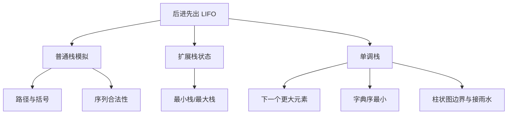

> 原书：李春葆、李筱驰《算法面试（全二册）》<br>
> 阅读范围：第 3 章 栈<br>
> 说明：本文按原书 3.1～3.4 的顺序整理。标题含“补充”的内容用于补足定义、证明、边界或替代方案；原页中的明显公式缺失、复杂度或接口表述问题标为“勘误说明”。

## 0. 本章主线

栈只允许在同一端插入和删除。这个限制看似减少能力，却把“最近尚未处理对象”变成 $O(1)$ 可访问的栈顶，因此特别适合撤销、嵌套匹配、表达式求值和“下一个更大/更小元素”。



第三章共有 16 道正文例题：3.2 有 3 道，3.3 有 7 道，3.4 有 6 道。

## 3.1 栈概述

### 3.1.1 栈的定义

#### 严格定义与直觉

栈是一个受限线性表。若从栈底到栈顶保存

$$
[a_0,a_1,\ldots,a_{n-1}],
$$

则只允许在栈顶执行：

- `push(x)`：把 $x$ 放在 $a_{n-1}$ 之后；
- `pop()`：删除栈顶 $a_{n-1}$；
- `top()`：读取但不删除 $a_{n-1}$；
- `empty()`、`size()`：查询状态。

最后进入的元素最先离开，称为 LIFO（Last In, First Out，后进先出）。若任务满足“后产生/后遇到的对象必须先处理”，栈就能把待处理顺序直接编码在数据结构中。

“不能顺序遍历栈”指**抽象栈接口**不提供任意位置访问；底层若用数组实现，数组本身当然可以遍历，但那会绕过栈的抽象约束。

#### 顺序栈与链栈

- **顺序栈**：用动态数组尾部作为栈顶，`push_back/pop_back/back` 均为常数或摊还常数时间。
- **链栈**：用链表表头作为栈顶，头插、头删为 $O(1)$，无需连续内存。

两者都实现同一个栈抽象。选择取决于容量、内存局部性、对象移动成本和所有权管理，而非 LIFO 语义。

#### $n$ 个元素的合法出栈序列数：卡特兰数

原书指出，$n$ 个不同元素按固定顺序入一个栈，可能产生的不同出栈序列数为第 $n$ 个卡特兰数：

$$
C_n=\frac{1}{n+1}\binom{2n}{n}
=\frac{(2n)!}{n!(n+1)!}.
$$

这里的假设是：元素互不相同、入栈相对顺序固定、每个元素恰好入栈和出栈一次、只有一个栈。

#### 补充：完整计数推导

把入栈记为 `P`，出栈记为 `Q`。一条完整操作序列含 $n$ 个 `P` 和 $n$ 个 `Q`，不考虑合法性共有

$$
\binom{2n}{n}
$$

种，因为只需从 $2n$ 个位置选 $n$ 个放 `P`。

合法操作的任意前缀必须满足

$$
\#P\ge\#Q,
$$

否则会从空栈弹出。对第一处出现 $\#Q=\#P+1$ 的非法路径，把从开头到该处的 `P/Q` 互换（反射原理），可与“含 $n-1$ 个 `P`、$n+1$ 个 `Q`”的序列一一对应。非法数为

$$
\binom{2n}{n+1}.
$$

所以合法数为

$$
\binom{2n}{n}-\binom{2n}{n+1}
=\binom{2n}{n}\left(1-\frac{n}{n+1}\right)
=\frac{1}{n+1}\binom{2n}{n}.
$$

每个合法操作序列唯一决定出栈序列；对互异元素，反过来一个合法出栈序列也确定何时必须入栈，因此计数一致。若元素可重复，不同操作可能产生相同值序列，不能直接套用。

### 3.1.2 栈的知识点

#### 1. C++ 中的栈

`std::stack<T>`提供 `empty`、`size`、`top`、`push`、`pop`。`pop()`只删除，不返回值，所以要先 `top()` 再 `pop()`。也可直接用 `vector` 的尾部操作模拟栈。

调用 `top/pop` 前必须保证非空；标准栈不会替调用者定义空栈行为。

#### 2. Python 与 Go 中的栈

Python 通常用 `list`：`append` 进栈，`stack[-1]` 读栈顶，`pop` 出栈。Go 常用切片：`append` 进栈，`stack[len(stack)-1]` 读栈顶，`stack=stack[:len(stack)-1]` 出栈。

> **勘误说明：** 原书说 Python `list.pop()`“只是删除并不返回元素”，这与 Python 实际接口不符；无参数 `pop()`会删除并返回末尾元素。该说法只适用于 C++ `std::stack::pop()`。

#### 3. 单调栈

单调栈要求从栈底到栈顶的键值保持单调。新元素到来时，持续弹出破坏单调性的栈顶，再压入新元素。

原书把底到顶递增称为“单调递增栈/大顶栈”，底到顶递减称为“单调递减栈/小顶栈”。“大顶/小顶”容易与堆混淆，也不是统一术语；本文优先写清楚**底到顶的方向**和弹栈条件。

例如求右侧第一个更大元素时，通常保存尚未找到答案的下标，使对应值从底到顶非递增。当前值 $x$ 大于栈顶对应值时，$x$ 就是该栈顶元素遇到的第一个更大值。

#### 为什么双层循环仍是 $O(n)$

单调栈常出现外层遍历、内层连续弹栈。设每个元素最多入栈一次、出栈一次，则全部操作数满足

$$
\text{push次数}\le n,\qquad \text{pop次数}\le n.
$$

故总栈操作至多 $2n$，摊还时间为 $O(n)$。不能只看到 `while` 嵌套就断言 $O(n^2)$；也不能脱离“每元素只弹一次”这一条件盲目断言 $O(n)$。

## 3.2 扩展栈的算法设计

### 3.2.1 LeetCode 1381：设计一个支持增量操作的栈（★★）

容量为 `maxSize`；`push/pop` 是标准操作；`increment(k,val)`给栈底的前 $\min(k,size)$ 个元素都加 `val`。

#### 原书：顺序栈直接更新

用数组 `data`、栈顶下标 `top` 和容量 `capacity`：满栈忽略 `push`，空栈 `pop` 返回 -1。增量操作遍历下标

$$
0,1,\ldots,\min(k,top+1)-1.
$$

因此 `push/pop` 为 $O(1)$，`increment` 为 $O(\min(k,size))$，最坏 $O(k)$；存储空间 $O(maxSize)$。

#### 补充：延迟增量做到 $O(1)$

另设 `pending[i]`，表示“当第 $i$ 层元素出栈时，需要连同它以下元素一起兑现的增量”。执行 `increment(k,val)`只需

$$
pending[\min(k,size)-1]\mathrel{+}=val.
$$

弹出第 $i$ 层时，返回 `data[i]+pending[i]`，并把 `pending[i]`向下传给 `pending[i-1]`。每次操作都是 $O(1)$，空间仍为 $O(maxSize)$。这不是原书本题实现，而是常见优化。

#### C++17（补充优化）：把区间增量延迟到出栈时兑现

```cpp
#include <algorithm>
#include <vector>

class CustomStack {
public:
    explicit CustomStack(int maxSize) : capacity(maxSize) {}

    void push(int value) {
        if (static_cast<int>(data.size()) < capacity) {
            data.push_back(value);
            pending.push_back(0);
        }
    }

    int pop() {
        if (data.empty()) return -1;
        int index = static_cast<int>(data.size()) - 1;
        int increment = pending[index];
        if (index > 0) pending[index - 1] += increment;
        int result = data[index] + increment;
        data.pop_back();
        pending.pop_back();
        return result;
    }

    void increment(int count, int value) {
        int affected = std::min(count, static_cast<int>(data.size()));
        if (affected > 0) pending[affected - 1] += value;
    }

private:
    int capacity;
    std::vector<int> data;
    std::vector<int> pending;
};
```

栈 `[1,2,3]` 执行 `increment(2,100)` 时只记录 `pending[1]+=100`。弹出 3 不受影响；弹出 2 得到 102，并把增量传到 `pending[0]`；再弹出 1 得到 101。

**迁移抓手**：若操作要统一更新栈底前缀，而查询只从栈顶逐层移除，可把前缀标记放在其最高受影响层，出栈时向下传播。

### 3.2.2 LeetCode 155：最小栈（★）

目标是在 `push/pop/top` 外，让 `getMin` 也为 $O(1)$。普通栈若每次扫描求最小值需要 $O(n)$，所以必须在更新时保存足够历史信息。

#### 解法一：每个链栈结点保存前缀最小值

若新结点值为 $x$、原栈最小值为 $m$，新结点记录

$$
minval=\min(x,m).
$$

栈顶结点的 `minval` 始终等于当前全栈最小值。弹出栈顶后，下一结点保存的就是恢复后的最小值。四个操作均为 $O(1)$，每结点多存一个数。

#### 解法二：主栈与最小值辅助栈

主栈保存全部值；仅当 $x\le minStack.top$ 时，才把 $x$ 也压入最小栈。相等最小值也必须压入，否则弹出一个最小值后会错误地认为没有同值最小值。

弹出主栈值 $x$ 时，若 $x=minStack.top$，辅助栈也弹出。`getMin`读取辅助栈顶。时间均为 $O(1)$，最坏空间 $O(n)$。

#### 解法三：差值编码

只保存当前值与压入前最小值之差。设旧最小值为 $m$，压入 $x$：

$$
d=x-m.
$$

- 若 $d\ge0$，最小值仍为 $m$，实际栈顶可恢复为 $m+d=x$。
- 若 $d<0$，新值 $x$ 成为新最小值；栈顶实际值就是当前 `minval=x`。

弹出负差值时，要恢复旧最小值。由 $d=x-m$ 且当前最小值为 $x$：

$$
m=x-d=minval-d.
$$

因此 `pop` 后执行 `minval -= d`。四个操作均为 $O(1)$。

> **边界说明：** 原书称此法“辅助空间 $O(1)$”，但实现仍有一个长度为 $n$ 的差值栈，总存储是 $O(n)$；准确说法是：除承载栈元素的一份数组外，额外元数据只有 `minval`，为 $O(1)$，且每层只存一个数。差值可能超出 32 位，C++/Go 应用 64 位整数。

#### C++17：用差值编码同时保存值与历史最小值

```cpp
#include <stdexcept>
#include <vector>

class MinStack {
public:
    void push(long long value) {
        if (differences.empty()) {
            differences.push_back(0);
            minimum = value;
            return;
        }
        long long difference = value - minimum;
        differences.push_back(difference);
        if (difference < 0) minimum = value;
    }

    long long pop() {
        if (differences.empty()) throw std::out_of_range("空栈");
        long long difference = differences.back();
        differences.pop_back();
        long long value = difference < 0 ? minimum : minimum + difference;
        if (difference < 0) minimum -= difference;
        return value;
    }

    long long top() const {
        long long difference = differences.back();
        return difference < 0 ? minimum : minimum + difference;
    }

    long long getMin() const { return minimum; }

private:
    std::vector<long long> differences;
    long long minimum = 0;
};
```

依次压入 `-2,1,-4`：差值为 `0,3,-2`，当前最小值为 -4。弹出负差值 -2 时，弹出值就是当前最小值 -4，旧最小值恢复为：

$$
-4-(-2)=-2.
$$

### 3.2.3 LeetCode 716：最大栈（★★★）

除普通栈操作外，要求 `peekMax` 返回最大值，`popMax`删除**最靠近栈顶**的最大值。难点是同时支持“按栈顶位置”和“按值最大”两种访问顺序。

#### 解法一：主栈与前缀最大栈

主栈第 $i$ 层为 $a_i$，辅助栈第 $i$ 层记录

$$
b_i=\max(a_0,a_1,\ldots,a_i).
$$

`push/pop/top/peekMax` 都为 $O(1)$。`popMax`先取最大值，再把最大值上方元素暂存，删掉第一个遇到的最大值（即最靠近栈顶者），最后重新压回暂存元素。最坏移动 $n$ 个元素，时间 $O(n)$；原书提交因此超时。

#### 解法二：双向链表与有序映射

原书 C++ 方案用双向链表保存栈顺序，尾部是栈顶；有序映射

$$
value\longmapsto[\text{该值结点的迭代器，按入栈顺序}]
$$

保存值序。最大键就是最大元素，该键对应迭代器数组末尾就是最靠近栈顶的最大结点。双向链表已知迭代器删除为 $O(1)$，红黑树映射查找/更新为 $O(\log n)$。

因此 `top` 为 $O(1)$；`push/pop/popMax` 为 $O(\log n)$；`peekMax`直接取得 `std::map::rbegin()` 指向的最大键，为 $O(1)$。空间 $O(n)$。

#### C++17（解法二）：双向链表与有序映射

```cpp
#include <iterator>
#include <list>
#include <map>
#include <vector>

class MaxStack {
    using Iterator = std::list<int>::iterator;

public:
    void push(int value) {
        stackOrder.push_back(value);
        Iterator node = std::prev(stackOrder.end());
        valueOrder[value].push_back(node);
    }

    int pop() {
        Iterator node = std::prev(stackOrder.end());
        int value = *node;
        stackOrder.erase(node);

        auto found = valueOrder.find(value);
        found->second.pop_back();
        if (found->second.empty()) valueOrder.erase(found);
        return value;
    }

    int top() const { return stackOrder.back(); }

    int peekMax() const { return valueOrder.rbegin()->first; }

    int popMax() {
        int maximum = valueOrder.rbegin()->first;
        auto& nodes = valueOrder.find(maximum)->second;
        Iterator node = nodes.back();
        nodes.pop_back();
        if (nodes.empty()) valueOrder.erase(maximum);
        stackOrder.erase(node);
        return maximum;
    }

private:
    std::list<int> stackOrder;
    std::map<int, std::vector<Iterator>> valueOrder;
};
```

同值结点的迭代器按入栈顺序追加；因此 `nodes.back()`恰是最靠近栈顶的那个最大值。`pop`和 `popMax`在某值的迭代器数组清空后立即删除映射键，`rbegin()`才不会读到已经不存在于栈中的值。题目保证只对非空栈调用查询和删除操作。

`top`读取链表尾，时间 $O(1)$；`peekMax`直接读取 `std::map::rbegin()`，时间 $O(1)$；`push`和 `pop`需要查找或建立映射键，`popMax`最坏需要按键删除空项，三者均按 $O(\log n)$ 计。链表删除已知迭代器以及同值数组尾部操作为 $O(1)$，总空间为 $O(n)$。

Python 和 Go 标准库没有直接等价的“有序映射 + 稳定链表迭代器”组合。可用外部有序容器、自建平衡树，或接受解法一的 $O(n)$ `popMax`。本文 Python、Go 附录与下方基线 C++ 均采用解法一；上方 C++17 才对应原书的高效解法二。

#### C++17（解法一，基线）：主栈与前缀最大栈

```cpp
#include <algorithm>
#include <vector>

class MaxStack {
public:
    void push(int value) {
        values.push_back(value);
        maximums.push_back(
            maximums.empty() ? value : std::max(value, maximums.back())
        );
    }

    int pop() {
        int value = values.back();
        values.pop_back();
        maximums.pop_back();
        return value;
    }

    int top() const { return values.back(); }
    int peekMax() const { return maximums.back(); }

    int popMax() {
        int maximum = peekMax();
        std::vector<int> buffer;
        while (top() != maximum) buffer.push_back(pop());
        pop();
        while (!buffer.empty()) {
            push(buffer.back());
            buffer.pop_back();
        }
        return maximum;
    }

private:
    std::vector<int> values;
    std::vector<int> maximums;
};
```

栈底到顶为 `[5,1,5]` 时，`popMax` 直接删除顶部 5；之后栈为 `[5,1]`，`top=1`、`peekMax=5`。若最大值不在顶部，暂存区只保存其上方元素，重压时必须逆序恢复。

## 3.3 栈应用的算法设计

这一节的共同结构是“扫描输入，栈保存尚未完成的临时状态”。新对象若能与栈顶完成一对操作，就弹栈；否则压栈等待未来信息。

### 3.3.1 LeetCode 1544：整理字符串（★★）

若相邻字符是同一英文字母的大小写形式，就删除这一对，直到不存在可删对。比如 `abBAcC -> aAcC -> cC -> ""`。

用字符数组模拟栈。扫描字符 $c$：

- 若栈顶与 $c$ 忽略大小写后相同、原字符又不同，二者正好是大小写对，弹栈；
- 否则压入 $c$。

循环不变量：处理完输入前缀后，栈中字符串是该前缀完全整理后的结果，且栈内没有坏相邻对。新字符只可能与当前结果的最后字符形成新坏对；删除后更早位置已经整理好，无需回头扫描。

每个字符至多入栈、出栈一次，时间 $O(n)$，空间 $O(n)$。C++ 可利用 ASCII 英文字母大小写码差判断，但原书用 `tolower` 更直观；调用字符分类函数时，工程代码应注意把负的 `char` 转为 `unsigned char`。

#### C++17：结果字符串直接充当字符栈

```cpp
#include <cctype>
#include <string>

std::string makeGood(const std::string& text) {
    std::string stack;
    for (char character : text) {
        bool sameLetter = !stack.empty() &&
            std::tolower(static_cast<unsigned char>(stack.back())) ==
            std::tolower(static_cast<unsigned char>(character));
        if (sameLetter && stack.back() != character) {
            stack.pop_back();
        } else {
            stack.push_back(character);
        }
    }
    return stack;
}
```

`abBAcC` 中，`bB` 弹栈后新相邻的 `aA` 继续弹栈，最后 `cC` 弹栈，结果为空。栈让“删除后形成的新相邻关系”自动回到栈顶。

### 3.3.2 LeetCode 71：简化 UNIX 绝对路径（★★）

路径按 `/` 分段后，每个分量只有四类：

- 空串：来自连续或首尾斜线，忽略；
- `.`：当前目录，忽略；
- `..`：若目录栈非空则弹出一级；在根目录时保持根目录；
- 其他字符串：都是普通目录名，包括 `...`，压栈。

最后以 `/`连接栈底到栈顶；空栈返回 `/`。例如：

```text
/a/./b/../../c/
分量: a, ., b, .., .., c
栈:   [a] -> [a,b] -> [a] -> [] -> [c]
结果: /c
```

循环不变量：栈恰好保存已处理路径前缀从根到当前位置的规范目录序列。每个字符参与分割和拼接常数次，总时间、输出空间均为 $O(n)$。

适用边界是题目给定 UNIX 风格**绝对路径**。符号链接、权限、实际文件系统是否存在等语义均不在本题模型中，不能把纯字符串规范化等同于真实文件系统解析。

#### C++17：目录分量栈

```cpp
#include <sstream>
#include <string>
#include <vector>

std::string simplifyPath(const std::string& path) {
    std::vector<std::string> directories;
    std::stringstream stream(path);
    std::string word;
    while (std::getline(stream, word, '/')) {
        if (word.empty() || word == ".") continue;
        if (word == "..") {
            if (!directories.empty()) directories.pop_back();
        } else {
            directories.push_back(word);
        }
    }
    std::string result;
    for (const std::string& directory : directories) result += "/" + directory;
    return result.empty() ? "/" : result;
}
```

`/a/./b/../../c/` 的目录栈变化已经列在上文，代码中的 `directories` 正是那一列状态；普通目录名 `...` 不等于 `..`，必须原样压栈。

### 3.3.3 LeetCode 1441：用栈操作构建数组（★）

输入流固定为 $1,2,\ldots,n$，每读一个数必先 `Push`。若该数不在严格递增目标数组中，就立即 `Pop`；若等于当前目标元素则保留。得到最后一个目标值后停止读取。

为什么操作序列唯一？要得到目标值 $t$，流中所有小于 $t$ 的数都必须先被读取；不属于目标的数不能留在最终栈中，只能在读取后弹出。因此每个数的操作被目标成员关系唯一决定。

若目标最大值为 $M$，循环只需读到 $M$，时间和操作数为 $O(M)$，且 $M\le n$。返回的操作数组本身占 $O(M)$。

#### C++17：每个流元素先 Push，再决定是否 Pop

```cpp
#include <string>
#include <vector>

std::vector<std::string> buildArray(const std::vector<int>& target, int limit) {
    std::vector<std::string> operations;
    int targetIndex = 0;
    for (int value = 1; value <= limit &&
         targetIndex < static_cast<int>(target.size()); ++value) {
        operations.push_back("Push");
        if (value == target[targetIndex]) {
            ++targetIndex;
        } else {
            operations.push_back("Pop");
        }
    }
    return operations;
}
```

目标 `[1,3]` 时，流 1 保留，流 2 执行 `Push,Pop`，流 3 保留，得到 `Push, Push, Pop, Push`。

### 3.3.4 LeetCode 946：验证栈序列（★★）

给定互异的 `pushed` 与其排列 `popped`。依次把每个输入压栈；每次压入后，只要栈顶等于下一个期望弹出值，就立刻弹出并推进输出指针。

#### 贪心为什么安全

当栈顶已经等于当前期望值 $popped[j]$ 时，任何合法执行都必须在压入会遮住它的新元素之前弹出它；否则新元素必须先弹出，会违背 `popped[j]` 是下一个输出。因此“能匹配就立刻弹”不会排除合法方案。

结束时若输出指针走到末尾（等价于栈空），序列合法；否则栈顶阻挡了期望元素，后续又没有输入可改变状态，序列非法。每个元素各入栈、出栈至多一次，时间 $O(n)$，空间 $O(n)$。

实现时最好在 `while` 条件加入 `j < len(popped)`，使接口对非题目保证的数据也安全。

#### C++17：能弹就立即弹

```cpp
#include <vector>

bool validateStackSequences(const std::vector<int>& pushed,
                            const std::vector<int>& popped) {
    std::vector<int> stack;
    int output = 0;
    for (int value : pushed) {
        stack.push_back(value);
        while (output < static_cast<int>(popped.size()) &&
               !stack.empty() && stack.back() == popped[output]) {
            stack.pop_back();
            ++output;
        }
    }
    return output == static_cast<int>(popped.size());
}
```

对压入 `[1,2,3,4,5]`、弹出 `[4,5,3,2,1]`，压到 4 时先弹 4，压 5 后连续弹 5、3、2、1，最终合法。

### 3.3.5 LeetCode 20：有效的括号（★）

合法括号需要类型一致且嵌套次序正确。每个右括号必须匹配它左边**最近的尚未匹配左括号**，这正是栈顶。

扫描时，左括号压栈；右括号到来时：栈空或类型不配立即返回假，否则弹出匹配左括号。扫描结束还要求栈空，否则有未闭合左括号。

正确性可用嵌套结构归纳：最内层括号之间不含未闭合括号，因此其左括号必在栈顶；弹出后，外层配对变成新的最近关系。时间 $O(n)$，最坏空间 $O(n)$。

#### C++17：右括号只与最近未匹配左括号比较

```cpp
#include <string>
#include <unordered_map>
#include <vector>

bool validParentheses(const std::string& text) {
    const std::unordered_map<char, char> matching{
        {')', '('}, {']', '['}, {'}', '{'}
    };
    std::vector<char> stack;
    for (char character : text) {
        if (character == '(' || character == '[' || character == '{') {
            stack.push_back(character);
        } else {
            auto iterator = matching.find(character);
            if (iterator == matching.end() || stack.empty() ||
                stack.back() != iterator->second) {
                return false;
            }
            stack.pop_back();
        }
    }
    return stack.empty();
}
```

`([)]` 数量虽然成对，但读到 `)` 时栈顶是 `[` 而非 `(`，所以立即判假；这说明括号题检查的是嵌套顺序，不只是计数。

### 3.3.6 LeetCode 1249：删除无效的括号（★★）

字符串含小写字母和圆括号，要求删除最少括号使结果有效，任意一个最优结果都可返回。

原书栈保存所有当前未匹配括号的下标：左括号压栈；右括号若能与栈顶左括号匹配就弹出，否则把该右括号下标压栈。扫描后栈中恰是必须删除的下标。

#### 为什么删除数最少

- 一个扫描时没有可匹配左括号的 `)`，不可能靠删除其他字符变合法，只能删掉某个这类多余右括号；
- 扫描结束仍未匹配的每个 `(`，右侧没有足够右括号，也必须删除；
- 其余括号已形成合法配对，无需删除。

所以删除全部未匹配下标既可行，又达到必要删除下界。

原书从大下标到小下标逐次 `erase/pop`，倒序可避免下标因右侧删除而变化，但字符串/列表中间删除每次可能 $O(n)$，最坏总时间 $O(n^2)$。**补充优化**：用布尔数组标记删除位置，再线性重建字符串，总时间 $O(n)$、空间 $O(n)$。

#### C++17（补充优化）：标记后线性重建

```cpp
#include <string>
#include <vector>

std::string minRemoveToMakeValid(const std::string& text) {
    std::vector<int> unmatched;
    std::vector<bool> remove(text.size(), false);
    for (int index = 0; index < static_cast<int>(text.size()); ++index) {
        if (text[index] == '(') {
            unmatched.push_back(index);
        } else if (text[index] == ')') {
            if (!unmatched.empty()) unmatched.pop_back();
            else remove[index] = true;
        }
    }
    for (int index : unmatched) remove[index] = true;

    std::string result;
    for (int index = 0; index < static_cast<int>(text.size()); ++index) {
        if (!remove[index]) result.push_back(text[index]);
    }
    return result;
}
```

`lee(t(c)o)de)` 的最后一个 `)` 在扫描时没有可匹配左括号，被标记删除；其余括号已经配对，结果为 `lee(t(c)o)de`。

### 3.3.7 LeetCode 32：最长有效括号子串长度（★★★）

题目要求**连续子串**。栈保存左括号下标，并在栈底保留“当前合法片段左侧最近的无效右括号下标”。初始压入 $-1$，表示字符串开头之前的边界。

扫描下标 $i$：

- 遇 `(`：压入 $i$；
- 遇 `)`：先弹一次。若栈空，当前右括号无法匹配，把 $i$ 压入作为新边界；若栈非空，以 $i$ 结尾的最长有效子串长度是

$$
L=i-st.top().
$$

为什么不是 `+1`？`st.top()`是有效子串左端点的前一个位置，所以区间从 `st.top()+1` 到 $i$，长度

$$
i-(st.top()+1)+1=i-st.top().
$$

例如 `)()())`：边界依次由 $-1$ 更新为 0，扫描到下标 4 时栈顶仍为 0，得到 $4-0=4$。

栈中除底部边界外，其余是尚未匹配的左括号下标。每个下标至多进出一次，时间 $O(n)$、空间 $O(n)$。补充的动态规划可做到同样 $O(n)$ 时间和空间；双向计数扫描可用 $O(1)$ 空间，但解释和扩展性不同。

#### C++17：用无效边界统一计算连续长度

```cpp
#include <algorithm>
#include <string>
#include <vector>

int longestValidParentheses(const std::string& text) {
    std::vector<int> stack{-1};
    int answer = 0;
    for (int index = 0; index < static_cast<int>(text.size()); ++index) {
        if (text[index] == '(') {
            stack.push_back(index);
        } else {
            stack.pop_back();
            if (stack.empty()) {
                stack.push_back(index);
            } else {
                answer = std::max(answer, index - stack.back());
            }
        }
    }
    return answer;
}
```

`)()())` 在下标 0 处把新无效边界设为 0；扫描到下标 4 时，边界仍是 0，因此合法连续段长度为 $4-0=4$。

## 3.4 单调栈应用的算法设计

本节栈中通常保存**下标**而不是值，因为答案常需要写回原位置、计算距离或宽度。栈中下标代表“答案尚未确定的对象”；当前元素一旦提供边界，就连续弹出并结算。

### 3.4.1 LeetCode 503：下一个更大元素 II（★★）

循环数组中，下标 $i$ 的答案是沿 $i+1,i+2,\ldots$ 循环遇到的第一个严格大于 `nums[i]` 的值，不存在则为 -1。

#### 单调栈不变量

从左到右扫描，栈保存尚未找到更大值的下标，且对应值从栈底到栈顶非递增。当前值 `nums[j]` 到来时：

```text
while 栈非空且 nums[栈顶] < nums[j]:
    answer[栈顶] = nums[j]
    弹栈
```

为什么当前值是“第一个”更大值？栈顶下标之后、当前下标之前的元素都已经扫描；若其中有更大值，该下标早已被弹出，不会留到现在。

循环数组可逻辑展开为长度接近 $2n$ 的序列，用 `j % n` 取值。标准实现只在第一遍把原下标压栈，第二遍仅帮助未决下标找答案，避免重复压入。原书代码两遍都压入取模下标，仍可得到结果且保持线性量级，但有冗余状态。

严格更大要求条件是 `<` 而不是 `<=`。每个原下标入栈、出栈至多一次，外加第二遍扫描，时间 $O(n)$、空间 $O(n)$。

#### C++17：逻辑扫描两遍，只在第一遍压栈

```cpp
#include <vector>

std::vector<int> nextGreaterCircular(const std::vector<int>& numbers) {
    int size = static_cast<int>(numbers.size());
    std::vector<int> answer(size, -1);
    std::vector<int> stack;
    for (int scan = 0; scan < 2 * size - 1; ++scan) {
        int index = scan % size;
        while (!stack.empty() && numbers[stack.back()] < numbers[index]) {
            answer[stack.back()] = numbers[index];
            stack.pop_back();
        }
        if (scan < size) stack.push_back(index);
    }
    return answer;
}
```

`[1,2,3,4,3]` 第一遍后值 4 的下标仍未决；第二遍遇到的值都不大于 4，所以答案保持 -1。末尾值 3 在第二遍遇到 4 时得到答案 4。

### 3.4.2 LeetCode 496：下一个更大元素 I（★）

`nums1` 是无重复数组 `nums2` 的子集。先用 3.4.1 的非循环单调栈为 `nums2` 预处理映射

$$
nextGreater[value]=\text{该值右侧第一个更大值}.
$$

再对 `nums1` 做哈希查询；映射中没有的值答案为 -1。无重复条件让“值”能唯一标识 `nums2` 中的位置。若允许重复，键必须改成下标或明确查询对应哪一次出现。

预处理和查询分别为 $O(n)$、$O(m)$ 平均时间，总计 $O(m+n)$；栈与映射空间 $O(n)$。

#### C++17：先为全集建映射，再回答子集

```cpp
#include <unordered_map>
#include <vector>

std::vector<int> nextGreaterSubset(const std::vector<int>& query,
                                   const std::vector<int>& numbers) {
    std::vector<int> stack;
    std::unordered_map<int, int> nextGreater;
    for (int value : numbers) {
        while (!stack.empty() && stack.back() < value) {
            nextGreater[stack.back()] = value;
            stack.pop_back();
        }
        stack.push_back(value);
    }

    std::vector<int> answer;
    for (int value : query) {
        auto iterator = nextGreater.find(value);
        answer.push_back(iterator == nextGreater.end() ? -1 : iterator->second);
    }
    return answer;
}
```

`nums2=[1,3,4,2]` 中映射为 `1→3, 3→4`，4 与 2 无更大值；查询 `[4,1,2]` 得 `[-1,3,-1]`。

### 3.4.3 LeetCode 739：每日温度（★★）

它仍是下一个严格更大元素，只是答案从“更大值是多少”变成“相距几天”。栈保存温度尚未等到升高的日期下标。当前日 $i$ 使旧下标 $j$ 弹出时：

$$
answer[j]=i-j.
$$

栈对应温度从底到顶非递增；相等温度不能弹出，因为题目要求更高而不是不低。未弹出的下标保持默认 0。时间 $O(n)$、空间 $O(n)$。

#### C++17：弹栈时用下标差计算等待天数

```cpp
#include <vector>

std::vector<int> dailyTemperatures(const std::vector<int>& temperatures) {
    std::vector<int> answer(temperatures.size(), 0);
    std::vector<int> stack;
    for (int index = 0; index < static_cast<int>(temperatures.size()); ++index) {
        while (!stack.empty() &&
               temperatures[stack.back()] < temperatures[index]) {
            int previous = stack.back();
            stack.pop_back();
            answer[previous] = index - previous;
        }
        stack.push_back(index);
    }
    return answer;
}
```

温度 `[73,74,75,71,69,72,76,73]` 中，读到 72 时会连续结算 69 等待 1 天、71 等待 2 天；读到 76 时再结算 72、75 等未决日期。

### 3.4.4 LeetCode 316：去除重复字母（★★）

目标同时满足：每种字母恰好一次、结果是原串子序列、所有可行结果中字典序最小。只做去重不能保证字典序；只维持递增也可能丢掉后面不再出现的必要字符。

维护：

- `remaining[c]`：当前扫描位置之后字符 $c$ 还会出现几次；
- `inStack[c]`：字符是否已在结果栈中；
- 栈：当前最优的不重复子序列。

扫描字符 $c$ 时先减少其剩余计数。若已在栈中则跳过；否则当

$$
stack.top>c
\quad\text{且}\quad
remaining[stack.top]>0
$$

时弹栈。第一个条件说明换成 $c$ 可让更早位置字典序变小；第二个条件保证被弹字符以后还能补回，不破坏“每种字母一次”。最后压入 $c$。

#### 为什么字典序最小

若栈顶 $x>c$ 且后面还有 $x$，保留当前 $x$、把 $c$ 放后面得到的可行序列，在第一个不同位置是 $x$ 对 $c$；用 $c$ 替换更小。反复做这种安全交换，直到栈顶不能弹，便得到当前前缀下的最小可延伸选择。若 $x$ 后面不再出现，弹出会让结果缺字母，所以必须保留。

字母表虽固定为 26，但证明也适用于任意可比较符号集。每个字符至多入栈、出栈一次，时间 $O(n)$，计数、标记和结果空间 $O(\Sigma)$，其中 $\Sigma$ 为字符种类数；对小写字母是 $O(1)$。

#### C++17：只有后面还能补回时才弹出较大字符

```cpp
#include <string>
#include <vector>

std::string removeDuplicateLetters(const std::string& text) {
    std::vector<int> remaining(26, 0);
    std::vector<bool> inStack(26, false);
    for (char character : text) ++remaining[character - 'a'];

    std::string stack;
    for (char character : text) {
        int code = character - 'a';
        --remaining[code];
        if (inStack[code]) continue;
        while (!stack.empty() && stack.back() > character &&
               remaining[stack.back() - 'a'] > 0) {
            inStack[stack.back() - 'a'] = false;
            stack.pop_back();
        }
        stack.push_back(character);
        inStack[code] = true;
    }
    return stack;
}
```

`cbacdcbc` 中读到 `a` 时，前面的 `b`、`c` 后面仍会出现且都大于 `a`，可以弹出；读到 `d` 后，即使后续有更小字符，若 `d` 不再出现就不能弹，最终得到 `acdb`。

### 3.4.5 LeetCode 84：柱状图中最大的矩形（★★★）

柱宽为 1。若选择第 $k$ 根柱的高度 $h_k$ 作为矩形高度，向左、右扩展到第一个严格低于 $h_k$ 的柱子，下标记为 $L_k,R_k$。可覆盖柱区间是

$$
[L_k+1,R_k-1],
$$

宽度和面积为

$$
w_k=R_k-L_k-1,
$$

$$
A_k=h_k(R_k-L_k-1).
$$

全局最优矩形的高度一定等于其覆盖范围内某根最低柱的高度，因此枚举每根柱作最低高度不会漏解。

#### 穷举与复杂度勘误

原书穷举对每个 $k$ 分别向左、向右扫描，单个 $k$ 最坏 $O(n)$，共 $n$ 个：

$$
T(n)=n\cdot O(n)=O(n^2).
$$

> **勘误说明：** 原书第 162 页把该穷举复杂度写成 $O(n)$，与代码的外层 `for` 加两段 `while` 及其超时结果不符，应为最坏 $O(n^2)$。

#### 单调栈一次结算多个右边界

维护对应高度从底到顶非递减的下标栈。扫描到右边更低的柱 $j$ 时，连续弹出高柱 $k$：

- $j$ 是 $k$ 右侧第一个更低位置；
- 弹出后新栈顶 $L$ 是能作为左边界的最近位置；
- 面积为 $h_k(j-L-1)$；若弹出后栈空，则宽度是 $j$。

末尾追加高度 0 的哨兵，迫使所有剩余正高度结算。相等高度使用 `>` 不弹也正确：较早等高柱可能得到较窄面积，最后保留的等高柱会得到覆盖整个等高区的宽度。

每个下标最多进出一次，时间 $O(n)$、空间 $O(n)$。若不希望修改输入，可把末尾哨兵作为一次虚拟迭代处理。

#### C++17：较低右边界到来时结算柱高

```cpp
#include <algorithm>
#include <vector>

int largestRectangle(const std::vector<int>& heights) {
    std::vector<int> stack;
    int answer = 0;
    for (int right = 0; right <= static_cast<int>(heights.size()); ++right) {
        int current = right == static_cast<int>(heights.size())
            ? 0 : heights[right];
        while (!stack.empty() && heights[stack.back()] > current) {
            int middle = stack.back();
            stack.pop_back();
            int left = stack.empty() ? -1 : stack.back();
            answer = std::max(
                answer,
                heights[middle] * (right - left - 1)
            );
        }
        stack.push_back(right);
    }
    return answer;
}
```

`[2,1,5,6,2,3]` 扫到高度 2 时，先弹 6 得面积 $6\times1$，再弹 5；此时左边界是高度 1 的下标 1、右边界是下标 4，面积为 $5\times(4-1-1)=10$。

### 3.4.6 LeetCode 42：接雨水（★★★）

#### 按列公式

对位置 $i$，设包含或不包含自身均可的左侧最高柱为 $L_i$，右侧最高柱为 $R_i$。水面不能高于较矮边界，所以该列水量是

$$
water_i=\max\left(0,\min(L_i,R_i)-h_i\right).
$$

总水量

$$
W=\sum_{i=0}^{n-1}water_i.
$$

原书穷举对每个位置重新向两侧求最大值，最坏为 $O(n^2)$，不是文中写的 $O(n)$。预先计算前缀最大和后缀最大可把时间降为 $O(n)$、空间 $O(n)$；补充的双指针方法还能做到 $O(n)$ 时间、$O(1)$ 空间。

#### 单调栈按横向层结算

维护高度从底到顶非递增的下标栈。当前柱 $r$ 高于栈顶时，弹出谷底 $k$。若弹出后栈空，没有左边界，不能蓄水；否则新栈顶 $l$ 是左边界，当前柱是右边界：

$$
width=r-l-1,
$$

$$
boundedHeight=\min(h_l,h_r)-h_k,
$$

$$
volume=width\cdot boundedHeight.
$$

该矩形只计算从谷底高度 $h_k$ 到两边较低者的新增水平层。更深层已在更早弹栈时计算，更高层会在后续弹栈计算，因此不会重复。

例如 `[4,2,1,0,1,2,4]` 的层面积依次可累计为 $1+3+10=14$。每个柱下标进出栈至多一次，时间 $O(n)$、空间 $O(n)$。

单调栈擅长在右边界出现时结算“凹槽层”；双指针擅长直接按列结算。二者都为线性时间，后者空间更优，前者更能体现本章方法。

#### C++17：弹出谷底后按水平层计水

```cpp
#include <algorithm>
#include <vector>

int trapRainWater(const std::vector<int>& heights) {
    std::vector<int> stack;
    int answer = 0;
    for (int right = 0; right < static_cast<int>(heights.size()); ++right) {
        while (!stack.empty() && heights[stack.back()] < heights[right]) {
            int bottom = stack.back();
            stack.pop_back();
            if (stack.empty()) break;
            int left = stack.back();
            int width = right - left - 1;
            int boundedHeight =
                std::min(heights[left], heights[right]) - heights[bottom];
            answer += width * boundedHeight;
        }
        stack.push_back(right);
    }
    return answer;
}
```

在 `[4,2,1,0,1,2,4]` 中，每次更高右柱出现就结算一个谷底到较矮边界之间的新水平层，累计为 14。这里栈保存的是尚未获得右边界的柱下标，而不是已经装了多少水。

**迁移抓手**：若当前元素能同时确定多个旧元素的“第一个右边界”，考虑单调栈；先写清弹出元素时左右边界分别是谁，再推导宽度和贡献公式。

## 推荐练习题

原书列出以下 23 道练习，但没有在本章正文展开解法：

1. LeetCode 85：最大矩形（★★★）
2. LeetCode 150：逆波兰表达式求值（★★）
3. LeetCode 224：基本计算器（★★★）
4. LeetCode 227：基本计算器 II（★★）
5. LeetCode 402：移掉 $k$ 位数字（★★）
6. LeetCode 456：132 模式（★★）
7. LeetCode 678：有效的括号字符串（★★）
8. LeetCode 735：行星碰撞（★★）
9. LeetCode 856：括号的分数（★★）
10. LeetCode 921：使括号有效的最少添加（★★）
11. LeetCode 1019：链表中的下一个更大结点（★★）
12. LeetCode 1172：餐盘栈（★★★）
13. LeetCode 1190：反转每对括号间的子串（★★）
14. LeetCode 1209：删除字符串中所有的相邻重复项 II（★★）
15. LeetCode 1472：设计浏览器历史记录（★★）
16. LeetCode 1504：统计全 1 子矩形（★★）
17. LeetCode 1598：文件夹操作日志搜集器（★）
18. LeetCode 1653：使字符串平衡的最少删除次数（★★）
19. LeetCode 1717：删除子字符串的最大得分（★★）
20. LeetCode 2296：设计一个文本编辑器（★★★）
21. LeetCode 2390：从字符串中移除星号（★★）
22. LeetCode 2434：使用机器人打印字典序最小的字符串（★★）
23. LeetCode 2345：寻找可见山的数量（★★）

## 附录 A：Python 3 实现速查

本附录集中提供 Python 版本。扩展栈、普通栈和单调栈的原理、边界公式与 C++ 主实现均放在对应正文附近。

```python
class CustomStack:
    def __init__(self, max_size: int):
        self.max_size = max_size
        self.data: list[int] = []

    def push(self, value: int) -> None:
        if len(self.data) < self.max_size:
            self.data.append(value)

    def pop(self) -> int:
        return self.data.pop() if self.data else -1

    def increment(self, count: int, value: int) -> None:
        for index in range(min(count, len(self.data))):
            self.data[index] += value


class MinStack:
    def __init__(self):
        self.differences: list[int] = []
        self.minimum = 0

    def push(self, value: int) -> None:
        if not self.differences:
            self.differences.append(0)
            self.minimum = value
        else:
            difference = value - self.minimum
            self.differences.append(difference)
            if difference < 0:
                self.minimum = value

    def pop(self) -> int:
        difference = self.differences.pop()
        value = self.minimum if difference < 0 else self.minimum + difference
        if difference < 0:
            self.minimum -= difference
        return value

    def top(self) -> int:
        difference = self.differences[-1]
        return self.minimum if difference < 0 else self.minimum + difference

    def get_min(self) -> int:
        return self.minimum


class MaxStack:
    def __init__(self):
        self.values: list[int] = []
        self.maximums: list[int] = []

    def push(self, value: int) -> None:
        self.values.append(value)
        self.maximums.append(value if not self.maximums else max(value, self.maximums[-1]))

    def pop(self) -> int:
        self.maximums.pop()
        return self.values.pop()

    def top(self) -> int:
        return self.values[-1]

    def peek_max(self) -> int:
        return self.maximums[-1]

    def pop_max(self) -> int:
        maximum = self.peek_max()
        buffer: list[int] = []
        while self.top() != maximum:
            buffer.append(self.pop())
        self.pop()
        while buffer:
            self.push(buffer.pop())
        return maximum


def make_good(text: str) -> str:
    stack: list[str] = []
    for character in text:
        if stack and stack[-1].lower() == character.lower() and stack[-1] != character:
            stack.pop()
        else:
            stack.append(character)
    return "".join(stack)


def simplify_path(path: str) -> str:
    stack: list[str] = []
    for word in path.split("/"):
        if word == "" or word == ".":
            continue
        if word == "..":
            if stack:
                stack.pop()
        else:
            stack.append(word)
    return "/" + "/".join(stack)


def build_array(target: list[int], limit: int) -> list[str]:
    operations: list[str] = []
    target_index = 0
    for value in range(1, limit + 1):
        operations.append("Push")
        if value == target[target_index]:
            target_index += 1
        else:
            operations.append("Pop")
        if target_index == len(target):
            break
    return operations


def validate_stack_sequences(pushed: list[int], popped: list[int]) -> bool:
    stack: list[int] = []
    output = 0
    for value in pushed:
        stack.append(value)
        while output < len(popped) and stack and stack[-1] == popped[output]:
            stack.pop()
            output += 1
    return output == len(popped)


def valid_parentheses(text: str) -> bool:
    expected = {")": "(", "]": "[", "}": "{"}
    stack: list[str] = []
    for character in text:
        if character in "([{":
            stack.append(character)
        elif not stack or stack.pop() != expected[character]:
            return False
    return not stack


def min_remove_to_make_valid(text: str) -> str:
    unmatched: list[int] = []
    remove = [False] * len(text)
    for index, character in enumerate(text):
        if character == "(":
            unmatched.append(index)
        elif character == ")":
            if unmatched:
                unmatched.pop()
            else:
                remove[index] = True
    for index in unmatched:
        remove[index] = True
    return "".join(character for index, character in enumerate(text) if not remove[index])


def longest_valid_parentheses(text: str) -> int:
    stack = [-1]
    answer = 0
    for index, character in enumerate(text):
        if character == "(":
            stack.append(index)
        else:
            stack.pop()
            if not stack:
                stack.append(index)
            else:
                answer = max(answer, index - stack[-1])
    return answer


def next_greater_circular(numbers: list[int]) -> list[int]:
    size = len(numbers)
    answer = [-1] * size
    stack: list[int] = []
    for scan in range(2 * size - 1):
        index = scan % size
        while stack and numbers[stack[-1]] < numbers[index]:
            answer[stack.pop()] = numbers[index]
        if scan < size:
            stack.append(index)  # 每个原下标只压栈一次
    return answer


def next_greater_subset(query: list[int], numbers: list[int]) -> list[int]:
    stack: list[int] = []
    mapping: dict[int, int] = {}
    for value in numbers:
        while stack and stack[-1] < value:
            mapping[stack.pop()] = value
        stack.append(value)
    return [mapping.get(value, -1) for value in query]


def daily_temperatures(temperatures: list[int]) -> list[int]:
    answer = [0] * len(temperatures)
    stack: list[int] = []
    for index, temperature in enumerate(temperatures):
        while stack and temperatures[stack[-1]] < temperature:
            previous = stack.pop()
            answer[previous] = index - previous
        stack.append(index)
    return answer


def remove_duplicate_letters(text: str) -> str:
    remaining = [0] * 26
    in_stack = [False] * 26
    for character in text:
        remaining[ord(character) - ord("a")] += 1
    stack: list[str] = []
    for character in text:
        code = ord(character) - ord("a")
        remaining[code] -= 1
        if in_stack[code]:
            continue
        while stack and stack[-1] > character and remaining[ord(stack[-1]) - ord("a")] > 0:
            in_stack[ord(stack.pop()) - ord("a")] = False
        stack.append(character)
        in_stack[code] = True
    return "".join(stack)


def largest_rectangle(heights: list[int]) -> int:
    stack: list[int] = []
    answer = 0
    for right in range(len(heights) + 1):
        current_height = 0 if right == len(heights) else heights[right]
        while stack and heights[stack[-1]] > current_height:
            middle = stack.pop()
            left = stack[-1] if stack else -1
            answer = max(answer, heights[middle] * (right - left - 1))
        stack.append(right)
    return answer


def trap_rain_water(heights: list[int]) -> int:
    stack: list[int] = []
    answer = 0
    for right, height in enumerate(heights):
        while stack and heights[stack[-1]] < height:
            bottom = stack.pop()
            if not stack:
                break
            left = stack[-1]
            width = right - left - 1
            bounded_height = min(heights[left], height) - heights[bottom]
            answer += width * bounded_height
        stack.append(right)
    return answer


if __name__ == "__main__":
    custom = CustomStack(3)
    custom.push(1); custom.push(2); custom.pop(); custom.push(2); custom.push(3)
    custom.increment(5, 100); custom.increment(2, 100)
    print([custom.pop(), custom.pop(), custom.pop(), custom.pop()])

    minimum = MinStack()
    minimum.push(-2); minimum.push(0); minimum.push(-3)
    first_minimum = minimum.get_min(); minimum.pop()
    print(first_minimum, minimum.top(), minimum.get_min())

    maximum = MaxStack()
    maximum.push(5); maximum.push(1); maximum.push(5)
    print(maximum.top(), maximum.pop_max(), maximum.top(), maximum.peek_max())

    print(repr(make_good("abBAcC")))
    print(simplify_path("/a/./b/../../c/"))
    print(build_array([1, 3], 3))
    print(validate_stack_sequences([1, 2, 3, 4, 5], [4, 5, 3, 2, 1]))
    print(valid_parentheses("()[]{}"))
    print(min_remove_to_make_valid("lee(t(c)o)de)"))
    print(longest_valid_parentheses(")()())"))
    print(next_greater_circular([1, 2, 3, 4, 3]))
    print(next_greater_subset([4, 1, 2], [1, 3, 4, 2]))
    print(daily_temperatures([73, 74, 75, 71, 69, 72, 76, 73]))
    print(remove_duplicate_letters("cbacdcbc"))
    print(largest_rectangle([2, 1, 5, 6, 2, 3]))
    print(trap_rain_water([0, 1, 0, 2, 1, 0, 1, 3, 2, 1, 2, 1]))
```

示例输出：

```text
[103, 202, 201, -1]
-3 0 -2
5 5 1 5
''
/c
['Push', 'Push', 'Pop', 'Push']
True
True
lee(t(c)o)de
4
[2, 3, 4, -1, 4]
[-1, 3, -1]
[1, 1, 4, 2, 1, 1, 0, 0]
acdb
10
6
```

## 附录 B：Go 1.22 实现速查

本附录与 Python 附录覆盖同一组接口，适合查阅 Go 切片模拟栈的写法。

```go
package main

import (
    "fmt"
    "strings"
)

type CustomStack struct {
    capacity int
    data     []int
}

func NewCustomStack(capacity int) *CustomStack {
    return &CustomStack{capacity: capacity}
}
func (stack *CustomStack) Push(value int) {
    if len(stack.data) < stack.capacity { stack.data = append(stack.data, value) }
}
func (stack *CustomStack) Pop() int {
    if len(stack.data) == 0 { return -1 }
    last := len(stack.data) - 1
    value := stack.data[last]
    stack.data = stack.data[:last]
    return value
}
func (stack *CustomStack) Increment(count, value int) {
    if count > len(stack.data) { count = len(stack.data) }
    for index := 0; index < count; index++ { stack.data[index] += value }
}

type MinStack struct {
    differences []int64
    minimum     int64
}

func (stack *MinStack) Push(value int64) {
    if len(stack.differences) == 0 {
        stack.differences = append(stack.differences, 0)
        stack.minimum = value
        return
    }
    difference := value - stack.minimum
    stack.differences = append(stack.differences, difference)
    if difference < 0 { stack.minimum = value }
}
func (stack *MinStack) Pop() int64 {
    last := len(stack.differences) - 1
    difference := stack.differences[last]
    stack.differences = stack.differences[:last]
    value := stack.minimum + difference
    if difference < 0 {
        value = stack.minimum
        stack.minimum -= difference // 由 oldMin=newMin-d 恢复
    }
    return value
}
func (stack *MinStack) Top() int64 {
    difference := stack.differences[len(stack.differences)-1]
    if difference < 0 { return stack.minimum }
    return stack.minimum + difference
}
func (stack *MinStack) GetMin() int64 { return stack.minimum }

type MaxStack struct { values, maximums []int }
func (stack *MaxStack) Push(value int) {
    stack.values = append(stack.values, value)
    maximum := value
    if len(stack.maximums) > 0 && stack.maximums[len(stack.maximums)-1] > maximum {
        maximum = stack.maximums[len(stack.maximums)-1]
    }
    stack.maximums = append(stack.maximums, maximum)
}
func (stack *MaxStack) Pop() int {
    last := len(stack.values)-1
    value := stack.values[last]
    stack.values, stack.maximums = stack.values[:last], stack.maximums[:last]
    return value
}
func (stack *MaxStack) Top() int { return stack.values[len(stack.values)-1] }
func (stack *MaxStack) PeekMax() int { return stack.maximums[len(stack.maximums)-1] }
func (stack *MaxStack) PopMax() int {
    maximum := stack.PeekMax()
    buffer := []int{}
    for stack.Top() != maximum { buffer = append(buffer, stack.Pop()) }
    stack.Pop()
    for index := len(buffer)-1; index >= 0; index-- { stack.Push(buffer[index]) }
    return maximum
}

func badPair(left, right byte) bool {
    return left != right && (left|32) == (right|32)
}
func makeGood(text string) string {
    stack := []byte{}
    for index := 0; index < len(text); index++ {
        character := text[index]
        if len(stack) > 0 && badPair(stack[len(stack)-1], character) {
            stack = stack[:len(stack)-1]
        } else { stack = append(stack, character) }
    }
    return string(stack)
}

func simplifyPath(path string) string {
    stack := []string{}
    for _, word := range strings.Split(path, "/") {
        if word == "" || word == "." { continue }
        if word == ".." {
            if len(stack) > 0 { stack = stack[:len(stack)-1] }
        } else { stack = append(stack, word) }
    }
    return "/" + strings.Join(stack, "/")
}

func buildArray(target []int, limit int) []string {
    operations, targetIndex := []string{}, 0
    for value := 1; value <= limit; value++ {
        operations = append(operations, "Push")
        if value == target[targetIndex] { targetIndex++ } else { operations = append(operations, "Pop") }
        if targetIndex == len(target) { break }
    }
    return operations
}

func validateStackSequences(pushed, popped []int) bool {
    stack, output := []int{}, 0
    for _, value := range pushed {
        stack = append(stack, value)
        for output < len(popped) && len(stack) > 0 && stack[len(stack)-1] == popped[output] {
            stack = stack[:len(stack)-1]
            output++
        }
    }
    return output == len(popped)
}

func validParentheses(text string) bool {
    matching := map[byte]byte{')':'(', ']':'[', '}':'{'}
    stack := []byte{}
    for index := 0; index < len(text); index++ {
        character := text[index]
        if character == '(' || character == '[' || character == '{' {
            stack = append(stack, character)
        } else {
            if len(stack) == 0 || stack[len(stack)-1] != matching[character] { return false }
            stack = stack[:len(stack)-1]
        }
    }
    return len(stack) == 0
}

func minRemoveToMakeValid(text string) string {
    unmatched := []int{}
    remove := make([]bool, len(text))
    for index := 0; index < len(text); index++ {
        if text[index] == '(' { unmatched = append(unmatched, index) } else if text[index] == ')' {
            if len(unmatched) > 0 { unmatched = unmatched[:len(unmatched)-1] } else { remove[index] = true }
        }
    }
    for _, index := range unmatched { remove[index] = true }
    answer := []byte{}
    for index := range text { if !remove[index] { answer = append(answer, text[index]) } }
    return string(answer)
}

func longestValidParentheses(text string) int {
    stack, answer := []int{-1}, 0
    for index := 0; index < len(text); index++ {
        if text[index] == '(' { stack = append(stack, index) } else {
            stack = stack[:len(stack)-1]
            if len(stack) == 0 { stack = append(stack, index) } else if index-stack[len(stack)-1] > answer {
                answer = index-stack[len(stack)-1]
            }
        }
    }
    return answer
}

func nextGreaterCircular(numbers []int) []int {
    size := len(numbers)
    answer := make([]int, size)
    for index := range answer { answer[index] = -1 }
    stack := []int{}
    for scan := 0; scan < 2*size-1; scan++ {
        index := scan % size
        for len(stack) > 0 && numbers[stack[len(stack)-1]] < numbers[index] {
            top := stack[len(stack)-1]; stack = stack[:len(stack)-1]; answer[top] = numbers[index]
        }
        if scan < size { stack = append(stack, index) }
    }
    return answer
}

func nextGreaterSubset(query, numbers []int) []int {
    stack := []int{}
    mapping := map[int]int{}
    for _, value := range numbers {
        for len(stack) > 0 && stack[len(stack)-1] < value {
            mapping[stack[len(stack)-1]] = value; stack = stack[:len(stack)-1]
        }
        stack = append(stack, value)
    }
    answer := make([]int, len(query))
    for index, value := range query { if next, ok := mapping[value]; ok { answer[index] = next } else { answer[index] = -1 } }
    return answer
}

func dailyTemperatures(temperatures []int) []int {
    answer := make([]int, len(temperatures)); stack := []int{}
    for index, temperature := range temperatures {
        for len(stack) > 0 && temperatures[stack[len(stack)-1]] < temperature {
            previous := stack[len(stack)-1]; stack = stack[:len(stack)-1]; answer[previous] = index-previous
        }
        stack = append(stack, index)
    }
    return answer
}

func removeDuplicateLetters(text string) string {
    remaining := [26]int{}; inStack := [26]bool{}; stack := []byte{}
    for index := range text { remaining[text[index]-'a']++ }
    for index := range text {
        character := text[index]; code := character-'a'; remaining[code]--
        if inStack[code] { continue }
        for len(stack) > 0 && stack[len(stack)-1] > character && remaining[stack[len(stack)-1]-'a'] > 0 {
            inStack[stack[len(stack)-1]-'a'] = false; stack = stack[:len(stack)-1]
        }
        stack = append(stack, character); inStack[code] = true
    }
    return string(stack)
}

func largestRectangle(heights []int) int {
    stack, answer := []int{}, 0
    for right := 0; right <= len(heights); right++ {
        current := 0; if right < len(heights) { current = heights[right] }
        for len(stack) > 0 && heights[stack[len(stack)-1]] > current {
            middle := stack[len(stack)-1]; stack = stack[:len(stack)-1]
            left := -1; if len(stack) > 0 { left = stack[len(stack)-1] }
            area := heights[middle]*(right-left-1); if area > answer { answer = area }
        }
        stack = append(stack, right)
    }
    return answer
}

func trapRainWater(heights []int) int {
    stack, answer := []int{}, 0
    for right, height := range heights {
        for len(stack) > 0 && heights[stack[len(stack)-1]] < height {
            bottom := stack[len(stack)-1]; stack = stack[:len(stack)-1]
            if len(stack) == 0 { break }
            left := stack[len(stack)-1]
            boundary := heights[left]; if height < boundary { boundary = height }
            answer += (right-left-1)*(boundary-heights[bottom])
        }
        stack = append(stack, right)
    }
    return answer
}

func main() {
    custom := NewCustomStack(3); custom.Push(1); custom.Push(2); custom.Pop(); custom.Push(2); custom.Push(3)
    custom.Increment(5,100); custom.Increment(2,100)
    fmt.Println([]int{custom.Pop(),custom.Pop(),custom.Pop(),custom.Pop()})
    minimum := &MinStack{}; minimum.Push(-2); minimum.Push(0); minimum.Push(-3)
    firstMinimum := minimum.GetMin(); minimum.Pop(); fmt.Println(firstMinimum, minimum.Top(), minimum.GetMin())
    maximum := &MaxStack{}; maximum.Push(5); maximum.Push(1); maximum.Push(5)
    fmt.Println(maximum.Top(), maximum.PopMax(), maximum.Top(), maximum.PeekMax())
    fmt.Printf("%q\n", makeGood("abBAcC"))
    fmt.Println(simplifyPath("/a/./b/../../c/"))
    fmt.Println(buildArray([]int{1,3},3))
    fmt.Println(validateStackSequences([]int{1,2,3,4,5},[]int{4,5,3,2,1}))
    fmt.Println(validParentheses("()[]{}"))
    fmt.Println(minRemoveToMakeValid("lee(t(c)o)de)"))
    fmt.Println(longestValidParentheses(")()())"))
    fmt.Println(nextGreaterCircular([]int{1,2,3,4,3}))
    fmt.Println(nextGreaterSubset([]int{4,1,2},[]int{1,3,4,2}))
    fmt.Println(dailyTemperatures([]int{73,74,75,71,69,72,76,73}))
    fmt.Println(removeDuplicateLetters("cbacdcbc"))
    fmt.Println(largestRectangle([]int{2,1,5,6,2,3}))
    fmt.Println(trapRainWater([]int{0,1,0,2,1,0,1,3,2,1,2,1}))
}
```

## 代码与推导的对应关系

| 原书主题 | 三语言实现 | 核心状态或公式 |
|---|---|---|
| 增量栈 | `CustomStack` | 更新下标 $[0,\min(k,size))$ |
| 最小栈 | `MinStack` | $d=x-m$，旧最小值 $m=minval-d$ |
| 最大栈 | `MaxStack` | 第 $i$ 层辅助值为前缀最大值 |
| 整理字符串 | `makeGood` | 栈保存已完全整理的输入前缀 |
| 简化路径 | `simplifyPath` | 栈保存根到当前目录的规范分量 |
| 构建数组 | `buildArray` | 每个流元素必 `Push`，非目标再 `Pop` |
| 验证序列 | `validateStackSequences` | 能匹配下一个输出就立即弹出 |
| 有效括号 | `validParentheses` | 栈顶是最近未匹配左括号 |
| 删除无效括号 | `minRemoveToMakeValid` | 标记全部且仅有的未匹配下标 |
| 最长有效括号 | `longestValidParentheses` | 长度 $i-stack.top$ |
| 循环下一个更大值 | `nextGreaterCircular` | 逻辑扫描两遍，只压原下标一次 |
| 子集下一个更大值 | `nextGreaterSubset` | 值到下一个更大值的哈希映射 |
| 每日温度 | `dailyTemperatures` | 距离 $i-j$ |
| 去除重复字母 | `removeDuplicateLetters` | 栈顶更大且后面仍出现时才弹出 |
| 柱状图最大矩形 | `largestRectangle` | 面积 $h_k(R_k-L_k-1)$ |
| 接雨水 | `trapRainWater` | $(r-l-1)(\min(h_l,h_r)-h_k)$ |

### 三种语言的实现边界

- C++ `std::stack::pop()`不返回值；Python `list.pop()`和 Go 手工切片出栈可以取得被删值。
- 差值编码可能越过 32 位范围，C++ 用 `long long`，Go 用 `int64`；Python 整数自动扩展。
- Python、Go 的示例 `MaxStack.popMax`采用 $O(n)$ 双栈方案。原书满足进阶要求的 C++ 方案依赖稳定链表迭代器和有序映射。
- 字符大小写配对仅面向题目保证的 ASCII 英文字母。通用 Unicode 大小写折叠并不等同于单字节异或或 `tolower`。
- 柱状图示例用一次虚拟高度 0 的迭代，不修改调用者输入；原书 Python 版本直接 `append(0)` 会改变传入列表。

## 补充：易混淆概念与常见误解

| 容易混淆的说法 | 更准确的理解 |
|---|---|
| 栈是先进先出 | 栈是后进先出；队列才是先进先出 |
| 底层数组能遍历，所以栈也能任意访问 | 抽象栈接口只暴露栈顶，绕过接口会破坏设计约束 |
| Python `pop()`不返回值 | Python `list.pop()`返回删除值；C++ `stack::pop()`不返回 |
| 有双层循环必为 $O(n^2)$ | 单调栈中每个元素至多弹一次，总操作可为 $O(n)$ |
| 单调递增栈名称足够明确 | 应说明从栈底到栈顶的方向以及严格/非严格比较 |
| 最小栈的差值法总空间为 $O(1)$ | 差值栈仍占 $O(n)$；只有额外元数据为 $O(1)$ |
| 相等最小值不用进入辅助栈 | 必须记录重复最小值，否则弹出一次后最小值会错误 |
| `popMax`可删除任意最大值 | 题目要求删除最靠近栈顶的最大值 |
| 简化路径时 `...` 等同 `..` | 只有精确的 `.`、`..` 有特殊含义 |
| 括号数量相等就有效 | 类型和嵌套顺序也必须匹配 |
| 循环数组要真的复制两份 | 可用下标取模逻辑扫描，避免复制 |
| 下一个更大可用 `<=` 弹栈 | 题目要求严格更大，通常只在 `<` 时结算 |
| 去重字母只需维护单调递增 | 不能弹出后面不再出现的必要字符 |
| 柱状图逐柱向两侧扫描是 $O(n)$ | 对 $n$ 根柱各扫描 $O(n)$，最坏为 $O(n^2)$ |
| 接雨水栈法按列计算 | 栈法按凹槽的水平层计算；双指针/前后缀法更接近按列 |

## 本章总结

### 1. 普通栈保存“最近尚未完成”的对象

大小写消除、路径回退、括号匹配和序列验证看似不同，栈顶含义却一致：它是当前输入最先可能完成或撤销的临时状态。只要能说明为何只能与最近对象交互，LIFO 就不是模板，而是由问题结构推出的选择。

### 2. 扩展栈用冗余状态换查询时间

最小栈在每层保存历史最小值，最大栈同时维护位置顺序和值顺序。`getMin/peekMax` 的 $O(1)$ 并非免费，而是把原本查询时的扫描工作提前到 `push/pop` 并增加存储。

### 3. 单调栈保存未决候选并批量结算

当前值到来时，它可能同时成为多个旧元素的第一个更大值或共同右边界。被弹出的元素以后不再需要，因此每个元素只入栈、出栈一次，形成摊还 $O(n)$。

### 4. 比较方向来自问题语义

“严格更大”决定相等值不能弹；柱状图用更低柱结算面积；接雨水用更高右边界填凹槽；字典序最小还要同时满足“被弹字符以后仍会出现”。不能只记“递增栈/递减栈”而忽略弹栈谓词。

### 5. 边界哨兵把特殊情况转成统一公式

最长有效括号的 $-1$、柱状图末尾的 0、根路径的空目录栈，都在表达“合法区域之前的边界”。哨兵的价值是让首段、末段和普通中间段使用同一套计算。

掌握“栈顶的语义、弹栈条件、弹出后如何结算、每个元素能进出几次”四个问题，就能把本章 16 道题还原为可证明的状态机，而不是孤立技巧。
