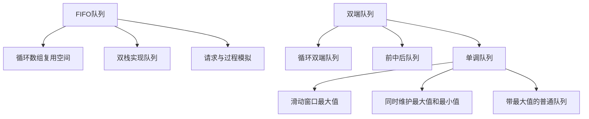

> 原书：李春葆、李筱驰《算法面试（全二册）》<br>
> 阅读范围：第 4 章 队列和双端队列<br>
> 说明：本文按原书 4.1～4.4 顺序整理。标题含“补充”的内容用于补足证明、边界或替代方案；明显排版问题标为“勘误说明”。

## 0. 本章主线

队列让先到达的数据先处理；双端队列允许在两端更新；单调队列再增加“主动丢弃不可能成为未来最优值的元素”，从而在线维护窗口最值。



本章共有 12 道正文题：4.2 有 4 道，4.3 有 5 道，4.4 有 3 道。

## 4.1 队列和双端队列概述

### 4.1.1 队列和双端队列的定义

#### 队列

队列是受限线性表。若从队头到队尾为

$$
Q=[a_0,a_1,\ldots,a_{n-1}],
$$

则只允许：

- 在队尾执行 `enqueue(x)`；
- 在队头执行 `dequeue()`；
- 读取 `front/back`；
- 查询 `empty/size`。

最早进入的 $a_0$ 最先离开，称为 FIFO（First In, First Out，先进先出）。固定入队顺序下，若所有元素最终都出队，出队序列唯一且与入队顺序相同。

队列适合“先产生、先处理”的临时任务，如广度优先搜索、请求排队和事件流窗口。抽象队列不提供任意位置访问；底层容器即使能遍历，也不应改变 FIFO 语义。

#### 双端队列

双端队列 deque（double-ended queue）允许在前端和后端各自插入、删除。限制“后端进、前端出”得到队列；限制在同一端进出得到栈。它不是“双向链表”的同义词：双端队列是接口，分块数组或链表都能实现。

#### 顺序实现、链式实现与循环缓冲区

普通顺序数组若只让 `front/rear` 单向增加，前部出队后的槽位无法重用。循环队列用模运算把逻辑下一个位置映射回数组开头：

$$
next(i)=(i+1)\bmod C,
$$

其中 $C$ 是容量。它没有让物理数组真的弯成圆，只是把逻辑下标循环映射到 $0,\ldots,C-1$。

### 4.1.2 队列和双端队列的知识点

#### C++、Python 与 Go 接口

- C++ `queue`：`push/pop/front/back`；`pop`不返回值。`deque`还支持两端 `push/pop` 和随机访问。
- Python `collections.deque`：`append/popleft`实现队列，`append/pop`实现栈，`appendleft/pop`支持另一端。
- Go 标准库没有泛型 deque；简单队列常用切片加头下标，频繁双端操作可实现环形数组或使用 `container/list`。

Python `deque.popleft/pop`会返回被删元素，与 C++ 容器的 `pop`接口不同。对空容器调用取首、取尾或删除均需先检查。

#### C++ `deque` 的存储边界

原书说明 `deque`通常由多个连续缓冲块组成，整体不保证像 `vector` 那样全部连续。它支持两端常数时间更新和随机访问，但不能把跨元素地址当作一个连续原生数组交给要求连续内存的接口。

#### 单调队列

单调队列通常保存**下标**，同时维护：

1. 下标从队头到队尾递增，代表时间顺序；
2. 对应值单调，队头就是当前窗口最值；
3. 队头下标若小于窗口左边界，就从前端删除；
4. 新值到来时，从后端删除不可能再成为未来最优值的元素。

维护窗口最大值时，对应值从前到后非递增。若新值 $x$ 大于队尾值，旧队尾既不比 $x$ 大，又比 $x$ 更早过期，因此在任何包含 $x$ 的未来窗口中都不可能成为最大值，可永久删除。

#### 为什么总时间是 $O(n)$

每个下标只从后端进入一次；它要么因过期从前端删除一次，要么因被新值支配从后端删除一次，不会再次入队。故全部操作不超过常数倍 $n$：

$$
\#push\le n,\qquad \#popFront+\#popBack\le n.
$$

即使代码有嵌套 `while`，总时间仍是摊还 $O(n)$。与单调栈相比，单调队列还必须从前端处理时间过期。

## 4.2 扩展队列的设计

### 4.2.1 LeetCode 622：设计循环队列（★★）

#### 要解决的空间浪费

普通数组队列若让 `front/rear`只向右移动，前端出队留下的槽位无法再次使用；当 `rear`到达数组末尾时，即使前面有空槽也会“假溢出”。循环队列通过模运算把末尾后的逻辑位置映射回下标 0。

#### 状态表示

原书使用长度为 $C$ 的数组、`front`、`rear`、`length`：

- `front` 指向队头元素的前一个槽；
- `rear` 指向队尾元素；
- 空：$length=0$；满：$length=C$。

入队 $x$：

$$
rear\leftarrow(rear+1)\bmod C,
$$

$$
data[rear]\leftarrow x,\qquad length\leftarrow length+1.
$$

出队：

$$
front\leftarrow(front+1)\bmod C,
\qquad length\leftarrow length-1.
$$

队头位置为 $(front+1)\bmod C$。显式 `length`解决 `front==rear`究竟表示空还是满的歧义；另一种常见方案是多留一个空槽，但有效容量会变成数组长度减 1。

#### 状态不变量

任意时刻：

1. $0\le length\le C$；
2. 若非空，逻辑第 $j$ 个元素位于 $(front+1+j)\bmod C$；
3. `rear`等于最后一个逻辑元素位置，即 $(front+length)\bmod C$。

入队先移动 `rear`再写值，使新值落在逻辑末尾；出队移动 `front`，旧队头随即落到“队头前一个位置”之外。两种操作都保持上述关系。

#### 数值走查

容量 3，初始 `front=rear=0,length=0`：

```text
enqueue(1): rear=1，data[1]=1，length=1
enqueue(2): rear=2，data[2]=2，length=2
enqueue(3): rear=0，data[0]=3，length=3（发生回绕）
dequeue():  front=1，逻辑队列变为 [2,3]
enqueue(4): rear=1，覆盖已出队槽，逻辑队列为 [2,3,4]
```

数组物理顺序可能是 `[3,4,2]`，不等于逻辑队列顺序；调试时必须沿循环下标观察。

每项操作只做常数次数组访问和模运算，时间 $O(1)$，空间 $O(C)$。题目保证 $C\ge1$，否则模 0 无定义。

#### 补充：其他空满判定

- 维护 `length`：能使用全部 $C$ 个槽，状态最直观；
- 预留一槽：`front==rear`为空，`(rear+1)%M==front`为满，有效容量 $M-1$；
- 维护额外布尔 `full`：不用长度，但每次更新更容易遗漏。

三种方案都可，不能混用其下标公式。

#### C++17：用长度区分空与满

```cpp
#include <vector>

class CircularQueue {
protected:
    std::vector<int> data;
    int capacity;
    int front = 0;
    int rear = 0;
    int length = 0;

public:
    explicit CircularQueue(int size) : data(size), capacity(size) {}

    bool enqueue(int value) {
        if (length == capacity) return false;
        rear = (rear + 1) % capacity;
        data[rear] = value;
        ++length;
        return true;
    }

    bool dequeue() {
        if (length == 0) return false;
        front = (front + 1) % capacity;
        --length;
        return true;
    }

    int getFront() const {
        return length == 0 ? -1 : data[(front + 1) % capacity];
    }

    int getRear() const { return length == 0 ? -1 : data[rear]; }
};
```

容量 3 连续加入 1、2、3 时，`rear` 从 0 走到 1、2、0；物理数组回绕，但 `getFront()` 始终通过 `(front+1)%capacity` 读取逻辑队头。

### 4.2.2 LeetCode 641：设计循环双端队列（★★）

#### 从单端扩展到两端

循环双端队列仍使用同一组 `front/rear/length`，区别是两端都能改变。关键是始终保持 `front`指向首元素前一槽、`rear`指向尾元素。

沿用 `front` 指向逻辑首元素之前、`rear` 指向尾元素的约定：

- 前端插入：先在 `front` 槽写值，再令 $front=(front-1+C)\bmod C$；
- 后端插入：令 $rear=(rear+1)\bmod C$ 后写值；
- 前端删除：令 $front=(front+1)\bmod C$；
- 后端删除：令 $rear=(rear-1+C)\bmod C$。

前端元素仍在 $(front+1)\bmod C$，后端元素在 `rear`。每次成功更新 `length`，空/满由长度判断。循环减法写成 `(index-1+C)%C`，避免负余数在语言间行为差异。

#### 为什么前端插入是“先写再减”

当前 `front` 槽正是逻辑首元素之前的空位，所以新前端应写在 `data[front]`；写完后，新的“首元素前一槽”再向左移动一格。若先减再写，会把新值放到前一槽，导致 `front+1`仍指向旧空位。

对容量 4：后端依次插入 1、2 后，若 `front=0,rear=2`，前端插入 3 应写 `data[0]=3`，再令 `front=3`；此时 `(front+1)%4=0` 正确读到 3。

删除只移动边界而不必清空数组槽，因为 `length`和边界决定哪些物理值有效。所有接口时间 $O(1)$、空间 $O(C)$。空队列上取值返回 -1 是题目协议，不是一般容器的统一约定。

#### C++17：复用循环队列边界约定

```cpp
class CircularDeque : public CircularQueue {
public:
    using CircularQueue::CircularQueue;

    bool insertFront(int value) {
        if (length == capacity) return false;
        data[front] = value;
        front = (front - 1 + capacity) % capacity;
        ++length;
        return true;
    }

    bool insertLast(int value) { return enqueue(value); }

    bool deleteFront() { return dequeue(); }

    bool deleteLast() {
        if (length == 0) return false;
        rear = (rear - 1 + capacity) % capacity;
        --length;
        return true;
    }

    int getFront() const { return CircularQueue::getFront(); }

    int getRear() const { return CircularQueue::getRear(); }

    bool isEmpty() const { return length == 0; }

    bool isFull() const { return length == capacity; }
};
```

代码依赖上一题 `CircularQueue` 的 `protected` 成员，并用基类操作实现后插与前删；派生类仍完整公开 LeetCode 641 的八个接口名。前插先写旧 `front` 槽，再把 `front` 移到新队头之前；这一顺序正对应上文的边界定义。

容量 3 时依次 `insertLast(1), insertLast(2), insertLast(3)`，`rear` 从 0 走到 1、2、0，发生回绕且队列为 `[1,2,3]`；连续三次 `deleteFront()` 后 `isEmpty()` 为真。此时再执行 `insertFront(4), insertLast(5)`，逻辑顺序为 `[4,5]`，`getFront()/getRear()` 分别返回 4、5，说明删空后的旧槽值不会干扰新边界。

### 4.2.3 LeetCode 1670：设计前中后队列（★★）

“两个中间位置取靠前者”可严格写为：长度 $n$ 时，中间元素的 0 基下标为

$$
m=\left\lfloor\frac{n-1}{2}\right\rfloor.
$$

插入中间时，新元素插入下标 $\lfloor n/2\rfloor$。

#### 原书解法一：旋转一个双端队列

前后操作 $O(1)$；中间操作通过反复把前端移到后端，旋转到目标位置再插删，时间 $O(n)$、空间 $O(n)$。

旋转后必须继续完成一整轮，使其他元素恢复原相对次序；只旋转到中点并停止会改变队列顺序。该方法状态少但每次中间操作扫描全队列。

#### 原书解法二：双链表加 `front/mid/rear`

已知中间结点时插删为 $O(1)$，但每种操作都要根据修改前长度奇偶移动 `mid`。核心不变量是 `mid`始终指向下标 $\lfloor(n-1)/2\rfloor$ 的靠前中点。

> **勘误说明：** 原书第 189 页 `pushBack` 的文字写“将结点 s 插入 front 结点的后面”，这会破坏尾部语义；应插入 `rear` 后面并更新 `rear=s`。

中点移动由修改前长度奇偶决定。例如 `mid`总指向靠前中点：

| 操作 | 修改前长度 | `mid` 的变化 |
|---|---|---|
| `pushFront` | 奇数 | 向前一格 |
| `pushFront` | 偶数 | 不变 |
| `pushBack` | 偶数 | 向后一格 |
| `pushBack` | 奇数 | 不变 |
| `popFront` | 偶数 | 向后一格 |
| `popBack` | 奇数 | 向前一格 |

边界长度 0、1、2 仍需单独维护 `front/rear/mid`，这是该方案最容易出错之处。

#### 补充：两个双端队列

维护左半 `left` 和右半 `right`，使

$$
|left|=|right|\quad\text{或}\quad |left|=|right|+1,
$$

且完整序列是 `left + right`。于是靠前中点总是 `left.back()`。

每次操作后只需在两半之间移动至多一个元素恢复平衡：

- 若左边过长，把 `left.back`移到 `right.front`；
- 若右边更长，把 `right.front`移到 `left.back`。

两端和中间操作都为 $O(1)$ 摊还时间，状态比手工维护三个链表指针更容易证明。本文三语言代码采用该补充方案。

#### 两半不变量如何对应六种接口

完整序列始终是 `left + right`，靠前中点是 `left.back()`：

- `pushFront`放到 `left.front`；
- `pushBack`放到 `right.back`；
- `pushMiddle`若左侧多一个，先把旧中点移到 `right.front`，再把新值放到 `left.back`；
- `popMiddle`直接删除 `left.back`；
- 前后删除分别使用两半的外端。

每次原始操作使两半长度差最多变化 1，恢复不变量至多搬一个元素，所以不仅均摊，按此实现每次也是最坏 $O(1)$（假设底层 deque 两端操作 $O(1)$）。

样例状态：`pushFront(1)`得 `left=[1]`；`pushBack(2)`平衡为 `[1]|[2]`；`pushMiddle(3)`得 `[1,3]|[2]`；再插入 4 时先移 3 到右侧，再得 `[1,4]|[3,2]`。

#### C++17（补充方案）：两个双端队列把中点变成端点

```cpp
#include <deque>

class FrontMiddleBackQueue {
public:
    void pushFront(int value) {
        left.push_front(value);
        balance();
    }

    void pushMiddle(int value) {
        if (left.size() > right.size()) {
            right.push_front(left.back());
            left.pop_back();
        }
        left.push_back(value);
    }

    void pushBack(int value) {
        right.push_back(value);
        balance();
    }

    int popFront() {
        if (left.empty()) return -1;
        int value = left.front();
        left.pop_front();
        balance();
        return value;
    }

    int popMiddle() {
        if (left.empty()) return -1;
        int value = left.back();
        left.pop_back();
        balance();
        return value;
    }

    int popBack() {
        if (!right.empty()) {
            int value = right.back();
            right.pop_back();
            balance();
            return value;
        }
        if (left.empty()) return -1;
        int value = left.back();
        left.pop_back();
        return value;
    }

private:
    std::deque<int> left;
    std::deque<int> right;

    void balance() {
        if (left.size() > right.size() + 1) {
            right.push_front(left.back());
            left.pop_back();
        } else if (left.size() < right.size()) {
            left.push_back(right.front());
            right.pop_front();
        }
    }
};
```

完整序列始终是 `left + right`。靠前中点恰为 `left.back()`，所以原本的“中间删除”转化成双端队列尾删。

### 4.2.4 LeetCode 232：用栈实现队列（★）

#### 原书基础方案

主栈底是队头、栈顶是队尾。出队时把全部元素倒入辅助栈，弹出辅助栈顶，再全部倒回，单次 `pop/peek` 为 $O(n)$。

例如主栈从底到顶 `[1,2,3]`，全部倒入辅助栈后其栈顶是 1；弹出 1 后若再倒回，主栈恢复 `[2,3]`。每次读取都重复两轮搬运，连续出队总代价可达 $O(n^2)$。

#### 均摊 $O(1)$ 的双栈方案

维护入栈 `input` 和出栈 `output`：

- 入队只压入 `input`；
- 出队/查看队头时，若 `output`非空直接使用其栈顶；若为空，才把 `input`全部倒入 `output`。

一次倒入会反转顺序，使最早进入者处于 `output`栈顶。只要 `output`未空，新入队元素留在 `input`，不会早于旧元素出队。

每个元素最多压入 `input`一次、从 `input`弹出一次、压入 `output`一次、从 `output`弹出一次，总操作为常数倍元素数。执行 $m$ 次队列操作总时间 $O(m)$，故每次均摊 $O(1)$；单次触发搬移仍可能 $O(n)$。

#### 均摊证明与状态不变量

可以给每次 `push`收取常数个“代币”：一个支付压入 `input`，两个留给未来从 `input`弹出并压入 `output`。这样触发整批搬移时不再额外欠费；最终从 `output`弹出的成本由 `pop`本身支付，所以每项均摊常数。

逻辑队列顺序等于“`output`从栈顶到底”后接“`input`从栈底到栈顶”。只在 `output`为空时搬移，才能保证旧元素先于后来进入 `input` 的新元素出队。

`empty`应同时检查两个栈；只检查 `input`会在元素已经搬入 `output`后误报为空。

#### C++17：只在输出栈为空时整批搬移

```cpp
#include <stack>

class QueueWithStacks {
public:
    void push(int value) { input.push(value); }

    int pop() {
        prepare();
        int value = output.top();
        output.pop();
        return value;
    }

    int peek() {
        prepare();
        return output.top();
    }

    bool empty() const { return input.empty() && output.empty(); }

private:
    std::stack<int> input;
    std::stack<int> output;

    void prepare() {
        if (!output.empty()) return;
        while (!input.empty()) {
            output.push(input.top());
            input.pop();
        }
    }
};
```

入队 1、2 后首次 `peek` 才把两者倒入 `output`，其栈顶为 1；在 1 出队前，即使再入队 3，也留在 `input`，不会越过旧元素。

## 4.3 队列的应用

### 4.3.1 LeetCode 1700：无法吃午餐的学生数量（★）

#### 过程模拟中的两个状态

学生按队列循环，三明治按固定栈顶顺序消耗。队头学生若喜欢当前三明治就离开，否则移到队尾。

原书用 `failed`记录当前三明治连续遭到拒绝的次数：

- 成功匹配后，三明治指针前进，`failed=0`；
- 失败后学生回到队尾，`failed++`；
- 若 `failed == queue.size()`，说明队中每个剩余学生都拒绝当前三明治，继续旋转不会改变结果，终止。

终止判断为什么充分？一整轮之后学生的循环顺序回到原状，三明治又没有变化，系统状态完全重复；再运行只会无限循环。

样例 `[1,1,1,0,0,1]` 与三明治 `[1,0,0,0,1,1]`：前两个类型都有人领取；处理第三个 0 后，剩余学生都偏好 1，而当前三明治仍为 0。完整轮转后 `failed==queue.size()==3`，答案为 3。

#### 复杂度与计数优化

队列模拟中，一个三明治最多让所有剩余学生轮转一遍，最坏时间可达

$$
n+(n-1)+\cdots+1=O(n^2),
$$

空间 $O(n)$。题目规模最多 100，足以通过。

**补充优化：** 偏好只有 0、1，可只统计两类学生人数。依次看三明治：若对应人数为 0，后续过程停滞；否则该人数减 1。时间 $O(n)$、额外空间 $O(1)$，但不再直接模拟队列过程。

#### C++17（补充优化）：计数代替循环队列模拟

```cpp
#include <vector>

int countStudents(const std::vector<int>& students,
                  const std::vector<int>& sandwiches) {
    int count[2] = {0, 0};
    for (int preference : students) ++count[preference];
    for (int sandwich : sandwiches) {
        if (count[sandwich] == 0) return count[0] + count[1];
        --count[sandwich];
    }
    return 0;
}
```

题目后续行为只依赖剩余两类人数，而不依赖学生的具体轮转顺序，因此可以压缩状态。若偏好类型更多，同样可用频次数组或哈希计数。

### 4.3.2 LeetCode 933：最近的请求次数（★）

#### 为什么时间队列天然有序

每次 `ping(t)` 的 $t$ 严格递增，需要统计闭区间

$$
[t-3000,t]
$$

中的请求。把新时间入队，再持续删除严格小于 $t-3000$ 的队头；等于左边界的请求必须保留。

样例队列变化：

```text
ping(1)    -> [1]                 返回1
ping(100)  -> [1,100]             返回2
ping(3001) -> [1,100,3001]        区间左端为1，返回3
ping(3002) -> 删除1，剩[100,3001,3002]，返回3
```

队列不变量：队中时间严格递增，且恰为当前窗口内尚未过期的所有请求。每个请求入队一次、最终出队至多一次，连续 $m$ 次调用总时间 $O(m)$，单次均摊 $O(1)$；空间等于任一 3000 毫秒窗口内的最大请求数。

正确性来自单调时间：所有小于左边界的请求必形成队头连续前缀，删除到首个合法时间即可；后面的时间更大，均在右边界 $t$以内，因为它们都来自过去调用。

严格递增时间是成立条件。若请求乱序到达，仅看队头就不能保证所有过期项形成前缀，需要有序结构或先排序。

#### C++17：队头只负责淘汰过期请求

```cpp
#include <queue>

class RecentCounter {
public:
    int ping(int time) {
        requests.push(time);
        while (requests.front() < time - 3000) requests.pop();
        return static_cast<int>(requests.size());
    }

private:
    std::queue<int> requests;
};
```

调用 `1,100,3001,3002` 时返回 `1,2,3,3`。在 3001 时请求 1 恰等于左边界，必须保留；到 3002 时才过期。

### 4.3.3 LeetCode 225：用队列实现栈（★）

#### 让队头始终等于栈顶

原书让主队列的队头始终代表栈顶。`push(x)`时先搬走旧元素，放入 $x$，再搬回旧元素，使队列从前到后始终是栈顶到栈底顺序。于是：

- `push`：$O(n)$；
- `pop/top/empty`：$O(1)$。

这是“把昂贵工作放在写入端”的选择。若使用一个队列，也可先把 $x$ 入队，再把它前面的 $n$ 个旧元素依次从队头移到队尾，仍为 $O(n)$ `push`。

例如逻辑栈底到顶为 `[1,2]`，主队列按栈顶到栈底保存 `[2,1]`。压入 3 后先得到 `[2,1,3]`，再轮转前两个旧元素，变成 `[3,2,1]`；队头 3 正是新栈顶。

循环不变量：每次公开方法结束时，主队列从头到尾等于逻辑栈从顶到底，辅助队列为空。因此 `pop/top`直接使用队头即可。

替代方案是让 `push` 为 $O(1)$，每次 `pop`时搬移前 $n-1$ 个元素，代价转到读取端。哪种更好取决于调用比例，不存在脱离工作负载的绝对最优。

原书双队列写法空间 $O(n)$；单队列轮转同样 $O(n)$ 空间但状态更少。连续 $m$ 次 push 的总时间为 $O(m^2)$，而 pop/top 为 $O(1)$。

#### C++17：每次压栈后旋转旧元素

```cpp
#include <queue>

class StackWithQueue {
public:
    void push(int value) {
        queue.push(value);
        int oldSize = static_cast<int>(queue.size()) - 1;
        for (int step = 0; step < oldSize; ++step) {
            queue.push(queue.front());
            queue.pop();
        }
    }

    int pop() {
        int value = queue.front();
        queue.pop();
        return value;
    }

    int top() const { return queue.front(); }
    bool empty() const { return queue.empty(); }

private:
    std::queue<int> queue;
};
```

压入 1、2 后，队列从前到后是 `[2,1]`；队头始终等于逻辑栈顶，所以 `top/pop` 不再搬移。

### 4.3.4 LeetCode 281：锯齿迭代器（★★）

#### 原书：预先物化完整结果

两个向量交替输出；某一向量耗尽后输出另一向量剩余项。原书在构造函数中完成二路交替，把全部结果放进队列：构造 $O(m+n)$、空间 $O(m+n)$，之后每次 `next` 为 $O(1)$。

循环不变量：构造阶段每轮从仍有元素的两路各取一个，结果队列保持期望交替顺序。

对 `[1,2]` 和 `[3,4,5,6]`，预构建队列为 `[1,3,2,4,5,6]`。如果调用者只取第一个元素，剩余五个仍已复制，说明该方案不是惰性的。

#### 补充：惰性迭代器

队列中只保存“仍未耗尽的向量编号及其当前下标”。每次 `next` 取一个位置，若该向量仍有后继就把更新后的位置放回队尾。队列轮转保证活跃向量依次提供一个元素。

这样构造 $O(1)$，每次 `next` 为 $O(1)$，辅助空间 $O(1)$（两路），并可自然推广到 $k$ 路、空间 $O(k)$。它适合输入很大或调用者可能提前停止；需要保证原向量在迭代期间仍然有效且不被破坏性修改。

#### C++17（补充方案）：队列轮转未耗尽输入流

```cpp
#include <queue>
#include <utility>
#include <vector>

class ZigzagIterator {
public:
    ZigzagIterator(std::vector<int> first, std::vector<int> second)
        : vectors{std::move(first), std::move(second)} {
        if (!vectors[0].empty()) positions.push({0, 0});
        if (!vectors[1].empty()) positions.push({1, 0});
    }

    bool hasNext() const { return !positions.empty(); }

    int next() {
        auto [vectorIndex, elementIndex] = positions.front();
        positions.pop();
        int value = vectors[vectorIndex][elementIndex];
        if (elementIndex + 1 < static_cast<int>(vectors[vectorIndex].size())) {
            positions.push({vectorIndex, elementIndex + 1});
        }
        return value;
    }

private:
    std::vector<std::vector<int>> vectors;
    std::queue<std::pair<int, int>> positions;
};
```

`[1,2]` 与 `[3,4,5,6]` 的活跃流依次轮转，输出 `[1,3,2,4,5,6]`；第一路耗尽后不再入队，第二路连续提供剩余值。

### 4.3.5 LeetCode 1047：删除所有相邻重复项（★）

#### 为什么只看当前结果的末尾

扫描字符，用双端队列后端作为“当前整理结果末尾”：若新字符等于队尾就删除队尾，否则加入队尾。它实际上把 deque 限制为栈使用，与第 3 章整理字符串方法同构。

循环不变量：队列从前到后恰为输入前缀完全消除相邻重复后的唯一结果。新字符只可能与结果末尾形成新重复对。每字符至多进入、离开一次，时间 $O(n)$，空间 $O(n)$。

对 `abbaca`：

```text
a -> ab -> a（bb消除）-> 空（aa消除）-> c -> ca
```

删除后暴露出的新相邻对会自动在栈顶发生，不需要回头重新扫描字符串。若规则改成一次删除 $k$ 个相同字符，需要在栈中同时保存字符与连续计数，而不是只存字符。

#### C++17：字符串尾部作为双端队列后端

```cpp
#include <string>

std::string removeAdjacentDuplicates(const std::string& text) {
    std::string result;
    for (char character : text) {
        if (!result.empty() && result.back() == character) {
            result.pop_back();
        } else {
            result.push_back(character);
        }
    }
    return result;
}
```

`abbaca` 的状态是 `a→ab→a→空→c→ca`。虽然本章归入双端队列应用，实际只使用后端，因此它也等价于栈算法。

## 4.4 单调队列

### 4.4.1 LeetCode 239：滑动窗口最大值（★★★）

#### 队列中保存的不是窗口全部元素

大小为 $k$ 的窗口右端到达 $i$ 时，左端为

$$
L=i-k+1.
$$

维护下标双端队列 `dq`，对应值从前到后非递增：

1. 从后端删除所有 `nums[dq.back] < nums[i]` 的下标；
2. 把 $i$ 加到后端；
3. 若 `dq.front < L`，从前端删除过期下标；
4. 当 $i\ge k-1$，`nums[dq.front]`就是窗口最大值。

队尾被删元素为何永远无用？新元素更大且更晚过期，所有未来同时包含二者的窗口都优先选择新元素。队头为何正确？所有更大且未过期的候选都应排在它前面，但不存在，所以它是最大值。

以 `[1,3,-1,-3,5]`、$k=3$ 为例：

```text
i=0: dq=[0(1)]
i=1: 3支配1，dq=[1(3)]
i=2: dq=[1(3),2(-1)]，窗口最大值3
i=3: dq=[1(3),2(-1),3(-3)]，窗口最大值3
i=4: 先删除过期下标1；5再从队尾支配-3、-1，dq=[4(5)]
```

“过期删除”基于下标，“支配删除”基于值，两种原因不能混为一谈。

相等值可保留，使用 `<`；也可用 `<=`删除旧相等值，让新值保留更久。两者均正确，但队列内容不同。每个下标进出至多一次，时间 $O(n)$，空间 $O(k)$。

实现可先删过期再维护单调性，也可先加入再删过期，只要输出前同时满足“下标在窗口内、值单调”两个不变量。$k=1$ 时答案就是原数组，$k=n$ 时只输出全局最大值。

#### C++17：队头过期，队尾支配

```cpp
#include <deque>
#include <vector>

std::vector<int> maxSlidingWindow(const std::vector<int>& numbers,
                                  int window) {
    std::deque<int> candidates;
    std::vector<int> answer;
    for (int index = 0; index < static_cast<int>(numbers.size()); ++index) {
        int left = index - window + 1;
        while (!candidates.empty() && candidates.front() < left) {
            candidates.pop_front();
        }
        while (!candidates.empty() &&
               numbers[candidates.back()] < numbers[index]) {
            candidates.pop_back();
        }
        candidates.push_back(index);
        if (index >= window - 1) answer.push_back(numbers[candidates.front()]);
    }
    return answer;
}
```

两个 `while` 的理由不同：前者删除已经不在窗口内的下标，后者删除仍在窗口但已被更大且更晚元素支配的候选。把这两类删除混在一起，最容易写错边界。

### 4.4.2 LeetCode 1438：绝对差不超过限制的最长连续子数组（★★）

任意两元素绝对差的最大值等于区间最大值减最小值：

$$
\max_{p,q\in[L,R]}|a_p-a_q|
=\max(a[L..R])-\min(a[L..R]).
$$

证明：任意 $a_p,a_q$ 都位于最小值和最大值之间，所以差不超过两端之差；取到最大值与最小值的一对恰好达到该上界。

因此维护一个非递增队列 `maxdq`和一个非递减队列 `mindq`。右端 $R$加入后，若

$$
a[maxdq.front]-a[mindq.front]>limit,
$$

就递增左端 $L$，并删除等于旧 $L$ 的队头下标，直到窗口合法。合法长度为 $R-L+1$。

#### 样例走查

`[8,2,4,7]`、limit=4：

```text
加入8: max=[8], min=[8]，窗口[0,0]合法
加入2: max=[8,2], min=[2]，差6，移除左端8，窗口变[1,1]
加入4: max=[4], min=[2,4]，差2，窗口[1,2]长度2
加入7: max=[7], min=[2,4,7]，差5，左端移到2后min=[4,7]，长度2
```

队列最好保存下标而不是值：下标能精确判断哪个副本过期，重复值也不会混淆。

为什么双指针不会漏掉更长答案？固定右端时，收缩到最小合法左端得到该右端的最长合法后缀；更靠左都非法，更靠右只会更短。全部下标在两个队列中各进出至多一次，时间 $O(n)$、空间 $O(n)$，实际不超过当前窗口长度。

窗口合法性随左端右移单调改善：删除元素不会增大区间最大值，也不会减小区间最小值，所以 `while`最终必停止。`limit=0` 时问题退化为最长连续相等段，算法仍适用。

#### C++17：两个单调队列同时维护窗口极值

```cpp
#include <algorithm>
#include <deque>
#include <vector>

int longestSubarray(const std::vector<int>& numbers, int limit) {
    std::deque<int> maximums;
    std::deque<int> minimums;
    int left = 0;
    int answer = 0;
    for (int right = 0; right < static_cast<int>(numbers.size()); ++right) {
        while (!maximums.empty() &&
               numbers[maximums.back()] < numbers[right]) {
            maximums.pop_back();
        }
        while (!minimums.empty() &&
               numbers[minimums.back()] > numbers[right]) {
            minimums.pop_back();
        }
        maximums.push_back(right);
        minimums.push_back(right);

        while (numbers[maximums.front()] - numbers[minimums.front()] > limit) {
            if (maximums.front() == left) maximums.pop_front();
            if (minimums.front() == left) minimums.pop_front();
            ++left;
        }
        answer = std::max(answer, right - left + 1);
    }
    return answer;
}
```

对 `[8,2,4,7]`、`limit=4`，右端到 7 时窗口 `[2,4,7]` 的极差为 5，左端从值 2 的下标移到值 4 的下标后恢复合法，最长长度仍为 2。

**迁移抓手**：当窗口约束可写成“最大值与最小值的函数”，双单调队列常能让每次扩张和收缩保持均摊 O(1)。

### 4.4.3 LCR 184：设计自助结算系统（★★）

#### 两个队列各自负责什么

普通队列 `queue`保存全部价格及 FIFO 顺序；非递增双端队列 `maxdq`只保存仍可能成为最大值的价格。

- `get_max`：返回 `maxdq.front`，空队列返回 -1；
- `add(x)`：普通入队；从 `maxdq`后端删除所有小于 $x$ 的值，再加入 $x$；
- `remove`：普通队头 $x$ 出队；若 $x=maxdq.front`，最大队列也从前端删除一次。

重复最大值必须保留多个副本：若用 `<=`把旧相等值删除，普通队列删除较早最大值时会错误地同步删掉唯一候选。原书采用严格 `<`，正确保留重复值。

例如依次加入 `[4,7,7,3]`，最大候选队列为 `[7,7,3]`。移除普通队头 4 时最大队列不动；移除第一个 7 时只弹出一个队头 7，另一个 7 仍保证最大值正确。

不变量：`maxdq`是普通队列的一个保持相对顺序的子序列、值非递增，且普通队列中每个未进入 `maxdq` 的元素都被其右侧某个更大元素支配。因此 `maxdq.front`必为当前最大值。

每个价格在两个队列中各进入一次、离开至多一次，连续操作总时间线性，所以三种接口均摊 $O(1)$；总空间 $O(n)$。

这与滑动窗口最大值同源：普通队列的出队相当于窗口左边界前移，`add`相当于右边界扩展。区别是窗口长度不固定，由调用序列决定。

#### C++17：FIFO 主队列与最大候选队列

```cpp
#include <deque>
#include <queue>

class Checkout {
public:
    void add(int value) {
        queue.push(value);
        while (!maximums.empty() && maximums.back() < value) {
            maximums.pop_back();
        }
        maximums.push_back(value);
    }

    int getMax() const {
        return queue.empty() ? -1 : maximums.front();
    }

    int remove() {
        if (queue.empty()) return -1;
        int value = queue.front();
        queue.pop();
        if (maximums.front() == value) maximums.pop_front();
        return value;
    }

private:
    std::queue<int> queue;
    std::deque<int> maximums;
};
```

加入 `[4,7,7,3]` 后候选为 `[7,7,3]`。严格 `<` 保留两个 7，保证第一个 7 出队后另一个 7 仍是最大值。

## 推荐练习题

原书列出以下 12 道练习，但未在本章正文展开解法：

1. LeetCode 121：买卖股票的最佳时机（★）
2. LeetCode 362：敲击计数器（★★）
3. LeetCode 346：数据流中的移动平均值（★）
4. LeetCode 950：按递增顺序显示卡牌（★★）
5. LeetCode 918：环形子数组的最大和（★★）
6. LeetCode 995：$k$ 连续位的最小翻转次数（★★★）
7. LeetCode 1425：带限制的子序列和（★★★）
8. LeetCode 1499：满足不等式的最大值（★★★）
9. LeetCode 1687：从仓库到码头运输箱子（★★★）
10. LeetCode 1823：找出游戏的获胜者（★★）
11. LeetCode 2327：知道秘密的人数（★★）
12. LeetCode 2534：通过门的时间（★★★）

## 附录 A：Python 3 实现速查

本附录集中提供 Python 版本；算法原理、状态走查与 C++ 主实现均放在对应正文附近。

```python
from collections import deque


class CircularQueue:
    def __init__(self, capacity: int):
        self.data = [0] * capacity
        self.capacity = capacity
        self.front = self.rear = self.length = 0

    def enqueue(self, value: int) -> bool:
        if self.length == self.capacity:
            return False
        self.rear = (self.rear + 1) % self.capacity
        self.data[self.rear] = value
        self.length += 1
        return True

    def dequeue(self) -> bool:
        if self.length == 0:
            return False
        self.front = (self.front + 1) % self.capacity
        self.length -= 1
        return True

    def front_value(self) -> int:
        return -1 if self.length == 0 else self.data[(self.front + 1) % self.capacity]

    def rear_value(self) -> int:
        return -1 if self.length == 0 else self.data[self.rear]


class CircularDeque(CircularQueue):
    def insert_front(self, value: int) -> bool:
        if self.length == self.capacity:
            return False
        self.data[self.front] = value
        self.front = (self.front - 1 + self.capacity) % self.capacity
        self.length += 1
        return True

    def insert_last(self, value: int) -> bool:
        return self.enqueue(value)

    def delete_front(self) -> bool:
        return self.dequeue()

    def delete_last(self) -> bool:
        if self.length == 0:
            return False
        self.rear = (self.rear - 1 + self.capacity) % self.capacity
        self.length -= 1
        return True

    def get_front(self) -> int:
        return self.front_value()

    def get_rear(self) -> int:
        return self.rear_value()

    def is_empty(self) -> bool:
        return self.length == 0

    def is_full(self) -> bool:
        return self.length == self.capacity


class FrontMiddleBackQueue:
    def __init__(self):
        self.left: deque[int] = deque()
        self.right: deque[int] = deque()

    def _balance(self) -> None:
        if len(self.left) > len(self.right) + 1:
            self.right.appendleft(self.left.pop())
        elif len(self.left) < len(self.right):
            self.left.append(self.right.popleft())

    def push_front(self, value: int) -> None:
        self.left.appendleft(value); self._balance()

    def push_middle(self, value: int) -> None:
        if len(self.left) > len(self.right):
            self.right.appendleft(self.left.pop())
        self.left.append(value)

    def push_back(self, value: int) -> None:
        self.right.append(value); self._balance()

    def pop_front(self) -> int:
        if not self.left:
            return -1
        value = self.left.popleft(); self._balance(); return value

    def pop_middle(self) -> int:
        if not self.left:
            return -1
        value = self.left.pop(); self._balance(); return value

    def pop_back(self) -> int:
        if self.right:
            value = self.right.pop()
        elif self.left:
            value = self.left.pop()
        else:
            return -1
        self._balance(); return value


class QueueWithStacks:
    def __init__(self):
        self.input: list[int] = []
        self.output: list[int] = []

    def push(self, value: int) -> None:
        self.input.append(value)

    def _prepare(self) -> None:
        if not self.output:
            while self.input:
                self.output.append(self.input.pop())

    def pop(self) -> int:
        self._prepare(); return self.output.pop()

    def peek(self) -> int:
        self._prepare(); return self.output[-1]


def count_students(students: list[int], sandwiches: list[int]) -> int:
    counts = [0, 0]
    for preference in students:
        counts[preference] += 1
    for sandwich in sandwiches:
        if counts[sandwich] == 0:
            return counts[0] + counts[1]
        counts[sandwich] -= 1
    return 0


class RecentCounter:
    def __init__(self):
        self.requests: deque[int] = deque()

    def ping(self, time: int) -> int:
        self.requests.append(time)
        while self.requests[0] < time - 3000:
            self.requests.popleft()
        return len(self.requests)


class StackWithQueue:
    def __init__(self):
        self.queue: deque[int] = deque()

    def push(self, value: int) -> None:
        self.queue.append(value)
        for _ in range(len(self.queue) - 1):
            self.queue.append(self.queue.popleft())

    def pop(self) -> int:
        return self.queue.popleft()

    def top(self) -> int:
        return self.queue[0]


class ZigzagIterator:
    def __init__(self, first: list[int], second: list[int]):
        self.vectors = [first, second]
        self.positions: deque[tuple[int, int]] = deque()
        for vector_index, vector in enumerate(self.vectors):
            if vector:
                self.positions.append((vector_index, 0))

    def has_next(self) -> bool:
        return bool(self.positions)

    def next(self) -> int:
        vector_index, element_index = self.positions.popleft()
        value = self.vectors[vector_index][element_index]
        if element_index + 1 < len(self.vectors[vector_index]):
            self.positions.append((vector_index, element_index + 1))
        return value


def remove_adjacent_duplicates(text: str) -> str:
    result: deque[str] = deque()
    for character in text:
        if result and result[-1] == character:
            result.pop()
        else:
            result.append(character)
    return "".join(result)


def max_sliding_window(numbers: list[int], window: int) -> list[int]:
    candidates: deque[int] = deque()
    answer: list[int] = []
    for index, value in enumerate(numbers):
        while candidates and numbers[candidates[-1]] < value:
            candidates.pop()
        candidates.append(index)
        left = index - window + 1
        if candidates[0] < left:
            candidates.popleft()
        if index >= window - 1:
            answer.append(numbers[candidates[0]])
    return answer


def longest_subarray(numbers: list[int], limit: int) -> int:
    maximums: deque[int] = deque()
    minimums: deque[int] = deque()
    left = answer = 0
    for right, value in enumerate(numbers):
        while maximums and numbers[maximums[-1]] < value:
            maximums.pop()
        while minimums and numbers[minimums[-1]] > value:
            minimums.pop()
        maximums.append(right); minimums.append(right)
        while numbers[maximums[0]] - numbers[minimums[0]] > limit:
            if maximums[0] == left: maximums.popleft()
            if minimums[0] == left: minimums.popleft()
            left += 1
        answer = max(answer, right - left + 1)
    return answer


class Checkout:
    def __init__(self):
        self.queue: deque[int] = deque()
        self.maximums: deque[int] = deque()

    def get_max(self) -> int:
        return -1 if not self.queue else self.maximums[0]

    def add(self, value: int) -> None:
        self.queue.append(value)
        while self.maximums and self.maximums[-1] < value:
            self.maximums.pop()
        self.maximums.append(value)

    def remove(self) -> int:
        if not self.queue:
            return -1
        value = self.queue.popleft()
        if self.maximums[0] == value:
            self.maximums.popleft()
        return value


if __name__ == "__main__":
    circular = CircularQueue(3)
    print([circular.enqueue(x) for x in [1, 2, 3, 4]], circular.rear_value())
    circular.dequeue(); circular.enqueue(4); print(circular.front_value(), circular.rear_value())
    double = CircularDeque(3)
    print([double.insert_last(x) for x in [1, 2, 3]], double.is_full(), double.get_front(), double.get_rear())
    print([double.delete_front() for _ in range(3)], double.is_empty(), double.get_front(), double.get_rear())
    print(double.insert_front(4), double.insert_last(5), double.get_front(), double.get_rear())
    middle = FrontMiddleBackQueue(); middle.push_front(1); middle.push_back(2)
    middle.push_middle(3); middle.push_middle(4)
    print([middle.pop_front(), middle.pop_middle(), middle.pop_middle(), middle.pop_back()])
    queue = QueueWithStacks(); queue.push(1); queue.push(2); print(queue.peek(), queue.pop())
    print(count_students([1, 1, 1, 0, 0, 1], [1, 0, 0, 0, 1, 1]))
    recent = RecentCounter(); print([recent.ping(t) for t in [1, 100, 3001, 3002]])
    stack = StackWithQueue(); stack.push(1); stack.push(2); print(stack.top(), stack.pop())
    zigzag = ZigzagIterator([1, 2], [3, 4, 5, 6]); output = []
    while zigzag.has_next(): output.append(zigzag.next())
    print(output)
    print(remove_adjacent_duplicates("abbaca"))
    print(max_sliding_window([1, 3, -1, -3, 5, 3, 6, 7], 3))
    print(longest_subarray([8, 2, 4, 7], 4))
    checkout = Checkout(); checkout.add(4); checkout.add(7)
    print(checkout.get_max(), checkout.remove(), checkout.get_max())
```

示例输出：

```text
[True, True, True, False] 3
2 4
[True, True, True] True 1 3
[True, True, True] True -1 -1
True True 4 5
[1, 3, 4, 2]
1 1
3
[1, 2, 3, 3]
2 2
[1, 3, 2, 4, 5, 6]
ca
[3, 3, 5, 5, 6, 7]
2
7 4 7
```

## 附录 B：Go 1.22 实现速查

本附录与 Python 附录覆盖同一组接口，适合查阅 Go 的环形数组、切片队列与 `container/list` 写法。

```go
package main

import (
    "container/list"
    "fmt"
)

type CircularQueue struct { data []int; capacity, front, rear, length int }
func NewCircularQueue(capacity int) *CircularQueue { return &CircularQueue{data: make([]int, capacity), capacity: capacity} }
func (q *CircularQueue) Enqueue(value int) bool { if q.length==q.capacity{return false}; q.rear=(q.rear+1)%q.capacity; q.data[q.rear]=value; q.length++; return true }
func (q *CircularQueue) Dequeue() bool { if q.length==0{return false}; q.front=(q.front+1)%q.capacity; q.length--; return true }
func (q *CircularQueue) Front() int { if q.length==0{return -1}; return q.data[(q.front+1)%q.capacity] }
func (q *CircularQueue) Rear() int { if q.length==0{return -1}; return q.data[q.rear] }

type CircularDeque struct { *CircularQueue }
func NewCircularDeque(capacity int) *CircularDeque { return &CircularDeque{NewCircularQueue(capacity)} }
func (q *CircularDeque) InsertFront(value int) bool { if q.length==q.capacity{return false}; q.data[q.front]=value; q.front=(q.front-1+q.capacity)%q.capacity; q.length++; return true }
func (q *CircularDeque) InsertLast(value int) bool { return q.Enqueue(value) }
func (q *CircularDeque) DeleteFront() bool { return q.Dequeue() }
func (q *CircularDeque) DeleteLast() bool { if q.length==0{return false}; q.rear=(q.rear-1+q.capacity)%q.capacity; q.length--; return true }
func (q *CircularDeque) GetFront() int { return q.Front() }
func (q *CircularDeque) GetRear() int { return q.Rear() }
func (q *CircularDeque) IsEmpty() bool { return q.length==0 }
func (q *CircularDeque) IsFull() bool { return q.length==q.capacity }

type FrontMiddleBackQueue struct { left, right *list.List }
func NewFrontMiddleBackQueue() *FrontMiddleBackQueue { return &FrontMiddleBackQueue{list.New(),list.New()} }
func (q *FrontMiddleBackQueue) balance() { if q.left.Len()>q.right.Len()+1 { e:=q.left.Back(); q.right.PushFront(e.Value); q.left.Remove(e) } else if q.left.Len()<q.right.Len() { e:=q.right.Front(); q.left.PushBack(e.Value); q.right.Remove(e) } }
func (q *FrontMiddleBackQueue) PushFront(v int){q.left.PushFront(v);q.balance()}
func (q *FrontMiddleBackQueue) PushMiddle(v int){if q.left.Len()>q.right.Len(){e:=q.left.Back();q.right.PushFront(e.Value);q.left.Remove(e)};q.left.PushBack(v)}
func (q *FrontMiddleBackQueue) PushBack(v int){q.right.PushBack(v);q.balance()}
func (q *FrontMiddleBackQueue) PopFront() int {if q.left.Len()==0{return -1};e:=q.left.Front();v:=e.Value.(int);q.left.Remove(e);q.balance();return v}
func (q *FrontMiddleBackQueue) PopMiddle() int {if q.left.Len()==0{return -1};e:=q.left.Back();v:=e.Value.(int);q.left.Remove(e);q.balance();return v}
func (q *FrontMiddleBackQueue) PopBack() int {var e *list.Element;if q.right.Len()>0{e=q.right.Back();v:=e.Value.(int);q.right.Remove(e);q.balance();return v};if q.left.Len()==0{return -1};e=q.left.Back();v:=e.Value.(int);q.left.Remove(e);q.balance();return v}

type QueueWithStacks struct { input, output []int }
func (q *QueueWithStacks) Push(v int){q.input=append(q.input,v)}
func (q *QueueWithStacks) prepare(){if len(q.output)==0{for len(q.input)>0{i:=len(q.input)-1;q.output=append(q.output,q.input[i]);q.input=q.input[:i]}}}
func (q *QueueWithStacks) Pop() int {q.prepare();i:=len(q.output)-1;v:=q.output[i];q.output=q.output[:i];return v}
func (q *QueueWithStacks) Peek() int {q.prepare();return q.output[len(q.output)-1]}

func countStudents(students,sandwiches []int) int {count:=[2]int{};for _,v:=range students{count[v]++};for _,v:=range sandwiches{if count[v]==0{return count[0]+count[1]};count[v]--};return 0}
type RecentCounter struct{requests []int; head int}
func(q *RecentCounter)Ping(t int)int{q.requests=append(q.requests,t);for q.requests[q.head]<t-3000{q.head++};return len(q.requests)-q.head}
type StackWithQueue struct{queue []int}
func(s *StackWithQueue)Push(v int){updated:=make([]int,0,len(s.queue)+1);updated=append(updated,v);updated=append(updated,s.queue...);s.queue=updated}
func(s *StackWithQueue)Pop()int{v:=s.queue[0];s.queue=s.queue[1:];return v}
func(s *StackWithQueue)Top()int{return s.queue[0]}

type position struct{vector,index int}
type ZigzagIterator struct{vectors [][]int; positions []position}
func NewZigzag(a,b []int)*ZigzagIterator{z:=&ZigzagIterator{vectors:[][]int{a,b}};if len(a)>0{z.positions=append(z.positions,position{0,0})};if len(b)>0{z.positions=append(z.positions,position{1,0})};return z}
func(z *ZigzagIterator)HasNext()bool{return len(z.positions)>0}
func(z *ZigzagIterator)Next()int{p:=z.positions[0];z.positions=z.positions[1:];v:=z.vectors[p.vector][p.index];p.index++;if p.index<len(z.vectors[p.vector]){z.positions=append(z.positions,p)};return v}
func removeAdjacentDuplicates(s string)string{st:=[]byte{};for i:=range s{if len(st)>0&&st[len(st)-1]==s[i]{st=st[:len(st)-1]}else{st=append(st,s[i])}};return string(st)}

func maxSlidingWindow(a []int,k int)[]int{dq,ans:=[]int{},[]int{};for i,v:=range a{for len(dq)>0&&a[dq[len(dq)-1]]<v{dq=dq[:len(dq)-1]};dq=append(dq,i);left:=i-k+1;if dq[0]<left{dq=dq[1:]};if i>=k-1{ans=append(ans,a[dq[0]])}};return ans}
func longestSubarray(a []int,limit int)int{maxq,minq:=[]int{},[]int{};left,ans:=0,0;for right,v:=range a{for len(maxq)>0&&a[maxq[len(maxq)-1]]<v{maxq=maxq[:len(maxq)-1]};for len(minq)>0&&a[minq[len(minq)-1]]>v{minq=minq[:len(minq)-1]};maxq=append(maxq,right);minq=append(minq,right);for a[maxq[0]]-a[minq[0]]>limit{if maxq[0]==left{maxq=maxq[1:]};if minq[0]==left{minq=minq[1:]};left++};if right-left+1>ans{ans=right-left+1}};return ans}
type Checkout struct{queue,maximums []int}
func(c *Checkout)Add(v int){c.queue=append(c.queue,v);for len(c.maximums)>0&&c.maximums[len(c.maximums)-1]<v{c.maximums=c.maximums[:len(c.maximums)-1]};c.maximums=append(c.maximums,v)}
func(c *Checkout)GetMax()int{if len(c.queue)==0{return -1};return c.maximums[0]}
func(c *Checkout)Remove()int{if len(c.queue)==0{return -1};v:=c.queue[0];c.queue=c.queue[1:];if c.maximums[0]==v{c.maximums=c.maximums[1:]};return v}

func main(){q:=NewCircularQueue(3);fmt.Println(q.Enqueue(1),q.Enqueue(2),q.Enqueue(3),q.Enqueue(4),q.Rear());q.Dequeue();q.Enqueue(4);fmt.Println(q.Front(),q.Rear());d:=NewCircularDeque(3);d.Enqueue(1);d.Enqueue(2);d.InsertFront(3);fmt.Println(d.Front(),d.Rear(),d.DeleteLast());m:=NewFrontMiddleBackQueue();m.PushFront(1);m.PushBack(2);m.PushMiddle(3);m.PushMiddle(4);fmt.Println(m.PopFront(),m.PopMiddle(),m.PopMiddle(),m.PopBack());s:=&QueueWithStacks{};s.Push(1);s.Push(2);fmt.Println(s.Peek(),s.Pop());fmt.Println(countStudents([]int{1,1,1,0,0,1},[]int{1,0,0,0,1,1}));r:=&RecentCounter{};fmt.Println(r.Ping(1),r.Ping(100),r.Ping(3001),r.Ping(3002));st:=&StackWithQueue{};st.Push(1);st.Push(2);fmt.Println(st.Top(),st.Pop());z:=NewZigzag([]int{1,2},[]int{3,4,5,6});out:=[]int{};for z.HasNext(){out=append(out,z.Next())};fmt.Println(out);fmt.Println(removeAdjacentDuplicates("abbaca"));fmt.Println(maxSlidingWindow([]int{1,3,-1,-3,5,3,6,7},3));fmt.Println(longestSubarray([]int{8,2,4,7},4));c:=&Checkout{};c.Add(4);c.Add(7);fmt.Println(c.GetMax(),c.Remove(),c.GetMax())}
```

## 代码与推导的对应关系

| 主题 | 实现 | 核心不变量 |
|---|---|---|
| 循环队列/双端队列 | `CircularQueue/Deque` | 模 $C$ 回绕，长度区分空满 |
| 前中后队列 | `FrontMiddleBackQueue` | $|left|=|right|$ 或 $|left|=|right|+1$ |
| 双栈队列 | `QueueWithStacks` | `output` 栈顶是最早未出队元素 |
| 午餐模拟 | `countStudents` | 当前类型人数为 0 时系统停滞 |
| 最近请求 | `RecentCounter` | 队中恰为闭区间 $[t-3000,t]$ |
| 队列实现栈 | `StackWithQueue` | 队头始终是逻辑栈顶 |
| 锯齿迭代 | `ZigzagIterator` | 队列轮转所有未耗尽输入流 |
| 相邻消除 | `removeAdjacentDuplicates` | 后端是当前规范结果末尾 |
| 窗口最大值 | `maxSlidingWindow` | 值非递增、下标递增且未过期 |
| 最长受限子数组 | `longestSubarray` | 双队头给出窗口最大值与最小值 |
| 最大值队列 | `Checkout` | 普通队列保序，单调队列保最大候选 |

## 补充：易混淆概念与常见误解

| 误解 | 更准确的理解 |
|---|---|
| 队列是后进先出 | 队列 FIFO；栈 LIFO |
| 双端队列就是双链表 | 前者是接口，后者是一种实现 |
| `front==rear`足以区分空满 | 需额外长度、标志或预留空槽 |
| 模运算下标可直接减 1 | 应写 $(i-1+C)\bmod C$ 避免负值 |
| 双栈队列每次都是最坏 $O(1)$ | 单次搬移可 $O(n)$，均摊才是 $O(1)$ |
| 单调队列保存窗口所有元素 | 它只保留仍可能成为最值的候选 |
| 新值与旧最大值相等时必须删旧值 | 两种策略都可，但最大值队列若只存值需保留重复计数 |
| 任意两数最大绝对差需枚举所有对 | 等于区间最大值减最小值 |
| Python 列表头删适合队列 | 头删通常 $O(n)$，应使用 `deque.popleft()` |

## 本章总结

队列的核心是时间顺序，循环数组解决有限容量下的槽位复用，双端队列把操作扩展到两端。前中后队列说明了如何用平衡不变量把“中间”也变成端点；双栈队列和队列实现栈则展示了接口之间可以相互模拟，但代价会移动到不同操作上。

单调队列进一步区分两类删除：队头删除过期元素，队尾删除被新元素支配的候选。只要能证明被删元素永远不会成为未来答案，并且每个下标只进出常数次，就能得到线性总时间。窗口最大值、受限子数组和最大值队列都建立在这一证明上。
