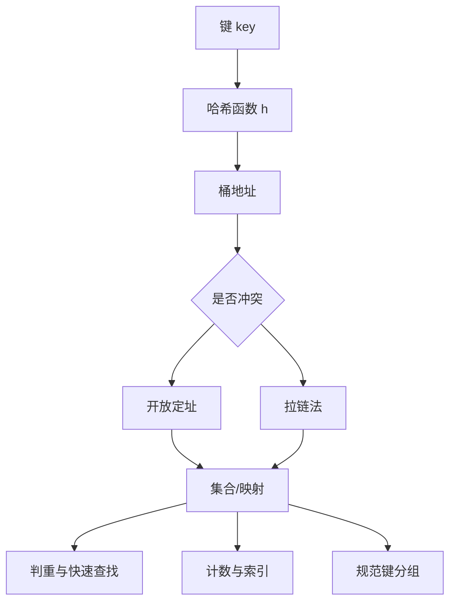

> 原书：李春葆、李筱驰《算法面试（全二册）》<br>
> 阅读范围：第 5 章 哈希表<br>
> 说明：本文按原书 5.1～5.4 顺序整理。标题含“补充”的内容用于补足证明、边界或替代方案；原页中的公式丢失和接口错误明确标为“勘误说明”。

## 0. 本章主线

哈希表把“按键搜索”从顺序扫描转化为“计算桶位置，再处理少量冲突”。集合只关心键是否存在；映射还保存键对应的值，因此自然支持计数、索引、映射和分组。



本章共有 19 道正文题：5.2 有 2 道，5.3 有 7 道，5.4 有 10 道。

## 5.1 哈希表概述

### 5.1.1 哈希表的定义

#### 1. 哈希表与哈希函数

设键空间为 $K$，哈希表有 $M$ 个桶，下标集合为 $\{0,1,\ldots,M-1\}$。哈希函数是映射

$$
h:K\rightarrow\{0,1,\ldots,M-1\}.
$$

查找键 $k$ 时先计算 $h(k)$，直接定位候选桶。不同键 $k_i\ne k_j$ 可能满足

$$
h(k_i)=h(k_j),
$$

这叫哈希冲突。由抽屉原理，只要键空间大于桶数，冲突就不可能被普遍消除，数据结构必须定义冲突处理规则。

“均匀哈希”是分析假设：每个键近似等概率落入各桶，且不同键分布足够独立。实际性能依赖键分布、哈希函数、负载因子和攻击性输入；平均 $O(1)$ 不是无条件最坏 $O(1)$。

除留余数法为

$$
h(k)=k\bmod p,\qquad p\le M.
$$

原书建议 $p$ 常取不大于表长的素数，以减少与键周期的公因子导致的聚集。对允许负键的语言实现，还要把负余数规范到 $[0,M-1]$。

#### 补充：负载因子

设已存键数为 $n$，桶数为 $M$，负载因子

$$
\alpha=\frac nM.
$$

开放定址必须有空槽，故 $\alpha<1$，且接近 1 时探测急剧变长；拉链法允许 $\alpha>1$，但平均链长随 $\alpha$ 增长。工业实现通常在负载过高时扩容并重新散列。

#### 2. 开放定址法

所有键都存在数组槽中。若初始地址被占用，就按探测序列寻找后续槽。

线性探测第 $i$ 次地址为

$$
d_i=(h(k)+i)\bmod M,\qquad i=0,1,\ldots,M-1.
$$

平方探测常写为

$$
d_{2i-1}=(h(k)+i^2)\bmod M,
\qquad
d_{2i}=(h(k)-i^2+M)\bmod M.
$$

具体平方探测是否覆盖足够槽位依赖 $M$ 和探测定义，不能假定任意表长都遍历全表。线性探测一定按循环覆盖所有槽，却容易形成“主聚集”。

##### 删除为什么需要墓碑

槽位有三种状态：从未使用 `EMPTY`、当前占用 `OCCUPIED`、曾占用后删除 `DELETED`。查找遇 `DELETED`必须继续，因为目标可能在冲突链后方；若删除后直接改成 `EMPTY`，会错误截断探测链。插入可以复用第一个墓碑。

每次探测最多 $M$ 个槽。实现必须计数或检测回到起点，否则满表或全是墓碑时可能无限循环。

#### 原书线性探测示例与 ASL

$M=8$，$h(k)=k\bmod7$。依次插入 2、9、16、15、1，删除 9，再插入 8，重复插入 16 被拒绝。最终表为：

| 下标 | 0 | 1 | 2 | 3 | 4 | 5 | 6 | 7 |
|---|---:|---:|---:|---:|---:|---:|---:|---:|
| 键 | 空 | 15 | 2 | 8 | 16 | 1 | 空 | 空 |
| 成功探测数 | - | 1 | 1 | 3 | 3 | 5 | - | - |

成功查找平均长度为

$$
ASL_{success}=\frac{1+1+3+3+5}{5}=\frac{13}{5}=2.6.
$$

失败查找的初始地址只可能是 0～6，对应探测次数为 $1,6,5,4,3,2,1$：

$$
ASL_{failure}=\frac{1+6+5+4+3+2+1}{7}
=\frac{22}{7}\approx3.143.
$$

> **勘误说明：** 原书最后一项再次写成 $h(x)=5$，按地址序列应为 $h(x)=6$。ASL 是在给定表状态、哈希地址分布和计数口径下的平均探测数，不是所有开放定址表的固定常数。

#### 3. 拉链法

每个桶保存一条链或动态容器，所有满足 $h(k)=i$ 的键进入桶 $i$。查找只扫描目标桶；删除不会截断其他键的查找路径，不需要墓碑。

原书 $M=5$ 的最终桶长度为 $[1,2,2,1,0]$。成功比较次数为 15、6、7、8 各 1 次，16、2 各 2 次：

$$
ASL_{success}=\frac{1+1+1+1+2+2}{6}=\frac43.
$$

失败时比较完整桶，故

$$
ASL_{failure}=\frac{1+2+2+1+0}{5}=\frac65.
$$

拉链法删除简单、负载可超过 1，但结点/容器有额外空间和间接访问成本。开放定址缓存局部性较好，但删除、扩容和高负载更敏感。

### 5.1.2 哈希表的知识点

#### 集合与映射

- 哈希集合存键，适合存在性、判重、除重、集合运算。
- 哈希映射存 $(key,value)$，适合频次、最近下标、双向映射和按规范键分组。

C++ 使用 `unordered_set`、`unordered_map`；Python 使用 `set`、`dict/defaultdict`；Go 使用 `map[K]struct{}`模拟集合，`map[K]V`表示映射。

平均插入、删除、查找接近 $O(1)$；最坏可退化到 $O(n)$。遍历顺序不要作为算法正确性的依据。

#### 重要接口勘误

- `unordered_set`没有 `operator[]`。
- C++ 映射访问是 `map.at(k)`，不是 `at[k]`；键不存在时 `at`抛异常，只有 `operator[]`会插入默认值。
- Python 3 已移除 `dict.has_key`，使用 `key in mapping`。
- Python 3 的 `items/keys/values`返回动态视图，不是列表；需要列表时显式 `list(...)`。
- 现代 Python 的 `dict.popitem()`按后进先出删除，不是随机删除。
- Python 集合/字典键必须可哈希；通常要求对象在作为键期间哈希值和相等语义稳定。

## 5.2 哈希表的实现

### 5.2.1 LeetCode 705：设计哈希集合（★）

原书用长度 10000 的开放定址表、$p=9997$ 的余数哈希、`EMPTY=-1`、`DELETED=-2`，键范围非负，因此哨兵不会与合法键冲突。

`add`沿探测序列直到找到相同键、空槽或墓碑；相同键不重复插入。`contains`只有遇到从未使用的空槽才能断言不存在，遇墓碑必须继续。`remove`找到后改为墓碑。

#### 边界补充

最多调用 10000 次不等于同时存储键数必小于 10000；若全是不同键的添加，表可能满。健壮实现需探测至多 $M$ 次，并在满表时扩容或报告失败。固定容量方案只因题目操作规模和测试分布才可能工作。

直接用长度 $10^6+1$ 的布尔数组是**直接寻址表**：操作严格 $O(1)$、无冲突、实现简单，但空间与整个键域成正比，不能处理巨大或稀疏键域。

#### C++17：开放定址、墓碑与有限探测

```cpp
#include <utility>
#include <vector>

class MyHashSet {
public:
    void add(int key) {
        auto [index, found] = findSlot(key);
        if (!found && index >= 0) table[index] = key;
    }

    bool contains(int key) const { return findSlot(key).second; }

    void remove(int key) {
        auto [index, found] = findSlot(key);
        if (found) table[index] = DELETED;
    }

private:
    static constexpr int EMPTY = -1;
    static constexpr int DELETED = -2;
    static constexpr int CAPACITY = 10007;
    std::vector<int> table = std::vector<int>(CAPACITY, EMPTY);

    std::pair<int, bool> findSlot(int key) const {
        int firstDeleted = -1;
        int start = key % CAPACITY;
        for (int step = 0; step < CAPACITY; ++step) {
            int index = (start + step) % CAPACITY;
            if (table[index] == key) return {index, true};
            if (table[index] == DELETED && firstDeleted < 0) {
                firstDeleted = index;
            }
            if (table[index] == EMPTY) {
                return {firstDeleted < 0 ? index : firstDeleted, false};
            }
        }
        return {firstDeleted, false};
    }
};
```

删除键后写 `DELETED` 而非 `EMPTY`，使冲突后方的键仍可被找到；插入则优先复用首次遇到的墓碑。循环最多探测 `CAPACITY` 次，避免满表死循环。

### 5.2.2 LeetCode 706：设计哈希映射（★）

原书用 $M=997$ 个桶的拉链法。结点保存 `key,value,next`：

- `put`：桶内找到键则更新，否则头插新结点；
- `get`：桶内找到返回值，否则 -1；
- `remove`：通过前驱重连删除结点。

若均匀散列，平均桶长约为 $\alpha=n/M$，平均操作接近 $O(1+\alpha)$；最坏所有键进同一桶，为 $O(n)$。固定 997 桶足以演示原理，生产实现应按负载扩容。

#### C++17：拉链桶内更新、查询与删除

```cpp
#include <algorithm>
#include <utility>
#include <vector>

class MyHashMap {
public:
    void put(int key, int value) {
        auto& bucket = buckets[key % BUCKET_COUNT];
        for (auto& [oldKey, oldValue] : bucket) {
            if (oldKey == key) {
                oldValue = value;
                return;
            }
        }
        bucket.push_back({key, value});
    }

    int get(int key) const {
        for (const auto& [oldKey, value] : buckets[key % BUCKET_COUNT]) {
            if (oldKey == key) return value;
        }
        return -1;
    }

    void remove(int key) {
        auto& bucket = buckets[key % BUCKET_COUNT];
        bucket.erase(
            std::remove_if(
                bucket.begin(), bucket.end(),
                [key](const auto& entry) { return entry.first == key; }
            ),
            bucket.end()
        );
    }

private:
    static constexpr int BUCKET_COUNT = 997;
    std::vector<std::vector<std::pair<int, int>>> buckets =
        std::vector<std::vector<std::pair<int, int>>>(BUCKET_COUNT);
};
```

`put(2,2)` 后再 `put(2,1)` 必须更新原桶结点，而不是追加第二个相同键；否则 `get/remove` 的语义会依赖桶内重复项顺序。

## 5.3 哈希集合应用的算法设计

### 5.3.1 LeetCode 349：两个数组的交集（★）

#### 问题与方法选择

交集只关心“值是否同时存在”，不关心各自出现多少次，因此集合正好把数组压缩成存在性信息。输出每个公共值一次。把两数组转成集合，再遍历较小集合并查询另一集合。集合消除了输入重数，因此结果天然唯一。

平均时间 $O(m+n)$，空间 $O(m+n)$；输出顺序未规定，不能依赖哈希遍历顺序。遍历较小集合不是正确性要求，而是减少常数：若不同值数分别为 $d_1,d_2$，查询次数为 $\min(d_1,d_2)$。某值被输出当且仅当它属于两个集合，这与集合交集定义完全一致。

与第 1 章“排序 + 双指针”相比，哈希法平均更快但用额外空间且结果无序；排序法为 $O(m\log m+n\log n)$，可自然输出有序结果。

#### C++17：集合压缩重复后做存在性查询

```cpp
#include <unordered_set>
#include <vector>

std::vector<int> intersection(const std::vector<int>& first,
                              const std::vector<int>& second) {
    std::unordered_set<int> left(first.begin(), first.end());
    std::unordered_set<int> right(second.begin(), second.end());
    if (left.size() > right.size()) left.swap(right);

    std::vector<int> result;
    for (int value : left) {
        if (right.count(value)) result.push_back(value);
    }
    return result;
}
```

结果顺序不应依赖 `unordered_set` 遍历顺序。若测试需要稳定顺序，应额外排序结果或改用第 1 章的排序双指针法。

### 5.3.2 LeetCode 202：快乐数（★）

#### 状态转移与终止问题

定义变换

$$
f(n)=\sum_i d_i^2,
$$

$d_i$ 是 $n$ 的十进制各位。不断令 $n\leftarrow f(n)$；到 1 为快乐数，重复访问某个非 1 状态则进入环，永远不会到 1。

为什么过程必然到 1 或成环？对 32 位正整数最多 10 位，第一次变换后

$$
f(n)\le10\cdot9^2=810.
$$

之后状态落入有限集合。有限状态的确定性迭代必重复；一旦重复，后续周期循环。集合记录已见状态即可终止。原书举“$1\to1$”是重复，但 1 应先判成功，不能把它当失败环。

平均视作常数状态范围；一般按访问状态数 $s$ 写时间、空间 $O(s)$。补充的 Floyd 快慢指针可把额外空间降为 $O(1)$。

集合循环不变量是：`seen`恰包含从初始数到当前数之前访问过的全部状态。当前数为 1 时成功；当前数已在 `seen` 中时，确定性函数会重复此前完全相同的后续轨迹，所以必不能第一次到达 1。

对 19：$19\to82\to68\to100\to1$；集合依次记录 19、82、68、100，没有重复，最终成功。

#### C++17：集合检测确定性状态环

```cpp
#include <unordered_set>

int digitSquareSum(int number) {
    int result = 0;
    while (number > 0) {
        int digit = number % 10;
        result += digit * digit;
        number /= 10;
    }
    return result;
}

bool isHappy(int number) {
    std::unordered_set<int> seen;
    while (number != 1 && !seen.count(number)) {
        seen.insert(number);
        number = digitSquareSum(number);
    }
    return number == 1;
}
```

**迁移抓手**：对有限状态上的确定性迭代，若目标不是必达，就必须检测重复状态；集合、Floyd 判环都可解决，选择取决于是否还需保留访问轨迹。

### 5.3.3 LeetCode 217：存在重复元素（★）

#### 在线判重

扫描 $x$：若已在集合中立即返回真，否则插入。循环不变量是集合恰包含已扫描前缀的不同值；第一次命中时，集合中的旧副本来自更早下标，所以已经找到两个不同位置。若扫描结束无命中，每个输入值只出现一次。

平均时间 $O(n)$，最坏额外空间 $O(n)$。也可直接比较 `len(set(nums)) < len(nums)`，但会构建完整集合，不能在早期重复处提前终止。排序后检查相邻项为 $O(n\log n)$，若允许原地排序可减少额外空间，但会改变输入顺序。

#### C++17：第一次插入失败即发现重复

```cpp
#include <unordered_set>
#include <vector>

bool containsDuplicate(const std::vector<int>& numbers) {
    std::unordered_set<int> seen;
    for (int value : numbers) {
        if (!seen.insert(value).second) return true;
    }
    return false;
}
```

`insert` 的布尔结果同时完成查询与写入，避免先 `count` 再 `insert` 做两次哈希查找。

### 5.3.4 LeetCode 379：电话目录管理系统（★★）

#### 两个容器描述一个状态分区

原书用队列保存可用号码、集合保存已分配号码：`get`从队头分配，`check`判断**是否可用**，`release`归还。

核心不变量是全集 $U=\{0,\ldots,n-1\}$ 被不重不漏地划分为

$$
U=available\ \dot\cup\ used.
$$

`get`把一个号码从 available 移到 used；`release`做反向移动；`check(x)`判断 $x\notin used$。只查询集合而不维护队列，无法快速找“任意一个”可用号码；只维护队列又难以阻止重复释放。

`release(number)`必须仅在号码当前已分配时才删除集合并重新入队；若重复释放也入队，同一号码会出现多个可用副本并被重复分配。边界内号码可用布尔数组加可用队列，严格 $O(1)$；集合强调判重语义。

初始化 $O(n)$、空间 $O(n)$；之后 `get/release/check`平均 $O(1)$。题目保证 `number` 在合法范围；通用系统还要验证边界。

> **表述澄清：** 题目 `check`返回号码是否可供分配，而不是“是否被使用”。原书功能列表的中文容易读反，样例明确未分配返回 `true`。

#### C++17：队列给出任意可用号码，集合防止重复释放

```cpp
#include <queue>
#include <unordered_set>

class PhoneDirectory {
public:
    explicit PhoneDirectory(int maximumNumbers) {
        for (int number = 0; number < maximumNumbers; ++number) {
            available.push(number);
        }
    }

    int get() {
        if (available.empty()) return -1;
        int number = available.front();
        available.pop();
        used.insert(number);
        return number;
    }

    bool check(int number) const { return !used.count(number); }

    void release(int number) {
        if (used.erase(number)) available.push(number);
    }

private:
    std::queue<int> available;
    std::unordered_set<int> used;
};
```

重复 `release` 时 `erase` 返回 0，不会再次入队。`available` 与 `used` 的并集始终是全部号码，交集始终为空。

### 5.3.5 LeetCode 128：最长连续序列（★★）

#### 为什么不能从每个数都向后扫描

集合除重。只从不存在前驱 $x-1$ 的值 $x$ 开始向后查 $x+1,x+2,\ldots$。若一段为 $[x,y]$，长度

$$
y-x+1.
$$

只从段首开始不会漏解，因为每个连续段唯一有一个无前驱的最小值。

为何嵌套循环仍为平均 $O(n)$？每个不同整数只在所属段的向后扫描中访问一次；外层再访问一次，总集合查询不超过常数倍不同值数。原书前面称“对每个整数向后查”的穷举为 $O(n)$ 是不准确的，那种做法最坏 $O(n^2)$；优化后才是平均 $O(n)$。

极值实现应避免 `INT_MIN-1`、`INT_MAX+1` 溢出，可用 64 位中间值或先判断边界。

对 `[100,4,200,1,3,2]`，1 没有前驱 0，从 1 扫到 4 得长度 4；2、3、4 都有前驱而跳过；100、200 各形成长度 1 的段。每个连续段只由其唯一最小值启动一次。

#### C++17：只从无前驱值启动扫描

```cpp
#include <algorithm>
#include <climits>
#include <unordered_set>
#include <vector>

int longestConsecutive(const std::vector<int>& numbers) {
    std::unordered_set<int> values(numbers.begin(), numbers.end());
    int answer = 0;
    for (int start : values) {
        if (start != INT_MIN && values.count(start - 1)) continue;
        int length = 1;
        long long current = start;
        while (current < INT_MAX && values.count(static_cast<int>(current + 1))) {
            ++current;
            ++length;
        }
        answer = std::max(answer, length);
    }
    return answer;
}
```

嵌套循环仍是平均 O(n)，因为每个连续段只有段首启动内层扫描。若从每个值都启动，长连续段会被重复遍历而退化到 O(n²)。

### 5.3.6 LeetCode 41：缺失的第一个正数（★★★）

#### 答案范围为何只有 $1..n+1$

长度为 $n$ 时答案一定在 $[1,n+1]$：若 $1..n$ 并非全出现，答案至多 $n$；若全部出现，答案为 $n+1$。哈希集合解法平均 $O(n)$，但额外空间 $O(n)$。

#### 原地归位

值 $v\in[1,n]$ 的目标下标是 $v-1$。对每个位置反复交换：

$$
nums[i]\leftrightarrow nums[nums[i]-1],
$$

条件是当前值合法且目标槽不是同值。第三个条件处理重复值并防止死循环。结束后第一个 `nums[i] != i+1` 的位置给出答案 $i+1$，全部归位则为 $n+1$。

正确性：若值 $v$ 出现，交换过程最终把某个 $v$ 放到 $v-1$；只有目标槽已是 $v$ 时才停止。复杂度：每次有效交换至少让一个尚未归位的合法值归位；归位位置最多 $n$ 个，所以全部内层交换 $O(n)$，总时间 $O(n)$、额外空间 $O(1)$。

#### 数值走查与势能

`[3,4,-1,1]`：3 归位到下标 2，得到 `[-1,4,3,1]`；4 归位到 3，再把换来的 1 归位到 0，得到 `[1,-1,3,4]`。扫描时下标 1 不是值 2，所以答案为 2。

可把“尚未归位的合法不同值个数”看作势能。每次交换至少使一个合法值到达最终槽位，势能严格下降；重复值因目标槽已相同而停止，因此不会在两个位置间无限交换。

#### C++17：把数组自身当作值到位置的哈希表

```cpp
#include <utility>
#include <vector>

int firstMissingPositive(std::vector<int>& numbers) {
    int size = static_cast<int>(numbers.size());
    for (int index = 0; index < size; ++index) {
        while (numbers[index] >= 1 && numbers[index] <= size &&
               numbers[numbers[index] - 1] != numbers[index]) {
            int target = numbers[index] - 1;
            std::swap(numbers[index], numbers[target]);
        }
    }
    for (int index = 0; index < size; ++index) {
        if (numbers[index] != index + 1) return index + 1;
    }
    return size + 1;
}
```

非常量引用参数表明函数会原地重排调用者传入的数组；若必须保留原顺序，应由调用者显式复制，而这份副本会占用 $O(n)$ 额外空间。目标槽已是同值时必须停止，否则重复值会在两个位置间无限交换。该方法常称“原地哈希”：值域恰能映射到数组下标，数组本身承担哈希槽，因此当前实现的总时间为 $O(n)$、额外空间为 $O(1)$。

### 5.3.7 LeetCode 1436：旅行终点站（★）

#### 图论转化

每条 `[from,to]` 是一条有向边。把所有起点放入集合，终点站没有出边，因此一定是某条路径的目的地且不在起点集合中。第二遍找到这样的目的地即返回。

样例起点集合为 `{London,New York,Lima}`；目的地依次检查时只有 `Sao Paulo`不在集合，故为终点。

题目保证路线形成一条无环旅行链且终点唯一；若是一般有向图，可能有多个出度 0 的点、分支或环，此方法会得到所有“只作为目的地而不作起点”的候选，却不一定代表从指定起点可达的唯一终点。时间、空间均为 $O(n)$。

#### C++17：终点是“只入不出”的城市

```cpp
#include <string>
#include <unordered_set>
#include <vector>

std::string destinationCity(
    const std::vector<std::vector<std::string>>& paths
) {
    std::unordered_set<std::string> starts;
    for (const auto& path : paths) starts.insert(path[0]);
    for (const auto& path : paths) {
        if (!starts.count(path[1])) return path[1];
    }
    return "";
}
```

这是把有向图的“出度为 0”压缩成起点集合查询。方法成立依赖题目保证旅行链唯一；一般图应显式统计出度并处理多个候选。

## 5.4 哈希映射应用的算法设计

### 5.4.1 LeetCode 350：两个数组的交集 II（★）

#### 映射保存“尚可匹配的副本数”

结果中值 $x$ 出现

$$
\min(count_1(x),count_2(x))
$$

次。统计较短数组频次，再扫描另一数组；计数为正才输出并递减。这里映射值不是原始总次数，而是“还没有被结果消耗的可匹配次数”。

对 `[1,2,2,1]` 与 `[2,2]`，第一数组计数 `{1:2,2:2}`；扫描两个 2 时依次输出并把计数降为 1、0，结果 `[2,2]`。若第二数组还有第三个 2，因为剩余计数 0，不再输出。

每次输出消耗一个两边各自的副本，故不会超出较小重数；反之两个数组共有的前 $\min(c_1,c_2)$ 个副本都会被扫描命中，不会漏掉。平均时间 $O(m+n)$，统计较短数组可把映射空间降为 $O(\min(m,n))$。

#### C++17：映射值表示尚未消耗的副本数

```cpp
#include <unordered_map>
#include <utility>
#include <vector>

std::vector<int> intersectMultiset(const std::vector<int>& first,
                                   const std::vector<int>& second) {
    const std::vector<int>* counted = &first;
    const std::vector<int>* scanned = &second;
    if (first.size() > second.size()) std::swap(counted, scanned);

    std::unordered_map<int, int> remaining;
    for (int value : *counted) ++remaining[value];
    std::vector<int> result;
    for (int value : *scanned) {
        auto iterator = remaining.find(value);
        if (iterator != remaining.end() && iterator->second > 0) {
            result.push_back(value);
            --iterator->second;
        }
    }
    return result;
}
```

这里的频次会随着输出递减，是“资源余额”而非静态统计。只统计较短数组能把映射空间压到 O(min(m,n))。

### 5.4.2 LeetCode 1460：通过翻转子数组使数组相等（★）

#### 为什么只比较频次就够

必要性：翻转只改变位置，不创造或删除元素，所以每个值频次不变。

充分性：允许翻转任意非空子数组，特别允许翻转长度 2 的子数组，这等价于交换一对相邻元素。任意排列都能通过有限次相邻交换变成另一排列，因此只要两个数组的多重集合相同，就一定可达。

例如 `[2,4,1,3]` 与 `[1,2,3,4]`频次相同，即使不实际构造翻转序列，也能由上述生成性证明返回真。哈希计数平均 $O(n)$、空间 $O(d)$；排序比较为 $O(n\log n)$。长度不同时直接为假。

#### C++17：一边加频次，另一边减频次

```cpp
#include <unordered_map>
#include <vector>

bool canBeEqual(const std::vector<int>& target,
                const std::vector<int>& values) {
    if (target.size() != values.size()) return false;
    std::unordered_map<int, int> difference;
    for (int value : target) ++difference[value];
    for (int value : values) --difference[value];
    for (const auto& [value, count] : difference) {
        if (count != 0) return false;
    }
    return true;
}
```

代码不构造具体翻转序列，因为题目允许长度 2 的翻转，已经足以生成任意排列；真正的不变量只有多重集合。

### 5.4.3 LeetCode 383：赎金信（★）

#### 资源消耗模型

统计材料串 $t$ 的字符资源，扫描需求串 $s$逐个消耗；某字符计数不足立即失败。严格条件为对所有字符 $c$：

$$
count_s(c)\le count_t(c).
$$

循环不变量：处理完需求前缀后，`count[c]`等于材料中字符 $c$ 的数量减去该前缀已使用数量。任何计数变成负数都证明需求超过供给；全部处理完仍非负则可以逐字符分配材料。

先判断 `len(s)>len(t)` 可快速失败，但长度足够不代表字符种类足够。小写字母固定 26 种时数组比通用哈希表常数更小，空间可视为 $O(1)$；若字符集是 Unicode，应按码点计数而非字节。

#### C++17：固定字母表用计数数组实现资源消耗

```cpp
#include <array>
#include <string>

bool canConstruct(const std::string& note, const std::string& magazine) {
    std::array<int, 26> remaining{};
    for (char character : magazine) ++remaining[character - 'a'];
    for (char character : note) {
        if (--remaining[character - 'a'] < 0) return false;
    }
    return true;
}
```

固定 26 个小写字母时数组就是一个直接寻址映射。若字符集扩大或稀疏，再换成哈希映射，而不是机械坚持数组。

### 5.4.4 LeetCode 347：前 $k$ 个高频元素（★★）

#### 大数据流中的大小为 $k$ 的候选集

先用映射计数不同值数 $d$。维护大小至多 $k$ 的小根堆，堆键为频率；新频率超过堆顶时替换。堆顶是当前候选中最弱者，因此遍历结束保留全局前 $k$。

不变量：处理完前若干不同值后，堆中是这些值中频率最大的至多 $k$ 个。新元素若不超过堆顶，它不可能进入前 $k$；若更大，替换最弱候选后不变量恢复。

样例频次 `{1:3,2:2,3:1}`、$k=2$，最终保留 1、2。题目保证答案集合唯一；否则同频边界需要定义任意返回还是按值打破并列。

时间

$$
O(n+d\log k),
$$

映射 $O(d)$、堆 $O(k)$。题目保证前 $k$ 集合唯一，免去边界频次并列的选择规则。补充的桶排序可用 $O(n+d)$ 时间和 $O(n)$ 空间。

桶排序利用频率范围 $1..n$：`bucket[f]`保存频率为 $f$ 的值，从高频桶向低频取满 $k$ 个。它避免 $\log k$，但分配 $O(n)$ 桶空间。

#### C++17：频次映射加大小为 $k$ 的小根堆

```cpp
#include <functional>
#include <queue>
#include <unordered_map>
#include <utility>
#include <vector>

std::vector<int> topKFrequent(const std::vector<int>& numbers, int count) {
    std::unordered_map<int, int> frequency;
    for (int value : numbers) ++frequency[value];

    using Entry = std::pair<int, int>;  // 频次、值
    std::priority_queue<Entry, std::vector<Entry>, std::greater<Entry>> heap;
    for (const auto& [value, times] : frequency) {
        heap.push({times, value});
        if (static_cast<int>(heap.size()) > count) heap.pop();
    }

    std::vector<int> result;
    while (!heap.empty()) {
        result.push_back(heap.top().second);
        heap.pop();
    }
    return result;
}
```

堆顶始终是当前前 $k$ 候选中频次最低者，新候选加入后若超出容量就淘汰最弱者。输出顺序不保证按频次降序，题目只要求元素集合。

### 5.4.5 LeetCode 242：有效字母异位词（★）

#### 充要条件

异位词只是字符位置重排，因此当且仅当长度相同且每个字符频次相等。可先对 $s$ 加计数、再对 $t$ 减计数，最终全部为 0；或直接比较两个频次映射。

计数法 $O(n)$；排序规范化后比较为 $O(n\log n)$。小写字母可用长度 26 数组。原书 Python 示例对 `t` 中不在映射的字符没有可靠建立负计数，通用写法应使用 `Counter`或 `count[c]-=1` 的默认 0 语义。

字符串长度不同可立即失败。若处理 Unicode，“字符”究竟是码点、规范化后的字母还是用户感知字素，需要额外定义；题目只含小写英文字母。

#### C++17：同一计数数组一加一减

```cpp
#include <array>
#include <string>

bool isAnagram(const std::string& first, const std::string& second) {
    if (first.size() != second.size()) return false;
    std::array<int, 26> difference{};
    for (char character : first) ++difference[character - 'a'];
    for (char character : second) --difference[character - 'a'];
    for (int count : difference) {
        if (count != 0) return false;
    }
    return true;
}
```

赎金信要求需求频次不超过供给，异位词要求两边频次完全相等；代码结构相似，但最终判定条件不同。

### 5.4.6 LeetCode 205：同构字符串（★）

#### 为什么需要双射而不只是函数

要求从 $s$ 字符到 $t$ 字符是双射：相同源字符始终映到同一目标，不同源字符不能映到同一目标。必须同时维护

$$
forward[x]=y,
\qquad reverse[y]=x.
$$

单向映射只能保证“一个源字符不映到多个目标”，无法拒绝 `ab -> aa`，因为 `a->a,b->a`在单向表中不冲突。反向映射检测目标 `a` 已被源 `a`占用，从而拒绝。

对 `egg -> add`，建立 `e<->a`、`g<->d`，第三位重复关系一致，所以为真；`foo -> bar` 在第二、三位要求同一个 `o`映到 `a`和 `r`，失败。扫描中任一已有关系不一致即返回假。时间 $O(n)$，空间 $O(\Sigma)$。

> **勘误说明：** 原书文字第二个关系误写成 `hmap1[y]=x`，应为 `hmap2[y]=x`。

#### C++17：同时维护正向与反向映射

```cpp
#include <string>
#include <unordered_map>

bool isIsomorphic(const std::string& first, const std::string& second) {
    if (first.size() != second.size()) return false;
    std::unordered_map<char, char> forward;
    std::unordered_map<char, char> reverse;
    for (int index = 0; index < static_cast<int>(first.size()); ++index) {
        char source = first[index];
        char target = second[index];
        if (forward.count(source) && forward[source] != target) return false;
        if (reverse.count(target) && reverse[target] != source) return false;
        forward[source] = target;
        reverse[target] = source;
    }
    return true;
}
```

`ab→aa` 会被反向映射拒绝：目标 `a` 已属于源 `a`，不能再映射源 `b`。这类题若要求双射，必须检查两个方向。

### 5.4.7 LeetCode 1：两数之和（★）

#### 从二重枚举到补数查询

扫描位置 $i$、当前值 $x$，所需补数为

$$
c=target-x.
$$

先查询 `c` 是否在“已扫描值到下标”的映射中，命中则返回旧下标与 $i$；否则记录 $x\mapsto i$。

“先查后存”保证同一元素不会使用两次。例如 `[3,3]`、target=6：处理第一个 3 时查不到并存下标 0；处理第二个 3 时查到旧下标 0，返回 `[0,1]`。若先存当前下标，则第一步可能错误返回 `[0,0]`。

循环不变量：映射只包含当前位置之前的值及某个有效旧下标。题目保证唯一答案；若值多次出现，保存最近或最早下标都可找到一组答案。平均时间、空间 $O(n)$。

#### C++17：先查补数，再记录当前下标

```cpp
#include <unordered_map>
#include <vector>

std::vector<int> twoSum(const std::vector<int>& numbers, int target) {
    std::unordered_map<int, int> position;
    for (int index = 0; index < static_cast<int>(numbers.size()); ++index) {
        int complement = target - numbers[index];
        auto iterator = position.find(complement);
        if (iterator != position.end()) return {iterator->second, index};
        position[numbers[index]] = index;
    }
    return {};
}
```

`[3,3]`、目标 6 中，第一个 3 只记录，第二个 3 才查询到旧下标 0，因此返回 `[0,1]` 而不会重复使用同一元素。

### 5.4.8 LeetCode 219：存在重复元素 II（★）

#### 为什么只保存最近下标

映射保存每个值最近出现下标。当前下标 $i$ 若满足

$$
i-last[x]\le k,
$$

则成功；否则更新 `last[x]=i`。对未来下标 $j>i$，最近位置 $i$ 与 $j$ 的距离小于任何更早同值位置，所以丢弃旧下标不会漏掉可行对。

若 $k=0$，两个不同索引不可能距离 0，算法自然始终为假。平均时间、空间 $O(n)$。

**补充滑动集合：** 扫描到 $i$ 前，集合只保留下标区间 `[i-k,i-1]` 的值；先删除过期 `nums[i-k-1]`，再判断当前值。空间降为 $O(k)$，但有重复值时删除顺序必须与窗口严格同步。

#### C++17：最近下标支配所有更早同值下标

```cpp
#include <unordered_map>
#include <vector>

bool containsNearbyDuplicate(const std::vector<int>& numbers, int distance) {
    std::unordered_map<int, int> last;
    for (int index = 0; index < static_cast<int>(numbers.size()); ++index) {
        auto iterator = last.find(numbers[index]);
        if (iterator != last.end() && index - iterator->second <= distance) {
            return true;
        }
        last[numbers[index]] = index;
    }
    return false;
}
```

对未来位置而言，最近旧下标总给出最小距离，所以旧记录可被覆盖。这是“保留最有利代表状态”的常见映射压缩。

### 5.4.9 LeetCode 49：字母异位词分组（★★）

#### 规范键必须满足充要性

需要规范键 $g(s)$ 满足

$$
g(a)=g(b)\iff a,b\text{互为异位词}.
$$

原书取排序后字符串为键：异位词排序后必相同；排序后相同又意味着每个字符重数相同，所以条件充要。`eat/tea/ate` 的键都是 `aet`，`tan/nat` 的键是 `ant`。

设字符串数 $N$、最大长度 $L$，排序键时间 $O(NL\log L)$。小写字母还可用 26 维频次数组编码为键，把字符处理降为 $O(NL)$。键必须使用定长元组或分隔符；直接拼接多位计数会让 `(1,11)` 与 `(11,1)` 等编码产生歧义。

哈希映射遍历顺序未规定，所以组之间和组内顺序都不应作为正确性条件；测试通常按集合意义比较。

#### C++17：排序字符串作为规范键

```cpp
#include <algorithm>
#include <string>
#include <unordered_map>
#include <utility>
#include <vector>

std::vector<std::vector<std::string>> groupAnagrams(
    const std::vector<std::string>& words
) {
    std::unordered_map<std::string, std::vector<std::string>> groups;
    for (const std::string& word : words) {
        std::string key = word;
        std::sort(key.begin(), key.end());
        groups[key].push_back(word);
    }
    std::vector<std::vector<std::string>> result;
    for (auto& [key, group] : groups) result.push_back(std::move(group));
    return result;
}
```

`eat,tea,ate` 都映射到 `aet`。规范键的核心要求不是“看起来相似”，而是满足同组当且仅当键相同。

### 5.4.10 LeetCode 249：移位字符串分组（★★）

#### 找到对整体平移不变的量

整体循环平移不会改变各字符相对首字符的模 26 距离。规范键为

$$
g(s)_i=(s_i-s_0+26)\bmod26,
\qquad i=1,\ldots,|s|-1.
$$

例如 `abc`、`bcd`、`xyz` 的键都是 $(1,2)$；`az`、`ba` 的键都是 $(25)$。若两个串键相同，则各位置相对首字符偏移相同，令两首字符差为统一平移量即可互相转换，故条件充要。

长度 1 字符串键为空，都会同组。元组长度本身也编码了字符串长度，因此不同长度不会误分组；若题目允许空字符串，应把长度显式加入键，以免与单字符空元组冲突。

实现键应使用整数元组、带分隔编码或字节序列；原书 C++ 直接把 0～25 数值附加为字符虽可比较，但不便阅读。每个字符处理一次，总时间与字符总数成正比，分组与键空间同量级。

#### C++17：用相对首字符的偏移序列作键

```cpp
#include <string>
#include <unordered_map>
#include <utility>
#include <vector>

std::vector<std::vector<std::string>> groupShifted(
    const std::vector<std::string>& words
) {
    std::unordered_map<std::string, std::vector<std::string>> groups;
    for (const std::string& word : words) {
        std::string key = std::to_string(word.size()) + ":";
        for (int index = 1; index < static_cast<int>(word.size()); ++index) {
            int difference = (word[index] - word[0] + 26) % 26;
            key += std::to_string(difference) + ",";
        }
        groups[key].push_back(word);
    }
    std::vector<std::vector<std::string>> result;
    for (auto& [key, group] : groups) result.push_back(std::move(group));
    return result;
}
```

键显式包含长度与分隔符，避免多位偏移拼接歧义。`abc,bcd,xyz` 都得到长度 3、偏移 `1,2`，因此同组。

**迁移抓手**：分组题先寻找在允许变换下保持不变的规范量；再证明“同键充分且必要”，而不是只凭样例设计哈希键。

## 推荐练习题

原书列出以下 18 道练习，但未在本章正文展开解法：

1. LeetCode 3：无重复字符的最长子串（★★）
2. LeetCode 136：只出现一次的数字（★）
3. LeetCode 137：只出现一次的数字 II（★★）
4. LeetCode 142：环形链表 II（★★）
5. LeetCode 160：相交链表（★）
6. LeetCode 268：丢失的数字（★）
7. LeetCode 287：寻找重复数（★★）
8. LeetCode 290：单词的规律（★）
9. LeetCode 291：单词的规律 II（★★）
10. LeetCode 451：根据字符出现的频率排序（★★）
11. LeetCode 454：四数相加 II（★★）
12. LeetCode 599：两个列表的最小索引总和（★）
13. LeetCode 771：宝石与石头（★）
14. LeetCode 804：唯一摩尔斯密码词（★）
15. LeetCode 895：最大频率栈（★★★）
16. LeetCode 1429：第一个唯一数字（★★）
17. LeetCode 1399：统计最大组的数目（★）
18. LeetCode 2347：最好的扑克手牌（★）

## 附录 A：Python 3 实现速查（覆盖 19 道正文题）

本附录集中提供 Python 版本；算法原理、映射语义、示例与 C++ 主实现均放在对应正文附近。

```python
from collections import Counter, defaultdict, deque
from heapq import heappush, heapreplace


class MyHashSet:
    EMPTY, DELETED = -1, -2
    def __init__(self): self.table = [self.EMPTY] * 10007
    def _find(self, key: int) -> tuple[int, bool]:
        first_deleted = -1
        for step in range(len(self.table)):
            index = (key % len(self.table) + step) % len(self.table)
            if self.table[index] == key: return index, True
            if self.table[index] == self.DELETED and first_deleted < 0: first_deleted = index
            if self.table[index] == self.EMPTY: return (first_deleted if first_deleted >= 0 else index), False
        return first_deleted, False
    def add(self, key: int) -> None:
        index, found = self._find(key)
        if not found and index >= 0: self.table[index] = key
    def contains(self, key: int) -> bool: return self._find(key)[1]
    def remove(self, key: int) -> None:
        index, found = self._find(key)
        if found: self.table[index] = self.DELETED


class MyHashMap:
    def __init__(self): self.buckets = [[] for _ in range(997)]
    def put(self, key: int, value: int) -> None:
        bucket = self.buckets[key % 997]
        for i, (old, _) in enumerate(bucket):
            if old == key: bucket[i] = (key, value); return
        bucket.append((key, value))
    def get(self, key: int) -> int:
        for old, value in self.buckets[key % 997]:
            if old == key: return value
        return -1
    def remove(self, key: int) -> None:
        bucket = self.buckets[key % 997]
        for i, (old, _) in enumerate(bucket):
            if old == key: bucket.pop(i); return


def intersection(a, b): return list(set(a) & set(b))
def is_happy(number):
    seen = set()
    while number != 1 and number not in seen:
        seen.add(number); number = sum(int(d) ** 2 for d in str(number))
    return number == 1
def contains_duplicate(nums): return len(set(nums)) < len(nums)


class PhoneDirectory:
    def __init__(self, size): self.available, self.used = deque(range(size)), set()
    def get(self):
        if not self.available: return -1
        number = self.available.popleft(); self.used.add(number); return number
    def check(self, number): return number not in self.used
    def release(self, number):
        if number in self.used: self.used.remove(number); self.available.append(number)


def longest_consecutive(nums):
    values, answer = set(nums), 0
    for start in values:
        if start - 1 not in values:
            end = start
            while end + 1 in values: end += 1
            answer = max(answer, end - start + 1)
    return answer
def first_missing_positive(nums):
    n = len(nums)
    for i in range(n):
        while 1 <= nums[i] <= n and nums[nums[i] - 1] != nums[i]:
            target = nums[i] - 1; nums[i], nums[target] = nums[target], nums[i]
    for i, value in enumerate(nums):
        if value != i + 1: return i + 1
    return n + 1
def destination_city(paths):
    starts = {a for a, _ in paths}
    return next(b for _, b in paths if b not in starts)
def intersect_multiset(a, b): return list((Counter(a) & Counter(b)).elements())
def can_be_equal(target, arr): return Counter(target) == Counter(arr)
def can_construct(note, magazine): return not (Counter(note) - Counter(magazine))
def top_k_frequent(nums, k):
    heap = []
    for value, frequency in Counter(nums).items():
        if len(heap) < k: heappush(heap, (frequency, value))
        elif frequency > heap[0][0]: heapreplace(heap, (frequency, value))
    return [value for _, value in heap]
def is_anagram(a, b): return Counter(a) == Counter(b)
def is_isomorphic(a, b):
    forward, reverse = {}, {}
    for x, y in zip(a, b):
        if (x in forward and forward[x] != y) or (y in reverse and reverse[y] != x): return False
        forward[x], reverse[y] = y, x
    return True
def two_sum(nums, target):
    positions = {}
    for i, value in enumerate(nums):
        if target - value in positions: return [positions[target - value], i]
        positions[value] = i
def nearby_duplicate(nums, distance):
    last = {}
    for i, value in enumerate(nums):
        if value in last and i - last[value] <= distance: return True
        last[value] = i
    return False
def group_anagrams(words):
    groups = defaultdict(list)
    for word in words: groups["".join(sorted(word))].append(word)
    return list(groups.values())
def group_shifted(words):
    groups = defaultdict(list)
    for word in words:
        key = tuple((ord(c) - ord(word[0])) % 26 for c in word[1:])
        groups[key].append(word)
    return list(groups.values())


if __name__ == "__main__":
    hs=MyHashSet(); hs.add(1); hs.add(2); hs.remove(2); print(hs.contains(1),hs.contains(2))
    hm=MyHashMap(); hm.put(1,1); hm.put(2,2); hm.put(2,1); hm.remove(1); print(hm.get(1),hm.get(2))
    print(sorted(intersection([1,2,2,1],[2,2])))
    print(is_happy(19), contains_duplicate([1,2,3,1]))
    phone=PhoneDirectory(2); print(phone.get(),phone.get(),phone.get()); phone.release(1); print(phone.check(1))
    print(longest_consecutive([100,4,200,1,3,2]))
    print(first_missing_positive([3,4,-1,1]))
    print(destination_city([["London","New York"],["New York","Lima"],["Lima","Sao Paulo"]]))
    print(sorted(intersect_multiset([1,2,2,1],[2,2])))
    print(can_be_equal([1,2,3,4],[2,4,1,3]),can_construct("aa","aab"))
    print(sorted(top_k_frequent([1,1,1,2,2,3],2)))
    print(is_anagram("anagram","nagaram"),is_isomorphic("egg","add"))
    print(two_sum([2,7,11,15],9),nearby_duplicate([1,2,3,1],3))
    print(sorted(sorted(group) for group in group_anagrams(["eat","tea","tan","ate","nat","bat"])))
    print(sorted(sorted(group) for group in group_shifted(["abc","bcd","acef","xyz","az","ba","a","z"])))
```

示例输出：

```text
True False
-1 1
[2]
True True
0 1 -1
True
4
2
Sao Paulo
[2, 2]
True True
[1, 2]
True True
[0, 1] True
[['ate', 'eat', 'tea'], ['bat'], ['nat', 'tan']]
[['a', 'z'], ['abc', 'bcd', 'xyz'], ['acef'], ['az', 'ba']]
```

## 附录 B：Go 1.22 核心范式速查

本附录集中展示开放定址、拉链映射和几种高频哈希模式；其余题目的 Go 写法可按同样的 `map` 语义从 Python 附录迁移。

```go
package main
import("fmt";"sort";"strings")

const(empty=-1;deleted=-2;setSize=10007)
type MyHashSet struct{table []int}
func NewHashSet()*MyHashSet{t:=make([]int,setSize);for i:=range t{t[i]=empty};return &MyHashSet{t}}
func(s *MyHashSet)find(key int)(int,bool){first:=-1;for step:=0;step<len(s.table);step++{i:=(key%len(s.table)+step)%len(s.table);if s.table[i]==key{return i,true};if s.table[i]==deleted&&first<0{first=i};if s.table[i]==empty{if first>=0{return first,false};return i,false}};return first,false}
func(s *MyHashSet)Add(key int){i,found:=s.find(key);if !found&&i>=0{s.table[i]=key}}
func(s *MyHashSet)Contains(key int)bool{_,found:=s.find(key);return found}
func(s *MyHashSet)Remove(key int){i,found:=s.find(key);if found{s.table[i]=deleted}}

type pair struct{key,value int}
type MyHashMap struct{buckets [][]pair}
func NewHashMap()*MyHashMap{return &MyHashMap{make([][]pair,997)}}
func(m *MyHashMap)Put(key,value int){b:=key%len(m.buckets);for i:=range m.buckets[b]{if m.buckets[b][i].key==key{m.buckets[b][i].value=value;return}};m.buckets[b]=append(m.buckets[b],pair{key,value})}
func(m *MyHashMap)Get(key int)int{for _,p:=range m.buckets[key%len(m.buckets)]{if p.key==key{return p.value}};return -1}
func(m *MyHashMap)Remove(key int){b:=key%len(m.buckets);for i,p:=range m.buckets[b]{if p.key==key{m.buckets[b]=append(m.buckets[b][:i],m.buckets[b][i+1:]...);return}}}

func longestConsecutive(a []int)int{s:=map[int]bool{};for _,x:=range a{s[x]=true};ans:=0;for x:=range s{if !s[x-1]{y:=x;for s[y+1]{y++};if y-x+1>ans{ans=y-x+1}}};return ans}
func firstMissingPositive(a []int)int{n:=len(a);for i:=range a{for a[i]>=1&&a[i]<=n&&a[a[i]-1]!=a[i]{j:=a[i]-1;a[i],a[j]=a[j],a[i]}};for i,x:=range a{if x!=i+1{return i+1}};return n+1}
func twoSum(a []int,target int)[]int{pos:=map[int]int{};for i,x:=range a{if j,ok:=pos[target-x];ok{return []int{j,i}};pos[x]=i};return nil}
func isIsomorphic(a,b string)bool{f,r:=map[byte]byte{},map[byte]byte{};for i:=range a{if y,ok:=f[a[i]];ok&&y!=b[i]{return false};if x,ok:=r[b[i]];ok&&x!=a[i]{return false};f[a[i]],r[b[i]]=b[i],a[i]};return true}
func groupAnagrams(words []string)[][]string{g:=map[string][]string{};for _,w:=range words{c:=strings.Split(w,"");sort.Strings(c);key:=strings.Join(c,"");g[key]=append(g[key],w)};ans:=[][]string{};for _,v:=range g{ans=append(ans,v)};return ans}

func main(){s:=NewHashSet();s.Add(1);s.Add(2);s.Remove(2);fmt.Println(s.Contains(1),s.Contains(2));m:=NewHashMap();m.Put(1,1);m.Put(2,2);m.Put(2,1);m.Remove(1);fmt.Println(m.Get(1),m.Get(2));fmt.Println(longestConsecutive([]int{100,4,200,1,3,2}),firstMissingPositive([]int{3,4,-1,1}));fmt.Println(twoSum([]int{2,7,11,15},9),isIsomorphic("egg","add"));fmt.Println(len(groupAnagrams([]string{"eat","tea","tan","ate","nat","bat"})))}
```

预期输出：

```text
true false
-1 1
4 2
[0 1] true
3
```

## 代码与推导的对应关系

| 模式 | 代表实现 | 核心依据 |
|---|---|---|
| 开放定址 | `MyHashSet` | 墓碑不断链，最多探测 $M$ 次 |
| 拉链映射 | `MyHashMap` | 只扫描 $h(k)$ 对应桶 |
| 集合判重 | `contains_duplicate` | 已扫描前缀的不同值集合 |
| 状态去环 | `is_happy` | 有限确定状态必到终点或成环 |
| 段首枚举 | `longest_consecutive` | 每个连续段只从无前驱值扫描 |
| 原地哈希 | `first_missing_positive` | 值 $v$ 归位到下标 $v-1$ |
| 频次资源 | `Counter` 系列 | 输出/消耗不超过最小频次 |
| 补数查询 | `two_sum` | $x+(target-x)=target$ |
| 双向映射 | `is_isomorphic` | 同时保证函数性和单射性 |
| 规范键分组 | `group_anagrams/group_shifted` | 同组当且仅当规范键相同 |

## 补充：易混淆概念与常见误解

| 误解 | 更准确的理解 |
|---|---|
| 哈希表操作严格 $O(1)$ | 通常是平均/摊还 $O(1)$，最坏可 $O(n)$ |
| 好哈希函数可以消灭所有冲突 | 键域大于桶数时冲突不可避免 |
| 开放定址删除后写空即可 | 会截断探测链，应写墓碑 |
| 哈希表遍历顺序固定 | 不应依赖；扩容或进程变化可改变顺序 |
| `unordered_map[k]`只是查询 | 键不存在时会插入默认值 |
| Python `{}` 是空集合 | 它是空字典；空集合用 `set()` |
| 哈希键只要当前可哈希即可 | 作为键期间哈希值/相等语义应稳定 |
| 最长连续序列有两层循环就是 $O(n^2)$ | 只从段首扫描时每个不同值被内层访问一次 |
| 异位词与同构字符串相同 | 前者比较频次，后者比较位置上的双射模式 |
| 电话目录 `check` 表示已占用 | 题目语义是“是否可用” |

## 本章总结

哈希表的正确使用包含两层推理。底层要说明键如何映射、冲突如何处理、删除是否保持查找路径、负载过高如何终止或扩容；应用层要选择正确的键和值语义，例如“是否见过”“剩余次数”“最近下标”“双向字符关系”或“规范化分组键”。

集合题通常把重复和顺序细节压缩为存在性；映射题则把问题状态压缩为键对应的统计或关系。平均 $O(1)$ 查询只有在哈希分布与负载合理时成立，算法总复杂度还要计算每个键被查询多少次。掌握这一边界，才能既利用哈希表简化设计，又不把它当成没有成本和最坏情况的魔法数组。
