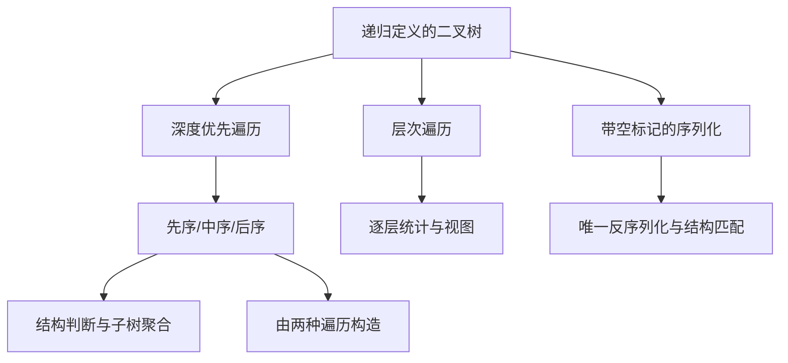

> 原书：李春葆、李筱驰《算法面试（全二册）》<br>
> 阅读范围：第 6 章 二叉树<br>
> 说明：本文按原书 6.1～6.5 顺序整理；“补充”用于补足证明与边界，明显排版或下标问题标为“勘误说明”。

## 0. 本章主线



本章有 23 个正文题目单元：6.2 十一题、6.3 六题、6.4 三题、6.5 三题。

## 6.1 二叉树概述

### 6.1.1 二叉树的定义

二叉树 $T$ 是有限结点集合：要么为空，要么由根 $r$ 与两棵互不相交的二叉树 $T_L,T_R$ 组成。左右子树有顺序，即只有左孩子和只有右孩子是不同结构。

结点的度是非空孩子数；度 0 为叶子。本文约定根深度为 0，树高 $h$ 为层数，空树高 0、单结点树高 1。

#### 满二叉树与完全二叉树

- 满二叉树：每个非叶结点都有两个孩子，叶子同层。高 $h$ 时第 $d$ 层最多 $2^d$ 个结点，总数

$$
1+2+\cdots+2^{h-1}=2^h-1.
$$

- 完全二叉树：除最后一层外都满，最后一层从左到右连续。它等于同高满二叉树删去最后一层最右侧连续若干叶子。

原书在布尔树题中所说“每个结点有 0 或 2 个孩子”是**严格/真二叉树**（full binary tree），不等同于完全二叉树（complete binary tree）。

#### 完全树的数组编号

根编号 0。结点 $i$ 的关系为

$$
parent(i)=\left\lfloor\frac{i-1}{2}\right\rfloor\quad(i>0),
$$

$$
left(i)=2i+1,\qquad right(i)=2i+2.
$$

推导：编号 $0..i-1$ 之前每个父位置预留两个连续孩子，父 $i$ 的两个位置紧跟在前 $i$ 个父的 $2i$ 个孩子之后。

#### 顺序存储与二叉链

顺序存储把结点放在层序编号处，稀疏斜树会产生大量空槽；完全树则紧凑，适合堆。二叉链结点保存 `val,left,right`，空间与真实结点数成正比，但不能从孩子直接找父亲。

> **勘误说明：** 原书 C++ 三参数构造函数把 `left/right`写成 `TreeNode` 值类型，成员却是指针；参数应为 `TreeNode*`。

### 6.1.2 二叉树的知识点

#### 深度优先遍历

把树分为根 $N$、左子树 $L$、右子树 $R$：

- 先序 NLR：根在子树前，适合自顶向下传状态与序列化；
- 中序 LNR：根把左右子树分开，是遍历构造的定位基准；
- 后序 LRN：孩子结果先得到，适合高度、子树和、布尔表达式等聚合。

递归正确性来自结构归纳：空树返回；假设算法正确遍历左右子树，按 N/L/R 指定次序组合，就恰好访问整树每个结点一次。时间 $O(n)$；递归栈 $O(h)$，最坏斜树 $O(n)$。

显式栈模拟递归。先序弹出结点后应先压右、再压左，利用 LIFO 让左先处理。中序不断压左链，弹出时访问，再转右。后序可产生 NRL 后整体逆置为 LRN。

#### 层次遍历

队列保存已发现但未访问结点。访问父结点时按左、右孩子入队，FIFO 保证浅层先于深层、同层从左到右。分层时在一轮开始记录 `levelSize=queue.size()`；这一批正好是当前层，新入队孩子属于下一层。

空树必须先返回；原书基础代码直接把空根入队并解引用，只适用于已知非空树。

#### 唯一构造定理

在**结点值互异**前提下：先序+中序、中序+后序、层序+中序均唯一确定二叉树。中序唯一定位根并划分左右集合，另一序列确定根及子树内部次序；对子树递归应用即可。只有先序+后序通常不唯一，因为无法判断单孩子在左还是右。

> **勘误说明：** 原书层序+中序示例说“由 level 尾元素可知根为 3”，应为首元素。

#### 序列化

只保存非空结点值的一种遍历，值重复或缺失孩子方向时不能唯一恢复。加入空标记 `#` 后，先序或层序可以表达结构。序列格式还必须有无歧义分隔符，否则 `1,23` 与 `12,3` 可能混淆。

#### C++17：全章共享结点定义

后续每道题的 C++ 代码都沿用这一结点类型；将对应函数与该定义放进同一源文件即可编译。

```cpp
struct TreeNode {
    int val;
    TreeNode* left;
    TreeNode* right;

    explicit TreeNode(int value = 0,
                      TreeNode* leftChild = nullptr,
                      TreeNode* rightChild = nullptr)
        : val(value), left(leftChild), right(rightChild) {}
};
```

树题画图时应把空孩子也视为结构信息。值序列相同不代表树相同；后续判断、构造和序列化代码都会直接体现这一点。

## 6.2 先序、中序和后序遍历应用

### 6.2.1 LeetCode 144：先序遍历（★）

#### 问题与难点

先序遍历要求按照“根、左子树、右子树”访问所有结点。递归定义直接写成

$$
pre(T)=[root]+pre(T_L)+pre(T_R),
$$

但非递归实现必须自己保存“访问完当前结点后，稍后还要回来处理哪些子树”。栈承担的正是递归调用栈的职责。

#### 解法一：递归

空树不产生元素；非空树先记录根值，再递归左、右。正确性可对结点数做归纳：单结点显然正确；假设左右子树均能得到正确先序序列，按根、左、右拼接就是整树的定义。

递归帧保存当前结点及返回位置。树高为 $h$ 时调用栈为 $O(h)$；斜树最坏 $h=n$，存在语言递归深度或系统栈溢出的边界。

#### 解法二：待访问结点栈

初始压入根。每轮弹出一个结点并访问，再把右孩子、左孩子依次压栈。之所以“右先左后”，是因为栈后进先出，下一轮必须先弹出左孩子。

循环不变量是：

1. `answer` 恰好是整树先序序列已经确定的前缀；
2. 栈顶到栈底按下一步应访问的先后，保存所有已发现但未访问的子树根；
3. 已访问结点与栈中待访问子树互不重叠，合起来覆盖全部已发现区域。

弹出当前最先应访问的根不会破坏第 1 条；右后左压栈使左子树整体仍排在右子树之前。栈空时所有结点都恰好访问一次。

#### 数值走查

对树 `3(9,20(15,7))`：

| 步骤 | 弹出并访问 | 压栈后（栈底→栈顶） | 答案 |
|---|---:|---|---|
| 1 | 3 | `[20,9]` | `[3]` |
| 2 | 9 | `[20]` | `[3,9]` |
| 3 | 20 | `[7,15]` | `[3,9,20]` |
| 4 | 15 | `[7]` | `[3,9,20,15]` |
| 5 | 7 | `[]` | `[3,9,20,15,7]` |

#### 解法三：沿左链模拟递归

指针 `current` 非空时立即访问并压栈，然后转向左孩子；左链结束后弹出最近祖先，转向它的右子树。这里栈保存“根已访问、左侧正在或已经处理、右侧尚未进入”的祖先现场。

每个结点至多压栈、弹栈一次，时间 $O(n)$。沿左链方案空间 $O(h)$；待访问栈的峰值与树形有关，最坏 $O(n)$。输出数组本身另占 $O(n)$。

#### C++17：待访问结点栈

```cpp
#include <stack>
#include <vector>

std::vector<int> preorderTraversal(TreeNode* root) {
    if (root == nullptr) return {};
    std::vector<int> answer;
    std::stack<TreeNode*> pending;
    pending.push(root);
    while (!pending.empty()) {
        TreeNode* node = pending.top();
        pending.pop();
        answer.push_back(node->val);
        if (node->right != nullptr) pending.push(node->right);
        if (node->left != nullptr) pending.push(node->left);
    }
    return answer;
}
```

右孩子先压、左孩子后压，保证 LIFO 下左子树先访问；这正对应上文样例栈状态。

### 6.2.2 LeetCode 94：中序遍历（★）

#### 问题为何比先序更难

中序顺序是“左子树、根、右子树”。到达根时不能立刻访问，因为整个左子树必须先完成；因此需要保存根，沿左边不断下降。递归版本中的“左递归返回后才访问根”必须由显式栈重现。

#### 迭代状态机

维护当前指针 `current` 和祖先栈：

1. `current != null`：把它压栈并转左，继续寻找当前子树最小结点；
2. `current == null`：弹出栈顶 `node`。它的左子树已经完成，此时访问 `node`，再令 `current=node.right`。

外层条件必须是“`current` 非空或栈非空”。只检查其中一个都会提前结束：刚转入右子树时栈可能为空；走到左侧空指针时栈仍保存待访问祖先。

#### 循环不变量与正确性

每次准备弹栈时，栈顶是所有尚未访问结点中，中序次序最靠前者：其左子树已处理，而它的祖先及右子树都应排在它后面。因此访问栈顶不会越过任何更小的中序位置。访问后进入右子树，再次沿其左链寻找该子树最先结点。

对样例树，栈与输出变化为：

```text
压入 3、9 -> 弹出 9，输出 [9]
弹出 3，输出 [9,3]，转入 20
压入 20、15 -> 弹出 15，输出 [9,3,15]
弹出 20，转入 7 -> 输出 [9,3,15,20,7]
```

#### 复杂度与适用边界

每个结点进栈、出栈各一次，时间 $O(n)$，栈峰值 $O(h)$。对 BST，中序值有序；对普通二叉树，中序只是一种结构次序，不能据此假设数值递增。

#### C++17：压左链，弹出时访问根

```cpp
#include <stack>
#include <vector>

std::vector<int> inorderTraversal(TreeNode* root) {
    std::vector<int> answer;
    std::stack<TreeNode*> ancestors;
    TreeNode* current = root;
    while (current != nullptr || !ancestors.empty()) {
        while (current != nullptr) {
            ancestors.push(current);
            current = current->left;
        }
        current = ancestors.top();
        ancestors.pop();
        answer.push_back(current->val);
        current = current->right;
    }
    return answer;
}
```

外层条件必须同时检查 `current` 与栈：左链走到空时栈仍有待访问祖先，刚转入右子树时栈又可能为空。

### 6.2.3 LeetCode 145：后序遍历（★）

#### 问题与方法选择

后序要求“左、右、根”。根必须等两个子树都完成后才能访问，所以单栈直接模拟时还要记住“右子树是否已访问”，状态比先序和中序复杂。原书选择更简单的等价变换：先生成 NRL，再整体逆置。

#### NRL 逆置推导

后序为

$$
L,R,N.
$$

将顺序完全逆置得到

$$
reverse(L,R,N)=N,reverse(R),reverse(L).
$$

对子树内部也采用相同的根—右—左生成规则，最终序列恰是 NRL；把整个结果逆置后恢复为 LRN。

迭代时先压左孩子、再压右孩子，右孩子会先弹出，从而生成根—右—左。对样例树：

```text
NRL 扫描结果：[3,20,7,15,9]
整体逆置结果：[9,15,7,20,3]
```

#### 正确性与复杂度

每个结点在 NRL 阶段恰访问一次。对任意子树，根先于右子树、右子树先于左子树；逆置后次序正好变成左、右、根，所以对每棵子树都满足后序定义。

时间为扫描 $O(n)$ 加逆置 $O(n)$，仍为 $O(n)$；显式栈和结果数组均可能为 $O(n)$。递归后序只需 $O(h)$ 调用栈，但输出仍为 $O(n)$。

> **勘误说明：** 题目段落误写“中序遍历是 `[9,3,15,20,7]`”；后序应为 `[9,15,7,20,3]`。

#### 补充：直接单栈后序

可用 `lastVisited` 记录最近完成的子树：观察栈顶时，若右孩子存在且尚未完成，就转入右子树；否则访问并弹出栈顶。它避免结果逆置，额外空间 $O(h)$，但分支状态更容易写错；面试中若没有必须直接输出的约束，原书的 NRL+逆置通常更稳妥。

#### C++17：生成 NRL 后整体逆置

```cpp
#include <algorithm>
#include <stack>
#include <vector>

std::vector<int> postorderTraversal(TreeNode* root) {
    if (root == nullptr) return {};
    std::vector<int> answer;
    std::stack<TreeNode*> pending;
    pending.push(root);
    while (!pending.empty()) {
        TreeNode* node = pending.top();
        pending.pop();
        answer.push_back(node->val);
        if (node->left != nullptr) pending.push(node->left);
        if (node->right != nullptr) pending.push(node->right);
    }
    std::reverse(answer.begin(), answer.end());
    return answer;
}
```

这里先压左、后压右，使弹出顺序为根—右—左；逆置后才是左—右—根。

### 6.2.4 LeetCode 965：单值二叉树（★）

#### 问题与方法

题目要求验证全称命题“每个结点值都等于同一个值”。因为题目保证至少一个结点，可把根值 $d=root.val$ 作为基准，再用任意完整遍历检查所有结点。

DFS 递归可定义为

$$
unival(u)=
\begin{cases}
true,&u=\varnothing,\\
(u.val=d)\land unival(u_L)\land unival(u_R),&\text{其他}.
\end{cases}
$$

空子树返回真是全称命题的“空真”约定，它不会引入反例。只要遇到不同值即可短路返回假。

#### 正确性与边界

若算法返回真，则每个被遍历结点都通过了 `val==d`，而遍历覆盖全部结点，所以树单值；若树中存在不同值，遍历最终会访问它并返回假。题目树非空；若扩展到空树，可以约定空树为单值，也可以按业务接口拒绝空输入，需明确约定。

最坏需要访问全部 $n$ 个结点，时间 $O(n)$；递归空间 $O(h)$，BFS 队列最坏 $O(w)$。平均提前终止不改变最坏复杂度。

#### C++17：根值作为全树基准

```cpp
bool isUnivalTree(TreeNode* root) {
    if (root == nullptr) return true;
    int expected = root->val;
    auto check = [&](auto&& self, TreeNode* node) -> bool {
        if (node == nullptr) return true;
        return node->val == expected &&
               self(self, node->left) &&
               self(self, node->right);
    };
    return check(check, root);
}
```

空子树返回真体现全称命题的空真；任一结点值不同都会短路。

### 6.2.5 LeetCode 100：相同的树（★）

#### 为什么要成对遍历

两棵树相同要求“相同位置同时存在、值相同、左右结构相同”。因此递归状态不是单个结点，而是结点对 $(p,q)$：

1. 二者都空：该对应位置相同；
2. 恰有一个空：结构不同；
3. 都非空但值不同：内容不同；
4. 否则继续比较 $(p.left,q.left)$ 与 $(p.right,q.right)$。

#### 不能只比较非空遍历序列

树 `1(null,2)` 与 `1(2,null)` 的先序非空值都是 `[1,2]`，结构却不同。只有连同空标记比较，或直接按对应位置递归，才能区分左右缺口。

#### 正确性与复杂度

递归返回真当且仅当根值相同且两对对应子树都相同，这与二叉树递归定义完全一致。首次差异可提前终止；最坏两树相同且各有 $n$ 个结点时访问所有对应位置，时间 $O(n)$，栈 $O(\max(h_p,h_q))$。若规模不同，精确上界可写为访问到首个结构差异前的结点对数。

#### C++17：对应位置成对递归

```cpp
bool sameTree(TreeNode* first, TreeNode* second) {
    if (first == nullptr || second == nullptr) return first == second;
    return first->val == second->val &&
           sameTree(first->left, second->left) &&
           sameTree(first->right, second->right);
}
```

先比较空状态，再访问值；否则单左孩子与单右孩子可能因值序列相同而被误判。

### 6.2.6 LeetCode 572：另一棵树的子树（★）

#### 两层问题分解

“`subRoot` 是子树”意味着存在主树结点 $u$，使以 $u$ 为根的**完整后代树**与 `subRoot` 相同。因此需要两个函数：

- `same(a,b)`：判断两棵根树完全相同；
- `contains(root,sub)`：当前根匹配，或在左子树找到，或在右子树找到。

递推式为

$$
contains(T,S)=same(T,S)\lor contains(T_L,S)\lor contains(T_R,S).
$$

短路次序只影响实际运行时间，不影响结论。

#### 正确性论证

若返回真，必有某次 `same(u,S)`为真，按定义 $S$ 是以 $u$ 为根的子树；若 $S$ 确实是子树，其根 $u$ 必在主树遍历中出现，到达该状态时 `same`返回真，所以不会漏解。

若主树 $n$ 个结点、候选树 $m$ 个结点，每个候选根的同树比较最坏 $O(m)$，总计 $O(nm)$。大量相同值和链状结构会逼近该上界。递归栈最坏 $O(h_T+h_S)$。

#### 补充：替代方案

带空标记的先序序列化把结构转为 token 序列，再用 KMP 可做到 $O(n+m)$；树哈希可平均线性，但必须处理碰撞。子树不是“删掉若干孩子后能相同”的嵌入关系，不能忽略多出的后代。

#### C++17：枚举主树根并调用完整同树判断

```cpp
bool isSubtree(TreeNode* root, TreeNode* subRoot) {
    if (subRoot == nullptr) return true;
    if (root == nullptr) return false;
    return sameTree(root, subRoot) ||
           isSubtree(root->left, subRoot) ||
           isSubtree(root->right, subRoot);
}
```

该函数复用上一题的 `sameTree`。外层枚举候选根，内层验证完整结构，正对应“两层问题分解”。

### 6.2.7 LeetCode 543：二叉树直径（★）

#### 问题中的长度口径

直径是任意两结点简单路径的最大**边数**，不要求经过整树根。若一条路径含 $q$ 个结点，其长度是 $q-1$，这是最常见的加一错误来源。

令 `depth(u)`为以 $u$ 为根的最长向下路径的结点数，空树为 0：

$$
depth(u)=1+\max(depth(u_L),depth(u_R)).
$$

以 $u$ 为路径最高点的直径边数为

$$
depth(u_L)+depth(u_R).
$$

任意两结点路径有唯一最低公共祖先，故枚举每个结点作最高分割点不会漏解。后序一次同时返回深度并更新全局最大值，时间 $O(n)$、空间 $O(h)$。

#### 数值演算

对 `3(9,20(15,7))`，叶子 9、15、7 的深度均为 1。结点 20 的左右深度为 1、1，候选直径为 2，返回深度 2；根 3 的左右深度为 1、2，候选直径为 $1+2=3$，对应路径 `9-3-20-15`。

#### 为什么合并两次遍历

朴素方法对每个结点重新计算左右深度，斜树最坏 $O(n^2)$。后序在返回深度的同一时刻计算候选直径，每棵子树摘要只求一次，降为 $O(n)$。全局答案是副作用；也可返回二元组 `(depth,bestDiameter)`，使函数更纯粹。

#### C++17：后序返回深度并更新直径

```cpp
#include <algorithm>

int diameterDepth(TreeNode* root, int& best) {
    if (root == nullptr) return 0;
    int leftDepth = diameterDepth(root->left, best);
    int rightDepth = diameterDepth(root->right, best);
    best = std::max(best, leftDepth + rightDepth);
    return 1 + std::max(leftDepth, rightDepth);
}

int diameterOfBinaryTree(TreeNode* root) {
    int best = 0;
    diameterDepth(root, best);
    return best;
}
```

返回值是“向下最长路径的结点数”，全局候选却是左右深度之和得到的边数。把这两个口径混用会产生加一错误。

### 6.2.8 LeetCode 563：二叉树坡度（★）

#### 后序返回值的设计

父结点计算坡度需要左右子树的**结点值总和**，所以递归函数不能只返回坡度。令函数返回子树和，并把本结点坡度累加到外部答案：

后序函数返回子树和

$$
sum(u)=u.val+sum(u_L)+sum(u_R),
$$

并累计

$$
tilt(u)=|sum(u_L)-sum(u_R)|.
$$

整树坡度是所有结点坡度之和。子树和必须在父结点计算前得到，因此后序自然。时间 $O(n)$、空间 $O(h)$；大值工程实现应使用足够宽整数。

例如树 `1(2,3)`：两个叶子的左右子树和均为 0，各自坡度为 0；根左右和为 2、3，根坡度 $|2-3|=1$，整树答案为 1，根子树和返回 $1+2+3=6$。

正确性来自后序归纳：左右递归已准确返回各自全部结点和，因此差的绝对值正是定义中的当前坡度；每个结点恰累计一次。结点值可能为负，但绝对差定义仍成立。

#### C++17：后序返回子树和并累计坡度

```cpp
#include <cstdlib>

long long tiltSum(TreeNode* root, long long& total) {
    if (root == nullptr) return 0;
    long long leftSum = tiltSum(root->left, total);
    long long rightSum = tiltSum(root->right, total);
    total += std::llabs(leftSum - rightSum);
    return root->val + leftSum + rightSum;
}

long long findTilt(TreeNode* root) {
    long long total = 0;
    tiltSum(root, total);
    return total;
}
```

父结点需要的是子树和，不是子树坡度；所以递归返回和，坡度通过引用参数累计。这是后序“返回摘要 + 更新答案”的典型结构。

### 6.2.9 LeetCode 2331：布尔二叉树求值（★）

#### 表达式树模型

叶值 0/1 是操作数；内部值 2/3 分别是 OR/AND 运算符，且每个内部结点恰有两个孩子。树结构就是带括号的布尔表达式，父运算必须等待两个子表达式结果，因此使用后序。

递推为

$$
value(u)=
\begin{cases}
u.val=1,&u\text{ 为叶子},\\
value(u_L)\lor value(u_R),&u.val=2,\\
value(u_L)\land value(u_R),&u.val=3.
\end{cases}
$$

对样例 `2(1,3(0,1))`，右子树为 $false\land true=false$，根为 $true\lor false=true$。

结构归纳可证每个子树返回其对应表达式值。时间 $O(n)$、栈 $O(h)$。补充的短路求值可在 OR 左侧为真或 AND 左侧为假时跳过右子树，但原书完整求两侧更直接；题目保证内部结点孩子完整，普通“完全二叉树”术语不应与此混淆。

#### C++17：树结构就是表达式括号结构

```cpp
#include <stdexcept>

bool evaluateTree(TreeNode* root) {
    if (root->left == nullptr && root->right == nullptr) {
        return root->val == 1;
    }
    if (root->val == 2) {
        return evaluateTree(root->left) || evaluateTree(root->right);
    }
    if (root->val == 3) {
        return evaluateTree(root->left) && evaluateTree(root->right);
    }
    throw std::logic_error("非法运算符");
}
```

内部结点只有在两个子表达式被递归求值后才能计算，后序顺序由表达式依赖自然推出。

### 6.2.10 LeetCode 199：右视图（★★）

#### 右视图到底取什么

从右侧看到的是每一深度最靠右的实际结点，与结点值大小无关。原书 DFS 按根—左—右访问，同层后访问的右侧结点覆盖先前值；遍历结束后 `answer[depth]` 就是最右值。

以 `1(2(null,5),3(null,4))` 为例：深度 0 写入 1；深度 1 先写 2 后被 3 覆盖；深度 2 先写 5 后被 4 覆盖，得到 `[1,3,4]`。

#### 正确性与替代顺序

左先右后的先序在同一层按从左到右的相对次序访问，最后一次写入必是最右结点。更直接的**补充**方案按根—右—左遍历，每层第一次到达就记录，避免覆盖；BFS 则记录每层最后一个出队结点。

> **勘误说明：** `ans[h]`存第 $h$ 层最右结点值，不是“最大值”；右视图取位置，不比较数值大小。

时间 $O(n)$、递归空间 $O(h)$。若只想获得右视图，右先 DFS 虽可能在某些逻辑中提前确定每层答案，仍需遍历到所有能产生新深度的分支，最坏不优于线性。

#### C++17（补充方案）：右先 DFS，每层首次到达即记录

```cpp
#include <vector>

void collectRightView(TreeNode* root, int depth, std::vector<int>& answer) {
    if (root == nullptr) return;
    if (depth == static_cast<int>(answer.size())) {
        answer.push_back(root->val);
    }
    collectRightView(root->right, depth + 1, answer);
    collectRightView(root->left, depth + 1, answer);
}

std::vector<int> rightSideView(TreeNode* root) {
    std::vector<int> answer;
    collectRightView(root, 0, answer);
    return answer;
}
```

右子树先访问使每一深度首次遇到的结点最靠右。若改回左先右后，就必须允许后访问结点覆盖同层旧值。

### 6.2.11 LeetCode 662：二叉树最大宽度（★★）

#### 为什么不能只数非空结点

宽度计算同层最左、最右非空结点之间在完全树中的槽位数，中间空位也算。例如某层只有编号 7 和 14 两个实际结点，宽度是 $14-7+1=8$，不是 2。

给实际结点赋同高完全树编号。第 $h$ 层最左、最右非空编号为 $L_h,R_h$，包含中间空位的宽度

$$
W_h=R_h-L_h+1,
\qquad W=\max_h W_h.
$$

DFS 左先右后可记录每层首次编号与最后编号。深树中 $2i+1/2i+2$ 会指数增长并溢出；补充的稳健 BFS 在每层把所有编号减去该层首编号，只保留相对位置，宽度不变，因为

$$
(R_h-L_h)=(R_h-c)-(L_h-c).
$$

时间 $O(n)$，队列/层记录空间 $O(w)$ 或递归 $O(h)$。

#### 编号归一化与溢出

深度为 $d$ 的极端位置编号约为 $2^d$，即使结点数不多，固定宽度整数也可能溢出。对每层令首编号为 $c$，把该层所有编号替换为 $i-c$。父子相对编号继续按 $2(i-c)+1/2(i-c)+2$传播，层内差值不变：

$$
(R_h-c)-(L_h-c)+1=R_h-L_h+1.
$$

循环不变量是队列中每个 `(node,index)` 的 `index` 等于该结点在当前归一化完全树坐标中的位置。每层首尾坐标直接给出宽度。

归一化只消除本层所有坐标的**共同偏移** $c$，并不压缩两个实际结点之间的真实槽位跨度。若某层真实宽度本身超过 64 位，归一化后的 `position`、下一层的 `2 * position + offset` 或最终宽度仍会溢出。下方实现使用 `unsigned long long` 的安全性依赖 LeetCode 662 保证答案处于 32 位有符号整数范围；通用库实现应改用大整数，或在乘 2、加偏移和计算宽度前检测溢出并显式报告。

#### 方法边界

DFS 可记录每层首次编号并用当前编号计算宽度，空间 $O(h)$，但也必须使用足够宽整数并逐层归一化；归一化与足够宽的数值类型缺一不可。BFS 更自然地获得同层首尾，空间峰值 $O(w)$。两者时间均为 $O(n)$。

#### C++17：逐层归一化完全树编号

```cpp
#include <algorithm>
#include <queue>
#include <utility>

unsigned long long widthOfBinaryTree(TreeNode* root) {
    if (root == nullptr) return 0;
    using Item = std::pair<TreeNode*, unsigned long long>;
    std::queue<Item> queue;
    queue.push({root, 0});
    unsigned long long answer = 0;

    while (!queue.empty()) {
        int levelSize = static_cast<int>(queue.size());
        unsigned long long base = queue.front().second;
        unsigned long long left = 0, right = 0;
        for (int index = 0; index < levelSize; ++index) {
            auto [node, rawPosition] = queue.front();
            queue.pop();
            unsigned long long position = rawPosition - base;
            if (index == 0) left = position;
            if (index == levelSize - 1) right = position;
            if (node->left != nullptr) queue.push({node->left, 2 * position + 1});
            if (node->right != nullptr) queue.push({node->right, 2 * position + 2});
        }
        answer = std::max(answer, right - left + 1);
    }
    return answer;
}
```

每层减去首编号只做坐标平移，不改变首尾差；它避免无关的绝对编号随深度增长，却不能表示超出整数类型范围的真实宽度。

## 6.3 二叉树层次遍历应用

### 6.3.1 LeetCode 102：层次遍历（★★）

#### 问题与核心难点

普通 BFS 只给出一条扁平序列；本题需要 `[[第0层],[第1层],...]`，所以必须知道何时一层结束。原书给出三种边界编码方式，它们本质上都在维护“当前队列前缀属于同一层”。

#### 方法一：结点携带层号

队列元素是 `(node,depth)`。出队深度与当前深度相同就追加；首次遇到更大深度时封存上一层。优点是概念直接，也能随时知道任意结点深度；缺点是每个元素多存一个整数，并要处理最后一层收尾。

#### 方法二：记录当前层最后结点

变量 `last` 指向当前层最右结点；每当出队结点等于 `last`，当前层结束。遍历该层时最后入队的孩子就是下一层 `last`。实现必须区分“本轮最后发现的孩子”和旧值，叶子层没有孩子时不能误用上层遗留指针。

#### 方法三：固定轮首队列长度

轮开始时令

$$
s=queue.size().
$$

此刻队列恰好包含当前层所有结点。接下来只出队 $s$ 次；新加入的孩子位于队尾，留给下一轮。这种写法状态最少，也是前几章分层 BFS 的标准模板。

对样例树：轮 1 的 $s=1$ 输出 `[3]` 并入队 9、20；轮 2 的 $s=2$ 输出 `[9,20]` 并入队 15、7；轮 3 输出 `[15,7]`。

#### 正确性与复杂度

归纳地，根轮开始时队列恰含第 0 层；若某轮开始恰含第 $d$ 层，处理完这批结点后，它们按左、右顺序产生且只产生第 $d+1$ 层，因此下一轮不变量成立。每结点进出队一次，时间 $O(n)$；队列峰值 $O(w)$，其中 $w$ 是最大层结点数；结果本身 $O(n)$。

#### C++17：固定轮首队列长度切分层

```cpp
#include <queue>
#include <utility>
#include <vector>

std::vector<std::vector<int>> levelOrder(TreeNode* root) {
    if (root == nullptr) return {};
    std::queue<TreeNode*> queue;
    queue.push(root);
    std::vector<std::vector<int>> answer;
    while (!queue.empty()) {
        int levelSize = static_cast<int>(queue.size());
        std::vector<int> level;
        for (int index = 0; index < levelSize; ++index) {
            TreeNode* node = queue.front();
            queue.pop();
            level.push_back(node->val);
            if (node->left != nullptr) queue.push(node->left);
            if (node->right != nullptr) queue.push(node->right);
        }
        answer.push_back(std::move(level));
    }
    return answer;
}
```

`levelSize` 在轮首固定，新入队孩子留给下一轮；若循环条件直接使用不断变化的 `queue.size()`，层边界会被打乱。

### 6.3.2 LeetCode 199：右视图（★★）

#### 从层序结果提取视图

右视图只需要每层从左到右序列的最后一项。使用固定层大小 $s$ 的 BFS，循环下标 $i=s-1$ 时出队的结点就是该层最右实际结点，把它加入答案。

这不是“最右槽位”或“最大数值”：即使最右孩子前有许多空位置，也只返回最右非空结点的值。

#### 与 DFS 的取舍

- BFS：层边界天然可见，队列空间 $O(w)$；
- 右先 DFS：每层第一次访问即答案，递归空间 $O(h)$；
- 原书左先 DFS：同层不断覆盖，最后值为答案。

三者时间均为 $O(n)$。宽而浅的树 DFS 更省辅助空间，极深斜树迭代 BFS 可避免递归深度风险。

#### C++17：记录每层最后一个出队结点

```cpp
#include <queue>
#include <vector>

std::vector<int> rightSideViewBfs(TreeNode* root) {
    if (root == nullptr) return {};
    std::queue<TreeNode*> queue;
    queue.push(root);
    std::vector<int> answer;
    while (!queue.empty()) {
        int levelSize = static_cast<int>(queue.size());
        for (int index = 0; index < levelSize; ++index) {
            TreeNode* node = queue.front();
            queue.pop();
            if (index == levelSize - 1) answer.push_back(node->val);
            if (node->left != nullptr) queue.push(node->left);
            if (node->right != nullptr) queue.push(node->right);
        }
    }
    return answer;
}
```

孩子按左、右入队，因此同层最后出队的是最右实际结点；它与 6.2.10 的右先 DFS 是同一目标的两种遍历顺序。

### 6.3.3 LeetCode 637：层平均值（★）

#### 计算过程

一层含 $s$ 个结点、值和为 $S$，平均值

$$
\bar x=\frac Ss.
$$

分层 BFS 在固定的 $s$ 次出队中累加 `sum`，轮末计算 `sum / s`。样例第二层 `[9,20]`：

$$
\bar x=\frac{9+20}{2}=14.5.
$$

#### 数值与类型边界

不能先做整数除法再转浮点，否则小数部分已经丢失。结点值可达 32 位且一层可有大量结点，32 位累加可能溢出，应使用 `long long`、`int64` 或浮点和。

每结点参与一次加法，时间 $O(n)$；队列空间 $O(w)$，答案长度等于树高 $O(h)$。题目保证非空；通用函数对空树应返回空数组，而不是除以 0。

#### C++17：逐层使用宽整数累计

```cpp
#include <queue>
#include <vector>

std::vector<double> averageOfLevels(TreeNode* root) {
    if (root == nullptr) return {};
    std::queue<TreeNode*> queue;
    queue.push(root);
    std::vector<double> answer;
    while (!queue.empty()) {
        int levelSize = static_cast<int>(queue.size());
        long long sum = 0;
        for (int index = 0; index < levelSize; ++index) {
            TreeNode* node = queue.front();
            queue.pop();
            sum += node->val;
            if (node->left != nullptr) queue.push(node->left);
            if (node->right != nullptr) queue.push(node->right);
        }
        answer.push_back(static_cast<double>(sum) / levelSize);
    }
    return answer;
}
```

先用 `long long` 得到精确层和，再转浮点除以层大小；不能先做整数除法再转型。

### 6.3.4 LeetCode 2471：逐层排序最少交换（★★）

#### 问题分解

不同层之间不能交换，所以总最少次数等于各层最少交换次数之和。BFS 只负责提取当前层数组，核心转化成“用任意两位置交换把互异数组排成升序”。

每层值互异。把当前数组映射到排序后目标位置，形成下标置换。一个长度为 $c$ 的置换环至少需 $c-1$ 次交换：一次交换最多让环数增加 1，而把一个环拆成 $c$ 个固定点确实可用 $c-1$ 次。因此若层长 $m$、置换环数 $r$：

$$
minSwaps=m-r.
$$

#### 数值演算

对一层 `a=[3,1,2]`，排序结果 `[1,2,3]`。原下标到目标下标的置换是

$$
0\to2,\quad2\to1,\quad1\to0,
$$

构成一个长度 3 的环，所以最少 $3-1=2$ 次。可交换位置 0、1 得 `[1,3,2]`，再交换 1、2 得 `[1,2,3]`。

原书用“把正确值交换到当前位置”实现同一环拆解。若维护 `value -> currentIndex`，每次交换后必须同时更新两个值的位置；否则映射已过期。另一种实现直接遍历置换环，不修改原数组，更易证明。

#### 复杂度边界

一层 $m$ 个值排序为 $O(m\log m)$，环遍历 $O(m)$。所有层总排序代价

$$
\sum_d O(m_d\log m_d)\le O(n\log n).
$$

层数组、排序副本和映射峰值 $O(w)$。值互异是“一值对应唯一目标位置”的必要条件；有重复值时最少交换排序更复杂。

#### C++17：每层按置换环计算最少交换

```cpp
#include <algorithm>
#include <queue>
#include <utility>
#include <vector>

int minimumSwapsToSort(const std::vector<int>& values) {
    std::vector<std::pair<int, int>> ordered;
    for (int index = 0; index < static_cast<int>(values.size()); ++index) {
        ordered.push_back({values[index], index});
    }
    std::sort(ordered.begin(), ordered.end());
    std::vector<bool> visited(values.size(), false);
    int swaps = 0;
    for (int start = 0; start < static_cast<int>(values.size()); ++start) {
        if (visited[start] || ordered[start].second == start) continue;
        int cycleSize = 0;
        for (int current = start; !visited[current];
             current = ordered[current].second) {
            visited[current] = true;
            ++cycleSize;
        }
        swaps += cycleSize - 1;
    }
    return swaps;
}

int minimumOperations(TreeNode* root) {
    if (root == nullptr) return 0;
    std::queue<TreeNode*> queue;
    queue.push(root);
    int answer = 0;
    while (!queue.empty()) {
        int levelSize = static_cast<int>(queue.size());
        std::vector<int> values;
        for (int index = 0; index < levelSize; ++index) {
            TreeNode* node = queue.front();
            queue.pop();
            values.push_back(node->val);
            if (node->left != nullptr) queue.push(node->left);
            if (node->right != nullptr) queue.push(node->right);
        }
        answer += minimumSwapsToSort(values);
    }
    return answer;
}
```

树 BFS 只负责提取每层数组；最少交换来自置换环公式 $m-r$，不要把两个问题揉成难以证明的就地树操作。

### 6.3.5 LeetCode 2415：反转奇数层（★★）

#### 反转对象与操作

根为第 0 层。分层收集当前层结点地址，若深度为奇数，就交换

$$
level[i].val\leftrightarrow level[m-1-i].val,
\qquad0\le i<\left\lfloor\frac m2\right\rfloor.
$$

例如第 1 层值 `[3,5]` 变为 `[5,3]`，第 3 层则首尾、次首尾依次交换。

> **表述澄清：** 原书说“将 curp 中结点逆置”，题目实际要求反转该层结点值；若重排结点指针，会改变树结构。

#### 为什么题目强调完美树

完美树每个内部结点有两个孩子、同层位置关于根严格镜像，因此还可递归处理一对镜像结点 `(left,right)`：在奇数深度交换二者值，再递归 `(left.left,right.right)` 与 `(left.right,right.left)`。这个**补充**方案空间 $O(h)$，无需保存整层。

BFS 对实际结点序列做值反转也能推广到普通树，但那不一定对应结构位置的镜像语义。时间 $O(n)$；BFS 空间 $O(w)$，镜像递归空间 $O(h)$。

#### C++17：递归镜像结点对，只交换值

```cpp
#include <utility>

void reverseMirror(TreeNode* left, TreeNode* right, int depth) {
    if (left == nullptr || right == nullptr) return;
    if (depth % 2 == 1) std::swap(left->val, right->val);
    reverseMirror(left->left, right->right, depth + 1);
    reverseMirror(left->right, right->left, depth + 1);
}

TreeNode* reverseOddLevels(TreeNode* root) {
    if (root != nullptr) reverseMirror(root->left, root->right, 1);
    return root;
}
```

完美树保证镜像结点成对存在。代码只交换 `val`，不会改变任何左右孩子指针。

### 6.3.6 LeetCode 1602：最近右侧结点（★★）

#### 为什么必须识别层边界

普通 BFS 中，`u` 后面的队头可能是同层下一个结点，也可能是下一层首结点。固定本层大小 $s$ 后，若 `u` 是第 $i$ 个出队结点：

- $i<s-1$：本层还有结点，下一次出队者就是最近右侧结点；
- $i=s-1$：`u` 是本层最右结点，返回空。

最稳妥实现是在本层数组/循环中直接返回 `queue.front`，或保存前一个结点并在访问下一个同层结点时命中。

#### 队列顺序论证

一轮开始时，当前层全部结点已在队列前缀。处理 `u` 时即使把孩子加入队尾，尚未出队的同层结点仍排在所有孩子之前。因此只要确认 $i<s-1$，队头就是目标。

必须比较 `node is u` 的身份，不应只比较值；即使题目值唯一，接口语义仍传入一个具体结点。最坏访问到 $u$ 所在位置，时间 $O(n)$、空间 $O(w)$，找到后可立即终止。

#### C++17：层内下标决定队头是否仍是同层

```cpp
#include <queue>

TreeNode* findNearestRightNode(TreeNode* root, TreeNode* target) {
    if (root == nullptr) return nullptr;
    std::queue<TreeNode*> queue;
    queue.push(root);
    while (!queue.empty()) {
        int levelSize = static_cast<int>(queue.size());
        for (int index = 0; index < levelSize; ++index) {
            TreeNode* node = queue.front();
            queue.pop();
            if (node == target) {
                return index == levelSize - 1 ? nullptr : queue.front();
            }
            if (node->left != nullptr) queue.push(node->left);
            if (node->right != nullptr) queue.push(node->right);
        }
    }
    return nullptr;
}
```

即使队列非空，目标若是本层最后一个，队头已经属于下一层，所以必须结合 `index` 与 `levelSize` 判断。

## 6.4 构造二叉树的算法设计

### 6.4.1 LeetCode 105：先序 + 中序（★★）

#### 问题为何需要两种遍历

先序能立即告诉当前子树的根，却不能单独判断哪些后续值属于左子树；中序能在根位置左右划分子树，却不能单独判断整树根。二者结合后，根与左右规模都确定。

先序区间 `pre[ps..ps+n)` 的首值为根。它在中序 `in[is..is+n)` 的位置为 $p$，左子树大小

$$
k=p-is.
$$

区间划分：

| 子树 | 先序区间 | 中序区间 |
|---|---|---|
| 左 | $[ps+1,ps+1+k)$ | $[is,is+k)$ |
| 右 | $[ps+1+k,ps+n)$ | $[p+1,is+n)$ |

右子树先序起点的推导是：跳过 1 个根和 $k$ 个左子树结点，所以为 $ps+1+k$；右子树长度是 $n-k-1$。

#### 样例走查

`pre=[3,9,20,15,7]`、`in=[9,3,15,20,7]`：先序首值 3 是根；中序中 3 左边只有 `[9]`，故左子树大小 1；右侧中序为 `[15,20,7]`，对应右侧先序从下标 $0+1+1=2$ 开始，即 `[20,15,7]`。递归可知 20 的左右孩子是 15、7。

#### 正确性证明

对区间长度 $n$ 归纳。$n=0$ 返回空。$n>0$ 时，先序首值必为根；值互异使它在中序中的位置唯一，左右集合与大小唯一。递归假设能正确构造两个更短区间，把它们接到根两侧就得到唯一原树。

> **勘误说明：** 原书文字把右子树先序起点写成类似 `i+k-1`，递归调用和正确推导均应为 `i+k+1`。

每层线性扫描中序找根，斜树最坏 $O(n^2)$。预建“中序值 -> 下标”映射后每结点定位 $O(1)$，总时间 $O(n)$；映射 $O(n)$、递归栈 $O(h)$、输出结点 $O(n)$。无重复值和两序列一致是成立前提。

#### C++17：先序首值定根，中序位置定规模

```cpp
#include <functional>
#include <unordered_map>
#include <vector>

TreeNode* buildTreePreIn(const std::vector<int>& preorder,
                         const std::vector<int>& inorder) {
    std::unordered_map<int, int> position;
    for (int index = 0; index < static_cast<int>(inorder.size()); ++index) {
        position[inorder[index]] = index;
    }

    std::function<TreeNode*(int, int, int)> build =
        [&](int preorderStart, int inorderLeft, int inorderRight) -> TreeNode* {
            if (inorderLeft >= inorderRight) return nullptr;
            int rootValue = preorder[preorderStart];
            int middle = position[rootValue];
            int leftSize = middle - inorderLeft;
            TreeNode* root = new TreeNode(rootValue);
            root->left = build(preorderStart + 1, inorderLeft, middle);
            root->right = build(
                preorderStart + 1 + leftSize,
                middle + 1,
                inorderRight
            );
            return root;
        };
    return build(0, 0, static_cast<int>(inorder.size()));
}
```

右子树先序起点明确跳过“根 1 个 + 左子树 `leftSize` 个”，因此是 `preorderStart+1+leftSize`。

### 6.4.2 LeetCode 106：中序 + 后序（★★）

#### 区间推导

后序 `post[ps..ps+n)` 的末值为根；中序根左边 $k$ 个结点属于左子树：

| 子树 | 后序区间 | 中序区间 |
|---|---|---|
| 左 | $[ps,ps+k)$ | $[is,is+k)$ |
| 右 | $[ps+k,ps+n-1)$ | $[p+1,is+n)$ |

后序右区间不含末尾根，因此结束位置是 $ps+n-1$（左闭右开）。右子树长度仍为 $n-k-1$。

样例 `post=[9,15,7,20,3]` 的末值 3 为根；中序左侧大小 1，因此左后序 `[9]`，右后序 `[15,7,20]`；右子树末值 20 为根，再由中序分得孩子 15、7。

#### 正确性与复杂度

证明与先序方案对称：后序末值唯一确定根，中序唯一划分左右集合，后序按已知左右大小切片。预建中序位置映射后时间 $O(n)$，映射 $O(n)$、栈 $O(h)$。若使用全局后序指针从末端向前构造，必须**先构造右子树再构造左子树**，否则消费顺序相反。

#### C++17：后序区间末值定根

```cpp
#include <functional>
#include <unordered_map>
#include <vector>

TreeNode* buildTreeInPost(const std::vector<int>& inorder,
                          const std::vector<int>& postorder) {
    std::unordered_map<int, int> position;
    for (int index = 0; index < static_cast<int>(inorder.size()); ++index) {
        position[inorder[index]] = index;
    }

    std::function<TreeNode*(int, int, int)> build =
        [&](int postorderStart, int inorderLeft, int inorderRight) -> TreeNode* {
            int size = inorderRight - inorderLeft;
            if (size == 0) return nullptr;
            int rootValue = postorder[postorderStart + size - 1];
            int middle = position[rootValue];
            int leftSize = middle - inorderLeft;
            TreeNode* root = new TreeNode(rootValue);
            root->left = build(postorderStart, inorderLeft, middle);
            root->right = build(
                postorderStart + leftSize,
                middle + 1,
                inorderRight
            );
            return root;
        };
    return build(0, 0, static_cast<int>(inorder.size()));
}
```

递归参数 `postorderStart + size - 1` 直接定位当前子树后序末尾根，左右长度由中序切分得到。

### 6.4.3 LeetCode 2196：根据描述创建二叉树（★★）

#### 从边集合恢复有根树

每条描述 `(parent,child,isLeft)` 是一条有方向、带左右标签的边。问题分为两步：确保同一值始终对应同一结点对象，然后找唯一入度为 0 的根。

用映射 `nodes[value]`按需创建结点；若 `isLeft=1` 设置父结点左指针，否则设置右指针；把每个 `child`加入子结点集合。最终根满足

$$
root\in allNodes\setminus childNodes.
$$

样例 `[1,2,1],[2,3,0],[3,4,1]` 中，全部值为 `{1,2,3,4}`，子集合为 `{2,3,4}`，差集唯一元素 1 就是根。

#### 正确性与输入边界

有效树中除根外每个结点恰有一个父亲，所以所有非根值都出现于 child 集合，根从不出现；差集必且仅有根。映射保证先作为 child、后作为 parent 的值仍复用同一对象。

题目保证描述有效。通用实现还需拒绝：同一孩子有两个父亲、同一父亲左/右槽冲突、多个根、环或不连通组件。平均时间、空间均为 $O(n)$；若使用有序映射则为 $O(n\log n)$。

#### C++17：结点池复用身份，子集合排除非根

```cpp
#include <unordered_map>
#include <unordered_set>
#include <vector>

TreeNode* createBinaryTree(const std::vector<std::vector<int>>& descriptions) {
    std::unordered_map<int, TreeNode*> nodes;
    std::unordered_set<int> children;
    auto getNode = [&](int value) -> TreeNode* {
        auto [iterator, inserted] = nodes.emplace(value, nullptr);
        if (inserted) iterator->second = new TreeNode(value);
        return iterator->second;
    };

    for (const auto& description : descriptions) {
        TreeNode* parent = getNode(description[0]);
        TreeNode* child = getNode(description[1]);
        if (description[2] == 1) parent->left = child;
        else parent->right = child;
        children.insert(description[1]);
    }
    for (const auto& [value, node] : nodes) {
        if (!children.count(value)) return node;
    }
    return nullptr;
}
```

同一个值无论先作为 child 还是 parent，`nodes` 都返回同一指针；根是结点全集减去子结点集合的唯一元素。

## 6.5 二叉树序列化的算法设计

### 6.5.1 LeetCode 297：序列化与反序列化（★★★）

#### 设计协议要解决什么

序列化不只是“输出遍历值”，而是设计一个可逆协议。协议必须区分空树、负数、多位数、左右缺失和 token 边界，并约定是否允许省略末尾空标记。

#### 层序方案

队列中允许空指针：非空结点输出值并将两个孩子入队；空指针输出 `#`，不再扩展。可去掉末尾连续空标记以缩短编码，但反序列化必须容许缺省后缀为空。

反序列化先读根，再按队列中的父结点顺序每次读取至多两个 token 作为左右孩子。格式必须定义空树、分隔符、非法 token 与多余 token 的处理。

例如树 `3(9,20(15,7))` 的完整层序 token 可写为：

```text
3,9,20,#,#,15,7,#,#,#,#
```

处理父结点 3 时消费 9、20；处理 9 时消费 `#,#`；处理 20 时消费 15、7。队列不变量是：队中父结点的孩子 token 尚未消费，且消费顺序与序列中剩余 token 一致。

#### 先序方案

定义编码

$$
S(T)=
\begin{cases}
\#, & T=\varnothing,\\
value(root),S(T_L),S(T_R), & \text{其他}.
\end{cases}
$$

反序列化顺序消费 token：`#`返回空；值 token 创建根，递归消费左、右子树。结构归纳可证互逆：空树显然；非空树的根 token 唯一确定根，随后两个递归编码分别唯一恢复左右子树。

样例先序编码为：

```text
3,9,#,#,20,15,#,#,7,#,#
```

解析游标每次调用恰消费一棵子树的完整编码。若 token 为值，随后两次递归分别消费左、右子树，因此返回时游标正好位于下一棵子树开头。

#### 正确性、复杂度与错误输入

对树结构归纳可证 `deserialize(serialize(T))=T`。每个非空结点和每个空孩子位置只编码/解析一次，时间与字符串空间 $O(n)$，递归栈 $O(h)$；层序队列为 $O(w)$。

原书把数字后加逗号而 `#`不加逗号也可解析，但统一分隔更稳健。生产协议还应检测 token 提前耗尽、数字非法、解析后仍有多余 token 等情况；LeetCode 通常只传由自身 `serialize`产生的合法字符串。

#### C++17：带空标记的先序可逆协议

```cpp
#include <sstream>
#include <string>

class Codec {
public:
    std::string serialize(TreeNode* root) const {
        if (root == nullptr) return "#";
        return std::to_string(root->val) + "," +
               serialize(root->left) + "," + serialize(root->right);
    }

    TreeNode* deserialize(const std::string& data) const {
        std::stringstream stream(data);
        return parse(stream);
    }

private:
    TreeNode* parse(std::stringstream& stream) const {
        std::string token;
        if (!std::getline(stream, token, ',')) return nullptr;
        if (token == "#") return nullptr;
        TreeNode* root = new TreeNode(std::stoi(token));
        root->left = parse(stream);
        root->right = parse(stream);
        return root;
    }
};
```

每次 `parse` 恰消费一棵子树的完整 token。样例编码 `3,9,#,#,20,15,#,#,7,#,#` 可按根、左、右递归唯一恢复。

### 6.5.2 LeetCode 100：相同的树（★）

#### 为什么字符串比较可行

若序列化编码是单射，则

$$
T_1=T_2\iff S(T_1)=S(T_2).
$$

带空标记先序满足单射，所以可比较字符串。比如 `1(null,2)` 编码 `1,#,2,#,#`，`1(2,null)` 编码 `1,2,#,#,#`，结构差异不会被值序列掩盖。

两棵树各序列化一次，时间 $O(n+m)$，中间字符串空间 $O(n+m)$。直接成对递归比较更省中间空间，并能在首个差异处提前终止；序列化方案的价值在于已有编码、跨进程传输或希望复用统一结构指纹时。

#### C++17：复用单射编码比较

```cpp
bool sameTreeBySerialization(TreeNode* first, TreeNode* second) {
    Codec codec;
    return codec.serialize(first) == codec.serialize(second);
}
```

这段代码依赖上一题协议的单射性。若去掉 `#`，单左与单右结构可能得到同一非空值序列，比较就不再可靠。

### 6.5.3 LeetCode 572：另一棵树的子树（★）

#### 从树匹配到序列匹配

若先序编码对每棵子树都是连续 token 区间，且编码包含空标记，那么 `S` 是 `T` 的子树时，`serialize(S)` 必作为完整 token 子序列出现在 `serialize(T)` 中；反过来，从一个值 token 开始匹配完整子树编码，也对应主树中的某个结点及全部后代。

原书用字符串子串搜索，并额外检查不能从多位数字中间开始。更稳健的编码是值 token 加类型和边界，例如 `V12,`、空 `N,`。否则主树单结点 12 的字符串中可能误命中子树单结点 2。

#### 算法选择与复杂度

- 朴素字符串查找最坏 $O(nm)$；
- token 序列配合 KMP 为 $O(n+m)$；
- 双哈希/树哈希平均线性，但有碰撞风险；
- 逐结点调用 `sameTree`最直观，最坏同样 $O(nm)$。

结构化 token 从根本上处理数字边界，不应只依赖“匹配前一个字符是逗号或 `#`”这类脆弱条件。空 `subRoot` 的语义也需约定；原题通常给非空子树。

#### KMP 状态、回退与重复 token 走查

记模式 token 序列为 $P$。`prefix[i]` 的严格含义是：$P[0..i]$ 的**最长真前缀**与其后缀相等时，该前后缀的 token 数。也就是

$$
prefix[i]=\max\{\ell\mid 0\le \ell\le i,\ P[0..\ell)=P[i-\ell+1..i+1)\}.
$$

“真前缀”排除了整个 $P[0..i]$ 自身。构造前缀表时，在处理 `pattern[index]` 之前，`matched` 是 $P[0..index)$ 当前最长边界的长度；搜索时，在处理 `text[index]` 之前，`matched` 是文本前缀 `text[0..index)` 的某个后缀与 $P[0..matched)$ 相等的长度，所以下一个期望 token 是 `pattern[matched]`。

若当前 token 与 `pattern[matched]` 不同，已经相等的 $P[0..matched)$ 不能整体保留。任何仍可能匹配的较短前缀都必须同时是这段已匹配前缀的后缀；其中最长者长度正是 `prefix[matched - 1]`。因此代码沿

$$
matched\leftarrow prefix[matched-1]
$$

反复回退，只缩短模式候选而不回退文本下标。

取模式为一棵 3 个同值结点组成的右链，其先序空标记编码为

```text
P = [V1, N, V1, N, V1, N, N]
```

重复 token 使前缀表不再全为 0：

| `i` | `P[i]` | `prefix[i]` | 最长相等前后缀 |
|---:|---|---:|---|
| 0 | `V1` | 0 | 空 |
| 1 | `N` | 0 | 空 |
| 2 | `V1` | 1 | `[V1]` |
| 3 | `N` | 2 | `[V1,N]` |
| 4 | `V1` | 3 | `[V1,N,V1]` |
| 5 | `N` | 4 | `[V1,N,V1,N]` |
| 6 | `N` | 0 | 从 4 回退到 2、0 后仍不匹配 |

再令文本为 5 个同值结点组成的右链：

```text
T = [V1, N, V1, N, V1, N, V1, N, V1, N, N]
```

读完 `T[0..5]` 时 `matched=6`，正等待模式末尾的 `N`；但 `T[6]=V1`，于是按 `prefix[5]=4` 回退，`V1` 随即匹配 `P[4]`，得到 `matched=5`。读入 `T[7]=N` 后又到 6；`T[8]=V1` 再做同样回退。最后 `T[9]=N,T[10]=N` 使 `matched` 达到 7，在文本下标 4 开始找到完整模式。重复前缀被复用，而 `index` 始终向前。

代码中的对象与上述定义一一对应：

| 算法概念 | 代码标识 | 保持的含义 |
|---|---|---|
| 主树先序 token 序列 | `text` | KMP 的被搜索序列 $T$ |
| 子树先序 token 序列 | `pattern` | KMP 的模式 $P$；序列化至少产生一个 `N` 或值 token |
| 最长真前后缀表 | `prefix` | `prefix[i]` 是 $P[0..i]$ 的最长边界长度 |
| 前缀表扫描位置 | 第一个循环的 `index` | 正在求 `prefix[index]` |
| 前缀表已匹配长度 | 第一个循环的 `matched` | 比较前已知的候选边界长度 |
| 文本扫描位置 | 第二个循环的 `index` | 当前只消费这一个文本 token |
| 搜索已匹配长度 | 第二个循环的 `matched` | 文本已消费前缀的后缀匹配了 $P$ 的多少项 |
| 失配回退 | 两处 `while` | 沿 `prefix[matched-1]` 枚举更短边界，不回退 `index` |

#### C++17（补充方案）：结构化 token + KMP

```cpp
#include <string>
#include <vector>

void serializeTokens(TreeNode* root, std::vector<std::string>& tokens) {
    if (root == nullptr) {
        tokens.push_back("N");
        return;
    }
    tokens.push_back("V" + std::to_string(root->val));
    serializeTokens(root->left, tokens);
    serializeTokens(root->right, tokens);
}

bool containsTokens(const std::vector<std::string>& text,
                    const std::vector<std::string>& pattern) {
    std::vector<int> prefix(pattern.size(), 0);
    for (int index = 1, matched = 0;
         index < static_cast<int>(pattern.size()); ++index) {
        while (matched > 0 && pattern[index] != pattern[matched]) {
            matched = prefix[matched - 1];
        }
        if (pattern[index] == pattern[matched]) ++matched;
        prefix[index] = matched;
    }
    for (int index = 0, matched = 0;
         index < static_cast<int>(text.size()); ++index) {
        while (matched > 0 && text[index] != pattern[matched]) {
            matched = prefix[matched - 1];
        }
        if (text[index] == pattern[matched]) ++matched;
        if (matched == static_cast<int>(pattern.size())) return true;
    }
    return false;
}

bool isSubtreeBySerialization(TreeNode* root, TreeNode* subRoot) {
    std::vector<std::string> text;
    std::vector<std::string> pattern;
    serializeTokens(root, text);
    serializeTokens(subRoot, pattern);
    return containsTokens(text, pattern);
}
```

`V` 与 `N` 明确区分值 token 和空 token，整数以完整字符串作为一个元素，KMP 不会从多位数字中间误匹配。

## 推荐练习题

原书列出以下 21 道练习，未在本章正文展开解法：

1. LeetCode 101：对称二叉树（★）
2. LeetCode 103：锯齿形层序遍历（★★）
3. LeetCode 104：最大深度（★）
4. LeetCode 107：层序遍历 II（★★）
5. LeetCode 111：最小深度（★）
6. LeetCode 116：填充下一个右侧结点指针（★★）
7. LeetCode 236：最近公共祖先（★★）
8. LeetCode 250：统计同值子树（★★）
9. LeetCode 515：每行最大值（★★）
10. LeetCode 617：合并二叉树（★）
11. LeetCode 652：寻找重复子树（★★）
12. LeetCode 687：最长同值路径（★★）
13. LeetCode 872：叶子相似的树（★）
14. LeetCode 889：由先序和后序构造（★★）
15. LeetCode 919：完全二叉树插入器（★★）
16. LeetCode 958：完全性检验（★★）
17. LeetCode 993：堂兄弟结点（★）
18. LeetCode 1302：最深叶结点和（★★）
19. LeetCode 1448：统计好结点（★★）
20. LeetCode 1485：复制含随机指针的二叉树（★★）
21. LeetCode 1609：奇偶树（★★）

## 附录 A：Python 3 实现速查

本附录集中提供 Python 版本；遍历选择、递推公式、样例与 C++ 主实现均放在对应正文附近。

```python
from collections import deque


class TreeNode:
    def __init__(self, val=0, left=None, right=None):
        self.val, self.left, self.right = val, left, right


def preorder(root):
    if not root: return []
    answer, stack = [], [root]
    while stack:
        node = stack.pop(); answer.append(node.val)
        if node.right: stack.append(node.right)
        if node.left: stack.append(node.left)
    return answer


def inorder(root):
    answer, stack, current = [], [], root
    while stack or current:
        while current: stack.append(current); current = current.left
        current = stack.pop(); answer.append(current.val); current = current.right
    return answer


def postorder(root):
    if not root: return []
    answer, stack = [], [root]
    while stack:
        node = stack.pop(); answer.append(node.val)
        if node.left: stack.append(node.left)
        if node.right: stack.append(node.right)
    return answer[::-1]


def is_unival(root): return not root or all(x == root.val for x in preorder(root))
def same_tree(a, b):
    if not a or not b: return a is b
    return a.val == b.val and same_tree(a.left,b.left) and same_tree(a.right,b.right)
def is_subtree(root, sub):
    return sub is None or (root is not None and (same_tree(root,sub) or is_subtree(root.left,sub) or is_subtree(root.right,sub)))


def diameter(root):
    answer = 0
    def depth(node):
        nonlocal answer
        if not node: return 0
        left, right = depth(node.left), depth(node.right)
        answer = max(answer, left + right)
        return 1 + max(left, right)
    depth(root); return answer


def tree_tilt(root):
    answer = 0
    def subtree_sum(node):
        nonlocal answer
        if not node: return 0
        left, right = subtree_sum(node.left), subtree_sum(node.right)
        answer += abs(left-right)
        return node.val + left + right
    subtree_sum(root); return answer


def evaluate(root):
    if not root.left: return root.val == 1
    left, right = evaluate(root.left), evaluate(root.right)
    return left or right if root.val == 2 else left and right


def levels(root):
    if not root: return []
    answer, queue = [], deque([root])
    while queue:
        current = []
        for _ in range(len(queue)):
            node = queue.popleft(); current.append(node)
            if node.left: queue.append(node.left)
            if node.right: queue.append(node.right)
        answer.append(current)
    return answer


def right_view(root): return [level[-1].val for level in levels(root)]
def max_width(root):
    if not root: return 0
    answer, queue = 0, deque([(root,0)])
    while queue:
        base, size = queue[0][1], len(queue)
        for i in range(size):
            node, index = queue.popleft(); index -= base
            if i == 0: left = index
            if i == size-1: right = index
            if node.left: queue.append((node.left,2*index+1))
            if node.right: queue.append((node.right,2*index+2))
        answer = max(answer, right-left+1)
    return answer
def level_values(root): return [[node.val for node in level] for level in levels(root)]
def level_averages(root): return [sum(node.val for node in level)/len(level) for level in levels(root)]


def minimum_swaps(values):
    target = sorted(range(len(values)), key=lambda i: values[i])
    visited, cycles = [False]*len(values), 0
    for start in range(len(values)):
        if visited[start]: continue
        cycles += 1; current = start
        while not visited[current]: visited[current] = True; current = target[current]
    return len(values)-cycles
def minimum_level_operations(root): return sum(minimum_swaps([n.val for n in level]) for level in levels(root))
def reverse_odd_levels(root):
    for depth, level in enumerate(levels(root)):
        if depth % 2:
            for i in range(len(level)//2): level[i].val,level[-1-i].val=level[-1-i].val,level[i].val
    return root
def nearest_right(root, target):
    for level in levels(root):
        for i, node in enumerate(level):
            if node is target: return level[i+1] if i+1 < len(level) else None


def build_pre_in(pre, ino):
    position = {value:i for i,value in enumerate(ino)}
    def build(ps, left, right):
        if left >= right: return None
        root = TreeNode(pre[ps]); middle = position[root.val]; left_size = middle-left
        root.left = build(ps+1,left,middle)
        root.right = build(ps+1+left_size,middle+1,right)
        return root
    return build(0,0,len(ino))
def build_in_post(ino, post):
    position = {value:i for i,value in enumerate(ino)}
    def build(ps, left, right):
        if left >= right: return None
        root = TreeNode(post[ps+right-left-1]); middle=position[root.val]; left_size=middle-left
        root.left=build(ps,left,middle); root.right=build(ps+left_size,middle+1,right)
        return root
    return build(0,0,len(ino))
def create_from_descriptions(descriptions):
    nodes, children = {}, set()
    for parent, child, is_left in descriptions:
        nodes.setdefault(parent,TreeNode(parent)); nodes.setdefault(child,TreeNode(child)); children.add(child)
        if is_left: nodes[parent].left=nodes[child]
        else: nodes[parent].right=nodes[child]
    return next(node for value,node in nodes.items() if value not in children)


class Codec:
    def serialize(self, root):
        tokens=[]
        def visit(node):
            if not node: tokens.append("#"); return
            tokens.append(str(node.val)); visit(node.left); visit(node.right)
        visit(root); return ",".join(tokens)
    def deserialize(self, data):
        tokens=iter(data.split(","))
        def build():
            token=next(tokens)
            if token=="#": return None
            node=TreeNode(int(token)); node.left=build(); node.right=build(); return node
        return build()


if __name__ == "__main__":
    root=build_pre_in([3,9,20,15,7],[9,3,15,20,7])
    print(preorder(root),inorder(root),postorder(root))
    print(is_unival(root),same_tree(root,root),is_subtree(root,root.right))
    print(diameter(root),tree_tilt(root),right_view(root),max_width(root))
    print(level_values(root),level_averages(root))
    print(minimum_level_operations(build_pre_in([1,3,7,6,2,5,4],[7,3,6,1,5,2,4])))
    rebuilt=build_in_post([9,3,15,20,7],[9,15,7,20,3]); print(same_tree(root,rebuilt))
    described=create_from_descriptions([[1,2,1],[2,3,0],[3,4,1]]); print(preorder(described))
    codec=Codec(); data=codec.serialize(root); print(data, same_tree(root,codec.deserialize(data)))
```

## 附录 B：Go 1.22 实现速查

### 遍历、构造与序列化闭环

```go
package main
import("fmt";"strconv";"strings")
type TreeNode struct{Val int;Left,Right *TreeNode}
func preorder(root *TreeNode)[]int{if root==nil{return nil};ans,stack:=[]int{},[]*TreeNode{root};for len(stack)>0{n:=stack[len(stack)-1];stack=stack[:len(stack)-1];ans=append(ans,n.Val);if n.Right!=nil{stack=append(stack,n.Right)};if n.Left!=nil{stack=append(stack,n.Left)}};return ans}
func build(pre,in []int)*TreeNode{pos:=map[int]int{};for i,v:=range in{pos[v]=i};var f func(int,int,int)*TreeNode;f=func(ps,l,r int)*TreeNode{if l>=r{return nil};root:=&TreeNode{Val:pre[ps]};m:=pos[root.Val];k:=m-l;root.Left=f(ps+1,l,m);root.Right=f(ps+1+k,m+1,r);return root};return f(0,0,len(in))}
func serialize(root *TreeNode)string{if root==nil{return"#"};return strconv.Itoa(root.Val)+","+serialize(root.Left)+","+serialize(root.Right)}
func deserialize(data string)*TreeNode{tokens:=strings.Split(data,",");i:=0;var f func()*TreeNode;f=func()*TreeNode{t:=tokens[i];i++;if t=="#"{return nil};v,_:=strconv.Atoi(t);n:=&TreeNode{Val:v};n.Left=f();n.Right=f();return n};return f()}
func main(){r:=build([]int{3,9,20,15,7},[]int{9,3,15,20,7});fmt.Println(preorder(r));s:=serialize(r);fmt.Println(s);fmt.Println(preorder(deserialize(s)))}
```

Python 与 Go 附录闭环的关键输出均为先序 `[3,9,20,15,7]`，序列化字符串为：

```text
3,9,#,#,20,15,#,#,7,#,#
```

### 遍历应用补充程序

```go
package main

import (
    "fmt"
    "sort"
)

type TreeNode struct {
    Val         int
    Left, Right *TreeNode
}

func sameTree(first, second *TreeNode) bool {
    if first == nil || second == nil {
        return first == second
    }
    return first.Val == second.Val &&
        sameTree(first.Left, second.Left) &&
        sameTree(first.Right, second.Right)
}

func isSubtree(root, subRoot *TreeNode) bool {
    if subRoot == nil {
        return true
    }
    if root == nil {
        return false
    }
    return sameTree(root, subRoot) ||
        isSubtree(root.Left, subRoot) ||
        isSubtree(root.Right, subRoot)
}

func depth(root *TreeNode, best *int) int {
    if root == nil {
        return 0
    }
    leftDepth := depth(root.Left, best)
    rightDepth := depth(root.Right, best)
    if leftDepth+rightDepth > *best {
        *best = leftDepth + rightDepth
    }
    if leftDepth > rightDepth {
        return leftDepth + 1
    }
    return rightDepth + 1
}

func diameter(root *TreeNode) int {
    answer := 0
    depth(root, &answer)
    return answer
}

func subtreeSum(root *TreeNode, totalTilt *int64) int64 {
    if root == nil {
        return 0
    }
    leftSum := subtreeSum(root.Left, totalTilt)
    rightSum := subtreeSum(root.Right, totalTilt)
    difference := leftSum - rightSum
    if difference < 0 {
        difference = -difference
    }
    *totalTilt += difference
    return int64(root.Val) + leftSum + rightSum
}

func findTilt(root *TreeNode) int64 {
    var answer int64
    subtreeSum(root, &answer)
    return answer
}

func collectLevels(root *TreeNode) [][]*TreeNode {
    if root == nil {
        return nil
    }
    answer := [][]*TreeNode{}
    queue := []*TreeNode{root}
    for len(queue) > 0 {
        levelSize := len(queue)
        level := make([]*TreeNode, 0, levelSize)
        for index := 0; index < levelSize; index++ {
            node := queue[0]
            queue = queue[1:]
            level = append(level, node)
            if node.Left != nil {
                queue = append(queue, node.Left)
            }
            if node.Right != nil {
                queue = append(queue, node.Right)
            }
        }
        answer = append(answer, level)
    }
    return answer
}

func rightSideView(root *TreeNode) []int {
    answer := []int{}
    for _, level := range collectLevels(root) {
        answer = append(answer, level[len(level)-1].Val)
    }
    return answer
}

type positionedNode struct {
    node     *TreeNode
    position uint64
}

func maximumWidth(root *TreeNode) uint64 {
    if root == nil {
        return 0
    }
    queue := []positionedNode{{root, 0}}
    var answer uint64
    for len(queue) > 0 {
        levelSize := len(queue)
        base := queue[0].position
        var left, right uint64
        for index := 0; index < levelSize; index++ {
            item := queue[0]
            queue = queue[1:]
            position := item.position - base
            if index == 0 {
                left = position
            }
            if index == levelSize-1 {
                right = position
            }
            if item.node.Left != nil {
                queue = append(queue, positionedNode{item.node.Left, 2*position + 1})
            }
            if item.node.Right != nil {
                queue = append(queue, positionedNode{item.node.Right, 2*position + 2})
            }
        }
        if right-left+1 > answer {
            answer = right - left + 1
        }
    }
    return answer
}

type valuePosition struct {
    value, original int
}

func minimumSwaps(values []int) int {
    ordered := make([]valuePosition, len(values))
    for index, value := range values {
        ordered[index] = valuePosition{value, index}
    }
    sort.Slice(ordered, func(i, j int) bool { return ordered[i].value < ordered[j].value })
    visited := make([]bool, len(values))
    answer := 0
    for start := range values {
        if visited[start] || ordered[start].original == start {
            continue
        }
        cycleSize := 0
        for current := start; !visited[current]; current = ordered[current].original {
            visited[current] = true
            cycleSize++
        }
        answer += cycleSize - 1
    }
    return answer
}

func minimumLevelOperations(root *TreeNode) int {
    answer := 0
    for _, level := range collectLevels(root) {
        values := make([]int, len(level))
        for index, node := range level {
            values[index] = node.Val
        }
        answer += minimumSwaps(values)
    }
    return answer
}

func main() {
    root := &TreeNode{Val: 3}
    root.Left = &TreeNode{Val: 9}
    root.Right = &TreeNode{Val: 20}
    root.Right.Left = &TreeNode{Val: 15}
    root.Right.Right = &TreeNode{Val: 7}
    fmt.Println(sameTree(root, root), isSubtree(root, root.Right))
    fmt.Println(diameter(root), findTilt(root), maximumWidth(root))
    fmt.Println(rightSideView(root))

    sortable := &TreeNode{Val: 1}
    sortable.Left = &TreeNode{Val: 3, Left: &TreeNode{Val: 7}, Right: &TreeNode{Val: 6}}
    sortable.Right = &TreeNode{Val: 2, Left: &TreeNode{Val: 5}, Right: &TreeNode{Val: 4}}
    fmt.Println(minimumLevelOperations(sortable))
}
```

预期输出：

```text
true true
3 41 2
[3 20 7]
3
```

## 代码与推导的对应关系

| 主题 | 实现 | 关键不变量/公式 |
|---|---|---|
| 三种 DFS | `preorder/inorder/postorder` | NLR、LNR、LRN |
| 直径 | `diameter` | $depth(L)+depth(R)$ |
| 坡度 | `tree_tilt` | $|sum(L)-sum(R)|$ |
| 层序 | `levels` | 轮首队列大小等于当前层结点数 |
| 最大宽度 | `max_width` | $R_h-L_h+1$，逐层归一化编号 |
| 层排序 | `minimum_swaps` | $m-r$，$r$ 为置换环数 |
| 两种遍历构造 | `build_pre_in/build_in_post` | 中序根位置决定左右子树大小 |
| 描述建树 | `create_from_descriptions` | 根是唯一未出现在 child 集合的结点 |
| 序列化 | `Codec` | 根、左、右及空标记构成单射编码 |

## 补充：易混淆概念与常见误解

| 误解 | 更准确的理解 |
|---|---|
| 二叉树结点最多两个孩子，所以没有左右区别 | 左右子树有序，单左与单右结构不同 |
| 满二叉树、完全二叉树、严格二叉树相同 | 三者约束分别是层满、末层左对齐、孩子数为 0 或 2 |
| 遍历只比较值就能判断树相同 | 还必须比较空位置和左右结构 |
| 后序递归只是输出顺序不同 | 它先得到子树结果，适合高度、和、表达式求值 |
| 直径一定经过整树根 | 只经过其路径的最低公共祖先，可能在某个子树内 |
| 右视图取每层最大值 | 取最右位置，数值大小无关 |
| 一层结点数就是最大宽度 | 最大宽度还计算两端之间的空槽 |
| 先序和后序总能唯一构造 | 一般不能判断单孩子方向，需要中序或额外约束 |
| 层序序列的根在末尾 | 根是首元素；后序根才在末尾 |
| 反转奇数层要交换结点指针 | 题目只交换值，树结构不变 |
| 不带空标记的序列化足够 | 重复值和缺失孩子方向会产生歧义 |
| 子树等同于遍历值子串 | 必须匹配完整结构，编码需有空标记和 token 边界 |

## 本章总结

二叉树算法首先要选择信息流方向：自顶向下问题适合先序传状态，自底向上聚合适合后序返回子树摘要，需要有序划分时使用中序，需要按距离分层时使用队列。遍历不是背诵三个缩写，而是决定“根操作在两个递归调用之前、之间还是之后”。

构造与序列化都在解决结构信息是否充分。两种互补遍历在值互异时可由中序划分左右；单一遍历则必须显式记录空孩子。最大宽度、最少交换等题进一步说明，树题常把非线性结构按层或按遍历线性化，再应用数组、哈希和置换算法。

分析复杂度时，访问每结点一次通常给出 $O(n)$，但还要说明递归高度 $h$、最大层宽 $w$、输出空间以及最坏斜树的栈深。实现中应优先检查空树、整数编号溢出、重复值前提和序列 token 边界。
