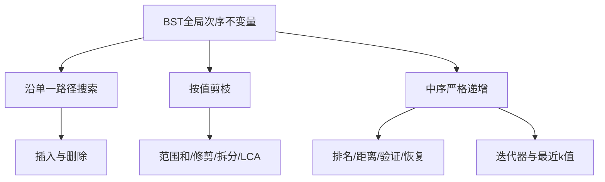

> 原书：李春葆、李筱驰《算法面试（全二册）》<br>
> 阅读范围：第 7 章 二叉搜索树<br>
> 说明：本文按原书 7.1～7.4 顺序整理；“补充”用于证明与替代方案，原文代码或表述问题标为“勘误说明”。

## 0. 本章主线



本章有 18 道正文题：7.2 四题、7.3 七题、7.4 七题。

## 7.1 二叉搜索树概述

### 7.1.1 二叉搜索树的定义

在本书“键互异”的约定下，二叉搜索树 BST 递归满足：

$$
\forall x\in T_L:x.key<root.key,
$$

$$
\forall y\in T_R:y.key>root.key,
$$

且左右子树本身也是 BST。这是**全局**约束，不只是“左孩子小、右孩子大”；右子树深处任意值也必须大于当前根。

若允许重复键，必须另外约定重复放左、放右或结点计数；本章题目通常要求严格不等和键唯一。

#### C++17 共享定义（后续代码复用）

正文各题的 C++17 片段默认复用以下结点类型与标准库头文件，不再重复定义 `TreeNode`。

```cpp
#include <algorithm>
#include <cmath>
#include <cstddef>
#include <limits>
#include <stack>
#include <stdexcept>
#include <utility>
#include <vector>

struct TreeNode {
    int val;
    TreeNode* left = nullptr;
    TreeNode* right = nullptr;

    explicit TreeNode(int value) : val(value) {}
};
```

#### 中序严格递增定理

结构归纳证明：空树序列为空；假设左右子树中序各自严格递增。BST 性质保证左序列所有值小于根，根小于右序列所有值，因此

$$
inorder(T)=inorder(T_L)+[root]+inorder(T_R)
$$

严格递增。反过来，一棵二叉树的中序序列严格递增，则每个结点左侧中序片段都小于根、右侧都大于根，递归可知它是严格 BST。

最小值是最左下结点，最大值是最右下结点；沿左链值递减，沿右链值递增。

### 7.1.2 二叉搜索树的知识点

#### 搜索

在结点 $u$ 比较键 $k$：相等成功；$k<u.key$ 时右子树所有值更大，可排除右子树，只进左；反之只进右。访问路径长度至多树高 $h$，时间 $O(h)$、迭代空间 $O(1)$。

#### 插入

沿搜索路径到第一个空位置，把新叶接入。递归函数应返回“插入后子树根”，父调用必须执行

```text
root.left = insert(root.left, key)
```

或对应右侧，才能接回新根。时间 $O(h)$，递归栈 $O(h)$。

> **勘误说明：** 原书递归 C++ 示例在函数每一层开头都 `new TreeNode(k)`，只有空树层使用该结点，其余层会泄漏。应仅在 `root==null` 时创建。

#### 删除

先搜索目标 $p$，按孩子数处理：

1. 无孩子：父链接改为空；
2. 只有右孩子：右孩子替代 $p$；
3. 只有左孩子：左孩子替代 $p$；
4. 两个孩子：用左子树最大前驱或右子树最小后继的值替换，再删除该前驱/后继。

前驱没有右孩子，后继没有左孩子，所以复杂情况被降为至多一个孩子。递归写法可统一为“目标值较小去左、较大去右；命中后返回替代子树根”。

> **勘误说明：** 原书图 7.2、7.3 的图注“只有左/右子树”与相邻正文情形互换；应以实际非空孩子和代码链接方向为准。

#### 高度与性能边界

搜索、插入、删除均为 $O(h)$。平衡时 $h=\Theta(\log n)$；按升序插入普通 BST 会退化为链，$h=\Theta(n)$。普通 BST 不保证对数时间，AVL、红黑树等平衡结构才维护高度上界。

## 7.2 二叉搜索树基本操作的算法设计

### 7.2.1 LeetCode 1008：先序构造 BST（★★）

#### 原书方法：补出中序序列

先序给出根访问次序；BST 的中序严格递增，所以把先序值排序即可得到同一棵树的中序序列，再使用第 6 章“先序 + 中序”构造。值互异保证排序后的根位置唯一。

排序 $O(n\log n)$；若中序根位置每层线性查找，斜树还可能 $O(n^2)$，应预建值到下标映射，使构造为 $O(n)$。

#### 补充：上界约束的线性构造

先序从左到右只读一次。函数 `build(bound)`表示：从当前位置开始，构造所有允许小于 `bound` 的连续先序前缀。若下一个值超过上界，它属于祖先的右侧或更外层子树，不应在此消费。

创建值 $x$ 后：

- 左子树所有值 $<x$，调用 `build(x)`；
- 右子树仍受祖先上界 `bound`约束，调用 `build(bound)`。

对 `[8,5,1,7,10,12]`：根 8；左侧上界 8 消费 5、1、7；遇 10 时停止左子树；回到根后右子树消费 10、12。

每个值恰消费一次，时间 $O(n)$、递归栈 $O(h)$。题目值为正且互异；通用写法还可同时传递下界，或明确重复键策略。

**迁移判断：** 只有在输入已保证是某棵严格 BST 的先序时，单个上界才足以负责“构造”。若题目还要求验证任意序列是否合法，就必须同时维护下界，或改用 7.3.7 的单调栈检查；不能把“未消费完”默认为合法。

#### C++17 核心实现

```cpp
TreeNode* bstFromPreorder(const std::vector<int>& preorder) {
    std::size_t index = 0;

    auto build = [&](auto&& self, long long upper) -> TreeNode* {
        if (index == preorder.size() ||
            static_cast<long long>(preorder[index]) >= upper) {
            return nullptr;
        }

        int value = preorder[index++];
        auto* root = new TreeNode(value);
        root->left = self(self, value);  // 左子树收紧为当前根的严格上界
        root->right = self(self, upper); // 右子树继承祖先上界
        return root;
    };

    return build(build, std::numeric_limits<long long>::max());
}
```

### 7.2.2 LeetCode 700：BST 搜索（★）

#### 为什么只走一边

当前根值为 $r$。若目标 $x<r$，右子树所有值都大于 $r$，因此绝不可能等于 $x$；可以一次排除整棵右子树。$x>r$ 时对称。相等则返回当前结点，题目要求的“以该结点为根的子树”自然由该地址表示。

循环不变量：若目标存在，它必在当前 `root` 所代表的子树中。比较后进入唯一可能的孩子，不变量保持；走到空指针则候选集合为空，查找失败。

访问结点数等于搜索路径长度，时间 $O(h)$、迭代空间 $O(1)$。平衡树为 $O(\log n)$，斜树最坏 $O(n)$。递归写法逻辑相同，但使用 $O(h)$ 调用栈。

#### C++17 核心实现

```cpp
TreeNode* searchBST(TreeNode* root, int target) {
    while (root != nullptr && root->val != target) {
        // 比较后只保留仍可能包含目标的一侧。
        root = target < root->val ? root->left : root->right;
    }
    return root;
}
```

### 7.2.3 LeetCode 701：BST 插入（★★）

#### 找插入位置

插入值 $x$ 的搜索过程会在一个空孩子位置结束。沿途若 $x<root.val$ 就走左，否则走右；该路径上的所有比较共同给出 $x$ 必须满足的祖先上下界。把新结点放在首个空位即可同时满足全部边界。

递归函数必须返回“插入后的子树根”：空树返回新结点；非空树把递归结果重新赋给 `root.left/right`。这样当原树为空或局部子树根发生变化时，父链接不会丢失。

#### 正确性与边界

新结点作为叶子，不改变路径外任何关系。对每个路径祖先，选择方向就是根据 $x$ 与祖先值的严格比较，所以新叶位于合法侧；其他结点关系保持，整树仍为 BST。

题目保证 $x$ 不存在。若允许重复，必须规定忽略、计数或固定放一侧；原书基础迭代写法把相等值放右侧，与严格 BST 定义冲突，不能在无约定时照搬。时间和递归栈为 $O(h)$。

#### C++17 核心实现

```cpp
TreeNode* insertIntoBST(TreeNode* root, int value) {
    if (root == nullptr) return new TreeNode(value);

    if (value < root->val) {
        root->left = insertIntoBST(root->left, value);
    } else if (value > root->val) {
        root->right = insertIntoBST(root->right, value);
    }
    return root; // 返回插入后的子树根，供父结点重新接回
}
```

### 7.2.4 LeetCode 450：删除 BST 结点（★★）

#### 删除为什么比插入复杂

删除不仅要移除目标，还要把剩余子树重新接回父结点。递归函数返回“删除后的子树根”可统一根结点和非根结点情况。

命中后分三类：

1. 左为空：返回右子树；
2. 右为空：返回左子树；
3. 两侧都非空：找到右子树最小后继 $s$，复制其值到当前根，再在右子树删除原 $s$。

叶子同时满足前两类，返回空。

#### 两孩子情形为何正确

后继 $s$ 是右子树最小值，所以

$$
\forall x\in left:x<s,
\qquad
\forall y\in right\setminus\{s\}:s<y.
$$

用 $s$ 替换目标值后根仍介于左右子树之间。原后继没有左孩子，第二次删除退化为简单情况。

例如删除 `5(3,7(6,8))` 的根 5，可取后继 6：根改为 6，再删除原结点 6，结果 `6(3,7(null,8))`。

搜索目标与寻找后继都沿树路径，总时间 $O(h)$、递归栈 $O(h)$。C++ 必须释放真正脱链结点；若外部保存了结点地址，“复制值”还会改变对象身份对应的键语义，工程接口需明确。

#### C++17 核心实现

```cpp
TreeNode* deleteNode(TreeNode* root, int key) {
    if (root == nullptr) return nullptr;

    if (key < root->val) {
        root->left = deleteNode(root->left, key);
    } else if (key > root->val) {
        root->right = deleteNode(root->right, key);
    } else if (root->left == nullptr || root->right == nullptr) {
        TreeNode* child = root->left != nullptr ? root->left : root->right;
        delete root; // 释放真正脱链的结点
        return child;
    } else {
        TreeNode* successor = root->right;
        while (successor->left != nullptr) successor = successor->left;
        root->val = successor->val;
        root->right = deleteNode(root->right, successor->val);
    }
    return root;
}
```

## 7.3 二叉搜索树特性的算法设计

### 7.3.1 LeetCode 270：最接近的 BST 值（★）

#### 搜索路径为何包含最优候选

沿搜索路径维护当前最小距离。若 $target<u.val$，对右子树任意值 $v$ 有

$$
v>u.val>target,
$$

因此 $|v-target|>|u.val-target|$；当前根已经比较过，整棵右子树可以排除，只去左。目标大于根时对称。

对样例 target=3.714286，路径若为 `4 -> 2 -> 3`，距离依次约为 0.286、1.714、0.714，答案保持 4。题目保证最近值唯一；若可能等距，需约定取较小值或较大值，并在比较器中实现。

只访问一条路径，时间 $O(h)$、迭代空间 $O(1)$。不能对普通二叉树使用该剪枝，因为其子树没有值域保证。

#### C++17 核心实现

```cpp
int closestValue(TreeNode* root, double target) {
    int answer = root->val;
    while (root != nullptr) {
        if (std::abs(root->val - target) < std::abs(answer - target)) {
            answer = root->val;
        }
        if (target == root->val) break;
        root = target < root->val ? root->left : root->right;
    }
    return answer;
}
```

### 7.3.2 LeetCode 235：BST 最近公共祖先（★★）

#### 第一次分叉原则

若 $p,q$ 都小于当前根，二者都在左子树，当前根虽然是共同祖先，却不是最近者；继续向左。都大于时向右。第一次不再同侧时，当前根要么等于其中一个结点，要么两结点分处左右子树，因此它是最近公共祖先。

可先令 $a=\min(p.val,q.val),b=\max(...)$，寻找第一个满足

$$
a\le root.val\le b
$$

的结点。对根 6、目标 2 和 8，$2\le6\le8$，立即返回 6；目标 2 和 3 时先从 6 向左到 2，因根值等于下界而返回 2，体现“结点可为自身祖先”。

题目保证两结点都存在且键唯一；否则仅按值区间找到的分叉点不一定证明目标实际存在。时间 $O(h)$、空间 $O(1)$。原书 C++ 参数 `TreeNode p,q` 却使用 `p->val`，类型应为指针。

#### C++17 核心实现

```cpp
TreeNode* lowestCommonAncestor(TreeNode* root, TreeNode* first, TreeNode* second) {
    int low = std::min(first->val, second->val);
    int high = std::max(first->val, second->val);
    while (root != nullptr) {
        if (root->val < low) root = root->right;
        else if (root->val > high) root = root->left;
        else return root; // 第一个落入闭区间的结点就是首次分叉点
    }
    return nullptr;
}
```

### 7.3.3 LeetCode 938：BST 范围和（★）

#### 三种值域情况

若 `root.val < low`，根和整个左子树都过小，只递归右；若 `root.val > high`，根和整个右子树都过大，只递归左；区间内则根值加左右结果：

$$
S(u)=u.val+S(u_L)+S(u_R).
$$

例如 `low=7,high=15`，遇根 10 时保留并查两侧；左侧结点 5 小于 7，可连同其左子树剪掉；右侧结点 18 大于 15，可连同其右子树剪掉。

结构归纳可证：每个被剪掉子树的所有值都在区间同一侧，绝无合法结点；保留根时左右递归分别返回所有合法值之和。时间 $O(v)$，$v$ 为实际访问结点数，最好可接近 $O(h)$，最坏区间覆盖全树时 $O(n)$；栈 $O(h)$。

**举一反三：** “整棵子树的值域都在查询区间同一侧”时才能整段剪枝，因此同样思路可迁移到区间计数、区间最值收集；若条件依赖深度、路径和或子树形状，仅比较根值通常不能排除整棵子树。

#### C++17 核心实现

```cpp
int rangeSumBST(TreeNode* root, int low, int high) {
    if (root == nullptr) return 0;
    if (root->val < low) return rangeSumBST(root->right, low, high);
    if (root->val > high) return rangeSumBST(root->left, low, high);
    return root->val + rangeSumBST(root->left, low, high) +
           rangeSumBST(root->right, low, high);
}
```

### 7.3.4 LeetCode 669：修剪 BST（★★）

#### 返回值代表新的子树根

根过小，则根与左子树全部非法，修剪结果只能来自右子树；直接返回 `trim(root.right)`。根过大时对称。根合法时保留它，但左右孩子必须替换为各自修剪后的新根。

例如根 0、区间 `[1,3]`，原根非法，结果根可能变成其右侧的 1；若调用者忽略函数返回值，仍会持有被删除的旧根。

#### 结构保持与唯一性

算法只删除非法结点并把合法后代提升到原路径位置，不交换两个保留结点的祖先次序，所以满足题目“保留相对结构”。每个被剪枝子树都由 BST 值域证明全部非法，结果唯一。

最坏访问所有结点，时间 $O(n)$、栈 $O(h)$。C++ 若负责内存所有权，还要释放被整段剪掉的结点；LeetCode 通常只检验返回结构。

#### C++17 核心实现

```cpp
TreeNode* trimBST(TreeNode* root, int low, int high) {
    if (root == nullptr) return nullptr;
    if (root->val < low) return trimBST(root->right, low, high);
    if (root->val > high) return trimBST(root->left, low, high);

    root->left = trimBST(root->left, low, high);
    root->right = trimBST(root->right, low, high);
    return root;
}
```

### 7.3.5 LeetCode 776：拆分 BST（★★）

函数返回 $(A,B)$，$A$ 全部 $\le target$，$B$ 全部 $>target$。

- 根 $\le target$：左树与根必在 $A$；拆右树得 $(A_1,B_1)$，令 `root.right=A1`，返回 `(root,B1)`。
- 根 $>target$：右树与根必在 $B$；拆左树得 $(A_1,B_1)$，令 `root.left=B1`，返回 `(A1,root)`。

#### 重连过程示例

若根 4、`target=2`，根属于大树；递归拆左子树。假设左子树拆成 `(small,largePart)`，则 `small`直接作为最终小树，`largePart`接回 `root.left`，根 4 仍领导全部大值。

#### 正确性证明

对树高归纳。空树显然。根小于等于目标时，根和整个左树都属于 $A$；递归保证右树被正确拆成 $A_1,B_1$，接 `root.right=A_1` 后 root 树全部小于等于目标且保持 BST，$B_1$全部大于目标。另一分支对称。

递归只沿一条由 target 比较决定的路径，其余整棵子树直接保留，所以时间、栈 $O(h)$，不是 $O(n)$；不复制结点，仅修改路径上的若干指针。调用后原树已被拆改，不能再按原结构使用。

#### C++17 核心实现

```cpp
std::pair<TreeNode*, TreeNode*> splitBST(TreeNode* root, int target) {
    if (root == nullptr) return {nullptr, nullptr};

    if (root->val <= target) {
        auto [smallRight, large] = splitBST(root->right, target);
        root->right = smallRight;
        return {root, large};
    }

    auto [small, largeLeft] = splitBST(root->left, target);
    root->left = largeLeft;
    return {small, root};
}
```

### 7.3.6 LeetCode 285：中序后继（★★）

#### 两种结构情况

1. $p$ 有右子树：中序访问完 $p$ 后进入右子树，其第一个访问结点就是最左下结点；
2. $p$ 无右子树：必须向上回到某个祖先，且 $p$ 位于该祖先左子树。最近这样的祖先就是后继。

没有父指针时从根重走路径。每当 `p.val < root.val`，当前根比 $p$ 大，是候选；继续向左可能找到更小的大值。若 `p.val >= root.val`则向右，当前根不可能是后继。

“最后一次左拐”证明：左拐祖先都大于 $p$，越靠后越接近 $p$；最后一个具有最小合法键。若从未左拐且无右子树，$p$ 是最大结点，后继为空。时间 $O(h)$、空间 $O(1)$。

#### C++17 核心实现

```cpp
TreeNode* inorderSuccessor(TreeNode* root, TreeNode* node) {
    if (node == nullptr) return nullptr;
    if (node->right != nullptr) {
        TreeNode* answer = node->right;
        while (answer->left != nullptr) answer = answer->left;
        return answer;
    }

    TreeNode* answer = nullptr;
    while (root != nullptr) {
        if (node->val < root->val) {
            answer = root; // 记录最近一次左拐的祖先
            root = root->left;
        } else {
            root = root->right;
        }
    }
    return answer;
}
```

### 7.3.7 LeetCode 255：验证 BST 先序序列（★★）

#### 朴素递归为何超时

每段首值为根，先找第一个更大值作为右子树起点，再检查右段是否都更大，并递归两段。对单调序列，每层扫描几乎整个剩余区间，总和为 $O(n^2)$。

#### 单调栈与下界

栈保存当前先序路径上尚未完成右子树的祖先，值从底到顶递减。当前值 $x$ 大于栈顶时，说明先序从若干左子树返回并进入右子树；连续弹出所有小于 $x$ 的祖先，最后弹出值成为新的严格下界 `lower`。此后任何值 $\le lower$ 都错误地落入已进入右子树的区域。

走查 `[8,5,1,7,10,12]`：

```text
8,5,1 依次压栈；读到 7，弹出 1、5，lower=5；
读到 10，弹出 7、8，lower=8；读到 12，弹出 10。
所有新值始终大于 lower，因此合法。
```

若后面出现 6，此时 `lower=8`，立即判假。

#### 正确性与复杂度

`lower`始终是当前结点必须超过的最近已进入右子树祖先。违反它必不合法；若始终不违反，栈弹出过程为每个值确定了合法祖先区间，可构造出相应 BST。每值入栈、出栈一次，时间 $O(n)$、空间 $O(n)$；允许修改输入时可把数组前缀复用为栈，额外空间降为 $O(1)$。

> **边界说明：** 原书用 `rootd=-1`，仅因该题值均为正才安全；通用实现应使用负无穷或首元素外的显式状态。

#### C++17 核心实现

```cpp
bool verifyPreorder(const std::vector<int>& values) {
    long long lower = std::numeric_limits<long long>::lowest();
    std::vector<int> ancestors;

    for (int value : values) {
        if (value <= lower) return false;
        while (!ancestors.empty() && value > ancestors.back()) {
            lower = ancestors.back(); // 已进入该祖先的右子树
            ancestors.pop_back();
        }
        ancestors.push_back(value);
    }
    return true;
}
```

## 7.4 二叉搜索树基于中序遍历的算法设计

### 7.4.1 LeetCode 783：BST 结点最小距离（★）

#### 为什么只看中序相邻项

中序得到严格递增序列 $a_0<\cdots<a_{n-1}$。任意 $i<j$：

$$
a_j-a_i=\sum_{t=i}^{j-1}(a_{t+1}-a_t),
$$

每项为正，因此非相邻差至少包含一个相邻差，不可能比所有相邻差都小。全局最小值必在某对中序相邻结点之间。

#### 流式计算

不必保存完整序列。中序访问当前结点 `current` 时，变量 `previous` 是前一个访问结点，更新

$$
answer=\min(answer,current.val-previous.val).
$$

例如中序 `[1,3,4,6]` 的相邻差为 2、1、2，答案 1。

时间 $O(n)$、递归栈 $O(h)$，额外状态 $O(1)$。题目至少两个结点；通用接口要处理“没有相邻对”的情况。若值范围更大，差值应用宽整数避免溢出。

#### C++17 核心实现

```cpp
long long minimumDifference(TreeNode* root) {
    std::stack<TreeNode*> ancestors;
    TreeNode* previous = nullptr;
    long long answer = std::numeric_limits<long long>::max();

    while (root != nullptr || !ancestors.empty()) {
        while (root != nullptr) {
            ancestors.push(root);
            root = root->left;
        }
        root = ancestors.top();
        ancestors.pop();
        if (previous != nullptr) {
            answer = std::min(answer,
                              static_cast<long long>(root->val) - previous->val);
        }
        previous = root;
        root = root->right;
    }
    return answer;
}
```

### 7.4.2 LeetCode 230：第 $k$ 小元素（★★）

#### 一次查询

中序按从小到大访问，第 $k$ 个访问值就是第 $k$ 小。迭代栈先压左链，每弹出一个结点令 `k--`；当 $k=0$ 立即返回，不必遍历后续大值。

在平衡树中，压初始左链 $O(h)$，之后为找到前 $k$ 个结点，总工作可写成 $O(h+k)$；普通斜树最坏仍为 $O(n)$。栈空间 $O(h)$。

若频繁查询且树会修改，可在每结点维护子树大小 $size(u)$。设左子树大小 $L$：$k=L+1$ 返回根；$k\le L$去左；否则去右并令 $k\leftarrow k-L-1$。查询 $O(h)$，插删路径上更新 `size`。

这里

$$
size(u)=1+size(u_L)+size(u_R).
$$

插入、删除或旋转后必须重新计算涉及结点的 `size`，否则排名查询会悄然错误。这种增强 BST 也称顺序统计树，属于原书问答基础上的补充实现方向。

**迁移判断：** 单次或少量查询直接中序最省维护成本；查询频繁且树会更新时，才值得把 `size` 纳入结点不变量。若只缓存一次中序数组，后续任一插删都会使排名失效。

#### C++17 核心实现

```cpp
int kthSmallest(TreeNode* root, int k) {
    std::stack<TreeNode*> ancestors;
    while (root != nullptr || !ancestors.empty()) {
        while (root != nullptr) {
            ancestors.push(root);
            root = root->left;
        }
        root = ancestors.top();
        ancestors.pop();
        if (--k == 0) return root->val;
        root = root->right;
    }
    throw std::out_of_range("k exceeds the number of nodes");
}
```

### 7.4.3 LeetCode 98：验证 BST（★★）

#### 为什么只比较父子不够

树 `5(1,6(3,7))` 中每个直接孩子似乎满足局部大小关系，但 3 位于根 5 的右子树却小于 5，因此不是 BST。必须维护所有祖先施加的全局范围，或利用中序整体有序性。

#### 中序判定

严格 BST 的中序必须严格递增。保存前驱，若

$$
current.val\le previous.val
$$

立即失败。使用 `<=` 是因为重复值也非法。首结点没有前驱，可用布尔标志或空指针，不能用 `INT_MIN` 作哨兵，因为合法值可等于它。

若遍历无违例，则中序严格递增；由第 7.1 节的逆向论证，每个结点左子树全小于根、右子树全大于根，故是 BST。时间 $O(n)$、栈 $O(h)$。

补充的上下界递归为每个结点传开放区间 $(low,high)$，根必须满足 `low < value < high`；它更直接表达全局不变量，并避免只比较父子。

左递归区间变为 $(low,root.val)$，右递归变为 $(root.val,high)$。边界应使用 64 位、可空边界或任意精度数，以容纳 32 位极值。

#### C++17 核心实现

```cpp
bool isValidBST(TreeNode* root) {
    std::stack<TreeNode*> ancestors;
    TreeNode* previous = nullptr; // 不用数值哨兵，避免与 INT_MIN 冲突

    while (root != nullptr || !ancestors.empty()) {
        while (root != nullptr) {
            ancestors.push(root);
            root = root->left;
        }
        root = ancestors.top();
        ancestors.pop();
        if (previous != nullptr && root->val <= previous->val) return false;
        previous = root;
        root = root->right;
    }
    return true;
}
```

### 7.4.4 LeetCode 538：BST 转累加树（★★）

#### 从后缀和到逆中序

若先生成递增中序数组，新值就是从当前位置到末尾的后缀和。与其保存数组，不如按右—根—左的逆中序从大到小访问，把“已访问更大值之和”保存在累加器中。

逆中序 RNL 按值从大到小访问。访问当前原值 $x$ 时，累加器已等于所有严格大于 $x$ 的值之和，执行

$$
sum\leftarrow sum+x,
\qquad node.val\leftarrow sum,
$$

恰得到“大于等于原值”的总和。对 BST `2(1,3)`：先访问 3 得 3；再访问 2 得 $3+2=5$；最后 1 得 $5+1=6$，新值中序为 `[6,5,3]`。

循环/递归不变量是：访问当前结点前，`sum` 等于所有已经完成、且原值严格更大的结点值总和。每结点访问一次，时间 $O(n)$、栈 $O(h)$。

修改值后中序变为递减而非递增，树通常不再满足原 BST 次序，不能继续用 BST 搜索。若还需要原键，应另存或创建新树。

#### C++17 核心实现

```cpp
TreeNode* convertBST(TreeNode* root) {
    long long total = 0;
    auto visit = [&](auto&& self, TreeNode* node) -> void {
        if (node == nullptr) return;
        self(self, node->right);
        total += node->val; // 逆中序保证 total 已含所有更大键
        node->val = static_cast<int>(total);
        self(self, node->left);
    };
    visit(visit, root);
    return root;
}
```

### 7.4.5 LeetCode 99：恢复 BST（★★）

#### 交换后会出现几次逆序

正确中序递增。交换两个值后：若两值原本相邻，出现一次逆序；不相邻则通常出现两次。扫描相邻结点 `pre,current`：每遇 `pre.val > current.val`，第一次把 `first=pre`，每次把 `second=current`；最后交换二者值。

例如 `[1,3,2,4]` 得 `first=3,second=2`；`[1,5,3,4,2,6]` 两次逆序最终定位 5 和 2。

> **勘误说明：** 原书步骤（3）文字说第二个错误结点置 `p=root`，应为 `q=root`。

#### 定位规则为什么统一两种情况

第一次逆序的较大前驱一定是被换到前面的“大值”，所以只设置一次 `first=pre`；最后一次逆序的较小当前值一定是被换到后面的“小值”，所以每次更新 `second=current`。相邻交换时两者在同一次逆序中得到；非相邻交换时由第一次和第二次逆序分别得到。

只交换两个结点的值，不改变树结构。中序扫描 $O(n)$、递归/显式栈 $O(h)$。

递归方案不满足进阶的严格 $O(1)$ 辅助空间。**补充：** Morris 中序把每个结点左子树最右结点临时连回当前结点，用线索替代栈；每条临时边建立后必须删除，否则会留下环。时间 $O(n)$、额外空间 $O(1)$。

#### C++17 核心实现

```cpp
void recoverTree(TreeNode* root) {
    std::stack<TreeNode*> ancestors;
    TreeNode* current = root;
    TreeNode* previous = nullptr;
    TreeNode* first = nullptr;
    TreeNode* second = nullptr;

    while (current != nullptr || !ancestors.empty()) {
        while (current != nullptr) {
            ancestors.push(current);
            current = current->left;
        }
        current = ancestors.top();
        ancestors.pop();
        if (previous != nullptr && previous->val > current->val) {
            if (first == nullptr) first = previous;
            second = current; // 始终保留最后一次逆序的较小结点
        }
        previous = current;
        current = current->right;
    }
    if (first != nullptr) std::swap(first->val, second->val);
}
```

### 7.4.6 LeetCode 173：BST 迭代器（★★）

#### 预展开与惰性展开

预先保存完整中序数组：构造 $O(n)$、空间 $O(n)$、`next/hasNext`严格 $O(1)$。

进阶用栈保存尚未访问的左链。构造时压根的左链；`next`弹出最小未访问结点 $p$，再压入 $p.right$ 的整条左链。栈最多 $h$ 个结点。

以树 `7(3,15(9,20))` 为例，构造后栈顶是 3；弹出 3 后栈顶 7；弹出 7 时把 15、9 的左链压入，所以下一个是 9，最终输出 3、7、9、15、20。

栈不变量：从栈顶向下保存若干尚未访问祖先，栈顶是全树最小未访问结点；每个栈内结点的左子树已经处理或为空，右子树尚未展开。

一次 `next`可能压入 $O(h)$，但每结点全程只压、弹一次；$n$ 次 `next`总 $O(n)$，所以均摊 $O(1)$，空间 $O(h)$。

`hasNext`只检查栈是否非空，不推进状态。迭代期间若外部修改树，已有栈路径可能失效；题目默认遍历期间结构不变。

#### C++17 核心实现

```cpp
class BSTIterator {
    std::stack<TreeNode*> ancestors;

    void pushLeft(TreeNode* node) {
        while (node != nullptr) {
            ancestors.push(node);
            node = node->left;
        }
    }

public:
    explicit BSTIterator(TreeNode* root) { pushLeft(root); }

    bool hasNext() const { return !ancestors.empty(); }

    int next() {
        TreeNode* node = ancestors.top();
        ancestors.pop();
        pushLeft(node->right); // 展开刚弹出结点的后继候选
        return node->val;
    }
};
```

### 7.4.7 LeetCode 272：最接近的 $k$ 个 BST 值（★★★）

#### 原书解法一：有序数组双指针

原书解法一生成中序数组 $a$，二分 `lower_bound(target)`得左右指针，再每次选择距离更小者。时间 $O(n+\log n+k)=O(n)$，空间 $O(n)$。

二分位置 `high` 是第一个 $a[high]\ge target$ 的元素，`low=high-1`。由于数组递增，左侧越向左值越小、距离不会减小；右侧越向右值越大、距离也不会减小。因此全局下一个最近候选一定在两个指针之一。

例如数组 `[1,3,4,7]`、target=3.6、$k=2$：`low=3`、`high=4`，先选 4（距离 0.4），再比较 3（0.6）与 7（3.4），选择 3。

#### C++17（原书解法一）：完整中序数组与双指针

```cpp
std::vector<int> closestKValues(TreeNode* root, double target, int k) {
    std::vector<int> values;
    auto inorder = [&](auto&& self, TreeNode* node) -> void {
        if (node == nullptr) return;
        self(self, node->left);
        values.push_back(node->val);
        self(self, node->right);
    };
    inorder(inorder, root);

    int high = static_cast<int>(
        std::lower_bound(values.begin(), values.end(), target) - values.begin());
    int low = high - 1;
    std::vector<int> answer;
    while (static_cast<int>(answer.size()) < k) {
        if (low >= 0 &&
            (high == static_cast<int>(values.size()) ||
             std::abs(values[low] - target) <= std::abs(values[high] - target))) {
            answer.push_back(values[low--]);
        } else {
            answer.push_back(values[high++]);
        }
    }
    return answer;
}
```

#### 原书解法二：中序滑动候选

解法二中序维护大小 $k$ 的队列；有序值与 target 的距离先减后增，一旦当前值不比队头近，后续更大值也不会更近，可停止。但最坏仍可能访问全部 $n$ 个结点，不能笼统说渐近复杂度“小于 $O(n)$”。

这里提前停止依赖距离函数在有序轴上的单谷性。若尚未填满 $k$ 个必须继续；填满后，当前新值比窗口最左候选更近才替换。目标大于所有键、$k=n$ 等情况仍会扫描全树。

#### 补充进阶：前驱栈与后继栈

在平衡 BST 中分别建立 target 的前驱栈（键小于 target，栈顶最大）和后继栈（键大于等于 target，栈顶最小），各需 $O(h)$。每次比较两栈顶距离，弹出较近者，并像中序前驱/后继迭代器那样展开下一候选。取 $k$ 个值总时间

$$
O(h+k),
$$

空间 $O(h)$。要避免 target 恰等于结点时同一值同时出现在两栈。题目保证最接近集合唯一，等距边界无需额外规则。

平衡假设使 $h=O(\log n)$，所以进阶达到 $O(\log n+k)$，严格小于遍历全树；普通斜树的初始化仍可能 $O(n)$。

#### C++17（补充进阶）：前驱栈与后继栈

```cpp
void initializePredecessors(TreeNode* root, double target,
                            std::stack<TreeNode*>& predecessors) {
    while (root != nullptr) {
        if (root->val < target) {
            predecessors.push(root);
            root = root->right;
        } else {
            root = root->left;
        }
    }
}

void initializeSuccessors(TreeNode* root, double target,
                          std::stack<TreeNode*>& successors) {
    while (root != nullptr) {
        if (root->val >= target) {
            successors.push(root);
            root = root->left;
        } else {
            root = root->right;
        }
    }
}

int takePredecessor(std::stack<TreeNode*>& predecessors) {
    TreeNode* node = predecessors.top();
    predecessors.pop();
    int value = node->val;
    node = node->left;
    while (node != nullptr) {
        predecessors.push(node);
        node = node->right;
    }
    return value;
}

int takeSuccessor(std::stack<TreeNode*>& successors) {
    TreeNode* node = successors.top();
    successors.pop();
    int value = node->val;
    node = node->right;
    while (node != nullptr) {
        successors.push(node);
        node = node->left;
    }
    return value;
}

std::vector<int> closestKValuesWithStacks(TreeNode* root,
                                          double target, int k) {
    std::stack<TreeNode*> predecessors;
    std::stack<TreeNode*> successors;
    initializePredecessors(root, target, predecessors);
    initializeSuccessors(root, target, successors);

    std::vector<int> answer;
    while (static_cast<int>(answer.size()) < k) {
        if (predecessors.empty()) {
            answer.push_back(takeSuccessor(successors));
        } else if (successors.empty()) {
            answer.push_back(takePredecessor(predecessors));
        } else if (target - predecessors.top()->val <=
                   successors.top()->val - target) {
            answer.push_back(takePredecessor(predecessors));
        } else {
            answer.push_back(takeSuccessor(successors));
        }
    }
    return answer;
}
```

两个初始化条件分别是 `< target` 与 `>= target`，集合互斥；即使某个键恰等于目标，它也只会进入后继栈。初始化各走一条根到叶路径；随后每个展开的结点至多入栈、出栈一次，因此取出 $k$ 个答案的总时间为 $O(h+k)$，两个栈的总空间为 $O(h)$。

## 推荐练习题

1. LeetCode 333：最大的 BST 子树（★★）
2. LeetCode 501：BST 中的众数（★）
3. LeetCode 510：中序后继 II（★★）
4. LeetCode 530：最小绝对差（★）
5. LeetCode 653：两数之和 IV（★）
6. LeetCode 1214：查找两棵 BST 之和（★★）
7. LeetCode 1305：两棵 BST 中的所有元素（★★）
8. LeetCode 1373：BST 子树的最大键值和（★★★）

## 附录 A：Python 3 实现速查

以下接口按正文题目顺序集中列出，便于复习和运行验证。

```python
from bisect import bisect_left


class TreeNode:
    def __init__(self, val, left=None, right=None): self.val,self.left,self.right=val,left,right


def insert(root, value):
    if not root: return TreeNode(value)
    if value < root.val: root.left=insert(root.left,value)
    elif value > root.val: root.right=insert(root.right,value)
    return root
def search(root, value):
    while root and root.val != value: root=root.left if value < root.val else root.right
    return root
def delete(root, key):
    if not root: return None
    if key < root.val: root.left=delete(root.left,key)
    elif key > root.val: root.right=delete(root.right,key)
    else:
        if not root.left: return root.right
        if not root.right: return root.left
        successor=root.right
        while successor.left: successor=successor.left
        root.val=successor.val; root.right=delete(root.right,successor.val)
    return root
def inorder(root): return inorder(root.left)+[root.val]+inorder(root.right) if root else []
def bst_from_preorder(pre):
    index=0
    def build(bound):
        nonlocal index
        if index==len(pre) or pre[index]>bound: return None
        value=pre[index]; index+=1; root=TreeNode(value)
        root.left=build(value); root.right=build(bound); return root
    return build(float("inf"))
def closest_value(root,target):
    answer=root.val
    while root:
        if abs(root.val-target)<abs(answer-target): answer=root.val
        root=root.left if target<root.val else root.right
    return answer
def lca(root,p,q):
    low,high=sorted((p.val,q.val))
    while root:
        if root.val<low: root=root.right
        elif root.val>high: root=root.left
        else: return root
def range_sum(root,low,high):
    if not root:return 0
    if root.val<low:return range_sum(root.right,low,high)
    if root.val>high:return range_sum(root.left,low,high)
    return root.val+range_sum(root.left,low,high)+range_sum(root.right,low,high)
def trim(root,low,high):
    if not root:return None
    if root.val<low:return trim(root.right,low,high)
    if root.val>high:return trim(root.left,low,high)
    root.left=trim(root.left,low,high);root.right=trim(root.right,low,high);return root
def split(root,target):
    if not root:return None,None
    if root.val<=target:
        small,large=split(root.right,target);root.right=small;return root,large
    small,large=split(root.left,target);root.left=large;return small,root
def successor(root,node):
    if node.right:
        current=node.right
        while current.left:current=current.left
        return current
    answer=None
    while root:
        if node.val<root.val:answer,root=root,root.left
        else:root=root.right
    return answer
def verify_preorder(values):
    lower=float("-inf");stack=[]
    for value in values:
        if value<=lower:return False
        while stack and value>stack[-1]:lower=stack.pop()
        stack.append(value)
    return True
def minimum_difference(root):
    values=inorder(root);return min(b-a for a,b in zip(values,values[1:]))
def kth_smallest(root,k):return inorder(root)[k-1]
def valid_bst(root):
    values=inorder(root);return all(a<b for a,b in zip(values,values[1:]))
def convert_greater(root):
    total=0
    def visit(node):
        nonlocal total
        if node:visit(node.right);total+=node.val;node.val=total;visit(node.left)
    visit(root);return root
def recover(root):
    stack=[];current=root;previous=first=second=None
    while stack or current:
        while current:stack.append(current);current=current.left
        current=stack.pop()
        if previous and previous.val>current.val:
            if not first:first=previous
            second=current
        previous=current;current=current.right
    first.val,second.val=second.val,first.val
class BSTIterator:
    def __init__(self,root):self.stack=[];self._push_left(root)
    def _push_left(self,node):
        while node:self.stack.append(node);node=node.left
    def has_next(self):return bool(self.stack)
    def next(self):
        node=self.stack.pop();self._push_left(node.right);return node.val
def closest_k(root,target,k):
    values=inorder(root);high=bisect_left(values,target);low=high-1;answer=[]
    for _ in range(k):
        if low>=0 and (high==len(values) or abs(values[low]-target)<=abs(values[high]-target)):
            answer.append(values[low]);low-=1
        else:answer.append(values[high]);high+=1
    return answer


if __name__=="__main__":
    root=bst_from_preorder([8,5,1,7,10,12]);print(inorder(root))
    root=insert(root,9);print(search(root,9).val);root=delete(root,5);print(inorder(root))
    print(closest_value(root,6.4),lca(root,search(root,1),search(root,7)).val,range_sum(root,7,10))
    small,large=split(bst_from_preorder([8,5,1,7,10,12]),7);print(inorder(small),inorder(large))
    print(successor(root,search(root,9)).val,verify_preorder([8,5,1,7,10,12]))
    print(minimum_difference(root),kth_smallest(root,3),valid_bst(root))
    iterator=BSTIterator(root);output=[]
    while iterator.has_next():output.append(iterator.next())
    print(output,closest_k(root,8.6,3))
    print(inorder(trim(bst_from_preorder([8,5,1,7,10,12]),5,10)))
    print(inorder(convert_greater(bst_from_preorder([2,1,3]))))
    broken=TreeNode(2,TreeNode(3),TreeNode(1));recover(broken);print(inorder(broken))
```

预期输出：

```text
[1, 5, 7, 8, 10, 12]
9
[1, 7, 8, 9, 10, 12]
7 7 34
[1, 5, 7] [8, 10, 12]
10 True
1 8 True
[1, 7, 8, 9, 10, 12] [9, 8, 10]
[5, 7, 8, 10]
[6, 5, 3]
[1, 2, 3]
```

## 附录 B：Go 1.22 实现速查

以下程序与附录 A 使用同一组核心接口；本机没有 Go 工具链，因此采用字符串感知的静态结构检查。

```go
package main

import (
    "fmt"
    "math"
    "sort"
)

type TreeNode struct {
    Val         int
    Left, Right *TreeNode
}

func bstFromPreorder(values []int) *TreeNode {
    index := 0
    var build func(upper int, hasUpper bool) *TreeNode
    build = func(upper int, hasUpper bool) *TreeNode {
        if index == len(values) || (hasUpper && values[index] >= upper) {
            return nil
        }
        value := values[index]
        index++
        root := &TreeNode{Val: value}
        root.Left = build(value, true)
        root.Right = build(upper, hasUpper)
        return root
    }
    return build(0, false)
}

func insert(root *TreeNode, value int) *TreeNode {
    if root == nil {
        return &TreeNode{Val: value}
    }
    if value < root.Val {
        root.Left = insert(root.Left, value)
    } else if value > root.Val {
        root.Right = insert(root.Right, value)
    }
    return root
}

func search(root *TreeNode, value int) *TreeNode {
    for root != nil && root.Val != value {
        if value < root.Val {
            root = root.Left
        } else {
            root = root.Right
        }
    }
    return root
}

func deleteNode(root *TreeNode, key int) *TreeNode {
    if root == nil {
        return nil
    }
    if key < root.Val {
        root.Left = deleteNode(root.Left, key)
    } else if key > root.Val {
        root.Right = deleteNode(root.Right, key)
    } else {
        if root.Left == nil {
            return root.Right
        }
        if root.Right == nil {
            return root.Left
        }
        successor := root.Right
        for successor.Left != nil {
            successor = successor.Left
        }
        root.Val = successor.Val
        root.Right = deleteNode(root.Right, successor.Val)
    }
    return root
}

func inorderValues(root *TreeNode) []int {
    answer := []int{}
    stack := []*TreeNode{}
    for root != nil || len(stack) > 0 {
        for root != nil {
            stack = append(stack, root)
            root = root.Left
        }
        root = stack[len(stack)-1]
        stack = stack[:len(stack)-1]
        answer = append(answer, root.Val)
        root = root.Right
    }
    return answer
}

func closestValue(root *TreeNode, target float64) int {
    answer := root.Val
    for root != nil {
        if math.Abs(float64(root.Val)-target) < math.Abs(float64(answer)-target) {
            answer = root.Val
        }
        if target < float64(root.Val) {
            root = root.Left
        } else {
            root = root.Right
        }
    }
    return answer
}

func lowestCommonAncestor(root, first, second *TreeNode) *TreeNode {
    low, high := first.Val, second.Val
    if low > high {
        low, high = high, low
    }
    for root != nil {
        if root.Val < low {
            root = root.Right
        } else if root.Val > high {
            root = root.Left
        } else {
            return root
        }
    }
    return nil
}

func rangeSum(root *TreeNode, low, high int) int {
    if root == nil {
        return 0
    }
    if root.Val < low {
        return rangeSum(root.Right, low, high)
    }
    if root.Val > high {
        return rangeSum(root.Left, low, high)
    }
    return root.Val + rangeSum(root.Left, low, high) + rangeSum(root.Right, low, high)
}

func trim(root *TreeNode, low, high int) *TreeNode {
    if root == nil {
        return nil
    }
    if root.Val < low {
        return trim(root.Right, low, high)
    }
    if root.Val > high {
        return trim(root.Left, low, high)
    }
    root.Left = trim(root.Left, low, high)
    root.Right = trim(root.Right, low, high)
    return root
}

func split(root *TreeNode, target int) (*TreeNode, *TreeNode) {
    if root == nil {
        return nil, nil
    }
    if root.Val <= target {
        smallRight, large := split(root.Right, target)
        root.Right = smallRight
        return root, large
    }
    small, largeLeft := split(root.Left, target)
    root.Left = largeLeft
    return small, root
}

func successor(root, node *TreeNode) *TreeNode {
    if node.Right != nil {
        answer := node.Right
        for answer.Left != nil {
            answer = answer.Left
        }
        return answer
    }
    var answer *TreeNode
    for root != nil {
        if node.Val < root.Val {
            answer, root = root, root.Left
        } else {
            root = root.Right
        }
    }
    return answer
}

func verifyPreorder(values []int) bool {
    lower := -int(^uint(0)>>1) - 1
    stack := []int{}
    for _, value := range values {
        if value <= lower {
            return false
        }
        for len(stack) > 0 && value > stack[len(stack)-1] {
            lower = stack[len(stack)-1]
            stack = stack[:len(stack)-1]
        }
        stack = append(stack, value)
    }
    return true
}

func minimumDifference(root *TreeNode) int {
    values := inorderValues(root)
    answer := int(^uint(0) >> 1)
    for index := 1; index < len(values); index++ {
        if values[index]-values[index-1] < answer {
            answer = values[index] - values[index-1]
        }
    }
    return answer
}

func kthSmallest(root *TreeNode, k int) int {
    stack := []*TreeNode{}
    for root != nil || len(stack) > 0 {
        for root != nil {
            stack = append(stack, root)
            root = root.Left
        }
        root = stack[len(stack)-1]
        stack = stack[:len(stack)-1]
        k--
        if k == 0 {
            return root.Val
        }
        root = root.Right
    }
    panic("k超出结点总数")
}

func validBST(root *TreeNode) bool {
    values := inorderValues(root)
    for index := 1; index < len(values); index++ {
        if values[index] <= values[index-1] {
            return false
        }
    }
    return true
}

func convertGreater(root *TreeNode) *TreeNode {
    total := 0
    var visit func(node *TreeNode)
    visit = func(node *TreeNode) {
        if node == nil {
            return
        }
        visit(node.Right)
        total += node.Val
        node.Val = total
        visit(node.Left)
    }
    visit(root)
    return root
}

func recover(root *TreeNode) {
    stack := []*TreeNode{}
    current := root
    var previous, first, second *TreeNode
    for current != nil || len(stack) > 0 {
        for current != nil {
            stack = append(stack, current)
            current = current.Left
        }
        current = stack[len(stack)-1]
        stack = stack[:len(stack)-1]
        if previous != nil && previous.Val > current.Val {
            if first == nil {
                first = previous
            }
            second = current
        }
        previous = current
        current = current.Right
    }
    first.Val, second.Val = second.Val, first.Val
}

type BSTIterator struct {
    stack []*TreeNode
}

func (iterator *BSTIterator) pushLeft(node *TreeNode) {
    for node != nil {
        iterator.stack = append(iterator.stack, node)
        node = node.Left
    }
}

func NewBSTIterator(root *TreeNode) *BSTIterator {
    iterator := &BSTIterator{}
    iterator.pushLeft(root)
    return iterator
}

func (iterator *BSTIterator) HasNext() bool { return len(iterator.stack) > 0 }

func (iterator *BSTIterator) Next() int {
    last := len(iterator.stack) - 1
    node := iterator.stack[last]
    iterator.stack = iterator.stack[:last]
    iterator.pushLeft(node.Right)
    return node.Val
}

func closestK(root *TreeNode, target float64, count int) []int {
    values := inorderValues(root)
    high := sort.Search(len(values), func(index int) bool {
        return float64(values[index]) >= target
    })
    low := high - 1
    answer := []int{}
    for len(answer) < count {
        if low >= 0 &&
            (high == len(values) ||
                math.Abs(float64(values[low])-target) <= math.Abs(float64(values[high])-target)) {
            answer = append(answer, values[low])
            low--
        } else {
            answer = append(answer, values[high])
            high++
        }
    }
    return answer
}

func buildSample() *TreeNode {
    var root *TreeNode
    for _, value := range []int{8, 5, 1, 7, 10, 9, 12} {
        root = insert(root, value)
    }
    return root
}

func main() {
    root := bstFromPreorder([]int{8, 5, 1, 7, 10, 9, 12})
    fmt.Println(closestValue(root, 6.4),
        lowestCommonAncestor(root, search(root, 1), search(root, 7)).Val,
        rangeSum(root, 7, 10))
    fmt.Println(successor(root, search(root, 9)).Val,
        verifyPreorder([]int{8, 5, 1, 7, 10, 12}))
    fmt.Println(minimumDifference(root), kthSmallest(root, 3), validBST(root))

    iterator := NewBSTIterator(root)
    ordered := []int{}
    for iterator.HasNext() {
        ordered = append(ordered, iterator.Next())
    }
    fmt.Println(ordered)
    fmt.Println(closestK(root, 8.6, 3))

    small, large := split(buildSample(), 7)
    fmt.Println(inorderValues(small))
    fmt.Println(inorderValues(large))

    fmt.Println(inorderValues(deleteNode(buildSample(), 5)))
    fmt.Println(inorderValues(trim(buildSample(), 5, 10)))
    fmt.Println(inorderValues(convertGreater(bstFromPreorder([]int{2, 1, 3}))))

    broken := &TreeNode{Val: 2, Left: &TreeNode{Val: 3}, Right: &TreeNode{Val: 1}}
    recover(broken)
    fmt.Println(inorderValues(broken))
}
```

预期输出：

```text
7 5 34
10 true
1 7 true
[1 5 7 8 9 10 12]
[9 8 10]
[1 5 7]
[8 9 10 12]
[1 7 8 9 10 12]
[5 7 8 9 10]
[6 5 3]
[1 2 3]
```

## 代码与推导的对应关系

| 主题 | 实现 | 核心不变量 |
|---|---|---|
| 搜索/插入/删除 | `search/insert/delete` | 比较一次排除整棵子树 |
| 先序构造 | `bst_from_preorder` | 当前子树所有键小于上界 |
| LCA | `lca` | 第一个落在两键闭区间的根 |
| 修剪/拆分 | `trim/split` | 返回值是变换后的子树根 |
| 先序验证 | `verify_preorder` | `lower` 是已进入右子树的严格下界 |
| 中序统计 | `minimum_difference/kth_smallest` | 中序严格递增 |
| 累加树 | `convert_greater` | 逆中序累加已访问更大键 |
| 恢复 | `recover` | 第一次逆序前驱与最后一次逆序当前结点 |
| 迭代器 | `BSTIterator` | 栈保存最小未访问结点的左链 |

## 补充：易混淆概念与常见误解

| 误解 | 更准确的理解 |
|---|---|
| 只要左孩子小、右孩子大就是 BST | 必须对整棵左右子树满足全局范围约束 |
| BST 操作总是 $O(\log n)$ | 普通 BST 可退化为链，最坏 $O(n)$ |
| 重复键可随意插入一边 | 必须事先规定一致策略；本章是严格无重复 BST |
| 删除双孩子结点只复制前驱值即可 | 复制后还必须删除原前驱结点 |
| 修剪或拆分不会改变根 | 原根可能被删除，必须接收返回的新根 |
| LCA 一定严格位于两个结点之上 | 结点可以是自身祖先，LCA 可等于 $p$ 或 $q$ |
| 中序非递减即可验证严格 BST | 本章键唯一，必须严格递增 |
| 恢复 BST 的递归方案是 $O(1)$ 空间 | 递归栈是 $O(h)$；Morris 才能严格常数额外空间 |
| 迭代器每次 `next` 最坏和均摊相同 | 单次可 $O(h)$，全序列每结点只进出一次，均摊 $O(1)$ |

## 本章总结

BST 的力量来自“比较当前根即可排除半边候选”，但性能取决于高度。搜索、插入、删除、LCA、范围剪枝、修剪和拆分本质上都沿由键比较决定的少数路径工作；若树失衡，优势会退化。

中序严格递增把树问题转成有序序列问题：相邻差、排名、合法性、后缀累加、逆序恢复和迭代器都由此导出。实现时最重要的边界是严格不等、重复键策略、递归返回的新子树根，以及整数上下界。需要稳定对数性能或频繁排名查询时，应进一步使用平衡 BST 和子树大小增强。
