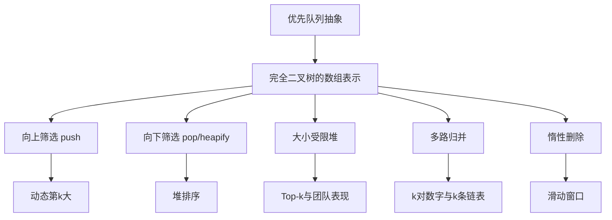

> 原书：李春葆、李筱驰《算法面试（全二册）》<br>
> 阅读范围：第 9 章 优先队列<br>
> 说明：本文按原书 9.1～9.3 顺序整理。“补充”用于补足证明、替代方案和语言边界；原文中的样例、复杂度或复制文字问题明确标为“勘误说明”。

## 0. 本章主线

普通队列按到达时间决定顺序，优先队列按一个可比较的优先级决定谁先离开。二叉堆用完全二叉树维持“堆顶最优”，适合动态最值、Top-$k$、多路归并和贪心候选维护。



本章共盘点 10 个算法单元：9.1 的共享手写堆 1 个，正文题 9 道，其中 9.2 三题、9.3 六题。

## 9.1 优先队列概述

### 9.1.1 优先队列的定义

#### 优先队列要解决什么问题

普通队列只能取得最早进入者；若任务要求反复取得“当前最小代价”“当前最高评分”或“当前最早截止事件”，每次线性扫描要 $O(n)$。优先队列把“插入元素”和“取出当前最高优先级元素”都控制在对数时间。

可以把优先队列抽象为集合 $Q$ 及以下操作：

- `push(x)`：插入元素 $x$；
- `top()`：返回 $Q$ 中优先级最高者而不删除；
- `pop()`：删除优先级最高者；
- `empty()/size()`：查询状态。

若数值越大优先级越高，称大根堆；数值越小优先级越高，称小根堆。优先级也可以是复合键，例如 `(代价,下标)`按代价升序、并列时下标升序。

#### 优先级不等于元素值

元素可以是结构体，优先级由比较器定义。两个元素优先级相同的时候，二叉堆通常**不保证稳定性**，即不保证先入者先出；若题目要求稳定并列规则，应把时间戳、原下标或唯一序号加入比较键。

普通 FIFO 队列可以看作优先级为“到达时间越早越高”的特殊优先队列，但通用堆不会自动维护这种稳定顺序。

#### 为什么通常用二叉堆

若用无序数组，插入 $O(1)$，找最值 $O(n)$；若用有序数组，找最值 $O(1)$，中间插入 $O(n)$。二叉堆借助近似完全的树高，在两者间取得平衡：

$$
push=O(\log n),\qquad pop=O(\log n),\qquad top=O(1).
$$

堆只保证父子之间的偏序，不保证整个数组有序，因此不能用二分查找任意值，也不能把堆数组直接当作排序结果。

### 9.1.2 优先队列的知识点

#### 1. 完全二叉树的数组表示

长度为 $n$ 的数组 $R[0..n-1]$表示完全二叉树。下标关系为

$$
parent(i)=\left\lfloor\frac{i-1}{2}\right\rfloor\quad(i>0),
$$

$$
left(i)=2i+1,\qquad right(i)=2i+2.
$$

对小根堆，每条存在的父子边满足

$$
R[parent(i)]\le R[i].
$$

因此根 $R[0]$ 不大于沿任何路径可达的后代，是全局最小值。注意兄弟之间、不同子树之间没有大小保证。

完全二叉树的高度为

$$
h=\lfloor\log_2 n\rfloor+1,
$$

所以沿一条祖先链或孩子链调整只需 $O(\log n)$。

#### 2. 向上筛选：修复新叶

假设原数组是小根堆，把新值 $x$追加到末尾后，只有“新叶到根”这条路径可能违反有序性。保存 $x$，只要父值大于 $x$，就把父值下移到当前空位，最后把 $x$放入停止位置。

循环不变量：路径之外仍是合法堆；当前空位以下已经合法；`tmp`保存唯一尚未放置的新增值。停止时父值不大于 `tmp`，而 `tmp`原来的孩子都不小于它或来自已下移的祖先，整个堆恢复。

例如小根堆 `[1,5,2,7,6]`插入 3：先放末尾得 `[1,5,2,7,6,3]`。3 的父亲是 2，满足 $2\le3$，无需移动。若插入 0，则依次越过父结点 2 和根 1，最终得到 `[0,5,1,7,6,3,2]`。

#### 3. 向下筛选：修复根

删除堆顶后，用末尾值 `tmp`填根。此时左右子树仍是小根堆，只有根向下的一条路径可能失序。每轮选两个孩子中较小者；若 `tmp`大于该孩子，就把孩子上移，继续向下，否则停止。

必须选择较小孩子：若选择较大孩子上移，新的父结点可能仍大于另一个孩子，不能恢复小根堆。

例如把 `[1,2,4,7,5,6]` 的根删除，用 6 暂存于根。孩子 2、4 中选 2 上移；随后 6 与孩子 7、5 比较，选 5 上移；最后 6 落位，得到 `[2,5,4,7,6]`。

#### 4. 建堆为什么可以是 $O(n)$

逐个 `push`需要 $O(n\log n)$ 上界。Floyd 建堆从最后一个分支结点 $\lfloor n/2\rfloor-1$开始向前执行下筛。靠近叶子的结点很多，但它们最多移动很少层；靠近根的结点移动层数多，但数量少。

距离叶子高度约为 $d$ 的结点数至多 $n/2^{d+1}$，总工作量有上界

$$
\sum_{d\ge0}\frac{n}{2^{d+1}}O(d)
=O(n)\sum_{d\ge0}\frac{d}{2^d}
=O(n),
$$

因为级数 $\sum d/2^d=2$ 收敛。于是 `heapify` 是 $O(n)$，不是 $O(n\log n)$。

#### 5. 基本操作复杂度

| 操作 | 方法 | 时间 |
|---|---|---:|
| `top` | 读取 `R[0]` | $O(1)$ |
| `push` | 末尾追加后上筛 | $O(\log n)$ |
| `pop` | 尾值覆盖根后下筛 | $O(\log n)$ |
| `heapify` | 自底向上下筛 | $O(n)$ |
| 查找任意值 | 堆偏序无法排除整段 | $O(n)$ |

对空堆调用 `top/pop`必须由接口预先禁止或返回显式错误，不能访问 `R[0]`。

#### C++17：共享手写小根堆

下面的 `MinHeap` 是本章唯一一处手写堆定义，直接对应前述数组下标、上筛、下筛与 Floyd 建堆。9.2.1 的堆排序会复用它；其余题目优先使用标准库 `priority_queue`，避免重复实现共享结构。

```cpp
#include <stdexcept>
#include <utility>
#include <vector>

class MinHeap {
    std::vector<int> data_;

    void siftUp(int index) {
        int value = data_[index];
        while (index > 0) {
            int parent = (index - 1) / 2;
            if (data_[parent] <= value) break;
            data_[index] = data_[parent];
            index = parent;
        }
        data_[index] = value;
    }

    void siftDown(int index) {
        int size = static_cast<int>(data_.size());
        int value = data_[index];
        int child = 2 * index + 1;
        while (child < size) {
            // 小根堆必须让较小的孩子上移。
            if (child + 1 < size && data_[child + 1] < data_[child]) ++child;
            if (value <= data_[child]) break;
            data_[index] = data_[child];
            index = child;
            child = 2 * index + 1;
        }
        data_[index] = value;
    }

public:
    explicit MinHeap(std::vector<int> values = {}) : data_(std::move(values)) {
        for (int index = static_cast<int>(data_.size()) / 2 - 1;
             index >= 0; --index) {
            siftDown(index);
        }
    }

    void push(int value) {
        data_.push_back(value);
        siftUp(static_cast<int>(data_.size()) - 1);
    }

    int pop() {
        if (data_.empty()) throw std::out_of_range("空堆不能出队");
        int answer = data_.front();
        int tail = data_.back();
        data_.pop_back();
        if (!data_.empty()) {
            data_.front() = tail;
            siftDown(0);
        }
        return answer;
    }

    int top() const {
        if (data_.empty()) throw std::out_of_range("空堆没有堆顶");
        return data_.front();
    }

    bool empty() const { return data_.empty(); }
};
```

#### 6. C++ `priority_queue`

C++ 默认 `priority_queue<T>`是大根堆；小根堆常写为：

C++17 中可写成 `std::priority_queue<int, std::vector<int>, std::greater<int>> minimumHeap`。

比较器 `Compare(a,b)`返回真，直觉上表示 $a$ 的优先级低于 $b$，所以 `top`是“按该顺序最优”的元素。比较器必须形成严格弱序，不能使用 `<=`。

`top()`只读，`pop()`只删除而不返回；应先保存 `top()`再 `pop()`。底层容器需支持随机访问及尾部插删，通常是 `vector`或 `deque`，不能是 `list`。

自定义类型可以重载 `<`，也可以提供独立比较器。把比较规则放在独立比较器中通常更清楚，因为同一类型可能在不同题里需要不同优先级。

#### 7. Python `heapq`

Python `heapq`直接操作列表，默认小根堆：`heapify`、`heappush`、`heappop`、`heapreplace`、`heappushpop`。

- `heapreplace(heap,x)`：先弹旧堆顶，再压 $x$；即使 $x$更小，也一定返回旧顶；要求堆非空。
- `heappushpop(heap,x)`：逻辑上先压再弹，通常返回两者中更小者；适合维护固定大小候选集。

数值大根堆可存负值。元组按字典序比较，例如 `(cost,index)`自然实现代价优先、下标打破并列。若元组前部完全相同而后部对象不可比较，应加入唯一计数器，避免 Python 尝试比较对象。

#### 8. Go `container/heap`

Go 通过实现 `heap.Interface`使用优先队列：`Len/Less/Swap/Push/Pop`。`Less(i,j)`决定下标 $i$ 是否应更靠近堆顶；写 `values[i] < values[j]`得到小根堆，改为 `>`得到大根堆。

接口中的 `Push/Pop`方法负责切片末尾增删，公开的 `heap.Push/heap.Pop`再调用上筛或下筛。不要直接调用自定义 `Pop`，否则不会维护堆性质。

### 9.1.3 从题意迁移到堆模型

#### 先写清“堆顶是谁”

选大根堆还是小根堆，不应从“题目求最大还是最小”机械判断，而应先写出堆顶在当前算法中的语义：

| 算法动作 | 堆顶语义 | 常见方向 |
|---|---|---|
| 反复输出当前最小值 | 下一位应输出者 | 小根堆 |
| 保留最大的 $k$ 个 | 候选中最差、下一位应淘汰者 | 大小为 $k$ 的小根堆 |
| 保留最小的 $k$ 个 | 候选中最差、下一位应淘汰者 | 大小为 $k$ 的大根堆 |
| 合并多条升序序列 | 各路当前头中的最小者 | 小根堆 |

例如扫描 `[9,1,8,2]`并保留最大的 2 个数。最终候选是 `{8,9}`，需要暴露的是边界值 8，以便新值大于 8 时替换它；因此堆顶必须是 8，要用小根堆。若误用大根堆，堆顶是最好的 9，既不能直接得到第 2 大，也无法判断该淘汰谁。

#### 候选集不变量与大小为 $k$ 的堆

设计时可依次回答四个问题：已经扫描的全集是什么；堆中是否恰好保存仍可能影响答案的候选；堆顶代表“下一输出”还是“最差候选”；一次输入到来后如何恢复这个集合。只有这四项都能写成不变量，堆方向和更新操作才算确定。

大小为 $k$ 的堆适合只关心 Top-$k$ 或第 $k$ 名、且被淘汰元素以后永远不可能重新入选的场景。动态第 $k$ 大满足这一点；滑动窗口却不满足，因为当前较小的元素可能在旧最大值离窗后重新成为答案，不能只保留窗口中最大的固定若干项。

#### 延迟删除与双堆

堆擅长删除堆顶，却不擅长删除内部任意元素。若失效元素暂时埋在堆内，可以先记录“它已失效”，等它到达堆顶时再连续清理，这就是延迟删除。滑动窗口把下标放入堆中，堆顶满足 `index < left` 时即可直接识别过期项；若删除请求针对任意值或唯一编号，则通常还需要哈希表记录待删次数。

双堆求动态中位数是同一方法的典型迁移：大根堆保存较小的一半，小根堆保存较大的一半，并维持两边**有效元素数**之差不超过 1。删除任意元素时先在延迟表中记账并减少对应逻辑大小，只有待删元素浮到某个堆顶才真正弹出，然后再平衡两堆。以 `[1,2,100]`为例，中位数是 2；删除 2 时先标记，再从大根堆顶清理 2，平衡后两侧为 `{1}`与 `{100}`，偶数个元素的中位数为 $(1+100)/2=50.5$。

迁移边界也很明确：若过期条件能从堆顶条目本身判断，保留下标即可；若要按任意值删除，需要“延迟计数 + 逻辑大小”；若必须让物理空间始终为 $O(k)$，则应使用支持定位删除的索引堆、平衡树或其他结构，而不能只靠普通惰性堆。

## 9.2 优先队列的实现

### 9.2.1 LeetCode 912：排序数组（★★）

#### 原书方法：小根堆依次出队

把全部元素放入小根堆。堆顶始终是所有尚未输出元素中的最小值，因此连续弹出并从左到右写回，得到升序数组。

循环不变量：写回前缀已经升序，且恰好包含原数组中最小的若干元素；堆中保存其余元素。弹出堆顶后，新元素不小于此前最后输出值，所以前缀继续有序。

若逐个 `push`建堆，时间 $O(n\log n)$；若一次 `heapify`，建堆 $O(n)$，但 $n$ 次弹出仍为 $O(n\log n)$。复制到独立堆需要 $O(n)$ 额外空间。

#### 数值演算

`[5,1,1,2,0,0]`堆化后堆顶为 0。六次弹出依次为 `0,0,1,1,2,5`，正是排序结果。重复值作为独立元素保留，不做除重。

#### 补充：原地堆排序

经典原地升序堆排序建立**大根堆**，把最大值与当前末尾交换，再只在未排序前缀下筛：

```text
建大根堆
for end = n-1 ... 1:
    swap(a[0], a[end])
    在 a[0..end-1] 下筛
```

每轮把当前最大值固定到最终位置。时间 $O(n\log n)$、额外空间 $O(1)$，但通常不稳定。原书为了讲优先队列抽象，采用更直观但额外空间 $O(n)$ 的小根堆版本。

#### C++17：小根堆依次出队

复用 9.1.2 中唯一的 `MinHeap` 定义，接口保留输入并返回新的升序数组。

```cpp
#include <vector>

std::vector<int> heapSort(const std::vector<int>& numbers) {
    MinHeap heap(numbers);
    std::vector<int> answer;
    answer.reserve(numbers.size());
    while (!heap.empty()) answer.push_back(heap.pop());
    return answer;
}
```

### 9.2.2 LeetCode 215：数组中第 $k$ 大元素（★★）

#### 排名含义与原书勘误

第 $k$ 大按排序后的**位置**计数，重复值也占位置，不是第 $k$ 个不同值。

> **勘误说明：** 原书样例 `[3,2,1,5,6,4]`、$k=2$ 的第 2 大应为 5，不是 2。

#### 解法一：大根堆

把全部 $n$ 个元素建成大根堆，弹出前 $k-1$ 大后，堆顶就是第 $k$ 大。使用 `heapify`时复杂度为

$$
O(n)+O(k\log n),
$$

逐个压入则为 $O(n\log n+k\log n)$。额外空间取决于是否复用输入数组。

#### 解法二：大小为 $k$ 的小根堆

扫描数据，堆中始终保留已扫描部分最大的 $k$ 个元素：不足 $k$ 直接压入；超过 $k$ 时弹出最小值。最终堆顶是这 $k$ 个最大值中最小者，也就是全局第 $k$ 大。

循环不变量可用归纳证明：加入新值后，若候选有 $k+1$ 个，删除其中最小者不会删除前 $k$ 大。时间 $O(n\log k)$、空间 $O(k)$，当 $k\ll n$ 时优于全量堆。

#### 补充：Quickselect

题目进阶要求 $O(n)$。堆方案一般不满足严格线性；随机化 Quickselect 的期望时间为 $O(n)$、原地空间 $O(1)$，最坏 $O(n^2)$。确定性中位数的中位数可保证最坏 $O(n)$，实现更复杂。

#### C++17：大小为 $k$ 的小根堆

```cpp
#include <functional>
#include <queue>
#include <stdexcept>
#include <vector>

int kthLargest(const std::vector<int>& numbers, int k) {
    if (k <= 0 || k > static_cast<int>(numbers.size())) {
        throw std::invalid_argument("k 超出有效排名范围");
    }
    std::priority_queue<int, std::vector<int>, std::greater<int>> candidates;
    for (int value : numbers) {
        if (static_cast<int>(candidates.size()) < k) {
            candidates.push(value);
        } else if (value > candidates.top()) {
            candidates.pop();
            candidates.push(value);
        }
    }
    return candidates.top();
}
```

### 9.2.3 LeetCode 506：相对名次（★）

#### 堆元素为什么要保存原下标

名次按成绩降序产生，答案却要写回运动员原位置。把 `(score,index)`放入大根堆，每次弹出的成绩依次是第 1、2、3……名，再把奖牌或名次字符串写入 `answer[index]`。

题目保证成绩互异；若允许同分，还必须明确并列排名规则，并把下标或姓名加入比较键。

样例 `[10,3,8,9,4]` 的弹出顺序为 `(10,0),(9,3),(8,2),(4,4),(3,1)`，写回得到：

```text
[Gold Medal,5,Bronze Medal,Silver Medal,4]
```

建堆后弹出全部元素，时间 $O(n\log n)$、空间 $O(n)$。静态输入直接排序同样为 $O(n\log n)$，通常更简单；优先队列适合只需要前若干名或数据动态到达。

> **勘误说明：** 原书本节开头误粘了“出堆 $k-1$ 次后返回堆顶”的第 $k$ 大描述；本题实际要持续弹出全部运动员并写回名次，后续正式代码是正确的。

#### C++17：成绩出堆、原下标写回

```cpp
#include <queue>
#include <string>
#include <utility>
#include <vector>

std::vector<std::string> relativeRanks(const std::vector<int>& scores) {
    std::priority_queue<std::pair<int, int>> maximumHeap;
    for (int index = 0; index < static_cast<int>(scores.size()); ++index) {
        maximumHeap.push({scores[index], index});
    }

    const std::vector<std::string> medals{
        "Gold Medal", "Silver Medal", "Bronze Medal"
    };
    std::vector<std::string> answer(scores.size());
    for (int rank = 1; !maximumHeap.empty(); ++rank) {
        int index = maximumHeap.top().second;
        maximumHeap.pop();
        answer[index] = rank <= 3 ? medals[rank - 1] : std::to_string(rank);
    }
    return answer;
}
```

## 9.3 优先队列应用的算法设计

### 9.3.1 LeetCode 703：数据流中第 $k$ 大元素（★）

#### 为什么维护大小为 $k$ 的小根堆

数据不断到达，无法每次重新排序全部历史。只保留当前最大的 $k$ 个值即可丢弃其余值；这 $k$ 个值中最小者正是当前第 $k$ 大，所以使用小根堆。

不变量：完成构造或一次 `add` 后，堆中恰为已见数据的前 $k$ 大元素（数据不足 $k$ 时保存全部），堆顶是其中最小值。

加入 $x$ 后有三种情况：

1. 堆未满：直接压入；
2. 堆已满且 $x\le top$：$x$不可能进入前 $k$ 大，可忽略；
3. 堆已满且 $x>top$：弹出旧第 $k$ 大并压入 $x$。

也可以统一为“压入后若大小超过 $k$ 就弹出堆顶”。

#### 样例走查

$k=3$，初始 `[4,5,8,2]`，保留前三大 `{4,5,8}`，堆顶 4：

```text
add(3): 3不进入前三大，返回4
add(5): 候选变5,5,8，返回5
add(10): 候选变5,8,10，返回5
add(9): 候选变8,9,10，返回8
add(4): 4被忽略，返回8
```

重复值分别占排名位置，因此两个 5 都应保留。

#### 正确性与复杂度

若堆已有前 $k$ 大，新值加入后只可能淘汰这 $k$ 个候选中的最小者；删除 $k+1$ 个候选中的最小值后，剩余恰是新前 $k$ 大，归纳不变量成立。

初始 $n$ 个数逐个处理为 $O(n\log k)$，每次 `add`为 $O(\log k)$，空间 $O(k)$。可先 `heapify`全部初值再缩到 $k$，但当初始数据很大时流式保留 $k$ 项更节省空间。

#### C++17：流式维护前 $k$ 大

```cpp
#include <functional>
#include <queue>
#include <stdexcept>
#include <vector>

class KthLargest {
    int rank_;
    std::priority_queue<int, std::vector<int>, std::greater<int>> candidates_;

    void offer(int value) {
        if (static_cast<int>(candidates_.size()) < rank_) {
            candidates_.push(value);
        } else if (value > candidates_.top()) {
            candidates_.pop();
            candidates_.push(value);
        }
    }

public:
    KthLargest(int rank, const std::vector<int>& numbers) : rank_(rank) {
        if (rank_ <= 0) throw std::invalid_argument("k 必须为正数");
        for (int value : numbers) offer(value);
    }

    int add(int value) {
        offer(value);
        if (static_cast<int>(candidates_.size()) < rank_) {
            throw std::logic_error("当前数据量不足 k 个");
        }
        return candidates_.top();
    }
};
```

### 9.3.2 LeetCode 373：查找和最小的 $k$ 对数字（★★）

#### 把数对矩阵看成多条有序序列

两个数组 $a,b$ 都升序。固定 $a_i$，该行数对和为

$$
a_i+b_0\le a_i+b_1\le\cdots\le a_i+b_{n-1}.
$$

共有 $m$ 条有序行，问题就是对这些行做多路归并并取前 $k$ 项。堆结点保存 `(sum,i,j)`。

初始化每行首项 `(a_i+b_0,i,0)`。每次弹出全局最小 `(i,j)`，输出 `[a_i,b_j]`；该行只有下一项 `(i,j+1)`可能成为新行首，把它压入。

最多只需初始化前

$$
r=\min(m,k)
$$

行：第 $k$ 行及之后的首项至少不小于前 $k$ 行各自首项，不可能在必须输出的前 $k$ 项中占据不可替代的位置。

#### 正确性证明

堆始终保存每条尚未耗尽行的最小未输出项。任意未暴露项都不小于同一行堆中当前项，因此堆顶是所有未输出数对中的全局最小值。弹出后只推进所属行，恢复该不变量。这正是基本 $k$ 路归并。

#### 复杂度与原书口径修正

令实际输出数

$$
q=\min(k,mn).
$$

初始化 $O(r)$，每次弹出和至多一次压入为 $O(\log r)$：

$$
T=O(r+q\log r),\qquad S=O(r)
$$

（不计输出）。

> **勘误说明：** 原书写“从 $O(mn)$ 降到 $O(mn\log m)$”既没有体现只取 $k$ 项，也把加堆后的表达式写得反而更大。若输出全部 $mn$ 项，堆归并是 $O(mn\log m)$，而原先每次线性扫描 $m$ 路应为 $O(m^2n)$；本题只取 $q$ 项时应使用上式。

对 `a=[1,7,11]`、`b=[2,4,6]`、$k=3$，初始堆中的三个行首为 `(3,0,0),(9,1,0),(13,2,0)`。弹出和 3 后只补同一行的和 5，再弹 5 补 7；第三次弹出 7，得到 `[1,2],[1,4],[1,6]`。没有必要提前把其余六个数对放入堆中。

#### C++17：有序行的多路归并

```cpp
#include <algorithm>
#include <functional>
#include <queue>
#include <tuple>
#include <vector>

std::vector<std::vector<int>> kSmallestPairs(
    const std::vector<int>& first,
    const std::vector<int>& second,
    int k
) {
    using Entry = std::tuple<long long, int, int>;  // 和、行、列
    std::priority_queue<Entry, std::vector<Entry>, std::greater<Entry>> queue;
    if (first.empty() || second.empty() || k <= 0) return {};

    int rows = std::min(static_cast<int>(first.size()), k);
    for (int row = 0; row < rows; ++row) {
        queue.push({static_cast<long long>(first[row]) + second[0], row, 0});
    }

    std::vector<std::vector<int>> answer;
    while (!queue.empty() && static_cast<int>(answer.size()) < k) {
        Entry entry = queue.top();
        queue.pop();
        int row = std::get<1>(entry);
        int column = std::get<2>(entry);
        answer.push_back({first[row], second[column]});
        if (column + 1 < static_cast<int>(second.size())) {
            queue.push({static_cast<long long>(first[row]) + second[column + 1],
                        row, column + 1});
        }
    }
    return answer;
}
```

### 9.3.3 LeetCode 23：合并 $k$ 个有序链表（★★★）

#### 堆中只放每条链的当前头

每条链自身升序，未合并部分的最小值就是当前头。把所有非空链头压入小根堆；每次弹出最小结点接到结果尾，再把该结点的后继压入。堆大小最多为非空链数 $k$。

循环不变量：结果链已经有序并包含所有已弹出结点；堆为每条未耗尽链保存且只保存当前最小结点。任何尚未入堆的结点都有一个同链前驱在堆中或尚未弹出，所以不可能小于堆顶。

#### 结点复用与并列值

题目要求拼接原结点，可以直接修改 `next`，无需复制值。最终最好确保结果尾的 `next`指向正确剩余链或空。

相同值的结点先后顺序不影响升序结果。Python 堆若存 `(value,node)`，同值时会尝试比较 `node`并报错；应存 `(value,uniqueId,node)`或 `(value,listIndex,node)`。

#### 复杂度

设总结点数为

$$
N=\sum_{i=1}^{k}n_i.
$$

每个结点入堆、出堆各一次，时间 $O(N\log k)$，堆空间 $O(k)$，输出复用原结点只需 $O(1)$ 其他指针。平衡两两归并同样为 $O(N\log k)$，常数和内存访问模式不同。

例如三条链为 `1->4`、`1->3`、`2`，初始候选只有三个链头 `1,1,2`。弹出第一条链的 1 后才把它的后继 4 加入；此时候选是 `1,2,4`，所以另一条链的 1 会先出队。这个走查也说明堆大小由链数控制，而不是由总结点数控制。

#### C++17：每条链只保留当前头

```cpp
#include <queue>
#include <vector>

struct ListNode {
    int val;
    ListNode* next;
    explicit ListNode(int value, ListNode* nextNode = nullptr)
        : val(value), next(nextNode) {}
};

struct NodeEntry {
    int value;
    long long serial;
    ListNode* node;
};

struct NodeEntryGreater {
    bool operator()(const NodeEntry& left, const NodeEntry& right) const {
        if (left.value != right.value) return left.value > right.value;
        return left.serial > right.serial;
    }
};

ListNode* mergeKLists(const std::vector<ListNode*>& lists) {
    std::priority_queue<NodeEntry, std::vector<NodeEntry>, NodeEntryGreater> queue;
    long long serial = 0;
    for (ListNode* node : lists) {
        if (node != nullptr) queue.push({node->val, serial++, node});
    }

    ListNode dummy(0);
    ListNode* rear = &dummy;
    while (!queue.empty()) {
        NodeEntry entry = queue.top();
        queue.pop();
        rear->next = entry.node;
        rear = entry.node;
        if (entry.node->next != nullptr) {
            queue.push({entry.node->next->val, serial++, entry.node->next});
        }
    }
    if (rear != &dummy) rear->next = nullptr;
    return dummy.next;
}
```

### 9.3.4 LeetCode 239：滑动窗口最大值（★★★）

#### 大根堆与惰性删除

堆元素必须同时保存值和下标。Python 可存 `(-value,index)`；C++ 可让值越大优先，并列时下标规则不影响最大值。

窗口右端为 $i$、大小为 $k$ 时，合法下标满足

$$
i-k+1\le index\le i.
$$

压入当前 `(value,i)` 后，只要堆顶下标小于左边界，就弹出。堆中其他过期元素无需立即删除：只要它们不在堆顶，就不会影响当前答案；将来若浮到堆顶，再删除即可，这叫惰性删除。

#### 为什么堆顶是窗口最大值

清理后堆顶必在窗口内。所有当前窗口元素都曾经入堆且尚未作为堆顶过期删除，因此其中最大值仍在堆里；大根堆顶不小于任何堆元素，所以恰为窗口最大值。

对 `[1,3,-1,-3,5]`、$k=3$，前三项入堆后输出 3；右端到 3 时仍输出 3；右端到 4 时压入 5，堆顶直接变为 5。旧的 -1、-3 即使以后过期，也不影响此时答案。

#### 复杂度与替代方案

每个元素入堆一次、至多出堆一次，堆可能因非堆顶过期项累积到 $O(n)$，故时间 $O(n\log n)$、空间 $O(n)$。若实现支持按下标删除的索引堆，可控制为 $O(n\log k)$、空间 $O(k)$，但更复杂。

第 4 章单调双端队列能做到 $O(n)$ 时间、$O(k)$ 空间，是本题更优方案；堆方案的价值是展示通用优先队列与惰性删除。

#### C++17：下标识别过期堆顶

```cpp
#include <queue>
#include <utility>
#include <vector>

std::vector<int> slidingWindowMaximum(
    const std::vector<int>& numbers,
    int window
) {
    if (window <= 0 || window > static_cast<int>(numbers.size())) return {};

    std::priority_queue<std::pair<int, int>> maximumHeap;
    std::vector<int> answer;
    for (int index = 0; index < static_cast<int>(numbers.size()); ++index) {
        maximumHeap.push({numbers[index], index});
        int left = index - window + 1;
        // 内部过期项先保留；只有堆顶过期时才会影响答案。
        while (!maximumHeap.empty() && maximumHeap.top().second < left) {
            maximumHeap.pop();
        }
        if (index >= window - 1) answer.push_back(maximumHeap.top().first);
    }
    return answer;
}
```

### 9.3.5 LeetCode 1383：最大的团队表现值（★★★）

#### 乘积目标为何先枚举效率

团队 $S$ 的表现值为

$$
performance(S)=\left(\sum_{i\in S}speed_i\right)
\cdot\min_{i\in S}efficiency_i.
$$

“速度和”希望越大越好，“最小效率”却由团队短板决定，二者不能分别贪心。把工程师按效率降序处理；遍历到效率 $e$ 时，前缀中所有人效率都至少为 $e$。若把当前阈值视为团队最低效率，只需在该前缀选择至多 $k$ 个最大速度。

#### 小根堆维护最大的 $k$ 个速度

扫描工程师 `(e,s)`：把速度 $s$压入小根堆并加入 `speedSum`；若人数超过 $k$，弹出最小速度并从和中减去；以当前效率计算

$$
candidate=speedSum\cdot e.
$$

堆不变量：处理完当前效率前缀后，堆保存该前缀中最大的至多 $k$ 个速度，`speedSum`为其和。

#### 正确性证明

考虑全局最优团队中效率最小的工程师，其效率为 $e^*$。处理到 $e^*$ 时，最优团队所有成员都已进入前缀。堆选择前缀中速度和最大的至多 $k$ 人，因此其速度和不小于最优团队速度和；与 $e^*$相乘得到的候选不会小于最优值。另一方面，堆中团队实际最小效率至少为 $e^*$，其真实性能不小于该候选，所以候选不可能超过全局可实现最大值。两者合起来说明必取到最优值。

#### 样例与复杂度

样例按效率排序为 `(9,1),(7,5),(5,2),(4,10),(3,3),(2,8)`，$k=2$。处理效率 4 时，堆保留速度 10、5，速度和 15，表现值 $15\times4=60$，成为答案。

排序 $O(n\log n)$，每人一次堆更新 $O(\log k)$，总时间 $O(n\log n+n\log k)$，空间 $O(n+k)$（排序若原地则额外可降）。速度和与乘积必须用 64 位；只在求得最大真实值后对 $10^9+7$取模，不能在比较候选前取模。

原书“人数达到 $k$ 后先弹旧最小速度再加入当前人”强制当前效率工程师入组，也可枚举以其为最低效率的团队；标准的“先入堆、超过 $k$再弹最小”更统一。

#### C++17：枚举效率阈值并维护速度和

```cpp
#include <algorithm>
#include <functional>
#include <queue>
#include <utility>
#include <vector>

int maximumPerformance(
    const std::vector<int>& speed,
    const std::vector<int>& efficiency,
    int k
) {
    std::vector<std::pair<int, int>> engineers;
    for (int index = 0; index < static_cast<int>(speed.size()); ++index) {
        engineers.push_back({efficiency[index], speed[index]});
    }
    std::sort(engineers.rbegin(), engineers.rend());

    std::priority_queue<int, std::vector<int>, std::greater<int>> speedHeap;
    long long speedSum = 0;
    long long answer = 0;
    for (auto [currentEfficiency, currentSpeed] : engineers) {
        speedHeap.push(currentSpeed);
        speedSum += currentSpeed;
        if (static_cast<int>(speedHeap.size()) > k) {
            speedSum -= speedHeap.top();
            speedHeap.pop();
        }
        answer = std::max(answer, speedSum * currentEfficiency);
    }
    return static_cast<int>(answer % 1'000'000'007);
}
```

### 9.3.6 LeetCode 2462：雇佣 $k$ 位工人的总代价（★★）

#### 两端候选窗口

每轮只能从剩余序列最前 `candidates` 人或最后 `candidates` 人中选择。用左、右小根堆分别保存两个候选池，堆元素为 `(cost,index)`，自然实现代价小优先、并列下标小优先。

指针 `left` 指向尚未加入候选池的最左工人，`right`指向最右工人。初始化时从两端各加入至多 `candidates` 人，但始终检查 `left<=right`，避免候选区重叠时同一人入堆两次。

最小反例是 `costs=[5,1,4]`、`candidates=2`：若左右各无条件取两人，中间下标 1 会同时进入两个候选池，后续甚至可能“雇佣”同一人两次。共享的 `left/right` 未暴露区间正是防重边界。

#### 每轮状态转移

比较两个堆顶，选择 `(cost,index)`字典序更小者并累计代价。若从左堆弹出，就从 `left`补入一个尚未加入者并右移指针；若从右堆弹出，则从 `right`补入并左移。

循环不变量：两个堆的并集恰好是当前剩余工人中规则允许考虑的两端候选，且没有重复；中间未暴露工人不在堆中。弹出一侧后，从同侧补入下一人，正好恢复候选窗口。

也可以使用一个堆并给结点增加 `side`，弹出后根据来源补入；但并列时仍必须把原下标放入比较键。

#### 样例走查

`[17,12,10,2,7,2,11,20,8]`、$k=3,c=4$。初始左候选下标 0～3，右候选下标 5～8（中间下标 4 尚未暴露）。第一轮选 `(2,3)`，从左侧补入下标 4 的 7；第二轮选 `(2,5)`；第三轮选 `(7,4)`，总代价 11。

#### 复杂度与边界

初始最多压入 $2c$ 个元素，此后每轮弹出一个、至多压入一个。堆总大小 $O(c)$：

$$
T=O((c+k)\log c),\qquad S=O(c).
$$

当 $2c\ge n$ 时，所有人都可在初始阶段进入候选，问题退化为从全体中取代价最小的 $k$ 人。总代价可能超过 32 位，应使用 64 位整数。

#### C++17：一个堆维护两端候选并集

```cpp
#include <functional>
#include <queue>
#include <tuple>
#include <vector>

long long totalHiringCost(
    const std::vector<int>& costs,
    int k,
    int candidateCount
) {
    using Worker = std::tuple<int, int, int>;  // 代价、原下标、来源侧
    std::priority_queue<Worker, std::vector<Worker>, std::greater<Worker>> queue;
    int left = 0;
    int right = static_cast<int>(costs.size()) - 1;
    for (int count = 0; count < candidateCount && left <= right; ++count) {
        queue.push({costs[left], left, 0});
        ++left;
    }
    for (int count = 0; count < candidateCount && left <= right; ++count) {
        queue.push({costs[right], right, 1});
        --right;
    }

    long long answer = 0;
    for (int hired = 0; hired < k; ++hired) {
        auto [cost, index, side] = queue.top();
        queue.pop();
        answer += cost;
        if (left <= right) {
            if (side == 0) {
                queue.push({costs[left], left, 0});
                ++left;
            } else {
                queue.push({costs[right], right, 1});
                --right;
            }
        }
    }
    return answer;
}
```

## 推荐练习题

原书列出以下 13 道练习，未在本章正文展开解法：

1. LeetCode 264：丑数 II（★★）
2. LeetCode 373：查找和最小的 $k$ 对数字（★★）
3. LeetCode 378：有序矩阵中第 $k$ 小的元素（★★）
4. LeetCode 407：接雨水 II（★★★）
5. LeetCode 658：找到 $k$ 个最接近的元素（★★）
6. LeetCode 786：第 $k$ 个最小的素数分数（★★）
7. LeetCode 870：优势洗牌（★★）
8. LeetCode 1046：最后一块石头的重量（★）
9. LeetCode 1792：最大平均通过率（★★）
10. LeetCode 1801：积压订单中的订单总数（★★）
11. LeetCode 1845：座位预约管理系统（★★）
12. LeetCode 1942：最小未被占据椅子的编号（★★）
13. LeetCode 1985：找出数组中第 $k$ 大的整数（★★）

## 代码与推导的对应关系

| 原书主题 | 实现接口 | 对应不变量或公式 |
|---|---|---|
| 向上/向下筛选 | `MinHeap` / `IntMinHeap` | 只修复新叶到根或旧根到叶的一条路径 |
| 堆排序 | `heap_sort/heapSort` | 每次弹出剩余元素全局最小值 |
| 第 $k$ 大 | `kth_largest/kthLargest` | 小根堆保存最大的 $k$ 个，堆顶为第 $k$ 大 |
| 相对名次 | `relative_ranks/relativeRanks` | 大根堆按成绩出队，原下标负责写回 |
| 动态第 $k$ 大 | `KthLargest` | 每次更新后仍只保留前 $k$ 大 |
| 最小和数对 | `k_smallest_pairs/kSmallestPairs` | 堆保存每条有序行的首个未输出项 |
| 合并链表 | `merge_k_lists/mergeKLists` | 堆保存每条链当前最小结点 |
| 滑动窗口 | `sliding_window_maximum/slidingWindowMaximum` | 堆顶过期时惰性删除 |
| 团队表现 | `maximum_performance/maximumPerformance` | 效率降序枚举最低效率，小根堆保留最大速度和 |
| 雇佣工人 | `total_hiring_cost/totalHiringCost` | 堆集合恰等于规则允许的两端候选 |

## 三种语言中的实现差异

- C++ `priority_queue`默认大根堆，`pop()`不返回元素；Python `heapq`默认小根堆且 `heappop()`返回元素；Go 由 `Less`自行决定方向。
- Python 用负值模拟数值大根堆；负号技巧不适合所有自定义对象，复合键应显式设计。
- C++/Python 的元组或 `pair`通常按字典序比较；Go 需要在 `Less`中逐字段实现代价、下标等并列规则。
- Python 堆中若优先级字段完全相等，后续不可比较对象会触发异常，应加入唯一序号；C++/Go 示例也加入 `serial`，让行为明确。
- 三种语言的速度和、数对和、团队乘积和雇佣总代价都应使用 64 位中间值。Python 整数自动扩展，C++ 使用 `long long`，Go 使用 `int64`。

## 补充：易混淆概念与常见误解

| 容易混淆的说法 | 更准确的理解 |
|---|---|
| 优先队列就是堆 | 优先队列是抽象接口，二叉堆是常见实现 |
| 堆数组整体有序 | 只保证父子偏序，任意两个位置未必有序 |
| 小根堆适合保留最小的 $k$ 个 | 保留最大的 $k$ 个时反而使用大小为 $k$ 的小根堆，以便淘汰最小候选 |
| `heapify` 是 $O(n\log n)$ | Floyd 自底向上建堆为 $O(n)$ |
| 堆排序稳定 | 常规堆排序会跨远距离交换，通常不稳定 |
| 第 $k$ 大是第 $k$ 个不同值 | 重复值也占排序位置，除非题目明确“不同” |
| 堆能让滑动窗口达到 $O(n\log k)$ | 普通惰性堆可能积累过期项到 $O(n)$；单调队列可严格 $O(n)$ |
| 多路归并要把所有元素先压堆 | 每一路只需压当前头，弹出后再补该路后继 |
| 比较器可以用 `<=` | 堆比较器也必须满足严格弱序，使用非严格比较会破坏容器约定 |
| 团队表现可以分别最大化速度和效率 | 乘积由最小效率耦合，必须枚举效率阈值并在前缀优化速度和 |
| 取模可以在比较团队表现前进行 | 取模不保持大小关系，应先比较真实 64 位结果，最后取模 |
| 两端候选可以各取固定数量而不防重 | 候选区重叠时同一工人会重复入堆，必须用 `left<=right`约束 |

## 本章总结

优先队列的核心不是“把所有数据排序”，而是只维护当前最重要的候选。二叉堆依靠完全树的对数高度，使插入和删除堆顶为 $O(\log n)$；上筛与下筛都只修复一条路径，自底向上建堆则利用大量低高度结点把总成本降到 $O(n)$。

应用题的关键是选择堆方向和堆中状态：动态第 $k$ 大使用大小为 $k$ 的小根堆；多路归并只存每路当前头；滑动窗口为元素附加下标并惰性删除；团队表现按效率排序后用小根堆最大化速度和；双端雇佣则让堆精确对应当前可选集合。

分析复杂度时，应同时说明堆的最大规模。写成笼统的“每次 $O(\log n)$”会掩盖 $\log k$、$\log m$ 或过期元素累积等关键差异。比较器、并列规则、对象可比较性和整数溢出，则是从算法推导落到可运行实现时最常见的边界。

## 附录 A：Python 3 实现速查

以下单个程序保留手写堆和九道正文题的核心接口，可直接运行并与末尾输出核对。

```python
from __future__ import annotations

import heapq
from itertools import count


class MinHeap:
    """数组小根堆：用于对应原书的向上筛选和向下筛选。"""

    def __init__(self, values: list[int] | None = None):
        self.data = list(values or [])
        # Floyd建堆：从最后一个分支结点开始向下筛选。
        for index in range(len(self.data) // 2 - 1, -1, -1):
            self._sift_down(index)

    def _sift_up(self, index: int) -> None:
        value = self.data[index]
        while index > 0:
            parent = (index - 1) // 2
            if self.data[parent] <= value:
                break
            self.data[index] = self.data[parent]
            index = parent
        self.data[index] = value

    def _sift_down(self, index: int) -> None:
        size = len(self.data)
        value = self.data[index]
        child = 2 * index + 1
        while child < size:
            if child + 1 < size and self.data[child + 1] < self.data[child]:
                child += 1
            if value <= self.data[child]:
                break
            self.data[index] = self.data[child]
            index = child
            child = 2 * index + 1
        self.data[index] = value

    def push(self, value: int) -> None:
        self.data.append(value)
        self._sift_up(len(self.data) - 1)

    def pop(self) -> int:
        if not self.data:
            raise IndexError("空堆不能出队")
        answer = self.data[0]
        tail = self.data.pop()
        if self.data:
            self.data[0] = tail
            self._sift_down(0)
        return answer

    def top(self) -> int:
        if not self.data:
            raise IndexError("空堆没有堆顶")
        return self.data[0]

    def __bool__(self) -> bool:
        return bool(self.data)


def heap_sort(numbers: list[int]) -> list[int]:
    heap = MinHeap(numbers)
    return [heap.pop() for _ in range(len(numbers))]


def kth_largest(numbers: list[int], k: int) -> int:
    # 小根堆始终保存已扫描部分最大的k个值。
    candidates: list[int] = []
    for value in numbers:
        if len(candidates) < k:
            heapq.heappush(candidates, value)
        elif value > candidates[0]:
            heapq.heapreplace(candidates, value)
    return candidates[0]


def relative_ranks(scores: list[int]) -> list[str]:
    maximum_heap = [(-score, index) for index, score in enumerate(scores)]
    heapq.heapify(maximum_heap)
    answer = [""] * len(scores)
    medals = ["Gold Medal", "Silver Medal", "Bronze Medal"]
    for rank in range(1, len(scores) + 1):
        _, index = heapq.heappop(maximum_heap)
        answer[index] = medals[rank - 1] if rank <= 3 else str(rank)
    return answer


class KthLargest:
    def __init__(self, k: int, numbers: list[int]):
        self.k = k
        self.heap: list[int] = []
        for value in numbers:
            self.add(value)

    def add(self, value: int) -> int:
        if len(self.heap) < self.k:
            heapq.heappush(self.heap, value)
        elif value > self.heap[0]:
            heapq.heapreplace(self.heap, value)
        return self.heap[0]


def k_smallest_pairs(first: list[int], second: list[int], k: int) -> list[list[int]]:
    if not first or not second or k == 0:
        return []
    queue = [(first[row] + second[0], row, 0) for row in range(min(len(first), k))]
    heapq.heapify(queue)
    answer: list[list[int]] = []
    while queue and len(answer) < k:
        _, row, column = heapq.heappop(queue)
        answer.append([first[row], second[column]])
        if column + 1 < len(second):
            heapq.heappush(
                queue,
                (first[row] + second[column + 1], row, column + 1),
            )
    return answer


class ListNode:
    def __init__(self, value: int, next_node: ListNode | None = None):
        self.val = value
        self.next = next_node


def build_list(values: list[int]) -> ListNode | None:
    dummy = ListNode(0)
    rear = dummy
    for value in values:
        rear.next = ListNode(value)
        rear = rear.next
    return dummy.next


def list_values(head: ListNode | None) -> list[int]:
    answer: list[int] = []
    while head:
        answer.append(head.val)
        head = head.next
    return answer


def merge_k_lists(lists: list[ListNode | None]) -> ListNode | None:
    unique = count()
    queue: list[tuple[int, int, ListNode]] = []
    for node in lists:
        if node:
            heapq.heappush(queue, (node.val, next(unique), node))
    dummy = ListNode(0)
    rear = dummy
    while queue:
        _, _, node = heapq.heappop(queue)
        rear.next = node
        rear = node
        if node.next:
            heapq.heappush(queue, (node.next.val, next(unique), node.next))
    if rear is not dummy:
        rear.next = None
    return dummy.next


def sliding_window_maximum(numbers: list[int], window: int) -> list[int]:
    maximum_heap: list[tuple[int, int]] = []
    answer: list[int] = []
    for index, value in enumerate(numbers):
        heapq.heappush(maximum_heap, (-value, index))
        left = index - window + 1
        # 只需清理已经浮到堆顶的过期元素。
        while maximum_heap and maximum_heap[0][1] < left:
            heapq.heappop(maximum_heap)
        if index >= window - 1:
            answer.append(-maximum_heap[0][0])
    return answer


def maximum_performance(
    speed: list[int], efficiency: list[int], k: int
) -> int:
    engineers = sorted(zip(efficiency, speed), reverse=True)
    speed_heap: list[int] = []
    speed_sum = 0
    answer = 0
    for current_efficiency, current_speed in engineers:
        heapq.heappush(speed_heap, current_speed)
        speed_sum += current_speed
        if len(speed_heap) > k:
            speed_sum -= heapq.heappop(speed_heap)
        answer = max(answer, speed_sum * current_efficiency)
    return answer % 1_000_000_007


def total_hiring_cost(costs: list[int], k: int, candidates: int) -> int:
    # 堆元素为(代价, 原下标, 来源侧)，字典序自动实现并列取小下标。
    queue: list[tuple[int, int, int]] = []
    left, right = 0, len(costs) - 1
    for _ in range(candidates):
        if left <= right:
            heapq.heappush(queue, (costs[left], left, 0))
            left += 1
    for _ in range(candidates):
        if left <= right:
            heapq.heappush(queue, (costs[right], right, 1))
            right -= 1

    answer = 0
    for _ in range(k):
        cost, _, side = heapq.heappop(queue)
        answer += cost
        if left <= right:
            if side == 0:
                heapq.heappush(queue, (costs[left], left, 0))
                left += 1
            else:
                heapq.heappush(queue, (costs[right], right, 1))
                right -= 1
    return answer


if __name__ == "__main__":
    print(heap_sort([5, 1, 1, 2, 0, 0]))
    print(kth_largest([3, 2, 1, 5, 6, 4], 2))
    print(relative_ranks([10, 3, 8, 9, 4]))

    stream = KthLargest(3, [4, 5, 8, 2])
    print([stream.add(value) for value in [3, 5, 10, 9, 4]])
    print(k_smallest_pairs([1, 7, 11], [2, 4, 6], 3))

    merged = merge_k_lists(
        [build_list([1, 4, 5]), build_list([1, 3, 4]), build_list([2, 6])]
    )
    print(list_values(merged))
    print(sliding_window_maximum([1, 3, -1, -3, 5, 3, 6, 7], 3))
    print(maximum_performance([2, 10, 3, 1, 5, 8], [5, 4, 3, 9, 7, 2], 2))
    print(total_hiring_cost([17, 12, 10, 2, 7, 2, 11, 20, 8], 3, 4))
```

示例输出：

```text
[0, 0, 1, 1, 2, 5]
5
['Gold Medal', '5', 'Bronze Medal', 'Silver Medal', '4']
[4, 5, 5, 8, 8]
[[1, 2], [1, 4], [1, 6]]
[1, 1, 2, 3, 4, 4, 5, 6]
[3, 3, 5, 5, 6, 7]
60
11
```

## 附录 B：Go 1.22 实现速查

以下单个程序使用 `container/heap` 提供九道正文题的核心接口；每种复合堆都在 `Less` 中明确并列规则。

```go
package main

import (
    "container/heap"
    "fmt"
    "sort"
)

type IntMinHeap []int

func (values IntMinHeap) Len() int           { return len(values) }
func (values IntMinHeap) Less(i, j int) bool { return values[i] < values[j] }
func (values IntMinHeap) Swap(i, j int)      { values[i], values[j] = values[j], values[i] }
func (values *IntMinHeap) Push(value any)    { *values = append(*values, value.(int)) }
func (values *IntMinHeap) Pop() any {
    old := *values
    last := len(old) - 1
    value := old[last]
    *values = old[:last]
    return value
}

func heapSort(numbers []int) []int {
    queue := IntMinHeap(append([]int(nil), numbers...))
    heap.Init(&queue)
    answer := make([]int, 0, len(numbers))
    for queue.Len() > 0 {
        answer = append(answer, heap.Pop(&queue).(int))
    }
    return answer
}

func kthLargest(numbers []int, rank int) int {
    queue := &IntMinHeap{}
    heap.Init(queue)
    for _, value := range numbers {
        if queue.Len() < rank {
            heap.Push(queue, value)
        } else if value > (*queue)[0] {
            heap.Pop(queue)
            heap.Push(queue, value)
        }
    }
    return (*queue)[0]
}

type Athlete struct {
    score, index int
}

type AthleteMaxHeap []Athlete

func (values AthleteMaxHeap) Len() int      { return len(values) }
func (values AthleteMaxHeap) Swap(i, j int) { values[i], values[j] = values[j], values[i] }
func (values AthleteMaxHeap) Less(i, j int) bool {
    if values[i].score != values[j].score {
        return values[i].score > values[j].score
    }
    return values[i].index < values[j].index
}
func (values *AthleteMaxHeap) Push(value any) { *values = append(*values, value.(Athlete)) }
func (values *AthleteMaxHeap) Pop() any {
    old := *values
    last := len(old) - 1
    value := old[last]
    *values = old[:last]
    return value
}

func relativeRanks(scores []int) []string {
    queue := &AthleteMaxHeap{}
    for index, score := range scores {
        *queue = append(*queue, Athlete{score, index})
    }
    heap.Init(queue)
    answer := make([]string, len(scores))
    medals := []string{"Gold Medal", "Silver Medal", "Bronze Medal"}
    for rank := 1; queue.Len() > 0; rank++ {
        athlete := heap.Pop(queue).(Athlete)
        if rank <= 3 {
            answer[athlete.index] = medals[rank-1]
        } else {
            answer[athlete.index] = fmt.Sprint(rank)
        }
    }
    return answer
}

type KthLargest struct {
    rank  int
    queue *IntMinHeap
}

func NewKthLargest(rank int, numbers []int) *KthLargest {
    stream := &KthLargest{rank: rank, queue: &IntMinHeap{}}
    heap.Init(stream.queue)
    for _, value := range numbers {
        stream.Add(value)
    }
    return stream
}

func (stream *KthLargest) Add(value int) int {
    if stream.queue.Len() < stream.rank {
        heap.Push(stream.queue, value)
    } else if value > (*stream.queue)[0] {
        heap.Pop(stream.queue)
        heap.Push(stream.queue, value)
    }
    return (*stream.queue)[0]
}

type PairEntry struct {
    sum         int64
    row, column int
}

type PairMinHeap []PairEntry

func (values PairMinHeap) Len() int      { return len(values) }
func (values PairMinHeap) Swap(i, j int) { values[i], values[j] = values[j], values[i] }
func (values PairMinHeap) Less(i, j int) bool {
    if values[i].sum != values[j].sum {
        return values[i].sum < values[j].sum
    }
    if values[i].row != values[j].row {
        return values[i].row < values[j].row
    }
    return values[i].column < values[j].column
}
func (values *PairMinHeap) Push(value any) { *values = append(*values, value.(PairEntry)) }
func (values *PairMinHeap) Pop() any {
    old := *values
    last := len(old) - 1
    value := old[last]
    *values = old[:last]
    return value
}

func kSmallestPairs(first, second []int, count int) [][]int {
    if len(first) == 0 || len(second) == 0 || count == 0 {
        return nil
    }
    queue := &PairMinHeap{}
    rows := len(first)
    if rows > count {
        rows = count
    }
    for row := 0; row < rows; row++ {
        *queue = append(*queue, PairEntry{int64(first[row] + second[0]), row, 0})
    }
    heap.Init(queue)
    answer := [][]int{}
    for queue.Len() > 0 && len(answer) < count {
        entry := heap.Pop(queue).(PairEntry)
        answer = append(answer, []int{first[entry.row], second[entry.column]})
        if entry.column+1 < len(second) {
            heap.Push(queue, PairEntry{
                int64(first[entry.row] + second[entry.column+1]),
                entry.row,
                entry.column + 1,
            })
        }
    }
    return answer
}

type ListNode struct {
    Val  int
    Next *ListNode
}

func buildList(values []int) *ListNode {
    dummy := &ListNode{}
    rear := dummy
    for _, value := range values {
        rear.Next = &ListNode{Val: value}
        rear = rear.Next
    }
    return dummy.Next
}

func listValues(head *ListNode) []int {
    answer := []int{}
    for head != nil {
        answer = append(answer, head.Val)
        head = head.Next
    }
    return answer
}

type NodeEntry struct {
    value, serial int
    node          *ListNode
}

type NodeMinHeap []NodeEntry

func (values NodeMinHeap) Len() int      { return len(values) }
func (values NodeMinHeap) Swap(i, j int) { values[i], values[j] = values[j], values[i] }
func (values NodeMinHeap) Less(i, j int) bool {
    if values[i].value != values[j].value {
        return values[i].value < values[j].value
    }
    return values[i].serial < values[j].serial
}
func (values *NodeMinHeap) Push(value any) { *values = append(*values, value.(NodeEntry)) }
func (values *NodeMinHeap) Pop() any {
    old := *values
    last := len(old) - 1
    value := old[last]
    *values = old[:last]
    return value
}

func mergeKLists(lists []*ListNode) *ListNode {
    queue := &NodeMinHeap{}
    serial := 0
    for _, node := range lists {
        if node != nil {
            *queue = append(*queue, NodeEntry{node.Val, serial, node})
            serial++
        }
    }
    heap.Init(queue)
    dummy := &ListNode{}
    rear := dummy
    for queue.Len() > 0 {
        entry := heap.Pop(queue).(NodeEntry)
        rear.Next = entry.node
        rear = entry.node
        if entry.node.Next != nil {
            heap.Push(queue, NodeEntry{entry.node.Next.Val, serial, entry.node.Next})
            serial++
        }
    }
    if rear != dummy {
        rear.Next = nil
    }
    return dummy.Next
}

type IndexedValue struct {
    value, index int
}

type WindowMaxHeap []IndexedValue

func (values WindowMaxHeap) Len() int      { return len(values) }
func (values WindowMaxHeap) Swap(i, j int) { values[i], values[j] = values[j], values[i] }
func (values WindowMaxHeap) Less(i, j int) bool {
    if values[i].value != values[j].value {
        return values[i].value > values[j].value
    }
    return values[i].index > values[j].index
}
func (values *WindowMaxHeap) Push(value any) { *values = append(*values, value.(IndexedValue)) }
func (values *WindowMaxHeap) Pop() any {
    old := *values
    last := len(old) - 1
    value := old[last]
    *values = old[:last]
    return value
}

func slidingWindowMaximum(numbers []int, window int) []int {
    queue := &WindowMaxHeap{}
    heap.Init(queue)
    answer := []int{}
    for index, value := range numbers {
        heap.Push(queue, IndexedValue{value, index})
        left := index - window + 1
        for queue.Len() > 0 && (*queue)[0].index < left {
            heap.Pop(queue)
        }
        if index >= window-1 {
            answer = append(answer, (*queue)[0].value)
        }
    }
    return answer
}

type Engineer struct {
    efficiency, speed int
}

func maximumPerformance(speed, efficiency []int, teamSize int) int64 {
    engineers := make([]Engineer, len(speed))
    for index := range speed {
        engineers[index] = Engineer{efficiency[index], speed[index]}
    }
    sort.Slice(engineers, func(i, j int) bool {
        return engineers[i].efficiency > engineers[j].efficiency
    })
    queue := &IntMinHeap{}
    heap.Init(queue)
    var speedSum, answer int64
    for _, engineer := range engineers {
        heap.Push(queue, engineer.speed)
        speedSum += int64(engineer.speed)
        if queue.Len() > teamSize {
            speedSum -= int64(heap.Pop(queue).(int))
        }
        candidate := speedSum * int64(engineer.efficiency)
        if candidate > answer {
            answer = candidate
        }
    }
    return answer % 1_000_000_007
}

type Worker struct {
    cost, index, side int
}

type WorkerMinHeap []Worker

func (values WorkerMinHeap) Len() int      { return len(values) }
func (values WorkerMinHeap) Swap(i, j int) { values[i], values[j] = values[j], values[i] }
func (values WorkerMinHeap) Less(i, j int) bool {
    if values[i].cost != values[j].cost {
        return values[i].cost < values[j].cost
    }
    return values[i].index < values[j].index
}
func (values *WorkerMinHeap) Push(value any) { *values = append(*values, value.(Worker)) }
func (values *WorkerMinHeap) Pop() any {
    old := *values
    last := len(old) - 1
    value := old[last]
    *values = old[:last]
    return value
}

func totalHiringCost(costs []int, hires, candidateCount int) int64 {
    queue := &WorkerMinHeap{}
    left, right := 0, len(costs)-1
    for count := 0; count < candidateCount && left <= right; count++ {
        *queue = append(*queue, Worker{costs[left], left, 0})
        left++
    }
    for count := 0; count < candidateCount && left <= right; count++ {
        *queue = append(*queue, Worker{costs[right], right, 1})
        right--
    }
    heap.Init(queue)
    var answer int64
    for hired := 0; hired < hires; hired++ {
        worker := heap.Pop(queue).(Worker)
        answer += int64(worker.cost)
        if left <= right {
            if worker.side == 0 {
                heap.Push(queue, Worker{costs[left], left, 0})
                left++
            } else {
                heap.Push(queue, Worker{costs[right], right, 1})
                right--
            }
        }
    }
    return answer
}

func main() {
    fmt.Println(heapSort([]int{5, 1, 1, 2, 0, 0}))
    fmt.Println(kthLargest([]int{3, 2, 1, 5, 6, 4}, 2))
    fmt.Println(relativeRanks([]int{10, 3, 8, 9, 4}))

    stream := NewKthLargest(3, []int{4, 5, 8, 2})
    streamAnswers := []int{}
    for _, value := range []int{3, 5, 10, 9, 4} {
        streamAnswers = append(streamAnswers, stream.Add(value))
    }
    fmt.Println(streamAnswers)
    fmt.Println(kSmallestPairs([]int{1, 7, 11}, []int{2, 4, 6}, 3))

    merged := mergeKLists([]*ListNode{
        buildList([]int{1, 4, 5}),
        buildList([]int{1, 3, 4}),
        buildList([]int{2, 6}),
    })
    fmt.Println(listValues(merged))
    fmt.Println(slidingWindowMaximum([]int{1, 3, -1, -3, 5, 3, 6, 7}, 3))
    fmt.Println(maximumPerformance(
        []int{2, 10, 3, 1, 5, 8},
        []int{5, 4, 3, 9, 7, 2},
        2,
    ))
    fmt.Println(totalHiringCost([]int{17, 12, 10, 2, 7, 2, 11, 20, 8}, 3, 4))
}
```

预期输出：

```text
[0 0 1 1 2 5]
5
[Gold Medal 5 Bronze Medal Silver Medal 4]
[4 5 5 8 8]
[[1 2] [1 4] [1 6]]
[1 1 2 3 4 4 5 6]
[3 3 5 5 6 7]
60
11
```
