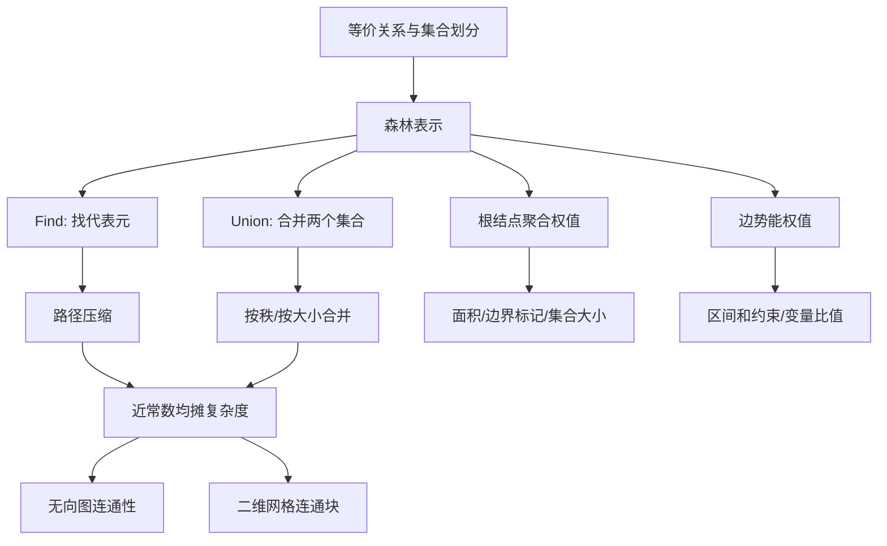

> 原书：李春葆、李筱驰《算法面试（全二册）》<br>
> 阅读范围：第 10 章 并查集<br>
> 说明：本文按原书 10.1～10.4 顺序整理。“补充”用于补足严格证明、适用边界和替代方案，不代表原书原文；原页文本层遗漏的带权公式已按原书页图恢复。

## 0. 本章主线

并查集（Disjoint Set Union，DSU）维护一组会不断合并的互不相交集合。它不存储两点之间的具体路径，而把每个集合压缩成一个代表元，因此特别适合回答“是否已经连通”“当前有多少连通块”“新关系是否制造矛盾”。



本章正文共 13 道题：10.2 一维并查集 7 题，10.3 二维并查集 2 题，10.4 带权并查集 4 题。

按可独立复用的实现盘点，本章共 15 个算法单元：普通 DSU、加法势能 DSU 两个基础单元，加上 13 道正文题。正文相应放置 15 个 C++17 代码块；Python、Go 的完整版本只保留在章末附录 A、B。

## 10.1 并查集概述

### 10.1.1 并查集的定义

#### 它要解决什么问题

给定全集

$$
U=\{0,1,\ldots,n-1\},
$$

系统不断加入“$x$ 与 $y$ 等价/连通”的关系。等价关系具有：

- 自反性：$x\sim x$；
- 对称性：$x\sim y\Rightarrow y\sim x$；
- 传递性：$x\sim y\land y\sim z\Rightarrow x\sim z$。

这些关系把 $U$ 划分为若干互不相交的等价类

$$
\mathcal P=\{S_1,S_2,\ldots,S_c\},
$$

满足 $S_i\cap S_j=\varnothing$（$i\ne j$）且 $\bigcup_iS_i=U$。并查集动态维护这个划分。

#### 基本操作的严格语义

1. `Init(n)`：建立 $n$ 个单元素集合 $\{0\},\ldots,\{n-1\}$。
2. `Find(x)`：返回 $x$ 所在集合的代表元。代表元本身可以任意选择，只要同集合元素返回相同代表。
3. `Union(x,y)`：若二者属于不同集合，把两个等价类合并；若已同属一类，则状态不变。
4. `Connected(x,y)`：判断 `Find(x)==Find(y)`。

“代表元相同”是连通的判据，不要求代表元是最小值、最大值或最早出现值。只有像 10.2.6 那样题目需要最小代表时，才专门改变合并策略。

#### 直觉：为什么只保存代表元就够

若问题只问两点是否通过某些关系间接连通，就不需要恢复具体路径。把每个连通块压缩成一个标签，查询只比较标签即可。新边 $(x,y)$ 的作用也只有两种：

- 两个标签不同：把两个连通块合成一个；
- 标签相同：新边没有改变连通块，常意味着形成环或关系冗余。

#### 适用边界

并查集擅长**只增加关系**的动态连通性。它通常不能直接回答：

- 两点之间的最短路径或具体路径是什么；
- 删除一条边后是否仍连通；
- 有向图的一般可达性；
- 关系不具有对称性、传递性的问题。

删除关系需要离线逆序、可回滚并查集、动态树或更复杂的动态连通结构。最短路则需要 BFS、Dijkstra 等图算法。

#### 在线、离线与反向处理的判断

关键不在于输入是否一次性给出，而在于状态变化能否只写成 `Union`：

- 只有“加边 + 连通查询”时，可以按时间顺序在线处理；
- 加边、删边交错且每次操作后立即回答时，普通并查集不适用。反例是链 `0-1-2` 删除桥 `1-2`：父数组已经把三点压进同一集合，没有信息可把它拆开；
- 所有操作预先已知，且倒放后每次删除都能变成加边时，可从最终状态开始**逆序离线**处理。例如逐日移除陆地并询问岛屿数，可反向逐日加回陆地；
- 一条边可能重复加入或删除时，逆序前要维护引用次数，只有次数从 0 变 1 才真正 `Union`。若边只在某些时间区间有效，通常用“时间线段树 + 可回滚并查集”，而不是路径压缩版 DSU。

因此，“并查集适合离线连通”不是说它只能离线，而是说**含删除的动态连通通常要先离线改写为只合并问题**；无法这样改写且要求在线回答时，应换动态连通数据结构。

### 10.1.2 并查集的实现

#### 1. 森林表示

每个等价类用一棵有根树表示，所有集合组成森林。数组 `parent`满足：

$$
parent[x]=
\begin{cases}
x,&x\text{ 是根},\\
x\text{ 的父结点},&\text{其他}.
\end{cases}
$$

同一树中的所有结点属于同一集合，根是代表元。树形状只是实现细节，不表示原图中的真实边，也不能用它恢复原图路径。

#### 2. 初始化

初始每个元素独立：

$$
parent[i]=i,
\qquad rank[i]=0.
$$

集合数 `components=n`。每次成功合并两个不同根时，`components--`，可随时 $O(1)$ 得到连通分量数。

#### 3. Find 与路径压缩

朴素 `Find(x)`沿父指针上行，直到遇到 `parent[r]=r`。若树退化成链，单次最坏 $O(n)$。

递归路径压缩写作：

```text
if parent[x] != x:
    parent[x] = Find(parent[x])
return parent[x]
```

递归返回时，查询路径上每个结点都直接指向根。

循环不变量：沿父指针从 $x$ 出发始终停留在同一集合；改变中间结点父亲为同一根不会改变集合划分。压缩只改变森林形状，不改变等价关系。

##### 数值走查

若路径为

$$
3\to2\to0,
\qquad parent[0]=0,
$$

执行 `Find(3)` 后，`parent[3]=0`且 `parent[2]=0`。以后查询 3 只需 3→0。

原书说“每个结点都查询一次后树高变为 2”，这里的“高度”按结点层数计算；若按边数计算则为 1。更准确地说，所有非根结点都直接连接根。

#### 4. 按秩合并

合并前先取得根 $r_x,r_y$。若相同则无需操作；否则把秩较小根接到秩较大根下：

$$
rank[r_x]<rank[r_y]\Rightarrow parent[r_x]=r_y.
$$

只有两根秩相等时，新根的秩加 1。

为什么不把高树接到矮树下？若高度分别为 $h_1<h_2$，矮树接到高树下，新高度仍为 $h_2$；反过来高树接到矮树下，新高度可能变为 $h_2+1$。

#### 5. 秩不是路径压缩后的真实高度

`rank`是在按秩合并过程中维护的高度上界。路径压缩会降低真实高度，但通常不回退秩；只要它仍能安全决定合并方向即可。

根秩为 $r$ 时，其集合大小至少为 $2^r$。归纳证明：秩 0 的根至少一个结点；秩只在两个同秩集合合并时增长，新集合大小至少

$$
2^r+2^r=2^{r+1}.
$$

所以 $rank\le\lfloor\log_2n\rfloor$。即使不做路径压缩，按秩合并也把树高限制为 $O(\log n)$。

#### 6. 真正的复杂度：逆 Ackermann 函数

同时使用路径压缩与按秩（或按大小）合并，执行 $m$ 次操作的总时间为

$$
O\bigl(m\,\alpha(n)\bigr),
$$

其中 $\alpha(n)$ 是 Ackermann 函数的反函数，增长极慢，在任何现实规模下通常不超过 4 或 5。因此常口语化为“接近 $O(1)$”，但它不是严格的单次最坏 $O(1)$。

`Find`单次仍可能沿较长路径；保证的是一串操作的**均摊**复杂度。

#### C++17：共享 DSU 基础模板

后续普通并查集题目都复用这一实现。`Unite` 只在两个根不同时返回 `true`，因此“是否成环”“是否减少分量数”都可直接由返回值判断；`component_size_` 是根聚合属性，按秩只负责控制树高，二者职责不同。

```cpp
#include <algorithm>
#include <limits>
#include <numeric>
#include <string>
#include <unordered_map>
#include <unordered_set>
#include <utility>
#include <vector>

class DSU {
public:
    explicit DSU(int size)
        : parent_(size), rank_(size, 0), component_size_(size, 1),
          components_(size) {
        std::iota(parent_.begin(), parent_.end(), 0);
    }

    int Find(int node) {
        if (parent_[node] != node) {
            parent_[node] = Find(parent_[node]);
        }
        return parent_[node];
    }

    bool Unite(int first, int second) {
        int first_root = Find(first);
        int second_root = Find(second);
        if (first_root == second_root) {
            return false;
        }
        if (rank_[first_root] < rank_[second_root]) {
            std::swap(first_root, second_root);
        }
        parent_[second_root] = first_root;
        component_size_[first_root] += component_size_[second_root];
        if (rank_[first_root] == rank_[second_root]) {
            ++rank_[first_root];
        }
        --components_;
        return true;
    }

    bool Connected(int first, int second) {
        return Find(first) == Find(second);
    }

    int SizeOf(int node) { return component_size_[Find(node)]; }
    int Components() const { return components_; }

private:
    std::vector<int> parent_;
    std::vector<int> rank_;
    std::vector<int> component_size_;
    int components_;
};
```

#### 7. 原书例 10-1 走查

对 $n=5$：

| 操作 | 结果摘要 | 分量数 |
|---|---|---:|
| `Init(5)` | 五个单点根 | 5 |
| `Union(0,1)` | 1 接到 0，`rank[0]=1` | 4 |
| `Union(2,3)` | 3 接到 2，`rank[2]=1` | 3 |
| `Union(1,3)` | 根 0、2 同秩，2 接到 0，`rank[0]=2` | 2 |
| `Find(3)` | 路径 3→2→0 压缩为 3→0 | 2 |
| `Union(1,4)` | 4 接到根 0 | 1 |

最终所有元素连通。因同秩时选择哪一根可任意，具体 `parent`数组可能不同，但集合划分相同。

#### 8. 稀疏标识

若结点是字符串、大整数或只出现少量离散坐标，可用哈希映射保存 `parent/rank`，按需 `makeSet(x)`。这样空间与实际出现元素数 $V$ 成正比，而不是与最大编号成正比；平均操作仍接近 $O(\alpha(V))$，另含哈希平均成本。

#### 9. 二维坐标映射

对 $m\times n$ 网格，行列 $(r,c)$ 映射为

$$
id(r,c)=r\cdot n+c,
\qquad0\le r<m,\ 0\le c<n.
$$

逆映射为

$$
r=\left\lfloor\frac{id}{n}\right\rfloor,
\qquad c=id\bmod n.
$$

映射是双射，所以二维相邻关系可转成一维编号的合并。`r*n+c`可能溢出窄整数，大网格应使用足够宽的类型。

水格子或无效格子可以令 `parent[id]=-1`，表示它不属于并查集；调用 `Find`前必须先确认有效。

#### 10. 坐标、字符串与虚拟结点的统一建模

并查集数组只接受稳定结点编号，业务标识要先做一一映射：

| 输入实体 | 推荐映射 | 必须保持的性质 |
|---|---|---|
| 稠密二维坐标 | `r * columns + c` | 列数固定，映射不碰撞 |
| 稀疏坐标 | 哈希表按需分配连续编号 | 只为空间中实际出现的点建集合 |
| 字符串变量 | `unordered_map<string, int>` | 同一字符串始终得到同一编号 |
| 多类同值实体 | `(kind, value)` 或带前缀字符串 | 行 3 与列 3 等命名空间不能碰撞 |

虚拟结点用于把“与同一外部条件连通”的许多结点折叠为一个代表。例如封闭岛把所有边界土地连到 `outside`，最后只需判断某个根是否与 `outside`同根。虚拟编号必须在真实编号范围外，如 `outside = rows * columns`，并把 DSU 容量开为 `rows * columns + 1`。

这个技巧只编码**等价/连通条件**。若问题问“到边界的最短距离”，把边界全接到虚拟根会丢失路径长度，应该改用多源 BFS；若要区分顶部和底部是否连通，则应使用两个不同虚拟结点，不能把两类边界提前合并。

### 10.1.3 带权并查集

普通并查集只回答“同组/不同组”。带权并查集还维护同组元素之间的可组合关系，例如：

- 两个前缀和之差；
- 两个变量值之比；
- 两结点坐标差、奇偶关系或模关系；
- 根结点所代表集合的大小、是否接触边界等聚合属性。

“带权”实际有两类，不能混为一谈：

1. **根聚合属性**：集合大小、边界标记，只在根上有意义；
2. **边势能/相对权值**：记录结点与父亲的差值或比值，路径压缩时必须同步组合。

#### 1. 加法势能的一般定义

设每个结点 $x$ 有一个抽象势能 $P(x)$，定义边权

$$
delta[x]=P(parent[x])-P(x).
$$

根满足 `parent[r]=r`，故 $delta[r]=0$。沿路径累加可得

$$
Delta(x)=P(root)-P(x).
$$

同一集合中两点关系为

$$
P(y)-P(x)=Delta(x)-Delta(y).
$$

#### 2. 路径压缩时如何更新加法权值

设压缩前 $p=parent[x]$。递归 `Find(p)` 后，`delta[p]`已变成 $P(root)-P(p)$；旧 `delta[x]`是 $P(p)-P(x)$。因此压缩后：

$$
delta'[x]
=P(root)-P(x)
=delta[x]+delta[p].
$$

必须先保存旧父亲 $p$，否则修改 `parent[x]`后会失去应组合的权值。

#### 3. 合并加法约束的推导

给定关系

$$
P(y)-P(x)=v.
$$

执行 `Find(x),Find(y)` 后，令根为 $r_x,r_y$，已知

$$
delta[x]=P(r_x)-P(x),
\qquad delta[y]=P(r_y)-P(y).
$$

若把 $r_x$ 接到 $r_y$，需要设置

$$
delta[r_x]=P(r_y)-P(r_x).
$$

由约束推导：

$$
\begin{aligned}
P(r_y)-P(r_x)
&=[P(r_y)-P(y)]+[P(y)-P(x)]-[P(r_x)-P(x)]\\
&=delta[y]+v-delta[x].
\end{aligned}
$$

所以

$$
\boxed{delta[r_x]=-delta[x]+delta[y]+v}.
$$

这正是原书区间和示例的合并公式。

若反向把 $r_y$ 接到 $r_x$，权值必须取相反方向并重新推导，不能只交换父指针。

#### 4. 区间和为什么转成前缀势能

令

$$
P(t)=a_1+a_2+\cdots+a_t,
\qquad P(0)=0.
$$

闭区间和约束 $a_x+\cdots+a_y=v$ 等价于

$$
P(y)-P(x-1)=v.
$$

所以把输入的 $x$改为 $x-1$，合并前缀结点 $x-1$ 与 $y$。若两点已同根，则已有关系为

$$
Delta(x-1)-Delta(y),
$$

它若不等于 $v$，新陈述与已有约束矛盾。

原书样例中已知 `[1,10]=100`、`[7,10]=28`、`[1,3]=32`，推出

$$
[4,6]=[1,10]-[1,3]-[7,10]=100-32-28=40,
$$

所以输入 `[4,6]=41` 冲突。

#### 5. 乘法势能预告

对比例关系可定义

$$
weight[x]=\frac{value(x)}{value(parent[x])}.
$$

沿路径组合使用乘法而不是加法；路径压缩更新为权值连乘。10.4.4 会完整推导。

#### 6. 适用边界

带权关系必须可沿路径组合并可求逆，常见模型是群或模群上的差值。浮点比例存在舍入误差，比较时应使用容差。若输入可能矛盾，合并同根结点时必须验证已有关系；原书 LeetCode 399 保证输入无矛盾，所以可省略冲突检测。

#### C++17：加法势能并查集与区间矛盾计数

下面的 `delta_[x]` 始终采用正文方向 $P(parent[x])-P(x)$。反向挂根时必须对连接势能取相反数；这正是最容易因只交换父指针而写错的地方。

```cpp
class AdditivePotentialDSU {
public:
    explicit AdditivePotentialDSU(int size)
        : parent_(size), rank_(size, 0), delta_(size, 0) {
        std::iota(parent_.begin(), parent_.end(), 0);
    }

    int Find(int node) {
        if (parent_[node] != node) {
            int old_parent = parent_[node];
            parent_[node] = Find(old_parent);
            delta_[node] += delta_[old_parent];
        }
        return parent_[node];
    }

    bool AddRelation(int first, int second, long long difference) {
        int first_root = Find(first);
        int second_root = Find(second);
        if (first_root == second_root) {
            return delta_[first] - delta_[second] == difference;
        }

        // 若 first_root -> second_root：P(root_y)-P(root_x)。
        long long link_delta = -delta_[first] + delta_[second] + difference;
        if (rank_[first_root] < rank_[second_root]) {
            parent_[first_root] = second_root;
            delta_[first_root] = link_delta;
        } else {
            parent_[second_root] = first_root;
            delta_[second_root] = -link_delta;
            if (rank_[first_root] == rank_[second_root]) {
                ++rank_[first_root];
            }
        }
        return true;
    }

private:
    std::vector<int> parent_;
    std::vector<int> rank_;
    std::vector<long long> delta_;
};

struct IntervalStatement {
    int left;
    int right;
    long long sum;
};

int CountBadIntervalStatements(
    int size, const std::vector<IntervalStatement>& statements) {
    AdditivePotentialDSU dsu(size + 1);
    int conflicts = 0;
    for (const auto& statement : statements) {
        if (!dsu.AddRelation(
                statement.left - 1, statement.right, statement.sum)) {
            ++conflicts;
        }
    }
    return conflicts;
}
```

## 10.2 一维并查集应用的算法设计

### 10.2.1 LeetCode 261：以图判树（★★）

#### 树的两个必要且充分条件

无向图是树，当且仅当它：

1. 连通；
2. 无环。

并查集恰好能在逐边加入时维护这两个性质。处理边 $(u,v)$ 前：

- 若 `Find(u)==Find(v)`，已有路径连接 $u,v$，再加该边就形成环；
- 否则合并两个分量，分量数减 1。

全部边处理后，若没有成环且分量数为 1，则图连通无环，是树。

#### 为什么“已有同根 + 新边”一定成环

同根表示在已处理边中存在一条 $u$ 到 $v$ 的路径。新边 $(u,v)$与这条路径闭合成环。反过来，一个环按输入顺序加入时，最后加入的环上边两端已经由环中其余边连通，必被检测出来。

#### 更便宜的边数判定

$n$ 个结点的树恰有 $n-1$ 条边。可先检查

$$
|E|=n-1.
$$

若不等立即返回假；之后只需验证没有环，或只验证最终连通。原因是：无环图（森林）若有 $c$ 个分量，边数为 $n-c$；当边数为 $n-1$ 时必有 $c=1$。

#### 样例走查

$n=5$，边 `[0,1],[0,2],[0,3],[1,4]`：初始 5 个分量，四次合并都连接不同根，分量数依次为 4、3、2、1，且无环，所以为树。

若再加入 `[2,4]`，此时 2 和 4 已同根，检测到环。

#### 复杂度与边界

设边数为 $m$，时间

$$
O((n+m)\alpha(n)),
$$

空间 $O(n)$。并查集只适用于无向图判树；有向图还要检查每个结点入度、唯一根和可达性。

只有 $n-1$ 条边并不足以单独判树。例如 $n=4$，边 `0-1, 1-2, 2-0` 恰有 3 条，却是“三点成环 + 一个孤点”。边数预检必须与“无环”或“连通”之一配合。

#### C++17：判定无向图是否为树

```cpp
bool ValidTree(int node_count, const std::vector<std::vector<int>>& edges) {
    if (node_count <= 0 ||
        edges.size() != static_cast<std::size_t>(node_count - 1)) {
        return false;
    }
    DSU dsu(node_count);
    for (const auto& edge : edges) {
        if (!dsu.Unite(edge[0], edge[1])) {
            return false;
        }
    }
    return dsu.Components() == 1;
}
```

### 10.2.2 LeetCode 323：无向图连通分量数（★★）

#### 集合语义

每棵并查集子集树对应当前已处理边下的一个连通分量。初始每个结点独立：

$$
components=n.
$$

每次 `Union(u,v)`若合并两个不同根，两个分量变成一个：

$$
components\leftarrow components-1.
$$

若已经同根，边只在分量内部增加，不改变分量数。

#### 正确性证明

归纳处理边。初始没有边，单点分量划分正确。新边只可能连接两个已有分量或位于同一分量内部；并查集分别执行合并或不变，与图连通分量变化完全一致。因此遍历结束后的 `components`就是答案。

也可最后统计 `parent[i]==i` 的根数。维护计数器更直接，不需要额外遍历；若底层允许惰性创建结点，则还要把未出现的孤立结点计入。

时间 $O((n+m)\alpha(n))$、空间 $O(n)$。DFS/BFS 同样可用 $O(n+m)$ 时间求静态图分量；并查集更适合边逐步到达或要反复查询连通性。

#### C++17：统计无向图连通分量

```cpp
int CountComponents(
    int node_count, const std::vector<std::vector<int>>& edges) {
    DSU dsu(node_count);
    for (const auto& edge : edges) {
        dsu.Unite(edge[0], edge[1]);
    }
    return dsu.Components();
}
```

### 10.2.3 LeetCode 684：冗余连接（★★）

#### 问题结构

输入由一棵 $n$ 结点树再加一条边得到，因此图连通且恰含一个环。要删除数组中最后出现的一个可行边。

按输入顺序处理边。若某边 $(u,v)$ 的两端已同根，它是当前第一次不能成功合并的边，返回它。

#### 为什么这就是题目要求的边

环上除当前边外的其他边已经在此前把 $u,v$连通，因此删除当前边后，前面形成的连通结构仍连接所有相关结点；后续边来自原树其余部分，最终得到树。

在唯一环上，按输入次序最后被处理的那条边会成为“端点已连通”的边，因此正好满足“若有多个可删边，返回输入中最后出现者”。

样例 `[1,2],[2,3],[3,4],[1,4],[1,5]`：前三条依次合并；处理 `[1,4]` 时 1、4 已由 `1-2-3-4`连通，所以返回 `[1,4]`。

时间 $O(n\alpha(n))$、空间 $O(n)$。若输入不是“树 + 一边”，可能存在多个环；算法返回第一条在扫描时闭环的边，不一定符合其他问题的删除目标。

#### C++17：寻找冗余连接

```cpp
std::vector<int> FindRedundantConnection(
    const std::vector<std::vector<int>>& edges) {
    DSU dsu(static_cast<int>(edges.size()) + 1);
    for (const auto& edge : edges) {
        if (!dsu.Unite(edge[0], edge[1])) {
            return edge;
        }
    }
    return {};
}
```

### 10.2.4 LeetCode 785：判断二分图（★★）

#### 二分图约束如何转成等价关系

二分图要求每条边两端颜色不同。对任意顶点 $u$，它的所有邻居都必须与 $u$颜色相反，因此这些邻居彼此应属于**同一颜色类**。

对每个 $u$：

1. 选第一个邻居 $v_0$；
2. 把其余所有邻居与 $v_0$合并，表示“它们同色”；
3. 若任何邻居与 $u$同根，则约束要求 $u$既同色又异色，图不是二分图。

#### 为什么这个判定充要

若图已有合法二着色，同一顶点的所有邻居显然同色，所有合并都不会把 $u$与邻居合在一起，所以算法不会误判。

反过来，并查集把由长度为 2 的路径连接的顶点归入同色类。在一个连通分量中，从任意起点出发，偶数长度路径端点被归为一类，奇数长度路径端点归为另一类。若存在奇环，某条边最终会连接同一类的两个端点，算法检测失败；若没有失败，就可按路径奇偶给各类着色。因此图是二分图。

#### 样例与替代方案

三角形 0-1-2-0：处理顶点 0 时把邻居 1、2 合并；随后检查边 1-2，发现两端同根，返回假。

更常见方法是 BFS/DFS 二着色，时间 $O(V+E)$、空间 $O(V)$，逻辑更直观。并查集方法也为

$$
O((V+E)\alpha(V)),
$$

但需要遍历每个邻接表。图可以不连通，两种方法都必须处理所有分量。

#### C++17：用同色等价类判断二分图

```cpp
bool IsBipartite(const std::vector<std::vector<int>>& graph) {
    DSU dsu(static_cast<int>(graph.size()));
    for (int node = 0; node < static_cast<int>(graph.size()); ++node) {
        if (graph[node].empty()) {
            continue;
        }
        int first_neighbor = graph[node][0];
        for (int neighbor : graph[node]) {
            dsu.Unite(first_neighbor, neighbor);
        }
        for (int neighbor : graph[node]) {
            if (dsu.Connected(node, neighbor)) {
                return false;
            }
        }
    }
    return true;
}
```

### 10.2.5 LeetCode 990：等式方程可满足性（★★）

#### 为什么必须分两遍

等式 `a==b` 是等价关系，可合并变量；不等式 `a!=b` 是对最终等价类的约束。

第一遍合并全部等式，第二遍检查每个不等式两端是否同根。不能按输入顺序遇到不等式就立即判断：例如先出现 `a!=c`，后出现 `a==b,b==c`，早期看似不连通，最终却矛盾。

#### 正确性

等式的自反、对称、传递闭包正是并查集集合。若不等式两端同根，等式已推出二者相等，与不等式冲突；若所有不等式都跨不同集合，可以给每个集合分配一个不同整数，所有等式和不等式同时成立。

`a!=a`会直接失败，因为任意元素与自身同根。变量只有 26 个，可用固定数组；时间 $O(m\alpha(26))$，实际近常数，空间 $O(26)$。

#### C++17：两遍处理等式与不等式

```cpp
bool EquationsPossible(const std::vector<std::string>& equations) {
    DSU dsu(26);
    for (const std::string& equation : equations) {
        if (equation[1] == '=') {
            dsu.Unite(equation[0] - 'a', equation[3] - 'a');
        }
    }
    for (const std::string& equation : equations) {
        if (equation[1] == '!' &&
            dsu.Connected(equation[0] - 'a', equation[3] - 'a')) {
            return false;
        }
    }
    return true;
}
```

### 10.2.6 LeetCode 1061：字典序最小的等价字符串（★★）

#### 代表元必须承担额外语义

普通并查集根可任意选择，但本题要把每个字符替换成其等价类中字典序最小字符。原书合并两个根时总让编号较小者成为新根：

$$
parent[\max(r_x,r_y)]=\min(r_x,r_y).
$$

这样 `Find(c)`直接返回该类最小字符编号。

#### 正确性证明

初始每个单点根就是自身最小值。归纳假设两集合根分别是各自最小元素；合并后两根较小者就是并集最小值，把它设为新根，不变量保持。处理完所有等价对后，每个字符的根就是全类最小字符。

样例 `parker` 与 `morris` 产生类 `[m,p]`、`[a,o]`、`[k,r,s]`、`[e,i]`。`parser`逐字符替换为 `makkek`。

#### 与按秩合并的冲突

“最小根”可能把较高树接到较低树，失去按秩优化；但只有 26 个字母，影响可忽略。通用大规模方案可继续按秩合并，同时在根上维护 `minimum[root]`，查询时返回该聚合属性而不是根编号。

时间 $O((|s_1|+|base|)\alpha(26))$，空间 $O(26)$。

#### C++17：让根保持等价类最小字符

```cpp
std::string SmallestEquivalentString(
    const std::string& first,
    const std::string& second,
    const std::string& base) {
    std::vector<int> parent(26);
    std::iota(parent.begin(), parent.end(), 0);

    auto find = [&parent](auto&& self, int node) -> int {
        if (parent[node] != node) {
            parent[node] = self(self, parent[node]);
        }
        return parent[node];
    };

    for (std::size_t index = 0; index < first.size(); ++index) {
        int first_root = find(find, first[index] - 'a');
        int second_root = find(find, second[index] - 'a');
        if (first_root != second_root) {
            parent[std::max(first_root, second_root)] =
                std::min(first_root, second_root);
        }
    }

    std::string answer;
    answer.reserve(base.size());
    for (char character : base) {
        answer.push_back(static_cast<char>(
            'a' + find(find, character - 'a')));
    }
    return answer;
}
```

### 10.2.7 LeetCode 947：移除最多同行或同列石头（★★）

#### 从移除过程转成连通分量

把每块石头看成结点；同行或同列的两石之间连边。一个连通分量有 $s$ 块石头时，最多可移除 $s-1$ 块，至少留一块。

为什么能移除到只剩一块？取该连通分量的一棵生成树，反复移除生成树叶子对应石头；叶子仍与父结点同行或同列，满足移除条件。移除后继续处理新叶，最终留根。

所以若共有 $c$ 个石头连通分量：

$$
answer=n-c.
$$

#### 解法一：石头两两比较

对每对石头检查行或列是否相同，相同则合并。时间 $O(n^2\alpha(n))$，空间 $O(n)$；$n\le1000$ 时可行，但没有利用坐标结构。

#### 解法二：行结点与列结点构成二分图

把每个横坐标 $x$看成“行结点”，每个纵坐标 $y$看成“列结点”；石头 $(x,y)$ 就是一条连接行 $x$ 与列 $y$ 的边。为避免编号冲突，可编码为：

$$
rowId=x,
\qquad colId=OFFSET+y,
$$

或在哈希映射中用不同类型标签。

对每块石头执行 `Union(rowId,colId)`。两个石头通过同行/同列链连通，当且仅当对应行列结点位于同一个并查集分量。最后只统计**实际出现过的坐标结点**中的根，不能把未使用坐标算作石头分量。

样例中 `(0,0),(0,2),(2,0),(2,2)`同属一分量，`(1,1)`单独一分量，$n=5,c=2$，答案 3。

设出现的行列坐标总数为 $V\le2n$，时间 $O(n\alpha(V))$、空间 $O(V)$。固定 `OFFSET=10001`依赖题目坐标上界；稀疏哈希编码更通用。

#### C++17：带命名空间的稀疏行列并查集

这里故意使用 `r:` 与 `c:` 前缀：即使行号和列号都为 3，`r:3` 与 `c:3` 仍是两个结点。换成账户合并等字符串题时，同一个稀疏 DSU 也可直接复用。

```cpp
class SparseStringDSU {
public:
    void Add(const std::string& node) {
        if (parent_.find(node) == parent_.end()) {
            parent_[node] = node;
            size_[node] = 1;
        }
    }

    std::string Find(const std::string& node) {
        if (parent_.at(node) != node) {
            parent_[node] = Find(parent_.at(node));
        }
        return parent_.at(node);
    }

    void Unite(const std::string& first, const std::string& second) {
        Add(first);
        Add(second);
        std::string first_root = Find(first);
        std::string second_root = Find(second);
        if (first_root == second_root) {
            return;
        }
        if (size_[first_root] < size_[second_root]) {
            std::swap(first_root, second_root);
        }
        parent_[second_root] = first_root;
        size_[first_root] += size_[second_root];
    }

private:
    std::unordered_map<std::string, std::string> parent_;
    std::unordered_map<std::string, int> size_;
};

int RemoveStones(const std::vector<std::vector<int>>& stones) {
    SparseStringDSU dsu;
    for (const auto& stone : stones) {
        dsu.Unite(
            "r:" + std::to_string(stone[0]),
            "c:" + std::to_string(stone[1]));
    }
    std::unordered_set<std::string> roots;
    for (const auto& stone : stones) {
        roots.insert(dsu.Find("r:" + std::to_string(stone[0])));
    }
    return static_cast<int>(stones.size() - roots.size());
}
```

## 10.3 二维并查集

### 10.3.1 LeetCode 200：岛屿数量（★★）

#### 把网格转成无向图

每个陆地格 `'1'`是一个顶点；上下左右相邻的陆地之间有无向边。岛屿就是这个图的连通分量。

对 $m\times n$ 网格，把 $(r,c)$映射为

$$
id=r\cdot n+c.
$$

水格不参与并查集，可令 `parent[id]=-1`。初始化时每个陆地各自是一个岛屿：`components++`。

#### 为什么只合并右边和下边

无向邻接边若检查上、下、左、右，会被处理两次。例如 $(r,c)$ 与 $(r,c+1)$ 在前者的右方向和后者的左方向重复出现。只检查右、下，能覆盖每条水平和垂直边恰好一次：

- 水平边由左端格负责；
- 垂直边由上端格负责。

每次两个不同根成功合并，两个岛屿变为一个，`components--`；同根说明它们已在同一岛，不重复减少。

#### 样例走查

网格

```text
11000
11000
00100
00011
```

初始有 7 个陆地单点。左上四格经三次成功合并成为一个分量，中间单点独立，右下两格合并，最终有 3 个根，即 3 座岛。

#### 正确性证明

初始化时 DSU 分量与没有边的陆地图分量一致。每处理一条陆地邻接边，若连接两个分量，图和 DSU 都把它们合并；若在同一分量，两者划分都不变。所有边处理完后，DSU 划分与网格连通分量完全相同。

时间 $O(mn\alpha(mn))$，空间 $O(mn)$。DFS/BFS 淹没法同样为 $O(mn)$，通常常数更小；并查集更适合陆地动态加入、要反复查询连通性或同时维护分量属性的场景。

#### C++17：统计岛屿数量

```cpp
int NumberOfIslands(const std::vector<std::string>& grid) {
    if (grid.empty() || grid[0].empty()) {
        return 0;
    }
    int rows = static_cast<int>(grid.size());
    int columns = static_cast<int>(grid[0].size());
    DSU dsu(rows * columns);
    int components = 0;
    for (const std::string& row : grid) {
        components += static_cast<int>(
            std::count(row.begin(), row.end(), '1'));
    }

    for (int row = 0; row < rows; ++row) {
        for (int column = 0; column < columns; ++column) {
            if (grid[row][column] != '1') {
                continue;
            }
            int current = row * columns + column;
            if (column + 1 < columns && grid[row][column + 1] == '1' &&
                dsu.Unite(current, current + 1)) {
                --components;
            }
            if (row + 1 < rows && grid[row + 1][column] == '1' &&
                dsu.Unite(current, current + columns)) {
                --components;
            }
        }
    }
    return components;
}
```

### 10.3.2 LeetCode 1559：二维网格同值环（★★）

#### 同值边构成的无向图

每个格子是顶点，仅在相邻格字符相同时连边。逐格处理右、下同值边 $(u,v)$：

- 若 `Find(u)!=Find(v)`，合并，表示第一次把两片同值区域连起来；
- 若 `Find(u)==Find(v)`，此前已有一条 $u$ 到 $v$ 的同值路径，新边闭合成环。

#### 为什么不会把一条边误判为长度 2 的环

无向边若处理两次，第二次必发现端点已同根，却只是在重复同一条边。算法只检查右、下，使每条物理边恰好处理一次，因此同根一定来自**其他边组成的既有路径**。

四邻接网格图是二分图：可按 $(r+c)\bmod2$给格子染色，所以不存在奇环，尤其没有三角形。没有平行边时，检测到的最短环长度至少为 4，符合题目定义。

#### 样例过程

在原书字符网格中，大量 `'c'` 邻接边先形成一棵连通结构。处理底行 `(3,2)-(3,3)` 时，这两个格已通过上方 `'c'` 路径连通；新边使路径闭合，`Union`发现同根并返回真。

#### 正确性与复杂度

若算法检测同根，新边与既有路径组成同值环；若图中存在环，按边处理顺序，环上最后被处理的边两端已由其余环边连通，必被检测。因此条件充要。

时间 $O(mn\alpha(mn))$、空间 $O(mn)$。DFS 也可用“当前结点 + 上一个父格”检测环，时间 $O(mn)$；并查集不需要显式递归栈，但要分配整张网格的父数组。

#### C++17：检测同值网格环

```cpp
bool ContainsGridCycle(const std::vector<std::string>& grid) {
    if (grid.empty() || grid[0].empty()) {
        return false;
    }
    int rows = static_cast<int>(grid.size());
    int columns = static_cast<int>(grid[0].size());
    DSU dsu(rows * columns);
    for (int row = 0; row < rows; ++row) {
        for (int column = 0; column < columns; ++column) {
            int current = row * columns + column;
            if (column + 1 < columns &&
                grid[row][column + 1] == grid[row][column] &&
                !dsu.Unite(current, current + 1)) {
                return true;
            }
            if (row + 1 < rows &&
                grid[row + 1][column] == grid[row][column] &&
                !dsu.Unite(current, current + columns)) {
                return true;
            }
        }
    }
    return false;
}
```

## 10.4 带权并查集

### 10.4.1 LeetCode 695：最大岛屿面积（★★）

#### 根聚合属性：集合大小

岛屿面积就是连通分量中的陆地格数。为每个根维护

$$
size[root]=\text{该分量的陆地结点数}.
$$

陆地单点初始化 `size=1`，水格不启用。合并不同根 $r_x,r_y$ 时，若把 $r_x$ 接到 $r_y$：

$$
size[r_y]\leftarrow size[r_y]+size[r_x].
$$

非根上的旧 `size`无需维护，因为查询属性前总先 `Find`到根。

#### 为什么路径压缩不需要分摊 size

路径压缩只改变分量内部的父指针，不增加或删除结点，集合大小不变。因此 `Find`无需修改根聚合权值；这与边势能权值完全不同。

#### 算法过程

初始化所有陆地单点并令答案至少为 1；扫描右、下陆地邻居并合并。每次成功合并后，用新根的 `size`更新最大值。若没有陆地，答案保持 0。

正确性来自 10.3.1 的连通分量对应关系：每棵 DSU 树恰是一座岛，根大小恰是面积，最大根大小就是答案。

时间 $O(mn\alpha(mn))$，空间 $O(mn)$。DFS/BFS 可在一次遍历中直接计数，时间同阶且无需 `rank`数组；并查集方案便于扩展到动态加陆地或同时查询多个岛屿属性。

#### C++17：用根大小求最大岛屿面积

```cpp
int MaximumIslandArea(const std::vector<std::vector<int>>& grid) {
    if (grid.empty() || grid[0].empty()) {
        return 0;
    }
    int rows = static_cast<int>(grid.size());
    int columns = static_cast<int>(grid[0].size());
    DSU dsu(rows * columns);
    std::vector<int> lands;
    for (int row = 0; row < rows; ++row) {
        for (int column = 0; column < columns; ++column) {
            if (grid[row][column] == 0) {
                continue;
            }
            int current = row * columns + column;
            lands.push_back(current);
            if (column + 1 < columns && grid[row][column + 1] == 1) {
                dsu.Unite(current, current + 1);
            }
            if (row + 1 < rows && grid[row + 1][column] == 1) {
                dsu.Unite(current, current + columns);
            }
        }
    }

    int answer = 0;
    for (int land : lands) {
        answer = std::max(answer, dsu.SizeOf(land));
    }
    return answer;
}
```

### 10.4.2 LeetCode 128：最长连续序列（★★）

#### 把整数相邻关系看成图

不同整数是结点；若 $x+1$也存在，就连接 $x$ 与 $x+1$。每个连通分量必是一段连续整数，分量大小就是序列长度。

输入值范围大且稀疏，使用哈希映射并查集：

- `parent[x]=x`只为不同值创建结点；
- `size[x]=1`；
- 若 $x+1$存在，则 `Union(x,x+1)`。

重复输入必须先去重，否则会把同一个整数错误地计为多个序列元素。

#### 正确性证明

若整数 $a,b$在同一连续段 $[L,R]$，相邻边 $L-(L+1)-\cdots-R$把它们连通；若两个整数不在同一连续段，中间至少缺一个值，没有边能跨越缺口，所以不会同分量。因此 DSU 分量与最大连续段一一对应。

对 `[100,4,200,1,3,2]`，边 1-2、2-3、3-4 合并出大小 4 的分量；100、200 各为大小 1，答案 4。

平均时间 $O(n\alpha(d))$ 加哈希成本，空间 $O(d)$，$d$ 为不同值数。第 5 章“只从无前驱值向后扫描”的哈希集合方案更简单且平均 $O(n)$；本题放在这里是为了展示根大小权值，而非声称 DSU 更优。

实现 `x+1` 时要防止最大整数溢出。

#### C++17：稀疏整数映射与根大小

```cpp
int LongestConsecutiveWithDSU(const std::vector<int>& numbers) {
    std::unordered_map<int, int> index;
    for (int number : numbers) {
        if (index.find(number) == index.end()) {
            index[number] = static_cast<int>(index.size());
        }
    }
    if (index.empty()) {
        return 0;
    }

    DSU dsu(static_cast<int>(index.size()));
    for (const auto& [number, location] : index) {
        if (number == std::numeric_limits<int>::max()) {
            continue;
        }
        auto next = index.find(number + 1);
        if (next != index.end()) {
            dsu.Unite(location, next->second);
        }
    }

    int answer = 0;
    for (const auto& [number, location] : index) {
        (void)number;
        answer = std::max(answer, dsu.SizeOf(location));
    }
    return answer;
}
```

### 10.4.3 LeetCode 1254：封闭岛屿数量（★★）

#### 根聚合属性：是否接触边界

题目中 0 是土地、1 是水。一座岛只要含任一边界土地，就不是封闭岛。对每个根维护：

$$
touchesBoundary[root]
=\bigvee_{x\text{ 属于该分量}}isBoundary(x).
$$

单点初始化为该格是否在最外圈；合并不同根时，新根标记取逻辑或：

$$
touchesBoundary[newRoot]
=touchesBoundary[r_x]\lor touchesBoundary[r_y].
$$

全部陆地合并后，统计 `touchesBoundary=false` 的不同根数。

#### 原书虚拟根思路与稳健写法

原书把所有边界土地接到编号 0 的特殊根，等价于引入“外部水域”虚拟结点。更稳健的实现应显式增加编号 $mn$ 的 `outside`结点，避免位置 `(0,0)` 的真实格子与虚拟含义混淆：

- 边界土地与 `outside`合并；
- 内部相邻土地正常合并；
- 最终与 `outside`同根的岛都不封闭。

也可以使用上面的布尔根属性，不需要虚拟结点。

#### 正确性与复杂度

逻辑或是可结合、可交换、幂等的聚合操作，合并顺序不影响最终标记。一个分量标记为真，当且仅当其中至少有一格位于边界，恰好对应非封闭岛定义。

时间 $O(mn\alpha(mn))$、空间 $O(mn)$。DFS 可从边界先淹没所有非封闭土地，再统计剩余岛屿，通常更直观；并查集适合需要保留全部分量信息的场景。

#### C++17：用显式虚拟结点统计封闭岛屿

```cpp
int ClosedIslands(const std::vector<std::vector<int>>& grid) {
    if (grid.empty() || grid[0].empty()) {
        return 0;
    }
    int rows = static_cast<int>(grid.size());
    int columns = static_cast<int>(grid[0].size());
    int outside = rows * columns;
    DSU dsu(outside + 1);

    for (int row = 0; row < rows; ++row) {
        for (int column = 0; column < columns; ++column) {
            if (grid[row][column] != 0) {
                continue;
            }
            int current = row * columns + column;
            bool on_boundary = row == 0 || row == rows - 1 ||
                               column == 0 || column == columns - 1;
            if (on_boundary) {
                dsu.Unite(current, outside);
            }
            if (column + 1 < columns && grid[row][column + 1] == 0) {
                dsu.Unite(current, current + 1);
            }
            if (row + 1 < rows && grid[row + 1][column] == 0) {
                dsu.Unite(current, current + columns);
            }
        }
    }

    int outside_root = dsu.Find(outside);
    std::unordered_set<int> closed_roots;
    for (int row = 0; row < rows; ++row) {
        for (int column = 0; column < columns; ++column) {
            if (grid[row][column] == 0) {
                int root = dsu.Find(row * columns + column);
                if (root != outside_root) {
                    closed_roots.insert(root);
                }
            }
        }
    }
    return static_cast<int>(closed_roots.size());
}
```

### 10.4.4 LeetCode 399：除法求值（★★）

#### 比例关系的势能定义

已知方程

$$
\frac{x}{y}=v.
$$

变量名先映射为整数编号。定义边权

$$
weight[x]=\frac{value(x)}{value(parent[x])}.
$$

根的父亲是自身，所以 `weight[root]=1`。沿父路径连乘，得到结点相对根的比值：

$$
W(x)=\frac{value(x)}{value(root)}.
$$

#### 路径压缩公式

压缩前设 $p=parent[x]$。旧权值为

$$
weight[x]=\frac{x}{p},
$$

递归压缩 $p$ 后

$$
weight[p]=\frac{p}{root}.
$$

把 $x$直接接到根时，新权值为

$$
\boxed{
weight'[x]
=\frac{x}{root}
=\frac{x}{p}\cdot\frac{p}{root}
=weight[x]\cdot weight[p]
}.
$$

实现顺序必须是：保存旧父亲，递归压缩旧父亲，用更新后的 `weight[oldParent]`乘入 `weight[x]`，最后令父亲为根。

#### 合并公式

执行 `Find(x),Find(y)` 后，设根为 $r_x,r_y$，并已有

$$
weight[x]=\frac{x}{r_x},
\qquad weight[y]=\frac{y}{r_y}.
$$

若把 $r_x$接到 $r_y$，需要设置

$$
weight[r_x]=\frac{r_x}{r_y}.
$$

由 $x/y=v$：

$$
\begin{aligned}
\frac{r_x}{r_y}
&=\frac{x/weight[x]}{y/weight[y]}\\
&=\frac{x}{y}\cdot\frac{weight[y]}{weight[x]}\\
&=v\cdot\frac{weight[y]}{weight[x]}.
\end{aligned}
$$

所以

$$
\boxed{
parent[r_x]=r_y,
\qquad
weight[r_x]=v\frac{weight[y]}{weight[x]}
}.
$$

若按秩决定反向连接 $r_y\to r_x$，则必须使用倒数公式

$$
weight[r_y]=\frac{weight[x]}{v\,weight[y]}.
$$

#### 查询公式

若变量未知，返回 -1。若 `Find(x)!=Find(y)`，关系无法从已知方程推出，也返回 -1。若同根：

$$
\boxed{
\frac{x}{y}
=\frac{x/root}{y/root}
=\frac{weight[x]}{weight[y]}
}.
$$

已知变量查询自身时结果为 1；未知变量即使查询自身也返回 -1，因为它未出现在知识图中。

#### 数值演算

已知 $a/b=2$、$b/c=2.5$。合并后可得到

$$
\frac{a}{c}=\frac{a}{b}\cdot\frac{b}{c}=5.
$$

路径压缩后若根为 $c$，则 `weight[a]=5`、`weight[b]=2.5`、`weight[c]=1`：

$$
a/c=5/1=5,
\qquad c/a=1/5=0.2.
$$

查询 $b/d$ 时 $d$未知，返回 -1。

#### 正确性、精度与替代方案

不变量是每条父边的 `weight`始终等于“子变量值 / 父变量值”。路径压缩按乘法传递性组合边，合并公式由输入方程精确推导，因此同根查询比值正确。

设变量数 $V$、方程数 $E$、查询数 $Q$，平均时间

$$
O((E+Q)\alpha(V)),
$$

空间 $O(V)$。浮点连乘会有舍入误差；测试通常允许误差，冲突检测应使用容差。

图上的 DFS/BFS 也可把方程看成带权双向边，对每次查询搜索乘积，单次 $O(V+E)$；查询少时更简单，并查集适合方程和查询都较多且关系只增加的场景。

#### C++17：字符串映射与乘法势能并查集

变量编号只由方程建立。查询中的新字符串不能临时加入 DSU，否则 `unknown/unknown` 会被误答为 1；它应保持“知识图中未知”并返回 -1。

```cpp
class RatioDSU {
public:
    explicit RatioDSU(int size)
        : parent_(size), rank_(size, 0), weight_(size, 1.0) {
        std::iota(parent_.begin(), parent_.end(), 0);
    }

    int Find(int node) {
        if (parent_[node] != node) {
            int old_parent = parent_[node];
            parent_[node] = Find(old_parent);
            weight_[node] *= weight_[old_parent];
        }
        return parent_[node];
    }

    void Unite(int first, int second, double ratio) {
        int first_root = Find(first);
        int second_root = Find(second);
        if (first_root == second_root) {
            return;
        }
        double link_weight = ratio * weight_[second] / weight_[first];
        if (rank_[first_root] < rank_[second_root]) {
            parent_[first_root] = second_root;
            weight_[first_root] = link_weight;
        } else {
            parent_[second_root] = first_root;
            weight_[second_root] = 1.0 / link_weight;
            if (rank_[first_root] == rank_[second_root]) {
                ++rank_[first_root];
            }
        }
    }

    std::pair<bool, double> Divide(int first, int second) {
        if (Find(first) != Find(second)) {
            return {false, -1.0};
        }
        return {true, weight_[first] / weight_[second]};
    }

private:
    std::vector<int> parent_;
    std::vector<int> rank_;
    std::vector<double> weight_;
};

std::vector<double> EvaluateDivision(
    const std::vector<std::vector<std::string>>& equations,
    const std::vector<double>& values,
    const std::vector<std::vector<std::string>>& queries) {
    std::unordered_map<std::string, int> names;
    for (const auto& equation : equations) {
        for (const std::string& name : equation) {
            if (names.find(name) == names.end()) {
                names[name] = static_cast<int>(names.size());
            }
        }
    }

    RatioDSU dsu(static_cast<int>(names.size()));
    for (std::size_t index = 0; index < equations.size(); ++index) {
        dsu.Unite(
            names[equations[index][0]], names[equations[index][1]],
            values[index]);
    }

    std::vector<double> answer;
    answer.reserve(queries.size());
    for (const auto& query : queries) {
        auto first = names.find(query[0]);
        auto second = names.find(query[1]);
        if (first == names.end() || second == names.end()) {
            answer.push_back(-1.0);
            continue;
        }
        auto [connected, value] = dsu.Divide(first->second, second->second);
        answer.push_back(connected ? value : -1.0);
    }
    return answer;
}
```

## 推荐练习题

原书列出以下 9 道练习，未在本章正文展开解法：

1. LeetCode 261：以图判树（★★）
2. LeetCode 547：省份数量（★★）
3. LeetCode 721：账户合并（★★）
4. LeetCode 765：情侣牵手（★★★）
5. LeetCode 827：最大人工岛（★★★）
6. LeetCode 1020：飞地数量（★★）
7. LeetCode 1319：连通网络的操作次数（★★）
8. LeetCode 1361：验证二叉树（★★）
9. LeetCode 1971：寻找图中是否存在路径（★）

## 本章总结

并查集维护的是一个不断合并的集合划分。它不保存完整图，而只保存回答连通性所需的森林，因此能以接近常数的均摊代价处理大量关系。

### 四个核心不变量

1. 每个结点沿 `parent` 最终到达唯一根，根满足 `parent[root]=root`。
2. 两个结点同根，当且仅当它们属于同一连通分量。
3. `Union`只连接不同根；按秩或按大小连接，路径压缩缩短后续查找。
4. 扩展属性必须与存放位置匹配：集合属性放根，关系势能放父边。

### 统一解题流程

面对一道关系题，可按以下顺序判断：

1. **找结点**：对象是图顶点、字符、整数、网格位置，还是行列两类实体？
2. **找关系**：每条输入是否表示无向连通、相等、差值或比例？
3. **定不变量**：只需同根判断，还是还要维护大小、边界标记、加法势能、乘法势能？
4. **定合并时机**：每条无向边只处理一次；计数只在成功合并后改变。
5. **定替代算法**：需要遍历路径、在线删除关系或边权最短路时，及时改用图搜索或其他数据结构；删除若可逆序变成添加，再考虑离线 DSU。

### 复杂度总览

设有效结点数为 $N$，操作数为 $M$。路径压缩和按秩合并共同保证：

$$
T(M,N)=O(M\alpha(N)),
$$

空间为 $O(N)$。二维网格通常有 $N=mn$；稀疏哈希并查集的 $N$ 是实际出现的不同实体数；带权并查集只在每个结点上多保存一个势能值，渐近空间不变。

$\alpha(N)$ 增长极慢，在实际可处理规模内可视为不超过一个很小的常数。但“接近 $O(1)$”是均摊结论，不代表每次 `Find`都严格常数时间。

本章题目的共同主线可以概括为：先把业务对象翻译成结点，把约束翻译成合并，再明确根或父边上应维护的额外信息。普通、二维和带权并查集并不是三套孤立技巧，而是同一个集合划分模型的三种表达。

## 章末附录

正文以 C++17 为主，并把实现放在对应原理或题目之后。以下仅集中保留 Python 与 Go 的可运行完整版本，以及跨语言接口对照；不再重复收录 C++17 大包。

### 附录 A：Python 3 完整参考实现

```python
from __future__ import annotations


class DSU:
    """路径压缩 + 按秩合并，并在根上维护集合大小与分量数。"""

    def __init__(self, size: int):
        self.parent = list(range(size))
        self.rank = [0] * size
        self.component_size = [1] * size
        self.components = size

    def find(self, node: int) -> int:
        if self.parent[node] != node:
            self.parent[node] = self.find(self.parent[node])
        return self.parent[node]

    def union(self, first: int, second: int) -> bool:
        first_root = self.find(first)
        second_root = self.find(second)
        if first_root == second_root:
            return False
        if self.rank[first_root] < self.rank[second_root]:
            first_root, second_root = second_root, first_root
        self.parent[second_root] = first_root
        self.component_size[first_root] += self.component_size[second_root]
        if self.rank[first_root] == self.rank[second_root]:
            self.rank[first_root] += 1
        self.components -= 1
        return True

    def connected(self, first: int, second: int) -> bool:
        return self.find(first) == self.find(second)

    def size_of(self, node: int) -> int:
        return self.component_size[self.find(node)]

    def component_count(self) -> int:
        return self.components


class AdditivePotentialDSU:
    """delta[x] = P(parent[x]) - P(x)。"""

    def __init__(self, size: int):
        self.parent = list(range(size))
        self.rank = [0] * size
        self.delta = [0] * size

    def find(self, node: int) -> int:
        if self.parent[node] != node:
            old_parent = self.parent[node]
            self.parent[node] = self.find(old_parent)
            # P(root)-P(node)=[P(old)-P(node)]+[P(root)-P(old)]。
            self.delta[node] += self.delta[old_parent]
        return self.parent[node]

    def add_relation(self, first: int, second: int, difference: int) -> bool:
        """添加 P(second)-P(first)=difference；矛盾时返回False。"""
        first_root = self.find(first)
        second_root = self.find(second)
        if first_root == second_root:
            return self.delta[first] - self.delta[second] == difference
        # link_delta = P(root_y)-P(root_x)。
        link_delta = -self.delta[first] + self.delta[second] + difference
        if self.rank[first_root] < self.rank[second_root]:
            self.parent[first_root] = second_root
            self.delta[first_root] = link_delta
        else:
            self.parent[second_root] = first_root
            self.delta[second_root] = -link_delta
            if self.rank[first_root] == self.rank[second_root]:
                self.rank[first_root] += 1
        return True


def count_bad_interval_statements(
    size: int, statements: list[tuple[int, int, int]]
) -> int:
    potentials = AdditivePotentialDSU(size + 1)
    conflicts = 0
    for left, right, value in statements:
        # [left,right] 转换为前缀关系 P(right)-P(left-1)=value。
        if not potentials.add_relation(left - 1, right, value):
            conflicts += 1
    return conflicts


def valid_tree(node_count: int, edges: list[list[int]]) -> bool:
    if len(edges) != node_count - 1:
        return False
    sets = DSU(node_count)
    return all(sets.union(first, second) for first, second in edges)


def count_components(node_count: int, edges: list[list[int]]) -> int:
    sets = DSU(node_count)
    for first, second in edges:
        sets.union(first, second)
    return sets.component_count()


def redundant_connection(edges: list[list[int]]) -> list[int]:
    sets = DSU(len(edges) + 1)
    for first, second in edges:
        if not sets.union(first, second):
            return [first, second]
    return []


def is_bipartite(graph: list[list[int]]) -> bool:
    sets = DSU(len(graph))
    for node, neighbors in enumerate(graph):
        if not neighbors:
            continue
        first_neighbor = neighbors[0]
        for neighbor in neighbors[1:]:
            sets.union(first_neighbor, neighbor)  # node的所有邻居必须同色。
        for neighbor in neighbors:
            if sets.find(node) == sets.find(neighbor):
                return False
    return True


def equations_possible(equations: list[str]) -> bool:
    sets = DSU(26)
    for equation in equations:
        if equation[1:3] == "==":
            sets.union(ord(equation[0]) - 97, ord(equation[3]) - 97)
    for equation in equations:
        if equation[1:3] == "!=":
            if sets.find(ord(equation[0]) - 97) == sets.find(ord(equation[3]) - 97):
                return False
    return True


def smallest_equivalent_string(first: str, second: str, base: str) -> str:
    parent = list(range(26))

    def find(node: int) -> int:
        if parent[node] != node:
            parent[node] = find(parent[node])
        return parent[node]

    def union(left: int, right: int) -> None:
        left_root, right_root = find(left), find(right)
        if left_root != right_root:
            parent[max(left_root, right_root)] = min(left_root, right_root)

    for left, right in zip(first, second):
        union(ord(left) - 97, ord(right) - 97)
    return "".join(chr(find(ord(character) - 97) + 97) for character in base)


class SparseDSU:
    """为实际出现的可哈希标识按需建立集合。"""

    def __init__(self):
        self.parent: dict[tuple[str, int], tuple[str, int]] = {}
        self.rank: dict[tuple[str, int], int] = {}

    def add(self, node: tuple[str, int]) -> None:
        if node not in self.parent:
            self.parent[node] = node
            self.rank[node] = 0

    def find(self, node: tuple[str, int]) -> tuple[str, int]:
        if self.parent[node] != node:
            self.parent[node] = self.find(self.parent[node])
        return self.parent[node]

    def union(self, first: tuple[str, int], second: tuple[str, int]) -> None:
        self.add(first)
        self.add(second)
        first_root, second_root = self.find(first), self.find(second)
        if first_root == second_root:
            return
        if self.rank[first_root] < self.rank[second_root]:
            first_root, second_root = second_root, first_root
        self.parent[second_root] = first_root
        if self.rank[first_root] == self.rank[second_root]:
            self.rank[first_root] += 1


def remove_stones(stones: list[list[int]]) -> int:
    sets = SparseDSU()
    for row, column in stones:
        sets.union(("row", row), ("column", column))
    stone_components = {
        sets.find(("row", row)) for row, _ in stones
    }
    return len(stones) - len(stone_components)


def position(row: int, column: int, column_count: int) -> int:
    return row * column_count + column


def number_of_islands(grid: list[list[str]]) -> int:
    rows, columns = len(grid), len(grid[0])
    sets = DSU(rows * columns)
    components = sum(cell == "1" for row in grid for cell in row)
    for row in range(rows):
        for column in range(columns):
            if grid[row][column] != "1":
                continue
            current = position(row, column, columns)
            if column + 1 < columns and grid[row][column + 1] == "1":
                if sets.union(current, position(row, column + 1, columns)):
                    components -= 1
            if row + 1 < rows and grid[row + 1][column] == "1":
                if sets.union(current, position(row + 1, column, columns)):
                    components -= 1
    return components


def contains_grid_cycle(grid: list[list[str]]) -> bool:
    rows, columns = len(grid), len(grid[0])
    sets = DSU(rows * columns)
    for row in range(rows):
        for column in range(columns):
            current = position(row, column, columns)
            if column + 1 < columns and grid[row][column + 1] == grid[row][column]:
                if not sets.union(current, position(row, column + 1, columns)):
                    return True
            if row + 1 < rows and grid[row + 1][column] == grid[row][column]:
                if not sets.union(current, position(row + 1, column, columns)):
                    return True
    return False


def maximum_island_area(grid: list[list[int]]) -> int:
    rows, columns = len(grid), len(grid[0])
    sets = DSU(rows * columns)
    lands: list[int] = []
    for row in range(rows):
        for column in range(columns):
            if grid[row][column] == 0:
                continue
            current = position(row, column, columns)
            lands.append(current)
            if column + 1 < columns and grid[row][column + 1] == 1:
                sets.union(current, position(row, column + 1, columns))
            if row + 1 < rows and grid[row + 1][column] == 1:
                sets.union(current, position(row + 1, column, columns))
    return max((sets.size_of(land) for land in lands), default=0)


def longest_consecutive_with_dsu(numbers: list[int]) -> int:
    values = list(set(numbers))
    if not values:
        return 0
    index = {value: location for location, value in enumerate(values)}
    sets = DSU(len(values))
    for value in values:
        if value + 1 in index:
            sets.union(index[value], index[value + 1])
    return max(sets.size_of(location) for location in range(len(values)))


def closed_islands(grid: list[list[int]]) -> int:
    rows, columns = len(grid), len(grid[0])
    sets = DSU(rows * columns)
    lands: list[int] = []
    for row in range(rows):
        for column in range(columns):
            if grid[row][column] != 0:
                continue
            current = position(row, column, columns)
            lands.append(current)
            if column + 1 < columns and grid[row][column + 1] == 0:
                sets.union(current, position(row, column + 1, columns))
            if row + 1 < rows and grid[row + 1][column] == 0:
                sets.union(current, position(row + 1, column, columns))

    roots = {sets.find(land) for land in lands}
    boundary_roots = set()
    for row in range(rows):
        for column in range(columns):
            if grid[row][column] == 0 and (
                row in (0, rows - 1) or column in (0, columns - 1)
            ):
                boundary_roots.add(sets.find(position(row, column, columns)))
    return len(roots - boundary_roots)


class RatioDSU:
    """weight[x] = value(x) / value(parent[x])。"""

    def __init__(self, size: int):
        self.parent = list(range(size))
        self.rank = [0] * size
        self.weight = [1.0] * size

    def find(self, node: int) -> int:
        if self.parent[node] != node:
            old_parent = self.parent[node]
            self.parent[node] = self.find(old_parent)
            self.weight[node] *= self.weight[old_parent]
        return self.parent[node]

    def union(self, first: int, second: int, ratio: float) -> None:
        first_root = self.find(first)
        second_root = self.find(second)
        if first_root == second_root:
            return
        # root_x/root_y = ratio * (y/root_y) / (x/root_x)。
        link_weight = ratio * self.weight[second] / self.weight[first]
        if self.rank[first_root] < self.rank[second_root]:
            self.parent[first_root] = second_root
            self.weight[first_root] = link_weight
        else:
            self.parent[second_root] = first_root
            self.weight[second_root] = 1.0 / link_weight
            if self.rank[first_root] == self.rank[second_root]:
                self.rank[first_root] += 1

    def divide(self, first: int, second: int) -> float | None:
        if self.find(first) != self.find(second):
            return None
        return self.weight[first] / self.weight[second]


def evaluate_division(
    equations: list[list[str]], values: list[float], queries: list[list[str]]
) -> list[float]:
    names: dict[str, int] = {}
    for first, second in equations:
        for name in (first, second):
            if name not in names:
                names[name] = len(names)
    sets = RatioDSU(len(names))
    for (first, second), ratio in zip(equations, values):
        sets.union(names[first], names[second], ratio)

    answer: list[float] = []
    for first, second in queries:
        if first not in names or second not in names:
            answer.append(-1.0)
            continue
        result = sets.divide(names[first], names[second])
        answer.append(-1.0 if result is None else result)
    return answer


if __name__ == "__main__":
    statements = [(1, 10, 100), (7, 10, 28), (1, 3, 32), (4, 6, 41), (6, 6, 1)]
    print(count_bad_interval_statements(10, statements))

    print(valid_tree(5, [[0, 1], [0, 2], [0, 3], [1, 4]]))
    print(count_components(5, [[0, 1], [1, 2], [3, 4]]))
    print(redundant_connection([[1, 2], [2, 3], [3, 4], [1, 4], [1, 5]]))
    print(is_bipartite([[1, 3], [0, 2], [1, 3], [0, 2]]))
    print(equations_possible(["a==b", "b!=a"]))
    print(smallest_equivalent_string("parker", "morris", "parser"))
    print(remove_stones([[0, 0], [0, 2], [1, 1], [2, 0], [2, 2]]))

    island_grid = [
        list("11000"),
        list("11000"),
        list("00100"),
        list("00011"),
    ]
    print(number_of_islands(island_grid))
    cycle_grid = [list("ccca"), list("cdcc"), list("ccec"), list("fccc")]
    print(contains_grid_cycle(cycle_grid))
    print(maximum_island_area([[0, 0, 1], [1, 1, 1], [0, 1, 0]]))
    print(longest_consecutive_with_dsu([100, 4, 200, 1, 3, 2]))
    closed_grid = [
        [1, 1, 1, 1, 1, 1, 1, 0],
        [1, 0, 0, 0, 0, 1, 1, 0],
        [1, 0, 1, 0, 1, 1, 1, 0],
        [1, 0, 0, 0, 0, 1, 0, 1],
        [1, 1, 1, 1, 1, 1, 1, 0],
    ]
    print(closed_islands(closed_grid))

    print(
        evaluate_division(
            [["a", "b"], ["b", "c"], ["bc", "cd"]],
            [1.5, 2.5, 5.0],
            [["a", "c"], ["c", "b"], ["bc", "cd"], ["cd", "bc"], ["a", "e"]],
        )
    )
```

示例输出：

```text
1
True
2
[1, 4]
True
False
makkek
3
3
True
5
4
2
[3.75, 0.4, 5.0, 0.2, -1.0]
```

### 附录 B：Go 1.22 完整参考实现

```go
package main

import "fmt"

type DSU struct {
    parent        []int
    rank          []int
    componentSize []int
    components    int
}

func newDSU(size int) *DSU {
    sets := &DSU{
        parent:        make([]int, size),
        rank:          make([]int, size),
        componentSize: make([]int, size),
        components:    size,
    }
    for node := 0; node < size; node++ {
        sets.parent[node] = node
        sets.componentSize[node] = 1
    }
    return sets
}

func (sets *DSU) find(node int) int {
    if sets.parent[node] != node {
        sets.parent[node] = sets.find(sets.parent[node])
    }
    return sets.parent[node]
}

func (sets *DSU) union(first, second int) bool {
    firstRoot := sets.find(first)
    secondRoot := sets.find(second)
    if firstRoot == secondRoot {
        return false
    }
    if sets.rank[firstRoot] < sets.rank[secondRoot] {
        firstRoot, secondRoot = secondRoot, firstRoot
    }
    sets.parent[secondRoot] = firstRoot
    sets.componentSize[firstRoot] += sets.componentSize[secondRoot]
    if sets.rank[firstRoot] == sets.rank[secondRoot] {
        sets.rank[firstRoot]++
    }
    sets.components--
    return true
}

func (sets *DSU) connected(first, second int) bool {
    return sets.find(first) == sets.find(second)
}

func (sets *DSU) sizeOf(node int) int {
    return sets.componentSize[sets.find(node)]
}

func (sets *DSU) componentCount() int {
    return sets.components
}

type AdditivePotentialDSU struct {
    parent []int
    rank   []int
    delta  []int64
}

func newAdditivePotentialDSU(size int) *AdditivePotentialDSU {
    sets := &AdditivePotentialDSU{
        parent: make([]int, size),
        rank:   make([]int, size),
        delta:  make([]int64, size),
    }
    for node := range sets.parent {
        sets.parent[node] = node
    }
    return sets
}

func (sets *AdditivePotentialDSU) find(node int) int {
    if sets.parent[node] != node {
        oldParent := sets.parent[node]
        sets.parent[node] = sets.find(oldParent)
        // delta[node]更新为 P(root)-P(node)。
        sets.delta[node] += sets.delta[oldParent]
    }
    return sets.parent[node]
}

func (sets *AdditivePotentialDSU) addRelation(
    first, second int,
    difference int64,
) bool {
    // 添加 P(second)-P(first)=difference。
    firstRoot := sets.find(first)
    secondRoot := sets.find(second)
    if firstRoot == secondRoot {
        return sets.delta[first]-sets.delta[second] == difference
    }
    linkDelta := -sets.delta[first] + sets.delta[second] + difference
    if sets.rank[firstRoot] < sets.rank[secondRoot] {
        sets.parent[firstRoot] = secondRoot
        sets.delta[firstRoot] = linkDelta
    } else {
        sets.parent[secondRoot] = firstRoot
        sets.delta[secondRoot] = -linkDelta
        if sets.rank[firstRoot] == sets.rank[secondRoot] {
            sets.rank[firstRoot]++
        }
    }
    return true
}

type Statement struct {
    left  int
    right int
    value int64
}

func countBadIntervalStatements(size int, statements []Statement) int {
    sets := newAdditivePotentialDSU(size + 1)
    conflicts := 0
    for _, statement := range statements {
        if !sets.addRelation(statement.left-1, statement.right, statement.value) {
            conflicts++
        }
    }
    return conflicts
}

func validTree(nodeCount int, edges [][2]int) bool {
    if len(edges) != nodeCount-1 {
        return false
    }
    sets := newDSU(nodeCount)
    for _, edge := range edges {
        if !sets.union(edge[0], edge[1]) {
            return false
        }
    }
    return true
}

func countComponents(nodeCount int, edges [][2]int) int {
    sets := newDSU(nodeCount)
    for _, edge := range edges {
        sets.union(edge[0], edge[1])
    }
    return sets.componentCount()
}

func redundantConnection(edges [][2]int) [2]int {
    sets := newDSU(len(edges) + 1)
    for _, edge := range edges {
        if !sets.union(edge[0], edge[1]) {
            return edge
        }
    }
    return [2]int{-1, -1}
}

func isBipartite(graph [][]int) bool {
    sets := newDSU(len(graph))
    for node, neighbors := range graph {
        if len(neighbors) == 0 {
            continue
        }
        firstNeighbor := neighbors[0]
        for _, neighbor := range neighbors {
            sets.union(firstNeighbor, neighbor)
        }
        for _, neighbor := range neighbors {
            if sets.find(node) == sets.find(neighbor) {
                return false
            }
        }
    }
    return true
}

func equationsPossible(equations []string) bool {
    sets := newDSU(26)
    for _, equation := range equations {
        if equation[1:3] == "==" {
            sets.union(int(equation[0]-'a'), int(equation[3]-'a'))
        }
    }
    for _, equation := range equations {
        if equation[1:3] == "!=" &&
            sets.find(int(equation[0]-'a')) == sets.find(int(equation[3]-'a')) {
            return false
        }
    }
    return true
}

func smallestEquivalentString(first, second, base string) string {
    parent := make([]int, 26)
    for node := range parent {
        parent[node] = node
    }
    var find func(int) int
    find = func(node int) int {
        if parent[node] != node {
            parent[node] = find(parent[node])
        }
        return parent[node]
    }
    for index := range first {
        firstRoot := find(int(first[index] - 'a'))
        secondRoot := find(int(second[index] - 'a'))
        if firstRoot != secondRoot {
            if firstRoot < secondRoot {
                parent[secondRoot] = firstRoot
            } else {
                parent[firstRoot] = secondRoot
            }
        }
    }
    answer := make([]byte, len(base))
    for index := range base {
        answer[index] = byte(find(int(base[index]-'a'))) + 'a'
    }
    return string(answer)
}

type SparseNode struct {
    kind  byte
    value int
}

type SparseDSU struct {
    parent map[SparseNode]SparseNode
    rank   map[SparseNode]int
}

func newSparseDSU() *SparseDSU {
    return &SparseDSU{
        parent: make(map[SparseNode]SparseNode),
        rank:   make(map[SparseNode]int),
    }
}

func (sets *SparseDSU) add(node SparseNode) {
    if _, exists := sets.parent[node]; !exists {
        sets.parent[node] = node
        sets.rank[node] = 0
    }
}

func (sets *SparseDSU) find(node SparseNode) SparseNode {
    if sets.parent[node] != node {
        sets.parent[node] = sets.find(sets.parent[node])
    }
    return sets.parent[node]
}

func (sets *SparseDSU) union(first, second SparseNode) {
    sets.add(first)
    sets.add(second)
    firstRoot := sets.find(first)
    secondRoot := sets.find(second)
    if firstRoot == secondRoot {
        return
    }
    if sets.rank[firstRoot] < sets.rank[secondRoot] {
        firstRoot, secondRoot = secondRoot, firstRoot
    }
    sets.parent[secondRoot] = firstRoot
    if sets.rank[firstRoot] == sets.rank[secondRoot] {
        sets.rank[firstRoot]++
    }
}

func removeStones(stones [][2]int) int {
    sets := newSparseDSU()
    for _, stone := range stones {
        sets.union(
            SparseNode{kind: 'r', value: stone[0]},
            SparseNode{kind: 'c', value: stone[1]},
        )
    }
    roots := make(map[SparseNode]bool)
    for _, stone := range stones {
        roots[sets.find(SparseNode{kind: 'r', value: stone[0]})] = true
    }
    return len(stones) - len(roots)
}

func position(row, column, columnCount int) int {
    return row*columnCount + column
}

func numberOfIslands(grid []string) int {
    rows, columns := len(grid), len(grid[0])
    sets := newDSU(rows * columns)
    components := 0
    for _, row := range grid {
        for column := range row {
            if row[column] == '1' {
                components++
            }
        }
    }
    for row := 0; row < rows; row++ {
        for column := 0; column < columns; column++ {
            if grid[row][column] != '1' {
                continue
            }
            current := position(row, column, columns)
            if column+1 < columns && grid[row][column+1] == '1' &&
                sets.union(current, position(row, column+1, columns)) {
                components--
            }
            if row+1 < rows && grid[row+1][column] == '1' &&
                sets.union(current, position(row+1, column, columns)) {
                components--
            }
        }
    }
    return components
}

func containsGridCycle(grid []string) bool {
    rows, columns := len(grid), len(grid[0])
    sets := newDSU(rows * columns)
    for row := 0; row < rows; row++ {
        for column := 0; column < columns; column++ {
            current := position(row, column, columns)
            if column+1 < columns && grid[row][column+1] == grid[row][column] &&
                !sets.union(current, position(row, column+1, columns)) {
                return true
            }
            if row+1 < rows && grid[row+1][column] == grid[row][column] &&
                !sets.union(current, position(row+1, column, columns)) {
                return true
            }
        }
    }
    return false
}

func maximumIslandArea(grid [][]int) int {
    rows, columns := len(grid), len(grid[0])
    sets := newDSU(rows * columns)
    lands := make([]int, 0)
    for row := 0; row < rows; row++ {
        for column := 0; column < columns; column++ {
            if grid[row][column] == 0 {
                continue
            }
            current := position(row, column, columns)
            lands = append(lands, current)
            if column+1 < columns && grid[row][column+1] == 1 {
                sets.union(current, position(row, column+1, columns))
            }
            if row+1 < rows && grid[row+1][column] == 1 {
                sets.union(current, position(row+1, column, columns))
            }
        }
    }
    answer := 0
    for _, land := range lands {
        if area := sets.sizeOf(land); area > answer {
            answer = area
        }
    }
    return answer
}

func longestConsecutiveWithDSU(numbers []int) int {
    index := make(map[int]int)
    for _, number := range numbers {
        if _, exists := index[number]; !exists {
            index[number] = len(index)
        }
    }
    if len(index) == 0 {
        return 0
    }
    sets := newDSU(len(index))
    maxInt := int(^uint(0) >> 1)
    for number, location := range index {
        if number == maxInt {
            continue
        }
        if nextLocation, exists := index[number+1]; exists {
            sets.union(location, nextLocation)
        }
    }
    answer := 0
    for _, location := range index {
        if length := sets.sizeOf(location); length > answer {
            answer = length
        }
    }
    return answer
}

func closedIslands(grid [][]int) int {
    rows, columns := len(grid), len(grid[0])
    sets := newDSU(rows * columns)
    lands := make([]int, 0)
    for row := 0; row < rows; row++ {
        for column := 0; column < columns; column++ {
            if grid[row][column] != 0 {
                continue
            }
            current := position(row, column, columns)
            lands = append(lands, current)
            if column+1 < columns && grid[row][column+1] == 0 {
                sets.union(current, position(row, column+1, columns))
            }
            if row+1 < rows && grid[row+1][column] == 0 {
                sets.union(current, position(row+1, column, columns))
            }
        }
    }
    roots := make(map[int]bool)
    for _, land := range lands {
        roots[sets.find(land)] = true
    }
    boundaryRoots := make(map[int]bool)
    for row := 0; row < rows; row++ {
        for column := 0; column < columns; column++ {
            if grid[row][column] == 0 &&
                (row == 0 || row == rows-1 || column == 0 || column == columns-1) {
                boundaryRoots[sets.find(position(row, column, columns))] = true
            }
        }
    }
    answer := 0
    for root := range roots {
        if !boundaryRoots[root] {
            answer++
        }
    }
    return answer
}

type RatioDSU struct {
    parent []int
    rank   []int
    weight []float64
}

func newRatioDSU(size int) *RatioDSU {
    sets := &RatioDSU{
        parent: make([]int, size),
        rank:   make([]int, size),
        weight: make([]float64, size),
    }
    for node := range sets.parent {
        sets.parent[node] = node
        sets.weight[node] = 1.0
    }
    return sets
}

func (sets *RatioDSU) find(node int) int {
    if sets.parent[node] != node {
        oldParent := sets.parent[node]
        sets.parent[node] = sets.find(oldParent)
        sets.weight[node] *= sets.weight[oldParent]
    }
    return sets.parent[node]
}

func (sets *RatioDSU) union(first, second int, ratio float64) {
    firstRoot := sets.find(first)
    secondRoot := sets.find(second)
    if firstRoot == secondRoot {
        return
    }
    linkWeight := ratio * sets.weight[second] / sets.weight[first]
    if sets.rank[firstRoot] < sets.rank[secondRoot] {
        sets.parent[firstRoot] = secondRoot
        sets.weight[firstRoot] = linkWeight
    } else {
        sets.parent[secondRoot] = firstRoot
        sets.weight[secondRoot] = 1.0 / linkWeight
        if sets.rank[firstRoot] == sets.rank[secondRoot] {
            sets.rank[firstRoot]++
        }
    }
}

func (sets *RatioDSU) divide(first, second int) (float64, bool) {
    if sets.find(first) != sets.find(second) {
        return -1.0, false
    }
    return sets.weight[first] / sets.weight[second], true
}

func evaluateDivision(
    equations [][2]string,
    values []float64,
    queries [][2]string,
) []float64 {
    names := make(map[string]int)
    for _, equation := range equations {
        for _, name := range equation {
            if _, exists := names[name]; !exists {
                names[name] = len(names)
            }
        }
    }
    sets := newRatioDSU(len(names))
    for index, equation := range equations {
        sets.union(names[equation[0]], names[equation[1]], values[index])
    }

    answer := make([]float64, 0, len(queries))
    for _, query := range queries {
        first, firstExists := names[query[0]]
        second, secondExists := names[query[1]]
        if !firstExists || !secondExists {
            answer = append(answer, -1.0)
            continue
        }
        value, connected := sets.divide(first, second)
        if !connected {
            value = -1.0
        }
        answer = append(answer, value)
    }
    return answer
}

func printFloats(values []float64) {
    fmt.Print("[")
    for index, value := range values {
        if index != 0 {
            fmt.Print(", ")
        }
        fmt.Printf("%g", value)
    }
    fmt.Println("]")
}

func main() {
    statements := []Statement{
        {left: 1, right: 10, value: 100},
        {left: 7, right: 10, value: 28},
        {left: 1, right: 3, value: 32},
        {left: 4, right: 6, value: 41},
        {left: 6, right: 6, value: 1},
    }
    fmt.Println(countBadIntervalStatements(10, statements))

    fmt.Println(validTree(5, [][2]int{{0, 1}, {0, 2}, {0, 3}, {1, 4}}))
    fmt.Println(countComponents(5, [][2]int{{0, 1}, {1, 2}, {3, 4}}))
    redundant := redundantConnection(
        [][2]int{{1, 2}, {2, 3}, {3, 4}, {1, 4}, {1, 5}},
    )
    fmt.Printf("[%d, %d]\n", redundant[0], redundant[1])
    fmt.Println(isBipartite([][]int{{1, 3}, {0, 2}, {1, 3}, {0, 2}}))
    fmt.Println(equationsPossible([]string{"a==b", "b!=a"}))
    fmt.Println(smallestEquivalentString("parker", "morris", "parser"))
    fmt.Println(removeStones([][2]int{{0, 0}, {0, 2}, {1, 1}, {2, 0}, {2, 2}}))

    fmt.Println(numberOfIslands([]string{"11000", "11000", "00100", "00011"}))
    fmt.Println(containsGridCycle([]string{"ccca", "cdcc", "ccec", "fccc"}))
    fmt.Println(maximumIslandArea([][]int{{0, 0, 1}, {1, 1, 1}, {0, 1, 0}}))
    fmt.Println(longestConsecutiveWithDSU([]int{100, 4, 200, 1, 3, 2}))
    closedGrid := [][]int{
        {1, 1, 1, 1, 1, 1, 1, 0},
        {1, 0, 0, 0, 0, 1, 1, 0},
        {1, 0, 1, 0, 1, 1, 1, 0},
        {1, 0, 0, 0, 0, 1, 0, 1},
        {1, 1, 1, 1, 1, 1, 1, 0},
    }
    fmt.Println(closedIslands(closedGrid))

    divisions := evaluateDivision(
        [][2]string{{"a", "b"}, {"b", "c"}, {"bc", "cd"}},
        []float64{1.5, 2.5, 5.0},
        [][2]string{{"a", "c"}, {"c", "b"}, {"bc", "cd"}, {"cd", "bc"}, {"a", "e"}},
    )
    printFloats(divisions)
}
```

示例输出：

```text
1
true
2
[1, 4]
true
false
makkek
3
3
true
5
4
2
[3.75, 0.4, 5, 0.2, -1]
```

### 附录 C：代码与推导的对应关系

> **补充：** 本节把正文中的数学不变量映射到三种语言的具体接口，便于从公式回看实现。

| 正文概念 | Python | C++17 | Go 1.22 | 实现所保持的不变量 |
|---|---|---|---|---|
| 普通查找 | `DSU.find` | `DSU::Find` | `(*DSU).find` | 返回唯一根；压缩后不改变集合划分 |
| 连通、合并与计数 | `connected/union/component_count` | `Connected/Unite/Components` | `connected/union/componentCount` | 只连接两个不同根；成功时分量数减 1 |
| 根大小 | `component_size` | `component_size_` | `componentSize` | 只有根上的值表示整个集合大小 |
| 加法势能 | `AdditivePotentialDSU` | `AdditivePotentialDSU` | `AdditivePotentialDSU` | `delta[x]=P(parent[x])-P(x)` |
| 区间约束 | `count_bad_interval_statements` | `CountBadIntervalStatements` | `countBadIntervalStatements` | $[l,r]$ 转成 $P(r)-P(l-1)$ |
| 图判树与连通块 | `valid_tree`、`count_components` | `ValidTree`、`CountComponents` | `validTree`、`countComponents` | 边连接不同分量；重复连接意味着环 |
| 二分图约束 | `is_bipartite` | `IsBipartite` | `isBipartite` | 同一结点的所有邻居属于同一侧，结点与邻居不同侧 |
| 最小代表元 | `smallest_equivalent_string` | `SmallestEquivalentString` | `smallestEquivalentString` | 每个根始终是分量内最小字符 |
| 稀疏二部图 | `SparseDSU` | `SparseStringDSU` | `SparseDSU` | 行结点与列结点的命名空间互不冲突 |
| 二维映射 | `position` | `r * columns + c` | `position` | $(r,c)$ 与 $r\cdot n+c$ 一一对应 |
| 网格分量 | `number_of_islands`、`contains_grid_cycle` | `NumberOfIslands`、`ContainsGridCycle` | `numberOfIslands`、`containsGridCycle` | 每条无向相邻边只处理一次 |
| 根聚合属性 | 面积、序列长度、边界根集合 | 同左 | 同左 | 合并时组合属性，路径压缩不改变属性 |
| 比例势能 | `RatioDSU` | `RatioDSU` | `RatioDSU` | `weight[x]=value(x)/value(parent[x])` |
| 除法查询 | `evaluate_division` | `EvaluateDivision` | `evaluateDivision` | 同根时结果为 `weight[x]/weight[y]` |

两类带权代码都先算出“若 $r_x\to r_y$ 应写入的权值”，再由秩选择方向：

- 加法势能反向连接时取相反数；
- 乘法势能反向连接时取倒数；
- 秩相等时提升新根的秩；
- 路径压缩后，势能直接表示结点到根的关系。

### 附录 D：三种语言中的实现差异

> **补充：** 算法不变量相同，差异主要来自容器、类型系统和输出格式。

#### 数组与映射

- Python 的列表可直接承担稠密数组，字典和元组适合字符串变量及稀疏行列结点。
- C++ 使用 `vector` 保存稠密状态，`unordered_map`、`unordered_set` 保存稀疏状态；公开接口中用 `pair`、`tuple` 表达固定字段。
- Go 使用切片保存稠密状态，`map` 保存稀疏状态；`SparseNode` 结构体可直接作为键，显式区分行和列。

#### 类型与数值

- 加法势能可能累加多个区间值，C++ 使用 `long long`，Go 使用 `int64`；Python 整数自动扩展。
- 比例势能统一使用双精度浮点数。C++ 的 `double`、Go 的 `float64` 与 Python `float` 都不能表示所有实数，比较冲突时必须使用误差范围。
- 最长连续序列在计算 `x+1` 时必须防溢出：C++ 检查 `INT_MAX`，Go 计算当前平台的最大 `int`；Python 不存在固定宽度溢出。

#### 递归查找与闭包

三种实现都采用递归 `Find`。按秩合并使压缩前的树高保持很小，路径压缩又会把访问路径改成星形。C++ 和 Go 的最小等价字符串用局部闭包实现专用查找；Python 可直接嵌套普通函数。

#### 命名与返回值

- Python 使用蛇形命名并用 `None` 表示“不连通”。
- C++ 示例用 `pair<bool,double>` 同时返回是否可达和比值，避免把合法值与哨兵混淆。
- Go 使用惯用的 `(value, ok)` 双返回值。
- 三种语言只在最终题目接口处把未知查询转换成 `-1.0`。

### 附录 E：易混淆概念与常见误解

#### 1. 并查集不是通用图算法

它高效回答的是“是否同属一个连通分量”和“合并两个分量”。它不能直接给出最短路径、路径上的边、拓扑序或任意两点的实际路径。需要这些信息时，应保留原图并使用 BFS、DFS、Dijkstra 等算法。

#### 2. 根编号通常没有业务含义

按秩合并会任意选择结构上更合适的根。除非像“最小等价字符串”那样明确维护最小字符，否则不能把根编号当作集合最小值、最早元素或答案本身。

#### 3. rank、树高与集合大小不是一回事

- `rank` 是选择挂接方向的上界或近似高度；路径压缩后通常不再等于真实高度。
- `size` 是集合元素数，只在根上有效。
- 二者都能指导合并，但更新规则不同，不能混用。

#### 4. 只有成功合并才能减少分量数

若两个端点已经同根，`Union`没有改变划分。此时仍把计数减 1，会让岛屿数、连通分量数等答案偏小。最稳妥的接口是让 `Union`返回布尔值。

#### 5. “权值”至少有三种含义

| 名称 | 存放位置 | 例子 | 路径压缩时是否更新 |
|---|---|---|---|
| 合并启发信息 | 根 | `rank`、`size` | 否 |
| 根聚合属性 | 根 | 面积、是否触边 | 否 |
| 边势能 | 每个结点到父亲的边 | 差值、比例 | 是 |

路径压缩只改变父边，因此必须重算边势能；集合本身未变化，所以根聚合属性不用分摊到普通结点。

#### 6. 带权公式不能脱离方向背诵

先写清楚定义，再推公式：

$$
delta[x]=P(parent[x])-P(x)
$$

与

$$
delta[x]=P(x)-P(parent[x])
$$

会得到完全相反的合并符号。同理，定义 $x/parent[x]$ 与定义 $parent[x]/x$ 会互换乘法公式。代码、推导和查询必须始终采用同一方向。

#### 7. 二维并查集不等于把所有格子都计入答案

数组可以为 $mn$ 个位置分配空间，但水格或障碍格只是未启用槽位。岛屿数量应从陆地单点数开始，或只统计陆地根，不能直接使用包含水格的 `DSU.components`。

#### 8. 无向环检测要求每条边只处理一次

网格中若同时扫描上、下、左、右，同一无向边会被加入两次；第二次必然同根，从而被误判为环。只扫描右、下，或只扫描上、左即可。

#### 9. 二分图并查集保存的是关系，不是颜色值

“结点的所有邻居在同一侧”只建立相对约束，并未给根赋固定的 0/1 颜色。检查结点是否与任一邻居同根，才能发现矛盾。若使用“每个结点与其补集”建模，则需要 $2n$ 个结点，属于另一种等价实现。

#### 10. 普通并查集不支持在线删边

合并会丢失两个旧分量的边界信息，路径压缩还会改写历史结构，因此无法直接撤销。离线动态连通性可使用可回滚并查集配合分治或线段树；完全动态连通性需要更复杂的数据结构。

#### 11. 浮点比例与矛盾方程

除法求值通常保证输入一致，因此同根的新方程可忽略。若题目允许冲突，应比较

$$
\left|\frac{weight[x]}{weight[y]}-v\right|
$$

是否超过相对或绝对容差，不能直接用 `==`。长链乘法还可能放大舍入误差，极端范围可考虑对数势能，把乘法转为加法。
