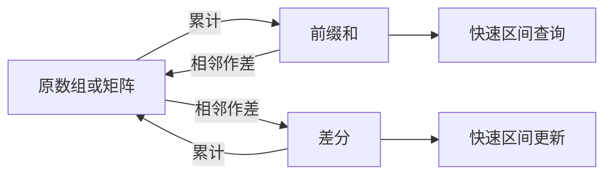

> 本笔记按原书第 11 章的小节顺序展开。正文题目、主要方法和公式均以原书为依据；超出原书范围的背景、替代方法和工程注意事项统一标注为“补充”。

## 本章要解决什么问题

很多数组题的困难不在单次加法，而在于同一种操作会重复很多次：

- 多次询问某个区间或子矩阵的元素和；
- 多次给一个区间或子矩阵中的所有元素增加同一个值；
- 统计满足某种“区间和条件”的连续子数组或子矩阵。

若每次都逐项遍历，长度为 $n$ 的数组做 $k$ 次区间操作，最坏需要 $O(kn)$；$m\times n$ 矩阵做 $k$ 次矩形操作，最坏需要 $O(kmn)$。本章的两个工具分别改变计算时机：

- **前缀和**：先累计，再用边界相减回答区间查询；
- **差分**：先在边界记录变化，最后统一累计恢复所有区间更新。



二者并非互不相关的技巧，而是一对离散逆运算。理解“哪些部分被相减抵消、哪些边界标记会在何处生效和失效”，比死记公式更重要。

### 本章结构盘点

正文先建立 **4 个基础算法单元**，再按原书顺序展开 **14 道正文题**；章末 11 道推荐练习只列题，不计入正文题数。

| 类型 | 顺序与内容 | 数量 |
|---|---|---:|
| 基础算法单元 | 一维前缀和、二维前缀和、一维差分、二维差分 | 4 |
| 11.2 一维应用 | 724、238、1749、1524、560、325、523、53 | 8 |
| 11.3 二维应用 | 304、1074、面试题 17.24 | 3 |
| 11.4 差分应用 | 370、1109、2536 | 3 |

每个基础单元和每道正文题后都给出对应的 C++17 实现；Python 与 Go 仅在章末附录提供整章接口，便于先沿着公式读懂主线，再做语言迁移。

## 11.1 前缀和与差分概述

### 11.1.1 前缀和

#### 1. 问题来源与核心直觉

设数组为

$$
a=(a_0,a_1,\ldots,a_{n-1}),
$$

其中 $n$ 是元素个数，$a_i$ 是下标 $i$ 处的元素。若反复询问闭区间 $[l,r]$ 的和，直接计算

$$
a_l+a_{l+1}+\cdots+a_r
$$

每次需要 $O(r-l+1)$。区间 $[l,r]$ 可以看成“大前缀 $[0,r]$”去掉“小前缀 $[0,l-1]$”，所以只要提前保存所有前缀，就能用一次减法消去区间左边的无关部分。

#### 2. 一维前缀和：方式一

原书首先给出最常用的“左侧补一个 0”定义。构造长度为 $n+1$ 的数组 $P$：

$$
\boxed{
P[0]=0,
\qquad
P[i]=\sum_{t=0}^{i-1}a_t\quad(1\le i\le n)
}
$$

符号含义如下：

- $i$ 表示已经包含的元素个数，而不是原数组最后一个下标；
- $t$ 是求和中的临时下标；
- $P[i]$ 表示原数组前 $i$ 个元素 $a_0\sim a_{i-1}$ 的和；
- 空前缀不含元素，因此定义 $P[0]=0$。

把最后一项 $a_{i-1}$ 从求和中拆出：

$$
\begin{aligned}
P[i]
&=a_0+a_1+\cdots+a_{i-2}+a_{i-1}\\
&=P[i-1]+a_{i-1}.
\end{aligned}
$$

因此递推式为

$$
\boxed{P[i]=P[i-1]+a_{i-1}\quad(1\le i\le n).}
$$

上式从左到右计算一次即可完成预处理，时间为 $O(n)$，额外空间为 $O(n)$。

> 注意：上一组推导中的末尾应为 $a_{i-1}$。实现时数组下标必须写成 `a[i - 1]`。

#### 3. 区间和公式的完整推导

对任意合法闭区间 $0\le l\le r<n$：

$$
P[r+1]=a_0+\cdots+a_{l-1}+a_l+\cdots+a_r,
$$

而

$$
P[l]=a_0+\cdots+a_{l-1}.
$$

两式相减时，公共前缀 $a_0\sim a_{l-1}$ 成对抵消：

$$
\boxed{
\sum_{t=l}^{r}a_t=P[r+1]-P[l].
}
$$

右端只包含两次数组访问和一次减法，所以每次查询为 $O(1)$。

若有 $k$ 次查询：

$$
\begin{aligned}
\text{直接枚举：}&\quad O(kn)\quad\text{（最坏情况）},\\
\text{前缀和：}&\quad O(n)+k\cdot O(1)=O(n+k).
\end{aligned}
$$

这里的前提是数组在查询期间不修改。若原数组频繁单点修改，旧前缀和中从修改位置开始的所有值都会失效。

#### 4. 数值演算

令

$$
a=[3,-1,4,2,-2].
$$

按方式一构造：

| $i$ | 0 | 1 | 2 | 3 | 4 | 5 |
|---:|---:|---:|---:|---:|---:|---:|
| $P[i]$ | 0 | 3 | 2 | 6 | 8 | 6 |

查询 $a[1..3]=[-1,4,2]$：

$$
P[4]-P[1]=8-3=5,
$$

与直接相加 $-1+4+2=5$ 一致。查询从下标 0 开始的区间也不需要特判：

$$
\sum_{t=0}^{2}a_t=P[3]-P[0]=6-0=6.
$$

这正是额外设置 $P[0]=0$ 的价值。

#### 5. 一维前缀和：方式二

原书还介绍长度为 $n$ 的定义：

$$
Q[i]=\sum_{t=0}^{i}a_t\quad(0\le i<n).
$$

其递推式为

$$
Q[0]=a_0,
\qquad
Q[i]=Q[i-1]+a_i\quad(1\le i<n).
$$

当 $l>0$ 时：

$$
\sum_{t=l}^{r}a_t=Q[r]-Q[l-1].
$$

当 $l=0$ 时，$Q[l-1]$ 越界，只能单独返回 $Q[r]$。两种定义数学原理相同，但方式一把空前缀显式放入数组，使所有合法区间统一使用 $P[r+1]-P[l]$，因此更常用。

| 对比项 | 方式一 | 方式二 |
|---|---|---|
| 长度 | $n+1$ | $n$ |
| 含义 | $P[i]$ 是前 $i$ 个元素之和 | $Q[i]$ 是下标 $0\sim i$ 之和 |
| 区间公式 | $P[r+1]-P[l]$ | $Q[r]-Q[l-1]$ |
| 左端为 0 | 无需特判 | 必须特判 |

#### C++17：一维前缀和基础接口

下面统一让 `prefix[i]` 表示半开区间 $[0,i)$ 的和，`prefix[0]=0` 是空前缀哨兵。公开查询接收原数组的闭区间 $[left,right]$，内部把它转换成半开区间 $[left,right+1)$；两套区间语义不能混写。

```cpp
#include <cstddef>
#include <vector>

class PrefixSum1D {
public:
    explicit PrefixSum1D(const std::vector<long long>& values)
        : prefix_(values.size() + 1, 0) {
        for (std::size_t index = 0; index < values.size(); ++index) {
            prefix_[index + 1] = prefix_[index] + values[index];
        }
    }

    long long SumClosed(int left, int right) const {
        return prefix_[right + 1] - prefix_[left];
    }

private:
    std::vector<long long> prefix_;
};
```

**边界反例。** 对单元素数组 `[5]`，闭区间 `[0,0]` 应映射为半开区间 `[0,1)`，所以答案是 `prefix[1]-prefix[0]=5`。若误写成 `prefix[right]-prefix[left]`，会得到 0；这不是缺一个特判，而是混用了两套坐标。

#### 6. 二维前缀和的定义

设矩阵 $A$ 有 $m$ 行、$n$ 列，下标分别为

$$
0\le r<m,
\qquad
0\le c<n.
$$

原书构造 $(m+1)\times(n+1)$ 的二维前缀和 $S$，在顶部和左侧各补一条零边界：

$$
\boxed{
S[i][j]
=\sum_{r=0}^{i-1}\sum_{c=0}^{j-1}A[r][c]
}
$$

其中 $0\le i\le m$、$0\le j\le n$。因此：

- $S[i][j]$ 表示左上角为 $(0,0)$、高为 $i$、宽为 $j$ 的矩形和；
- $S[0][j]=0$，因为高度为 0；
- $S[i][0]=0$，因为宽度为 0。

#### 7. 二维构造公式：容斥原理

为求 $S[i][j]$，先取上方矩形 $S[i-1][j]$ 和左方矩形 $S[i][j-1]$。二者都包含左上重叠区域 $S[i-1][j-1]$，所以该区域被加了两次，必须减回一次；最后加入右下新单元 $A[i-1][j-1]$：

$$
\boxed{
S[i][j]
=S[i-1][j]+S[i][j-1]-S[i-1][j-1]+A[i-1][j-1].
}
$$

该式依赖 $S[i-1][j]$、$S[i][j-1]$ 和 $S[i-1][j-1]$ 已经求出，所以按行或按列从 1 开始递增扫描。每个状态做常数次运算，总时间 $O(mn)$、空间 $O(mn)$。

#### 8. 任意子矩阵求和公式

设查询矩形左上角为 $(r_1,c_1)$，右下角为 $(r_2,c_2)$，并满足

$$
0\le r_1\le r_2<m,
\qquad
0\le c_1\le c_2<n.
$$

先取覆盖到 $(r_2,c_2)$ 的大前缀 $S[r_2+1][c_2+1]$，再减去目标上方和左方：

$$
S[r_1][c_2+1],
\qquad
S[r_2+1][c_1].
$$

左上区域 $S[r_1][c_1]$ 同时属于这两个被减区域，已被减了两次，必须加回一次。故

$$
\boxed{
\operatorname{sum}(r_1,c_1,r_2,c_2)
=S[r_2+1][c_2+1]
-S[r_1][c_2+1]
-S[r_2+1][c_1]
+S[r_1][c_1].
}
$$

这仍是二维容斥：

$$
\text{目标}=\text{整体}-\text{上方}-\text{左方}+\text{重复减去的左上角}.
$$

每个矩形查询为 $O(1)$，$k$ 次查询连同预处理为 $O(mn+k)$。

#### 9. 二维数值演算

令

$$
A=
\begin{bmatrix}
1&2&3\\
4&5&6\\
7&8&9
\end{bmatrix}.
$$

包含零边界的二维前缀和为

$$
S=
\begin{bmatrix}
0&0&0&0\\
0&1&3&6\\
0&5&12&21\\
0&12&27&45
\end{bmatrix}.
$$

查询左上角 $(1,1)$、右下角 $(2,2)$ 的矩形，即元素 $5,6,8,9$：

$$
S[3][3]-S[1][3]-S[3][1]+S[1][1]
=45-6-12+1=28.
$$

直接相加也有 $5+6+8+9=28$。

#### 10. 适用边界与替代方案

前缀和最适合“原数据不变、区间查询很多”的离线或静态场景。

> **补充：** 若数组需要频繁修改，同时还要查询区间和，一维可使用树状数组或线段树；二维也有二维树状数组等结构。它们通常把更新和查询都控制在对数时间，但实现与常数开销更大。

#### C++17：二维前缀和基础接口

`prefix[row][column]` 覆盖半开矩形 $[0,row)\times[0,column)$；第 0 行和第 0 列都是空矩形哨兵。`SumClosed` 接收两个角均包含在内的闭矩形，再把右、下边界各加 1 后套用容斥公式。

```cpp
#include <cstddef>
#include <vector>

class PrefixSum2D {
public:
    explicit PrefixSum2D(const std::vector<std::vector<long long>>& matrix)
        : prefix_(matrix.size() + 1,
                  std::vector<long long>(
                      matrix.empty() ? 1 : matrix[0].size() + 1, 0)) {
        if (matrix.empty()) {
            return;
        }
        for (std::size_t row = 1; row <= matrix.size(); ++row) {
            for (std::size_t column = 1;
                 column <= matrix[0].size(); ++column) {
                prefix_[row][column] =
                    prefix_[row - 1][column] + prefix_[row][column - 1] -
                    prefix_[row - 1][column - 1] +
                    matrix[row - 1][column - 1];
            }
        }
    }

    long long SumClosed(
        int row1, int column1, int row2, int column2) const {
        return prefix_[row2 + 1][column2 + 1] -
               prefix_[row1][column2 + 1] -
               prefix_[row2 + 1][column1] + prefix_[row1][column1];
    }

private:
    std::vector<std::vector<long long>> prefix_;
};
```

### 11.1.2 差分

#### 1. 为什么需要差分

前缀和把查询变快，但一次区间更新 $a[l..r]+=v$ 仍要修改 $r-l+1$ 个元素。若题目只要求所有更新结束后的最终数组，没有必要每次立即修改区间内部；只需记录“从哪里开始增加 $v$，从哪里开始取消这次增加”。差分数组正是这种边界记录。

#### 2. 一维差分的严格定义

对长度为 $n$ 的数组 $a$，定义差分数组 $d$：

$$
\boxed{
d[0]=a[0],
\qquad
d[i]=a[i]-a[i-1]\quad(1\le i<n).
}
$$

$d[i]$ 表示从位置 $i-1$ 走到位置 $i$ 时，数组值发生的增量。对 $d$ 求前缀和：

$$
\begin{aligned}
\sum_{t=0}^{i}d[t]
&=a[0]+(a[1]-a[0])+\cdots+(a[i]-a[i-1])\\
&=a[i].
\end{aligned}
$$

中间项全部首尾相消，这叫望远镜求和。因此

$$
\boxed{a[i]=\sum_{t=0}^{i}d[t],}
$$

即“差分是前缀和的逆运算”。

#### 3. 一维区间加为何只改两个端点

执行闭区间更新

$$
a[l..r]+=v,
\qquad 0\le l\le r<n.
$$

在差分数组中执行：

$$
\boxed{
d[l]\mathrel{+}=v,
\qquad
d[r+1]\mathrel{-}=v\quad(r+1<n).
}
$$

恢复位置 $i$ 时，新增贡献等于这两个标记在前缀 $[0,i]$ 中的和：

$$
\Delta a[i]
=v\,[i\ge l]-v\,[i\ge r+1],
$$

其中命题为真时方括号值为 1，否则为 0。分三种情况：

1. $i<l$：两个标记都未进入前缀，贡献为 0；
2. $l\le i\le r$：只包含 $+v$，贡献为 $v$；
3. $i>r$：同时包含 $+v$ 和 $-v$，贡献重新变为 0。

所以更新只在目标区间内生效。若 $r=n-1$，取消位置 $r+1=n$ 位于数组外，可以忽略；工程实现也常把差分数组开成 $n+1$，统一写入该位置。

#### 4. 多次更新为什么仍然正确

前缀求和是线性运算。设第 $q$ 次更新产生边界数组 $d^{(q)}$，所有更新合并后的差分为

$$
d'=d+\sum_{q=1}^{k}d^{(q)}.
$$

对其求前缀和：

$$
\operatorname{prefix}(d')
=\operatorname{prefix}(d)
+\sum_{q=1}^{k}\operatorname{prefix}(d^{(q)}).
$$

右侧正是原数组加上每次更新的区间贡献。因此更新顺序不影响最终结果，重叠区间的增量会自然叠加。

#### 5. 原书样例演算

原数组为

$$
a=[1,2,2,1,2,1],
$$

差分为

$$
d=[1,1,0,-1,1,-1].
$$

依次执行：

1. $a[0..2]+=1$：$d[0]+=1,d[3]-=1$；
2. $a[2..4]+=1$：$d[2]+=1,d[5]-=1$；
3. $a[0..5]+=1$：$d[0]+=1$，$d[6]-=1$ 位于有效数组外。

最终

$$
d=[3,1,1,-2,1,-2].
$$

逐项累计得到

$$
[3,4,5,3,4,2],
$$

这就是三次更新后的数组。构造初始差分和最终恢复各需 $O(n)$，每次更新 $O(1)$，总时间为

$$
O(n+k),
$$

优于逐次修改的最坏 $O(kn)$。

#### C++17：一维差分基础接口

更新使用原数组的闭区间 $[left,right]$。差分数组开成 $n+1$，因此总能在 `right+1` 写入取消标记；下标 $n$ 是哨兵，不属于答案。所有更新结束后从左到右做一次前缀累计，才把差分恢复为最终数组。

```cpp
#include <array>
#include <cstddef>
#include <vector>

std::vector<long long> ApplyRangeUpdates(
    const std::vector<long long>& values,
    const std::vector<std::array<long long, 3>>& updates) {
    const std::size_t size = values.size();
    std::vector<long long> difference(size + 1, 0);
    if (size != 0) {
        difference[0] = values[0];
        for (std::size_t index = 1; index < size; ++index) {
            difference[index] = values[index] - values[index - 1];
        }
    }

    for (const auto& update : updates) {
        const int left = static_cast<int>(update[0]);
        const int right = static_cast<int>(update[1]);
        const long long increment = update[2];
        difference[left] += increment;
        difference[right + 1] -= increment;
    }

    std::vector<long long> answer(size, 0);
    long long running = 0;
    for (std::size_t index = 0; index < size; ++index) {
        running += difference[index];
        answer[index] = running;
    }
    return answer;
}
```

#### 6. 二维差分的定义

对 $m\times n$ 矩阵 $A$，把越界的上方和左方值视为 0，可定义二维差分：

$$
\boxed{
D[i][j]
=A[i][j]-A[i-1][j]-A[i][j-1]+A[i-1][j-1].
}
$$

它是二维前缀和递推式的逆变换。对 $D$ 先沿行、再沿列累计，或直接使用二维前缀递推，就能恢复 $A$。

#### 7. 二维矩形加的四角公式

执行矩形更新

$$
A[r_1..r_2][c_1..c_2]+=v.
$$

使用带额外边界的 $(m+1)\times(n+1)$ 差分数组，修改：

$$
\boxed{
\begin{aligned}
D[r_1][c_1]&\mathrel{+}=v,\\
D[r_1][c_2+1]&\mathrel{-}=v,\\
D[r_2+1][c_1]&\mathrel{-}=v,\\
D[r_2+1][c_2+1]&\mathrel{+}=v.
\end{aligned}
}
$$

其中 $0\le r_1\le r_2<m$、$0\le c_1\le c_2<n$。四个角的作用是：

1. 左上角 $+v$ 让贡献向右、向下扩散；
2. 右上角 $-v$ 取消右侧多出的部分；
3. 左下角 $-v$ 取消下方多出的部分；
4. 右下角区域被前两个负标记重复减去，所以再 $+v$ 一次。

对四角标记做二维前缀和后，任意位置 $(i,j)$ 收到的新增贡献是

$$
v[i\ge r_1][j\ge c_1]
-v[i\ge r_1][j\ge c_2+1]
-v[i\ge r_2+1][j\ge c_1]
+v[i\ge r_2+1][j\ge c_2+1].
$$

仅当 $r_1\le i\le r_2$ 且 $c_1\le j\le c_2$ 时，上式等于 $v$；在矩形外均为 0。这严格证明了四角公式。

#### 8. 二维数值演算

从 $3\times4$ 全零矩阵开始，对矩形 $(0,1)\sim(1,2)$ 加 5。四角标记为：

$$
D[0][1]{+}=5,
\quad D[0][3]{-}=5,
\quad D[2][1]{-}=5,
\quad D[2][3]{+}=5.
$$

二维累计后得到

$$
\begin{bmatrix}
0&5&5&0\\
0&5&5&0\\
0&0&0&0
\end{bmatrix},
$$

恰好只修改目标矩形。

#### C++17：二维差分基础接口

每次更新接收闭矩形 $[row_1,row_2]\times[column_1,column_2]$。差分矩阵多开一行一列，统一容纳 `row2+1` 与 `column2+1` 的取消标记；最终只恢复并返回原来的 $m\times n$ 区域。恢复式本身就是对差分做二维前缀和。

```cpp
#include <array>
#include <cstddef>
#include <vector>

std::vector<std::vector<long long>> ApplyRectangleUpdates(
    const std::vector<std::vector<long long>>& matrix,
    const std::vector<std::array<long long, 5>>& updates) {
    if (matrix.empty() || matrix[0].empty()) {
        return matrix;
    }
    const std::size_t rows = matrix.size();
    const std::size_t columns = matrix[0].size();
    std::vector<std::vector<long long>> difference(
        rows + 1, std::vector<long long>(columns + 1, 0));

    for (std::size_t row = 0; row < rows; ++row) {
        for (std::size_t column = 0; column < columns; ++column) {
            difference[row][column] = matrix[row][column];
            if (row > 0) {
                difference[row][column] -= matrix[row - 1][column];
            }
            if (column > 0) {
                difference[row][column] -= matrix[row][column - 1];
            }
            if (row > 0 && column > 0) {
                difference[row][column] += matrix[row - 1][column - 1];
            }
        }
    }

    for (const auto& update : updates) {
        const int row1 = static_cast<int>(update[0]);
        const int column1 = static_cast<int>(update[1]);
        const int row2 = static_cast<int>(update[2]);
        const int column2 = static_cast<int>(update[3]);
        const long long increment = update[4];
        difference[row1][column1] += increment;
        difference[row1][column2 + 1] -= increment;
        difference[row2 + 1][column1] -= increment;
        difference[row2 + 1][column2 + 1] += increment;
    }

    std::vector<std::vector<long long>> answer(
        rows, std::vector<long long>(columns, 0));
    for (std::size_t row = 0; row < rows; ++row) {
        for (std::size_t column = 0; column < columns; ++column) {
            answer[row][column] = difference[row][column];
            if (row > 0) {
                answer[row][column] += answer[row - 1][column];
            }
            if (column > 0) {
                answer[row][column] += answer[row][column - 1];
            }
            if (row > 0 && column > 0) {
                answer[row][column] -= answer[row - 1][column - 1];
            }
        }
    }
    return answer;
}
```

#### 9. 前缀和与差分的选择

| 需求 | 更直接的工具 | 原因 |
|---|---|---|
| 静态数组，多次区间求和 | 前缀和 | $O(n)$ 预处理后每次 $O(1)$ |
| 多次区间加，最后输出结果 | 差分 | 每次更新只改边界，$O(1)$ |
| 边更新边查询 | 二者单独都不够 | 需要维护动态信息的数据结构 |
| 二维静态矩形和 | 二维前缀和 | 四个前缀量完成容斥 |
| 二维多次矩形加 | 二维差分 | 四角标记，最后二维累计 |

> **补充：离散微积分视角。** 差分可类比离散导数，前缀和可类比离散积分。区间内部加同一常数不会改变内部相邻元素之差，只会改变进入区间和离开区间的两个边界；二维情形则由四个角描述矩形指示函数的二阶离散变化。这个类比有助于理解公式，但本章算法只依赖上述代数推导，并不要求微积分知识。

#### 迁移判断：先看操作时序

- 数据不变、查询很多：迁移到前缀和，付一次预处理成本。
- 更新很多、只在最后读取：迁移到差分，把传播延迟到统一恢复。
- 更新与查询交错：不要反复重建前缀或恢复差分，应迁移到树状数组、线段树等动态结构。
- 二维题若仍在枚举四条边：先判断能否固定较短维的一对边界，再把另一维压成已解决的一维问题。

## 11.2 一维前缀和应用的算法设计

### 11.2.1 LeetCode 724：寻找数组的中心下标（★）

#### 问题与难点

对下标 $i$，题目要求其左侧元素和等于右侧元素和，但不包含 `nums[i]` 自身。若有多个答案，要返回最左边的一个。直接为每个 $i$ 分别扫描两侧会重复累加大量相同区间，最坏为 $O(n^2)$。

数组允许负数，因此不能根据左右和的大小移动指针；双指针依赖的单调性不存在。

#### 前缀和建模

构造方式一的前缀和：

$$
P[0]=0,
\qquad
P[i]=\sum_{t=0}^{i-1}\text{nums}[t].
$$

对候选中心 $i$：

$$
\begin{aligned}
L_i&=\sum_{t=0}^{i-1}\text{nums}[t]=P[i],\\
R_i&=\sum_{t=i+1}^{n-1}\text{nums}[t]=P[n]-P[i+1].
\end{aligned}
$$

因此判定条件为

$$
\boxed{P[i]=P[n]-P[i+1].}
$$

边界下标也自然成立：$i=0$ 时 $P[0]=0$；$i=n-1$ 时 $P[n]-P[n]=0$，不需要额外分支。

还可利用

$$
P[i+1]=P[i]+\text{nums}[i]
$$

把条件改写为

$$
2P[i]+\text{nums}[i]=P[n].
$$

这只是代数等价式，原书实现直接比较左右两侧，更容易读懂。

#### 数值走查

对

$$
{\text{nums}}=[1,7,3,6,5,6],
$$

有

$$
P=[0,1,8,11,17,22,28].
$$

扫描到 $i=3$：

$$
L_3=P[3]=11,
\qquad
R_3=P[6]-P[4]=28-17=11.
$$

因为从左向右扫描并在第一次相等时返回，所以自动满足“最靠左”。

#### 正确性证明

前缀和公式保证 $L_i$、$R_i$ 分别精确覆盖中心两侧且不含中心。算法返回 $i$ 当且仅当 $L_i=R_i$，所以返回值一定是中心下标；又因为枚举顺序递增，任何更小的合法下标都会更早返回，故答案是最左中心。若扫描结束仍未返回，说明所有下标都不满足定义，返回 $-1$ 正确。

#### 复杂度与替代方案

构造和扫描各为 $O(n)$，总时间 $O(n)$，额外空间 $O(n)$。

> **补充：滚动左和。** 先求总和 `total`，再维护当前左和 `left`，右和为 `total-left-nums[i]`。判断后把 `nums[i]` 加入 `left`，可把额外空间降为 $O(1)$。它与前缀和公式完全等价，只是没有显式保存整个 $P$。

#### C++17：中心下标

`prefix[i]` 仍表示半开前缀 $[0,i)$，第 0 项为空前缀哨兵。对候选 `index`，左侧是 $[0,index)$，右侧是 $[index+1,n)$；代码从左向右返回第一次匹配，因而保留最左答案。

```cpp
#include <cstddef>
#include <vector>

int PivotIndex(const std::vector<long long>& nums) {
    std::vector<long long> prefix(nums.size() + 1, 0);
    for (std::size_t index = 0; index < nums.size(); ++index) {
        prefix[index + 1] = prefix[index] + nums[index];
    }
    for (std::size_t index = 0; index < nums.size(); ++index) {
        if (prefix[index] == prefix.back() - prefix[index + 1]) {
            return static_cast<int>(index);
        }
    }
    return -1;
}
```

### 11.2.2 LeetCode 238：除自身以外数组的乘积（★★）

#### 为什么不能直接“总乘积除以自身”

若先求全部元素乘积 $T$，再计算 $T/\text{nums}[i]$，有两个根本问题：

1. 题目明确禁止除法；
2. 数组可能含 0，此时总乘积可能为 0，而 $0/0$ 无定义。

例如 `[-1,1,0,-3,3]` 的答案是 `[0,0,9,0,0]`。仅从总乘积 0 无法通过除法恢复下标 2 的结果 9。

真正需要的是把“除自身以外”拆成互不重叠的两部分：自身左侧的乘积与自身右侧的乘积。

#### 解法一：前缀积与后缀积

原书定义包含当前位置的前缀积 `pred`：

$$
\begin{aligned}
\operatorname{pred}[0]&=\text{nums}[0],\\
\operatorname{pred}[i]&=\operatorname{pred}[i-1]\cdot\text{nums}[i]
\quad(1\le i<n).
\end{aligned}
$$

于是

$$
\operatorname{pred}[i]=\prod_{t=0}^{i}\text{nums}[t].
$$

后缀积 `postd` 定义为

$$
\begin{aligned}
\operatorname{postd}[n-1]&=\text{nums}[n-1],\\
\operatorname{postd}[i]&=\text{nums}[i]\cdot\operatorname{postd}[i+1]
\quad(0\le i<n-1),
\end{aligned}
$$

即

$$
\operatorname{postd}[i]=\prod_{t=i}^{n-1}\text{nums}[t].
$$

因此：

$$
\boxed{
\operatorname{ans}[i]=
\begin{cases}
\operatorname{postd}[1],&i=0,\\
\operatorname{pred}[i-1]\operatorname{postd}[i+1],&0<i<n-1,\\
\operatorname{pred}[n-2],&i=n-1.
\end{cases}
}
$$

中间情况的两个乘积范围分别是 $[0,i-1]$ 和 $[i+1,n-1]$，并集恰好包含除 $i$ 外的所有下标，且没有重叠。

#### 解法二：复用输出数组

原书进一步把 `ans` 先当作前缀积数组使用，从而去掉独立的 `pred`、`postd` 数组。

第一遍从左向右令

$$
\operatorname{ans}[i]=\prod_{t=0}^{i}\text{nums}[t].
$$

随后：

1. 最后一个答案应为前 $n-1$ 个元素的积，所以令 `ans[n-1]=ans[n-2]`；
2. 用变量 `suffix=nums[n-1]` 保存当前下标右侧的乘积；
3. 对 $i=n-2,n-3,\ldots,1$，先计算
    $$
    \operatorname{ans}[i]=\operatorname{ans}[i-1]\cdot suffix,
    $$
    再更新
    $$
    suffix\leftarrow suffix\cdot\text{nums}[i];
    $$
4. 循环结束时 `suffix` 已是 `nums[1..n-1]` 的乘积，令 `ans[0]=suffix`。

关键是从右向左覆盖：计算 `ans[i]` 时，左边尚未覆盖的 `ans[i-1]` 仍保存所需前缀积。

#### 数值走查

对 `nums=[1,2,3,4]`，初始前缀积为

$$
\operatorname{ans}=[1,2,6,24].
$$

令 `ans[3]=ans[2]=6`、`suffix=4`：

- $i=2$：`ans[2]=ans[1]*4=8`，再令 `suffix=4*3=12`；
- $i=1$：`ans[1]=ans[0]*12=12`，再令 `suffix=12*2=24`；
- 最后 `ans[0]=24`。

得到 `[24,12,8,6]`。

#### 正确性与边界

处理下标 $i$ 时，循环不变量为：

$$
\operatorname{ans}[i-1]=\prod_{t=0}^{i-1}\text{nums}[t],
\qquad
suffix=\prod_{t=i+1}^{n-1}\text{nums}[t].
$$

二者相乘正是除 `nums[i]` 外全部元素的积。算法只做乘法，因此 0 和负数都不需要特殊处理。

时间为 $O(n)$。解法一额外使用 $O(n)$ 空间；解法二除输出数组外只使用一个变量，按题目约定为 $O(1)$ 额外空间。乘积必须满足题目给出的整数范围保证，否则固定宽度整数仍可能溢出。

> **补充：更统一的写法。** 也可让 `ans[i]` 在第一遍直接保存“不含自身的左侧积”，初始左积为 1；第二遍维护右积并乘入 `ans[i]`。这种写法无需单独处理首尾下标，三语言完整程序采用这一等价形式。

#### C++17：除自身以外数组的乘积

第一遍令 `answer[index]` 保存半开区间 $[0,index)$ 的乘积，第二遍乘入半开区间 $(index,n)$ 的乘积。空区间乘积按乘法单位元定义为 1，因此首尾位置与零元素都不需要特判。

```cpp
#include <cstddef>
#include <vector>

std::vector<long long> ProductExceptSelf(
    const std::vector<long long>& nums) {
    std::vector<long long> answer(nums.size(), 1);
    long long left_product = 1;
    for (std::size_t index = 0; index < nums.size(); ++index) {
        answer[index] = left_product;
        left_product *= nums[index];
    }

    long long right_product = 1;
    for (int index = static_cast<int>(nums.size()) - 1;
         index >= 0; --index) {
        answer[index] *= right_product;
        right_product *= nums[index];
    }
    return answer;
}
```

### 11.2.3 LeetCode 1749：任意子数组和的绝对值的最大值（★★）

#### 从枚举区间到前缀极值

任意子数组 `nums[i..j]` 的和为两个前缀和之差：

$$
\operatorname{sum}(i,j)=P[j+1]-P[i].
$$

题目要求

$$
\max_{0\le i\le j<n}|P[j+1]-P[i]|.
$$

原书在扫描前缀和时维护最大前缀和 `maxpre` 和最小前缀和 `minpre`，再分三种符号情况：

1. 两者都非负时，最大绝对值至少由最大正前缀提供；
2. 两者都非正时，最大绝对值由最负前缀的绝对值提供；
3. 一正一负时，两极之差最大。

#### 统一公式

把空前缀 $P[0]=0$ 一并放入候选集合，则三种情况可以统一为

$$
\boxed{
{\text{answer}}=\max(P)-\min(P).
}
$$

这是原书分类讨论的等价写法。证明如下：对任意两个实数 $x,y$，有

$$
|x-y|\le \max(P)-\min(P).
$$

取 $x=\max(P)$、$y=\min(P)$ 时等号成立。虽然这两个前缀出现的先后顺序不确定，但绝对值不受减法方向影响；较晚前缀减较早前缀总对应一个合法连续子数组。如果所有前缀相等，答案为 0，任意全零子数组或题目允许的空子数组都能达到它。

#### 数值走查

对

$$
{\text{nums}}=[2,-5,1,-4,3,-2],
$$

含空前缀的序列为

$$
P=[0,2,-3,-2,-6,-3,-5].
$$

其中

$$
\max(P)=2,
\qquad
\min(P)=-6,
$$

所以答案为 $2-(-6)=8$。对应两个前缀之间的子数组是 `[-5,1,-4]`，其和为 $-8$，绝对值为 8。

#### 在线维护与复杂度

初始化 `min_prefix=max_prefix=prefix=0`。逐个累加元素后更新最大、最小前缀，最终相减即可。每个元素只处理一次，时间 $O(n)$，额外空间 $O(1)$。

> **补充：与两次 Kadane 的关系。** 也可以分别求最大子数组和与最小子数组和，答案为两者绝对值的较大者。前缀极值写法更直接地利用了本章主题；两者时间和空间复杂度相同。

#### C++17：任意子数组和的绝对值的最大值

最大值和最小值都从空前缀 0 开始，确保从下标 0 起始的闭区间也进入候选。扫描只保留前缀极值，不需要枚举任意一对区间边界。

```cpp
#include <algorithm>
#include <vector>

long long MaximumAbsoluteSubarraySum(
    const std::vector<long long>& nums) {
    long long prefix = 0;
    long long minimum_prefix = 0;
    long long maximum_prefix = 0;
    for (long long value : nums) {
        prefix += value;
        minimum_prefix = std::min(minimum_prefix, prefix);
        maximum_prefix = std::max(maximum_prefix, prefix);
    }
    return maximum_prefix - minimum_prefix;
}
```

### 11.2.4 LeetCode 1524：和为奇数的子数组的数目（★★）

#### 暴力方案为什么超时

构造前缀和后，一个区间和可以在 $O(1)$ 时间得到，但仍有

$$
\frac{n(n+1)}{2}
$$

个连续子数组。双重枚举的总时间是 $O(n^2)$，$n$ 达到 $10^5$ 时不可行。

> **原文勘误说明：** 原书在超时程序后写“上述算法的时间复杂度为 $O(n)$”，但该程序用两层循环枚举所有区间，结合代码和超时结果，此处应为 $O(n^2)$。

#### 奇偶性代替具体和

子数组 `arr[i..j]` 的和为

$$
P[j+1]-P[i].
$$

整数差为奇数，当且仅当两个整数奇偶性不同：

$$
\begin{array}{c|cc}
-&\text{偶}&\text{奇}\\\hline
{\text{偶}}&\text{偶}&\text{奇}\\
{\text{奇}}&\text{奇}&\text{偶}
\end{array}
$$

因此不需要保存前缀和的具体值，只需统计此前出现过多少个偶前缀和与奇前缀和。

初始化：

$$
even=1,
\qquad
odd=0.
$$

`even=1` 表示空前缀 $P[0]=0$。扫描到当前前缀 $P[j+1]$ 时：

- 若当前为偶数，与此前每个奇前缀配对都得到一个奇数和，故 `answer += odd`，再令 `even += 1`；
- 若当前为奇数，与此前每个偶前缀配对都得到一个奇数和，故 `answer += even`，再令 `odd += 1`。

必须先计入答案，再把当前前缀加入计数，才能保证左边界前缀严格不晚于当前区间终点；即使先加入，同奇偶配对也不会增加答案，但统一采用“先查询、后插入”更符合后续哈希题的时序。

#### 数值走查

对 `arr=[1,3,5]`：

| 扫描元素 | 当前前缀奇偶 | 更新前 $(even,odd)$ | 新增答案 | 更新后 $(even,odd)$ | 累计答案 |
|---:|---|---|---:|---|---:|
| 1 | 奇 | $(1,0)$ | 1 | $(1,1)$ | 1 |
| 3 | 偶 | $(1,1)$ | 1 | $(2,1)$ | 2 |
| 5 | 奇 | $(2,1)$ | 2 | $(2,2)$ | 4 |

最终有 4 个奇数和子数组，与原书枚举结果一致。

#### 正确性证明

任意子数组由一对前缀下标 $(i,j+1)$ 唯一决定。算法在处理右端前缀 $P[j+1]$ 时，恰好统计此前所有与其奇偶性相反的 $P[i]$，所以每个奇数和子数组被统计一次；同奇偶前缀不会被计入，偶数和子数组不会误计。

时间 $O(n)$，额外空间 $O(1)$。答案可能很大，每次累加后按题意对

$$
M=10^9+7
$$

取模。计数和答案在中间计算时应使用足够宽的整数类型。

#### C++17：和为奇数的子数组计数

`even_count=1` 把空前缀 $P[0]=0$ 放入历史。每轮先用当前前缀查询相反奇偶的历史数量，再登记当前前缀；这与后续哈希前缀题保持相同的“先查询、后插入”时序。

```cpp
#include <vector>

int CountOddSumSubarrays(const std::vector<int>& nums) {
    constexpr long long kMod = 1'000'000'007LL;
    long long even_count = 1;
    long long odd_count = 0;
    long long prefix = 0;
    long long answer = 0;
    for (int value : nums) {
        prefix += value;
        if (prefix % 2 == 0) {
            answer += odd_count;
            ++even_count;
        } else {
            answer += even_count;
            ++odd_count;
        }
        answer %= kMod;
    }
    return static_cast<int>(answer);
}
```

### 11.2.5 LeetCode 560：和为 $k$ 的子数组（★★）

#### 难点：区间数量仍是平方级

前缀和能把一个区间的求和降为 $O(1)$，但枚举全部 $(i,j)$ 仍需 $O(n^2)$。要进一步优化，必须反过来问：固定当前右端点时，什么样的历史前缀能与它组成和为 $k$ 的区间？

#### 从区间方程解出历史目标

定义

$$
P[0]=0,
\qquad
P[t]=\sum_{q=0}^{t-1}\text{nums}[q].
$$

子数组 `nums[i..j]` 的和为

$$
P[j+1]-P[i].
$$

要求该和等于 $k$：

$$
P[j+1]-P[i]=k.
$$

移项得到

$$
\boxed{P[i]=P[j+1]-k.}
$$

当扫描到右端前缀 $P[j+1]$ 时，右侧是已知量。只需知道此前有多少个前缀等于 $P[j+1]-k$，这些前缀中的每一个都对应一个不同的合法左端点。

#### 哈希表语义与更新顺序

令

$$
freq[s]=\text{当前前缀之前，前缀和值 }s\text{ 出现的次数}.
$$

初始化

$$
freq[0]=1,
$$

表示空前缀。对每个元素：

1. 更新 `prefix += nums[j]`，此时 `prefix=P[j+1]`；
2. 将 `freq[prefix-k]` 加入答案；
3. 执行 `freq[prefix] += 1`，供后面的右端点使用。

“先查询、后插入”保证哈希表中只含当前前缀之前的边界。即使 $k=0$，也不会把当前前缀与自身配成长度为 0 的区间。

#### 数值走查

对 `nums=[1,2,3]`、$k=3$：

| $j$ | 当前前缀 | 目标 `prefix-k` | 历史频次 | 新增 | 插入后的主要频次 |
|---:|---:|---:|---:|---:|---|
| 0 | 1 | -2 | 0 | 0 | $0:1,1:1$ |
| 1 | 3 | 0 | 1 | 1 | 再加入 $3:1$ |
| 2 | 6 | 3 | 1 | 1 | 再加入 $6:1$ |

两个区间分别是 `[1,2]` 和 `[3]`，答案为 2。

#### 为什么必须保存次数

若相同前缀和出现多次，它们代表不同左边界。例如数组 `[0,0]`、$k=0$ 的前缀和为 $[0,0,0]$，三对不同前缀边界对应三个子数组。若哈希表只记录“是否出现”，答案会被低估。

#### 正确性证明

每个和为 $k$ 的子数组 `nums[i..j]` 唯一对应一对前缀 $(P[i],P[j+1])$，并满足 $P[i]=P[j+1]-k$。算法在处理 $P[j+1]$ 时把所有这样的历史 $P[i]$ 一次性计入；不同右端点在不同轮次处理，因此每个合法子数组恰好统计一次，不合法区间不会满足查询等式。

期望时间 $O(n)$，空间 $O(n)$。这里不能使用普通滑动窗口，因为元素允许为负，窗口和随边界移动不具备单调性。

#### C++17：和为 $k$ 的子数组计数

`frequency[0]=1` 是空前缀哨兵，使从下标 0 开始的闭区间也能被统计。查询 `prefix-target` 必须发生在插入当前 `prefix` 之前，否则 `target=0` 时会把同一个前缀配成长度为 0 的区间。

```cpp
#include <unordered_map>
#include <vector>

long long SubarraySumCount(
    const std::vector<int>& nums, long long target) {
    std::unordered_map<long long, long long> frequency;
    frequency[0] = 1;
    long long prefix = 0;
    long long answer = 0;
    for (int value : nums) {
        prefix += value;
        const auto found = frequency.find(prefix - target);
        if (found != frequency.end()) {
            answer += found->second;
        }
        ++frequency[prefix];
    }
    return answer;
}
```

### 11.2.6 LeetCode 325：和等于 $k$ 的最长子数组长度（★★）

#### 与计数题相同的方程，不同的哈希值

仍有

$$
P[j+1]-P[i]=k
\iff
P[i]=P[j+1]-k.
$$

但本题不问有多少个 $i$，而问长度

$$
(j-i+1)=(j+1)-i
$$

最大。固定右端前缀下标 $j+1$ 后，$i$ 越小，区间越长。因此哈希表应保存每个前缀和**第一次出现的最早元素下标**。

采用原书的元素下标写法：

$$
first[s]=\text{前缀和 }s\text{ 第一次出现时的元素下标}.
$$

空前缀位于第一个元素之前，所以初始化

$$
first[0]=-1.
$$

扫描元素下标 $j$，当前前缀为 `prefix`。若 `prefix-k` 最早出现在下标 $q$，则合法子数组为 $q+1\sim j$，长度是

$$
\boxed{j-q.}
$$

#### 为什么不能覆盖旧下标

假设同一前缀和 $s$ 先后出现在 $q_1<q_2$。对任意未来右端点 $j$：

$$
j-q_1>j-q_2.
$$

因此 $q_2$ 永远不可能产生更长答案，保留最早的 $q_1$ 足够。更新时只在 `prefix` 尚未出现时写入。

#### 数值走查

`nums=[1,-1,5,-2,3]`，$k=3$：

| $j$ | `prefix` | `prefix-k` | 查到的最早下标 | 候选长度 | 操作 |
|---:|---:|---:|---:|---:|---|
| 0 | 1 | -2 | 无 | - | 记录 $1\to0$ |
| 1 | 0 | -3 | 无 | - | 不覆盖 $0\to-1$ |
| 2 | 5 | 2 | 无 | - | 记录 $5\to2$ |
| 3 | 3 | 0 | -1 | 4 | 更新答案为 4 |
| 4 | 6 | 3 | 3 | 1 | 答案仍为 4 |

最长区间是 `[1,-1,5,-2]`。

#### 正确性与复杂度

对每个右端点，算法用最早的匹配前缀得到以该点结尾的最长合法区间；再对所有右端点取最大值，故得到全局最长长度。不存在匹配时答案保持 0。

期望时间 $O(n)$，空间 $O(n)$。原书提醒使用更宽的整数类型保存前缀和；C++ 和 Go 完整实现使用 64 位整数，避免大量元素累加时溢出。

#### C++17：和等于 $k$ 的最长子数组

`first_index[0]=-1` 表示空前缀位于首元素之前。哈希表只保存每个前缀和最早的元素下标，`emplace` 在键已存在时不会覆盖旧值，从而让未来闭区间尽可能长。

```cpp
#include <algorithm>
#include <unordered_map>
#include <vector>

int MaximumSubarrayLength(
    const std::vector<int>& nums, long long target) {
    std::unordered_map<long long, int> first_index;
    first_index[0] = -1;
    long long prefix = 0;
    int answer = 0;
    for (int index = 0; index < static_cast<int>(nums.size()); ++index) {
        prefix += nums[index];
        const auto found = first_index.find(prefix - target);
        if (found != first_index.end()) {
            answer = std::max(answer, index - found->second);
        }
        first_index.emplace(prefix, index);
    }
    return answer;
}
```

### 11.2.7 LeetCode 523：连续子数组和（★★）

#### 把“是 $k$ 的倍数”改写成同余关系

题目要求长度至少为 2，且存在整数 $z$ 使

$$
P[j+1]-P[i]=zk.
$$

在原书约束中 $k\ge1$。上式等价于

$$
P[j+1]\equiv P[i]\pmod{k},
$$

即

$$
\boxed{P[j+1]\bmod k=P[i]\bmod k.}
$$

证明：若两数除以 $k$ 的余数相同，可写成

$$
P[j+1]=q_1k+r,
\qquad
P[i]=q_2k+r.
$$

相减得

$$
P[j+1]-P[i]=(q_1-q_2)k,
$$

所以区间和是 $k$ 的倍数；反方向由整除定义立即成立。

#### 哈希表为什么仍保存首次下标

令 `first[remainder]` 保存该余数第一次出现的元素下标，初始化

$$
first[0]=-1.
$$

处理元素下标 $j$ 时，若当前余数曾在 $q$ 出现，则两前缀之间的子数组长度为

$$
j-q.
$$

只有当

$$
\boxed{j-q\ge2}
$$

时才能返回 `true`。保留最早下标会使未来距离最大；如果最早出现都不能达到长度 2，更晚的同余前缀也不能更优。

> **原文勘误说明：** 原书相关段落把闭区间 `nums[i..j]` 的长度写为 $j-i$；正确长度是 $j-i+1$。若哈希表记录前缀对应的前一元素下标 $i-1$，则长度为 $j-(i-1)=j-i+1$。

#### 数值走查

对 `nums=[23,2,4,6,7]`、$k=6$：

- 空前缀余数 0，记录在下标 -1；
- $j=0$：前缀 23，余数 5，首次记录 $5\to0$；
- $j=1$：前缀 25，余数 1，记录 $1\to1$；
- $j=2$：前缀 29，余数 5，查到下标 0，距离 $2-0=2$。

因此 `[2,4]` 的和为 6，是 $6$ 的倍数，返回 `true`。

#### 正确性、复杂度与边界

同余证明保证“余数相同”与“区间和可被 $k$ 整除”等价；距离检查保证长度约束。算法检查每个右端点与最早同余前缀，若存在合法区间必会返回，否则所有同余前缀对都不满足长度要求。

期望时间 $O(n)$，空间 $O(\min(n,k))$，因为余数至多有 $k$ 种，也不超过前缀数。

> **补充：更一般的输入。** 本题原书约束保证 $k>0$ 且 `nums[i]` 非负。若允许负数，不同语言对负余数的定义可能不同，可统一规范化为 $((prefix\bmod k)+k)\bmod k$；若允许 $k=0$，则不能取模，应改为寻找长度至少为 2、和为 0 的子数组。

#### C++17：连续子数组和

同余状态仍只保存最早元素下标，空前缀放在 `-1`。代码把负余数规范化；扩展输入中若 `divisor=0`，就直接以完整前缀和为键，避免非法取模。距离 `index-start>=2` 对应至少含两个元素的闭区间。

```cpp
#include <unordered_map>
#include <vector>

bool HasMultipleSumSubarray(
    const std::vector<int>& nums, long long divisor) {
    std::unordered_map<long long, int> first_index;
    first_index[0] = -1;
    long long prefix = 0;
    const long long modulus = divisor < 0 ? -divisor : divisor;

    for (int index = 0; index < static_cast<int>(nums.size()); ++index) {
        prefix += nums[index];
        long long key = prefix;
        if (modulus != 0) {
            key = ((prefix % modulus) + modulus) % modulus;
        }

        const auto found = first_index.find(key);
        if (found != first_index.end()) {
            if (index - found->second >= 2) {
                return true;
            }
        } else {
            first_index[key] = index;
        }
    }
    return false;
}
```

### 11.2.8 LeetCode 53：最大子数组和（★★）

#### 固定右端点后的最优选择

题目要求子数组非空。使用含空前缀的定义：

$$
P[0]=0,
\qquad
P[t]=\sum_{q=0}^{t-1}\text{nums}[q].
$$

对固定的右端前缀 $t$，所有以元素 $t-1$ 结尾的非空子数组和为

$$
P[t]-P[i],
\qquad 0\le i<t.
$$

$P[t]$ 已固定，要让差最大，就应减去此前最小的前缀：

$$
\boxed{
best_t=P[t]-\min_{0\le i<t}P[i].
}
$$

全局答案是

$$
\boxed{
\max_{1\le t\le n}
\left(P[t]-\min_{0\le i<t}P[i]\right).
}
$$

这就是原书 `minsum` 数组的含义。由于每一步只需要此前最小值，可以把整个数组压缩成变量 `min_prefix`。

#### 更新顺序为何重要

初始化：

$$
prefix=0,
\qquad
min\_prefix=0,
\qquad
answer=-\infty.
$$

每读入一个元素：

1. 更新当前 `prefix`；
2. 用 `prefix-min_prefix` 更新答案；
3. 再用当前 `prefix` 更新 `min_prefix`。

先计算答案，保证被减的前缀严格早于当前前缀，对应非空子数组。若先把当前前缀纳入最小值，全负数组可能错误地用同一前缀相减得到空区间和 0，而正确答案应是最大的单个负数。

#### 数值走查

对

$$
[-2,1,-3,4,-1,2,1,-5,4],
$$

前缀和为

$$
[0,-2,-1,-4,0,-1,1,2,-3,1].
$$

扫描到前缀 $P[7]=2$ 时，此前最小前缀为 $P[3]=-4$，于是

$$
P[7]-P[3]=2-(-4)=6.
$$

对应元素下标 $3\sim6$ 的子数组 `[4,-1,2,1]`，答案为 6。

#### 正确性与复杂度

对每个右端点，算法枚举意义上选择了所有合法左端前缀中的最小者，因此得到该右端点的最大子数组和；遍历所有右端点再取最大值，覆盖了全部非空子数组。时间 $O(n)$，额外空间 $O(1)$。

> **补充：与 Kadane 算法的关系。** Kadane 维护“以当前位置结尾的最大和”
> $$
> end_j=\max(\text{nums}[j],end_{j-1}+\text{nums}[j]).
> $$
> 它决定是否丢弃此前负贡献；前缀最小值法决定是否改用更晚、更小的左端前缀。两者是同一最优子结构的不同表达。

#### 补充：三种哈希前缀模式对比

| 问题目标 | 查询键 | 哈希表保存什么 | 为什么 |
|---|---|---|---|
| 和为 $k$ 的子数组数量 | `prefix-k` | 出现次数 | 每个历史位置都是不同答案 |
| 和为 $k$ 的最长长度 | `prefix-k` | 最早下标 | 左端越早，长度越长 |
| 和为 $k$ 倍数且长度至少 2 | `prefix mod k` | 最早下标 | 同余保证整除，最早下标使距离最大 |

这三题的公式相近，但哈希值的语义不能互换。写代码前应先明确答案是在“计数”“优化长度”还是“判断存在性”。

#### C++17：最大子数组和

输入按题意非空。每轮先用“此前”的 `minimum_prefix` 计算候选，再把当前前缀纳入最小值，保证两个前缀下标不同、对应的闭区间非空；全负数组因此不会误取空区间和 0。

```cpp
#include <algorithm>
#include <limits>
#include <vector>

long long MaximumSubarraySum(const std::vector<int>& nums) {
    long long prefix = 0;
    long long minimum_prefix = 0;
    long long answer = std::numeric_limits<long long>::lowest();
    for (int value : nums) {
        prefix += value;
        answer = std::max(answer, prefix - minimum_prefix);
        minimum_prefix = std::min(minimum_prefix, prefix);
    }
    return answer;
}
```

## 11.3 二维前缀和应用的算法设计

### 11.3.1 LeetCode 304：二维区域和检索（矩阵不可变）（★★）

#### 为什么把前缀和放进类中

题目会对同一个不可变矩阵调用最多 $10^4$ 次 `sumRegion`。若每次遍历矩形，最坏一次 $O(mn)$；矩阵既然不修改，就可以在构造对象时一次性预处理二维前缀和，此后复用。

构造 $(m+1)\times(n+1)$ 的成员数组 $S$：

$$
S[i][j]
=\sum_{r=0}^{i-1}\sum_{c=0}^{j-1}\text{matrix}[r][c].
$$

构造递推式是

$$
\boxed{
S[i][j]
=S[i-1][j]+S[i][j-1]-S[i-1][j-1]
+\text{matrix}[i-1][j-1].
}
$$

#### 查询公式

对左上角 $(row_1,col_1)$、右下角 $(row_2,col_2)$：

$$
\boxed{
\begin{aligned}
\operatorname{sumRegion}
={}&S[row_2+1][col_2+1]\\
&-S[row_1][col_2+1]\\
&-S[row_2+1][col_1]\\
&+S[row_1][col_1].
\end{aligned}
}
$$

四项依次表示大前缀、上方、左方和被重复减去的左上区域。额外零边界使 `row1=0` 或 `col1=0` 时仍使用同一公式。

#### 原书示例

矩阵为

$$
\begin{bmatrix}
3&0&1&4&2\\
5&6&3&2&1\\
1&2&0&1&5\\
4&1&0&1&7\\
1&0&3&0&5
\end{bmatrix}.
$$

查询 `(2,1,4,3)` 覆盖

$$
\begin{bmatrix}
2&0&1\\
1&0&1\\
0&3&0
\end{bmatrix},
$$

元素和为 8；另两次查询 `(1,1,2,2)` 与 `(1,2,2,4)` 分别返回 11、12。

#### 正确性与复杂度

构造式由二维容斥保证每个 $S[i][j]$ 恰含对应左上矩形；查询式再次用容斥恰好留下目标区域。因此构造后所有查询都正确。

构造时间和空间均为 $O(mn)$，每次查询时间 $O(1)$。成立条件是矩阵在对象生命周期中不修改；若修改，相关右下方前缀都会失效。

> **补充：整数范围。** 在极端约束下，矩形和可能超过 32 位有符号整数。虽然题目接口通常返回 `int`，通用实现宜用 64 位整数保存内部前缀和；本笔记三语言示例采用 64 位累计。

#### C++17：二维区域和检索

构造函数保存带第 0 行、第 0 列哨兵的二维前缀。`SumRegion` 接收闭矩形 `(row1,column1)~(row2,column2)`，查询时把右下角转换为半开边界；原矩阵在对象生命周期内必须保持不变。

```cpp
#include <cstddef>
#include <vector>

class NumMatrix {
public:
    explicit NumMatrix(const std::vector<std::vector<long long>>& matrix)
        : prefix_(matrix.size() + 1,
                  std::vector<long long>(matrix[0].size() + 1, 0)) {
        for (std::size_t row = 1; row <= matrix.size(); ++row) {
            for (std::size_t column = 1;
                 column <= matrix[0].size(); ++column) {
                prefix_[row][column] =
                    prefix_[row - 1][column] + prefix_[row][column - 1] -
                    prefix_[row - 1][column - 1] +
                    matrix[row - 1][column - 1];
            }
        }
    }

    long long SumRegion(
        int row1, int column1, int row2, int column2) const {
        return prefix_[row2 + 1][column2 + 1] -
               prefix_[row1][column2 + 1] -
               prefix_[row2 + 1][column1] + prefix_[row1][column1];
    }

private:
    std::vector<std::vector<long long>> prefix_;
};
```

### 11.3.2 LeetCode 1074：元素和为目标值的子矩阵数量（★★★）

#### 暴力边界枚举为何仍然太慢

一个子矩阵由上、下、左、右四条边界确定。行区间有 $O(m^2)$ 种，列区间有 $O(n^2)$ 种，即使二维前缀和让每个矩形求和只需 $O(1)$，总时间仍是

$$
O(m^2n^2).
$$

当 $m,n$ 都为 100 时，矩形数量可达约 $2.55\times10^7$，再加哈希或判断开销就可能超时。

> **原文勘误说明：** 原书在四重循环超时程序后把复杂度写成 $O(mn)$；根据四条边界的枚举结构，实际应为 $O(m^2n^2)$。

#### 固定上下边界，把矩阵压成数组

先固定上边界 $top$ 和下边界 $bottom$。定义压缩数组

$$
colSum[c]=\sum_{r=top}^{bottom}\text{matrix}[r][c].
$$

于是列区间 $[l,r]$ 对应子矩阵的和为

$$
\sum_{c=l}^{r}colSum[c].
$$

二维问题因此变成 11.2.5 的一维问题：“`colSum` 中有多少个连续子数组的和等于 `target`？”

对固定行对，令列前缀

$$
C[j+1]=\sum_{c=0}^{j}colSum[c].
$$

寻找

$$
C[r+1]-C[l]=target
\iff
C[l]=C[r+1]-target.
$$

用频次哈希表即可在 $O(n)$ 时间统计该行对的答案。

#### 原书二维前缀和写法

若已构造二维前缀和 $S$，固定 $top,bottom$ 后，从第 0 列累计到第 $j$ 列的条带和为

$$
\boxed{
C[j+1]=S[bottom+1][j+1]-S[top][j+1].
}
$$

这是“上方到当前列的大前缀”减去“上边界以上的前缀”。原书逐列把该值放入哈希统计。初始化 `freq[0]=1` 后，`C[j+1]=target` 的情况也统一包含在 `freq[C[j+1]-target]` 中，不必单独判断。

#### 增量压缩写法

也可以不保存完整二维前缀和。固定 $top$ 后，令 `colSum` 初始全 0；每向下扩展一个 `bottom`，执行

$$
colSum[c]\mathrel{+}=\text{matrix}[bottom][c]
$$

即可得到当前行带的列和，再运行一维哈希统计。这是原书给出的另一种合并处理方式。

#### 数值走查

对

$$
{\text{matrix}}=
\begin{bmatrix}
0&1&0\\
1&1&1\\
0&1&0
\end{bmatrix},
\qquad target=0,
$$

固定 $top=bottom=0$ 时，`colSum=[0,1,0]`，和为 0 的连续区间有两个单元 0；固定最后一行同样有两个。任何包含中间行的行带各列均为正，不会再产生 0 和矩形，所以答案为 4。

#### 正确性证明

每个子矩阵有唯一的 $(top,bottom)$ 行边界；在对应行对的 `colSum` 中，它又唯一对应一个连续列区间。反过来，任一 `colSum[l..r]` 都唯一还原为矩形 `(top,l)~(bottom,r)`。一维哈希算法恰好统计和为 `target` 的列区间，因此所有目标子矩阵被统计一次且不会重复。

#### 复杂度与方向选择

行对有 $O(m^2)$ 个，每个行对用 $O(n)$ 扫描列，所以时间

$$
O(m^2n).
$$

增量压缩的额外空间为 $O(n)$；若使用完整二维前缀和，则另需 $O(mn)$。

> **补充：按短边平方。** 若 $m>n$，可以交换行列角色，枚举左右列边界并压缩行，使时间统一为
> $$
> O(\min(m,n)^2\max(m,n)).
> $$
> 这不改变算法原理，只减少边界对数量。

#### C++17：元素和为目标值的子矩阵数量

`column_sums[column]` 是当前闭行带 `[top,bottom]` 在该列的和。对每个行带重新设置 `frequency[0]=1`，再按列执行一维“和为 `target` 的子数组计数”；列前缀仍以半开边界表示。

```cpp
#include <unordered_map>
#include <vector>

long long CountTargetSubmatrices(
    const std::vector<std::vector<int>>& matrix, long long target) {
    const int rows = static_cast<int>(matrix.size());
    const int columns = static_cast<int>(matrix[0].size());
    long long answer = 0;

    for (int top = 0; top < rows; ++top) {
        std::vector<long long> column_sums(columns, 0);
        for (int bottom = top; bottom < rows; ++bottom) {
            for (int column = 0; column < columns; ++column) {
                column_sums[column] += matrix[bottom][column];
            }

            std::unordered_map<long long, long long> frequency;
            frequency[0] = 1;
            long long prefix = 0;
            for (long long value : column_sums) {
                prefix += value;
                const auto found = frequency.find(prefix - target);
                if (found != frequency.end()) {
                    answer += found->second;
                }
                ++frequency[prefix];
            }
        }
    }
    return answer;
}
```

### 11.3.3 面试题 17.24：最大子矩阵（★★★）

#### 难点：不仅求最大和，还要返回四个坐标

二维前缀和能在 $O(1)$ 时间计算任意矩形和，但四重枚举仍是 $O(m^2n^2)$。上一题的降维思想仍然适用：固定上下边界后，矩形最大和就是压缩列数组的最大子数组和，即 11.2.8 的问题；同时要记录最大子数组的左右下标。

#### 行压缩

固定 $top$，令 `colSum` 全 0。下边界 $bottom$ 从 $top$ 向下扩展，每次更新

$$
colSum[c]\mathrel{+}=\text{matrix}[bottom][c].
$$

此时任意列区间 $[left,right]$ 的和

$$
\sum_{c=left}^{right}colSum[c]
$$

恰是矩形 `(top,left)~(bottom,right)` 的元素和。

原书使用二维前缀和直接计算固定行带中的当前列区间和，代数上与维护 `colSum` 等价。

#### 带坐标的 Kadane 扫描

对当前 `colSum`，维护：

- `current_sum`：当前候选连续列段之和；
- `candidate_left`：该候选段左端；
- `best_sum`：迄今所有行对、列段中的最大和；
- `answer=[r1,c1,r2,c2]`：对应坐标。

从左到右读入 `colSum[c]`：

1. 把当前列加入 `current_sum`；
2. 若 `current_sum>best_sum`，记录
    $$
    [top,candidate\_left,bottom,c];
    $$
3. 若 `current_sum<0`，把它丢弃，令 `current_sum=0`、`candidate_left=c+1`。

为什么负和前缀可以丢弃？对任意未来列段和 $X$，若当前累积 $N<0$，则

$$
N+X<X.
$$

保留 $N$ 只会让所有未来候选更小，从下一列重新开始更优。

#### 全负矩阵的处理

`best_sum` 必须初始化为负无穷，并且应在负的 `current_sum` 被清零**之前**更新答案。这样即使所有元素都为负，也会返回数值最大的单个元素，而不会错误返回空矩形和 0。

原书示例

$$
\begin{bmatrix}
-1&0\\
0&-1
\end{bmatrix}
$$

的最大和为 0，可返回 `[0,1,0,1]` 或 `[1,0,1,0]`。

#### 正确性证明

外层枚举覆盖每一对上下边界。对固定行对，Kadane 的不变量保证 `current_sum` 是“以当前列结尾且值得向后延伸”的最大候选；任何负前缀都不会出现在未来最优列段中。因而它找到该行对的最大连续列段。所有行对取最大值后，覆盖所有非空子矩阵，所记录的四个边界与该矩形一致。

时间 $O(m^2n)$，额外空间 $O(n)$。返回任意并列最优答案即可。

> **补充：短边优化。** 与上一题相同，可转置矩阵，使被成对枚举的是较短维度，将时间写成 $O(\min(m,n)^2\max(m,n))$。转置后要把返回坐标映射回原行列，容易出错；在 $m,n\le200$ 时，优先保证坐标正确也很合理。

#### C++17：最大子矩阵

返回坐标 `[top,left,bottom,right]` 的四条边均包含在矩形内。`best_sum` 从负无穷开始，并在负的 `current_sum` 清零前记录候选，所以全负矩阵仍会返回一个非空单元格，而不是不存在的空矩形。

```cpp
#include <limits>
#include <vector>

std::vector<int> MaximumSumSubmatrix(
    const std::vector<std::vector<int>>& matrix) {
    const int rows = static_cast<int>(matrix.size());
    const int columns = static_cast<int>(matrix[0].size());
    long long best_sum = std::numeric_limits<long long>::lowest();
    std::vector<int> answer = {0, 0, 0, 0};

    for (int top = 0; top < rows; ++top) {
        std::vector<long long> column_sums(columns, 0);
        for (int bottom = top; bottom < rows; ++bottom) {
            for (int column = 0; column < columns; ++column) {
                column_sums[column] += matrix[bottom][column];
            }

            long long current_sum = 0;
            int candidate_left = 0;
            for (int right = 0; right < columns; ++right) {
                current_sum += column_sums[right];
                if (current_sum > best_sum) {
                    best_sum = current_sum;
                    answer = {top, candidate_left, bottom, right};
                }
                if (current_sum < 0) {
                    current_sum = 0;
                    candidate_left = right + 1;
                }
            }
        }
    }
    return answer;
}
```

## 11.4 差分数组应用的算法设计

### 11.4.1 LeetCode 370：区间加法（★★）

#### 问题结构

长度为 $n$ 的数组初始全 0。每次更新 `[start,end,inc]` 都给一个闭区间增加同一个值，所有更新结束后才需要输出最终数组。这正符合差分的使用条件：中间不查询单个元素，可以延迟到最后统一恢复。

#### 边界标记

初始数组全 0，所以差分数组 `diff` 也全 0。对更新

$$
A[start..end]\mathrel{+}=inc,
$$

执行

$$
\boxed{
diff[start]\mathrel{+}=inc,
\qquad
diff[end+1]\mathrel{-}=inc\quad(end+1<n).
}
$$

第一个标记让增量从 `start` 开始进入前缀累计，第二个标记让它从 `end+1` 开始退出。所有更新完成后：

$$
\boxed{
A[i]=\sum_{t=0}^{i}diff[t].
}
$$

#### 原书示例走查

$n=5$，依次更新：

$$
[1,3,2],\quad[2,4,3],\quad[0,2,-2].
$$

差分标记过程为：

| 更新后 | `diff` |
|---|---|
| 初始 | $[0,0,0,0,0]$ |
| `[1,3,2]` | $[0,2,0,0,-2]$ |
| `[2,4,3]` | $[0,2,3,0,-2]$ |
| `[0,2,-2]` | $[-2,2,3,2,-2]$ |

最后求前缀和：

$$
[-2,0,3,5,3],
$$

与逐次更新的结果一致。

#### 正确性与复杂度

每次更新产生一个只在 `[start,end]` 内为 `inc` 的阶梯贡献。前缀求和是线性的，所以所有阶梯贡献可先叠加边界、再统一恢复，结果与逐次修改完全相同。

$k$ 次更新各为 $O(1)$，恢复为 $O(n)$，总时间 $O(n+k)$、空间 $O(n)$。若更新之间需要查询当前元素或区间和，仅靠离线差分不够。

#### C++17：区间加法

每条更新的 `start`、`end` 是零基闭区间。`difference` 多出的第 $n$ 项专门接收末尾区间的取消标记；它不进入返回值。边界标记全部完成后，`running` 从左到右累计，执行一次差分恢复。

```cpp
#include <array>
#include <vector>

std::vector<long long> RangeAddition(
    int length, const std::vector<std::array<long long, 3>>& updates) {
    std::vector<long long> difference(length + 1, 0);
    for (const auto& update : updates) {
        const int start = static_cast<int>(update[0]);
        const int end = static_cast<int>(update[1]);
        const long long increment = update[2];
        difference[start] += increment;
        difference[end + 1] -= increment;
    }

    std::vector<long long> answer(length, 0);
    long long running = 0;
    for (int index = 0; index < length; ++index) {
        running += difference[index];
        answer[index] = running;
    }
    return answer;
}
```

### 11.4.2 LeetCode 1109：航班预订统计（★★）

#### 题目如何还原为区间加法

每条预订 `[first,last,seats]` 表示航班编号 $first\sim last$ 都增加 `seats`。它与 11.4.1 完全相同，唯一差别是航班编号从 1 开始，而数组下标从 0 开始：

$$
l=first-1,
\qquad
r=last-1.
$$

代入一维差分公式：

$$
\boxed{
diff[first-1]\mathrel{+}=seats,
\qquad
diff[last]\mathrel{-}=seats\quad(last<n).
}
$$

注意第二个下标直接是 `last`，因为它对应零基闭区间右端 $r$ 的下一位 $r+1=last$。

#### 数值走查

原书示例：

$$
bookings=[[1,2,10],[2,3,20],[2,5,25]],
\qquad n=5.
$$

三次边界标记后：

$$
diff=[10,45,-10,-20,0].
$$

逐项累计：

$$
\begin{aligned}
A[0]&=10,\\
A[1]&=10+45=55,\\
A[2]&=55-10=45,\\
A[3]&=45-20=25,\\
A[4]&=25+0=25.
\end{aligned}
$$

答案为 `[10,55,45,25,25]`。

#### 正确性与边界

每条预订在对应航班区间形成一个常量阶梯，差分的开始和取消标记精确覆盖它。所有预订允许重叠，座位数通过线性叠加自然累计。若 `last=n`，取消标记位于数组下标 $n$，最终结果之外，可忽略。

时间 $O(n+q)$、空间 $O(n)$，$q$ 是预订条数。实现时先完成从一基编号到零基下标的转换，是避免 off-by-one 错误的关键。

#### C++17：航班预订统计

预订 `[first,last,seats]` 使用一基闭区间；转换后起点是 `first-1`，取消位置是零基右端下一位 `last`。长度为 `flight_count+1` 的差分数组让末班航班后的取消标记也能直接写入。

```cpp
#include <array>
#include <vector>

std::vector<long long> CorporateFlightBookings(
    const std::vector<std::array<int, 3>>& bookings, int flight_count) {
    std::vector<long long> difference(flight_count + 1, 0);
    for (const auto& booking : bookings) {
        const int first = booking[0];
        const int last = booking[1];
        const int seats = booking[2];
        difference[first - 1] += seats;
        difference[last] -= seats;
    }

    std::vector<long long> answer(flight_count, 0);
    long long running = 0;
    for (int index = 0; index < flight_count; ++index) {
        running += difference[index];
        answer[index] = running;
    }
    return answer;
}
```

### 11.4.3 LeetCode 2536：子矩阵元素加 1（★★）

#### 解法一：每行使用一维差分

矩形查询 `[r1,c1,r2,c2]` 可以看成对第 $r_1\sim r_2$ 行分别执行列区间 `[c1,c2]` 加 1。为每一行维护一维差分：

$$
diff[r][c_1]\mathrel{+}=1,
\qquad
diff[r][c_2+1]\mathrel{-}=1.
$$

但仍需枚举

$$
r=r_1,r_1+1,\ldots,r_2,
$$

所以一次查询最坏为 $O(n)$。全部查询后，对每一行做一维前缀和恢复矩阵。

设查询数为 $q$，最坏时间为

$$
O(qn+n^2),
$$

空间 $O(n^2)$。它比逐格更新的每次 $O(n^2)$ 已有改善，但没有消除行方向的重复工作。

#### 解法二：二维差分

使用 $(n+1)\times(n+1)$ 的二维差分数组。对每个矩形执行四角更新：

$$
\boxed{
\begin{aligned}
diff[r_1][c_1]&\mathrel{+}=1,\\
diff[r_1][c_2+1]&\mathrel{-}=1,\\
diff[r_2+1][c_1]&\mathrel{-}=1,\\
diff[r_2+1][c_2+1]&\mathrel{+}=1.
\end{aligned}
}
$$

额外一行一列允许 `r2=n-1` 或 `c2=n-1` 时仍直接写取消标记，无需分支。

所有查询完成后，二维累计恢复前 $n\times n$ 个位置：

$$
\boxed{
ans[i][j]
=diff[i][j]
+ans[i-1][j]
+ans[i][j-1]
-ans[i-1][j-1],
}
$$

越界的上方、左方值视为 0。也可原地把 `diff[i][j]` 更新为该位置的二维前缀和。

#### 原书示例走查

$n=3$，查询为

$$
[[1,1,2,2],[0,0,1,1]].
$$

第一个矩形让右下 $2\times2$ 区域加 1；第二个让左上 $2\times2$ 区域加 1。位置 $(1,1)$ 同时属于两个矩形，所以值为 2。最终：

$$
\begin{bmatrix}
1&1&0\\
1&2&1\\
0&1&1
\end{bmatrix}.
$$

#### 为什么四角更新正确

一次四角标记经二维前缀和后：

- 在行、列都进入目标起点后，左上 $+1$ 生效；
- 越过右边界后，右上 $-1$ 抵消它；
- 越过下边界后，左下 $-1$ 抵消它；
- 同时越过右、下边界时被抵消两次，右下 $+1$ 修正重复抵消。

所以贡献在目标矩形内恰为 1，外部为 0。不同查询的贡献可线性叠加，故最终矩阵正确。

#### 两种解法比较

| 方案 | 单次查询 | 最终恢复 | 总时间 | 额外空间 |
|---|---:|---:|---:|---:|
| 每行一维差分 | $O(r_2-r_1+1)$ | $O(n^2)$ | $O(qn+n^2)$ 最坏 | $O(n^2)$ |
| 二维差分 | $O(1)$ | $O(n^2)$ | $O(q+n^2)$ | $O(n^2)$ |

二维差分同时延迟行、列两个方向的传播，因此更适合查询多、矩形大的情况。

#### C++17：子矩阵元素加 1

查询四元组表示零基闭矩形。`difference` 多开的一行一列容纳 `row2+1`、`column2+1` 的取消标记；全部查询标记完毕后，逐格做二维前缀累计，只把前 $size\times size$ 个位置恢复到答案。

```cpp
#include <array>
#include <vector>

std::vector<std::vector<long long>> RangeAddQueries(
    int size, const std::vector<std::array<int, 4>>& queries) {
    std::vector<std::vector<long long>> difference(
        size + 1, std::vector<long long>(size + 1, 0));
    for (const auto& query : queries) {
        const int row1 = query[0];
        const int column1 = query[1];
        const int row2 = query[2];
        const int column2 = query[3];
        ++difference[row1][column1];
        --difference[row1][column2 + 1];
        --difference[row2 + 1][column1];
        ++difference[row2 + 1][column2 + 1];
    }

    std::vector<std::vector<long long>> answer(
        size, std::vector<long long>(size, 0));
    for (int row = 0; row < size; ++row) {
        for (int column = 0; column < size; ++column) {
            answer[row][column] = difference[row][column];
            if (row > 0) {
                answer[row][column] += answer[row - 1][column];
            }
            if (column > 0) {
                answer[row][column] += answer[row][column - 1];
            }
            if (row > 0 && column > 0) {
                answer[row][column] -= answer[row - 1][column - 1];
            }
        }
    }
    return answer;
}
```

## 推荐练习题

原书在本章末尾列出以下 11 道练习，未在正文中展开解法：

1. LeetCode 363：矩形区域不超过 $k$ 的最大数值和（★★★）
2. LeetCode 525：连续数组（★★）
3. LeetCode 731：日程安排表 II（★★）
4. LeetCode 732：日程安排表 III（★★★）
5. LeetCode 798：得分最高的最小轮调（★★★）
6. LeetCode 930：和相同的二元子数组（★★）
7. LeetCode 1094：拼车（★★）
8. LeetCode 1248：统计优美子数组（★★）
9. LeetCode 1314：矩阵区域和（★★）
10. LeetCode 1480：一维数组的动态和（★）
11. LeetCode 1508：子数组和排序后的区间和（★★）


## 本章总结

### 两个核心变换

前缀和把原数组 $a$ 变成累计状态：

$$
P[i+1]=P[i]+a[i].
$$

区间查询通过两个累计状态相减：

$$
\operatorname{sum}(l,r)=P[r+1]-P[l].
$$

差分把原数组变成相邻变化：

$$
d[0]=a[0],
\qquad
d[i]=a[i]-a[i-1].
$$

区间更新只标记开始和结束后一位，最终再以前缀和恢复。二维版本在两个坐标轴上分别应用同样思想，于是出现四项容斥与四角标记。

### 从公式到算法的四步思路

1. **选边界表示**：统一使用含空前缀的 $P[0]=0$，明确闭区间如何映射到前缀下标。
2. **写区间方程**：先写 $P[r+1]-P[l]$，再根据题目条件移项、取奇偶或取模。
3. **决定历史信息**：计数保存频次，最长距离保存最早下标，极值问题保存最小或最大前缀。
4. **处理维度**：二维矩形先固定一对边界压成一维，再复用已解决的一维算法。

### 复杂度总览

| 场景 | 预处理/更新 | 单次查询或恢复 | 总体复杂度 |
|---|---:|---:|---:|
| 一维静态区间和 | $O(n)$ | $O(1)$ | $O(n+k)$，$k$ 次查询 |
| 二维静态矩形和 | $O(mn)$ | $O(1)$ | $O(mn+k)$ |
| 一维 $k$ 次区间加 | 每次 $O(1)$ | 最后 $O(n)$ | $O(n+k)$ |
| 二维 $q$ 次矩形加 | 每次 $O(1)$ | 最后 $O(mn)$ | $O(mn+q)$ |
| 目标子矩阵计数 | 行对增量压缩 | 每行对 $O(n)$ | $O(m^2n)$ |
| 最大子矩阵 | 行对增量压缩 | 每行对 $O(n)$ | $O(m^2n)$ |

这些结论都依赖具体操作模式：静态前缀和不支持廉价修改，离线差分不支持随时读取完整当前状态，哈希前缀适合等式、奇偶和同余约束，而非任意区间最值。

本章最值得掌握的不是某一道题的模板，而是“改变表示后消除重复工作”：查询问题保存累计边界，批量更新保存变化边界，二维问题固定一对边界后降维。只要先写出严格的区间方程，再选择应保存的历史状态，许多看似不同的数组与矩阵题都会落到同一条推理链上。

## 附录 A：Python 3 完整参考实现

附录保留 4 个基础算法接口与 14 道正文题接口。`PrefixSum1D`、`PrefixSum2D` 接收闭区间查询；`apply_range_updates`、`apply_rectangle_updates` 接收闭区间更新，并在所有标记完成后统一恢复。

```python
from __future__ import annotations

from collections import defaultdict


MOD = 1_000_000_007


class PrefixSum1D:
    """一维前缀和：prefix[i] 对应半开区间 [0, i)。"""

    def __init__(self, values: list[int]):
        self.prefix = [0]
        for value in values:
            self.prefix.append(self.prefix[-1] + value)

    def sum_closed(self, left: int, right: int) -> int:
        return self.prefix[right + 1] - self.prefix[left]


class PrefixSum2D:
    """二维前缀和：第 0 行、第 0 列是空矩形哨兵。"""

    def __init__(self, matrix: list[list[int]]):
        rows, columns = len(matrix), len(matrix[0])
        self.prefix = [[0] * (columns + 1) for _ in range(rows + 1)]
        for row in range(1, rows + 1):
            for column in range(1, columns + 1):
                self.prefix[row][column] = (
                    self.prefix[row - 1][column]
                    + self.prefix[row][column - 1]
                    - self.prefix[row - 1][column - 1]
                    + matrix[row - 1][column - 1]
                )

    def sum_closed(
        self, row1: int, column1: int, row2: int, column2: int
    ) -> int:
        return (
            self.prefix[row2 + 1][column2 + 1]
            - self.prefix[row1][column2 + 1]
            - self.prefix[row2 + 1][column1]
            + self.prefix[row1][column1]
        )


def apply_range_updates(
    values: list[int], updates: list[list[int]]
) -> list[int]:
    """一维差分：更新 [left, right]，最后以前缀和恢复。"""
    if not values:
        return []
    difference = [0] * (len(values) + 1)
    difference[0] = values[0]
    for index in range(1, len(values)):
        difference[index] = values[index] - values[index - 1]
    for left, right, increment in updates:
        difference[left] += increment
        difference[right + 1] -= increment

    answer = [0] * len(values)
    running = 0
    for index in range(len(values)):
        running += difference[index]
        answer[index] = running
    return answer


def apply_rectangle_updates(
    matrix: list[list[int]], updates: list[list[int]]
) -> list[list[int]]:
    """二维差分：四角标记闭矩形，最后做二维前缀恢复。"""
    if not matrix or not matrix[0]:
        return matrix
    rows, columns = len(matrix), len(matrix[0])
    difference = [[0] * (columns + 1) for _ in range(rows + 1)]
    for row in range(rows):
        for column in range(columns):
            difference[row][column] = matrix[row][column]
            if row > 0:
                difference[row][column] -= matrix[row - 1][column]
            if column > 0:
                difference[row][column] -= matrix[row][column - 1]
            if row > 0 and column > 0:
                difference[row][column] += matrix[row - 1][column - 1]

    for row1, column1, row2, column2, increment in updates:
        difference[row1][column1] += increment
        difference[row1][column2 + 1] -= increment
        difference[row2 + 1][column1] -= increment
        difference[row2 + 1][column2 + 1] += increment

    answer = [[0] * columns for _ in range(rows)]
    for row in range(rows):
        for column in range(columns):
            answer[row][column] = (
                difference[row][column]
                + (answer[row - 1][column] if row > 0 else 0)
                + (answer[row][column - 1] if column > 0 else 0)
                - (answer[row - 1][column - 1] if row > 0 and column > 0 else 0)
            )
    return answer


def pivot_index(nums: list[int]) -> int:
    """11.2.1：P[i] 等于 P[n]-P[i+1] 时，i 是中心下标。"""
    prefix = [0]
    for value in nums:
        prefix.append(prefix[-1] + value)
    for index in range(len(nums)):
        if prefix[index] == prefix[-1] - prefix[index + 1]:
            return index
    return -1


def product_except_self(nums: list[int]) -> list[int]:
    """11.2.2：先写入左侧积，再从右向左乘入右侧积。"""
    answer = [1] * len(nums)
    left_product = 1
    for index, value in enumerate(nums):
        answer[index] = left_product
        left_product *= value

    right_product = 1
    for index in range(len(nums) - 1, -1, -1):
        answer[index] *= right_product
        right_product *= nums[index]
    return answer


def maximum_absolute_subarray_sum(nums: list[int]) -> int:
    """11.2.3：最大前缀减最小前缀。"""
    prefix = 0
    minimum_prefix = 0
    maximum_prefix = 0
    for value in nums:
        prefix += value
        minimum_prefix = min(minimum_prefix, prefix)
        maximum_prefix = max(maximum_prefix, prefix)
    return maximum_prefix - minimum_prefix


def count_odd_sum_subarrays(nums: list[int]) -> int:
    """11.2.4：当前前缀与奇偶性相反的历史前缀配对。"""
    even_count = 1  # 空前缀 P[0]=0。
    odd_count = 0
    prefix = 0
    answer = 0
    for value in nums:
        prefix += value
        if prefix % 2 == 0:
            answer += odd_count
            even_count += 1
        else:
            answer += even_count
            odd_count += 1
        answer %= MOD
    return answer


def subarray_sum_count(nums: list[int], target: int) -> int:
    """11.2.5：统计历史前缀 prefix-target 的出现次数。"""
    frequency: dict[int, int] = defaultdict(int)
    frequency[0] = 1
    prefix = 0
    answer = 0
    for value in nums:
        prefix += value
        answer += frequency[prefix - target]
        frequency[prefix] += 1
    return answer


def maximum_subarray_length(nums: list[int], target: int) -> int:
    """11.2.6：相同前缀和只保存最早下标。"""
    first_index = {0: -1}
    prefix = 0
    answer = 0
    for index, value in enumerate(nums):
        prefix += value
        if prefix - target in first_index:
            answer = max(answer, index - first_index[prefix - target])
        if prefix not in first_index:
            first_index[prefix] = index
    return answer


def has_multiple_sum_subarray(nums: list[int], divisor: int) -> bool:
    """11.2.7：同余前缀的下标距离至少为 2。"""
    first_index = {0: -1}
    prefix = 0
    for index, value in enumerate(nums):
        prefix += value
        # 原题 divisor>0；保留 divisor=0 分支可检查和为 0 的区间。
        key = prefix if divisor == 0 else prefix % abs(divisor)
        if key in first_index:
            if index - first_index[key] >= 2:
                return True
        else:
            first_index[key] = index
    return False


def maximum_subarray_sum(nums: list[int]) -> int:
    """11.2.8：当前前缀减去此前最小前缀。"""
    prefix = 0
    minimum_prefix = 0
    answer = nums[0]
    for value in nums:
        prefix += value
        answer = max(answer, prefix - minimum_prefix)
        minimum_prefix = min(minimum_prefix, prefix)
    return answer


class NumMatrix(PrefixSum2D):
    """11.3.1：构造一次二维前缀和，随后常数时间查询。"""

    def sum_region(
        self, row1: int, column1: int, row2: int, column2: int
    ) -> int:
        return self.sum_closed(row1, column1, row2, column2)


def count_target_submatrices(matrix: list[list[int]], target: int) -> int:
    """11.3.2：固定上下边界后，复用一维和为 target 的计数。"""
    rows, columns = len(matrix), len(matrix[0])
    answer = 0
    for top in range(rows):
        column_sums = [0] * columns
        for bottom in range(top, rows):
            for column in range(columns):
                column_sums[column] += matrix[bottom][column]

            frequency: dict[int, int] = defaultdict(int)
            frequency[0] = 1
            prefix = 0
            for value in column_sums:
                prefix += value
                answer += frequency[prefix - target]
                frequency[prefix] += 1
    return answer


def maximum_sum_submatrix(matrix: list[list[int]]) -> list[int]:
    """11.3.3：行压缩 + 带坐标的 Kadane。"""
    rows, columns = len(matrix), len(matrix[0])
    best_sum = float("-inf")
    answer = [0, 0, 0, 0]

    for top in range(rows):
        column_sums = [0] * columns
        for bottom in range(top, rows):
            for column in range(columns):
                column_sums[column] += matrix[bottom][column]

            current_sum = 0
            candidate_left = 0
            for right, value in enumerate(column_sums):
                current_sum += value
                if current_sum > best_sum:
                    best_sum = current_sum
                    answer = [top, candidate_left, bottom, right]
                # 先记录负数候选再清零，才能正确处理全负矩阵。
                if current_sum < 0:
                    current_sum = 0
                    candidate_left = right + 1
    return answer


def range_addition(length: int, updates: list[list[int]]) -> list[int]:
    """11.4.1：每次区间加只修改差分的开始与结束后一位。"""
    return apply_range_updates([0] * length, updates)


def corporate_flight_bookings(
    bookings: list[list[int]], flight_count: int
) -> list[int]:
    """11.4.2：把一基航班编号转换为零基区间。"""
    updates = [
        [first - 1, last - 1, seats] for first, last, seats in bookings
    ]
    return range_addition(flight_count, updates)


def range_add_queries(size: int, queries: list[list[int]]) -> list[list[int]]:
    """11.4.3：四角标记后求二维前缀和。"""
    updates = [[*query, 1] for query in queries]
    return apply_rectangle_updates([[0] * size for _ in range(size)], updates)


if __name__ == "__main__":
    print(PrefixSum1D([3, -1, 4, 2, -2]).sum_closed(1, 3))
    print(PrefixSum2D([[1, 2], [3, 4]]).sum_closed(0, 1, 1, 1))
    print(apply_range_updates([1, 2, 2], [[0, 2, 1]]))
    print(apply_rectangle_updates([[1, 2], [3, 4]], [[0, 1, 1, 1, 5]]))
    print(pivot_index([1, 7, 3, 6, 5, 6]))
    print(product_except_self([1, 2, 3, 4]))
    print(maximum_absolute_subarray_sum([2, -5, 1, -4, 3, -2]))
    print(count_odd_sum_subarrays([1, 3, 5]))
    print(subarray_sum_count([1, 2, 3], 3))
    print(maximum_subarray_length([1, -1, 5, -2, 3], 3))
    print(has_multiple_sum_subarray([23, 2, 4, 6, 7], 6))
    print(maximum_subarray_sum([-2, 1, -3, 4, -1, 2, 1, -5, 4]))

    matrix = [
        [3, 0, 1, 4, 2],
        [5, 6, 3, 2, 1],
        [1, 2, 0, 1, 5],
        [4, 1, 0, 1, 7],
        [1, 0, 3, 0, 5],
    ]
    matrix_sum = NumMatrix(matrix)
    print(
        [
            matrix_sum.sum_region(2, 1, 4, 3),
            matrix_sum.sum_region(1, 1, 2, 2),
            matrix_sum.sum_region(1, 2, 2, 4),
        ]
    )
    print(count_target_submatrices([[0, 1, 0], [1, 1, 1], [0, 1, 0]], 0))
    print(maximum_sum_submatrix([[-1, 0], [0, -1]]))
    print(range_addition(5, [[1, 3, 2], [2, 4, 3], [0, 2, -2]]))
    print(
        corporate_flight_bookings(
            [[1, 2, 10], [2, 3, 20], [2, 5, 25]], 5
        )
    )
    print(range_add_queries(3, [[1, 1, 2, 2], [0, 0, 1, 1]]))
```

示例输出：

```text
5
6
[2, 3, 3]
[[1, 7], [3, 9]]
3
[24, 12, 8, 6]
8
4
2
4
True
6
[8, 11, 12]
4
[0, 1, 0, 1]
[-2, 0, 3, 5, 3]
[10, 55, 45, 25, 25]
[[1, 1, 0], [1, 2, 1], [0, 1, 1]]
```

## 附录 B：Go 1.22 完整参考实现

Go 附录与 Python 附录提供相同的 4 个基础算法接口和 14 道正文题接口；累计量使用 `int64`，下标使用 `int`。

```go
package main

import "fmt"

const mod int64 = 1_000_000_007

type PrefixSum1D struct {
    prefix []int64
}

func newPrefixSum1D(values []int64) *PrefixSum1D {
    prefix := make([]int64, len(values)+1)
    for index, value := range values {
        prefix[index+1] = prefix[index] + value
    }
    return &PrefixSum1D{prefix: prefix}
}

func (sum *PrefixSum1D) sumClosed(left, right int) int64 {
    return sum.prefix[right+1] - sum.prefix[left]
}

type PrefixSum2D struct {
    prefix [][]int64
}

func newPrefixSum2D(matrix [][]int64) *PrefixSum2D {
    rows, columns := len(matrix), len(matrix[0])
    prefix := make([][]int64, rows+1)
    for row := range prefix {
        prefix[row] = make([]int64, columns+1)
    }
    for row := 1; row <= rows; row++ {
        for column := 1; column <= columns; column++ {
            prefix[row][column] = prefix[row-1][column] +
                prefix[row][column-1] - prefix[row-1][column-1] +
                matrix[row-1][column-1]
        }
    }
    return &PrefixSum2D{prefix: prefix}
}

func (sum *PrefixSum2D) sumClosed(
    row1, column1, row2, column2 int,
) int64 {
    return sum.prefix[row2+1][column2+1] -
        sum.prefix[row1][column2+1] -
        sum.prefix[row2+1][column1] +
        sum.prefix[row1][column1]
}

func applyRangeUpdates(values []int64, updates [][3]int64) []int64 {
    if len(values) == 0 {
        return []int64{}
    }
    difference := make([]int64, len(values)+1)
    difference[0] = values[0]
    for index := 1; index < len(values); index++ {
        difference[index] = values[index] - values[index-1]
    }
    for _, update := range updates {
        left, right := int(update[0]), int(update[1])
        increment := update[2]
        difference[left] += increment
        difference[right+1] -= increment
    }

    answer := make([]int64, len(values))
    running := int64(0)
    for index := range values {
        running += difference[index]
        answer[index] = running
    }
    return answer
}

func applyRectangleUpdates(
    matrix [][]int64, updates [][5]int64,
) [][]int64 {
    if len(matrix) == 0 || len(matrix[0]) == 0 {
        return matrix
    }
    rows, columns := len(matrix), len(matrix[0])
    difference := make([][]int64, rows+1)
    for row := range difference {
        difference[row] = make([]int64, columns+1)
    }
    for row := 0; row < rows; row++ {
        for column := 0; column < columns; column++ {
            difference[row][column] = matrix[row][column]
            if row > 0 {
                difference[row][column] -= matrix[row-1][column]
            }
            if column > 0 {
                difference[row][column] -= matrix[row][column-1]
            }
            if row > 0 && column > 0 {
                difference[row][column] += matrix[row-1][column-1]
            }
        }
    }
    for _, update := range updates {
        row1, column1 := int(update[0]), int(update[1])
        row2, column2 := int(update[2]), int(update[3])
        increment := update[4]
        difference[row1][column1] += increment
        difference[row1][column2+1] -= increment
        difference[row2+1][column1] -= increment
        difference[row2+1][column2+1] += increment
    }

    answer := make([][]int64, rows)
    for row := range answer {
        answer[row] = make([]int64, columns)
        for column := 0; column < columns; column++ {
            answer[row][column] = difference[row][column]
            if row > 0 {
                answer[row][column] += answer[row-1][column]
            }
            if column > 0 {
                answer[row][column] += answer[row][column-1]
            }
            if row > 0 && column > 0 {
                answer[row][column] -= answer[row-1][column-1]
            }
        }
    }
    return answer
}

func pivotIndex(nums []int64) int {
    prefix := make([]int64, len(nums)+1)
    for index, value := range nums {
        prefix[index+1] = prefix[index] + value
    }
    for index := range nums {
        if prefix[index] == prefix[len(nums)]-prefix[index+1] {
            return index
        }
    }
    return -1
}

func productExceptSelf(nums []int64) []int64 {
    answer := make([]int64, len(nums))
    leftProduct := int64(1)
    for index, value := range nums {
        answer[index] = leftProduct
        leftProduct *= value
    }
    rightProduct := int64(1)
    for index := len(nums) - 1; index >= 0; index-- {
        answer[index] *= rightProduct
        rightProduct *= nums[index]
    }
    return answer
}

func maximumAbsoluteSubarraySum(nums []int64) int64 {
    prefix := int64(0)
    minimumPrefix := int64(0)
    maximumPrefix := int64(0)
    for _, value := range nums {
        prefix += value
        if prefix < minimumPrefix {
            minimumPrefix = prefix
        }
        if prefix > maximumPrefix {
            maximumPrefix = prefix
        }
    }
    return maximumPrefix - minimumPrefix
}

func countOddSumSubarrays(nums []int) int {
    evenCount := int64(1)
    oddCount := int64(0)
    prefix := int64(0)
    answer := int64(0)
    for _, value := range nums {
        prefix += int64(value)
        if prefix%2 == 0 {
            answer += oddCount
            evenCount++
        } else {
            answer += evenCount
            oddCount++
        }
        answer %= mod
    }
    return int(answer)
}

func subarraySumCount(nums []int, target int64) int64 {
    frequency := map[int64]int64{0: 1}
    prefix := int64(0)
    answer := int64(0)
    for _, value := range nums {
        prefix += int64(value)
        answer += frequency[prefix-target]
        frequency[prefix]++
    }
    return answer
}

func maximumSubarrayLength(nums []int, target int64) int {
    firstIndex := map[int64]int{0: -1}
    prefix := int64(0)
    answer := 0
    for index, value := range nums {
        prefix += int64(value)
        if start, exists := firstIndex[prefix-target]; exists {
            if length := index - start; length > answer {
                answer = length
            }
        }
        if _, exists := firstIndex[prefix]; !exists {
            firstIndex[prefix] = index
        }
    }
    return answer
}

func hasMultipleSumSubarray(nums []int, divisor int64) bool {
    firstIndex := map[int64]int{0: -1}
    prefix := int64(0)
    modulus := divisor
    if modulus < 0 {
        modulus = -modulus
    }
    for index, value := range nums {
        prefix += int64(value)
        key := prefix
        if modulus != 0 {
            key = ((prefix % modulus) + modulus) % modulus
        }
        if start, exists := firstIndex[key]; exists {
            if index-start >= 2 {
                return true
            }
        } else {
            firstIndex[key] = index
        }
    }
    return false
}

func maximumSubarraySum(nums []int) int64 {
    prefix := int64(0)
    minimumPrefix := int64(0)
    answer := int64(nums[0])
    for _, value := range nums {
        prefix += int64(value)
        candidate := prefix - minimumPrefix
        if candidate > answer {
            answer = candidate
        }
        if prefix < minimumPrefix {
            minimumPrefix = prefix
        }
    }
    return answer
}

type NumMatrix struct {
    *PrefixSum2D
}

func newNumMatrix(matrix [][]int64) *NumMatrix {
    return &NumMatrix{PrefixSum2D: newPrefixSum2D(matrix)}
}

func (matrix *NumMatrix) sumRegion(row1, column1, row2, column2 int) int64 {
    return matrix.sumClosed(row1, column1, row2, column2)
}

func countTargetSubmatrices(matrix [][]int, target int64) int64 {
    rows, columns := len(matrix), len(matrix[0])
    answer := int64(0)
    for top := 0; top < rows; top++ {
        columnSums := make([]int64, columns)
        for bottom := top; bottom < rows; bottom++ {
            for column := 0; column < columns; column++ {
                columnSums[column] += int64(matrix[bottom][column])
            }

            frequency := map[int64]int64{0: 1}
            prefix := int64(0)
            for _, value := range columnSums {
                prefix += value
                answer += frequency[prefix-target]
                frequency[prefix]++
            }
        }
    }
    return answer
}

func maximumSumSubmatrix(matrix [][]int) []int {
    rows, columns := len(matrix), len(matrix[0])
    bestSum := int64(matrix[0][0])
    answer := []int{0, 0, 0, 0}
    for top := 0; top < rows; top++ {
        columnSums := make([]int64, columns)
        for bottom := top; bottom < rows; bottom++ {
            for column := 0; column < columns; column++ {
                columnSums[column] += int64(matrix[bottom][column])
            }

            currentSum := int64(0)
            candidateLeft := 0
            for right, value := range columnSums {
                currentSum += value
                if currentSum > bestSum {
                    bestSum = currentSum
                    answer = []int{top, candidateLeft, bottom, right}
                }
                // 先记录负数候选，再为下一列清零。
                if currentSum < 0 {
                    currentSum = 0
                    candidateLeft = right + 1
                }
            }
        }
    }
    return answer
}

func rangeAddition(length int, updates [][3]int64) []int64 {
    return applyRangeUpdates(make([]int64, length), updates)
}

func corporateFlightBookings(bookings [][3]int, flightCount int) []int64 {
    updates := make([][3]int64, 0, len(bookings))
    for _, booking := range bookings {
        updates = append(updates, [3]int64{
            int64(booking[0] - 1),
            int64(booking[1] - 1),
            int64(booking[2]),
        })
    }
    return rangeAddition(flightCount, updates)
}

func rangeAddQueries(size int, queries [][4]int) [][]int64 {
    updates := make([][5]int64, 0, len(queries))
    for _, query := range queries {
        updates = append(updates, [5]int64{
            int64(query[0]), int64(query[1]),
            int64(query[2]), int64(query[3]), 1,
        })
    }
    matrix := make([][]int64, size)
    for row := range matrix {
        matrix[row] = make([]int64, size)
    }
    return applyRectangleUpdates(matrix, updates)
}

func main() {
    fmt.Println(newPrefixSum1D([]int64{3, -1, 4, 2, -2}).sumClosed(1, 3))
    fmt.Println(newPrefixSum2D(
        [][]int64{{1, 2}, {3, 4}},
    ).sumClosed(0, 1, 1, 1))
    fmt.Println(applyRangeUpdates(
        []int64{1, 2, 2}, [][3]int64{{0, 2, 1}},
    ))
    fmt.Println(applyRectangleUpdates(
        [][]int64{{1, 2}, {3, 4}}, [][5]int64{{0, 1, 1, 1, 5}},
    ))
    fmt.Println(pivotIndex([]int64{1, 7, 3, 6, 5, 6}))
    fmt.Println(productExceptSelf([]int64{1, 2, 3, 4}))
    fmt.Println(maximumAbsoluteSubarraySum([]int64{2, -5, 1, -4, 3, -2}))
    fmt.Println(countOddSumSubarrays([]int{1, 3, 5}))
    fmt.Println(subarraySumCount([]int{1, 2, 3}, 3))
    fmt.Println(maximumSubarrayLength([]int{1, -1, 5, -2, 3}, 3))
    fmt.Println(hasMultipleSumSubarray([]int{23, 2, 4, 6, 7}, 6))
    fmt.Println(maximumSubarraySum([]int{-2, 1, -3, 4, -1, 2, 1, -5, 4}))

    matrixSum := newNumMatrix([][]int64{
        {3, 0, 1, 4, 2},
        {5, 6, 3, 2, 1},
        {1, 2, 0, 1, 5},
        {4, 1, 0, 1, 7},
        {1, 0, 3, 0, 5},
    })
    fmt.Println([]int64{
        matrixSum.sumRegion(2, 1, 4, 3),
        matrixSum.sumRegion(1, 1, 2, 2),
        matrixSum.sumRegion(1, 2, 2, 4),
    })
    fmt.Println(countTargetSubmatrices(
        [][]int{{0, 1, 0}, {1, 1, 1}, {0, 1, 0}}, 0,
    ))
    fmt.Println(maximumSumSubmatrix([][]int{{-1, 0}, {0, -1}}))
    fmt.Println(rangeAddition(
        5, [][3]int64{{1, 3, 2}, {2, 4, 3}, {0, 2, -2}},
    ))
    fmt.Println(corporateFlightBookings(
        [][3]int{{1, 2, 10}, {2, 3, 20}, {2, 5, 25}}, 5,
    ))
    fmt.Println(rangeAddQueries(
        3, [][4]int{{1, 1, 2, 2}, {0, 0, 1, 1}},
    ))
}
```

示例输出（Go 使用切片的原生空格分隔格式）：

```text
5
6
[2 3 3]
[[1 7] [3 9]]
3
[24 12 8 6]
8
4
2
4
true
6
[8 11 12]
4
[0 1 0 1]
[-2 0 3 5 3]
[10 55 45 25 25]
[[1 1 0] [1 2 1] [0 1 1]]
```

## 附录 C：代码与推导的对应关系

> **补充：** 本节用于把正文公式定位到三语言程序中的状态和更新语句，不属于原书新增结论。

| 原书题目 | 数学关系 | Python 接口 | C++17 接口 | Go 1.22 接口 |
|---|---|---|---|---|
| 11.2.1 中心下标 | $P[i]=P[n]-P[i+1]$ | `pivot_index` | `PivotIndex` | `pivotIndex` |
| 11.2.2 除自身乘积 | 左积 $\times$ 右积 | `product_except_self` | `ProductExceptSelf` | `productExceptSelf` |
| 11.2.3 最大绝对和 | $\max(P)-\min(P)$ | `maximum_absolute_subarray_sum` | `MaximumAbsoluteSubarraySum` | `maximumAbsoluteSubarraySum` |
| 11.2.4 奇数和计数 | 当前前缀与相反奇偶历史前缀配对 | `count_odd_sum_subarrays` | `CountOddSumSubarrays` | `countOddSumSubarrays` |
| 11.2.5 和为 $k$ 的数量 | 查询 $freq[prefix-k]$ | `subarray_sum_count` | `SubarraySumCount` | `subarraySumCount` |
| 11.2.6 和为 $k$ 的最长长度 | 查询目标前缀的最早下标 | `maximum_subarray_length` | `MaximumSubarrayLength` | `maximumSubarrayLength` |
| 11.2.7 倍数和 | 相同模 $k$ 余数，距离至少 2 | `has_multiple_sum_subarray` | `HasMultipleSumSubarray` | `hasMultipleSumSubarray` |
| 11.2.8 最大子数组 | $P[t]-\min_{i<t}P[i]$ | `maximum_subarray_sum` | `MaximumSubarraySum` | `maximumSubarraySum` |
| 11.3.1 二维区域和 | 整体减上、左，再加左上 | `NumMatrix` | `NumMatrix` | `NumMatrix` |
| 11.3.2 目标子矩阵计数 | 固定行对后复用一维频次哈希 | `count_target_submatrices` | `CountTargetSubmatrices` | `countTargetSubmatrices` |
| 11.3.3 最大子矩阵 | 行压缩后运行带坐标 Kadane | `maximum_sum_submatrix` | `MaximumSumSubmatrix` | `maximumSumSubmatrix` |
| 11.4.1 区间加法 | $d[l]{+}=v,d[r+1]{-}=v$ | `range_addition` | `RangeAddition` | `rangeAddition` |
| 11.4.2 航班预订 | $l=first-1,r=last-1$ | `corporate_flight_bookings` | `CorporateFlightBookings` | `corporateFlightBookings` |
| 11.4.3 子矩阵加 1 | 左上、右下加；右上、左下减 | `range_add_queries` | `RangeAddQueries` | `rangeAddQueries` |

程序中的三类常见状态对应三种不同问题：

1. `prefix` 是扫描到当前位置的累计值；
2. `frequency` 保存历史前缀值出现了多少次，用于计数；
3. `first_index` 保存某状态第一次出现的位置，用于最大距离或长度约束。

二维降维代码中的 `column_sums[c]` 对应固定 $top,bottom$ 后的

$$
\sum_{r=top}^{bottom}matrix[r][c].
$$

它不是二维前缀和本身，而是把一条水平行带压缩成一维数组后，每一列的新元素。

## 附录 D：三种语言中的实现差异

> **补充：** 以下是实现层面的语言差异，算法不变量完全相同。

### 整数范围

- Python 整数自动扩展，不会发生固定宽度溢出。
- C++ 的矩阵和、前缀和、乘积示例统一使用 `long long`。
- Go 使用 `int64` 保存累计量，普通下标仍用 `int`。

输出题目可能声明 32 位范围，不代表所有中间表达式都天然安全。尤其二维前缀和会累计最多 $mn$ 个元素，应先估算

$$
mn\cdot\max|A[i][j]|.
$$

### 哈希表的缺省行为

- Python 的 `defaultdict(int)` 在缺键时返回 0，适合频次表；最早下标仍使用普通字典和成员判断。
- C++ 的 `unordered_map::operator[]` 会插入缺失键，因此只在累加频次时使用；查询用 `find`，避免无意改变映射。
- Go 读取缺失映射键会得到零值。下标 0 本身可能是合法值，所以必须使用 `value, exists := map[key]` 区分“缺失”和“值为 0”。

### 余数与负数

Python 对正除数产生非负余数；C++ 和 Go 的负被除数可能产生负余数。完整程序将余数统一规范化为

$$
((prefix\bmod k)+k)\bmod k,
$$

因此即使扩展到含负数的数组，也能让同余类使用同一个哈希键。

### 二维数组与类封装

- Python 用列表推导式分配独立行，不能写 `[[0] * n] * m`，否则多行会引用同一列表。
- C++ 用 `vector<vector<long long>>`，构造 `NumMatrix` 时一次完成尺寸分配。
- Go 需要先分配外层切片，再逐行 `make` 内层切片。

三种实现都把二维前缀和封装在 `NumMatrix` 中，表达“构造后矩阵不可变、查询只读”的契约。

## 附录 E：易混淆概念与常见误解

### 1. 前缀下标与元素下标不是同一套坐标

在长度为 $n+1$ 的定义中，$P[i]$ 是前 $i$ 个元素之和，元素 `nums[j]` 加入后得到的是 $P[j+1]$。因此：

$$
nums[i..j]\text{ 的和}=P[j+1]-P[i],
$$

而不是 $P[j]-P[i]$。先在纸上标出空前缀 $P[0]$，能减少大多数 off-by-one 错误。

### 2. 前缀和让“求一个区间”变快，不会自动减少区间数量

四重枚举子矩阵时，即使每个矩形都能 $O(1)$ 求和，仍有 $O(m^2n^2)$ 个矩形。1074 和最大子矩阵真正的优化来自固定一对边界后降维，而不只是“使用了前缀和”。

### 3. 空前缀不是可有可无的技巧

`freq[0]=1`、`first[0]=-1` 分别代表：

- 从下标 0 开始的区间也应被计数；
- 从下标 0 开始的区间长度应计算为 $j-(-1)=j+1$。

漏掉空前缀会系统性丢失所有从数组开头开始的答案。

### 4. 查询历史必须早于插入当前状态

哈希前缀算法通常采用：

1. 计算当前前缀；
2. 查询历史匹配；
3. 插入当前前缀。

这保证左右前缀的时间顺序，并避免在 $k=0$ 时把当前前缀与自身组成空区间。

### 5. “频次”和“最早下标”不能互换

计数题中，相同前缀的每次出现都是不同左端点，必须保存次数；最长长度题只关心最远左端，必须永久保留最早下标。把两者都写成 `set` 会丢计数，把下标反复覆盖则会缩短答案。

### 6. 最大子数组题必须区分是否允许空数组

LeetCode 53 要求至少一个元素，因此答案应初始化为负无穷或第一个元素，并在把当前前缀纳入最小值之前计算候选。LeetCode 1749 明确允许空子数组，答案至少为 0，加入 $P[0]=0$ 后的极差公式自然满足这一点。

### 7. 二维容斥的最后一项为什么是加号

从大前缀中减去上方和左方时，左上重叠区被减了两次；目标只是去掉一次，所以必须加回一次。这与集合公式

$$
|A\cup B|=|A|+|B|-|A\cap B|
$$

是同一类容斥思想。

### 8. 差分记录的是变化，不是更新后的元素值

执行 `diff[l]+=v` 后，不能把 `diff[l]` 直接当作结果数组的第 $l$ 项。只有从左到右累计后，边界变化才传播成每个位置的最终增量。

### 9. 二维差分的四个符号与传播方向有关

采用“二维前缀向右下传播”的约定时，四角符号是

$$
\begin{matrix}
+v&-v\\
-v&+v
\end{matrix}.
$$

若交换坐标含义或采用其他差分定义，公式也会改变。不要脱离差分定义单独背四个符号。

### 10. 差分不适合更新后立即查询

普通差分把传播推迟到最后一次前缀扫描。若每次更新后都要查询当前区间和，反复恢复会失去优势。

> **补充：** 动态一维区间更新与查询可使用树状数组或带懒标记的线段树；二维动态问题也有更复杂的对应结构。

### 11. 前缀“积”借用了分解思想，但不等同于可逆前缀和

除自身乘积把答案拆成左积与右积，并没有使用除法逆运算。乘法遇到 0 时不可逆，这正是题目同时构造两侧积，而不使用“总积除以自身”的原因。
