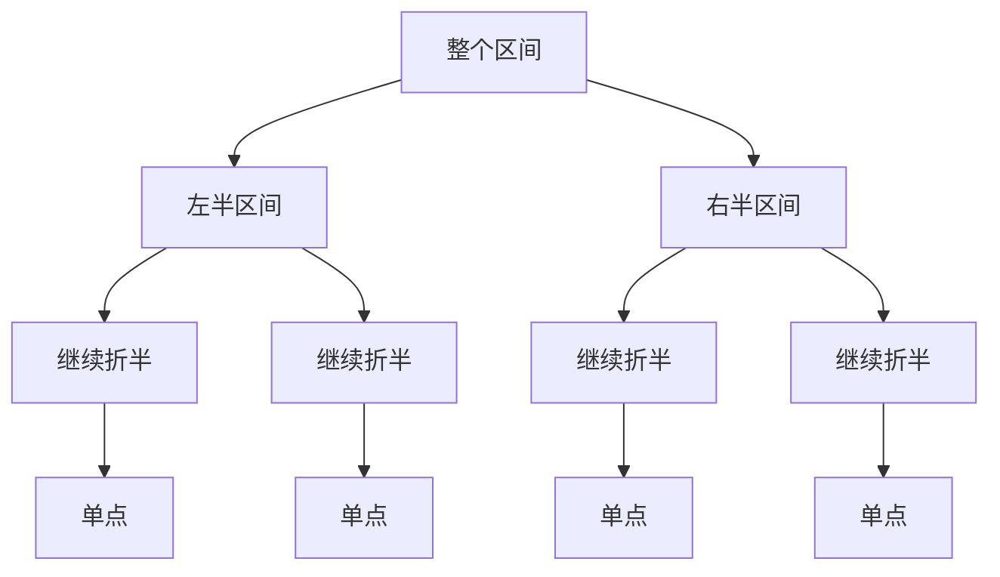

> 本笔记按原书第 12 章的小节顺序展开。原书中的概念、例题和主要方法按原顺序说明；超出原书的统一抽象、替代方案和工程注意事项均显式标注为“补充”。

## 本章要解决什么问题

数组上的查询与修改常存在冲突：

- 直接保存原数组，单点修改是 $O(1)$，但区间求和或最值要 $O(n)$；
- 保存前缀和，静态区间和是 $O(1)$，但一次单点修改可能让后面 $O(n)$ 个前缀失效；
- 差分适合多次离线区间修改，却不能在每次修改后立即给出任意区间答案。

线段树通过保存不同尺度的区间摘要，在更新与查询之间取得平衡：通常用 $O(n)$ 空间和预处理，使单点修改、区间查询达到 $O(\log n)$；加入懒标记后，整段修改也可达到 $O(\log n)$。



它的核心不是“画一棵树”，而是两个不变量：

1. 每个结点负责一个确定的连续区间；
2. 父结点的答案可由两个子区间的答案合并得到。

### 基础算法与正文盘点

本章先后形成 6 个基础算法单元，后文每个单元都给出紧邻原理的 C++17 实现：

| 编号 | 基础算法单元 | 固定契约 |
|---:|---|---|
| 1 | 建树 | 闭区间递归，根编号 0，孩子编号 `2*root+1`、`2*root+2`，先建孩子再 `pushUp` |
| 2 | 区间查询 | 完全覆盖直接返回，部分覆盖才下降，空分支使用聚合单位元 |
| 3 | 单点更新 | 定位叶子后修改，回溯路径逐层 `pushUp` |
| 4 | 区间更新与懒传播 | 完全覆盖先 `apply`；只有下降前才 `pushDown`；修改返回后 `pushUp` |
| 5 | 动态开点 | 根值域仍为有限闭区间，下降时按需创建孩子，空结点语义由题目定义 |
| 6 | 离散化 | 排序去重只保序；涉及真实长度时必须保留原坐标差 |

正文共有 7 个题目小节：12.2 的 3 题、12.3 的 2 题和 12.4 的 2 题。每题在下一题开始前给出独立的 C++17 接口；Python 3 与 Go 1.22 的完整同构接口只保留在章末附录。

## 12.1 线段树概述

### 12.1.1 线段树的定义

#### 1. 直觉与严格定义

线段树（Segment Tree）是把数组区间递归二分形成的二叉树。设原数组下标为 $0\sim n-1$，根结点负责闭区间 $[0,n-1]$。对任意非叶结点 $[L,R]$，令

$$
mid=\left\lfloor\frac{L+R}{2}\right\rfloor,
$$

它的两个孩子分别负责

$$
[L,mid],
\qquad
[mid+1,R].
$$

当 $L=R$ 时，区间只含一个数组元素，结点成为叶子，也叫单点结点。

结点还保存该区间的摘要 `data`。摘要取决于题目：

- 区间最小值：`data=min(left.data,right.data)`；
- 区间最大值：`data=max(left.data,right.data)`；
- 区间和：`data=left.data+right.data`。

原书把线段树概括为分治法与二叉树的结合：问题区间不断折半，查询只访问与目标有交集的分支，回溯时再合并局部答案。

#### 2. 为什么合并必须稳定

设区间被拆成互不重叠且相邻的 $A,B,C$。无论先合并哪两个部分，最终结果都应相同：

$$
merge(merge(A,B),C)=merge(A,merge(B,C)).
$$

求和、最小值、最大值都满足这一结合律，所以可按树的任意括号结构合并。

> **补充：幺半群视角。** 一个可结合的 `merge` 与一个空区间单位元就形成适合线段树查询的代数结构。例如求和的单位元为 0，最小值的单位元为 $+\infty$，最大值的单位元为 $-\infty$。这不是原书要求的术语，但能解释为什么某些区间信息容易维护，而中位数等信息不能只靠一个常数大小摘要简单合并。

#### 3. 原书 RMQ 示例

数组

$$
a=[2,5,1,4,9,7,6,10]
$$

用于区间最小值查询（Range Minimum Query，RMQ）。根区间 $[0,7]$ 的值是 1。第一层拆成：

$$
\min(a[0..3])=1,
\qquad
\min(a[4..7])=6,
$$

再合并得

$$
\min(1,6)=1.
$$

查询 $[3,6]$ 时，不必访问每个叶子，可以把目标规范地拆成树上若干完整结点区间：

$$
[3,3]\cup[4,5]\cup[6,6].
$$

对应值为 $4,7,6$，结果为

$$
\min(4,7,6)=4.
$$

#### 4. 高度为什么是对数级

每下降一层，区间长度至多减半。长度 $n$ 经过 $h$ 次折半后成为单点，需要

$$
\frac{n}{2^h}\le1.
$$

等价于

$$
h\ge\log_2n.
$$

因此从根到叶的边数为 $\lceil\log_2n\rceil$ 量级，树高为 $O(\log n)$。单点查询和单点修改都只沿一条根叶路径，所以具备对数时间的基础。

#### 5. 适用条件与边界

线段树适用于：

- 数据具有固定顺序，可用连续下标表示；
- 查询答案能由相邻子区间答案合并；
- 查询和修改交错出现，静态前缀和不再合适。

它不天然解决图连通、无序集合搜索或必须保存全部元素分布的问题。若只做静态查询，稀疏表、前缀和往往更简单；若只做单点加与前缀和，树状数组通常常数更小。

### 12.1.2 简单线段树的实现

简单线段树包含创建、单点/区间查询和单点修改，不包含区间修改。

#### 1. 顺序存储与结点编号

原书使用从 0 开始的数组 `ST` 存树。结点编号为 $root$ 时：

$$
left(root)=2root+1,
\qquad
right(root)=2root+2.
$$

结点本身不保存 $L,R$；递归参数携带其区间。若改用从 1 开始编号，则孩子变为 $2root$ 和 $2root+1$，两套公式不能混用。

#### 2. 为什么常开 $4n$ 空间

线段树在逻辑上有 $n$ 个叶子和 $n-1$ 个双分支结点，共 $2n-1$ 个结点；但数组层序编号可能因最后一层不满而出现空洞，不能只开 `2n-1` 个槽位。

令

$$
p=2^{\lceil\log_2n\rceil}
$$

是大于等于 $n$ 的最小 2 的幂。把树补成 $p$ 个叶子的满二叉树，数组槽位至多为

$$
2p-1.
$$

因为 $p<2n$，所以

$$
2p-1<4n-1.
$$

故 `4*n` 是简洁安全的上界。空间仍为 $O(n)$。

#### 3. 创建：从叶子向上合并

对 RMQ，递归 `build(root,L,R)`：

1. 若 $L=R$，置
   $$
   ST[root]=a[L];
   $$
2. 否则递归创建 $[L,mid]$ 和 $[mid+1,R]$；
3. 回溯时置
   $$
   ST[root]=\min(ST[left],ST[right]).
   $$

**正确性证明采用区间长度归纳。**

- 基础情形：长度为 1 时，结点值直接等于唯一元素，显然是区间最小值；
- 归纳步骤：假设左右孩子分别正确保存各自区间最小值。父区间是两个孩子区间的不交并，因此两者较小值就是整个父区间的最小值。

每个实际结点只创建一次，故构建时间是 $O(n)$，不是“每层 $O(n)$ 再乘高度”的 $O(n\log n)$；各层结点负责的区间虽重叠，但构建工作按结点计数，总结点数为线性级。

#### C++17：基础单元 1——建树

下面 3 个基础单元共同组成一个 `StaticMinSegmentTree`，类只在此定义一次。数组下标和递归边界统一采用从 0 开始的闭区间 $[L,R]$；`tree_[0]` 是根，孩子编号为 `2*root+1` 和 `2*root+2`。`Build` 必须先完成两个孩子，再调用 `PushUp`。

```cpp
#include <algorithm>
#include <cassert>
#include <limits>
#include <utility>
#include <vector>

class StaticMinSegmentTree {
public:
   explicit StaticMinSegmentTree(const std::vector<long long>& values)
      : size_(static_cast<int>(values.size())),
        tree_(4 * values.size(), 0) {
      assert(size_ > 0);
      Build(0, 0, size_ - 1, values);
   }

   long long Query(int query_left, int query_right) const;
   void PointAdd(int index, long long increment);

private:
   int size_;
   std::vector<long long> tree_;

   void PushUp(int root) {
      tree_[root] = std::min(tree_[root * 2 + 1], tree_[root * 2 + 2]);
   }

   void Build(
      int root,
      int left,
      int right,
      const std::vector<long long>& values) {
      if (left == right) {
         tree_[root] = values[left];
         return;
      }
      const int middle = left + (right - left) / 2;
      Build(root * 2 + 1, left, middle, values);
      Build(root * 2 + 2, middle + 1, right, values);
      PushUp(root);
   }

   long long Query(
      int root,
      int left,
      int right,
      int query_left,
      int query_right) const;
   void PointAdd(
      int root,
      int left,
      int right,
      int index,
      long long increment);
};
```

#### 4. 单点查询

查询下标 $i$ 时，在当前结点 $[L,R]$：

- 若 $L=R$，返回结点值；
- 若 $i\le mid$，进入左孩子；
- 否则进入右孩子。

每层只走一个分支，最多走树高层，时间 $O(\log n)$。

#### 5. 区间查询的三种关系

设当前结点区间为 $[L,R]$，查询区间为 $[q_l,q_r]$。

1. **完全覆盖**：$q_l\le L\le R\le q_r$，直接返回 `ST[root]`；
2. **完全不交**：$R<q_l$ 或 $q_r<L$，返回合并单位元；RMQ 返回 $+\infty$；
3. **部分相交**：递归查询两个孩子，再合并结果。

用集合表示：

$$
query([L,R])=
\begin{cases}
ST[root],&[L,R]\subseteq[q_l,q_r],\\
+\infty,&[L,R]\cap[q_l,q_r]=\varnothing,\\
\min(query(left),query(right)),&\text{其他情况}.
\end{cases}
$$

原书实现通过 `q_l<=mid` 和 `q_r>mid` 只递归有交集的孩子，因此可省略显式“不交”分支。使用单位元写法更统一，也避免某一侧局部变量未赋值。

#### 6. 区间查询为何是 $O(\log n)$

一个连续查询区间在每层至多产生两个“尚未完全覆盖”的边界结点：一个包含左边界，一个包含右边界；位于它们之间的区间会作为完整结点直接返回。因此访问的规范分解结点数为 $O(\log n)$，查询时间也是 $O(\log n)$。

以数组 `[2,5,1,4,9,7,6,10]` 查询闭区间 `[3,6]` 为例，根编号和区间的对应关系如下：

1. 根 `0:[0,7]` 部分相交，分到 `1:[0,3]` 与 `2:[4,7]`；
2. 左侧只保留 `10:[3,3]`，值为 4；`[0,2]` 所在分支不再访问；
3. 右侧完整接收 `5:[4,5]`，值为 7；在 `6:[6,7]` 中只保留 `13:[6,6]`，值为 6；
4. 规范分解正是 `[3,3]\cup[4,5]\cup[6,6]`，合并得到 `min(4,7,6)=4`。

这次走查同时说明：完全覆盖的 `5:[4,5]` 不应继续访问叶子，而与查询不交的 `[0,2]`、`[7,7]` 不应贡献任何值。

#### C++17：基础单元 2——区间查询

`Query` 只读取树：完全覆盖立即返回；部分覆盖才进入相交孩子；最小值查询以 `LLONG_MAX` 为单位元。查询过程中不执行 `PushUp`。

```cpp
long long StaticMinSegmentTree::Query(
   int query_left, int query_right) const {
   assert(0 <= query_left && query_left <= query_right);
   assert(query_right < size_);
   return Query(0, 0, size_ - 1, query_left, query_right);
}

long long StaticMinSegmentTree::Query(
   int root,
   int left,
   int right,
   int query_left,
   int query_right) const {
   if (query_left <= left && right <= query_right) {
      return tree_[root];
   }

   const int middle = left + (right - left) / 2;
   long long answer = std::numeric_limits<long long>::max();
   if (query_left <= middle) {
      answer = std::min(
         answer,
         Query(root * 2 + 1, left, middle, query_left, query_right));
   }
   if (query_right > middle) {
      answer = std::min(
         answer,
         Query(root * 2 + 2, middle + 1, right, query_left, query_right));
   }
   return answer;
}

void CheckClosedIntervalQuery() {
   const StaticMinSegmentTree tree({2, 5, 1, 4, 9, 7, 6, 10});
   assert(tree.Query(3, 6) == 4);
   assert(tree.Query(4, 5) == 7);
}
```

#### 7. 单点修改与向上更新

执行 $a[i]\mathrel{+}=x$：

1. 按下标定位叶子 $[i,i]$，令其值加 $x$；
2. 递归返回时，每个祖先重新执行
   $$
   ST[root]=\min(ST[left],ST[right]).
   $$

只有一条根叶路径受影响，时间 $O(\log n)$。

原书数组中执行 $a[2]\mathrel{+}=8$ 后：

$$
[2,5,1,4,9,7,6,10]
\longrightarrow
[2,5,9,4,9,7,6,10].
$$

原最小值 1 消失，根结点最小值变为 2。更新叶子后若忘记向上合并，祖先仍保存旧答案，后续区间查询就会错误。

#### C++17：基础单元 3——单点更新

点更新仍使用闭区间。下降时每层只选择一个孩子；叶子修改完成后，递归返回路径上的每个祖先恰好执行一次 `PushUp`。这里的接口是“增加”，若题目给的是新值，应在叶子改为赋值或先计算差值。

```cpp
void StaticMinSegmentTree::PointAdd(int index, long long increment) {
   assert(0 <= index && index < size_);
   PointAdd(0, 0, size_ - 1, index, increment);
}

void StaticMinSegmentTree::PointAdd(
   int root,
   int left,
   int right,
   int index,
   long long increment) {
   if (left == right) {
      tree_[root] += increment;
      return;
   }

   const int middle = left + (right - left) / 2;
   if (index <= middle) {
      PointAdd(root * 2 + 1, left, middle, index, increment);
   } else {
      PointAdd(root * 2 + 2, middle + 1, right, index, increment);
   }
   PushUp(root);
}

void CheckPointUpdateAndPushUp() {
   StaticMinSegmentTree tree({2, 5, 1, 4, 9, 7, 6, 10});
   tree.PointAdd(2, 8);
   assert(tree.Query(2, 2) == 9);
   assert(tree.Query(0, 7) == 2);
}
```

#### 8. 例 12-1：HDU 1754 I Hate It

该题需要：

- 查询学生编号区间内的最高成绩；
- 把某位学生成绩直接修改为新值。

没有区间修改，所以简单线段树足够。合并操作由 `min` 改为 `max`，单点更新语义由“增加”改为“赋值”。原书采用学生编号 $1\sim n$ 和根编号 1，此时孩子编号为 $2root,2root+1$。

样例操作的结果依次为：

```text
5
6
5
9
```

构建 $O(n)$，每次查询或更新 $O(\log n)$，空间 $O(n)$。

### 12.1.3 复杂线段树的实现

复杂线段树在简单树基础上支持区间修改。原书先以“区间加 + 区间最小值”说明懒标记，再以“区间赋值 + 区间和”的吊钩题展示不同标记语义。

#### 1. 为什么逐点修改不够

若对长度为 $k$ 的区间逐个执行单点修改，每个单点耗时 $O(\log n)$，总时间为

$$
O(k\log n),
$$

最坏接近 $O(n\log n)$。但当某个树结点区间完全包含在更新区间内时，整段元素都接受同一种操作，没有必要立即深入每个叶子。

#### 2. 懒标记的严格不变量

对区间加法和区间最小值，结点维护：

- `tree[root]`：该结点区间在所有已发生更新之后的真实最小值；
- `lazy[root]`：已经作用于当前结点值、但还没有传给孩子的统一增量。

因此“懒”只发生在子树内部，当前结点的答案必须始终是最新的。若完整覆盖结点区间：

$$
\boxed{
tree[root]\mathrel{+}=x,
\qquad
lazy[root]\mathrel{+}=x.
}
$$

#### 3. 下传 `pushDown`

当查询或更新需要继续进入孩子时，父结点的未传增量必须先下发：

$$
\begin{aligned}
tree[left]&\mathrel{+}=lazy[root],\\
tree[right]&\mathrel{+}=lazy[root],\\
lazy[left]&\mathrel{+}=lazy[root],\\
lazy[right]&\mathrel{+}=lazy[root],\\
lazy[root]&=0.
\end{aligned}
$$

为什么孩子的标记是“加”而不是覆盖？因为多次区间加法可叠加：先加 $x$ 再加 $y$ 等价于一次加 $x+y$。

下传后，两个孩子都反映父结点更新，父标记才可清零。若先清零再读取，更新会丢失。

#### 4. 区间加算法

执行 `update(root,L,R,ql,qr,x)`：

1. 若 $[L,R]\subseteq[q_l,q_r]$，更新当前值和懒标记后立即返回；
2. 否则先 `pushDown(root)`；
3. 只递归与更新区间相交的孩子；
4. 回溯时执行
   $$
   tree[root]=\min(tree[left],tree[right]).
   $$

完整覆盖时停止下钻，是区间修改能达到对数时间的关键。

#### 5. 原书数值演算

初始数组

$$
[2,5,1,4,9,7,6,10]
$$

执行

$$
a[1..3]\mathrel{+}=-4
$$

后得到

$$
[2,1,-3,0,9,7,6,10].
$$

树中的单点 $[1,1]$ 被直接改为 1；完整结点 $[2,3]$ 的最小值从 1 改为 -3，并保存懒标记 -4，它的两个叶子暂不修改。此时根最小值已经正确变为 -3。

若随后查询下标 3，访问 $[2,3]$ 的孩子前必须下传 -4：

$$
a[2]:1\to-3,
\qquad
a[3]:4\to0.
$$

所以查询结果为 0。

#### 6. 区间查询与懒标记

若查询完整覆盖当前结点，可直接返回最新的 `tree[root]`，不必下传。只有部分覆盖、需要访问孩子时才下传。查询后通常不必重新 `pull`，因为下传保持父子聚合关系；更新递归返回时则必须 `pull`。

#### 7. 区间和为何要乘区间长度

上述 RMQ 维护最小值，整段每个元素加 $x$ 后，最小值也只加 $x$。若维护的是区间和，结点区间长度为

$$
len=R-L+1,
$$

则每个元素加 $x$ 会使总和增加

$$
\boxed{x\cdot len.}
$$

所以不能机械地把 `tree[root] += x` 套到求和树中。

#### 8. 区间赋值的标记组合

例 12-2 的操作是把一段金属棒全部**改成**类型 $x$，不是增加 $x$。对区间和结点：

$$
\boxed{
tree[root]=x(R-L+1),
\qquad
assign[root]=x.
}
$$

连续两次赋值时，后一次完全覆盖前一次，因此标记应覆盖而非相加。下传时两个孩子都改成父标记指定的值，并按各自长度重算区间和。

| 更新类型 | 结点值变化 | 标记合成 |
|---|---|---|
| 整段加 $x$，维护最小值 | `minimum += x` | `lazy += x` |
| 整段加 $x$，维护区间和 | `sum += x*length` | `lazy += x` |
| 整段赋值为 $x$，维护区间和 | `sum = x*length` | `assign = x`，覆盖旧赋值 |

> **补充：** 若赋值允许为 0，就不能把 `assign=0` 同时当作“没有标记”。应另设 `has_assign` 布尔量。若同时支持赋值与加法，还要规定组合顺序：新赋值清除旧加法，新加法叠加到待赋值值或独立加法标记上。

#### 9. 例 12-2：HDU 1698 Just a Hook

初始 $n$ 根金属棒价值均为 1。每次把闭区间 $[x,y]$ 赋值为 1、2 或 3，最终询问总价值。根结点维护整个区间和，更新使用赋值懒标记。

以 10 根棒为例：先把 $1\sim5$ 赋值为 2，再把 $5\sim9$ 赋值为 3：

$$
4\times2+5\times3+1\times1=24.
$$

根结点的区间和就是最终答案。构建 $O(n)$，每次区间赋值 $O(\log n)$，空间 $O(n)$。

#### 10. 懒标记复杂度为何仍是对数级

一次连续区间更新在每层最多留下两个部分覆盖的边界分支；中间完整覆盖的结点记录标记后立即停止。因此访问结点数为 $O(\log n)$。懒标记并非减少树高，而是避免对完整覆盖结点继续展开全部叶子。

一个能直接击中错误实现的反例是数组 `[1,2,3,4]`：先对闭区间 `[0,3]` 整段加 10。此时根最小值应立即变为 11，根标记为 10，而两个孩子仍可暂存旧值。随后查询单点 `[2,2]`：

- 正确实现先把根标记下传，叶子值为 $3+10=13$；
- 若下降前遗漏 `pushDown`，会读到旧叶子 3；
- 更糟的是，若继续把 `[2,2]` 加 5 后直接 `pushUp`，旧左孩子最小值 1 会让根错误回退为 1，而真实数组 `[11,12,18,14]` 的最小值是 11。

所以顺序不能交换：完整覆盖时 `apply` 后返回；部分覆盖时先 `pushDown`，递归修改后再 `PushUp`。查询只有在需要下降时才 `pushDown`，且不需要 `PushUp`。

#### C++17：基础单元 4——区间更新与懒传播

两个实现都采用根编号 0 和闭区间 `[L,R]`。`LazyMinSegmentTree` 演示“区间加 + 区间最小值”；`RangeAssignSumTree` 对应吊钩题的“区间赋值 + 区间和”，用独立布尔量表示是否存在赋值标记，因此赋值为 0 也不会与“无标记”混淆。

```cpp
class LazyMinSegmentTree {
public:
   explicit LazyMinSegmentTree(const std::vector<long long>& values)
      : size_(static_cast<int>(values.size())),
        tree_(4 * values.size(), 0),
        lazy_(4 * values.size(), 0) {
      assert(size_ > 0);
      Build(0, 0, size_ - 1, values);
   }

   void RangeAdd(int query_left, int query_right, long long increment) {
      RangeAdd(0, 0, size_ - 1, query_left, query_right, increment);
   }

   long long Query(int query_left, int query_right) {
      return Query(0, 0, size_ - 1, query_left, query_right);
   }

private:
   int size_;
   std::vector<long long> tree_;
   std::vector<long long> lazy_;

   void Apply(int root, long long increment) {
      tree_[root] += increment;
      lazy_[root] += increment;
   }

   void PushDown(int root) {
      if (lazy_[root] == 0) {
         return;
      }
      Apply(root * 2 + 1, lazy_[root]);
      Apply(root * 2 + 2, lazy_[root]);
      lazy_[root] = 0;
   }

   void PushUp(int root) {
      tree_[root] = std::min(tree_[root * 2 + 1], tree_[root * 2 + 2]);
   }

   void Build(
      int root,
      int left,
      int right,
      const std::vector<long long>& values) {
      if (left == right) {
         tree_[root] = values[left];
         return;
      }
      const int middle = left + (right - left) / 2;
      Build(root * 2 + 1, left, middle, values);
      Build(root * 2 + 2, middle + 1, right, values);
      PushUp(root);
   }

   void RangeAdd(
      int root,
      int left,
      int right,
      int query_left,
      int query_right,
      long long increment) {
      if (query_left <= left && right <= query_right) {
         Apply(root, increment);
         return;
      }
      PushDown(root);
      const int middle = left + (right - left) / 2;
      if (query_left <= middle) {
         RangeAdd(
            root * 2 + 1,
            left,
            middle,
            query_left,
            query_right,
            increment);
      }
      if (query_right > middle) {
         RangeAdd(
            root * 2 + 2,
            middle + 1,
            right,
            query_left,
            query_right,
            increment);
      }
      PushUp(root);
   }

   long long Query(
      int root,
      int left,
      int right,
      int query_left,
      int query_right) {
      if (query_left <= left && right <= query_right) {
         return tree_[root];
      }
      PushDown(root);
      const int middle = left + (right - left) / 2;
      long long answer = std::numeric_limits<long long>::max();
      if (query_left <= middle) {
         answer = std::min(
            answer,
            Query(root * 2 + 1, left, middle, query_left, query_right));
      }
      if (query_right > middle) {
         answer = std::min(
            answer,
            Query(
               root * 2 + 2,
               middle + 1,
               right,
               query_left,
               query_right));
      }
      return answer;
   }
};

class RangeAssignSumTree {
public:
   RangeAssignSumTree(int size, long long initial_value)
      : size_(size),
        sum_(4 * size, 0),
        assign_(4 * size, 0),
        has_assign_(4 * size, false) {
      assert(size_ > 0);
      Build(0, 0, size_ - 1, initial_value);
   }

   void RangeAssign(int query_left, int query_right, long long value) {
      RangeAssign(0, 0, size_ - 1, query_left, query_right, value);
   }

   long long QuerySum(int query_left, int query_right) {
      return QuerySum(0, 0, size_ - 1, query_left, query_right);
   }

private:
   int size_;
   std::vector<long long> sum_;
   std::vector<long long> assign_;
   std::vector<bool> has_assign_;

   void Apply(int root, int left, int right, long long value) {
      sum_[root] = value * (right - left + 1);
      assign_[root] = value;
      has_assign_[root] = true;
   }

   void PushDown(int root, int left, int right) {
      if (!has_assign_[root] || left == right) {
         return;
      }
      const int middle = left + (right - left) / 2;
      Apply(root * 2 + 1, left, middle, assign_[root]);
      Apply(root * 2 + 2, middle + 1, right, assign_[root]);
      has_assign_[root] = false;
   }

   void PushUp(int root) {
      sum_[root] = sum_[root * 2 + 1] + sum_[root * 2 + 2];
   }

   void Build(int root, int left, int right, long long initial_value) {
      if (left == right) {
         sum_[root] = initial_value;
         return;
      }
      const int middle = left + (right - left) / 2;
      Build(root * 2 + 1, left, middle, initial_value);
      Build(root * 2 + 2, middle + 1, right, initial_value);
      PushUp(root);
   }

   void RangeAssign(
      int root,
      int left,
      int right,
      int query_left,
      int query_right,
      long long value) {
      if (query_left <= left && right <= query_right) {
         Apply(root, left, right, value);
         return;
      }
      PushDown(root, left, right);
      const int middle = left + (right - left) / 2;
      if (query_left <= middle) {
         RangeAssign(
            root * 2 + 1, left, middle, query_left, query_right, value);
      }
      if (query_right > middle) {
         RangeAssign(
            root * 2 + 2,
            middle + 1,
            right,
            query_left,
            query_right,
            value);
      }
      PushUp(root);
   }

   long long QuerySum(
      int root,
      int left,
      int right,
      int query_left,
      int query_right) {
      if (query_left <= left && right <= query_right) {
         return sum_[root];
      }
      PushDown(root, left, right);
      const int middle = left + (right - left) / 2;
      long long answer = 0;
      if (query_left <= middle) {
         answer += QuerySum(
            root * 2 + 1, left, middle, query_left, query_right);
      }
      if (query_right > middle) {
         answer += QuerySum(
            root * 2 + 2,
            middle + 1,
            right,
            query_left,
            query_right);
      }
      return answer;
   }
};

void CheckLazyPropagation() {
   LazyMinSegmentTree minimum_tree({1, 2, 3, 4});
   minimum_tree.RangeAdd(0, 3, 10);
   assert(minimum_tree.Query(2, 2) == 13);
   minimum_tree.RangeAdd(2, 2, 5);
   assert(minimum_tree.Query(0, 3) == 11);

   RangeAssignSumTree hook(10, 1);
   hook.RangeAssign(0, 4, 2);
   hook.RangeAssign(4, 8, 3);
   assert(hook.QuerySum(0, 9) == 24);
   hook.RangeAssign(0, 9, 0);
   assert(hook.QuerySum(0, 9) == 0);
}
```

### 12.1.4 线段树的动态开点实现

#### 1. 为什么静态数组会浪费空间

若线段树管理的是下标 $0\sim n-1$，且所有位置都会使用，`4n` 数组简单高效。但有些题目的坐标范围可能是

$$
[0,10^9]
$$

甚至更大，而实际只修改几百或几万个位置。按整个值域建树无法分配足够内存，绝大多数结点也从未访问。

动态开点的思想是：根只表示整个值域，孩子在更新或查询确实需要进入该分支时才创建。

#### 2. 动态结点结构

原书数组式结点保存：

- `val`：当前区间摘要；
- `left`：左孩子在结点池中的地址；
- `right`：右孩子在结点池中的地址。

地址 0 可作为“空指针”，有效结点从 1 开始编号。于是孩子不再由 $2root+1,2root+2$ 推出，而是通过结点字段访问。

结点池数组需要预估最大结点数；原书称为“需要估点的数组实现”。Python 可把新结点追加到列表，或直接使用对象引用，无需预先固定池大小。

#### 3. 单点更新如何开点

对当前区间 $[L,R]$ 更新位置 $i$：

1. 若当前结点不存在，创建结点并取得新地址；
2. 若 $L=R$，修改叶子值；
3. 否则按 $i\le mid$ 选择一个孩子，若该孩子不存在就在递归中创建；
4. 回溯时由现有孩子重新合并当前结点。

一次更新只沿一条根叶路径创建结点，值域长度为 $U=R-L+1$ 时，最多新建

$$
O(\log U)
$$

个结点。$q$ 次单点操作最坏空间为 $O(q\log U)$，共享的祖先会让实际数量更少。

#### 4. 空结点必须有明确语义

原书示例中未创建结点的字段初始化为 0，这隐含“所有未触及位置初值为 0”。对区间和，空结点返回 0 很自然；对最小值有两种不同语义：

- 若未创建位置是真实存在且初值为 0，空分支最小值应为 0；
- 若未创建位置表示“不参与集合”，空分支应返回 $+\infty$。

二者不能混淆。动态树不是自动省略数据，它只是把统一的默认状态隐式表示。

#### 5. 动态区间修改与懒标记

动态开点也能支持懒标记。完整覆盖当前结点时只更新结点值和标记，不必创建孩子；部分覆盖、必须下降时，才创建所需孩子并把父标记下传。

如果默认数组全 0，维护区间和并执行整段加 $x$，即使孩子尚未创建，父结点仍可直接增加

$$
x(R-L+1).
$$

将来创建孩子时，要让新孩子继承父结点累积的懒标记，否则它会错误地从 0 开始。

#### 6. 数值直觉

在值域 $[0,10^9]$ 上只更新位置 5 和 $10^9$：

- 静态树无法按 $4\times10^9$ 开数组；
- 动态树每个位置只走约 $\lceil\log_2(10^9+1)\rceil\approx30$ 层；
- 两条路径除根部少量共享外，总结点只有几十个量级。

每次操作时间仍为 $O(\log U)$，其中 $U$ 是值域长度，而非实际点数。

#### 7. 结点数与数组容量辨析

一棵已经完整展开、恰有 $n$ 个叶子的二叉树有 $n-1$ 个双分支结点，总结点数

$$
n+(n-1)=2n-1.
$$

静态层序数组开 `4n` 是为了容纳编号空洞；动态结点池只保存真实创建的结点，没有这些空洞。但动态树最终创建多少结点取决于操作路径，不能仅凭原数组长度机械固定为 $2n-1$。

> **补充：安全中点。** 当值域端点很大时，建议写
> $$
> mid=L+\left\lfloor\frac{R-L}{2}\right\rfloor
> $$
> 而不是直接计算 $(L+R)/2$，以避免固定宽度整数加法溢出。

#### C++17：基础单元 5——动态开点

这里的根仍负责有限闭区间 `[minimum,maximum]`，但结点通过指针连接，不使用 `2*root+1` 之类的数组编号。空指针明确表示“该段所有频次均为 0”；单点增加只创建一条路径，查询空分支直接返回求和单位元 0。动态懒树若要下降，还必须先创建孩子并继承父标记。

```cpp
#include <cstddef>
#include <memory>

class DynamicPointFrequencyTree {
private:
   struct Node {
      long long count = 0;
      std::unique_ptr<Node> left;
      std::unique_ptr<Node> right;
   };

public:
   DynamicPointFrequencyTree(long long minimum, long long maximum)
      : minimum_(minimum),
        maximum_(maximum),
        root_(std::make_unique<Node>()) {
      assert(minimum_ <= maximum_);
   }

   void Add(long long position) {
      assert(minimum_ <= position && position <= maximum_);
      Add(root_.get(), minimum_, maximum_, position);
   }

   long long Query(long long query_left, long long query_right) const {
      return Query(
         root_.get(), minimum_, maximum_, query_left, query_right);
   }

   std::size_t NodeCount() const {
      return node_count_;
   }

private:
   long long minimum_;
   long long maximum_;
   std::unique_ptr<Node> root_;
   std::size_t node_count_ = 1;

   void Add(
      Node* node, long long left, long long right, long long position) {
      ++node->count;
      if (left == right) {
         return;
      }
      const long long middle = left + (right - left) / 2;
      if (position <= middle) {
         if (!node->left) {
            node->left = std::make_unique<Node>();
            ++node_count_;
         }
         Add(node->left.get(), left, middle, position);
      } else {
         if (!node->right) {
            node->right = std::make_unique<Node>();
            ++node_count_;
         }
         Add(node->right.get(), middle + 1, right, position);
      }
   }

   static long long Query(
      const Node* node,
      long long left,
      long long right,
      long long query_left,
      long long query_right) {
      if (!node || query_right < left || right < query_left) {
         return 0;
      }
      if (query_left <= left && right <= query_right) {
         return node->count;
      }
      const long long middle = left + (right - left) / 2;
      return Query(node->left.get(), left, middle, query_left, query_right) +
            Query(
               node->right.get(),
               middle + 1,
               right,
               query_left,
               query_right);
   }
};

void CheckSparseDomain() {
   DynamicPointFrequencyTree tree(0, 1'000'000'000LL);
   tree.Add(5);
   tree.Add(1'000'000'000LL);
   tree.Add(5);
   assert(tree.Query(0, 5) == 2);
   assert(tree.Query(0, 1'000'000'000LL) == 3);
   assert(tree.NodeCount() < 100);
}
```

### 12.1.5 离散化

#### 1. 离散化要保留什么

有些问题只关心数值之间的相对顺序，而不关心相邻值相差多少。离散化（坐标压缩）把稀疏大值映射成连续小整数，同时保持次序：

$$
x<y\Longrightarrow rank(x)<rank(y).
$$

相等值必须映射到同一编号。压缩后可在线段树的小下标范围上维护按值统计的信息。

#### 2. 成绩排名示例

成绩

$$
[95,70,85,48]
$$

规定最高分为第 1 名。不同成绩降序排列：

$$
[95,85,70,48].
$$

映射为

$$
95\to1,\quad85\to2,\quad70\to3,\quad48\to4,
$$

所以原顺序的名次为

$$
[1,3,2,4].
$$

若出现相同成绩，扫描排序结果时只在第一次出现时分配新名次，保证同分同名次。

> **原文勘误说明：** 原书文字和 C++ 代码都按降序建立“高分名次小”的映射，但同页 Python 代码写成 `sorted(a)` 升序，会得到相反名次。若遵循题意，应使用 `sorted(a, reverse=True)`。

#### 3. 通用升序坐标压缩

用于值域线段树时，通常不表示比赛名次，而是建立从小到大的坐标：

1. 复制所有可能用到的值；
2. 排序并去重，得到
   $$
   b_0<b_1<\cdots<b_{d-1};
   $$
3. 定义
   $$
   rank(b_i)=i.
   $$

例如

$$
a=[6,8,2,100]
$$

排序去重后

$$
b=[2,6,8,100],
$$

映射为

$$
2\to0,\quad6\to1,\quad8\to2,\quad100\to3.
$$

线段树只需覆盖 $[0,3]$，而不是原值域 $[2,100]$。

排序耗时 $O(n\log n)$。映射可用哈希表实现平均 $O(1)$ 查找，也可对有序数组二分查找，单次 $O(\log n)$。

#### 4. 何时可以安全压缩

若操作只依赖：

- 值的大小关系；
- 某个已知值出现次数；
- 小于、等于或大于某值的计数；

普通去重排名足够，因为这些性质只依赖顺序。

若结点值依赖真实区间长度，例如“被覆盖坐标的总长度”，把 2 和 100 压成相邻下标会错误地把距离 98 当作 1。

> **补充：保距离散化。** 涉及连续长度、面积或区间并时，结点必须结合原坐标差计算长度，或把端点及必要的相邻位置一并加入坐标集合。普通排名只保序，不保距离。

#### 5. 例 12-3：HDU 4325 Flowers

每朵花在闭区间 $[S_i,T_i]$ 开放，每个查询给出时间点 $q$，要求有多少区间包含 $q$。时间最大可达 $10^9$，而花和查询各至多 $10^5$。

原书做法是：

1. 收集所有花期端点和查询时间；
2. 排序去重并映射到连续下标；
3. 对每个压缩后的花期区间执行加 1；
4. 对每个压缩后的查询时间做单点查询。

把查询时间也加入离散化集合至关重要。由于映射保序：

$$
S_i\le q\le T_i
\iff
rank(S_i)\le rank(q)\le rank(T_i),
$$

所以压缩后区间包含关系不变。该题只求点被多少区间覆盖，不依赖真实时间距离，普通离散化正确。

若使用懒线段树，排序压缩为 $O((n+m)\log(n+m))$，每次区间加和单点查询为 $O(\log(n+m))$。

#### 6. 动态开点与离散化如何选择

| 对比项 | 动态开点 | 离散化后静态树 |
|---|---|---|
| 是否预先知道全部坐标 | 不要求 | 通常要求 |
| 单次操作高度 | $O(\log U)$，$U$ 为原值域 | $O(\log d)$，$d$ 为不同坐标数 |
| 空间 | 按访问路径创建 | $O(d)$ |
| 在线新增任意坐标 | 方便 | 可能需要重建映射 |
| 实现难点 | 默认值、结点池、动态懒标记 | 收集完整坐标、还原真实距离 |

#### 7. 原书归纳的线段树解题流程

原书把使用线段树的过程归纳为六步：

1. 把问题转换为区间问题，明确区间基于下标还是数值；
2. 定义结点值及合并操作，确认大区间答案能由小区间合并；
3. 判断需要单点还是区间查询、单点还是区间修改，并设计懒标记；
4. 判断是否需要离散化或动态开点；
5. 据此选择数组树、结点池或动态对象等存储结构；
6. 实现基本操作，再组合成题目算法。

这套流程的重点是先定义不变量和操作代数，再写递归，而不是先套一个固定模板。

#### C++17：基础单元 6——离散化

压缩器只负责把已收集值映射到从 0 开始的连续下标，后续静态线段树仍使用闭区间 `[0,d-1]` 和根编号 0。`Rank` 要求查询值已在构造时收集；若边界可能不在集合中，应改用 `lower_bound`/`upper_bound` 计算插入位置，不能假装精确命中。

```cpp
class CoordinateCompression {
public:
   explicit CoordinateCompression(std::vector<long long> coordinates)
      : values_(std::move(coordinates)) {
      std::sort(values_.begin(), values_.end());
      values_.erase(
         std::unique(values_.begin(), values_.end()), values_.end());
   }

   int Rank(long long value) const {
      const auto iterator =
         std::lower_bound(values_.begin(), values_.end(), value);
      assert(iterator != values_.end() && *iterator == value);
      return static_cast<int>(iterator - values_.begin());
   }

   int Size() const {
      return static_cast<int>(values_.size());
   }

private:
   std::vector<long long> values_;
};

void CheckOrderPreservingCompression() {
   // 花期 [1,4]、[3,5] 与查询点 2、4、6 必须一起收集。
   const CoordinateCompression compression({1, 4, 3, 5, 2, 4, 6});
   assert(compression.Size() == 6);
   assert(compression.Rank(1) == 0);
   assert(compression.Rank(4) == 3);
   assert(compression.Rank(6) == 5);
   assert(compression.Rank(1) <= compression.Rank(4));
}
```

#### 8. 从一种结构迁移到另一种结构

迁移不是看到“大数据”就换模板，而是当前结构的某项契约已经失效：

| 当前做法 | 触发信号 | 应迁移到 | 判断依据 |
|---|---|---|---|
| 前缀和/稀疏表 | 查询与单点修改交错 | 静态线段树 | 旧预处理会被修改批量破坏 |
| 静态线段树 | 一次修改覆盖长区间，逐点更新超时 | 懒标记线段树 | 更新能写成可组合的整段 `apply` |
| `4U` 静态树 | 原值域 $U$ 极大且在线只触及少量坐标 | 动态开点 | 高度可接受，但完整数组空间不可接受 |
| 动态开点 | 全部坐标可预收集，操作只依赖大小顺序 | 离散化静态树 | 树高从 $\log U$ 降到 $\log d$，空间更可控 |
| 普通离散化 | 摘要依赖真实长度或面积 | 带原坐标差的离散化或动态树 | 排名相邻不代表真实距离为 1 |

具体到正文：303 没有修改，本应优先用前缀和，但为展示构建与查询保留静态树；327 若坐标在线未知可用动态开点，批处理时已知全部前缀和则迁移到离散化；715 的值域大且覆盖/删除在线交错，应同时采用动态开点和覆盖懒标记；315 的全部值一开始已知且只比较大小，普通离散化最合适。

## 12.2 简单线段树应用的算法设计

### 12.2.1 LeetCode 303：区域和检索（数组不可变）（★）

#### 问题与线段树建模

给定不可变数组，多次查询闭区间 $[i,j]$ 的元素和。原书用简单线段树演示区间和查询：

- 叶子 $[L,L]$ 保存 `nums[L]`；
- 非叶结点保存左右孩子之和；
- 根结点编号 0，负责 $[0,n-1]$。

结点不变量为

$$
\boxed{
tree[root]=\sum_{k=L}^{R}nums[k].
}
$$

构建时的合并公式是

$$
tree[root]=tree[left]+tree[right].
$$

#### 查询过程

对 `sumRange(i,j)`，若当前结点区间被查询完全覆盖，直接返回保存的和；部分覆盖时，查询有交集的孩子并相加。无交集分支的单位元为 0。

原书示例数组

$$
[-2,0,3,-5,2,-1]
$$

有：

$$
\begin{aligned}
sumRange(0,2)&=-2+0+3=1,\\
sumRange(2,5)&=3-5+2-1=-1,\\
sumRange(0,5)&=-3.
\end{aligned}
$$

#### 正确性与复杂度

构建归纳保证每个结点保存其区间准确总和。查询把目标区间分成若干互不重叠的完整结点区间，相加恰好覆盖每个目标元素一次，所以结果正确。

构建时间、空间均为 $O(n)$，每次查询 $O(\log n)$。

> **补充：为何本题通常不用线段树。** 数组不可修改时，一维前缀和同样 $O(n)$ 预处理，却能在 $O(1)$ 时间查询，代码也更短。原书把本题放在线段树章节是为了演示简单树；若需求后来加入单点修改，线段树的 $O(\log n)$ 更新才体现优势。

#### C++17：LeetCode 303 区域和检索

接口和递归区间都是从 0 开始的闭区间；根编号 0。构建先递归再 `PushUp`，查询只读且不下传任何标记。

```cpp
class NumArray {
public:
   explicit NumArray(const std::vector<int>& nums)
      : size_(static_cast<int>(nums.size())),
        tree_(4 * nums.size(), 0) {
      assert(size_ > 0);
      Build(0, 0, size_ - 1, nums);
   }

   long long SumRange(int left, int right) const {
      assert(0 <= left && left <= right && right < size_);
      return Query(0, 0, size_ - 1, left, right);
   }

private:
   int size_;
   std::vector<long long> tree_;

   void Build(
      int root, int left, int right, const std::vector<int>& nums) {
      if (left == right) {
         tree_[root] = nums[left];
         return;
      }
      const int middle = left + (right - left) / 2;
      Build(root * 2 + 1, left, middle, nums);
      Build(root * 2 + 2, middle + 1, right, nums);
      tree_[root] = tree_[root * 2 + 1] + tree_[root * 2 + 2];
   }

   long long Query(
      int root,
      int left,
      int right,
      int query_left,
      int query_right) const {
      if (query_left <= left && right <= query_right) {
         return tree_[root];
      }
      const int middle = left + (right - left) / 2;
      long long answer = 0;
      if (query_left <= middle) {
         answer += Query(
            root * 2 + 1, left, middle, query_left, query_right);
      }
      if (query_right > middle) {
         answer += Query(
            root * 2 + 2,
            middle + 1,
            right,
            query_left,
            query_right);
      }
      return answer;
   }
};

void CheckNumArray() {
   const NumArray array({-2, 0, 3, -5, 2, -1});
   assert(array.SumRange(0, 2) == 1);
   assert(array.SumRange(2, 5) == -1);
   assert(array.SumRange(0, 5) == -3);
}
```

### 12.2.2 LeetCode 308：二维区域和检索（可修改）（★★★）

#### 难点：二维矩形在一维展开后不连续

矩阵有 $m$ 行、$n$ 列。原书按行优先把位置 $(r,c)$ 映射到从 1 开始的线段树位置：

$$
\boxed{p(r,c)=rn+c+1.}
$$

于是根结点负责 $[1,mn]$，单元格修改变成一维单点赋值。

但一个跨多行的矩形在展开数组中通常不是一个连续区间。例如查询列 $c_1\sim c_2$ 时，每行末尾到下一行开头之间的非目标列形成间隔。因此不能把整个矩形误写成一次一维区间查询。

#### 构造与单点更新

构造时对每个单元格：

$$
a[p(r,c)]=matrix[r][c],
$$

再建立求和线段树。

执行 `update(r,c,val)` 时，需要把位置 $p(r,c)$ 的叶子直接赋值为 `val`，然后沿祖先路径重新求和。若实现只有“加增量”接口，则先保存当前矩阵值并计算

$$
delta=val-old,
$$

再执行单点加 `delta`；两种方式等价。

#### 矩形查询

对矩形 $(r_1,c_1)\sim(r_2,c_2)$，逐行查询：

$$
\boxed{
answer=\sum_{r=r_1}^{r_2}
query\bigl(p(r,c_1),p(r,c_2)\bigr).
}
$$

每个一维区间恰好覆盖该行目标列，行与行之间互不重叠，所以累加后正好得到矩形和。

#### 原书示例

初始矩阵为

$$
\begin{bmatrix}
3&0&1&4&2\\
5&6&3&2&1\\
1&2&0&1&5\\
4&1&0&1&7\\
1&0&3&0&5
\end{bmatrix}.
$$

查询 `(2,1,4,3)` 得 8。把 `(3,2)` 从 0 修改为 2 后，该位置位于查询矩形内，所以新答案为

$$
8+(2-0)=10.
$$

#### 正确性与复杂度

映射 $p(r,c)$ 在每一行内保持列的连续顺序。单点更新正确维护展开数组；每个行查询准确返回该行与矩形交集的和，所有行累加即为矩形和。

构建时间、空间为 $O(mn)$，单点更新为 $O(\log(mn))$。设查询矩形高度为

$$
h=r_2-r_1+1,
$$

则一次矩形查询时间为

$$
O(h\log(mn)),
$$

最坏 $O(m\log(mn))$。

> **补充：替代方案。** 二维树状数组可把单点修改和矩形求和都做到 $O(\log m\log n)$；真正的二维线段树也可达到类似对数平方复杂度，但实现和空间开销更大。原书方案复用一维线段树，结构更直接，在 $m,n\le200$ 时可接受。

#### C++17：LeetCode 308 二维区域和检索

矩阵 API 的矩形端点均包含；一维树把 $(r,c)$ 映射到从 0 开始的位置 `r*columns+c`，根编号 0，递归区间为 `[0,rows*columns-1]`。点赋值在叶子生效，返回时逐层 `PushUp`；矩形查询不连续，因此逐行调用闭区间查询。

```cpp
class NumMatrixMutable {
public:
   explicit NumMatrixMutable(const std::vector<std::vector<int>>& matrix)
      : rows_(static_cast<int>(matrix.size())),
        columns_(static_cast<int>(matrix[0].size())),
        size_(rows_ * columns_),
        tree_(4 * size_, 0) {
      assert(rows_ > 0 && columns_ > 0);
      Build(0, 0, size_ - 1, matrix);
   }

   void Update(int row, int column, int value) {
      const int position = Position(row, column);
      PointSet(0, 0, size_ - 1, position, value);
   }

   long long SumRegion(
      int row1, int column1, int row2, int column2) const {
      long long answer = 0;
      for (int row = row1; row <= row2; ++row) {
         answer += Query(
            0,
            0,
            size_ - 1,
            Position(row, column1),
            Position(row, column2));
      }
      return answer;
   }

private:
   int rows_;
   int columns_;
   int size_;
   std::vector<long long> tree_;

   int Position(int row, int column) const {
      return row * columns_ + column;
   }

   void PushUp(int root) {
      tree_[root] = tree_[root * 2 + 1] + tree_[root * 2 + 2];
   }

   void Build(
      int root,
      int left,
      int right,
      const std::vector<std::vector<int>>& matrix) {
      if (left == right) {
         tree_[root] = matrix[left / columns_][left % columns_];
         return;
      }
      const int middle = left + (right - left) / 2;
      Build(root * 2 + 1, left, middle, matrix);
      Build(root * 2 + 2, middle + 1, right, matrix);
      PushUp(root);
   }

   void PointSet(
      int root, int left, int right, int position, long long value) {
      if (left == right) {
         tree_[root] = value;
         return;
      }
      const int middle = left + (right - left) / 2;
      if (position <= middle) {
         PointSet(root * 2 + 1, left, middle, position, value);
      } else {
         PointSet(root * 2 + 2, middle + 1, right, position, value);
      }
      PushUp(root);
   }

   long long Query(
      int root,
      int left,
      int right,
      int query_left,
      int query_right) const {
      if (query_left <= left && right <= query_right) {
         return tree_[root];
      }
      const int middle = left + (right - left) / 2;
      long long answer = 0;
      if (query_left <= middle) {
         answer += Query(
            root * 2 + 1, left, middle, query_left, query_right);
      }
      if (query_right > middle) {
         answer += Query(
            root * 2 + 2,
            middle + 1,
            right,
            query_left,
            query_right);
      }
      return answer;
   }
};

void CheckNumMatrixMutable() {
   NumMatrixMutable matrix({
      {3, 0, 1, 4, 2},
      {5, 6, 3, 2, 1},
      {1, 2, 0, 1, 5},
      {4, 1, 0, 1, 7},
      {1, 0, 3, 0, 5},
   });
   assert(matrix.SumRegion(2, 1, 4, 3) == 8);
   matrix.Update(3, 2, 2);
   assert(matrix.SumRegion(2, 1, 4, 3) == 10);
}
```

### 12.2.3 LeetCode 327：区间和的个数（动态开点）（★★★）

#### 从子数组区间转为前缀和值域查询

定义长度为 $n+1$ 的前缀和：

$$
P[0]=0,
\qquad
P[j]=\sum_{t=0}^{j-1}nums[t]\quad(1\le j\le n).
$$

子数组 `nums[i..j-1]` 的和为

$$
P[j]-P[i],
\qquad i<j.
$$

题目要求

$$
lower\le P[j]-P[i]\le upper.
$$

把历史前缀 $P[i]$ 留在中间：

$$
\begin{aligned}
lower&\le P[j]-P[i]\le upper\\
P[j]-upper&\le P[i]\le P[j]-lower.
\end{aligned}
$$

所以扫描到当前前缀 $x=P[j]$ 时，要查询此前前缀值落在

$$
\boxed{[x-upper,x-lower]}
$$

中的个数。

#### 为什么线段树建在“值域”而非数组下标上

树的每个叶子坐标代表一个可能的前缀和值 $v$，叶子值表示该值在历史前缀中出现的次数；内部结点保存其值域区间内的总次数。

每轮执行：

1. 查询值域区间 $[x-upper,x-lower]$ 的总频次并加入答案；
2. 在坐标 $x$ 处执行单点加 1。

必须先查询、后插入，确保被统计的前缀下标满足 $i<j$，不会把当前前缀与自身组成空子数组。

#### 根值域如何确定

动态开点仍需要一个有限根区间。原书先求出所有前缀 $x$ 以及查询边界 $x-upper,x-lower$，取其中最小值 `minValue` 和最大值 `maxValue`，让根负责

$$
[minValue,maxValue].
$$

树初始为空，未创建结点的频次为 0。单点插入与区间计数只创建访问路径。

#### 原书示例的正确走查

$$
nums=[-2,5,-1],
\qquad lower=-2,
\qquad upper=2,
$$

前缀和为

$$
P=[0,-2,3,2].
$$

| 当前 $x$ | 查询区间 $[x-upper,x-lower]$ | 历史命中 | 累计答案 | 随后插入 |
|---:|---:|---|---:|---:|
| 0 | $[-2,2]$ | 无 | 0 | 0 |
| -2 | $[-4,0]$ | 0 | 1 | -2 |
| 3 | $[1,5]$ | 无 | 1 | 3 |
| 2 | $[0,4]$ | 0、3 | 3 | 2 |

对应三个子数组和为 $-2,-1,2$，答案为 3。

> **原文勘误说明：** 原书示例第 2 步把应插入的前缀 `-2` 写成了 `2`；第 4 步中 $2-(-2)$ 应为 4，因此查询区间是 `[0,4]`，不是上界 5。正文推导公式和最终答案不受影响。

#### 正确性证明

每个合法子数组唯一对应一对前缀下标 $(i,j)$，$i<j$。处理 $P[j]$ 时，树中恰含 $P[0..j-1]$ 的频次；值域查询根据等价不等式恰好选出使区间和位于 `[lower,upper]` 的所有 $P[i]$。每对下标在其右端 $j$ 所在轮次统计一次，因此不重不漏。

#### 复杂度与整数范围

令根值域长度为

$$
U=maxValue-minValue+1.
$$

每次区间查询和单点插入为 $O(\log U)$，共 $n+1$ 个前缀，时间 $O(n\log U)$；动态结点最坏 $O(n\log U)$，路径共享后通常更少。

`nums[i]` 可接近 32 位边界，前缀和可能远超 32 位，端点、中点和答案累计都应使用 64 位整数。

原书在 12.4.1 节还会对同一题给出“离散化 + 静态线段树”版本，两者维护的频次不变量相同，只是值域表示不同。

#### C++17：LeetCode 327 动态开点

代码复用基础单元 5 的 `DynamicPointFrequencyTree`。树坐标、查询端点均为 64 位整数和闭区间；每轮先查询 `[x-upper,x-lower]`，再插入 `x`，从时序上排除当前前缀与自身配对。

```cpp
long long CountRangeSumsDynamic(
   const std::vector<int>& nums, long long lower, long long upper) {
   std::vector<long long> prefix_sums = {0};
   for (int value : nums) {
      prefix_sums.push_back(prefix_sums.back() + value);
   }

   long long minimum = std::numeric_limits<long long>::max();
   long long maximum = std::numeric_limits<long long>::lowest();
   for (long long prefix : prefix_sums) {
      for (long long coordinate :
           {prefix, prefix - upper, prefix - lower}) {
         minimum = std::min(minimum, coordinate);
         maximum = std::max(maximum, coordinate);
      }
   }

   DynamicPointFrequencyTree tree(minimum, maximum);
   long long answer = 0;
   for (long long prefix : prefix_sums) {
      answer += tree.Query(prefix - upper, prefix - lower);
      tree.Add(prefix);
   }
   return answer;
}

void CheckCountRangeSumsDynamic() {
   assert(CountRangeSumsDynamic({-2, 5, -1}, -2, 2) == 3);
}
```

## 12.3 复杂线段树应用的算法设计

### 12.3.1 LeetCode 715：Range 模块（★★★）

#### 1. 连续实数区间如何放进整数线段树

题目跟踪半开实数区间 $[left,right)$，但所有操作端点都是整数。可以把叶子坐标 $k$ 解释为单位区间

$$
[k,k+1).
$$

于是

$$
[left,right)
=\bigcup_{k=left}^{right-1}[k,k+1),
$$

对应线段树的整数闭区间

$$
\boxed{[left,right-1].}
$$

这不是把实数点粗暴取整，而是因为所有整数端点操作在每个单位区间内的覆盖状态始终一致。

#### 2. 结点值与操作语义

动态线段树覆盖一个足够大的整数值域。对结点区间 $[L,R]$，长度为

$$
len=R-L+1,
$$

维护

$$
tree[root]=\text{该区间内已跟踪的单位长度}.
$$

因此

$$
0\le tree[root]\le len.
$$

三种公开操作转化为：

- `addRange(left,right)`：把 `[left,right-1]` 全部赋值为已覆盖；
- `removeRange(left,right)`：把该区间全部赋值为未覆盖；
- `queryRange(left,right)`：查询覆盖长度是否等于 `right-left`。

即

$$
\boxed{
queryRange(left,right)
\iff query(left,right-1)=right-left.
}
$$

#### 3. 覆盖懒标记

原书使用三态标记：

- `flag=0`：没有待下传赋值；
- `flag=1`：整个区间应赋值为覆盖；
- `flag=-1`：整个区间应赋值为未覆盖。

完整覆盖更新时：

$$
tree[root]=
\begin{cases}
len,&x=1,\\
0,&x=-1,
\end{cases}
\qquad
flag[root]=x.
$$

这里标记必须**覆盖**旧标记：后一次 `removeRange` 应取消此前 `addRange`，而不是与它相加。

#### 4. 动态开点与下传

当部分覆盖操作需要进入孩子时：

1. 若左右孩子不存在，动态创建，默认未覆盖；
2. 若父结点有赋值标记，把两个孩子都改成相同覆盖状态；
3. 孩子结点值分别按自身区间长度设为全长或 0；
4. 清除父标记；
5. 递归后令
    $$
    tree[root]=tree[left]+tree[right].
    $$

如果父区间长度为 $len$，采用原书的中点划分时：

$$
len_{left}=len-\left\lfloor\frac{len}{2}\right\rfloor,
\qquad
len_{right}=\left\lfloor\frac{len}{2}\right\rfloor.
$$

也可以直接从孩子端点计算长度，更不容易出错。

#### 5. 样例走查

依次执行：

```text
addRange(10, 20)
removeRange(14, 16)
```

被跟踪集合变为

$$
[10,14)\cup[16,20).
$$

因此：

- `queryRange(10,14)` 返回 `true`；
- `queryRange(13,15)` 包含未覆盖的 $[14,15)$，返回 `false`；
- `queryRange(16,17)` 完全覆盖，返回 `true`。

#### 6. 正确性证明

归纳不变量：每个已创建结点的 `tree` 等于其区间真实覆盖长度；若 `flag` 非空，则整个区间状态一致，孩子可以暂时过期。

- 完整赋值直接把覆盖长度设为 0 或全长，不变量成立；
- 部分更新前下传，使孩子恢复真实状态；递归后左右覆盖长度相加，恰为父区间覆盖长度；
- 查询把目标拆成不重叠结点区间，覆盖长度之和等于目标真实覆盖长度。该长度等于目标总长度，当且仅当每个单位区间都被跟踪。

值域长度为 $U$、操作数为 $q$ 时，每次操作 $O(\log U)$，动态结点最坏 $O(q\log U)$。

> **补充：有序区间集合。** 也可以维护互不相交的有序区间，添加时合并重叠段，删除时切分，查询时找包含区间。该方法在区间数量少时直观，但单次操作复杂度还取决于被合并或切分的区间数；动态线段树提供稳定的值域对数上界。

#### C++17：LeetCode 715 Range 模块

公开 API 使用半开区间 `[left,right)`，进入树前统一转成单位线段坐标的闭区间 `[left,right-1]`。动态结点通过指针连接；`assignment=-1` 表示混合且无待下传赋值，0/1 分别表示整段未覆盖/已覆盖。部分访问前 `PushDown`，更新返回后 `PushUp`，纯查询不 `PushUp`。

```cpp
class RangeModule {
private:
   struct Node {
      long long covered = 0;
      int assignment = 0;
      std::unique_ptr<Node> left;
      std::unique_ptr<Node> right;
   };

public:
   RangeModule() : root_(std::make_unique<Node>()) {}

   void AddRange(int left, int right) {
      assert(left < right);
      Update(root_.get(), kLeft, kRight, left, right - 1, 1);
   }

   void RemoveRange(int left, int right) {
      assert(left < right);
      Update(root_.get(), kLeft, kRight, left, right - 1, 0);
   }

   bool QueryRange(int left, int right) {
      assert(left < right);
      return Query(root_.get(), kLeft, kRight, left, right - 1) ==
            static_cast<long long>(right) - left;
   }

private:
   static constexpr int kLeft = 1;
   static constexpr int kRight = 1'000'000'000;
   std::unique_ptr<Node> root_;

   static void Apply(Node* node, int left, int right, int state) {
      node->covered =
         state == 1 ? static_cast<long long>(right) - left + 1 : 0;
      node->assignment = state;
   }

   static void PushDown(Node* node, int left, int right) {
      if (left == right) {
         return;
      }
      if (!node->left) {
         node->left = std::make_unique<Node>();
         node->right = std::make_unique<Node>();
      }
      if (node->assignment != -1) {
         const int middle = left + (right - left) / 2;
         Apply(node->left.get(), left, middle, node->assignment);
         Apply(node->right.get(), middle + 1, right, node->assignment);
         node->assignment = -1;
      }
   }

   static void PushUp(Node* node) {
      node->covered = node->left->covered + node->right->covered;
   }

   static void Update(
      Node* node,
      int left,
      int right,
      int query_left,
      int query_right,
      int state) {
      if (query_left <= left && right <= query_right) {
         Apply(node, left, right, state);
         return;
      }
      PushDown(node, left, right);
      const int middle = left + (right - left) / 2;
      if (query_left <= middle) {
         Update(
            node->left.get(), left, middle, query_left, query_right, state);
      }
      if (query_right > middle) {
         Update(
            node->right.get(),
            middle + 1,
            right,
            query_left,
            query_right,
            state);
      }
      PushUp(node);
   }

   static long long Query(
      Node* node,
      int left,
      int right,
      int query_left,
      int query_right) {
      if (query_left <= left && right <= query_right) {
         return node->covered;
      }
      PushDown(node, left, right);
      const int middle = left + (right - left) / 2;
      long long answer = 0;
      if (query_left <= middle) {
         answer += Query(
            node->left.get(), left, middle, query_left, query_right);
      }
      if (query_right > middle) {
         answer += Query(
            node->right.get(),
            middle + 1,
            right,
            query_left,
            query_right);
      }
      return answer;
   }
};

void CheckRangeModule() {
   RangeModule ranges;
   ranges.AddRange(10, 20);
   ranges.RemoveRange(14, 16);
   assert(ranges.QueryRange(10, 14));
   assert(!ranges.QueryRange(13, 15));
   assert(ranges.QueryRange(16, 17));
}
```

### 12.3.2 LeetCode 1622：奇妙序列（★★★）

#### 1. 为什么一个懒标记不够

序列支持：

- 在末尾追加原始值；
- 给所有现有元素加 `inc`；
- 给所有现有元素乘 `m`；
- 查询某个下标当前值。

加法与乘法会相互影响。若一个元素先加 3 再乘 2：

$$
(x+3)\times2=2x+6,
$$

并不等于 $2x+3$。因此不能独立累计“总加数”和“总乘数”而忽略操作顺序。

#### 2. 仿射变换表示

任意一串加法和乘法都可写成

$$
\boxed{f(x)=mul\cdot x+add\pmod M,}
$$

其中

$$
M=10^9+7.
$$

初始恒等变换为

$$
mul=1,
\qquad
add=0.
$$

执行“加 $v$”后：

$$
f'(x)=f(x)+v=mul\cdot x+(add+v),
$$

所以

$$
\boxed{add\leftarrow add+v.}
$$

执行“乘 $v$”后：

$$
f'(x)=v f(x)=(v\cdot mul)x+v\cdot add,
$$

所以

$$
\boxed{
mul\leftarrow v\cdot mul,
\qquad
add\leftarrow v\cdot add.
}
$$

所有运算都对 $M$ 取模。

#### 3. 懒标记如何复合

设孩子已有变换

$$
f_c(x)=m_cx+a_c,
$$

父结点待下传的较新变换为

$$
f_p(x)=m_px+a_p.
$$

时间顺序要求先执行孩子旧变换，再执行父亲新变换：

$$
\begin{aligned}
f_p(f_c(x))
&=m_p(m_cx+a_c)+a_p\\
&=(m_pm_c)x+(m_pa_c+a_p).
\end{aligned}
$$

因此下传公式为

$$
\boxed{
m_c\leftarrow m_pm_c,
\qquad
a_c\leftarrow m_pa_c+a_p
\pmod M.
}
$$

仿射函数复合通常不交换，必须按操作发生顺序推导，不能只把两个 `add` 和两个 `mul` 分别相加、相乘。

#### 4. 线段树管理什么区间

原书用数组 `a` 保存每次 `append(val)` 的原始值，线段树管理下标范围，结点只保存该区间尚待作用到原值的 `mul,add` 标记。

设当前序列长度为 $size$：

- `append(val)` 把 `val` 放到 `a[size]`，再令 `size++`；此前全局操作只更新旧区间 $[0,size-1]$，不会影响未来追加值；
- `addAll(inc)` 对当前有效下标 $[0,size-1]$ 追加仿射变换 $x\mapsto x+inc$；
- `multAll(m)` 对当前有效下标追加 $x\mapsto mx$；
- `getIndex(idx)` 沿根叶路径下传并取得该点最终变换，返回
   $$
   (a[idx]\cdot mul+add)\bmod M.
   $$

若 `idx>=size`，返回 -1。

#### 5. 样例逐步演算

| 操作 | 序列 |
|---|---|
| `append(2)` | $[2]$ |
| `addAll(3)` | $[5]$ |
| `append(7)` | $[5,7]$ |
| `multAll(2)` | $[10,14]$ |
| `addAll(3)` | $[13,17]$ |
| `append(10)` | $[13,17,10]$ |
| `multAll(2)` | $[26,34,20]$ |

所以查询下标 0、1、2 分别得到 26、34、20；第一次乘法后查询下标 0 得 10。

#### 6. 正确性证明

对每个结点，懒标记表示“按时间顺序作用于该结点区间所有已存在元素的复合仿射函数”。完整区间操作按上式更新标记；部分操作或点查询前，函数复合公式把父变换按正确时间顺序传给孩子。归纳可知到达叶子时得到的 $mul,add$ 等价于该元素追加之后发生的全部全局操作，代入原值即为当前值。

设最大操作数为 $N$。原书动态开点方案中，`append` 保存原值为 $O(1)$，全局更新和点查询为 $O(\log N)$，结点空间按访问路径增长。由于题目预先给出下标上限，也可用 `4N` 静态线段树，原书对此作了说明。

> **补充：全局仿射量方案。** 因为每次 `addAll`、`multAll` 都作用于全部已有元素，也可维护一个全局仿射变换；追加时用乘法逆元把新值转换到当前基准。这样各操作可接近 $O(1)$，但必须处理模逆和乘数为 0 的扩展情形。原书采用线段树方案，能直接体现区间仿射懒标记的组合方法。

#### C++17：LeetCode 1622 奇妙序列

树管理从 0 开始的下标闭区间 `[0,maximum_size-1]`，根编号 0。完整覆盖时把新仿射变换复合到当前标记；只有点查询或部分更新要下降时才 `PushDown`。结点不保存孩子聚合值，所以这里没有 `PushUp`。

```cpp
class Fancy {
public:
   static constexpr long long kMod = 1'000'000'007LL;

   explicit Fancy(int maximum_size = 100'000)
      : maximum_size_(maximum_size),
        multiply_(4 * maximum_size, 1),
        add_(4 * maximum_size, 0) {}

   void Append(long long value) {
      assert(static_cast<int>(values_.size()) < maximum_size_);
      values_.push_back(value % kMod);
   }

   void AddAll(long long increment) {
      if (!values_.empty()) {
         RangeTransform(
            0,
            0,
            maximum_size_ - 1,
            0,
            static_cast<int>(values_.size()) - 1,
            1,
            increment % kMod);
      }
   }

   void MultiplyAll(long long multiplier) {
      if (!values_.empty()) {
         RangeTransform(
            0,
            0,
            maximum_size_ - 1,
            0,
            static_cast<int>(values_.size()) - 1,
            multiplier % kMod,
            0);
      }
   }

   long long GetIndex(int index) {
      if (index < 0 || index >= static_cast<int>(values_.size())) {
         return -1;
      }
      int root = 0;
      int left = 0;
      int right = maximum_size_ - 1;
      while (left < right) {
         PushDown(root);
         const int middle = left + (right - left) / 2;
         if (index <= middle) {
            root = root * 2 + 1;
            right = middle;
         } else {
            root = root * 2 + 2;
            left = middle + 1;
         }
      }
      return (values_[index] * multiply_[root] + add_[root]) % kMod;
   }

private:
   int maximum_size_;
   std::vector<long long> values_;
   std::vector<long long> multiply_;
   std::vector<long long> add_;

   void Apply(int root, long long multiplier, long long increment) {
      // 新变换 g 作用在旧变换 f 之后，保存的是 g(f(x))。
      multiply_[root] = multiplier * multiply_[root] % kMod;
      add_[root] = (multiplier * add_[root] + increment) % kMod;
   }

   void PushDown(int root) {
      if (multiply_[root] == 1 && add_[root] == 0) {
         return;
      }
      Apply(root * 2 + 1, multiply_[root], add_[root]);
      Apply(root * 2 + 2, multiply_[root], add_[root]);
      multiply_[root] = 1;
      add_[root] = 0;
   }

   void RangeTransform(
      int root,
      int left,
      int right,
      int query_left,
      int query_right,
      long long multiplier,
      long long increment) {
      if (query_left <= left && right <= query_right) {
         Apply(root, multiplier, increment);
         return;
      }
      PushDown(root);
      const int middle = left + (right - left) / 2;
      if (query_left <= middle) {
         RangeTransform(
            root * 2 + 1,
            left,
            middle,
            query_left,
            query_right,
            multiplier,
            increment);
      }
      if (query_right > middle) {
         RangeTransform(
            root * 2 + 2,
            middle + 1,
            right,
            query_left,
            query_right,
            multiplier,
            increment);
      }
   }
};

void CheckFancy() {
   Fancy fancy;
   fancy.Append(2);
   fancy.AddAll(3);
   fancy.Append(7);
   fancy.MultiplyAll(2);
   assert(fancy.GetIndex(0) == 10);
   fancy.AddAll(3);
   fancy.Append(10);
   fancy.MultiplyAll(2);
   assert(fancy.GetIndex(0) == 26);
   assert(fancy.GetIndex(1) == 34);
   assert(fancy.GetIndex(2) == 20);
}
```

## 12.4 离散化在线段树中的应用

### 12.4.1 LeetCode 327：区间和的个数（离散化）（★★★）

#### 与动态开点版本相同的核心方程

12.2.3 已推导：处理当前前缀 $x=P[j]$ 时，需要统计历史前缀 $P[i]$ 落在

$$
[x-upper,x-lower]
$$

内的次数。动态开点版本直接把原前缀和值作为树坐标；本节改为先收集所有会访问的坐标，再建立静态线段树。

#### 为什么要同时收集三类值

对每个前缀 $x$，收集：

$$
\boxed{x,\qquad x-upper,\qquad x-lower.}
$$

含义分别是：

- $x$：随后要执行单点插入的坐标；
- $x-upper$：查询左边界；
- $x-lower$：查询右边界。

排序去重后得到有序数组 `values`，映射

$$
rank(v)=v\text{ 在 values 中的下标}.
$$

因为三个量都被收集，查询边界一定能精确映射，不需要在压缩数组中再求近似位置。

#### 静态频次树

线段树叶子 `rank(v)` 保存历史前缀值 $v$ 出现次数；内部结点保存频次和。对每个 $x$：

1. 查询
   $$
   [rank(x-upper),rank(x-lower)]
   $$
   的频次和；
2. 把查询结果加入答案；
3. 在 `rank(x)` 处执行单点加 1。

时序仍是先查询、后插入，以保证左前缀下标严格小于右前缀下标。

#### 原书示例的压缩结果

对

$$
P=[0,-2,3,2],
\qquad lower=-2,
\qquad upper=2,
$$

三类值的并集排序去重后为

$$
[-4,-2,0,1,2,3,4,5].
$$

查询过程与 12.2.3 完全相同，只是区间端点替换为这些值的压缩下标，最终答案仍为 3。

#### 正确性与复杂度

坐标压缩严格保序，所以对任意候选历史前缀 $y$：

$$
x-upper\le y\le x-lower
$$

当且仅当

$$
rank(x-upper)\le rank(y)\le rank(x-lower).
$$

静态线段树区间和因此统计完全相同的历史前缀集合，正确性与动态版本一致。

共有 $O(n)$ 个不同候选坐标。排序 $O(n\log n)$，每个前缀一次查询和一次更新，各 $O(\log n)$，总时间 $O(n\log n)$，空间 $O(n)$。

| 版本 | 树高 | 空间特点 | 是否预收集坐标 |
|---|---:|---|---|
| 动态开点 | $O(\log U)$ | 按路径创建，最坏 $O(n\log U)$ | 否，只需根边界 |
| 离散化静态树 | $O(\log n)$ | `4d`，$d$ 为不同坐标数 | 是 |

#### C++17：LeetCode 327 离散化

`FrequencySegmentTree` 的根编号为 0，管理压缩下标闭区间 `[0,d-1]`。频次树初始全 0，无需显式建叶；点增加返回时 `PushUp`，闭区间查询只读。三类坐标均已收集，所以两个查询端点都能精确命中。

```cpp
class FrequencySegmentTree {
public:
   explicit FrequencySegmentTree(int size)
      : size_(size), tree_(4 * size, 0) {
      assert(size_ > 0);
   }

   void PointAdd(int index, long long increment = 1) {
      PointAdd(0, 0, size_ - 1, index, increment);
   }

   long long Query(int query_left, int query_right) const {
      if (query_left > query_right) {
         return 0;
      }
      return Query(0, 0, size_ - 1, query_left, query_right);
   }

private:
   int size_;
   std::vector<long long> tree_;

   void PointAdd(
      int root,
      int left,
      int right,
      int index,
      long long increment) {
      if (left == right) {
         tree_[root] += increment;
         return;
      }
      const int middle = left + (right - left) / 2;
      if (index <= middle) {
         PointAdd(root * 2 + 1, left, middle, index, increment);
      } else {
         PointAdd(root * 2 + 2, middle + 1, right, index, increment);
      }
      tree_[root] = tree_[root * 2 + 1] + tree_[root * 2 + 2];
   }

   long long Query(
      int root,
      int left,
      int right,
      int query_left,
      int query_right) const {
      if (query_left <= left && right <= query_right) {
         return tree_[root];
      }
      const int middle = left + (right - left) / 2;
      long long answer = 0;
      if (query_left <= middle) {
         answer += Query(
            root * 2 + 1, left, middle, query_left, query_right);
      }
      if (query_right > middle) {
         answer += Query(
            root * 2 + 2,
            middle + 1,
            right,
            query_left,
            query_right);
      }
      return answer;
   }
};

long long CountRangeSumsDiscrete(
   const std::vector<int>& nums, long long lower, long long upper) {
   std::vector<long long> prefix_sums = {0};
   for (int value : nums) {
      prefix_sums.push_back(prefix_sums.back() + value);
   }

   std::vector<long long> coordinates;
   for (long long prefix : prefix_sums) {
      coordinates.push_back(prefix);
      coordinates.push_back(prefix - upper);
      coordinates.push_back(prefix - lower);
   }
   std::sort(coordinates.begin(), coordinates.end());
   coordinates.erase(
      std::unique(coordinates.begin(), coordinates.end()),
      coordinates.end());

   const auto rank = [&coordinates](long long value) {
      return static_cast<int>(
         std::lower_bound(coordinates.begin(), coordinates.end(), value) -
         coordinates.begin());
   };

   FrequencySegmentTree tree(static_cast<int>(coordinates.size()));
   long long answer = 0;
   for (long long prefix : prefix_sums) {
      answer += tree.Query(
         rank(prefix - upper), rank(prefix - lower));
      tree.PointAdd(rank(prefix));
   }
   return answer;
}

void CheckCountRangeSumsDiscrete() {
   assert(CountRangeSumsDiscrete({-2, 5, -1}, -2, 2) == 3);
}
```

### 12.4.2 LeetCode 315：计算右侧小于当前元素的个数（★★★）

#### 为什么从右向左扫描

当处理 `nums[i]` 时，题目只关心其右侧元素。如果从右向左扫描，线段树中已经插入的元素恰好就是

$$
nums[i+1..n-1].
$$

于是问题变成：已插入值中，有多少严格小于当前值？

#### 离散化与频次树

把所有不同值升序排列并映射：

$$
x<y\iff rank(x)<rank(y).
$$

叶子 $id$ 保存压缩值为 $id$ 的元素已出现次数，内部结点保存频次和。

处理当前值 $x=nums[i]$，令 $id=rank(x)$：

1. 若 $id=0$，没有更小压缩坐标，答案为 0；
2. 否则查询
   $$
   \boxed{query(0,id-1)}
   $$
   得到严格小于 $x$ 的已插入元素数；
3. 在 $id$ 处执行单点加 1；
4. 把结果直接写入 `answer[i]`，无需先追加再逆置。

查询上界必须是 $id-1$ 而不是 $id$，否则相等元素也会被错误计为“更小”。重复值共享同一离散坐标，叶子频次可大于 1。

#### 原书扩展示例

对

$$
nums=[20,40,10,30],
$$

升序映射为

$$
10\to0,\quad20\to1,\quad30\to2,\quad40\to3.
$$

从右向左：

| 当前值 | $id$ | 查询范围 | 查询结果 | 插入后已有值 |
|---:|---:|---:|---:|---|
| 30 | 2 | $[0,1]$ | 0 | 30 |
| 10 | 0 | 空 | 0 | 10、30 |
| 40 | 3 | $[0,2]$ | 2 | 10、30、40 |
| 20 | 1 | $[0,0]$ | 1 | 10、20、30、40 |

按原下标写回得到

$$
[1,2,0,0].
$$

题目示例 `[5,2,6,1]` 同理得到 `[2,1,1,0]`。

> **原文勘误说明：** 原书走查中把若干 `hmap[30]`、`hmap[10]` 排成了 `nums[30]`、`nums[10]`，最后一步还把当前值 20 写成 40。按映射表计算的 $id$ 和最终答案是正确的。

#### 正确性证明

处理下标 $i$ 前，归纳假设树中每个叶子频次恰表示右侧 `nums[i+1..n-1]` 中对应值的出现次数。由于离散映射保序，`[0,id-1]` 恰对应所有严格小于 `nums[i]` 的值，区间和就是所求数量。随后插入当前值，使不变量对下一个下标 $i-1$ 成立。

设不同值个数为 $d$。排序离散化 $O(n\log n)$；每个元素一次查询、一次更新，共 $O(n\log d)$；静态树空间 $O(d)$。

> **补充：替代方案。** 归并排序可在合并阶段统计右侧较小元素，时间 $O(n\log n)$；树状数组配合相同离散化也能完成前缀频次查询，代码通常更短。线段树的优势是更容易扩展到其他区间聚合。

#### C++17：LeetCode 315 计算右侧较小元素

代码复用上一题的 `FrequencySegmentTree`。压缩下标和树区间都是从 0 开始的闭区间；从右向左处理时，`[0,rank-1]` 精确排除相等值，查询后再把当前值频次加 1。

```cpp
std::vector<long long> CountSmallerOnRight(const std::vector<int>& nums) {
   if (nums.empty()) {
      return {};
   }
   std::vector<int> coordinates(nums);
   std::sort(coordinates.begin(), coordinates.end());
   coordinates.erase(
      std::unique(coordinates.begin(), coordinates.end()),
      coordinates.end());

   FrequencySegmentTree tree(static_cast<int>(coordinates.size()));
   std::vector<long long> answer(nums.size(), 0);
   for (int index = static_cast<int>(nums.size()) - 1; index >= 0; --index) {
      const int rank = static_cast<int>(
         std::lower_bound(
            coordinates.begin(), coordinates.end(), nums[index]) -
         coordinates.begin());
      answer[index] = tree.Query(0, rank - 1);
      tree.PointAdd(rank);
   }
   return answer;
}

void CheckCountSmallerOnRight() {
   assert((CountSmallerOnRight({5, 2, 6, 1}) ==
           std::vector<long long>{2, 1, 1, 0}));
   assert((CountSmallerOnRight({2, 2}) ==
           std::vector<long long>{0, 0}));
}
```

## 推荐练习题

原书在本章末尾列出以下 10 道练习，未在正文中展开解法：

1. LeetCode 307：区域和检索（数组可修改）（★★）
2. LeetCode 406：根据身高重建队列（★★）
3. LeetCode 699：掉落的方块（★★★）
4. LeetCode 729：日程安排表 I（★★）
5. LeetCode 731：日程安排表 II（★★）
6. LeetCode 732：日程安排表 III（★★★）
7. LeetCode 850：矩形面积 II（★★★）
8. LeetCode 131（原书编号）：数组序号的转换（★）
9. LeetCode 2080：区间内查询数字的频率（★★）
10. LeetCode 2276：统计区间中整数的数目（★★★）

> **原书勘误说明：** “数组序号的转换”实际对应 LeetCode 1331；LeetCode 131 是“分割回文串”。上表保留原书印刷编号并注明对应关系。

## 附录 A：Python 3 完整参考实现

本附录保留静态树、动态开点、懒标记及 7 个正文题的完整同构接口。

```python
from __future__ import annotations

from math import inf


class SegmentTreeSum:
   """简单线段树：区间和、单点赋值与单点增加。"""

   def __init__(self, values: list[int]):
      self.size = len(values)
      self.tree = [0] * (4 * self.size)
      self._build(0, 0, self.size - 1, values)

   def _build(
      self, root: int, left: int, right: int, values: list[int]
   ) -> None:
      if left == right:
         self.tree[root] = values[left]
         return
      middle = left + (right - left) // 2
      self._build(root * 2 + 1, left, middle, values)
      self._build(root * 2 + 2, middle + 1, right, values)
      self.tree[root] = self.tree[root * 2 + 1] + self.tree[root * 2 + 2]

   def query(self, query_left: int, query_right: int) -> int:
      def visit(root: int, left: int, right: int) -> int:
         if query_left <= left and right <= query_right:
            return self.tree[root]
         middle = left + (right - left) // 2
         answer = 0
         if query_left <= middle:
            answer += visit(root * 2 + 1, left, middle)
         if query_right > middle:
            answer += visit(root * 2 + 2, middle + 1, right)
         return answer

      return visit(0, 0, self.size - 1)

   def point_set(self, index: int, value: int) -> None:
      def update(root: int, left: int, right: int) -> None:
         if left == right:
            self.tree[root] = value
            return
         middle = left + (right - left) // 2
         if index <= middle:
            update(root * 2 + 1, left, middle)
         else:
            update(root * 2 + 2, middle + 1, right)
         self.tree[root] = self.tree[root * 2 + 1] + self.tree[root * 2 + 2]

      update(0, 0, self.size - 1)

   def point_add(self, index: int, increment: int) -> None:
      current = self.query(index, index)
      self.point_set(index, current + increment)


class LazyMinSegmentTree:
   """12.1.3：区间加法 + 区间最小值。"""

   def __init__(self, values: list[int]):
      self.size = len(values)
      self.tree = [0] * (4 * self.size)
      self.lazy = [0] * (4 * self.size)
      self._build(0, 0, self.size - 1, values)

   def _build(
      self, root: int, left: int, right: int, values: list[int]
   ) -> None:
      if left == right:
         self.tree[root] = values[left]
         return
      middle = left + (right - left) // 2
      self._build(root * 2 + 1, left, middle, values)
      self._build(root * 2 + 2, middle + 1, right, values)
      self.tree[root] = min(self.tree[root * 2 + 1], self.tree[root * 2 + 2])

   def _push_down(self, root: int) -> None:
      if self.lazy[root] == 0:
         return
      for child in (root * 2 + 1, root * 2 + 2):
         self.tree[child] += self.lazy[root]
         self.lazy[child] += self.lazy[root]
      self.lazy[root] = 0

   def range_add(self, query_left: int, query_right: int, increment: int) -> None:
      def update(root: int, left: int, right: int) -> None:
         if query_left <= left and right <= query_right:
            self.tree[root] += increment
            self.lazy[root] += increment
            return
         self._push_down(root)
         middle = left + (right - left) // 2
         if query_left <= middle:
            update(root * 2 + 1, left, middle)
         if query_right > middle:
            update(root * 2 + 2, middle + 1, right)
         self.tree[root] = min(
            self.tree[root * 2 + 1], self.tree[root * 2 + 2]
         )

      update(0, 0, self.size - 1)

   def query(self, query_left: int, query_right: int) -> int:
      def visit(root: int, left: int, right: int) -> int:
         if query_left <= left and right <= query_right:
            return self.tree[root]
         self._push_down(root)
         middle = left + (right - left) // 2
         answer = inf
         if query_left <= middle:
            answer = min(answer, visit(root * 2 + 1, left, middle))
         if query_right > middle:
            answer = min(answer, visit(root * 2 + 2, middle + 1, right))
         return int(answer)

      return visit(0, 0, self.size - 1)


class NumArray:
   """12.2.1：不可变数组的区间和。"""

   def __init__(self, nums: list[int]):
      self.tree = SegmentTreeSum(nums)

   def sum_range(self, left: int, right: int) -> int:
      return self.tree.query(left, right)


class NumMatrixMutable:
   """12.2.2：按行展开矩阵，每行执行一次区间查询。"""

   def __init__(self, matrix: list[list[int]]):
      self.rows = len(matrix)
      self.columns = len(matrix[0])
      values = [value for row in matrix for value in row]
      self.tree = SegmentTreeSum(values)

   def _position(self, row: int, column: int) -> int:
      return row * self.columns + column

   def update(self, row: int, column: int, value: int) -> None:
      self.tree.point_set(self._position(row, column), value)

   def sum_region(
      self, row1: int, column1: int, row2: int, column2: int
   ) -> int:
      answer = 0
      for row in range(row1, row2 + 1):
         answer += self.tree.query(
            self._position(row, column1), self._position(row, column2)
         )
      return answer


class FrequencyNode:
   """动态频次树结点；未创建孩子的频次默认为 0。"""

   __slots__ = ("count", "left", "right")

   def __init__(self):
      self.count = 0
      self.left: FrequencyNode | None = None
      self.right: FrequencyNode | None = None


class DynamicFrequencyTree:
   """12.2.3：在稀疏大值域上做单点计数和区间频次查询。"""

   def __init__(self, minimum: int, maximum: int):
      self.minimum = minimum
      self.maximum = maximum
      self.root = FrequencyNode()

   def add(self, position: int) -> None:
      def update(node: FrequencyNode, left: int, right: int) -> None:
         node.count += 1
         if left == right:
            return
         middle = left + (right - left) // 2
         if position <= middle:
            if node.left is None:
               node.left = FrequencyNode()
            update(node.left, left, middle)
         else:
            if node.right is None:
               node.right = FrequencyNode()
            update(node.right, middle + 1, right)

      update(self.root, self.minimum, self.maximum)

   def query(self, query_left: int, query_right: int) -> int:
      def visit(
         node: FrequencyNode | None, left: int, right: int
      ) -> int:
         if node is None or query_right < left or right < query_left:
            return 0
         if query_left <= left and right <= query_right:
            return node.count
         middle = left + (right - left) // 2
         return visit(node.left, left, middle) + visit(
            node.right, middle + 1, right
         )

      return visit(self.root, self.minimum, self.maximum)


def count_range_sums_dynamic(
   nums: list[int], lower: int, upper: int
) -> int:
   prefix_sums = [0]
   for value in nums:
      prefix_sums.append(prefix_sums[-1] + value)
   coordinates = [
      coordinate
      for value in prefix_sums
      for coordinate in (value, value - upper, value - lower)
   ]
   tree = DynamicFrequencyTree(min(coordinates), max(coordinates))
   answer = 0
   for value in prefix_sums:
      answer += tree.query(value - upper, value - lower)
      tree.add(value)
   return answer


class CoverageNode:
   """RangeModule 动态结点，lazy 为 None/False/True 三态。"""

   __slots__ = ("covered", "lazy", "left", "right")

   def __init__(self):
      self.covered = 0
      self.lazy: bool | None = False
      self.left: CoverageNode | None = None
      self.right: CoverageNode | None = None


class RangeModule:
   """12.3.1：动态开点 + 区间覆盖赋值。"""

   DOMAIN_LEFT = 1
   DOMAIN_RIGHT = 1_000_000_000

   def __init__(self):
      self.root = CoverageNode()

   @staticmethod
   def _apply(node: CoverageNode, left: int, right: int, state: bool) -> None:
      node.covered = right - left + 1 if state else 0
      node.lazy = state

   def _push_down(self, node: CoverageNode, left: int, right: int) -> None:
      if left == right:
         return
      middle = left + (right - left) // 2
      if node.left is None:
         node.left = CoverageNode()
      if node.right is None:
         node.right = CoverageNode()
      if node.lazy is not None:
         self._apply(node.left, left, middle, node.lazy)
         self._apply(node.right, middle + 1, right, node.lazy)
         node.lazy = None

   def _update(
      self,
      node: CoverageNode,
      left: int,
      right: int,
      query_left: int,
      query_right: int,
      state: bool,
   ) -> None:
      if query_left <= left and right <= query_right:
         self._apply(node, left, right, state)
         return
      self._push_down(node, left, right)
      middle = left + (right - left) // 2
      if query_left <= middle:
         self._update(node.left, left, middle, query_left, query_right, state)
      if query_right > middle:
         self._update(
            node.right, middle + 1, right, query_left, query_right, state
         )
      node.covered = node.left.covered + node.right.covered

   def _query(
      self,
      node: CoverageNode,
      left: int,
      right: int,
      query_left: int,
      query_right: int,
   ) -> int:
      if query_left <= left and right <= query_right:
         return node.covered
      self._push_down(node, left, right)
      middle = left + (right - left) // 2
      answer = 0
      if query_left <= middle:
         answer += self._query(
            node.left, left, middle, query_left, query_right
         )
      if query_right > middle:
         answer += self._query(
            node.right, middle + 1, right, query_left, query_right
         )
      return answer

   def add_range(self, left: int, right: int) -> None:
      self._update(
         self.root,
         self.DOMAIN_LEFT,
         self.DOMAIN_RIGHT,
         left,
         right - 1,
         True,
      )

   def remove_range(self, left: int, right: int) -> None:
      self._update(
         self.root,
         self.DOMAIN_LEFT,
         self.DOMAIN_RIGHT,
         left,
         right - 1,
         False,
      )

   def query_range(self, left: int, right: int) -> bool:
      return (
         self._query(
            self.root,
            self.DOMAIN_LEFT,
            self.DOMAIN_RIGHT,
            left,
            right - 1,
         )
         == right - left
      )


class Fancy:
   """12.3.2：静态下标树上的仿射懒标记。"""

   MOD = 1_000_000_007

   def __init__(self, maximum_size: int = 100_000):
      self.maximum_size = maximum_size
      self.values: list[int] = []
      self.multiply = [1] * (4 * maximum_size)
      self.add = [0] * (4 * maximum_size)

   def _apply(self, root: int, multiplier: int, increment: int) -> None:
      # 新变换作用在旧变换之后：g(f(x))。
      self.multiply[root] = (
         multiplier * self.multiply[root]
      ) % self.MOD
      self.add[root] = (
         multiplier * self.add[root] + increment
      ) % self.MOD

   def _push_down(self, root: int) -> None:
      if self.multiply[root] == 1 and self.add[root] == 0:
         return
      self._apply(root * 2 + 1, self.multiply[root], self.add[root])
      self._apply(root * 2 + 2, self.multiply[root], self.add[root])
      self.multiply[root] = 1
      self.add[root] = 0

   def _range_transform(
      self,
      root: int,
      left: int,
      right: int,
      query_left: int,
      query_right: int,
      multiplier: int,
      increment: int,
   ) -> None:
      if query_left <= left and right <= query_right:
         self._apply(root, multiplier, increment)
         return
      self._push_down(root)
      middle = left + (right - left) // 2
      if query_left <= middle:
         self._range_transform(
            root * 2 + 1,
            left,
            middle,
            query_left,
            query_right,
            multiplier,
            increment,
         )
      if query_right > middle:
         self._range_transform(
            root * 2 + 2,
            middle + 1,
            right,
            query_left,
            query_right,
            multiplier,
            increment,
         )

   def append(self, value: int) -> None:
      if len(self.values) >= self.maximum_size:
         raise IndexError("奇妙序列超过预设容量")
      self.values.append(value % self.MOD)

   def add_all(self, increment: int) -> None:
      if self.values:
         self._range_transform(
            0,
            0,
            self.maximum_size - 1,
            0,
            len(self.values) - 1,
            1,
            increment % self.MOD,
         )

   def multiply_all(self, multiplier: int) -> None:
      if self.values:
         self._range_transform(
            0,
            0,
            self.maximum_size - 1,
            0,
            len(self.values) - 1,
            multiplier % self.MOD,
            0,
         )

   def get_index(self, index: int) -> int:
      if index >= len(self.values):
         return -1
      root, left, right = 0, 0, self.maximum_size - 1
      while left < right:
         self._push_down(root)
         middle = left + (right - left) // 2
         if index <= middle:
            root, right = root * 2 + 1, middle
         else:
            root, left = root * 2 + 2, middle + 1
      return (
         self.values[index] * self.multiply[root] + self.add[root]
      ) % self.MOD


def count_range_sums_discrete(
   nums: list[int], lower: int, upper: int
) -> int:
   """12.4.1：离散化后的静态频次树。"""
   prefix_sums = [0]
   for value in nums:
      prefix_sums.append(prefix_sums[-1] + value)
   coordinates = sorted(
      {
         coordinate
         for value in prefix_sums
         for coordinate in (value, value - upper, value - lower)
      }
   )
   rank = {value: index for index, value in enumerate(coordinates)}
   tree = SegmentTreeSum([0] * len(coordinates))
   answer = 0
   for value in prefix_sums:
      answer += tree.query(rank[value - upper], rank[value - lower])
      tree.point_add(rank[value], 1)
   return answer


def count_smaller_on_right(nums: list[int]) -> list[int]:
   """12.4.2：从右向左插入，查询更小坐标的频次和。"""
   coordinates = sorted(set(nums))
   rank = {value: index for index, value in enumerate(coordinates)}
   tree = SegmentTreeSum([0] * len(coordinates))
   answer = [0] * len(nums)
   for index in range(len(nums) - 1, -1, -1):
      position = rank[nums[index]]
      answer[index] = tree.query(0, position - 1) if position > 0 else 0
      tree.point_add(position, 1)
   return answer


if __name__ == "__main__":
   values = [2, 5, 1, 4, 9, 7, 6, 10]
   minimum_tree = LazyMinSegmentTree(values)
   basic_results = [minimum_tree.query(0, 7), minimum_tree.query(3, 6)]
   minimum_tree.range_add(2, 2, 8)
   basic_results.append(minimum_tree.query(0, 7))
   minimum_tree = LazyMinSegmentTree(values)
   minimum_tree.range_add(1, 3, -4)
   basic_results.extend(
      [minimum_tree.query(0, 7), minimum_tree.query(3, 3)]
   )
   print(basic_results)

   array = NumArray([-2, 0, 3, -5, 2, -1])
   print([array.sum_range(0, 2), array.sum_range(2, 5), array.sum_range(0, 5)])

   matrix = NumMatrixMutable(
      [
         [3, 0, 1, 4, 2],
         [5, 6, 3, 2, 1],
         [1, 2, 0, 1, 5],
         [4, 1, 0, 1, 7],
         [1, 0, 3, 0, 5],
      ]
   )
   before = matrix.sum_region(2, 1, 4, 3)
   matrix.update(3, 2, 2)
   print([before, matrix.sum_region(2, 1, 4, 3)])

   print(count_range_sums_dynamic([-2, 5, -1], -2, 2))

   ranges = RangeModule()
   ranges.add_range(10, 20)
   ranges.remove_range(14, 16)
   print(
      [
         ranges.query_range(10, 14),
         ranges.query_range(13, 15),
         ranges.query_range(16, 17),
      ]
   )

   fancy = Fancy()
   fancy.append(2)
   fancy.add_all(3)
   fancy.append(7)
   fancy.multiply_all(2)
   first_query = fancy.get_index(0)
   fancy.add_all(3)
   fancy.append(10)
   fancy.multiply_all(2)
   print(
      [
         first_query,
         fancy.get_index(0),
         fancy.get_index(1),
         fancy.get_index(2),
      ]
   )

   print(count_range_sums_discrete([-2, 5, -1], -2, 2))
   print(count_smaller_on_right([5, 2, 6, 1]))
```

示例输出：

```text
[1, 4, 2, -3, 0]
[1, -1, -3]
[8, 10]
3
[True, False, True]
[10, 26, 34, 20]
3
[2, 1, 1, 0]
```

## 附录 B：Go 1.22 完整参考实现

本附录保留与附录 A 相同的静态树、动态开点、懒标记及 7 个正文题接口。

```go
package main

import (
   "fmt"
   "sort"
)

type SegmentTreeSum struct {
   size int
   tree []int64
}

func newSegmentTreeSum(values []int64) *SegmentTreeSum {
   sets := &SegmentTreeSum{
      size: len(values),
      tree: make([]int64, 4*len(values)),
   }
   sets.build(0, 0, sets.size-1, values)
   return sets
}

func (sets *SegmentTreeSum) build(root, left, right int, values []int64) {
   if left == right {
      sets.tree[root] = values[left]
      return
   }
   middle := left + (right-left)/2
   sets.build(root*2+1, left, middle, values)
   sets.build(root*2+2, middle+1, right, values)
   sets.tree[root] = sets.tree[root*2+1] + sets.tree[root*2+2]
}

func (sets *SegmentTreeSum) query(queryLeft, queryRight int) int64 {
   var visit func(int, int, int) int64
   visit = func(root, left, right int) int64 {
      if queryLeft <= left && right <= queryRight {
         return sets.tree[root]
      }
      middle := left + (right-left)/2
      answer := int64(0)
      if queryLeft <= middle {
         answer += visit(root*2+1, left, middle)
      }
      if queryRight > middle {
         answer += visit(root*2+2, middle+1, right)
      }
      return answer
   }
   return visit(0, 0, sets.size-1)
}

func (sets *SegmentTreeSum) pointSet(index int, value int64) {
   var update func(int, int, int)
   update = func(root, left, right int) {
      if left == right {
         sets.tree[root] = value
         return
      }
      middle := left + (right-left)/2
      if index <= middle {
         update(root*2+1, left, middle)
      } else {
         update(root*2+2, middle+1, right)
      }
      sets.tree[root] = sets.tree[root*2+1] + sets.tree[root*2+2]
   }
   update(0, 0, sets.size-1)
}

func (sets *SegmentTreeSum) pointAdd(index int, increment int64) {
   sets.pointSet(index, sets.query(index, index)+increment)
}

type LazyMinSegmentTree struct {
   size int
   tree []int64
   lazy []int64
}

func newLazyMinSegmentTree(values []int64) *LazyMinSegmentTree {
   sets := &LazyMinSegmentTree{
      size: len(values),
      tree: make([]int64, 4*len(values)),
      lazy: make([]int64, 4*len(values)),
   }
   sets.build(0, 0, sets.size-1, values)
   return sets
}

func (sets *LazyMinSegmentTree) build(root, left, right int, values []int64) {
   if left == right {
      sets.tree[root] = values[left]
      return
   }
   middle := left + (right-left)/2
   sets.build(root*2+1, left, middle, values)
   sets.build(root*2+2, middle+1, right, values)
   sets.tree[root] = minimum(sets.tree[root*2+1], sets.tree[root*2+2])
}

func (sets *LazyMinSegmentTree) pushDown(root int) {
   if sets.lazy[root] == 0 {
      return
   }
   for _, child := range []int{root*2 + 1, root*2 + 2} {
      sets.tree[child] += sets.lazy[root]
      sets.lazy[child] += sets.lazy[root]
   }
   sets.lazy[root] = 0
}

func (sets *LazyMinSegmentTree) rangeAdd(
   queryLeft, queryRight int,
   increment int64,
) {
   var update func(int, int, int)
   update = func(root, left, right int) {
      if queryLeft <= left && right <= queryRight {
         sets.tree[root] += increment
         sets.lazy[root] += increment
         return
      }
      sets.pushDown(root)
      middle := left + (right-left)/2
      if queryLeft <= middle {
         update(root*2+1, left, middle)
      }
      if queryRight > middle {
         update(root*2+2, middle+1, right)
      }
      sets.tree[root] = minimum(sets.tree[root*2+1], sets.tree[root*2+2])
   }
   update(0, 0, sets.size-1)
}

func (sets *LazyMinSegmentTree) query(queryLeft, queryRight int) int64 {
   var visit func(int, int, int) int64
   visit = func(root, left, right int) int64 {
      if queryLeft <= left && right <= queryRight {
         return sets.tree[root]
      }
      sets.pushDown(root)
      middle := left + (right-left)/2
      answer := int64(1 << 62)
      if queryLeft <= middle {
         answer = minimum(answer, visit(root*2+1, left, middle))
      }
      if queryRight > middle {
         answer = minimum(answer, visit(root*2+2, middle+1, right))
      }
      return answer
   }
   return visit(0, 0, sets.size-1)
}

func minimum(first, second int64) int64 {
   if first < second {
      return first
   }
   return second
}

type NumArray struct {
   tree *SegmentTreeSum
}

func newNumArray(nums []int64) *NumArray {
   return &NumArray{tree: newSegmentTreeSum(nums)}
}

func (array *NumArray) sumRange(left, right int) int64 {
   return array.tree.query(left, right)
}

type NumMatrixMutable struct {
   rows    int
   columns int
   tree    *SegmentTreeSum
}

func newNumMatrixMutable(matrix [][]int64) *NumMatrixMutable {
   rows, columns := len(matrix), len(matrix[0])
   values := make([]int64, 0, rows*columns)
   for _, row := range matrix {
      values = append(values, row...)
   }
   return &NumMatrixMutable{
      rows:    rows,
      columns: columns,
      tree:    newSegmentTreeSum(values),
   }
}

func (matrix *NumMatrixMutable) position(row, column int) int {
   return row*matrix.columns + column
}

func (matrix *NumMatrixMutable) update(row, column int, value int64) {
   matrix.tree.pointSet(matrix.position(row, column), value)
}

func (matrix *NumMatrixMutable) sumRegion(
   row1, column1, row2, column2 int,
) int64 {
   answer := int64(0)
   for row := row1; row <= row2; row++ {
      answer += matrix.tree.query(
         matrix.position(row, column1),
         matrix.position(row, column2),
      )
   }
   return answer
}

type FrequencyNode struct {
   count int64
   left  *FrequencyNode
   right *FrequencyNode
}

type DynamicFrequencyTree struct {
   minimum int64
   maximum int64
   root    *FrequencyNode
}

func newDynamicFrequencyTree(minimumValue, maximumValue int64) *DynamicFrequencyTree {
   return &DynamicFrequencyTree{
      minimum: minimumValue,
      maximum: maximumValue,
      root:    &FrequencyNode{},
   }
}

func (sets *DynamicFrequencyTree) add(position int64) {
   var update func(*FrequencyNode, int64, int64)
   update = func(node *FrequencyNode, left, right int64) {
      node.count++
      if left == right {
         return
      }
      middle := left + (right-left)/2
      if position <= middle {
         if node.left == nil {
            node.left = &FrequencyNode{}
         }
         update(node.left, left, middle)
      } else {
         if node.right == nil {
            node.right = &FrequencyNode{}
         }
         update(node.right, middle+1, right)
      }
   }
   update(sets.root, sets.minimum, sets.maximum)
}

func (sets *DynamicFrequencyTree) query(queryLeft, queryRight int64) int64 {
   var visit func(*FrequencyNode, int64, int64) int64
   visit = func(node *FrequencyNode, left, right int64) int64 {
      if node == nil || queryRight < left || right < queryLeft {
         return 0
      }
      if queryLeft <= left && right <= queryRight {
         return node.count
      }
      middle := left + (right-left)/2
      return visit(node.left, left, middle) +
         visit(node.right, middle+1, right)
   }
   return visit(sets.root, sets.minimum, sets.maximum)
}

func countRangeSumsDynamic(nums []int, lower, upper int64) int64 {
   prefixSums := []int64{0}
   for _, value := range nums {
      prefixSums = append(prefixSums, prefixSums[len(prefixSums)-1]+int64(value))
   }
   coordinates := make([]int64, 0, 3*len(prefixSums))
   for _, value := range prefixSums {
      coordinates = append(coordinates, value, value-upper, value-lower)
   }
   minimumValue, maximumValue := coordinates[0], coordinates[0]
   for _, value := range coordinates[1:] {
      if value < minimumValue {
         minimumValue = value
      }
      if value > maximumValue {
         maximumValue = value
      }
   }
   sets := newDynamicFrequencyTree(minimumValue, maximumValue)
   answer := int64(0)
   for _, value := range prefixSums {
      answer += sets.query(value-upper, value-lower)
      sets.add(value)
   }
   return answer
}

type CoverageNode struct {
   covered int64
   lazy    int
   left    *CoverageNode
   right   *CoverageNode
}

type RangeModule struct {
   root *CoverageNode
}

func newRangeModule() *RangeModule {
   return &RangeModule{root: &CoverageNode{lazy: 0}}
}

func applyCoverage(node *CoverageNode, left, right, state int) {
   if state == 1 {
      node.covered = int64(right - left + 1)
   } else {
      node.covered = 0
   }
   node.lazy = state
}

func pushCoverage(node *CoverageNode, left, right int) {
   if left == right {
      return
   }
   if node.left == nil {
      node.left = &CoverageNode{lazy: 0}
   }
   if node.right == nil {
      node.right = &CoverageNode{lazy: 0}
   }
   if node.lazy != -1 {
      middle := left + (right-left)/2
      applyCoverage(node.left, left, middle, node.lazy)
      applyCoverage(node.right, middle+1, right, node.lazy)
      node.lazy = -1
   }
}

func updateCoverage(
   node *CoverageNode,
   left, right, queryLeft, queryRight, state int,
) {
   if queryLeft <= left && right <= queryRight {
      applyCoverage(node, left, right, state)
      return
   }
   pushCoverage(node, left, right)
   middle := left + (right-left)/2
   if queryLeft <= middle {
      updateCoverage(node.left, left, middle, queryLeft, queryRight, state)
   }
   if queryRight > middle {
      updateCoverage(node.right, middle+1, right, queryLeft, queryRight, state)
   }
   node.covered = node.left.covered + node.right.covered
}

func queryCoverage(
   node *CoverageNode,
   left, right, queryLeft, queryRight int,
) int64 {
   if queryLeft <= left && right <= queryRight {
      return node.covered
   }
   pushCoverage(node, left, right)
   middle := left + (right-left)/2
   answer := int64(0)
   if queryLeft <= middle {
      answer += queryCoverage(node.left, left, middle, queryLeft, queryRight)
   }
   if queryRight > middle {
      answer += queryCoverage(node.right, middle+1, right, queryLeft, queryRight)
   }
   return answer
}

func (module *RangeModule) addRange(left, right int) {
   updateCoverage(module.root, 1, 1_000_000_000, left, right-1, 1)
}

func (module *RangeModule) removeRange(left, right int) {
   updateCoverage(module.root, 1, 1_000_000_000, left, right-1, 0)
}

func (module *RangeModule) queryRange(left, right int) bool {
   return queryCoverage(module.root, 1, 1_000_000_000, left, right-1) ==
      int64(right-left)
}

type Fancy struct {
   maximumSize int
   values      []int64
   multiply    []int64
   add         []int64
}

const fancyMod int64 = 1_000_000_007

func newFancy(maximumSize int) *Fancy {
   multiply := make([]int64, 4*maximumSize)
   for index := range multiply {
      multiply[index] = 1
   }
   return &Fancy{
      maximumSize: maximumSize,
      multiply:    multiply,
      add:         make([]int64, 4*maximumSize),
   }
}

func (fancy *Fancy) apply(root int, multiplier, increment int64) {
   fancy.multiply[root] = multiplier * fancy.multiply[root] % fancyMod
   fancy.add[root] = (multiplier*fancy.add[root] + increment) % fancyMod
}

func (fancy *Fancy) pushDown(root int) {
   if fancy.multiply[root] == 1 && fancy.add[root] == 0 {
      return
   }
   fancy.apply(root*2+1, fancy.multiply[root], fancy.add[root])
   fancy.apply(root*2+2, fancy.multiply[root], fancy.add[root])
   fancy.multiply[root] = 1
   fancy.add[root] = 0
}

func (fancy *Fancy) rangeTransform(
   root, left, right, queryLeft, queryRight int,
   multiplier, increment int64,
) {
   if queryLeft <= left && right <= queryRight {
      fancy.apply(root, multiplier, increment)
      return
   }
   fancy.pushDown(root)
   middle := left + (right-left)/2
   if queryLeft <= middle {
      fancy.rangeTransform(
         root*2+1,
         left,
         middle,
         queryLeft,
         queryRight,
         multiplier,
         increment,
      )
   }
   if queryRight > middle {
      fancy.rangeTransform(
         root*2+2,
         middle+1,
         right,
         queryLeft,
         queryRight,
         multiplier,
         increment,
      )
   }
}

func (fancy *Fancy) append(value int64) {
   fancy.values = append(fancy.values, value%fancyMod)
}

func (fancy *Fancy) addAll(increment int64) {
   if len(fancy.values) > 0 {
      fancy.rangeTransform(
         0,
         0,
         fancy.maximumSize-1,
         0,
         len(fancy.values)-1,
         1,
         increment%fancyMod,
      )
   }
}

func (fancy *Fancy) multiplyAll(multiplier int64) {
   if len(fancy.values) > 0 {
      fancy.rangeTransform(
         0,
         0,
         fancy.maximumSize-1,
         0,
         len(fancy.values)-1,
         multiplier%fancyMod,
         0,
      )
   }
}

func (fancy *Fancy) getIndex(index int) int64 {
   if index >= len(fancy.values) {
      return -1
   }
   root, left, right := 0, 0, fancy.maximumSize-1
   for left < right {
      fancy.pushDown(root)
      middle := left + (right-left)/2
      if index <= middle {
         root, right = root*2+1, middle
      } else {
         root, left = root*2+2, middle+1
      }
   }
   return (fancy.values[index]*fancy.multiply[root] + fancy.add[root]) % fancyMod
}

func countRangeSumsDiscrete(nums []int, lower, upper int64) int64 {
   prefixSums := []int64{0}
   for _, value := range nums {
      prefixSums = append(prefixSums, prefixSums[len(prefixSums)-1]+int64(value))
   }
   coordinates := make([]int64, 0, 3*len(prefixSums))
   for _, value := range prefixSums {
      coordinates = append(coordinates, value, value-upper, value-lower)
   }
   sort.Slice(coordinates, func(first, second int) bool {
      return coordinates[first] < coordinates[second]
   })
   unique := coordinates[:0]
   for _, value := range coordinates {
      if len(unique) == 0 || unique[len(unique)-1] != value {
         unique = append(unique, value)
      }
   }
   rank := make(map[int64]int, len(unique))
   for index, value := range unique {
      rank[value] = index
   }
   sets := newSegmentTreeSum(make([]int64, len(unique)))
   answer := int64(0)
   for _, value := range prefixSums {
      answer += sets.query(rank[value-upper], rank[value-lower])
      sets.pointAdd(rank[value], 1)
   }
   return answer
}

func countSmallerOnRight(nums []int) []int64 {
   coordinates := append([]int(nil), nums...)
   sort.Ints(coordinates)
   unique := coordinates[:0]
   for _, value := range coordinates {
      if len(unique) == 0 || unique[len(unique)-1] != value {
         unique = append(unique, value)
      }
   }
   rank := make(map[int]int, len(unique))
   for index, value := range unique {
      rank[value] = index
   }
   sets := newSegmentTreeSum(make([]int64, len(unique)))
   answer := make([]int64, len(nums))
   for index := len(nums) - 1; index >= 0; index-- {
      position := rank[nums[index]]
      if position > 0 {
         answer[index] = sets.query(0, position-1)
      }
      sets.pointAdd(position, 1)
   }
   return answer
}

func main() {
   values := []int64{2, 5, 1, 4, 9, 7, 6, 10}
   minimumTree := newLazyMinSegmentTree(values)
   basic := []int64{minimumTree.query(0, 7), minimumTree.query(3, 6)}
   minimumTree.rangeAdd(2, 2, 8)
   basic = append(basic, minimumTree.query(0, 7))
   rangeTree := newLazyMinSegmentTree(values)
   rangeTree.rangeAdd(1, 3, -4)
   basic = append(basic, rangeTree.query(0, 7), rangeTree.query(3, 3))
   fmt.Println(basic)

   array := newNumArray([]int64{-2, 0, 3, -5, 2, -1})
   fmt.Println([]int64{
      array.sumRange(0, 2),
      array.sumRange(2, 5),
      array.sumRange(0, 5),
   })

   matrix := newNumMatrixMutable([][]int64{
      {3, 0, 1, 4, 2},
      {5, 6, 3, 2, 1},
      {1, 2, 0, 1, 5},
      {4, 1, 0, 1, 7},
      {1, 0, 3, 0, 5},
   })
   before := matrix.sumRegion(2, 1, 4, 3)
   matrix.update(3, 2, 2)
   fmt.Println([]int64{before, matrix.sumRegion(2, 1, 4, 3)})

   fmt.Println(countRangeSumsDynamic([]int{-2, 5, -1}, -2, 2))

   ranges := newRangeModule()
   ranges.addRange(10, 20)
   ranges.removeRange(14, 16)
   fmt.Println([]bool{
      ranges.queryRange(10, 14),
      ranges.queryRange(13, 15),
      ranges.queryRange(16, 17),
   })

   fancy := newFancy(100_000)
   fancy.append(2)
   fancy.addAll(3)
   fancy.append(7)
   fancy.multiplyAll(2)
   firstQuery := fancy.getIndex(0)
   fancy.addAll(3)
   fancy.append(10)
   fancy.multiplyAll(2)
   fmt.Println([]int64{
      firstQuery,
      fancy.getIndex(0),
      fancy.getIndex(1),
      fancy.getIndex(2),
   })

   fmt.Println(countRangeSumsDiscrete([]int{-2, 5, -1}, -2, 2))
   fmt.Println(countSmallerOnRight([]int{5, 2, 6, 1}))
}
```

示例输出（Go 使用切片的原生空格分隔格式）：

```text
[1 4 2 -3 0]
[1 -1 -3]
[8 10]
3
[true false true]
[10 26 34 20]
3
[2 1 1 0]
```

## 代码与推导的对应关系

> **补充：** 本节把正文不变量定位到三语言程序接口，便于从公式反查代码，不属于原书新增题解。

| 概念或题目 | 核心不变量/公式 | Python | C++17（正文就地） | Go 1.22 |
|---|---|---|---|---|
| 简单求和树 | `parent=left+right` | `SegmentTreeSum` | `NumArray` / `FrequencySegmentTree` | `SegmentTreeSum` |
| 区间加、区间最小值 | `minimum+=x`，`lazy+=x` | `LazyMinSegmentTree` | `LazyMinSegmentTree` | `LazyMinSegmentTree` |
| 12.2.1 NumArray | 完整覆盖直接返回区间和 | `NumArray` | `NumArray` | `NumArray` |
| 12.2.2 可改矩阵 | $p(r,c)=rn+c$，逐行查询 | `NumMatrixMutable` | `NumMatrixMutable` | `NumMatrixMutable` |
| 12.2.3 动态版 327 | 查询 $[x-upper,x-lower]$ | `DynamicFrequencyTree` | `DynamicPointFrequencyTree` | `DynamicFrequencyTree` |
| 12.3.1 RangeModule | 覆盖长度为 0 或区间全长 | `RangeModule` | `RangeModule` | `RangeModule` |
| 12.3.2 Fancy | $f(x)=mul\,x+add$ | `Fancy` | `Fancy` | `Fancy` |
| 12.4.1 离散版 327 | 三类坐标压缩后维护频次和 | `count_range_sums_discrete` | `CountRangeSumsDiscrete` | `countRangeSumsDiscrete` |
| 12.4.2 右侧较小数 | 从右向左查询 `[0,id-1]` | `count_smaller_on_right` | `CountSmallerOnRight` | `countSmallerOnRight` |

### 五种 `push/pull/apply` 语义

线段树代码中常出现三个动作：

- `apply`：把一次完整区间操作直接作用到当前结点值与标记；
- `pushDown`：把父结点尚未下传的操作复合到孩子；
- `pull`：递归更新孩子后，用孩子重新计算父结点。

它们并不是固定语句，而由结点摘要和更新类型决定：

| 摘要与更新 | `apply` | 标记合成 | `pull` |
|---|---|---|---|
| 最小值 + 整段加 $x$ | `min += x` | `lazy += x` | `min(left,right)` |
| 区间和 + 整段加 $x$ | `sum += x*length` | `lazy += x` | `left+right` |
| 区间和 + 整段赋值 $x$ | `sum = x*length` | 新赋值覆盖旧赋值 | `left+right` |
| 覆盖长度 + 覆盖/清除 | `length` 或 0 | 新状态覆盖旧状态 | `left+right` |
| 点值 + 仿射变换 | 复合 $mx+a$ | 函数组合 | 点查询沿路径下传 |

## 三种语言中的实现差异

> **补充：** 三种程序保持相同算法不变量，差异来自内存模型、整数类型和容器接口。

### 静态存储

- Python 用列表分配 `4*n`，代码短但每个整数对象和引用开销较大。
- C++ 用连续 `vector<long long>`，内存紧凑，适合百万级结点。
- Go 用 `[]int64`，需要显式构造每个切片。

三种语言的数组式树都采用根编号 0，孩子为 $2root+1,2root+2$。

### 动态结点

- Python 用对象引用，空孩子为 `None`；`__slots__` 减少动态结点字典开销。
- C++ 用 `unique_ptr` 自动管理结点生命周期，空孩子为空指针。
- Go 用结构体指针，空孩子为 `nil`，由垃圾回收器管理。

动态树的空孩子并非错误；查询函数必须先判断空指针并返回题目定义的默认摘要。

### 整数与取模

- Python 整数自动扩展。
- C++ 使用 `long long`，Go 使用 `int64` 保存前缀和、区间和、覆盖长度和仿射乘积。
- Fancy 每次乘法和加法后都对 $10^9+7$ 取模，避免固定宽度溢出并满足题意。

### 引用与递归

原书 C++ 动态开点可用 `int& root` 在递归中回写新结点地址。Python 和 Go 没有完全相同的整数引用参数，示例改用对象指针或返回对象；这只改变存储写法，不改变区间递归。

### 输出格式

Python、C++ 示例显式输出逗号分隔列表；Go 的 `fmt.Println` 采用切片原生空格分隔。三种程序的数值与布尔结果相同。

## 补充：易混淆概念与常见误解

### 1. 线段树结点表示区间，不是只表示一个元素

只有 $L=R$ 的叶子对应单个元素。非叶结点保存整段摘要，区间查询快的原因正是能一次使用完整结点，而不是总走到叶子。

### 2. `2n-1` 个逻辑结点不等于数组只需开 `2n-1`

不满的最后一层会让层序编号出现空洞。递归数组树常开 `4n`；只有紧凑地显式保存真实孩子地址时，才可避免编号空洞。

### 3. 闭区间与半开区间必须先统一

本章递归模板使用闭区间 $[L,R]$，长度为 $R-L+1$。RangeModule API 使用半开区间 $[left,right)$，进入树前必须转为 `[left,right-1]`。若长度公式和递归边界混用，最容易出现少算一个端点。

### 4. 中点两侧不能重叠

闭区间划分必须是

$$
[L,mid],\qquad[mid+1,R].
$$

若右区间仍从 `mid` 开始，当 $R=L+1$ 时递归区间可能不缩小，导致无限递归。

### 5. 查询的“完全覆盖”方向容易写反

应判断当前结点是否包含在查询中：

$$
q_l\le L\quad\text{且}\quad R\le q_r.
$$

这时结点摘要才可整体使用。查询区间包含在当前结点内并不代表可以直接返回父结点，因为父结点还含目标外元素。

### 6. 单点更新要分清“增加”与“赋值”

`a[i]+=x` 在叶子上累加；`a[i]=x` 在叶子上覆盖。若题目给新值却调用增量接口，应先计算 `delta=new-old`。

### 7. 懒标记不意味着当前结点可以过期

完整区间更新时，当前结点摘要必须立刻更新；只允许孩子暂时过期。否则完整覆盖查询直接返回当前结点时会得到旧答案。

### 8. `pushDown` 只在需要进入孩子时执行

完整覆盖查询可直接使用当前结点；完整覆盖更新可直接 `apply`。无条件下传会创建不必要的动态结点，甚至把动态树退化成接近完整树。

### 9. 不同标记的合成规则不能互换

- 加法标记累加；
- 赋值标记由后者覆盖前者；
- 仿射标记按函数顺序复合。

写懒标记前，应先在纸上计算“旧操作后再做新操作”的代数表达式。

### 10. 区间和更新要乘长度，最值更新通常不用

整段每个元素加 $x$：最小值和最大值各增加 $x$，但总和增加 $x(R-L+1)$。结点摘要不同，`apply` 公式必然不同。

### 11. 动态开点仍需要根值域和默认状态

动态树省略的是未访问结点，不是无限值域。必须给出根端点，并定义未创建位置是 0、未覆盖，还是不参与聚合。默认状态选择错误会让父结点合并出错。

### 12. 离散化只保证顺序，不保证距离

坐标 2 和 100 压缩后可能相邻，但真实距离仍是 98。频次、排名和大小比较可直接压缩；覆盖长度、面积等问题必须结合原坐标差。

### 13. 前缀和计数必须先查询后插入

327 中树只应包含当前前缀之前的值。若先插入当前 $P[j]$，可能把 $i=j$ 的空区间计入答案。

### 14. 严格小于必须排除当前压缩坐标

315 查询 `[0,id-1]`。查询 `[0,id]` 会把等于 `nums[i]` 的右侧元素也统计进去。

### 15. 不是所有区间题都应使用线段树

- 静态区间和优先前缀和；
- 静态幂等最值可考虑稀疏表；
- 单点加与前缀统计可考虑树状数组；
- 区间数量很少时可维护有序不交区间。

线段树的价值在于操作组合灵活，而不是在每个单项指标上都最简单。

## 本章总结

### 三层不变量

1. **区间不变量**：每个结点唯一负责一个闭区间，两个孩子不交且并集为父区间；
2. **摘要不变量**：父结点摘要由孩子通过稳定的 `merge` 得到；
3. **标记不变量**：当前结点值已反映全部更新，懒标记只表示尚未传给孩子的操作。

只要这三层始终成立，构建、查询、更新、动态开点和离散化都只是不同的存储与遍历方式。

### 操作复杂度总览

| 结构 | 构建/预处理 | 查询 | 修改 | 空间 |
|---|---:|---:|---:|---:|
| 简单静态线段树 | $O(n)$ | 区间 $O(\log n)$ | 单点 $O(\log n)$ | $O(n)$ |
| 懒标记静态树 | $O(n)$ | 区间 $O(\log n)$ | 区间 $O(\log n)$ | $O(n)$ |
| 动态开点树 | 按需 | $O(\log U)$ | $O(\log U)$ | 最坏 $O(q\log U)$ |
| 离散化静态树 | $O(n\log n)$ | $O(\log d)$ | $O(\log d)$ | $O(d)$ |
| 原书二维展开方案 | $O(mn)$ | $O(h\log(mn))$ | 单点 $O(\log(mn))$ | $O(mn)$ |

其中 $U$ 是原值域长度，$q$ 是操作数，$d$ 是不同坐标数，$h$ 是查询矩形高度。

### 设计线段树的检查顺序

1. 区间是数组下标、数值坐标，还是单位线段？
2. 结点究竟保存和、最值、频次、覆盖长度，还是变换？
3. `merge` 是否能从左右孩子恢复父答案，空区间单位元是什么？
4. 更新是增加、赋值、覆盖，还是仿射变换，标记如何复合？
5. 数据范围适合 `4n` 静态树、动态开点，还是先离散化？
6. 整数宽度、区间端点和真实长度是否安全？

本章从简单 RMQ 出发，依次扩展到懒标记、动态开点和离散化。表面上模板越来越复杂，实质始终是同一条推理链：把大区间答案写成小区间的合并，把可整段执行的修改写成可组合标记，只在边界被打破时继续下传。掌握不变量和操作代数，才能根据题目设计线段树，而不是机械套用某一份代码。
