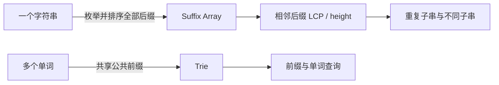

> 本笔记按原书第 14 章的小节顺序展开。原书概念、例题和主要方法依原顺序讲解；超出原书的统一推导、工程边界与替代结构均标注为“补充”。

## 本章要解决什么问题

字符串算法常见两类需求：

1. 在大量单词中插入、精确查找或判断某个前缀是否存在；
2. 在一个长字符串中比较后缀、统计不同子串、寻找重复子串。

字典树（Trie）把多个字符串的公共**前缀**合并到同一条路径，以空间换取按字符长度查询；后缀数组（Suffix Array）把一个字符串的全部**后缀**按字典序排列，让任意子串问题转化为后缀之间的公共前缀问题。



两种结构都在避免重复比较字符，但组织方式相反：Trie 从左到右共享多串路径；后缀数组把同一字符串的所有起点排序，使相似后缀相邻。

### 本章内容盘点与代码约定

本章按原书顺序包含 3 个基础单元和 7 道正文题：

| 类型 | 编号 | 内容 | 正文 C++17 落点 |
|---|---|---|---|
| 基础单元 | B1 | Trie 的路径、终止标记与精确/前缀查询 | `LowercaseTrie` |
| 基础单元 | B2 | 紧凑结点池、重复计数及向压缩 Trie 迁移 | 与 B1 共用 `TrieNode`、`LowercaseTrie` |
| 基础单元 | B3 | 倍增后缀数组、排名与 Kasai LCP | `SuffixArray` |
| 正文题 | P1 | LeetCode 208：实现 Trie | `Trie` 适配器 |
| 正文题 | P2 | LeetCode 14：最长公共前缀 | `LongestCommonPrefix` |
| 正文题 | P3 | LeetCode 648：单词替换 | `ReplaceWords` |
| 正文题 | P4 | LeetCode 677：键值映射 | `MapSum` |
| 正文题 | P5 | LeetCode 792：匹配子序列的单词数 | `NumberOfMatchingSubsequences` |
| 正文题 | P6 | LeetCode 1698：字符串的不同子串个数 | `CountDistinctSubstrings` |
| 正文题 | P7 | LeetCode 1044：最长重复子串 | `LongestDuplicateSubstring` |

C++17 是正文主实现：共享类型只在对应基础单元定义一次，题目代码紧跟题解并直接复用它。所有 Trie 正文代码明确限定字符集为 ASCII 小写字母 `a` 到 `z`；后缀数组把 `std::string` 当作无符号字节序列，排序键统一为

$$
key_k(i)=\bigl(rank[i],\ i+k<n\ ?\ rank[i+k]:-1\bigr).
$$

Python 3 与 Go 1.22 的完整实现只放在章末附录 A、B。除非代码块明确写出完整程序，正文 C++ 块都按“已包含所用标准库头文件、且位于同一翻译单元”阅读。

## 14.1 字典树和后缀数组概述

### 14.1.1 字典树

#### 1. 问题来源与直觉

若有大量字符串，每次查找都与所有单词逐一比较，重复公共前缀会被反复扫描。例如 `be`、`bet` 都从 `be` 开始，`tea`、`ten` 都从 `te` 开始。Trie 只保存一次公共前缀，并从分叉字符处继续建立不同分支。

原书示例集合为

$$
S=\{\text{"be"},\text{"bet"},\text{"bus"},\text{"tea"},\text{"ten"}\}.
$$

其根下只有 `b`、`t` 两条首字符分支；`be` 与 `bet` 共享路径 `b→e`，`tea` 与 `ten` 共享 `t→e`。

#### 2. 严格定义

Trie 是一棵有根树，满足：

1. 根结点表示空串 $\varepsilon$，不对应字符；
2. 每条父子边标记一个字符；
3. 从根到结点的边字符依次连接，形成该结点代表的前缀；
4. 同一结点出发的孩子边字符互不相同；
5. 结点可带 `is_end` 标记，表示对应前缀本身是已插入完整字符串。

原书有时描述为“除根外结点存字符”，也可等价理解为“字符存于进入结点的边”。关键是不变量：一条根路径唯一对应一个前缀。

#### 3. 终止结点不一定是叶子

在集合中同时有 `be` 与 `bet` 时，`be` 对应结点还有孩子 `t`，却必须标记为完整单词。若只用“叶子”判断单词结束，精确查找 `be` 会失败。

因此：

- 叶子结点一定对应某个已插入字符串的末尾；
- 终止结点不一定是叶子；
- 路径存在只说明它是某个单词的前缀，不一定是完整单词。

#### 4. 结点存储结构

若字符集限定为 26 个小写英文字母，可为每个结点保存：

$$
children[0..25],
\qquad
is\_end.
$$

字符映射为

$$
index(c)=c-\text{'a'}.
$$

数组孩子访问是 $O(1)$，但每个结点都预留 26 个指针。字符集稀疏或很大时，可改用哈希映射保存实际存在的孩子。

原书还指出 Trie 通常没有删除操作，适合使用静态结点池：新结点顺序加入数组，孩子保存结点编号。这能减少频繁动态分配开销。

#### 5. 插入算法

插入字符串

$$
s=s_0s_1\cdots s_{m-1}
$$

时，从根开始依次处理字符：

1. 若当前结点没有字符 $s_k$ 对应孩子，创建它；
2. 移动到该孩子；
3. 全部字符处理后，把最终结点 `is_end` 设为真。

循环不变量是：处理完前 $k$ 个字符后，当前结点代表前缀 $s[0..k-1]$。结束时当前结点代表整个 $s$，终止标记因此正确。

时间为 $O(m)$。插入新串最多创建 $m$ 个结点；整个集合结点数不超过

$$
1+\sum_{s\in S}|s|,
$$

共享前缀会使实际数量更少。

#### 6. 前缀查找与精确查找

两种查询都先沿字符路径走到末尾：

- 中途缺少孩子：路径不存在，两种查询都为假；
- 全部字符走完：
  - `startsWith(prefix)` 直接为真；
  - `search(word)` 还必须检查末结点 `is_end=true`。

例如插入 `ab`、`ac`、`bcd`、`bc`、`c` 后：

- 前缀 `a`、`ac`、`bc` 存在；
- 前缀 `ad` 不存在；
- `a` 是前缀但不是完整单词；
- `ac`、`bc` 是完整单词。

查询长度为 $m$ 的串只访问至多 $m$ 条边，时间 $O(m)$，与集合中单词数无关。

一次短路径走查可以把三种状态分开。依次插入 `be`、`bet`：

| 操作 | 当前路径 | 路径末端 `end_count` | 结果 |
|---|---|---:|---|
| `Insert("be")` 走 `root→b→e` | `be` | 由 0 变 1 | `be` 成为完整单词 |
| `Insert("bet")` 复用 `root→b→e`，再建 `t` | `bet` | `t` 结点由 0 变 1 | `be` 的终点不被覆盖 |
| `FindNode("b")` | `b` | 0 | 路径存在，但不是单词 |
| `FindNode("be")` | `be` | 1 | 既是前缀，也是完整单词 |

结束标记的最小反例是只插入 `apple` 后查询 `app`：路径三个字符都能走完，但末结点 `end_count=0`。因此 `StartsWith("app")=true` 而 `Search("app")=false`。反过来，插入 `be` 和 `bet` 后，`be` 结点仍有孩子 `t`，却必须让 `Search("be")=true`。由此同时否定“路径存在就是单词”和“只有叶子才是单词结尾”两种错误实现。

#### 7. 删除与计数边界

原书基础结构只维护 `is_end`，不讨论删除。若需要删除或统计重复单词，仅有布尔标记不够。

可为结点增加 `pass_count` 和 `end_count`：前者记录多少单词经过该前缀，后者记录完整单词出现次数。删除时沿路径递减计数，只在引用计数变为 0 时回收结点。这样还能回答“有多少单词拥有某前缀”。本章正文需要保留重复单词的第 792 题，因此共享实现直接使用 `end_count`；`end_count>0` 就等价于基础版本的 `is_end=true`。

#### 8. 紧凑存储、路径压缩与迁移判断

“压缩”可能指两件不同的事，不能混为一谈：

1. **紧凑结点池**仍然一条边保存一个字符，只把指针改为连续数组中的整数编号；本章 C++17 采用这一方式，结构和普通 Trie 完全同构；
2. **路径压缩 Trie（radix/Patricia trie）**把没有分叉的一整段字符合并到一条边，结点更少，但查找要比较边标签，插入还可能在标签中部拆边。

迁移时先看瓶颈：

| 条件 | 更合适的表示 |
|---|---|
| 仅有 `a` 到 `z`，结点上限可估算且查询频繁 | 本章固定 26 分支结点池 |
| 字符集大而每个结点分支稀疏 | 哈希表或有序映射孩子 |
| 大量长单链、数据基本静态且内存是瓶颈 | 路径压缩 Trie |
| 需要重复次数、前缀数量或安全删除 | 增加 `end_count`、`pass_count` |
| 目标变成一个静态主串的全部子串/后缀 | 迁移到后缀数组，而非插入全部后缀 |

结点池不能自动降低固定 26 分支本身的空间。若共有 $T$ 个结点，每个结点保存 26 个 32 位孩子编号和一个 32 位终点计数，主体约为

$$
T\times(26+1)\times4=108T\text{ bytes}
$$

（未计 `vector` 容量与对齐）。因此必须在输入约束下先估算

$$
T\le 1+\sum |word|.
$$

#### 9. 字符集与工程边界

固定 26 孩子方案依赖输入只含 `a` 到 `z`。若包含大写字母、数字或 Unicode 字符，应先定义字符单位和映射：

- UTF-8 字节 Trie 按字节分支，深度是字节数；
- Unicode 码点 Trie 按字符分支，需使用映射容器；
- 规范等价字符还可能需要先做 Unicode 规范化。

这些属于输入模型问题，不能简单用 `c-'a'` 处理。

#### 10. C++17：共享的紧凑/计数 Trie

下面的类型在本章只定义一次。孩子保存结点编号，`-1` 表示不存在；所有公开操作都先经 `ToIndex` 检查字符边界。插入时只保存整数下标，不跨 `emplace_back` 持有引用或指针，从而避开 `vector` 扩容导致的悬空引用。

```cpp
#include <array>
#include <cstddef>
#include <optional>
#include <stdexcept>
#include <string>
#include <string_view>
#include <vector>

struct TrieNode {
  std::array<int, 26> children{};
  int end_count = 0;

  TrieNode() { children.fill(-1); }
};

class LowercaseTrie {
 public:
  LowercaseTrie() : nodes_(1) {}

  void Insert(std::string_view word) {
    int node = 0;
    for (char character : word) {
      const int edge = ToIndex(character);
      int child = nodes_[node].children[edge];
      if (child == -1) {
        child = static_cast<int>(nodes_.size());
        nodes_[node].children[edge] = child;
        nodes_.emplace_back();
      }
      node = child;
    }
    ++nodes_[node].end_count;
  }

  int FindNode(std::string_view text) const {
    int node = 0;
    for (char character : text) {
      node = nodes_[node].children[ToIndex(character)];
      if (node == -1) {
        return -1;
      }
    }
    return node;
  }

  bool Search(std::string_view word) const {
    const int node = FindNode(word);
    return node != -1 && nodes_[node].end_count > 0;
  }

  bool StartsWith(std::string_view prefix) const {
    return FindNode(prefix) != -1;
  }

  std::optional<std::string> ShortestRoot(std::string_view word) const {
    int node = 0;
    for (std::size_t index = 0; index < word.size(); ++index) {
      node = nodes_[node].children[ToIndex(word[index])];
      if (node == -1) {
        return std::nullopt;
      }
      if (nodes_[node].end_count > 0) {
        return std::string(word.substr(0, index + 1));
      }
    }
    return std::nullopt;
  }

  const TrieNode& Node(int index) const { return nodes_.at(index); }
  std::size_t NodeCount() const { return nodes_.size(); }

 private:
  static int ToIndex(char character) {
    if (character < 'a' || character > 'z') {
      throw std::invalid_argument("LowercaseTrie expects [a-z]");
    }
    return character - 'a';
  }

  std::vector<TrieNode> nodes_;
};
```

这份实现把空串视为合法键：`Insert("")` 会增加根的 `end_count`，于是 `Search("")` 为真；是否允许空串仍由具体题目约束决定。固定分支和整数下标的前提都已显式写出，不能无检查地拿它处理 UTF-8 文本。

### 14.1.2 后缀数组

#### 1. 后缀、后缀数组和排名数组

对长度为 $n$ 的字符串

$$
s=s[0]s[1]\cdots s[n-1],
$$

从位置 $i$ 开始的后缀定义为

$$
suffix(i)=s[i..n-1].
$$

非空字符串共有 $n$ 个后缀。后缀数组 `sa` 是下标 $0\sim n-1$ 的一个排列，满足

$$
suffix(sa[0])<suffix(sa[1])<\cdots<suffix(sa[n-1])
$$

（按字典序）。

排名数组 `rank` 是逆映射：

$$
rank[i]=suffix(i)\text{ 在排序中的位置}.
$$

因此

$$
\boxed{
sa[rank[i]]=i,
\qquad
rank[sa[r]]=r.
}
$$

原书的直观说法是：`sa` 回答“第 $r$ 名是谁”，`rank` 回答“后缀 $i$ 排第几”。

#### 2. `banana` 示例

全部后缀按字典序排列：

| 排名 $r$ | 起点 `sa[r]` | 后缀 |
|---:|---:|---|
| 0 | 5 | `a` |
| 1 | 3 | `ana` |
| 2 | 1 | `anana` |
| 3 | 0 | `banana` |
| 4 | 4 | `na` |
| 5 | 2 | `nana` |

所以

$$
sa=[5,3,1,0,4,2],
$$

而

$$
rank=[3,2,5,1,4,0].
$$

两数组逐项满足互逆公式。

#### 3. 为什么不直接比较完整后缀

若构造所有后缀字符串并用普通比较排序：

- 保存后缀可能复制 $O(n^2)$ 个字符；
- 一次最坏比较需 $O(n)$；
- $n$ 个后缀排序可能达到 $O(n^2\log n)$ 字符比较量。

倍增算法复用上一轮排名，把长字符串比较压缩成整数二元组比较。

#### 4. 倍增算法的状态

令 $k$ 为当前已经能正确排名的前缀长度。初始 $k=1$，按单个字符给所有后缀排名。

若已知每个位置前 $k$ 个字符的排名，那么位置 $i$ 前 $2k$ 个字符可由二元组表示：

$$
\boxed{
key_k(i)=
\left(rank[i],
\begin{cases}
rank[i+k],&i+k<n,\\
-1,&i+k\ge n
\end{cases}
\right).
}
$$

第一关键字表示前半段 $s[i..i+k-1]$，第二关键字表示后半段 $s[i+k..i+2k-1]$。越界使用 $-1$，保证在前半段相同的情况下，较短后缀排在较长后缀前。

> **补充：哨兵注意。** 若有效排名从 0 开始，越界第二关键字不能也用 0，否则空后半段会与排名 0 的真实后半段混淆。可以使用 -1，或把所有有效排名整体加 1、保留 0 给空串。

#### 5. 一轮排名更新

1. 按 `key_k(i)` 对所有起点排序，得到新 `sa`；
2. 排名最小的后缀赋新排名 0；
3. 从左到右比较相邻二元组：相同则排名相同，不同则排名加 1；
4. 令 $k\leftarrow2k$，继续下一轮；
5. 当所有排名不同，或 $k\ge n$ 时结束。

#### 6. 倍增正确性证明

对 $k$ 做归纳。

- 基础情形 $k=1$：按字符排序，显然正确表示每个后缀首字符的字典序；
- 归纳步骤：假设 `rank[i]` 正确表示长度至多 $k$ 的前缀顺序。两个长度至多 $2k$ 的前缀先比较前 $k$ 个字符；只有前半相同时才比较后 $k$ 个字符，这恰好等价于二元组字典序。按二元组排序并重新编号，因此得到长度 $2k$ 的正确排名。

当 $k\ge n$ 时，每个“前缀”已经覆盖完整后缀，最终顺序就是后缀字典序。

#### 7. `banana` 的倍增过程

按字符得到初始排名：

$$
[1,0,2,0,2,0].
$$

以 $k=1$ 比较二元组后：

$$
[2,1,3,1,3,0].
$$

以 $k=2$ 比较长度 4 信息后：

$$
[3,2,5,1,4,0].
$$

此时六个排名已全部不同，对应最终

$$
sa=[5,3,1,0,4,2].
$$

继续 $k=4$ 排序不会改变结果。

把规范键逐项写开，第一轮 $k=1$ 为：

| 起点 $i$ | 后缀 | $key_1(i)$ | 新排名 |
|---:|---|---:|---:|
| 0 | `banana` | $(1,0)$ | 2 |
| 1 | `anana` | $(0,2)$ | 1 |
| 2 | `nana` | $(2,0)$ | 3 |
| 3 | `ana` | $(0,2)$ | 1 |
| 4 | `na` | $(2,0)$ | 3 |
| 5 | `a` | $(0,-1)$ | 0 |

所以新排名按原起点排列为 `[2,1,3,1,3,0]`。第二轮 $k=2$ 的键依次是

$$
[(2,3),(1,1),(3,3),(1,0),(3,-1),(0,-1)].
$$

例如 `ana` 与 `anana` 的第一关键字同为 1，但第二关键字分别为 0 和 1，于是

$$
(1,0)<(1,1),
$$

这正对应 `ana` 是 `anana` 的较短前缀。排序起点得到 `[5,3,1,0,4,2]`，再按相邻键是否变化编号，最终排名为 `[3,2,5,1,4,0]`。这个演算也说明：键必须以“起点 $i$”取值，排序结果才写入 `sa`；不能拿 `sa[i]`、`rank[i]` 两套坐标混着组成键。

#### 8. 构建复杂度

长度每轮翻倍，共 $O(\log n)$ 轮。

- 原书重点算法用基数排序按两个整数关键字排序，每轮 $O(n)$，总时间 $O(n\log n)$；
- 原书也给出直接调用通用 `sort` 的简化类。比较排序每轮 $O(n\log n)$，总时间 $O(n\log^2n)$。

两者额外空间均为 $O(n)$。字符集很大时，初始排名应先压缩字符值，而不是假设 ASCII 小范围。

#### 9. 最长公共前缀与 `height`

定义

$$
height[0]=0,
$$

对 $1\le r<n$：

$$
\boxed{
height[r]=LCP\bigl(suffix(sa[r-1]),suffix(sa[r])\bigr).
}
$$

也就是字典序相邻后缀的最长公共前缀长度。

`banana` 中：

$$
height=[0,1,3,0,0,2].
$$

例如 `ana` 与 `anana` 的公共前缀为 `ana`，所以 `height[2]=3`；`na` 与 `nana` 的公共前缀为 `na`，所以 `height[5]=2`。

#### 10. 任意两个后缀的 LCP 区间公式

设

$$
r_i=rank[i],
\qquad
r_j=rank[j],
\qquad
r_i<r_j.
$$

则

$$
\boxed{
LCP(suffix(i),suffix(j))
=\min_{r_i<r\le r_j}height[r].
}
$$

为什么取最小值？若排名区间内所有相邻后缀至少共享长度 $h$ 的前缀，则沿相邻链传递，区间两端也共享这 $h$ 个字符；一旦某对相邻后缀只共享更短前缀，两个端点不可能跨过该分界仍共享更长前缀。因此瓶颈恰是区间最小 `height`。

例如后缀 `a`（排名 0）和 `anana`（排名 2）：

$$
\min(height[1],height[2])=\min(1,3)=1.
$$

> **补充：** 若要大量查询任意后缀 LCP，可在 `height` 上建立 RMQ 结构，如稀疏表或线段树，把区间最小查询进一步加速。

#### 11. Kasai 线性构建 `height`

定义

$$
h[i]=height[rank[i]],
$$

即后缀 $i$ 与其字典序前驱的 LCP。原书给出关键性质：

$$
\boxed{h[i]\ge h[i-1]-1.}
$$

若 `suffix(k)` 是 `suffix(i-1)` 的字典序前驱，二者前 $h[i-1]$ 个字符相同。各删除首字符后，`suffix(k+1)` 与 `suffix(i)` 至少还有 $h[i-1]-1$ 个相同字符。`suffix(i)` 的真正字典序前驱不会让可保证的公共前缀更短，因此比较位置 $i$ 时可从上一轮长度减 1 开始，而不必从 0 开始。

算法维护变量 $h$：

1. 按原下标 $i=0,1,\ldots,n-1$ 扫描；
2. 若 `rank[i]=0`，该后缀没有前驱，置 $h=0$；
3. 否则令 $j=sa[rank[i]-1]$，从当前 $h$ 开始继续比较字符；
4. 记录 `height[rank[i]]=h`；
5. 下一位置前若 $h>0$，令 $h--$。

比较指针总共只前进和回退线性次数，所以构建 `height` 为 $O(n)$。

#### 12. C++17：共享的倍增后缀数组与 Kasai LCP

下面的 `SuffixArray` 在本章只定义一次，后两道正文题只读取它的 `SA()` 与 `Height()`。实现用通用比较排序处理规范二元组，每轮 $O(n\log n)$、共 $O(\log n)$ 轮，因此总时间为 $O(n\log^2n)$；若按原书高性能模板改成两趟计数/基数排序，键不变，每轮可降为 $O(n)$，总时间为 $O(n\log n)$。

初始排名先把 `unsigned char` 值离散化到连续整数，避免有符号 `char` 改变字节顺序。实现拥有原字符串，且拒绝超过 `int` 下标范围的输入；四个长度为 $n$ 的主要数组/字符串共同保持 $O(n)$ 空间。

```cpp
#include <algorithm>
#include <limits>
#include <numeric>
#include <stdexcept>
#include <string>
#include <utility>
#include <vector>

class SuffixArray {
 public:
  explicit SuffixArray(std::string text) : text_(std::move(text)) {
    if (text_.size() > static_cast<std::size_t>(std::numeric_limits<int>::max())) {
      throw std::length_error("SuffixArray input exceeds int index range");
    }
    BuildSuffixArray();
    BuildHeight();
  }

  const std::vector<int>& SA() const { return sa_; }
  const std::vector<int>& Rank() const { return rank_; }
  const std::vector<int>& Height() const { return height_; }

 private:
  using Key = std::pair<int, int>;

  Key MakeKey(int start, int length) const {
    const int size = static_cast<int>(text_.size());
    return {
      rank_[start],
      start + length < size ? rank_[start + length] : -1,
    };
  }

  void BuildSuffixArray() {
    const int size = static_cast<int>(text_.size());
    if (size == 0) {
      return;
    }

    sa_.resize(size);
    std::iota(sa_.begin(), sa_.end(), 0);

    std::vector<int> alphabet;
    alphabet.reserve(size);
    for (unsigned char character : text_) {
      alphabet.push_back(character);
    }
    std::sort(alphabet.begin(), alphabet.end());
    alphabet.erase(std::unique(alphabet.begin(), alphabet.end()), alphabet.end());

    rank_.resize(size);
    for (int index = 0; index < size; ++index) {
      const int character = static_cast<unsigned char>(text_[index]);
      rank_[index] = static_cast<int>(
        std::lower_bound(alphabet.begin(), alphabet.end(), character) -
        alphabet.begin());
    }

    for (int length = 1; length < size;) {
      std::sort(sa_.begin(), sa_.end(), [&](int left, int right) {
        return MakeKey(left, length) < MakeKey(right, length);
      });

      std::vector<int> next_rank(size, 0);
      for (int order = 1; order < size; ++order) {
        const int previous = sa_[order - 1];
        const int current = sa_[order];
        next_rank[current] = next_rank[previous] +
          (MakeKey(previous, length) != MakeKey(current, length));
      }
      rank_.swap(next_rank);

      if (rank_[sa_.back()] == size - 1) {
        break;
      }
      if (length > size / 2) {
        break;
      }
      length *= 2;
    }
  }

  void BuildHeight() {
    const int size = static_cast<int>(text_.size());
    height_.assign(size, 0);
    int common = 0;
    for (int start = 0; start < size; ++start) {
      const int order = rank_[start];
      if (order == 0) {
        common = 0;
        continue;
      }

      const int previous = sa_[order - 1];
      while (start + common < size && previous + common < size &&
             text_[start + common] == text_[previous + common]) {
        ++common;
      }
      height_[order] = common;
      if (common > 0) {
        --common;
      }
    }
  }

  std::string text_;
  std::vector<int> sa_;
  std::vector<int> rank_;
  std::vector<int> height_;
};
```

空串得到三个空数组；单字符初始排名已是 0，Kasai 不访问不存在的前驱。规范键中的 `-1` 只作为排序哨兵，从不写入有效排名。

#### 13. 后缀数组的适用边界

后缀数组擅长静态字符串的子串排序、重复关系和全文检索。原字符串修改一个字符后，大量后缀顺序都可能变化，不适合频繁在线修改。

> **补充：结构对比。** 后缀树可提供更直接的路径结构但内存和实现复杂；后缀自动机适合不同子串及在线追加；滚动哈希配合二分可判断固定长度重复子串，但有哈希碰撞风险。原书本章采用后缀数组与 LCP，结果确定且空间线性。

#### 14. Trie 与后缀数组对比

| 对比项 | Trie | 后缀数组 |
|---|---|---|
| 输入对象 | 多个字符串集合 | 一个主字符串 |
| 共享/排序对象 | 公共前缀路径 | 全部后缀 |
| 典型查询 | 单词、前缀、前缀替换 | 子串、重复子串、后缀排名 |
| 构建复杂度 | $O(\sum|word|)$ | 倍增 $O(n\log n)$ 或 $O(n\log^2n)$ |
| 空间 | 与不同前缀数相关 | $O(n)$ |
| 动态性 | 易于追加单词 | 原串修改后通常重建 |

## 14.2 字典树应用的算法设计

### 14.2.1 LeetCode 208：实现 Trie（前缀树）（★★）

#### 三个 API 共享同一条路径查找

原书把公共逻辑提取为 `searchPrefix(s)`：从根按字符走完整个 $s$，路径中断返回空，否则返回末结点。

在此基础上：

- `insert(word)`：缺少孩子就创建，末结点标记 `is_end=true`；
- `startsWith(prefix)`：末结点存在即可；
- `search(word)`：末结点存在且 `is_end=true`。

#### 为什么 `search("app")` 与 `startsWith("app")` 不同

只插入 `apple` 后，路径 `a→p→p` 已存在，因此

```text
startsWith("app") = true
```

但 `app` 末结点尚无终止标记，所以

```text
search("app") = false
```

再插入 `app` 后只需把已有结点标记为终止，精确查询才变为真。

#### C++17 核心实现

题目要求的类只是共享 `LowercaseTrie` 的接口适配器，路径查询与结束标记语义都不再重复实现。

```cpp
class Trie {
 public:
  void insert(const std::string& word) { trie_.Insert(word); }

  bool search(const std::string& word) const {
    return trie_.Search(word);
  }

  bool startsWith(const std::string& prefix) const {
    return trie_.StartsWith(prefix);
  }

 private:
  LowercaseTrie trie_;
};
```

#### 正确性证明

插入不变量保证每个已插入单词都存在唯一根路径，且仅其完整末尾带终止标记。路径查找成功当且仅当输入是某个已插入单词的前缀；再检查终止标记，就把“前缀存在”收紧为“完整单词存在”。

每个操作只扫描输入字符串一次，时间 $O(|s|)$。空间上限与所有不同前缀数成正比，最坏为 $O(\sum|word|)$。

#### 生命周期与重复插入

原书 C++ 使用动态结点指针。生产代码应在析构时递归释放，或使用智能指针/结点池。布尔 `is_end` 对集合语义足够；重复插入仍只表示“存在一次”。若要统计重复次数，需要整数 `end_count`。

### 14.2.2 LeetCode 14：最长公共前缀（★）

#### Trie 中公共前缀长什么样

把所有字符串插入 Trie 后，从根开始的最长公共前缀必须满足：

1. 当前结点恰有一个孩子；
2. 当前结点不是任何输入字符串的终止位置。

只要出现两个分支，说明至少两个字符串在下一字符不同；只要当前结点已经结束一个字符串，公共前缀不能再长，因为该短字符串没有后续字符。

#### 为什么必须检查终止标记

对

$$
[\text{"ab"},\text{"abc"}],
$$

从根到 `b` 始终只有一个分支，但最长公共前缀只能是 `ab`。若只检查孩子数，会错误继续到 `c`。因此循环条件应是：

$$
childCount(node)=1
\quad\text{且}\quad
is\_end(node)=false.
$$

若输入含空串，根本身就是终止结点，答案立即为空串。

#### 数值走查

`["flower","flow","flight"]` 的 Trie：

- 根只有 `f` 分支，加入 `f`；
- `f` 只有 `l` 分支，加入 `l`；
- `fl` 后分为 `o` 与 `i`，停止。

答案为 `fl`。

#### C++17 核心实现

`node` 始终是答案前缀对应的结点编号。循环只有在当前结点不是终点且恰有一个孩子时才前进。

```cpp
std::string LongestCommonPrefix(const std::vector<std::string>& words) {
  if (words.empty()) {
    return "";
  }

  LowercaseTrie trie;
  for (const std::string& word : words) {
    trie.Insert(word);
  }

  int node = 0;
  std::string answer;
  while (trie.Node(node).end_count == 0) {
    int child_count = 0;
    int next_edge = -1;
    int next_node = -1;
    for (int edge = 0; edge < 26; ++edge) {
      const int child = trie.Node(node).children[edge];
      if (child != -1) {
        ++child_count;
        next_edge = edge;
        next_node = child;
      }
    }
    if (child_count != 1) {
      break;
    }
    answer.push_back(static_cast<char>('a' + next_edge));
    node = next_node;
  }
  return answer;
}
```

#### 正确性与复杂度

循环追加的每个字符位于所有单词共享的唯一分支上，且没有任何单词提前结束，所以所得串是公共前缀；停止时要么分叉，要么某串结束，任何更长前缀都不可能被所有字符串共享，因此它最长。

插入总时间、空间为 $O(C)$，$C$ 是所有字符总数；求答案至多走最短字符串长度。

> **补充：替代方案。** 本题只求一次公共前缀，纵向逐列比较或不断缩短候选串可用 $O(C)$ 时间和 $O(1)$ 额外空间，通常比建 Trie 更简单。原书用它展示“唯一分支 + 终止标记”的 Trie 语义。

### 14.2.3 LeetCode 648：单词替换（★★）

#### 为什么 Trie 能直接找到最短词根

把所有词根插入 Trie。对句子中的单词 `word` 从左到右沿路径查找：

1. 每走过一个字符，就把它加入当前候选前缀；
2. 一旦当前结点 `is_end=true`，立即返回该前缀；
3. 若路径中断，说明没有词根是该单词前缀，保留原词；
4. 走完整词仍未遇终止结点，也保留原词。

由于路径按前缀长度 $1,2,\ldots$ 递增，遇到的第一个终止结点必是最短词根，不需要枚举所有词根后再比较长度。

#### 原书样例

词根为 `cat`、`bat`、`rat`：

- `cattle` 沿 `c→a→t` 首次到终止，替换为 `cat`；
- `rattled` 替换为 `rat`；
- `battery` 替换为 `bat`；
- `the`、`was`、`by` 没有匹配词根，保持不变。

结果：

```text
the cat was rat by the bat
```

#### C++17 核心实现

`ShortestRoot` 用 `optional` 区分“没有词根”和“匹配到的词根”；本题词根非空，因此不会把合法答案与空字符串哨兵混淆。

```cpp
#include <sstream>

std::string ReplaceWords(
    const std::vector<std::string>& dictionary,
    const std::string& sentence) {
  LowercaseTrie trie;
  for (const std::string& root : dictionary) {
    trie.Insert(root);
  }

  std::istringstream input(sentence);
  std::ostringstream output;
  std::string word;
  bool first = true;
  while (input >> word) {
    const std::optional<std::string> root = trie.ShortestRoot(word);
    if (!first) {
      output << ' ';
    }
    output << (root.has_value() ? *root : word);
    first = false;
  }
  return output.str();
}
```

#### 正确性与复杂度

若一个词根可替换 `word`，它必对应 `word` 路径上的终止结点。算法访问这些结点的长度顺序严格递增，所以第一个终止结点就是所有可用词根中最短者；若路径断裂，任何更长前缀也不可能存在。

设词根总字符数为 $D$，句子单词总字符数为 $S$。构建 $O(D)$，替换扫描 $O(S)$，空间 $O(D)$。输出拼接应使用字符串列表或流，避免反复复制长字符串。

### 14.2.4 LeetCode 677：键值映射（★★）

#### 结点值的聚合不变量

每个 Trie 结点除孩子外维护

$$
\boxed{
node.sum=\sum_{key\text{ 以该结点前缀开头}}value(key).
}
$$

于是 `sum(prefix)` 只需走到前缀末结点并返回 `node.sum`；路径不存在则返回 0。

#### 为什么覆盖旧键要用差值

若键第一次插入，所有路径结点都增加 `val`。若同一个键从旧值 $old$ 改成 $new$，路径结点正确变化不是再加 $new$，而是

$$
\boxed{delta=new-old.}
$$

用哈希表 `values[key]` 保存每个完整键的当前值，然后沿键路径执行

$$
node.sum\mathrel{+}=delta.
$$

若不减旧值，重复插入会把已经计入的贡献重复累计。

#### 数值走查

依次执行：

1. `insert("apple",3)`：`ap` 前缀和为 3；
2. `insert("app",2)`：`ap` 前缀和为 5；
3. `insert("appl",1)`：`app` 前缀和为 $3+2+1=6$，`appl` 前缀和为 $3+1=4$。

若随后 `insert("apple",5)`，差值为 2，所有 `apple` 路径结点只增加 2，`sum("app")` 从 6 变为 8。根结点对应空前缀，因此本笔记把 `sum("")` 定义为全部键当前值之和：上述操作后为 $5+2+1=8$；不存在的前缀仍返回 0。LeetCode 原题只查询非空前缀，空前缀是三语言实现为保持根结点不变量而提供的扩展契约。

#### C++17 核心实现

MapSum 的结点状态是数值聚合而非单词终点，因此单独定义专用结点池。根也维护空前缀的总和；题目虽只查询非空前缀，这能让不变量覆盖整棵树，并使扩展查询 `sum("")` 返回全部键的当前值之和。

```cpp
#include <unordered_map>

struct MapSumNode {
  std::array<int, 26> children{};
  long long total = 0;

  MapSumNode() { children.fill(-1); }
};

class MapSum {
 public:
  MapSum() : nodes_(1) {}

  void insert(const std::string& key, int value) {
    const long long difference =
      static_cast<long long>(value) - values_[key];
    values_[key] = value;

    int node = 0;
    nodes_[node].total += difference;
    for (char character : key) {
      const int edge = ToIndex(character);
      int child = nodes_[node].children[edge];
      if (child == -1) {
        child = static_cast<int>(nodes_.size());
        nodes_[node].children[edge] = child;
        nodes_.emplace_back();
      }
      node = child;
      nodes_[node].total += difference;
    }
  }

  long long sum(const std::string& prefix) const {
    int node = 0;
    for (char character : prefix) {
      node = nodes_[node].children[ToIndex(character)];
      if (node == -1) {
        return 0;
      }
    }
    return nodes_[node].total;
  }

 private:
  static int ToIndex(char character) {
    if (character < 'a' || character > 'z') {
      throw std::invalid_argument("MapSum expects [a-z]");
    }
    return character - 'a';
  }

  std::vector<MapSumNode> nodes_;
  std::unordered_map<std::string, long long> values_;
};
```

#### 正确性证明

初始所有前缀聚合为 0。一次插入只改变该键经过的前缀集合；每个相关结点增加新旧值差后，其聚合恰好替换该键贡献，其他键贡献不变。因此不变量始终成立，前缀末结点值就是题目所求。

插入和查询均为 $O(|key|)$ 或 $O(|prefix|)$。额外哈希表空间为不同键数，Trie 空间为不同前缀数。

### 14.2.5 LeetCode 792：匹配子序列的单词数（★★）

#### 为什么逐个双指针会重复工作

对每个单词分别扫描主串 $s$，时间最坏为

$$
O\left(|s|\cdot|words|\right).
$$

许多单词可能共享前缀，例如 `apple`、`app`、`apply`。原书先把 `words` 建成 Trie，再用 DFS 判断 Trie 路径是否能按顺序嵌入 $s$，使公共前缀只匹配一次。

#### Trie DFS 状态

为每个终止结点保存 `end_count`，而不是布尔值，因为 `words` 可能含重复单词。

DFS 状态为

$$
(node,pos),
$$

其中 `node` 表示已经匹配的 Trie 前缀，`pos` 表示下一字符只能从 $s[pos..]$ 中选择。

对 `node` 的每个字符为 $c$ 的孩子：

1. 在 $s$ 中寻找不小于 `pos` 的最早字符 $c$，位置记为 $q$；
2. 若不存在，整棵孩子子树都不可能成为子序列，剪枝；
3. 若存在，递归到 `(child,q+1)`；
4. 到达结点时，把其 `end_count` 加入答案。

#### 为什么贪心取最早位置正确

若字符 $c$ 可以在位置 $q$ 匹配，选择更晚位置 $q'>q$ 只会缩小后续可用后缀 $s[q'+1..]$，不会为后续字符创造新机会。因此最早匹配位置支配所有更晚选择。一个 Trie 前缀只需保留其最早可达位置。

#### 加速“下一个字符”查询

直接从 `pos` 线性找字符，最坏仍可能重复扫描主串。

> **补充：next 表。** 可预处理
> $$
> next[p][c]=s[p..]\text{ 中字符 }c\text{ 第一次出现的位置},
> $$
> 从后向前复制并更新，时间和空间为 $O(26|s|)$。随后每条 Trie 边在 $O(1)$ 时间转移，DFS 总时间为 $O(26|s|+T)$，$T$ 为 Trie 实际结点数。

也可为每个字符保存有序位置列表，并用二分寻找第一个不小于 `pos` 的位置，空间 $O(|s|)$，每条边 $O(\log|s|)$。

#### 样例走查

$$
s=\text{"abcde"},
\qquad
words=[\text{"a"},\text{"bb"},\text{"acd"},\text{"ace"}].
$$

- `a`：匹配位置 0；
- `bb`：第一个 `b` 在 1，之后没有第二个 `b`；
- `acd`：匹配位置 0、2、3；
- `ace`：匹配位置 0、2、4。

共有 3 个匹配单词。

#### C++17 核心实现

主串和单词都按 ASCII 小写字母解释。`next_position[position][edge]` 的最后一行全为 -1，因此递归状态到达 `position==text.size()` 时仍可安全判定后续字符不可达。

```cpp
int NumberOfMatchingSubsequences(
    const std::string& text,
    const std::vector<std::string>& words) {
  LowercaseTrie trie;
  for (const std::string& word : words) {
    trie.Insert(word);
  }

  std::vector<std::array<int, 26>> next_position(text.size() + 1);
  next_position.back().fill(-1);
  for (int position = static_cast<int>(text.size()) - 1;
       position >= 0;
       --position) {
    const char character = text[position];
    if (character < 'a' || character > 'z') {
      throw std::invalid_argument(
        "NumberOfMatchingSubsequences expects [a-z]");
    }
    next_position[position] = next_position[position + 1];
    next_position[position][character - 'a'] = position;
  }

  const auto search = [&](auto&& self, int node, int position) -> int {
    const TrieNode& current = trie.Node(node);
    int answer = current.end_count;
    for (int edge = 0; edge < 26; ++edge) {
      const int child = current.children[edge];
      if (child == -1) {
        continue;
      }
      const int next_index = next_position[position][edge];
      if (next_index != -1) {
        answer += self(self, child, next_index + 1);
      }
    }
    return answer;
  };

  return search(search, 0, 0);
}
```

#### 正确性与复杂度

Trie 的每个根到终止结点路径唯一对应一个单词。DFS 的最早位置贪心保证：路径可达当且仅当该单词是 $s$ 的子序列；到达时累加 `end_count`，所以重复单词也逐个计数。不可达前缀的所有扩展都不可达，剪枝安全。

使用 `next` 表时，构建 Trie 为 $O(W)$，$W$ 是所有单词总长度；预处理为 $O(26|s|)$；DFS 至多访问每条实际 Trie 边一次，为 $O(T)$。空间为 $O(T+26|s|)$。

> **补充：等待桶方案。** 还可把每个单词迭代器放入其“下一期待字符”的桶中，扫描 $s$ 时推进对应桶，时间 $O(|s|+W)$。它通常更省内存，但不复用 Trie 结点；原书选择 Trie + DFS 来体现公共前缀共享。

## 14.3 后缀数组应用的算法设计

### 14.3.1 LeetCode 1698：字符串的不同子串个数（★★）

#### 1. 所有子串为何可由后缀前缀枚举

从位置 $i$ 开始的所有非空子串恰是 `suffix(i)` 的所有非空前缀，长度可以是

$$
1,2,\ldots,n-i.
$$

所以若暂不去重，子串出现总数为

$$
\sum_{i=0}^{n-1}(n-i)
=1+2+\cdots+n
=\boxed{\frac{n(n+1)}{2}}.
$$

难点是同一个字符串可能作为多个后缀的前缀重复出现。

#### 2. 按后缀字典序逐个贡献

按 `sa` 顺序处理后缀。排名为 $r$ 的后缀长度为

$$
n-sa[r].
$$

它与前一个后缀共享前 $height[r]$ 个长度的前缀。这些前缀已经在更早后缀中出现，不应再次计为新字符串；其余更长前缀是新贡献。因此：

$$
\boxed{
new_r=(n-sa[r])-height[r].
}
$$

最终不同子串数为

$$
\boxed{
\sum_{r=0}^{n-1}\bigl(n-sa[r]-height[r]\bigr)
=\frac{n(n+1)}{2}-\sum_{r=0}^{n-1}height[r].
}
$$

#### 3. 为什么只看前一个后缀就够

对当前排名 $r$ 与任意更早排名 $q<r$：

$$
LCP(sa[q],sa[r])
=\min_{q<t\le r}height[t]
\le height[r].
$$

所以当前后缀与所有更早后缀的最大 LCP，恰由紧邻前驱达到。已出现前缀的最大长度就是 `height[r]`；长度不超过它的前缀都已出现，长度更大的前缀不可能与任何更早后缀相同。

这解释了公式，而不能简单把 $\sum height$ 称作“不同重复子串数”：它是按后缀贡献顺序累计的重复前缀份额。

#### 4. 原书样例

`s="aabbaba"`，长度 $n=7$，子串出现总数为

$$
\frac{7\times8}{2}=28.
$$

其 `height` 总和为 7，因此不同子串数为

$$
28-7=21,
$$

与原书列出的 21 个字符串一致。

#### 5. 正确性与复杂度

每个非空子串唯一作为“第一次出现它的最小排名后缀”的新前缀被计入。对每个后缀减去已出现前缀长度后，不重不漏地覆盖所有不同子串。

使用原书基数排序倍增构建 SA 为 $O(n\log n)$，Kasai 构建 `height` 为 $O(n)$，最终求和 $O(n)$，空间 $O(n)$。若使用通用比较排序倍增，总时间为 $O(n\log^2n)$。

> **补充：整数范围。** 不同子串数上界是 $n(n+1)/2$。题目 $n\le500$ 时 32 位足够；通用实现应使用 64 位整数。

#### C++17 核心实现

```cpp
long long CountDistinctSubstrings(const std::string& text) {
  const SuffixArray suffixes(text);
  const long long size = static_cast<long long>(text.size());
  long long answer = size * (size + 1) / 2;
  for (int common : suffixes.Height()) {
    answer -= common;
  }
  return answer;
}
```

### 14.3.2 LeetCode 1044：最长重复子串（★★★）

#### 1. 重复子串与后缀公共前缀

若字符串 $t$ 在原串中从两个不同位置 $i,j$ 出现，则 $t$ 同时是 `suffix(i)` 和 `suffix(j)` 的前缀，所以

$$
|t|\le LCP(suffix(i),suffix(j)).
$$

反过来，两个不同后缀的长度为 $L$ 的公共前缀，就是一个在两个起点出现的长度 $L$ 重复子串；起点区间允许重叠，符合题意。

因此问题等价于求任意两后缀的最大 LCP。

#### 2. 为什么最大值一定出现在相邻后缀

假设两个后缀共享长度 $L$ 的前缀 $t$。所有以 $t$ 开头的后缀在字典序中形成一个连续区间；该区间至少含两个后缀，所以其中必有一对相邻后缀也共享 $t$，其 LCP 至少为 $L$。

所以全局最大 LCP 可在相邻后缀中找到：

$$
\boxed{
maxLength=\max_{1\le r<n}height[r].
}
$$

若最大值出现在排名 $r$，可返回

$$
s[sa[r]..sa[r]+height[r]-1].
$$

也可从 `sa[r-1]` 开始，前 $height[r]$ 个字符相同。

#### 3. `banana` 走查

$$
sa=[5,3,1,0,4,2],
$$

$$
height=[0,1,3,0,0,2].
$$

最大值 3 位于 `height[2]`，对应后缀：

```text
suffix(sa[1]) = "ana"
suffix(sa[2]) = "anana"
```

公共前缀为 `ana`，返回它。`abcd` 的所有相邻 LCP 都为 0，因此返回空串。

#### 4. 正确性与边界

任何重复子串都被某对相邻后缀的 LCP 覆盖，最大 `height` 因而不短于最优答案；最大 `height` 本身又对应两个不同后缀的公共前缀，确实是合法重复子串，所以长度恰好最优。

多个最长答案时，题目允许返回任意一个。若最大值为 0，截取长度 0 得空串。

构建与空间复杂度同上一题。对 $n\le3\times10^4$，应避免显式构造全部后缀字符串导致平方空间。

> **补充：二分 + 滚动哈希。** 可二分长度 $L$，用哈希判断是否有两个相同长度 $L$ 子串，期望时间 $O(n\log n)$。需要双哈希或最终字符核验降低碰撞风险。后缀数组不依赖概率碰撞，并同时提供完整后缀顺序和 LCP 信息。

#### C++17 核心实现

最大 `height` 的排名就是答案后缀的起点索引；空串需要先返回，避免访问空 `sa`。

```cpp
std::string LongestDuplicateSubstring(const std::string& text) {
  if (text.empty()) {
    return "";
  }

  const SuffixArray suffixes(text);
  const std::vector<int>& height = suffixes.Height();
  const int order = static_cast<int>(
    std::max_element(height.begin(), height.end()) - height.begin());
  const int length = height[order];
  return text.substr(suffixes.SA()[order], length);
}
```

## 推荐练习题

原书在本章末尾列出以下 10 道练习，未在正文中展开解法：

1. LeetCode 139：单词拆分（★★）
2. LeetCode 140：单词拆分 II（★★★）
3. LeetCode 212：单词搜索 II（★★★）
4. LeetCode 386：字典序排数（★★）
5. LeetCode 1062：最长重复子串（★★）
6. LeetCode 1065：字符串的索引对（★）
7. LeetCode 1698：字符串的不同子串个数（★★）
8. LeetCode 1923：最长公共子路径（★★★）
9. LeetCode 2223：构造字符串的总得分和（★★★）
10. LeetCode 2416：字符串的前缀分数和（★★★）

## 实现索引与易错边界

### 公式、正文 C++ 与附录的对应关系

| 概念或题目 | 核心不变量/公式 | 正文 C++17 | 附录 A：Python | 附录 B：Go |
|---|---|---|---|---|
| Trie 路径与计数 | 根到结点唯一表示前缀；终点次数独立保存 | `TrieNode`、`LowercaseTrie` | `TrieNode`、`Trie` | `TrieNode`、`Trie` |
| 14.2.1 精确/前缀查询 | 路径存在；精确查询再检查终点 | `Trie` | `search`、`starts_with` | `search`、`startsWith` |
| 14.2.2 公共前缀 | 唯一分支且当前不是终点 | `LongestCommonPrefix` | `longest_common_prefix` | `longestCommonPrefix` |
| 14.2.3 最短词根 | 路径上首次出现的终止结点 | `ReplaceWords` | `replace_words` | `replaceWords` |
| 14.2.4 前缀值和 | 结点聚合更新差值 $new-old$ | `MapSum` | `MapSum` | `MapSum` |
| 14.2.5 子序列计数 | Trie 路径取主串最早可达位置 | `NumberOfMatchingSubsequences` | `number_of_matching_subsequences` | `numberOfMatchingSubsequences` |
| 后缀倍增 | $key_k(i)=(rank[i],rank[i+k])$，越界为 -1 | `SuffixArray::MakeKey` | `SuffixArray._build_suffix_array` | `buildSuffixArray` |
| SA/rank 互逆 | $sa[rank[i]]=i$ | `SA`、`Rank` | `sa`、`rank` | `sa`、`rank` |
| 相邻后缀 LCP | $height[r]=LCP(sa[r-1],sa[r])$ | `Height` | `_build_height` | `buildHeight` |
| 14.3.1 不同子串 | $n(n+1)/2-\sum height$ | `CountDistinctSubstrings` | `count_distinct_substrings` | `countDistinctSubstrings` |
| 14.3.2 最长重复串 | $\max height$ | `LongestDuplicateSubstring` | `longest_duplicate_substring` | `longestDuplicateSubstring` |

### 三组坐标不能混淆

1. Trie 的 `children` 描述路径是否存在，`end_count` 描述完整单词出现多少次；
2. 后缀数组的 `sa[r]` 从排名找到起点，`rank[i]` 从起点找到排名；
3. `height[r]` 比较排名 $r-1$ 与 $r$，下标属于排名，不属于原字符串位置。

### 字符、内存和排序边界

- 正文 C++ 的 `LowercaseTrie`、`MapSum` 和第 792 题都拒绝非 `[a-z]` 输入；整数孩子下标在 `vector` 扩容后仍有效。
- Python Trie 用字典保存实际分支；Go Trie 使用 `[26]*TrieNode`，按字节索引，仅适用于单字节小写字符。处理 Unicode 时应先明确按 UTF-8 字节还是 `rune`/码点建树。
- C++ 后缀数组先按 `unsigned char` 离散化；Python 按字符排序；Go 附录按字节值排名。三者对本章 ASCII 样例一致，不应据此声称它们对任意 Unicode 字符串具有相同字典序。
- 正文与附录均采用通用比较排序倍增，复杂度为 $O(n\log^2n)$；原书的基数/计数排序模板保持同一规范键，将构建降为 $O(n\log n)$。
- 不同子串累计分别使用 C++ `long long`、Python 整数和 Go `int64`，以承受 $n(n+1)/2$ 的二次增长。

### 高频错误与勘误

1. **根结点不对应字符。** 根表示空前缀，第一字符位于根的出边；把根当首字符会让深度偏一。
2. **路径存在不等于单词存在。** 插入 `apple` 后，`app` 只是前缀，必须另查 `end_count`。
3. **终止结点不一定是叶子。** `be` 与 `bet` 共存时，`be` 既终止又有孩子。
4. **公共前缀不能只看分支数。** `ab` 与 `abc` 结构上继续单链，但必须在 `ab` 的终点停止。
5. **最短词根要在路径中立即返回。** 继续走只会得到更长词根，不能保证题目要求的最短者。
6. **MapSum 覆盖不是累加。** `apple=3` 改为 5 时只传播差值 2。
7. **子序列不是子串。** 第 792 题查询下一可用位置，Trie 相邻边不要求映射到主串相邻字符。
8. **重复单词必须计数终点。** `words=["a","a"]` 应贡献 2，布尔终点会丢失重数。
9. **`sa` 与 `rank` 方向相反。** `sa[2]=1` 是“第 2 名起点为 1”，`rank[1]=2` 是其逆映射。
10. **本章 SA 不含空后缀。** 长度 $n$ 的串有 $n$ 个非空后缀；人为加入空后缀时必须整体改写数组约定。
11. **越界第二关键字不能等于有效排名。** 有效排名从 0 开始时用 -1；若以 0 作哨兵，真实排名必须整体加 1。
12. **倍增的 `length` 是已知半段长度。** 用两个长度 $k$ 排名构造长度 $2k$ 的键，更新后才令 $k\leftarrow2k$。
13. **`height[r]` 比较的是 `sa[r-1]` 与 `sa[r]`。** 它不比较原位置 $r-1$ 与 $r$。
14. **任意两后缀 LCP 取区间最小值。** 排名 $l<r$ 时为 $\min(height[l+1..r])$，不是最大值或总和。
15. **Kasai 先记录再减一。** 提前执行 `common--` 会让每个正 LCP 少 1。
16. **不同子串公式中的 $\sum height$ 是逐后缀重复前缀份额。** 它不是“不同重复子串的种类数”。
17. **最长重复子串允许重叠。** `aaaa` 中两个起点的 `aaa` 合法，后缀 LCP 自然覆盖这种情况。
18. **不要复制全部后缀。** 保存所有 `s[i:]` 可达 $O(n^2)$ 空间，SA 只保存起点和排名数组。

## 本章总结

### Trie 的三个不变量

1. 根到结点路径唯一表示一个前缀；
2. 同一结点的孩子字符互不相同；
3. 终止状态独立于是否有孩子，重复语义由 `end_count` 保留。

紧凑结点池只改变地址表示，不改变这些语义。路径压缩 Trie 会把单链合并为带字符串标签的边，只有在长单链造成明显内存压力时才值得承担拆边和标签比较复杂度。MapSum、公共前缀和子序列计数则是在相同路径骨架上更换结点聚合状态。

### 后缀数组的四个核心公式

$$
\boxed{sa[rank[i]]=i,\qquad rank[sa[r]]=r}
$$

$$
\boxed{key_k(i)=(rank[i],\ i+k<n\ ?\ rank[i+k]:-1)}
$$

$$
\boxed{height[r]=LCP(suffix(sa[r-1]),suffix(sa[r]))}
$$

$$
\boxed{LCP(sa[l],sa[r])=\min_{l<t\le r}height[t]}
$$

前两式完成后缀排序，后两式把公共前缀问题转成相邻 LCP 与区间最小值。不同子串取 `height` 的和，最长重复子串取最大值，大量任意后缀 LCP 查询则在 `height` 上建 RMQ。

### 复杂度总览

| 结构或操作 | 时间 | 空间 |
|---|---:|---:|
| Trie 插入/查询长度 $m$ 的串 | $O(m)$ | 总计 $O(T)$ |
| Trie 建立全部单词 | $O(W)$ | $O(T)\le O(W)$ |
| 倍增 SA + 基数排序 | $O(n\log n)$ | $O(n)$ |
| 倍增 SA + 比较排序 | $O(n\log^2n)$ | $O(n)$ |
| Kasai 构建 `height` | $O(n)$ | $O(n)$ |
| 不同子串/最长重复串求解 | 构建 SA 后 $O(n)$ | $O(n)$ |

其中 $W$ 是全部单词字符总数，$T$ 是不同 Trie 前缀结点数，$n$ 是主字符串长度。选择结构时先判断输入是多个词的前缀集合，还是一个静态主串的全部后缀；再决定结点需要终点、计数、聚合，还是答案需要 `height` 的和、最大值或区间最小值。

## 附录 A：Python 3 完整参考实现

以下程序是正文 3 个基础单元和 7 道题的可执行对照实现。

```python
from __future__ import annotations


class TrieNode:
  def __init__(self):
    self.children: dict[str, TrieNode] = {}
    self.end_count = 0


class Trie:
  """14.2.1：路径表示前缀，end_count 表示完整单词次数。"""

  def __init__(self):
    self.root = TrieNode()

  def insert(self, word: str) -> None:
    node = self.root
    for character in word:
      if character not in node.children:
        node.children[character] = TrieNode()
      node = node.children[character]
    node.end_count += 1

  def _find_node(self, text: str) -> TrieNode | None:
    node = self.root
    for character in text:
      if character not in node.children:
        return None
      node = node.children[character]
    return node

  def search(self, word: str) -> bool:
    node = self._find_node(word)
    return node is not None and node.end_count > 0

  def starts_with(self, prefix: str) -> bool:
    return self._find_node(prefix) is not None

  def shortest_root(self, word: str) -> str | None:
    node = self.root
    prefix: list[str] = []
    for character in word:
      if character not in node.children:
        return None
      node = node.children[character]
      prefix.append(character)
      if node.end_count > 0:
        return "".join(prefix)
    return None


def longest_common_prefix(words: list[str]) -> str:
  """14.2.2：沿唯一分支前进，但在任一单词终点停止。"""
  trie = Trie()
  for word in words:
    trie.insert(word)
  node = trie.root
  answer: list[str] = []
  while node.end_count == 0 and len(node.children) == 1:
    character, node = next(iter(node.children.items()))
    answer.append(character)
  return "".join(answer)


def replace_words(dictionary: list[str], sentence: str) -> str:
  """14.2.3：第一次遇到终止结点就是最短词根。"""
  trie = Trie()
  for root in dictionary:
    trie.insert(root)
  answer: list[str] = []
  for word in sentence.split():
    root = trie.shortest_root(word)
    answer.append(word if root is None else root)
  return " ".join(answer)


class MapSumNode:
  def __init__(self):
    self.children: dict[str, MapSumNode] = {}
    self.total = 0


class MapSum:
  """14.2.4：每个结点聚合其前缀下全部键值。"""

  def __init__(self):
    self.root = MapSumNode()
    self.values: dict[str, int] = {}

  def insert(self, key: str, value: int) -> None:
    difference = value - self.values.get(key, 0)
    self.values[key] = value
    node = self.root
    node.total += difference
    for character in key:
      if character not in node.children:
        node.children[character] = MapSumNode()
      node = node.children[character]
      node.total += difference

  def sum(self, prefix: str) -> int:
    node = self.root
    for character in prefix:
      if character not in node.children:
        return 0
      node = node.children[character]
    return node.total


def number_of_matching_subsequences(text: str, words: list[str]) -> int:
  """14.2.5：Trie DFS + 主串 next 表。"""
  trie = Trie()
  for word in words:
    trie.insert(word)

  # next_position[p][c] 是 text[p:] 中字符 c 的最早位置。
  next_position = [[-1] * 26 for _ in range(len(text) + 1)]
  for position in range(len(text) - 1, -1, -1):
    next_position[position] = next_position[position + 1].copy()
    next_position[position][ord(text[position]) - ord("a")] = position

  def search(node: TrieNode, position: int) -> int:
    answer = node.end_count
    for character, child in node.children.items():
      next_index = next_position[position][ord(character) - ord("a")]
      if next_index != -1:
        answer += search(child, next_index + 1)
    return answer

  return search(trie.root, 0)


class SuffixArray:
  """14.1.2：通用排序实现的倍增 SA + Kasai height。"""

  def __init__(self, text: str):
    self.text = text
    self.size = len(text)
    self.sa: list[int] = []
    self.rank: list[int] = []
    self.height: list[int] = []
    self._build_suffix_array()
    self._build_height()

  def _build_suffix_array(self) -> None:
    if self.size == 0:
      return

    # 初始排名只需保持字符字典序。
    alphabet = {character: rank for rank, character in enumerate(sorted(set(self.text)))}
    rank = [alphabet[character] for character in self.text]
    suffixes = list(range(self.size))
    length = 1

    while length < self.size:
      suffixes.sort(
        key=lambda index: (
          rank[index],
          rank[index + length] if index + length < self.size else -1,
        )
      )
      next_rank = [0] * self.size
      for order in range(1, self.size):
        previous = suffixes[order - 1]
        current = suffixes[order]
        previous_key = (
          rank[previous],
          rank[previous + length]
          if previous + length < self.size
          else -1,
        )
        current_key = (
          rank[current],
          rank[current + length]
          if current + length < self.size
          else -1,
        )
        next_rank[current] = next_rank[previous] + (
          current_key != previous_key
        )
      rank = next_rank
      if rank[suffixes[-1]] == self.size - 1:
        break
      length *= 2

    self.sa = suffixes
    self.rank = rank

  def _build_height(self) -> None:
    if self.size == 0:
      return
    self.height = [0] * self.size
    common = 0
    for start in range(self.size):
      order = self.rank[start]
      if order == 0:
        common = 0
        continue
      previous_start = self.sa[order - 1]
      while (
        start + common < self.size
        and previous_start + common < self.size
        and self.text[start + common]
        == self.text[previous_start + common]
      ):
        common += 1
      self.height[order] = common
      if common > 0:
        common -= 1


def count_distinct_substrings(text: str) -> int:
  """14.3.1：总子串出现数减去相邻后缀重复前缀份额。"""
  suffixes = SuffixArray(text)
  return len(text) * (len(text) + 1) // 2 - sum(suffixes.height)


def longest_duplicate_substring(text: str) -> str:
  """14.3.2：最大 height 对应一对相邻后缀的公共前缀。"""
  suffixes = SuffixArray(text)
  if not suffixes.height:
    return ""
  order = max(range(len(text)), key=suffixes.height.__getitem__)
  length = suffixes.height[order]
  start = suffixes.sa[order]
  return text[start : start + length]


if __name__ == "__main__":
  trie = Trie()
  trie.insert("apple")
  first_search = trie.search("apple")
  prefix_search = trie.starts_with("app")
  incomplete_search = trie.search("app")
  trie.insert("app")
  print([first_search, incomplete_search, prefix_search, trie.search("app")])

  print(longest_common_prefix(["flower", "flow", "flight"]))
  print(
    replace_words(
      ["cat", "bat", "rat"],
      "the cattle was rattled by the battery",
    )
  )

  mapping = MapSum()
  mapping.insert("apple", 3)
  first_sum = mapping.sum("ap")
  mapping.insert("app", 2)
  second_sum = mapping.sum("ap")
  mapping.insert("appl", 1)
  app_sum = mapping.sum("app")
  appl_sum = mapping.sum("appl")
  mapping.insert("apple", 5)
  print([
    first_sum,
    second_sum,
    app_sum,
    appl_sum,
    mapping.sum("app"),
    mapping.sum(""),
    mapping.sum("banana"),
  ])

  print(number_of_matching_subsequences("abcde", ["a", "bb", "acd", "ace"]))

  suffixes = SuffixArray("banana")
  print([suffixes.sa, suffixes.rank, suffixes.height])
  print(count_distinct_substrings("aabbaba"))
  print(longest_duplicate_substring("banana"))
```

示例输出：

```text
[True, False, True, True]
fl
the cat was rat by the bat
[3, 5, 6, 4, 8, 8, 0]
3
[[5, 3, 1, 0, 4, 2], [3, 2, 5, 1, 4, 0], [0, 1, 3, 0, 0, 2]]
21
ana
```

## 附录 B：Go 1.22 完整参考实现

以下程序与附录 A 使用相同样例；Trie 与字符串切片均按 ASCII 字节解释。

```go
package main

import (
  "fmt"
  "sort"
  "strings"
)

type TrieNode struct {
  // 固定小写字母表；endCount 保留重复单词数量。
  children [26]*TrieNode
  endCount int
}

type Trie struct {
  root *TrieNode
}

func newTrie() *Trie {
  return &Trie{root: &TrieNode{}}
}

func (trie *Trie) insert(word string) {
  node := trie.root
  for index := range word {
    child := int(word[index] - 'a')
    if node.children[child] == nil {
      node.children[child] = &TrieNode{}
    }
    node = node.children[child]
  }
  node.endCount++
}

func (trie *Trie) findNode(text string) *TrieNode {
  node := trie.root
  for index := range text {
    child := int(text[index] - 'a')
    if node.children[child] == nil {
      return nil
    }
    node = node.children[child]
  }
  return node
}

func (trie *Trie) search(word string) bool {
  node := trie.findNode(word)
  return node != nil && node.endCount > 0
}

func (trie *Trie) startsWith(prefix string) bool {
  return trie.findNode(prefix) != nil
}

func (trie *Trie) shortestRoot(word string) string {
  node := trie.root
  for index := range word {
    child := int(word[index] - 'a')
    if node.children[child] == nil {
      return ""
    }
    node = node.children[child]
    if node.endCount > 0 {
      return word[:index+1]
    }
  }
  return ""
}

func longestCommonPrefix(words []string) string {
  trie := newTrie()
  for _, word := range words {
    trie.insert(word)
  }
  node := trie.root
  answer := make([]byte, 0)
  for node.endCount == 0 {
    childCount := 0
    nextIndex := -1
    for index, child := range node.children {
      if child != nil {
        childCount++
        nextIndex = index
      }
    }
    if childCount != 1 {
      break
    }
    answer = append(answer, byte(nextIndex)+'a')
    node = node.children[nextIndex]
  }
  return string(answer)
}

func replaceWords(dictionary []string, sentence string) string {
  trie := newTrie()
  for _, root := range dictionary {
    trie.insert(root)
  }
  words := strings.Fields(sentence)
  for index, word := range words {
    if root := trie.shortestRoot(word); root != "" {
      words[index] = root
    }
  }
  return strings.Join(words, " ")
}

type MapSumNode struct {
  children [26]*MapSumNode
  total    int64
}

type MapSum struct {
  root   *MapSumNode
  values map[string]int64
}

func newMapSum() *MapSum {
  return &MapSum{
    root:   &MapSumNode{},
    values: make(map[string]int64),
  }
}

func (mapping *MapSum) insert(key string, value int64) {
  difference := value - mapping.values[key]
  mapping.values[key] = value
  node := mapping.root
  node.total += difference
  for index := range key {
    child := int(key[index] - 'a')
    if node.children[child] == nil {
      node.children[child] = &MapSumNode{}
    }
    node = node.children[child]
    node.total += difference
  }
}

func (mapping *MapSum) sum(prefix string) int64 {
  node := mapping.root
  for index := range prefix {
    child := int(prefix[index] - 'a')
    if node.children[child] == nil {
      return 0
    }
    node = node.children[child]
  }
  return node.total
}

func numberOfMatchingSubsequences(text string, words []string) int {
  trie := newTrie()
  for _, word := range words {
    trie.insert(word)
  }

  nextPosition := make([][26]int, len(text)+1)
  for character := 0; character < 26; character++ {
    nextPosition[len(text)][character] = -1
  }
  for position := len(text) - 1; position >= 0; position-- {
    nextPosition[position] = nextPosition[position+1]
    nextPosition[position][int(text[position]-'a')] = position
  }

  var search func(*TrieNode, int) int
  search = func(node *TrieNode, position int) int {
    answer := node.endCount
    for character, child := range node.children {
      if child == nil {
        continue
      }
      nextIndex := nextPosition[position][character]
      if nextIndex != -1 {
        answer += search(child, nextIndex+1)
      }
    }
    return answer
  }
  return search(trie.root, 0)
}

type SuffixArray struct {
  text   string
  sa     []int
  rank   []int
  height []int
}

func newSuffixArray(text string) *SuffixArray {
  result := &SuffixArray{text: text}
  result.buildSuffixArray()
  result.buildHeight()
  return result
}

func (suffixes *SuffixArray) buildSuffixArray() {
  size := len(suffixes.text)
  if size == 0 {
    return
  }
  suffixes.sa = make([]int, size)
  suffixes.rank = make([]int, size)
  for index := 0; index < size; index++ {
    suffixes.sa[index] = index
    // 题目字符均为小写 ASCII，字节值可作为初始相对排名。
    suffixes.rank[index] = int(suffixes.text[index])
  }

  // 用长度 length 的两个排名组成长度 2*length 的排序关键字。
  for length := 1; length < size; length *= 2 {
    key := func(index int) [2]int {
      second := -1
      if index+length < size {
        second = suffixes.rank[index+length]
      }
      return [2]int{suffixes.rank[index], second}
    }
    sort.Slice(suffixes.sa, func(first, second int) bool {
      left := key(suffixes.sa[first])
      right := key(suffixes.sa[second])
      if left[0] != right[0] {
        return left[0] < right[0]
      }
      return left[1] < right[1]
    })

    nextRank := make([]int, size)
    for order := 1; order < size; order++ {
      previous := suffixes.sa[order-1]
      current := suffixes.sa[order]
      different := 0
      if key(previous) != key(current) {
        different = 1
      }
      nextRank[current] = nextRank[previous] + different
    }
    suffixes.rank = nextRank
    if suffixes.rank[suffixes.sa[size-1]] == size-1 {
      break
    }
  }
}

func (suffixes *SuffixArray) buildHeight() {
  size := len(suffixes.text)
  suffixes.height = make([]int, size)
  // Kasai 性质保证 common 每轮最多只需减 1 后继续比较。
  common := 0
  for start := 0; start < size; start++ {
    order := suffixes.rank[start]
    if order == 0 {
      common = 0
      continue
    }
    previous := suffixes.sa[order-1]
    for start+common < size && previous+common < size &&
      suffixes.text[start+common] == suffixes.text[previous+common] {
      common++
    }
    suffixes.height[order] = common
    if common > 0 {
      common--
    }
  }
}

func countDistinctSubstrings(text string) int64 {
  suffixes := newSuffixArray(text)
  size := int64(len(text))
  answer := size * (size + 1) / 2
  for _, common := range suffixes.height {
    answer -= int64(common)
  }
  return answer
}

func longestDuplicateSubstring(text string) string {
  if len(text) == 0 {
    return ""
  }
  suffixes := newSuffixArray(text)
  bestOrder, bestLength := 0, 0
  for order, length := range suffixes.height {
    if length > bestLength {
      bestOrder, bestLength = order, length
    }
  }
  start := suffixes.sa[bestOrder]
  return text[start : start+bestLength]
}

func main() {
  trie := newTrie()
  trie.insert("apple")
  firstSearch := trie.search("apple")
  prefixSearch := trie.startsWith("app")
  incompleteSearch := trie.search("app")
  trie.insert("app")
  fmt.Println([]bool{
    firstSearch, incompleteSearch, prefixSearch, trie.search("app"),
  })

  fmt.Println(longestCommonPrefix([]string{"flower", "flow", "flight"}))
  fmt.Println(replaceWords(
    []string{"cat", "bat", "rat"},
    "the cattle was rattled by the battery",
  ))

  mapping := newMapSum()
  mapping.insert("apple", 3)
  firstSum := mapping.sum("ap")
  mapping.insert("app", 2)
  secondSum := mapping.sum("ap")
  mapping.insert("appl", 1)
  appSum := mapping.sum("app")
  applSum := mapping.sum("appl")
  mapping.insert("apple", 5)
  fmt.Println([]int64{
    firstSum, secondSum, appSum, applSum,
    mapping.sum("app"), mapping.sum(""), mapping.sum("banana"),
  })

  fmt.Println(numberOfMatchingSubsequences(
    "abcde", []string{"a", "bb", "acd", "ace"},
  ))

  suffixes := newSuffixArray("banana")
  fmt.Println([][]int{suffixes.sa, suffixes.rank, suffixes.height})
  fmt.Println(countDistinctSubstrings("aabbaba"))
  fmt.Println(longestDuplicateSubstring("banana"))
}
```

示例输出（Go 使用切片的原生空格分隔格式）：

```text
[true false true true]
fl
the cat was rat by the bat
[3 5 6 4 8 8 0]
3
[[5 3 1 0 4 2] [3 2 5 1 4 0] [0 1 3 0 0 2]]
21
ana
```
