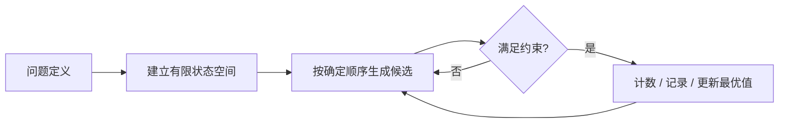
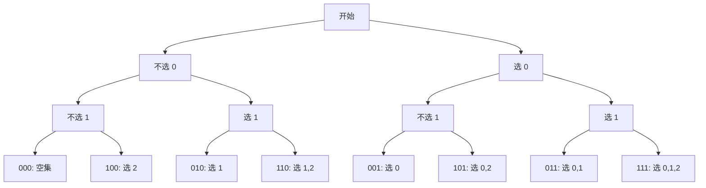
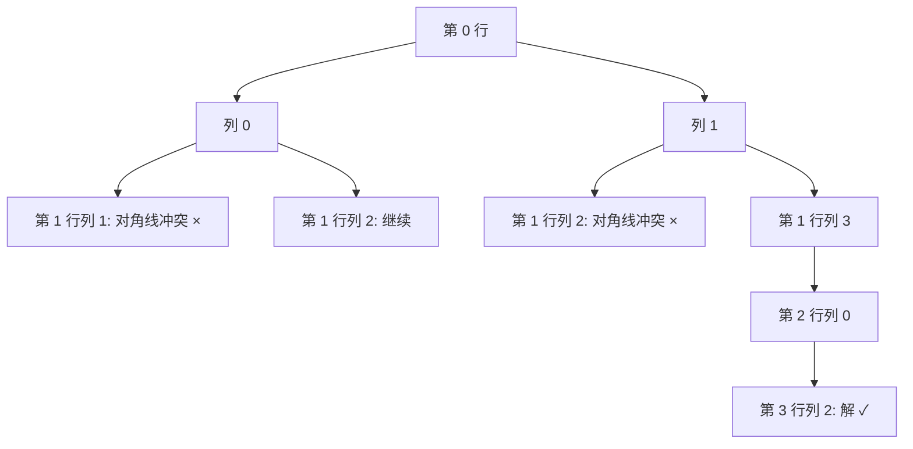

> 本笔记按原书第 15 章的小节顺序展开。原书概念、例题和算法依原顺序讲解；超出原书的证明框架、优化视角和替代算法均标注为“补充”。

## 本章要解决什么问题

当问题的候选答案构成有限离散集合，最直接可靠的方法是：把所有候选完整生成，逐一验证约束，从中统计、筛选或优化。这就是穷举法，也称枚举法、列举法。

穷举并不等于“随便写循环”。一个可用的穷举算法必须回答四个问题：

1. **状态空间是什么**：每个候选由哪些变量、选择或排列描述？
2. **如何完整生成**：怎样保证不漏、不重，或至少能识别重复？
3. **何时验证约束**：在候选完整后检查，还是在部分状态阶段提前剪枝？
4. **如何控制规模**：能否消去变量、缩小范围、打破对称或改用更强算法？



本章把常见枚举分为三类：

- **顺序列举**：按数值、下标、边界等自然顺序扫描；
- **组合列举**：只关心选了哪些元素，不关心选择顺序；
- **排列列举**：元素出现顺序本身就是答案的一部分。

### 本章算法单元与正文题盘点

本章共有 **3 个基础算法单元、14 道正文题**。后文为每个单元或题目各放置一个紧邻推导的 C++17 代码块，共 17 个；Python 与 Go 只在章末附录给出完整程序。

| 类别 | 编号 | 枚举对象 | 基线搜索空间或扫描规模 |
|---|---|---|---:|
| 基础单元 | 15.1.2 顺序列举 | 有界整数元组 $(x,y,z)$ | $\prod_i m_i$；例题消元后为 $26\times34$ |
| 基础单元 | 15.1.3 组合列举 | 下标集合/递增下标 | $2^n$ 或 $\binom nk$ |
| 基础单元 | 15.1.4 排列列举 | 有序序列/固定起点回路 | $n!$ 或 $(n-1)!$ |
| 正文题 | 15.2.1 连续 1 | 数组位置 | $n$ |
| 正文题 | 15.2.2 最大乘积 | 无序下标对 | $\binom n2$，优化后扫描 $n$ 项 |
| 正文题 | 15.2.3 连续整数和 | 正整数长度 $k$ | $O(\sqrt n)$ |
| 正文题 | 15.2.4 电话组合 | 每一位的字符选择 | $\prod_i|letters(d_i)|$ |
| 正文题 | 15.2.5 最长山脉 | 峰顶及左右边界 | 基线 $O(n^2)$，复用后扫描 $O(n)$ |
| 正文题 | 15.2.6 最短子数组 | 连续区间 $[l,r]$ | $\Theta(n^2)$，正数单调性下扫描 $O(n)$ |
| 正文题 | 15.2.7 加油站 | 环形起点 | 基线 $n^2$，批量淘汰后扫描 $n$ 项 |
| 正文题 | 15.3.1 子集 | 下标位掩码 | $2^n$ |
| 正文题 | 15.3.2 子集 II | 含重复值的下标子集 | $2^n$ 个下标状态，输出至多 $\prod_i(c_i+1)$ 个值子集 |
| 正文题 | 15.3.3 组合 | $k$ 个递增数字 | 基线 $2^n$，直接生成 $\binom nk$ 个答案 |
| 正文题 | 15.3.4 子集 XOR | 下标位掩码 | $2^n$ |
| 正文题 | 15.4.1 全排列 | 元素次序 | $n!$ |
| 正文题 | 15.4.2 排列序列 | 字典序排名 | 基线前进 $k-1$ 次，分块后选择 $n$ 次 |
| 正文题 | 15.4.3 N 皇后 II | 每行皇后的列 | $n!$ 个列排列 |

## 15.1 穷举法概述

### 15.1.1 什么是穷举法

#### 1. 严格定义

设候选状态空间为有限集合

$$
\Omega=\{x_1,x_2,\ldots,x_N\},
$$

约束谓词为

$$
P(x)\in\{true,false\}.
$$

穷举算法访问 $\Omega$ 中每个候选，并输出

$$
\boxed{
F=\{x\in\Omega\mid P(x)=true\}.
}
$$

若是优化问题，还给每个可行解定义目标函数 $f(x)$，返回

$$
\arg\min_{x\in F}f(x)
\quad\text{或}\quad
\arg\max_{x\in F}f(x).
$$

穷举的正确性来自两个条件：

1. **完备性**：每个合法答案都能由某个候选状态表示并被生成；
2. **可靠性**：只有满足约束的候选才被接受。

完备性防止漏解，可靠性防止误报。两者同时成立时，穷举结果才是“全面且正确”的。

#### 2. 为什么候选必须是有限离散的

整数区间 $3\sim100$ 有有限个候选，可以逐个检查；实数区间 $[1,2]$ 含无限不可数个实数，不可能通过逐点枚举全部完成。因此穷举适用于有限离散状态，或能被有限精度离散化的状态。

把连续问题粗略离散化会改变原问题，误差与精度必须另行论证，不能自动宣称仍是精确穷举。

#### 3. 基本复杂度模型

若有 $k$ 个枚举变量，第 $i$ 个变量有 $m_i$ 种取值，且没有提前剪枝，候选数为

$$
\boxed{N=\prod_{i=1}^{k}m_i.}
$$

每个完整候选的检查成本为 $C$，总时间为

$$
O(NC).
$$

这解释了循环重数和范围为何如此重要：少一个范围为 $m$ 的变量，理论工作量就可能缩小 $m$ 倍。

#### 4. 原书总结的特点

原书指出穷举法：

- 思路直接，容易理解和证明；
- 能回答存在性、计数、极值等问题；
- 结果必须是离散、可穷尽的；
- 可能检查大量无用候选，规模大时容易超时；
- 可作为基准算法，与优化算法比较时间性能。

“结果肯定正确”有隐含前提：候选空间建模正确、生成无遗漏、约束判断无错误。穷举本身不能弥补错误的范围或边界。

#### 5. 从暴力基线到优化算法

原书建议先写出直接穷举，再分析规律减少循环与范围。常见优化方向包括：

1. **消元**：由约束推导某个变量，不再单独枚举；
2. **范围收紧**：利用上下界排除不可能值；
3. **对称消除**：组合只让下标递增，避免不同顺序表示同一答案；
4. **提前剪枝**：部分状态已经不可能完成合法解时立即停止；
5. **预处理**：把重复计算变成表查询、前缀和或哈希查找；
6. **改变算法**：利用单调性、贪心、动态规划或数学公式，不再枚举全部候选。

> **补充：基准价值。** 小规模穷举还可作为测试 oracle。开发高效算法时，用随机小输入比较两者输出，常能发现边界错误；本章完整程序的验证也采用这一思路。

### 15.1.2 顺序列举设计方法

#### 1. 适用模型

顺序列举适用于候选能自然映射到整数、数组下标、区间边界或固定进制状态的问题。例如：

- 枚举每个数组元素；
- 枚举连续段的起点和终点；
- 枚举某个整数参数 $k$；
- 枚举电话按键每一位的字符选择。

它不一定只有一层循环。“顺序”指每个对象都有明确取值范围和访问顺序。

#### 2. 原书五步法

1. 确定枚举对象个数，尽量减少独立变量；
2. 确定枚举顺序，让约束尽早生效；
3. 确定每个对象的最紧范围；
4. 明确约束条件，避免重复判断；
5. 按顺序遍历，接受满足约束的候选。

枚举顺序不会改变完整状态数的理论乘积，但会影响剪枝发生时间与中间状态数量。

#### 3. 例 15-1：百人搬百砖

设男人、女人、小孩人数为 $x,y,z$。题意给出：

$$
x+y+z=100,
$$

$$
4x+3y+\frac{z}{3}=100,
$$

并要求

$$
x,y,z\in\mathbb Z_{\ge0},
\qquad z\equiv0\pmod3.
$$

范围可收紧为：

$$
0\le x\le25,
\qquad
0\le y\le33,
\qquad
z\in\{0,3,6,\ldots,99\}.
$$

三重枚举检查次数为

$$
26\times34\times33=29172.
$$

#### 4. 利用等式消元

由人数约束直接得到

$$
\boxed{z=100-x-y.}
$$

所以只需枚举 $x,y$，再计算唯一可能的 $z$。检查次数降为

$$
26\times34=884.
$$

两者相差约

$$
\frac{29172}{884}=33
$$

倍，恰好消除了 $z$ 的 33 种候选。

#### 5. 解的代数验证

把砖数方程乘 3：

$$
12x+9y+z=300.
$$

减去人数方程：

$$
\boxed{11x+8y=200.}
$$

模 8 考察：

$$
11x\equiv3x\equiv0\pmod8.
$$

因为 3 在模 8 下可逆，得到

$$
x\equiv0\pmod8.
$$

结合 $0\le x\le25$，候选为 $x=0,8,16,24$。由

$$
y=\frac{200-11x}{8}
$$

筛掉 $x=24$ 的负数结果，得到：

| $x$ | $y$ | $z=100-x-y$ |
|---:|---:|---:|
| 0 | 25 | 75 |
| 8 | 14 | 78 |
| 16 | 3 | 81 |

与原书穷举输出一致。数学推导更快，但它也是从约束中进一步压缩候选空间；穷举仍是通用基线。

#### 6. 正确性证明模板

枚举覆盖所有合法范围内的 $(x,y)$。任意合法三元组的 $z$ 都由 $100-x-y$ 唯一决定，所以消元不会丢解；筛选仍检查非负、3 的倍数和砖数方程，所以不会接受非法解。故优化后算法与三重枚举的解集相同。

#### 7. C++17：顺序列举基础单元

本章后续 C++17 代码块按出现顺序共享下面的标准库头文件，不再重复 `#include`。本单元枚举对象是二元组 $(x,y)$，搜索空间为 $26\times34=884$；每对 $(x,y)$ 唯一确定 $z$，所以没有重复表示。这里用等式消元直接降低状态维度，不是遇到失败后提前终止的分支剪枝。

```cpp
#include <algorithm>
#include <array>
#include <cstddef>
#include <cstdlib>
#include <limits>
#include <numeric>
#include <string>
#include <utility>
#include <vector>

std::vector<std::array<int, 3>> HundredPeopleHundredBricks() {
    std::vector<std::array<int, 3>> solutions;
    // 枚举对象：(men, women)；child 由人数等式唯一确定。
    for (int men = 0; men <= 25; ++men) {
        for (int women = 0; women <= 33; ++women) {
            const int children = 100 - men - women;
            if (children >= 0 && children % 3 == 0 &&
                12 * men + 9 * women + children == 300) {
                solutions.push_back({men, women, children});
            }
        }
    }
    return solutions;
}
```

### 15.1.3 组合列举设计方法

#### 1. 组合的含义

组合只关心选中了哪些元素，不关心选取顺序。例如从 $n$ 个不同元素中选 $m$ 个，候选数为

$$
\boxed{
\binom{n}{m}=\frac{n!}{m!(n-m)!}.
}
$$

若允许任意大小子集，每个元素只有“选/不选”两种独立状态，子集总数为

$$
\boxed{2^n.}
$$

#### 2. 位掩码与子集的一一对应

对集合

$$
A=\{a_0,a_1,\ldots,a_{n-1}\},
$$

用整数 $mask\in[0,2^n-1]$ 的第 $j$ 位表示是否选择 $a_j$：

$$
a_j\in subset(mask)
\iff
mask\mathbin{\&}(1\ll j)\ne0.
$$

每个掩码有唯一 $n$ 位二进制表示，因此：

- 每个掩码唯一对应一个子集；
- 每个子集唯一决定一个掩码。

这证明位掩码枚举无重无漏。

#### 3. 原书 $n=3$ 示例

集合 $\{0,1,2\}$ 对应掩码 $0\sim7$：

| 掩码 | 二进制 | 子集 |
|---:|---:|---|
| 0 | 000 | $\varnothing$ |
| 1 | 001 | $\{0\}$ |
| 2 | 010 | $\{1\}$ |
| 3 | 011 | $\{0,1\}$ |
| 4 | 100 | $\{2\}$ |
| 5 | 101 | $\{0,2\}$ |
| 6 | 110 | $\{1,2\}$ |
| 7 | 111 | $\{0,1,2\}$ |

原书还以 $45=101101_2$ 说明所选位置为 5、3、2、0。

#### 4. 复杂度为何是 $O(n2^n)$

共有 $2^n$ 个掩码；若每个掩码检查 $n$ 位并构造子集，时间为

$$
O(n2^n).
$$

若只计算可增量维护的聚合，可能减少每个状态的常数，但输出全部子集本身就包含

$$
\sum_{k=0}^{n}k\binom nk=n2^{n-1}
$$

个元素引用，因此物化全部答案需要 $\Theta(n2^n)$ 输出规模。

> **补充：上式推导。** 令 $(1+x)^n=\sum_k\binom nkx^k$，求导并令 $x=1$：
> $$
> n2^{n-1}=\sum_kk\binom nk.
> $$

#### 5. 固定大小组合的递增下标法

若只选 $m$ 个，可维护严格递增下标：

$$
0\le i_1<i_2<\cdots<i_m<n.
$$

同一元素集合只有一种升序下标表示，因此自动消除 $m!$ 种选择顺序。原书 Python 还提到 `itertools.combinations(iterable,r)`，它按这一组合语义产生结果。

下面的 $n=3$ 决策树把“每个下标选或不选”与 3 位掩码一一对应。根到叶的一条路径就是一个完整候选；树有 $2^3$ 个叶子、$2^{4}-1$ 个结点。



#### 6. C++17：组合列举基础单元

`EnumerateSubsetsByMask` 的枚举对象是全部下标集合，状态数严格为 $2^n$；位模式唯一，输入元素互异时值子集也唯一。`EnumerateFixedCombinations` 直接枚举严格递增的 $k$ 元下标序列，只访问 $\binom nk$ 个答案；这属于更换候选表示，不是仅降低平均访问量的剪枝。

```cpp
std::vector<std::vector<int>> EnumerateSubsetsByMask(
    const std::vector<int>& values) {
    const std::size_t state_count = std::size_t{1} << values.size();
    std::vector<std::vector<int>> subsets;
    subsets.reserve(state_count);
    for (std::size_t mask = 0; mask < state_count; ++mask) {
        std::vector<int> subset;
        for (std::size_t index = 0; index < values.size(); ++index) {
            if ((mask & (std::size_t{1} << index)) != 0) {
                subset.push_back(values[index]);
            }
        }
        subsets.push_back(std::move(subset));
    }
    return subsets;
}

std::vector<std::vector<int>> EnumerateFixedCombinations(int n, int choose) {
    if (choose < 0 || choose > n) {
        return {};
    }
    if (choose == 0) {
        return {{}};
    }

    std::vector<int> current(choose);
    std::iota(current.begin(), current.end(), 1);
    std::vector<std::vector<int>> combinations;
    while (true) {
        combinations.push_back(current);
        int index = choose - 1;
        while (index >= 0 && current[index] == n - choose + index + 1) {
            --index;
        }
        if (index < 0) {
            break;
        }
        ++current[index];
        for (int following = index + 1; following < choose; ++following) {
            current[following] = current[following - 1] + 1;
        }
    }
    return combinations;
}
```

### 15.1.4 排列列举设计方法

#### 1. 排列与组合的差别

排列中顺序有意义。$n$ 个不同元素的全排列数为

$$
\boxed{n!=n(n-1)\cdots2\cdot1.}
$$

从 $n$ 个元素选 $m$ 个并排列，数量为

$$
P(n,m)=\frac{n!}{(n-m)!}.
$$

因此排列空间通常比同规模组合空间大 $m!$ 倍。

#### 2. 例 15-3：旅行商问题

固定起点和终点为 0，只需排列其余顶点

$$
x=(x_0,x_1,\ldots,x_{n-2}),
$$

其中 $x$ 是 $1\sim n-1$ 的全排列。对应回路长度为

$$
\boxed{
A[0][x_0]
+\sum_{i=0}^{n-3}A[x_i][x_{i+1}]
+A[x_{n-2}][0].
}
$$

枚举所有 $(n-1)!$ 条固定起点回路，取最小长度即为标准 TSP 答案。

> **原文勘误说明：** 例题开头一处写“路径的最大长度”，但随后明确“最小 `curlen` 为答案”，且旅行商问题通常求最短回路。笔记按原书后文算法和标准定义讲解最小值。

#### 3. 为什么固定起点不会漏掉回路

一条环路可以从环上的任意顶点开始书写。把起点固定为 0 只是消除同一有向环路的 $n$ 种循环旋转表示，每个经过所有顶点的环仍有唯一“从 0 开始”的表示。

若无向图中正向与反向也视为同一路线，还可进一步固定第二个顶点小于最后一个顶点，消除反转对称；原书基础算法未做这一剪枝。

#### 4. 全排列生成工具

原书介绍：

- C++ `next_permutation`：把序列变为字典序下一个排列；要枚举全部字典序排列，初始序列应先升序；
- Python `itertools.permutations(iterable)`：按输入位置生成排列。

对于有重复值的序列，C++ 从排序后序列调用 `next_permutation` 会产生不同值排列而不重复；Python `permutations` 按位置区分相同值，可能生成重复值序列，需要额外去重。

#### 5. TSP 穷举复杂度

候选回路数为 $(n-1)!$，每条回路累加 $n$ 条边，所以

$$
O(n(n-1)!)=O(n!).
$$

这说明 $n\le10$ 仍可作为教学或基线算法，规模稍大就迅速不可行。

> **补充：替代方案。** Held-Karp 状态压缩动态规划可在 $O(n^22^n)$ 时间、$O(n2^n)$ 空间求精确 TSP；分支限界可用当前下界剪枝；大规模常使用近似或启发式算法。

#### 6. 三种列举的统一比较

| 类型 | 状态表示 | 候选规模 | 去重关键 |
|---|---|---:|---|
| 顺序列举 | 数值/下标元组 | $\prod m_i$ | 收紧范围、消元 |
| 组合列举 | 选中元素集合 | $2^n$ 或 $\binom nm$ | 位掩码、递增下标 |
| 排列列举 | 有序元素序列 | $n!$ 或 $P(n,m)$ | 使用标记、字典序、重复值剪枝 |

三者都必须证明候选生成完整，并把约束判断与目标更新放在正确时机。

#### 7. C++17：排列列举基础单元

TSP 的枚举对象是顶点 $1\sim n-1$ 的排列，共 $(n-1)!$ 个固定起点回路；固定顶点 0 消除循环旋转重复，但下面保留正反两个方向。代码没有分支剪枝，每条候选都计算 $n$ 条边，因此最坏时间为 $O(n!)$。

```cpp
long long BruteForceTsp(const std::vector<std::vector<int>>& distance) {
    const int vertex_count = static_cast<int>(distance.size());
    if (vertex_count <= 1) {
        return 0;
    }

    std::vector<int> route(vertex_count - 1);
    std::iota(route.begin(), route.end(), 1);
    long long best = std::numeric_limits<long long>::max();
    do {
        long long length = distance[0][route.front()];
        for (int index = 1; index < static_cast<int>(route.size()); ++index) {
            length += distance[route[index - 1]][route[index]];
        }
        length += distance[route.back()][0];
        best = std::min(best, length);
    } while (std::next_permutation(route.begin(), route.end()));
    return best;
}
```

#### 8. 去重、剪枝与迁移的反例

| 看似合理但错误的规则 | 最小反例 | 为什么会错 |
|---|---|---|
| 未排序就“跳过与前一个相同的值” | `[2,1,2]` | 两个 2 不相邻，局部相邻判断无法统一同一值组合的表示 |
| 部分和超过目标就停止扩展 | 目标 5，候选路径先选 8、再选 -3 | 中间和 8 虽超过目标，后续仍能回到 5；该剪枝只在后续贡献非负等额外单调条件下成立 |

必须区分两类优化：**剪枝**只是不访问被证明无解的分支，常显著减少给定输入的实际结点数，但若存在几乎无法剪枝的输入，最坏上界仍不变；**迁移**则利用消元、单调性或数学分块换掉候选表示，可能真正降低渐进复杂度。后文会逐题明确属于哪一种。

## 15.2 顺序列举的算法设计

### 15.2.1 LeetCode 485：1 的最多连续个数（★）

#### 枚举对象与状态

顺序扫描二进制数组。维护：

- `current`：以当前位置结尾的连续 1 长度；
- `answer`：扫描过的所有连续 1 段的最大长度。

对元素 $x$：

$$
current=
\begin{cases}
current+1,&x=1,\\
0,&x=0.
\end{cases}
$$

然后

$$
answer\leftarrow\max(answer,current).
$$

#### 为什么遇到 0 必须清零

连续段不能跨过 0。若当前值为 0，任何以当前位置结尾的全 1 子数组都不存在，正确长度就是 0；下一位置若为 1，应从新段长度 1 开始。

#### 样例走查

`[1,1,0,1,1,1]` 的 `current` 依次为

$$
1,2,0,1,2,3,
$$

最大值为 3。

#### 正确性证明

归纳地，处理位置 $i$ 后，`current` 恰等于以 $i$ 结尾的最长全 1 后缀长度；每个连续 1 段都在其末端某轮成为 `current`，所以取所有轮次最大值得到全局最长段。

时间 $O(n)$，额外空间 $O(1)$。这里虽然是穷举每个元素，但每个状态只被访问一次，没有无效重复。

#### C++17：顺序扫描连续 1

枚举对象是 $n$ 个数组位置，搜索规模为 $n$；每个位置只出现一次，无去重和分支剪枝。`current` 把“枚举所有连续段”迁移为一次状态扫描，最坏时间稳定为 $O(n)$。

```cpp
int MaximumConsecutiveOnes(const std::vector<int>& nums) {
    int current = 0;
    int answer = 0;
    for (int value : nums) {
        current = value == 1 ? current + 1 : 0;
        answer = std::max(answer, current);
    }
    return answer;
}
```

### 15.2.2 LeetCode 1464：数组中两个元素的最大乘积（★）

#### 解法一：枚举所有无序下标对

题目要求不同下标 $i\ne j$。乘法满足交换律，$(i,j)$ 与 $(j,i)$ 代表同一候选，只枚举

$$
0\le i<j<n
$$

即可。候选数是

$$
\binom n2=\frac{n(n-1)}2,
$$

每个候选计算

$$
(nums[i]-1)(nums[j]-1).
$$

时间为 $O(n^2)$，空间 $O(1)$。

> **原文勘误说明：** 原书解法一明确使用两重循环，却把复杂度写为 $O(n)$；实际候选对数量为 $n(n-1)/2$，应为 $O(n^2)$。

#### 解法二：只保留最大与次大值

题目保证

$$
nums[i]\ge1,
$$

所以

$$
nums[i]-1\ge0.
$$

在非负数上，乘积对每个因子单调不减。若选中的一个值不是数组最大或次大，就能用更大的未选值替换它，使乘积不减。因此最优下标对应最大值 $M_1$ 和次大值 $M_2$：

$$
\boxed{answer=(M_1-1)(M_2-1).}
$$

“次大”按元素出现次数定义：数组 `[5,5,1]` 中最大和次大都可为 5，但来自不同下标。

#### 一次扫描维护两个最大值

初始化两个足够小的值。读到 $x$：

- 若 $x\ge M_1$，先令 $M_2=M_1$，再令 $M_1=x$；
- 否则若 $x>M_2$，令 $M_2=x$。

循环不变量：处理任意前缀后，$M_1,M_2$ 是该前缀中按出现次数计的两个最大元素。最终时间 $O(n)$、空间 $O(1)$。

样例 `[3,4,5,2]` 得 $M_1=5,M_2=4$：

$$
(5-1)(4-1)=12.
$$

#### 适用边界

“取两个最大值”依赖变换后因子非负。若允许任意负数，两个很小的负数也可能产生最大正乘积，需要同时考虑两个最大和两个最小值；不能直接迁移本题结论。

#### C++17：维护两个最大值

基线枚举对象是 $\binom n2$ 个无序下标对，`i<j` 是其去重规则；实现利用非负乘积的单调性，迁移为扫描 $n$ 个元素并保留两个最大值。它不是提前跳过某些配对的经验剪枝，而是由交换论证确定充分统计量，故最坏时间降为 $O(n)$。

```cpp
int MaximumProduct(const std::vector<int>& nums) {
    int maximum = -1;
    int second = -1;
    for (int value : nums) {
        if (value >= maximum) {
            second = maximum;
            maximum = value;
        } else if (value > second) {
            second = value;
        }
    }
    return (maximum - 1) * (second - 1);
}
```

### 15.2.3 LeetCode 829：连续整数求和（★★★）

#### 从枚举起点改为枚举长度

若从每个起点逐项累加，$n$ 达到 $10^9$ 时不可行。设连续正整数共有 $k$ 个，首项为 $x\ge1$：

$$
x+(x+1)+\cdots+(x+k-1)=n.
$$

等差数列求和：

$$
\frac{k\bigl(x+(x+k-1)\bigr)}2=n,
$$

即

$$
\boxed{k(2x+k-1)=2n.}
$$

解出首项：

$$
\boxed{
x=\frac{2n/k-k+1}{2}
=\frac{n-k(k-1)/2}{k}.
}
$$

因此固定 $k$ 后，$x$ 不是枚举变量，而是唯一确定；只需检查它是否为正整数。

#### 长度上界

首项最小为 1，所以长度 $k$ 能形成的最小和为

$$
1+2+\cdots+k=\frac{k(k+1)}2.
$$

必须满足

$$
\boxed{k(k+1)\le2n.}
$$

所以只需枚举

$$
k=1,2,\ldots,O(\sqrt n).
$$

用 `k*(k+1) <= 2*n` 判断时应使用 64 位整数，避免乘法溢出。

#### 统一整除判定

令

$$
remaining=n-\frac{k(k-1)}2.
$$

若

$$
remaining>0
\quad\text{且}\quad
remaining\bmod k=0,
$$

则

$$
x=remaining/k
$$

是正整数，得到一种表示。这个统一公式比奇偶分类更直接。

#### 原书奇偶分类的推导

由

$$
n=k\cdot\frac{2x+k-1}{2}
$$

分析：

1. $k$ 为奇数时，$k-1$ 为偶数，平均数
    $$
    x+\frac{k-1}{2}
    $$
    是整数，所以存在表示当且仅当 $k\mid n$（同时满足正数上界）。
2. $k$ 为偶数时，$2x+k-1$ 为奇数，平均数是半整数。要让总和为整数，需要
    $$
    k\nmid n
    \quad\text{且}\quad
    k\mid2n.
    $$

这与统一的 `remaining % k == 0` 判定等价。

#### 数值走查

$n=15$，满足 $k(k+1)\le30$ 的 $k$ 为 1 到 5：

| $k$ | $remaining=15-k(k-1)/2$ | 是否整除 $k$ | 表示 |
|---:|---:|---|---|
| 1 | 15 | 是 | 15 |
| 2 | 14 | 是 | $7+8$ |
| 3 | 12 | 是 | $4+5+6$ |
| 4 | 9 | 否 | 无 |
| 5 | 5 | 是 | $1+2+3+4+5$ |

答案为 4。$n=5$ 则有 `5` 和 `2+3` 两种，答案 2。

#### 正确性与复杂度

任一连续正整数表示有唯一长度 $k$；上界循环覆盖所有可能 $k$。固定 $k$ 后公式给出唯一首项，整除和正数条件与合法表示等价。因此不重不漏。

枚举长度至 $O(\sqrt n)$，每轮 $O(1)$，总时间 $O(\sqrt n)$、空间 $O(1)$。

> **补充：数论结论。** 连续正整数表示数量等于 $n$ 的奇因子个数。可通过分解 $n$ 的奇数部分求解，但长度枚举更贴近原书“优化穷举”的分析路线。

#### C++17：枚举连续段长度

枚举对象是满足 $k(k+1)\le2n$ 的正整数长度，共 $O(\sqrt n)$ 个；长度唯一标识一种候选表示，首项由公式唯一确定，所以无需去重。上界是约束推导出的确定范围收紧，不是数据相关剪枝，最坏时间仍为 $O(\sqrt n)$。

```cpp
int ConsecutiveNumbersSum(long long number) {
    int answer = 0;
    for (long long length = 1;
         length * (length + 1) <= 2 * number;
         ++length) {
        const long long remaining = number - length * (length - 1) / 2;
        if (remaining % length == 0) {
            ++answer;
        }
    }
    return answer;
}
```

### 15.2.4 LeetCode 17：电话号码的字母组合（★★）

#### 状态空间是笛卡尔积

每个数字对应一个字符集合：

```text
2: abc   3: def   4: ghi   5: jkl
6: mno   7: pqrs  8: tuv   9: wxyz
```

若输入为

$$
d_0d_1\cdots d_{m-1},
$$

答案空间是

$$
letters(d_0)\times letters(d_1)\times\cdots\times letters(d_{m-1}).
$$

组合总数为

$$
\boxed{
K=\prod_{i=0}^{m-1}|letters(d_i)|.
}
$$

每个因子为 3 或 4。

#### 迭代扩展

初始化部分答案为只含空串：

$$
current=[\text{""}].
$$

处理一个数字 $d$ 时，对每个已有前缀 $p$ 和每个映射字符 $c$ 生成

$$
p+c.
$$

新列表替换旧列表。处理完第 $i$ 个数字后，循环不变量是：`current` 恰好包含前 $i+1$ 个数字能形成的全部组合。

#### 样例

`digits="23"`：

1. 处理 2：`[a,b,c]`；
2. 处理 3：每个前缀分别追加 `d,e,f`，得到

```text
[ad, ae, af, bd, be, bf, cd, ce, cf]
```

共 $3\times3=9$ 个。

#### 空输入边界

内部构造需要以 `['']` 作为乘法单位元，但题目规定空 `digits` 的答案是空列表，而不是包含一个空串的列表。因此应先判断：

```text
if digits is empty: return []
```

#### 正确性与复杂度

归纳地，每轮对前一层每个组合追加当前数字的每个合法字符，故不会漏掉任何选择；一个结果在每个位置的字符唯一决定其生成路径，所以不会重复。

生成 $K$ 个长度 $m$ 的字符串，输出规模为 $\Theta(mK)$，时间和结果空间均为 $O(mK)$。任何完整输出算法都无法低于这个输出量级。

#### C++17：逐层展开笛卡尔积

枚举对象是每一位数字对应字符集合中的一次选择，叶子数为 $K=\prod_i|letters(d_i)|$。每个结果的位置字符唯一确定路径，因此天然去重；题目要求输出全部叶子，没有可剪分支，最坏时间受输出规模约束为 $\Theta(mK)$。

```cpp
std::vector<std::string> LetterCombinations(const std::string& digits) {
    if (digits.empty()) {
        return {};
    }
    const std::vector<std::string> mapping = {
        "", "", "abc", "def", "ghi", "jkl", "mno", "pqrs", "tuv", "wxyz"};
    std::vector<std::string> answer = {""};
    for (char digit : digits) {
        std::vector<std::string> next;
        for (const std::string& prefix : answer) {
            for (char character : mapping[digit - '0']) {
                next.push_back(prefix + character);
            }
        }
        answer = std::move(next);
    }
    return answer;
}
```

### 15.2.5 LeetCode 845：数组中的最长山脉（★★）

#### 山脉的严格结构

子数组 `[L..R]` 是山脉，当且仅当存在峰顶 $p$：

$$
L<p<R,
$$

$$
arr[L]<arr[L+1]<\cdots<arr[p],
$$

$$
arr[p]>arr[p+1]>\cdots>arr[R].
$$

两侧都至少有一步，长度至少 3；相等元素会破坏严格单调，平台不能属于山脉。

#### 解法一：枚举峰顶并向两侧扩展

枚举 $p=1\sim n-2$。从峰顶向左，只要

$$
arr[i-1]<arr[i]
$$

就继续；向右只要

$$
arr[i]>arr[i+1]
$$

就继续。设左、右严格步数为 `left,right`，二者都大于 0 时长度为

$$
left+right+1.
$$

每个峰顶最坏扫描 $O(n)$，共有 $O(n)$ 个候选峰顶，总时间 $O(n^2)$。

> **原文勘误说明：** 原书解法一说明“求一个峰顶的山脉长度为 $O(n)$”，却把总复杂度写为 $O(n)$。逐一枚举所有峰顶后应为 $O(n^2)$；其较慢提交时间也与此一致。

#### 解法二：复用相邻位置结果

定义

$$
left[i]=\text{以 }i\text{ 结尾的严格递增连续步数},
$$

则

$$
\boxed{
left[i]=
\begin{cases}
left[i-1]+1,&arr[i]>arr[i-1],\\
0,&\text{否则}.
\end{cases}
}
$$

定义

$$
right[i]=\text{从 }i\text{ 开始的严格递减连续步数},
$$

从右向左递推：

$$
\boxed{
right[i]=
\begin{cases}
right[i+1]+1,&arr[i]>arr[i+1],\\
0,&\text{否则}.
\end{cases}
}
$$

当 `left[i]>0` 且 `right[i]>0` 时，$i$ 是合法峰顶，其最大山脉长度为

$$
\boxed{left[i]+right[i]+1.}
$$

#### 样例走查

对 `[2,1,4,7,3,2,5]`：

$$
left=[0,0,1,2,0,0,1],
$$

$$
right=[1,0,0,2,1,0,0].
$$

下标 3 的值 7 满足左右步数都为 2，长度

$$
2+2+1=5,
$$

对应 `[1,4,7,3,2]`。

#### 正确性与复杂度

递推式准确记录以每个位置为边界的最大连续单调段；任一山脉有唯一峰顶，且其左右最大延伸正是 `left/right`。遍历所有峰顶取最大值不重不漏。

三次线性扫描，时间 $O(n)$、空间 $O(n)$。

> **补充：常数空间扫描。** 可把数组解析成连续上坡和下坡，完成一座山后更新答案并复用边界，做到 $O(1)$ 额外空间。左右数组写法更直接地展示原书“复用相邻枚举结果”的优化。

#### C++17：复用峰顶两侧状态

基线枚举 $O(n)$ 个峰顶并各自扩展 $O(n)$ 步；实现把重复扩展迁移为左右各一次扫描，再枚举 $n$ 个峰顶。峰顶下标唯一，无去重；递推不是剪枝，因而可直接把最坏时间从 $O(n^2)$ 降为 $O(n)$。

```cpp
int LongestMountain(const std::vector<int>& values) {
    const int size = static_cast<int>(values.size());
    if (size < 3) {
        return 0;
    }
    std::vector<int> left(size, 0);
    std::vector<int> right(size, 0);
    for (int index = 1; index < size; ++index) {
        if (values[index] > values[index - 1]) {
            left[index] = left[index - 1] + 1;
        }
    }
    for (int index = size - 2; index >= 0; --index) {
        if (values[index] > values[index + 1]) {
            right[index] = right[index + 1] + 1;
        }
    }
    int answer = 0;
    for (int index = 0; index < size; ++index) {
        if (left[index] > 0 && right[index] > 0) {
            answer = std::max(answer, left[index] + right[index] + 1);
        }
    }
    return answer;
}
```

### 15.2.6 LeetCode 209：长度最小的子数组（★★）

#### 暴力枚举的瓶颈

枚举所有闭区间 $[i,j]$ 有

$$
\frac{n(n+1)}2
$$

个候选。若对固定 $i$ 逐步累加右端元素，每个候选 $O(1)$ 更新，总时间 $O(n^2)$；若每次重新求和则会达到 $O(n^3)$。

> **原文勘误说明：** 原书超时的双边界穷举被标为 $O(n)$，但候选区间本身已有二次量级，正确复杂度至少为 $O(n^2)$。

#### 正数带来的单调性

题目保证所有 `nums[i]` 都是正数。因此对窗口和：

- 固定左端，右端右移时和严格增加；
- 固定右端，左端右移时和严格减少。

这使两个指针只需向前，不必为每个左端重新从头枚举右端。

#### 滑动窗口算法

维护半开窗口 `[left,right]` 的滚动和（实现中右端逐元素加入）：

1. 右端加入 `nums[right]`；
2. 当 `window_sum>=target` 时：
    - 用 `right-left+1` 更新最短长度；
    - 移除 `nums[left]`，令 `left++`，继续尝试缩短；
3. 和不足时结束内层循环，扩展下一个右端。

原书使用前缀和

$$
P[right+1]-P[left]
$$

计算窗口和；滚动变量与它完全等价，并可省去 $O(n)$ 前缀数组空间。

#### 为什么缩窗不会漏掉更优解

固定当前右端 `right`。只要窗口满足目标，移除左端能得到更短候选，必须继续；第一次变为不满足后，再移除正数只会让和更小，所以该右端下不可能有更短合法窗口，应等待右端扩展。

每个合法窗口在其右端被处理时都会经过相应左边界；因此最短答案必被比较。

#### 样例走查

`target=7`，`nums=[2,3,1,2,4,3]`：

- 扩展到前四项，和 8，窗口 `[0,3]` 长 4；缩去 2 后和 6；
- 加入 4 后和 10，依次缩短并得到 `[3,4]` 长 2；
- 最后加入 3，窗口 `[4,3]` 的和 7、长度 2。

最短长度为 2。

#### 复杂度与适用边界

左右指针各最多移动 $n$ 次，总时间

$$
O(2n)=O(n),
$$

滚动和实现空间 $O(1)$。

正数假设不可缺少。若允许负数，扩展右端可能让和变小，缩左端可能让和变大，上述单调逻辑失效。

> **补充：替代方案。** 正数数组也可对每个左端在前缀和中二分最小右端，时间 $O(n\log n)$。含负数且求和至少为 $K$ 的最短子数组，需要前缀和加单调双端队列。

#### C++17：正数窗口的双指针迁移

基线对象是 $\Theta(n^2)$ 个连续区间；正数单调性使左右边界都只前进，每个元素至多进窗、出窗各一次。窗口由边界唯一表示，无去重；这是有证明的状态迁移而非启发式剪枝，最坏时间降为 $O(n)$。若允许负数，该迁移条件立即失效。

```cpp
int MinimumSubarrayLength(long long target, const std::vector<int>& nums) {
    int left = 0;
    long long window_sum = 0;
    int answer = static_cast<int>(nums.size()) + 1;
    for (int right = 0; right < static_cast<int>(nums.size()); ++right) {
        window_sum += nums[right];
        while (window_sum >= target) {
            answer = std::min(answer, right - left + 1);
            window_sum -= nums[left++];
        }
    }
    return answer == static_cast<int>(nums.size()) + 1 ? 0 : answer;
}
```

### 15.2.7 LeetCode 134：加油站（★★）

#### 净收益建模

定义从站点 $i$ 出发驶向下一站后的净油量变化：

$$
\boxed{diff[i]=gas[i]-cost[i].}
$$

若从站点 $s$ 出发，沿途油箱不能为负，要求所有环形前缀和均非负。

全程总净油量

$$
total=\sum_{i=0}^{n-1}diff[i]
$$

必须满足

$$
\boxed{total\ge0.}
$$

若总油量小于总成本，任何起点都不可能凭空补足差额，立即返回 -1。

#### 从顺序尝试到批量淘汰

朴素做法从每个起点模拟一圈，最坏 $O(n^2)$。原书顺序扫描并维护：

- `start`：当前候选起点；
- `tank`：从 `start` 到当前站点的累计净油量；
- `total`：整个数组净油量。

扫描 $i=0\sim n-1$：

$$
tank\mathrel{+}=diff[i].
$$

若 `tank<0`，令

$$
start=i+1,
\qquad
tank=0.
$$

#### 为什么失败时可以淘汰整个区间

设当前候选为 $s$，第一次在 $i$ 处出现

$$
\sum_{t=s}^{i}diff[t]<0.
$$

在此前没有重置，所以对任意 $k\in(s,i]$：

$$
\sum_{t=s}^{k-1}diff[t]\ge0.
$$

于是从 $k$ 到 $i$ 的净和为

$$
\begin{aligned}
\sum_{t=k}^{i}diff[t]
&=\sum_{t=s}^{i}diff[t]-\sum_{t=s}^{k-1}diff[t]\\
&<0.
\end{aligned}
$$

所以 $s,s+1,\ldots,i$ 都不可能作为起点，可一次全部淘汰，下一个候选只能是 $i+1$。

#### 为什么总和非负时最终候选一定可行

最终候选 `start` 到数组末尾的每个前缀都非负，否则还会被重置。设最后一次重置前被淘汰部分的总和为 $B<0$，候选后缀总和为 $A$。因为

$$
A+B=total\ge0,
$$

所以

$$
A\ge -B.
$$

汽车走完后缀后至少积累 $A$ 油量，足以覆盖绕回数组开头那一段最坏累计亏损；结合每次失败区间的淘汰性质，绕回过程不会为负。因此最终候选可完成一圈。

#### 原书样例走查

$$
gas=[1,2,3,4,5],
$$

$$
cost=[3,4,5,1,2],
$$

$$
diff=[-2,-2,-2,3,3].
$$

- 在 0、1、2 处候选依次失败并移到下一站；
- 从 3 开始，累计净油量为 $3,6,4,2,0$（绕回后继续计算），始终不负；
- 总和为 0，返回 3。

#### 正确性与复杂度

总和判定给出无解的必要条件；批量淘汰证明每个被跳过起点确实不可行；当总和非负时，未被淘汰的最终候选可行。题目保证有解时唯一，因此直接返回该候选。

扫描一次，时间 $O(n)$、空间 $O(1)$。算法已经从“依次尝试每个起点”的穷举基线归纳成贪心淘汰。

#### C++17：批量淘汰失败起点

基线枚举 $n$ 个起点并各走一圈，搜索规模为 $n^2$；起点本身唯一。`tank<0` 时一次淘汰整个失败区间，证明保证这些候选都不可能成功，因此这不是可能漏解的经验剪枝；每个站点只扫描一次，最坏时间降为 $O(n)$。

```cpp
int GasStationStart(const std::vector<int>& gas, const std::vector<int>& cost) {
    long long total = 0;
    long long tank = 0;
    int start = 0;
    for (int index = 0; index < static_cast<int>(gas.size()); ++index) {
        const long long difference =
            static_cast<long long>(gas[index]) - cost[index];
        total += difference;
        tank += difference;
        if (tank < 0) {
            start = index + 1;
            tank = 0;
        }
    }
    return total >= 0 ? start : -1;
}
```

## 15.3 组合列举的算法设计

### 15.3.1 LeetCode 78：子集（★★）

#### 位掩码映射

数组元素互不相同。用 $n$ 位掩码 `mask` 表示下标集合：第 $j$ 位为 1 时选择 `nums[j]`。

$$
subset(mask)=
\{nums[j]\mid mask\mathbin{\&}(1\ll j)\ne0\}.
$$

枚举

$$
mask=0,1,\ldots,2^n-1
$$

即可得到全部子集。

#### 为什么没有重复

假设两个掩码不同，则至少有一位 $j$ 不同，对应子集中 `nums[j]` 的包含状态不同。由于元素互不相同，两个子集必不同。反过来，每个子集的下标包含状态唯一确定一个掩码，所以是一一对应。

#### 样例

`nums=[1,2,3]`：掩码 0 到 7 依次产生

```text
[], [1], [2], [1,2], [3], [1,3], [2,3], [1,2,3]
```

题目允许任意答案顺序，位的扫描顺序只影响子集内部与外部排列，不影响解集。

#### 复杂度

检查 $2^n$ 个掩码，每个检查 $n$ 位，时间 $O(n2^n)$。答案本身包含 $2^n$ 个列表和 $n2^{n-1}$ 个元素引用，结果空间为 $O(n2^n)$；若只逐个处理、不保存全部子集，辅助空间可为 $O(n)$。

#### C++17：位掩码枚举子集

枚举对象是 $2^n$ 个下标位掩码；元素互异使“位模式不同”蕴含“值子集不同”，因此无需额外去重。题目要求输出所有状态，没有可剪分支；调用基础单元的共享实现后，时间与输出空间均为 $\Theta(n2^n)$。

```cpp
std::vector<std::vector<int>> AllSubsets(const std::vector<int>& nums) {
    return EnumerateSubsetsByMask(nums);
}
```

### 15.3.2 LeetCode 90：子集 II（★★）

#### 重复来自“下标不同、值相同”

对 `nums=[1,2,2]`，选择第一个 2 或第二个 2 的下标掩码不同，但值子集都可能是 `[2]`。因此 15.3.1 的“不同掩码必得不同子集”依赖元素互异，本题不再成立。

#### 原书方法：排序后用集合去重

先排序 `nums`，再枚举所有下标掩码并生成值向量，放入集合：

1. 排序保证同一多重集合总以相同非降序向量表示；
2. 集合按向量值去除重复。

为什么先排序必要？若原数组为 `[1,2,1]`，不同下标可能产生 `[1,2]` 与 `[2,1]`。集合认为两个向量顺序不同，无法识别它们代表同一组合；排序为 `[1,1,2]` 后，同一值组合表示统一。

原书把生成部分记为 $O(n2^n)$。有序集合插入还可能带来比较和对数开销；在 $n\le10$ 时仍足够。

#### 样例的唯一多重集合

`[1,2,2]` 中，值 1 可选 0 或 1 次，值 2 可选 0、1、2 次，所以唯一子集数为

$$
(1+1)(2+1)=6.
$$

结果为：

```text
[], [1], [2], [1,2], [2,2], [1,2,2]
```

#### 正确性

所有下标子集仍被枚举，所以每个合法值子集至少生成一次；排序使同一多重集合生成相同规范向量，集合只保留一个，因此最终无重无漏。

> **补充：不依赖集合的增量生成。** 排序后逐个处理元素。若当前值与前一值不同，就把它追加到此前所有子集；若相同，只扩展“上一次加入该值时新产生的子集”，避免生成重复。另一种方法是按不同值的出现次数 $c_i$，枚举每个值选 $0\sim c_i$ 次，唯一子集数恰为
> $$
> \prod_i(c_i+1).
> $$

增量方法在 `[1,2,2]` 上的状态如下。`start` 只限制本轮扩展哪些旧子集；它跳过的是必然产生重复值向量的生成路径，不会删除任何唯一答案。

| 本轮值 | `old_size` | `start` | 本轮新增 | 累计答案数 |
|---:|---:|---:|---|---:|
| 初始 | 1 | - | `[]` | 1 |
| 1 | 1 | 0 | `[1]` | 2 |
| 第一个 2 | 2 | 0 | `[2]`, `[1,2]` | 4 |
| 第二个 2 | 4 | 2 | `[2,2]`, `[1,2,2]` | 6 |

#### C++17：排序后只扩展上一轮新增区间

基线仍有 $2^n$ 个下标子集，但输出按值去重。排序给每个多重集合建立非降序规范表示；遇到重复值时只扩展上一轮新增区间，直接生成 $\prod_i(c_i+1)$ 个唯一结果。这是有完备性证明的重复路径消除；全异输入时无法减少状态，最坏输出和时间仍为 $\Theta(n2^n)$。

```cpp
std::vector<std::vector<int>> UniqueSubsets(std::vector<int> nums) {
    std::sort(nums.begin(), nums.end());
    std::vector<std::vector<int>> answer = {{}};
    int previous_new_start = 0;
    for (int index = 0; index < static_cast<int>(nums.size()); ++index) {
        const int old_size = static_cast<int>(answer.size());
        const int start = index > 0 && nums[index] == nums[index - 1]
                              ? previous_new_start
                              : 0;
        for (int position = start; position < old_size; ++position) {
            std::vector<int> subset = answer[position];
            subset.push_back(nums[index]);
            answer.push_back(std::move(subset));
        }
        previous_new_start = old_size;
    }
    return answer;
}
```

### 15.3.3 LeetCode 77：组合（★★）

#### 原书方法：枚举全部子集再筛大小

把集合 $[1,n]$ 的每个元素对应一个掩码位。枚举 $2^n$ 个子集，只把位数（或生成列表长度）等于 $k$ 的子集加入答案。

合法答案数为

$$
\binom nk,
$$

但原书算法仍访问所有 $2^n$ 个状态，检查每个掩码 $n$ 位，时间

$$
O(n2^n).
$$

样例 $n=4,k=2$ 有

$$
\binom42=6
$$

个答案：`[1,2]`、`[1,3]`、`[1,4]`、`[2,3]`、`[2,4]`、`[3,4]`。

#### 为什么筛选正确

位掩码与 $[1,n]$ 的子集一一对应；长度为 $k$ 的掩码恰对应 $k$ 元组合。过滤不会漏掉任何 $k$ 元子集，也不会接受其他大小。

#### 更紧的范围边界

> **补充：直接枚举组合。** 维护严格递增序列
> $$
> 1\le c_0<c_1<\cdots<c_{k-1}\le n.
> $$
> 字典序下一个组合可从右向左找到第一个仍可增加的位置 $i$：
> $$
> c_i<n-k+i+1,
> $$
> 将它加 1，并把后续重置为连续递增值。这样只生成 $\binom nk$ 个答案，时间与输出规模为 $O(k\binom nk)$。

例如 $n=5,k=3$ 时，位置上界分别为 3、4、5；若前面已经选到 $c_i$，后面必须至少留出 $k-i-1$ 个数。这种边界就是组合剪枝的来源。

#### C++17：直接生成严格递增组合

原书基线枚举 $2^n$ 个子集再筛长度；共享实现的枚举对象是严格递增的 $k$ 元序列，恰有 $\binom nk$ 个。升序下标是唯一规范表示，自动消除 $k!$ 种顺序重复；位置上界改变了生成空间，最坏时间随输出降为 $\Theta(k\binom nk)$。

```cpp
std::vector<std::vector<int>> CombinationsOfN(int n, int choose) {
    return EnumerateFixedCombinations(n, choose);
}
```

### 15.3.4 LeetCode 1863：所有子集异或总和再求和（★）

#### 原书位掩码枚举

对每个掩码，初始化

$$
xorValue=0,
$$

对所有被选下标执行

$$
xorValue\mathrel{\oplus}=nums[j],
$$

再累加到答案。空子集异或定义为 0，正好对应初始值。

这里下标子集必须分别计数。即使 `nums` 有相同值，选择不同下标仍是不同子集，不能像 90 题那样去重。

#### 样例走查

`nums=[5,1,6]` 的 8 个子集异或值为：

$$
0,5,1,6,4,3,7,2.
$$

总和：

$$
0+5+1+6+4+3+7+2=28.
$$

#### 正确性与复杂度

位掩码一一枚举所有下标子集；对每个子集按异或定义计算值并累加，所以答案正确。时间 $O(n2^n)$，额外空间 $O(1)$（不保存子集时）。

#### 补充：按位计数闭式

> **补充：** 令
> $$
> allOr=nums[0]\mathbin{|}nums[1]\mathbin{|}\cdots\mathbin{|}nums[n-1].
> $$
> 对 `allOr` 中任意为 1 的位 $b$，至少有一个元素在该位为 1。固定其中一个元素，把任意子集按“是否切换包含这个元素”两两配对；一对子集的 XOR 第 $b$ 位恰好一个为 0、一个为 1。因此全部 $2^n$ 个子集中，恰有 $2^{n-1}$ 个子集在该位的 XOR 为 1。
>
> 每个出现过的位贡献
> $$
> 2^b\cdot2^{n-1},
> $$
> 所以
> $$
> \boxed{answer=allOr\cdot2^{n-1}.}
> $$
> 该公式时间 $O(n)$，但原书使用组合列举以展示位掩码方法。

#### C++17：逐掩码累计子集 XOR

枚举对象是 $2^n$ 个**下标**子集；即使值相同，不同下标选择也必须分别计数，所以此题明确不按值去重。代码没有剪枝，每个掩码检查 $n$ 位，最坏时间为 $O(n2^n)$；闭式公式属于迁移到按位计数，而非本实现的一部分。

```cpp
long long SubsetXorSum(const std::vector<int>& nums) {
    long long answer = 0;
    const std::size_t state_count = std::size_t{1} << nums.size();
    for (std::size_t mask = 0; mask < state_count; ++mask) {
        int current = 0;
        for (std::size_t index = 0; index < nums.size(); ++index) {
            if ((mask & (std::size_t{1} << index)) != 0) {
                current ^= nums[index];
            }
        }
        answer += current;
    }
    return answer;
}
```

## 15.4 排列列举的算法设计

### 15.4.1 LeetCode 46：全排列（★★）

#### 原书方法

数组元素互不相同。先把 `nums` 升序排序，再从最小字典序排列开始：

1. 记录当前排列；
2. 反复调用 C++ `next_permutation` 生成下一个字典序排列，直到不存在后继。

Python 可直接使用 `itertools.permutations`。

#### 为什么 C++ 必须先排序

`next_permutation` 只产生**当前排列之后**的字典序后继，不会自动绕回最小排列。若从中间排列开始，只能得到它到最大排列的后缀部分。

例如 `[0,-1,1]` 不是最小字典序；最小排列是 `[-1,0,1]`。从前者开始会漏掉以 -1 开头的排列。升序排序后从全局最小值出发，连续后继覆盖全部排列。

#### `next_permutation` 的直觉

要得到刚好更大的排列：

1. 从右向左找最长非递增后缀，找到其前一位置 $p$；
2. 在后缀中找刚好大于 `a[p]` 的最小元素并交换；
3. 把后缀反转成升序，使增量最小。

当整个序列非递增时，它已是最大排列，没有后继。

#### 正确性

互异元素共有 $n!$ 个排列，字典序构成严格全序。从最小排列开始，每次取直接后继，既不会重复，也不可能跳过中间排列，直到最大排列，因此无重无漏。

`nums=[1,2,3]` 产生：

```text
[1,2,3], [1,3,2], [2,1,3],
[2,3,1], [3,1,2], [3,2,1]
```

#### 复杂度

原书将排列生成记为 $O(n!)$。若只计“产生了多少个排列”可作此简写；但每次 `next_permutation` 最坏 $O(n)$，且把每个长度 $n$ 的排列复制进答案也需 $O(n)$。严格的输出时间和结果空间均为

$$
\boxed{\Theta(n\cdot n!).}
$$

工作数组额外空间为 $O(n)$。

#### C++17：从最小字典序生成全部排列

枚举对象是 $n!$ 个不同排列；升序起点加连续字典序后继给出唯一生成顺序，因此不重不漏。题目要求物化全部答案，没有剪枝空间；复制每个长度 $n$ 的结果后，最坏时间和结果空间都是 $\Theta(n\cdot n!)$。

```cpp
std::vector<std::vector<int>> AllPermutations(std::vector<int> nums) {
    std::sort(nums.begin(), nums.end());
    std::vector<std::vector<int>> answer;
    do {
        answer.push_back(nums);
    } while (std::next_permutation(nums.begin(), nums.end()));
    return answer;
}
```

### 15.4.2 LeetCode 60：排列序列（★★★）

#### 原书方法：走到第 $k$ 个排列

从 `[1,2,...,n]` 开始，调用 `next_permutation` 共 $k-1$ 次，当前序列就是第 $k$ 个字典序排列。每次最坏 $O(n)$，总时间

$$
O(kn),
$$

空间 $O(n)$。在 $n\le9$ 的限制下可通过，但没有利用整组排列的规律。

#### 补充：阶乘分块直接定位

> **补充：** 固定第一位后，剩余 $n-1$ 个元素有
> $$
> (n-1)!
> $$
> 种排列。因此按第一位划分，全部排列被等分为 $n$ 个连续字典序块，每块大小 $(n-1)!$。

把题目 1 基的 $k$ 改为 0 基：

$$
k\leftarrow k-1.
$$

当前还剩 $m$ 个数字时，每块大小为

$$
block=(m-1)!.
$$

当前应选剩余有序数字列表中的下标

$$
\boxed{index=\left\lfloor\frac{k}{block}\right\rfloor,}
$$

选定后进入块内位置

$$
\boxed{k\leftarrow k\bmod block.}
$$

删除已选数字，重复直到列表为空。

#### 样例 $n=3,k=3$

初始数字 `[1,2,3]`，0 基 $k=2$：

1. $m=3,block=2$，`index=2//2=1`，选 2；$k=0$；
2. 剩 `[1,3]`，$block=1$，`index=0`，选 1；
3. 最后选 3。

得到 `213`。

#### 正确性证明

字典序排列按当前首位分成大小相同且顺序连续的阶乘块。整数除法选择包含目标排名的唯一块，取模把全局排名转换成块内排名。对剩余位递归应用同一论证，最终每一位都与第 $k$ 个排列一致。

用数组删除第 `index` 个剩余数字需 $O(n)$，共 $n$ 轮，时间 $O(n^2)$、空间 $O(n)$；$n\le9$ 时足够。若用支持第 $k$ 小查询的数据结构，可进一步做到 $O(n\log n)$。

#### C++17：按阶乘块定位排名

基线枚举对象是前 $k$ 个字典序排列；实现把排名迁移为 $n$ 次阶乘块选择，每轮整块跳过不含目标的排列。块由首元素唯一划分，无重复；这不是仅减少实际节点的剪枝，最坏时间因数组删除成本降为 $O(n^2)$。

```cpp
std::string GetPermutation(int n, int order) {
    std::vector<int> remaining(n);
    std::iota(remaining.begin(), remaining.end(), 1);
    std::vector<int> factorials(n + 1, 1);
    for (int value = 1; value <= n; ++value) {
        factorials[value] = factorials[value - 1] * value;
    }

    int rank = order - 1;
    std::string answer;
    for (int size = n; size >= 1; --size) {
        const int block = factorials[size - 1];
        const int index = rank / block;
        rank %= block;
        answer += static_cast<char>('0' + remaining[index]);
        remaining.erase(remaining.begin() + index);
    }
    return answer;
}
```

### 15.4.3 LeetCode 52：N 皇后 II（★★★）

#### 用排列消除行列冲突

棋盘行、列均为 $0\sim n-1$。每行恰放一个皇后，定义

$$
x_i=\text{第 }i\text{ 行皇后的列号}.
$$

若 $x=(x_0,x_1,\ldots,x_{n-1})$ 是 $0\sim n-1$ 的一个排列，则：

- 每行按定义只有一个皇后；
- 每列因排列元素互异也只有一个皇后。

所以只需检查对角线冲突，排列表示已经自动满足行列约束。

#### 对角线判定公式

两个皇后位置为

$$
(i,x_i),\qquad(k,x_k).
$$

它们位于同一条 45 度对角线，当且仅当横纵距离相等：

$$
\boxed{|x_i-x_k|=|i-k|.}
$$

等价地，两类对角线可用常量标识：

$$
i-x_i=\text{常数}
$$

或

$$
i+x_i=\text{常数}.
$$

只要任意一对满足等式，该排列非法；所有下标对都不冲突时，计数加 1。

#### $n=4$ 示例

两个合法列排列为

$$
[1,3,0,2]
$$

和

$$
[2,0,3,1].
$$

它们各列互异，任意两行的列差绝对值也不等于行差，答案为 2。

#### 正确性证明

任一合法 N 皇后方案每行恰一个、每列恰一个，因此唯一对应一个列排列；算法枚举所有列排列，不会漏解。对角线公式是皇后斜线攻击的充要条件，算法只接受没有冲突对的排列，所以不会误计。

#### 复杂度

有 $n!$ 个排列。若对每个排列检查所有

$$
\binom n2=O(n^2)
$$

对皇后，最坏时间为

$$
O(n^2n!).
$$

原书按逐个皇后检查前面位置，把检查过程概括为 $O(n)$ 并写出 $O(n\cdot n!)$；严格汇总所有 $i$ 的前驱检查次数仍是 $O(n^2)$。若用两个对角线集合一次扫描排列，验证可降为 $O(n)$，此时为 $O(n\cdot n!)$。

> **补充：边生成边剪枝。** 逐行放皇后时维护已占列、`row-column` 对角线和 `row+column` 对角线；某列冲突就不再生成后续行。这样只访问可行前缀，远少于先生成全部 $n!$ 排列。还可用三个位掩码实现。该回溯方法将在递归/回溯思想中更自然地表达。

下面只展开 $n=4$ 的一小部分前缀树。叉号边在冲突刚出现时停止，勾号路径形成完整解；未画出的对称分支按同一规则处理。



这类合法前缀剪枝通常让实际访问量远小于 $n!$ 个完整排列，但仅凭“通常更快”不能改写最坏上界：存在剪枝很晚的分支时，粗粒度上界仍可记为 $O(n!)$ 个排列前缀。只有再证明更紧的节点计数，才能声称更低上界。

#### C++17：枚举列排列并验证对角线

正文实现枚举 $n!$ 个列排列；行由下标唯一、列由排列去重，只检查对角线。它在发现某个冲突对后提前结束当前排列的验证，减少实际比较次数，但最坏仍可能检查 $\binom n2$ 对，因此时间上界不变，仍为 $O(n^2n!)$。

```cpp
int TotalNQueens(int n) {
    std::vector<int> columns(n);
    std::iota(columns.begin(), columns.end(), 0);
    int answer = 0;
    do {
        bool valid = true;
        for (int row = 0; row < n && valid; ++row) {
            for (int previous = 0; previous < row; ++previous) {
                if (std::abs(columns[row] - columns[previous]) ==
                    row - previous) {
                    valid = false;
                    break;
                }
            }
        }
        answer += valid;
    } while (std::next_permutation(columns.begin(), columns.end()));
    return answer;
}
```

## 推荐练习题

原书在本章末尾列出以下 10 道练习，未在正文中展开解法：

1. LeetCode 1：两数之和（★）
2. LeetCode 40：组合总和 II（★★）
3. LeetCode 51：N 皇后（★★★）
4. LeetCode 53：最大子数组和（★★）
5. LeetCode 507：完美数（★）
6. LeetCode 633：平方数之和（★★）
7. LeetCode 1291：顺次数（★★）
8. LeetCode 1534：统计好三元组（★）
9. LeetCode 1995：统计特殊四元组（★）
10. LeetCode 2427：公因子的数目（★）

## 代码与推导的对应关系

> **补充：** 本节把正文状态与公式映射到三语言程序接口，方便从推导反查实现，不属于原书新增题解。

| 原书题目 | 状态/公式 | Python | C++17 | Go 1.22 |
|---|---|---|---|---|
| 15.2.1 连续 1 | 遇 1 加一，遇 0 清零 | `maximum_consecutive_ones` | `MaximumConsecutiveOnes` | `maximumConsecutiveOnes` |
| 15.2.2 最大乘积 | 维护最大与次大值 | `maximum_product` | `MaximumProduct` | `maximumProduct` |
| 15.2.3 连续整数和 | $remaining=n-k(k-1)/2$ | `consecutive_numbers_sum` | `ConsecutiveNumbersSum` | `consecutiveNumbersSum` |
| 15.2.4 电话组合 | 字符集合笛卡尔积 | `letter_combinations` | `LetterCombinations` | `letterCombinations` |
| 15.2.5 最长山脉 | `left[i]+right[i]+1` | `longest_mountain` | `LongestMountain` | `longestMountain` |
| 15.2.6 最短子数组 | 正数窗口双指针 | `minimum_subarray_length` | `MinimumSubarrayLength` | `minimumSubarrayLength` |
| 15.2.7 加油站 | 总和判定 + 失败区间淘汰 | `gas_station_start` | `GasStationStart` | `gasStationStart` |
| 15.3.1 子集 | 下标位掩码 | `all_subsets` | `AllSubsets` | `allSubsets` |
| 15.3.2 子集 II | 重复值只扩展上一轮新子集 | `unique_subsets` | `UniqueSubsets` | `uniqueSubsets` |
| 15.3.3 组合 | 严格递增字典序组合 | `combinations_of_n` | `CombinationsOfN` | `combinationsOfN` |
| 15.3.4 子集 XOR | 每个掩码独立 XOR | `subset_xor_sum` | `SubsetXorSum` | `subsetXorSum` |
| 15.4.1 全排列 | 字典序直接后继 | `all_permutations` | `AllPermutations` | `allPermutations` |
| 15.4.2 第 $k$ 个排列 | 阶乘分块、除法取块 | `get_permutation` | `GetPermutation` | `getPermutation` |
| 15.4.3 N 皇后 | 列排列 + 对角线判定 | `total_n_queens` | `TotalNQueens` | `totalNQueens` |

### 状态空间与优化后的实际遍历量

| 问题 | 朴素状态空间 | 程序采用的状态空间 |
|---|---:|---:|
| 两元素最大乘积 | $\binom n2$ | $n$ 个元素的一次扫描 |
| 连续整数求和 | 起点/终点近线性以上 | $O(\sqrt n)$ 个长度 |
| 最短正数子数组 | $\Theta(n^2)$ 个区间 | 左右指针各至多 $n$ 步 |
| 加油站 | $n$ 个起点各模拟一圈 | 一次扫描批量淘汰 |
| $k$ 元组合 | 原书筛 $2^n$ 个子集 | 程序直接生成 $\binom nk$ 个 |
| 第 $k$ 个排列 | 前进 $k-1$ 次 | $n$ 个阶乘块选择 |

这张表体现原书反复强调的优化方向：不是让计算机更快地检查同样多候选，而是改变表示，减少必须生成的候选。

## 三种语言中的实现差异

> **补充：** 三种程序保持同一算法不变量，差异主要来自排列工具、容器复制和整数类型。

### 排列生成

- C++ 标准库提供 `next_permutation`，但必须先排序才能覆盖完整字典序；
- Python 完整程序手写 `next_permutation` 展示原理，N 皇后使用 `itertools.permutations`；
- Go 标准库没有直接对应函数，程序实现枢轴、后继交换和后缀反转。

三种实现的排列顺序相同，均从升序最小排列开始。

### 结果容器复制

组合和排列答案中的每个子列表必须独立：

- Python 使用 `copy()` 或列表拼接产生新列表；
- C++ `vector` 按值复制；
- Go 切片共享底层数组，必须使用 `append([]int(nil), source...)` 显式复制。

若 Go 直接把同一工作切片反复加入答案，后续修改会让历史结果一起变化。

### 整数宽度

C++ 用 `long long`、Go 用 `int64` 保存等差数列乘积、窗口和、加油净量和 XOR 累计；Python 整数自动扩展。即使返回值是 32 位，表达式

$$
k(k+1),\quad2n,\quad\sum nums[i]
$$

也可能需要更宽中间类型。

### 字符串与第 $k$ 个排列

题目保证 $n\le9$，所以 C++/Go 可把数字 1 到 9 转成单个字符。若扩展到 $n\ge10$，这种拼接会产生歧义，必须定义分隔格式或返回整数数组。

### 布尔计数

Python 中 `bool` 是整数子类，`answer += valid` 可把真计为 1；C++ 的 `bool` 转整数也可行；Go 不允许把布尔直接转整数，必须显式 `if valid { answer++ }`。

### 输出格式

Python 打印字符串列表时带引号，C++ 示例打印器省略字符串引号，Go 使用切片的空格分隔格式。顺序与数值内容保持一致。

## 补充：易混淆概念与常见误解

### 1. 穷举“天然正确”有前提

只有候选空间覆盖全部合法解、约束判断正确、边界无遗漏时才正确。把右端写成 `<` 而非 `<=`，或忘记空子集，仍会得到错误结果。

### 2. 循环层数不是唯一复杂度依据

两层循环通常暗示二次，但还要看边界是否单调前进。例如滑动窗口虽有嵌套 `while`，左右指针各只前进 $n$ 次，总计 $O(n)$；普通双重区间枚举则是 $O(n^2)$。

### 3. 返回全部答案时不能忽略输出成本

全排列有 $n!$ 个，每个长度 $n$，仅复制输出就需 $\Theta(n\cdot n!)$。把复杂度只写成 $O(n!)$ 是按候选数量的简写，不是完整运行成本。

### 4. 组合与排列不能互换

组合 `[1,2]` 与 `[2,1]` 相同；排列中二者不同。若用排列解决组合会产生 $k!$ 倍对称重复，若用组合解决顺序问题则会漏解。

### 5. “重复子集”要先确定按值还是按下标

90 题按值去重；1863 明确相同值但不同下标的子集仍分别计数。不能看到重复值就一律使用集合去重。

### 6. 位掩码的位对应下标，不直接对应元素值

即使元素为负数或很大，掩码第 $j$ 位仍只表示是否选择 `nums[j]`。位数是数组长度，不是最大元素值。

### 7. 左移需要关注位宽

状态数 `1<<n` 要用能容纳 $2^n$ 的整数类型。当前题目 $n\le12$ 很安全；通用代码若 $n$ 接近 31/63，应使用无符号宽类型并先判断状态空间是否实际可枚举。

### 8. 两最大值按出现次数，不按不同值

`[5,5,1]` 的最优下标可以选择两个 5。若用集合去重后再取“不同的次大值”，会错误得到 1。

### 9. 连续整数求和必须保证首项为正

整除条件只能保证首项是整数。若不使用 $k(k+1)\le2n$ 的上界，还必须显式检查

$$
n-k(k-1)/2>0.
$$

否则会计入以 0 或负数开头的序列。

### 10. 电话空输入的内部单位元不是最终答案

笛卡尔积构造从 `['']` 开始，但题目规定空数字串返回 `[]`。内部数学单位元和 API 边界语义要分开处理。

### 11. 山脉必须严格上升且严格下降

平台 `[1,2,2,1]` 不是山脉。递推条件必须使用 `>`，不能用 `>=`；峰顶两侧步数都要大于 0。

### 12. 滑动窗口依赖正数单调性

209 中若出现负数，扩大窗口可能让和下降，缩小窗口可能让和上升，“不满足就扩右、满足就缩左”的证明失效。

### 13. 总油量非负不表示任意起点都可行

它只保证至少存在候选的必要基础。仍需淘汰途中油箱变负的起点区间；最终返回的是特定候选，而非 0。

### 14. `next_permutation` 不会自动循环

达到最大字典序后返回 false，通常还会把序列变回最小排列（具体标准接口行为如此），但枚举循环应在 false 时结束。若初始未排序，前面的排列已被永久跳过。

### 15. 第 $k$ 个排列必须先转成 0 基排名

阶乘块下标从 0 开始。若不执行

$$
k\leftarrow k-1,
$$

所有块边界都会偏一，尤其 $k=(n-1)!$ 的整倍数处最明显。

### 16. N 皇后使用列排列后无需再检查同列

排列元素天然互异，行也由数组下标固定。只需检查对角线；重复检查列不会错，但属于多余工作。

### 17. 原书 N 皇后复杂度需区分验证方式

逐排列检查所有皇后对是 $O(n^2n!)$；用对角线集合扫描一个排列可降为 $O(nn!)$；边生成边剪枝则不会访问全部排列，实际快得多。

### 18. 剪枝必须证明被剪状态不可能产生解

加油站能批量跳过起点，是因为失败区间内任一起点到失败站的净和更小；随意跳过没有这种支配关系的状态会破坏完备性。

## 本章总结

### 穷举正确性的统一证明

对任意列举问题，都可沿以下结构证明：

1. **表示**：每个合法答案如何映射为一个候选状态；
2. **覆盖**：生成过程为何会访问这个状态；
3. **唯一性**：是否重复，若重复如何规范化或去重；
4. **筛选**：约束为何恰好接受合法状态；
5. **优化保持性**：消元、剪枝或跳过状态为何不改变解集。

### 三类状态空间公式

$$
\boxed{
{\text{顺序列举：}}\prod_i m_i
}
$$

$$
\boxed{
{\text{任意子集：}}2^n,
\qquad
{\text{固定组合：}}\binom nk
}
$$

$$
\boxed{
{\text{全排列：}}n!,
\qquad
{\text{部分排列：}}\frac{n!}{(n-k)!}
}
$$

这些公式既用于复杂度估算，也提示优化方向：若题目只要固定大小组合，就不应无条件遍历全部 $2^n$ 子集；若只要第 $k$ 个排列，就可按阶乘块跳过前面整组排列。

### 本章优化路径

| 基线 | 发现的结构 | 优化结果 |
|---|---|---|
| 百人搬砖三变量 | 等式唯一确定 $z$ | 三重循环降为两重 |
| 两元素全部配对 | 非负乘积对因子单调 | 只保留两个最大值 |
| 枚举连续序列起点 | 固定长度唯一确定首项 | $O(\sqrt n)$ 枚举长度 |
| 每个峰顶向两侧重复扫描 | 相邻峰顶共享单调段 | 左右状态线性递推 |
| 枚举全部连续区间 | 正数窗口和具有单调性 | 双指针 $O(n)$ |
| 每个加油站模拟一圈 | 一次失败支配一段起点 | 贪心一次扫描 |
| 前进到第 $k$ 个排列 | 首位分块大小为阶乘 | $O(n^2)$ 直接定位 |

### 何时停止使用穷举

先估算候选数和单候选成本：

$$
work\approx |\Omega|\times C.
$$

若 $2^n$、$n!$ 或多重范围乘积已远超时间预算，应在编码前寻找：

- 约束消元或更紧边界；
- 单调性与双指针；
- 贪心支配关系；
- 动态规划复用重叠子问题；
- 哈希、排序、前缀和等预处理；
- 回溯剪枝、分支限界或近似算法。

穷举法的价值不只在于解决小规模问题。它迫使我们明确状态空间、约束和完整性，并提供一个可靠基线。高效算法往往正是从这个完整候选空间中识别“哪些维度可推导、哪些状态等价、哪些分支永远无解”，再安全地把它们删去。

## 附录 A：Python 3 完整参考实现

以下程序按 3 个基础算法单元、14 道正文题的顺序给出可执行对照。组合基础单元与 15.3.1 共享一次位掩码辅助，避免重复实现。

```python
from __future__ import annotations

from itertools import permutations
from math import factorial


def hundred_people_hundred_bricks() -> list[tuple[int, int, int]]:
    """15.1.2：枚举男人、女人，孩子人数由总人数唯一确定。"""
    solutions = []
    for men in range(26):
        for women in range(34):
            children = 100 - men - women
            if (
                children >= 0
                and children % 3 == 0
                and 12 * men + 9 * women + children == 300
            ):
                solutions.append((men, women, children))
    return solutions


def enumerate_subsets_by_mask(nums: list[int]) -> list[list[int]]:
    """15.1.3：每个下标位表示该位置选或不选。"""
    return [
        [nums[index] for index in range(len(nums)) if mask & (1 << index)]
        for mask in range(1 << len(nums))
    ]


def brute_force_tsp(distance: list[list[int]]) -> int:
    """15.1.4：固定起点 0，枚举其余顶点的全部排列。"""
    vertex_count = len(distance)
    if vertex_count <= 1:
        return 0
    best: int | None = None
    for route in permutations(range(1, vertex_count)):
        length = distance[0][route[0]]
        length += sum(
            distance[route[index - 1]][route[index]]
            for index in range(1, len(route))
        )
        length += distance[route[-1]][0]
        best = length if best is None else min(best, length)
    return 0 if best is None else best


def maximum_consecutive_ones(nums: list[int]) -> int:
    """15.2.1：顺序维护以当前位置结尾的连续 1 长度。"""
    current = 0
    answer = 0
    for value in nums:
        current = current + 1 if value == 1 else 0
        answer = max(answer, current)
    return answer


def maximum_product(nums: list[int]) -> int:
    """15.2.2：一次扫描保留按出现次数计的两个最大值。"""
    maximum = -1
    second = -1
    for value in nums:
        if value >= maximum:
            second, maximum = maximum, value
        elif value > second:
            second = value
    return (maximum - 1) * (second - 1)


def consecutive_numbers_sum(number: int) -> int:
    """15.2.3：枚举长度，首项由等差数列公式唯一确定。"""
    answer = 0
    length = 1
    while length * (length + 1) <= 2 * number:
        remaining = number - length * (length - 1) // 2
        if remaining % length == 0:
            answer += 1
        length += 1
    return answer


def letter_combinations(digits: str) -> list[str]:
    """15.2.4：逐位构造字符集合的笛卡尔积。"""
    if not digits:
        return []
    mapping = {
        "2": "abc",
        "3": "def",
        "4": "ghi",
        "5": "jkl",
        "6": "mno",
        "7": "pqrs",
        "8": "tuv",
        "9": "wxyz",
    }
    answer = [""]
    for digit in digits:
        answer = [prefix + character for prefix in answer for character in mapping[digit]]
    return answer


def longest_mountain(values: list[int]) -> int:
    """15.2.5：复用每个位置两侧的连续严格单调步数。"""
    size = len(values)
    if size < 3:
        return 0
    left = [0] * size
    right = [0] * size
    for index in range(1, size):
        if values[index] > values[index - 1]:
            left[index] = left[index - 1] + 1
    for index in range(size - 2, -1, -1):
        if values[index] > values[index + 1]:
            right[index] = right[index + 1] + 1
    return max(
        (
            left[index] + right[index] + 1
            if left[index] > 0 and right[index] > 0
            else 0
        )
        for index in range(size)
    )


def minimum_subarray_length(target: int, nums: list[int]) -> int:
    """15.2.6：正数数组上用双指针维护最短合法窗口。"""
    left = 0
    window_sum = 0
    answer = len(nums) + 1
    for right, value in enumerate(nums):
        window_sum += value
        while window_sum >= target:
            answer = min(answer, right - left + 1)
            window_sum -= nums[left]
            left += 1
    return 0 if answer == len(nums) + 1 else answer


def gas_station_start(gas: list[int], cost: list[int]) -> int:
    """15.2.7：一次失败淘汰当前候选区间中的所有起点。"""
    total = 0
    tank = 0
    start = 0
    for index, (available, required) in enumerate(zip(gas, cost)):
        difference = available - required
        total += difference
        tank += difference
        if tank < 0:
            start = index + 1
            tank = 0
    return start if total >= 0 else -1


def all_subsets(nums: list[int]) -> list[list[int]]:
    """15.3.1：复用下标位掩码基础单元。"""
    return enumerate_subsets_by_mask(nums)


def unique_subsets(nums: list[int]) -> list[list[int]]:
    """15.3.2：排序后，重复值只扩展上一轮新产生的子集。"""
    nums = sorted(nums)
    answer: list[list[int]] = [[]]
    previous_new_start = 0
    for index, value in enumerate(nums):
        old_size = len(answer)
        start = previous_new_start if index > 0 and nums[index - 1] == value else 0
        answer.extend(answer[position] + [value] for position in range(start, old_size))
        previous_new_start = old_size
    return answer


def combinations_of_n(n: int, choose: int) -> list[list[int]]:
    """15.3.3：按字典序直接产生严格递增的 choose 元组合。"""
    if choose < 0 or choose > n:
        return []
    if choose == 0:
        return [[]]
    current = list(range(1, choose + 1))
    answer: list[list[int]] = []
    while True:
        answer.append(current.copy())
        index = choose - 1
        while index >= 0 and current[index] == n - choose + index + 1:
            index -= 1
        if index < 0:
            break
        current[index] += 1
        for following in range(index + 1, choose):
            current[following] = current[following - 1] + 1
    return answer


def subset_xor_sum(nums: list[int]) -> int:
    """15.3.4：按下标位掩码枚举，重复值的不同下标仍分别计数。"""
    answer = 0
    for mask in range(1 << len(nums)):
        current = 0
        for index, value in enumerate(nums):
            if mask & (1 << index):
                current ^= value
        answer += current
    return answer


def next_permutation(values: list[int]) -> bool:
    """把 values 原地变为字典序直接后继；最大排列返回 False。"""
    pivot = len(values) - 2
    while pivot >= 0 and values[pivot] >= values[pivot + 1]:
        pivot -= 1
    if pivot < 0:
        return False
    successor = len(values) - 1
    while values[successor] <= values[pivot]:
        successor -= 1
    values[pivot], values[successor] = values[successor], values[pivot]
    values[pivot + 1 :] = reversed(values[pivot + 1 :])
    return True


def all_permutations(nums: list[int]) -> list[list[int]]:
    """15.4.1：从最小字典序排列连续生成直接后继。"""
    current = sorted(nums)
    answer = [current.copy()]
    while next_permutation(current):
        answer.append(current.copy())
    return answer


def get_permutation(n: int, order: int) -> str:
    """15.4.2：用阶乘块直接跳到第 order 个排列。"""
    remaining = list(range(1, n + 1))
    rank = order - 1
    answer: list[str] = []
    for size in range(n, 0, -1):
        block = factorial(size - 1)
        index, rank = divmod(rank, block)
        answer.append(str(remaining.pop(index)))
    return "".join(answer)


def total_n_queens(n: int) -> int:
    """15.4.3：列排列已消除行列冲突，只检查对角线。"""
    answer = 0
    for columns in permutations(range(n)):
        valid = True
        for row in range(n):
            for previous in range(row):
                if abs(columns[row] - columns[previous]) == row - previous:
                    valid = False
                    break
            if not valid:
                break
        answer += valid
    return answer


if __name__ == "__main__":
    print(hundred_people_hundred_bricks())
    print(enumerate_subsets_by_mask([1, 2]))
    print(
        brute_force_tsp(
            [
                [0, 10, 15, 20],
                [10, 0, 35, 25],
                [15, 35, 0, 30],
                [20, 25, 30, 0],
            ]
        )
    )
    print(maximum_consecutive_ones([1, 1, 0, 1, 1, 1]))
    print(maximum_product([3, 4, 5, 2]))
    print(consecutive_numbers_sum(15))
    print(letter_combinations("23"))
    print(longest_mountain([2, 1, 4, 7, 3, 2, 5]))
    print(minimum_subarray_length(7, [2, 3, 1, 2, 4, 3]))
    print(gas_station_start([1, 2, 3, 4, 5], [3, 4, 5, 1, 2]))
    print(all_subsets([1, 2, 3]))
    print(unique_subsets([1, 2, 2]))
    print(combinations_of_n(4, 2))
    print(subset_xor_sum([5, 1, 6]))
    print(all_permutations([1, 2, 3]))
    print(get_permutation(3, 3))
    print(total_n_queens(4))
```

示例输出：

```text
[(0, 25, 75), (8, 14, 78), (16, 3, 81)]
[[], [1], [2], [1, 2]]
80
3
12
4
['ad', 'ae', 'af', 'bd', 'be', 'bf', 'cd', 'ce', 'cf']
5
2
3
[[], [1], [2], [1, 2], [3], [1, 3], [2, 3], [1, 2, 3]]
[[], [1], [2], [1, 2], [2, 2], [1, 2, 2]]
[[1, 2], [1, 3], [1, 4], [2, 3], [2, 4], [3, 4]]
28
[[1, 2, 3], [1, 3, 2], [2, 1, 3], [2, 3, 1], [3, 1, 2], [3, 2, 1]]
213
2
```

## 附录 B：Go 1.22 完整参考实现

以下程序与附录 A 使用相同的 17 组样例；标准库没有排列生成器，因此共享一次 `nextPermutation` 辅助。

```go
package main

import (
    "fmt"
    "sort"
)

func hundredPeopleHundredBricks() [][3]int {
    solutions := make([][3]int, 0)
    for men := 0; men <= 25; men++ {
        for women := 0; women <= 33; women++ {
            children := 100 - men - women
            if children >= 0 && children%3 == 0 &&
                12*men+9*women+children == 300 {
                solutions = append(solutions, [3]int{men, women, children})
            }
        }
    }
    return solutions
}

func enumerateSubsetsByMask(nums []int) [][]int {
    answer := make([][]int, 0, 1<<len(nums))
    for mask := 0; mask < 1<<len(nums); mask++ {
        subset := make([]int, 0)
        for index, value := range nums {
            if mask&(1<<index) != 0 {
                subset = append(subset, value)
            }
        }
        answer = append(answer, subset)
    }
    return answer
}

func bruteForceTSP(distance [][]int) int64 {
    vertexCount := len(distance)
    if vertexCount <= 1 {
        return 0
    }
    route := make([]int, vertexCount-1)
    for index := range route {
        route[index] = index + 1
    }
    best := int64(^uint64(0) >> 1)
    for {
        length := int64(distance[0][route[0]])
        for index := 1; index < len(route); index++ {
            length += int64(distance[route[index-1]][route[index]])
        }
        length += int64(distance[route[len(route)-1]][0])
        if length < best {
            best = length
        }
        if !nextPermutation(route) {
            break
        }
    }
    return best
}

func maximumConsecutiveOnes(nums []int) int {
    current, answer := 0, 0
    for _, value := range nums {
        if value == 1 {
            current++
        } else {
            current = 0
        }
        if current > answer {
            answer = current
        }
    }
    return answer
}

func maximumProduct(nums []int) int {
    maximum, second := -1, -1
    // 按出现次数维护两个最大值，允许相同最大值来自不同下标。
    for _, value := range nums {
        if value >= maximum {
            second, maximum = maximum, value
        } else if value > second {
            second = value
        }
    }
    return (maximum - 1) * (second - 1)
}

func consecutiveNumbersSum(number int64) int {
    answer := 0
    for length := int64(1); length*(length+1) <= 2*number; length++ {
        remaining := number - length*(length-1)/2
        if remaining%length == 0 {
            answer++
        }
    }
    return answer
}

func letterCombinations(digits string) []string {
    if len(digits) == 0 {
        return []string{}
    }
    mapping := []string{
        "", "", "abc", "def", "ghi", "jkl", "mno", "pqrs", "tuv", "wxyz",
    }
    answer := []string{""}
    for index := range digits {
        letters := mapping[int(digits[index]-'0')]
        next := make([]string, 0, len(answer)*len(letters))
        for _, prefix := range answer {
            for letter := range letters {
                next = append(next, prefix+string(letters[letter]))
            }
        }
        answer = next
    }
    return answer
}

func longestMountain(values []int) int {
    size := len(values)
    if size < 3 {
        return 0
    }
    left := make([]int, size)
    right := make([]int, size)
    for index := 1; index < size; index++ {
        if values[index] > values[index-1] {
            left[index] = left[index-1] + 1
        }
    }
    for index := size - 2; index >= 0; index-- {
        if values[index] > values[index+1] {
            right[index] = right[index+1] + 1
        }
    }
    answer := 0
    for index := range values {
        if left[index] > 0 && right[index] > 0 {
            length := left[index] + right[index] + 1
            if length > answer {
                answer = length
            }
        }
    }
    return answer
}

func minimumSubarrayLength(target int64, nums []int) int {
    left := 0
    windowSum := int64(0)
    answer := len(nums) + 1
    for right, value := range nums {
        windowSum += int64(value)
        for windowSum >= target {
            length := right - left + 1
            if length < answer {
                answer = length
            }
            windowSum -= int64(nums[left])
            left++
        }
    }
    if answer == len(nums)+1 {
        return 0
    }
    return answer
}

func gasStationStart(gas, cost []int) int {
    total, tank := int64(0), int64(0)
    start := 0
    for index := range gas {
        difference := int64(gas[index] - cost[index])
        total += difference
        tank += difference
        if tank < 0 {
            start = index + 1
            tank = 0
        }
    }
    if total < 0 {
        return -1
    }
    return start
}

func allSubsets(nums []int) [][]int {
    return enumerateSubsetsByMask(nums)
}

func uniqueSubsets(nums []int) [][]int {
    nums = append([]int(nil), nums...)
    sort.Ints(nums)
    answer := [][]int{{}}
    previousNewStart := 0
    for index, value := range nums {
        oldSize := len(answer)
        start := 0
        if index > 0 && nums[index-1] == value {
            start = previousNewStart
        }
        for position := start; position < oldSize; position++ {
            subset := append([]int(nil), answer[position]...)
            subset = append(subset, value)
            answer = append(answer, subset)
        }
        previousNewStart = oldSize
    }
    return answer
}

func combinationsOfN(n, choose int) [][]int {
    current := make([]int, choose)
    for index := range current {
        current[index] = index + 1
    }
    answer := make([][]int, 0)
    for {
        answer = append(answer, append([]int(nil), current...))
        index := choose - 1
        for index >= 0 && current[index] == n-choose+index+1 {
            index--
        }
        if index < 0 {
            break
        }
        current[index]++
        for following := index + 1; following < choose; following++ {
            current[following] = current[following-1] + 1
        }
    }
    return answer
}

func subsetXorSum(nums []int) int64 {
    answer := int64(0)
    for mask := 0; mask < 1<<len(nums); mask++ {
        current := 0
        for index, value := range nums {
            if mask&(1<<index) != 0 {
                current ^= value
            }
        }
        answer += int64(current)
    }
    return answer
}

func nextPermutation(values []int) bool {
    pivot := len(values) - 2
    for pivot >= 0 && values[pivot] >= values[pivot+1] {
        pivot--
    }
    if pivot < 0 {
        return false
    }
    successor := len(values) - 1
    for values[successor] <= values[pivot] {
        successor--
    }
    values[pivot], values[successor] = values[successor], values[pivot]
    for left, right := pivot+1, len(values)-1; left < right; left, right = left+1, right-1 {
        values[left], values[right] = values[right], values[left]
    }
    return true
}

func allPermutations(nums []int) [][]int {
    current := append([]int(nil), nums...)
    sort.Ints(current)
    answer := make([][]int, 0)
    for {
        answer = append(answer, append([]int(nil), current...))
        if !nextPermutation(current) {
            break
        }
    }
    return answer
}

func getPermutation(n, order int) string {
    remaining := make([]int, n)
    factorials := make([]int, n+1)
    factorials[0] = 1
    for index := 0; index < n; index++ {
        remaining[index] = index + 1
        factorials[index+1] = factorials[index] * (index + 1)
    }
    rank := order - 1
    answer := make([]byte, 0, n)
    for size := n; size >= 1; size-- {
        block := factorials[size-1]
        index := rank / block
        rank %= block
        answer = append(answer, byte(remaining[index])+'0')
        remaining = append(remaining[:index], remaining[index+1:]...)
    }
    return string(answer)
}

func absolute(value int) int {
    if value < 0 {
        return -value
    }
    return value
}

func totalNQueens(n int) int {
    columns := make([]int, n)
    for index := range columns {
        columns[index] = index
    }
    answer := 0
    for {
        valid := true
        for row := 0; row < n && valid; row++ {
            for previous := 0; previous < row; previous++ {
                if absolute(columns[row]-columns[previous]) == row-previous {
                    valid = false
                    break
                }
            }
        }
        if valid {
            answer++
        }
        if !nextPermutation(columns) {
            break
        }
    }
    return answer
}

func main() {
    fmt.Println(hundredPeopleHundredBricks())
    fmt.Println(enumerateSubsetsByMask([]int{1, 2}))
    fmt.Println(bruteForceTSP([][]int{
        {0, 10, 15, 20},
        {10, 0, 35, 25},
        {15, 35, 0, 30},
        {20, 25, 30, 0},
    }))
    fmt.Println(maximumConsecutiveOnes([]int{1, 1, 0, 1, 1, 1}))
    fmt.Println(maximumProduct([]int{3, 4, 5, 2}))
    fmt.Println(consecutiveNumbersSum(15))
    fmt.Println(letterCombinations("23"))
    fmt.Println(longestMountain([]int{2, 1, 4, 7, 3, 2, 5}))
    fmt.Println(minimumSubarrayLength(7, []int{2, 3, 1, 2, 4, 3}))
    fmt.Println(gasStationStart(
        []int{1, 2, 3, 4, 5},
        []int{3, 4, 5, 1, 2},
    ))
    fmt.Println(allSubsets([]int{1, 2, 3}))
    fmt.Println(uniqueSubsets([]int{1, 2, 2}))
    fmt.Println(combinationsOfN(4, 2))
    fmt.Println(subsetXorSum([]int{5, 1, 6}))
    fmt.Println(allPermutations([]int{1, 2, 3}))
    fmt.Println(getPermutation(3, 3))
    fmt.Println(totalNQueens(4))
}
```

示例输出（Go 使用切片的原生空格分隔格式）：

```text
[[0 25 75] [8 14 78] [16 3 81]]
[[] [1] [2] [1 2]]
80
3
12
4
[ad ae af bd be bf cd ce cf]
5
2
3
[[] [1] [2] [1 2] [3] [1 3] [2 3] [1 2 3]]
[[] [1] [2] [1 2] [2 2] [1 2 2]]
[[1 2] [1 3] [1 4] [2 3] [2 4] [3 4]]
28
[[1 2 3] [1 3 2] [2 1 3] [2 3 1] [3 1 2] [3 2 1]]
213
2
```
