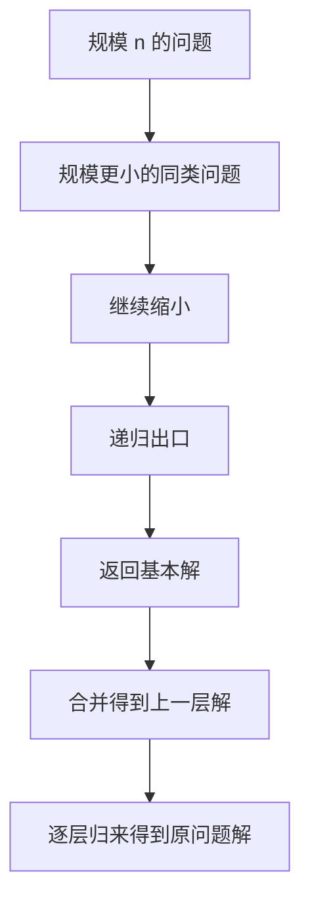
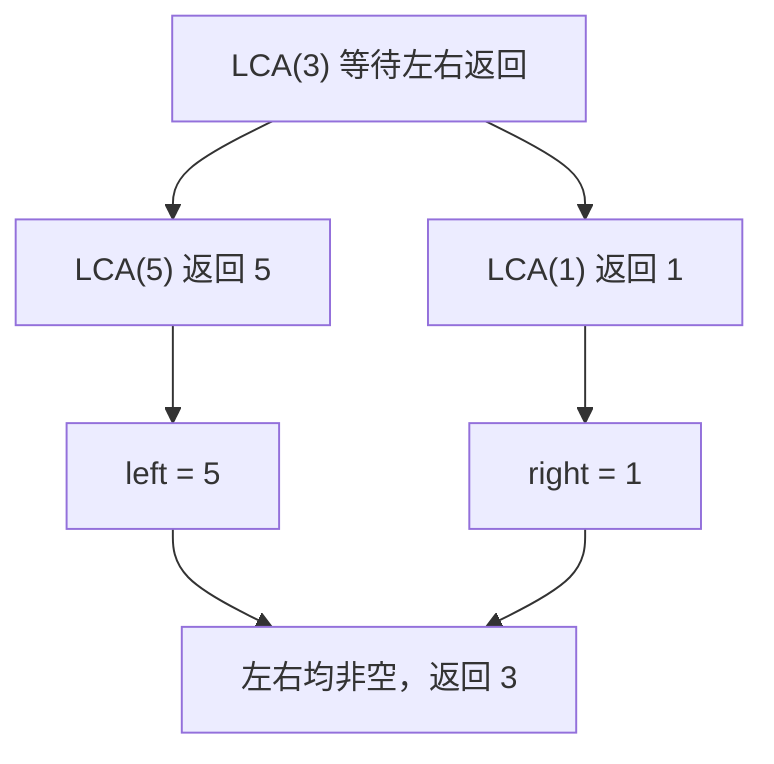

> 本笔记按原书第 16 章的小节顺序展开。原书定义、例题与主要算法依原顺序讲解；超出原书的复杂度展开、工程边界与替代方法均标注为“补充”。

## 本章要解决什么问题

有些问题天然包含与自身同形的更小问题：链表除首结点外仍是链表，二叉树的左右孩子仍是二叉树，字符串去掉两端后仍是字符串区间。递归把这种自相似结构直接写进算法：

1. 把当前问题缩小成同类子问题；
2. 直到到达可直接求解的基本情形；
3. 利用子问题答案构造当前问题答案。



递归代码短，不代表计算过程少。每次调用都形成一个栈帧；若问题重复分叉，还可能形成指数级递归树。因此本章既要理解“如何写”，也要证明规模确实缩小、出口可达、返回值如何组合，以及时间和栈空间是否可接受。

### 本章算法单元与正文题盘点

为保持代码、推导和验证一一对应，本章按以下口径计数：

- **3 个基础算法单元**：阶乘、例 16-1 反转链表、例 16-2 原地反转字符数组；
- **9 道正文题**：16.2 的 5 道递归数据结构题，以及 16.3 的 4 道归纳递归题；
- **9 道推荐练习**：原书仅列出题目，不在正文扩写解法，也不计入逐题 C++17 实现数。

因此正文共安排 $3+9=12$ 个就地 C++17 代码块；Python 3 与 Go 1.22 仅在章末附录给出 12 个单元的完整可运行对照，不再保留章末重复 C++ 总程序。

## 16.1 递归概述

### 16.1.1 递归的定义

#### 1. 什么是递归

一个算法在定义或执行过程中直接或间接调用自身，称为递归。

- **直接递归**：函数 `f` 内直接调用 `f`；
- **间接递归**：`f` 调用 `g`，`g` 又调用 `f`。

递归的本质不是函数名再次出现，而是用同一求解规则处理规模更小的同类状态。

#### 2. 原书给出的三个必要条件

1. 原问题能转化为一个或多个同类、规模更小的子问题；
2. 递归调用次数必须有限；
3. 必须存在明确的递归终止条件。

可以把它们写成一个“下降量”证明。设每个状态 $s$ 有非负整数规模

$$
\mu(s)\in\mathbb N.
$$

每次递归调用子状态 $s'$ 时满足

$$
\mu(s')<\mu(s),
$$

并在最小规模处停止。因为非负整数不可能无限严格下降，递归必然终止。

例如链表递归可取剩余结点数为规模；字符串区间可取 $j-i+1$；整数递归可取 $n$ 或二进制中 1 的个数。

#### 3. 递归的优缺点

原书总结：递归结构清晰、代码简洁、易于按归纳法证明；缺点是每次调用占用栈空间，函数调用有额外开销，深度过大可能栈溢出，也不总是容易优化。

“递归比迭代慢”不是无条件定理：复杂度主要由访问状态数决定，但递归通常有额外栈帧和调用常数。树遍历等问题即使用迭代，也要显式维护等价栈。

### 16.1.2 递归模型

#### 1. 出口与递归体

递归模型由两部分组成：

- **递归出口**：最小问题如何直接求解；
- **递归体**：当前问题如何依赖更小问题。

原书以阶乘为例，对 $n\ge1$：

$$
\boxed{
f(n)=
\begin{cases}
1,&n=1,\\
n\cdot f(n-1),&n>1.
\end{cases}
}
$$

第二式来自阶乘定义：

$$
n!=n(n-1)!.
$$

> **补充：** 若定义域允许 $n=0$，更统一的出口是 $f(0)=1$，因为 $0!=1$；此时递归体用于 $n>0$。代码必须明确是否接受负数，否则 $n<0$ 会永远远离出口。

#### 2. 模型不只是“写一个调用”

一个完整模型还要说明：

1. 输入域与规模；
2. 子问题参数为何更小；
3. 子问题返回值的准确语义；
4. 当前层如何使用返回值；
5. 出口返回值为何正确。

若返回值语义含糊，即使递归能够终止，也容易在归来阶段组合错误。

### 16.1.3 递归的执行过程

#### 1. “递去”与“归来”

调用递归函数时先不断创建更小问题，原书称为分解或“递”；到达出口后获得第一个确定答案，再逐层返回并求值，称为“归”。

计算 $5!$：

$$
f(5)\to f(4)\to f(3)\to f(2)\to f(1).
$$

到达出口后：

$$
\begin{aligned}
f(1)&=1,\\
f(2)&=2f(1)=2,\\
f(3)&=3f(2)=6,\\
f(4)&=4f(3)=24,\\
f(5)&=5f(4)=120.
\end{aligned}
$$

乘法操作写在递归调用之后，所以实际发生在归来阶段。

#### 2. 调用栈帧

每次函数调用都保存一个栈帧，通常包含：

- 参数值；
- 局部变量；
- 返回地址；
- 调用结束后应继续执行的位置。

在 `f(5)` 等待 `f(4)` 时，`n=5` 的栈帧不能销毁，因为归来后还要乘 5。最大同时存在的栈帧数就是递归深度。

#### 3. 阶乘复杂度展开

每层只做一次乘法与常数操作：

$$
T(n)=T(n-1)+O(1).
$$

连续展开：

$$
\begin{aligned}
T(n)
&=T(n-2)+2O(1)\\
&=\cdots\\
&=T(1)+(n-1)O(1)\\
&=O(n).
\end{aligned}
$$

递归深度为 $n$，辅助栈空间为 $O(n)$。迭代阶乘同样 $O(n)$ 时间，但只需 $O(1)$ 辅助空间。

#### 4. 多分支递归树

若每个状态调用多个子问题，调用关系形成递归树。例如

$$
T(n)=2T(n-1)+O(1)
$$

的结点数近似翻倍，可能达到 $O(2^n)$。代码行数少不能代表时间低；必须数清不同调用状态及其是否重复。

#### C++17：阶乘的递去与归来

```cpp
#include <cstdint>
#include <stdexcept>

std::uint64_t Factorial(unsigned int n) {
    // 递归参数 n 表示当前要求的 n!；返回值就是 n!。
    if (n <= 1) {  // Base case：0! = 1! = 1。
        return 1;
    }
    return static_cast<std::uint64_t>(n) * Factorial(n - 1);
}
```

每层把参数从 $n$ 降为 $n-1$，最大递归深度为 $n$（把 `Factorial(0)` 计作 1 层时为 $n+1$），辅助栈为 $O(n)$。代码只演示递归模型；`uint64_t` 从 $21!$ 起溢出，且 C++ 标准不保证尾调用优化或可承受的递归深度，超出小规模教学输入应改用迭代并另行检查溢出。

### 16.1.4 递归算法的设计

#### 1. 原书三步设计法

1. 确定递归出口及其直接答案；
2. 假设规模更小的问题已经正确求解；
3. 提取从小问题答案构造大问题答案的重复逻辑。

设计时只关注相邻两层，不要把整棵调用树同时展开。这个思路与数学归纳法一致：先证明基础情形，再假设 $n-1$ 成立并证明 $n$。

#### 2. 正确性证明模板

对规模 $n$ 做归纳：

- **基础情形**：证明出口对最小规模返回正确答案；
- **归纳假设**：假设所有更小递归调用都返回其定义中的正确结果；
- **归纳步骤**：证明当前层用这些结果执行递归体后，得到规模 $n$ 的正确答案；
- **终止性**：证明规模严格下降且最终到达出口。

递归算法的代码结构与证明结构通常一一对应。

#### 3. 基于递归数据结构

链表的基本缩小操作是 `head.next`；二叉树的子问题是 `root.left` 与 `root.right`。例如链表长度：

$$
len(head)=
\begin{cases}
0,&head=null,\\
1+len(head.next),&\text{其他}.
\end{cases}
$$

空结构往往就是自然出口。

#### 4. 例 16-1：反转链表

定义

$$
reverse(head)=\text{反转以 }head\text{ 开始的链表并返回新头结点}.
$$

出口：

$$
head=null\quad\text{或}\quad head.next=null
$$

时链表无需反转，直接返回 `head`。

归纳步骤：假设

$$
newHead=reverse(head.next)
$$

已经把后缀链表反转。原来的 `head.next` 此时是反转后链表的尾结点，执行：

```text
head.next.next = head
head.next = null
```

第一句把当前首结点接到尾部；第二句断开旧正向边，避免形成二结点环。返回 `newHead`。

以 `1→2→3→4→5` 为例，子问题把 `2→3→4→5` 反转为 `5→4→3→2`；再让 `2.next=1`、`1.next=null`，得到 `5→4→3→2→1`。

##### 正确性

出口对长度 0、1 正确。假设长度 $n-1$ 的后缀被正确反转，当前两次指针修改恰把首结点移到新尾部，并保持其他反向边不变，所以长度 $n$ 也正确。

每个结点处理一次，时间 $O(n)$；递归深度和栈空间 $O(n)$。

##### C++17：递归反转链表

```cpp
struct ListNode {
    int value;
    ListNode* next;
};

ListNode* ReverseList(ListNode* head) {
    // 递归参数 head 表示当前待反转后缀的首结点；返回值是反转后的新头。
    if (head == nullptr || head->next == nullptr) {  // Base case：长度为 0 或 1。
        return head;
    }

    ListNode* new_head = ReverseList(head->next);
    head->next->next = head;
    head->next = nullptr;
    return new_head;
}
```

长度为 $n$ 时最大递归深度为 $n$，辅助栈为 $O(n)$；C++ 标准不规定可安全递归的具体层数，超长链表应改用三个指针迭代反转。该模式可迁移到“先处理后缀、归来时修改当前边”的单链问题，但若当前层需要随机访问前驱，就不再适合直接套用。

#### 5. 基于归纳的递归

不依赖显式递归数据结构时，可直接按问题规模构造模型。大问题规模可以缩为 $n-1$、$n/2$ 或去掉边界后的 $n-2$，关键是子问题保持同一语义。

#### 6. 例 16-2：原地反转字符数组

定义 `reverse(s,i,j)` 反转闭区间 $s[i..j]$：

$$
reverse(s,i,j)=
\begin{cases}
\text{不做任何事},&i\ge j,\\
swap(s[i],s[j]);\ reverse(s,i+1,j-1),&i<j.
\end{cases}
$$

每次交换两端后，中间区间仍是同类问题，长度从

$$
j-i+1
$$

缩为

$$
j-i-1.
$$

处理 `hello`：

```text
hello -> oellh -> olleh
```

出口 `i>=j` 同时覆盖偶数长度交叉与奇数长度中心字符。

时间递推：

$$
T(n)=T(n-2)+O(1)=O(n),
$$

递归深度约 $\lceil n/2\rceil$，栈空间 $O(n)$。题目说原地、$O(1)$ 额外空间时通常不把输出数组计入，但严格计算递归调用栈仍为 $O(n)$；迭代双指针才能做到辅助空间 $O(1)$。

##### C++17：递归反转字符区间

```cpp
#include <string>
#include <utility>

void ReverseRange(std::string& text, std::size_t left, std::size_t right) {
    // 递归参数 [left, right] 表示当前待反转闭区间；函数原地修改 text，无返回值。
    if (left >= right) {  // Base case：空区间或只剩中心字符。
        return;
    }
    std::swap(text[left], text[right]);
    ReverseRange(text, left + 1, right - 1);
}

void ReverseString(std::string& text) {
    if (!text.empty()) {  // 避免无符号的 size() - 1 在空串下溢。
        ReverseRange(text, 0, text.size() - 1);
    }
}
```

长度为 $n$ 时最大递归深度为 $\lfloor n/2\rfloor+1$，辅助栈为 $O(n)$。若输入可能很长，双指针循环保持相同状态转移且只用 $O(1)$ 辅助空间；若每次去掉两端后仍是同语义区间，则这一“边界向内收缩”模型可以迁移。

### 16.1.5 使用递归的注意事项

#### 1. 出口必须可达

仅“写了 base case”不够，还要证明参数朝出口移动。若 `f(n)` 调用 `f(n+1)` 而出口是 `n=0`，正数输入永远无法到达。

#### 2. 栈深度有限

每次调用占用栈帧。链表长度、退化树高度或输入字符串长度若达到数十万，线性递归很容易栈溢出。此时应改用循环或显式栈。

Python 默认递归深度通常较低；C++ 与 Go 受线程栈、帧大小和运行时实现影响。不能把本地小样例成功等同于任意深度安全。

#### 3. 重复子问题会放大时间

朴素 Fibonacci：

$$
F(n)=F(n-1)+F(n-2)
$$

会重复计算同一 $F(k)$，形成指数调用树。若子问题由相同参数唯一确定，可用记忆化缓存，或改成自底向上动态规划。

#### 4. 递归与回溯不是同义词

递归是调用自身的控制结构；回溯是在搜索树中做选择、递归探索、撤销选择的算法策略。递归可以不回溯（阶乘），回溯也可用显式栈迭代实现。

#### 5. 尾递归优化不能想当然

> **补充：** 尾递归指递归调用是函数最后一步，返回后无额外计算。有些语言/编译器可把它优化成循环，但 C++ 标准不保证，Python 不做尾调用消除，Go 也不保证通用尾递归优化。工程代码不能依赖未保证的优化避免栈溢出。

#### 6. 间接递归更难审查

`f→g→f` 的下降量与出口分散在多个函数中，容易形成隐蔽无限递归。原书建议尽量改写成直接递归；至少应为整个调用环定义统一的规模下降证明。

#### 7. 递归与迭代选择

| 场景 | 递归优势 | 迭代优势 |
|---|---|---|
| 树、链表的局部结构 | 代码贴合定义 | 可避免深栈 |
| 简单线性扫描 | 通常无明显优势 | 常数小、空间 $O(1)$ |
| 分支搜索 | 易表达选择与回退 | 显式栈可精控内存 |
| 重复子问题 | 配合记忆化自然 | 自底向上避免调用开销 |

选择标准应是状态结构、最大深度、性能需求与可维护性，而不是“递归代码更短”。

## 16.2 基于递归数据结构的递归算法设计

### 16.2.1 LeetCode 2487：从链表中移除结点（★★）

#### 从右侧条件转为后缀递归

一个结点应删除，当且仅当它右侧存在严格更大值。单链表只能向右走，因此先递归处理后缀，归来时后缀已经完成筛选，正适合从右向左做决定。

定义

$$
f(head)=\text{删除所有不合法结点后返回结果链表头}.
$$

出口：`head==null` 或 `head.next==null` 时直接返回 `head`。

递归体：

$$
p=f(head.next).
$$

处理后的非空后缀 $p$ 的首结点是该后缀最大值之一。因为任何小于其右侧某值的结点都已删除，存活结点值从左到右非递增。

因此：

$$
f(head)=
\begin{cases}
p,&head.val<p.val,\\
head,&head.val\ge p.val\text{，并令 }head.next=p.
\end{cases}
$$

题目条件是右侧**严格更大**，所以相等值必须保留，比较应是 `<` 而非 `<=`。

#### 样例走查

`[5,2,13,3,8]` 从右归来：

- 8 保留；
- 3 小于后缀头 8，删除；
- 13 大于 8，保留，得到 `[13,8]`；
- 2、5 都小于后缀头 13，删除。

结果 `[13,8]`。

#### 正确性证明

长度 0、1 时显然正确。假设后缀已正确过滤，其首值是后缀最大值。若当前值更小，右侧确有更大值，应删；否则当前值不小于后缀最大值，右侧不存在严格更大值，应保留。归纳成立。

每个结点处理一次，时间 $O(n)$，递归栈 $O(n)$。

题目允许 $10^5$ 个结点，线性递归可能超过语言栈限制。

> **补充：迭代方案。** 可先反转链表，从左到右维护已见最大值并删除更小结点，再反转回来；或用单调栈处理。两者可避免深递归。

#### C++17：后缀归来时过滤当前结点

```cpp
struct ListNode {
    int value;
    ListNode* next;
};

ListNode* RemoveNodes(ListNode* head) {
    // 递归参数 head 表示当前待过滤后缀；返回值是过滤后链表的首结点。
    if (head == nullptr || head->next == nullptr) {  // Base case：空链或单结点。
        return head;
    }

    ListNode* filtered_suffix = RemoveNodes(head->next);
    if (head->value < filtered_suffix->value) {
        return filtered_suffix;
    }
    head->next = filtered_suffix;
    return head;
}
```

参数每层前进一个结点，最大递归深度为 $n$，辅助栈为 $O(n)$；题目上限 $10^5$ 时不能假设 C++ 调用栈足够。代码只重连指针，不决定被跳过结点的所有权；工程实现应由调用方的内存模型决定是否释放。凡是“后缀答案能用首部或常数摘要代表、当前元素要等右侧处理完再决策”的单链问题，都可考虑这一模式。

### 16.2.2 LeetCode 21：合并两个有序链表（★）

#### 递归模型

定义

$$
merge(a,b)=\text{合并两个非降序链表并返回新头}.
$$

出口：

$$
merge(null,b)=b,
\qquad
merge(a,null)=a.
$$

若两者都非空，合并结果首结点一定是两头部较小者：

$$
\boxed{
merge(a,b)=
\begin{cases}
a,&a.val\le b.val,\ a.next=merge(a.next,b),\\
b,&a.val>b.val,\ b.next=merge(a,b.next).
\end{cases}
}
$$

每次至少消耗一个头结点，问题规模 $m+n$ 严格减 1。

#### 为什么选择较小头结点是必要的

两个输入都已排序，除头结点外所有值分别不小于各自头。若 $a.val\le b.val$，则 $a$ 不大于两个链表中任何待合并元素，必须成为当前结果最前结点；剩余问题仍是两个有序链表 `a.next` 与 `b` 的合并。

使用 `<=` 时，相等值优先取第一个链表，得到稳定合并；使用 `<` 也能保持数值有序，但相等元素来源顺序不同。

#### 正确性与复杂度

空链表出口正确。归纳假设较短总长度能正确合并；当前层选择全局最小头，再接上归并后的有序剩余链表，结果有序且包含全部结点一次。

每层固定一个结点，时间 $O(m+n)$，最坏递归深度 $O(m+n)$。迭代双指针加虚拟头结点可将辅助空间降为 $O(1)$。

#### C++17：递归归并两个有序链表

```cpp
struct ListNode {
    int value;
    ListNode* next;
};

ListNode* MergeTwoLists(ListNode* first, ListNode* second) {
    // 参数表示两个尚未合并的有序后缀；返回值是合并后有序链表的首结点。
    if (first == nullptr) {  // Base case：第一条链已耗尽。
        return second;
    }
    if (second == nullptr) {  // Base case：第二条链已耗尽。
        return first;
    }

    if (first->value <= second->value) {
        first->next = MergeTwoLists(first->next, second);
        return first;
    }
    second->next = MergeTwoLists(first, second->next);
    return second;
}
```

每层恰好消耗一个头结点，最大递归深度不超过 $m+n+1$，辅助栈为 $O(m+n)$；长链应采用虚拟头结点与双指针迭代。若递归分支仍传入原来的 `(first, second)`，总长度不下降，即使写了空链出口也会无限递归。

### 16.2.3 LeetCode 814：二叉树剪枝（★★）

#### 为什么必须后序处理

要判断以 `root` 为根的整棵子树是否含 1，必须先知道左右子树剪枝后的结果。因此顺序是：

1. 递归剪左子树；
2. 递归剪右子树；
3. 根据当前值和两个孩子决定是否删除当前结点。

这正是后序遍历。

#### 递归模型

定义

$$
prune(root)=\text{剪去所有不含 1 子树后返回新根}.
$$

出口：

$$
prune(null)=null.
$$

递归体：

$$
root.left=prune(root.left),
$$

$$
root.right=prune(root.right).
$$

随后：

$$
\boxed{
root.val=0\land root.left=null\land root.right=null
\Longrightarrow return\ null.
}
$$

否则返回 `root`。

#### 为什么“0 叶子”判定此时足够

递归归来后，任何仍非空的孩子子树都保证含 1。若当前值为 0 且两个孩子都为空，则整棵当前子树不含 1；反之，当前值为 1 或至少一个孩子非空，子树必含 1，不能删除。

#### 正确性与复杂度

空树正确。假设左右子树都已正确剪枝，上述充要判定准确决定当前子树是否含 1，归纳成立。

每个结点访问一次，时间 $O(n)$；栈空间 $O(h)$，$h$ 为树高，最坏退化为 $O(n)$。

C++ 裸指针实现若真正拥有结点内存，删除子树根时还应明确释放策略；在线评测通常只调整指针，不要求手动释放平台创建的结点。

#### C++17：后序剪去不含 1 的子树

```cpp
struct TreeNode {
    int value;
    TreeNode* left;
    TreeNode* right;
};

TreeNode* PruneTree(TreeNode* root) {
    // 参数 root 表示当前待剪子树；返回值是剪枝后的根，nullptr 表示整棵子树删除。
    if (root == nullptr) {  // Base case：空树剪枝后仍为空。
        return nullptr;
    }

    root->left = PruneTree(root->left);
    root->right = PruneTree(root->right);
    if (root->value == 0 && root->left == nullptr && root->right == nullptr) {
        return nullptr;
    }
    return root;
}
```

最大递归深度为树高 $h$，辅助栈为 $O(h)$，退化树最坏为 $O(n)$；代码只表达在线评测的指针重连，不擅自释放外部拥有的结点。只要当前子树的保留条件依赖孩子的完整结果，就可迁移为“左右递归、归来汇总、决定当前根”的后序模型。

### 16.2.4 LeetCode 236：二叉树最近公共祖先（★★）

#### 返回值的精确语义

定义递归函数在当前子树中返回：

- 空：该子树未找到 `p/q`；
- `p` 或 `q`：只找到一个目标，或当前根本身就是目标；
- 其他结点：已经找到两个目标的最近公共祖先。

题目保证 `p,q` 都存在，最终根调用一定能得到真正 LCA。

#### 递归步骤

出口：

$$
root=null\quad\text{或}\quad root=p\quad\text{或}\quad root=q
$$

时返回 `root`。

递归查询：

$$
left=LCA(root.left,p,q),
$$

$$
right=LCA(root.right,p,q).
$$

组合：

$$
\boxed{
LCA(root)=
\begin{cases}
root,&left\ne null\land right\ne null,\\
left,&left\ne null,\\
right,&\text{其他}.
\end{cases}
}
$$

左右都非空说明两个目标分处两侧，当前根是第一次汇合点，也就是最深共同祖先。

#### 祖先包含自身

若 `root==p`，立即返回 `p`。题目定义结点可作为自己的祖先；又因 `q` 保证存在于整棵树中，若 `q` 在 `p` 子树内，则 `p` 就是 LCA，无需继续向下确认。

#### 样例与正确性

示例树中 5 位于根 3 左子树，1 位于右子树，左右递归分别返回 5、1，因此根返回 3。



按树高归纳：子调用正确汇报目标或已求得 LCA。若两侧都有报告，当前根最近；若只有一侧，两个目标的汇合结果只能位于该侧，直接上传；都空则当前子树无目标。

每个结点最多访问一次，时间 $O(n)$，栈空间 $O(h)$。

> **补充：题设依赖。** 若不保证两个目标都存在，标准函数可能只返回存在的那个结点，并不能证明它是“两者”的 LCA。通用接口应同时返回找到目标的数量，只有计数为 2 时答案有效。

#### C++17：上传目标或首次汇合点

```cpp
struct TreeNode {
    int value;
    TreeNode* left;
    TreeNode* right;
};

TreeNode* LowestCommonAncestor(
    TreeNode* root, TreeNode* first, TreeNode* second) {
    // root 是当前搜索子树；返回值是该子树发现的目标或已经确定的 LCA。
    if (root == nullptr || root == first || root == second) {
        return root;  // Base case：空树无报告；遇到任一目标就上传其身份。
    }

    TreeNode* left_answer = LowestCommonAncestor(root->left, first, second);
    TreeNode* right_answer = LowestCommonAncestor(root->right, first, second);
    if (left_answer != nullptr && right_answer != nullptr) {
        return root;
    }
    return left_answer != nullptr ? left_answer : right_answer;
}
```

最大递归深度为 $h$，辅助栈为 $O(h)$，退化树最坏为 $O(n)$；题目规模很大或树高度不受控时应改用父指针表或显式栈。该返回契约依赖 `first`、`second` 都存在；迁移到目标可能缺失的接口时，必须同时上传命中数量。

### 16.2.5 LeetCode 114：将二叉树展开为链表（★★）

#### 先序顺序决定拼接结构

先序遍历顺序为：

$$
root\to leftSubtree\to rightSubtree.
$$

递归展开左右子树后，分别得到右指针链 $A$、$B$。当前层要拼成：

$$
root\to A\to B,
$$

并把所有左指针置空。

#### 原书算法

1. 空树直接返回；
2. 递归展开左、右子树；
3. 暂存原右链头 `rightHead`；
4. 把 `root.left` 移到 `root.right`，令 `root.left=null`；
5. 沿新的右链找到左子树展开链尾，把 `rightHead` 接到尾后。

若原左子树为空，应直接保留/恢复右链，不能无条件把 `root.right` 改为空后丢失它。

#### 正确性证明

空树出口正确。假设左右子树已分别按先序展开。当前拼接顺序严格是根、左先序链、右先序链，且只改指针、不复制结点，所以得到整棵树的先序链。左指针在当前和子调用中都被清空。

#### 原书算法的复杂度边界

递归本身访问每个结点，但每层可能再次沿左子树展开链寻找尾结点。对左倾结构，链长依次接近

$$
1,2,\ldots,n,
$$

总扫描量为

$$
1+2+\cdots+n=O(n^2).
$$

栈空间为 $O(h)$。

#### 补充：递归返回尾结点

> **补充：** 定义辅助函数 `flattenTail(root)` 展开子树并返回链尾：
>
> 1. 分别得到 `leftTail`、`rightTail`；
> 2. 若有左子树，把左链移到右边，并令 `leftTail.right=原右链头`；
> 3. 返回 `rightTail`（若存在），否则返回 `leftTail`，都不存在则返回 `root`。
>
> 每个结点只做常数次指针操作，时间降为 $O(n)$，栈空间仍为 $O(h)$。三语言完整程序采用这一形式。

#### 递归状态与返回值走查

以 `1(2(3,4),5)` 为例，辅助函数的返回值不是子树根，而是展开后右链的尾结点：

| 当前状态 | 归来时已有结果 | 当前层副作用 | 返回尾结点 |
|---|---|---|---|
| 叶子 3、4、5 | 左右均空 | 不改边 | 自身 |
| 子树 2 | 左尾 3，右尾 4 | 拼成 `2→3→4` | 4 |
| 根 1 | 左链尾 4，右链尾 5 | 拼成 `1→2→3→4→5` | 5 |

#### C++17：展开子树并返回右链尾

```cpp
struct TreeNode {
    int value;
    TreeNode* left;
    TreeNode* right;
};

TreeNode* FlattenTail(TreeNode* root) {
    // 参数 root 表示当前待展开子树；副作用是原地改成先序右链，返回值是链尾。
    if (root == nullptr) {  // Base case：空树没有链尾。
        return nullptr;
    }

    TreeNode* left_head = root->left;
    TreeNode* right_head = root->right;
    TreeNode* left_tail = FlattenTail(left_head);
    TreeNode* right_tail = FlattenTail(right_head);

    if (left_head != nullptr) {
        root->right = left_head;
        root->left = nullptr;
        left_tail->right = right_head;
    }
    if (right_tail != nullptr) {
        return right_tail;
    }
    return left_tail != nullptr ? left_tail : root;
}

void FlattenTree(TreeNode* root) {
    FlattenTail(root);
}
```

最大递归深度为 $h$，辅助栈为 $O(h)$，退化树最坏为 $O(n)$。让返回值携带“链尾”把每层的重复扫描降为常数操作；凡是归来后缺少某个边界、极值或计数而被迫重扫子结构时，都应先判断能否随递归结果一并上传。

## 16.3 基于归纳的递归算法设计

### 16.3.1 LeetCode 17：电话号码的字母组合（★★）

#### 递归模型

问题描述与第 15 章相同。本节从规模 $n$ 的数字串归纳到长度 $n-1$ 的后缀。

定义

$$
f(digits)=\text{该数字串能产生的所有字母组合}.
$$

原书出口：

- $n=0$：返回空集合；
- $n=1$：返回首数字映射的所有单字符字符串。

当 $n>1$，先求

$$
subs=f(digits[1..n-1]).
$$

再对首数字的每个字母 $c$ 和每个后缀组合 $s$ 生成

$$
c+s.
$$

所以

$$
\boxed{
f(d_0d_1\cdots d_{n-1})
=letters(d_0)\times f(d_1\cdots d_{n-1}).
}
$$

这里乘号表示字符串集合的笛卡尔积与拼接。

#### 样例与正确性

`digits="23"`：小问题 `f("3")=[d,e,f]`，首字符集合 `[a,b,c]` 分别与它拼接，得到 9 个组合。

出口显然正确。归纳假设后 $n-1$ 位组合无重无漏；每个完整组合由唯一首字母和唯一后缀组合构成，双重拼接因此无重无漏。

若组合数为

$$
K=\prod_i|letters(d_i)|,
$$

输出 $K$ 个长度 $n$ 字符串，时间与结果空间为 $O(nK)$，递归栈 $O(n)$。

> **补充：统一出口。** 数学上可令 `f("")=[""]`，使递归体对所有长度统一；公开 API 再把空输入转换成 `[]`。原书使用 $n=0$ 与 $n=1$ 两个出口，更直接符合题目输出。

#### C++17：首位字母与后缀答案做笛卡尔积

```cpp
#include <array>
#include <string>
#include <vector>

std::vector<std::string> BuildCombinations(
    const std::string& digits, std::size_t index) {
    // index 表示当前待处理首位；返回值是 digits[index..] 的全部字母组合。
    if (index == digits.size()) {  // Base case：空后缀只有一个拼接单位元。
        return {""};
    }

    static const std::array<std::string, 10> mapping = {
        "", "", "abc", "def", "ghi", "jkl", "mno", "pqrs", "tuv", "wxyz"};
    std::vector<std::string> suffixes = BuildCombinations(digits, index + 1);
    std::vector<std::string> answer;
    for (char character : mapping[digits[index] - '0']) {
        for (const std::string& suffix : suffixes) {
            answer.push_back(character + suffix);
        }
    }
    return answer;
}

std::vector<std::string> LetterCombinationsRecursive(const std::string& digits) {
    if (digits.empty()) {  // 公开接口按题意把空输入映射为空结果。
        return {};
    }
    return BuildCombinations(digits, 0);
}
```

长度为 $n$ 时最大递归深度为 $n+1$，辅助栈为 $O(n)$；结果本身有 $K$ 个长度为 $n$ 的字符串，输出成本远早于调用栈成为瓶颈。凡是完整答案能唯一拆成“当前位选择 + 同语义后缀答案”，都可迁移为笛卡尔积递归；若不同路径到达同一状态，则还要考虑记忆化。

### 16.3.2 LeetCode 191：位 1 的个数（★）

#### 末位分解

对无符号整数 $n$：

- 最低位由
    $$
    n\mathbin{\&}1
    $$
    得到；
- 右移一位（或无符号除以 2）得到去掉最低位的小问题。

递归模型：

$$
\boxed{
popcount(n)=
\begin{cases}
0,&n=0,\\
(n\mathbin{\&}1)+popcount(n\gg1),&n>0.
\end{cases}
}
$$

原书分成末位为 1 与 0 两种情况，上式把它们统一成一次加法。

#### 数值走查

$$
11=1011_2.
$$

递归依次处理：

```text
1011 -> 101 -> 10 -> 1 -> 0
末位:   1      1     0    1
```

总数为 3。

#### 正确性与复杂度

一个二进制数的 1 数量等于最低位是否为 1，加上其余高位的 1 数量。出口 0 没有任何 1，归纳成立。

固定 32 位输入最多递归 32 层，按题目位宽可视为 $O(1)$ 时间和栈；按数值位数一般写为 $O(\log n)$。

必须使用无符号数或逻辑右移。负有符号数的算术右移可能不断补 1，无法到达 0。

> **补充：清除最低位 1。** 恒等式
> $$
> n\mathbin{\&}(n-1)
> $$
> 会清除最低位的一个 1。可写
> $$
> popcount(n)=1+popcount(n\mathbin{\&}(n-1)),
> $$
> 递归深度恰为 1 的个数。

#### C++17：最低位贡献加右移子问题

```cpp
#include <cstdint>

int HammingWeight(std::uint32_t value) {
    // value 表示尚未统计的二进制位；返回值是这些位中 1 的数量。
    if (value == 0) {  // Base case：没有剩余有效位。
        return 0;
    }
    return static_cast<int>(value & 1U) + HammingWeight(value >> 1U);
}
```

对 32 位输入最大递归深度为 33，时间和辅助栈按固定字长记为 $O(1)$，按一般位数 $b$ 记为 $O(b)$。无符号右移保证高位补 0；若迁移到有符号负数，必须先固定宽度并转为无符号表示，否则下降量不成立。

### 16.3.3 LeetCode 231：2 的幂（★）

#### 递归模型

正整数是 2 的幂，当且仅当不断除以 2 时每一步都是偶数，最终恰到 1：

$$
\boxed{
isPowerOfTwo(n)=
\begin{cases}
true,&n=1,\\
false,&n\le0\text{ 或 }n\bmod2\ne0,\\
isPowerOfTwo(n/2),&\text{其他}.
\end{cases}
}
$$

原书也把 $n=2$ 单列为真；它可由第三行递归到 1，因此不是必需出口。

#### 为什么奇数只能是 1

任何 $2^x$ 在 $x\ge1$ 时都含因子 2，所以是偶数。唯一奇数幂是

$$
2^0=1.
$$

因此遇到大于 1 的奇数可立即判假。

#### 样例与复杂度

$$
8\to4\to2\to1
$$

返回真；

$$
12\to6\to3
$$

在奇数 3 返回假；5 直接为假。每次规模减半，时间与栈空间均为 $O(\log|n|)$。

> **补充：位运算判定。** 正的 2 的幂二进制只有一个 1，因此
> $$
> n>0\land(n\mathbin{\&}(n-1))=0
> $$
> 可在常数时间判定。

#### C++17：正偶数递归除以 2

```cpp
bool IsPowerOfTwo(int value) {
    // value 是当前待判定整数；返回值表示它是否恰为某个 2 的非负整数次幂。
    if (value == 1) {  // Base case：1 = 2^0。
        return true;
    }
    if (value <= 0 || value % 2 != 0) {  // Base case：非正数或大于 1 的奇数。
        return false;
    }
    return IsPowerOfTwo(value / 2);
}
```

正数每层至少减半，最大递归深度为 $\lfloor\log_2 value\rfloor+1$，辅助栈为 $O(\log value)$；位运算判定更适合只需一次布尔查询的工程代码。

终止条件反例：若只写 `value == 1` 一个出口，却允许 `value == 0` 进入 `IsPowerOfTwo(value / 2)`，调用会永远保持在 0。出口存在不等于所有合法输入都能到达出口，定义域检查也是终止性证明的一部分。

### 16.3.4 LeetCode 394：字符串解码（★★）

#### 嵌套括号天然形成递归结构

编码片段由两类单元串联组成：

1. 原始小写字母；
2. `k[encoded]`，其中内部 `encoded` 又遵循同一规则。

可写成简化语法：

$$
Encoded\to(Letter\mid Number[Encoded])^*.
$$

每遇到左括号，问题缩小为解码括号内部；遇到配对右括号，当前层完成并返回。

#### 共享下标的函数契约

定义 `decode(i,insideBrackets)`：从位置 $i$ 开始解码。顶层只有到字符串末尾才正常结束；嵌套层只有遇到自己的 `]` 才正常返回。函数返回当前层结果及下一待解析位置，因而能区分“嵌套层缺少 `]`”与“顶层出现多余 `]`”。

一种清晰写法是返回二元组：

$$
(decoded,nextIndex),
$$

其中 `nextIndex` 指向当前层右括号后的第一个字符。顶层调用从 0 开始，最终应得到字符串末尾下标；若嵌套层先到末尾或顶层先遇到 `]`，解析立即失败。

#### 解析步骤

在当前层循环：

1. 若是字母，追加到结果并前进；
2. 若是数字，连续读取所有数字得到多位整数 $k$；
3. 跳过 `[`；
4. 递归解码内部，得到 `inner` 和右括号后下标；
5. 把 `inner` 重复 $k$ 次追加到当前结果；
6. 若嵌套层当前字符为 `]`，越过它并返回；顶层遇到 `]` 则拒绝输入；
7. 若嵌套层到达字符串末尾仍未遇到 `]`，拒绝输入。

读取数字必须使用循环；把 `12[a]` 当作 1 次或 2 次都会错误。

#### 嵌套样例

`3[a2[c]]`：

1. 顶层读到 3，递归解码 `a2[c]`；
2. 内层先得到 `a`；
3. 读到 2，进一步递归得到 `c`，重复为 `cc`；
4. 内层结果为 `acc`；
5. 顶层重复 3 次，得到 `accaccacc`。

`3[2[ab]]`：最内层 `ab` 重复 2 次为 `abab`，再重复 3 次，结果 `abababababab`。

边界反例也由层级契约直接判定：`3[a` 的内层到达输入末尾却没有闭合，必须拒绝；`]` 在顶层没有可匹配的左括号，也必须拒绝。三语言实现都执行这两项检查，而合法样例输出不变。

#### 正确性证明

对括号嵌套深度归纳。深度 0 只有字母，逐字符复制正确。假设更浅内部串能正确解码；当前层对每个 `k[inner]` 使用正确的内部结果并按定义重复 $k$ 次，对普通字母原样追加，且按输入顺序连接所有单元，所以当前层正确。

#### 复杂度与边界

设输入长度为 $N$，解码后输出长度为 $L$，最大嵌套深度为 $D$。令 $M_d$ 表示深度 $d$ 的所有递归调用在该层物化的解码片段总长度。解析输入本身为 $O(N)$，但当前三种递归实现都会先物化 `inner`，再把它重复复制进父层结果；父层返回后，这段内容还会继续复制进祖先层。因此时间是

$$
O\left(N+\sum_{d=0}^{D}M_d\right).
$$

在题目保证重复次数为正的合法输入中，每一深度物化的字符总量至多与最终输出同阶，所以最坏上界为 $O(N+DL)$。例如多层 `1[...]` 包住同一个长片段时，输出长度不增长，但每次归来仍重新构造近 $L$ 个字符。只有把解码内容直接流式写入最终缓冲区，或使用避免祖先层重复物化的表示，才能把这一项压到 $O(L)$。

输出本身占 $O(L)$，递归栈占 $O(D)$；当前递归物化方式的临时片段峰值最坏也可达 $O(DL)$。列表或字符串构建器避免了同一层反复拼接越来越长的不可变字符串所导致的平方复制，但不会消除上述跨递归层复制。

#### C++17：递归下降解码并共享游标

```cpp
#include <cctype>
#include <stdexcept>
#include <string>

std::string DecodeFrom(
    const std::string& encoded, std::size_t& index, bool inside_brackets) {
    // 嵌套层必须由 ']' 结束；顶层必须由输入末尾结束。
    std::string answer;
    while (index < encoded.size()) {
        if (encoded[index] == ']') {
            if (!inside_brackets) {
                throw std::invalid_argument("unexpected top-level ']'");
            }
            ++index;
            return answer;
        }
        if (std::isalpha(static_cast<unsigned char>(encoded[index]))) {
            answer.push_back(encoded[index++]);
            continue;
        }

        if (!std::isdigit(static_cast<unsigned char>(encoded[index]))) {
            throw std::invalid_argument("expected a letter or repeat count");
        }

        int repeat = 0;
        while (index < encoded.size() &&
               std::isdigit(static_cast<unsigned char>(encoded[index]))) {
            repeat = repeat * 10 + (encoded[index] - '0');
            ++index;
        }
        if (index >= encoded.size() || encoded[index] != '[') {
            throw std::invalid_argument("repeat count must be followed by '['");
        }
        ++index;
        std::string inner = DecodeFrom(encoded, index, true);
        for (int count = 0; count < repeat; ++count) {
            answer += inner;
        }
    }

    if (inside_brackets) {
        throw std::invalid_argument("missing closing ']'");
    }
    return answer;
}

std::string DecodeString(const std::string& encoded) {
    std::size_t index = 0;
    return DecodeFrom(encoded, index, false);
}
```

最大递归深度为括号嵌套深度 $D$ 加顶层一层，辅助栈为 $O(D)$；严格层级状态保证每个右括号只关闭直接调用者。面对不可信输入时还应限制 $D$、重复次数和总输出长度。只要输入语法包含同构嵌套单元，并能用分隔符确定当前层结束位置，就可迁移为递归下降解析；若语法存在优先级或歧义，还需为不同非终结符拆分函数。

## 推荐练习题

原书在本章末尾列出以下 9 道练习，未在正文中展开解法：

1. LeetCode 24：两两交换链表中的结点（★）
2. LeetCode 54：螺旋矩阵（★★）
3. LeetCode 203：移除链表元素（★）
4. LeetCode 234：回文链表（★）
5. LeetCode 326：3 的幂（★）
6. LeetCode 367：有效的完全平方数（★）
7. LeetCode 439：三元表达式解析器（★★）
8. LeetCode 655：输出二叉树（★★）
9. LeetCode 1290：二进制链表转整数（★）

## 代码与推导的对应关系

下表按正文顺序把递归模型映射到三语言接口。C++17 紧跟相应推导，Python 与 Go 只在章末附录出现。

| 单元或题目 | 子问题与归来操作 | C++17 正文 | Python 附录 A | Go 附录 B |
|---|---|---|---|---|
| 阶乘 | $n-1$ 的阶乘乘以当前 $n$ | `Factorial` | `factorial_recursive` | `factorialRecursive` |
| 例 16-1 反转链表 | 先反转后缀，再把当前头接到链尾 | `ReverseList` | `reverse_list` | `reverseList` |
| 例 16-2 反转字符数组 | 交换两端，再递归处理中间区间 | `ReverseString` | `reverse_string` | `reverseString` |
| 16.2.1 移除链表结点 | 先过滤 `head.next`，再比较后缀最大值 | `RemoveNodes` | `remove_nodes` | `removeNodes` |
| 16.2.2 合并链表 | 选较小头，递归合并剩余部分 | `MergeTwoLists` | `merge_two_lists` | `mergeTwoLists` |
| 16.2.3 二叉树剪枝 | 后序处理孩子，0 空叶返回空 | `PruneTree` | `prune_tree` | `pruneTree` |
| 16.2.4 最近公共祖先 | 左右都有信息则当前根汇合 | `LowestCommonAncestor` | `lowest_common_ancestor` | `lowestCommonAncestor` |
| 16.2.5 展开二叉树 | 展开左右子树并返回链尾 | `FlattenTree` | `flatten_tree` | `flattenTree` |
| 16.3.1 电话组合 | 首字符集合 × 后缀组合 | `LetterCombinationsRecursive` | `letter_combinations_recursive` | `letterCombinationsRecursive` |
| 16.3.2 位 1 个数 | 最低位 + 右移子问题 | `HammingWeight` | `hamming_weight` | `hammingWeight` |
| 16.3.3 2 的幂 | 正偶数递归除以 2 | `IsPowerOfTwo` | `is_power_of_two` | `isPowerOfTwo` |
| 16.3.4 字符串解码 | 当前层解析到匹配右括号 | `DecodeString` | `decode_string` | `decodeString` |

### 十二个单元的出口、下降量与返回语义

| 单元或题目 | 递归出口 | 严格下降量 | 返回值或副作用语义 |
|---|---|---|---|
| 阶乘 | $n\le1$ | 非负整数 $n$ | 返回 $n!$ |
| 反转链表 | 空链/单结点 | 剩余链表长度 | 返回反转后的新头 |
| 反转字符数组 | `left>=right` | 闭区间长度 | 原地反转当前区间 |
| 移除结点 | 空链/单结点 | 剩余链表长度 | 返回已过滤链表头 |
| 合并链表 | 任一链为空 | 两链总长度 | 返回合并有序链头 |
| 二叉树剪枝 | 空树 | 子树结点数或高度 | 返回剪枝后子树根或空 |
| LCA | 空树或当前是目标 | 子树高度 | 返回目标信息或已求得 LCA |
| 展开二叉树 | 空树 | 子树高度 | 原地展开；辅助函数返回链尾 |
| 电话组合 | 后缀为空 | 数字串未处理长度 | 返回全部后缀组合 |
| 汉明重量 | 数值为 0 | 有效二进制位数 | 返回 1 的数量 |
| 2 的幂 | 1、非正或奇数 | 正整数大小 | 返回是否为 2 的幂 |
| 字符串解码 | 当前层遇到 `]` 或结尾 | 未解析长度或嵌套层 | 返回解码片段并推进游标 |

为递归函数写清这三列，通常就已经完成大部分设计与正确性证明。

## 三种语言中的实现差异

算法不变量相同，差异主要来自递归深度、内存管理、整数位运算和字符串构建。

### 递归深度与运行时栈

- Python 默认递归深度通常约为千级，长度 $10^5$ 的链表递归会直接失败；
- C++ 递归深度受线程栈和栈帧大小影响，标准不承诺安全上限；
- Go 的 goroutine 栈可动态增长，但仍不是无限的，极深递归也会耗尽资源。

因此题解在小规模下可运行，不代表题目最大规模下递归版本一定工程安全。2487 和 236 的 $10^5$ 规模尤其应考虑迭代实现。

### 结点内存管理

- Python 与 Go 由垃圾回收器管理被断开的结点；
- C++ 正文使用裸指针以贴近在线评测结构，只重连指针，不假设输入结点所有权；
- 若应用代码拥有结点，应使用明确的所有权模型统一释放，不能在可共享结点的算法函数中盲目 `delete`。

### 指针身份与结点值

LCA 判断的是

$$
root=p\quad\text{或}\quad root=q
$$

的结点身份，不只是数值相等。Python 用 `is`，C++/Go 比较指针。即使题目保证值唯一，按身份表达更符合接口语义；值不唯一时尤为必要。

### 无符号位运算

C++ 使用 `uint32_t`，Go 使用 `uint32`，确保右移补 0。Python 整数无固定宽度，完整程序约定传入非负值。若要模拟 32 位输入，可先执行

$$
value\mathrel{\&}=0xffffffff.
$$

### 字符串拼接

- Python 解码器积累片段列表，最后 `join`；
- Go 使用 `strings.Builder` 和 `strings.Repeat`；
- C++ 使用可变 `std::string` 追加。

输出长度 $L$ 可能远大于编码长度，任何实现都至少要写出 $L$ 个字符。避免在循环中反复构造越来越长的不可变字符串，可减少同层的额外二次复制；当前递归接口仍会在子层、父层和祖先层分别物化片段，这部分成本由 $\sum M_d$ 计量。

### 解析下标的传递

- Python/Go 让递归返回 `(decoded,nextIndex)`，契约显式；
- C++ 用 `size_t& index` 引用共享游标，并返回解码字符串。

两种方式都正确，但必须约定返回时下标是在 `]` 上还是已经越过 `]`。完整程序统一为“已经越过本层右括号”，并额外携带当前是否为嵌套层：嵌套层不得在 EOF 返回，顶层不得用 `]` 返回。

## 补充：易混淆概念与常见误解

### 1. 有出口不等于一定终止

还要证明每次调用都朝出口缩小。例如出口 `n==0`，但递归调用 `f(n+1)`，正数输入永远不会到达出口。

### 2. 出口要覆盖所有最小结构

反转链表必须处理空链和单结点；字符区间要处理 `i==j` 与 `i>j`；树递归通常以空指针为出口。少一个边界可能导致空指针访问或多递归一层。

### 3. 递归调用前后的代码执行时机不同

调用前的操作发生在“递去”阶段，调用后的操作发生在“归来”阶段。树的先序、后序差别和链表从左/从右处理都来自这个位置差异。

### 4. 返回值必须有一句精确定义

LCA 子调用返回的不是简单布尔值，而是“目标结点或已确定的 LCA”；展开辅助函数返回链尾；解码函数还返回消费位置。若只凭直觉写返回值，组合分支很容易错误。

### 5. 链表反转必须断开旧边

执行 `head.next.next=head` 后，旧的 `head.next` 仍指向后继；若不令 `head.next=null`，会形成环，遍历永不结束。

### 6. 2487 的相等值不能删除

条件是右侧存在**严格更大**值。后缀最大值与当前值相等时，当前结点没有因这个相等值而失效，应保留。

### 7. 合并链表每层必须消耗一个结点

若递归仍传入原来的 `(a,b)`，规模没有下降，会无限递归。正确分支分别递归 `(a.next,b)` 或 `(a,b.next)`。

### 8. 二叉树剪枝必须在孩子之后判断当前结点

一个值为 0 的内部结点可能含值为 1 的后代，不能看到 0 就立即删除。后序归来后，孩子为空才代表对应子树确实不含 1。

### 9. LCA 标准写法依赖目标存在

若只找到一个目标，函数也会把它向上传到根。题目保证两者存在时这没有问题；通用场景必须额外统计找到几个目标。

### 10. 展开二叉树时要保存原右子树

把左链移到右边会覆盖 `root.right`。必须先保存原右链头，待左链尾找到后再接回，否则整棵原右子树丢失。

### 11. 反复寻找展开链尾会造成平方时间

“每个结点递归一次”不代表总时间一定 $O(n)$。若每层又扫描一条长度随深度增长的链，累计可能是 $1+2+\cdots+n$。让递归返回尾结点可消除重复扫描。

### 12. 电话组合空串的数学单位元与 API 结果不同

笛卡尔积递归可令空后缀组合为 `['']`，便于统一公式；但题目公开 API 对空输入要求 `[]`。可以使用两个出口，或在顶层转换。

### 13. 汉明重量的负数右移有风险

有符号负数算术右移通常补 1，可能永远不变成 0。题目是 32 位无符号整数，应使用无符号类型或掩码限制位宽。

### 14. 1 是 $2^0$，不是特殊例外的“非幂”

2 的幂定义允许指数 0，所以 `isPowerOfTwo(1)` 必须为真。0 和负数则不属于题目定义。

### 15. 解码重复次数可能有多位

`12[a]` 的次数是 12，不是字符 `'1'` 或最后一位 2。必须循环累积：

$$
repeat\leftarrow10\cdot repeat+digit.
$$

### 16. 每个 `]` 只结束当前递归层

内层遇到右括号应返回给直接调用者，不能结束整个顶层解析。共享下标必须越过恰好这个匹配括号。

### 17. 时间复杂度要计输出大小

`300[a]` 输入很短，输出已有 300 个字符；多层重复可进一步放大。字符串解码不能只按输入长度写 $O(N)$。对本章返回完整子串的递归实现，`inner` 在本层物化后还会被父层与祖先层重复复制，准确写法是 $O(N+\sum_{d=0}^{D}M_d)$，最坏为 $O(N+DL)$；$O(N+L)$ 只适用于避免跨层重复物化的实现。

### 18. 递归与动态规划的分界在于重复状态

若每个子问题只出现一次，普通递归足够；若相同参数状态被多条路径反复调用，应记忆化或改为动态规划，否则调用树可能指数膨胀。

## 本章总结

### 一个完整递归模型的五个要素

1. **状态定义**：函数参数和返回值分别表示什么；
2. **规模函数**：如何衡量问题变小；
3. **递归出口**：最小状态与直接答案；
4. **递归体**：调用哪些更小的同类状态；
5. **归来合并**：如何由子问题答案构造当前答案。

终止性要求规模严格下降，正确性通常按规模归纳证明，复杂度则由调用树结点数、每结点工作量和最大深度共同决定。

### 本章递归模式

| 模式 | 代表题 | 归来阶段做什么 |
|---|---|---|
| 单链后缀 | 反转链表、移除结点、合并链表 | 重连当前头及其 `next` |
| 二叉树后序 | 剪枝、LCA、展开 | 合并左右子树信息 |
| 规模减一 | 阶乘、电话组合 | 乘当前数或组合首位选择 |
| 边界内缩 | 反转字符数组 | 交换两端后处理内部区间 |
| 规模减半 | 汉明重量、2 的幂 | 加最低位或上传布尔值 |
| 递归下降解析 | 字符串解码 | 重复并拼接内部片段 |

### 可迁移判断

遇到新问题时，先问“删去一个头、进入一棵子树、缩短一个区间或进入一层括号后，剩余状态是否仍保持同一函数契约”。若答案为是，再检查：

1. 是否有覆盖所有最小状态且必然可达的出口；
2. 子调用返回的信息是否足以让当前层做常数或输出规模内的合并；
3. 最大深度是否适合运行时栈；
4. 相同参数状态是否会被多条分支重复访问。

第 1 项失败时递归不终止，第 2 项失败时应扩充返回值，第 3 项失败时改用循环或显式栈，第 4 项失败时考虑记忆化或动态规划。只有“自相似”而没有这四项保证，不足以判定递归实现可用。

### 复杂度总览

| 算法 | 时间 | 递归栈 |
|---|---:|---:|
| 阶乘/反转字符数组 | $O(n)$ | $O(n)$ |
| 链表反转/过滤/归并 | $O(n)$ / $O(n)$ / $O(m+n)$ | $O(n)$ / $O(n)$ / $O(m+n)$ |
| 树剪枝/LCA/优化展开 | $O(n)$ | $O(h)$ |
| 电话字母组合 | $O(nK)$ | $O(n)$，另有输出 |
| 汉明重量/2 的幂 | $O(\log n)$ | $O(\log n)$ |
| 字符串解码 | $O(N+\sum_{d=0}^{D}M_d)$，最坏 $O(N+DL)$ | $O(D)$ 栈，另有输出与物化片段 |

其中 $h$ 为树高，$K$ 为组合数，$N$ 为编码输入长度，$L$ 为解码输出长度，$D$ 为最大嵌套深度，$M_d$ 为深度 $d$ 物化的片段总长度。

### 递归设计检查清单

1. 子问题是否与原问题保持完全相同的返回语义？
2. 每次调用的规模是否严格下降？
3. 空结构、单元素、交叉边界是否都被出口覆盖？
4. 操作应放在递归调用前还是后？
5. 是否存在重复子问题，需要记忆化？
6. 最大递归深度是否超过语言栈能力？
7. 能否让返回值携带额外信息，避免归来后重复扫描？
8. 复杂度是否计入全部递归分支和输出大小？

递归最重要的能力不是“函数调用自己”，而是给子问题一个可信契约：先假设更小状态已经按契约正确求解，再用有限、清晰的局部操作完成当前层。出口、下降量、返回语义和归来合并一旦明确，代码、证明与复杂度分析就能沿同一结构自然展开。

## 附录 A：Python 3 完整参考实现

以下程序按 3 个基础算法单元、9 道正文题的顺序给出可执行对照。

```python
from __future__ import annotations

from collections import deque


def factorial_recursive(value: int) -> int:
    """基础单元：返回非负整数 value 的阶乘。"""
    if value < 0:
        raise ValueError("factorial is undefined for negative values")
    if value <= 1:
        return 1
    return value * factorial_recursive(value - 1)


class ListNode:
    def __init__(self, value: int, next_node: ListNode | None = None):
        self.value = value
        self.next = next_node


def list_from_values(values: list[int]) -> ListNode | None:
    dummy = ListNode(0)
    tail = dummy
    for value in values:
        tail.next = ListNode(value)
        tail = tail.next
    return dummy.next


def list_to_values(head: ListNode | None) -> list[int]:
    answer: list[int] = []
    while head is not None:
        answer.append(head.value)
        head = head.next
    return answer


def reverse_list(head: ListNode | None) -> ListNode | None:
    """例 16-1：反转当前链表并返回新头结点。"""
    if head is None or head.next is None:
        return head
    new_head = reverse_list(head.next)
    head.next.next = head
    head.next = None
    return new_head


def reverse_string(text: str) -> str:
    """例 16-2：递归交换字符数组两端，并返回反转结果。"""
    characters = list(text)

    def reverse_range(left: int, right: int) -> None:
        if left >= right:
            return
        characters[left], characters[right] = characters[right], characters[left]
        reverse_range(left + 1, right - 1)

    reverse_range(0, len(characters) - 1)
    return "".join(characters)


def remove_nodes(head: ListNode | None) -> ListNode | None:
    """16.2.1：后缀过滤后，其首结点是后缀最大值。"""
    if head is None or head.next is None:
        return head
    filtered_suffix = remove_nodes(head.next)
    if head.value < filtered_suffix.value:
        return filtered_suffix
    head.next = filtered_suffix
    return head


def merge_two_lists(
    first: ListNode | None, second: ListNode | None
) -> ListNode | None:
    """16.2.2：选择较小头结点，再递归合并剩余链表。"""
    if first is None:
        return second
    if second is None:
        return first
    if first.value <= second.value:
        first.next = merge_two_lists(first.next, second)
        return first
    second.next = merge_two_lists(first, second.next)
    return second


class TreeNode:
    def __init__(
        self,
        value: int,
        left: TreeNode | None = None,
        right: TreeNode | None = None,
    ):
        self.value = value
        self.left = left
        self.right = right


def prune_tree(root: TreeNode | None) -> TreeNode | None:
    """16.2.3：后序剪枝，0 且无存活孩子时删除当前子树。"""
    if root is None:
        return None
    root.left = prune_tree(root.left)
    root.right = prune_tree(root.right)
    if root.value == 0 and root.left is None and root.right is None:
        return None
    return root


def lowest_common_ancestor(
    root: TreeNode | None, first: TreeNode, second: TreeNode
) -> TreeNode | None:
    """16.2.4：左右子树都返回目标信息时，当前根是首次汇合点。"""
    if root is None or root is first or root is second:
        return root
    left_answer = lowest_common_ancestor(root.left, first, second)
    right_answer = lowest_common_ancestor(root.right, first, second)
    if left_answer is not None and right_answer is not None:
        return root
    return left_answer if left_answer is not None else right_answer


def flatten_tree(root: TreeNode | None) -> None:
    """16.2.5：展开子树并返回链尾，避免反复扫描左链。"""

    def flatten_tail(node: TreeNode | None) -> TreeNode | None:
        if node is None:
            return None
        left_head = node.left
        right_head = node.right
        left_tail = flatten_tail(left_head)
        right_tail = flatten_tail(right_head)

        if left_head is not None:
            node.right = left_head
            node.left = None
            left_tail.right = right_head

        if right_tail is not None:
            return right_tail
        if left_tail is not None:
            return left_tail
        return node

    flatten_tail(root)


def level_order_values(root: TreeNode | None) -> list[int | None]:
    """包含内部空位的层序结果，便于验证剪枝后的结构。"""
    if root is None:
        return []
    answer: list[int | None] = []
    queue: deque[TreeNode | None] = deque([root])
    while queue:
        node = queue.popleft()
        if node is None:
            answer.append(None)
            continue
        answer.append(node.value)
        queue.append(node.left)
        queue.append(node.right)
    while answer and answer[-1] is None:
        answer.pop()
    return answer


def flattened_values(root: TreeNode | None) -> list[int]:
    answer: list[int] = []
    while root is not None:
        if root.left is not None:
            raise AssertionError("展开后左指针必须为空")
        answer.append(root.value)
        root = root.right
    return answer


def letter_combinations_recursive(digits: str) -> list[str]:
    """16.3.1：首位字符集合与后缀递归结果做笛卡尔积。"""
    mapping = {
        "2": "abc",
        "3": "def",
        "4": "ghi",
        "5": "jkl",
        "6": "mno",
        "7": "pqrs",
        "8": "tuv",
        "9": "wxyz",
    }
    if not digits:
        return []
    if len(digits) == 1:
        return list(mapping[digits[0]])
    suffixes = letter_combinations_recursive(digits[1:])
    return [
        character + suffix
        for character in mapping[digits[0]]
        for suffix in suffixes
    ]


def hamming_weight(value: int) -> int:
    """16.3.2：最低位贡献加上右移后的子问题。"""
    if value == 0:
        return 0
    return (value & 1) + hamming_weight(value >> 1)


def is_power_of_two(value: int) -> bool:
    """16.3.3：正偶数不断除以 2，最终必须恰到 1。"""
    if value == 1:
        return True
    if value <= 0 or value % 2 != 0:
        return False
    return is_power_of_two(value // 2)


def decode_string(encoded: str) -> str:
    """16.3.4：严格区分顶层 EOF 与嵌套层右括号。"""

    def decode_from(index: int, inside_brackets: bool) -> tuple[str, int]:
        parts: list[str] = []
        while index < len(encoded):
            if encoded[index] == "]":
                if not inside_brackets:
                    raise ValueError("顶层出现多余的 ]")
                return "".join(parts), index + 1
            if encoded[index].isalpha():
                parts.append(encoded[index])
                index += 1
                continue

            if not encoded[index].isdigit():
                raise ValueError("当前位置应为字母或重复次数")
            repeat = 0
            while index < len(encoded) and encoded[index].isdigit():
                repeat = repeat * 10 + int(encoded[index])
                index += 1
            if index >= len(encoded) or encoded[index] != "[":
                raise ValueError("重复次数后必须紧跟 [")
            # 当前 index 指向 '['，子调用返回匹配 ']' 之后的位置。
            inner, index = decode_from(index + 1, True)
            parts.append(inner * repeat)

        if inside_brackets:
            raise ValueError("缺少匹配的 ]")
        return "".join(parts), index

    answer, final_index = decode_from(0, False)
    assert final_index == len(encoded)
    return answer


if __name__ == "__main__":
    print(factorial_recursive(5))
    print(list_to_values(reverse_list(list_from_values([1, 2, 3, 4, 5]))))
    print(reverse_string("hello"))

    filtered = remove_nodes(list_from_values([5, 2, 13, 3, 8]))
    print(list_to_values(filtered))

    merged = merge_two_lists(
        list_from_values([1, 2, 4]),
        list_from_values([1, 3, 4]),
    )
    print(list_to_values(merged))

    prune_example = TreeNode(
        1,
        TreeNode(1, TreeNode(1, TreeNode(0)), TreeNode(1)),
        TreeNode(0, TreeNode(0), TreeNode(1)),
    )
    print(level_order_values(prune_tree(prune_example)))

    node_five = TreeNode(5)
    node_one = TreeNode(1)
    lca_root = TreeNode(3, node_five, node_one)
    ancestor = lowest_common_ancestor(lca_root, node_five, node_one)
    print(ancestor.value)

    flatten_example = TreeNode(
        1,
        TreeNode(2, TreeNode(3), TreeNode(4)),
        TreeNode(5, None, TreeNode(6)),
    )
    flatten_tree(flatten_example)
    print(flattened_values(flatten_example))

    print(letter_combinations_recursive("23"))
    print(hamming_weight(0b1011))
    print([is_power_of_two(value) for value in [1, 2, 5, 8]])
    for invalid_encoded in ("3[a", "]"):
        try:
            decode_string(invalid_encoded)
        except ValueError:
            pass
        else:
            raise AssertionError(f"非法编码未被拒绝：{invalid_encoded}")
    print(
        [
            decode_string("3[a]2[bc]"),
            decode_string("3[a2[c]]"),
            decode_string("3[2[ab]]"),
        ]
    )
```

示例输出：

```text
120
[5, 4, 3, 2, 1]
olleh
[13, 8]
[1, 1, 2, 3, 4, 4]
[1, 1, 0, 1, 1, None, 1]
3
[1, 2, 3, 4, 5, 6]
['ad', 'ae', 'af', 'bd', 'be', 'bf', 'cd', 'ce', 'cf']
3
[True, True, False, True]
['aaabcbc', 'accaccacc', 'abababababab']
```

## 附录 B：Go 1.22 完整参考实现

以下程序与附录 A 使用相同的 12 个单元和样例顺序。

```go
package main

import (
    "fmt"
    "strconv"
    "strings"
)

func factorialRecursive(value uint64) uint64 {
    if value <= 1 {
        return 1
    }
    return value * factorialRecursive(value-1)
}

type ListNode struct {
    value int
    next  *ListNode
}

func listFromValues(values []int) *ListNode {
    dummy := &ListNode{}
    tail := dummy
    for _, value := range values {
        tail.next = &ListNode{value: value}
        tail = tail.next
    }
    return dummy.next
}

func listToValues(head *ListNode) []int {
    answer := make([]int, 0)
    for head != nil {
        answer = append(answer, head.value)
        head = head.next
    }
    return answer
}

func reverseList(head *ListNode) *ListNode {
    if head == nil || head.next == nil {
        return head
    }
    newHead := reverseList(head.next)
    head.next.next = head
    head.next = nil
    return newHead
}

func reverseString(text string) string {
    characters := []rune(text)
    var reverseRange func(int, int)
    reverseRange = func(left, right int) {
        if left >= right {
            return
        }
        characters[left], characters[right] = characters[right], characters[left]
        reverseRange(left+1, right-1)
    }
    reverseRange(0, len(characters)-1)
    return string(characters)
}

func removeNodes(head *ListNode) *ListNode {
    // 16.2.1：处理后的后缀首结点是该后缀最大值。
    if head == nil || head.next == nil {
        return head
    }
    filteredSuffix := removeNodes(head.next)
    if head.value < filteredSuffix.value {
        return filteredSuffix
    }
    head.next = filteredSuffix
    return head
}

func mergeTwoLists(first, second *ListNode) *ListNode {
    // 16.2.2：较小头结点后接两个剩余链表的递归合并结果。
    if first == nil {
        return second
    }
    if second == nil {
        return first
    }
    if first.value <= second.value {
        first.next = mergeTwoLists(first.next, second)
        return first
    }
    second.next = mergeTwoLists(first, second.next)
    return second
}

type TreeNode struct {
    value int
    left  *TreeNode
    right *TreeNode
}

func pruneTree(root *TreeNode) *TreeNode {
    // 16.2.3：后序归来时，两个孩子已完成剪枝。
    if root == nil {
        return nil
    }
    root.left = pruneTree(root.left)
    root.right = pruneTree(root.right)
    if root.value == 0 && root.left == nil && root.right == nil {
        return nil
    }
    return root
}

func lowestCommonAncestor(root, first, second *TreeNode) *TreeNode {
    // 16.2.4：左右子树都有返回时，当前结点是首次汇合点。
    if root == nil || root == first || root == second {
        return root
    }
    leftAnswer := lowestCommonAncestor(root.left, first, second)
    rightAnswer := lowestCommonAncestor(root.right, first, second)
    if leftAnswer != nil && rightAnswer != nil {
        return root
    }
    if leftAnswer != nil {
        return leftAnswer
    }
    return rightAnswer
}

func flattenTail(root *TreeNode) *TreeNode {
    // 16.2.5：返回展开链尾，使每个结点只处理常数次。
    if root == nil {
        return nil
    }
    leftHead := root.left
    rightHead := root.right
    leftTail := flattenTail(leftHead)
    rightTail := flattenTail(rightHead)

    if leftHead != nil {
        root.right = leftHead
        root.left = nil
        leftTail.right = rightHead
    }
    if rightTail != nil {
        return rightTail
    }
    if leftTail != nil {
        return leftTail
    }
    return root
}

func flattenTree(root *TreeNode) {
    flattenTail(root)
}

func levelOrderValues(root *TreeNode) []string {
    if root == nil {
        return []string{}
    }
    answer := make([]string, 0)
    queue := []*TreeNode{root}
    for len(queue) > 0 {
        node := queue[0]
        queue = queue[1:]
        if node == nil {
            answer = append(answer, "None")
            continue
        }
        answer = append(answer, strconv.Itoa(node.value))
        queue = append(queue, node.left, node.right)
    }
    for len(answer) > 0 && answer[len(answer)-1] == "None" {
        answer = answer[:len(answer)-1]
    }
    return answer
}

func flattenedValues(root *TreeNode) []int {
    answer := make([]int, 0)
    for root != nil {
        if root.left != nil {
            panic("展开后左指针必须为空")
        }
        answer = append(answer, root.value)
        root = root.right
    }
    return answer
}

func letterCombinationsRecursive(digits string) []string {
    // 16.3.1：首位字符与后缀递归结果做笛卡尔积。
    mapping := []string{
        "", "", "abc", "def", "ghi", "jkl", "mno", "pqrs", "tuv", "wxyz",
    }
    if len(digits) == 0 {
        return []string{}
    }
    if len(digits) == 1 {
        letters := mapping[int(digits[0]-'0')]
        answer := make([]string, 0, len(letters))
        for index := range letters {
            answer = append(answer, string(letters[index]))
        }
        return answer
    }
    suffixes := letterCombinationsRecursive(digits[1:])
    letters := mapping[int(digits[0]-'0')]
    answer := make([]string, 0, len(letters)*len(suffixes))
    for index := range letters {
        for _, suffix := range suffixes {
            answer = append(answer, string(letters[index])+suffix)
        }
    }
    return answer
}

func hammingWeight(value uint32) int {
    // 16.3.2：最低位贡献 + 右移后的子问题。
    if value == 0 {
        return 0
    }
    return int(value&1) + hammingWeight(value>>1)
}

func isPowerOfTwo(value int) bool {
    // 16.3.3：正偶数不断除以 2，最终必须恰到 1。
    if value == 1 {
        return true
    }
    if value <= 0 || value%2 != 0 {
        return false
    }
    return isPowerOfTwo(value / 2)
}

func decodeString(encoded string) string {
    // 嵌套层必须由 ']' 结束；顶层必须由输入末尾结束。
    var decodeFrom func(int, bool) (string, int)
    decodeFrom = func(index int, insideBrackets bool) (string, int) {
        var builder strings.Builder
        for index < len(encoded) {
            if encoded[index] == ']' {
                if !insideBrackets {
                    panic("顶层出现多余的 ]")
                }
                return builder.String(), index + 1
            }
            if encoded[index] >= 'a' && encoded[index] <= 'z' {
                builder.WriteByte(encoded[index])
                index++
                continue
            }

            if encoded[index] < '0' || encoded[index] > '9' {
                panic("当前位置应为字母或重复次数")
            }
            repeat := 0
            for index < len(encoded) && encoded[index] >= '0' && encoded[index] <= '9' {
                repeat = repeat*10 + int(encoded[index]-'0')
                index++
            }
            if index >= len(encoded) || encoded[index] != '[' {
                panic("重复次数后必须紧跟 [")
            }
            // 当前 index 指向 '['。
            inner, nextIndex := decodeFrom(index+1, true)
            builder.WriteString(strings.Repeat(inner, repeat))
            index = nextIndex
        }
        if insideBrackets {
            panic("缺少匹配的 ]")
        }
        return builder.String(), index
    }

    answer, finalIndex := decodeFrom(0, false)
    if finalIndex != len(encoded) {
        panic("解析器未消费完整输入")
    }
    return answer
}

func decodePanics(encoded string) (panicked bool) {
    defer func() {
        panicked = recover() != nil
    }()
    decodeString(encoded)
    return false
}

func main() {
    fmt.Println(factorialRecursive(5))
    fmt.Println(listToValues(reverseList(listFromValues([]int{1, 2, 3, 4, 5}))))
    fmt.Println(reverseString("hello"))

    filtered := removeNodes(listFromValues([]int{5, 2, 13, 3, 8}))
    fmt.Println(listToValues(filtered))

    merged := mergeTwoLists(
        listFromValues([]int{1, 2, 4}),
        listFromValues([]int{1, 3, 4}),
    )
    fmt.Println(listToValues(merged))

    pruneExample := &TreeNode{
        value: 1,
        left: &TreeNode{
            value: 1,
            left:  &TreeNode{value: 1, left: &TreeNode{value: 0}},
            right: &TreeNode{value: 1},
        },
        right: &TreeNode{
            value: 0,
            left:  &TreeNode{value: 0},
            right: &TreeNode{value: 1},
        },
    }
    fmt.Println(levelOrderValues(pruneTree(pruneExample)))

    nodeFive := &TreeNode{value: 5}
    nodeOne := &TreeNode{value: 1}
    lcaRoot := &TreeNode{value: 3, left: nodeFive, right: nodeOne}
    fmt.Println(lowestCommonAncestor(lcaRoot, nodeFive, nodeOne).value)

    flattenExample := &TreeNode{
        value: 1,
        left: &TreeNode{
            value: 2,
            left:  &TreeNode{value: 3},
            right: &TreeNode{value: 4},
        },
        right: &TreeNode{value: 5, right: &TreeNode{value: 6}},
    }
    flattenTree(flattenExample)
    fmt.Println(flattenedValues(flattenExample))

    fmt.Println(letterCombinationsRecursive("23"))
    fmt.Println(hammingWeight(0b1011))
    fmt.Println([]bool{
        isPowerOfTwo(1), isPowerOfTwo(2), isPowerOfTwo(5), isPowerOfTwo(8),
    })
    if !decodePanics("3[a") || !decodePanics("]") {
        panic("非法编码未被拒绝")
    }
    fmt.Println([]string{
        decodeString("3[a]2[bc]"),
        decodeString("3[a2[c]]"),
        decodeString("3[2[ab]]"),
    })
}
```

示例输出（Go 使用切片的原生空格分隔格式）：

```text
120
[5 4 3 2 1]
olleh
[13 8]
[1 1 2 3 4 4]
[1 1 0 1 1 None 1]
3
[1 2 3 4 5 6]
[ad ae af bd be bf cd ce cf]
3
[true true false true]
[aaabcbc accaccacc abababababab]
```
