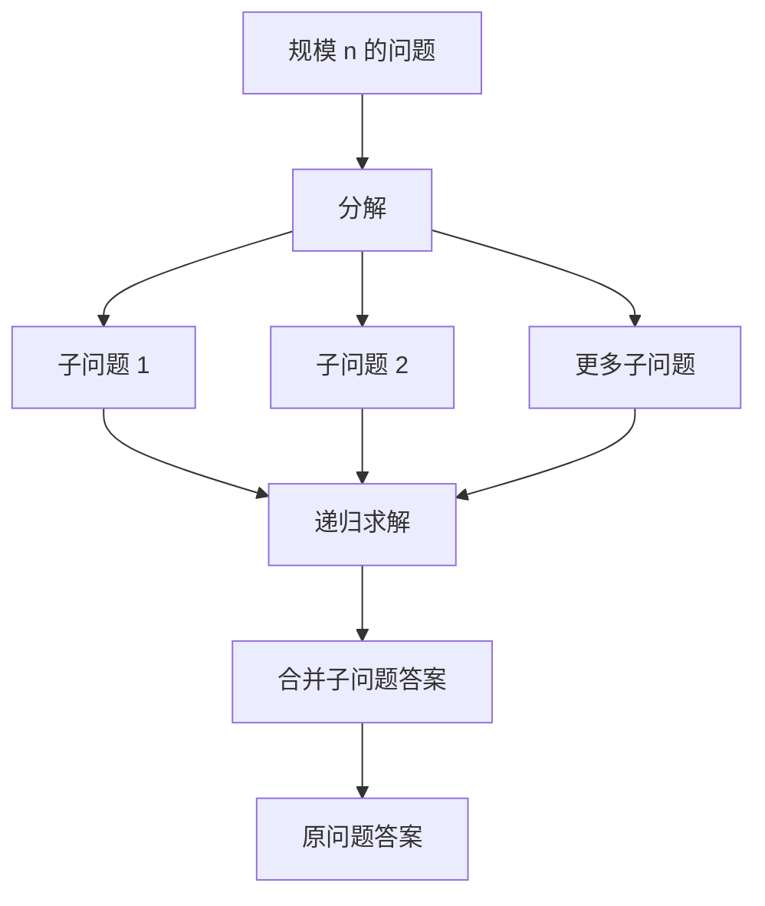
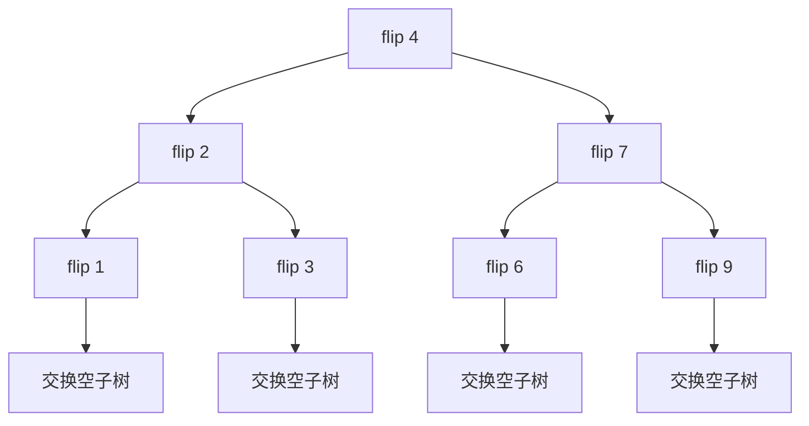

> 本笔记按原书第 17 章的小节顺序展开。原书概念、例题和算法依原顺序讲解；超出原书的严格证明、工程边界与替代方法均标注为“补充”。

## 本章要解决什么问题

有些大问题难以直接求解，却能拆成若干结构相同的小问题。分治法（divide and conquer）把求解过程分成三步：

1. **分解**：把规模为 $n$ 的问题拆成更小的同类子问题；
2. **求解**：直接求解基本情形，否则递归解决子问题；
3. **合并**：把子问题答案组合成原问题答案。



本章的经典形式包括：

- 二分查找：每次只保留一个一半规模的子问题；
- 归并排序：分别排序两半，再线性归并；
- 快速排序/快速选择：按枢轴分区后只处理必要区间；
- 值域二分：不直接搜索元素，而搜索满足单调判定的最小/最大答案。

分治与递归不是同义词。分治是一种问题拆解策略；递归是一种实现技术。二分查找、归并排序都可写成迭代形式。

### 本章算法单元与正文题盘点

本章共有 **2 个基础算法单元、22 道正文题**。后文为每个单元或题目各放置一个紧邻推导的 C++17 代码块，共 24 个；共享的二分边界、归并缓冲和分区辅助在首次出现的相应单元中定义，Python 与 Go 只保留在章末附录。

| 类别 | 编号 | 分解、合并或单调判定 | 关键成本 |
|---|---|---|---:|
| 基础单元 | 17.1.1 分治法 | 拆成独立同类子问题，再由 `combine` 合成 | $aT(n/b)+f(n)$ |
| 基础单元 | 17.1.2 二分及边界 | 保留仍可能含第一真/最后真的一半 | $O(\log n)$ |
| 正文题 | 17.2.1 多数元素 | 两半候选在当前区间重新计数 | $O(n\log n)$ |
| 正文题 | 17.2.2 最大子数组和 | 左、右、跨中点三类取最大 | $O(n\log n)$ |
| 正文题 | 17.2.3 表达式优先级 | 枚举最后运算符，笛卡尔积合并 | 输出敏感，Catalan 级 |
| 正文题 | 17.2.4 不同 BST II | 枚举根，组合左右树集合 | $\Theta(nC_n)$ 输出规模 |
| 正文题 | 17.3.1 排序数组 | 分区后递归，或两半有序后线性归并 | 平均/稳定 $O(n\log n)$ |
| 正文题 | 17.3.2 第 $k$ 大 | 分区后只保留目标秩所在一段 | 平均 $O(n)$ |
| 正文题 | 17.3.3 右侧较小计数 | 归并时累计已先取的右段元素 | $O(n\log n)$ |
| 正文题 | 17.3.4 翻转对 | 两半有序后双指针计跨区对 | $O(n\log n)$ |
| 正文题 | 17.4.1 平方根 | 二分最后一个满足 $r\le x/r$ 的整数 | $O(\log x)$ |
| 正文题 | 17.4.2 有序两数和 | 和偏小删左端，偏大删右端 | $O(n)$ |
| 正文题 | 17.4.3 搜索二维矩阵 | 右上角每步排除一行或一列 | $O(m+n)$ |
| 正文题 | 17.4.4 两数组中位数 | 按枢轴排名成批舍弃前缀 | $O(\log(m+n))$ |
| 正文题 | 17.4.5 下一个字母 | 第一处严格大于目标，越界回绕 | $O(\log n)$ |
| 正文题 | 17.4.6 旋转数组最小值 | 与右端比较，保留旋转断点 | $O(\log n)$ |
| 正文题 | 17.4.7 搜索旋转数组 | 识别有序半区并按值域淘汰 | $O(\log n)$ |
| 正文题 | 17.4.8 搜索旋转数组 II | 端点相等时只能安全缩短一格 | 最坏 $O(n)$ |
| 正文题 | 17.4.9 右侧较小（二分表） | 查严格较小个数后有序插入 | `vector` 实现 $O(n^2)$ |
| 正文题 | 17.4.10 翻转对（二分表） | 查小于当前值的两倍值个数 | `vector` 实现 $O(n^2)$ |
| 正文题 | 17.4.11 第 $k$ 大（值域） | 第一处累计频次达到目标排名 | $O(n\log V)$ |
| 正文题 | 17.4.12 矩阵第 $k$ 小 | 第一处矩阵累计频次达到 $k$ | $O(n\log V)$ |
| 正文题 | 17.4.13 分割数组 | 第一处最少分组数不超过 $m$ | $O(n\log\sum nums)$ |
| 正文题 | 17.4.14 船运容量 | 第一处最少天数不超过 $D$ | $O(n\log\sum weights)$ |

## 17.1 分治法概述

### 17.1.1 什么是分治法

#### 1. 严格定义与三个阶段

设问题实例为 $P(n)$，规模为 $n$。分治算法把它拆成 $a$ 个规模约为 $n/b$ 的同类子问题：

$$
P_1(n/b),P_2(n/b),\ldots,P_a(n/b).
$$

子问题分别求解后，通过函数 `combine` 得到：

$$
solution(P(n))
=combine(solution(P_1),\ldots,solution(P_a)).
$$

原书的三个基本步骤是分解、求解、合并。不同算法的核心差别通常就在“怎样分”和“怎样合”。

#### 2. 原书给出的适用特征

1. 规模缩小到一定程度后可直接求解；
2. 能拆成与原问题形式相同的更小子问题；
3. 子问题解能够组合成原问题解；
4. 子问题最好相互独立，不重复包含相同子子问题。

第 4 点区分了典型分治与动态规划：若子问题大量重叠，直接递归会重复计算，通常应使用记忆化或自底向上的动态规划。

原书把第 2 点称为“最优子结构”。更严格地说，最优子结构常用于优化问题；一般分治只要求原问题答案可由子问题答案正确合成。

#### 3. 正确性证明模板

对规模 $n$ 做归纳：

- **基本情形**：证明小于阈值的实例由直接算法正确求解；
- **归纳假设**：假设所有更小子问题都返回正确答案；
- **分解完备性**：证明子问题覆盖原问题需要的信息；
- **合并正确性**：证明 `combine` 对正确子答案产生正确原答案；
- **终止性**：证明每个子问题规模严格减小并最终到达基本情形。

#### 4. 例 17-1：翻转二叉树

给定根 `root`：

1. 分解为左、右子树；
2. 递归翻转两棵子树，得到 `leftResult`、`rightResult`；
3. 交换：
   $$
   root.left=rightResult,
   \qquad
   root.right=leftResult.
   $$

空树是出口。原树 `[4,2,7,1,3,6,9]` 翻转为 `[4,7,2,9,6,3,1]`。

##### 正确性

空树正确。假设左右子树都被正确镜像，交换两棵镜像子树后，当前根下每一层的左右关系也全部反转，因此整树正确。

每个结点访问一次，时间 $O(n)$；递归栈为 $O(h)$，$h$ 是树高。

#### 5. 时间递推式

若分成 $a$ 个规模 $n/b$ 的子问题，分解与合并的非递归工作为 $f(n)$：

$$
\boxed{
T(n)=aT(n/b)+f(n),
\qquad T(1)=\Theta(1).
}
$$

若规模不能整除，可用 $\lfloor n/b\rfloor$、$\lceil n/b\rceil$；通常不改变渐近阶。

#### 6. 主定理

当

$$
f(n)=\Theta(n^d),
\qquad a\ge1,
\qquad b>1,
$$

比较 $d$ 与

$$
c=\log_ba.
$$

标准三种情形：

$$
\boxed{
T(n)=
\begin{cases}
\Theta(n^c),&d<c,\\
\Theta(n^c\log n),&d=c,\\
\Theta(n^d),&d>c.
\end{cases}
}
$$

第三种情形还要求常见的正则条件，例如存在常数 $q<1$，使足够大 $n$ 时

$$
af(n/b)\le qf(n).
$$

原书扫描文本中的指数排版有缺失；上述是该段主定理的标准完整形式。

#### 7. 主定理的递归树直觉

第 $i$ 层有 $a^i$ 个结点，每个规模 $n/b^i$。若每结点工作为 $(n/b^i)^d$，该层总工作为

$$
a^i\left(\frac n{b^i}\right)^d
=n^d\left(\frac a{b^d}\right)^i.
$$

- 若 $a/b^d>1$，越往下每层工作越大，叶层主导，对应 $d<c$；
- 若 $a/b^d=1$，每层同阶，共 $\Theta(\log n)$ 层；
- 若 $a/b^d<1$，上层工作主导，对应 $d>c$。

#### 8. 经典例子

| 算法/递推 | $a,b,f(n)$ | 结果 |
|---|---|---|
| 二分查找 $T(n)=T(n/2)+1$ | $a=1,b=2,d=0$ | $\Theta(\log n)$ |
| 归并排序 $T(n)=2T(n/2)+n$ | $a=2,b=2,d=1$ | $\Theta(n\log n)$ |
| 二叉树全遍历 $T(n)=2T(n/2)+1$ | $a=2,b=2,d=0$ | $\Theta(n)$ |
| $T(n)=2T(n/2)+n^2$ | $a=2,b=2,d=2$ | $\Theta(n^2)$ |

主定理不直接适用于子问题规模不均匀的快速排序最坏递推

$$
T(n)=T(n-1)+\Theta(n),
$$

它应通过展开求得 $\Theta(n^2)$。

#### 9. 分解、独立性与合并成本检查

套递推式之前，先把一次调用中的工作拆清楚：

| 检查项 | 要回答的问题 | 翻转二叉树中的答案 |
|---|---|---|
| 子问题 | 是否仍是同类问题且规模严格缩小？ | 左右子树仍是翻转树问题，结点数都小于整树 |
| 独立性 | 两个递归调用会不会反复求同一状态？ | 普通树的左右子树结点集合不相交，没有重复子问题 |
| `combine` | 合并是否只做局部工作？ | 交换两个子树指针，单个结点只需 $\Theta(1)$ |
| 递推边界 | 子问题是否等规模，能否直接用主定理？ | 任意树未必平衡，不能机械写成 $2T(n/2)+1$ |

对任意形状的树，更稳妥的核算是“每个结点恰访问一次”，所以总时间仍为 $\Theta(n)$。只有在完全平衡时，才可把规模近似写成

$$
T(n)=2T(n/2)+\Theta(1).
$$

#### 10. 递归树与分解—合并走查

以 `[4,2,7,1,3,6,9]` 为例，调用树与原树同构：



递归先走到叶结点；叶结点交换两个空指针后返回。结点 2 收到翻转后的 1、3，合并为左 3、右 1；结点 7 同理合并为左 9、右 6；根 4 最后交换两棵已完成的结果，得到 `[4,7,2,9,6,3,1]`。这里的“合并”不是再次遍历子树，而只是交换当前结点的两个指针。

#### 11. 边界反例与迁移判断

- **空树**：必须直接返回；若先访问 `root->left` 会解引用空指针。
- **单链树**：仍是 $\Theta(n)$ 时间，但递归深度为 $n$，说明空间不能一律写成 $O(\log n)$。
- **共享子结点的图**：若输入并非树，同一结点可能从两条路径到达，子问题不再独立；需要访问标记，否则会重复处理，遇到环还可能无限递归。
- **迁移判断**：当对象能拆成不重叠的树形部分，且答案只需对子答案做常数或线性合并时，优先考虑分治；若多个分支反复请求同一状态，应转向记忆化/动态规划；若分解高度失衡，还要单独核算栈深与最坏时间。

#### C++17 实现

后续 C++17 代码块按章节顺序组成同一翻译单元，共享这里的标准库头文件与数据结构，不再重复 `#include`。

```cpp
#include <algorithm>
#include <cstdint>
#include <functional>
#include <limits>
#include <numeric>
#include <stdexcept>
#include <string>
#include <unordered_map>
#include <utility>
#include <vector>

using namespace std;

struct TreeNode {
    int val;
    TreeNode* left;
    TreeNode* right;
};

TreeNode* InvertTree(TreeNode* root) {
    if (root == nullptr) {
        return nullptr;
    }

    TreeNode* inverted_left = InvertTree(root->left);
    TreeNode* inverted_right = InvertTree(root->right);
    root->left = inverted_right;
    root->right = inverted_left;
    return root;
}
```

### 17.1.2 二分查找及其扩展算法

#### 1. 二分查找需要什么单调结构

基本二分查找要求数组按非递减顺序排列。比较 `target` 与中点值后，排序性质允许排除一半区间：

- `target<a[mid]`：目标不可能在右侧；
- `target>a[mid]`：目标不可能在左侧；
- 相等：找到一个目标位置。

更一般地，二分查找需要一个随位置单调变化的谓词，而不一定真的搜索数组元素。

#### 2. 闭区间基本模板

维护候选闭区间 `[low,high]`：

```text
while low <= high:
    mid = low + (high-low)//2
    if a[mid] == target: return mid
    if a[mid] < target: low = mid+1
    else: high = mid-1
return -1
```

循环不变量：若目标存在，则一定仍位于 `[low,high]`。每次不成功都会排除 `mid` 并严格缩小区间，因此不会死循环。

安全中点

$$
mid=low+\left\lfloor\frac{high-low}{2}\right\rfloor
$$

避免固定宽度整数中 `low+high` 溢出。

#### 3. 复杂度推导

每轮候选长度至多减半：

$$
T(n)=T(n/2)+\Theta(1).
$$

经过 $k$ 轮后长度约为 $n/2^k$。当其小于 1：

$$
\frac n{2^k}<1
\Longrightarrow
k>\log_2n.
$$

所以时间 $O(\log n)$。迭代版本空间 $O(1)$；递归版本额外栈 $O(\log n)$。

二分每轮只保留一个规模至多减半的候选区间，并不是同时求解两个独立子问题；命中结果可直接返回，也没有递归后的 `combine` 成本。新区间严格短于旧区间，因此不会重复求同一状态。对固定比例减半的基本二分，$T(n)=T(n/2)+\Theta(1)$ 满足主定理 $a=1,b=2,d=0$；若重复值导致每轮只能删除一个候选，如 17.4.8，就变成 $T(n)=T(n-1)+O(1)$，不能再套该结论。

#### 4. 插入点 `lower_bound`

`lower_bound(a,k)` 定义为第一个满足

$$
a[i]\ge k
$$

的位置；若不存在，返回 $n$。

原书给出两种等价写法。这里统一采用半开区间 `[low,high)`：

```text
low = 0
high = n
while low < high:
    mid = low + (high-low)//2
    if a[mid] < k:
        low = mid+1
    else:
        high = mid
return low
```

循环不变量：

- `[0,low)` 中所有元素严格小于 $k$；
- `[high,n)` 中所有元素大于等于 $k$；
- 答案仍在 `[low,high]` 的边界位置中。

若 `a[mid]>=k`，`mid` 可能就是答案，故令 `high=mid`，不能排除它。循环使用 `low<high`，区间长度会严格缩小。

#### 5. `lower_bound` 数值演算

$$
a=[1,2,2,4].
$$

| $k$ | 第一个 $\ge k$ 的位置 |
|---:|---:|
| -1 | 0 |
| 2 | 1 |
| 3 | 3 |
| 4 | 3 |
| 5 | 4 |

返回 $n$ 表示可插入数组末尾，并不是越界错误；调用者在读取 `a[position]` 前必须检查。

#### 6. `upper_bound`

`upper_bound(a,k)` 是第一个满足

$$
a[i]>k
$$

的位置。只需改变谓词：

```text
if a[mid] <= k:
    low = mid+1
else:
    high = mid
```

有重复值时：

$$
\#\{a[i]=k\}=upper\_bound(k)-lower\_bound(k).
$$

区间 `[lower_bound,upper_bound)` 恰好包含所有等于 $k$ 的元素。

#### 7. C++ 与 Python 标准函数

C++ `<algorithm>`：

- `binary_search(begin,end,k)`：是否存在；
- `lower_bound`：第一个不小于 $k$；
- `upper_bound`：第一个大于 $k$。

Python `bisect`：

- `bisect_left(a,k)`：等价 `lower_bound`；
- `bisect_right(a,k)` 或 `bisect(a,k)`：等价 `upper_bound`。

这些函数都假设输入已经按相同比较规则排序。

#### 8. 例 17-2：查找目标的首尾位置

对有序数组，先求

$$
first=lower\_bound(target).
$$

若

$$
first=n\quad\text{或}\quad nums[first]\ne target,
$$

返回 `[-1,-1]`。否则

$$
last=upper\_bound(target)-1.
$$

样例 `[5,7,7,8,8,10]`、目标 8：

$$
lower\_bound(8)=3,
\qquad
upper\_bound(8)=5,
$$

答案 `[3,4]`。目标 6 的两个边界都在位置 1，但 `nums[1]!=6`，返回 `[-1,-1]`。

两次二分仍为 $O(\log n)$。找到任意一个目标后向两侧线性扩展，最坏会在全部元素相等时退化为 $O(n)$。

#### 9. 二分模板最常见的错误

1. 闭区间模板却用 `while low<high`，漏查最后一个候选；
2. 半开/边界模板在保留 `mid` 时仍使用不收缩的循环条件；
3. 更新成 `low=mid`，当只剩两个位置时可能死循环；
4. 返回 $n$ 后直接访问数组；
5. 搜索答案时判定函数没有单调性；
6. 忘记说明要找“任意命中”“第一个真”还是“最后一个假”。

> **补充：统一谓词视角。** 若布尔谓词 $P(i)$ 随 $i$ 呈
> ```text
> false false ... false true true ... true
> ```
> `lower_bound` 就是在找第一个 `P(i)=true` 的位置。后续平方根、容量、分割最大值等答案二分都使用同一不变量。

#### 10. 边界反例与迁移判断

- **空数组**：基本查找返回 -1，两个边界都等于 0，首尾位置答案应为 `[-1,-1]`；不能先读取 `values[0]`。
- **全是重复值**：`[2,2,2]` 查 2 时，任意命中可以是 0、1、2，但首尾位置必须是 `[0,2]`；从任意命中向两边扫描会退化为线性时间。
- **目标在范围外**：`lower_bound([1,3],4)=2` 是合法插入点；必须先检查等于 $n$，再访问数组。
- **未排序输入**：`[3,1,2]` 不满足比较后可排除半区的前提，二分结果没有正确性保证。
- **迁移判断**：只有当候选位置可按谓词排成连续的假段与真段，且一次判定能安全排除一侧时，才能迁移边界二分；若谓词会来回翻转，应先重建单调性或改用扫描、哈希等方法。

#### C++17 实现

```cpp
int BinarySearch(const vector<int>& values, int target) {
    int low = 0;
    int high = static_cast<int>(values.size()) - 1;
    while (low <= high) {
        int middle = low + (high - low) / 2;
        if (values[middle] == target) {
            return middle;
        }
        if (values[middle] < target) {
            low = middle + 1;
        } else {
            high = middle - 1;
        }
    }
    return -1;
}

int LowerBound(const vector<int>& values, int target) {
    int low = 0;
    int high = static_cast<int>(values.size());
    while (low < high) {
        int middle = low + (high - low) / 2;
        if (values[middle] < target) {
            low = middle + 1;
        } else {
            high = middle;
        }
    }
    return low;
}

int UpperBound(const vector<int>& values, int target) {
    int low = 0;
    int high = static_cast<int>(values.size());
    while (low < high) {
        int middle = low + (high - low) / 2;
        if (values[middle] <= target) {
            low = middle + 1;
        } else {
            high = middle;
        }
    }
    return low;
}

vector<int> SearchTargetRange(const vector<int>& values, int target) {
    int first = LowerBound(values, target);
    if (first == static_cast<int>(values.size()) || values[first] != target) {
        return {-1, -1};
    }
    return {first, UpperBound(values, target) - 1};
}
```

## 17.2 基本分治算法设计

### 17.2.1 LeetCode 169：多数元素（★）

#### 分解与候选

对闭区间 `[low,high]`，在中点拆成左右两半，递归返回各自的多数候选 `leftCandidate`、`rightCandidate`。

- 若两候选相同，直接返回；
- 若不同，分别统计二者在整个当前区间的出现次数，返回次数更大的候选。

单元素区间的唯一值就是候选。

#### 为什么只比较两个候选

设当前区间长度为 $n=n_L+n_R$，全局多数元素 $x$ 出现次数大于 $n/2$。若它在左右两半都不超过各自长度的一半，则

$$
count_L(x)\le\frac{n_L}{2},
\qquad
count_R(x)\le\frac{n_R}{2},
$$

相加得到

$$
count(x)\le\frac{n_L+n_R}{2}=\frac n2,
$$

与全局多数矛盾。因此 $x$ 必是至少一半中的多数元素，并会成为某个递归返回候选。合并时只需比较左右候选。

子区间不一定真的存在多数元素；递归函数在这种区间可返回一个候选。题目只保证顶层存在多数元素，上述论证保证真正答案不会在合并中丢失。

#### 样例与复杂度

`[2,2,1,1,1,2,2]` 左右候选可能分别为 2、1；在整个区间中 2 出现 4 次，1 出现 3 次，返回 2。

每层合并扫描当前区间计数：

$$
T(n)=2T(n/2)+\Theta(n)=\Theta(n\log n).
$$

递归栈 $O(\log n)$。

> **补充：Boyer-Moore 投票。** 在保证多数存在时，可用候选与抵消计数在 $O(n)$ 时间、$O(1)$ 空间求解。分治版本用于展示“全局多数必在某一半为多数”的结构。

#### 分解—合并走查、边界与迁移

递归树每层都把下标区间近似均分，左右区间不重叠，因此子问题独立。以 `[2,2,1,1,1,2,2]` 为例，叶层返回自身；相邻叶合并成候选后，根收到左候选 2、右候选 2，直接返回 2。若根收到不同候选，才扫描当前 7 个元素比较频次。第 $i$ 层所有 `combine` 扫描的区间互不重叠，总成本为 $\Theta(n)$；平衡分解满足主定理，得到 $\Theta(n\log n)$。

- 空数组没有候选，当前接口拒绝它；单元素直接命中出口。
- `[1,2,3]` 没有多数元素，递归仍会返回某个候选，说明正确性依赖题目“顶层多数必存在”的保证；迁移到无此保证的题目时，返回前必须再做一次全局验证。
- 只有当任一全局答案必定出现在至少一个子问题的候选集合中时，才能用“合并少量候选”迁移此模式；否则局部筛选可能提前丢掉全局答案。

#### C++17 实现

```cpp
int MajorityElementDivide(const vector<int>& nums) {
    if (nums.empty()) {
        throw invalid_argument("nums must be non-empty");
    }

    function<int(int, int)> solve = [&](int left, int right) -> int {
        if (left == right) {
            return nums[left];
        }
        int middle = left + (right - left) / 2;
        int left_candidate = solve(left, middle);
        int right_candidate = solve(middle + 1, right);
        if (left_candidate == right_candidate) {
            return left_candidate;
        }

        int left_count = 0;
        int right_count = 0;
        for (int index = left; index <= right; ++index) {
            left_count += nums[index] == left_candidate;
            right_count += nums[index] == right_candidate;
        }
        return left_count > right_count ? left_candidate : right_candidate;
    };

    return solve(0, static_cast<int>(nums.size()) - 1);
}
```

### 17.2.2 LeetCode 53：最大子数组和（★★）

#### 三类位置穷尽所有答案

对 `[low,high]` 取中点 `mid`。任意非空连续子数组只有三种互斥情况：

1. 完全位于 `[low,mid]`；
2. 完全位于 `[mid+1,high]`；
3. 跨越中间边界，包含 `nums[mid]` 与 `nums[mid+1]`。

前两类由递归求得 `leftBest,rightBest`。

#### 跨中点答案

跨界子数组必由“以 `mid` 结尾的最佳左后缀”和“以 `mid+1` 开始的最佳右前缀”拼成：

$$
leftBorder
=\max_{low\le i\le mid}\sum_{t=i}^{mid}nums[t],
$$

$$
rightBorder
=\max_{mid+1\le j\le high}\sum_{t=mid+1}^{j}nums[t].
$$

因此

$$
\boxed{
crossBest=leftBorder+rightBorder.
}
$$

当前答案：

$$
\boxed{
best(low,high)=\max(leftBest,rightBest,crossBest).
}
$$

边界和必须至少含一个元素，初始化应为负无穷或第一个边界元素，不能初始化为 0；否则全负数组会错误选择空子数组。

#### 样例

对 `[-2,1,-3,4,-1,2,1,-5,4]`，最优跨界或子问题最终得到 `[4,-1,2,1]`，和为 6。

#### 正确性与复杂度

三类情况互斥且穷尽全部连续子数组。递归正确求前两类；对第三类，左右边界选择彼此独立，分别取最大后相加就是最佳跨界和。故三者最大值正确。

每层跨界扫描总计 $\Theta(n)$：

$$
T(n)=2T(n/2)+\Theta(n)=\Theta(n\log n).
$$

栈空间 $O(\log n)$。

> **补充：Kadane 算法。** 维护“以当前位置结尾的最大和”可在 $O(n)$ 时间、$O(1)$ 空间求解；第 11 章还给出最小前缀和视角。分治写法的价值在于展示跨边界合并。

#### 分解—合并走查、边界与迁移

以 `[-2,1,3,-1]` 为例，根分成 `[-2,1]` 与 `[3,-1]`：左、右子问题分别返回 1、3；根的最佳左后缀是 1，最佳右前缀是 3，合并得到跨界和 4，最终返回 4。左右区间不重叠，子问题独立；`combine` 各向一侧扫描，成本 $\Theta(n)$，故

$$
T(n)=2T(n/2)+\Theta(n)=\Theta(n\log n).
$$

这里两半规模近似相等，且非递归合并为线性成本，满足主定理的临界情形 $a=b=2,d=1$；若改成高度失衡的分割，就必须重新展开递推。

- `[-5,-2,-7]` 的答案是 -2，不是 0；边界累计值不能把空子数组当候选。
- 空数组没有“非空连续子数组”，当前接口拒绝；累计和用 64 位，避免迁移到大范围数据时溢出。
- 当答案能按“完全在左、完全在右、跨分割线”形成互斥且完备的分类，并且跨界最优可低成本求出时，可迁移这一模式；若跨界状态需要保留指数多信息，合并就不再廉价。

#### C++17 实现

```cpp
long long MaximumSubarrayDivide(const vector<int>& nums) {
    if (nums.empty()) {
        throw invalid_argument("nums must be non-empty");
    }

    function<long long(int, int)> solve = [&](int left, int right) -> long long {
        if (left == right) {
            return nums[left];
        }
        int middle = left + (right - left) / 2;

        long long total = 0;
        long long left_border = numeric_limits<long long>::lowest();
        for (int index = middle; index >= left; --index) {
            total += nums[index];
            left_border = max(left_border, total);
        }

        total = 0;
        long long right_border = numeric_limits<long long>::lowest();
        for (int index = middle + 1; index <= right; ++index) {
            total += nums[index];
            right_border = max(right_border, total);
        }

        return max({
            solve(left, middle),
            solve(middle + 1, right),
            left_border + right_border,
        });
    };

    return solve(0, static_cast<int>(nums.size()) - 1);
}
```

### 17.2.3 LeetCode 241：为运算表达式设计优先级（★★）

#### 最后执行的运算符就是分割点

任何完整括号化表达式都有一个最外层、最后执行的运算符。若它位于位置 $i$，则答案由：

- 左子表达式 `expression[0..i-1]` 的某个结果 $l$；
- 右子表达式 `expression[i+1..]` 的某个结果 $r$；
- 运算 $l\ operator_i\ r$。

因此枚举每个运算符作为最后运算，即可覆盖所有括号化方式。

#### 递归模型

设 $F(e)$ 返回表达式 $e$ 的所有可能结果（保留重复值）：

$$
\boxed{
F(e)=\bigcup_{i\text{ 是运算符}}
\{l\ operator_i\ r\mid l\in F(e_L),r\in F(e_R)\}.
}
$$

若 $e$ 中没有运算符，它是一个可能含多位的整数，出口为：

$$
F(e)=[parseInt(e)].
$$

不同括号方式可能得到相同数值，例如样例中的 -10 出现两次；题目结果列表保留这两个结果，不能用集合去重。

#### 样例分割

`2*3-4*5` 有三个可作为最后运算的运算符：

- 第一个 `*`：左 `[2]`，右 `3-4*5` 结果 `[-17,-5]`，产生 `[-34,-10]`；
- `-`：左 `[6]`，右 `[20]`，产生 `[-14]`；
- 最后 `*`：左 `2*3-4` 结果 `[-2,2]`，右 `[5]`，产生 `[-10,10]`。

合并为 `[-34,-10,-14,-10,10]`。

#### 正确性

每种括号化表达式都有唯一最外层运算符，算法枚举到它；归纳假设左右所有括号化结果都已生成，笛卡尔积因此生成该表达式。反过来，每次组合都对应合法地把左右子表达式加括号，所以不会产生非法计算。

#### 复杂度与记忆化

含 $m$ 个二元运算符时，完整括号化结构数是 Catalan 数

$$
C_m=\frac1{m+1}\binom{2m}{m}
\sim\frac{4^m}{m^{3/2}\sqrt\pi}.
$$

输出本身可指数增长。朴素递归还会重复计算相同子表达式；用子串边界 `(left,right)` 记忆化，可让每个子表达式只求一次，但仍需生成全部输出结果。

#### 分解—合并走查、边界与迁移

`2*3-4` 在根层可按 `*` 或 `-` 分解：前者组合 `2` 与 `3-4=-1` 得 -2，后者组合 `2*3=6` 与 `4` 得 2。更长表达式中，同一子串会从不同根分割重复出现，所以这些子问题**不独立**；记忆表把每个子串只计算一次。一次 `combine` 的成本是左右结果数的乘积，且分割规模不等、分支数随运算符数量变化，不能套 $aT(n/b)+f(n)$ 的主定理。

- 单个多位整数如 `"123"` 必须整体解析，不能按字符拆成 1、2、3。
- `"2-1-1"` 的两个结果 2、0 都要保留；不同括号化得到相同数值时也不能去重。
- 当前题目语法只有非负整数和二元 `+,-,*`；迁移到一元负号、空格或除法时，应先词法分析，不能把每个 `'-'` 都当分割点。
- 当每个完整解都能由唯一“最后决策”分成左右解时，可迁移枚举分割点加笛卡尔积的模式；若子区间反复出现，应同时加入记忆化。

#### C++17 实现

```cpp
vector<int> DifferentWaysToCompute(const string& expression) {
    unordered_map<string, vector<int>> memo;

    function<vector<int>(const string&)> solve = [&](const string& part) {
        auto found = memo.find(part);
        if (found != memo.end()) {
            return found->second;
        }

        vector<int> answer;
        for (int index = 0; index < static_cast<int>(part.size()); ++index) {
            char operation = part[index];
            if (operation != '+' && operation != '-' && operation != '*') {
                continue;
            }
            vector<int> left_values = solve(part.substr(0, index));
            vector<int> right_values = solve(part.substr(index + 1));
            for (int left_value : left_values) {
                for (int right_value : right_values) {
                    if (operation == '+') {
                        answer.push_back(left_value + right_value);
                    } else if (operation == '-') {
                        answer.push_back(left_value - right_value);
                    } else {
                        answer.push_back(left_value * right_value);
                    }
                }
            }
        }

        if (answer.empty()) {
            answer.push_back(stoi(part));
        }
        memo[part] = answer;
        return answer;
    };

    return solve(expression);
}
```

### 17.2.4 LeetCode 95：不同的二叉搜索树 II（★★）

#### 枚举根结点完成分解

对连续键区间 `[low,high]`，任取 $rootValue=i$：

- 左子树只能使用 `[low,i-1]`；
- 右子树只能使用 `[i+1,high]`。

递归得到所有左树集合 $L_i$ 与右树集合 $R_i$，再做笛卡尔积：

$$
\boxed{
Trees(low,high)
=\bigcup_{i=low}^{high}
\{Node(i,l,r)\mid l\in L_i,r\in R_i\}.
}
$$

#### 空区间为何返回包含一个空树的列表

出口必须是

$$
Trees(low,high)=[null]\quad(low>high),
$$

而不是空列表。若根没有左子树，仍需要让左侧有一个“空选择”与每棵右树组合；空列表会让笛卡尔积完全没有结果。

#### Catalan 递推

令 $G(n)$ 是 $n$ 个连续键能构成的 BST 数量。根左侧有 $i-1$ 个键、右侧有 $n-i$ 个键：

$$
\boxed{
G(n)=\sum_{i=1}^{n}G(i-1)G(n-i),
\qquad G(0)=1.
}
$$

这正是 Catalan 数：

$$
G(n)=C_n=\frac1{n+1}\binom{2n}{n}.
$$

$n=3$：

$$
C_3=5.
$$

#### 正确性

任意 BST 有唯一根值 $i$；BST 性质唯一决定左右键区间。算法枚举该根，并由归纳假设生成所有合法左右子树，所以每棵合法 BST 都生成。不同根或不同左右结构会产生不同树，因此不重。

#### 复杂度与对象共享

答案有 $C_n$ 棵树，每棵含 $n$ 个结点，若要求完全独立对象，输出规模为

$$
\Theta(nC_n).
$$

递归缓存区间结果能减少重复结构计算，但把同一子树对象挂到多个结果会产生引用共享；若调用者会修改返回树，应深拷贝子树。在线评测通常只读取结果，常见实现允许共享不可变子结构。

> **补充：只求数量。** 若只问不同 BST 数量，不应构造树，可用 Catalan 动态规划在 $O(n^2)$ 时间、$O(n)$ 空间求值。

#### 分解—合并走查、边界与迁移

$n=3$ 时，根层依次选 1、2、3。选根 2 时，左区间 `[1,1]` 与右区间 `[3,3]` 各只生成一棵树，笛卡尔积产生一棵；选根 1 或 3 时，一侧为空选择，另一侧各生成两棵，共得到 $2+1+2=5$ 棵。不同根下的区间会重复出现，朴素构造并非独立状态；可缓存不可变模板，但若返回对象允许修改，就必须克隆以避免结果间共享。

- 空子区间返回 `{nullptr}` 是组合单位元；返回空向量会让单边子树无法生成。
- 题目约束 $n\ge1$；本接口对 `count<=0` 返回空结果。调用方必须释放每棵返回树。
- `combine` 是左右结果的笛卡尔积并分配/克隆结点，成本不能简化为 $O(1)$；递推分支也不等规模，主定理不适用，应按 Catalan 输出规模核算。
- 当根选择唯一划分左右合法状态、且所有组合都合法时，可迁移“枚举根 + 笛卡尔积”；若结果对象可变，要先决定深拷贝、所有权或不可变共享策略。

#### C++17 实现

```cpp
TreeNode* CloneTree(const TreeNode* root) {
    if (root == nullptr) {
        return nullptr;
    }
    return new TreeNode{
        root->val,
        CloneTree(root->left),
        CloneTree(root->right),
    };
}

void DeleteTree(TreeNode* root) {
    if (root == nullptr) {
        return;
    }
    DeleteTree(root->left);
    DeleteTree(root->right);
    delete root;
}

vector<TreeNode*> GenerateBinarySearchTrees(int count) {
    if (count <= 0) {
        return {};
    }

    function<vector<TreeNode*>(int, int)> generate = [&](int low, int high) {
        if (low > high) {
            return vector<TreeNode*>{nullptr};
        }

        vector<TreeNode*> answer;
        for (int root_value = low; root_value <= high; ++root_value) {
            vector<TreeNode*> left_trees = generate(low, root_value - 1);
            vector<TreeNode*> right_trees = generate(root_value + 1, high);
            for (const TreeNode* left_tree : left_trees) {
                for (const TreeNode* right_tree : right_trees) {
                    answer.push_back(new TreeNode{
                        root_value,
                        CloneTree(left_tree),
                        CloneTree(right_tree),
                    });
                }
            }
            for (TreeNode* tree : left_trees) {
                DeleteTree(tree);
            }
            for (TreeNode* tree : right_trees) {
                DeleteTree(tree);
            }
        }
        return answer;
    };

    return generate(1, count);
}
```

## 17.3 快速排序和二路归并排序应用的算法设计

### 17.3.1 LeetCode 912：排序数组（★★）

#### 解法一：快速排序的分区不变量

快速排序选择枢轴 `pivot`，重新排列区间，使小值位于一侧、大值位于另一侧，再递归排序两边。分区完成后不需要额外合并，因为结果原地存于数组。

原书首先以首元素为枢轴。若输入已经有序或全部相同，分区可能极不平衡：

$$
T(n)=T(n-1)+\Theta(n)=\Theta(n^2).
$$

题目含大量重复值时，即使随机枢轴，若分区不把等值区域单独跳过，也可能做很多无效递归。

#### 原书改进的双向分区

取中间位置值为 `pivot`，令 $i$ 从左找第一个 `>=pivot` 的元素，$j$ 从右找第一个 `<=pivot` 的元素；若 $i\le j$，交换并执行 $i++,j--$。循环结束后：

$$
\forall p\in[low,j],\quad a[p]\le pivot,
$$

$$
\forall q\in[i,high],\quad a[q]\ge pivot.
$$

递归排序 `[low,j]` 与 `[i,high]`。每次交换后两个指针都前进，即使元素等于枢轴也不会停滞，改善全相等输入。

这类 Hoare 风格分区不保证枢轴最终位于某个固定下标，但保证两个递归区间分离且缩小。

#### 快速排序复杂度

若每次近似均分：

$$
T(n)=2T(n/2)+\Theta(n)=\Theta(n\log n).
$$

最坏仍可能为 $\Theta(n^2)$。递归栈平均 $O(\log n)$，最坏 $O(n)$。

> **补充：三路分区。** 把区间分为 `<pivot`、`=pivot`、`>pivot` 三段，只递归两侧，可让大量重复值一次归位。随机化枢轴或洗牌可降低特定输入触发最坏情况的概率。

#### 解法二：二路归并排序

对 `[low,high]`：

1. 分解为 `[low,mid]`、`[mid+1,high]`；
2. 递归使两段有序；
3. 用两个指针把较小元素依次写入临时数组，再复制回原区间。

归并循环不变量：临时数组已经包含两个有序段中所有已消费元素，并按非递减顺序排列；两个指针分别指向各段尚未消费的最小元素。

若相等时优先取左段，排序保持稳定。

#### 归并排序复杂度

每层归并总工作 $\Theta(n)$，共 $\Theta(\log n)$ 层：

$$
T(n)=2T(n/2)+\Theta(n)=\Theta(n\log n).
$$

辅助数组 $O(n)$，递归栈 $O(\log n)$。它没有快速排序的平方最坏时间，适合需要确定上界的场景；代价是额外线性空间。

#### 分解—合并走查、边界与迁移

对 `[4,1,3,2]` 做归并排序：叶层得到四个单元素段；先合并为 `[1,4]`、`[2,3]`，根层再依次取 1、2、3、4。左右半段下标不重叠，子问题独立；每层线性归并总成本 $\Theta(n)$，满足主定理临界情形，时间 $\Theta(n\log n)$。

快速排序则在分解阶段完成三路分区，递归返回后无需合并。分区后的两侧下标不重叠，但规模由数据和枢轴决定：近似均分时可类比 $2T(n/2)+\Theta(n)$，有序或恶意输入可能变成 $T(n-1)+\Theta(n)$，因此不能用主定理宣称确定的 $O(n\log n)$。

- 空数组、单元素数组直接有序；全相等数组必须一次跳过整个等值段，否则会反复递归。
- 归并时相等先取左段才稳定；快速排序原地交换通常不稳定。
- 需要稳定性或确定最坏上界时迁移归并；内存紧张且可接受平均界时可用快速排序。迁移三路分区的前提是比较关系能把元素完整划成 `<pivot`、`=pivot`、`>pivot`。

#### C++17 实现

```cpp
pair<int, int> PartitionThreeWay(
    vector<int>& values, int left, int right, int pivot) {
    int less = left;
    int scan = left;
    int greater = right;
    while (scan <= greater) {
        if (values[scan] < pivot) {
            swap(values[less++], values[scan++]);
        } else if (values[scan] > pivot) {
            swap(values[scan], values[greater--]);
        } else {
            ++scan;
        }
    }
    return {less, greater};
}

vector<int> SortArrayQuick(vector<int> values) {
    function<void(int, int)> quick_sort = [&](int left, int right) {
        if (left >= right) {
            return;
        }
        int pivot = values[left + (right - left) / 2];
        auto [equal_first, equal_last] =
            PartitionThreeWay(values, left, right, pivot);
        quick_sort(left, equal_first - 1);
        quick_sort(equal_last + 1, right);
    };

    quick_sort(0, static_cast<int>(values.size()) - 1);
    return values;
}

template <typename T>
void MergeSortedRange(
    vector<T>& values,
    vector<T>& buffer,
    int left,
    int middle,
    int right) {
    int first = left;
    int second = middle;
    int write = left;
    while (first < middle && second < right) {
        if (values[first] <= values[second]) {
            buffer[write++] = values[first++];
        } else {
            buffer[write++] = values[second++];
        }
    }
    while (first < middle) {
        buffer[write++] = values[first++];
    }
    while (second < right) {
        buffer[write++] = values[second++];
    }
    copy(buffer.begin() + left, buffer.begin() + right, values.begin() + left);
}

vector<int> SortArray(const vector<int>& nums) {
    vector<int> values(nums);
    vector<int> buffer(values.size());
    function<void(int, int)> merge_sort = [&](int left, int right) {
        if (right - left <= 1) {
            return;
        }
        int middle = left + (right - left) / 2;
        merge_sort(left, middle);
        merge_sort(middle, right);
        MergeSortedRange(values, buffer, left, middle, right);
    };

    merge_sort(0, static_cast<int>(values.size()));
    return values;
}
```

### 17.3.2 LeetCode 215：数组中第 $k$ 大元素（★★）

#### 排名下标

第 $k$ 大按排序后的出现次数计，不要求不同值。若数组按降序排列，目标绝对下标为

$$
\boxed{target=k-1.}
$$

重复值各占一个排序位置。

#### 解法一：单枢轴快速选择

做一次降序分区，若枢轴最终位置为 $p$：

- $p=target$：返回枢轴；
- $target<p$：只递归左段；
- $target>p$：只递归右段。

与快速排序不同，目标只会在一侧，无需排序另一侧。

平均递推近似：

$$
T(n)=T(n/2)+\Theta(n)=\Theta(n).
$$

最坏分区不平衡：

$$
T(n)=T(n-1)+\Theta(n)=\Theta(n^2).
$$

随机枢轴降低最坏输入概率，但不改变理论最坏上界。

#### 解法二：双向分区与等值中段

原书把 17.3.1 的双向分区改成降序：左段不小于 `pivot`，右段不大于 `pivot`。结束时若目标：

- 落在左段 `[s,j]`，递归左段；
- 落在右段 `[i,t]`，递归右段并调整相对排名；
- 落在中间等值区域，直接返回 `pivot`。

更统一的三路分区写法直接得到：

$$
[low,lt)<pivot,
\quad[lt,gt]=pivot,
\quad(gt,high]>pivot
$$

（若按升序分区）。第 $k$ 大可转为升序第 $n-k$ 下标；目标落在等值区立即结束。

#### 样例

`[3,2,1,5,6,4]`，$k=2$。升序目标下标为

$$
n-k=6-2=4,
$$

该位置值为 5。

`[3,2,3,1,2,4,5,5,6]` 的第 4 大按重复值排序为 4，而不是第 4 个不同值。

#### 正确性

分区保证目标秩只可能位于一个分区。丢弃的另一侧全部元素在值序关系上不可能占目标位置；等值区内所有值相同，目标落入即可返回。每轮保留目标所在子问题，最终缩到单点。

> **补充：确定线性时间。** Median of Medians 可保证 $O(n)$ 最坏时间，但常数和实现复杂度较高。堆可在 $O(n\log k)$ 时间求第 $k$ 大，适合流式或不便修改输入的场景。

#### 分区走查、边界与迁移

`[3,2,1,5,6,4]` 的第 2 大对应升序下标 4。若首轮枢轴为 1，三路分区得到空的小值段、等值段 `[1]` 和其余大值段，目标只可能在大值段；后续每轮仍只保留包含下标 4 的一段。分区工作为 $\Theta(n)$，没有递归后的 `combine`；平均保留常数比例时总成本是 $n+n/2+\cdots=O(n)$，但分割规模数据相关，主定理不适用，最坏仍为 $O(n^2)$。

- `k` 按重复值占位，`[5,5,4]` 的第 2 大仍是 5；三路分区可让目标落入整段等值区后立即返回。
- 空数组或 $k<1$、$k>n$ 没有合法排名，接口显式拒绝。
- 实现复制输入，避免分区破坏调用者数组；若允许原地修改可省去这份拷贝。
- 当分区能证明目标秩只落在一侧时，可从全排序迁移到快速选择；若后续需要多个排名或完整顺序，反复选择未必优于一次排序。

#### C++17 实现

```cpp
int KthLargestQuickselect(vector<int> values, int k) {
    if (k < 1 || k > static_cast<int>(values.size())) {
        throw invalid_argument("k is outside the array rank range");
    }

    int target = static_cast<int>(values.size()) - k;
    int low = 0;
    int high = static_cast<int>(values.size()) - 1;
    while (low <= high) {
        int pivot = values[low + (high - low) / 2];
        auto [equal_first, equal_last] =
            PartitionThreeWay(values, low, high, pivot);
        if (target < equal_first) {
            high = equal_first - 1;
        } else if (target > equal_last) {
            low = equal_last + 1;
        } else {
            return pivot;
        }
    }
    throw logic_error("the requested rank must exist");
}
```

### 17.3.3 LeetCode 315：计算右侧小于当前元素的个数（★★★）

#### 为什么普通排序会丢失原下标

答案按原数组下标返回。归并排序元素时，需要携带二元组

$$
(value,originalIndex).
$$

计数更新写回

$$
counts[originalIndex].
$$

#### 跨左右段的计数

递归后，左段和右段各自按值升序，但它们仍分别来自原数组前、后位置。因此右段元素天然在左段元素的右侧。

归并指针为 $i,j$，右段起点为 $mid+1$。当

$$
left[i].value\le right[j].value
$$

时，先归并左元素。右段中已经被取走的元素有

$$
j-(mid+1)
$$

个；它们都严格小于当前左值，故：

$$
\boxed{
counts[left[i].index]\mathrel{+}=j-(mid+1).
}
$$

若右值更小，先取右元素，不立即更新任何右元素答案。

#### 相等时为何必须先取左边

题目要求严格小于。若左右值相等时先取右值，它会被算入“已经移到左元素前面的右段元素”，从而误计为较小。使用 `left<=right` 时优先左侧，保证已取右元素都严格小于当前左值。

右段耗尽后，左段每个剩余元素都应增加右段总长度

$$
high-mid.
$$

统一公式仍是 `j-(mid+1)`，此时 $j=high+1$。

#### 样例与正确性

`[5,2,6,1]`：归并过程中得到原下标计数 `[2,1,1,0]`。

任意右侧较小对 $(i,j)$，$i<j$，在递归树中有唯一最低层合并使 $i$ 位于左段、$j$ 位于右段；算法恰在该层、左元素归并时计数一次，因此不重不漏。

时间

$$
T(n)=2T(n/2)+\Theta(n)=\Theta(n\log n),
$$

辅助空间 $O(n)$。

#### 递归树计数走查、边界与迁移

`[5,2,6,1]` 在根处分成 `[5,2]` 与 `[6,1]`。两棵子树先分别计入 `(5,2)`、`(6,1)`；根合并有序段 `[2,5]` 与 `[1,6]` 时，先取右值 1，随后取 2、5 时各增加 1，最终得到 `[2,1,1,0]`。原下标的左右半段不重叠，子问题独立；任意数对在递归树中只属于一个最低跨区层，不会重复计数。每层 `combine` 为线性归并，主定理给出 $\Theta(n\log n)$。

- `[2,2]` 的答案是 `[0,0]`；相等时若先取右段，会把相等值误算为严格较小。
- 空数组返回空答案；负数不改变比较逻辑；计数类型采用 64 位以便迁移到更大输入。
- 当要统计的二元关系按原下标可唯一归属某个分割层，且排序后跨区关系能单调累计时，可迁移“归并排序 + 计数”；否则应寻找别的有序状态或数据结构。

#### C++17 实现

```cpp
vector<long long> CountSmallerMerge(const vector<int>& nums) {
    struct IndexedValue {
        int value;
        int index;
    };

    vector<IndexedValue> values;
    for (int index = 0; index < static_cast<int>(nums.size()); ++index) {
        values.push_back({nums[index], index});
    }
    vector<IndexedValue> buffer(values.size());
    vector<long long> answer(values.size(), 0);

    function<void(int, int)> merge_sort = [&](int left, int right) {
        if (right - left <= 1) {
            return;
        }
        int middle = left + (right - left) / 2;
        merge_sort(left, middle);
        merge_sort(middle, right);

        int first = left;
        int second = middle;
        int write = left;
        while (first < middle && second < right) {
            if (values[first].value <= values[second].value) {
                answer[values[first].index] += second - middle;
                buffer[write++] = values[first++];
            } else {
                buffer[write++] = values[second++];
            }
        }
        while (first < middle) {
            answer[values[first].index] += second - middle;
            buffer[write++] = values[first++];
        }
        while (second < right) {
            buffer[write++] = values[second++];
        }
        copy(buffer.begin() + left, buffer.begin() + right, values.begin() + left);
    };

    merge_sort(0, static_cast<int>(values.size()));
    return answer;
}
```

### 17.3.4 LeetCode 493：翻转对（★★★）

#### 分治计数结构

重要翻转对满足

$$
i<j
\quad\text{且}\quad
nums[i]>2nums[j].
$$

递归分别统计完全位于左右半区的对；合并前统计左下标、右下标的跨区对。

#### 有序性让双指针单调

左右段均升序。对左段元素 $x$，从右段起点移动指针 $j$，只要

$$
x>2\cdot right[j]
$$

就前进。满足条件的右元素数为

$$
\boxed{j-(mid+1).}
$$

当左段下一个元素 $x'\ge x$ 时，此前满足 $x>2right[t]$ 的元素仍满足或至少指针无需后退，因此 $j$ 在整个扫描中单调前进。跨区计数为 $O(n)$，不是每个左元素重新扫右段的 $O(n^2)$。

#### 为什么计数与归并要分开

普通升序归并比较

$$
left[i]\le right[j],
$$

翻转对判定比较

$$
left[i]>2right[j].
$$

两个指针推进逻辑不同。最清晰做法是：先用一组指针计数，再标准归并两段，保持父层所需有序不变量。

原书实现提到直接 `sort` 合并区间；若每层都调用比较排序，递推的合并成本可能为 $O(n\log n)$，总体可到 $O(n\log^2n)$。标准线性归并可保持 $O(n\log n)$。

#### 整数溢出

`nums[j]` 可为 32 位边界，表达式

$$
2\cdot nums[j]
$$

可能溢出 32 位。比较前应提升为 64 位：

```text
int64(left) > 2 * int64(right)
```

#### 样例与正确性

`[1,3,2,3,1]` 的跨层计数最终得到两对 `(1,4)`、`(3,4)`，答案 2。

任意合法对在递归树中有唯一最低公共分割层：左下标在左段、右下标在右段。该层的双指针计数会包含它一次；左右递归处理其他两类对，所以不重不漏。

时间 $O(n\log n)$，辅助空间 $O(n)$，递归栈 $O(\log n)$。

#### 递归树计数走查、边界与迁移

`[1,3,2,3,1]` 的每个合法对在递归树中都有唯一最低公共分割层。左右子树先统计内部对；根层面对两个已排序半段，右指针随左值增大只前进不后退，计出跨区对后再线性归并。子问题按下标独立，计数加归并的 `combine` 仍是 $\Theta(n)$，所以可由主定理得到 $\Theta(n\log n)$。

- `[-5,-5]` 含一对，因为 $-5>2\times(-5)$；不能假设只有正数才可能构成翻转对。
- `[1,1]` 没有翻转对，严格不等号不能改成 `>=`。
- `2*nums[j]` 和累计答案都要提升到 64 位；空数组自然返回 0。
- 迁移此模式要求：左右段排序后，跨区判定对扫描指针具有单调性。若关系随左值增大仍会真假反复，单指针不能复用，线性合并成本也就不成立。

#### C++17 实现

```cpp
long long ReversePairsMerge(const vector<int>& nums) {
    vector<long long> values(nums.begin(), nums.end());
    vector<long long> buffer(values.size());

    function<long long(int, int)> merge_sort = [&](int left, int right) {
        if (right - left <= 1) {
            return 0LL;
        }
        int middle = left + (right - left) / 2;
        long long answer =
            merge_sort(left, middle) + merge_sort(middle, right);

        int second = middle;
        for (int first = left; first < middle; ++first) {
            while (second < right && values[first] > 2LL * values[second]) {
                ++second;
            }
            answer += second - middle;
        }

        MergeSortedRange(values, buffer, left, middle, right);
        return answer;
    };

    return merge_sort(0, static_cast<int>(values.size()));
}
```

## 17.4 二分查找应用的算法设计

### 17.4.1 LeetCode 69：$x$ 的平方根（★）

#### 把取整平方根定义成边界

题目要求

$$
r=\lfloor\sqrt x\rfloor,
$$

等价于寻找最大整数 $r$ 满足

$$
\boxed{r^2\le x.}
$$

谓词

$$
P(r):r^2\le x
$$

随 $r$ 从真变假，可二分“最后一个真”。也可找第一个满足 $r^2>x$ 的位置再减 1。

#### 搜索范围

- $x=0$ 时答案 0；
- $x=1,2,3$ 时答案 1；
- $x\ge4$ 时答案位于 `[2,x/2]`。

更统一地直接在 `[0,x]` 上做边界二分也正确。

#### 避免乘法溢出

32 位最大 $x$ 接近 $2^{31}-1$，`mid*mid` 可能溢出。对 $mid>0$：

$$
mid^2\le x
\iff
mid\le\left\lfloor\frac{x}{mid}\right\rfloor.
$$

所以用

```text
mid <= x // mid
```

判定，或先提升到 64 位。

#### 循环不变量与更新

采用闭区间，维护 `answer` 为已知可行最大值：

- 若 `mid <= x/mid`，`mid` 可行，记录并搜索更大值；
- 否则搜索更小值。

样例 $x=8$：2 可行、3 不可行，返回 2。

时间 $O(\log x)$，空间 $O(1)$。

> **补充：牛顿迭代。** 可用 $r_{next}=(r+x/r)/2$ 快速收敛，但要处理整数停止条件和溢出。二分更容易证明边界正确。

#### 区间走查、边界与迁移

$x=8$ 时，初始 `[0,8]`：中点 4 不可行，收缩到 `[0,3]`；中点 1 可行，记录 1 并右移；中点 2 可行，记录 2；中点 3 不可行，区间耗尽，返回 2。每轮只保留一个至多一半大小的候选区间，没有独立的两个子问题，也没有 `combine` 成本。按候选数写成 $T(n)=T(n/2)+\Theta(1)$ 时可视为主定理 $a=1,b=2$ 的情形，但迭代轮数推导更直接。

- $x=0$ 时必须允许中点 0，且不能计算 `x/mid`；代码用短路条件保护除零。
- $x=2^{31}-1$ 时答案 46340；用 `mid*mid` 的 32 位实现会溢出并破坏谓词。
- 负数没有实数范围内的整数平方根，接口显式拒绝。
- 若整数答案可写成一段“可行”后接一段“不可行”，可迁移最后一个真模板；要先证明方向，不能把真/假更新照抄反。

#### C++17 实现

```cpp
int IntegerSquareRoot(int value) {
    if (value < 0) {
        throw invalid_argument("value must be non-negative");
    }

    int low = 0;
    int high = value;
    int answer = 0;
    while (low <= high) {
        int middle = low + (high - low) / 2;
        if (middle == 0 || middle <= value / middle) {
            answer = middle;
            low = middle + 1;
        } else {
            high = middle - 1;
        }
    }
    return answer;
}
```

### 17.4.2 LeetCode 167：有序数组中的两数之和 II（★★）

#### 解法一、二：枚举一个数，再二分另一个数

对每个下标 $i$，在后缀 `[i+1,n)` 中二分查找

$$
target-numbers[i].
$$

限制搜索到后缀保证不会重复使用同一元素。每次 $O(\log n)$，总时间

$$
O(n\log n),
$$

额外空间 $O(1)$。可手写基本二分，也可用 `lower_bound/bisect_left`。

#### 解法三：双指针

令

$$
left=0,
\qquad
right=n-1.
$$

计算

$$
sum=numbers[left]+numbers[right].
$$

- `sum==target`：返回两个 1 基下标；
- `sum<target`：当前左值与任何不超过右值的元素配对都不会更大，必须增大左值，`left++`；
- `sum>target`：当前右值与任何不小于左值的元素配对都不会更小，必须减小右值，`right--`。

#### 为什么淘汰安全

若 `sum<target`，固定 `left`，对任意 $j\le right$：

$$
numbers[left]+numbers[j]\le sum<target.
$$

所以该左端不可能参与答案。大于目标时对右端同理。

样例 `[2,7,11,15]`、目标 9，首尾和 17 太大，右指针左移直到与 2 配成 9，返回 `[1,2]`。

时间 $O(n)$、空间 $O(1)$。虽然归在二分章节，它利用的是与二分相同的有序单调淘汰思想。

#### 淘汰走查、边界与迁移

`[2,7,11,15]`、目标 9 的双指针状态依次为 `(2,15)`、`(2,11)`、`(2,7)`：前两次和偏大，安全删除右端，第三次命中。这里没有递归子问题和 `combine`；两个指针合计只移动 $n-1$ 次，也没有重复状态。逐个固定左端再二分后缀则做 $n$ 个独立查询，总成本 $O(n\log n)$，不应套主定理。

- `[3,3]`、目标 6 必须允许两个不同下标上的相同值；搜索区间从 `i+1` 开始。
- 两数和先提升到 64 位，避免两个 32 位端点相加溢出；空数组或无解返回空向量。
- 两种方法都依赖非递减顺序。若“固定一端后，另一端的目标值可二分”，可迁移后缀二分；若端点和随指针单调变化，则双指针通常更优。

#### C++17 实现

```cpp
vector<int> TwoSumSortedBinary(
    const vector<int>& numbers, int target) {
    for (int first = 0; first + 1 < static_cast<int>(numbers.size()); ++first) {
        long long wanted = static_cast<long long>(target) - numbers[first];
        if (wanted < numeric_limits<int>::min() ||
            wanted > numeric_limits<int>::max()) {
            continue;
        }
        auto position = lower_bound(
            numbers.begin() + first + 1,
            numbers.end(),
            static_cast<int>(wanted));
        if (position != numbers.end() && *position == wanted) {
            return {first + 1, static_cast<int>(position - numbers.begin()) + 1};
        }
    }
    return {};
}

vector<int> TwoSumSorted(const vector<int>& numbers, int target) {
    int left = 0;
    int right = static_cast<int>(numbers.size()) - 1;
    while (left < right) {
        long long current =
            static_cast<long long>(numbers[left]) + numbers[right];
        if (current == target) {
            return {left + 1, right + 1};
        }
        if (current < target) {
            ++left;
        } else {
            --right;
        }
    }
    return {};
}
```

### 17.4.3 LeetCode 74：搜索二维矩阵（★★）

#### 原书右上角搜索

从右上角 `(row=0,column=n-1)` 开始：

- 当前值等于目标：成功；
- 当前值大于目标：当前列从此位置向下都更大，删除整列，`column--`；
- 当前值小于目标：当前行左侧都更小，删除整行，`row++`。

每步至少删除一行或一列，最多移动

$$
m+n-1
$$

次，时间 $O(m+n)$、空间 $O(1)$。

题目第二个条件“下一行首元素大于上一行尾元素”比普通行列有序更强，也确保各列递增，因此上述淘汰成立。

#### 样例

矩阵

$$
\begin{bmatrix}
1&3&5&7\\
10&11&16&20\\
23&30&34&60
\end{bmatrix}
$$

从 7 开始查 3：7 太大，依次左移到 3，返回真。

> **补充：直接展平二分。** 由于每行首元素大于上一行尾元素，按行展开后是全局有序的一维数组。虚拟下标 $p\in[0,mn)$ 映射为
> $$
> row=p/n,
> \qquad column=p\bmod n.
> $$
> 可在 $O(\log(mn))$ 时间二分。原书采用右上角消元法，它也适用于仅“每行每列有序”的更一般矩阵。

#### 消元走查、边界与迁移

在样例矩阵中查 16：从 7 开始，因 7 小而下移到 20；20 大而左移到 16，命中。每一步删除的是整行前缀或整列后缀，不会产生两个递归分支，也没有 `combine`；行、列指针各单调移动一次，因此是 $O(m+n)$，主定理不适用。

- 空矩阵或空行应直接返回假，不能先读取 `matrix[0].size()`。
- 只有每行有序但各列无序时，从右上角删除整列并不安全；若满足题目更强的全局行展开有序，可改用虚拟一维二分。
- 迁移右上角/左下角搜索的条件是比较一次后能整批排除一行或一列；若只能排除一个格子，复杂度与证明都要重算。

#### C++17 实现

```cpp
bool SearchMatrix(const vector<vector<int>>& matrix, int target) {
    if (matrix.empty() || matrix[0].empty()) {
        return false;
    }

    int row = 0;
    int column = static_cast<int>(matrix[0].size()) - 1;
    while (row < static_cast<int>(matrix.size()) && column >= 0) {
        if (matrix[row][column] == target) {
            return true;
        }
        if (matrix[row][column] > target) {
            --column;
        } else {
            ++row;
        }
    }
    return false;
}
```

### 17.4.4 LeetCode 4：寻找两个正序数组的中位数（★★★）

#### 中位数转成第 $k$ 小

设总长度

$$
N=m+n.
$$

- $N$ 为奇数：中位数是第 $(N+1)/2$ 小；
- $N$ 为偶数：中位数是第 $N/2$ 小与第 $N/2+1$ 小的平均值。

因此核心是 `findKth(a,b,k)`，其中 $k$ 从 1 开始。

#### 直接解法

合并或排序全部元素后取中间值，时间可为 $O(m+n)$（二路归并）或原书直接排序的 $O((m+n)\log(m+n))$，但不满足题目要求的对数目标。

#### 与代码一致的等步长哨兵删减

维护两个数组尚未舍弃的起点 $aStart,bStart$。若一个数组耗尽，第 $k$ 小就是另一个数组起点后的第 $k$ 个；若 $k=1$，返回两个当前首元素较小者。这里的 $k$ 始终是当前两个后缀合并后的 **1 基排名**。

否则令

$$
step=\lfloor k/2\rfloor,
$$

并在两个数组中都查看当前后缀的第 `step` 个元素：

$$
p_A=
\begin{cases}
A[aStart+step-1],&|A|-aStart\ge step,\\
+\infty,&|A|-aStart<step,
\end{cases}
$$

$$
p_B=
\begin{cases}
B[bStart+step-1],&|B|-bStart\ge step,\\
+\infty,&|B|-bStart<step.
\end{cases}
$$

若 $p_A\le p_B$，舍弃 `A` 当前后缀的前 `step` 个元素；否则对 `B` 做同样操作。两种分支都执行

$$
k\leftarrow k-step.
$$

越界枢轴设为 $+\infty$，使短数组无需单独分配不对称步长。两个枢轴不可能同时越界：否则两个剩余长度都小于 `step`，总剩余元素数小于 $2step\le k$，与当前第 $k$ 小存在矛盾。

#### 等步长删减引理

假设 $p_A\le p_B$。由上一段可知 $p_A$ 必为真实元素。为处理重复值，可在相等时约定 `A` 中的出现位置排在 `B` 的同值位置之前；这不会改变第 $k$ 小的数值。

`A` 中到 $p_A$ 为止共有 `step` 个元素。`B` 中严格小于 $p_A$ 的元素至多有 `step-1` 个：若 `B` 的第 `step` 个元素存在，则它就是 $p_B\ge p_A$；若不存在，`B` 的整个剩余后缀也不足 `step` 个。因此 $p_A$ 在一种合法稳定合并次序中的排名至多为

$$
step+(step-1)=2step-1<k.
$$

`A` 前 `step` 个元素的排名都不超过 $p_A$，所以它们不可能占据当前第 $k$ 个位置。删去这 `step` 个位置后，原第 $k$ 小恰好变成剩余后缀的第 $k-step$ 小。$p_A>p_B$ 时证明完全对称。

每轮都把 $k$ 变为 $k-\lfloor k/2\rfloor=\lceil k/2\rceil$，因此时间

$$
O(\log(m+n)).
$$

迭代实现空间 $O(1)$；递归实现栈 $O(\log(m+n))$。

#### 奇数排名、短数组走查与数值安全

`[1,3]` 与 `[2]` 的第 2 小是 2。`[1,2]` 与 `[3,4]` 的第 2、3 小为 2、3，中位数 2.5。

对 `A=[1,4,7]`、`B=[2,3,5,6,8]` 求第 5 小，初始奇数 $k=5$：

1. `step=2`，比较 4 与 3，舍弃 `B` 的 `[2,3]`，$k=3$；
2. `step=1`，比较 1 与 5，舍弃 `A` 的 `[1]`，$k=2$；
3. `step=1`，比较 4 与 5，舍弃 `A` 的 `[4]`，$k=1$；
4. 两个当前首元素为 7 与 5，返回 5。

对短数组 `A=[1]`、`B=[2,3,4,5,6]` 求第 4 小：初始 `step=2`，$p_A=+\infty,p_B=3$，先舍弃 `B` 的 `[2,3]` 并令 $k=2$；随后 `step=1`，比较 1 与 4，舍弃 `A` 的 `[1]` 并令 $k=1$。此时 `A` 耗尽，直接返回 `B` 当前后缀的第 1 个元素 4。这个过程说明哨兵只参与比较，不会作为答案返回或导致越界删除。

偶数长度平均值应在浮点转换后计算，或先用更宽整数相加，避免两个大整数求和溢出。

> **补充：分割线二分。** 也可只在较短数组的切分位置上二分，使左右两侧元素数相等并满足交叉边界有序，时间 $O(\log\min(m,n))$。原书采用第 $k$ 小递归/迭代法。

#### 排名删减边界与迁移

每轮只保留一组缩短后的数组后缀，没有两个独立子问题，也没有 `combine`。$k$ 近似减半，可直接按几何缩减得到 $O(\log(m+n))$；数组提前耗尽使状态并非固定 $n/b$ 形式，机械套主定理反而不如排名证明清楚。

- 一个数组为空时，第 $k$ 小直接落在另一个数组；两个数组同时为空时中位数未定义，接口拒绝。
- 重复值仍按位置占排名；偶数总长的两个中间值先转为 64 位再相加，避免溢出。
- 迁移“成批舍弃排名”需要证明被删前缀的最高可能排名严格小于 $k$；只凭枢轴值较小而不核算两边元素数量，会错误删除答案。

#### C++17 实现

```cpp
int KthOfTwoSorted(
    const vector<int>& first, const vector<int>& second, int k) {
    if (k < 1 || k > static_cast<int>(first.size() + second.size())) {
        throw invalid_argument("k is outside the merged rank range");
    }

    int first_start = 0;
    int second_start = 0;
    while (true) {
        if (first_start == static_cast<int>(first.size())) {
            return second[second_start + k - 1];
        }
        if (second_start == static_cast<int>(second.size())) {
            return first[first_start + k - 1];
        }
        if (k == 1) {
            return min(first[first_start], second[second_start]);
        }

        int step = k / 2;
        long long first_pivot =
            first_start + step <= static_cast<int>(first.size())
                ? first[first_start + step - 1]
                : numeric_limits<long long>::max();
        long long second_pivot =
            second_start + step <= static_cast<int>(second.size())
                ? second[second_start + step - 1]
                : numeric_limits<long long>::max();
        if (first_pivot <= second_pivot) {
            first_start += step;
        } else {
            second_start += step;
        }
        k -= step;
    }
}

double MedianTwoSorted(
    const vector<int>& first, const vector<int>& second) {
    int total = static_cast<int>(first.size() + second.size());
    if (total == 0) {
        throw invalid_argument("at least one array must be non-empty");
    }
    if (total % 2 == 1) {
        return KthOfTwoSorted(first, second, total / 2 + 1);
    }
    long long left = KthOfTwoSorted(first, second, total / 2);
    long long right = KthOfTwoSorted(first, second, total / 2 + 1);
    return (left + right) / 2.0;
}
```

### 17.4.5 LeetCode 744：寻找比目标字母大的最小字母（★）

题目要求第一个严格大于 `target` 的字符，即

$$
position=upper\_bound(letters,target).
$$

若 `position<n`，返回 `letters[position]`；若等于 $n$，按题目循环规则返回 `letters[0]`：

$$
\boxed{letters[position\bmod n].}
$$

样例：

- `['c','f','j']`、目标 `a`，上界位置 0，返回 `c`；
- `['x','x','y','y']`、目标 `z`，上界位置 4，回绕返回 `x`。

必须使用 `upper_bound` 而非 `lower_bound`，因为等于目标的字符不满足“更大”。时间 $O(\log n)$，空间 $O(1)$。

#### 边界走查与迁移

`['c','f','j']`、目标 `j`：中点 `f<=j`，右移；随后 `j<=j`，插入边界到达 3，按长度取模回到下标 0，返回 `c`。每轮只保留一半候选边界，没有两个独立子问题和 `combine`；递推是 $T(n)=T(n/2)+\Theta(1)$，可归入主定理 $a=1$ 的情形。

- 全部字符都等于目标时也必须回绕到首字符；空数组无法回绕，接口显式拒绝。
- 严格“大于”决定相等时向右移动；若误用 `lower_bound`，`['c','f']` 查 `c` 会错误返回 `c`。
- 可迁移的是“第一处严格满足边界”的二分模板；回绕是本题额外语义，普通插入点问题不能无条件取模。

#### C++17 实现

```cpp
char NextGreatestLetter(const vector<char>& letters, char target) {
    if (letters.empty()) {
        throw invalid_argument("letters must be non-empty");
    }

    int low = 0;
    int high = static_cast<int>(letters.size());
    while (low < high) {
        int middle = low + (high - low) / 2;
        if (letters[middle] <= target) {
            low = middle + 1;
        } else {
            high = middle;
        }
    }
    return letters[low % letters.size()];
}
```

### 17.4.6 LeetCode 153：寻找旋转排序数组中的最小值（★★）

#### 旋转后的两段结构

互异升序数组旋转后，由两个升序段构成，最小值是第二段首元素；未旋转时最小值仍是下标 0。

维护闭区间 `[low,high]`，最小值一定在其中。取中点 `mid`，与右端比较：

- 若
    $$
    nums[mid]<nums[high],
    $$
    则 `[mid,high]` 严格递增，`mid` 可能是最小值，真正最小值位于 `[low,mid]`，令 `high=mid`；
- 若
    $$
    nums[mid]>nums[high],
    $$
    则旋转断点位于 `mid` 右侧，`mid` 不可能是最小值，令 `low=mid+1`。

元素互异，比较不会出现相等（除非 `mid==high`，但循环 `low<high` 时中点取下中位数，`mid<high`）。

循环结束 `low==high`，唯一候选即最小值。

#### 样例与正确性

`[3,4,5,1,2]`：中点值 5 大于右端 2，丢弃左半；新区间 `[1,2]` 中继续收缩到值 1。

每轮根据右端所在升序段判断断点方向，并保留可能为最小值的 `mid`，不变量成立。区间至少减半，时间 $O(\log n)$、空间 $O(1)$。

#### 区间走查、边界与迁移

`[3,4,5,1,2]`：中点值 5 大于右端 2，最小值严格在右侧，区间变为 `[3,4]`；中点值 1 小于右端 2，保留中点并令 `high=3`，返回 1。每轮只有一个子问题，没有 `combine`；唯一值保证可排除近一半，$T(n)=T(n/2)+\Theta(1)$ 可用主定理得到 $O(\log n)$。

- 未旋转 `[1,2,3]` 会连续保留左半，正确返回首元素；空数组没有最小值，接口拒绝。
- 重复值会破坏方向信息。例如 `[10,1,10,10,10]` 中中点等于右端，按唯一值版本右移会丢掉最小值 1。
- 只有当与右端比较能唯一判断旋转断点所在侧时，才能迁移此模板；允许重复值时应采用 17.4.8 类似的单步去重，并接受最坏线性时间。

#### C++17 实现

```cpp
int FindRotatedMinimum(const vector<int>& nums) {
    if (nums.empty()) {
        throw invalid_argument("nums must be non-empty");
    }

    int low = 0;
    int high = static_cast<int>(nums.size()) - 1;
    while (low < high) {
        int middle = low + (high - low) / 2;
        if (nums[middle] < nums[high]) {
            high = middle;
        } else {
            low = middle + 1;
        }
    }
    return nums[low];
}
```

### 17.4.7 LeetCode 33：搜索旋转排序数组（★★）

#### 解法一：先找基准，再虚拟恢复

用上一题找到最小值下标 `base`。原升序视图 `sortedView[i]` 对应：

$$
\boxed{
sortedView[i]=nums[(i+base)\bmod n].
}
$$

在虚拟视图下标 $0\sim n-1$ 上普通二分；命中虚拟下标 $i$ 时，返回真实下标

$$
(i+base)\bmod n.
$$

找基准和查找各 $O(\log n)$，总时间仍 $O(\log n)$。

#### 解法二：每轮识别有序半区

不先找基准。闭区间 `[low,high]` 中至少有一半有序。

若 `nums[mid]==target`，直接返回。

原书用 `nums[mid]` 与 `nums[high]` 比较：

1. `nums[mid]<nums[high]`：右半 `[mid,high]` 有序。
     - 若
         $$
         nums[mid]<target\le nums[high],
         $$
         搜索右半；
     - 否则搜索左半。
2. `nums[mid]>nums[high]`：左半含有序前段。
     - 若
         $$
         nums[low]\le target<nums[mid],
         $$
         搜索左半；
     - 否则搜索右半。

比较中对 `mid` 使用严格边界，是因为相等已经在第一步返回。

#### 正确性

在已识别的有序半区内，端点比较能准确判断目标是否落入其值域；若落入，另一半可排除，否则该有序半区可排除。每轮保留目标可能存在的唯一一侧并严格缩小区间。

`[4,5,6,7,0,1,2]` 查 0 最终返回 4；查 3 时区间耗尽返回 -1。时间 $O(\log n)$、空间 $O(1)$。

#### 区间走查、边界与迁移

查 0 时，首轮中点为 7，左半 `[4,5,6,7]` 有序但目标不在其值域，删除左半；新区间 `[0,1,2]` 中继续普通二分并命中。唯一值保证每轮至少一半可被识别为严格有序段，因此只有一个减半子问题、没有 `combine`，可由 $T(n)=T(n/2)+\Theta(1)$ 和主定理得到 $O(\log n)$。

- 空数组或目标不存在时返回 -1；未旋转数组也被同一不变量覆盖。
- `[1,1,1,3,1]` 查 3 会让唯一值版本误判有序半区并丢掉目标，说明重复值不是无关细节。
- 迁移时必须同时证明“至少一半有序”以及目标是否落在该半区值域；若端点相等造成歧义，应转用下一题的退化处理。

#### C++17 实现

```cpp
int SearchRotated(const vector<int>& nums, int target) {
    int low = 0;
    int high = static_cast<int>(nums.size()) - 1;
    while (low <= high) {
        int middle = low + (high - low) / 2;
        if (nums[middle] == target) {
            return middle;
        }

        if (nums[middle] <= nums[high]) {
            if (nums[middle] < target && target <= nums[high]) {
                low = middle + 1;
            } else {
                high = middle - 1;
            }
        } else {
            if (nums[low] <= target && target < nums[middle]) {
                high = middle - 1;
            } else {
                low = middle + 1;
            }
        }
    }
    return -1;
}
```

### 17.4.8 LeetCode 81：搜索旋转排序数组 II（★★）

#### 重复值破坏“哪一半有序”的判定

仍使用上一题框架。当

$$
nums[mid]<nums[high]
$$

或

$$
nums[mid]>nums[high]
$$

时，判断方式不变。

困难情形是

$$
nums[mid]=nums[high]
e target.
$$

此时仅从两端相等无法判断旋转断点在哪边，但可以确定 `nums[high]` 不是目标，因为它等于已比较且不等于目标的 `nums[mid]`。所以安全执行：

$$
high\leftarrow high-1.
$$

> **原文勘误说明：** 原书称 `nums[mid]=nums[high]` 可推出区间 `nums[mid..high]` 全部相同，这并不成立。例如 `[1,3,1,1,1]` 中端点可相等而内部不同。算法只需要“右端值不是目标”，因此删除一个 `high` 仍然正确。

#### 复杂度退化

通常仍能排除半区；但数组大量相等时，可能每轮只做 `high--`：

$$
T(n)=T(n-1)+O(1)=O(n).
$$

这是重复值造成的信息论歧义，不能保证对数最坏时间。

样例 `[2,5,6,0,0,1,2]` 查 0 返回真，查 3 返回假。

#### 歧义走查、边界与迁移

`[1,3,1,1,1]` 查 3 时，首轮 `nums[mid]=nums[high]=1` 且未命中，只能删除已知不是目标的右端 1；重复若干次后，区间露出 `[1,3]` 才能判断方向。这里仍只保留一个区间且无 `combine`，但区间可能从 $n$ 仅缩到 $n-1$，递推为 $T(n)=T(n-1)+O(1)$；固定比例主定理不适用，最坏 $O(n)$。

- 空数组返回假；全相等且目标不存在时必须逐个缩短到空，正是最坏反例。
- 删除右端前要先检查中点是否命中；由于中点值等于右端值，未命中才能推出右端也不是目标。
- 迁移到含重复值的旋转边界问题时，要把“信息不足”分支单独列出；安全删除一个候选正确，但不能继续声称每轮减半。

#### C++17 实现

```cpp
bool SearchRotatedDuplicates(const vector<int>& nums, int target) {
    int low = 0;
    int high = static_cast<int>(nums.size()) - 1;
    while (low <= high) {
        int middle = low + (high - low) / 2;
        if (nums[middle] == target) {
            return true;
        }
        if (nums[middle] == nums[high]) {
            --high;
        } else if (nums[middle] < nums[high]) {
            if (nums[middle] < target && target <= nums[high]) {
                low = middle + 1;
            } else {
                high = middle - 1;
            }
        } else {
            if (nums[low] <= target && target < nums[middle]) {
                high = middle - 1;
            } else {
                low = middle + 1;
            }
        }
    }
    return false;
}
```

### 17.4.9 LeetCode 315：计算右侧小于当前元素的个数（二分有序表）（★★★）

#### 从右向左维护已见元素

维护升序列表 `seen`，它恰含当前下标右侧元素。对 `nums[i]`：

$$
position=lower\_bound(seen,nums[i]).
$$

`position` 左边元素都严格小于当前值，因此

$$
\boxed{answer[i]=position.}
$$

随后把当前值插入 `seen` 的该位置，供更左元素使用。

使用 `lower_bound` 而不是 `upper_bound`，避免把相等值算作严格较小。

#### 样例

`[5,2,6,1]` 从右处理：

| 当前值 | 插入前 `seen` | `lower_bound` 位置 | 答案 |
|---:|---|---:|---:|
| 1 | `[]` | 0 | 0 |
| 6 | `[1]` | 1 | 1 |
| 2 | `[1,6]` | 1 | 1 |
| 5 | `[1,2,6]` | 2 | 2 |

得到 `[2,1,1,0]`。

#### 定位快不等于整体快

二分定位是 $O(\log n)$，但普通连续数组在中间插入要移动 $O(n)$ 个元素。总时间为

$$
O(n^2),
$$

空间 $O(n)$。

> **原文勘误说明：** 原书把普通向量插入版本总复杂度写成 $O(n)$；实际正是线性插入累计导致超时。Python 文中提到的 `SortedList` 来自第三方 `sortedcontainers`，不是标准库；其分块结构可高效定位与插入。标准替代是第 13 章的离散化 BIT、第 17.3.3 的归并计数，均为 $O(n\log n)$。

#### 状态走查、边界与迁移

原表格展示了 `seen` 从空表增长到 `[1,2,5,6]` 的全过程。每次查询是第一处 `>=nums[i]` 的边界，没有递归、独立子问题或 `combine`，主定理不适用；状态只向左推进，不会重复处理下标。然而 `vector::insert` 要移动后缀，输入 `[1,2,3,4]` 从右向左处理时每次都插到开头，移动总量为 $1+2+3=\Theta(n^2)$。

- `[2,2]` 必须得到 `[0,0]`，所以使用 `LowerBound` 而不是 `UpperBound`。
- 空数组返回空向量；负数和重复值都由有序比较自然处理。
- 可迁移“维护已见有序多重集 + 查询秩”的思想，但容器必须同时支持对数级秩查询和插入；C++ 标准 `multiset` 本身不提供按排名计数，应改用离散化 BIT、归并计数或带 order statistics 的树。

#### C++17 实现

```cpp
vector<long long> CountSmallerBisect(const vector<int>& nums) {
    vector<int> seen;
    vector<long long> answer(nums.size(), 0);
    for (int index = static_cast<int>(nums.size()) - 1; index >= 0; --index) {
        int position = LowerBound(seen, nums[index]);
        answer[index] = position;
        seen.insert(seen.begin() + position, nums[index]);
    }
    return answer;
}
```

### 17.4.10 LeetCode 493：翻转对（二分有序表）（★★★）

#### 维护什么值

重要翻转对要求对当前左值 $x=nums[i]$，统计右侧 $y$ 满足

$$
x>2y.
$$

从右向左维护有序列表

$$
seenTwice=\{2nums[j]\mid j>i\}.
$$

查找

$$
position=lower\_bound(seenTwice,x).
$$

位置左侧的值都严格小于 $x$，恰对应满足 $2nums[j]<x$ 的翻转对数量。随后有序插入 $2x$。

使用 `lower_bound` 精确表达严格不等式；若用 `upper_bound`，等于 $x$ 的两倍值会被误计。

#### 复杂度与溢出

普通数组二分定位后线性插入，仍是 $O(n^2)$ 时间、$O(n)$ 空间。使用支持秩查询的平衡树、SortedList、BIT 或归并排序可达 $O(n\log n)$。

保存 `2*nums[i]` 时必须使用 64 位整数，避免 32 位溢出。

样例 `[1,3,2,3,1]` 得 2；`[2,4,3,5,1]` 得 3。

#### 状态走查、边界与迁移

对 `[1,3,2,3,1]` 从右向左处理：`seenTwice` 依次插入 2、6、4、6、2；处理当前值 3 时，`lower_bound(seenTwice,3)` 左侧只有 2，对应一个右侧值 1。每个下标只处理一次，没有递归子问题或 `combine`，主定理不适用；但每次在 `vector` 中插入仍可能移动线性数量的元素，总时间 $O(n^2)$。

- 负数必须保留原不等式方向，例如 `[-5,-5]` 中当前 -5 大于右侧两倍 -10，应计一对。
- 查询必须找严格小于当前值的两倍值个数，因此使用 `lower_bound`；相等不能计入。
- 两倍值与答案均使用 64 位；空数组返回 0。
- 可迁移到支持“严格小于某值的元素个数”和插入的有序多重集；若容器没有对数级秩查询，二分到迭代器仍不能保证整体高效，优先迁移到 17.3.4 的归并计数或离散化 BIT。

#### C++17 实现

```cpp
long long ReversePairsBisect(const vector<int>& nums) {
    vector<long long> seen_twice;
    long long answer = 0;
    for (auto iterator = nums.rbegin(); iterator != nums.rend(); ++iterator) {
        long long value = *iterator;
        auto position = lower_bound(seen_twice.begin(), seen_twice.end(), value);
        answer += position - seen_twice.begin();

        long long doubled = 2LL * value;
        auto insertion =
            lower_bound(seen_twice.begin(), seen_twice.end(), doubled);
        seen_twice.insert(insertion, doubled);
    }
    return answer;
}
```

### 17.4.11 LeetCode 215：数组中第 $k$ 大元素（值域二分）（★★）

#### 把第 $k$ 大转成第几小

数组长度为 $n$，第 $k$ 大等于第

$$
\boxed{rank=n-k+1}
$$

小，其中 `rank` 从 1 开始，重复值分别占排名。

#### 单调计数谓词

对整数候选值 $x$，定义

$$
count(x)=\#\{v\in nums\mid v\le x\}.
$$

$x$ 增大时 `count(x)` 单调不减。第 `rank` 小元素正是最小的 $x$ 满足

$$
\boxed{count(x)\ge rank.}
$$

因为在答案值之前，严格少于 `rank` 个元素不大于候选；到达该数组值时累计频次首次达到排名。

#### 值域二分

初始：

$$
low=\min(nums),
\qquad
high=\max(nums).
$$

使用第一个真模板：

```text
while low < high:
        mid = low + (high-low)//2
        if count(mid) >= rank:
                high = mid
        else:
                low = mid+1
return low
```

即使值域含负数，`low+(high-low)//2` 仍取区间下中位数并确保收缩。C++ 的 `(low+high)/2` 对负数向 0 截断，还可能溢出，不宜使用。

> **原文边界说明：** 原书分析中一度写 `cnt>k` 与 `cnt<k`，随后又正确归纳为寻找 `cnt>=k` 的最小值。实现必须使用非严格 `>=`，因为恰有 `k` 个元素不大于候选时已经可行。

#### 复杂度

设值域宽度

$$
V=\max(nums)-\min(nums)+1.
$$

每轮扫描数组计数 $O(n)$，轮数 $O(\log V)$，总时间 $O(n\log V)$、空间 $O(1)$。

与快速选择的平均 $O(n)$ 相比，它不修改数组、最坏界稳定，但性能依赖值域位宽。

#### 值域走查、边界与迁移

`[3,2,1,5,6,4]` 的第 2 大是第 5 小。值域 `[1,6]` 中：候选 3 的累计数为 3，不足，令 `low=4`；候选 5 的累计数为 5，可行，令 `high=5`；候选 4 的累计数为 4，不足，最终收敛到 5。每轮只有一个减半的值域子问题，没有 `combine`；可形式化为 $T(V)=T(V/2)+\Theta(n)$，但 $n$ 与值域宽度 $V$ 是两个参数，直接计为 $O(n\log V)$ 比机械套单参数主定理更准确。

- `[5,5,5]` 中任意合法排名都返回 5；累计条件必须是 `>=rank`。
- 空数组或越界 `k` 没有排名，接口拒绝；端点和差值提升到 64 位，以覆盖 `INT_MIN` 到 `INT_MAX` 的值域。
- 每轮会重新扫描数组，但不会递归重复同一个值域；若预先排序，虽可对计数做二分，却已支付 $O(n\log n)$。
- 当答案属于离散有界值域，且累计排名随候选单调时，可迁移值域二分；值域极宽不影响轮数超过机器位数，却可能不如快速选择的平均线性时间。

#### C++17 实现

```cpp
int KthLargestValueBinary(const vector<int>& nums, int k) {
    if (nums.empty() || k < 1 || k > static_cast<int>(nums.size())) {
        throw invalid_argument("k is outside the array rank range");
    }

    int rank = static_cast<int>(nums.size()) - k + 1;
    long long low = *min_element(nums.begin(), nums.end());
    long long high = *max_element(nums.begin(), nums.end());
    while (low < high) {
        long long middle = low + (high - low) / 2;
        int count = 0;
        for (int value : nums) {
            count += static_cast<long long>(value) <= middle;
        }
        if (count >= rank) {
            high = middle;
        } else {
            low = middle + 1;
        }
    }
    return static_cast<int>(low);
}
```

### 17.4.12 LeetCode 378：有序矩阵中第 $k$ 小元素（★★）

#### 值域与排名谓词

行列均非递减的 $n\times n$ 矩阵满足：

$$
low=matrix[0][0],
\qquad
high=matrix[n-1][n-1].
$$

定义

$$
count(x)=\#\{matrix[r][c]\le x\}.
$$

答案是值域中第一个满足

$$
count(x)\ge k
$$

的整数。重复值仍按出现次数计。

#### $O(n)$ 统计不大于 $x$ 的元素

从左下角 `(row=n-1,column=0)` 开始：

- 若当前值 `<=x`，该列从第 0 行到 `row` 都 `<=x`，一次增加
    $$
    row+1
    $$
    个，然后 `column++`；
- 若当前值 `>x`，该行当前及右侧都更大，`row--`。

行指针最多上移 $n$ 次，列指针最多右移 $n$ 次，统计时间 $O(n)$。

#### 样例

$$
\begin{bmatrix}
1&5&9\\
10&11&13\\
12&13&15
\end{bmatrix}
$$

所有元素排序后第 8 小为 13。候选 12 的累计数为 6，不可行；13 的累计数为 8，首次达到排名，返回 13。

#### 正确性与复杂度

左下角扫描每次整批计入一列前缀或排除一行后缀，不重不漏地统计所有 `<=x` 元素。计数随 $x$ 单调，第一真二分返回第 $k$ 小值。

时间

$$
O\left(n\log(matrix[n-1][n-1]-matrix[0][0]+1)\right),
$$

空间 $O(1)$。端点和中点应使用 64 位避免差值溢出。

题目真实排名范围是 $1\le k\le n^2$；扫描文本中显示成 `k<=n` 是排版/OCR 缺失。

> **补充：堆方案。** 把每行首元素入最小堆，弹出并推进同一行，时间 $O(k\log n)$、空间 $O(n)$。当 $k$ 很小时可能更合适。

#### 值域与矩阵走查、边界与迁移

样例中候选 12 从左下角开始：12 可计入该列 3 个，右移；13 太大则上移，最终累计 6，不可行；候选 13 累计 8，可行。外层每轮只保留一半值域，没有 `combine`；内层阶梯扫描的行、列指针都不回退，成本 $O(n)$。写成双参数递推 $T(V,n)=T(V/2,n)+\Theta(n)$ 可得 $O(n\log V)$，普通单参数主定理不能忽略矩阵维度。

- 重复值按出现次数计，条件必须为 `count>=k`；空矩阵、非方阵或 $k\notin[1,n^2]$ 由接口拒绝。
- 端点差值使用 64 位；计数上限为 $n^2$，实现也用 64 位，避免迁移到大矩阵时溢出。
- 若二维偏序允许从一个角逐行/列整批计数，可迁移“值域二分 + 阶梯计数”；若矩阵只按行有序，计数应改为每行二分，复杂度随之变为 $O(n\log n\log V)$。

#### C++17 实现

```cpp
int KthSmallestMatrix(const vector<vector<int>>& matrix, int k) {
    int size = static_cast<int>(matrix.size());
    if (size == 0 || k < 1 ||
        static_cast<long long>(k) > static_cast<long long>(size) * size) {
        throw invalid_argument("matrix or k is invalid");
    }
    for (const vector<int>& row : matrix) {
        if (static_cast<int>(row.size()) != size) {
            throw invalid_argument("matrix must be square");
        }
    }

    auto count_not_greater = [&](long long value) {
        int row = size - 1;
        int column = 0;
        long long count = 0;
        while (row >= 0 && column < size) {
            if (static_cast<long long>(matrix[row][column]) <= value) {
                count += row + 1;
                ++column;
            } else {
                --row;
            }
        }
        return count;
    };

    long long low = matrix[0][0];
    long long high = matrix.back().back();
    while (low < high) {
        long long middle = low + (high - low) / 2;
        if (count_not_greater(middle) >= k) {
            high = middle;
        } else {
            low = middle + 1;
        }
    }
    return static_cast<int>(low);
}
```

### 17.4.13 LeetCode 410：分割数组的最大值（★★★）

#### 答案范围

数组元素非负，分成 $m$ 个非空连续段。设最大段和上限为 $C$：

- $C$ 至少容纳最大单个元素；
- 把整个数组作为一段时，上限是总和。

所以

$$
\boxed{
low=\max(nums),
\qquad
high=\sum_i nums[i]
}
$$

#### 给定上限时的贪心判定

从左到右尽量把元素装入当前段；若加入下一个元素会使段和超过 $C$，就在它之前切分并开始新段。得到 `groups(C)`。

这个贪心产生上限 $C$ 下的**最少段数**。证明：第一段尽可能延伸到最右；任何合法划分的第一段都不可能越过它，否则和超过 $C$。删去第一段后对子数组重复同一论证，贪心使用段数不多于任何其他划分。

#### 单调性与可行条件

$C$ 越大，约束越宽松：

$$
C_1<C_2
\Longrightarrow
groups(C_1)\ge groups(C_2).
$$

若最少段数

$$
groups(C)\le m,
$$

则上限可行。因为元素非负且 $m\le n$，可把某些段继续拆成非空小段，不会增大最大段和，最终恰好得到 $m$ 段。

因此答案是最小的 $C$ 满足

$$
\boxed{groups(C)\le m.}
$$

> **原文勘误说明：** 原书文字写成寻找 `cnt<m` 的最小值。严格小于会错误排除恰好需要 $m$ 段的最优容量；正确条件是 `cnt<=m`。二分分支也应在 `cnt<=m` 时向左收缩。

#### 样例

`nums=[7,2,5,10,8]`、$m=2$：

- $C=17$ 时至少需 3 段，不可行；
- $C=18$ 时可分 `[7,2,5]` 与 `[10,8]`，共 2 段；
- 所以最优答案为 18。

#### 复杂度与适用边界

每次判定 $O(n)$，值域二分轮数 $O(\log\sum nums)$，总时间

$$
O(n\log\sum nums),
$$

空间 $O(1)$。

非负假设保证“容量增大时最少段数不增”和贪心尽量装满的交换证明。若允许负数，局部超限后后续负数可能把和拉回，判定不再成立。

#### 容量走查、边界与迁移

`[7,2,5,10,8]`、$m=2$ 的初始容量区间是 `[10,32]`。候选 21 可用两段，保留 `[10,21]`；候选 15 需三段，删除 `[10,15]`；继续收缩后 17 不可行、18 可行，返回 18。外层只有一个值域子问题且无 `combine`；内层贪心扫描 $\Theta(n)$，所以 $T(V,n)=T(V/2,n)+\Theta(n)=O(n\log V)$。这比把两个参数强塞进单参数主定理更清楚。

- `m=1` 返回总和，`m=n` 返回最大元素；空数组、`m<1` 或 `m>n` 无合法非空分组，接口拒绝。
- `[0,0,0]` 仍可拆成多个非空段，容量 0 可行；负数反例会破坏贪心，接口显式禁止。
- 每次判定都从头扫描，但同一容量不会重复递归；`GroupsNeeded` 在本节定义并由下一题复用。
- 迁移答案二分前必须同时证明容量谓词单调、判定算法正确，以及“至多 $m$ 段”能否转成题目要求的精确段数。

#### C++17 实现

```cpp
int GroupsNeeded(const vector<int>& values, long long capacity) {
    int groups = 1;
    long long current = 0;
    for (int value : values) {
        if (current + value > capacity) {
            ++groups;
            current = 0;
        }
        current += value;
    }
    return groups;
}

long long MinimumPartitionLargestSum(
    const vector<int>& nums, int group_limit) {
    if (nums.empty() || group_limit < 1 ||
        group_limit > static_cast<int>(nums.size())) {
        throw invalid_argument("nums or group_limit is invalid");
    }
    if (any_of(nums.begin(), nums.end(), [](int value) { return value < 0; })) {
        throw invalid_argument("nums must be non-negative");
    }

    long long low = *max_element(nums.begin(), nums.end());
    long long high = accumulate(nums.begin(), nums.end(), 0LL);
    while (low < high) {
        long long middle = low + (high - low) / 2;
        if (GroupsNeeded(nums, middle) <= group_limit) {
            high = middle;
        } else {
            low = middle + 1;
        }
    }
    return low;
}
```

### 17.4.14 LeetCode 1011：在 $D$ 天内送达包裹的能力（★★）

#### 与分割数组同构

每天装载一个连续包裹段，不能改变顺序。船容量 $C$ 对应每段和上限；所需天数就是按容量贪心得到的最少连续段数 `days(C)`。

容量范围：

$$
\boxed{
low=\max(weights),
\qquad
high=\sum_i weights[i]
}
$$

容量越大，天数单调不增。可行条件是

$$
\boxed{days(C)\le D.}
$$

二分第一个可行容量。

> **原文勘误说明：** 原书同样写成寻找 `cnt<D` 的最小值；题意是“在 $D$ 天内”，恰好 $D$ 天当然可行，因此必须使用 `<=D`。

#### 样例走查

`weights=[1,2,3,4,5,6,7,8,9,10]`、$D=5$：

容量 15 可安排：

```text
第1天: 1,2,3,4,5
第2天: 6,7
第3天: 8
第4天: 9
第5天: 10
```

容量 14 需要超过 5 天，所以答案 15。包裹顺序不可改变，不能把不相邻包裹重排组合。

#### 正确性与复杂度

给定容量时，尽量装满当天可使第一天结束位置最靠后；任何其他合法计划不会在更少天内处理更多前缀，逐天归纳可知贪心天数最少。可行谓词随容量单调，第一真二分得到最低容量。

时间 $O(n\log\sum weights)$，空间 $O(1)$。总和和中点应使用 64 位。

#### 容量走查、边界与迁移

样例容量区间为 `[10,55]`。每个候选容量都由 `GroupsNeeded` 计算最少天数；容量 15 首次使天数不超过 5，容量 14 仍需 6 天，因此第一真是 15。外层只保留一半容量区间，没有独立的多分支子问题或 `combine`；双参数递推与上一题相同，主定理的适用边界也相同，总成本 $O(n\log V)$。

- `D=1` 必须一次装完，答案为总重量；`D=n` 时答案为最重包裹。
- 包裹重量应非负且 `1<=D<=n`；空输入或非法天数由共享实现拒绝。
- 不能重排包裹，也不能因“在 $D$ 天内”而把可行条件写成严格少于 $D$ 天。
- 迁移判断是识别“保持顺序的连续装箱 + 最小化容量”与上一题完全同构；若可任意重排，就变成不同的装箱/调度问题，贪心判定不再适用。

#### C++17 实现

```cpp
long long ShipWithinDays(const vector<int>& weights, int day_limit) {
    return MinimumPartitionLargestSum(weights, day_limit);
}
```

## 推荐练习题

原书在本章末尾列出以下 20 道练习，未在正文中展开解法：

1. 剑指 Offer 51：数组中的逆序对（★★★）
2. LeetCode 136：只出现一次的数字（★）
3. LeetCode 154：寻找旋转排序数组中的最小值 II（★★★）
4. LeetCode 162：寻找峰值（★★）
5. LeetCode 240：搜索二维矩阵 II（★★）
6. LeetCode 268：丢失的数字（★）
7. LeetCode 278：第一个错误的版本（★）
8. LeetCode 287：寻找重复数（★★）
9. LeetCode 327：区间和的个数（★★★）
10. LeetCode 354：俄罗斯套娃信封问题（★★★）
11. LeetCode 363：矩形区域不超过 $k$ 的最大数值和（★★★）
12. LeetCode 367：有效的完全平方数（★）
13. LeetCode 374：猜数字大小（★）
14. LeetCode 658：找到 $k$ 个最接近的元素（★★）
15. LeetCode 698：划分为 $k$ 个相等的子集（★★）
16. LeetCode 704：二分查找（★）
17. LeetCode 1231：分享巧克力（★★★）
18. LeetCode 1237：找出给定方程的正整数解（★★）
19. LeetCode 1891：割绳子（★★）
20. LeetCode 2426：满足不等式的数对数目（★★★）

## 代码与推导的对应关系

> **补充：** 本节把正文方法映射到三语言程序接口，便于从分治不变量和二分谓词反查实现，不属于原书新增题解。

| 原书题目 | 核心分解/谓词 | Python | C++17 | Go 1.22 |
|---|---|---|---|---|
| 17.2.1 多数元素 | 全局多数必为半区候选 | `majority_element_divide` | `MajorityElementDivide` | `majorityElementDivide` |
| 17.2.2 最大子数组 | 左、右、跨界三类 | `maximum_subarray_divide` | `MaximumSubarrayDivide` | `maximumSubarrayDivide` |
| 17.2.3 表达式 | 枚举最外层运算符 | `different_ways_to_compute` | `DifferentWaysToCompute` | `differentWaysToCompute` |
| 17.2.4 不同 BST | 枚举根，左右树笛卡尔积 | `generate_binary_search_trees` | `GenerateBinarySearchTrees` | `generateBinarySearchTrees` |
| 17.3.1 排序 | 两半有序后线性归并 | `sort_array` | `SortArray` | `sortArray` |
| 17.3.2 第 $k$ 大 | 三路分区，只保留目标侧 | `kth_largest_quickselect` | `KthLargestQuickselect` | `kthLargestQuickselect` |
| 17.3.3 右侧较小 | 已归并右元素数 | `count_smaller_merge` | `CountSmallerMerge` | `countSmallerMerge` |
| 17.3.4 翻转对 | 有序半区单调双指针 | `reverse_pairs_merge` | `ReversePairsMerge` | `reversePairsMerge` |
| 17.4.1 平方根 | 最后一个 $r^2\le x$ | `integer_square_root` | `IntegerSquareRoot` | `integerSquareRoot` |
| 17.4.2 两数和 | 有序首尾淘汰 | `two_sum_sorted` | `TwoSumSorted` | `twoSumSorted` |
| 17.4.3 矩阵搜索 | 右上角排除行/列 | `search_matrix` | `SearchMatrix` | `searchMatrix` |
| 17.4.4 中位数 | 每轮舍弃第 $k$ 小前一批 | `median_two_sorted` | `MedianTwoSorted` | `medianTwoSorted` |
| 17.4.5 循环字母 | `upper_bound` 后回绕 | `next_greatest_letter` | `NextGreatestLetter` | `nextGreatestLetter` |
| 17.4.6 旋转最小值 | `nums[mid]` 与右端比较 | `find_rotated_minimum` | `FindRotatedMinimum` | `findRotatedMinimum` |
| 17.4.7 旋转搜索 | 识别一个有序半区 | `search_rotated` | `SearchRotated` | `searchRotated` |
| 17.4.8 含重复旋转搜索 | 相等歧义时删除一个右端 | `search_rotated_duplicates` | `SearchRotatedDuplicates` | `searchRotatedDuplicates` |
| 17.4.9 右侧较小 | 右侧有序表 `lower_bound` | `count_smaller_bisect` | `CountSmallerBisect` | `countSmallerBisect` |
| 17.4.10 翻转对 | 有序保存右值两倍 | `reverse_pairs_bisect` | `ReversePairsBisect` | `reversePairsBisect` |
| 17.4.11 值域第 $k$ 大 | `count(x)>=rank` 首次成立 | `kth_largest_value_binary` | `KthLargestValueBinary` | `kthLargestValueBinary` |
| 17.4.12 矩阵第 $k$ 小 | 矩阵累计频次达到 $k$ | `kth_smallest_matrix` | `KthSmallestMatrix` | `kthSmallestMatrix` |
| 17.4.13 分割数组 | `groups(capacity)<=m` | `minimum_partition_largest_sum` | `MinimumPartitionLargestSum` | `minimumPartitionLargestSum` |
| 17.4.14 船运能力 | `days(capacity)<=D` | `ship_within_days` | `ShipWithinDays` | `shipWithinDays` |

### 三种二分对象

| 类型 | 搜索空间 | 单调谓词示例 | 返回目标 |
|---|---|---|---|
| 索引二分 | 有序数组下标 | `a[i]>=target` | 第一个满足位置 |
| 虚拟有序结构 | 矩阵/两个数组/旋转视图 | 排除半区的有序关系 | 元素或真实下标 |
| 答案二分 | 整数值域 | `count>=k`、`groups<=m` | 第一个可行值 |

写代码前先明确搜索的究竟是“位置”还是“答案数值”，能避免把数组长度边界与值域边界混在一起。

## 三种语言中的实现差异

> **补充：** 三种程序保持同一分治与二分不变量，差异主要来自整数除法、容器插入、对象所有权和标准库接口。

### 中点与负值域

- Python `//` 向负无穷取整；
- C++ 与 Go 的整数除法向 0 截断。

统一写

$$
mid=low+(high-low)/2
$$

并维护 `low<=high`，在无溢出的差值类型中可稳定获得靠左中点。C++/Go 的值域二分示例把端点提升到 64 位，避免 `high-low` 和总和溢出。

### 标准二分函数

- Python 使用 `bisect_left/bisect_right`；
- C++ 使用 `lower_bound/upper_bound`；
- Go 使用 `sort.Search` 或 `sort.SearchInts`。

Go 的 `sort.Search(n,predicate)` 直接表达“第一个谓词为真”，最贴近统一谓词模板。

### 有序列表插入

Python 标准 `list`、C++ `vector`、Go 切片都需要移动后续元素，中间插入是 $O(n)$。正文 C++17 实现与附录 A/B 故意保留该方法以对应 17.4.9/10，同时明确它会超时；高效版本应改用归并、BIT 或平衡秩树。

### 递归与栈

- Python 的默认递归深度较低，超大数组的递归归并可能需改成迭代自底向上版本；
- C++/Go 也有栈资源限制，但平衡分治深度通常仅 $O(\log n)$；
- 快速排序/选择若分区极不平衡，递归深度可退化为 $O(n)$。完整快速选择使用迭代循环避免这一栈风险。

### BST 结果所有权

Python、C++、Go 示例都克隆左右子树后再挂到新根，保证返回树彼此独立。C++ 还显式 `DeleteTree`；Python/Go 由垃圾回收器管理。若允许不可变子树共享，可减少构造，但调用者修改一棵结果可能影响另一棵。

### 数值类型

C++ `long long`、Go `int64` 用于：

- `2*nums[j]`；
- 子数组和、容量与总重量；
- 中位数相加前的提升；
- 值域矩阵端点。

Python 整数自动扩展，但仍应按同样公式理解溢出边界。

## 补充：易混淆概念与常见误解

### 1. 分治与递归不是同义词

分治描述如何拆问题；递归只是实现调用关系。二分、归并都能迭代实现；一个递归函数也可能完全没有分治，例如单链线性递归。

### 2. 子问题“独立”主要指不重复计算同一状态

表达式不同括号化会反复遇到同一子串，属于重叠子问题；加记忆化后仍保留分治结构，但也吸收了动态规划思想。

### 3. 主定理不能机械套所有递推

它要求固定数量、固定比例的子问题和适当的 $f(n)$。快速排序最坏递推 $T(n)=T(n-1)+n$ 不属于 $aT(n/b)$ 形式。

### 4. `lower_bound` 返回 $n$ 是合法结果

它表示所有元素都小于目标，插入点在末尾。读取数组前必须检查下标，否则越界。

### 5. 保留 `mid` 时必须保证区间仍收缩

边界二分用 `high=mid` 时应配合 `while low<high` 和下中点；闭区间命中搜索用 `high=mid-1`。混搭模板容易死循环。

### 6. 多数元素的子区间不一定各有多数

顶层保证全局多数存在，只能推出它至少在一个半区为多数。递归候选在无局部多数区间可只是候选，合并时要在当前区间重新计数。

### 7. 最大子数组跨界必须同时包含中点两侧

左边界和至少含 `mid`，右边界和至少含 `mid+1`。初始化为 0 会偷偷允许空段，并在全负数组上出错。

### 8. 表达式相同数值结果不能去重

不同括号化方式可能都得到 -10，题目要求返回所有计算结果，对应两个条目都要保留。

### 9. 空 BST 区间要返回 `[null]`

它是笛卡尔积的单位选择。返回空列表会让无左/右子树的根无法生成。

### 10. 快速排序枢轴不一定“归位”

Lomuto 单枢轴分区通常返回枢轴最终位置；Hoare 双向分区只保证两侧关系，枢轴值可能出现在一段区域。递归边界必须匹配具体分区契约。

### 11. 快速选择中的 $k$ 是排名，不是不同值排名

重复元素各占排序位置。第 4 大可能与第 3 大值相同，不能先去重。

### 12. 归并统计严格较小时，相等必须先取左侧

否则相等的右元素会进入“已取右元素”计数，被误判为更小。

### 13. 翻转对判定与普通归并比较不同

先用 `left>2*right` 的双指针计数，再用 `left<=right` 归并。试图用同一个比较循环同时完成两件事很容易漏计。

### 14. 平方根不要直接用 32 位 `mid*mid`

候选中点可达十亿，平方超过 32 位。提升到 64 位或比较 `mid<=x/mid`。

### 15. 两数和双指针依赖有序性

未排序数组不能根据和的大小安全移动某一端；此时应使用哈希表或先排序并保留下标。

### 16. LeetCode 74 的题设比普通行列有序更强

它可按行展平成全局有序数组做 $O(\log mn)$ 二分。右上角 $O(m+n)$ 算法更通用，但在该特定约束下不一定渐近最优。

### 17. 中位数第 $k$ 小的 $k$ 是 1 基

数组下标是 0 基，候选第 `step` 个元素要访问 `start+step-1`。两个数组使用同一个 `step=k//2`；某侧不足 `step` 个元素时，其枢轴是 $+\infty$，而不是改用一套 `i+j=k` 的不对称切分。这是该算法最常见的偏一与证明错配来源。

### 18. 重复旋转数组无法保证每轮减半

`nums[mid]==nums[high]` 时只能安全丢一个已知非目标端点，最坏退化到 $O(n)$。相等端点不代表中间全部相等。

### 19. 二分定位不消除数组插入成本

在 `vector/list/slice` 中找到位置 $O(\log n)$，移动元素仍 $O(n)$。整体复杂度必须计入数据结构修改。

### 20. 值域第 $k$ 小要找 `count>=k` 的第一个值

`count==k` 可能在一整段不存在数组元素的值域上持续成立；第一真边界最终落在真实数组值。使用严格 `count>k` 会跳过正确排名。

### 21. 答案二分必须先证明谓词单调

容量增大时最少组数/天数不增，才可二分。若数组允许负数，贪心分段和单调证明可能失效。

### 22. “最多 $m$ 组”可转成“恰好 $m$ 组”依赖可继续拆分

非负数组中，把一段拆成两个非空段不会增加任何段和，因此 `groups<=m` 即可行。严格 `<m` 不是题意要求。

## 原书扫描文本与算法勘误汇总

| 位置 | 原文/扫描问题 | 本笔记采用的正确结论 |
|---|---|---|
| 17.1.1 主定理 | 指数排版缺失，条件不完整 | 比较 $d$ 与 $\log_ba$，第三种情形补充正则条件 |
| 17.4.8 旋转数组 II | 端点相等被误述为中间全部相等 | 只能推出未命中的右端也不是目标，安全执行 `high--` |
| 17.4.9 二分有序表 | 普通向量版本总时间写成 $O(n)$ | 二分定位后插入仍需移动元素，总时间 $O(n^2)$ |
| 17.4.11 值域排名 | 分支一度写成严格 `cnt>k` | 第 `rank` 小是首个满足 `count(x)>=rank` 的值 |
| 17.4.12 矩阵排名 | $k$ 的上界扫描成 $n$ | 正确范围为 $1\le k\le n^2$ |
| 17.4.13 分割数组 | 可行条件写成 `cnt<m` | 恰好使用 $m$ 段也可行，应为 `groups(C)<=m` |
| 17.4.14 船运容量 | 可行条件写成 `cnt<D` | 恰好使用 $D$ 天也符合“在 $D$ 天内”，应为 `days(C)<=D` |

这些修正已分别落实到对应推导、边界反例和 C++17/Python/Go 实现；汇总表只用于检索，不改变原书章节顺序。

## 本章总结

### 分治算法的四个问题

1. 子问题如何划分，规模是否严格缩小？
2. 子问题是否相互独立，还是需要记忆化？
3. 合并阶段需要哪些边界信息，成本是多少？
4. 递推式能否用主定理，平均与最坏情况是否不同？

### 二分算法的四个问题

1. 搜索空间是下标、虚拟序列还是答案值域？
2. 谓词是否单调，假/真边界方向是什么？
3. 要找任意命中、第一个真、最后一个假，还是循环回绕？
4. 区间约定、更新公式和返回值是否一致？

### 典型递推与复杂度

| 模式 | 递推/工作量 | 复杂度 |
|---|---|---:|
| 二分只递归一侧 | $T(n)=T(n/2)+O(1)$ | $O(\log n)$ |
| 平衡两路 + 线性合并 | $2T(n/2)+O(n)$ | $O(n\log n)$ |
| 快排平均平衡 | 期望近似 $2T(n/2)+O(n)$ | 期望 $O(n\log n)$ |
| 快排最坏单边 | $T(n-1)+O(n)$ | $O(n^2)$ |
| 快速选择平均 | $T(n/2)+O(n)$ | 期望 $O(n)$ |
| 答案值域二分 | $O(C\log V)$ | $C$ 为一次判定成本 |

### 本章三条主线

1. **按结构分解**：二叉树、表达式、BST 生成；
2. **按位置分解并在线性合并中统计**：归并排序、右侧较小数、翻转对；
3. **按单调边界排除候选**：普通二分、旋转数组、排名值域、容量可行性。

分治法的价值不只在于把规模减半，而在于找到一种分解，使子问题答案可以廉价、无遗漏地合并。二分查找则是分治中最精炼的形式：只要能把候选空间组织成单调的假/真边界，就能用对数次判定定位答案。真正可靠的实现来自明确的区间不变量、严格的边界条件和对合并成本的完整核算。

## 附录 A：Python 3 完整参考实现

```python
from __future__ import annotations

from bisect import bisect_left, bisect_right, insort
from functools import lru_cache
from math import inf


def lower_bound(values: list[int], target: int) -> int:
    """第一个大于或等于 target 的位置。"""
    low, high = 0, len(values)
    while low < high:
        middle = low + (high - low) // 2
        if values[middle] < target:
            low = middle + 1
        else:
            high = middle
    return low


def upper_bound(values: list[int], target: int) -> int:
    """第一个严格大于 target 的位置。"""
    low, high = 0, len(values)
    while low < high:
        middle = low + (high - low) // 2
        if values[middle] <= target:
            low = middle + 1
        else:
            high = middle
    return low


def search_target_range(values: list[int], target: int) -> list[int]:
    first = lower_bound(values, target)
    if first == len(values) or values[first] != target:
        return [-1, -1]
    return [first, upper_bound(values, target) - 1]


def majority_element_divide(nums: list[int]) -> int:
    """17.2.1：全局多数必为至少一个半区的多数候选。"""

    def solve(left: int, right: int) -> int:
        if left == right:
            return nums[left]
        middle = left + (right - left) // 2
        left_candidate = solve(left, middle)
        right_candidate = solve(middle + 1, right)
        if left_candidate == right_candidate:
            return left_candidate
        left_count = sum(nums[index] == left_candidate for index in range(left, right + 1))
        right_count = sum(nums[index] == right_candidate for index in range(left, right + 1))
        return left_candidate if left_count > right_count else right_candidate

    return solve(0, len(nums) - 1)


def maximum_subarray_divide(nums: list[int]) -> int:
    """17.2.2：答案位于左、右或跨越中点。"""

    def solve(left: int, right: int) -> int:
        if left == right:
            return nums[left]
        middle = left + (right - left) // 2
        total = 0
        left_border = -inf
        for index in range(middle, left - 1, -1):
            total += nums[index]
            left_border = max(left_border, total)
        total = 0
        right_border = -inf
        for index in range(middle + 1, right + 1):
            total += nums[index]
            right_border = max(right_border, total)
        return max(
            solve(left, middle),
            solve(middle + 1, right),
            int(left_border + right_border),
        )

    return solve(0, len(nums) - 1)


def different_ways_to_compute(expression: str) -> list[int]:
    """17.2.3：枚举最外层最后执行的运算符，并记忆化子表达式。"""

    @lru_cache(maxsize=None)
    def solve(left: int, right: int) -> tuple[int, ...]:
        answer: list[int] = []
        for index in range(left, right):
            operator = expression[index]
            if operator not in "+-*":
                continue
            left_values = solve(left, index)
            right_values = solve(index + 1, right)
            for first in left_values:
                for second in right_values:
                    if operator == "+":
                        answer.append(first + second)
                    elif operator == "-":
                        answer.append(first - second)
                    else:
                        answer.append(first * second)
        if not answer:
            answer.append(int(expression[left:right]))
        return tuple(answer)

    return list(solve(0, len(expression)))


class TreeNode:
    def __init__(
        self,
        value: int,
        left: TreeNode | None = None,
        right: TreeNode | None = None,
    ):
        self.value = value
        self.left = left
        self.right = right


def clone_tree(root: TreeNode | None) -> TreeNode | None:
    if root is None:
        return None
    return TreeNode(root.value, clone_tree(root.left), clone_tree(root.right))


def generate_binary_search_trees(count: int) -> list[TreeNode | None]:
    """17.2.4：枚举根，并组合所有左右 BST；返回树彼此独立。"""

    def generate(low: int, high: int) -> list[TreeNode | None]:
        if low > high:
            return [None]
        answer: list[TreeNode | None] = []
        for root_value in range(low, high + 1):
            left_trees = generate(low, root_value - 1)
            right_trees = generate(root_value + 1, high)
            for left_tree in left_trees:
                for right_tree in right_trees:
                    answer.append(
                        TreeNode(
                            root_value,
                            clone_tree(left_tree),
                            clone_tree(right_tree),
                        )
                    )
        return answer

    return generate(1, count)


def sort_array(nums: list[int]) -> list[int]:
    """17.3.1：稳定二路归并排序。"""
    values = nums.copy()
    buffer = [0] * len(values)

    def merge_sort(left: int, right: int) -> None:
        if right - left <= 1:
            return
        middle = left + (right - left) // 2
        merge_sort(left, middle)
        merge_sort(middle, right)
        first, second, write = left, middle, left
        while first < middle and second < right:
            if values[first] <= values[second]:
                buffer[write] = values[first]
                first += 1
            else:
                buffer[write] = values[second]
                second += 1
            write += 1
        while first < middle:
            buffer[write] = values[first]
            first += 1
            write += 1
        while second < right:
            buffer[write] = values[second]
            second += 1
            write += 1
        values[left:right] = buffer[left:right]

    merge_sort(0, len(values))
    return values


def kth_largest_quickselect(nums: list[int], k: int) -> int:
    """17.3.2：三路分区，只保留目标秩所在一侧。"""
    values = nums.copy()
    target = len(values) - k  # 升序下标。
    low, high = 0, len(values) - 1
    while low <= high:
        pivot = values[low + (high - low) // 2]
        less, scan, greater = low, low, high
        while scan <= greater:
            if values[scan] < pivot:
                values[less], values[scan] = values[scan], values[less]
                less += 1
                scan += 1
            elif values[scan] > pivot:
                values[scan], values[greater] = values[greater], values[scan]
                greater -= 1
            else:
                scan += 1
        if target < less:
            high = less - 1
        elif target > greater:
            low = greater + 1
        else:
            return pivot
    raise AssertionError("目标排名必须存在")


def count_smaller_merge(nums: list[int]) -> list[int]:
    """17.3.3：归并时统计已先取出的右段严格较小元素。"""
    indexed = [(value, index) for index, value in enumerate(nums)]
    buffer = [(0, 0)] * len(nums)
    answer = [0] * len(nums)

    def merge_sort(left: int, right: int) -> None:
        if right - left <= 1:
            return
        middle = left + (right - left) // 2
        merge_sort(left, middle)
        merge_sort(middle, right)
        first, second, write = left, middle, left
        while first < middle and second < right:
            if indexed[first][0] <= indexed[second][0]:
                answer[indexed[first][1]] += second - middle
                buffer[write] = indexed[first]
                first += 1
            else:
                buffer[write] = indexed[second]
                second += 1
            write += 1
        while first < middle:
            answer[indexed[first][1]] += second - middle
            buffer[write] = indexed[first]
            first += 1
            write += 1
        while second < right:
            buffer[write] = indexed[second]
            second += 1
            write += 1
        indexed[left:right] = buffer[left:right]

    merge_sort(0, len(nums))
    return answer


def reverse_pairs_merge(nums: list[int]) -> int:
    """17.3.4：先单调统计跨区翻转对，再线性归并。"""
    values = nums.copy()
    buffer = [0] * len(values)

    def merge_sort(left: int, right: int) -> int:
        if right - left <= 1:
            return 0
        middle = left + (right - left) // 2
        answer = merge_sort(left, middle) + merge_sort(middle, right)
        second = middle
        for first in range(left, middle):
            while second < right and values[first] > 2 * values[second]:
                second += 1
            answer += second - middle

        first, second, write = left, middle, left
        while first < middle and second < right:
            if values[first] <= values[second]:
                buffer[write] = values[first]
                first += 1
            else:
                buffer[write] = values[second]
                second += 1
            write += 1
        while first < middle:
            buffer[write] = values[first]
            first += 1
            write += 1
        while second < right:
            buffer[write] = values[second]
            second += 1
            write += 1
        values[left:right] = buffer[left:right]
        return answer

    return merge_sort(0, len(values))


def integer_square_root(value: int) -> int:
    """17.4.1：二分最后一个满足 root^2 <= value 的整数。"""
    low, high, answer = 0, value, 0
    while low <= high:
        middle = low + (high - low) // 2
        if middle == 0 or middle <= value // middle:
            answer = middle
            low = middle + 1
        else:
            high = middle - 1
    return answer


def two_sum_sorted(numbers: list[int], target: int) -> list[int]:
    """17.4.2：有序数组首尾指针单调淘汰。"""
    left, right = 0, len(numbers) - 1
    while left < right:
        current = numbers[left] + numbers[right]
        if current == target:
            return [left + 1, right + 1]
        if current < target:
            left += 1
        else:
            right -= 1
    return []


def search_matrix(matrix: list[list[int]], target: int) -> bool:
    """17.4.3：从右上角每步排除一行或一列。"""
    row, column = 0, len(matrix[0]) - 1
    while row < len(matrix) and column >= 0:
        if matrix[row][column] == target:
            return True
        if matrix[row][column] > target:
            column -= 1
        else:
            row += 1
    return False


def kth_of_two_sorted(first: list[int], second: list[int], k: int) -> int:
    """以等步长和无穷哨兵求合并后的第 k 小，k 从 1 开始。"""
    first_start = 0
    second_start = 0
    while True:
        if first_start == len(first):
            return second[second_start + k - 1]
        if second_start == len(second):
            return first[first_start + k - 1]
        if k == 1:
            return min(first[first_start], second[second_start])

        step = k // 2
        first_value = (
            first[first_start + step - 1]
            if first_start + step <= len(first)
            else inf
        )
        second_value = (
            second[second_start + step - 1]
            if second_start + step <= len(second)
            else inf
        )
        if first_value <= second_value:
            first_start += step
        else:
            second_start += step
        k -= step


def median_two_sorted(first: list[int], second: list[int]) -> float:
    """17.4.4：奇偶长度统一为两个中间排名。"""
    total = len(first) + len(second)
    if total % 2 == 1:
        return float(kth_of_two_sorted(first, second, total // 2 + 1))
    left = kth_of_two_sorted(first, second, total // 2)
    right = kth_of_two_sorted(first, second, total // 2 + 1)
    return (left + right) / 2.0


def next_greatest_letter(letters: list[str], target: str) -> str:
    """17.4.5：upper_bound 后按数组长度回绕。"""
    low, high = 0, len(letters)
    while low < high:
        middle = low + (high - low) // 2
        if letters[middle] <= target:
            low = middle + 1
        else:
            high = middle
    return letters[low % len(letters)]


def find_rotated_minimum(nums: list[int]) -> int:
    """17.4.6：与右端比较以保留旋转断点。"""
    low, high = 0, len(nums) - 1
    while low < high:
        middle = low + (high - low) // 2
        if nums[middle] < nums[high]:
            high = middle
        else:
            low = middle + 1
    return nums[low]


def search_rotated(nums: list[int], target: int) -> int:
    """17.4.7：每轮识别唯一值旋转数组的有序半区。"""
    low, high = 0, len(nums) - 1
    while low <= high:
        middle = low + (high - low) // 2
        if nums[middle] == target:
            return middle
        if nums[middle] <= nums[high]:
            if nums[middle] < target <= nums[high]:
                low = middle + 1
            else:
                high = middle - 1
        else:
            if nums[low] <= target < nums[middle]:
                high = middle - 1
            else:
                low = middle + 1
    return -1


def search_rotated_duplicates(nums: list[int], target: int) -> bool:
    """17.4.8：中点等于右端且未命中时，只安全丢弃右端。"""
    low, high = 0, len(nums) - 1
    while low <= high:
        middle = low + (high - low) // 2
        if nums[middle] == target:
            return True
        if nums[middle] == nums[high]:
            high -= 1
        elif nums[middle] < nums[high]:
            if nums[middle] < target <= nums[high]:
                low = middle + 1
            else:
                high = middle - 1
        else:
            if nums[low] <= target < nums[middle]:
                high = middle - 1
            else:
                low = middle + 1
    return False


def count_smaller_bisect(nums: list[int]) -> list[int]:
    """17.4.9：标准列表二分定位正确，但中间插入为线性时间。"""
    seen: list[int] = []
    answer = [0] * len(nums)
    for index in range(len(nums) - 1, -1, -1):
        answer[index] = bisect_left(seen, nums[index])
        insort(seen, nums[index])
    return answer


def reverse_pairs_bisect(nums: list[int]) -> int:
    """17.4.10：有序保存右侧元素的两倍，查询严格小于当前值。"""
    seen_twice: list[int] = []
    answer = 0
    for value in reversed(nums):
        answer += bisect_left(seen_twice, value)
        insort(seen_twice, 2 * value)
    return answer


def kth_largest_value_binary(nums: list[int], k: int) -> int:
    """17.4.11：值域中第一个累计频次达到目标排名的整数。"""
    rank = len(nums) - k + 1
    low, high = min(nums), max(nums)
    while low < high:
        middle = low + (high - low) // 2
        count = sum(value <= middle for value in nums)
        if count >= rank:
            high = middle
        else:
            low = middle + 1
    return low


def kth_smallest_matrix(matrix: list[list[int]], k: int) -> int:
    """17.4.12：值域二分，左下角线性统计 <= middle 的数量。"""
    size = len(matrix)

    def count_not_greater(value: int) -> int:
        row, column = size - 1, 0
        answer = 0
        while row >= 0 and column < size:
            if matrix[row][column] <= value:
                answer += row + 1
                column += 1
            else:
                row -= 1
        return answer

    low, high = matrix[0][0], matrix[-1][-1]
    while low < high:
        middle = low + (high - low) // 2
        if count_not_greater(middle) >= k:
            high = middle
        else:
            low = middle + 1
    return low


def groups_needed(values: list[int], capacity: int) -> int:
    groups = 1
    current = 0
    for value in values:
        if current + value > capacity:
            groups += 1
            current = 0
        current += value
    return groups


def minimum_partition_largest_sum(nums: list[int], group_limit: int) -> int:
    """17.4.13：二分第一个使最少分组数 <= m 的上限。"""
    low, high = max(nums), sum(nums)
    while low < high:
        middle = low + (high - low) // 2
        if groups_needed(nums, middle) <= group_limit:
            high = middle
        else:
            low = middle + 1
    return low


def ship_within_days(weights: list[int], day_limit: int) -> int:
    """17.4.14：包裹顺序固定，判定与连续分组完全同构。"""
    low, high = max(weights), sum(weights)
    while low < high:
        middle = low + (high - low) // 2
        if groups_needed(weights, middle) <= day_limit:
            high = middle
        else:
            low = middle + 1
    return low


if __name__ == "__main__":
    print(majority_element_divide([2, 2, 1, 1, 1, 2, 2]))
    print(maximum_subarray_divide([-2, 1, -3, 4, -1, 2, 1, -5, 4]))
    print(different_ways_to_compute("2*3-4*5"))
    print(len(generate_binary_search_trees(3)))

    print(sort_array([5, 1, 1, 2, 0, 0]))
    print(kth_largest_quickselect([3, 2, 1, 5, 6, 4], 2))
    print(count_smaller_merge([5, 2, 6, 1]))
    print(reverse_pairs_merge([1, 3, 2, 3, 1]))

    print(integer_square_root(8))
    print(two_sum_sorted([2, 7, 11, 15], 9))
    print(search_matrix([[1, 3, 5, 7], [10, 11, 16, 20], [23, 30, 34, 60]], 3))
    print(median_two_sorted([1, 2], [3, 4]))
    print(next_greatest_letter(["x", "x", "y", "y"], "z"))
    print(find_rotated_minimum([3, 4, 5, 1, 2]))
    print(search_rotated([4, 5, 6, 7, 0, 1, 2], 0))
    print(search_rotated_duplicates([2, 5, 6, 0, 0, 1, 2], 0))
    print(count_smaller_bisect([5, 2, 6, 1]))
    print(reverse_pairs_bisect([1, 3, 2, 3, 1]))
    print(kth_largest_value_binary([3, 2, 1, 5, 6, 4], 2))
    print(kth_smallest_matrix([[1, 5, 9], [10, 11, 13], [12, 13, 15]], 8))
    print(minimum_partition_largest_sum([7, 2, 5, 10, 8], 2))
    print(ship_within_days(list(range(1, 11)), 5))
```

示例输出：

```text
2
6
[-34, -10, -14, -10, 10]
5
[0, 0, 1, 1, 2, 5]
5
[2, 1, 1, 0]
2
2
[1, 2]
True
2.5
x
1
4
True
[2, 1, 1, 0]
2
5
13
18
15
```

## 附录 B：Go 1.22 完整参考实现

```go
package main

import (
    "fmt"
    "sort"
    "strconv"
)

func lowerBound(values []int, target int) int {
    low, high := 0, len(values)
    for low < high {
        middle := low + (high-low)/2
        if values[middle] < target {
            low = middle + 1
        } else {
            high = middle
        }
    }
    return low
}

func upperBound(values []int, target int) int {
    low, high := 0, len(values)
    for low < high {
        middle := low + (high-low)/2
        if values[middle] <= target {
            low = middle + 1
        } else {
            high = middle
        }
    }
    return low
}

// 17.2：基本分治，分别合并候选、跨中点答案和左右结果集合。
func majorityElementDivide(nums []int) int {
    var solve func(int, int) int
    solve = func(left, right int) int {
        if left == right {
            return nums[left]
        }
        middle := left + (right-left)/2
        leftCandidate := solve(left, middle)
        rightCandidate := solve(middle+1, right)
        if leftCandidate == rightCandidate {
            return leftCandidate
        }
        leftCount, rightCount := 0, 0
        for index := left; index <= right; index++ {
            if nums[index] == leftCandidate {
                leftCount++
            }
            if nums[index] == rightCandidate {
                rightCount++
            }
        }
        if leftCount > rightCount {
            return leftCandidate
        }
        return rightCandidate
    }
    return solve(0, len(nums)-1)
}

func maximumSubarrayDivide(nums []int) int64 {
    var solve func(int, int) int64
    solve = func(left, right int) int64 {
        if left == right {
            return int64(nums[left])
        }
        middle := left + (right-left)/2
        total := int64(0)
        leftBorder := int64(-1 << 60)
        for index := middle; index >= left; index-- {
            total += int64(nums[index])
            if total > leftBorder {
                leftBorder = total
            }
        }
        total = 0
        rightBorder := int64(-1 << 60)
        for index := middle + 1; index <= right; index++ {
            total += int64(nums[index])
            if total > rightBorder {
                rightBorder = total
            }
        }
        answer := solve(left, middle)
        if rightAnswer := solve(middle+1, right); rightAnswer > answer {
            answer = rightAnswer
        }
        if crossing := leftBorder + rightBorder; crossing > answer {
            answer = crossing
        }
        return answer
    }
    return solve(0, len(nums)-1)
}

func differentWaysToCompute(expression string) []int {
    memo := make(map[string][]int)
    var solve func(string) []int
    solve = func(part string) []int {
        if cached, exists := memo[part]; exists {
            return cached
        }
        answer := make([]int, 0)
        for index := range part {
            operation := part[index]
            if operation != '+' && operation != '-' && operation != '*' {
                continue
            }
            leftValues := solve(part[:index])
            rightValues := solve(part[index+1:])
            for _, first := range leftValues {
                for _, second := range rightValues {
                    if operation == '+' {
                        answer = append(answer, first+second)
                    } else if operation == '-' {
                        answer = append(answer, first-second)
                    } else {
                        answer = append(answer, first*second)
                    }
                }
            }
        }
        if len(answer) == 0 {
            value, _ := strconv.Atoi(part)
            answer = append(answer, value)
        }
        memo[part] = answer
        return answer
    }
    return solve(expression)
}

type TreeNode struct {
    value int
    left  *TreeNode
    right *TreeNode
}

func cloneTree(root *TreeNode) *TreeNode {
    if root == nil {
        return nil
    }
    return &TreeNode{
        value: root.value,
        left:  cloneTree(root.left),
        right: cloneTree(root.right),
    }
}

func generateBinarySearchTrees(count int) []*TreeNode {
    var generate func(int, int) []*TreeNode
    generate = func(low, high int) []*TreeNode {
        if low > high {
            return []*TreeNode{nil}
        }
        answer := make([]*TreeNode, 0)
        for rootValue := low; rootValue <= high; rootValue++ {
            leftTrees := generate(low, rootValue-1)
            rightTrees := generate(rootValue+1, high)
            for _, leftTree := range leftTrees {
                for _, rightTree := range rightTrees {
                    answer = append(answer, &TreeNode{
                        value: rootValue,
                        left:  cloneTree(leftTree),
                        right: cloneTree(rightTree),
                    })
                }
            }
        }
        return answer
    }
    return generate(1, count)
}

func sortArray(nums []int) []int {
    // 17.3.1：复用一个缓冲切片完成稳定归并。
    values := append([]int(nil), nums...)
    buffer := make([]int, len(values))
    var mergeSort func(int, int)
    mergeSort = func(left, right int) {
        if right-left <= 1 {
            return
        }
        middle := left + (right-left)/2
        mergeSort(left, middle)
        mergeSort(middle, right)
        first, second, write := left, middle, left
        for first < middle && second < right {
            if values[first] <= values[second] {
                buffer[write] = values[first]
                first++
            } else {
                buffer[write] = values[second]
                second++
            }
            write++
        }
        for first < middle {
            buffer[write] = values[first]
            first++
            write++
        }
        for second < right {
            buffer[write] = values[second]
            second++
            write++
        }
        copy(values[left:right], buffer[left:right])
    }
    mergeSort(0, len(values))
    return values
}

func kthLargestQuickselect(nums []int, k int) int {
    values := append([]int(nil), nums...)
    target := len(values) - k
    low, high := 0, len(values)-1
    for low <= high {
        pivot := values[low+(high-low)/2]
        less, scan, greater := low, low, high
        for scan <= greater {
            if values[scan] < pivot {
                values[less], values[scan] = values[scan], values[less]
                less++
                scan++
            } else if values[scan] > pivot {
                values[scan], values[greater] = values[greater], values[scan]
                greater--
            } else {
                scan++
            }
        }
        if target < less {
            high = less - 1
        } else if target > greater {
            low = greater + 1
        } else {
            return pivot
        }
    }
    panic("目标排名必须存在")
}

type indexedValue struct {
    value int
    index int
}

func countSmallerMerge(nums []int) []int64 {
    values := make([]indexedValue, len(nums))
    for index, value := range nums {
        values[index] = indexedValue{value: value, index: index}
    }
    buffer := make([]indexedValue, len(nums))
    answer := make([]int64, len(nums))
    var mergeSort func(int, int)
    mergeSort = func(left, right int) {
        if right-left <= 1 {
            return
        }
        middle := left + (right-left)/2
        mergeSort(left, middle)
        mergeSort(middle, right)
        first, second, write := left, middle, left
        for first < middle && second < right {
            if values[first].value <= values[second].value {
                answer[values[first].index] += int64(second - middle)
                buffer[write] = values[first]
                first++
            } else {
                buffer[write] = values[second]
                second++
            }
            write++
        }
        for first < middle {
            answer[values[first].index] += int64(second - middle)
            buffer[write] = values[first]
            first++
            write++
        }
        for second < right {
            buffer[write] = values[second]
            second++
            write++
        }
        copy(values[left:right], buffer[left:right])
    }
    mergeSort(0, len(nums))
    return answer
}

func reversePairsMerge(nums []int) int64 {
    values := make([]int64, len(nums))
    for index, value := range nums {
        values[index] = int64(value)
    }
    buffer := make([]int64, len(values))
    var mergeSort func(int, int) int64
    mergeSort = func(left, right int) int64 {
        if right-left <= 1 {
            return 0
        }
        middle := left + (right-left)/2
        answer := mergeSort(left, middle) + mergeSort(middle, right)
        second := middle
        for first := left; first < middle; first++ {
            for second < right && values[first] > 2*values[second] {
                second++
            }
            answer += int64(second - middle)
        }
        first, write := left, left
        second = middle
        for first < middle && second < right {
            if values[first] <= values[second] {
                buffer[write] = values[first]
                first++
            } else {
                buffer[write] = values[second]
                second++
            }
            write++
        }
        for first < middle {
            buffer[write] = values[first]
            first++
            write++
        }
        for second < right {
            buffer[write] = values[second]
            second++
            write++
        }
        copy(values[left:right], buffer[left:right])
        return answer
    }
    return mergeSort(0, len(values))
}

func integerSquareRoot(value int) int {
    // 17.4.1：用除法比较避免 middle*middle 溢出。
    low, high, answer := 0, value, 0
    for low <= high {
        middle := low + (high-low)/2
        if middle == 0 || middle <= value/middle {
            answer = middle
            low = middle + 1
        } else {
            high = middle - 1
        }
    }
    return answer
}

func twoSumSorted(numbers []int, target int) []int {
    left, right := 0, len(numbers)-1
    for left < right {
        current := numbers[left] + numbers[right]
        if current == target {
            return []int{left + 1, right + 1}
        }
        if current < target {
            left++
        } else {
            right--
        }
    }
    return []int{}
}

func searchMatrix(matrix [][]int, target int) bool {
    row, column := 0, len(matrix[0])-1
    for row < len(matrix) && column >= 0 {
        if matrix[row][column] == target {
            return true
        }
        if matrix[row][column] > target {
            column--
        } else {
            row++
        }
    }
    return false
}

func kthOfTwoSorted(first, second []int, k int) int {
    // 两侧使用相同 step；不足 step 个元素的一侧以 maxInt 作无穷哨兵。
    firstStart, secondStart := 0, 0
    maxInt := int(^uint(0) >> 1)
    for {
        if firstStart == len(first) {
            return second[secondStart+k-1]
        }
        if secondStart == len(second) {
            return first[firstStart+k-1]
        }
        if k == 1 {
            if first[firstStart] < second[secondStart] {
                return first[firstStart]
            }
            return second[secondStart]
        }
        step := k / 2
        firstValue, secondValue := maxInt, maxInt
        if firstStart+step <= len(first) {
            firstValue = first[firstStart+step-1]
        }
        if secondStart+step <= len(second) {
            secondValue = second[secondStart+step-1]
        }
        if firstValue <= secondValue {
            firstStart += step
        } else {
            secondStart += step
        }
        k -= step
    }
}

func medianTwoSorted(first, second []int) float64 {
    total := len(first) + len(second)
    if total%2 == 1 {
        return float64(kthOfTwoSorted(first, second, total/2+1))
    }
    left := int64(kthOfTwoSorted(first, second, total/2))
    right := int64(kthOfTwoSorted(first, second, total/2+1))
    return float64(left+right) / 2
}

func nextGreatestLetter(letters []byte, target byte) byte {
    position := sort.Search(len(letters), func(index int) bool {
        return letters[index] > target
    })
    return letters[position%len(letters)]
}

func findRotatedMinimum(nums []int) int {
    low, high := 0, len(nums)-1
    for low < high {
        middle := low + (high-low)/2
        if nums[middle] < nums[high] {
            high = middle
        } else {
            low = middle + 1
        }
    }
    return nums[low]
}

func searchRotated(nums []int, target int) int {
    low, high := 0, len(nums)-1
    for low <= high {
        middle := low + (high-low)/2
        if nums[middle] == target {
            return middle
        }
        if nums[middle] <= nums[high] {
            if nums[middle] < target && target <= nums[high] {
                low = middle + 1
            } else {
                high = middle - 1
            }
        } else {
            if nums[low] <= target && target < nums[middle] {
                high = middle - 1
            } else {
                low = middle + 1
            }
        }
    }
    return -1
}

func searchRotatedDuplicates(nums []int, target int) bool {
    low, high := 0, len(nums)-1
    for low <= high {
        middle := low + (high-low)/2
        if nums[middle] == target {
            return true
        }
        if nums[middle] == nums[high] {
            high--
        } else if nums[middle] < nums[high] {
            if nums[middle] < target && target <= nums[high] {
                low = middle + 1
            } else {
                high = middle - 1
            }
        } else {
            if nums[low] <= target && target < nums[middle] {
                high = middle - 1
            } else {
                low = middle + 1
            }
        }
    }
    return false
}

func countSmallerBisect(nums []int) []int64 {
    seen := make([]int, 0)
    answer := make([]int64, len(nums))
    for index := len(nums) - 1; index >= 0; index-- {
        position := sort.SearchInts(seen, nums[index])
        answer[index] = int64(position)
        seen = append(seen, 0)
        copy(seen[position+1:], seen[position:])
        seen[position] = nums[index]
    }
    return answer
}

func reversePairsBisect(nums []int) int64 {
    seenTwice := make([]int64, 0)
    answer := int64(0)
    for index := len(nums) - 1; index >= 0; index-- {
        value := int64(nums[index])
        position := sort.Search(len(seenTwice), func(index int) bool {
            return seenTwice[index] >= value
        })
        answer += int64(position)
        doubled := 2 * value
        insert := sort.Search(len(seenTwice), func(index int) bool {
            return seenTwice[index] >= doubled
        })
        seenTwice = append(seenTwice, 0)
        copy(seenTwice[insert+1:], seenTwice[insert:])
        seenTwice[insert] = doubled
    }
    return answer
}

func kthLargestValueBinary(nums []int, k int) int {
    // 17.4.11：值域二分中的计数谓词随候选值单调不减。
    rank := len(nums) - k + 1
    low, high := int64(nums[0]), int64(nums[0])
    for _, value := range nums[1:] {
        if int64(value) < low {
            low = int64(value)
        }
        if int64(value) > high {
            high = int64(value)
        }
    }
    for low < high {
        middle := low + (high-low)/2
        count := 0
        for _, value := range nums {
            if int64(value) <= middle {
                count++
            }
        }
        if count >= rank {
            high = middle
        } else {
            low = middle + 1
        }
    }
    return int(low)
}

func kthSmallestMatrix(matrix [][]int, k int) int {
    size := len(matrix)
    countNotGreater := func(value int64) int {
        row, column := size-1, 0
        answer := 0
        for row >= 0 && column < size {
            if int64(matrix[row][column]) <= value {
                answer += row + 1
                column++
            } else {
                row--
            }
        }
        return answer
    }
    low := int64(matrix[0][0])
    high := int64(matrix[size-1][size-1])
    for low < high {
        middle := low + (high-low)/2
        if countNotGreater(middle) >= k {
            high = middle
        } else {
            low = middle + 1
        }
    }
    return int(low)
}

func groupsNeeded(values []int, capacity int64) int {
    groups := 1
    current := int64(0)
    for _, value := range values {
        if current+int64(value) > capacity {
            groups++
            current = 0
        }
        current += int64(value)
    }
    return groups
}

func minimumPartitionLargestSum(nums []int, groupLimit int) int64 {
    low, high := int64(nums[0]), int64(0)
    for _, value := range nums {
        if int64(value) > low {
            low = int64(value)
        }
        high += int64(value)
    }
    for low < high {
        middle := low + (high-low)/2
        if groupsNeeded(nums, middle) <= groupLimit {
            high = middle
        } else {
            low = middle + 1
        }
    }
    return low
}

func shipWithinDays(weights []int, dayLimit int) int64 {
    return minimumPartitionLargestSum(weights, dayLimit)
}

func main() {
    fmt.Println(majorityElementDivide([]int{2, 2, 1, 1, 1, 2, 2}))
    fmt.Println(maximumSubarrayDivide([]int{-2, 1, -3, 4, -1, 2, 1, -5, 4}))
    fmt.Println(differentWaysToCompute("2*3-4*5"))
    fmt.Println(len(generateBinarySearchTrees(3)))

    fmt.Println(sortArray([]int{5, 1, 1, 2, 0, 0}))
    fmt.Println(kthLargestQuickselect([]int{3, 2, 1, 5, 6, 4}, 2))
    fmt.Println(countSmallerMerge([]int{5, 2, 6, 1}))
    fmt.Println(reversePairsMerge([]int{1, 3, 2, 3, 1}))

    fmt.Println(integerSquareRoot(8))
    fmt.Println(twoSumSorted([]int{2, 7, 11, 15}, 9))
    fmt.Println(searchMatrix(
        [][]int{{1, 3, 5, 7}, {10, 11, 16, 20}, {23, 30, 34, 60}}, 3,
    ))
    fmt.Println(medianTwoSorted([]int{1, 2}, []int{3, 4}))
    fmt.Println(string(nextGreatestLetter([]byte{'x', 'x', 'y', 'y'}, 'z')))
    fmt.Println(findRotatedMinimum([]int{3, 4, 5, 1, 2}))
    fmt.Println(searchRotated([]int{4, 5, 6, 7, 0, 1, 2}, 0))
    fmt.Println(searchRotatedDuplicates([]int{2, 5, 6, 0, 0, 1, 2}, 0))
    fmt.Println(countSmallerBisect([]int{5, 2, 6, 1}))
    fmt.Println(reversePairsBisect([]int{1, 3, 2, 3, 1}))
    fmt.Println(kthLargestValueBinary([]int{3, 2, 1, 5, 6, 4}, 2))
    fmt.Println(kthSmallestMatrix(
        [][]int{{1, 5, 9}, {10, 11, 13}, {12, 13, 15}}, 8,
    ))
    fmt.Println(minimumPartitionLargestSum([]int{7, 2, 5, 10, 8}, 2))
    fmt.Println(shipWithinDays([]int{1, 2, 3, 4, 5, 6, 7, 8, 9, 10}, 5))
}
```

示例输出（Go 使用切片的原生空格分隔格式）：

```text
2
6
[-34 -10 -14 -10 10]
5
[0 0 1 1 2 5]
5
[2 1 1 0]
2
2
[1 2]
true
2.5
x
1
4
true
[2 1 1 0]
2
5
13
18
15
```
