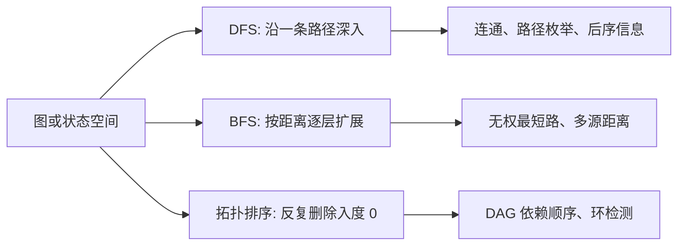
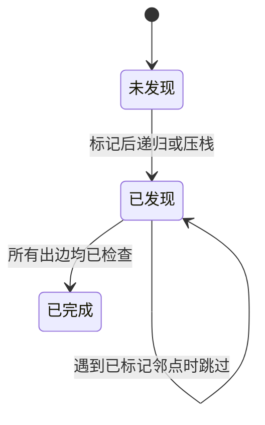
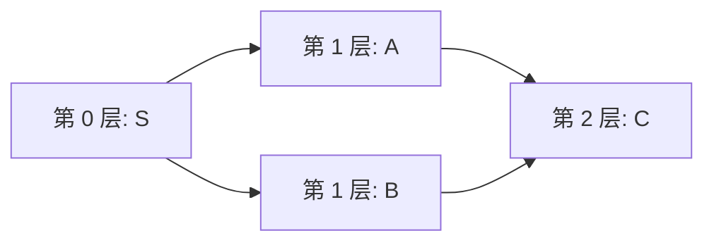
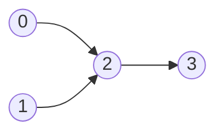
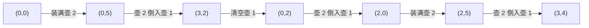

> 本笔记按原书第 18 章的小节顺序展开。原书概念、例题与算法按原顺序讲解；超出原书的严格证明、工程边界与替代方法均标注为“补充”。

## 本章要解决什么问题

许多问题可以抽象成状态图：状态是顶点，一次合法操作是边。图搜索要回答：

- 从某个状态能到达哪些状态？
- 有多少个连通区域？
- 是否存在满足条件的路径？
- 每步代价相同时，最少需要多少步？
- 有向依赖能否排成不违反先后关系的线性顺序？

本章的三种核心工具分别利用不同结构：



DFS 与 BFS 都会访问可达顶点和边，渐近时间通常同为 $O(V+E)$；区别在访问顺序及由此自然得到的信息。拓扑排序则只适用于有向无环图（DAG），它把偏序约束扩展成线性序列。

## 18.1 DFS、BFS 和拓扑排序概述

### 18.1.1 深度优先搜索

#### 1. 直觉与严格状态

深度优先搜索（Depth-First Search，DFS）从顶点 $u$ 出发，优先沿尚未访问的邻边继续深入；当前顶点没有新邻点时，回退到上一层，继续探索其他分支。

用布尔数组

$$
visited[v]
$$

表示顶点是否已被发现。基本递归：

```text
dfs(u):
    visited[u] = true
    处理 u
    for v in adj[u]:
        if not visited[v]:
            dfs(v)
```

顶点应在进入函数时立即标记。若等到所有邻点处理完才标记，无向边或有向环会让相邻顶点互相递归，造成重复甚至无限调用。

#### 2. DFS 序列不唯一

同一顶点的多个未访问邻点可按任意顺序选择，邻接表顺序不同会产生不同 DFS 序列，但可达集合不变。若题目要求字典序最小路径或固定输出，必须先排序邻接表或使用规定的邻点顺序。

#### 3. 非连通图

单次 `dfs(start)` 只覆盖从 `start` 可达的连通分量。遍历整张图要增加外层循环：

```text
for vertex in all vertices:
    if not visited[vertex]:
        dfs(vertex)
```

外层每启动一次 DFS，通常对应无向图的一个连通分量；有向图中则是按出边可达形成的一棵 DFS 森林树，不直接等于强连通分量。

#### 4. 时间复杂度

邻接表中每个顶点只首次进入一次；每条有向边检查一次，无向边以两个邻接表项检查两次：

$$
\boxed{T(V,E)=O(V+E).}
$$

`visited` 空间 $O(V)$；递归栈为 $O(H)$，$H$ 是 DFS 树最大深度，最坏 $O(V)$。

若使用邻接矩阵，访问每个顶点都要扫描整行，时间会变成 $O(V^2)$，不能机械写成 $O(V+E)$。

#### 5. 递去与归来阶段

进入顶点时处理得到先序；所有邻点处理后再处理得到后序。后序适合汇总子树信息、完成时间和拓扑逆序。

原书指出：对 DAG，在访问完所有出邻点后输出顶点，得到逆拓扑序，反转后是拓扑序。

更一般的 DFS 拓扑排序需要三色标记：

- 0：未访问；
- 1：正在当前递归路径中；
- 2：已完成。

遇到指向颜色 1 的边说明存在有向环，不能得到拓扑序。仅有普通 `visited` 无法区分“已完成”与“当前路径中的祖先”。

#### 6. DFS 适用场景

- 连通分量、岛屿填充；
- 枚举或验证路径；
- 树/图后序信息；
- 环检测、拓扑后序；
- 需要深入到完整候选后再回退的搜索。

递归 DFS 代码简洁，但长链、巨大网格可能栈溢出。显式栈可保持同一遍历逻辑并控制内存。

把后文所有 DFS 题统一到四个要素后，迁移时只需替换状态和邻接生成规则：

- **状态**：图中是顶点 `vertex`，网格中是坐标 `(row,column)`，水壶中是水量对 `(x,y)`；
- **边**：邻接表项、合法方向移动或一次合法操作；
- **去重键**：必须完整描述会影响未来选择的信息，并在递归进入或压栈前标记；
- **边界**：网格邻点必须同时满足 `0 <= row < rows` 与 `0 <= column < columns`，再访问数组。



#### C++17

以下基础定义供本章后续 C++17 题解复用；各题代码只保留自己的状态转移与主体函数。

```cpp
#include <algorithm>
#include <array>
#include <climits>
#include <functional>
#include <map>
#include <numeric>
#include <queue>
#include <set>
#include <stack>
#include <string>
#include <tuple>
#include <unordered_map>
#include <unordered_set>
#include <utility>
#include <vector>

using namespace std;

using Graph = std::vector<std::vector<int>>;
using Cell = std::pair<int, int>;

inline constexpr std::array<Cell, 4> DIRECTIONS_4 = {
    {{1, 0}, {-1, 0}, {0, 1}, {0, -1}}
};

bool inGrid(int row, int column, int rows, int columns) {
    return 0 <= row && row < rows && 0 <= column && column < columns;
}

std::vector<int> depthFirstOrder(const Graph& graph) {
    std::vector<bool> visited(graph.size());
    std::vector<int> order;
    std::function<void(int)> dfs = [&](int vertex) {
        visited[vertex] = true;  // 发现时标记，随后才检查出边
        order.push_back(vertex);
        for (int neighbor : graph[vertex]) {
            if (!visited[neighbor]) {
                dfs(neighbor);
            }
        }
    };

    for (int vertex = 0; vertex < static_cast<int>(graph.size()); ++vertex) {
        if (!visited[vertex]) {
            dfs(vertex);
        }
    }
    return order;
}
```

### 18.1.2 广度优先搜索

#### 1. 按层访问

广度优先搜索（Breadth-First Search，BFS）使用先进先出队列。源点距离为 0，先访问所有距离 1 的顶点，再访问距离 2 的顶点，依次向外扩展。

基本模板：

```text
queue = [source]
visited[source] = true
distance[source] = 0
while queue not empty:
    u = pop_front()
    for v in adj[u]:
        if not visited[v]:
            visited[v] = true
            distance[v] = distance[u] + 1
            push_back(v)
```

通常应在**入队时**标记；若出队时才标记，同一顶点可能被多个前驱重复入队，使时间和队列空间显著膨胀。若队列项保留各自的发现距离，并在出队时判重、跳过后续副本，最短层次仍可正确，只是低效；若重复入队时覆盖同一份距离或父指针，则较晚的非最优发现还可能破坏距离或路径恢复结果。

#### 2. 为什么第一次到达就是无权最短路

归纳证明队列按非递减距离出队：

- 源点距离 0；
- 距离 $d$ 的顶点只会把未访问邻点标记为 $d+1$；
- 队列 FIFO 保证所有距离 $d$ 的顶点先于新加入的 $d+1$ 顶点处理。

若顶点 $v$ 第一次在距离 $d$ 被发现，却存在更短路径 $<d$，该路径前驱应在更早层被处理并更早发现 $v$，矛盾。因此第一次发现距离即最短边数。

这个结论要求每条边代价相同（通常为 1）。有 0/1 边权应用 0-1 BFS；一般非负权使用 Dijkstra；负权边不能直接使用普通 BFS。

下面的菱形图同时说明层次与标记时机。`S` 出队后发现 `A、B`，它们同属第 1 层；无论谁先出队，`C` 都只能属于第 2 层：



若 `A` 发现 `C` 时立即标记，随后处理 `B` 会跳过 `C`。若改成出队才标记，则 `A` 与 `B` 都会把 `C` 入队，队列短暂变成 `[C,C]`；更密集的分层图会把这种重复逐层放大。故 BFS 的不变量是：**队列中的每个状态已经去重，并已拥有最短发现距离**。

#### 3. 两种记录距离方式

1. 队列元素保存 `(vertex,distance)`；
2. 队列只保存顶点，外层每次记录当前队列长度，完整处理一层后距离加 1。

分层模板：

```text
distance = 0
while queue not empty:
    layer_size = len(queue)
    repeat layer_size times:
        扩展一个本层顶点
    distance += 1
```

必须在进入下一轮前固定 `layer_size`；若循环条件直接使用不断增长的队列长度，会把下一层混入当前层。

#### 4. 多源 BFS

若求每个顶点到源集合 $S$ 的最近距离，把所有源点以距离 0 同时入队：

$$
distance(v)=\min_{s\in S}dist(s,v).
$$

可想象新增一个超级源点，以 0 代价连接所有 $S$，再从它扩展。各源的波前同时生长，某顶点第一次被任一波前到达时就是最近距离。

原书示例从集合 `{3,5}` 同时搜索到顶点 0，在无向图中得到最短距离 1。

对有向图，若问题问“顶点到源集合”的距离，从源集合沿原出边 BFS 得到的是“源到顶点”距离；通常需反转边或从目标顶点正向搜索，必须明确方向。

#### 5. 双向 BFS

当起点与终点都已知，分别从两端按层扩展。若某侧发现对方已访问顶点，路径长度为

$$
\boxed{
distStart[u]+1+distTarget[v]
}
$$

（边 $u\to v$ 连接两侧）。

实践中每次扩展当前边界集合较小的一侧，降低分支数量。但为保证“第一次相遇即最短”，应按完整 BFS 层扩展，距离映射记录每个顶点的最短侧向距离。

若普通 BFS 的分支因子约为 $b$、最短深度为 $d$，搜索结点量近似 $b^d$；双向搜索理想情况下约为

$$
2b^{d/2},
$$

实际提升可能很大，但渐近上界仍为 $O(V+E)$。

双向 BFS 要求能从目标反向生成前驱状态；无向图天然满足，有向图需构造反图。

#### 6. BFS 复杂度与空间

邻接表上每个顶点最多入队一次，每条边检查常数次：

$$
\boxed{T(V,E)=O(V+E).}
$$

`visited/distance` 与队列最坏均为 $O(V)$。宽图某一层可能包含大量顶点，因此 BFS 峰值空间通常比深度有限的 DFS 大。

#### 7. DFS 与 BFS 对比

| 对比项 | DFS | BFS |
|---|---|---|
| 核心容器 | 递归栈/显式栈 | FIFO 队列 |
| 访问顺序 | 一条路径尽量深入 | 距离逐层扩展 |
| 无权最短路 | 不自然，可能遍历大量路径 | 第一次到达即最短 |
| 路径枚举/后序汇总 | 自然 | 不自然 |
| 峰值空间 | 最坏 $O(V)$，常与深度相关 | 最坏 $O(V)$，常与层宽相关 |

迁移到新题时先作如下判断：只问可达性或连通块时 DFS/BFS 均可；要求等权边下的最少操作数时选 BFS；需要后序汇总、回退或枚举完整候选时优先 DFS；若“到达同一位置但携带信息不同”会影响未来，状态键必须从 `vertex` 扩展为 `(vertex,extraState)`，不能继续只按顶点去重。

#### C++17

`distance` 同时承担距离数组与 `visited`；源点和邻点都在入队前写入距离。

```cpp
vector<int> breadthFirstDistances(
    const Graph& graph, const vector<int>& sources
) {
    vector<int> distance(graph.size(), -1);
    queue<int> vertices;
    for (int source : sources) {
        if (distance[source] == -1) {
            distance[source] = 0;
            vertices.push(source);
        }
    }

    while (!vertices.empty()) {
        int vertex = vertices.front();
        vertices.pop();
        for (int neighbor : graph[vertex]) {
            if (distance[neighbor] == -1) {
                distance[neighbor] = distance[vertex] + 1;
                vertices.push(neighbor);
            }
        }
    }
    return distance;
}
```

### 18.1.3 拓扑排序

#### 1. 定义

有向图的拓扑序是包含每个顶点恰好一次的线性序列，满足每条有向边

$$
u\to v
$$

中 $u$ 都出现在 $v$ 前面。原书用“若存在从 $u$ 到 $v$ 的路径，则 $u$ 在 $v$ 前”描述；边条件与路径条件等价，因为路径由边传递。

只有 DAG 才存在拓扑序。拓扑序可能不唯一：若多个入度为 0 的顶点之间没有先后约束，它们可按不同顺序输出。

#### 2. Kahn 算法

1. 计算每个顶点入度；
2. 把所有入度 0 顶点放入栈或队列；
3. 取出一个顶点 $u$ 加入结果；
4. 删除其每条出边 $u\to v$，即执行 `indegree[v]--`；
5. 某个 $v$ 入度变成 0 时加入容器；
6. 直到容器为空。

队列、栈、最小堆都可保存当前零入度顶点：

- 队列/栈得到任意合法拓扑序；
- 最小堆可得到字典序较小的序列。

#### 3. 为什么输出顺序合法

顶点 $v$ 只有在所有入边都已删除、入度变为 0 后才输出。每条前驱边的起点必已先输出，因此所有依赖都在 $v$ 之前。

#### 4. 环检测

设输出顶点数为 `processed`。若

$$
processed=V,
$$

排序成功。若小于 $V$，剩余子图每个顶点入度至少为 1。沿任意前驱不断回溯，在有限顶点中必重复某个顶点，从而形成有向环。

所以

$$
\boxed{
processed<V\iff\text{图中存在有向环}.
}
$$

#### 5. 复杂度

计算入度检查每条边一次，处理时每条边再删除一次：

$$
T(V,E)=O(V+E),
$$

空间 $O(V+E)$（含邻接表）。

#### 6. 与 DFS 拓扑排序的关系

DFS 在顶点所有后继完成后把它加入后序列表，反转列表得到拓扑序；三色标记负责检测回边。Kahn 从“没有前驱”的顶点向前推进，DFS 后序从“后继都完成”的顶点向后收集。

Kahn 更自然地给出入度动态过程和分层依赖；DFS 更适合已有递归图算法。两者都要求 DAG。

以下图的初始入度为 `[0,0,2,1]`，零入度队列为 `[0,1]`：



| 出队顶点 | 删除的边 | 更新后的关键入度 | 新入队顶点 | `processed` |
|---|---|---|---|---:|
| 0 | `0→2` | `indegree[2]: 2→1` | 无 | 1 |
| 1 | `1→2` | `indegree[2]: 1→0` | 2 | 2 |
| 2 | `2→3` | `indegree[3]: 1→0` | 3 | 3 |
| 3 | 无 | 无 | 无 | 4 |

最终 `processed=V=4`。反例 `0→1→2→0` 的入度全为 1，初始队列为空，得到 `processed=0<V`；若图由一个可排序分量和一个环组成，也会先处理前者再停住，因此检测条件必须是 **最终处理数小于总顶点数**，而不是“初始队列为空”或“一个顶点都没处理”。

#### C++17

返回值中的布尔量明确表示是否处理了全部顶点；有环时保留的 `order` 只是可剥离前缀，不是拓扑序。

```cpp
pair<vector<int>, bool> topologicalOrder(const Graph& graph) {
    vector<int> indegree(graph.size());
    for (const auto& neighbors : graph) {
        for (int neighbor : neighbors) {
            ++indegree[neighbor];
        }
    }

    queue<int> zeroIndegree;
    for (int vertex = 0; vertex < static_cast<int>(graph.size()); ++vertex) {
        if (indegree[vertex] == 0) {
            zeroIndegree.push(vertex);
        }
    }

    vector<int> order;
    while (!zeroIndegree.empty()) {
        int vertex = zeroIndegree.front();
        zeroIndegree.pop();
        order.push_back(vertex);
        for (int neighbor : graph[vertex]) {
            if (--indegree[neighbor] == 0) {
                zeroIndegree.push(neighbor);
            }
        }
    }
    return {order, order.size() == graph.size()};
}
```

## 18.2 深度优先遍历应用的算法设计

### 18.2.1 LeetCode 200：岛屿数量（DFS）（★★）

#### 网格转图

每个陆地格 `'1'` 是顶点；上下左右相邻陆地之间有无向边。岛屿就是该图的连通分量。

扫描所有格子。遇到尚未访问陆地时：

1. 岛屿数加 1；
2. 从该格 DFS，把整个连通分量都标记已访问。

原书直接把访问过的 `'1'` 改成 `'0'`，复用原网格充当 `visited`。应在进入格子时立即改色，再递归四邻，避免相邻陆地互相调用。

#### 正确性

一次 DFS 恰访问起点所在岛屿：沿陆地边不会越出分量，且所有与起点连通的陆地都能沿某条路径被递归到。扫描时每个分量第一次遇到一个未访问格才加 1，之后整分量已改色，所以每座岛计一次。

对 $m\times n$ 网格，时间 $O(mn)$，最坏递归栈 $O(mn)$。若不能修改输入，使用额外布尔矩阵；大网格可改显式栈。

#### C++17

```cpp
int numberOfIslandsDfs(vector<string> grid) {
    if (grid.empty() || grid[0].empty()) {
        return 0;
    }
    int rows = static_cast<int>(grid.size());
    int columns = static_cast<int>(grid[0].size());
    function<void(int, int)> sink = [&](int row, int column) {
        if (!inGrid(row, column, rows, columns) ||
            grid[row][column] != '1') {
            return;
        }
        grid[row][column] = '0';
        for (auto [rowDelta, columnDelta] : DIRECTIONS_4) {
            sink(row + rowDelta, column + columnDelta);
        }
    };

    int answer = 0;
    for (int row = 0; row < rows; ++row) {
        for (int column = 0; column < columns; ++column) {
            if (grid[row][column] == '1') {
                ++answer;
                sink(row, column);
            }
        }
    }
    return answer;
}
```

### 18.2.2 LeetCode 463：岛屿周长（★）

#### 每条陆地边的贡献

从任一陆地开始 DFS。对当前陆地的四个方向：

- 邻格越界：该边面向网格外，周长贡献 1；
- 邻格是水：该边面向水，贡献 1；
- 邻格是未访问陆地：递归；
- 邻格是已访问陆地：内部共享边，贡献 0。

因此递归返回值可定义为“当前连通陆地区域贡献的周长”，把四个方向结果相加。

#### 为什么不会重复计算外边

每条周长边只属于一个陆地格及一个方向，处理该陆地四邻时计一次。两块陆地的共享边从两侧看都是陆地，不计入周长。

原书样例周长为 16。

时间 $O(mn)$、栈空间最坏 $O(mn)$。

> **补充：无需 DFS 的公式。** 若陆地格数为 $L$，相邻陆地共享边数为 $A$（只检查右、下避免重复），则
> $$
> perimeter=4L-2A.
> $$
> 因为每条共享边从两个格子的初始 4 边中各消去一次。题目保证一个岛屿时直接扫描更简单；DFS 写法展示边界返回值。

#### C++17

```cpp
int islandPerimeterDfs(const vector<vector<int>>& grid) {
    if (grid.empty() || grid[0].empty()) {
        return 0;
    }
    int rows = static_cast<int>(grid.size());
    int columns = static_cast<int>(grid[0].size());
    vector<vector<bool>> visited(rows, vector<bool>(columns));
    function<int(int, int)> perimeter = [&](int row, int column) -> int {
        if (!inGrid(row, column, rows, columns) || grid[row][column] == 0) {
            return 1;
        }
        if (visited[row][column]) {
            return 0;
        }
        visited[row][column] = true;
        int result = 0;
        for (auto [rowDelta, columnDelta] : DIRECTIONS_4) {
            result += perimeter(row + rowDelta, column + columnDelta);
        }
        return result;
    };

    for (int row = 0; row < rows; ++row) {
        for (int column = 0; column < columns; ++column) {
            if (grid[row][column] == 1) {
                return perimeter(row, column);
            }
        }
    }
    return 0;
}
```

### 18.2.3 LeetCode 130：被围绕的区域（★★）

#### 反向寻找“不能被填充”的区域

直接判断每个内部 `'O'` 是否被围住，需要探索它能否到边界，容易重复。原书反过来：任何与边界 `'O'` 连通的 `'O'` 都不能被围住。

算法：

1. 从四条边上的每个 `'O'` 启动 DFS；
2. 把可达 `'O'` 临时标成安全字符，例如 `'$'`；
3. 扫描全板：剩余 `'O'` 改成 `'X'`，`'$'` 恢复成 `'O'`。

四个角会在边界循环中重复遇到，但第一次已改色，后续调用立即返回。

#### 充要性

一个 `'O'` 区域不被 `'X'` 围绕，当且仅当它通过四邻路径连接到矩阵边界。DFS 从所有边界源点恰标记这些连通分量；未标记 `'O'` 与边界无路径，四周最终只能由 `'X'` 隔开，应该填充。

时间 $O(mn)$；最坏栈 $O(mn)$。临时字符必须不与合法输入字符冲突。

#### C++17

```cpp
void solveSurroundedDfs(vector<string>& board) {
    if (board.empty() || board[0].empty()) {
        return;
    }
    int rows = static_cast<int>(board.size());
    int columns = static_cast<int>(board[0].size());
    function<void(int, int)> mark = [&](int row, int column) {
        if (!inGrid(row, column, rows, columns) ||
            board[row][column] != 'O') {
            return;
        }
        board[row][column] = '$';
        for (auto [rowDelta, columnDelta] : DIRECTIONS_4) {
            mark(row + rowDelta, column + columnDelta);
        }
    };

    for (int row = 0; row < rows; ++row) {
        mark(row, 0);
        mark(row, columns - 1);
    }
    for (int column = 0; column < columns; ++column) {
        mark(0, column);
        mark(rows - 1, column);
    }
    for (string& line : board) {
        for (char& cell : line) {
            if (cell == 'O') {
                cell = 'X';
            } else if (cell == '$') {
                cell = 'O';
            }
        }
    }
}
```

### 18.2.4 LeetCode 529：扫雷游戏（DFS）（★★）

#### 点击地雷与点击空格

若点击位置为 `'M'`，直接改成 `'X'` 并结束。

点击 `'E'` 时，统计八邻域地雷数 $c$：

- $c>0$：改成字符 `'0'+c`，不能继续扩展；
- $c=0$：改成 `'B'`，再递归揭开八邻域中仍为 `'E'` 的格子。

应先把当前格改成 `'B'`，再递归邻格，相当于发现即标记。

#### 为什么数字格停止扩展

规则只自动展开没有相邻地雷的空白格。数字格表示波前遇到地雷边界，虽然它已揭开，但其邻格不能自动继续。

递归只进入 `'E'`。初始已有 `'B'` 或数字是已揭开格，不应再次处理；地雷只用于计数，绝不能在空白扩展中递归点击。

每个被揭开的空格访问一次，每次检查 8 邻域，时间 $O(mn)$，栈最坏 $O(mn)$。

#### C++17

```cpp
int countAdjacentMines(const vector<string>& board, int row, int column) {
    int rows = static_cast<int>(board.size());
    int columns = static_cast<int>(board[0].size());
    int mines = 0;
    for (int rowDelta = -1; rowDelta <= 1; ++rowDelta) {
        for (int columnDelta = -1; columnDelta <= 1; ++columnDelta) {
            if (rowDelta == 0 && columnDelta == 0) {
                continue;
            }
            int nextRow = row + rowDelta;
            int nextColumn = column + columnDelta;
            if (inGrid(nextRow, nextColumn, rows, columns) &&
                board[nextRow][nextColumn] == 'M') {
                ++mines;
            }
        }
    }
    return mines;
}

vector<string> updateMinesweeperDfs(
    vector<string> board, pair<int, int> click
) {
    if (board.empty() || board[0].empty()) {
        return board;
    }
    int rows = static_cast<int>(board.size());
    int columns = static_cast<int>(board[0].size());
    auto [startRow, startColumn] = click;
    if (board[startRow][startColumn] == 'M') {
        board[startRow][startColumn] = 'X';
        return board;
    }

    function<void(int, int)> reveal = [&](int row, int column) {
        if (!inGrid(row, column, rows, columns) ||
            board[row][column] != 'E') {
            return;
        }
        int mines = countAdjacentMines(board, row, column);
        if (mines > 0) {
            board[row][column] = static_cast<char>('0' + mines);
            return;
        }
        board[row][column] = 'B';
        for (int rowDelta = -1; rowDelta <= 1; ++rowDelta) {
            for (int columnDelta = -1; columnDelta <= 1; ++columnDelta) {
                if (rowDelta != 0 || columnDelta != 0) {
                    reveal(row + rowDelta, column + columnDelta);
                }
            }
        }
    };
    reveal(startRow, startColumn);
    return board;
}
```

### 18.2.5 LeetCode 365：水壶问题（DFS）（★★）

#### 状态图

状态

$$
(x,y),
\qquad0\le x\le C_1,
\qquad0\le y\le C_2
$$

表示两壶当前水量。起点 `(0,0)`。目标满足：

$$
x=T\quad\text{或}\quad y=T\quad\text{或}\quad x+y=T.
$$

六类操作产生边：装满任一壶、清空任一壶、两种方向倒水。

从壶 1 向壶 2 倒水量应为

$$
\boxed{pour=\min(x,C_2-y),}
$$

新状态

$$
(x-pour,y+pour).
$$

反向同理。它正确表达“直到源倒空或目标装满”，不要求目标一定能容纳源壶全部水。

#### 去重与复杂度

状态图有至多

$$
(C_1+1)(C_2+1)
$$

个状态。必须用集合在入栈/递归前标记；否则装满、清空操作形成环。

DFS 穷举最坏时间和空间均与状态数同阶。容量可达 $10^6$ 时不可实际承受，原书也观察到递归栈溢出并改用显式栈；显式栈避免调用栈溢出，但不改变巨大状态空间。

#### 原书思考题：最大公约数判定

所有可测得水量都是

$$
aC_1+bC_2
$$

的整数线性组合，因而必须是

$$
g=\gcd(C_1,C_2)
$$

的倍数。Bézout 定理又保证所有 $g$ 的整数倍可通过倒水操作构造（在容量范围内）。题目允许两壶合计，因此充要条件为：

$$
\boxed{
T\le C_1+C_2
\quad\text{且}\quad
T\bmod\gcd(C_1,C_2)=0.
}
$$

`C1=3,C2=5,T=4`：$4\le8$ 且 `gcd=1`，可行；`2,6,5` 的 gcd 为 2，5 不是其倍数，不可行。

GCD 算法时间 $O(\log\min(C_1,C_2))$、空间 $O(1)$，远优于状态搜索。正文 C++17 与章末两个附录都保留 DFS 小规模版本和 GCD 高效判定。

容量 `(3,5)` 测量 4 升的一条状态路径如下；每条箭头都严格对应六种操作之一，而不是任意改变水量：



#### C++17

状态在压栈前插入 `visited`。GCD 判定只回答可达性；若题目改问最少操作数，仍需对同一状态图做 BFS。

```cpp
array<Cell, 6> jugSuccessors(
    int first, int second, int firstCapacity, int secondCapacity
) {
    int pourFirst = min(first, secondCapacity - second);
    int pourSecond = min(second, firstCapacity - first);
    return {{{firstCapacity, second},
             {first, secondCapacity},
             {0, second},
             {first, 0},
             {first - pourFirst, second + pourFirst},
             {first + pourSecond, second - pourSecond}}};
}

bool canMeasureWaterDfs(int firstCapacity, int secondCapacity, int target) {
    stack<Cell> states;
    set<Cell> visited;
    states.push({0, 0});
    visited.insert({0, 0});
    while (!states.empty()) {
        auto [first, second] = states.top();
        states.pop();
        if (first == target || second == target || first + second == target) {
            return true;
        }
        for (Cell state : jugSuccessors(
                 first, second, firstCapacity, secondCapacity
             )) {
            if (visited.insert(state).second) {
                states.push(state);
            }
        }
    }
    return false;
}

bool canMeasureWaterGcd(int firstCapacity, int secondCapacity, int target) {
    if (target == 0) {
        return true;
    }
    if (target > firstCapacity + secondCapacity) {
        return false;
    }
    int divisor = gcd(firstCapacity, secondCapacity);
    return divisor != 0 && target % divisor == 0;
}
```

### 18.2.6 LeetCode 332：重新安排行程（★★★）

#### 问题是有向多重图的欧拉通路

机场是顶点，每张机票是有向边。完全相同的机票也必须分别使用，因此图是多重图。要求从 `JFK` 出发，每条边恰用一次，即求欧拉通路；还要求机场序列字典序最小。

顶点可以重复访问，不能用普通 `visited[airport]`；应标记/删除**边**。

#### Hierholzer 算法

对每个出发机场，把目的地保存为可反复取最小值的容器（有序多重集合、最小堆，或逆序数组从末尾弹出）。DFS：

```text
visit(airport):
    while airport 还有未用出边:
        destination = 取字典序最小出边并删除
        visit(destination)
    route.append(airport)
```

最终反转 `route`。

#### 为什么后序加入

朴素地把每次选择的最小目的地立即写入最终路径，可能提前进入一条无出路分支，剩余机票无法接上。Hierholzer 在某顶点所有出边耗尽后才把它加入结果，相当于先确定欧拉通路的尾部，再向前拼接；每条被删除的边最终恰出现一次。

当存在欧拉通路时，递归过程中形成的闭合子回路会在回退时自动嵌入主路径。

#### 字典序

每次从当前机场消费字典序最小的可用出边。后序反转后，这会在最早可决定的位置优先使用较小目的地，同时 Hierholzer 保证不会遗失边，从而得到题设保证存在情况下的字典序最小有效行程。

原书样例返回：

```text
[JFK, ATL, JFK, SFO, ATL, SFO]
```

#### 复杂度

设机票数为 $E$。对所有目的列表排序总计 $O(E\log E)$；每条边弹出、访问一次，DFS 为 $O(E)$；空间 $O(E)$。递归深度最坏 $E+1$，大输入可用显式栈实现 Hierholzer。

#### C++17

```cpp
vector<string> reconstructItinerary(const vector<vector<string>>& tickets) {
    unordered_map<
        string,
        priority_queue<string, vector<string>, greater<string>>
    > graph;
    for (const auto& ticket : tickets) {
        graph[ticket[0]].push(ticket[1]);
    }

    vector<string> route;
    function<void(const string&)> visit = [&](const string& airport) {
        auto& destinations = graph[airport];
        while (!destinations.empty()) {
            string next = destinations.top();
            destinations.pop();
            visit(next);
        }
        route.push_back(airport);
    };
    visit("JFK");
    reverse(route.begin(), route.end());
    return route;
}
```

## 18.3 广度优先遍历应用的算法设计

### 18.3.1 LeetCode 200：岛屿数量（BFS）（★★）

扫描网格，遇到 `'1'` 时岛屿数加 1，并从该格 BFS：

1. 入队前把它改成 `'0'`；
2. 出队后检查四邻；
3. 未访问陆地在入队时立即改色。

一次 BFS 恰好淹没一个连通分量，所以每座岛只在第一次扫描到时计数。时间 $O(mn)$，队列最坏 $O(mn)$。

与 DFS 解法的结果和渐近时间相同；BFS 避免递归栈溢出，但可能同时保存很宽的岛屿边界。

#### C++17

```cpp
int numberOfIslandsBfs(vector<string> grid) {
    if (grid.empty() || grid[0].empty()) {
        return 0;
    }
    int rows = static_cast<int>(grid.size());
    int columns = static_cast<int>(grid[0].size());
    int answer = 0;
    for (int row = 0; row < rows; ++row) {
        for (int column = 0; column < columns; ++column) {
            if (grid[row][column] != '1') {
                continue;
            }
            ++answer;
            queue<Cell> cells;
            grid[row][column] = '0';
            cells.push({row, column});
            while (!cells.empty()) {
                auto [currentRow, currentColumn] = cells.front();
                cells.pop();
                for (auto [rowDelta, columnDelta] : DIRECTIONS_4) {
                    int nextRow = currentRow + rowDelta;
                    int nextColumn = currentColumn + columnDelta;
                    if (inGrid(nextRow, nextColumn, rows, columns) &&
                        grid[nextRow][nextColumn] == '1') {
                        grid[nextRow][nextColumn] = '0';
                        cells.push({nextRow, nextColumn});
                    }
                }
            }
        }
    }
    return answer;
}
```

### 18.3.2 LeetCode 130：被围绕的区域（BFS）（★★）

把四条边上所有 `'O'` 作为多源 BFS 起点，入队时统一标成安全字符 `'$'`，再向四邻扩展。最后剩余 `'O'` 改成 `'X'`，安全字符恢复。

多源队列等价于同时从所有边界连通区域扩展；角落重复扫描时因已改色不会重复入队。

正确性与 DFS 版相同，时间 $O(mn)$，空间 $O(mn)$。

#### C++17

```cpp
void solveSurroundedBfs(vector<string>& board) {
    if (board.empty() || board[0].empty()) {
        return;
    }
    int rows = static_cast<int>(board.size());
    int columns = static_cast<int>(board[0].size());
    queue<Cell> cells;
    auto add = [&](int row, int column) {
        if (inGrid(row, column, rows, columns) &&
            board[row][column] == 'O') {
            board[row][column] = '$';
            cells.push({row, column});
        }
    };

    for (int row = 0; row < rows; ++row) {
        add(row, 0);
        add(row, columns - 1);
    }
    for (int column = 0; column < columns; ++column) {
        add(0, column);
        add(rows - 1, column);
    }
    while (!cells.empty()) {
        auto [row, column] = cells.front();
        cells.pop();
        for (auto [rowDelta, columnDelta] : DIRECTIONS_4) {
            add(row + rowDelta, column + columnDelta);
        }
    }
    for (string& line : board) {
        for (char& cell : line) {
            if (cell == 'O') {
                cell = 'X';
            } else if (cell == '$') {
                cell = 'O';
            }
        }
    }
}
```

### 18.3.3 LeetCode 529：扫雷游戏（BFS）（★★）

点击地雷仍直接改 `'X'`。点击空格时把起点入队；每次处理一个仍为 `'E'` 的格子：

- 八邻域地雷数大于 0：写数字，不扩展；
- 等于 0：写 `'B'`，把八邻域中的 `'E'` 标记并入队。

为了避免同一 `'E'` 被多个空白前驱重复入队，可在入队时改为临时标记，或立即改 `'B'` 并在出队时完成计数。若先改 `'B'`，计数只检查 `'M'`，不会受自身状态影响。

每格最多入队一次，时间 $O(mn)$、队列空间 $O(mn)$。数字格和已有揭开格不继续扩展。

#### C++17

复用 18.2.4 的 `countAdjacentMines`。`discovered` 在入队前置为真，即使该格出队后成为数字，也不会被其他空白格重复加入。

```cpp
vector<string> updateMinesweeperBfs(
    vector<string> board, pair<int, int> click
) {
    if (board.empty() || board[0].empty()) {
        return board;
    }
    int rows = static_cast<int>(board.size());
    int columns = static_cast<int>(board[0].size());
    auto [startRow, startColumn] = click;
    if (board[startRow][startColumn] == 'M') {
        board[startRow][startColumn] = 'X';
        return board;
    }

    queue<Cell> cells;
    vector<vector<bool>> discovered(rows, vector<bool>(columns));
    discovered[startRow][startColumn] = true;
    cells.push(click);
    while (!cells.empty()) {
        auto [row, column] = cells.front();
        cells.pop();
        int mines = countAdjacentMines(board, row, column);
        if (mines > 0) {
            board[row][column] = static_cast<char>('0' + mines);
            continue;
        }
        board[row][column] = 'B';
        for (int rowDelta = -1; rowDelta <= 1; ++rowDelta) {
            for (int columnDelta = -1; columnDelta <= 1; ++columnDelta) {
                if (rowDelta == 0 && columnDelta == 0) {
                    continue;
                }
                int nextRow = row + rowDelta;
                int nextColumn = column + columnDelta;
                if (inGrid(nextRow, nextColumn, rows, columns) &&
                    board[nextRow][nextColumn] == 'E' &&
                    !discovered[nextRow][nextColumn]) {
                    discovered[nextRow][nextColumn] = true;
                    cells.push({nextRow, nextColumn});
                }
            }
        }
    }
    return board;
}
```

### 18.3.4 LeetCode 365：水壶问题（BFS）（★★）

状态、六类转移、目标条件与 18.2.5 相同。区别仅是用队列按操作步数分层：若还要求最少操作数，BFS 第一次到达目标就是最少步；本题只问可达性，DFS/BFS 都正确。

状态必须在入队时加入集合。最坏状态数

$$
(C_1+1)(C_2+1),
$$

对大容量仍不可行；GCD 充要判定是本题最合适的高效解法。

#### C++17

复用 18.2.5 的 `jugSuccessors`；把栈换成队列后，状态携带的层次才表示最少操作数。

```cpp
bool canMeasureWaterBfs(int firstCapacity, int secondCapacity, int target) {
    queue<Cell> states;
    set<Cell> visited;
    visited.insert({0, 0});
    states.push({0, 0});
    while (!states.empty()) {
        auto [first, second] = states.front();
        states.pop();
        if (first == target || second == target || first + second == target) {
            return true;
        }
        for (Cell state : jugSuccessors(
                 first, second, firstCapacity, secondCapacity
             )) {
            if (visited.insert(state).second) {
                states.push(state);
            }
        }
    }
    return false;
}
```

### 18.3.5 LeetCode 1162：地图分析（★★）

#### 目标函数

每个海洋格到最近陆地的距离为

$$
d(o)=\min_{l\in Land}\bigl(|o_x-l_x|+|o_y-l_y|\bigr).
$$

题目求

$$
\max_{o\in Ocean}d(o).
$$

#### 朴素方案

从每个海洋格单独 BFS，到第一块陆地时得到该海洋的最近距离，再取最大。网格有 $n^2$ 个海洋，每次最坏访问 $n^2$ 格，总时间

$$
O(n^4).
$$

> **原文复杂度勘误：** 扫描文本把单次/总体写成 $O(n)$ 与 $O(n^2)$ 量级，忽略网格共有 $n^2$ 个单元。若 $n$ 表示边长，单次是 $O(n^2)$，逐海洋总体最坏 $O(n^4)$。

#### 多源 BFS

把所有陆地同时作为距离 0 源点入队，向海洋扩展。某海洋第一次被访问时，距离就是到最近陆地的最短距离。最后一层海洋的距离即所求最大值。

若全是陆地，没有海洋；若全是海洋，没有源点，两种情况都返回 -1。

样例只有 `(0,0)` 是陆地，最远 `(2,2)` 距离

$$
|2-0|+|2-0|=4.
$$

时间 $O(n^2)$，空间 $O(n^2)$。

#### 为什么不能从所有海洋出发找陆地

所有海洋作为源点得到的是“每块陆地到最近海洋”的距离，再取最后陆地层；它交换了 `max` 与 `min` 的对象，一般不等于“海洋到最近陆地距离的最大值”。例如只有一个陆地时，所有海洋源可在 1 步到达该陆地，结果 1，而原题答案可能很大。

#### C++17

所有陆地先以距离 0 入队；`distance != -1` 既表示陆地源，也表示已被某个波前发现的海洋。

```cpp
int maximumOceanDistance(const vector<vector<int>>& grid) {
    if (grid.empty() || grid[0].empty()) {
        return -1;
    }
    int rows = static_cast<int>(grid.size());
    int columns = static_cast<int>(grid[0].size());
    vector<vector<int>> distance(rows, vector<int>(columns, -1));
    queue<Cell> cells;
    int landCount = 0;
    for (int row = 0; row < rows; ++row) {
        for (int column = 0; column < columns; ++column) {
            if (grid[row][column] == 1) {
                ++landCount;
                distance[row][column] = 0;
                cells.push({row, column});
            }
        }
    }
    if (landCount == 0 || landCount == rows * columns) {
        return -1;
    }

    int answer = 0;
    while (!cells.empty()) {
        auto [row, column] = cells.front();
        cells.pop();
        answer = max(answer, distance[row][column]);
        for (auto [rowDelta, columnDelta] : DIRECTIONS_4) {
            int nextRow = row + rowDelta;
            int nextColumn = column + columnDelta;
            if (inGrid(nextRow, nextColumn, rows, columns) &&
                distance[nextRow][nextColumn] == -1) {
                distance[nextRow][nextColumn] = distance[row][column] + 1;
                cells.push({nextRow, nextColumn});
            }
        }
    }
    return answer;
}
```

### 18.3.6 LeetCode 847：访问所有结点的最短路径（★★★）

#### 为什么只记录当前顶点不够

路径允许重复顶点和边。到达同一顶点时，已经访问的顶点集合不同，会影响后续是否已完成任务。因此 BFS 状态必须是

$$
\boxed{(u,mask),}
$$

其中 $u$ 是当前位置，`mask` 的第 $v$ 位表示是否访问过顶点 $v$。

目标掩码：

$$
\boxed{full=(1\ll n)-1.}
$$

沿边 $u\to v$ 转移：

$$
\boxed{nextMask=mask\mathbin{|}(1\ll v).}
$$

#### 多源起点

允许任意起点，所以把所有

$$
(u,1\ll u)
$$

以距离 0 同时入队。第一次出现 `mask==full` 时返回层数。

访问标记是二维集合 `visited[u][mask]`。只标记 `mask` 会错误合并位于不同顶点、后续选择不同的状态；只标记顶点则会丢失访问集合信息。

#### 样例与正确性

示例图可走 `[0,1,4,2,3]`，4 条边访问全部 5 个顶点，答案 4。

BFS 在“位置 × 已访问集合”的无权状态图上运行，每次移动一条原图边，故第一次到达任一完整掩码状态就是最短路径长度。

#### 状态压缩操作边界

- 包含：`mask & (1<<v) != 0`；
- 添加：`mask | (1<<v)`；
- 清除：应写
    $$
    mask\mathbin{\&}\sim(1\ll v)
    $$
    或语言的 AND-NOT。

原书给出 XOR 清除；只有已知该位当前为 1 时，XOR 才等价于清除，否则会把 0 反向置 1。

状态数至多 $n2^n$，每个状态遍历当前顶点邻边，时间可写为

$$
O((V+E)2^V),
$$

空间 $O(V2^V)$。$n\le12$ 使状态压缩可行。

#### C++17

去重键是 `(vertex,mask)`，二者缺一不可；所有单点状态在距离 0 入队。

```cpp
int shortestPathVisitingAll(const Graph& graph) {
    int size = static_cast<int>(graph.size());
    if (size == 0) {
        return 0;
    }
    int full = (1 << size) - 1;
    queue<tuple<int, int, int>> states;
    vector<vector<bool>> visited(size, vector<bool>(1 << size));
    for (int vertex = 0; vertex < size; ++vertex) {
        int mask = 1 << vertex;
        visited[vertex][mask] = true;
        states.push({vertex, mask, 0});
    }

    while (!states.empty()) {
        auto [vertex, mask, distance] = states.front();
        states.pop();
        if (mask == full) {
            return distance;
        }
        for (int neighbor : graph[vertex]) {
            int nextMask = mask | (1 << neighbor);
            if (!visited[neighbor][nextMask]) {
                visited[neighbor][nextMask] = true;
                states.push({neighbor, nextMask, distance + 1});
            }
        }
    }
    return -1;
}
```

### 18.3.7 LeetCode 2608：图中的最短环（★★★）

#### 删除一条环边

对每条无向边 $(u,v)$，临时禁止使用它，再 BFS 求 $u$ 到 $v$ 的最短路径长度 $d$：

- 若不可达，该边不在任何环中；
- 若可达，该路径加回被删边形成长度
    $$
    d+1
    $$
    的环。

枚举所有边取最小值。

#### 正确性

任意环任选一条边 $(u,v)$，删除后环中其余边构成一条 $u$ 到 $v$ 的路径；BFS 找到的路径不长于它，所以候选环不长于该环。反过来，任一 BFS 路径加被删边都构成合法环。因此所有边候选的最小值恰是最短环。

样例三角形 `0-1-2-0` 删除任一边后另两边距离为 2，加回得到 3。

#### 复杂度

每条边做一次 BFS：

$$
O(E(V+E))
$$

时间，空间 $O(V+E)$。题目 $V,E\le1000$ 可接受。

> **补充：逐源 BFS 检环。** 从每个源点 BFS，遇到已访问且不是父子边的邻点，可用两侧距离求环长；时间 $O(V(V+E))$。两种方法都利用无权最短路。

#### C++17

邻接表保存边编号，枚举时只屏蔽当前这一条边；即使输入意外含有平行边，也不会把同端点的其他边一并删除。

```cpp
int shortestCycle(int nodeCount, const vector<vector<int>>& edges) {
    vector<vector<pair<int, int>>> graph(nodeCount);
    for (int edgeIndex = 0; edgeIndex < static_cast<int>(edges.size());
         ++edgeIndex) {
        int first = edges[edgeIndex][0];
        int second = edges[edgeIndex][1];
        graph[first].push_back({second, edgeIndex});
        graph[second].push_back({first, edgeIndex});
    }

    int answer = INT_MAX;
    for (int blocked = 0; blocked < static_cast<int>(edges.size()); ++blocked) {
        int source = edges[blocked][0];
        int target = edges[blocked][1];
        vector<int> distance(nodeCount, -1);
        queue<int> vertices;
        distance[source] = 0;
        vertices.push(source);
        while (!vertices.empty()) {
            int vertex = vertices.front();
            vertices.pop();
            for (auto [neighbor, edgeIndex] : graph[vertex]) {
                if (edgeIndex == blocked || distance[neighbor] != -1) {
                    continue;
                }
                distance[neighbor] = distance[vertex] + 1;
                vertices.push(neighbor);
            }
        }
        if (distance[target] != -1) {
            answer = min(answer, distance[target] + 1);
        }
    }
    return answer == INT_MAX ? -1 : answer;
}
```

### 18.3.8 LeetCode 2204：无向图中到环的距离（★★★）

图连通且恰有一个环。原书分两步：DFS 找出唯一环顶点集合，再以全部环顶点为源做 BFS。

#### 原书 DFS 找环

DFS 维护当前路径和父结点。遇到已访问且不是父边的顶点时发现回边；从当前路径中截取回边目标到当前结点的部分，得到环。

无向图每条边会在两端出现，必须排除“立即沿父边返回”，否则会把两结点往返误判为环。还要区分“全局访问过”与“仍在当前递归路径中”，更稳健的实现使用三色或记录父亲后恢复路径状态。

#### 多源 BFS 求距离

所有环顶点距离置 0 并同时入队；向挂在环上的树枝扩展：

$$
distance[v]=distance[u]+1.
$$

第一次访问就是到任意环顶点的最短距离。

样例环顶点 0、1、2 距离为 0；直接挂接的 3、6 距离 1；4、5、7、8 距离 2。

#### 补充：剥叶找环

> **补充：** 单环无向图中，反复删除度数为 1 的叶子。树枝会从外向内全部剥掉，最终剩余顶点恰是环：
>
> 1. 计算度数，把所有度 1 顶点入队；
> 2. 出队删除该点，使邻点度数减 1；
> 3. 新度 1 邻点继续入队；
> 4. 未被删除者是环。
>
> 该方法无需递归路径提取，时间 $O(V+E)$。正文 C++17 与章末两个附录采用剥叶 + 多源 BFS。

整体时间 $O(V+E)$，空间 $O(V+E)$。

#### C++17

实现采用上文的剥叶法：`removed=false` 的最终顶点就是唯一环，多源 BFS 再从这些顶点向树枝扩散。

```cpp
vector<int> distanceToCycle(
    int nodeCount, const vector<vector<int>>& edges
) {
    Graph graph(nodeCount);
    vector<int> degree(nodeCount);
    for (const auto& edge : edges) {
        graph[edge[0]].push_back(edge[1]);
        graph[edge[1]].push_back(edge[0]);
        ++degree[edge[0]];
        ++degree[edge[1]];
    }

    queue<int> vertices;
    vector<bool> removed(nodeCount);
    for (int vertex = 0; vertex < nodeCount; ++vertex) {
        if (degree[vertex] == 1) {
            vertices.push(vertex);
        }
    }
    while (!vertices.empty()) {
        int vertex = vertices.front();
        vertices.pop();
        removed[vertex] = true;
        for (int neighbor : graph[vertex]) {
            if (!removed[neighbor] && --degree[neighbor] == 1) {
                vertices.push(neighbor);
            }
        }
    }

    vector<int> distance(nodeCount, -1);
    for (int vertex = 0; vertex < nodeCount; ++vertex) {
        if (!removed[vertex]) {
            distance[vertex] = 0;
            vertices.push(vertex);
        }
    }
    while (!vertices.empty()) {
        int vertex = vertices.front();
        vertices.pop();
        for (int neighbor : graph[vertex]) {
            if (distance[neighbor] == -1) {
                distance[neighbor] = distance[vertex] + 1;
                vertices.push(neighbor);
            }
        }
    }
    return distance;
}
```

### 18.3.9 LeetCode 127：单词接龙（★★★）

#### 隐式单词图

每个字典单词是顶点；两个单词只差一个字符时有边。无需显式比较所有单词对，可对当前单词每个位置尝试 `'a'..'z'`，生成邻点。

若 `endWord` 不在字典中，按题意不能作为转换终点，直接返回 0。

#### 单向分层 BFS

`beginWord` 的序列长度为 1。每扩展一条边，单词数加 1。候选单词存在于字典且未访问时入队，并立即标记/从字典删除。

样例：

```text
hit -> hot -> dot -> dog -> cog
```

包含 5 个单词，返回 5，而不是边数 4。

若单词长度为 $L$、字典数为 $N$，每个访问单词尝试约 $26L$ 个变化；生成候选字符串及对长度为 $L$ 的字符串求哈希各需 $O(L)$，因此严格时间约为 $O(26NL^2)$。字典、访问集合和队列至多保存 $O(N)$ 个长度为 $L$ 的字符串，空间为 $O(NL)$。只有把 $L$ 视为常数时，才常简写为 $O(26NL)$ 时间、$O(N)$ 空间。

#### 双向 BFS

从 `beginWord` 与 `endWord` 同时维护边界集合，总是扩展较小的一侧。生成的新单词若在对侧边界/访问集合中，两个路径相接。

应一次扩展完整边界层，再进入下一距离；距离可用映射保存，或用层数变量。双向 BFS 不改变最坏渐近界，但常显著减少搜索词数。

#### 正确性

隐式图每条边代表一次合法变换，BFS 第一次到达终点的边数最少；返回边数加 1 就是序列单词数。双向版本的两侧距离相加同理。

#### C++17

```cpp
int wordLadderLength(
    const string& beginWord,
    const string& endWord,
    const vector<string>& wordList
) {
    unordered_set<string> dictionary(wordList.begin(), wordList.end());
    if (!dictionary.count(endWord)) {
        return 0;
    }

    queue<pair<string, int>> words;
    unordered_set<string> visited{beginWord};
    words.push({beginWord, 1});
    while (!words.empty()) {
        auto [word, length] = words.front();
        words.pop();
        if (word == endWord) {
            return length;
        }
        for (int index = 0; index < static_cast<int>(word.size()); ++index) {
            string candidate = word;
            for (char character = 'a'; character <= 'z'; ++character) {
                candidate[index] = character;
                if (dictionary.count(candidate) &&
                    visited.insert(candidate).second) {
                    words.push({candidate, length + 1});
                }
            }
        }
    }
    return 0;
}
```

### 18.3.10 LeetCode 934：最短的桥（★★）

#### DFS 标记第一座岛

先找到任一陆地格，用 DFS/BFS 标记它所在整座岛，并把所有岛格加入队列，距离均为 0。这相当于以第一座岛全部边界为多源起点。

#### 分层 BFS 扩水面

从第一岛向四周水格逐层扩展。水格入队时立即标记，避免重复。若从当前波前相邻位置遇到未标记的陆地，它属于第二座岛，当前扩展层数就是需要翻转的水格数。

示例外环岛与中心岛之间只有一层水，返回 1。

#### 为什么是最少翻转数

在网格状态图中，经过一个水格相当于翻转一次，第一岛所有格为距离 0。BFS 按经过水格数递增扩展，第一次接触第二岛的路径翻转数最少。

时间 $O(n^2)$、空间 $O(n^2)$。

#### 原书双向方案

原书还用并查集识别两座岛，把两岛格子分别作为双向 BFS 源集合。两侧波前相遇时距离和给出桥长。该方法正确但结构更重；单向多源 BFS 已是 $O(n^2)$，实现更简单。

#### C++17

第一座岛的所有格在 DFS 发现时就加入队列并标记；随后水格也在入队时标记。每处理完固定的 `layerSize`，才把翻转数加 1。

```cpp
int shortestBridge(vector<vector<int>> grid) {
    if (grid.empty() || grid[0].empty()) {
        return -1;
    }
    int rows = static_cast<int>(grid.size());
    int columns = static_cast<int>(grid[0].size());
    vector<vector<bool>> visited(rows, vector<bool>(columns));
    queue<Cell> cells;
    function<void(int, int)> markIsland = [&](int row, int column) {
        if (!inGrid(row, column, rows, columns) ||
            visited[row][column] || grid[row][column] != 1) {
            return;
        }
        visited[row][column] = true;
        cells.push({row, column});
        for (auto [rowDelta, columnDelta] : DIRECTIONS_4) {
            markIsland(row + rowDelta, column + columnDelta);
        }
    };

    bool found = false;
    for (int row = 0; row < rows && !found; ++row) {
        for (int column = 0; column < columns; ++column) {
            if (grid[row][column] == 1) {
                markIsland(row, column);
                found = true;
                break;
            }
        }
    }

    int flips = 0;
    while (!cells.empty()) {
        int layerSize = static_cast<int>(cells.size());
        while (layerSize-- > 0) {
            auto [row, column] = cells.front();
            cells.pop();
            for (auto [rowDelta, columnDelta] : DIRECTIONS_4) {
                int nextRow = row + rowDelta;
                int nextColumn = column + columnDelta;
                if (!inGrid(nextRow, nextColumn, rows, columns) ||
                    visited[nextRow][nextColumn]) {
                    continue;
                }
                if (grid[nextRow][nextColumn] == 1) {
                    return flips;
                }
                visited[nextRow][nextColumn] = true;
                cells.push({nextRow, nextColumn});
            }
        }
        ++flips;
    }
    return -1;
}
```

## 18.4 拓扑排序应用的算法设计

### 18.4.1 LeetCode 1462：课程安排 IV（★★）

#### 问题是 DAG 的传递可达性

先修关系 `[a,b]` 表示边

$$
a\to b.
$$

查询不仅包括直接边，还包括任意长度路径。因此要计算布尔传递闭包：

$$
reachable[a][b]=\text{是否存在从 }a\text{ 到 }b\text{ 的路径}.
$$

#### 解法一、二：每个源点 DFS/BFS

从每门课程 $s$ 启动一次图遍历，把所有可达 $v$ 标成 `reachable[s][v]`。时间

$$
O(V(V+E)),
$$

空间 $O(V^2+E)$。$V\le100$ 时可接受。

#### 解法三：拓扑传播前驱集合

计算入度并做 Kahn 排序。处理边 $u\to v$ 时：

1. `u` 是 `v` 的直接先修：
    $$
    reachable[u][v]=true;
    $$
2. `u` 的每个先修 $p$ 也是 `v` 的先修：
    $$
    reachable[p][u]\Longrightarrow reachable[p][v].
    $$

因为 $u$ 只有在全部前驱已被拓扑处理后才出队，此时 `u` 的先修集合已经完整，可以安全向后继传播。

#### 样例

`n=2, prerequisites=[[1,0]]`：关系 `1→0`，查询 `[0,1]` 为假、`[1,0]` 为真。

`1→2`、`2→0` 会传播出 `1→0`，体现传递性。

#### 正确性与复杂度

对拓扑顺序归纳：处理 $u$ 时，它的所有路径前缀来源已完整；对每条出边传播后，所有以该边为最后一条边的路径都被记录。任意路径都有唯一最后一条边，因此最终闭包完整。

若用布尔矩阵逐个扫描所有可能前驱，时间 $O(VE+V+E)$，最坏 $O(V^3)$；空间 $O(V^2+E)$。

> **补充：位集合优化。** 每门课的先修集合可用 bitset，边传播变成按机器字 OR，大幅降低常数。Floyd-Warshall 也能在 $O(V^3)$ 计算传递闭包，不要求 DAG。

#### C++17

题目把先修图约束为 DAG；代码仍统计 `processed`，若未处理全部课程便返回空结果，避免把环上尚未完成的传播误当成闭包。

```cpp
vector<bool> prerequisiteQueries(
    int courseCount,
    const vector<vector<int>>& prerequisites,
    const vector<vector<int>>& queries
) {
    Graph graph(courseCount);
    vector<int> indegree(courseCount);
    vector<vector<bool>> reachable(
        courseCount, vector<bool>(courseCount)
    );
    for (const auto& edge : prerequisites) {
        graph[edge[0]].push_back(edge[1]);
        ++indegree[edge[1]];
    }

    queue<int> courses;
    for (int course = 0; course < courseCount; ++course) {
        if (indegree[course] == 0) {
            courses.push(course);
        }
    }
    int processed = 0;
    while (!courses.empty()) {
        int course = courses.front();
        courses.pop();
        ++processed;
        for (int next : graph[course]) {
            reachable[course][next] = true;
            for (int predecessor = 0; predecessor < courseCount;
                 ++predecessor) {
                if (reachable[predecessor][course]) {
                    reachable[predecessor][next] = true;
                }
            }
            if (--indegree[next] == 0) {
                courses.push(next);
            }
        }
    }
    if (processed != courseCount) {
        return {};
    }

    vector<bool> answer;
    answer.reserve(queries.size());
    for (const auto& query : queries) {
        answer.push_back(reachable[query[0]][query[1]]);
    }
    return answer;
}
```

### 18.4.2 LeetCode 802：找到最终的安全状态（★★）

#### 安全结点定义

从结点 $u$ 出发的**所有**路径都最终到终点，等价于 $u$ 无法到达任何有向环。只要有一条路径能进入环，就可在环内无限行走，$u$ 不安全。

#### 解法一：DFS 颜色状态

使用四种状态更清晰：

- 0：未访问；
- 1：当前递归路径中；
- 2：已证明安全；
- 3：已证明不安全。

DFS：

- 遇状态 1，发现环，返回不安全；
- 所有出邻点都安全，当前才标 2；
- 任一邻点不安全，当前标 3。

原书使用 `visited` 与 `safe` 两数组：已访问但未标安全的结点再次遇到时按不安全处理，实质对应“路径中或已知危险”。显式四色更容易审查。

#### 解法二：反图 Kahn 剥离

构造反图：原边 $u\to v$ 变成 $v\to u$。同时保存原图出度 `outdegree[u]`。

1. 原图终点出度为 0，全部入队，它们安全；
2. 出队安全结点 $v$，沿反图找到原前驱 $u$；
3. 删除原边 $u\to v$，即 `outdegree[u]--`；
4. 若 $u$ 出度降到 0，说明它的所有后继都已安全，入队；
5. 最终出队的所有结点就是安全结点。

剩余未处理结点位于环上或能到达环。

样例 `[[1,2],[2,3],[5],[0],[5],[],[]]` 得安全结点 `[2,4,5,6]`。

#### 正确性与复杂度

终点安全。若一个结点所有出边都指向已证明安全结点，它也安全；反向剥离正按这个归纳规则扩张最大安全集合。不能被剥离的结点始终保留至少一条通往未剥离集合的边，有限图中最终可达环。

时间 $O(V+E)$，空间 $O(V+E)$。结果按顶点编号扫描安全标记即可升序输出。

#### C++17

```cpp
vector<int> eventualSafeNodes(const Graph& graph) {
    int size = static_cast<int>(graph.size());
    Graph reverseGraph(size);
    vector<int> outdegree(size);
    for (int vertex = 0; vertex < size; ++vertex) {
        outdegree[vertex] = static_cast<int>(graph[vertex].size());
        for (int neighbor : graph[vertex]) {
            reverseGraph[neighbor].push_back(vertex);
        }
    }

    queue<int> vertices;
    vector<bool> safe(size);
    for (int vertex = 0; vertex < size; ++vertex) {
        if (outdegree[vertex] == 0) {
            vertices.push(vertex);
        }
    }
    while (!vertices.empty()) {
        int vertex = vertices.front();
        vertices.pop();
        safe[vertex] = true;
        for (int predecessor : reverseGraph[vertex]) {
            if (--outdegree[predecessor] == 0) {
                vertices.push(predecessor);
            }
        }
    }

    vector<int> answer;
    for (int vertex = 0; vertex < size; ++vertex) {
        if (safe[vertex]) {
            answer.push_back(vertex);
        }
    }
    return answer;
}
```

### 18.4.3 LeetCode 269：火星词典（★★★）

#### 从相邻单词提取字母边

词典已按未知字母序排序。只需比较相邻单词：找到第一个不同字符

$$
word_i[p]\ne word_{i+1}[p].
$$

由于前缀相同且前一个单词整体更小，可推出唯一约束：

$$
\boxed{word_i[p]\to word_{i+1}[p].}
$$

第一个差异之后的字符不能再推出关系；它们对两个单词的字典序已不起作用。

所有出现过的字符都要建顶点，包括没有任何边的孤立字符，否则结果会漏字母。

#### 非法前缀

若两个相邻词在较短长度内完全相同，但前一个更长，例如

```text
abc
ab
```

任何字母序下较短前缀 `ab` 都应排在 `abc` 前，输入顺序不可能，必须返回空串。

原书主要描述首个差异建边，实际实现还需这个前缀检查。

#### 去重边与拓扑排序

同一字符约束可能由多对单词重复推出。只有首次加入边时才增加入度；否则重复入度会使顶点无法正确降到 0。

然后对字符图执行 Kahn 排序：

- 输出字符数等于不同字符数：返回拓扑序；
- 少于字符数：关系中有环，返回空串。

多个拓扑序均可接受。若要求确定输出，可用最小堆选择当前最小零入度字符。

#### 样例

`[wrt,wrf,er,ett,rftt]` 的相邻首差异给出：

$$
t\to f,
\quad w\to e,
\quad r\to t,
\quad e\to r.
$$

唯一链为

$$
w\to e\to r\to t\to f,
$$

结果 `wertf`。

#### 正确性与复杂度

相邻词首差异恰是词典序定义所要求的必要约束；所有相邻对都满足时，任何字符拓扑序都使整张词典保持给定顺序。环表示约束互相矛盾，非法前缀则在建图前已不可能。

设总字符数为 $C$、不同字符数为 $V$、关系边数为 $E$，比较单词 $O(C)$，拓扑排序 $O(V+E)$，空间 $O(V+E)$。

#### C++17

```cpp
string alienOrder(const vector<string>& words) {
    set<char> characters;
    for (const string& word : words) {
        characters.insert(word.begin(), word.end());
    }

    map<char, set<char>> graph;
    map<char, int> indegree;
    for (char character : characters) {
        graph[character] = {};
        indegree[character] = 0;
    }
    for (int index = 0; index + 1 < static_cast<int>(words.size());
         ++index) {
        const string& first = words[index];
        const string& second = words[index + 1];
        size_t common = 0;
        size_t limit = min(first.size(), second.size());
        while (common < limit && first[common] == second[common]) {
            ++common;
        }
        if (common == limit) {
            if (first.size() > second.size()) {
                return "";
            }
            continue;
        }
        if (graph[first[common]].insert(second[common]).second) {
            ++indegree[second[common]];
        }
    }

    priority_queue<char, vector<char>, greater<char>> zeroIndegree;
    for (char character : characters) {
        if (indegree[character] == 0) {
            zeroIndegree.push(character);
        }
    }
    string answer;
    while (!zeroIndegree.empty()) {
        char character = zeroIndegree.top();
        zeroIndegree.pop();
        answer.push_back(character);
        for (char neighbor : graph[character]) {
            if (--indegree[neighbor] == 0) {
                zeroIndegree.push(neighbor);
            }
        }
    }
    return answer.size() == characters.size() ? answer : "";
}
```

## 推荐练习题

原书在本章末尾列出以下 21 道练习，未在正文中展开解法：

1. LeetCode 126：单词接龙 II（★★★）
2. LeetCode 207：课程表（★★）
3. LeetCode 210：课程表 II（★★）
4. LeetCode 286：墙与门（★★）
5. LeetCode 323：无向图中连通分量的数目（★★）
6. LeetCode 329：矩阵中的最长递增路径（★★★）
7. LeetCode 385：迷你语法分析器（★★）
8. LeetCode 417：太平洋和大西洋水流问题（★★）
9. LeetCode 542：01 矩阵（★★）
10. LeetCode 695：岛屿的最大面积（★★）
11. LeetCode 785：判断二分图（★★）
12. LeetCode 815：公交路线（★★★）
13. LeetCode 864：获取所有钥匙的最短路径（★★★）
14. LeetCode 913：猫和老鼠（★★★）
15. LeetCode 994：腐烂的橘子（★★）
16. LeetCode 1091：二进制矩阵中的最短路径（★★）
17. LeetCode 1136：并行课程（★★）
18. LeetCode 1236：网络爬虫（★★）
19. LeetCode 1263：推箱子（★★★）
20. LeetCode 1730：获取食物的最短路径（★★）
21. LeetCode 1778：未知网格中的最短路径（★★）

## 章末附录：Python 与 Go 完整参考实现

> **说明**：正文已经逐单元给出 C++17；此处只保留两个独立可运行的章末附录。Python 与 Go 使用同一组样例覆盖 19 道正文题；重复出现的岛屿、被围绕区域、扫雷和水壶问题分别保留 DFS 与 BFS 接口，以便比较搜索顺序而不混淆问题语义。以下实现根据本章算法与前文推导重新整理，并非原书代码的逐字转录。

### 附录 A：Python 3 完整实现

```python
from __future__ import annotations

from collections import defaultdict, deque
from heapq import heapify, heappop, heappush
from math import gcd, inf


DIRECTIONS_4 = ((1, 0), (-1, 0), (0, 1), (0, -1))
DIRECTIONS_8 = tuple(
    (row_delta, column_delta)
    for row_delta in (-1, 0, 1)
    for column_delta in (-1, 0, 1)
    if row_delta != 0 or column_delta != 0
)


def number_of_islands_dfs(grid: list[list[str]]) -> int:
    """18.2.1：进入陆地时立即改色，一次 DFS 淹没一座岛。"""
    rows, columns = len(grid), len(grid[0])

    def sink(row: int, column: int) -> None:
        if not (0 <= row < rows and 0 <= column < columns):
            return
        if grid[row][column] != "1":
            return
        grid[row][column] = "0"
        for row_delta, column_delta in DIRECTIONS_4:
            sink(row + row_delta, column + column_delta)

    answer = 0
    for row in range(rows):
        for column in range(columns):
            if grid[row][column] == "1":
                answer += 1
                sink(row, column)
    return answer


def island_perimeter_dfs(grid: list[list[int]]) -> int:
    """18.2.2：越界或水邻边贡献一条周长。"""
    rows, columns = len(grid), len(grid[0])
    visited: set[tuple[int, int]] = set()

    def perimeter(row: int, column: int) -> int:
        if not (0 <= row < rows and 0 <= column < columns):
            return 1
        if grid[row][column] == 0:
            return 1
        if (row, column) in visited:
            return 0
        visited.add((row, column))
        return sum(
            perimeter(row + row_delta, column + column_delta)
            for row_delta, column_delta in DIRECTIONS_4
        )

    for row in range(rows):
        for column in range(columns):
            if grid[row][column] == 1:
                return perimeter(row, column)
    return 0


def solve_surrounded_dfs(board: list[list[str]]) -> None:
    """18.2.3：从边界 DFS 标记所有不可填充的 O。"""
    rows, columns = len(board), len(board[0])

    def mark(row: int, column: int) -> None:
        if not (0 <= row < rows and 0 <= column < columns):
            return
        if board[row][column] != "O":
            return
        board[row][column] = "$"
        for row_delta, column_delta in DIRECTIONS_4:
            mark(row + row_delta, column + column_delta)

    for row in range(rows):
        mark(row, 0)
        mark(row, columns - 1)
    for column in range(columns):
        mark(0, column)
        mark(rows - 1, column)
    for row in range(rows):
        for column in range(columns):
            board[row][column] = "O" if board[row][column] == "$" else "X"


def update_minesweeper_dfs(
    board: list[list[str]], click: tuple[int, int]
) -> list[list[str]]:
    """18.2.4：数字格停止，空白格递归扩展八邻域。"""
    rows, columns = len(board), len(board[0])
    start_row, start_column = click
    if board[start_row][start_column] == "M":
        board[start_row][start_column] = "X"
        return board

    def reveal(row: int, column: int) -> None:
        if board[row][column] != "E":
            return
        mines = 0
        for row_delta, column_delta in DIRECTIONS_8:
            next_row, next_column = row + row_delta, column + column_delta
            if (
                0 <= next_row < rows
                and 0 <= next_column < columns
                and board[next_row][next_column] == "M"
            ):
                mines += 1
        if mines > 0:
            board[row][column] = str(mines)
            return
        board[row][column] = "B"
        for row_delta, column_delta in DIRECTIONS_8:
            next_row, next_column = row + row_delta, column + column_delta
            if 0 <= next_row < rows and 0 <= next_column < columns:
                reveal(next_row, next_column)

    reveal(start_row, start_column)
    return board


def jug_successors(
    first: int, second: int, first_capacity: int, second_capacity: int
) -> set[tuple[int, int]]:
    pour_first = min(first, second_capacity - second)
    pour_second = min(second, first_capacity - first)
    return {
        (first_capacity, second),
        (first, second_capacity),
        (0, second),
        (first, 0),
        (first - pour_first, second + pour_first),
        (first + pour_second, second - pour_second),
    }


def can_measure_water_dfs(
    first_capacity: int, second_capacity: int, target: int
) -> bool:
    """18.2.5：显式栈遍历水壶状态图。"""
    stack = [(0, 0)]
    visited = {(0, 0)}
    while stack:
        first, second = stack.pop()
        if first == target or second == target or first + second == target:
            return True
        for state in jug_successors(first, second, first_capacity, second_capacity):
            if state not in visited:
                visited.add(state)
                stack.append(state)
    return False


def can_measure_water_gcd(
    first_capacity: int, second_capacity: int, target: int
) -> bool:
    """原书思考题：Bézout 定理给出充要条件。"""
    return (
        target <= first_capacity + second_capacity
        and target % gcd(first_capacity, second_capacity) == 0
    )


def reconstruct_itinerary(tickets: list[list[str]]) -> list[str]:
    """18.2.6：按字典序消费边，后序记录欧拉通路。"""
    graph: dict[str, list[str]] = defaultdict(list)
    for source, destination in tickets:
        graph[source].append(destination)
    for destinations in graph.values():
        destinations.sort(reverse=True)

    route: list[str] = []

    def visit(airport: str) -> None:
        while graph[airport]:
            visit(graph[airport].pop())
        route.append(airport)

    visit("JFK")
    route.reverse()
    return route


def number_of_islands_bfs(grid: list[list[str]]) -> int:
    """18.3.1：入队时改色，避免重复入队。"""
    rows, columns = len(grid), len(grid[0])
    answer = 0
    for row in range(rows):
        for column in range(columns):
            if grid[row][column] != "1":
                continue
            answer += 1
            grid[row][column] = "0"
            queue = deque([(row, column)])
            while queue:
                current_row, current_column = queue.popleft()
                for row_delta, column_delta in DIRECTIONS_4:
                    next_row = current_row + row_delta
                    next_column = current_column + column_delta
                    if (
                        0 <= next_row < rows
                        and 0 <= next_column < columns
                        and grid[next_row][next_column] == "1"
                    ):
                        grid[next_row][next_column] = "0"
                        queue.append((next_row, next_column))
    return answer


def solve_surrounded_bfs(board: list[list[str]]) -> None:
    """18.3.2：所有边界 O 同时作为 BFS 源点。"""
    rows, columns = len(board), len(board[0])
    queue: deque[tuple[int, int]] = deque()

    def add(row: int, column: int) -> None:
        if board[row][column] == "O":
            board[row][column] = "$"
            queue.append((row, column))

    for row in range(rows):
        add(row, 0)
        add(row, columns - 1)
    for column in range(columns):
        add(0, column)
        add(rows - 1, column)
    while queue:
        row, column = queue.popleft()
        for row_delta, column_delta in DIRECTIONS_4:
            next_row, next_column = row + row_delta, column + column_delta
            if (
                0 <= next_row < rows
                and 0 <= next_column < columns
                and board[next_row][next_column] == "O"
            ):
                add(next_row, next_column)
    for row in range(rows):
        for column in range(columns):
            board[row][column] = "O" if board[row][column] == "$" else "X"


def update_minesweeper_bfs(
    board: list[list[str]], click: tuple[int, int]
) -> list[list[str]]:
    """18.3.3：空白格波前扩展，数字格停止。"""
    rows, columns = len(board), len(board[0])
    start_row, start_column = click
    if board[start_row][start_column] == "M":
        board[start_row][start_column] = "X"
        return board
    queue = deque([(start_row, start_column)])
    discovered = {(start_row, start_column)}
    while queue:
        row, column = queue.popleft()
        mines = sum(
            1
            for row_delta, column_delta in DIRECTIONS_8
            if 0 <= row + row_delta < rows
            and 0 <= column + column_delta < columns
            and board[row + row_delta][column + column_delta] == "M"
        )
        if mines > 0:
            board[row][column] = str(mines)
            continue
        board[row][column] = "B"
        for row_delta, column_delta in DIRECTIONS_8:
            next_row, next_column = row + row_delta, column + column_delta
            if (
                0 <= next_row < rows
                and 0 <= next_column < columns
                and board[next_row][next_column] == "E"
                and (next_row, next_column) not in discovered
            ):
                discovered.add((next_row, next_column))
                queue.append((next_row, next_column))
    return board


def can_measure_water_bfs(
    first_capacity: int, second_capacity: int, target: int
) -> bool:
    """18.3.4：队列遍历与 DFS 相同的状态图。"""
    queue = deque([(0, 0)])
    visited = {(0, 0)}
    while queue:
        first, second = queue.popleft()
        if first == target or second == target or first + second == target:
            return True
        for state in jug_successors(first, second, first_capacity, second_capacity):
            if state not in visited:
                visited.add(state)
                queue.append(state)
    return False


def maximum_ocean_distance(grid: list[list[int]]) -> int:
    """18.3.5：全部陆地为距离 0 的多源 BFS。"""
    size = len(grid)
    queue: deque[tuple[int, int]] = deque()
    distance = [[-1] * size for _ in range(size)]
    for row in range(size):
        for column in range(size):
            if grid[row][column] == 1:
                distance[row][column] = 0
                queue.append((row, column))
    if not queue or len(queue) == size * size:
        return -1
    answer = 0
    while queue:
        row, column = queue.popleft()
        answer = max(answer, distance[row][column])
        for row_delta, column_delta in DIRECTIONS_4:
            next_row, next_column = row + row_delta, column + column_delta
            if (
                0 <= next_row < size
                and 0 <= next_column < size
                and distance[next_row][next_column] == -1
            ):
                distance[next_row][next_column] = distance[row][column] + 1
                queue.append((next_row, next_column))
    return answer


def shortest_path_visiting_all(graph: list[list[int]]) -> int:
    """18.3.6：BFS 状态为当前位置与已访问集合。"""
    size = len(graph)
    full = (1 << size) - 1
    queue = deque((vertex, 1 << vertex, 0) for vertex in range(size))
    visited = {(vertex, 1 << vertex) for vertex in range(size)}
    while queue:
        vertex, mask, distance = queue.popleft()
        if mask == full:
            return distance
        for neighbor in graph[vertex]:
            next_mask = mask | (1 << neighbor)
            state = (neighbor, next_mask)
            if state not in visited:
                visited.add(state)
                queue.append((neighbor, next_mask, distance + 1))
    return -1


def shortest_cycle(node_count: int, edges: list[list[int]]) -> int:
    """18.3.7：逐边禁止后，BFS 两端最短路再加一。"""
    graph = [[] for _ in range(node_count)]
    for first, second in edges:
        graph[first].append(second)
        graph[second].append(first)
    answer = inf
    for blocked_first, blocked_second in edges:
        queue = deque([blocked_first])
        distance = [-1] * node_count
        distance[blocked_first] = 0
        while queue:
            vertex = queue.popleft()
            for neighbor in graph[vertex]:
                if {vertex, neighbor} == {blocked_first, blocked_second}:
                    continue
                if distance[neighbor] == -1:
                    distance[neighbor] = distance[vertex] + 1
                    queue.append(neighbor)
        if distance[blocked_second] != -1:
            answer = min(answer, distance[blocked_second] + 1)
    return -1 if answer == inf else int(answer)


def distance_to_cycle(node_count: int, edges: list[list[int]]) -> list[int]:
    """18.3.8：剥去所有树叶，剩余环作为多源。"""
    graph = [[] for _ in range(node_count)]
    degree = [0] * node_count
    for first, second in edges:
        graph[first].append(second)
        graph[second].append(first)
        degree[first] += 1
        degree[second] += 1
    queue = deque(vertex for vertex in range(node_count) if degree[vertex] == 1)
    removed = [False] * node_count
    while queue:
        vertex = queue.popleft()
        removed[vertex] = True
        for neighbor in graph[vertex]:
            if not removed[neighbor]:
                degree[neighbor] -= 1
                if degree[neighbor] == 1:
                    queue.append(neighbor)

    distance = [-1] * node_count
    queue.clear()
    for vertex in range(node_count):
        if not removed[vertex]:
            distance[vertex] = 0
            queue.append(vertex)
    while queue:
        vertex = queue.popleft()
        for neighbor in graph[vertex]:
            if distance[neighbor] == -1:
                distance[neighbor] = distance[vertex] + 1
                queue.append(neighbor)
    return distance


def word_ladder_length(
    begin_word: str, end_word: str, word_list: list[str]
) -> int:
    """18.3.9：单向分层 BFS，返回单词数而不是边数。"""
    dictionary = set(word_list)
    if end_word not in dictionary:
        return 0
    queue = deque([(begin_word, 1)])
    visited = {begin_word}
    while queue:
        word, length = queue.popleft()
        if word == end_word:
            return length
        for index in range(len(word)):
            for character in "abcdefghijklmnopqrstuvwxyz":
                candidate = word[:index] + character + word[index + 1 :]
                if candidate in dictionary and candidate not in visited:
                    visited.add(candidate)
                    queue.append((candidate, length + 1))
    return 0


def shortest_bridge(grid: list[list[int]]) -> int:
    """18.3.10：DFS 标记第一岛，再从整岛做多源 BFS。"""
    size = len(grid)
    queue: deque[tuple[int, int]] = deque()
    visited = [[False] * size for _ in range(size)]

    def mark_island(row: int, column: int) -> None:
        if not (0 <= row < size and 0 <= column < size):
            return
        if visited[row][column] or grid[row][column] != 1:
            return
        visited[row][column] = True
        queue.append((row, column))
        for row_delta, column_delta in DIRECTIONS_4:
            mark_island(row + row_delta, column + column_delta)

    found = False
    for row in range(size):
        if found:
            break
        for column in range(size):
            if grid[row][column] == 1:
                mark_island(row, column)
                found = True
                break

    flips = 0
    while queue:
        for _ in range(len(queue)):
            row, column = queue.popleft()
            for row_delta, column_delta in DIRECTIONS_4:
                next_row, next_column = row + row_delta, column + column_delta
                if not (0 <= next_row < size and 0 <= next_column < size):
                    continue
                if visited[next_row][next_column]:
                    continue
                if grid[next_row][next_column] == 1:
                    return flips
                visited[next_row][next_column] = True
                queue.append((next_row, next_column))
        flips += 1
    return -1


def prerequisite_queries(
    course_count: int,
    prerequisites: list[list[int]],
    queries: list[list[int]],
) -> list[bool]:
    """18.4.1：拓扑顺序中把每个结点的全部前驱传播给后继。"""
    graph = [[] for _ in range(course_count)]
    indegree = [0] * course_count
    reachable = [[False] * course_count for _ in range(course_count)]
    for first, second in prerequisites:
        graph[first].append(second)
        indegree[second] += 1
    queue = deque(vertex for vertex in range(course_count) if indegree[vertex] == 0)
    while queue:
        vertex = queue.popleft()
        for neighbor in graph[vertex]:
            reachable[vertex][neighbor] = True
            for predecessor in range(course_count):
                if reachable[predecessor][vertex]:
                    reachable[predecessor][neighbor] = True
            indegree[neighbor] -= 1
            if indegree[neighbor] == 0:
                queue.append(neighbor)
    return [reachable[first][second] for first, second in queries]


def eventual_safe_nodes(graph: list[list[int]]) -> list[int]:
    """18.4.2：反图中从原图出度 0 的终点反向剥离。"""
    size = len(graph)
    reverse = [[] for _ in range(size)]
    outdegree = [len(neighbors) for neighbors in graph]
    for vertex, neighbors in enumerate(graph):
        for neighbor in neighbors:
            reverse[neighbor].append(vertex)
    queue = deque(vertex for vertex in range(size) if outdegree[vertex] == 0)
    safe = [False] * size
    while queue:
        vertex = queue.popleft()
        safe[vertex] = True
        for predecessor in reverse[vertex]:
            outdegree[predecessor] -= 1
            if outdegree[predecessor] == 0:
                queue.append(predecessor)
    return [vertex for vertex in range(size) if safe[vertex]]


def alien_order(words: list[str]) -> str:
    """18.4.3：相邻单词首个差异建边，再做确定性 Kahn 排序。"""
    characters = set("".join(words))
    graph = {character: set() for character in characters}
    indegree = {character: 0 for character in characters}
    for first, second in zip(words, words[1:]):
        common = 0
        limit = min(len(first), len(second))
        while common < limit and first[common] == second[common]:
            common += 1
        if common == limit:
            if len(first) > len(second):
                return ""
            continue
        source, destination = first[common], second[common]
        if destination not in graph[source]:
            graph[source].add(destination)
            indegree[destination] += 1

    heap = [character for character in characters if indegree[character] == 0]
    heapify(heap)
    answer: list[str] = []
    while heap:
        character = heappop(heap)
        answer.append(character)
        for neighbor in graph[character]:
            indegree[neighbor] -= 1
            if indegree[neighbor] == 0:
                heappush(heap, neighbor)
    return "".join(answer) if len(answer) == len(characters) else ""


if __name__ == "__main__":
    island_grid = [list("11000"), list("11000"), list("00100"), list("00011")]
    print(number_of_islands_dfs([row[:] for row in island_grid]))
    print(island_perimeter_dfs([[0, 1, 0, 0], [1, 1, 1, 0], [0, 1, 0, 0], [1, 1, 0, 0]]))

    surrounded = [list("XXXX"), list("XOOX"), list("XXOX"), list("XOXX")]
    solve_surrounded_dfs(surrounded)
    print(["".join(row) for row in surrounded])

    mine_board = [list("EEEEE"), list("EEMEE"), list("EEEEE"), list("EEEEE")]
    print(["".join(row) for row in update_minesweeper_dfs(mine_board, (3, 0))])
    print([can_measure_water_dfs(3, 5, 4), can_measure_water_gcd(2, 6, 5)])
    print(reconstruct_itinerary([["JFK", "SFO"], ["JFK", "ATL"], ["SFO", "ATL"], ["ATL", "JFK"], ["ATL", "SFO"]]))

    print(number_of_islands_bfs([row[:] for row in island_grid]))
    surrounded_bfs = [list("XXXX"), list("XOOX"), list("XXOX"), list("XOXX")]
    solve_surrounded_bfs(surrounded_bfs)
    print(["".join(row) for row in surrounded_bfs])
    mine_board_bfs = [list("EEEEE"), list("EEMEE"), list("EEEEE"), list("EEEEE")]
    print(["".join(row) for row in update_minesweeper_bfs(mine_board_bfs, (3, 0))])
    print(can_measure_water_bfs(3, 5, 4))
    print(maximum_ocean_distance([[1, 0, 0], [0, 0, 0], [0, 0, 0]]))
    print(shortest_path_visiting_all([[1], [0, 2, 4], [1, 3, 4], [2], [1, 2]]))
    print(shortest_cycle(7, [[0, 1], [1, 2], [2, 0], [3, 4], [4, 5], [5, 6], [6, 3]]))
    print(distance_to_cycle(9, [[0, 1], [1, 2], [0, 2], [2, 6], [6, 7], [6, 8], [0, 3], [3, 4], [3, 5]]))
    print(word_ladder_length("hit", "cog", ["hot", "dot", "dog", "lot", "log", "cog"]))
    print(shortest_bridge([[1, 1, 1, 1, 1], [1, 0, 0, 0, 1], [1, 0, 1, 0, 1], [1, 0, 0, 0, 1], [1, 1, 1, 1, 1]]))

    print(prerequisite_queries(2, [[1, 0]], [[0, 1], [1, 0]]))
    print(eventual_safe_nodes([[1, 2], [2, 3], [5], [0], [5], [], []]))
    print(alien_order(["wrt", "wrf", "er", "ett", "rftt"]))
```

示例输出：

```text
3
16
['XXXX', 'XXXX', 'XXXX', 'XOXX']
['B1E1B', 'B1M1B', 'B111B', 'BBBBB']
[True, False]
['JFK', 'ATL', 'JFK', 'SFO', 'ATL', 'SFO']
3
['XXXX', 'XXXX', 'XXXX', 'XOXX']
['B1E1B', 'B1M1B', 'B111B', 'BBBBB']
True
4
4
3
[0, 0, 0, 1, 2, 2, 1, 2, 2]
5
1
[False, True]
[2, 4, 5, 6]
wertf
```
### 附录 B：Go 1.22 完整实现

```go
package main

import (
    "fmt"
    "sort"
)

type Point struct {
    Row    int
    Column int
}

type JugState struct {
    First  int
    Second int
}

type VisitState struct {
    Vertex   int
    Mask     int
    Distance int
}

var directions4 = []Point{
    {1, 0}, {-1, 0}, {0, 1}, {0, -1},
}


func minInt(first int, second int) int {
    if first < second {
        return first
    }
    return second
}


func stringGrid(lines []string) [][]byte {
    grid := make([][]byte, len(lines))
    for index, line := range lines {
        grid[index] = []byte(line)
    }
    return grid
}


func gridStrings(grid [][]byte) []string {
    lines := make([]string, len(grid))
    for index, row := range grid {
        lines[index] = string(row)
    }
    return lines
}


func numberOfIslandsDFS(lines []string) int {
    grid := stringGrid(lines)
    rows, columns := len(grid), len(grid[0])
    var sink func(int, int)
    sink = func(row int, column int) {
        if row < 0 || row >= rows || column < 0 || column >= columns ||
            grid[row][column] != '1' {
            return
        }
        grid[row][column] = '0'
        for _, direction := range directions4 {
            sink(row+direction.Row, column+direction.Column)
        }
    }

    answer := 0
    for row := 0; row < rows; row++ {
        for column := 0; column < columns; column++ {
            if grid[row][column] == '1' {
                answer++
                sink(row, column)
            }
        }
    }
    return answer
}


func islandPerimeterDFS(grid [][]int) int {
    rows, columns := len(grid), len(grid[0])
    visited := make([][]bool, rows)
    for row := range visited {
        visited[row] = make([]bool, columns)
    }
    var perimeter func(int, int) int
    perimeter = func(row int, column int) int {
        if row < 0 || row >= rows || column < 0 || column >= columns {
            return 1
        }
        if grid[row][column] == 0 {
            return 1
        }
        if visited[row][column] {
            return 0
        }
        visited[row][column] = true
        result := 0
        for _, direction := range directions4 {
            result += perimeter(row+direction.Row, column+direction.Column)
        }
        return result
    }

    for row := 0; row < rows; row++ {
        for column := 0; column < columns; column++ {
            if grid[row][column] == 1 {
                return perimeter(row, column)
            }
        }
    }
    return 0
}


func solveSurroundedDFS(lines []string) []string {
    board := stringGrid(lines)
    rows, columns := len(board), len(board[0])
    var mark func(int, int)
    mark = func(row int, column int) {
        if row < 0 || row >= rows || column < 0 || column >= columns ||
            board[row][column] != 'O' {
            return
        }
        board[row][column] = '$'
        for _, direction := range directions4 {
            mark(row+direction.Row, column+direction.Column)
        }
    }
    for row := 0; row < rows; row++ {
        mark(row, 0)
        mark(row, columns-1)
    }
    for column := 0; column < columns; column++ {
        mark(0, column)
        mark(rows-1, column)
    }
    for row := 0; row < rows; row++ {
        for column := 0; column < columns; column++ {
            if board[row][column] == '$' {
                board[row][column] = 'O'
            } else {
                board[row][column] = 'X'
            }
        }
    }
    return gridStrings(board)
}


func countAdjacentMines(board [][]byte, row int, column int) int {
    rows, columns := len(board), len(board[0])
    mines := 0
    for rowDelta := -1; rowDelta <= 1; rowDelta++ {
        for columnDelta := -1; columnDelta <= 1; columnDelta++ {
            if rowDelta == 0 && columnDelta == 0 {
                continue
            }
            nextRow, nextColumn := row+rowDelta, column+columnDelta
            if nextRow >= 0 && nextRow < rows && nextColumn >= 0 &&
                nextColumn < columns && board[nextRow][nextColumn] == 'M' {
                mines++
            }
        }
    }
    return mines
}


func updateMinesweeperDFS(lines []string, click Point) []string {
    board := stringGrid(lines)
    rows, columns := len(board), len(board[0])
    if board[click.Row][click.Column] == 'M' {
        board[click.Row][click.Column] = 'X'
        return gridStrings(board)
    }
    var reveal func(int, int)
    reveal = func(row int, column int) {
        if board[row][column] != 'E' {
            return
        }
        mines := countAdjacentMines(board, row, column)
        if mines > 0 {
            board[row][column] = byte('0' + mines)
            return
        }
        board[row][column] = 'B'
        for rowDelta := -1; rowDelta <= 1; rowDelta++ {
            for columnDelta := -1; columnDelta <= 1; columnDelta++ {
                if rowDelta == 0 && columnDelta == 0 {
                    continue
                }
                nextRow, nextColumn := row+rowDelta, column+columnDelta
                if nextRow >= 0 && nextRow < rows && nextColumn >= 0 &&
                    nextColumn < columns {
                    reveal(nextRow, nextColumn)
                }
            }
        }
    }
    reveal(click.Row, click.Column)
    return gridStrings(board)
}


func jugSuccessors(
    first int,
    second int,
    firstCapacity int,
    secondCapacity int,
) []JugState {
    pourFirst := minInt(first, secondCapacity-second)
    pourSecond := minInt(second, firstCapacity-first)
    return []JugState{
        {firstCapacity, second},
        {first, secondCapacity},
        {0, second},
        {first, 0},
        {first - pourFirst, second + pourFirst},
        {first + pourSecond, second - pourSecond},
    }
}


func canMeasureWaterDFS(
    firstCapacity int,
    secondCapacity int,
    target int,
) bool {
    stack := []JugState{{0, 0}}
    visited := map[JugState]bool{{0, 0}: true}
    for len(stack) > 0 {
        state := stack[len(stack)-1]
        stack = stack[:len(stack)-1]
        if state.First == target || state.Second == target ||
            state.First+state.Second == target {
            return true
        }
        for _, next := range jugSuccessors(
            state.First,
            state.Second,
            firstCapacity,
            secondCapacity,
        ) {
            if !visited[next] {
                visited[next] = true
                stack = append(stack, next)
            }
        }
    }
    return false
}


func greatestCommonDivisor(first int, second int) int {
    for second != 0 {
        first, second = second, first%second
    }
    return first
}


func canMeasureWaterGCD(
    firstCapacity int,
    secondCapacity int,
    target int,
) bool {
    if target == 0 {
        return true
    }
    if target > firstCapacity+secondCapacity {
        return false
    }
    divisor := greatestCommonDivisor(firstCapacity, secondCapacity)
    return divisor != 0 && target%divisor == 0
}


func reconstructItinerary(tickets [][]string) []string {
    graph := make(map[string][]string)
    for _, ticket := range tickets {
        graph[ticket[0]] = append(graph[ticket[0]], ticket[1])
    }
    for source := range graph {
        sort.Sort(sort.Reverse(sort.StringSlice(graph[source])))
    }
    route := make([]string, 0, len(tickets)+1)
    var visit func(string)
    visit = func(airport string) {
        for len(graph[airport]) > 0 {
            destinations := graph[airport]
            last := len(destinations) - 1
            next := destinations[last]
            graph[airport] = destinations[:last]
            visit(next)
        }
        route = append(route, airport)
    }
    visit("JFK")
    for left, right := 0, len(route)-1; left < right; left, right = left+1, right-1 {
        route[left], route[right] = route[right], route[left]
    }
    return route
}


func numberOfIslandsBFS(lines []string) int {
    grid := stringGrid(lines)
    rows, columns := len(grid), len(grid[0])
    answer := 0
    for row := 0; row < rows; row++ {
        for column := 0; column < columns; column++ {
            if grid[row][column] != '1' {
                continue
            }
            answer++
            queue := []Point{{row, column}}
            grid[row][column] = '0'
            for head := 0; head < len(queue); head++ {
                current := queue[head]
                for _, direction := range directions4 {
                    nextRow := current.Row + direction.Row
                    nextColumn := current.Column + direction.Column
                    if nextRow >= 0 && nextRow < rows && nextColumn >= 0 &&
                        nextColumn < columns && grid[nextRow][nextColumn] == '1' {
                        grid[nextRow][nextColumn] = '0'
                        queue = append(queue, Point{nextRow, nextColumn})
                    }
                }
            }
        }
    }
    return answer
}


func solveSurroundedBFS(lines []string) []string {
    board := stringGrid(lines)
    rows, columns := len(board), len(board[0])
    queue := make([]Point, 0)
    add := func(row int, column int) {
        if board[row][column] == 'O' {
            board[row][column] = '$'
            queue = append(queue, Point{row, column})
        }
    }
    for row := 0; row < rows; row++ {
        add(row, 0)
        add(row, columns-1)
    }
    for column := 0; column < columns; column++ {
        add(0, column)
        add(rows-1, column)
    }
    for head := 0; head < len(queue); head++ {
        current := queue[head]
        for _, direction := range directions4 {
            nextRow := current.Row + direction.Row
            nextColumn := current.Column + direction.Column
            if nextRow >= 0 && nextRow < rows && nextColumn >= 0 &&
                nextColumn < columns && board[nextRow][nextColumn] == 'O' {
                add(nextRow, nextColumn)
            }
        }
    }
    for row := 0; row < rows; row++ {
        for column := 0; column < columns; column++ {
            if board[row][column] == '$' {
                board[row][column] = 'O'
            } else {
                board[row][column] = 'X'
            }
        }
    }
    return gridStrings(board)
}


func updateMinesweeperBFS(lines []string, click Point) []string {
    board := stringGrid(lines)
    rows, columns := len(board), len(board[0])
    if board[click.Row][click.Column] == 'M' {
        board[click.Row][click.Column] = 'X'
        return gridStrings(board)
    }
    queue := []Point{click}
    discovered := make([][]bool, rows)
    for row := range discovered {
        discovered[row] = make([]bool, columns)
    }
    discovered[click.Row][click.Column] = true
    for head := 0; head < len(queue); head++ {
        current := queue[head]
        mines := countAdjacentMines(board, current.Row, current.Column)
        if mines > 0 {
            board[current.Row][current.Column] = byte('0' + mines)
            continue
        }
        board[current.Row][current.Column] = 'B'
        for rowDelta := -1; rowDelta <= 1; rowDelta++ {
            for columnDelta := -1; columnDelta <= 1; columnDelta++ {
                if rowDelta == 0 && columnDelta == 0 {
                    continue
                }
                nextRow := current.Row + rowDelta
                nextColumn := current.Column + columnDelta
                if nextRow >= 0 && nextRow < rows && nextColumn >= 0 &&
                    nextColumn < columns && board[nextRow][nextColumn] == 'E' &&
                    !discovered[nextRow][nextColumn] {
                    discovered[nextRow][nextColumn] = true
                    queue = append(queue, Point{nextRow, nextColumn})
                }
            }
        }
    }
    return gridStrings(board)
}


func canMeasureWaterBFS(
    firstCapacity int,
    secondCapacity int,
    target int,
) bool {
    queue := []JugState{{0, 0}}
    visited := map[JugState]bool{{0, 0}: true}
    for head := 0; head < len(queue); head++ {
        state := queue[head]
        if state.First == target || state.Second == target ||
            state.First+state.Second == target {
            return true
        }
        for _, next := range jugSuccessors(
            state.First,
            state.Second,
            firstCapacity,
            secondCapacity,
        ) {
            if !visited[next] {
                visited[next] = true
                queue = append(queue, next)
            }
        }
    }
    return false
}


func maximumOceanDistance(grid [][]int) int {
    size := len(grid)
    distance := make([][]int, size)
    queue := make([]Point, 0)
    for row := 0; row < size; row++ {
        distance[row] = make([]int, size)
        for column := 0; column < size; column++ {
            distance[row][column] = -1
            if grid[row][column] == 1 {
                distance[row][column] = 0
                queue = append(queue, Point{row, column})
            }
        }
    }
    if len(queue) == 0 || len(queue) == size*size {
        return -1
    }
    answer := 0
    for head := 0; head < len(queue); head++ {
        current := queue[head]
        if distance[current.Row][current.Column] > answer {
            answer = distance[current.Row][current.Column]
        }
        for _, direction := range directions4 {
            nextRow := current.Row + direction.Row
            nextColumn := current.Column + direction.Column
            if nextRow >= 0 && nextRow < size && nextColumn >= 0 &&
                nextColumn < size && distance[nextRow][nextColumn] == -1 {
                distance[nextRow][nextColumn] =
                    distance[current.Row][current.Column] + 1
                queue = append(queue, Point{nextRow, nextColumn})
            }
        }
    }
    return answer
}


func shortestPathVisitingAll(graph [][]int) int {
    size := len(graph)
    full := (1 << size) - 1
    queue := make([]VisitState, 0)
    visited := make([][]bool, size)
    for vertex := 0; vertex < size; vertex++ {
        visited[vertex] = make([]bool, 1<<size)
        mask := 1 << vertex
        visited[vertex][mask] = true
        queue = append(queue, VisitState{vertex, mask, 0})
    }
    for head := 0; head < len(queue); head++ {
        state := queue[head]
        if state.Mask == full {
            return state.Distance
        }
        for _, neighbor := range graph[state.Vertex] {
            nextMask := state.Mask | (1 << neighbor)
            if !visited[neighbor][nextMask] {
                visited[neighbor][nextMask] = true
                queue = append(
                    queue,
                    VisitState{neighbor, nextMask, state.Distance + 1},
                )
            }
        }
    }
    return -1
}


func shortestCycle(nodeCount int, edges [][]int) int {
    graph := make([][]int, nodeCount)
    for _, edge := range edges {
        graph[edge[0]] = append(graph[edge[0]], edge[1])
        graph[edge[1]] = append(graph[edge[1]], edge[0])
    }
    answer := int(^uint(0) >> 1)
    for _, blocked := range edges {
        first, second := blocked[0], blocked[1]
        distance := make([]int, nodeCount)
        for vertex := range distance {
            distance[vertex] = -1
        }
        queue := []int{first}
        distance[first] = 0
        for head := 0; head < len(queue); head++ {
            vertex := queue[head]
            for _, neighbor := range graph[vertex] {
                if (vertex == first && neighbor == second) ||
                    (vertex == second && neighbor == first) {
                    continue
                }
                if distance[neighbor] == -1 {
                    distance[neighbor] = distance[vertex] + 1
                    queue = append(queue, neighbor)
                }
            }
        }
        if distance[second] != -1 && distance[second]+1 < answer {
            answer = distance[second] + 1
        }
    }
    if answer == int(^uint(0)>>1) {
        return -1
    }
    return answer
}


func distanceToCycle(nodeCount int, edges [][]int) []int {
    graph := make([][]int, nodeCount)
    degree := make([]int, nodeCount)
    for _, edge := range edges {
        first, second := edge[0], edge[1]
        graph[first] = append(graph[first], second)
        graph[second] = append(graph[second], first)
        degree[first]++
        degree[second]++
    }
    queue := make([]int, 0)
    removed := make([]bool, nodeCount)
    for vertex := 0; vertex < nodeCount; vertex++ {
        if degree[vertex] == 1 {
            queue = append(queue, vertex)
        }
    }
    for head := 0; head < len(queue); head++ {
        vertex := queue[head]
        removed[vertex] = true
        for _, neighbor := range graph[vertex] {
            if !removed[neighbor] {
                degree[neighbor]--
                if degree[neighbor] == 1 {
                    queue = append(queue, neighbor)
                }
            }
        }
    }

    distance := make([]int, nodeCount)
    queue = queue[:0]
    for vertex := 0; vertex < nodeCount; vertex++ {
        distance[vertex] = -1
        if !removed[vertex] {
            distance[vertex] = 0
            queue = append(queue, vertex)
        }
    }
    for head := 0; head < len(queue); head++ {
        vertex := queue[head]
        for _, neighbor := range graph[vertex] {
            if distance[neighbor] == -1 {
                distance[neighbor] = distance[vertex] + 1
                queue = append(queue, neighbor)
            }
        }
    }
    return distance
}


func wordLadderLength(
    beginWord string,
    endWord string,
    wordList []string,
) int {
    dictionary := make(map[string]bool)
    for _, word := range wordList {
        dictionary[word] = true
    }
    if !dictionary[endWord] {
        return 0
    }
    type WordState struct {
        Word   string
        Length int
    }
    queue := []WordState{{beginWord, 1}}
    visited := map[string]bool{beginWord: true}
    for head := 0; head < len(queue); head++ {
        state := queue[head]
        if state.Word == endWord {
            return state.Length
        }
        characters := []byte(state.Word)
        for index := range characters {
            original := characters[index]
            for character := byte('a'); character <= byte('z'); character++ {
                characters[index] = character
                candidate := string(characters)
                if dictionary[candidate] && !visited[candidate] {
                    visited[candidate] = true
                    queue = append(
                        queue,
                        WordState{candidate, state.Length + 1},
                    )
                }
            }
            characters[index] = original
        }
    }
    return 0
}


func shortestBridge(grid [][]int) int {
    size := len(grid)
    visited := make([][]bool, size)
    for row := range visited {
        visited[row] = make([]bool, size)
    }
    queue := make([]Point, 0)
    var markIsland func(int, int)
    markIsland = func(row int, column int) {
        if row < 0 || row >= size || column < 0 || column >= size ||
            visited[row][column] || grid[row][column] != 1 {
            return
        }
        visited[row][column] = true
        queue = append(queue, Point{row, column})
        for _, direction := range directions4 {
            markIsland(row+direction.Row, column+direction.Column)
        }
    }
    found := false
    for row := 0; row < size && !found; row++ {
        for column := 0; column < size; column++ {
            if grid[row][column] == 1 {
                markIsland(row, column)
                found = true
                break
            }
        }
    }

    flips, head := 0, 0
    for head < len(queue) {
        layerEnd := len(queue)
        for head < layerEnd {
            current := queue[head]
            head++
            for _, direction := range directions4 {
                nextRow := current.Row + direction.Row
                nextColumn := current.Column + direction.Column
                if nextRow < 0 || nextRow >= size || nextColumn < 0 ||
                    nextColumn >= size || visited[nextRow][nextColumn] {
                    continue
                }
                if grid[nextRow][nextColumn] == 1 {
                    return flips
                }
                visited[nextRow][nextColumn] = true
                queue = append(queue, Point{nextRow, nextColumn})
            }
        }
        flips++
    }
    return -1
}


func prerequisiteQueries(
    courseCount int,
    prerequisites [][]int,
    queries [][]int,
) []bool {
    graph := make([][]int, courseCount)
    indegree := make([]int, courseCount)
    reachable := make([][]bool, courseCount)
    for course := range reachable {
        reachable[course] = make([]bool, courseCount)
    }
    for _, edge := range prerequisites {
        graph[edge[0]] = append(graph[edge[0]], edge[1])
        indegree[edge[1]]++
    }
    queue := make([]int, 0)
    for course := 0; course < courseCount; course++ {
        if indegree[course] == 0 {
            queue = append(queue, course)
        }
    }
    for head := 0; head < len(queue); head++ {
        course := queue[head]
        for _, next := range graph[course] {
            reachable[course][next] = true
            for predecessor := 0; predecessor < courseCount; predecessor++ {
                if reachable[predecessor][course] {
                    reachable[predecessor][next] = true
                }
            }
            indegree[next]--
            if indegree[next] == 0 {
                queue = append(queue, next)
            }
        }
    }
    answer := make([]bool, len(queries))
    for index, query := range queries {
        answer[index] = reachable[query[0]][query[1]]
    }
    return answer
}


func eventualSafeNodes(graph [][]int) []int {
    size := len(graph)
    reverseGraph := make([][]int, size)
    outdegree := make([]int, size)
    for vertex, neighbors := range graph {
        outdegree[vertex] = len(neighbors)
        for _, neighbor := range neighbors {
            reverseGraph[neighbor] = append(reverseGraph[neighbor], vertex)
        }
    }
    queue := make([]int, 0)
    safe := make([]bool, size)
    for vertex := 0; vertex < size; vertex++ {
        if outdegree[vertex] == 0 {
            queue = append(queue, vertex)
        }
    }
    for head := 0; head < len(queue); head++ {
        vertex := queue[head]
        safe[vertex] = true
        for _, predecessor := range reverseGraph[vertex] {
            outdegree[predecessor]--
            if outdegree[predecessor] == 0 {
                queue = append(queue, predecessor)
            }
        }
    }
    answer := make([]int, 0)
    for vertex := 0; vertex < size; vertex++ {
        if safe[vertex] {
            answer = append(answer, vertex)
        }
    }
    return answer
}


func alienOrder(words []string) string {
    graph := make(map[byte]map[byte]bool)
    indegree := make(map[byte]int)
    for _, word := range words {
        for index := 0; index < len(word); index++ {
            character := word[index]
            if graph[character] == nil {
                graph[character] = make(map[byte]bool)
            }
            indegree[character] = indegree[character]
        }
    }
    for index := 0; index+1 < len(words); index++ {
        first, second := words[index], words[index+1]
        common := 0
        limit := minInt(len(first), len(second))
        for common < limit && first[common] == second[common] {
            common++
        }
        if common == limit {
            if len(first) > len(second) {
                return ""
            }
            continue
        }
        source, destination := first[common], second[common]
        if !graph[source][destination] {
            graph[source][destination] = true
            indegree[destination]++
        }
    }
    zeroIndegree := make([]byte, 0)
    for character, degree := range indegree {
        if degree == 0 {
            zeroIndegree = append(zeroIndegree, character)
        }
    }
    sort.Slice(zeroIndegree, func(first int, second int) bool {
        return zeroIndegree[first] < zeroIndegree[second]
    })
    answer := make([]byte, 0, len(indegree))
    for len(zeroIndegree) > 0 {
        character := zeroIndegree[0]
        zeroIndegree = zeroIndegree[1:]
        answer = append(answer, character)
        for neighbor := range graph[character] {
            indegree[neighbor]--
            if indegree[neighbor] == 0 {
                zeroIndegree = append(zeroIndegree, neighbor)
            }
        }
        sort.Slice(zeroIndegree, func(first int, second int) bool {
            return zeroIndegree[first] < zeroIndegree[second]
        })
    }
    if len(answer) != len(indegree) {
        return ""
    }
    return string(answer)
}


func printStrings(values []string) {
    fmt.Print("[")
    for index, value := range values {
        if index > 0 {
            fmt.Print(", ")
        }
        fmt.Printf("'%s'", value)
    }
    fmt.Println("]")
}


func printIntegers(values []int) {
    fmt.Print("[")
    for index, value := range values {
        if index > 0 {
            fmt.Print(", ")
        }
        fmt.Print(value)
    }
    fmt.Println("]")
}


func printBooleans(values []bool) {
    fmt.Print("[")
    for index, value := range values {
        if index > 0 {
            fmt.Print(", ")
        }
        fmt.Print(value)
    }
    fmt.Println("]")
}


func main() {
    islandGrid := []string{"11000", "11000", "00100", "00011"}
    fmt.Println(numberOfIslandsDFS(islandGrid))
    fmt.Println(islandPerimeterDFS([][]int{
        {0, 1, 0, 0}, {1, 1, 1, 0}, {0, 1, 0, 0}, {1, 1, 0, 0},
    }))

    surrounded := []string{"XXXX", "XOOX", "XXOX", "XOXX"}
    printStrings(solveSurroundedDFS(surrounded))
    mineBoard := []string{"EEEEE", "EEMEE", "EEEEE", "EEEEE"}
    printStrings(updateMinesweeperDFS(mineBoard, Point{3, 0}))
    printBooleans([]bool{
        canMeasureWaterDFS(3, 5, 4), canMeasureWaterGCD(2, 6, 5),
    })
    printStrings(reconstructItinerary([][]string{
        {"JFK", "SFO"}, {"JFK", "ATL"}, {"SFO", "ATL"},
        {"ATL", "JFK"}, {"ATL", "SFO"},
    }))

    fmt.Println(numberOfIslandsBFS(islandGrid))
    printStrings(solveSurroundedBFS(surrounded))
    printStrings(updateMinesweeperBFS(mineBoard, Point{3, 0}))
    fmt.Println(canMeasureWaterBFS(3, 5, 4))
    fmt.Println(maximumOceanDistance([][]int{
        {1, 0, 0}, {0, 0, 0}, {0, 0, 0},
    }))
    fmt.Println(shortestPathVisitingAll([][]int{
        {1}, {0, 2, 4}, {1, 3, 4}, {2}, {1, 2},
    }))
    fmt.Println(shortestCycle(7, [][]int{
        {0, 1}, {1, 2}, {2, 0}, {3, 4}, {4, 5}, {5, 6}, {6, 3},
    }))
    printIntegers(distanceToCycle(9, [][]int{
        {0, 1}, {1, 2}, {0, 2}, {2, 6}, {6, 7}, {6, 8},
        {0, 3}, {3, 4}, {3, 5},
    }))
    fmt.Println(wordLadderLength(
        "hit",
        "cog",
        []string{"hot", "dot", "dog", "lot", "log", "cog"},
    ))
    fmt.Println(shortestBridge([][]int{
        {1, 1, 1, 1, 1},
        {1, 0, 0, 0, 1},
        {1, 0, 1, 0, 1},
        {1, 0, 0, 0, 1},
        {1, 1, 1, 1, 1},
    }))

    printBooleans(prerequisiteQueries(
        2, [][]int{{1, 0}}, [][]int{{0, 1}, {1, 0}},
    ))
    printIntegers(eventualSafeNodes([][]int{
        {1, 2}, {2, 3}, {5}, {0}, {5}, {}, {},
    }))
    fmt.Println(alienOrder([]string{"wrt", "wrf", "er", "ett", "rftt"}))
}
```

示例输出：

```text
3
16
['XXXX', 'XXXX', 'XXXX', 'XOXX']
['B1E1B', 'B1M1B', 'B111B', 'BBBBB']
[true, false]
['JFK', 'ATL', 'JFK', 'SFO', 'ATL', 'SFO']
3
['XXXX', 'XXXX', 'XXXX', 'XOXX']
['B1E1B', 'B1M1B', 'B111B', 'BBBBB']
true
4
4
3
[0, 0, 0, 1, 2, 2, 1, 2, 2]
5
1
[false, true]
[2, 4, 5, 6]
wertf
```

## 代码与推导的对应关系

### 1. 共同的数据表示

三种语言的写法不同，但都把问题统一为“状态、转移、发现标记”三件事。

| 数学对象 | 程序表示 | 对应关系 |
| --- | --- | --- |
| 图结点 $v$ | 顶点编号、网格坐标或复合状态 | 队列、栈或递归函数每次处理一个结点 |
| 边 $(u,v)$ | 邻接表、四/八方向数组或操作生成器 | 从当前状态枚举所有一步可达状态 |
| 已发现集合 $S$ | `visited`、改色后的网格或距离数组 | 状态首次被发现时立刻加入，之后不再重复加入 |
| BFS 层号 $d(v)$ | 队列元素中的距离、距离数组或外层层数 | 第一次发现 $v$ 时得到无权图最短距离 |
| 拓扑剩余入度 | `indegree` | 删除一个结点时，只减少它的后继的入度 |
| 状态集合 $M$ | 整数 `mask` | 第 $i$ 位为 1 表示结点 $i$ 已访问 |

网格函数默认输入非空，这与对应 LeetCode 题目的约束一致。若迁移到通用库，应先处理空网格和不规则行；正文算法本身不依赖这一简化。

### 2. DFS 六题

| 正文题 | Python 接口 | C++ / Go 接口 | 推导在代码中的落点 |
| --- | --- | --- | --- |
| 18.2.1 岛屿数量 | `number_of_islands_dfs` | `numberOfIslandsDfs` / `numberOfIslandsDFS` | 外层遇到未访问陆地时答案加一；`sink` 将该连通分量全部改为水 |
| 18.2.2 岛屿周长 | `island_perimeter_dfs` | `islandPerimeterDfs` / `islandPerimeterDFS` | 递归越界或遇水返回 1，重访陆地返回 0，四个方向贡献相加 |
| 18.2.3 被围绕区域 | `solve_surrounded_dfs` | `solveSurroundedDfs` / `solveSurroundedDFS` | 先从边界反向标记“不可填充”的 `O`，再统一恢复或填充 |
| 18.2.4 扫雷 | `update_minesweeper_dfs` | `updateMinesweeperDfs` / `updateMinesweeperDFS` | 相邻雷数大于 0 时停止；只有零雷格才继续递归八邻域 |
| 18.2.5 水壶 | `can_measure_water_dfs` | `canMeasureWaterDfs` / `canMeasureWaterDFS` | `(first, second)` 是结点，`jug_successors` / `jugSuccessors` 枚举六种合法操作 |
| 18.2.6 重新安排行程 | `reconstruct_itinerary` | `reconstructItinerary` / `reconstructItinerary` | 每次消费一条边；结点在无剩余出边时后序加入路线，最后整体反转 |

行程代码的关键不变量不是“机场是否访问过”，而是“每张机票对应的边是否恰好消费一次”。设机票数为 $E$，成功构造的答案必须满足：

$$
|\text{route}|=E+1.
$$

因此它使用 Hierholzer 算法的后序收集，而没有普通 DFS 的顶点 `visited`。

水壶代码还给出 `can_measure_water_gcd`、`canMeasureWaterGcd` 和 `canMeasureWaterGCD`。它们对应 Bézout 定理的充要条件，而不是另一次图遍历；在只判断可达性时，数论方法比显式枚举 $(x+1)(y+1)$ 个状态更直接。

### 3. BFS 十题

| 正文题 | Python 接口 | C++ / Go 接口 | 推导在代码中的落点 |
| --- | --- | --- | --- |
| 18.3.1 岛屿数量 | `number_of_islands_bfs` | `numberOfIslandsBfs` / `numberOfIslandsBFS` | 新岛起点入队并立刻改色，一次队列清空一个连通分量 |
| 18.3.2 被围绕区域 | `solve_surrounded_bfs` | `solveSurroundedBfs` / `solveSurroundedBFS` | 所有边界 `O` 同时入队，相当于添加一个连接全部边界源点的虚拟源点 |
| 18.3.3 扫雷 | `update_minesweeper_bfs` | `updateMinesweeperBfs` / `updateMinesweeperBFS` | `discovered` 在入队时设置；数字格不再扩展，空白格扩展八邻域 |
| 18.3.4 水壶 | `can_measure_water_bfs` | `canMeasureWaterBfs` / `canMeasureWaterBFS` | 与 DFS 使用同一状态图和六种转移，只把栈换成队列 |
| 18.3.5 地图分析 | `maximum_ocean_distance` | `maximumOceanDistance` / `maximumOceanDistance` | 所有陆地距离初始化为 0；海洋第一次入队时得到到最近陆地的距离 |
| 18.3.6 访问所有结点 | `shortest_path_visiting_all` | `shortestPathVisitingAll` / `shortestPathVisitingAll` | 搜索结点为 $(v,mask)$，所有单点状态同时作为距离 0 的源点 |
| 18.3.7 最短环 | `shortest_cycle` | `shortestCycle` / `shortestCycle` | 枚举被删边 $(u,v)$，在剩余图中求 $u$ 到 $v$ 的最短路并加 1 |
| 18.3.8 到环距离 | `distance_to_cycle` | `distanceToCycle` / `distanceToCycle` | 度为 1 的结点反复剥离；未剥离的环结点作为多源 BFS 起点 |
| 18.3.9 单词接龙 | `word_ladder_length` | `wordLadderLength` / `wordLadderLength` | 单词是结点，修改一个字符是边；初始长度为 1，所以返回单词个数 |
| 18.3.10 最短桥 | `shortest_bridge` | `shortestBridge` / `shortestBridge` | DFS 把第一座岛整体放入队列，BFS 每扩展一层就多翻转一个水格 |

状态压缩 BFS 中，以下两个状态不能合并：

$$
(v,M_1)\ne(v,M_2),\qquad M_1\ne M_2.
$$

即使当前位置相同，已经访问过的结点集合不同，未来还需要完成的任务也不同。因此三种实现都按 `(vertex, mask)` 去重，而不是只按 `vertex` 去重。其状态上界为 $n2^n$，每个状态枚举当前顶点的出边，总复杂度为 $O((n+m)2^n)$。

最短桥的层数定义也直接映射到代码：初始整座岛属于第 0 层；处理第 $k$ 层时若触及第二座岛，恰好需要翻转 $k$ 个水格。因此检测到另一座岛时返回当前 `flips`，而不是 `flips + 1`。

### 4. 拓扑排序三题

| 正文题 | Python 接口 | C++ / Go 接口 | 推导在代码中的落点 |
| --- | --- | --- | --- |
| 18.4.1 课程安排 IV | `prerequisite_queries` | `prerequisiteQueries` / `prerequisiteQueries` | 处理边 $u\to v$ 时，令 $u$ 以及 $u$ 的所有前驱都成为 $v$ 的前驱 |
| 18.4.2 最终安全状态 | `eventual_safe_nodes` | `eventualSafeNodes` / `eventualSafeNodes` | 原图出度为 0 的结点先入队，在反图上逐步减少前驱的剩余出度 |
| 18.4.3 火星词典 | `alien_order` | `alienOrder` / `alienOrder` | 只用相邻单词首个不同字符建边；重复边不重复增加入度 |

课程传递闭包的核心更新是：

$$
R[p][u]=\text{true}\land (u\to v)
\quad\Longrightarrow\quad
R[p][v]=\text{true}.
$$

代码在拓扑顺序中处理 $u$ 时，$u$ 的所有前驱信息已经完整，因而一次传播到 $v$ 即可。这个论证依赖先修关系是 DAG；若输入允许环，应改用 Floyd、逐源搜索或先缩点再在凝聚图上计算。

最终安全状态把“所有后继都安全”改写为反向剥离：一个结点的剩余出度降到 0，表示它所有通向不确定区域的边都已被安全结点吸收，于是它也安全。这里存储的是**原图剩余出度**，虽然传播方向发生在反图上，不能把它误称为反图入度。

## 三种语言中的实现差异

### 1. 网格与可变性

- Python 的 `list[list[str]]` 可原地改单元格；示例在调用岛屿函数时复制每一行，避免前一次搜索影响后一次搜索。
- C++ 使用 `vector<string>` 或 `vector<vector<int>>`。需要演示原地修改的函数接收引用，其余函数按值接收副本。
- Go 的字符串不可修改，所以先转换成 `[][]byte`，搜索完成后再转换回 `[]string`。

三种实现虽然在“是否复制输入”上不同，但算法不变量相同：发现状态时必须立刻标记。工程接口若承诺不修改调用方数据，应显式复制；若题目允许原地改色，可省去独立 `visited` 的空间。

### 2. 队列、栈与复合状态

- Python 使用 `collections.deque`，两端操作均为 $O(1)$。
- C++ 使用 `queue`、`stack` 和 `priority_queue`；复合状态通过 `pair`、`tuple` 或结构化绑定拆解。
- Go 使用“切片 + 只增大的队首下标”。不要反复执行 `queue = queue[1:]` 并长期保留大底层数组；生产代码处理超大队列时可以定期压缩切片或实现环形队列。

Python 的元组和 C++ 的 `pair` 可直接放入集合。Go 为水壶状态声明 `JugState`，字段都是可比较的整数，因此结构体可直接作为 `map` 的键。访问所有结点一题则使用二维布尔数组 `visited[vertex][mask]`，省去自定义哈希。

### 3. 字典序与确定性

- Python 的行程邻接表逆序排序后从尾部弹出；火星词典使用最小堆。
- C++ 的行程使用最小优先队列，火星词典也使用最小优先队列。
- Go 的行程逆序排序后从尾部弹出；火星词典维护有序的零入度切片。

火星词典通常允许返回任意合法拓扑序。程序额外选择当前最小字符只是为了让示例输出稳定，并不意味着题目要求字典序最小答案。行程题不同：它明确要求在多个合法行程中返回字典序最小者，所以选择最小可用出边属于题意的一部分。

### 4. 递归深度与整数位宽

Python 的默认递归深度较小，大网格上的递归 DFS 可能抛出 `RecursionError`；C++ 的递归也可能耗尽线程栈。Go 的栈可增长，但极深递归仍会带来开销。生产环境处理大图时，可将 `sink`、`mark` 和 `reveal` 改写为显式栈，时间复杂度不变。

状态压缩中的 `1 << n` 受整数位宽和内存共同限制。即使语言能表示更大的整数，$n2^n$ 个状态也会先造成时间或内存不可接受；LeetCode 847 的小规模约束正是该方法成立的前提。

### 5. 工具链说明

本地 Python 3.12 已实际执行 19 组示例。当前环境没有 C++ 和 Go 编译器，因此正文 C++17 代码与 Go 1.22 附录只完成了代码块、括号、接口和输出覆盖的静态检查；未在本机编译运行。

## 补充：易混淆概念与常见误解

### 1. DFS 不等于递归，BFS 也不只是“用了队列”

DFS 的本质是优先沿当前分支继续探索，既可递归，也可用显式栈。BFS 的本质是按非递减距离分层处理状态，队列只是维护这一顺序的常用数据结构。若把新状态压到队首，或者混入不同权值的边，普通 BFS 的最短路保证就会失效。

### 2. BFS 只保证无权图或等权图的最短路

普通 BFS 把每条边都视为代价 1。若边权属于 $\{0,1\}$，应使用 0-1 BFS；若边权非负但不只为 0 或 1，应使用 Dijkstra；若存在负边，则需要 Bellman-Ford 等方法。不能仅因“目标是最短路”就机械套用 BFS。

### 3. 应在发现时标记，而不是取出时标记

若多个父结点都能到达同一状态，而程序等到出队或递归返回才标记，该状态可能被重复加入很多次。正确不变量是：

$$
v\in S
\quad\Longleftrightarrow\quad
v\text{ 已经入队、入栈或进入递归。}
$$

这也是三个 BFS 实现都在 `append` / `push` 的同一时刻改色或设置 `visited` 的原因。

### 4. 多源 BFS 不是分别做多次 BFS

把所有源点同时以距离 0 入队，等价于添加一个到所有源点都有零代价边的虚拟源点。每个状态仍只处理一次，复杂度保持 $O(V+E)$。分别从 $k$ 个源点各跑一次 BFS 则可能达到 $O(k(V+E))$。

### 5. “访问过结点”与“访问过状态”不同

水壶的状态是两个壶的水量，访问所有结点的状态是 `(当前位置, 已访问集合)`，扫雷状态是尚未揭开的坐标。只有完整描述未来决策所需信息的对象，才是搜索中的结点。按问题表面的城市、机场或网格值去重，可能错误合并本质不同的路径历史。

### 6. 位掩码清零不能无条件使用异或

若已知第 $v$ 位为 1，`mask ^ (1 << v)` 可以将它翻成 0；若该位本来为 0，异或反而会把它置为 1。通用清零公式是：

$$
mask' = mask\ \&\ \sim(1\ll v).
$$

本章 847 只需要用或运算加入访问结点：`mask | (1 << neighbor)`，不会删除已访问信息。

### 7. 欧拉路径不是普通回溯找简单路径

行程允许再次经过同一机场，但每张机票只能使用一次。因此约束落在边上而不是顶点上。简单路径回溯以顶点 `visited` 禁止重访，会直接排除合法答案；仅按当前最小目的地一路贪心，又可能过早走入死路。Hierholzer 的后序收集让死路先进入答案尾部，最终反转后得到完整欧拉通路。

### 8. 拓扑序存在不代表拓扑序唯一

若某一步有多个零入度结点，可以选择其中任意一个，因而可能产生多个合法顺序。判断唯一性需要额外检查 Kahn 算法每一步的零入度候选是否恰好一个。火星词典程序使用最小候选只是固定输出，不是在证明唯一性。

### 9. Kahn 算法处理数少于 $V$ 才说明有环

算法结束时仍有结点未处理，意味着这些结点的剩余入度无法降到 0，它们位于环上或依赖某个环。不能仅凭初始时“没有入度为 0 的结点”之外的局部现象判断整个图；应统计最终处理结点数。

### 10. 剥叶找环与有向图拓扑排序相似但不相同

到环距离题在无向连通单环图中反复删除度为 1 的叶子，最终留下 2-core，也就是唯一环。Kahn 算法删除的是有向图入度为 0 的结点。两者都有“维护剩余度数”的形式，但度数含义、图的方向和结论都不同。

若一般无向图含多个环或复杂 2-core，剥叶后留下的不一定是若干互不相交的简单环。LeetCode 2204 的“连通且边数等于结点数”保证图中只有一个环，这一输入条件不可省略。

### 11. 最短环的删边公式依赖无权简单图

对边 $(u,v)$，删去它后若 $u$ 到 $v$ 的最短距离为 $d$，则与该边组成的最短环长度是 $d+1$。枚举所有边即可覆盖最短环中的任意一条边。示例实现清晰但复杂度为 $O(m(n+m))$；更常见的逐源 BFS 可做到 $O(n(n+m))$，并通过遇到“已访问且不是父结点”的邻居更新环长。

### 12. 被围绕区域应搜索“保留者”而不是直接猜“删除者”

内部 `O` 是否被包围取决于它能否通过一整条 `O` 路径到达边界。直接看到某个单元格不在边界并不能填充它。反向从边界搜索把全局条件转化为一次可达性问题，剩下未标记的 `O` 才能安全填充。

### 13. 扫雷的数字格是搜索边界

点击后若某格周围有雷，应显示数字并停止从该格扩展；只有相邻雷数为 0 时才显示 `B` 并继续揭开八邻域。把所有安全格都继续入队，会越过数字边界，揭开本不应自动揭开的区域。

### 14. 水壶的 GCD 判定与最少操作数不是同一问题

Bézout 定理只能回答目标水量是否可达，不能直接给出最少倒水次数或具体操作序列。若题目要求最短操作序列，仍应在状态图上做 BFS，并保存父状态以重建路径。

### 15. 火星词典有两类独立的非法输入

第一类是前缀矛盾，如 `abc` 排在 `ab` 前；此时无需建图即可判定无解。第二类是字符先后关系形成有向环；此时 Kahn 算法处理的字符数少于字符总数。重复出现同一条约束边不能重复增加入度，否则还会制造第三种“计数假环”。

## 本章总结

本章不是三个孤立模板的集合，而是一条由“可达性”逐步扩展到“最短距离”和“依赖消除”的方法链。

1. **先定义状态，再谈搜索。** 网格坐标、两个水壶的水量、`(vertex, mask)` 和字符依赖都只是图结点的不同表示。
2. **DFS 适合沿分支完成整体任务。** 连通分量染色、边界可达区域、递归揭格和欧拉路径后序收集都利用了 DFS 的深入与回退。
3. **BFS 的核心是距离分层。** 单源 BFS 求无权最短路，多源 BFS 求到最近源的距离，状态压缩 BFS 则在乘积状态图上求最短路。
4. **发现时标记是共同的不变量。** 它既避免指数级重复，也保证 BFS 第一次发现状态时的距离最短。
5. **拓扑排序是在动态删除依赖。** Kahn 算法维护剩余入度；反图剥离可以维护原图剩余出度；拓扑 DP还能沿顺序传播祖先、路径或最值信息。
6. **输入结构决定方法边界。** 2204 依赖连通单环图，1462 的拓扑传播依赖 DAG，847 依赖较小的 $n$，269 还必须检查非法前缀与重复边。

面对新题时，可以按下表选择第一版模型：

| 问题特征 | 首选方法 | 首先写出的不变量 |
| --- | --- | --- |
| 只问某状态能否到达 | DFS 或 BFS | 每个完整状态只发现一次 |
| 统计连通块或整体染色 | DFS / BFS | 一次搜索恰好覆盖一个连通分量 |
| 无权图最短步数 | BFS | 队列按距离非递减出队 |
| 到任意源点的最近距离 | 多源 BFS | 所有源点初始距离均为 0 |
| 路径历史影响后续决策 | 扩展状态后 BFS | `visited` 必须包含全部决策信息 |
| 每条边恰好使用一次 | 欧拉路径算法 | 消费边，不禁止重复顶点 |
| 有向依赖的可行顺序 | Kahn / DFS 拓扑排序 | 仅处理当前无未满足依赖的结点 |
| 从终点反推安全区域 | 反图剥离 | 剩余出度为 0 才能确认安全 |
| 无向单环图到环距离 | 剥叶 + 多源 BFS | 剥离后留下环，环上距离为 0 |

最终应养成一个稳定检查顺序：**状态是否完整，转移是否穷尽，标记是否发生在发现时，队列层数是否与答案同义，图的方向是否正确，输入结构是否满足算法假设。** 这六项通常比背诵更多模板更能决定图搜索代码是否正确。
