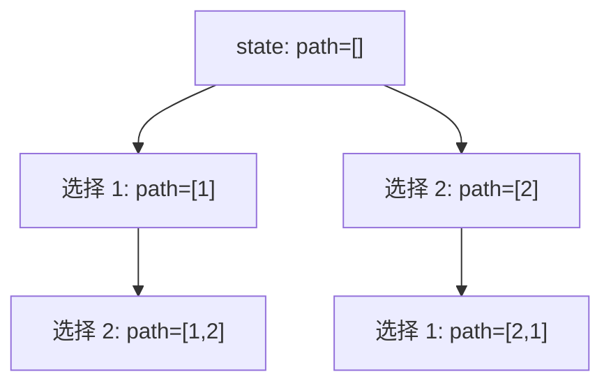
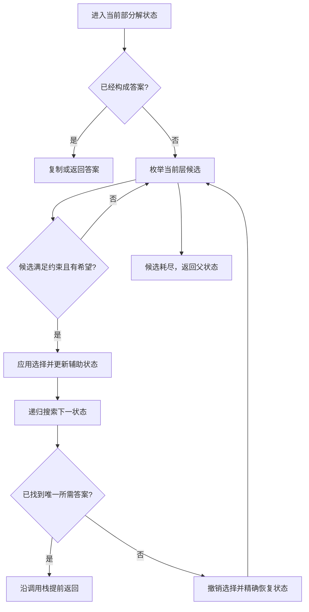

> 本章原文范围为 PDF 第 825～884 页，依次讲解回溯法概述、子集树的回溯算法设计、排列树的回溯算法设计，并给出 15 道推荐练习。本文严格沿用原书小节顺序；凡超出原书直接论述的证明、工程优化或替代算法，均明确标注为“补充”。

## 本章要解决什么问题

穷举法告诉我们：当候选规模不大时，可以系统枚举所有可能并检查答案。但真正困难的地方并不是“会不会枚举”，而是下面四个问题。

1. **如何保证不漏解？** 搜索过程必须覆盖完整解空间。
2. **如何保证不重解？** 同一个组合或排列不能由多条等价路径重复产生。
3. **如何尽早停止无效搜索？** 一旦部分解已经违反约束，继续向下扩展没有意义。
4. **如何恢复现场？** 某个选择探索完毕后，必须撤销它，才能尝试同层的其他选择。

回溯法把这些问题统一成对一棵**隐式解空间树**的深度优先搜索。它不是某一道题的固定代码，而是一套建模方法：先定义结点表示什么，再定义从结点出发有哪些选择，最后设计何时接受答案、何时剪枝以及如何撤销选择。

## 19.1 回溯法概述

### 19.1.1 什么是回溯法

#### 1. 从“暴力枚举”到“有组织的试探”

假设一个问题需要依次作出 $d$ 次决策，第 $i$ 次决策有候选集合 $C_i$。最直接的穷举会枚举笛卡儿积

$$
C_0\times C_1\times\cdots\times C_{d-1}.
$$

若每层最多有 $b$ 个候选，则完整决策序列最多有 $b^d$ 个。问题在于，很多前缀在很浅的位置就已经不合法。例如数独某一行已经出现两个相同数字，那么无论剩余空格怎么填，这个前缀都不可能扩展为合法数独。若仍枚举其全部后缀，就会浪费指数级工作。

回溯法的直觉是：

> 先作一个选择；若当前部分解仍可能通向答案，就继续深入；若已经不可能成功，就立即退回，撤销选择并试下一个候选。

这里的“退回并撤销”就是“回溯”。

#### 2. 解空间树的严格定义

原书用解空间树表示问题的全部候选解。可以将其形式化为一棵有根树 $T=(V,E)$：

- 根结点 $r$ 表示尚未作任何选择的初始状态；
- 每个结点 $u\in V$ 表示一个**部分解**，即从根到 $u$ 的路径上已经作出的选择；
- 若在状态 $u$ 上作一个合法候选选择 $c$ 后得到状态 $v$，则存在有向树边 $(u,v)\in E$；
- 叶子结点通常表示完整决策序列，但某些问题也允许内部结点成为答案，例如“子集”问题中每个部分选择本身都是一个合法子集；
- 从根到结点的路径唯一，因此程序运行时无须真正构造整棵树，只需维护当前路径及判断所需的辅助状态。

设当前部分解为 $x=(x_0,x_1,\ldots,x_{i-1})$，`backtrack(i)` 的任务是枚举所有以该前缀开头的可行完整解。统一框架如下：

```text
backtrack(state):
    if state 已经构成答案:
        记录答案
        若答案不能再扩展，则返回

    for choice in 当前状态的全部候选:
        if choice 违反约束或不可能产生更优解:
            continue
        应用 choice，得到新状态
        backtrack(新状态)
        撤销 choice，恢复原状态
```

“应用—递归—撤销”必须成对出现。若递归前执行了

$$
x\leftarrow x\cup\{c\},
$$

则递归返回后必须执行相反操作

$$
x\leftarrow x\setminus\{c\},
$$

使同层下一个候选看到与当前候选开始前完全相同的状态。

#### 3. 为什么采用深度优先搜索

回溯法按照深度优先顺序遍历解空间树。原因有三点。

1. 当前部分解天然就是根到当前结点的一条路径，DFS 只需维护这条路径。
2. 到达叶子或失败结点后，可以沿递归调用栈逐层撤销选择。
3. 空间通常只与最大深度和辅助约束状态有关，而不需要像广度优先搜索那样同时保存整层结点。

若树深为 $d$，当前路径长度最多为 $d$；不计答案存储时，递归栈通常为 $O(d)$。但若每层还复制长度为 $d$ 的状态，空间和时间都会额外增大，所以实现时一般共享可变路径并原地撤销。

#### 4. 两类剪枝

原书将剪枝分成约束函数剪枝和限界函数剪枝。

##### 4.1 约束函数剪枝

设可行解必须满足约束 $F(x)=\text{true}$。若部分解 $p$ 已经违反一个具有“前缀封闭性”的必要条件，即

$$
G(p)=\text{false}
\quad\Longrightarrow\quad
\forall y,\ G(p\circ y)=\text{false},
$$

其中 $p\circ y$ 表示在前缀 $p$ 后继续追加选择，那么以 $p$ 为根的整棵子树都可以删除。

例如：

- 组合总和中所有候选均为正数，当前和已经大于目标值，继续添加只会更大；
- 括号生成中，任意前缀若右括号数大于左括号数，就不可能补成合法括号串；
- n 皇后中，新皇后与已放皇后同列或同斜线，后续放置无法消除已有冲突。

约束剪枝删除的是**不可能产生可行解**的分支。

##### 4.2 限界函数剪枝

限界函数主要用于最优化问题。设当前已知最好目标值为 $B$，部分解状态为 $s$。

- 对最小化问题，若能计算一个乐观下界 $LB(s)$，并且

  $$
  LB(s)\ge B,
  $$

  则从 $s$ 出发不可能得到严格更优解，可以剪枝。

- 对最大化问题，若能计算一个乐观上界 $UB(s)$，并且

  $$
  UB(s)\le B,
  $$

  则同样可以剪枝。

“乐观”意味着界必须朝对最优解有利的方向估计：最小化问题的下界不能高估该子树可能达到的最小值，最大化问题的上界不能低估该子树可能达到的最大值。否则可能误删真正的最优分支。

限界剪枝删除的是**不可能产生更优解**的分支。

#### 5. 回溯算法的设计步骤

原书给出三个基本步骤，展开后可以形成一套可操作的检查表。

1. **确定解空间树。** 明确一个结点表示什么、树深是多少、叶子与答案是什么关系。
2. **确定扩展规则。** 明确当前层有哪些候选、候选是否允许重复、下一层的候选范围如何变化。
3. **深度优先搜索并剪枝。** 写出接受条件、约束函数、限界函数、状态更新和撤销操作。

写代码前最好先回答以下六个问题。

| 问题 | 对应代码 |
| --- | --- |
| 当前递归参数表示什么状态？ | `dfs(index, ...)` 的参数与共享变量 |
| 何时得到一个答案？ | 递归终止条件 |
| 当前层可以选择什么？ | `for choice in candidates` |
| 哪些选择不应进入下一层？ | `if ...: continue` 或提前返回 |
| 选择后修改哪些状态？ | `push`、标记、计数、交换、累加 |
| 返回前如何精确恢复？ | `pop`、取消标记、减计数、再次交换 |

#### 6. 正确性为什么成立

> **补充：统一正确性论证。** 原书给出了解空间树与剪枝思想，下面将其整理为可复用的证明框架。

假设满足以下条件：

1. 根结点表示空前缀；
2. 每个可行完整解都对应解空间树中至少一条根到答案结点的路径；
3. 循环枚举当前状态的全部合法候选；
4. 剪枝条件是必要条件，即被剪子树中不存在目标解；
5. 撤销操作能把状态恢复到递归前。

则回溯算法具有：

- **可靠性（soundness）**：程序记录答案前会检查完整性与约束，所以每个输出都是合法解。
- **完备性（completeness）**：任取一个合法解 $z$。由条件 2，它对应一条路径；由条件 3，每条路径边都会被枚举；由条件 4，包含 $z$ 的前缀不会被误剪；由条件 5，同层其他分支不会污染该路径。因此程序最终会到达并记录 $z$。
- **终止性**：若树深有限且每个结点候选有限，则结点总数有限，DFS 必然结束。

若题目还要求“不重复”，则必须再证明每个答案只对应一条未被剪除的路径。组合题通常通过单调增加候选下标做到这一点；含重复元素时还需要同层去重。

#### 7. 时间和空间复杂度

若不剪枝的解空间树深度为 $d$，每层最多有 $b$ 个分支，则结点数上界为

$$
1+b+b^2+\cdots+b^d
=\frac{b^{d+1}-1}{b-1}
=O(b^d),\qquad b>1.
$$

但这一粗略上界不能替代具体分析。子集树叶子数是 $2^n$，排列树叶子数是 $n!$；若需要输出每个长度为 $n$ 的答案，单是写出答案就分别需要

$$
\Omega(n2^n)
\quad\text{和}\quad
\Omega(n\cdot n!).
$$

因此“指数级”并不总是算法设计失败：当输出本身就有指数规模时，任何完整枚举算法都不可能具有多项式总时间。

空间要区分两部分：

- 不计返回结果，当前路径、递归栈和标记数组通常为 $O(d)$ 或 $O(n)$；
- 若保存全部结果，空间至少与输出规模同阶，例如所有子集需要 $\Theta(n2^n)$ 个元素槽位。

#### 8. 适用范围与边界

原书列出组合、子集、排列和图路径等典型应用。更一般地，回溯适合以下条件同时成立的问题：

- 解可以由有限步选择构造；
- 给定部分解后，能枚举下一步候选；
- 存在较强约束或输入规模较小；
- 题目要求全部解、任意一个解或小规模最优解。

若状态存在大量重叠子问题，动态规划或记忆化搜索往往更合适；若只求无权图最短路，应优先考虑 BFS；若是大规模排列优化，可能需要分支限界、启发式搜索、整数规划或专门算法。

#### C++17

```cpp
#include <vector>

using namespace std;

struct SearchState {
  vector<int> path;
  vector<bool> used;
};

void backtrack(const vector<int>& choices,
         int targetDepth,
         SearchState& state,
         vector<vector<int>>& answers) {
  if (static_cast<int>(state.path.size()) == targetDepth) {
    answers.push_back(state.path);
    return;
  }

  for (int choice = 0; choice < static_cast<int>(choices.size()); ++choice) {
    if (state.used[choice]) {
      continue;
    }

    state.path.push_back(choices[choice]);
    state.used[choice] = true;

    backtrack(choices, targetDepth, state, answers);

    state.used[choice] = false;
    state.path.pop_back();
  }
}

vector<vector<int>> enumerateArrangements(const vector<int>& choices,
                      int targetDepth) {
  vector<vector<int>> answers;
  SearchState state{{}, vector<bool>(choices.size(), false)};
  backtrack(choices, targetDepth, state, answers);
  return answers;
}
```

#### 搜索树与选择/撤销走查

以 `choices=[1,2]`、目标深度 2 为例，`used` 把已经进入路径的值从下一层候选中删除：



探索完 `[1,2]` 后，控制流并不是直接从 `[1,2]` 跳到 `[2]`，而是逐层恢复现场：

| 时刻 | `state.path` | `state.used` | 动作 |
| --- | --- | --- | --- |
| 进入根结点 | `[]` | `[false,false]` | 候选为 1、2 |
| 选择 1 | `[1]` | `[true,false]` | 递归搜索以 1 开头的子树 |
| 再选择 2 | `[1,2]` | `[true,true]` | 达到终止条件并记录 |
| 撤销 2 | `[1]` | `[true,false]` | 恢复到第二层选择前 |
| 撤销 1 | `[]` | `[false,false]` | 根层才可以继续选择 2 |

每一行“撤销后”的状态都必须与对应“选择前”完全一致；只弹出 `path` 却忘记恢复 `used`，会把本应属于兄弟分支的候选永久屏蔽。

### 19.1.2 回溯法的算法设计

原书把常见解空间树归纳为**子集树**和**排列树**。两者最关键的差别不是代码中有没有 `used`，而是每一层究竟在决定什么。

- 子集树：决定“哪些元素被选入”，答案长度可以从 0 到 $n$。
- 排列树：决定“每个位置放哪个尚未使用的元素”，完整答案长度固定为 $n$。

### 一、子集树的回溯算法设计

#### 1. 问题模型

给定含 $n$ 个不同整数的数组

$$
a=(a_0,a_1,\ldots,a_{n-1}),
$$

求它的幂集 $\mathcal P(a)$。每个元素只有“选”或“不选”两种状态，因此子集总数是

$$
|\mathcal P(a)|=2^n.
$$

这个结论既可以由乘法原理得到，也可以由二项式定理得到：大小为 $k$ 的子集有 $\binom nk$ 个，所以

$$
\sum_{k=0}^{n}\binom nk=(1+1)^n=2^n.
$$

#### 2. 解法一：固定长度的二选一决策

定义长度为 $n$ 的二进制解向量

$$
x=(x_0,x_1,\ldots,x_{n-1}),\qquad x_i\in\{0,1\},
$$

其中 $x_i=1$ 表示选择 $a_i$，$x_i=0$ 表示不选择 $a_i$。状态 $(i,x)$ 表示 $x_0,\ldots,x_{i-1}$ 已确定，现在决定 $x_i$。

递归关系为

$$
\operatorname{dfs}(i)=
\begin{cases}
\text{输出 }\{a_j\mid x_j=1\}, & i=n,\\
x_i\leftarrow 1;\ \operatorname{dfs}(i+1), & i<n,\\
x_i\leftarrow 0;\ \operatorname{dfs}(i+1), & i<n.
\end{cases}
$$

更准确地说，$i<n$ 时两条递归分支都要执行。树的第 $i$ 层有 $2^i$ 个结点，叶子层有 $2^n$ 个结点，总结点数为

$$
N_1=\sum_{i=0}^{n}2^i=2^{n+1}-1.
$$

每个叶子都要扫描长度为 $n$ 的二进制向量来构造子集，所以时间复杂度为

$$
T_1(n)=\Theta(n2^n).
$$

不计答案空间，二进制向量与递归栈均为 $O(n)$。

以 $a=[1,2,3]$ 为例，选择优先的 DFS 路径如下：

| 决策向量 $x$ | 对应子集 |
| --- | --- |
| $(1,1,1)$ | $[1,2,3]$ |
| $(1,1,0)$ | $[1,2]$ |
| $(1,0,1)$ | $[1,3]$ |
| $(1,0,0)$ | $[1]$ |
| $(0,1,1)$ | $[2,3]$ |
| $(0,1,0)$ | $[2]$ |
| $(0,0,1)$ | $[3]$ |
| $(0,0,0)$ | $[]$ |

每个完整二进制向量唯一决定一个子集，反之每个子集唯一决定其成员指示向量，所以既不漏解也不重解。

#### 3. 解法二：动态路径与起始下标

第二种设计直接用动态数组 $x$ 保存当前子集，并用 `start` 表示下一次只能从 $a_{start},\ldots,a_{n-1}$ 中选择。状态为

$$
(start,x).
$$

进入任意状态时，当前 $x$ 本身就是一个合法子集，应立即输出。随后枚举

$$
j\in[start,n-1],
$$

执行：

$$
x.\operatorname{push}(a_j)
\to \operatorname{dfs}(j+1,x)
\to x.\operatorname{pop}().
$$

`j+1` 的意义是：一旦选了 $a_j$，下一层只能选择它右侧的元素。于是路径中的原数组下标严格递增：

$$
i_0<i_1<\cdots<i_{k-1}.
$$

同一个下标集合只有一种递增排列，因此不会产生重复子集。

对 $a=[1,2,3]$，递归进入状态的次序可以是：

```text
[]
├── [1]
│   ├── [1, 2]
│   │   └── [1, 2, 3]
│   └── [1, 3]
├── [2]
│   └── [2, 3]
└── [3]
```

大小为 $k$ 的子集对应树中深度为 $k$ 的结点，因此总结点数为

$$
N_2=\sum_{k=0}^{n}\binom nk=2^n.
$$

每个结点都是答案结点。若复制当前路径到结果中，所有输出元素总数为

$$
\sum_{k=0}^{n}k\binom nk.
$$

对 $(1+x)^n$ 求导：

$$
n(1+x)^{n-1}
=\sum_{k=1}^{n}k\binom nkx^{k-1}.
$$

令 $x=1$，得到

$$
\sum_{k=0}^{n}k\binom nk=n2^{n-1}.
$$

所以包含输出复制的总时间仍为 $\Theta(n2^n)$，但搜索结点从 $2^{n+1}-1$ 减少为 $2^n$。

#### 4. 两种子集树的比较

| 维度 | 二选一固定向量 | 动态路径 + `start` |
| --- | --- | --- |
| 每层含义 | 决定当前元素选或不选 | 决定下一个被选元素 |
| 答案结点 | 只有叶子 | 每个结点 |
| 搜索结点数 | $2^{n+1}-1$ | $2^n$ |
| 去重依据 | 每个元素只决策一次 | 下标严格递增 |
| 适合场景 | 需要明确“不选”分支 | 组合、子集和切分问题 |
| 输出顺序 | 取决于先选还是先不选 | 按首个下标分组 |

原书称第二种方法产生的子集“有序”，这里指 DFS 输出按原数组下标形成稳定分组，并不意味着每个输入数组会被自动排序，也不意味着数学上的集合具有内部顺序。

#### C++17

```cpp
#include <functional>
#include <vector>

using namespace std;

vector<vector<int>> subsetsByDecisions(const vector<int>& choices) {
  vector<vector<int>> answers;
  vector<int> path;

  // State: (index, path); choices: select or skip choices[index].
  function<void(int)> dfs = [&](int index) {
    if (index == static_cast<int>(choices.size())) {
      answers.push_back(path);
      return;
    }

    path.push_back(choices[index]);
    dfs(index + 1);
    path.pop_back();

    dfs(index + 1);
  };

  dfs(0);
  return answers;
}

vector<vector<int>> subsetsByNextChoice(const vector<int>& choices) {
  vector<vector<int>> answers;
  vector<int> path;

  // State: (start, path); choices: indices in [start, choices.size()).
  function<void(int)> dfs = [&](int start) {
    answers.push_back(path);
    if (start == static_cast<int>(choices.size())) {
      return;
    }
    for (int choice = start; choice < static_cast<int>(choices.size()); ++choice) {
      path.push_back(choices[choice]);
      dfs(choice + 1);
      path.pop_back();
    }
  };

  dfs(0);
  return answers;
}
```

### 二、排列树的回溯算法设计

#### 1. 问题模型

给定 $n$ 个互不相同的元素，要求输出所有全排列。解向量为

$$
x=(x_0,x_1,\ldots,x_{n-1}),
$$

第 $i$ 层决定位置 $i$ 放哪个尚未使用的元素。第 0 层有 $n$ 种选择，第 1 层剩 $n-1$ 种，依此类推，所以叶子数为

$$
n(n-1)\cdots 1=n!.
$$

#### 2. 解法一：路径 + `used` 数组

设置布尔数组

$$
used[j]=
\begin{cases}
\text{true}, & a_j\text{ 已在当前排列中},\\
\text{false}, & a_j\text{ 尚未使用}.
\end{cases}
$$

在深度 $i$ 枚举所有 $j\in[0,n-1]$，仅当 `used[j]` 为假时选择 $a_j$：

```text
path.push(a[j])
used[j] = true
dfs(i + 1)
used[j] = false
path.pop()
```

深度为 $k$ 的结点数是从 $n$ 个元素中有序选取 $k$ 个的排列数

$$
P(n,k)=\frac{n!}{(n-k)!}.
$$

总结点数为

$$
N_P=\sum_{k=0}^{n}P(n,k)
=n!\sum_{j=0}^{n}\frac{1}{j!}
<e\,n!,
$$

其中令 $j=n-k$，并利用

$$
e=\sum_{j=0}^{\infty}\frac1{j!}.
$$

因此内部结点总数与叶子数 $n!$ 同阶；复制每个长度为 $n$ 的排列后，总时间为

$$
\Theta(n\cdot n!).
$$

不计输出，路径、`used` 和递归栈均为 $O(n)$。

若输入元素按升序排列，并且每层都按下标从小到大枚举，这种方法会按字典序产生排列。

#### 3. 解法二：原地交换

先令 $x=a$。深度 $i$ 表示前缀 $x[0..i-1]$ 已经固定，候选集合就是后缀 $x[i..n-1]$。枚举 $j\in[i,n-1]$：

$$
\operatorname{swap}(x_i,x_j)
\to \operatorname{dfs}(i+1)
\to \operatorname{swap}(x_i,x_j).
$$

第一次交换把候选 $x_j$ 放到位置 $i$；第二次相同交换利用交换的自反性恢复现场：

$$
\operatorname{swap}(\operatorname{swap}(x_i,x_j))=(x_i,x_j).
$$

因为前缀和后缀在每层形成清晰边界，后缀中的每个元素恰好有一次机会进入位置 $i$，所以不同元素条件下不会漏解或重解。

以 $[1,2,3]$ 为例：

```text
[1, 2, 3]
├── 固定 1： [1, 2, 3], [1, 3, 2]
├── 固定 2： [2, 1, 3], [2, 3, 1]
└── 固定 3： [3, 2, 1], [3, 1, 2]
```

该方法不需要 `used` 数组，复杂度仍为 $\Theta(n\cdot n!)$。但交换会改变后缀的相对次序，所以即使初始数组有序，也不保证整体按字典序输出。

#### 4. 两种排列树的比较

| 维度 | 路径 + `used` | 原地交换 |
| --- | --- | --- |
| 候选范围 | 每层扫描全部元素，跳过已用者 | 只扫描后缀 $[i,n-1]$ |
| 辅助状态 | 路径、`used` | 原数组与递归下标 |
| 恢复方式 | 取消标记并弹出路径 | 再交换一次 |
| 字典序 | 输入有序且按序枚举时可保证 | 通常不保证 |
| 重复元素 | 排序后可用同层规则去重 | 每层需判断相同值是否已试 |

#### 5. 子集树与排列树不能机械混用

| 问题特征 | 子集树 | 排列树 |
| --- | --- | --- |
| 关心哪些元素被选 | 是 | 否 |
| 关心元素放置次序 | 通常不关心 | 关心 |
| 路径长度 | $0$ 到 $n$ | 完整解通常固定为 $n$ |
| 下一层候选 | 当前下标之后 | 所有尚未使用元素 |
| 典型规模 | $2^n$ | $n!$ |

例如从 `[1,2,3]` 中选两个数，`[1,2]` 与 `[2,1]` 若被视为同一个答案，应使用递增下标的子集树；若两者代表不同排列，则需要排列树。选错模型不仅影响效率，还会直接造成漏解或重复。

> **补充：模板只是起点。** 本章后续的回文切分、IP 地址、表达式、数独、24 点和任务分配看起来并不都是普通“子集”，但它们都在逐步构造可变长度决策序列，因此原书将其放入子集树框架；真正应关注的是“当前层从候选集合中选择一个扩展”，而不是拘泥于数学集合的字面含义。

#### C++17

```cpp
#include <algorithm>
#include <functional>
#include <vector>

using namespace std;

vector<vector<int>> permutationsByUsed(const vector<int>& choices) {
  vector<vector<int>> answers;
  vector<int> path;
  vector<bool> used(choices.size(), false);

  // State: (path, used); choices: every unused input position.
  function<void()> dfs = [&]() {
    if (path.size() == choices.size()) {
      answers.push_back(path);
      return;
    }
    for (int choice = 0; choice < static_cast<int>(choices.size()); ++choice) {
      if (used[choice]) {
        continue;
      }
      used[choice] = true;
      path.push_back(choices[choice]);
      dfs();
      path.pop_back();
      used[choice] = false;
    }
  };

  dfs();
  return answers;
}

vector<vector<int>> permutationsBySwap(vector<int> state) {
  vector<vector<int>> answers;

  // State: fixed prefix state[0..depth); choices: suffix positions.
  function<void(int)> dfs = [&](int depth) {
    if (depth == static_cast<int>(state.size())) {
      answers.push_back(state);
      return;
    }
    for (int choice = depth; choice < static_cast<int>(state.size()); ++choice) {
      swap(state[depth], state[choice]);
      dfs(depth + 1);
      swap(state[depth], state[choice]);
    }
  };

  dfs(0);
  return answers;
}
```

#### 去重、剪枝与模板迁移边界

同样是值相等，是否跳过取决于它们位于搜索树的哪一层，而不是取决于数组里是否相邻：

| 场景 | 应保留 | 应删除 | 判断依据 |
| --- | --- | --- | --- |
| 组合/子集 `[1,1,2]` | 同一路径中的两个 `1`，如 `[1,1]` | 同一父结点下由第二个 `1` 再开一棵等价子树 | `index > start` 才跳过 |
| 排列 `[1,1,2]` | 左侧 `1` 已在路径时继续选右侧 `1` | 左侧 `1` 未用时，让右侧 `1` 竞争同一位置 | `!used[index-1]` 才跳过 |
| 不可排序的子序列 | 不同父路径下再次使用同一个值 | 同一递归层第二次选择相同值 | 每层独立 `usedThisLevel` |

反例是把组合规则误写成“只要 `a[i]==a[i-1]` 就跳过”：在 `[1,1,2]` 中，第二层会错误删掉第二个 `1`，于是合法答案 `[1,1]` 消失。

迁移模板前还应检查剪枝条件是否保持单调。`currentSum + value > target` 后直接 `break`，同时依赖“候选已升序”和“后续增量非负”；只满足前者时，遇到负数仍可能在后续把和降回来。类似地，任务分配中的 `nextMaximum >= best` 安全，是因为正工作时长只会让负载不降。若必要条件、单调方向或状态恢复方式任一改变，就应重新证明剪枝，而不能机械搬用模板。

## 19.2 子集树的回溯算法设计

### 19.2.1 LeetCode 78：子集（★★）

#### 问题与难点

给定互不相同的数组 `nums`，返回它的全部子集。空集和原数组本身也要包含在内，输出顺序任意。

这道题是例 19-1 的直接应用，真正要掌握的是两个不同的树模型。

#### 方法一：每个元素选或不选

深度 $i$ 决定 `nums[i]` 是否进入路径。到 $i=n$ 时得到一个完整成员指示向量，记录路径。

```text
dfs(i):
  if i == n:
    record(path)
    return
  path.push(nums[i])
  dfs(i + 1)
  path.pop()
  dfs(i + 1)
```

对每个元素恰好作一次二元决策，所以叶子与子集一一对应。树有 $2^n$ 个叶子和 $2^{n+1}-1$ 个结点。

#### 方法二：每个结点都是答案

进入 `dfs(start)` 时先记录当前路径，再从区间 `[start,n-1]` 选择下一个元素：

```text
dfs(start):
  record(path)
  for i from start to n - 1:
    path.push(nums[i])
    dfs(i + 1)
    path.pop()
```

若某个子集使用下标 $i_0<i_1<\cdots<i_{k-1}$，搜索中只有这一条严格递增路径能产生它。因此它不需要 `used`，也不需要集合去重。

#### 复杂度与边界

共有 $2^n$ 个结果，所有结果包含的元素总数为 $n2^{n-1}$，所以复制输出的时间和空间都是 $\Theta(n2^n)$ 量级；不计结果，递归栈与路径为 $O(n)$。

若题目只问子集数量，直接返回 $2^n$；若只问某种统计量，往往可以用动态规划而无须实际生成全部子集。

#### C++17

```cpp
#include <functional>
#include <vector>

using namespace std;

vector<vector<int>> subsets(const vector<int>& nums) {
  vector<vector<int>> answers;
  vector<int> path;

  // State: (start, path); every state is an answer; choices are later indices.
  function<void(int)> dfs = [&](int start) {
    answers.push_back(path);
    if (start == static_cast<int>(nums.size())) {
      return;
    }
    for (int choice = start; choice < static_cast<int>(nums.size()); ++choice) {
      path.push_back(nums[choice]);
      dfs(choice + 1);
      path.pop_back();
    }
  };

  dfs(0);
  return answers;
}
```

### 19.2.2 LeetCode 77：组合（★★）

#### 问题与状态

从整数区间 $[1,n]$ 中选出 $k$ 个不同整数，返回全部组合。组合不关心排列次序，因此 `[1,2]` 与 `[2,1]` 是同一个答案。

原书分别用二选一树和动态路径树解释。二选一树对每个整数决定选或不选；动态路径树更直接，状态为：

$$
(start,path),
$$

其中 `path` 已严格递增，`start` 是下一次允许选择的最小整数。

#### 递推与正确性

当 $|path|=k$ 时记录答案；否则枚举 $value\in[start,n]$：

$$
path\leftarrow path+[value],
\qquad
start' = value+1.
$$

每个大小为 $k$ 的集合都有唯一升序表示，因此完备且无重复。

#### 补充：剩余名额剪枝

设当前已选 $m=|path|$ 个数，还需要

$$
r=k-m
$$

个。若当前候选为 $value$，从 `value` 到 $n$ 一共有 $n-value+1$ 个数。只有

$$
n-value+1\ge r
$$

时才可能填满路径，即循环上界可以收紧为

$$
value\le n-r+1.
$$

例如 $n=4,k=2$，空路径还需 2 个数，所以首个数最多取 $4-2+1=3$；以 4 开头不可能再找到更大的第二个数。

#### 复杂度

结果数为 $\binom nk$，仅复制答案就需要

$$
\Theta\!\left(k\binom nk\right)
$$

时间与结果空间。不计输出，路径和递归深度为 $O(k)$。剪枝不会改变输出下界，但能避免无法凑够 $k$ 个数的内部结点。

#### C++17

```cpp
#include <functional>
#include <vector>

using namespace std;

vector<vector<int>> combine(int number, int size) {
  vector<vector<int>> answers;
  vector<int> path;

  // State: (start, path); choices are increasing values still able to fill size.
  function<void(int)> dfs = [&](int start) {
    if (static_cast<int>(path.size()) == size) {
      answers.push_back(path);
      return;
    }

    int remaining = size - static_cast<int>(path.size());
    for (int choice = start; choice <= number - remaining + 1; ++choice) {
      path.push_back(choice);
      dfs(choice + 1);
      path.pop_back();
    }
  };

  dfs(1);
  return answers;
}
```

### 19.2.3 LeetCode 40：组合总和 II（★★）

#### 问题为何更难

给定可能含重复值的正整数数组 `candidates` 和目标值 `target`。每个**位置**最多使用一次，要求返回和为目标的所有不同组合。

困难来自两种“重复”的区别：

- 两个相同值若来自不同下标，可以同时进入同一组合，例如两个 `1` 组成 `[1,1,6]`；
- 但交换这两个相同下标的选择次序不应产生两份相同答案。

#### 排序与状态

先将数组升序排序。状态为

$$
(start,path,currentSum).
$$

在当前层枚举 $i\in[start,n-1]$，选择后递归到 $i+1$，保证每个下标至多使用一次。

#### 两个剪枝条件

1. **超和剪枝。** 所有数均为正且数组已排序。若

   $$
   currentSum+a_i>target,
   $$

   那么对所有 $j>i$ 都有 $a_j\ge a_i$，故也会超出目标，可以直接 `break`，而不只是 `continue`。

2. **同层去重。** 若

   $$
   i>start\quad\text{且}\quad a_i=a_{i-1},
   $$

   则跳过 $a_i$。因为在相同父路径下，以这两个相同值为首选的子树具有完全相同的值序列。

这里必须是 `i > start`，不能写成只要相邻相等就跳过。以排序后的 `[1,1,2,5,6,7,10]` 为例：

- 根层选择第一个 `1` 后，下一层仍可选择第二个 `1`，从而产生 `[1,1,6]`；
- 根层探索完第一个 `1` 的整棵子树后，第二个 `1` 作为根层首选会重复，因此才跳过。

这就是“**同层去重，树枝内可重复取相同值的不同位置**”。

#### 正确性

排序不改变可选元素多重集合。任一合法组合可写为非递减值序列，并对应一组递增下标；搜索会枚举这组下标。若同层有相同值，只保留最左边的代表不会失去任何值组合，因为后一个相同值能选择的后缀是前一个后缀的子集；前一个分支已经覆盖其全部结果。

#### 复杂度

排序耗时 $O(n\log n)$。忽略剪枝时，每个位置选或不选，搜索上界为 $O(2^n)$ 个状态；复制路径后可写为 $O(n2^n)$ 的粗略上界。不计输出，递归深度为 $O(n)$。实际结点数受重复值和 `target` 剪枝显著影响。

#### C++17

```cpp
#include <algorithm>
#include <functional>
#include <vector>

using namespace std;

vector<vector<int>> combinationSumII(vector<int> candidates, int target) {
  sort(candidates.begin(), candidates.end());
  vector<vector<int>> answers;
  vector<int> path;

  // State: (start, currentSum, path); choices use each input position at most once.
  function<void(int, int)> dfs = [&](int start, int currentSum) {
    if (currentSum == target) {
      answers.push_back(path);
      return;
    }

    for (int choice = start; choice < static_cast<int>(candidates.size()); ++choice) {
      if (choice > start && candidates[choice] == candidates[choice - 1]) {
        continue;
      }
      int value = candidates[choice];
      if (currentSum + value > target) {
        break;
      }

      path.push_back(value);
      dfs(choice + 1, currentSum + value);
      path.pop_back();
    }
  };

  dfs(0, 0);
  return answers;
}
```

### 19.2.4 LeetCode 39：组合总和（★★）

#### 与上一题的关键差别

本题候选值互不相同，但每个值可以使用任意多次。若选择 `candidates[i]` 后递归到 `i+1`，就只能使用一次；正确做法是仍允许从 $i$ 开始。

原书用二选一状态 $(remaining,i)$ 说明：

- 不选 $a_i$：进入 $(remaining,i+1)$；
- 再选一次 $a_i$：进入 $(remaining-a_i,i)$。

其中选择分支的下标保持为 $i$，这正是“可重复使用”的来源。等价的动态路径写法是：

```text
dfs(start, remaining):
  if remaining == 0:
    record(path)
    return
  for i from start to n - 1:
    if candidates[i] > remaining:
      break
    path.push(candidates[i])
    dfs(i, remaining - candidates[i])
    path.pop()
```

#### 为什么不会产生排列重复

虽然同一值可以重复，候选下标沿路径仍满足

$$
i_0\le i_1\le\cdots\le i_{m-1}.
$$

因此 `[2,2,3]` 只会按这一非递减次序产生，不会再产生 `[2,3,2]` 或 `[3,2,2]`。

以 `[2,3,7]`、`target=7` 为例：

```text
remaining=7
├── 选 2 → 5
│   └── 选 2 → 3
│       └── 选 3 → 0，得到 [2, 2, 3]
├── 选 3 → 4，后续无法归零
└── 选 7 → 0，得到 [7]
```

#### 成立条件与复杂度

剪枝 `candidate > remaining` 依赖所有候选均为正数。若允许 0，无限重复会产生无限条等价路径；若允许负数，剩余值不再单调下降，搜索可能不终止。

设最小候选值为 $m>0$，则递归深度最多为

$$
\left\lfloor\frac{target}{m}\right\rfloor.
$$

搜索规模依赖候选值与目标值，不能简单写成 $2^n$；粗略上界可按分支数 $n$ 和上述深度写成指数形式。题目规模下，排序和剩余值剪枝通常足够。

#### C++17

```cpp
#include <algorithm>
#include <functional>
#include <vector>

using namespace std;

vector<vector<int>> combinationSum(vector<int> candidates, int target) {
  sort(candidates.begin(), candidates.end());
  vector<vector<int>> answers;
  vector<int> path;

  // State: (start, remaining, path); choice is reusable, so recursion keeps it.
  function<void(int, int)> dfs = [&](int start, int remaining) {
    if (remaining == 0) {
      answers.push_back(path);
      return;
    }

    for (int choice = start; choice < static_cast<int>(candidates.size()); ++choice) {
      int value = candidates[choice];
      if (value > remaining) {
        break;
      }

      path.push_back(value);
      dfs(choice, remaining - value);
      path.pop_back();
    }
  };

  dfs(0, target);
  return answers;
}
```

### 19.2.5 LeetCode 90：子集 II（★★）

#### 问题与原书两种方法

数组允许重复值，要求返回不重复子集。原书先介绍“排序、生成全部结果、再用 `set` 去重”，随后给出更好的“排序 + 同层去重”。

集合后处理虽然正确，但会先生成重复分支，再承担哈希或比较开销。回溯阶段直接剪枝更能体现问题结构。

#### 同层去重方法

排序后，进入 `dfs(start)` 先记录当前路径，再枚举 $i\in[start,n-1]$。若

$$
i>start\quad\land\quad nums_i=nums_{i-1},
$$

则跳过当前值。

以 `[1,2,2]` 为例：

```text
[]
├── [1]
│   ├── [1, 2]
│   │   └── [1, 2, 2]
│   └── 根为 [1] 的同层第二个 2：跳过
├── [2]
│   └── [2, 2]
└── 空路径同层第二个 2：跳过
```

同一树枝中第二个 `2` 可以继续被选，所以 `[2,2]` 不会丢失；同一父状态下只保留一个值为 `2` 的分支，所以不会重复。

#### 精确结果数量

> **补充：多重集合计数。** 若不同值的出现次数为 $f_1,f_2,\ldots,f_t$，每种值可选 $0$ 到 $f_j$ 次，因此不同子集数为

$$
\prod_{j=1}^{t}(f_j+1).
$$

例如 `[1,2,2]` 的频数为 $1,2$，不同子集数为 $(1+1)(2+1)=6$。

最坏情况下所有元素互不相同，仍有 $2^n$ 个子集和 $\Theta(n2^n)$ 输出量；若重复很多，结果会显著少于 $2^n$。

#### C++17

```cpp
#include <algorithm>
#include <functional>
#include <vector>

using namespace std;

vector<vector<int>> subsetsWithDuplicates(vector<int> nums) {
  sort(nums.begin(), nums.end());
  vector<vector<int>> answers;
  vector<int> path;

  // State: (start, path); equal values are skipped only among sibling choices.
  function<void(int)> dfs = [&](int start) {
    answers.push_back(path);
    if (start == static_cast<int>(nums.size())) {
      return;
    }
    for (int choice = start; choice < static_cast<int>(nums.size()); ++choice) {
      if (choice > start && nums[choice] == nums[choice - 1]) {
        continue;
      }

      path.push_back(nums[choice]);
      dfs(choice + 1);
      path.pop_back();
    }
  };

  dfs(0);
  return answers;
}
```

### 19.2.6 LeetCode 216：组合总和 III（★★）

#### 问题建模

从数字 $1$～$9$ 中选恰好 $k$ 个互不相同的数，使总和为 $n$。原书分别用二选一树和固定长度逐位选择树解释，并指出仅用 `used` 会产生 `[1,2,4]`、`[1,4,2]` 等排列重复。

正确状态仍是严格递增的组合状态：

$$
(start,path,currentSum),
$$

选择 $value$ 后递归到 `value + 1`。接受条件是

$$
|path|=k\quad\land\quad currentSum=n.
$$

#### 基本剪枝

- 若 $|path|>k$ 或 $currentSum>n$，立即失败；
- 若路径已长为 $k$，只检查总和，不再扩展；
- 候选值大于剩余目标时，由于后续更大，可以停止本层。

#### 补充：上下界剪枝

设还需选择 $r=k-|path|$ 个数，下一候选最小为 $start$。

能够取得的最小附加和是

$$
L=r\cdot start+\frac{r(r-1)}2,
$$

即选择 $start,start+1,\ldots,start+r-1$。

能够取得的最大附加和是选择 $9,8,\ldots,10-r$：

$$
U=\frac{r(19-r)}2.
$$

若剩余目标 $n-currentSum$ 不在 $[L,U]$ 内，该状态不可能完成，可以剪枝。

例如 $k=3,n=9$：

$$
[1,2,6],\ [1,3,5],\ [2,3,4]
$$

是全部答案。若首选 4，则还需两个比 4 大的数，最小附加和为 $5+6=11$，总和至少 15，故整棵分支可立即删除。

#### 复杂度

搜索空间至多是数字 1～9 的全部子集，即常数规模 $2^9$；更精确地，只需考察大小不超过 $k$ 的组合。输出每个长度为 $k$ 的答案，复制成本为 $O(k)$。

#### C++17

```cpp
#include <functional>
#include <vector>

using namespace std;

vector<vector<int>> combinationSumIII(int size, int target) {
  vector<vector<int>> answers;
  vector<int> path;

  // State: (start, currentSum, path); choices are distinct increasing digits.
  function<void(int, int)> dfs = [&](int start, int currentSum) {
    int remainingCount = size - static_cast<int>(path.size());
    int remainingSum = target - currentSum;
    if (remainingCount == 0) {
      if (remainingSum == 0) {
        answers.push_back(path);
      }
      return;
    }

    int minimum = remainingCount * start
      + remainingCount * (remainingCount - 1) / 2;
    int maximum = remainingCount * (19 - remainingCount) / 2;
    if (remainingSum < minimum || remainingSum > maximum) {
      return;
    }

    for (int choice = start; choice <= 9 && choice <= remainingSum; ++choice) {
      path.push_back(choice);
      dfs(choice + 1, currentSum + choice);
      path.pop_back();
    }
  };

  dfs(1, 0);
  return answers;
}
```

### 19.2.7 LeetCode 491：递增子序列（★★）

#### 为什么不能先排序

本题要求从原数组中删除一些元素但保持剩余元素相对顺序，寻找长度至少为 2 的非递减子序列。若先排序，虽然方便去重，却会改变原位置关系，从而生成原数组中不存在的子序列。

因此状态为

$$
(start,path),
$$

候选下标始终向右移动；若路径非空且

$$
nums_i<path_{last},
$$

则违反非递减约束，跳过。

#### 重复从哪里产生

对 `[2,2,1,3]`：

- 从下标 0 的 `2` 可产生 `[2,3]`；
- 从下标 1 的 `2` 也可产生相同的 `[2,3]`。

二者发生在空路径的同一递归层。由于不能排序，需要为**每次递归调用**创建层内集合 `usedThisLevel`：

```text
dfs(start):
  if len(path) >= 2:
    record(path)
  usedThisLevel = empty set
  for i from start to n - 1:
    if nums[i] in usedThisLevel:
      continue
    if path not empty and nums[i] < path.back:
      continue
    usedThisLevel.add(nums[i])
    path.push(nums[i])
    dfs(i + 1)
    path.pop()
```

层内集合不能设成全局集合。值 `7` 在不同父路径下分别形成 `[4,7]`、`[6,7]`，这些都是不同答案；只应禁止“相同父路径的同一层重复选择相同值”。

原书利用值域 $[-100,100]$，指出可用长度 201 的布尔数组代替哈希集合，下标映射为

$$
index=value+100.
$$

#### 正确性与复杂度

下标递增保证结果是原数组子序列，值非递减检查保证合法性。同层相同值保留最早出现者；它拥有不小于后一个相同值的可选后缀，因此不会损失任何值序列。

最坏情况下递增且互不相同的数组有 $2^n-n-1$ 个长度至少为 2 的子序列，复制输出需要 $O(n2^n)$ 时间和空间；不计输出，路径、递归栈与层内集合总空间为 $O(n^2)$ 的直接上界。若每层使用固定 201 位数组，值域空间是常数，但递归层仍各自持有一份去重状态。

#### C++17

```cpp
#include <functional>
#include <unordered_set>
#include <vector>

using namespace std;

vector<vector<int>> increasingSubsequences(const vector<int>& nums) {
  vector<vector<int>> answers;
  vector<int> path;

  // State: (start, path); choices keep index order and are deduplicated per level.
  function<void(int)> dfs = [&](int start) {
    if (path.size() >= 2) {
      answers.push_back(path);
    }
    if (start == static_cast<int>(nums.size())) {
      return;
    }

    unordered_set<int> usedThisLevel;
    for (int choice = start; choice < static_cast<int>(nums.size()); ++choice) {
      int value = nums[choice];
      if (usedThisLevel.count(value)
          || (!path.empty() && value < path.back())) {
        continue;
      }

      usedThisLevel.insert(value);
      path.push_back(value);
      dfs(choice + 1);
      path.pop_back();
    }
  };

  dfs(0);
  return answers;
}
```

### 19.2.8 LeetCode 131：分割回文串（★★）

#### 问题如何转化为解空间树

给定字符串 $s$，在字符间放置若干切分点，使每一段都是回文串。以 `aab` 为例，两个合法方案是：

$$
[a,a,b],\qquad [aa,b].
$$

状态为

$$
(start,path),
$$

其中 `s[0:start]` 已经被合法切分，`path` 保存这些回文段。当前层枚举结束位置

$$
end\in[start,n-1].
$$

若 $s[start..end]$ 是回文，就选择它并递归到 $end+1$。当 `start == n` 时，整个字符串恰好被覆盖，记录 `path`。

#### 为什么这样枚举不漏不重

任一切分方案唯一对应一组严格递增的切分位置。搜索在每层确定下一段的右端点，所以会枚举所有切分位置序列；不同右端点序列对应不同分段，不会重复。

#### 回文判定

直接判定子串 $s[l..r]$ 时使用双指针：

$$
s_l=s_r,\ s_{l+1}=s_{r-1},\ldots
$$

全部相等才是回文，单次耗时 $O(r-l+1)$。

> **补充：回文预处理。** 若希望避免搜索中反复检查同一子串，可以预计算

$$
pal[l][r]
=\bigl(s_l=s_r\bigr)
\land
\bigl(r-l\le 2\ \lor\ pal[l+1][r-1]\bigr).
$$

按子串长度从小到大或按 $l$ 从右向左计算，耗时和空间均为 $O(n^2)$，之后每次回文查询为 $O(1)$。

#### 复杂度

字符串有 $n-1$ 个内部间隙，每个间隙切或不切，因此切分方案至多 $2^{n-1}$ 个；当所有字符相同时，这些方案全部合法。复制每个方案涉及总长 $n$ 的字符数据，输出下界为 $\Omega(n2^n)$。使用回文表后，搜索与输出可用 $O(n2^n)$ 作上界；不计结果，递归路径为 $O(n)$，回文表为 $O(n^2)$。

#### C++17

```cpp
#include <functional>
#include <string>
#include <vector>

using namespace std;

vector<vector<string>> palindromePartitions(const string& text) {
  int length = static_cast<int>(text.size());
  vector<vector<bool>> palindrome(length, vector<bool>(length, false));
  for (int left = length - 1; left >= 0; --left) {
    for (int right = left; right < length; ++right) {
      palindrome[left][right] = text[left] == text[right]
        && (right - left <= 2 || palindrome[left + 1][right - 1]);
    }
  }

  vector<vector<string>> answers;
  vector<string> path;

  // State: (start, path); choices are palindromic text[start..end].
  function<void(int)> dfs = [&](int start) {
    if (start == length) {
      answers.push_back(path);
      return;
    }
    for (int choice = start; choice < length; ++choice) {
      if (!palindrome[start][choice]) {
        continue;
      }
      path.push_back(text.substr(start, choice - start + 1));
      dfs(choice + 1);
      path.pop_back();
    }
  };

  dfs(0);
  return answers;
}
```

### 19.2.9 LeetCode 93：复原 IP 地址（★★）

#### 合法段的三个条件

IPv4 地址必须恰好分成 4 段。每段字符串 $part$ 必须同时满足：

1. 长度在 1～3 之间；
2. 数值满足 $0\le value(part)\le255$；
3. 若长度大于 1，首字符不能为 `0`。

所以 `0` 合法，`00`、`01` 不合法，`255` 合法，`256` 不合法。

#### 状态与扩展

状态为

$$
(index,segments),
$$

`index` 是下一个未使用字符的位置，`segments` 是已经确定的段。每层尝试长度 1、2、3 的下一段；合法则递归。

接受条件必须同时满足

$$
|segments|=4\quad\land\quad index=n.
$$

仅有 4 段但字符串未用完，或字符串已用完但不足 4 段，都不是答案。

#### 原书的剩余长度剪枝

设还剩

$$
r=4-|segments|
$$

段，未处理字符数为

$$
c=n-index.
$$

每段至少 1 个、最多 3 个字符，所以可行的必要条件是

$$
r\le c\le3r.
$$

若 $c<r$，字符太少；若 $c>3r$，字符太多。两种情况都可立即返回。

以 `010010` 为例：

```text
0 | 10 | 0 | 10   → 0.10.0.10
0 | 100 | 1 | 0   → 0.100.1.0
```

首段只能是 `0`，不能继续尝试 `01` 或 `010`。

#### 复杂度与边界

树深固定为 4，每层最多 3 个长度候选，搜索结点上界是常数级 $1+3+3^2+3^3+3^4$；每次构造最终字符串长度为 $O(n)$。也可以先用长度条件拒绝所有 $n<4$ 或 $n>12$ 的输入。

#### C++17

```cpp
#include <functional>
#include <string>
#include <vector>

using namespace std;

vector<string> restoreIpAddresses(const string& text) {
  vector<string> answers;
  vector<string> path;

  // State: (index, path); choices are legal segments of length 1, 2, or 3.
  function<void(int)> dfs = [&](int index) {
    int remainingSegments = 4 - static_cast<int>(path.size());
    int remainingCharacters = static_cast<int>(text.size()) - index;
    if (remainingCharacters < remainingSegments
        || remainingCharacters > 3 * remainingSegments) {
      return;
    }
    if (remainingSegments == 0) {
      answers.push_back(path[0] + "." + path[1] + "." + path[2] + "." + path[3]);
      return;
    }

    for (int length = 1;
         length <= 3 && index + length <= static_cast<int>(text.size());
         ++length) {
      string choice = text.substr(index, length);
      if (choice.size() > 1 && choice[0] == '0') {
        break;
      }
      if (stoi(choice) > 255) {
        break;
      }
      path.push_back(choice);
      dfs(index + length);
      path.pop_back();
    }
  };

  dfs(0);
  return answers;
}
```

### 19.2.10 LeetCode 282：给表达式添加运算符（★★★）

#### 难点：乘法优先级

给定数字串 `num`，在字符间插入二元运算符 `+`、`-`、`*`，使表达式值等于 `target`。操作数可以由多个连续数字组成，但不能有前导零。

若只有加减法，只维护当前值 `value` 即可。乘法优先级高于加减法，例如：

$$
1+2\times3
$$

不能把当前值 3 简单乘以 3，否则会得到 9；正确值是 7。为在不构造语法树的情况下处理优先级，需要额外维护表达式中**最后一个带符号乘法项** `last`。

#### 状态定义

状态为

$$
(index,expression,value,last),
$$

其中：

- `index`：下一个未使用数字字符的位置；
- `expression`：已构造的表达式文本；
- `value`：该表达式当前值；
- `last`：当前值中最后一个加法项，包含正负号。

从 `index` 开始枚举操作数子串，数值记为 $d$。

#### 三种运算的更新公式

1. 追加 `+d`：

  $$
  value'=value+d,\qquad last'=d.
  $$

2. 追加 `-d`：

  $$
  value'=value-d,\qquad last'=-d.
  $$

3. 追加 `*d`：先从总值中撤销旧的最后一项，再加入乘法后的新项：

  $$
  value'=value-last+last\times d,
  $$

  $$
  last'=last\times d.
  $$

例如构造 `1+2*3*4`：

| 当前表达式 | `value` | `last` |
| --- | ---: | ---: |
| `1` | 1 | 1 |
| `1+2` | 3 | 2 |
| `1+2*3` | $3-2+2\times3=7$ | 6 |
| `1+2*3*4` | $7-6+6\times4=25$ | 24 |

对于 `5-2*3`，追加 `-2` 后 `last=-2`，再乘 3：

$$
value'=3-(-2)+(-2)\times3=-1,
$$

与 $5-6=-1$ 一致。由此可见，减法分支必须保存 `last=-d`，不能丢掉符号。

#### 第一个操作数与前导零

表达式开头没有运算符，所以第一个操作数直接令

$$
value=last=d.
$$

若 `num[index] == '0'`，则本层只能取单字符 `0`。一旦右端点超过 `index` 就停止，因为 `05` 不是合法操作数。

#### 正确性与复杂度

每个表达式唯一确定操作数切分和各间隙的运算符。搜索枚举所有切分右端点，并对非首操作数枚举三种运算，因此完备；前导零规则保证操作数合法；四元状态的更新公式与通常运算优先级等价。

每个相邻数字间隙大体有“拼接、加、减、乘”四种选择，搜索规模可用 $O(4^{n-1})$ 粗略描述；构造表达式字符串会带来 $O(n)$ 复制成本。使用 64 位整数保存中间值，仍需注意其他语言中的溢出边界。

#### C++17

```cpp
#include <functional>
#include <string>
#include <vector>

using namespace std;

vector<string> addOperators(const string& number, long long target) {
  vector<string> answers;
  string path;

  // State: (index, path, value, last); choices are operand ends and operators.
  function<void(int, long long, long long)> dfs =
    [&](int index, long long value, long long last) {
      if (index == static_cast<int>(number.size())) {
        if (value == target) {
          answers.push_back(path);
        }
        return;
      }

      long long operand = 0;
      for (int end = index; end < static_cast<int>(number.size()); ++end) {
        if (end > index && number[index] == '0') {
          break;
        }
        operand = operand * 10 + (number[end] - '0');
        string token = number.substr(index, end - index + 1);
        const auto oldSize = path.size();

        if (index == 0) {
          path += token;
          dfs(end + 1, operand, operand);
          path.resize(oldSize);
          continue;
        }

        path += "+" + token;
        dfs(end + 1, value + operand, operand);
        path.resize(oldSize);

        path += "-" + token;
        dfs(end + 1, value - operand, -operand);
        path.resize(oldSize);

        path += "*" + token;
        dfs(end + 1, value - last + last * operand, last * operand);
        path.resize(oldSize);
      }
    };

  dfs(0, 0, 0);
  return answers;
}
```

### 19.2.11 LeetCode 22：括号生成（★★）

#### 前缀约束

生成 $n$ 对合法括号。设当前前缀已经使用：

- `left` 个左括号；
- `right` 个右括号。

任何合法前缀都必须满足

$$
0\le right\le left\le n.
$$

因此扩展规则是：

- 若 $left<n$，可以添加 `(`；
- 若 $right<left$，可以添加 `)`。

当路径长度达到 $2n$ 时，由不变量可知左右括号数都为 $n$，得到合法答案。

若允许在 `right == left` 时添加右括号，就会产生某个前缀右括号过多的序列。后续再添加左括号也无法改变“此前已经无法正确匹配”的事实，所以这是一条安全的前缀剪枝。

#### 数值走查：$n=3$

合法结果共 5 个：

```text
((()))
(()())
(())()
()(())
()()()
```

#### 补充：Catalan 数推导

长度 $2n$、含 $n$ 个左括号与 $n$ 个右括号的序列共有 $\binom{2n}{n}$ 个。利用反射原理，曾经出现右括号数多于左括号数的坏序列，与含 $n+1$ 个右括号、$n-1$ 个左括号的序列一一对应，数量为 $\binom{2n}{n+1}$。所以合法序列数为

$$
C_n=\binom{2n}{n}-\binom{2n}{n+1}
=\frac{1}{n+1}\binom{2n}{n}.
$$

这就是第 $n$ 个 Catalan 数。复制每个长度 $2n$ 的答案需要 $\Theta(nC_n)$ 时间和结果空间；不计输出，递归路径为 $O(n)$。

#### C++17

```cpp
#include <functional>
#include <string>
#include <vector>

using namespace std;

vector<string> generateParentheses(int pairCount) {
  vector<string> answers;
  string path;

  // State: (left, right, path); choices preserve right <= left <= pairCount.
  function<void(int, int)> dfs = [&](int left, int right) {
    if (static_cast<int>(path.size()) == 2 * pairCount) {
      answers.push_back(path);
      return;
    }
    if (left < pairCount) {
      path.push_back('(');
      dfs(left + 1, right);
      path.pop_back();
    }
    if (right < left) {
      path.push_back(')');
      dfs(left, right + 1);
      path.pop_back();
    }
  };

  dfs(0, 0);
  return answers;
}
```

### 19.2.12 LeetCode 301：删除无效括号（★★★）

#### 第一步：先确定最少必须删除多少

字符串还可含普通字母，只删除括号。扫描字符串，维护未匹配左括号数 `leftRemove` 和必须删除的右括号数 `rightRemove`：

```text
遇到 '('：leftRemove += 1
遇到 ')'：
   若 leftRemove > 0，则匹配一个左括号，leftRemove -= 1
   否则 rightRemove += 1
```

扫描结束后：

- `rightRemove` 是扫描过程中没有可配左括号的右括号数；
- `leftRemove` 是最终仍未被匹配的左括号数。

这两个数是任何合法化方案必须删除的下界，并且删除恰好这些数量后存在机会得到合法串，所以搜索只删除

$$
leftRemove+rightRemove
$$

个括号，就保证“删除数量最少”。

#### 第二步：回溯选择删除位置

原书使用状态

$$
(start,s,leftRemove,rightRemove).
$$

从 `start` 向后枚举删除位置：

- 当前字符为 `(` 且 `leftRemove>0`，可删除它；
- 当前字符为 `)` 且 `rightRemove>0`，可删除它；
- 删除 `s[i]` 后，原来的 `s[i+1]` 移到位置 $i$，所以下一层仍从 $i$ 开始。

当两个删除计数都为 0 时，再线性检查剩余字符串是否括号匹配。合法则记录。

#### 连续重复括号去重

在同一递归状态中，如果 `s[i] == s[i-1]` 且 $i>start$，删除连续相同括号中的不同一个会得到同一字符串，只需尝试第一个。例如从 `((()` 中删除三个连续 `(` 的任意一个，所得字符序列相同。

这一规则只跳过**同层连续相同字符**，不会阻止下一层继续删除另一个同值括号。

标准样例 `(a)())()` 需要删除一个右括号，得到：

```text
(a())()
(a)()()
```

#### 正确性、复杂度与替代方案

预扫描证明任何答案至少删除指定数量；回溯枚举这些左右括号删除位置的全部组合；最终合法性检查过滤不能正确匹配的候选，所以输出恰好是全部最少删除结果。

设括号数为 $p$，总删除数为 $r$，候选删除集合粗略上界为 $\binom pr$，每个叶子检查字符串耗时 $O(n)$。实际规模会被左右括号类型和连续去重剪枝降低。

> **补充：BFS 替代方案。** 也可把字符串视为状态，每次删除一个括号作为一条边，按层 BFS；第一次发现合法字符串的层就是最少删除数，并收集该层所有合法状态。BFS 证明最短删除数更直观，但通常需要保存大量字符串和全局去重集合。

#### C++17

```cpp
#include <functional>
#include <set>
#include <string>
#include <vector>

using namespace std;

bool validParentheses(const string& text) {
  int balance = 0;
  for (char character : text) {
    if (character == '(') {
      ++balance;
    } else if (character == ')' && --balance < 0) {
      return false;
    }
  }
  return balance == 0;
}

vector<string> removeInvalidParentheses(string text) {
  int leftRemove = 0;
  int rightRemove = 0;
  for (char character : text) {
    if (character == '(') {
      ++leftRemove;
    } else if (character == ')') {
      if (leftRemove > 0) {
        --leftRemove;
      } else {
        ++rightRemove;
      }
    }
  }

  set<string> answers;

  // State/path: current text and deletion counts; choices are removable brackets.
  function<void(int, int, int)> dfs = [&](int start, int left, int right) {
    if (left == 0 && right == 0) {
      if (validParentheses(text)) {
        answers.insert(text);
      }
      return;
    }

    for (int choice = start; choice < static_cast<int>(text.size()); ++choice) {
      if (choice > start && text[choice] == text[choice - 1]) {
        continue;
      }
      char removed = text[choice];
      if ((removed != '(' || left == 0) && (removed != ')' || right == 0)) {
        continue;
      }

      text.erase(text.begin() + choice);
      dfs(choice, left - (removed == '('), right - (removed == ')'));
      text.insert(text.begin() + choice, removed);
    }
  };

  dfs(0, leftRemove, rightRemove);
  return vector<string>(answers.begin(), answers.end());
}
```

### 19.2.13 LeetCode 17：电话号码的字母组合（★★）

#### 固定深度的多叉树

数字 `2`～`9` 分别映射到电话按键字母：

```text
2 → abc    3 → def
4 → ghi    5 → jkl    6 → mno
7 → pqrs   8 → tuv    9 → wxyz
```

若数字串长度为 $n$，第 $i$ 层只负责为 `digits[i]` 选择一个字母。状态为 `(i,path)`；当 $i=n$ 时记录长度为 $n$ 的字符串。

例如 `digits="23"`：

```text
a → ad, ae, af
b → bd, be, bf
c → cd, ce, cf
```

#### 正确性与复杂度

每个输出字符串在每个位置恰好选择对应按键的一个字母，故与根到叶路径一一对应。若第 $i$ 个数字映射到 $b_i$ 个字母，则答案数为

$$
R=\prod_{i=0}^{n-1}b_i.
$$

复制每个长度为 $n$ 的结果，时间和结果空间为 $\Theta(nR)$；不计输出，路径和递归栈为 $O(n)$。在通常映射中 $b_i\in\{3,4\}$，所以 $R\le4^n$。

空数字串没有可选择的位置，题目约定返回空列表而不是包含空字符串的列表；这一接口约定需要在进入 DFS 前单独处理。

#### C++17

```cpp
#include <array>
#include <functional>
#include <string>
#include <vector>

using namespace std;

vector<string> letterCombinations(const string& digits) {
  if (digits.empty()) {
    return {};
  }

  const array<string, 10> mapping = {
    "", "", "abc", "def", "ghi", "jkl", "mno", "pqrs", "tuv", "wxyz"
  };
  vector<string> answers;
  string path;

  // State: (index, path); choices are letters mapped from digits[index].
  function<void(int)> dfs = [&](int index) {
    if (index == static_cast<int>(digits.size())) {
      answers.push_back(path);
      return;
    }
    for (char choice : mapping[digits[index] - '0']) {
      path.push_back(choice);
      dfs(index + 1);
      path.pop_back();
    }
  };

  dfs(0);
  return answers;
}
```

### 19.2.14 LeetCode 79：单词搜索（★★）

#### 问题与状态

给定 $m\times n$ 字符网格 `board` 和长度为 $L$ 的字符串 `word`，判断能否从某个格子出发，每步上下左右移动，依次拼出 `word`。同一个格子在一条路径中不能重复使用。

状态可以写成

$$
(row,column,index,visited),
$$

表示当前位于 `(row,column)`，该格应匹配 `word[index]`，`visited` 记录当前路径已经使用的格子。

#### 搜索过程

从每个与 `word[0]` 相同的格子尝试：

1. 若越界、已访问或字符不等，返回失败；
2. 若 `index == L-1` 且当前字符相等，返回成功；
3. 标记当前格，递归搜索四邻格与 `index+1`；
4. 若四个方向均失败，取消标记并返回失败。

取消标记非常重要：格子不能在**同一条路径**中重复使用，但可以在从另一个起点或另一条分支开始时再次使用。

以原书样例

```text
A B C E
S F C S
A D E E
```

搜索 `ABCCED` 时，一条路径为

$$
(0,0)\to(0,1)\to(0,2)\to(1,2)\to(2,2)\to(2,1).
$$

#### 正确性与复杂度

搜索枚举每个可能起点，并在每个前缀上枚举所有合法相邻格，所以任何合法路径都会被覆盖。字符和访问约束保证返回成功的路径满足题意。

首步后最多有 4 个方向；除非绕路，下一步不能立刻回到已访问的前一格，常用上界为

$$
O(mn\cdot4\cdot3^{L-1}),
$$

更宽松地也可写成 $O(mn4^L)$。递归栈与当前路径标记深度为 $O(L)$；若使用独立 $m\times n$ 布尔表，辅助空间为 $O(mn)$，若原地临时改字符则额外空间可降为 $O(L)$。

> **补充：便宜的前置剪枝。** 若网格中某字符的出现次数少于 `word` 中该字符的次数，答案必为假。还可比较单词首尾字符在网格中的频率，从更稀有的一端开始搜索，以减少起点和早期分支；反转单词不改变路径存在性。

#### C++17

```cpp
#include <array>
#include <functional>
#include <string>
#include <utility>
#include <vector>

using namespace std;

bool wordExists(vector<string> board, const string& word) {
  if (word.empty()) {
    return true;
  }
  if (board.empty() || board[0].empty()) {
    return false;
  }

  int rows = static_cast<int>(board.size());
  int columns = static_cast<int>(board[0].size());
  const array<pair<int, int>, 4> choices = {
    {{1, 0}, {-1, 0}, {0, 1}, {0, -1}}
  };

  // State/path: (row, column, index, marked board); choices are four neighbors.
  function<bool(int, int, int)> dfs = [&](int row, int column, int index) {
    if (row < 0 || row >= rows || column < 0 || column >= columns
        || board[row][column] != word[index]) {
      return false;
    }
    if (index == static_cast<int>(word.size()) - 1) {
      return true;
    }

    char original = board[row][column];
    board[row][column] = '#';
    for (auto [rowDelta, columnDelta] : choices) {
      if (dfs(row + rowDelta, column + columnDelta, index + 1)) {
        board[row][column] = original;
        return true;
      }
    }
    board[row][column] = original;
    return false;
  };

  for (int row = 0; row < rows; ++row) {
    for (int column = 0; column < columns; ++column) {
      if (board[row][column] == word[0] && dfs(row, column, 0)) {
        return true;
      }
    }
  }
  return false;
}
```

### 19.2.15 LeetCode 797：所有可能的路径（★★）

#### DAG 中的路径枚举

给定顶点编号 $0$～$n-1$ 的有向无环图，返回从 0 到 $n-1$ 的所有路径。状态只需保存：

$$
(vertex,path).
$$

初始路径是 `[0]`。若 `vertex == n-1`，复制当前路径；否则依次选择 `graph[vertex]` 中的后继，加入路径后递归，再弹出。

#### 为什么原书不使用 `visited`

输入保证是 DAG。若当前路径再次遇到某个旧顶点，就形成从该顶点出发又回到自身的有向环，与 DAG 条件矛盾。因此任何有向路径天然不含重复顶点，无须访问标记。

若输入改成一般有向图，则必须维护**当前路径上的**访问集合，防止环导致无限递归；不能使用永久全局 `visited`，因为同一顶点可能属于多条不同的合法起点到终点路径。

#### 规模与输出下界

在顶点按编号形成完全 DAG，即对所有 $i<j$ 都有边 $i\to j$ 时，从 0 到 $n-1$ 的路径由中间 $n-2$ 个顶点选或不选决定，共

$$
2^{n-2}
$$

条。每条路径最长为 $n$，所以最坏输出时间与空间为 $O(n2^n)$；不计结果，递归路径为 $O(n)$。

若只问路径数量而不要求列出路径，可按逆拓扑顺序做动态规划：

$$
dp[u]=\sum_{v\in graph[u]}dp[v],\qquad dp[n-1]=1,
$$

时间可降为 $O(V+E)$，但不能恢复全部路径内容。

#### C++17

```cpp
#include <functional>
#include <vector>

using namespace std;

vector<vector<int>> allPathsSourceTarget(const vector<vector<int>>& graph) {
  int target = static_cast<int>(graph.size()) - 1;
  vector<vector<int>> answers;
  vector<int> path{0};

  // State: (vertex, path); choices are graph[vertex]'s outgoing neighbors.
  function<void(int)> dfs = [&](int vertex) {
    if (vertex == target) {
      answers.push_back(path);
      return;
    }
    for (int choice : graph[vertex]) {
      path.push_back(choice);
      dfs(choice);
      path.pop_back();
    }
  };

  dfs(0);
  return answers;
}
```

### 19.2.16 LeetCode 332：重新安排行程（★★★）

#### 本节为何再次出现这道题

第 18 章将机票视为边并用 Hierholzer 算法构造欧拉通路；本节原书从回溯视角重新求解，用来展示“选择一张尚未使用的票—递归—恢复票”的边级回溯。

每张机票必须恰好使用一次，机场可以重复经过，且答案从 `JFK` 开始；若有多个答案，返回字典序最小者。

#### 回溯状态

将机票组织为

$$
count[source][destination],
$$

记录完全相同机票的剩余张数。状态是当前机场、已使用票数和路径。对当前机场的目的地按字典序枚举：

```text
count[current][next] -= 1
path.push(next)
若递归成功，立即返回
path.pop()
count[current][next] += 1
```

当路径长度为 $E+1$，说明已经使用 $E$ 张票，得到完整行程。由于每层按字典序尝试，深度优先找到的第一条完整路径就是所有可行路径中字典序最小者。

“按最小目的地贪心且永不回退”并不正确，因为最小边可能过早走入无法消费剩余机票的死路；字典序枚举必须与回溯配合。

#### 重复机票为什么要计数

若有两张 `JFK → SFO`，它们在值上相同但都必须消费。用布尔集合会把它们错误合并；计数减一与恢复一既保留多重边，又避免按票编号产生等价分支。

#### 局限与替代方案

设票数为 $E$，回溯在最坏情况下可能尝试大量边排列，达到阶乘级搜索。原书明确记录其 Python 版本在 81 个测试用例中通过 80 个后超时，这正说明“正确的回溯”不一定是利用题目结构后的最优算法。

本题保证存在使用全部机票的行程，本质是有向多重图的欧拉通路。第 18 章的 Hierholzer 算法每条边只消费一次；若每个邻接表排序，总复杂度可写为

$$
O(E\log E)
$$

或使用堆按边弹出。它比阶乘级回溯更适合作为提交方案。本节回溯版本的价值在于展示边选择与恢复，而非推荐其性能。

#### C++17

```cpp
#include <functional>
#include <map>
#include <string>
#include <vector>

using namespace std;

vector<string> findItineraryBacktracking(const vector<vector<string>>& tickets) {
  map<string, map<string, int>> remaining;
  for (const auto& ticket : tickets) {
    ++remaining[ticket[0]][ticket[1]];
  }

  vector<string> path{"JFK"};

  // State: (current airport, used ticket count, path, remaining edge counts).
  function<bool(const string&, int)> dfs = [&](const string& current, int used) {
    if (used == static_cast<int>(tickets.size())) {
      return true;
    }

    // Choices are remaining destinations in map order, hence lexical order.
    for (auto& [choice, count] : remaining[current]) {
      if (count == 0) {
        continue;
      }
      --count;
      path.push_back(choice);
      if (dfs(choice, used + 1)) {
        return true;
      }
      path.pop_back();
      ++count;
    }
    return false;
  };

  if (!dfs("JFK", 0)) {
    return {};
  }
  return path;
}
```

### 19.2.17 LeetCode 37：解数独（★★★）

> **原文排版说明**：OCR 文本把“19.2.17 LeetCode37——解数独”粘在上一题 Python 超时结果的同一行，原页实际是独立小节，本文恢复其标题层级。

#### 约束与决策顺序

在 $9\times9$ 棋盘中填入 `1`～`9`，使每行、每列、每个 $3\times3$ 宫都不重复。空格用 `.` 表示，题目保证唯一解。

原书按行优先顺序寻找下一个位置。对坐标 $(row,column)$：

- 若 `column == 9`，转到 `(row+1,0)`；
- 若 `row == 9`，所有位置处理完毕，返回成功；
- 若当前已有数字，跳到下一格；
- 若为空，依次尝试字符 `1`～`9`。

#### 合法性检查

候选值 $d$ 可以放在 $(r,c)$ 当且仅当：

1. 第 $r$ 行没有 $d$；
2. 第 $c$ 列没有 $d$；
3. 所在宫没有 $d$。

所在 $3\times3$ 宫左上角为

$$
r_0=3\left\lfloor\frac r3\right\rfloor,
\qquad
c_0=3\left\lfloor\frac c3\right\rfloor.
$$

宫内坐标是 $(r_0+i,c_0+j)$，其中 $0\le i,j<3$。

若候选合法，就写入棋盘并递归；子问题失败时恢复为 `.`。递归函数返回布尔值，一旦找到唯一解，`true` 会沿调用栈向上传播，避免继续枚举其他分支。

#### 正确性与复杂度

每个空格枚举所有不违反现有约束的数字，因此任何合法解对应的选择序列不会被剪掉；到达棋盘末尾时，所有填入动作都经过行、列、宫检查，故得到合法数独。

若空格数为 $E$，忽略约束的粗略上界是 $O(9^E)$。每次朴素合法性检查扫描固定的 9 个行、列和宫位置，在标准 $9\times9$ 数独上是常数；搜索效率主要由约束强弱和空格顺序决定。

> **补充：位掩码与 MRV。** 可用三个长度为 9 的位掩码 `rowMask`、`columnMask`、`boxMask` 记录已用数字。位置 $(r,c)$ 的可选数字位集是

$$
available=FULL\ \&\ \sim(rowMask_r\mid columnMask_c\mid boxMask_b),
$$

其中 $FULL=(1\ll9)-1$，$b=3\lfloor r/3\rfloor+\lfloor c/3\rfloor$。再每次选择候选数最少的空格，即 MRV（minimum remaining values）策略，通常能显著缩小搜索树。MRV 改变搜索顺序，不改变答案集合。

#### C++17

```cpp
#include <array>
#include <functional>
#include <string>
#include <utility>
#include <vector>

using namespace std;

vector<string> solveSudoku(vector<string> board) {
  array<array<bool, 10>, 9> rows{};
  array<array<bool, 10>, 9> columns{};
  array<array<bool, 10>, 9> boxes{};
  vector<pair<int, int>> choices;

  for (int row = 0; row < 9; ++row) {
    for (int column = 0; column < 9; ++column) {
      if (board[row][column] == '.') {
        choices.push_back({row, column});
      } else {
        int digit = board[row][column] - '0';
        rows[row][digit] = true;
        columns[column][digit] = true;
        boxes[(row / 3) * 3 + column / 3][digit] = true;
      }
    }
  }

  // State/path: board and three constraint tables; index chooses the next cell.
  function<bool(int)> dfs = [&](int index) {
    if (index == static_cast<int>(choices.size())) {
      return true;
    }

    auto [row, column] = choices[index];
    int box = (row / 3) * 3 + column / 3;
    for (int choice = 1; choice <= 9; ++choice) {
      if (rows[row][choice] || columns[column][choice] || boxes[box][choice]) {
        continue;
      }

      board[row][column] = static_cast<char>('0' + choice);
      rows[row][choice] = columns[column][choice] = boxes[box][choice] = true;
      if (dfs(index + 1)) {
        return true;
      }
      rows[row][choice] = columns[column][choice] = boxes[box][choice] = false;
      board[row][column] = '.';
    }
    return false;
  };

  dfs(0);
  return board;
}
```

### 19.2.18 LeetCode 679：24 点游戏（★★★）

#### 为什么“先排列，再放运算符”仍不够直观

四张牌每张恰好使用一次，可以使用 `+`、`-`、`*`、`/` 和任意括号。括号对应不同的二叉表达式结构，例如

$$
(a+b)\times(c-d)
$$

与

$$
a+(b\times(c-d))
$$

不能仅靠固定从左到右计算覆盖。

原书采用“任取两个数合并为一个结果”的递归归约。当前数组有 $m$ 个数时，选择两个数 $a,b$，删除它们并加入一次二元运算结果，数组长度变成 $m-1$；直到只剩一个数，检查它是否接近 24。

#### 完整候选集合

对无序数对 $\{a,b\}$，应尝试：

$$
a+b,\quad a-b,\quad b-a,\quad a\times b,
$$

以及分母非零时的

$$
a/b,\quad b/a.
$$

加法和乘法满足交换律，只需各试一次；减法和除法必须尝试两个方向。也可以直接枚举有序下标对 $i\ne j$ 并尝试四种运算，这会有少量重复但更容易保证完整。

#### 为什么归约能覆盖任意括号结构

> **补充：基于表达式树的完备性证明。** 任意合法表达式都可表示为一棵满二叉树，叶子是四张牌，内部结点是运算符。树中总存在一个内部结点，其两个孩子都是叶子；先合并这两个操作数，相当于把该子树归约为一个新叶子。重复这一过程，最终归约到根。回溯枚举任意数对和任意运算，因此能按某种次序复现这棵表达式树。

#### 浮点误差

除法产生实数，不能用 `value == 24`。原书采用

$$
|value-24|<10^{-4}.
$$

同时只有当

$$
|denominator|>\varepsilon
$$

时才允许除法，避免除以零或极接近零。

这两个判断用途不同，不能共用一个含义含混的常量。下方 C++ 与 Go 浮点实现分别定义 `TARGET_EPSILON = 10^{-6}` 和 `ZERO_EPSILON = 10^{-9}`：前者容纳多步运算累积后与目标 24 的舍入误差，后者只用于把数值上近零的分母排除，避免产生不稳定的巨大商，因此阈值更小。Python 附录改用 `Fraction` 精确有理数，目标可直接比较 `== 24`，除零也可精确比较 `!= 0`，不需要这两个浮点阈值。

对 `[4,1,8,7]`，一条归约路径是：

$$
8-4=4,\qquad 7-1=6,\qquad 4\times6=24.
$$

#### 复杂度

本题固定只有 4 张牌，搜索规模是很小的常数。若推广到 $m$ 个数，某层有 $m(m-1)$ 个有序数对和至多 4 种运算，递归深度为 $m-1$，规模呈超指数/阶乘式增长；但 $m=4$ 时直接回溯足够。

#### C++17

```cpp
#include <cmath>
#include <functional>
#include <vector>

using namespace std;

bool judgePoint24(const vector<int>& cards) {
  constexpr double TARGET_EPSILON = 1e-6;
  constexpr double ZERO_EPSILON = 1e-9;
  vector<double> initial(cards.begin(), cards.end());

  // State: remaining values; the reduction sequence is the implicit path.
  // Choices are an unordered pair and one legal arithmetic result.
  function<bool(const vector<double>&)> dfs = [&](const vector<double>& state) {
    if (state.size() == 1) {
      return abs(state[0] - 24.0) < TARGET_EPSILON;
    }

    for (int first = 0; first < static_cast<int>(state.size()); ++first) {
      for (int second = first + 1; second < static_cast<int>(state.size()); ++second) {
        double left = state[first];
        double right = state[second];
        vector<double> next;
        for (int index = 0; index < static_cast<int>(state.size()); ++index) {
          if (index != first && index != second) {
            next.push_back(state[index]);
          }
        }

        vector<double> choices{left + right, left - right, right - left, left * right};
        if (abs(right) > ZERO_EPSILON) {
          choices.push_back(left / right);
        }
        if (abs(left) > ZERO_EPSILON) {
          choices.push_back(right / left);
        }

        for (double choice : choices) {
          next.push_back(choice);
          bool found = dfs(next);
          next.pop_back();
          if (found) {
            return true;
          }
        }
      }
    }
    return false;
  };

  return dfs(initial);
}
```

### 19.2.19 LeetCode 1723：完成所有工作的最短时间（★★★）

#### 最优化目标

给定正整数工作时长 `jobs[0..n-1]` 和 $k$ 位工人，每项工作完整分配给一人。设工人 $j$ 的总负载为

$$
load_j=\sum_{i\text{ 分配给 }j}jobs_i.
$$

目标是最小化最大负载，即 makespan：

$$
\min\ \max_{0\le j<k}load_j.
$$

例如 `jobs=[1,2,4,7,8]`、$k=2$ 时，总工作量为 22，任意方案的最大负载至少为 11；分配为 `[1,2,8]` 与 `[4,7]` 时两边均为 11，因此最优值就是 11。

#### 状态与基本回溯

用 `loads[j]` 保存工人 $j$ 的当前负载，深度 $i$ 决定工作 `jobs[i]` 分给谁。对每个工人 $j$：

```text
loads[j] += jobs[i]
dfs(i + 1, max(currentMaximum, loads[j]))
loads[j] -= jobs[i]
```

到 $i=n$ 时，用当前最大负载更新全局最优值 `best`。

不剪枝时每项工作有 $k$ 个选择，共 $k^n$ 个叶子。

#### 限界剪枝

若把当前工作分给工人 $j$ 后得到

$$
newMaximum=\max(currentMaximum,load_j+jobs_i),
$$

并且

$$
newMaximum\ge best,
$$

那么后续负载只会增加，不可能得到严格小于 `best` 的方案，可以剪枝。原书表述为超过已知最优值时剪枝；使用 `>=` 也安全，因为题目只需最优值，无须枚举并列方案。

#### 对称性剪枝

若多个工人当前负载相同，把同一工作分给其中任意一人会产生仅交换工人编号的等价状态。因此在一层中可记录已经尝试的负载值，相同负载只尝试一次。

特别地，当尝试完一个负载为 0 的空工人后，可以 `break`，不再尝试其他空工人：所有空工人完全对称。

> **原文边界说明**：原文将这条剪枝解释为“题目规定每个工人至少分配一个工作”。LeetCode 1723 的核心题意并不需要依赖这一表述；在工作时长为正且 $k\le n$ 时，总能把最优方案调整为每人至少一项，但代码中跳过后续空工人的真正依据是**工人编号可交换的状态对称性**。

#### 为什么先分配大工作更好

> **补充。** 将 `jobs` 按降序排序不改变可行分配集合，却让大负载更早进入状态。这样 `currentMaximum >= best` 更可能在浅层成立，通常显著增强剪枝。

初始上界可取

$$
best=\sum_i jobs_i,
$$

即让一名工人完成所有工作。理论下界为

$$
LB=\max\left(\max_i jobs_i,\left\lceil\frac{\sum_i jobs_i}{k}\right\rceil\right).
$$

若搜索过程中找到 `best == LB`，已经达到不可能突破的下界，可直接结束。

#### 复杂度与替代方案

最坏时间仍为 $O(k^n)$，递归栈 $O(n)$、负载数组 $O(k)$；降序、上界和对称性只改善实际结点数，不改变最坏指数阶。

> **补充：二分答案与状态压缩。** 可以在 $[LB,\sum jobs]$ 上二分最大允许负载，并用回溯判断能否把工作装入 $k$ 个容量为 `limit` 的桶；也可以对 $n\le12$ 使用子集动态规划。二分不自动消除组合难度，但配合可行性剪枝往往有效。

#### C++17

```cpp
#include <algorithm>
#include <functional>
#include <numeric>
#include <unordered_set>
#include <vector>

using namespace std;

int minimumTimeRequired(vector<int> jobs, int workerCount) {
  if (jobs.empty()) {
    return 0;
  }

  sort(jobs.rbegin(), jobs.rend());
  int total = accumulate(jobs.begin(), jobs.end(), 0);
  int lowerBound = max(jobs.front(), (total + workerCount - 1) / workerCount);
  int best = total;
  vector<int> loads(workerCount, 0);
  vector<int> path(jobs.size(), -1);

  // State: (index, loads, path, currentMaximum); choices are worker indices.
  function<void(int, int)> dfs = [&](int index, int currentMaximum) {
    if (best == lowerBound) {
      return;
    }
    if (index == static_cast<int>(jobs.size())) {
      best = min(best, currentMaximum);
      return;
    }

    unordered_set<int> usedLoads;
    int job = jobs[index];
    for (int choice = 0; choice < workerCount; ++choice) {
      if (usedLoads.count(loads[choice])) {
        continue;
      }
      usedLoads.insert(loads[choice]);

      int nextLoad = loads[choice] + job;
      int nextMaximum = max(currentMaximum, nextLoad);
      if (nextMaximum >= best) {
        continue;
      }

      bool wasEmpty = loads[choice] == 0;
      loads[choice] = nextLoad;
      path[index] = choice;
      dfs(index + 1, nextMaximum);
      path[index] = -1;
      loads[choice] -= job;

      if (wasEmpty) {
        break;
      }
    }
  };

  dfs(0, 0);
  return best;
}
```

## 19.3 排列树的回溯算法设计

### 19.3.1 LeetCode 46：全排列（★★）

#### 方法一：动态路径与 `used`

给定互不相同的数组 `nums`，返回全部排列。路径长度 $i$ 就是当前要填写的位置；每层扫描全部元素，只选择尚未使用者。

```text
dfs():
  if len(path) == n:
    record(path)
    return
  for j from 0 to n - 1:
    if used[j]: continue
    used[j] = true
    path.push(nums[j])
    dfs()
    path.pop()
    used[j] = false
```

任一排列 $(a_{p_0},\ldots,a_{p_{n-1}})$ 对应唯一的下标选择序列 $(p_0,\ldots,p_{n-1})$。每层枚举所有未使用下标，所以不漏解；`used` 禁止下标重复，所以输出一定是排列。

若输入已升序且循环按下标升序，输出也是字典序。

#### 方法二：原地交换

令 `nums[0:i]` 为已固定前缀。第 $i$ 层枚举 $j\in[i,n-1]$，交换 `nums[i]` 与 `nums[j]`，递归后再交换回来。

```text
dfs(i):
  if i == n:
    record(nums)
    return
  for j from i to n - 1:
    swap(nums[i], nums[j])
    dfs(i + 1)
    swap(nums[i], nums[j])
```

交换法把“未使用元素集合”隐含在后缀中，省去 `used` 数组；但交换会扰动后缀次序，一般不保证字典序。

对 `[1,2,3]`，两种方法都产生 $3!=6$ 个排列。总结点数为

$$
\sum_{k=0}^{n}\frac{n!}{(n-k)!}=\Theta(n!),
$$

复制每个长度为 $n$ 的结果后，时间和结果空间为 $\Theta(n\cdot n!)$；不计输出，辅助空间为 $O(n)$。

#### C++17

```cpp
#include <algorithm>
#include <functional>
#include <vector>

using namespace std;

vector<vector<int>> permutations(const vector<int>& choices) {
  vector<vector<int>> answers;
  vector<int> path;
  vector<bool> used(choices.size(), false);

  // State: (path, used); choices are all unused positions for the next slot.
  function<void()> dfs = [&]() {
    if (path.size() == choices.size()) {
      answers.push_back(path);
      return;
    }
    for (int choice = 0; choice < static_cast<int>(choices.size()); ++choice) {
      if (used[choice]) {
        continue;
      }
      used[choice] = true;
      path.push_back(choices[choice]);
      dfs();
      path.pop_back();
      used[choice] = false;
    }
  };

  dfs();
  return answers;
}

vector<vector<int>> permutationsBySwap(vector<int> state) {
  vector<vector<int>> answers;

  // State: fixed prefix state[0..depth); choices are positions in the suffix.
  function<void(int)> dfs = [&](int depth) {
    if (depth == static_cast<int>(state.size())) {
      answers.push_back(state);
      return;
    }
    for (int choice = depth; choice < static_cast<int>(state.size()); ++choice) {
      swap(state[depth], state[choice]);
      dfs(depth + 1);
      swap(state[depth], state[choice]);
    }
  };

  dfs(0);
  return answers;
}
```

### 19.3.2 LeetCode 47：全排列 II（★★）

#### 重复值带来的等价分支

输入可含重复值。若直接对 `[1,1,2]` 的两个 `1` 按下标区分，会生成两次 `[1,1,2]` 等相同值排列。

原书基于交换法进行**同层去重**。在深度 $i$，候选是当前位置 $j\in[i,n-1]$ 的值。若 `nums[j]` 已经在本层区间 `nums[i:j]` 中出现过，则把它交换到位置 $i$ 会形成与先前相同的前缀；后续候选多重集合也相同，所以整棵子树重复，应跳过。

可以每层维护一个集合：

```text
usedThisLevel = empty set
for j from i to n - 1:
  if nums[j] in usedThisLevel:
    continue
  usedThisLevel.add(nums[j])
  swap(nums[i], nums[j])
  dfs(i + 1)
  swap(nums[i], nums[j])
```

集合必须在每次 `dfs(i)` 内重新创建，因为同一个值允许出现在不同深度。例如 `[1,1,2]` 的前两个位置都可以是 `1`，只是同一父状态下不能用两个等价的 `1` 分别开相同子树。

#### 补充：排序 + `used` 的去重规则

也可以先排序，再使用动态路径。候选下标 $j$ 满足

$$
j>0\land nums_j=nums_{j-1}\land used_{j-1}=\text{false}
$$

时跳过。

含义是：两个相同值在**同一层**竞争当前位置时，只允许先使用左边那个；若左边相同值已经在当前路径中，则右边值位于更深层，允许继续选择。条件误写成 `used[j-1] == true` 会删除合法的 `[1,1,2]`。

#### 不同排列数

> **补充：多重集排列计数。** 若总元素数为 $n$，不同值频数为 $f_1,\ldots,f_t$，则不同排列数为

$$
\frac{n!}{\prod_{i=1}^{t}f_i!}.
$$

证明思路是：若先给相同元素临时编号，则有 $n!$ 个下标排列；每个值为第 $i$ 类的相同元素可以在其 $f_i$ 个位置间交换 $f_i!$ 次而不改变值序列，所以要除去这些重复计数。

`[1,1,2]` 有

$$
\frac{3!}{2!}=3
$$

个答案：`[1,1,2]`、`[1,2,1]`、`[2,1,1]`。

最坏情况下元素互异，仍需 $\Theta(n\cdot n!)$ 输出时间；重复元素越多，实际答案越少。

#### C++17

```cpp
#include <algorithm>
#include <functional>
#include <vector>

using namespace std;

vector<vector<int>> uniquePermutations(vector<int> choices) {
  sort(choices.begin(), choices.end());
  vector<vector<int>> answers;
  vector<int> path;
  vector<bool> used(choices.size(), false);

  // State: (path, used); equal sibling choices keep only the leftmost unused one.
  function<void()> dfs = [&]() {
    if (path.size() == choices.size()) {
      answers.push_back(path);
      return;
    }
    for (int choice = 0; choice < static_cast<int>(choices.size()); ++choice) {
      if (used[choice]) {
        continue;
      }
      if (choice > 0 && choices[choice] == choices[choice - 1]
          && !used[choice - 1]) {
        continue;
      }

      used[choice] = true;
      path.push_back(choices[choice]);
      dfs();
      path.pop_back();
      used[choice] = false;
    }
  };

  dfs();
  return answers;
}
```

### 19.3.3 LeetCode 60：排列序列（★★★）

#### 原书方法：按字典序生成到第 $k$ 个

数字集合是 $[1,n]$，要求返回按字典序排列后的第 $k$ 个排列。原书基于例 19-2 的 `used` 方法：按数字升序枚举，每到一个叶子就将计数 `count` 加一；当 `count == k` 时保存路径并返回 `true`，让成功信号逐层上抛，终止其余搜索。

因为 `used` 模板按字典序生成，所以第 $k$ 个叶子正是答案。相比生成全部 $n!$ 个排列，它最多访问前 $k$ 个叶子，但当 $k$ 接近 $n!$ 时仍接近完整排列树，时间可达 $O(k n)$ 量级。

#### 补充：阶乘数制直接定位

固定第一个数字后，剩余 $n-1$ 个数字有

$$
(n-1)!
$$

种排列。因此字典序排列可按大小为 $(n-1)!$ 的块分组。

先将 $k$ 改为从 0 开始：

$$
k_0=k-1.
$$

若当前还剩 $m$ 个数字，则第一个数字在有序候选表中的下标为

$$
q=\left\lfloor\frac{k_0}{(m-1)!}\right\rfloor,
$$

选定后更新

$$
k_0\leftarrow k_0\bmod (m-1)!.
$$

不断重复直到候选表为空。

以 $n=4,k=9$ 为例，令候选为 `[1,2,3,4]`、$k_0=8$：

| 剩余数 $m$ | 块大小 | $q$ | 选择 | 新 $k_0$ | 剩余候选 |
| ---: | ---: | ---: | ---: | ---: | --- |
| 4 | $3!=6$ | 1 | 2 | 2 | `[1,3,4]` |
| 3 | $2!=2$ | 1 | 3 | 0 | `[1,4]` |
| 2 | $1!=1$ | 0 | 1 | 0 | `[4]` |
| 1 | $0!=1$ | 0 | 4 | 0 | `[]` |

答案为 `2314`。

用数组删除第 $q$ 个候选，每步最坏 $O(n)$，总时间 $O(n^2)$、空间 $O(n)$；若用支持第 $q$ 小查询的树状数组，可优化到 $O(n\log n)$。题目通常 $n\le9$，数组足够简单。

#### C++17

```cpp
#include <functional>
#include <numeric>
#include <string>
#include <vector>

using namespace std;

string kthPermutationBacktracking(int number, int rank) {
  vector<bool> used(number + 1, false);
  string path;
  string answer;
  int count = 0;

  // State: (path, used, count); choices are unused digits in lexical order.
  function<bool()> dfs = [&]() {
    if (static_cast<int>(path.size()) == number) {
      if (++count == rank) {
        answer = path;
        return true;
      }
      return false;
    }
    for (int choice = 1; choice <= number; ++choice) {
      if (used[choice]) {
        continue;
      }
      used[choice] = true;
      path += to_string(choice);
      if (dfs()) {
        return true;
      }
      path.pop_back();
      used[choice] = false;
    }
    return false;
  };

  dfs();
  return answer;
}

long long factorialValue(int number) {
  long long result = 1;
  for (int value = 2; value <= number; ++value) {
    result *= value;
  }
  return result;
}

string kthPermutationFactorial(int number, int rank) {
  vector<int> choices(number);
  iota(choices.begin(), choices.end(), 1);
  long long zeroBasedRank = rank - 1;
  string answer;

  for (int remaining = number; remaining > 0; --remaining) {
    long long blockSize = factorialValue(remaining - 1);
    int choice = static_cast<int>(zeroBasedRank / blockSize);
    zeroBasedRank %= blockSize;
    answer += to_string(choices[choice]);
    choices.erase(choices.begin() + choice);
  }
  return answer;
}
```

### 19.3.4 LeetCode 51：n 皇后（★★★）

#### 为什么是排列树

在 $n\times n$ 棋盘放置 $n$ 个皇后，使任意两个不同行、不同列、不同对角线。每行必须恰好放一个皇后，因此定义

$$
x_i=\text{第 }i\text{ 行皇后所在列},
\qquad 0\le i<n.
$$

每列也只能有一个皇后，所以 $(x_0,\ldots,x_{n-1})$ 必须是 $0$～$n-1$ 的一个排列。原书据此使用交换法排列树：第 $i$ 层把后缀中的某一列交换到 $x_i$。

#### 对角线约束推导

两个皇后位于 $(r_1,c_1)$ 和 $(r_2,c_2)$。它们同一条斜线当且仅当行差绝对值等于列差绝对值：

$$
|r_1-r_2|=|c_1-c_2|.
$$

因此准备把第 $i$ 行皇后放在列 $x_i$ 时，必须对所有 $0\le r<i$ 满足

$$
|x_i-x_r|\ne i-r.
$$

列不重复已经由排列保证，无须再次检查。

#### 搜索与恢复

初始 `columns=[0,1,...,n-1]`。在深度 $i$：

1. 枚举 $j\in[i,n-1]$；
2. 交换 `columns[i]` 与 `columns[j]`；
3. 若新位置与前 $i$ 行均不冲突，递归到 $i+1$；
4. 再交换回来。

当 $i=n$ 时，把每个 $x_i$ 转换为长度 $n$ 的字符串：第 $x_i$ 位为 `Q`，其余为 `.`。

对 $n=4$，两个列排列是

$$
(1,3,0,2),\qquad(2,0,3,1),
$$

对应：

```text
.Q..    ..Q.
...Q    Q...
Q...    ...Q
..Q.    .Q..
```

#### 正确性与复杂度

排列树枚举所有满足行列约束的放置，斜线检查只删除已经冲突的前缀。任何合法皇后方案的列向量都是一个排列且每个前缀无冲突，因此不会被误剪；叶子必然满足全部三类约束。

忽略对角线剪枝时最多检查 $n!$ 个列排列，每次增量检查最多 $O(n)$，粗略上界为 $O(n\cdot n!)$；实际搜索远小于该上界。不计输出，列数组和递归栈为 $O(n)$。

> **补充：位掩码写法。** 可按行递归并维护已占列、左斜线攻击位和右斜线攻击位：

$$
available=FULL\ \&\ \sim(columns\mid diagonalLeft\mid diagonalRight).
$$

每次取最低位 `bit` 放置皇后，下一行更新：

$$
columns'=columns\mid bit,
$$

$$
diagonalLeft'=((diagonalLeft\mid bit)\ll1)\ \&\ FULL,
$$

$$
diagonalRight'=(diagonalRight\mid bit)\gg1.
$$

位运算把三个集合检查压缩为常数次整数运算，适合只统计方案数或追求高性能；构造棋盘时仍需记录每行所选列。

#### C++17

```cpp
#include <algorithm>
#include <cmath>
#include <functional>
#include <numeric>
#include <string>
#include <vector>

using namespace std;

vector<vector<string>> solveNQueens(int size) {
  vector<int> state(size);
  iota(state.begin(), state.end(), 0);
  vector<vector<string>> answers;

  auto valid = [&](int row) {
    for (int previous = 0; previous < row; ++previous) {
      if (abs(state[row] - state[previous]) == row - previous) {
        return false;
      }
    }
    return true;
  };

  // State/path: state[row] is the chosen column; choices are suffix columns.
  function<void(int)> dfs = [&](int row) {
    if (row == size) {
      vector<string> board;
      for (int column : state) {
        string line(size, '.');
        line[column] = 'Q';
        board.push_back(line);
      }
      answers.push_back(board);
      return;
    }

    for (int choice = row; choice < size; ++choice) {
      swap(state[row], state[choice]);
      if (valid(row)) {
        dfs(row + 1);
      }
      swap(state[row], state[choice]);
    }
  };

  dfs(0);
  return answers;
}
```

## 推荐练习题

原书在本章末尾给出以下 15 道练习，覆盖树路径、字符串切分、桶分配、网格路径和约束满足问题。

1. LeetCode 52：n 皇后 II（★★★）
2. LeetCode 89：格雷编码（★★）
3. LeetCode 113：路径总和 II（★★）
4. LeetCode 140：单词拆分 II（★★★）
5. LeetCode 257：二叉树的所有路径（★）
6. LeetCode 494：目标和（★★）
7. LeetCode 698：划分为 $k$ 个相等的子集（★★）
8. LeetCode 784：字母大小写全排列（★★）
9. LeetCode 980：不同路径 III（★★★）
10. LeetCode 1219：黄金矿工（★★）
11. LeetCode 1240：铺瓷砖（★★★）
12. LeetCode 1307：口算难题（★★★）
13. LeetCode 1723：完成所有工作的最短时间（★★★）
14. LeetCode 2596：检查骑士巡视方案（★★）
15. LeetCode 2664：巡逻的骑士（★★）

其中 LeetCode 1723 已作为 19.2.19 正文题讲解，练习表再次列出是原书的原样安排。

## 章末附录

> 以下两个附录程序根据本章方法重新整理，并非原书代码的逐字转录。二者各自独立可运行，以相同的 23 组输出覆盖全部正文题。为突出本章主题，LeetCode 332 保留回溯实现；工程提交仍优先采用第 18 章的 Hierholzer 算法。

### 附录 A：Python 3——子集树、排列树与剪枝

```python
from __future__ import annotations

from collections import defaultdict
from fractions import Fraction
from math import factorial


def subsets(nums: list[int]) -> list[list[int]]:
  """19.2.1：每个结点记录当前子集，下标严格递增。"""
  answer: list[list[int]] = []
  path: list[int] = []

  def dfs(start: int) -> None:
    answer.append(path.copy())
    for index in range(start, len(nums)):
      path.append(nums[index])
      dfs(index + 1)
      path.pop()

  dfs(0)
  return answer


def combine(number: int, size: int) -> list[list[int]]:
  """19.2.2：剩余候选必须足以填满 size 个位置。"""
  answer: list[list[int]] = []
  path: list[int] = []

  def dfs(start: int) -> None:
    if len(path) == size:
      answer.append(path.copy())
      return
    remaining = size - len(path)
    for value in range(start, number - remaining + 2):
      path.append(value)
      dfs(value + 1)
      path.pop()

  dfs(1)
  return answer


def combination_sum_ii(candidates: list[int], target: int) -> list[list[int]]:
  """19.2.3：每个下标只用一次，排序后同层去重。"""
  candidates.sort()
  answer: list[list[int]] = []
  path: list[int] = []

  def dfs(start: int, current_sum: int) -> None:
    if current_sum == target:
      answer.append(path.copy())
      return
    for index in range(start, len(candidates)):
      value = candidates[index]
      if index > start and value == candidates[index - 1]:
        continue
      if current_sum + value > target:
        break
      path.append(value)
      dfs(index + 1, current_sum + value)
      path.pop()

  dfs(0, 0)
  return answer


def combination_sum(candidates: list[int], target: int) -> list[list[int]]:
  """19.2.4：递归到当前下标，允许同一候选重复使用。"""
  candidates.sort()
  answer: list[list[int]] = []
  path: list[int] = []

  def dfs(start: int, remaining: int) -> None:
    if remaining == 0:
      answer.append(path.copy())
      return
    for index in range(start, len(candidates)):
      value = candidates[index]
      if value > remaining:
        break
      path.append(value)
      dfs(index, remaining - value)
      path.pop()

  dfs(0, target)
  return answer


def subsets_with_duplicates(nums: list[int]) -> list[list[int]]:
  """19.2.5：同一父状态只保留一个相同值分支。"""
  nums.sort()
  answer: list[list[int]] = []
  path: list[int] = []

  def dfs(start: int) -> None:
    answer.append(path.copy())
    for index in range(start, len(nums)):
      if index > start and nums[index] == nums[index - 1]:
        continue
      path.append(nums[index])
      dfs(index + 1)
      path.pop()

  dfs(0)
  return answer


def combination_sum_iii(size: int, target: int) -> list[list[int]]:
  """19.2.6：从 1～9 中严格递增地选择 size 个数字。"""
  answer: list[list[int]] = []
  path: list[int] = []

  def dfs(start: int, current_sum: int) -> None:
    remaining_count = size - len(path)
    remaining_sum = target - current_sum
    if remaining_count == 0:
      if remaining_sum == 0:
        answer.append(path.copy())
      return
    minimum = remaining_count * start + remaining_count * (remaining_count - 1) // 2
    maximum = remaining_count * (19 - remaining_count) // 2
    if remaining_sum < minimum or remaining_sum > maximum:
      return
    for value in range(start, 10):
      if value > remaining_sum:
        break
      path.append(value)
      dfs(value + 1, current_sum + value)
      path.pop()

  dfs(1, 0)
  return answer


def increasing_subsequences(nums: list[int]) -> list[list[int]]:
  """19.2.7：保持原下标顺序，并在每一层按值去重。"""
  answer: list[list[int]] = []
  path: list[int] = []

  def dfs(start: int) -> None:
    if len(path) >= 2:
      answer.append(path.copy())
    used_this_level: set[int] = set()
    for index in range(start, len(nums)):
      value = nums[index]
      if value in used_this_level:
        continue
      if path and value < path[-1]:
        continue
      used_this_level.add(value)
      path.append(value)
      dfs(index + 1)
      path.pop()

  dfs(0)
  return answer


def palindrome_partitions(text: str) -> list[list[str]]:
  """19.2.8：预处理回文表，再枚举下一段的右端点。"""
  length = len(text)
  palindrome = [[False] * length for _ in range(length)]
  for left in range(length - 1, -1, -1):
    for right in range(left, length):
      palindrome[left][right] = (
        text[left] == text[right]
        and (right - left <= 2 or palindrome[left + 1][right - 1])
      )

  answer: list[list[str]] = []
  path: list[str] = []

  def dfs(start: int) -> None:
    if start == length:
      answer.append(path.copy())
      return
    for end in range(start, length):
      if not palindrome[start][end]:
        continue
      path.append(text[start : end + 1])
      dfs(end + 1)
      path.pop()

  dfs(0)
  return answer


def restore_ip_addresses(text: str) -> list[str]:
  """19.2.9：用剩余字符数约束剩余的 IP 段。"""
  answer: list[str] = []
  segments: list[str] = []

  def dfs(index: int) -> None:
    remaining_segments = 4 - len(segments)
    remaining_characters = len(text) - index
    if not remaining_segments <= remaining_characters <= 3 * remaining_segments:
      return
    if remaining_segments == 0:
      answer.append(".".join(segments))
      return
    for length in range(1, 4):
      if index + length > len(text):
        break
      part = text[index : index + length]
      if len(part) > 1 and part[0] == "0":
        break
      if int(part) > 255:
        break
      segments.append(part)
      dfs(index + length)
      segments.pop()

  dfs(0)
  return answer


def add_operators(number: str, target: int) -> list[str]:
  """19.2.10：last 保存最后一个带符号乘法项。"""
  answer: list[str] = []

  def dfs(index: int, expression: str, value: int, last: int) -> None:
    if index == len(number):
      if value == target:
        answer.append(expression)
      return
    operand = 0
    for end in range(index, len(number)):
      if end > index and number[index] == "0":
        break
      operand = operand * 10 + int(number[end])
      token = number[index : end + 1]
      if index == 0:
        dfs(end + 1, token, operand, operand)
        continue
      dfs(end + 1, expression + "+" + token, value + operand, operand)
      dfs(end + 1, expression + "-" + token, value - operand, -operand)
      dfs(
        end + 1,
        expression + "*" + token,
        value - last + last * operand,
        last * operand,
      )

  dfs(0, "", 0, 0)
  return answer


def generate_parentheses(pair_count: int) -> list[str]:
  """19.2.11：所有前缀始终满足 right <= left。"""
  answer: list[str] = []
  path: list[str] = []

  def dfs(left: int, right: int) -> None:
    if len(path) == 2 * pair_count:
      answer.append("".join(path))
      return
    if left < pair_count:
      path.append("(")
      dfs(left + 1, right)
      path.pop()
    if right < left:
      path.append(")")
      dfs(left, right + 1)
      path.pop()

  dfs(0, 0)
  return answer


def remove_invalid_parentheses(text: str) -> list[str]:
  """19.2.12：先求最少左右删除数，再枚举删除位置。"""
  left_remove = 0
  right_remove = 0
  for character in text:
    if character == "(":
      left_remove += 1
    elif character == ")":
      if left_remove > 0:
        left_remove -= 1
      else:
        right_remove += 1

  def is_valid(candidate: str) -> bool:
    balance = 0
    for character in candidate:
      if character == "(":
        balance += 1
      elif character == ")":
        balance -= 1
        if balance < 0:
          return False
    return balance == 0

  answer: set[str] = set()

  def dfs(current: str, start: int, left: int, right: int) -> None:
    if left == 0 and right == 0:
      if is_valid(current):
        answer.add(current)
      return
    for index in range(start, len(current)):
      if index > start and current[index] == current[index - 1]:
        continue
      character = current[index]
      if character == "(" and left > 0:
        dfs(current[:index] + current[index + 1 :], index, left - 1, right)
      elif character == ")" and right > 0:
        dfs(current[:index] + current[index + 1 :], index, left, right - 1)

  dfs(text, 0, left_remove, right_remove)
  return sorted(answer)


def letter_combinations(digits: str) -> list[str]:
  """19.2.13：第 i 层选择 digits[i] 对应的一个字母。"""
  if not digits:
    return []
  mapping = {
    "2": "abc",
    "3": "def",
    "4": "ghi",
    "5": "jkl",
    "6": "mno",
    "7": "pqrs",
    "8": "tuv",
    "9": "wxyz",
  }
  answer: list[str] = []
  path: list[str] = []

  def dfs(index: int) -> None:
    if index == len(digits):
      answer.append("".join(path))
      return
    for character in mapping[digits[index]]:
      path.append(character)
      dfs(index + 1)
      path.pop()

  dfs(0)
  return answer


def word_exists(board: list[str], word: str) -> bool:
  """19.2.14：路径内临时改色，失败后恢复格子。"""
  grid = [list(row) for row in board]
  rows, columns = len(grid), len(grid[0])
  directions = ((1, 0), (-1, 0), (0, 1), (0, -1))

  def dfs(row: int, column: int, index: int) -> bool:
    if not (0 <= row < rows and 0 <= column < columns):
      return False
    if grid[row][column] != word[index]:
      return False
    if index == len(word) - 1:
      return True
    original = grid[row][column]
    grid[row][column] = "#"
    found = any(
      dfs(row + row_delta, column + column_delta, index + 1)
      for row_delta, column_delta in directions
    )
    grid[row][column] = original
    return found

  return any(
    dfs(row, column, 0)
    for row in range(rows)
    for column in range(columns)
    if grid[row][column] == word[0]
  )


def all_paths_source_target(graph: list[list[int]]) -> list[list[int]]:
  """19.2.15：DAG 中沿邻接表枚举所有 0 到 n-1 的路径。"""
  target = len(graph) - 1
  answer: list[list[int]] = []
  path = [0]

  def dfs(vertex: int) -> None:
    if vertex == target:
      answer.append(path.copy())
      return
    for neighbor in graph[vertex]:
      path.append(neighbor)
      dfs(neighbor)
      path.pop()

  dfs(0)
  return answer


def find_itinerary_backtracking(tickets: list[list[str]]) -> list[str]:
  """19.2.16：按字典序选择并恢复多重边。"""
  counts: dict[str, dict[str, int]] = defaultdict(dict)
  for source, destination in tickets:
    counts[source][destination] = counts[source].get(destination, 0) + 1
  destinations = {source: sorted(edges) for source, edges in counts.items()}
  route = ["JFK"]

  def dfs(current: str, used: int) -> bool:
    if used == len(tickets):
      return True
    for destination in destinations.get(current, []):
      if counts[current][destination] == 0:
        continue
      counts[current][destination] -= 1
      route.append(destination)
      if dfs(destination, used + 1):
        return True
      route.pop()
      counts[current][destination] += 1
    return False

  dfs("JFK", 0)
  return route


def solve_sudoku(board: list[str]) -> list[str]:
  """19.2.17：集合维护行、列、宫约束，找到唯一解后提前返回。"""
  grid = [list(row) for row in board]
  rows = [set() for _ in range(9)]
  columns = [set() for _ in range(9)]
  boxes = [set() for _ in range(9)]
  empty: list[tuple[int, int]] = []
  for row in range(9):
    for column in range(9):
      value = grid[row][column]
      if value == ".":
        empty.append((row, column))
      else:
        rows[row].add(value)
        columns[column].add(value)
        boxes[(row // 3) * 3 + column // 3].add(value)

  def dfs(index: int) -> bool:
    if index == len(empty):
      return True
    row, column = empty[index]
    box = (row // 3) * 3 + column // 3
    for digit in "123456789":
      if digit in rows[row] or digit in columns[column] or digit in boxes[box]:
        continue
      grid[row][column] = digit
      rows[row].add(digit)
      columns[column].add(digit)
      boxes[box].add(digit)
      if dfs(index + 1):
        return True
      boxes[box].remove(digit)
      columns[column].remove(digit)
      rows[row].remove(digit)
      grid[row][column] = "."
    return False

  dfs(0)
  return ["".join(row) for row in grid]


def judge_point_24(cards: list[int]) -> bool:
  """19.2.18：任取两数归约；Fraction 保证有理数运算精确。"""
  def dfs(values: list[Fraction]) -> bool:
    if len(values) == 1:
      return values[0] == 24
    for first in range(len(values)):
      for second in range(first + 1, len(values)):
        left, right = values[first], values[second]
        rest = [
          value
          for index, value in enumerate(values)
          if index != first and index != second
        ]
        candidates = {left + right, left - right, right - left, left * right}
        if right != 0:
          candidates.add(left / right)
        if left != 0:
          candidates.add(right / left)
        for result in candidates:
          if dfs(rest + [result]):
            return True
    return False

  return dfs([Fraction(card) for card in cards])


def minimum_time_required(jobs: list[int], worker_count: int) -> int:
  """19.2.19：降序分配，以当前最大负载和对称性剪枝。"""
  jobs.sort(reverse=True)
  loads = [0] * worker_count
  best = sum(jobs)
  lower_bound = max(max(jobs), (sum(jobs) + worker_count - 1) // worker_count)

  def dfs(index: int, current_maximum: int) -> None:
    nonlocal best
    if best == lower_bound:
      return
    if index == len(jobs):
      best = min(best, current_maximum)
      return
    seen_loads: set[int] = set()
    job = jobs[index]
    for worker in range(worker_count):
      if loads[worker] in seen_loads:
        continue
      seen_loads.add(loads[worker])
      next_load = loads[worker] + job
      next_maximum = max(current_maximum, next_load)
      if next_maximum >= best:
        continue
      was_empty = loads[worker] == 0
      loads[worker] = next_load
      dfs(index + 1, next_maximum)
      loads[worker] -= job
      if was_empty:
        break

  dfs(0, 0)
  return best


def permutations(nums: list[int]) -> list[list[int]]:
  """19.3.1：used 保证每个下标恰好使用一次。"""
  answer: list[list[int]] = []
  path: list[int] = []
  used = [False] * len(nums)

  def dfs() -> None:
    if len(path) == len(nums):
      answer.append(path.copy())
      return
    for index, value in enumerate(nums):
      if used[index]:
        continue
      used[index] = True
      path.append(value)
      dfs()
      path.pop()
      used[index] = False

  dfs()
  return answer


def unique_permutations(nums: list[int]) -> list[list[int]]:
  """19.3.2：排序后只允许同层最左未用的相同值。"""
  nums.sort()
  answer: list[list[int]] = []
  path: list[int] = []
  used = [False] * len(nums)

  def dfs() -> None:
    if len(path) == len(nums):
      answer.append(path.copy())
      return
    for index, value in enumerate(nums):
      if used[index]:
        continue
      if index > 0 and value == nums[index - 1] and not used[index - 1]:
        continue
      used[index] = True
      path.append(value)
      dfs()
      path.pop()
      used[index] = False

  dfs()
  return answer


def kth_permutation_backtracking(number: int, rank: int) -> str:
  """19.3.3 原书方法：按字典序生成，计数到 rank 时提前停止。"""
  path: list[str] = []
  used = [False] * (number + 1)
  count = 0
  answer = ""

  def dfs() -> bool:
    nonlocal count, answer
    if len(path) == number:
      count += 1
      if count == rank:
        answer = "".join(path)
        return True
      return False
    for value in range(1, number + 1):
      if used[value]:
        continue
      used[value] = True
      path.append(str(value))
      if dfs():
        return True
      path.pop()
      used[value] = False
    return False

  dfs()
  return answer


def kth_permutation_factorial(number: int, rank: int) -> str:
  """补充：用阶乘分块直接定位第 rank 个排列。"""
  candidates = list(range(1, number + 1))
  zero_based_rank = rank - 1
  answer: list[str] = []
  for remaining in range(number, 0, -1):
    block = factorial(remaining - 1)
    index, zero_based_rank = divmod(zero_based_rank, block)
    answer.append(str(candidates.pop(index)))
  return "".join(answer)


def solve_n_queens(size: int) -> list[list[str]]:
  """19.3.4：列向量是排列，增量检查对角线冲突。"""
  columns = list(range(size))
  answer: list[list[str]] = []

  def valid(row: int) -> bool:
    return all(
      abs(columns[row] - columns[previous]) != row - previous
      for previous in range(row)
    )

  def dfs(row: int) -> None:
    if row == size:
      board = []
      for column in columns:
        board.append("." * column + "Q" + "." * (size - column - 1))
      answer.append(board)
      return
    for candidate in range(row, size):
      columns[row], columns[candidate] = columns[candidate], columns[row]
      if valid(row):
        dfs(row + 1)
      columns[row], columns[candidate] = columns[candidate], columns[row]

  dfs(0)
  return answer


if __name__ == "__main__":
  print(subsets([1, 2, 3]))
  print(combine(4, 2))
  print(combination_sum_ii([10, 1, 2, 7, 6, 1, 5], 8))
  print(combination_sum([2, 3, 7], 7))
  print(subsets_with_duplicates([1, 2, 2]))
  print(combination_sum_iii(3, 9))
  print(increasing_subsequences([4, 6, 7, 7]))
  print(palindrome_partitions("aab"))
  print(restore_ip_addresses("010010"))
  print(add_operators("232", 8))
  print(generate_parentheses(3))
  print(remove_invalid_parentheses("(a)())()"))
  print(letter_combinations("23"))
  print(word_exists(["ABCE", "SFCS", "ADEE"], "ABCCED"))
  print(all_paths_source_target([[4, 3, 1], [3, 2, 4], [3], [4], []]))
  print(find_itinerary_backtracking([
    ["JFK", "SFO"], ["JFK", "ATL"], ["SFO", "ATL"],
    ["ATL", "JFK"], ["ATL", "SFO"],
  ]))
  sudoku = [
    "53..7....", "6..195...", ".98....6.", "8...6...3", "4..8.3..1",
    "7...2...6", ".6....28.", "...419..5", "....8..79",
  ]
  print(solve_sudoku(sudoku))
  print(judge_point_24([4, 1, 8, 7]))
  print(minimum_time_required([1, 2, 4, 7, 8], 2))
  print(permutations([1, 2, 3]))
  print(unique_permutations([1, 1, 2]))
  print([kth_permutation_backtracking(4, 9), kth_permutation_factorial(4, 9)])
  print(solve_n_queens(4))
```

示例输出：

```text
[[], [1], [1, 2], [1, 2, 3], [1, 3], [2], [2, 3], [3]]
[[1, 2], [1, 3], [1, 4], [2, 3], [2, 4], [3, 4]]
[[1, 1, 6], [1, 2, 5], [1, 7], [2, 6]]
[[2, 2, 3], [7]]
[[], [1], [1, 2], [1, 2, 2], [2], [2, 2]]
[[1, 2, 6], [1, 3, 5], [2, 3, 4]]
[[4, 6], [4, 6, 7], [4, 6, 7, 7], [4, 7], [4, 7, 7], [6, 7], [6, 7, 7], [7, 7]]
[['a', 'a', 'b'], ['aa', 'b']]
['0.10.0.10', '0.100.1.0']
['2+3*2', '2*3+2']
['((()))', '(()())', '(())()', '()(())', '()()()']
['(a())()', '(a)()()']
['ad', 'ae', 'af', 'bd', 'be', 'bf', 'cd', 'ce', 'cf']
True
[[0, 4], [0, 3, 4], [0, 1, 3, 4], [0, 1, 2, 3, 4], [0, 1, 4]]
['JFK', 'ATL', 'JFK', 'SFO', 'ATL', 'SFO']
['534678912', '672195348', '198342567', '859761423', '426853791', '713924856', '961537284', '287419635', '345286179']
True
11
[[1, 2, 3], [1, 3, 2], [2, 1, 3], [2, 3, 1], [3, 1, 2], [3, 2, 1]]
[[1, 1, 2], [1, 2, 1], [2, 1, 1]]
['2314', '2314']
[['.Q..', '...Q', 'Q...', '..Q.'], ['..Q.', 'Q...', '...Q', '.Q..']]
```

### 附录 B：Go 1.22——子集树、排列树与剪枝

```go
package main

import (
  "fmt"
  "math"
  "sort"
  "strconv"
  "strings"
)

type Point struct {
  Row    int
  Column int
}


func cloneIntegers(values []int) []int {
  return append([]int(nil), values...)
}


// 19.2.1：每个递归结点记录一个子集。
func subsets(nums []int) [][]int {
  answer := make([][]int, 0)
  path := make([]int, 0)
  var dfs func(int)
  dfs = func(start int) {
    answer = append(answer, cloneIntegers(path))
    for index := start; index < len(nums); index++ {
      path = append(path, nums[index])
      dfs(index + 1)
      path = path[:len(path)-1]
    }
  }
  dfs(0)
  return answer
}


// 19.2.2：只枚举还来得及填满组合的位置。
func combine(number int, size int) [][]int {
  answer := make([][]int, 0)
  path := make([]int, 0, size)
  var dfs func(int)
  dfs = func(start int) {
    if len(path) == size {
      answer = append(answer, cloneIntegers(path))
      return
    }
    remaining := size - len(path)
    for value := start; value <= number-remaining+1; value++ {
      path = append(path, value)
      dfs(value + 1)
      path = path[:len(path)-1]
    }
  }
  dfs(1)
  return answer
}


// 19.2.3：下标只使用一次，排序后同层去重。
func combinationSumII(candidates []int, target int) [][]int {
  candidates = cloneIntegers(candidates)
  sort.Ints(candidates)
  answer := make([][]int, 0)
  path := make([]int, 0)
  var dfs func(int, int)
  dfs = func(start int, currentSum int) {
    if currentSum == target {
      answer = append(answer, cloneIntegers(path))
      return
    }
    for index := start; index < len(candidates); index++ {
      value := candidates[index]
      if index > start && value == candidates[index-1] {
        continue
      }
      if currentSum+value > target {
        break
      }
      path = append(path, value)
      dfs(index+1, currentSum+value)
      path = path[:len(path)-1]
    }
  }
  dfs(0, 0)
  return answer
}


// 19.2.4：选择后仍从当前下标开始，因此候选可重复使用。
func combinationSum(candidates []int, target int) [][]int {
  candidates = cloneIntegers(candidates)
  sort.Ints(candidates)
  answer := make([][]int, 0)
  path := make([]int, 0)
  var dfs func(int, int)
  dfs = func(start int, remaining int) {
    if remaining == 0 {
      answer = append(answer, cloneIntegers(path))
      return
    }
    for index := start; index < len(candidates); index++ {
      value := candidates[index]
      if value > remaining {
        break
      }
      path = append(path, value)
      dfs(index, remaining-value)
      path = path[:len(path)-1]
    }
  }
  dfs(0, target)
  return answer
}


// 19.2.5：同一父状态只保留一个相同值分支。
func subsetsWithDuplicates(nums []int) [][]int {
  nums = cloneIntegers(nums)
  sort.Ints(nums)
  answer := make([][]int, 0)
  path := make([]int, 0)
  var dfs func(int)
  dfs = func(start int) {
    answer = append(answer, cloneIntegers(path))
    for index := start; index < len(nums); index++ {
      if index > start && nums[index] == nums[index-1] {
        continue
      }
      path = append(path, nums[index])
      dfs(index + 1)
      path = path[:len(path)-1]
    }
  }
  dfs(0)
  return answer
}


// 19.2.6：最小和与最大和界限提前删除不可行状态。
func combinationSumIII(size int, target int) [][]int {
  answer := make([][]int, 0)
  path := make([]int, 0, size)
  var dfs func(int, int)
  dfs = func(start int, currentSum int) {
    remainingCount := size - len(path)
    remainingSum := target - currentSum
    if remainingCount == 0 {
      if remainingSum == 0 {
        answer = append(answer, cloneIntegers(path))
      }
      return
    }
    minimum := remainingCount*start + remainingCount*(remainingCount-1)/2
    maximum := remainingCount * (19 - remainingCount) / 2
    if remainingSum < minimum || remainingSum > maximum {
      return
    }
    for value := start; value <= 9 && value <= remainingSum; value++ {
      path = append(path, value)
      dfs(value+1, currentSum+value)
      path = path[:len(path)-1]
    }
  }
  dfs(1, 0)
  return answer
}


// 19.2.7：保持原下标顺序，每一层单独按值去重。
func increasingSubsequences(nums []int) [][]int {
  answer := make([][]int, 0)
  path := make([]int, 0)
  var dfs func(int)
  dfs = func(start int) {
    if len(path) >= 2 {
      answer = append(answer, cloneIntegers(path))
    }
    usedThisLevel := make(map[int]bool)
    for index := start; index < len(nums); index++ {
      value := nums[index]
      if usedThisLevel[value] {
        continue
      }
      if len(path) > 0 && value < path[len(path)-1] {
        continue
      }
      usedThisLevel[value] = true
      path = append(path, value)
      dfs(index + 1)
      path = path[:len(path)-1]
    }
  }
  dfs(0)
  return answer
}


// 19.2.8：预处理所有回文子串，再枚举切分右端点。
func palindromePartitions(text string) [][]string {
  length := len(text)
  palindrome := make([][]bool, length)
  for row := range palindrome {
    palindrome[row] = make([]bool, length)
  }
  for left := length - 1; left >= 0; left-- {
    for right := left; right < length; right++ {
      palindrome[left][right] = text[left] == text[right] &&
        (right-left <= 2 || palindrome[left+1][right-1])
    }
  }
  answer := make([][]string, 0)
  path := make([]string, 0)
  var dfs func(int)
  dfs = func(start int) {
    if start == length {
      answer = append(answer, append([]string(nil), path...))
      return
    }
    for end := start; end < length; end++ {
      if !palindrome[start][end] {
        continue
      }
      path = append(path, text[start:end+1])
      dfs(end + 1)
      path = path[:len(path)-1]
    }
  }
  dfs(0)
  return answer
}


// 19.2.9：剩余字符数必须能恰好填满剩余 IP 段。
func restoreIPAddresses(text string) []string {
  answer := make([]string, 0)
  segments := make([]string, 0, 4)
  var dfs func(int)
  dfs = func(index int) {
    remainingSegments := 4 - len(segments)
    remainingCharacters := len(text) - index
    if remainingCharacters < remainingSegments ||
      remainingCharacters > 3*remainingSegments {
      return
    }
    if remainingSegments == 0 {
      answer = append(answer, strings.Join(segments, "."))
      return
    }
    for length := 1; length <= 3 && index+length <= len(text); length++ {
      part := text[index : index+length]
      if len(part) > 1 && part[0] == '0' {
        break
      }
      value, _ := strconv.Atoi(part)
      if value > 255 {
        break
      }
      segments = append(segments, part)
      dfs(index + length)
      segments = segments[:len(segments)-1]
    }
  }
  dfs(0)
  return answer
}


// 19.2.10：last 保存最后一个带符号的乘法项。
func addOperators(number string, target int64) []string {
  answer := make([]string, 0)
  var dfs func(int, string, int64, int64)
  dfs = func(index int, expression string, value int64, last int64) {
    if index == len(number) {
      if value == target {
        answer = append(answer, expression)
      }
      return
    }
    var operand int64
    for end := index; end < len(number); end++ {
      if end > index && number[index] == '0' {
        break
      }
      operand = operand*10 + int64(number[end]-'0')
      token := number[index : end+1]
      if index == 0 {
        dfs(end+1, token, operand, operand)
        continue
      }
      dfs(end+1, expression+"+"+token, value+operand, operand)
      dfs(end+1, expression+"-"+token, value-operand, -operand)
      dfs(
        end+1,
        expression+"*"+token,
        value-last+last*operand,
        last*operand,
      )
    }
  }
  dfs(0, "", 0, 0)
  return answer
}


// 19.2.11：合法前缀始终满足右括号数不超过左括号数。
func generateParentheses(pairCount int) []string {
  answer := make([]string, 0)
  path := make([]byte, 0, 2*pairCount)
  var dfs func(int, int)
  dfs = func(left int, right int) {
    if len(path) == 2*pairCount {
      answer = append(answer, string(path))
      return
    }
    if left < pairCount {
      path = append(path, '(')
      dfs(left+1, right)
      path = path[:len(path)-1]
    }
    if right < left {
      path = append(path, ')')
      dfs(left, right+1)
      path = path[:len(path)-1]
    }
  }
  dfs(0, 0)
  return answer
}


func validParentheses(text string) bool {
  balance := 0
  for index := 0; index < len(text); index++ {
    if text[index] == '(' {
      balance++
    } else if text[index] == ')' {
      balance--
      if balance < 0 {
        return false
      }
    }
  }
  return balance == 0
}


// 19.2.12：先固定最少删除数，再回溯删除位置。
func removeInvalidParentheses(text string) []string {
  leftRemove, rightRemove := 0, 0
  for index := 0; index < len(text); index++ {
    if text[index] == '(' {
      leftRemove++
    } else if text[index] == ')' {
      if leftRemove > 0 {
        leftRemove--
      } else {
        rightRemove++
      }
    }
  }
  uniqueAnswers := make(map[string]bool)
  var dfs func(string, int, int, int)
  dfs = func(current string, start int, left int, right int) {
    if left == 0 && right == 0 {
      if validParentheses(current) {
        uniqueAnswers[current] = true
      }
      return
    }
    for index := start; index < len(current); index++ {
      if index > start && current[index] == current[index-1] {
        continue
      }
      if current[index] == '(' && left > 0 {
        dfs(current[:index]+current[index+1:], index, left-1, right)
      } else if current[index] == ')' && right > 0 {
        dfs(current[:index]+current[index+1:], index, left, right-1)
      }
    }
  }
  dfs(text, 0, leftRemove, rightRemove)
  answer := make([]string, 0, len(uniqueAnswers))
  for value := range uniqueAnswers {
    answer = append(answer, value)
  }
  sort.Strings(answer)
  return answer
}


// 19.2.13：每层选择当前数字按键上的一个字母。
func letterCombinations(digits string) []string {
  if len(digits) == 0 {
    return []string{}
  }
  mapping := [10]string{
    "", "", "abc", "def", "ghi", "jkl", "mno", "pqrs", "tuv", "wxyz",
  }
  answer := make([]string, 0)
  path := make([]byte, 0, len(digits))
  var dfs func(int)
  dfs = func(index int) {
    if index == len(digits) {
      answer = append(answer, string(path))
      return
    }
    letters := mapping[digits[index]-'0']
    for letterIndex := 0; letterIndex < len(letters); letterIndex++ {
      path = append(path, letters[letterIndex])
      dfs(index + 1)
      path = path[:len(path)-1]
    }
  }
  dfs(0)
  return answer
}


// 19.2.14：当前路径内临时改色，返回时恢复格子。
func wordExists(board []string, word string) bool {
  grid := make([][]byte, len(board))
  for row, line := range board {
    grid[row] = []byte(line)
  }
  rows, columns := len(grid), len(grid[0])
  directions := []Point{{1, 0}, {-1, 0}, {0, 1}, {0, -1}}
  var dfs func(int, int, int) bool
  dfs = func(row int, column int, index int) bool {
    if row < 0 || row >= rows || column < 0 || column >= columns ||
      grid[row][column] != word[index] {
      return false
    }
    if index == len(word)-1 {
      return true
    }
    original := grid[row][column]
    grid[row][column] = '#'
    for _, direction := range directions {
      if dfs(row+direction.Row, column+direction.Column, index+1) {
        grid[row][column] = original
        return true
      }
    }
    grid[row][column] = original
    return false
  }
  for row := 0; row < rows; row++ {
    for column := 0; column < columns; column++ {
      if grid[row][column] == word[0] && dfs(row, column, 0) {
        return true
      }
    }
  }
  return false
}


// 19.2.15：输入是 DAG，路径不会重复经过顶点。
func allPathsSourceTarget(graph [][]int) [][]int {
  target := len(graph) - 1
  answer := make([][]int, 0)
  path := []int{0}
  var dfs func(int)
  dfs = func(vertex int) {
    if vertex == target {
      answer = append(answer, cloneIntegers(path))
      return
    }
    for _, neighbor := range graph[vertex] {
      path = append(path, neighbor)
      dfs(neighbor)
      path = path[:len(path)-1]
    }
  }
  dfs(0)
  return answer
}


// 19.2.16：按字典序消费并恢复有向多重边。
func findItineraryBacktracking(tickets [][]string) []string {
  counts := make(map[string]map[string]int)
  for _, ticket := range tickets {
    if counts[ticket[0]] == nil {
      counts[ticket[0]] = make(map[string]int)
    }
    counts[ticket[0]][ticket[1]]++
  }
  destinations := make(map[string][]string)
  for source, edges := range counts {
    for destination := range edges {
      destinations[source] = append(destinations[source], destination)
    }
    sort.Strings(destinations[source])
  }
  route := []string{"JFK"}
  var dfs func(string, int) bool
  dfs = func(current string, used int) bool {
    if used == len(tickets) {
      return true
    }
    for _, destination := range destinations[current] {
      if counts[current][destination] == 0 {
        continue
      }
      counts[current][destination]--
      route = append(route, destination)
      if dfs(destination, used+1) {
        return true
      }
      route = route[:len(route)-1]
      counts[current][destination]++
    }
    return false
  }
  dfs("JFK", 0)
  return route
}


// 19.2.17：行、列、宫布尔表让合法性检查为常数时间。
func solveSudoku(board []string) []string {
  grid := make([][]byte, 9)
  var rows [9][10]bool
  var columns [9][10]bool
  var boxes [9][10]bool
  empty := make([]Point, 0)
  for row, line := range board {
    grid[row] = []byte(line)
    for column, value := range grid[row] {
      if value == '.' {
        empty = append(empty, Point{row, column})
      } else {
        digit := int(value - '0')
        rows[row][digit] = true
        columns[column][digit] = true
        boxes[(row/3)*3+column/3][digit] = true
      }
    }
  }
  var dfs func(int) bool
  dfs = func(index int) bool {
    if index == len(empty) {
      return true
    }
    row, column := empty[index].Row, empty[index].Column
    box := (row/3)*3 + column/3
    for digit := 1; digit <= 9; digit++ {
      if rows[row][digit] || columns[column][digit] || boxes[box][digit] {
        continue
      }
      grid[row][column] = byte('0' + digit)
      rows[row][digit] = true
      columns[column][digit] = true
      boxes[box][digit] = true
      if dfs(index + 1) {
        return true
      }
      boxes[box][digit] = false
      columns[column][digit] = false
      rows[row][digit] = false
      grid[row][column] = '.'
    }
    return false
  }
  dfs(0)
  answer := make([]string, 9)
  for row := range grid {
    answer[row] = string(grid[row])
  }
  return answer
}


// 19.2.18：任取两数归约，减法和除法尝试两个方向。
func judgePoint24(cards []int) bool {
  const TARGET_EPSILON = 1e-6
  const ZERO_EPSILON = 1e-9
  values := make([]float64, len(cards))
  for index, card := range cards {
    values[index] = float64(card)
  }
  var dfs func([]float64) bool
  dfs = func(current []float64) bool {
    if len(current) == 1 {
      return math.Abs(current[0]-24) < TARGET_EPSILON
    }
    for first := 0; first < len(current); first++ {
      for second := first + 1; second < len(current); second++ {
        left, right := current[first], current[second]
        rest := make([]float64, 0, len(current)-1)
        for index, value := range current {
          if index != first && index != second {
            rest = append(rest, value)
          }
        }
        candidates := []float64{left + right, left - right, right - left, left * right}
        if math.Abs(right) > ZERO_EPSILON {
          candidates = append(candidates, left/right)
        }
        if math.Abs(left) > ZERO_EPSILON {
          candidates = append(candidates, right/left)
        }
        for _, result := range candidates {
          next := append(append([]float64(nil), rest...), result)
          if dfs(next) {
            return true
          }
        }
      }
    }
    return false
  }
  return dfs(values)
}


func maxInt(first int, second int) int {
  if first > second {
    return first
  }
  return second
}


// 19.2.19：降序分配大工作，并删除相同负载的对称分支。
func minimumTimeRequired(jobs []int, workerCount int) int {
  jobs = cloneIntegers(jobs)
  sort.Sort(sort.Reverse(sort.IntSlice(jobs)))
  total := 0
  for _, job := range jobs {
    total += job
  }
  best := total
  lowerBound := maxInt(jobs[0], (total+workerCount-1)/workerCount)
  loads := make([]int, workerCount)
  var dfs func(int, int)
  dfs = func(index int, currentMaximum int) {
    if best == lowerBound {
      return
    }
    if index == len(jobs) {
      if currentMaximum < best {
        best = currentMaximum
      }
      return
    }
    seenLoads := make(map[int]bool)
    job := jobs[index]
    for worker := 0; worker < workerCount; worker++ {
      if seenLoads[loads[worker]] {
        continue
      }
      seenLoads[loads[worker]] = true
      nextLoad := loads[worker] + job
      nextMaximum := maxInt(currentMaximum, nextLoad)
      if nextMaximum >= best {
        continue
      }
      wasEmpty := loads[worker] == 0
      loads[worker] = nextLoad
      dfs(index+1, nextMaximum)
      loads[worker] -= job
      if wasEmpty {
        break
      }
    }
  }
  dfs(0, 0)
  return best
}


// 19.3.1：used 保证每个下标恰好进入排列一次。
func permutations(nums []int) [][]int {
  answer := make([][]int, 0)
  path := make([]int, 0, len(nums))
  used := make([]bool, len(nums))
  var dfs func()
  dfs = func() {
    if len(path) == len(nums) {
      answer = append(answer, cloneIntegers(path))
      return
    }
    for index, value := range nums {
      if used[index] {
        continue
      }
      used[index] = true
      path = append(path, value)
      dfs()
      path = path[:len(path)-1]
      used[index] = false
    }
  }
  dfs()
  return answer
}


// 19.3.2：排序后同层只使用最左侧尚未使用的相同值。
func uniquePermutations(nums []int) [][]int {
  nums = cloneIntegers(nums)
  sort.Ints(nums)
  answer := make([][]int, 0)
  path := make([]int, 0, len(nums))
  used := make([]bool, len(nums))
  var dfs func()
  dfs = func() {
    if len(path) == len(nums) {
      answer = append(answer, cloneIntegers(path))
      return
    }
    for index, value := range nums {
      if used[index] {
        continue
      }
      if index > 0 && value == nums[index-1] && !used[index-1] {
        continue
      }
      used[index] = true
      path = append(path, value)
      dfs()
      path = path[:len(path)-1]
      used[index] = false
    }
  }
  dfs()
  return answer
}


// 19.3.3 原书方法：按字典序生成到第 rank 个叶子。
func kthPermutationBacktracking(number int, rank int) string {
  path := make([]byte, 0, number)
  used := make([]bool, number+1)
  count := 0
  answer := ""
  var dfs func() bool
  dfs = func() bool {
    if len(path) == number {
      count++
      if count == rank {
        answer = string(path)
        return true
      }
      return false
    }
    for value := 1; value <= number; value++ {
      if used[value] {
        continue
      }
      used[value] = true
      path = append(path, byte('0'+value))
      if dfs() {
        return true
      }
      path = path[:len(path)-1]
      used[value] = false
    }
    return false
  }
  dfs()
  return answer
}


func factorialValue(number int) int {
  result := 1
  for value := 2; value <= number; value++ {
    result *= value
  }
  return result
}


// 补充：阶乘分块直接定位第 rank 个排列。
func kthPermutationFactorial(number int, rank int) string {
  candidates := make([]int, number)
  for index := range candidates {
    candidates[index] = index + 1
  }
  zeroBasedRank := rank - 1
  var answer strings.Builder
  for remaining := number; remaining > 0; remaining-- {
    block := factorialValue(remaining - 1)
    index := zeroBasedRank / block
    zeroBasedRank %= block
    answer.WriteString(strconv.Itoa(candidates[index]))
    candidates = append(candidates[:index], candidates[index+1:]...)
  }
  return answer.String()
}


// 19.3.4：列向量是排列，只需增量检查对角线。
func solveNQueens(size int) [][]string {
  columns := make([]int, size)
  for index := range columns {
    columns[index] = index
  }
  answer := make([][]string, 0)
  valid := func(row int) bool {
    for previous := 0; previous < row; previous++ {
      columnDistance := columns[row] - columns[previous]
      if columnDistance < 0 {
        columnDistance = -columnDistance
      }
      if columnDistance == row-previous {
        return false
      }
    }
    return true
  }
  var dfs func(int)
  dfs = func(row int) {
    if row == size {
      board := make([]string, size)
      for boardRow, column := range columns {
        line := make([]byte, size)
        for index := range line {
          line[index] = '.'
        }
        line[column] = 'Q'
        board[boardRow] = string(line)
      }
      answer = append(answer, board)
      return
    }
    for candidate := row; candidate < size; candidate++ {
      columns[row], columns[candidate] = columns[candidate], columns[row]
      if valid(row) {
        dfs(row + 1)
      }
      columns[row], columns[candidate] = columns[candidate], columns[row]
    }
  }
  dfs(0)
  return answer
}


func formatIntegers(values []int) string {
  parts := make([]string, len(values))
  for index, value := range values {
    parts[index] = strconv.Itoa(value)
  }
  return "[" + strings.Join(parts, ", ") + "]"
}


func formatStrings(values []string) string {
  parts := make([]string, len(values))
  for index, value := range values {
    parts[index] = "'" + value + "'"
  }
  return "[" + strings.Join(parts, ", ") + "]"
}


func formatIntegerMatrix(matrix [][]int) string {
  parts := make([]string, len(matrix))
  for index, values := range matrix {
    parts[index] = formatIntegers(values)
  }
  return "[" + strings.Join(parts, ", ") + "]"
}


func formatStringMatrix(matrix [][]string) string {
  parts := make([]string, len(matrix))
  for index, values := range matrix {
    parts[index] = formatStrings(values)
  }
  return "[" + strings.Join(parts, ", ") + "]"
}


func main() {
  fmt.Println(formatIntegerMatrix(subsets([]int{1, 2, 3})))
  fmt.Println(formatIntegerMatrix(combine(4, 2)))
  fmt.Println(formatIntegerMatrix(combinationSumII(
    []int{10, 1, 2, 7, 6, 1, 5}, 8,
  )))
  fmt.Println(formatIntegerMatrix(combinationSum([]int{2, 3, 7}, 7)))
  fmt.Println(formatIntegerMatrix(subsetsWithDuplicates([]int{1, 2, 2})))
  fmt.Println(formatIntegerMatrix(combinationSumIII(3, 9)))
  fmt.Println(formatIntegerMatrix(increasingSubsequences([]int{4, 6, 7, 7})))
  fmt.Println(formatStringMatrix(palindromePartitions("aab")))
  fmt.Println(formatStrings(restoreIPAddresses("010010")))
  fmt.Println(formatStrings(addOperators("232", 8)))
  fmt.Println(formatStrings(generateParentheses(3)))
  fmt.Println(formatStrings(removeInvalidParentheses("(a)())()")))
  fmt.Println(formatStrings(letterCombinations("23")))
  fmt.Println(wordExists([]string{"ABCE", "SFCS", "ADEE"}, "ABCCED"))
  fmt.Println(formatIntegerMatrix(allPathsSourceTarget([][]int{
    {4, 3, 1}, {3, 2, 4}, {3}, {4}, {},
  })))
  fmt.Println(formatStrings(findItineraryBacktracking([][]string{
    {"JFK", "SFO"}, {"JFK", "ATL"}, {"SFO", "ATL"},
    {"ATL", "JFK"}, {"ATL", "SFO"},
  })))
  fmt.Println(formatStrings(solveSudoku([]string{
    "53..7....", "6..195...", ".98....6.", "8...6...3", "4..8.3..1",
    "7...2...6", ".6....28.", "...419..5", "....8..79",
  })))
  fmt.Println(judgePoint24([]int{4, 1, 8, 7}))
  fmt.Println(minimumTimeRequired([]int{1, 2, 4, 7, 8}, 2))
  fmt.Println(formatIntegerMatrix(permutations([]int{1, 2, 3})))
  fmt.Println(formatIntegerMatrix(uniquePermutations([]int{1, 1, 2})))
  fmt.Println(formatStrings([]string{
    kthPermutationBacktracking(4, 9), kthPermutationFactorial(4, 9),
  }))
  fmt.Println(formatStringMatrix(solveNQueens(4)))
}
```

示例输出：

```text
[[], [1], [1, 2], [1, 2, 3], [1, 3], [2], [2, 3], [3]]
[[1, 2], [1, 3], [1, 4], [2, 3], [2, 4], [3, 4]]
[[1, 1, 6], [1, 2, 5], [1, 7], [2, 6]]
[[2, 2, 3], [7]]
[[], [1], [1, 2], [1, 2, 2], [2], [2, 2]]
[[1, 2, 6], [1, 3, 5], [2, 3, 4]]
[[4, 6], [4, 6, 7], [4, 6, 7, 7], [4, 7], [4, 7, 7], [6, 7], [6, 7, 7], [7, 7]]
[['a', 'a', 'b'], ['aa', 'b']]
['0.10.0.10', '0.100.1.0']
['2+3*2', '2*3+2']
['((()))', '(()())', '(())()', '()(())', '()()()']
['(a())()', '(a)()()']
['ad', 'ae', 'af', 'bd', 'be', 'bf', 'cd', 'ce', 'cf']
true
[[0, 4], [0, 3, 4], [0, 1, 3, 4], [0, 1, 2, 3, 4], [0, 1, 4]]
['JFK', 'ATL', 'JFK', 'SFO', 'ATL', 'SFO']
['534678912', '672195348', '198342567', '859761423', '426853791', '713924856', '961537284', '287419635', '345286179']
true
11
[[1, 2, 3], [1, 3, 2], [2, 1, 3], [2, 3, 1], [3, 1, 2], [3, 2, 1]]
[[1, 1, 2], [1, 2, 1], [2, 1, 1]]
['2314', '2314']
[['.Q..', '...Q', 'Q...', '..Q.'], ['..Q.', 'Q...', '...Q', '.Q..']]
```

## 代码与推导的对应关系

### 1. 回溯控制流

正文 C++17 与附录 A/B 的 Python、Go 函数名风格不同，但都实现同一状态机：



其中最重要的不变量是：

$$
state_{after\ undo}=state_{before\ choose}.
$$

若这个等式不成立，同层后续候选就会在被污染的状态上搜索。

### 2. 子集树十九题映射

| 小节 | Python（附录 A） | C++17（正文）/ Go（附录 B） | 状态与关键剪枝 |
| --- | --- | --- | --- |
| 19.2.1 子集 | `subsets` | `subsets` / `subsets` | `start + path`；每个结点都是答案 |
| 19.2.2 组合 | `combine` | `combine` / `combine` | 还需 $r$ 个数时，首选不超过 $n-r+1$ |
| 19.2.3 组合总和 II | `combination_sum_ii` | `combinationSumII` / `combinationSumII` | 下标递增；排序后同层去重；超目标 `break` |
| 19.2.4 组合总和 | `combination_sum` | `combinationSum` / `combinationSum` | 选择后仍递归到当前下标，允许重复使用 |
| 19.2.5 子集 II | `subsets_with_duplicates` | `subsetsWithDuplicates` / `subsetsWithDuplicates` | 排序后跳过同层相同值 |
| 19.2.6 组合总和 III | `combination_sum_iii` | `combinationSumIII` / `combinationSumIII` | 严格递增；剩余个数的最小和/最大和界 |
| 19.2.7 递增子序列 | `increasing_subsequences` | `increasingSubsequences` / `increasingSubsequences` | 原下标递增；每层独立值集合去重，不能排序输入 |
| 19.2.8 回文切分 | `palindrome_partitions` | `palindromePartitions` / `palindromePartitions` | `start` 是未切分起点；`pal[start][end]` 为真才扩展 |
| 19.2.9 复原 IP | `restore_ip_addresses` | `restoreIpAddresses` / `restoreIPAddresses` | 剩余 $r$ 段、$c$ 个字符必须满足 $r\le c\le3r$ |
| 19.2.10 添加运算符 | `add_operators` | `addOperators` / `addOperators` | `(index,value,last)`；乘法更新 $value-last+last\times d$ |
| 19.2.11 括号生成 | `generate_parentheses` | `generateParentheses` / `generateParentheses` | 前缀始终满足 $right\le left\le n$ |
| 19.2.12 删除无效括号 | `remove_invalid_parentheses` | `removeInvalidParentheses` / `removeInvalidParentheses` | 先求最少左右删除数，再枚举删除位置 |
| 19.2.13 电话字母 | `letter_combinations` | `letterCombinations` / `letterCombinations` | 第 $i$ 层选择第 $i$ 个按键的一个字母 |
| 19.2.14 单词搜索 | `word_exists` | `wordExists` / `wordExists` | `(格子,index)`；当前路径临时改色，返回时恢复 |
| 19.2.15 DAG 路径 | `all_paths_source_target` | `allPathsSourceTarget` / `allPathsSourceTarget` | 末尾顶点决定下一层；DAG 保证路径无环 |
| 19.2.16 行程 | `find_itinerary_backtracking` | `findItineraryBacktracking` / `findItineraryBacktracking` | 多重边计数；按字典序选择并恢复边 |
| 19.2.17 数独 | `solve_sudoku` | `solveSudoku` / `solveSudoku` | 空格位置与行、列、宫占用表；成功后提前返回 |
| 19.2.18 24 点 | `judge_point_24` | `judgePoint24` / `judgePoint24` | 任取两数归约；减法与除法尝试两个方向 |
| 19.2.19 任务分配 | `minimum_time_required` | `minimumTimeRequired` / `minimumTimeRequired` | 工人负载；当前最大值限界；相同负载对称剪枝 |

### 3. 排列树四题映射

| 小节 | Python（附录 A） | C++17（正文）/ Go（附录 B） | 状态与关键剪枝 |
| --- | --- | --- | --- |
| 19.3.1 全排列 | `permutations` | `permutations` / `permutations` | 路径长度决定位置，`used` 标记已用下标 |
| 19.3.2 全排列 II | `unique_permutations` | `uniquePermutations` / `uniquePermutations` | 排序后跳过“前一个相同值尚未使用”的同层分支 |
| 19.3.3 排列序列 | `kth_permutation_backtracking` | `kthPermutationBacktracking` / `kthPermutationBacktracking` | 按字典序计数到 $k$；补充版本按阶乘块直接定位 |
| 19.3.4 n 皇后 | `solve_n_queens` | `solveNQueens` / `solveNQueens` | 列向量是排列；$|x_i-x_r|\ne i-r$ 才能扩展 |

### 4. 四类辅助状态的含义

#### 起始下标 `start`

组合类代码中的 `start` 不是递归深度，而是下一层允许使用的最小下标。选择下标 $i$ 后：

- 递归到 $i+1$：该位置不可重复使用；
- 递归到 $i$：该候选值允许重复使用；
- 不使用 `start` 而扫描全数组配合 `used`：顺序不同的选择被视为不同排列。

这三个选择分别对应组合总和 II、组合总和和全排列。

#### 同层集合 `usedThisLevel`

层内集合记录的是“在相同父路径下，哪些**值**已经当过当前层选择”。它在每次递归调用时重新创建，不能替代记录当前路径元素的 `used` 数组。

#### 有符号末项 `last`

表达式代码维持分解

$$
value=prefix+last,
$$

其中 `last` 是尚可能被后续乘法扩展的最后一个带符号项。追加乘法时只替换该项：

$$
(prefix+last)\to prefix+last\times operand.
$$

故更新式自然得到 $value-last+last\times operand$。

#### 当前最好值 `best`

任务分配中的 `best` 是已经找到的可行方案上界；`currentMaximum` 是当前部分方案已经不可逆转的最大负载下界。若

$$
currentMaximum\ge best,
$$

该分支无法改善答案。前者来自完整可行解，后者来自部分状态，二者方向不能颠倒。

## 三种语言中的实现差异

### 1. 路径复制与恢复

- Python 用 `path.copy()` 记录答案，用 `append` / `pop` 成对恢复。
- C++ 的 `answer.push_back(path)` 会复制 `vector`；共享路径通过 `push_back` / `pop_back` 恢复。
- Go 的切片只是底层数组视图，记录答案时必须 `append([]T(nil), path...)` 深拷贝；否则后续修改可能让多个答案共享同一底层存储。

三种语言都只在“记录答案”时复制路径，递归过程中共享一份可变路径，以免每条树边都复制 $O(n)$ 状态。

### 2. 字符串与网格

Python 和 Go 的字符串不可原位修改，单词搜索分别转换为字符列表和 `[][]byte`。C++ 的 `string` 可修改，所以可以直接将当前格临时写成 `#`。无论语言如何表示，成功提前返回前也应恢复格子，使函数不依赖脏状态。

删除无效括号时，Python 与 Go 附录构造删除一个字符后的新字符串，单次删除有 $O(n)$ 复制成本；正文 C++17 使用 `erase` 作选择、用 `insert` 在原位置撤销。若性能敏感，三者都可改为基于原串下标构造结果路径。

### 3. 集合、映射与确定性

- Python 的 `set` / `dict`、C++ 的 `unordered_set`、Go 的 `map[T]bool` 用于层内去重。
- 行程需要按字典序枚举；Python 预存排序目的地，C++ 使用有序 `map`，Go 显式排序键。
- 删除无效括号最终排序输出，避免哈希集合迭代顺序导致示例不稳定。

集合去重若只用于“是否出现”，无需依赖迭代顺序；一旦输出顺序有要求，就必须显式排序或使用有序容器。

### 4. 整数、浮点数与精确有理数

添加运算符可能产生超过 32 位范围的中间值，Python 整数自动扩展，C++ 和 Go 使用 64 位整数。

24 点的 Python 实现使用 `Fraction`，所有结果保持精确有理数；C++ 与 Go 使用 `double` / `float64`，分别以具名的 `TARGET_EPSILON = 10^{-6}` 判定目标、以 `ZERO_EPSILON = 10^{-9}` 判断分母是否在数值上非零。目标阈值负责累计舍入误差，除零阈值负责阻止不稳定除法，二者不可互换；Python 的精确实现则不需要容差。

### 5. 递归深度与闭包

Python 默认递归深度约为千级，大规模通用回溯可能触发限制；C++ 也受线程栈限制；Go 栈可增长，但状态树过深仍会增加开销。本章题目深度都由小约束限制。

各实现都用局部闭包捕获路径、答案和约束状态。若迁移到并发环境，这些共享变量不能在多个搜索任务间无保护地复用；更稳妥的方式是每次调用创建独立求解器对象或局部闭包。

### 6. 工具链说明

本地 Python 3.12 已实际执行全部 23 组示例。当前环境没有 C++ 与 Go 工具链，C++17 和 Go 1.22 程序完成了函数、调用、括号、导入/头文件及输出覆盖的静态检查，但未在本机编译运行。

## 补充：易混淆概念与常见误解

### 1. 递归不等于回溯

递归只表示函数调用自身；回溯还要求在多个候选分支间共享状态，并在一个分支结束后恢复现场。二分查找可以递归，但通常不是回溯；全排列的“选择—递归—撤销”才是典型回溯。

### 2. `pop` 不能放在候选循环之外

每次 `push` 对应当前候选的一条树边，所以必须在该候选递归返回后立即 `pop`。若循环结束后才弹出，第二个候选会继承第一个候选，路径含义就被破坏。

### 3. 同层去重与同枝去重是两件事

- 同枝去重：同一条路径不能重复使用某个下标，例如排列的 `used[index]`。
- 同层去重：同一父状态不能用相同值开启等价子树，例如组合总和 II 的 `i > start && a[i] == a[i-1]`。

前者防止非法复用，后者防止重复答案。把两者混成一个全局集合，通常会漏解。

### 4. 不是所有去重题都能排序

组合、子集和排列只关心值集合或值顺序，可以排序后去重；递增子序列要求保持原数组下标顺序，排序会改变问题。它必须保留输入顺序，并用每层集合去重。

### 5. `dfs(i)` 与 `dfs(i+1)` 决定候选能否复用

组合总和选择候选后调用 `dfs(i)`，表示该值可再次选择；组合总和 II 调用 `dfs(i+1)`，表示该位置只能用一次。这一个参数差异直接编码题目约束，并非随意写法。

### 6. 有些题在内部结点记录答案，有些只在叶子记录

- 子集：任何当前路径都是答案，进入结点立即记录。
- 固定大小组合：只有路径长度达到 $k$ 才记录。
- 回文切分：只有字符串全部覆盖才记录。
- 数独与单词搜索：只需一个解，成功后应提前返回。

记录时机错误会产生半成品答案或漏掉短答案。

### 7. 排序后超目标才能使用 `break`

若候选升序且均为正数，当前值已使总和超目标，后续更大值也一定失败，所以可以 `break`。若数组未排序，只能 `continue`；若含负数，后续值可能把总和拉回目标，连 `continue` 所依据的单调剪枝也不成立。

### 8. 剪枝必须证明安全，不能只凭“看起来没希望”

安全剪枝要求被删子树中不存在所需答案。任务分配的 `currentMaximum >= best` 安全，是因为正工作时长使负载只增不减；IP 的长度界安全，是因为每段长度严格在 1～3。启发式排序可以改变搜索快慢，但不能代替安全性证明。

### 9. 指数复杂度有时由输出决定

全部子集有 $2^n$ 个，全部排列有 $n!$ 个，合法括号有 $C_n$ 个。若题目要求逐个返回，任何算法至少要写出这么多答案。剪枝的目标是减少无效内部结点，而不是让指数规模输出凭空变成多项式。

### 10. `visited` 的生命周期由问题语义决定

- 单词搜索：格子只在当前路径中不能重复，返回时取消标记。
- 排列：下标只在当前排列中不能重复，返回时取消标记。
- DAG 路径：输入无环，可以不用标记。
- 一般图路径：需要当前路径标记，不能永久全局标记所有到达过的顶点。

### 11. 乘法优先级不能靠最后再 `eval` 掩盖状态设计

题目需要在搜索中增量计算并避免构造非法表达式。`last` 的带符号定义让乘法更新严格等价于替换最后一项，也避免依赖语言解释器。尤其在减法后，`last` 必须为负数。

### 12. “最少删除括号”不能只在最后取最短字符串

先计算必须删除的左右括号数量，搜索从一开始就限定在最少删除层。若无约束地枚举所有子序列再找最长合法串，会产生接近 $2^p$ 个候选并需要额外去重。

### 13. 行程问题访问的是边，不是机场

机场可以重复经过，机票边必须恰好使用一次。顶点 `visited` 会错误拒绝合法行程；重复机票还要求多重边计数。回溯能求解，但题目具有欧拉通路结构时，Hierholzer 才是更好的专用算法。

### 14. 24 点必须覆盖非交换运算的两个方向

对数对 $a,b$，只试 $a-b$ 和 $a/b$ 会漏掉 $b-a$、$b/a$。使用有序数对可以自然覆盖；使用无序数对则应显式加入六类结果。

### 15. 空工人剪枝依赖对称性

当多个工人当前负载同为 0，把同一项工作交给其中任何一人只会交换工人编号，所以只试一个。相同逻辑也适用于任意相同负载；这与是否在最终方案中允许空工人是两个不同问题。

### 16. 第 $k$ 个排列先转换为从 0 开始

阶乘分块的下标是从 0 开始，而题目 $k$ 从 1 开始。必须先执行 $k_0=k-1$。若忘记减一，恰逢块边界时会选择下一个块，甚至产生越界。

### 17. n 皇后的两条斜线可以用同一个绝对值条件

同主对角线满足 $r-c$ 相等，同副对角线满足 $r+c$ 相等；两者合并后等价于

$$
|r_1-r_2|=|c_1-c_2|.
$$

排列模型已排除同行同列，回溯只需检查这一条件。

## 本章总结

回溯法的核心不是记忆模板，而是把题目翻译成一棵可证明的隐式搜索树。

1. **定义状态。** 状态必须包含未来决策所需的全部信息，如起始下标、路径、剩余值、访问标记或工人负载。
2. **定义候选。** 子集树通常从后缀选择，排列树通常从全部未使用元素选择。
3. **定义接受条件。** 区分内部结点答案、固定深度叶子、完全覆盖和找到任一解。
4. **证明剪枝。** 约束剪枝删除不可行解，限界剪枝删除不可能更优的分支，同层剪枝删除等价子树。
5. **精确恢复。** 路径、标记、计数、交换和累计值都必须回到选择前状态。
6. **识别专用替代方案。** 有重叠子问题时考虑动态规划，有欧拉结构时用 Hierholzer，只求第 $k$ 个排列时用阶乘数制。

面对新题，可以先按下表选择模型：

| 题目特征 | 首选状态设计 | 典型例子 |
| --- | --- | --- |
| 每个元素选或不选 | 二元子集树 | 目标和、子集 |
| 组合不关心顺序 | `start + path` | 组合、组合总和 |
| 每个位置选择未用元素 | `path + used` 或交换后缀 | 全排列、n 皇后 |
| 字符串逐段切分 | `index + segments` | 回文切分、IP、表达式 |
| 网格路径且格子不可复用 | 坐标、进度、路径访问标记 | 单词搜索 |
| 约束满足且只需一个解 | 变量顺序、占用集合、布尔返回 | 数独 |
| 最小化最大代价 | 部分分配、当前代价、全局上界 | 工作分配 |
| 任取两个对象归约 | 当前对象多重集 | 24 点 |

最终检查顺序应固定为：**状态含义是否清楚，候选是否穷尽，答案何时记录，剪枝是否有必要条件证明，去重是在同层还是同枝，递归返回后是否完全恢复。** 只要这六项能够逐一回答，绝大多数小规模组合搜索题都能从“碰运气写递归”变成可论证、可调试的算法设计。
