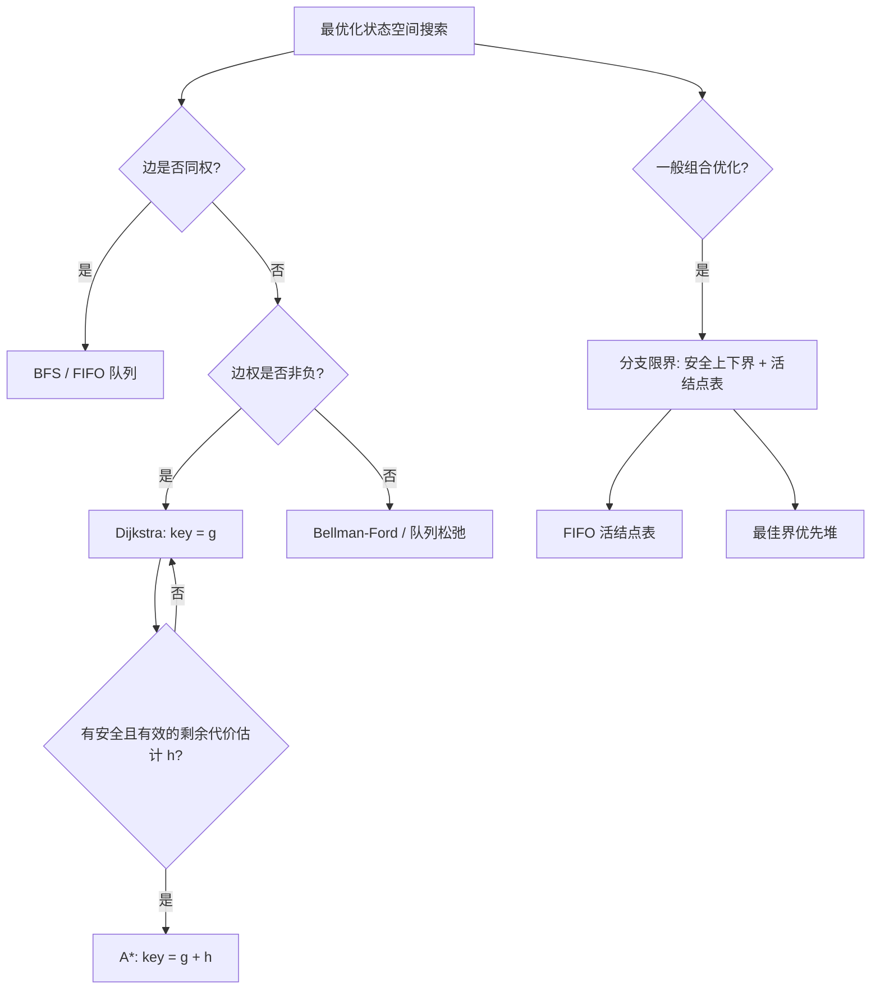

> 本章原文范围为 PDF 第 885～932 页，依次讲解分支限界法与 A* 算法概述、队列式分支限界法、优先队列式分支限界法和 A* 的应用。本文严格沿用原书小节顺序；超出原书直接论述的证明、勘误、工程实现或替代方案均标注为“补充”。文件名使用“A星”是因为 Windows 文件名不能包含字符 `*`。

## 本章要解决什么问题

第 19 章的回溯法以深度优先方式遍历解空间，并在递归返回时撤销选择。本章仍然搜索解空间，却把重点转向两个新问题。

1. **怎样优先扩展更有希望的状态？** FIFO 队列按层推进，优先队列按当前代价或估计总代价推进。
2. **怎样证明一整片状态都不可能优于当前答案？** 为每个部分状态计算安全的上界或下界，一次剪去整棵子树。

分支限界法适合最优化问题；A* 进一步利用“离目标还有多远”的启发信息，优先探索估计总成本最小的路径。

本章反复出现四个量：

| 符号 | 含义 |
| --- | --- |
| $g(n)$ | 当前已知从起点到状态 $n$ 的路径代价 |
| $h(n)$ | 从状态 $n$ 到目标的剩余代价估计 |
| $f(n)=g(n)+h(n)$ | 经过状态 $n$ 到达目标的估计总代价 |
| `best` / `dist` | 已知完整解或已知到某状态的最好代价 |

真正决定正确性的不是“用了优先队列”，而是：**队列键代表什么、边权满足什么条件、界是否安全、旧状态是否允许被更优路径更新。**

### 本章算法单元与正文题盘点

本章共有 **3 个基础算法单元、14 道正文题**。后文为每个基础单元或正文题各放置一个紧邻推导的 C++17 代码块，共 17 个；Python 与 Go 只在章末附录 A、B 给出完整程序。例 20-3 是 A* 的 OPEN 表走查，不另计独立实现；743、787、1293、1102 在原书中分别以不同活结点表重复出现，按 8 道不同正文题计数并保留各自实现。

| 类别 | 原书位置 | 算法单元或正文题 | 活结点表 / 核心键 |
| --- | --- | --- | --- |
| 基础单元 | 例 20-1 | FIFO 动态有向图最短路 | 队列；距离改善后重新入队 |
| 基础单元 | 例 20-2 | 优先队列动态有向图最短路 | 小根堆；$g=dist$ |
| 基础单元 | 例 20-3、20-4 | A* 与八数码 | 小根堆；$f=g+h$ |
| 正文题 | 20.2.1 | LeetCode 1376 通知所有员工 | FIFO；收到消息的时刻 |
| 正文题 | 20.2.2 | LeetCode 743 网络延迟（队列） | FIFO；距离松弛 |
| 正文题 | 20.2.3 | LeetCode 787 限站航班（分层） | 层号；上一层快照 |
| 正文题 | 20.2.4 | LeetCode 1293 消除障碍（队列） | FIFO；步数层 |
| 正文题 | 20.2.5 | LeetCode 1102 最高分路径（队列） | FIFO；瓶颈值改善 |
| 正文题 | 20.3.1 | LeetCode 743 网络延迟（堆） | 小根堆；$dist$ |
| 正文题 | 20.3.2 | LeetCode 787 限站航班（堆） | 小根堆；总价格 |
| 正文题 | 20.3.3 | LeetCode 1293 消除障碍（堆） | 小根堆；步数 |
| 正文题 | 20.3.4 | LeetCode 2473 购买苹果 | 多源小根堆；总成本 |
| 正文题 | 20.3.5 | LeetCode 1102 最高分路径（堆） | 大根堆；瓶颈值 |
| 正文题 | 20.3.6 | LeetCode 1723 工作分配 | 小根堆；当前最大负载下界 |
| 正文题 | 20.4.1 | LeetCode 773 滑动谜题 | A*；$g+$错位数 |
| 正文题 | 20.4.2 | LeetCode 752 打开转盘锁 | A*；$g+$环形距离 |
| 正文题 | 20.4.3 | LeetCode 1091 二进制矩阵 | A*；$g+$切比雪夫距离 |

## 20.1 分支限界法和 A* 算法概述

### 20.1.1 分支限界法

#### 一、什么是分支限界法

##### 1. 活结点、扩展结点与死结点

与回溯法一样，分支限界法在隐式解空间树或状态图上搜索。原书引入“活结点表”，可以严格区分三类结点。

- **活结点（live node）**：已经生成，但尚未展开全部子结点，仍可能通向最优解。
- **扩展结点（expanding node）**：本轮从活结点表取出、正在生成后继的结点。
- **死结点（dead node）**：已经扩展完毕，或已被约束/限界证明不可能产生所需最优解，不再进入搜索。

一次迭代包含：

1. 从活结点表选择一个结点 $u$；
2. 生成 $u$ 的全部合法子结点；
3. 对子结点计算界并剪枝；
4. 将未被剪除的子结点加入活结点表；
5. $u$ 完成扩展，成为死结点。

分支限界通常不执行“修改共享路径—递归—撤销”的调用栈回溯，而是把每个活状态及其代价存入队列。因此它在原书意义上是“不可回溯”的，但仍然是一种系统穷举与剪枝方法。

##### 2. 为什么需要界

仅按某种顺序遍历结点只能改变“先看谁”，不能减少最坏搜索空间。界函数要回答更强的问题：

> 即使以最乐观的方式补全当前部分解，它还能否优于已经找到的完整解？

若答案是否定的，就能删除整个后继子树。

设 $S(u)$ 是以状态 $u$ 为根能够形成的全部完整可行解，目标函数为 $C(x)$。

###### 最小化问题

子树真实最优值为

$$
OPT(u)=\min_{x\in S(u)}C(x).
$$

下界函数 $LB(u)$ 必须满足

$$
LB(u)\le OPT(u).
$$

设当前已找到完整可行解的最好代价为 `best`，它是全局最优值的一个上界。若

$$
LB(u)\ge best,
$$

则

$$
\forall x\in S(u),\quad C(x)\ge OPT(u)\ge LB(u)\ge best,
$$

该子树不可能给出更小答案，可以安全剪枝。

###### 最大化问题

子树真实最优值为

$$
OPT(u)=\max_{x\in S(u)}C(x).
$$

上界函数 $UB(u)$ 必须满足

$$
UB(u)\ge OPT(u).
$$

此时 `best` 是已知可行解给出的下界。若

$$
UB(u)\le best,
$$

则子树中的任何解都不可能更大，可以剪枝。

这两个方向不能记反：最小化需要“乐观地低估”，最大化需要“乐观地高估”。

###### 一个会误剪最优解的反例

界“看起来接近答案”还不够，方向错误会直接破坏正确性。

- 最小化时，已知完整解 `best=10`。某子树的真实最优值是 9，却把一个不可达的估计 12 当作下界；判断 $12\ge10$ 后剪枝，就丢掉了真正更优的 9。安全下界必须不大于 9。
- 最大化时，已知完整解 `best=12`。某子树的真实最优值是 15，却把估计 11 当作上界；判断 $11\le12$ 后剪枝，就丢掉了真正更优的 15。安全上界必须不小于 15。

因此，界过松只会少剪枝，界朝错误方向越过真实最优值却会误剪。`best` 来自完整可行解，界来自尚未完成的子树，两者不能仅凭数值名称互换。

##### 3. 界的单调性与紧致性

随着部分解增加约束，理想情况下：

$$
LB(child)\ge LB(parent)
$$

用于最小化问题，或

$$
UB(child)\le UB(parent)
$$

用于最大化问题。子树越小，乐观估计应越接近其真实最优值。

界函数有两个相互竞争的目标。

- **安全**：绝不能剪掉真正最优解所在分支。
- **紧**：尽量接近子树真实最优值，使剪枝尽早发生。

界越紧通常计算越贵。若计算一个极精确的界本身几乎等价于解决原问题，就失去意义。原书说明本章许多例子只使用从根到当前结点的已付代价作为简单界，容易计算，但剪枝能力有限。

##### 4. 与回溯法的比较

| 维度 | 回溯法 | 分支限界法 |
| --- | --- | --- |
| 常见目标 | 枚举可行解、找到任意解或小规模最优解 | 找最优解 |
| 典型次序 | 深度优先 | FIFO 广度优先或最佳优先 |
| 未处理状态 | 隐含在调用栈和同层候选中 | 显式保存在活结点表 |
| 剪枝 | 约束函数、限界函数 | 重点使用限界函数和状态支配 |
| 空间 | 通常与深度同阶 | 最坏需保存大量活结点 |
| 恢复现场 | 递归返回时撤销 | 通常复制或编码独立状态，无需撤销 |

二者本质上都可能遍历指数级解空间。分支限界用更多内存换取更灵活的扩展顺序和更早获得优质可行解的机会。

#### 二、组织活结点表

##### 1. 队列式分支限界法

FIFO 队列使结点按生成层次扩展：

```text
queue.push(root)
while queue not empty:
    u = queue.pop_front()
    for v in expand(u):
        if v 不可行:
            continue
        if bound(v) 已不可能改进 best:
            continue
        if v 是完整解:
            best = update(best, value(v))
        else:
            queue.push(v)
```

叶子可以在生成时检查，也可以在出队时检查。生成时检查可避免叶子入队，节省空间；出队时检查代码更统一。

队列式分支限界与普通 BFS 的关键区别是：

- 在无权图或每步同权的图中，BFS 层数就是路径代价，第一次到达目标已最优；
- 在一般带权图或一般组合优化中，FIFO 层次不等于目标值，第一次得到的完整解未必最优，必须继续比较或依赖额外的正确距离标签。

##### 2. 优先队列式分支限界法

优先队列每次选取“最有希望”的活结点。

- 最小化问题通常让 $LB$ 最小者先出队；
- 最大化问题通常让 $UB$ 最大者先出队。

```text
priorityQueue.push(root, bound(root))
while priorityQueue not empty:
    u = pop_best_bound()
    if bound(u) 已不可能改进 best:
        continue
    if u 是完整解:
        best = update(best, value(u))
        continue
    for v in expand(u):
        计算 bound(v)
        若仍有希望，则入队
```

最佳优先并不等于贪心地永久选一条分支。其他活结点仍保存在堆中；当前方向变差后，算法可以跳到另一个界更好的状态。

##### 3. 最优性的一般论证

以最小化问题为例，假设：

1. 每个完整可行解都能由某条分支生成；
2. $LB(u)\le OPT(u)$ 对所有活结点成立；
3. 只有当 $LB(u)\ge best$ 时才按界剪枝；
4. 未剪状态最终都会被扩展，或被一个更优的等价状态支配。

若算法结束时返回 `best` 却不是全局最优值 $OPT$，则包含最优解的某条路径必然在某处被剪。设首次被剪结点为 $u$，则

$$
LB(u)\ge best>OPT.
$$

但最优解属于 $S(u)$，所以

$$
LB(u)\le OPT(u)\le OPT,
$$

矛盾。因此最优分支不会被安全界误删，最终结果最优。

#### 三、队列式与优先队列式框架例题

##### 例 20-1：动态有向图最短路

原书以 LeetCode 2642 的 `Graph` 类说明队列式分支限界。图有 $n$ 个顶点，支持：

- 初始化有向带权边；
- 动态添加一条边；
- 查询任意 `source` 到 `target` 的最小路径代价。

邻接表中每条边表示为 $(to,weight)$。一次查询的状态为

$$
(vertex,cost),
$$

`cost` 是当前路径累计权重。若已有完整答案 `best` 且

$$
cost\ge best,
$$

因边权均为正，继续走只会更大，可以剪枝。

但仅按“路径”入队可能反复到达同一顶点。更强的状态支配是维护

$$
dist[v]=\text{当前已知从 source 到 }v\text{ 的最小代价}.
$$

新路径代价 $newCost$ 只有在

$$
newCost<dist[v]
$$

时才值得入队。因为对同一顶点而言，更贵路径面对完全相同的未来出边，永远不可能优于更便宜路径。

原书示例初始边为：

$$
0\to2:5,\quad0\to1:2,\quad1\to2:1,\quad3\to0:3.
$$

于是：

$$
dist(3,2)=3+2+1=6,
$$

而 0 到 3 不可达。添加 $1\to3:4$ 后：

$$
dist(0,3)=2+4=6.
$$

###### FIFO 状态走查

查询 `3→2` 时，邻接边按题面顺序扫描。`Q` 只保存待扩展顶点，表中仅列有限距离：

| 步骤 | 出队前 `Q` | 松弛结果 | 出队后 `Q` |
| ---: | --- | --- | --- |
| 0 | `[3]` | `dist[0]=3` | `[0]` |
| 1 | `[0]` | `dist[2]=8, dist[1]=5` | `[2,1]` |
| 2 | `[2,1]` | 2 无出边 | `[1]` |
| 3 | `[1]` | `dist[2]` 从 8 改善为 6 | `[2]` |
| 4 | `[2]` | 2 再次完成扩展 | `[]` |

顶点 2 曾经出队，后来仍可因更短路径重新入队；所以 `inQueue` 只表示“当前是否排队”，不能写成永久 `visited`。

###### 搜索契约

- **状态**：顶点及其当前距离标签，概念上是 `(vertex,g)`。
- **扩展**：沿全部出边做 `newG=g+weight` 松弛。
- **优先级**：FIFO，只按入队先后，不按代价。
- **支配 / visited**：同一顶点只保留更小 `dist`；`inQueue` 仅去掉当前队列中的重复项。
- **界函数**：正权下当前 $g$ 是任何后继完整路径的下界；本实现主要依靠 `dist` 支配，不依靠目标 `best` 提前结束。
- **条件**：原题边权为正；FIFO 松弛可处理无负环的负边，但有可达负环时不终止，也不能用 $g\ge best$ 剪枝。

###### C++17：基础单元 1——FIFO 动态有向图

后续 C++17 代码块按出现顺序共享这里的头文件、`Long`、无穷大和四方向数组，不再重复声明。

```cpp
#include <algorithm>
#include <array>
#include <climits>
#include <cstdlib>
#include <functional>
#include <limits>
#include <numeric>
#include <queue>
#include <set>
#include <string>
#include <tuple>
#include <unordered_map>
#include <unordered_set>
#include <utility>
#include <vector>

using Long = long long;

constexpr Long kInfinity = std::numeric_limits<Long>::max() / 4;
constexpr std::array<std::pair<int, int>, 4> kDirections4 = {{
    {1, 0}, {-1, 0}, {0, 1}, {0, -1}
}};

class DynamicGraphQueue {
public:
    DynamicGraphQueue(int node_count, const std::vector<std::vector<int>>& edges)
        : graph_(node_count) {
        for (const auto& edge : edges) {
            AddEdge(edge);
        }
    }

    void AddEdge(const std::vector<int>& edge) {
        graph_[edge[0]].push_back({edge[1], edge[2]});
    }

    Long ShortestPath(int source, int target) const {
        std::vector<Long> distance(graph_.size(), kInfinity);
        std::vector<bool> in_queue(graph_.size(), false);
        std::queue<int> live_nodes;
        distance[source] = 0;
        in_queue[source] = true;
        live_nodes.push(source);

        while (!live_nodes.empty()) {
            const int vertex = live_nodes.front();
            live_nodes.pop();
            in_queue[vertex] = false;
            for (const auto& [neighbor, weight] : graph_[vertex]) {
                const Long candidate = distance[vertex] + weight;
                if (candidate >= distance[neighbor]) {
                    continue;
                }
                distance[neighbor] = candidate;
                if (!in_queue[neighbor]) {
                    in_queue[neighbor] = true;
                    live_nodes.push(neighbor);
                }
            }
        }
        return distance[target] == kInfinity ? -1 : distance[target];
    }

private:
    std::vector<std::vector<std::pair<int, int>>> graph_;
};
```

##### 例 20-2：优先队列改写

将活结点按累计路径代价 `cost` 放入小根堆，就得到 Dijkstra 风格的优先队列分支限界。

当所有边权非负时，从堆中弹出的未过期状态 $(u,cost)$ 满足

$$
cost=dist[u].
$$

若此时 $u=target$，可以立即返回，因为堆中其余活结点代价都不小于 `cost`，任何后续完整路径也不可能更短。

时间复杂度为

$$
O((V+E)\log V)
$$

的常见实现量级，空间为 $O(V+E)$。若允许负边，Dijkstra 的“首次弹出即确定”不成立，应改用 Bellman-Ford 等算法。

> **补充：术语对应。** 在一般组合优化语境中，这是优先队列式分支限界；在非负边最短路语境中，同一代码结构就是 Dijkstra。当前累计代价 $g$ 既是到当前顶点的精确已知代价，也是任何完整路径总代价的下界。

###### 小根堆状态走查

仍查询 `3→2`。小根堆先放 `(g,vertex)`：

```text
pop (0,3) -> push (3,0)
pop (3,0) -> push (8,2), (5,1)
pop (5,1) -> dist[2] 由 8 改为 6，push (6,2)
pop (6,2) -> 目标以有效最小标签出堆，返回 6
```

堆中仍有旧条目 `(8,2)`，但提前返回后无需处理；若继续跑全源最短路，它会因 `8 != dist[2]` 被惰性删除。

###### 搜索契约

- **状态**：`(vertex,g)`，其中 $g=dist[vertex]$ 才是有效条目。
- **扩展**：沿出边松弛并把改善后的新标签入堆。
- **优先级**：小根堆按 $g$ 最小者优先。
- **支配 / visited**：`dist` 支配更贵标签；不在生成时永久标记，出堆时过滤旧条目。
- **界函数**：非负边权下 $g$ 是所有后继完整路径代价的下界。
- **条件**：所有边权非负；目标第一次以有效标签出堆才可终止，第一次入堆不可终止。

###### C++17：基础单元 2——优先队列动态有向图

```cpp
class DynamicGraphHeap {
public:
    DynamicGraphHeap(int node_count, const std::vector<std::vector<int>>& edges)
        : graph_(node_count) {
        for (const auto& edge : edges) {
            AddEdge(edge);
        }
    }

    void AddEdge(const std::vector<int>& edge) {
        graph_[edge[0]].push_back({edge[1], edge[2]});
    }

    Long ShortestPath(int source, int target) const {
        using Entry = std::pair<Long, int>;
        std::priority_queue<Entry, std::vector<Entry>, std::greater<Entry>> open;
        std::vector<Long> distance(graph_.size(), kInfinity);
        distance[source] = 0;
        open.push({0, source});

        while (!open.empty()) {
            const auto [cost, vertex] = open.top();
            open.pop();
            if (cost != distance[vertex]) {
                continue;
            }
            if (vertex == target) {
                return cost;
            }
            for (const auto& [neighbor, weight] : graph_[vertex]) {
                const Long candidate = cost + weight;
                if (candidate < distance[neighbor]) {
                    distance[neighbor] = candidate;
                    open.push({candidate, neighbor});
                }
            }
        }
        return -1;
    }

private:
    std::vector<std::vector<std::pair<int, int>>> graph_;
};
```

### 20.1.2 A* 算法

#### 一、从最佳优先到启发式搜索

A* 与优先队列式分支限界相似，都把未扩展状态放入按优先级排序的 OPEN 表。区别是：Dijkstra 只按已经付出的代价 $g$ 排序；A* 还估计剩余代价 $h$，按

$$
f(n)=g(n)+h(n)
$$

排序。

直觉上：

- $g(n)$ 回答“已经走了多远”；
- $h(n)$ 回答“乐观估计还要走多远”；
- $f(n)$ 回答“经过这里完成整条路径至少大约需要多少”。

#### 二、OPEN、CLOSED 与最佳距离

原书给出的 A* 过程是：

1. 将起点加入 OPEN；
2. OPEN 为空则无解；
3. 取 $f$ 最小结点 $u$，移入 CLOSED；
4. 若 $u$ 是目标，则重建路径并结束；
5. 扩展后继，计算代价并加入或更新 OPEN；
6. 重复。

现代实现通常维护：

- 小根堆 `open`，元素为 $(f,g,state)$；
- `bestG[state]`，记录当前已知到该状态的最小 $g$；
- 可选的 `parent[state]`，用于恢复路径。

若堆中弹出条目的 $g$ 不等于 `bestG[state]`，说明它是被后续更优路径淘汰的旧条目，直接跳过。这种“允许重复入堆、出堆判旧”的写法通常比在堆内原地修改键更简单。

#### 三、真实代价与估计代价

原书定义：

- $G(n)$：从起点 $s$ 到 $n$ 的真实最短代价；
- $H(n)$：从 $n$ 到目标 $goal$ 的真实最短剩余代价；
- $g(n)$：搜索当前已知的起点到 $n$ 代价，满足 $g(n)\ge G(n)$；
- $h(n)$：对 $H(n)$ 的启发式估计。

经过 $n$ 的真实最优完整路径代价是

$$
F(n)=G(n)+H(n),
$$

A* 使用

$$
f(n)=g(n)+h(n)
$$

作为可计算的排序键。

#### 四、可接纳性与一致性

##### 1. 可接纳启发式

若对所有状态 $n$ 都有

$$
0\le h(n)\le H(n),
$$

且 $h(goal)=0$，则称 $h$ **可接纳（admissible）**。它从不高估真实剩余代价，因此 $f$ 是经过当前状态完成路径的乐观估计。

##### 2. 一致启发式

若对每条边 $u\to v$，边代价为 $c(u,v)\ge0$，都有

$$
h(u)\le c(u,v)+h(v),
$$

则称 $h$ **一致（consistent）** 或单调。它是启发函数版本的三角不等式。

##### 3. 一致性推出可接纳性

> **补充：完整证明。** 设从 $n=n_0$ 到目标 $n_k=goal$ 的一条最优路径为

$$
n_0\to n_1\to\cdots\to n_k.
$$

逐边应用一致性：

$$
h(n_0)\le c(n_0,n_1)+h(n_1),
$$

$$
h(n_1)\le c(n_1,n_2)+h(n_2),
$$

依次代入并利用 $h(goal)=0$：

$$
h(n)
\le\sum_{i=0}^{k-1}c(n_i,n_{i+1})+h(goal)
=H(n).
$$

所以一致性蕴含可接纳性。

##### 4. 一致性推出 $f$ 单调非递减

若从 $u$ 沿边到 $v$，且当前路径满足

$$
g(v)=g(u)+c(u,v),
$$

则由一致性：

$$
\begin{aligned}
f(v)
&=g(v)+h(v)\\
&=g(u)+c(u,v)+h(v)\\
&\ge g(u)+h(u)\\
&=f(u).
\end{aligned}
$$

因此沿任意路径，$f$ 不会下降。

##### 5. 数值实例：可接纳不必一致

设有边 $u\to v$，代价为 1；从 $v$ 到目标的真实最短代价为 4，所以 $H(v)=4$、$H(u)=5$。取

$$
h(u)=5,
\qquad
h(v)=0.
$$

两者都没有高估各自真实剩余代价，因此可接纳；但在边 $u\to v$ 上

$$
h(u)=5>1+h(v)=1,
$$

违反一致性。沿该边的 $f$ 可能下降，图搜索若只凭 CLOSED 永久关闭状态就可能需要重新打开。反之，四方向单位网格的曼哈顿距离每走一步最多下降 1，逐边满足 $h(u)\le1+h(v)$，既可接纳又一致。

#### 五、A* 为什么能返回最短路径

> **补充：最优性论证。** 假设 $h$ 可接纳，目标最优代价为 $C^*$。在目标以次优代价 $C>C^*$ 被弹出之前，最优路径上一定还有一个尚未扩展的前沿结点 $n$。若该结点的当前 $g$ 来自最优路径前缀，则

$$
f(n)=g(n)+h(n)\le g(n)+H(n)=C^*<C.
$$

小根堆不可能先弹出键为 $C$ 的次优目标，所以矛盾。由此 A* 首次以有效最优标签弹出目标时得到最短路。

对于一般图搜索，仅有可接纳性时，若后续发现更小 $g$，可能需要重新打开 CLOSED 中的状态；若 $h$ 一致，则结点第一次以最小有效 $f$ 弹出时其 $g$ 已确定，不需要重新打开。

##### 终止条件的最小反例

考虑非负边图：

$$
s\to goal:10,
\qquad
s\to a:1,
\qquad
a\to goal:1,
$$

并取 $h\equiv0$。扩展 $s$ 时会先“生成”代价 10 的目标，同时生成代价 1 的 $a$。若目标一生成就返回，会误答 10；继续按堆键扩展 $a$，目标被改善为 2，最后以有效标签出堆才可返回 2。

A* 的可靠终止条件因此是：边权非负；$h$ 可接纳；发现更小 $g$ 时允许更新并重新入堆；目标以当前有效标签从 OPEN 弹出。若还要求状态永不重新打开，则需把条件加强为 $h$ 一致。OPEN 为空表示无可达目标；有限状态图中这会正常终止，有可达负环或无限状态空间时还需额外条件，不能照搬结论。

> **原文边界说明**：原文提到一致启发式下“不再需要 CLOSED 表，只需维护已访问结点的 OPEN 表”。更精确的工程表述是：一致性使已正式出队的状态不必重新打开，但仍需要 `bestG`、CLOSED 或等价的过期条目检查来避免重复扩展。完全不记录已处理状态会在有环图中造成大量重复。

#### 六、启发函数强弱与退化情况

若两个启发函数 $h_1,h_2$ 都可接纳，并且

$$
h_1(n)\le h_2(n)\le H(n)
$$

对所有 $n$ 成立，则称 $h_2$ 支配 $h_1$。在相同实现和打破平局方式下，$h_2$ 通常扩展不多于 $h_1$ 的状态，因为它更接近真实剩余代价。

- $h(n)=0$ 时，$f=g$，A* 退化为 Dijkstra；只有所有边权相同且 $g$ 等于步数时，才进一步等价于 BFS。
- 若人为令 $g(n)=0$，只按 $h$ 排序，就成为贪心最佳优先搜索，通常更快但不保证最短。
- 若 $h(n)>H(n)$，启发式可能越过最优路径，不能保证最优；这类加权启发搜索可作为速度优先的近似方法，但属于补充策略。

#### 七、网格中的常用距离

设两点坐标差为

$$
\Delta x=|x_1-x_2|,
\qquad
\Delta y=|y_1-y_2|.
$$

##### 1. 曼哈顿距离

若只允许上下左右移动，每步代价为 $d$，无障碍最短代价是

$$
D_M=d(\Delta x+\Delta y).
$$

有障碍时，真实路径不可能比无障碍直达更短，所以

$$
h(n)=d(\Delta x+\Delta y)
$$

是可接纳启发式。

##### 2. 对角线距离

若正交移动代价为 $d_1$，对角移动代价为 $d_2$，且 $d_1\le d_2\le2d_1$，应先走

$$
\min(\Delta x,\Delta y)
$$

步对角线，再走

$$
|\Delta x-\Delta y|
$$

步正交线。因此

$$
\begin{aligned}
D_D
&=d_2\min(\Delta x,\Delta y)
+d_1|\Delta x-\Delta y|\\
&=d_1(\Delta x+\Delta y)
+(d_2-2d_1)\min(\Delta x,\Delta y).
\end{aligned}
$$

当 $d_1=d_2=1$ 时：

$$
D_D=\max(\Delta x,\Delta y),
$$

即切比雪夫距离。

若 $d_2>2d_1$，走一次对角线比走两次正交线还贵，最短路不会使用对角线，应改用曼哈顿距离。

##### 3. 欧几里得距离

若移动代价与几何长度成正比，直线距离为

$$
D_E=d\sqrt{(\Delta x)^2+(\Delta y)^2}.
$$

它在连续平面、允许任意方向移动，或八方向中对角代价为 $\sqrt2d$ 时是自然下界。

> **补充：适用边界。** 欧几里得距离并非对所有八方向单位代价网格都可接纳。例如从 $(0,0)$ 对角移动到 $(1,1)$ 的真实代价若为 1，而欧氏距离为 $\sqrt2>1$，就发生高估。启发距离必须与实际动作集合和边代价匹配，不能只因“几何上更直”就直接套用。

#### 八、例 20-3 与例 20-4

##### 例 20-3：OPEN 表的最佳优先过程

原书图 20.2 从 A 搜索到 P，每次取代价值最小结点：

```text
OPEN 初始：A[5]
A 扩展后：B[4], C[4], D[6]
B 扩展后：C[4], E[5], F[5], D[6]
C 扩展后：H[3], G[4], E[5], F[5], D[6]
H 扩展后：O[2], P[3], G[4], E[5], F[5], D[6]
O 无后继后：P[3], G[4], E[5], F[5], D[6]
```

随后取出 P，得到路径 A→C→H→P。这个例子直观展示 OPEN 如何在不同分支间跳转；要把“结点旁的代价值”解释为严格 A* 的 $f=g+h$，还必须知道边代价与启发式并验证可接纳性。

##### 例 20-4：八数码

原书把 $3\times3$ 棋盘按行编码成长度 9 的字符串。例如：

$$
\begin{bmatrix}
2&8&3\\
1&6&4\\
7&0&5
\end{bmatrix}
\longrightarrow
\texttt{"283164705"}.
$$

状态扩展是将空格 `0` 与上下左右邻格交换，每步代价为 1，因此

$$
g(state)=\text{从起点到该状态的移动次数}.
$$

原书选择“不计空格的错位数字数”作为 $h$。一次移动只会移动一个非零数字，该数字的错位状态最多改善 1，所以

$$
h(u)\le1+h(v)
$$

对相邻状态成立；目标状态 $h=0$。因此它是一致、从而可接纳的启发式。

原书示例从

$$
\texttt{"283164705"}
$$

搜索到

$$
\texttt{"123804765"},
$$

以 $f=g+h$ 最小的状态优先扩展。字符串编码便于放入哈希集合，并可保存父状态或操作序列来恢复路径。

> **补充：可解性预判。** 对奇数宽度的滑块谜题，忽略空格后的逆序数奇偶性在合法移动下保持不变。起点与目标逆序数奇偶性不同则不可达，可在 A* 前直接返回无解。LeetCode 773 的 $2\times3$ 情况也可利用相应排列奇偶性，或因状态总数仅 $6!=720$ 而直接 BFS。

###### 搜索契约

- **状态**：九格排列字符串及其当前步数 $g$。
- **扩展**：把 `0` 与上、下、左、右相邻位置交换，每条边代价为 1。
- **优先级**：小根堆按 $f=g+h$，再按 $g$ 与字符串稳定打破平局。
- **支配 / visited**：`bestG[state]` 支配更大 $g$；不在生成时永久 `visited`，旧条目出堆时淘汰。
- **界函数**：$f=g+h$ 是经过当前排列完成路径的下界。
- **条件**：错位非零方块数一致且可接纳；目标以有效标签出堆时终止，逆序奇偶性不同可提前判无解。

###### C++17：基础单元 3——A* 八数码

```cpp
int InversionParity(const std::string& state) {
    int inversions = 0;
    for (int first = 0; first < static_cast<int>(state.size()); ++first) {
        if (state[first] == '0') {
            continue;
        }
        for (int second = first + 1; second < static_cast<int>(state.size()); ++second) {
            if (state[second] != '0' && state[first] > state[second]) {
                ++inversions;
            }
        }
    }
    return inversions % 2;
}

int EightPuzzleAStar(const std::string& start, const std::string& goal) {
    if (InversionParity(start) != InversionParity(goal)) {
        return -1;
    }
    const auto heuristic = [&](const std::string& state) {
        int mismatches = 0;
        for (int index = 0; index < 9; ++index) {
            if (state[index] != '0' && state[index] != goal[index]) {
                ++mismatches;
            }
        }
        return mismatches;
    };

    using Entry = std::tuple<int, int, std::string>;
    std::priority_queue<Entry, std::vector<Entry>, std::greater<Entry>> open;
    std::unordered_map<std::string, int> best_g;
    best_g[start] = 0;
    open.push({heuristic(start), 0, start});

    while (!open.empty()) {
        const auto [estimate, steps, state] = open.top();
        open.pop();
        if (steps != best_g[state]) {
            continue;
        }
        if (state == goal) {
            return steps;
        }
        const int zero = static_cast<int>(state.find('0'));
        const int row = zero / 3;
        const int column = zero % 3;
        for (const auto& [row_delta, column_delta] : kDirections4) {
            const int next_row = row + row_delta;
            const int next_column = column + column_delta;
            if (next_row < 0 || next_row == 3 || next_column < 0 || next_column == 3) {
                continue;
            }
            const int neighbor = next_row * 3 + next_column;
            std::string next_state = state;
            std::swap(next_state[zero], next_state[neighbor]);
            const int next_steps = steps + 1;
            const auto found = best_g.find(next_state);
            if (found == best_g.end() || next_steps < found->second) {
                best_g[next_state] = next_steps;
                open.push({next_steps + heuristic(next_state), next_steps, next_state});
            }
        }
    }
    return -1;
}
```

#### 九、几种搜索方法的统一关系

| 方法 | 活结点表键 | 最优性条件 | 典型用途 |
| --- | --- | --- | --- |
| BFS | 层数 / FIFO | 所有边同权 | 无权最短路 |
| 队列式分支限界 | FIFO + 安全界 | 必须比较全部未剪可行解或有额外结构 | 一般层次搜索 |
| Dijkstra | $g$ | 边权非负 | 非负权最短路 |
| A* | $g+h$ | $h$ 可接纳；图搜索常用一致性 | 有目标导向的最短路 |
| 贪心最佳优先 | $h$ | 通常不保证最优 | 快速找到某条路径 |

这个表也是后续各题选择算法的依据：如果状态图很小或没有有效启发式，BFS/Dijkstra 往往更简单；只有当 $h$ 能显著接近真实剩余代价且计算便宜时，A* 才能体现优势。

## 20.2 队列式分支限界法应用的算法设计

### 20.2.1 LeetCode 1376：通知所有员工所需的时间（★★）

#### 问题如何变成树上的最长时间

公司关系由 `manager[i]` 给出，每位员工除总负责人外恰有一个直属负责人，且题目保证整体是一棵以 `headID` 为根的树。

若负责人 $u$ 在时刻 $T(u)$ 收到消息，他的所有直属下属都在

$$
T(v)=T(u)+informTime[u]
$$

时刻收到消息。注意加的是负责人 $u$ 的通知时间，而不是下属 $v$ 的通知时间。

所有人都收到消息的时刻是

$$
answer=\max_{0\le v<n}T(v).
$$

因此问题等价于求根到所有结点的加权路径长度最大值，其中树边 $u\to v$ 的权为 `informTime[u]`。

#### 队列状态与扩展

先由 `manager` 建立从负责人到直属下属的邻接表。队列元素为

$$
(employee,receiveTime).
$$

从 `(u,T(u))` 扩展每个下属 $v$，加入

$$
(v,T(u)+informTime[u]).
$$

每个员工只有一个父结点，因此只会入队一次，无须 `visited` 或距离松弛。

原书样例中，总负责人 2 的所有下属都是叶子，`informTime[2]=1`，所以所有下属在时刻 1 收到消息，答案为 1。

#### 为什么这里几乎没有“限界”

原书将其放在队列式分支限界章节，因为组织形式是活结点队列，并在叶子比较最大时间。但这棵输入树没有重复状态，每个结点都必须访问才能确认最晚时间，也没有能够安全删除未知子树的有效上界。因此算法本质上就是树的 BFS；DFS 计算根到叶最大和也完全等价。

时间和空间复杂度均为

$$
O(n),
$$

因为每位员工和每条管理边恰好处理一次。

#### 搜索契约

- **状态**：`(employee,receiveTime)`，时间是根到该员工的唯一加权路径和。
- **扩展**：把每个直属下属以 `receiveTime + informTime[employee]` 入队。
- **优先级**：FIFO；层次只反映管理深度，不直接等于累计时间。
- **支配 / visited**：输入是有根树，每名员工只有一个父结点，只生成一次，无须 `visited`。
- **界函数**：当前收到时间是精确前缀值；没有未知子树的安全非平凡上界，因此不做限界剪枝。
- **条件**：`manager` 必须描述以 `headID` 为根的树，`informTime` 非负；本题不使用启发函数。

#### C++17：树上 FIFO 累计收到时间

```cpp
int NotificationTime(
    int employee_count,
    int head_id,
    const std::vector<int>& manager,
    const std::vector<int>& inform_time
) {
    std::vector<std::vector<int>> subordinates(employee_count);
    for (int employee = 0; employee < employee_count; ++employee) {
        if (manager[employee] != -1) {
            subordinates[manager[employee]].push_back(employee);
        }
    }

    int answer = 0;
    std::queue<std::pair<int, int>> live_nodes;
    live_nodes.push({head_id, 0});
    while (!live_nodes.empty()) {
        const auto [employee, receive_time] = live_nodes.front();
        live_nodes.pop();
        answer = std::max(answer, receive_time);
        for (int subordinate : subordinates[employee]) {
            live_nodes.push({
                subordinate,
                receive_time + inform_time[employee]
            });
        }
    }
    return answer;
}
```

### 20.2.2 LeetCode 743：网络延迟时间（★★）

#### 从传播时间到单源最短路

信号从源点 $k$ 同时沿网络传播。结点 $v$ 最早收到信号的时间，就是 $k$ 到 $v$ 的最短路径长度：

$$
dist[v]=\min_{P:k\leadsto v}\sum_{e\in P}w(e).
$$

若所有结点可达，最后一个结点收到信号的时间为

$$
answer=\max_v dist[v].
$$

只要存在不可达结点，即某个 `dist[v]=∞`，就返回 -1。

#### 队列松弛

原书用队列式分支限界，实质是队列优化的反复松弛：

1. 初始化 `dist[source]=0`，其余为 $\infty$；
2. 源点入队；
3. 出队 $u$，对每条边 $(u,v,w)$ 检查

    $$
    dist[u]+w<dist[v].
    $$

4. 若成立，更新 `dist[v]` 并让 $v$ 入队等待继续传播。

新路径若不小于 `dist[v]`，就被已有更短路径支配：未来从 $v$ 出发面对相同出边，它不可能产生更优后继。

样例边为

$$
2\to1:1,\quad2\to3:1,\quad3\to4:1,
$$

从 2 出发得到距离 `[1,0,1,2]`（按结点 1～4 排列），最大值为 2。

#### 复杂度与替代方案

这种队列松弛与 SPFA 的结构相似，最坏时间可达 $O(VE)$，不能因为使用队列就写成普通 BFS 的 $O(V+E)$。本题边权非负，优先队列 Dijkstra 的最坏界更稳定：

$$
O((V+E)\log V).
$$

原书将在 20.3.1 用优先队列再次求解同一题。

#### 搜索契约

- **状态**：顶点及当前最短标签，概念上为 `(vertex,g)`。
- **扩展**：对每条有向边执行 `candidate=dist[u]+weight`。
- **优先级**：FIFO；改善顺序不等于距离顺序，顶点可多次入队。
- **支配 / visited**：更小 `dist[v]` 支配同顶点的更贵路径；`inQueue` 不是永久 `visited`。
- **界函数**：正权下 $g$ 是后继路径下界，但为求所有结点最短路不能在首次遇到某个目标时结束。
- **条件**：题目边权为正；若推广到负边必须排除可达负环，本题不使用启发函数。

#### C++17：FIFO 反复松弛网络延迟

```cpp
int NetworkDelayQueue(
    const std::vector<std::vector<int>>& times,
    int node_count,
    int source
) {
    std::vector<std::vector<std::pair<int, int>>> graph(node_count);
    for (const auto& edge : times) {
        graph[edge[0] - 1].push_back({edge[1] - 1, edge[2]});
    }

    std::vector<Long> distance(node_count, kInfinity);
    std::vector<bool> in_queue(node_count, false);
    std::queue<int> live_nodes;
    distance[source - 1] = 0;
    in_queue[source - 1] = true;
    live_nodes.push(source - 1);

    while (!live_nodes.empty()) {
        const int vertex = live_nodes.front();
        live_nodes.pop();
        in_queue[vertex] = false;
        for (const auto& [neighbor, weight] : graph[vertex]) {
            const Long candidate = distance[vertex] + weight;
            if (candidate >= distance[neighbor]) {
                continue;
            }
            distance[neighbor] = candidate;
            if (!in_queue[neighbor]) {
                in_queue[neighbor] = true;
                live_nodes.push(neighbor);
            }
        }
    }

    const Long answer = *std::max_element(distance.begin(), distance.end());
    return answer == kInfinity ? -1 : static_cast<int>(answer);
}
```

### 20.2.3 LeetCode 787：$k$ 站中转内最便宜的航班（★★）

#### “中转站”与“边数”的换算

最多经过 $k$ 个中转站，意味着路径最多使用

$$
k+1
$$

条航班边。起点使用 0 条边；直达目的地使用 1 条边但有 0 个中转站。

原书样例：

```text
0 → 1，价格 1
0 → 2，价格 5
1 → 2，价格 1
2 → 3，价格 1
```

当 $k=1$ 时最多用 2 条边，`0→1→2→3` 虽只需 3，却用了 3 条边，不合法；合法最优路径 `0→2→3` 价格为 6。

#### 为什么状态不能只有城市

到达同一城市的两条路径可能形成权衡：

- 路径 A 更便宜，但已经用了很多边；
- 路径 B 更贵，但剩余边数更多，可能最终更便宜地到达目的地。

因此状态必须至少是

$$
(city,edgesUsed),
$$

并维护

$$
best[e][v]
=\text{恰好或至多使用 }e\text{ 条边到达 }v\text{ 的最低价格}.
$$

仅用单一 `dist[v]` 删除所有更贵到达状态并不安全，因为它忽略了资源“剩余可用边数”。

> **原文边界说明**：原书第一种队列写法同时记录最短价格 `dist[v]` 和最少中转数 `cnt[v]`，第二种按层松弛。更稳妥且容易证明的方法是二维状态或下面的分层 Bellman-Ford；“价格更低”与“边数更少”应按 Pareto 支配处理，不能分别取两个一维最小值后任意组合。

#### 分层队列 / Bellman-Ford 递推

定义

$$
dp_e[v]=\text{最多使用 }e\text{ 条边到达 }v\text{ 的最低价格}.
$$

初始为

$$
dp_0[src]=0,
\qquad
dp_0[v]=\infty\ (v\ne src).
$$

第 $e$ 层对每条航班 $(u,v,w)$ 松弛：

$$
dp_e[v]
=\min\bigl(dp_{e-1}[v],\ dp_{e-1}[u]+w\bigr).
$$

右侧必须全部读取上一层 $dp_{e-1}$。若在同一数组上原地连续更新，一轮可能串联多条边，从而突破边数限制。因此实现时每层先复制 `previous` 到 `current`，或显式保存上一层快照。

执行 $k+1$ 层后返回 $dp_{k+1}[dst]$。

#### 正确性与复杂度

用归纳法证明：$e=0$ 时只有起点可达；假设 $dp_{e-1}$ 正确，至多 $e$ 条边的最优路径要么本来就至多用 $e-1$ 条边，要么最后一条是 $(u,v,w)$，前缀至多使用 $e-1$ 条边，正好对应递推两项。故结论成立。

时间复杂度为

$$
O((k+1)E),
$$

滚动数组空间为 $O(V)$。若需要恢复路线，则保存每层父结点。

#### 搜索契约

- **状态**：`(city,edgesUsed)`；滚动数组把层号放在外层循环中。
- **扩展**：第 $e$ 轮用上一轮快照经过一条航班得到第 $e$ 层候选。
- **优先级**：按已用边数逐层推进，不按价格排序。
- **支配 / visited**：同一层同一城市只保留最低价；不同边数状态不能用单一 `visited[city]` 合并。
- **界函数**：正票价下当前价格是所有后继价格的下界，但资源层不同仍不能相互支配。
- **条件**：最多使用 $k+1$ 条边；每轮必须只读快照，题目票价为正且不使用启发函数。

#### C++17：分层 Bellman-Ford 限制航班边数

```cpp
int CheapestFlightLayered(
    int node_count,
    const std::vector<std::vector<int>>& flights,
    int source,
    int target,
    int maximum_stops
) {
    std::vector<Long> distance(node_count, kInfinity);
    distance[source] = 0;
    for (int layer = 0; layer <= maximum_stops; ++layer) {
        const std::vector<Long> previous = distance;
        for (const auto& flight : flights) {
            const int from = flight[0];
            const int to = flight[1];
            const int price = flight[2];
            if (previous[from] != kInfinity) {
                distance[to] = std::min(
                    distance[to], previous[from] + price
                );
            }
        }
    }
    return distance[target] == kInfinity
        ? -1
        : static_cast<int>(distance[target]);
}
```

### 20.2.4 LeetCode 1293：网格中的最短路径（★★★）

#### 为什么坐标不是完整状态

每步上下左右移动，最多消除 $k$ 个障碍。到达同一格子的两条路径若消除障碍数不同，未来能力不同，因此完整状态是

$$
(row,column,removed).
$$

最直接的 `visited[row][column][removed]` 有 $O(mnk)$ 个状态。由于每步代价均为 1，BFS 第一次到达目标的层数就是最短步数。

#### 状态支配优化

在 BFS 的非递减步数顺序下，若此前已经到达格子 $(r,c)$ 且使用障碍数不多于当前状态，则当前状态既不更短，也没有更多剩余消除额度，被支配。

可以维护

$$
minRemoved[r][c]
=\text{目前到达该格使用的最少障碍数}.
$$

新状态只在

$$
newRemoved\le k
\quad\land\quad
newRemoved<minRemoved[nr][nc]
$$

时入队。

等价地，也可记录到达格子时剩余的最大消除次数，新状态只有剩余次数更大时入队。

#### 曼哈顿下界与特殊情况

从左上到右下至少要走

$$
m+n-2
$$

步。任选一条只向右和向下的曼哈顿路径，共经过 $m+n-1$ 个格子；起点与终点保证为空，所以中间最多有

$$
m+n-3
$$

个障碍。若

$$
k\ge m+n-3,
$$

一定可以直接返回最短理论值 $m+n-2$。

#### 原文勘误说明

原文 OCR 在描述初版算法时写成到达目标后 `ans=max(ans,length)`；本题求最短路，应为

$$
ans=\min(ans,length).
$$

20.3.3 的文字还出现“若 `nnums >= cnt` 则扩展”的方向矛盾；正确支配条件是新障碍数严格更少才扩展，即 `nnums < cnt`，否则剪枝。

#### 复杂度

三维状态法时间与空间均为 $O(mnk)$。只存每格最少障碍数可把表空间降为 $O(mn)$，但同一格仍可能因记录不断改善而多次入队，最坏时间仍可按 $O(mnk)$ 理解。

#### 搜索契约

- **状态**：`(row,column,removed,steps)`，障碍消耗影响未来合法动作。
- **扩展**：向四邻格移动，步数加 1，若进入障碍则 `removed` 加 1。
- **优先级**：FIFO 按 `steps` 非递减扩展，因此第一次出队目标最短。
- **支配 / visited**：在不更晚的 BFS 层，同格更少 `removed` 支配更多者；不能只用二维布尔 `visited`。
- **界函数**：`steps + Manhattan` 是完成路径下界；代码只用 $k\ge m+n-3$ 的资源充分条件提前返回。
- **条件**：每次移动代价为 1、障碍消除上限为 $k$；曼哈顿估计一致但本实现无需堆或显式启发式。

#### C++17：BFS 与每格最少障碍支配

```cpp
int ShortestPathWithEliminationQueue(
    const std::vector<std::vector<int>>& grid,
    int maximum_eliminations
) {
    const int rows = static_cast<int>(grid.size());
    const int columns = static_cast<int>(grid[0].size());
    if (maximum_eliminations >= rows + columns - 3) {
        return rows + columns - 2;
    }

    using State = std::tuple<int, int, int, int>;
    std::vector<std::vector<int>> minimum_removed(
        rows, std::vector<int>(columns, INT_MAX)
    );
    std::queue<State> live_nodes;
    minimum_removed[0][0] = 0;
    live_nodes.push({0, 0, 0, 0});

    while (!live_nodes.empty()) {
        const auto [row, column, removed, steps] = live_nodes.front();
        live_nodes.pop();
        if (row == rows - 1 && column == columns - 1) {
            return steps;
        }
        for (const auto& [row_delta, column_delta] : kDirections4) {
            const int next_row = row + row_delta;
            const int next_column = column + column_delta;
            if (next_row < 0 || next_row == rows ||
                next_column < 0 || next_column == columns) {
                continue;
            }
            const int next_removed = removed + grid[next_row][next_column];
            if (next_removed <= maximum_eliminations &&
                next_removed < minimum_removed[next_row][next_column]) {
                minimum_removed[next_row][next_column] = next_removed;
                live_nodes.push({
                    next_row, next_column, next_removed, steps + 1
                });
            }
        }
    }
    return -1;
}
```

### 20.2.5 LeetCode 1102：得分最高的路径（★★）

#### 最大化路径上的最小值

路径 $P$ 的得分不是元素和，而是瓶颈值：

$$
score(P)=\min_{cell\in P}grid[cell].
$$

目标是

$$
\max_P score(P),
$$

这类问题称为**最宽路径**或最大瓶颈路径。

#### `max-min` 松弛

定义

$$
best[r][c]
=\text{从起点到 }(r,c)\text{ 的最大路径得分}.
$$

初始：

$$
best[0][0]=grid[0][0].
$$

若当前状态为 $u$，扩展相邻格 $v$，经过 $u$ 的候选得分是

$$
candidate=\min(best[u],grid[v]).
$$

只有当

$$
candidate>best[v]
$$

时才更新并入队。较低得分到达同一格子的路径被较高得分路径支配，因为后续继续取最小值，不可能反超。

样例

$$
\begin{bmatrix}
5&4&5\\
1&2&6\\
7&4&6
\end{bmatrix}
$$

可沿 $5\to4\to5\to6\to6$ 到达终点，瓶颈为 4；任何得分大于 4 的路径都无法绕过必要的低值连接，答案为 4。

#### 队列版本与替代方法

普通队列只要在 `best` 改善时重新入队，最终会收敛到正确值，但最坏可能多次松弛，类似最大化版本的 SPFA。

20.3.5 将改用大根堆，每次优先扩展当前得分最高状态，可在第一次弹出终点时返回。另一种补充方法是把格子按值从大到小激活并用并查集连接相邻激活格；起点与终点首次连通时的当前值就是答案。

#### 搜索契约

- **状态**：格子及到达它的当前最大瓶颈值 `score`。
- **扩展**：四邻格候选为 `min(score,grid[next])`。
- **优先级**：FIFO；这里只负责传播改善，不代表得分顺序。
- **支配 / visited**：同格更大瓶颈值支配更小值；`best` 改善后允许重新入队，不能永久 `visited`。
- **界函数**：当前 `score` 是该路径所有后继得分的上界，因为继续取最小值只会不增。
- **条件**：目标是最大化路径最小格值；不要求加法边权或启发函数，不能在 FIFO 首次遇到终点时返回。

#### C++17：FIFO 传播最大瓶颈值

```cpp
int MaximumMinimumPathQueue(const std::vector<std::vector<int>>& grid) {
    const int rows = static_cast<int>(grid.size());
    const int columns = static_cast<int>(grid[0].size());
    std::vector<std::vector<int>> best(
        rows, std::vector<int>(columns, -1)
    );
    std::vector<std::vector<bool>> in_queue(
        rows, std::vector<bool>(columns, false)
    );
    std::queue<std::pair<int, int>> live_nodes;
    best[0][0] = grid[0][0];
    in_queue[0][0] = true;
    live_nodes.push({0, 0});

    while (!live_nodes.empty()) {
        const auto [row, column] = live_nodes.front();
        live_nodes.pop();
        in_queue[row][column] = false;
        for (const auto& [row_delta, column_delta] : kDirections4) {
            const int next_row = row + row_delta;
            const int next_column = column + column_delta;
            if (next_row < 0 || next_row == rows ||
                next_column < 0 || next_column == columns) {
                continue;
            }
            const int candidate = std::min(
                best[row][column], grid[next_row][next_column]
            );
            if (candidate <= best[next_row][next_column]) {
                continue;
            }
            best[next_row][next_column] = candidate;
            if (!in_queue[next_row][next_column]) {
                in_queue[next_row][next_column] = true;
                live_nodes.push({next_row, next_column});
            }
        }
    }
    return best.back().back();
}
```

## 20.3 优先队列式分支限界法应用的算法设计

### 20.3.1 LeetCode 743：网络延迟时间（★★）

#### 从队列松弛改为最小代价优先

问题与 20.2.2 相同。将活结点组织成小根堆，堆元素为

$$
(distance,vertex).
$$

每次弹出当前已知代价最小的状态，对出边执行标准松弛：

$$
newDistance=distance+w(u,v).
$$

若

$$
newDistance<dist[v],
$$

就更新并将新条目入堆。

#### 过期条目

标准优先队列通常不支持高效“修改已有键”，所以同一顶点可能有多个条目。若弹出 `(distance,u)` 时

$$
distance\ne dist[u],
$$

说明这是旧的较差路径，直接跳过。

#### 为什么弹出后距离确定

假设边权非负，$u$ 是当前最小有效堆顶。如果存在尚未发现的更短路径到 $u$，该路径上从已确定区域走向未确定区域的第一个前沿顶点，其前缀代价不会大于该更短路径总代价，也应先于 $u$ 弹出，矛盾。因此第一次有效弹出 $u$ 时，`dist[u]` 已是最短距离。

求完所有距离后仍取

$$
\max_v dist[v],
$$

有不可达顶点则返回 -1。

#### 复杂度比较

邻接表和二叉堆实现的复杂度为

$$
O((V+E)\log V),
$$

空间为 $O(V+E)$。相比 20.2.2 的队列反复松弛，它提供稳定的多项式上界；这也是非负权图中更常用的提交方案。

#### 搜索契约

- **状态**：`(vertex,g)`，有效状态满足 `g == dist[vertex]`。
- **扩展**：沿每条有向边执行加法距离松弛。
- **优先级**：小根堆按 $g$ 非递减弹出。
- **支配 / visited**：更小 `dist` 支配更大标签；允许重复入堆，出堆时惰性删除，不在生成时永久 `visited`。
- **界函数**：非负边权下 $g$ 是任意后继完整路径的下界，首次有效出堆即可确定该顶点距离。
- **条件**：题目边权为正；为计算网络延迟必须求完所有可达顶点，不能在某个普通顶点确定后提前结束。

#### C++17：小根堆 Dijkstra 网络延迟

```cpp
int NetworkDelayHeap(
    const std::vector<std::vector<int>>& times,
    int node_count,
    int source
) {
    std::vector<std::vector<std::pair<int, int>>> graph(node_count);
    for (const auto& edge : times) {
        graph[edge[0] - 1].push_back({edge[1] - 1, edge[2]});
    }

    using Entry = std::pair<Long, int>;
    std::priority_queue<Entry, std::vector<Entry>, std::greater<Entry>> open;
    std::vector<Long> distance(node_count, kInfinity);
    distance[source - 1] = 0;
    open.push({0, source - 1});

    while (!open.empty()) {
        const auto [cost, vertex] = open.top();
        open.pop();
        if (cost != distance[vertex]) {
            continue;
        }
        for (const auto& [neighbor, weight] : graph[vertex]) {
            const Long candidate = cost + weight;
            if (candidate < distance[neighbor]) {
                distance[neighbor] = candidate;
                open.push({candidate, neighbor});
            }
        }
    }

    const Long answer = *std::max_element(distance.begin(), distance.end());
    return answer == kInfinity ? -1 : static_cast<int>(answer);
}
```

### 20.3.2 LeetCode 787：$k$ 站中转内最便宜的航班（★★）

#### 优先级与完整状态

使用小根堆按总价格排序，但状态仍必须包含已用边数：

$$
(cost,city,edgesUsed).
$$

边数上限为 $k+1$。对每个状态扩展航班 $(city,next,price)$：

$$
newCost=cost+price,
\qquad
newEdges=edgesUsed+1.
$$

只允许 $newEdges\le k+1$。

#### 二维支配表

维护

$$
best[e][v]
=\text{恰好使用 }e\text{ 条边到达 }v\text{ 的最小价格}.
$$

只有 `newCost < best[newEdges][next]` 时入堆。同一城市不同边数不能直接合并；同一城市同一边数下，更贵状态才被安全支配。

因为所有票价为正，小根堆第一次弹出满足边数限制的 `dst` 时，其价格不大于堆中任何其他部分路径，而继续加边只会增加价格，所以可立即返回。

#### 原书状态压缩的边界

原书同时维护 `dist[v]`（最低价格）和 `cnt[v]`（最少边数），并在价格更低或边数更少时扩展。这试图保存 Pareto 前沿，但两个独立最小值可能来自不同路径，不能完整代表所有“价格—边数”权衡。二维 `best[e][v]` 更直接、证明更稳健。

#### 复杂度

至多有 $(k+2)V$ 个分层状态，每层沿出边扩展，因此可写为

$$
O((k+1)E\log((k+1)V))
$$

时间和 $O((k+1)V+E)$ 空间。对于本题，20.2.3 的分层 Bellman-Ford 通常更简洁，复杂度也更容易控制。

#### 搜索契约

- **状态**：`(city,edgesUsed,cost)`，城市与已用边数共同决定未来可行域。
- **扩展**：若尚未用满 $k+1$ 条边，就沿航班生成 `edgesUsed+1` 的状态。
- **优先级**：小根堆按累计票价 `cost`。
- **支配 / visited**：`best[e][city]` 支配同层更贵状态；不同 $e$ 不可用一维 `visited[city]` 合并。
- **界函数**：正票价下当前 `cost` 是任何后继完整路线的下界。
- **条件**：票价为正且严格限制最多 $k+1$ 条边；满足限制的目标第一次以有效标签出堆可终止。

#### C++17：价格优先的分层状态图

```cpp
int CheapestFlightHeap(
    int node_count,
    const std::vector<std::vector<int>>& flights,
    int source,
    int target,
    int maximum_stops
) {
    std::vector<std::vector<std::pair<int, int>>> graph(node_count);
    for (const auto& flight : flights) {
        graph[flight[0]].push_back({flight[1], flight[2]});
    }

    const int maximum_edges = maximum_stops + 1;
    std::vector<std::vector<Long>> best(
        maximum_edges + 1,
        std::vector<Long>(node_count, kInfinity)
    );
    using Entry = std::tuple<Long, int, int>;
    std::priority_queue<Entry, std::vector<Entry>, std::greater<Entry>> open;
    best[0][source] = 0;
    open.push({0, source, 0});

    while (!open.empty()) {
        const auto [cost, city, edges_used] = open.top();
        open.pop();
        if (cost != best[edges_used][city]) {
            continue;
        }
        if (city == target) {
            return static_cast<int>(cost);
        }
        if (edges_used == maximum_edges) {
            continue;
        }
        for (const auto& [neighbor, price] : graph[city]) {
            const int next_edges = edges_used + 1;
            const Long next_cost = cost + price;
            if (next_cost < best[next_edges][neighbor]) {
                best[next_edges][neighbor] = next_cost;
                open.push({next_cost, neighbor, next_edges});
            }
        }
    }
    return -1;
}
```

### 20.3.3 LeetCode 1293：网格中的最短路径（★★★）

#### 最小堆为何与 BFS 次序相同

堆状态为

$$
(steps,row,column,removed).
$$

每次移动都令 `steps + 1`，所以所有边权均为 1。小根堆按 `steps` 弹出的次序与 BFS 层次一致，只是每层内部顺序可能不同。因此第一次有效弹出目标时就是最短步数。

#### 资源支配仍不可省略

虽然无需为坐标单独维护最短 `dist`，仍必须区分障碍资源。可采用：

- 三维 `visited[row][column][removed]`；或
- 每格最少障碍数 `minRemoved[row][column]`。

后者只在

$$
newRemoved<minRemoved[next]
$$

时入堆。

“堆按步数排序”并不能让 `(row,column)` 单独成为完整状态；若把第一次发现坐标就永久标记，可能阻止稍后到达、但保留更多消除额度的状态。

#### 是否值得使用优先队列

因为 $h=0$ 且边权都为 1，最小堆没有比 BFS 更好的目标导向信息，复杂度反而多出对数因子。BFS 的 $O(mnk)$ 上界更自然。若要真正利用优先队列，可在 20.4 的 A* 框架中加入曼哈顿距离启发式，但资源状态仍要保留。

#### 搜索契约

- **状态**：`(row,column,removed,steps)`，资源维度不能省略。
- **扩展**：四方向单位移动，并累计下一格是否为障碍。
- **优先级**：小根堆按 `steps`；因所有边权为 1，其层次与 BFS 相同。
- **支配 / visited**：在不更晚步数下，同格更少 `removed` 支配更多者；不能生成坐标后立即永久关闭。
- **界函数**：这里等价取 $h=0$，下界就是 `steps`；曼哈顿可作为更强但未使用的剩余下界。
- **条件**：单位非负边权、消除数不超过 $k$；目标以未被资源状态支配的条目出堆时终止。

#### C++17：步数优先堆与障碍资源支配

```cpp
int ShortestPathWithEliminationHeap(
    const std::vector<std::vector<int>>& grid,
    int maximum_eliminations
) {
    const int rows = static_cast<int>(grid.size());
    const int columns = static_cast<int>(grid[0].size());
    if (maximum_eliminations >= rows + columns - 3) {
        return rows + columns - 2;
    }

    using Entry = std::tuple<int, int, int, int>;
    std::priority_queue<Entry, std::vector<Entry>, std::greater<Entry>> open;
    std::vector<std::vector<int>> minimum_removed(
        rows, std::vector<int>(columns, INT_MAX)
    );
    minimum_removed[0][0] = 0;
    open.push({0, 0, 0, 0});

    while (!open.empty()) {
        const auto [steps, row, column, removed] = open.top();
        open.pop();
        if (removed > minimum_removed[row][column]) {
            continue;
        }
        if (row == rows - 1 && column == columns - 1) {
            return steps;
        }
        for (const auto& [row_delta, column_delta] : kDirections4) {
            const int next_row = row + row_delta;
            const int next_column = column + column_delta;
            if (next_row < 0 || next_row == rows ||
                next_column < 0 || next_column == columns) {
                continue;
            }
            const int next_removed = removed + grid[next_row][next_column];
            if (next_removed <= maximum_eliminations &&
                next_removed < minimum_removed[next_row][next_column]) {
                minimum_removed[next_row][next_column] = next_removed;
                open.push({
                    steps + 1, next_row, next_column, next_removed
                });
            }
        }
    }
    return -1;
}
```

### 20.3.4 LeetCode 2473：购买苹果的最低成本（★★）

#### 原问题的目标式

从城市 $i$ 出发，到城市 $j$ 购买苹果，再返回 $i$。道路是无向的，去程单位成本为 1 倍，回程为 $k$ 倍。设原图最短路为 $d(i,j)$，在 $j$ 买苹果的成本为 $a_j$，则总成本是

$$
a_j+d(i,j)+k\,d(i,j)
=a_j+(k+1)d(i,j).
$$

为什么去程和回程都可以使用同一个最短距离？因为图无向且边权非负，$d(i,j)=d(j,i)$；对固定购买城市 $j$，分别选择最短去程和最短回程就是最优。

所以答案为

$$
answer[i]=\min_j\bigl(a_j+(k+1)d(i,j)\bigr).
$$

#### 超级源点变换

把每条原道路权重 $w$ 改为

$$
(k+1)w.
$$

添加超级源点 0，并连接

$$
0\to j\quad\text{权重 }a_j.
$$

那么从 0 到 $i$ 的任一路径先选择一条 `0→j`，代表在 $j$ 买苹果，再沿缩放道路从 $j$ 走到 $i$，总代价正是

$$
a_j+(k+1)d(j,i).
$$

因此超级源点到 $i$ 的最短距离就是原答案。

#### 多源 Dijkstra 等价写法

无需显式创建 0。直接初始化

$$
dist[j]=a_j
$$

并把所有城市 `(a_j,j)` 放入小根堆，再用权重 $(k+1)w$ 松弛道路。这等价于超级源点的所有出边同时完成第一次松弛。

样例中城市 2 的苹果价 42 最有吸引力：

$$
answer=[54,42,48,51].
$$

以城市 4 为例，到城市 2 的最短距离为 $1+2=3$，所以

$$
42+(2+1)\times3=51.
$$

#### 复杂度

一次多源 Dijkstra 即可求全部起点答案：

$$
O((V+E)\log V)
$$

时间，$O(V+E)$ 空间。若对每个起点单独跑最短路，会多出 $V$ 倍开销。

#### 搜索契约

- **状态**：`(city,cost)`，初始 `cost=appleCost[city]` 表示已在该城购买。
- **扩展**：沿无向道路移动，边代价缩放为 $(k+1)w$。
- **优先级**：所有城市同时进入小根堆，按当前总成本最小者优先。
- **支配 / visited**：同城更小 `dist` 支配更大标签；重复入堆并在弹出时过滤旧条目。
- **界函数**：非负缩放边权下当前成本是继续移动后总成本的下界。
- **条件**：道路无向且权重非负、$k\ge0$，才能让往返距离合并为 $(k+1)d(i,j)$ 并使用 Dijkstra。

#### C++17：多源 Dijkstra 计算购买成本

```cpp
std::vector<Long> MinimumAppleCost(
    int city_count,
    const std::vector<std::vector<int>>& roads,
    const std::vector<int>& apple_cost,
    int return_factor
) {
    std::vector<std::vector<std::pair<int, Long>>> graph(city_count);
    const Long scale = return_factor + 1LL;
    for (const auto& road : roads) {
        const int first = road[0] - 1;
        const int second = road[1] - 1;
        const Long cost = scale * road[2];
        graph[first].push_back({second, cost});
        graph[second].push_back({first, cost});
    }

    using Entry = std::pair<Long, int>;
    std::priority_queue<Entry, std::vector<Entry>, std::greater<Entry>> open;
    std::vector<Long> distance(apple_cost.begin(), apple_cost.end());
    for (int city = 0; city < city_count; ++city) {
        open.push({distance[city], city});
    }

    while (!open.empty()) {
        const auto [cost, city] = open.top();
        open.pop();
        if (cost != distance[city]) {
            continue;
        }
        for (const auto& [neighbor, road_cost] : graph[city]) {
            const Long candidate = cost + road_cost;
            if (candidate < distance[neighbor]) {
                distance[neighbor] = candidate;
                open.push({candidate, neighbor});
            }
        }
    }
    return distance;
}
```

### 20.3.5 LeetCode 1102：得分最高的路径（★★）

#### 大根堆版本

状态为

$$
(score,row,column),
$$

大根堆让 `score` 最大者优先弹出。松弛公式与 20.2.5 相同：

$$
candidate=\min(score,grid[next]).
$$

若 `candidate > best[next]`，更新并入堆。

#### 为什么第一次弹出终点即可返回

假设终点首次弹出得分为 $S$，却存在另一条路径得分 $S'>S$。这条更优路径上尚未扩展的第一个前沿状态，其路径得分至少为 $S'$，应当比得分 $S$ 的终点更早从大根堆弹出，矛盾。因此 $S$ 已是最大瓶颈值。

这与 Dijkstra 的证明结构相同，只是代数从

$$
\min\text{（路径和）}
$$

变为

$$
\max\text{（路径最小值）}.
$$

#### 复杂度

网格有 $V=mn$ 个状态、$E=O(mn)$ 条邻接边。每次有效改善入堆，常见复杂度为

$$
O(mn\log(mn)),
$$

空间为 $O(mn)$，通常优于普通队列的反复松弛。

#### 搜索契约

- **状态**：`(row,column,score)`，`score` 是当前路径的最小格值。
- **扩展**：四邻格候选为 `min(score,grid[next])`。
- **优先级**：大根堆按 `score` 最大者优先。
- **支配 / visited**：同格更大 `best` 支配更小瓶颈；允许改善后重复入堆，旧条目出堆时丢弃。
- **界函数**：当前 `score` 是该部分路径所有后继完整解的上界，继续扩展不可能增大它。
- **条件**：目标是 `max-min` 而非路径和；终点第一次以有效最大瓶颈标签出堆即可终止，不使用启发函数。

#### C++17：大根堆最大瓶颈路径

```cpp
int MaximumMinimumPathHeap(const std::vector<std::vector<int>>& grid) {
    const int rows = static_cast<int>(grid.size());
    const int columns = static_cast<int>(grid[0].size());
    using Entry = std::tuple<int, int, int>;
    std::priority_queue<Entry> open;
    std::vector<std::vector<int>> best(
        rows, std::vector<int>(columns, -1)
    );
    best[0][0] = grid[0][0];
    open.push({grid[0][0], 0, 0});

    while (!open.empty()) {
        const auto [score, row, column] = open.top();
        open.pop();
        if (score != best[row][column]) {
            continue;
        }
        if (row == rows - 1 && column == columns - 1) {
            return score;
        }
        for (const auto& [row_delta, column_delta] : kDirections4) {
            const int next_row = row + row_delta;
            const int next_column = column + column_delta;
            if (next_row < 0 || next_row == rows ||
                next_column < 0 || next_column == columns) {
                continue;
            }
            const int candidate = std::min(
                score, grid[next_row][next_column]
            );
            if (candidate > best[next_row][next_column]) {
                best[next_row][next_column] = candidate;
                open.push({candidate, next_row, next_column});
            }
        }
    }
    return -1;
}
```

### 20.3.6 LeetCode 1723：完成所有工作的最短时间（★★★）

#### 优先队列中的部分分配

问题已在 19.2.19 用回溯求解。本节把每个部分分配独立存入小根堆。结点包含：

$$
(index,loads,currentMaximum),
$$

其中：

- `index`：下一项待分配工作；
- `loads[j]`：工人 $j$ 当前总时长；
- `currentMaximum=max(loads)`：当前最大负载。

`currentMaximum` 是任何后继完整方案 makespan 的下界，因为正工作只会增加负载。小根堆按它从小到大扩展。

#### 分支、界和对称性

把工作 `jobs[index]` 分给工人 $j$：

$$
loads'_j=loads_j+jobs[index],
$$

$$
currentMaximum'
=\max(currentMaximum,loads'_j).
$$

若已有完整方案 `best` 且

$$
currentMaximum'\ge best,
$$

可以剪枝。

多个空工人完全对称，因此当前工作只需分给第一个空工人；更一般地，同一层具有相同负载的工人只试一个。

原书以 `jobs=[1,2,4]`、$k=2$ 展示：

```text
(0,0; max=0)
→ (1,0; max=1)
→ (1,2; max=2) 优先于 (3,0; max=3)
→ 完整方案 (5,2; max=5)
→ 继续后得到 (3,4; max=4)
```

答案为 4。

#### 首个叶子与继续搜索

若堆键确实是所有后继实际目标值的安全下界，并且每个未剪状态都在堆中，那么首次弹出的叶子代价不大于任何其他活状态的下界，可以直接判为最优。原书使用已知 `ans` 继续剪枝并处理队列至空，同样正确，也更贴近一般分支限界框架。

#### 局限与补充优化

不剪枝仍有 $k^n$ 个分配叶子，而且每个堆结点需复制长度 $k$ 的负载数组，空间可能很大。相比深度优先回溯，优先队列可能更早找到较好方案，但内存代价显著。

> **补充。** 先按工作时长降序处理可让大负载更早暴露；将 `loads` 排序后作为规范化状态键，可以合并仅工人编号不同的对称状态。不过每次排序也有成本，是否收益取决于 $n,k$。

#### 搜索契约

- **状态**：`(index,sortedLoads,currentMaximum)`，排序负载消除工人编号对称。
- **扩展**：把下一项工作分给一种尚未尝试过的负载值，再重新排序。
- **优先级**：小根堆按 `currentMaximum` 最小者优先。
- **支配 / visited**：相同 `index` 与规范化负载向量代表同一未来子问题，只保留一次；同层相同负载工人只扩展一个。
- **界函数**：`currentMaximum` 是所有后继 makespan 的安全下界；任一完整分配给出全局上界，首次弹出的叶子已达到堆中最小下界。
- **条件**：工作时长非负且每项必须恰分给一名工人；不存在 A* 启发式，最坏状态数仍为指数级。

#### C++17：最小下界优先的工作分配

```cpp
struct WorkState {
    int current_maximum;
    int index;
    std::vector<int> loads;
};

struct WorkStateGreater {
    bool operator()(const WorkState& first, const WorkState& second) const {
        if (first.current_maximum != second.current_maximum) {
            return first.current_maximum > second.current_maximum;
        }
        if (first.index != second.index) {
            return first.index > second.index;
        }
        return first.loads > second.loads;
    }
};

int MinimumTimeRequiredHeap(
    std::vector<int> jobs,
    int worker_count
) {
    std::sort(jobs.rbegin(), jobs.rend());
    std::vector<int> initial_loads(worker_count, 0);
    std::priority_queue<
        WorkState,
        std::vector<WorkState>,
        WorkStateGreater
    > open;
    std::set<std::pair<int, std::vector<int>>> visited;
    open.push({0, 0, initial_loads});
    visited.insert({0, initial_loads});

    while (!open.empty()) {
        const WorkState state = open.top();
        open.pop();
        if (state.index == static_cast<int>(jobs.size())) {
            return state.current_maximum;
        }
        std::set<int> tried_loads;
        for (int worker = 0; worker < worker_count; ++worker) {
            if (!tried_loads.insert(state.loads[worker]).second) {
                continue;
            }
            std::vector<int> next_loads = state.loads;
            next_loads[worker] += jobs[state.index];
            std::sort(next_loads.begin(), next_loads.end());
            const auto key = std::make_pair(state.index + 1, next_loads);
            if (!visited.insert(key).second) {
                continue;
            }
            open.push({
                std::max(state.current_maximum, next_loads.back()),
                state.index + 1,
                std::move(next_loads)
            });
        }
    }
    return -1;
}
```

## 20.4 A* 算法的应用

### 20.4.1 LeetCode 773：滑动谜题（★★★）

#### 状态编码与转移

$2\times3$ 面板包含数字 0～5，目标状态是

$$
\begin{bmatrix}
1&2&3\\
4&5&0
\end{bmatrix}.
$$

按行编码为字符串：

$$
goal=\texttt{"123450"}.
$$

字符 `0` 的下标决定它可以与哪些位置交换。六个位置的邻接表固定为：

```text
0: 1, 3
1: 0, 2, 4
2: 1, 5
3: 0, 4
4: 1, 3, 5
5: 2, 4
```

一次交换代价为 1，状态为

$$
(f,g,boardString).
$$

#### 启发式：错位方块数

忽略空格 `0`，定义

$$
h(s)=\sum_{i=0}^{5}[s_i\ne0\land s_i\ne goal_i],
$$

其中 Iverson 括号 $[condition]$ 在条件真时为 1，否则为 0。

每次移动只把一个非零方块换入空格位置，因此最多让一个错位方块归位。若当前有 $h(s)$ 个错位方块，至少需要 $h(s)$ 次移动，所以

$$
h(s)\le H(s),
$$

它可接纳。

相邻状态 $s,s'$ 的错位数最多相差 1，故

$$
h(s)\le1+h(s'),
$$

它也一致。

#### 搜索过程

维护 `bestG[state]`。从堆中弹出 $f=g+h$ 最小状态：

- 若状态是目标，返回 $g$；
- 否则将 `0` 与每个合法邻位交换；
- 若新步数 $g+1$ 小于该状态已知 `bestG`，更新并入堆。

原书样例

$$
\begin{bmatrix}
4&1&2\\
5&0&3
\end{bmatrix}
$$

最少需要 5 次移动：

```text
412503 → 412053 → 012453 → 102453 → 120453 → 123450
```

#### 复杂度与替代方案

状态总数最多为

$$
6!=720.
$$

A* 的时间上界可写为 $O(6!\log(6!))$，空间 $O(6!)$，实际只访问可达排列的一半左右。

> **补充。** 该状态空间非常小，普通 BFS 更简单，同样保证最短路；还可预先从目标 BFS，得到全部可达状态到目标的精确距离。若忽略 0 后的排列逆序奇偶性与目标不同，则状态不可达，可提前返回 -1。

#### 搜索契约

- **状态**：六格排列字符串与当前移动次数 $g$。
- **扩展**：按空格位置邻接表交换 `0` 和一个相邻方块，边代价为 1。
- **优先级**：小根堆按 $f=g+h$，其中 $h$ 为不计空格的错位方块数。
- **支配 / visited**：`bestG[state]` 支配更大 $g$；允许更短路径重新入堆，弹出时过滤旧条目。
- **界函数**：$f$ 是经过当前排列到达目标的下界。
- **条件**：错位数可接纳且一致；目标以有效 `bestG` 标签出堆时终止，OPEN 为空返回 -1。

#### C++17：错位方块启发式滑动谜题

```cpp
int SlidingPuzzleAStar(const std::vector<std::vector<int>>& board) {
    std::string start;
    for (const auto& row : board) {
        for (int value : row) {
            start.push_back(static_cast<char>('0' + value));
        }
    }
    const std::string goal = "123450";
    const std::array<std::vector<int>, 6> adjacency = {{
        {1, 3}, {0, 2, 4}, {1, 5},
        {0, 4}, {1, 3, 5}, {2, 4}
    }};
    const auto heuristic = [&](const std::string& state) {
        int mismatches = 0;
        for (int index = 0; index < 6; ++index) {
            if (state[index] != '0' && state[index] != goal[index]) {
                ++mismatches;
            }
        }
        return mismatches;
    };

    using Entry = std::tuple<int, int, std::string>;
    std::priority_queue<Entry, std::vector<Entry>, std::greater<Entry>> open;
    std::unordered_map<std::string, int> best_g;
    best_g[start] = 0;
    open.push({heuristic(start), 0, start});

    while (!open.empty()) {
        const auto [estimate, steps, state] = open.top();
        open.pop();
        if (steps != best_g[state]) {
            continue;
        }
        if (state == goal) {
            return steps;
        }
        const int zero = static_cast<int>(state.find('0'));
        for (int neighbor : adjacency[zero]) {
            std::string next_state = state;
            std::swap(next_state[zero], next_state[neighbor]);
            const int next_steps = steps + 1;
            const auto found = best_g.find(next_state);
            if (found == best_g.end() || next_steps < found->second) {
                best_g[next_state] = next_steps;
                open.push({
                    next_steps + heuristic(next_state),
                    next_steps,
                    next_state
                });
            }
        }
    }
    return -1;
}
```

### 20.4.2 LeetCode 752：打开转盘锁（★★）

#### 状态图

锁状态是四位字符串，从 `0000` 开始。一次操作选择一个位置，将数字加一或减一并按模 10 环绕：

$$
9+1\equiv0\pmod{10},
\qquad
0-1\equiv9\pmod{10}.
$$

每个非死亡状态最多有 8 个后继。死亡状态不能进入，也不能继续扩展。

#### 环形距离启发式

当前状态第 $i$ 位与目标第 $i$ 位的普通差为

$$
\delta_i=|current_i-target_i|.
$$

可以顺时针走 $\delta_i$ 步，也可以反向绕环走 $10-\delta_i$ 步，因此忽略死亡状态时，该拨轮的最少操作数是

$$
d_i=\min(\delta_i,10-\delta_i).
$$

四个拨轮独立，启发式为

$$
h(current)=\sum_{i=0}^{3}d_i.
$$

忽略死亡状态只会让路径更自由，不可能比真实受限路径更长，所以 $h$ 不高估。一次实际操作只改变一个拨轮一格，对应环形距离总和最多下降 1，因此

$$
h(u)\le1+h(v),
$$

启发式一致。

#### A* 与边界条件

堆状态为 `(g+h,g,lock)`，并维护 `bestG`。

- 若 `0000` 在死亡集合中，立即返回 -1；
- 若目标就是 `0000` 且起点不死亡，返回 0；
- 弹出目标时返回 $g$；
- 死亡状态永不入堆。

原书样例死亡集合为

```text
0201, 0101, 0102, 1212, 2002
```

目标 `0202` 的最少操作数为 6，一条合法路径是：

```text
0000 → 1000 → 1100 → 1200 → 1201 → 1202 → 0202
```

#### 复杂度与替代方法

总状态数固定为 $10^4$，每个状态 8 条边，A* 复杂度为

$$
O(10^4\log10^4)
$$

量级，空间 $O(10^4)$。

> **补充。** 普通 BFS 已足够；双向 BFS 同时从 `0000` 和 `target` 搜索，通常能显著减少层数。但双向搜索仍需正确处理死亡状态和两端访问集合。

#### 搜索契约

- **状态**：四位锁字符串与当前转动次数 $g$。
- **扩展**：任选一位加一或减一并模 10 环绕，共至多 8 个后继；死亡状态不生成。
- **优先级**：小根堆按 $f=g+\sum_i\min(\delta_i,10-\delta_i)$。
- **支配 / visited**：`bestG[lock]` 支配更大 $g$；死亡集合是约束，不是已访问集合。
- **界函数**：忽略死亡状态后的四轮独立环距之和是剩余代价下界。
- **条件**：每次只转一格且代价为 1，环距启发式一致；有效目标出堆才终止，起点死亡立即无解。

#### C++17：环形距离启发式转盘锁

```cpp
int OpenLockAStar(
    const std::vector<std::string>& deadends,
    const std::string& target
) {
    const std::unordered_set<std::string> dead(
        deadends.begin(), deadends.end()
    );
    const std::string start = "0000";
    if (dead.count(start) != 0) {
        return -1;
    }
    const auto heuristic = [&](const std::string& state) {
        int distance = 0;
        for (int index = 0; index < 4; ++index) {
            const int difference = std::abs(state[index] - target[index]);
            distance += std::min(difference, 10 - difference);
        }
        return distance;
    };

    using Entry = std::tuple<int, int, std::string>;
    std::priority_queue<Entry, std::vector<Entry>, std::greater<Entry>> open;
    std::unordered_map<std::string, int> best_g;
    best_g[start] = 0;
    open.push({heuristic(start), 0, start});

    while (!open.empty()) {
        const auto [estimate, turns, state] = open.top();
        open.pop();
        if (turns != best_g[state]) {
            continue;
        }
        if (state == target) {
            return turns;
        }
        for (int index = 0; index < 4; ++index) {
            for (int delta : {-1, 1}) {
                std::string next_state = state;
                const int digit = (
                    next_state[index] - '0' + delta + 10
                ) % 10;
                next_state[index] = static_cast<char>('0' + digit);
                const int next_turns = turns + 1;
                const auto found = best_g.find(next_state);
                if (dead.count(next_state) == 0 &&
                    (found == best_g.end() || next_turns < found->second)) {
                    best_g[next_state] = next_turns;
                    open.push({
                        next_turns + heuristic(next_state),
                        next_turns,
                        next_state
                    });
                }
            }
        }
    }
    return -1;
}
```

### 20.4.3 LeetCode 1091：二进制矩阵中的最短路径（★★）

#### 路径长度与八方向动作

在 $n\times n$ 二进制网格中，只能经过值为 0 的格子，可沿八个方向移动。路径长度定义为经过的格子数，所以起点的

$$
g(0,0)=1,
$$

每移动一步令 $g+1$。

若起点或终点为 1，直接返回 -1；若 $n=1$ 且唯一格为 0，答案为 1。

#### 切比雪夫启发式

当前位置为 $(r,c)$，目标为 $(n-1,n-1)$。八方向单位代价下，忽略障碍的最少剩余移动次数是

$$
h(r,c)=\max(n-1-r,n-1-c).
$$

因为每次对角移动可同时让行差和列差各减少 1，先消除较小差，再沿剩余方向移动，所需步数正好是两者最大值。

障碍只会迫使绕路，不会让真实路径更短，所以 $h$ 可接纳；相邻八方向移动使切比雪夫距离最多变化 1，所以它一致。

堆键为

$$
f=g+h.
$$

注意 $g$ 是已经过格子数，$h$ 是尚需移动步数，两者相加恰好估计最终路径的格子数，不存在额外加一。

#### 原书失败案例说明

原书先给出“状态第一次生成就标记 `visited`”的版本，在一个 $9\times9$ 网格上返回 12，而正确答案是 11。原因是：

1. 状态 A 可能先由较长路径生成并入堆；
2. 它尚未弹出、最优 $g$ 尚未确定；
3. 稍后较短路径再次到达 A，却被 `visited` 拒绝；
4. 更优路径因此断裂。

错误不在切比雪夫启发式，而在**生成时永久关闭状态**。

#### 正确松弛

维护

$$
bestG[r][c]
=\text{当前已知到 }(r,c)\text{ 的最小路径长度}.
$$

新状态只有在

$$
newG<bestG[nr][nc]
$$

时入堆；弹出时若 `g != bestG[r][c]`，跳过旧条目。

原书修正版维护每格最小 $f$。由于同一格的 $h(r,c)$ 固定，比较

$$
newF<bestF[r][c]
$$

与比较 `newG < bestG[r][c]` 完全等价。使用 `bestG` 更贴近一般最短路松弛，也便于恢复路径。

#### 最优性与复杂度

一致启发式保证有效堆顶的 $f$ 非递减；第一次有效弹出目标时得到最短路径。网格有 $n^2$ 个状态、每个最多 8 条边，复杂度为

$$
O(n^2\log n),
$$

更准确可写 $O(n^2\log(n^2))$，空间 $O(n^2)$。

> **补充。** 所有边同权，BFS 可在 $O(n^2)$ 时间内解决，且通常更简单。A* 的意义在于利用目标方向减少实际扩展结点，而不是改善渐近最坏界。

#### 搜索契约

- **状态**：`(row,column,g)`，这里 $g$ 是经过的格子数，起点为 1。
- **扩展**：向八个相邻的 0 格移动，`g+1`。
- **优先级**：小根堆按 $f=g+\max(\Delta row,\Delta column)$。
- **支配 / visited**：`bestG[row][column]` 支配更大路径长度；第一次生成坐标不能永久关闭，旧条目出堆时过滤。
- **界函数**：切比雪夫距离是尚需移动步数的下界，因此 $g+h$ 是最终格子数下界。
- **条件**：八方向单位非负边权，切比雪夫启发式一致；起终点必须为 0，目标以有效标签出堆时终止。

#### C++17：切比雪夫启发式二进制矩阵

```cpp
int ShortestPathBinaryMatrixAStar(
    const std::vector<std::vector<int>>& grid
) {
    const int size = static_cast<int>(grid.size());
    if (grid[0][0] == 1 || grid[size - 1][size - 1] == 1) {
        return -1;
    }
    const auto heuristic = [&](int row, int column) {
        return std::max(size - 1 - row, size - 1 - column);
    };

    using Entry = std::tuple<int, int, int, int>;
    std::priority_queue<Entry, std::vector<Entry>, std::greater<Entry>> open;
    std::vector<std::vector<int>> best_g(
        size, std::vector<int>(size, INT_MAX)
    );
    best_g[0][0] = 1;
    open.push({1 + heuristic(0, 0), 1, 0, 0});

    while (!open.empty()) {
        const auto [estimate, length, row, column] = open.top();
        open.pop();
        if (length != best_g[row][column]) {
            continue;
        }
        if (row == size - 1 && column == size - 1) {
            return length;
        }
        for (int row_delta = -1; row_delta <= 1; ++row_delta) {
            for (int column_delta = -1; column_delta <= 1; ++column_delta) {
                if (row_delta == 0 && column_delta == 0) {
                    continue;
                }
                const int next_row = row + row_delta;
                const int next_column = column + column_delta;
                if (next_row < 0 || next_row == size ||
                    next_column < 0 || next_column == size ||
                    grid[next_row][next_column] == 1) {
                    continue;
                }
                const int next_length = length + 1;
                if (next_length < best_g[next_row][next_column]) {
                    best_g[next_row][next_column] = next_length;
                    open.push({
                        next_length + heuristic(next_row, next_column),
                        next_length,
                        next_row,
                        next_column
                    });
                }
            }
        }
    }
    return -1;
}
```

## 补充：队列、堆与 A* 的迁移判断

迁移首先改变的是**扩展顺序**，不是状态定义。若资源、历史或动作限制尚未进入状态，单纯把 `queue` 换成 `priority_queue` 仍然会错。

| 当前模型 | 迁移判断 | 本章实例 |
| --- | --- | --- |
| FIFO 反复松弛，边权非负且顶点多次改善 | 迁移到 Dijkstra，获得稳定的 $O((V+E)\log V)$ 上界 | 20.2.2 → 20.3.1 |
| 每条边同权，FIFO 已按最短步数分层 | 通常保留 BFS；仅改成按 $g$ 的堆会徒增 $\log V$ | 20.2.4 与 20.3.3 |
| 非负最短路只有少量明确目标，且能构造便宜的一致 $h$ | 从 Dijkstra 迁移到 A*，以减少实际扩展状态 | 20.4.1～20.4.3 |
| 未来合法性依赖边数、障碍数等资源 | 先扩展为 `(position,resource)`，再选择 FIFO、堆或 A* | 787、1293 |
| 存在负边或负环 | 不迁移到 Dijkstra/A*；改用 Bellman-Ford、负环检测等 | 动态 Graph 的推广边界 |
| 目标是最大瓶颈而非最小路径和 | 改用大根堆和 `max-min` 松弛，不能只翻转加法距离比较 | 20.3.5 |
| 一般组合优化且状态复制昂贵 | 只有安全界足够紧、内存可承受时才用最佳优先；否则 DFS 回溯常更合适 | 20.3.6 |

三个具体判断可以作为迁移模板：网络延迟的正权图适合从 FIFO 升级为 Dijkstra；消障碍网格的单位边权没有启发式时应留在 BFS；二进制矩阵若障碍稀疏且终点明确，可用一致的切比雪夫距离迁移到 A*，但若几乎要遍历全图，BFS 仍更简单。

## 推荐练习题

原书列出以下 13 道练习，覆盖普通最短路、第二短路、最大概率、最小瓶颈和带时间约束的网格搜索。

1. LeetCode 64：最小路径和（★★）
2. LeetCode 120：三角形最短路径和（★★）
3. LeetCode 127：单词接龙（★★★）
4. LeetCode 568：最大休假天数（★★★）
5. LeetCode 931：下降路径最小和（★★）
6. LeetCode 1091：二进制矩阵中的最短路径（★★）
7. LeetCode 1129：颜色交替的最短路径（★★）
8. LeetCode 1514：概率最大的路径（★★）
9. LeetCode 1631：最小体力消耗路径（★★）
10. LeetCode 1786：从第一个结点出发到最后一个结点的受限路径数（★★）
11. LeetCode 2045：到达目的地的第二短时间（★★★）
12. LeetCode 2290：到达角落需要移除障碍物的最小数目（★★★）
13. LeetCode 2577：在网格图中访问一个格子的最少时间（★★★）

LeetCode 1091 已作为 20.4.3 正文题讲解，练习表再次列出是原书的原样安排。

## 章末附录

正文中的 17 个 C++17 代码块紧跟 3 个基础单元和 14 道正文题。以下 Python、Go 程序只作为章末语言迁移附录；每个程序覆盖相同的 17 个算法单元并输出 17 行结果。代码根据本章方法重新整理，并非原书代码逐字转录。

## 附录 A：Python 3 完整参考实现

```python
from __future__ import annotations

from collections import deque
from heapq import heappop, heappush
from math import inf


DIRECTIONS_4 = ((1, 0), (-1, 0), (0, 1), (0, -1))
DIRECTIONS_8 = tuple(
    (row_delta, column_delta)
    for row_delta in (-1, 0, 1)
    for column_delta in (-1, 0, 1)
    if row_delta != 0 or column_delta != 0
)


class DynamicGraph:
    """20.1 基础单元 1、2：动态添加有向边并查询最短路。"""

    def __init__(self, node_count: int, edges: list[list[int]]) -> None:
        self.graph: list[list[tuple[int, int]]] = [[] for _ in range(node_count)]
        for edge in edges:
            self.add_edge(edge)

    def add_edge(self, edge: list[int]) -> None:
        source, destination, weight = edge
        self.graph[source].append((destination, weight))

    def shortest_path(self, source: int, target: int) -> int:
        """FIFO 松弛；同一顶点改善后可以重新入队。"""
        distance = [inf] * len(self.graph)
        in_queue = [False] * len(self.graph)
        distance[source] = 0
        in_queue[source] = True
        queue = deque([source])
        while queue:
            vertex = queue.popleft()
            in_queue[vertex] = False
            for neighbor, weight in self.graph[vertex]:
                candidate = distance[vertex] + weight
                if candidate >= distance[neighbor]:
                    continue
                distance[neighbor] = candidate
                if not in_queue[neighbor]:
                    in_queue[neighbor] = True
                    queue.append(neighbor)
        return -1 if distance[target] == inf else int(distance[target])

    def shortest_path_heap(self, source: int, target: int) -> int:
        """非负边权下按当前距离最小者优先扩展。"""
        distance = [inf] * len(self.graph)
        distance[source] = 0
        heap = [(0, source)]
        while heap:
            cost, vertex = heappop(heap)
            if cost != distance[vertex]:
                continue
            if vertex == target:
                return cost
            for neighbor, weight in self.graph[vertex]:
                candidate = cost + weight
                if candidate < distance[neighbor]:
                    distance[neighbor] = candidate
                    heappush(heap, (candidate, neighbor))
        return -1


def eight_puzzle_astar(start: str, goal: str) -> int:
    """20.1 基础单元 3：错位方块数指导八数码 A*。"""

    def inversion_parity(state: str) -> int:
        values = [value for value in state if value != "0"]
        return sum(
            values[first] > values[second]
            for first in range(len(values))
            for second in range(first + 1, len(values))
        ) % 2

    if inversion_parity(start) != inversion_parity(goal):
        return -1

    def heuristic(state: str) -> int:
        return sum(
            value != "0" and value != goal[index]
            for index, value in enumerate(state)
        )

    best_g = {start: 0}
    heap = [(heuristic(start), 0, start)]
    while heap:
        _, steps, state = heappop(heap)
        if steps != best_g[state]:
            continue
        if state == goal:
            return steps
        zero = state.index("0")
        row, column = divmod(zero, 3)
        for row_delta, column_delta in DIRECTIONS_4:
            next_row = row + row_delta
            next_column = column + column_delta
            if not (0 <= next_row < 3 and 0 <= next_column < 3):
                continue
            neighbor = next_row * 3 + next_column
            characters = list(state)
            characters[zero], characters[neighbor] = characters[neighbor], characters[zero]
            next_state = "".join(characters)
            next_steps = steps + 1
            if next_steps < best_g.get(next_state, inf):
                best_g[next_state] = next_steps
                heappush(
                    heap,
                    (next_steps + heuristic(next_state), next_steps, next_state),
                )
    return -1


def notification_time(
    employee_count: int,
    head_id: int,
    manager: list[int],
    inform_time: list[int],
) -> int:
    """20.2.1：树上 BFS，累计每名员工收到消息的时刻。"""
    subordinates = [[] for _ in range(employee_count)]
    for employee, direct_manager in enumerate(manager):
        if direct_manager != -1:
            subordinates[direct_manager].append(employee)
    answer = 0
    queue = deque([(head_id, 0)])
    while queue:
        employee, receive_time = queue.popleft()
        answer = max(answer, receive_time)
        for subordinate in subordinates[employee]:
            queue.append((subordinate, receive_time + inform_time[employee]))
    return answer


def network_delay_queue(
    times: list[list[int]], node_count: int, source: int
) -> int:
    """20.2.2：FIFO 活结点表反复执行最短路松弛。"""
    graph = [[] for _ in range(node_count)]
    for start, end, weight in times:
        graph[start - 1].append((end - 1, weight))
    distance = [inf] * node_count
    in_queue = [False] * node_count
    distance[source - 1] = 0
    in_queue[source - 1] = True
    queue = deque([source - 1])
    while queue:
        vertex = queue.popleft()
        in_queue[vertex] = False
        for neighbor, weight in graph[vertex]:
            candidate = distance[vertex] + weight
            if candidate >= distance[neighbor]:
                continue
            distance[neighbor] = candidate
            if not in_queue[neighbor]:
                in_queue[neighbor] = True
                queue.append(neighbor)
    answer = max(distance)
    return -1 if answer == inf else int(answer)


def cheapest_flight_layered(
    node_count: int,
    flights: list[list[int]],
    source: int,
    target: int,
    maximum_stops: int,
) -> int:
    """20.2.3：每一层只读取上一层距离，严格限制航班边数。"""
    distance = [inf] * node_count
    distance[source] = 0
    for _ in range(maximum_stops + 1):
        previous = distance.copy()
        for start, end, price in flights:
            if previous[start] != inf:
                distance[end] = min(distance[end], previous[start] + price)
    return -1 if distance[target] == inf else int(distance[target])


def shortest_path_with_elimination_queue(
    grid: list[list[int]], maximum_eliminations: int
) -> int:
    """20.2.4：BFS 按步数分层，每格保留最少障碍数。"""
    rows, columns = len(grid), len(grid[0])
    if maximum_eliminations >= rows + columns - 3:
        return rows + columns - 2
    minimum_removed = [[inf] * columns for _ in range(rows)]
    minimum_removed[0][0] = 0
    queue = deque([(0, 0, 0, 0)])
    while queue:
        row, column, removed, steps = queue.popleft()
        if row == rows - 1 and column == columns - 1:
            return steps
        for row_delta, column_delta in DIRECTIONS_4:
            next_row = row + row_delta
            next_column = column + column_delta
            if not (0 <= next_row < rows and 0 <= next_column < columns):
                continue
            next_removed = removed + grid[next_row][next_column]
            if (
                next_removed <= maximum_eliminations
                and next_removed < minimum_removed[next_row][next_column]
            ):
                minimum_removed[next_row][next_column] = next_removed
                queue.append((next_row, next_column, next_removed, steps + 1))
    return -1


def maximum_minimum_path_queue(grid: list[list[int]]) -> int:
    """20.2.5：FIFO 反复传播更大的路径瓶颈值。"""
    rows, columns = len(grid), len(grid[0])
    best = [[-1] * columns for _ in range(rows)]
    in_queue = [[False] * columns for _ in range(rows)]
    best[0][0] = grid[0][0]
    in_queue[0][0] = True
    queue = deque([(0, 0)])
    while queue:
        row, column = queue.popleft()
        in_queue[row][column] = False
        for row_delta, column_delta in DIRECTIONS_4:
            next_row = row + row_delta
            next_column = column + column_delta
            if not (0 <= next_row < rows and 0 <= next_column < columns):
                continue
            candidate = min(best[row][column], grid[next_row][next_column])
            if candidate <= best[next_row][next_column]:
                continue
            best[next_row][next_column] = candidate
            if not in_queue[next_row][next_column]:
                in_queue[next_row][next_column] = True
                queue.append((next_row, next_column))
    return best[-1][-1]


def network_delay_heap(
    times: list[list[int]], node_count: int, source: int
) -> int:
    """20.3.1：Dijkstra，小根堆按当前最短距离扩展。"""
    graph = [[] for _ in range(node_count)]
    for start, end, weight in times:
        graph[start - 1].append((end - 1, weight))
    distance = [inf] * node_count
    distance[source - 1] = 0
    heap = [(0, source - 1)]
    while heap:
        current_distance, vertex = heappop(heap)
        if current_distance != distance[vertex]:
            continue
        for neighbor, weight in graph[vertex]:
            candidate = current_distance + weight
            if candidate < distance[neighbor]:
                distance[neighbor] = candidate
                heappush(heap, (candidate, neighbor))
    answer = max(distance)
    return -1 if answer == inf else int(answer)


def cheapest_flight_heap(
    node_count: int,
    flights: list[list[int]],
    source: int,
    target: int,
    maximum_stops: int,
) -> int:
    """20.3.2：价格优先，城市与已用边数共同构成状态。"""
    graph = [[] for _ in range(node_count)]
    for start, end, price in flights:
        graph[start].append((end, price))
    maximum_edges = maximum_stops + 1
    best = [[inf] * node_count for _ in range(maximum_edges + 1)]
    best[0][source] = 0
    heap = [(0, source, 0)]
    while heap:
        cost, city, edges_used = heappop(heap)
        if cost != best[edges_used][city]:
            continue
        if city == target:
            return cost
        if edges_used == maximum_edges:
            continue
        for neighbor, price in graph[city]:
            next_edges = edges_used + 1
            next_cost = cost + price
            if next_cost < best[next_edges][neighbor]:
                best[next_edges][neighbor] = next_cost
                heappush(heap, (next_cost, neighbor, next_edges))
    return -1


def shortest_path_with_elimination_heap(
    grid: list[list[int]], maximum_eliminations: int
) -> int:
    """20.3.3：步数优先堆；障碍资源仍参与支配判断。"""
    rows, columns = len(grid), len(grid[0])
    if maximum_eliminations >= rows + columns - 3:
        return rows + columns - 2
    minimum_removed = [[inf] * columns for _ in range(rows)]
    minimum_removed[0][0] = 0
    heap = [(0, 0, 0, 0)]
    while heap:
        steps, row, column, removed = heappop(heap)
        if removed > minimum_removed[row][column]:
            continue
        if row == rows - 1 and column == columns - 1:
            return steps
        for row_delta, column_delta in DIRECTIONS_4:
            next_row = row + row_delta
            next_column = column + column_delta
            if not (0 <= next_row < rows and 0 <= next_column < columns):
                continue
            next_removed = removed + grid[next_row][next_column]
            if (
                next_removed <= maximum_eliminations
                and next_removed < minimum_removed[next_row][next_column]
            ):
                minimum_removed[next_row][next_column] = next_removed
                heappush(heap, (steps + 1, next_row, next_column, next_removed))
    return -1


def minimum_apple_cost(
    city_count: int,
    roads: list[list[int]],
    apple_cost: list[int],
    return_factor: int,
) -> list[int]:
    """20.3.4：多源 Dijkstra 等价于添加苹果价格超级源点。"""
    graph = [[] for _ in range(city_count)]
    scale = return_factor + 1
    for first, second, cost in roads:
        first -= 1
        second -= 1
        scaled_cost = scale * cost
        graph[first].append((second, scaled_cost))
        graph[second].append((first, scaled_cost))
    distance = apple_cost.copy()
    heap = [(cost, city) for city, cost in enumerate(distance)]
    from heapq import heapify

    heapify(heap)
    while heap:
        current_distance, city = heappop(heap)
        if current_distance != distance[city]:
            continue
        for neighbor, cost in graph[city]:
            candidate = current_distance + cost
            if candidate < distance[neighbor]:
                distance[neighbor] = candidate
                heappush(heap, (candidate, neighbor))
    return distance


def maximum_minimum_path_heap(grid: list[list[int]]) -> int:
    """20.3.5：大根堆优先扩展瓶颈值最大的路径。"""
    rows, columns = len(grid), len(grid[0])
    best = [[-1] * columns for _ in range(rows)]
    best[0][0] = grid[0][0]
    heap = [(-grid[0][0], 0, 0)]
    while heap:
        negative_score, row, column = heappop(heap)
        score = -negative_score
        if score != best[row][column]:
            continue
        if row == rows - 1 and column == columns - 1:
            return score
        for row_delta, column_delta in DIRECTIONS_4:
            next_row = row + row_delta
            next_column = column + column_delta
            if not (0 <= next_row < rows and 0 <= next_column < columns):
                continue
            candidate = min(score, grid[next_row][next_column])
            if candidate > best[next_row][next_column]:
                best[next_row][next_column] = candidate
                heappush(heap, (-candidate, next_row, next_column))
    return -1


def minimum_time_required_heap(jobs: list[int], worker_count: int) -> int:
    """20.3.6：当前最大负载为下界，规范化负载合并对称状态。"""
    jobs = sorted(jobs, reverse=True)
    initial_loads = (0,) * worker_count
    heap = [(0, 0, initial_loads)]
    visited = {(0, initial_loads)}
    while heap:
        current_maximum, index, loads = heappop(heap)
        if index == len(jobs):
            return current_maximum
        tried_loads: set[int] = set()
        for worker in range(worker_count):
            if loads[worker] in tried_loads:
                continue
            tried_loads.add(loads[worker])
            next_loads = list(loads)
            next_loads[worker] += jobs[index]
            next_loads.sort()
            canonical = tuple(next_loads)
            state = (index + 1, canonical)
            if state in visited:
                continue
            visited.add(state)
            heappush(heap, (max(current_maximum, canonical[-1]), index + 1, canonical))
    return -1


def sliding_puzzle_astar(board: list[list[int]]) -> int:
    """20.4.1：错位方块数作为一致启发式。"""
    start = "".join(str(value) for row in board for value in row)
    goal = "123450"
    adjacency = ((1, 3), (0, 2, 4), (1, 5), (0, 4), (1, 3, 5), (2, 4))

    def heuristic(state: str) -> int:
        return sum(
            value != "0" and value != goal[index]
            for index, value in enumerate(state)
        )

    best_g = {start: 0}
    heap = [(heuristic(start), 0, start)]
    while heap:
        _, steps, state = heappop(heap)
        if steps != best_g[state]:
            continue
        if state == goal:
            return steps
        zero = state.index("0")
        for neighbor in adjacency[zero]:
            characters = list(state)
            characters[zero], characters[neighbor] = characters[neighbor], characters[zero]
            next_state = "".join(characters)
            next_steps = steps + 1
            if next_steps < best_g.get(next_state, inf):
                best_g[next_state] = next_steps
                heappush(
                    heap,
                    (next_steps + heuristic(next_state), next_steps, next_state),
                )
    return -1


def open_lock_astar(deadends: list[str], target: str) -> int:
    """20.4.2：四个拨轮的环形距离之和作为启发式。"""
    dead = set(deadends)
    start = "0000"
    if start in dead:
        return -1

    def heuristic(state: str) -> int:
        result = 0
        for current, desired in zip(state, target):
            difference = abs(int(current) - int(desired))
            result += min(difference, 10 - difference)
        return result

    best_g = {start: 0}
    heap = [(heuristic(start), 0, start)]
    while heap:
        _, turns, state = heappop(heap)
        if turns != best_g[state]:
            continue
        if state == target:
            return turns
        for index in range(4):
            for delta in (-1, 1):
                characters = list(state)
                characters[index] = str((int(characters[index]) + delta) % 10)
                next_state = "".join(characters)
                next_turns = turns + 1
                if (
                    next_state not in dead
                    and next_turns < best_g.get(next_state, inf)
                ):
                    best_g[next_state] = next_turns
                    heappush(
                        heap,
                        (next_turns + heuristic(next_state), next_turns, next_state),
                    )
    return -1


def shortest_path_binary_matrix_astar(grid: list[list[int]]) -> int:
    """20.4.3：切比雪夫距离指导八方向单位权搜索。"""
    size = len(grid)
    if grid[0][0] == 1 or grid[-1][-1] == 1:
        return -1

    def heuristic(row: int, column: int) -> int:
        return max(size - 1 - row, size - 1 - column)

    best_g = [[inf] * size for _ in range(size)]
    best_g[0][0] = 1
    heap = [(1 + heuristic(0, 0), 1, 0, 0)]
    while heap:
        _, length, row, column = heappop(heap)
        if length != best_g[row][column]:
            continue
        if row == size - 1 and column == size - 1:
            return length
        for row_delta, column_delta in DIRECTIONS_8:
            next_row = row + row_delta
            next_column = column + column_delta
            if not (0 <= next_row < size and 0 <= next_column < size):
                continue
            if grid[next_row][next_column] == 1:
                continue
            next_length = length + 1
            if next_length < best_g[next_row][next_column]:
                best_g[next_row][next_column] = next_length
                heappush(
                    heap,
                    (
                        next_length + heuristic(next_row, next_column),
                        next_length,
                        next_row,
                        next_column,
                    ),
                )
    return -1


if __name__ == "__main__":
    initial_edges = [[0, 2, 5], [0, 1, 2], [1, 2, 1], [3, 0, 3]]
    dynamic_graph = DynamicGraph(
        4, initial_edges
    )
    queue_graph_results = [
        dynamic_graph.shortest_path(3, 2), dynamic_graph.shortest_path(0, 3)
    ]
    heap_graph_results = [
        dynamic_graph.shortest_path_heap(3, 2),
        dynamic_graph.shortest_path_heap(0, 3),
    ]
    dynamic_graph.add_edge([1, 3, 4])
    queue_graph_results.append(dynamic_graph.shortest_path(0, 3))
    heap_graph_results.append(dynamic_graph.shortest_path_heap(0, 3))
    print(queue_graph_results)
    print(heap_graph_results)
    print(eight_puzzle_astar("283164705", "123804765"))

    print(notification_time(6, 2, [2, 2, -1, 2, 2, 2], [0, 0, 1, 0, 0, 0]))
    times = [[2, 1, 1], [2, 3, 1], [3, 4, 1]]
    print(network_delay_queue(times, 4, 2))
    flights = [[0, 1, 1], [0, 2, 5], [1, 2, 1], [2, 3, 1]]
    print(cheapest_flight_layered(4, flights, 0, 3, 1))
    obstacle_grid = [
        [0, 0, 0], [1, 1, 0], [0, 0, 0], [0, 1, 1], [0, 0, 0]
    ]
    print(shortest_path_with_elimination_queue(obstacle_grid, 1))
    score_grid = [[5, 4, 5], [1, 2, 6], [7, 4, 6]]
    print(maximum_minimum_path_queue(score_grid))

    print(network_delay_heap(times, 4, 2))
    print(cheapest_flight_heap(4, flights, 0, 3, 1))
    print(shortest_path_with_elimination_heap(obstacle_grid, 1))
    print(minimum_apple_cost(
        4,
        [[1, 2, 4], [2, 3, 2], [2, 4, 5], [3, 4, 1], [1, 3, 4]],
        [56, 42, 102, 301],
        2,
    ))
    print(maximum_minimum_path_heap(score_grid))
    print(minimum_time_required_heap([1, 2, 4], 2))

    print(sliding_puzzle_astar([[4, 1, 2], [5, 0, 3]]))
    print(open_lock_astar(["0201", "0101", "0102", "1212", "2002"], "0202"))
    print(shortest_path_binary_matrix_astar([[0, 0, 0], [1, 1, 0], [1, 1, 0]]))
```

示例输出：

```text
[6, -1, 6]
[6, -1, 6]
5
1
2
6
6
4
2
6
6
[54, 42, 48, 51]
4
4
5
6
4
```

## 附录 B：Go 1.22 完整参考实现

```go
package main

import (
    "container/heap"
    "fmt"
    "sort"
    "strconv"
    "strings"
)

const infinity int64 = 1 << 60

type Edge struct {
    To     int
    Weight int64
}

type Point struct {
    Row    int
    Column int
}

type EliminationState struct {
    Row     int
    Column  int
    Removed int
    Steps   int
}

type SearchItem struct {
    Priority int64
    Cost     int64
    First    int
    Second   int
    Third    int
    State    string
    Loads    []int
}

type MinHeap []SearchItem

func (items MinHeap) Len() int {
    return len(items)
}

func (items MinHeap) Less(first int, second int) bool {
    if items[first].Priority != items[second].Priority {
        return items[first].Priority < items[second].Priority
    }
    return items[first].Cost < items[second].Cost
}

func (items MinHeap) Swap(first int, second int) {
    items[first], items[second] = items[second], items[first]
}

func (items *MinHeap) Push(value any) {
    *items = append(*items, value.(SearchItem))
}

func (items *MinHeap) Pop() any {
    old := *items
    last := old[len(old)-1]
    *items = old[:len(old)-1]
    return last
}

var directions4 = []Point{{1, 0}, {-1, 0}, {0, 1}, {0, -1}}


type DynamicGraph struct {
    graph [][]Edge
}

func NewDynamicGraph(nodeCount int, edges [][]int) *DynamicGraph {
    result := &DynamicGraph{graph: make([][]Edge, nodeCount)}
    for _, edge := range edges {
        result.AddEdge(edge)
    }
    return result
}

func (dynamicGraph *DynamicGraph) AddEdge(edge []int) {
    dynamicGraph.graph[edge[0]] = append(
        dynamicGraph.graph[edge[0]],
        Edge{edge[1], int64(edge[2])},
    )
}

// ShortestPath 使用 FIFO 松弛回答动态有向图最短路。
func (dynamicGraph *DynamicGraph) ShortestPath(source int, target int) int64 {
    distance := make([]int64, len(dynamicGraph.graph))
    inQueue := make([]bool, len(dynamicGraph.graph))
    for vertex := range distance {
        distance[vertex] = infinity
    }
    distance[source] = 0
    inQueue[source] = true
    queue := []int{source}
    for head := 0; head < len(queue); head++ {
        vertex := queue[head]
        inQueue[vertex] = false
        for _, edge := range dynamicGraph.graph[vertex] {
            candidate := distance[vertex] + edge.Weight
            if candidate >= distance[edge.To] {
                continue
            }
            distance[edge.To] = candidate
            if !inQueue[edge.To] {
                inQueue[edge.To] = true
                queue = append(queue, edge.To)
            }
        }
    }
    if distance[target] == infinity {
        return -1
    }
    return distance[target]
}


// ShortestPathHeap 在非负边权下按当前距离最小者优先扩展。
func (dynamicGraph *DynamicGraph) ShortestPathHeap(source int, target int) int64 {
    distance := make([]int64, len(dynamicGraph.graph))
    for vertex := range distance {
        distance[vertex] = infinity
    }
    distance[source] = 0
    queue := &MinHeap{{Priority: 0, Cost: 0, First: source}}
    heap.Init(queue)
    for queue.Len() > 0 {
        item := heap.Pop(queue).(SearchItem)
        vertex := item.First
        if item.Cost != distance[vertex] {
            continue
        }
        if vertex == target {
            return item.Cost
        }
        for _, edge := range dynamicGraph.graph[vertex] {
            candidate := item.Cost + edge.Weight
            if candidate < distance[edge.To] {
                distance[edge.To] = candidate
                heap.Push(queue, SearchItem{
                    Priority: candidate,
                    Cost:     candidate,
                    First:    edge.To,
                })
            }
        }
    }
    return -1
}


func inversionParity(state string) int {
    inversions := 0
    for first := 0; first < len(state); first++ {
        if state[first] == '0' {
            continue
        }
        for second := first + 1; second < len(state); second++ {
            if state[second] != '0' && state[first] > state[second] {
                inversions++
            }
        }
    }
    return inversions % 2
}


// eightPuzzleAStar 以错位方块数指导原书九格八数码搜索。
func eightPuzzleAStar(start string, goal string) int {
    if inversionParity(start) != inversionParity(goal) {
        return -1
    }
    heuristic := func(state string) int {
        result := 0
        for index := 0; index < len(state); index++ {
            if state[index] != '0' && state[index] != goal[index] {
                result++
            }
        }
        return result
    }
    bestG := map[string]int{start: 0}
    queue := &MinHeap{{Priority: int64(heuristic(start)), State: start}}
    heap.Init(queue)
    for queue.Len() > 0 {
        item := heap.Pop(queue).(SearchItem)
        steps := int(item.Cost)
        if steps != bestG[item.State] {
            continue
        }
        if item.State == goal {
            return steps
        }
        zero := strings.IndexByte(item.State, '0')
        row, column := zero/3, zero%3
        for _, direction := range directions4 {
            nextRow := row + direction.Row
            nextColumn := column + direction.Column
            if nextRow < 0 || nextRow >= 3 || nextColumn < 0 || nextColumn >= 3 {
                continue
            }
            neighbor := nextRow*3 + nextColumn
            characters := []byte(item.State)
            characters[zero], characters[neighbor] = characters[neighbor], characters[zero]
            nextState := string(characters)
            nextSteps := steps + 1
            old, exists := bestG[nextState]
            if !exists || nextSteps < old {
                bestG[nextState] = nextSteps
                heap.Push(queue, SearchItem{
                    Priority: int64(nextSteps + heuristic(nextState)),
                    Cost:     int64(nextSteps),
                    State:    nextState,
                })
            }
        }
    }
    return -1
}


// 20.2.1：树上 BFS 累计每位员工收到消息的时间。
func notificationTime(
    employeeCount int,
    headID int,
    manager []int,
    informTime []int,
) int {
    subordinates := make([][]int, employeeCount)
    for employee, directManager := range manager {
        if directManager != -1 {
            subordinates[directManager] = append(subordinates[directManager], employee)
        }
    }
    type EmployeeState struct {
        Employee    int
        ReceiveTime int
    }
    queue := []EmployeeState{{headID, 0}}
    answer := 0
    for head := 0; head < len(queue); head++ {
        state := queue[head]
        if state.ReceiveTime > answer {
            answer = state.ReceiveTime
        }
        for _, subordinate := range subordinates[state.Employee] {
            queue = append(queue, EmployeeState{
                subordinate,
                state.ReceiveTime + informTime[state.Employee],
            })
        }
    }
    return answer
}


func buildDirectedGraph(
    times [][]int, nodeCount int, oneBased bool,
) [][]Edge {
    graph := make([][]Edge, nodeCount)
    for _, edge := range times {
        start, end := edge[0], edge[1]
        if oneBased {
            start--
            end--
        }
        graph[start] = append(graph[start], Edge{end, int64(edge[2])})
    }
    return graph
}


// 20.2.2：FIFO 活结点表反复执行距离松弛。
func networkDelayQueue(times [][]int, nodeCount int, source int) int {
    graph := buildDirectedGraph(times, nodeCount, true)
    distance := make([]int64, nodeCount)
    inQueue := make([]bool, nodeCount)
    for vertex := range distance {
        distance[vertex] = infinity
    }
    distance[source-1] = 0
    inQueue[source-1] = true
    queue := []int{source - 1}
    for head := 0; head < len(queue); head++ {
        vertex := queue[head]
        inQueue[vertex] = false
        for _, edge := range graph[vertex] {
            candidate := distance[vertex] + edge.Weight
            if candidate >= distance[edge.To] {
                continue
            }
            distance[edge.To] = candidate
            if !inQueue[edge.To] {
                inQueue[edge.To] = true
                queue = append(queue, edge.To)
            }
        }
    }
    var answer int64
    for _, value := range distance {
        if value == infinity {
            return -1
        }
        if value > answer {
            answer = value
        }
    }
    return int(answer)
}


// 20.2.3：每轮只读取上一层距离，严格限制航班边数。
func cheapestFlightLayered(
    nodeCount int,
    flights [][]int,
    source int,
    target int,
    maximumStops int,
) int {
    distance := make([]int64, nodeCount)
    for city := range distance {
        distance[city] = infinity
    }
    distance[source] = 0
    for layer := 0; layer <= maximumStops; layer++ {
        previous := append([]int64(nil), distance...)
        for _, flight := range flights {
            start, end, price := flight[0], flight[1], int64(flight[2])
            if previous[start] != infinity && previous[start]+price < distance[end] {
                distance[end] = previous[start] + price
            }
        }
    }
    if distance[target] == infinity {
        return -1
    }
    return int(distance[target])
}


// 20.2.4：BFS 按步数分层，每格保留最少障碍数。
func shortestPathWithEliminationQueue(
    grid [][]int, maximumEliminations int,
) int {
    rows, columns := len(grid), len(grid[0])
    if maximumEliminations >= rows+columns-3 {
        return rows + columns - 2
    }
    minimumRemoved := make([][]int, rows)
    for row := range minimumRemoved {
        minimumRemoved[row] = make([]int, columns)
        for column := range minimumRemoved[row] {
            minimumRemoved[row][column] = int(^uint(0) >> 1)
        }
    }
    minimumRemoved[0][0] = 0
    queue := []EliminationState{{0, 0, 0, 0}}
    for head := 0; head < len(queue); head++ {
        state := queue[head]
        if state.Row == rows-1 && state.Column == columns-1 {
            return state.Steps
        }
        for _, direction := range directions4 {
            nextRow := state.Row + direction.Row
            nextColumn := state.Column + direction.Column
            if nextRow < 0 || nextRow >= rows || nextColumn < 0 || nextColumn >= columns {
                continue
            }
            nextRemoved := state.Removed + grid[nextRow][nextColumn]
            if nextRemoved <= maximumEliminations &&
                nextRemoved < minimumRemoved[nextRow][nextColumn] {
                minimumRemoved[nextRow][nextColumn] = nextRemoved
                queue = append(queue, EliminationState{
                    nextRow, nextColumn, nextRemoved, state.Steps + 1,
                })
            }
        }
    }
    return -1
}


// 20.2.5：FIFO 反复传播更大的瓶颈值。
func maximumMinimumPathQueue(grid [][]int) int {
    rows, columns := len(grid), len(grid[0])
    best := make([][]int, rows)
    inQueue := make([][]bool, rows)
    for row := range best {
        best[row] = make([]int, columns)
        inQueue[row] = make([]bool, columns)
        for column := range best[row] {
            best[row][column] = -1
        }
    }
    best[0][0] = grid[0][0]
    inQueue[0][0] = true
    queue := []Point{{0, 0}}
    for head := 0; head < len(queue); head++ {
        current := queue[head]
        inQueue[current.Row][current.Column] = false
        for _, direction := range directions4 {
            nextRow := current.Row + direction.Row
            nextColumn := current.Column + direction.Column
            if nextRow < 0 || nextRow >= rows || nextColumn < 0 || nextColumn >= columns {
                continue
            }
            candidate := best[current.Row][current.Column]
            if grid[nextRow][nextColumn] < candidate {
                candidate = grid[nextRow][nextColumn]
            }
            if candidate <= best[nextRow][nextColumn] {
                continue
            }
            best[nextRow][nextColumn] = candidate
            if !inQueue[nextRow][nextColumn] {
                inQueue[nextRow][nextColumn] = true
                queue = append(queue, Point{nextRow, nextColumn})
            }
        }
    }
    return best[rows-1][columns-1]
}


// 20.3.1：Dijkstra 按当前最短距离扩展。
func networkDelayHeap(times [][]int, nodeCount int, source int) int {
    graph := buildDirectedGraph(times, nodeCount, true)
    distance := make([]int64, nodeCount)
    for vertex := range distance {
        distance[vertex] = infinity
    }
    distance[source-1] = 0
    queue := &MinHeap{{Priority: 0, Cost: 0, First: source - 1}}
    heap.Init(queue)
    for queue.Len() > 0 {
        item := heap.Pop(queue).(SearchItem)
        vertex := item.First
        if item.Cost != distance[vertex] {
            continue
        }
        for _, edge := range graph[vertex] {
            candidate := item.Cost + edge.Weight
            if candidate < distance[edge.To] {
                distance[edge.To] = candidate
                heap.Push(queue, SearchItem{
                    Priority: candidate, Cost: candidate, First: edge.To,
                })
            }
        }
    }
    var answer int64
    for _, value := range distance {
        if value == infinity {
            return -1
        }
        if value > answer {
            answer = value
        }
    }
    return int(answer)
}


// 20.3.2：城市和已用边数共同构成最小堆状态。
func cheapestFlightHeap(
    nodeCount int,
    flights [][]int,
    source int,
    target int,
    maximumStops int,
) int {
    graph := buildDirectedGraph(flights, nodeCount, false)
    maximumEdges := maximumStops + 1
    best := make([][]int64, maximumEdges+1)
    for edges := range best {
        best[edges] = make([]int64, nodeCount)
        for city := range best[edges] {
            best[edges][city] = infinity
        }
    }
    best[0][source] = 0
    queue := &MinHeap{{Priority: 0, Cost: 0, First: source, Second: 0}}
    heap.Init(queue)
    for queue.Len() > 0 {
        item := heap.Pop(queue).(SearchItem)
        city, edgesUsed := item.First, item.Second
        if item.Cost != best[edgesUsed][city] {
            continue
        }
        if city == target {
            return int(item.Cost)
        }
        if edgesUsed == maximumEdges {
            continue
        }
        for _, edge := range graph[city] {
            nextEdges := edgesUsed + 1
            nextCost := item.Cost + edge.Weight
            if nextCost < best[nextEdges][edge.To] {
                best[nextEdges][edge.To] = nextCost
                heap.Push(queue, SearchItem{
                    Priority: nextCost,
                    Cost:     nextCost,
                    First:    edge.To,
                    Second:   nextEdges,
                })
            }
        }
    }
    return -1
}


// 20.3.3：步数优先堆，障碍数仍参与状态支配。
func shortestPathWithEliminationHeap(
    grid [][]int, maximumEliminations int,
) int {
    rows, columns := len(grid), len(grid[0])
    if maximumEliminations >= rows+columns-3 {
        return rows + columns - 2
    }
    maximumInteger := int(^uint(0) >> 1)
    minimumRemoved := make([][]int, rows)
    for row := range minimumRemoved {
        minimumRemoved[row] = make([]int, columns)
        for column := range minimumRemoved[row] {
            minimumRemoved[row][column] = maximumInteger
        }
    }
    minimumRemoved[0][0] = 0
    queue := &MinHeap{{Priority: 0, Cost: 0, First: 0, Second: 0, Third: 0}}
    heap.Init(queue)
    for queue.Len() > 0 {
        item := heap.Pop(queue).(SearchItem)
        steps := int(item.Cost)
        row, column, removed := item.First, item.Second, item.Third
        if removed > minimumRemoved[row][column] {
            continue
        }
        if row == rows-1 && column == columns-1 {
            return steps
        }
        for _, direction := range directions4 {
            nextRow := row + direction.Row
            nextColumn := column + direction.Column
            if nextRow < 0 || nextRow >= rows || nextColumn < 0 || nextColumn >= columns {
                continue
            }
            nextRemoved := removed + grid[nextRow][nextColumn]
            if nextRemoved <= maximumEliminations &&
                nextRemoved < minimumRemoved[nextRow][nextColumn] {
                minimumRemoved[nextRow][nextColumn] = nextRemoved
                heap.Push(queue, SearchItem{
                    Priority: int64(steps + 1),
                    Cost:     int64(steps + 1),
                    First:    nextRow,
                    Second:   nextColumn,
                    Third:    nextRemoved,
                })
            }
        }
    }
    return -1
}


// 20.3.4：多源 Dijkstra 等价于添加苹果价格超级源点。
func minimumAppleCost(
    cityCount int,
    roads [][]int,
    appleCost []int,
    returnFactor int,
) []int64 {
    graph := make([][]Edge, cityCount)
    scale := int64(returnFactor + 1)
    for _, road := range roads {
        first, second := road[0]-1, road[1]-1
        cost := scale * int64(road[2])
        graph[first] = append(graph[first], Edge{second, cost})
        graph[second] = append(graph[second], Edge{first, cost})
    }
    distance := make([]int64, cityCount)
    queue := &MinHeap{}
    for city, cost := range appleCost {
        distance[city] = int64(cost)
        heap.Push(queue, SearchItem{
            Priority: int64(cost), Cost: int64(cost), First: city,
        })
    }
    heap.Init(queue)
    for queue.Len() > 0 {
        item := heap.Pop(queue).(SearchItem)
        city := item.First
        if item.Cost != distance[city] {
            continue
        }
        for _, edge := range graph[city] {
            candidate := item.Cost + edge.Weight
            if candidate < distance[edge.To] {
                distance[edge.To] = candidate
                heap.Push(queue, SearchItem{
                    Priority: candidate, Cost: candidate, First: edge.To,
                })
            }
        }
    }
    return distance
}


// 20.3.5：用负优先级把统一小根堆变成最大瓶颈优先。
func maximumMinimumPathHeap(grid [][]int) int {
    rows, columns := len(grid), len(grid[0])
    best := make([][]int, rows)
    for row := range best {
        best[row] = make([]int, columns)
        for column := range best[row] {
            best[row][column] = -1
        }
    }
    best[0][0] = grid[0][0]
    queue := &MinHeap{{
        Priority: -int64(grid[0][0]), Cost: int64(grid[0][0]), First: 0, Second: 0,
    }}
    heap.Init(queue)
    for queue.Len() > 0 {
        item := heap.Pop(queue).(SearchItem)
        score := int(item.Cost)
        row, column := item.First, item.Second
        if score != best[row][column] {
            continue
        }
        if row == rows-1 && column == columns-1 {
            return score
        }
        for _, direction := range directions4 {
            nextRow := row + direction.Row
            nextColumn := column + direction.Column
            if nextRow < 0 || nextRow >= rows || nextColumn < 0 || nextColumn >= columns {
                continue
            }
            candidate := score
            if grid[nextRow][nextColumn] < candidate {
                candidate = grid[nextRow][nextColumn]
            }
            if candidate > best[nextRow][nextColumn] {
                best[nextRow][nextColumn] = candidate
                heap.Push(queue, SearchItem{
                    Priority: -int64(candidate),
                    Cost:     int64(candidate),
                    First:    nextRow,
                    Second:   nextColumn,
                })
            }
        }
    }
    return -1
}


func workloadKey(index int, loads []int) string {
    parts := make([]string, len(loads)+1)
    parts[0] = strconv.Itoa(index)
    for position, load := range loads {
        parts[position+1] = strconv.Itoa(load)
    }
    return strings.Join(parts, ",")
}


// 20.3.6：当前最大负载作下界，排序负载合并对称状态。
func minimumTimeRequiredHeap(jobs []int, workerCount int) int {
    jobs = append([]int(nil), jobs...)
    sort.Sort(sort.Reverse(sort.IntSlice(jobs)))
    initialLoads := make([]int, workerCount)
    queue := &MinHeap{{Priority: 0, Cost: 0, First: 0, Loads: initialLoads}}
    heap.Init(queue)
    visited := map[string]bool{workloadKey(0, initialLoads): true}
    for queue.Len() > 0 {
        item := heap.Pop(queue).(SearchItem)
        index := item.First
        currentMaximum := int(item.Cost)
        if index == len(jobs) {
            return currentMaximum
        }
        triedLoads := make(map[int]bool)
        for worker := 0; worker < workerCount; worker++ {
            if triedLoads[item.Loads[worker]] {
                continue
            }
            triedLoads[item.Loads[worker]] = true
            nextLoads := append([]int(nil), item.Loads...)
            nextLoads[worker] += jobs[index]
            sort.Ints(nextLoads)
            key := workloadKey(index+1, nextLoads)
            if visited[key] {
                continue
            }
            visited[key] = true
            nextMaximum := currentMaximum
            if nextLoads[len(nextLoads)-1] > nextMaximum {
                nextMaximum = nextLoads[len(nextLoads)-1]
            }
            heap.Push(queue, SearchItem{
                Priority: int64(nextMaximum),
                Cost:     int64(nextMaximum),
                First:    index + 1,
                Loads:    nextLoads,
            })
        }
    }
    return -1
}


// 20.4.1：错位方块数作为一致启发式。
func slidingPuzzleAStar(board [][]int) int {
    var builder strings.Builder
    for _, row := range board {
        for _, value := range row {
            builder.WriteByte(byte('0' + value))
        }
    }
    start := builder.String()
    goal := "123450"
    adjacency := [][]int{{1, 3}, {0, 2, 4}, {1, 5}, {0, 4}, {1, 3, 5}, {2, 4}}
    heuristic := func(state string) int {
        result := 0
        for index := 0; index < 6; index++ {
            if state[index] != '0' && state[index] != goal[index] {
                result++
            }
        }
        return result
    }
    bestG := map[string]int{start: 0}
    queue := &MinHeap{{Priority: int64(heuristic(start)), State: start}}
    heap.Init(queue)
    for queue.Len() > 0 {
        item := heap.Pop(queue).(SearchItem)
        steps := int(item.Cost)
        if steps != bestG[item.State] {
            continue
        }
        if item.State == goal {
            return steps
        }
        zero := strings.IndexByte(item.State, '0')
        for _, neighbor := range adjacency[zero] {
            characters := []byte(item.State)
            characters[zero], characters[neighbor] = characters[neighbor], characters[zero]
            nextState := string(characters)
            nextSteps := steps + 1
            old, exists := bestG[nextState]
            if !exists || nextSteps < old {
                bestG[nextState] = nextSteps
                heap.Push(queue, SearchItem{
                    Priority: int64(nextSteps + heuristic(nextState)),
                    Cost:     int64(nextSteps),
                    State:    nextState,
                })
            }
        }
    }
    return -1
}


// 20.4.2：四个拨轮环形距离之和作为一致启发式。
func openLockAStar(deadends []string, target string) int {
    dead := make(map[string]bool)
    for _, state := range deadends {
        dead[state] = true
    }
    start := "0000"
    if dead[start] {
        return -1
    }
    heuristic := func(state string) int {
        result := 0
        for index := 0; index < 4; index++ {
            difference := int(state[index]) - int(target[index])
            if difference < 0 {
                difference = -difference
            }
            if 10-difference < difference {
                difference = 10 - difference
            }
            result += difference
        }
        return result
    }
    bestG := map[string]int{start: 0}
    queue := &MinHeap{{Priority: int64(heuristic(start)), State: start}}
    heap.Init(queue)
    for queue.Len() > 0 {
        item := heap.Pop(queue).(SearchItem)
        turns := int(item.Cost)
        if turns != bestG[item.State] {
            continue
        }
        if item.State == target {
            return turns
        }
        for index := 0; index < 4; index++ {
            for _, delta := range []int{-1, 1} {
                characters := []byte(item.State)
                digit := (int(characters[index]-'0') + delta + 10) % 10
                characters[index] = byte('0' + digit)
                nextState := string(characters)
                nextTurns := turns + 1
                old, exists := bestG[nextState]
                if !dead[nextState] && (!exists || nextTurns < old) {
                    bestG[nextState] = nextTurns
                    heap.Push(queue, SearchItem{
                        Priority: int64(nextTurns + heuristic(nextState)),
                        Cost:     int64(nextTurns),
                        State:    nextState,
                    })
                }
            }
        }
    }
    return -1
}


// 20.4.3：切比雪夫距离指导八方向单位权搜索。
func shortestPathBinaryMatrixAStar(grid [][]int) int {
    size := len(grid)
    if grid[0][0] == 1 || grid[size-1][size-1] == 1 {
        return -1
    }
    heuristic := func(row int, column int) int {
        rowDistance := size - 1 - row
        columnDistance := size - 1 - column
        if rowDistance > columnDistance {
            return rowDistance
        }
        return columnDistance
    }
    maximumInteger := int(^uint(0) >> 1)
    bestG := make([][]int, size)
    for row := range bestG {
        bestG[row] = make([]int, size)
        for column := range bestG[row] {
            bestG[row][column] = maximumInteger
        }
    }
    bestG[0][0] = 1
    queue := &MinHeap{{
        Priority: int64(1 + heuristic(0, 0)), Cost: 1, First: 0, Second: 0,
    }}
    heap.Init(queue)
    for queue.Len() > 0 {
        item := heap.Pop(queue).(SearchItem)
        length := int(item.Cost)
        row, column := item.First, item.Second
        if length != bestG[row][column] {
            continue
        }
        if row == size-1 && column == size-1 {
            return length
        }
        for rowDelta := -1; rowDelta <= 1; rowDelta++ {
            for columnDelta := -1; columnDelta <= 1; columnDelta++ {
                if rowDelta == 0 && columnDelta == 0 {
                    continue
                }
                nextRow := row + rowDelta
                nextColumn := column + columnDelta
                if nextRow < 0 || nextRow >= size || nextColumn < 0 || nextColumn >= size ||
                    grid[nextRow][nextColumn] == 1 {
                    continue
                }
                nextLength := length + 1
                if nextLength < bestG[nextRow][nextColumn] {
                    bestG[nextRow][nextColumn] = nextLength
                    heap.Push(queue, SearchItem{
                        Priority: int64(nextLength + heuristic(nextRow, nextColumn)),
                        Cost:     int64(nextLength),
                        First:    nextRow,
                        Second:   nextColumn,
                    })
                }
            }
        }
    }
    return -1
}


func formatInt64s(values []int64) string {
    parts := make([]string, len(values))
    for index, value := range values {
        parts[index] = strconv.FormatInt(value, 10)
    }
    return "[" + strings.Join(parts, ", ") + "]"
}


func main() {
    dynamicGraph := NewDynamicGraph(
        4, [][]int{{0, 2, 5}, {0, 1, 2}, {1, 2, 1}, {3, 0, 3}},
    )
    queueGraphResults := []int64{
        dynamicGraph.ShortestPath(3, 2), dynamicGraph.ShortestPath(0, 3),
    }
    heapGraphResults := []int64{
        dynamicGraph.ShortestPathHeap(3, 2), dynamicGraph.ShortestPathHeap(0, 3),
    }
    dynamicGraph.AddEdge([]int{1, 3, 4})
    queueGraphResults = append(queueGraphResults, dynamicGraph.ShortestPath(0, 3))
    heapGraphResults = append(heapGraphResults, dynamicGraph.ShortestPathHeap(0, 3))
    fmt.Println(formatInt64s(queueGraphResults))
    fmt.Println(formatInt64s(heapGraphResults))
    fmt.Println(eightPuzzleAStar("283164705", "123804765"))

    fmt.Println(notificationTime(
        6, 2, []int{2, 2, -1, 2, 2, 2}, []int{0, 0, 1, 0, 0, 0},
    ))
    times := [][]int{{2, 1, 1}, {2, 3, 1}, {3, 4, 1}}
    fmt.Println(networkDelayQueue(times, 4, 2))
    flights := [][]int{{0, 1, 1}, {0, 2, 5}, {1, 2, 1}, {2, 3, 1}}
    fmt.Println(cheapestFlightLayered(4, flights, 0, 3, 1))
    obstacleGrid := [][]int{
        {0, 0, 0}, {1, 1, 0}, {0, 0, 0}, {0, 1, 1}, {0, 0, 0},
    }
    fmt.Println(shortestPathWithEliminationQueue(obstacleGrid, 1))
    scoreGrid := [][]int{{5, 4, 5}, {1, 2, 6}, {7, 4, 6}}
    fmt.Println(maximumMinimumPathQueue(scoreGrid))

    fmt.Println(networkDelayHeap(times, 4, 2))
    fmt.Println(cheapestFlightHeap(4, flights, 0, 3, 1))
    fmt.Println(shortestPathWithEliminationHeap(obstacleGrid, 1))
    fmt.Println(formatInt64s(minimumAppleCost(
        4,
        [][]int{{1, 2, 4}, {2, 3, 2}, {2, 4, 5}, {3, 4, 1}, {1, 3, 4}},
        []int{56, 42, 102, 301},
        2,
    )))
    fmt.Println(maximumMinimumPathHeap(scoreGrid))
    fmt.Println(minimumTimeRequiredHeap([]int{1, 2, 4}, 2))

    fmt.Println(slidingPuzzleAStar([][]int{{4, 1, 2}, {5, 0, 3}}))
    fmt.Println(openLockAStar(
        []string{"0201", "0101", "0102", "1212", "2002"}, "0202",
    ))
    fmt.Println(shortestPathBinaryMatrixAStar(
        [][]int{{0, 0, 0}, {1, 1, 0}, {1, 1, 0}},
    ))
}
```

示例输出：

```text
[6, -1, 6]
[6, -1, 6]
5
1
2
6
6
4
2
6
6
[54, 42, 48, 51]
4
4
5
6
4
```

## 代码与推导的对应关系

### 1. 搜索方法的关系



图中的算法不是互斥标签。非负权最短路的 Dijkstra 可以看成优先队列式分支限界；A* 是在其下界中加入启发式剩余代价；单位权图上 Dijkstra 又退化为 BFS。

### 2. 基础单元与正文接口

| 原书位置 | Python | C++17 | Go | 代码中的核心不变量 |
| --- | --- | --- | --- | --- |
| 例 20-1 FIFO Graph | `DynamicGraph.shortest_path` | `DynamicGraphQueue` | `DynamicGraph.ShortestPath` | 距离改善后允许顶点重新入队 |
| 例 20-2 堆 Graph | `DynamicGraph.shortest_path_heap` | `DynamicGraphHeap` | `DynamicGraph.ShortestPathHeap` | 非负边权；有效目标首次出堆终止 |
| 例 20-3、20-4 八数码 | `eight_puzzle_astar` | `EightPuzzleAStar` | `eightPuzzleAStar` | $f=g+$错位数；逆序奇偶性先判可达 |
| 20.2.1 通知员工 | `notification_time` | `NotificationTime` | `notificationTime` | 子结点收到时刻为父结点时刻加父通知时间 |
| 20.2.2 网络延迟 | `network_delay_queue` | `NetworkDelayQueue` | `networkDelayQueue` | FIFO 反复松弛，较贵同顶点状态被支配 |
| 20.2.3 限站航班 | `cheapest_flight_layered` | `CheapestFlightLayered` | `cheapestFlightLayered` | 第 $e$ 轮只读取第 $e-1$ 轮快照 |
| 20.2.4 消除障碍 | `shortest_path_with_elimination_queue` | `ShortestPathWithEliminationQueue` | `shortestPathWithEliminationQueue` | BFS 层是步数；同格只保留更少障碍状态 |
| 20.2.5 最高分路径 | `maximum_minimum_path_queue` | `MaximumMinimumPathQueue` | `maximumMinimumPathQueue` | `best[v]=max_P min(grid on P)` |
| 20.3.1 网络延迟 | `network_delay_heap` | `NetworkDelayHeap` | `networkDelayHeap` | 非负权 Dijkstra；弹出时过滤过期距离 |
| 20.3.2 限站航班 | `cheapest_flight_heap` | `CheapestFlightHeap` | `cheapestFlightHeap` | `(city,edgesUsed)` 共同决定状态 |
| 20.3.3 消除障碍 | `shortest_path_with_elimination_heap` | `ShortestPathWithEliminationHeap` | `shortestPathWithEliminationHeap` | 堆按步数；障碍资源仍参与支配 |
| 20.3.4 苹果成本 | `minimum_apple_cost` | `MinimumAppleCost` | `minimumAppleCost` | 初始 `dist[i]=appleCost[i]` 等价超级源点 |
| 20.3.5 最高分路径 | `maximum_minimum_path_heap` | `MaximumMinimumPathHeap` | `maximumMinimumPathHeap` | 大根堆首先确定最大瓶颈状态 |
| 20.3.6 工作分配 | `minimum_time_required_heap` | `MinimumTimeRequiredHeap` | `minimumTimeRequiredHeap` | 当前最大负载是所有后继 makespan 的下界 |
| 20.4.1 滑动谜题 | `sliding_puzzle_astar` | `SlidingPuzzleAStar` | `slidingPuzzleAStar` | $f=g+$错位非零方块数 |
| 20.4.2 转盘锁 | `open_lock_astar` | `OpenLockAStar` | `openLockAStar` | $h=\sum\min(\delta_i,10-\delta_i)$ |
| 20.4.3 二进制矩阵 | `shortest_path_binary_matrix_astar` | `ShortestPathBinaryMatrixAStar` | `shortestPathBinaryMatrixAStar` | $h$ 为切比雪夫距离，`bestG` 允许重新发现更短路径 |

### 3. 三种松弛公式

#### 最短路径

对加法路径代价：

$$
candidate=dist[u]+w(u,v),
$$

$$
dist[v]\leftarrow\min(dist[v],candidate).
$$

网络延迟、动态 Graph、航班和苹果成本都属于这一类。

#### 最大瓶颈路径

路径连接边/格子时，瓶颈只能保持或下降：

$$
candidate=\min(best[u],value[v]),
$$

$$
best[v]\leftarrow\max(best[v],candidate).
$$

这不是普通加法距离，不能把 `+ weight` 生搬硬套。

#### 资源约束路径

当未来可行性还取决于资源 $r$ 时，状态必须扩展为 $(v,r)$：

$$
best[r'][v]
\leftarrow
\min\bigl(best[r'][v],cost+w\bigr).
$$

航班的资源是已用边数，消障碍网格的资源是已消除障碍数。只有在证明一个资源状态支配另一个后，才能压缩维度。

### 4. A* 代码中的四项对应

| 推导概念 | 程序变量 |
| --- | --- |
| OPEN 表 | 小根堆 `heap` / `MinHeap` |
| $g(n)$ | `steps`、`turns` 或 `length` |
| $h(n)$ | 局部 `heuristic` 函数 |
| $f(n)$ | 堆中第一排序键 `g + h` |
| 当前最优 $g$ | `best_g`、`bestG` |
| CLOSED 的等价机制 | 弹出时比较当前 $g$ 与 `bestG`，跳过旧条目 |

20.4 的三个正文 A* 实现都在**发现更小 $g$ 时重新入堆**，而不是在第一次生成状态时永久封闭。这正是 20.4.3 原书失败案例要求修正的控制路径。

## 三种语言中的实现差异

### 1. 优先队列

- Python 的 `heapq` 是小根堆；最大瓶颈路径通过存储负分数模拟大根堆。
- C++ 的 `priority_queue` 默认大根堆；最短路使用 `greater<tuple<...>>` 构造小根堆，最大瓶颈直接使用默认顺序。
- Go 使用 `container/heap`，本章定义统一 `MinHeap`；最大瓶颈同样把优先级取负。

堆中允许存在同一状态的旧条目，三种语言都在出堆时检查当前代价是否仍等于最佳表。这避免了实现复杂的堆内减键操作。

### 2. 队列

- Python 使用 `collections.deque`，`popleft()` 为 $O(1)$。
- C++ 使用 `queue`。
- Go 使用切片和只递增的队首下标；生产环境处理超长队列时可实现环形队列或定期压缩底层切片。

队列是否需要 `inQueue` 取决于算法。树 BFS 每个结点只入队一次，无须标记；反复松弛可能多次改善同一结点，`inQueue` 用于避免同一时刻重复排队，但不能阻止未来再次入队。

### 3. 数值类型

Python 整数自动扩展。C++ 使用 `long long`，Go 使用 `int64` 保存路径费用，尤其是苹果题中的

$$
(k+1)\times roadCost+appleCost
$$

可能超过 32 位安全范围。网格步数和下标仍用普通整数。

### 4. 状态键

- Python 的字符串和元组可直接作为字典键。
- C++ 使用 `unordered_map<string,int>`；工作负载向量使用有序 `set<pair<int,vector<int>>>`。
- Go 的切片不可比较，不能作为 `map` 键，所以工作负载先排序，再编码为逗号分隔字符串。

规范化工作负载会合并仅工人编号不同的对称状态，但编码和排序本身也有成本。

### 5. 棋盘与锁状态

三种语言都把滑块棋盘编码为短字符串。字符串状态比二维数组更易哈希、复制和放入堆。生成后继时复制字符序列并交换空格；锁状态则只改一个字符并按模 10 环绕。

### 6. 工具链说明

本地 Python 3.12.10 已实际执行 3 个基础单元和 14 个正文接口，共 17 行示例，实际输出与文档逐行一致。当前环境未安装 C++ 与 Go 工具链；17 个就地 C++17 代码块和 Go 1.22 附录只做字符串/注释感知括号、接口、调用、头文件/导入及逐节覆盖的静态检查，未在本机编译运行。

## 原文勘误与边界汇总

1. **20.2.4 目标更新方向**：求最短步数应使用 `min`，OCR 文本出现 `max`。
2. **20.3.3 障碍支配方向**：新障碍数严格更少才值得扩展；`newRemoved >= bestRemoved` 应剪枝。
3. **20.2.3 / 20.3.2 限站航班**：单一城市最短价格不能支配所有不同边数状态；推荐使用二维 `best[edges][city]` 或分层 Bellman-Ford。
4. **20.4.3 A* 失败原因**：切比雪夫启发式没有失效，错误是第一次生成坐标就永久 `visited`；应维护最小 $g$ 或同格固定 $h$ 下等价的最小 $f$。
5. **$h=0$ 的退化算法**：一般非负权图上是 Dijkstra；只有单位权时才等价于 BFS。
6. **欧几里得距离适用性**：八方向每步代价都为 1 时，欧氏距离会高估对角一步，不能作为保证最优的启发式。

## 补充：易混淆概念与常见误解

### 1. 使用队列或堆不自动等于分支限界

分支限界还需要明确部分状态、目标函数、界和剪枝证明。通知员工题虽然用队列，却没有实质限界；它本质是树 BFS。Dijkstra 虽通常不叫“分支限界代码”，但其距离标签正提供状态支配和下界。

### 2. 最小化问题的下界不是当前最好答案

- `best` 是已经找到的完整可行解代价，是全局最优值的**上界**；
- $LB(state)$ 是该子树可能达到的乐观最低值，是子树真实最优值的**下界**。

当 $LB\ge best$ 才能剪枝。把上下界名称按“数值大小”直觉混用，很容易写反。

### 3. 第一次发现目标与第一次弹出目标不同

在 BFS 单位权图中，第一次发现目标已最短；在 Dijkstra/A* 中，状态第一次生成时未必取得最小 $g$，通常要等它以有效最佳标签从堆中弹出。20.4.3 的失败正来自混淆二者。

### 4. `visited` 不能替代最佳代价表

布尔 `visited` 只能回答“见过没有”，无法表达“后来是否找到更便宜路径”。加权图、A* 和资源状态通常需要 `dist` / `bestG`；一致启发式只保证正式弹出后无需重新打开，不保证第一次生成就最优。

### 5. 状态必须包含影响未来的资源

同一城市但已用航班数不同，同一格子但已消除障碍数不同，都具有不同未来选择。只按位置去重会错误合并状态。完整状态原则是：若两个历史面对的合法未来集合或未来代价不同，就不能合并。

### 6. 两个一维最优值不等于 Pareto 前沿

限站航班中，“最低价格路径”和“最少边数路径”可能是两条不同路径。分别保存 `minCost[city]` 与 `minEdges[city]`，不能凭空组合成一条同时拥有两项优势的路径。二维状态或非支配状态集合才是严格表示。

### 7. 分层松弛必须使用快照

第 $e$ 轮若原地读取刚更新的 `distance`，一次循环就可能串联多条边，实际用了超过 $e$ 条边。读取 `previous`、写入 `current` 才能让“循环轮数”等于边数上限。

### 8. 队列松弛不是普通 BFS 复杂度

只要状态改善后允许再次入队，就可能多次扫描同一顶点出边。网络延迟的 FIFO 版本最坏可达 $O(VE)$，不能写成 $O(V+E)$；非负权时 Dijkstra 提供更稳定上界。

### 9. 启发式越大不代表越好

在仍满足 $h\le H$ 的范围内，更大的启发式通常更有信息；一旦超过真实剩余代价，可能失去最优性。优秀启发式要求“尽量接近但不高估”，而不是无条件放大。

### 10. 可接纳与一致不是同义词

可接纳只比较状态到目标的整体估计；一致要求每条边都满足局部三角不等式。一致更强，并保证 $f$ 沿路径不下降。树搜索常以可接纳性保证最优，图搜索则偏好一致性以避免重新打开 CLOSED 状态。

### 11. 启发距离必须匹配动作模型

- 四方向单位移动：曼哈顿距离；
- 八方向单位移动：切比雪夫距离；
- 正交代价 1、对角代价 $\sqrt2$：八角/欧氏下界可用；
- 环形拨轮：模 10 的最短环距。

坐标相同并不意味着任何几何距离都安全。

### 12. 路径长度有“边数”和“结点数”两种定义

消障碍网格返回移动步数，起点为 0；二进制矩阵题返回经过格子数，起点为 1。两题看似相同，初始化差一会让所有答案偏差 1。

### 13. 超级源点不是只能用于单源问题

苹果题把“选择购买城市并支付苹果价”变成超级源点的一条边；多源 Dijkstra 的初始化 `dist[i]=appleCost[i]` 是同一变换的隐式实现。凡是可以从多个初始状态以不同初始代价开始，都可考虑这一技巧。

### 14. 最大瓶颈路径不是最大路径和

路径分数由最小格决定。到新格时应取 `min(currentScore, value)`，不同路径竞争同一状态时再取 `max`。先 `min` 后 `max` 的次序不能颠倒。

### 15. 堆中重复条目不是错误

标准库堆通常没有减键。找到更优标签时直接压入新条目，旧条目将来弹出后通过 `cost != best[state]` 丢弃。这种惰性删除简单且正确，代价是堆中可能暂存过期项。

### 16. 单位权问题使用最小堆未必更快

消障碍网格与二进制矩阵每步代价相同。若没有强启发式，BFS 是更简单的 $O(V+E)$ 方案；堆会增加 $\log V$ 因子。A* 的收益取决于实际少扩展了多少状态。

### 17. 工作分配的堆状态会消耗大量内存

每个活结点都复制长度 $k$ 的负载数组，最坏还有 $k^n$ 个组合状态。优先队列可能早得好解，但深度优先回溯只保留一条路径，通常更节省空间。应按输入规模和界强度选择，而不是默认堆一定更先进。

## 本章总结

本章把“搜索顺序”和“安全界”组合成一套最优化搜索框架。

1. **分支**把完整解空间拆成由部分状态代表的子集。
2. **界**乐观估计每个子集能达到的最好目标值，并与当前可行解比较。
3. **活结点表**决定搜索顺序：FIFO 按层，优先队列按最有希望的界。
4. **状态支配**删除到同一完整状态的较差标签，往往比全局 `best` 剪枝更重要。
5. **A*** 用 $f=g+h$ 把已付成本与剩余成本估计结合；可接纳性保证不高估，一致性保证局部单调。
6. **资源约束**必须进入状态，不能用位置的一维最短距离替代。

面对新题时，可以按下表决策：

| 问题特征 | 优先考虑 | 必须验证 |
| --- | --- | --- |
| 无权或每步同权最短路 | BFS | 第一次到达是否按层 |
| 非负权单源最短路 | Dijkstra | 边权非负、过期条目过滤 |
| 有目标且有安全剩余估计 | A* | $h$ 可接纳/一致，状态可重新松弛 |
| 有边数、障碍等资源限制 | 扩展状态图 | 支配关系是否保留未来能力 |
| 最大化路径瓶颈 | 大根堆 `max-min` 松弛 | 首次弹出终点的最优性 |
| 多个不同初始代价源点 | 超级源点 / 多源 Dijkstra | 初始边代价的建模是否等价 |
| 一般组合最优化 | 分支限界或回溯 | 上下界安全、状态空间与内存 |

最终检查顺序应固定为：**状态是否完整，队列键代表什么，界是否朝正确方向，何时允许关闭状态，旧标签怎样淘汰，第一次遇到目标能否提前返回。** 这六个问题比“该用队列还是堆”更能决定算法是否正确。
