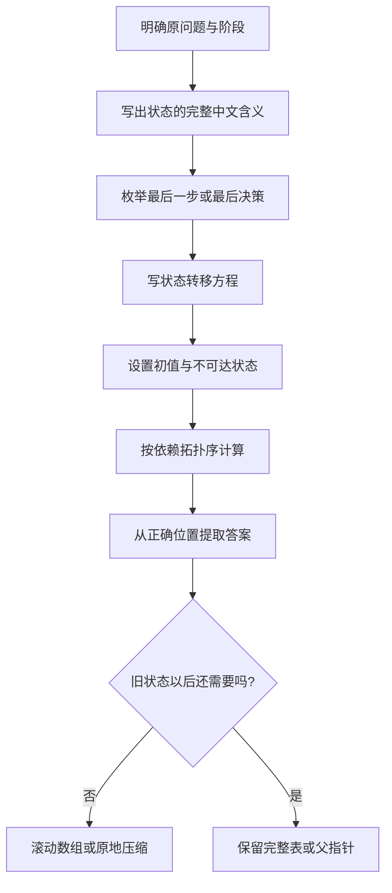

> 本章原文范围从 PDF 第 943 页开始，到第 22 章“贪心法”之前结束。原书依次讲解动态规划概述、坐标型、序列型、划分型、匹配型、背包型、树型、区间型动态规划，以及 Floyd 算法。本笔记严格沿用原书小节顺序；凡超出原书直接论述的证明、优化、勘误或替代方法，均明确标注为“补充”。

## 本章要解决什么问题

许多问题都可以通过搜索枚举决策，但不同决策路径常常反复遇到同一个剩余子问题。动态规划（dynamic programming，DP）要解决的核心问题是：

> 如何把“相同子问题只求一次”的思想，组织成一组有明确含义、依赖方向和计算顺序的状态。

动态规划不是一个固定代码模板，而是由五个彼此约束的部分组成：

1. **状态**：`dp[...]` 的每个下标和数值分别表示什么；
2. **转移**：一个状态如何由规模更小或拓扑上更早的状态得到；
3. **初值与边界**：递推从哪里开始，非法状态怎样处理；
4. **计算顺序**：求当前状态时，它依赖的状态是否已经求出；
5. **答案位置**：最终答案是某个状态、某行/某区间的极值，还是若干状态之和。

本章的分类本质上是在回答“状态下标是什么”：坐标、序列前缀、切分位置、匹配前缀、物品与容量、树结点与父子关系、区间端点，或 Floyd 算法中的中间点集合。

### 基础单元与正文题盘点

| 类别 | 基础算法单元 | 正文题 | 正文题数 | 就地 C++17 块数 |
| --- | --- | --- | ---: | ---: |
| 动态规划概述 | 备忘录、制表法与滚动压缩 | 无 | 0 | 1 |
| 坐标型 | 最小花费爬楼梯 | 62、63、64、1289、329、174 | 6 | 7 |
| 序列型 | 每周工作计划 | 300、674、2393、原书标注 491（实际算法为 673）、646、1062、2008、718、1143、392、115、1537、2361、956 | 14 | 15 |
| 划分型 | 解码方法 | 639、279、343 | 3 | 4 |
| 匹配型 | 单词拆分 | 140、32、44、10 | 4 | 5 |
| 背包型 | 0/1 背包与完全背包 | 416、494、474、879、871、322、518、377 | 8 | 9 |
| 树型 | 树的直径 | 834、124、337 | 3 | 4 |
| 区间型 | 相邻石子归并 | 516、664、375、312、1000 | 5 | 6 |
| Floyd | Floyd-Warshall 所有点对最短路 | 1462、2608、847 | 3 | 4 |
| **合计** | **9 个基础算法单元** | **46 道正文题** | **46** | **55** |

“基础算法单元”按 21.1 与各分类的 `.1` 小节计数；“正文题”只统计 21.2.2～21.9.4 的题目，不把章末 35 道推荐练习计入。每个基础单元和正文题都在下一同级标题前给出一个就地 C++17 代码块。

## 21.1 动态规划概述

### 21.1.1 什么是动态规划

#### 1. 从朴素递归看重叠子问题

原书以斐波那契型递推为例，并采用如下定义：

$$
Fib(n)=
\begin{cases}
1, & n=0,\\
1, & n=1,\\
Fib(n-1)+Fib(n-2), & n>1.
\end{cases}
$$

直接递归会形成一棵二叉调用树。计算 $Fib(5)$ 时：

```text
Fib(5)
├── Fib(4)
│   ├── Fib(3)
│   └── Fib(2)
└── Fib(3)
    ├── Fib(2)
    └── Fib(1)
```

`Fib(3)`、`Fib(2)` 等相同参数的子问题会被反复求解。若 $T(n)$ 表示调用次数，则近似满足

$$
T(n)=T(n-1)+T(n-2)+O(1),
$$

因此

$$
T(n)=\Theta(\varphi^n),
\qquad
\varphi=\frac{1+\sqrt5}{2}.
$$

这里的指数复杂度不是因为单次加法昂贵，而是因为调用树中同一个状态被复制了指数多次。

#### 2. 备忘录：自顶向下

为每个参数 $i$ 保存已经求出的 $Fib(i)$。第一次访问状态时递归求值并写入缓存，以后直接读取：

```text
memoFib(n):
    if n <= 1: return 1
    if memo[n] 已计算: return memo[n]
    memo[n] = memoFib(n - 1) + memoFib(n - 2)
    return memo[n]
```

状态只有 $n+1$ 个，每个状态只执行一次常数次转移，所以时间为 $O(n)$；缓存和递归栈均为 $O(n)$。

这叫**记忆化搜索**或**自顶向下动态规划**。它只计算从目标状态实际能够到达的子问题，适合状态空间稀疏、转移容易递归表达的场景。

#### 3. 制表法：自底向上

观察依赖关系：$Fib(i)$ 只依赖下标更小的 $Fib(i-1)$ 和 $Fib(i-2)$。因此可从初值出发按 $i=2,3,\ldots,n$ 计算：

$$
dp[0]=dp[1]=1,
$$

$$
dp[i]=dp[i-1]+dp[i-2].
$$

这种做法叫**自底向上动态规划**。它不使用递归栈，状态访问顺序明确，通常常数开销更小。

#### 4. 滚动数组与空间压缩

求 $dp[i]$ 时只需要前两个状态，所以保存整个数组是冗余的。令

$$
a=dp[i-2],\qquad b=dp[i-1],
$$

则当前值为

$$
c=a+b.
$$

计算后滚动：

$$
a\leftarrow b,\qquad b\leftarrow c.
$$

时间仍为 $O(n)$，额外空间降为 $O(1)$。

空间压缩的前提是：被覆盖的旧状态以后不再需要。不能看到二维数组就机械压成一维；必须先分析依赖方向，确认覆盖不会破坏尚未使用的数据。

#### 5. 动态规划的严格视角

可以把状态看成一个有向无环依赖图：若状态 $v$ 的转移需要状态 $u$，就存在依赖边 $u\to v$。自底向上的计算顺序必须是这张依赖图的一种拓扑序。

动态规划的总时间通常可写为：

$$
\text{时间复杂度}
=\text{可达状态数}\times\text{每个状态的转移代价}.
$$

空间则由同时保留的状态和答案重建信息决定。

### 21.1.2 动态规划求解问题的类型、性质和步骤

#### 1. 常见目标类型

原书将 DP 目标概括为三类。

1. **最值**：最小路径和、最大收益、最长子序列；转移常使用 `min` 或 `max`。
2. **可行性**：某个和能否组成、字符串能否匹配；状态值通常为布尔量。
3. **计数**：路径数、方案数、子序列个数；转移通常累加互斥来源的方案数。

同一个状态划分可能支持不同目标。例如 0/1 背包在容量维度上既可以求最大价值，也可以判断某个重量是否可达，还可以统计达到某重量的方案数；区别在状态值及聚合运算。

#### 2. 最优子结构

若原问题的最优解可以由若干子问题的最优解组合得到，则具有最优子结构。

以 0/1 背包为例，令

$$
dp[i][r]
=\text{只考虑前 }i\text{ 件物品、容量为 }r\text{ 时的最大价值}.
$$

第 $i$ 件物品（下标 $i-1$）只有两种互斥决策：

- 不选：价值为 $dp[i-1][r]$；
- 选：要求 $r\ge w_{i-1}$，价值为

  $$
  dp[i-1][r-w_{i-1}]+v_{i-1}.
  $$

故

$$
dp[i][r]
=\max\left(
dp[i-1][r],
dp[i-1][r-w_{i-1}]+v_{i-1}
\right).
$$

为什么可以直接使用子问题最优值？若某个原问题最优方案在“选第 $i$ 件”的前提下，其余物品不是容量 $r-w_{i-1}$ 的最优方案，就可以替换成更优子方案并改善原方案，与原方案最优矛盾。这是典型的交换/反证论证。

最优子结构不等于贪心选择性质。能由子问题最优值组合，并不表示每一步局部最优选择就一定通向全局最优。

#### 3. 无后效性

无后效性的准确含义是：

> 一旦当前状态确定，未来最优决策只依赖该状态，不再需要知道形成该状态的完整历史。

这不是问题天然具有的魔法，而是对**状态定义是否充分**的要求。限站航班只记录城市会失去已用边数，因而有后效；把状态扩展为 `(城市, 已用边数)` 后，未来就只依赖完整状态。

#### 4. 重叠子问题

不同决策路径多次到达同一状态，称为重叠子问题。记忆化或制表将每个状态只求一次，从而把搜索树压缩为状态 DAG。

重叠子问题是 DP 带来加速的来源。若子问题完全不重叠，分治通常已经足够；若状态数本身仍是指数级，记忆化也未必得到多项式算法。

> **补充：适用范围说明。** 最值 DP 需要最优子结构；可行性与计数 DP 更一般地需要“状态充分”和“可由较小状态无歧义聚合”。原书把三项性质作为通常条件，而非形式逻辑上所有 DP 的必要且充分条件。

#### 5. 五步设计法

##### 步骤一：确定状态

写出完整句子，而不是只写变量名。例如：

$$
dp[i][r]
=\text{前 }i\text{ 件物品在容量不超过 }r\text{ 时的最大价值}.
$$

需要明确：是“恰好”还是“至多”，是“以 $i$ 结尾”还是“前 $i$ 个中的最优”，是否包含当前位置。这些词会直接改变初值和答案位置。

##### 步骤二：枚举最后一步并写转移

通常从一个最优/合法答案的最后一步反推它可能来自哪些互斥状态。只要来源完整且互斥，就能分别求值再用 `min`、`max`、逻辑或或加法聚合。

##### 步骤三：确定初值和非法边界

初值是递推的数学起点。非法状态常用：

- 最小化：$+\infty$；
- 最大化：$-\infty$；
- 计数：0；
- 可行性：`false`。

不能把“不可能状态”初始化为 0，否则它可能参与最大值或计数转移，制造不存在的方案。

##### 步骤四：确定计算顺序

求当前状态前，所有依赖必须已知。二维网格常按行列递增；区间 DP 按区间长度递增；树 DP 按后序；逆向需求 DP 则从终点倒推。

##### 步骤五：消除冗余

确认答案正确后再压缩空间。需要同时说明：

- 当前层依赖上一层还是当前层；
- 容量/坐标应正序还是逆序；
- 是否需要保留父指针重建方案。

#### 6. 复杂度与“伪多项式”

若状态为 `(物品数, 容量)`，时间 $O(nW)$ 看似多项式，但输入容量 $W$ 的二进制编码长度只有 $O(\log W)$。因此 $O(nW)$ 对数值大小是伪多项式，而不是对输入位数的真正多项式。

原书用“穷举 + 状态覆盖 = 动态规划”概括本质：动态规划仍然枚举所有必要决策，只是把通向相同状态的历史合并，不重复求同一后缀。

#### C++17：动态规划基础单元

- **状态含义**：`memo[i]` 或滚动变量表示 $Fib(i)$；`-1` 表示该状态尚未计算。
- **转移**：$Fib(i)=Fib(i-1)+Fib(i-2)$。
- **初始化**：$Fib(0)=Fib(1)=1$；备忘录其余位置初始化为 `-1`，滚动变量初始化为前两项。
- **计算顺序**：记忆化搜索按需求递归并缓存；制表法按 $i$ 递增，保证两个前驱已知。
- **答案位置**：备忘录中的 `memo[n]`，或滚动结束后的 `previous`。
- **复杂度**：两种实现时间均为 $O(n)$；记忆化空间为 $O(n)$，滚动实现额外空间为 $O(1)$。

```cpp
#include <functional>
#include <vector>
using namespace std;

long long fibonacciMemo(int n) {
  vector<long long> memo(n + 1, -1);
  function<long long(int)> dfs = [&](int state) -> long long {
    if (state <= 1) return 1;
    if (memo[state] != -1) return memo[state];
    return memo[state] = dfs(state - 1) + dfs(state - 2);
  };
  return dfs(n);
}

long long fibonacciRolling(int n) {
  if (n <= 1) return 1;
  long long twoBack = 1, previous = 1;
  for (int state = 2; state <= n; ++state) {
    long long current = twoBack + previous;
    twoBack = previous;
    previous = current;
  }
  return previous;
}
```

## 21.2 坐标型动态规划

### 21.2.1 什么是坐标型动态规划

坐标型 DP 的状态下标直接对应一维或多维位置。二维网格中常定义

$$
dp[i][j]
=\text{到达、离开或以位置 }(i,j)\text{ 为端点的最值/计数}.
$$

关键不在“用了二维数组”，而在动作方向是否让状态依赖图无环。

- 只能向右、向下：依赖左方与上方，可按行列正序计算；
- 从当前位置走到终点：可定义“从该格出发的需求”，按右下到左上逆序；
- 可向四周且要求严格递增：数值严格增加使状态图无环，可按数值排序或记忆化；
- 可任意四向且无单调条件：坐标本身可能形成环，通常需要 BFS、Dijkstra，或增加额外阶段维度。

#### 例 21-1：最小花费爬楼梯

给定 `cost[i]`，从台阶 $i$ 支付费用后可爬 1 或 2 阶；允许从台阶 0 或 1 开始，顶部记为坐标 $n$。

定义

$$
dp[i]=\text{到达坐标 }i\text{、尚未支付 }i\text{ 的最小费用}.
$$

到达 $i$ 的最后一步有两种：

$$
dp[i]
=\min\left(
dp[i-1]+cost[i-1],
dp[i-2]+cost[i-2]
\right),\qquad 2\le i\le n.
$$

因为可以直接站在 0 或 1 开始，所以

$$
dp[0]=dp[1]=0.
$$

`cost=[10,15,20]` 时：

$$
dp[2]=\min(0+15,0+10)=10,
$$

$$
dp[3]=\min(10+20,0+15)=15.
$$

答案是 15。由于只依赖前两项，可压缩到两个变量，时间 $O(n)$、空间 $O(1)$。

#### C++17：坐标型 DP 基础（最小花费爬楼梯）

- **状态含义**：滚动变量 `twoBack`、`previous` 分别表示到达坐标 $i-2$、$i-1$ 的最小费用。
- **转移**：`current = min(previous + cost[i - 1], twoBack + cost[i - 2])`。
- **初始化**：可从台阶 0 或 1 开始，因此 $dp[0]=dp[1]=0$。
- **计算顺序**：坐标 $i$ 从 2 递增到 $n$，两个前驱在使用前均已求出。
- **答案位置**：到达顶部坐标 $n$ 的 `previous`。
- **复杂度**：时间 $O(n)$，额外空间 $O(1)$。

```cpp
#include <algorithm>
#include <vector>
using namespace std;

int minCostClimbingStairs(const vector<int>& cost) {
  int twoBack = 0, previous = 0;
  for (int position = 2; position <= static_cast<int>(cost.size()); ++position) {
    int current = min(
      previous + cost[position - 1],
      twoBack + cost[position - 2]
    );
    twoBack = previous;
    previous = current;
  }
  return previous;
}
```

### 21.2.2 LeetCode 62：不同路径（★★）

#### 状态与转移

机器人从 $(0,0)$ 出发，只能向右或向下。定义

$$
dp[i][j]=\text{从 }(0,0)\text{ 到 }(i,j)\text{ 的路径数}.
$$

若 $i,j>0$，最后一步只能来自 $(i-1,j)$ 或 $(i,j-1)$，两类路径的最后一步不同、互不重叠，所以计数相加：

$$
dp[i][j]=dp[i-1][j]+dp[i][j-1].
$$

#### 初值

首列只能一直向下，首行只能一直向右，因此

$$
dp[i][0]=1,\qquad dp[0][j]=1.
$$

> **原文勘误说明**：OCR 正文出现“置 `dp[i][0]=0`、`dp[0][j]=0`”，这与前一句“只有一条路径”和后续代码逻辑矛盾，正确初值是 1。

以 $3\times2$ 网格为例（3 行、2 列）：

$$
dp=
\begin{bmatrix}
1&1\\
1&2\\
1&3
\end{bmatrix},
$$

答案为 3。

#### 正确性与组合公式

按 $i+j$ 归纳。起点到首行/首列唯一。对内部格，任何路径的最后一步唯一属于“从上来”或“从左来”，转移完整且不重复。

> **补充：组合数解法。** 从起点到终点总共走 $m+n-2$ 步，其中必须有 $m-1$ 次向下，因此路径数为

$$
\binom{m+n-2}{m-1}
=\binom{m+n-2}{n-1}.
$$

无障碍时可直接计算组合数；有障碍时简单公式失效。二维 DP 时间和空间为 $O(mn)$，空间可压成 $O(n)$。

#### C++17：不同路径

- **状态含义**：处理到当前行时，`dp[column]` 表示从起点到当前格的路径数。
- **转移**：`dp[column] += dp[column - 1]`，更新前两项分别代表上方和左方。
- **初始化**：第一行各格只有一条路径，所以一维表全部初始化为 1。
- **计算顺序**：行递增、列从左向右，确保左方已是当前行而上方仍是上一行。
- **答案位置**：最后一行最后一列，即 `dp.back()`。
- **复杂度**：时间 $O(mn)$，空间 $O(n)$。

```cpp
#include <vector>
using namespace std;

long long uniquePaths(int rows, int columns) {
  vector<long long> dp(columns, 1);
  for (int row = 1; row < rows; ++row) {
    for (int column = 1; column < columns; ++column) {
      dp[column] += dp[column - 1];
    }
  }
  return dp.back();
}
```

### 21.2.3 LeetCode 63：不同路径 II（★★）

#### 障碍如何进入状态转移

状态含义与上一题相同。若当前位置是障碍，则没有合法路径到达：

$$
dp[i][j]=0.
$$

若为空格，则仍有

$$
dp[i][j]=dp[i-1][j]+dp[i][j-1].
$$

可以使用一维数组：初始化

$$
dp[0]=
\begin{cases}
1,& grid[0][0]=0,\\
0,& grid[0][0]=1,
\end{cases}
$$

按行扫描每个格子：

$$
dp[j]\leftarrow
\begin{cases}
0,& grid[i][j]=1,\\
dp[j]+dp[j-1],& grid[i][j]=0,\ j>0,\\
dp[j],& grid[i][0]=0.
\end{cases}
$$

更新前的 `dp[j]` 表示上方路径数，更新后的 `dp[j-1]` 表示左方路径数。

样例

$$
\begin{bmatrix}
0&0&0\\
0&1&0\\
0&0&0
\end{bmatrix}
$$

的 DP 表为

$$
\begin{bmatrix}
1&1&1\\
1&0&1\\
1&1&2
\end{bmatrix},
$$

答案为 2。

障碍把对应状态清零，而不是简单跳过并保留旧值；一维压缩时若忘记清零，会把上一行穿过障碍的路径错误带下来。

时间 $O(mn)$，压缩空间 $O(n)$。

#### C++17：不同路径 II

- **状态含义**：`dp[column]` 是到当前行该列且不经过障碍的路径数。
- **转移**：障碍格清零；空格执行 `dp[column] += dp[column - 1]`。
- **初始化**：`dp[0]=1` 作为起点前的计数哨兵，其余为 0；若起点是障碍会被统一清零。
- **计算顺序**：逐行扫描，每行从左向右，使上方旧值和左方新值同时可用。
- **答案位置**：右下角对应的 `dp.back()`。
- **复杂度**：时间 $O(mn)$，空间 $O(n)$。

```cpp
#include <vector>
using namespace std;

long long uniquePathsWithObstacles(const vector<vector<int>>& grid) {
  vector<long long> dp(grid[0].size());
  dp[0] = 1;
  for (const auto& row : grid) {
    for (int column = 0; column < static_cast<int>(row.size()); ++column) {
      if (row[column] == 1) {
        dp[column] = 0;
      } else if (column > 0) {
        dp[column] += dp[column - 1];
      }
    }
  }
  return dp.back();
}
```

### 21.2.4 LeetCode 64：最小路径和（★★）

定义

$$
dp[i][j]=\text{从左上角到 }(i,j)\text{ 的最小路径和，包含两端格子}.
$$

初值与边界：

$$
dp[0][0]=grid[0][0],
$$

$$
dp[i][0]=dp[i-1][0]+grid[i][0],
$$

$$
dp[0][j]=dp[0][j-1]+grid[0][j].
$$

内部格最后一步来自上或左：

$$
dp[i][j]
=\min(dp[i-1][j],dp[i][j-1])+grid[i][j].
$$

样例

$$
grid=
\begin{bmatrix}
1&3&1\\
1&5&1\\
4&2&1
\end{bmatrix}
$$

得到

$$
dp=
\begin{bmatrix}
1&4&5\\
2&7&6\\
6&8&7
\end{bmatrix}.
$$

答案为 7。

正确性来自最后一步分类：任一到 $(i,j)$ 的路径必从上或左进入；若其前缀不是对应前驱的最小路径，可替换成更小前缀并改善整条路径，矛盾。

时间 $O(mn)$，可原地修改输入或用一维数组把额外空间降为 $O(n)$。原地修改会破坏输入，工程接口需明确这一副作用。

#### C++17：最小路径和

- **状态含义**：`dp[column]` 表示到当前行该列的最小路径和。
- **转移**：`min(更新前的 dp[column], 更新后的 dp[column - 1]) + grid[row][column]`。
- **初始化**：除起点入口 `dp[0]=0` 外均为 $+\infty$，避免不存在的上方或左方被选中。
- **计算顺序**：行递增、列从左向右，分别保留上一行和当前行依赖。
- **答案位置**：右下角的 `dp.back()`。
- **复杂度**：时间 $O(mn)$，空间 $O(n)$。

```cpp
#include <algorithm>
#include <limits>
#include <vector>
using namespace std;

int minimumPathSum(const vector<vector<int>>& grid) {
  const int infinity = numeric_limits<int>::max() / 4;
  vector<int> dp(grid[0].size(), infinity);
  dp[0] = 0;
  for (const auto& row : grid) {
    for (int column = 0; column < static_cast<int>(row.size()); ++column) {
      int fromLeft = column > 0 ? dp[column - 1] : infinity;
      dp[column] = min(dp[column], fromLeft) + row[column];
    }
  }
  return dp.back();
}
```

### 21.2.5 LeetCode 1289：下降路径最小和 II（★★★）

#### 状态定义

从每行选一个数，相邻两行不能选同一列。定义

$$
dp[i][j]
=\text{选到第 }i\text{ 行第 }j\text{ 列时的最小总和}.
$$

首行任意位置都可作为起点：

$$
dp[0][j]=grid[0][j].
$$

对 $i>0$：

$$
dp[i][j]
=grid[i][j]
+\min_{\substack{0\le k<n\\k\ne j}}dp[i-1][k].
$$

最终答案为

$$
\min_j dp[n-1][j].
$$

#### 为什么朴素算法是 $O(n^3)$

共有 $n^2$ 个状态；每个状态扫描上一行 $n-1$ 个不同列，所以时间为 $O(n^3)$，空间 $O(n^2)$ 或滚动为 $O(n)$。原书代码按该公式实现，Python 在较大输入上常数较高。

#### 补充：上一行最小值与次小值

每个状态只需要“排除当前列后的最小值”。设上一行：

- 最小值为 $min_1$，列为 $col_1$；
- 次小值为 $min_2$。

则

$$
dp[i][j]=grid[i][j]+
\begin{cases}
min_2,&j=col_1,\\
min_1,&j\ne col_1.
\end{cases}
$$

每行先用 $O(n)$ 找最小与次小，再用 $O(n)$ 更新，整体降为 $O(n^2)$ 时间、$O(n)$ 空间。

对样例

$$
\begin{bmatrix}
1&2&3\\
4&5&6\\
7&8&9
\end{bmatrix},
$$

首行最小值 1 在列 0、次小值 2；第二行得到 `[6,6,7]`。其最小值 6 可来自列 0 或 1，正确维护最小值列和次小值后，末行最小为 13，对应 `[1,5,7]`。

当最小值有重复时，次小值允许与最小值数值相等，只要来自另一个列。实现不能把“次小”误解成严格大于最小值。

#### C++17：下降路径最小和 II

- **状态含义**：`previous[column]` 是走到上一行该列的最小和，`current[column]` 是当前行状态。
- **转移**：当前列若与上一行最小值列冲突则加次小值，否则加最小值。
- **初始化**：第一行状态就是 `grid[0]`；次小值以 $+\infty$ 开始扫描。
- **计算顺序**：逐行递增；每行先完整求上一行的最小/次小，再同步生成新行，不能原地混用两行。
- **答案位置**：最后一行所有状态的最小值。
- **复杂度**：时间 $O(n^2)$，空间 $O(n)$。

```cpp
#include <algorithm>
#include <limits>
#include <vector>
using namespace std;

int minimumFallingPathSumII(const vector<vector<int>>& grid) {
  const int infinity = numeric_limits<int>::max() / 4;
  vector<int> previous = grid[0];
  for (int row = 1; row < static_cast<int>(grid.size()); ++row) {
    int minimumColumn = 0;
    for (int column = 1; column < static_cast<int>(previous.size()); ++column) {
      if (previous[column] < previous[minimumColumn]) minimumColumn = column;
    }
    int minimumValue = previous[minimumColumn];
    int secondValue = infinity;
    for (int column = 0; column < static_cast<int>(previous.size()); ++column) {
      if (column != minimumColumn) secondValue = min(secondValue, previous[column]);
    }
    vector<int> current(grid[row].size());
    for (int column = 0; column < static_cast<int>(current.size()); ++column) {
      int predecessor = column == minimumColumn ? secondValue : minimumValue;
      current[column] = grid[row][column] + predecessor;
    }
    previous.swap(current);
  }
  return *min_element(previous.begin(), previous.end());
}
```

### 21.2.6 LeetCode 329：矩阵中的最长递增路径（★★★）

#### 为什么四方向移动仍可做 DP

普通四方向网格会形成环。但本题每一步必须严格增大：

$$
matrix[next]>matrix[current].
$$

沿路径数值严格递增，不可能回到旧格，因此把每格视为结点、从小值指向大值后得到 DAG。这一严格单调性就是无后效与可计算顺序的来源。

#### 方法一：记忆化搜索

定义

$$
f(r,c)=\text{从 }(r,c)\text{ 出发的最长递增路径长度}.
$$

至少包含自身，所以

$$
f(r,c)=1+
\max_{\substack{(nr,nc)\in N(r,c)\\matrix[nr][nc]>matrix[r][c]}}
f(nr,nc),
$$

若没有更大邻格，最大后继项视为 0，于是 $f=1$。

答案是

$$
\max_{r,c}f(r,c).
$$

每格的 $f$ 只计算一次，每次检查 4 个邻格，时间和缓存空间均为 $O(mn)$；递归栈最坏 $O(mn)$。

样例中可形成

$$
1\to2\to6\to9,
$$

长度为 4。

#### 方法二：按数值排序的自底向上 DP

把所有格子按值升序排列，定义

$$
dp[r][c]=\text{以 }(r,c)\text{ 结尾的最长递增路径长度}.
$$

初值全部为 1。按小到大处理当前格 $(r,c)$，向严格更大的邻格 $(nr,nc)$ 松弛：

$$
dp[nr][nc]
=\max(dp[nr][nc],dp[r][c]+1).
$$

由于所有前驱值更小，处理当前值时其最优长度已经确定。相等值之间没有边，所以排序中的相对次序不影响结果。

排序版本时间 $O(mn\log(mn))$、空间 $O(mn)$。还可按入度做拓扑 BFS，在 $O(mn)$ 时间内求最长层数。

原书还展示“反复松弛直到无更新”的写法；它能收敛，但可能重复扫描矩阵，排序或拓扑序更稳定。

#### C++17：矩阵中的最长递增路径

- **状态含义**：`memo[row][column]` 是从该格出发、沿严格增大方向能走出的最长路径长度。
- **转移**：枚举四邻域中值更大的格，取 `1 + dfs(next)` 的最大值。
- **初始化**：每格至少形成长度 1 的路径；`memo=0` 表示尚未计算。
- **计算顺序**：记忆化 DFS 沿严格增值边递归；严格不等使依赖图无环，返回时完成缓存。
- **答案位置**：所有起点状态的最大值，而非固定角落。
- **复杂度**：每格及四条邻边至多处理一次，时间 $O(mn)$，缓存和递归栈最坏 $O(mn)$。

```cpp
#include <algorithm>
#include <functional>
#include <vector>
using namespace std;

int longestIncreasingPath(const vector<vector<int>>& matrix) {
  int rows = static_cast<int>(matrix.size());
  int columns = static_cast<int>(matrix[0].size());
  vector<vector<int>> memo(rows, vector<int>(columns));
  const int directions[5] = {1, 0, -1, 0, 1};
  function<int(int, int)> dfs = [&](int row, int column) -> int {
    if (memo[row][column] != 0) return memo[row][column];
    int best = 1;
    for (int direction = 0; direction < 4; ++direction) {
      int nextRow = row + directions[direction];
      int nextColumn = column + directions[direction + 1];
      if (nextRow >= 0 && nextRow < rows
          && nextColumn >= 0 && nextColumn < columns
          && matrix[nextRow][nextColumn] > matrix[row][column]) {
        best = max(best, 1 + dfs(nextRow, nextColumn));
      }
    }
    return memo[row][column] = best;
  };
  int answer = 0;
  for (int row = 0; row < rows; ++row) {
    for (int column = 0; column < columns; ++column) {
      answer = max(answer, dfs(row, column));
    }
  }
  return answer;
}
```

### 21.2.7 LeetCode 174：地下城游戏（★★★）

#### 为什么不能只求路径总和

骑士生命值在任何时刻都必须至少为 1。两条路径即使最终总和相同，中间最低前缀和也可能不同，因此“最大路径总和”不是充分状态。

若给定一条路径，所需初始生命为

$$
1-\min(0,\text{该路径所有前缀累计和的最小值}).
$$

但枚举路径代价太大。原书改为从终点反推“进入当前格前至少需要多少生命”。

#### 逆向状态

定义

$$
dp[i][j]
=\text{进入格 }(i,j)\text{ 前，保证最终存活所需的最小生命值}.
$$

从 $(i,j)$ 离开后可去右方或下方。设下一步所需生命的较小值为

$$
needNext=\min(dp[i+1][j],dp[i][j+1]).
$$

进入当前格前有生命 $H$，处理格子后变为

$$
H+dungeon[i][j].
$$

要满足下一格需求：

$$
H+dungeon[i][j]\ge needNext,
$$

即

$$
H\ge needNext-dungeon[i][j].
$$

同时生命始终为正，所以

$$
dp[i][j]
=\max\left(1,needNext-dungeon[i][j]\right).
$$

这就是完整转移。

#### 哨兵边界

可建立 $(m+1)\times(n+1)$ 数组，初始化为 $+\infty$，并设置终点右侧和下侧两个虚拟状态：

$$
dp[m][n-1]=dp[m-1][n]=1.
$$

这样终点也可使用统一公式，其余越界方向保持 $+\infty$，不会被选择。

按 $i=m-1\to0$、$j=n-1\to0$ 逆序计算，答案为 $dp[0][0]$。

样例的需求表为

$$
\begin{bmatrix}
7&5&2\\
6&11&5\\
1&1&6
\end{bmatrix},
$$

所以最少初始生命为 7。

#### 正确性与复杂度

对距终点的反向拓扑顺序归纳。到终点外需要生命 1；对任一格，最优路径必选择需求较小的合法后继，当前房间值只会统一加到进入后的生命上，公式给出恰好满足该后继且不低于 1 的最小值。

时间 $O(mn)$，二维空间 $O(mn)$；可按行逆序压缩为 $O(n)$。不能按正向路径和做普通最小/最大 DP，因为状态还必须包含历史最低生命，逆向需求定义正是消除该历史的关键。

#### C++17：地下城游戏

- **状态含义**：`dp[column]` 是进入当前格之前、为保证最终存活所需的最低生命值。
- **转移**：`max(1, min(下方旧值, 右方新值) - dungeon[row][column])`。
- **初始化**：数组为 $+\infty$，仅在终点右侧设置需求 1，统一生成终点状态。
- **计算顺序**：从右下向左上，行和列都逆序，确保右、下后继已知。
- **答案位置**：起点需求 `dp[0]`。
- **复杂度**：时间 $O(mn)$，空间 $O(n)$。

```cpp
#include <algorithm>
#include <limits>
#include <vector>
using namespace std;

int minimumInitialHealth(const vector<vector<int>>& dungeon) {
  int columns = static_cast<int>(dungeon[0].size());
  const int infinity = numeric_limits<int>::max() / 4;
  vector<int> dp(columns + 1, infinity);
  dp[columns - 1] = 1;
  for (int row = static_cast<int>(dungeon.size()) - 1; row >= 0; --row) {
    for (int column = columns - 1; column >= 0; --column) {
      dp[column] = max(
        1,
        min(dp[column], dp[column + 1]) - dungeon[row][column]
      );
    }
  }
  return dp[0];
}
```

## 21.3 序列型动态规划

### 21.3.1 什么是序列型动态规划

序列型 DP 处理一个或多个固定顺序的序列。状态通常围绕“前缀”或“以某位置结尾”定义。

#### 两种常见状态语义

1. **前缀最优**：

  $$
  dp[i]=\text{前 }i\text{ 个元素上的最优值}.
  $$

  答案通常直接是 $dp[n]$。

2. **以位置结尾**：

  $$
  dp[i]=\text{必须以第 }i\text{ 个元素结尾的最优值}.
  $$

  全局答案通常是 $\max_i dp[i]$ 或 $\sum_i dp[i]$。

这两个定义不能混用。最长递增子序列若定义“以 $i$ 结尾”，答案不是最后一个状态，而是所有结尾状态最大值。

双序列 DP 常定义

$$
dp[i][j]=\text{序列 A 的前 }i\text{ 项与 B 的前 }j\text{ 项的答案}.
$$

最后一步比较 $A_{i-1}$ 与 $B_{j-1}$，从而把前缀缩短。

#### 例 21-2：每周工作计划

第 $i$ 周可做简单任务 `low[i]`；若做复杂任务 `high[i]`，前一周必须空闲准备。原书规定第一周只能安排简单任务。

定义

$$
dp[i]=\text{安排前 }i\text{ 周可获得的最大价值}.
$$

初值：

$$
dp[0]=0,\qquad dp[1]=low[0].
$$

对第 $i$ 周（数组下标 $i-1$）：

- 做简单任务：前 $i-1$ 周可自由最优安排，价值

  $$
  dp[i-1]+low[i-1];
  $$

- 做复杂任务：第 $i-1$ 周必须准备，前面只能取前 $i-2$ 周最优安排，价值

  $$
  dp[i-2]+high[i-1].
  $$

因此

$$
dp[i]=\max\bigl(dp[i-1]+low[i-1],\ dp[i-2]+high[i-1]\bigr).
$$

`low=[4,2,3,7]`、`high=[3,5,6,9]` 时：

$$
dp=[0,4,6,10,17].
$$

答案为 17。这里只依赖前两项，可压缩为 $O(1)$ 空间。

#### C++17：序列型 DP 基础（每周工作计划）

- **状态含义**：`dp[i]` 表示安排前 $i$ 周可获得的最大价值；滚动变量保存相邻两个前缀状态。
- **转移**：`max(dp[i - 1] + low[i - 1], dp[i - 2] + high[i - 1])`。
- **初始化**：$dp[0]=0$，且按原书约束第一周只能做简单任务，所以 $dp[1]=low[0]$。
- **计算顺序**：周数从 2 递增，当前前缀只读取两个更短前缀。
- **答案位置**：完整前缀状态 $dp[n]$，即滚动结束后的 `previous`。
- **复杂度**：时间 $O(n)$，额外空间 $O(1)$。

```cpp
#include <algorithm>
#include <vector>
using namespace std;

long long maximumWeeklyReward(
  const vector<int>& low, const vector<int>& high
) {
  if (low.empty()) return 0;
  long long twoBack = 0, previous = low[0];
  for (int weeks = 2; weeks <= static_cast<int>(low.size()); ++weeks) {
    long long current = max(
      previous + low[weeks - 1],
      twoBack + high[weeks - 1]
    );
    twoBack = previous;
    previous = current;
  }
  return previous;
}
```

### 21.3.2 LeetCode 300：最长递增子序列（★★）

#### 状态定义与转移

子序列可以跳过元素，但保持相对顺序。定义

$$
dp[i]=\text{以 }nums[i]\text{ 结尾的最长严格递增子序列长度}.
$$

只取自身时长度为 1：

$$
dp[i]\gets1.
$$

若 $j<i$ 且

$$
nums[j]<nums[i],
$$

则以 $j$ 结尾的任一递增子序列后都可追加 `nums[i]`：

$$
dp[i]
=1+\max_{\substack{0\le j<i\\nums[j]<nums[i]}}dp[j],
$$

没有合法 $j$ 时最大项视为 0。

答案为

$$
\max_{0\le i<n}dp[i].
$$

原书文字中的逐个赋值必须理解为取最大值；若只写 `dp[i]=dp[j]+1` 而不比较，后来的较短前驱可能覆盖已有更优值。

#### 数值走查

对 `[10,9,2,5,3,7,101,18]`：

$$
dp=[1,1,1,2,2,3,4,4],
$$

最长长度为 4，例如 `[2,3,7,18]` 或 `[2,3,7,101]`。

#### 正确性与复杂度

任一以 $i$ 结尾、长度大于 1 的递增子序列都有唯一倒数第二个下标 $j<i$，且 `nums[j]<nums[i]`。删除最后一项后，最优前缀必是以某个合法 $j$ 结尾的最优子序列，否则可替换改善。因此转移完备。

朴素 DP 时间 $O(n^2)$、空间 $O(n)$。

> **补充：耐心排序优化。** 维护 `tails[length-1]` 为长度 `length` 的递增子序列可达到的最小末尾值。对每个数用二分查找第一个 `>= value` 的位置替换；`tails` 长度即 LIS 长度。时间 $O(n\log n)$、空间 $O(n)$。`tails` 本身通常不是一条真实 LIS，若要重建需额外保存前驱。

#### C++17：最长递增子序列

- **状态含义**：`dp[index]` 是必须以 `nums[index]` 结尾的最长严格递增子序列长度。
- **转移**：对每个 `previous < index`，若值更小则用 `dp[previous] + 1` 更新。
- **初始化**：每个元素自身构成长为 1 的子序列，因此全表初始化为 1。
- **计算顺序**：结尾下标递增，内部枚举所有更早前驱。
- **答案位置**：所有结尾状态的最大值，而不是固定的 `dp[n - 1]`。
- **复杂度**：时间 $O(n^2)$，空间 $O(n)$。

```cpp
#include <algorithm>
#include <vector>
using namespace std;

int lengthOfLIS(const vector<int>& nums) {
  vector<int> dp(nums.size(), 1);
  for (int index = 0; index < static_cast<int>(nums.size()); ++index) {
    for (int previous = 0; previous < index; ++previous) {
      if (nums[previous] < nums[index]) {
        dp[index] = max(dp[index], dp[previous] + 1);
      }
    }
  }
  return nums.empty() ? 0 : *max_element(dp.begin(), dp.end());
}
```

### 21.3.3 LeetCode 674：最长连续递增子序列（★）

连续子数组不能跳过元素。定义

$$
dp[i]=\text{以 }nums[i]\text{ 结尾的最长连续严格递增长度}.
$$

只有前一个元素可能接到当前位置：

$$
dp[i]=
\begin{cases}
dp[i-1]+1,&nums[i]>nums[i-1],\\
1,&nums[i]\le nums[i-1].
\end{cases}
$$

答案是 $
\max_i dp[i]$。

`[1,3,5,4,7]` 得到

$$
[1,2,3,1,2],
$$

答案为 3。

与 LIS 的区别是：

| 问题 | 合法前驱 |
| --- | --- |
| 最长递增子序列 | 任意 $j<i$ 且 `nums[j] < nums[i]` |
| 最长连续递增子数组 | 只能是 $i-1$ |

时间 $O(n)$；只需当前连续长度和全局最大值，空间 $O(1)$。

#### C++17：最长连续递增子序列

- **状态含义**：`current` 是必须以当前位置结尾的最长连续递增长度。
- **转移**：当前值大于前值时加 1，否则连续段在当前位置重启为 1。
- **初始化**：非空数组首位置状态与全局答案均为 1。
- **计算顺序**：下标从左向右，只依赖紧邻的前一位置。
- **答案位置**：扫描过程中所有结尾状态的最大值 `answer`。
- **复杂度**：时间 $O(n)$，额外空间 $O(1)$。

```cpp
#include <algorithm>
#include <vector>
using namespace std;

int longestContinuousIncreasing(const vector<int>& nums) {
  if (nums.empty()) return 0;
  int current = 1, answer = 1;
  for (int index = 1; index < static_cast<int>(nums.size()); ++index) {
    current = nums[index] > nums[index - 1] ? current + 1 : 1;
    answer = max(answer, current);
  }
  return answer;
}
```

### 21.3.4 LeetCode 2393：严格递增子数组的个数（★★）

沿用上一题状态：

$$
dp[i]=\text{以 }nums[i]\text{ 结尾的严格递增子数组个数}.
$$

为什么同一个状态既是长度又是个数？若以 $i$ 结尾的最长递增连续段长度为 $L$，则合法子数组的起点可以是

$$
i-L+1,i-L+2,\ldots,i,
$$

恰有 $L$ 个。因此递推仍是：

$$
dp[i]=
\begin{cases}
dp[i-1]+1,&nums[i]>nums[i-1],\\
1,&\text{否则}.
\end{cases}
$$

但最终答案变为

$$
answer=\sum_{i=0}^{n-1}dp[i].
$$

每个子数组有唯一右端点，所以按右端点分组求和不重不漏。

样例 `[1,3,5,4,4,6]` 的状态为

$$
[1,2,3,1,1,2],
$$

总和为 10。时间 $O(n)$、空间 $O(1)$；答案最多为 $n(n+1)/2$，需使用 64 位整数。

#### C++17：严格递增子数组的个数

- **状态含义**：`current` 是以当前位置结尾的递增子数组长度，也恰好是这类子数组的数量。
- **转移**：相邻值严格递增时 `current + 1`，否则重置为 1；将每个结尾贡献累加。
- **初始化**：空数组答案为 0；非空时首位置贡献 1。
- **计算顺序**：下标递增，保持连续性只需检查前一个元素。
- **答案位置**：全部结尾贡献之和 `answer`。
- **复杂度**：时间 $O(n)$，额外空间 $O(1)$。

```cpp
#include <vector>
using namespace std;

long long countIncreasingSubarrays(const vector<int>& nums) {
  if (nums.empty()) return 0;
  long long current = 1, answer = 1;
  for (int index = 1; index < static_cast<int>(nums.size()); ++index) {
    current = nums[index] > nums[index - 1] ? current + 1 : 1;
    answer += current;
  }
  return answer;
}
```

### 21.3.5 原书标注 LeetCode 491：递增子序列（★★）

> **原文题号勘误**：本小节标题和问题描述写的是 LeetCode 491“递增子序列”，该题要求枚举所有不同非递减子序列；但本小节随后定义 `dp[i]` 与 `cnt[i]`、求最大长度并累计个数，实际完整对应的是 **LeetCode 673“最长递增子序列的个数”**。LeetCode 491 的回溯解法已在 19.2.7 讲解。下面按本节实际 DP 内容说明 LeetCode 673，不虚构 491 可由该计数 DP 直接枚举。

#### 长度与方案数双状态

定义：

$$
length[i]=\text{以 }nums[i]\text{ 结尾的 LIS 长度},
$$

$$
count[i]=\text{以 }nums[i]\text{ 结尾且长度为 }length[i]\text{ 的方案数}.
$$

初值：只取自身：

$$
length[i]=1,\qquad count[i]=1.
$$

对每个 $j<i$ 且 `nums[j] < nums[i]`，候选长度为

$$
candidate=length[j]+1.
$$

分三种情况：

1. `candidate > length[i]`：找到更长方案，旧的较短方案全部作废：

  $$
  length[i]\leftarrow candidate,
  \qquad count[i]\leftarrow count[j].
  $$

2. `candidate == length[i]`：找到另一批同长方案：

  $$
  count[i]\leftarrow count[i]+count[j].
  $$

3. `candidate < length[i]`：不影响当前最优，忽略。

设全局最长长度为

$$
L=\max_i length[i],
$$

答案为

$$
\sum_{i:length[i]=L}count[i].
$$

不同结尾下标对应不同索引序列，所以可以直接相加。

例如 `[1,3,5,4,7]` 的最长长度为 4，方案为 `[1,3,5,7]` 和 `[1,3,4,7]`，答案为 2。

时间 $O(n^2)$、空间 $O(n)$。

#### C++17：最长递增子序列的个数

- **状态含义**：`length[i]` 是以 $i$ 结尾的 LIS 长度，`count[i]` 是达到该长度的方案数。
- **转移**：更长候选覆盖长度和计数；等长候选只把前驱计数累加。
- **初始化**：每个元素单独形成长度 1、方案数 1 的子序列。
- **计算顺序**：结尾下标递增，枚举所有更早且值更小的前驱。
- **答案位置**：所有达到全局最大长度的 `count[i]` 之和。
- **复杂度**：时间 $O(n^2)$，空间 $O(n)$。

```cpp
#include <algorithm>
#include <vector>
using namespace std;

long long numberOfLIS(const vector<int>& nums) {
  vector<int> length(nums.size(), 1);
  vector<long long> count(nums.size(), 1);
  for (int index = 0; index < static_cast<int>(nums.size()); ++index) {
    for (int previous = 0; previous < index; ++previous) {
      if (nums[previous] >= nums[index]) continue;
      int candidate = length[previous] + 1;
      if (candidate > length[index]) {
        length[index] = candidate;
        count[index] = count[previous];
      } else if (candidate == length[index]) {
        count[index] += count[previous];
      }
    }
  }
  if (nums.empty()) return 0;
  int maximumLength = *max_element(length.begin(), length.end());
  long long answer = 0;
  for (int index = 0; index < static_cast<int>(nums.size()); ++index) {
    if (length[index] == maximumLength) answer += count[index];
  }
  return answer;
}
```

### 21.3.6 LeetCode 646：最长数对链（★★）

数对 $[a,b]$ 后可接 $[c,d]$ 当且仅当

$$
b<c.
$$

题目允许任意顺序选数对，因此先按左端点升序排序。定义

$$
dp[i]=\text{以排序后第 }i\text{ 个数对结尾的最长链长度}.
$$

初值 $dp[i]=1$。若 $j<i$ 且

$$
pairs[j].right<pairs[i].left,
$$

则

$$
dp[i]=\max(dp[i],dp[j]+1).
$$

答案为 $
\max_i dp[i]$。时间 $O(n^2)$、空间 $O(n)$。

> **补充：贪心替代。** 按右端点升序，每次选择左端点严格大于上一个已选右端点的数对，可在 $O(n\log n)$ 排序后线性扫描。其正确性与区间调度相同：最早结束的首个数对给后续留下最大空间。原书本节重点是序列 DP，所以采用 $O(n^2)$ 转移。

#### C++17：最长数对链

- **状态含义**：排序后 `dp[i]` 是必须以第 $i$ 个数对结尾的最长链长度。
- **转移**：若前驱右端点小于当前左端点，则用 `dp[previous] + 1` 更新。
- **初始化**：每个数对自身构成长为 1 的链。
- **计算顺序**：先按左端点排序，再按结尾下标递增枚举更早前驱。
- **答案位置**：所有结尾状态的最大值。
- **复杂度**：排序 $O(n\log n)$，DP $O(n^2)$，空间 $O(n)$。

```cpp
#include <algorithm>
#include <vector>
using namespace std;

int longestPairChain(vector<vector<int>> pairs) {
  if (pairs.empty()) return 0;
  sort(pairs.begin(), pairs.end());
  vector<int> dp(pairs.size(), 1);
  for (int index = 0; index < static_cast<int>(pairs.size()); ++index) {
    for (int previous = 0; previous < index; ++previous) {
      if (pairs[previous][1] < pairs[index][0]) {
        dp[index] = max(dp[index], dp[previous] + 1);
      }
    }
  }
  return *max_element(dp.begin(), dp.end());
}
```

### 21.3.7 LeetCode 1062：最长重复子串（★★）

#### 状态与连续性

在同一字符串中找出现至少两次的最长连续子串，两个出现位置允许重叠。定义对 $i<j$：

$$
dp[i][j]
=\text{分别以 }s[i],s[j]\text{ 结尾的最长相同连续子串长度}.
$$

若字符相同，连续后缀可延长：

$$
dp[i][j]=
\begin{cases}
1,&i=0,\\
dp[i-1][j-1]+1,&i>0.
\end{cases}
$$

若字符不同：

$$
dp[i][j]=0.
$$

答案是所有状态最大值，而不是 `dp[n-1][n-1]`；主对角线代表同一次出现，应排除，所以只计算 $i<j$。

`s="abbaba"` 的最长重复子串长度为 2，例如 `ab` 在下标 `[0,1]` 与 `[3,4]` 出现，`ba` 也出现两次。

时间与空间均为 $O(n^2)$；只依赖前一行，可压缩为 $O(n)$。还可用二分长度 + rolling hash 或后缀数组解决，但需处理哈希碰撞或更复杂的数据结构。

#### C++17：最长重复子串

- **状态含义**：`dp[first][second]` 是分别以两个不同位置结尾的相同连续后缀长度。
- **转移**：字符相等时取左上角状态加 1；不等时保持 0，连续匹配不能继承上方或左方。
- **初始化**：二维表全 0；长度 1 的匹配由相等字符从边界 0 产生。
- **计算顺序**：两个结尾下标递增且只处理 `first < second`，左上依赖已知。
- **答案位置**：所有不同结尾状态的最大值。
- **复杂度**：时间 $O(n^2)$，空间 $O(n^2)$。

```cpp
#include <algorithm>
#include <string>
#include <vector>
using namespace std;

int longestRepeatingSubstring(const string& text) {
  int size = static_cast<int>(text.size());
  vector<vector<int>> dp(size, vector<int>(size));
  int answer = 0;
  for (int first = 0; first < size; ++first) {
    for (int second = first + 1; second < size; ++second) {
      if (text[first] == text[second]) {
        dp[first][second] = 1 + (first > 0 ? dp[first - 1][second - 1] : 0);
        answer = max(answer, dp[first][second]);
      }
    }
  }
  return answer;
}
```

> **空间压缩迁移判断**：这类状态只读上一行左上角。若压成一维，第二下标必须从右向左更新，保证 `dp[j-1]` 仍是上一行；从左向右会把本行刚写入的值再次读取，凭空延长连续匹配。

### 21.3.8 LeetCode 2008：出租车的最大盈利（★★）

#### 按终点组织订单

司机只向编号增大的方向行驶，同一时刻最多接一单。订单 $(start,end,tip)$ 的收益为

$$
profit=end-start+tip.
$$

定义

$$
dp[x]=\text{到达地点 }x\text{ 时可获得的最大总收益}.
$$

不在 $x$ 结束订单时，可以从上一地点空驶到 $x$：

$$
dp[x]\ge dp[x-1].
$$

对每个终点为 $x$ 的订单 $(s,x,t)$，接该单前必须已在 $s$，候选收益为

$$
dp[s]+(x-s+t).
$$

所以

$$
dp[x]
=\max\left(
dp[x-1],
\max_{(s,x,t)}\{dp[s]+x-s+t\}
\right).
$$

按结束地点建立逆邻接表后，时间 $O(n+R)$、空间 $O(n+R)$，其中 $R$ 是订单数。

样例选择 `(3,10,2)`、`(10,12,3)`、`(13,18,1)`，收益 $9+5+6=20$。

> **补充。** 若地点编号很大但订单较少，可按结束点排序，并对起点做二分查找，转化为加权区间调度，避免建立长度为 $n$ 的表。

#### C++17：出租车的最大盈利

- **状态含义**：`dp[point]` 是行驶到位置 `point` 时可获得的最大盈利。
- **转移**：比较不接此处订单的 `dp[point - 1]`，以及每个终点为此处订单的 `dp[start] + profit`。
- **初始化**：`dp[0]=0`，其余前缀从“不接订单”分支逐步传播。
- **计算顺序**：订单按终点分组，位置从小到大，订单起点状态必已求出。
- **答案位置**：终点前缀状态 `dp[destination]`。
- **复杂度**：时间 $O(n+r)$，空间 $O(n+r)$，其中 $r$ 为订单数。

```cpp
#include <algorithm>
#include <utility>
#include <vector>
using namespace std;

long long maximumTaxiEarnings(
  int destination, const vector<vector<int>>& rides
) {
  vector<vector<pair<int, long long>>> endingAt(destination + 1);
  for (const auto& ride : rides) {
    endingAt[ride[1]].push_back({
      ride[0], static_cast<long long>(ride[1] - ride[0] + ride[2])
    });
  }
  vector<long long> dp(destination + 1);
  for (int point = 1; point <= destination; ++point) {
    dp[point] = dp[point - 1];
    for (auto [start, profit] : endingAt[point]) {
      dp[point] = max(dp[point], dp[start] + profit);
    }
  }
  return dp[destination];
}
```

### 21.3.9 LeetCode 718：最长重复子数组（★★）

定义

$$
dp[i][j]
=\text{以 }nums1[i-1],nums2[j-1]\text{ 结尾的最长公共连续后缀长度}.
$$

边界：任一前缀为空时，公共连续长度为 0：

$$
dp[0][j]=dp[i][0]=0.
$$

转移：

$$
dp[i][j]=
\begin{cases}
dp[i-1][j-1]+1,&nums1[i-1]=nums2[j-1],\\
0,&\text{否则}.
\end{cases}
$$

不相等时必须归零，因为要求连续；不能像 LCS 那样继承左方或上方。

答案为

$$
\max_{i,j}dp[i][j].
$$

样例 `[1,2,3,2,1]` 与 `[3,2,1,4,7]` 的答案为 3，对应 `[3,2,1]`。

时间 $O(mn)$，二维空间 $O(mn)$；滚动为一维时 $j$ 必须逆序，避免本行更新覆盖 `dp[i-1][j-1]`，空间降为 $O(n)$。

#### C++17：最长重复子数组

- **状态含义**：`dp[column]` 在更新后表示以当前 `firstValue` 和 `second[column - 1]` 结尾的公共连续长度。
- **转移**：元素相等时取上一行左上角 `dp[column - 1] + 1`，否则必须清零。
- **初始化**：额外第 0 列及整张滚动表初始化为 0。
- **计算顺序**：第一数组正序；第二维必须逆序，保住上一行左上角旧值。
- **答案位置**：扫描期间所有结尾状态的最大值 `answer`。
- **复杂度**：时间 $O(mn)$，空间 $O(n)$。

```cpp
#include <algorithm>
#include <vector>
using namespace std;

int maximumRepeatedSubarray(
  const vector<int>& first, const vector<int>& second
) {
  vector<int> dp(second.size() + 1);
  int answer = 0;
  for (int firstValue : first) {
    for (int column = static_cast<int>(second.size()); column >= 1; --column) {
      if (firstValue == second[column - 1]) {
        dp[column] = dp[column - 1] + 1;
        answer = max(answer, dp[column]);
      } else {
        dp[column] = 0;
      }
    }
  }
  return answer;
}
```

### 21.3.10 LeetCode 1143：最长公共子序列（★★）

#### 前缀状态

定义

$$
dp[i][j]
=\text{字符串 A 前 }i\text{ 个字符与 B 前 }j\text{ 个字符的 LCS 长度}.
$$

空串边界：

$$
dp[0][j]=dp[i][0]=0.
$$

若末字符相等：

$$
A[i-1]=B[j-1]
\quad\Longrightarrow\quad
dp[i][j]=dp[i-1][j-1]+1.
$$

为什么可以同时使用这一对相同末字符？存在一个最长公共子序列可将它们匹配；删除这对字符后，剩余部分是两个更短前缀的公共子序列。若剩余不是最长，可替换并得到更长原解。

若末字符不同，它们不可能同时作为同一公共子序列的最后匹配，至少舍弃一个：

$$
dp[i][j]
=\max(dp[i-1][j],dp[i][j-1]).
$$

答案为 $dp[m][n]$。

`abcde` 与 `ace` 得到 3。时间 $O(mn)$、空间 $O(mn)$；只求长度可压成 $O(\min(m,n))$。若要重建具体 LCS，通常保留完整表或父方向。

#### 与最长公共子数组比较

| 条件 | 字符不等时 | 答案位置 |
| --- | --- | --- |
| 公共子数组/子串 | 归零 | 全表最大值 |
| 公共子序列 | 继承左/上最大值 | `dp[m][n]` |

#### C++17：最长公共子序列（LCS 模板）

- **状态含义**：`dp[column]` 表示当前第一串前缀与第二串前 `column` 个字符的 LCS 长度。
- **转移**：字符相等取旧左上角加 1；不等取上方旧值与左方新值的最大值。
- **初始化**：任一字符串为空时 LCS 为 0，因此一维表全 0。
- **计算顺序**：第一串逐字符；第二维从左向右，并用 `diagonal` 单独保存被覆盖的左上角旧值。
- **答案位置**：两个完整前缀的状态 `dp.back()`。
- **复杂度**：时间 $O(mn)$，空间 $O(n)$。

```cpp
#include <algorithm>
#include <string>
#include <vector>
using namespace std;

int longestCommonSubsequence(const string& first, const string& second) {
  vector<int> dp(second.size() + 1);
  for (char firstCharacter : first) {
    int diagonal = 0;
    for (int column = 1; column <= static_cast<int>(second.size()); ++column) {
      int above = dp[column];
      if (firstCharacter == second[column - 1]) {
        dp[column] = diagonal + 1;
      } else {
        dp[column] = max(dp[column], dp[column - 1]);
      }
      diagonal = above;
    }
  }
  return dp.back();
}
```

### 21.3.11 LeetCode 392：判断子序列（★）

原书利用上一题：若

$$
LCS(s,t)=|s|,
$$

则 $s$ 的全部字符可按顺序嵌入 $t$，所以 $s$ 是 $t$ 的子序列；反之亦然。

该方法时间 $O(|s||t|)$、空间可压缩为 $O(|s|)$。

> **补充：双指针更直接。** 单次查询时，用指针 $i$ 扫描 $s$、$j$ 扫描 $t$；字符相等就令 $i++$，每步都令 $j++$。结束时 $i=|s|$ 即成功。时间 $O(|t|)$、空间 $O(1)$。

若有大量不同 $s$ 查询同一个长 $t$，可预处理每个字符的出现下标列表，并对每个查询字符二分找严格更大的位置。

#### C++17：判断子序列

- **状态含义**：`matched` 是扫描文本后，候选串已匹配的最长前缀长度。
- **转移**：当前文本字符等于候选串下一字符时，`matched` 加 1；否则状态不变。
- **初始化**：尚未扫描文本时 `matched=0`，空候选串天然可行。
- **计算顺序**：文本从左向右，每个字符至多推进候选前缀一次。
- **答案位置**：`matched == candidate.size()`。
- **复杂度**：时间 $O(|text|)$，额外空间 $O(1)$。

```cpp
#include <string>
using namespace std;

bool isSubsequence(const string& candidate, const string& text) {
  int matched = 0;
  for (char character : text) {
    if (matched < static_cast<int>(candidate.size())
        && candidate[matched] == character) {
      ++matched;
    }
  }
  return matched == static_cast<int>(candidate.size());
}
```

### 21.3.12 LeetCode 115：不同的子序列（★★★）

#### 状态与空串边界

定义

$$
dp[i][j]
=\text{源串 }s\text{ 前 }i\text{ 个字符中，目标串 }t\text{ 前 }j\text{ 个字符作为子序列出现的次数}.
$$

空目标串只有一种选择：什么都不选：

$$
dp[i][0]=1.
$$

非空目标不可能从空源串产生：

$$
dp[0][j]=0,\qquad j>0.
$$

#### 最后一个源字符选或不选

无论字符是否相等，都可以不使用 $s[i-1]$，贡献

$$
dp[i-1][j].
$$

若

$$
s[i-1]=t[j-1],
$$

还可以让这两个字符匹配，贡献

$$
dp[i-1][j-1].
$$

所以

$$
dp[i][j]=
\begin{cases}
dp[i-1][j]+dp[i-1][j-1],&s[i-1]=t[j-1],\\
dp[i-1][j],&s[i-1]\ne t[j-1].
\end{cases}
$$

两类方案按“是否使用源串最后字符”划分，互斥且完备。

`rabbbit` 中形成 `rabbit` 有 3 种索引选择。

时间 $O(mn)$，空间可压为 $O(n)$。一维更新时 $j$ 必须从右向左，否则本轮刚更新的 `dp[j-1]` 会让同一个源字符被重复使用。

> **原文边界说明**：原书问题描述写“对 $10^9+7$ 取模”，而经典 LeetCode 115 通常要求返回精确计数并保证答案适合指定整数范围。实现应以实际题面为准；若题目明确要求取模，则在每次加法后取模，否则不能擅自取模。

#### C++17：不同的子序列

- **状态含义**：`dp[length]` 是已扫描源串中选出目标串前 `length` 个字符的方案数。
- **转移**：当前源字符匹配目标第 `length` 个字符时，累加 `dp[length - 1]`。
- **初始化**：`dp[0]=1` 表示空目标只有一种选择，其余状态为 0。
- **计算顺序**：源串正序；目标长度逆序，避免同一个源字符在一轮中被重复选择。
- **答案位置**：完整目标长度对应的 `dp.back()`。
- **复杂度**：时间 $O(mn)$，空间 $O(n)$。

```cpp
#include <string>
#include <vector>
using namespace std;

long long distinctSubsequences(const string& source, const string& target) {
  vector<long long> dp(target.size() + 1);
  dp[0] = 1;
  for (char sourceCharacter : source) {
    for (int length = static_cast<int>(target.size()); length >= 1; --length) {
      if (sourceCharacter == target[length - 1]) {
        dp[length] += dp[length - 1];
      }
    }
  }
  return dp.back();
}
```

### 21.3.13 LeetCode 1537：最大得分（★★★）

两个数组严格递增。沿当前数组向右走，只有在公共值处才能切换。令：

$$
sum_1=\text{到当前扫描位置沿 nums1 可取得的最大和},
$$

$$
sum_2=\text{到当前扫描位置沿 nums2 可取得的最大和}.
$$

用双指针归并：

- 若 `nums1[i] < nums2[j]`，只有第一条路径经过该值：

  $$
  sum_1\leftarrow sum_1+nums1[i].
  $$

- 若 `nums2[j] < nums1[i]`，对 $sum_2$ 同理；
- 若公共值为 $x$，可以从任一侧切换，公共值只计一次：

  $$
  common=\max(sum_1,sum_2)+x,
  $$

  $$
  sum_1=sum_2=common.
  $$

扫描完后加上各自剩余后缀，答案为

$$
\max(sum_1,sum_2)\bmod(10^9+7).
$$

取模必须在最终比较完成后进行；若提前对路径和取模，模后的大小关系不再代表真实大小，可能选错路径。实现可用 64 位整数保存真实和，最后取模。

样例的最优路径 `[2,4,6,8,10]` 得分 30。时间 $O(m+n)$、额外空间 $O(1)$。

> **原文下标说明**：若使用长度为 $m+1,n+1$ 的前缀 DP，最终状态应是 `dp1[m]`、`dp2[n]`；OCR 文本末尾出现 `m-1`、`n-1`，与前缀定义不一致。滚动变量写法避免这一歧义。

#### C++17：最大得分

- **状态含义**：`firstSum`、`secondSum` 是走到当前公共值之前、分别停在两数组路径上的最大前缀和。
- **转移**：非公共值累加到对应路径；公共值处把两状态同步为 `max(firstSum, secondSum) + common`。
- **初始化**：两条路径在数组开头的前缀和均为 0。
- **计算顺序**：两个已排序数组用双指针递增扫描，公共值是唯一允许换路的同步点。
- **答案位置**：加完两侧尾部后取较大状态，最后再对 $10^9+7$ 取模。
- **复杂度**：时间 $O(m+n)$，额外空间 $O(1)$。

```cpp
#include <algorithm>
#include <vector>
using namespace std;

int maximumScorePath(const vector<int>& first, const vector<int>& second) {
  constexpr int modulus = 1'000'000'007;
  int firstIndex = 0, secondIndex = 0;
  long long firstSum = 0, secondSum = 0;
  while (firstIndex < static_cast<int>(first.size())
         && secondIndex < static_cast<int>(second.size())) {
    if (first[firstIndex] < second[secondIndex]) {
      firstSum += first[firstIndex++];
    } else if (first[firstIndex] > second[secondIndex]) {
      secondSum += second[secondIndex++];
    } else {
      long long common = max(firstSum, secondSum) + first[firstIndex];
      firstSum = secondSum = common;
      ++firstIndex;
      ++secondIndex;
    }
  }
  while (firstIndex < static_cast<int>(first.size())) firstSum += first[firstIndex++];
  while (secondIndex < static_cast<int>(second.size())) secondSum += second[secondIndex++];
  return static_cast<int>(max(firstSum, secondSum) % modulus);
}
```

### 21.3.14 LeetCode 2361：乘坐火车的最少费用（★★★）

#### 两条线路形成两状态 DP

定义：

$$
regularDP[i]=\text{到达车站 }i\text{ 的常规线状态最小费用},
$$

$$
expressDP[i]=\text{到达车站 }i\text{ 的特快线状态最小费用}.
$$

初始位于车站 0 的常规线：

$$
regularDP[0]=0.
$$

若要在车站 0 先进入特快线，需要支付切换费：

$$
expressDP[0]=expressCost.
$$

到达车站 $i$ 的常规线，可从上一站任一线路转到常规线；从特快转常规免费：

$$
regularDP[i]
=\min(regularDP[i-1],expressDP[i-1])+regular[i-1].
$$

到达特快线：要么留在特快线，要么从常规线切入并支付费用：

$$
expressDP[i]
=\min\bigl(expressDP[i-1],regularDP[i-1]+expressCost\bigr)
+express[i-1].
$$

每站答案为

$$
cost[i-1]=\min(regularDP[i],expressDP[i]).
$$

> **公式边界说明**：切换费只加在“常规转特快”分支，不能放在 `min` 外统一相加，否则留在特快线路也会重复付费。

样例 `regular=[11,5,13]`、`express=[7,10,6]`、切换费 3：

| 车站 | 常规状态 | 特快状态 | 最小费用 |
| ---: | ---: | ---: | ---: |
| 0 | 0 | 3 | — |
| 1 | 11 | 10 | 10 |
| 2 | 15 | 20 | 15 |
| 3 | 28 | 24 | 24 |

时间 $O(n)$，两个状态滚动后额外空间 $O(1)$，输出数组本身为 $O(n)$。

#### C++17：乘坐火车的最少费用

- **状态含义**：`regularCost`、`expressCostSoFar` 是到当前站分别停在常规线和特快线的最低费用。
- **转移**：常规状态可从任一旧线转入；特快状态比较留在线上与从旧常规线支付切换费转入。
- **初始化**：出发点常规线费用为 0，特快线费用为一次切换费 `expressCost`。
- **计算顺序**：区间从左到右；先用两个旧状态计算 `nextRegular`、`nextExpress`，再同步覆盖。
- **答案位置**：每一站输出两个线路状态的较小值，函数返回完整前缀答案数组。
- **复杂度**：时间 $O(n)$，除返回数组外额外空间 $O(1)$。

```cpp
#include <algorithm>
#include <vector>
using namespace std;

vector<long long> minimumTrainCosts(
  const vector<int>& regular,
  const vector<int>& express,
  int expressCost
) {
  long long regularCost = 0;
  long long expressCostSoFar = expressCost;
  vector<long long> answer;
  for (int index = 0; index < static_cast<int>(regular.size()); ++index) {
    long long nextRegular = min(regularCost, expressCostSoFar) + regular[index];
    long long nextExpress = min(
      expressCostSoFar,
      regularCost + expressCost
    ) + express[index];
    regularCost = nextRegular;
    expressCostSoFar = nextExpress;
    answer.push_back(min(regularCost, expressCostSoFar));
  }
  return answer;
}
```

### 21.3.15 LeetCode 956：最高的广告牌（★★★）

#### 用高度差压缩两边具体高度

每根钢筋可：不用、放左边、放右边。直接记录两边高度是二维和状态。原书利用对称性，只记录高度差与较矮边的最大高度。

设两边高度为 $a\ge b$，差为

$$
d=a-b.
$$

定义

$$
dp[d]=\text{达到高度差 }d\text{ 时，较矮支架高度 }b\text{ 的最大值}.
$$

不可能状态初始化为 $-\infty$，初始：

$$
dp[0]=0.
$$

处理长度为 $x$ 的钢筋，对每个旧状态 $(d,b)$ 有三种选择。

1. 不用：

  $$
  new[d]\gets\max(new[d],b).
  $$

2. 放到较高边：差变为 $d+x$，较矮边不变：

  $$
  new[d+x]\gets\max(new[d+x],b).
  $$

3. 放到较矮边。新差为 $|d-x|$。原较矮边增加 $x$，最终较矮高度增加

  $$
  \min(d,x).
  $$

  因此

  $$
  new[|d-x|]
  \gets
  \max\bigl(new[|d-x|],b+\min(d,x)\bigr).
  $$

这个统一公式覆盖原书的两种情况：$d\ge x$ 时旧矮边仍较矮，增加 $x$；$d<x$ 时它反超，原高边变成新矮边，只增加旧差 $d$。

处理全部钢筋后，差为 0 表示两边等高，答案为

$$
dp[0].
$$

`[1,2,3,4,5,6]` 可组成 `{2,3,5}` 与 `{4,6}`，两边均为 10。

若钢筋总长为 $S$，时间 $O(nS)$、滚动数组空间 $O(S)$，属于伪多项式算法。

> **补充：有符号差映射。** 也可令 `dp[diff]` 表示左右高度差为有符号 `diff` 时的最大左边高度，使用哈希表只保存可达差值；概念更直接但常数和状态语义不同。无论哪种定义，都必须从旧表转移到新表，避免一根钢筋在同轮被重复使用。

#### C++17：最高的广告牌

- **状态含义**：`dp[difference]` 是两边高度差为 `difference` 时，较矮一边可达到的最大高度。
- **转移**：每根杆可不用、放到较高边，或放到较矮边并转到 `abs(difference - rod)`。
- **初始化**：只有差 0、矮边高 0 可达；其余状态为 $-\infty$。
- **计算顺序**：逐根杆处理，每轮从完整旧表生成 `next`，避免同一根杆在一轮被使用多次。
- **答案位置**：处理全部杆后两边等高的 `dp[0]`。
- **复杂度**：设总长度为 $S$，时间 $O(nS)$，空间 $O(S)$。

```cpp
#include <algorithm>
#include <numeric>
#include <vector>
using namespace std;

int tallestBillboard(const vector<int>& rods) {
  int total = accumulate(rods.begin(), rods.end(), 0);
  const int impossible = -1'000'000'000;
  vector<int> dp(total + 1, impossible);
  dp[0] = 0;
  for (int rod : rods) {
    vector<int> next = dp;
    for (int difference = 0; difference <= total; ++difference) {
      if (dp[difference] < 0) continue;
      if (difference + rod <= total) {
        next[difference + rod] = max(next[difference + rod], dp[difference]);
      }
      int nextDifference = abs(difference - rod);
      next[nextDifference] = max(
        next[nextDifference],
        dp[difference] + min(difference, rod)
      );
    }
    dp.swap(next);
  }
  return dp[0];
}
```

## 21.4 划分型动态规划

### 21.4.1 什么是划分型动态规划

划分型 DP 把序列或字符串的前缀切成若干段，每段必须满足某种性质。典型状态是

$$
dp[i]=\text{前 }i\text{ 个元素的答案}.
$$

求 $dp[i]$ 时枚举最后一段的起点 $j$：

$$
dp[i]
=\operatorname{aggregate}_{0\le j<i\atop segment(j,i)\ valid}
\left(dp[j]\oplus value(j,i)\right).
$$

其中：

- `aggregate` 可以是 `min`、`max`、求和或逻辑或；
- $segment(j,i)$ 表示半开区间 $[j,i)$；
- $\oplus$ 表示把最后一段的贡献接到前缀答案上。

划分型 DP 的关键是“枚举最后一段”，它可能跨越多个位置，所以转移通常不只依赖相邻状态。

#### 例 21-3：解码方法

数字 `1`～`26` 分别映射到字母 A～Z。定义

$$
dp[i]=\text{字符串 }s\text{ 前 }i\text{ 个字符的解码方案数}.
$$

空前缀有一种空划分：

$$
dp[0]=1.
$$

最后一个字母可能来自一位或两位。

1. 若 $s[i-1]\ne'0'$，最后一位可单独解码：

  $$
  dp[i]\mathrel{+}=dp[i-1].
  $$

2. 若 $i\ge2$ 且两位串表示 10～26：

  $$
  10\le value(s[i-2:i])\le26,
  $$

  则

  $$
  dp[i]\mathrel{+}=dp[i-2].
  $$

`226` 的划分为 `[2,2,6]`、`[22,6]`、`[2,26]`，答案 3。

`0` 不能单独解码，`06` 也非法；`10` 与 `20` 只能整体解码。时间 $O(n)$，空间可压为 $O(1)$。

#### C++17：划分型 DP 基础（解码方法）

- **状态含义**：`dp[i]` 是前 $i$ 个字符的合法解码方案数；滚动变量保存前两个前缀。
- **转移**：末位非 `0` 时接 `dp[i-1]`；末两位在 10 到 26 时再接 `dp[i-2]`。
- **初始化**：$dp[0]=1$ 是空划分；$dp[1]$ 由首字符能否单独解码决定。
- **计算顺序**：前缀长度从 2 递增，每次只读取更短前缀。
- **答案位置**：完整字符串前缀状态 `previousOne`。
- **复杂度**：时间 $O(n)$，额外空间 $O(1)$。

```cpp
#include <string>
using namespace std;

long long decodeWays(const string& text) {
  if (text.empty()) return 0;
  long long previousTwo = 1;
  long long previousOne = text[0] == '0' ? 0 : 1;
  for (int index = 1; index < static_cast<int>(text.size()); ++index) {
    long long current = 0;
    if (text[index] != '0') current += previousOne;
    int pairValue = (text[index - 1] - '0') * 10 + text[index] - '0';
    if (pairValue >= 10 && pairValue <= 26) current += previousTwo;
    previousTwo = previousOne;
    previousOne = current;
  }
  return previousOne;
}
```

### 21.4.2 LeetCode 639：解码方法 II（★★★）

题设保证输入非空，即 $|text|\ge 1$；字符 `*` 可表示 `1`～`9` 中任意数字。若逐个替换星号再调用普通解码，可能产生 $9^k$ 个字符串；DP 应直接计算每种一位/两位模式的合法解释数。虽然空字符串不属于题设输入，下方 C++、Python 和 Go 接口仍统一做防御性处理并返回 0，避免读取首字符越界。

定义两个计数函数。

#### 单字符解释数

$$
one(c)=
\begin{cases}
9,&c='*',\\
0,&c='0',\\
1,&c\in['1','9'].
\end{cases}
$$

#### 双字符解释数

令 $two(a,b)$ 为模式 `ab` 可表示 10～26 中多少个数字：

$$
two(a,b)=
\begin{cases}
15,&a='*',b='*',\\
2,&a='*',b\in['0','6'],\\
1,&a='*',b\in['7','9'],\\
9,&a='1',b='*',\\
6,&a='2',b='*',\\
0,&a\notin\{'1','2','*'\},b='*',\\
1,&10\le value(ab)\le26,\\
0,&\text{其他}.
\end{cases}
$$

为什么 `**` 是 15？十位为 1 时有 11～19 共 9 种；十位为 2 时有 21～26 共 6 种，总计 15。

#### 统一递推

令模数

$$
M=10^9+7.
$$

初值 $dp[0]=1$。对 $i\ge1$：

$$
dp[i]
=one(s[i-1])\cdot dp[i-1]
+\begin{cases}
two(s[i-2],s[i-1])\cdot dp[i-2],&i\ge2,\\
0,&i=1.
\end{cases}
\pmod M.
$$

两项分别按最后一段长度 1 和 2 划分，互斥且覆盖全部方案。

`1*`：

- `*` 单独表示 1～9：9 种；
- `1*` 整体表示 11～19：9 种；

所以答案 $9+9=18$。

#### 边界测试

三份实现采用同一约定，并应通过以下用例：

| 输入 | 含义 | 期望结果 |
| --- | --- | ---: |
| `""` | 题设外的防御性空输入 | 0 |
| `"0"` | `0` 不能单独解码 | 0 |
| `"*"` | 一位可取 1～9 | 9 |
| `"**"` | 两个单解码的 81 种，加整体解码的 15 种 | 96 |

> **原文下标说明**：首字符初始化应检查 `s[0]`，OCR 文本出现 `s[1]`，与前缀长度定义不符。

时间 $O(n)$，滚动变量空间 $O(1)$。乘法前应使用 64 位整数并及时取模。

#### C++17：解码方法 II

- **状态含义**：滚动状态是前 $i-2$、$i-1$ 个字符的解码方案数。
- **转移**：`one(s[i]) * dp[i-1] + two(s[i-1], s[i]) * dp[i-2]`，并按题意取模。
- **初始化**：空前缀方案数为 1；首字符状态为 `one(text[0])`。
- **计算顺序**：字符下标从左向右，每次只依赖前两个前缀。
- **答案位置**：完整前缀的 `previousOne`。
- **复杂度**：时间 $O(n)$，额外空间 $O(1)$。

```cpp
#include <string>
using namespace std;

int decodeWaysII(const string& text) {
  constexpr long long modulus = 1'000'000'007;
  if (text.empty()) return 0;
  auto one = [](char character) -> long long {
    if (character == '*') return 9;
    return character == '0' ? 0 : 1;
  };
  auto two = [](char first, char second) -> long long {
    if (first == '*' && second == '*') return 15;
    if (first == '*') return second <= '6' ? 2 : 1;
    if (second == '*') {
      if (first == '1') return 9;
      if (first == '2') return 6;
      return 0;
    }
    int value = (first - '0') * 10 + second - '0';
    return value >= 10 && value <= 26 ? 1 : 0;
  };
  long long previousTwo = 1;
  long long previousOne = one(text[0]);
  for (int index = 1; index < static_cast<int>(text.size()); ++index) {
    long long current = (
      one(text[index]) * previousOne
      + two(text[index - 1], text[index]) * previousTwo
    ) % modulus;
    previousTwo = previousOne;
    previousOne = current;
  }
  return static_cast<int>(previousOne);
}
```

### 21.4.3 LeetCode 279：完全平方数（★★）

定义

$$
dp[x]=\text{和为 }x\text{ 所需完全平方数的最少个数}.
$$

初值：

$$
dp[0]=0,
$$

其余为 $+\infty$。最后选取的平方数可为 $j^2\le x$：

$$
dp[x]
=1+\min_{1\le j^2\le x}dp[x-j^2].
$$

`13`：

$$
dp[13]
=1+\min(dp[12],dp[9],dp[4])=2,
$$

对应 $4+9$。

状态数 $n+1$，每个状态枚举 $\lfloor\sqrt x\rfloor$ 个平方数，时间 $O(n\sqrt n)$、空间 $O(n)$。

这也可视为“硬币为所有平方数、求最少硬币数”的完全背包；平方数可重复使用。

> **补充：数论边界。** 拉格朗日四平方定理保证答案不超过 4；配合完全平方判定与勒让德三平方定理可在 $O(\sqrt n)$ 量级判断答案 1～4，但 DP 更具有通用性。

#### C++17：完全平方数

- **状态含义**：`dp[value]` 是和为 `value` 所需的最少完全平方数个数。
- **转移**：枚举最后一个平方数 `root * root`，取 `dp[value - square] + 1` 的最小值。
- **初始化**：`dp[0]=0`；其余用不可优于答案的 `number + 1` 初始化。
- **计算顺序**：目标值递增，当前状态只读取更小的非负目标。
- **答案位置**：`dp[number]`。
- **复杂度**：时间 $O(n\sqrt n)$，空间 $O(n)$。

```cpp
#include <algorithm>
#include <vector>
using namespace std;

int minimumSquareCount(int number) {
  vector<int> dp(number + 1, number + 1);
  dp[0] = 0;
  for (int value = 1; value <= number; ++value) {
    for (int root = 1; root * root <= value; ++root) {
      dp[value] = min(dp[value], dp[value - root * root] + 1);
    }
  }
  return dp[number];
}
```

### 21.4.4 LeetCode 343：整数拆分（★★）

把 $n$ 拆成至少两个正整数并最大化乘积。定义

$$
dp[x]=\text{整数 }x\text{ 拆成至少两项后的最大乘积}.
$$

初值：

$$
dp[0]=dp[1]=0.
$$

枚举第一项 $j\in[1,x-1]$。剩余 $x-j$ 有两种处理：

- 不再拆：乘积 $j(x-j)$；
- 继续按最优方式拆：乘积 $j\cdot dp[x-j]$。

所以：

$$
dp[x]
=\max_{1\le j<x}
\left\{
j(x-j),\ j\cdot dp[x-j]
\right\}.
$$

`10` 的最优拆分为 $3+3+4$，乘积 36。

时间 $O(n^2)$、空间 $O(n)$。

> **补充：为什么尽量拆成 3。** 对 $x\ge5$，把一段 $x$ 替换为 $3$ 与 $x-3$，有

$$
3(x-3)\ge x
\iff x\ge\frac92.
$$

所以大于等于 5 的段继续拆出 3 不会变差。余数为 1 时不留下 `3+1`，改为 `2+2`，因为 $4>3$。由此得到数学贪心：尽量取 3，余数 1 时少取一个 3 改成两个 2。该结论依赖整数正数乘积结构，不是一般划分 DP 的通用规则。

#### C++17：整数拆分

- **状态含义**：`dp[value]` 是把 `value` 拆成至少两项后的最大乘积。
- **转移**：枚举第一项，比较剩余部分不再拆与继续按 `dp` 拆分两种结果。
- **初始化**：$dp[0]=dp[1]=0$，它们不构成合法的至少两项拆分。
- **计算顺序**：被拆整数从 2 递增，继续拆分分支只读取更小状态。
- **答案位置**：`dp[number]`。
- **复杂度**：时间 $O(n^2)$，空间 $O(n)$。

```cpp
#include <algorithm>
#include <vector>
using namespace std;

int integerBreak(int number) {
  vector<int> dp(number + 1);
  for (int value = 2; value <= number; ++value) {
    for (int first = 1; first < value; ++first) {
      dp[value] = max({
        dp[value],
        first * (value - first),
        first * dp[value - first]
      });
    }
  }
  return dp[number];
}
```

## 21.5 匹配型动态规划

### 21.5.1 什么是匹配型动态规划

匹配型 DP 也常按前缀或切分点划分，但状态值强调“两个对象是否/如何匹配”。典型形式包括：

- 字符串前缀能否由字典单词拼接；
- 文本前缀与模式前缀能否完全匹配；
- 以某位置结尾的结构能否与前面的边界配对。

匹配型 DP 必须明确是**完全匹配**还是**子串匹配**。本节通配符和正则题都要求模式覆盖整个输入字符串。

#### 例 21-4：单词拆分

定义

$$
dp[i]=\text{字符串 }s[0:i]\text{ 能否拆成字典单词}.
$$

空前缀可行：

$$
dp[0]=true.
$$

枚举最后一个单词起点 $j$：

$$
dp[i]
=\bigvee_{0\le j<i}
\left(dp[j]\land s[j:i]\in dictionary\right).
$$

若任一 $j$ 成立即可停止。`applepenapple` 可切为 `apple | pen | apple`，同一字典词允许重复使用。

朴素字符串切片和哈希查询下时间约 $O(n^2L)$（$L$ 是构造/哈希子串成本的实现因素）；限制最大词长可减少枚举范围。

> **错误状态反例**：若把 `dp[i][j]` 模糊地定义为“模式前缀在文本前缀中出现过”，`text="ba"`、`pattern="a"` 会被判为真；本节要求完整匹配，正确状态必须表示两个**完整前缀**能否彼此匹配，答案也只能取完整长度状态。

#### C++17：匹配型 DP 基础（单词拆分）

- **状态含义**：`dp[end]` 表示完整前缀 `text[0:end]` 能否拆成字典单词。
- **转移**：枚举最后一个单词起点 `start`，检查 `dp[start]` 与 `text[start:end]` 是否同时成立。
- **初始化**：`dp[0]=true`，表示空前缀有一种合法空拆分。
- **计算顺序**：终点从 1 递增，所有候选起点状态均已求出；找到可行切分即可停止。
- **答案位置**：完整字符串状态 `dp[text.size()]`。
- **复杂度**：若构造/哈希长度为 $L$ 的子串成本为 $O(L)$，时间上界 $O(n^2L)$，空间 $O(n+d)$。

```cpp
#include <string>
#include <unordered_set>
#include <vector>
using namespace std;

bool wordBreak(const string& text, const vector<string>& words) {
  unordered_set<string> dictionary(words.begin(), words.end());
  vector<char> dp(text.size() + 1);
  dp[0] = true;
  for (int end = 1; end <= static_cast<int>(text.size()); ++end) {
    for (int start = 0; start < end; ++start) {
      if (dp[start] && dictionary.count(text.substr(start, end - start))) {
        dp[end] = true;
        break;
      }
    }
  }
  return dp.back();
}
```

### 21.5.2 LeetCode 140：单词拆分 II（★★★）

本题不只判断可行，还要输出全部句子。

#### 前驱表 DP

定义

$$
previous[i]
=\{j\mid s[0:j]\text{ 可拆，且 }s[j:i]\in dictionary\}.
$$

令 `previous[0]` 含一个哨兵，表示空前缀可达。按 $i=1..n$ 枚举 $j<i$，若 `previous[j]` 非空且末段在字典中，就把 $j$ 加入 `previous[i]`。

建表后从位置 $n$ 沿前驱反向回溯：每条

$$
n\to j_k\to\cdots\to0
$$

路径对应一个切分句子。路径中的单词需反转后连接。

`catsanddog` 的前驱产生两条路径：

```text
cat | sand | dog
cats | and | dog
```

#### DP 与回溯各自负责什么

- DP 删除所有不能从 0 到达的切分点，记录可行 DAG；
- 回溯只枚举这张 DAG 中到 0 的路径，负责输出全部答案。

结果数本身可能指数级，因此总时间至少与输出总字符数成正比。若只判断可行，例 21-4 的布尔 DP 更便宜。

> **补充：后缀记忆化。** 也可令 `sentences(i)` 返回从位置 $i$ 到结尾的所有句子，缓存每个 $i$。它把 DP 与答案构造结合，通常代码更短；前驱表则更清晰地展示原书的“状态覆盖后回溯”。

#### C++17：单词拆分 II

- **状态含义**：`previous[end]` 保存所有能把可拆前缀延伸到 `end` 的最后切分点。
- **转移**：若 `previous[start]` 非空且末段在字典中，就加入前驱边 `start -> end`；随后沿前驱 DAG 回溯。
- **初始化**：`previous[0]` 放入哨兵，表示空前缀可达；答案路径初始为空。
- **计算顺序**：先按终点递增建完整前驱表，再从字符串末尾反向枚举路径。
- **答案位置**：从 `text.size()` 回溯到 0 得到的全部句子集合。
- **复杂度**：建表 $O(n^2L)$；总时间和空间还至少与全部输出字符数成正比。

```cpp
#include <algorithm>
#include <functional>
#include <string>
#include <unordered_set>
#include <vector>
using namespace std;

vector<string> wordBreakSentences(
  const string& text, const vector<string>& words
) {
  unordered_set<string> dictionary(words.begin(), words.end());
  vector<vector<int>> previous(text.size() + 1);
  previous[0].push_back(-1);
  for (int end = 1; end <= static_cast<int>(text.size()); ++end) {
    for (int start = 0; start < end; ++start) {
      if (!previous[start].empty()
          && dictionary.count(text.substr(start, end - start))) {
        previous[end].push_back(start);
      }
    }
  }
  vector<string> answer, path;
  function<void(int)> build = [&](int end) {
    if (end == 0) {
      string sentence;
      for (int index = static_cast<int>(path.size()) - 1; index >= 0; --index) {
        if (!sentence.empty()) sentence.push_back(' ');
        sentence += path[index];
      }
      answer.push_back(sentence);
      return;
    }
    for (int start : previous[end]) {
      path.push_back(text.substr(start, end - start));
      build(start);
      path.pop_back();
    }
  };
  build(static_cast<int>(text.size()));
  sort(answer.begin(), answer.end());
  return answer;
}
```

### 21.5.3 LeetCode 32：最长有效括号（★★★）

定义

$$
dp[i]=\text{以 }s[i]\text{ 结尾的最长连续有效括号长度}.
$$

若 $s[i]='('$，有效串不可能以左括号结束，所以 $dp[i]=0$。

若 $s[i]=')'$，分两类。

#### 前一个字符是 `(`

`...()` 新增一对：

$$
dp[i]=2+
\begin{cases}
dp[i-2],&i\ge2,\\
0,&i<2.
\end{cases}
$$

#### 前一个字符是 `)`

前一段有效串长度为 $dp[i-1]$。其左边紧邻位置是

$$
open=i-dp[i-1]-1.
$$

若 $open\ge0$ 且 $s[open]='('$，它可与当前 `)` 配对：

$$
dp[i]
=dp[i-1]+2+
\begin{cases}
dp[open-1],&open\ge1,\\
0,&open=0.
\end{cases}
$$

最后一项把配对左括号之前紧邻的有效串连接进来。

答案为 $
\max_i dp[i]$。时间和空间均为 $O(n)$。

例如 `)()())` 的状态为 `[0,0,2,0,4,0]`，答案 4。

> **补充。** 栈也可在线性时间解决；双向计数扫描可做到 $O(1)$ 空间。DP 的优势是清楚表达“以当前位置结尾”的结构拼接。

#### C++17：最长有效括号

- **状态含义**：`dp[index]` 是必须以 `text[index]` 结尾的最长有效括号子串长度。
- **转移**：末尾 `()` 连接 `dp[index-2]`；末尾 `))` 则越过前一有效段寻找配对左括号并连接更早段。
- **初始化**：全表为 0；左括号或无法配对的右括号自然保持 0。
- **计算顺序**：下标从 1 递增，所有可能连接的更早结尾状态已知。
- **答案位置**：所有结尾状态的最大值 `answer`。
- **复杂度**：时间 $O(n)$，空间 $O(n)$。

```cpp
#include <algorithm>
#include <string>
#include <vector>
using namespace std;

int longestValidParentheses(const string& text) {
  vector<int> dp(text.size());
  int answer = 0;
  for (int index = 1; index < static_cast<int>(text.size()); ++index) {
    if (text[index] != ')') continue;
    if (text[index - 1] == '(') {
      dp[index] = 2 + (index >= 2 ? dp[index - 2] : 0);
    } else {
      int opening = index - dp[index - 1] - 1;
      if (opening >= 0 && text[opening] == '(') {
        dp[index] = dp[index - 1] + 2;
        if (opening >= 1) dp[index] += dp[opening - 1];
      }
    }
    answer = max(answer, dp[index]);
  }
  return answer;
}
```

### 21.5.4 LeetCode 44：通配符匹配（★★★）

通配符语义：

- `?` 匹配任意**一个**字符；
- `*` 独立匹配任意字符序列，包括空串。

定义

$$
dp[i][j]
=\text{文本 }s\text{ 前 }i\text{ 个字符与模式 }p\text{ 前 }j\text{ 个字符是否完全匹配}.
$$

#### 边界

$$
dp[0][0]=true,
$$

$$
dp[i][0]=false,\qquad i>0.
$$

空文本只可被全星号前缀匹配：

$$
dp[0][j]=dp[0][j-1]\land(p[j-1]='*').
$$

#### 普通字符或 `?`

若

$$
p[j-1]='?'\quad\text{或}\quad p[j-1]=s[i-1],
$$

则当前两个字符匹配：

$$
dp[i][j]=dp[i-1][j-1].
$$

#### `*`

星号有两个互斥解释：

- 匹配空串：舍弃模式星号，状态 $dp[i][j-1]$；
- 匹配至少一个字符：让星号消费 $s[i-1]$，星号仍可继续消费，状态 $dp[i-1][j]$。

所以

$$
dp[i][j]=dp[i][j-1]\lor dp[i-1][j].
$$

答案为 $dp[m][n]$。时间与二维空间均为 $O(mn)$，空间可压为 $O(n)$。

#### C++17：通配符匹配

- **状态含义**：`dp[column]` 表示当前文本前缀能否与模式前 `column` 个字符完整匹配。
- **转移**：普通字符/`?` 读取旧左上角；`*` 读取左方新值（匹配空串）或上方旧值（继续消费）。
- **初始化**：`dp[0]=true`；空文本只与全由前导星号构成的模式前缀匹配。
- **计算顺序**：文本逐字符，模式列从左向右，并用 `diagonal` 保存普通字符需要的旧左上角。
- **答案位置**：两个完整前缀状态 `dp.back()`。
- **复杂度**：时间 $O(mn)$，空间 $O(n)$。

```cpp
#include <string>
#include <vector>
using namespace std;

bool wildcardMatch(const string& text, const string& pattern) {
  vector<char> dp(pattern.size() + 1);
  dp[0] = true;
  for (int column = 1; column <= static_cast<int>(pattern.size()); ++column) {
    dp[column] = dp[column - 1] && pattern[column - 1] == '*';
  }
  for (char textCharacter : text) {
    bool diagonal = dp[0];
    dp[0] = false;
    for (int column = 1; column <= static_cast<int>(pattern.size()); ++column) {
      bool above = dp[column];
      if (pattern[column - 1] == '*') {
        dp[column] = dp[column] || dp[column - 1];
      } else {
        dp[column] = diagonal && (
          pattern[column - 1] == '?' || pattern[column - 1] == textCharacter
        );
      }
      diagonal = above;
    }
  }
  return dp.back();
}
```

### 21.5.5 LeetCode 10：正则表达式匹配（★★★）

本题只支持：

- `.` 匹配任意一个字符；
- `*` 匹配**前一个原子**零次或多次。

模式保证 `*` 前存在合法非星号原子。它与通配符的独立 `*` 语义完全不同。

> **OCR 边界说明**：原文转换文本丢失了多处 `*` 前的字符，使示例看似出现裸 `*` 或连续 `**`。合法示例应按经典正则语义理解，例如空串与 `a*` 匹配、空串与 `a*b*` 匹配；裸 `*` 不是题目允许的有效模式。

#### 状态与普通原子

仍定义

$$
dp[i][j]
=\text{文本前 }i\text{ 字符与模式前 }j\text{ 字符是否完全匹配}.
$$

令

$$
match(i,j)
=\bigl(p[j-1]='.'\ \lor\ p[j-1]=s[i-1]\bigr).
$$

当模式末字符不是 `*`：

$$
dp[i][j]=match(i,j)\land dp[i-1][j-1].
$$

#### 星号转移

若 $p[j-1]='*'$，它修饰原子 $p[j-2]$。

1. 重复零次：删除整个 `x*`：

  $$
  dp[i][j-2].
  $$

2. 重复至少一次：要求当前文本字符匹配原子，星号继续保留以便匹配更多字符：

  $$
  match(i,j-1)\land dp[i-1][j].
  $$

合并：

$$
dp[i][j]
=dp[i][j-2]
\lor
\left(match(i,j-1)\land dp[i-1][j]\right).
$$

这里 `match(i,j-1)` 比较的是 $s[i-1]$ 与 $p[j-2]$。

#### 空串边界

$$
dp[0][0]=true.
$$

空文本只能匹配由若干 `x*` 组成的模式前缀：

$$
dp[0][j]
=\bigl(p[j-1]='*'\bigr)\land dp[0][j-2].
$$

答案为 $dp[m][n]$，时间与空间 $O(mn)$，空间可压缩但更新依赖较多，二维表更不易出错。

#### 通配符 `*` 与正则 `*` 对比

| 项目 | 通配符 | 正则 |
| --- | --- | --- |
| `*` 是否独立 | 是 | 否，修饰前一个原子 |
| 匹配空串 | `dp[i][j-1]` | `dp[i][j-2]`，删除 `x*` |
| 消费一个字符 | `dp[i-1][j]` | 原子匹配且 `dp[i-1][j]` |
| 任意单字符 | `?` | `.` |

把两种星号转移混用，是这两题最常见的错误。

#### C++17：正则表达式匹配

- **状态含义**：`dp[row][column]` 表示文本前 `row` 个字符与模式前 `column` 个字符能否完整匹配。
- **转移**：普通原子匹配时取左上；`x*` 可删除整个原子加星号，或在原子匹配时消费一个文本字符并保留模式。
- **初始化**：`dp[0][0]=true`；空文本仅能由连续合法的 `x*` 对从左向右生成。
- **计算顺序**：先初始化空文本行，再按文本长度、模式长度递增填表。
- **答案位置**：`dp[text.size()][pattern.size()]`。
- **复杂度**：时间与空间均为 $O(mn)$。

```cpp
#include <string>
#include <vector>
using namespace std;

bool regexMatch(const string& text, const string& pattern) {
  int rows = static_cast<int>(text.size());
  int columns = static_cast<int>(pattern.size());
  vector<vector<char>> dp(rows + 1, vector<char>(columns + 1));
  dp[0][0] = true;
  for (int column = 2; column <= columns; ++column) {
    if (pattern[column - 1] == '*') dp[0][column] = dp[0][column - 2];
  }
  for (int row = 1; row <= rows; ++row) {
    for (int column = 1; column <= columns; ++column) {
      if (pattern[column - 1] == '*') {
        dp[row][column] = dp[row][column - 2];
        char atom = pattern[column - 2];
        if (atom == '.' || atom == text[row - 1]) {
          dp[row][column] = dp[row][column] || dp[row - 1][column];
        }
      } else if (pattern[column - 1] == '.'
                 || pattern[column - 1] == text[row - 1]) {
        dp[row][column] = dp[row - 1][column - 1];
      }
    }
  }
  return dp[rows][columns];
}
```

## 21.6 背包型动态规划

### 21.6.1 什么是背包型动态规划

背包型 DP 把“选择哪些对象”转化为物品阶段与资源容量状态。最常见区别是：

- **0/1 背包**：每件物品最多选择一次；
- **完全背包**：每种物品可选择无限次；
- **多维背包**：同时受多种资源限制；
- **计数背包**：状态保存方案数而非最大价值。

### 一、0/1 背包

有 $n$ 件物品，重量 $w_i$、价值 $v_i$，容量为 $W$。定义

$$
dp[i][r]
=\text{只考虑前 }i\text{ 件物品、总重量不超过 }r\text{ 时的最大价值}.
$$

初值：

$$
dp[0][r]=0,\qquad dp[i][0]=0.
$$

考虑物品 $i-1$：

$$
dp[i][r]=
\begin{cases}
dp[i-1][r],&r<w_{i-1},\\
\max\bigl(dp[i-1][r],dp[i-1][r-w_{i-1}]+v_{i-1}\bigr),&r\ge w_{i-1}.
\end{cases}
$$

选择分支读取的是上一物品阶段 $i-1$，所以物品不会重复使用。

原书样例容量 10：

$$
w=[2,3,5,7],\qquad v=[1,5,2,4].
$$

选重量 3、7 的物品，价值 $5+4=9$，为最优。

二维时间 $O(nW)$、空间 $O(nW)$。

#### 一维压缩为何容量必须逆序

压缩后：

$$
dp[r]\leftarrow\max(dp[r],dp[r-w_i]+v_i).
$$

处理同一物品时，让 $r$ 从 $W$ 降到 $w_i$。这样读取的 `dp[r-w_i]` 尚未在本轮加入物品 $i$，仍代表上一阶段。

若容量正序，较小容量已在本轮更新，后续可能再次读取它，相当于重复选择同一物品，错误地变成完全背包。原书以重量 3、价值 5 的物品展示：正序会得到容量 6 的价值 10、容量 9 的价值 15，即同一物品被取多次。

一维空间降为 $O(W)$，物品循环必须在外层。

### 二、完全背包

每种物品无限。二维状态仍是前 $i$ 种物品、容量 $r$，但选择当前物品后仍停留在当前物品阶段：

$$
dp[i][r]
=\max\left(
dp[i-1][r],
dp[i][r-w_{i-1}]+v_{i-1}
\right).
$$

第二项的第一维是 $i$ 而非 $i-1$，表示可以继续选择当前种类。

压缩为一维后公式与 0/1 背包表面相同：

$$
dp[r]\leftarrow\max(dp[r],dp[r-w_i]+v_i),
$$

但容量要从 $w_i$ 到 $W$ **正序**，使本轮刚更新的较小容量可被继续使用。

原书相同样例中，重量 3、价值 5 的物品可取 3 个，容量 10 的最大价值为 15。

#### 完全背包两种循环顺序

对于“最大价值”这类只关心多重集合、不关心选取顺序的目标：

```text
物品外层，容量正序
```

和

```text
容量外层，物品内层
```

都能得到同一最值，因为 `max` 最终覆盖所有可达组合。但在**计数**问题中，循环顺序决定是否把不同排列视为同一方案，21.6.8 与 21.6.9 会具体展示。

### 三、背包状态初始化原则

“容量不超过 $r$ 的最大价值”允许什么都不选，所以全 0 合理。若状态改成“恰好装满容量 $r$ 的最大价值”，则只有

$$
dp[0]=0
$$

可达，其他容量必须初始化为 $-\infty$。状态中的“至多”与“恰好”不能省略，否则同一个初始化会产生不同语义。

#### 压缩前的迁移判断

| 模型 | 二维选择分支读取 | 一维容量顺序 | 同一物品本轮能否复用 |
| --- | --- | --- | --- |
| 0/1 背包 | 上一物品阶段 `dp[i-1][r-w]` | 从大到小 | 不能 |
| 完全背包 | 当前物品阶段 `dp[i][r-w]` | 从小到大 | 能 |

只有当当前层对上一层的依赖可由覆盖方向完整保留时，才能删掉物品维；若还要重建具体选择，则还需保留父指针或完整表。

#### C++17：背包型 DP 基础（0/1 与完全背包）

- **状态含义**：`dp[capacity]` 是容量不超过 `capacity` 时可获得的最大价值。
- **转移**：两类模型都写作 `max(dp[c], dp[c - weight] + value)`，但读取的是不同物品阶段。
- **初始化**：允许不选且容量是“至多”，所以全 0；若改为“恰好装满”，除 `dp[0]` 外必须为 $-\infty$。
- **计算顺序**：物品在外层；0/1 容量逆序，完全背包容量正序。
- **答案位置**：容量上限对应的 `dp[capacityLimit]`。
- **复杂度**：两种模板时间均为 $O(nW)$，空间均为 $O(W)$。

```cpp
#include <algorithm>
#include <vector>
using namespace std;

long long zeroOneKnapsack(
  const vector<int>& weights,
  const vector<int>& values,
  int capacityLimit
) {
  vector<long long> dp(capacityLimit + 1);
  for (int item = 0; item < static_cast<int>(weights.size()); ++item) {
    for (int capacity = capacityLimit; capacity >= weights[item]; --capacity) {
      dp[capacity] = max(
        dp[capacity],
        dp[capacity - weights[item]] + values[item]
      );
    }
  }
  return dp[capacityLimit];
}

long long completeKnapsack(
  const vector<int>& weights,
  const vector<int>& values,
  int capacityLimit
) {
  vector<long long> dp(capacityLimit + 1);
  for (int item = 0; item < static_cast<int>(weights.size()); ++item) {
    for (int capacity = weights[item]; capacity <= capacityLimit; ++capacity) {
      dp[capacity] = max(
        dp[capacity],
        dp[capacity - weights[item]] + values[item]
      );
    }
  }
  return dp[capacityLimit];
}
```

### 21.6.2 LeetCode 416：分割等和子集（★★）

设总和为

$$
S=\sum_i nums[i].
$$

若能分成两部分等和，则每部分和必须为

$$
W=S/2.
$$

所以：

- $S$ 为奇数时必不可能；
- 若最大元素大于 $W$，正整数条件下也不可能。

剩余问题是：能否从每个元素至多使用一次，选出恰好和为 $W$ 的子集，即 0/1 可行性背包。

定义一维布尔状态：

$$
dp[r]=\text{已处理元素能否组成和 }r.
$$

初值：

$$
dp[0]=true,
$$

其余为 `false`。对每个数 $x$，容量从 $W$ 到 $x$ 逆序：

$$
dp[r]\leftarrow dp[r]\lor dp[r-x].
$$

逆序保证 $x$ 只用一次。最终返回 $dp[W]$。

`[1,5,11,5]` 总和 22，目标 11，可直接选择 11，或选择 `1+5+5`，答案为真。

时间 $O(nW)$、空间 $O(W)$，是伪多项式算法。

#### C++17：分割等和子集

- **状态含义**：`dp[sum]` 表示处理过的数字中是否能选出和恰为 `sum` 的子集。
- **转移**：对当前值执行 `dp[sum] = dp[sum] || dp[sum - value]`。
- **初始化**：`dp[0]=true` 表示空集可得到和 0，其余为 `false`。
- **计算顺序**：数字逐个处理，目标和逆序，保证每个数字至多使用一次。
- **答案位置**：总和一半对应的 `dp[target]`；总和为奇数时直接为假。
- **复杂度**：时间 $O(nS)$，空间 $O(S)$，其中 $S$ 为数组总和的一半。

```cpp
#include <numeric>
#include <vector>
using namespace std;

bool canPartitionEqual(const vector<int>& nums) {
  int total = accumulate(nums.begin(), nums.end(), 0);
  if (total % 2 != 0) return false;
  int target = total / 2;
  vector<char> dp(target + 1);
  dp[0] = true;
  for (int value : nums) {
    for (int sum = target; sum >= value; --sum) {
      dp[sum] = dp[sum] || dp[sum - value];
    }
  }
  return dp[target];
}
```

### 21.6.3 LeetCode 494：目标和（★★）

给每个非负数添加正号或负号。令正号集合元素和为 $P$，负号集合的**绝对值和**为 $N$，总元素和为 $S$。有：

$$
P-N=target,
$$

$$
P+N=S.
$$

相加得到：

$$
2P=S+target,
$$

$$
P=\frac{S+target}{2}.
$$

因此问题变为：每个元素至多使用一次，统计和恰好为

$$
W=(S+target)/2
$$

的子集个数。

可行前提：

$$
|target|\le S
$$

且 $S+target$ 为偶数；否则返回 0。

定义

$$
dp[r]=\text{已处理元素中和为 }r\text{ 的子集数}.
$$

初值：

$$
dp[0]=1.
$$

每个 $x$ 逆序更新：

$$
dp[r]\leftarrow dp[r]+dp[r-x].
$$

零元素也正确：当 $x=0$ 时，每个已有方案可给零加正号或负号，`dp[r]` 加倍。

`[1,1,1,1,1]`、目标 3：$S=5,W=4$，选择 4 个 1 作为正号集合有

$$
\binom54=5
$$

种。

时间 $O(nW)$、空间 $O(W)$。

#### C++17：目标和

- **状态含义**：转换后 `dp[sum]` 是从已处理数字中选出正号集合、其和恰为 `sum` 的方案数。
- **转移**：`dp[sum] += dp[sum - value]`，对应当前数字进入正号集合。
- **初始化**：`dp[0]=1` 表示空集合；若目标越界或奇偶不符则无合法状态。
- **计算顺序**：数字外层、和逆序，确保每个数组位置只选一次；值为 0 时计数会正确翻倍。
- **答案位置**：`dp[(total + target) / 2]`。
- **复杂度**：时间 $O(nS)$，空间 $O(S)$，其中 $S=(total+target)/2$。

```cpp
#include <cstdlib>
#include <numeric>
#include <vector>
using namespace std;

long long targetSumWays(const vector<int>& nums, int target) {
  int total = accumulate(nums.begin(), nums.end(), 0);
  if (abs(target) > total || (total + target) % 2 != 0) return 0;
  int positive = (total + target) / 2;
  vector<long long> dp(positive + 1);
  dp[0] = 1;
  for (int value : nums) {
    for (int sum = positive; sum >= value; --sum) {
      dp[sum] += dp[sum - value];
    }
  }
  return dp[positive];
}
```

### 21.6.4 LeetCode 474：一和零（★★）

每个二进制字符串是一个具有两种重量的 0/1 物品：

$$
weight_0(s)=\#0(s),
\qquad
weight_1(s)=\#1(s),
$$

价值恒为 1。容量分别是最多 $m$ 个 0、$n$ 个 1。

定义

$$
dp[z][o]
=\text{在 0 容量 }z\text{、1 容量 }o\text{ 下最多选择的字符串数}.
$$

对当前字符串计数 $(c_0,c_1)$，两个容量都必须逆序：

$$
dp[z][o]
\leftarrow
\max\bigl(dp[z][o],dp[z-c_0][o-c_1]+1\bigr),
$$

其中 $z=m\to c_0$、$o=n\to c_1$。

逆序保证每个字符串最多选一次；只逆序一个维度仍可能通过另一个维度重复使用。

样例 `['10','0001','111001','1','0']`、$m=5,n=3$ 可选 4 个字符串。

时间 $O(Lmn+\sum|s|)$，空间 $O(mn)$，$L$ 为字符串数。

#### C++17：一和零

- **状态含义**：`dp[zeroCapacity][oneCapacity]` 是不超过两种字符容量时可选字符串的最大个数。
- **转移**：选当前串时从同时减去其 0、1 数量的旧状态加 1。
- **初始化**：允许不选，所有容量的最大个数初始为 0。
- **计算顺序**：字符串外层，两个容量维都逆序，防止同一字符串在本轮重复选择。
- **答案位置**：两个给定容量上限的 `dp[zeros][ones]`。
- **复杂度**：时间 $O(nmn')$，空间 $O(mn')$，其中 $m,n'$ 为两种容量。

```cpp
#include <algorithm>
#include <string>
#include <vector>
using namespace std;

int maximumBinarySubset(
  const vector<string>& strings, int zeros, int ones
) {
  vector<vector<int>> dp(zeros + 1, vector<int>(ones + 1));
  for (const string& text : strings) {
    int zeroCount = static_cast<int>(count(text.begin(), text.end(), '0'));
    int oneCount = static_cast<int>(text.size()) - zeroCount;
    for (int zeroCapacity = zeros; zeroCapacity >= zeroCount; --zeroCapacity) {
      for (int oneCapacity = ones; oneCapacity >= oneCount; --oneCapacity) {
        dp[zeroCapacity][oneCapacity] = max(
          dp[zeroCapacity][oneCapacity],
          dp[zeroCapacity - zeroCount][oneCapacity - oneCount] + 1
        );
      }
    }
  }
  return dp[zeros][ones];
}
```

### 21.6.5 LeetCode 879：盈利计划（★★★）

#### 两个资源维度

每项工作最多选择一次，消耗员工数 `group[i]`，产生利润 `profit[i]`。要求员工不超过 $n$、利润至少为 $P=minProfit$，统计方案数。

利润只关心“是否至少达到 $P$”，可把所有更大利润压缩到状态 $P$：

$$
cappedProfit=\min(P,actualProfit).
$$

定义

$$
dp[people][p]
=\text{恰好使用 people 名员工、截断利润为 }p\text{ 的方案数}.
$$

初值：

$$
dp[0][0]=1.
$$

处理工作 $(g,q)$ 时，员工数逆序。对旧利润状态 $p$：

$$
newP=\min(P,p+q),
$$

$$
dp[people][newP]
\mathrel{+}=dp[people-g][p].
$$

所有加法对 $10^9+7$ 取模。利润维也应从旧层读取；可复制新表，或采用原书的逆序阈值状态写法，确保同一工作不重复选。

最终员工数可以是 0～$n$ 中任意值，所以答案是

$$
\sum_{people=0}^{n}dp[people][P].
$$

样例 $n=5,P=3$、`group=[2,2]`、`profit=[2,3]`：可只做工作 1，或两项都做，共 2 种。

时间 $O(LnP)$、空间 $O(nP)$。

> **补充：另一种状态语义。** 原书三维定义可理解为“还至少需要利润 $k$”，选择利润 $q$ 后转到 `max(0,k-q)`。它与“已获利润截断到 $P$”是镜像定义；两者公式不能交叉使用。

#### C++17：盈利计划

- **状态含义**：`dp[people][profit]` 是恰用 `people` 名员工、利润截断为 `profit` 时的方案数。
- **转移**：不选项目保留旧状态；选项目后员工数增加，利润截断到 `minimumProfit`。
- **初始化**：`dp[0][0]=1`，其余状态不可达且计数为 0。
- **计算顺序**：逐项目从完整旧表生成 `next`，因此一个项目不会在同一轮重复使用。
- **答案位置**：对所有合法员工数的 `dp[people][minimumProfit]` 求和。
- **复杂度**：时间 $O(nGP)$，空间 $O(GP)$，其中 $G$ 为员工上限、$P$ 为最低利润。

```cpp
#include <algorithm>
#include <vector>
using namespace std;

int profitableSchemes(
  int employeeLimit,
  int minimumProfit,
  const vector<int>& groups,
  const vector<int>& profits
) {
  constexpr int modulus = 1'000'000'007;
  vector<vector<int>> dp(
    employeeLimit + 1,
    vector<int>(minimumProfit + 1)
  );
  dp[0][0] = 1;
  for (int item = 0; item < static_cast<int>(groups.size()); ++item) {
    vector<vector<int>> next = dp;
    for (int people = 0; people + groups[item] <= employeeLimit; ++people) {
      for (int profit = 0; profit <= minimumProfit; ++profit) {
        int nextProfit = min(minimumProfit, profit + profits[item]);
        next[people + groups[item]][nextProfit] = (
          next[people + groups[item]][nextProfit] + dp[people][profit]
        ) % modulus;
      }
    }
    dp.swap(next);
  }
  int answer = 0;
  for (int people = 0; people <= employeeLimit; ++people) {
    answer = (answer + dp[people][minimumProfit]) % modulus;
  }
  return answer;
}
```

### 21.6.6 LeetCode 871：最少加油次数（★★★）

定义

$$
dp[j]=\text{处理过当前这些加油站后，恰好加油 }j\text{ 次能到达的最远距离}.
$$

初值：

$$
dp[0]=startFuel,
$$

其余不可达。

处理第 $i$ 个站 $(position_i,fuel_i)$ 时，加油次数 $j$ 必须逆序。只有旧状态能到达该站：

$$
dp[j-1]\ge position_i
$$

时，才可在此加油：

$$
dp[j]\leftarrow\max(dp[j],dp[j-1]+fuel_i).
$$

为什么可以直接把燃料加到“最远距离”？每英里耗 1 升，初始燃料加所有已选站燃料总量恰好等于理论可达距离；能否选择本站由旧最远距离是否覆盖其位置决定。

处理所有站后，最小满足

$$
dp[j]\ge target
$$

的 $j$ 即答案；不存在则 -1。

样例 `target=100,startFuel=10`，在位置 10 加 60、位置 60 加 40，共 2 次到达。

时间 $O(n^2)$、空间 $O(n)$。

> **补充：最大堆贪心。** 行驶过程中把所有已路过站的燃料放入最大堆；无法继续时取最大燃料加油。该方法 $O(n\log n)$，第 22 章贪心思想更适合解释其正确性。

#### C++17：最少加油次数

- **状态含义**：`dp[stops]` 是经过已处理加油站、恰好加油 `stops` 次能到达的最远距离。
- **转移**：若 `dp[stops-1]` 能到当前站，则用加上该站燃料后的距离更新 `dp[stops]`。
- **初始化**：`dp[0]=startFuel`；其余为 -1，表示对应加油次数尚不可达。
- **计算顺序**：加油站按位置递增；加油次数逆序，防止同一站在本轮被重复使用。
- **答案位置**：首个满足 `dp[stops] >= target` 的最小 `stops`，不存在则 -1。
- **复杂度**：$n$ 个站时，时间 $O(n^2)$，空间 $O(n)$。

```cpp
#include <algorithm>
#include <vector>
using namespace std;

int minimumRefuelStops(
  int target, int startFuel, const vector<vector<int>>& stations
) {
  vector<long long> dp(stations.size() + 1, -1);
  dp[0] = startFuel;
  for (int station = 0; station < static_cast<int>(stations.size()); ++station) {
    for (int stops = station + 1; stops >= 1; --stops) {
      if (dp[stops - 1] >= stations[station][0]) {
        dp[stops] = max(
          dp[stops],
          dp[stops - 1] + stations[station][1]
        );
      }
    }
  }
  for (int stops = 0; stops < static_cast<int>(dp.size()); ++stops) {
    if (dp[stops] >= target) return stops;
  }
  return -1;
}
```

### 21.6.7 LeetCode 322：零钱兑换（★★）

硬币无限，求凑成金额的最少个数，是完全背包最小化。

定义

$$
dp[x]=\text{恰好凑成金额 }x\text{ 的最少硬币数}.
$$

初值：

$$
dp[0]=0,
$$

其余为 $+\infty$。对每个硬币 $c$，金额正序：

$$
dp[x]\leftarrow\min(dp[x],dp[x-c]+1),
\qquad x=c,c+1,\ldots,amount.
$$

正序允许当前硬币重复使用。也可金额外层、硬币内层，因为最少个数不关心顺序。

`coins=[1,2,5], amount=11` 得到 $5+5+1$，答案 3。

时间 $O(n\cdot amount)$、空间 $O(amount)$。若最终仍为无穷，返回 -1。

#### C++17：零钱兑换

- **状态含义**：`dp[amount]` 是恰好组成该金额所需的最少硬币数。
- **转移**：对当前硬币执行 `min(dp[amount], dp[amount - coin] + 1)`。
- **初始化**：`dp[0]=0`；其余为 `target + 1`，表示尚不可达且避免加一溢出。
- **计算顺序**：硬币外层，金额从硬币值向上正序，允许同一面额重复使用。
- **答案位置**：`dp[target]`，仍为哨兵时返回 -1。
- **复杂度**：时间 $O(nA)$，空间 $O(A)$。

```cpp
#include <algorithm>
#include <vector>
using namespace std;

int minimumCoinCount(const vector<int>& coins, int target) {
  vector<int> dp(target + 1, target + 1);
  dp[0] = 0;
  for (int coin : coins) {
    for (int amount = coin; amount <= target; ++amount) {
      dp[amount] = min(dp[amount], dp[amount - coin] + 1);
    }
  }
  return dp[target] > target ? -1 : dp[target];
}
```

### 21.6.8 LeetCode 518：零钱兑换 II（★★）

本题统计**组合数**：`1+2+2` 与 `2+1+2` 是同一种硬币多重集合。

定义

$$
dp[x]=\text{用已处理面额凑成金额 }x\text{ 的组合数}.
$$

空金额有一种空组合：

$$
dp[0]=1,
$$

其余为 0。

> **原文勘误说明**：OCR 正文写成“`dp[0][0]=0`、其他元素为无穷”，这是最少硬币 DP 的初始化，不适用于方案计数。零钱兑换 II 的正确计数初值是空金额 1、其他金额 0。

物品（硬币）在外层，金额正序：

```text
for coin in coins:
  for x from coin to amount:
    dp[x] += dp[x - coin]
```

处理完面额 $c$ 后，每个组合只会按固定面额顺序生成一次，因此不计排列。

`amount=5, coins=[1,2,5]` 有 4 种组合：`5`、`2+2+1`、`2+1+1+1`、五个 1。

时间 $O(n\cdot amount)$、空间 $O(amount)$。

#### C++17：零钱兑换 II

- **状态含义**：`dp[amount]` 是使用已处理面额组成该金额的无序组合数。
- **转移**：`dp[amount] += dp[amount - coin]`，把当前面额加入已有组合。
- **初始化**：`dp[0]=1` 表示一种空组合，其余计数为 0。
- **计算顺序**：硬币在外层、金额正序；固定面额阶段使同一多重集合只生成一次。
- **答案位置**：`dp[target]`。
- **复杂度**：时间 $O(nA)$，空间 $O(A)$。

```cpp
#include <vector>
using namespace std;

long long coinChangeCombinations(int target, const vector<int>& coins) {
  vector<long long> dp(target + 1);
  dp[0] = 1;
  for (int coin : coins) {
    for (int amount = coin; amount <= target; ++amount) {
      dp[amount] += dp[amount - coin];
    }
  }
  return dp[target];
}
```

### 21.6.9 LeetCode 377：组合总和 IV（★★）

题目虽名为“组合”，但明确把顺序不同的序列视为不同答案，因此实际统计排列数。

定义

$$
dp[x]=\text{总和为 }x\text{ 的有序序列数}.
$$

初值：

$$
dp[0]=1.
$$

按目标金额在外层，最后一个数在内层枚举：

$$
dp[x]
=\sum_{v\in nums,\ v\le x}dp[x-v].
$$

每个序列按其最后一个元素唯一分类，所以不同次序被分别计数。

`nums=[1,2,3], target=4`：

$$
dp=[1,1,2,4,7].
$$

答案 7。

#### 循环顺序总结

| 外层 | 内层 | 计数含义 |
| --- | --- | --- |
| 物品 | 容量正序 | 完全背包组合数 |
| 容量 | 物品 | 有序排列数 |

物品外层强制所有方案按面额阶段构造，消除了排列；容量外层按最后一步分类，保留不同顺序。

所有 `nums` 必须为正数。若允许 0，可以无限追加零，方案数无穷；若允许负数，状态依赖不再按金额递增，可能形成环。时间 $O(n\cdot target)$、空间 $O(target)$。

#### C++17：组合总和 IV

- **状态含义**：`dp[amount]` 是和为该金额的有序正整数序列数。
- **转移**：枚举最后一个数 `value`，累加 `dp[amount - value]`。
- **初始化**：`dp[0]=1` 是给非空序列追加最后元素的计数单位。
- **计算顺序**：金额在外层递增、候选数在内层；按最后一步分类保留不同排列。
- **答案位置**：`dp[target]`。
- **复杂度**：时间 $O(nT)$，空间 $O(T)$；所有候选数必须为正以保证依赖无环。

```cpp
#include <vector>
using namespace std;

long long combinationSumIV(const vector<int>& nums, int target) {
  vector<long long> dp(target + 1);
  dp[0] = 1;
  for (int amount = 1; amount <= target; ++amount) {
    for (int value : nums) {
      if (value <= amount) dp[amount] += dp[amount - value];
    }
  }
  return dp[target];
}
```

## 21.7 树型动态规划

### 21.7.1 什么是树型动态规划

树没有天然的线性下标顺序，但选定根后，每条边形成父子关系，子树天然是规模更小且互不重叠的子问题。树型 DP 通常通过 DFS 后序遍历实现：先求所有孩子状态，再合并到父结点。

树型 DP 常见两类状态。

1. **向父亲返回的单支状态**：必须能通过父子边继续连接，例如二叉树最大路径中的“从当前结点向下的一条链”。
2. **子树完整答案**：可在当前结点把多个孩子贡献组合，例如经过当前结点的直径。

返回值和全局答案常常不是同一个量：一条简单路径向父亲最多延伸到一个孩子，但在当前结点计算完整路径时可以同时连接两个孩子。

#### 例 21-7：树的直径

树的直径是最长简单路径的边数。任选根，定义

$$
down[u]=\text{从 }u\text{ 向其子树某叶子延伸的最大边数}.
$$

对每个孩子 $v$，候选向下长度是

$$
down[v]+1.
$$

维护最大与次大孩子贡献 $first[u],second[u]$：

$$
down[u]=first[u].
$$

经过 $u$ 的最长路径连接两个不同孩子方向：

$$
diameterThrough(u)=first[u]+second[u].
$$

全局直径为

$$
\max_u diameterThrough(u).
$$

样例边 `0-1-2-3`、`1-4-5` 的最长路径 `3-2-1-4-5` 有 4 条边。

正确性：任意简单路径要么完全位于某个孩子子树内，已由递归全局答案覆盖；要么其最高公共祖先为 $u$，此时路径由 $u$ 的两个最长不同孩子分支组成。

每条边访问常数次，时间 $O(n)$；邻接表与递归栈空间 $O(n)$。

#### C++17：树型 DP 基础（树的直径）

- **状态含义**：`dfs(node, parent)` 返回从 `node` 向子树延伸的最长单支边数。
- **转移**：保留所有孩子单支贡献中的最大与次大；返回最大值，并用两者之和更新完整直径。
- **初始化**：叶结点没有向下边，两个最大贡献均为 0；全局直径初始为 0。
- **计算顺序**：DFS 后序，先得到每个孩子状态，再合并到父结点。
- **答案位置**：所有结点“双支相接”候选的全局最大值 `diameter`。
- **复杂度**：时间 $O(n)$，邻接表与递归栈空间 $O(n)$。

```cpp
#include <algorithm>
#include <functional>
#include <utility>
#include <vector>
using namespace std;

struct TreeNode {
  int value;
  TreeNode* left;
  TreeNode* right;

  explicit TreeNode(
    int nodeValue,
    TreeNode* leftChild = nullptr,
    TreeNode* rightChild = nullptr
  ) : value(nodeValue), left(leftChild), right(rightChild) {}
};

int treeDiameter(int nodeCount, const vector<vector<int>>& edges) {
  vector<vector<int>> graph(nodeCount);
  for (const auto& edge : edges) {
    graph[edge[0]].push_back(edge[1]);
    graph[edge[1]].push_back(edge[0]);
  }
  int diameter = 0;
  function<int(int, int)> dfs = [&](int node, int parent) -> int {
    int first = 0, second = 0;
    for (int child : graph[node]) {
      if (child == parent) continue;
      int candidate = dfs(child, node) + 1;
      if (candidate > first) {
        second = first;
        first = candidate;
      } else if (candidate > second) {
        second = candidate;
      }
    }
    diameter = max(diameter, first + second);
    return first;
  };
  if (nodeCount > 0) dfs(0, -1);
  return diameter;
}
```

### 21.7.2 LeetCode 834：树中距离之和（★★★）

要求每个结点 $u$ 到所有结点的距离和。若从每个结点各做一次 DFS，时间 $O(n^2)$；换根 DP 可在线性时间求全部答案。

#### 第一次 DFS：固定根 0

定义

$$
size[u]=\text{以 0 为根时 }u\text{ 子树的结点数，包含 }u,
$$

$$
subDist[u]=\sum_{x\in subtree(u)}dist(u,x).
$$

初值 $size[u]=1$。对孩子 $v$：

$$
size[u]\mathrel{+}=size[v],
$$

$$
subDist[u]\mathrel{+}=subDist[v]+size[v].
$$

后一式中，孩子子树每个结点到 $u$ 的距离都比到 $v$ 多 1，共增加 `size[v]`。

根的完整答案是

$$
answer[0]=subDist[0].
$$

#### 第二次 DFS：从父亲换根到孩子

设 $v$ 是 $u$ 的孩子。根从 $u$ 移到 $v$：

- $v$ 子树内的 $size[v]$ 个结点距离都减少 1；
- 子树外的 $n-size[v]$ 个结点距离都增加 1。

因此

$$
\begin{aligned}
answer[v]
&=answer[u]-size[v]+(n-size[v])\\
&=answer[u]+n-2\,size[v].
\end{aligned}
$$

这个公式无需真的修改树结构或临时恢复 `size`，比原书展示的拆除/接回贡献更简洁，但数学等价。

样例树得到：

$$
[8,12,6,10,10,10].
$$

两次 DFS 均为 $O(n)$，邻接表和数组空间 $O(n)$。

#### C++17：树中距离之和

- **状态含义**：`size[u]` 是固定根下的子树大小，`answer[u]` 是结点 $u$ 到全树的距离和。
- **转移**：后序合并 `size` 与根 0 的距离和；换根到孩子时用 `answer[v]=answer[u]+n-2*size[v]`。
- **初始化**：每个子树大小先为 1，根和距离先为 0，父结点数组以 -1 标记。
- **计算顺序**：先生成父子顺序并逆序做后序，再按原顺序前向传播换根答案。
- **答案位置**：`answer` 数组本身，每个下标对应一个根。
- **复杂度**：每条边参与常数次，时间 $O(n)$，空间 $O(n)$。

```cpp
#include <vector>
using namespace std;

vector<int> sumOfDistancesInTree(
  int nodeCount, const vector<vector<int>>& edges
) {
  vector<vector<int>> graph(nodeCount);
  for (const auto& edge : edges) {
    graph[edge[0]].push_back(edge[1]);
    graph[edge[1]].push_back(edge[0]);
  }
  vector<int> parent(nodeCount, -1), order{0};
  for (int position = 0; position < static_cast<int>(order.size()); ++position) {
    int vertex = order[position];
    for (int neighbor : graph[vertex]) {
      if (neighbor != parent[vertex]) {
        parent[neighbor] = vertex;
        order.push_back(neighbor);
      }
    }
  }
  vector<int> size(nodeCount, 1), answer(nodeCount);
  for (int position = nodeCount - 1; position >= 1; --position) {
    int vertex = order[position], ancestor = parent[vertex];
    size[ancestor] += size[vertex];
    answer[ancestor] += answer[vertex] + size[vertex];
  }
  for (int position = 1; position < nodeCount; ++position) {
    int vertex = order[position], ancestor = parent[vertex];
    answer[vertex] = answer[ancestor] + nodeCount - 2 * size[vertex];
  }
  return answer;
}
```

### 21.7.3 LeetCode 124：二叉树中的最大路径和（★★★）

路径可从任意结点开始和结束，但每个结点最多出现一次。定义 DFS 返回值：

$$
gain[u]=\text{从 }u\text{ 出发、向下选择至多一个孩子的最大路径和}.
$$

子树贡献若为负，接入只会变差，所以：

$$
left=\max(0,gain[u.left]),
$$

$$
right=\max(0,gain[u.right]).
$$

以 $u$ 为最高点、同时连接左右的完整路径和为

$$
through=u.val+left+right.
$$

用它更新全局答案。

但向父亲返回时不能同时带左右两支，否则路径到父亲后会在 $u$ 处分叉，不再是简单路径。因此：

$$
gain[u]=u.val+\max(left,right).
$$

全局答案初始必须是 $-\infty$，不能是 0，因为树可能全为负数，而路径至少含一个结点。

样例 `[-10,9,20,null,null,15,7]` 的最优路径为 `15→20→7`，和 42。

时间 $O(n)$，递归栈最坏 $O(n)$。

#### C++17：二叉树中的最大路径和

- **状态含义**：`gain(node)` 返回从当前结点向下且可接到父结点的一条单支最大收益。
- **转移**：返回 `node + max(left, right)`；在当前结点用 `node + left + right` 更新完整路径。
- **初始化**：空树枝贡献 0，负子支截断为 0；全局答案为 $-\infty$ 以保留全负树答案。
- **计算顺序**：递归后序，左右孩子收益先于当前结点求出。
- **答案位置**：所有结点处完整路径候选的全局最大值 `answer`。
- **复杂度**：时间 $O(n)$，递归栈空间 $O(h)$。

```cpp
#include <algorithm>
#include <climits>
#include <functional>
using namespace std;

int binaryTreeMaximumPathSum(TreeNode* root) {
  int answer = INT_MIN;
  function<int(TreeNode*)> gain = [&](TreeNode* node) -> int {
    if (node == nullptr) return 0;
    int left = max(0, gain(node->left));
    int right = max(0, gain(node->right));
    answer = max(answer, node->value + left + right);
    return node->value + max(left, right);
  };
  gain(root);
  return answer;
}
```

### 21.7.4 LeetCode 337：打家劫舍 III（★★）

直接相连的父子不能同时偷。对每个结点返回二元状态：

$$
skip[u]=\text{不偷 }u\text{ 时，其子树最大金额},
$$

$$
take[u]=\text{偷 }u\text{ 时，其子树最大金额}.
$$

若不偷当前结点，每个孩子可自由取较优状态：

$$
skip[u]
=\max(skip[L],take[L])
+\max(skip[R],take[R]).
$$

若偷当前结点，两个孩子必须不偷：

$$
take[u]
=u.val+skip[L]+skip[R].
$$

空结点返回 $(0,0)$。答案：

$$
\max(skip[root],take[root]).
$$

这个状态把“父亲是否被偷”的历史影响压缩到当前结点的两种结果，满足无后效性。

原书还给出自顶向下记忆化：偷当前时递归孙子，不偷时递归孩子。若不缓存，同一孙子子树会反复求解；二状态后序 DP 每个结点只处理一次，时间 $O(n)$、栈空间 $O(h)$。

#### C++17：打家劫舍 III

- **状态含义**：每个结点返回 `(skip, take)`，分别是不偷、偷当前结点时的子树最大金额。
- **转移**：`skip` 对每个孩子取其两状态最大值；`take` 只能连接孩子的 `skip`。
- **初始化**：空结点返回 `(0,0)`。
- **计算顺序**：递归后序，先获得左右子树的二元状态再组合当前状态。
- **答案位置**：根结点两个状态的最大值。
- **复杂度**：时间 $O(n)$，递归栈空间 $O(h)$。

```cpp
#include <algorithm>
#include <functional>
#include <utility>
using namespace std;

int robBinaryTree(TreeNode* root) {
  function<pair<int, int>(TreeNode*)> dfs = [&](TreeNode* node) {
    if (node == nullptr) return pair<int, int>{0, 0};
    auto [leftSkip, leftTake] = dfs(node->left);
    auto [rightSkip, rightTake] = dfs(node->right);
    int skip = max(leftSkip, leftTake) + max(rightSkip, rightTake);
    int take = node->value + leftSkip + rightSkip;
    return pair<int, int>{skip, take};
  };
  auto [skip, take] = dfs(root);
  return max(skip, take);
}
```

## 21.8 区间型动态规划

### 21.8.1 什么是区间型动态规划

区间 DP 的状态通常为

$$
dp[i][j]=\text{闭区间 }[i,j]\text{ 的答案}.
$$

大区间依赖严格更短区间，因此应按区间长度递增：

```text
for length from 1 to n:
  for left from 0 to n - length:
    right = left + length - 1
    枚举分割点或最后操作
```

等价顺序是 `left` 从右向左、`right` 从左向右。核心要求只有一个：计算 $dp[i][j]$ 时依赖的小区间已经求出。

区间 DP 常通过“最后一次操作”消除过程中的动态邻接变化。例如戳气球时，先戳哪个会改变邻居；假设区间中最后戳哪个，则最后一刻的两侧边界固定，子问题变得独立。

#### 例 21-8：相邻石子归并

每次合并相邻两堆，代价是两堆重量和。定义

$$
dp[i][j]=\text{把 }a[i..j]\text{ 合成一堆的最小总代价}.
$$

单堆无需合并：

$$
dp[i][i]=0.
$$

最后一次合并前，区间被分成 $[i,k]$ 与 $[k+1,j]$ 两堆；两边各自必须先合成一堆。最后合并代价是整个区间石子总和：

$$
dp[i][j]
=\min_{i\le k<j}
\left(
dp[i][k]+dp[k+1][j]+sum(i,j)
\right).
$$

用前缀和

$$
prefix[t]=\sum_{x=0}^{t-1}a[x]
$$

可在 $O(1)$ 求：

$$
sum(i,j)=prefix[j+1]-prefix[i].
$$

`[4,1,1,4]`：长度 2 状态为 `[5,2,5]`，长度 3 的两个状态均为 8，最终 $dp[0][3]=18$。

共有 $O(n^2)$ 个区间，每个枚举 $O(n)$ 分割点，时间 $O(n^3)$、空间 $O(n^2)$。

> **错误遍历顺序反例**：若让 `left` 从小到大并立即扩展 `right`，计算 `dp[0][3]` 时依赖的 `dp[1][3]` 可能仍是默认 0。对最小化问题它会被误当成极优状态，对最大化问题则会漏掉合法收益。按区间长度递增，或令 `left` 递减且 `right` 递增，才能形成依赖拓扑序。

#### C++17：区间型 DP 基础（相邻石子归并）

- **状态含义**：`dp[left][right]` 是把闭区间石子合成一堆的最小总代价。
- **转移**：枚举最后一次合并的分割点，取左右子区间成本之和再加整个区间重量。
- **初始化**：单堆无需合并，`dp[i][i]=0`；更长区间计算前设为 $+\infty$。
- **计算顺序**：区间长度从 2 递增，确保两个严格更短的子区间已知。
- **答案位置**：完整区间 `dp[0][n-1]`。
- **复杂度**：时间 $O(n^3)$，空间 $O(n^2)$；前缀和使区间重量查询为 $O(1)$。

```cpp
#include <algorithm>
#include <limits>
#include <vector>
using namespace std;

int minimumAdjacentMergeCost(const vector<int>& stones) {
  int size = static_cast<int>(stones.size());
  if (size == 0) return 0;
  vector<int> prefix(size + 1);
  for (int index = 0; index < size; ++index) {
    prefix[index + 1] = prefix[index] + stones[index];
  }
  vector<vector<int>> dp(size, vector<int>(size));
  for (int length = 2; length <= size; ++length) {
    for (int left = 0; left + length <= size; ++left) {
      int right = left + length - 1;
      dp[left][right] = numeric_limits<int>::max() / 4;
      for (int split = left; split < right; ++split) {
        dp[left][right] = min(
          dp[left][right],
          dp[left][split] + dp[split + 1][right]
          + prefix[right + 1] - prefix[left]
        );
      }
    }
  }
  return dp[0][size - 1];
}
```

### 21.8.2 LeetCode 516：最长回文子序列（★★）

定义

$$
dp[i][j]=\text{字符串 }s[i..j]\text{ 的最长回文子序列长度}.
$$

单字符：

$$
dp[i][i]=1.
$$

若两端相等，它们可作为回文两端：

$$
dp[i][j]=dp[i+1][j-1]+2,
\qquad s[i]=s[j].
$$

长度 2 时内部为空，可把空区间值视为 0。

若两端不同，任一回文子序列至少舍弃一端：

$$
dp[i][j]
=\max(dp[i+1][j],dp[i][j-1]).
$$

为什么相等时无需再比较舍弃端点？存在一个最长回文子序列可同时使用相等两端；若内部选择不是最长，可替换改善。也可使用更保守的统一 `max` 写法，结果相同。

`bbab` 的答案为 3，例如 `bbb` 或 `bab`。

时间和空间 $O(n^2)$；可压成 $O(n)$，但需保存左下角旧值。

#### C++17：最长回文子序列

- **状态含义**：`dp[left][right]` 是闭区间内最长回文子序列长度。
- **转移**：端点相等时包住内部状态并加 2；不等时舍弃一个端点取较大值。
- **初始化**：单字符区间长度为 1；空内部区间在相邻端点分支中按 0 处理。
- **计算顺序**：`left` 从右向左、`right` 从 `left+1` 向右，所有短区间先完成。
- **答案位置**：完整区间 `dp[0][n-1]`。
- **复杂度**：时间与空间均为 $O(n^2)$。

```cpp
#include <algorithm>
#include <string>
#include <vector>
using namespace std;

int longestPalindromicSubsequence(const string& text) {
  int size = static_cast<int>(text.size());
  if (size == 0) return 0;
  vector<vector<int>> dp(size, vector<int>(size));
  for (int left = size - 1; left >= 0; --left) {
    dp[left][left] = 1;
    for (int right = left + 1; right < size; ++right) {
      if (text[left] == text[right]) {
        dp[left][right] = 2 + (
          right > left + 1 ? dp[left + 1][right - 1] : 0
        );
      } else {
        dp[left][right] = max(dp[left + 1][right], dp[left][right - 1]);
      }
    }
  }
  return dp[0][size - 1];
}
```

### 21.8.3 LeetCode 664：奇怪的打印机（★★★）

打印机一次可在任意连续区间打印同一字符，并覆盖旧字符。定义

$$
dp[i][j]=\text{打印目标子串 }s[i..j]\text{ 的最少次数}.
$$

单字符：

$$
dp[i][i]=1.
$$

#### 两端相同

若

$$
s[i]=s[j],
$$

打印 $s[i]$ 的某次操作可同时延伸覆盖到位置 $j$，无需新增一轮：

$$
dp[i][j]=dp[i][j-1].
$$

#### 两端不同

枚举最后方案的一个分割点：

$$
dp[i][j]
=\min_{i\le k<j}
\left(dp[i][k]+dp[k+1][j]\right).
$$

样例 `aba`：先打印区间 `[0,2]` 为 `aaa`，再把中间打印为 `b`，共 2 次。

时间 $O(n^3)$、空间 $O(n^2)$。

> **补充：预压缩连续相同字符。** `aaabbb` 与 `ab` 的最少打印次数相同，因为连续相同目标字符可在同一次打印覆盖。先删除连续重复字符可缩小 $n$，不改变答案。

#### C++17：奇怪的打印机

- **状态含义**：压缩连续相同字符后，`dp[left][right]` 是打印该闭区间的最少轮数。
- **转移**：端点相同可让右端共享一次打印；否则枚举分割点并合并两个子区间轮数。
- **初始化**：单字符需要 1 轮；不同端点的长区间计算前设为 $+\infty$。
- **计算顺序**：左端点递减、右端点递增，确保所读区间都更短。
- **答案位置**：压缩字符串完整区间 `dp[0][n-1]`。
- **复杂度**：压缩后长度为 $n$ 时，时间 $O(n^3)$，空间 $O(n^2)$。

```cpp
#include <algorithm>
#include <limits>
#include <string>
#include <vector>
using namespace std;

int strangePrinter(const string& text) {
  string compact;
  for (char character : text) {
    if (compact.empty() || compact.back() != character) compact.push_back(character);
  }
  int size = static_cast<int>(compact.size());
  if (size == 0) return 0;
  vector<vector<int>> dp(size, vector<int>(size));
  for (int left = size - 1; left >= 0; --left) {
    dp[left][left] = 1;
    for (int right = left + 1; right < size; ++right) {
      if (compact[left] == compact[right]) {
        dp[left][right] = dp[left][right - 1];
      } else {
        dp[left][right] = numeric_limits<int>::max() / 4;
        for (int split = left; split < right; ++split) {
          dp[left][right] = min(
            dp[left][right],
            dp[left][split] + dp[split + 1][right]
          );
        }
      }
    }
  }
  return dp[0][size - 1];
}
```

### 21.8.4 LeetCode 375：猜数字大小 II（★★）

这是一个最坏情况最小化的 minimax DP。定义

$$
dp[l][r]=\text{目标在 }[l,r]\text{ 时，保证猜中所需的最少现金}.
$$

单个数字无需为错误猜测付费：

$$
dp[x][x]=0.
$$

第一次猜 $k\in[l,r]$。若猜错，目标要么在左区间，要么在右区间；为了“保证”获胜，必须准备较坏一侧的费用：

$$
cost(k)=k+\max(dp[l][k-1],dp[k+1][r]).
$$

玩家选择使最坏情况最小的 $k$：

$$
dp[l][r]
=\min_{l\le k\le r}
\left\{
k+\max(dp[l][k-1],dp[k+1][r])
\right\},
$$

空区间费用视为 0。

例如区间 `[1,2]`：猜 1 的最坏费用 1，猜 2 的最坏费用 2，所以 `dp[1][2]=1`。$n=5$ 时答案 6。

时间 $O(n^3)$、空间 $O(n^2)$。

> **补充：与期望成本不同。** 本题没有给目标概率分布，要求最坏情况下保证获胜，因此用 `max`；若求平均期望成本，转移需要概率加权，问题完全不同。

#### C++17：猜数字大小 II

- **状态含义**：`dp[left][right]` 是保证猜中闭区间答案所需的最小最坏成本。
- **转移**：枚举首次猜测值，支付该值后取左右回答分支的较坏成本，再在猜测中取最小。
- **初始化**：空区间和单点区间无需继续支付，初始为 0；长区间设为 $+\infty$。
- **计算顺序**：区间长度从 2 递增，左右回答区间都更短。
- **答案位置**：`dp[1][number]`。
- **复杂度**：时间 $O(n^3)$，空间 $O(n^2)$。

```cpp
#include <algorithm>
#include <limits>
#include <vector>
using namespace std;

int guaranteedGuessCost(int number) {
  vector<vector<int>> dp(number + 2, vector<int>(number + 2));
  for (int length = 2; length <= number; ++length) {
    for (int left = 1; left + length - 1 <= number; ++left) {
      int right = left + length - 1;
      dp[left][right] = numeric_limits<int>::max() / 4;
      for (int guess = left; guess <= right; ++guess) {
        dp[left][right] = min(
          dp[left][right],
          guess + max(dp[left][guess - 1], dp[guess + 1][right])
        );
      }
    }
  }
  return dp[1][number];
}
```

### 21.8.5 LeetCode 312：戳气球（★★★）

#### 为什么枚举“最后戳破”

先戳某气球会改变其邻居，难以形成固定子问题。给数组两端加虚拟值 1：

$$
a=[1]+nums+[1].
$$

定义开区间状态：

$$
dp[l][r]=\text{戳破 }(l,r)\text{ 内全部气球的最大硬币数，不戳边界 }l,r.
$$

若 $k$ 是开区间内**最后**被戳的气球，此时其他内部气球都已消失，$k$ 的固定邻居正是边界 $l,r$，收益：

$$
a[l]a[k]a[r].
$$

左右子区间彼此独立：

$$
dp[l][r]
=\max_{l<k<r}
\left(
dp[l][k]+dp[k][r]+a[l]a[k]a[r]
\right).
$$

当 $r=l+1$ 时内部为空，值为 0。按区间跨度从 2 递增，答案是

$$
dp[0][n+1].
$$

`[3,1,5,8]` 的最优收益为 167。

时间 $O(n^3)$、空间 $O(n^2)$。

#### C++17：戳气球

- **状态含义**：加入两端哨兵后，`dp[left][right]` 是戳完开区间 `(left,right)` 内气球的最大硬币数。
- **转移**：枚举开区间中最后戳破的气球，连接两个已清空子区间与固定边界乘积。
- **初始化**：空开区间收益为 0；原数组两侧补值 1 的虚拟气球且永不戳破。
- **计算顺序**：开区间跨度从 2 递增，两个子开区间都已求出。
- **答案位置**：两侧虚拟边界间的 `dp[0][n+1]`。
- **复杂度**：时间 $O(n^3)$，空间 $O(n^2)$。

```cpp
#include <algorithm>
#include <vector>
using namespace std;

int burstBalloons(const vector<int>& nums) {
  vector<int> values{1};
  values.insert(values.end(), nums.begin(), nums.end());
  values.push_back(1);
  int size = static_cast<int>(values.size());
  vector<vector<int>> dp(size, vector<int>(size));
  for (int gap = 2; gap < size; ++gap) {
    for (int left = 0; left + gap < size; ++left) {
      int right = left + gap;
      for (int last = left + 1; last < right; ++last) {
        dp[left][right] = max(
          dp[left][right],
          dp[left][last] + dp[last][right]
          + values[left] * values[last] * values[right]
        );
      }
    }
  }
  return dp[0][size - 1];
}
```

### 21.8.6 LeetCode 1000：合并石头的最低成本（★★★）

每次只能把连续 $K$ 堆合成一堆，一次操作使堆数减少 $K-1$。

#### 全局可行性

从 $N$ 堆经过 $x$ 次合并剩：

$$
N-x(K-1)
$$

堆。要剩 1 堆，必须有

$$
N-x(K-1)=1,
$$

所以

$$
(N-1)\bmod(K-1)=0.
$$

不满足则返回 -1。

#### 三维区间状态

定义

$$
dp[i][j][p]
=\text{把区间 }stones[i..j]\text{ 合并为 }p\text{ 堆的最小代价}.
$$

初值：

$$
dp[i][i][1]=0,
$$

其余为 $+\infty$。

要把区间合为 $p\ge2$ 堆，可选择分割点 $m$，先把左区间合成 1 堆、右区间合成 $p-1$ 堆：

$$
dp[i][j][p]
=\min_{i\le m<j}
\left(dp[i][m][1]+dp[m+1][j][p-1]\right).
$$

当区间已经能合成 $K$ 堆时，再执行一次真实合并成为 1 堆并支付区间总和：

$$
dp[i][j][1]
=dp[i][j][K]+sum(i,j).
$$

并非每个 $(length,p)$ 都可达。必要条件是

$$
(length-p)\bmod(K-1)=0.
$$

利用这一条件可跳过大量状态和分割点。

样例 `[3,5,1,2,6]`、$K=3$：先合 `[5,1,2]` 代价 8，再合 `[3,8,6]` 代价 17，总计 25。

三维直接实现的粗略复杂度为 $O(n^3K)$、空间 $O(n^2K)$。

> **补充：二维优化。** 可令 `dp[i][j]` 保存把区间合到其“当前最少可达堆数”的成本，分割点按 $K-1$ 步进；若 `(length-1)%(K-1)==0`，再加区间和完成合一。可降为常见的 $O(n^3)$ 时间、$O(n^2)$ 空间，但三维定义更直观地说明每个堆数状态。

#### C++17：合并石头的最低成本

- **状态含义**：二维优化中，`dp[left][right]` 是把区间合到当前最少可达堆数的最低成本。
- **转移**：分割点按 `groupSize-1` 步进合并两侧；当区间可从 $K$ 堆合成 1 堆时再加区间和。
- **初始化**：单堆成本为 0；长区间计算前为 $+\infty$；全局同余条件不成立直接返回 -1。
- **计算顺序**：区间长度递增，分割后的两个短区间先完成。
- **答案位置**：可行时为完整区间 `dp[0][n-1]`。
- **复杂度**：时间 $O(n^3)$，空间 $O(n^2)$。

```cpp
#include <algorithm>
#include <limits>
#include <vector>
using namespace std;

int mergeStones(const vector<int>& stones, int groupSize) {
  int size = static_cast<int>(stones.size());
  if ((size - 1) % (groupSize - 1) != 0) return -1;
  vector<int> prefix(size + 1);
  for (int index = 0; index < size; ++index) {
    prefix[index + 1] = prefix[index] + stones[index];
  }
  vector<vector<int>> dp(size, vector<int>(size));
  for (int length = 2; length <= size; ++length) {
    for (int left = 0; left + length <= size; ++left) {
      int right = left + length - 1;
      dp[left][right] = numeric_limits<int>::max() / 4;
      for (int split = left; split < right; split += groupSize - 1) {
        dp[left][right] = min(
          dp[left][right],
          dp[left][split] + dp[split + 1][right]
        );
      }
      if ((length - 1) % (groupSize - 1) == 0) {
        dp[left][right] += prefix[right + 1] - prefix[left];
      }
    }
  }
  return dp[0][size - 1];
}
```

## 21.9 Floyd 算法及其应用

### 21.9.1 Floyd 算法

Floyd-Warshall 算法求所有点对最短路径。它的 DP 阶段不是路径长度或边数，而是“允许哪些顶点作为中间点”。

#### 三维状态定义

设顶点编号为 $0,1,\ldots,n-1$。定义

$$
D^{(k)}[i][j]
=\text{从 }i\text{ 到 }j\text{、中间顶点只允许来自 }\{0,\ldots,k\}\text{ 的最短距离}.
$$

基础阶段 $k=-1$ 不允许任何中间顶点：

$$
D^{(-1)}[i][j]=
\begin{cases}
0,&i=j,\\
w(i,j),&\text{存在直接边 }i\to j,\\
+\infty,&\text{否则}.
\end{cases}
$$

#### 是否使用中间点 $k$

考虑 $D^{(k)}[i][j]$ 的最短路径：

1. 不经过 $k$，代价为

  $$
  D^{(k-1)}[i][j];
  $$

2. 经过 $k$。最短路径可在 $k$ 处分成两段，每段内部只使用编号小于 $k$ 的中间点：

  $$
  D^{(k-1)}[i][k]+D^{(k-1)}[k][j].
  $$

因此

$$
D^{(k)}[i][j]
=\min\left(
D^{(k-1)}[i][j],
D^{(k-1)}[i][k]+D^{(k-1)}[k][j]
\right).
$$

这里默认最短路径无需重复经过 $k$；在不存在可利用负环时成立。

#### 压缩为二维数组

当 $k$ 固定：

$$
D^{(k)}[i][k]=D^{(k-1)}[i][k],
$$

$$
D^{(k)}[k][j]=D^{(k-1)}[k][j],
$$

因为 $D[k][k]=0$，把 $k$ 再作为中间点不会改善到/从 $k$ 的距离。因此可原地更新：

```text
for k in 0..n-1:
   for i in 0..n-1:
      for j in 0..n-1:
        dist[i][j] = min(dist[i][j], dist[i][k] + dist[k][j])
```

`k` 必须在最外层，因为它代表 DP 阶段；若把 `k` 放到内层，更新时允许的中间点集合不再统一，不能保证一次三重循环得到闭包。

加法前要检查两段不是无穷，或使用足够大的 64 位哨兵，避免溢出。

#### 正确性证明

对 $k$ 归纳。基础阶段只含直接边，定义正确。假设 $D^{(k-1)}$ 正确。任一允许中间点到 $k$ 的 $i\to j$ 最短路，要么不含 $k$，要么可在 $k$ 处分解为两条内部中间点小于 $k$ 的路径；转移分别取这两类最优值。反之，两项构造出的路径都满足中间点限制，故转移恰好得到最短值。

#### 复杂度与适用边界

时间复杂度为

$$
O(n^3),
$$

空间为 $O(n^2)$。

> **原文勘误说明**：OCR 文本写“Floyd 算法的时间复杂度为 $O(n)$”，三重循环显然应为 $O(n^3)$。

Floyd 可处理负边，但若存在可达负环，最短路径没有有限下界。执行后若

$$
dist[v][v]<0,
$$

则 $v$ 位于或可利用负环。稀疏非负图若只做少量源点查询，重复 Dijkstra 通常比 $O(n^3)$ 更合适。

#### C++17：Floyd-Warshall 基础单元

- **状态含义**：阶段 `middle` 完成后，`distance[first][second]` 只允许编号不大于 `middle` 的顶点作中间点。
- **转移**：比较不使用当前中间点的旧距离与 `distance[first][middle] + distance[middle][second]`。
- **初始化**：对角线为 0，直接边取最小权重，其余为安全的 $+\infty$。
- **计算顺序**：中间点必须在最外层，再枚举起点和终点；两段均可达时才相加。
- **答案位置**：完成全部阶段后的整个两两最短距离矩阵。
- **复杂度**：时间 $O(n^3)$，空间 $O(n^2)$。

```cpp
#include <algorithm>
#include <limits>
#include <vector>
using namespace std;

vector<vector<long long>> floydWarshall(
  int nodeCount, const vector<vector<int>>& directedEdges
) {
  const long long infinity = numeric_limits<long long>::max() / 4;
  vector<vector<long long>> distance(
    nodeCount,
    vector<long long>(nodeCount, infinity)
  );
  for (int vertex = 0; vertex < nodeCount; ++vertex) distance[vertex][vertex] = 0;
  for (const auto& edge : directedEdges) {
    distance[edge[0]][edge[1]] = min(
      distance[edge[0]][edge[1]],
      static_cast<long long>(edge[2])
    );
  }
  for (int middle = 0; middle < nodeCount; ++middle) {
    for (int first = 0; first < nodeCount; ++first) {
      if (distance[first][middle] == infinity) continue;
      for (int second = 0; second < nodeCount; ++second) {
        if (distance[middle][second] == infinity) continue;
        distance[first][second] = min(
          distance[first][second],
          distance[first][middle] + distance[middle][second]
        );
      }
    }
  }
  return distance;
}
```

### 21.9.2 LeetCode 1462：课程安排 IV（★★）

本题求先修关系的传递闭包。定义布尔矩阵：

$$
reach[i][j]=\text{课程 }i\text{ 是否是 }j\text{ 的直接或间接先修课}.
$$

初始把每条直接关系 $(u,v)$ 置为真。Floyd 的“加法 + 最小值”改为“逻辑与 + 逻辑或”：

$$
reach[i][j]
\leftarrow
reach[i][j]
\lor
\left(reach[i][k]\land reach[k][j]\right).
$$

含义是：原本已知 $i\leadsto j$，或存在经过 $k$ 的链 $i\leadsto k\leadsto j$。

完成后每个查询 $(u,v)$ 直接返回 `reach[u][v]`。

时间 $O(n^3+q)$，空间 $O(n^2)$，$q$ 是查询数。

课程关系题通常是 DAG。若题意把“先修”定义为严格关系，不应无条件设置 `reach[i][i]=true`；否则查询同一课程会错误返回真。第 18 章还给出拓扑顺序传播祖先集合的方法，在稀疏 DAG 上可能更合适。

#### C++17：课程安排 IV

- **状态含义**：`reachable[first][second]` 表示是否存在从课程 `first` 到课程 `second` 的严格先修路径。
- **转移**：布尔 Floyd 使用 `reachable[i][j] || (reachable[i][k] && reachable[k][j])`。
- **初始化**：每条直接先修边为真；严格先修不把对角线自动设为真。
- **计算顺序**：中间课程在最外层，起点、终点在内层；不可达 `i -> k` 可直接跳过。
- **答案位置**：逐个查询读取对应的 `reachable[u][v]`。
- **复杂度**：时间 $O(n^3+q)$，空间 $O(n^2)$。

```cpp
#include <vector>
using namespace std;

vector<bool> prerequisiteQueries(
  int courseCount,
  const vector<vector<int>>& prerequisites,
  const vector<vector<int>>& queries
) {
  vector<vector<char>> reachable(courseCount, vector<char>(courseCount));
  for (const auto& edge : prerequisites) reachable[edge[0]][edge[1]] = true;
  for (int middle = 0; middle < courseCount; ++middle) {
    for (int first = 0; first < courseCount; ++first) {
      if (!reachable[first][middle]) continue;
      for (int second = 0; second < courseCount; ++second) {
        reachable[first][second] = reachable[first][second]
          || reachable[middle][second];
      }
    }
  }
  vector<bool> answer;
  for (const auto& query : queries) {
    answer.push_back(reachable[query[0]][query[1]]);
  }
  return answer;
}
```

### 21.9.3 LeetCode 2608：图中的最短环（★★★）

给定无向简单图，要求至少含 3 个不同顶点的最短环长度。原书使用改进 Floyd。

#### 两个矩阵

- $M[i][j]$：原图直接边长度；无边为无穷，本题有边为 1；
- $dist[i][j]$：当前 Floyd 阶段的最短距离。

在开始阶段 $k$ 时，`dist[i][j]` 的中间点只来自

$$
\{0,1,\ldots,k-1\}.
$$

选取

$$
0\le i<j<k,
$$

若直接边 $j-k$、$k-i$ 存在，则：

$$
dist[i][j]+M[j][k]+M[k][i]
$$

构成一个以 $k$ 为最大编号顶点的环。由于 `dist[i][j]` 尚未允许 $k$ 为中间点，该路径不会偷偷经过 $k$。

所以在第 $k$ 轮**先**更新答案：

$$
answer
\leftarrow
\min_{0\le i<j<k}
\left(answer,dist[i][j]+M[j][k]+M[k][i]\right),
$$

再执行常规 Floyd：

$$
dist[i][j]\leftarrow
\min(dist[i][j],dist[i][k]+dist[k][j]).
$$

顺序不能颠倒，否则 `dist[i][j]` 可能已使用 $k$，候选闭环会重复顶点或边。

每个简单环有唯一最大编号顶点 $k$；删除与 $k$ 相连的两条环边，剩余是编号小于 $k$ 的 $i\to j$ 路径。因此算法不会漏掉最短环。

时间 $O(n^3)$、空间 $O(n^2)$。本题 $n$ 较大时，逐源 BFS 的 $O(n(n+m))$ 在稀疏图上通常更快，第 18 章已讨论该方法。

> **原文文字边界**：OCR 末句出现“求最大路径长度”，上下文和公式均在求最短路径，应理解为最短。

#### C++17：图中的最短环

- **状态含义**：进入阶段 `middle` 前，`distance[i][j]` 只使用编号小于 `middle` 的中间点；`direct` 只保存原图边。
- **转移**：先用两条连到 `middle` 的直接边与旧最短路闭合环，再执行当前 Floyd 阶段。
- **初始化**：对角线为 0，原图无权边为 1，其余为大于任何简单路径的哨兵。
- **计算顺序**：`middle` 递增；必须先统计以它为最大编号顶点的环，再允许它进入最短路中间点集合。
- **答案位置**：所有阶段闭合候选的最小值，不存在时返回 -1。
- **复杂度**：时间 $O(n^3)$，空间 $O(n^2)$。

```cpp
#include <algorithm>
#include <vector>
using namespace std;

int shortestCycleFloyd(
  int nodeCount, const vector<vector<int>>& edges
) {
  int infinity = nodeCount + 1;
  vector<vector<int>> direct(nodeCount, vector<int>(nodeCount, infinity));
  for (int vertex = 0; vertex < nodeCount; ++vertex) direct[vertex][vertex] = 0;
  for (const auto& edge : edges) {
    direct[edge[0]][edge[1]] = direct[edge[1]][edge[0]] = 1;
  }
  vector<vector<int>> distance = direct;
  int answer = infinity;
  for (int middle = 0; middle < nodeCount; ++middle) {
    for (int first = 0; first < middle; ++first) {
      for (int second = first + 1; second < middle; ++second) {
        answer = min(
          answer,
          distance[first][second]
          + direct[first][middle]
          + direct[middle][second]
        );
      }
    }
    for (int first = 0; first < nodeCount; ++first) {
      for (int second = 0; second < nodeCount; ++second) {
        distance[first][second] = min(
          distance[first][second],
          distance[first][middle] + distance[middle][second]
        );
      }
    }
  }
  return answer >= infinity ? -1 : answer;
}
```

### 21.9.4 LeetCode 847：访问所有结点的最短路径（★★★）

要求在无向连通图中从任意点出发，允许重复经过结点，访问所有结点的最短边数。

#### 第一步：Floyd 度量闭包

先求任意顶点间最短距离：

$$
dist[i][j].
$$

原图每条边权为 1。

#### 第二步：子集状态 DP

用 $mask$ 的第 $i$ 位表示顶点 $i$ 已被纳入访问顺序。定义

$$
dp[mask][i]
=\text{按某种顺序覆盖 mask 中顶点、最后停在 }i\text{ 的最短长度}.
$$

可以从任意点开始：

$$
dp[1\ll i][i]=0.
$$

从已覆盖状态选择一个尚未加入的顶点 $j$：

$$
nextMask=mask\mid(1\ll j),
$$

$$
dp[nextMask][j]
\leftarrow
\min\left(
dp[nextMask][j],
dp[mask][i]+dist[i][j]
\right).
$$

最终答案：

$$
\min_i dp[(1\ll n)-1][i].
$$

#### 为什么最短路段可能经过尚未标记顶点仍然正确

Floyd 的 $dist[i][j]$ 对应路径可能顺便经过 `mask` 外顶点。DP 没有立即把它们置位，只是**低估了已经访问集合的记录**，并没有构造非法路线；实际行走已经访问更多顶点。之后再把这些顶点加入顺序，最多重复走，不会让最终满掩码路线无效。

反过来，任意最优遍历路线按顶点首次出现顺序分段，每段长度至少是端点间 Floyd 最短距离，所以度量闭包上的最优访问顺序不会比真实最优更差；两边结合得到等价性。

#### 复杂度与替代方案

Floyd 时间 $O(n^3)$；子集 DP 有 $n2^n$ 个状态，每个尝试 $n$ 个下一点：

$$
O(n^2 2^n)
$$

时间、$O(n2^n)$ 空间。

第 18 章的多源状态压缩 BFS 直接搜索 `(vertex,mask)`，时间为 $O((n+m)2^n)$，通常在无权稀疏图上更快，也更直接。Floyd + 子集 DP 展示的是“先做度量闭包，再做旅行顺序 DP”的另一种建模。

#### C++17：访问所有结点的最短路径

- **状态含义**：Floyd 得到度量闭包；`dp[mask][last]` 是按某顺序覆盖 `mask` 并停在 `last` 的最短长度。
- **转移**：从 `last` 走到未加入的 `next`，用闭包距离更新 `dp[mask | 1<<next][next]`。
- **初始化**：闭包对角线为 0、原图边为 1；每个单点掩码的对应终点成本为 0。
- **计算顺序**：先完成全部 Floyd 阶段，再按掩码递增枚举终点与下一个顶点。
- **答案位置**：满掩码一行中所有最终停点状态的最小值。
- **复杂度**：时间 $O(n^3+n^2 2^n)$，空间 $O(n^2+n2^n)$。

```cpp
#include <algorithm>
#include <vector>
using namespace std;

int shortestPathVisitingAllFloyd(const vector<vector<int>>& graph) {
  int size = static_cast<int>(graph.size());
  int infinity = size * size + 1;
  vector<vector<int>> distance(size, vector<int>(size, infinity));
  for (int vertex = 0; vertex < size; ++vertex) {
    distance[vertex][vertex] = 0;
    for (int neighbor : graph[vertex]) distance[vertex][neighbor] = 1;
  }
  for (int middle = 0; middle < size; ++middle) {
    for (int first = 0; first < size; ++first) {
      for (int second = 0; second < size; ++second) {
        distance[first][second] = min(
          distance[first][second],
          distance[first][middle] + distance[middle][second]
        );
      }
    }
  }
  int fullMask = (1 << size) - 1;
  vector<vector<int>> dp(1 << size, vector<int>(size, infinity));
  for (int vertex = 0; vertex < size; ++vertex) dp[1 << vertex][vertex] = 0;
  for (int mask = 0; mask <= fullMask; ++mask) {
    for (int last = 0; last < size; ++last) {
      if (dp[mask][last] == infinity) continue;
      for (int next = 0; next < size; ++next) {
        if (mask & (1 << next)) continue;
        int nextMask = mask | (1 << next);
        dp[nextMask][next] = min(
          dp[nextMask][next],
          dp[mask][last] + distance[last][next]
        );
      }
    }
  }
  return *min_element(dp[fullMask].begin(), dp[fullMask].end());
}
```

## 推荐练习题

原书给出以下 35 道练习，覆盖字符串、股票、树、状态压缩、最短路和多类 DP。

1. LeetCode 5：最长回文子串（★★）
2. LeetCode 72：编辑距离（★★★）
3. LeetCode 87：扰乱字符串（★★★）
4. LeetCode 122：买卖股票的最佳时机 II（★★）
5. LeetCode 123：买卖股票的最佳时机 III（★★★）
6. LeetCode 132：分割回文串 II（★★★）
7. LeetCode 127：单词接龙（★★★）
8. LeetCode 198：打家劫舍（★★）
9. LeetCode 213：打家劫舍 II（★★）
10. LeetCode 241：为运算表达式设计优先级（★★）
11. LeetCode 265：粉刷房子 II（★★★）
12. LeetCode 310：最小高度树（★★）
13. LeetCode 368：最大整除子集（★★）
14. LeetCode 399：除法求值（★★）
15. LeetCode 410：分割数组的最大值（★★★）
16. LeetCode 583：两个字符串的删除操作（★★）
17. LeetCode 647：回文子串（★★）
18. LeetCode 678：有效的括号字符串（★★）
19. LeetCode 687：最长同值路径（★★）
20. LeetCode 740：删除并获得点数（★★）
21. LeetCode 787：$k$ 站中转内最便宜的航班（★★）
22. LeetCode 792：匹配子序列的单词数（★★）
23. LeetCode 823：带因子的二叉树（★★）
24. LeetCode 968：监控二叉树（★★★）
25. LeetCode 983：最低票价（★★）
26. LeetCode 1048：最长字符串链（★★）
27. LeetCode 1125：最小的必要团队（★★★）
28. LeetCode 1130：叶值的最小代价生成树（★★）
29. LeetCode 1187：使数组严格递增（★★★）
30. LeetCode 1334：阈值距离内邻居最少的城市（★★）
31. LeetCode 1575：统计所有可行路径（★★★）
32. LeetCode 2246：相邻字符不同的最长路径（★★★）
33. LeetCode 2304：网格中的最小路径代价（★★）
34. LeetCode 2830：销售利润最大化（★★）
35. LeetCode 2858：可以到达每个结点的最少边反转次数（★★★）

> **原文排版说明**：练习 32 在 OCR 文本中写成 `LetCode2246`，本文恢复为 `LeetCode 2246`。

## 章末语言附录

> 以下两个附录根据本章状态定义重新整理，并非原书代码逐字转录。Python 与 Go 各自保留完整的 46 个正文题接口，并以相同的 46 组输出覆盖全部正文题；21.3.5 按原书实际 `length + count` 算法实现 LeetCode 673，函数名明确写为“最长递增子序列个数”。

### 附录 A：Python 3 完整实现

```python
from __future__ import annotations

from dataclasses import dataclass
from functools import cache
from math import inf, isqrt


MOD = 1_000_000_007
DIRECTIONS_4 = ((1, 0), (-1, 0), (0, 1), (0, -1))


def unique_paths(rows: int, columns: int) -> int:
  """21.2.2：dp[column] 是到当前格的路径数。"""
  dp = [1] * columns
  for _ in range(1, rows):
    for column in range(1, columns):
      dp[column] += dp[column - 1]
  return dp[-1]


def unique_paths_with_obstacles(grid: list[list[int]]) -> int:
  """21.2.3：障碍格必须把当前路径数清零。"""
  columns = len(grid[0])
  dp = [0] * columns
  dp[0] = 1
  for row in grid:
    for column, cell in enumerate(row):
      if cell == 1:
        dp[column] = 0
      elif column > 0:
        dp[column] += dp[column - 1]
  return dp[-1]


def minimum_path_sum(grid: list[list[int]]) -> int:
  """21.2.4：一维滚动保存上方与左方的最小路径和。"""
  columns = len(grid[0])
  dp = [inf] * columns
  dp[0] = 0
  for row in grid:
    for column, value in enumerate(row):
      from_left = dp[column - 1] if column > 0 else inf
      dp[column] = min(dp[column], from_left) + value
  return int(dp[-1])


def minimum_falling_path_sum_ii(grid: list[list[int]]) -> int:
  """21.2.5：上一行最小值所在列冲突时改用次小值。"""
  previous = grid[0][:]
  for row in grid[1:]:
    minimum_column = min(range(len(previous)), key=previous.__getitem__)
    minimum_value = previous[minimum_column]
    second_value = min(
      (value for column, value in enumerate(previous) if column != minimum_column),
      default=inf,
    )
    previous = [
      value + (second_value if column == minimum_column else minimum_value)
      for column, value in enumerate(row)
    ]
  return int(min(previous))


def longest_increasing_path(matrix: list[list[int]]) -> int:
  """21.2.6：严格增大边构成 DAG，记忆化每个起点。"""
  rows, columns = len(matrix), len(matrix[0])

  @cache
  def dfs(row: int, column: int) -> int:
    best = 1
    for row_delta, column_delta in DIRECTIONS_4:
      next_row = row + row_delta
      next_column = column + column_delta
      if (
        0 <= next_row < rows
        and 0 <= next_column < columns
        and matrix[next_row][next_column] > matrix[row][column]
      ):
        best = max(best, 1 + dfs(next_row, next_column))
    return best

  return max(dfs(row, column) for row in range(rows) for column in range(columns))


def minimum_initial_health(dungeon: list[list[int]]) -> int:
  """21.2.7：dp[column] 是进入当前格前所需的最小生命。"""
  columns = len(dungeon[0])
  dp = [inf] * (columns + 1)
  dp[columns - 1] = 1
  for row in range(len(dungeon) - 1, -1, -1):
    for column in range(columns - 1, -1, -1):
      next_need = min(dp[column], dp[column + 1])
      dp[column] = max(1, next_need - dungeon[row][column])
  return int(dp[0])


def length_of_lis(nums: list[int]) -> int:
  """21.3.2：dp[i] 是必须以 nums[i] 结尾的 LIS 长度。"""
  dp = [1] * len(nums)
  for index in range(len(nums)):
    for previous in range(index):
      if nums[previous] < nums[index]:
        dp[index] = max(dp[index], dp[previous] + 1)
  return max(dp)


def longest_continuous_increasing(nums: list[int]) -> int:
  """21.3.3：连续条件使合法前驱只能是前一位置。"""
  current = answer = 1
  for index in range(1, len(nums)):
    current = current + 1 if nums[index] > nums[index - 1] else 1
    answer = max(answer, current)
  return answer


def count_increasing_subarrays(nums: list[int]) -> int:
  """21.3.4：以当前下标结尾的合法子数组数等于连续长度。"""
  current = answer = 1
  for index in range(1, len(nums)):
    current = current + 1 if nums[index] > nums[index - 1] else 1
    answer += current
  return answer


def number_of_lis(nums: list[int]) -> int:
  """21.3.5 实际内容（LeetCode 673）：同时维护长度和个数。"""
  length = [1] * len(nums)
  count = [1] * len(nums)
  for index in range(len(nums)):
    for previous in range(index):
      if nums[previous] >= nums[index]:
        continue
      candidate = length[previous] + 1
      if candidate > length[index]:
        length[index] = candidate
        count[index] = count[previous]
      elif candidate == length[index]:
        count[index] += count[previous]
  maximum_length = max(length)
  return sum(ways for size, ways in zip(length, count) if size == maximum_length)


def longest_pair_chain(pairs: list[list[int]]) -> int:
  """21.3.6：排序后做以当前数对结尾的序列 DP。"""
  pairs.sort()
  dp = [1] * len(pairs)
  for index in range(len(pairs)):
    for previous in range(index):
      if pairs[previous][1] < pairs[index][0]:
        dp[index] = max(dp[index], dp[previous] + 1)
  return max(dp)


def longest_repeating_substring(text: str) -> int:
  """21.3.7：排除主对角线，比较同一字符串的两个结尾。"""
  length = len(text)
  dp = [[0] * length for _ in range(length)]
  answer = 0
  for first in range(length):
    for second in range(first + 1, length):
      if text[first] == text[second]:
        dp[first][second] = 1 + (
          dp[first - 1][second - 1] if first > 0 else 0
        )
        answer = max(answer, dp[first][second])
  return answer


def maximum_taxi_earnings(destination: int, rides: list[list[int]]) -> int:
  """21.3.8：按订单终点汇总最后一单的转移。"""
  ending_at: list[list[tuple[int, int]]] = [[] for _ in range(destination + 1)]
  for start, end, tip in rides:
    ending_at[end].append((start, end - start + tip))
  dp = [0] * (destination + 1)
  for point in range(1, destination + 1):
    dp[point] = dp[point - 1]
    for start, profit in ending_at[point]:
      dp[point] = max(dp[point], dp[start] + profit)
  return dp[destination]


def maximum_repeated_subarray(first: list[int], second: list[int]) -> int:
  """21.3.9：不相等时连续公共后缀必须归零。"""
  dp = [0] * (len(second) + 1)
  answer = 0
  for first_value in first:
    for second_index in range(len(second), 0, -1):
      if first_value == second[second_index - 1]:
        dp[second_index] = dp[second_index - 1] + 1
        answer = max(answer, dp[second_index])
      else:
        dp[second_index] = 0
  return answer


def longest_common_subsequence(first: str, second: str) -> int:
  """21.3.10：一维滚动保存两个字符串前缀的 LCS。"""
  dp = [0] * (len(second) + 1)
  for first_character in first:
    diagonal = 0
    for column, second_character in enumerate(second, 1):
      above = dp[column]
      if first_character == second_character:
        dp[column] = diagonal + 1
      else:
        dp[column] = max(dp[column], dp[column - 1])
      diagonal = above
  return dp[-1]


def is_subsequence(candidate: str, text: str) -> bool:
  """21.3.11：双指针是单次查询的线性替代实现。"""
  candidate_index = 0
  for character in text:
    if candidate_index < len(candidate) and candidate[candidate_index] == character:
      candidate_index += 1
  return candidate_index == len(candidate)


def distinct_subsequences(source: str, target: str) -> int:
  """21.3.12：目标前缀长度逆序，避免重复使用源字符。"""
  dp = [0] * (len(target) + 1)
  dp[0] = 1
  for source_character in source:
    for length in range(len(target), 0, -1):
      if source_character == target[length - 1]:
        dp[length] += dp[length - 1]
  return dp[-1]


def maximum_score_path(first: list[int], second: list[int]) -> int:
  """21.3.13：公共值处把两条前缀较大和同步。"""
  first_index = second_index = 0
  first_sum = second_sum = 0
  while first_index < len(first) and second_index < len(second):
    if first[first_index] < second[second_index]:
      first_sum += first[first_index]
      first_index += 1
    elif first[first_index] > second[second_index]:
      second_sum += second[second_index]
      second_index += 1
    else:
      common = max(first_sum, second_sum) + first[first_index]
      first_sum = second_sum = common
      first_index += 1
      second_index += 1
  first_sum += sum(first[first_index:])
  second_sum += sum(second[second_index:])
  return max(first_sum, second_sum) % MOD


def minimum_train_costs(
  regular: list[int], express: list[int], express_cost: int
) -> list[int]:
  """21.3.14：常规、特快两个状态同步滚动。"""
  regular_cost = 0
  express_cost_so_far = express_cost
  answer: list[int] = []
  for regular_edge, express_edge in zip(regular, express):
    next_regular = min(regular_cost, express_cost_so_far) + regular_edge
    next_express = min(
      express_cost_so_far, regular_cost + express_cost
    ) + express_edge
    regular_cost, express_cost_so_far = next_regular, next_express
    answer.append(min(regular_cost, express_cost_so_far))
  return answer


def tallest_billboard(rods: list[int]) -> int:
  """21.3.15：dp[差值] 保存较矮支架的最大高度。"""
  dp = {0: 0}
  for rod in rods:
    next_dp = dp.copy()
    for difference, shorter in dp.items():
      next_dp[difference + rod] = max(
        next_dp.get(difference + rod, -inf), shorter
      )
      next_difference = abs(difference - rod)
      next_shorter = shorter + min(difference, rod)
      next_dp[next_difference] = max(
        next_dp.get(next_difference, -inf), next_shorter
      )
    dp = next_dp
  return dp[0]


def decode_ways_ii(text: str) -> int:
  """21.4.2：按最后一段长度 1 或 2 计数。"""
  if not text:
    return 0

  def one(character: str) -> int:
    if character == "*":
      return 9
    return 0 if character == "0" else 1

  def two(first: str, second: str) -> int:
    if first == "*" and second == "*":
      return 15
    if first == "*":
      return 2 if second <= "6" else 1
    if second == "*":
      return 9 if first == "1" else 6 if first == "2" else 0
    return int(10 <= int(first + second) <= 26)

  previous_two = 1
  previous_one = one(text[0])
  for index in range(1, len(text)):
    current = (
      one(text[index]) * previous_one
      + two(text[index - 1], text[index]) * previous_two
    ) % MOD
    previous_two, previous_one = previous_one, current
  return previous_one


def minimum_square_count(number: int) -> int:
  """21.4.3：最后加入一个平方数。"""
  dp = [0] + [number + 1] * number
  for value in range(1, number + 1):
    dp[value] = 1 + min(
      dp[value - root * root] for root in range(1, isqrt(value) + 1)
    )
  return dp[number]


def integer_break(number: int) -> int:
  """21.4.4：最后决定剩余部分是否继续拆分。"""
  dp = [0] * (number + 1)
  for value in range(2, number + 1):
    for first in range(1, value):
      dp[value] = max(
        dp[value], first * (value - first), first * dp[value - first]
      )
  return dp[number]


def word_break_sentences(text: str, words: list[str]) -> list[str]:
  """21.5.2：DP 建前驱 DAG，回溯输出全部句子。"""
  dictionary = set(words)
  previous: list[list[int]] = [[] for _ in range(len(text) + 1)]
  previous[0].append(-1)
  for end in range(1, len(text) + 1):
    for start in range(end):
      if previous[start] and text[start:end] in dictionary:
        previous[end].append(start)
  answer: list[str] = []
  path: list[str] = []

  def build(end: int) -> None:
    if end == 0:
      answer.append(" ".join(reversed(path)))
      return
    for start in previous[end]:
      path.append(text[start:end])
      build(start)
      path.pop()

  build(len(text))
  return sorted(answer)


def longest_valid_parentheses(text: str) -> int:
  """21.5.3：dp[i] 是以 i 结尾的最长有效括号长度。"""
  dp = [0] * len(text)
  answer = 0
  for index in range(1, len(text)):
    if text[index] != ")":
      continue
    if text[index - 1] == "(":
      dp[index] = 2 + (dp[index - 2] if index >= 2 else 0)
    else:
      opening = index - dp[index - 1] - 1
      if opening >= 0 and text[opening] == "(":
        dp[index] = dp[index - 1] + 2
        if opening >= 1:
          dp[index] += dp[opening - 1]
    answer = max(answer, dp[index])
  return answer


def wildcard_match(text: str, pattern: str) -> bool:
  """21.5.4：通配符星号独立匹配空串或继续消费字符。"""
  dp = [False] * (len(pattern) + 1)
  dp[0] = True
  for column, character in enumerate(pattern, 1):
    dp[column] = dp[column - 1] and character == "*"
  for text_character in text:
    diagonal = dp[0]
    dp[0] = False
    for column, pattern_character in enumerate(pattern, 1):
      above = dp[column]
      if pattern_character == "*":
        dp[column] = dp[column] or dp[column - 1]
      else:
        dp[column] = diagonal and (
          pattern_character == "?" or pattern_character == text_character
        )
      diagonal = above
  return dp[-1]


def regex_match(text: str, pattern: str) -> bool:
  """21.5.5：正则星号只重复前一个原子。"""
  rows, columns = len(text), len(pattern)
  dp = [[False] * (columns + 1) for _ in range(rows + 1)]
  dp[0][0] = True
  for column in range(2, columns + 1):
    if pattern[column - 1] == "*":
      dp[0][column] = dp[0][column - 2]
  for row in range(1, rows + 1):
    for column in range(1, columns + 1):
      if pattern[column - 1] == "*":
        dp[row][column] = dp[row][column - 2]
        atom = pattern[column - 2]
        if atom == "." or atom == text[row - 1]:
          dp[row][column] |= dp[row - 1][column]
      elif pattern[column - 1] in (".", text[row - 1]):
        dp[row][column] = dp[row - 1][column - 1]
  return dp[-1][-1]


def can_partition_equal(nums: list[int]) -> bool:
  """21.6.2：0/1 可行性背包。"""
  total = sum(nums)
  if total % 2:
    return False
  target = total // 2
  dp = [False] * (target + 1)
  dp[0] = True
  for value in nums:
    for current in range(target, value - 1, -1):
      dp[current] |= dp[current - value]
  return dp[target]


def target_sum_ways(nums: list[int], target: int) -> int:
  """21.6.3：正号集合和为 (sum + target) / 2。"""
  total = sum(nums)
  if abs(target) > total or (total + target) % 2:
    return 0
  positive = (total + target) // 2
  dp = [0] * (positive + 1)
  dp[0] = 1
  for value in nums:
    for current in range(positive, value - 1, -1):
      dp[current] += dp[current - value]
  return dp[positive]


def maximum_binary_subset(strings: list[str], zeros: int, ones: int) -> int:
  """21.6.4：两个容量都逆序的二维 0/1 背包。"""
  dp = [[0] * (ones + 1) for _ in range(zeros + 1)]
  for text in strings:
    zero_count = text.count("0")
    one_count = len(text) - zero_count
    for zero_capacity in range(zeros, zero_count - 1, -1):
      for one_capacity in range(ones, one_count - 1, -1):
        dp[zero_capacity][one_capacity] = max(
          dp[zero_capacity][one_capacity],
          dp[zero_capacity - zero_count][one_capacity - one_count] + 1,
        )
  return dp[zeros][ones]


def profitable_schemes(
  employee_limit: int,
  minimum_profit: int,
  groups: list[int],
  profits: list[int],
) -> int:
  """21.6.5：员工数精确、利润截断到 minimum_profit。"""
  dp = [[0] * (minimum_profit + 1) for _ in range(employee_limit + 1)]
  dp[0][0] = 1
  for group, profit in zip(groups, profits):
    next_dp = [row[:] for row in dp]
    for people in range(employee_limit - group + 1):
      for current_profit in range(minimum_profit + 1):
        if dp[people][current_profit] == 0:
          continue
        next_profit = min(minimum_profit, current_profit + profit)
        next_dp[people + group][next_profit] += dp[people][current_profit]
        next_dp[people + group][next_profit] %= MOD
    dp = next_dp
  return sum(dp[people][minimum_profit] for people in range(employee_limit + 1)) % MOD


def minimum_refuel_stops(
  target: int, start_fuel: int, stations: list[list[int]]
) -> int:
  """21.6.6：dp[stops] 是恰好加油 stops 次的最远距离。"""
  dp = [-1] * (len(stations) + 1)
  dp[0] = start_fuel
  for station_index, (position, fuel) in enumerate(stations):
    for stops in range(station_index + 1, 0, -1):
      if dp[stops - 1] >= position:
        dp[stops] = max(dp[stops], dp[stops - 1] + fuel)
  for stops, distance in enumerate(dp):
    if distance >= target:
      return stops
  return -1


def minimum_coin_count(coins: list[int], amount: int) -> int:
  """21.6.7：完全背包最小化，金额正序。"""
  dp = [amount + 1] * (amount + 1)
  dp[0] = 0
  for coin in coins:
    for current in range(coin, amount + 1):
      dp[current] = min(dp[current], dp[current - coin] + 1)
  return -1 if dp[amount] > amount else dp[amount]


def coin_change_combinations(amount: int, coins: list[int]) -> int:
  """21.6.8：物品外层，统计无序组合。"""
  dp = [0] * (amount + 1)
  dp[0] = 1
  for coin in coins:
    for current in range(coin, amount + 1):
      dp[current] += dp[current - coin]
  return dp[amount]


def combination_sum_iv(nums: list[int], target: int) -> int:
  """21.6.9：金额外层，按最后一个元素统计有序序列。"""
  dp = [0] * (target + 1)
  dp[0] = 1
  for current in range(1, target + 1):
    dp[current] = sum(dp[current - value] for value in nums if value <= current)
  return dp[target]


@dataclass
class TreeNode:
  value: int
  left: TreeNode | None = None
  right: TreeNode | None = None


def sum_of_distances_in_tree(node_count: int, edges: list[list[int]]) -> list[int]:
  """21.7.2：一次后序求子树，一次前序换根。"""
  graph = [[] for _ in range(node_count)]
  for first, second in edges:
    graph[first].append(second)
    graph[second].append(first)
  parent = [-1] * node_count
  order = [0]
  for vertex in order:
    for neighbor in graph[vertex]:
      if neighbor != parent[vertex]:
        parent[neighbor] = vertex
        order.append(neighbor)
  size = [1] * node_count
  answer = [0] * node_count
  for vertex in reversed(order[1:]):
    ancestor = parent[vertex]
    size[ancestor] += size[vertex]
    answer[ancestor] += answer[vertex] + size[vertex]
  for vertex in order[1:]:
    ancestor = parent[vertex]
    answer[vertex] = answer[ancestor] + node_count - 2 * size[vertex]
  return answer


def binary_tree_maximum_path_sum(root: TreeNode) -> int:
  """21.7.3：返回单支收益，全局更新双支完整路径。"""
  answer = -inf

  def gain(node: TreeNode | None) -> int:
    nonlocal answer
    if node is None:
      return 0
    left = max(0, gain(node.left))
    right = max(0, gain(node.right))
    answer = max(answer, node.value + left + right)
    return node.value + max(left, right)

  gain(root)
  return int(answer)


def rob_binary_tree(root: TreeNode | None) -> int:
  """21.7.4：每个结点返回不偷和偷两种状态。"""
  def dfs(node: TreeNode | None) -> tuple[int, int]:
    if node is None:
      return 0, 0
    left_skip, left_take = dfs(node.left)
    right_skip, right_take = dfs(node.right)
    skip = max(left_skip, left_take) + max(right_skip, right_take)
    take = node.value + left_skip + right_skip
    return skip, take

  return max(dfs(root))


def longest_palindromic_subsequence(text: str) -> int:
  """21.8.2：按左端点逆序、右端点正序计算区间。"""
  length = len(text)
  dp = [[0] * length for _ in range(length)]
  for left in range(length - 1, -1, -1):
    dp[left][left] = 1
    for right in range(left + 1, length):
      if text[left] == text[right]:
        dp[left][right] = 2 + (
          dp[left + 1][right - 1] if right > left + 1 else 0
        )
      else:
        dp[left][right] = max(dp[left + 1][right], dp[left][right - 1])
  return dp[0][-1]


def strange_printer(text: str) -> int:
  """21.8.3：相同端点可共享一次打印，否则枚举分割。"""
  compact = "".join(
    character
    for index, character in enumerate(text)
    if index == 0 or character != text[index - 1]
  )
  length = len(compact)
  dp = [[0] * length for _ in range(length)]
  for left in range(length - 1, -1, -1):
    dp[left][left] = 1
    for right in range(left + 1, length):
      if compact[left] == compact[right]:
        dp[left][right] = dp[left][right - 1]
      else:
        dp[left][right] = min(
          dp[left][split] + dp[split + 1][right]
          for split in range(left, right)
        )
  return dp[0][-1]


def guaranteed_guess_cost(number: int) -> int:
  """21.8.4：选择猜测点，使左右较坏分支成本最小。"""
  dp = [[0] * (number + 2) for _ in range(number + 2)]
  for length in range(2, number + 1):
    for left in range(1, number - length + 2):
      right = left + length - 1
      dp[left][right] = min(
        guess + max(dp[left][guess - 1], dp[guess + 1][right])
        for guess in range(left, right + 1)
      )
  return dp[1][number]


def burst_balloons(nums: list[int]) -> int:
  """21.8.5：枚举开区间内最后被戳的气球。"""
  values = [1] + nums + [1]
  length = len(values)
  dp = [[0] * length for _ in range(length)]
  for gap in range(2, length):
    for left in range(length - gap):
      right = left + gap
      dp[left][right] = max(
        dp[left][last]
        + dp[last][right]
        + values[left] * values[last] * values[right]
        for last in range(left + 1, right)
      )
  return dp[0][-1]


def merge_stones(stones: list[int], group_size: int) -> int:
  """21.8.6：二维优化，满足堆数同余时支付区间和。"""
  length = len(stones)
  if (length - 1) % (group_size - 1) != 0:
    return -1
  prefix = [0]
  for stone in stones:
    prefix.append(prefix[-1] + stone)
  dp = [[0] * length for _ in range(length)]
  for interval_length in range(2, length + 1):
    for left in range(length - interval_length + 1):
      right = left + interval_length - 1
      dp[left][right] = min(
        dp[left][split] + dp[split + 1][right]
        for split in range(left, right, group_size - 1)
      )
      if (interval_length - 1) % (group_size - 1) == 0:
        dp[left][right] += prefix[right + 1] - prefix[left]
  return dp[0][-1]


def prerequisite_queries(
  course_count: int,
  prerequisites: list[list[int]],
  queries: list[list[int]],
) -> list[bool]:
  """21.9.2：布尔 Floyd 求严格先修关系传递闭包。"""
  reachable = [[False] * course_count for _ in range(course_count)]
  for first, second in prerequisites:
    reachable[first][second] = True
  for middle in range(course_count):
    for first in range(course_count):
      if reachable[first][middle]:
        for second in range(course_count):
          reachable[first][second] |= reachable[middle][second]
  return [reachable[first][second] for first, second in queries]


def shortest_cycle_floyd(node_count: int, edges: list[list[int]]) -> int:
  """21.9.3：每轮先用 k 闭环，再把 k 加入 Floyd 中间点。"""
  infinity = node_count + 1
  direct = [[infinity] * node_count for _ in range(node_count)]
  for vertex in range(node_count):
    direct[vertex][vertex] = 0
  for first, second in edges:
    direct[first][second] = direct[second][first] = 1
  distance = [row[:] for row in direct]
  answer = infinity
  for middle in range(node_count):
    for first in range(middle):
      for second in range(first + 1, middle):
        answer = min(
          answer,
          distance[first][second]
          + direct[first][middle]
          + direct[middle][second],
        )
    for first in range(node_count):
      for second in range(node_count):
        distance[first][second] = min(
          distance[first][second],
          distance[first][middle] + distance[middle][second],
        )
  return -1 if answer >= infinity else answer


def shortest_path_visiting_all_floyd(graph: list[list[int]]) -> int:
  """21.9.4：Floyd 度量闭包后做访问顺序的子集 DP。"""
  size = len(graph)
  infinity = size * size + 1
  distance = [[infinity] * size for _ in range(size)]
  for vertex in range(size):
    distance[vertex][vertex] = 0
    for neighbor in graph[vertex]:
      distance[vertex][neighbor] = 1
  for middle in range(size):
    for first in range(size):
      for second in range(size):
        distance[first][second] = min(
          distance[first][second],
          distance[first][middle] + distance[middle][second],
        )
  full_mask = (1 << size) - 1
  dp = [[infinity] * size for _ in range(1 << size)]
  for vertex in range(size):
    dp[1 << vertex][vertex] = 0
  for mask in range(1 << size):
    for last in range(size):
      if dp[mask][last] == infinity:
        continue
      for next_vertex in range(size):
        if mask & (1 << next_vertex):
          continue
        next_mask = mask | (1 << next_vertex)
        dp[next_mask][next_vertex] = min(
          dp[next_mask][next_vertex],
          dp[mask][last] + distance[last][next_vertex],
        )
  return min(dp[full_mask])


if __name__ == "__main__":
  print(unique_paths(3, 2))
  print(unique_paths_with_obstacles([[0, 0, 0], [0, 1, 0], [0, 0, 0]]))
  print(minimum_path_sum([[1, 3, 1], [1, 5, 1], [4, 2, 1]]))
  print(minimum_falling_path_sum_ii([[1, 2, 3], [4, 5, 6], [7, 8, 9]]))
  print(longest_increasing_path([[9, 9, 4], [6, 6, 8], [2, 1, 1]]))
  print(minimum_initial_health([[-2, -3, 3], [-5, -10, 1], [10, 30, -5]]))

  print(length_of_lis([10, 9, 2, 5, 3, 7, 101, 18]))
  print(longest_continuous_increasing([1, 3, 5, 4, 7]))
  print(count_increasing_subarrays([1, 3, 5, 4, 4, 6]))
  print(number_of_lis([1, 3, 5, 4, 7]))
  print(longest_pair_chain([[2, 3], [3, 4], [1, 2]]))
  print(longest_repeating_substring("abbaba"))
  print(maximum_taxi_earnings(
    20,
    [[1, 6, 1], [3, 10, 2], [10, 12, 3], [11, 12, 2], [12, 15, 2], [13, 18, 1]],
  ))
  print(maximum_repeated_subarray([1, 2, 3, 2, 1], [3, 2, 1, 4, 7]))
  print(longest_common_subsequence("abcde", "ace"))
  print([is_subsequence("abc", "ahbgdc"), is_subsequence("axc", "ahbgdc")])
  print(distinct_subsequences("rabbbit", "rabbit"))
  print(maximum_score_path([2, 4, 5, 8, 10], [4, 6, 8, 9]))
  print(minimum_train_costs([11, 5, 13], [7, 10, 6], 3))
  print(tallest_billboard([1, 2, 3, 4, 5, 6]))

  print(decode_ways_ii("1*"))
  print([decode_ways_ii(text) for text in ("", "0", "*", "**")])
  print(minimum_square_count(13))
  print(integer_break(10))
  print(word_break_sentences("catsanddog", ["cat", "cats", "and", "sand", "dog"]))
  print(longest_valid_parentheses(")()())"))
  print(wildcard_match("aa", "*"))
  print(regex_match("aab", "c*a*b"))

  print(can_partition_equal([1, 5, 11, 5]))
  print(target_sum_ways([1, 1, 1, 1, 1], 3))
  print(maximum_binary_subset(["10", "0001", "111001", "1", "0"], 5, 3))
  print(profitable_schemes(5, 3, [2, 2], [2, 3]))
  print(minimum_refuel_stops(100, 10, [[10, 60], [20, 30], [30, 30], [60, 40]]))
  print(minimum_coin_count([1, 2, 5], 11))
  print(coin_change_combinations(5, [1, 2, 5]))
  print(combination_sum_iv([1, 2, 3], 4))

  print(sum_of_distances_in_tree(6, [[0, 1], [0, 2], [2, 3], [2, 4], [2, 5]]))
  maximum_path_tree = TreeNode(
    -10, TreeNode(9), TreeNode(20, TreeNode(15), TreeNode(7))
  )
  print(binary_tree_maximum_path_sum(maximum_path_tree))
  robber_tree = TreeNode(3, TreeNode(2, None, TreeNode(3)), TreeNode(3, None, TreeNode(1)))
  print(rob_binary_tree(robber_tree))

  print(longest_palindromic_subsequence("bbab"))
  print(strange_printer("aba"))
  print(guaranteed_guess_cost(5))
  print(burst_balloons([3, 1, 5, 8]))
  print(merge_stones([3, 5, 1, 2, 6], 3))

  print(prerequisite_queries(2, [[1, 0]], [[0, 1], [1, 0]]))
  print(shortest_cycle_floyd(
    7, [[0, 1], [1, 2], [2, 0], [3, 4], [4, 5], [5, 6], [6, 3]]
  ))
  print(shortest_path_visiting_all_floyd([[1], [0, 2, 4], [1, 3, 4], [2], [1, 2]]))
```

示例输出：

```text
3
2
7
13
4
7
4
3
10
2
2
2
20
3
3
[True, False]
3
30
[10, 15, 24]
10
18
[0, 0, 9, 96]
2
36
['cat sand dog', 'cats and dog']
4
True
True
True
5
4
2
2
3
4
7
[8, 12, 6, 10, 10, 10]
42
7
3
2
6
167
25
[False, True]
3
4
```

### 附录 B：Go 1.22 完整实现

```go
package main

import (
  "fmt"
  "sort"
  "strconv"
  "strings"
)

const (
  mod      = 1_000_000_007
  infinity = int(1e9)
)

var directions4 = [][2]int{{1, 0}, {-1, 0}, {0, 1}, {0, -1}}

func minInt(first int, second int) int {
  if first < second {
    return first
  }
  return second
}

func maxInt(first int, second int) int {
  if first > second {
    return first
  }
  return second
}

func absInt(value int) int {
  if value < 0 {
    return -value
  }
  return value
}

// 21.2.2：一维滚动统计网格路径。
func uniquePaths(rows int, columns int) int64 {
  dp := make([]int64, columns)
  for column := range dp {
    dp[column] = 1
  }
  for row := 1; row < rows; row++ {
    for column := 1; column < columns; column++ {
      dp[column] += dp[column-1]
    }
  }
  return dp[columns-1]
}

// 21.2.3：障碍格清零，空格累加上方和左方路径。
func uniquePathsWithObstacles(grid [][]int) int64 {
  dp := make([]int64, len(grid[0]))
  dp[0] = 1
  for _, row := range grid {
    for column, cell := range row {
      if cell == 1 {
        dp[column] = 0
      } else if column > 0 {
        dp[column] += dp[column-1]
      }
    }
  }
  return dp[len(dp)-1]
}

// 21.2.4：滚动数组同时保存上方与当前行左方的最小路径和。
func minimumPathSum(grid [][]int) int {
  dp := make([]int, len(grid[0]))
  for column := range dp {
    dp[column] = infinity
  }
  dp[0] = 0
  for _, row := range grid {
    for column, value := range row {
      fromLeft := infinity
      if column > 0 {
        fromLeft = dp[column-1]
      }
      dp[column] = minInt(dp[column], fromLeft) + value
    }
  }
  return dp[len(dp)-1]
}

// 21.2.5：上一行最小值所在列冲突时改用次小值。
func minimumFallingPathSumII(grid [][]int) int {
  previous := append([]int(nil), grid[0]...)
  for row := 1; row < len(grid); row++ {
    minimumColumn := 0
    for column := 1; column < len(previous); column++ {
      if previous[column] < previous[minimumColumn] {
        minimumColumn = column
      }
    }
    minimumValue, secondValue := previous[minimumColumn], infinity
    for column, value := range previous {
      if column != minimumColumn && value < secondValue {
        secondValue = value
      }
    }
    current := make([]int, len(previous))
    for column, value := range grid[row] {
      predecessor := minimumValue
      if column == minimumColumn {
        predecessor = secondValue
      }
      current[column] = value + predecessor
    }
    previous = current
  }
  answer := previous[0]
  for _, value := range previous[1:] {
    answer = minInt(answer, value)
  }
  return answer
}

// 21.2.6：严格递增边构成 DAG，每个起点只求一次。
func longestIncreasingPath(matrix [][]int) int {
  rows, columns := len(matrix), len(matrix[0])
  memo := make([][]int, rows)
  for row := range memo {
    memo[row] = make([]int, columns)
  }
  var dfs func(int, int) int
  dfs = func(row int, column int) int {
    if memo[row][column] != 0 {
      return memo[row][column]
    }
    best := 1
    for _, direction := range directions4 {
      nextRow, nextColumn := row+direction[0], column+direction[1]
      if nextRow >= 0 && nextRow < rows && nextColumn >= 0 &&
        nextColumn < columns && matrix[nextRow][nextColumn] > matrix[row][column] {
        best = maxInt(best, 1+dfs(nextRow, nextColumn))
      }
    }
    memo[row][column] = best
    return best
  }
  answer := 0
  for row := 0; row < rows; row++ {
    for column := 0; column < columns; column++ {
      answer = maxInt(answer, dfs(row, column))
    }
  }
  return answer
}

// 21.2.7：从右下向左上反推进入当前格前的最低生命。
func minimumInitialHealth(dungeon [][]int) int {
  columns := len(dungeon[0])
  dp := make([]int, columns+1)
  for column := range dp {
    dp[column] = infinity
  }
  dp[columns-1] = 1
  for row := len(dungeon) - 1; row >= 0; row-- {
    for column := columns - 1; column >= 0; column-- {
      dp[column] = maxInt(
        1,
        minInt(dp[column], dp[column+1])-dungeon[row][column],
      )
    }
  }
  return dp[0]
}

// 21.3.2：dp[i] 是必须以 nums[i] 结尾的 LIS 长度。
func lengthOfLIS(nums []int) int {
  dp := make([]int, len(nums))
  answer := 1
  for index := range nums {
    dp[index] = 1
    for previous := 0; previous < index; previous++ {
      if nums[previous] < nums[index] {
        dp[index] = maxInt(dp[index], dp[previous]+1)
      }
    }
    answer = maxInt(answer, dp[index])
  }
  return answer
}

// 21.3.3：连续递增段只依赖前一位置。
func longestContinuousIncreasing(nums []int) int {
  current, answer := 1, 1
  for index := 1; index < len(nums); index++ {
    if nums[index] > nums[index-1] {
      current++
    } else {
      current = 1
    }
    answer = maxInt(answer, current)
  }
  return answer
}

// 21.3.4：当前连续长度也是以当前下标结尾的合法子数组数。
func countIncreasingSubarrays(nums []int) int64 {
  current, answer := int64(1), int64(1)
  for index := 1; index < len(nums); index++ {
    if nums[index] > nums[index-1] {
      current++
    } else {
      current = 1
    }
    answer += current
  }
  return answer
}

// 21.3.5 实际算法对应 LeetCode 673：同时维护 LIS 长度和个数。
func numberOfLIS(nums []int) int64 {
  length := make([]int, len(nums))
  count := make([]int64, len(nums))
  maximumLength := 1
  for index := range nums {
    length[index], count[index] = 1, 1
    for previous := 0; previous < index; previous++ {
      if nums[previous] >= nums[index] {
        continue
      }
      candidate := length[previous] + 1
      if candidate > length[index] {
        length[index], count[index] = candidate, count[previous]
      } else if candidate == length[index] {
        count[index] += count[previous]
      }
    }
    maximumLength = maxInt(maximumLength, length[index])
  }
  var answer int64
  for index := range nums {
    if length[index] == maximumLength {
      answer += count[index]
    }
  }
  return answer
}

// 21.3.6：按左端点排序后做最长数对链 DP。
func longestPairChain(pairs [][]int) int {
  sort.Slice(pairs, func(first int, second int) bool {
    if pairs[first][0] != pairs[second][0] {
      return pairs[first][0] < pairs[second][0]
    }
    return pairs[first][1] < pairs[second][1]
  })
  dp := make([]int, len(pairs))
  answer := 1
  for index := range pairs {
    dp[index] = 1
    for previous := 0; previous < index; previous++ {
      if pairs[previous][1] < pairs[index][0] {
        dp[index] = maxInt(dp[index], dp[previous]+1)
      }
    }
    answer = maxInt(answer, dp[index])
  }
  return answer
}

// 21.3.7：比较同一字符串的两个不同结尾。
func longestRepeatingSubstring(text string) int {
  length := len(text)
  dp := make([][]int, length)
  for row := range dp {
    dp[row] = make([]int, length)
  }
  answer := 0
  for first := 0; first < length; first++ {
    for second := first + 1; second < length; second++ {
      if text[first] == text[second] {
        dp[first][second] = 1
        if first > 0 {
          dp[first][second] += dp[first-1][second-1]
        }
        answer = maxInt(answer, dp[first][second])
      }
    }
  }
  return answer
}

// 21.3.8：按订单终点汇总最后一单。
func maximumTaxiEarnings(destination int, rides [][]int) int64 {
  type Ride struct {
    Start  int
    Profit int64
  }
  endingAt := make([][]Ride, destination+1)
  for _, ride := range rides {
    endingAt[ride[1]] = append(endingAt[ride[1]], Ride{
      ride[0], int64(ride[1] - ride[0] + ride[2]),
    })
  }
  dp := make([]int64, destination+1)
  for point := 1; point <= destination; point++ {
    dp[point] = dp[point-1]
    for _, ride := range endingAt[point] {
      candidate := dp[ride.Start] + ride.Profit
      if candidate > dp[point] {
        dp[point] = candidate
      }
    }
  }
  return dp[destination]
}

// 21.3.9：一维数组逆序保存上一行左上角状态。
func maximumRepeatedSubarray(first []int, second []int) int {
  dp := make([]int, len(second)+1)
  answer := 0
  for _, firstValue := range first {
    for column := len(second); column >= 1; column-- {
      if firstValue == second[column-1] {
        dp[column] = dp[column-1] + 1
        answer = maxInt(answer, dp[column])
      } else {
        dp[column] = 0
      }
    }
  }
  return answer
}

// 21.3.10：滚动计算两个前缀的最长公共子序列。
func longestCommonSubsequence(first string, second string) int {
  dp := make([]int, len(second)+1)
  for firstIndex := range first {
    diagonal := 0
    for column := 1; column <= len(second); column++ {
      above := dp[column]
      if first[firstIndex] == second[column-1] {
        dp[column] = diagonal + 1
      } else {
        dp[column] = maxInt(dp[column], dp[column-1])
      }
      diagonal = above
    }
  }
  return dp[len(second)]
}

// 21.3.11：单次查询使用双指针判断子序列。
func isSubsequence(candidate string, text string) bool {
  candidateIndex := 0
  for index := 0; index < len(text); index++ {
    if candidateIndex < len(candidate) && candidate[candidateIndex] == text[index] {
      candidateIndex++
    }
  }
  return candidateIndex == len(candidate)
}

// 21.3.12：目标前缀长度逆序，防止同一源字符重复使用。
func distinctSubsequences(source string, target string) int64 {
  dp := make([]int64, len(target)+1)
  dp[0] = 1
  for sourceIndex := range source {
    for length := len(target); length >= 1; length-- {
      if source[sourceIndex] == target[length-1] {
        dp[length] += dp[length-1]
      }
    }
  }
  return dp[len(target)]
}

// 21.3.13：公共值处同步两条路径的较大前缀和。
func maximumScorePath(first []int, second []int) int {
  firstIndex, secondIndex := 0, 0
  var firstSum, secondSum int64
  for firstIndex < len(first) && secondIndex < len(second) {
    if first[firstIndex] < second[secondIndex] {
      firstSum += int64(first[firstIndex])
      firstIndex++
    } else if first[firstIndex] > second[secondIndex] {
      secondSum += int64(second[secondIndex])
      secondIndex++
    } else {
      common := firstSum
      if secondSum > common {
        common = secondSum
      }
      common += int64(first[firstIndex])
      firstSum, secondSum = common, common
      firstIndex++
      secondIndex++
    }
  }
  for ; firstIndex < len(first); firstIndex++ {
    firstSum += int64(first[firstIndex])
  }
  for ; secondIndex < len(second); secondIndex++ {
    secondSum += int64(second[secondIndex])
  }
  if secondSum > firstSum {
    firstSum = secondSum
  }
  return int(firstSum % mod)
}

// 21.3.14：常规线与特快线两个状态同步滚动。
func minimumTrainCosts(regular []int, express []int, expressCost int) []int64 {
  regularCost, expressCostSoFar := int64(0), int64(expressCost)
  answer := make([]int64, 0, len(regular))
  for index := range regular {
    nextRegular := regularCost
    if expressCostSoFar < nextRegular {
      nextRegular = expressCostSoFar
    }
    nextRegular += int64(regular[index])
    nextExpress := expressCostSoFar
    if regularCost+int64(expressCost) < nextExpress {
      nextExpress = regularCost + int64(expressCost)
    }
    nextExpress += int64(express[index])
    regularCost, expressCostSoFar = nextRegular, nextExpress
    if expressCostSoFar < regularCost {
      answer = append(answer, expressCostSoFar)
    } else {
      answer = append(answer, regularCost)
    }
  }
  return answer
}

// 21.3.15：高度差状态保存较矮支架的最大高度。
func tallestBillboard(rods []int) int {
  dp := map[int]int{0: 0}
  for _, rod := range rods {
    next := make(map[int]int, len(dp)*2)
    for difference, shorter := range dp {
      next[difference] = maxInt(next[difference], shorter)
      next[difference+rod] = maxInt(next[difference+rod], shorter)
      nextDifference := absInt(difference - rod)
      nextShorter := shorter + minInt(difference, rod)
      next[nextDifference] = maxInt(next[nextDifference], nextShorter)
    }
    dp = next
  }
  return dp[0]
}

// 21.4.2：分别统计单字符和双字符模式的解释数量。
func decodeWaysII(text string) int {
  if len(text) == 0 {
    return 0
  }
  one := func(character byte) int64 {
    if character == '*' {
      return 9
    }
    if character == '0' {
      return 0
    }
    return 1
  }
  two := func(first byte, second byte) int64 {
    if first == '*' && second == '*' {
      return 15
    }
    if first == '*' {
      if second <= '6' {
        return 2
      }
      return 1
    }
    if second == '*' {
      if first == '1' {
        return 9
      }
      if first == '2' {
        return 6
      }
      return 0
    }
    value := int(first-'0')*10 + int(second-'0')
    if value >= 10 && value <= 26 {
      return 1
    }
    return 0
  }
  previousTwo, previousOne := int64(1), one(text[0])
  for index := 1; index < len(text); index++ {
    current := (one(text[index])*previousOne +
      two(text[index-1], text[index])*previousTwo) % mod
    previousTwo, previousOne = previousOne, current
  }
  return int(previousOne)
}

// 21.4.3：最后加入一个不超过当前值的完全平方数。
func minimumSquareCount(number int) int {
  dp := make([]int, number+1)
  for value := 1; value <= number; value++ {
    dp[value] = number + 1
    for root := 1; root*root <= value; root++ {
      dp[value] = minInt(dp[value], dp[value-root*root]+1)
    }
  }
  return dp[number]
}

// 21.4.4：枚举第一段，剩余部分可继续拆或停止拆。
func integerBreak(number int) int {
  dp := make([]int, number+1)
  for value := 2; value <= number; value++ {
    for first := 1; first < value; first++ {
      dp[value] = maxInt(dp[value], first*(value-first))
      dp[value] = maxInt(dp[value], first*dp[value-first])
    }
  }
  return dp[number]
}

// 21.5.2：先建可行切分前驱，再沿前驱 DAG 回溯句子。
func wordBreakSentences(text string, words []string) []string {
  dictionary := make(map[string]bool)
  for _, word := range words {
    dictionary[word] = true
  }
  previous := make([][]int, len(text)+1)
  previous[0] = append(previous[0], -1)
  for end := 1; end <= len(text); end++ {
    for start := 0; start < end; start++ {
      if len(previous[start]) > 0 && dictionary[text[start:end]] {
        previous[end] = append(previous[end], start)
      }
    }
  }
  answer := make([]string, 0)
  path := make([]string, 0)
  var build func(int)
  build = func(end int) {
    if end == 0 {
      parts := make([]string, len(path))
      for index := range path {
        parts[index] = path[len(path)-1-index]
      }
      answer = append(answer, strings.Join(parts, " "))
      return
    }
    for _, start := range previous[end] {
      path = append(path, text[start:end])
      build(start)
      path = path[:len(path)-1]
    }
  }
  build(len(text))
  sort.Strings(answer)
  return answer
}

// 21.5.3：dp[i] 表示必须以 i 结尾的最长有效括号长度。
func longestValidParentheses(text string) int {
  dp := make([]int, len(text))
  answer := 0
  for index := 1; index < len(text); index++ {
    if text[index] != ')' {
      continue
    }
    if text[index-1] == '(' {
      dp[index] = 2
      if index >= 2 {
        dp[index] += dp[index-2]
      }
    } else {
      opening := index - dp[index-1] - 1
      if opening >= 0 && text[opening] == '(' {
        dp[index] = dp[index-1] + 2
        if opening >= 1 {
          dp[index] += dp[opening-1]
        }
      }
    }
    answer = maxInt(answer, dp[index])
  }
  return answer
}

// 21.5.4：通配符星号独立匹配空串或继续消费文本字符。
func wildcardMatch(text string, pattern string) bool {
  dp := make([]bool, len(pattern)+1)
  dp[0] = true
  for column := 1; column <= len(pattern); column++ {
    dp[column] = dp[column-1] && pattern[column-1] == '*'
  }
  for textIndex := range text {
    diagonal := dp[0]
    dp[0] = false
    for column := 1; column <= len(pattern); column++ {
      above := dp[column]
      if pattern[column-1] == '*' {
        dp[column] = dp[column] || dp[column-1]
      } else {
        dp[column] = diagonal &&
          (pattern[column-1] == '?' || pattern[column-1] == text[textIndex])
      }
      diagonal = above
    }
  }
  return dp[len(pattern)]
}

// 21.5.5：正则星号只重复前一个原子。
func regexMatch(text string, pattern string) bool {
  rows, columns := len(text), len(pattern)
  dp := make([][]bool, rows+1)
  for row := range dp {
    dp[row] = make([]bool, columns+1)
  }
  dp[0][0] = true
  for column := 2; column <= columns; column++ {
    if pattern[column-1] == '*' {
      dp[0][column] = dp[0][column-2]
    }
  }
  for row := 1; row <= rows; row++ {
    for column := 1; column <= columns; column++ {
      if pattern[column-1] == '*' {
        dp[row][column] = dp[row][column-2]
        atom := pattern[column-2]
        if atom == '.' || atom == text[row-1] {
          dp[row][column] = dp[row][column] || dp[row-1][column]
        }
      } else if pattern[column-1] == '.' || pattern[column-1] == text[row-1] {
        dp[row][column] = dp[row-1][column-1]
      }
    }
  }
  return dp[rows][columns]
}

// 21.6.2：0/1 可行性背包，容量逆序。
func canPartitionEqual(nums []int) bool {
  total := 0
  for _, value := range nums {
    total += value
  }
  if total%2 != 0 {
    return false
  }
  target := total / 2
  dp := make([]bool, target+1)
  dp[0] = true
  for _, value := range nums {
    for current := target; current >= value; current-- {
      dp[current] = dp[current] || dp[current-value]
    }
  }
  return dp[target]
}

// 21.6.3：转换成正号集合和的 0/1 计数背包。
func targetSumWays(nums []int, target int) int64 {
  total := 0
  for _, value := range nums {
    total += value
  }
  if absInt(target) > total || (total+target)%2 != 0 {
    return 0
  }
  positive := (total + target) / 2
  dp := make([]int64, positive+1)
  dp[0] = 1
  for _, value := range nums {
    for current := positive; current >= value; current-- {
      dp[current] += dp[current-value]
    }
  }
  return dp[positive]
}

// 21.6.4：两个容量维度都逆序更新。
func maximumBinarySubset(values []string, zeros int, ones int) int {
  dp := make([][]int, zeros+1)
  for zeroCapacity := range dp {
    dp[zeroCapacity] = make([]int, ones+1)
  }
  for _, text := range values {
    zeroCount := strings.Count(text, "0")
    oneCount := len(text) - zeroCount
    for zeroCapacity := zeros; zeroCapacity >= zeroCount; zeroCapacity-- {
      for oneCapacity := ones; oneCapacity >= oneCount; oneCapacity-- {
        dp[zeroCapacity][oneCapacity] = maxInt(
          dp[zeroCapacity][oneCapacity],
          dp[zeroCapacity-zeroCount][oneCapacity-oneCount]+1,
        )
      }
    }
  }
  return dp[zeros][ones]
}

// 21.6.5：员工数精确，利润统一截断到最低利润。
func profitableSchemes(
  employeeLimit int,
  minimumProfit int,
  groups []int,
  profits []int,
) int {
  dp := make([][]int, employeeLimit+1)
  for people := range dp {
    dp[people] = make([]int, minimumProfit+1)
  }
  dp[0][0] = 1
  for index, group := range groups {
    next := make([][]int, employeeLimit+1)
    for people := range dp {
      next[people] = append([]int(nil), dp[people]...)
    }
    for people := 0; people+group <= employeeLimit; people++ {
      for currentProfit := 0; currentProfit <= minimumProfit; currentProfit++ {
        nextProfit := minInt(minimumProfit, currentProfit+profits[index])
        next[people+group][nextProfit] += dp[people][currentProfit]
        next[people+group][nextProfit] %= mod
      }
    }
    dp = next
  }
  answer := 0
  for people := 0; people <= employeeLimit; people++ {
    answer = (answer + dp[people][minimumProfit]) % mod
  }
  return answer
}

// 21.6.6：dp[stops] 是恰好加油 stops 次能到达的最远距离。
func minimumRefuelStops(target int, startFuel int, stations [][]int) int {
  dp := make([]int64, len(stations)+1)
  for stops := range dp {
    dp[stops] = -1
  }
  dp[0] = int64(startFuel)
  for station, data := range stations {
    for stops := station + 1; stops >= 1; stops-- {
      if dp[stops-1] >= int64(data[0]) {
        candidate := dp[stops-1] + int64(data[1])
        if candidate > dp[stops] {
          dp[stops] = candidate
        }
      }
    }
  }
  for stops, distance := range dp {
    if distance >= int64(target) {
      return stops
    }
  }
  return -1
}

// 21.6.7：完全背包最小化，金额正序。
func minimumCoinCount(coins []int, amount int) int {
  dp := make([]int, amount+1)
  for current := 1; current <= amount; current++ {
    dp[current] = amount + 1
  }
  for _, coin := range coins {
    for current := coin; current <= amount; current++ {
      dp[current] = minInt(dp[current], dp[current-coin]+1)
    }
  }
  if dp[amount] > amount {
    return -1
  }
  return dp[amount]
}

// 21.6.8：硬币外层统计无序组合。
func coinChangeCombinations(amount int, coins []int) int64 {
  dp := make([]int64, amount+1)
  dp[0] = 1
  for _, coin := range coins {
    for current := coin; current <= amount; current++ {
      dp[current] += dp[current-coin]
    }
  }
  return dp[amount]
}

// 21.6.9：金额外层，按最后一个元素统计有序序列。
func combinationSumIV(nums []int, target int) int64 {
  dp := make([]int64, target+1)
  dp[0] = 1
  for current := 1; current <= target; current++ {
    for _, value := range nums {
      if value <= current {
        dp[current] += dp[current-value]
      }
    }
  }
  return dp[target]
}

type TreeNode struct {
  Value int
  Left  *TreeNode
  Right *TreeNode
}

// 21.7.2：后序求子树大小，前序用换根公式传播答案。
func sumOfDistancesInTree(nodeCount int, edges [][]int) []int {
  graph := make([][]int, nodeCount)
  for _, edge := range edges {
    graph[edge[0]] = append(graph[edge[0]], edge[1])
    graph[edge[1]] = append(graph[edge[1]], edge[0])
  }
  parent := make([]int, nodeCount)
  for vertex := range parent {
    parent[vertex] = -1
  }
  order := []int{0}
  for position := 0; position < len(order); position++ {
    vertex := order[position]
    for _, neighbor := range graph[vertex] {
      if neighbor != parent[vertex] {
        parent[neighbor] = vertex
        order = append(order, neighbor)
      }
    }
  }
  size := make([]int, nodeCount)
  answer := make([]int, nodeCount)
  for vertex := range size {
    size[vertex] = 1
  }
  for position := nodeCount - 1; position >= 1; position-- {
    vertex := order[position]
    ancestor := parent[vertex]
    size[ancestor] += size[vertex]
    answer[ancestor] += answer[vertex] + size[vertex]
  }
  for position := 1; position < nodeCount; position++ {
    vertex := order[position]
    ancestor := parent[vertex]
    answer[vertex] = answer[ancestor] + nodeCount - 2*size[vertex]
  }
  return answer
}

// 21.7.3：返回单支收益，使用左右双支更新完整路径。
func binaryTreeMaximumPathSum(root *TreeNode) int {
  answer := -infinity
  var gain func(*TreeNode) int
  gain = func(node *TreeNode) int {
    if node == nil {
      return 0
    }
    left := maxInt(0, gain(node.Left))
    right := maxInt(0, gain(node.Right))
    answer = maxInt(answer, node.Value+left+right)
    return node.Value + maxInt(left, right)
  }
  gain(root)
  return answer
}

// 21.7.4：每个结点返回不偷与偷两种收益。
func robBinaryTree(root *TreeNode) int {
  var dfs func(*TreeNode) (int, int)
  dfs = func(node *TreeNode) (int, int) {
    if node == nil {
      return 0, 0
    }
    leftSkip, leftTake := dfs(node.Left)
    rightSkip, rightTake := dfs(node.Right)
    skip := maxInt(leftSkip, leftTake) + maxInt(rightSkip, rightTake)
    take := node.Value + leftSkip + rightSkip
    return skip, take
  }
  skip, take := dfs(root)
  return maxInt(skip, take)
}

// 21.8.2：左端点逆序、右端点正序计算回文子序列区间。
func longestPalindromicSubsequence(text string) int {
  length := len(text)
  dp := make([][]int, length)
  for row := range dp {
    dp[row] = make([]int, length)
  }
  for left := length - 1; left >= 0; left-- {
    dp[left][left] = 1
    for right := left + 1; right < length; right++ {
      if text[left] == text[right] {
        dp[left][right] = 2
        if right > left+1 {
          dp[left][right] += dp[left+1][right-1]
        }
      } else {
        dp[left][right] = maxInt(dp[left+1][right], dp[left][right-1])
      }
    }
  }
  return dp[0][length-1]
}

// 21.8.3：相同端点共享一次打印，否则枚举区间分割。
func strangePrinter(text string) int {
  var compact strings.Builder
  for index := range text {
    if index == 0 || text[index] != text[index-1] {
      compact.WriteByte(text[index])
    }
  }
  value := compact.String()
  length := len(value)
  dp := make([][]int, length)
  for row := range dp {
    dp[row] = make([]int, length)
  }
  for left := length - 1; left >= 0; left-- {
    dp[left][left] = 1
    for right := left + 1; right < length; right++ {
      if value[left] == value[right] {
        dp[left][right] = dp[left][right-1]
      } else {
        dp[left][right] = infinity
        for split := left; split < right; split++ {
          dp[left][right] = minInt(
            dp[left][right],
            dp[left][split]+dp[split+1][right],
          )
        }
      }
    }
  }
  return dp[0][length-1]
}

// 21.8.4：选择猜测点，最小化左右较坏分支成本。
func guaranteedGuessCost(number int) int {
  dp := make([][]int, number+2)
  for row := range dp {
    dp[row] = make([]int, number+2)
  }
  for length := 2; length <= number; length++ {
    for left := 1; left+length-1 <= number; left++ {
      right := left + length - 1
      dp[left][right] = infinity
      for guess := left; guess <= right; guess++ {
        dp[left][right] = minInt(
          dp[left][right],
          guess+maxInt(dp[left][guess-1], dp[guess+1][right]),
        )
      }
    }
  }
  return dp[1][number]
}

// 21.8.5：枚举开区间内最后戳破的气球。
func burstBalloons(nums []int) int {
  values := make([]int, 0, len(nums)+2)
  values = append(values, 1)
  values = append(values, nums...)
  values = append(values, 1)
  length := len(values)
  dp := make([][]int, length)
  for row := range dp {
    dp[row] = make([]int, length)
  }
  for gap := 2; gap < length; gap++ {
    for left := 0; left+gap < length; left++ {
      right := left + gap
      for last := left + 1; last < right; last++ {
        dp[left][right] = maxInt(
          dp[left][right],
          dp[left][last]+dp[last][right]+values[left]*values[last]*values[right],
        )
      }
    }
  }
  return dp[0][length-1]
}

// 21.8.6：二维优化；同余条件满足时把当前多堆合成一堆。
func mergeStones(stones []int, groupSize int) int {
  length := len(stones)
  if (length-1)%(groupSize-1) != 0 {
    return -1
  }
  prefix := make([]int, length+1)
  for index, stone := range stones {
    prefix[index+1] = prefix[index] + stone
  }
  dp := make([][]int, length)
  for row := range dp {
    dp[row] = make([]int, length)
  }
  for intervalLength := 2; intervalLength <= length; intervalLength++ {
    for left := 0; left+intervalLength <= length; left++ {
      right := left + intervalLength - 1
      dp[left][right] = infinity
      for split := left; split < right; split += groupSize - 1 {
        dp[left][right] = minInt(
          dp[left][right],
          dp[left][split]+dp[split+1][right],
        )
      }
      if (intervalLength-1)%(groupSize-1) == 0 {
        dp[left][right] += prefix[right+1] - prefix[left]
      }
    }
  }
  return dp[0][length-1]
}

// 21.9.2：布尔 Floyd 求严格先修关系传递闭包。
func prerequisiteQueries(
  courseCount int,
  prerequisites [][]int,
  queries [][]int,
) []bool {
  reachable := make([][]bool, courseCount)
  for course := range reachable {
    reachable[course] = make([]bool, courseCount)
  }
  for _, edge := range prerequisites {
    reachable[edge[0]][edge[1]] = true
  }
  for middle := 0; middle < courseCount; middle++ {
    for first := 0; first < courseCount; first++ {
      if !reachable[first][middle] {
        continue
      }
      for second := 0; second < courseCount; second++ {
        reachable[first][second] = reachable[first][second] || reachable[middle][second]
      }
    }
  }
  answer := make([]bool, len(queries))
  for index, query := range queries {
    answer[index] = reachable[query[0]][query[1]]
  }
  return answer
}

// 21.9.3：每轮先用 middle 闭环，再加入 Floyd 中间点集合。
func shortestCycleFloyd(nodeCount int, edges [][]int) int {
  limit := nodeCount + 1
  direct := make([][]int, nodeCount)
  for first := range direct {
    direct[first] = make([]int, nodeCount)
    for second := range direct[first] {
      direct[first][second] = limit
    }
    direct[first][first] = 0
  }
  for _, edge := range edges {
    direct[edge[0]][edge[1]] = 1
    direct[edge[1]][edge[0]] = 1
  }
  distance := make([][]int, nodeCount)
  for row := range direct {
    distance[row] = append([]int(nil), direct[row]...)
  }
  answer := limit
  for middle := 0; middle < nodeCount; middle++ {
    for first := 0; first < middle; first++ {
      for second := first + 1; second < middle; second++ {
        answer = minInt(
          answer,
          distance[first][second]+direct[first][middle]+direct[middle][second],
        )
      }
    }
    for first := 0; first < nodeCount; first++ {
      for second := 0; second < nodeCount; second++ {
        distance[first][second] = minInt(
          distance[first][second],
          distance[first][middle]+distance[middle][second],
        )
      }
    }
  }
  if answer >= limit {
    return -1
  }
  return answer
}

// 21.9.4：Floyd 度量闭包后做访问顺序的子集 DP。
func shortestPathVisitingAllFloyd(graph [][]int) int {
  size := len(graph)
  limit := size*size + 1
  distance := make([][]int, size)
  for first := range distance {
    distance[first] = make([]int, size)
    for second := range distance[first] {
      distance[first][second] = limit
    }
    distance[first][first] = 0
    for _, neighbor := range graph[first] {
      distance[first][neighbor] = 1
    }
  }
  for middle := 0; middle < size; middle++ {
    for first := 0; first < size; first++ {
      for second := 0; second < size; second++ {
        distance[first][second] = minInt(
          distance[first][second],
          distance[first][middle]+distance[middle][second],
        )
      }
    }
  }
  fullMask := (1 << size) - 1
  dp := make([][]int, 1<<size)
  for mask := range dp {
    dp[mask] = make([]int, size)
    for vertex := range dp[mask] {
      dp[mask][vertex] = limit
    }
  }
  for vertex := 0; vertex < size; vertex++ {
    dp[1<<vertex][vertex] = 0
  }
  for mask := 0; mask <= fullMask; mask++ {
    for last := 0; last < size; last++ {
      if dp[mask][last] == limit {
        continue
      }
      for next := 0; next < size; next++ {
        if mask&(1<<next) != 0 {
          continue
        }
        nextMask := mask | (1 << next)
        dp[nextMask][next] = minInt(
          dp[nextMask][next],
          dp[mask][last]+distance[last][next],
        )
      }
    }
  }
  answer := dp[fullMask][0]
  for _, value := range dp[fullMask][1:] {
    answer = minInt(answer, value)
  }
  return answer
}

func formatInt64s(values []int64) string {
  parts := make([]string, len(values))
  for index, value := range values {
    parts[index] = strconv.FormatInt(value, 10)
  }
  return "[" + strings.Join(parts, ", ") + "]"
}

func formatIntegers(values []int) string {
  parts := make([]string, len(values))
  for index, value := range values {
    parts[index] = strconv.Itoa(value)
  }
  return "[" + strings.Join(parts, ", ") + "]"
}

func formatStrings(values []string) string {
  parts := make([]string, len(values))
  for index, value := range values {
    parts[index] = "'" + value + "'"
  }
  return "[" + strings.Join(parts, ", ") + "]"
}

func formatBools(values []bool) string {
  parts := make([]string, len(values))
  for index, value := range values {
    parts[index] = strconv.FormatBool(value)
  }
  return "[" + strings.Join(parts, ", ") + "]"
}

func main() {
  fmt.Println(uniquePaths(3, 2))
  fmt.Println(uniquePathsWithObstacles([][]int{{0, 0, 0}, {0, 1, 0}, {0, 0, 0}}))
  fmt.Println(minimumPathSum([][]int{{1, 3, 1}, {1, 5, 1}, {4, 2, 1}}))
  fmt.Println(minimumFallingPathSumII([][]int{{1, 2, 3}, {4, 5, 6}, {7, 8, 9}}))
  fmt.Println(longestIncreasingPath([][]int{{9, 9, 4}, {6, 6, 8}, {2, 1, 1}}))
  fmt.Println(minimumInitialHealth([][]int{{-2, -3, 3}, {-5, -10, 1}, {10, 30, -5}}))

  fmt.Println(lengthOfLIS([]int{10, 9, 2, 5, 3, 7, 101, 18}))
  fmt.Println(longestContinuousIncreasing([]int{1, 3, 5, 4, 7}))
  fmt.Println(countIncreasingSubarrays([]int{1, 3, 5, 4, 4, 6}))
  fmt.Println(numberOfLIS([]int{1, 3, 5, 4, 7}))
  fmt.Println(longestPairChain([][]int{{2, 3}, {3, 4}, {1, 2}}))
  fmt.Println(longestRepeatingSubstring("abbaba"))
  fmt.Println(maximumTaxiEarnings(
    20,
    [][]int{{1, 6, 1}, {3, 10, 2}, {10, 12, 3}, {11, 12, 2}, {12, 15, 2}, {13, 18, 1}},
  ))
  fmt.Println(maximumRepeatedSubarray([]int{1, 2, 3, 2, 1}, []int{3, 2, 1, 4, 7}))
  fmt.Println(longestCommonSubsequence("abcde", "ace"))
  fmt.Println(formatBools([]bool{isSubsequence("abc", "ahbgdc"), isSubsequence("axc", "ahbgdc")}))
  fmt.Println(distinctSubsequences("rabbbit", "rabbit"))
  fmt.Println(maximumScorePath([]int{2, 4, 5, 8, 10}, []int{4, 6, 8, 9}))
  fmt.Println(formatInt64s(minimumTrainCosts([]int{11, 5, 13}, []int{7, 10, 6}, 3)))
  fmt.Println(tallestBillboard([]int{1, 2, 3, 4, 5, 6}))

  fmt.Println(decodeWaysII("1*"))
  fmt.Println(formatIntegers([]int{
    decodeWaysII(""), decodeWaysII("0"), decodeWaysII("*"), decodeWaysII("**"),
  }))
  fmt.Println(minimumSquareCount(13))
  fmt.Println(integerBreak(10))
  fmt.Println(formatStrings(wordBreakSentences(
    "catsanddog", []string{"cat", "cats", "and", "sand", "dog"},
  )))
  fmt.Println(longestValidParentheses(")()())"))
  fmt.Println(wildcardMatch("aa", "*"))
  fmt.Println(regexMatch("aab", "c*a*b"))

  fmt.Println(canPartitionEqual([]int{1, 5, 11, 5}))
  fmt.Println(targetSumWays([]int{1, 1, 1, 1, 1}, 3))
  fmt.Println(maximumBinarySubset([]string{"10", "0001", "111001", "1", "0"}, 5, 3))
  fmt.Println(profitableSchemes(5, 3, []int{2, 2}, []int{2, 3}))
  fmt.Println(minimumRefuelStops(
    100, 10, [][]int{{10, 60}, {20, 30}, {30, 30}, {60, 40}},
  ))
  fmt.Println(minimumCoinCount([]int{1, 2, 5}, 11))
  fmt.Println(coinChangeCombinations(5, []int{1, 2, 5}))
  fmt.Println(combinationSumIV([]int{1, 2, 3}, 4))

  fmt.Println(formatIntegers(sumOfDistancesInTree(
    6, [][]int{{0, 1}, {0, 2}, {2, 3}, {2, 4}, {2, 5}},
  )))
  maximumPathTree := &TreeNode{
    Value: -10,
    Left:  &TreeNode{Value: 9},
    Right: &TreeNode{
      Value: 20,
      Left:  &TreeNode{Value: 15},
      Right: &TreeNode{Value: 7},
    },
  }
  fmt.Println(binaryTreeMaximumPathSum(maximumPathTree))
  robberTree := &TreeNode{
    Value: 3,
    Left:  &TreeNode{Value: 2, Right: &TreeNode{Value: 3}},
    Right: &TreeNode{Value: 3, Right: &TreeNode{Value: 1}},
  }
  fmt.Println(robBinaryTree(robberTree))

  fmt.Println(longestPalindromicSubsequence("bbab"))
  fmt.Println(strangePrinter("aba"))
  fmt.Println(guaranteedGuessCost(5))
  fmt.Println(burstBalloons([]int{3, 1, 5, 8}))
  fmt.Println(mergeStones([]int{3, 5, 1, 2, 6}, 3))

  fmt.Println(formatBools(prerequisiteQueries(
    2, [][]int{{1, 0}}, [][]int{{0, 1}, {1, 0}},
  )))
  fmt.Println(shortestCycleFloyd(
    7, [][]int{{0, 1}, {1, 2}, {2, 0}, {3, 4}, {4, 5}, {5, 6}, {6, 3}},
  ))
  fmt.Println(shortestPathVisitingAllFloyd(
    [][]int{{1}, {0, 2, 4}, {1, 3, 4}, {2}, {1, 2}},
  ))
}
```

示例输出：

```text
3
2
7
13
4
7
4
3
10
2
2
2
20
3
3
[true, false]
3
30
[10, 15, 24]
10
18
[0, 0, 9, 96]
2
36
['cat sand dog', 'cats and dog']
4
true
true
true
5
4
2
2
3
4
7
[8, 12, 6, 10, 10, 10]
42
7
3
2
6
167
25
[false, true]
3
4
```

## 代码与推导的对应关系

### 1. 动态规划设计链条



代码中的循环顺序不是实现细节，而是依赖拓扑序的直接表达。空间压缩也不是删掉一维数组那么简单，而是把“阶段维”隐含到循环次序中。

### 2. 坐标型接口映射

| 小节 | Python | C++ / Go | 状态和转移落点 |
| --- | --- | --- | --- |
| 21.2.2 不同路径 | `unique_paths` | `uniquePaths` / `uniquePaths` | `dp[j] += dp[j-1]`，更新前为上方、更新后左侧已知 |
| 21.2.3 不同路径 II | `unique_paths_with_obstacles` | `uniquePathsWithObstacles` / `uniquePathsWithObstacles` | 障碍格把 `dp[j]` 清零 |
| 21.2.4 最小路径和 | `minimum_path_sum` | `minimumPathSum` / `minimumPathSum` | `min(上, 左) + grid` |
| 21.2.5 下降路径 II | `minimum_falling_path_sum_ii` | `minimumFallingPathSumII` / `minimumFallingPathSumII` | 当前列等于上一行最小值列时使用次小值 |
| 21.2.6 最长递增路径 | `longest_increasing_path` | `longestIncreasingPath` / `longestIncreasingPath` | 严格增大邻边形成 DAG；缓存每格最长后缀 |
| 21.2.7 地下城游戏 | `minimum_initial_health` | `minimumInitialHealth` / `minimumInitialHealth` | `max(1, min(右, 下) - dungeon)`，逆序计算 |

### 3. 序列型接口映射

| 小节 | Python | C++ / Go | 状态和转移落点 |
| --- | --- | --- | --- |
| 21.3.2 LIS | `length_of_lis` | `lengthOfLIS` / `lengthOfLIS` | `dp[i]` 必须以 `i` 结尾，枚举所有较小前驱 |
| 21.3.3 连续 LIS | `longest_continuous_increasing` | `longestContinuousIncreasing` / `longestContinuousIncreasing` | 只检查相邻前驱，断开时重置为 1 |
| 21.3.4 递增子数组计数 | `count_increasing_subarrays` | `countIncreasingSubarrays` / `countIncreasingSubarrays` | 当前递增长度就是以当前位置结尾的方案数 |
| 21.3.5 LIS 个数 | `number_of_lis` | `numberOfLIS` / `numberOfLIS` | 更长则覆盖计数，同长则累加计数 |
| 21.3.6 数对链 | `longest_pair_chain` | `longestPairChain` / `longestPairChain` | 排序后做以数对结尾的 LIS 型转移 |
| 21.3.7 重复子串 | `longest_repeating_substring` | `longestRepeatingSubstring` / `longestRepeatingSubstring` | 相同字符沿左上角加一，不同字符归零 |
| 21.3.8 出租车收益 | `maximum_taxi_earnings` | `maximumTaxiEarnings` / `maximumTaxiEarnings` | 按结束点枚举最后一单 `dp[start] + profit` |
| 21.3.9 重复子数组 | `maximum_repeated_subarray` | `maximumRepeatedSubarray` / `maximumRepeatedSubarray` | 一维数组从右向左，保留上一行左上角 |
| 21.3.10 LCS | `longest_common_subsequence` | `longestCommonSubsequence` / `longestCommonSubsequence` | 相等取左上加一，不等取上/左最大值 |
| 21.3.11 判断子序列 | `is_subsequence` | `isSubsequence` / `isSubsequence` | 程序采用原书 LCS 结论的线性双指针替代 |
| 21.3.12 不同子序列 | `distinct_subsequences` | `distinctSubsequences` / `distinctSubsequences` | 目标长度逆序，匹配时 `dp[j] += dp[j-1]` |
| 21.3.13 最大得分 | `maximum_score_path` | `maximumScorePath` / `maximumScorePath` | 公共值处同步两侧较大前缀和，最后才取模 |
| 21.3.14 火车费用 | `minimum_train_costs` | `minimumTrainCosts` / `minimumTrainCosts` | 常规与特快两个状态使用旧值同步更新 |
| 21.3.15 广告牌 | `tallest_billboard` | `tallestBillboard` / `tallestBillboard` | `dp[差]` 存较矮边最大高度，每根杆从旧表转移 |

### 4. 划分、匹配与背包接口映射

| 小节 | Python | C++ / Go | 状态和转移落点 |
| --- | --- | --- | --- |
| 21.4.2 解码 II | `decode_ways_ii` | `decodeWaysII` / `decodeWaysII` | 单字符数乘 `dp[i-1]`，双字符数乘 `dp[i-2]` |
| 21.4.3 平方数 | `minimum_square_count` | `minimumSquareCount` / `minimumSquareCount` | 枚举最后一个平方数，取最少段数 |
| 21.4.4 整数拆分 | `integer_break` | `integerBreak` / `integerBreak` | 比较剩余部分停止拆分与继续拆分 |
| 21.5.2 单词拆分 II | `word_break_sentences` | `wordBreakSentences` / `wordBreakSentences` | DP 建前驱 DAG，回溯输出路径 |
| 21.5.3 有效括号 | `longest_valid_parentheses` | `longestValidParentheses` / `longestValidParentheses` | 找到当前右括号对应左边界，再连接前一有效段 |
| 21.5.4 通配符 | `wildcard_match` | `wildcardMatch` / `wildcardMatch` | `*`：舍弃星号或继续消费文本字符 |
| 21.5.5 正则 | `regex_match` | `regexMatch` / `regexMatch` | `x*`：重复零次或原子匹配后继续保留模式 |
| 21.6.2 等和子集 | `can_partition_equal` | `canPartitionEqual` / `canPartitionEqual` | 0/1 可行性背包，容量逆序 |
| 21.6.3 目标和 | `target_sum_ways` | `targetSumWays` / `targetSumWays` | 转成和为 `(S+target)/2` 的 0/1 计数背包 |
| 21.6.4 一和零 | `maximum_binary_subset` | `maximumBinarySubset` / `maximumBinarySubset` | 0 和 1 两个容量都逆序 |
| 21.6.5 盈利计划 | `profitable_schemes` | `profitableSchemes` / `profitableSchemes` | 员工精确计数，利润截断到阈值 |
| 21.6.6 最少加油 | `minimum_refuel_stops` | `minimumRefuelStops` / `minimumRefuelStops` | `dp[j]` 为加油 `j` 次的最远距离，次数逆序 |
| 21.6.7 零钱最少数 | `minimum_coin_count` | `minimumCoinCount` / `minimumCoinCount` | 完全背包最小化，金额正序 |
| 21.6.8 零钱组合数 | `coin_change_combinations` | `coinChangeCombinations` / `coinChangeCombinations` | 硬币外层，金额正序，消除排列重复 |
| 21.6.9 组合总和 IV | `combination_sum_iv` | `combinationSumIV` / `combinationSumIV` | 金额外层，枚举最后一个数，保留排列 |

### 5. 树、区间与 Floyd 接口映射

| 小节 | Python | C++ / Go | 状态和转移落点 |
| --- | --- | --- | --- |
| 21.7.2 距离之和 | `sum_of_distances_in_tree` | `sumOfDistancesInTree` / `sumOfDistancesInTree` | 后序求 `size`，前序用 `ans[v]=ans[u]+n-2*size[v]` |
| 21.7.3 最大路径和 | `binary_tree_maximum_path_sum` | `binaryTreeMaximumPathSum` / `binaryTreeMaximumPathSum` | 返回单支，使用双支更新全局答案 |
| 21.7.4 打家劫舍 III | `rob_binary_tree` | `robBinaryTree` / `robBinaryTree` | 每个结点返回 `(不偷, 偷)` |
| 21.8.2 回文子序列 | `longest_palindromic_subsequence` | `longestPalindromicSubsequence` / `longestPalindromicSubsequence` | 相同端点包住内部，不同端点舍弃一端 |
| 21.8.3 奇怪打印机 | `strange_printer` | `strangePrinter` / `strangePrinter` | 相同端点共享打印，否则枚举分割 |
| 21.8.4 猜数字 | `guaranteed_guess_cost` | `guaranteedGuessCost` / `guaranteedGuessCost` | `min` 选择猜点，`max` 表示最坏回答 |
| 21.8.5 戳气球 | `burst_balloons` | `burstBalloons` / `burstBalloons` | 枚举开区间内最后戳破的气球 |
| 21.8.6 合并石头 | `merge_stones` | `mergeStones` / `mergeStones` | 分割点按 `K-1` 步进，可合一时加区间和 |
| 21.9.2 课程先修 | `prerequisite_queries` | `prerequisiteQueries` / `prerequisiteQueries` | 布尔 Floyd：逻辑或与逻辑与 |
| 21.9.3 最短环 | `shortest_cycle_floyd` | `shortestCycleFloyd` / `shortestCycleFloyd` | 每轮先用 `k` 闭环，再更新 Floyd |
| 21.9.4 访问全部结点 | `shortest_path_visiting_all_floyd` | `shortestPathVisitingAllFloyd` / `shortestPathVisitingAllFloyd` | Floyd 度量闭包 + `dp[mask][last]` |

## 三种语言中的实现差异

### 1. 整数范围与无穷值

- Python 整数自动扩展，`math.inf` 可用于最小化哨兵。
- C++ 的计数、收益和距离使用 `long long`，普通下标和受限状态使用 `int`。
- Go 对大计数和收益使用 `int64`；二维表下标仍使用 `int`。

无穷哨兵参与加法前必须保证不会溢出。程序在 Floyd 无权图中使用与结点数相关的小安全上界，在一般最小化状态中使用足够大的整数。

### 2. 二维数组与空间压缩

Python 列表、C++ `vector` 和 Go 切片都能实现滚动数组。三者共同遵守：

- 0/1 背包容量逆序；
- 完全背包容量正序；
- 公共连续子数组的一维列逆序；
- LCS 一维正序时显式保存左上角旧值。

语言语法不同不会改变依赖方向。若更新方向写错，类型系统通常无法发现逻辑错误。

### 3. 树型 DP

- Python 用 `@dataclass` 定义结点，并用闭包返回状态。
- C++ 用指针结点；示例为简洁直接构造小树，生产代码应使用智能指针或统一释放内存。
- Go 用 `*TreeNode`，`nil` 子树自然返回零状态。

树深可能达到结点数。Python、C++ 的递归栈可能溢出；距离之和程序因此使用显式遍历顺序。其他树题若用于极深退化树，也可改成显式后序栈。

### 4. 集合与哈希状态

广告牌的 Python/Go 版本用差值映射只保存可达状态；C++ 使用总长度数组获得稳定常数。两者状态语义相同，但稀疏状态下哈希表可能省空间，密集状态下连续数组更快。

字典拆分使用哈希集合查询单词。Python 字符串切片、C++ `substr`、Go 字符串切片都会产生或引用子串，实际常数因语言实现而异；最大词长约束可减少比较范围。

### 5. 布尔二维表

C++ 的 `vector<bool>` 是位压缩特化而非普通 `bool&` 容器，适合本章只读写布尔状态，但不应依赖常规引用语义。Go/Python 使用常规布尔切片/列表。

### 6. 工具链说明

本地 Python 3.12 已实际执行全部 47 组示例（含解码方法 II 的一组边界输入）。当前环境没有 C++ 和 Go 工具链；55 个就地 C++17 代码块与附录 B 的 Go 1.22 程序完成了接口、调用、括号、头文件/导入和覆盖关系的静态检查，但未在本机编译运行。

## 原文勘误与边界汇总

1. **21.2.2 不同路径初值**：首行和首列路径数应为 1，OCR 正文出现 0。
2. **21.3.2 LIS 转移**：应对所有合法前驱取最大值，不能被后来的较短前驱直接覆盖。
3. **21.3.5 题号与算法不一致**：标题/描述是 LeetCode 491，`length + count` 算法实际对应 LeetCode 673。
4. **21.3.13 前缀下标**：若数组长度为 `m+1`，最终状态是 `dp[m]`，不是 `dp[m-1]`。
5. **21.3.14 特快线转移**：切换费只加在常规转特快分支，不能放到 `min` 外。
6. **21.4.2 星号解码首字符**：初始化检查 `s[0]`，OCR 出现 `s[1]`。
7. **21.5.5 正则表达式**：OCR 丢失多处 `*` 前原子；裸 `*` 与连续 `**` 不是题目约束下的合法模式。
8. **21.6.8 零钱兑换 II 初值**：计数 DP 应为 `dp[0]=1`、其余 0，原文混入最少硬币的 0/无穷初始化。
9. **21.9.1 Floyd 复杂度**：三重循环为 $O(n^3)$，不是 OCR 文本中的 $O(n)$。
10. **21.9.3 最短环文字**：公式求最短路径/最短环，末句“最大路径”是文字错误。
11. **练习 32 拼写**：`LetCode2246` 应为 `LeetCode 2246`。

## 补充：易混淆概念与常见误解

### 1. 状态定义不能只写“dp 表示答案”

必须说明范围和约束：前 $i$ 个还是以 $i$ 结尾，容量是至多还是恰好，区间端点是否包含，路径长度按边还是结点。状态句子少一个词，初值、转移和答案位置都可能改变。

### 2. 最优子结构不等于贪心选择

DP 可以在所有最后决策中比较子问题最优值；贪心只保留一个当前局部选择。整数拆分有额外数学结构才可贪心取 3，一般划分问题仍需枚举。

### 3. 无后效性来自充分状态

若未来仍依赖未记录的历史，就应扩展状态，而不是宣布问题不能 DP。打家劫舍树记录“父结点是否偷”的影响，限站航班记录已用边数，都是消除后效性的例子。

### 4. 计数相加前必须证明来源互斥

不同路径按最后一步来自上或左分类，不同子序列按是否使用源串最后字符分类。若两类重叠，直接相加会重复计数；若遗漏某类，则会漏解。

### 5. 空前缀的 1 不是“真的有一个字符”

`dp[0]=1` 表示一种空选择/空划分，是计数递推的乘法单位。解码、目标和、零钱组合和不同子序列都依赖这一哨兵；初始化为 0 会让所有后续方案都无法产生。

### 6. 不可达状态不能总初始化为 0

最小化中 0 可能被错误选为极小值，最大化中 0 可能掩盖负收益。应按语义使用 $+\infty$、$-\infty$、`false` 或 0 计数。只有“容量不超过且允许不选”的最大价值背包可自然全 0。

### 7. 空间压缩会把阶段藏进循环方向

二维 0/1 背包明确读取上一行；压成一维后必须逆序模拟上一行。完全背包正序是为了读取本行。循环方向不是性能微调，而是物品能否重复选择的语义。

### 8. 组合数和排列数由循环嵌套决定

硬币外层让每种多重集合只按固定面额顺序生成一次；金额外层按最后一个元素分类，使不同顺序分别出现。题目名称“组合总和 IV”不能替代对顺序是否计入答案的阅读。

### 9. 子数组、子串要求连续，子序列不要求

字符/元素不等时，公共子串状态必须归零；LCS 可以舍弃一侧末字符继承左/上状态。LIS 枚举任意前驱，连续 LIS 只能看前一位置。

### 10. “以 i 结尾”状态的答案常不是 dp[n-1]

LIS、最长连续递增、最长有效括号和重复子串都可能在序列中途结束，答案应取全表最大值。前缀状态如 LCS、出租车收益通常直接取最后前缀。

### 11. 同步更新多个状态时必须使用旧值

火车常规/特快两个状态都依赖上一站的两个旧状态。若先覆盖常规状态，再用新常规值求特快，就在一次阶段中错误完成了额外转移。应先计算 `nextRegular`、`nextExpress` 再共同赋值。

### 12. 树型 DP 返回值与全局答案可能不同

二叉树最大路径向父结点只能返回一条分支，但全局候选可连接左右两支；树直径同理。把双支完整路径作为返回值，会在父层形成分叉而不再是简单路径。

### 13. 区间 DP 常枚举最后操作而非第一操作

戳气球的第一步会改变邻居，子问题边界不固定；假设最后戳破，边界气球固定且左右独立。石子归并、猜数和打印机也通过最后合并/第一次决策/区间分割建立独立子区间。

### 14. 区间计算顺序必须让小区间先完成

按长度递增，或左端点逆序、右端点正序都可以。按普通行列正序可能在求 `dp[i][j]` 时尚未得到 `dp[i+1][j]`，即使公式正确也会读到初值。

### 15. Floyd 的 k 必须在最外层

`k` 不是普通枚举变量，而是“允许中间点集合”的阶段。只有完成整个第 $k-1$ 阶段后，才能统一加入顶点 $k$。随意交换三重循环会破坏状态定义。

### 16. Floyd 可处理负边，不可给负环有限最短路

若存在可达负环，可重复绕环让代价无限下降。`dist[v][v] < 0` 是负环信号；此时相关点对没有有限最短路径。

### 17. 取模不能提前参与最值比较

最大得分题应先比较真实 64 位路径和，再对最终答案取模。模运算不保持大小关系，提前取模可能让较大的真实值看起来更小。

### 18. 题目分类不是互斥标签

完全平方数既可视为划分型，也可视为完全背包；访问所有结点同时使用 Floyd、状态压缩和子集 DP；单词拆分兼有划分与匹配。分类的作用是提供建模入口，不是限制唯一解法。

## 本章总结

动态规划的本质是把指数搜索树中表示相同未来问题的结点合并成有限状态，并按依赖拓扑序各求一次。

1. **状态决定一切。** 状态必须足以描述未来，并明确范围、端点和约束。
2. **转移来自最后一步分类。** 最值取 `min/max`，可行性取逻辑或，计数对互斥来源求和。
3. **初值是递推的单位元。** 空方案常为 1，不可达状态按目标使用无穷、负无穷或假。
4. **顺序必须服从依赖。** 网格正/逆序、背包容量方向、区间长度、树后序和 Floyd 中间点都是拓扑序。
5. **压缩空间前先证明覆盖安全。** 一维数组中的更新方向承载原二维阶段语义。
6. **复杂度等于状态数乘转移成本。** 容量型 DP 还需辨别伪多项式复杂度。

面对新题时，可用下表选择第一版模型：

| 题目结构 | 常见状态 | 计算顺序 |
| --- | --- | --- |
| 单向网格/楼梯 | `dp[坐标]` | 沿允许移动方向 |
| 单序列最值 | 前缀或以位置结尾 | 下标递增 |
| 双序列比较 | `dp[i][j]` 两前缀 | 行列递增 |
| 字符串切段 | `dp[前缀长度]` | 前缀长度递增，枚举最后切点 |
| 模式完全匹配 | 文本前缀 × 模式前缀 | 按前缀长度递增 |
| 物品与容量 | 阶段 × 容量 | 0/1 逆序，完全背包正序 |
| 树上父子约束 | 每结点若干状态 | DFS 后序，换根再前序 |
| 区间合并/博弈 | `dp[left][right]` | 区间长度递增 |
| 全点对关系 | `dp[k][i][j]` | 中间点 `k` 最外层 |
| 小规模访问集合 | `dp[mask][last]` | 掩码包含关系递增 |

最终检查顺序应固定为：**状态句子是否完整，最后一步是否穷尽且互斥，初值是否符合单位元，非法状态是否会误参与，计算顺序是否先求依赖，压缩后循环方向是否保持原阶段。** 这六项能同时回答，动态规划代码才不仅“像是正确”，而是有完整的可证明依据。
