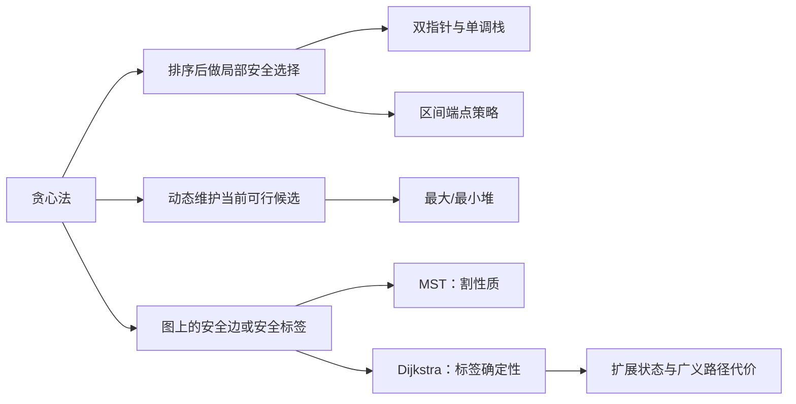

> 本章原文从 PDF 第 1076 页开始，到第 23 章“跳跃问题”之前结束，依次讲解贪心法概述、常见贪心问题、区间问题、Prim 与 Kruskal 最小生成树，以及 Dijkstra 最短路。本文严格沿用原书小节顺序；超出原书直接论述的证明、勘误、工程优化或替代方法均标注为“补充”。

## 本章要解决什么问题

搜索和动态规划会保留多个候选状态，再比较它们能否导向最优答案。贪心法试图做得更激进：

> 在当前状态立刻选择一个局部最优动作，并承诺以后不撤销它。

这种不可撤销性带来线性或排序主导的高效率，也带来本章最核心的风险：局部最好不一定组成全局最好。设计贪心算法时，真正困难的不是写出排序和双指针，而是回答：

1. 为什么某个最优解一定可以采用当前选择？
2. 做完当前选择后，剩余问题是否仍是同类问题？
3. 哪些输入条件使交换、单调性或支配关系成立？
4. 若条件不成立，反例是什么，应改用 DP、搜索还是图算法？

本章中的常见正确性工具包括交换论证、领先法、归纳法、反证法、割性质与最短路标签确定性。

### 基础单元、例题与正文题盘点

| 原书部分 | 基础算法单元 | 编号例题 | 正文题 | 正文题数 | 就地 C++17 块数 |
| --- | --- | --- | --- | ---: | ---: |
| 贪心法概述 | 安全选择、交换论证与反例 | 例 22-1 最小分解 | 无 | 0 | 1 |
| 常见贪心问题 | 无 | 无 | 455、881、871、2895、300、354、1196、179、402、1921、502、1199 | 12 | 12 |
| 区间问题 | 最早结束的活动安排 | 例 22-2 活动安排 | 435、452、56、1024、253 | 5 | 6 |
| 最小生成树 | 割性质、Prim 与 Kruskal | 无 | 1584、1168 | 2 | 3 |
| 最短路径 | 非负权 Dijkstra 与标签确定性 | 无 | 1631、1102、2093、787 | 4 | 5 |
| **合计** | **4 个基础算法单元** | **2 个编号例题** | **23 道正文题** | **23** | **27** |

例 22-1 和例 22-2 分别承载“贪心法概述”和“区间问题”的基础实现，因此例题数与基础单元数不再重复累加。每个基础单元和正文题都在下一个同级题目标题前给出一个就地 C++17 代码块；Python 与 Go 只保留在章末附录。

## 22.1 贪心法概述

### 22.1.1 什么是贪心法

#### 1. 严格定义

设一个优化问题的可行解由决策序列

$$
x=(x_1,x_2,\ldots,x_m)
$$

构造。到第 $t$ 步时，历史前缀为

$$
P_t=(x_1,\ldots,x_{t-1}),
$$

合法候选集合为 $C(P_t)$。贪心算法通过一个只依赖当前状态和既往选择的准则

$$
G(P_t,c)
$$

选择

$$
x_t\in\arg\operatorname{best}_{c\in C(P_t)}G(P_t,c),
$$

随后永久接受该选择，进入规模更小的剩余问题。

其中 `best` 可能表示最小需求、最早结束、最大收益、最短边、最紧迫截止时间等。贪心准则只承诺“当前看来最好”，必须另行证明它与全局目标一致。

#### 2. 与递归、搜索和 DP 的区别

| 方法 | 当前有多个候选时怎样处理 | 是否保留未来比较 |
| --- | --- | --- |
| 回溯/搜索 | 逐个尝试并可能撤销 | 保留整棵搜索树 |
| 动态规划 | 比较所有必要前驱状态 | 保留每个状态的最优值/计数 |
| 贪心 | 按准则只提交一个局部选择 | 通常不回退、不保留被淘汰分支 |

贪心并不等于“没有状态”。双指针位置、当前资本、堆中可选项目、已连接顶点集合和最短距离标签都是状态；区别在于算法能证明某些候选已永久失去竞争资格。

#### 3. 贪心算法的典型形式

```text
预处理：排序、建立堆或初始化图结构
state = 初始状态
while 尚未完成:
    枚举当前可行候选
    按贪心准则选择局部最优候选 choice
    永久接受 choice，并更新 state
return 由全部选择构成的答案
```

排序往往不是贪心本身，而是让“当前最优候选”可以顺序取得；堆则用于候选集合动态增长时快速取极值。

### 22.1.2 贪心法求解问题具有的性质

原书指出，适合贪心的问题通常具有最优子结构和贪心选择性质。两者作用不同。

#### 1. 最优子结构

若原问题的一个最优解在固定第一步后，其余部分是对应剩余子问题的最优解，则称具有最优子结构。

证明常用反证法。设最优解为

$$
O=(g,R),
$$

其中第一步为 $g$，剩余方案为 $R$。若 $R$ 不是剩余子问题的最优解，存在更优方案 $R'$，则

$$
(g,R')
$$

比 $O$ 更优，与 $O$ 最优矛盾。

动态规划也依赖最优子结构，但它会比较多个第一步；只有最优子结构并不足以证明可以立即选择某一个局部动作。

#### 2. 贪心选择性质

贪心选择性质要求：

> 至少存在一个全局最优解，其第一步就是贪心准则选出的动作。

注意不是说每个最优解都必须以该动作开始，也不是说该动作在数值上看起来漂亮就自然正确。必须证明贪心第一步能嵌入某个最优解。

#### 3. 交换论证

最常见证明框架如下。

1. 取任意一个最优解 $O$。
2. 若 $O$ 已采用贪心选择 $g$，第一步成立。
3. 否则找到 $O$ 中与 $g$ 对应或冲突的选择 $o$。
4. 用 $g$ 替换/交换 $o$，构造 $O'$。
5. 证明 $O'$ 仍可行，且目标值不劣于 $O$。
6. 因 $O$ 已最优，$O'$ 也最优且包含 $g$。
7. 删除 $g$ 后，对剩余同类子问题归纳。

本章的饼干分配、救生船、处理器分组、区间调度、Prim 和 Kruskal 都能用这种结构解释。

#### 4. 领先法

有些算法要证明贪心方案在每个前缀都“不落后”。设贪心方案前 $t$ 步获得指标 $G_t$，任意可行方案为 $A_t$，证明

$$
G_t\ge A_t
$$

（最大化）或

$$
G_t\le A_t
$$

（最小化）。最终 $t=m$ 时便得到全局最优。

最少加油的“每次取已路过加油站中最大油量”、Dijkstra 的“最小临时距离先确定”具有类似的领先/支配结构。

#### 5. 反例是设计的一部分

如果无法完成交换论证，应主动寻找小反例。例如零钱面额 `[5,4,1]`、金额 8：

- 局部选择最大面额 5，剩 3，只能用三个 1，共 4 张；
- 全局最优是 `4+4`，只需 2 张。

因此“每次取最大硬币”不是一般零钱兑换的正确策略，应使用完全背包 DP。一个失败反例比“感觉可能不对”更精确地界定算法适用范围。

### 22.1.3 贪心法求解问题的一般过程及其优点

#### 1. 六步设计流程

原书给出建模、分解、局部求解和合并四步。展开成更可执行的流程：

1. **定义可行解和目标函数。** 明确最大化/最小化的量以及全部约束。
2. **识别决策顺序。** 决策对象按重量、结束点、截止时间、资本门槛或边权排序。
3. **提出贪心准则。** 说明当前选择优化的局部指标。
4. **证明安全性。** 用交换、归纳、割性质或支配关系证明该选择属于某个最优解。
5. **证明剩余问题同构。** 删除当前选择后仍是同类问题，才能重复准则。
6. **实现并分析。** 选择排序、双指针、单调栈、堆、并查集等结构，分析复杂度和边界。

#### 2. 优点

- 一旦安全选择被证明，就不需要保存其他分支；
- 实现通常由排序加一次扫描组成，时间常为 $O(n\log n)$，扫描阶段为 $O(n)$；
- 额外状态少，空间通常低于 DP 与分支限界；
- 局部决策往往直观，可在线处理或流式处理。

#### 3. 局限

- 贪心准则强烈依赖问题结构，难以套用万能模板；
- 一个看似合理的策略可能只在某些输入族成立；
- 很多问题的正确贪心证明比代码本身困难；
- 若需要输出全部最优方案或方案数，单一路径贪心通常不够。

#### 4. 例 22-1：最小分解问题

给定正整数 $x$，寻找十进制正整数 $y$，使 $y$ 的各位数字乘积为 $x$，并让 $y$ 最小。若不存在或超过 32 位有符号整数，返回 0。

当 $1\le x<10$ 时，单个数字 $x$ 本身已经满足要求，并且任何多位正整数都更大，所以应直接返回 $x$。下文只讨论 $x\ge10$：用于继续分解的因子位只能来自 2～9；数字 0 会让乘积为 0，数字 1 不改变乘积却增加位数，均不应加入。

#### 贪心策略

依次从 9 到 2 尽可能除掉当前因子：

```text
digits = []
for factor from 9 down to 2:
    while x % factor == 0:
        digits.push(factor)
        x /= factor
```

若最后 $x\ne1$，说明含有大于 9 的质因子组合，无法用十进制单个数字表示。

为什么优先取大因子？把多个较小数字合并为不超过 9 的乘积，通常可减少位数；正整数的位数越少，数值一定越小。得到因子后必须按升序排列为十进制位，才能让高位尽可能小。

例如：

$$
48=8\times6,
$$

得到因子 `[8,6]`，升序形成 68。虽然

$$
48=2\times2\times3\times4,
$$

但 2234 有更多位，显然大于 68。

#### 补充：规范化交换与合并论证

对任意使用 2～9 的表示，若其中若干位乘积 $p\le9$，用一位 $p$ 替换这些位不会改变总乘积，并减少位数，因此最优表示不会保留可继续合并的冗余小因子。由 9 到 2 分解会尽量产生较少数字；最后升序是同一数字多重集合中字典序、数值均最小的排列。

还必须比较“位数相同但因子分组不同”的情况。例如

$$
36=4\times9=6\times6,
$$

两种方案都是两位数，但升序后 $49<66$。将数字拆成质因子 $2,3,5,7$ 后，5 和 7 不能与其他质因子合并成不超过 9 的更优十进制位；2、3 的分组则可用以下保持乘积的局部替换规范化：

$$
(2,2,2)\to(8),\quad (3,3)\to(9),\quad (2,3)\to(6),\quad (2,2)\to(4),
$$

它们优先减少位数。若位数不变，再使用

$$
(4,4)\to(2,8),\quad
(6,6)\to(4,9),\quad
(4,6)\to(3,8),
$$

$$
(3,4)\to(2,6),\quad
(3,6)\to(2,9).
$$

每条替换都保持乘积，并使升序数字在第一个不同位置变小；例如 $44>28$、$66>49$、$46>38$。反复应用后得到的规范分组，正对应“从 9 到 2 尽量整除、最后逆序写入”。因此该策略先最小化位数，再在最短位数中最小化十进制数。

需要使用 64 位临时变量逐位构造并检查：

$$
value\le\left\lfloor\frac{INT\_MAX-digit}{10}\right\rfloor,
$$

否则返回 0。依赖有符号溢出后检测负数在 C/C++ 中不安全，因为有符号溢出是未定义行为。

#### C++17：例 22-1 最小分解

代码中的两段循环分别对应证明中的两步：先从 9 到 2 合并出尽量少的数字，再逆序写入，使十进制高位尽量小。构造前检查上界，避免依赖有符号溢出。

```cpp
#include <climits>
#include <vector>

int minimumFactorization(int number) {
    if (number < 10) {
        return number;
    }

    std::vector<int> digits;
    for (int factor = 9; factor >= 2; --factor) {
        while (number % factor == 0) {
            digits.push_back(factor);
            number /= factor;
        }
    }
    if (number != 1) {
        return 0;
    }

    int value = 0;
    for (auto iterator = digits.rbegin(); iterator != digits.rend(); ++iterator) {
        const int digit = *iterator;
        if (value > (INT_MAX - digit) / 10) {
            return 0;
        }
        value = value * 10 + digit;
    }
    return value;
}
```

> **原文边界勘误（$x=1$）**：题目要求各位乘积等于 $x$ 的最小正整数，因此 $y=1$ 已是合法且最小的答案。原书代码对 $2\le x\le9$ 直接返回 $x$，但在 $x=1$ 时会得到 0，与题面定义不一致。本文三种语言统一对 $1\le x<10$ 返回 $x$。

#### 5. 如何判断“排序规则”合法

有些题用自定义比较器排序，例如最大数比较 $x+y$ 与 $y+x$。排序比较必须形成严格弱序，至少要满足一致性和传递性；否则标准排序行为未定义或结果不稳定。证明通常要从“相邻逆序交换会改善全局结果”出发。

## 22.2 常见的贪心法求解问题

### 22.2.1 LeetCode 455：分发饼干（★）

#### 问题与策略

孩子胃口为 $g_i$，饼干尺寸为 $s_j$。一块饼干最多分给一个孩子，且

$$
s_j\ge g_i
$$

时孩子 $i$ 才满足。目标是最大化满足人数。

将胃口和饼干都升序排序，用两个指针分别指向尚未满足的最小胃口和尚未使用的最小饼干：

- 若当前饼干太小，丢弃它并看下一块；
- 若能够满足当前孩子，就把它分给该孩子，两个指针都前进。

贪心准则是：

1. 优先满足胃口最小的孩子；
2. 使用能够满足他的最小饼干，保留大饼干给更大胃口。

#### 交换论证

设当前最小胃口为 $g$，最小可满足它的饼干为 $s$。取一个最大满足人数的方案 $O$。

- 若 $O$ 已将 $s$ 给 $g$，无需修改。
- 若 $g$ 在 $O$ 中由更大饼干 $s'\ge s$ 满足，而 $s$ 未用，则换成 $s$，人数不变。
- 若 $s$ 在 $O$ 中满足另一个胃口 $g'\ge g$，而 $g$ 由 $s'$ 满足，则交换两块饼干：$s$ 仍可满足 $g$，且 $s'\ge s\ge g'$ 或在有序匹配的首个冲突处可作对应重排，人数不减。
- 若 $g$ 未满足但 $s$ 满足了 $g'\ge g$，改为用 $s$ 满足 $g$，人数不变。

因此存在一个最优方案包含当前贪心匹配。删除这名孩子和这块饼干后，剩余仍是同类问题，可归纳。

样例 `g=[1,2,3]`、`s=[1,1]` 只能满足胃口 1 的孩子，答案为 1。

排序时间 $O(m\log m+n\log n)$，扫描 $O(m+n)$；若允许原地排序，额外空间取决于语言排序实现。

一次具体交换走查：`g=[1,2]`、`s=[2,3]` 时，某个最优方案可能把 3 给胃口 1、把 2 给胃口 2。贪心先把 2 给胃口 1；再把 3 给胃口 2，满足人数仍为 2。交换没有降低可行性，却把更大的资源留到了更需要它的位置。这正是代码中两个升序指针的局部动作。

#### C++17：分发饼干

```cpp
#include <algorithm>
#include <vector>

int assignCookies(std::vector<int> greed, std::vector<int> cookies) {
    std::sort(greed.begin(), greed.end());
    std::sort(cookies.begin(), cookies.end());
    int child = 0;
    for (int cookie : cookies) {
        if (child < static_cast<int>(greed.size()) && cookie >= greed[child]) {
            ++child;
        }
    }
    return child;
}
```

### 22.2.2 LeetCode 881：救生船（★★）

每艘船最多载两人，总重量不超过 `limit`，求最少船数。将体重升序，用 `left` 指向最轻者、`right` 指向最重者。

每轮最重者一定要上某一艘船：

1. 若

    $$
    people[left]+people[right]\le limit,
    $$

    让最轻者与最重者同船，并移动两个指针；
2. 否则最重者连当前最轻者都无法搭配，更不可能与任何其他人搭配，只能单独乘船，仅移动 `right`。

每轮都使用一艘船。

#### 为什么能配时应立即配

假设最重者 $H$ 能和最轻者 $L$ 同船。取一个最优方案：

- 若 $H$ 单独，而 $L$ 单独或与别人同船，把 $L$ 移到 $H$ 的船上不会增加船数，原来 $L$ 所在船反而可能空出位置；
- 若 $H$ 与另一人 $X\ge L$ 同船，则让 $L$ 替换 $X$ 仍可行；$X$ 可占据原来 $L$ 的位置，或保持方案船数不增。

故存在最优方案把 $H$ 与 $L$ 配对。若二者不能配，$H$ 单独是强制选择。

`[1,2,2,3]`、限制 3：`1+2` 一船，另一个 2 一船，3 一船，共 3 艘。

时间 $O(n\log n)$，双指针扫描 $O(n)$。

#### C++17：救生船

```cpp
#include <algorithm>
#include <vector>

int minimumBoats(std::vector<int> people, int limit) {
    std::sort(people.begin(), people.end());
    int light = 0;
    int heavy = static_cast<int>(people.size()) - 1;
    int boats = 0;
    while (light <= heavy) {
        if (people[light] + people[heavy] <= limit) {
            ++light;
        }
        --heavy;
        ++boats;
    }
    return boats;
}
```

### 22.2.3 LeetCode 871：最少加油次数（★★★）

#### 延迟决策模型

车辆初始可到达最远位置记为

$$
reach=startFuel.
$$

按位置递增处理加油站。所有满足

$$
position_i\le reach
$$

的站都已经可达，把其油量放入大根堆，但不立即决定是否加油。若下一个站或终点超过 `reach`，就从堆中取最大油量：

$$
reach\leftarrow reach+maxFuel.
$$

每弹出一次堆就表示实际加油一次。可以把终点作为位置 `target`、油量 0 的哨兵统一处理。

#### 为什么在不得不加油时取最大油量

在到达当前位置之前，堆中各站都已实际经过，选择任何一个都不会改变此前可行性。若必须加一次油，设某方案选择油量 $f$，而堆顶为 $F\ge f$。将 $f$ 换成 $F$：

$$
reach'=reach-f+F\ge reach.
$$

加油次数不变，可达范围不缩小，未来可经过的站只会更多。因此存在最优方案在本次选择最大油量。

“延迟到必须时再选”也很关键：提前加油可能使用一个后来证明不需要的站，增加次数；延迟决策保留全部已路过候选。

样例 `target=100,startFuel=10`：经过位置 10 后堆有 60；到位置 20 前取 60，可达 70；之后堆中有 30、30、40，到终点前取 40，可达 110，共 2 次。

若堆为空且仍无法到达下一位置，返回 -1。排序后时间 $O(n\log n)$，若输入已按位置排序则只需堆操作 $O(n\log n)$，空间 $O(n)$。

与第 21 章 $O(n^2)$ DP 相比，贪心堆更快；两者状态和证明方式不同。

#### C++17：最少加油次数

大根堆只保存已经路过的站；只有当前可达范围不足时才落实一次选择。`reachable` 使用 `long long`，避免累计油量溢出 32 位。

```cpp
#include <algorithm>
#include <queue>
#include <utility>
#include <vector>

int minimumRefuelStops(
    int target,
    int startFuel,
    std::vector<std::pair<int, int>> stations
) {
    std::sort(stations.begin(), stations.end());
    std::priority_queue<int> available;
    long long reachable = startFuel;
    int station = 0;
    int stops = 0;

    while (reachable < target) {
        while (station < static_cast<int>(stations.size()) &&
               stations[station].first <= reachable) {
            available.push(stations[station].second);
            ++station;
        }
        if (available.empty()) {
            return -1;
        }
        reachable += available.top();
        available.pop();
        ++stops;
    }
    return stops;
}
```

### 22.2.4 LeetCode 2895：最少处理时间（★★）

每个处理器有 4 个独立核心，每个核心只执行一个任务。处理器最早空闲时刻为 $p_i$，分给它的 4 个任务耗时集合为 $T_i$，该处理器完成时刻是

$$
C_i=p_i+\max_{t\in T_i}t.
$$

目标最小化

$$
\max_i C_i.
$$

#### 两阶段贪心

1. 将任务耗时降序排序，并把连续 4 个任务分为一组。因为每组只由最大任务决定完成时间，把大任务集中在同一组可让后面 3 个大任务“藏”在组最大值下，而不是成为其他组的最大值。组最大值依次是


    $$
    tasks[0],tasks[4],tasks[8],\ldots.
    $$

2. 将处理器空闲时间升序，把最大的组最大值配给最早空闲处理器。答案：

    $$
    answer=\max_i\left(processorTime[i]+tasks[4i]\right).
    $$

#### 相反次序配对证明

设两个处理器空闲时刻 $a\le b$，两个组最大任务 $x\ge y$。相反次序配对的最大完成时间是

$$
M_1=\max(a+x,b+y).
$$

同序配对是

$$
M_2=\max(a+y,b+x).
$$

因为

$$
a+x\le b+x\le M_2,
$$

且

$$
b+y\le b+x\le M_2,
$$

所以 $M_1\le M_2$。任意逆序配对都可交换而不变差，故最早处理器配最大组任务最优。

样例空闲 `[8,10]`，任务降序 `[8,7,5,4,3,2,2,1]`：

$$
\max(8+8,10+3)=16.
$$

时间由排序主导：$O(n\log n)$；任务总数为 $4n$。

#### C++17：最少处理时间

题目保证任务数恰为处理器数的 4 倍；`tasks[4*i]` 正是降序后第 `i` 组的最大任务。

```cpp
#include <algorithm>
#include <functional>
#include <vector>

int minimumProcessingTime(std::vector<int> processors, std::vector<int> tasks) {
    std::sort(processors.begin(), processors.end());
    std::sort(tasks.begin(), tasks.end(), std::greater<int>());
    int answer = 0;
    for (int index = 0; index < static_cast<int>(processors.size()); ++index) {
        answer = std::max(answer, processors[index] + tasks[4 * index]);
    }
    return answer;
}
```

### 22.2.5 LeetCode 300：最长递增子序列（★★）

本题在 21.3.2 用 $O(n^2)$ DP 求解。本节使用耐心排序思想和二分查找。

定义：

$$
tails[\ell-1]
=\text{当前已扫描前缀中，长度为 }\ell\text{ 的递增子序列可达到的最小末尾值}.
$$

`tails` 严格递增。处理值 $x$：

- 若 $x$ 大于所有末尾，追加，最长长度增加 1；
- 否则用 $x$ 替换第一个大于或等于它的位置，即

  $$
  pos=\operatorname{lower\_bound}(tails,x).
  $$

替换不改变已有长度，只把该长度的末尾变小，为未来接入更多元素保留更大空间。

#### 不变量证明

归纳假设扫描前缀后，`tails[l-1]` 是长度 $l$ 的最小可能末尾。

- 若 $x$ 比所有末尾大，它可接在最长序列后形成新长度；
- 否则第一个 `tails[pos] >= x`。由于 `pos=0` 或 `tails[pos-1] < x`，存在长度 `pos` 的序列可接 $x$，形成长度 `pos+1`；用更小的 $x$ 替换旧末尾只增强未来可扩展性。

因此 `tails` 长度始终等于当前前缀的 LIS 长度。

> **原文边界说明**：原书称 `ans` 存放“一个最长递增子序列”。替换过程中的 `tails` 通常只保存各长度的最优末尾，不保证这些值来自同一条索引链，所以它未必是原数组中的真实 LIS。若要重建序列，需要保存每个元素的前驱和各长度末尾下标。

`[0,1,0,3,2,3]` 的 `tails` 依次为：

```text
[0] → [0,1] → [0,1] → [0,1,3] → [0,1,2] → [0,1,2,3]
```

答案 4。时间 $O(n\log n)$，空间 $O(n)$。

#### C++17：最长递增子序列的贪心尾值

严格递增要求替换第一个 `>= number` 的位置，因此使用 `lower_bound`；若题目要求非递减子序列，则边界要改成 `upper_bound`。

```cpp
#include <algorithm>
#include <vector>

int lengthOfLisGreedy(const std::vector<int>& numbers) {
    std::vector<int> tails;
    for (int number : numbers) {
        auto position = std::lower_bound(tails.begin(), tails.end(), number);
        if (position == tails.end()) {
            tails.push_back(number);
        } else {
            *position = number;
        }
    }
    return static_cast<int>(tails.size());
}
```

### 22.2.6 LeetCode 354：俄罗斯套娃信封（★★★）

信封 $(w_1,h_1)$ 可放入 $(w_2,h_2)$ 当且仅当

$$
w_1<w_2\quad\land\quad h_1<h_2.
$$

为了降成一维 LIS：

1. 宽度升序；
2. 宽度相同时，高度**降序**；
3. 对排好序的高度求严格 LIS。

为什么同宽高度要降序？若同宽按高度升序，它们会被高度 LIS 同时选择，错误地把宽度相等的信封套在一起。降序后，同宽组的高度不可能形成严格递增子序列，最多选择一个。

对 `[[5,4],[6,4],[6,7],[2,3]]` 排序得到：

```text
[2,3], [5,4], [6,7], [6,4]
```

高度序列 `[3,4,7,4]` 的严格 LIS 长度为 3，对应 `[2,3]→[5,4]→[6,7]`。

排序与 LIS 均为 $O(n\log n)$，空间 $O(n)$。

#### C++17：俄罗斯套娃信封

```cpp
#include <algorithm>
#include <utility>
#include <vector>

int maximumEnvelopes(std::vector<std::pair<int, int>> envelopes) {
    std::sort(
        envelopes.begin(),
        envelopes.end(),
        [](const auto& left, const auto& right) {
            return left.first != right.first
                ? left.first < right.first
                : left.second > right.second;
        }
    );

    std::vector<int> tails;
    for (const auto& [width, height] : envelopes) {
        auto position = std::lower_bound(tails.begin(), tails.end(), height);
        if (position == tails.end()) {
            tails.push_back(height);
        } else {
            *position = height;
        }
    }
    return static_cast<int>(tails.size());
}
```

### 22.2.7 LeetCode 1196：最多可以买到的苹果数量（★）

每个苹果价值相同：都让计数增加 1；唯一成本是重量，篮子容量固定为 5000。为了让所选数量最大，应优先选择最轻苹果。

排序后从小到大累加，下一只苹果会使总重量超过 5000 时停止。

#### 交换证明

设某个最大数量方案包含重量 $y$，却未包含更轻的 $x\le y$。用 $x$ 替换 $y$ 后：

- 苹果数量不变；
- 总重量不增加；
- 方案仍可行。

不断交换可得到由最轻若干苹果组成的最优方案。因此只需找升序前缀和不超过容量的最大长度。

样例 `[100,200,150,1000]` 总重 1450，答案 4。

时间 $O(n\log n)$，扫描 $O(n)$。

#### C++17：最多可以买到的苹果数量

```cpp
#include <algorithm>
#include <vector>

int maximumApples(std::vector<int> weights, int capacity = 5000) {
    std::sort(weights.begin(), weights.end());
    int total = 0;
    int count = 0;
    for (int weight : weights) {
        if (total + weight > capacity) {
            break;
        }
        total += weight;
        ++count;
    }
    return count;
}
```

#### 原书零钱讨论的边界

原书在本题前用 `[10,5,2,1]` 说明某些规范币制可用“优先最大面额”，并给出 `[5,4,1]`、金额 8 的反例。一般硬币系统是否为规范币制不能仅凭面额降序判断；LeetCode 322 应使用 DP。苹果题之所以可贪心，是因为每件物品收益完全相同且目标只最大化件数，这与最少硬币问题不是同一数学结构。

### 22.2.8 LeetCode 179：最大数（★★）

把每个非负整数转为字符串。对任意两个字符串 $x,y$，若

$$
x+y>y+x
$$

（按同长度十进制字符串字典序比较），就让 $x$ 排在 $y$ 前面。

#### 相邻交换证明

一个排列中若相邻顺序为 `y,x`，但 `x+y > y+x`，交换后只有这两段对应的连续数字变化，且整个结果在第一个不同位置变大，其他前后缀不变。因此任何最优排列都不能包含这种逆序对。

不断消除逆序对后得到按比较器排序的序列，所以排序结果全局最大。

比较器具有传递性，可把字符串看作无限周期串 $x^{\infty}$ 与 $y^{\infty}$ 的字典序；比较 $x+y$ 与 $y+x$ 足以确定两周期串的相对次序。

样例 `[3,30,34,5,9]` 排序为 `[9,5,34,3,30]`，结果 `9534330`。

若首字符串为 `0`，说明全部为 0，统一返回 `"0"`，避免 `"000"`。

设数字总字符数为 $L$，排序比较可能花费字符串长度，常写作 $O(n\log n\cdot d)$，$d$ 为最大数字位数；拼接 $O(L)$。

#### C++17：最大数

```cpp
#include <algorithm>
#include <string>
#include <vector>

std::string largestNumber(const std::vector<int>& numbers) {
    std::vector<std::string> values;
    for (int number : numbers) {
        values.push_back(std::to_string(number));
    }
    std::sort(values.begin(), values.end(), [](const auto& left, const auto& right) {
        return left + right > right + left;
    });
    if (values.front() == "0") {
        return "0";
    }
    std::string answer;
    for (const auto& value : values) {
        answer += value;
    }
    return answer;
}
```

### 22.2.9 LeetCode 402：移掉 $k$ 位数字（★★）

目标是在保持剩余数字相对顺序的前提下，得到长度 $n-k$ 的最小数字。高位优先级高于低位，所以遇到下降对时应删除左侧较大数字。

用单调不降栈扫描每个数字 `digit`：

```text
while k > 0 and stack not empty and stack.back > digit:
     stack.pop
     k--
stack.push(digit)
```

若扫描结束仍有删除额度，说明序列整体不降，应从末尾删除最大的低位数字。

#### 为什么删除第一个下降点

若前缀满足

$$
d_0\le d_1\le\cdots\le d_{i-1}>d_i,
$$

删除 $d_{i-1}$ 会让更小的 $d_i$ 提前到第 $i-1$ 位；删除任何更后位置都保留较大的高位，结果必不更小。单调栈会递归处理删除后新形成的下降点。

`1432219` 删除 3 位：

```text
1,4 遇 3：删 4
1,3 遇 2：删 3
1,2,2 遇 1：依次只再删一个 2
```

得到 `1219`。

最后去除前导零；若为空返回 `0`。每个字符最多进栈、出栈一次，时间 $O(n)$、空间 $O(n)$。

#### C++17：移掉 $k$ 位数字

```cpp
#include <string>

std::string removeKDigits(const std::string& number, int removeCount) {
    std::string stack;
    for (char digit : number) {
        while (removeCount > 0 && !stack.empty() && stack.back() > digit) {
            stack.pop_back();
            --removeCount;
        }
        stack.push_back(digit);
    }
    if (removeCount > 0) {
        stack.resize(stack.size() - removeCount);
    }
    const std::size_t firstNonzero = stack.find_first_not_of('0');
    return firstNonzero == std::string::npos ? "0" : stack.substr(firstNonzero);
}
```

### 22.2.10 LeetCode 1921：消灭怪物的最多数量（★★）

怪物 $i$ 到达城市的连续时间为

$$
t_i=\frac{dist_i}{speed_i}.
$$

玩家只能在整数分钟开始时开火；若怪物恰在该时刻到达，玩家先输。因此第 $m$ 分钟能够消灭怪物的条件是

$$
m<t_i.
$$

为避免浮点数，可计算最早失败分钟（向上取整）：

$$
deadline_i
=\left\lceil\frac{dist_i}{speed_i}\right\rceil
=\left\lfloor\frac{dist_i-1}{speed_i}\right\rfloor+1.
$$

将截止时间升序。第 $i$ 个被消灭的怪物安排在分钟 $i$，必须满足

$$
deadline_i>i.
$$

一旦不满足就已来不及，返回 $i$。

#### 最早截止时间优先证明

若某计划先消灭截止时间较晚的 $B$，下一分钟消灭更早的 $A$，交换二者：$A$ 提前不会失效；$B$ 被推迟到原来 $A$ 的时间，而 $deadline_B\ge deadline_A$，若 $A$ 原本来得及，则 $B$ 也来得及。反复交换可得到按截止时间排序的最优计划。

样例到达截止分钟为 `[1,1,2]`。分钟 0 可消灭一个；分钟 1 时另一个截止为 1 的怪物已经到达，答案 1。

时间 $O(n\log n)$，空间 $O(n)$。

#### C++17：消灭怪物的最多数量

```cpp
#include <algorithm>
#include <vector>

int eliminateMaximum(
    const std::vector<int>& distances,
    const std::vector<int>& speeds
) {
    std::vector<int> deadlines;
    for (int index = 0; index < static_cast<int>(distances.size()); ++index) {
        deadlines.push_back((distances[index] - 1) / speeds[index] + 1);
    }
    std::sort(deadlines.begin(), deadlines.end());
    for (int minute = 0; minute < static_cast<int>(deadlines.size()); ++minute) {
        if (deadlines[minute] <= minute) {
            return minute;
        }
    }
    return static_cast<int>(deadlines.size());
}
```

### 22.2.11 LeetCode 502：IPO（★★★）

每个项目有启动资本 $c_i$ 和非负纯利润 $p_i$。当前资本为 $W$，最多完成 $k$ 个不同项目。

#### 排序 + 动态候选堆

1. 将项目按启动资本升序；
2. 用指针把所有 $c_i\le W$ 的项目利润加入大根堆；
3. 从堆中选择最大利润，更新

    $$
    W\leftarrow W+p_{max};
    $$
4. 重复至多 $k$ 次；若堆为空，当前无可行项目，提前结束。

#### 为什么选当前最大利润

在当前可行项目集合中，所有项目都满足资本门槛。若某最优计划第一步选择利润 $p$，而最大可行利润为 $P\ge p$，交换为项目 $P$ 后：

$$
W+P\ge W+p.
$$

下一步可负担的项目集合只会扩大，不会缩小；已使用项目数相同。因此存在最优计划先选最大利润项目。

该证明依赖利润非负。若允许负利润且要求“至多 $k$ 个”，显然应拒绝负项目；题目保证利润非负。

样例初始资本 0，只能选利润 1 的项目，资本变 1；随后可选利润 3，最终资本 4。

排序 $O(n\log n)$，每个项目最多入堆一次、出堆一次，总时间 $O((n+k)\log n)$，空间 $O(n)$。

#### C++17：IPO

题设的非负利润保证选中项目后资本不会下降，可行项目集合只扩不缩。若接口允许负利润且仍是“至多选择”，弹出前还必须在堆顶不为正时停止。

```cpp
#include <algorithm>
#include <queue>
#include <utility>
#include <vector>

int maximizeCapital(
    int projectLimit,
    int initialCapital,
    const std::vector<int>& profits,
    const std::vector<int>& capital
) {
    std::vector<std::pair<int, int>> projects;
    for (int index = 0; index < static_cast<int>(profits.size()); ++index) {
        projects.emplace_back(capital[index], profits[index]);
    }
    std::sort(projects.begin(), projects.end());

    std::priority_queue<int> available;
    int project = 0;
    int current = initialCapital;
    for (int selected = 0; selected < projectLimit; ++selected) {
        while (project < static_cast<int>(projects.size()) &&
               projects[project].first <= current) {
            available.push(projects[project].second);
            ++project;
        }
        if (available.empty()) {
            break;
        }
        current += available.top();
        available.pop();
    }
    return current;
}
```

### 22.2.12 LeetCode 1199：建造街区的最短时间（★★★）

一个工人可以花 `split` 时间变成两个并行工人，或独自建一个街区。整个计划可表示为二叉树：

- 叶子权值是街区建造时间；
- 内部结点表示一次分裂，两个子任务并行；
- 若两个子计划完成时间为 $x,y$，把它们交给一次分裂产生的两个工人，完成时间为

  $$
  split+\max(x,y).
  $$

目标是构造二叉合并树，使根完成时间最小。

#### 小根堆合并

将所有街区时间放入小根堆，每次取最小的两个 $x\le y$，合并为

$$
z=split+\max(x,y)=split+y,
$$

再放回堆，直到只剩一个值。

样例 `[1,2,3]`、`split=1`：

$$
1,2\to3,
$$

堆变为 `[3,3]`；再合并得

$$
1+\max(3,3)=4.
$$

#### 补充：为什么先合并两个最小值

在任一最优二叉计划中，较小完成时间更适合放在较深层，因为每向上一层只额外增加一次 `split`；若较大任务比较小任务更深，交换二者不会增大任何路径最大值。最深层可取一对兄弟叶/子计划，把其中两个最小完成时间安排为兄弟不劣。收缩这对兄弟为值 `split+max(x,y)` 后，剩余仍是同类问题，可归纳。这与 Huffman 的交换/收缩证明相似，但合并代价是 `split+max`，不是求和。

时间 $O(n\log n)$，堆空间 $O(n)$。当只有一个街区时无需分裂，直接返回其建造时间。

#### C++17：建造街区的最短时间

```cpp
#include <functional>
#include <queue>
#include <vector>

int minimumBuildTime(const std::vector<int>& blocks, int split) {
    std::priority_queue<int, std::vector<int>, std::greater<int>> queue(
        blocks.begin(),
        blocks.end()
    );
    while (queue.size() > 1) {
        const int first = queue.top();
        queue.pop();
        const int second = queue.top();
        queue.pop();
        queue.push(split + second);
    }
    return queue.top();
}
```

## 22.3 区间问题

### 22.3.1 什么是区间问题

区间问题的贪心准则取决于目标：

| 目标 | 常用排序/选择 |
| --- | --- |
| 选择最多互不重叠区间 | 按右端点升序，选最早结束 |
| 用最少点刺穿全部闭区间 | 按右端点升序，在最早右端点放点 |
| 合并全部重叠区间 | 按左端点升序，维护当前并集右端点 |
| 用最少区间覆盖连续目标 | 按左端点扫描，在可接续候选中选最远右端点 |
| 最少资源容纳全部区间 | 按开始时间处理，用最早结束资源复用 |

同样是区间，排序规则不能机械统一。

#### 端点语义

半开区间 $[s,e)$ 中，`[1,2)` 与 `[2,3)` 不重叠，兼容条件是

$$
nextStart\ge currentEnd.
$$

闭区间 $[s,e]$ 中，二者在端点 2 相交；若相交也算冲突，则兼容条件是

$$
nextStart>currentEnd.
$$

LeetCode 各题定义不同：无重叠区间和会议通常允许前一个结束时后一个立刻开始；气球端点相等时同一支箭能同时击破；合并区间的闭端点相等时应合并。

用同一组端点走查最容易避免写反比较符：

| 区间 | 语义 | 在 2 处的关系 | 代码中的兼容/分离条件 |
| --- | --- | --- | --- |
| $[1,2)$ 与 $[2,3)$ | 半开 | 不相交 | `nextStart >= currentEnd` |
| $[1,2]$ 与 $[2,3]$ | 闭区间 | 相交于 2 | `nextStart > currentEnd` |

因此，会议复用和活动安排使用 `>=`/`<=`；气球开启新箭与闭区间开启新并集使用严格的 `>`。比较符来自集合语义，而不是可随意替换的实现细节。

#### 例 22-2：活动安排

每个活动占用同一资源，活动区间为半开 $[s_i,e_i)$，目标是选择最多兼容活动。

贪心策略：按结束时间升序，每次选择第一个满足

$$
s_i\ge lastEnd
$$

的活动，并更新 `lastEnd=e_i`。

#### 最早结束的交换证明

设所有可选活动中结束最早的是 $g$。取一个最优方案，其第一个活动为 $o$。因为

$$
e_g\le e_o,
$$

用 $g$ 替换 $o$ 后，$g$ 不晚于 $o$ 结束，所以原来能排在 $o$ 后面的活动仍能排在 $g$ 后面；方案数量不减。故存在一个最优方案以 $g$ 开始。

删除所有与 $g$ 冲突的活动后，剩余问题仍是从时间 $e_g$ 以后选择最多活动，可归纳。

排序时间 $O(n\log n)$，扫描 $O(n)$。

**错误贪心反例：最短持续时间优先。** 对半开活动 `[0,3)`、`[3,6)`、`[2,4)`，持续时间最短的 `[2,4)` 会同时挡住前两项，只选到 1 个；按最早结束选择 `[0,3)`，再选 `[3,6)`，可选 2 个。持续时间只看区间自身，不刻画它给剩余时间轴留下多少空间；右端点才支持上述交换论证。

#### C++17：区间基础单元（活动安排）

```cpp
#include <algorithm>
#include <climits>
#include <utility>
#include <vector>

int maximumActivities(std::vector<std::pair<int, int>> activities) {
    std::sort(activities.begin(), activities.end(), [](const auto& left, const auto& right) {
        return left.second != right.second
            ? left.second < right.second
            : left.first < right.first;
    });
    long long lastEnd = LLONG_MIN;
    int selected = 0;
    for (const auto& [start, end] : activities) {
        if (start >= lastEnd) {  // 半开区间 [start, end)
            ++selected;
            lastEnd = end;
        }
    }
    return selected;
}
```

### 22.3.2 LeetCode 435：无重叠区间（★★）

题目求最少删除数，使剩余区间互不重叠。若最大兼容区间数为 $M$，总区间数为 $n$，则：

$$
minimumRemoved=n-M.
$$

因此直接复用活动安排策略：按右端点升序，保留第一个区间；对后续区间：

- 若 `start >= lastEnd`，保留并更新右端点；
- 否则删除当前区间。

为什么冲突时删除当前区间？排序保证当前区间右端点不小于已保留区间；保留结束更早者给未来留下不小的空间。用当前区间替换已保留区间不会更好。

样例 `[[1,2],[2,3],[3,4],[1,3]]` 最多保留前三个，删除 `[1,3]`，答案 1。

时间 $O(n\log n)$，排序后扫描 $O(n)$。

#### C++17：无重叠区间

```cpp
#include <algorithm>
#include <climits>
#include <utility>
#include <vector>

int eraseOverlapIntervals(std::vector<std::pair<int, int>> intervals) {
    std::sort(intervals.begin(), intervals.end(), [](const auto& left, const auto& right) {
        return left.second < right.second;
    });
    long long lastEnd = LLONG_MIN;
    int kept = 0;
    for (const auto& [start, end] : intervals) {
        if (start >= lastEnd) {
            ++kept;
            lastEnd = end;
        }
    }
    return static_cast<int>(intervals.size()) - kept;
}
```

### 22.3.3 LeetCode 452：用最少的箭击破气球（★★）

每个气球是闭区间 $[start,end]$；在坐标 $x$ 射箭可击破所有满足

$$
start\le x\le end
$$

的气球。

将区间按右端点升序。对第一个尚未击破的气球，在其右端点

$$
x=end
$$

射箭。后续所有 `start <= x` 的气球都被同一箭击破；遇到 `start > x` 时必须发新箭，并把新箭位置设为该区间右端点。

#### 为什么选择最早右端点

任何击破第一个气球的箭位置 $y$ 都满足 $y\le end$。将它右移或替换到最早右端点 $end$：

- 仍击破该气球；
- 对按右端点排序后、可能与其共同击破的后续区间，`end` 是不晚于它们右端点的最右安全位置；
- 不会减少右侧可同时覆盖的候选。

更标准的刺点论证是：最早结束区间必须被某箭击中，把该箭移到其右端点不会失去任何同时包含原箭且右端点不早于该点的相关区间，由此可固定一次贪心选择。

样例在 6 和 12（或 11）处各射一箭即可，答案 2。

闭区间端点相等时可共用箭，所以新箭条件是

$$
start>arrowPosition,
$$

不是 `>=`。

时间 $O(n\log n)$。

#### C++17：用最少的箭击破气球

```cpp
#include <algorithm>
#include <utility>
#include <vector>

int minimumArrows(std::vector<std::pair<int, int>> points) {
    if (points.empty()) {
        return 0;
    }
    std::sort(points.begin(), points.end(), [](const auto& left, const auto& right) {
        return left.second < right.second;
    });
    int arrows = 1;
    long long arrowPosition = points.front().second;
    for (int index = 1; index < static_cast<int>(points.size()); ++index) {
        if (points[index].first > arrowPosition) {  // 闭区间端点相等仍相交
            ++arrows;
            arrowPosition = points[index].second;
        }
    }
    return arrows;
}
```

### 22.3.4 LeetCode 56：合并区间（★★）

将闭区间按左端点升序。维护结果末尾当前并集

$$
[currentStart,currentEnd].
$$

扫描下一区间 $[start,end]$：

- 若

    $$
    start>currentEnd,
    $$

    两区间不重叠，把新区间追加到结果；
- 否则相交或端点接触，更新

    $$
    currentEnd\leftarrow\max(currentEnd,end).
    $$

按左端点排序保证新区间不可能向左扩展当前并集，只需维护最远右端点。

样例 `[[1,3],[2,6],[8,10],[15,18]]` 合并为 `[[1,6],[8,10],[15,18]]`。

> **原文示例勘误**：原书另一示例含 `[8,9]` 与 `[9,10]`，题目使用闭区间，两者在 9 相交，应合并为 `[8,10]`。原文给出的末段 `[9,10]` 丢失了 `[8,9]` 的覆盖，不符合“恰好覆盖输入全部区间”的要求。

排序 $O(n\log n)$，扫描 $O(n)$；结果空间 $O(n)$。

#### C++17：合并区间

```cpp
#include <algorithm>
#include <utility>
#include <vector>

std::vector<std::vector<int>> mergeIntervals(
    std::vector<std::pair<int, int>> intervals
) {
    std::sort(intervals.begin(), intervals.end());
    std::vector<std::vector<int>> result;
    for (const auto& [start, end] : intervals) {
        if (result.empty() || start > result.back()[1]) {
            result.push_back({start, end});
        } else {
            result.back()[1] = std::max(result.back()[1], end);
        }
    }
    return result;
}
```

### 22.3.5 LeetCode 1024：视频拼接（★★）

要用最少片段覆盖连续区间 $[0,time]$，片段可自由裁剪。设当前已经连续覆盖到

$$
covered.
$$

下一片段必须满足

$$
start\le covered,
$$

否则在 `covered` 处出现空洞。在所有满足条件且尚未扫描的片段中，选择右端点最远者：

$$
next=\max end.
$$

若 `next == covered`，没有片段能延长覆盖，返回 -1；否则选择一次并令 `covered=next`，直到达到 `time`。

#### 最远延伸的交换证明

任何可行最优方案下一步都必须选择一个起点不晚于 `covered` 的片段 $o$。贪心片段 $g$ 在同一候选集合中右端点最远：

$$
end_g\ge end_o.
$$

用 $g$ 替换 $o$ 后，已连续覆盖范围只会扩大；原方案后续片段的接续点仍被覆盖，因此片段总数不增。故存在最优方案采用 $g$。

样例选择 `[0,2]`、`[1,9]`、`[8,10]`，共 3 个片段。

排序后每个片段只扫描一次，时间 $O(n\log n)$，额外空间由排序决定。

#### C++17：视频拼接

```cpp
#include <algorithm>
#include <utility>
#include <vector>

int videoStitching(std::vector<std::pair<int, int>> clips, int targetTime) {
    std::sort(clips.begin(), clips.end());
    int covered = 0;
    int farthest = 0;
    int clip = 0;
    int used = 0;
    while (covered < targetTime) {
        while (clip < static_cast<int>(clips.size()) && clips[clip].first <= covered) {
            farthest = std::max(farthest, clips[clip].second);
            ++clip;
        }
        if (farthest == covered) {
            return -1;
        }
        covered = farthest;
        ++used;
    }
    return used;
}
```

### 22.3.6 LeetCode 253：会议室 II（★★）

每个会议是半开区间 $[start,end)$，结束时刻等于另一会议开始时刻时可复用房间。最少房间数等于任意时刻同时进行会议数的最大值。

#### 原书分组法

原书按开始时间升序，反复从最早未安排会议开始一间新房，向后扫描并把所有与该房当前末尾兼容的会议装入该房。该过程相当于为区间图做逐色分组，直接实现最坏 $O(n^2)$。

#### 标准最小堆优化

按开始时间升序处理会议，用小根堆为**每个已经分配的房间**保存一个下一空闲时间，即该房间最后安排会议的结束时间。某些堆项可能已经不晚于当前开始时刻，表示对应房间空闲，并不表示它仍被实时占用。

对会议 $[s,e)$：

- 若堆顶最早结束时间满足

    $$
    earliestEnd\le s,
    $$

    该房间已空闲，弹出并复用；
- 将当前结束时间 $e$ 入堆。

每处理一个会议只需要一个房间：若堆顶已空闲，弹出这一项并把当前结束时间写回，相当于复用一间房；否则所有已分配房间都忙，新增一个堆项。因而循环前后每个已分配房间始终恰有一个下一空闲时间，堆大小就是**已分配房间数**，最终值即答案，而不是每一步的实时占用数。

#### 正确性

若最早结束的房间满足 `earliestEnd > s`，则所有已分配房间在 $s$ 时仍被占用，当前会议与它们同时存在，任何方案都必须新增房间。若堆顶满足 `earliestEnd <= s`，至少一间房空闲，当前会议只需复用其中一间；所以每轮最多弹一个已经足够，其他空闲房的下一空闲时间仍留在堆中代表那些已分配房间。分配数只在所有房间都忙时增加，故最终得到最少房间数。

若目标不是最少分配数，而是逐时刻维护**实时并发会议数**，则处理会议 $[s,e)$ 前应反复弹出所有 `end <= s` 的条目，再压入 $e$，并记录堆大小的最大值。此时堆只表示当前活跃会议；它与上面的“一间已分配房间一个条目”是不相同的堆不变量。

样例 `[[0,30],[5,10],[15,20]]`：会议 5～10 与 0～30 重叠，需要第二间；15～20 可复用 5～10 的房间，答案 2。

时间 $O(n\log n)$，堆空间 $O(n)$。

> **补充：扫描线替代。** 分别排序所有开始和结束时间，用双指针统计并发数；当 `start < end` 时房间数加一，否则先释放房间。端点相等时应先处理结束，体现半开区间可复用。

#### C++17：会议室 II

```cpp
#include <algorithm>
#include <functional>
#include <queue>
#include <utility>
#include <vector>

int minimumMeetingRooms(std::vector<std::pair<int, int>> meetings) {
    if (meetings.empty()) {
        return 0;
    }
    std::sort(meetings.begin(), meetings.end());
    std::priority_queue<int, std::vector<int>, std::greater<int>> endings;
    for (const auto& [start, end] : meetings) {
        if (!endings.empty() && endings.top() <= start) {  // [start, end)
            endings.pop();
        }
        endings.push(end);
    }
    return static_cast<int>(endings.size());
}
```

## 22.4 Prim 和 Kruskal 算法及其应用

### 22.4.1 Prim 和 Kruskal 算法

#### 一、最小生成树问题

给定带权连通无向图

$$
G=(V,E),
$$

生成树是包含全部顶点、连通且无环的子图。若 $|V|=n$，任意生成树恰有 $n-1$ 条边。最小生成树（MST）最小化边权总和：

$$
\min_{T\text{ 是 }G\text{ 的生成树}}
\sum_{e\in T}w(e).
$$

MST 目标是连接全部顶点的总成本，不是从某个源点到各点的最短路径；最短路径树与 MST 通常不同。

#### 二、割性质

Prim 与 Kruskal 的共同正确性基础是割性质。

把顶点集分成两个非空集合 $S$ 与 $V-S$，跨越两集合的边称为该割的横切边。若当前已选边集 $A$ 是某棵 MST 的子集，且割尊重 $A$（$A$ 中没有边跨越该割），那么该割上权值最小的横切边是安全边：存在一棵包含 $A$ 和该边的 MST。

#### 交换证明

设割上的最轻边为 $e$，取一棵包含 $A$ 的 MST $T$。

- 若 $e\in T$，结论成立；
- 否则把 $e$ 加入 $T$ 会形成唯一环。该环必须还有一条边 $f$ 跨越同一割；
- 因 $e$ 是割上最轻边，

    $$
    w(e)\le w(f).
    $$

- 删除 $f$ 后仍连通且无环，得到生成树

    $$
    T'=T+e-f,
    $$

    且总权不大于 $T$。

由于 $T$ 已最小，$T'$ 也是 MST，并包含安全边 $e$。

### 三、Prim 算法

Prim 维护已经接入树的顶点集合 $U$。初始任选起点 $s$：

$$
U=\{s\}.
$$

每一步选择连接 $U$ 与 $V-U$ 的最轻边，把其外部端点加入 $U$。该割显然尊重当前树边，割性质保证选择安全。

#### 邻接矩阵实现

维护：

$$
lowcost[v]
=\min_{u\in U}w(u,v),
$$

以及产生该最小值的 `closest[v]`。每轮线性扫描 $V-U$ 找最小 `lowcost`，再用新顶点更新所有候选。

时间复杂度为

$$
O(n^2),
$$

空间若存邻接矩阵为 $O(n^2)$。

> **原文勘误说明**：OCR 文本将邻接矩阵 Prim 的复杂度写为 $O(n)$；需要进行 $n$ 轮、每轮扫描/更新 $n$ 个顶点，正确是 $O(n^2)$。

#### 邻接表 + 小根堆

把从 $U$ 指向外部的候选边放入小根堆。弹出最轻边；若终点已在 $U$，说明是过期横切边，跳过；否则接入该顶点并加入其出边。

每条无向边至多进堆常数次，时间常写为

$$
O(E\log E)
$$

或用顶点键减小实现为 $O(E\log V)$，空间 $O(V+E)$。

Prim 适合隐式完全图：即使不显式创建全部 $O(n^2)$ 条边，也可用邻接矩阵式更新在 $O(n^2)$ 时间完成。

### 四、Kruskal 算法

Kruskal 从森林开始，把所有边按权重升序。依次考察边 $(u,v,w)$：

- 若 $u,v$ 已在同一连通分量，加入会形成环，跳过；
- 否则加入边并合并两个分量。

并查集支持近常数摊还的 `find` 与 `union`。选满 $n-1$ 条边时得到 MST；若边处理完仍不足，原图不连通，只能得到最小生成森林。

#### 为什么当前最轻跨分量边安全

当前森林每个连通分量内部已有选边。对连接两个不同分量的当前最轻边，取其中一个分量作为割的一侧；已选边不会跨该割，而当前边是所有尚未处理横切边中的最轻者。由割性质可安全加入。

排序主导复杂度：

$$
O(E\log E),
$$

并查集操作总计 $O(E\alpha(V))$。

### 五、两种算法比较

| 维度 | Prim | Kruskal |
| --- | --- | --- |
| 生长对象 | 一棵连通树逐顶点扩张 | 多棵树森林逐边合并 |
| 贪心候选 | 当前割的最轻边 | 全局下一条不成环轻边 |
| 核心结构 | 最小堆或邻接矩阵 | 边排序 + 并查集 |
| 适合场景 | 稠密图、隐式完全图 | 稀疏图、直接给边集 |
| 不连通图 | 需从每个分量重启 | 自然得到最小生成森林 |

边权相等时 MST 可能不唯一，但两种算法返回的总权相同。

#### 割性质走查

考虑无向图边 `A-B:1`、`A-C:4`、`B-C:2`、`B-D:5`、`C-D:3`。已经选择 `A-B` 后，令割的一侧为

$$
S=\{A,B\},
$$

横切边是 `A-C:4`、`B-C:2`、`B-D:5`，最轻者 `B-C:2` 安全。若某棵 MST 不含它，把它加入后形成的环必然还会从 $S$ 跨回外侧；删掉环上那条权重不小于 2 的横切边，总权不会增加。接着

$$
S=\{A,B,C\},
$$

横切边只需比较 `C-D:3` 与 `B-D:5`，选择前者。这个走查也说明：所谓“最轻”必须相对于**尊重当前已选边的割**，不是随意取某个局部邻接表中的最小值。

#### C++17：MST 基础单元（Prim、Kruskal 与共享 DSU）

Prim 的堆条目表示当前割上的候选边；Kruskal 的 `unite` 为 `true` 恰好表示边跨越两个森林分量。MST 允许负边，正确性来自割性质，不依赖 Dijkstra 的非负权条件。

```cpp
#include <algorithm>
#include <functional>
#include <numeric>
#include <queue>
#include <utility>
#include <vector>

struct MstEdge {
    int left;
    int right;
    int weight;
};

class DisjointSet {
public:
    explicit DisjointSet(int size) : parent_(size), rank_(size, 0) {
        std::iota(parent_.begin(), parent_.end(), 0);
    }

    int find(int vertex) {
        if (parent_[vertex] != vertex) {
            parent_[vertex] = find(parent_[vertex]);
        }
        return parent_[vertex];
    }

    bool unite(int left, int right) {
        int rootLeft = find(left);
        int rootRight = find(right);
        if (rootLeft == rootRight) {
            return false;
        }
        if (rank_[rootLeft] < rank_[rootRight]) {
            std::swap(rootLeft, rootRight);
        }
        parent_[rootRight] = rootLeft;
        if (rank_[rootLeft] == rank_[rootRight]) {
            ++rank_[rootLeft];
        }
        return true;
    }

private:
    std::vector<int> parent_;
    std::vector<int> rank_;
};

long long prim(const std::vector<std::vector<std::pair<int, int>>>& graph) {
    if (graph.empty()) {
        return 0;
    }
    using Candidate = std::pair<int, int>;  // (edgeWeight, outsideVertex)
    std::priority_queue<Candidate, std::vector<Candidate>, std::greater<Candidate>> queue;
    std::vector<bool> inTree(graph.size(), false);
    queue.emplace(0, 0);
    long long total = 0;
    int selected = 0;
    while (!queue.empty() && selected < static_cast<int>(graph.size())) {
        const auto [weight, vertex] = queue.top();
        queue.pop();
        if (inTree[vertex]) {
            continue;
        }
        inTree[vertex] = true;
        total += weight;
        ++selected;
        for (const auto& [neighbor, edgeWeight] : graph[vertex]) {
            if (!inTree[neighbor]) {
                queue.emplace(edgeWeight, neighbor);
            }
        }
    }
    return selected == static_cast<int>(graph.size()) ? total : -1;
}

long long kruskal(int vertexCount, std::vector<MstEdge> edges) {
    std::sort(edges.begin(), edges.end(), [](const auto& left, const auto& right) {
        return left.weight < right.weight;
    });
    DisjointSet disjointSet(vertexCount);
    long long total = 0;
    int selected = 0;
    for (const auto& edge : edges) {
        if (disjointSet.unite(edge.left, edge.right)) {
            total += edge.weight;
            if (++selected == vertexCount - 1) {
                return total;
            }
        }
    }
    return vertexCount <= 1 ? 0 : -1;
}
```

### 22.4.2 LeetCode 1584：连接所有点的最少费用（★★）

任意两点 $i,j$ 的连接费用为曼哈顿距离：

$$
w(i,j)=|x_i-x_j|+|y_i-y_j|.
$$

所有点两两可连，形成完全图。要求任意两点之间只有唯一简单路径，正是要求一棵生成树；最小总费用就是完全图 MST 权重。

#### Prim 的隐式完全图实现

不显式生成 $O(n^2)$ 条边。维护：

$$
distance[v]=\text{未加入点 }v\text{ 到当前树的最小曼哈顿边权}.
$$

每轮：

1. 在线性扫描中取未加入且 `distance` 最小的点 $u$；
2. 将 `distance[u]` 加入答案；
3. 对每个未加入点 $v$，按曼哈顿距离更新 `distance[v]`。

时间 $O(n^2)$、额外空间 $O(n)$。若用 Kruskal 显式生成全部边，要存 $O(n^2)$ 条边并排序 $O(n^2\log n)$，对 $n\le1000$ 可行但通常更慢、更占内存。

样例五个点的 MST 总费用为 20。

> **补充。** 更大规模曼哈顿 MST 可通过坐标变换和扫描只生成 $O(n)$ 量级候选边，再用 Kruskal，复杂度可降到 $O(n\log n)$；实现远复杂于本题需要。

#### C++17：连接所有点的最少费用

```cpp
#include <algorithm>
#include <climits>
#include <cstdlib>
#include <utility>
#include <vector>

long long minimumCostConnectPoints(const std::vector<std::pair<int, int>>& points) {
    const int size = static_cast<int>(points.size());
    if (size == 0) {
        return 0;
    }
    std::vector<long long> distance(size, LLONG_MAX);
    std::vector<bool> inTree(size, false);
    distance[0] = 0;
    long long total = 0;

    for (int selected = 0; selected < size; ++selected) {
        int vertex = -1;
        for (int index = 0; index < size; ++index) {
            if (!inTree[index] &&
                (vertex == -1 || distance[index] < distance[vertex])) {
                vertex = index;
            }
        }
        inTree[vertex] = true;
        total += distance[vertex];
        for (int neighbor = 0; neighbor < size; ++neighbor) {
            if (!inTree[neighbor]) {
                const long long weight =
                    std::llabs(static_cast<long long>(points[vertex].first) -
                               points[neighbor].first) +
                    std::llabs(static_cast<long long>(points[vertex].second) -
                               points[neighbor].second);
                distance[neighbor] = std::min(distance[neighbor], weight);
            }
        }
    }
    return total;
}
```

### 22.4.3 LeetCode 1168：水资源分配优化（★★★）

每栋房子可以自己建井，也可通过管道连接到有井的房子。关键难点是井的数量未知，不能简单选择一口最便宜井再给房屋图做 MST；最优方案可能建多口井以避免昂贵管道。

#### 超级源点建模

增加虚拟水源顶点 0。对每栋房子 $i$ 添加边：

$$
(0,i,wells[i-1]).
$$

选择该边表示房子 $i$ 建井。原管道 $(u,v,cost)$ 保持为普通无向边。

现在要求让顶点 0 与所有房子连通：

- 每个连通到 0 的房屋分量至少通过一条虚拟井边获得水源；
- 树中可包含多条虚拟井边，对应多口井；
- 任意供水方案删去环后成本不增，可映射为扩展图生成树；
- 任意扩展图生成树又对应一个合法供水方案。

所以原问题与扩展图 MST 等价。

样例中可选择房子 1 和 4 建井，再用管道连接相关房屋，总成本 15；“最便宜井 1 + 原房屋图 MST 16”得到 17，并非最优。

原输入天然是边集，加上 $n$ 条井边后用 Kruskal 很方便；也可建邻接表用 Prim。

复杂度：

$$
O((E+n)\log(E+n))
$$

时间，$O(E+n)$ 空间。

#### C++17：水资源分配优化

下面只保留“超级源点建模 + Kruskal”的题目差异，复用上一基础块中的 `MstEdge` 与 `DisjointSet`。

```cpp
#include <algorithm>
#include <tuple>
#include <vector>

long long minimumWaterSupplyCost(
    int houseCount,
    const std::vector<int>& wells,
    const std::vector<std::tuple<int, int, int>>& pipes
) {
    std::vector<MstEdge> edges;
    for (const auto& [left, right, cost] : pipes) {
        edges.push_back({left, right, cost});
    }
    for (int house = 1; house <= houseCount; ++house) {
        edges.push_back({0, house, wells[house - 1]});
    }
    std::sort(edges.begin(), edges.end(), [](const auto& left, const auto& right) {
        return left.weight < right.weight;
    });

    DisjointSet disjointSet(houseCount + 1);
    long long total = 0;
    int selected = 0;
    for (const auto& edge : edges) {
        if (disjointSet.unite(edge.left, edge.right)) {
            total += edge.weight;
            if (++selected == houseCount) {
                return total;
            }
        }
    }
    return -1;
}
```

## 22.5 Dijkstra 算法及其应用

### 22.5.1 Dijkstra 算法

Dijkstra 求非负权图中单源最短路径。定义：

$$
dist[v]=\text{当前已知从源点 }s\text{ 到 }v\text{ 的最小路径长度}.
$$

初始化：

$$
dist[s]=0,
\qquad
dist[v]=+\infty\ (v\ne s).
$$

小根堆保存 `(distance, vertex)`。每次弹出最小有效标签 $(d,u)$，对每条边 $(u,v,w)$ 松弛：

$$
candidate=d+w,
$$

$$
dist[v]\leftarrow\min(dist[v],candidate).
$$

若堆中弹出的 $d\ne dist[u]$，它是过期条目，跳过。

#### 标签确定性的贪心证明

假设 $u$ 是当前最小有效堆顶，却存在一条更短路径 $P$ 尚未发现。沿 $P$ 从已确定集合 $S$ 走向外部，设第一条横切边为 $(x,y)$。$x\in S$ 时其出边已经松弛，因此：

$$
dist[y]\le dist[x]+w(x,y)
$$

不超过 $P$ 到 $y$ 的前缀长度。边权非负，所以该前缀长度不超过 $P$ 到 $u$ 的总长度，进而小于当前 `dist[u]`。那么 $y$ 应比 $u$ 更早弹出，矛盾。

所以 $u$ 第一次以有效最小标签弹出时，`dist[u]` 已是最终最短距离。

证明依赖

$$
w(e)\ge0.
$$

负边可能让尚未处理的远处路径后来反向改善已确定顶点，Dijkstra 不适用。

上方代码没有 decrease-key，而是在每次成功松弛时压入新标签、弹出时跳过旧标签。成功松弛至多 $O(E)$ 次，因此总堆操作数和堆内条目上界均为 $O(E)$；连同邻接表扫描，时间为

$$
O((V+E)\log E),
$$

堆空间为 $O(E)$，加上邻接表和距离数组后的总空间为 $O(V+E)$。简单图满足 $E\le V^2$，所以 $\log E=O(\log V)$，常把时间简写为 $O((V+E)\log V)$；连通图中还可进一步写成 $O(E\log V)$。这些简写不改变惰性堆可能保存多份过期标签的事实。

#### 标签确定走查与负边反例

取边 `s-a:4`、`s-b:1`、`b-a:2`、`a-c:1`、`b-c:5`。从 `s` 松弛后，临时标签为 `a=4,b=1`；先弹出 `b=1`，更新为 `a=3,c=6`；再弹出 `a=3`，更新 `c=4`；最后弹出 `c=4`。堆中旧的 `a=4,c=6` 随后因不等于当前 `dist` 而跳过。每次确定的是当前**最小有效标签**，而不是最早入堆的条目。

非负条件不能省略。对有向边 `s->a:2`、`s->b:5`、`b->a:-10`，Dijkstra 会先把 `a=2` 当作已确定，但真实最短路是 `s->b->a=-5`。负边让路径前缀在扩展后反而变得更优，标签确定性的关键不等式失效；应改用 Bellman-Ford 等允许反复修正的算法。

#### C++17：Dijkstra 基础单元

```cpp
#include <climits>
#include <functional>
#include <queue>
#include <stdexcept>
#include <utility>
#include <vector>

using WeightedGraph = std::vector<std::vector<std::pair<int, int>>>;

std::vector<long long> dijkstra(const WeightedGraph& graph, int source) {
    const long long infinity = LLONG_MAX / 4;
    std::vector<long long> distance(graph.size(), infinity);
    using State = std::pair<long long, int>;  // (distance, vertex)
    std::priority_queue<State, std::vector<State>, std::greater<State>> queue;
    distance[source] = 0;
    queue.emplace(0, source);

    while (!queue.empty()) {
        const auto [current, vertex] = queue.top();
        queue.pop();
        if (current != distance[vertex]) {
            continue;
        }
        for (const auto& [neighbor, weight] : graph[vertex]) {
            if (weight < 0) {
                throw std::invalid_argument("Dijkstra requires nonnegative edges");
            }
            const long long candidate = current + weight;
            if (candidate < distance[neighbor]) {
                distance[neighbor] = candidate;
                queue.emplace(candidate, neighbor);
            }
        }
    }
    return distance;
}
```

#### 从普通 Dijkstra 迁移到变体的判断

迁移时不要只看“代码能否换一个 `min/max`”，而要依次检查：

| 检查 | 可以迁移的情形 | 不能直接迁移时怎么办 |
| --- | --- | --- |
| 状态是否完整 | 到同一状态后的未来选择完全相同 | 把折扣数、已用边数等资源加入状态 |
| 路径扩展是否单调 | `d+w>=d`、`max(d,w)>=d`，或最大化时 `min(d,w)<=d` | 负边等会反转优先级，改用可反复松弛算法 |
| 堆顶是否可确定 | 任意未扩展路径都不可能越过当前最优标签 | 不能提前返回，也不能把标签标成永久完成 |
| 同状态标签能否支配 | 更优标签拥有不少于另一标签的全部未来能力 | 保留 Pareto 维度或做分层 DP/最短路 |

因此 1631 可把“加法”换成 `max` 并继续用小根堆；1102 可把方向反转为 `min` 聚合和大根堆；2093、787 则必须先扩展状态，再在扩展图上应用非负权标签确定性。

### 22.5.2 LeetCode 1631：消耗体力最少的路径（★★）

路径体力不是边权和，而是路径上最大高度差：

$$
effort(P)=\max_{(u,v)\in P}|height[u]-height[v]|.
$$

目标是最小化该瓶颈。

定义 `dist[cell]` 为到该格的最小可能体力。沿边 $(u,v)$ 扩展时，候选体力是：

$$
candidate
=\max\left(dist[u],|height[u]-height[v]|\right).
$$

若候选更小则松弛。

#### 为什么 Dijkstra 证明仍成立

路径代价扩展算子为 `max`，满足单调性：

$$
\max(a,w)\ge a.
$$

路径继续延长时体力不会下降。因此当前最小标签弹出后，任何经过更大未确定标签的绕路都不可能把瓶颈降到更小，标签确定性证明仍成立。

样例路径 `[1,3,5,3,5]` 的相邻差最大值为 2，答案 2。

网格有 $RC$ 个顶点、$O(RC)$ 条边，时间

$$
O(RC\log(RC)),
$$

空间 $O(RC)$。

> **补充：二分与 MST。** 可二分体力阈值，用 BFS 判断只走差值不超过阈值的边是否连通；也可按边权做 Kruskal，起点终点首次连通时的边权就是最小瓶颈。三种方法都利用瓶颈单调性。

#### C++17：消耗体力最少的路径

```cpp
#include <algorithm>
#include <climits>
#include <cstdlib>
#include <functional>
#include <queue>
#include <tuple>
#include <vector>

int minimumEffortPath(const std::vector<std::vector<int>>& heights) {
    const int rows = static_cast<int>(heights.size());
    const int columns = static_cast<int>(heights[0].size());
    std::vector<std::vector<int>> effort(rows, std::vector<int>(columns, INT_MAX));
    using State = std::tuple<int, int, int>;  // (effort, row, column)
    std::priority_queue<State, std::vector<State>, std::greater<State>> queue;
    effort[0][0] = 0;
    queue.emplace(0, 0, 0);
    const int directions[4][2] = {{1, 0}, {-1, 0}, {0, 1}, {0, -1}};

    while (!queue.empty()) {
        const auto [current, row, column] = queue.top();
        queue.pop();
        if (current != effort[row][column]) {
            continue;
        }
        if (row == rows - 1 && column == columns - 1) {
            return current;
        }
        for (const auto& direction : directions) {
            const int nextRow = row + direction[0];
            const int nextColumn = column + direction[1];
            if (nextRow < 0 || nextRow >= rows ||
                nextColumn < 0 || nextColumn >= columns) {
                continue;
            }
            const int edge = std::abs(heights[row][column] - heights[nextRow][nextColumn]);
            const int candidate = std::max(current, edge);
            if (candidate < effort[nextRow][nextColumn]) {
                effort[nextRow][nextColumn] = candidate;
                queue.emplace(candidate, nextRow, nextColumn);
            }
        }
    }
    return -1;
}
```

### 22.5.3 LeetCode 1102：得分最高的路径（★★）

路径得分是经过格子值的最小值：

$$
score(P)=\min_{v\in P}grid[v],
$$

目标最大化该瓶颈。

定义

$$
best[v]=\text{从起点到 }v\text{ 的最大路径得分}.
$$

初始：

$$
best[start]=grid[start].
$$

沿边到相邻格 $v$：

$$
candidate=\min(best[u],grid[v]),
$$

若

$$
candidate>best[v],
$$

就更新。使用大根堆优先弹出当前得分最大状态。

第一次弹出终点即可返回：若存在得分更高路径，其尚未扩展的前沿状态得分至少同样高，理应先出堆，矛盾。

样例 `[[5,4,5],[1,2,6],[7,4,6]]` 的最高得分为 4。

这与 22.5.2 形成对偶：

| 问题 | 路径聚合 | 状态竞争 | 堆 |
| --- | --- | --- | --- |
| 最小体力 | 沿路取 `max` | 对同状态取 `min` | 小根堆 |
| 最高得分 | 沿路取 `min` | 对同状态取 `max` | 大根堆 |

复杂度 $O(RC\log(RC))$。

#### C++17：得分最高的路径

```cpp
#include <algorithm>
#include <queue>
#include <tuple>
#include <vector>

int maximumMinimumPath(const std::vector<std::vector<int>>& grid) {
    const int rows = static_cast<int>(grid.size());
    const int columns = static_cast<int>(grid[0].size());
    std::vector<std::vector<int>> score(rows, std::vector<int>(columns, -1));
    using State = std::tuple<int, int, int>;  // (score, row, column)
    std::priority_queue<State> queue;
    score[0][0] = grid[0][0];
    queue.emplace(grid[0][0], 0, 0);
    const int directions[4][2] = {{1, 0}, {-1, 0}, {0, 1}, {0, -1}};

    while (!queue.empty()) {
        const auto [current, row, column] = queue.top();
        queue.pop();
        if (current != score[row][column]) {
            continue;
        }
        if (row == rows - 1 && column == columns - 1) {
            return current;
        }
        for (const auto& direction : directions) {
            const int nextRow = row + direction[0];
            const int nextColumn = column + direction[1];
            if (nextRow < 0 || nextRow >= rows ||
                nextColumn < 0 || nextColumn >= columns) {
                continue;
            }
            const int candidate = std::min(current, grid[nextRow][nextColumn]);
            if (candidate > score[nextRow][nextColumn]) {
                score[nextRow][nextColumn] = candidate;
                queue.emplace(candidate, nextRow, nextColumn);
            }
        }
    }
    return -1;
}
```

### 22.5.4 LeetCode 2093：前往目标城市的最少费用（★★）

最多使用 $D$ 次折扣；一条收费为 $w$ 的公路使用折扣后费用为

$$
\left\lfloor\frac w2\right\rfloor.
$$

到达同一城市但已用折扣次数不同，未来能力不同，所以完整状态是：

$$
(city,usedDiscounts).
$$

定义

$$
dist[v][d]
=\text{到达城市 }v\text{、恰好使用 }d\text{ 次折扣的最小费用}.
$$

对边 $(u,v,w)$ 有两类松弛：

1. 不使用折扣：

     $$
     dist[v][d]
     \leftarrow
     \min(dist[v][d],dist[u][d]+w);
     $$

2. 若 $d<D$，使用一次折扣：

     $$
     dist[v][d+1]
     \leftarrow
     \min\left(dist[v][d+1],dist[u][d]+\left\lfloor\frac w2\right\rfloor\right).
     $$

所有扩展费用非负，可在扩展状态图上运行 Dijkstra。第一次弹出任意折扣层的目标城市时，即为“至多 $D$ 次”的全局最小费用。

样例走 `0→1` 支付 4，再对 `1→4` 的 11 使用折扣支付 5，总计 9。

扩展图有 $(D+1)V$ 个状态、$O((D+1)E)$ 条转移；实现同样惰性重复入堆，因此时间为

$$
O\left((D+1)(V+E)\log((D+1)E)\right),
$$

堆空间为 $O((D+1)E)$，计入距离表和原图邻接表后，总空间为 $O((D+1)(V+E))$。简单扩展图下可把对数因子简写为 $O(\log((D+1)V))$。

> **原文勘误说明**：解题思路中出现“求最大路径长度”，本题和后续 `dist` 公式都在求最小费用，应为最短路径/最小费用。

#### C++17：前往目标城市的最少费用

`distance[city][used]` 保留同一城市的不同折扣余量；普通边权和折扣后边权都非负，因此扩展图仍可提前确定标签。

```cpp
#include <climits>
#include <functional>
#include <queue>
#include <tuple>
#include <utility>
#include <vector>

long long minimumCostWithDiscounts(
    int cityCount,
    const std::vector<std::tuple<int, int, int>>& highways,
    int discounts
) {
    std::vector<std::vector<std::pair<int, int>>> graph(cityCount);
    for (const auto& [left, right, toll] : highways) {
        graph[left].emplace_back(right, toll);
        graph[right].emplace_back(left, toll);
    }
    const long long infinity = LLONG_MAX / 4;
    std::vector<std::vector<long long>> distance(
        cityCount,
        std::vector<long long>(discounts + 1, infinity)
    );
    using State = std::tuple<long long, int, int>;  // (cost, city, used)
    std::priority_queue<State, std::vector<State>, std::greater<State>> queue;
    distance[0][0] = 0;
    queue.emplace(0, 0, 0);

    while (!queue.empty()) {
        const auto [cost, city, used] = queue.top();
        queue.pop();
        if (cost != distance[city][used]) {
            continue;
        }
        if (city == cityCount - 1) {
            return cost;
        }
        for (const auto& [neighbor, toll] : graph[city]) {
            if (cost + toll < distance[neighbor][used]) {
                distance[neighbor][used] = cost + toll;
                queue.emplace(cost + toll, neighbor, used);
            }
            if (used < discounts && cost + toll / 2 < distance[neighbor][used + 1]) {
                distance[neighbor][used + 1] = cost + toll / 2;
                queue.emplace(cost + toll / 2, neighbor, used + 1);
            }
        }
    }
    return -1;
}
```

### 22.5.5 LeetCode 787：$k$ 站中转内最便宜的航班（★★）

最多 $k$ 个中转站等价于最多

$$
k+1
$$

条航班边。到达同一城市的价格与已用边数形成权衡，完整状态是

$$
(city,edgesUsed).
$$

定义

$$
dist[e][v]
=\text{恰好使用 }e\text{ 条边到达 }v\text{ 的最低价格}.
$$

用小根堆按价格扩展；若 $e<k+1$，沿航班 $(v,u,w)$ 松弛：

$$
dist[e+1][u]
\leftarrow
\min(dist[e+1][u],dist[e][v]+w).
$$

票价为正，第一次弹出目的地状态时就是所有边数层中的最低价格，可返回。

> **原文状态边界说明**：原书使用一维最低价格 `dist[v]` 和一维最少中转 `cnt[v]` 近似保存两项优势。它们可能来自不同路径，不能完整表示价格—边数的 Pareto 前沿。为了让正确性可直接证明，本文和程序使用二维 `dist[edges][city]`；第 20 章也给出了分层 Bellman-Ford。

扩展图有 $O((k+2)V)$ 个状态和 $O((k+1)E)$ 条转移；惰性堆实现的时间为

$$
O\left((k+1)(V+E)\log((k+1)E)\right),
$$

堆空间为 $O((k+1)E)$，总空间为 $O((k+1)(V+E))$；在简单扩展图中，对数因子也常简写成 $O(\log((k+1)V))$。

#### C++17：$k$ 站中转内最便宜的航班

`edgesUsed` 是状态的一部分；最多 $k$ 个中转站对应最多 `k+1` 条边。票价非负，所以第一次弹出任一层的目的地状态就是所有合法层中的最低价。

```cpp
#include <climits>
#include <functional>
#include <queue>
#include <tuple>
#include <utility>
#include <vector>

long long cheapestFlightWithStops(
    int cityCount,
    const std::vector<std::tuple<int, int, int>>& flights,
    int source,
    int destination,
    int stops
) {
    std::vector<std::vector<std::pair<int, int>>> graph(cityCount);
    for (const auto& [left, right, price] : flights) {
        graph[left].emplace_back(right, price);
    }
    const int maxEdges = stops + 1;
    const long long infinity = LLONG_MAX / 4;
    std::vector<std::vector<long long>> distance(
        maxEdges + 1,
        std::vector<long long>(cityCount, infinity)
    );
    using State = std::tuple<long long, int, int>;  // (price, city, edgesUsed)
    std::priority_queue<State, std::vector<State>, std::greater<State>> queue;
    distance[0][source] = 0;
    queue.emplace(0, source, 0);

    while (!queue.empty()) {
        const auto [price, city, edgesUsed] = queue.top();
        queue.pop();
        if (price != distance[edgesUsed][city]) {
            continue;
        }
        if (city == destination) {
            return price;
        }
        if (edgesUsed == maxEdges) {
            continue;
        }
        for (const auto& [neighbor, edgePrice] : graph[city]) {
            const long long candidate = price + edgePrice;
            if (candidate < distance[edgesUsed + 1][neighbor]) {
                distance[edgesUsed + 1][neighbor] = candidate;
                queue.emplace(candidate, neighbor, edgesUsed + 1);
            }
        }
    }
    return -1;
}
```

## 推荐练习题

原书给出以下 26 道练习，覆盖排序贪心、区间、MST、最短路和资源分配。

1. LeetCode 135：分发糖果（★★★）
2. LeetCode 228：汇总区间（★）
3. LeetCode 252：会议室（★）
4. LeetCode 406：根据身高重建队列（★★）
5. LeetCode 743：网络延迟时间（★★）
6. LeetCode 882：细分图中的可到达结点（★★★）
7. LeetCode 986：区间列表的交集（★★）
8. LeetCode 1055：形成字符串的最短路径（★★）
9. LeetCode 1135：以最低成本连通所有城市（★★）
10. LeetCode 1167：连接棒材的最低费用（★★）
11. LeetCode 1288：删除被覆盖区间（★★）
12. LeetCode 1326：灌溉花园的最少水龙头数目（★★★）
13. LeetCode 1353：最多可以参加的会议数目（★★）
14. LeetCode 1489：找到最小生成树中的关键边和伪关键边（★★★）
15. LeetCode 1541：平衡括号字符串的最少插入次数（★★）
16. LeetCode 1705：吃苹果的最大数目（★★）
17. LeetCode 1753：移除石子的最大得分（★★）
18. LeetCode 1833：雪糕的最大数量（★★）
19. LeetCode 1874：两个数组的最小乘积和（★★）
20. LeetCode 2335：装满杯子需要的最短总时长（★）
21. LeetCode 2402：会议室 III（★★★）
22. LeetCode 2406：将区间分为最少组数（★★）
23. LeetCode 2600：$k$ 件物品的最大和（★）
24. LeetCode 2642：设计可以求最短路径的图类（★★★）
25. LeetCode 2655：寻找最大长度的未覆盖区间（★★★）
26. LeetCode 2697：字典序最小的回文串（★）

> **原文排版说明**：练习 23 的 OCR 文本写成小写开头 `leetCode2600`，本文统一恢复为 `LeetCode 2600`。

## 章末语言附录

C++17 已随基础单元、例题和正文题就地给出。章末只保留 Python 与 Go 的可运行整章程序，便于一次执行全部 24 个公开算法接口及其样例。

### 附录 A：Python 3 完整实现

下面的程序覆盖例 22-1 和本章 23 道正文应用。所有堆默认是小根堆；需要大根堆时存相反数。

```python
from __future__ import annotations

import heapq
from bisect import bisect_left
from functools import cmp_to_key


def minimum_factorization(number: int) -> int:
    """返回各位乘积等于 number 的最小正整数，超出 32 位或无解时返回 0。"""
    if number < 10:
        return number

    digits: list[int] = []
    for factor in range(9, 1, -1):
        while number % factor == 0:
            digits.append(factor)
            number //= factor
    if number != 1:
        return 0

    result = 0
    for digit in reversed(digits):
        if result > (2**31 - 1 - digit) // 10:
            return 0
        result = result * 10 + digit
    return result


def assign_cookies(greed: list[int], cookies: list[int]) -> int:
    greed.sort()
    cookies.sort()
    child = 0
    for cookie in cookies:
        if child < len(greed) and cookie >= greed[child]:
            child += 1
    return child


def minimum_boats(people: list[int], limit: int) -> int:
    people.sort()
    light, heavy = 0, len(people) - 1
    boats = 0
    while light <= heavy:
        if people[light] + people[heavy] <= limit:
            light += 1
        heavy -= 1
        boats += 1
    return boats


def minimum_refuel_stops(
    target: int, start_fuel: int, stations: list[tuple[int, int]]
) -> int:
    reachable = start_fuel
    station = 0
    stops = 0
    available: list[int] = []
    while reachable < target:
        while station < len(stations) and stations[station][0] <= reachable:
            heapq.heappush(available, -stations[station][1])
            station += 1
        if not available:
            return -1
        reachable += -heapq.heappop(available)
        stops += 1
    return stops


def minimum_processing_time(processors: list[int], tasks: list[int]) -> int:
    processors.sort()
    tasks.sort(reverse=True)
    return max(processors[index] + tasks[4 * index] for index in range(len(processors)))


def length_of_lis_greedy(numbers: list[int]) -> int:
    tails: list[int] = []
    for number in numbers:
        position = bisect_left(tails, number)
        if position == len(tails):
            tails.append(number)
        else:
            tails[position] = number
    return len(tails)


def maximum_envelopes(envelopes: list[tuple[int, int]]) -> int:
    envelopes.sort(key=lambda envelope: (envelope[0], -envelope[1]))
    return length_of_lis_greedy([height for _, height in envelopes])


def maximum_apples(weights: list[int], capacity: int = 5000) -> int:
    total = 0
    for count, weight in enumerate(sorted(weights), start=1):
        total += weight
        if total > capacity:
            return count - 1
    return len(weights)


def largest_number(numbers: list[int]) -> str:
    strings = [str(number) for number in numbers]

    def compare(left: str, right: str) -> int:
        if left + right > right + left:
            return -1
        if left + right < right + left:
            return 1
        return 0

    strings.sort(key=cmp_to_key(compare))
    return "0" if strings[0] == "0" else "".join(strings)


def remove_k_digits(number: str, remove_count: int) -> str:
    stack: list[str] = []
    for digit in number:
        while remove_count and stack and stack[-1] > digit:
            stack.pop()
            remove_count -= 1
        stack.append(digit)
    if remove_count:
        del stack[-remove_count:]
    result = "".join(stack).lstrip("0")
    return result or "0"


def eliminate_maximum(distances: list[int], speeds: list[int]) -> int:
    deadlines = sorted(
        (distance - 1) // speed + 1
        for distance, speed in zip(distances, speeds)
    )
    for minute, deadline in enumerate(deadlines):
        if deadline <= minute:
            return minute
    return len(deadlines)


def maximize_capital(
    project_limit: int,
    initial_capital: int,
    profits: list[int],
    capital: list[int],
) -> int:
    projects = sorted(zip(capital, profits))
    available: list[int] = []
    project = 0
    current = initial_capital
    for _ in range(project_limit):
        while project < len(projects) and projects[project][0] <= current:
            heapq.heappush(available, -projects[project][1])
            project += 1
        if not available:
            break
        current += -heapq.heappop(available)
    return current


def minimum_build_time(blocks: list[int], split: int) -> int:
    queue = blocks[:]
    heapq.heapify(queue)
    while len(queue) > 1:
        first = heapq.heappop(queue)
        second = heapq.heappop(queue)
        heapq.heappush(queue, split + max(first, second))
    return queue[0]


def erase_overlap_intervals(intervals: list[tuple[int, int]]) -> int:
    kept = 0
    last_end = -(10**30)
    for start, end in sorted(intervals, key=lambda interval: interval[1]):
        if start >= last_end:
            kept += 1
            last_end = end
    return len(intervals) - kept


def minimum_arrows(points: list[tuple[int, int]]) -> int:
    if not points:
        return 0
    points.sort(key=lambda point: point[1])
    arrows = 1
    arrow_position = points[0][1]
    for start, end in points[1:]:
        if start > arrow_position:
            arrows += 1
            arrow_position = end
    return arrows


def merge_intervals(intervals: list[tuple[int, int]]) -> list[list[int]]:
    if not intervals:
        return []
    result: list[list[int]] = []
    for start, end in sorted(intervals):
        if not result or start > result[-1][1]:
            result.append([start, end])
        else:
            result[-1][1] = max(result[-1][1], end)
    return result


def video_stitching(clips: list[tuple[int, int]], target_time: int) -> int:
    clips.sort()
    covered = 0
    farthest = 0
    clip = 0
    used = 0
    while covered < target_time:
        while clip < len(clips) and clips[clip][0] <= covered:
            farthest = max(farthest, clips[clip][1])
            clip += 1
        if farthest == covered:
            return -1
        covered = farthest
        used += 1
    return used


def minimum_meeting_rooms(meetings: list[tuple[int, int]]) -> int:
    if not meetings:
        return 0
    endings: list[int] = []
    for start, end in sorted(meetings):
        if endings and endings[0] <= start:
            heapq.heapreplace(endings, end)
        else:
            heapq.heappush(endings, end)
    return len(endings)


def minimum_cost_connect_points(points: list[tuple[int, int]]) -> int:
    size = len(points)
    distance = [10**30] * size
    in_tree = [False] * size
    distance[0] = 0
    total = 0
    for _ in range(size):
        vertex = min(
            (index for index in range(size) if not in_tree[index]),
            key=distance.__getitem__,
        )
        in_tree[vertex] = True
        total += distance[vertex]
        x1, y1 = points[vertex]
        for neighbor, (x2, y2) in enumerate(points):
            if not in_tree[neighbor]:
                weight = abs(x1 - x2) + abs(y1 - y2)
                distance[neighbor] = min(distance[neighbor], weight)
    return total


class DisjointSet:
    def __init__(self, size: int) -> None:
        self.parent = list(range(size))
        self.rank = [0] * size

    def find(self, vertex: int) -> int:
        if self.parent[vertex] != vertex:
            self.parent[vertex] = self.find(self.parent[vertex])
        return self.parent[vertex]

    def union(self, left: int, right: int) -> bool:
        root_left, root_right = self.find(left), self.find(right)
        if root_left == root_right:
            return False
        if self.rank[root_left] < self.rank[root_right]:
            root_left, root_right = root_right, root_left
        self.parent[root_right] = root_left
        if self.rank[root_left] == self.rank[root_right]:
            self.rank[root_left] += 1
        return True


def minimum_water_supply_cost(
    house_count: int,
    wells: list[int],
    pipes: list[tuple[int, int, int]],
) -> int:
    edges = pipes + [
        (0, house, wells[house - 1])
        for house in range(1, house_count + 1)
    ]
    disjoint_set = DisjointSet(house_count + 1)
    total = 0
    for left, right, cost in sorted(edges, key=lambda edge: edge[2]):
        if disjoint_set.union(left, right):
            total += cost
    return total


def minimum_effort_path(heights: list[list[int]]) -> int:
    rows, columns = len(heights), len(heights[0])
    effort = [[10**30] * columns for _ in range(rows)]
    effort[0][0] = 0
    queue = [(0, 0, 0)]
    while queue:
        current, row, column = heapq.heappop(queue)
        if current != effort[row][column]:
            continue
        if (row, column) == (rows - 1, columns - 1):
            return current
        for delta_row, delta_column in ((1, 0), (-1, 0), (0, 1), (0, -1)):
            next_row, next_column = row + delta_row, column + delta_column
            if not (0 <= next_row < rows and 0 <= next_column < columns):
                continue
            edge = abs(heights[row][column] - heights[next_row][next_column])
            candidate = max(current, edge)
            if candidate < effort[next_row][next_column]:
                effort[next_row][next_column] = candidate
                heapq.heappush(queue, (candidate, next_row, next_column))
    raise RuntimeError("目标格必然可达")


def maximum_minimum_path(grid: list[list[int]]) -> int:
    rows, columns = len(grid), len(grid[0])
    score = [[-1] * columns for _ in range(rows)]
    score[0][0] = grid[0][0]
    queue = [(-grid[0][0], 0, 0)]
    while queue:
        negative_score, row, column = heapq.heappop(queue)
        current = -negative_score
        if current != score[row][column]:
            continue
        if (row, column) == (rows - 1, columns - 1):
            return current
        for delta_row, delta_column in ((1, 0), (-1, 0), (0, 1), (0, -1)):
            next_row, next_column = row + delta_row, column + delta_column
            if not (0 <= next_row < rows and 0 <= next_column < columns):
                continue
            candidate = min(current, grid[next_row][next_column])
            if candidate > score[next_row][next_column]:
                score[next_row][next_column] = candidate
                heapq.heappush(queue, (-candidate, next_row, next_column))
    raise RuntimeError("目标格必然可达")


def minimum_cost_with_discounts(
    city_count: int,
    highways: list[tuple[int, int, int]],
    discounts: int,
) -> int:
    graph: list[list[tuple[int, int]]] = [[] for _ in range(city_count)]
    for left, right, toll in highways:
        graph[left].append((right, toll))
        graph[right].append((left, toll))

    distance = [[10**30] * (discounts + 1) for _ in range(city_count)]
    distance[0][0] = 0
    queue = [(0, 0, 0)]
    while queue:
        cost, city, used = heapq.heappop(queue)
        if cost != distance[city][used]:
            continue
        if city == city_count - 1:
            return cost
        for neighbor, toll in graph[city]:
            candidate = cost + toll
            if candidate < distance[neighbor][used]:
                distance[neighbor][used] = candidate
                heapq.heappush(queue, (candidate, neighbor, used))
            if used < discounts:
                candidate = cost + toll // 2
                if candidate < distance[neighbor][used + 1]:
                    distance[neighbor][used + 1] = candidate
                    heapq.heappush(queue, (candidate, neighbor, used + 1))
    return -1


def cheapest_flight_with_stops(
    city_count: int,
    flights: list[tuple[int, int, int]],
    source: int,
    destination: int,
    stops: int,
) -> int:
    graph: list[list[tuple[int, int]]] = [[] for _ in range(city_count)]
    for left, right, price in flights:
        graph[left].append((right, price))

    max_edges = stops + 1
    distance = [[10**30] * city_count for _ in range(max_edges + 1)]
    distance[0][source] = 0
    queue = [(0, source, 0)]
    while queue:
        price, city, edges_used = heapq.heappop(queue)
        if price != distance[edges_used][city]:
            continue
        if city == destination:
            return price
        if edges_used == max_edges:
            continue
        for neighbor, edge_price in graph[city]:
            candidate = price + edge_price
            if candidate < distance[edges_used + 1][neighbor]:
                distance[edges_used + 1][neighbor] = candidate
                heapq.heappush(queue, (candidate, neighbor, edges_used + 1))
    return -1


if __name__ == "__main__":
    print("minimum_factorization:", minimum_factorization(48))
    print("assign_cookies:", assign_cookies([1, 2, 3], [1, 1]))
    print("minimum_boats:", minimum_boats([3, 2, 2, 1], 3))
    print(
        "minimum_refuel_stops:",
        minimum_refuel_stops(100, 10, [(10, 60), (20, 30), (30, 30), (60, 40)]),
    )
    print(
        "minimum_processing_time:",
        minimum_processing_time([8, 10], [2, 2, 3, 1, 8, 7, 4, 5]),
    )
    print("length_of_lis_greedy:", length_of_lis_greedy([10, 9, 2, 5, 3, 7, 101, 18]))
    print(
        "maximum_envelopes:",
        maximum_envelopes([(5, 4), (6, 4), (6, 7), (2, 3)]),
    )
    print("maximum_apples:", maximum_apples([100, 200, 150, 1000]))
    print("largest_number:", largest_number([3, 30, 34, 5, 9]))
    print("remove_k_digits:", remove_k_digits("1432219", 3))
    print("eliminate_maximum:", eliminate_maximum([1, 1, 2], [1, 1, 1]))
    print("maximize_capital:", maximize_capital(2, 0, [1, 2, 3], [0, 1, 1]))
    print("minimum_build_time:", minimum_build_time([1, 2, 3], 1))
    print(
        "erase_overlap_intervals:",
        erase_overlap_intervals([(1, 2), (2, 3), (3, 4), (1, 3)]),
    )
    print(
        "minimum_arrows:",
        minimum_arrows([(10, 16), (2, 8), (1, 6), (7, 12)]),
    )
    print(
        "merge_intervals:",
        merge_intervals([(1, 3), (2, 6), (8, 10), (15, 18)]),
    )
    print(
        "video_stitching:",
        video_stitching([(0, 2), (4, 6), (8, 10), (1, 9), (1, 5), (5, 9)], 10),
    )
    print(
        "minimum_meeting_rooms:",
        minimum_meeting_rooms([(0, 30), (5, 10), (15, 20)]),
    )
    print(
        "minimum_cost_connect_points:",
        minimum_cost_connect_points([(0, 0), (2, 2), (3, 10), (5, 2), (7, 0)]),
    )
    print(
        "minimum_water_supply_cost:",
        minimum_water_supply_cost(
            5,
            [5, 7, 6, 1, 3],
            [(2, 1, 2), (3, 2, 10), (5, 3, 4)],
        ),
    )
    print(
        "minimum_effort_path:",
        minimum_effort_path([[1, 2, 2], [3, 8, 2], [5, 3, 5]]),
    )
    print(
        "maximum_minimum_path:",
        maximum_minimum_path([[5, 4, 5], [1, 2, 6], [7, 4, 6]]),
    )
    print(
        "minimum_cost_with_discounts:",
        minimum_cost_with_discounts(
            5,
            [(0, 1, 4), (2, 1, 3), (1, 4, 11), (3, 2, 3), (3, 4, 2)],
            1,
        ),
    )
    print(
        "cheapest_flight_with_stops:",
        cheapest_flight_with_stops(
            4,
            [(0, 1, 100), (1, 2, 100), (2, 0, 100), (1, 3, 600), (2, 3, 200)],
            0,
            3,
            1,
        ),
    )
```

运行输出：

```text
minimum_factorization: 68
assign_cookies: 1
minimum_boats: 3
minimum_refuel_stops: 2
minimum_processing_time: 16
length_of_lis_greedy: 4
maximum_envelopes: 3
maximum_apples: 4
largest_number: 9534330
remove_k_digits: 1219
eliminate_maximum: 1
maximize_capital: 4
minimum_build_time: 4
erase_overlap_intervals: 1
minimum_arrows: 2
merge_intervals: [[1, 6], [8, 10], [15, 18]]
video_stitching: 3
minimum_meeting_rooms: 2
minimum_cost_connect_points: 20
minimum_water_supply_cost: 15
minimum_effort_path: 2
maximum_minimum_path: 4
minimum_cost_with_discounts: 9
cheapest_flight_with_stops: 700
```

### 附录 B：Go 1.22 完整实现

```go
package main

import (
    "container/heap"
    "fmt"
    "sort"
    "strconv"
    "strings"
)

type IntHeap []int

func (values IntHeap) Len() int           { return len(values) }
func (values IntHeap) Less(i, j int) bool { return values[i] < values[j] }
func (values IntHeap) Swap(i, j int)      { values[i], values[j] = values[j], values[i] }
func (values *IntHeap) Push(value any)    { *values = append(*values, value.(int)) }
func (values *IntHeap) Pop() any {
    old := *values
    last := old[len(old)-1]
    *values = old[:len(old)-1]
    return last
}

type Node struct {
    cost   int
    first  int
    second int
}

type NodeHeap []Node

func (nodes NodeHeap) Len() int           { return len(nodes) }
func (nodes NodeHeap) Less(i, j int) bool { return nodes[i].cost < nodes[j].cost }
func (nodes NodeHeap) Swap(i, j int)      { nodes[i], nodes[j] = nodes[j], nodes[i] }
func (nodes *NodeHeap) Push(value any)    { *nodes = append(*nodes, value.(Node)) }
func (nodes *NodeHeap) Pop() any {
    old := *nodes
    last := old[len(old)-1]
    *nodes = old[:len(old)-1]
    return last
}

func absInt(value int) int {
    if value < 0 {
        return -value
    }
    return value
}

func minInt(left, right int) int {
    if left < right {
        return left
    }
    return right
}

func maxInt(left, right int) int {
    if left > right {
        return left
    }
    return right
}

func infinity() int {
    return int(^uint(0)>>1) / 4
}

func makeMatrix(rows, columns, initial int) [][]int {
    matrix := make([][]int, rows)
    for row := range matrix {
        matrix[row] = make([]int, columns)
        for column := range matrix[row] {
            matrix[row][column] = initial
        }
    }
    return matrix
}

func minimumFactorization(number int) int {
    if number < 10 {
        return number
    }
    digits := make([]int, 0)
    for factor := 9; factor >= 2; factor-- {
        for number%factor == 0 {
            digits = append(digits, factor)
            number /= factor
        }
    }
    if number != 1 {
        return 0
    }
    const maxInt32 = 1<<31 - 1
    result := 0
    for index := len(digits) - 1; index >= 0; index-- {
        if result > (maxInt32-digits[index])/10 {
            return 0
        }
        result = result*10 + digits[index]
    }
    return result
}

// 排序、双指针、单调结构和候选堆。
func assignCookies(greed, cookies []int) int {
    sort.Ints(greed)
    sort.Ints(cookies)
    child := 0
    for _, cookie := range cookies {
        if child < len(greed) && cookie >= greed[child] {
            child++
        }
    }
    return child
}

func minimumBoats(people []int, limit int) int {
    sort.Ints(people)
    light, heavy := 0, len(people)-1
    boats := 0
    for light <= heavy {
        if people[light]+people[heavy] <= limit {
            light++
        }
        heavy--
        boats++
    }
    return boats
}

func minimumRefuelStops(target, startFuel int, stations [][2]int) int {
    sort.Slice(stations, func(i, j int) bool {
        return stations[i][0] < stations[j][0]
    })
    available := &IntHeap{}
    heap.Init(available)
    reachable := startFuel
    station := 0
    stops := 0
    for reachable < target {
        for station < len(stations) && stations[station][0] <= reachable {
            heap.Push(available, -stations[station][1])
            station++
        }
        if available.Len() == 0 {
            return -1
        }
        reachable += -heap.Pop(available).(int)
        stops++
    }
    return stops
}

func minimumProcessingTime(processors, tasks []int) int {
    sort.Ints(processors)
    sort.Sort(sort.Reverse(sort.IntSlice(tasks)))
    answer := 0
    for index, processor := range processors {
        answer = maxInt(answer, processor+tasks[4*index])
    }
    return answer
}

func lengthOfLisGreedy(numbers []int) int {
    tails := make([]int, 0)
    for _, number := range numbers {
        position := sort.SearchInts(tails, number)
        if position == len(tails) {
            tails = append(tails, number)
        } else {
            tails[position] = number
        }
    }
    return len(tails)
}

func maximumEnvelopes(envelopes [][2]int) int {
    sort.Slice(envelopes, func(i, j int) bool {
        if envelopes[i][0] != envelopes[j][0] {
            return envelopes[i][0] < envelopes[j][0]
        }
        return envelopes[i][1] > envelopes[j][1]
    })
    heights := make([]int, len(envelopes))
    for index, envelope := range envelopes {
        heights[index] = envelope[1]
    }
    return lengthOfLisGreedy(heights)
}

func maximumApples(weights []int, capacity int) int {
    sort.Ints(weights)
    total := 0
    for index, weight := range weights {
        if total+weight > capacity {
            return index
        }
        total += weight
    }
    return len(weights)
}

func largestNumber(numbers []int) string {
    values := make([]string, len(numbers))
    for index, number := range numbers {
        values[index] = strconv.Itoa(number)
    }
    sort.Slice(values, func(i, j int) bool {
        return values[i]+values[j] > values[j]+values[i]
    })
    if values[0] == "0" {
        return "0"
    }
    return strings.Join(values, "")
}

func removeKDigits(number string, removeCount int) string {
    stack := make([]byte, 0, len(number))
    for index := range number {
        digit := number[index]
        for removeCount > 0 && len(stack) > 0 && stack[len(stack)-1] > digit {
            stack = stack[:len(stack)-1]
            removeCount--
        }
        stack = append(stack, digit)
    }
    if removeCount > 0 {
        stack = stack[:len(stack)-removeCount]
    }
    result := strings.TrimLeft(string(stack), "0")
    if result == "" {
        return "0"
    }
    return result
}

func eliminateMaximum(distances, speeds []int) int {
    deadlines := make([]int, len(distances))
    for index := range distances {
        deadlines[index] = (distances[index]-1)/speeds[index] + 1
    }
    sort.Ints(deadlines)
    for minute, deadline := range deadlines {
        if deadline <= minute {
            return minute
        }
    }
    return len(deadlines)
}

func maximizeCapital(
    projectLimit int,
    initialCapital int,
    profits []int,
    capital []int,
) int {
    projects := make([][2]int, len(profits))
    for index := range profits {
        projects[index] = [2]int{capital[index], profits[index]}
    }
    sort.Slice(projects, func(i, j int) bool {
        return projects[i][0] < projects[j][0]
    })
    available := &IntHeap{}
    heap.Init(available)
    project := 0
    current := initialCapital
    for selected := 0; selected < projectLimit; selected++ {
        for project < len(projects) && projects[project][0] <= current {
            heap.Push(available, -projects[project][1])
            project++
        }
        if available.Len() == 0 {
            break
        }
        current += -heap.Pop(available).(int)
    }
    return current
}

func minimumBuildTime(blocks []int, split int) int {
    queue := IntHeap(append([]int(nil), blocks...))
    heap.Init(&queue)
    for queue.Len() > 1 {
        first := heap.Pop(&queue).(int)
        second := heap.Pop(&queue).(int)
        heap.Push(&queue, split+maxInt(first, second))
    }
    return queue[0]
}

// 五类区间目标使用五种不同的不变量。
func eraseOverlapIntervals(intervals [][2]int) int {
    sort.Slice(intervals, func(i, j int) bool {
        return intervals[i][1] < intervals[j][1]
    })
    lastEnd := -infinity()
    kept := 0
    for _, interval := range intervals {
        if interval[0] >= lastEnd {
            kept++
            lastEnd = interval[1]
        }
    }
    return len(intervals) - kept
}

func minimumArrows(points [][2]int) int {
    if len(points) == 0 {
        return 0
    }
    sort.Slice(points, func(i, j int) bool {
        return points[i][1] < points[j][1]
    })
    arrows := 1
    arrowPosition := points[0][1]
    for _, point := range points[1:] {
        if point[0] > arrowPosition {
            arrows++
            arrowPosition = point[1]
        }
    }
    return arrows
}

func mergeIntervals(intervals [][2]int) [][2]int {
    if len(intervals) == 0 {
        return nil
    }
    sort.Slice(intervals, func(i, j int) bool {
        if intervals[i][0] != intervals[j][0] {
            return intervals[i][0] < intervals[j][0]
        }
        return intervals[i][1] < intervals[j][1]
    })
    result := make([][2]int, 0)
    for _, interval := range intervals {
        if len(result) == 0 || interval[0] > result[len(result)-1][1] {
            result = append(result, interval)
        } else {
            result[len(result)-1][1] = maxInt(result[len(result)-1][1], interval[1])
        }
    }
    return result
}

func videoStitching(clips [][2]int, targetTime int) int {
    sort.Slice(clips, func(i, j int) bool {
        if clips[i][0] != clips[j][0] {
            return clips[i][0] < clips[j][0]
        }
        return clips[i][1] < clips[j][1]
    })
    covered, farthest, clip, used := 0, 0, 0, 0
    for covered < targetTime {
        for clip < len(clips) && clips[clip][0] <= covered {
            farthest = maxInt(farthest, clips[clip][1])
            clip++
        }
        if farthest == covered {
            return -1
        }
        covered = farthest
        used++
    }
    return used
}

func minimumMeetingRooms(meetings [][2]int) int {
    if len(meetings) == 0 {
        return 0
    }
    sort.Slice(meetings, func(i, j int) bool {
        return meetings[i][0] < meetings[j][0]
    })
    endings := &IntHeap{}
    heap.Init(endings)
    for _, meeting := range meetings {
        if endings.Len() > 0 && (*endings)[0] <= meeting[0] {
            heap.Pop(endings)
        }
        heap.Push(endings, meeting[1])
    }
    return endings.Len()
}

// 完全图使用 O(n^2) Prim；水资源使用虚拟源点和 Kruskal。
func minimumCostConnectPoints(points [][2]int) int {
    size := len(points)
    distance := make([]int, size)
    inTree := make([]bool, size)
    for index := range distance {
        distance[index] = infinity()
    }
    distance[0] = 0
    total := 0
    for selected := 0; selected < size; selected++ {
        vertex := -1
        for index := 0; index < size; index++ {
            if !inTree[index] && (vertex == -1 || distance[index] < distance[vertex]) {
                vertex = index
            }
        }
        inTree[vertex] = true
        total += distance[vertex]
        for neighbor := 0; neighbor < size; neighbor++ {
            if !inTree[neighbor] {
                weight := absInt(points[vertex][0]-points[neighbor][0]) +
                    absInt(points[vertex][1]-points[neighbor][1])
                distance[neighbor] = minInt(distance[neighbor], weight)
            }
        }
    }
    return total
}

type DisjointSet struct {
    parent []int
    rank   []int
}

func newDisjointSet(size int) *DisjointSet {
    disjointSet := &DisjointSet{
        parent: make([]int, size),
        rank:   make([]int, size),
    }
    for index := range disjointSet.parent {
        disjointSet.parent[index] = index
    }
    return disjointSet
}

func (disjointSet *DisjointSet) find(vertex int) int {
    if disjointSet.parent[vertex] != vertex {
        disjointSet.parent[vertex] = disjointSet.find(disjointSet.parent[vertex])
    }
    return disjointSet.parent[vertex]
}

func (disjointSet *DisjointSet) union(left, right int) bool {
    rootLeft := disjointSet.find(left)
    rootRight := disjointSet.find(right)
    if rootLeft == rootRight {
        return false
    }
    if disjointSet.rank[rootLeft] < disjointSet.rank[rootRight] {
        rootLeft, rootRight = rootRight, rootLeft
    }
    disjointSet.parent[rootRight] = rootLeft
    if disjointSet.rank[rootLeft] == disjointSet.rank[rootRight] {
        disjointSet.rank[rootLeft]++
    }
    return true
}

func minimumWaterSupplyCost(houseCount int, wells []int, pipes [][3]int) int {
    edges := append([][3]int(nil), pipes...)
    for house := 1; house <= houseCount; house++ {
        edges = append(edges, [3]int{0, house, wells[house-1]})
    }
    sort.Slice(edges, func(i, j int) bool {
        return edges[i][2] < edges[j][2]
    })
    disjointSet := newDisjointSet(houseCount + 1)
    total := 0
    for _, edge := range edges {
        if disjointSet.union(edge[0], edge[1]) {
            total += edge[2]
        }
    }
    return total
}

// 路径函数分别实现 min-max、max-min 和二维扩展状态松弛。
func minimumEffortPath(heights [][]int) int {
    rows, columns := len(heights), len(heights[0])
    effort := makeMatrix(rows, columns, infinity())
    effort[0][0] = 0
    queue := &NodeHeap{{cost: 0, first: 0, second: 0}}
    heap.Init(queue)
    directions := [4][2]int{{1, 0}, {-1, 0}, {0, 1}, {0, -1}}
    for queue.Len() > 0 {
        state := heap.Pop(queue).(Node)
        row, column := state.first, state.second
        if state.cost != effort[row][column] {
            continue
        }
        if row == rows-1 && column == columns-1 {
            return state.cost
        }
        for _, direction := range directions {
            nextRow := row + direction[0]
            nextColumn := column + direction[1]
            if nextRow < 0 || nextRow >= rows || nextColumn < 0 || nextColumn >= columns {
                continue
            }
            edge := absInt(heights[row][column] - heights[nextRow][nextColumn])
            candidate := maxInt(state.cost, edge)
            if candidate < effort[nextRow][nextColumn] {
                effort[nextRow][nextColumn] = candidate
                heap.Push(queue, Node{cost: candidate, first: nextRow, second: nextColumn})
            }
        }
    }
    return -1
}

func maximumMinimumPath(grid [][]int) int {
    rows, columns := len(grid), len(grid[0])
    score := makeMatrix(rows, columns, -1)
    score[0][0] = grid[0][0]
    queue := &NodeHeap{{cost: -grid[0][0], first: 0, second: 0}}
    heap.Init(queue)
    directions := [4][2]int{{1, 0}, {-1, 0}, {0, 1}, {0, -1}}
    for queue.Len() > 0 {
        state := heap.Pop(queue).(Node)
        current := -state.cost
        row, column := state.first, state.second
        if current != score[row][column] {
            continue
        }
        if row == rows-1 && column == columns-1 {
            return current
        }
        for _, direction := range directions {
            nextRow := row + direction[0]
            nextColumn := column + direction[1]
            if nextRow < 0 || nextRow >= rows || nextColumn < 0 || nextColumn >= columns {
                continue
            }
            candidate := minInt(current, grid[nextRow][nextColumn])
            if candidate > score[nextRow][nextColumn] {
                score[nextRow][nextColumn] = candidate
                heap.Push(queue, Node{cost: -candidate, first: nextRow, second: nextColumn})
            }
        }
    }
    return -1
}

func minimumCostWithDiscounts(cityCount int, highways [][3]int, discounts int) int {
    graph := make([][][2]int, cityCount)
    for _, highway := range highways {
        left, right, toll := highway[0], highway[1], highway[2]
        graph[left] = append(graph[left], [2]int{right, toll})
        graph[right] = append(graph[right], [2]int{left, toll})
    }
    distance := makeMatrix(cityCount, discounts+1, infinity())
    distance[0][0] = 0
    queue := &NodeHeap{{cost: 0, first: 0, second: 0}}
    heap.Init(queue)
    for queue.Len() > 0 {
        state := heap.Pop(queue).(Node)
        city, used := state.first, state.second
        if state.cost != distance[city][used] {
            continue
        }
        if city == cityCount-1 {
            return state.cost
        }
        for _, edge := range graph[city] {
            neighbor, toll := edge[0], edge[1]
            candidate := state.cost + toll
            if candidate < distance[neighbor][used] {
                distance[neighbor][used] = candidate
                heap.Push(queue, Node{cost: candidate, first: neighbor, second: used})
            }
            if used < discounts {
                candidate = state.cost + toll/2
                if candidate < distance[neighbor][used+1] {
                    distance[neighbor][used+1] = candidate
                    heap.Push(queue, Node{cost: candidate, first: neighbor, second: used + 1})
                }
            }
        }
    }
    return -1
}

func cheapestFlightWithStops(
    cityCount int,
    flights [][3]int,
    source int,
    destination int,
    stops int,
) int {
    graph := make([][][2]int, cityCount)
    for _, flight := range flights {
        graph[flight[0]] = append(graph[flight[0]], [2]int{flight[1], flight[2]})
    }
    maxEdges := stops + 1
    distance := makeMatrix(maxEdges+1, cityCount, infinity())
    distance[0][source] = 0
    queue := &NodeHeap{{cost: 0, first: source, second: 0}}
    heap.Init(queue)
    for queue.Len() > 0 {
        state := heap.Pop(queue).(Node)
        city, edgesUsed := state.first, state.second
        if state.cost != distance[edgesUsed][city] {
            continue
        }
        if city == destination {
            return state.cost
        }
        if edgesUsed == maxEdges {
            continue
        }
        for _, edge := range graph[city] {
            neighbor, price := edge[0], edge[1]
            candidate := state.cost + price
            if candidate < distance[edgesUsed+1][neighbor] {
                distance[edgesUsed+1][neighbor] = candidate
                heap.Push(
                    queue,
                    Node{cost: candidate, first: neighbor, second: edgesUsed + 1},
                )
            }
        }
    }
    return -1
}

func formatIntervals(intervals [][2]int) string {
    var builder strings.Builder
    builder.WriteByte('[')
    for index, interval := range intervals {
        if index > 0 {
            builder.WriteString(", ")
        }
        fmt.Fprintf(&builder, "[%d, %d]", interval[0], interval[1])
    }
    builder.WriteByte(']')
    return builder.String()
}

func main() {
    fmt.Println("minimum_factorization:", minimumFactorization(48))
    fmt.Println("assign_cookies:", assignCookies([]int{1, 2, 3}, []int{1, 1}))
    fmt.Println("minimum_boats:", minimumBoats([]int{3, 2, 2, 1}, 3))
    fmt.Println(
        "minimum_refuel_stops:",
        minimumRefuelStops(100, 10, [][2]int{{10, 60}, {20, 30}, {30, 30}, {60, 40}}),
    )
    fmt.Println(
        "minimum_processing_time:",
        minimumProcessingTime([]int{8, 10}, []int{2, 2, 3, 1, 8, 7, 4, 5}),
    )
    fmt.Println(
        "length_of_lis_greedy:",
        lengthOfLisGreedy([]int{10, 9, 2, 5, 3, 7, 101, 18}),
    )
    fmt.Println(
        "maximum_envelopes:",
        maximumEnvelopes([][2]int{{5, 4}, {6, 4}, {6, 7}, {2, 3}}),
    )
    fmt.Println("maximum_apples:", maximumApples([]int{100, 200, 150, 1000}, 5000))
    fmt.Println("largest_number:", largestNumber([]int{3, 30, 34, 5, 9}))
    fmt.Println("remove_k_digits:", removeKDigits("1432219", 3))
    fmt.Println(
        "eliminate_maximum:",
        eliminateMaximum([]int{1, 1, 2}, []int{1, 1, 1}),
    )
    fmt.Println(
        "maximize_capital:",
        maximizeCapital(2, 0, []int{1, 2, 3}, []int{0, 1, 1}),
    )
    fmt.Println("minimum_build_time:", minimumBuildTime([]int{1, 2, 3}, 1))
    fmt.Println(
        "erase_overlap_intervals:",
        eraseOverlapIntervals([][2]int{{1, 2}, {2, 3}, {3, 4}, {1, 3}}),
    )
    fmt.Println(
        "minimum_arrows:",
        minimumArrows([][2]int{{10, 16}, {2, 8}, {1, 6}, {7, 12}}),
    )
    fmt.Println(
        "merge_intervals:",
        formatIntervals(mergeIntervals([][2]int{{1, 3}, {2, 6}, {8, 10}, {15, 18}})),
    )
    fmt.Println(
        "video_stitching:",
        videoStitching([][2]int{{0, 2}, {4, 6}, {8, 10}, {1, 9}, {1, 5}, {5, 9}}, 10),
    )
    fmt.Println(
        "minimum_meeting_rooms:",
        minimumMeetingRooms([][2]int{{0, 30}, {5, 10}, {15, 20}}),
    )
    fmt.Println(
        "minimum_cost_connect_points:",
        minimumCostConnectPoints([][2]int{{0, 0}, {2, 2}, {3, 10}, {5, 2}, {7, 0}}),
    )
    fmt.Println(
        "minimum_water_supply_cost:",
        minimumWaterSupplyCost(
            5,
            []int{5, 7, 6, 1, 3},
            [][3]int{{2, 1, 2}, {3, 2, 10}, {5, 3, 4}},
        ),
    )
    fmt.Println(
        "minimum_effort_path:",
        minimumEffortPath([][]int{{1, 2, 2}, {3, 8, 2}, {5, 3, 5}}),
    )
    fmt.Println(
        "maximum_minimum_path:",
        maximumMinimumPath([][]int{{5, 4, 5}, {1, 2, 6}, {7, 4, 6}}),
    )
    fmt.Println(
        "minimum_cost_with_discounts:",
        minimumCostWithDiscounts(
            5,
            [][3]int{{0, 1, 4}, {2, 1, 3}, {1, 4, 11}, {3, 2, 3}, {3, 4, 2}},
            1,
        ),
    )
    fmt.Println(
        "cheapest_flight_with_stops:",
        cheapestFlightWithStops(
            4,
            [][3]int{{0, 1, 100}, {1, 2, 100}, {2, 0, 100}, {1, 3, 600}, {2, 3, 200}},
            0,
            3,
            1,
        ),
    )
}
```

运行输出与 Python 版相同，共 24 行。

## 代码与推导的对应关系

| 题目/函数 | 代码中的核心状态与选择 | 对应证明或公式 |
| --- | --- | --- |
| `minimum_factorization` | 从 9 到 2 反复整除，再反转因子 | 位数优先、同位数字典序最小；$result\le(2^{31}-1-digit)/10$ |
| `assign_cookies` | 双指针让最小可满足饼干匹配最小胃口 | 交换后不浪费更大饼干 |
| `minimum_boats` | 每轮固定最重者，能配则配最轻者 | 最重者必须占船；可配时选最轻不挤占中间人 |
| `minimum_refuel_stops` | 把已越过油站油量放入大根堆，缺油时取最大 | 延迟决策；交换到最大油量后可达范围不缩小 |
| `minimum_processing_time` | 处理器升序、任务降序，每 4 个一组 | 让较早处理器承受较大组内最大值 |
| `length_of_lis_greedy` | `lower_bound(tails,x)` | `tails[l-1]` 是长度 $l$ 的最小末尾 |
| `maximum_envelopes` | 宽升序、同宽高降序，再求高度 LIS | 阻止同宽信封进入严格递增链 |
| `maximum_apples` | 取最轻前缀 | 等收益物品用更轻者交换后可行性不减 |
| `largest_number` | 比较 $x+y$ 与 $y+x$ | 消除相邻逆序对使整体数字增大 |
| `remove_k_digits` | 单调不降栈删除高位下降点 | 首个下降点的大数字应优先删除 |
| `eliminate_maximum` | 截止时间排序，检查 $deadline_i>i$ | 最早截止时间优先交换论证 |
| `maximize_capital` | 资本排序 + 可行项目利润大根堆 | 当前利润越大，下一轮可行集合只会扩大 |
| `minimum_build_time` | 小根堆合并 $split+\max(x,y)$ | 深层放较小任务，兄弟收缩归纳 |
| `erase_overlap_intervals` | 按右端点选最大兼容集 | $minimumRemoved=n-M$ 与最早结束交换论证 |
| `minimum_arrows` | 在最早右端点放刺点 | 最早结束区间必须被刺穿，箭可移到其右端点 |
| `merge_intervals` | 左端点排序，更新最远右端点 | 后续区间不再向左扩展当前并集 |
| `video_stitching` | 可接续片段中选择最远右端点 | 替换后连续覆盖范围不缩小 |
| `minimum_meeting_rooms` | 每个已分配房间保存一个下一空闲时间 | 堆顶仍未结束时所有房间均忙，新增不可避免；堆大小是分配房间数 |
| `minimum_cost_connect_points` | 隐式完全图 $O(n^2)$ Prim | 每次取当前割的最轻边 |
| `minimum_water_supply_cost` | 虚拟源点井边 + Kruskal | 供水方案与扩展图生成树等价 |
| `minimum_effort_path` | $candidate=\max(current,edge)$ | `max` 扩展不降低路径标签，最小标签可确定 |
| `maximum_minimum_path` | $candidate=\min(current,grid[v])$ | 大根堆优先确定最大瓶颈标签 |
| `minimum_cost_with_discounts` | 状态 `(city,used)`，普通/折扣两类松弛 | 不同折扣余量具有不同未来，不能合并状态 |
| `cheapest_flight_with_stops` | 状态 `(city,edgesUsed)`，最多扩展 $k+1$ 边 | 同城低价与少边数可能互不支配 |

## 三种语言中的实现差异

| 方面 | Python 3 | C++17 | Go 1.22 |
| --- | --- | --- | --- |
| 小根堆 | `heapq` 原生小根堆 | `priority_queue<..., greater<...>>` | 实现 `heap.Interface` |
| 大根堆 | 存负数 | `priority_queue` 默认大根堆 | 存负数复用 `IntHeap`/`NodeHeap` |
| 自定义排序 | `key` 或 `cmp_to_key` | lambda 比较器 | `sort.Slice` |
| LIS 二分 | `bisect_left` | `lower_bound` | `sort.SearchInts` |
| 无穷大 | 大整数常量 | `LLONG_MAX/4` 或 `INT_MAX` | 根据字长计算 `infinity()` |
| 复合状态 | 元组自动字典序 | `tuple` + `greater` | `Node` + 自定义最小堆 |
| 并查集 | 类 + 路径压缩/按秩 | 类 + `iota` 初始化 | 结构体方法 + 切片 |
| 整数宽度 | 整数自动扩展 | 累计费用显式用 `long long` | 目标平台 `int`；跨 32 位平台可改 `int64` |

三种语言中的算法不变量相同。语言差异只影响容器接口、比较器与整数类型，不应改变端点条件、松弛方向或状态维度；C++17 采用正文就地片段，Python 与 Go 采用章末完整程序。

## 原文勘误与边界汇总

1. **一般零钱系统不保证最大面额优先最优。** 面额 `[5,4,1]`、金额 8 中，贪心得到 `5+1+1+1`，最优是 `4+4`。必须先证明币制具有相应性质，否则用 DP。
2. **LIS 的 `tails` 通常不是原数组的一条真实 LIS。** 它只记录各长度可达到的最小末尾；重建路径需额外保存前驱和末尾下标。
3. **LeetCode 56 的闭区间示例存在漏合并。** `[8,9]` 与 `[9,10]` 在 9 相交，应合并为 `[8,10]`。
4. **邻接矩阵 Prim 是 $O(n^2)$。** 原书 OCR 文本中的 $O(n)$ 少了一个因子；每轮都要扫描和更新顶点。
5. **堆优化 Dijkstra 可能含多份过期条目。** 因此优先队列不一定“最多只有 $V$ 个元素”；不做 decrease-key 而惰性重复入堆时，应通过 `poppedDistance != dist[u]` 跳过旧标签。严格按堆项上界分析，时间为 $O((V+E)\log E)$、堆空间为 $O(E)$；简单图中 $\log E=O(\log V)$，所以才常简写为 $O((V+E)\log V)$，连通图再简写为 $O(E\log V)$。
6. **LeetCode 2093 求最小费用。** 原文“最大路径长度”是文字错误；扩展状态上的所有转移仍是非负最短路。
7. **LeetCode 787 的城市一维状态不充分。** 最便宜路径与最少边路径可能是两条不同路径；使用二维 `(city,edgesUsed)` 或分层 Bellman-Ford 才能直接保证正确性。
8. **端点相等是否冲突由题意决定。** 活动/会议的半开区间允许 `start == previousEnd`；气球闭区间可由端点箭共同击破；合并闭区间时端点相等必须合并。
9. **例 22-1 在 $x=1$ 时应返回 1。** 原书代码该边界返回 0，但题面要求最小正整数，单个数字 1 的各位乘积就是 1；本文实现按定义修正。

## 补充：易混淆概念与常见误解

### 1. 使用堆不等于使用贪心

堆只负责快速取极值。算法是否正确取决于：

- 取出的极值能否作为安全选择；
- 没被选中的候选是否仍被正确保留；
- 状态是否包含决定未来的全部信息。

IPO 的利润堆有交换论证；Dijkstra 的距离堆有非负边权下的标签确定性；若缺少这些性质，换成堆不会自动得到正确算法。

### 2. 最小生成树不等于最短路径树

MST 最小化整棵树的总边权：

$$
\sum_{e\in T}w(e).
$$

最短路径树要求源点到每个顶点的树上距离分别最短。前者依靠割性质选边，后者依靠路径松弛确定距离，两种目标不能互换。

### 3. “到同一位置”未必是同一状态

若未来选择还依赖已消耗资源，状态必须包含资源维度：

$$
(位置,已用折扣数),
\qquad
(城市,已用航班边数).
$$

只保留每个位置的单一最优数值，会错误剪掉“当前稍贵但资源剩余更多”的路径。

### 4. 广义 Dijkstra 需要路径扩展单调

普通加法最短路满足 $d+w\ge d$；最小体力满足 $\max(d,w)\ge d$；最高得分则反向使用大根堆，沿路取 `min` 后标签只会不增。可否提前确定标签，关键不是公式必须相加，而是优先级沿路径扩展不会向更优方向反转。

### 5. 排序会修改输入

三种语言的示例为了简洁，多数排序函数直接修改传入数组/切片（C++ 按值传入的函数除外）。若调用者还要使用原顺序，应先复制；工程接口需明确这一副作用。

## 本章总结



本章的核心不是记住“排序后取最大/最小”，而是识别一个局部选择能否被固定到某个全局最优解中。

1. **先定义目标与状态。** 明确优化的是总和、数量、最晚完成时间、区间覆盖、树权还是路径瓶颈。
2. **提出可证伪的贪心选择。** 例如最早结束、最远延伸、当前最大利润、割上最轻边或当前最优路径标签。
3. **用交换、领先、归纳或割性质证明。** 若找得到反例，就回到 DP、搜索或更完整状态，而不是补特殊判断。
4. **选择服务于不变量的数据结构。** 排序固定全局顺序，双指针维护边界，单调栈处理高位优先，堆维护动态候选，并查集判断跨分量安全边。
5. **尊重题目边界。** 区间开闭、负边权、相等元素、溢出和资源维度都可能决定证明是否成立。

从普通排序贪心，到区间交换论证，再到 MST 割性质与 Dijkstra 标签确定性，本章展示了同一个思想的不同层次：每一步都只做当前选择，但必须证明该选择不会封死通往全局最优解的道路。
