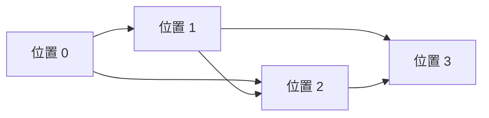
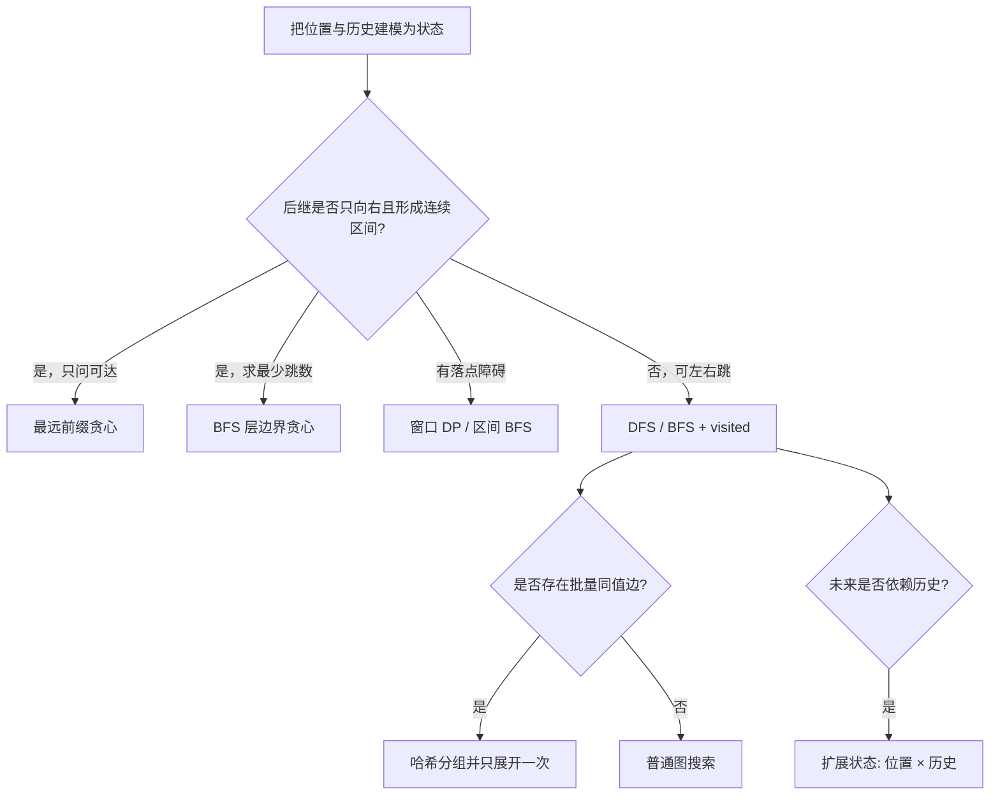

> 本章原文从 PDF 第 1141 页开始，到第 24 章“迷宫问题”之前结束，依次介绍跳跃问题的统一状态建模，以及 LeetCode 45、55、1871、1306、1345、1654 六道题。本文严格沿用原书小节顺序；书外的证明、优化、替代方法和边界分析均明确标注为“补充”。

## 本章要解决什么问题

所谓“跳跃问题”，表面上是在数组下标、字符串位置或数轴坐标之间移动，本质上是在一个**隐式状态图**中寻找：

- 是否存在从起点到终点的路径；
- 到达终点至少需要多少次跳跃；
- 哪些状态必须纳入搜索，哪些状态可以安全压缩；
- 何时能用贪心维护一个最远边界，何时必须用 BFS/DFS 逐状态访问。

这类问题最容易出现两个误解：

1. “每次跳到当前最远位置”不一定最优；真正重要的是该位置下一步能把边界推进多远。
2. 所有题目都叫“跳跃游戏”，不代表它们能套同一个贪心模板。只要允许后退、同值跳转、跳跃距离范围受限或存在连续字符约束，状态图的结构就会改变。

本章的主线是：先把题目翻译成状态与边，再根据图的特殊结构选择 DP、贪心、DFS 或 BFS。

## 23.1 跳跃问题概述

### 1. 基本模型

给定长度为 $n$ 的非负整数数组

$$
a=(a_0,a_1,\ldots,a_{n-1}),
$$

其中 $a_i$ 表示站在下标 $i$ 时，最多可以向右跳 $a_i$ 步。

把每个位置 $i$ 看作一个状态。若

$$
1\le d\le a_i
\quad\text{且}\quad
i+d<n,
$$

则存在一条有向边

$$
i\longrightarrow i+d.
$$

因此数组隐式定义了有向图

$$
G=(V,E),
$$

其中

$$
V=\{0,1,\ldots,n-1\},
$$

$$
E=\{(i,j)\mid 0\le i<j<n,\ j-i\le a_i\}.
$$

“隐式”表示不必真的把所有边存入邻接表；只要站在 $i$，就能按题目规则生成其后继状态。

> 原书的问题描述允许跳跃长度 $j=0$。原地不动不会帮助求可达性或最少正跳数，因此建模时只保留 $d\ge1$ 的有效转移。

### 2. 例子：`[2,2,1,2]`

从位置 0 可以跳到 1 或 2：



到达位置 3 的三条简单路径是：

```text
0 → 1 → 3
0 → 2 → 3
0 → 1 → 2 → 3
```

前两条包含 2 条边，第三条包含 3 条边，所以最少跳跃次数为 2。

这里“跳跃次数”等于路径边数，而不是经过的顶点数。起点到自身不需要跳跃：

$$
distance(0,0)=0.
$$

### 3. 四类求解方法

#### 3.1 回溯法：枚举完整路径

回溯法从位置 0 深度优先选择下一跳，枚举所有可能路径，再比较长度。

若很多位置都能跳到大量后继，搜索树分支数会迅速增长。粗略地说，若每层平均有 $b$ 个选择、路径深度为 $h$，时间可能达到

$$
O(b^h),
$$

属于指数级。它适合：

- 输入很小；
- 需要输出所有路径；
- 需要在搜索过程中加入复杂约束。

仅求可达性或最短跳数时，枚举所有路径通常做了大量重复工作。

#### 3.2 分支限界法/BFS：按跳数逐层扩展

所有跳跃边的代价都为 1，所以 BFS 第一次到达终点时，所处层数就是最少跳数。

普通 BFS 至多访问 $n$ 个位置，但若对位置 $i$ 显式枚举 $a_i$ 条边，最坏边数可能为

$$
|E|=\Theta(n^2).
$$

因此“BFS 是否超时”不能只看搜索树直觉，还取决于是否会重复生成稠密的区间边。本章后面的题会用区间扫描、删除已访问位置或同值分组来减少边生成成本。

> **补充：原文复杂度边界。** 原书将基本问题的分支限界法笼统描述为指数级。若使用集合 `visited` 对位置去重，状态数只有 $n$，并不会重复扩展同一状态；真正的最坏瓶颈是可能显式扫描 $\Theta(n^2)$ 条跳跃边。若不去重、按路径结点扩展，才会形成指数级搜索树。

#### 3.3 动态规划：保存每个位置的最优值

当跳跃只向右时，状态图是按下标递增的有向无环图。可以定义

$$
dp[j]=\text{从位置 0 到位置 }j\text{ 的最少跳跃次数},
$$

再从较小下标向较大下标转移。

DP 避免了重复求同一位置，但若每个 $j$ 都检查全部前驱 $i<j$，时间仍为 $O(n^2)$。

#### 3.4 贪心法：压缩一整层状态

某些向右跳问题具有一个特殊性质：从已经可达的一段前缀出发，下一跳可达位置的并集仍是连续前缀。此时不必保存层内每个位置，只需保存最远右边界。

若能证明：

- 更远的可达边界不会减少未来选择；
- 当前层内具体从哪个位置到达并不影响后续，只影响下一层最远边界；

就可以把 BFS 的整层状态压缩成常数个变量，得到线性贪心。

### 4. 如何选择方法

| 图结构/任务 | 典型方法 | 原因 |
| --- | --- | --- |
| 只向右，后继是连续前缀，求能否到达 | 最远边界贪心 | 可达集合可压缩为前缀右端点 |
| 只向右，求最少跳数 | BFS 分层边界贪心 | 每层可压缩为连续区间 |
| 只向右，但落点必须满足字符条件 | 区间 BFS / DP | 单一最远边界不能表达合法落点 |
| 可向左或向右 | DFS/BFS + `visited` | 状态图有环，不能按下标单向递推 |
| 有同值任意跳转 | BFS + 值分组去重 | 需要避免同值边反复展开 |
| 状态还依赖“上一步方向”等历史 | 扩展状态 BFS | 仅用位置无法决定未来合法动作 |

#### C++17：基础模型的显式分层 BFS

下面的共享基础函数直接在隐式图上做 BFS。`layerSize` 固定本轮队列长度，因此外层循环每完成一次，恰好走完一层、增加一次跳跃；它仍会显式扫描区间边，最坏时间为 $O(n^2)$，后文的优化正是从压缩或去重这些边开始。

```cpp
int minimumJumpsBfsBasic(const vector<int>& nums) {
  if (nums.empty()) {
    return -1;
  }

  queue<int> states;
  vector<bool> visited(nums.size(), false);
  states.push(0);
  visited[0] = true;
  int jumps = 0;

  while (!states.empty()) {
    int layerSize = static_cast<int>(states.size());
    for (int count = 0; count < layerSize; ++count) {
      int index = states.front();
      states.pop();
      if (index == static_cast<int>(nums.size()) - 1) {
        return jumps;
      }

      int right = min(
        static_cast<int>(nums.size()) - 1,
        index + nums[index]
      );
      for (int nextIndex = index + 1; nextIndex <= right; ++nextIndex) {
        if (!visited[nextIndex]) {
          visited[nextIndex] = true;
          states.push(nextIndex);
        }
      }
    }
    ++jumps;
  }
  return -1;
}
```

## 23.2 跳跃问题的求解

### 23.2.1 LeetCode 45：跳跃游戏 II（★★）

#### 问题定义

给定长度为 $n$ 的非负整数数组 `nums`。站在位置 $i$ 时，可以向右跳 $1$ 到 `nums[i]` 步。求从 0 到 $n-1$ 的最少跳跃次数。

原题保证终点可达。约束为：

$$
1\le n\le10^4,
\qquad
0\le nums[i]\le1000.
$$

样例：

```text
nums = [2,3,1,1,4]
```

最优路径可以是

$$
0\to1\to4,
$$

答案为 2。

难点不在“跳得远”，而在“选择哪个落点能让下一层覆盖得最远”。若第一步机械跳到当前位置能直接到达的最远位置 2，只能走：

$$
0\to2\to3\to4,
$$

需要 3 次，反而不如先落在位置 1。

#### 解法一：动态规划

定义：

$$
dp[j]=\text{从位置 0 到位置 }j\text{ 的最少跳跃次数}.
$$

边界条件：

$$
dp[0]=0,
$$

因为起点不需要跳跃；其他位置先设为正无穷：

$$
dp[j]=+\infty\quad(j>0).
$$

位置 $i$ 能直接跳到 $j$ 的条件是：

$$
0\le i<j,
\qquad
i+nums[i]\ge j.
$$

若最后一跳从 $i$ 到 $j$，总跳数是 $dp[i]+1$。枚举所有合法前驱并取最小值：

$$
dp[j]
=
\min_{\substack{0\le i<j\\i+nums[i]\ge j}}
\left(dp[i]+1\right).
$$

若合法前驱集合为空，则 $dp[j]=+\infty$。

#### 为什么按下标递增计算

所有边都从较小下标指向较大下标，所以求 `dp[j]` 时只依赖 `dp[0...j-1]`。按

$$
j=1,2,\ldots,n-1
$$

的顺序计算满足无后效性。

样例的 DP 过程：

| $j$ | 合法前驱 | 候选值 | $dp[j]$ |
| --- | --- | --- | --- |
| 0 | 起点 | 0 | 0 |
| 1 | 0 | $dp[0]+1=1$ | 1 |
| 2 | 0、1 | 1、2 | 1 |
| 3 | 1、2 | 2、2 | 2 |
| 4 | 1、3 | 2、3 | 2 |

时间复杂度为

$$
O(n^2),
$$

空间复杂度为 $O(n)$。原书给出的 Python 版本在大输入上超时，原因正是二重循环。

#### 解法二：原书的贪心选择

假设当前站在位置 $i$，一跳可落入：

$$
[i+1,\ i+nums[i]].
$$

不应直接选择下标最大的落点，而应选择使“再下一步最远位置”最大的落点：

$$
j^*
=
\arg\max_{j\in[i+1,\ i+nums[i]]}
\left(j+nums[j]\right).
$$

选择 $j^*$ 后再重复，直到终点。这揭示了正确直觉：评价落点的标准不是 $j$ 本身，而是它能把下一层边界推进到哪里。

#### 补充：线性 BFS 分层贪心

只求最少次数时，不必显式选择并记录一条路径。把 BFS 的一整层压缩成两个右边界：

- `current_end`：使用当前跳数能够到达的最远位置；
- `farthest`：扫描当前层所有位置后，再跳一次能够到达的最远位置。

扫描位置 $i=0,1,\ldots,n-2$，不断更新：

$$
farthest
\leftarrow
\max(farthest,\ i+nums[i]).
$$

当

$$
i=currentEnd
$$

时，说明当前 BFS 层已扫描完。若还未覆盖终点，必须增加一次跳跃，并令：

$$
jumps\leftarrow jumps+1,
$$

$$
currentEnd\leftarrow farthest.
$$

只扫描到 $n-2$，因为到达最后位置后不需要再起跳。

#### 样例走查

对 `nums=[2,3,1,1,4]`：

| 扫描位置 $i$ | $i+nums[i]$ | `farthest` | 是否到层边界 | `jumps` / 新边界 |
| --- | ---: | ---: | --- | --- |
| 0 | 2 | 2 | 是，`current_end=0` | 1 / 2 |
| 1 | 4 | 4 | 否 | 1 / 2 |
| 2 | 3 | 4 | 是，`current_end=2` | 2 / 4 |

第二层边界已经覆盖位置 4，因此答案为 2。

#### 正确性证明

令

$$
R_t=\text{至多跳 }t\text{ 次能够到达的最远下标}.
$$

初始

$$
R_0=0.
$$

因为从任意已可达位置 $i\le R_t$ 可以跳到 $i+nums[i]$，所以下一层最远边界是：

$$
R_{t+1}
=
\max_{0\le i\le R_t}
\left(i+nums[i]\right).
$$

算法在扫描完当前层新增的位置后，`farthest` 恰好等于这个最大值，随后把 `current_end` 更新为 $R_{t+1}$。

由归纳法：

1. 扫描第 $t$ 层前，`current_end=R_t`；
2. 扫描层内所有位置后，算法计算出全部可能的一跳扩展最大值 $R_{t+1}$；
3. 每跨过一次层边界，跳数恰加 1。

终点第一次落入某个边界 $R_t$ 时，存在 $t$ 跳路径；而它不在 $R_{t-1}$ 内，所以少于 $t$ 跳不可能到达。因此返回值最小。

#### 复杂度与边界

- 每个下标至多扫描一次，时间 $O(n)$；
- 只使用常数个变量，空间 $O(1)$；
- $n=1$ 时起点就是终点，答案为 0；
- 原题保证可达。若取消该保证，当层结束时出现

  $$
  farthest=currentEnd<n-1
  $$

  就表示无法继续，应返回 -1。

> **补充：路径重建。** 常数空间分层算法只返回次数。若要输出具体落点，可在每层记录产生最大 `farthest` 的下标，或直接用 BFS 前驱数组；此时需要额外空间，而且并列最优路径可能不唯一。

#### C++17：BFS 层边界贪心

```cpp
int minimumJumps(const vector<int>& nums) {
  if (nums.size() == 1) {
    return 0;
  }

  int jumps = 0;
  int currentEnd = 0;
  int farthest = 0;

  // 最后一个位置无需再起跳，只扫描到 n-2。
  for (int index = 0; index + 1 < static_cast<int>(nums.size()); ++index) {
    if (index > farthest) {
      return -1;
    }
    farthest = max(farthest, index + nums[index]);

    // 扫完当前 BFS 层后，才提交一次跳跃。
    if (index == currentEnd) {
      if (farthest == currentEnd) {
        return -1;
      }
      ++jumps;
      currentEnd = farthest;
      if (currentEnd >= static_cast<int>(nums.size()) - 1) {
        return jumps;
      }
    }
  }
  return -1;
}
```

### 23.2.2 LeetCode 55：跳跃游戏（★★）

#### 问题定义

给定非负整数数组 `nums`，初始位于下标 0，`nums[i]` 是位置 $i$ 的最大向右跳跃长度。判断能否到达下标 $n-1$。

样例一：

```text
nums = [2,3,1,1,4]
输出：true
```

路径可以是 $0\to1\to4$。

样例二：

```text
nums = [3,2,1,0,4]
输出：false
```

位置 0～3 虽然可达，但所有这些位置最多只能覆盖到 3，无法越过值为 0 的位置 3。

约束：

$$
1\le n\le3\times10^4,
\qquad
0\le nums[i]\le10^5.
$$

与上一题相比，本题只问可达性，不需要区分“第几跳到达”。这使状态可以进一步压缩为一个最远可达下标。

#### 解法一：回溯法

原书从目标位置向前寻找前驱。定义：

$$
reachable(i)=\text{是否能从 0 到达位置 }i.
$$

边界：

$$
reachable(0)=true.
$$

对 $i>0$，只要存在某个较早位置 $j$ 满足：

$$
0\le j<i,
$$

$$
j+nums[j]\ge i,
$$

且 `reachable(j)` 为真，就能到达 $i$：

$$
reachable(i)
=
\bigvee_{\substack{0\le j<i\\j+nums[j]\ge i}}
reachable(j).
$$

其中 $\bigvee$ 表示逻辑“或”。

直接递归会多次求相同的 `reachable(j)`，最坏形成指数级调用树；加入记忆化后每个位置只求一次，但每个状态仍可能扫描 $O(n)$ 个前驱，总时间 $O(n^2)$、空间 $O(n)$。

这种方法准确表达了定义，却没有利用“从可达位置可以覆盖连续右侧区间”的结构。

#### 解法二：最远位置 DP

原书定义：

$$
dp[i]
=\text{处理位置 }0\ldots i\text{ 后，从其中可达位置出发能够覆盖的最远下标}.
$$

初始：

$$
dp[0]=nums[0].
$$

当位置 $i$ 本身可达，即

$$
i\le dp[i-1],
$$

才能使用位置 $i$ 的跳跃能力。此时：

$$
dp[i]
=
\max\left(dp[i-1],\ i+nums[i]\right).
$$

若

$$
i>dp[i-1],
$$

说明在此前所有可达位置中，没有任何位置能跳到 $i$。由于跳跃只向右，后面的所有位置更不可能凭空可达，可以立即返回 `false`。

> **边界说明**：只写 `dp[i]=max(dp[i-1],i+nums[i])` 而不检查 $i$ 是否可达，会错误使用不可达位置的跳跃能力。原书算法通过遇到停滞位置时提前返回来避免这一问题；把可达条件写进转移更严格。

对 `[2,3,1,1,4]`：

| $i$ | $i$ 是否可达 | $i+nums[i]$ | 最远覆盖 |
| ---: | --- | ---: | ---: |
| 0 | 是 | 2 | 2 |
| 1 | $1\le2$ | 4 | 4 |

此时最远覆盖已经达到终点下标 4，可以返回 `true`，无需继续扫描。

对 `[3,2,1,0,4]`：

| $i$ | $i+nums[i]$ | 最远覆盖 |
| ---: | ---: | ---: |
| 0 | 3 | 3 |
| 1 | 3 | 3 |
| 2 | 3 | 3 |
| 3 | 3 | 3 |

扫描完位置 3 后边界仍为 3，位置 4 不可达，返回 `false`。

DP 时间 $O(n)$、空间 $O(n)$。

#### 滚动变量与贪心法

由于 `dp[i]` 只依赖上一个最远边界，可把整个数组压缩为：

$$
farthest
=\text{当前已经确认可达的最远下标}.
$$

从左到右扫描位置 $i$：

1. 若 $i>farthest$，当前位置不可达，返回 `false`；
2. 否则更新

  $$
  farthest
  \leftarrow
  \max(farthest,\ i+nums[i]);
  $$

3. 若 $farthest\ge n-1$，返回 `true`。

这既可视为滚动 DP，也可视为贪心：始终保留当前所有可达选择中最远的覆盖边界，不关心具体路径。

#### 正确性证明

循环不变量：在处理位置 $i$ 前，`farthest` 等于从所有已经扫描且可达的位置出发，能够直接或间接覆盖的最远下标；因此所有位置

$$
[0,farthest]
$$

都可达。

为什么中间没有空洞？若某个可达位置 $j$ 最远能跳到 $r=j+nums[j]$，它可以选择 $1$ 到 `nums[j]` 的任意跳长，所以区间

$$
[j+1,r]
$$

全部可达。多个这样的区间与已有可达前缀相连，其并集仍是连续前缀。

归纳步骤：

- 若 $i\le farthest$，位置 $i$ 可达，把它能覆盖的右端点 $i+nums[i]$ 纳入最大值后，不变量继续成立；
- 若 $i>farthest$，可达前缀在 $i$ 之前结束。任何后续位置都只能由更早位置跳入，而所有更早可达位置的最大能力已经计入 `farthest`，所以终点不可达。

最终若 `farthest >= n-1`，终点落在可达前缀内；否则不可达。

#### 复杂度与边界

- 时间 $O(n)$；
- 额外空间 $O(1)$；
- $n=1$ 时无需跳跃，应返回 `true`，即使 `nums[0]=0`；
- `nums[0]=0` 且 $n>1$ 时返回 `false`；
- 不要用“当前位置值为 0 就一定失败”：如果此前某位置已经越过它，可以不落在这个 0 上。

#### 与跳跃游戏 II 的区别

| 题目 | 需要维护的结构 | 原因 |
| --- | --- | --- |
| LeetCode 55 | 一个最远可达边界 | 只判断是否存在路径 |
| LeetCode 45 | 当前层边界 + 下一层最远边界 | 还要区分最少跳数的 BFS 层次 |

两题都更新 `farthest`，但提交答案的时机不同：Jump Game I 只要确认扫描位置没有越过 `farthest`，就能继续扩张可达前缀；Jump Game II 只能在 `index==currentEnd` 时把整层的 `farthest` 提交为下一层边界。把后者误写成“每扫描一个位置就增加跳数”，会把同一 BFS 层重复计数。

#### C++17：最远可达边界

```cpp
bool canJump(const vector<int>& nums) {
  int farthest = 0;
  for (int index = 0; index < static_cast<int>(nums.size()); ++index) {
    if (index > farthest) {
      return false;
    }
    farthest = max(farthest, index + nums[index]);
    if (farthest >= static_cast<int>(nums.size()) - 1) {
      return true;
    }
  }
  return true;
}
```

### 23.2.3 LeetCode 1871：跳跃游戏 VII（★★）

#### 问题定义

给定二进制字符串 $s$ 和整数 `minJump`、`maxJump`。初始位于下标 0，且 $s[0]='0'$。从位置 $i$ 可以跳到位置 $j$，当且仅当：

$$
i+minJump\le j\le\min(i+maxJump,n-1),
$$

并且：

$$
s[j]='0'.
$$

判断能否到达 $n-1$。

样例：

```text
s = "011010", minJump = 2, maxJump = 3
输出：true
```

一条路径为：

$$
0\to3\to5.
$$

约束：

$$
2\le n\le10^5,
$$

$$
1\le minJump\le maxJump<n.
$$

#### 为什么 LeetCode 55 的单一边界不够

在 LeetCode 55 中，从可达位置出发，可以落到一个没有障碍的连续区间；因此“所有可达位置的并集”是连续前缀。

本题只有字符 `'0'` 可以落脚。即使最远位置很靠右，中间可落脚的零可能是离散的；未来跳跃还要求落点与某个具体可达零之间的距离处于 `[minJump,maxJump]`。因此必须保留“哪些位置可达”或至少保留窗口中可达位置的数量。

#### 解法一：动态规划

定义布尔状态：

$$
dp[i]
=
\begin{cases}
1,&\text{位置 }i\text{ 可达},\\
0,&\text{位置 }i\text{ 不可达}.
\end{cases}
$$

初始：

$$
dp[0]=1.
$$

若要从前驱 $j$ 跳到 $i$，由跳长约束：

$$
minJump\le i-j\le maxJump.
$$

移项得：

$$
i-maxJump\le j\le i-minJump.
$$

考虑数组边界，前驱区间为：

$$
L_i=\max(0,i-maxJump),
$$

$$
R_i=i-minJump.
$$

位置 $i$ 可达，当且仅当：

1. $s[i]='0'$；
2. $R_i\ge0$；
3. 区间 $[L_i,R_i]$ 中至少有一个可达位置。

严格写成：

$$
dp[i]
=
\mathbf 1[s[i]='0']
\land
\mathbf 1\left[\sum_{j=L_i}^{R_i}dp[j]>0\right].
$$

其中 $\mathbf 1[P]$ 表示命题 $P$ 成立时取 1，否则取 0。

直接求区间和会使每个状态扫描最多 `maxJump-minJump+1` 个位置，最坏 $O(n^2)$。

#### 前缀和优化

定义：

$$
prefix[k]
=
\sum_{j=0}^{k-1}dp[j],
$$

即 `prefix[k]` 是 `dp` 前 $k$ 项之和，`prefix[0]=0`。于是闭区间和为：

$$
\sum_{j=L_i}^{R_i}dp[j]
=prefix[R_i+1]-prefix[L_i].
$$

每个区间查询降为 $O(1)$。求出 `dp[i]` 后同步更新：

$$
prefix[i+1]=prefix[i]+dp[i].
$$

> **原文勘误说明**：原文写“若区间和等于 1，则存在可达位置”。区间内可能有多个可达位置，正确判断是区间和**大于 0**。

#### 样例推演

对 `s="011010"`、`minJump=2`、`maxJump=3`：

| $i$ | $s[i]$ | 前驱区间 $[L_i,R_i]$ | 可达前驱数 | $dp[i]$ |
| ---: | --- | --- | ---: | ---: |
| 0 | 0 | 起点 | - | 1 |
| 1 | 1 | 空 | 0 | 0 |
| 2 | 1 | $[0,0]$ | 1，但不可落脚 | 0 |
| 3 | 0 | $[0,1]$ | 1 | 1 |
| 4 | 1 | $[1,2]$ | 0 | 0 |
| 5 | 0 | $[2,3]$ | 1 | 1 |

所以 `dp[5]=1`，终点可达。

时间复杂度 $O(n)$，空间复杂度 $O(n)$。

#### 补充：滑动窗口等价实现

随着 $i$ 增加，前驱区间两端都恰好右移 1。可维护窗口内可达位置数 `window`：

- 加入刚进入窗口的 `dp[i-minJump]`；
- 删除刚离开窗口的 `dp[i-maxJump-1]`；
- 若 `s[i]=='0'` 且 `window>0`，令 `dp[i]=true`。

公式为：

$$
window_i
=window_{i-1}
+dp[i-minJump]
-dp[i-maxJump-1],
$$

越界项按 0 处理。它与前缀和查询完全等价，时间 $O(n)$，仍需 $O(n)$ 的 `dp` 保存将来要移出窗口的值。

#### 解法二：原书的优先队列式分支限界

原书还从位置 0 搜索所有可达零，并使用大根堆优先扩展下标最大的候选。这样做的直觉是尽量先推进右侧前沿。

设当前弹出的最大可达位置为 $i$。如果：

$$
s[i+1\ldots\min(i+maxJump,n-1)]
$$

全为 `'1'`，则当前最右前沿无法再落脚。堆中其余候选都小于 $i$，它们一步能到达的最远位置也不超过 $i+maxJump$，因而同样无法越过这一整段障碍，可以剪枝返回 `false`。

为了 $O(1)$ 判断某段是否全为 `'1'`，原书对字符 `'1'` 建立前缀和。设：

$$
ones[k]=\text{前 }k\text{ 个字符中 `'1'` 的数量},
$$

则区间 $[l,r]$ 的 `'1'` 数为：

$$
ones[r+1]-ones[l].
$$

若该值等于区间长度 $r-l+1$，区间全为 `'1'`。

这种方法需要同时保证：

- 每个位置只入堆/扩展一次，否则会重复搜索；
- 只对合法的 `'0'` 落点入堆；
- 正确裁剪超过字符串末尾的右边界。

堆操作引入 $O(\log n)$ 开销，而且证明依赖“当前弹出的是最右候选”的特殊顺序；相比之下，前缀和 DP 更直接，最坏时间稳定为 $O(n)$。

#### 补充：线性区间 BFS

还可以用普通队列做 BFS，并维护 `nextUnscanned`，表示尚未检查的最小下标。弹出可达位置 $i$ 时，只扫描：

$$
[\max(i+minJump,nextUnscanned),\ \min(i+maxJump,n-1)].
$$

扫描后令：

$$
nextUnscanned
\leftarrow
\max(nextUnscanned,i+maxJump+1).
$$

这样每个下标全局只被检查一次，总时间 $O(n)$。它比大根堆更接近标准 BFS，也可自然扩展为求最少跳数。

#### 边界与常见错误

- 若 $s[n-1]='1'$，终点不能落脚，直接返回 `false`；
- 前驱区间左端必须截断到 0；当 $R_i<0$ 时区间为空；
- 区间中存在可达位置应判断“和 $>0$”，不是“和 $=1$”；
- 不能只记录最右可达零：较左的可达零可能恰好满足下一落点的最小/最大跳长约束。

对样例的滑动窗口再看两个相邻位置：计算 $i=4$ 时，前驱窗从 $[0,1]$ 移到 $[1,2]$，所以加入 `dp[2]`、移出 `dp[0]`，窗口计数从 1 变为 0；计算 $i=5$ 时再加入 `dp[3]`、移出 `dp[1]`，计数回到 1。这里必须知道窗口内仍有哪些可达前驱，仅知道历史最右可达位置 3，无法复原 $i=4$ 的合法前驱窗是否为空。

#### C++17：滑动窗口前驱 DP

```cpp
bool canReachBinaryString(
  const string& value,
  int minimumJump,
  int maximumJump
) {
  if (value.empty() || value.front() != '0' || value.back() != '0') {
    return false;
  }

  vector<int> reachable(value.size(), 0);
  reachable[0] = 1;
  int reachableInWindow = 0;

  for (int index = 1; index < static_cast<int>(value.size()); ++index) {
    // dp[index-minimumJump] 刚进入合法前驱窗口。
    if (index - minimumJump >= 0) {
      reachableInWindow += reachable[index - minimumJump];
    }
    // dp[index-maximumJump-1] 刚离开合法前驱窗口。
    if (index - maximumJump - 1 >= 0) {
      reachableInWindow -= reachable[index - maximumJump - 1];
    }
    reachable[index] = value[index] == '0' && reachableInWindow > 0;
  }
  return reachable.back() != 0;
}
```

### 23.2.4 LeetCode 1306：跳跃游戏 III（★★）

#### 问题定义

给定非负整数数组 `arr` 和起始下标 `start`。位于 $i$ 时，下一步只能跳到：

$$
i+arr[i]
$$

或：

$$
i-arr[i],
$$

且落点必须满足 $0\le j<n$。判断是否能到达任意一个值为 0 的位置。

样例：

```text
arr = [4,2,3,0,3,1,2], start = 5
输出：true
```

两条可行路径是：

$$
5\to4\to1\to3,
$$

$$
5\to6\to4\to1\to3.
$$

约束：

$$
1\le n\le5\times10^4,
$$

$$
0\le arr[i]<n,
\qquad
0\le start<n.
$$

#### 为什么不能再按下标递推

本题允许向左跳，状态图可能出现环。例如：

$$
i\to j\to i.
$$

当 `arr[i]=0` 时还存在自环 $i\to i$。因此：

- 不能按下标从小到大做无环 DP；
- 不能用“最远可达前缀”概括可达集合；
- DFS/BFS 必须记录已经访问的位置，否则可能无限循环。

图中每个顶点最多有两条出边：

$$
E_i=\{i-arr[i],\ i+arr[i]\}\cap[0,n-1].
$$

问题就是从 `start` 出发，是否能到达目标集合：

$$
Z=\{i\mid arr[i]=0\}.
$$

#### 解法一：深度优先搜索

定义 `dfs(i)` 表示从位置 $i$ 出发，能否到达某个零位置。

1. 若 $i$ 越界或已经访问，返回 `false`；
2. 标记 `visited[i]=true`；
3. 若 `arr[i]==0`，返回 `true`；
4. 递归搜索 $i+arr[i]$ 与 $i-arr[i]$，任一返回真即可。

递归关系可写为：

$$
dfs(i)
=
\mathbf 1[arr[i]=0]
\lor dfs(i+arr[i])
\lor dfs(i-arr[i]),
$$

但该式只在“越界和已访问状态返回假”的约束下成立。

#### 为什么必须先标记再递归

若等递归返回后才标记，环 $i\to j\to i$ 会在两个调用之间无限往返。进入状态时立即标记，保证同一位置最多展开一次。

#### 解法二：广度优先搜索

把 `start` 入队并标记访问。每次弹出位置 $i$：

- 若 `arr[i]==0`，返回 `true`；
- 生成两个候选 $i-arr[i]$、$i+arr[i]$；
- 对每个合法且未访问候选，入队并立即标记。

队列耗尽仍未找到零时返回 `false`。

#### DFS 与 BFS 的选择

本题只返回布尔值，不要求最少跳数，所以 DFS 和 BFS 都正确；二者都会遍历起点可达的状态子图。

| 方法 | 优点 | 风险 |
| --- | --- | --- |
| 递归 DFS | 代码直接，找到目标可立即返回 | 最深可达 $n$ 层，Python/C++ 可能栈溢出 |
| 迭代 DFS | 无递归栈风险 | 不保证先找到短路径，但本题不需要 |
| BFS | 队列稳定，若扩展为最少跳数可直接复用 | 队列最坏保存 $O(n)$ 状态 |

本文完整程序采用 BFS。

#### 正确性证明

搜索不变量：队列/栈中的每个位置都能从 `start` 通过合法跳跃到达。

- 初始 `start` 显然可达；
- 从可达位置 $i$ 生成的合法后继 $i\pm arr[i]$ 也可达；
- 搜索检查每个可达位置的全部合法出边，且 `visited` 只删除重复状态，不删除任何首次可达状态。

因此：若搜索遇到 `arr[i]=0`，存在合法路径；若搜索耗尽，则所有从起点可达的位置都已检查，其中没有零，答案为假。

#### 复杂度与边界

每个位置最多访问一次、每次检查两条边：

$$
T(n)=O(n),
\qquad
S(n)=O(n).
$$

- 若 `arr[start]==0`，无需跳跃即可成功；
- `arr[i]==0` 同时意味着目标和自环，必须先检查目标再考虑扩展；
- 标记应在入队时完成，若等到出队才标记，同一位置可能被多个前驱重复入队。

#### C++17：带访问标记的 BFS

```cpp
bool canReachZero(const vector<int>& values, int start) {
  queue<int> states;
  vector<bool> visited(values.size(), false);
  states.push(start);
  visited[start] = true;

  while (!states.empty()) {
    int index = states.front();
    states.pop();
    if (values[index] == 0) {
      return true;
    }

    int candidates[2] = {index - values[index], index + values[index]};
    for (int nextIndex : candidates) {
      if (
        nextIndex >= 0 &&
        nextIndex < static_cast<int>(values.size()) &&
        !visited[nextIndex]
      ) {
        // 在入队时标记，环和零值自环都不会重复入队。
        visited[nextIndex] = true;
        states.push(nextIndex);
      }
    }
  }
  return false;
}
```

### 23.2.5 LeetCode 1345：跳跃游戏 IV（★★★）

#### 问题定义

给定整数数组 `arr`，从下标 0 出发。位于下标 $i$ 时，一步可以跳到：

1. $i-1$，若 $i-1\ge0$；
2. $i+1$，若 $i+1<n$；
3. 任意 $j\ne i$，若 $arr[j]=arr[i]$。

求到达 $n-1$ 的最少跳跃次数。

样例：

```text
arr = [100,-23,-23,404,100,23,23,23,3,404]
输出：3
```

最短路径为：

$$
0\to4\to3\to9.
$$

其中 $0\to4$ 使用相同值 100，$3\to9$ 使用相同值 404。

#### 为什么使用 BFS

每种跳跃都恰好计 1 步，所以图是单位权图。BFS 按距离层扩展：

$$
L_d=\{i\mid distance(0,i)=d\}.
$$

第一次弹出终点时，不可能存在尚未处理的更短路径，因此当前层数就是答案。

困难在于同值边。若值 $v$ 出现 $k$ 次，这 $k$ 个位置两两相连，显式建边会产生：

$$
k(k-1)=\Theta(k^2)
$$

条有向边。数组全部相等时会退化为 $\Theta(n^2)$。

#### 值到下标列表的哈希表

预处理：

$$
positions[v]=\{i\mid arr[i]=v\}.
$$

弹出位置 $i$ 时，候选集合为：

$$
\{i-1,i+1\}\cup positions[arr[i]].
$$

对每个合法且未访问位置入队。

#### 为什么同值桶只需展开一次

设 BFS 第一次弹出某个值为 $v$ 的位置 $i$，其距离为 $d$。此时遍历 `positions[v]` 后，所有值为 $v$ 且尚未访问的位置都能以距离至多 $d+1$ 入队。

以后再弹出值为 $v$ 的位置 $j$ 时，其距离满足：

$$
distance[j]\ge d.
$$

从 $j$ 再通过同值边到任何位置，候选距离至少为 $d+1$，不可能优于第一次展开得到的距离。因此可以立即删除或清空：

$$
positions[v].
$$

这不是删除图中的必要路径，而是删除已经完成松弛的一整组等价边。

#### 样例分层走查

| 距离 | 新位置 | 关键扩展 |
| ---: | --- | --- |
| 0 | `{0}` | 值 100 的桶展开到 4；相邻到 1 |
| 1 | `{1,4}` | 4 相邻到 3、5；值 100 桶已清空 |
| 2 | `{2,3,5}` 等 | 3 通过值 404 跳到 9 |
| 3 | `{9}` | 首次到达终点 |

答案为 3。

#### 正确性证明

普通相邻边始终被完整检查。同值边在其值第一次被弹出时被完整检查；由上面的距离论证，后续同值展开无法产生更短距离，所以清空桶不会漏掉最短路径。

因此优化后的 BFS 与显式图 BFS 产生相同的最短距离，只是把重复的同值边扫描合并为一次。

#### 复杂度

- 每个下标最多入队一次：$O(n)$；
- 相邻边总计 $O(n)$；
- 每个值桶只展开一次，所有桶长度之和为 $n$；
- 哈希表平均时间复杂度为 $O(n)$，空间 $O(n)$。

若不清空同值桶，最坏会重复扫描大桶，退化为 $O(n^2)$。

#### 边界与进一步优化

- $n=1$ 时起点就是终点，答案为 0；
- 数值可为负数，哈希键不能假设非负或可直接作为小数组下标；
- 必须在入队时标记 `visited`；
- 删除哈希桶比保留一个“该值已展开”集合更直接，二者语义相同。

> **补充：压缩连续相同值。** 若一段连续位置值都相同，中间位置通常不会比两端提供更好的相邻跳转入口，可预先压缩部分重复值以降低常数。但该优化证明和实现更复杂，清空值桶已经能保证 $O(n)$，通常无需加入。

#### C++17：同值桶一次展开的 BFS

```cpp
int minimumJumpsSameValue(const vector<int>& values) {
  if (values.size() == 1) {
    return 0;
  }

  unordered_map<int, vector<int>> positions;
  for (int index = 0; index < static_cast<int>(values.size()); ++index) {
    positions[values[index]].push_back(index);
  }

  queue<pair<int, int>> states;
  vector<bool> visited(values.size(), false);
  states.emplace(0, 0);
  visited[0] = true;

  while (!states.empty()) {
    auto [index, steps] = states.front();
    states.pop();
    if (index == static_cast<int>(values.size()) - 1) {
      return steps;
    }

    auto iterator = positions.find(values[index]);
    if (iterator != positions.end()) {
      for (int nextIndex : iterator->second) {
        if (!visited[nextIndex]) {
          visited[nextIndex] = true;
          states.emplace(nextIndex, steps + 1);
        }
      }
      // 同值边已按最短距离完成松弛，整个桶以后不再展开。
      positions.erase(iterator);
    }

    for (int nextIndex : {index - 1, index + 1}) {
      if (
        nextIndex >= 0 &&
        nextIndex < static_cast<int>(values.size()) &&
        !visited[nextIndex]
      ) {
        visited[nextIndex] = true;
        states.emplace(nextIndex, steps + 1);
      }
    }
  }
  return -1;
}
```

### 23.2.6 LeetCode 1654：到家的最少跳跃次数（★★）

#### 问题定义

跳蚤从数轴位置 0 出发，家在位置 $x$。规则为：

1. 可向右跳恰好 $a$，即 $p\to p+a$；
2. 可向左跳恰好 $b$，即 $p\to p-b$；
3. 不能连续两次向左跳；
4. 不能落在 `forbidden` 中；
5. 位置不能为负数，但允许越过 $x$ 后再返回。

求恰好到达 $x$ 的最少跳数，不可达时返回 -1。

样例：

```text
forbidden = [14,4,18,1,15]
a = 3, b = 15, x = 9
输出：3
```

路径是：

$$
0\to3\to6\to9.
$$

所有输入数值不超过 2000。

#### 难点一：位置不足以描述状态

到达同一位置 $p$ 时，若上一跳是向左，则下一步不能再向左；若上一跳不是向左，则左右都可能合法。两种到达方式的未来选择集合不同。

因此完整状态必须包含历史摘要：

$$
(p,h),
$$

其中：

$$
h=
\begin{cases}
0,&\text{上一跳不是向左，当前允许向左},\\
1,&\text{上一跳是向左，当前禁止向左}.
\end{cases}
$$

仅使用 `visited[p]` 会把 `(p,0)` 与 `(p,1)` 错误合并，可能先以受限状态访问 $p$，随后拒绝一个本可继续向左的非受限状态。

#### 状态转移

从任意状态都可以尝试向右：

$$
(p,h)\longrightarrow(p+a,0).
$$

向右后，上一跳不再是向左，所以标志重置为 0。

只有 $h=0$ 时可以向左：

$$
(p,0)\longrightarrow(p-b,1).
$$

每个候选还必须满足：

$$
0\le next\le U,
$$

$$
next\notin forbidden.
$$

#### 难点二：无限数轴如何截断

若不设置右边界，向右跳可以生成无限多个位置，BFS 即使无解也无法停止。

原书利用题目上界，把有效搜索范围设为：

$$
0\le p\le6000.
$$

因为：

$$
x,\ a,\ b,\ forbidden[i]\le2000.
$$

#### 补充：一般化的安全上界

令：

$$
M=\max\left(x,\max(forbidden)\right),
$$

空禁区时把 $\max(forbidden)$ 视为 0。可取保守上界：

$$
U=M+a+b.
$$

由于 $M,a,b\le2000$，有 $U\le6000$，所以原书常量是该公式在题目约束下的统一上界。

下面给出交换论证。考虑所有最短路径中“访问到的最大坐标最小”的一条，反设它越过 $U$。设 $y$ 是第一次越过 $U$ 前的位置，则：

$$
y+a>U=M+a+b,
$$

所以：

$$
y>M+b.
$$

越界后若最终要回到 $x\le M$，后面必有一次向左跳。设从 $y$ 开始到第一次向左之间有 $k\ge1$ 次向右跳，原片段为：

$$
F^kB,
$$

其中 $F$ 表示 $+a$，$B$ 表示 $-b$。

到达 $y$ 的上一跳不可能是向左：若上一跳是向左，前一位置为 $y+b$。由于这是第一次越过 $U$，有 $y+b\le U$，结合 $y>M+b$ 可推出 $a>b$；但当 $a>b$ 且位置已大于 $M+b$ 时，每次允许的“先右后左”净变化为 $a-b>0$，单次左跳后也仍大于 $M$，不可能回到目标区间，矛盾。

所以上一跳不是向左，可以把上述片段交换为：

$$
BF^k.
$$

两段终点相同，因为：

$$
ka-b=-b+ka.
$$

交换后的第一个位置为 $y-b>M$，既非负，也不在所有禁区所在的 $[0,M]$ 内；后续仍位于无禁区的右侧。交换不增加步数，却把该片段的最高坐标降低了 $b$，并且末步由向左变为向右，只会放宽后续动作。反复交换可以消除所有超过 $U$ 的访问，与“最大坐标最小”矛盾。

因此至少存在一条最短路径完全位于 $[0,U]$。

#### 分层 BFS

建立：

$$
visited[p][h],
\qquad
0\le p\le U,
\quad h\in\{0,1\}.
$$

`visited[p][h]` 表示完整状态 `(p,h)` 是否入队。禁区位置的两个状态都不可访问。

初始状态：

$$
(0,0),
$$

距离为 0。按层处理队列：

1. 当前层所有状态的距离都是 `steps`；
2. 若某状态位置等于 $x$，返回 `steps`；
3. 生成合法的前跳、后跳状态；
4. 当前层处理完后令 `steps++`。

若队列耗尽，则有限状态图中所有可达状态均已访问，返回 -1。

#### 正确性证明

扩展状态 `(p,h)` 包含决定下一步合法性的全部信息，所以状态转移与原题动作一一对应：

- 每条 BFS 边表示一次合法跳跃；
- 每条合法跳跃都由对应转移生成；
- 安全上界保证至少一条最短路径未被截断；
- BFS 按边数递增访问状态，第一次到达任意 `(x,0)` 或 `(x,1)` 时就是最少跳数。

#### 复杂度

状态数最多为：

$$
2(U+1).
$$

每个状态最多产生两条边，因此：

$$
T=O(U),
\qquad
S=O(U).
$$

在原题约束下 $U\le6000$，可视为一个很小的确定上界。

#### 边界与常见错误

- 向右跳无论此前方向如何，都把标志设为 0；
- 向左跳只能从标志 0 出发，并把标志设为 1；
- 禁区必须同时屏蔽两种方向状态；
- 不能把右边界错误设为 $x$，因为合法路径可能先越过家再返回；
- `visited` 必须按“位置 × 方向历史”二维标记；
- 若 $x=0$（虽原题约束通常给 $x\ge1$），答案应为 0。

对本题样例，$M=\max(9,18)=18$，所以 $U=18+3+15=36$。BFS 只需考察位置 $0\ldots36$ 的两种方向状态，共至多 $2\times37=74$ 个；禁区 1、4、14、15、18 的两种状态都跳过。实际第 0～3 层依次包含路径上的 `(0,0)`、`(3,0)`、`(6,0)`、`(9,0)`，在远未触及上界时就返回 3。这个走查同时说明：$U$ 是保证无解时也能停机的搜索边界，不是每条最短路径都必须到达的位置。

#### C++17：位置与方向历史的二维 BFS

```cpp
int minimumJumpsHome(
  const vector<int>& forbidden,
  int forward,
  int backward,
  int target
) {
  if (target == 0) {
    return 0;
  }

  unordered_set<int> blocked(forbidden.begin(), forbidden.end());
  int maximumSpecial = target;
  for (int position : forbidden) {
    maximumSpecial = max(maximumSpecial, position);
  }
  int upperBound = maximumSpecial + forward + backward;

  // visited[p][h] 区分同一位置的两种方向历史。
  queue<tuple<int, int, int>> states;
  vector<array<bool, 2>> visited(upperBound + 1, {false, false});
  states.emplace(0, 0, 0);
  visited[0][0] = true;

  while (!states.empty()) {
    auto [position, lastWasBackward, steps] = states.front();
    states.pop();
    if (position == target) {
      return steps;
    }

    int right = position + forward;
    if (
      right <= upperBound &&
      !blocked.count(right) &&
      !visited[right][0]
    ) {
      visited[right][0] = true;
      states.emplace(right, 0, steps + 1);
    }

    if (lastWasBackward == 0) {
      int left = position - backward;
      if (
        left >= 0 &&
        !blocked.count(left) &&
        !visited[left][1]
      ) {
        visited[left][1] = true;
        states.emplace(left, 1, steps + 1);
      }
    }
  }
  return -1;
}
```

## 推荐练习题

原书给出以下 3 道练习：

1. LeetCode 1340：跳跃游戏 V（★★★）
2. LeetCode 1696：跳跃游戏 VI（★★）
3. LeetCode 2297：跳跃游戏 VIII（★★）

> **补充：练习关注点。** Jump Game V 结合有向无环关系与记忆化 DFS；Jump Game VI 常用 DP 加单调队列优化窗口最大值；Jump Game VIII 需要从“可跳条件”中提炼单调栈边。它们说明“跳跃”只是外观，真正决定方法的是状态图边的结构。

## 代码与公式的对应关系

| 正文公式/不变量 | Python | C++17 | Go 1.22 |
| --- | --- | --- | --- |
| Jump Game II：$farthest=\max(farthest,i+nums[i])$ | `minimum_jumps` | `minimumJumps` | `minimumJumps` |
| Jump Game II：$i=currentEnd$ 时跨入下一层 | `index == current_end` | `index == currentEnd` | `index == currentEnd` |
| Jump Game I：可达前缀右端点 | `can_jump` 中的 `farthest` | `canJump` 中的 `farthest` | `canJump` 中的 `farthest` |
| Jump Game VII：窗口加入 $dp[i-minJump]$ | `reachable_in_window += ...` | `reachableInWindow += ...` | `reachableInWindow += ...` |
| Jump Game VII：窗口移出 $dp[i-maxJump-1]$ | `reachable_in_window -= ...` | `reachableInWindow -= ...` | `reachableInWindow -= ...` |
| Jump Game III：边 $i\to i\pm arr[i]$ | `can_reach_zero` 的二元组 | `candidates[2]` | `candidates [2]int` |
| Jump Game IV：同值桶只展开一次 | `positions.pop` | `positions.erase` | `delete(positions, ...)` |
| 到家问题：状态 $(p,h)$ | `(position,last_was_backward)` | `tuple<int,int,int>` | `HomeState` |
| 到家问题：右跳 $(p,h)\to(p+a,0)$ | `position + forward, 0` | `right` / `visited[right][0]` | `right` / `visited[right][0]` |
| 到家问题：左跳 $(p,0)\to(p-b,1)$ | `position - backward, 1` | `left` / `visited[left][1]` | `left` / `visited[left][1]` |
| 安全上界 $U=M+a+b$ | `upper_bound` | `upperBound` | `upperBound` |

代码没有机械照抄公式，而是把公式中的集合或层次压缩为数据结构：

- 连续可达集合压缩为右端点；
- 滑动前驱集合压缩为窗口计数；
- 一般图可达集合保存为 `visited`；
- 决定未来的历史压缩为一个二值方向标志。

## 三种语言中的实现差异

| 方面 | Python 3 | C++17 | Go 1.22 |
| --- | --- | --- | --- |
| FIFO 队列 | `collections.deque` | `std::queue` | 切片 + `head` 指针 |
| 值到位置列表 | `defaultdict(list)` | `unordered_map<int, vector<int>>` | `map[int][]int` |
| 删除同值桶 | `pop(key, [])` | `erase(iterator)` | `delete(map,key)` |
| 布尔访问数组 | `list[bool]` | `vector<bool>` | `[]bool` |
| 二维方向状态 | `set[(int,int)]` | `vector<array<bool,2>>` | `[][2]bool` |
| 字符访问 | Unicode 字符串索引 | `char` | 字节索引；本题仅含 ASCII `0/1`，语义安全 |
| 队列状态 | 元组 | `pair` / `tuple` | 显式结构体 |

### 队列实现的复杂度细节

Python 使用 `deque.popleft()`，C++ 使用 `queue.pop()`，二者队首删除都是 $O(1)$。

Go 若反复执行 `queue = queue[1:]`，虽然切片操作本身是 $O(1)$，但长期持有底层数组且频繁改写容易增加内存管理复杂度。本文改用递增的 `head`，循环条件为 `head < len(queue)`，每轮通过 `state := queue[head]` 读取队首并令 `head++`。每个状态只读一次，语义与 FIFO 队列一致。

### 整数范围

本章约束下，下标与坐标最大只有几万或 6000 左右，三种语言的普通整数均足够。若把模型扩展到更大坐标：

- C++ 累加 `i+nums[i]` 时可改用 `long long`；
- Go 可显式改用 `int64`；
- Python 整数会自动扩展。

## 原文勘误与边界汇总

1. **基本问题的去重 BFS 不一定是指数级。** 若每个位置只访问一次，状态数是 $O(n)$；最坏瓶颈是显式枚举的区间边可达 $\Theta(n^2)$。只有按路径重复扩展而不做状态去重时，搜索树才可能指数增长。
2. **Jump Game I 的最远位置转移必须只使用可达位置。** 在更新 $i+nums[i]$ 前要保证 $i\le farthest$；否则会借用一个根本到不了的位置继续向右跳。
3. **`nums[0]==0` 不是无条件返回假。** 当 $n=1$ 时起点已经是终点，应返回真；只有 $n>1$ 时才被困住。
4. **Jump Game VII 的前驱区间和应判断大于 0。** 原文写“等于 1”，但区间中可能同时有多个可达位置。
5. **Jump Game VII 的前驱区间要截断。** 左端是 $\max(0,i-maxJump)$；若 $i-minJump<0$，当前不存在前驱。
6. **Jump Game III 的零值既是目标也产生自环。** 搜索应先检查是否命中目标，并用 `visited` 阻止 $i\to i$ 重复扩展。
7. **Jump Game IV 清空的是值桶，不是访问标记。** 桶只控制同值边是否还要扫描；位置是否访问仍由独立 `visited` 决定。
8. **到家问题不能只标记坐标。** `(p,0)` 与 `(p,1)` 的后继集合不同，必须分别访问。
9. **数轴右边界不能直接取目标 $x$。** 最短路径可能先越过目标再向左返回。原书的 6000 是题目约束下的统一安全界，一般可写为 $\max(x,\max forbidden)+a+b$。

## 补充：易混淆概念与常见误解

### 1. “跳到最远”有三种不同含义

| 说法 | 是否正确 | 解释 |
| --- | --- | --- |
| 每次直接落在当前可达的最大下标 | 不一定 | `[2,3,1,1,4]` 中先落在 2 需要 3 跳 |
| 在当前层选择使 $j+nums[j]$ 最大的落点 | 对 Jump Game II 正确 | 它最大化下一层右边界 |
| 只维护所有选择产生的最远边界 | 对 Jump Game I/II 正确 | 依赖可达集合是连续前缀/分层连续区间 |

因此“贪心选择最远”必须说明最远的是**当前落点**、**下一步覆盖端点**，还是**整层可达边界**。

### 2. DFS、BFS 与 DP 都是在处理同一个状态图

- DFS 决定状态访问顺序为深度优先；
- BFS 按单位边数分层，适合最少跳数；
- DP 要求存在可用的无环顺序或可压缩递推关系；
- 贪心进一步证明整组状态可以由边界代表。

方法名不同，并不意味着问题模型不同。先写出状态与边，通常比先猜算法更可靠。

### 3. `visited` 何时是一维，何时必须多维

如果到达位置 $i$ 后，未来合法动作只由 $i$ 决定，一维 `visited[i]` 足够，如 Jump Game III、IV。

如果未来还依赖历史资源或动作，必须扩展状态。例如到家问题中：

$$
state=(position,lastWasBackward).
$$

同样的原则也适用于：

- 已使用多少次折扣；
- 还剩多少次破墙机会；
- 上一步朝哪个方向；
- 当前持有哪些钥匙。

### 4. 为什么在入队时标记访问

若等到出队才标记，两个已出队前驱可能同时发现同一后继，使它重复入队。单位权 BFS 中，第一次发现状态时已经得到最短距离，因此应立即标记，不需要等待出队确认。

### 5. 清空邻接信息为什么有时安全、有时危险

Jump Game IV 可以清空同值桶，是因为第一次展开已经以最小 BFS 距离松弛了桶内全部位置；后续展开不可能改善。

一般图中不能随意删除邻接表。必须证明被删除边：

- 已经完成所有可能的最优松弛；或
- 被另一组不劣的边完全支配。

### 6. 可达性与最短路所需信息不同

Jump Game I 只问是否可达，一个最远边界足够；Jump Game II 还要知道跨了多少层，因此必须区分当前层和下一层。

这说明状态压缩应由输出目标决定：仅保留“能回答最终问题”的信息，不能丢掉目标仍然需要的层次或资源维度。

## 本章总结



本章六道题可以归纳为四次逐步升级：

1. **连续可达前缀。** Jump Game I 只维护最远边界；Jump Game II 再维护 BFS 层边界以计算最少跳数。
2. **带障碍的区间转移。** Jump Game VII 的合法前驱是滑动区间，但落点零是离散的，因此用前缀和或窗口计数判断“区间内是否存在可达状态”。
3. **一般位置图。** Jump Game III 允许左右跳，需要 `visited` 处理环；Jump Game IV 再加入大规模同值边，用哈希桶一次展开把 $O(n^2)$ 隐式边压回 $O(n)$。
4. **历史相关状态。** 到家问题中，位置不能决定下一步能否后跳，必须把上一跳方向纳入状态，并为无限数轴证明有限安全边界。

面对新的跳跃题，可以依次回答：

1. 状态仅是位置，还是还包含次数、方向、资源？
2. 一步能生成哪些边，边权是否都为 1？
3. 状态图是否有环，是否需要 `visited`？
4. 可达集合能否压缩为连续区间或单个边界？
5. 是否存在会被反复扫描的批量边，可否按组只处理一次？
6. 状态空间是否无限，若是，有限截断的证明是什么？

跳跃问题真正训练的不是某一个模板，而是从动作规则中识别图结构，再证明哪些状态必须保留、哪些状态可以安全合并。

## 章末语言附录

### 附录 A：Python 3 完整实现

下面的程序为六道正文题各提供一个推荐实现。Jump Game II 额外处理了原题保证之外的“不可达”输入，返回 -1。

```python
from __future__ import annotations

from collections import defaultdict, deque


def minimum_jumps(nums: list[int]) -> int:
  """LeetCode 45：用压缩后的 BFS 层求最少跳数。"""
  if len(nums) == 1:
    return 0

  jumps = 0
  current_end = 0
  farthest = 0

  # 最后一个位置无需再起跳，所以只扫描到 n-2。
  for index in range(len(nums) - 1):
    if index > farthest:
      return -1
    farthest = max(farthest, index + nums[index])

    # 扫完当前 BFS 层后，提交一次跳跃并进入下一层。
    if index == current_end:
      if farthest == current_end:
        return -1
      jumps += 1
      current_end = farthest
      if current_end >= len(nums) - 1:
        return jumps
  return -1


def can_jump(nums: list[int]) -> bool:
  """LeetCode 55：维护已经确认可达的最远前缀。"""
  farthest = 0
  for index, jump in enumerate(nums):
    if index > farthest:
      return False
    farthest = max(farthest, index + jump)
    if farthest >= len(nums) - 1:
      return True
  return True


def can_reach_binary_string(
  string: str,
  minimum_jump: int,
  maximum_jump: int,
) -> bool:
  """LeetCode 1871：滑动维护合法前驱窗口中的可达位置数。"""
  reachable = [False] * len(string)
  reachable[0] = True
  reachable_in_window = 0

  for index in range(1, len(string)):
    # dp[index-minimum_jump] 刚进入前驱窗口。
    if index - minimum_jump >= 0:
      reachable_in_window += reachable[index - minimum_jump]

    # dp[index-maximum_jump-1] 刚离开前驱窗口。
    if index - maximum_jump - 1 >= 0:
      reachable_in_window -= reachable[index - maximum_jump - 1]

    reachable[index] = string[index] == "0" and reachable_in_window > 0

  return reachable[-1]


def can_reach_zero(values: list[int], start: int) -> bool:
  """LeetCode 1306：在可左右跳跃的位置图中做 BFS。"""
  queue = deque([start])
  visited = [False] * len(values)
  visited[start] = True

  while queue:
    index = queue.popleft()
    if values[index] == 0:
      return True

    for next_index in (index - values[index], index + values[index]):
      if 0 <= next_index < len(values) and not visited[next_index]:
        # 入队时标记，避免同一位置被多个前驱重复加入。
        visited[next_index] = True
        queue.append(next_index)
  return False


def minimum_jumps_same_value(values: list[int]) -> int:
  """LeetCode 1345：BFS，并让每个同值下标桶只展开一次。"""
  if len(values) == 1:
    return 0

  positions: dict[int, list[int]] = defaultdict(list)
  for index, value in enumerate(values):
    positions[value].append(index)

  queue = deque([(0, 0)])
  visited = [False] * len(values)
  visited[0] = True

  while queue:
    index, steps = queue.popleft()
    if index == len(values) - 1:
      return steps

    # pop 会删除整个桶，保证所有同值边全局只扫描一次。
    same_value_positions = positions.pop(values[index], [])
    candidates = same_value_positions + [index - 1, index + 1]
    for next_index in candidates:
      if 0 <= next_index < len(values) and not visited[next_index]:
        visited[next_index] = True
        queue.append((next_index, steps + 1))
  return -1


def minimum_jumps_home(
  forbidden: list[int],
  forward: int,
  backward: int,
  target: int,
) -> int:
  """LeetCode 1654：在 (位置, 上一步是否后跳) 状态图中做 BFS。"""
  if target == 0:
    return 0

  blocked = set(forbidden)
  upper_bound = max([target, *forbidden]) + forward + backward

  # last_was_backward 为 1 时，下一步不能继续向左。
  queue = deque([(0, 0, 0)])
  visited = {(0, 0)}

  while queue:
    position, last_was_backward, steps = queue.popleft()
    if position == target:
      return steps

    next_states = [(position + forward, 0)]
    if last_was_backward == 0:
      next_states.append((position - backward, 1))

    for next_position, next_flag in next_states:
      state = (next_position, next_flag)
      if (
        0 <= next_position <= upper_bound
        and next_position not in blocked
        and state not in visited
      ):
        visited.add(state)
        queue.append((next_position, next_flag, steps + 1))
  return -1


if __name__ == "__main__":
  print("jump_game_ii:", minimum_jumps([2, 3, 1, 1, 4]))
  print("jump_game_i_reachable:", can_jump([2, 3, 1, 1, 4]))
  print("jump_game_i_blocked:", can_jump([3, 2, 1, 0, 4]))
  print(
    "jump_game_vii:",
    can_reach_binary_string("011010", 2, 3),
  )
  print(
    "jump_game_iii:",
    can_reach_zero([4, 2, 3, 0, 3, 1, 2], 5),
  )
  print(
    "jump_game_iv:",
    minimum_jumps_same_value([100, -23, -23, 404, 100, 23, 23, 23, 3, 404]),
  )
  print(
    "minimum_jumps_home:",
    minimum_jumps_home([14, 4, 18, 1, 15], 3, 15, 9),
  )
```

运行输出：

```text
jump_game_ii: 2
jump_game_i_reachable: True
jump_game_i_blocked: False
jump_game_vii: True
jump_game_iii: True
jump_game_iv: 3
minimum_jumps_home: 3
```

### 附录 B：Go 1.22 完整实现

```go
package main

import "fmt"

type IndexState struct {
  index int
  steps int
}

type HomeState struct {
  position        int
  lastWasBackward int
  steps           int
}

func maxInt(left, right int) int {
  if left > right {
    return left
  }
  return right
}

func minimumJumps(nums []int) int {
  if len(nums) == 1 {
    return 0
  }

  jumps := 0
  currentEnd := 0
  farthest := 0

  // 最后一个位置无需再起跳，只扫描到 n-2。
  for index := 0; index+1 < len(nums); index++ {
    if index > farthest {
      return -1
    }
    farthest = maxInt(farthest, index+nums[index])

    // 扫完当前 BFS 层后，提交一次跳跃。
    if index == currentEnd {
      if farthest == currentEnd {
        return -1
      }
      jumps++
      currentEnd = farthest
      if currentEnd >= len(nums)-1 {
        return jumps
      }
    }
  }
  return -1
}

func canJump(nums []int) bool {
  farthest := 0
  for index, jump := range nums {
    if index > farthest {
      return false
    }
    farthest = maxInt(farthest, index+jump)
    if farthest >= len(nums)-1 {
      return true
    }
  }
  return true
}

func canReachBinaryString(value string, minimumJump, maximumJump int) bool {
  reachable := make([]int, len(value))
  reachable[0] = 1
  reachableInWindow := 0

  for index := 1; index < len(value); index++ {
    // 新位置进入合法前驱窗口。
    if index-minimumJump >= 0 {
      reachableInWindow += reachable[index-minimumJump]
    }
    // 旧位置离开合法前驱窗口。
    if index-maximumJump-1 >= 0 {
      reachableInWindow -= reachable[index-maximumJump-1]
    }
    if value[index] == '0' && reachableInWindow > 0 {
      reachable[index] = 1
    }
  }
  return reachable[len(value)-1] != 0
}

func canReachZero(values []int, start int) bool {
  queue := []int{start}
  visited := make([]bool, len(values))
  visited[start] = true

  // 用 head 指针出队，避免反复删除切片首元素。
  for head := 0; head < len(queue); head++ {
    index := queue[head]
    if values[index] == 0 {
      return true
    }

    candidates := [2]int{index - values[index], index + values[index]}
    for _, nextIndex := range candidates {
      if nextIndex >= 0 && nextIndex < len(values) && !visited[nextIndex] {
        visited[nextIndex] = true
        queue = append(queue, nextIndex)
      }
    }
  }
  return false
}

func minimumJumpsSameValue(values []int) int {
  if len(values) == 1 {
    return 0
  }

  positions := make(map[int][]int)
  for index, value := range values {
    positions[value] = append(positions[value], index)
  }

  queue := []IndexState{{index: 0, steps: 0}}
  visited := make([]bool, len(values))
  visited[0] = true

  for head := 0; head < len(queue); head++ {
    state := queue[head]
    if state.index == len(values)-1 {
      return state.steps
    }

    // 同值桶只展开一次，避免重复扫描退化为 O(n^2)。
    for _, nextIndex := range positions[values[state.index]] {
      if !visited[nextIndex] {
        visited[nextIndex] = true
        queue = append(queue, IndexState{nextIndex, state.steps + 1})
      }
    }
    delete(positions, values[state.index])

    for _, nextIndex := range [2]int{state.index - 1, state.index + 1} {
      if nextIndex >= 0 && nextIndex < len(values) && !visited[nextIndex] {
        visited[nextIndex] = true
        queue = append(queue, IndexState{nextIndex, state.steps + 1})
      }
    }
  }
  return -1
}

func minimumJumpsHome(
  forbidden []int,
  forward int,
  backward int,
  target int,
) int {
  if target == 0 {
    return 0
  }

  blocked := make(map[int]bool)
  maximumSpecial := target
  for _, position := range forbidden {
    blocked[position] = true
    maximumSpecial = maxInt(maximumSpecial, position)
  }
  upperBound := maximumSpecial + forward + backward

  // visited[p][h] 区分同一位置的两种方向历史。
  visited := make([][2]bool, upperBound+1)
  visited[0][0] = true
  queue := []HomeState{{position: 0, lastWasBackward: 0, steps: 0}}

  for head := 0; head < len(queue); head++ {
    state := queue[head]
    if state.position == target {
      return state.steps
    }

    right := state.position + forward
    if right <= upperBound && !blocked[right] && !visited[right][0] {
      visited[right][0] = true
      queue = append(queue, HomeState{right, 0, state.steps + 1})
    }

    if state.lastWasBackward == 0 {
      left := state.position - backward
      if left >= 0 && !blocked[left] && !visited[left][1] {
        visited[left][1] = true
        queue = append(queue, HomeState{left, 1, state.steps + 1})
      }
    }
  }
  return -1
}

func main() {
  fmt.Println("jump_game_ii:", minimumJumps([]int{2, 3, 1, 1, 4}))
  fmt.Println("jump_game_i_reachable:", canJump([]int{2, 3, 1, 1, 4}))
  fmt.Println("jump_game_i_blocked:", canJump([]int{3, 2, 1, 0, 4}))
  fmt.Println("jump_game_vii:", canReachBinaryString("011010", 2, 3))
  fmt.Println(
    "jump_game_iii:",
    canReachZero([]int{4, 2, 3, 0, 3, 1, 2}, 5),
  )
  fmt.Println(
    "jump_game_iv:",
    minimumJumpsSameValue([]int{100, -23, -23, 404, 100, 23, 23, 23, 3, 404}),
  )
  fmt.Println(
    "minimum_jumps_home:",
    minimumJumpsHome([]int{14, 4, 18, 1, 15}, 3, 15, 9),
  )
}
```

运行输出：

```text
jump_game_ii: 2
jump_game_i_reachable: true
jump_game_i_blocked: false
jump_game_vii: true
jump_game_iii: true
jump_game_iv: 3
minimum_jumps_home: 3
```
