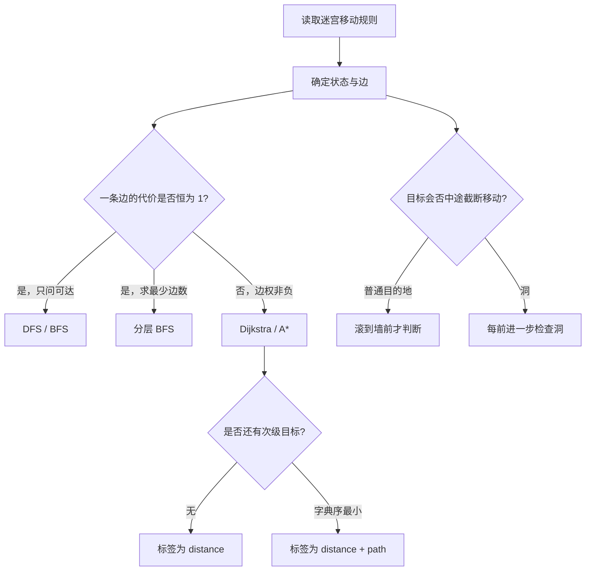

> 本章原文从 PDF 第 1162 页开始，到第 25 章“设计问题”之前结束，依次介绍迷宫问题概述，以及 LeetCode 490、505、499 三种滚动球迷宫。本文严格沿用原书小节顺序；书外证明、优化、替代方法和边界分析均明确标注为“补充”。

## 本章要解决什么问题

迷宫问题的核心不是“在二维数组里走”，而是把移动规则准确翻译成图：

- 什么是一个状态：每个空格，还是球能够停下的位置？
- 什么是一条边：移动一格，还是沿某方向一直滚到墙前？
- 边的代价是什么：每次移动都算 1，还是滚过多少格就算多少？
- 最终目标是什么：存在任意路径、物理距离最短，还是距离最短后方向字符串字典序最小？

这四个问题决定了应使用 DFS、BFS、Dijkstra，还是带复合优先级的 Dijkstra。只凭“这是迷宫题”选择 BFS，很容易在变长边权或多目标排序时出错。

本章的三道正文题使用同一滚动规则，却逐步增加目标：

1. LeetCode 490：只判断目的地是否能成为停点；
2. LeetCode 505：在所有可停路径中最小化滚过的格数；
3. LeetCode 499：遇到洞立即停止，并在最短距离并列时选择字典序最小路径。

## 24.1 迷宫问题概述

### 1. 基本迷宫的图模型

给定 $m$ 行 $n$ 列矩阵：

$$
maze\in\{0,1\}^{m\times n},
$$

其中：

$$
maze[r][c]=
\begin{cases}
0,&\text{空地},\\
1,&\text{墙壁}.
\end{cases}
$$

若人每次只能向上、下、左、右移动一个空格，则每个空格 $(r,c)$ 是一个顶点。方向集合为：

$$
D=\{(-1,0),(1,0),(0,-1),(0,1)\}.
$$

当 $(r+dr,c+dc)$ 在矩阵内且为空地时，存在单位权边：

$$
(r,c)\longrightarrow(r+dr,c+dc).
$$

因为每条边都表示移动一格、代价都是 1，所以从入口 `start` 到出口 `destination` 的最少移动次数就是无权图最短路长度。

### 2. 为什么分层 BFS 得到最短距离

BFS 把状态按从起点出发的边数分层：

$$
L_k=\{v\mid distance(start,v)=k\}.
$$

初始层 $L_0$ 只有起点；处理完第 $k$ 层后，首次发现的未访问邻居属于第 $k+1$ 层。由于所有边权都是 1，任何绕过当前层的路径至少多用一条边。

因此，终点第一次被发现或出队时，其层数就是最短距离。原书基本迷宫示例的最短移动次数为 8。

### 3. 搜索不变量

设：

$$
dist[r][c]=\text{从起点到 }(r,c)\text{ 的最少移动次数}.
$$

BFS 初始化：

$$
dist[start_r][start_c]=0,
$$

其他位置为未访问。若从当前格 $(r,c)$ 扩展到未访问邻格 $(nr,nc)$，则：

$$
dist[nr][nc]=dist[r][c]+1.
$$

单位权保证第一次赋值就是最短值，所以可在入队时标记访问，不需要后续松弛。

### 4. 不同目标对应不同算法

迷宫是状态空间，算法由边权和目标决定：

| 目标/边权 | 典型方法 | 适用条件 |
| --- | --- | --- |
| 是否存在路径 | DFS 或 BFS | 只关心可达性 |
| 单位权最短路 | BFS | 每条边代价完全相同 |
| 非负变长边权最短路 | Dijkstra | 边权不为负 |
| 需要枚举全部简单路径 | 回溯 | 输入较小，必须输出方案 |
| 有较强启发函数 | A* | 需要更快找到单个目标，启发函数可采纳 |
| 图是 DAG 或状态可递推 | DP | 存在无环计算顺序 |

### 5. 普通移动与滚动球移动

本章正文不是“每步走一格”，而是球选择方向后一直滚到墙前才能停下。

| 维度 | 普通迷宫 | 滚动球迷宫 |
| --- | --- | --- |
| 可改变方向的位置 | 每个空格 | 只有停点 |
| 一条图边 | 移动一格 | 一次完整滚动 |
| 边权 | 恒为 1 | 滚过的格数，可能不同 |
| 经过目标 | 已到达 | 不一定成功，可能继续滚过 |
| BFS 是否直接给物理最短距离 | 是 | 否，除非所有滚动长度相同 |

这一区别贯穿后面三题。

### 6. C++17 基础模型：共享滚动边生成器

下面只定义一次迷宫类型、方向集合和 `roll`。后面三道正文题的 C++17 核心块都复用它：490、505 不传 `hole`，球滚到墙前；499 传入 `hole`，球一旦进入洞就中途结束本次滚动。

```cpp
#include <array>
#include <climits>
#include <functional>
#include <optional>
#include <queue>
#include <string>
#include <tuple>
#include <vector>

using Maze = std::vector<std::vector<int>>;
using Position = std::array<int, 2>;

constexpr std::array<Position, 4> kDirections = {{
  Position{1, 0},
  Position{-1, 0},
  Position{0, 1},
  Position{0, -1},
}};

struct RollResult {
  Position stop;
  int distance;
};

RollResult roll(
  const Maze& maze,
  Position start,
  Position direction,
  std::optional<Position> hole = std::nullopt
) {
  const int rows = static_cast<int>(maze.size());
  const int columns = static_cast<int>(maze[0].size());
  Position current = start;
  int distance = 0;

  while (true) {
    Position next = {
      current[0] + direction[0],
      current[1] + direction[1],
    };
    if (
      next[0] < 0 || next[0] >= rows ||
      next[1] < 0 || next[1] >= columns ||
      maze[next[0]][next[1]] == 1
    ) {
      break;
    }

    current = next;
    ++distance;
    if (hole.has_value() && current == *hole) {
      break;
    }
  }
  return {current, distance};
}
```

循环每成功进入一个新空格才令 `distance` 加 1，所以返回值满足：起点不计入距离，经过格和最终停点都计入。若返回 `distance == 0`，该方向没有形成停点图中的新边。

## 24.2 迷宫问题的求解

### 24.2.1 LeetCode 490：迷宫（★★）

#### 问题定义

在由空地 0 和墙壁 1 组成的 $m\times n$ 迷宫中，球可以选择上、下、左、右滚动。选定方向后，球会连续经过空地，直到下一格是墙或越过边界时，才停在当前格。

给定起点：

$$
start=(s_r,s_c),
$$

和目的地：

$$
destination=(t_r,t_c),
$$

判断球能否**停在**目的地。

原题强调：球可以经过目的地却无法在那里停下。这种情况不算成功。

样例：

```text
maze = [
  [0,0,1,0,0],
  [0,0,0,0,0],
  [0,0,0,1,0],
  [1,1,0,1,1],
  [0,0,0,0,0]
]
start = [0,4]
destination = [4,4]
输出：true
```

一条停点路径为：

$$
(0,4)\to(0,3)\to(1,3)\to(1,0)
\to(2,0)\to(2,2)\to(4,2)\to(4,4).
$$

对应方向为：左、下、左、下、右、下、右。

约束：

$$
1\le m,n\le100.
$$

起点和目的地都是空地。原题说迷宫边缘是墙，实际实现仍应把矩阵外部视为墙并显式检查边界，因为样例的外层单元并非全是 1。

#### 难点：停点才是决策状态

球经过中间格时不能改变方向，所以不能把每个经过的格子都当作一次决策。定义滚动函数：

$$
roll((r,c),(dr,dc))=(r',c',\delta),
$$

其中 $(dr,dc)\in D$，$(r',c')$ 是沿该方向滚到的最终停点，$\delta$ 是滚过的格数。

计算过程：

1. 初始化 $(r',c')=(r,c)$、$\delta=0$；
2. 当下一格 $(r'+dr,c'+dc)$ 在界内且为空地时：

   $$
   r'\leftarrow r'+dr,
   $$

   $$
   c'\leftarrow c'+dc,
   $$

   $$
   \delta\leftarrow\delta+1;
   $$

3. 下一格不可进入时，返回当前 $(r',c',\delta)$。

若 $\delta=0$，该方向立即撞墙，没有产生新状态，应跳过。

#### 隐式停点图

把起点以及所有可能停下的空格看作顶点。对每个状态 $u=(r,c)$ 和方向 $d$，若滚动后停在不同位置 $v$，就加入边：

$$
u\longrightarrow v.
$$

这个图不一定是无向图。即使 $u$ 向右滚到 $v$，从 $v$ 向左滚时也可能越过 $u$，停在更左位置。因此不能假设反向边必然存在。

本题只问停点图中 `destination` 是否从 `start` 可达，不关心边的物理长度 $\delta$。

#### 解法一：深度优先搜索

定义 `dfs(r,c)`：从停点 $(r,c)$ 出发，能否最终停在目的地。

1. 若 $(r,c)=destination$，返回 `true`；
2. 对四个方向调用 `roll`，得到停点 $(nr,nc)$；
3. 若该停点未访问，立即标记并递归搜索；
4. 任一方向成功则返回 `true`；全部失败返回 `false`。

必须在递归前标记访问。停点图可能有环，例如从一个墙角滚到另一个墙角后又滚回来；若不去重会无限递归。

递归关系可写为：

$$
reachable(u)
=
\mathbf 1[u=destination]
\lor
\bigvee_{d\in D}
reachable(rollStop(u,d)),
$$

其中已访问状态不再递归，原地滚动也不产生后继。

#### 解法二：广度优先搜索

将起点入队并标记访问。每次弹出停点 $(r,c)$：

- 若它是目的地，返回 `true`；
- 沿四个方向滚到对应停点；
- 将尚未访问的新停点入队并标记。

队列耗尽仍未到达目的地时返回 `false`。

#### DFS 与 BFS 为什么都正确

本题只问可达性，不要求最少滚动次数或最短物理距离。DFS 与 BFS 虽然访问顺序不同，但都完整遍历起点所在的可达停点子图。

搜索不变量：队列或递归栈中的每个状态都能通过若干次合法完整滚动从起点到达。

- 起点满足不变量；
- `roll` 生成的停点对应一条合法边，所以从可达状态产生的新状态也可达；
- 每个首次发现的停点都会被展开，`visited` 只消除重复，不删除任何新状态。

因此，搜索遇到目的地时必有合法停点路径；搜索耗尽则所有可达停点都已检查，目的地不可达。

#### 为什么经过目的地不算成功

假设从 $(r,c)$ 沿方向 $d$ 滚动时，中途经过目的地 $t$，但下一格仍为空。球无法在 $t$ 改变动作或停下，真实转移终点仍是 `rollStop((r,c),d)`。

所以应在滚动结束后的状态上判断：

$$
(nr,nc)=destination,
$$

而不是在 `while` 循环经过每个格子时判断。本题与后面的“洞”问题正好不同。

#### 停点与经过点反例

考虑只有一条直走廊的最小反例：

```text
maze = [[0,0,0,0,0]]
start = [0,0]
destination = [0,2]
```

球从 `(0,0)` 向右滚动时依次经过 `(0,1)`、`(0,2)`、`(0,3)`，最后才在边界前的 `(0,4)` 停下：

$$
roll((0,0),right)=((0,4),4).
$$

虽然轨迹包含 `destination=(0,2)`，但停点图只有 `(0,0)` 与 `(0,4)` 两个顶点；球只能在二者之间往返，不能在 `(0,2)` 选择新方向。因此本例答案是 `false`。若把 `(0,2)` 改成 499 中的洞，球才会在那里中途停止；目标坐标相同，题目语义不同，转移结果也不同。

#### 复杂度

停点数量不超过全部空地数量，即 $O(mn)$。从每个停点尝试 4 个方向，每次滚动最远扫描 $O(\max(m,n))$ 个格子，因此直接模拟的保守上界为：

$$
T=O\left(mn\cdot\max(m,n)\right),
$$

空间复杂度为：

$$
S=O(mn),
$$

用于 `visited` 和搜索栈/队列。

有些分析把四个方向的行列扫描合写为 $O(mn(m+n))$；两者只差常数级表达，核心是每个状态可能重复沿行或列扫描。

> **补充：预计算滚动终点。** 可对每个空格和四个方向预先计算下一停点，使每次图扩展降为 $O(1)$。用逐行/逐列扫描可在 $O(mn)$ 时间完成预处理，随后 DFS/BFS 为 $O(mn)$；代价是额外保存 $4mn$ 个转移。

#### 边界与常见错误

- 起点必须在搜索开始时标记访问；
- 原地滚动不应重复入队；
- 目的地必须是停点，不能只被路径穿过；
- 外部边界应视为墙，必须先检查坐标再读取矩阵；
- BFS 在本题只能保证最少**滚动次数**，不能保证滚过格数最少，因为每条滚动边的长度不同；
- 递归 DFS 最坏深度为 $O(mn)$，语言栈较小时宜使用迭代 DFS 或 BFS。

#### C++17 核心实现：停点图可达性

这里的 `visited` 只表达“这个停点是否可达”。`RollResult::distance` 除了判断是否原地不动外，不参与优化目标；同一停点第一次入队后即可永久标记。

```cpp
bool hasPath(
  const Maze& maze,
  Position start,
  Position destination
) {
  const int rows = static_cast<int>(maze.size());
  const int columns = static_cast<int>(maze[0].size());
  std::vector<std::vector<bool>> visited(
    rows,
    std::vector<bool>(columns, false)
  );
  std::queue<Position> positions;
  positions.push(start);
  visited[start[0]][start[1]] = true;

  while (!positions.empty()) {
    Position current = positions.front();
    positions.pop();
    if (current == destination) {
      return true;
    }

    for (Position direction : kDirections) {
      RollResult next = roll(maze, current, direction);
      if (
        next.distance == 0 ||
        visited[next.stop[0]][next.stop[1]]
      ) {
        continue;
      }
      visited[next.stop[0]][next.stop[1]] = true;
      positions.push(next.stop);
    }
  }
  return false;
}
```

### 24.2.2 LeetCode 505：迷宫 II（★★）

#### 问题定义

滚动规则与 24.2.1 相同，但目标改为：在所有能让球停在目的地的路径中，最小化球滚过的空格总数。起点本身不计数，之后经过和最终停留的每个空格各计 1。

仍使用上一题的样例迷宫：

```text
start = [0,4]
destination = [4,4]
输出：12
```

沿一条最短路线，各次滚动长度可以是：

```text
1 + 1 + 3 + 1 + 2 + 2 + 2 = 12
```

注意这里有 7 次方向选择，却滚过 12 格。若只让普通 BFS 最小化边数，会优化“滚动次数 7”，而题目要求优化“边权之和 12”，二者不是同一目标。

#### 滚动边权逐步走查

沿 490 样例给出的停点路径逐边调用 `roll`，每条边的权重都是本次滚动的 `delta`，累计值才是 Dijkstra 标签：

| 次序 | 当前停点 $u$ | 方向 | 本次经过的格子 | 新停点 $v$ | 边权 $\delta$ | 候选距离 $dist[u]+\delta$ |
| ---: | --- | --- | --- | --- | ---: | ---: |
| 1 | `(0,4)` | 左 | `(0,3)` | `(0,3)` | 1 | $0+1=1$ |
| 2 | `(0,3)` | 下 | `(1,3)` | `(1,3)` | 1 | $1+1=2$ |
| 3 | `(1,3)` | 左 | `(1,2),(1,1),(1,0)` | `(1,0)` | 3 | $2+3=5$ |
| 4 | `(1,0)` | 下 | `(2,0)` | `(2,0)` | 1 | $5+1=6$ |
| 5 | `(2,0)` | 右 | `(2,1),(2,2)` | `(2,2)` | 2 | $6+2=8$ |
| 6 | `(2,2)` | 下 | `(3,2),(4,2)` | `(4,2)` | 2 | $8+2=10$ |
| 7 | `(4,2)` | 右 | `(4,3),(4,4)` | `(4,4)` | 2 | $10+2=12$ |

因此答案是 12，而不是“做了 7 次方向选择”。若另一路径也到达 `(2,2)`，只有候选距离严格小于当前的 8 才迁移；第一次发现停点不等于标签已经确定。

#### 加权停点图

仍把可停位置看作顶点。若从停点 $u$ 沿方向 $d$ 最终停在 $v$，中间滚过 $\delta$ 个空格，则建立带权边：

$$
u\xrightarrow{\delta}v,
\qquad
\delta\ge1.
$$

一条停点路径

$$
P=(v_0,v_1,\ldots,v_k)
$$

的物理距离为：

$$
length(P)
=
\sum_{i=0}^{k-1}w(v_i,v_{i+1}),
$$

其中 $w(u,v)$ 是一次完整滚动经过的空格数。

问题因此变为非负权图上的单源最短路。

#### 最短距离状态与松弛

定义：

$$
dist[r][c]
=\text{从 start 到停点 }(r,c)\text{ 的当前最短已知距离}.
$$

初始化：

$$
dist[s_r][s_c]=0,
$$

$$
dist[r][c]=+\infty
\quad\text{（其他位置）}.
$$

从 $(r,c)$ 沿一个方向滚到 $(nr,nc)$，滚动长度为 $\delta$，则经过当前状态的新候选距离为：

$$
candidate=dist[r][c]+\delta.
$$

若：

$$
candidate<dist[nr][nc],
$$

就执行松弛：

$$
dist[nr][nc]\leftarrow candidate.
$$

为什么只在严格变小时继续扩展？同一停点以更长或相等距离到达后，其未来可选滚动边完全相同；给相同后缀再加同样的非负边权，不可能优于已有较短前缀。

#### 解法一：带松弛剪枝的深度优先搜索

原书先介绍 DFS 版本。它不是枚举所有简单路径后统一比较，而是把 `dist` 当作全局上界：

1. 从当前停点向四个方向滚动；
2. 若新距离严格改善目标停点，更新 `dist`；
3. 只从被改善的停点继续 DFS；
4. 未改善的分支立即剪去。

这种过程可理解为异步反复松弛：每次某个顶点的标签下降，就重新传播它的出边。

##### 为什么最终能得到最短距离

每次更新都使某个有限整数 `dist` 严格下降，且所有距离非负，因此不会无限下降。算法停止时，对每条可达停点边 $u\xrightarrow{w}v$ 都满足：

$$
dist[v]\le dist[u]+w.
$$

另一方面，每个有限 `dist[v]` 都由一条真实路径的边权和产生，所以它不可能小于真实最短距离 $\delta(s,v)$：

$$
dist[v]\ge\delta(s,v).
$$

取任意最短路径 $s=v_0\to v_1\to\cdots\to v_k=v$，沿路径反复应用停止时的不等式：

$$
dist[v_i]\le dist[v_{i-1}]+w(v_{i-1},v_i),
$$

可得：

$$
dist[v]\le\sum_{i=1}^{k}w(v_{i-1},v_i)=\delta(s,v).
$$

结合上下界，得到：

$$
dist[v]=\delta(s,v).
$$

这种证明依赖所有被改善状态最终都会继续传播。递归 DFS 可以做到，但扩展顺序不按距离，某个状态可能被多次改善和重搜，性能不稳定；递归深度也可能较大。

#### 解法二：队列式分支限界法

把“距离刚被改善的停点”放入 FIFO 队列：

1. 起点入队；
2. 弹出一个停点并松弛四条滚动边；
3. 某个邻接停点距离变小时，将它再次入队；
4. 队列为空时，所有可改善标签都已传播。

这与 SPFA 风格的队列松弛相同。它与单位权 BFS 的重要区别是：

- 一个状态可能多次入队；
- 第一次发现目的地不保证最短；
- 必须等到所有相关松弛完成，或使用更强的优先级规则。

在本题小规模网格上通常运行良好，但一般非负权图中 FIFO 松弛的最坏复杂度可能很差，不能把它当作稳定的线性 BFS。

#### 解法三：优先队列式分支限界法

将队列改为按当前距离排序的小根堆。堆元素为：

$$
(distance,r,c).
$$

每次优先扩展当前距离最小的候选。若弹出的 `distance` 不等于最新 `dist[r][c]`，说明这是更新前留下的过期条目，直接跳过。

该方法本质上就是 Dijkstra。相比 FIFO，它更早传播较短前缀，因此通常产生更少的无效松弛。

#### 解法四：A* 算法

A* 为每个候选定义：

$$
f(v)=g(v)+h(v),
$$

其中：

- $g(v)$ 是从起点到 $v$ 的当前路径长度；
- $h(v)$ 是从 $v$ 到目的地剩余距离的下界；
- $f(v)$ 是经过 $v$ 的完整路径长度下界。

原书选择曼哈顿距离：

$$
h(r,c)=|r-t_r|+|c-t_c|.
$$

它为什么可采纳？球从 $(r,c)$ 到目的地，无论如何滚动，纵向净位移至少为 $|r-t_r|$，横向净位移至少为 $|c-t_c|$；实际路径可能绕墙，但不可能比两者之和更短。因此：

$$
0\le h(v)\le h^*(v),
$$

其中 $h^*(v)$ 是真实剩余最短距离。

它还满足一致性。对任意滚动边 $u\xrightarrow{w}v$，曼哈顿距离的三角不等式给出：

$$
h(u)\le w+h(v).
$$

因此标准 A* 在目标以最小有效 $f$ 出堆时，可以确定其距离最优。

> **补充：实现边界。** 应维护每个状态的最佳 $g=dist$，并把 `(g+h,g,r,c)` 放入堆。因为同一状态的 $h$ 固定，维护最小 $f$ 与维护最小 $g$ 在数值比较上等价；但显式保存 `dist` 更容易跳过过期条目并证明正确性。

#### 解法五：Dijkstra 的贪心确定

原书最后从贪心法角度说明 Dijkstra。维护集合：

$$
S=\text{最短距离已经确定的停点集合}.
$$

小根堆每次选取 $V-S$ 中 `dist` 最小的状态 $u$。由于所有边权满足：

$$
w(e)\ge1,
$$

任何尚未确定状态经过若干非负边再绕到 $u$，都不可能形成比当前 `dist[u]` 更短的路径。因此第一次以有效最小标签弹出 $u$ 时：

$$
dist[u]=\delta(start,u).
$$

若 $u$ 是目的地，可立即返回。

##### 标签确定性的反证

反设弹出的 $u$ 还有更短路径 $P$。沿 $P$ 找到第一个未确定顶点 $y$，其前驱 $x$ 已确定。处理 $x$ 时已经松弛边 $(x,y)$，所以：

$$
dist[y]\le\delta(start,x)+w(x,y),
$$

即不超过 $P$ 到 $y$ 的前缀长度。边权非负，所以该前缀不超过 $P$ 到 $u$ 的总长度，而后者小于 `dist[u]`。那么 $y$ 应比 $u$ 更早出堆，矛盾。

#### 推荐实现与复杂度

本文完整程序采用 Dijkstra，因为它的最坏性能和提前结束条件最清楚。

令停点图顶点数 $V\le mn$，每个顶点最多 4 条滚动边，所以 $E\le4V$；但每次动态生成边还需扫描一整段。

- 堆操作总计约 $O(E\log V)=O(mn\log(mn))$；
- 滚动模拟总扫描上界为 $O(mn\max(m,n))$；
- 合并写作：

  $$
  O\left(mn\max(m,n)+mn\log(mn)\right);
  $$

- 空间 $O(mn)$。

若预计算四方向停点及距离，查询边为 $O(1)$，Dijkstra 可写为：

$$
O(mn\log(mn))
$$

时间和 $O(mn)$ 空间。

#### 边界与常见错误

- 普通 BFS 的“第一次到达”不适用于变长滚动边；
- 目的地仍必须是最终停点，经过它不算到达；
- 一次滚动的 `delta` 从 0 开始，每前进一格加 1；
- 原地滚动的 $\delta=0$ 不需要松弛；
- 小根堆可能保留旧距离条目，必须检查是否过期；
- 若终点 `dist` 保持无穷，返回 -1；
- 起点等于终点时距离为 0，即使原题通常排除该情况。

#### C++17 核心实现：非负权最短路

这里把 `roll` 返回的 `distance` 当作边权，状态值从 490 的布尔量升级为整数距离。只有严格更短的候选才松弛；目的地第一次以**有效最小距离**出堆时才可返回。

```cpp
int shortestDistance(
  const Maze& maze,
  Position start,
  Position destination
) {
  const int rows = static_cast<int>(maze.size());
  const int columns = static_cast<int>(maze[0].size());
  const int infinity = INT_MAX / 4;
  std::vector<std::vector<int>> distance(
    rows,
    std::vector<int>(columns, infinity)
  );

  using State = std::tuple<int, int, int>;
  std::priority_queue<
    State,
    std::vector<State>,
    std::greater<State>
  > states;
  distance[start[0]][start[1]] = 0;
  states.emplace(0, start[0], start[1]);

  while (!states.empty()) {
    auto [currentDistance, row, column] = states.top();
    states.pop();
    if (currentDistance != distance[row][column]) {
      continue;
    }
    Position current = {row, column};
    if (current == destination) {
      return currentDistance;
    }

    for (Position direction : kDirections) {
      RollResult next = roll(maze, current, direction);
      if (next.distance == 0) {
        continue;
      }
      int candidate = currentDistance + next.distance;
      if (candidate < distance[next.stop[0]][next.stop[1]]) {
        distance[next.stop[0]][next.stop[1]] = candidate;
        states.emplace(candidate, next.stop[0], next.stop[1]);
      }
    }
  }
  return -1;
}
```

### 24.2.3 LeetCode 499：迷宫 III（★★★）

#### 问题定义

迷宫中除了球和墙，还有一个洞 `hole`。球仍会沿选定方向持续滚动，但只要经过洞，就立即掉入洞中，不会继续滚到墙前。

方向用字符表示：

| 字符 | 方向 | 位移 |
| --- | --- | --- |
| `d` | 下 | $(1,0)$ |
| `l` | 左 | $(0,-1)$ |
| `r` | 右 | $(0,1)$ |
| `u` | 上 | $(-1,0)$ |

目标分两层：

1. 首先最小化球滚过的空格总数；
2. 若有多条最短路径，返回方向字符串字典序最小者；
3. 若洞不可达，返回字符串 `"impossible"`。

样例：

```text
maze = [
  [0,0,0,0,0],
  [1,1,0,0,1],
  [0,0,0,0,0],
  [0,1,0,0,1],
  [0,1,0,0,0]
]
ball = [4,3]
hole = [0,1]
输出："lul"
```

有两条距离同为 6 的路径：

```text
lul：左 → 上 → 左
ul ：上 → 左
```

字典序比较从第一个不同字符开始。因为：

$$
'l'<'u',
$$

所以返回 `"lul"`。方向数更少不构成次级目标，`"ul"` 虽只有两次转向，仍不优于 `"lul"`。

迷宫行列均不超过 30。

#### 与前两题的关键差异

| 规则 | LeetCode 490/505 | LeetCode 499 |
| --- | --- | --- |
| 经过目标时 | 继续滚，必须在目标停下 | 立即掉洞，滚动在洞处截断 |
| 主目标 | 可达 / 最短距离 | 最短距离 |
| 次目标 | 无 | 路径字符串字典序最小 |
| 状态标签 | 布尔或距离 | `(距离, 路径字符串)` |

因此，本题的滚动函数必须接收洞坐标：

$$
rollToHole((r,c),d)=(r',c',\delta).
$$

每前进一步后，先判断新位置是否为洞；若是，立即返回洞和当前距离。只有尚未到洞时，才继续检查下一步能否滚动。

##### 洞中途截断走查

在样例路径 `ul` 中，球先从 `(4,3)` 向上滚 4 格，到达停点 `(0,3)`；随后向左滚。第 2 次移动已经进入洞，虽然左侧 `(0,0)` 仍是空地，也必须立即结束：

| 左滚步骤 | 移动后位置 | 本次滚动距离 | 是否为洞 | 动作 |
| ---: | --- | ---: | --- | --- |
| 1 | `(0,2)` | 1 | 否 | 继续 |
| 2 | `(0,1)` | 2 | 是 | 立即返回 |
| 3 | `(0,0)` | 不会发生 | 否 | 不再访问 |

所以共享函数在传入洞时返回：

$$
roll((0,3),left,hole)=((0,1),2),
$$

总距离为 $4+2=6$。若不传洞，普通目的地语义下同一次左滚会返回 `((0,0),3)`。洞检查必须放在“移动并把距离加 1”之后：提前检查会漏掉刚进入的洞，等到撞墙后再检查则会穿洞而过。

#### 复合最优标签

对每个位置定义标签：

$$
label[r][c]=(dist[r][c],path[r][c]),
$$

其中：

- `dist[r][c]` 是从球到该位置的最短物理距离；
- `path[r][c]` 是达到该最短距离的路径中字典序最小的方向字符串。

标签按如下全序比较：

$$
(d_1,p_1)< (d_2,p_2)
$$

当且仅当：

$$
d_1<d_2,
$$

或：

$$
d_1=d_2\quad\text{且}\quad p_1<p_2.
$$

也就是先比较距离，再比较路径字符串。

从状态 $(r,c)$ 沿方向字符 $x$ 滚动 $\delta$ 格到 $(nr,nc)$，候选标签为：

$$
candidateDist=dist[r][c]+\delta,
$$

$$
candidatePath=path[r][c]+x.
$$

需要更新的条件是：

$$
candidateDist<dist[nr][nc],
$$

或者：

$$
candidateDist=dist[nr][nc]
\quad\land\quad
candidatePath<path[nr][nc].
$$

这就是本题的复合松弛。

##### 补充：复合标签的迁移判断

设当前状态标签为 `(5,"lu")`，选择方向 `r` 后滚动 2 格，则候选标签为：

$$
candidate=(5+2,"lu"+"r")=(7,"lur").
$$

它与目标位置旧标签的比较必须一次覆盖两个维度：

| 目标位置旧标签 | 是否迁移为 `(7,"lur")` | 判断依据 |
| --- | --- | --- |
| `(8,"d")` | 是 | $7<8$，主距离改善 |
| `(7,"u")` | 是 | 距离相同且 `"lur"<"u"` |
| `(7,"dr")` | 否 | 距离相同但 `"dr"<"lur"`，旧标签更优 |
| `(6,"uu")` | 否 | $6<7$，字符串不能推翻更短距离 |

方向字符按**一次完整滚动**追加一次，而不是每经过一格追加一次。迁移条件可以压缩为对二元组做字典序比较：

$$
(candidateDist,candidatePath)<(dist[v],path[v]).
$$

只比较距离会丢失同距离下的字典序改善；只按 `d,l,r,u` 扩展而不比较旧标签，也不能替代迁移判断。

#### 补充：复合标签的支配证明

如果两条路径到达同一位置：

- 距离较短者加上任何相同后缀后，仍保持总距离较短；
- 距离相同而字符串较小者，加上从该状态出发的同一方向序列后，仍会得到字典序较小的完整路径。

第二点需要说明一个细节：一般字符串 $p_1<p_2$ 时，给两者追加相同后缀未必总保持顺序，若 $p_1$ 是 $p_2$ 的真前缀可能发生变化。但两条**等距离**路径到达同一状态时，较短字符串不可能是另一条的真前缀；否则较长字符串的额外方向构成一个正长度回路，却没有增加物理距离，与每次滚动长度 $\delta\ge1$ 矛盾。因此二者必在某个已有字符处首次不同，追加共同后缀不会改变这个首次不同字符。

所以被复合标签支配的到达方式永远不可能在未来反超，可以安全丢弃。

#### 方向按 `d,l,r,u` 的意义

四个字符的字典序是：

$$
d<l<r<u.
$$

按这个顺序生成候选，通常能更早找到较小字符串，从而让 DFS 或普通队列剪去更多同距离但字典序较大的分支。

但方向顺序本身不能替代复合松弛：不同路径长度、不同到达时机和回路会打乱简单搜索顺序，仍必须在标签相等距离时显式比较字符串。

#### 解法一：带复合松弛的回溯/DFS

原书把 24.2.2 的 DFS 扩展为：

1. 用 `dist` 保存最短距离；
2. 用 `path` 保存对应的最小字典序字符串；
3. 沿 `d,l,r,u` 生成滚动边；
4. 若候选复合标签更优，就更新并递归传播；
5. 滚动中遇洞，洞成为该边终点。

搜索结束后：

- 若 `dist[hole]` 仍为无穷，返回 `"impossible"`；
- 否则返回 `path[hole]`。

这同样属于异步标签修正。按字典序生成方向只改善实际剪枝，不是正确性的必要条件；原书也明确指出可按任意方向搜索，只要松弛比较完整。

#### 解法二：队列式分支限界法

当某位置的 `(distance,path)` 被改善时，将它放入 FIFO 队列。队列中的状态可能重复出现，因为：

- 后来可能找到更短距离；
- 距离相同但后来可能找到更小字符串。

每次弹出后继续传播最新标签。队列耗尽意味着不存在可改善边，最终标签正确。

它不能在目的地第一次入队时直接返回，因为 FIFO 顺序既不按物理距离排序，也不按字典序排序。

#### 解法三：优先队列式分支限界法

小根堆元素为：

$$
(distance,path,row,column).
$$

堆按距离升序，同距离按路径字符串升序。弹出状态时若 `(distance,path)` 不等于该位置当前最佳标签，说明条目过期，跳过。

这种方法就是复合标签版 Dijkstra，也是本文推荐实现。

##### 补充：第一次有效弹出洞即可返回的严格证明

设第一次弹出的洞标签为 $(D,P)$，反设存在更优洞标签 $(D',P')$。

1. 若 $D'<D$，该更短路径上尚未展开的第一个前沿状态距离严格小于或等于 $D'$，应先于洞出堆，矛盾。
2. 若 $D'=D$ 且 $P'<P$，因为最后一次滚动长度至少为 1，该路径在进入洞之前的前驱距离严格小于 $D$。此前驱必已出堆并生成完整候选 $(D,P')$；同距离时堆会先弹出较小字符串 $P'$，仍矛盾。

因此，当堆明确按 `(distance,path)` 排序时，第一次以有效标签弹出洞就是全局最优答案。

终止判断必须按以下顺序执行：先把堆顶与当前位置保存的最佳 `(distance,path)` 比较并跳过过期项，再判断当前位置是否为洞。几种看似相近的时机并不等价：

| 时机 | 能否立即返回 | 原因 |
| --- | --- | --- |
| 滚动时第一次发现洞 | 否 | 其他堆中前缀可能生成更短或同距更小路径 |
| 洞坐标的过期标签出堆 | 否 | 它已被更优复合标签替代 |
| 复合小根堆第一次有效弹出洞 | 是 | 堆顶已经是全局最小未确定复合标签 |
| A* 已有洞距离 $D$，但 $\min f\le D$ | 否 | 同距离候选仍可能由这些前沿状态产生 |
| A* 已有洞距离 $D$，且 $\min f>D$ | 是 | 不会再产生距离不超过 $D$ 的候选 |

> **原文思考题的边界。** 原书指出 A* 中第一次找到洞不一定得到最小字典序路径，这是针对只按估价距离确定优先级、未把完整路径字符串纳入可靠终止条件的实现。若 Dijkstra 小根堆完整按 `(distance,path)` 排序，则第一次有效弹出洞可以直接返回；若堆只按距离排序，仍需处理所有同距离候选后比较字符串。

#### 解法四：A* 算法

仍可使用曼哈顿启发：

$$
f(v)=g(v)+h(v),
$$

$$
h(r,c)=|r-hole_r|+|c-hole_c|.
$$

曼哈顿距离低估或等于真实剩余滚动距离，所以对主目标“距离”可采纳且一致。但 $f$ 只给出距离下界，不给出最终路径字符串的下界。

因此，若已经找到洞的最佳距离 $D$，仍需继续处理所有可能产生距离 $D$ 的候选；安全停止条件是：

$$
\min f>D.
$$

此后才不可能再生成另一条同距离路径。期间对洞标签做复合比较，最终得到最小字符串。

> **补充：更严格的实现方式。** 可维护每个位置的最佳 `(g,path)`，堆按 `(f,g,path,row,column)` 排序，并在最小 $f$ 超过已知洞距离后停止。不要只维护 `minf` 而忽略同一 $f$ 下更小的 `(g,path)` 标签；复合目标的支配关系必须显式保留。

#### 解法五：Dijkstra 的贪心确定

原书最后将优先队列方法归入贪心法：每次从未确定标签中选择最小者。一旦位置以其最佳复合标签弹出，可视为标签已确定。

对普通位置，主距离的非负性保证不会被更远前缀改善；同距离的字符串比较通过复合松弛确定。对洞，只要堆按复合标签排序，即可按上文证明直接返回 `path`。

> **原文勘误说明**：解法 5 的文字末尾写“如果该单元为 `hole`，直接返回 `dist[r][c]`”“不可达返回 -1”，这与本题返回类型不符。正确结果应为路径字符串 `path[r][c]`，不可达时返回 `"impossible"`。这段文字显然沿用了 24.2.2 的距离题表述。

#### 样例的数值与字典序比较

从 `(4,3)` 出发：

- 路径 `ul`：先上滚到 `(0,3)`，距离 4；再左滚入 `(0,1)` 洞，距离 2；总距离 6；
- 路径 `lul`：左滚 1 格到 `(4,2)`；上滚 4 格到 `(0,2)`；左滚 1 格入洞；总距离也是 6。

比较标签：

$$
(6,"lul")<(6,"ul"),
$$

因为主距离相同，而 `'l'<'u'`。

#### 复杂度

令 $V\le mn$、每个停点最多四条边。若动态模拟滚动：

$$
T=O\left(mn\max(m,n)+mn\log(mn)\cdot C_{str}\right),
$$

其中 $C_{str}$ 表示字符串复制与比较成本。路径字符串长度最多可达 $O(mn)$ 个方向字符，因此严格分析中字符串操作不能视为无成本；在 $m,n\le30$ 时可接受。

空间包括距离、路径、堆：基础部分为 $O(mn)$，若堆中保存完整路径字符串，实际字符存储可能更高。

> **补充：路径表示优化。** 大规模场景可用持久化前驱结点、字符串排名或哈希/LCP 技术减少复制，但会显著增加实现复杂度。本题规模下直接保存字符串最清晰。

#### 边界与常见错误

- 滚动每前进一步后都要先判断是否进洞；
- 洞可以位于走廊中间，不要求靠墙；
- 字典序比较的是方向字符串，不是坐标序列，也不是方向次数；
- 同距离但更小路径必须继续松弛；
- 小根堆若只按距离排序，不能保证第一次弹出的洞路径字典序最小；
- 方向生成顺序应与字符映射一致，推荐 `d,l,r,u`；
- 原地不能滚动时不要追加方向字符；
- 不可达返回精确字符串 `"impossible"`。

#### C++17 核心实现：距离与字典序复合最短路

堆键、过期判断和松弛条件都使用完整复合标签。代码先过滤过期项，再判断洞，因此第一次返回的洞标签同时满足最短距离与最小字典序。

```cpp
std::string findShortestWay(
  const Maze& maze,
  Position ball,
  Position hole
) {
  const int rows = static_cast<int>(maze.size());
  const int columns = static_cast<int>(maze[0].size());
  const int infinity = INT_MAX / 4;
  std::vector<std::vector<int>> distance(
    rows,
    std::vector<int>(columns, infinity)
  );
  std::vector<std::vector<std::string>> path(
    rows,
    std::vector<std::string>(columns)
  );

  using State = std::tuple<int, std::string, int, int>;
  std::priority_queue<
    State,
    std::vector<State>,
    std::greater<State>
  > states;
  distance[ball[0]][ball[1]] = 0;
  path[ball[0]][ball[1]] = "";
  states.emplace(0, "", ball[0], ball[1]);

  const std::array<std::tuple<char, int, int>, 4> directions = {{
    {'d', 1, 0},
    {'l', 0, -1},
    {'r', 0, 1},
    {'u', -1, 0},
  }};

  while (!states.empty()) {
    auto [currentDistance, currentPath, row, column] = states.top();
    states.pop();
    if (
      currentDistance != distance[row][column] ||
      currentPath != path[row][column]
    ) {
      continue;
    }

    Position current = {row, column};
    if (current == hole) {
      return currentPath;
    }

    for (const auto& [name, deltaRow, deltaColumn] : directions) {
      RollResult next = roll(
        maze,
        current,
        Position{deltaRow, deltaColumn},
        hole
      );
      if (next.distance == 0) {
        continue;
      }

      int candidateDistance = currentDistance + next.distance;
      std::string candidatePath = currentPath + name;
      bool improvesDistance =
        candidateDistance < distance[next.stop[0]][next.stop[1]];
      bool improvesPath =
        candidateDistance == distance[next.stop[0]][next.stop[1]] &&
        candidatePath < path[next.stop[0]][next.stop[1]];
      if (improvesDistance || improvesPath) {
        distance[next.stop[0]][next.stop[1]] = candidateDistance;
        path[next.stop[0]][next.stop[1]] = candidatePath;
        states.emplace(
          candidateDistance,
          candidatePath,
          next.stop[0],
          next.stop[1]
        );
      }
    }
  }
  return "impossible";
}
```

## 推荐练习题

原书给出以下 3 道练习：

1. LeetCode 576：出界的路径数（★★）
2. LeetCode 1036：逃离大迷宫（★★★）
3. LeetCode 1926：迷宫中离入口最近的出口（★★）

> **补充：练习关注点。** LeetCode 576 是有限步数下的路径计数 DP；LeetCode 1036 利用障碍数量推导有限包围面积，再做受限 BFS；LeetCode 1926 是单位权网格到任意边界出口的多目标 BFS。三题分别训练计数、巨大坐标空间截断和最近目标搜索。

## C++17 代码与公式的对应关系

| 层次 | 图上的含义 | C++17 状态 | 迁移或终止判断 |
| --- | --- | --- | --- |
| 共享 `roll` | 生成一条滚动边 $(u,v,\delta)$ | `RollResult{stop, distance}` | 不能移动时 `distance == 0` |
| 490 | 停点图可达性 | `visited[r][c]` | 新停点未访问才入队 |
| 505 | 非负权最短路 | `distance[r][c]` | `candidate < distance[v]` |
| 505 | Dijkstra 标签确定 | `(distance,row,column)` | 跳过旧距离，目标有效出堆即返回 |
| 499 | 洞截断的复合最短路 | `distance` 与 `path` | 候选 `(distance,path)` 更小才迁移 |
| 499 | 复合标签确定 | `(distance,path,row,column)` | 跳过旧复合标签，洞有效出堆即返回 |

### 滚动公式如何落到循环

公式中的一次边生成：

$$
(r,c)\xrightarrow{\delta}(r',c')
$$

在三种代码中都对应同一个循环不变量：执行每轮循环前，当前位置仍在空地；只有确认下一格在界内且不是墙，才移动并令：

$$
\delta\leftarrow\delta+1.
$$

因此返回的 $\delta$ 恰好是不含起点、包含最后落点的经过空格数，与题目距离定义一致。

### 为什么可达性用 `visited`，最短路用 `dist`

LeetCode 490 中，同一停点是否第二次到达不影响未来可达集合，所以布尔 `visited` 足够。

LeetCode 505/499 中，同一停点可能先被较差路径发现、后被更优路径改善；若第一次发现就永久标记，会错误阻止松弛。因此使用：

$$
dist[v]\leftarrow\min(dist[v],dist[u]+w),
$$

并允许状态以更优标签再次入堆。只有以最小有效标签出堆时，才可认为 Dijkstra 标签确定。

### 为什么无穷大要留余量

松弛会计算：

$$
dist[u]+\delta.
$$

若直接使用整数类型最大值作无穷大，对不可达标签做加法可能溢出。虽然代码只从堆中弹出有限距离，不会主动对无穷大松弛，C++17 仍使用 `INT_MAX/4` 留出安全余量。

### 字符串比较

C++17 的 `std::string` 使用这里需要的逐字符字典序：从左到右找到第一个不同字符，字符较小的字符串较小；若一个字符串是另一个的前缀，较短者更小。本题方向字符均为 ASCII，满足：

$$
d<l<r<u.
$$

不要使用本地化排序规则，否则可能改变题目要求的结果。

## 原文勘误与边界汇总

1. **“迷宫边缘都是墙”应理解为矩阵外不可进入。** 原书样例的外层矩阵单元含 0，并非整圈都是数值 1；实现必须先检查边界，再读取下一格。
2. **滚动球经过目的地不一定到达。** LeetCode 490/505 要求在目的地停下；只有 LeetCode 499 的洞会中途截断滚动。
3. **BFS 只对单位权边直接保证最短距离。** 滚动停点图的一条边权是滚过的格数，LeetCode 505 不能在 FIFO 队列第一次发现目的地时返回。
4. **505 的“队列式分支限界”是反复松弛，不是普通一次访问 BFS。** 距离改善后必须允许同一停点再次入队。
5. **A* 的曼哈顿距离只估计主目标距离。** 它不能单独保证最小字典序；LeetCode 499 还需保存和比较路径字符串，并处理全部可能达到最佳距离的候选。
6. **499 的方向顺序是 `d,l,r,u`。** 按此顺序扩展有助于剪枝，但正确性仍依赖同距离字符串松弛，不能只依赖遍历顺序。
7. **499 中第一次“发现”洞与第一次“按完整复合标签有效弹出”洞不同。** 前者不保证最优；后者在堆按 `(distance,path)` 排序时可安全返回。
8. **499 解法 5 的返回类型文字有误。** 本题应返回最优路径字符串，不是距离；不可达应返回 `"impossible"`，不是 -1。

## 补充：易混淆概念与常见误解

### 1. 经过格、停点与洞是三种不同语义

- **经过格**：滚动途中占据一瞬间，不能选择新方向；
- **停点**：下一格为墙或越界，球停下后才能选择方向；
- **洞**：即使下一格仍可走，只要进入洞就结束运动。

错误地把经过格当成停点，会生成题目不允许的转向；错误地把洞当成普通目的地，会让球穿过洞。

### 2. 最少滚动次数不等于最短物理距离

设路径 A 有两次滚动，长度分别为 8 和 8，总距离 16；路径 B 有三次滚动，长度分别为 2、3、4，总距离 9。

普通 BFS 会偏好两条边的 A，但题目 505 应选择 B。边数和边权和只有在所有边权相等时才具有相同最优解。

### 3. 为什么 490 可以永久标记，505 不可以

490 的状态值是布尔量：一旦证明停点可达，第二条路径不会带来新的未来动作。

505 的状态值是数值上界：第一次到达可能是 20，后来可能改善为 12。若第一次入队就拒绝所有后续到达，会保留错误距离。

### 4. 为什么方向字符少不代表字典序小

字典序先看第一个不同字符，而不是先看长度。样例中：

$$
"lul"<"ul",
$$

虽然 `lul` 更长，因为第一个字符 `'l'` 小于 `'u'`。只有一个字符串是另一个前缀时，长度才直接决定顺序。

### 5. Dijkstra 与“贪心法”的关系

Dijkstra 每次确定当前最小未确定标签，这一步是贪心选择；边松弛负责维护未来候选。仅有“小根堆”并不足以保证正确，必须同时满足：

- 主边权非负；
- 堆优先级与目标排序一致；
- 过期标签被跳过；
- 复合目标的全部比较维度都进入松弛和优先级。

### 6. A* 为什么可能比 Dijkstra 快

Dijkstra 按已走距离 $g$ 向四周扩散；A* 按：

$$
f=g+h
$$

优先选择“已走距离短且看起来更靠近目标”的状态。可采纳且一致的 $h$ 不改变最短距离答案，但可能减少与目标无关的扩展。

迷宫墙壁会让曼哈顿距离低估很多，因此它只是较弱启发；最坏情况下 A* 仍可能接近 Dijkstra。

### 7. 是否要预计算滚动结果

直接模拟每条边最易理解，适合 $m,n\le100$。若同一迷宫要回答许多查询，预计算：

$$
next[r][c][direction]
$$

和对应距离更划算。需要注意：LeetCode 499 的洞可能在预计算停点之前截断滚动，所以普通停点预计算还需结合洞坐标修正。

## 本章总结



本章的三道题不是三个互不相关的模板，而是同一停点图模型上的目标升级：

1. **迷宫 I：可达性。** 一次完整滚动形成一条无权逻辑边，DFS/BFS 遍历停点即可。
2. **迷宫 II：最短物理距离。** 滚动长度成为非负边权，必须用松弛；Dijkstra 给出稳定的标签确定顺序，A* 用曼哈顿距离引导搜索。
3. **迷宫 III：复合最优路径。** 洞在中途截断滚动，标签从距离扩展为 `(距离,路径字符串)`，松弛和堆顺序都必须同时覆盖两个目标。

面对新的迷宫题，可以依次询问：

1. 哪些位置可以做决定，哪些只是经过？
2. 一次动作何时结束，遇到目标是否立即结束？
3. 图边代价是否相同，目标优化边数还是权重和？
4. 是否有路径计数、字典序、资源消耗等次级维度？
5. 同一状态第一次到达能否永久确定，还是需要后续松弛？
6. 能否预计算转移，或设计可采纳启发函数减少搜索？

只要先把物理规则翻译成严格的状态、边与标签，DFS、BFS、Dijkstra 和 A* 的选择就会从“背模板”变成可证明的结果。

## 附录 A：Python 3 完整实现

下面的程序覆盖三道正文题，并复用一个带可选洞参数的 `roll`。正文以 C++17 为主，这里保留 Python 版本用于实际运行和随机对照。

```python
from __future__ import annotations

import heapq
from collections import deque


DIRECTIONS = ((1, 0), (-1, 0), (0, 1), (0, -1))
LEXICOGRAPHIC_DIRECTIONS = (
  ("d", 1, 0),
  ("l", 0, -1),
  ("r", 0, 1),
  ("u", -1, 0),
)


def roll(
  maze: list[list[int]],
  row: int,
  column: int,
  delta_row: int,
  delta_column: int,
  hole: tuple[int, int] | None = None,
) -> tuple[int, int, int]:
  """沿一个方向滚到墙前；若给出洞，则经过洞时立即停止。"""
  rows, columns = len(maze), len(maze[0])
  distance = 0
  while (
    0 <= row + delta_row < rows
    and 0 <= column + delta_column < columns
    and maze[row + delta_row][column + delta_column] == 0
  ):
    row += delta_row
    column += delta_column
    distance += 1
    if hole is not None and (row, column) == hole:
      break
  return row, column, distance


def has_path(
  maze: list[list[int]],
  start: tuple[int, int],
  destination: tuple[int, int],
) -> bool:
  """LeetCode 490：在停点图中做 BFS，只判断可达性。"""
  queue = deque([start])
  visited = {start}

  while queue:
    row, column = queue.popleft()
    if (row, column) == destination:
      return True

    for delta_row, delta_column in DIRECTIONS:
      next_row, next_column, distance = roll(
        maze,
        row,
        column,
        delta_row,
        delta_column,
      )
      next_position = (next_row, next_column)
      if distance > 0 and next_position not in visited:
        visited.add(next_position)
        queue.append(next_position)
  return False


def shortest_distance(
  maze: list[list[int]],
  start: tuple[int, int],
  destination: tuple[int, int],
) -> int:
  """LeetCode 505：在滚动长度为边权的停点图中运行 Dijkstra。"""
  rows, columns = len(maze), len(maze[0])
  infinity = 10**30
  distance = [[infinity] * columns for _ in range(rows)]
  distance[start[0]][start[1]] = 0
  queue = [(0, start[0], start[1])]

  while queue:
    current_distance, row, column = heapq.heappop(queue)
    if current_distance != distance[row][column]:
      continue
    if (row, column) == destination:
      return current_distance

    for delta_row, delta_column in DIRECTIONS:
      next_row, next_column, edge_distance = roll(
        maze,
        row,
        column,
        delta_row,
        delta_column,
      )
      candidate = current_distance + edge_distance
      if edge_distance > 0 and candidate < distance[next_row][next_column]:
        distance[next_row][next_column] = candidate
        heapq.heappush(queue, (candidate, next_row, next_column))
  return -1


def find_shortest_way(
  maze: list[list[int]],
  ball: tuple[int, int],
  hole: tuple[int, int],
) -> str:
  """LeetCode 499：按 (距离, 路径字符串) 的复合标签运行 Dijkstra。"""
  rows, columns = len(maze), len(maze[0])
  infinity = 10**30
  distance = [[infinity] * columns for _ in range(rows)]
  path: list[list[str | None]] = [[None] * columns for _ in range(rows)]
  distance[ball[0]][ball[1]] = 0
  path[ball[0]][ball[1]] = ""
  queue = [(0, "", ball[0], ball[1])]

  while queue:
    current_distance, current_path, row, column = heapq.heappop(queue)
    if (
      current_distance != distance[row][column]
      or current_path != path[row][column]
    ):
      continue
    if (row, column) == hole:
      return current_path

    for direction, delta_row, delta_column in LEXICOGRAPHIC_DIRECTIONS:
      next_row, next_column, edge_distance = roll(
        maze,
        row,
        column,
        delta_row,
        delta_column,
        hole,
      )
      if edge_distance == 0:
        continue

      candidate_distance = current_distance + edge_distance
      candidate_path = current_path + direction
      old_path = path[next_row][next_column]
      improves_distance = candidate_distance < distance[next_row][next_column]
      improves_path = (
        candidate_distance == distance[next_row][next_column]
        and (old_path is None or candidate_path < old_path)
      )
      if improves_distance or improves_path:
        distance[next_row][next_column] = candidate_distance
        path[next_row][next_column] = candidate_path
        heapq.heappush(
          queue,
          (candidate_distance, candidate_path, next_row, next_column),
        )
  return "impossible"


if __name__ == "__main__":
  rolling_maze = [
    [0, 0, 1, 0, 0],
    [0, 0, 0, 0, 0],
    [0, 0, 0, 1, 0],
    [1, 1, 0, 1, 1],
    [0, 0, 0, 0, 0],
  ]
  print("maze_reachable:", has_path(rolling_maze, (0, 4), (4, 4)))
  print("maze_unreachable:", has_path(rolling_maze, (0, 4), (3, 2)))
  print("maze_ii_distance:", shortest_distance(rolling_maze, (0, 4), (4, 4)))
  print("maze_ii_unreachable:", shortest_distance(rolling_maze, (0, 4), (3, 2)))

  hole_maze = [
    [0, 0, 0, 0, 0],
    [1, 1, 0, 0, 1],
    [0, 0, 0, 0, 0],
    [0, 1, 0, 0, 1],
    [0, 1, 0, 0, 0],
  ]
  print("maze_iii_path:", find_shortest_way(hole_maze, (4, 3), (0, 1)))
```

运行输出：

```text
maze_reachable: True
maze_unreachable: False
maze_ii_distance: 12
maze_ii_unreachable: -1
maze_iii_path: lul
```

## 附录 B：Go 1.22 完整实现

```go
package main

import (
  "container/heap"
  "fmt"
)

var directions = [4][2]int{{1, 0}, {-1, 0}, {0, 1}, {0, -1}}

type Position struct {
  row    int
  column int
}

type RollResult struct {
  row      int
  column   int
  distance int
}

type DistanceState struct {
  distance int
  row      int
  column   int
}

type DistanceHeap []DistanceState

func (states DistanceHeap) Len() int { return len(states) }
func (states DistanceHeap) Less(left, right int) bool {
  if states[left].distance != states[right].distance {
    return states[left].distance < states[right].distance
  }
  if states[left].row != states[right].row {
    return states[left].row < states[right].row
  }
  return states[left].column < states[right].column
}
func (states DistanceHeap) Swap(left, right int) {
  states[left], states[right] = states[right], states[left]
}
func (states *DistanceHeap) Push(value any) {
  *states = append(*states, value.(DistanceState))
}
func (states *DistanceHeap) Pop() any {
  old := *states
  last := old[len(old)-1]
  *states = old[:len(old)-1]
  return last
}

type PathState struct {
  distance int
  path     string
  row      int
  column   int
}

type PathHeap []PathState

func (states PathHeap) Len() int { return len(states) }
func (states PathHeap) Less(left, right int) bool {
  if states[left].distance != states[right].distance {
    return states[left].distance < states[right].distance
  }
  if states[left].path != states[right].path {
    return states[left].path < states[right].path
  }
  if states[left].row != states[right].row {
    return states[left].row < states[right].row
  }
  return states[left].column < states[right].column
}
func (states PathHeap) Swap(left, right int) {
  states[left], states[right] = states[right], states[left]
}
func (states *PathHeap) Push(value any) {
  *states = append(*states, value.(PathState))
}
func (states *PathHeap) Pop() any {
  old := *states
  last := old[len(old)-1]
  *states = old[:len(old)-1]
  return last
}

func infinity() int {
  return int(^uint(0)>>1) / 4
}

func roll(
  maze [][]int,
  row int,
  column int,
  deltaRow int,
  deltaColumn int,
  holeRow int,
  holeColumn int,
) RollResult {
  rows, columns := len(maze), len(maze[0])
  distance := 0
  for {
    nextRow := row + deltaRow
    nextColumn := column + deltaColumn
    if (
      nextRow < 0 || nextRow >= rows ||
      nextColumn < 0 || nextColumn >= columns ||
      maze[nextRow][nextColumn] == 1
    ) {
      break
    }
    row, column = nextRow, nextColumn
    distance++

    // holeRow 为 -1 时表示本题没有洞。
    if row == holeRow && column == holeColumn {
      break
    }
  }
  return RollResult{row: row, column: column, distance: distance}
}

func hasPath(maze [][]int, start Position, destination Position) bool {
  rows, columns := len(maze), len(maze[0])
  visited := make([][]bool, rows)
  for row := range visited {
    visited[row] = make([]bool, columns)
  }

  queue := []Position{start}
  visited[start.row][start.column] = true
  for head := 0; head < len(queue); head++ {
    current := queue[head]
    if current == destination {
      return true
    }

    for _, direction := range directions {
      next := roll(
        maze,
        current.row,
        current.column,
        direction[0],
        direction[1],
        -1,
        -1,
      )
      if next.distance > 0 && !visited[next.row][next.column] {
        // 入队时标记，避免同一停点重复入队。
        visited[next.row][next.column] = true
        queue = append(queue, Position{next.row, next.column})
      }
    }
  }
  return false
}

func shortestDistance(
  maze [][]int,
  start Position,
  destination Position,
) int {
  rows, columns := len(maze), len(maze[0])
  distance := make([][]int, rows)
  for row := range distance {
    distance[row] = make([]int, columns)
    for column := range distance[row] {
      distance[row][column] = infinity()
    }
  }

  states := &DistanceHeap{{distance: 0, row: start.row, column: start.column}}
  heap.Init(states)
  distance[start.row][start.column] = 0

  for states.Len() > 0 {
    current := heap.Pop(states).(DistanceState)
    if current.distance != distance[current.row][current.column] {
      continue
    }
    if current.row == destination.row && current.column == destination.column {
      return current.distance
    }

    for _, direction := range directions {
      next := roll(
        maze,
        current.row,
        current.column,
        direction[0],
        direction[1],
        -1,
        -1,
      )
      candidate := current.distance + next.distance
      if next.distance > 0 && candidate < distance[next.row][next.column] {
        distance[next.row][next.column] = candidate
        heap.Push(
          states,
          DistanceState{candidate, next.row, next.column},
        )
      }
    }
  }
  return -1
}

func findShortestWay(maze [][]int, ball Position, hole Position) string {
  rows, columns := len(maze), len(maze[0])
  distance := make([][]int, rows)
  paths := make([][]string, rows)
  for row := 0; row < rows; row++ {
    distance[row] = make([]int, columns)
    paths[row] = make([]string, columns)
    for column := range distance[row] {
      distance[row][column] = infinity()
    }
  }

  states := &PathHeap{{distance: 0, path: "", row: ball.row, column: ball.column}}
  heap.Init(states)
  distance[ball.row][ball.column] = 0
  paths[ball.row][ball.column] = ""

  lexicographicDirections := []struct {
    name             byte
    deltaRow         int
    deltaColumn      int
  }{
    {'d', 1, 0},
    {'l', 0, -1},
    {'r', 0, 1},
    {'u', -1, 0},
  }

  for states.Len() > 0 {
    current := heap.Pop(states).(PathState)
    if (
      current.distance != distance[current.row][current.column] ||
      current.path != paths[current.row][current.column]
    ) {
      continue
    }
    if current.row == hole.row && current.column == hole.column {
      return current.path
    }

    for _, direction := range lexicographicDirections {
      next := roll(
        maze,
        current.row,
        current.column,
        direction.deltaRow,
        direction.deltaColumn,
        hole.row,
        hole.column,
      )
      if next.distance == 0 {
        continue
      }

      candidateDistance := current.distance + next.distance
      candidatePath := current.path + string(direction.name)
      improves := candidateDistance < distance[next.row][next.column]
      improvesTie := (
        candidateDistance == distance[next.row][next.column] &&
        candidatePath < paths[next.row][next.column]
      )
      if improves || improvesTie {
        distance[next.row][next.column] = candidateDistance
        paths[next.row][next.column] = candidatePath
        heap.Push(
          states,
          PathState{
            distance: candidateDistance,
            path:     candidatePath,
            row:      next.row,
            column:   next.column,
          },
        )
      }
    }
  }
  return "impossible"
}

func main() {
  rollingMaze := [][]int{
    {0, 0, 1, 0, 0},
    {0, 0, 0, 0, 0},
    {0, 0, 0, 1, 0},
    {1, 1, 0, 1, 1},
    {0, 0, 0, 0, 0},
  }
  fmt.Println(
    "maze_reachable:",
    hasPath(rollingMaze, Position{0, 4}, Position{4, 4}),
  )
  fmt.Println(
    "maze_unreachable:",
    hasPath(rollingMaze, Position{0, 4}, Position{3, 2}),
  )
  fmt.Println(
    "maze_ii_distance:",
    shortestDistance(rollingMaze, Position{0, 4}, Position{4, 4}),
  )
  fmt.Println(
    "maze_ii_unreachable:",
    shortestDistance(rollingMaze, Position{0, 4}, Position{3, 2}),
  )

  holeMaze := [][]int{
    {0, 0, 0, 0, 0},
    {1, 1, 0, 0, 1},
    {0, 0, 0, 0, 0},
    {0, 1, 0, 0, 1},
    {0, 1, 0, 0, 0},
  }
  fmt.Println(
    "maze_iii_path:",
    findShortestWay(holeMaze, Position{4, 3}, Position{0, 1}),
  )
}
```

运行输出：

```text
maze_reachable: true
maze_unreachable: false
maze_ii_distance: 12
maze_ii_unreachable: -1
maze_iii_path: lul
```
