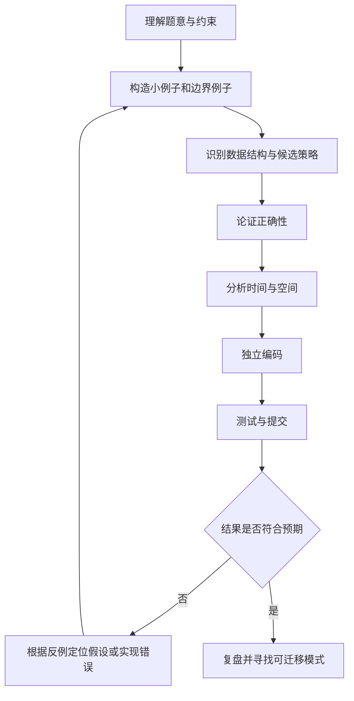

> 原书：李春葆、李筱驰《算法面试（全二册）》<br>
> 阅读范围：《算法面试（全二册）》前言（PDF 第 3～5 页，电子文档第 4～6 页）<br>
> 原书署期：2024 年 8 月

## 0. 阅读边界与前言主线

这篇前言不讲某一道题的解法，也没有给出公式、定理、伪代码或具体算法。它主要回答四个问题：

1. **为什么要学习算法？** 算法已经进入人工智能、数据挖掘、网络安全、生物信息学等领域，也是程序员的重要基础能力。
2. **为什么要进行算法面试训练？** 科技公司借助算法题观察候选人的编程、逻辑、问题求解和算法设计能力。
3. **这本书提供什么？** 全书以精选 LeetCode 题目为载体，用 C++ 和 Python 讲解数据结构、算法设计策略与经典问题。
4. **怎样使用这本书？** 具备基础后分类训练，由数据结构到算法、由简单到困难；重视思路、实现、复杂度比较、复盘和解题报告，避免未经思考就看或复制代码。

前言的论述顺序可以概括为：


下文沿原书前言的小节和段落顺序展开。凡标题含“**补充**”的内容，均用于解释背景、定义或实践方法，不代表原书在前言中给出了这些结论。

## 1. 教育、科技、人才与算法学习的背景

### 1.1 教育、科技、人才为什么被放在一起

前言首先引用党的二十大报告，从国家发展背景说明教育、科技和人才的基础性、战略性作用。这里不是直接讨论某个算法，而是在建立本书的出发点：技术创新需要人才，人才培养依赖教育，而算法与编程能力是计算机人才培养中的重要组成部分。

三者之间不是简单并列关系，而可以理解为一个相互促进的系统：

- **教育**承担知识传递和能力训练，使学习者形成可迁移的问题求解能力。
- **人才**把知识转化为研究、工程和产品实践。
- **科技**既是人才工作的成果，也不断产生新的知识和人才需求。

前言还强调高等教育与经济社会发展、就业创业和民生改善之间的联系。作者由此把算法学习放在“能力培养”而不是“只为做题”的框架中：刷题是训练手段，能够分析和解决问题才是目标。

### 1.2 算法为什么具有现实价值

原书列举了算法应用的多个领域和案例：

| 领域或场景 | 算法要解决的典型问题 | 直觉理解 |
|---|---|---|
| 人工智能 | 学习、搜索、推断、规划 | 从数据或规则中得到可用决策 |
| 数据挖掘 | 分类、聚类、关联分析 | 从大量数据中发现结构和规律 |
| 网络安全 | 检测、认证、加密、风险识别 | 在复杂流量和行为中识别或阻止威胁 |
| 生物信息学 | 序列比对、结构预测、数据分析 | 用计算方法处理规模庞大的生命科学数据 |
| 搜索引擎优化 | 检索、排序、索引 | 更快、更准确地找到相关信息 |
| 社交网络推荐 | 召回、排序、相似性计算 | 从大量候选内容中选择更可能有用的内容 |
| 医疗辅助诊断 | 特征分析、风险预测、决策支持 | 为专业人员提供基于数据的参考 |

这些例子共同说明：现实问题通常规模大、约束多，不能只靠手工处理或随意尝试。需要把问题转换成明确输入、输出和约束，再设计一套有限、可执行且可评估的步骤。

### 1.3 补充：什么是算法

为了理解前言所说的“算法知识和技能”，先给出一个工作定义：

> **算法**是对一类问题的求解过程所作的有限、无歧义、可执行的步骤描述。对定义域内每个满足前置条件的输入，它都应在有限步骤后终止，并产生满足问题规格的输出。

这个定义包含几个不能省略的条件：

- **输入**：算法处理的对象。例如排序算法的输入可以是一个含 $n$ 个可比较元素的序列。
- **输出**：必须满足的结果。例如排序输出不仅要非递减排列，还要与输入包含相同的元素及重数。
- **确定的步骤语义**：每一步做什么必须可以解释并执行。“适当地调整”不是严格步骤。
- **有限性**：算法必须终止。能不断运行的程序不一定是求解某一有限任务的算法。
- **正确性**：输出必须满足规格，而不是只对几个样例碰巧有效。
- **适用边界**：定义域、数据规模、资源限制和前置假设都属于算法说明的一部分。

算法与程序容易混淆：算法是与具体语言相对独立的求解方法，程序是算法在某种语言和运行环境中的实现。同一个算法可以有 C++、Python 等多种实现；两个程序也可能语法相似，却因边界处理不同而不具有相同的正确性。

### 1.4 从现实价值到面试能力

前言把算法面试视为许多科技公司招聘中的重要环节，并指出它通常考查四类能力：

| 能力 | 面试中可观察的行为 | 仅“背过答案”为什么不够 |
|---|---|---|
| 编程能力 | 把思路写成语法正确、边界完整的代码 | 模板不能代替调试、接口设计和异常处理 |
| 思维逻辑 | 分解条件、建立不变量、说明每一步因果 | 只报结论无法证明思路可靠 |
| 问题解决能力 | 澄清需求、选择模型、处理反例 | 题目变化后，死记的代码往往立即失效 |
| 算法设计技巧 | 选择数据结构和策略，权衡时间与空间 | 会实现不等于会在约束下作出选择 |

作者的分析链条是：算法在工程中重要，所以企业需要识别相关能力；直接观察长期工程表现成本很高，于是有限时间内的算法面试成为一种考查方式；候选人则需要通过系统训练展示思考过程与实现能力。

这里也有明确边界：前言说算法面试可以考查上述能力，并没有声称它能完整衡量一名工程师。真实工作还涉及需求沟通、系统设计、协作、可维护性、领域知识等。把“算法面试重要”理解成“算法题等于全部工程能力”是常见误解。

## 2. LeetCode 平台与算法面试训练

### 2.1 平台在训练中解决什么问题

前言介绍 LeetCode 是一个在线刷题平台，提供大量算法题目，帮助用户练习并理解数据结构与算法。平台化训练主要解决三个实际问题：

1. **题目来源分散**：集中题库降低寻找练习材料的成本。
2. **反馈周期过长**：在线评测可以较快反馈代码是否通过测试。
3. **训练难以分层**：题目标签和难度为分类练习提供入口。

在线评测通常根据预先准备的测试输入运行提交程序，再检查输出和资源消耗。提交通过只能说明程序通过了该评测集合，并不自动构成对所有合法输入都正确的数学证明；反过来，一次未通过则提供了查找反例、边界错误或性能问题的线索。

### 2.2 前言给出的平台背景

原书按时间介绍了以下背景：LeetCode 于 2011 年诞生于美国硅谷；2018 年 2 月由上海领扣网络引入中国并命名为“力扣”，中文网站同月测试上线；2018 年 10 月平台改版，更重视学习体验。

作者同时观察到，谷歌、微软、亚马逊等北美科技公司以及腾讯、百度、华为、字节跳动等国内公司都重视算法及相关知识的考查。这里的核心作用不是给出“某公司一定考某题”的承诺，而是说明算法题训练与科技公司的招聘实践存在现实联系。

### 2.3 补充：在线刷题的价值与边界

刷题的有效单位不应只是“通过一道题”，而应是完成一次求解闭环：



在线平台擅长提供题目和自动反馈，但有三项工作不能交给“通过”状态代替：

- **正确性论证**：为什么对所有合法输入有效，而不只是样例有效。
- **复杂度分析**：输入变大时，时间和额外空间怎样增长。
- **迁移训练**：约束或目标稍微变化时，能否重新选择方法。

## 3. 本书的编写目标

前言说明，本书提供编者精选的一系列 LeetCode 问题，覆盖不同难度，并同时采用 C++ 和 Python。其直接目标是帮助读者：

- 提高编程技能；
- 更深入地理解数据结构与算法原理；
- 应对算法面试中的挑战。

这三个目标有递进关系。只读懂原理但写不出代码，无法完成面试实现；只会照抄代码而不理解原理，无法处理变式；能理解也能实现，但不能在有限时间内识别题型、解释权衡，仍难以稳定应对面试。因此，本书以问题为载体，把知识、设计过程与实现练习连接起来。

“精选”也意味着本书不是 LeetCode 题库的完整复刻。它以代表性题目组织知识点，读者要学习的是题目背后的结构和方法，而不是把书中题号当成封闭范围。

## 4. 本书内容：三部分、25 章

### 4.1 第一部分：数据结构及其应用（第 1～14 章）

这一部分以常用数据结构为主题，包括：

1. 数组；
2. 链表；
3. 栈；
4. 队列和双端队列；
5. 哈希表；
6. 二叉树；
7. 二叉搜索树；
8. 平衡二叉树；
9. 优先队列；
10. 并查集；
11. 前缀和与差分；
12. 线段树；
13. 树状数组；
14. 字典树和后缀数组。

数据结构要解决的是“如何组织数据，使目标操作更容易完成”。同一批数据采用不同组织方式，查询、插入、删除、合并等操作的代价可能完全不同。例如，哈希表强调按键快速访问，优先队列强调快速取得当前最优先元素，并查集强调动态维护集合间的连通关系。第一部分关注的不是孤立记忆容器接口，而是理解结构性质如何服务于算法。

### 4.2 第二部分：算法设计策略及其应用（第 15～22 章）

这一部分以基本算法设计方法和策略为主题，包括：

- 穷举法；
- 递归；
- 分治法；
- DFS、BFS 和拓扑排序；
- 回溯法；
- 分支限界法；
- A\* 算法；
- 动态规划；
- 贪心法。

算法策略要解决的是“面对一类问题，怎样系统地产生和缩小候选解”。这些方法观察问题的角度不同：分治法寻找相互独立或可组合的子问题；动态规划利用重叠子问题和状态转移；回溯法在搜索过程中撤销选择；分支限界法借助界限排除不可能更优的分支；贪心法则希望局部选择能够导向全局目标。

需要注意，前言只是列出后续主题，没有在这里定义各策略的成立条件，也没有声称一种策略能替代另一种。具体问题能否采用某种方法，需要后续章节结合问题结构证明。

### 4.3 第三部分：经典问题及其求解（第 23～25 章）

最后三章围绕实际面试中的专题展开，包括：

- 跳跃问题；
- 迷宫问题；
- 设计问题。

这一部分强调同一问题的多种解法以及方法间的对比。它承接前两部分：先掌握数据结构和算法策略，再在综合问题中辨别“同一目标为什么可以有不同路径、不同路径的代价和适用条件是什么”。

### 4.4 三部分之间的递进关系

可以把全书结构理解为三个层次：

| 层次 | 核心问题 | 学习结果 |
|---|---|---|
| 数据结构 | 数据怎样组织 | 认识操作能力和成本的来源 |
| 算法策略 | 解空间怎样探索或分解 | 形成可复用的设计思路 |
| 经典专题 | 多种结构与策略怎样组合 | 学会比较方案并处理综合约束 |

这也解释了作者为什么建议先学习数据结构部分，再学习算法部分。算法不是悬空运行的步骤，它必须借助具体的数据表示和操作；先理解结构，后续才能准确分析算法每一步的成本。

## 5. 本书的五项特色

### 5.1 全面覆盖

原书认为自己对算法面试中可能涉及的主题作了较全面的覆盖，既包括基础数据结构，也包括常用算法设计策略。

这里的“全面”应结合全书范围理解：它指主题跨度较广，并不表示包含所有算法、所有面试题或所有工程知识。正确用法是把全书当作一张结构化路线图，再根据目标岗位和薄弱环节扩展；错误用法是认为读完 25 章便不再需要其他练习和知识。

### 5.2 实战导向

书中选取了国内外互联网公司算法面试中常见的 LeetCode 热门题，强调面试场景中的可操作性。实战导向意味着讲解不止停留在概念名称，还要落实到：

- 怎样从题意识别数据结构或算法策略；
- 怎样把思路变成可以提交的程序；
- 怎样处理输入边界和实现细节；
- 怎样观察时间与空间表现。

但“热门”不等于“必考”，题目价值在于代表某种思维模式，而不是预测特定公司的原题。

### 5.3 知识的结构化

本书以数据结构和算法策略为主线，把内容划分为知识点，再通过实例和问题求解把知识点连接成网络。

结构化学习要解决“题目做了很多，却不知道它们之间有什么关系”的问题。若只按题号线性记忆，每道新题都像全新的问题；若按结构归纳，读者可以问：

1. 输入对象是什么结构？
2. 目标操作是什么？
3. 哪个性质可以减少无效工作？
4. 这与做过的哪类问题共享状态、搜索方式或不变量？

知识网络的价值在于迁移：看到新题时，不必从零开始，而是从已有方法中提出候选方案，再根据约束筛选。

### 5.4 求解方法的多维性

原书强调同一问题可以用多种算法策略实现，并以迷宫问题为例，指出可采用回溯法、分支限界法、A\* 算法和贪心法等方法求解。多解法对比要回答的不是“哪段代码更高级”，而是：

- 各方法求的目标是否完全相同；
- 是否保证找到可行解；
- 是否保证找到最优解；
- 正确性或最优性依赖什么条件；
- 时间、空间和实现复杂度怎样变化；
- 在给定数据规模和资源限制下应选哪一个。

因此，“方法多维”服务于算法选择能力。一个方法在某种条件下更快，并不意味着它在所有输入、所有目标下都更好。

### 5.5 代码的规范化

书中使用 C++ 和 Python，前言说明相关代码已在 LeetCode 提交通过，并在变量名称、算法策略及代码组织方面尽量统一、标准化，以提高可读性。

规范化要解决的是“正确代码不一定容易理解、验证和修改”的问题。统一命名能使相同概念在不同题中保持稳定；清晰组织能让读者看出初始化、主循环、状态更新和返回值之间的关系；两种语言的实现则有助于区分算法本身与语言细节。

不过，提交通过与代码规范分别回答两个问题：前者提供测试层面的正确性证据，后者改善可读性和维护性。规范不能证明算法正确，通过测试也不能自动说明代码表达清晰。

### 5.6 题目来源说明

原书特别注明：书中以“LeetCode + 序号”开头的题目均来自 LeetCode 平台。这是在区分题目来源与编者讲解，阅读和引用时应保留这一边界。

## 6. 配套资源获取方式

前言说明，配套资源可通过扫描目录上方的二维码获取。这一段只交代获取入口，没有在前言中逐项列出资源内容、适用版本或长期可用性。因此，实际使用时应以二维码当前指向的官方页面和资源说明为准，不宜仅凭“配套资源”四字推断其一定包含某种文件。

## 7. 如何刷题和使用本书

这是前言中最直接的方法论部分。作者没有把“多做题”当成唯一建议，而是给出了训练次序、过程要求、评估方法和应避免的行为。

### 7.1 先具备必要基础

作者建议读者在具备一定的数据结构与算法基础后，再按专题分类刷题。原因是分类训练要求读者理解专题名称背后的基本概念，否则容易把“看到标签就套模板”误当成算法设计。

“具备一定基础”可以用以下能力自检：能说明常见数据结构的基本操作；能读懂循环、递归和函数调用；能独立跟踪变量状态；能初步判断一段程序的时间与额外空间消耗。前言没有规定统一考试或分数门槛，因此这是学习准备度，而不是硬性资格。

### 7.2 按专题分类，而不是随机堆题量

分类刷题把短期记忆转化为模式辨认。同一专题中的题目通常共享某些结构性质，但目标和约束又不完全相同。连续比较这些题目，更容易发现：哪些步骤是通用骨架，哪些判断来自特定条件，哪些边界不能机械照搬。

分类也存在误用：如果一开始就知道题目标签，可能跳过“识别方法”这一步。较成熟的训练可以分两阶段：先在专题内形成方法，再混合题目，练习在没有标签提示时选择策略。第二阶段属于基于原书分类建议的“补充”实践，不是前言的原句。

### 7.3 先数据结构，后算法策略

作者明确建议先刷数据结构部分，再刷算法部分。其内在依据是：

1. 算法执行依赖数据的表示和基本操作；
2. 数据结构决定某些操作能否高效完成；
3. 只有知道基本操作的代价，才能分析完整算法的复杂度；
4. 在此基础上学习搜索、分治、动态规划等策略，才不会只剩抽象模板。

这是一条默认学习路线，不等于所有读者都必须机械地完成前 14 章后才能看第 15 章。已有基础的读者可以通过自测定位薄弱点，但不应跳过实际不理解的前置结构。

### 7.4 先简单，后困难

书中把题目分为三个难度级别：

| 书中标记 | 对应难度 | 阶段目标 |
|---|---|---|
| ★ | 简单 | 熟悉概念、接口和基本模式 |
| ★★ | 中等 | 组合多个条件，独立完成主要设计 |
| ★★★ | 困难 | 处理更复杂状态、证明与性能约束 |

由易到难不是为了回避困难，而是为了控制一次训练引入的新变量。简单题可先验证对结构和基本模式的理解；中等、困难题再增加状态设计、剪枝、证明和边界处理的负担。

难度是相对标签，不是精确测量。同一道题对熟悉某种方法的人可能很直接，对初学者则很困难；难度也不能替代知识点和错误原因分析。

### 7.5 思路与实现细节都要清楚

作者要求刷题时既重视算法思路，也重视算法实现细节，并做到每个环节清楚、能够举一反三。

可以把一次完整解题分成六层：

1. **规格层**：输入、输出、约束和特殊情况是什么？
2. **模型层**：把原问题表示成数组、图、树、状态空间还是其他对象？
3. **策略层**：采用遍历、搜索、分治、动态规划或其他方法的理由是什么？
4. **证明层**：为何不会漏解、重复或产生错误结果？
5. **实现层**：循环边界、下标、空输入、重复元素、递归终止等如何处理？
6. **评估层**：时间、空间、可读性与适用条件如何？

“思路对了但代码没过”往往说明实现层存在断点；“代码过了但讲不清”则说明模型、策略或证明尚未真正掌握。面试训练需要把两者接通。

### 7.6 举一反三的严格含义

举一反三不是把同一模板复制到三道外观相似的题，而是识别方法成立所依赖的性质，并在条件变化时重新判断。

例如，一个方法依赖输入有序，那么遇到无序输入时至少要追问：能否先排序？排序会不会破坏原下标信息？$O(n\log n)$ 的预处理是否满足约束？是否存在不排序的方法？只有能回答这些问题，才算把方法从原题迁移到变式。

### 7.7 比较在线结果与书中的时间、空间

作者建议把自己的在线提交结果与书中列出的时间和空间进行对比，同时提醒：书中的数据是编者提交时的结果，后续可能因环境变化而不同。

这项提醒非常重要。在线显示的毫秒数和内存数是一次或若干次具体运行的测量值，会受到以下因素影响：

- 服务器硬件和负载；
- 编译器、解释器及其版本；
- 测试数据集合；
- 计时和内存统计口径；
- 缓存、运行时预热和随机波动；
- 平台更新。

因此，实测数据适合用来发现数量级差异或明显回退，不宜把一次排名百分比当成算法优劣的严格证明。比较时应优先确认算法的渐近复杂度，再在尽量一致的环境中多次测量。

### 7.8 补充：时间复杂度与空间复杂度怎样表达

设输入规模为 $n$，某算法执行的基本操作次数为 $T(n)$。大 $O$ 记号给出渐近上界：

$$
T(n)=O(g(n))
$$

其严格含义是：存在常数 $c>0$ 和 $n_0>0$，使得对所有 $n\ge n_0$，都有

$$
0\le T(n)\le c\,g(n).
$$

各符号的含义如下：

- $n$：输入规模，例如数组长度；
- $T(n)$：在指定计算模型下统计的操作次数，或与运行时间成比例的代价函数；
- $g(n)$：用于描述增长速度的比较函数；
- $c$：吸收机器速度、单次操作成本等常数因素；
- $n_0$：从多大规模开始保证这个上界成立。

例如，若一个双重循环的精确执行次数为

$$
T(n)=3n^2+2n+5,
$$

当 $n\ge 1$ 时，有 $2n\le 2n^2$ 且 $5\le 5n^2$，所以

$$
T(n)=3n^2+2n+5\le 3n^2+2n^2+5n^2=10n^2.
$$

取 $c=10$、$n_0=1$，便根据定义得到 $T(n)=O(n^2)$。这一步不是“删掉低阶项”那么简单，而是在构造一个从某个规模起始终成立的上界。

类似地，若 $S(n)$ 表示算法除输入本身以外所需的额外存储单元数，则可以用 $S(n)=O(g(n))$ 描述**额外空间复杂度**。分析时必须说明是否把输入、输出、递归调用栈计入空间，否则两个结论可能采用了不同口径。

大 $O$ 描述增长上界，平台显示的“80 ms、20 MB”则是特定环境中的观测值。两者不能直接互换：同为 $O(n)$ 的两个实现可以有不同常数；小规模下，$O(n\log n)$ 的实现也可能暂时快于常数较大的 $O(n)$ 实现。

### 7.9 补充：可运行的 Python 计时与内存比较示例

下面用“判断序列是否包含重复元素”演示如何比较两个正确方法。方法一把每个元素与它后面的元素逐一比较；方法二用集合记录已经见过的元素。代码不是原书前言中的示例，只用于落实前言提出的时间、空间对比方法。

```python
from __future__ import annotations

import gc
import time
import tracemalloc
from collections.abc import Callable


def has_duplicate_pairwise(values: list[int]) -> bool:
    """逐对比较：最坏情况下执行约 n(n-1)/2 次比较。"""
    for left in range(len(values)):
        for right in range(left + 1, len(values)):
            if values[left] == values[right]:
                return True
    return False


def has_duplicate_set(values: list[int]) -> bool:
    """集合记录：平均情况下扫描一次，但要使用额外集合空间。"""
    seen: set[int] = set()
    for value in values:
        if value in seen:
            return True
        seen.add(value)
    return False


def measure(
    function: Callable[[list[int]], bool], values: list[int], repeats: int = 5
) -> tuple[bool, float, int]:
    """返回函数结果、最短运行时间（毫秒）和峰值额外内存（KiB）。"""
    times: list[float] = []
    result = False

    # 关闭自动垃圾回收，减少不同轮次触发回收造成的计时波动。
    gc.disable()
    try:
        for _ in range(repeats):
            start = time.perf_counter()
            result = function(values)
            times.append(time.perf_counter() - start)
    finally:
        gc.enable()

    # tracemalloc 统计 Python 分配器跟踪到的峰值，不代表进程总内存。
    tracemalloc.start()
    result = function(values)
    _, peak_bytes = tracemalloc.get_traced_memory()
    tracemalloc.stop()

    return result, min(times) * 1000, peak_bytes // 1024


def main() -> None:
    # 无重复元素会触发两个算法的最坏或完整扫描路径，便于观察增长趋势。
    sizes = [500, 1_000, 2_000]
    methods = [has_duplicate_pairwise, has_duplicate_set]

    for size in sizes:
        values = list(range(size))
        print(f"n={size}")
        for method in methods:
            result, milliseconds, peak_kib = measure(method, values)
            print(
                f"  {method.__name__:24s} "
                f"结果={result!s:5s} 时间={milliseconds:8.3f} ms "
                f"峰值={peak_kib:5d} KiB"
            )


if __name__ == "__main__":
    main()
```

一次示意输出如下。具体数字会随机器和运行环境变化，重点应观察规模翻倍时的趋势，而不是复现完全相同的毫秒数：

```text
n=500
  has_duplicate_pairwise   结果=False 时间=   3.000 ms 峰值=    0 KiB
  has_duplicate_set        结果=False 时间=   0.020 ms 峰值=   40 KiB
n=1000
  has_duplicate_pairwise   结果=False 时间=  13.000 ms 峰值=    0 KiB
  has_duplicate_set        结果=False 时间=   0.040 ms 峰值=   40 KiB
n=2000
  has_duplicate_pairwise   结果=False 时间=  52.000 ms 峰值=    0 KiB
  has_duplicate_set        结果=False 时间=   0.080 ms 峰值=  160 KiB
```

方法一在无重复元素时的比较次数为

$$
(n-1)+(n-2)+\cdots+1
=\sum_{k=1}^{n-1}k
=\frac{n(n-1)}{2}.
$$

等差数列求和可这样论证：把 $1+2+\cdots+(n-1)$ 正写一次、倒写一次，每一列之和都是 $n$，共有 $n-1$ 列，因此两份和为 $n(n-1)$，一份就是 $n(n-1)/2$。展开后为 $(n^2-n)/2$，故最坏时间复杂度为 $O(n^2)$，额外空间为 $O(1)$。

方法二最多对 $n$ 个元素各做一次集合查询和一次插入。在哈希分布良好、集合操作平均为 $O(1)$ 的假设下，平均时间为 $O(n)$；集合最多保存 $n$ 个元素，额外空间为 $O(n)$。这里必须保留“平均”和哈希假设，不能把它无条件说成所有情况下的严格最坏 $O(n)$。

当 $n$ 翻倍时，$n^2$ 约变为原来的 $4$ 倍，而 $n$ 约变为原来的 $2$ 倍。代码中的计时趋势与公式相呼应，但不构成公式的证明；复杂度来自操作计数和假设，基准测试只是经验验证。

### 7.10 经常归纳总结并撰写解题报告

前言把归纳总结和解题报告视为提高编程能力的有效手段。报告的作用是把容易消失的“当时好像懂了”转化为可检查的推理记录。

一份有用的解题报告至少可以包含：

1. 题目规格与关键约束；
2. 朴素方法及其瓶颈；
3. 最终方法的核心观察；
4. 状态、变量或数据结构的含义；
5. 正确性论证；
6. 时间和空间复杂度；
7. 易错边界与失败尝试；
8. 可迁移的题型特征和变式。

归纳不是抄一遍标准答案，而是回答“我原先卡在哪里、哪个条件触发了方法选择、下次怎样认出来”。

### 7.11 不要未经深入思考就看代码

作者明确反对在没有深入思考和分析一道题之前，就阅读书中代码甚至复制、粘贴代码。

原因在于，看到完整答案后会产生“阅读流畅即已经掌握”的错觉。识别别人写出的步骤，比从题目独立构造步骤容易得多；复制代码还会跳过变量定义、边界决策、错误定位等关键训练。

这不意味着永远不能看题解。合理的边界是：先留下自己的问题分析、候选方法和失败原因；遇到瓶颈后，可以分层获取提示；看完后关闭答案，重新推导并独立实现；最后用变式或隔日重写检查是否真正掌握。这个“分层提示—独立重写”的具体流程属于补充实践，与作者“先深入思考”的原则一致。

### 7.12 持续训练，但不把坚持误解为机械重复

前言最后强调良好的刷题方法与持之以恒。二者缺一不可：没有持续投入，知识难以巩固；没有方法，只增加题量可能反复犯同类错误。

有效的持续训练应当留下反馈：正确率是否提高，是否能更快识别结构，能否说清证明，边界错误是否减少，旧题能否独立重做。坚持的对象是“分析—实现—评估—复盘”的过程，而不只是每日提交数字。

## 8. 补充：把前言建议落地为一次训练流程

下面给出一个不依赖固定时长的练习清单，用来把前言的方法转成可执行动作：

### 8.1 解题前

- 用自己的话复述输入、输出和约束。
- 至少写出一个普通样例和两个边界样例。
- 估计可接受的复杂度数量级。
- 先提出朴素方案，明确它慢在哪里。

### 8.2 解题中

- 说明选择数据结构和算法策略的原因。
- 为循环、递归或状态转移写出不变量或语义。
- 在编码前手算一个小例子。
- 对空输入、单元素、重复值、极值等情况逐项检查。

### 8.3 提交后

- 若失败，先保存反例并定位是理解、策略还是实现错误。
- 若通过，补写正确性和复杂度分析，不以“通过”替代解释。
- 与书中方案比较思路、条件和复杂度，而不只比较毫秒排名。
- 写下一条可迁移规律，并安排一次无答案重做。

## 9. 易混淆概念与常见误解

| 容易混淆的说法 | 更准确的理解 |
|---|---|
| 算法就是代码 | 算法是求解步骤，代码是某种语言中的实现 |
| 通过在线评测就证明绝对正确 | 通过是重要测试证据，但不等同于覆盖所有合法输入的证明 |
| 运行时间更短，复杂度一定更优 | 实测受环境、常数和数据影响；渐近复杂度需要从操作增长推导 |
| 背会热门题就能应对面试 | 热门题用于训练模式，题目变式仍要求理解条件和推理过程 |
| 困难题一定比简单题更有价值 | 难度不是唯一维度；是否补足当前能力缺口更重要 |
| 同一问题有一个永远最好的算法 | 方案选择取决于目标、输入性质、规模及时间和空间约束 |
| 看懂标准答案等于会做 | 阅读是识别过程，独立推导、编码和解释才检验提取能力 |
| 刷题量越大，进步越稳定 | 题量只有与反馈、归纳和重做结合才容易转化为能力 |

## 10. 致谢与来源边界

前言最后说明了题目授权、出版支持和参考来源：书中 LeetCode 题目及相关内容得到领扣网络（上海）有限公司授权；清华大学出版社相关人员为出版和编辑提供支持；编写过程参考了许多博客以及 LeetCode 题解评论栏目中的文章。作者在此向相关机构和人员致谢。

这一段提醒读者区分三类内容：LeetCode 平台题目、编者组织的讲解与代码、外部社区提供的经验和讨论。学习时可以综合参考，但在记录、传播或引用时应尊重各自来源，不把平台题目或他人观点误写成自己的原创。

## 11. 前言的核心结论

前言真正建立的不是一份题单，而是一套学习观：算法具有广泛现实价值，算法面试要求候选人同时展示思考和实现能力；LeetCode 与本书提供训练材料，但平台反馈和标准代码都不能代替独立分析。全书用“数据结构—算法策略—经典专题”组织 25 章内容，再通过全面覆盖、实战题目、知识结构化、多方法对比和规范代码帮助读者形成方法网络。

最值得贯穿后续阅读的原则是：**先理解问题与条件，再设计并论证方法；既看算法思路，也查实现细节；既分析渐近复杂度，也理性看待实测数据；最后通过归纳、报告和重做，把一道题变成可迁移的能力。**
