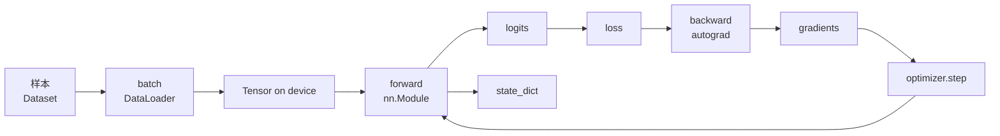
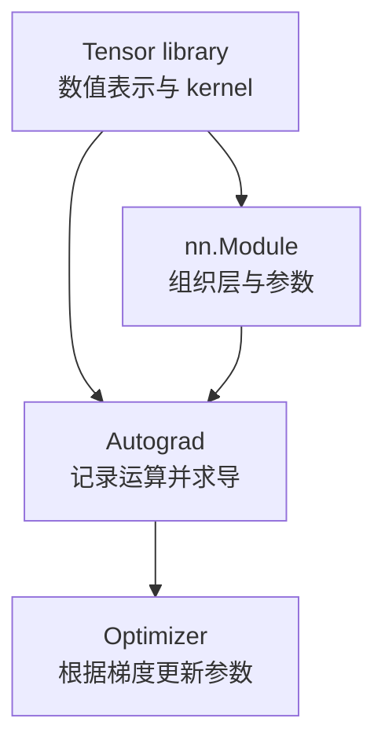
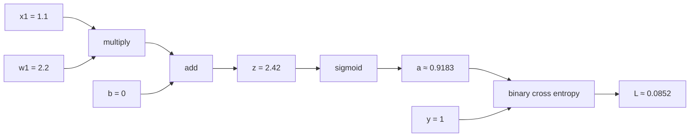
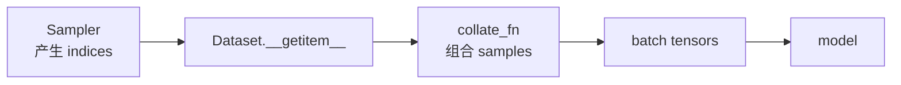
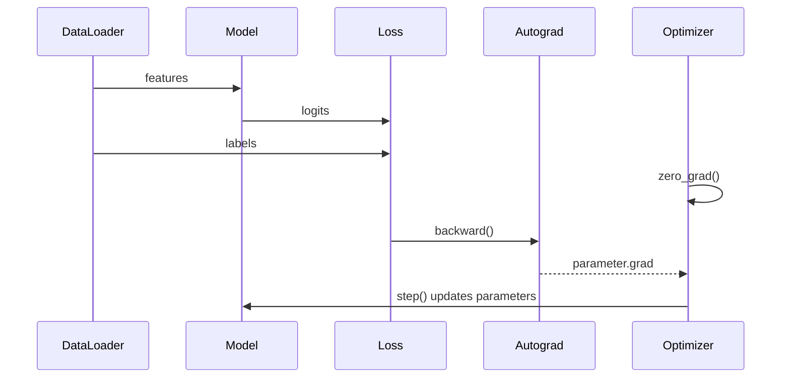
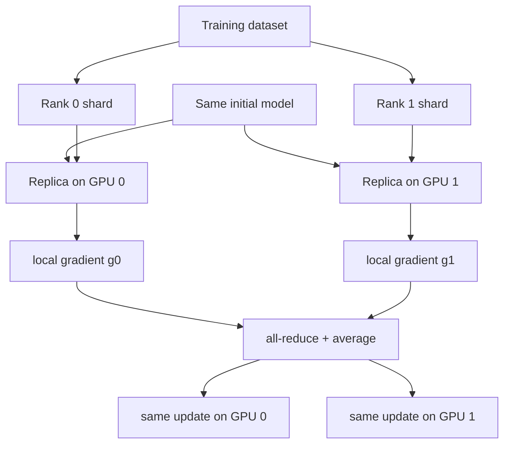
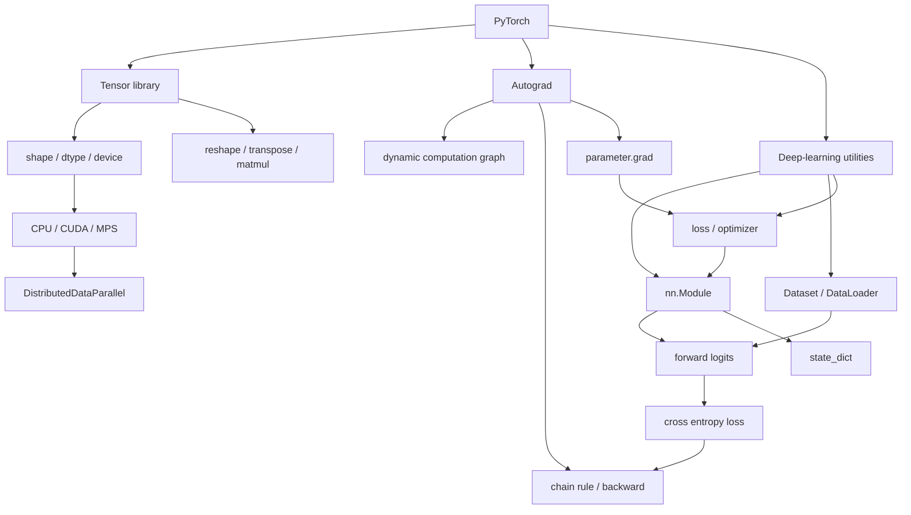
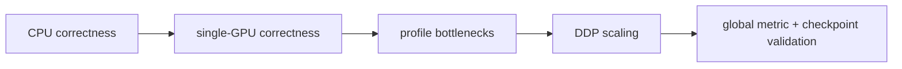

> 对应原书 *Build a Large Language Model (From Scratch)* 附录 A。本文沿原书 A.1–A.9 的顺序，围绕本书后续实现 LLM 真正需要的 PyTorch 基础展开：张量、计算图、自动微分、神经网络、数据管线、训练循环、模型持久化以及单卡/多卡训练。

---

## 0. 阅读目标与主线

这不是 PyTorch API 百科。作者选择一个很小的二分类问题，逐步回答一条完整训练链上的问题：

1. 数据和参数怎样表示？——`Tensor`。
2. 模型怎样表示一连串计算？——动态计算图。
3. 参数对 loss 的影响怎样得到？——autograd 与反向传播。
4. 层和参数怎样组织？——`nn.Module`。
5. 样本怎样高效组成 batch？——`Dataset` 与 `DataLoader`。
6. 参数怎样反复更新？——loss、`.backward()` 与 optimizer。
7. 学到的参数怎样复用？——`state_dict`。
8. 计算怎样迁移到 GPU 并扩展到多卡？——device 与 DDP。



附录最值得掌握的不是孤立函数名，而是以下不变量：

- 每个张量都有 `shape`、`dtype` 和 `device`；参与同一运算的对象必须满足相应契约。
- forward 建立从参数到 loss 的依赖；backward 沿依赖反向应用链式法则。
- optimizer 只会更新传给它且具有梯度的参数。
- 训练、验证、推理的模型模式和梯度跟踪状态是两个不同开关。
- 多 GPU 数据并行复制模型、切分数据并同步梯度，并不会自动切分模型本身。

---

## A.1 What Is PyTorch?（PyTorch 是什么）

PyTorch 是开源、Python-first 的张量计算与深度学习库。原书引用 Papers With Code 和 Kaggle 2022 调查说明它在研究界和实践中的广泛使用；更重要的技术原因是它在三个目标间取得平衡：

- 接口接近 Python/NumPy，便于表达实验；
- 底层张量 kernel 可在 CPU/GPU 上高效执行；
- `nn.Module`、autograd 等抽象足够通用，复杂模型仍可定制。

对本书而言，PyTorch 不是替代对 LLM 原理的理解，而是负责可靠执行线性代数、自动求导和参数更新。本书仍会亲自实现 tokenizer 数据管线、attention、Transformer block、GPT、训练和微调逻辑。

### A.1.1 The Three Core Components of PyTorch（三个核心组成）

#### 1. Tensor library：统一的数据与计算容器

Tensor 是带有规则形状和统一数据类型的多维数组。PyTorch 提供创建、索引、变形、矩阵乘法、归约等运算，并可把同一套表达迁移到不同 device。

它解决两个问题：

1. 用向量化 kernel 代替低效 Python 元素循环；
2. 让数据、参数和中间激活采用统一表示。

#### 2. Automatic differentiation：从 forward 自动得到梯度

训练需要计算 loss 对数百万甚至数十亿参数的偏导。手工推导和实现每个复合运算的导数不可维护。Autograd 在 forward 时记录运算依赖，在 backward 时自动应用链式法则。

#### 3. Deep-learning utilities：把训练系统模块化

`torch.nn`、`torch.optim`、`torch.utils.data` 等提供：

- 常用层与激活函数；
- loss functions；
- optimizers；
- Dataset/DataLoader；
- 参数注册、保存和设备迁移；
- 分布式训练工具。

三者不是互相独立的产品：神经网络层内部执行 tensor 运算，autograd 跟踪这些运算，optimizer 再读取参数张量上的 gradient。



### A.1.2 Defining Deep Learning（AI、机器学习与深度学习）

原书先澄清概念层级，因为 LLM 常被同时称为 AI、机器学习模型和深度神经网络：

$$
\text{Deep Learning}
\subset
\text{Machine Learning}
\subset
\text{Artificial Intelligence}.
$$

#### Artificial intelligence（AI）

AI 是最宽泛的目标：让机器执行通常需要人类智能的任务，例如理解语言、识别模式和决策。AI 不等于机器学习；规则系统、搜索和规划也属于 AI 方法。

#### Machine learning（ML）

机器学习让系统从数据中估计规律，而不是由程序员穷举每条输入到输出的规则。监督学习的抽象是：

$$
\mathcal D_{\mathrm{train}}
=\{(\boldsymbol{x}^{(i)},y^{(i)})\}_{i=1}^{N},
$$

学习带参数的函数 $f_\theta$，使预测 $f_\theta(\boldsymbol{x})$ 与标签 $y$ 的误差尽量小。

#### Deep learning（DL）

深度学习是以多层神经网络学习复杂、非线性表示的方法。“深”指多层可学习变换，不是单纯参数多。它尤其适合文本、图像和音频等高维非结构化数据，但通常也需要更多数据、算力和工程控制。

#### 从分类到 LLM 预训练

典型监督分类：

```text
labeled examples -> train model -> evaluate -> predict unknown labels
```

LLM 的 next-token 预训练仍符合这个结构，只是标签从文本自身平移得到：

$$
(t_0,t_1,\ldots,t_{n-1})
\longrightarrow
(t_1,t_2,\ldots,t_n).
$$

因此 LLM 预训练通常称为 self-supervised learning：监督信号不是人工类别标注，而是原文本的下一 token。推理时，模型反复把新预测追加到上下文，生成新序列。

#### 训练、验证与测试的职责

- Training set：参与梯度更新。
- Validation set：多次用于选择超参数、停止时机或模型版本。
- Test set：选择完成后使用，估计最终泛化性能。

若反复查看 test 结果再修改模型，test 就事实上参与了选择，评估会产生乐观偏差。

### A.1.3 Installing PyTorch（安装与环境验证）

原书示例基于 PyTorch 2.4.0：

```shell
pip install torch==2.4.0
```

版本号是原书复现实验的时间边界，不是永远推荐的最新版本。安装 CPU、CUDA 或 ROCm build 的具体命令依操作系统、Python、driver 和硬件而变，应以 PyTorch 官方安装选择器为准。`torchvision`、`torchaudio` 对本书主体不是必需依赖。

科学计算库常滞后于最新 Python 发布，因此原书建议选择较成熟的 Python 版本。实际项目应创建隔离环境并记录：

```shell
python --version
pip --version
pip show torch
```

最小验证：

```python
import torch

print("PyTorch:", torch.__version__)
print("CUDA available:", torch.cuda.is_available())
print("CUDA devices:", torch.cuda.device_count())
print("MPS available:", torch.backends.mps.is_available())
```

`torch.cuda.is_available() == False` 只说明**当前 Python 进程**不能使用 CUDA，不足以单独断定“电脑没有 GPU”。可能原因包括：

- 没有 NVIDIA CUDA-capable GPU；
- 安装的是 CPU-only PyTorch；
- driver/runtime 与 build 不匹配；
- GPU 在当前容器或远程环境中不可见。

Apple Silicon 使用 `mps` backend；AMD 的 GPU 支持通常通过 ROCm build。初学章节可在 CPU 上运行，但 LLM 训练通常高度依赖加速器。

#### 练习 A.1 与 A.2

- A.1：安装 PyTorch，并确认版本与目标 device。
- A.2：运行书籍仓库的环境检查代码。

验收不应只看 `import torch`，还应构造张量、执行一次矩阵乘法，并确认预期 device 和 dtype。

---

## A.2 Understanding Tensors（理解张量）

从数学上，tensor 泛化了 scalar、vector 和 matrix；从 PyTorch 工程视角，它是同质多维数组，附带自动微分和 device 信息。

一个 PyTorch tensor 至少要从四个维度理解：

$$
\text{Tensor contract}
=
(\text{shape},\text{dtype},\text{device},\text{grad state}).
$$

例如 `shape=(8, 1024, 768)` 可表示 8 个样本、每个 1,024 个 token、每 token 768 维 hidden state；`dtype=torch.float32` 决定每个元素通常占 4 bytes；`device='cuda:0'` 决定数据和运算位置；`requires_grad=True` 表示相关运算可能被 autograd 跟踪。

### A.2.1 Scalars, Vectors, Matrices, and Tensors

```python
import torch

tensor0d = torch.tensor(1)
tensor1d = torch.tensor([1, 2, 3])
tensor2d = torch.tensor([[1, 2], [3, 4]])
tensor3d = torch.tensor([
    [[1, 2], [3, 4]],
    [[5, 6], [7, 8]],
])

assert tensor0d.ndim == 0 and tensor0d.shape == torch.Size([])
assert tensor1d.ndim == 1 and tensor1d.shape == (3,)
assert tensor2d.ndim == 2 and tensor2d.shape == (2, 2)
assert tensor3d.ndim == 3 and tensor3d.shape == (2, 2, 2)
```

#### Rank/order 与元素数不是一回事

- `torch.tensor(7)`：0D，rank 0，1 个元素。
- `torch.tensor([1, 2, 3])`：1D，rank 1，3 个元素。
- shape 为 `(3, 1)`：2D matrix，即使也只有 3 个元素。

因此“三维向量”通常指有 3 个分量的一维 tensor，shape 为 `(3,)`；“3D tensor”指有 3 个轴，例如 shape `(2, 3, 4)`。这里 rank 是轴数，不是线性代数中矩阵秩的含义。

#### Shape 作为接口契约

设 batch 输入 $X\in\mathbb R^{B\times d_{in}}$，线性层权重 $W\in\mathbb R^{d_{out}\times d_{in}}$，bias $b\in\mathbb R^{d_{out}}$。PyTorch `Linear` 的计算可写为：

$$
Y=XW^\top+b,
\qquad
Y\in\mathbb R^{B\times d_{out}}.
$$

最后一维不匹配时，问题不是“模型没学好”，而是数学运算本身没有定义。

### A.2.2 Tensor Data Types（数据类型）

原书展示的默认推断：

```python
import torch

integer_tensor = torch.tensor([1, 2, 3])
float_tensor = torch.tensor([1.0, 2.0, 3.0])

assert integer_tensor.dtype == torch.int64
assert float_tensor.dtype == torch.float32

converted = integer_tensor.to(torch.float32)
assert converted.dtype == torch.float32
```

#### 为什么深度学习常用 float32

float32 在精度、显存和吞吐间取得实用平衡。若含 $N$ 个元素，理论数据存储约为：

$$
M=N\times\frac{b}{8}\ \text{bytes},
$$

其中 $b$ 是每元素 bit 数。相同 shape 下 float32 占 float64 一半内存。现代 GPU 还对 float16/bfloat16 等低精度有专门吞吐优化，但低精度训练需要关注 underflow、overflow 和算子支持。

#### dtype 由语义决定，不是越精确越好

- Token IDs 与类别 labels 通常是 `torch.int64`，因为 embedding lookup 和 cross-entropy target 需要整数索引。
- 模型权重、激活和 logits 通常是 floating point。
- Boolean mask 使用 `torch.bool`。
- 整数 tensor 不能作为通常意义上的可训练参数，因为离散整数上没有连续梯度。

`.to(...)` 可同时转换 dtype 或 device，并返回转换后的 tensor：

```python
x = torch.tensor([1, 2, 3])
x = x.to(dtype=torch.float32, device="cpu")
assert x.dtype == torch.float32
assert x.device.type == "cpu"
```

不要写 `x.to(...)` 后丢弃返回值并假设原对象已原地改变。

### A.2.3 Common PyTorch Tensor Operations（常用操作）

原书集中介绍 `shape`、reshape/view、transpose 和 matrix multiplication。

```python
import torch

tensor2d = torch.tensor([
    [1, 2, 3],
    [4, 5, 6],
])

assert tensor2d.shape == (2, 3)
assert tensor2d.reshape(3, 2).tolist() == [
    [1, 2],
    [3, 4],
    [5, 6],
]
assert tensor2d.T.tolist() == [
    [1, 4],
    [2, 5],
    [3, 6],
]
assert (tensor2d @ tensor2d.T).tolist() == [
    [14, 32],
    [32, 77],
]
```

#### `reshape` 与 transpose 的区别

`reshape(3, 2)` 保持底层元素的线性顺序，仅重新解释轴；transpose 交换两个轴对应的索引关系：

$$
(X^\top)_{ij}=X_{ji}.
$$

它们都可能得到 shape `(3, 2)`，但数值排列不同：

```text
reshape: [[1, 2], [3, 4], [5, 6]]
transpose: [[1, 4], [2, 5], [3, 6]]
```

#### `view` 与 `reshape` 的内存边界

`view` 只在现有 stride 能支持目标视图时工作，通常要求 contiguous-compatible 的内存布局。transpose 后的 tensor 往往 non-contiguous：

```python
import torch

x = torch.arange(6).reshape(2, 3)
x_t = x.T
assert not x_t.is_contiguous()

# reshape 必要时会复制；返回值可能不再共享原 storage。
flattened = x_t.reshape(-1)
assert flattened.tolist() == [0, 3, 1, 4, 2, 5]
```

`reshape` 会尽量返回 view，做不到时复制，因此更宽容；`view` 的失败能显式暴露布局假设。不能一概声称两者总是复制或总是共享内存。

#### Matrix multiplication 不是逐元素乘法

对 $A\in\mathbb R^{m\times n}$、$B\in\mathbb R^{n\times p}$：

$$
C=AB,\qquad
C_{ij}=\sum_{k=1}^{n}A_{ik}B_{kj}.
$$

PyTorch 使用 `A.matmul(B)` 或 `A @ B`。`A * B` 是 elementwise multiplication，要求 shape 相同或可 broadcast。对原书矩阵：

$$
\begin{bmatrix}1&2&3\\4&5&6\end{bmatrix}
\begin{bmatrix}1&4\\2&5\\3&6\end{bmatrix}
=
\begin{bmatrix}
1^2+2^2+3^2 & 1\cdot4+2\cdot5+3\cdot6\\
4\cdot1+5\cdot2+6\cdot3 & 4^2+5^2+6^2
\end{bmatrix}
=
\begin{bmatrix}14&32\\32&77\end{bmatrix}.
$$

#### Broadcasting：bias 为什么能加到整个 batch

当 shape 可从末尾对齐，且每一维相等或其中之一为 1，PyTorch 可虚拟扩展较小 tensor。例如 `(B, d)+(d,) -> (B, d)`，所以一个 bias vector 能加到每个样本。Broadcast 通常不实际复制数据，但不当 shape 也可能“合法运行却语义错误”，因此仍应检查 shape。

---

## A.3 Seeing Models as Computation Graphs（把模型看成计算图）

计算图是有向图：节点表示 tensor 或 operation，边表示“一个结果依赖另一个值”。它把“模型输出是什么”与“输出如何依赖参数”同时编码出来。

原书用只有一个 feature 的 logistic regression：

```python
import torch
import torch.nn.functional as F

y = torch.tensor([1.0])
x1 = torch.tensor([1.1])
w1 = torch.tensor([2.2])
b = torch.tensor([0.0])

z = x1 * w1 + b
a = torch.sigmoid(z)
loss = F.binary_cross_entropy(a, y)

assert torch.allclose(z, torch.tensor([2.42]))
assert 0.0 < a.item() < 1.0
assert loss.item() > 0.0
```

数学表达：

$$
z=x_1w_1+b,
$$

$$
a=\sigma(z)=\frac{1}{1+e^{-z}},
$$

$$
L(a,y)
=-
\bigl[y\log a+(1-y)\log(1-a)\bigr].
$$

当 $y=1$ 时，$L=-\log a$。若模型给真实类别较高概率，$a\to1$，loss 趋近 0；若 $a\to0$，loss 急剧增大。



这里 graph 的价值不只在可视化。为了求 $\partial L/\partial w_1$，系统必须知道 loss 是经 BCE、sigmoid、加法和乘法依赖于 $w_1$ 的。PyTorch 在 forward 执行真实 Python 控制流时动态构建这条依赖，因此称 dynamic computation graph。

---

## A.4 Automatic Differentiation Made Easy（自动微分）

训练需要知道“参数改变一点，loss 将怎样改变”。对参数向量 $\boldsymbol\theta$：

$$
\nabla_{\boldsymbol\theta}L
=
\begin{bmatrix}
\frac{\partial L}{\partial\theta_1}\\
\frac{\partial L}{\partial\theta_2}\\
\vdots
\end{bmatrix}.
$$

梯度是局部最陡上升方向，因此负梯度可作为降低 loss 的局部方向：

$$
\boldsymbol\theta
\leftarrow
\boldsymbol\theta-\eta\nabla_{\boldsymbol\theta}L,
$$

其中 learning rate $\eta>0$ 决定步长。

### A.4.1 Partial Derivatives and Gradients（偏导与梯度）

偏导固定其他变量，只考察一个变量的微小变化；梯度把所有偏导组成向量。反向传播不是一种不同于链式法则的数学规律，而是将链式法则高效应用于图的算法。

若 $L$ 通过 $a,z$ 间接依赖 $w_1$：

$$
\frac{\partial L}{\partial w_1}
=
\frac{\partial L}{\partial a}
\frac{\partial a}{\partial z}
\frac{\partial z}{\partial w_1}.
$$

之所以从 loss 向输入反向算，是因为神经网络通常有一个标量 loss、很多参数。Reverse-mode AD 可以复用中间结果，一次反向遍历得到所有参数对同一标量输出的梯度。

### A.4.2 手算原书 logistic regression 梯度

二元交叉熵与 sigmoid 的导数分别为：

$$
\frac{\partial L}{\partial a}
=
-\frac{y}{a}+\frac{1-y}{1-a}
=
\frac{a-y}{a(1-a)},
$$

$$
\frac{\partial a}{\partial z}=a(1-a).
$$

两项相乘发生约分：

$$
\frac{\partial L}{\partial z}=a-y.
$$

又因为：

$$
\frac{\partial z}{\partial w_1}=x_1,
\qquad
\frac{\partial z}{\partial b}=1,
$$

所以：

$$
\frac{\partial L}{\partial w_1}=(a-y)x_1,
\qquad
\frac{\partial L}{\partial b}=a-y.
$$

代入 $x_1=1.1,w_1=2.2,b=0,y=1$：

$$
z=2.42,
\qquad
a=\sigma(2.42)\approx0.91834,
$$

$$
\frac{\partial L}{\partial b}
\approx0.91834-1=-0.08166,
$$

$$
\frac{\partial L}{\partial w_1}
\approx-0.08166\times1.1=-0.08983.
$$

负梯度表示在该局部增大 $w_1$ 或 $b$ 会降低 loss，这与 $y=1$、模型希望提高 $a$ 的直觉一致。

### A.4.3 用 `torch.autograd.grad` 验证

```python
import torch
import torch.nn.functional as F
from torch.autograd import grad

y = torch.tensor([1.0])
x1 = torch.tensor([1.1])
w1 = torch.tensor([2.2], requires_grad=True)
b = torch.tensor([0.0], requires_grad=True)

z = x1 * w1 + b
a = torch.sigmoid(z)
loss = F.binary_cross_entropy(a, y)

(grad_w1,) = grad(loss, w1, retain_graph=True)
(grad_b,) = grad(loss, b, retain_graph=True)

assert torch.allclose(grad_w1, torch.tensor([-0.0898]), atol=1e-4)
assert torch.allclose(grad_b, torch.tensor([-0.0817]), atol=1e-4)
print(f"loss={loss.item():.4f}")
print(f"dL/dw={grad_w1.item():.4f}, dL/db={grad_b.item():.4f}")
```

`grad` 返回 tuple，因为接口可同时处理多个 inputs。`retain_graph=True` 的原因是第一次求导后还要沿同一 graph 求另一个梯度；默认 graph 会在 backward 后释放，以节省内存。

### A.4.4 `.backward()`、leaf tensor 与梯度累积

训练中更常写：

```python
import torch
import torch.nn.functional as F

y = torch.tensor([1.0])
x1 = torch.tensor([1.1])
w1 = torch.tensor([2.2], requires_grad=True)
b = torch.tensor([0.0], requires_grad=True)

loss = F.binary_cross_entropy(torch.sigmoid(x1 * w1 + b), y)
loss.backward()

assert torch.allclose(w1.grad, torch.tensor([-0.0898]), atol=1e-4)
assert torch.allclose(b.grad, torch.tensor([-0.0817]), atol=1e-4)
```

`.backward()` 从标量 loss 出发，把所有需要梯度的 leaf tensors 的结果累积到 `.grad`。模型的 `nn.Parameter` 通常就是 leaf tensor。

“累积”是重要语义：连续调用 backward，PyTorch 默认做加法而不是覆盖。因此标准更新前要 `optimizer.zero_grad()`。有意的 gradient accumulation 则会利用这一点，把多个 microbatches 的梯度累积后再 `step()`。

### A.4.5 `requires_grad`、`no_grad`、`detach` 不应混淆

| 机制 | 作用 | 常见用途 |
|---|---|---|
| `requires_grad=True` | 使相关运算被记录，以便对该 leaf 求梯度 | 可训练参数 |
| `torch.no_grad()` | 在上下文中不构建反向图 | 验证、推理、原地更新 |
| `tensor.detach()` | 返回与当前 graph 断开的 tensor view | 日志、停止某条梯度路径 |
| `model.eval()` | 切换 dropout/batch norm 等模块行为 | 验证、推理 |

`model.eval()` **不会**关闭 autograd，`torch.no_grad()` 也**不会**切换 dropout。可靠推理通常两者都用：

```python
model.eval()
with torch.no_grad():
    logits = model(features)
```

### A.4.6 自动微分的边界

Autograd 自动执行局部导数规则，但不会自动保证：

- 目标函数定义正确；
- 数据没有泄漏；
- learning rate 合适；
- 离散操作可导；
- 原地修改没有破坏反向所需值；
- 数值没有 overflow/underflow。

它消除了手工链式求导的机械负担，却不替代对模型、loss 和训练过程的判断。

---

## A.5 Implementing Multilayer Neural Networks（实现多层神经网络）

A.3–A.4 只处理一个权重和 bias。真实深度网络需要组织很多层、注册大量参数、迁移 device、切换模式并保存状态。`torch.nn.Module` 把这些共性能力放进统一容器。

### A.5.1 为什么使用 `nn.Module`

继承 `nn.Module` 后，通常只需定义：

- `__init__`：创建有状态的子模块和参数；
- `forward`：定义输入如何流经这些组件。

`Module` 自动递归追踪赋给实例属性的 `nn.Module` 和 `nn.Parameter`，因此：

```python
model.parameters()       # optimizer 可遍历参数
model.state_dict()       # 可保存参数和 persistent buffers
model.to(device)         # 可递归迁移
model.train()            # 可递归切换训练模式
model.eval()             # 可递归切换评估模式
```

不要直接调用 `model.forward(x)`。写 `model(x)` 会经过 `Module.__call__`，除执行 `forward` 外还能正确处理 hooks、autocast 等框架机制。

### A.5.2 原书两隐藏层 MLP

```python
import torch


class NeuralNetwork(torch.nn.Module):
    def __init__(self, num_inputs, num_outputs):
        super().__init__()
        self.layers = torch.nn.Sequential(
            torch.nn.Linear(num_inputs, 30),
            torch.nn.ReLU(),
            torch.nn.Linear(30, 20),
            torch.nn.ReLU(),
            torch.nn.Linear(20, num_outputs),
        )

    def forward(self, x):
        return self.layers(x)


model = NeuralNetwork(num_inputs=50, num_outputs=3)
assert sum(parameter.numel() for parameter in model.parameters()) == 2213
assert model.layers[0].weight.shape == (30, 50)
assert model.layers[0].bias.shape == (30,)
```

`Sequential` 适合单一路径：上一层输出直接进入下一层。若模型含 residual connection、多个输入、条件分支或共享层，应在 `forward` 中显式组合，而不是强行塞进 `Sequential`。

### A.5.3 Linear 层的 shape 与参数

对一个样本 $\boldsymbol{x}\in\mathbb R^{d_{in}}$，`Linear(d_in, d_out)` 计算：

$$
\boldsymbol{z}=W\boldsymbol{x}+\boldsymbol{b},
$$

$$
W\in\mathbb R^{d_{out}\times d_{in}},
\qquad
\boldsymbol{b}\in\mathbb R^{d_{out}}.
$$

对 batch，PyTorch 保留前导维，只对最后一维做线性变换：

$$
X\in\mathbb R^{B\times d_{in}}
\longrightarrow
Z\in\mathbb R^{B\times d_{out}}.
$$

所以第一层 `Linear(50, 30)` 的 weight shape 是 `(30, 50)`，而不是 `(50, 30)`；内部等价于 $XW^\top+b$。

一层的参数数目为：

$$
N_{\mathrm{linear}}
=d_{in}d_{out}+d_{out}.
$$

原书 `50 -> 30 -> 20 -> 3` 的总参数量：

$$
\begin{aligned}
N
&=(50\times30+30)\\
&\quad +(30\times20+20)\\
&\quad +(20\times3+3)\\
&=1530+620+63\\
&=2213.
\end{aligned}
$$

ReLU 没有可训练参数，所以不增加计数。`parameter.numel()` 统计元素数；筛选 `parameter.requires_grad` 后得到当前可训练参数数目，而不一定等于全部 state 数目。

### A.5.4 为什么隐藏层需要非线性激活

ReLU 定义为：

$$
\operatorname{ReLU}(z)=\max(0,z).
$$

若两层之间没有非线性：

$$
W_2(W_1x+b_1)+b_2
=(W_2W_1)x+(W_2b_1+b_2),
$$

多层 affine transformations 仍可合并成一层 affine transformation，深度没有增加可表达函数类别。ReLU 让不同输入区域采用不同线性映射，使网络能够表示非线性决策边界。

ReLU 计算简单、正区梯度为 1，但也有局限：长期处于负区的 unit 梯度为 0，可能成为 dead ReLU。GELU 等平滑激活会在 Transformer 中更常见。

### A.5.5 为什么随机初始化，以及 seed 保证什么

若同一层所有 neuron 从完全相同的 weight 开始，它们接收相同输入、产生相同输出并得到相同梯度，训练后仍保持相同，等价于只学一个 feature detector。随机初始化打破这种 permutation symmetry。

```python
import torch

torch.manual_seed(123)
model_a = NeuralNetwork(50, 3)

torch.manual_seed(123)
model_b = NeuralNetwork(50, 3)

assert torch.equal(model_a.layers[0].weight, model_b.layers[0].weight)
```

`manual_seed` 固定 PyTorch 随机数流，帮助复现实验；它不意味着跨 PyTorch/CUDA 版本、不同硬件和所有并行 kernel 都 bitwise deterministic。完整复现还需保存数据顺序、软件版本、算法选项和全部随机状态。

### A.5.6 Forward pass 与 logits

```python
import torch

torch.manual_seed(123)
model = NeuralNetwork(50, 3)
features = torch.rand((1, 50))

logits = model(features)
assert logits.shape == (1, 3)
assert logits.grad_fn is not None

with torch.no_grad():
    inference_logits = model(features)
assert inference_logits.grad_fn is None
```

Forward pass 是从输入经所有层得到输出的计算。最后三项称 logits：它们是未归一化实数分数，不要求非负，也不要求和为 1。

训练时保留 logits 的原因：`F.cross_entropy` 会在内部稳定地组合 `log_softmax` 与 negative log likelihood。若用户先做 softmax 再传给 cross-entropy，不仅输入语义错误，还重复归一化并降低数值稳定性。

### A.5.7 Softmax 的含义与稳定计算

对 $C$ 个 logits $z_1,\ldots,z_C$：

$$
p_c=\frac{e^{z_c}}{\sum_{j=1}^{C}e^{z_j}},
\qquad
0<p_c<1,
\qquad
\sum_c p_c=1.
$$

Softmax 保持排序，因此：

$$
\arg\max_c z_c=\arg\max_c p_c.
$$

只取类别时可直接对 logits `argmax`，无需计算 softmax。

直接计算大 logits 的指数可能 overflow。利用 softmax 对统一平移不变：

$$
\frac{e^{z_c-m}}{\sum_j e^{z_j-m}}
=
\frac{e^{z_c}}{\sum_j e^{z_j}},
$$

取 $m=\max_jz_j$ 后最大指数为 $e^0=1$。PyTorch 的 fused/stable loss 实现会处理这些数值细节。

```python
import torch

logits = torch.tensor([[1000.0, 1001.0, 999.0]])
probabilities = torch.softmax(logits, dim=1)

assert torch.isfinite(probabilities).all()
assert torch.allclose(probabilities.sum(dim=1), torch.ones(1))
assert torch.equal(logits.argmax(dim=1), probabilities.argmax(dim=1))
```

Softmax 数值是模型在当前建模假设下的相对分配，不自动代表校准良好的现实概率。高置信度仍可能错误。

### A.5.8 `train/eval` 与 gradient mode 是正交状态

原书的简单 MLP 只有 Linear 和 ReLU，所以 `model.train()`/`model.eval()` 不改变输出。但 dropout 在训练模式随机置零，batch normalization 在训练时更新/使用 batch statistics，在评估时使用 running statistics。

| 设置 | 控制对象 | 是否阻止构图 |
|---|---|---:|
| `model.train()` | 模块的训练行为 | 否 |
| `model.eval()` | 模块的评估行为 | 否 |
| `torch.no_grad()` | autograd 记录 | 是 |
| `torch.inference_mode()` | 更强的推理优化与约束 | 是 |

因此标准验证通常写：

```python
model.eval()
with torch.no_grad():
    logits = model(features)
```

---

## A.6 Setting Up Efficient Data Loaders（建立高效数据管线）

模型训练以 batch 为单位，但数据可能来自内存 tensor、文件、数据库或在线流。PyTorch 将职责拆开：

- `Dataset`：给定 index，怎样取得一个 sample；一共有多少 sample。
- `DataLoader`：怎样产生 index、shuffle、并行读取、collate 成 batch。

这种拆分让“样本语义”与“批处理策略”独立变化。



### A.6.1 原书 toy dataset

```python
import torch

X_train = torch.tensor([
    [-1.2, 3.1],
    [-0.9, 2.9],
    [-0.5, 2.6],
    [2.3, -1.1],
    [2.7, -1.5],
])
y_train = torch.tensor([0, 0, 0, 1, 1])

X_test = torch.tensor([
    [-0.8, 2.8],
    [2.6, -1.6],
])
y_test = torch.tensor([0, 1])

assert X_train.shape == (5, 2)
assert y_train.shape == (5,)
assert X_train.dtype == torch.float32
assert y_train.dtype == torch.int64
```

每个样本有两个 floating-point features；label 是整数 class index。对有 $C$ 个输出的 cross-entropy 分类器，合法 label 范围是：

$$
y_i\in\{0,1,\ldots,C-1\}.
$$

这不是所有 PyTorch 任务的普遍要求，而是 `CrossEntropyLoss` 采用 class index target 时的契约。二分类若输出一个 logit并使用 BCE，则 label/shape 契约不同。

### A.6.2 自定义 `Dataset`

```python
from torch.utils.data import Dataset


class ToyDataset(Dataset):
    def __init__(self, features, labels):
        if len(features) != len(labels):
            raise ValueError("features and labels must have equal length")
        self.features = features
        self.labels = labels

    def __getitem__(self, index):
        return self.features[index], self.labels[index]

    def __len__(self):
        return self.labels.shape[0]


train_dataset = ToyDataset(X_train, y_train)
test_dataset = ToyDataset(X_test, y_test)

assert len(train_dataset) == 5
sample_features, sample_label = train_dataset[0]
assert sample_features.shape == (2,)
assert sample_label.ndim == 0
```

三个方法的分工：

1. `__init__` 保存元数据、路径或内存对象；不一定要把全量数据载入内存。
2. `__getitem__(index)` 返回一个逻辑 sample，可在这里读取、解码和 transform。
3. `__len__()` 为 sampler 和进度统计提供 dataset 大小。

本例其实也可用 `TensorDataset(X_train, y_train)`；自定义类用于展示之后文本数据集需要的扩展点。

### A.6.3 DataLoader、shuffle 与 epoch

```python
import torch
from torch.utils.data import DataLoader

torch.manual_seed(123)

train_loader = DataLoader(
    dataset=train_dataset,
    batch_size=2,
    shuffle=True,
    num_workers=0,
)
test_loader = DataLoader(
    dataset=test_dataset,
    batch_size=2,
    shuffle=False,
    num_workers=0,
)

batches = list(train_loader)
assert len(batches) == 3
assert [len(labels) for _, labels in batches] == [2, 2, 1]
assert sum(len(labels) for _, labels in batches) == len(train_dataset)
```

一次完整遍历称为 epoch。`shuffle=True` 通常在每个 epoch 重新生成排列，而不是固定一次后永久复用。它减少样本顺序造成的相关更新周期，但不改变 dataset 本身。

Test/validation loader 一般不 shuffle：指标聚合通常不受顺序影响，固定顺序却便于将错误映射回原样本。训练集也不能随意 shuffle 的情况包括有状态时间序列或依赖特殊 sampler 的任务。

### A.6.4 Batch size 与最后一个 batch

若数据量 $N$、batch size $B$，不丢最后 batch 时：

$$
N_{\mathrm{batches}}=\left\lceil\frac{N}{B}\right\rceil.
$$

原书 $N=5,B=2$，所以是 3 batches，shape 分别为 2、2、1。

设置 `drop_last=True` 后：

$$
N_{\mathrm{batches}}=\left\lfloor\frac{N}{B}\right\rfloor=2,
$$

每个 epoch 只处理 4 个 samples：

```python
drop_last_loader = DataLoader(
    train_dataset,
    batch_size=2,
    shuffle=True,
    num_workers=0,
    drop_last=True,
)

assert len(drop_last_loader) == 2
assert all(len(labels) == 2 for _, labels in drop_last_loader)
```

`drop_last=True` 能保证固定 batch shape，对 batch normalization、编译图或 DDP 对齐有时有利；代价是每个 epoch 丢样本。普通 SGD 并不天然要求固定 batch size，所以不应机械开启。Evaluation 通常不能 drop last，否则指标遗漏数据。

### A.6.5 `num_workers` 的吞吐权衡

`num_workers=0` 表示主进程同步执行 `__getitem__`；大于 0 则由 worker processes 预取样本，使 CPU 数据处理与 GPU 计算重叠。

近似每步时间：

$$
T_{\mathrm{step}}
\approx
\max(T_{\mathrm{load}},T_{\mathrm{compute}})
+T_{\mathrm{sync}},
$$

前提是 pipeline 能充分 overlap。若同步加载，则更接近 $T_{load}+T_{compute}$。

更多 workers 不保证更快：

- 启动和进程通信有开销；
- 小数据集可能加载本身不足以成为瓶颈；
- storage bandwidth 可能饱和；
- 每个 worker 可能复制 Python 对象和内存；
- Jupyter 与 Windows `spawn` 需要可 pickle 的 dataset/collate，脚本还应使用 `if __name__ == "__main__":`；
- worker 内不应随意创建 CUDA tensors。

原书经验值 `num_workers=4` 只是起点。正确做法是测量 GPU utilization、data wait time、内存与 epoch time，再选择 0、2、4、8 等配置。

### A.6.6 `collate_fn` 与变长文本

默认 collate 会把同 shape 样本 stack 成 batch。图像通常先 resize；文本 token 序列则常需 padding：

```text
[12, 9, 4]       -> [12, 9, 4]
[7, 3]           -> [7, 3, PAD]
```

本书第 2 章及第 7 章会使用自定义 dataset/collate 生成输入-target 平移、动态 padding 和 loss mask。`Dataset` 决定单条完整序列，`collate_fn` 决定该序列如何与同 batch 其他样本对齐。

### A.6.7 CPU 到 GPU 的数据传输

GPU 训练常组合：

```python
loader = DataLoader(
    train_dataset,
    batch_size=2,
    pin_memory=torch.cuda.is_available(),
)

for features, labels in loader:
    features = features.to(device, non_blocking=True)
    labels = labels.to(device, non_blocking=True)
```

Pinned host memory 可让 CUDA DMA 传输更高效，并为真正 asynchronous copy 提供条件。但它是有限系统资源，小 CPU 任务不一定受益；`non_blocking=True` 也不保证整个程序自动 overlap，仍取决于 pinned source、stream 和后续同步点。

---

## A.7 A Typical Training Loop（典型训练循环）

训练循环把前面所有概念压缩为五个核心动作：

```text
forward -> loss -> zero gradients -> backward -> update
```

从优化角度，对第 $t$ 个 batch：

$$
\widehat L_t(\theta)
=\frac{1}{B}\sum_{i\in\mathcal B_t}
\ell(f_\theta(x_i),y_i),
$$

$$
g_t=\nabla_\theta\widehat L_t(\theta_t),
$$

$$
{\theta}_{t+1}={\theta}_t-\eta g_t.
$$

Minibatch gradient 是全数据 gradient 的 noisy estimate；较小 batch 更新更频繁、噪声更大，较大 batch 吞吐通常更好但耗内存，并可能需要调整 learning rate。

### A.7.1 原书训练代码

下面把 A.5、A.6 和 A.7 组成可直接运行的完整 CPU 示例：

```python
import torch
import torch.nn.functional as F
from torch.utils.data import DataLoader, Dataset


class NeuralNetwork(torch.nn.Module):
    def __init__(self, num_inputs, num_outputs):
        super().__init__()
        self.layers = torch.nn.Sequential(
            torch.nn.Linear(num_inputs, 30),
            torch.nn.ReLU(),
            torch.nn.Linear(30, 20),
            torch.nn.ReLU(),
            torch.nn.Linear(20, num_outputs),
        )

    def forward(self, features):
        return self.layers(features)


class ToyDataset(Dataset):
    def __init__(self, features, labels):
        self.features = features
        self.labels = labels

    def __getitem__(self, index):
        return self.features[index], self.labels[index]

    def __len__(self):
        return len(self.labels)


X_train = torch.tensor([
    [-1.2, 3.1],
    [-0.9, 2.9],
    [-0.5, 2.6],
    [2.3, -1.1],
    [2.7, -1.5],
])
y_train = torch.tensor([0, 0, 0, 1, 1])
X_test = torch.tensor([[-0.8, 2.8], [2.6, -1.6]])
y_test = torch.tensor([0, 1])

train_dataset = ToyDataset(X_train, y_train)
test_dataset = ToyDataset(X_test, y_test)

torch.manual_seed(123)
train_loader = DataLoader(
    train_dataset,
    batch_size=2,
    shuffle=True,
    num_workers=0,
    drop_last=True,
)
test_loader = DataLoader(
    test_dataset,
    batch_size=2,
    shuffle=False,
    num_workers=0,
)

torch.manual_seed(123)
model = NeuralNetwork(num_inputs=2, num_outputs=2)
optimizer = torch.optim.SGD(model.parameters(), lr=0.5)

loss_history = []
for epoch in range(3):
    model.train()
    for features, labels in train_loader:
        logits = model(features)
        loss = F.cross_entropy(logits, labels)

        optimizer.zero_grad()
        loss.backward()
        optimizer.step()

        loss_history.append(loss.item())

assert sum(parameter.numel() for parameter in model.parameters()) == 752
assert loss_history[-1] < loss_history[0]
```

### A.7.2 每一行为什么按这个顺序

#### 1. `model.train()`

启用 dropout、batch norm 等训练行为。本例输出不受影响，但保留该调用使循环可复用。

#### 2. `logits = model(features)`

执行 forward，同时 autograd 创建从 trainable parameters 到 logits 的动态计算图。

#### 3. `loss = F.cross_entropy(logits, labels)`

对样本 $i$ 的正确类别 $y_i$：

$$
\ell_i
=-\log
\frac{e^{z_{i,y_i}}}{\sum_{c=1}^{C}e^{z_{i,c}}}
=-z_{i,y_i}+\log\sum_{c=1}^{C}e^{z_{i,c}}.
$$

默认 batch loss 是各样本 loss 的 mean。函数需要 raw logits，label dtype 通常为 `long`，shape 为 `(B,)`。

#### 4. `optimizer.zero_grad()`

清除上一步累积在 parameter `.grad` 的值。放在 forward 前也可，关键是在本次 backward 前清零。`set_to_none=True` 有时更节省写内存，并能区分“无梯度”和“零梯度”：

```python
optimizer.zero_grad(set_to_none=True)
```

#### 5. `loss.backward()`

从标量 loss 沿 graph 反向执行 vector-Jacobian products，将结果累积到每个 leaf parameter 的 `.grad`。它只计算梯度，不更新参数。

#### 6. `optimizer.step()`

SGD 读取 `.grad` 并原地更新参数。它不会重新计算 loss，也不会自动清空梯度。



### A.7.3 练习 A.3：训练网络为什么有 752 个参数

训练网络是 `2 -> 30 -> 20 -> 2`，不是前面演示的 `50 -> 30 -> 20 -> 3`：

$$
\begin{aligned}
N
&=(2\times30+30)\\
&\quad +(30\times20+20)\\
&\quad +(20\times2+2)\\
&=90+620+42\\
&=752.
\end{aligned}
$$

这里特别容易把 2,213 直接沿用到训练模型；参数量必须从实际 instantiated architecture 计算。

### A.7.4 Learning rate 与 epoch 为什么是超参数

Learning rate 太小，loss 降得慢；太大，局部更新可能越过低 loss 区域并振荡或发散。Epoch 太少会 underfit，太多则可能继续记忆训练集并 overfit。

原书的 `lr=0.5` 对这个容易线性分开的微小数据有效，不是深度网络的通用默认值。实际应利用 validation curves、learning-rate schedule 和多次试验选择，而不使用 test set 调参。

训练 loss 到接近 0 只表示训练 objective 被拟合；它不证明：

- 对未见数据泛化；
- 概率经过 calibration；
- 数据没有泄漏；
- 模型在分布变化后可靠。

### A.7.5 从 logits 到类别与概率

```python
model.eval()
with torch.no_grad():
    train_logits = model(X_train)
    train_probabilities = torch.softmax(train_logits, dim=1)
    train_predictions = torch.argmax(train_logits, dim=1)

assert torch.allclose(
    train_probabilities.sum(dim=1),
    torch.ones(len(X_train)),
)
assert torch.equal(train_predictions, y_train)
```

`dim=1` 表示在每个样本的 class 轴上选最大值。若误写 `dim=0`，得到的是每一类跨 batch 的最大样本 index，语义完全不同。

因为 softmax 严格单调保持 logits 排序，预测类别无需先 softmax。需要展示概率、计算某些概率指标或采样时才显式转换。

### A.7.6 可扩展的 accuracy 计算

```python
def compute_accuracy(model, data_loader, device="cpu"):
    model.eval()
    correct = 0
    total_examples = 0

    with torch.no_grad():
        for features, labels in data_loader:
            features = features.to(device)
            labels = labels.to(device)
            logits = model(features)
            predictions = logits.argmax(dim=1)
            correct += (predictions == labels).sum().item()
            total_examples += labels.numel()

    if total_examples == 0:
        raise ValueError("data_loader produced no examples")
    return correct / total_examples


train_accuracy = compute_accuracy(model, train_loader)
test_accuracy = compute_accuracy(model, test_loader)

assert train_accuracy == 1.0
assert test_accuracy == 1.0
```

按 batch 累计使函数不必把整个 dataset 同时放进设备内存。这里将 count 转为 Python integer，避免无意义地保留 device tensor；最后对真实样本数求比率。

注意本例 train loader 使用 `drop_last=True`，accuracy 只覆盖当前 sampler 产生的 4 个训练样本，而不是全部 5 个。严格训练集评价应另建 `shuffle=False, drop_last=False` 的 evaluation loader：

```python
train_eval_loader = DataLoader(
    train_dataset,
    batch_size=2,
    shuffle=False,
    drop_last=False,
)
assert compute_accuracy(model, train_eval_loader) == 1.0
```

### A.7.7 Accuracy 的适用范围与局限

Accuracy：

$$
\mathrm{accuracy}
=\frac{\sum_{i=1}^{N}\mathbf 1[\widehat y_i=y_i]}{N}.
$$

它适用于每个样本同等重要、类别较平衡、错误成本近似相同的分类。类别极不平衡时，一个永远预测多数类的模型也可能有很高 accuracy；此时还应看 precision、recall、F1、confusion matrix、PR-AUC 等。

### A.7.8 一个可靠训练循环还应观察什么

附录故意保持最小实现。真实 LLM 训练还会加入：

- validation loss 与定期生成样本；
- optimizer/scheduler 状态；
- gradient norm 与 clipping；
- checkpoint、恢复与随机状态；
- mixed precision；
- throughput、显存和数据等待监控；
- NaN/Inf 检查；
- experiment configuration 与日志。

但无论规模多大，核心因果链仍是本节的 forward、loss、zero grad、backward 和 step。

---

## A.8 Saving and Loading Models（保存与加载模型）

训练结束后，内存中的 parameter tensors 会随进程退出而消失。持久化要解决两个不同目标：

1. **Inference artifact**：以后重建模型并复用已学权重。
2. **Training checkpoint**：从中断处继续训练，尽可能恢复原优化轨迹。

原书先讲第一种，也是 PyTorch 推荐的基本模式：保存 `state_dict`，而不是直接序列化整个 model object。

### A.8.1 `state_dict` 是什么

`model.state_dict()` 是有序的 name-to-tensor mapping，通常包括：

- `nn.Parameter`：weights、biases 等；
- persistent buffers：例如 batch normalization 的 running statistics；
- 不包括普通、未注册的 Python attributes；
- 不包含足以自动重建模型的 Python architecture definition。

```python
import torch

model = NeuralNetwork(2, 2)
state = model.state_dict()

expected_keys = {
    "layers.0.weight",
    "layers.0.bias",
    "layers.2.weight",
    "layers.2.bias",
    "layers.4.weight",
    "layers.4.bias",
}
assert set(state) == expected_keys
assert state["layers.0.weight"].shape == (30, 2)
```

Key 名编码了 module hierarchy，但没有保存 `NeuralNetwork` 类和 `num_inputs=2, num_outputs=2` 这段构造逻辑。因此加载顺序是：

```text
import/define architecture
-> instantiate matching model
-> load parameter mapping
-> move to target device
-> set eval/train mode
```

### A.8.2 保存和恢复推理权重

```python
import tempfile
from pathlib import Path

import torch

torch.manual_seed(123)
source_model = NeuralNetwork(2, 2)
features = torch.tensor([[-0.8, 2.8], [2.6, -1.6]])

with tempfile.TemporaryDirectory() as temporary_directory:
    checkpoint_path = Path(temporary_directory) / "model.pth"
    torch.save(source_model.state_dict(), checkpoint_path)

    restored_model = NeuralNetwork(2, 2)
    loaded_state = torch.load(
        checkpoint_path,
        map_location="cpu",
        weights_only=True,
    )
    restored_model.load_state_dict(loaded_state)

source_model.eval()
restored_model.eval()
with torch.no_grad():
    source_logits = source_model(features)
    restored_logits = restored_model(features)

assert torch.equal(source_logits, restored_logits)
```

`.pth` 和 `.pt` 是约定，不决定文件内部格式。`map_location="cpu"` 允许在没有原 CUDA device 的机器上恢复 tensor。`weights_only=True` 限制 loader 所允许反序列化的对象；不同 PyTorch 版本的默认值不同，加载不可信 checkpoint 时仍应遵循当前官方安全说明，不能把模型文件视为无害数据。

`load_state_dict` 默认 `strict=True`：key 缺失、多余或 shape 不匹配会报错。训练架构应严格匹配；不要为“先跑起来”随意设 `strict=False`，否则某些层可能保留随机初始化却被误认为完整恢复。

### A.8.3 保存权重不等于恢复训练

SGD with momentum、AdamW 等 optimizer 还有 momentum/first moment/second moment 等状态。只恢复 model weights 后重新创建 optimizer，会丢失这些历史量。完整 checkpoint 常包括：

```python
checkpoint = {
    "model_state_dict": model.state_dict(),
    "optimizer_state_dict": optimizer.state_dict(),
    "epoch": epoch,
    "global_step": global_step,
    "config": config,
}
torch.save(checkpoint, "training_checkpoint.pth")
```

恢复时必须先创建相同 architecture 和 optimizer，再分别 `load_state_dict`。若使用 scheduler、automatic mixed precision scaler、gradient accumulation 或精确可复现的数据顺序，还应保存：

- scheduler/scaler state；
- Python、NumPy、PyTorch CPU/CUDA RNG states；
- sampler/epoch 或数据游标；
- tokenizer、vocabulary 与模型 config；
- 代码、依赖和数据版本；
- best validation metric 与训练进度。

Checkpoint 是多个状态机的快照，不只是一个 weight file。

### A.8.4 保存整个 model object 为什么较脆弱

`torch.save(model, path)` 看起来少写一行，但通常依赖类的 Python module path 和 pickle 语义。重命名文件、移动类、修改代码或使用不可信来源时更容易失败或带来安全风险。保存 `state_dict` 将 architecture code 与数值状态显式分开，更易版本控制、检查和迁移。

### A.8.5 保存后的验收

至少验证：

1. 在新 model instance 中严格加载成功；
2. 对固定输入，加载前后 logits 相同或在预期容差内一致；
3. 目标 device 上可执行；
4. tokenizer/config 与权重版本一致；
5. 若用于续训，optimizer state 和 step 也恢复；
6. 文件写入采用临时路径后原子替换，避免中途中断留下半个 checkpoint。

---

## A.9 Optimizing Training Performance with GPUs（用 GPU 优化训练性能）

GPU 的优势来自大量并行 arithmetic units 与高内存带宽，特别适合大矩阵乘法。它不是“任何 PyTorch 代码自动更快”：kernel launch、CPU-GPU transfer、同步和小 tensor 调度都有固定成本。

### A.9.1 PyTorch Computations on GPU Devices（device 语义）

PyTorch 的核心规则是：**数据在哪里，运算就在哪里执行；参与一个普通 tensor 运算的 operands 通常必须在同一 device。**

```python
import torch

device = torch.device("cuda" if torch.cuda.is_available() else "cpu")

tensor_1 = torch.tensor([1.0, 2.0, 3.0], device=device)
tensor_2 = torch.tensor([4.0, 5.0, 6.0], device=device)
result = tensor_1 + tensor_2

assert result.device == device
assert result.tolist() == [5.0, 7.0, 9.0]
```

若一个 tensor 在 CPU、另一个在 `cuda:0`，PyTorch 不会静默搬运，因为隐式传输既昂贵又会隐藏性能错误，而是报告 device mismatch。

#### `.to(...)` 的两个重要语义

对 tensor：

```python
x = x.to(device)
```

`Tensor.to` 返回位于目标 dtype/device 的 tensor；若确需转换，原变量不会自动重新绑定，所以应接住返回值。

对 module：

```python
model.to(device)
```

`Module.to` 递归转换 registered parameters/buffers，并返回该 module。通常先把 model 移到 device，再创建 optimizer，使 optimizer 明确引用最终参数对象。

#### 多种 backend 的保守选择

```python
import torch


def select_device():
    if torch.cuda.is_available():
        return torch.device("cuda")
    if torch.backends.mps.is_available():
        return torch.device("mps")
    return torch.device("cpu")


device = select_device()
print("Selected device:", device)
```

并非每个 CUDA operator 都在 MPS/其他 backend 上完全等价；fallback、dtype 支持和数值容差要以目标环境测试为准。

#### GPU 异步执行与计时陷阱

CUDA kernel launch 对 CPU 通常是 asynchronous。若只测发射命令的时间，可能得到远小于实际完成时间的结果。可靠计时需明确同步：

```python
import time
import torch


def timed_matmul(matrix_a, matrix_b):
    if matrix_a.is_cuda:
        torch.cuda.synchronize(matrix_a.device)
    start = time.perf_counter()
    result = matrix_a @ matrix_b
    if matrix_a.is_cuda:
        torch.cuda.synchronize(matrix_a.device)
    return result, time.perf_counter() - start
```

正式 benchmark 还应 warm up、重复多次、报告分布，并说明是否包含 host-to-device transfer。若比较纯 matmul，应先将数据放在目标 device；若评估端到端应用，则必须计入传输和数据加载。

#### 练习 A.4：CPU 与 GPU 交叉点

原书要求逐步增大矩阵，找 GPU 开始更快的尺寸。附录 C 报告在 Google Colab V100 上，`(100,200) @ (200,300)`：CPU 约 63.8 microseconds，GPU 约 13.8 microseconds，约快 4 倍。

这个数字只属于该硬件、软件、计时方法和已驻留 GPU 的矩阵。交叉点取决于：

- CPU/GPU 型号与 dtype；
- 矩阵 shape；
- kernel warm-up 与 compilation/cache；
- 是否同步；
- 是否包含 transfer；
- 同时运行的其他工作。

所以练习的正确结论是学会建立 benchmark，而不是记住 `(100, 200)` 这个阈值。

### A.9.2 Single-GPU Training（单 GPU 训练）

从 CPU 循环迁移到单 GPU，只需保证三类状态一致地放在 device 上：

1. model parameters/buffers；
2. batch features；
3. batch labels/targets。

```python
import torch
import torch.nn.functional as F

device = torch.device("cuda" if torch.cuda.is_available() else "cpu")

torch.manual_seed(123)
model = NeuralNetwork(num_inputs=2, num_outputs=2).to(device)
optimizer = torch.optim.SGD(model.parameters(), lr=0.5)

for epoch in range(3):
    model.train()
    for features, labels in train_loader:
        features = features.to(device)
        labels = labels.to(device)

        logits = model(features)
        loss = F.cross_entropy(logits, labels)

        optimizer.zero_grad()
        loss.backward()
        optimizer.step()

model.eval()
with torch.no_grad():
    test_logits = model(X_test.to(device))
    test_predictions = test_logits.argmax(dim=1).cpu()

assert torch.equal(test_predictions, y_test)
```

Loss 和 gradients 会因依赖 operands 而留在同一 device。日志中使用 `loss.item()` 会把标量同步回 CPU；偶尔记录无妨，但每步频繁同步会破坏 overlap。

#### 为什么这个 toy model 在 GPU 上未必更快

本模型只有 752 个参数，每步两个样本，matrix multiplication 极小。此时：

$$
T_{\mathrm{GPU}}
=T_{\mathrm{transfer}}+T_{\mathrm{launch}}+T_{\mathrm{kernel}}+T_{\mathrm{sync}},
$$

固定开销可能远大于实际计算。LLM 中大矩阵、长序列和多层计算提高 arithmetic intensity，GPU 并行才更容易摊薄开销。

#### Device-agnostic 不等于性能最优

条件选择 CPU/CUDA 能保证功能 fallback，却没有自动加入：

- pinned memory 与 asynchronous copies；
- mixed precision；
- fused kernels；
- gradient accumulation/checkpointing；
- compilation；
- profiler 驱动的瓶颈优化。

首先建立正确 device placement，再用 measurement 决定优化。

### A.9.3 Training with Multiple GPUs（多 GPU 训练）

原书介绍 `DistributedDataParallel`（DDP），属于 synchronous data parallelism。它解决的是“模型可放进单卡，但单卡处理数据太慢”的问题。



#### DDP 的四个核心步骤

1. 启动一个 process per GPU，每个 process 有 rank。
2. 每张 GPU 保存完整 model replica。
3. `DistributedSampler` 给每个 rank 分配数据子集。
4. Backward 期间 DDP 对 gradients 做 collective all-reduce，使 replicas 得到相同 gradient，再各自执行相同 optimizer step。

若 world size 为 $W$、每 rank local batch 为 $B$，且各 rank local loss 都取 mean，则 rank $r$ 的 gradient：

$$
g_r=\frac1B\sum_{i\in\mathcal B_r}\nabla_\theta\ell_i.
$$

DDP 默认同步后的平均 gradient：

$$
g=\frac1W\sum_{r=0}^{W-1}g_r
=\frac1{WB}
\sum_{r=0}^{W-1}\sum_{i\in\mathcal B_r}
\nabla_\theta\ell_i.
$$

在各 rank batch 大小相同且样本不重复时，这等价于 global batch $WB$ 的 mean gradient。若还有 $K$ 次 gradient accumulation：

$$
B_{\mathrm{global}}=W\times B\times K.
$$

扩大 world size 会改变 effective batch size；若想公平比较收敛，应同时考虑 local batch、learning rate 和 update count，而不是只比较 epochs。

#### 原书 DDP 组件的职责

```python
import torch.multiprocessing as mp
from torch.distributed import destroy_process_group, init_process_group
from torch.nn.parallel import DistributedDataParallel as DDP
from torch.utils.data.distributed import DistributedSampler
```

| 组件 | 职责 |
|---|---|
| `mp.spawn` | 启动多个 Python processes |
| `init_process_group` | 建立 ranks 间 collective communication |
| `rank` | 当前 process 在 process group 中的编号 |
| `world_size` | process 总数 |
| `DistributedSampler` | 按 rank 产生 dataset indices |
| `DDP` | 包装 model，并在 backward 中同步 gradients |
| `destroy_process_group` | 释放 distributed resources |

原书把 `rank` 同时当 GPU ID，这对单节点、一进程一卡成立。多节点中 global rank 与 local GPU rank 不同，应从 launcher 提供的 `LOCAL_RANK` 映射 device。

#### 单节点 DDP 脚本骨架

以下是原书 Listing A.13 的完整化版本，应保存为独立 `.py` 脚本后运行，而不是直接放在 Jupyter cell 中：

```python
import os

import torch
import torch.distributed as dist
import torch.multiprocessing as mp
import torch.nn.functional as F
from torch.nn.parallel import DistributedDataParallel as DDP
from torch.utils.data import DataLoader
from torch.utils.data.distributed import DistributedSampler


def ddp_setup(rank, world_size):
    os.environ.setdefault("MASTER_ADDR", "localhost")
    os.environ.setdefault("MASTER_PORT", "12345")
    dist.init_process_group(
        backend="nccl",
        rank=rank,
        world_size=world_size,
    )
    torch.cuda.set_device(rank)


def train_one_process(rank, world_size, dataset, num_epochs=3):
    ddp_setup(rank, world_size)
    sampler = DistributedSampler(
        dataset,
        num_replicas=world_size,
        rank=rank,
        shuffle=True,
        drop_last=True,
    )
    loader = DataLoader(
        dataset,
        batch_size=2,
        sampler=sampler,
        shuffle=False,
        pin_memory=True,
        drop_last=True,
    )

    model = NeuralNetwork(2, 2).to(rank)
    model = DDP(model, device_ids=[rank])
    optimizer = torch.optim.SGD(model.parameters(), lr=0.5)

    try:
        for epoch in range(num_epochs):
            sampler.set_epoch(epoch)
            model.train()
            for features, labels in loader:
                features = features.to(rank, non_blocking=True)
                labels = labels.to(rank, non_blocking=True)

                loss = F.cross_entropy(model(features), labels)
                optimizer.zero_grad()
                loss.backward()
                optimizer.step()

            if rank == 0:
                print(f"epoch={epoch + 1}, loss={loss.item():.4f}")
    finally:
        dist.destroy_process_group()


def launch(dataset):
    world_size = torch.cuda.device_count()
    if world_size < 1:
        raise RuntimeError("This DDP example requires a CUDA GPU")
    mp.spawn(
        train_one_process,
        args=(world_size, dataset),
        nprocs=world_size,
        join=True,
    )


if __name__ == "__main__":
    launch(train_dataset)
```

`backend="nccl"` 适用于受支持平台上的 NVIDIA CUDA collective communication。CPU distributed 通常使用 `gloo`；Windows 原生、MPS 或其他 backend 的可用能力应以目标 PyTorch build 为准。原书的 NCCL 示例更适合 Linux、WSL2 或云端 NVIDIA 环境。

#### 为什么必须调用 `sampler.set_epoch(epoch)`

DistributedSampler 的 shuffle 是 deterministic 的，并将 epoch 作为排列 seed 的一部分。若不设置 epoch，各 epoch 可能重复相同顺序：

```python
for epoch in range(num_epochs):
    train_loader.sampler.set_epoch(epoch)
    for batch in train_loader:
        ...
```

当显式提供 `sampler` 时，不再设置 `DataLoader(shuffle=True)`；由 sampler 统一管理顺序。

#### “不同 rank 数据严格不重叠”的边界

若 dataset 大小不能被 world size 整除，`DistributedSampler(drop_last=False)` 默认会添加 indices，使每个 rank 样本数相同，因此少量样本可能跨 rank 重复。设置 sampler 的 `drop_last=True` 会丢弃尾部以避免补齐，但减少覆盖。

DataLoader 自己的 `drop_last=True` 只处理**每个 rank 分片中的最后一个不完整 minibatch**，与 sampler 是否补齐/丢弃 dataset indices 是两个层次。两者不能混为一个开关。

#### DDP 评价需要全局归约

每个 rank 只在自己的 shard 上计算 `correct` 和 `total` 时，单独打印的是 local accuracy。全局 accuracy 应对 counts 求和：

```python
import torch
import torch.distributed as dist


def reduce_accuracy(local_correct, local_total, device):
    counts = torch.tensor(
        [local_correct, local_total],
        dtype=torch.float64,
        device=device,
    )
    dist.all_reduce(counts, op=dist.ReduceOp.SUM)
    if counts[1].item() == 0:
        raise ValueError("distributed evaluation saw no examples")
    return (counts[0] / counts[1]).item()
```

若每个 rank 都遍历同一个完整 test loader，结果会被重复计算；数值比率可能仍相同，但浪费工作。应选择：

- 只在 rank 0 评估完整 test set；或
- 对 test set 也分片，再 all-reduce metric sufficient statistics。

只有 rank 0 保存 checkpoint/写共享日志，避免多个 processes 同时覆盖文件：

```python
if rank == 0:
    torch.save(model.module.state_dict(), "model.pth")
```

DDP 包装后的底层 module 位于 `model.module`。

#### DDP 的性能上限

理想 speedup 接近 $W$，现实效率为：

$$
E=\frac{T_1}{W T_W},
$$

其中 $T_1$ 是单卡时间、$T_W$ 是 $W$ 卡时间。通信、数据加载、负载不均、small batches 和串行部分使 $E<1$。DDP 会尝试在 backward 中将 gradient buckets 的 all-reduce 与剩余反向计算 overlap，但不能消除通信成本。

DDP 还会在每张 GPU 放完整模型、optimizer state 和本地 activations。若单个模型本身放不进一张卡，DDP 不能解决显存容量问题；需要 FSDP/ZeRO、tensor parallelism、pipeline parallelism、offload 或更小模型。

#### 选择可见 GPU

原书在 Unix shell 使用：

```shell
CUDA_VISIBLE_DEVICES=0,2 python some_script.py
```

Windows PowerShell 对应：

```powershell
$env:CUDA_VISIBLE_DEVICES = "0,2"
python .\some_script.py
```

可见设备会重新编号：physical GPUs 0 和 2 对进程通常显示为 logical `cuda:0` 和 `cuda:1`。脚本内部应使用重新映射后的 logical IDs。

#### DDP 验收清单

- 每 rank 绑定唯一 local GPU；
- 所有 ranks 从一致初始 weights 开始；
- sampler 分片和 `set_epoch` 正确；
- global batch 与 learning-rate 口径明确；
- backward 正常触发 all-reduce；
- metric 做全局归约或只在 rank 0 计算；
- 共享日志/checkpoint 只由 rank 0 写；
- 单卡和多卡在相同 effective batch 下 loss trajectory 近似一致；
- 记录 throughput、scaling efficiency 和通信占比，而不只看 GPU 数量。

---

## Summary（原书小结）

原书最后归纳九点：

1. PyTorch 是开源库，核心由 tensor library、automatic differentiation 和 deep-learning utilities 组成。
2. PyTorch tensor API 与 NumPy 等 array library 相近。
3. Tensor 可以表示 scalar、vector、matrix 和更高维数组。
4. Tensor 可在 CPU 上计算，也可迁移到 GPU 加速。
5. Autograd 让神经网络通过 backpropagation 训练，而不必手工推导每个梯度。
6. Deep-learning utilities 为自定义深度网络提供模块化 building blocks。
7. `Dataset` 与 `DataLoader` 建立高效数据管线。
8. CPU 或单 GPU 训练最容易建立和调试。
9. 多 GPU 可使用 `DistributedDataParallel` 扩展 data-parallel training。

---

## B. 全附录知识结构



### B.1 三个层次的契约

#### 数值层

每个操作要求 shape、dtype、device 相容。例如 matrix multiplication 要求 inner dimensions 相同，cross-entropy 要求 class-index labels 在合法范围。

#### 微分层

从 parameter 到 loss 必须存在可微 computation path；若在中途 `detach`、转成普通 Python value 或进入 `no_grad`，该路径不会产生 gradient。

#### 系统层

数据迭代、随机顺序、模式切换、checkpoint 和 distributed synchronization 必须一致。数学正确的 layer 也可能因系统状态错误而训练失败。

### B.2 本附录与全书后续章节的连接

| 附录概念 | 后续用途 |
|---|---|
| Tensor shape/dtype | token IDs、embeddings、attention scores |
| Matmul/transpose | Q/K/V projection 与 attention |
| Autograd | GPT pretraining/fine-tuning 的梯度 |
| `nn.Module` | LayerNorm、attention、Transformer block、GPT |
| Dataset/DataLoader | 文本 sliding windows 与 instruction batches |
| Cross-entropy | next-token prediction 与分类 |
| `state_dict` | GPT-2 weights、checkpoint、fine-tuned model |
| Device/DDP | GPU 训练和规模扩展 |

---

## C. 核心公式速查

### C.1 Linear layer

$$
Y=XW^\top+b,
$$

$$
N_{\mathrm{params}}=d_{in}d_{out}+d_{out}.
$$

### C.2 ReLU

$$
\operatorname{ReLU}(z)=\max(0,z).
$$

### C.3 Sigmoid

$$
\sigma(z)=\frac1{1+e^{-z}}.
$$

### C.4 Binary cross-entropy

$$
L=-\bigl[y\log a+(1-y)\log(1-a)\bigr].
$$

Sigmoid 与 BCE 组合后：

$$
\frac{\partial L}{\partial z}=a-y.
$$

### C.5 Softmax

$$
p_c=\frac{e^{z_c}}{\sum_j e^{z_j}}.
$$

### C.6 Multiclass cross-entropy

$$
L=-\frac1B\sum_{i=1}^{B}
\log p_{i,y_i}.
$$

### C.7 Chain rule

$$
\frac{\partial L}{\partial w}
=
\frac{\partial L}{\partial a}
\frac{\partial a}{\partial z}
\frac{\partial z}{\partial w}.
$$

### C.8 SGD

$$
{\theta}_{t+1}
={\theta}_t-\eta\nabla_{\theta}\widehat L_t.
$$

### C.9 Accuracy

$$
\mathrm{accuracy}
=\frac{1}{N}
\sum_{i=1}^{N}
\mathbf1[\widehat y_i=y_i].
$$

### C.10 Global DDP batch

$$
B_{\mathrm{global}}
=B_{\mathrm{local}}
\mathbin{\ast} W
\mathbin{\ast} K_{\mathrm{accumulation}}.
$$

---

## D. 易混概念与常见误区

| 常见说法 | 准确辨析 |
|---|---|
| Tensor 就是 Python list | Tensor 元素同质、shape 规则，可调用优化 kernel，并附带 dtype/device/autograd 语义。 |
| Rank 3 就是有 3 个元素 | Rank/order 是轴数；shape `(3,)` 是 rank 1。它也不同于 matrix rank。 |
| Shape 只影响打印方式 | Shape 是数学接口；最后一维不匹配会使 Linear/matmul 无定义。 |
| float64 总比 float32 好 | 更精确但内存和算力更贵；训练通常按稳定性与硬件选择 dtype。 |
| Labels 也应转 float | `F.cross_entropy` 的 class-index target 通常必须为 `torch.long`。BCE 是另一契约。 |
| `.to()` 总是原地修改 | `Tensor.to` 返回结果，通常要重新赋值；`Module.to` 递归转换 module state。 |
| `reshape` 与 transpose 相同 | Reshape 重解释元素布局，transpose 交换索引轴；相同输出 shape 也不代表数值相同。 |
| `view` 与 `reshape` 永远等价 | `view` 受 stride/layout 约束；`reshape` 必要时可复制。 |
| `@` 与 `*` 都是乘法 | `@` 是 matrix multiplication，`*` 是 elementwise multiplication。 |
| Broadcasting 会把数据真实复制很多份 | 通常通过 stride 语义虚拟扩展，但仍可能产生语义错误或在后续 materialize。 |
| Computation graph 是必须预先声明的静态图 | PyTorch eager autograd 通常在执行 forward 时动态构图。编译模式是另一层优化。 |
| `requires_grad=True` 会立即计算 gradient | 它允许追踪依赖；调用 backward/grad 后才实际反传。 |
| Autograd 会证明 loss 设计正确 | 它只对已定义程序求导，不判断目标、数据和评价是否合理。 |
| Backpropagation 与 chain rule 无关 | Backprop 是在图上高效组织 reverse-mode chain rule 的算法。 |
| `.backward()` 会更新参数 | 它计算并累积 `.grad`；`optimizer.step()` 才更新。 |
| 每次 backward 会覆盖旧 gradient | 默认累积，所以标准循环要 `zero_grad`；也可有意做 gradient accumulation。 |
| `model.eval()` 会关闭 gradients | 它只切换模块行为；还需 `no_grad` 或 `inference_mode`。 |
| `no_grad()` 会关闭 dropout | 它只控制 autograd；dropout 由 train/eval mode 控制。 |
| `nn.Module` 必须手写 backward | 常规可微 tensor 运算由 autograd 自动生成 backward。 |
| 调 `model.forward(x)` 与 `model(x)` 完全相同 | `model(x)` 经过 Module 调用机制和 hooks，应该使用它。 |
| 多层 Linear 就自动具备非线性 | 没有 activation 的 affine layers 可合并为一层。 |
| 全零初始化最公平 | 同层 units 会保持对称，无法学到不同 features。 |
| 固定 seed 保证任何机器 bitwise 一致 | 还受 kernels、hardware、versions、parallelism 和数据流程影响。 |
| 模型输出必须先 softmax | Cross-entropy 直接接 logits，内部更稳定；argmax 类别也无需 softmax。 |
| Softmax 最大值就是可信概率 | 它是模型内部归一化分数，不保证 calibration 或事实正确。 |
| Dataset 负责 shuffle 和 batch | Dataset 定义单样本；sampler/DataLoader/collate 负责顺序与 batch。 |
| 一个 epoch 必然用到所有样本 | `drop_last=True` 会遗漏尾部；distributed sampler 也可能补齐或丢弃。 |
| Workers 越多越快 | 受启动、IPC、storage、内存和环境限制，必须 benchmark。 |
| Test loader 也应 shuffle/drop last | 通常应固定顺序且覆盖全部样本，便于准确评价与错误追踪。 |
| Train accuracy 100% 证明模型优秀 | 只证明拟合当前训练样本；泛化、校准和鲁棒性仍未知。 |
| Accuracy 适合任何分类 | 类别不平衡或错误成本不等时需要其他 metrics。 |
| `state_dict` 包含完整 architecture | 它保存 named tensor state；必须先创建匹配 architecture。 |
| 保存 weights 就能无缝续训 | 还需 optimizer、scheduler、scaler、RNG、step 和数据状态。 |
| `.pth` 文件天然安全 | 它只是惯例扩展名；不可信反序列化输入仍有安全风险。 |
| CUDA available 为 false 就表示没有 GPU | 也可能是 CPU build、driver、容器可见性或版本问题。 |
| GPU 对任何 tensor 运算都更快 | 小工作负载可能被 transfer、launch 和 sync 开销主导。 |
| GPU `%timeit` 不需同步 | CUDA 常异步；必须使用可靠同步或 CUDA events。 |
| 只把 model 搬到 CUDA 就能训练 | Features、targets 和 model state 必须位于相容 device。 |
| DDP 把一个巨大模型切到多卡 | DDP 每卡复制完整模型；它主要切数据并同步 gradients。 |
| DDP 的每个 rank 永远严格无重复样本 | 数据量不整除时 sampler 可补 indices；需理解 sampler `drop_last`。 |
| DataLoader 与 sampler 的 `drop_last` 相同 | 前者丢 per-rank incomplete batch，后者处理 dataset divisibility。 |
| 多卡总能线性加速 | Communication、I/O、small batches 和串行部分降低效率。 |
| 每 rank 打印的 metric 都是全局 metric | Local shards 需 all-reduce counts，或只在 rank 0 全量评价。 |
| `CUDA_VISIBLE_DEVICES=0,2` 后仍使用 `cuda:2` | 可见 physical devices 会重映射为 logical `cuda:0,1`。 |

---

## E. 作者分析与解决问题的一般思路

### E.1 先建立最小闭环，再扩展系统复杂度

作者没有一开始展示 GPT，而是用 1 个 logistic unit 解释 graph/gradient，再用 752 参数 MLP 解释完整训练。最小问题的中间值可以打印、手算和肉眼验证，错误空间远小于大型模型。

通用方法：

```text
small deterministic example
-> inspect values and shapes
-> verify invariant
-> scale the same abstraction
```

### E.2 每次只增加一种新复杂性

原书的推进顺序有意控制变量：

1. Tensor：只讨论数据表示和运算。
2. Graph：加入依赖关系。
3. Autograd：加入梯度。
4. Module：加入多层参数组织。
5. DataLoader：加入批处理和随机顺序。
6. Optimizer：加入反复更新。
7. State dict：加入跨进程生命周期。
8. GPU：改变 device，不改变训练数学。
9. DDP：改变执行拓扑，不改变单 replica 的 forward/loss。

当结果变化时，这种顺序更容易判断是数学、数据还是系统层的问题。

### E.3 复用同一个 toy problem 保持可比性

A.5–A.9 一直使用相同两类数据与相同 MLP，使 CPU、GPU、DDP 的输出可作为 sanity check。扩展硬件路径时保持 model/data/objective 不变，行为差异更容易归因于并行实现。

### E.4 用 shape 与 parameter count 做低成本验收

`(B,2) -> (B,30) -> (B,20) -> (B,2)` 和参数量 752 是不依赖训练质量的静态事实。先验证这些，再研究 loss，能快速排除 architecture wiring 错误。

### E.5 将框架抽象还原为数学步骤

作者把 `loss.backward()` 连接到 chain rule，把 `optimizer.step()` 连接到 SGD，把 logits 连接到 softmax/cross-entropy。API 不是魔法；每个调用都对应一个可说明的数学或系统动作。

### E.6 区分“方便的默认行为”和“语义保证”

- `F.cross_entropy` 默认融合 softmax-related computation，这是稳定实现选择。
- `num_workers=0` 易调试，不是性能最优保证。
- `drop_last=True` 保证 batch shape，不保证全数据覆盖。
- `manual_seed` 提高复现性，不保证跨环境完全一致。
- DDP 简化梯度同步，不保证线性 speedup。

阅读框架文档时应问：默认值解决什么常见问题？在哪些边界会失效？

### E.7 先保证单设备正确，再分布式扩展

DDP 增加 multiprocessing、collective communication、sampling 和日志/checkpoint ownership。若单 GPU 代码尚不正确，分布式只会放大调试空间。因此可复用路线是：



### E.8 用 measurement 而不是设备标签判断性能

“GPU 更快”“4 workers 更快”“8 GPUs 快 8 倍”都只是待验证 hypothesis。可靠优化需要明确 workload、warm-up、同步、传输边界、metric 和重复次数。

---

## F. 练习 A.1–A.4 汇总

| 练习 | 任务 | 验收重点 |
|---|---|---|
| A.1 | 安装并配置 PyTorch | import、版本、tensor operation、目标 device |
| A.2 | 运行仓库环境检查 | 依赖版本和本书代码兼容性 |
| A.3 | 计算训练 MLP 参数量 | `2 -> 30 -> 20 -> 2` 共 752 |
| A.4 | 比较 CPU/GPU matmul | warm-up、同步、是否含 transfer、找硬件特定交叉点 |

---

## G. 一页复习表

| 问题 | 一句话回答 |
|---|---|
| PyTorch 三大组件？ | Tensor library、autograd、deep-learning utilities。 |
| Tensor 四个关键属性？ | Shape、dtype、device、gradient state。 |
| 3 元 vector 是几维 tensor？ | 1D，shape `(3,)`。 |
| `view` 与 `reshape` 差别？ | `view` 受布局约束；`reshape` 必要时复制。 |
| `@` 做什么？ | Matrix multiplication。 |
| Autograd 记录什么？ | Forward 中 tensor operations 的依赖图。 |
| `.backward()` 做什么？ | 沿图反传并累积 leaf parameter gradients。 |
| 为什么要 `zero_grad()`？ | 默认 gradients 会跨 backward 累积。 |
| Module 在哪里定义 layers？ | `__init__`。 |
| Module 在哪里定义数据流？ | `forward`。 |
| Linear weight shape？ | `(out_features, in_features)`。 |
| 为什么需要 ReLU？ | 打破 affine transformations 的可合并性，引入非线性。 |
| 为什么返回 logits？ | Fused cross-entropy 更稳定高效。 |
| 取类别前必须 softmax 吗？ | 不必，argmax 排序不变。 |
| Dataset 做什么？ | 定义单 sample 的读取和 dataset 长度。 |
| DataLoader 做什么？ | Sampling、batching、collation 和 worker loading。 |
| `drop_last=True` 的代价？ | 每 epoch 可能不覆盖所有样本。 |
| Train/eval 控制什么？ | Dropout、batch norm 等 module behavior。 |
| `no_grad` 控制什么？ | 是否记录 autograd graph。 |
| A.7 MLP 参数量？ | 752。 |
| 训练五步？ | Forward、loss、zero grad、backward、step。 |
| `state_dict` 保存架构吗？ | 不保存，需先创建匹配 model。 |
| 无缝续训还要保存什么？ | Optimizer/scheduler/scaler/RNG/progress/data state。 |
| GPU 最重要的规则？ | Model、features、targets 位于相容 device。 |
| 为什么 toy MLP GPU 未必快？ | Transfer/launch/sync 固定开销大于计算。 |
| DDP 如何并行？ | 每卡一份模型、每 rank 一份数据、同步平均 gradients。 |
| DDP 能让超大模型跨卡吗？ | 普通 DDP 不行，每卡仍放完整 replica。 |
| 为什么 sampler 要 `set_epoch`？ | 让每个 epoch 的 deterministic shuffle 不同。 |
| 谁写 DDP checkpoint？ | 通常只让 rank 0 写。 |

---

## H. 自测题与参考答案

### H.1 Shape `(4, 3, 2)` 是 rank 几、含多少元素？

Rank 3；元素数 $4\times3\times2=24$。

### H.2 为什么 `(2,3)` tensor transpose 与 reshape 到 `(3,2)` 不同？

Transpose 将新位置 $(i,j)$ 映射到旧位置 $(j,i)$；reshape 保持原线性元素顺序后重新分组。二者 shape 相同但索引语义不同。

### H.3 `Linear(5, 7)` 有多少参数，weight shape 是什么？

$$
5\times7+7=42,
$$

weight shape 为 `(7,5)`，bias shape 为 `(7,)`。

### H.4 为什么连续三层 Linear 而无 activation 仍等价于一层？

Affine transformations 对复合封闭：矩阵乘积形成新 weight，bias 经线性变换后相加形成新 bias。因此不能产生非线性 decision boundary。

### H.5 `loss.backward()` 后为什么 parameter 仍没变化？

Backward 只把导数累积到 `.grad`；需要 optimizer 根据这些梯度执行 `step()` 才会原地更新参数。

### H.6 忘记 `zero_grad()` 连续两轮会怎样？

第二次 `.grad` 是两次 backward 结果之和。若不是有意 gradient accumulation，更新方向和尺度会偏离预期。

### H.7 为什么 cross-entropy 接 logits 而不是 softmax output？

它内部使用稳定的 log-sum-exp/log-softmax 组合，避免重复归一化与极端概率取 log 的数值问题。

### H.8 `model.eval()` 后验证为何仍建议 `no_grad()`？

Eval 只切换 module behavior，不停止 graph construction。`no_grad` 才减少验证时的 autograd 内存和计算。

### H.9 $N=101,B=16$ 时，`drop_last=False/True` 各多少 batches、覆盖多少样本？

不丢：$\lceil101/16\rceil=7$ batches，覆盖 101；丢弃：$\lfloor101/16\rfloor=6$ batches，覆盖 96，遗漏 5。

### H.10 为什么不能用有 `drop_last=True` 的 train loader 严格计算全训练集 accuracy？

它没有遍历全部样本，分母只是 sampler 实际产生的数量。应使用独立、`drop_last=False` 的 evaluation loader。

### H.11 保存 `state_dict` 后为何还需 architecture code？

State dict 只有 names 与 tensors，不描述 `forward` 和模块构造。必须先创建 key/shape 匹配的 model instance。

### H.12 CUDA tensor 与 CPU tensor 为什么不自动相加？

隐式搬运会隐藏昂贵 transfer 和 device ownership；PyTorch 要求显式选择计算位置，从而暴露错误和成本。

### H.13 两 GPU、每卡 batch 8、累积 4 步，global batch 是多少？

$$
2\times8\times4=64.
$$

这里假设每次同步更新前累积 4 个 local microbatches，且未再考虑其他 parallel dimension。

### H.14 DDP 的 gradient average 何时等价于 global batch mean？

各 rank local loss 都是相同大小 batch 的 mean，样本权重一致，且同步的是这些 local gradients 时。Unequal local batch sizes 时简单平均 local means 不等于按样本加权的 global mean。

### H.15 为什么 DDP 不能解决“模型单卡放不下”？

它在每个 rank 保存完整 model replica。需要 sharding/model parallel 方法把 parameters、optimizer states 或 layers 分到多卡。

---

## I. 核心结论

1. PyTorch 把 tensor computation、automatic differentiation 和 neural-network utilities 统一在一个动态、Python-friendly 系统中。
2. Tensor 的 shape、dtype、device 和 gradient state 是所有后续代码的基本契约。
3. Reshape、transpose、matrix multiplication 和 elementwise multiplication 操作不同，不能凭输出 shape 猜语义。
4. Computation graph 记录结果如何依赖参数，reverse-mode autograd 沿图高效应用 chain rule。
5. `.backward()` 计算并累积 gradients，optimizer 才负责更新 parameters。
6. `nn.Module` 将参数、buffers、子层、forward、模式、device 和 state 管理统一起来。
7. Hidden layers 之间需要 nonlinear activation；否则多层 affine mapping 仍等价于一层。
8. Classification model 通常返回 logits；cross-entropy 内部完成稳定归一化，argmax 也不需要显式 softmax。
9. Dataset 定义 sample，DataLoader/sampler/collate 定义读取顺序和 batch；职责分离让数据管线可扩展。
10. 标准训练循环始终围绕 forward、loss、zero grad、backward、step 五步。
11. Training mode 与 autograd mode 正交；可靠验证通常同时使用 `eval()` 和 `no_grad()`。
12. 训练 loss 或 train accuracy 不能代替 validation/test 泛化评价。
13. `state_dict` 是参数状态而非 architecture；续训 checkpoint 还需 optimizer 等多个状态机。
14. GPU 加速取决于 workload 与数据移动，不能只凭设备名称推断性能。
15. 单 GPU 训练最关键的是 model、features、targets 的 device 一致性。
16. DDP 是同步 data parallelism：复制模型、分片数据、all-reduce gradients。
17. DDP 改变 effective batch 和执行拓扑，需正确处理 sampler、global metrics、rank-0 I/O 与 scaling measurement。
18. 本附录的通用方法是从可手算的最小闭环开始，每次只增加一个复杂维度，并用 shape、数值和行为不变量持续验收。
