> 对应 *Build a Large Language Model (From Scratch)* 附录 B。本附录不是新的实现章节，而是按第 1–7 章与附录 A 排列的研究地图。本文保持原书引用顺序，说明每项资料回答什么问题、为什么值得读、与本书代码的关系、结论成立的前提以及容易误读之处。

---

## 0. 如何使用这份参考文献地图

### 0.1 附录 B 的任务

正文刻意把 LLM 压缩为一条可以从零实现的主线：

```text
tokenization
-> embeddings
-> attention / Transformer
-> GPT forward pass
-> pretraining
-> classification fine-tuning
-> instruction fine-tuning
```

附录 B 则把每个教学抽象重新连接到真实研究：

- 原始论文回答“这个方法最初为何提出”；
- 系统论文回答“怎样把数学变成高效实现”；
- 数据集论文回答“训练数据从哪里来、怎样治理”；
- 开放模型报告回答“规模、配方和评价如何共同影响结果”；
- 代码仓库与教程回答“如何复现和动手”；
- 后续研究回答“正文中的简化假设在哪些方向可被修改”。

因此，本附录不是“必须依次精读的论文清单”，而是从具体问题通向不同证据的索引。

### 0.2 阅读一项引用时要问的六个问题

1. **研究问题**：作者要解释、预测还是改进什么？
2. **比较基线**：新方法与什么比较，是否公平？
3. **干预变量**：数据、参数量、算力、训练 token、评价是否同时变化？
4. **证据范围**：结论来自理论、受控实验、benchmark，还是单个案例？
5. **可复现性**：数据、代码、weights、日志和超参数开放到什么程度？
6. **外推边界**：在另一语言、领域、模型规模、硬件或时间点上是否仍成立？

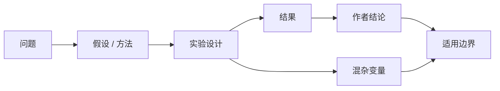

### 0.3 不同资料的证据强度不同

| 资料类型 | 主要价值 | 典型局限 |
|---|---|---|
| 原始论文 | 动机、方法、实验与历史语境 | 可能只覆盖提出时的模型和硬件 |
| Technical report | 模型配方、能力与部署信息 | 训练细节或数据可能不完全公开 |
| Dataset paper | 数据来源、清洗、许可、统计 | 数据更新后原统计可能过时 |
| 官方文档 | 当前 API 契约与支持范围 | 解释原理通常较少，版本会变化 |
| Code repository | 可执行实现与工程细节 | 代码行为可能领先或落后论文 |
| Blog/tutorial | 直觉、推导和实践经验 | 通常未经正式同行评审 |
| Benchmark result | 在既定协议下可量化比较 | 易受污染、prompt、judge 和指标影响 |

“论文写了”不等于普遍事实；“代码能跑”也不等于实验结论可靠。理想学习路径是论文、实现和独立验证互相校正。

### 0.4 时间边界

原书附录主要收录截至 2024 年前后的资料。本文解释其知识关系，但不把清单误当作 2026 年完整综述。工具 API、模型排名、许可、dataset 版本和下载地址都可能变化；真正使用时应核对当前官方资料和具体 revision。

### 0.5 原文可确认的书目勘误

为保持概念正确，先标出几处明显的编辑问题：

- Chapter 3 的 Bahdanau attention 条目误列为 `minbpe` 仓库；经典来源应是 Bahdanau、Cho、Bengio 的 *Neural Machine Translation by Jointly Learning to Align and Translate*，arXiv:1409.0473。
- Llama 2 的 arXiv 标识应为 `2307.09288`；原链接多了末尾数字 `1`。
- GPT-3 论文 *Language Models are Few-Shot Learners* 发表于 2020 年，不是 Chapter 4 条目写的 2023 年。
- PHUDGE 条目在原 Markdown 中多了一个起始引号，但论文链接意图清楚。
- NanoGPT 条目的书名号/引号未闭合，不影响仓库指向。

这些是书目元数据问题，不改变正文对应概念。

---

## Chapter 1

Chapter 1 的延伸资料围绕四个决策展开：是否做领域专用模型、采用哪类架构、怎样准备预训练数据，以及怎样从基础模型走向指令遵循。

### 1.1 BloombergGPT：从零训练领域模型

**原书引用**：Wu et al., *BloombergGPT: A Large Language Model for Finance* (2023)，<https://arxiv.org/abs/2303.17564>。

#### 它回答什么问题

通用模型覆盖面广，但金融任务包含专门术语、文档类型、时间敏感事实和评价标准。BloombergGPT 研究的是：混合大规模通用语料与高质量金融语料，从零预训练一个领域模型，能否在金融任务上优于通用模型，同时尽量保留一般能力？

可将目标写成多域训练分布：

$$
p_{\mathrm{train}}(x)
=\lambda p_{\mathrm{finance}}(x)
+(1-\lambda)p_{\mathrm{general}}(x),
$$

其中 $\lambda$ 控制领域数据权重。增大 $\lambda$ 通常提高领域覆盖，却可能牺牲一般能力或造成领域过拟合；混合语料是在 specialization 与 breadth 之间折中。

#### 为什么选择从零预训练

- 可以让 tokenizer、vocabulary 和参数从一开始适应金融分布；
- 可控制数据混合和训练全过程；
- 大量私有领域数据有机会注入基础表示；
- 不受既有 model architecture、context 或 license 的全部约束。

但代价极高：需要海量语料、算力、数据治理、训练稳定性和系统工程。一个成功案例不能推出“每个企业都应从零训练”。

#### 与本书主线的关系

本书从零实现 GPT 是为了理解机制，BloombergGPT 展示同一路线在真实领域规模上的一种应用。两者的数量级和工程目标不同，但训练目标仍是 next-token prediction：

$$
\mathcal L(\vartheta)
=-\sum_{t=1}^{T}
\log p_{\vartheta}(x_t\mid x_{<t}).
$$

这里用 $\vartheta$ 表示模型参数。领域能力不是另加一个神秘 loss，而主要来自 architecture capacity、领域数据分布和训练规模。

#### 适用边界

“在金融任务上胜过 ChatGPT”必须绑定当时的模型版本、benchmark 和评价协议。ChatGPT 是持续更新的闭源服务；跨时间比较不能直接复用。还要区分：

- 领域 benchmark performance；
- 最新事实是否准确；
- 生成内容是否可审计；
- 是否满足金融合规和风险要求。

### 1.2 医疗 LLM：适配现有模型而非从零训练

**原书引用**：Singhal et al., *Towards Expert-Level Medical Question Answering with Large Language Models* (2023)，<https://arxiv.org/abs/2305.09617>。

#### 与 BloombergGPT 构成的对照

医疗工作展示另一条路线：从强大的通用 pretrained model 出发，通过 prompt、instruction fine-tuning 或领域适配提升医疗问答能力。

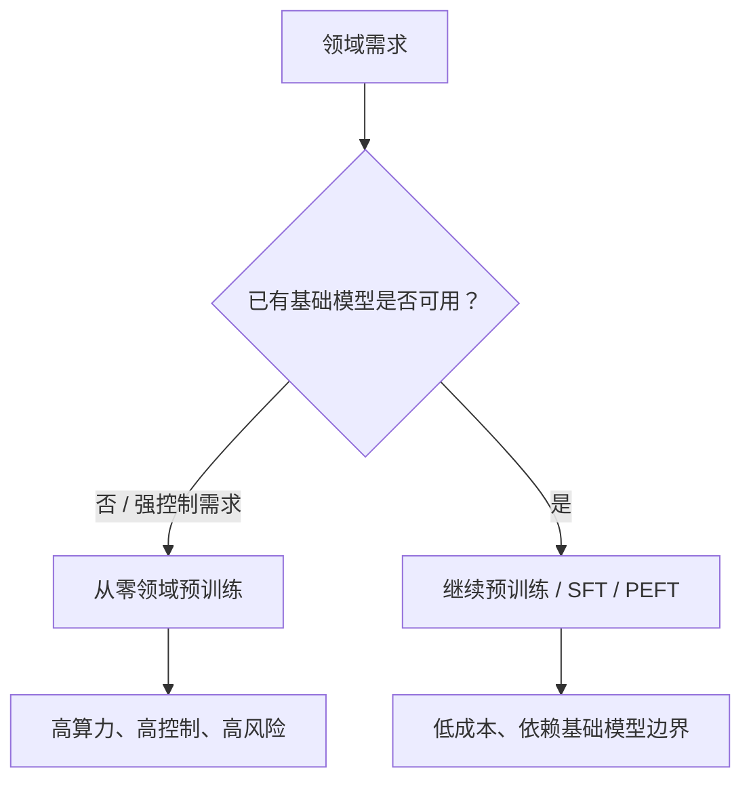

#### 为什么适配通常更现实

预训练已经学到语言、世界知识和推理模式。领域适配只需改变其中一部分行为或分布，成本远低于重新学习全部语言规律。常见层次：

1. Prompting：不改 weights，改变输入上下文。
2. Retrieval augmentation：把领域证据放进 context。
3. Supervised fine-tuning：用领域 input-output 示例更新参数。
4. Continued pretraining：继续做领域 next-token training。
5. Preference/safety tuning：塑造输出标准。

#### 医疗场景的特殊边界

问答 benchmark 高分不等于临床可用。真实部署还涉及证据时效、patient-specific context、calibration、abstention、隐私、责任和临床验证。Fine-tuning 也不能保证把新知识可靠地写入并在所有上下文准确取用。

### 1.3 Transformer 原始架构

**原书引用**：Vaswani et al., *Attention Is All You Need* (2017)，<https://arxiv.org/abs/1706.03762>。

#### 解决的问题

序列模型此前常依赖 RNN 按时间递归，长距离依赖要经过很多 recurrent steps，训练难并行。Transformer 用 self-attention 让每个位置直接聚合其他位置的信息，并能并行处理同一层中的全部 token。

Scaled dot-product attention：

$$
\operatorname{Attention}(Q,K,V)
=\operatorname{softmax}
\left(\frac{QK^\top}{\sqrt{d_k}}+M\right)V.
$$

- $Q$：每个位置“想找什么”；
- $K$：每个位置“提供什么索引”；
- $V$：匹配后实际汇聚的内容；
- $M$：padding 或 causal mask；
- $\sqrt{d_k}$：抑制维度增大导致 dot products 方差过大、softmax 过饱和。

#### 原始 Transformer 不等于 GPT

原论文是 encoder-decoder machine translation architecture：encoder 双向读取 source，decoder causal self-attention 生成 target，并通过 cross-attention 读取 encoder states。GPT 主要采用 decoder-style causal stack；BERT 主要采用 encoder-style bidirectional stack。

### 1.4 BERT：encoder-style 表示学习

**原书引用**：Devlin et al., *BERT: Pre-training of Deep Bidirectional Transformers for Language Understanding* (2018)，<https://arxiv.org/abs/1810.04805>。

BERT 的核心是 bidirectional encoder representation。Masked language modeling 随机遮盖部分 token，并用左右两侧上下文预测它们：

$$
\mathcal L_{\mathrm{MLM}}
=-\sum_{t\in\mathcal M}
\log p_{\vartheta}(x_t\mid x_{\setminus\mathcal M}),
$$

其中 $\mathcal M$ 是被选中预测的位置。

它适合理解型任务：classification、token labeling、retrieval embeddings 等，因为每个 token state 可同时聚合左右 context。局限是 MLM pretraining 与 left-to-right generation 的接口不同；原生 BERT 不是连续生成长文本的自然选择。

### 1.5 GPT-3：decoder-style 自回归模型与 in-context learning

**原书引用**：Brown et al., *Language Models are Few-Shot Learners* (2020)，<https://arxiv.org/abs/2005.14165>。

GPT-3 延续 decoder-only causal language modeling，并把规模扩展到 175B parameters。它强调 zero-shot、one-shot、few-shot prompting：不做 gradient update，只在 context 中给 instruction 或 demonstrations，让模型条件生成。

$$
p(x_{1:T})
=\prod_{t=1}^{T}p(x_t\mid x_{<t}).
$$

Few-shot learning 在这里主要指 **in-context adaptation**，不等于传统机器学习中用少量样本更新 weights。Context 中的示例会随请求结束而消失；fine-tuning 的参数变化则持续存在。

#### BERT、GPT 与原始 Transformer 的关系

| 模型 | 主要组件 | Context 可见性 | 典型预训练 | 典型用途 |
|---|---|---|---|---|
| Original Transformer | Encoder + decoder | Encoder 双向，decoder 因果 | Translation seq2seq | 条件生成 |
| BERT | Encoder | 双向 | Masked LM | 表示、分类、抽取 |
| GPT | Decoder-style blocks | 因果 | Next-token LM | 生成、prompted tasks |

“Encoder/decoder”在这里是架构角色，不等于软件中的 tokenizer `encode/decode`。

### 1.6 Vision Transformer：Transformer 不只处理文本

**原书引用**：Dosovitskiy et al., *An Image is Worth 16x16 Words* (2020)，<https://arxiv.org/abs/2010.11929>。

ViT 把图像切成固定大小 patches，把每个 patch 线性投影成 embedding，再像 token sequence 一样加入位置表示并送进 Transformer encoder。

若图像大小 $H\times W$、patch 为 $P\times P$，patch 数：

$$
N=\frac{HW}{P^2}.
$$

每个 RGB patch 展平维度为 $3P^2$，经矩阵映射到 model dimension $d$。这说明 Transformer 的核心对象不是“单词”，而是一组可嵌入的 elements 及其关系。

局限也随之出现：standard attention 对 patch 数是二次复杂度；小 patch 提高 spatial resolution，却让 $N$ 快速增加。图像的 locality 与 translation invariance 也不像 CNN 那样天然编码，需要数据和训练补偿。

### 1.7 非 Transformer 序列模型：RWKV、Hyena 与 Mamba

**原书引用**：

- Peng et al., *RWKV: Reinventing RNNs for the Transformer Era* (2023)，<https://arxiv.org/abs/2305.13048>；
- Poli et al., *Hyena Hierarchy* (2023)，<https://arxiv.org/abs/2302.10866>；
- Gu and Dao, *Mamba* (2023)，<https://arxiv.org/abs/2312.00752>。

#### 为什么寻找替代架构

Standard self-attention 对 sequence length $T$ 的 score matrix 为 $T\times T$：

$$
\text{attention memory/time component}=O(T^2).
$$

长 context 时，这部分成为瓶颈。替代路线尝试以 recurrence、long convolution 或 state-space recurrence 获得近线性的序列扩展。

一个抽象 state-space recurrence：

$$
h_t=A_t h_{t-1}+B_t x_t,
$$

$$
y_t=C_t h_t+D x_t.
$$

State $h_t$ 压缩过去信息，因此 inference 可逐 token 更新而无需保留完整 $T\times T$ attention matrix。但固定大小 state 也意味着信息选择和长期记忆更困难。

#### 三条路线的直觉

- **RWKV**：尝试结合 Transformer-like parallel training 与 RNN-like sequential inference，以 time mixing 聚合历史。
- **Hyena**：用隐式参数化的长 convolution 与 gating 建模长程依赖，避免显式 all-pairs attention。
- **Mamba**：让 state-space parameters 对输入具有选择性，使模型按内容决定保留或遗忘什么，同时配合硬件友好的 scan 实现。

“线性时间”只描述某个渐近维度，不自动意味着端到端更快或更好。Kernel quality、parallelism、state size、training stability、短序列常数和模型质量都影响实际结果。Transformer 仍流行，也与成熟生态、可解释的 content-based retrieval 和高效 kernels 有关。

### 1.8 Llama 2：可获得 weights 的 GPT-like 模型

**原书引用**：Touvron et al., *Llama 2: Open Foundation and Fine-Tuned Chat Models* (2023)，正确链接为 <https://arxiv.org/abs/2307.09288>。

Llama 2 代表可下载 weights 的 decoder-only foundation/chat model 路线，使研究者能本地推理和下游适配。它与 GPT-3/ChatGPT 的重要差异是访问方式，不是“是否属于 GPT-like autoregressive Transformer”。

应区分：

- **Open weights**：可以获得参数；
- **Open source**：通常还要求源码在开源许可下；
- **Open data/training**：训练语料、代码、日志和完整配方也公开。

一个模型可能开放 weights，却对用途、再分发或大规模商业使用有许可条件，也可能不公开训练数据。因此不要把“可下载”等同于所有意义上的 fully open。

### 1.9 The Pile：开放、多来源预训练数据

**原书引用**：Gao et al., *The Pile: An 800GB Dataset of Diverse Text for Language Modeling* (2020/2021)，<https://arxiv.org/abs/2101.00027>。

The Pile 将多个来源组合为约 800 GB 的英文文本 corpus，目的是支持开放语言模型研究并提升 domain diversity。

#### 数据 mixture 为什么重要

预训练 loss 是对训练分布的期望：

$$
\mathcal L
=\sum_{j=1}^{J}\alpha_j
\mathbb E_{x\sim p_j}
[\ell(x)],
$$

$p_j$ 表示第 $j$ 个来源，$\alpha_j$ 是采样权重。数据量并不是唯一变量；采样权重决定每个 domain 对 gradient 的贡献。

#### 使用大型 corpus 必须检查

- 来源与许可是否允许目标用途；
- personal/sensitive data 与有害内容；
- document-level 和 near-duplicate contamination；
- benchmark test data 是否泄漏；
- language/domain distribution；
- cleaning 是否误删少数语言或特殊格式；
- corpus revision 与不可删除内容的治理机制。

“公开下载”不等于没有版权、隐私或伦理风险。

### 1.10 InstructGPT：从续写到遵循人类意图

**原书引用**：Ouyang et al., *Training Language Models to Follow Instructions with Human Feedback* (2022)，<https://arxiv.org/abs/2203.02155>。

InstructGPT 展示典型 RLHF pipeline：

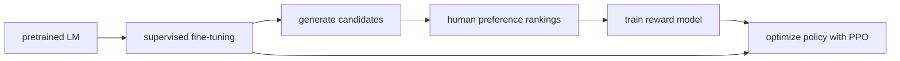

#### 三个阶段各解决什么

1. **SFT**：用高质量 demonstrations 教模型基本 instruction-response interface。
2. **Reward modeling**：把人类对候选回答的相对偏好拟合为 scalar score。
3. **RL optimization**：调整 policy，使回答 reward 更高，同时通过 KL constraint 避免偏离 reference model 太远。

一种概念化目标：

$$
\max_{\pi}
\mathbb E_{x,y\sim\pi}
\left[r_{\phi}(x,y)
-\beta\log\frac{\pi(y\mid x)}{\pi_{\mathrm{ref}}(y\mid x)}
\right].
$$

Reward model $r_{\phi}$ 不是客观真理，而是标注规范、样本与模型的近似。RL 还可能利用 reward model 的漏洞，因此需要独立评价、red teaming 和持续监控。

#### 与本书 Chapter 7 的关系

本书实现的是 SFT 主线，并把 preference tuning 作为后续步骤。SFT 与 RLHF 不应混为同义词：前者模仿 demonstrations，后者通常还使用 preference comparisons 和 policy optimization。

### 1.11 Chapter 1 阅读决策表

| 想回答的问题 | 优先资料 |
|---|---|
| Transformer 从何而来？ | *Attention Is All You Need* |
| Encoder 与 decoder-style 有何差异？ | BERT + GPT-3 papers |
| Transformer 能否处理图像？ | ViT |
| 是否必须使用 attention？ | RWKV、Hyena、Mamba |
| 领域模型是否值得从零训？ | BloombergGPT + 医疗适配研究对照 |
| 大型开放 corpus 怎样组织？ | The Pile |
| 基础模型怎样变得更会听指令？ | InstructGPT |

---

## Chapter 2

Chapter 2 的延伸资料集中于两个问题：连续向量表示究竟表示什么，以及离散文本怎样切成稳定、可逆、计算可承受的 token units。

### 2.1 Embedding space、latent space 与向量表示

**原书引用**：Sebastian Raschka, *Machine Learning Q and AI* (2023)，<https://leanpub.com/machine-learning-q-and-ai>。

#### Embedding 是什么

Embedding 将离散对象映射为连续向量：

$$
e:\mathcal V\rightarrow\mathbb R^d.
$$

对 vocabulary size $V$，token embedding table：

$$
E\in\mathbb R^{V\times d},
$$

token ID $i$ 的 embedding 是第 $i$ 行 $E_i$。训练不是手工指定“语义坐标”，而是让下游 loss 反向更新这些 rows，使对任务有用的关系体现在几何结构中。

#### Embedding space 与 latent space 的关系

- **Embedding space** 通常强调把对象编码为可比较的向量位置。
- **Latent space** 更宽泛，指模型内部未直接观测、用于解释或生成数据的隐藏表示空间。

Token embedding 是一种 latent representation；Transformer 中间 hidden states 也是 latent representations，但不一定都称为固定 embedding。术语依语境重叠，不能把它们视为严格互斥的数学类型。

#### 相似度的边界

常见 cosine similarity：

$$
\cos(u,v)=\frac{u^\top v}{\lVert u\rVert_2\lVert v\rVert_2}.
$$

高 cosine 表示在当前 representation 中方向相近，不自动说明两个词在所有意义上“语义相同”。静态 token embedding 还受 tokenization 和 polysemy 限制；contextual hidden state 才能依上下文改变表示。

### 2.2 BPE：用迭代合并处理稀有词

**原书引用**：Sennrich et al., *Neural Machine Translation of Rare Words with Subword Units* (2015)，<https://arxiv.org/abs/1508.07909>。

#### 为什么不用纯 word 或纯 character vocabulary

| 粒度 | 优点 | 问题 |
|---|---|---|
| Word | 序列短、单位直观 | Vocabulary 巨大，unseen words/OOV |
| Character/byte | Vocabulary 小，覆盖开放文本 | 序列长，语义组合负担大 |
| Subword | 在覆盖与长度间折中 | 切分依 corpus 和算法而变化 |

BPE 从小单位开始，反复合并 corpus 中频率最高的相邻 pair。训练伪代码：

```text
vocabulary <- initial symbols
repeat M times:
    count every adjacent pair in corpus representation
    best_pair <- pair with largest count
    add merged symbol to vocabulary
    replace occurrences of best_pair
save merge order
```

若初始序列是：

```text
l o w </w>    count 5
l o w e r </w> count 2
```

高频 pair `l o` 可先合为 `lo`，之后 `lo w` 可合为 `low`。常见片段成为单 token，稀有词仍分解成已知 pieces。

#### 为什么 merge order 是 tokenizer model 的一部分

编码新文本时，不是重新统计新文本 pair frequency，而是按训练得到的 merge ranks 应用规则。Vocabulary、merge table、normalization、special tokens 中任何一项不同，token IDs 都可能不同。模型 weights 与 tokenizer revision 必须绑定。

#### BPE 的局限

- 高频不等于语义边界；
- 不同空格、Unicode normalization 会改变切分；
- 对低资源语言的 fertility 可能很高；
- Vocabulary 大小影响 embedding parameters 与 sequence length；
- Token 数不是跨 tokenizer 可直接比较的文本长度单位。

### 2.3 GPT-2 的 byte-level BPE 源码

**原书引用**：OpenAI GPT-2 `encoder.py`，<https://github.com/openai/gpt-2/blob/master/src/encoder.py>。

GPT-2 先把 bytes 映射到可处理的 Unicode symbols，再执行 BPE。Byte-level base alphabet 提供任意 byte sequence 的覆盖，避免传统 unknown word；最终 token 又可以是多个 byte symbols 的合并。

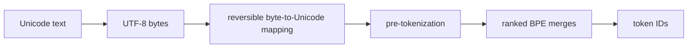

“Byte-level BPE”不表示每个输出 token 都只有一个 byte；BPE merge 后，一个 token 可覆盖多个 bytes，甚至完整常见词片段。

阅读源码时重点追踪：

1. `bytes_to_unicode` 如何保证可逆覆盖；
2. regex pre-tokenization 如何处理空格和类别；
3. BPE pair ranks 如何决定 merge；
4. encode/decode 如何在 token IDs、symbols、bytes 与 text 间往返；
5. cache 如何避免重复分词开销。

### 2.4 OpenAI tokenizer UI：建立 token 直觉

**原书引用**：<https://platform.openai.com/tokenizer>。

交互 UI 适合观察：

- 前导空格常与词片段合成 token；
- 大小写、标点和换行影响切分；
- 数字串可能被拆成多个 token；
- 非拉丁文字与 emoji 的 token fertility 不同；
- 同一句话在不同 tokenizer/model family 下 token 数不同。

但 UI 是观察工具，不应替代代码中的 tokenizer。生产预算必须使用目标 model 的确切 tokenizer API 计算；网页当前默认模型和 revision 可能变化。

### 2.5 `minbpe`：从零实现 tokenizer

**原书引用**：Andrej Karpathy, *A Minimal Implementation of a BPE Tokenizer*，<https://github.com/karpathy/minbpe>。

`minbpe` 的价值与本书从零实现 attention 相同：用最小代码暴露训练 merges、编码和解码的真正数据流。读者应做四类测试：

```python
def tokenizer_invariants(tokenizer, text):
    token_ids = tokenizer.encode(text)
    reconstructed = tokenizer.decode(token_ids)

    assert reconstructed == text
    assert all(isinstance(token_id, int) for token_id in token_ids)
    assert all(0 <= token_id < tokenizer.vocab_size for token_id in token_ids)
    return token_ids
```

这是接口示意，不假设 `minbpe` 各类的具体构造参数。重要不变量是：

- 对支持的输入，`decode(encode(text)) == text`；
- merge 训练在固定 corpus/tie-breaking 下可复现；
- special tokens 不与普通 token 冲突；
- malformed UTF-8 或 allowed-special policy 有明确行为。

仅在训练 corpus 上 round-trip 通过还不够，应覆盖 whitespace、Unicode combining characters、emoji、控制字符和特殊 token 边界。

### 2.6 SentencePiece

**原书引用**：Kudo and Richardson, *SentencePiece* (2018)，<https://aclanthology.org/D18-2012/>。

SentencePiece 的关键工程思想是直接从 raw sentences 训练和应用 tokenizer，而不依赖语言特定的预分词。空格也被显式编码为普通 symbol 的一部分，因此 detokenization 更统一。

SentencePiece 是一个 toolkit/框架，可支持 BPE 与 unigram language model 等算法，不能简单理解为“与 BPE 并列的单一 merge 算法”。

Unigram tokenizer 的抽象是：给一个 string 的所有合法 segmentations $s$，选择 token probability product 较高者：

$$
s^*
=\arg\max_{s\in\mathcal S(x)}
\prod_{u\in s}p(u).
$$

训练可从较大候选 vocabulary 出发，迭代估计 token probabilities 并删去贡献较低的 pieces。它还可对多个 segmentation 采样，用 subword regularization 提高鲁棒性。

适用优势是 language-independent、raw-text reversible pipeline 和成熟实现；具体 normalization 默认值仍需检查，尤其是需要字节级完全保真的场景。

### 2.7 WordPiece

**原书引用**：Song et al., *Fast WordPiece Tokenization* (2020)，<https://arxiv.org/abs/2012.15524>。

WordPiece 同样形成 subword vocabulary，常见于 BERT family。它通常依赖 pre-tokenization，并用诸如 `##` 的约定表示非词首 piece。与 BPE 最重要的区别不在输出“看起来像子词”，而在 vocabulary learning criterion 与编码算法。

经典直觉是合并能更好解释 corpus likelihood 的 pair，而不只是绝对 pair count。常见近似评分写成：

$$
\operatorname{score}(a,b)
\propto
\frac{f(ab)}{f(a)f(b)},
$$

强调相对 association；实际实现和论文定义应以具体 tokenizer 为准。

Fast WordPiece 关注 inference tokenization algorithm：通过 trie、failure links 等结构减少重复扫描，提高到接近线性时间。它说明 tokenizer 不只是训练 vocabulary，encoding runtime 也会影响大规模 serving。

### 2.8 BPE、byte-level BPE、SentencePiece、WordPiece 对照

| 名称 | 起始/输入单位 | Vocabulary 学习 | 空格/预分词 | 典型家族 |
|---|---|---|---|---|
| BPE | 字符或其他基本 symbols | 迭代合并高频 pair | 依实现 | 早期 NMT |
| Byte-level BPE | Byte-derived symbols | Ranked BPE merges | 常配 regex | GPT-2 |
| SentencePiece | Raw text framework | BPE 或 unigram 等 | 空格显式处理 | T5、Llama 等不同配置 |
| WordPiece | 常为预分词后字符 pieces | Likelihood/association-inspired vocabulary | 常有 continuation marker | BERT |

不能仅看名称推断兼容性。两个都叫 SentencePiece 的模型可能 vocabulary、algorithm、normalizer 和 special IDs 完全不同。

### 2.9 Tokenizer 选择的四方权衡

令原文本字符/字节数为 $L$，token 数为 $T$，可定义粗略 fertility：

$$
F=\frac{T}{L}
$$

或按 words 计算 tokens per word。Tokenizer 选择同时影响：

1. **Coverage**：能否无损表达任意输入；
2. **Compression**：同一文本需要多少 tokens；
3. **Vocabulary cost**：embedding/output head 参数约随 $Vd$ 增长；
4. **Semantic granularity**：pieces 是否易于共享和组合。

大 vocabulary 通常缩短 sequence，却增加 embedding/head 参数和 rare-token sparsity；小 vocabulary 相反。没有脱离语言分布、context limit 和模型规模的 universally best tokenizer。

### 2.10 Chapter 2 的一般研究方法

作者不是把 tokenizer 当预处理黑盒，而是按三层资料建立理解：

```text
algorithm paper
-> production source code
-> interactive visualization / minimal reimplementation
```

这套方法可推广到任何基础组件：先读定义与动机，再追踪真实实现，最后用小输入建立可观察不变量。

---

## Chapter 3

Chapter 3 的参考资料把 attention 放在一条演化链上：RNN encoder-decoder 的对齐瓶颈、Transformer self-attention、硬件感知 exact kernels、PyTorch 高层 API、regularization，以及 block 简化研究。

### 3.1 Bahdanau attention：先解决固定向量瓶颈

**原书条目存在误链**：这里错误重复了 `minbpe`。经典来源应为 Bahdanau, Cho, Bengio, *Neural Machine Translation by Jointly Learning to Align and Translate* (2014/2015)，<https://arxiv.org/abs/1409.0473>。

#### 原问题是什么

早期 encoder-decoder RNN 常把整个 source sentence 压入一个固定长度 vector，再由 decoder 生成 target。长句中，单一 vector 容易成为 information bottleneck。

Bahdanau attention 让 decoder 在每个 target step $t$，对所有 encoder states $h_i$ 计算匹配分数：

$$
e_{t,i}
=v_a^\top
\operatorname{tanh}(W_s s_{t-1}+W_h h_i),
$$

$$
\alpha_{t,i}
=\frac{\exp(e_{t,i})}
{\sum_j\exp(e_{t,j})},
$$

$$
c_t=\sum_i\alpha_{t,i}h_i.
$$

- $s_{t-1}$ 是 decoder 当前 query-like state；
- $h_i$ 是 source 的 key/value-like states；
- $\alpha_{t,i}$ 是 soft alignment；
- $c_t$ 是按当前生成位置动态得到的 context。

#### 为什么它有效

Decoder 不再从一个固定 summary 中恢复全部细节，而是每一步直接读取相关 source positions。Attention weights 还是可视化 alignment 的一个信号，但不能自动解释为因果解释或模型“真正理由”。

#### 与 self-attention 的关系

Bahdanau attention 是 decoder state 对 encoder states 的 cross-sequence attention；self-attention 则让同一 sequence 内的位置互相读取。二者都遵循“score → normalize → weighted sum”，但 score function、query 来源和计算并行性不同。

### 3.2 Scaled dot-product self-attention

**原书引用**：Vaswani et al., *Attention Is All You Need* (2017)，<https://arxiv.org/abs/1706.03762>。

给输入 $X\in\mathbb R^{T\times d_{model}}$：

$$
Q=XW_Q,
\qquad
K=XW_K,
\qquad
V=XW_V,
$$

$$
S=\frac{QK^\top}{\sqrt{d_k}}+M,
$$

$$
A=\operatorname{softmax}(S),
\qquad
Z=AV.
$$

#### 每一步的依据

1. Learned projections 让同一 hidden state 分别承担 query、key 和 value 角色。
2. $QK^\top$ 一次计算所有 position pairs 的 compatibility。
3. 若 $q_i,k_i$ 近似零均值、单位方差，dot product 方差约随 $d_k$ 增长；除以 $\sqrt{d_k}$ 将尺度拉回稳定区间。
4. Softmax 将每行变成非负、和为 1 的读取权重。
5. 权重乘 $V$ 形成 content-dependent aggregation。

对 causal language model：

$$
M_{ij}=
\begin{cases}
0, & j\le i,\\
-\infty, & j>i.
\end{cases}
$$

这样位置 $i$ 不能读取未来 token，保持 next-token objective 的信息边界。

### 3.3 Multi-head attention 为什么不只是重复计算

第 $h$ 个 head：

$$
Z_h=\operatorname{Attention}(XW_Q^{(h)},XW_K^{(h)},XW_V^{(h)}).
$$

拼接后投影：

$$
\operatorname{MHA}(X)
=\operatorname{Concat}(Z_1,\ldots,Z_H)W_O.
$$

不同 heads 具有独立 projection subspaces，可以并行学习局部、句法、指代或其他 interaction patterns。不能保证每个 head 都形成可人工命名的功能；研究也发现很多 heads 可冗余或被剪枝。

若 $d_k=d_v=d_{model}/H$，各 heads 拼接后仍回到 $d_{model}$，所以增加 head 数不必线性增加主要 projection parameter count，但会改变每 head 宽度和 kernel shape。

### 3.4 FlashAttention：公式不变，数据移动方式改变

**原书引用**：

- Dao et al., *FlashAttention* (2022)，<https://arxiv.org/abs/2205.14135>；
- Dao, *FlashAttention-2* (2023)，<https://arxiv.org/abs/2307.08691>。

#### 标准实现的真正瓶颈

朴素 attention 通常 materialize $S=QK^\top$ 和 $A=\mathrm{softmax}(S)$，二者大小约 $T^2$。GPU 的 high-bandwidth memory（HBM）比片上 SRAM 容量大，却访问慢。反复将 $T^2$ intermediates 写回/读出 HBM 会成为 memory I/O bottleneck。

FlashAttention 的核心不是近似 attention，而是 tiling：

```text
split Q/K/V into blocks
-> load blocks into fast on-chip memory
-> compute local scores
-> update numerically stable online softmax statistics
-> accumulate output blocks
-> avoid storing the full attention matrix in HBM
```

#### Online softmax 为什么可精确分块

对一行 scores，稳定 softmax 需要最大值 $m$ 和指数和 $\ell$：

$$
m=\max_j s_j,
\qquad
\ell=\sum_j e^{s_j-m}.
$$

处理新 block，令其最大值为 $m_b$、局部指数和为 $\ell_b$。合并：

$$
m_{new}=\max(m,m_b),
$$

$$
\ell_{new}
=e^{m-m_{new}}\ell
+e^{m_b-m_{new}}\ell_b.
$$

旧部分和新部分都重标到同一个最大值，因此数学结果与一次完整 stable softmax 一致，只改变求值次序和存储策略。

#### FlashAttention-2 改进什么

第二版进一步减少非矩阵乘法 FLOPs，改善 thread block/warp 间工作划分和并行度。它说明性能优化不能只数理论 FLOPs，还要看 kernel occupancy、memory traffic 和硬件执行单元。

#### 边界

- Exact 指在给定 floating-point 求值语义下实现同一个 attention，不表示 bitwise 与所有 kernel 一致；
- 速度取决于 GPU、dtype、shape、head dimension、mask 与软件版本；
- 不改变 standard attention 的 $O(T^2)$ pairwise interaction 数量，只显著改善 memory complexity/traffic 和常数；
- 若返回完整 attention weights，仍需 materialize 大对象，会失去部分优势。

### 3.5 PyTorch `scaled_dot_product_attention`

**原书引用**：PyTorch `scaled_dot_product_attention` 文档，原书标注其当时为 beta API。

该函数以统一接口表达 attention，并由 PyTorch 根据输入、硬件和 backend policy 选择 optimized kernel，例如 FlashAttention、memory-efficient attention 或 math implementation。

概念用法：

```python
import torch
import torch.nn.functional as F

torch.manual_seed(123)
query = torch.randn(2, 4, 8, 16)
key = torch.randn(2, 4, 8, 16)
value = torch.randn(2, 4, 8, 16)

output = F.scaled_dot_product_attention(
    query,
    key,
    value,
    dropout_p=0.0,
    is_causal=True,
)

assert output.shape == (2, 4, 8, 16)
```

Shape 可读为 `(batch, heads, sequence, head_dim)`。使用时应核对当前 PyTorch 文档，因为 backend selection 和 API status 会变化。

一个常见陷阱是 functional API 的 `dropout_p` 由参数直接控制；评估时不能只调用 `model.eval()` 后仍传非零值。常用写法：

```python
dropout_p = self.dropout_p if self.training else 0.0
```

### 3.6 PyTorch `MultiheadAttention`

**原书引用**：PyTorch `nn.MultiheadAttention` 文档。

这是更高层 module，管理 Q/K/V projections、heads、output projection、mask 和部分 fast paths。它适合标准 attention 或 API 学习；从零实现仍有价值，因为 mask shape、projection layout、causal semantics 和 weights aggregation 很容易被高层接口隐藏。

高层 API 的选择标准：

- 需要标准、受维护实现：优先官方 module/function；
- 研究新的 attention 变体：自定义 module；
- 性能敏感：用 profiler 验证是否真的进入 fast path；
- 教学：先显式实现，再与官方输出对照。

### 3.7 Dropout：随机子网络与过拟合控制

**原书引用**：Srivastava et al., *Dropout* (2014)，<https://jmlr.org/papers/v15/srivastava14a.html>。

训练时 inverted dropout：

$$
\widetilde h_i
=\frac{m_i}{1-p}h_i,
\qquad
m_i\sim\operatorname{Bernoulli}(1-p).
$$

因为 $\mathbb E[m_i]=1-p$：

$$
\mathbb E[\widetilde h_i]=h_i.
$$

所以 inference 时无需再乘 keep probability。随机屏蔽减少 units 之间过度 co-adaptation，可视作训练大量共享参数子网络的近似 regularization。

在 attention 中 dropout 可施加于 attention probabilities、projection/residual outputs 或 MLP。不同位置不是同一种随机扰动。大型 LLM 在海量数据下常使用较小甚至零 dropout，不能把 0.1 当普遍最佳值。

### 3.8 Simplifying Transformer Blocks

**原书引用**：He and Hofmann, *Simplifying Transformer Blocks* (2023)，<https://arxiv.org/abs/2311.01906>。

该研究探索是否所有传统 attention projections 和 block components 都必要，例如移除 value projection 或部分 output projection 后仍能保持良好性能。

研究价值不是直接宣布“$W_V$ 无用”，而是挑战 architecture convention：

1. 明确移除哪个 component；
2. 保持 parameter/compute/training budget 尽量可比；
3. 在多规模和任务做 ablation；
4. 比较 quality、stability 和 throughput；
5. 分析被移除自由度是否由其他 layers 补偿。

某配置的冗余不等于所有模型、规模和任务都可安全删除。

### 3.9 Chapter 3 的知识关系

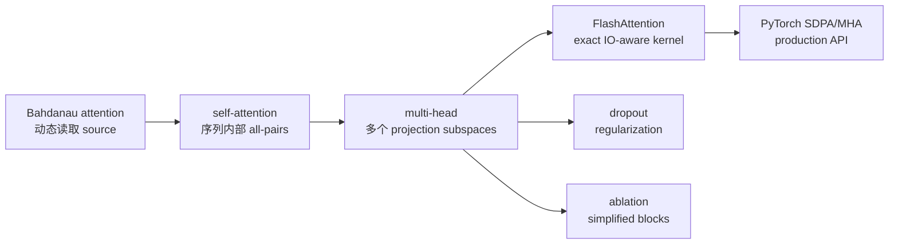

---

## Chapter 4

Chapter 4 的延伸资料围绕“如何把 attention 变成可深堆叠、可训练、可规模化的 GPT”展开：normalization、residual topology、activation、模型规模、代码组织和 compute 分配。

### 4.1 Layer Normalization

**原书引用**：Ba, Kiros, Hinton, *Layer Normalization* (2016)，<https://arxiv.org/abs/1607.06450>。

对单个 token hidden vector $x\in\mathbb R^d$：

$$
\mu=\frac1d\sum_{i=1}^{d}x_i,
$$

$$
\sigma^2=\frac1d\sum_{i=1}^{d}(x_i-\mu)^2,
$$

$$
\operatorname{LN}(x)_i
=\gamma_i
\frac{x_i-\mu}{\sqrt{\sigma^2+\epsilon}}
+\beta_i.
$$

#### 为什么引入

深层网络中 activation scale 和 distribution 会随层变化，导致 optimization 对初始化、learning rate 和深度敏感。LayerNorm 将每个样本/位置的 feature vector 标准化，再用可学习 $\gamma,\beta$ 恢复合适尺度和偏移。

与 BatchNorm 不同，LayerNorm 不依赖 batch statistics，因此：

- train/eval 使用同一统计方式；
- batch size 为 1 也自然；
- sequence positions 可独立归一化；
- 更适合 variable-length autoregressive models。

“稳定 hidden dynamics”不等于所有层输出永远均值 0、方差 1，因为 affine parameters、residual addition 和后续 operations 会继续改变分布。

### 4.2 Post-LN 与 Pre-LN

**原书引用**：

- Xiong et al., *On Layer Normalization in the Transformer Architecture* (2020)，<https://arxiv.org/abs/2002.04745>；
- Tie et al., *ResiDual* (2023)，<https://arxiv.org/abs/2304.14802>。

设 sublayer 为 $F$。

Post-LN：

$$
x_{l+1}=\operatorname{LN}(x_l+F(x_l)).
$$

Pre-LN：

$$
x_{l+1}=x_l+F(\operatorname{LN}(x_l)).
$$

#### 为什么位置影响训练

Pre-LN 的 residual stream 有直接 identity path：

$$
\frac{\partial x_{l+1}}{\partial x_l}
=I+\frac{\partial F(\operatorname{LN}(x_l))}{\partial x_l}.
$$

即使 sublayer derivative 不理想，$I$ 仍提供 gradient highway，通常使深层训练在初始化附近更稳定。Post-LN 的 gradient 必须额外经过 LayerNorm Jacobian，原始 Transformer 因此更依赖 warmup 等技巧。

但不能简单断言 Pre-LN 在所有质量指标都优于 Post-LN。Topology 会影响 representation scale、effective depth、最终 normalization 和 training recipe；ResiDual 等方法正尝试组合不同 residual/normalization 优势。

### 4.3 RMSNorm

**原书引用**：Zhang and Sennrich, *Root Mean Square Layer Normalization* (2019)，<https://arxiv.org/abs/1910.07467>。

RMSNorm 不减均值：

$$
\operatorname{RMS}(x)
=\sqrt{\frac1d\sum_{i=1}^{d}x_i^2+\epsilon},
$$

$$
\operatorname{RMSNorm}(x)_i
=\gamma_i\frac{x_i}{\operatorname{RMS}(x)}.
$$

它保留 rescaling invariance，却移除 recentering，减少均值计算和相关 operations，因此更简单高效。很多现代 LLM 使用 RMSNorm，但原因还与完整 architecture/training recipe 有关。

#### LayerNorm 与 RMSNorm 对照

| 属性 | LayerNorm | RMSNorm |
|---|---|---|
| 减均值 | 是 | 否 |
| 按 feature scale | Standard deviation | Root mean square |
| Learnable scale | 有 | 有 |
| Learnable bias | 常有 | 实现依模型，常省略 |
| Invariance | Shift + scale related | 主要 scale related |

RMSNorm 不是 LayerNorm 的完全数值等价替代。更换 norm 后通常要重新验证初始化、learning rate 和 checkpoint compatibility。

### 4.4 GELU

**原书引用**：Hendrycks and Gimpel, *Gaussian Error Linear Units* (2016)，<https://arxiv.org/abs/1606.08415>。

精确定义：

$$
\operatorname{GELU}(x)
=x\Phi(x),
$$

$\Phi(x)$ 是标准正态 cumulative distribution function。常见 tanh approximation：

$$
\operatorname{GELU}(x)
\approx
\frac{x}{2}
\left[
1+\tanh
\left(
\sqrt{\frac{2}{\pi}}
(x+0.044715x^3)
\right)
\right].
$$

#### 直觉

ReLU 用硬阈值 $x>0$；GELU 以输入值决定连续 gate 比例。大正数近似保留，大负数近似抑制，零附近平滑过渡并允许部分负值。

论文可把它解释为 stochastic regularization 的期望，但实际 deterministic GELU 并没有每次显式采样 mask。其优势依 architecture 和 training recipe，计算成本也高于简单 ReLU，不过现代 kernels 常做高效融合。

### 4.5 GPT-2 模型家族

**原书引用**：Radford et al., *Language Models are Unsupervised Multitask Learners* (2019)。

GPT-2 提供约 124M、355M、774M 和 1.5B parameter variants。核心是 decoder-only causal Transformer，通过大规模 web text 的 next-token objective 学到可由 prompt 激活的任务行为。

模型参数随主要 hyperparameters 近似增长。忽略 bias/norm，对 $L$ 层、width $d$、vocabulary $V$，每层 attention projections 约 $4d^2$，MLP expansion 为 $4d$ 时约 $8d^2$：

$$
N_{\mathrm{params}}
\approx Vd+L(12d^2).
$$

这解释了 width 的二次影响和 MLP 的大参数份额。实际还包括 position embeddings、norm、bias、是否 weight tying 等。

“Unsupervised multitask”是历史命名；训练 labels 由文本平移自动构造，更精确地常称 self-supervised learning。

### 4.6 GPT-3：架构延续与规模跃迁

**原书引用**：Brown et al., *Language Models are Few-Shot Learners*，正确年份 2020；另引 Lambda Labs 技术概览。

GPT-3 最大版本 175B，约比 1.5B GPT-2 最大版本大两个数量级，并使用更多数据和算力。它说明很多能力提升可以在基本 decoder-only objective 不大改的情况下由 scale 驱动。

训练 compute 的粗略经验式：

$$
C\approx 6ND,
$$

$N$ 是非 embedding parameter 量级，$D$ 是训练 tokens；常数 6 粗略覆盖 forward 和 backward。它只适合数量级估算，不含具体硬件效率、attention context cost、optimizer、recompute 和通信。

Lambda Labs 估算单 RTX 8000 训练 GPT-3 需约 665 年，目的在展示 commodity single-GPU 与 frontier training 的数量级差距。它不是实际训练方案，也不应忽略 parallel efficiency、精度、hardware utilization 和工程优化。

#### “同架构放大”也不代表完全相同

规模化常伴随 batch、optimizer、data mixture、context、parallelism、numerical precision 和某些 sparse/dense attention pattern 调整。因此应理解为核心 causal Transformer family 相同，而不是每个实现细节逐项相同。

### 4.7 nanoGPT：最小实现与高效训练之间的桥梁

**原书引用**：Andrej Karpathy, `nanoGPT`，<https://github.com/karpathy/nanoGPT>。

nanoGPT 展示如何把 GPT-2 级模型组织成较小、可读、可训练的 codebase。本书受到其“拆分大型 parent class 为小 submodules”的组织启发，但代码并非复制关系。

阅读代码仓库应按数据流而不是文件名：

```text
config
-> data batch
-> embedding
-> repeated blocks
-> logits/loss
-> optimizer
-> training step
-> checkpoint/generation
```

重点比较：

- parameter names/shapes 是否与 GPT-2 weights 对齐；
- causal mask/SDPA 如何选择；
- weight tying、initialization 和 residual scaling；
- gradient accumulation 与 global batch；
- mixed precision、compilation 和 DDP；
- checkpoint 是否包含 optimizer、iteration 和 best validation loss。

Minimal 不等于 toy：它可包含面向性能的复杂路径。阅读时要区分 architecture semantics 与 throughput optimizations。

### 4.8 Feed-forward 与 attention 的 compute 何时占主导

**原书引用**：Harm de Vries, *In the Long (Context) Run*。

对 batch $B$、sequence $T$、width $d$：

- Q/K/V/output projections：约 $O(BTd^2)$；
- Attention score/value interactions：约 $O(BT^2d)$；
- 两层 MLP，hidden $4d$：约 $O(8BTd^2)$（只看矩阵乘数量级）。

比较 attention quadratic term 与 MLP：

$$
BT^2d
\quad\text{vs}\quad
8BTd^2.
$$

约去 $BTd$：

$$
T\quad\text{vs}\quad8d.
$$

当 $T\ll 8d$，MLP/projections 往往占更多 FLOPs；当 context 极长，$T^2$ attention interaction 逐渐主导。文章提到 32k 左右的结论依具体 model width、kernel、inference/training、batch 和 memory behavior，不能当普遍硬阈值。

#### 参数占比与运行时占比不是同一件事

MLP 参数多不自动说明任何 context 下 wall-clock 都更慢；attention 可能 memory-bound，KV cache 和 decode 阶段也改变成本。分析性能要同时看：

- FLOPs；
- bytes moved；
- arithmetic intensity；
- kernel launch/occupancy；
- prefill 与 autoregressive decode；
- batch 和 sequence shape。

### 4.9 Chapter 4 的研究路线

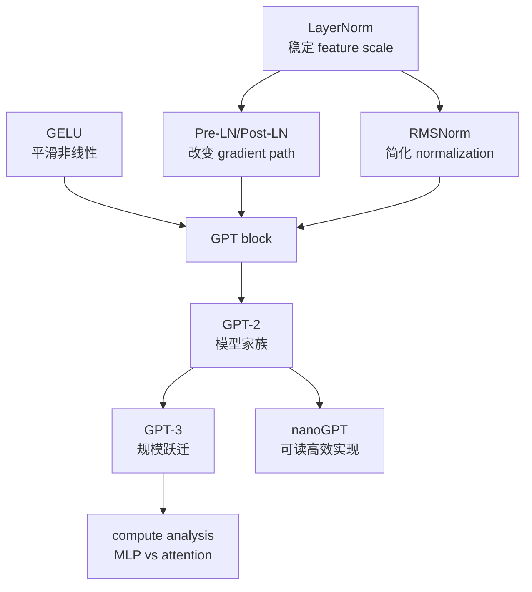

作者的选择逻辑是先给实现所需的经典组件，再给 topology/normalization 变体，最后用模型报告、代码库和性能分析把局部模块放回大规模系统。

---

## Chapter 5

Chapter 5 的参考资料从“怎样定义可优化的语言模型 loss”扩展到完整预训练研究：开放训练轨迹、领域继续训练、低内存 optimizer、数据工程和生成解码。

### 5.1 为什么对 likelihood 取负对数

**原书引用**：作者课程 *Logistic Regression Loss Function*。

语言模型给正确序列的 likelihood：

$$
p_{\vartheta}(x_{1:T})
=\prod_{t=1}^{T}
p_{\vartheta}(x_t\mid x_{<t}).
$$

直接最大化很多小概率的乘积有两个问题：

1. 浮点下容易 underflow；
2. 乘积的 derivative 和 batch aggregation 不方便。

取 log 后乘积变和：

$$
\log p_{\vartheta}(x_{1:T})
=\sum_{t=1}^{T}
\log p_{\vartheta}(x_t\mid x_{<t}).
$$

最大化 log-likelihood 等价于最小化 negative log-likelihood：

$$
\mathcal L_{\mathrm{NLL}}
=-\frac1T
\sum_{t=1}^{T}
\log p_{\vartheta}(x_t\mid x_{<t}).
$$

因为 log 是严格单调递增函数，它不改变最优参数位置；却把数值范围和代数结构变得更适合优化。

#### Cross-entropy 与 NLL 的关系

真实 next-token target 是 one-hot distribution $q$，模型 distribution 是 $p$：

$$
H(q,p)
=-\sum_{c=1}^{V}q_c\log p_c.
$$

若正确 token 是 $y$，只有 $q_y=1$：

$$
H(q,p)=-\log p_y.
$$

所以 one-hot classification 的 cross-entropy 数值上就是正确类别的 NLL。实现无需显式构造 $V$ 维 one-hot target，只传 class/token index 即可。

### 5.2 从 logits 到 stable cross-entropy

**原书引用**：作者课程 *OneHot Encoding and Multi-category Cross Entropy* 及 PyTorch 代码讲解。

对 logits $z_1,\ldots,z_V$：

$$
-\log p_y
=-z_y+\log\sum_{c=1}^{V}e^{z_c}.
$$

稳定 log-sum-exp 令 $m=\max_c z_c$：

$$
\log\sum_c e^{z_c}
=m+\log\sum_c e^{z_c-m}.
$$

最大 exponent 为 $e^0$，避免大正 logits overflow。PyTorch `F.cross_entropy(logits, targets)` 融合这些步骤；先 softmax 再取 log 会丢失稳定实现优势。

Perplexity 是平均 NLL 的指数：

$$
\operatorname{PPL}=e^{\mathcal L}.
$$

直觉上，它可看作模型每步面对的等效候选分支数，但只有在相同 tokenizer、数据和 loss masking 下才适合比较。Tokenizer 改变序列长度和 token 粒度，PPL 不能无条件跨模型比较。

### 5.3 Pythia：开放训练轨迹用于受控分析

**原书引用**：Biderman et al., *Pythia: A Suite for Analyzing Large Language Models Across Training and Scaling* (2023)，<https://arxiv.org/abs/2304.01373>。

Pythia 的研究价值不是只发布一个最终 checkpoint，而是发布多个模型规模和大量中间 checkpoints，并尽量固定 architecture/data order 等变量。这使研究者可以问：

- 某项能力在训练多少 tokens 后出现？
- Memorization、bias 或 contamination 如何随训练演化？
- 参数规模改变后，学习曲线怎样变化？
- Deduplication 对训练行为有什么影响？

若只比较两个最终模型：

$$
\Delta\operatorname{score}
=f(\Delta N,\Delta D,\Delta C,\Delta\operatorname{recipe},\ldots),
$$

很难归因。Controlled suite 尽量让一次比较只改变 model size 或 training step。

#### 中间 checkpoint 的方法论价值

最终性能隐藏了学习过程。保存 $\vartheta_0,\vartheta_1,\ldots,\vartheta_K$ 后，可绘制：

$$
m_k=\operatorname{metric}(\vartheta_k),
$$

观察能力是平滑增长、突变，还是先升后降。但 benchmark 的离散评分、样本不足和 threshold effect 也可能制造“涌现”外观，不能仅凭曲线形状作强因果结论。

### 5.4 OLMo：把开放扩展到数据、代码和训练细节

**原书引用**：Groeneveld et al., *OLMo: Accelerating the Science of Language Models* (2024)，<https://arxiv.org/abs/2402.00838>。

OLMo 强调较完整的 open language-model ecosystem：模型、training code、evaluation、intermediate artifacts，以及配套 Dolma corpus。它解决 closed model research 的可验证性问题：只有 API 或最终 weights 时，很难审计数据、复现训练或研究中间状态。

Open artifacts 带来的研究能力：

- 检查 data mixture 与 contamination；
- 重放 training/evaluation recipe；
- 研究 optimizer state、checkpoint trajectory；
- 比较 post-training 前后的行为；
- 构建可追溯下游模型。

开放也不自动保证无偏、无版权风险或实验完全复现。大规模训练对硬件拓扑、kernel 和 failure recovery 敏感；artifact 完整度与 license 仍需逐项核对。

### 5.5 Project Gutenberg：从公共领域书籍构造训练 corpus

**原书引用**：本书补充代码 *Pretraining GPT on the Project Gutenberg Dataset*，约准备 60,000 本 public-domain books。

一个真实数据 pipeline 通常包括：


#### 难点不只是下载

- Header/footer、目录和 OCR artifacts 会重复出现；
- 同一作品可能有多个 editions/translations；
- “公共领域”依司法管辖区和具体 edition/translation 而变；
- Author/date metadata 可能缺失；
- 若先切 chunks 再随机 split，同一本书可能泄漏到 train/validation；
- 长篇文学的分布与 web/instruction text 不同。

正确 split 单位通常是 document/work，而不是独立 token window。Manifest 应记录 source URL、download date、hash、license rationale、language 和 processing version。

### 5.6 Continual pretraining：在已有基础模型上继续学习

**原书引用**：Ibrahim et al., *Simple and Scalable Strategies to Continually Pre-train Large Language Models* (2024)，<https://arxiv.org/abs/2403.08763>。

Continual pretraining 从已有参数 $\vartheta_0$ 出发，在新 domain/time-period corpus 上继续 next-token training：

$$
\vartheta^*
=\arg\min_{\vartheta}
\mathbb E_{x\sim p_{new}}
[\mathcal L_{LM}(x;\vartheta)].
$$

它介于从零预训练与 task SFT 之间：目标仍是 language modeling，不需要 instruction-response labels；目的是改变知识、语言或领域分布。

#### 核心矛盾：plasticity 与 retention

- Plasticity：快速学习新 domain。
- Retention：保留原有 general capability。

只用新数据可能产生 catastrophic forgetting。混入 replay/general data：

$$
p_{mix}
=\lambda p_{new}+(1-\lambda)p_{old},
$$

可在两者间折中。Learning rate 通常小于从零预训练，并可能重新 warm up 后 cosine decay；但最佳配方取决于 domain distance、data size 和 compute budget。

#### 为什么继续训练仍需严格评价

新 domain validation loss 降低，不代表原能力不退化。至少同时测：

- 新领域 held-out loss/tasks；
- 通用 benchmark；
- 原领域 regression suite；
- factuality、safety 和 calibration；
- 与新 corpus 时间截点相符的 contamination audit。

### 5.7 BloombergGPT 作为领域预训练案例

**原书再次引用** BloombergGPT，是为了把 Chapter 1 的“领域模型价值”连接到 Chapter 5 的具体训练问题：general/finance mixture、tokenizer、规模、domain benchmark 和 retaining general performance。

从研究设计看，应比较至少三条路线：

| 路线 | 初始化 | 训练数据 | 优势 | 风险 |
|---|---|---|---|---|
| From scratch | Random | General + domain | 完整控制 | 成本最高 |
| Continual pretraining | General pretrained | Domain/mixed | 成本较低，保留基础 | Forgetting、tokenizer 固定 |
| SFT/RAG | Pretrained/instruct | Labeled examples/evidence | 快、任务直接 | 基础领域表示未必改变 |

只有控制 base size、tokens、data quality 和 evaluation 后，才能判断哪条路线更合适。实际系统也可组合 continual pretraining、SFT 与 retrieval。

### 5.8 GaLore：低秩投影降低 optimizer-state 内存

**原书引用**：

- Zhao et al., *GaLore: Memory-Efficient LLM Training by Gradient Low-Rank Projection* (2024)，<https://arxiv.org/abs/2403.03507>；
- `galore-torch` repository，<https://github.com/jiaweizzhao/GaLore>。

#### 内存问题来自哪里

对参数矩阵 $W\in\mathbb R^{m\times n}$，AdamW 通常保存：

- parameters；
- gradients；
- first moment；
- second moment；
- mixed-precision 场景还可能有 master weights。

Moments 与 $W$ 同 shape，optimizer state 可占巨大内存。

#### GaLore 的核心假设

训练过程中 gradient matrix $G_t$ 的重要变化可近似位于 rank $r\ll\min(m,n)$ 的 subspace。设 projection bases 为 $P_t$ 或 $Q_t$，可把 gradient 投到低维：

$$
R_t=P_t^{\mathsf T}G_t
\quad\operatorname{or}\quad
R_t=G_tQ_t,
$$

在 $R_t$ 上维护 optimizer moments，再将 low-rank update 投回原参数空间。State size 从 $O(mn)$ 降至约 $O(rn)$ 或 $O(mr)$。

#### 与 LoRA 的区别

| 方法 | 可训练参数 | 低秩用于哪里 | 最终模型 |
|---|---|---|---|
| LoRA | 冻结 base，训练低秩 adapters | Parameter update parameterization | Base + adapters/merged weights |
| GaLore | 仍优化 full parameters | Gradient/optimizer-state subspace | Full updated weights |

GaLore 不是普通 PEFT adapter。原书说代码上可替换 `AdamW` 为 `GaLoreAdamW`，指 package integration 简洁，不代表 rank、projection refresh、layer selection 和 distributed compatibility 无需配置。

#### 局限

- Gradient 并非始终低秩；rank 太小会损失 update 信息；
- 计算 projection/SVD-like basis 有开销；
- 不同 layers 的最佳 rank 不同；
- 与 sharding、mixed precision、compilation 的组合要验证；
- Memory 降低不自动等于 wall-clock 更快或最终 quality 不变。

### 5.9 大规模开放预训练数据集

附录按顺序列出 Dolma、The Pile、RefinedWeb、RedPajama 和 FineWeb。它们不只是“更多文本”，而代表不同开放数据路线。

#### 5.9.1 Dolma

**引用**：Soldaini et al., *Dolma: An Open Corpus of Three Trillion Tokens* (2024)，<https://arxiv.org/abs/2402.00159>。

Dolma 为 OLMo 等开放研究提供 trillion-token-scale corpus，强调 sources、processing 和工具的透明度。研究价值在于可追踪 filtering/dedup decisions，而不是只公布一个下载文件。

#### 5.9.2 The Pile

约 800 GB、多来源 mixture，强调 curated diversity。优点是 domain composition 明确；局限包括年代、来源许可、重复和潜在 benchmark contamination，使用时应核对具体版本和治理状态。

#### 5.9.3 RefinedWeb

**引用**：Penedo et al., *The RefinedWeb Dataset for Falcon LLM* (2023)，<https://arxiv.org/abs/2306.01116>。

该工作研究经过大规模 filtering/dedup 的 web-only corpus 能否胜过更人工拼接的 curated mixtures。关键结论应理解为：高质量 web processing 可产生很强数据，并非“任何 Common Crawl 原始页面都优于 curated data”。

#### 5.9.4 RedPajama

Together AI 的 RedPajama 旨在复现 LLaMA-like training dataset mixture，强调开放复现。它展示 model recipe 复现不仅需要 architecture，还需要数据各来源比例、清洗和采样。

#### 5.9.5 FineWeb

原书描述其包含超过 15 trillion tokens 的 cleaned/deduplicated English web data。FineWeb 关注在 Common Crawl 上建立可扩展 cleaning 与 quality filtering pipeline。

“15T tokens”是某 tokenizer 和 processing version 下的计量；不能直接与 GB/TB 或另一 tokenizer 的 token count 等价。

#### Corpus pipeline 的共同框架

$$
\operatorname{raw web}
\xrightarrow{\operatorname{extract}}
\operatorname{text}
\xrightarrow{\operatorname{filter}}
\operatorname{quality subset}
\xrightarrow{\operatorname{dedup}}
\operatorname{training corpus}.
$$

主要 trade-offs：

- Aggressive quality filters 提升平均质量，却可能降低语言/风格多样性；
- Dedup 降低 memorization 和重复 compute，却可能误删合法模板化内容；
- Safety filters 减少有害内容，却可能引入文化和身份偏差；
- Benchmark decontamination 依赖 benchmark 可知性和 matching method；
- robots.txt、license 和个人数据治理不能被“公开网页”替代。

### 5.10 Top-k sampling

**原书引用**：Fan et al., *Hierarchical Neural Story Generation* (2018)，<https://arxiv.org/abs/1805.04833>。

给 logits $z$ 和 temperature $\tau>0$：

$$
p_i
=\frac{\exp(z_i/\tau)}
{\sum_j\exp(z_j/\tau)}.
$$

Top-k 只保留概率最大的 $k$ 个 tokens：

$$
S_k=\operatorname{TopK}(p,k),
$$

$$
\widetilde p_i
=
\begin{cases}
p_i/\sum_{j\in S_k}p_j,&i\in S_k,\\
0,&\operatorname{otherwise}.
\end{cases}
$$

然后从 $\widetilde p$ 采样。它避免低概率 tail 中明显不合理 token，却固定保留 $k$ 个：当 distribution 很尖锐时可能纳入无意义候选；很平坦时又可能截掉许多合理候选。

### 5.11 Top-p / nucleus sampling

**原书引用**：Top-p sampling 延伸资料。

先按概率降序，选择累计概率至少为阈值 $p$ 的最小集合：

$$
S_p
=\min\left\{S:
\sum_{i\in S}p_i\ge p
\right\}.
$$

候选数随 uncertainty 动态变化：distribution 尖锐时集合小，平坦时集合大。Top-p 与 top-k 可组合，执行顺序和实现细节会影响结果，应记录 generation config。

### 5.12 可运行的 top-k/top-p 对照

```python
import torch


def top_k_distribution(logits, top_k, temperature=1.0):
    if temperature <= 0:
        raise ValueError("temperature must be positive")
    if not 1 <= top_k <= logits.numel():
        raise ValueError("top_k is outside the vocabulary range")

    scaled_logits = logits / temperature
    threshold = torch.topk(scaled_logits, top_k).values[-1]
    filtered_logits = scaled_logits.masked_fill(
        scaled_logits < threshold,
        float("-inf"),
    )
    return torch.softmax(filtered_logits, dim=-1)


def top_p_distribution(logits, top_p, temperature=1.0):
    if temperature <= 0:
        raise ValueError("temperature must be positive")
    if not 0 < top_p <= 1:
        raise ValueError("top_p must be in (0, 1]")

    scaled_logits = logits / temperature
    sorted_logits, sorted_indices = torch.sort(
        scaled_logits,
        descending=True,
    )
    sorted_probabilities = torch.softmax(sorted_logits, dim=-1)
    cumulative = torch.cumsum(sorted_probabilities, dim=-1)

    remove = cumulative > top_p
    remove[1:] = remove[:-1].clone()
    remove[0] = False
    sorted_logits = sorted_logits.masked_fill(remove, float("-inf"))

    filtered_logits = torch.full_like(logits, float("-inf"))
    filtered_logits.scatter_(0, sorted_indices, sorted_logits)
    return torch.softmax(filtered_logits, dim=-1)


example_logits = torch.tensor([4.0, 3.0, 1.0, 0.0, -2.0])
top_k_probabilities = top_k_distribution(example_logits, top_k=2)
top_p_probabilities = top_p_distribution(example_logits, top_p=0.9)

assert torch.allclose(top_k_probabilities.sum(), torch.tensor(1.0))
assert torch.allclose(top_p_probabilities.sum(), torch.tensor(1.0))
assert torch.count_nonzero(top_k_probabilities).item() == 2
assert torch.count_nonzero(top_p_probabilities).item() == 2

generator = torch.Generator().manual_seed(123)
sampled_token = torch.multinomial(
    top_p_probabilities,
    num_samples=1,
    generator=generator,
).item()
assert sampled_token in {0, 1}
```

这段代码把 nucleus 中“第一个超过阈值的 token 仍应保留”体现在右移 `remove` mask。若不右移，累计概率第一次超过 $p$ 的 token 会被删除，剩余 mass 可能低于阈值。

Temperature 趋近 0 时 distribution 接近 argmax；增大 temperature 会变平。实际实现通常把 `temperature=0` 单独解释为 greedy decoding，而不是直接除以 0。

### 5.13 Beam search

**原书引用**：Vijayakumar et al., *Diverse Beam Search* (2016)，<https://arxiv.org/abs/1610.02424>。

Beam search 在每一步保留累计 log-probability 最好的 $B$ 个 partial sequences：

$$
s(y_{1:t})
=\sum_{i=1}^{t}
\log p(y_i\mid y_{<i},x).
$$

朴素算法：

```text
beams <- {empty sequence with score 0}
repeat until stopping:
    expand every beam with candidate next tokens
    add log probabilities to beam scores
    keep the best B expanded sequences
return the highest-scoring completed sequence
```

#### 为什么需要 length normalization

Log probabilities 通常非正，序列越长累计值越低，朴素 score 偏好短序列。可使用：

$$
s_{norm}(y)=\frac{s(y)}{|y|^{\alpha}},
$$

或其他 length penalty。具体公式改变 ranking，应作为 decoding protocol 报告。

#### Beam、top-k 与 top-p 的目标不同

| 方法 | 确定性 | 主要目标 | 常见问题 |
|---|---:|---|---|
| Greedy | 是 | 每步局部最大 | 易陷入局部选择 |
| Beam | 通常是 | 高 sequence likelihood | 通用生成可能 bland/repetitive，beams 相似 |
| Top-k | 否 | 固定候选集采样 | 不适应 uncertainty |
| Top-p | 否 | 动态 probability mass 采样 | 对阈值/温度敏感 |

Diverse beam search 在 beams 间加入 diversity penalty，减少所有 beams 只做同一前缀微变。机器翻译等有明确 source 和较窄输出分布的任务常适合 beam；开放故事/聊天常更偏好 sampling diversity。

### 5.14 Chapter 5 的研究闭环

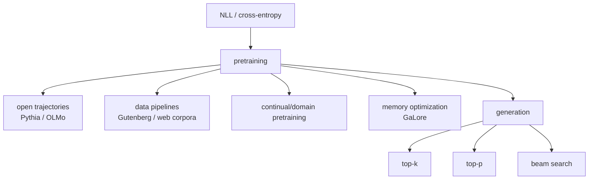

从 loss 到生成的关键认识是：training objective 定义模型 distribution，但 decoding algorithm 决定如何从该 distribution 选出具体序列。换 decoding 不会改变 weights，却能显著改变 diversity、repetition 和 factuality 表现。

---

## Chapter 6

Chapter 6 的资料围绕分类 fine-tuning 的设计自由度展开：使用哪个输出位置、一个还是两个 logits、解冻多少层、类别不平衡怎样处理，以及 decoder-only 模型是否应改造成 bidirectional encoder。

### 6.1 Fine-tuning 的类型与选择

**原书引用**：作者的 *Using and Finetuning Pretrained Transformers* 与 *Finetuning Large Language Models*。

Fine-tuning 不是单一算法，可按更新范围和监督信号区分：

| 方法 | 更新对象 | 监督 | 适合情形 |
|---|---|---|---|
| Linear probing | 新 output head | Labeled task data | 数据少、快速 baseline |
| Partial fine-tuning | Head + 后几 blocks | Labeled task data | 需要更多 task adaptation |
| Full fine-tuning | 全部 parameters | Labeled/task text | 数据/算力足，domain shift 大 |
| PEFT/LoRA | 少量 adapters | 同任务监督 | 显存受限、多任务 adapters |
| Continued pretraining | 多数/全部 parameters | Unlabeled domain text | 改变语言/领域分布 |
| Instruction SFT | 多数/全部或 adapters | Prompt-response pairs | 学会开放任务 interface |

冻结参数的数学含义是 optimizer 不更新它们；其 forward 仍参与计算并产生 activations。若前部完全冻结，可在某些场景缓存 features，但 dropout/mode 和数据 augmentation 会影响缓存有效性。

选择更新范围是 bias-variance/capacity trade-off：更新太少可能 underfit task；更新太多在小数据上可能 overfit、忘记原能力，并增加显存。

### 6.2 用第一个还是最后一个 token 表示分类输入

**原书引用**：补充 spam classification experiments。

Decoder-only causal model 在位置 $t$ 的 hidden state 只能读取 $x_{\le t}$。因此：

- 第一个 ordinary token 的 state 几乎看不到后文，不适合作为完整序列 summary；
- 最后一个 non-padding token 已经因 causal attention 聚合全部前缀；
- 若 prepend 一个 classification token，它在 causal mask 下仍看不到后续，除非改 mask 或把 special token 放在末尾。

这就是本书选择 last output token 的结构依据。对 bidirectional BERT，开头 `[CLS]` 能读取两侧全部 tokens，因此位置选择结论不同。

实验比较必须控制：padding side、真正 sequence end index、truncation、special tokens 和 pooling。直接取 tensor 最后一列若那里是 padding，得到的是 padding state，不一定是文本最后 token。

### 6.3 二分类：单 logit 与双 logits

**原书引用**：作者文章 *Losses Learned—Optimizing Negative Log-Likelihood and Cross-Entropy in PyTorch*。

#### 单输出 BCE

模型输出 $z\in\mathbb R$：

$$
p(y=1\mid x)=\sigma(z).
$$

使用 `BCEWithLogitsLoss`：

$$
L
=-y\log\sigma(z)
-(1-y)\log(1-\sigma(z)).
$$

Prediction threshold $p\ge0.5$ 等价于 $z\ge0$，但 class imbalance/cost-sensitive tasks 可调 threshold。

#### 双输出 cross-entropy

模型输出 $z_0,z_1$：

$$
p(y=c\mid x)
=\frac{e^{z_c}}{e^{z_0}+e^{z_1}}.
$$

概率只依赖 logit difference：

$$
p(y=1\mid x)
=\sigma(z_1-z_0).
$$

因此二者表达能力在适当 parameterization 下高度相关。双 logits 与 multiclass API 一致；单 logit 少一半 head outputs，并自然支持 `pos_weight` 等 binary settings。

#### PyTorch 契约不同

```python
import torch
import torch.nn.functional as F

single_logits = torch.tensor([1.2, -0.7, 0.3])
binary_targets = torch.tensor([1.0, 0.0, 1.0])
binary_loss = F.binary_cross_entropy_with_logits(
    single_logits,
    binary_targets,
)

double_logits = torch.tensor([
    [0.0, 1.2],
    [0.0, -0.7],
    [0.0, 0.3],
])
class_targets = torch.tensor([1, 0, 1])
multiclass_loss = F.cross_entropy(double_logits, class_targets)

assert torch.allclose(binary_loss, multiclass_loss)
```

等价成立是因为这里固定 $z_0=0,z_1=z$ 并使用相同 mean reduction。一般两个独立 logits 的参数化有冗余平移自由度；数值 optimization path 不必完全一致。

### 6.4 解冻最后一个 Transformer block

**原书引用**：作者 *Finetuning Large Language Models* 实验。

只训练 classification head 假设 pretrained representations 已线性可分。若任务需要重新组合 features，仅更新 head 不够。解冻最后 block 可让 high-level contextual representations 向任务靠拢，同时冻结前层保留通用低层特征并降低成本。

典型渐进策略：

```text
head only baseline
-> unfreeze final norm + last block
-> unfreeze more blocks
-> full fine-tuning
```

每一步比较 validation metric、训练成本和 overfitting。某实验中 last block 明显改善，不证明所有任务都只需最后一层；domain shift 越大，可能需要更深 adaptation。

可对不同 parameter groups 使用 discriminative learning rates：靠近输入的 pretrained layers 较小，head 较大。其依据是不同层距 task objective 和初始化成熟度不同，但增加了调参复杂度。

### 6.5 Imbalanced classification

**原书引用**：imbalanced-learn user guide。

若 spam 只占 1%，永远预测 non-spam 也有 99% accuracy。Confusion matrix：

| | Predicted positive | Predicted negative |
|---|---:|---:|
| Actual positive | TP | FN |
| Actual negative | FP | TN |

$$
\operatorname{precision}=\frac{TP}{TP+FP},
$$

$$
\operatorname{recall}=\frac{TP}{TP+FN},
$$

$$
F_1=2\frac{\operatorname{precision}\cdot\operatorname{recall}}
{\operatorname{precision}+\operatorname{recall}}.
$$

常见方法：

- Class-weighted loss；
- Over/under-sampling；
- Synthetic minority generation（表格特征可考虑 SMOTE，文本需谨慎）；
- Threshold tuning；
- PR-AUC、per-class recall 与 cost-based metric；
- Stratified/group-aware split。

Threshold 必须在 validation set 选择，不能在 test set 调。Oversampling 只用于 train；若先生成/复制再 split，会泄漏近重复样本。

### 6.6 Email spam dataset：从 SMS 迁移到真实文档

**原书引用**：CSV 格式 email spam classification dataset。

Email 与 SMS 的 distribution 不同：email 更长，包含 subject、headers、HTML、quoted replies、URLs 和 attachments metadata。迁移 pipeline 要重新决定：

- 使用哪些字段；
- HTML/text extraction；
- Thread/duplicate grouping；
- Truncation 是否丢失正文；
- Sender/time/domain split；
- PII 与敏感内容处理。

随机 row split 可能把同一 spam campaign 的近重复模板分到 train/test，得到过高结果。Group split by campaign/sender/time 更接近部署泛化。

### 6.7 BERT、RoBERTa 与 decoder-only classifier

**原书引用**：

- Devlin et al., BERT (2018)；
- Liu et al., *RoBERTa* (2019)，<https://arxiv.org/abs/1907.11692>；
- 50k IMDb sentiment 补充实验。

BERT/RoBERTa 使用 bidirectional encoder，所有位置可读取完整输入，天然适合 sequence understanding。RoBERTa 主要重新评估和优化 BERT pretraining recipe，例如更多数据、更长训练、dynamic masking，并移除 next sentence prediction objective。

Decoder-only GPT 也可做分类，因为最后 state 聚合前缀；优势是复用生成模型，劣势是 causal mask 不让早期 positions 利用右侧 context，且预训练 objective 与 dedicated encoder 有差异。

选择不能只看“encoder 更适合分类”这句原则，还要比较：

- 可用 pretrained checkpoint 和语言覆盖；
- context length；
- latency/throughput；
- 参数规模；
- 是否还需生成；
- task-specific benchmark。

### 6.8 移除 causal mask：把 LLM 改造成 text encoder

**原书引用**：

- Li et al., *Label Supervised LLaMA Finetuning* (2023)，<https://arxiv.org/abs/2310.01208>；
- BehnamGhader et al., *LLM2Vec* (2024)，<https://arxiv.org/abs/2404.05961>。

移除 causal mask 后，每个 token 可读取左右 context：

$$
M_{ij}=0\quad\forall i,j.
$$

这可能改善分类/embedding，因为表示不再依赖“只有最后 token 看过全文”。还可配合 masked next-token-like adaptation、contrastive learning 和 pooling，使 decoder LLM 成为 encoder。

#### 为什么不能推理时直接去掉 mask就结束

模型在 causal pretraining 中从未见过 future-visible attention distribution。突然改 mask 会造成 architecture/training mismatch。后续方法通常加入适配训练，让 weights 学会利用双向信息。

#### 代价

- 失去原生 autoregressive causality，不能用同一 forward semantics 直接生成；
- KV-cache incremental decoding 不再成立；
- Position/pooling 设计要重新验证；
- Classification 提升可能来自额外训练数据或 objective，而不只 mask 改动。

### 6.9 Chapter 6 决策图

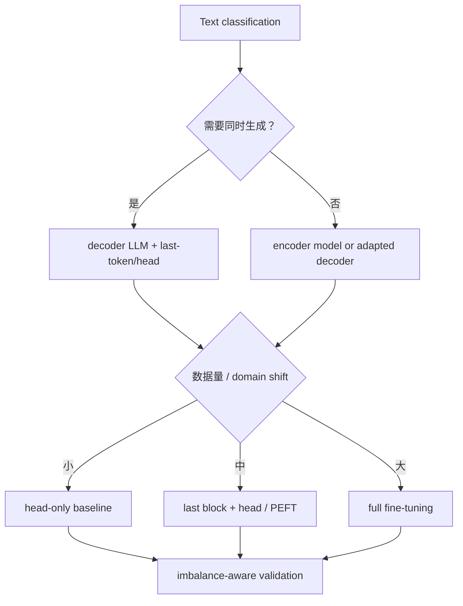

---

## Chapter 7

Chapter 7 的引用把 instruction fine-tuning 放进更大的 alignment pipeline：公开 datasets、数据质量/规模、synthetic generation、loss masking、LLM-as-a-judge、知识更新风险和 preference optimization。

### 7.1 Stanford Alpaca：Self-Instruct 风格的开放数据

**原书引用**：Stanford Alpaca，约 52,000 instruction-response pairs，<https://github.com/tatsu-lab/stanford_alpaca>。

Alpaca 用已有强模型生成 instruction-following data，再 fine-tune LLaMA，证明相对有限成本可获得明显 instruction behavior。

#### 它解决什么

高质量 human-written demonstrations 昂贵。Synthetic teacher 可快速扩展 task diversity：

```text
seed tasks
-> generate new instructions
-> filter/deduplicate
-> teacher generates outputs
-> format prompt-response
-> SFT student model
```

#### 局限

- Teacher errors、style 和 safety behavior 被蒸馏；
- Generated instructions 的真实 diversity 可能低于表面措辞；
- License/terms 与 teacher output 使用条件需核对；
- 52k quantity 不代表 quality；
- Evaluation 若偏好 teacher style，可能夸大效果。

Alpaca 是 instruction data pipeline 的早期重要案例，不是现代 assistant 的完整 safety/alignment recipe。

### 7.2 LIMA：少量高质量数据的作用

**原书引用**：Zhou et al., *LIMA: Less Is More for Alignment* (2023)，<https://arxiv.org/abs/2305.11206>。

LIMA 研究“superficial alignment hypothesis”：强 pretrained model 已学到大量知识和能力，SFT 主要教会它用何种 response format/style 与用户交互，因此少量 carefully curated examples 也可能产生强 alignment behavior。

这与“数据越多越好”形成有益张力：

$$
\mathrm{SFT\ value}
\ne
\mathrm{example\ count\ alone};
$$

更取决于 correctness、diversity、difficulty、format consistency 和 base-model capability。

边界：少量高质量数据对强 base model 可能足够塑造 style，却不保证补齐缺失知识、长尾工具能力、多语言 coverage 或 safety edge cases。

### 7.3 UltraChat：扩大高质量对话规模

**原书引用**：Ding et al., *Enhancing Chat Language Models by Scaling High-quality Instructional Conversations* (2023)，<https://arxiv.org/abs/2305.14233>；原书描述约 805,000 pairs/conversations 资源版本。

UltraChat 代表大规模 synthetic multi-turn conversations。与单轮 Alpaca 相比，它尝试覆盖更丰富主题和对话结构。

规模化的主要难点：

- Multi-turn consistency；
- Assistant 不能忘记前文 constraints；
- Topic/persona diversity；
- Teacher hallucination 与 self-reinforcement；
- Turn-level 和 conversation-level dedup；
- 不同公开版本/转换格式的 schema 差异。

使用 Hugging Face dataset 时应固定 dataset revision、subset、split 和 conversion script；网页上的当前 row count 可能与原论文/原书时点不同。

### 7.4 Alpaca GPT-4

**原书引用**：约 52,000 条、用 GPT-4 代替 GPT-3.5 生成 response 的 Alpaca-like dataset。

保持 instructions 近似不变、替换 teacher，可以较直接研究 response quality 对 student 的影响。但 comparison 仍可能混入：prompt template、generation settings、teacher version、filtering 和 output length。

更强 teacher 常改善 reasoning/correctness，却也可能输出更长、格式更复杂的答案，增加 SFT token cost。Student capacity 有上限，teacher improvement 不会无损复制。

### 7.5 Phi-3：小模型与高质量数据

**原书引用**：Abdin et al., *Phi-3 Technical Report* (2024)，<https://arxiv.org/abs/2404.14219>。

Phi-3 Mini 约 3.8B parameters，强调 carefully curated/training data、training recipe 和 post-training，使小模型在某些 benchmarks 接近更大模型。

它提供的核心启发是：

$$
\mathrm{capability}
=f(\mathrm{parameters},\mathrm{data},\mathrm{tokens},
\mathrm{recipe},\mathrm{evaluation}).
$$

参数量不是唯一解释变量。高质量、符合目标能力的数据可提高每参数效率。

“Comparable to GPT-3.5”必须限定 benchmark subset、版本和评价协议。小模型在 memory、latency 和 on-device deployment 上有优势，但 knowledge breadth、robustness、long context 和 safety 仍需单独测。

### 7.6 Magpie：从 aligned model 合成对齐数据

**原书引用**：Xu et al., *Magpie: Alignment Data Synthesis from Scratch by Prompting Aligned LLMs with Nothing* (2024)，<https://arxiv.org/abs/2406.08464>。

Magpie 观察到 instruction-tuned chat model 的 chat template/assistant behavior 内含用户问题分布的某种先验；通过只给模板前缀，可采样 synthetic instructions，再让模型生成 responses，构造约 300k pairs。

#### 方法直觉

Aligned model 学到联合分布：

$$
p(\text{user instruction},\text{assistant response}).
$$

通常我们条件于 user instruction 生成 response；Magpie 先从角色边界诱导 user-side content，再完成 assistant-side response。

#### 为什么需要严格 filtering

- Empty/degenerate/repetitive instructions；
- Unsafe/private-like content；
- Teacher self-bias 和 style monoculture；
- Contamination；
- Answer correctness；
- Task category imbalance。

“用空 prompt 生成”不是无中生有；能力来自 aligned teacher 的 weights、template 和训练分布。Student 接近 teacher 的结论也绑定特定 base model、data pipeline 和 benchmarks。

### 7.7 Instruction loss masking

**原书引用**：Shi, *Instruction Tuning with Loss Over Instructions* (2024)，<https://arxiv.org/abs/2405.14394>。

给完整 token sequence：

```text
instruction + optional input + response
```

两种 objective：

#### Response-only loss

$$
\mathcal L_{resp}
=-\sum_{t\in R}
\log p(x_t\mid x_{<t}).
$$

Instruction/prompt target positions 设为 ignore index。直觉是 gradient 全部集中于模型应生成的 response。

#### Loss over instructions and responses

$$
\mathcal L_{all}
=-\sum_{t\in I\cup R}
\log p(x_t\mid x_{<t}).
$$

Prompt 也是自然语言，可提供额外 language modeling supervision。论文发现不 masking instructions 在多种设置更好，特别是 instruction 长、output 短或 examples 少时。

#### 为什么不存在无条件答案

若 instruction tokens 很长，all-token mean 会让 prompt loss 在 scalar objective 中占大比重；但它也增加有效 tokens 和 regularization。Response-only 更直接优化 output，却减少监督量。还可做 weighted objective：

$$
\mathcal L
=\lambda_I\mathcal L_I
+\lambda_R\mathcal L_R.
$$

结论依 base model、data size、length distribution、template 和 evaluation。必须做 controlled ablation，并按有效 token 数报告 loss。

### 7.8 Prometheus、PHUDGE 与 Prometheus 2：专用 LLM judges

**原书引用**：

- Kim et al., *Prometheus* (2023)，<https://arxiv.org/abs/2310.08491>；
- Deshwal and Chawla, *PHUDGE* (2024)，<https://arxiv.org/abs/2405.08029>；
- Kim et al., *Prometheus 2* (2024)，<https://arxiv.org/abs/2405.01535>。

这些工作训练 open evaluator models，输入通常包括 instruction、candidate response、rubric、reference/criteria，输出 score 和/或 critique。目标是减少对 proprietary judge 的依赖，并支持 customizable criteria。

#### Judge 建模的对象

$$
\widehat s
=J_{\phi}(x,y,r,c),
$$

其中 $x$ 是 prompt，$y$ 是 candidate，$r$ 是 reference，$c$ 是 criterion/rubric。改变任何输入都改变分数语义。

#### “Match GPT-4”应怎样理解

通常指在指定 evaluator benchmarks 上与 human ratings 的 correlation/agreement 接近某 GPT-4 version，不表示所有领域、语言、rubric 和 adversarial response 都等价。

Judge 常见偏差：

- Position/order bias；
- Length、verbosity 和 style bias；
- Self-preference/model-family bias；
- Reference anchoring；
- Prompt injection from candidate；
- 对 factual errors 缺少外部证据；
- Score scale calibration 不稳定。

可靠协议应随机交换 pair order、隐藏 model identity、使用明确 rubric、多 judge/人工 audit、报告 parse coverage 和置信区间。原书因 Ollama 当时不支持这些模型而选择可在 laptop 高效运行的 Llama judge；这是部署约束，不是理论上判定它们较差。

### 7.9 Fine-tuning 新事实与 hallucination 风险

**原书引用**：Gekhman et al., *Does Fine-Tuning LLMs on New Knowledge Encourage Hallucinations?* (2024)，<https://arxiv.org/abs/2405.05904>。

该研究支持一种区分：pretraining 主要建立 broad factual knowledge，fine-tuning 更擅长教模型如何调用和表达已有知识；用有限 fine-tuning examples 注入新事实，学习较慢，还可能增加在未知问题上自信作答的倾向。

#### 为什么行为学习与事实写入不同

Instruction format/style 在很多 examples 中共享 pattern，gradient signal 一致；单个新事实只出现在少量 contexts，要在 distributed parameters 中形成可泛化、可准确检索的 memory 更难。

此外，SFT 示范几乎总提供答案，模型可能学到“遇到问题就回答”，而不是“知识不足时 abstain”。于是新知识 fine-tuning 同时改变 epistemic behavior。

#### 工程含义

- Frequently changing knowledge 优先考虑 retrieval，而不是反复写入 weights；
- 若继续预训练/微调新知识，要混合 retention data；
- 同时评估 known、newly learned、unknown 和 conflicting facts；
- 测试 calibration、abstention 和 citation grounding；
- 不把 training answer recall 当作 robust knowledge acquisition。

研究结论依实验设置，不能推出“fine-tuning 永远不能学新事实”；它提醒我们 knowledge editing 的副作用和评价维度。

### 7.10 Preference fine-tuning：RLHF 与替代方法

**原书引用**：作者文章 *LLM Training: RLHF and Its Alternatives* 与 *Tips for LLM Pretraining and Evaluating Reward Models*。

Instruction SFT 后，preference data 通常是：

$$
(x,y_w,y_l),
$$

$y_w$ 是 preferred/chosen response，$y_l$ 是 rejected response。

#### Reward modeling

训练 scalar reward $r_{\phi}(x,y)$，Bradley-Terry preference probability：

$$
P(y_w\succ y_l\mid x)
=\sigma(r_{\phi}(x,y_w)-r_{\phi}(x,y_l)).
$$

Loss：

$$
\mathcal L_{RM}
=-\log\sigma(r_w-r_l).
$$

只有 reward difference 可识别；所有 scores 加同一常数不改变 preference probability。

#### PPO-style RLHF

Policy 最大化 learned reward，并用 KL penalty 约束相对 SFT/reference policy 的漂移：

$$
\max_{\pi_{\vartheta}}
\mathbb E[r_{\phi}(x,y)]
-\beta D_{KL}
(\pi_{\vartheta}\|\pi_{ref}).
$$

难点是 rollout 成本、reward hacking、RL instability 和多个 models/state 的显存。

#### DPO-style direct preference optimization

DPO 不显式训练 reward model/运行在线 RL，而直接提高 chosen 相对 rejected 的 policy log-ratio。常见 loss：

$$
\mathcal L_{DPO}
=-\log\sigma\left(
\beta\left[
\log\frac{\pi_{\vartheta}(y_w\mid x)}
{\pi_{ref}(y_w\mid x)}
-
\log\frac{\pi_{\vartheta}(y_l\mid x)}
{\pi_{ref}(y_l\mid x)}
\right]
\right).
$$

它简化 pipeline，但仍依赖 preference quality、reference model、$\beta$、sequence log-probability 与 length effects，不会自动消除 bias 或 overoptimization。

#### Preference data 的根本边界

人类偏好不是单一 objective：helpfulness、harmlessness、truthfulness、style 和 individual values 可能冲突。Aggregation 会隐藏 annotator disagreement。应记录 rubric、annotator population、quality control、uncertainty 和 safety escalation，而不把 reward score 当价值真值。

### 7.11 Chapter 7 的数据—目标—评价闭环

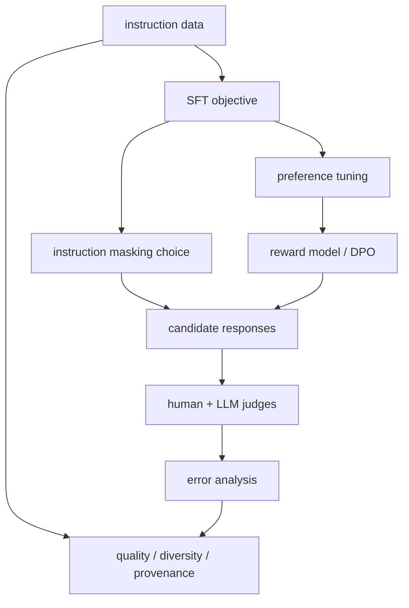

Chapter 7 的引用共同说明：post-training 不是简单增加 examples。Dataset generation、loss-visible positions、preference model 和 evaluator 共同定义了最终“对齐”到什么行为。

---

## Appendix A

原书最后把 PyTorch 入门继续延伸到系统学习、张量/微积分、模型评价、gradient accumulation 和大模型 sharding。

### A.1 两本系统性 PyTorch/深度学习教材

**原书推荐**：

- Raschka, Liu, Mirjalili, *Machine Learning with PyTorch and Scikit-Learn* (2022)；
- Stevens, Antiga, Viehmann, *Deep Learning with PyTorch* (2021)。

附录 A 足够运行本书，但系统教材补足：

- Traditional ML 与 neural networks 的边界；
- Data preprocessing、evaluation 和 deployment；
- CNN/RNN/other architectures；
- PyTorch tensor/autograd/module internals；
- 从实验到完整 project 的组织方式。

阅读建议不是从头背 API，而是带着本书的具体对象回查：当不理解 `Dataset` multiprocessing、autograd graph、model mode 或 evaluation protocol 时，进入相应章节。

### A.2 Tensor 视频教程

**原书引用**：作者 *Lecture 4.1: Tensors in Deep Learning*。

视频适合建立 shape transformation 的动态直觉。观看时应同步手写：

```text
scalar: ()
vector: (d,)
batch of vectors: (B, d)
token embeddings: (B, T, d)
attention scores: (B, H, T, T)
logits: (B, T, V)
```

真正验收不是“看懂画面”，而是能对每个轴命名、解释一次 transpose/reshape 后轴含义，并预测 matrix multiplication 输出 shape。

### A.3 Model evaluation、selection 与 algorithm selection

**原书引用**：Raschka, *Model Evaluation, Model Selection, and Algorithm Selection in Machine Learning* (2018)，<https://arxiv.org/abs/1811.12808>。

三个概念：

- **Model evaluation**：估计一个已选模型的泛化性能；
- **Model selection**：在同一 algorithm family 的 hyperparameters/checkpoints 中选择；
- **Algorithm selection**：比较不同 model families/learning algorithms。

若用同一 validation set 反复尝试大量方案，最终也会对 validation overfit。Test set 应在选择完成后用于一次近似无偏估计；更严谨的小数据场景可用 nested cross-validation。

#### 置信区间与单次分数

Test accuracy $\widehat p=k/n$ 的标准误粗略为：

$$
\operatorname{SE}(\widehat p)
\approx
\sqrt{\frac{\widehat p(1-\widehat p)}{n}}.
$$

它依 iid Bernoulli 近似；文本数据有 clusters、duplicates 和 distribution shift 时可失效。Bootstrap 也必须按独立 unit（如 user/document）重采样，而非把相关 chunks 当独立样本。

选择 metric 要匹配部署成本：spam false negative 与 false positive 成本不同；LLM judge 平均分也不能覆盖 safety tail risks。

### A.4 微积分复习

**原书引用**：作者 *Introduction to Calculus*。

本书所需最小微积分链：

1. Derivative：局部变化率；
2. Partial derivative：多变量函数对一个变量的变化率；
3. Gradient：所有 parameter partials；
4. Chain rule：复合函数 derivative 的乘积/组合；
5. Gradient descent：沿负 gradient 更新；
6. Jacobian/vector-Jacobian product：多维 graph 中高效反传。

Autograd 降低手算负担，但理解 chain rule 才能诊断 detached graph、vanishing/exploding gradients 和错误 loss。

### A.5 Gradient accumulation

**原书引用**：作者 *Finetuning Large Language Models on a Single GPU Using Gradient Accumulation*。

PyTorch 不自动在 backward 后清空 gradients，因为累积有明确用途：用多个能放入显存的 microbatches 模拟更大 effective batch。

设 accumulation steps 为 $K$，每个 microbatch loss 是 mean：

$$
L_{effective}
=\frac1K\sum_{k=1}^{K}L_k.
$$

因此每次应反传 $L_k/K$，最后更新一次：

```python
import copy

import torch
import torch.nn.functional as F

torch.manual_seed(123)
base_model = torch.nn.Linear(3, 2)
large_batch_model = copy.deepcopy(base_model)
accumulated_model = copy.deepcopy(base_model)

features = torch.randn(8, 3)
targets = torch.randint(0, 2, (8,))
learning_rate = 0.1

large_optimizer = torch.optim.SGD(
    large_batch_model.parameters(),
    lr=learning_rate,
)
large_optimizer.zero_grad()
large_loss = F.cross_entropy(large_batch_model(features), targets)
large_loss.backward()
large_optimizer.step()

accumulation_steps = 4
microbatch_size = 2
accumulated_optimizer = torch.optim.SGD(
    accumulated_model.parameters(),
    lr=learning_rate,
)
accumulated_optimizer.zero_grad()

for step in range(accumulation_steps):
    start = step * microbatch_size
    stop = start + microbatch_size
    microbatch_loss = F.cross_entropy(
        accumulated_model(features[start:stop]),
        targets[start:stop],
    )
    (microbatch_loss / accumulation_steps).backward()

accumulated_optimizer.step()

for large_parameter, accumulated_parameter in zip(
    large_batch_model.parameters(),
    accumulated_model.parameters(),
):
    assert torch.allclose(
        large_parameter,
        accumulated_parameter,
        atol=1e-7,
    )
```

#### 等价成立的前提

- Microbatches 大小相同；
- Loss reduction 和缩放一致；
- Update 前 parameters 不变；
- 无 batch-dependent stochastic difference（dropout masks 本来就不同；BatchNorm statistics 更明显）；
- Optimizer 只在 $K$ 次 backward 后 step；
- Gradient clipping 在累积完整 gradient 后执行；
- Scheduler 按 optimizer updates，而不是 microsteps 前进。

最后一个 microbatch 更小时，简单除以固定 $K$ 不再严格等于 sample-weighted full-batch mean。更稳健做法按总有效 examples/tokens 加权。

DDP 中如果每个 microstep 都同步 gradients，会产生不必要通信。除最后一步外可使用 `model.no_sync()`，但必须确保最后一步触发 synchronization。

### A.6 FSDP：模型单卡放不下时

**原书引用**：PyTorch *Introducing Fully Sharded Data Parallel (FSDP) API*。

普通 DDP 在每个 rank 保存完整：

```text
parameters + gradients + optimizer states
```

FSDP 则在 ranks 间 shard 这些 states，需要计算某层时 all-gather parameters，完成 backward 后 reduce-scatter gradients。设 world size $W$，理想情况下 persistent model-state memory 可从 $O(N)$ 降到约 $O(N/W)$，但实际还有 temporary all-gather buffers、activations、fragmentation 和 communication。

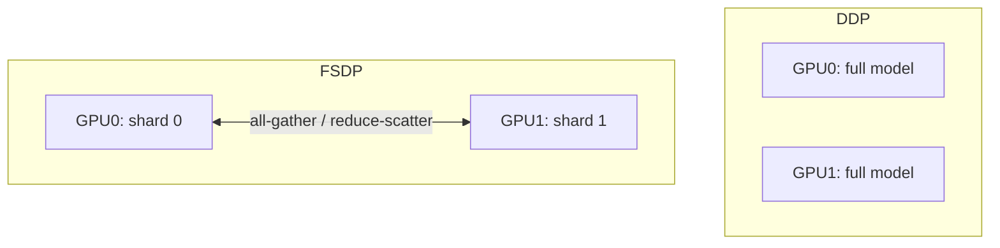

#### DDP、FSDP 与 model parallelism

| 方法 | 模型常驻方式 | 主要目标 | 主要代价 |
|---|---|---|---|
| DDP | 每卡完整 replica | Data throughput | Gradient all-reduce |
| FSDP | Parameters/gradients/optimizer states 分片 | 降 model-state memory | Frequent collectives、复杂 checkpoint |
| Tensor parallel | 单层矩阵跨卡切分 | 超大 layers | Layer 内通信 |
| Pipeline parallel | 不同 layers/stages 跨卡 | 超深模型 | Pipeline bubbles、调度 |

FSDP 仍是 data-parallel family，但通过 sharding 也解决部分单卡容量问题。使用时要配置 auto-wrap policy、mixed precision、CPU offload、activation checkpointing 和 sharded/full state dict；不能只把 DDP class 名替换后假设 checkpoint 语义不变。

### A.7 Appendix A 延伸路线

```text
shape/dtype 不熟
-> tensor tutorial

autograd/optimization 不熟
-> calculus chapter + PyTorch textbook

指标与 split 不清楚
-> model evaluation paper

显存不足但模型单卡可放
-> gradient accumulation / mixed precision

模型 state 单卡放不下
-> FSDP / model parallel methods
```

---

## 8. 全附录知识结构

附录 B 的引用可按五层组织，而不是按几十个孤立标题记忆：

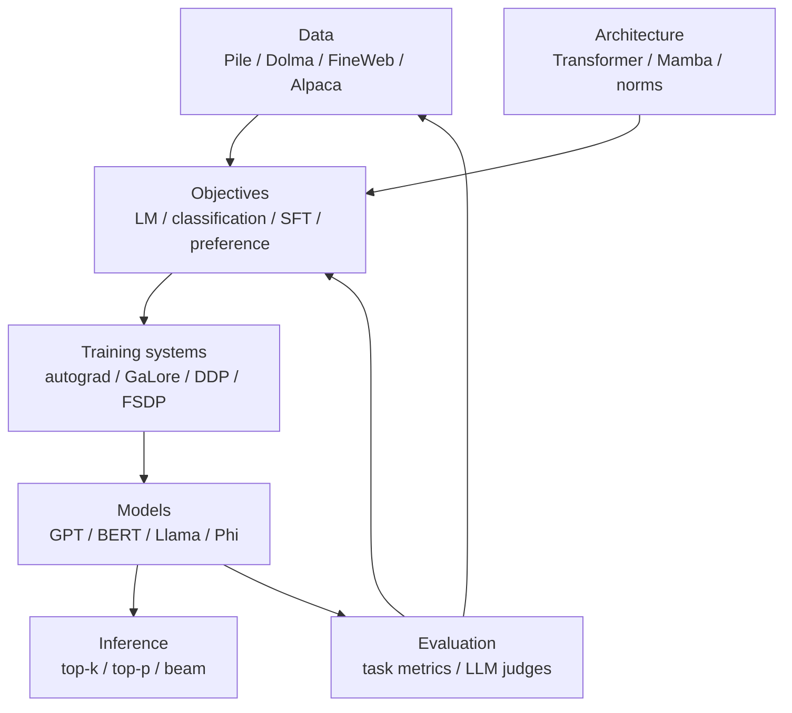

### 8.1 同一结果往往有多个解释变量

观察到 model B 比 model A 分数高：

$$
\Delta S
=f(
\Delta\operatorname{architecture},
\Delta\operatorname{parameters},
\Delta\operatorname{data},
\Delta\operatorname{compute},
\Delta\operatorname{posttraining},
\Delta\operatorname{evaluation}
).
$$

若多个变量同时变化，不能把提升全部归因于论文标题中的新方法。高质量阅读应寻找 ablation、matched-compute baseline 和多 seed uncertainty。

### 8.2 数据贯穿全部章节

- Pretraining corpus 决定语言和知识分布；
- Tokenizer 决定序列长度和表示单位；
- Classification data 决定 label boundary；
- Instruction data 决定交互行为；
- Preference data 决定 chosen behavior；
- Evaluation data 决定我们能观察到什么。

因此“模型问题”常实际是 data provenance、split leakage、sampling weights 或 metric mismatch。

### 8.3 算法与系统必须同时成立

Attention 公式正确但 materialize $T^2$ matrix 可能受 I/O 限制；GaLore/FSDP 节省内存却增加 projection/communication；更大 batch 提高吞吐却改变 optimization。论文结论要同时读数学目标和硬件执行路径。

---

## 9. 主题式阅读路线

### 9.1 想理解 Transformer/GPT 的起源

1. *Attention Is All You Need*；
2. BERT；
3. GPT-2；
4. GPT-3；
5. nanoGPT source；
6. 本书 Chapters 3–5 对应实现。

### 9.2 想研究长上下文与高效 attention

1. 标准 scaled dot-product attention；
2. FlashAttention/FlashAttention-2；
3. PyTorch SDPA backend；
4. MLP vs attention compute analysis；
5. Hyena、Mamba、RWKV；
6. 在目标硬件 profile，而非只比较 Big-O。

### 9.3 想训练领域模型

1. BloombergGPT；
2. Pythia/OLMo 的开放配方；
3. Continual pretraining；
4. Domain/general mixture 与 retention evaluation；
5. RAG、SFT 与 from-scratch 的成本对照；
6. License、privacy、time-split 和 factuality audit。

### 9.4 想研究 instruction alignment

1. InstructGPT；
2. Alpaca；
3. LIMA 与 UltraChat；
4. Magpie synthetic data；
5. Instruction loss masking；
6. Reward model/RLHF/DPO；
7. Prometheus/PHUDGE evaluator；
8. Human audit 与 deployment feedback。

### 9.5 算力或显存有限

1. 先缩小 model/context/batch 建立正确 baseline；
2. Mixed precision；
3. Gradient accumulation；
4. LoRA/PEFT（fine-tuning）；
5. GaLore（full-parameter optimizer-state reduction）；
6. Activation checkpointing；
7. DDP（吞吐）；
8. FSDP/ZeRO 或 model parallelism（容量）。

---

## 10. 易混概念与常见误区

| 常见说法 | 准确辨析 |
|---|---|
| 附录 B 是必读顺序清单 | 它按正文组织；应按当前问题选择论文、代码或文档。 |
| 原始论文就是当前最佳实践 | 它解释起点；API、hardware 和后续配方会演进。 |
| 论文结论就是普遍事实 | 结论绑定数据、baseline、规模、指标和统计不确定性。 |
| Benchmark 第一说明所有任务更强 | Benchmark 只覆盖给定分布，还可能污染或被过度优化。 |
| Domain model 一定要从零训练 | Continued pretraining、SFT、RAG 往往成本更低。 |
| Fine-tuning 能可靠写入任何新事实 | 行为适配通常容易；新知识可能学习慢并增加 hallucination。 |
| Transformer 就等于 encoder-decoder | BERT、GPT 分别使用不同子结构和 attention visibility。 |
| GPT 的 decoder 与 tokenizer decode 是一回事 | 前者是 Transformer architecture role，后者是 IDs 转 text。 |
| Few-shot GPT-3 会更新参数 | In-context examples 不做 gradient update。 |
| Open weights 就是完全开源 | Data、code、license 和 training transparency 是不同维度。 |
| ViT 证明任何数据直接当 token 就有效 | 仍需合适 patching、embedding、position 与训练规模。 |
| 线性时间架构必然更快 | Asymptotic complexity 不包含 constants、kernel 和质量代价。 |
| BPE 的 token 就是语言学 subword | Merge 由 corpus frequency/algorithm 决定，不保证 morpheme。 |
| SentencePiece 是一种固定算法 | 它是 toolkit，可训练 BPE 或 unigram 等 model。 |
| 同名 tokenizer 可互换 | Vocabulary、normalization、merges 和 special IDs 必须完全匹配。 |
| Token count 可跨 tokenizer 直接比较 | 粒度不同；同文本 token 数和 PPL 都受 tokenizer 影响。 |
| Bahdanau attention 就是 Transformer self-attention | 前者最初是 decoder 对 encoder states 的 additive alignment。 |
| Attention weights 就是因果解释 | 它们是模型内部读取权重，不必等于决策因果贡献。 |
| FlashAttention 是近似 attention | 它通过 tiling/online softmax exact 地重排标准 attention 计算。 |
| FlashAttention 消除了二次计算 | 它优化 I/O 和 memory；all-pairs interactions 仍是二次量级。 |
| 调用 SDPA 一定使用 Flash kernel | Backend 取决于 hardware、dtype、shape、mask 和版本。 |
| `model.eval()` 自动关闭 SDPA dropout 参数 | Functional API 仍按传入 `dropout_p` 工作。 |
| Pre-LN 与 RMSNorm 是同一变化 | 前者改 norm 位置，后者改 normalization formula。 |
| RMSNorm 与 LayerNorm 数值等价 | RMSNorm 不 recenter，invariance 和参数可能不同。 |
| GELU 每次会随机采样 gate | 常用实现是 deterministic $x\Phi(x)$ 或近似式。 |
| 参数多的模块一定 wall-clock 最慢 | Runtime 还受 sequence、memory traffic 和 kernel efficiency 影响。 |
| PPL 越低就可跨模型断定更好 | 需相同 tokenizer、data、mask 和 reduction。 |
| 公开 corpus 可无条件商用 | Public access 不消除 license、privacy 与 copyright 风险。 |
| 数据量越大质量越高 | Filtering、dedup、mixture 和 provenance 同样关键。 |
| Continual pretraining 只提升新领域 | 也可能遗忘 general capabilities。 |
| GaLore 就是 LoRA | GaLore 投影 gradients/state 并更新 full weights；LoRA 学 adapters。 |
| 换成 GaLore optimizer 就无需调参 | Rank、refresh、layer selection 和系统兼容仍要验证。 |
| Top-k、top-p 会提升模型知识 | 只改变从现有 distribution 取样的方法，不改变 weights。 |
| Beam search 总比 sampling 好 | 目标不同；开放生成中 beam 可能缺乏多样性。 |
| Last-token classifier 适用于所有架构 | 依据 decoder causal visibility；bidirectional encoder 可用 `[CLS]`。 |
| 二分类必须有两个 output nodes | 单 logit BCE 与双 logits CE 都可用，target 契约不同。 |
| 解冻越多层越好 | 容量与 overfitting、显存和 forgetting 之间有权衡。 |
| 移除 causal mask 可立即得到 BERT | 需要适配 training/objective/pooling，且失去原生生成语义。 |
| Instruction data 数量决定一切 | LIMA/Phi/Magpie 强调 quality、coverage 和 base capability。 |
| Synthetic data 免费且无偏 | 会继承 teacher errors、style、license 和 distribution bias。 |
| Response-only loss 一定更合理 | Prompt loss 也可提供监督；效果依 length/data/model。 |
| LLM judge 与人工真值相同 | Judge 有位置、长度、风格、自偏好和事实性偏差。 |
| Judge 宣称匹配 GPT-4 就适用任何任务 | 通常只在指定 benchmark/version/rubric 上成立。 |
| Reward model 学到客观人类价值 | 它拟合特定 annotators、rubric 和 sampled comparisons。 |
| DPO 不需要 reference 或超参数 | 常见 DPO 依赖 reference policy、$\beta$ 和 preference construction。 |
| Test set 可反复用于选模型 | 反复查看会产生 selection bias，应保留最终独立评价。 |
| Gradient accumulation 等于大 batch，无条件成立 | Loss scaling、batch size、BatchNorm、clipping 和 scheduler 都影响等价。 |
| DDP 能让单卡放不下的模型运行 | 每卡完整 replica；容量问题考虑 FSDP/parallelism。 |
| FSDP 只是 DDP 改一个类名 | Sharding、collectives、wrapping 和 state dict/checkpoint 都更复杂。 |

---

## 11. 作者组织参考资料的一般思路

### 11.1 用“正文最小实现 + 附录研究分支”控制认知负担

正文只实现一条可闭环路线，附录再指出 alternatives。这样读者先理解一个 working system，再比较 BERT、Mamba、RMSNorm、top-p、GaLore 等变体。若一开始平铺全部选择，很难知道它们替换的是哪一层。

### 11.2 每个引用对应一个明确缺口

- 正文公式缺历史来源：原始论文；
- 正文实现不够高效：FlashAttention/API；
- 教学数据太小：Pile/Dolma/FineWeb；
- 训练函数太基础：continual pretraining/GaLore；
- 解码选择有限：top-p/beam；
- 分类实验有限：解冻层和 bidirectional adaptation；
- Instruction evaluation 简化：specialized judges/preference tuning；
- 单卡系统不够：FSDP。

这种“缺口驱动引用”比堆砌相关标题更有学习价值。

### 11.3 交叉使用论文、代码、文档与数据

单一资料无法回答全部问题：论文给动机和实验，代码给真实 edge cases，文档给当前 API，dataset card 给 schema/license。作者为 BPE、attention、pretraining、instruction tuning 都混合了这些类型。

### 11.4 用相反案例避免单一路线崇拜

- BloombergGPT 从零训练 vs 医疗模型适配；
- Transformer vs RWKV/Hyena/Mamba；
- 大规模 UltraChat vs 小而精的 LIMA；
- Response-only masking vs loss over instructions；
- DDP throughput vs FSDP capacity。

相反案例提醒：工程选择由约束决定，而不是某种方法永远最好。

### 11.5 从局部公式追到系统瓶颈

Attention 从 $QK^\top$ 追到 HBM I/O；cross-entropy 从 log-likelihood 追到 trillion-token corpus；gradient 从 autograd 追到 accumulation/DDP/FSDP。有效研究需要同时理解 math、data 和 systems。

### 11.6 把新主张转成可证伪实验

面对“方法 X 更好”，可设计：

1. 固定 base model、data split、token budget；
2. 只改变 X；
3. 记录 seeds 和 confidence intervals；
4. 同时测 quality、memory、throughput；
5. 分析失败样本；
6. 在第二规模/domain 复验；
7. 报告 negative result 和适用边界。

这也是从阅读论文走向独立研究的核心能力。

---

## 12. 文献阅读与复现实验模板

### 12.1 一页 paper card

```text
Citation / version:
Research question:
Main hypothesis:
Method:
Baselines:
Data and licenses:
Compute and model sizes:
Metrics:
Main result:
Ablations:
Threats to validity:
Artifacts available:
Relation to this book:
One experiment I can reproduce:
```

### 12.2 实验 manifest

```yaml
experiment: instruction-loss-mask-ablation
base_model: exact-model-revision
tokenizer: exact-tokenizer-revision
dataset: exact-dataset-revision
split_hash: sha256-placeholder
seed: 123
changed_variable: mask_instruction_targets
fixed:
  - token_budget
  - batch_size
  - optimizer
  - learning_rate_schedule
  - generation_config
metrics:
  - validation_token_loss
  - task_accuracy
  - human_preference
  - judge_score_and_coverage
```

重点不是 YAML 格式，而是预先声明唯一 changed variable 与固定条件，避免事后选择解释。

### 12.3 复现层级

| 层级 | 目标 |
|---|---|
| Smoke reproduction | Code 能运行、shape/数值范围合理 |
| Result reproduction | 同设置得到论文误差范围内结果 |
| Robustness reproduction | 多 seeds、数据子集、硬件仍成立 |
| Conceptual replication | 独立实现/不同 domain 仍支持核心假设 |

一次 notebook 跑通通常只达到第一层。

---

## 13. 核心结论

1. 附录 B 是从本书最小实现通往原始论文、真实数据和规模化系统的索引。
2. 文献结论必须绑定时间、版本、数据、算力、baseline 和评价协议。
3. 领域能力可通过从零预训练、continued pretraining、SFT 或 RAG 获得，选择取决于控制需求和资源。
4. Transformer 是主流但不是唯一序列架构；替代模型用 recurrence、convolution 或 state spaces 改善长序列扩展。
5. Tokenizer 决定表示单位、序列长度与 embedding/head 成本，必须与 weights 严格配套。
6. Bahdanau attention、self-attention 和 cross-attention 共享加权读取思想，但 query/source 和 score function 不同。
7. FlashAttention 不改 attention 数学目标，而以 tiling 和 online softmax 减少 HBM traffic。
8. Normalization formula 与 placement 是两个独立 architecture choices；Pre-LN 和 RMSNorm 不应混淆。
9. GPT-2 到 GPT-3 展示规模效应，但能力同时受 data、tokens、recipe 和 evaluation 影响。
10. Open suites 如 Pythia/OLMo 的价值是暴露训练轨迹与 artifacts，使因果分析和复现更可行。
11. 大型 corpus 的核心问题不只是 token 数，还包括 provenance、许可、过滤、去重、mixture 和 contamination。
12. Continual pretraining 要平衡新领域 plasticity 与旧能力 retention。
13. GaLore 与 LoRA 使用低秩的位置不同：一个优化 gradient/state，一个参数化 adapters。
14. Top-k、top-p 和 beam search 改变 decoding policy，不改变模型知识或 weights。
15. 分类 fine-tuning 的输出位置必须符合 attention visibility；decoder 最后 token 与 encoder `[CLS]` 的依据不同。
16. 单 logit BCE 和双 logits CE 都能做二分类，但 shape、dtype 和 probability parameterization 不同。
17. Instruction tuning 效果由 base capability、数据质量/覆盖、loss mask 和训练规模共同决定。
18. Synthetic alignment data 可扩展规模，也会继承 teacher 的错误、偏见和许可约束。
19. LLM judge 是可扩展评价器而非真值，需要 rubric、随机化、coverage 和人工审计。
20. Fine-tuning 更容易塑造行为接口，不保证安全、无副作用地写入新事实。
21. Preference tuning 优化的是特定比较分布下的人类偏好近似，不是单一客观价值。
22. Gradient accumulation 解决 microbatch 显存问题；DDP 解决 data throughput；FSDP/parallelism 解决 model-state capacity，三者职责不同。
23. 最可靠的学习方法是把每项论文主张还原为可控制、可测量、可证伪的实验。

---

## 14. 一页复习表

| 问题 | 一句话回答 |
|---|---|
| 附录 B 怎样读？ | 按问题选择原论文、代码、数据或文档，而不是线性背清单。 |
| 领域模型两条主路线？ | 从零预训练，或适配已有 pretrained model。 |
| BERT 与 GPT 核心差别？ | Bidirectional encoder MLM vs causal decoder next-token LM。 |
| Transformer 替代路线？ | RWKV recurrence、Hyena long convolution、Mamba selective SSM。 |
| Open weights 等于 open source 吗？ | 不等于，还要看 code/data/license。 |
| BPE 解决什么？ | 在 word OOV 与 character 长序列间取 subword 折中。 |
| SentencePiece 是固定算法吗？ | 不是，是可支持 BPE/unigram 等的 raw-text tokenizer framework。 |
| FlashAttention 近似吗？ | 不是，核心是 exact IO-aware tiled attention。 |
| Pre-LN 与 RMSNorm 差别？ | 前者改位置，后者改公式。 |
| GPT parameter 粗略主项？ | Vocabulary embedding $Vd$ 与每层约 $12d^2$。 |
| PPL 可跨 tokenizer 比吗？ | 通常不可直接比。 |
| Pythia/OLMo 价值？ | 开放 checkpoints、数据/代码等以研究训练过程。 |
| Continual pretraining 风险？ | Catastrophic forgetting 与 domain overfit。 |
| GaLore 与 LoRA？ | Full-weight gradient projection vs frozen-base adapters。 |
| Top-k vs top-p？ | 固定候选数 vs 动态累计 probability mass。 |
| Beam search 优化什么？ | 高累计 sequence log-probability 的近似搜索。 |
| Decoder 分类取哪个 token？ | 通常最后 non-padding token，因为它看到完整前缀。 |
| 单 logit二分类 loss？ | BCEWithLogitsLoss。 |
| 移除 causal mask 后仍能生成吗？ | 不再保持原生 autoregressive/KV-cache 语义。 |
| LIMA 的启发？ | 强 base model 的行为 alignment 可能更依赖少量高质量示例。 |
| Magpie 做什么？ | 从 aligned teacher 的 chat prior 合成 instruction-response data。 |
| Instruction 要 mask 吗？ | 是实验变量，不存在无条件最优。 |
| LLM judge 主要风险？ | Style/length/order/self bias、事实盲点和 prompt injection。 |
| RLHF reward 是真值吗？ | 不是，是 preference samples 与 rubric 的模型。 |
| Gradient accumulation 为何除 $K$？ | 使 $K$ 个等大 mean-loss microbatches 等价于一个大 batch mean。 |
| DDP 与 FSDP？ | DDP 完整复制模型；FSDP 分片 model states。 |

---

## 15. 自测题与参考答案

### 15.1 为什么 BloombergGPT 的结果不能证明任何领域都该从零预训练？

它是特定金融数据、规模、算力和 benchmark 下的案例。其他领域可能数据不足、已有 base 更强、知识更新更频繁，continued pretraining、SFT 或 RAG 的成本收益更好。

### 15.2 BERT 的 bidirectional 与 GPT 的 causal objective 分别适合什么？

BERT 每个位置读取两侧 context，适合理解/表示；GPT 只读取前缀，与逐 token generation 完全一致。二者可被改造，但 pretraining interface 不同。

### 15.3 为什么 $QK^\top$ 要除以 $\sqrt{d_k}$？

若 components 方差稳定，dot-product variance 随 $d_k$ 增大。缩放使 logits 不至于过大导致 softmax 过饱和和 gradient 变小。

### 15.4 FlashAttention 怎样避免保存完整 attention matrix 而仍精确？

它分块读取 Q/K/V，用 running maximum 和 rescaled exponential sum 合并 online softmax statistics，并同步累积 output；分块结果代数上等于完整 stable softmax。

### 15.5 为什么 Pre-LN 通常更易训练深网络？

Residual stream 保留 identity gradient path，gradient 不必在每层 residual 后都经过 LayerNorm Jacobian。但最终质量仍依完整 recipe。

### 15.6 PPL 从 20 降到 15 是否一定说明模型更好？

只有在相同 tokenizer、evaluation corpus、mask 和 reduction 下，才说明平均 target token NLL 更低；它也不自动代表事实性和下游表现更好。

### 15.7 Continued pretraining 为什么要混入旧数据？

只优化新分布可能让参数偏离原能力。旧/general replay 提供 retention gradients，在学习新 domain 与防止 forgetting 间折中。

### 15.8 Top-p 阈值 0.9 为什么候选数不固定？

它选择按概率降序累计到至少 0.9 的最小集合。Distribution 越尖锐，达到 0.9 所需 tokens 越少。

### 15.9 为什么 decoder 的第一个 token 通常不是全文分类表示？

Causal mask 下第一个位置看不到后续 token。最后 non-padding position 才聚合完整前缀。

### 15.10 单 logit BCE 与双 logit CE 何时可等价？

令双 logits 为 $(0,z)$，class-1 softmax probability 等于 $\sigma(z)$，相同 targets/reduction 下 loss 相同。一般独立双 logits 的参数化和优化路径仍不同。

### 15.11 LIMA 与 UltraChat 是否互相否定？

不否定。LIMA 强调强 base 上少量高质量 alignment data 的效率；UltraChat 探索大规模对话覆盖。任务 breadth、base capability 和 quality control 不同。

### 15.12 为什么 LLM judge 分数必须报告 coverage？

无法解析或拒绝评分的样本若被静默删除，平均值可能只基于容易样本而产生 selection bias。Coverage 暴露实际被评价比例。

### 15.13 Gradient accumulation 四个 microbatches，为何 loss 通常除以 4？

每个 loss 已是 microbatch mean；gradient 累加会变成四个 means 的和。除以 4 才等于等大 microbatches 合并后的 full-batch mean。

### 15.14 两卡 DDP、每卡 microbatch 8、累积 4 步，global batch 多大？

$$
2\mathbin{\ast}8\mathbin{\ast}4=64.
$$

前提是每次 optimizer update 前每 rank 都处理四个大小为 8 的 microbatches。

### 15.15 模型单卡放不下，为什么加 DDP 卡数仍无效？

DDP 每卡保留完整 model/optimizer replica。应使用 FSDP/ZeRO、tensor/pipeline parallelism、offload、quantization 或缩小模型。

---

## 16. 最终总结

附录 B 真正提供的不是“更多要记住的模型名”，而是一种扩展知识的方法：**从本书的最小可执行实现出发，定位其历史来源、替代方案、系统优化、数据条件和评价边界；再把论文主张转成控制变量明确的复现实验。**

沿这条路径，LLM 不再是单一 architecture，而是一个共同演化的系统：tokenizer 规定基本单位，数据塑造分布，objective 决定梯度，architecture 规定信息流，kernel 与 distributed strategy 决定可训练规模，decoding 决定如何取样，post-training 塑造交互行为，evaluation 决定哪些能力被看见。任何局部改进都必须放回这条完整链路中判断。
