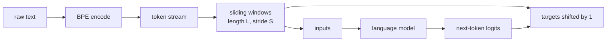
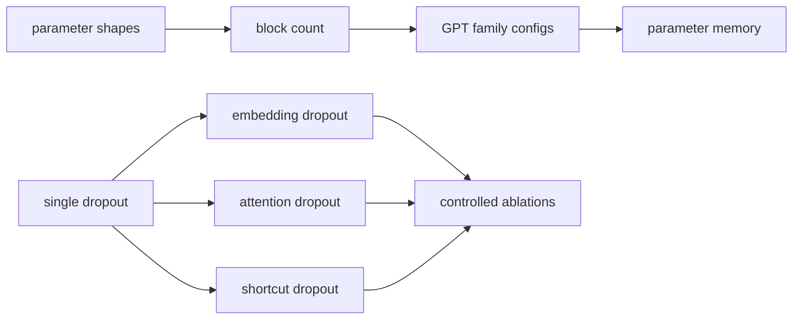
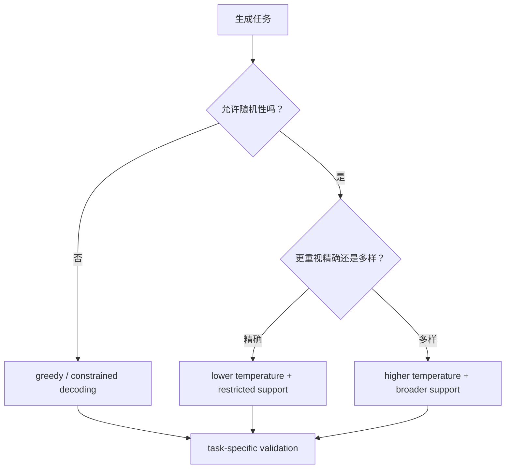
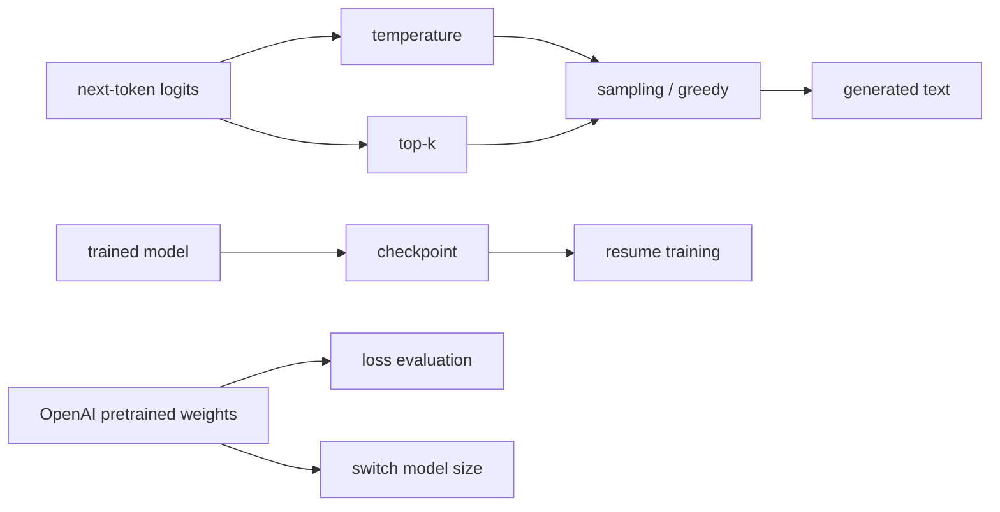
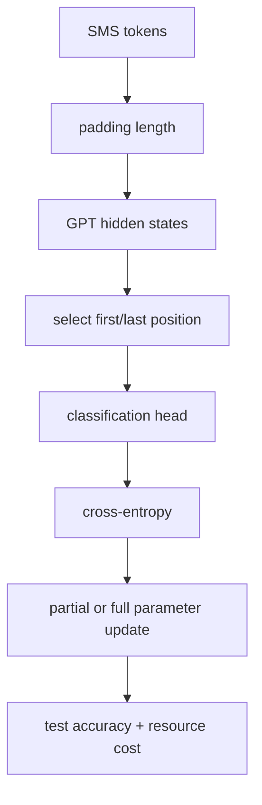
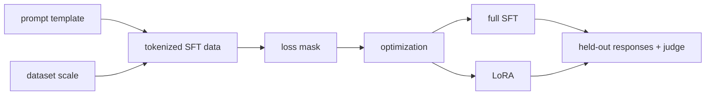
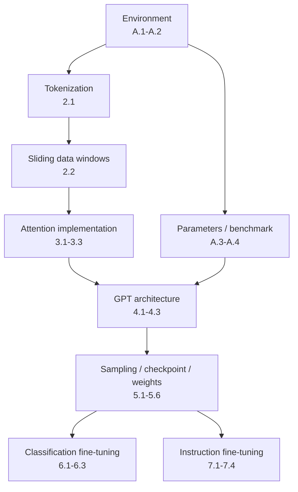

> 对应 *Build a Large Language Model (From Scratch)* 附录 C。本文按照原书 Chapter 2–7、Appendix A 的顺序逐题讲解。重点不是复述最终答案，而是还原题目考查的概念、推导过程、验证方法、适用范围和常见误区。

---

## 0. 附录定位与解题方法

### 0.1 为什么练习解答不是“看完就会”

附录 C 中很多答案只有几行代码或一个实验数字。真正需要掌握的是：

1. 题目改变了哪个变量；
2. 哪些条件必须保持不变；
3. 结果可由哪个数学或 shape 不变量预先推导；
4. 哪些结果只能通过实验得到；
5. 怎样区分普遍机制与一次运行的经验数字。

例如：

- `d_out=1, num_heads=2` 得到总输出维度 2，是 shape 推导；
- Phi-3 模板约快 17%，是特定硬件与数据上的经验结果；
- First-token classifier 变差可由 causal mask 解释，但 75.00% 不是普遍常数；
- LoRA 训练更快是资源结果，质量是否相当仍取决于 rank、数据和评估器。

### 0.2 全附录的统一解题闭环


可以把验证分成四层：

| 层次 | 典型问题 | 示例 |
|---|---|---|
| Syntax | 代码能否解析 | 括号、变量名、import |
| Structure | Shape/参数是否正确 | MHA 输出维度、GPT 参数量 |
| Numerical | 数值是否符合公式 | Softmax 概率、loss、权重等价 |
| Behavioral | 模型行为是否改变 | Accuracy、生成质量、judge score |

只通过 syntax 不代表实现正确；只看到 loss 下降也不代表行为符合任务。

### 0.3 原附录中的代码勘误

原解答包含几处排版或拼写问题，阅读时需要修正：

1. Exercise 4.3 的 `GPTModel.forward` 最后一行写成 `return logitss`，应为 `return logits`。
2. Exercise 7.2 中计算 `instruction_length` 的表达式缺一个右括号。
3. Exercise 7.2 中构造 `padded` 的表达式也缺一个右括号。
4. Exercise 7.1 的说明 `Adjust \###Response to ...` 是 Markdown 转义残留；真正要求是训练和抽取都使用一致的 assistant marker。

本文使用修正后的可运行版本，并把这些错误作为“先做 syntax check”的反例。

### 0.4 哪些结果具有版本依赖

以下输出依赖原书时点的软件、模型、随机种子、硬件或数据：

- GPT-2 tokenizer 的具体 IDs；
- Pretrained GPT-2 在 *The Verdict* 上的 loss；
- Spam classification accuracy；
- Instruction judge score；
- CPU/GPU timing；
- LoRA/full fine-tuning timing。

复现时应先验证机制和相对趋势，再比较精确数字。不同 PyTorch/tiktoken 版本和硬件可能产生小差异。

---

## Chapter 2

Chapter 2 的两道题分别考查文本表示的两端：Exercise 2.1 从 token IDs 恢复文本，Exercise 2.2 从完整 token stream 构造滑动训练窗口。

## Exercise 2.1：Byte Pair Encoding of Unknown Words

### 2.1.1 题目要解决什么

GPT-2 byte-level BPE 不需要传统 `<unk>` 才能表示罕见字符串。题目给出或要求找到若干 token IDs，并将它们 decode 回文本。原解答逐个编码短字符串：

```python
print(tokenizer.encode("Ak"))
print(tokenizer.encode("w"))
```

得到：

```text
[33901]
[86]
```

再解码完整 ID 序列：

```python
token_ids = [33901, 86, 343, 86, 220, 959]
print(tokenizer.decode(token_ids))
```

原书输出：

```text
Akwirw ier
```

### 2.1.2 Token ID、token piece 与文本的关系

Tokenizer 定义两个方向：

$$
\operatorname{encode}:\mathcal S\rightarrow\mathbb N^*,
$$

$$
\operatorname{decode}:\mathbb N^*\rightarrow\mathcal S.
$$

$\mathcal S$ 是可编码文本集合，$\mathbb N^*$ 是有限 ID 序列。GPT-2 tokenizer 的 vocabulary entry 本质上对应一段可逆 byte representation，而不一定是人类语言中的完整“词”。

给定 ID 列表时，正确推理方向是：

```text
ID
-> vocabulary token piece
-> byte sequence
-> concatenate bytes
-> UTF-8 text
```

因此 `33901` 可解码为 `Ak`，`86` 可解码为 `w`；所有 pieces 连起来得到完整字符串。

### 2.1.3 为什么罕见词仍可编码

Byte-level BPE 从有限 byte alphabet 出发，再学习常见 byte sequence 的 merges：

- 常见片段可能由单个 token 表示，序列较短；
- 罕见片段会拆为多个较小 token；
- 任意合法 byte string 仍能由基本 symbols 组合。

这解决 word-level vocabulary 的 out-of-vocabulary 问题，但“能够表示”不等于“表示高效”。罕见语言、随机字符或异常拼写可能被切成很多 tokens，增加 context 和计算成本。

### 2.1.4 一个重要边界：encode 不具简单拼接性

一般不能假设：

$$
\operatorname{encode}(a+b)
=
\operatorname{encode}(a)
\mathbin{+}
\operatorname{encode}(b).
$$

右侧 $+$ 表示 ID 序列拼接。原因是 BPE 会跨 $a/b$ 边界匹配更长 merge，pre-tokenization 还可能把前导空格并入后一个 token。

例如，分别编码 `"Ak"` 与 `"w"` 可以帮助查询各 piece 的 ID，但这不证明 `encode("Akw")` 必然返回 `[33901, 86]`。Exercise 的可靠不变量是 decode 给定 ID 序列，而不是任意分段 encode 后可无条件拼接。

### 2.1.5 可运行验证

```python
import tiktoken

tokenizer = tiktoken.get_encoding("gpt2")
token_ids = [33901, 86, 343, 86, 220, 959]
decoded_text = tokenizer.decode(token_ids)

assert tokenizer.encode("Ak") == [33901]
assert tokenizer.encode("w") == [86]
assert decoded_text == "Akwirw ier"
assert tokenizer.decode(tokenizer.encode(decoded_text)) == decoded_text

print(decoded_text)
print([tokenizer.decode([token_id]) for token_id in token_ids])
```

最后一行逐 ID decode 适合调试，但一个 token 对应的 bytes 若单独不是完整 UTF-8 code point，普通字符串 decode 可能出现替换字符。严格 byte-level 检查可使用 tokenizer 提供的单-token bytes API（若当前库版本支持）。

### 2.1.6 常见误区

| 误区 | 正确理解 |
|---|---|
| Token ID 33901 有跨模型固定含义 | ID 只在特定 tokenizer vocabulary/revision 中有意义。 |
| 一个 token 就是一个单词 | Token 可是空格、字节片段、词根、标点或完整词。 |
| 罕见词会变成 `<unk>` | GPT-2 byte-level BPE 通常可分解为更小 byte pieces。 |
| Decode 每个 token 后拼字符串永远安全 | 单 token bytes 未必独立构成合法 Unicode；整段 decode 更可靠。 |
| Round-trip 证明 tokenization 最优 | 只证明可逆，不证明序列最短或语义粒度最佳。 |

### 2.1.7 解题的一般方法

面对未知 token IDs：

1. 固定正确 tokenizer 和 revision；
2. 整段 decode，观察最终文本；
3. 必要时逐 token 查看 piece/bytes；
4. 再 encode 最终文本检查 round-trip；
5. 不从 ID 数值大小猜语义。

---

## Exercise 2.2：Data Loaders with Different Strides and Context Sizes

### 2.2.1 题目改变的两个变量

原书比较：

```python
dataloader = create_dataloader(
    raw_text,
    batch_size=4,
    max_length=2,
    stride=2,
)
```

与：

```python
dataloader = create_dataloader(
    raw_text,
    batch_size=4,
    max_length=8,
    stride=2,
)
```

- `max_length=L`：每个 input/target window 的 token 数；
- `stride=S`：相邻 input windows 起点相隔的 token 数；
- `batch_size=B`：一次 stack 多少 windows。

### 2.2.2 输入与 target 为什么错开一位

令完整 token stream 为：

$$
u_0,u_1,\ldots,u_{N-1}.
$$

起点 $i$ 的样本：

$$
X_i=[u_i,u_{i+1},\ldots,u_{i+L-1}],
$$

$$
Y_i=[u_{i+1},u_{i+2},\ldots,u_{i+L}].
$$

每个 input position 的 target 都是下一 token。一个长度为 $L$ 的样本实际需要原 stream 中 $L+1$ 个 tokens。

### 2.2.3 `max_length=2, stride=2`

相邻起点为 $0,2,4,6,\ldots$。因为 $S=L=2$，input windows 不重叠：

```text
window 0: [u0, u1]
window 1: [u2, u3]
window 2: [u4, u5]
```

原书一个 input batch：

```text
tensor([[  40,  367],
        [2885, 1464],
        [1807, 3619],
        [ 402,  271]])
```

每行两个 IDs，batch shape 为 `(4, 2)`。

注意 target windows 仍与下一 input window共享边界 token。例如第一行 target 是 `[367, 2885]`；`2885` 既是第一样本最后一个 target，也是第二 input 的第一个 token。这是 next-token shift 的结果，不是 input-window 重叠。

### 2.2.4 `max_length=8, stride=2`

起点仍每次增加 2，但每个 window 长 8，因此相邻 input windows 重叠：

$$
L-S=8-2=6\ \text{tokens}.
$$

重叠比例：

$$
r=\frac{L-S}{L}
=\frac68=75\%.
$$

原书 batch：

```text
tensor([[   40,   367,  2885,  1464,  1807,  3619,   402,   271],
        [ 2885,  1464,  1807,  3619,   402,   271, 10899,  2138],
        [ 1807,  3619,   402,   271, 10899,  2138,   257,  7026],
        [  402,   271, 10899,  2138,   257,  7026, 15632,   438]])
```

第二行相对第一行向右移动两个 tokens，因此重复第一行后六项。

### 2.2.5 样本数怎样计算

合法起点要满足：

$$
i+L<N,
$$

因为还需要 $u_{i+L}$ 作为最后一个 target。起点为 $0,S,2S,\ldots$，所以完整 windows 数：

$$
M=
\left\lfloor
\frac{N-(L+1)}{S}
\right\rfloor+1,
$$

前提是 $N\ge L+1$；否则为 0。

若 DataLoader 不丢最后 batch：

$$
N_{batch}=\left\lceil\frac{M}{B}\right\rceil.
$$

若 `drop_last=True`：

$$
N_{batch}=\left\lfloor\frac{M}{B}\right\rfloor.
$$

### 2.2.6 Stride 的数据效率权衡

| 条件 | Window 关系 | 优点 | 代价 |
|---|---|---|---|
| $S=L$ | 不重叠 | 重复计算少 | 边界 context 覆盖有限 |
| $S<L$ | 重叠 | 更多训练样本、每个 token 出现在更多 context | 高度相关、重复计算多 |
| $S>L$ | 有间隔 | 样本更少、训练快 | 一部分 possible contexts 不使用 |

Stride 不改变单个 sample 的 context capacity；它改变从 corpus 采样 windows 的密度。

### 2.2.7 可运行的纯索引验证

```python
import torch


def make_next_token_windows(token_ids, max_length, stride):
    if max_length < 1 or stride < 1:
        raise ValueError("max_length and stride must be positive")

    inputs = []
    targets = []
    for start in range(0, len(token_ids) - max_length, stride):
        inputs.append(token_ids[start:start + max_length])
        targets.append(token_ids[start + 1:start + max_length + 1])
    return torch.tensor(inputs), torch.tensor(targets)


stream = list(range(13))

inputs_2, targets_2 = make_next_token_windows(
    stream,
    max_length=2,
    stride=2,
)
assert inputs_2.tolist() == [
    [0, 1],
    [2, 3],
    [4, 5],
    [6, 7],
    [8, 9],
    [10, 11],
]
assert torch.equal(inputs_2[:, 1], targets_2[:, 0])

inputs_8, targets_8 = make_next_token_windows(
    stream,
    max_length=8,
    stride=2,
)
assert inputs_8.shape == (3, 8)
assert inputs_8[0, 2:].tolist() == inputs_8[1, :-2].tolist()
assert torch.equal(inputs_8[:, 1:], targets_8[:, :-1])
```

这里的 `torch.equal(inputs_2[:, 1], targets_2[:, 0])` 验证每个窗口内 input/target 右移关系；它不是在比较相邻 windows。

### 2.2.8 与 attention context 的关系

`max_length` 同时影响：

- 每个样本可用的最大历史 context；
- position embedding 索引范围；
- batch tensor shape；
- 标准 attention 的近似 $O(L^2)$ 计算/内存；
- 每个样本产生的 supervised target 数。

将 $L$ 从 2 增到 8，不只是“多 4 倍 tokens”；attention score 元素从 $2^2=4$ 增到 $8^2=64$，单样本该部分增 16 倍。真实总成本还含 projections、MLP 和 kernel 效率。

### 2.2.9 常见误区

| 误区 | 正确理解 |
|---|---|
| Stride 是 target shift | Target 永远右移 1；stride 是相邻样本起点距离。 |
| `stride=2` 就重叠 2 tokens | 重叠量是 $\max(0,L-S)$。 |
| `max_length=8` 需要 8 个原 tokens | 还需第 9 个 token 构造最后 target。 |
| 重叠越多一定越好 | 会增加相关样本和重复计算，收益需实验。 |
| DataLoader 产生 token windows | 通常 Dataset 构造 samples，DataLoader 负责 batching/shuffling。 |
| `drop_last=True` 只影响 shape | 还会导致每 epoch 一些 windows 不参与训练。 |

### 2.2.10 Chapter 2 小结



Exercise 2.1 验证 tokenizer 的表示与可逆性；Exercise 2.2 验证这些 IDs 如何变成自监督训练样本。两题共同建立后续 GPT 训练的数据入口。

---

## Chapter 3

Chapter 3 的三道题沿着 attention 实现逐步推进：先证明两种单头实现数学等价，再推导 wrapper 式多头输出 shape，最后把该模块扩到 GPT-2 small 的真实尺寸。

## Exercise 3.1：Comparing `SelfAttention_v1` and `SelfAttention_v2`

### 3.1.1 两个实现为什么初始输出不同

`SelfAttention_v1` 直接定义矩阵：

```python
self.W_query = nn.Parameter(torch.rand(d_in, d_out))
```

Forward 使用：

```python
queries = x @ self.W_query
```

因此其矩阵 shape 是：

$$
X\in\mathbb R^{T\mathbin{\ast}d_{in}},
\qquad
W_{v1}\in\mathbb R^{d_{in}\mathbin{\ast}d_{out}}.
$$

这里公式中的 `*` 表示维度组合，不是逐元素运算；其结果为 $T\mathbin{\ast}d_{out}$。

`SelfAttention_v2` 使用：

```python
self.W_query = nn.Linear(d_in, d_out, bias=False)
queries = self.W_query(x)
```

PyTorch `nn.Linear` 的 weight 存为：

$$
W_{linear}\in\mathbb R^{d_{out}\mathbin{\ast}d_{in}},
$$

而 forward 计算：

$$
Y=XW_{linear}^{\mathsf T}+b.
$$

所以即便两个对象参数数目相同，storage orientation 相反。再加上 `torch.rand` 与 `nn.Linear` 使用不同初始化方案，随机初始化后的输出自然不同。

### 3.1.2 正确权重赋值为什么要转置

要让：

$$
XW_{v1}=XW_{linear}^{\mathsf T},
$$

必须令：

$$
W_{v1}=W_{linear}^{\mathsf T}.
$$

原解答：

```python
sa_v1.W_query = torch.nn.Parameter(sa_v2.W_query.weight.T)
sa_v1.W_key = torch.nn.Parameter(sa_v2.W_key.weight.T)
sa_v1.W_value = torch.nn.Parameter(sa_v2.W_value.weight.T)
```

更稳妥的测试写法可显式 clone，避免两个 Parameter 共享同一底层 storage：

```python
with torch.no_grad():
    sa_v1.W_query.copy_(sa_v2.W_query.weight.T)
    sa_v1.W_key.copy_(sa_v2.W_key.weight.T)
    sa_v1.W_value.copy_(sa_v2.W_value.weight.T)
```

`copy_` 保留原 Parameter 的注册身份，这对 optimizer 已经引用 `sa_v1.parameters()` 的情况更安全。直接替换 Parameter 后，旧 optimizer 仍可能持有旧对象引用。

### 3.1.3 完整数学等价条件

仅转置三组 weights 还隐含以下前提：

- `nn.Linear` 的 bias 关闭，或 v1 也实现同样 bias；
- 两者使用相同 scaling $1/\sqrt{d_k}$；
- Softmax 使用相同 axis；
- 输入相同；
- Dropout 和 mask 相同；
- dtype/device 相同。

在这些条件下：

$$
Q_1=Q_2,
\quad K_1=K_2,
\quad V_1=V_2,
$$

继而：

$$
\operatorname{softmax}
\left(\frac{Q_1K_1^{\mathsf T}}{\sqrt{d_k}}\right)V_1
=
\operatorname{softmax}
\left(\frac{Q_2K_2^{\mathsf T}}{\sqrt{d_k}}\right)V_2.
$$

### 3.1.4 可运行等价性验证

```python
import torch
from torch import nn


class SelfAttentionV1(nn.Module):
    def __init__(self, d_in, d_out):
        super().__init__()
        self.W_query = nn.Parameter(torch.rand(d_in, d_out))
        self.W_key = nn.Parameter(torch.rand(d_in, d_out))
        self.W_value = nn.Parameter(torch.rand(d_in, d_out))

    def forward(self, inputs):
        queries = inputs @ self.W_query
        keys = inputs @ self.W_key
        values = inputs @ self.W_value
        scores = queries @ keys.T
        weights = torch.softmax(scores / keys.shape[-1] ** 0.5, dim=-1)
        return weights @ values


class SelfAttentionV2(nn.Module):
    def __init__(self, d_in, d_out):
        super().__init__()
        self.W_query = nn.Linear(d_in, d_out, bias=False)
        self.W_key = nn.Linear(d_in, d_out, bias=False)
        self.W_value = nn.Linear(d_in, d_out, bias=False)

    def forward(self, inputs):
        queries = self.W_query(inputs)
        keys = self.W_key(inputs)
        values = self.W_value(inputs)
        scores = queries @ keys.T
        weights = torch.softmax(scores / keys.shape[-1] ** 0.5, dim=-1)
        return weights @ values


torch.manual_seed(123)
inputs = torch.randn(6, 3)
sa_v1 = SelfAttentionV1(d_in=3, d_out=2)
sa_v2 = SelfAttentionV2(d_in=3, d_out=2)

with torch.no_grad():
    sa_v1.W_query.copy_(sa_v2.W_query.weight.T)
    sa_v1.W_key.copy_(sa_v2.W_key.weight.T)
    sa_v1.W_value.copy_(sa_v2.W_value.weight.T)

output_v1 = sa_v1(inputs)
output_v2 = sa_v2(inputs)

assert sa_v1.W_query.shape == (3, 2)
assert sa_v2.W_query.weight.shape == (2, 3)
assert torch.allclose(output_v1, output_v2, atol=1e-7)
```

### 3.1.5 这道题的一般意义

加载外部 checkpoint 时，最危险的错误之一是“元素总数相同，所以 reshape 一下就行”。Transpose 改变索引映射，reshape 只改变 shape interpretation：

$$
(W^{\mathsf T})_{ij}=W_{ji}.
$$

如果矩阵是 square，错误地漏掉 transpose 甚至不会触发 shape error，只会静默得到错误行为。因此 checkpoint mapping 必须用固定输入比较中间 Q/K/V 或最终 logits，而不只看加载成功。

---

## Exercise 3.2：Returning Two-Dimensional Embedding Vectors

### 3.2.1 Wrapper 的输出维度怎样形成

`MultiHeadAttentionWrapper` 创建 $H$ 个独立 `CausalAttention` heads，每个输出最后一维为 `d_out`，然后：

```python
torch.cat([head(x) for head in self.heads], dim=-1)
```

若每个 head 输出：

$$
Z_h\in\mathbb R^{B\mathbin{\ast}T\mathbin{\ast}d_{head}},
$$

沿最后一维拼接：

$$
Z\in\mathbb R^{B\mathbin{\ast}T\mathbin{\ast}(H d_{head})}.
$$

原示例 $H=2,d_{head}=2$，所以总输出维度 4。题目要求保持两 heads，却得到二维输出，因此解：

$$
2\mathbin{\ast}d_{head}=2
\quad\Longrightarrow\quad
d_{head}=1.
$$

也就是原答案：

```python
d_out = 1
mha = MultiHeadAttentionWrapper(
    d_in,
    d_out,
    block_size,
    0.0,
    num_heads=2,
)
```

### 3.2.2 Wrapper 与高效 `MultiHeadAttention` 的参数语义不同

这是本题最容易混淆的地方：

- Wrapper 中 `d_out` 是**每个独立 head**的输出宽度，总宽度为 `num_heads * d_out`。
- 后面的高效 `MultiHeadAttention` 中 `d_out` 是**全部 heads 合并后的总宽度**，内部 `head_dim=d_out // num_heads`。

所以：

```text
Wrapper(d_out=1, heads=2) -> total 2
EfficientMHA(d_out=2, heads=2) -> head_dim 1, total 2
```

同名参数在两个教学类中的层级不同，不能机械复制配置。

### 3.2.3 可运行 shape 验证

```python
import torch
from torch import nn


class CausalAttentionForShapeTest(nn.Module):
    def __init__(self, d_in, d_out, context_length):
        super().__init__()
        self.query = nn.Linear(d_in, d_out, bias=False)
        self.key = nn.Linear(d_in, d_out, bias=False)
        self.value = nn.Linear(d_in, d_out, bias=False)
        self.register_buffer(
            "causal_mask",
            torch.triu(torch.ones(context_length, context_length), diagonal=1),
        )

    def forward(self, inputs):
        queries = self.query(inputs)
        keys = self.key(inputs)
        values = self.value(inputs)
        scores = queries @ keys.transpose(1, 2)
        sequence_length = inputs.shape[1]
        mask = self.causal_mask[:sequence_length, :sequence_length].bool()
        scores = scores.masked_fill(mask, float("-inf"))
        weights = torch.softmax(scores / keys.shape[-1] ** 0.5, dim=-1)
        return weights @ values


class MultiHeadAttentionWrapperForShapeTest(nn.Module):
    def __init__(self, d_in, d_out, context_length, num_heads):
        super().__init__()
        self.heads = nn.ModuleList([
            CausalAttentionForShapeTest(d_in, d_out, context_length)
            for _ in range(num_heads)
        ])

    def forward(self, inputs):
        return torch.cat([head(inputs) for head in self.heads], dim=-1)


batch = torch.randn(2, 6, 3)
wrapper = MultiHeadAttentionWrapperForShapeTest(
    d_in=3,
    d_out=1,
    context_length=6,
    num_heads=2,
)
wrapper_output = wrapper(batch)

assert wrapper_output.shape == (2, 6, 2)
```

### 3.2.4 为什么 head dimension 太小也有代价

题目为了 shape 演示把每 head 缩到 1D。真实模型中，每个 head 只有一个 scalar query/key/value channel，表示能力非常有限。固定总 embedding width 时，增加 heads 会降低每 head dimension：

$$
d_{head}=\frac{d_{model}}{H}.
$$

更多 heads 提供更多独立 attention patterns，但每个 pattern 的 feature subspace 更窄。Head 数不是越多越好，且必须满足总维度可整除。

---

## Exercise 3.3：Initializing GPT-2-Size Attention Modules

### 3.3.1 从 GPT-2 small 配置映射到构造参数

题目给出 GPT-2 small：

- Context length：1,024；
- Input embedding dimension：768；
- Output embedding dimension：768；
- Attention heads：12。

原解答：

```python
block_size = 1024
d_in, d_out = 768, 768
num_heads = 12
mha = MultiHeadAttention(
    d_in,
    d_out,
    block_size,
    0.0,
    num_heads,
)
```

高效 MHA 的每 head dimension：

$$
d_{head}=\frac{768}{12}=64.
$$

所以 projected Q/K/V 可从：

$$
(B,T,768)
$$

reshape/transposed 为：

$$
(B,12,T,64).
$$

每个 head 的 score matrix shape：

$$
(B,12,T,T).
$$

合并 heads 后返回：

$$
(B,T,768).
$$

这保证 residual addition $x+\operatorname{MHA}(x)$ 的 shape 相同。

### 3.3.2 为什么 `d_in=d_out`

Transformer block 的 residual stream width 固定为 $d_{model}=768$。Attention sublayer 的输入和输出都必须回到该宽度，才能做：

$$
x_{next}=x+\operatorname{Dropout}(\operatorname{MHA}(x)).
$$

内部每 head 可以是 64，但拼接和 output projection 后总宽度恢复为 768。

### 3.3.3 Context length 在 attention module 中做什么

本书实现预注册一个 `(1024,1024)` causal mask，实际 forward 按当前 $T$ 截取。`context_length=1024` 是 module 支持的最大序列长度，不表示每个 batch 必须恰好有 1,024 tokens。

若 $T>1024$：

- Causal mask/position embeddings 不够；
- 原 checkpoint 未训练这些位置；
- 不能只改一个整数就声称模型支持更长 context。

扩 context 还涉及位置表示策略、weights adaptation 和显存成本。

### 3.3.4 参数量与 attention matrix 大小

忽略 bias，Q/K/V 和 output projection 的参数约：

$$
N_{attn}=4d_{model}^2
=4\mathbin{\ast}768^2
=2,359,296.
$$

若 QKV 无 bias、output projection 有 768 个 bias，则为：

$$
2,359,296+768=2,360,064,
$$

这正是 Exercise 4.1 中本书 attention module 的数值。

在满长 $T=1024$ 时，每个样本所有 heads 的 score 元素数：

$$
12\mathbin{\ast}1024^2
=12,582,912.
$$

Float32 仅一份 scores 理论约：

$$
12,582,912\mathbin{\ast}4
=50,331,648\ \mathrm{bytes}
\approx48\ \mathrm{MiB}.
$$

训练还要保存其他 activations/gradients，实际显存更高。这解释高效 attention kernel 的必要性。

### 3.3.5 可运行配置验证

```python
import torch

embedding_dimension = 768
number_of_heads = 12
context_length = 1024
head_dimension = embedding_dimension // number_of_heads

assert embedding_dimension % number_of_heads == 0
assert head_dimension == 64

reference_mha = torch.nn.MultiheadAttention(
    embed_dim=embedding_dimension,
    num_heads=number_of_heads,
    dropout=0.0,
    bias=True,
    batch_first=True,
)

small_input = torch.randn(2, 16, embedding_dimension)
reference_output, _ = reference_mha(
    small_input,
    small_input,
    small_input,
    need_weights=False,
    is_causal=False,
)

assert reference_output.shape == (2, 16, 768)
```

这里使用 PyTorch 官方 module 只验证 dimension contract，不宣称其 parameter layout 与本书自定义类完全相同。没有构造 `(2,1024,768)`，是为了让 CPU 验证保持轻量；context 上限和实际 batch length 是两个概念。

### 3.3.6 Chapter 3 易错点汇总

| 误区 | 正确理解 |
|---|---|
| 两个 attention 输出不同就说明算法不同 | 先排除初始化、bias、mask、dropout 和 scaling。 |
| `Linear.weight` shape 是 `(in,out)` | PyTorch 存为 `(out,in)`，forward 使用转置。 |
| Square matrix 不需要关心转置 | Shape 不报错，但索引映射和结果仍不同。 |
| Wrapper 的 `d_out` 是总宽度 | 它是每 head 宽度；高效 MHA 中才是总宽度。 |
| 两 heads 输出二维时每 head 也是二维 | Wrapper 中每 head 必须为 1D。 |
| GPT-2 small 每 head 是 768D | 768 是总 model width，每 head 为 64。 |
| 12 heads 会把最终维度扩为 $12\mathbin{\ast}768$ | 768 被拆为 12 个 64D heads，再合回 768。 |
| `context_length=1024` 表示每次必须输入 1024 | 它是上限；短序列可截取 mask。 |

### 3.3.7 Chapter 3 小结

三题建立了从实现细节到真实配置的连续推理：

```text
same math, different storage
-> transpose weights and prove equivalence
-> concatenate independent heads and derive shape
-> split a 768D GPT stream into 12 x 64D heads
```

真正可迁移的能力是：遇到 attention shape 问题时，先写出每个 tensor 的轴语义，再决定 transpose、reshape、concat 和 projection，而不是通过试错让代码“能跑”。

---

## Chapter 4

Chapter 4 的练习从局部模块扩到完整 GPT：Exercise 4.1 用参数量看 attention 与 FFN 的容量分配，Exercise 4.2 用配置驱动同一代码生成 GPT-2 家族，Exercise 4.3 将一个全局 dropout 超参数拆成三个可独立实验的机制。

## Exercise 4.1：Number of Parameters in Feed-Forward and Attention Modules

### 4.1.1 原解答与核心观察

原书通过：

```python
block = TransformerBlock(GPT_CONFIG_124M)

ff_parameters = sum(
    parameter.numel() for parameter in block.ff.parameters()
)
attention_parameters = sum(
    parameter.numel() for parameter in block.att.parameters()
)
```

得到：

```text
Feed-forward: 4,722,432
Attention:    2,360,064
```

FFN 约是 attention 的 2 倍。这个比例可直接由 GPT-2 block 的矩阵 shape 推导。

### 4.1.2 FFN 参数逐项推导

本书 FFN：

```text
Linear(d, 4d) -> GELU -> Linear(4d, d)
```

第一层：

$$
N_1=d(4d)+4d=4d^2+4d.
$$

第二层：

$$
N_2=(4d)d+d=4d^2+d.
$$

GELU 无可训练参数，所以：

$$
N_{FFN}=8d^2+5d.
$$

代入 $d=768$：

$$
N_{FFN}
=8\mathbin{\ast}768^2+5\mathbin{\ast}768
=4,722,432.
$$

### 4.1.3 Attention 参数逐项推导

本书 GPT-2 attention 使用三个无 bias projections 与一个有 bias output projection：

| 参数 | Shape | 数量 |
|---|---|---:|
| $W_Q$ | $(d,d)$ | $d^2$ |
| $W_K$ | $(d,d)$ | $d^2$ |
| $W_V$ | $(d,d)$ | $d^2$ |
| $W_O$ | $(d,d)$ | $d^2$ |
| $b_O$ | $(d)$ | $d$ |

因此：

$$
N_{attn}=4d^2+d.
$$

代入 768：

$$
N_{attn}
=4\mathbin{\ast}768^2+768
=2,360,064.
$$

若打开 QKV bias，还需增加 $3d=2,304$；参数量结论必须绑定 `qkv_bias=False`。

### 4.1.4 为什么 FFN 约两倍

忽略较小的 $O(d)$ bias 项：

$$
\frac{N_{FFN}}{N_{attn}}
\approx
\frac{8d^2}{4d^2}=2.
$$

原因不是 FFN 有更多层名，而是它把 hidden width 扩到 $4d$ 再压回 $d$。Attention 有四个 $d\mathbin{\ast}d$ projections；FFN 有两个涉及 $4d$ 的矩阵。

### 4.1.5 参数量不等于计算量

对 sequence length $T$：

- Projection/FFN 主要项约 $O(Td^2)$；
- Attention pair interactions 约 $O(T^2d)$。

短 context 下 FFN/projections 可能占主要 FLOPs；长 context 下 $T^2$ attention scores 可主导。参数量只描述可训练 scalar 数，不直接给出 wall-clock、activation memory 或 KV-cache 大小。

### 4.1.6 可运行的公式验证

```python
embedding_dimension = 768

feed_forward_parameters = (
    embedding_dimension * (4 * embedding_dimension)
    + 4 * embedding_dimension
    + (4 * embedding_dimension) * embedding_dimension
    + embedding_dimension
)

attention_parameters = (
    3 * embedding_dimension * embedding_dimension
    + embedding_dimension * embedding_dimension
    + embedding_dimension
)

assert feed_forward_parameters == 4_722_432
assert attention_parameters == 2_360_064
assert 1.99 < feed_forward_parameters / attention_parameters < 2.01
```

### 4.1.7 常见误区

- Head 数不改变 dense QKV projection 的主要总参数量，只改变如何切分 $d$；
- Causal mask、softmax 和 dropout 没有 trainable parameters；
- LayerNorm 不属于这里比较的 FFN/attention 数字；
- 若实现使用 fused `Linear(d,3d)`，参数量仍与三个 Q/K/V matrices 等价；
- 是否有 bias、是否有 output projection 会改变精确值。

---

## Exercise 4.2：Initializing Larger GPT Models

### 4.2.1 配置驱动架构

同一个 `GPTModel` 类通过配置实例化四种 GPT-2：

| 版本 | Width $d$ | Layers $L$ | Heads $H$ | Head dim |
|---|---:|---:|---:|---:|
| Small | 768 | 12 | 12 | 64 |
| Medium | 1,024 | 24 | 16 | 64 |
| Large | 1,280 | 36 | 20 | 64 |
| XL | 1,600 | 48 | 25 | 64 |

原解答以 XL 为例：

```python
GPT_CONFIG = GPT_CONFIG_124M.copy()
GPT_CONFIG["emb_dim"] = 1600
GPT_CONFIG["n_layers"] = 48
GPT_CONFIG["n_heads"] = 25
model = GPTModel(GPT_CONFIG)
```

浅拷贝足够是因为配置值都是 scalar；若含嵌套 mutable objects，应使用 deep copy 或构造新配置。

### 4.2.2 一个 Transformer block 的参数量

除 attention 和 FFN 外，每个 block 有两个 LayerNorm。每个 LayerNorm 有 scale 和 shift：

$$
N_{LN}=2d.
$$

两个为 $4d$。因此 block 总计：

$$
N_{block}
=(4d^2+d)+(8d^2+5d)+4d
=12d^2+10d.
$$

### 4.2.3 完整模型参数公式

令：

- Vocabulary $V=50,257$；
- Context capacity $C=1,024$；
- Width $d$；
- Blocks $L$。

本书代码创建独立 input embedding 与 output head：

$$
N_{total}
=\underbrace{Vd}_{token\ embedding}
+\underbrace{Cd}_{position\ embedding}
+\underbrace{L(12d^2+10d)}_{blocks}
+\underbrace{2d}_{final\ norm}
+\underbrace{Vd}_{output\ head}.
$$

即：

$$
N_{total}=2Vd+Cd+L(12d^2+10d)+2d.
$$

### 4.2.4 Weight tying 的参数口径

Original GPT-2 共享：

$$
W_{out}=E_{token},
$$

所以独立参数减少 $Vd$：

$$
N_{tied}=N_{total}-Vd.
$$

原书通过“总数减 output head”报告 tying 口径，但当前教学模型若没有真正让两个属性引用同一 Parameter，内存中仍存在两份。参数统计口径与代码对象共享必须区分。

### 4.2.5 四种配置的结果

| 版本 | 独立 output head 总参数 | Weight-tying 口径 | FP32 参数 MiB |
|---|---:|---:|---:|
| Small | 163,009,536 | 124,412,160 | 621.83 |
| Medium | 406,212,608 | 354,749,440 | 1,549.58 |
| Large | 838,220,800 | 773,891,840 | 3,197.56 |
| XL | 1,637,792,000 | 1,557,380,800 | 6,247.68 |

原解答给 XL：

```text
Total parameters:                  1,637,792,000
Considering weight tying:         1,557,380,800
FP32 parameter size:               6247.68 MB
```

代码除以 $1024^2$，严格单位更接近 MiB，而不是十进制 MB。

### 4.2.6 为什么常见名称是 124M/355M/774M/1558M

GPT-2 也常被称为 117M/345M/762M/1.5B。差异来自：

- 是否统计 embedding/output sharing；
- Vocabulary/config 细节；
- 报告时四舍五入；
- 不同实现是否含 bias 等。

比较参数量时应给出计算代码或公式，不能只比较 marketing label。

### 4.2.7 不实例化大模型的可运行验证

```python
VOCABULARY_SIZE = 50_257
CONTEXT_LENGTH = 1_024


def count_gpt_parameters(embedding_dimension, number_of_layers):
    block_parameters = (
        12 * embedding_dimension**2
        + 10 * embedding_dimension
    )
    total_parameters = (
        2 * VOCABULARY_SIZE * embedding_dimension
        + CONTEXT_LENGTH * embedding_dimension
        + number_of_layers * block_parameters
        + 2 * embedding_dimension
    )
    tied_parameters = (
        total_parameters
        - VOCABULARY_SIZE * embedding_dimension
    )
    size_mib = total_parameters * 4 / 1024**2
    return total_parameters, tied_parameters, size_mib


gpt2_sizes = {
    "small": (768, 12, 163_009_536, 124_412_160, 621.83),
    "medium": (1024, 24, 406_212_608, 354_749_440, 1549.58),
    "large": (1280, 36, 838_220_800, 773_891_840, 3197.56),
    "xl": (1600, 48, 1_637_792_000, 1_557_380_800, 6247.68),
}

for name, (
    width,
    layers,
    expected_total,
    expected_tied,
    expected_mib,
) in gpt2_sizes.items():
    total, tied, size_mib = count_gpt_parameters(width, layers)
    assert total == expected_total, name
    assert tied == expected_tied, name
    assert abs(size_mib - expected_mib) < 0.01, name
```

这种公式验证避免在 CPU 上真的分配 XL 的约 6.1 GiB FP32 parameters。若训练，还需要 gradients、optimizer states、activations 和 temporary buffers，显存远高于表中数字。

### 4.2.8 扩大模型不只改三个数字

Exercise 证明**架构代码**可配置扩展；要有效训练更大模型，还需改变：

- 数据和 token budget；
- Batch/global batch 与 learning rate；
- Distributed strategy；
- Mixed precision 和 activation checkpointing；
- Initialization/residual scaling；
- Checkpoint I/O；
- Evaluation 和生成成本。

能实例化不是能训练，能训练也不表示具有对应官方 GPT-2 weights 的能力。

---

## Exercise 4.3：Using Separate Dropout Parameters

### 4.3.1 为什么拆分一个全局 dropout

正文用一个 `drop_rate` 同时控制三个位置：

1. Embedding dropout；
2. Attention probability dropout；
3. Sublayer output/shortcut-path dropout。

它们作用对象不同，共享数值只是简化配置，不是数学要求。拆分后可做更精确 ablation：

```python
GPT_CONFIG_124M = {
    "vocab_size": 50257,
    "context_length": 1024,
    "emb_dim": 768,
    "n_heads": 12,
    "n_layers": 12,
    "drop_rate_attn": 0.1,
    "drop_rate_shortcut": 0.1,
    "drop_rate_emb": 0.1,
    "qkv_bias": False,
}
```

### 4.3.2 三种 dropout 分别扰动什么

#### Embedding dropout

对 token + position embeddings 之后的 hidden states 随机置零，影响进入第一个 block 的表示。

#### Attention dropout

本书自定义 MHA 将 dropout 施加到 softmax attention weights，随机削弱部分 query-key 读取连接。它不同于把整个 attention output feature 置零。

#### Shortcut dropout

在 sublayer 输出加回 residual stream 前应用：

$$
x_{next}=x+\operatorname{Dropout}(F(x)).
$$

Identity path $x$ 保留，随机扰动 residual branch。一个 `nn.Dropout` module 可在 attention 和 FFN 后调用两次；每次 forward call 独立采样 mask，不表示两个分支共用同一 mask。

### 4.3.3 正确的配置传播路径

```text
cfg.drop_rate_emb
-> GPTModel.drop_emb

cfg.drop_rate_attn
-> TransformerBlock.att
-> MultiHeadAttention attention-weight dropout

cfg.drop_rate_shortcut
-> TransformerBlock.drop_shortcut
```

若只改配置键名而漏改某个 constructor，代码会报 `KeyError` 或静默继续使用旧参数。配置变更必须沿调用链逐层传播。

### 4.3.4 修正原解答的 `logitss`

原附录最后写：

```python
logits = self.out_head(x)
return logitss
```

应为：

```python
logits = self.out_head(x)
return logits
```

这是 syntax 合法但 runtime 才暴露的 `NameError`，说明仅做 AST parsing 不足；需要最小 forward smoke test。

### 4.3.5 可运行的轻量完整模型

下面使用 PyTorch 标准 `MultiheadAttention` 表达同样三个 dropout 位置，以小配置验证 wiring；本书自定义 MHA 中应将 `attn_dropout` 传给其 attention-weight dropout。

```python
import torch
from torch import nn


class SeparateDropoutBlock(nn.Module):
    def __init__(self, config):
        super().__init__()
        width = config["emb_dim"]
        self.norm1 = nn.LayerNorm(width)
        self.attention = nn.MultiheadAttention(
            embed_dim=width,
            num_heads=config["n_heads"],
            dropout=config["drop_rate_attn"],
            batch_first=True,
        )
        self.norm2 = nn.LayerNorm(width)
        self.feed_forward = nn.Sequential(
            nn.Linear(width, 4 * width),
            nn.GELU(),
            nn.Linear(4 * width, width),
        )
        self.shortcut_dropout = nn.Dropout(
            config["drop_rate_shortcut"]
        )

    def forward(self, hidden):
        normalized = self.norm1(hidden)
        sequence_length = hidden.shape[1]
        causal_mask = torch.triu(
            torch.ones(
                sequence_length,
                sequence_length,
                dtype=torch.bool,
                device=hidden.device,
            ),
            diagonal=1,
        )
        attention_output, _ = self.attention(
            normalized,
            normalized,
            normalized,
            attn_mask=causal_mask,
            need_weights=False,
        )
        hidden = hidden + self.shortcut_dropout(attention_output)
        hidden = hidden + self.shortcut_dropout(
            self.feed_forward(self.norm2(hidden))
        )
        return hidden


class SeparateDropoutGPT(nn.Module):
    def __init__(self, config):
        super().__init__()
        self.token_embedding = nn.Embedding(
            config["vocab_size"],
            config["emb_dim"],
        )
        self.position_embedding = nn.Embedding(
            config["context_length"],
            config["emb_dim"],
        )
        self.embedding_dropout = nn.Dropout(config["drop_rate_emb"])
        self.blocks = nn.Sequential(*[
            SeparateDropoutBlock(config)
            for _ in range(config["n_layers"])
        ])
        self.final_norm = nn.LayerNorm(config["emb_dim"])
        self.output_head = nn.Linear(
            config["emb_dim"],
            config["vocab_size"],
            bias=False,
        )

    def forward(self, input_ids):
        sequence_length = input_ids.shape[1]
        positions = torch.arange(sequence_length, device=input_ids.device)
        hidden = (
            self.token_embedding(input_ids)
            + self.position_embedding(positions)
        )
        hidden = self.embedding_dropout(hidden)
        hidden = self.blocks(hidden)
        hidden = self.final_norm(hidden)
        logits = self.output_head(hidden)
        return logits


tiny_config = {
    "vocab_size": 101,
    "context_length": 16,
    "emb_dim": 24,
    "n_heads": 4,
    "n_layers": 2,
    "drop_rate_attn": 0.1,
    "drop_rate_shortcut": 0.2,
    "drop_rate_emb": 0.3,
}

separate_dropout_model = SeparateDropoutGPT(tiny_config)
input_ids = torch.randint(0, tiny_config["vocab_size"], (2, 8))
logits = separate_dropout_model(input_ids)

assert logits.shape == (2, 8, 101)
assert separate_dropout_model.embedding_dropout.p == 0.3
assert separate_dropout_model.blocks[0].attention.dropout == 0.1
assert separate_dropout_model.blocks[0].shortcut_dropout.p == 0.2
```

### 4.3.6 训练和推理模式

`model.train()` 时三处 dropout 生效；`model.eval()` 时全部关闭。拆分 rates 不改变这个模式切换。为检验 dropout 位置而比较输出时应固定 seed，并区分：

- Train mode 的随机差异；
- Eval mode 的确定性输出；
- 参数初始化差异；
- 输入 batch 差异。

### 4.3.7 适用范围与局限

分离 dropout 提高可调性，也扩大 hyperparameter search space。对小数据训练可有正则收益；对大规模 LLM 预训练，重复数据少时常使用很低甚至零 dropout。三个值不能由模块名称直接推定，应通过 validation loss 与 downstream behavior 选择。

### 4.3.8 Chapter 4 小结



三题体现同一个设计原则：把模型拆成可计数、可配置、可单独实验的模块。参数量回答容量与资源的第一层问题，配置字典控制结构，独立 dropout 则允许局部正则化实验。

---

## Chapter 5

Chapter 5 的六道题覆盖模型训练后的完整生命周期：理解 sampling distribution、选择 decoding 参数、强制确定性、保存并继续训练、评价 pretrained model，以及切换更大 GPT-2 checkpoint。

## Exercise 5.1：Temperature 与 `pizza` 的采样频率

### 5.1.1 原 toy distribution

Vocabulary 中 `pizza` 的 ID 为 6，next-token logits：

```python
import torch

vocabulary = {
    "closer": 0,
    "every": 1,
    "effort": 2,
    "forward": 3,
    "inches": 4,
    "moves": 5,
    "pizza": 6,
    "toward": 7,
    "you": 8,
}
next_token_logits = torch.tensor([
    4.51, 0.89, -1.90, 6.75, 1.63, -1.62, -1.89, 6.28, 1.79
])
```

Temperature $\tau>0$：

$$
p_i(\tau)
=\frac{\exp(z_i/\tau)}
{\sum_j\exp(z_j/\tau)}.
$$

- $\tau<1$：logit differences 放大，distribution 更尖；
- $\tau=1$：原 softmax；
- $\tau>1$：differences 缩小，distribution 更平。

### 5.1.2 原解答中的温度笔误

正文 Figure 5.14 和 `temperatures = [1, 0.1, 5]` 比较的是 **1、0.1、5**。附录 C 写“temperature 是 0 或 0.1 时 pizza 采样 0 次”，其中 0 应为 **1**。

`temperature=0` 在后面的 `generate` 函数中是“不要做除法，走 argmax greedy 分支”的 sentinel，并不是 softmax temperature 的合法数学值。

### 5.1.3 模拟频率与理论概率

固定 seed、采样 1,000 次的原书结果：

| Temperature | `pizza` 次数 | 经验频率 |
|---:|---:|---:|
| 1 | 0 | 0% |
| 0.1 | 0 | 0% |
| 5 | 32 | 3.2% |

但更快、更准确的答案不是继续增加 Monte Carlo 次数，而是直接读取：

$$
p_{pizza}(\tau)
=\operatorname{softmax}(z/\tau)_6.
$$

当 $\tau=5$，理论概率约 4.3%。1,000 次观察到 3.2% 是 sampling noise，并不矛盾。

### 5.1.4 Sampling uncertainty 怎样估算

若真实概率为 $p$，采样 $n$ 次，计数：

$$
K\sim\operatorname{Binomial}(n,p).
$$

经验比例 $\widehat p=K/n$ 的标准误约：

$$
\operatorname{SE}(\widehat p)
=\sqrt{\frac{p(1-p)}{n}}.
$$

$p=0.043,n=1000$ 时约 0.0064，即 0.64 percentage points。观测 3.2% 比 4.3% 低约 1.7 个 standard errors，在随机波动范围内。

### 5.1.5 可运行复现

```python
import torch

next_token_logits = torch.tensor([
    4.51, 0.89, -1.90, 6.75, 1.63, -1.62, -1.89, 6.28, 1.79
])
pizza_id = 6


def probabilities_at_temperature(logits, temperature):
    if temperature <= 0:
        raise ValueError("temperature must be positive for softmax scaling")
    return torch.softmax(logits / temperature, dim=0)


sample_counts = {}
theoretical_probabilities = {}
for temperature in (1.0, 0.1, 5.0):
    probabilities = probabilities_at_temperature(
        next_token_logits,
        temperature,
    )
    theoretical_probabilities[temperature] = probabilities[pizza_id].item()

    torch.manual_seed(123)
    samples = torch.tensor([
        torch.multinomial(probabilities, num_samples=1).item()
        for _ in range(1_000)
    ])
    sample_counts[temperature] = (samples == pizza_id).sum().item()

assert sample_counts == {1.0: 0, 0.1: 0, 5.0: 32}
assert abs(theoretical_probabilities[5.0] - 0.043) < 0.001
```

这里刻意逐次调用 `multinomial`，与原书 `print_sampled_tokens` 的随机数消费顺序一致。一次调用 `torch.multinomial(..., num_samples=1000, replacement=True)` 服从同一类别分布，但固定 seed 下不保证产生相同样本序列或恰好 32 次。

### 5.1.6 常见误区

- 1,000 次没采到不代表概率严格为 0；
- 固定 seed 复现的是伪随机样本序列，不是“模型变确定”；
- Temperature 不改变 logits 排序，但改变相对 probability ratios；
- 理论概率比频率更准确，仅当 logits 固定；真实 autoregressive generation 中每一步 logits 随历史变化。

---

## Exercise 5.2：Temperature 与 Top-k 的应用选择

### 5.2.1 两个旋钮分别控制什么

Top-k 先限制 support：只保留 logits 最大的 $k$ 个 tokens；temperature 再改变保留候选的相对概率。

$$
\widetilde z_i=
\begin{cases}
z_i,&i\in\operatorname{TopK}(z,k),\\
-\infty,&\operatorname{otherwise}.
\end{cases}
$$

$$
p_i=\operatorname{softmax}(\widetilde z/\tau)_i.
$$

Top-k 控制“能不能被选”；temperature 控制“被选的相对倾向”。

### 5.2.2 低 temperature、低 k

原解答建议小于 10 的 k、低于 1 的 temperature 用于：

- Formal documents；
- Technical analysis；
- Code generation；
- QA/educational content。

更准确地说，它们降低随机性和 tail risk，但不保证 factual correctness。若最高概率 token 本身错误，低温只会更稳定地输出错误。事实性还需要 retrieval、verification、tests 和 calibrated abstention。

### 5.2.3 高 temperature、较大 k

原解答建议 k 约 20–40、temperature 大于 1 用于 brainstorming、fiction 和 creative content。它扩大有效候选并提高低概率路径出现机会，也增加语法断裂、topic drift 和 hallucination。

具体数值不具有跨模型普遍性：Vocabulary、model calibration、prompt 和 task 都改变 logits distribution。同一个 $k=40$ 对 50k vocabulary 和另一模型的行为不同。

### 5.2.4 选择策略



生产系统应在 held-out prompts 上测 task success、diversity、toxicity、factuality、latency，而不是凭“创意任务用 1.2”之类经验硬编码。

---

## Exercise 5.3：强制确定性生成

### 5.3.1 原解答的两种设置

1. `top_k=None` 且不进行 temperature sampling，即 `temperature=0.0`；
2. `top_k=1`。

#### 路径一：Greedy branch

本书 `generate` 中：

```python
if temperature > 0.0:
    # multinomial sampling
    ...
else:
    idx_next = torch.argmax(logits, dim=-1, keepdim=True)
```

所以 `temperature=0.0` 是控制流 sentinel。`top_k=None` 保留完整 logits，argmax 选择全 vocabulary 最大项。

#### 路径二：Top-k = 1

过滤后只有最大 logit 有有限值，softmax distribution 是单点：

$$
p_{i^*}=1,
\qquad
p_j=0\ (j\ne i^*).
$$

即使进入 multinomial sampling，也必选 $i^*$。Temperature 对单点 support 不再改变结果。

### 5.3.2 “算法确定”与“bitwise deterministic”不同

Greedy selection 没有 sampling randomness，但模型 forward 在不同环境仍可能受：

- Dropout 未关闭；
- Non-deterministic GPU kernels；
- Floating-point ties/rounding；
- Different weights/tokenizer/library versions；
- Batch shape 或 quantization；
- Prompt serialization。

影响。因此还应 `model.eval()`、固定 artifacts，并在需要时启用 deterministic algorithms。Top-k=1 遇到完全相等 logits 时，tie-breaking 也依实现约定。

### 5.3.3 一个最小等价验证

```python
import torch

logits = torch.tensor([[1.0, 4.0, 2.0, -1.0]])
greedy_token = logits.argmax(dim=-1, keepdim=True)

top_value = torch.topk(logits, k=1).values[:, -1:]
top_one_logits = logits.masked_fill(logits < top_value, float("-inf"))
top_one_probabilities = torch.softmax(top_one_logits / 5.0, dim=-1)
generator = torch.Generator().manual_seed(999)
sampled_token = torch.multinomial(
    top_one_probabilities,
    num_samples=1,
    generator=generator,
)

assert torch.equal(greedy_token, sampled_token)
assert top_one_probabilities.tolist() == [[0.0, 1.0, 0.0, 0.0]]
```

---

## Exercise 5.4：加载 checkpoint 并继续训练

### 5.4.1 为什么模型和 optimizer 都要恢复

原解答：

```python
checkpoint = torch.load("model_and_optimizer.pth")
model = GPTModel(GPT_CONFIG_124M)
model.load_state_dict(checkpoint["model_state_dict"])
optimizer = torch.optim.AdamW(
    model.parameters(),
    lr=5e-4,
    weight_decay=0.1,
)
optimizer.load_state_dict(checkpoint["optimizer_state_dict"])
```

然后再调用训练函数训练 1 epoch。

AdamW 对每个参数维护 first/second moments：

$$
m_t=\beta_1m_{t-1}+(1-\beta_1)g_t,
$$

$$
v_t=\beta_2v_{t-1}+(1-\beta_2)g_t^2.
$$

只恢复 weights 而不恢复 optimizer，$m_t,v_t$ 和 step counter 重置，下一次 update 不再沿原训练轨迹。

### 5.4.2 恢复顺序

```text
construct exact architecture
-> load model state
-> construct optimizer on model.parameters()
-> load optimizer state
-> move/verify optimizer tensors and model device
-> restore scheduler/scaler/RNG/progress
-> model.train()
-> continue
```

Optimizer 必须绑定新 model 的 Parameters 后才能加载 mapping。

### 5.4.3 一次完整续训还缺什么

原练习最小 checkpoint 足以展示 model/optimizer。严格恢复还应保存：

- Epoch/global step；
- LR scheduler；
- AMP GradScaler；
- Python/NumPy/PyTorch RNG states；
- Data sampler position/epoch；
- Gradient accumulation phase；
- Config/tokenizer/data revision；
- Best validation metric。

否则是“从相同 weights 和 optimizer history 继续”，不一定 bitwise 重现中断前下一步。

### 5.4.4 可运行的轻量 round-trip

```python
import tempfile
from pathlib import Path

import torch
import torch.nn.functional as F

torch.manual_seed(123)
features = torch.randn(8, 3)
targets = torch.randint(0, 2, (8,))

model = torch.nn.Linear(3, 2)
optimizer = torch.optim.AdamW(model.parameters(), lr=0.01)

for _ in range(3):
    optimizer.zero_grad()
    loss = F.cross_entropy(model(features), targets)
    loss.backward()
    optimizer.step()

saved_logits = model(features).detach().clone()
saved_optimizer_step = max(
    int(state["step"].item())
    for state in optimizer.state.values()
)

with tempfile.TemporaryDirectory() as temporary_directory:
    path = Path(temporary_directory) / "checkpoint.pth"
    torch.save({
        "model_state_dict": model.state_dict(),
        "optimizer_state_dict": optimizer.state_dict(),
        "global_step": 3,
    }, path)

    restored_model = torch.nn.Linear(3, 2)
    restored_optimizer = torch.optim.AdamW(
        restored_model.parameters(),
        lr=0.01,
    )
    checkpoint = torch.load(path, weights_only=True)
    restored_model.load_state_dict(checkpoint["model_state_dict"])
    restored_optimizer.load_state_dict(
        checkpoint["optimizer_state_dict"]
    )

assert torch.equal(saved_logits, restored_model(features))
assert checkpoint["global_step"] == 3
assert max(
    int(state["step"].item())
    for state in restored_optimizer.state.values()
) == saved_optimizer_step

restored_optimizer.zero_grad()
continued_loss = F.cross_entropy(restored_model(features), targets)
continued_loss.backward()
restored_optimizer.step()

assert max(
    int(state["step"].item())
    for state in restored_optimizer.state.values()
) == saved_optimizer_step + 1
```

### 5.4.5 安全与兼容性

Checkpoint 不是可信的纯数据格式。加载外部文件时使用当前 PyTorch 的安全建议和 `weights_only` 能力，并验证来源/hash。Architecture keys/shapes、optimizer type 和 parameter-group ordering 必须匹配；不能为了绕过错误随意 `strict=False`。

---

## Exercise 5.5：Pretrained GPT-2 在 *The Verdict* 上的 Loss

### 5.5.1 原书结果

```python
train_loss = calc_loss_loader(train_loader, gpt, device)
validation_loss = calc_loss_loader(validation_loader, gpt, device)
```

124M pretrained GPT-2：

```text
Training loss:   3.754748503367106
Validation loss: 3.559617757797241
```

两者在同一量级，validation 甚至略低。

### 5.5.2 Loss 的直觉

Token-average cross-entropy：

$$
L=-\frac1N\sum_{i=1}^{N}\log p(y_i\mid x_{\le i}).
$$

对应 perplexity：

$$
\operatorname{PPL}=e^L.
$$

原数值近似：

$$
e^{3.7547}\approx42.72,
\qquad
e^{3.5596}\approx35.15.
$$

这不是说每步恰有 42.72 个等概率候选，而是 probability quality 的指数化摘要。

### 5.5.3 Validation loss 更低的可能原因

- Dataset 很小，split sampling noise；
- Validation segment 本身更易预测；
- Train/validation token/domain composition 不同；
- Loss aggregation按 batch 而非 token weighting时有轻微偏差；
- 若 train loss 在 `model.train()` 下算，dropout 会抬高 train loss；本例评价应使用 eval mode。

“Validation 低于 train”不自动意味着 bug，也不能仅凭一次小差异证明不存在 overfitting。

### 5.5.4 原解答的污染两种解释

1. 若 *The Verdict* 不在 GPT-2 pretraining corpus 中，接近的两组 loss 可表示对新文本的相近泛化。
2. 若它在 corpus 中，那么当前 train/validation 都可能是 pretrained model 已见数据，无法据此判断 contamination 或 overfitting。

原 GPT-2 web corpus 并不提供足以逐文档确认的完整可审计 membership。最强做法是使用明确晚于 training cutoff 创建的文本，但“晚于 cutoff”仍只降低直接训练污染，不能排除相似内容或后续 pipeline 问题。

### 5.5.5 评价协议边界

- 必须相同 tokenizer；
- 不同 context/stride 改变 evaluated targets；
- 按有效 token 数加权，而不是简单平均不同大小 batches；
- `model.eval()` + `torch.no_grad()`；
- 不跨 tokenizer 直接比较 perplexity；
- Dataset 太小要报告 uncertainty，而不只小数点后多位。

### 5.5.6 数值验证

```python
import math

training_loss = 3.754748503367106
validation_loss = 3.559617757797241

training_perplexity = math.exp(training_loss)
validation_perplexity = math.exp(validation_loss)

assert abs(training_perplexity - 42.72) < 0.02
assert abs(validation_perplexity - 35.15) < 0.02
assert validation_loss < training_loss
```

---

## Exercise 5.6：切换到更大 GPT-2

### 5.6.1 原解答的最小修改

从：

```python
hparams, params = download_and_load_gpt2(
    model_size="124M",
    models_dir="gpt2",
)
model_name = "gpt2-small (124M)"
```

改为：

```python
hparams, params = download_and_load_gpt2(
    model_size="1558M",
    models_dir="gpt2",
)
model_name = "gpt2-xl (1558M)"
```

然后 `NEW_CONFIG.update(model_configs[model_name])` 会选取 width 1,600、48 layers、25 heads。

### 5.6.2 为什么下载参数与本地配置必须同步

外部 checkpoint 的每个 tensor shape 由 architecture 决定。若下载 1558M，却仍实例化 124M：

- Embedding width 1600 vs 768；
- Blocks 48 vs 12；
- Attention projections shape 不同；
- LayerNorm/head shapes 不同。

Loader 应在第一处不匹配时报错，而不是 reshape 或截断来“加载”。

OpenAI GPT-2 还要求：

```python
NEW_CONFIG.update({"context_length": 1024})
NEW_CONFIG.update({"qkv_bias": True})
```

因为 architecture fidelity 是 pretrained weights 有意义的前提。

### 5.6.3 怎样公平比较生成文本

固定：

- Prompt/tokenizer；
- Decoding algorithm、temperature、top-k；
- Random seed；
- Max new tokens/EOS；
- Precision 和 device（尽量）；
- Model eval mode。

再比较：coherence、instruction relevance、repetition、factuality 和 latency。单个 prompt 的漂亮样例不能证明更大模型普遍更好；需要 prompt suite 和人工/自动 rubric。

### 5.6.4 资源增长

从 weight-tying parameter 口径：

$$
\frac{1,557,380,800}{124,412,160}
\approx12.52.
$$

仅 FP32 weights 约 5.8 GiB；本书独立 output-head 实例约 6,247.68 MiB。Inference 还需 activations/KV cache，training 需要更多。切换两行代码是 API 层面的简单，不是资源层面的简单。

### 5.6.5 模型更大为何通常更强但不保证

更大 capacity 可存储和组合更多 patterns，但结果还受 training tokens/data quality。小模型若任务简单、延迟敏感或 domain-adapted，可能更合适。比较还可能受 sampling variance：同一大模型的某次随机输出未必优于小模型。

### 5.6.6 配置映射验证

```python
model_configs = {
    "gpt2-small (124M)": {
        "emb_dim": 768,
        "n_layers": 12,
        "n_heads": 12,
    },
    "gpt2-medium (355M)": {
        "emb_dim": 1024,
        "n_layers": 24,
        "n_heads": 16,
    },
    "gpt2-large (774M)": {
        "emb_dim": 1280,
        "n_layers": 36,
        "n_heads": 20,
    },
    "gpt2-xl (1558M)": {
        "emb_dim": 1600,
        "n_layers": 48,
        "n_heads": 25,
    },
}

for config in model_configs.values():
    assert config["emb_dim"] % config["n_heads"] == 0
    assert config["emb_dim"] // config["n_heads"] == 64

assert model_configs["gpt2-xl (1558M)"] == {
    "emb_dim": 1600,
    "n_layers": 48,
    "n_heads": 25,
}
```

### 5.7 Chapter 5 易混概念

| 易混项 | 区别 |
|---|---|
| Temperature 0 vs 0.1 | 数学 scaling 要 $\tau>0$；代码中的 0 是 greedy sentinel。 |
| Sampling frequency vs probability | Frequency 是有限随机估计；softmax 项是固定 logits 下理论值。 |
| Low temperature vs correctness | 降低随机性，不会修复错误 distribution。 |
| Seeded sampling vs greedy | Seed 复现随机路径；greedy 没有随机抽样。 |
| Top-k=1 vs `top_k=None` | 前者 support 单点；后者不截断，是否随机由 temperature branch 决定。 |
| Model weights vs checkpoint | 续训 checkpoint 还应含 optimizer/progress 等状态。 |
| Training loss vs pretrained-data membership | Loss 低无法单独证明见过该文本。 |
| Model label vs实际参数 | 124M/1558M 是约定口径；实现是否 tying 会改变精确数。 |
| 两行配置改动 vs训练成本 | 架构复用简单，内存、下载和推理成本显著增加。 |

### 5.8 Chapter 5 小结



六题从“模型给出的 distribution 怎么用”走到“训练状态怎么保存”和“外部 pretrained artifacts 怎么评价与扩展”，补齐了模型从训练到推理的工程闭环。

---

## Chapter 6

Chapter 6 的三道题都是 controlled ablation：分别只改变 sequence padding length、trainable parameter scope 和 classification token position，再观察 test accuracy。它们共同揭示“模型支持什么”与“任务应怎样使用模型”不是一回事。

## Exercise 6.1：Increasing the Context Length

### 6.1.1 原修改与结果

主线按训练集中最长短信统一到 120 tokens。练习将三个 split 都设为：

```python
train_dataset = SpamDataset(
    csv_file="train.csv",
    tokenizer=tokenizer,
    max_length=1024,
)
validation_dataset = SpamDataset(
    csv_file="validation.csv",
    tokenizer=tokenizer,
    max_length=1024,
)
test_dataset = SpamDataset(
    csv_file="test.csv",
    tokenizer=tokenizer,
    max_length=1024,
)
```

原书结果：

| 输入长度 | Test accuracy |
|---:|---:|
| 120（主线） | 95.67% |
| 1,024（练习） | 78.33% |

绝对下降：

$$
95.67-78.33=17.34\ \text{percentage points}.
$$

这里是 percentage points，不是相对下降 17.34%。相对降幅约：

$$
\frac{95.67-78.33}{95.67}\approx18.13\%.
$$

### 6.1.2 “最大 context”不等于“最佳 padding length”

GPT-2 position embeddings 和 causal mask 支持最多 1,024 positions，表示合法输入上限。短信实际最长约 120，补到 1,024 产生约 904 个额外 EOT padding positions：

```text
[real message tokens, EOT, EOT, ..., EOT]
```

本章没有 padding attention mask，并且分类读取 `model(inputs)[:, -1, :]`。所以最后位置不是被忽略的空白，而是一个真实参与 Transformer 计算的 EOT embedding，其 hidden state 还读取此前全部 padding 和文本。

### 6.1.3 为什么性能可能下降

#### 1. 分类位置离真实文本更远

长度 120 时，last position 至多经过约 120 个 positions 的 context；长度 1,024 时，真实消息后可能跟随数百个相同 EOT tokens。模型必须在 position 1023 的 representation 中保留早先短消息的 task signal。

#### 2. 预训练位置分布与任务 signal

GPT-2 虽训练过长 positions，但短 SMS 的分类标签与“在大量 EOT padding 后的 hidden state”并不是预训练任务中自然出现的接口。微调数据有限，学习这种人工汇总方式更难。

#### 3. 有效 token 比例下降

若一条消息有 $R$ 个真实 tokens，输入固定为 $L$：

$$
\rho_{real}=\frac{R}{L}.
$$

即使 $R=120$，补到 1,024 后最多也只有 11.72% positions 是真实 tokens；多数短信更短，比例更低。

#### 4. 计算显著增加

Standard attention score cost 随 $L^2$：

$$
\frac{1024^2}{120^2}
\approx72.82.
$$

完整 block 还有 $O(Ld^2)$ projections/FFN，所以端到端不一定恰慢 72.8 倍，但绝不会因“模型本来支持 1,024”而免费。

固定 wall-clock budget 时，更慢的 batch 还可能减少可做的实验或更新次数。

### 6.1.4 为什么 EOT padding 仍可工作

主线在长度 120 也对短文本补 EOT，并读取最后 padding position。Causal attention 允许该 position 读取所有前文，因此它可学成固定位置 sequence summary。问题不是“padding 必然不能分类”，而是无意义地增加 904 positions 会让该接口更难且更贵。

### 6.1.5 更好的替代方案

1. **训练集合理上限**：按 max 或高 percentile 截断/补齐；
2. **Dynamic padding**：每 batch 补到局部最长；
3. **Gather last real token**：携带 length，读取真实文本末位；
4. **Attention padding mask**：让 pads 不作为 keys/values；
5. **Dedicated classification token**：放在因果序列末端，使其可读取全文；
6. **Masked pooling**：对真实 token states 做 mean/max/attention pooling。

方案改变后需要重新验证 pretrained weight compatibility 和 classification interface。

### 6.1.6 可运行成本计算

```python
baseline_length = 120
maximum_length = 1024
baseline_accuracy = 95.67
maximum_length_accuracy = 78.33

attention_score_ratio = (maximum_length / baseline_length) ** 2
absolute_drop = baseline_accuracy - maximum_length_accuracy
relative_drop = absolute_drop / baseline_accuracy
maximum_real_fraction = baseline_length / maximum_length

assert abs(attention_score_ratio - 72.82) < 0.01
assert abs(absolute_drop - 17.34) < 0.01
assert abs(relative_drop - 0.1813) < 0.0001
assert abs(maximum_real_fraction - 0.1171875) < 1e-9
```

### 6.1.7 结果边界

78.33% 是该 split、seed、训练配置和分类方式的实验结果。若使用 padding mask、last-real-token pooling、更多 epochs 或其他 model，长固定 tensor 不一定同幅下降。普遍结论只是：**合法 context capacity 不是 padding 目标，额外 positions 有计算和表示代价。**

---

## Exercise 6.2：Fine-Tuning the Whole Model

### 6.2.1 主线与练习的差别

主线先冻结全部 pretrained parameters，再只解冻：

```text
last Transformer block
+ final LayerNorm
+ new classification head
```

练习移除：

```python
for parameter in model.parameters():
    parameter.requires_grad = False
```

于是 embedding、全部 12 blocks、final norm 和新 head 都可训练。

原书结果：

| 策略 | Test accuracy |
|---|---:|
| Last block + norm + head | 95.67% |
| Full fine-tuning | 96.67% |

提升 1 percentage point，test 共有 300 条时对应正确样本数约从：

$$
0.9567\mathbin{\ast}300\approx287
$$

到：

$$
0.9667\mathbin{\ast}300\approx290,
$$

即约多 3 条正确预测。

### 6.2.2 为什么全参数可能更好

Partial fine-tuning 假设前 11 blocks 的表示足够，最后 block 可把它变成 spam-separable features。Full fine-tuning 允许每一层适应：

- SMS abbreviations 与短文本风格；
- Spam lexical patterns；
- 位置/padding interface；
- 分类 objective 而非 next-token objective。

更大 function class 使 training objective 有更低的可达 minimum，并可能改善 domain adaptation。

### 6.2.3 为什么提升不大

- Pretrained GPT-2 representations 已较通用；
- Spam/not-spam boundary 相对简单；
- Last block + head 已有足够 capacity；
- Dataset 仅约 1,045 train samples，全解冻受到数据限制；
- 1 point 可能受 seed/split noise 影响。

没有多 seeds/confidence interval，不能断言 full fine-tuning 的真实期望提升恰为 1%。

### 6.2.4 资源代价

Trainable parameters 增加会带来：

- 更多 gradients；
- 更多 AdamW first/second moments；
- 更长 backward；
- 需要保留更多 forward activations；
- 更高 catastrophic forgetting/overfitting 风险。

Frozen early layers 的 forward 仍要执行，但 autograd 不需为参数更新追踪完整梯度路径。Full fine-tuning 显存远高于只训练最后部分。

### 6.2.5 正确操作顺序

如果先加载 pretrained weights，再冻结/换头：

```text
load exact pretrained model
-> choose trainable scope
-> replace/init classification head
-> verify requires_grad flags
-> create optimizer from trainable parameters
```

Optimizer 应最后创建。若 optimizer 先于新 head 或 Parameter replacement，会漏掉新对象或保留旧引用。

### 6.2.6 Trainable scope 验收

```python
import torch


class TinyClassifier(torch.nn.Module):
    def __init__(self):
        super().__init__()
        self.embedding = torch.nn.Embedding(50, 8)
        self.blocks = torch.nn.ModuleList([
            torch.nn.Linear(8, 8),
            torch.nn.Linear(8, 8),
        ])
        self.final_norm = torch.nn.LayerNorm(8)
        self.head = torch.nn.Linear(8, 2)


partial_model = TinyClassifier()
for parameter in partial_model.parameters():
    parameter.requires_grad = False
for parameter in partial_model.blocks[-1].parameters():
    parameter.requires_grad = True
for parameter in partial_model.final_norm.parameters():
    parameter.requires_grad = True
for parameter in partial_model.head.parameters():
    parameter.requires_grad = True

partial_trainable = sum(
    parameter.numel()
    for parameter in partial_model.parameters()
    if parameter.requires_grad
)

full_model = TinyClassifier()
full_trainable = sum(
    parameter.numel()
    for parameter in full_model.parameters()
    if parameter.requires_grad
)

assert partial_trainable == (8 * 8 + 8) + 16 + (8 * 2 + 2)
assert partial_trainable == 106
assert full_trainable == 578
assert full_trainable > partial_trainable
```

真实 GPT 应额外列出每个 trainable name，防止误解冻：

```python
trainable_names = [
    name
    for name, parameter in model.named_parameters()
    if parameter.requires_grad
]
```

### 6.2.7 怎样做更可靠比较

- 使用相同 pretrained initialization/new-head seed；
- 相同 split、batch、token budget；
- 分别调 learning rate，full model 通常需要更小 LR；
- 多 seeds 报 mean/std；
- 比较 validation selection 后一次 test；
- 同时报告 accuracy、F1、时间和 peak memory；
- 检查 general-language regression/forgetting。

若只给两种策略相同 LR，比较的是“策略 + 该 LR 组合”，不一定是各自最优能力。

---

## Exercise 6.3：Fine-Tuning the First vs. Last Token

### 6.3.1 原修改与结果

把所有分类位置从：

```python
logits = model(input_batch)[:, -1, :]
```

改为：

```python
logits = model(input_batch)[:, 0, :]
```

原书结果：

| 分类位置 | Test accuracy |
|---|---:|
| Last output token | 95.67% |
| First output token | 75.00% |

下降 20.67 percentage points。

### 6.3.2 Causal mask 给出的结构性解释

GPT 位置 $i$ 的 hidden state 只能依赖：

$$
x_0,x_1,\ldots,x_i.
$$

因此第一个位置：

$$
h_0=f(x_0),
$$

看不到 $x_1,\ldots,x_{T-1}$。最后位置：

$$
h_{T-1}
=f(x_0,x_1,\ldots,x_{T-1}),
$$

可汇总全文。Spam 信号常出现在后文（电话、奖金、链接等），first state 无法利用。

### 6.3.3 最小 causal visibility 验证

令所有允许位置的 attention scores 为 0。Causal softmax 后，第 $i$ 行在前 $i+1$ 个位置均匀分配：

```python
import torch

sequence_length = 4
values_a = torch.tensor([[1.0], [2.0], [3.0], [4.0]])
values_b = torch.tensor([[1.0], [20.0], [30.0], [40.0]])

scores = torch.zeros(sequence_length, sequence_length)
future_mask = torch.triu(
    torch.ones(sequence_length, sequence_length, dtype=torch.bool),
    diagonal=1,
)
masked_scores = scores.masked_fill(future_mask, float("-inf"))
causal_weights = torch.softmax(masked_scores, dim=-1)

contexts_a = causal_weights @ values_a
contexts_b = causal_weights @ values_b

assert causal_weights[0].tolist() == [1.0, 0.0, 0.0, 0.0]
assert torch.equal(contexts_a[0], contexts_b[0])
assert not torch.equal(contexts_a[-1], contexts_b[-1])
assert torch.allclose(contexts_a[-1], values_a.mean(dim=0))
```

两个序列首 token 相同、后续不同。First context 完全相同，last context 随后文变化。这不是训练不足，而是 attention information flow 的硬约束。

### 6.3.4 为什么 first-token accuracy 仍有 75%

First state 虽不看全文，仍可能利用：

- 第一个 token 与类别相关的统计偏差；
- Dataset label imbalance/balancing 后残余 pattern；
- Position 0 embedding 与 trainable head 的偏置；
- 有些 spam 以典型词开头；
- Test sampling noise。

75% 不表示它理解完整短信，而可能是利用开头 shortcut feature。

### 6.3.5 Padding 下“last token”也需准确描述

本章统一 padding 到 120，所以 `-1` 通常是最后一个 EOT padding position，不是最后真实 token。但它通过 causal attention 看到真实文本和全部前置 pads。若改为 dynamic padding，`-1` 的 absolute position 和 padding 数变化；若 right/left padding 改变，语义也变。

更直接的 last-real-token gather：

```python
batch_indices = torch.arange(batch_size, device=hidden.device)
summary = hidden[batch_indices, lengths - 1]
```

前提是 `lengths` 不含 right padding，并在正确 device/dtype。

### 6.3.6 `[CLS]` 为何在 BERT 可放首位

BERT 使用 bidirectional attention，位置 0 的 `[CLS]` 可读取后续所有 tokens，所以能作为 sequence summary。把同样做法直接搬到 causal GPT 首位无效。若要 causal GPT 使用 classification token，应把它放在文本末尾，或修改 mask 并做适配训练。

### 6.3.7 实现时必须全局替换分类位置

原解答强调“everywhere”：

- Training loss；
- Validation loss；
- Accuracy；
- Test evaluation；
- 单条 inference。

若训练取 first、评估取 last，代码仍可能运行，但训练/服务接口不一致，结果不可解释。最好封装一个 `select_classification_logits(outputs, positions)` helper，减少散落索引。

### 6.3.8 Chapter 6 易混概念

| 易混项 | 正确辨析 |
|---|---|
| Context capacity vs padding length | 1,024 是上限，不是短文本必须补齐的目标。 |
| PAD/EOT vs被忽略 | 无 padding mask 时 EOT pads 参与 attention 和 hidden states。 |
| Absolute vs relative accuracy change | 95.67 到 78.33 是 17.34 points，约 18.13% relative。 |
| Full fine-tuning vs更好 | 容量更大但成本、overfit 和 forgetting 风险也更高。 |
| 1 point improvement vs确定优势 | 300 test samples 约差 3 条，需要多 seed/uncertainty。 |
| First token vs `[CLS]` | Causal GPT first position看不到后文；BERT `[CLS]` 可双向读取。 |
| Last tensor position vs last real token | Fixed right padding 时前者通常是 padding position。 |
| Frozen vs不计算 | Frozen parameters 不更新，但 forward 仍执行。 |

### 6.4 Chapter 6 小结



三题说明分类性能由数据表示、information flow 和 optimization scope 共同决定。模型容量只是其中一环；错误的 padding 或 pooling 可以浪费大模型已有能力。

---

## Chapter 7

Chapter 7 的四道题依次改变 instruction SFT 的四个层面：prompt protocol、loss-visible positions、dataset scale 和 trainable parameterization。它们不是彼此独立的小技巧，而是同一个系统的 interface、objective、data 和 optimization 四层。

## Exercise 7.1：Changing Prompt Styles

### 7.1.1 Alpaca 与 Phi-3 style 的差别

Alpaca 风格使用自然语言说明和 Markdown-like headings：

```text
Below is an instruction ...

### Instruction:
...

### Input:
...

### Response:
```

Phi-3 风格用角色 markers：

```text
<|user|>
...
<|assistant|>
```

Prompt style 不是纯展示。Tokenizer 会编码所有 boilerplate 和 markers，因此它决定：

- 训练序列长度；
- Role boundary；
- Response 开始位置；
- 推理时必须复用的输入协议；
- Response extraction；
- 模型在 template 外输入上的 robustness。

### 7.1.2 原解答的 `format_input`

```python
def format_input(entry):
    instruction_text = f"<|user|>\n{entry['instruction']}"
    input_text = f"\n{entry['input']}" if entry["input"] else ""
    return instruction_text + input_text
```

这只构造 user section。训练时还必须把 assistant marker 与理想 output 接上；推理 prompt 也应以 assistant marker 结束，否则模型不知道何时切换角色。

### 7.1.3 一个一致的模板接口

定义 `format_prompt` 返回**直到回答内容开始之前的全部文本**：

```python
import tiktoken


def format_alpaca_prompt(entry):
    instruction = (
        "Below is an instruction that describes a task. "
        "Write a response that appropriately completes the request."
        f"\n\n### Instruction:\n{entry['instruction']}"
    )
    optional_input = (
        f"\n\n### Input:\n{entry['input']}"
        if entry["input"]
        else ""
    )
    return instruction + optional_input + "\n\n### Response:\n"


def format_phi3_prompt(entry):
    optional_input = f"\n{entry['input']}" if entry["input"] else ""
    return (
        f"<|user|>\n{entry['instruction']}"
        f"{optional_input}\n<|assistant|>\n"
    )


example_entry = {
    "instruction": "Identify the correct spelling of the following word.",
    "input": "Ocassion",
    "output": "The correct spelling is 'Occasion'.",
}

tokenizer = tiktoken.get_encoding("gpt2")
alpaca_prompt = format_alpaca_prompt(example_entry)
phi3_prompt = format_phi3_prompt(example_entry)

alpaca_token_count = len(tokenizer.encode(alpaca_prompt))
phi3_token_count = len(tokenizer.encode(phi3_prompt))

assert phi3_token_count < alpaca_token_count
assert phi3_prompt.endswith("<|assistant|>\n")
```

GPT-2 tokenizer 没把 Phi-3 markers 注册成 atomic special tokens，它们仍会拆成多个 pieces；即便如此，较少自然语言 boilerplate 通常仍让 prompt 更短。若使用真正 Phi-3 tokenizer，marker IDs 和 special-token policy 不同，不能复用 GPT-2 的 token counts。

### 7.1.4 Training 与 inference 必须使用同一 boundary

```text
training text = format_prompt(entry) + reference output + end token
inference text = format_prompt(entry)
generated response = model continuation after prompt token IDs
```

如果 training 用 `<|assistant|>`，inference 却用 `### Response:`，就产生 train-serving mismatch。模型可能仍凭 instruction 猜到任务，但角色协议已变。

### 7.1.5 Response extraction 的原解答边界

原附录按字符切：

```python
response_text = (
    generated_text[len(input_text):]
    .replace("<|assistant|>:", "")
    .strip()
)
```

有三个风险：

1. Figure/template 使用 `<|assistant|>`，这里却匹配带冒号的 `<|assistant|>:`；
2. `.replace` 会删除回答正文中所有相同字符串，而不只开头；
3. Tokenizer decode 可能规范化 bytes/whitespace，字符长度切片不如 token boundary 稳健。

更可靠的 token-level extraction：

```python
prompt_ids = tokenizer.encode(phi3_prompt)
reference_response_ids = tokenizer.encode(example_entry["output"])
generated_ids = prompt_ids + reference_response_ids

response_ids = generated_ids[len(prompt_ids):]
extracted_response = tokenizer.decode(response_ids).strip()

assert extracted_response == example_entry["output"]
```

真实 generation tensor 应对 batch 维使用 `generated_ids[0, prompt_length:]`，并在 decode 前按 EOT 截止（若 generate 没提前停止）。

### 7.1.6 为什么原实验约快 17%

Phi-3 template 更短，减少：

- Tokenization/storage；
- QKV/MLP 对每 token 计算；
- Attention $T^2$ interactions；
- Padding 到 batch max 的长度。

但训练时间不是严格与 prompt token 数成比例：response 长度、batch padding、kernel shape、I/O 和 fixed overhead 都参与。因此 17% 是该数据、模型和硬件结果。

Ollama score 仍约 50，与 Alpaca style 同量级。这只说明当前 judge 未发现大差异，不证明两模板对所有 tasks/turns 等价。应同时报告 token statistics、loss、score coverage 和 paired response analysis。

### 7.1.7 常见误区

- 更短 prompt 不必然更清楚；角色边界仍必须明确；
- Marker 看起来像 special token，不表示当前 tokenizer 将其视为单 token；
- Prompt style 改变后，training、inference、extraction 和 judge input 都要同步；
- 17% speedup 不可跨硬件照搬；
- Score 相近不代表错误类型相同。

---

## Exercise 7.2：Instruction and Input Masking

### 7.2.1 两种 loss 定义

完整 training sequence：

```text
instruction/input prompt + response prefix + answer + EOT
```

主线对 prompt 和 response 的所有非-padding targets 计算 loss：

$$
L_{all}
=-\frac1{|I\cup R|}
\sum_{t\in I\cup R}
\log p(x_t\mid x_{<t}).
$$

练习把 instruction/input target positions 设为 `-100`：

$$
L_{response}
=-\frac1{|R|}
\sum_{t\in R}
\log p(x_t\mid x_{<t}).
$$

注意 prompt 仍作为 **inputs/context** 被模型看到；`-100` 只让这些位置不贡献 cross-entropy。Loss mask 不是 attention mask。

### 7.2.2 为什么 boundary 是 `instruction_length - 1`

设完整 token IDs：

$$
s=[s_0,s_1,\ldots,s_{n-1},\operatorname{EOT}].
$$

Collate 构造：

$$
X=s[:-1],
\qquad
Y=s[1:].
$$

如果 prompt 占原序列 indices $0,\ldots,L_I-1$，target `Y[j]` 对应原 token $s_{j+1}$。要屏蔽“预测 prompt 内 token”的 positions：

$$
j+1\le L_I-1
\quad\Longrightarrow\quad
j\le L_I-2.
$$

Python slice 恰为：

```python
targets[:instruction_length - 1] = -100
```

`targets[instruction_length - 1]` 预测 prompt 之后的第一个 token，保留监督。

### 7.2.3 修正原附录的 Dataset 括号

原附录此处缺右括号。修正后：

```python
instruction_length = len(
    tokenizer.encode(instruction_plus_input)
)
```

同样，`padded = (...)` 中也应完整闭合。下面给出可运行版本。

### 7.2.4 可运行 response-only Dataset 与 collate

```python
import tiktoken
import torch
from torch.utils.data import Dataset


def format_instruction(entry):
    instruction = (
        "Below is an instruction that describes a task. "
        "Write a response that appropriately completes the request."
        f"\n\n### Instruction:\n{entry['instruction']}"
    )
    optional_input = (
        f"\n\n### Input:\n{entry['input']}"
        if entry["input"]
        else ""
    )
    return instruction + optional_input


class ResponseOnlyInstructionDataset(Dataset):
    def __init__(self, entries, tokenizer):
        self.samples = []
        for entry in entries:
            instruction_plus_input = format_instruction(entry)
            response = f"\n\n### Response:\n{entry['output']}"
            full_text = instruction_plus_input + response
            self.samples.append((
                len(tokenizer.encode(instruction_plus_input)),
                tokenizer.encode(full_text),
            ))

    def __getitem__(self, index):
        return self.samples[index]

    def __len__(self):
        return len(self.samples)


def response_only_collate(
    batch,
    pad_token_id=50256,
    ignore_index=-100,
    allowed_max_length=None,
):
    batch_max_length = max(len(item) + 1 for _, item in batch)
    input_rows = []
    target_rows = []

    for instruction_length, item in batch:
        extended = item.copy() + [pad_token_id]
        padded = extended + [pad_token_id] * (
            batch_max_length - len(extended)
        )

        inputs = torch.tensor(padded[:-1], dtype=torch.long)
        targets = torch.tensor(padded[1:], dtype=torch.long)

        eot_positions = torch.nonzero(
            targets == pad_token_id,
            as_tuple=False,
        ).flatten()
        if eot_positions.numel() > 1:
            targets[eot_positions[1:]] = ignore_index

        targets[:instruction_length - 1] = ignore_index

        if allowed_max_length is not None:
            inputs = inputs[:allowed_max_length]
            targets = targets[:allowed_max_length]

        input_rows.append(inputs)
        target_rows.append(targets)

    return torch.stack(input_rows), torch.stack(target_rows)


tokenizer = tiktoken.get_encoding("gpt2")
entries = [
    {
        "instruction": "Uppercase the input.",
        "input": "cat",
        "output": "CAT",
    },
    {
        "instruction": "Give the opposite of cold.",
        "input": "",
        "output": "hot",
    },
]
response_only_dataset = ResponseOnlyInstructionDataset(entries, tokenizer)
response_batch = [
    response_only_dataset[index]
    for index in range(len(response_only_dataset))
]
response_inputs, response_targets = response_only_collate(response_batch)

for row, (instruction_length, _) in enumerate(response_batch):
    assert torch.all(response_targets[row, :instruction_length - 1] == -100)
    assert response_targets[row, instruction_length - 1] != -100
    assert (response_targets[row] == 50256).sum().item() == 1

assert response_inputs.shape == response_targets.shape
```

使用 `.flatten()` 避免 `torch.nonzero(...).squeeze()` 在恰有一个 index 时变为 0D tensor，导致切片行为不稳定。

### 7.2.5 Response prefix 是否属于监督区

上述 `instruction_length` 只数 `format_instruction`，所以 `\n\n### Response:\n` 的第一个 token起属于 response-side supervision。这让模型学习输出 protocol。

若希望只对答案正文算 loss，应把 response prefix 也计入 masked boundary：

```text
mask length = len(tokenize(instruction + response prefix))
```

两者都可定义，关键是明确并用 token indices 推导，不凭字符数猜边界。

### 7.2.6 截断风险

若 `allowed_max_length` 在 mask 后截断，长 prompt 可能留下大量 `-100` 而把 answer 截掉。应对每条样本统计：

$$
N_{supervised}
=\#\{t:Y_t\ne-100\}.
$$

至少确保 batch 中有有效 targets，最好每条样本保留足够 response tokens 和 EOT。全 `-100` 的 mean cross-entropy 可能得到 NaN。

### 7.2.7 为什么原实验反而低约 4 分

Response-only 的直觉是集中 gradient 于答案；但不 masking 可：

- 提供更多有效 token supervision；
- 继续训练 instruction language distribution；
- 学习 template/role markers；
- 在小数据时降低 gradient variance。

原书 Ollama Llama 3 judge 下 masking 约低 4 分，与 *Instruction Tuning With Loss Over Instructions* 的观察一致。它不是普遍定律；应控制 seed、token budget 和 reduction。Mask 后每 batch 有效 tokens 变少，若仍按相同 epochs 比较，实际 supervised-token budget 已改变。

---

## Exercise 7.3：Fine-Tuning on the Original Alpaca Dataset

### 7.3.1 原修改

将本书 1,100 条数据 URL：

```python
url = (
    "https://raw.githubusercontent.com/rasbt/LLMs-from-scratch/"
    "main/ch07/01_main-chapter-code/instruction-data.json"
)
```

改为 Stanford Alpaca：

```python
url = (
    "https://raw.githubusercontent.com/tatsu-lab/stanford_alpaca/"
    "main/alpaca_data.json"
)
```

原始 artifact 常见计数为 52,002，原附录四舍五入为 52,000，约为 1,100 的：

$$
\frac{52,002}{1,100}\approx47.27,
$$

因此“约 50 倍”是数量级描述。

### 7.3.2 若复用 85/10/5 切分

按 Chapter 7 相同整数切法：

```python
number_of_entries = 52_002
train_count = int(number_of_entries * 0.85)
test_count = int(number_of_entries * 0.10)
validation_count = number_of_entries - train_count - test_count

assert (train_count, test_count, validation_count) == (44_201, 5_200, 2_601)
assert abs(number_of_entries / 1_100 - 47.27) < 0.01
```

但顺序切分是否合适要先审计 source ordering、duplicates 和 task groups。固定随机/group split 往往更可靠，且 test 不应用于选择 epochs/hyperparameters。

### 7.3.3 为什么资源显著增加

总训练 token 数：

$$
D=\sum_i T_i.
$$

数据条数增约 47 倍，且 Alpaca entries 更长，所以 $D$ 可能增长超过 47 倍。Standard attention 每样本成本还依 $T_i^2$，不能只用 row count 估算。

原书建议 GPU，并在 OOM 时：

1. Batch size 8 降到 4、2、1；
2. `allowed_max_length` 1024 降到 512 或 256。

### 7.3.4 两种减内存方法的不同代价

#### 降 batch size

主要近似线性降低 activations；不直接删除样本内容。但会改变 gradient noise 和 global batch。可用 gradient accumulation 保持：

$$
B_{effective}
=B_{micro}\mathbin{\ast}K_{accumulation}.
$$

#### 降 max length

Attention memory 显著下降，但会截断 prompt 或 response。512 到 256 的 score matrix 理论缩为四分之一；代价是监督信息丢失，尤其长 instruction 可能把答案全部截掉。

不能把两种方法都叫“只是省显存”；一个改变 optimization batch，一个改变 training data content。

### 7.3.5 大数据训练前的数据审计

- Schema keys/type/empty output；
- Exact/near duplicates；
- Instruction/task distribution；
- Prompt/response token length quantiles；
- Truncation rate 与 retained answer tokens；
- Unsafe/incorrect responses；
- License 和 teacher provenance；
- Cross-split leakage；
- Special-token collisions。

52k synthetic examples 不自动比 1.1k curated examples更好。数量、质量和 coverage 是独立变量。

### 7.3.6 比较实验怎样保持公平

有两种合理问题，不能混为一个：

1. **Fixed epochs**：大 dataset 使用更多 updates/tokens，测“用全部数据的最终效果”；
2. **Fixed token/update budget**：控制 compute，测“数据分布/多样性本身的效率”。

若大数据模型更好，fixed epochs 结果不能区分是更多 examples、更多 optimization steps，还是更长 token exposure。

### 7.3.7 训练 artifact 与失败分析

大型 run 应记录：

- Dataset revision/hash；
- Split indices；
- Token length histogram；
- Effective/global batch；
- Updates/tokens seen；
- Train/validation loss；
- Held-out responses；
- Judge version/prompt/coverage；
- Peak memory/throughput；
- Truncated/failed samples。

---

## Exercise 7.4：Parameter-Efficient Fine-Tuning with LoRA

### 7.4.1 为什么引入 LoRA

Full SFT 更新所有 dense weights，需保存大量 gradients 和 optimizer states。LoRA 冻结 pretrained $W$，只学习低秩 update。

对 PyTorch input-side 表达，设：

$$
A\in\mathbb R^{d_{in}\mathbin{\ast}r},
\qquad
B\in\mathbb R^{r\mathbin{\ast}d_{out}},
$$

LoRA branch：

$$
Y_{LoRA}
=\frac{\alpha}{r}XAB.
$$

总输出：

$$
Y=XW^{\mathsf T}+b+Y_{LoRA}.
$$

因为：

$$
\operatorname{rank}(AB)\le r,
$$

update 被限制在低维 subspace。

### 7.4.2 参数节省

原 dense weight 有：

$$
d_{in}d_{out}
$$

个参数；LoRA 有：

$$
r(d_{in}+d_{out}).
$$

当 $r\ll\min(d_{in},d_{out})$ 时显著更少。对 $768\to768,r=16$：

$$
16(768+768)=24,576,
$$

而 dense weight：

$$
768^2=589,824,
$$

仅约 4.17%。实际模型还包含 embeddings/norm，且题目递归替换所有 `Linear`，总比例需逐层统计。

### 7.4.3 为什么 $B$ 初始化为零

附录 E：

```python
self.A = torch.nn.Parameter(torch.empty(in_dim, rank))
self.B = torch.nn.Parameter(torch.zeros(rank, out_dim))
```

初始 $AB=0$，因此 wrapper 输出与 pretrained layer 完全相同：

$$
Y_{initial}=XW^{\mathsf T}+b.
$$

这避免添加 adapters 的瞬间破坏模型行为。第一步时 $A$ 的 gradient 因乘 $B=0$ 而为零，$B$ 通常先收到非零 gradient；$B$ 更新后，后续 $A$ 也得到 gradient。这是预期初始化动力学，不是 A “断梯度坏了”。

### 7.4.4 冻结与替换顺序

原解答：

```text
count trainable base parameters
-> freeze all existing parameters
-> recursively replace Linear with LinearWithLoRA
-> newly created A/B default trainable
-> move model to device
-> create optimizer
```

若先 replace 再 freeze all，LoRA A/B 也会被冻结，trainable count 变 0。顺序是功能语义的一部分。

### 7.4.5 可运行 LoRA 不变量

```python
import math

import torch


class LoRALayer(torch.nn.Module):
    def __init__(self, input_dimension, output_dimension, rank, alpha):
        super().__init__()
        self.A = torch.nn.Parameter(torch.empty(input_dimension, rank))
        self.B = torch.nn.Parameter(torch.zeros(rank, output_dimension))
        torch.nn.init.kaiming_uniform_(self.A, a=math.sqrt(5))
        self.scale = alpha / rank

    def forward(self, inputs):
        return self.scale * (inputs @ self.A @ self.B)


class LinearWithLoRA(torch.nn.Module):
    def __init__(self, linear, rank, alpha):
        super().__init__()
        self.linear = linear
        self.lora = LoRALayer(
            linear.in_features,
            linear.out_features,
            rank,
            alpha,
        )

    def forward(self, inputs):
        return self.linear(inputs) + self.lora(inputs)


torch.manual_seed(123)
base_linear = torch.nn.Linear(5, 3)
for parameter in base_linear.parameters():
    parameter.requires_grad = False

adapted_linear = LinearWithLoRA(base_linear, rank=2, alpha=2)
features = torch.randn(4, 5)

with torch.no_grad():
    original_output = base_linear(features).clone()
initial_adapted_output = adapted_linear(features)

assert torch.equal(original_output, initial_adapted_output)
assert sum(
    parameter.numel()
    for parameter in adapted_linear.parameters()
    if parameter.requires_grad
) == 2 * (5 + 3)

loss = initial_adapted_output.square().mean()
loss.backward()

assert base_linear.weight.grad is None
assert base_linear.bias.grad is None
assert torch.count_nonzero(adapted_linear.lora.A.grad).item() == 0
assert torch.count_nonzero(adapted_linear.lora.B.grad).item() > 0
```

### 7.4.6 递归替换的边界

```python
def replace_linear_with_lora(module, rank, alpha):
    for name, child in module.named_children():
        if isinstance(child, torch.nn.Linear):
            setattr(module, name, LinearWithLoRA(child, rank, alpha))
        else:
            replace_linear_with_lora(child, rank, alpha)
```

它会替换所有 `Linear`，包括 attention、FFN 和 output head；不会替换 `Embedding`、LayerNorm 或直接 Parameter。真实 LoRA 常只作用于 Q/V 或选定 projections，以控制参数量和效果。必须打印 module tree/trainable names 确认 target modules。

再次调用 replacement 还可能把 wrapper 内部的 `linear` 再包装，产生嵌套 LoRA；函数不是天然 idempotent。

### 7.4.7 Rank 与 alpha

- Rank $r$ 控制 update capacity 和参数量；
- Alpha 通过 $\alpha/r$ 控制 branch scale；
- 题目使用 `rank=16, alpha=16`，scale 为 1；
- 增 rank 不保证提升，且增加 optimizer states/compute；
- Alpha 与 LR 共同影响实际 update magnitude。

### 7.4.8 原书时间与评分

NVIDIA L4：

| 方法 | 时间 | Ollama score |
|---|---:|---:|
| Full SFT | 1.80 min | 约 50 |
| LoRA | 1.30 min | 约 50 |

相对时间下降：

$$
\frac{1.80-1.30}{1.80}
\approx27.78\%.
$$

所以原书写约 28%。Speedup factor：

$$
\frac{1.80}{1.30}\approx1.38.
$$

LoRA 仍需完整 frozen base forward/backward-through-activations，主要省 parameter gradients、optimizer state 和部分 update compute，因此时间不会按 trainable parameter 比例同幅缩短。

“Score 都约 50”应报告精确 judge config/coverage，并做 paired analysis；同平均分不代表相同 responses 或错误。

### 7.4.9 LoRA 的适用范围与局限

适合：

- GPU memory 受限；
- 同一 base 服务多个 task adapters；
- 希望保留原 weights；
- 快速 SFT experiments。

局限：

- 低秩 subspace 可能限制大 domain shift；
- Adapter target/rank 敏感；
- Inference 未 merge 时多一个 branch；
- Merge 需处理 dtype/scale，且不可误覆盖 base artifact；
- 不解决 dataset quality、prompt mismatch 或 evaluator bias。

### 7.5 Chapter 7 易混概念

| 易混项 | 正确辨析 |
|---|---|
| Prompt style vs装饰 | Template tokens 是模型输入协议。 |
| User formatter vs完整 prompt | 推理 prompt 还需 assistant response marker。 |
| 字符切 response vs token 切 | Token boundary 更稳，不受 decode normalization 影响。 |
| Instruction mask vs attention mask | `-100` 屏蔽 loss；prompt inputs 仍可被 attention 读取。 |
| `instruction_length` vs target mask 长度 | Target 右移一位，所以 mask 到 $L_I-1$。 |
| 所有 EOT 都设 `-100` | 应保留第一个真实结束 target，屏蔽后续 padding。 |
| 52k 是 1.1k 的严格 50 倍 | 52,002/1,100 约 47.27，只是约 50 倍。 |
| 降 batch 与降 context 等价 | 前者改 optimization noise，后者删 token content。 |
| Fixed epochs 是公平 compute comparison | 大 dataset 会看到更多 updates/tokens。 |
| LoRA 与 full SFT objective 不同 | Token loss 可相同，改变的是可训练参数化。 |
| LoRA trainable 参数少就按同倍数加速 | Base forward/activation backward 仍存在。 |
| LoRA 的 A 初始 gradient 为零是 bug | B=0 时预期如此；B 更新后 A 获得 gradient。 |

### 7.6 Chapter 7 小结



四题把 instruction tuning 变成一组可审查设计选择：模板影响序列与接口，mask 定义监督位置，dataset 决定覆盖与训练预算，LoRA 决定参数 update subspace。任何比较都必须说明其余三项是否固定。

---

## Appendix A

Appendix A 的四道题从环境搭建开始，以参数量和硬件 benchmark 收尾。它们提醒：深度学习代码的正确性建立在软件版本、数学 shape 和测量协议三个基础上。

## Exercise A.1：安装并配置 PyTorch

### A.1.1 原解答指向什么

原附录将读者引向仓库的 *Optional Python Setup Tips*。任务不是记住唯一安装命令，而是建立隔离、可复现、与硬件匹配的 Python 环境。

典型步骤：

```text
choose supported Python
-> create virtual environment
-> activate it
-> install matching PyTorch build
-> install book dependencies
-> verify interpreter and device
-> record versions
```

### A.1.2 CPU、CUDA、ROCm、MPS build 的区别

- CPU build：无需 GPU driver，功能验证最简单；
- CUDA build：面向 NVIDIA GPU，需兼容 driver；
- ROCm build：面向受支持 AMD GPU/OS；
- MPS backend：Apple Silicon 上由常规 macOS PyTorch build 提供。

`pip install torch` 的具体 wheel 选择会随操作系统和发布时间变化，应使用当前 PyTorch 官方 selector，而不是永久照抄书中旧命令。原书示例基于 PyTorch 2.4.0，这是复现时间边界，不是 2026 年的普遍强制版本。

### A.1.3 为什么使用虚拟环境

隔离：

- Python interpreter；
- Package versions；
- CUDA-linked wheels；
- 项目依赖冲突。

但 virtual environment 不隔离 GPU driver 和所有系统库。`torch.cuda.is_available()` 为 false 可能是 CPU wheel、driver、容器 GPU visibility 或硬件问题，不能只归因于“没有 GPU”。

### A.1.4 最小验收

```python
import sys

import torch

print("Python:", sys.version.split()[0])
print("PyTorch:", torch.__version__)
print("CUDA available:", torch.cuda.is_available())
print("CUDA device count:", torch.cuda.device_count())
print("MPS available:", torch.backends.mps.is_available())

matrix = torch.tensor([[1.0, 2.0], [3.0, 4.0]])
product = matrix @ matrix.T

assert product.tolist() == [[5.0, 11.0], [11.0, 25.0]]
assert matrix.dtype == torch.float32
assert matrix.device.type == "cpu"
```

Import 成功只证明 package 可加载。矩阵运算验证基本 kernel；若目标是 GPU，还应将 tensor/model 搬到 device 并执行 forward/backward。

### A.1.5 可复现记录

至少保存：

```text
Python version
PyTorch version and build suffix
OS
GPU model / driver
dependency lock or environment file
repository commit
random seeds
```

“在我的机器能跑”不是完整环境说明。

---

## Exercise A.2：运行环境检查代码

### A.2.1 原解答

原附录指向仓库 *Installing Libraries Used In This Book* 文档和检查 utilities。它解决 A.1 后的第二层问题：不仅 PyTorch 本身可用，整本书所需 libraries 是否版本兼容。

### A.2.2 环境检查应覆盖什么

#### Import 层

`torch`、`tiktoken`、`numpy`、`pandas`、`matplotlib` 等可导入。

#### Version 层

不能只检查 package “存在”，还要检查 API 所需版本范围。Major/minor 变化可能改变默认参数、serialization 安全策略和 kernel behavior。

#### Behavior 层

- Tokenizer encode/decode round-trip；
- Tensor matmul；
- Autograd backward；
- Dataset/DataLoader；
- Device transfer（若有 GPU）；
- 文件读写。

#### Resource 层

RAM、disk、GPU memory 可能足够运行小示例，却不足以训练 GPT-2 medium/XL。

### A.2.3 可运行的轻量检查

```python
import platform
import sys

import tiktoken
import torch

tokenizer = tiktoken.get_encoding("gpt2")
text = "PyTorch and tokenizers"
token_ids = tokenizer.encode(text)

x = torch.tensor([2.0], requires_grad=True)
loss = (x**2).sum()
loss.backward()

environment_report = {
    "python": sys.version.split()[0],
    "platform": platform.platform(),
    "torch": torch.__version__,
    "cuda_available": torch.cuda.is_available(),
    "token_count": len(token_ids),
}

assert tokenizer.decode(token_ids) == text
assert x.grad.item() == 4.0
assert environment_report["token_count"] > 0
```

若检查脚本只比较严格版本字符串，较新兼容版本也可能被误报；若完全不检查版本，又可能在运行到后章才失败。最好区分：

- Required range；
- Tested version；
- Warning vs hard error。

---

## Exercise A.3：计算 MLP 参数量

### A.3.1 网络结构

训练网络：

```text
2 inputs
-> Linear(2, 30)
-> ReLU
-> Linear(30, 20)
-> ReLU
-> Linear(20, 2)
```

对 `Linear(d_in,d_out)`：

$$
N=d_{in}d_{out}+d_{out},
$$

后一项是每个 output unit 一个 bias。

### A.3.2 手算

第一层：

$$
2\mathbin{\ast}30+30=90.
$$

第二层：

$$
30\mathbin{\ast}20+20=620.
$$

输出层：

$$
20\mathbin{\ast}2+2=42.
$$

总计：

$$
90+620+42=752.
$$

ReLU 无 parameters。

### A.3.3 可运行验证

```python
import torch


class ExerciseNetwork(torch.nn.Module):
    def __init__(self, number_of_inputs, number_of_outputs):
        super().__init__()
        self.layers = torch.nn.Sequential(
            torch.nn.Linear(number_of_inputs, 30),
            torch.nn.ReLU(),
            torch.nn.Linear(30, 20),
            torch.nn.ReLU(),
            torch.nn.Linear(20, number_of_outputs),
        )

    def forward(self, features):
        return self.layers(features)


exercise_network = ExerciseNetwork(2, 2)
trainable_parameter_count = sum(
    parameter.numel()
    for parameter in exercise_network.parameters()
    if parameter.requires_grad
)

assert exercise_network.layers[0].weight.shape == (30, 2)
assert exercise_network.layers[2].weight.shape == (20, 30)
assert exercise_network.layers[4].weight.shape == (2, 20)
assert trainable_parameter_count == 752
```

### A.3.4 为什么此前另一个网络是 2,213

Appendix A 先实例化 `NeuralNetwork(50,3)` 演示结构：

$$
(50\mathbin{\ast}30+30)
+(30\mathbin{\ast}20+20)
+(20\mathbin{\ast}3+3)
=2,213.
$$

Exercise A.3 问的是训练时 `NeuralNetwork(2,2)`，所以答案 752。Class definition 相同不表示 instance parameter count 相同；constructor arguments 是 architecture 的一部分。

### A.3.5 Trainable 与 total parameters

```python
total = sum(parameter.numel() for parameter in model.parameters())
trainable = sum(
    parameter.numel()
    for parameter in model.parameters()
    if parameter.requires_grad
)
```

冻结后 `total` 不变，`trainable` 下降。Buffers（如某些 running statistics）默认不在 `parameters()` 中，却可能在 `state_dict()`。参数量、checkpoint tensor 数和 optimizer state 量不是同一个概念。

---

## Exercise A.4：CPU 与 GPU 矩阵乘法 benchmark

### A.4.1 原书结果

在 Google Colab V100，对：

$$
A\in\mathbb R^{100\mathbin{\ast}200},
\qquad
B\in\mathbb R^{200\mathbin{\ast}300},
$$

测得：

```text
CPU: 63.8 microseconds +/- 8.7 microseconds
GPU: 13.8 microseconds +/- 0.425 microseconds
```

比值：

$$
\frac{63.8}{13.8}\approx4.62.
$$

原文称约 4 倍，是合理粗略描述。

### A.4.2 为什么 GPU 不总更快

矩阵乘法约需：

$$
2mnk
$$

floating-point operations。GPU 有大量并行 units 和高 bandwidth，但有固定成本：

- Kernel launch；
- CPU-GPU transfer；
- Synchronization；
- Memory allocation；
- Warm-up/library autotuning。

小矩阵的计算不足以摊薄这些开销，CPU 可能更快。Crossover size 依 CPU/GPU、dtype、shape、batch、software 和计时边界。

### A.4.3 CUDA 异步计时陷阱

CUDA kernel launch 对 host 通常 asynchronous：

```python
start = time.perf_counter()
result = a_cuda @ b_cuda
elapsed = time.perf_counter() - start
```

可能主要测到 launch，而非完成。计时前后需要 `torch.cuda.synchronize()`，或使用 CUDA events。Jupyter `%timeit` 也要确认被测 operation 的同步语义。

### A.4.4 是否包含传输是两个不同问题

#### Kernel-only

Matrices 预先驻留各自 device，只测 `A @ B`。回答“相同设备上的矩阵 kernel 谁更快”。

#### End-to-end

包括 CPU 生成/加载、host-to-device、kernel、device-to-host。回答“真实应用这一操作放 GPU 是否值得”。

不能用 kernel-only 13.8 microseconds 宣称一个每次都传小矩阵的应用端到端快 4.6 倍。

### A.4.5 可运行 benchmark harness

```python
import statistics
import time

import torch


def benchmark_matmul(
    device,
    rows=128,
    inner=256,
    columns=192,
    warmup=5,
    repeats=20,
):
    matrix_a = torch.randn(rows, inner, device=device)
    matrix_b = torch.randn(inner, columns, device=device)

    for _ in range(warmup):
        _ = matrix_a @ matrix_b
    if device.type == "cuda":
        torch.cuda.synchronize(device)

    durations = []
    for _ in range(repeats):
        if device.type == "cuda":
            torch.cuda.synchronize(device)
        start = time.perf_counter()
        result = matrix_a @ matrix_b
        if device.type == "cuda":
            torch.cuda.synchronize(device)
        durations.append(time.perf_counter() - start)

    assert result.shape == (rows, columns)
    return statistics.median(durations)


cpu_seconds = benchmark_matmul(torch.device("cpu"))
cuda_seconds = None
if torch.cuda.is_available():
    cuda_seconds = benchmark_matmul(torch.device("cuda"))

assert cpu_seconds > 0
assert cuda_seconds is None or cuda_seconds > 0
```

这段 harness 测 kernel-only，数据在计时前创建于 device。正式 benchmark 应：

- 遍历多个 sizes/shapes；
- 增加 repeats 并报告 median/quantiles；
- 固定 dtype；
- 控制 CPU threads/GPU load；
- 分别测 first-run 与 steady-state；
- 验证输出，防止无效 benchmark；
- 记录硬件与软件版本。

### A.4.6 找 crossover，而不是记住一个尺寸

伪代码：

```text
for size in [16, 32, 64, 128, 256, 512, 1024, ...]:
    cpu = median_timed_matmul(cpu tensors)
    gpu = median_timed_matmul(gpu tensors with synchronization)
    record(size, cpu, gpu)
first size where gpu < cpu is empirical crossover
```

矩阵 shape 不应只用 square；LLM 中常见 `(batch*tokens,d) @ (d,4d)` 和 attention `(T,d_head) @ (d_head,T)`，性能特征不同。

### A.5 Appendix A 易混概念

| 易混项 | 正确辨析 |
|---|---|
| Import 成功 vs环境正确 | 还需 version、kernel、autograd、tokenizer 和 device checks。 |
| Virtualenv vs系统隔离 | 它隔离 Python packages，不自动隔离 driver。 |
| CUDA false vs没有 GPU | 也可能是 wheel/driver/visibility 问题。 |
| Class architecture vs实例参数量 | Constructor inputs/outputs 改变 Linear shapes。 |
| Total vs trainable parameters | `requires_grad` 只改变后者。 |
| Weight parameters vs训练显存 | 还需 gradients、optimizer states 和 activations。 |
| GPU launch time vs完成时间 | CUDA 异步，需要 synchronize/events。 |
| Kernel benchmark vs端到端 | 后者还含 transfer、allocation 和 data pipeline。 |
| V100 的 crossover vs普遍阈值 | 完全依硬件、shape、dtype 和软件。 |

### A.6 Appendix A 小结


四题将“能安装、能运行、算得对、测得准”连成底层工程基础。没有这层证据，后续 LLM 实验中的性能或数值差异难以可信归因。

---

## 8. 全附录知识结构

### 8.1 22 道练习覆盖的完整系统



### 8.2 四种贯穿全书的不变量

#### Shape invariant

```text
token IDs:       (B, T)
hidden states:   (B, T, d)
attention heads: (B, H, T, d_head)
LM logits:       (B, T, V)
class logits:    (B, C)
```

#### Alignment invariant

- Next-token target 相对 input 右移 1；
- External weights 必须映射到相同语义的 matrix axes；
- Instruction mask 边界必须考虑 target shift；
- Prompt 与 response extraction 必须共享 boundary。

#### State invariant

- Trainable Parameters 与 optimizer references 一致；
- Checkpoint 恢复 model/optimizer/progress；
- `train/eval` 与 gradient mode 正确；
- LoRA freeze/replace 顺序正确。

#### Evaluation invariant

- 只改变一个因素；
- 固定 split/seed/budget/config；
- 用 held-out data；
- 报告 uncertainty、coverage 和资源；
- 将经验数字与普遍机制分开。

### 8.3 从局部代码到行为的因果链

```text
configuration
-> tensor shape and mask
-> forward information flow
-> loss-visible positions
-> gradient-bearing parameters
-> optimizer update
-> generated/classified behavior
-> evaluation result
```

附录所有练习都可沿这条链定位。比如 Exercise 6.3 改的是 forward summary position，Exercise 7.2 改的是 loss-visible positions，Exercise 7.4 改的是 gradient-bearing parameters。

---

## 9. 核心公式与数字速查

### 9.1 Sliding windows

$$
X_i=[u_i,\ldots,u_{i+L-1}],
\qquad
Y_i=[u_{i+1},\ldots,u_{i+L}].
$$

$$
M=\left\lfloor\frac{N-(L+1)}{S}\right\rfloor+1.
$$

### 9.2 Linear parameters

$$
N=d_{in}d_{out}+d_{out}.
$$

### 9.3 Multi-head dimensions

$$
d_{head}=d_{model}/H,
\qquad
d_{concat}=H d_{head}.
$$

GPT-2 variants 本书配置的每 head width 都为 64。

### 9.4 GPT-2 block parameters

$$
N_{attn}=4d^2+d,
$$

$$
N_{FFN}=8d^2+5d,
$$

$$
N_{block}=12d^2+10d.
$$

### 9.5 Full GPT parameters

$$
N_{total}=2Vd+Cd+L(12d^2+10d)+2d.
$$

Weight tying：

$$
N_{tied}=N_{total}-Vd.
$$

### 9.6 Temperature

$$
p_i(\tau)=\frac{e^{z_i/\tau}}{\sum_j e^{z_j/\tau}},
\qquad\tau>0.
$$

### 9.7 Perplexity

$$
\operatorname{PPL}=e^{L_{CE}}.
$$

### 9.8 Classification accuracy变化

| Ablation | Baseline | Changed | Difference |
|---|---:|---:|---:|
| Padding 120 -> 1024 | 95.67% | 78.33% | -17.34 points |
| Partial -> full FT | 95.67% | 96.67% | +1.00 point |
| Last -> first token | 95.67% | 75.00% | -20.67 points |

### 9.9 Instruction splits

本书 1,100：

$$
935/110/55
\quad(\mathrm{train/test/validation}).
$$

Alpaca 52,002 同规则：

$$
44,201/5,200/2,601.
$$

### 9.10 LoRA

$$
Y=XW^{\mathsf T}+b+\frac{\alpha}{r}XAB,
$$

$$
N_{LoRA}=r(d_{in}+d_{out}).
$$

### 9.11 Appendix A MLP

$$
(2\mathbin{\ast}30+30)
+(30\mathbin{\ast}20+20)
+(20\mathbin{\ast}2+2)
=752.
$$

---

## 10. 跨章节常见误区

| 常见说法 | 准确辨析 |
|---|---|
| 附录答案的数字都应逐字复现 | IDs、timing、accuracy、judge score 依版本/seed/硬件；先复现机制。 |
| 代码能解析就正确 | `return logitss` 能 AST parse，却在 forward 报 NameError。 |
| Shape 对上就语义对 | Square weight 漏 transpose 也可 shape 对上但结果错。 |
| Token 是词 | BPE token 是 tokenizer-specific byte/subword piece。 |
| 分段 encode 后可直接拼接 | BPE 可跨边界 merge，通常不满足简单拼接性。 |
| Stride 是 next-token shift | Target shift 恒为 1；stride 是样本起点间隔。 |
| `d_out` 在所有 MHA 类中含义相同 | Wrapper 是 per-head，高效 MHA 是 total width。 |
| 更多 heads 增加总 output width | 固定 $d_{model}$ 时只是把 width 分为更多 heads。 |
| FFN 参数多两倍所以始终慢两倍 | Runtime 还取决于 $T^2$ attention、memory traffic 和 kernels。 |
| Weight-tying 口径等于代码已共享 | 减去参数只是统计；实际需两个属性引用同一 Parameter。 |
| 模型文件大小就是训练显存 | 训练还需 gradient、optimizer state、activation。 |
| 一个 dropout rate 是理论要求 | 三个位置可独立设置，只是原配置简化。 |
| Temperature=0 是普通 softmax | 数学上非法；本书用它作为 greedy branch sentinel。 |
| 经验采样次数等于真实概率 | 它是 binomial sample；直接 softmax 更准确。 |
| 固定 seed 后向量化和循环采样相同 | API 调用粒度会改变 RNG consumption。 |
| Top-k=1 仍有采样随机性 | Support 只有一个 token，概率为 1。 |
| 保存 model weights 就能精确续训 | 还需 optimizer/scheduler/RNG/progress/data state。 |
| Validation loss 更低证明数据干净 | 小数据 noise/difficulty/contamination 都可能影响。 |
| 换 1558M 只需两行所以成本相同 | API 改动小，weights/activations/KV cache 大幅增加。 |
| 模型支持 1024 就应全部补到 1024 | Capacity 是上限，padding 有表示与 $T^2$ 成本。 |
| Padding token 自动被忽略 | 无 attention mask 时它参与计算。 |
| Full FT +1 point 一定统计显著 | 300 test samples 约差 3 条，需多 seed/uncertainty。 |
| GPT first token 等于 BERT `[CLS]` | Causal first token看不到后文。 |
| Prompt template 只是美化 | 它定义模型学习的 token-level protocol。 |
| 字符长度切 response 总可靠 | Token decode 可能规范化，应按 prompt token count 切。 |
| `-100` 让模型看不到 prompt | 只屏蔽 target loss，不屏蔽 attention inputs。 |
| Mask 长度就是 instruction token 数 | Target 右移后需推导 `instruction_length-1`。 |
| 52,002 是严格 50 倍 | 相对 1,100 约 47.27 倍。 |
| 降 batch 和降 max length 只影响显存 | 前者改优化噪声，后者删训练内容。 |
| LoRA 更改 SFT loss | Loss 可相同，它改变 trainable update parameterization。 |
| LoRA 参数少 50 倍就快 50 倍 | Frozen base forward 和 activation gradient 仍存在。 |
| 安装 torch 后环境已完全正确 | 还需依赖、behavior 和 device 验证。 |
| GPU `%timeit` 自动可靠 | 异步 kernel 需要同步，且要说明是否含 transfer。 |

---

## 11. 作者设计练习与解决问题的一般思路

### 11.1 用最小改动形成 ablation

大部分题只改一个变量：

- `max_length=2 -> 8`；
- `d_out=2 -> 1`；
- model config small -> XL；
- `temperature/top_k`；
- Partial -> full fine-tuning；
- Last -> first token；
- Alpaca -> Phi-3 template；
- All-token -> response-only loss；
- Full SFT -> LoRA。

这种设计让输出差异可归因。一次同时改模板、数据和 LoRA，即使分数变好也无法知道原因。

### 11.2 先从 shape 和计数预测答案

Exercise 3.2、3.3、4.1、4.2、A.3 都不应先运行大模型。写下轴和矩阵形状，就可推导输出 dimension 和参数量。运行代码用于验证推导，而不是代替推理。

### 11.3 用等价实现交叉验证

- `x @ W` 对照 `Linear(x)`；
- 手算参数对照 `.numel()`；
- 理论 softmax probability 对照采样频率；
- 大 batch 对照 gradient accumulation；
- Base layer 对照 LoRA 初始 wrapper。

两条独立路径一致，比“没有报错”提供更强证据。

### 11.4 从异常结果反推机制

- Validation loss 略低：检查 sample noise/contamination/mode；
- Padding 到 1,024 accuracy 降：检查 classification position 和 padding attention；
- First token 降：检查 causal visibility；
- Instruction mask 降：检查有效 token budget；
- LoRA 只快 28%：检查 frozen base 仍执行的计算。

异常不是立即贴上 bug 标签，而是列出可证伪解释并设计下一实验。

### 11.5 把经验数字与结构结论分开

结构结论通常可跨环境：`Linear.weight` orientation、causal mask visibility、LoRA rank bound。经验数字则绑定环境：17% speedup、50 judge score、63.8 microseconds。高质量笔记必须明确证据类型。

### 11.6 从教学实现识别生产缺口

练习解答追求最小代码，因此生产使用还需：

- Input/schema validation；
- Error handling；
- Version/hash；
- Dynamic batching/masks；
- Checkpoint completeness；
- Distributed/mixed precision；
- Statistical evaluation；
- Security/license/provenance。

指出边界不是否定教学实现，而是理解它为了突出哪个机制而省略了什么。

---

## 12. 25 道练习一览

| 练习 | 改变/求解 | 核心答案 | 主要不变量 |
|---|---|---|---|
| 2.1 | Decode BPE IDs | `Akwirw ier` | Tokenizer revision、round-trip |
| 2.2 | $L=2/8,S=2$ | 无重叠 vs 75% 重叠 | Target 右移 1 |
| 3.1 | V1/V2 权重映射 | `Linear.weight.T` | Q/K/V 与输出相等 |
| 3.2 | 两 heads 输出 2D | Wrapper `d_out=1` | Total $=H d_{head}$ |
| 3.3 | GPT-2 small MHA | 768D、12 heads、1,024 context | Head dim 64 |
| 4.1 | FFN vs attention 参数 | 4,722,432 vs 2,360,064 | 约 2:1 |
| 4.2 | GPT-2 XL | 1,637,792,000 total | Tied 1,557,380,800 |
| 4.3 | 分离 dropout | Attention/shortcut/embedding | Config 正确传播 |
| 5.1 | Pizza sampling | 0/0/32；理论 4.3% at $\tau=5$ | Frequency != probability |
| 5.2 | 调 temperature/top-k | 精确 vs多样性 trade-off | Task-specific eval |
| 5.3 | 确定性生成 | Greedy 或 top-k=1 | Eval mode/artifact 固定 |
| 5.4 | 继续训练 | 恢复 model + optimizer | Step/moments 连续 |
| 5.5 | Pretrained loss | 3.7547/3.5596 | 污染不可由 loss 单断定 |
| 5.6 | 更大 GPT-2 | 124M -> 1558M config/weights | Architecture 严格匹配 |
| 6.1 | Pad 到 1,024 | 78.33% vs 95.67% | Pads 参与 attention |
| 6.2 | Full fine-tuning | 96.67%，约 +1 point | 成本与不确定性 |
| 6.3 | First token | 75.00% vs 95.67% | Causal visibility |
| 7.1 | Phi-3 template | 约快 17%，score 约 50 | Train/serve/extract 一致 |
| 7.2 | Mask prompt loss | Judge 约低 4 分 | Target shift 边界 |
| 7.3 | Alpaca 52,002 | 约 47.27 倍、更长 | Token/compute budget |
| 7.4 | LoRA rank 16 | 1.30 vs 1.80 min，约快 28% | Base frozen、adapter trainable |
| A.1 | 安装 PyTorch | 匹配环境和 device | Behavior smoke test |
| A.2 | 检查依赖 | Version + imports + operations | Tested vs required |
| A.3 | MLP 参数量 | 752 | Weight + bias 逐层求和 |
| A.4 | CPU/GPU timing | V100 示例约 4.6x | Warm-up/synchronize/boundary |

目录复核结果：Chapter 2–7 共 21 道，再加 Appendix A 四道，总计 **25 道**：

$$
2+3+3+6+3+4+4=25.
$$

因此本笔记在此修正前文口径：附录 C 总计 25 道练习，而不是 22 道。这个小错误本身也说明，汇总数字应由目录重新计算而非凭印象。

---

## 13. 一页复习表

| 问题 | 一句话回答 |
|---|---|
| BPE 未知词怎样表示？ | 拆为 tokenizer vocabulary 中更小 byte-level pieces。 |
| Window target 如何构造？ | 相对 input 右移一个 token。 |
| Window 数公式？ | $\lfloor(N-L-1)/S\rfloor+1$。 |
| `Linear.weight` shape？ | `(out_features,in_features)`。 |
| Wrapper 两 heads总 2D？ | 每 head `d_out=1`。 |
| GPT-2 small head dim？ | $768/12=64$。 |
| FFN/attention 参数？ | 4,722,432 / 2,360,064。 |
| GPT-2 XL 总参数？ | 1,637,792,000（教学模型独立 head）。 |
| XL tying 口径？ | 1,557,380,800。 |
| 三种 dropout？ | Embedding、attention weights、shortcut branch。 |
| Temperature 0 的含义？ | 本书生成函数中的 greedy sentinel，不做除法。 |
| Pizza at $\tau=5$？ | 理论约 4.3%，原 seed 1,000 次为 32。 |
| 强制 deterministic？ | `temperature=0` greedy，或 `top_k=1`。 |
| 续训为何存 optimizer？ | AdamW moments 和 step 影响后续 updates。 |
| Pretrained train/val loss？ | 3.7547 / 3.5596。 |
| Pad 1,024 后 accuracy？ | 78.33%，主线 95.67%。 |
| Full FT accuracy？ | 96.67%，约高 1 point。 |
| First-token accuracy？ | 75.00%，因 causal first state 不见后文。 |
| Phi-3 template 结果？ | 约快 17%，judge score 同约 50。 |
| Prompt mask 边界？ | `targets[:instruction_length-1] = -100`。 |
| Alpaca 数量？ | 常见 artifact 52,002，约为 1,100 的 47.27 倍。 |
| LoRA 公式？ | $XW^{\mathsf T}+b+(\alpha/r)XAB$。 |
| LoRA 时间？ | L4 上 1.30 vs 1.80 min，约快 28%。 |
| Appendix A MLP 参数？ | 752。 |
| V100 matmul 示例？ | 63.8 vs 13.8 microseconds，约 4.62x。 |

---

## 14. 自测题与参考答案

### 14.1 为什么不能由 `encode(a)` 和 `encode(b)` 推出 `encode(a+b)`？

BPE/pre-tokenizer 可跨拼接边界形成更长 token，空格也可能并入后一个 piece。Decode 给定 ID 序列可组合，不表示 encode 对字符串拼接是 homomorphism。

### 14.2 $N=100,L=8,S=2$ 有多少完整 next-token windows？

$$
\left\lfloor\frac{100-9}{2}\right\rfloor+1
=45+1=46.
$$

每个样本需要 9 个原 tokens 才能产生长度 8 的 input 和 target。

### 14.3 为什么 `nn.Linear(3,2).weight.T` 可赋给 shape `(3,2)` 的手写矩阵？

Linear 存 `(2,3)` 并计算 $XW^{\mathsf T}$；手写实现存 `(3,2)` 并计算 $XW$。转置后索引和乘法一致。

### 14.4 Wrapper 有 8 heads，希望总输出 512，每 head `d_out` 应是多少？

$$
512/8=64.
$$

仅对本书 wrapper 的 per-head `d_out` 语义成立。

### 14.5 `Linear(768,3072)` 有多少参数？

$$
768\mathbin{\ast}3072+3072=2,362,368.
$$

### 14.6 为什么将 temperature 从 1 降到 0.1 不改变 argmax？

正数缩放保持 logits 排序，softmax 也单调；它只放大 probability concentration。浮点极端值另需注意。

### 14.7 为什么 1,000 次观察 32 个 pizza 不与 4.3% 矛盾？

Sampling count 是 Binomial random variable。期望约 43，但标准差约 $\sqrt{1000\mathbin{\ast}0.043\mathbin{\ast}0.957}\approx6.4$；32 在合理随机波动范围内。

### 14.8 只恢复 AdamW model weights 会丢什么？

First/second moments、step counter，以及 checkpoint 未保存的 scheduler/scaler/RNG/data progress；后续 update 不再与原 run 连续。

### 14.9 为什么 validation loss 更低不能证明数据没污染？

小 split difficulty/noise 就能产生该现象；若 train/validation 都在原 pretraining corpus 中，两者都被污染。Loss 本身不能确定 membership。

### 14.10 Padding 到 1,024 相比 120，score matrix 元素增加多少倍？

$$
(1024/120)^2\approx72.82.
$$

这是 attention score 主项，不是完整 wall-clock 保证。

### 14.11 为什么 first-token classifier 仍可能超过随机？

可利用首 token 与 label 的相关性、head bias 和数据 shortcut；它仍无法读取后文，不表示理解完整文本。

### 14.12 Instruction length 为 20，右移 target 要屏蔽多少个开头位置？

屏蔽：

```python
targets[:19] = -100
```

即 indices 0–18，共 19 个；target index 19 开始预测 prompt 后第一个 token。

### 14.13 为何不能屏蔽 target 中所有 EOT？

第一个 EOT 是真实 response termination supervision；后续 EOT 才是 padding。全屏蔽会让模型少学停止行为。

### 14.14 Alpaca batch 8 降到 2，怎样保持 effective batch 8？

累积 4 个 microbatches 后 optimizer step：

$$
2\mathbin{\ast}4=8.
$$

Loss scaling、clipping 和 scheduler 也要按 accumulation 语义调整。

### 14.15 LoRA `B=0` 时为何初始模型不变？

$AB=0$，adapter branch 输出零；总输出只剩 frozen base。第一步 B 可获 gradient，A 因 B=0 暂为零 gradient。

### 14.16 为什么 GPU benchmark 计时前后要同步？

CUDA launch 通常 asynchronous。不同步可能只测 host 提交 kernel 的时间，而非 device 完成计算的时间。

---

## 15. 核心结论

1. 附录 C 实际包含 25 道练习，覆盖从环境到 instruction fine-tuning 的完整实现链。
2. Token IDs 只在指定 tokenizer 中有意义；byte-level BPE 通过小 pieces 覆盖罕见文本。
3. Sliding windows 的 stride 控制样本重叠，target shift 始终是 1。
4. Attention 实现等价性必须同时对齐 weight orientation、bias、scale、mask 和 dropout。
5. Multi-head shape 应从 `(B,H,T,d_head)` 推导，GPT-2 各配置每 head width 为 64。
6. GPT-2 block 中 FFN 参数约是 attention 的两倍，但 runtime 还取决于 sequence length。
7. 同一 GPT class 可配置扩展到 XL；实例化、加载和训练的资源要求却快速增长。
8. Weight-tying 统计口径不等于代码已经共享 Parameter。
9. Embedding、attention 和 shortcut dropout 是不同正则位置，可独立调节。
10. Temperature 与 top-k 分别改变 probability concentration 和 candidate support。
11. Sampling frequency 是随机估计；固定 seed 下不同 API 调用方式也可产生不同序列。
12. 续训 checkpoint 至少恢复 model 与 optimizer，严格复现还需更多状态。
13. Pretrained loss 要结合 tokenizer、split、mode 和 contamination 边界解释。
14. 最大 context 是合法上限，不是 padding 目标；无 mask 的 padding 参与模型计算。
15. Full fine-tuning 可提高适配容量，也增加显存、过拟合和遗忘风险。
16. Causal GPT 的 first token 无法汇总后文，last position 才具有完整前缀可见性。
17. Prompt template 是 token-level API，训练、推理和抽取必须一致。
18. Instruction masking 只改变 loss，不改变 prompt 对 response 的 attention context。
19. 大数据训练必须区分 row count、token budget、update count 和 truncation。
20. LoRA 以低秩 branch 限制 update subspace，节省 trainable state但不跳过 base forward。
21. Parameter count 应由每层 weight/bias shape推导，再用代码交叉验证。
22. GPU 性能结论只有在 warm-up、同步和计时边界明确时才可信。
23. 作者最核心的解题方法是一次只改一个因素，先预测不变量，再运行最小验证，最后解释经验结果的边界。

---

## 16. 最终总结

附录 C 将全书知识从“看懂实现”推进到“能够修改并验证实现”。每道题表面上只改一行配置或代码，背后却对应一种通用工程能力：追踪 token boundary、推导 tensor shape、审计 parameter state、设计 controlled ablation、解释统计波动、识别训练/推理接口，以及区分结构事实和硬件相关结果。

真正掌握这些练习的标准，不是记住 `78.33%`、`1.30 min` 或 `1,637,792,000`，而是能够在新模型、新数据和新硬件上重新推导：**哪个变量改变了，哪些不变量必须保持，怎样构造最低成本的反证检查，以及实验结果究竟支持多强的结论。**
