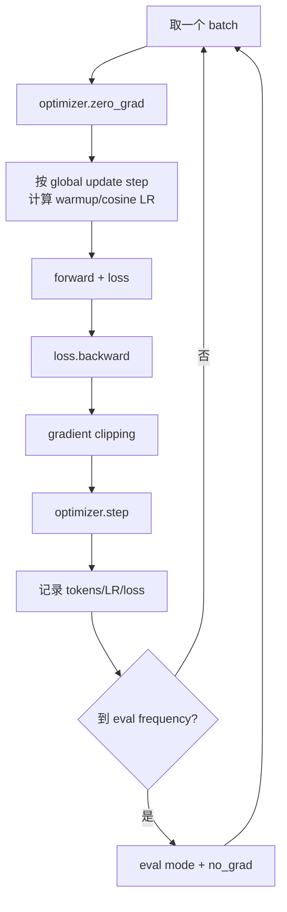
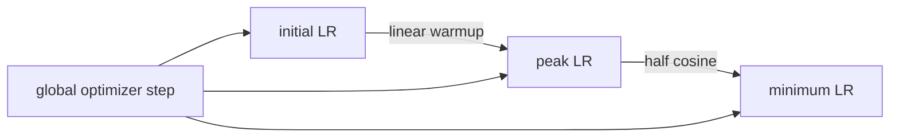
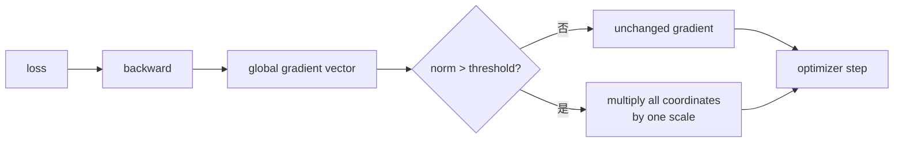
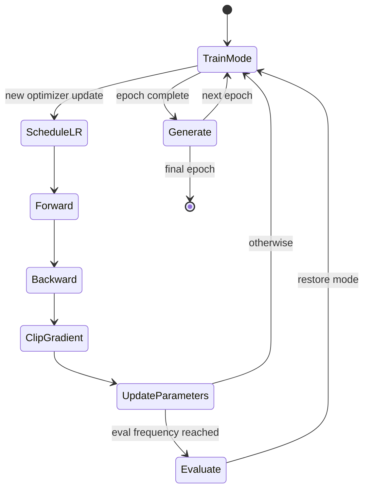
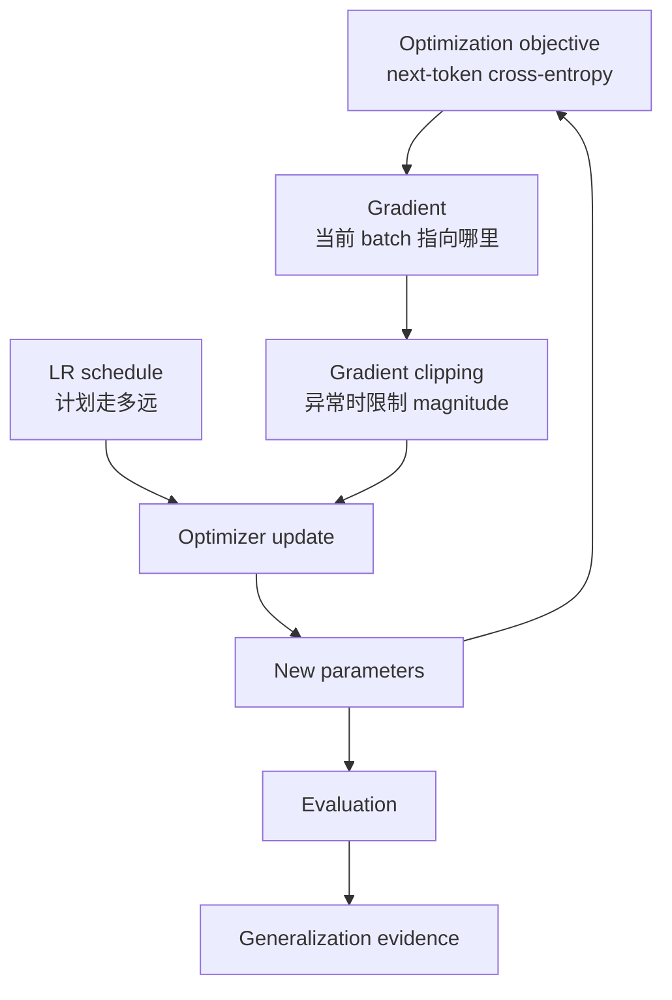

> 对应 *Build a Large Language Model (From Scratch)* 附录 D。本附录在 Chapter 5 的最小训练循环上加入三项常用稳定化技术：learning-rate warmup、cosine decay 与 gradient clipping，最后将它们整合到同一个 LLM pretraining function 中。

---

## 0. 附录目标与阅读主线

### 0.1 “Bells and whistles”解决什么

Chapter 5 的基础循环已经包含训练不可缺少的步骤：

```text
zero gradients
-> forward
-> loss
-> backward
-> optimizer step
-> evaluation
```

它在小模型上能工作，却把 learning rate 固定为常数，也不限制异常 gradient。模型更深、batch/数据更复杂时，训练早期和后期对 update size 的需求不同：

- **早期**：parameters 随机、optimizer moments 尚未形成，过大更新容易破坏表示；
- **中期**：需要较大学习率快速探索和降低 loss；
- **后期**：需要更小步长细化，减少在低-loss 区域附近振荡；
- **异常 batch/深层反传**：gradient norm 可能突然很大，使单步更新不稳定。

附录用三个机制分别控制：

| 机制 | 控制对象 | 主要阶段 | 解决的问题 |
|---|---|---|---|
| Linear warmup | Learning rate | 训练开头 | 避免一开始更新过猛 |
| Cosine decay | Learning rate | Warmup 之后 | 后期逐渐减小更新步长 |
| Gradient clipping | Gradient norm | Backward 后、step 前 | 限制异常大的更新信号 |

它们都不改变 GPT architecture、next-token target 或 cross-entropy objective，只改变 optimization dynamics。

### 0.2 三项机制在训练循环中的位置



顺序是语义的一部分：clip 必须发生在 gradients 已计算、parameters 尚未更新时；learning rate 必须在本次 `optimizer.step()` 前写入 optimizer。

### 0.3 本附录的两个原文勘误与一个代码边界

1. 原书算出 `warmup_steps=27`，后文却多次写“20 warmup steps”；按给定数据与 15 epochs，正确值是 **27**，20 是残留表述。
2. 原 cosine 公式以 `total_training_steps` 为 denominator。训练 step indices 为 `0..total_steps-1`，因此最后一个 progress 小于 1，LR **接近但不会严格到达** `min_lr`。
3. 调用训练函数前定义了 `peak_lr=0.001`，但创建 AdamW 时没有显式传 `lr=peak_lr`。它恰好等于当前 AdamW 默认值 0.001，所以结果一致；稳健代码应显式传入，不能依赖默认值和一个未使用变量偶然相等。

本文先解释原实现为何工作，再给出端点、零 warmup、参数检查都更明确的实现。

### 0.4 本附录不证明什么

训练 loss 更低只证明 model 更拟合当前 training corpus。它不自动证明：

- 比基础循环更好，因为原书没有做 matched-seed、matched-budget ablation；
- Validation/generalization 更好；
- Warmup、cosine、clipping 各自贡献多大；
- 这些 hyperparameters 适合其他模型和数据；
- 五分钟 timing 可跨硬件复用。

要判断某个增强是否有效，需要逐项消融和多次实验。

---

## 1. Self-Contained Experimental Setup（自包含实验设置）

原书先重建 Chapter 5 的模型和数据，让附录代码可独立运行。

### 1.1 GPT-2 Small 教学配置

```python
GPT_CONFIG_124M = {
    "vocab_size": 50257,
    "context_length": 256,
    "emb_dim": 768,
    "n_heads": 12,
    "n_layers": 12,
    "drop_rate": 0.1,
    "qkv_bias": False,
}
```

与 OpenAI GPT-2 small 的主要结构一致，但 context 从 1,024 缩到 256，以降低教学训练成本。模型是随机初始化，不是加载 OpenAI pretrained weights：

```python
device = torch.device("cuda" if torch.cuda.is_available() else "cpu")
torch.manual_seed(123)
model = GPTModel(GPT_CONFIG_124M).to(device)
model.eval()
```

这里先 `eval()` 不影响后续训练函数，因为每个 epoch 开头会调用 `model.train()`。它主要让训练前若做生成/评价时关闭 dropout。

### 1.2 为什么 context 使用 256

Standard attention 的 pairwise score elements 随 context $T$ 二次增长：

$$
N_{score}\propto T^2.
$$

将 1,024 缩到 256：

$$
\frac{256^2}{1024^2}=\frac1{16}.
$$

Attention score 主项降到十六分之一。Projection 和 FFN 仍近似按 $T$ 线性增长，所以完整训练不会恰好快 16 倍，但显著减轻 CPU/GPU 负担。

代价是每个 training example 最多看 256-token context，不能研究长于该范围的 dependencies。

### 1.3 数据读取与 provenance

原书下载 Edith Wharton 短篇 *The Verdict*：

```python
import os
import urllib.request

file_path = "the-verdict.txt"
url = (
    "https://raw.githubusercontent.com/rasbt/LLMs-from-scratch/"
    "main/ch02/01_main-chapter-code/the-verdict.txt"
)

if not os.path.exists(file_path):
    with urllib.request.urlopen(url) as response:
        text_data = response.read().decode("utf-8")
    with open(file_path, "w", encoding="utf-8") as file:
        file.write(text_data)
else:
    with open(file_path, "r", encoding="utf-8") as file:
        text_data = file.read()
```

“本地文件存在就跳过下载”便于重复运行，但也可能静默使用旧或被修改的文件。真实实验应记录 URL revision、download date 和 hash。

### 1.4 Train/validation split 与 DataLoader

原书先按**字符位置**切 90%/10%，再分别 tokenize：

```python
train_ratio = 0.90
split_index = int(train_ratio * len(text_data))
train_text = text_data[:split_index]
validation_text = text_data[split_index:]
```

然后构造 non-overlapping windows：

```python
train_loader = create_dataloader_v1(
    train_text,
    batch_size=2,
    max_length=256,
    stride=256,
    drop_last=True,
    shuffle=True,
    num_workers=0,
)
validation_loader = create_dataloader_v1(
    validation_text,
    batch_size=2,
    max_length=256,
    stride=256,
    drop_last=False,
    shuffle=False,
    num_workers=0,
)
```

本数据产生：

```text
train batches:      9 x [2, 256]
validation batches: 1 x [2, 256]
```

每个 training epoch 有 9 optimizer updates。15 epochs：

$$
T_{updates}=9\mathbin{\ast}15=135.
$$

### 1.5 Stride 等于 context 的含义

若 token stream 为 $u_0,u_1,\ldots$，每个 input window 长 256，相邻起点也隔 256，所以 input windows 不重叠。Targets 仍相对 inputs 右移一位：

$$
X_i=[u_i,\ldots,u_{i+255}],
$$

$$
Y_i=[u_{i+1},\ldots,u_{i+256}].
$$

不重叠减少重复计算；小 corpus 下也意味着 training samples 很少，是后续严重 overfitting 的根本原因之一。

### 1.6 Character split 的边界

按字符切可能：

- 在 word 或 UTF-8 text 逻辑边界中间切；
- 让 train 最后和 validation 开头来自同一连续段落；
- 不能保证 document-level independence。

对单篇短文的教学实验足够，但真实 evaluation 应按 document/source/time 分组，避免相邻片段泄漏和过强相关。

### 1.7 数据与 step 计数的可运行验证

不下载文本也能验证本附录 scheduler 使用的离散 step 口径：

```python
training_batches_per_epoch = 9
number_of_epochs = 15
total_training_steps = training_batches_per_epoch * number_of_epochs
warmup_fraction = 0.20
warmup_steps = int(warmup_fraction * total_training_steps)

assert total_training_steps == 135
assert warmup_steps == 27
assert list(range(total_training_steps))[0] == 0
assert list(range(total_training_steps))[-1] == 134
```

这里区分：

- **Step count**：135 个 updates；
- **最后 step index**：134；
- **Global step 初始化**：`-1`，取 batch 后先加到 0。

这三个数字混用正是 cosine endpoint off-by-one 的来源。

---

## D.1 Learning Rate Warmup（学习率预热）

### D.1.1 Learning rate 控制什么

最简单 SGD 更新：

$$
{\vartheta}_{s+1}
={\vartheta}_s-\eta_s g_s,
$$

其中：

- ${\vartheta}_s$：step $s$ 的 parameters；
- $g_s=\nabla_{\vartheta}L_s$：当前 batch gradient；
- $\eta_s$：learning rate。

AdamW 会按 moments 对每个 coordinate 自适应缩放，但最终更新仍乘当前 learning rate。LR 因此是整个 optimizer update 的全局尺度。

### D.1.2 为什么训练早期更危险

随机初始化时：

- Hidden representations 尚无结构；
- 部分 logits/loss gradients 尺度可能很大；
- AdamW 的 first/second moments 刚从零开始，bias correction 处于早期；
- Transformer 深层 residual stream 对大更新敏感；
- 一次异常 update 可能把 parameters 推入不稳定区域。

Warmup 让前若干 updates 使用较小 $\eta_s$，逐渐到达 peak LR，使 optimizer 和 representations 获得过渡期。

它不是“先不学习”：只要 initial LR 大于 0，parameters 从第一步就在更新。

### D.1.3 原书参数

```python
number_of_epochs = 15
initial_lr = 0.0001
peak_lr = 0.01
total_training_steps = 135
warmup_steps = int(0.20 * total_training_steps)  # 27
```

Warmup fraction 常见范围被原书概括为总 updates 的 0.1%–20%，这是经验区间，不是理论定律。更大 global batch、不同 optimizer、模型深度和 pretraining/fine-tuning 都可能要求不同长度。

### D.1.4 线性 warmup 公式

原实现：

$$
\Delta\eta
=\frac{\eta_{peak}-\eta_{initial}}{W},
$$

$$
\eta_s
=\eta_{initial}+s\Delta\eta,
\qquad 0\le s<W,
$$

其中 $W=27$。代码：

```python
lr_increment = (peak_lr - initial_lr) / warmup_steps

if global_step < warmup_steps:
    learning_rate = initial_lr + global_step * lr_increment
else:
    learning_rate = peak_lr
```

数值 increment：

$$
\Delta\eta
=\frac{0.01-0.0001}{27}
\approx0.0003666667.
$$

关键点：

```text
step 0:  0.0001000000
step 1:  0.0004666667
...
step 26: 0.0096333333
step 27: 0.0100000000
```

Steps 0–26 共 27 个 updates 属于 warmup branch；step 27 首次进入 peak branch。可以说“经过 27 个 warmup updates 后到 peak”，不能说“20 steps”。

### D.1.5 为什么 denominator 用 `warmup_steps`

这样每次增加一个固定 increment，并在 branch 切换的 step 27 连续到达 peak。若改成 `warmup_steps-1`，step 26 就已到 peak，意味着“27 个 warmup points，最后一个就是 peak”的另一种约定。

两种都可行，重要的是明确：

- Warmup steps 指 update 数还是 interval 数；
- 哪个 step 首次使用 peak LR；
- Resume 时 global step 如何映射。

### D.1.6 Warmup 按 update steps 而不是 epochs

同样 1 epoch，dataset/batch size 不同会有不同 optimizer updates。Scheduler 应绑定真正 `optimizer.step()` 次数：

$$
N_{updates/epoch}
=\left\lceil\frac{N_{examples}}{B_{global}}\right\rceil
$$

（是否 `drop_last` 会改变取整）。

有 gradient accumulation $K$ 时，$K$ 个 microbatches 才执行一次 optimizer step，warmup 应按 optimizer updates 前进，不应每个 microbatch 前进，否则预热缩短 $K$ 倍。

### D.1.7 Warmup 与 batch size 的关系

较大 global batch 通常减少每 epoch update 数，并改变 gradient noise；若只写“warmup 1 epoch”，换 batch 后 update 数会变化。使用固定 warmup updates 或 warmup token count 更可比较。

DistributedDataParallel 中所有 ranks 同步执行一个 global optimizer update，不能将 global step 再乘 world size。World size 会改变 global batch/token throughput，而不是每 rank schedule index。

### D.1.8 原书 warmup 的可运行复现

```python
def original_warmup_learning_rates(
    total_steps,
    warmup_steps,
    initial_lr,
    peak_lr,
):
    if warmup_steps <= 0:
        raise ValueError("the original formula requires warmup_steps > 0")
    increment = (peak_lr - initial_lr) / warmup_steps
    learning_rates = []
    for global_step in range(total_steps):
        if global_step < warmup_steps:
            learning_rate = initial_lr + global_step * increment
        else:
            learning_rate = peak_lr
        learning_rates.append(learning_rate)
    return learning_rates


warmup_only_rates = original_warmup_learning_rates(
    total_steps=135,
    warmup_steps=27,
    initial_lr=1e-4,
    peak_lr=1e-2,
)

assert len(warmup_only_rates) == 135
assert warmup_only_rates[0] == 1e-4
assert abs(warmup_only_rates[26] - 0.009633333333333334) < 1e-15
assert warmup_only_rates[27] == 1e-2
assert all(
    left <= right
    for left, right in zip(
        warmup_only_rates[:27],
        warmup_only_rates[1:28],
    )
)
```

### D.1.9 边界条件

原代码有这些隐含前提：

- `warmup_steps > 0`，否则 increment 除零；
- `initial_lr <= peak_lr`，否则不是 warmup 而是线性下降；
- `warmup_steps < total_steps`，否则没有后续 decay 阶段；
- 每 epoch DataLoader 长度固定；
- 所有 optimizer parameter groups 使用同一绝对 LR。

稳健函数应检查这些条件，或明确支持无 warmup/all-warmup mode。

### D.1.10 Warmup 的局限

- 不能修复错误 loss、NaN data 或 architecture bug；
- 不能保证 gradient norm 小，只缩小 parameter update 的外部步长；
- 对 AdamW，异常 gradient 仍会写入 moments，即使 LR 很小；
- 太长 warmup 会浪费有效高 LR steps，尤其短 fine-tuning；
- 太低 initial LR 可能让早期几乎无进展。

Warmup 是稳定性工具，不是模型 quality 的独立保证。

---

## D.2 Cosine Decay（余弦衰减）

### D.2.1 为什么 peak 后要降低 LR

训练中期希望快速下降，后期希望细化。若一直保持 peak LR：

- Parameters 可能在 narrow minimum 附近来回跨越；
- Validation metric 抖动；
- 后期无法稳定收敛到较低 training loss。

Cosine decay 用半个 cosine cycle 平滑地从 peak 降到 minimum。相比突然阶梯下降，它没有 LR discontinuity；相比线性下降，它在起点和终点 slope 都接近 0。

### D.2.2 原书公式

Warmup 后归一化 progress：

$$
p_s
=\frac{s-W}{T-W},
$$

其中 $T=135,W=27$。Learning rate：

$$
\eta_s
=\eta_{min}
+\frac12(\eta_{peak}-\eta_{min})
\left[1+\cos(\pi p_s)\right].
$$

当 $p=0$：

$$
\eta=\eta_{peak}.
$$

若 $p=1$：

$$
\eta=\eta_{min}.
$$

原 D.2 设置：

```python
minimum_lr = 0.1 * initial_lr  # 1e-5
```

不是衰减到严格零。非零 floor 可让后期继续缓慢适配，也避免某些 optimizer 完全停止。

### D.2.3 半余弦为什么平滑

对 progress $p$ 求导：

$$
\frac{d\eta}{dp}
=-\frac{\pi}{2}
(\eta_{peak}-\eta_{min})
\sin(\pi p).
$$

在 $p=0$ 和 $p=1$，$\sin(0)=\sin(\pi)=0$，曲线斜率为 0。中间 $p=0.5$ 时下降最快：

$$
\eta(0.5)
=\frac{\eta_{peak}+\eta_{min}}2.
$$

这给出“前后平缓、中间下降较快”的形状。

### D.2.4 原代码的 endpoint off-by-one

实际 global steps 是 0–134。最后 step：

$$
p_{134}
=\frac{134-27}{135-27}
=\frac{107}{108}
<1.
$$

因此最后 LR：

$$
\eta_{134}>\eta_{min}.
$$

它非常接近 minimum，图上几乎看不出差别，所以原书说“reaches its minimum”在直觉上成立，但离散实现并未严格命中。

若要最后一个 update 精确使用 `min_lr`，decay denominator 应基于最后 index：

$$
p_s
=\frac{s-W}{(T-1)-W},
\qquad W\le s\le T-1.
$$

### D.2.5 原书完整 schedule 的数值验证

```python
import math


def original_warmup_cosine_schedule(
    total_steps,
    warmup_steps,
    initial_lr,
    peak_lr,
    min_lr,
):
    if not 0 < warmup_steps < total_steps:
        raise ValueError("original schedule requires 0 < warmup < total")

    increment = (peak_lr - initial_lr) / warmup_steps
    learning_rates = []
    for global_step in range(total_steps):
        if global_step < warmup_steps:
            learning_rate = initial_lr + global_step * increment
        else:
            progress = (
                (global_step - warmup_steps)
                / (total_steps - warmup_steps)
            )
            learning_rate = min_lr + (
                peak_lr - min_lr
            ) * 0.5 * (
                1.0 + math.cos(math.pi * progress)
            )
        learning_rates.append(learning_rate)
    return learning_rates


original_rates = original_warmup_cosine_schedule(
    total_steps=135,
    warmup_steps=27,
    initial_lr=1e-4,
    peak_lr=1e-2,
    min_lr=1e-5,
)

assert original_rates[0] == 1e-4
assert original_rates[27] == 1e-2
assert original_rates[-1] > 1e-5
assert original_rates[-1] < 1.3e-5
assert all(
    left >= right
    for left, right in zip(original_rates[27:], original_rates[28:])
)
```

### D.2.6 一个端点严格、支持零 warmup 的函数

下面保留原书语义：前 $W$ 个 updates（indices `0..W-1`）线性预热，step $W$ 首次为 peak；decay 在最后 step 精确到 min。

```python
import math


def learning_rate_at_step(
    step,
    total_steps,
    warmup_steps,
    initial_lr,
    peak_lr,
    min_lr,
):
    if total_steps < 1:
        raise ValueError("total_steps must be positive")
    if not 0 <= step < total_steps:
        raise ValueError("step is outside the training schedule")
    if not 0 <= warmup_steps < total_steps:
        raise ValueError("warmup_steps must be in [0, total_steps)")
    if not 0 <= min_lr <= peak_lr:
        raise ValueError("expected 0 <= min_lr <= peak_lr")
    if not 0 <= initial_lr <= peak_lr:
        raise ValueError("expected 0 <= initial_lr <= peak_lr")

    if warmup_steps > 0 and step < warmup_steps:
        warmup_progress = step / warmup_steps
        return initial_lr + (
            peak_lr - initial_lr
        ) * warmup_progress

    decay_step_count = total_steps - warmup_steps
    if decay_step_count == 1:
        return peak_lr

    decay_progress = (
        (step - warmup_steps)
        / (decay_step_count - 1)
    )
    return min_lr + 0.5 * (
        peak_lr - min_lr
    ) * (
        1.0 + math.cos(math.pi * decay_progress)
    )


strict_rates = [
    learning_rate_at_step(
        step=step,
        total_steps=135,
        warmup_steps=27,
        initial_lr=1e-4,
        peak_lr=1e-2,
        min_lr=1e-5,
    )
    for step in range(135)
]

assert strict_rates[0] == 1e-4
assert strict_rates[27] == 1e-2
assert strict_rates[-1] == 1e-5

no_warmup_rates = [
    learning_rate_at_step(
        step=step,
        total_steps=5,
        warmup_steps=0,
        initial_lr=1e-4,
        peak_lr=1e-2,
        min_lr=1e-5,
    )
    for step in range(5)
]
assert no_warmup_rates[0] == 1e-2
assert no_warmup_rates[-1] == 1e-5
```

### D.2.7 原实现与修正版都“对”在哪里

原实现：

- 简单；
- 曲线连续；
- 最后一项与 min 极接近；
- 不影响本教学实验结论。

修正版：

- 明确定义离散 endpoints；
- 支持 `warmup_steps=0`；
- 检查非法配置；
- 更适合单元测试和 resume。

这不是说原书模型因 off-by-one 训练错误，而是将图形描述转为可精确测试的离散协议。

### D.2.8 Cosine decay 与其他 schedule

| Schedule | 形状 | 优点 | 局限 |
|---|---|---|---|
| Constant | 固定 | 最简单 | 后期可能更新过大 |
| Linear decay | 直线下降 | 易解释 | Endpoint slope 不平滑 |
| Cosine decay | 半余弦 | 起终点平滑 | 需预先知道总 steps |
| Step decay | 阶梯下降 | 经典、易调 | LR 有跳变 |
| Reduce on plateau | 指标停滞时下降 | 自适应 validation | 指标噪声、分布式同步复杂 |
| Cosine restarts | 周期回升 | 可重新探索 | 本附录未使用，配置更多 |

本附录是 single half-cycle，没有 restart。“Cosine annealing”和“cosine decay”在此指同一类轨迹。

### D.2.9 `min_lr` 为什么不一定是 0

LR 到 0 时最后 update 完全停止；如果 schedule 末尾还需学习或训练可能延长，非零 floor 更灵活。另一方面，floor 太高会让后期继续振荡。原 D.4 使用：

```text
initial_lr = 1e-5
min_lr     = 1e-5
peak_lr    = 1e-3
```

Warmup 起点和 decay 终点相同，形成近似对称的外部尺度范围，但曲线按 updates 并非时间对称。

### D.2.10 多 parameter groups 的边界

原代码：

```python
for parameter_group in optimizer.param_groups:
    parameter_group["lr"] = learning_rate
```

它给所有 groups 相同绝对 LR。如果 groups 原本设计为不同 rates（如 head 10 倍、backbone 1 倍），该循环会抹掉比例。

更一般的做法是保存每组 `lr_scale`：

```python
for parameter_group in optimizer.param_groups:
    parameter_group["lr"] = (
        learning_rate * parameter_group.get("lr_scale", 1.0)
    )
```

本书 optimizer 只有一个 group，因此原实现没有问题。

### D.2.11 AdamW weight decay 也受 schedule 影响

AdamW 的 decoupled decay 可概念化为：

$$
{\vartheta}
\leftarrow
{\vartheta}-\eta_s\widehat g_s
-\eta_s\lambda{\vartheta}.
$$

当前 LR 同时缩放 gradient update 与 weight decay update。Cosine 后期 LR 变小时，有效每步 decay 也变小。不要把 `weight_decay=0.1` 理解为每步直接把 weight 减 10%。

### D.2.12 Resume 与 total steps

Manual schedule 是 step 的函数，只要恢复：

- `global_step`；
- Total planned steps；
- Warmup steps；
- Initial/peak/min LR；

就可重建当前 LR。若 resume 后临时改变总 epochs，原 cosine 曲线的 future progress 会改变。应决定：

1. 保持原计划终点；
2. 重新规划剩余 schedule；
3. 继续使用当前 LR 开新 schedule。

三者行为不同，checkpoint metadata 必须记录选择。

### D.2.13 D.1–D.2 小结



Warmup 和 cosine decay 共同定义“每一步可以走多远”。它们不观察当前 gradient 是否异常；这一缺口由 D.3 gradient clipping 补上。

---

## D.3 Gradient Clipping（梯度裁剪）

### D.3.1 为什么 learning-rate schedule 还不够

Learning rate 统一缩放 optimizer update 的外部步长，但 batch-to-batch gradient magnitude 仍可剧烈变化。深层网络的 chain rule 会连续相乘 Jacobians；某些方向的乘积过大时产生 exploding gradients：

$$
g_s
=\frac{\partial L}{\partial h_L}
\frac{\partial h_L}{\partial h_{L-1}}
\cdots
\frac{\partial h_1}{\partial{\vartheta}}.
$$

如果中间 Jacobian 的放大效应累积，$\lVert g_s\rVert$ 可能突然上升。即使当前 LR 不变，一个异常 batch 也会产生远大于平常的 update，污染 parameters 和 AdamW moments。

Gradient clipping 在 backward 后检查 gradient magnitude，超过 threshold 时缩小它，再让 optimizer 使用。

### D.3.2 Vector 与 matrix 的 L2 norm

向量 $v=[v_1,\ldots,v_n]$：

$$
\lVert v\rVert_2
=\sqrt{\sum_{i=1}^{n}v_i^2}.
$$

对 gradient matrix $G\in\mathbb R^{m\mathbin{\ast}n}$，将所有元素视为一个长向量，得到 Frobenius/L2 norm：

$$
\lVert G\rVert_F
=\sqrt{
\sum_{i=1}^{m}
\sum_{j=1}^{n}
G_{ij}^2
}.
$$

原书用 norm 为 5 的例子。可取：

$$
G=\begin{bmatrix}3&4\end{bmatrix},
$$

$$
\lVert G\rVert_2
=\sqrt{3^2+4^2}=5.
$$

### D.3.3 Norm clipping 的公式

设 threshold $c>0$，global gradient vector 为 $g$：

$$
g'=
\begin{cases}
g,&\lVert g\rVert_2\le c,\\
\dfrac{c}{\lVert g\rVert_2}g,
&\lVert g\rVert_2>c.
\end{cases}
$$

也可写：

$$
g'=g\min\left(1,\frac{c}{\lVert g\rVert_2}\right).
$$

对 $G=[3,4]$、$c=1$：

$$
G'=\frac15[3,4]=[0.6,0.8],
$$

$$
\lVert G'\rVert_2=1.
$$

所有 coordinates 乘同一个正 scalar，因此 clipping 保持 global gradient direction，只改变 magnitude：

$$
\cos(g,g')=1
$$

（非零 gradient 时）。

### D.3.4 PyTorch 是跨所有 parameters 的 global norm

模型有 parameter gradients $g^{(1)},\ldots,g^{(P)}$。`clip_grad_norm_` 的默认 L2 total norm 等价于：

$$
\lVert g\rVert_{global}
=\sqrt{
\sum_{p=1}^{P}
\sum_i
(g_i^{(p)})^2
}.
$$

它不是：

- 每个 Parameter 各自裁到 1；
- 每个 element clamp 到 $[-1,1]$；
- 找最大 coordinate 再比较 1；
- 裁剪 parameter values。

若一亿个 coordinates 各只有 0.001，单项都很小，global L2 norm 仍可很大。

### D.3.5 PyTorch 精确行为验证

```python
import torch

first_parameter = torch.nn.Parameter(torch.tensor([0.0]))
second_parameter = torch.nn.Parameter(torch.tensor([0.0]))
first_parameter.grad = torch.tensor([3.0])
second_parameter.grad = torch.tensor([4.0])

pre_clip_norm = torch.nn.utils.clip_grad_norm_(
    [first_parameter, second_parameter],
    max_norm=1.0,
)

post_clip_vector = torch.stack([
    first_parameter.grad[0],
    second_parameter.grad[0],
])
post_clip_norm = torch.linalg.vector_norm(post_clip_vector)

assert torch.allclose(pre_clip_norm, torch.tensor(5.0))
assert torch.allclose(
    post_clip_vector,
    torch.tensor([0.6, 0.8]),
    atol=1e-6,
)
assert torch.allclose(post_clip_norm, torch.tensor(1.0), atol=1e-6)
```

函数返回的是**裁剪前** total norm，同时原地修改 `.grad`。这使日志可以记录 clipping 被触发前的 severity。

### D.3.6 不超过 threshold 时不改变 gradient

```python
import torch

parameter = torch.nn.Parameter(torch.tensor([0.0, 0.0]))
parameter.grad = torch.tensor([0.3, 0.4])
original_gradient = parameter.grad.clone()

returned_norm = torch.nn.utils.clip_grad_norm_(
    [parameter],
    max_norm=1.0,
)

assert torch.allclose(returned_norm, torch.tensor(0.5))
assert torch.equal(parameter.grad, original_gradient)
```

Norm clipping 是 conditional rescaling，不是每一步都强制 gradient norm 等于 threshold。

### D.3.7 Norm clipping 与 value clipping

Value clipping：

$$
g'_i=\operatorname{clip}(g_i,-c,c).
$$

它逐 coordinate clamp，通常改变方向。Norm clipping 用统一 scale，保持方向。PyTorch API：

```python
torch.nn.utils.clip_grad_norm_(parameters, max_norm=1.0)
torch.nn.utils.clip_grad_value_(parameters, clip_value=1.0)
```

本附录只使用 norm clipping。不能把两者都简称“把每个 gradient 限制到 1”。

### D.3.8 原书 `find_highest_gradient` 实际测了什么

原工具：

```python
def find_highest_gradient(model):
    max_gradient = None
    for parameter in model.parameters():
        if parameter.grad is not None:
            gradient_values = parameter.grad.data.flatten()
            parameter_max = gradient_values.max()
            if max_gradient is None or parameter_max > max_gradient:
                max_gradient = parameter_max
    return max_gradient
```

它返回所有 gradients 中最大的**有符号正值**，并非：

- 最大 absolute gradient；
- Global L2 norm；
- PyTorch 是否触发 norm clipping 的直接依据。

若最大 magnitude 是 `-100`，而最大正值是 `0.2`，该函数会报告 `0.2`。此外 `.data` 会绕开 autograd safeguards，诊断代码应使用 `.detach()`。

### D.3.9 更可靠的 gradient statistics

```python
import torch


def gradient_statistics(parameters):
    gradients = [
        parameter.grad.detach()
        for parameter in parameters
        if parameter.grad is not None
    ]
    if not gradients:
        return None, None

    squared_sum = sum(
        gradient.float().pow(2).sum()
        for gradient in gradients
    )
    total_l2_norm = squared_sum.sqrt()
    maximum_absolute_value = max(
        gradient.detach().abs().max()
        for gradient in gradients
    )
    return total_l2_norm, maximum_absolute_value


diagnostic_parameter = torch.nn.Parameter(torch.zeros(3))
diagnostic_parameter.grad = torch.tensor([-100.0, 0.2, 0.1])
total_norm, max_absolute = gradient_statistics([diagnostic_parameter])

assert max_absolute.item() == 100.0
assert total_norm.item() > 100.0
```

严格来说 $\sqrt{10000+0.04+0.01}>100$，所以断言是正确的。

### D.3.10 如何解释原书 0.0411 -> 0.0185

原书在 124M model 上报告最大有符号 gradient coordinate：

```text
before: 0.0411
after:  0.0185
```

有人可能疑惑：0.0411 已小于 max norm 1，为什么还会缩小？因为 threshold 作用于**全局 L2 norm**，而不是最大 coordinate。所有 parameter tensors 合并后的 norm 可以大于 1，于是每个 coordinate 都乘同一小于 1 的 factor，0.0411 也变成 0.0185。

要证明裁剪正确，应记录 `clip_grad_norm_` 返回的 pre-clip norm，并重算 post-clip norm，而不只看一个 coordinate。

### D.3.11 在训练循环中的正确位置

标准顺序：

```python
optimizer.zero_grad()
loss = compute_loss(...)
loss.backward()
pre_clip_norm = torch.nn.utils.clip_grad_norm_(
    model.parameters(),
    max_norm=1.0,
)
optimizer.step()
```

若在 backward 前 clip，`.grad` 尚不存在；若在 `optimizer.step()` 后 clip，当前 parameters 已用未裁剪 gradient 更新，只会影响随后清零前的残留，失去目的。

### D.3.12 Clipping 与 learning rate 的关系

对 plain SGD 且忽略 momentum/weight decay，clip 后：

$$
\lVert\Delta{\vartheta}_s\rVert_2
=\eta_s\lVert g'_s\rVert_2
\le\eta_s c.
$$

所以 scheduler 控制 $\eta_s$，clipping 控制 $c$，共同给出 gradient update 上界。

对 AdamW 不能直接使用同一严格上界，因为 moments 做 coordinate-wise normalization，且还有 decoupled weight decay。不过 clipping 仍限制写入 moments 的 raw gradient magnitude，并抑制 outlier batches。

### D.3.13 为什么原书只在 warmup 后 clipping

原 D.4：

```python
if global_step >= warmup_steps:
    torch.nn.utils.clip_grad_norm_(
        model.parameters(),
        max_norm=1.0,
    )
```

一种直觉是 warmup 期 LR 很小，parameter displacement 已受限制；达到 peak 后 clipping 更重要。这是作者的 training recipe choice，不是 clipping 的通用规则。

反面考虑：即使 LR 很小，巨大 gradients 仍会污染 Adam moments 或变为 NaN。很多现代 training loops 从第一步就 clip。最可靠方法是记录 gradient norm，比较：

```text
no clipping
vs clipping after warmup
vs clipping every update
```

并保持其余条件相同。

### D.3.14 Threshold 怎样选择

`max_norm=1.0` 是常见默认值，不是从 LLM 参数量直接推导。选择依据：

- 典型 pre-clip norm distribution；
- Clip activation rate；
- Loss spikes/NaN frequency；
- Optimizer、LR、batch size；
- Model scale 和 parameterization；
- Downstream validation。

若几乎每一步都被强烈缩放，实际 effective LR 长期低于计划值，可能说明 threshold 太小、LR 太高或模型本身不稳定。若从不触发，它只是 safety guard。

可记录 clipping coefficient：

$$
\alpha_s
=\min\left(1,\frac{c}{\lVert g_s\rVert_2+\epsilon}
ight).
$$

以及 `fraction(alpha < 1)`。

### D.3.15 Non-finite gradients

NaN/Inf 不是“很大的有限 gradient”，普通缩放未必能修复。PyTorch 可要求遇到 non-finite norm 时报错：

```python
pre_clip_norm = torch.nn.utils.clip_grad_norm_(
    model.parameters(),
    max_norm=1.0,
    error_if_nonfinite=True,
)
```

然后追查：loss overflow、无效 input、mixed precision、除零、log of zero 或过高 LR。不要把 clipping 当作隐藏 NaN 的修补器。

### D.3.16 Mixed precision 的顺序

AMP loss scaling 会先把 gradients 乘 scale。若在 unscale 前 clip，threshold 作用于人为放大的 gradients，几乎必然错误。典型顺序：

```python
with torch.autocast(device_type="cuda", dtype=torch.float16):
    loss = compute_loss(...)

scaler.scale(loss).backward()
scaler.unscale_(optimizer)
torch.nn.utils.clip_grad_norm_(model.parameters(), 1.0)
scaler.step(optimizer)
scaler.update()
```

具体 autocast dtype/device 和 scaler API 应按当前 PyTorch 版本与硬件选择。

### D.3.17 Gradient accumulation 的顺序

若累积 $K$ 个 microbatches：

```text
zero gradients once
-> backward(loss_1 / K)
-> ...
-> backward(loss_K / K)
-> clip accumulated global gradient once
-> optimizer.step
```

每个 microbatch 都单独 clip 后再相加，不等价于先相加再 clip：clipping 是非线性 operation，会改变各 microbatch 相对贡献。

Scheduler 也应在 optimizer update 时推进一次，而不是每个 microbatch 推进。

### D.3.18 Distributed training

DDP 在 backward 中 all-reduce/average gradients。正常 backward 完成后，各 ranks gradients 相同，再各自 global-norm clip 会得到相同结果。

若使用 `no_sync()` 做 gradient accumulation，只应在最后同步完成后 clip。FSDP parameters 被分片，通常应使用 FSDP-aware clipping API，而不是把本地 shard 当完整 global gradient。

### D.3.19 Clipping 的局限

- 它处理 symptom，不解释 gradient 为何爆炸；
- 太频繁会降低有效更新并拖慢学习；
- 无法修复 vanishing gradients；
- 无法修复 data leakage、错误 mask、错误 targets；
- 不保证 loss 单调；
- 不保证 generalization；
- 不能替代 normalization、初始化、residual design 和合理 LR。

### D.3.20 D.3 小结



Warmup/cosine 控制每步 optimizer 的计划尺度；gradient clipping 对实际 batch gradient 加 safety bound。D.4 将三者放进完整训练状态机。

---

## D.4 The Modified Training Function（增强后的完整训练函数）

### D.4.1 相对 Chapter 5 基础循环改了什么

基础循环：

```python
optimizer.zero_grad()
loss = calc_loss_batch(...)
loss.backward()
optimizer.step()
```

附录 D 在不改变 loss 和 optimizer 类型的前提下增加：

```python
optimizer.zero_grad()
learning_rate = schedule(global_step)       # New
set_optimizer_learning_rate(learning_rate)  # New
loss = calc_loss_batch(...)
loss.backward()
clip_grad_norm_(...)                        # New
optimizer.step()
```

并新增 `track_lrs`，用于验证 schedule 实际写入了 optimizer，而不只在纸面上计算。

### D.4.2 函数输入定义了哪些状态

原函数签名：

```python
def train_model(
    model,
    train_loader,
    val_loader,
    optimizer,
    device,
    n_epochs,
    eval_freq,
    eval_iter,
    start_context,
    tokenizer,
    warmup_steps,
    initial_lr=3e-5,
    min_lr=1e-6,
):
    ...
```

可分四组：

| 类型 | 参数 | 职责 |
|---|---|---|
| 训练对象 | model、optimizer | Parameters 与 update rule |
| 数据与设备 | train/val loader、device | Batch stream 与执行位置 |
| Schedule | epochs、warmup、initial/min LR | Global update trajectory |
| 监控 | eval frequency/iterations、prompt/tokenizer | 数值 loss 与定性生成 |

Peak LR 不直接作为函数参数，而从：

```python
peak_lr = optimizer.param_groups[0]["lr"]
```

读取。这让 optimizer config 成为 peak 的 single source of truth，但调用者必须明确传 `lr=peak_lr`。

### D.4.3 Tracking state

```python
train_losses = []
validation_losses = []
tracked_tokens_seen = []
tracked_learning_rates = []
tokens_seen = 0
global_step = -1
```

- Loss lists：只在 eval event 追加，不是每 update 的 batch loss；
- `track_lrs`：每个 optimizer update 追加一次，应长 135；
- `tokens_seen`：累计 `input_batch.numel()`；
- `global_step`：update index，第一 batch 加一后为 0。

`tokens_seen` 是 **token exposures**，不是 unique corpus tokens：同一 corpus 训练 15 epochs 会重复计 15 次；overlapping windows 还会重复更多。DDP 中若每 rank 只累加 local batch，它也是 local exposure，需 all-reduce 或乘 world size 才是 global 口径。

### D.4.4 Total steps 与 schedule 计划

```python
total_training_steps = len(train_loader) * n_epochs
lr_increment = (peak_lr - initial_lr) / warmup_steps
```

这假设：

- 每 epoch loader 长度不变；
- 每 batch 都执行一次 optimizer step；
- 没有 gradient accumulation/skipped AMP step；
- 不会 early stop；
- Resume 不改变总计划。

任何条件改变，都需重新定义 total **optimizer updates**，不能把 microbatch iteration 数直接当 schedule steps。

### D.4.5 每个 update 的精确顺序

原函数可写成状态转换：

```text
1. zero old gradients
2. increment global_step
3. compute LR from global_step
4. write LR to optimizer groups
5. compute batch loss
6. backward -> .grad
7. optionally clip global gradient norm
8. optimizer.step
9. count input token exposures
10. optionally evaluate
```

#### 为什么先设置 LR 再 forward

LR 实际只在 `optimizer.step()` 时使用，所以 forward 前或 backward 后设置都可，只要在 step 前完成。放在 batch 开头使本次 update 的 schedule 状态清晰，也便于提前记录。

#### 为什么先 `zero_grad`

PyTorch gradients 默认累积。这里每 batch 独立 update，不做 gradient accumulation，所以必须清除上一 batch gradients。

#### 为什么 clip 在 backward 后

Backward 才创建/累积 gradients；step 前修改 `.grad` 才会影响当前 update。

### D.4.6 Clipping 起点

```python
if global_step >= warmup_steps:
    torch.nn.utils.clip_grad_norm_(
        model.parameters(),
        max_norm=1.0,
    )
```

因此 steps 0–26 不 clip；step 27 既首次使用 peak LR，也首次 clip。Schedule 的 phase boundary 与 clipping boundary 对齐。

这是原 recipe，不是 API 限制。若想每步 clip，应去掉条件。若想基于 observed norm 动态处理，应记录 pre-clip norm，而不是仅按 phase。

### D.4.7 Periodic evaluation

```python
if global_step % eval_freq == 0:
    train_loss, validation_loss = evaluate_model(...)
```

`evaluate_model`：

1. `model.eval()` 关闭 dropout；
2. `torch.no_grad()` 关闭 graph tracking；
3. 计算有限 `eval_iter` batches；
4. `model.train()` 恢复训练。

因为 evaluation 发生在 `optimizer.step()` 后，`Iter 000000` 是**完成第一次 update 后**的模型，不是纯随机 initialization 的 loss。

### D.4.8 `eval_iter=1` 的意义

调用使用 `eval_iter=1`：

- Validation loader 恰有 1 batch，所以 validation loss 覆盖完整 validation loader；
- Training loader 有 9 batches，只看其中 1 batch；
- Training loader `shuffle=True`，该 train metric 会随抽到的 batch 变化。

这降低评价成本，却使 train curve 噪声较大。更稳健做法是创建独立 `shuffle=False` 的 train-eval loader，或按固定 indices 评价。

额外创建 train loader iterator 还会消费 sampler/random-generator state，可能改变后续 epoch shuffle。严格复现实验应为训练采样和评价采样使用独立 generators/loaders。

### D.4.9 Batch-mean 与 token-mean

Chapter 5 `calc_loss_loader` 简单平均各 batch mean：

$$
L_{batchmean}
=\frac1K\sum_{k=1}^{K}L_k.
$$

若每 batch 有相同有效 token 数，它等于全 token mean。本附录 batches 都是 `[2,256]`，因此成立。Variable-length 或最后小 batch 时，应按 token 数加权：

$$
L_{token}
=\frac{\sum_kN_kL_k}{\sum_kN_k}.
$$

### D.4.10 Epoch-end generation

每个 epoch 后：

```python
generate_and_print_sample(
    model,
    tokenizer,
    device,
    start_context,
)
```

定性样本可发现 loss 看不到的问题：repetition、乱码、memorization、prompt drift。它不替代 validation metric：单个固定 prompt 的输出高度局部，也可能被 cherry-pick。

生成函数应切到 eval/no-grad，再恢复原 training mode。大型模型频繁生成会显著增加训练 wall-clock，frequency 也应作为监控成本配置。

### D.4.11 调用代码中的 peak LR 边界

原书：

```python
peak_lr = 0.001
optimizer = torch.optim.AdamW(
    model.parameters(),
    weight_decay=0.1,
)
```

`peak_lr` 变量未传给 optimizer。当前 PyTorch AdamW 默认 `lr=0.001`，所以：

```python
optimizer.param_groups[0]["lr"] == peak_lr
```

恰好为真。明确写法：

```python
peak_lr = 1e-3
optimizer = torch.optim.AdamW(
    model.parameters(),
    lr=peak_lr,
    weight_decay=0.1,
)
```

这样若以后改 `peak_lr`，schedule 会同步改变，而不是继续读取默认 0.001。

### D.4.12 原书这次训练的 schedule

调用参数：

```text
total updates = 135
warmup updates = 27
initial LR = 1e-5
peak LR = 1e-3
minimum LR = 1e-5
gradient max norm = 1.0 after warmup
```

原公式关键点：

```text
step 0:   0.0000100000
step 26:  0.0009633333
step 27:  0.0010000000
step 134: about 0.0000102094
```

最后值因 endpoint off-by-one 略高于 `1e-5`。

### D.4.13 为什么日志最后显示 Iter 130

总 update indices：0–134。`eval_freq=5` 只记录：

$$
0,5,10,\ldots,130.
$$

下一项 135 已超出训练。模型仍执行 steps 131–134，只是没有再打印 loss。因此 `Iter 000130` 不是训练提前结束。

Eval event 数：

$$
\left\lfloor\frac{134}{5}\right\rfloor+1
=26+1=27.
$$

### D.4.14 训练结果如何解释

原日志：

```text
step 0:   train 10.934, validation 10.939
...
step 130: train 0.041,  validation 6.915
```

Training loss 大幅下降，说明：

- Forward/backward 正常；
- LR schedule 未阻止学习；
- Optimizer 在更新 parameters；
- 模型几乎记住 training windows。

Final gap：

$$
6.915-0.041=6.874.
$$

对应 perplexity 约：

$$
e^{0.041}\approx1.04,
\qquad
e^{6.915}\approx1007.
$$

极大的 generalization gap 表示严重 overfitting。Validation loss 相比随机初始约 10.939 仍低，说明学到部分可迁移结构；但远不如 train。

### D.4.15 为什么 schedule 和 clipping 没阻止 overfitting

这些机制主要改善 **optimization stability**：如何走向 training objective 的低点。Overfitting 是 **generalization** 问题：模型容量远大于一篇短文数据，重复 15 epochs 后记忆 training windows。

稳定地把 train loss 降到 0，甚至可能让 overfitting 更明显。改善泛化需要：

- 更多、更丰富 training data；
- 合理 epoch/early stopping；
- Validation-based checkpoint selection；
- Regularization/weight decay/dropout；
- Data dedup 与正确 split；
- 合适模型容量。

不能把 warmup/cosine/clipping 称为防过拟合三件套。

### D.4.16 生成样本说明什么

最终样本续写出 *The Verdict* 风格甚至原文片段，证明 model 已从 gibberish 进化到语法较连贯，但也提供 memorization 证据。单 corpus pretraining 下“看起来像原文”不是强泛化能力。

应结合：

- Held-out prompt；
- Novel corpus loss；
- Exact/near-match 检查；
- 多样化 generation；
- Training data membership。

### D.4.17 一个更稳健的 evaluation helper

原 helper 总在结束时 `model.train()`，适合从 training loop 调用；若调用前 model 本来处于 eval，它会意外改状态。稳健版本记录原 mode，并按有效 token 加权：

```python
import torch
import torch.nn.functional as F


def evaluate_token_loss(model, data_loader, device, max_batches=None):
    was_training = model.training
    model.eval()
    total_loss = 0.0
    total_targets = 0

    try:
        with torch.no_grad():
            for batch_index, (inputs, targets) in enumerate(data_loader):
                if max_batches is not None and batch_index >= max_batches:
                    break
                inputs = inputs.to(device)
                targets = targets.to(device)
                logits = model(inputs)
                loss_sum = F.cross_entropy(
                    logits.flatten(0, 1),
                    targets.flatten(),
                    reduction="sum",
                )
                total_loss += loss_sum.item()
                total_targets += targets.numel()
    finally:
        model.train(was_training)

    if total_targets == 0:
        return float("nan")
    return total_loss / total_targets
```

若 targets 有 `ignore_index=-100`，`total_targets` 应只计 `(targets != -100).sum()`，并显式传相同 ignore index。

### D.4.18 端点严格的增强训练函数

下面使用 D.2 的严格 schedule，默认每一步 clip，并保留每次 update 的 pre/post norm。为了使代码块独立可运行，重新定义 schedule helper。

```python
import math

import torch
import torch.nn.functional as F


def scheduled_learning_rate(
    step,
    total_steps,
    warmup_steps,
    initial_lr,
    peak_lr,
    min_lr,
):
    if total_steps < 1:
        raise ValueError("total_steps must be positive")
    if not 0 <= step < total_steps:
        raise ValueError("step is outside the schedule")
    if not 0 <= warmup_steps < total_steps:
        raise ValueError("invalid warmup_steps")

    if warmup_steps > 0 and step < warmup_steps:
        return initial_lr + (
            peak_lr - initial_lr
        ) * (step / warmup_steps)

    decay_steps = total_steps - warmup_steps
    if decay_steps == 1:
        return peak_lr
    progress = (step - warmup_steps) / (decay_steps - 1)
    return min_lr + 0.5 * (
        peak_lr - min_lr
    ) * (1.0 + math.cos(math.pi * progress))


def global_gradient_norm(parameters):
    gradients = [
        parameter.grad.detach().float()
        for parameter in parameters
        if parameter.grad is not None
    ]
    if not gradients:
        return torch.tensor(0.0)
    return sum(
        gradient.pow(2).sum()
        for gradient in gradients
    ).sqrt()


def train_with_schedule_and_clipping(
    model,
    train_loader,
    optimizer,
    device,
    number_of_epochs,
    warmup_steps,
    initial_lr,
    min_lr,
    maximum_gradient_norm=1.0,
):
    if len(train_loader) == 0:
        raise ValueError("train_loader is empty")
    if maximum_gradient_norm <= 0:
        raise ValueError("maximum_gradient_norm must be positive")

    total_steps = len(train_loader) * number_of_epochs
    peak_lr = optimizer.param_groups[0]["lr"]
    history = {
        "batch_losses": [],
        "learning_rates": [],
        "pre_clip_norms": [],
        "post_clip_norms": [],
        "tokens_seen": [],
    }
    global_step = 0
    token_exposures = 0

    model.train()
    for _ in range(number_of_epochs):
        for inputs, targets in train_loader:
            learning_rate = scheduled_learning_rate(
                step=global_step,
                total_steps=total_steps,
                warmup_steps=warmup_steps,
                initial_lr=initial_lr,
                peak_lr=peak_lr,
                min_lr=min_lr,
            )
            for parameter_group in optimizer.param_groups:
                parameter_group["lr"] = (
                    learning_rate
                    * parameter_group.get("lr_scale", 1.0)
                )

            inputs = inputs.to(device)
            targets = targets.to(device)
            optimizer.zero_grad(set_to_none=True)
            logits = model(inputs)
            loss = F.cross_entropy(
                logits.flatten(0, 1),
                targets.flatten(),
            )
            loss.backward()

            pre_clip_norm = torch.nn.utils.clip_grad_norm_(
                model.parameters(),
                max_norm=maximum_gradient_norm,
                error_if_nonfinite=True,
            )
            post_clip_norm = global_gradient_norm(model.parameters())
            optimizer.step()

            token_exposures += inputs.numel()
            history["batch_losses"].append(loss.item())
            history["learning_rates"].append(learning_rate)
            history["pre_clip_norms"].append(pre_clip_norm.item())
            history["post_clip_norms"].append(post_clip_norm.item())
            history["tokens_seen"].append(token_exposures)
            global_step += 1

    return history
```

差异：

- Explicit input validation；
- `global_step` 直接使用 0-based 当前 update，无 `-1` sentinel；
- Final LR 精确到 min；
- 每一步 clip，而非 warmup 后；
- `error_if_nonfinite=True`；
- 记录 pre/post norms；
- `zero_grad(set_to_none=True)`；
- 支持 parameter-group relative scale。

它不是唯一正确版本；是为了将所有隐含约定变成可测试 contract。

### D.4.19 可运行的轻量 next-token 训练闭环

下面不用 124M GPT，而用 embedding + linear next-token model 验证 training-loop mechanics。Synthetic target 是当前 token 加 1（mod vocabulary），因此模型有可学习 mapping。

```python
import torch
from torch.utils.data import DataLoader, TensorDataset


class TinyNextTokenModel(torch.nn.Module):
    def __init__(self, vocabulary_size, embedding_dimension):
        super().__init__()
        self.embedding = torch.nn.Embedding(
            vocabulary_size,
            embedding_dimension,
        )
        self.output = torch.nn.Linear(
            embedding_dimension,
            vocabulary_size,
        )

    def forward(self, input_ids):
        return self.output(self.embedding(input_ids))


torch.manual_seed(123)
vocabulary_size = 11
sequence_length = 8
training_inputs = (
    torch.arange(8 * sequence_length).reshape(8, sequence_length)
    % vocabulary_size
)
training_targets = (training_inputs + 1) % vocabulary_size
training_loader = DataLoader(
    TensorDataset(training_inputs, training_targets),
    batch_size=2,
    shuffle=False,
)

tiny_model = TinyNextTokenModel(
    vocabulary_size=vocabulary_size,
    embedding_dimension=16,
)
tiny_optimizer = torch.optim.AdamW(
    tiny_model.parameters(),
    lr=0.05,
    weight_decay=0.0,
)

tiny_history = train_with_schedule_and_clipping(
    model=tiny_model,
    train_loader=training_loader,
    optimizer=tiny_optimizer,
    device=torch.device("cpu"),
    number_of_epochs=5,
    warmup_steps=4,
    initial_lr=0.005,
    min_lr=0.001,
    maximum_gradient_norm=1.0,
)

assert len(tiny_history["learning_rates"]) == 20
assert tiny_history["learning_rates"][0] == 0.005
assert tiny_history["learning_rates"][4] == 0.05
assert tiny_history["learning_rates"][-1] == 0.001
assert tiny_history["batch_losses"][-1] < tiny_history["batch_losses"][0]
assert max(tiny_history["post_clip_norms"]) <= 1.000001
assert tiny_history["tokens_seen"][-1] == 5 * 8 * 8
assert tiny_model.training
```

该示例验证 schedule/clipping/state，不证明它是训练 GPT 的最佳 hyperparameters。Tiny model 没有深层 Transformer、dropout 或 validation split。

### D.4.20 Mode restoration 的测试

```python
tiny_model.eval()
evaluation_loader = DataLoader(
    TensorDataset(training_inputs, training_targets),
    batch_size=3,
    shuffle=False,
)
evaluation_loss = evaluate_token_loss(
    tiny_model,
    evaluation_loader,
    device=torch.device("cpu"),
)

assert evaluation_loss >= 0.0
assert not tiny_model.training

tiny_model.train()
_ = evaluate_token_loss(
    tiny_model,
    evaluation_loader,
    device=torch.device("cpu"),
    max_batches=1,
)
assert tiny_model.training
```

这证明 helper 恢复调用前 mode，而不是无条件切到 train。

### D.4.21 Checkpoint/resume 需要保存什么

Manual schedule 没有 scheduler object state，但仍需：

```python
checkpoint = {
    "model_state_dict": model.state_dict(),
    "optimizer_state_dict": optimizer.state_dict(),
    "global_step": global_step,
    "epoch": epoch,
    "tokens_seen": tokens_seen,
    "schedule": {
        "total_steps": total_training_steps,
        "warmup_steps": warmup_steps,
        "initial_lr": initial_lr,
        "peak_lr": peak_lr,
        "min_lr": min_lr,
    },
}
```

严格复现还需 RNG、data sampler/mid-epoch position、AMP scaler 和 gradient-accumulation phase。Resume 时若将 `global_step` 重置为 -1，会重新 warmup，造成 LR discontinuity。

### D.4.22 Scheduler object 与 manual assignment

PyTorch 也提供 scheduler classes。无论 manual 还是 object，要明确调用顺序：

- 当前 LR 应用于哪个 optimizer update；
- `scheduler.step()` 在 optimizer 前还是后；
- 第一个和最后一个 LR；
- Checkpoint state；
- Gradient accumulation/skipped optimizer step。

不同 scheduler API 对 `last_epoch`/initial call 有历史约定；不能只看曲线名字，必须打印前几个 LR 做 smoke test。本附录手动赋值的优点是 mapping 透明。

### D.4.23 Early stopping 与 best checkpoint

原书继续 15 epochs 是为了展示 overfitting。真实训练可按 validation metric 保存最佳 checkpoint：

```text
if validation_loss < best_validation_loss:
    save checkpoint
    reset patience
else:
    increment patience
if patience exhausted:
    stop
```

但这里只有一个 validation batch，metric 很噪；early stopping 可能选择偶然波动。应增加 validation data 或用平滑/多次评价，并将 final test 独立保留。

### D.4.24 怎样公平比较增强循环与基础循环

至少四个 runs：

1. Constant LR, no clipping；
2. Warmup only；
3. Warmup + cosine；
4. Warmup + cosine + clipping。

固定：

- Initial model weights；
- Data order；
- Total optimizer updates/tokens；
- Peak LR（或分别调优并明确问题不同）；
- Batch/global batch；
- Weight decay/dropout；
- Evaluation points；
- Generation config。

多 seeds 报：

- Best/final validation loss；
- Training stability/NaN rate；
- Gradient norm quantiles 和 clip fraction；
- Tokens-to-threshold；
- Wall-clock/throughput；
- Downstream/held-out behavior。

单次 enhanced run 的 train loss 下降，只证明实现可学习，不足以证明每个 bell/whistle 提升效果。

### D.4.25 D.4 小结



完整函数的价值不只是把三段代码粘起来，而是维护一个一致状态机：update index 驱动 LR，backward 产生 gradient，clip 修改当前 gradient，optimizer 更新 parameters，evaluation 暂时切 mode，checkpoint 保存所有可恢复状态。

---

## 5. 全附录知识结构

### 5.1 三个控制层



- Objective 决定希望降低什么；
- Gradient 决定当前局部方向；
- Warmup/cosine 决定计划 update scale；
- Clipping 对异常 gradient 加上限；
- Evaluation 判断 training progress 是否转化为 held-out performance。

这些层不能互相替代。Scheduler 不改变目标，clipping 不选择正确目标，training loss 不等于 generalization。

### 5.2 按训练阶段理解

| 阶段 | LR 行为 | Clipping | 主要目标 |
|---|---|---|---|
| Steps 0–26 | 1e-5 线性升至接近 1e-3 | 原书不启用 | 平稳启动 |
| Step 27 | 首次 peak 1e-3 | 首次启用 | 转入主要训练 |
| Steps 28–134 | 半余弦降到约 1e-5 | 启用 | 逐步细化并限制 outliers |
| 每 5 steps | 暂停训练做 eval | 不更新 | 观察 train/validation |
| 每 epoch | 固定 prompt 生成 | 不更新 | 定性观察文本 |

### 5.3 Optimization stability 与 generalization

```text
Warmup/cosine/clipping
-> fewer destructive updates
-> easier optimization
-> lower training loss

More diverse data/regularization/model selection
-> lower generalization error
```

两条链可能相关，却不等价。本实验 train loss 极低而 validation loss 很高，是最直接的反例。

### 5.4 与 Chapters 5–7 的关系

同一增强循环可用于：

- Chapter 5 next-token pretraining；
- Chapter 6 classification fine-tuning；
- Chapter 7 instruction SFT。

但 scheduler 单位和 loss mask 要适配任务：

- Classification 每 batch target 数是 examples；
- LM/SFT 每 batch target 数是 tokens；
- Dynamic padding/`-100` 使有效 token 数变化；
- Fine-tuning 通常 total steps 少，20% warmup 可能过长；
- LoRA 与 full FT 的 gradient norms/最佳 LR 可不同。

不能只复制函数，不重新选择 hyperparameters 和评价指标。

---

## 6. 核心公式速查

### 6.1 Parameter update

$$
{\vartheta}_{s+1}
={\vartheta}_s-\eta_s g_s.
$$

### 6.2 Linear warmup

$$
\Delta\eta
=\frac{\eta_{peak}-\eta_{initial}}{W},
$$

$$
\eta_s
=\eta_{initial}+s\Delta\eta,
\qquad 0\le s<W.
$$

### 6.3 Cosine decay

$$
p_s
=\frac{s-W}{(T-1)-W},
$$

$$
\eta_s
=\eta_{min}
+\frac12(\eta_{peak}-\eta_{min})
[1+\cos(\pi p_s)].
$$

该 denominator 是本文端点严格版本；原书使用 $T-W$，最后 progress 略小于 1。

### 6.4 Global L2 gradient norm

$$
\lVert g\rVert_2
=\sqrt{
\sum_p\sum_i(g_i^{(p)})^2
}.
$$

### 6.5 Norm clipping

$$
g'=g\min\left(
1,
\frac{c}{\lVert g\rVert_2}
\right).
$$

### 6.6 Plain-SGD update bound

$$
\lVert\Delta{\vartheta}_s\rVert_2
\le\eta_sc.
$$

该式忽略 momentum、adaptive moments 和 weight decay，不应直接当 AdamW 的严格 parameter displacement bound。

### 6.7 Token-weighted evaluation loss

$$
L
=\frac{\sum_kN_kL_k}{\sum_kN_k}.
$$

### 6.8 Perplexity

$$
\operatorname{PPL}=e^{L_{CE}}.
$$

只有相同 tokenizer、data 和 masking 下才适合直接比较。

### 6.9 Clip coefficient

$$
\alpha_s
=\min\left(
1,
\frac{c}{\lVert g_s\rVert_2+\epsilon}
\right).
$$

$\alpha_s<1$ 表示该 update 被裁剪。

---

## 7. 原书实验的精确计数

### 7.1 Updates、warmup、evaluation 与 tokens

```python
batches_per_epoch = 9
epochs = 15
batch_size = 2
context_length = 256
evaluation_frequency = 5

total_updates = batches_per_epoch * epochs
warmup_updates = int(0.20 * total_updates)
evaluation_steps = list(range(0, total_updates, evaluation_frequency))
token_exposures = (
    total_updates * batch_size * context_length
)
warmup_token_exposures = (
    warmup_updates * batch_size * context_length
)

assert total_updates == 135
assert warmup_updates == 27
assert evaluation_steps[0] == 0
assert evaluation_steps[-1] == 130
assert len(evaluation_steps) == 27
assert token_exposures == 69_120
assert warmup_token_exposures == 13_824
```

### 7.2 计数表

| 数量 | 值 | 含义 |
|---|---:|---|
| Train batches/epoch | 9 | 每 epoch optimizer updates |
| Epochs | 15 | Corpus 重复遍历次数 |
| Total updates | 135 | Step indices 0–134 |
| Warmup updates | 27 | Step indices 0–26 |
| First peak/clip step | 27 | 第 28 个 optimizer update |
| Eval events | 27 | Indices 0,5,…,130 |
| Epoch samples | 15 | 每 epoch 一个 generation |
| Tokens/update | 512 | 2 x 256 input elements |
| Total token exposures | 69,120 | 含跨 epoch 重复 |
| Warmup exposures | 13,824 | 前 27 updates |

### 7.3 两套 LR 参数不要混淆

D.1–D.2 单独演示：

```text
initial 1e-4
peak    1e-2
minimum 1e-5
```

D.4 实际训练：

```text
initial 1e-5
peak    1e-3
minimum 1e-5
```

前者用于画清楚曲线，后者用于 124M-config model training。不能从 D.1 的图读取 D.4 实际 LR。

### 7.4 模型参数口径

配置称 GPT-2 124M family，但 Chapter 4 教学 `GPTModel` 使用独立 token embedding 和 output head 时实际 parameter count 约 163M；“124M”是考虑 original GPT-2 weight tying 的常见口径。

这不影响 scheduler 机制，却影响 memory、gradient norm distribution 和 training speed。报告实验时应给实际 `sum(p.numel())`，而不只写模型标签。

---

## 8. 易混概念与常见误区

| 常见说法 | 准确辨析 |
|---|---|
| Warmup 是先不训练 | Initial LR 非零时第一步就更新，只是步长小。 |
| Warmup 应按 epochs 计 | 应按 optimizer updates 或 tokens；batch/accumulation 会改变 update 数。 |
| 原书 warmup 是 20 steps | 代码和数据算出 27；20 是残留表述。 |
| `warmup_steps=27` 必然在 step 26 到 peak | 取决于离散约定；原实现 step 27 首次到 peak。 |
| `global_step=0` 是训练前 | 原函数先 update，再在 step 0 eval。 |
| Cosine curve 连续就必命中 min | 原离散 denominator 使最后 progress 为 107/108。 |
| Cosine decay 等于 cosine restart | 本附录只走一次 half-cycle，没有 restart。 |
| `min_lr` 必须为 0 | 可使用非零 floor，取决于 recipe。 |
| Scheduler 根据 loss 自动调整 | 本 schedule 只依 global step，不观察 loss。 |
| Cosine 一定优于 constant/linear | 需 controlled experiment，依任务和 budget。 |
| `peak_lr` 变量会自动传给 optimizer | 原调用未传，只是恰等于 AdamW 默认 0.001。 |
| 多 parameter groups 会保持 LR 比例 | 原循环覆盖为同一绝对 LR；要显式 `lr_scale`。 |
| Weight decay 0.1 表示每步减 10% | AdamW decay update 还乘当前 LR。 |
| Gradient clipping 限制每个 element | `clip_grad_norm_` 限制所有 gradients 的 global norm。 |
| 最大 gradient coordinate < 1 就不会 clip | 大量小 coordinates 的 global norm仍可 >1。 |
| 原 `find_highest_gradient` 返回 gradient norm | 它返回最大有符号 coordinate，且不取 absolute。 |
| Clipping 将 norm 总设为 1 | 只在 pre-norm >1 时缩放；小 gradient 不变。 |
| Norm clipping 与 value clipping 相同 | 前者统一缩放保方向，后者逐元素 clamp。 |
| Clip 应在 backward 前 | 此时 gradients 尚未产生。 |
| Clip 在 optimizer step 后也可以 | 当前 update 已使用未裁剪 gradient，时机太晚。 |
| Warmup 期绝不需要 clipping | 原书选择 warmup 后启用；现代训练也常从第一步 clip。 |
| Clipping 能修复 NaN | Non-finite 应报错并找根因，缩放未必修复。 |
| AMP 可直接 clip scaled gradients | 必须先 `scaler.unscale_(optimizer)`。 |
| Accumulation 每个 microbatch 各 clip | 应先累积完整 update gradient，再 clip 一次。 |
| DDP world size 应乘 schedule steps | Schedule 按同步 optimizer updates；world size 改 global batch。 |
| Tokens seen 是 unique corpus tokens | 它累计 exposures，跨 epochs 和 overlap 会重复。 |
| Eval loss 每次覆盖完整 train/val | `eval_iter=1` 仅覆盖一个 batch；这里只是 val 恰好也仅一批。 |
| `model.eval()` 自动关闭 gradients | 还需 `torch.no_grad()`；两者控制不同状态。 |
| Eval helper 无条件 `train()` 总安全 | 通用 helper 应恢复调用前 mode。 |
| Training loss 0.041 说明模型很好 | Validation 6.915 显示严重 overfit。 |
| Warmup/cosine/clipping 防止过拟合 | 它们主要稳定 optimization，不替代数据/正则/early stopping。 |
| 一条连贯生成证明泛化 | 可能是 memorization；需 held-out data 和重复检测。 |
| Iter 130 是最后 update | 训练到 134，只是 131–134 未触发 eval 日志。 |
| 5 分钟是算法固定时间 | Timing 依硬件、PyTorch、device 和线程。 |
| Resume 可重新从 step 0 warmup | 会造成 LR discontinuity；必须恢复 global step/schedule。 |
| 使用 scheduler class 就没有 off-by-one | API 也有 step-order/initial-state 约定，仍需打印端点测试。 |

---

## 9. 作者分析与解决问题的一般思路

### 9.1 先建立最小循环，再添加增强

作者没有在 Chapter 5 一开始堆入 scheduler、clipping 和复杂日志。先让最小 loop 正确，再在 Appendix D 添加三项机制。这降低认知和 debugging 维度：若基础 loss 不降，问题不在 cosine。

通用路线：

```text
correct baseline
-> isolate one enhancement
-> visualize/measure it
-> integrate
-> rerun end-to-end
```

### 9.2 每个机制先做可观察实验

- Warmup：记录并画 `track_lrs`；
- Cosine：画完整 schedule；
- Clipping：比较 gradient 统计；
- Integration：观察 loss 和 generation。

这比把代码加入后只看最终 score 更容易定位错误。

### 9.3 用具体数字连接公式和代码

作者给 initial/peak LR、135 total steps、27 warmup steps和 max norm 1。读者可以逐 step 计算，避免把 scheduler 当黑盒。

本文进一步检查离散 endpoints，说明连续公式到有限 update indices 之间必须有明确 mapping。

### 9.4 将“方向”和“尺度”拆开

- Gradient 给局部方向和 raw magnitude；
- Scheduler 给 planned update scale；
- Clipping 限制 outlier magnitude；
- AdamW moments 对 coordinates 自适应。

拆分后才能回答：loss spike 是 LR 太高、gradient outlier，还是 objective/data 有错。

### 9.5 数值与定性证据并用

Train/validation loss 提供可量化趋势，固定 prompt generation 暴露文本质量与记忆。任何一方都不完整：低 loss 可能生成重复文本，漂亮样本也可能是 cherry-picked memorization。

### 9.6 小数据让机制可运行，也主动暴露边界

一篇短文让 laptop 五分钟完成教学，却几乎必然 overfit。作者没有把低 train loss包装成强模型，而是指出需要更大 dataset 比较。这种边界说明是实验结论的一部分。

### 9.7 从实现异常提出可证伪问题

面对训练不稳定，可依次检查：

1. Loss/targets/shape 是否正确；
2. LR 首尾和 phase boundary；
3. Pre-clip norm distribution；
4. Non-finite gradients；
5. Data outlier；
6. Optimizer moments/weight decay；
7. Mixed precision scale；
8. Validation 是否同步恶化。

不要先盲目把 max norm 从 1 改 0.1；每个改动都应对应一个被测 hypothesis。

### 9.8 组合机制前做消融

三项同时加入后 loss 下降，不能知道谁有贡献。作者鼓励与基础函数比较；更高标准是逐项 ablation、多 seeds、匹配 update/token budget。

### 9.9 一般化到其他训练系统

无论使用 Hugging Face Trainer、Lightning、FSDP 或自定义 CUDA kernels，仍需回答同样问题：

- Schedule 按什么 step；
- LR 何时写入；
- Gradient 何时同步/unscale/clip；
- Optimizer 何时真正 step；
- Evaluation 改了哪些 states；
- Checkpoint 能否恢复 exact phase。

框架隐藏代码，不会消除状态机语义。

---

## 10. 生产级训练检查表

### 10.1 启动前

- 固定 model/data/tokenizer revision；
- 统计 actual parameter count 与 trainable count；
- 验证 batch input/target shape 和 ignore mask；
- 计算 total optimizer updates，不是 microbatches；
- 明确 global batch 与 gradient accumulation；
- 打印 schedule steps 0、warmup boundary、last；
- 检查 initial/peak/min LR 和 parameter-group scales；
- 选择 clip threshold 并计划 gradient norm logs；
- 准备 independent validation/test；
- 验证 checkpoint 写入与恢复。

### 10.2 每个 update

```text
load batch
-> schedule current LR
-> zero gradients
-> forward under correct precision
-> compute correctly reduced loss
-> backward
-> unscale AMP gradients
-> synchronize/finish accumulation
-> compute/log pre-clip norm
-> clip
-> optimizer step
-> scheduler/global-step advance
-> log tokens/throughput
```

具体 scheduler 是 step 前还是后取决于 API；必须通过端点测试固定语义。

### 10.3 训练中监控

- Batch/train/validation loss；
- LR；
- Pre/post gradient norm；
- Clip fraction/coefficient；
- Parameter/update norm；
- Tokens/sec、samples/sec；
- GPU utilization/memory；
- NaN/Inf；
- Data loading wait；
- Periodic held-out generation/task metrics；
- Generalization gap。

### 10.4 Checkpoint 内容

- Model state；
- Optimizer state；
- Scheduler state/config；
- AMP scaler；
- Global step/epoch/tokens seen；
- RNG states；
- Sampler/data position；
- Gradient accumulation phase；
- Best metric；
- Config/data/tokenizer/code identifiers。

### 10.5 分布式额外检查

- Global vs local batch；
- Per-rank data sharding；
- Scheduler 只按 global update前进一次；
- DDP gradient sync 完成后 clip；
- FSDP-aware global norm；
- Metrics/all-reduce weighting；
- Rank 0 checkpoint/log ownership；
- Resume 后各 ranks step/RNG 一致。

---

## 11. 一页复习表

| 问题 | 一句话回答 |
|---|---|
| 附录增加哪三项？ | Linear warmup、cosine decay、global-norm gradient clipping。 |
| 模型/数据配置？ | GPT-2 small config、context 256、*The Verdict*、batch 2。 |
| Train/val batches？ | 9 / 1。 |
| Epochs/updates？ | 15 epochs、135 updates。 |
| Warmup updates？ | 27，不是文中残留的 20。 |
| D.4 LR 范围？ | 1e-5 -> 1e-3 -> 约 1e-5。 |
| Peak 在哪一步？ | 原实现 step 27 首次使用 peak。 |
| 原 cosine 最终精确到 min 吗？ | 不，progress 为 107/108，只是非常接近。 |
| Cosine 为何平滑？ | 半余弦在起点/终点 derivative 为 0。 |
| LR 按什么推进？ | Optimizer updates，不是 microbatches 或 epochs。 |
| Clip threshold？ | Global L2 max norm 1.0。 |
| Clipping 公式？ | 超阈值时所有 gradients 乘 $c/\lVert g\rVert$。 |
| `clip_grad_norm_` 返回什么？ | 裁剪前 total norm。 |
| 原 highest-gradient helper 的问题？ | 测最大有符号 coordinate，不是 absolute/global norm。 |
| Clip 放在哪里？ | Backward（及 AMP unscale）后、optimizer step 前。 |
| Accumulation 如何 clip？ | 完整累积一次后 clip。 |
| 原书何时开始 clip？ | Warmup 结束，即 step 27。 |
| 每步 clip 可以吗？ | 可以且常见；原设置是 recipe choice。 |
| Tokens seen 总数？ | 69,120 token exposures。 |
| Eval events？ | 27 次，steps 0,5,…,130。 |
| 为什么日志止于 130？ | 后四步不满足 eval frequency，训练仍到 134。 |
| 最终 train/val loss？ | 0.041 / 6.915（step 130 日志）。 |
| 结果说明什么？ | Optimization 成功，但严重 overfitting。 |
| Peak LR 变量边界？ | 必须显式传 `lr=peak_lr`，不要依赖 AdamW 默认。 |
| Resume 最关键 schedule state？ | Global step + total/warmup/initial/peak/min 配置。 |

---

## 12. 自测题与参考答案

### 12.1 9 batches、15 epochs 有多少 optimizer updates？

$$
9\mathbin{\ast}15=135.
$$

Indices 为 0–134。

### 12.2 Warmup fraction 20% 得到多少 updates？

$$
\lfloor0.2\mathbin{\ast}135\rfloor=27.
$$

原实现 steps 0–26 走 warmup branch，step 27 首次 peak。

### 12.3 D.1 increment 是多少？

$$
\frac{0.01-0.0001}{27}
=0.000366666\ldots
$$

### 12.4 为什么原 cosine 最后不精确到 min？

最后 index 是 134，但 denominator 使用 `135-27`：

$$
p=\frac{134-27}{135-27}=107/108<1.
$$

### 12.5 若 gradient 是 `[6,8]`、max norm 2，裁剪后是什么？

原 norm 为 10，scale $2/10=0.2$：

$$
g'=[1.2,1.6],
\qquad
\lVert g'\rVert_2=2.
$$

### 12.6 每个 coordinate 都小于 1，global norm 能大于 1 吗？

能。例如四个 coordinates 都为 0.6：

$$
\sqrt{4\mathbin{\ast}0.6^2}=1.2.
$$

### 12.7 Norm clipping 是否改变 gradient direction？

触发时所有 coordinates 乘同一个正 scalar，因此 global vector direction 保持；value clipping 通常改变方向。

### 12.8 AMP 下为什么要先 unscale？

Loss scaling 人为放大 gradients。若直接 clip，threshold 作用于 scaled values，结果过度裁剪；先还原真实 gradients 才有正确 norm。

### 12.9 累积四个 microbatches 应何时 clip？

四次 scaled backward 完成、形成一个 optimizer update 的完整 accumulated gradient 后 clip 一次，再 step。

### 12.10 `eval_freq=5`、135 updates 有多少 eval events？

Indices 0–130 共：

$$
\lfloor134/5\rfloor+1=27.
$$

### 12.11 总 token exposures 为多少？

每 update $2\mathbin{\ast}256=512$：

$$
135\mathbin{\ast}512=69,120.
$$

它们不是 unique tokens。

### 12.12 Training loss 0.041、validation 6.915说明什么？

模型几乎记忆 training windows，但 held-out distribution loss 很高；optimization pipeline 有效，generalization 很差。

### 12.13 为什么 warmup 不足以防止 Adam moments 被 outlier 污染？

LR 缩放最终 parameter update，但 raw gradient 仍进入 first/second moment estimates。Clipping 在 moments 更新前限制 raw magnitude。

### 12.14 多 parameter groups 怎样保留不同 LR？

用 shared base schedule 乘每组固定 `lr_scale`，而不是把所有 group 覆盖成同一绝对值。

### 12.15 Resume 时只恢复 optimizer LR 足够吗？

不够。还需 global step 和 schedule total/warmup/endpoints；否则后续 cosine progress 或 warmup phase可能错误。

### 12.16 为什么 schedule 好坏不能只看 train loss？

更激进 schedule 可能更快 memorization。应比较 validation、stability、tokens-to-quality、gradient events 和最终任务 behavior。

### 12.17 Clipping 后仍 NaN 应怎么办？

启用 non-finite error，定位 loss/data/precision/operation/learning rate 根因；不要继续依赖 clipping 隐藏异常。

### 12.18 DDP world size 从 1 到 8，schedule step 要乘 8 吗？

不同 ranks 同步形成一次 global optimizer update，step 不乘 8。Global batch/tokens per update 增大，schedule hyperparameters可能需要重新调。

---

## 13. 核心结论

1. Appendix D 在不改变 GPT objective 的情况下增强 optimization dynamics。
2. Warmup 通过训练初期的小 LR 降低破坏性大更新风险。
3. 原实验有 135 updates、27 warmup updates；文中“20 steps”是表述错误。
4. 原 warmup convention 在 step 27 首次到 peak。
5. Cosine decay 用半余弦从 peak 平滑降到 minimum，起终点 slope 为零。
6. 原离散 cosine denominator 使最后 LR 接近但不严格等于 min。
7. Scheduler 应按实际 optimizer updates 推进，gradient accumulation 和 skipped steps必须纳入口径。
8. Multiple parameter groups 需要保留相对 LR scale。
9. AdamW weight-decay update 也受当前 LR 缩放。
10. Gradient norm clipping 对所有 parameter gradients 计算 global norm。
11. 触发 clipping 时统一缩放所有 gradients，保持 global direction。
12. 最大 gradient coordinate 不能替代 global norm；原 helper 还遗漏绝对值。
13. `clip_grad_norm_` 返回 pre-clip norm并原地修改 gradients。
14. Clip 必须在 backward/AMP unscale 后、optimizer step 前。
15. Gradient accumulation 应在完整 update gradient形成后 clip一次。
16. Warmup 后才 clip 是原书 recipe，不是普遍要求。
17. Clipping 是 safety/稳定机制，不修复 NaN、错误 objective 或 vanishing gradients。
18. Periodic evaluation 必须同时正确管理 `eval()` 和 `no_grad()`，并恢复原 mode。
19. `eval_iter=1` 牺牲指标稳定性换取速度，training metric尤其 noisy。
20. `tokens_seen` 统计 exposures，不是 unique corpus size。
21. 原调用的 `peak_lr` 未显式传给 AdamW，只是恰与默认值一致；应修正。
22. 日志到 step 130 不表示训练停止，steps 131–134仍执行。
23. Train loss 0.041 与 validation 6.915 显示严重 overfitting。
24. Warmup、cosine 和 clipping 能帮助稳定拟合，却不能替代更多数据、正则化和模型选择。
25. 评价增强方法必须逐项 ablation、固定 budget、使用多 seeds并同时报告 quality 与 stability。
26. Resume 必须恢复 global step 和完整 schedule/checkpoint state，避免重新 warmup或曲线跳变。

---

## 14. 最终总结

本附录展示了从“能训练”到“更可控地训练”的关键一步。Linear warmup 负责谨慎启动，cosine decay 负责逐渐收敛，gradient clipping 负责应对异常 gradient；三者通过 global optimizer step 在同一个训练状态机中协作。

更重要的学习成果是理解它们的边界：scheduler 是离散协议，必须检查 step 0、phase boundary 和最后一步；gradient clipping 操作的是全局 gradient norm，不是最大元素；稳定 optimization 与良好 generalization 是两件事。原实验把 training loss 降到 0.041，同时 validation loss 保持 6.915，恰好说明一个训练循环可以技术上完全正常，却因数据过小而严重过拟合。

因此，设计训练循环的一般方法是：**先建立正确 baseline，把每个增强单独变成可观察、可测试的机制；再按明确顺序整合，记录所有状态，并通过 held-out data、gradient statistics 和复现实验判断它究竟改善了稳定性、效率，还是泛化能力。**
