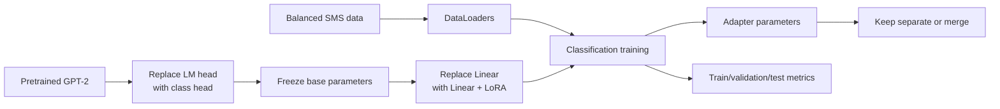
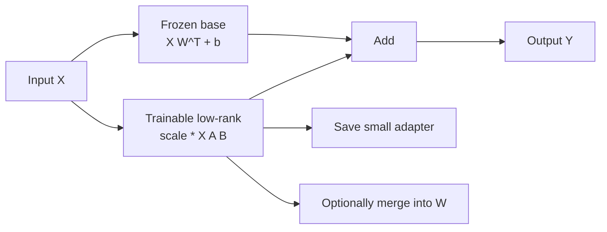
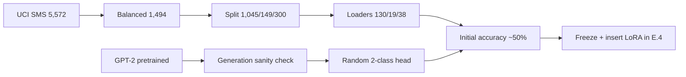
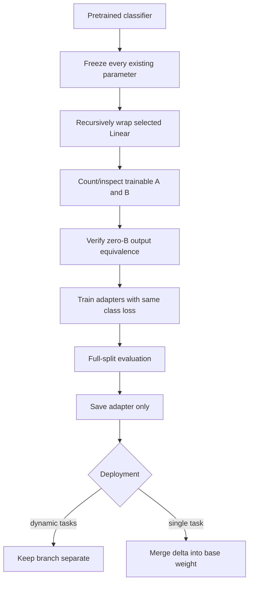
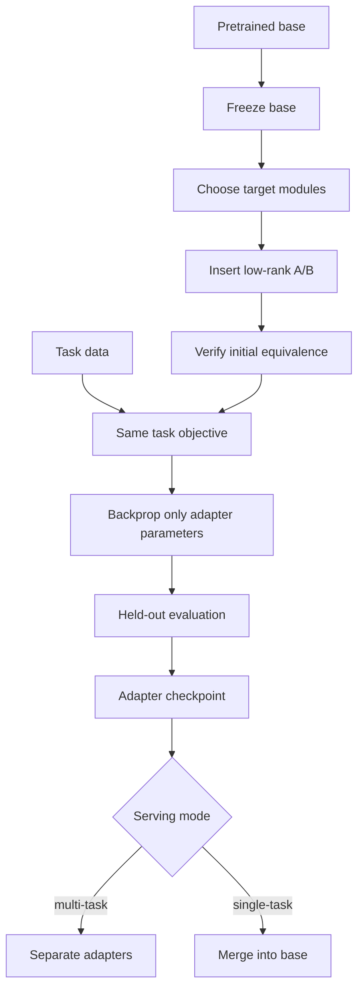

> 对应 *Build a Large Language Model (From Scratch)* 附录 E。本文沿原书 E.1–E.4 的顺序，从低秩 update 的数学动机出发，复用 Chapter 6 的 SMS spam classification 数据与 GPT-2 模型，最后实现、插入并训练 LoRA adapters。

---

## 0. 阅读目标与主线

### 0.1 LoRA 改变训练系统的哪一层

Full fine-tuning：

```text
pretrained model
-> all selected weights receive gradients
-> optimizer stores state for all trainable weights
-> save one full model per task
```

LoRA：

```text
frozen pretrained model
-> add small trainable low-rank branches
-> optimizer stores state only for adapters
-> share one base model across tasks
```

两者可以使用完全相同的 dataset、forward task、classification loss 和 training loop。LoRA 主要改变：

- 哪些 parameters 可训练；
- Weight update 如何参数化；
- Gradient/optimizer-state memory；
- Task-specific artifact 大小；
- Forward 中是否多出 adapter branch。

它不自动改变：

- 数据质量；
- Class labels；
- Cross-entropy objective；
- Evaluation protocol；
- 模型原有知识是否正确。

### 0.2 全附录数据流



### 0.3 本附录可确认的编辑与代码边界

1. Listing E.1 的 `url = \ ` 在反斜杠后有空格，是无效 Python line continuation；应使用括号包住字符串。
2. Listing E.1 使用 `from ch06 import ...`，后续使用 `chapter06`；实际运行时必须统一为本地真实 module name。
3. Figure E.5 caption 写“six epochs”，训练配置与日志实际是 **5 epochs**。
4. 最终打印 test accuracy 为 **98.00%**，紧接的 prose 写 **97.33%**；同一 artifact 内不一致。本文以可见打印输出 98.00% 为主，并标记文字数字为编辑瑕疵。
5. 原书称最终计算 full training accuracy，但 train loader 使用 `drop_last=True`，实际每次只覆盖 1,040/1,045 条 training samples，且 shuffle 后遗漏的 5 条可变化。

这些边界不改变 LoRA 的核心机制，却会影响复现和结论强度。

### 0.4 本文采用的矩阵记号

PyTorch `Linear(d_in,d_out)` 存储：

$$
W\in\mathbb R^{d_{out}\mathbin{\ast}d_{in}},
$$

对 row-vector batch $X\in\mathbb R^{N\mathbin{\ast}d_{in}}$：

$$
Y=XW^{\mathsf T}+b.
$$

本书代码定义：

$$
A_c\in\mathbb R^{d_{in}\mathbin{\ast}r},
\qquad
B_c\in\mathbb R^{r\mathbin{\ast}d_{out}},
$$

并计算 $XA_cB_c$。下标 $c$ 表示 code orientation。对应 PyTorch weight-space update：

$$
\Delta W
=(A_cB_c)^{\mathsf T}
=B_c^{\mathsf T}A_c^{\mathsf T}
\in\mathbb R^{d_{out}\mathbin{\ast}d_{in}}.
$$

很多论文使用列向量并直接写 $\Delta W=BA$。两种记号数学一致，矩阵 shape 不能混用。

---

## E.1 Introduction to LoRA（LoRA 导论）

### E.1.1 为什么需要 parameter-efficient fine-tuning

大型 pretrained model 已学习通用语言表示。下游任务通常不需要从零重学全部参数，但 full fine-tuning 仍会为大量 weights 计算/保存：

- Gradients；
- AdamW first moments；
- AdamW second moments；
- Mixed-precision master weights（依实现）；
- 每个任务一份完整 checkpoint。

设模型有 $N$ 个 FP32 trainable parameters。仅按简单口径：

| State | Bytes/parameter |
|---|---:|
| Parameter | 4 |
| Gradient | 4 |
| Adam first moment | 4 |
| Adam second moment | 4 |

约 $16N$ bytes，尚未计算 activations、temporary buffers 和 allocator overhead。LoRA 将 trainable parameter count 从 $N$ 降为 $n\ll N$，主要减少后三类 task-specific training state；frozen base weights 仍必须存储并参与 forward。

### E.1.2 Full fine-tuning 的 weight update

设 pretrained weight：

$$
W_0\in\mathbb R^{d_{out}\mathbin{\ast}d_{in}}.
$$

Full fine-tuning 经过多步 optimization 后得到：

$$
W_{task}=W_0+\Delta W.
$$

$\Delta W$ 是最终参数差，不等于单个 batch gradient；它由整个 optimizer trajectory、learning rate、moments 和 weight decay 共同形成。

Forward：

$$
Y=X(W_0+\Delta W)^{\mathsf T}+b.
$$

利用 distributive law：

$$
Y=XW_0^{\mathsf T}+X\Delta W^{\mathsf T}+b.
$$

这就是“base branch + update branch”的数学来源。

### E.1.3 LoRA 的低秩假设

LoRA 假设任务适配所需的 weight change 具有较低 intrinsic rank，可以限制：

$$
\Delta W\approx B A,
$$

其中论文常用 orientation：

$$
B\in\mathbb R^{d_{out}\mathbin{\ast}r},
\qquad
A\in\mathbb R^{r\mathbin{\ast}d_{in}},
$$

且：

$$
r\ll\min(d_{in},d_{out}).
$$

因为：

$$
\operatorname{rank}(BA)
\le\min(\operatorname{rank}(B),\operatorname{rank}(A))
\le r,
$$

最终 update 被限制在 rank 至多 $r$ 的集合中。

### E.1.4 LoRA 不是“先得到完整 update 再压缩”

原书说用 $AB$ 近似 $\Delta W$，容易让人误解为：

```text
full fine-tune -> obtain dense delta -> SVD -> compress
```

标准 LoRA 实际是直接优化 low-rank factors：

```text
initialize A/B
-> forward through low-rank branch
-> backprop directly into A/B
-> never materialize a trainable dense delta during training
```

因此 LoRA 找到的是受低秩参数化约束的 optimization solution，不保证等于 full fine-tuning solution 的最佳事后低秩 approximation。

### E.1.5 与 SVD 的关系

任何 rank 为 $\rho$ 的矩阵都有 factorization。若 full update 的 singular value decomposition：

$$
\Delta W=U\Sigma V^{\mathsf T},
$$

保留前 $r$ 个 singular components：

$$
\Delta W_r
=U_r\Sigma_rV_r^{\mathsf T}
$$

是 Frobenius norm 下的最佳 rank-$r$ approximation（Eckart–Young 条件）。可令：

$$
B=U_r\Sigma_r,
\qquad
A=V_r^{\mathsf T}.
$$

这提供“低秩可能捕捉主要 update directions”的直觉，但 LoRA training 不需要显式 SVD，也不保证真实任务 update singular values 快速衰减。

### E.1.6 参数量何时真的更少

Dense weight 参数量：

$$
N_{dense}=d_{in}d_{out}.
$$

LoRA factors：

$$
N_{LoRA}=r(d_{in}+d_{out}).
$$

LoRA 更少的条件：

$$
r(d_{in}+d_{out})<d_{in}d_{out},
$$

即：

$$
r<\frac{d_{in}d_{out}}{d_{in}+d_{out}}.
$$

对 square $d\mathbin{\ast}d$：

$$
r<\frac d2.
$$

例如 $768\to768,r=16$：

$$
N_{dense}=768^2=589,824,
$$

$$
N_{LoRA}=16(768+768)=24,576,
$$

只相当于 dense weight 的：

$$
\frac{24,576}{589,824}\approx4.17\%.
$$

### E.1.7 小 output head 可能反而增加参数

对本书 classification head $768\to2,r=16$：

$$
N_{dense}=768\mathbin{\ast}2+2=1,538
$$

（含 bias），而 adapter factors：

$$
N_{LoRA}=16(768+2)=12,320.
$$

Adapter 比完整 head weight/bias还大约 8 倍。原因是 effective update rank 最多只有 2，即使指定 $r=16$：

$$
\operatorname{rank}(\Delta W)
\le\min(16,768,2)=2.
$$

所以 LoRA 的参数效率主要来自大 square/expansion matrices，不保证每个小层都省参数。实际常直接训练 classification head，只对大 backbone projections 加 LoRA。

### E.1.8 Scaling factor $\alpha/r$

本书 branch：

$$
Y_{LoRA}
=\frac{\alpha}{r}XA_cB_c.
$$

作用：

- $r$ 改变 capacity 和参数量；
- $\alpha$ 调整 adapter 对 base output 的相对尺度；
- 除以 $r$ 使改变 rank 时 branch scale 不至于简单线性增长。

题目使用 `rank=16, alpha=16`：

$$
\frac{\alpha}{r}=1.
$$

Alpha 不是 learning rate。两者都影响 update magnitude，却处于不同位置：alpha 缩放 forward branch 和其 gradients；LR 缩放 optimizer 对 factors 的 parameter step。

### E.1.9 Factors 不唯一

对任意可逆 $C\in\mathbb R^{r\mathbin{\ast}r}$：

$$
BA=(BC)(C^{-1}A).
$$

所以 A/B factors 本身不可唯一识别，真正决定 function 的是 product。对 factors 分别做 weight decay 也不等价于直接对 $\Delta W$ 做相同 regularization，因为不同 factor scaling 可表示同一 product。

### E.1.10 Forward 的两种等价形式

Dynamic adapter：

$$
Y=XW_0^{\mathsf T}+b
+\frac{\alpha}{r}XA_cB_c.
$$

Merge 后：

$$
W_{merged}
=W_0+({\alpha}/{r})(A_cB_c)^{\mathsf T},
$$

$$
Y=XW_{merged}^{\mathsf T}+b.
$$

前者方便切换 task adapters；后者消除 inference 时额外两次 matrix multiplication。

### E.1.11 为什么保留 adapters 分离很有用

假设 base model 为 $S_{base}$ bytes，每个 adapter 为 $S_{adapter}$，有 $K$ 个 tasks。

Full copies：

$$
S_{full}=K S_{base}.
$$

Shared base + adapters：

$$
S_{LoRA}=S_{base}+K S_{adapter}.
$$

当 $S_{adapter}\ll S_{base}$，多客户/任务 storage 大幅下降。Serving 可：

- 动态选择 adapter；
- 缓存常用 adapters；
- 将一个 adapter merge 成独立部署 artifact；
- 保持 base revision 不变并审计 task deltas。

### E.1.12 LoRA Layer 的本书实现

```python
import math

import torch


class LoRALayer(torch.nn.Module):
    def __init__(self, input_dimension, output_dimension, rank, alpha):
        super().__init__()
        if rank <= 0:
            raise ValueError("rank must be positive")
        self.A = torch.nn.Parameter(
            torch.empty(input_dimension, rank)
        )
        self.B = torch.nn.Parameter(
            torch.zeros(rank, output_dimension)
        )
        torch.nn.init.kaiming_uniform_(self.A, a=math.sqrt(5))
        self.scale = alpha / rank

    def forward(self, inputs):
        return self.scale * (inputs @ self.A @ self.B)
```

Shape flow：

```text
inputs: (..., d_in)
A:      (d_in, r)
->      (..., r)
B:      (r, d_out)
->      (..., d_out)
```

低秩 bottleneck 在中间最后一维 $r$。

### E.1.13 Kaiming initialization 的 orientation 细节

原书称 A 使用与 Linear 相同的 Kaiming initialization function，这在 API 调用层面成立。但 `kaiming_uniform_` 默认把二维 tensor 解释为 `[fan_out, fan_in]`，而本书 A shape 是 `[in_dim, rank]` 且 forward 使用 `x @ A`。

因此该调用计算的 `fan_in` 是 `rank`，不是 `in_dim`。这不使代码无效，且 B=0 保证初始 function 不变；但它会改变 A 的初始尺度和 B 的首步 gradient。若希望按 `x @ A` 的 input dimension计算 fan-in，可对 `A.T` 初始化或显式定义 bound。不同 LoRA libraries 的 initialization recipe 可能不同，必须按实现验证。

### E.1.14 为什么 B 初始化为零

初始：

$$
A_cB_c=A_c0=0.
$$

所以：

$$
Y_{adapted}=Y_{base}.
$$

这让插入 adapters 的瞬间不改变 pretrained behavior，提供强验收不变量：加入 LoRA 前后固定输入 logits 应逐元素相同（在相同 mode/dtype/device 下）。

### E.1.15 首步 gradient 为什么只进入 B

设 upstream gradient 为 $G=\partial L/\partial Y$。忽略 scale：

$$
\frac{\partial L}{\partial A_c}
=X^{\mathsf T}G B_c^{\mathsf T},
$$

$$
\frac{\partial L}{\partial B_c}
=A_c^{\mathsf T}X^{\mathsf T}G.
$$

当 $B_c=0$：

$$
\frac{\partial L}{\partial A_c}=0,
$$

而 $\partial L/\partial B_c$ 通常非零。B 更新后，后续 A 才获得非零 gradient。

若 A 和 B 都初始化为零：

$$
\frac{\partial L}{\partial A_c}
=\frac{\partial L}{\partial B_c}=0,
$$

branch 会卡住。因此“一边随机、一边零”同时满足 function preservation 和可学习性。

### E.1.16 `LinearWithLoRA`

```python
class LinearWithLoRA(torch.nn.Module):
    def __init__(self, linear, rank, alpha):
        super().__init__()
        self.linear = linear
        self.lora = LoRALayer(
            input_dimension=linear.in_features,
            output_dimension=linear.out_features,
            rank=rank,
            alpha=alpha,
        )

    def forward(self, inputs):
        return self.linear(inputs) + self.lora(inputs)
```

Wrapper 保留原 Linear 对象（包括 weight 和 bias），另注册 LoRA A/B。冻结原模型后：

- `linear.weight/bias.requires_grad=False`；
- `lora.A/B.requires_grad=True`；
- Backward 仍需通过 base operation 对 inputs 求 derivative，以训练更早 layers 的 adapters；
- Optimizer 不为 `.grad is None` 的 frozen parameters 建立 update state。

### E.1.17 初始等价与首步 gradient 的可运行验证

```python
import torch

torch.manual_seed(123)
base_linear = torch.nn.Linear(5, 3)
for parameter in base_linear.parameters():
    parameter.requires_grad = False

adapted_linear = LinearWithLoRA(
    linear=base_linear,
    rank=2,
    alpha=2,
)
features = torch.randn(4, 5)

with torch.no_grad():
    base_output = base_linear(features).clone()
adapted_output = adapted_linear(features)

assert torch.equal(base_output, adapted_output)
assert sum(
    parameter.numel()
    for parameter in adapted_linear.parameters()
    if parameter.requires_grad
) == 2 * (5 + 3)

loss = adapted_output.square().mean()
loss.backward()

assert base_linear.weight.grad is None
assert base_linear.bias.grad is None
assert torch.count_nonzero(adapted_linear.lora.A.grad).item() == 0
assert torch.count_nonzero(adapted_linear.lora.B.grad).item() > 0
```

### E.1.18 Merge 等价的可运行验证

先模拟 adapter 已训练，令 B 非零：

```python
import torch

with torch.no_grad():
    adapted_linear.lora.B.normal_(mean=0.0, std=0.1)

dynamic_output = adapted_linear(features)
effective_weight_update = (
    adapted_linear.lora.scale
    * (adapted_linear.lora.A @ adapted_linear.lora.B).T
)

merged_linear = torch.nn.Linear(5, 3)
with torch.no_grad():
    merged_linear.weight.copy_(
        base_linear.weight + effective_weight_update
    )
    merged_linear.bias.copy_(base_linear.bias)

merged_output = merged_linear(features)

assert torch.allclose(dynamic_output, merged_output, atol=1e-6)
```

Merge 后不要再同时启用 adapter branch，否则 update 被加两次。若需 unmerge，应保留原 base 或精确减去同一 dtype/scale 的 delta；反复 merge/unmerge 可能累积 floating-point error。

### E.1.19 Adapter-only checkpoint

直接 `model.state_dict()` 会包含 frozen base 和 adapters，失去 storage 优势。可筛选：

```python
adapter_state = {
    name: tensor.detach().cpu()
    for name, tensor in adapted_linear.state_dict().items()
    if ".lora." in f".{name}"
}

assert set(adapter_state) == {"lora.A", "lora.B"}
```

真实 artifact 还必须保存：

- Base model ID/revision/hash；
- Target module names；
- Rank 和 alpha；
- LoRA orientation/implementation version；
- Dtype；
- Tokenizer/task metadata。

仅有 A/B tensors 而不知道它们插在哪些 layers，无法可靠恢复。

### E.1.20 LoRA 的适用范围与局限

适合：

- Base model 很大、task data 较小；
- 需要多任务/多客户 adapters；
- Optimizer memory 受限；
- 希望保留 immutable base；
- 快速迭代和回滚。

局限：

- Low-rank constraint 可能不足以表示大 domain shift；
- Base forward/activation memory 仍存在；
- Dynamic adapter 增加 matmul 和 latency；
- Rank/alpha/target modules 很敏感；
- 不自动处理 data quality、forgetting、safety；
- Small layers 可能比直接训练更浪费；
- 多 adapter composition 可能互相干扰；
- Quantized base、distributed sharding 和 checkpoint merge 需要专门实现。

### E.1.21 与其他方法的关系

| 方法 | Base weights | Trainable state | 核心思路 |
|---|---|---|---|
| Full fine-tuning | 更新 | 大 | 任意 dense update |
| Partial fine-tuning | 部分更新 | 中 | 只解冻后几层/head |
| LoRA | 冻结 | 小 | 每个目标 weight 加低秩 update |
| Adapter MLP | 冻结 | 小 | Block 中插 bottleneck modules |
| Prompt/prefix tuning | 冻结 | 很小 | 学可训练输入/prefix states |
| GaLore | 更新 full weights | Optimizer state 较小 | 投影 gradients/moments |
| QLoRA | Quantized frozen base | LoRA adapters | 量化 base + LoRA training |

LoRA 不等于 quantization，也不等于 pruning。QLoRA 是 LoRA 的一种内存增强组合，不在本附录实现范围内。

### E.1.22 E.1 小结



LoRA 的本质不是“冻结大模型”这一个动作，而是：**将 task-specific dense weight change 重新参数化为低秩 factors，并把它作为可分离 branch 加到 frozen base function 上。**

---

## E.2 Preparing the Dataset（准备数据集）

E.2 基本复用 Chapter 6。这样后面 LoRA 与原分类 fine-tuning 可在同一 data/task 上比较，减少“数据变化导致结果变化”的混杂。

### E.2.1 数据来源与原始分布

UCI SMS Spam Collection 共 5,572 条：

```text
ham:  4,825
spam:   747
total: 5,572
```

原始 spam prevalence：

$$
p_{spam}
=747/5,572
\approx13.41\%.
$$

若直接用 accuracy，永远预测 ham 的 trivial classifier 已有约 86.59%。因此原书先构造 balanced dataset，使随机/多数类 baseline 更接近 50%。

### E.2.2 修正后的下载与准备代码

原 Listing E.1 的反斜杠续行带空格。括号写法更安全：

```python
from pathlib import Path

import pandas as pd

from chapter06 import (
    create_balanced_dataset,
    download_and_unzip_spam_data,
    random_split,
)

url = (
    "https://archive.ics.uci.edu/static/public/228/"
    "sms+spam+collection.zip"
)
zip_path = "sms_spam_collection.zip"
extracted_path = "sms_spam_collection"
data_file_path = Path(extracted_path) / "SMSSpamCollection.tsv"

download_and_unzip_spam_data(
    url,
    zip_path,
    extracted_path,
    data_file_path,
)

dataframe = pd.read_csv(
    data_file_path,
    sep="\t",
    header=None,
    names=["Label", "Text"],
)
balanced_dataframe = create_balanced_dataset(dataframe)
balanced_dataframe["Label"] = balanced_dataframe["Label"].map({
    "ham": 0,
    "spam": 1,
})

train_dataframe, validation_dataframe, test_dataframe = random_split(
    balanced_dataframe,
    train_frac=0.7,
    validation_frac=0.1,
)

train_dataframe.to_csv("train.csv", index=None)
validation_dataframe.to_csv("validation.csv", index=None)
test_dataframe.to_csv("test.csv", index=None)
```

这里假设模块名为 `chapter06`。若本地文件叫 `ch06.py`，import 应统一改为 `ch06`；名字取决于代码布局，不能在同一脚本混用。

### E.2.3 Undersampling 怎样平衡类别

Chapter 6 的 helper：

```text
keep all 747 spam
sample 747 of 4,825 ham with random_state=123
concatenate
```

得到：

$$
N_{balanced}=747+747=1,494.
$$

优点：

- Training 小且快；
- 两类 loss contribution 更均衡；
- Accuracy baseline 直观；
- 便于教学比较 LoRA/full/partial FT。

代价：

- 丢弃 4,078 条 ham，多样性下降；
- 训练 prior 从 13.41% 改成 50%；
- 模型输出概率不再天然 calibrated 到真实短信流；
- Deployment false-positive behavior 可能不符合成本需求。

替代方案包括 class-weighted loss、oversampling、focal loss、threshold tuning 和保留原 prior 的评价集。

### E.2.4 Label mapping

```text
ham  -> 0
spam -> 1
```

这不是 GPT token ID；它是 classification target index。Cross-entropy 要求 targets 通常为 integer `torch.long` 且：

$$
y\in\{0,1\}.
$$

输出 head 有两个 logits，`argmax` index 直接映射回 label。

### E.2.5 Random split 的精确数量

Helper 先以 `random_state=123` shuffle，再按：

$$
N_{train}
=\lfloor1,494\mathbin{\ast}0.7\rfloor
=1,045,
$$

$$
N_{validation}
=\lfloor1,494\mathbin{\ast}0.1\rfloor
=149,
$$

$$
N_{test}
=1,494-1,045-149
=300.
$$

`test_frac` 是 remainder，因此恰为约 20.08%，不是独立 floor 后的严格 20%。

### E.2.6 Random row split 的风险

SMS spam 可能包含同 campaign 的近重复模板。随机 row split 会把相似消息分到 train/test，使 test 过于容易。真实部署更稳健的 split：

- Near-duplicate clustering 后 group split；
- Campaign/sender/domain grouping；
- Time-based split；
- 保留原 class prior 的 external test。

固定 seed 只让一次 split 可复现，不保证它无 leakage 或具有代表性。

### E.2.7 Tokenization 与固定长度

```python
import tiktoken

tokenizer = tiktoken.get_encoding("gpt2")
```

Train dataset 先编码全部文本并取最长 token 数，原数据为 120。Validation/test 使用 `train_dataset.max_length`：

```python
train_dataset = SpamDataset(
    "train.csv",
    tokenizer=tokenizer,
    max_length=None,
)
validation_dataset = SpamDataset(
    "validation.csv",
    tokenizer=tokenizer,
    max_length=train_dataset.max_length,
)
test_dataset = SpamDataset(
    "test.csv",
    tokenizer=tokenizer,
    max_length=train_dataset.max_length,
)
```

短文本右侧补 EOT ID 50256；超过 120 的 validation/test 文本被截断。所有 batch 可 stack 为固定 `[B,120]`。

### E.2.8 Padding 没有自动被 attention 忽略

本章 GPT 没有额外 padding attention mask。对短短信：

```text
[real tokens, EOT, EOT, ..., EOT]
```

分类使用最后 position logits，因此最后 EOT hidden state 读取真实文本和前面 padding。该 interface 能通过 fine-tuning 工作，却不是“pads 无影响”。若改 dynamic padding、last-real-token pooling 或 attention mask，结果可能改变。

### E.2.9 DataLoader 与 batch 数

```python
from torch.utils.data import DataLoader

batch_size = 8
torch.manual_seed(123)

train_loader = DataLoader(
    train_dataset,
    batch_size=batch_size,
    shuffle=True,
    num_workers=0,
    drop_last=True,
)
validation_loader = DataLoader(
    validation_dataset,
    batch_size=batch_size,
    shuffle=False,
    num_workers=0,
    drop_last=False,
)
test_loader = DataLoader(
    test_dataset,
    batch_size=batch_size,
    shuffle=False,
    num_workers=0,
    drop_last=False,
)
```

Batch counts：

$$
\lfloor1,045/8\rfloor=130,
$$

$$
\lceil149/8\rceil=19,
$$

$$
\lceil300/8\rceil=38.
$$

Train 每 epoch 使用：

$$
130\mathbin{\ast}8=1,040
$$

条，丢 5 条。因为 shuffle，每 epoch 被丢掉的 samples通常不同。

### E.2.10 五 epochs 的 update/exposure 数

LoRA 训练 5 epochs：

$$
N_{updates}=130\mathbin{\ast}5=650,
$$

step indices 为 0–649。日志 `eval_freq=50` 打印 0、50、…、600，不会打印 650。

Example exposures：

$$
1,040\mathbin{\ast}5=5,200.
$$

它不是 5,200 unique samples，而是重复训练 exposures。

### E.2.11 `eval_iter` 的采样范围

训练前 initial accuracy 用 `num_batches=10`：

$$
10\mathbin{\ast}8=80
$$

个 examples（各 loader 前 10 batches）。所以：

```text
46.25% = 37/80
45.00% = 36/80
48.75% = 39/80
```

Epoch-end `eval_iter=5` 只看 40 examples，accuracy 以 2.5 percentage points 跳动。这解释日志中的 92.50%、95.00%、100.00%。它们是快速 estimates，不是 full-split metrics。

### E.2.12 可运行的 split/batch 计数验证

```python
import math

import torch
from torch.utils.data import DataLoader, TensorDataset

balanced_count = 2 * 747
train_count = int(balanced_count * 0.7)
validation_count = int(balanced_count * 0.1)
test_count = balanced_count - train_count - validation_count

assert (train_count, validation_count, test_count) == (1045, 149, 300)


def dummy_dataset(number_of_examples):
    features = torch.zeros(number_of_examples, 120, dtype=torch.long)
    labels = torch.zeros(number_of_examples, dtype=torch.long)
    return TensorDataset(features, labels)


count_train_loader = DataLoader(
    dummy_dataset(train_count),
    batch_size=8,
    drop_last=True,
)
count_validation_loader = DataLoader(
    dummy_dataset(validation_count),
    batch_size=8,
    drop_last=False,
)
count_test_loader = DataLoader(
    dummy_dataset(test_count),
    batch_size=8,
    drop_last=False,
)

assert len(count_train_loader) == 130
assert len(count_validation_loader) == 19
assert len(count_test_loader) == 38
assert 5 * len(count_train_loader) == 650
assert 5 * len(count_train_loader) * 8 == 5200
assert abs(747 / 5572 - 0.134063173) < 1e-9
```

### E.2.13 E.2 验收清单

- 原始 row count 与 class distribution；
- Balance 后每类 747；
- Labels 仅 0/1；
- Split 1,045/149/300；
- 无 exact/near duplicate leakage；
- Train max length 120；
- Inputs/labels dtype 为 long；
- Batch shapes `[8,120]` 和 `[8]`；
- Train 130、validation 19、test 38 batches；
- Test loader 不 shuffle、不 drop last；
- 记录下采样导致的 deployment-prior mismatch。

---

## E.3 Initializing the Model（初始化模型）

E.3 先重建与 Chapter 6 相同的 pretrained classifier，再在 E.4 插入 LoRA。顺序很重要：必须先正确加载 GPT-2 weights，才能把“插入 LoRA 前后行为一致”作为验收。

### E.3.1 选择 GPT-2 Small

```python
CHOOSE_MODEL = "gpt2-small (124M)"

BASE_CONFIG = {
    "vocab_size": 50257,
    "context_length": 1024,
    "drop_rate": 0.0,
    "qkv_bias": True,
}

MODEL_CONFIGS = {
    "gpt2-small (124M)": {
        "emb_dim": 768,
        "n_layers": 12,
        "n_heads": 12,
    },
    "gpt2-medium (355M)": {
        "emb_dim": 1024,
        "n_layers": 24,
        "n_heads": 16,
    },
    "gpt2-large (774M)": {
        "emb_dim": 1280,
        "n_layers": 36,
        "n_heads": 20,
    },
    "gpt2-xl (1558M)": {
        "emb_dim": 1600,
        "n_layers": 48,
        "n_heads": 25,
    },
}

BASE_CONFIG.update(MODEL_CONFIGS[CHOOSE_MODEL])
```

`qkv_bias=True` 和 context 1,024 必须匹配 OpenAI checkpoint。LoRA 不允许忽略 architecture mismatch；它只在匹配 base 上添加 update。

### E.3.2 下载与加载 pretrained weights

```python
model_size = CHOOSE_MODEL.split(" ")[-1].lstrip("(").rstrip(")")
settings, parameters = download_and_load_gpt2(
    model_size=model_size,
    models_dir="gpt2",
)

model = GPTModel(BASE_CONFIG)
load_weights_into_gpt(model, parameters)
model.eval()
```

从 display name 解析 download ID 是便利写法，依赖字符串格式。生产配置应显式保存 model ID/revision，不从 UI label 推断。

外部 checkpoint 必须验证来源/hash。加载成功不仅看 shape，还应与 reference logits 或 generation 对照。

### E.3.3 为什么先测试语言生成

原书在换 classification head 前输入：

```text
Every effort moves you
```

得到 coherent continuation。它是 end-to-end check：tokenizer、embeddings、QKV mapping、blocks、norm 和 LM head 基本对齐。

单个 prompt 不是完备证明；一个 transpose/weight mapping bug 也可能偶然生成局部常见词。更严谨可比较 fixed input logits 与官方 implementation。

### E.3.4 替换为两类 classification head

```python
torch.manual_seed(123)
model.out_head = torch.nn.Linear(
    in_features=768,
    out_features=2,
)
```

新 head 随机初始化、含 bias：

$$
N_{head}=768\mathbin{\ast}2+2=1,538.
$$

替换后 model 不再输出 50,257 vocabulary logits，而是每个 token position 两个 class logits。分类只读取最后 position。

语言生成 sanity check 必须在换头之前完成；换头后用生成函数会因 vocabulary interface 消失而失效。

### E.3.5 为什么初始 accuracy 约 50%

Pretrained backbone 有语言信息，但 random classification head 尚未学会 spam boundary。Balanced evaluation subset 中，接近 50% 表示尚无可靠 mapping：

```text
train 10 batches: 46.25%
validation 10:    45.00%
test 10:          48.75%
```

这不是证明 backbone 没有 spam information；linear head 的随机 orientation 还未利用它。也不是严格 random expectation 检验，因为每项只基于 80 examples。

### E.3.6 精确 parameter count：124,441,346

这个数字不是随意的“约 124M”。逐项：

#### Token embedding

$$
50,257\mathbin{\ast}768
=38,597,376.
$$

#### Position embedding

$$
1,024\mathbin{\ast}768
=786,432.
$$

#### 每个 Transformer block

Q/K/V bias 打开时 attention：

$$
N_{attn}
=4d^2+4d
=2,362,368.
$$

FFN：

$$
N_{FFN}=8d^2+5d
=4,722,432.
$$

两个 LayerNorm：

$$
N_{norms}=4d=3,072.
$$

Block：

$$
N_{block}=7,087,872.
$$

12 blocks：

$$
12\mathbin{\ast}7,087,872
=85,054,464.
$$

#### Final norm + class head

$$
N_{finalnorm}=2\mathbin{\ast}768=1,536,
$$

$$
N_{head}=1,538.
$$

总计：

$$
38,597,376+786,432+85,054,464+1,536+1,538
=124,441,346.
$$

### E.3.7 为什么它与 Chapter 4 的 124,412,160 不同

Chapter 4 的 tying 口径使用 `qkv_bias=False` 且没有 classification head。这里：

$$
3dL
=3\mathbin{\ast}768\mathbin{\ast}12
=27,648
$$

个 QKV biases，加 1,538 class-head parameters：

$$
124,412,160+27,648+1,538
=124,441,346.
$$

参数统计必须绑定实际 config/head，不能只看“GPT-2 small”。

### E.3.8 可运行的 parameter-count 验证

```python
VOCABULARY_SIZE = 50_257
CONTEXT_LENGTH = 1_024
EMBEDDING_DIMENSION = 768
NUMBER_OF_LAYERS = 12

token_embedding_parameters = VOCABULARY_SIZE * EMBEDDING_DIMENSION
position_embedding_parameters = CONTEXT_LENGTH * EMBEDDING_DIMENSION
attention_parameters_per_block = (
    4 * EMBEDDING_DIMENSION**2
    + 4 * EMBEDDING_DIMENSION
)
feed_forward_parameters_per_block = (
    8 * EMBEDDING_DIMENSION**2
    + 5 * EMBEDDING_DIMENSION
)
normalization_parameters_per_block = 4 * EMBEDDING_DIMENSION
block_parameters = (
    attention_parameters_per_block
    + feed_forward_parameters_per_block
    + normalization_parameters_per_block
)
final_normalization_parameters = 2 * EMBEDDING_DIMENSION
classification_head_parameters = 2 * EMBEDDING_DIMENSION + 2

classifier_parameters = (
    token_embedding_parameters
    + position_embedding_parameters
    + NUMBER_OF_LAYERS * block_parameters
    + final_normalization_parameters
    + classification_head_parameters
)

assert attention_parameters_per_block == 2_362_368
assert feed_forward_parameters_per_block == 4_722_432
assert block_parameters == 7_087_872
assert classifier_parameters == 124_441_346
```

### E.3.9 Device 与插入 LoRA 的顺序

E.3 把 model 移到 GPU/CPU：

```python
device = torch.device("cuda" if torch.cuda.is_available() else "cpu")
model.to(device)
```

E.4 随后创建新 LoRA Parameters。默认 `torch.empty/zeros` 在 CPU、default dtype 上创建，所以替换后必须再次：

```python
model.to(device)
```

否则 GPU base Linear 与 CPU adapters 在第一次 forward 会 device mismatch。

更稳健 LoRA constructor 可直接继承：

```python
device=linear.weight.device
dtype=linear.weight.dtype
```

Mixed precision 下 dtype 也必须明确；只 `.to(device)` 不会自动将 FP32 adapters 变成 BF16 base dtype。

### E.3.10 Optimizer 必须最后创建

正确顺序：

```text
load pretrained weights
-> replace LM head
-> freeze base
-> insert LoRA Parameters
-> move final module tree to device/dtype
-> verify trainable names/count
-> create optimizer
```

若 optimizer 在插入 adapters 前创建，它不知道新 A/B；若在替换 Parameter 后继续使用旧 optimizer，可能持有已被移除对象的 references。

### E.3.11 E.2–E.3 小结



到 E.3 结束，dataset/task/model 都与 Chapter 6 对齐，唯一尚未发生的是 task-specific parameter update。这为 E.4 的 LoRA ablation 建立了干净 baseline。

---

## E.4 Parameter-Efficient Fine-Tuning with LoRA（使用 LoRA 微调）

### E.4.1 从单层 wrapper 扩展到完整 GPT

本书策略是递归查找**所有** `torch.nn.Linear`：

```python
def replace_linear_with_lora(module, rank, alpha):
    for name, child in module.named_children():
        if isinstance(child, torch.nn.Linear):
            setattr(
                module,
                name,
                LinearWithLoRA(child, rank, alpha),
            )
        else:
            replace_linear_with_lora(child, rank, alpha)
```

在 GPT classifier 中命中：

- 每 block 的 Q/K/V projections；
- Attention output projection；
- FFN expansion projection；
- FFN contraction projection；
- 最终 classification head。

不会命中：

- Token/position Embedding；
- LayerNorm；
- Dropout；
- 直接注册但不属于 Linear 的 Parameters。

### E.4.2 为什么必须先冻结、再插入

原书顺序：

```python
for parameter in model.parameters():
    parameter.requires_grad = False

replace_linear_with_lora(model, rank=16, alpha=16)
```

Freeze 时 A/B 尚不存在；随后新建 `nn.Parameter` 默认 `requires_grad=True`。于是：

```text
old base weights/biases -> frozen
new LoRA A/B          -> trainable
```

若顺序反过来再对 `model.parameters()` 全部冻结，A/B 也会冻结，loss.backward 后没有可更新 adapters。

### E.4.3 Freeze 不表示 base 从计算图消失

Frozen weight 不需要 weight gradient，也不由 optimizer 更新。但为了训练前面 layers 的 adapters，backward 仍可能需要通过 frozen Linear 计算 input gradient：

$$
\frac{\partial L}{\partial X}
=\frac{\partial L}{\partial Y}W_0.
$$

因此 LoRA：

- 省 base parameter gradients；
- 省 base optimizer states；
- 不省完整 base forward；
- 不一定省所有 activation/backward compute；
- 不等价于只训练最后一层。

### E.4.4 原递归函数不是 idempotent

第一次替换后：

```text
LinearWithLoRA
  -> linear: Linear
  -> lora: LoRALayer
```

第二次调用原函数时，wrapper 本身不是 Linear，于是递归进入其 child，并再次包装内部 `linear`：

```text
LinearWithLoRA
  -> linear: LinearWithLoRA
       -> linear: Linear
       -> lora: LoRALayer
  -> lora: LoRALayer
```

Update 被重复添加，parameter count 增加。Replacement 应只执行一次，或显式跳过已经包装的 module。

### E.4.5 更安全的递归替换函数

```python
import torch


def replace_selected_linear_with_lora(
    module,
    rank,
    alpha,
    should_replace=None,
    prefix="",
):
    replaced_names = []

    for child_name, child in list(module.named_children()):
        full_name = (
            f"{prefix}.{child_name}" if prefix else child_name
        )

        if isinstance(child, LinearWithLoRA):
            continue

        if isinstance(child, torch.nn.Linear):
            selected = (
                True
                if should_replace is None
                else should_replace(full_name, child)
            )
            if selected:
                replacement = LinearWithLoRA(child, rank, alpha)
                replacement.to(
                    device=child.weight.device,
                    dtype=child.weight.dtype,
                )
                setattr(module, child_name, replacement)
                replaced_names.append(full_name)
        else:
            replaced_names.extend(
                replace_selected_linear_with_lora(
                    child,
                    rank=rank,
                    alpha=alpha,
                    should_replace=should_replace,
                    prefix=full_name,
                )
            )

    return replaced_names
```

改进：

- `list(named_children())` 将遍历对象 snapshot 化；
- 跳过 `LinearWithLoRA`，重复调用不再嵌套；
- 返回 exact target names；
- 支持 predicate，只替换 Q/V 等；
- 新 adapter 对齐 base device/dtype。

它仍未处理 shared-module alias、quantized Linear subclasses 和 distributed wrapping；生产 library 应使用经过测试的 PEFT implementation。

### E.4.6 用小嵌套模型验证替换范围

```python
import torch


class TinyNestedModel(torch.nn.Module):
    def __init__(self):
        super().__init__()
        self.embedding = torch.nn.Embedding(20, 5)
        self.backbone = torch.nn.Sequential(
            torch.nn.Linear(5, 7),
            torch.nn.ReLU(),
            torch.nn.Linear(7, 5),
        )
        self.normalization = torch.nn.LayerNorm(5)
        self.head = torch.nn.Linear(5, 2)

    def forward(self, features):
        hidden = self.backbone(features)
        hidden = self.normalization(hidden)
        return self.head(hidden)


torch.manual_seed(123)
replacement_test_model = TinyNestedModel()
replacement_features = torch.randn(4, 5)
with torch.no_grad():
    replacement_output_before = replacement_test_model(
        replacement_features
    ).clone()

for parameter in replacement_test_model.parameters():
    parameter.requires_grad = False

replaced_names = replace_selected_linear_with_lora(
    replacement_test_model,
    rank=2,
    alpha=2,
)
first_trainable_count = sum(
    parameter.numel()
    for parameter in replacement_test_model.parameters()
    if parameter.requires_grad
)

with torch.no_grad():
    replacement_output_after = replacement_test_model(
        replacement_features
    )

second_replaced_names = replace_selected_linear_with_lora(
    replacement_test_model,
    rank=2,
    alpha=2,
)
second_trainable_count = sum(
    parameter.numel()
    for parameter in replacement_test_model.parameters()
    if parameter.requires_grad
)

assert replaced_names == ["backbone.0", "backbone.2", "head"]
assert second_replaced_names == []
assert first_trainable_count == 2 * (5 + 7) + 2 * (7 + 5) + 2 * (5 + 2)
assert first_trainable_count == 62
assert second_trainable_count == first_trainable_count
assert torch.equal(replacement_output_before, replacement_output_after)
assert isinstance(replacement_test_model.embedding, torch.nn.Embedding)
assert isinstance(replacement_test_model.normalization, torch.nn.LayerNorm)
```

### E.4.7 精确推导 2,666,528 个 LoRA parameters

Rank $r=16$。

#### 每个 768 -> 768 projection

$$
16(768+768)=24,576.
$$

每 block 有 Q、K、V、output 共 4 个：

$$
4\mathbin{\ast}24,576=98,304.
$$

#### FFN 768 -> 3072 与 3072 -> 768

每个：

$$
16(768+3,072)=61,440.
$$

两个：

$$
2\mathbin{\ast}61,440=122,880.
$$

#### 每 block

$$
98,304+122,880=221,184.
$$

#### 12 blocks

$$
12\mathbin{\ast}221,184=2,654,208.
$$

#### Classification head 768 -> 2

$$
16(768+2)=12,320.
$$

#### 总计

$$
2,654,208+12,320
=2,666,528.
$$

Embeddings、LayerNorm 与 biases 没有新增 LoRA parameters。

### E.4.8 参数比例与简单内存口径

相对 base classifier 124,441,346：

$$
\frac{2,666,528}{124,441,346}
\approx2.143\%.
$$

Reduction factor：

$$
\frac{124,441,346}{2,666,528}
\approx46.67.
$$

所以“almost 50x”准确。

FP32 adapter weights：

$$
2,666,528\mathbin{\ast}4/1024^2
\approx10.17\ \mathrm{MiB}.
$$

按 weights + gradients + two Adam moments 的 16 bytes 粗略口径：

$$
2,666,528\mathbin{\ast}16/1024^2
\approx40.69\ \mathrm{MiB}.
$$

Full trainable state 同口径约 1,898.82 MiB。实际 memory 还包括 frozen base weights约 474.71 MiB、activations、temporary buffers 和 allocator overhead。

### E.4.9 可运行的 GPT LoRA count 公式

```python
rank = 16
model_width = 768
feed_forward_width = 3072
number_of_blocks = 12
number_of_classes = 2

square_projection_adapter = rank * (model_width + model_width)
attention_adapters_per_block = 4 * square_projection_adapter
feed_forward_adapters_per_block = (
    rank * (model_width + feed_forward_width)
    + rank * (feed_forward_width + model_width)
)
adapter_parameters_per_block = (
    attention_adapters_per_block
    + feed_forward_adapters_per_block
)
classification_head_adapter = rank * (
    model_width + number_of_classes
)
total_adapter_parameters = (
    number_of_blocks * adapter_parameters_per_block
    + classification_head_adapter
)

base_classifier_parameters = 124_441_346
adapter_fraction = (
    total_adapter_parameters / base_classifier_parameters
)
reduction_factor = (
    base_classifier_parameters / total_adapter_parameters
)

assert square_projection_adapter == 24_576
assert attention_adapters_per_block == 98_304
assert feed_forward_adapters_per_block == 122_880
assert adapter_parameters_per_block == 221_184
assert classification_head_adapter == 12_320
assert total_adapter_parameters == 2_666_528
assert abs(adapter_fraction - 0.0214279907) < 1e-10
assert abs(reduction_factor - 46.66793148) < 1e-8
```

### E.4.10 Trainable names 与 state 检查

插入后应检查：

```python
trainable_parameters = {
    name: parameter
    for name, parameter in model.named_parameters()
    if parameter.requires_grad
}

assert trainable_parameters
assert all(
    ".lora.A" in name or ".lora.B" in name
    for name in trainable_parameters
)
```

若希望直接训练 classification head，则 assertion/target policy 要相应改变。仅看总数不足以发现 adapter 插错层。

### E.4.11 为什么插入后 initial accuracy 完全相同

B=0 使每个 adapter branch 为零，所以所有 logits 与插入前相同；accuracy 仍为：

```text
Training 10 batches:   46.25%
Validation 10 batches: 45.00%
Test 10 batches:       48.75%
```

这是比“数值都接近”更强的不变量。在 eval mode、相同 input/device/dtype 下，输出应逐元素相同。

若不相同，应检查：

- B 是否真为零；
- Dropout/train mode；
- Dtype/device conversion；
- Base module 是否被重新初始化；
- Wrapper 是否重复添加；
- Bias 是否复制/保留；
- Input batch 是否相同。

### E.4.12 Optimizer 只应接收 trainable adapters

原书：

```python
optimizer = torch.optim.AdamW(
    model.parameters(),
    lr=8e-4,
    weight_decay=0.1,
)
```

PyTorch 对 `grad is None` 的 frozen parameters 跳过 update，通常也不会为它们创建 optimizer state，因此功能正确。更明确：

```python
trainable_parameters = [
    parameter
    for parameter in model.parameters()
    if parameter.requires_grad
]
optimizer = torch.optim.AdamW(
    trainable_parameters,
    lr=8e-4,
    weight_decay=0.1,
)
```

这样 optimizer parameter groups、state size 和日志直接对应 adapters，也能尽早暴露 trainable list 为空。

### E.4.13 为什么 LoRA LR 比 Chapter 6 大

LoRA 使用 `8e-4`，Chapter 6 partial fine-tuning 使用 `5e-5`。Adapters 从特殊 initialization 开始、parameterization 和 gradient scale 不同，常可使用更高 LR。

但这意味着两次实验并非“只改变 LoRA”：trainable scope、LR 和 forward graph 都不同。若要科学比较：

- 分别为两种方法调 LR，再比较各自 best；或
- 固定 LR 做纯 parameterization ablation，并承认可能对某方法不公平。

### E.4.14 Training loop 保持不变

仍用 Chapter 6：

```text
last-position class logits
-> cross-entropy
-> backward
-> AdamW step
```

区别是 autograd 最终只把 gradients 存入 A/B。五 epochs：

```text
130 updates/epoch
650 total updates
5,200 training example exposures
eval loss every 50 updates
epoch accuracy estimated from 5 batches
```

### E.4.15 Training logs 怎样解读

关键日志：

```text
step 0:   train loss 3.820, val 3.462
step 50:  train 0.346, val 0.325
step 150: train 0.054, val 0.045
step 600: train 0.019, val 0.252
```

Adapters 很快学会分类。Validation loss 在 step 150 较低，后期升到 0.252，提示过拟合或 confidence calibration 变差；不能只说“曲线 level off，进一步训练不会改善”。

Accuracy 可保持高而 cross-entropy 变差：argmax 只看类别是否正确，CE 还惩罚少数 confident mistakes。

### E.4.16 Figure caption 的 epoch 边界

配置：

```python
num_epochs = 5
```

日志也只有 Epoch 1–5。Figure E.5 caption 的“six epochs”是编辑错误。`torch.linspace(0,5,len(train_losses))` 包含 x-axis 两端，并不代表训练 6 epochs。

### E.4.17 Epoch-end sampled accuracy

`eval_iter=5` 表示每项只看 40 examples：

```text
92.50% = 37/40
95.00% = 38/40
100.00% = 40/40
```

Epoch 5 的 validation 100% 不代表完整 validation set 全对。Final full validation 96.64% 正是更全面评价。

### E.4.18 Final metrics 与原文不一致

可见打印：

```text
Training accuracy:   100.00%
Validation accuracy:  96.64%
Test accuracy:        98.00%
```

下一段 prose 写 test 97.33%。由于 test set 300 条：

```text
98.00% = 294/300
97.33% = 292/300
```

可能来自不同 run/version，也可能是文字未更新。同一文档应以对应代码输出为准，并在复现时报告自己的 exact seed/artifact，而不是混合数字。

### E.4.19 “Full training accuracy”实际遗漏 5 条

Final call：

```python
train_accuracy = calc_accuracy_loader(train_loader, model, device)
```

但 `train_loader.drop_last=True`，只遍历 130 x 8 = 1,040 条，train split 有 1,045。由于 shuffle，遗漏 subset 还会变化。严格 full-train metric 应新建：

```python
train_evaluation_loader = DataLoader(
    train_dataset,
    batch_size=8,
    shuffle=False,
    drop_last=False,
)
```

Validation/test loaders 不 drop last，因此对应 full splits。

### E.4.20 Overfitting 应怎样描述

Train 100%，validation 96.64%，test 98.00% 显示小 generalization gap，但 test 高于 validation，不能简单说 test 比 validation 更差。更可靠判断需：

- Multiple seeds/splits；
- Confidence intervals；
- Validation loss minimum/checkpoint selection；
- Duplicate/group-aware split；
- 原 class prior 的 external test；
- Precision/recall/F1，尤其部署 spam false positives。

当前结果证明 LoRA 能高质量拟合该 split，不足以证明普遍 spam robustness。

### E.4.21 为什么本例 LoRA 反而较慢

原书 M3 MacBook Air LoRA 约 12.10 min；Chapter 6 non-LoRA 约 6 min。原因包括：

- 每个被替换 Linear 多执行 $XA$ 和中间乘 B；
- 本例为所有 12 blocks 的 73 个 Linear? 实际是每 block 6，共 72，再加 head，共 **73** 个 adapters；
- Chapter 6 baseline 只训练最后 block + final norm + head，不是 full-model fine-tuning；
- LoRA 需要让 gradients 穿过整个 backbone 以训练前层 adapters；
- 小 GEMMs/adapter launches 可能硬件利用率低；
- LR/trainable scope 不同，比较不是纯 ablation。

所以这不能推出“LoRA 总比 full fine-tuning 慢”。对更大模型，省 weight gradients/optimizer update 可能主导，LoRA 常更快、更省显存；实际仍须 benchmark。

### E.4.22 Memory 优势通常比 speed 优势更稳定

即使额外 branch 让 wall-clock 变慢，optimizer state 从 124M-scale 降到 2.67M-scale 仍显著。Memory savings 可允许：

- 更大 model；
- 更大 batch/context；
- 单 GPU fine-tuning；
- 多 task adapters；
- 更便宜 checkpoint/storage。

但 activation memory 可能仍是瓶颈，需要 mixed precision、activation checkpointing 或 shorter context。

### E.4.23 Target module 选择

本书“all Linear”易懂，但常见 production choices：

| Target | 参数更少 | 适配能力 |
|---|---:|---|
| Q/V only | 最少 | 常见 baseline |
| Q/K/V/O | 中 | 完整 attention update |
| Attention + FFN | 多 | 更高 capacity |
| Head direct + backbone LoRA | 实用 | Small head 不浪费 rank |
| All Linear | 最多 | 本书教学方案 |

Target modules 是与 rank 同等重要的 hyperparameter。不同 library 的默认 target 不同，不能只报告“LoRA rank 16”。

### E.4.24 Bias 与 LayerNorm 怎么办

本书先 freeze all，再只创建 A/B，因此：

- Base Linear biases frozen；
- LayerNorm scale/shift frozen；
- Embeddings frozen；
- Random classification-head bias也 frozen。

LoRA branch 没有 bias。任务仍可由 low-rank weight update适配，但某些 recipe 会额外训练 biases、norms 或 classification head。这样 trainable count 和 artifact 都会变化，应明确 `bias=none/all/lora_only` 等 policy。

### E.4.25 Small head 的更合理处理

对 768 -> 2：

- Direct full head：1,538 parameters；
- Rank-16 adapter：12,320 parameters，且 frozen random bias不能调。

一个实用 policy：

```text
train classification head directly
+ apply LoRA only to large backbone projections
```

它仍属于 parameter-efficient fine-tuning，并可能比“所有 Linear 一刀切”更少、更自然。

### E.4.26 Adapter dropout

很多 LoRA implementations 在 branch 输入加 dropout：

$$
Y_{LoRA}
=({\alpha}/{r})\operatorname{Dropout}(X)AB.
$$

本附录没有。LoRA dropout 是额外 regularization hyperparameter，只在 training mode 生效；它会破坏 train mode 下“插入后输出完全相同”吗？因为 B=0，初始 branch仍为零，所以不会；训练后则会带来 stochastic output。

### E.4.27 Adapter persistence 与加载流程

保存：

```python
adapter_state = {
    name: parameter.detach().cpu()
    for name, parameter in model.named_parameters()
    if parameter.requires_grad
}
torch.save(
    {
        "adapter_state": adapter_state,
        "base_model": "gpt2-small-revision",
        "rank": 16,
        "alpha": 16,
        "target_modules": replaced_names,
    },
    "spam_lora_adapter.pth",
)
```

加载：

```text
construct exact base architecture
-> load exact pretrained base
-> install same classification head architecture
-> freeze base
-> insert same LoRA targets/rank/alpha
-> load adapter tensors by exact names/shapes
-> move to device/dtype
-> eval and compare reference logits
```

Adapter 不能脱离 base revision独立解释。若 base weights不同，same delta作用在不同 function 上，结果不可预测。

### E.4.28 Merge 与部署

Single-task deployment 可 merge adapters，避免额外 low-rank branch latency。Multi-task serving 保持分离，按 request 路由 adapter。

Merge 注意：

- 使用正确 orientation 和 $\alpha/r$；
- Bias 不变；
- Dtype/quantization 可能带来误差；
- Merge 后禁用 branch；
- 保存 base 和 adapter provenance；
- Multiple adapters 若线性相加，组合质量需重新评价。

Quantized base 上直接 merge 可能需要 dequantize/requantize；这属于 QLoRA/tooling 范围。

### E.4.29 轻量 LoRA 分类训练闭环

下面验证：递归替换后只有 adapters 训练、base weights bitwise 不变、loss 下降。

```python
import copy

import torch
import torch.nn.functional as F


class TinyLoRAClassifier(torch.nn.Module):
    def __init__(self):
        super().__init__()
        self.feature_layer = torch.nn.Linear(5, 8)
        self.activation = torch.nn.Tanh()
        self.output_layer = torch.nn.Linear(8, 2)

    def forward(self, features):
        hidden = self.activation(self.feature_layer(features))
        return self.output_layer(hidden)


torch.manual_seed(123)
tiny_lora_classifier = TinyLoRAClassifier()
features = torch.randn(64, 5)
labels = (
    features[:, 0] + 0.5 * features[:, 1] > 0
).long()

for parameter in tiny_lora_classifier.parameters():
    parameter.requires_grad = False

base_parameter_snapshots = {
    name: parameter.detach().clone()
    for name, parameter in tiny_lora_classifier.named_parameters()
}

tiny_replaced_names = replace_selected_linear_with_lora(
    tiny_lora_classifier,
    rank=2,
    alpha=2,
)
tiny_trainable_parameters = [
    parameter
    for parameter in tiny_lora_classifier.parameters()
    if parameter.requires_grad
]
tiny_optimizer = torch.optim.AdamW(
    tiny_trainable_parameters,
    lr=0.1,
    weight_decay=0.0,
)

with torch.no_grad():
    initial_loss = F.cross_entropy(
        tiny_lora_classifier(features),
        labels,
    ).item()

for _ in range(100):
    tiny_optimizer.zero_grad()
    loss = F.cross_entropy(
        tiny_lora_classifier(features),
        labels,
    )
    loss.backward()
    tiny_optimizer.step()

with torch.no_grad():
    final_logits = tiny_lora_classifier(features)
    final_loss = F.cross_entropy(final_logits, labels).item()
    final_accuracy = (
        final_logits.argmax(dim=-1) == labels
    ).float().mean().item()

assert tiny_replaced_names == ["feature_layer", "output_layer"]
assert final_loss < initial_loss
assert final_accuracy > 0.95
assert torch.equal(
    tiny_lora_classifier.feature_layer.linear.weight,
    base_parameter_snapshots["feature_layer.weight"],
)
assert torch.equal(
    tiny_lora_classifier.output_layer.linear.weight,
    base_parameter_snapshots["output_layer.weight"],
)
assert all(
    parameter.grad is None
    for wrapper in (
        tiny_lora_classifier.feature_layer,
        tiny_lora_classifier.output_layer,
    )
    for parameter in wrapper.linear.parameters()
)
```

`copy` import 未使用，特意说明：静态 lint 可发现 dead imports；功能测试不会。高质量实现需要两类检查。

### E.4.30 如何做公平 LoRA/full/partial 对比

至少比较：

1. Head only；
2. Last block + head（Chapter 6）；
3. Full fine-tuning；
4. LoRA Q/V；
5. LoRA all attention；
6. LoRA all Linear；
7. Head direct + backbone LoRA。

固定：

- Same pretrained checkpoint/new-head initialization；
- Same train/validation/test split；
- Same token/example budget；
- Same evaluation points；
- Multiple seeds；
- Individually tuned LR/weight decay（比较最佳方法）或统一配置（纯 ablation）；
- Same hardware/precision/batch。

报告：

- Trainable/total parameters；
- Peak memory；
- Tokens/examples per second；
- Wall-clock to target quality；
- Final full-split metrics；
- Adapter artifact size；
- Merge/unmerged latency；
- Calibration/robustness。

### E.4.31 E.4 小结



E.4 的根本工程不变量是：**base parameters 始终不变；插入时 function 不变；训练后只有明确 target adapters 改变；保存/加载/merge 后 behavior 可用固定 logits 验证。**

---

## 5. 全附录知识结构

### 5.1 LoRA 在完整微调系统中的位置



### 5.2 四层 contract

#### Base contract

Exact architecture、weights、tokenizer 和 revision。Adapter 不是独立完整模型。

#### Structural contract

Target module names、input/output dimensions、rank、alpha、orientation。

#### Training contract

Only intended A/B trainable；optimizer、dtype、device、loss 和 data 正确。

#### Deployment contract

Dynamic/merged behavior 一致；adapter 与 base compatibility 可验证；artifact provenance 完整。

### 5.3 三种“效率”不能混用

| 效率 | 本例结果 | 原因 |
|---|---|---|
| Trainable-state memory | 明显更好 | 2.67M vs 124.44M trainable parameters |
| Per-task storage | 明显更好 | Adapter FP32 weights 约 10.17 MiB |
| Wall-clock speed | 本小模型更慢 | 73 个额外 branches，且 baseline 只训后层 |

Parameter-efficient 的核心命名指 trainable parameters/state，不承诺 latency 或 training time 总是更低。

### 5.4 Low-rank per layer 不等于整个网络能力低秩

每个 adapted Linear 的 update rank至多 $r$，但多层网络中：

- 每层有独立 A/B；
- Nonlinear activations 组合 updates；
- Attention/FFN 在不同 representation spaces 工作；
- 72 个 backbone adapters 共同影响 function。

因此整个 network behavior change 的表达能力远高于一个单独 rank-16 matrix，不能把模型整体称为 rank 16。

---

## 6. 核心公式速查

### 6.1 Full fine-tuning

$$
W_{task}=W_0+\Delta W.
$$

### 6.2 Low-rank update

论文常用 orientation：

$$
\Delta W=BA,
$$

$$
B\in\mathbb R^{d_{out}\mathbin{\ast}r},
\qquad
A\in\mathbb R^{r\mathbin{\ast}d_{in}}.
$$

### 6.3 Rank bound

$$
\operatorname{rank}(BA)\le r.
$$

### 6.4 本书 row-vector forward

$$
Y=XW_0^{\mathsf T}+b
+({\alpha}/{r})XA_cB_c.
$$

### 6.5 PyTorch weight-space delta

$$
\Delta W
=({\alpha}/{r})(A_cB_c)^{\mathsf T}.
$$

### 6.6 Adapter parameter count

$$
N_{LoRA}=r(d_{in}+d_{out}).
$$

### 6.7 比 dense 更少的条件

$$
r<\dfrac{d_{in}d_{out}}{d_{in}+d_{out}}.
$$

Square layer：$r<d/2$。

### 6.8 Merge

$$
W_{merged}
=W_0+({\alpha}/{r})(A_cB_c)^{\mathsf T}.
$$

### 6.9 初始 gradient

当 $B_c=0$：

$$
\partial L/\partial A_c=0,
$$

$$
\partial L/\partial B_c
=A_c^{\mathsf T}X^{\mathsf T}G.
$$

### 6.10 Multi-task storage

$$
S_{LoRA}=S_{base}+\sum_{k=1}^{K}S_{adapter,k}.
$$

---

## 7. 原书实验数字总表

### 7.1 Data 与 loaders

| 项目 | 数值 |
|---|---:|
| 原始 SMS | 5,572 |
| Ham / spam | 4,825 / 747 |
| Balance 后 | 747 / 747 |
| Train/validation/test | 1,045 / 149 / 300 |
| Max token length | 120 |
| Batch size | 8 |
| Loader batches | 130 / 19 / 38 |

### 7.2 Model 与 adapters

| 项目 | 数值 |
|---|---:|
| Base classifier parameters | 124,441,346 |
| Trainable after freeze | 0 |
| Rank / alpha | 16 / 16 |
| Backbone Linear targets | 12 x 6 = 72 |
| Classification-head target | 1 |
| Total adapters | 73 |
| Trainable LoRA parameters | 2,666,528 |
| Fraction of base | 2.1428% |
| Reduction factor | 46.67x |

### 7.3 Training

| 项目 | 数值 |
|---|---:|
| Learning rate | 8e-4 |
| Weight decay | 0.1 |
| Epochs | 5 |
| Updates | 650 (indices 0–649) |
| Example exposures | 5,200 |
| Loss eval frequency | 50 updates |
| Eval batches | 5 = 40 examples |
| M3 MacBook Air time | 12.10 min（本次输出） |
| V100/A100 | 原书称 < 0.5 min |

### 7.4 Metrics

| 阶段 | Train | Validation | Test |
|---|---:|---:|---:|
| Initial, 10 batches | 46.25% | 45.00% | 48.75% |
| Final displayed full-loader call | 100.00%* | 96.64% | 98.00% |

`*` Train loader 因 `drop_last=True` 实际覆盖 1,040/1,045；不是真正所有 rows。

### 7.5 精确计数验证

```python
number_of_blocks = 12
linear_adapters_per_block = 6
classification_head_adapters = 1
total_adapter_modules = (
    number_of_blocks * linear_adapters_per_block
    + classification_head_adapters
)

updates_per_epoch = 130
number_of_epochs = 5
total_updates = updates_per_epoch * number_of_epochs
evaluation_steps = list(range(0, total_updates, 50))
example_exposures = total_updates * 8

validation_examples = 149
test_examples = 300
validation_correct_at_96_64 = 144
test_correct_at_98 = 294
test_correct_at_97_33 = 292

assert total_adapter_modules == 73
assert total_updates == 650
assert evaluation_steps == list(range(0, 650, 50))
assert evaluation_steps[-1] == 600
assert len(evaluation_steps) == 13
assert example_exposures == 5200
assert round(100 * validation_correct_at_96_64 / validation_examples, 2) == 96.64
assert 100 * test_correct_at_98 / test_examples == 98.0
assert round(100 * test_correct_at_97_33 / test_examples, 2) == 97.33
```

---

## 8. 易混概念与常见误区

| 常见说法 | 准确辨析 |
|---|---|
| LoRA 先训练完整 $\Delta W$ 再分解 | 标准 LoRA 直接优化低秩 factors，不 materialize trainable dense delta。 |
| Base model 本身被低秩化 | Base 仍是 full-rank frozen weights；只有 task update 低秩。 |
| Rank $r$ 表示 update 恰为 rank $r$ | 只是上界，实际 rank 可更低，并受 in/out dimension 限制。 |
| 整个模型变成 rank 16 | 每个目标层有独立 rank-16 update，网络整体不是一张 rank-16 矩阵。 |
| Rank 越大一定越好 | Capacity、参数、内存和 overfitting 同时增加，收益需验证。 |
| Alpha 就是 learning rate | Alpha 缩放 branch；LR 控制 optimizer steps，二者交互但不同。 |
| LoRA factors 唯一 | 任意可逆中间变换可产生同一 product。 |
| Factor weight decay等于 delta weight decay | Factorization 非唯一，分别 regularize A/B 不等价于直接 regularize product。 |
| LoRA 对每个 Linear 都省参数 | 小 output head 可能 adapter 比完整层更大。 |
| 本书 class head 的 rank 16 有 16-rank capacity | 输出维度 2，effective rank至多 2。 |
| Freeze 后 base 不参与 backward | 不求 base weight gradient，但可能需要 input gradients 穿过 base。 |
| Frozen base 不占显存 | Base weights和activations仍占内存。 |
| LoRA 减少所有 activation memory | 主要省 trainable gradients/optimizer states；activation 仍可能主导。 |
| B=0 表示 adapters 无法学习 | 首步 B 有 gradient；B 更新后 A 也开始学习。 |
| A/B 都设零也可以 | 两边 gradients 都为零，会卡住。 |
| Kaiming API 就自动按本书 A 的 input fan-in | PyTorch 对二维 tensor 假设 `[fan_out,fan_in]`，orientation需审查。 |
| 插入 LoRA 会立即改变 logits | Zero B 保证同 mode/input 下 function 不变。 |
| Initial accuracy相近就够 | 理想应直接比较 logits，accuracy 太粗糙。 |
| 原递归 replacement 可重复调用 | 会嵌套包装内部 Linear，不是 idempotent。 |
| `isinstance(nn.Linear)` 能覆盖所有模型 | HF Conv1D、quantized layers、自定义 projections 可能不匹配。 |
| 插入后无需再次 `.to(device)` | 新 A/B 默认可能在 CPU，必须对齐 device/dtype。 |
| Optimizer 可在插入前创建 | 它不会自动追踪后来新建的 Parameters。 |
| `optimizer(model.parameters())` 会更新 frozen base | Grad 为 None 时跳过；过滤 trainable 参数更清晰。 |
| LoRA 会更新 biases/LayerNorm | 本书只训练 A/B，其余全部冻结。 |
| 所有 Linear 是最佳 target policy | 常见方案只选 Q/V 或 attention；需实验。 |
| Classification head 也应一律 LoRA | Small head 通常直接训练更省、更自然。 |
| Adapter checkpoint 用完整 `state_dict` 即可保持小 | Full state dict 仍含 base；应筛选 adapters并保存 metadata。 |
| Adapter 可搭配任意同架构 base | Exact base revision/weights 不同也会改变行为。 |
| Merge 只需加 `A@B` | PyTorch weight orientation 需 transpose，并乘 alpha/r。 |
| Merge 后还可保留 active branch | 会把 update 加两次。 |
| Merge 完全无数值误差 | Dtype/quantization 和反复 merge/unmerge 可带来误差。 |
| LoRA 一定比非 LoRA 快 | 本例反而更慢；speed 依 target/rank/hardware/baseline。 |
| Chapter 6 timing 是 full FT baseline | 主线只训练 last block + norm + head。 |
| Parameter-efficient 等于 compute-efficient | 主要指 trainable state；额外 branch 可能增加 forward compute。 |
| Eval 5 batches 的 100% 等于 full validation 100% | 只看 40 examples；full validation 为 96.64%。 |
| Final train accuracy 真覆盖 1,045 条 | Drop-last loader 只覆盖 1,040。 |
| 原文 test accuracy 唯一明确 | 输出 98.00%，prose 97.33%，需按 artifact/version报告。 |
| Figure E.5 训练六 epochs | 配置/日志是五 epochs，caption 有误。 |
| Accuracy 高说明 calibration 好 | CE 后期上升可表示少数 confident errors更严重。 |
| Balanced accuracy 可直接代表部署 | Train/test prior 50%，真实 spam prior约13.4%。 |
| LoRA 等于 QLoRA | QLoRA 还量化 frozen base；本书未实现。 |
| LoRA 等于 GaLore | LoRA 学 adapters；GaLore 投影 gradient/optimizer state并更新 full weights。 |
| LoRA 完全避免 forgetting | Base artifact不变，但 active adapter仍可覆盖/扭曲原行为。 |

---

## 9. 作者分析与解决问题的一般思路

### 9.1 复用同一 task 建立可比 baseline

作者没有为 LoRA 换新 dataset/model，而是复用 Chapter 6 spam classifier。这样读者能把变化主要定位到 trainable parameterization，而不必同时学习新任务。

### 9.2 从一个矩阵到整个模型逐层扩展

```text
single W and delta
-> factor delta into A/B
-> implement LoRALayer
-> wrap one Linear
-> recursively replace model
-> train with existing loop
```

每一步都有局部 shape 和 behavior 不变量，避免直接依赖黑盒 PEFT library。

### 9.3 用 distributive law解释 branch architecture

作者不是把 LoRA 当经验插件，而从：

$$
X(W+\Delta W)=XW+X\Delta W
$$

推导 base + adapter 两条 branch。数学结构直接指导代码结构和 merge。

### 9.4 用 zero-B 构造强验收点

插入前后 accuracy 相同说明大方向正确；更严格是 logits相同。该设计让复杂模型 replacement 有一个不依赖训练质量的 cheap test。

### 9.5 在训练前后都统计 parameters

```text
before freeze: 124,441,346
after freeze: 0
after LoRA: 2,666,528
```

这三点同时验证 freeze/order/insertion。只报告最终数字无法区分 base 是否误解冻。

### 9.6 复用原 training loop证明接口兼容

LoRA wrapper 保持 Linear 的 input/output shape，所以上层 model、loss 和 trainer无需理解 adapter。良好 abstraction 应让局部实现变化不扩散到整个系统。

### 9.7 同时报告速度的反例

本例 LoRA 更慢，作者仍保留结果并解释额外 branch；这提醒“减少 trainable parameters”不是“减少所有 FLOPs”。负面结果帮助建立正确工程预期。

### 9.8 从教学实现向 production 提出问题

最小递归函数之后应继续问：

- Target modules 是否合理；
- 重复调用是否安全；
- Device/dtype 是否继承；
- Adapter 如何单独保存；
- Merge orientation 是否正确；
- Quantized/distributed layers 怎样处理；
- 多 adapters 如何路由；
- Base compatibility 怎样验证。

### 9.9 将结果分成机制证据和经验结果

机制证据：

- Rank bound；
- Parameter formula；
- Zero-B equivalence；
- Merge equivalence；
- Base gradients为 None。

经验结果：

- 12.10 minutes；
- Validation/test accuracy；
- Rank16/alpha16 是否最佳；
- All-Linear target 是否优于 Q/V only。

前者可严格测试，后者必须绑定 seed/data/hardware。

---

## 10. 生产级 LoRA 检查表

### 10.1 Base 与数据

- 固定 base model revision/hash；
- 固定 tokenizer/config；
- 记录 task dataset provenance/split hash；
- 检查 class prior 与 deployment mismatch；
- 建立 held-out regression/safety sets。

### 10.2 Adapter config

- Target module names/pattern；
- Rank；
- Alpha/scale；
- Adapter dropout；
- Bias/norm/head train policy；
- Initialization；
- Orientation/implementation version。

### 10.3 插入后、训练前

- Replacement count/names；
- 无重复嵌套；
- A/B shapes；
- B 全零；
- Fixed logits 与 base一致；
- Trainable names只有预期项；
- Trainable count符合公式；
- Device/dtype一致；
- Optimizer只含 trainable parameters。

### 10.4 训练中

- Train/validation loss；
- Full-split metrics；
- Gradient norms for A/B；
- A 在首步 zero gradient是否符合预期；
- Base params hash保持不变；
- Peak memory、throughput、wall-clock；
- Calibration和错误样本；
- Best validation checkpoint，不只 final epoch。

### 10.5 保存与加载

- Adapter-only state；
- Base reference；
- Target names/rank/alpha；
- Head architecture/label mapping；
- Dtype/library version；
- Load 后 reference logits；
- 不可信 checkpoint serialization 安全。

### 10.6 部署

- Dynamic vs merged benchmark；
- Merge 后关闭 branch；
- Quantization/requantization误差；
- Adapter routing与tenant isolation；
- 多 adapter composition重新评价；
- Rollback到 immutable base；
- Monitor task drift/safety。

---

## 11. 一页复习表

| 问题 | 一句话回答 |
|---|---|
| LoRA 改变什么？ | 用低秩 factors 参数化 task-specific weight update。 |
| Base weight 更新吗？ | 本书中完全冻结。 |
| Rank bound？ | $\operatorname{rank}(\Delta W)\le r$。 |
| 本书 A/B shapes？ | A `(d_in,r)`，B `(r,d_out)`。 |
| Forward？ | `base(x) + (alpha/r) * x @ A @ B`。 |
| PyTorch merge delta？ | `(alpha/r) * (A @ B).T`。 |
| Adapter 参数量？ | $r(d_{in}+d_{out})$。 |
| 何时比 dense 少？ | $r<d_{in}d_{out}/(d_{in}+d_{out})$。 |
| 为什么 B=0？ | 插入时 function 完全不变。 |
| 首步谁有 gradient？ | B 通常非零，A 为零。 |
| A/B 都零会怎样？ | 两者 gradients 都零，无法学习。 |
| Rank/alpha？ | 16/16，scale 1。 |
| Dataset split？ | 1,045/149/300。 |
| Loader batches？ | 130/19/38。 |
| Base classifier参数？ | 124,441,346。 |
| LoRA parameters？ | 2,666,528。 |
| 比例/reduction？ | 2.1428% / 46.67x。 |
| Adapter modules？ | 73：12 blocks x 6 + head。 |
| 为什么 head LoRA不省？ | 768->2 太小，rank16 adapter有12,320参数。 |
| 训练 updates？ | 5 x 130 = 650。 |
| Initial accuracy为何不变？ | 所有 B 为零，logits不变。 |
| Final displayed metrics？ | 100.00%*/96.64%/98.00%。 |
| 为什么星号？ | Train drop-last只覆盖1,040/1,045。 |
| Training time？ | 本次M3 12.10min；硬件相关。 |
| 为什么比 Chapter6慢？ | 全层额外 branches vs partial-FT baseline。 |
| 保存什么？ | Adapter A/B + base/config/targets metadata。 |
| Merge 后做什么？ | 禁用 adapter branch并验证 logits。 |

---

## 12. 自测题与参考答案

### 12.1 一个 4096 -> 4096 Linear，rank 8 LoRA 有多少参数？

$$
8(4096+4096)=65,536.
$$

Dense weight 为 $4096^2=16,777,216$，adapter约 0.39%。

### 12.2 为什么 rank16 的 768 -> 2 adapter effective rank最多 2？

矩阵 rank 不超过最小维度：

$$
\operatorname{rank}(\Delta W)
\le\min(768,16,2)=2.
$$

### 12.3 本书 row-vector convention 下怎样 merge？

Base weight shape `(out,in)`，branch product `A@B` shape `(in,out)`，所以：

```python
weight += (alpha / rank) * (A @ B).T
```

### 12.4 为什么 B=0 时输出相同但 B 仍能学习？

Branch值为零；B gradient包含随机非零 A 和 upstream gradient，通常非零。A gradient乘 B，因此首步为零。

### 12.5 为什么 A/B 不能同时为零？

两边 gradient分别包含另一个 factor；都为零时两者 derivative 都零，optimization 无法启动。

### 12.6 GPT 每 block 有多少 LoRA target Linear？

Q、K、V、attention output、FFN expand、FFN contract，共 6。12 blocks 为72，加 classification head 为73。

### 12.7 每 block adapter parameters 为多少？

$$
4\mathbin{\ast}16(768+768)
+2\mathbin{\ast}16(768+3072)
=221,184.
$$

### 12.8 为什么总数是 2,666,528？

$$
12\mathbin{\ast}221,184
+16(768+2)
=2,666,528.
$$

### 12.9 Freeze 后为什么仍需要 base activations？

训练早层 adapters 时，gradient 要通过后续 frozen transformations 传播到其 inputs。无需 base weight gradient，不表示无需 backward-through-input。

### 12.10 为什么插入 adapters 后还要再次 `model.to(device)`？

新 A/B 默认在 CPU/default dtype，可能与已在 GPU 的 base 不一致。移动最终 module tree 或在 constructor继承 device/dtype。

### 12.11 为什么 optimizer 要在 replacement 后创建？

Optimizer保存 Parameter object references；先创建时不包含后来新建的 A/B。

### 12.12 原 replacement 为什么不能调用两次？

第二次会递归进入 wrapper 的 `linear` child，再包一层 LoRA，导致重复 update和参数增加。

### 12.13 训练日志 validation accuracy 高而 loss上升可能吗？

可以。Accuracy只看 argmax；少数仍错的样本若变得更 confident，cross-entropy 会显著上升而多数预测类别不变。

### 12.14 Final train accuracy 100% 为什么不严格代表1,045条全对？

Train loader `drop_last=True` 只评估1,040条；shuffle决定遗漏5条。需独立 non-shuffled、non-drop loader。

### 12.15 输出98.00%与文字97.33%分别对应多少test正确样本？

Test 300条：

$$
0.98\mathbin{\ast}300=294,
$$

$$
0.9733\mathbin{\ast}300\approx292.
$$

同一 run不可能同时成立，应按具体 artifact输出报告。

### 12.16 LoRA 为什么不一定更快？

它增加低秩 branch matmuls，且仍需 base forward/input-gradient backward。速度收益取决于省下的 weight-gradient/optimizer工作是否大于额外 branch成本。

### 12.17 LoRA 与 QLoRA 的区别？

LoRA 冻结通常精度的 base并训练 adapters；QLoRA 还将 frozen base量化以进一步省内存，涉及 quantization/dequantization和精度管理。

### 12.18 Adapter-only checkpoint 为什么必须保存 base revision？

Adapter只表示相对某个 $W_0$ 的 delta。同样 A/B 加到不同 base weights上会产生不同 function。

### 12.19 Dynamic 与 merged inference 怎样选择？

多任务快速切换用 dynamic adapters；单任务低延迟可 merge。两者都应对固定输入比较 logits并测试 dtype/quantization误差。

### 12.20 Balanced training 后为什么要在原 prior 上重新评价？

50/50训练评价改变了真实13.4% spam base rate；deployment precision、false-positive rate和 probability calibration会随 prior变化。

---

## 13. 核心结论

1. LoRA 是 parameter-efficient fine-tuning：冻结 base，学习低秩 task updates。
2. 它直接优化 factors，不是先完成 full fine-tuning再压缩 delta。
3. Rank $r$ 限制每个目标 weight update 的最大 rank，不限制整个网络为 rank $r$。
4. 本书 row-vector代码使用 A `(in,r)`、B `(r,out)`，merge 到 PyTorch weight时必须 transpose。
5. Adapter参数量为 $r(d_{in}+d_{out})$；只有满足阈值时才比 dense weight少。
6. Small classification head使用rank16反而比直接训练完整head参数更多。
7. Alpha/r控制branch scale，alpha不是learning rate。
8. Factors不唯一，factor-level regularization不等价于delta-level regularization。
9. Zero B保证插入时function不变，是最关键验收不变量。
10. Zero B导致首步A gradient为零、B gradient通常非零；A/B都零会无法学习。
11. 原Kaiming调用需注意A的row-vector orientation与fan-in解释。
12. 冻结base省weight gradients和optimizer states，但base forward/activation传播仍存在。
13. Replacement必须在freeze之后、optimizer之前，并在插入后对齐device/dtype。
14. 原递归函数不是idempotent；生产实现要防重复包装并记录target names。
15. 本书all-Linear策略命中73个layers，常见实践也可只选Q/V等子集。
16. Base classifier有124,441,346参数，LoRA只训练2,666,528，即2.1428%、约46.67倍减少。
17. Adapter FP32 weights约10.17MiB，但frozen base和activations仍占内存。
18. Initial accuracies完全相同来自zero-B，而不是巧合。
19. Training复用同一classification objective和loop，改变的是gradient-bearingparameters。
20. 本例LoRA在小模型上更慢，说明parameter efficiency不等于wall-clock efficiency。
21. 五epoch共650updates、5,200example exposures；epoch metrics只抽40条。
22. Final可见metrics为100.00%*/96.64%/98.00%，原prose的97.33%与输出冲突。
23. Figure E.5实际是5epochs，不是caption所写6。
24. Final train loader因drop-last漏5条，严格full-train评价需独立loader。
25. Adapter应单独保存并绑定base revision、targets、rank、alpha、dtype和label mapping。
26. Single-task可merge降低inference overhead；multi-task可保持分离动态路由。
27. LoRA不解决数据prior、leakage、calibration、安全和evaluation设计问题。
28. 公平比较必须分开报告trainable memory、artifact storage、wall-clock和quality。

---

## 14. 最终总结

附录 E 从一个关键观察出发：大型 pretrained model 的下游 task adaptation 未必需要在整个 parameter space 中自由移动。通过把每个目标 weight 的 update 约束为低秩 product，LoRA 将 124,441,346 个可训练参数降到 2,666,528，同时保持 dataset、model interface 和 classification loss 不变。

它最有价值的不只是“参数少”，而是建立了可分离的 task delta：base 可以保持 immutable，一个模型可挂载多个小 adapters；需要低延迟时又可把 delta merge 回 weight。但这些收益有明确边界：base computation和activations仍存在，额外 branches可能让小模型更慢，small layers未必省参数，adapter必须绑定精确base，target/rank/alpha仍需实验。

本附录体现的通用解决问题方法是：**先把 dense update 写成 base + delta，再提出低秩假设；用 shape/rank/parameter公式证明资源收益，用zero initialization建立插入前后等价的反证检查，再逐层扩展到完整模型，最后把参数效率、速度和泛化分别测量。** 只有同时满足数学、实现、状态和评价四层不变量，LoRA 才不只是“代码里多了两个矩阵”，而是一套可审计、可复用的模型适配机制。
