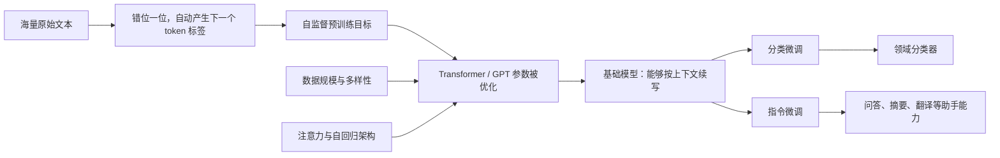
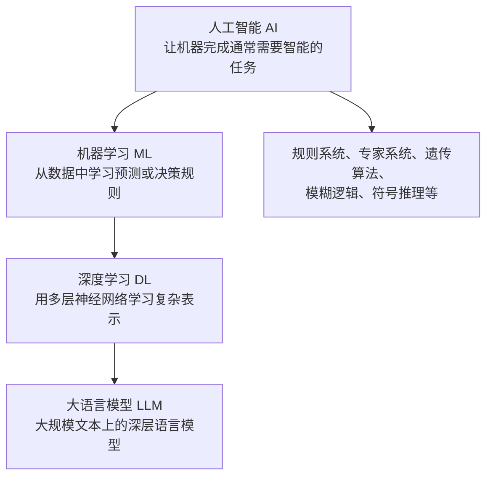
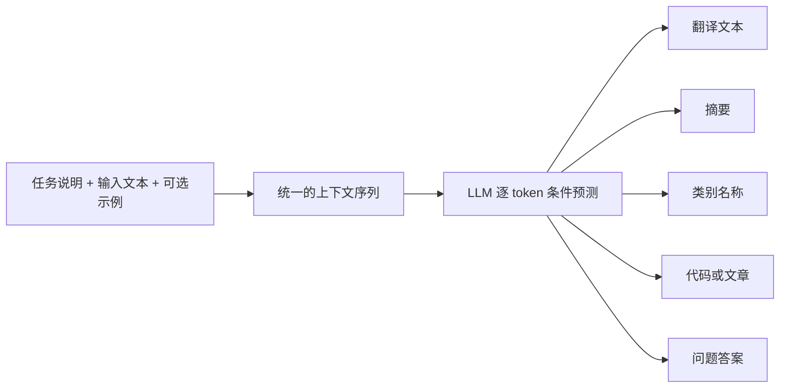
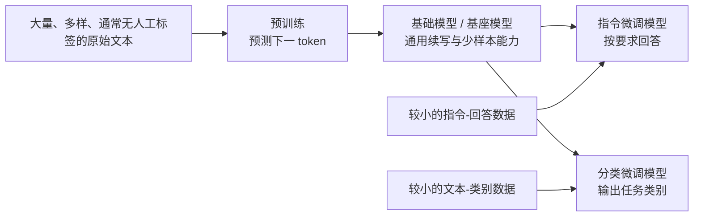
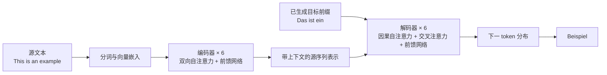
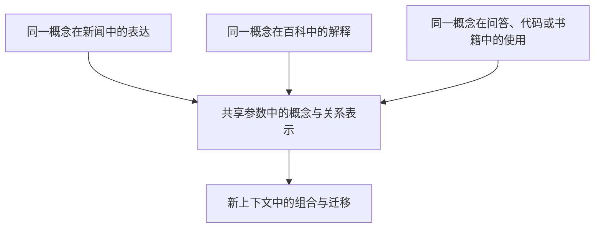
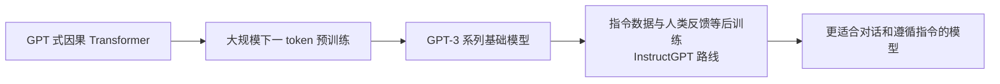
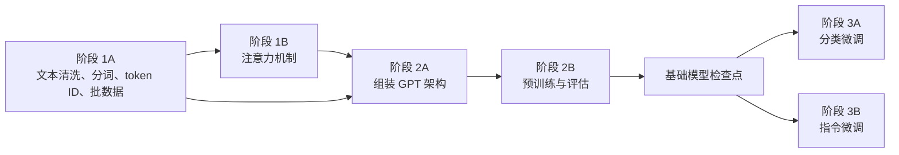
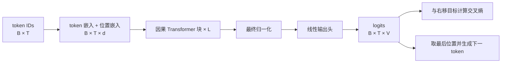
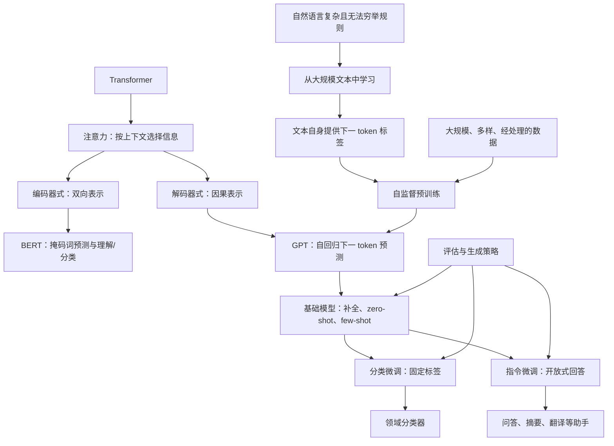

## 0. 本章定位、学习目标与因果主线

第 1 章不是模型实现章，而是一张全书地图。作者先解释大语言模型（large language model，LLM）是什么、能做什么，再把模型能力拆成四个相互依赖的来源：**训练目标、模型架构、训练数据与训练阶段**。最后，全章落到本书的实践路线：从文本预处理和注意力机制开始，实现 GPT，完成预训练，再分别做分类微调和指令微调。

学完本章，应当能够回答以下问题：

1. “大”“语言”“模型”分别指什么？参数量大和训练数据大为什么缺一不可？
2. 为什么仅仅预测下一个词元（token），模型就可能学到语法、语义、事实关联乃至多任务能力？
3. 自监督预训练如何从无标签文本中自动构造标签？它和传统监督学习是什么关系？
4. 原始 Transformer 为什么同时有编码器和解码器，而 BERT 与 GPT 又为什么只取其中一部分？
5. GPT 的单向、自回归设计解决了什么问题，又牺牲了什么？
6. 大规模、多样化数据如何形成基础模型？为什么数据规模不能等同于数据质量？
7. 预训练、分类微调、指令微调各自产出什么，成本与适用场景有何不同？

全章的因果主线如下：



这条主线回答了作者反复追问的核心问题：**怎样把无法直接编程写出的语言能力，转化成一个可计算、可扩展、可迁移的学习问题？**

- 无法手写覆盖自然语言全部规则，于是改为从数据中学习。
- 互联网文本几乎没有逐词人工标签，于是让文本的下一 token 自动充当标签。
- 要根据远距离上下文预测下一 token，于是需要能选择性汇聚上下文的注意力机制。
- 通用预训练昂贵，而具体任务的数据较少，于是采用“先预训练、后微调”的迁移学习路线。

> **术语说明**：原书在概念介绍中常说“预测下一个词（next word）”，后续真正实现时处理的是 token。一个 token 可能是一个词、词的一部分、标点或特殊符号。本笔记在数学和算法处使用更准确的“下一 token”，引用本章直观表述时保留“下一个词”。分词细节将在第 2 章展开。

---

## 1.1 What Is an LLM?（什么是大语言模型）

### 1.1.1 从定义拆开看：“大 + 语言 + 模型”

LLM 是一种深层神经网络：它从大量文本中学习语言序列的统计规律，并据此理解式地处理输入、预测后续 token、生成与上下文相关的文本。

这个定义中的三个词各有明确含义：

| 组成 | 含义 | 为什么重要 |
|---|---|---|
| **语言** | 建模文本 token 序列的概率分布 | 让补全、生成、打分和分类能够统一为序列预测问题 |
| **模型** | 用参数化函数近似真实但未知的语言分布 | 规则不再由人逐条编写，而由训练从数据中估计 |
| **大** | 参数通常达到数十亿乃至数千亿，训练语料也达到数百亿至数万亿 token | 大容量用于容纳复杂模式，大数据用于提供足够广泛的学习信号 |

“大”至少包含两个相互制约的尺度：

1. **模型规模**：参数 $\theta$ 是训练中不断调整的权重。参数越多，模型通常越有能力表示复杂函数，但也更耗显存、计算和数据。
2. **数据规模**：模型需要看到足够多样的语法、主题、语言、文体和任务示范。只有参数而没有足够数据，大模型也可能欠训练或过拟合。

参数不是一条条可直接查询的数据库记录。训练把大量样本共同压缩进分布式数值表示：某个事实或语法模式通常由许多参数共同编码，一个参数也会同时参与许多模式。因此，不能把“1750 亿参数”理解为“存了 1750 亿条知识”。

### 1.1.2 语言模型究竟在建模什么

设一段文本分词后得到序列

$$
x_1,x_2,\ldots,x_T,
$$

其中 $x_t$ 是第 $t$ 个 token。概率链式法则把整段文本出现的联合概率分解为一连串条件概率：

$$
\begin{aligned}
p(x_1,x_2,\ldots,x_T)
&=p(x_1)\,p(x_2\mid x_1)\cdots
p(x_T\mid x_1,\ldots,x_{T-1})\\
&=\prod_{t=1}^{T}p(x_t\mid x_{<t}),
\end{aligned}
$$

其中 $x_{<t}=(x_1,\ldots,x_{t-1})$ 表示当前位置左侧的全部上下文。

这一步非常关键：**只要模型能逐步估计每个下一 token 的条件分布，就能给整段文本赋予概率，也能从这个分布逐 token 生成新文本。** GPT 类模型正是把复杂的语言建模问题转化成重复求解

$$
p_{\theta}(x_t\mid x_{<t})
$$

的问题。

给定上下文后，模型会为词表中的每个候选 token 输出一个分数，再转换成概率。例如：

| 候选下一 token | 条件概率 |
|---|---:|
| `learning` | 0.60 |
| `vision` | 0.18 |
| `coffee` | 0.02 |
| 其他 token 合计 | 0.20 |

若训练文本中的真实下一 token 是 `learning`，模型对该位置的负对数似然损失为

$$
\ell=-\ln 0.60\approx 0.511.
$$

如果模型只给真实 token 分配 $0.01$ 的概率，损失会变为

$$
-\ln 0.01\approx 4.605.
$$

因此，训练会强烈惩罚“确信但答错”，推动模型把更多概率质量移到真实后续 token 上。

对包含多个序列的数据集，常见训练目标是平均交叉熵，也就是平均负对数似然：

$$
\mathcal L(\theta)
=-\frac{1}{N}
\sum_{n=1}^{N}
\sum_{t=1}^{T_n}
\log p_{\theta}\!\left(x_t^{(n)}\mid x_{<t}^{(n)}\right).
$$

其中：

- $N$ 是训练序列数；
- $T_n$ 是第 $n$ 个序列中参与计算损失的位置数；
- $p_{\theta}$ 是参数为 $\theta$ 的神经网络给出的预测分布；
- 最小化 $\mathcal L$ 等价于最大化训练文本的似然。

本章尚未要求实现这个公式，但它把后续章节全部串了起来：第 2 章把文本变成 $x_t$，第 3、4 章实现 $p_{\theta}$，第 5 章最小化 $\mathcal L$，第 6、7 章则在任务数据上继续调整 $\theta$。

> **边界**：训练损失衡量的是模型给真实 token 分配了多少概率，并不直接衡量事实正确、逻辑可靠、公平或有帮助。网络文本中“经常出现”不等于现实中“确实为真”，所以优秀的下一 token 预测器仍可能生成事实错误的内容。

### 1.1.3 为什么简单的下一 token 预测会产生复杂能力

乍看之下，“猜下一个 token”只是一个机械任务。难点在于，真实文本的下一个 token 取决于许多层次的信息：

1. **局部搭配**：`large language ...` 后面更可能出现 `model`。
2. **句法结构**：主谓一致、时态和从句边界会限制合法后续。
3. **语义关系**：`Paris is the capital of ...` 要依赖实体关系。
4. **篇章上下文**：代词所指、前文约束、论证方向可能相隔很远。
5. **文体与任务格式**：代码、诗歌、问答、表格各有不同续写规律。
6. **世界知识的文本投影**：要预测大量事实性文本，模型必须压缩其中稳定出现的关联。

因此，训练目标虽然简单，达到低损失所需的内部表示并不简单。模型若只记局部词频，遇到新组合就会失败；为了在多样数据上持续降低误差，它需要逐渐形成可复用的上下文表示。

可以把这种关系概括为：

$$
\text{简单且普适的代理任务}
+\text{海量多样数据}
+\text{高容量模型}
\Longrightarrow
\text{可迁移的语言模式与能力}.
$$

这里的箭头表示经验上的形成机制，不是数学上保证能力必然出现的定理。数据偏差、模型容量、优化是否成功和提示形式都会影响最终能力。

### 1.1.4 Transformer 为什么成为关键架构

自然语言中，决定当前词义的信息可能出现在前面很远的位置。模型需要回答两个问题：

1. 当前预测应当参考哪些上下文 token？
2. 不同 token 对当前预测应占多大权重？

Transformer 的核心组件注意力机制让模型按当前上下文动态计算这些权重，而不是把所有历史信息固定压进一个向量。于是模型可以在预测不同位置时，选择性关注输入中的不同部分。

例如在句子“杯子没有放进手提箱，因为它太大了”中，理解“它”更可能指向“杯子”还是“手提箱”，需要比较多个远近不一的词及其关系。注意力不是预先写死的语法规则，而是从降低预测误差的过程中学出关联方式。第 3 章会把这种机制具体化为 query、key、value 和注意力权重计算。

### 1.1.5 LLM 在 AI 技术谱系中的位置

原书用层级关系说明 LLM 的位置：



几个层次不要混淆：

- **AI** 是目标和研究领域的总称，不等于机器学习；规则系统也属于 AI。
- **机器学习** 不显式编写全部判断规则，而是从数据中拟合规律。
- **深度学习** 是机器学习的一支，依靠多层神经网络学习分层表示。
- **LLM** 是深度学习在大规模语言建模上的一种应用。
- **生成式 AI** 按“能否生成新内容”描述系统能力，与上述技术层级不是严格互斥的分类；LLM 因能生成文本而属于生成式 AI。

### 1.1.6 从垃圾邮件分类看规则、传统机器学习与深度学习

作者用垃圾邮件分类说明方法演进：

| 方法 | 人负责什么 | 模型学习什么 | 主要局限 |
|---|---|---|---|
| 手写规则 | 编写“含 `free`、大量感叹号则可疑”等判断 | 不学习或只做简单计分 | 规则脆弱，难覆盖同义改写和新模式 |
| 传统机器学习 | 设计触发词频率、大写词数、链接数量等特征，并提供标签 | 学习这些人工特征到类别的映射 | 性能受人工特征上限约束 |
| 深度学习 | 提供较原始的文本表示和标签，设计训练流程 | 同时学习中间表示与分类边界 | 数据、算力需求更大，解释与控制更难 |

传统机器学习的形式可以写成

$$
\hat y=f_{\theta}(\phi(x)),
$$

其中人工特征提取器 $\phi$ 先把邮件 $x$ 变成词频、标点数等向量，再由模型 $f_{\theta}$ 分类。深度学习更接近

$$
\hat y=f_{\theta}(x),
$$

中间特征也由神经网络从训练信号中共同学得。

这不是说深度学习完全不需要人处理数据。分词、样本筛选、标签定义、训练目标和评测标准仍需设计；区别在于不必由专家逐项指定所有语义特征。对于有监督的垃圾邮件分类，两种方法都仍需要“垃圾/正常”标签。

### 1.1.7 “模型理解语言”应怎样准确表述

本章特意限定“理解”的含义：LLM 能处理并生成连贯、上下文相关的文本，其行为**看起来体现了理解**；这不等于模型拥有人的意识、体验或主观理解。

工程上可以用可观察能力定义“理解”：

- 能否根据上下文消解歧义；
- 能否遵守组合约束；
- 能否对未见过的表达做合理泛化；
- 能否在反事实、干扰项和分布变化下保持一致。

这种操作性定义便于测试，但不能回答意识哲学问题，也不能保证模型的内部机制与人类理解相同。

---

## 1.2 Applications of LLMs（LLM 的应用）

### 1.2.1 为什么一个模型能覆盖许多文本任务

传统 NLP 系统常为每种任务分别设计特征、数据和模型；现代 LLM 则把许多任务统一为“给定上下文后生成合适的 token 序列”。



统一并不意味着任务之间没有差异，而是它们可以共享同一种模型接口和大量底层表示。任务要求通过提示、示例或微调数据进入上下文，模型的生成机制保持不变。

### 1.2.2 本章列出的主要应用

| 应用 | 输入到输出 | LLM 提供的核心能力 | 实际系统还需关注 |
|---|---|---|---|
| 机器翻译 | 源语言文本 $\to$ 目标语言文本 | 跨语言语义与表达模式 | 术语一致性、低资源语言、忠实度 |
| 文本生成 | 主题、关键词或开头 $\to$ 新文本 | 连贯续写与文体模仿 | 事实核验、版权、内容安全 |
| 情感分析 | 评论 $\to$ 正面/负面等标签 | 语义理解与类别映射 | 讽刺、领域差异、标签定义 |
| 文本摘要 | 长文 $\to$ 短摘要 | 找出关键信息并重组 | 遗漏、虚构、长度约束 |
| 问答与助手 | 问题、历史对话 $\to$ 回答 | 指令解释、上下文推理与生成 | 知识时效、工具调用、权限和安全 |
| 内容与代码创作 | 需求 $\to$ 故事、文章或程序 | 根据约束合成结构化内容 | 测试、可维护性、漏洞和许可证 |
| 专业文档处理 | 医疗/法律等文档 $\to$ 检索线索、摘要或答案 | 处理大量非结构化文本 | 专业审核、隐私、可追溯证据 |

作者强调，凡是涉及解析或生成文本的工作，都可能从 LLM 获益。真正的变化不只是单项指标提高，而是人可以通过自然语言描述任务，系统再把这种描述转成统一的模型输入。

本章给出的产品例子包括 OpenAI 的 ChatGPT 与 Google 的 Gemini（原名 Bard）。这类助手既能直接回答查询，也能增强 Google Search、Microsoft Bing 等传统搜索入口。这里的“增强”通常意味着理解自然语言查询、归纳检索结果并生成回答，不表示概率生成模型取代了搜索索引或事实来源。

### 1.2.3 “生成”“分类”“检索”之间的关系

这三类能力经常被混为一谈：

1. **生成**：模型从条件分布中依次选择 token，产生新序列。
2. **分类**：模型可以直接生成类别词，也可以接一个分类头，输出固定类别的概率。
3. **检索**：严格意义上是在外部语料中查找已有文档或片段；LLM 参数中的知识回忆不等于检索。

例如问“合同的终止条款在哪里”：

- 只让 LLM 凭参数回答，是条件生成，可能答得流畅但无依据；
- 先由搜索组件找到合同第 12 条，再让 LLM 摘要，才是“检索 + 生成”；
- 要求输出“高风险/低风险”，则又增加了分类任务。

因此，本章所说的“从海量专业文本中检索知识”，在完整应用中通常需要文档索引、搜索或检索增强生成（RAG）等外部组件。LLM 擅长理解查询、综合片段和生成回答，但不应被误当作保证精确、实时、可溯源的数据库。

### 1.2.4 应用边界：语言能力不自动等于系统可靠性

LLM 输出的是在模型和上下文条件下概率较高的文本。应用要可靠，还需要额外机制处理：

- **事实性**：高概率句子仍可能不真实，需要来源、检索或验证器。
- **时效性**：参数只反映训练与后训练接触过的信息。
- **隐私性**：外部服务会引入敏感数据传输与保留风险。
- **确定性**：采样会导致同一输入产生不同输出。
- **权限性**：会生成操作步骤不代表应获准执行操作。
- **领域责任**：医疗和法律等高风险场景必须保留专业人员复核。

本书选择“亲手实现一个能生成文本的 GPT 类模型”作为入口，是因为文本生成暴露了最核心的机制。问答、摘要、翻译和分类不是另一套完全无关的技术，而是在基础生成模型上通过上下文组织与微调得到的不同使用方式。

---

## 1.3 Stages of Building and Using LLMs（构建与使用 LLM 的阶段）

### 1.3.1 为什么要从零构建，而不只调用现成 API

作者提出“自己构建 LLM”，首先是为了建立机制层理解，而不是建议每个团队都承担数百万美元的大规模预训练：

- 亲手实现后，token 如何流动、损失如何形成、注意力如何计算不再是黑箱。
- 能判断模型的能力边界和失败原因，而不只会调整提示。
- 能把公开权重装入自己实现的架构，理解“代码结构”与“已训练参数”的区别。
- 能针对私有领域继续预训练或微调已有开源模型。

本书使用 PyTorch 实现这些模块，因为它是现代 LLM 研究与工程中广泛使用的深度学习库；附录 A 提供 PyTorch 入门。PyTorch 负责张量运算、自动微分和设备执行，但不会替代对分词、注意力、损失与训练流程的理解。

对组织而言，定制模型还可能带来以下价值：

| 动机 | 解决的问题 | 必须同时考虑的代价 |
|---|---|---|
| 领域专用 | 通用模型不熟悉专业术语、格式或任务分布 | 领域数据质量、遗忘通用能力、评测覆盖 |
| 数据隐私 | 不愿把机密数据发送给第三方服务 | 本地安全、访问控制和运维仍要自行负责 |
| 端侧部署 | 降低网络延迟、离线运行 | 模型需压缩，设备内存与能耗受限 |
| 成本控制 | 高频调用时减少持续 API 或服务器成本 | 训练、部署、监控和升级也有总拥有成本 |
| 完整控制 | 自主决定版本、行为和更新节奏 | 同时承担安全、合规和质量责任 |

领域模型有可能在目标任务上超过通用模型。本章举出金融领域的 BloombergGPT 与面向医学问答的 LLM 作为例子；但这不是“只要定制就必然更强”。成立的前提是目标分布明确、数据足够优质、训练方式合适，并用可信评测验证收益。

端侧部署是另一类定制动机。本章提到 Apple 等公司正在探索把较小模型直接部署到笔记本电脑和智能手机上。数据无需离开设备，可以降低网络延迟与服务器开销；代价是设备内存、计算、功耗和模型更新受到更严格约束。

### 1.3.2 两大训练阶段：预训练与微调

现代 LLM 的典型训练路线分为两个阶段：



两阶段设计的根本原因是数据与目标不对称：

- 无标签文本规模巨大，适合学习通用语言模式，却没有直接说明用户想要什么行为。
- 高质量任务标签昂贵且数量较少，适合塑造行为，却不足以从零教会模型广泛语言知识。

先用便宜且海量的自监督信号获得通用表示，再用少量高价值标签定向调整，是迁移学习思想在 LLM 中的体现。

### 1.3.3 预训练：从原始文本自动制造监督信号

“原始文本”指没有为目标任务附加人工标签的普通文本，并不表示完全不做处理。实际仍可能过滤未知语言、异常格式、重复内容或低质量文档。

假设分词结果为：

```text
<BOS>  LLM  learns  from  text  .
```

将同一序列错开一位，就得到输入和标签：

| 输入上下文 | 应预测的标签 |
|---|---|
| `<BOS>` | `LLM` |
| `<BOS> LLM` | `learns` |
| `<BOS> LLM learns` | `from` |
| `<BOS> LLM learns from` | `text` |
| `<BOS> LLM learns from text` | `.` |

标签来自数据本身，不需要人逐个标注。下面的纯 Python 代码可运行地展示了这种构造：

```python
"""用 token 序列自身构造下一 token 训练样本。"""


def next_token_examples(tokens, max_context):
    """返回不超过 max_context 长度的左侧上下文及下一 token 标签。"""
    examples = []
    for target_index in range(1, len(tokens)):
        start = max(0, target_index - max_context)
        context = tokens[start:target_index]
        target = tokens[target_index]
        examples.append((context, target))
    return examples


tokens = ["<BOS>", "LLM", "learns", "from", "text", "."]
for context, target in next_token_examples(tokens, max_context=4):
    print(f"{context!r:40} -> {target!r}")
```

输出为：

```text
['<BOS>']                                -> 'LLM'
['<BOS>', 'LLM']                         -> 'learns'
['<BOS>', 'LLM', 'learns']               -> 'from'
['<BOS>', 'LLM', 'learns', 'from']       -> 'text'
['LLM', 'learns', 'from', 'text']        -> '.'
```

真实实现通常不会把每个前缀单独跑一次。一次前向传播会并行输出多个位置的预测，再将输出序列与向右错一位的目标序列逐位置计算交叉熵。但监督信号的逻辑与表格完全相同。

训练过程可以概括为：

```text
repeat until training ends:
    1. 从文本语料取一批 token 序列
    2. 输入为每段序列去掉最后一个 token
    3. 目标为同一序列去掉第一个 token
    4. 模型为每个位置预测词表概率
    5. 计算真实下一 token 的交叉熵损失
    6. 反向传播梯度并更新参数
```

这叫**自监督学习（self-supervised learning）**：从原始数据的结构中自动得到标签。它在计算形式上仍有输入、目标和损失，因此并非“没有监督信号”；准确说法是“没有逐样本人工标签”。

### 1.3.4 预训练产物：基础模型为什么首先是补全器

预训练直接优化下一 token 预测，所以基础模型最自然的行为是**文本补全**。给它半句话，它继续写出统计上合理的后文。GPT-3 就是本章给出的典型基础模型。

基础模型也可能表现出有限的少样本能力：只需在输入里放几个任务示例，模型便沿着示例模式完成新样本。这种能力仍可解释为条件续写：示例把“任务规则”编码进当前上下文，模型根据该局部模式预测后续，而不是在输入期间通过梯度更新参数。

基础模型又称 **base model** 或 **foundation model**：

- `base model` 强调它是后续适配的起点；
- `foundation model` 强调一次大规模训练可支撑许多下游用途；
- 两者在本章语境中指向同类预训练产物，但“基础”不表示已经具备可靠的助手行为。

### 1.3.5 微调：用更小、更具体的数据改变模型用途

微调从预训练参数 $\theta_0$ 出发，在较小的任务数据集上继续优化，得到 $\theta_{\text{task}}$：

$$
\theta_{\text{task}}
=\operatorname{Train}(\theta_0,\mathcal D_{\text{task}}).
$$

它之所以通常比从零训练便宜，是因为 $\theta_0$ 已编码大量通用语言模式；任务数据主要负责重新组织和定向这些能力，而非从头学习词义与语法。

本书覆盖两类主要微调：

| 类型 | 数据形式 | 学习目标 | 典型输出 |
|---|---|---|---|
| **指令微调** | `(指令或问题, 理想回答)` | 根据请求生成符合要求的回答 | 翻译、摘要、问答、步骤说明 |
| **分类微调** | `(文本, 类别标签)` | 判断文本属于哪个预定义类别 | 垃圾/正常、正面/负面、主题类别 |

一个指令样本可以是：

```text
指令：把 “The weather is nice.” 翻译成中文。
回答：天气很好。
```

一个分类样本可以是：

```text
文本：Congratulations! Click now to claim your prize.
标签：spam
```

二者都使用人工或人工审核的标签，但输出空间不同：指令微调生成开放式序列，分类微调通常从固定类别中选择。

### 1.3.6 三种训练形态的对照

| 维度 | 自监督预训练 | 指令微调 | 分类微调 |
|---|---|---|---|
| 数据规模 | 最大 | 较小 | 较小 |
| 标签来源 | 文本中下一 token 自动生成 | 人工、专家或经审核的回答 | 人工、用户或规则给出的类别 |
| 直接目标 | 学会条件续写 | 学会把请求映射为合适回答 | 学会决策边界 |
| 主要产物 | 通用基础模型 | 对话/任务助手 | 专用分类器 |
| 成本重心 | 算力、语料收集与清洗 | 高质量回答编写与审核 | 类别定义、标注一致性 |
| 主要风险 | 吸收数据偏差和错误 | 模仿回答风格与标注偏好 | 类别漂移、不平衡和域外输入 |

### 1.3.7 容易混淆的阶段性概念

**预训练不等于无监督学习的“没有目标”。** 目标就是下一 token，只是标签无需人工创建。

**微调不等于提示。** 提示在推理时改变当前上下文，不更新参数；微调通过训练更新模型参数，影响后续所有请求。

**继续预训练不等于指令微调。** 在领域原始文本上继续做下一 token 训练，主要适配领域语言分布；在“指令—回答”对上训练，主要塑造交互行为。二者可以组合，但解决的问题不同。

**基础模型不等于聊天助手。** 基础模型学到的是“怎样续写文本”；聊天助手还要通过指令数据等后训练学会“把用户输入当成请求并给出帮助性回答”。

**从零实现不等于从零训练商业级模型。** 本书会从代码层实现架构并在小数据上教学式预训练，同时也会加载公开预训练权重，以绕过真正昂贵的大规模训练。

---

## 1.4 Introducing the Transformer Architecture（Transformer 架构导论）

### 1.4.1 Transformer 最初要解决的是机器翻译

2017 年论文 *Attention Is All You Need* 提出了 Transformer。它最初并不是为聊天机器人设计，而是用于序列到序列（sequence-to-sequence，seq2seq）的机器翻译，例如把

```text
This is an example.
```

翻译成

```text
Das ist ein Beispiel.
```

翻译不是逐词查字典。不同语言的词序、语法和一词多义都要求模型先根据整句判断含义，再生成符合目标语言习惯的序列。于是问题自然分成两步：

1. **理解源序列**：把源语言各位置编码为包含上下文的数值表示。
2. **生成目标序列**：结合源序列表示与已生成的目标前缀，逐 token 预测译文。

原始 Transformer 因而采用编码器—解码器结构：



图中的“$\times 6$”表示原始论文分别堆叠 6 个编码器块和 6 个解码器块。堆叠多层使底层局部关联可以逐层组合成更抽象的句法与语义表示。

### 1.4.2 编码、解码与嵌入分别做什么

自然语言 token 是离散符号，神经网络需要连续数值才能计算。嵌入（embedding）先把每个 token ID 映射为 $d$ 维向量：

$$
e_i=E[x_i],\qquad e_i\in\mathbb R^d.
$$

$E$ 是可学习嵌入矩阵，$E[x_i]$ 表示取出 token $x_i$ 对应的一行。位置编码还会加入顺序信息，否则单看 token 嵌入无法区分相同词的先后位置。

**编码器（encoder）**接收整个源序列。每一层让每个位置综合源句中其他位置的信息，输出一组上下文化向量：

$$
H=(h_1,h_2,\ldots,h_m).
$$

$h_i$ 不再只表示第 $i$ 个词本身，还包含它在当前句子中的角色。例如同一个词在不同上下文里会得到不同的 $h_i$。

**解码器（decoder）**在第 $t$ 步使用两类信息：

- 已生成的目标前缀 $y_{<t}$；
- 编码器输出的源序列表示 $H$。

它估计

$$
p(y_t\mid y_{<t},H),
$$

选出或采样下一个目标 token，再把这个 token 接回前缀。如此循环，直到生成结束标记或达到长度上限。

这解释了原书图 1.4 最后一步的含义：给定完整英文源句和德文前缀 `Das ist ein`，解码器只需预测最后的 `Beispiel`。训练时则对译文的各个位置都计算预测误差。

### 1.4.3 注意力为什么被引入

在早期编码器—解码器模型中，源句信息常被压缩进一个固定长度向量。句子越长，固定向量越容易成为信息瓶颈；而循环神经网络还必须按时间步顺序计算，难以充分利用并行硬件。

注意力的思路是：**不要要求模型用同一份固定摘要回答所有问题；让每个位置根据当前需要，从整个可见序列动态读取相关信息。**

预测译文中的不同 token 时，关注位置也不同：

- 生成德语 `Das` 时，可能重点参考英语 `This`；
- 生成 `Beispiel` 时，可能重点参考 `example`，同时结合冠词和整句结构；
- 处理代词时，可能跨过许多无关词去参考先行词。

这种“选择性读取”解决了两类问题：

1. **长距离依赖**：两个相关 token 无需经过很长的循环路径才能交换信息。
2. **上下文相关性**：同一个 token 面对不同查询时可以贡献不同权重，而非只有一个固定全局重要度。

### 1.4.4 自注意力的公式预览

本章只给高层直觉，完整推导和实现留到第 3 章。为了让架构关系闭合，可以先看一次缩略公式。

设输入矩阵 $X\in\mathbb R^{n\times d_{\mathrm{model}}}$，每行对应一个 token 表示。模型用三个可学习矩阵做线性变换：

$$
Q=XW_Q,\qquad K=XW_K,\qquad V=XW_V.
$$

- **Query（查询）$Q$**：当前位置想找什么信息；
- **Key（键）$K$**：每个位置可用什么特征被匹配；
- **Value（值）$V$**：匹配后真正取回的内容。

缩放点积注意力为

$$
\operatorname{Attention}(Q,K,V)
=\operatorname{softmax}\!\left(\frac{QK^{\mathsf T}}{\sqrt{d_k}}\right)V.
$$

按步骤解释：

1. $QK^{\mathsf T}$ 计算每个 query 与每个 key 的匹配分数，得到 $n\times n$ 矩阵。
2. 除以 $\sqrt{d_k}$，避免维度增大时点积绝对值过大，使 softmax 过早饱和、梯度变差。
3. softmax 把每一行分数归一化为非负、和为 1 的注意力权重。
4. 权重乘 $V$，得到 value 的加权和，即当前位置从上下文读取到的信息。

以某一行分数 $[2,1,0]$ 为例：

$$
\operatorname{softmax}([2,1,0])
\approx[0.665,0.245,0.090].
$$

该位置会读取约 $66.5\%$ 的第一个 value、$24.5\%$ 的第二个 value 和 $9.0\%$ 的第三个 value。注意力不是简单选中一个词，而是可微分地混合多个来源，因此能通过反向传播学习。

当 $Q$、$K$、$V$ 都来自同一序列时称为**自注意力（self-attention）**；当解码器的 query 来自目标序列，而 key 与 value 来自编码器输出时称为**交叉注意力（cross-attention）**。

> **局限**：标准全注意力显式形成 $n\times n$ 分数矩阵，时间和注意力矩阵内存通常随序列长度呈 $O(n^2)$ 增长。它缩短了远距离信息路径并利于训练并行，却没有让任意长上下文变成免费资源。

### 1.4.5 双向注意力与因果注意力

“一个 token 能看整个序列”必须附带任务条件。

**编码器式双向注意力**允许位置 $i$ 同时读取左侧和右侧上下文。用于理解已完整给出的文本时，这是合理的：模型在判断一个词时可以利用整句。

**解码器式因果注意力**禁止位置 $i$ 读取未来位置 $j>i$。训练时加入掩码

$$
M_{ij}=
\begin{cases}
0, & j\le i,\\
-\infty, & j>i,
\end{cases}
$$

并计算

$$
\operatorname{CausalAttention}(Q,K,V)
=\operatorname{softmax}\!\left(
\frac{QK^{\mathsf T}}{\sqrt{d_k}}+M
\right)V.
$$

未来位置加上 $-\infty$ 后，其 softmax 权重变成 0。这样在训练位置 $i$ 的下一 token 预测时，模型不会偷看答案。

```text
当前位置 \ 可见位置     1   2   3   4
1                       ✓   ×   ×   ×
2                       ✓   ✓   ×   ×
3                       ✓   ✓   ✓   ×
4                       ✓   ✓   ✓   ✓
```

因果掩码同时带来一个重要效率优势：训练时虽然信息只能从左向右流动，但所有位置的矩阵运算仍可并行完成；“不能看未来”不等于“必须像 RNN 一样逐位置训练”。真正生成时因为下一个输入尚未产生，仍需逐步解码。

### 1.4.6 BERT：只使用编码器式结构

BERT 是 *bidirectional encoder representations from transformers* 的缩写。它主要采用 Transformer 编码器式模块，通过**掩码语言建模（masked language modeling，MLM）**学习双向表示。

例如把原句

```text
The cat sat on the mat.
```

改成

```text
The cat [MASK] on the mat.
```

模型利用 `[MASK]` 两侧上下文预测 `sat`。其目标可简写为

$$
\mathcal L_{\mathrm{MLM}}
=-\sum_{i\in\mathcal M}
\log p_{\theta}(x_i\mid x_{\setminus\mathcal M}),
$$

其中 $\mathcal M$ 是被遮盖的位置集合，$x_{\setminus\mathcal M}$ 是仍可见的其他 token。

因为表示能同时吸收左右文，BERT 特别适合作为完整输入的编码器，再接分类头处理情感分析、文档分类和有害内容识别等任务。本章举例称，写作时 X（原 Twitter）使用 BERT 检测有害内容。

不过“擅长分类”不等于“不能生成任何 token”，而是其训练目标和可见性设计不天然支持从左到右的长文本续写。若要像 GPT 一样生成，就必须解决训练时可见未来、推理时未来不存在的不一致。

### 1.4.7 GPT：使用解码器式结构

GPT 是 *generative pretrained transformer* 的缩写。它采用带因果掩码的 Transformer 解码器式模块，根据左侧上下文预测下一 token，因此天然适合生成文本。

需要做一个精确辨析：常见说法“GPT 就是原始 Transformer 的解码器”是架构谱系上的简写。原始翻译解码器包含：

1. 对目标前缀的因果自注意力；
2. 读取编码器输出的交叉注意力；
3. 前馈网络等组件。

GPT 没有独立编码器，也就没有需要读取的编码器输出；它保留并扩展的是**因果自注意力的解码器式堆栈**，通常省去原始 encoder-decoder 交叉注意力。它不是把完整翻译解码器原封不动剪下来。

| 架构 | 可见上下文 | 典型预训练目标 | 原生强项 |
|---|---|---|---|
| 原始 Transformer | 编码器看完整源序列；解码器看源表示和目标前缀 | 给定源句预测目标译文 | 条件序列生成，如翻译 |
| BERT 类编码器 | 每个位置可利用左右文 | 预测被遮盖 token | 文本表示、理解与分类 |
| GPT 类解码器 | 每个位置只利用左侧前缀 | 预测下一 token | 自回归补全与开放式生成 |

架构不是任务能力的绝对边界。GPT 可以把待分类文本和类别要求都写进上下文，再生成类别；也可以把源文本放入提示后生成译文。表格描述的是各架构由训练目标直接塑造出的归纳偏好和最自然用途。

### 1.4.8 Zero-shot 与 few-shot：示例写进上下文，而非参数

GPT 类模型除补全文本外，还能在不重新训练的情况下，根据输入格式完成不同任务：

**零样本（zero-shot）**只给任务说明和待处理输入：

```text
判断下面评论的情感，只回答“正面”或“负面”：
这部电影节奏紧凑，表演也很出色。
答案：
```

**少样本（few-shot）**在同一上下文中先给少量示范：

```text
评论：画面很美，但故事令人失望。 情感：负面
评论：演员自然，结尾也很有力量。 情感：正面
评论：这部电影节奏紧凑，表演也很出色。 情感：
```

模型沿着上下文中的映射模式续写 `正面`。这称为**上下文学习（in-context learning）**：

- 示例只临时存在于当前上下文；
- 推理期间没有反向传播；
- 参数不会因看了这几个示例而永久改变；
- 换一个会话或移除示例，局部规则也随之消失。

它与微调的区别可以写成：

| 方法 | 规则放在哪里 | 是否更新参数 | 影响范围 |
|---|---|---:|---|
| 零样本提示 | 当前指令文本 | 否 | 当前请求 |
| 少样本提示 | 当前指令与示例 | 否 | 当前上下文 |
| 微调 | 训练数据形成的梯度 | 是 | 微调后模型的所有请求 |

少样本表现并不保证模型真正归纳了任务的本质；它可能对示例顺序、标签词、格式和措辞敏感。因此，比较 zero-shot 与 few-shot 时，应固定评测集并测试多种合理提示，而不是凭单个例子下结论。

### 1.4.9 Transformer 与 LLM 不是同义词

本章为了聚焦，后文用“LLM”主要指 GPT 类 Transformer 语言模型。但概念集合并不相等：

- Transformer 也可用于图像、音频、蛋白质等非语言数据，因此**不是所有 Transformer 都是 LLM**。
- 语言模型也可以基于循环、卷积或其他序列架构，因此从定义上说**不是所有 LLM 都必须是 Transformer**。
- “大”也没有一条跨时代不变的参数阈值。它同时涉及模型、数据、计算和能力规模。

Transformer 成为现代 LLM 的主流基础，主要因为注意力能灵活建模上下文，矩阵化训练又适合现代加速器；替代架构常试图降低长序列计算或内存成本。是否采用某种架构，最终取决于能力、效率、生态与部署约束，而不是名称。

---

## 1.5 Utilizing Large Datasets（利用大规模数据集）

### 1.5.1 为什么模型规模之外还必须扩大数据

下一 token 监督信号完全来自训练文本。模型若只见过狭窄主题和单一文体，即使参数很多，也没有足够证据学会多语言、代码、专业术语和不同任务格式。

大规模、多样语料主要提供四类覆盖：

1. **语言形式**：词法、语法、标点、文体与多语言规律。
2. **语义与关系**：概念在不同语境中的含义及彼此联系。
3. **知识模式**：公开文本反复呈现的实体、事件和事实关联。
4. **任务示范**：网页中自然存在的问答、翻译、摘要、代码和教程格式。

它们共同解释了为什么通用预训练模型能迁移到训练目标没有逐项命名的任务。不过，数据只提供文本证据：错误信息、偏见、重复和过时内容也会成为学习信号。

### 1.5.2 GPT-3 预训练语料的组成

本章用 GPT-3 展示数量级。表中的 token 数是各语料子集的库存规模，“训练占比”则是从混合语料采样时的近似权重：

| 数据集 | 内容 | 语料库存 token 数 | 训练采样占比 |
|---|---|---:|---:|
| Common Crawl（过滤后） | 大规模网页抓取 | 4100 亿 | 60% |
| WebText2 | 从网页收集的文本 | 190 亿 | 22% |
| Books1 | 互联网书籍语料 | 120 亿 | 8% |
| Books2 | 互联网书籍语料 | 550 亿 | 8% |
| Wikipedia | 较高质量百科文本 | 30 亿 | 3% |

五个语料库存合计：

$$
410+19+12+55+3=499\text{ billion tokens}.
$$

但 GPT-3 实际训练约处理 **3000 亿 token**，并没有把 4990 亿库存各完整遍历一次。原书指出，GPT-3 论文作者没有说明为何没有使用全部 4990 亿 token；因此不应自行把原因断言为成本、去重或性能饱和。

表中百分比相加得到 $101\%$，这是整数取整造成的展示误差。更重要的是，**训练占比不是原始库存占比**。较小但被认为质量较高的 WebText2、Books1 和 Wikipedia 会被重复采样；巨大的 Common Crawl 和 Books2 则只采到部分内容。

把取整权重重新归一化后，可以粗略估计每个子集被采样多少次：

```python
"""根据书中取整后的 GPT-3 混合权重估算采样量与等效遍历次数。"""

datasets = [
    ("Common Crawl", 410, 60),
    ("WebText2", 19, 22),
    ("Books1", 12, 8),
    ("Books2", 55, 8),
    ("Wikipedia", 3, 3),
]
trained_tokens_b = 300
weight_sum = sum(weight for _, _, weight in datasets)

print(f"{'dataset':<15} {'sampled(B)':>12} {'equiv. epochs':>14}")
for name, corpus_tokens_b, weight in datasets:
    sampled_tokens_b = trained_tokens_b * weight / weight_sum
    equivalent_epochs = sampled_tokens_b / corpus_tokens_b
    print(f"{name:<15} {sampled_tokens_b:>12.2f} {equivalent_epochs:>14.2f}")
```

输出为：

```text
dataset           sampled(B)  equiv. epochs
Common Crawl          178.22           0.43
WebText2               65.35           3.44
Books1                 23.76           1.98
Books2                 23.76           0.43
Wikipedia               8.91           2.97
```

这些是根据取整比例得到的近似值，不是 GPT-3 的精确采样日志。它揭示的策略才是重点：**数据混合不仅决定模型看哪些来源，也决定各来源被强调多少次。** 原始网页数量最多，不代表它在训练中应按库存比例支配全部梯度。

### 1.5.3 token 数为什么不等于词数

token 是模型实际读取的文本单位。它可能对应：

- 一个完整的常见词；
- 一个长词的子词片段；
- 标点或空白模式；
- 数字、代码片段或特殊控制符号。

因此，“3000 亿 token”不能精确换算为“3000 亿单词”。原书在本章暂用“约等于词与标点数量”建立量级直觉，第 2 章才会说明分词器如何把字符串映射为 token ID。

分词方式还会影响不同语言的有效数据量和计算成本：同一句内容若在某种语言中被切成更多 token，就会更快耗尽上下文窗口与训练预算。仅比较字节数、单词数或文档数，都不能代替比较模型实际处理的 token 数。

### 1.5.4 大数据为何有效：覆盖、重复与组合

大语料的价值不只是出现更多互不相关的句子。稳定模式会在不同文档、措辞和上下文中重复出现，训练把这些证据汇总到共享参数中：



多样上下文有两个作用：

1. 帮助模型区分稳定关系与偶然共现；
2. 让已学模式在训练时未原样出现的新组合中复用。

但“大”本身不是质量保证。完全重复的万亿 token 不会等价于同规模的高质量多样语料；错误、模板垃圾和污染数据还可能让模型更可靠地复现错误模式。

### 1.5.5 规模背后的数据工程与边界

原书把 Common Crawl 称为“过滤后”的网页数据，说明原始抓取不能直接等同于训练集。典型数据准备会涉及语言识别、格式清理、质量过滤、去重、敏感信息处理和来源配比。每一步都在定义模型最终接触的分布：

- 过滤太弱，会保留噪声、恶意内容与重复模板；
- 过滤太强，可能删除少数语言、非标准表达或有价值的专业文本；
- 重复过多，会让模型对少数内容过拟合，并增加记忆风险；
- 来源权重失衡，会把某些文化、语言和观点放大为“默认”。

数据还涉及授权与版权。原书介绍了公开可获取的 Dolma：一个用于 LLM 预训练研究的 **3 万亿 token** 开放语料库，同时提醒其中可能包含受版权保护的作品，合法用途取决于许可、使用目的和司法辖区。技术上的“能够下载”不自动等于法律上的“能够任意训练和发布”。

后来的模型也扩展了来源类型。本章以 Meta 的 LLaMA 为例，提到其语料包含约 **92 GB 的 arXiv 研究论文**和约 **78 GB 的 StackExchange 代码相关问答**。这些数字说明“多样性”不仅是更多网页，还包括学术写作与技术问答；GB 衡量存储体积，不能与 token 数直接相加或比较而不经过相同编码与分词。

### 1.5.6 存储、计算与经济成本

仅 GPT-3 表中的 Common Crawl 子集就有约 **4100 亿 token**、占用约 **570 GB**。存储只是起点；训练还要反复完成嵌入、注意力、前馈层、损失计算和反向传播，并在大量加速器间同步参数或梯度。

本章引用的估计认为，GPT-3 预训练仅按云计算额度计约需 **460 万美元**。这个数字应理解为数量级估计，而不是项目总成本：数据管线、实验失败、人员、硬件利用率、网络、存储、评测和后训练都可能另计，实际价格也随时间和采购方式变化。

成本结构解释了为什么产业实践常分成两类：

1. 少数组织训练通用基础模型，承担一次性大规模预训练成本。
2. 更多开发者复用公开权重，以较小数据和算力做微调、量化或领域适配。

“开放模型”也需逐项判断。模型权重可下载，不必然表示训练代码、数据、完整配方和商业使用权都开放；使用前应分别检查权重许可证、代码许可证、数据来源和部署限制。

### 1.5.7 本书如何让普通硬件也能学习预训练

本书不会在消费级设备上复现 GPT-3 的规模，而是保持算法结构、缩小模型和数据：

- 实现与大型 GPT 同类的文本管线、注意力模块、模型和损失；
- 用小语料完成教学式预训练，观察损失与生成结果；
- 再把公开 GPT 权重加载到相匹配的代码架构中，跳过昂贵预训练；
- 在此基础上完成下游微调。

这是一种受控缩尺实验。它能验证计算图和训练逻辑，却不能凭小数据复现大型模型的知识覆盖、涌现能力或安全特性。**算法可缩尺，能力与成本不能线性外推。**

---

## 1.6 A Closer Look at the GPT Architecture（深入理解 GPT 架构）

### 1.6.1 GPT 的演进与 ChatGPT 的位置

GPT 最初由 OpenAI 在 *Improving Language Understanding by Generative Pre-Training* 中提出。GPT-3 沿用同一核心思想，通过更多层、更大参数量和更多训练数据扩大规模。

本章按如下谱系理解早期 ChatGPT：



这张图最重要的不是具体产品版本名称，而是**基础模型与助手模型的区别**：ChatGPT 式交互能力不是只靠把 GPT-3 放进聊天界面得到的；预训练模型还需要指令数据和偏好对齐等后训练，使其倾向于回答请求而不是任意续写网页文本。

### 1.6.2 GPT 的训练目标：每个位置都预测下一 token

对 token 序列 $x_1,\ldots,x_T$，GPT 用同一套参数在每个位置估计

$$
p_{\theta}(x_{t+1}\mid x_{\le t}).
$$

例如：

```text
输入：The       -> 标签：cat
输入：The cat   -> 标签：sat
输入：The cat sat -> 标签：down
```

训练时因果掩码阻止每个位置看到右侧答案，但矩阵运算可以同时得到所有位置的 logits。若词表大小为 $V$，模型输出形状可理解为

$$
{\text{logits}}\in\mathbb R^{B\times T\times V},
$$

其中 $B$ 是批大小，$T$ 是序列长度，每个位置的 $V$ 个分数对应词表中所有候选 token。softmax 将 logits 转成条件概率，交叉熵再与错位一位的真实目标比较。

它属于自监督学习，因为标签由原序列自动产生。这个设计把任何连续文本都变成密集监督：长度为 $T+1$ 的片段最多可提供 $T$ 个下一 token 目标，而不是整篇文档只提供一个标签。

### 1.6.3 为什么 GPT 是自回归模型

自回归（autoregressive）表示当前输出依赖先前变量，并会成为后续预测的条件。给定提示 $x_{1:T}$，GPT 的生成过程是：

$$
\begin{aligned}
x_{T+1}&\sim p_{\theta}(\cdot\mid x_{1:T}),\\
x_{T+2}&\sim p_{\theta}(\cdot\mid x_{1:T+1}),\\
&\ \vdots
\end{aligned}
$$

每生成一个 token，就把它追加到上下文，再预测下一个。完整续写 $y_{1:K}$ 的条件概率可分解为

$$
p_{\theta}(y_{1:K}\mid x_{1:T})
=\prod_{k=1}^{K}
p_{\theta}(y_k\mid x_{1:T},y_{<k}).
$$

这个分解有三层直觉：

1. 长文本生成被拆成词表上的一系列分类问题。
2. 后续 token 始终能以已生成内容为条件，因而保持局部连贯。
3. 早期选择会改变以后所有条件，错误也可能逐步累积。

### 1.6.4 从 logits 到文本的生成算法

GPT 网络本身输出概率分布，不直接决定唯一文本。最简单的贪心生成每次选概率最高的 token；随机采样则按分布抽取，可能得到更多样的结果。

```text
input: prompt token IDs, model, maximum new-token count

repeat:
    1. 截取模型上下文窗口能够容纳的最近 token
    2. 前向传播，得到每个位置对整个词表的 logits
    3. 只取最后一个位置的 logits
    4. 将 logits 转成概率
    5. 按贪心或采样策略选出 next_token
    6. 把 next_token 追加到序列
    7. 若遇到结束 token，则停止

output: prompt 与新生成 token 拼接后的序列
```

假设某一步的候选分布为：

| token | 概率 |
|---|---:|
| `model` | 0.55 |
| `system` | 0.25 |
| `method` | 0.15 |
| 其他 | 0.05 |

贪心解码总选 `model`；随机采样多数时候选 `model`，但也保留其他合理续写。无论采用哪种策略，下一轮都以实际选中的 token 为条件，因此两条生成路径会从此分叉。

> **局限**：逐 token 取局部最高概率不保证整段序列的联合概率最高，更不保证事实最正确。生成策略、上下文长度、提示和后训练都会改变最终行为，第 5 章才会深入评估与生成。

### 1.6.5 GPT 为什么“更大但结构更简单”

相对原始 Transformer，GPT 去掉了独立编码器和 encoder-decoder 交叉注意力，统一使用一列因果 Transformer 块；从模块种类看更简单。与此同时，它通过增加层数、隐藏维度和参数量把容量大幅扩张。

本章给出的规模对照是：

| 模型 | 堆叠结构 | 参数量 |
|---|---|---:|
| 2017 原始 Transformer | 6 个编码器块 + 6 个解码器块 | 本章未列出 |
| GPT-3 | 96 层解码器式 Transformer | 1750 亿 |

“96 层”与“1750 亿参数”不是同一个尺度：层数只说明纵向重复次数，参数总量还取决于嵌入维度、注意力投影、前馈层宽度、词表等。也不能仅凭参数量推断训练数据质量、推理成本或任务表现。

较新的 Llama 等模型仍沿用 GPT 的核心骨架：token 嵌入、位置处理、因果自注意力、前馈网络、残差连接、归一化和下一 token 输出。具体归一化方式、激活函数、位置编码和注意力变体会变化，但不改变本书选择 GPT 作为教学蓝图的价值。

### 1.6.6 为什么没有编码器也能做翻译

原始 Transformer 把翻译显式设计成“源句进入编码器，译文由解码器产生”。GPT 则把整个任务序列化到一个上下文中：

```text
Translate English to German:
English: This is an example.
German: Das ist ein
```

下一 token 预测器只需继续生成 `Beispiel`。源句、任务说明和目标前缀都成为同一因果序列中的条件，不再要求单独编码器。

为什么训练只写“预测下一 token”，模型却可能会翻译？因为大规模多语言语料中已经存在：

- 平行或近似平行的多语言文本；
- 词典、语言教学页面和双语问答；
- 同一实体和事件在多种语言中的重复描述；
- 带有翻译说明的自然文本模式。

要降低这些文本上的下一 token 损失，模型会吸收跨语言对应关系。提示在推理时把这种潜在关系组织成当前任务。它不是在完全没有翻译证据的真空中凭空获得能力。

### 1.6.7 涌现行为：没有直接训练任务，不等于没有相关证据

本章把模型未被显式按目标任务训练、却能执行该任务的能力称为**涌现行为（emergent behavior）**。GPT 的预训练目标没有一个单独的“翻译损失”“摘要损失”或“分类损失”，但模型能在 zero-shot 或 few-shot 提示下表现出这些能力。

形成思路可以分四步理解：

1. 预训练语料覆盖许多语言、主题和任务样式。
2. 单一的下一 token 目标迫使模型共享参数来压缩这些规律。
3. 规模增长使模型有能力表示更多、跨度更长的关系。
4. 提示把某种已学关系激活并约束为当前输出格式。

所以“涌现”不应解释为魔法，也不表示训练数据里完全没有相关模式。它强调的是：**该下游行为不是用专门标签和专用模型结构逐项教出来的。**

还应谨慎区分两种说法：

- “能力随着规模逐渐增强，但评测阈值让曲线看起来突然出现”；
- “内部能力本身在某个规模发生非平滑变化”。

仅凭一个离散准确率指标从 0 跳到非 0，不能判定是哪一种。提示敏感性、指标选择和样本难度都会影响“何时涌现”的观察结果。

### 1.6.8 GPT 设计的收益与限制

| 设计 | 收益 | 限制 |
|---|---|---|
| 下一 token 自监督 | 几乎所有连续文本都能成为训练数据 | 优化常见文本，不直接优化真实、有帮助或安全 |
| 因果注意力 | 训练与从左到右生成一致；防止偷看未来 | 单次预测不能利用待生成位置右侧信息 |
| 解码器式统一接口 | 问答、翻译、摘要、分类都可表成续写 | 所有输入输出共享上下文预算，生成仍是串行过程 |
| 大规模参数与数据 | 提升模式容量、覆盖和迁移能力 | 训练、推理、存储与评测成本高 |
| 自回归反馈 | 输出能持续以已有文本为条件，保持连贯 | 早期错误会进入后续上下文并放大 |
| 上下文学习 | 无需更新参数即可快速切换任务 | 对提示、示例顺序和格式敏感，不会永久学习 |

GPT 的关键贡献不是证明“一个目标解决所有问题”，而是找到一个高度可扩展的共同底座：用因果 Transformer 在海量文本上做自监督预训练，再通过提示或微调复用所得能力。

---

## 1.7 Building a Large Language Model（构建大语言模型）

### 1.7.1 为什么实现顺序必须遵循依赖关系

作者把从零实现 GPT 类 LLM 分成三个阶段。这不是随意的课程编排，而是由数据依赖决定的：



顺序不能轻易颠倒：

- 没有分词器，字符串无法变成模型可计算的离散 ID。
- 没有批数据与目标错位，模型无法得到下一 token 训练信号。
- 没有因果注意力，模型训练时可能看到未来答案，或无法有效汇聚上下文。
- 没有完整 GPT 与预训练权重，后续微调就失去可迁移的基础能力。
- 没有评估，就无法判断损失下降究竟代表学会了模式，还是数据泄漏、过拟合或实现错误。

### 1.7.2 阶段 1：数据准备与注意力机制

阶段 1 对应本书第 2、3 章，目标是打通“文本到上下文表示”的路径。

#### 数据准备要解决什么

原始文本不能直接输入神经网络，必须依次完成：

1. **分词**：把字符串切成 token。
2. **词表映射**：把 token 映射为整数 ID。
3. **窗口切分**：从长 token 流中截取固定长度的上下文。
4. **目标构造**：将输入向右错一位，得到下一 token 标签。
5. **批处理**：把多个等长样本组织成张量，供加速器并行计算。
6. **嵌入**：把离散 ID 转成连续向量，并加入位置信息。

假设 token ID 流为

$$
[12,41,9,27,5,88,\ldots],
$$

上下文长度为 4，则一个样本可写成：

$$
X=[12,41,9,27],\qquad Y=[41,9,27,5].
$$

$X_i$ 的标签就是 $Y_i=X_{i+1}$。这条一位错位关系是预训练数据管线最重要的不变量。

#### 注意力机制要解决什么

嵌入只表示“有哪些 token 以及它们的位置”，还没有根据当前句子交换信息。多头因果自注意力让每个位置从允许看到的前缀中读取多种关系：某些头可能偏向局部搭配，另一些头可能捕捉语法角色或远距离指代。

阶段 1 的验收重点不是生成优美文本，而是确认基础计算正确：

- 输入、目标和嵌入张量形状一致；
- 未来位置的注意力权重为 0；
- 每行注意力权重和约为 1；
- 批次和序列维度没有混淆；
- 梯度能回传到嵌入与注意力参数。

### 1.7.3 阶段 2：实现、预训练与评估 GPT

阶段 2 对应第 4、5 章。第 4 章把嵌入、Transformer 块、归一化、残差连接和输出头组装成 GPT；第 5 章实现训练、评估与文本生成。

一个高层 GPT 数据流如下：



其中：

- $B$：批大小；
- $T$：上下文长度；
- $d$：嵌入维度；
- $L$：Transformer 块层数；
- $V$：词表大小。

训练循环的逻辑是：

```text
initialize model parameters

for each epoch:
    for input_batch, target_batch in training_loader:
        logits = model(input_batch)
        loss = cross_entropy(logits, target_batch)
        clear old gradients
        backpropagate loss
        update parameters

    evaluate training and validation loss
    generate a short sample from a fixed prompt
    save useful checkpoints
```

每一步各有依据：

1. **前向传播**把输入上下文映射为每个位置的词表分数。
2. **交叉熵**比较预测分布与真实下一 token，给出可微标量目标。
3. **清空旧梯度**防止框架默认的梯度累加污染当前更新。
4. **反向传播**用链式法则求每个参数对损失的影响。
5. **优化器更新**沿降低损失的方向调整参数。
6. **验证集评估**监测模型对未参与更新文本的泛化，而非只看训练记忆。
7. **固定提示生成**提供直观但非充分的质量检查。

#### 如何判断预训练是否在正确工作

至少同时观察三类信号：

| 信号 | 正常现象 | 可能的问题 |
|---|---|---|
| 训练损失 | 总体下降，允许短期波动 | 完全不降可能是目标错位、学习率或梯度问题 |
| 验证损失 | 初期随训练损失下降 | 持续上升而训练损失下降，常表示过拟合或分布差异 |
| 固定提示样本 | 从随机字符逐步变得像训练语言 | 只复制长段原文，可能是数据太小、重复或泄漏 |

困惑度（perplexity）常由平均交叉熵定义：

$$
\operatorname{PPL}=\exp(\mathcal L).
$$

若平均损失为 $\ln 10$，则

$$
\operatorname{PPL}=e^{\ln 10}=10.
$$

直觉上，它表示模型在每一步面对的“等效候选数”约为 10。困惑度越低通常表示对该数据分布的下一 token 预测越好，但只能在分词器、数据和计算方式可比时比较；它仍不直接等于事实正确率或助手满意度。

#### 教学式预训练与加载公开权重

本书会走两条互补路线：

1. **在小语料上亲自训练**：验证数据、模型、损失、优化和生成如何联动。
2. **加载公开模型权重**：把经过大规模训练的参数映射到自己实现的架构中，获得更有用的基础模型。

前者回答“训练机制怎样工作”，后者回答“怎样复用昂贵预训练的成果”。若代码架构的层数、维度、参数命名或张量布局与权重不匹配，加载就会失败或产生错误结果，因此从零实现仍有实际价值。

### 1.7.4 阶段 3：把基础模型适配为分类器或助手

阶段 3 对应第 6、7 章，形成两条下游路线。

#### 路线 A：分类微调

分类任务有固定标签集合，例如 `spam` 与 `not spam`。实现上通常需要：

- 准备文本—标签数据并划分训练、验证、测试集；
- 把文本送入预训练 GPT，取得某个位置的上下文表示；
- 用分类输出头把该表示映射为 $C$ 个类别 logits；
- 以类别交叉熵优化全部或部分参数。

若类别为 $1,\ldots,C$，样本标签为 $y$，分类损失为

$$
\mathcal L_{\mathrm{cls}}
=-\log p_{\theta}(y\mid x).
$$

这里每篇文本通常对应一个类别目标，不再是每个 token 都有下一 token 目标。预训练提供语言表示，分类数据负责学习任务边界。

#### 路线 B：指令微调

指令微调保持生成式接口，把样本组织为任务说明、输入与理想回答。例如：

```text
### Instruction:
Summarize the following text in one sentence.

### Input:
...

### Response:
...
```

训练仍可使用下一 token 交叉熵，但文本分布已经从普通网页变成“请求后跟高质量回答”。模型因此学会：

- 识别哪部分是指令和输入；
- 以回答而非任意续写的方式继续序列；
- 遵循示范中的格式、语气和任务约束。

实际实现常只让回答区 token 贡献损失，或至少重点关注回答区，以免浪费容量去预测用户已给出的指令。具体掩码方案属于后续章节；本章的关键是理解，**指令微调没有换掉语言模型的生成机制，而是换了训练数据分布和所强调的行为。**

### 1.7.5 三阶段的输入、产物与验收标准

| 阶段 | 主要输入 | 核心工作 | 主要产物 | 最小验收标准 |
|---|---|---|---|---|
| 1. 数据与注意力 | 原始文本 | 分词、批处理、嵌入、因果注意力 | 可用数据管线和注意力模块 | 形状正确、无未来泄漏、梯度可传 |
| 2. 架构与预训练 | token 批次 | 组装 GPT、下一 token 优化、验证与生成 | 基础模型检查点 | 损失合理下降、验证与生成改善 |
| 3A. 分类微调 | 文本—类别对 | 加分类头并优化 | 领域分类器 | 在独立测试集优于基线，检查类别不平衡 |
| 3B. 指令微调 | 指令—回答对 | 生成式监督微调 | 指令跟随模型 | 未见指令上更会答题，格式与内容经评测 |

### 1.7.6 为什么这条路线具有一般性

这套路线体现了一个可复用的工程思想：把昂贵、通用、可复用的学习放在上游，把便宜、具体、变化快的适配放在下游。

$$
\underbrace{\text{一次通用预训练}}_{\text{昂贵、覆盖广、复用多次}}
\quad+\quad
\underbrace{\text{多次任务微调}}_{\text{较便宜、目标具体、可迭代}}
$$

当业务任务变化时，无需每次重训全部语言知识；只需替换或扩充下游数据并重新微调。代价是上游模型的偏差和缺陷也会被继承，所以每个下游任务仍需独立评估。

### 1.7.7 本书路线的适用范围与局限

**能够学到的内容：**

- GPT 类 LLM 的核心计算图；
- 自监督标签、注意力、损失、优化和生成的关系；
- 公开权重如何对应代码中的参数；
- 两种主流微调如何改变模型输出。

**不能由小型教学实验直接证明的内容：**

- 商业级模型在万亿 token 和大规模集群上的工程细节；
- 规模扩大后能力必然按某条固定规律增长；
- 模型在事实性、安全性、公平性和鲁棒性上已经可用于生产；
- 小样本上的良好输出会稳定迁移到真实用户分布。

因此，“从零构建”首先意味着不依赖高级黑箱模型库来理解核心模块；它不意味着要在家用硬件上复刻 GPT-3 的数据与算力。

---

## 2. 全章知识结构

### 2.1 一张图串起所有概念



### 2.2 四个层次不要分开理解

1. **目标层：学什么。** 下一 token 目标把无标签文本变成监督信号；掩码词目标塑造双向表示；任务标签塑造分类或回答行为。
2. **架构层：信息怎样流动。** 编码器允许双向读取，GPT 用因果掩码只读左文；注意力决定每个位置从哪里取信息。
3. **数据层：模型能从什么证据中学习。** 数量扩大覆盖，质量与配比改变梯度方向，分词决定实际计算单位。
4. **训练阶段层：何时学习什么。** 预训练获得通用底座，微调用较小数据定向适配，推理时提示只改变当前条件。

一个模型的行为不能只由其中一层解释。例如 GPT 会翻译，不只是“Transformer 很强”，而是因果架构、下一 token 目标、大规模多语言数据与恰当提示共同作用。

---

## 3. 核心公式与直觉速查

### 3.1 自回归概率分解

$$
p(x_{1:T})=\prod_{t=1}^{T}p(x_t\mid x_{<t}).
$$

**直觉**：把整段语言的联合概率拆成连续的下一 token 分类。它成立的数学依据是概率链式法则；GPT 的建模假设与架构恰好按这个方向实现。

### 3.2 下一 token 交叉熵

$$
\mathcal L
=-\frac{1}{N}\sum_{n,t}
\log p_{\theta}\!\left(x_t^{(n)}\mid x_{<t}^{(n)}\right).
$$

**直觉**：真实 token 的预测概率越高，损失越小；给真实 token 极低概率会受对数函数强烈惩罚。最小化它等价于最大化训练数据似然。

### 3.3 缩放点积注意力

$$
\operatorname{Attention}(Q,K,V)
=\operatorname{softmax}\!\left(\frac{QK^{\mathsf T}}{\sqrt{d_k}}\right)V.
$$

**直觉**：query 与 key 决定“去哪里读”，权重与 value 的加权和决定“读回什么”。缩放项保持数值与梯度较稳定。

### 3.4 因果掩码

$$
M_{ij}=\begin{cases}0,&j\le i,\\-\infty,&j>i.\end{cases}
$$

**直觉**：把未来位置送入 softmax 的分数压成 0 权重，训练时不能偷看下一 token 标签。

### 3.5 掩码语言建模

$$
\mathcal L_{\mathrm{MLM}}
=-\sum_{i\in\mathcal M}
\log p_{\theta}(x_i\mid x_{\setminus\mathcal M}).
$$

**直觉**：只预测被遮盖位置，并可使用左右文，适合学习完整输入的双向表示。

### 3.6 困惑度

$$
\operatorname{PPL}=e^{\mathcal L}.
$$

**直觉**：把对数损失还原到近似“等效候选数”的尺度。只适合在相同或可比的分词与评测设置下比较语言建模能力。

---

## 4. 易混概念与常见误区

| 容易混淆的说法 | 准确辨析 |
|---|---|
| LLM 就是会聊天的模型 | LLM 首先是大规模语言模型；聊天行为通常来自指令与偏好等后训练。 |
| “理解”证明模型拥有人的意识 | 本章只把理解作为可观察的上下文处理与生成能力，不对意识作结论。 |
| 参数越多，等于存储的事实越多 | 参数是分布式函数权重，不是一条参数对应一条事实的数据库。 |
| 下一词预测只能学局部词频 | 要在多样文本上持续预测正确，模型还需利用句法、语义、篇章与跨任务模式。 |
| 自监督等于没有标签 | 标签存在，只是由数据自身自动构造，而非人工逐项标注。 |
| 原始文本完全未经处理 | “原始”主要指无任务标签；过滤、清洗、去重和分词仍是必要步骤。 |
| 基础模型已经天然会服从用户 | 其直接目标是续写；把输入当请求并回答通常要靠指令微调。 |
| 提示学习会永久改变模型 | zero-shot/few-shot 示例只进入当前上下文，不通过梯度更新参数。 |
| 微调就是继续预训练 | 继续预训练通常仍用领域原文做下一 token 学习；任务微调使用指令回答或类别标签。 |
| Transformer 与 LLM 是同义词 | Transformer 可处理非语言数据，LLM 也可采用非 Transformer 架构。 |
| BERT 只会分类，GPT 只会写作 | 这是训练目标带来的原生偏好，不是绝对能力边界。GPT 也能生成类别或译文。 |
| GPT 是原始解码器原封不动的复制 | GPT 是解码器式因果堆栈，但没有独立编码器，通常也没有 encoder-decoder 交叉注意力。 |
| 因果注意力意味着训练也必须逐 token 串行 | 掩码限制可见性，但训练中所有位置仍可矩阵化并行；生成才因未知未来而逐步进行。 |
| 注意力权重就是严格的人类解释 | 权重反映模型内部的一种信息混合，不自动构成完整因果解释。 |
| token 就是单词 | token 可能是词、子词、标点或特殊符号，不同语言的切分效率也不同。 |
| GPT-3 拥有 4990 亿个训练 token | 4990 亿是表中语料库存总量，实际训练处理约 3000 亿 token。 |
| 训练占比就是语料库存占比 | 训练混合会重采样；小而高质量的来源可能被多次遍历。 |
| 数据越多一定越好 | 重复、错误、低质量或失衡数据会浪费计算并放大偏差；规模必须与质量、多样性结合。 |
| 涌现能力与训练数据毫无关系 | 没有专门任务标签不等于没有相关文本证据；能力来自数据、目标、规模与提示共同作用。 |
| 低困惑度等于事实正确 | 困惑度衡量下一 token 预测，不直接衡量真实性、安全性或帮助性。 |
| 开放权重等于数据、代码和商业许可全部开放 | 权重、代码、数据和使用条款是不同层面的开放性，必须分别检查。 |
| 从零构建意味着必须重训 GPT-3 | 本书从零实现核心代码并做缩尺训练，也会加载公开权重绕过昂贵预训练。 |

---

## 5. 作者解决问题的一般思路

本章虽是概念导论，却展示了一套可迁移到其他机器学习问题的方法论。

### 5.1 先把模糊目标改写成可优化目标

“让机器理解语言”无法直接求梯度。作者把它落到“根据左侧上下文预测下一 token”，从而得到明确的输入、标签、概率模型和损失函数。

一般形式是：

$$
{\text{模糊能力目标}}
\longrightarrow
{\text{可批量构造的代理任务}}
\longrightarrow
{\text{可微损失}}.
$$

代理目标必须既容易获得，又与真正能力共享足够结构。下一 token 标签随处可得，而做好它又要求理解多层语言规律，因此具有很强的可扩展性。

### 5.2 再让架构匹配信息约束

目标规定模型不能看到未来标签，因而引出因果掩码；语言依赖可能相隔很远，因而引出注意力；翻译有独立源序列，因而原始 Transformer 同时需要编码器与解码器。

一般问题不是“哪种架构最流行”，而是：

1. 每个预测允许看哪些信息？
2. 哪些依赖需要短路径连接？
3. 哪些计算必须串行，哪些可以并行？
4. 训练时可见信息是否与推理时一致？

### 5.3 用规模获得覆盖，用分阶段训练控制成本

通用能力需要大规模、多样数据，但每个具体任务都重新预训练不经济。作者因此采用“基础模型 + 下游适配”：

$$
{\text{共享通用表示成本}}
\quad\text{而不是}\quad
{\text{为每个任务重复支付全部成本}}.
$$

这种分层投资同样适用于视觉、语音和多模态系统：上游学习可复用表示，下游使用少量标签适配任务。

### 5.4 用最小完整系统逐层验证

本书不从一个巨大的训练脚本开始，而是按数据、注意力、模型、训练、微调逐层搭建。每一层都能定义局部不变量：目标错位一位、掩码不见未来、概率行和为 1、损失能下降、权重形状匹配。

这种方式把难以定位的“模型效果不好”拆成可证伪的小问题。若最终输出异常，可以沿依赖链逆向检查，而不必凭感觉调参。

### 5.5 始终区分直接优化目标与外部期望

模型直接优化的是 token 损失，用户期待的却是正确、有帮助、安全和高效。两者相关但不等价。严谨分析应依次问：

1. 训练损失真正奖励什么？
2. 数据分布中什么模式会因此被放大？
3. 目标能力是否有独立评测？
4. 失败时需要改数据、架构、训练阶段，还是外部系统？

这是理解幻觉、偏差、提示敏感性和领域失效的共同起点。

---

## 6. 核心结论

1. LLM 是在海量文本上训练的深层神经语言模型；“大”同时涉及参数与数据规模。
2. GPT 通过概率链式法则把文本建模化为逐位置的下一 token 预测，并用交叉熵学习。
3. 自监督学习利用文本错位自动产生标签，使海量无人工标注语料可用于预训练。
4. Transformer 的注意力让每个位置按上下文选择性读取信息，缩短长距离依赖路径并支持训练并行。
5. 原始 Transformer 是编码器—解码器架构；BERT 采用双向编码器式表示，GPT 采用因果解码器式表示。
6. GPT 是自回归模型：每个新 token 都以提示和既有输出为条件，因而能生成连贯文本，也会累积早期错误。
7. 大规模、多样数据提供语言、知识和任务模式的覆盖；质量、去重、配比、许可与分词同样决定训练价值。
8. GPT-3 表中语料库存约 4990 亿 token，实际训练约处理 3000 亿 token；来源采样权重不等于库存占比。
9. 预训练首先得到善于补全的基础模型；分类微调与指令微调分别把它适配为固定标签预测器和任务助手。
10. zero-shot 与 few-shot 把规则放进当前上下文，不更新参数；微调则永久改变模型权重。
11. 翻译、分类等涌现行为没有独立的预训练任务标签，但仍依赖语料中的相关证据、模型规模和提示方式。
12. 从零实现的价值在于掌握机制与验证边界；教学式小模型不能直接复刻商业 LLM 的规模能力。

---

## 7. 一页复习表

| 问题 | 一句话回答 |
|---|---|
| LLM 建模什么？ | token 序列的条件概率与联合概率。 |
| GPT 的最基本训练样本怎样来？ | 同一 token 序列的输入与目标错开一位。 |
| 为什么叫自监督？ | 标签由原始文本自身生成，不需逐 token 人工标注。 |
| 注意力做什么？ | 根据当前位置动态计算对可见上下文各 token 的读取权重。 |
| 为什么除以 $\sqrt{d_k}$？ | 抑制高维点积幅度，避免 softmax 饱和和梯度不稳。 |
| 为什么需要因果掩码？ | 阻止训练位置读取未来真实 token，保持与生成条件一致。 |
| BERT 与 GPT 的核心差别？ | BERT 双向预测掩码词，GPT 单向预测下一 token。 |
| GPT 为什么能生成？ | 概率链式分解允许把已选 token 追加后继续预测。 |
| zero-shot/few-shot 是否训练模型？ | 否，只改变当前上下文。 |
| 预训练为什么昂贵？ | 模型大、token 多，每个批次都需完整前向与反向计算。 |
| 微调为什么便宜得多？ | 从已学通用表示出发，只用较小任务数据继续优化。 |
| 基础模型和助手模型的差别？ | 前者直接学续写，后者再学如何把用户输入当指令处理。 |
| 数据多为什么有用？ | 增加语言、知识、文体和任务模式的覆盖与重复证据。 |
| 数据多为什么仍可能失败？ | 噪声、偏差、重复、过时内容和采样失衡也会被学习。 |
| 本书三阶段是什么？ | 数据与注意力；GPT 与预训练；分类或指令微调。 |

---

## 8. 自测题与参考答案

### 8.1 为什么下一 token 预测属于监督形式，却称为自监督学习？

训练仍有明确的输入和正确目标，交叉熵也按目标计算，所以具有监督形式；但目标直接来自同一段文本向右错一位，无需人工逐项标注，因此称为自监督。

### 8.2 为什么 GPT 训练时可并行，生成时却通常串行？

训练文本的所有真实 token 已知，因果掩码可以在一个矩阵计算中同时限制各位置只能看左侧；生成时 $x_{t+1}$ 必须等 $x_t$ 实际选出后才有条件可用，因此时间步之间存在真实依赖。

### 8.3 为什么 GPT 没有编码器仍能翻译？

它把任务说明、源文本和目标前缀放进同一因果上下文，以统一的下一 token 机制生成译文。大规模多语言预训练提供跨语言关联，提示负责指定当前要调用的映射。

### 8.4 为什么不能把低困惑度直接称为“理解更深”或“事实更准”？

困惑度只衡量真实评测 token 在模型分布下的概率。数据中的常见错误也可能被高概率预测；不同分词器还会改变每步难度。理解、事实性和任务可靠性需要独立评测。

### 8.5 GPT-3 表中 4990 亿 token 与 3000 亿 token 为什么不矛盾？

前者是五个来源的可用语料库存总量，后者是训练过程实际采样处理的 token 总量。各来源按混合权重被欠采样或重复采样，并非完整遍历一次。

### 8.6 少样本学习与微调最关键的判别问题是什么？

问“参数是否通过梯度被更新”。只在提示中提供几个示例而参数不变，是上下文中的少样本学习；用样本继续训练并改变权重，才是微调。

### 8.7 为什么领域定制模型可能超过更大的通用模型？

若领域数据更相关、术语与任务格式更匹配，较小模型可以把有限容量集中在目标分布上。但这只是可能性，必须用独立测试验证，并计入通用能力退化、数据质量和维护成本。

### 8.8 如果训练损失下降而验证损失上升，首先说明什么？

模型越来越适配训练数据，却没有同步改善未参与更新的数据，常见解释是过拟合或训练、验证分布不一致。应检查数据划分、重复泄漏、模型容量、训练时长和正则化，而不是只继续训练。

---

## 9. 本章到后续章节的导航

| 本章提出的问题 | 后续落地章节 |
|---|---|
| 文本如何变成 token、ID、嵌入和批数据？ | 第 2 章 Working with Text Data |
| 注意力权重、因果掩码和多头机制如何编码？ | 第 3 章 Coding Attention Mechanisms |
| Transformer 块如何组装为完整 GPT？ | 第 4 章 Implementing a GPT Model from Scratch to Generate Text |
| 下一 token 损失、训练循环、评估、生成与权重加载如何实现？ | 第 5 章 Pretraining on Unlabeled Data |
| 如何把基础模型改造成固定标签分类器？ | 第 6 章 Fine-Tuning for Classification |
| 如何用指令—回答数据训练任务助手？ | 第 7 章 Fine-Tuning to Follow Instructions |

第 1 章最终建立的不是一张术语清单，而是一条完整解释链：**语言问题被改写为概率预测，自监督让数据规模得以扩张，Transformer 让上下文关系可学习且可并行，GPT 用因果自回归统一生成，预训练与微调再把通用能力转化为具体用途。** 后续每一章，都是把这条解释链中的一个方框变成可运行代码。
