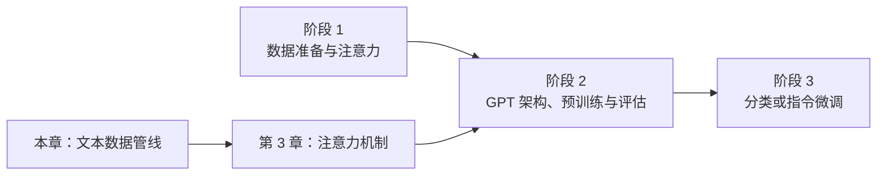
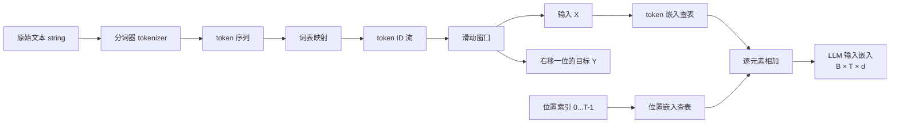
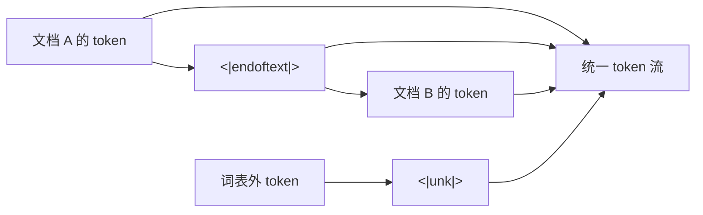
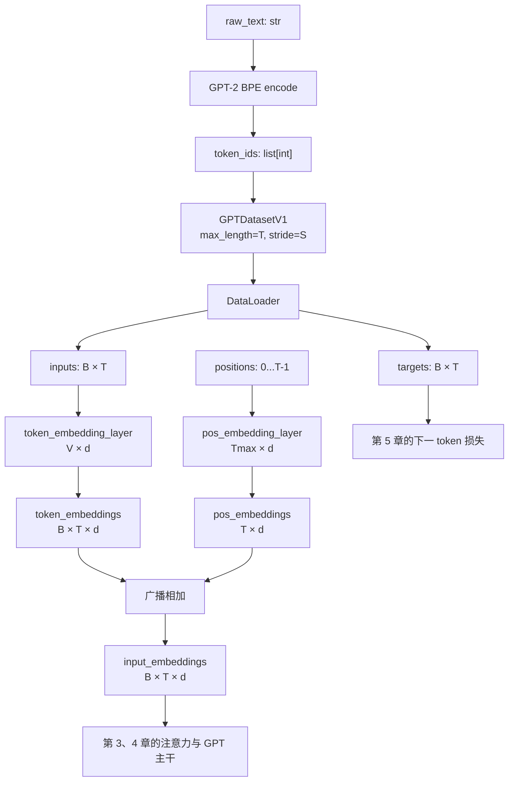
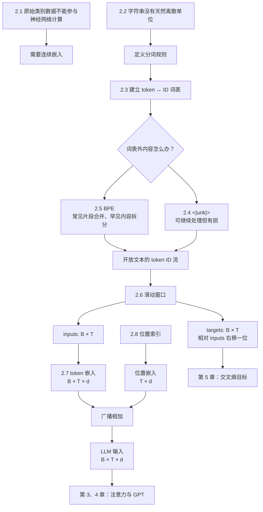

## 0. 本章定位、学习目标与数据主线

第 1 章说明了 GPT 类大语言模型通过“根据左侧上下文预测下一 token”进行预训练。但神经网络只能接收和输出数值张量，原始字符串既不能直接参与矩阵乘法，也不能对字符求梯度。因此，在实现注意力和 GPT 之前，必须先建立一条稳定的数据管线，把文本转成模型能够学习的输入与目标。

第 2 章位于全书“三阶段路线”的第一阶段、第一步：



本章要解决的不是一个单独的“分词问题”，而是一串前后依赖的问题：

1. 文本是离散符号，怎样把它变成神经网络能处理的连续向量？
2. 一段字符串应切成词、字符还是子词？粒度选择会带来什么代价？
3. 怎样用有限词表为 token 分配稳定的整数 ID，并处理训练时没见过的词？
4. 怎样从一条长 token 流中制造大量“输入—下一 token 目标”样本？
5. 怎样批量加载样本，并控制窗口重叠、内存和随机性？
6. token ID 为什么还不能直接送入模型？
7. token 嵌入没有顺序信息，怎样让模型区分同一 token 出现在不同位置？

全章最终形成以下流水线：



其中最重要的不变量是：若样本 $b$ 的窗口起点为 $s_b$，则

$$
X_{b,t}=z_{s_b+t},
\qquad
Y_{b,t}=z_{s_b+t+1},
\qquad 0\le t<T.
$$

因此，对窗口内前 $T-1$ 个位置还有

$$
Y_{b,t}=X_{b,t+1},
\qquad 0\le t<T-1,
$$

而 $Y_{b,T-1}=z_{s_b+T}$ 来自输入窗口之后紧邻的 token。也就是说，对批次中每个样本和位置，目标始终是原始 token 流中的下一 token。第 5 章计算交叉熵时，正是让模型在 $X_{b,t}$ 所在上下文上预测 $Y_{b,t}$。

### 0.1 本章张量形状账本

设：

- $B$：批大小（batch size）；
- $T$：上下文长度，也就是每个训练样本包含的 token 数；
- $V$：词表大小（vocabulary size）；
- $d$：嵌入维度（embedding dimension）。

整个数据流的形状如下：

| 数据 | 典型类型 | 形状 | 每个元素的意义 |
|---|---|---:|---|
| 原始文本 | Python `str` | 字符串长度不固定 | Unicode 字符 |
| token 序列 | `list[str]` | 文本相关 | 词、子词、标点或特殊 token |
| 单个 ID 序列 | `list[int]` | $T$ | 词表行号 |
| 一批输入 `inputs` | `torch.Tensor`，整数 | $B\times T$ | 每个位置的 token ID |
| token 嵌入 | 浮点张量 | $B\times T\times d$ | token 身份向量 |
| 位置嵌入 | 浮点张量 | $T\times d$ | 各位置向量 |
| 最终输入嵌入 | 浮点张量 | $B\times T\times d$ | token 与位置之和 |
| 模型输出 logits | 浮点张量 | $B\times T\times V$ | 各位置对下一 token 的未归一化分数 |

这个账本可以在调试时快速定位错误：如果 `inputs` 已经变成浮点数、目标没有与输入同形、位置嵌入最后一维不等于 $d$，或输出最后一维不等于 $V$，数据管线就没有满足后续模型的接口。

> **术语说明**：原书为了直观常说“逐词预测”和“词嵌入”，但实际 GPT-2 分词器处理的是 token。token 可能是完整词、子词片段、标点、空格模式或特殊标记。因此本笔记在算法与公式中使用“token 嵌入”，在介绍 Word2Vec 历史背景时保留“词嵌入”。

---

## 2.1 Understanding Word Embeddings（理解词嵌入）

### 2.1.1 为什么原始文本不能直接进入神经网络

神经网络的基本操作是数值计算，例如矩阵乘法、加法、非线性变换和求导。文本中的 `cat`、`Paris` 或逗号是类别符号，没有天然的数值坐标，也不存在合理的运算：

$$
{\texttt{cat}}+{\texttt{Paris}}
$$

没有数学意义。

即使先给每个 token 随意编号，也不能把 ID 当成连续数值特征。例如令

```text
cat -> 3
dog -> 4
airplane -> 100
```

数字只表示词表索引，不表示 `dog` 比 `cat` 大 1，也不表示 `airplane` 与 `cat` 的语义距离是 97。若直接把 ID 当标量输入，模型会被迫把任意编号顺序误认为几何关系。

解决办法是学习一个**嵌入（embedding）**映射：

$$
f:\{0,1,\ldots,V-1\}\rightarrow\mathbb R^d.
$$

每个离散 ID 被映射到一个 $d$ 维连续向量。实现上，用矩阵

$$
E\in\mathbb R^{V\times d}
$$

保存全部向量，token ID $i$ 的嵌入就是第 $i$ 行：

$$
e_i=E[i]\in\mathbb R^d.
$$

这样，离散符号就进入了一个可做矩阵运算、可计算梯度、可通过训练调整的连续空间。

### 2.1.2 “嵌入”是什么，又不是什么

嵌入的核心是：**把离散对象映射为连续向量空间中的点。** 对象可以是：

- token、词或子词；
- 句子、段落或整篇文档；
- 图片、音频、视频；
- 用户、商品或图节点。

不同数据类型需要不同的编码方式。文本嵌入器不能直接理解原始音频波形，图像嵌入器也不能凭空解析 token ID。所谓“都变成向量”只说明输出接口相似，不表示输入处理和训练目标相同。

嵌入也不是把对象无损压缩成一个人可以逐维解释的属性表。维度通常是分布式表示：一个语义属性可能由许多维共同表达，一维也可能同时参与多种关系。只有在训练目标迫使模型利用某些结构时，几何空间才会形成有用关系。

### 2.1.3 为什么相似词会在向量空间中靠近

Word2Vec 是早期经典词嵌入方法。它的基础直觉来自分布假设：**出现在相似上下文中的词，往往具有相似含义或语法功能。**

Word2Vec 的两类典型任务是：

- 给定中心词预测周围上下文（skip-gram）；
- 给定周围上下文预测中心词（CBOW）。

如果 `sparrow`、`eagle` 和 `robin` 经常与 `fly`、`wing`、`nest` 等上下文共同出现，训练为了复用预测规律，倾向于让这些词的向量形成相似几何结构。相似度常用余弦相似度衡量：

$$
\operatorname{cos}(u,v)
=\frac{u^{\mathsf T}v}{\lVert u\rVert_2\lVert v\rVert_2}.
$$

它比较向量方向而弱化长度影响：

- 接近 $1$：方向相近；
- 接近 $0$：近似正交；
- 接近 $-1$：方向相反。

但“空间接近”只反映训练数据与目标下的统计相似，不等于所有意义上都相同。反义词如 `hot` 与 `cold` 也常出现在相似句式中，因而可能靠得很近；语料偏见也会进入几何结构。

### 2.1.4 词嵌入、句子嵌入与上下文化表示

本章提到不同粒度的文本嵌入，必须区分：

| 类型 | 一个向量代表什么 | 典型用途 | 主要局限 |
|---|---|---|---|
| 静态词嵌入 | 一个词类型 | 词相似度、传统 NLP 特征 | 同一个词在所有语境中向量相同 |
| token 输入嵌入 | 一个词表 ID | GPT 的输入层 | 初始查表结果尚未结合当前上下文 |
| 上下文化 token 表示 | 当前句子中某个位置 | 注意力、生成、分类 | 依赖模型和上下文，计算更贵 |
| 句子/段落/文档嵌入 | 一整段文本 | 语义检索、聚类、RAG | 单向量可能压缩掉局部细节 |

例如 `bank` 在“river bank”和“bank account”中，静态查表得到同一输入向量；经过 Transformer 多层注意力后，两个位置的上下文化表示会因周围 token 不同而分离。

检索增强生成（RAG）常把查询和文档片段编码为句子或段落向量，以相似度检索相关片段，再把片段交给生成模型。本章只聚焦 GPT 输入端的 token 嵌入，RAG 的检索模型和索引不在本书范围内。

### 2.1.5 为什么本书不直接使用 Word2Vec

GPT 类 LLM 通常把 token 嵌入矩阵作为模型参数，与注意力层、前馈层等一起随机初始化并联合训练。与固定使用外部 Word2Vec 相比，这样做有三点好处：

1. **目标一致**：嵌入直接为下一 token 预测服务，而不是为另一个上下文任务服务。
2. **词表一致**：GPT 使用自己的 BPE token，许多 token 是子词片段，不一定存在于词级 Word2Vec 中。
3. **端到端适配**：来自最终损失的梯度可以持续调整嵌入，使其与上层网络协同。

设总损失为 $\mathcal L$，一次更新可抽象为

$$
E\leftarrow E-\eta\frac{\partial\mathcal L}{\partial E},
$$

其中 $\eta$ 是学习率。只有当前批次中被查到的行通常会直接收到嵌入梯度，但随着大量 token 出现在训练数据中，整个矩阵逐步形成适合语言建模的表示。

“随机初始化”并不表示最终向量随机。随机值只是训练起点；在第 5 章，反向传播会用下一 token 误差优化它们。

### 2.1.6 维度为何是能力与成本的权衡

嵌入维度 $d$ 越大，向量空间能承载的特征通常越丰富，但所有主干层的计算和参数也随之增加。本章给出两个具体尺度：

| 模型 | 参数规模 | 嵌入/隐藏维度 |
|---|---:|---:|
| 较小 GPT-2 变体 | 117M 或 125M | 768 |
| 最大 GPT-3 | 175B | 12,288 |

仅 token 嵌入表就有 $Vd$ 个参数。若 GPT-2 BPE 词表大小 $V=50{,}257$：

$$
50{,}257\times768=38{,}597{,}376
$$

个参数。若每个参数用 32 位浮点数，单是这张表约占：

$$
38{,}597{,}376\times4\ \mathrm{bytes}
\approx147.2\ \mathrm{MiB}.
$$

这还没有包含梯度、优化器状态和其他层。因此，维度不是越大越好；它必须与数据量、模型深度、显存、速度和目标能力共同选择。

二维词向量适合画散点图，却只是可视化示意。真实 LLM 的数百到上万维向量无法直接完整画在二维平面上；降维图只保留部分结构，不能当作原空间的全部证据。

---

## 2.2 Tokenizing Text（文本分词）

### 2.2.1 分词为什么是嵌入之前的必要步骤

嵌入层按整数 ID 查表，而词表中的一行必须对应一个明确的离散单位。分词器（tokenizer）负责定义这些单位，并在字符串与 token 序列之间建立确定规则：

$$
{\text{字符串}}
\xrightarrow{\text{tokenize}}
(t_1,t_2,\ldots,t_n).
$$

分词方案会同时决定：

- 词表需要多少行；
- 一段文本会占用多少 token；
- 生僻词能否表示；
- 空格、大小写和标点信息是否保留；
- 模型的上下文窗口实际能容纳多少内容；
- 训练和推理的计算成本。

因此，分词不是无关紧要的字符串预处理，而是模型输入协议的一部分。训练权重只对训练时那套 token-ID 映射有意义；换分词器却仍加载旧嵌入权重，会让 ID 语义错位。

### 2.2.2 本章语料：公共领域短篇小说 “The Verdict”

作者用 Edith Wharton 的短篇小说 “The Verdict” 做教学语料。它已进入公共领域，便于合法地展示完整数据处理流程。文件 `the-verdict.txt` 包含 **20,479 个字符**，开头为：

```text
I HAD always thought Jack Gisburn rather a cheap genius--though a good fellow enough--so it was no
```

下载和读取代码如下：

```python
from pathlib import Path
from urllib.request import urlretrieve

url = (
    "https://raw.githubusercontent.com/rasbt/"
    "LLMs-from-scratch/main/ch02/01_main-chapter-code/"
    "the-verdict.txt"
)
path = Path("the-verdict.txt")
if not path.exists():
    urlretrieve(url, path)

raw_text = path.read_text(encoding="utf-8")
print("Total number of characters:", len(raw_text))
print(raw_text[:99])
```

用一本短篇小说无法训练通用 LLM，但足以验证算法：文件较小、消费级硬件可运行、输出可以人工检查。真实预训练通常涉及数百万篇文章、数十万本书和许多 GB 乃至更大规模的数据；数据规模改变能力覆盖，不改变本章的数据接口。

### 2.2.3 第一步：只按空白切分

作者先故意从一个不完整方案开始，以暴露需求。对文本

```python
text = "Hello, world. This, is a test."
```

使用捕获组按空白切分：

```python
import re

result = re.split(r"(\s)", text)
print(result)
```

得到：

```text
['Hello,', ' ', 'world.', ' ', 'This,', ' ', 'is', ' ', 'a', ' ', 'test.']
```

正则中的括号是**捕获组**，所以分隔符本身也保留在结果中。如果写成 `re.split(r"\s", text)`，空白只负责切分，不会作为列表元素返回。

这个方案的问题是标点仍粘在词上：`Hello,` 与 `Hello` 会成为不同 token，`world.` 与 `world` 也无法共享表示。对生成模型而言，标点本身有语法和文体作用，应当成为可学习单位。

### 2.2.4 第二步：把标点也作为分隔符保留

把逗号和句号加入捕获组：

```python
result = re.split(r"([,.]|\s)", text)
print(result)
```

会得到词、标点、空字符串和空白的混合列表。出现空字符串是因为两个分隔边界之间可能没有普通文本。作者随后清理：

```python
result = [item for item in result if item.strip()]
print(result)
```

结果为：

```text
['Hello', ',', 'world', '.', 'This', ',', 'is', 'a', 'test', '.']
```

`item.strip()` 在条件位置返回清除首尾空白后的字符串；空字符串在布尔上下文中为假，因此空白和空项被删除。

### 2.2.5 第三步：覆盖更多标点与双连字符

小说中还会出现冒号、分号、问号、引号、括号、撇号和 `--`。扩展规则为：

```python
text = "Hello, world. Is this-- a test?"
tokens = re.split(r"([,.:;?_!\"()']|--|\s)", text)
tokens = [item.strip() for item in tokens if item.strip()]
print(tokens)
```

输出：

```text
['Hello', ',', 'world', '.', 'Is', 'this', '--', 'a', 'test', '?']
```

规则可拆成三部分：

- `[,.:;?_!\"()']`：字符类，匹配其中任意一个标点；
- `--`：把双连字符作为整体 token；
- `\s`：匹配一个空白字符；
- 外层 `(...)`：保留被匹配的分隔符。

把同一规则应用到整篇 “The Verdict”：

```python
preprocessed = re.split(r"([,.:;?_!\"()']|--|\s)", raw_text)
preprocessed = [item.strip() for item in preprocessed if item.strip()]

print(len(preprocessed))
print(preprocessed[:30])
```

得到 **4,690 个 token**，前 30 个为：

```text
['I', 'HAD', 'always', 'thought', 'Jack', 'Gisburn', 'rather', 'a',
 'cheap', 'genius', '--', 'though', 'a', 'good', 'fellow', 'enough',
 '--', 'so', 'it', 'was', 'no', 'great', 'surprise', 'to', 'me', 'to',
 'hear', 'that', ',', 'in']
```

### 2.2.6 为什么不统一转成小写

统一小写会缩小词表并增加表面共享，例如 `The` 和 `the` 合并；但也会永久删除信息：

- 专有名词与普通名词的区别；
- 句首结构；
- 缩写和强调方式；
- 模型生成正确大小写的能力。

LLM 追求通用生成，通常保留大小写，让模型自己从上下文学习何时使用。对于搜索索引或特定分类任务，小写化有时仍是合理工程选择；是否归一化取决于任务，而不是固定教条。

### 2.2.7 为什么本章先删除空白，后来又保留空白信息

教学正则分词器删除空白，是为了让中间输出短而易读，也减少这个小词表中的冗余项。但空白并非总是无意义：

- Python 的缩进改变程序结构；
- 换行区分段落、诗行和代码块；
- 单词前是否有空格会影响自然 detokenization；
- 多空格可能承载格式。

后续使用的 GPT-2 BPE 分词方案会通过字节与子词编码保留可重建的空白模式。因此，“删除空白”只属于本章手写分词器的教学简化，不是 GPT 的普遍做法。

### 2.2.8 这个正则分词器的适用范围与局限

它的价值在于把分词步骤拆开，让读者看见：标点是否分离、空白是否保留、大小写是否归一化都是设计决策。它不适合作为生产级通用分词器，因为：

- 规则只覆盖列出的标点；
- 撇号会把 `It's` 切成 `It`、`'`、`s`；
- URL、邮箱、emoji、Unicode 组合字符和多语言文本需要更多规则；
- 每个新词都需要词表项，词表会膨胀；
- 未登录词无法编码；
- `decode(encode(text))` 未必逐字符等于原文，因为空白已丢失。

这些局限自然引出 2.4 的未知词处理和 2.5 的 BPE：不是因为正则“写得不够长”，而是词级封闭词表本身难以同时满足有限词表、开放文本和可逆编码。

---

## 2.3 Converting Tokens into Token IDs（把 token 转成 token ID）

### 2.3.1 为什么 token 字符串还不能直接查嵌入

嵌入矩阵的行由整数索引访问，因此分词之后还需要词表（vocabulary）：

$$
\mathcal V=\{t_0,t_1,\ldots,t_{V-1}\}.
$$

词表建立双向映射：

$$
{\text{token}}\xleftrightarrow[\text{decode}]{\text{encode}}{\text{token ID}}.
$$

ID 只是稳定行号。训练、保存模型和推理都必须使用同一映射，否则同一个整数会查到不同 token 的嵌入。

### 2.3.2 从训练语料构建教学词表

作者对 `preprocessed` 去重并按字典序排序：

```python
all_words = sorted(set(preprocessed))
vocab_size = len(all_words)
print(vocab_size)
```

“The Verdict” 得到 **1,130 个唯一 token**。随后用 `enumerate` 分配从 0 开始的 ID：

```python
vocab = {token: integer for integer, token in enumerate(all_words)}
```

排序不是语言模型的数学要求，只是让结果确定且便于展示。只要训练与推理共享同一词表，ID 可以按频率、合并规则或其他稳定方式分配。真实 tokenizer 通常会把词表和分词规则一起保存，而不是每次从当前文本重新排序生成。

构建过程如下：


词表应只从训练数据或预先确定的 tokenizer 训练语料构建。若在严格机器学习评测中用测试集扩充词表，就让数据准备窥见了测试分布，形成信息泄漏。

### 2.3.3 `encode` 与 `decode` 的职责

一个 tokenizer 通常暴露两个基本接口：

- `encode(text)`：字符串 $\rightarrow$ token 序列 $\rightarrow$ ID 序列；
- `decode(ids)`：ID 序列 $\rightarrow$ token 序列 $\rightarrow$ 字符串。

下面是与原书 `SimpleTokenizerV1` 等价、格式稍作整理的可运行实现：

```python
import re


class SimpleTokenizerV1:
    def __init__(self, vocab):
        self.str_to_int = vocab
        self.int_to_str = {
            integer: token for token, integer in vocab.items()
        }

    def encode(self, text):
        tokens = re.split(r"([,.?_!\"()']|--|\s)", text)
        tokens = [item.strip() for item in tokens if item.strip()]
        return [self.str_to_int[token] for token in tokens]

    def decode(self, ids):
        text = " ".join(self.int_to_str[integer] for integer in ids)
        return re.sub(r"\s+([,.?!\"()'])", r"\1", text)
```

`decode` 先在所有 token 间加入空格，再删除指定标点前的多余空格。例如：

```text
['painted', ',', 'you', 'know', ',']
-> 'painted , you know ,'
-> 'painted, you know,'
```

这是启发式 detokenization，不是严格恢复原始字符。因为编码时已丢弃原来的空白数量和换行，解码器只能重建一个自然可读的规范化版本。

### 2.3.4 往返测试与可逆性的精确定义

理想 tokenizer 常希望满足：

$$
\operatorname{decode}(\operatorname{encode}(s))=s.
$$

但 `SimpleTokenizerV1` 只满足较弱条件：对词表内文本，编码后能恢复 token 顺序与大部分标点格式，不保证逐字符相等。例如多个空格、缩进和原始换行无法恢复。

更稳妥的测试分三层：

```python
def test_tokenizer_round_trip(tokenizer, text):
    ids = tokenizer.encode(text)
    decoded = tokenizer.decode(ids)

    assert all(isinstance(integer, int) for integer in ids)
    assert tokenizer.encode(decoded) == ids
    return ids, decoded
```

1. **ID 合法性**：每个结果都是词表范围内整数；
2. **ID 往返稳定**：`encode(decode(ids)) == ids`；
3. **字符级可逆**：`decode(encode(text)) == text`，只有保留全部文本信息的 tokenizer 才能要求。

### 2.3.5 原书编码案例及其含义

用 “The Verdict” 词表编码小说中的一段话，会得到：

```text
[1, 56, 2, 850, 988, 602, 533, 746, 5, 1126, 596, 5,
 1, 67, 7, 38, 851, 1108, 754, 793, 7]
```

解码后得到语义和 token 顺序一致的文本。数值本身没有可解释大小关系；它们只说明各 token 对应词表中的哪一行。

当编码训练语料中没有的句子：

```python
tokenizer = SimpleTokenizerV1(vocab)
tokenizer.encode("Hello, do you like tea?")
```

程序会抛出：

```text
KeyError: 'Hello'
```

局部原因是字典中没有 `Hello`；根本原因是这个词级 tokenizer 只有封闭词表，无法把未知字符串分解成更小的已知单位。扩大语料能减少未知词，却无法穷尽未来所有姓名、拼写、术语和组合。因此，下一节先用 `<|unk|>` 做兜底，再用 BPE 从结构上减少未登录词问题。

### 2.3.6 token、ID 与嵌入不要混淆

| 层次 | 示例 | 是否可学习 | 作用 |
|---|---|---:|---|
| 原始片段 | `"Gisburn"` | 否 | 人可读文本 |
| token | `Gisburn` | 分词规则通常预先固定 | 离散处理单位 |
| token ID | `38` | 映射固定 | 嵌入矩阵索引 |
| token 嵌入 | `[0.12,-0.83,...]` | 是 | 神经网络输入向量 |
| 上下文化表示 | 当前句中该位置的隐藏向量 | 是 | 融合上下文后的语义状态 |

“token ID 越接近，token 越相似”是错误的；ID 只是标签。语义关系是在训练后的嵌入和更深层隐藏表示中形成的。

---

## 2.4 Adding Special Context Tokens（添加特殊上下文 token）

### 2.4.1 两个不同问题：未知内容与文档边界

`SimpleTokenizerV1` 暴露了两个普通词表无法表达的问题：

1. **词表外 token（out-of-vocabulary，OOV）**：输入含有词表中不存在的 `Hello`，字典查找直接失败。
2. **结构边界**：为了高效训练，多篇互不相关的文档常被拼接成一条 token 流；若没有标记，模型可能误以为前一篇结尾与后一篇开头是连续上下文。

作者分别引入：

- `<|unk|>`：代表无法识别的 token；
- `<|endoftext|>`：标记一段文本结束，或分隔两篇独立文本。



这两个特殊 token 的职责不同：`<|unk|>` 是内容表示的兜底，会丢失原词信息；`<|endoftext|>` 是人为加入的结构信号，不代表未知内容。

### 2.4.2 扩充词表及 ID 分配

在原来的 1,130 个唯一 token 后追加两个特殊项：

```python
all_tokens = sorted(set(preprocessed))
all_tokens.extend(["<|endoftext|>", "<|unk|>"])
vocab = {
    token: integer for integer, token in enumerate(all_tokens)
}

print(len(vocab))
print(list(vocab.items())[-5:])
```

词表大小变为 **1,132**，最后几项为：

```text
('younger', 1127)
('your', 1128)
('yourself', 1129)
('<|endoftext|>', 1130)
('<|unk|>', 1131)
```

这里的 ID 来自本章特定构建顺序，不具有跨 tokenizer 的通用意义。GPT-2 的 `<|endoftext|>` ID 是 50256，而不是 1130，因为它使用完全不同的词表。

### 2.4.3 `SimpleTokenizerV2` 怎样处理未知词

第二版 tokenizer 在查词表前多做一步替换：

```python
import re


class SimpleTokenizerV2:
    def __init__(self, vocab):
        self.str_to_int = vocab
        self.int_to_str = {
            integer: token for token, integer in vocab.items()
        }

    def encode(self, text):
        tokens = re.split(r"([,.:;?_!\"()']|--|\s)", text)
        tokens = [item.strip() for item in tokens if item.strip()]
        tokens = [
            token if token in self.str_to_int else "<|unk|>"
            for token in tokens
        ]
        return [self.str_to_int[token] for token in tokens]

    def decode(self, ids):
        text = " ".join(self.int_to_str[integer] for integer in ids)
        return re.sub(r"\s+([,.:;?!\"()'])", r"\1", text)
```

对于拼接文本：

```python
text1 = "Hello, do you like tea?"
text2 = "In the sunlit terraces of the palace."
text = " <|endoftext|> ".join((text1, text2))

tokenizer = SimpleTokenizerV2(vocab)
ids = tokenizer.encode(text)
print(ids)
print(tokenizer.decode(ids))
```

原书输出为：

```text
[1131, 5, 355, 1126, 628, 975, 10, 1130,
 55, 988, 956, 984, 722, 988, 1131, 7]

<|unk|>, do you like tea? <|endoftext|> In the sunlit terraces of the <|unk|>.
```

`Hello` 和 `palace` 都变成同一个 ID 1131。异常消失了，但信息也丢失了：解码器只能知道“这里有一个未知词”，无法知道原来是哪一个词。

从信息论角度，映射

$$
g({\texttt{Hello}})=g({\texttt{palace}})={\texttt{<|unk|>}}
$$

是多对一的，不存在唯一逆映射 $g^{-1}$。所以 `<|unk|>` 解决的是“程序能继续处理”，不是“未知字符串被完整表示”。

### 2.4.4 文档边界为什么需要显式 token

假设把两个独立文档直接拼成：

```text
... the final verdict. Quantum mechanics begins with ...
```

下一 token 训练会把 `Quantum` 当成 `verdict.` 的真实后续，模型收到一个虚假的跨文档连续关系。加入边界：

```text
... the final verdict. <|endoftext|> Quantum mechanics begins with ...
```

模型可以学到两件事：

- `<|endoftext|>` 后可能开始全新主题；
- 生成时输出该 token 可以表示当前文本应该结束。

边界 token 不会从架构层自动阻断注意力；它只是序列中的一个可学习标记。若系统要求文档之间绝对不能互相注意，还需额外构造 attention mask。原书此处只用它提供语义边界。

### 2.4.5 `[BOS]`、`[EOS]`、`[PAD]` 与 `<|endoftext|>`

不同模型采用不同特殊 token 约定：

| token | 全称 | 主要作用 |
|---|---|---|
| `[BOS]` | beginning of sequence | 标记序列开始 |
| `[EOS]` | end of sequence | 标记序列结束或文档边界 |
| `[PAD]` | padding | 把不同长度样本补到相同张量长度 |
| `<|unk|>` | unknown | 代替无法编码的内容 |
| `<|endoftext|>` | end of text | GPT 风格的文本结束/边界标记 |

GPT-2 tokenizer 为简化只使用 `<|endoftext|>` 这一特殊 token，不需要 `[BOS]`、独立 `[EOS]`、`[PAD]` 或 `<|unk|>`：

- `<|endoftext|>` 可承担结束和文档分隔语义；
- 也可临时用于填充；
- BPE 从字节层兜底，不需要 `<|unk|>`。

填充值本身与填充掩码必须区分。若批次中短样本用某个 ID 补齐，训练或注意力通常要用 mask 忽略这些位置；否则模型会把大量填充当成正常语言信号。只要被正确遮蔽，具体选择哪个可用 token ID 做 padding 往往不再关键。

### 2.4.6 特殊 token 不是自然文本，也不能任意改动

特殊 token 是 tokenizer 和模型共同约定的控制符号。应注意：

1. 必须在词表中拥有单一 ID，不能被普通规则拆碎。
2. 训练时未使用过的新特殊 token，即使加入词表，也没有学到预期行为。
3. 加入词表会改变嵌入矩阵行数；加载旧权重时必须处理新增行。
4. 用户输入中的特殊 token 可能改变文档边界或模板结构，应用层要决定是否允许。
5. 名字相似不保证语义完全相同，不同模型的 BOS/EOS/PAD 约定应查各自 tokenizer 配置。

这一节用 `<|unk|>` 临时解决开放词表问题；下一节的 BPE 会保留未知字符串本身，因此是 GPT 更合适的方案。

---

## 2.5 Byte Pair Encoding（字节对编码）

### 2.5.1 词级与字符级方案为什么都不理想

分词粒度存在基本权衡：

| 粒度 | 优点 | 缺点 |
|---|---|---|
| 整词 | 序列短，常见词语义完整 | 词表巨大，姓名、拼写变化和新词导致 OOV |
| 单字符/字节 | 基本可覆盖任意文本，词表小 | 序列很长，常见词要重复组合，计算成本高 |
| 子词 | 常见模式作为整体，生僻词拆成小块 | 需要训练/固定 tokenizer，切分不总符合语言学直觉 |

BPE 的目标是在词级和字符/字节级之间自动寻找折中：高频片段合并成较长 token，以缩短常见文本；低频和未知内容保留为多个较小 token，以避免 `<|unk|>`。

### 2.5.2 BPE 词表怎样学出来

BPE 原本是数据压缩方法，用于分词时可以理解为迭代合并算法。简化流程如下：

```text
输入：训练语料、目标词表大小或合并次数

1. 把文本初始化为最小基础符号序列
2. 统计所有相邻符号对的频率
3. 选择频率最高的一对 (a, b)
4. 新建合并符号 ab，并在语料表示中替换该相邻对
5. 记录这条合并规则
6. 重复步骤 2-5，直到达到停止条件

输出：基础符号词表 + 按顺序排列的合并规则
```

用一个玩具语料说明：

```text
low low lower lowest
```

初始化后可视作：

```text
l o w | l o w | l o w e r | l o w e s t
```

相邻对 `(l,o)` 和 `(o,w)` 很频繁。假设先合并 `(l,o)`：

```text
lo w | lo w | lo w e r | lo w e s t
```

再合并 `(lo,w)`：

```text
low | low | low e r | low e s t
```

于是常见词干 `low` 成为一个 token，而后缀仍可组合。真实 GPT-2 tokenizer 从字节表示出发并使用预先学好的合并表，细节比这个玩具版本更复杂，但“从小单位出发，反复合并高频相邻对”的核心不变。

### 2.5.3 为什么合并频率有效

频繁相邻出现的单位合成一个 token，能减少语料编码长度。设合并前一对在语料中有 $c$ 次不重叠出现，每次把两个 token 变成一个，则 token 总数近似减少 $c$：

$$
N_{\mathrm{after}}\approx N_{\mathrm{before}}-c.
$$

优先合并高频对，通常能以有限词表新增项换取较大的序列缩短。较短序列意味着：

- 同一上下文窗口容纳更多原始文本；
- 注意力处理的位置数减少；
- 训练与推理 token 成本降低。

但频率只是压缩和复用的代理，不保证 token 与词素、词义或人类直觉完全一致。BPE 可能把一个语言学上的词切成奇怪片段，也可能因训练语料偏向某些语言而让另一些语言需要更多 token。

### 2.5.4 训练 tokenizer 与使用 tokenizer 是两件事

本书不会从零实现和训练 BPE，而是使用 OpenAI 的 `tiktoken` 库加载 GPT-2 已有编码：

```python
import tiktoken

tokenizer = tiktoken.get_encoding("gpt2")
```

这里没有根据 “The Verdict” 重新学习词表。`get_encoding("gpt2")` 载入已经固定的：

- 词表与 token ID；
- 字节到可处理符号的映射；
- BPE 合并规则；
- 特殊 token 约定。

**训练 tokenizer** 决定离散输入空间；**训练 LLM** 在固定 token ID 上优化嵌入和网络参数。二者都从数据学习，但参数、目标和发生阶段不同。

原书示例基于 `tiktoken 0.7.0`。本笔记于 2026-08-05 使用工作区 Python 3.12.10 与 `tiktoken 0.13.0` 复核；本章所列 GPT-2 ID、词表大小和往返结果保持一致。版本升级仍可能影响 API 或其他编码，复现实验应记录实际版本：

```python
from importlib.metadata import version

print("tiktoken version:", version("tiktoken"))
```

### 2.5.5 GPT-2 BPE 的编码与解码

原书示例：

```python
text = (
    "Hello, do you like tea? <|endoftext|> In the sunlit terraces"
    " of someunknownPlace."
)
ids = tokenizer.encode(
    text,
    allowed_special={"<|endoftext|>"},
)
print(ids)
print(tokenizer.decode(ids))
```

输出 ID 为：

```text
[15496, 11, 466, 345, 588, 8887, 30, 220, 50256, 554,
 262, 4252, 18250, 8812, 2114, 286, 617, 34680, 27271, 13]
```

并能还原原文。两个数字尤其重要：

- GPT-2 BPE 词表大小为 **50,257**；
- `<|endoftext|>` 的 ID 为 **50,256**，即最后一行。

`allowed_special` 是显式安全与语义选择。文本中出现 `<|endoftext|>` 字符串时，调用方必须决定把它识别为一个控制 token，还是拒绝/按普通文本处理；不能假设所有特殊字符串都自动获准。

### 2.5.6 未知词为什么不再需要 `<|unk|>`

对 `someunknownPlace`，当前环境实测 GPT-2 编码为：

```text
[11246, 34680, 27271]
```

逐 ID 解码为：

```text
'some' + 'unknown' + 'Place'
```

即使整个字符串从未作为一个词表项出现，内部已有片段仍能组合重建它。若片段也很罕见，tokenizer 会继续退回到更小单位，最终依赖字节级基础表示覆盖任意有效字节序列。

因此，BPE 的保证是：

$$
{\text{任意输入字符串}}
\longrightarrow
{\text{一串已有 token ID}}
\longrightarrow
{\text{可重建字符串}}.
$$

这不保证序列短，也不保证模型懂其含义。一个罕见名字可能被拆成很多 token；模型若几乎没见过这些片段组合，仍可能无法正确理解或生成它。

### 2.5.7 练习 2.1：逐 token 拆解未知词

对原书练习字符串 `Akwirw ier`，实测结果与附录 C 一致：

| ID | 单独解码结果 |
|---:|---|
| 33901 | `Ak` |
| 86 | `w` |
| 343 | `ir` |
| 86 | `w` |
| 220 | 一个空格 |
| 959 | `ier` |

完整验证代码：

```python
text = "Akwirw ier"
ids = tokenizer.encode(text)
pieces = [tokenizer.decode([token_id]) for token_id in ids]

print(ids)
print([repr(piece) for piece in pieces])
print(repr(tokenizer.decode(ids)))

assert ids == [33901, 86, 343, 86, 220, 959]
assert tokenizer.decode(ids) == text
```

输出：

```text
[33901, 86, 343, 86, 220, 959]
['Ak', 'w', 'ir', 'w', ' ', 'ier']
'Akwirw ier'
```

空格本身占一个 token（ID 220），说明 GPT-2 BPE 没有像教学正则分词器那样丢掉所有空白信息。

### 2.5.8 BPE 的优势、代价与适用边界

**优势：**

- 固定有限词表能够编码开放文本；
- 不用把不同未知词全部压成 `<|unk|>`；
- 高频词和片段较短，低频词仍能分解；
- 可逆地保留字节与空白信息；
- token ID 可直接接嵌入矩阵。

**代价：**

- tokenizer 本身需要词表和合并规则；
- token 边界不一定符合词或词素边界；
- 不同语言与文本类型的 token 效率可能差异很大；
- 一个字符不一定对应一个 token，一个 token 也不一定单独解码为自然可显示字符；
- 修改词表或合并规则会改变整个 ID 协议，已有模型权重不能直接复用。

**容易误解的结论：**

- “没有 OOV”只表示编码层不会因新字符串失败，不表示知识层没有未知概念。
- “子词可组合”不表示模型能从片段含义严格推导整个新词含义。
- “词表有 50,257 项”不表示有 50,257 个英文单词；其中含子词、字节模式、标点、空白模式和特殊 token。
- BPE 是分词算法，不是嵌入算法；它输出整数 ID，连续向量仍由后面的嵌入层产生。

至此，任意训练文本都可以稳定转成一条 token ID 流。下一步不是立刻送入模型，而是从这条长流中切出固定长度、目标右移一位的训练样本。

---

## 2.6 Data Sampling with a Sliding Window（用滑动窗口采样数据）

### 2.6.1 从长 token 流到监督样本

BPE 把整篇 “The Verdict” 编码成 **5,145 个 token ID**：

```python
import tiktoken

tokenizer = tiktoken.get_encoding("gpt2")
enc_text = tokenizer.encode(raw_text)
print(len(enc_text))
```

得到一条长序列：

$$
z_0,z_1,\ldots,z_{N-1},\qquad N=5145.
$$

模型不能一次处理无限长文本，而且训练需要大量等长样本。因此选择上下文长度 $T$ 和窗口起点 $s$，构造：

$$
X^{(s)}=[z_s,z_{s+1},\ldots,z_{s+T-1}],
$$

$$
Y^{(s)}=[z_{s+1},z_{s+2},\ldots,z_{s+T}].
$$

目标 `Y` 是同一片段相对 `X` **右移一位**。这一个长度为 $T$ 的样本实际上提供 $T$ 个监督目标：

| 输入位置可见的前缀 | 对应目标 |
|---|---|
| $z_s$ | $z_{s+1}$ |
| $z_s,z_{s+1}$ | $z_{s+2}$ |
| $\cdots$ | $\cdots$ |
| $z_s,\ldots,z_{s+T-1}$ | $z_{s+T}$ |

第 3 章的因果掩码会确保位置 $t$ 只利用自身和左侧 token；第 5 章则一次性比较模型在全部 $T$ 个位置上的预测与 `Y`。

### 2.6.2 原书长度为 4 的错位示例

作者为展示更有趣的片段，暂时跳过前 50 个 token：

```python
enc_sample = enc_text[50:]
context_size = 4

x = enc_sample[:context_size]
y = enc_sample[1:context_size + 1]
print("x:", x)
print("y:", y)
```

输出：

```text
x: [290, 4920, 2241, 287]
y: [4920, 2241, 287, 257]
```

逐步解码可见四个训练关系：

```text
 and                          ->  established
 and established              ->  himself
 and established himself      ->  in
 and established himself in   ->  a
```

这不是创建四个互不相关的标签。一个窗口的所有位置共享同一次模型前向传播，上三角因果 mask 决定各位置可见的前缀，右移目标则提供每个位置的正确下一 token。

### 2.6.3 `context_size`、`max_length` 与 context window

本章代码中的 `context_size` 和 `max_length` 都指单个样本包含多少输入 token。模型配置中的 context length/window 则表示架构支持的最大位置数。

通常必须满足：

$$
T_{\mathrm{sample}}\le T_{\mathrm{model}}.
$$

若原始文档长于模型窗口，要切片或截断；若样本比最大窗口短，可以直接以短序列处理，或在需要等长批次时填充并遮蔽。

本章用 $T=4$ 只为便于打印。原书指出，训练 LLM 时常见输入长度至少为 256；现代模型可能更长，但上下文增大也会显著提高注意力计算和内存成本。

### 2.6.4 滑动窗口与 `stride`

窗口起点依次为：

$$
s_k=kS,\qquad k=0,1,2,\ldots,
$$

其中 $S$ 是 `stride`。窗口长度为 $T$ 时，相邻输入窗口的重叠 token 数为：

$$
O=\max(0,T-S),
$$

当 $0<S\le T$ 时，重叠率为：

$$
r=\frac{T-S}{T}=1-\frac{S}{T}.
$$

| `stride` 条件 | 结果 | 主要取舍 |
|---|---|---|
| $S=1$ | 最大重叠 | 样本多、覆盖每个起点，但重复计算和相关性高 |
| $1<S<T$ | 部分重叠 | 在覆盖与成本之间折中 |
| $S=T$ | 输入窗口不重叠 | 计算高效，顺序覆盖所有输入 token |
| $S>T$ | 窗口间有空隙 | 会跳过部分上下文，通常不用于充分利用语料 |

要注意，即使 $S=T$ 时输入窗口不重叠，前一个样本的最后目标也会落在下一窗口的第一个 token 上。这正是连续 token 流的下一 token 关系，不表示输入样本重叠。

### 2.6.5 窗口数量公式及边界

`GPTDatasetV1` 使用：

```python
range(0, len(token_ids) - max_length, stride)
```

最后一个输入需要额外一个 token 作为目标，所以起点必须满足：

$$
s+T<N.
$$

对 $N>T$，样本数为：

$$
M=\left\lceil\frac{N-T}{S}\right\rceil
=\left\lfloor\frac{N-T-1}{S}\right\rfloor+1.
$$

以 $N=5145,T=4$ 为例：

$$
M_{S=1}=\left\lceil\frac{5145-4}{1}\right\rceil=5{,}141,
$$

$$
M_{S=4}=\left\lceil\frac{5145-4}{4}\right\rceil=1{,}286.
$$

本笔记已用原文、GPT-2 tokenizer 和书中实现复算这两个结果。若 $N\le T$，该实现产生 0 个样本，因为没有足够 token 同时构造长度 $T$ 的输入和下一 token 目标。

### 2.6.6 `GPTDatasetV1` 逐行解释

原书用 PyTorch `Dataset` 封装样本访问：

```python
import torch
from torch.utils.data import Dataset


class GPTDatasetV1(Dataset):
    def __init__(self, text, tokenizer, max_length, stride):
        self.input_ids = []
        self.target_ids = []

        token_ids = tokenizer.encode(text)
        for start in range(
            0,
            len(token_ids) - max_length,
            stride,
        ):
            input_chunk = token_ids[start:start + max_length]
            target_chunk = token_ids[
                start + 1:start + max_length + 1
            ]
            self.input_ids.append(torch.tensor(input_chunk))
            self.target_ids.append(torch.tensor(target_chunk))

    def __len__(self):
        return len(self.input_ids)

    def __getitem__(self, index):
        return self.input_ids[index], self.target_ids[index]
```

各接口的责任：

- `__init__`：一次分词并预先切出所有窗口；
- `__len__`：告诉 `DataLoader` 有多少个样本；
- `__getitem__`：按索引返回一对形状均为 `[T]` 的整数张量。

预先保存全部窗口让教学代码简单，但当 `stride` 很小、语料巨大时会复制大量重叠 token，占用内存。生产实现可能只保存一条 token 流，在 `__getitem__` 中按起点即时切片，或使用内存映射、分片和流式数据集。接口不变，存储策略可以改变。

### 2.6.7 `DataLoader` 怎样把样本组成批次

原书封装函数：

```python
import tiktoken
from torch.utils.data import DataLoader


def create_dataloader_v1(
    text,
    batch_size=4,
    max_length=256,
    stride=128,
    shuffle=True,
    drop_last=True,
    num_workers=0,
):
    tokenizer = tiktoken.get_encoding("gpt2")
    dataset = GPTDatasetV1(
        text,
        tokenizer,
        max_length,
        stride,
    )
    return DataLoader(
        dataset,
        batch_size=batch_size,
        shuffle=shuffle,
        drop_last=drop_last,
        num_workers=num_workers,
    )
```

`DataLoader` 默认把 $B$ 个 `[T]` 样本堆叠为两个 `[B,T]` 张量：

$$
X,Y\in\mathbb Z^{B\times T}.
$$

参数含义：

| 参数 | 作用 | 选择依据 |
|---|---|---|
| `batch_size` | 每次更新包含多少窗口 | 大批次吞吐高、梯度较稳定，但占更多显存 |
| `shuffle` | 每轮是否打乱样本顺序 | 训练常开启；调试和顺序复现时关闭 |
| `drop_last` | 丢弃不足 $B$ 的最后一批 | 保持批形状和更新规模稳定；也会舍弃少量样本 |
| `num_workers` | 并行取数据的子进程数 | 取决于平台、I/O 与预处理成本；教学用 0 最简单 |

原书说 `drop_last=True` 可避免最后小批次造成损失尖峰。更精确地说，它让每次优化的样本数固定，从而减少批统计与梯度方差变化；若损失按 token 正确取平均，小批次不必然产生尖峰。验证/测试通常设为 `False`，避免漏评样本。

### 2.6.8 第一、第二个滑动窗口

设置 `batch_size=1,max_length=4,stride=1,shuffle=False`，前两批为：

```text
X0 = [[  40,  367, 2885, 1464]]
Y0 = [[ 367, 2885, 1464, 1807]]

X1 = [[ 367, 2885, 1464, 1807]]
Y1 = [[2885, 1464, 1807, 3619]]
```

有两种不同的“错位”：

1. 同一样本内，`Y0` 相对 `X0` 右移 1，用来定义预测目标。
2. 相邻样本间，`X1` 相对 `X0` 移动 `stride=1`，用来定义新的上下文窗口。

把这两者混淆，常导致目标偏移两次或相邻样本起点错误。

### 2.6.9 批大小、步幅与过拟合之间的关系

原书用 `batch_size=8,max_length=4,stride=4` 取得形状 `[8,4]` 的输入和目标。`stride=4` 使相邻输入窗口不重叠，并顺序利用 token 流。

减小 `stride` 会产生更多高度相似样本：

- **收益**：每个 token 能在更多左侧上下文位置中出现，数据利用更密集；
- **成本**：总训练 token 数和时间增加，相邻样本相关性高，小语料上更易重复记忆。

“重叠必然导致过拟合”过于绝对。是否过拟合还取决于总语料、训练轮数、模型容量、正则化和采样方式。`stride` 是数据覆盖与计算预算的超参数，不能孤立判断。

批大小也有权衡：小批次显存少、更新噪声大；大批次提高硬件利用率并平滑梯度，但需要更多内存，学习率等训练设置也可能随之调整。本章只构造数据，不在这里寻找全局最优批大小。

### 2.6.10 练习 2.2：不同窗口与步幅

**配置一：`max_length=2,stride=2`。** 输入窗口不重叠，第一批四个输入为：

```text
[[  40,  367],
 [2885, 1464],
 [1807, 3619],
 [ 402,  271]]
```

样本数为：

$$
\left\lceil\frac{5145-2}{2}\right\rceil=2{,}572.
$$

**配置二：`max_length=8,stride=2`。** 每个相邻窗口重叠 $8-2=6$ 个 token，重叠率为 $75\%$。第一批为：

```text
[[   40,  367, 2885, 1464, 1807, 3619,  402,  271],
 [ 2885, 1464, 1807, 3619,  402,  271,10899, 2138],
 [ 1807, 3619,  402,  271,10899, 2138,  257, 7026],
 [  402,  271,10899, 2138,  257, 7026,15632,  438]]
```

样本数为：

$$
\left\lceil\frac{5145-8}{2}\right\rceil=2{,}569.
$$

该练习的重点不是记住 ID，而是从输出同时读出：行宽由 `max_length` 决定，行与行的起点差由 `stride` 决定，目标始终在每一行内部右移一位。

---

## 2.7 Creating Token Embeddings（创建 token 嵌入）

### 2.7.1 为什么 token ID 之后还需要嵌入

token ID 是类别索引，不能直接表达语义距离，也不适合让梯度对整数编号求导。嵌入层将每个 ID 映射为可训练浮点向量：

$$
i\longmapsto E[i,:].
$$

其中：

$$
E\in\mathbb R^{V\times d}.
$$

- 行数 $V$ 必须覆盖所有合法 token ID；
- 列数 $d$ 是每个 token 的表示维度；
- `E` 是模型参数，`requires_grad=True`；
- 相同 ID 每次查到同一行，直到训练更新该行。

### 2.7.2 原书的 6×3 玩具嵌入矩阵

输入 ID 为：

```python
import torch

input_ids = torch.tensor([2, 3, 5, 1])
vocab_size = 6
output_dim = 3

torch.manual_seed(123)
embedding_layer = torch.nn.Embedding(vocab_size, output_dim)
print(embedding_layer.weight)
```

在本章对应的 PyTorch 随机初始化下，矩阵为：

```text
[[ 0.3374, -0.1778, -0.1690],
 [ 0.9178,  1.5810,  1.3010],
 [ 1.2753, -0.2010, -0.1606],
 [-0.4015,  0.9666, -1.1481],
 [-1.1589,  0.3255, -0.6315],
 [-2.8400, -0.7849, -1.4096]]
```

ID 3 查到索引为 3 的第四行：

```text
[-0.4015, 0.9666, -1.1481]
```

将 `[2,3,5,1]` 一次输入，按该顺序取出第 3、4、6、2 行，得到形状 $4\times3$ 的矩阵：

```text
[[ 1.2753, -0.2010, -0.1606],
 [-0.4015,  0.9666, -1.1481],
 [-2.8400, -0.7849, -1.4096],
 [ 0.9178,  1.5810,  1.3010]]
```

Python 从 0 计数，所以 token ID 5 对应第六行，而不是人类口语中的“第五行”。

### 2.7.3 嵌入查表与 one-hot 矩阵乘法等价

令 token ID $i$ 的 one-hot 行向量为 $o_i\in\{0,1\}^{V}$，只有第 $i$ 个元素为 1。则：

$$
o_iE=E[i,:].
$$

例如 $V=6,i=3$：

$$
o_3=[0,0,0,1,0,0].
$$

它乘 $E$ 时，只有第四行系数为 1，其余行为 0，结果恰好是 $E[3,:]$。

对一批 ID，把每个 ID 展开成 one-hot 会生成巨大稀疏张量。例如 $B\times T\times V$，绝大多数元素为 0。`nn.Embedding` 直接按索引取行，在数学结果相同的情况下节省内存和无效乘法。

### 2.7.4 批输入的形状怎样变化

若 ID 张量：

$$
X\in\mathbb Z^{B\times T},
$$

嵌入层会在原有每个 ID 后追加一个长度为 $d$ 的维度：

$$
\operatorname{Embedding}(X)
\in\mathbb R^{B\times T\times d}.
$$

它不把批次或序列压平，也不对 token 求平均。每个位置仍对应一个独立向量，后续注意力才能比较位置之间的关系。

### 2.7.5 随机种子、随机初始化与可复现性

`torch.manual_seed(123)` 固定当前 PyTorch 随机数流，使相同软件与执行条件下更容易复现示例矩阵。它不赋予 123 特殊学习意义，也不保证跨所有 PyTorch 版本、硬件后端和并行算法逐位相同。

随机初始化必须打破不同 token 行之间的完全对称性；真正的语义来自后续训练，而非初始数值。若某个 token 从未出现在训练数据中，它的嵌入行就得不到相应语言建模信号。

### 2.7.6 梯度如何更新被使用的嵌入行

一次批次中若 ID $i$ 出现，损失通过后续层反向传播到 $E[i,:]$。抽象地：

$$
E[i,:]\leftarrow E[i,:]
-\eta\frac{\partial\mathcal L}{\partial E[i,:]}.
$$

同一个 ID 在批次中出现多次时，各位置贡献会按自动微分规则累积到同一行梯度。未被查到的行通常没有本批次直接梯度。这解释了为什么高频 token 更新机会多，也说明低频 token 表示更难学稳。

嵌入层只是模型第一层。它给 token 一个与上下文无关的基础向量；第 3 章注意力会把不同位置的信息混合，产生上下文化表示。

---

## 2.8 Encoding Word Positions（编码 token 位置）

### 2.8.1 为什么 token 嵌入不能表达顺序

查表函数只依赖 token ID：

$$
e_i=E[x_i].
$$

若 token ID 5 同时出现在第 1 和第 4 个位置，两处初始 token 嵌入完全相同。更根本地，不带位置信息的自注意力对输入排列具有等变性：若对 token 行施加同一个置换 $P$，输出也只会按 $P$ 重新排列，而无法知道“这是第一个位置”。

可以从注意力计算看出：

$$
Q=XW_Q,\qquad K=XW_K,\qquad V=XW_V.
$$

若 $X'=PX$，则：

$$
Q'=PQ,\quad K'=PK,\quad V'=PV,
$$

$$
Q'K'^{\mathsf T}=P(QK^{\mathsf T})P^{\mathsf T}.
$$

注意力只随行置换，没有额外坐标指出原始顺序。因果 mask 能区分“左侧可见集合”，但模型仍需要更细的位置信号来表示距离和顺序。因此要在进入主干网络前注入位置。

### 2.8.2 绝对位置嵌入

绝对位置方案为每个位置 $p\in\{0,\ldots,T_{\max}-1\}$ 准备向量：

$$
p_p=P[p,:],\qquad
P\in\mathbb R^{T_{\max}\times d}.
$$

最终输入位置 $p$ 的向量为：

$$
h_p^{(0)}=E[x_p,:]+P[p,:].
$$

两项最后一维都必须为 $d$，才能逐元素相加。相加而非拼接的好处是保持主干隐藏维度不变；模型可在后续线性变换中共同使用 token 身份和位置分量。

GPT 模型采用训练中优化的绝对位置嵌入。它与原始 Transformer 的固定正弦/余弦位置编码不同：后者按公式预先计算，不作为普通可训练查找表；二者都注入绝对位置，但参数化方式不同。

### 2.8.3 相对位置表示

相对位置方案重点表示两个位置之间的距离：

$$
\Delta_{ij}=j-i,
$$

而不是单独记住“位置 37”的向量。它可以把距离偏置加入注意力分数，或通过其他方式影响 query/key。其潜在优势是相同相对模式能在不同绝对位置复用，对未见过的序列长度和位置平移可能有更好泛化。

这不意味着相对位置必然优于绝对位置。实际选择取决于架构、训练长度、推理长度、实现复杂度和任务。原书为了复现 GPT 路线，选择可训练绝对位置嵌入。

### 2.8.4 构造真实尺寸的 token 嵌入层

GPT-2 tokenizer 词表大小为 50,257，本章实验选择 $d=256$：

```python
import torch

vocab_size = 50257
output_dim = 256
token_embedding_layer = torch.nn.Embedding(
    vocab_size,
    output_dim,
)
```

若数据批次为 8 个样本、每个 4 个 token：

```text
inputs.shape = [8, 4]
```

查表后：

```python
token_embeddings = token_embedding_layer(inputs)
print(token_embeddings.shape)
```

得到：

```text
[8, 4, 256]
```

三个轴依次是批次、位置和特征。不能把 `[8,4]` 误读为“8 个 token、每个 4 维”；它是 8 条序列，每条 4 个 ID。

### 2.8.5 构造位置嵌入层

模型支持的上下文长度暂设为 4：

```python
context_length = 4
pos_embedding_layer = torch.nn.Embedding(
    context_length,
    output_dim,
)
positions = torch.arange(context_length)
pos_embeddings = pos_embedding_layer(positions)
print(pos_embeddings.shape)
```

`torch.arange(4)` 产生：

```text
[0, 1, 2, 3]
```

查表得到：

```text
pos_embeddings.shape = [4, 256]
```

位置嵌入层有 $T_{\max}d$ 个参数。这里是 $4\times256=1024$；真实模型的最大上下文越长，绝对位置表也越大。

若输入长度超过 `context_length`，不存在合法的位置行，不能直接查表。本章做法要求截断或切窗；仅扩展位置表长度会增加随机新行，旧模型并未自动学会如何使用它们。

### 2.8.6 广播相加为何成立

token 嵌入形状：

$$
(B,T,d)=(8,4,256),
$$

位置嵌入形状：

$$
(T,d)=(4,256).
$$

执行：

```python
input_embeddings = token_embeddings + pos_embeddings
```

PyTorch 从右向左比较维度：

```text
token_embeddings: 8 × 4 × 256
pos_embeddings:        4 × 256
                     ---------
result:           8 × 4 × 256
```

缺失的批次维被视为 1，再把同一组位置向量广播给 8 个样本。数学上：

$$
H^{(0)}_{b,t,:}=E[X_{b,t},:]+P[t,:].
$$

每个批次在位置 $t$ 使用相同位置向量，但 token 向量取决于该样本该位置的 ID。

### 2.8.7 为什么位置向量可以直接相加

相加后的单个向量没有预留“前一半是 token、后一半是位置”的硬边界。模型通过训练学习如何从叠加信号中提取有用组合。设下一层线性变换为 $W$：

$$
(e_x+p_t)W=e_xW+p_tW.
$$

线性层仍可分别响应 token 与位置贡献，后续非线性和注意力再建模二者交互。

若采用拼接：

$$
[e_x;p_t]\in\mathbb R^{2d},
$$

主干维度和参数量都会改变。相加保持固定 $d$，是简洁且有效的设计，但前提是两种向量维度完全相同。

### 2.8.8 三种容易混淆的表示

| 表示 | 公式 | 是否依赖 token ID | 是否依赖位置 | 是否已融合上下文 |
|---|---|---:|---:|---:|
| token 嵌入 | $E[x_t]$ | 是 | 否 | 否 |
| 位置嵌入 | $P[t]$ | 否 | 是 | 否 |
| 输入嵌入 | $E[x_t]+P[t]$ | 是 | 是 | 否 |
| Transformer 隐藏状态 | $h_t^{(\ell)}$ | 是 | 是 | 是 |

输入嵌入拥有“我是谁、我在哪里”，但还不知道“我与周围 token 有什么关系”。第 3 章的自注意力才开始根据上下文动态混合这些输入。

### 2.8.9 端到端代码与形状断言

下面把本章末尾的数据路径连接起来：

```python
import torch

max_length = 4
dataloader = create_dataloader_v1(
    raw_text,
    batch_size=8,
    max_length=max_length,
    stride=max_length,
    shuffle=False,
)
inputs, targets = next(iter(dataloader))

token_embedding_layer = torch.nn.Embedding(50257, 256)
pos_embedding_layer = torch.nn.Embedding(max_length, 256)

token_embeddings = token_embedding_layer(inputs)
pos_embeddings = pos_embedding_layer(torch.arange(max_length))
input_embeddings = token_embeddings + pos_embeddings

assert inputs.shape == targets.shape == (8, 4)
assert token_embeddings.shape == (8, 4, 256)
assert pos_embeddings.shape == (4, 256)
assert input_embeddings.shape == (8, 4, 256)
assert torch.equal(inputs[:, 1:], targets[:, :-1])
```

最后一个断言验证每行内部的目标错位关系：输入从第二个位置起，应等于目标去掉最后一个位置。它不能验证跨窗口 `stride`，后者需要比较相邻样本起点。

### 2.8.10 本章最终数据接口



至此，本章完成了 LLM 的输入侧接口：主干网络接收浮点 `input_embeddings`，训练损失接收整数 `targets`。两者来自同一 token 流，却承担完全不同职责。

---

## 3. 全章知识结构

### 3.1 一张图串起八节内容



### 3.2 四层协议

本章可以看成四层逐步收窄的协议：

1. **符号协议**：tokenizer 决定字符串如何切分、空白与特殊 token 如何解释。
2. **索引协议**：词表决定每个 token 对应哪个整数 ID。
3. **样本协议**：窗口长度和 stride 决定哪些上下文进入同一样本，右移规则决定标签。
4. **向量协议**：token/位置嵌入决定整数 ID 如何变成固定维度浮点张量。

这四层必须与模型权重匹配。随意替换其中一层，后果会向下游传播：

```text
换 tokenizer
-> token 边界变化
-> ID 序列变化
-> 嵌入查到不同的行
-> 位置数量和计算成本变化
-> 旧模型行为失效
```

### 3.3 四组核心权衡

| 决策 | 一端 | 另一端 | 本章选择 |
|---|---|---|---|
| 分词粒度 | 大词表、短序列 | 小词表、长序列 | BPE 子词折中 |
| 未知内容 | `<|unk|>` 简单但有损 | 字节/子词拆分可逆但可能很长 | GPT-2 BPE |
| 滑动步幅 | 小 stride 覆盖密、重复多 | 大 stride 计算少、上下文覆盖稀 | 作为超参数按预算选择 |
| 位置方案 | 绝对位置直接、受训练长度限制 | 相对位置利于距离复用、实现不同 | GPT 式可训练绝对嵌入 |

---

## 4. 核心公式与算法速查

### 4.1 离散 ID 到连续向量

$$
E\in\mathbb R^{V\times d},
\qquad
e_i=E[i,:].
$$

**含义**：词表大小决定嵌入表行数，模型维度决定列数；ID 是行索引，向量值才是可学习参数。

### 4.2 余弦相似度

$$
\operatorname{cos}(u,v)
=\frac{u^{\mathsf T}v}
{\lVert u\rVert_2\lVert v\rVert_2}.
$$

**含义**：比较向量方向，用于观察训练后表示的几何相似；统计相似不自动等于同义或事实关系。

### 4.3 滑动窗口输入与目标

$$
X^{(s)}=[z_s,\ldots,z_{s+T-1}],
$$

$$
Y^{(s)}=[z_{s+1},\ldots,z_{s+T}].
$$

**含义**：同一原始 token 流切两次，目标起点比输入晚一个位置。每个长度 $T$ 的窗口产生 $T$ 个下一 token 标签。

### 4.4 窗口起点、重叠与数量

$$
s_k=kS,
\qquad
O=\max(0,T-S).
$$

当 $N>T$ 时：

$$
M=\left\lceil\frac{N-T}{S}\right\rceil.
$$

**含义**：$T$ 控制单样本上下文，$S$ 控制相邻窗口起点距离。减小 $S$ 增加样本数与重叠计算，不改变每行内部 `Y` 右移一位的规则。

### 4.5 one-hot 与嵌入查表等价

$$
o_iE=E[i,:].
$$

**含义**：one-hot 乘嵌入矩阵只会选出一行；`nn.Embedding` 直接索引，省去巨大稀疏张量和无效乘法。

### 4.6 token 与位置嵌入相加

$$
H^{(0)}_{b,t,:}=E[X_{b,t},:]+P[t,:].
$$

形状为：

$$
(B,T,d)+(T,d)\xrightarrow{\text{broadcast}}(B,T,d).
$$

**含义**：token 表示“是什么”，位置表示“在哪里”；同一位置表广播到每个批次，最终维度保持 $d$。

### 4.7 BPE 核心算法

```text
初始化为可覆盖输入的最小符号
while 未达到目标词表大小或停止条件:
    统计相邻 token 对频率
    选择最高频 token 对
    将该对合并成新 token
    记录合并顺序
```

**有效原因**：有限新增词表项优先替换大量高频相邻对，压缩常见文本；基础符号仍为罕见文本提供兜底。

---

## 5. 易混概念与常见误区

| 常见说法 | 准确辨析 |
|---|---|
| 模型直接读取单词 | 模型读取 tokenizer 产生的 token ID；token 可能是词、子词、标点或空白模式。 |
| token ID 是一个数值特征 | ID 只是类别行号，大小和差值没有语义距离。 |
| token 与词是一回事 | 一个词可能对应多个 token，一个 token 也可能只是一段词或特殊符号。 |
| 字符数、词数和 token 数可互换 | 三者由不同切分规则定义；“The Verdict” 有 20,479 字符、教学规则得到 4,690 token、GPT-2 BPE 得到 5,145 token。 |
| 分词只是清理文本 | 分词决定词表、序列长度、上下文容量、计算成本和模型权重的输入协议。 |
| 训练时可以换一个更好的 tokenizer | 旧嵌入矩阵按旧 ID 学习；直接换 tokenizer 会让 ID 含义与权重错位。 |
| 全部小写总能减少问题 | 它减小词表，却丢失专名、句首和大小写生成信息，是否采用取决于任务。 |
| 空白没有语义，可以总是删除 | 代码缩进、换行和格式依赖空白；本章删除空白只是教学简化。 |
| `decode(encode(text))` 必须逐字符等于原文 | 只有保留全部信息的 tokenizer 才可要求；教学 tokenizer 丢掉空白，只能重建规范化文本。 |
| 词表越大越好 | 大词表缩短序列，却增加嵌入参数、数据稀疏与内存；需要与序列长度权衡。 |
| `<|unk|>` 解决了未知词 | 它避免报错，却把所有未知内容压成同一符号，无法重建原文。 |
| `<|endoftext|>` 会自动阻断跨文档注意力 | 它是可学习边界标记；绝对隔离仍需 attention mask。 |
| `[EOS]`、`[PAD]` 与 `<|endoftext|>` 在所有模型中相同 | 语义与 ID 由具体 tokenizer 约定；GPT-2 可复用 `<|endoftext|>`，其他模型可能分开。 |
| BPE 训练与 LLM 预训练是一件事 | BPE 学离散词表和合并规则；LLM 在固定 ID 协议上学习嵌入与网络权重。 |
| BPE 永远按完整单词切分 | 它按频率合并，token 边界不保证符合语言学词或词素。 |
| BPE 能编码新词，所以模型理解新词 | 编码可用只保证有 ID 序列；理解还依赖模型见过的模式和上下文。 |
| GPT-2 词表的 50,257 项都是英文词 | 其中还有子词、字节模式、标点、空白模式和特殊 token。 |
| `context_size=4` 产生一个标签 | 长度 4 的因果训练窗口可为 4 个位置分别提供下一 token 标签。 |
| `stride` 决定 `Y` 右移几位 | `Y` 永远相对 `X` 右移 1；`stride` 决定相邻样本窗口移动几位。 |
| `stride=max_length` 会跳过词 | 输入窗口首尾相接；目标跨到下一个 token，连续语料仍被顺序利用。 |
| 重叠窗口一定错误或一定过拟合 | 重叠提高覆盖也增加相关性和计算；是否过拟合取决于完整训练设置。 |
| `drop_last=True` 总是必须 | 训练时可稳定批大小；评估时通常关闭以免漏掉样本。 |
| 大批次总是更好 | 大批次吞吐和梯度稳定性较好，但占显存并可能需要调整优化设置。 |
| `nn.Embedding` 会自动产生语义 | 初始值随机，只有经过训练目标优化后才形成有用几何结构。 |
| 嵌入层把 ID 当连续数值 | 它按 ID 精确查行；ID 3 与 4 不因相邻而天然相似。 |
| token 嵌入已经包含当前句子语义 | 查表向量不依赖上下文；注意力之后才形成上下文化表示。 |
| 因果 mask 已经提供全部顺序信息 | mask 提供可见方向，位置嵌入进一步提供具体位置/距离线索。 |
| 绝对位置嵌入与正弦位置编码相同 | 都表示绝对位置，但 GPT 使用可训练查找表，原始 Transformer 使用固定公式。 |
| 位置嵌入与 token 嵌入拼接 | 本章 GPT 路线逐元素相加，形状仍为 $B\times T\times d$。 |
| 把位置表扩长就能可靠扩展上下文 | 新位置未经训练，注意力与整体模型也未必能泛化到更长序列。 |

---

## 6. 作者分析与解决问题的一般思路

### 6.1 从下游接口反推上游表示

作者不是先讨论所有 tokenizer 理论，再寻找用途，而是从 LLM 接口反推：主干需要 $B\times T\times d$ 浮点张量，损失需要 $B\times T$ 整数目标。于是逐层问：

```text
怎样得到向量？
<- 先要嵌入查表
<- 先要稳定 token ID
<- 先要词表和分词器
<- 先要从原始文本定义离散单位
```

这种逆向设计让每一步都有明确消费者，避免孤立学习 API。

### 6.2 先做最简单可解释版本，再暴露失败

作者没有一开始就把 `tiktoken` 当黑箱，而是依次构造：

1. 只按空白切分；
2. 分离标点；
3. 删除空白并保留大小写；
4. 建立词表和 `SimpleTokenizerV1`；
5. 用 `Hello` 触发 `KeyError`；
6. 用 `<|unk|>` 构造 `V2`；
7. 最后切换到 BPE。

每次失败都形成下一设计的需求：

$$
{\text{可运行原型}}
\rightarrow
{\text{具体反例}}
\rightarrow
{\text{局部改进}}
\rightarrow
{\text{识别结构性局限}}.
$$

这比直接背诵“GPT 使用 BPE”更能说明为什么选择 BPE。

### 6.3 用往返和不变量验证数据管线

数据处理缺少直观损失曲线，最适合用局部不变量测试：

- tokenizer：`decode(encode(text))` 是否满足预期保真程度；
- 词表：正向和反向映射是否一一对应；
- BPE：未知字符串是否无需 `<|unk|>` 且能往返；
- 窗口：`inputs[:,1:] == targets[:,:-1]`；
- 嵌入：输出形状是否等于输入形状追加 $d$；
- 位置相加：结果是否保持 $B\times T\times d$。

这些检查比等到模型训练失败后再排查便宜得多。

### 6.4 把“数据量”拆成多个可控尺度

本章至少有五种不同规模：

- 原始字符数；
- tokenizer 产生的 token 数 $N$；
- 词表大小 $V$；
- 上下文长度 $T$；
- 窗口步幅 $S$ 与批大小 $B$。

它们不能混成一个“数据大”概念。$V$ 影响嵌入参数，$N$ 影响训练总 token，$T$ 影响单样本上下文与注意力成本，$S$ 影响重复采样，$B$ 影响每次优化和显存。调优前必须先确认自己改变的是哪个尺度。

### 6.5 用形状推理连接代码与数学

作者反复打印张量形状，因为形状就是模块契约：

```text
[B,T] --token embedding--> [B,T,d]
[T]   --position embedding--> [T,d]
[B,T,d] + [T,d] --broadcast--> [B,T,d]
```

在深度学习实现中，许多错误不是公式思想错误，而是轴的含义错位。先给每个轴命名，再写广播与矩阵运算，能显著减少“代码能运行但语义错”的问题。

### 6.6 区分教学实现与生产实现

本章有意采用单篇小说、正则分词、内存列表和小窗口，让每一步都可打印。这些选择适合学习机制，却不代表大型训练的最佳工程方案。

一般化时应保留**接口和不变量**，替换**规模相关实现**：

| 教学实现 | 大规模替代方向 | 保持不变的契约 |
|---|---|---|
| 单个文本文件 | 分片、流式或对象存储 | 产生同一 tokenizer 的 ID 流 |
| 手写正则 tokenizer | 固定的高效 BPE/SentencePiece 等 | 字符串与 ID 的稳定协议 |
| 预存所有重叠窗口 | 按索引切片、内存映射 | 返回 `(input,target)` 且右移一位 |
| `num_workers=0` | 多进程预取 | 批张量形状和样本语义 |
| `T=4,d=256` | 按模型配置扩大 | 轴含义与嵌入相加规则 |

---

## 7. 可运行的端到端最小数据管线

下面的代码把本章核心步骤组合在一起。它假设已安装 PyTorch 与 `tiktoken`，会按需下载公共领域语料；不包含注意力、GPT 主干和训练循环。

```python
from pathlib import Path
from urllib.request import urlretrieve

import tiktoken
import torch
from torch.utils.data import DataLoader, Dataset


class GPTDataset(Dataset):
    def __init__(self, text, tokenizer, max_length, stride):
        token_ids = tokenizer.encode(text)
        self.token_ids = torch.tensor(token_ids, dtype=torch.long)
        self.max_length = max_length
        self.starts = list(
            range(0, len(token_ids) - max_length, stride)
        )

    def __len__(self):
        return len(self.starts)

    def __getitem__(self, index):
        start = self.starts[index]
        stop = start + self.max_length
        input_ids = self.token_ids[start:stop]
        target_ids = self.token_ids[start + 1:stop + 1]
        return input_ids, target_ids


url = (
    "https://raw.githubusercontent.com/rasbt/"
    "LLMs-from-scratch/main/ch02/01_main-chapter-code/"
    "the-verdict.txt"
)
path = Path("the-verdict.txt")
if not path.exists():
    urlretrieve(url, path)
raw_text = path.read_text(encoding="utf-8")

tokenizer = tiktoken.get_encoding("gpt2")
dataset = GPTDataset(
    raw_text,
    tokenizer,
    max_length=4,
    stride=4,
)
dataloader = DataLoader(
    dataset,
    batch_size=8,
    shuffle=False,
    drop_last=True,
)
inputs, targets = next(iter(dataloader))

embedding_dim = 256
token_embedding = torch.nn.Embedding(
    tokenizer.n_vocab,
    embedding_dim,
)
position_embedding = torch.nn.Embedding(
    4,
    embedding_dim,
)

token_vectors = token_embedding(inputs)
position_vectors = position_embedding(torch.arange(4))
input_embeddings = token_vectors + position_vectors

assert inputs.dtype == targets.dtype == torch.long
assert inputs.shape == targets.shape == (8, 4)
assert torch.equal(inputs[:, 1:], targets[:, :-1])
assert token_vectors.shape == (8, 4, 256)
assert position_vectors.shape == (4, 256)
assert input_embeddings.shape == (8, 4, 256)

print("token count:", len(tokenizer.encode(raw_text)))
print("dataset windows:", len(dataset))
print("input IDs:", inputs.shape)
print("target IDs:", targets.shape)
print("LLM input embeddings:", input_embeddings.shape)
```

在原书语料上，关键输出应为：

```text
token count: 5145
dataset windows: 1286
input IDs: torch.Size([8, 4])
target IDs: torch.Size([8, 4])
LLM input embeddings: torch.Size([8, 4, 256])
```

与原书预存每个窗口的 `GPTDatasetV1` 相比，这个版本只保存一份 token 张量与起点列表，在 `__getitem__` 时切片；它用于展示同一接口可以采用更少重复存储。对于真正海量语料，还需进一步使用分片、流式读取、训练/验证划分和分布式采样。

---

## 8. 核心结论

1. 神经网络不能直接计算原始文本；嵌入把离散 token 映射到可训练连续向量。
2. tokenizer 定义模型的离散输入协议，决定词表、序列长度、空白保真、上下文容量和计算成本。
3. 教学正则 tokenizer 逐步展示了标点、空白、大小写和未知词处理的设计选择，但不适合作为通用生产方案。
4. token ID 只是词表索引，没有数值大小或距离语义；训练后的嵌入才承载连续几何关系。
5. `<|unk|>` 能避免词表外异常，却是多对一有损映射；`<|endoftext|>` 则提供文本结束和文档边界信号。
6. GPT-2 BPE 使用 50,257 项词表，`<|endoftext|>` ID 为 50,256；它通过子词/字节兜底编码开放文本，无需 `<|unk|>`。
7. BPE 在大词表短序列与小词表长序列之间折中；可编码未知字符串不等于模型理解未知概念。
8. 滑动窗口从长 ID 流构造固定长度样本，目标始终相对输入右移一位。
9. `max_length` 决定单样本上下文，`stride` 决定相邻窗口起点和重叠，`batch_size` 决定一次加载多少样本。
10. 对长度 $N$ 的 token 流，书中实现产生 $\lceil(N-T)/S\rceil$ 个窗口，前提是 $N>T$。
11. `Dataset` 定义单样本，`DataLoader` 负责打乱、批处理、丢弃尾批和并行加载；二者职责不同。
12. `nn.Embedding(V,d)` 是可训练的 $V\times d$ 查找表，数学上等价于 one-hot 乘矩阵，但实现更高效。
13. token 嵌入只表示 token 身份，不含当前位置或上下文；同一个 ID 总是先查到同一行。
14. GPT 把可训练绝对位置嵌入加到 token 嵌入上，借助广播把 $T\times d$ 加到每个批次的 $B\times T\times d$。
15. 本章最终产出两条接口：`input_embeddings` 送入 LLM 主干，整数 `targets` 留给后续交叉熵损失。

---

## 9. 一页复习表

| 问题 | 一句话回答 |
|---|---|
| 为什么不能把 token ID 直接当连续输入？ | ID 是任意类别标签，其大小没有语义；嵌入查表才产生可学习向量。 |
| tokenizer 决定什么？ | 字符串如何切分、每个 token 的 ID、序列长度和特殊 token 语义。 |
| 为什么先讲正则 tokenizer？ | 用可见的小步骤暴露标点、空白、OOV 和可逆性问题。 |
| `<|unk|>` 的主要损失是什么？ | 不同未知字符串都映射到同一 token，无法重建原文。 |
| `<|endoftext|>` 做什么？ | 标记文本结束或两个独立文档的边界。 |
| BPE 为什么能处理新词？ | 新词可递归拆成已有子词或字节基础单位。 |
| BPE 为什么不全用字节？ | 高频片段合并可缩短序列，提高上下文和计算效率。 |
| GPT-2 词表多大？ | 50,257，`<|endoftext|>` 的 ID 是 50,256。 |
| 一个窗口的 `X` 与 `Y` 什么关系？ | 同长，`Y` 相对 `X` 向右错一位。 |
| `stride` 控制什么？ | 相邻样本窗口起点移动多少 token。 |
| `stride=max_length` 意味着什么？ | 相邻输入窗口不重叠。 |
| `Dataset` 与 `DataLoader` 的区别？ | 前者定义单样本，后者组织顺序、批次和加载并行。 |
| `drop_last=True` 为什么用于训练？ | 保持每批大小固定，但会舍弃不足一批的尾部样本。 |
| 嵌入层的权重形状？ | $V\times d$，每个 token ID 对应一行。 |
| `[B,T]` ID 经嵌入后是什么形状？ | `[B,T,d]`。 |
| 为什么还要位置嵌入？ | token 查表和纯自注意力本身不知道具体序列位置。 |
| GPT 使用哪类位置方案？ | 训练中优化的绝对位置嵌入。 |
| token 与位置嵌入如何结合？ | 同维逐元素相加，位置表沿批次维广播。 |

---

## 10. 自测题与参考答案

### 10.1 为什么 ID 100 不比 ID 10 “语义更大”？

ID 只是词表行号，换一种稳定枚举顺序就会整体改变数值。模型用 ID 精确查行，不对 ID 本身做有序数值解释；语义来自对应嵌入向量和后续隐藏状态。

### 10.2 为什么扩大词级训练词表仍不能彻底消除 OOV？

未来总会出现新姓名、拼写、合成词、代码标识符和多语言字符组合。有限整词集合无法穷举开放字符串空间；BPE 通过更小基础单位组合，而不是继续无限枚举整词。

### 10.3 `<|unk|>` 与 BPE 对 `Hello` 的信息损失有何不同？

`<|unk|>` 只保留“这里未知”，多个原词合并后不可逆。BPE 把 `Hello` 编成一个或多个已知 token，ID 序列仍能解码回原字符串；但模型是否理解它仍取决于训练。

### 10.4 为什么文档边界 token 不等于 attention mask？

边界 token 是序列中的普通可学习标记，模型仍可能跨过它读取前文。attention mask 在计算层把某些连接权重强制屏蔽；前者提供语义提示，后者施加硬约束。

### 10.5 长度 $N=1000$、$T=128$、$S=64$ 时有多少窗口？

书中循环要求每个输入后还有下一目标，窗口数为：

$$
M=\left\lceil\frac{1000-128}{64}\right\rceil
=\left\lceil13.625\right\rceil=14.
$$

相邻窗口重叠 $128-64=64$ 个 token，重叠率为 $50\%$。

### 10.6 为什么一个 `[B,T]` 目标张量不只是每行一个标签？

因果语言模型对每个位置预测下一 token，所以每行有 $T$ 个标签。因果 mask 让第 $t$ 个输出只看到合法前缀，`Y[:,t]` 则提供该位置的正确后续。

### 10.7 为什么 `inputs[:,1:] == targets[:,:-1]` 能检查错位？

若 `targets` 正好是同一 token 片段右移一位，则输入的第 2 到第 $T$ 个 token 必须等于目标的第 1 到第 $T-1$ 个 token。该断言验证行内关系，但不验证窗口间 stride。

### 10.8 `nn.Embedding(50257,256)` 有多少参数，FP32 约占多少内存？

参数量：

$$
50{,}257\times256=12{,}865{,}792.
$$

FP32 每个参数 4 字节：

$$
12{,}865{,}792\times4
=51{,}463{,}168\ \mathrm{bytes}
\approx49.1\ \mathrm{MiB}.
$$

这只算权重，不含梯度和优化器状态。

### 10.9 为什么相同 token 在不同位置的最终输入仍不同？

两处 token 嵌入 $E[x]$ 相同，但位置向量 $P[t_1]$ 与 $P[t_2]$ 不同，因此：

$$
E[x]+P[t_1]\ne E[x]+P[t_2]
$$

通常成立。经过注意力后，周围上下文不同还会进一步产生不同隐藏状态。

### 10.10 绝对位置嵌入为何不能保证外推到更长上下文？

训练只优化了已有位置行以及模型在相应长度下的注意力行为。超出位置表没有可查向量；即使新增随机或插值向量，模型也没在这些位置关系上训练，可靠性需要专门方法和评测。

---

## 11. 本章到后续章节的导航

| 本章产物 | 后续如何使用 |
|---|---|
| `input_embeddings: [B,T,d]` | 第 3 章作为 query/key/value 投影的输入 |
| token 顺序与位置向量 | 第 3 章结合因果 mask 计算上下文关系 |
| GPT-2 tokenizer 与词表大小 | 第 4 章决定模型配置和输入/输出词表维度 |
| token 嵌入与位置嵌入层 | 第 4 章成为完整 GPT 的输入模块 |
| `targets: [B,T]` | 第 5 章与 `[B,T,V]` logits 计算交叉熵 |
| `DataLoader` | 第 5 章训练和验证循环逐批迭代 |
| 固定 tokenizer 协议 | 第 6、7 章分类与指令数据也必须沿用 |

第 2 章最终解决的是一道接口转换题：**先用 tokenizer 把开放字符串压成可逆、有限的离散 ID 协议，再用滑动窗口把连续语料变成自监督样本，最后用可训练 token/位置嵌入把整数批次提升为带身份和顺序的连续张量。** 第 3 章将在这些张量上加入注意力，使每个位置从“我是谁、我在哪里”进一步变成“结合上下文后我表示什么”。
