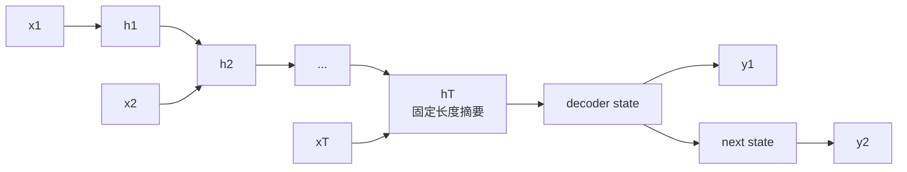
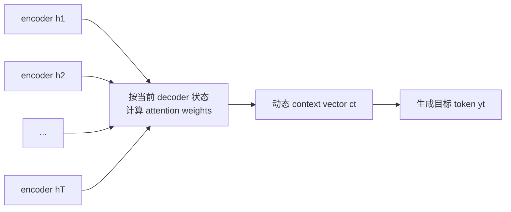
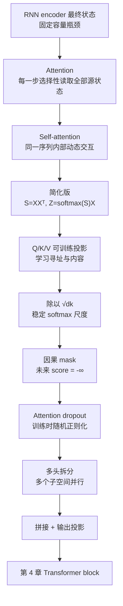
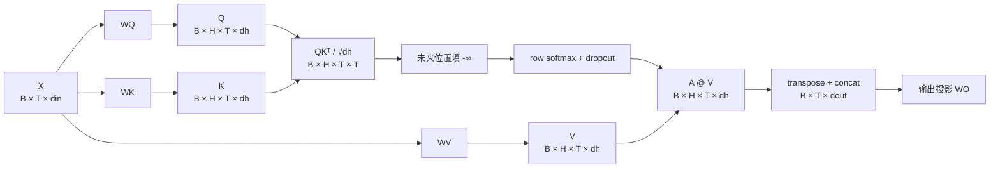

## 0. 本章定位、学习目标与递进主线

第 2 章把文本变成了形状为 $B\times T\times d_{\mathrm{in}}$ 的输入嵌入：每个位置已经知道“我是什么 token、我在哪里”，却还没有根据其他位置改变自己的表示。第 3 章实现 GPT 的核心信息混合模块：**注意力机制**。它让每个位置生成一个上下文化的 context vector，回答“为了表示当前位置，我应从哪些可见位置读取多少信息”。

本章位于全书第一阶段的第二步：


作者没有直接给出最终 `MultiHeadAttention` 类，而是按四次升级逐层建立它：


每次升级只解决一个明确缺口：

| 版本 | 已经解决 | 尚未解决 |
|---|---|---|
| 简化自注意力 | 根据输入相关性加权汇总整条序列 | 相似性规则固定，无法从任务学习 |
| 可训练自注意力 | 学习“匹配什么”和“读取什么” | 训练时仍能看到未来 token |
| 因果注意力 | 保证位置 $i$ 只读取 $j\le i$ | 单组投影的表达子空间有限 |
| 多头因果注意力 | 多组 Q/K/V 并行捕捉不同关系 | 仍有标准注意力的二次复杂度等限制 |

学完本章，应当能回答：

1. 为什么 encoder-decoder RNN 的单一最终隐藏状态会成为长序列瓶颈？
2. attention score、attention weight 和 context vector 分别是什么？
3. 为什么 softmax 应沿被读取 token 的轴归一化？
4. Q、K、V 为什么要用不同可训练矩阵投影？
5. 为什么点积要除以 $\sqrt{d_k}$？
6. 为什么因果 mask 必须在 softmax 前用 $-\infty$ 遮住未来？
7. dropout 后一行注意力权重为什么不一定仍等于 1？
8. `register_buffer` 与模型参数有什么不同？
9. 多头拆分为什么要求 $d_{\mathrm{out}}$ 能被头数整除？
10. `view`、`transpose`、batched matmul 和 `contiguous` 分别在改变什么？

### 0.1 符号与轴的约定

设：

- $B$：批大小；
- $T$：序列 token 数；
- $d_{\mathrm{in}}$：输入嵌入维度；
- $d_{\mathrm{out}}$：注意力总输出维度；
- $H$：注意力头数；
- $d_h=d_{\mathrm{out}}/H$：每头维度；
- $X\in\mathbb R^{B\times T\times d_{\mathrm{in}}}$：输入嵌入；
- $Q,K,V$：query、key、value 投影；
- $S$：softmax 前的 attention score；
- $A$：softmax 后的 attention weight；
- $Z$：输出 context vector。

注意力矩阵的两个 $T$ 轴含义不同：

$$
A_{ij}
=\text{第 }i\text{ 个查询位置从第 }j\text{ 个位置读取的权重}.
$$

因此：

- 行 $i$ 固定“谁在查询”；
- 列 $j$ 遍历“可以读取谁”；
- softmax 沿最后一维，也就是列/被读取位置轴归一化；
- 因果 mask 遮住 $j>i$ 的上三角。

### 0.2 最终形状账本

| 张量 | 单头/合并投影前后形状 | 轴含义 |
|---|---:|---|
| 输入 $X$ | $B\times T\times d_{\mathrm{in}}$ | 批次、位置、输入特征 |
| 合并投影 $Q,K,V$ | $B\times T\times d_{\mathrm{out}}$ | 批次、位置、总投影特征 |
| 拆头后 $Q,K,V$ | $B\times H\times T\times d_h$ | 批次、头、位置、每头特征 |
| 分数 $S=QK^{\mathsf T}$ | $B\times H\times T\times T$ | 批次、头、查询位置、key 位置 |
| 权重 $A$ | $B\times H\times T\times T$ | 同上，每行在 dropout 前和为 1 |
| 每头 context | $B\times H\times T\times d_h$ | 批次、头、位置、每头特征 |
| 合并 context | $B\times T\times d_{\mathrm{out}}$ | 批次、位置、总输出特征 |

这张表是本章最实用的调试工具。绝大多数实现错误都可归因于：转置了错误轴、沿错误维做 softmax、mask 广播到了错误位置，或把 $H$ 与 $T$ 混淆。

---

## 3.1 The Problem with Modeling Long Sequences（长序列建模的问题）

### 3.1.1 为什么翻译不能逐词替换

机器翻译需要同时处理词序、句法、指代与语义对齐。源语言和目标语言的词序不一定相同，一个词也可能要结合远处上下文才能确定译法。因此，翻译不是：

$$
y_t={\text{dictionary}}(x_t),
$$

而更接近：

$$
p(y_t\mid y_{<t},x_{1:T}).
$$

生成第 $t$ 个目标 token 时，既要参考已生成目标前缀，也可能需要源句中任意位置的信息。

### 3.1.2 注意力之前的 encoder-decoder RNN

Transformer 出现前，机器翻译常使用循环神经网络（RNN）的编码器—解码器：



编码器依次读入 token 并更新隐藏状态：

$$
h_t=f(x_t,h_{t-1}).
$$

最终状态 $h_T$ 被当作整句压缩表示，解码器从它开始逐 token 生成译文。

RNN 的循环结构适合序列，却带来两个相关难点：

1. **固定容量瓶颈**：无论源句多长，都要把全部有用信息压进同一维度的 $h_T$。
2. **长路径与遗忘**：早期 token 的信息必须经过多次状态更新才能影响解码，细节可能被覆盖；梯度也要沿长时间路径传播。

本章强调的直接缺陷是：解码阶段通常只能拿到最终隐藏状态，不能按当前生成需要直接访问全部早期 encoder 状态。短句尚可，长句和远距离依赖更容易丢失上下文。

> **边界**：这不表示所有 RNN 必然无法处理长序列，也不表示隐藏状态完全没有早期信息。LSTM、GRU 和改进训练可缓解问题；注意力解决的是“把所有细节强制压进单一摘要”这一结构性瓶颈。

### 3.1.3 问题如何导向注意力

如果生成每个目标 token 所需的源信息不同，就不应只给解码器一份固定摘要。更自然的接口是：保留所有 encoder 状态，让解码器在每一步动态选择。

$$
c_t=\sum_{j=1}^{T}\alpha_{tj}h_j,
\qquad
\sum_{j=1}^{T}\alpha_{tj}=1.
$$

$c_t$ 是当前解码步的 context vector，$\alpha_{tj}$ 表示生成目标位置 $t$ 时源位置 $j$ 的贡献。注意力由此把“记住整句”改写为“需要时按权重读取整句”。

---

## 3.2 Capturing Data Dependencies with Attention Mechanisms（用注意力捕捉依赖）

### 3.2.1 Bahdanau attention 解决了什么

2014 年提出的 Bahdanau attention 修改了 RNN encoder-decoder：编码器不只输出最终状态，而是保留每个位置的状态；解码器每生成一步，都根据当前解码状态为这些源状态计算不同权重。



它的关键突破不是“给每个词一个永久重要度”，而是**重要度随当前查询变化**。生成译文中的不同 token 时，解码器可关注不同源位置。

原书图 3.5 只表达这一通用思想，不是 Bahdanau 公式的精确结构。本书不实现 RNN attention，而是沿它启发出的 Transformer self-attention 路线前进。

### 3.2.2 从跨序列 attention 到 self-attention

传统 encoder-decoder attention 常在两组序列之间工作：

- query 来自解码器目标序列；
- key/value 来自编码器源序列。

Self-attention 中，Q、K、V 都从**同一输入序列**产生：

$$
Q=XW_Q,\qquad K=XW_K,\qquad V=XW_V.
$$

“self” 指数据来源相同，不表示只关注自己，也不表示 $Q=K=V$ 的数值必然相同。每个位置可以与同一序列中的所有允许位置交互。

| 机制 | Q 来源 | K/V 来源 | 典型用途 |
|---|---|---|---|
| encoder-decoder / cross-attention | 目标序列状态 | 源序列状态 | 翻译、条件生成 |
| 双向 self-attention | 同一完整序列 | 同一完整序列 | 编码器式理解 |
| 因果 self-attention | 当前序列位置 | 同一序列当前及过去 | GPT 下一 token 生成 |

### 3.2.3 为什么 Transformer 可以不依赖 RNN

Self-attention 让任意两个位置通过一次注意力层直接交换信息，而不是沿循环状态逐步传递。训练时所有位置的 Q/K/V 和分数矩阵可通过矩阵乘法并行计算。

收益包括：

- 长距离依赖的网络路径更短；
- 训练更适合 GPU/TPU 的大规模矩阵运算；
- 每个位置可按内容动态读取其他位置；
- 多层堆叠后可逐步组合复杂关系。

代价是标准注意力显式形成 $T\times T$ 分数矩阵，时间与注意力矩阵内存通常为：

$$
O(T^2d_h)
\quad\text{和}\quad
O(T^2).
$$

因此，attention 缓解了循环长路径和固定摘要瓶颈，不等于任意长序列都能免费处理。

---

## 3.3 Attending to Different Parts of the Input with Self-Attention（让输入关注不同位置）

### 3.3.1 “self” 与 context vector

给定已经嵌入的序列：

$$
X=
\begin{bmatrix}
(x^{(1)})^{\mathsf T}\\
(x^{(2)})^{\mathsf T}\\
\vdots\\
(x^{(T)})^{\mathsf T}
\end{bmatrix}
\in\mathbb R^{T\times d}.
$$

自注意力为每个位置 $i$ 产生 context vector：

$$
z^{(i)}=\sum_{j=1}^{T}\alpha_{ij}x^{(j)}.
$$

$z^{(i)}$ 是“增强后的输入表示”：它仍对应位置 $i$，但内容由全序列按权重混合而来。权重依赖当前 query 位置，所以同一个 $x^{(j)}$ 对不同 $z^{(i)}$ 的贡献不同。

原书先用无可训练参数的简化版本建立三步骨架：

```text
1. score：当前 query 与每个输入做点积
2. weight：对 score 做 softmax，得到和为 1 的正权重
3. context：用 weight 对输入向量加权求和
```

### 3.3.2 原书的 6×3 输入

句子 “Your journey starts with one step” 已被表示为 6 个三维向量：

```python
import torch

inputs = torch.tensor(
    [
        [0.43, 0.15, 0.89],  # Your
        [0.55, 0.87, 0.66],  # journey
        [0.57, 0.85, 0.64],  # starts
        [0.22, 0.58, 0.33],  # with
        [0.77, 0.25, 0.10],  # one
        [0.05, 0.80, 0.55],  # step
    ]
)
```

形状为：

$$
X\in\mathbb R^{6\times3}.
$$

这些数字只是教学输入，不是训练所得语义向量；`journey` 与 `starts` 看起来很相似有随机示例因素，不能由此推断真实嵌入规律。

### 3.3.3 第一步：用点积计算第二个位置的分数

选择第二个输入 `journey` 作为 query：

$$
q=x^{(2)}=[0.55,0.87,0.66].
$$

它与第 $j$ 个输入的 attention score 为：

$$
\omega_{2j}=q^{\mathsf T}x^{(j)}.
$$

例如与第一个输入：

$$
\begin{aligned}
\omega_{21}
&=0.55\times0.43+0.87\times0.15+0.66\times0.89\\
&=0.2365+0.1305+0.5874\\
&=0.9544.
\end{aligned}
$$

代码：

```python
query = inputs[1]
attn_scores_2 = torch.empty(inputs.shape[0])
for index, input_vector in enumerate(inputs):
    attn_scores_2[index] = torch.dot(input_vector, query)

print(attn_scores_2)
```

输出：

```text
[0.9544, 1.4950, 1.4754, 0.8434, 0.7070, 1.0865]
```

点积为：

$$
u^{\mathsf T}v=\sum_{k=1}^{d}u_kv_k.
$$

它同时受方向与向量长度影响，不能无条件等同于余弦相似度。此处把它称为相似性分数，是因为训练会塑造表示和投影，使高点积成为有用匹配信号；在简化随机输入中，它只是一个可计算兼容度。

### 3.3.4 第二步：为什么要用 softmax

直接除以分数和也能令权重和为 1：

$$
\tilde\alpha_{2j}=\frac{\omega_{2j}}{\sum_k\omega_{2k}},
$$

原书得到：

```text
[0.1455, 0.2278, 0.2249, 0.1285, 0.1077, 0.1656]
```

但这种方法有明显问题：分数可为负，分母可接近 0，权重也可能为负或数值极不稳定。实际使用 softmax：

$$
\alpha_{2j}
=\frac{e^{\omega_{2j}}}
{\sum_{k=1}^{T}e^{\omega_{2k}}}.
$$

它具有三项关键性质：

1. $\alpha_{2j}>0$；
2. $\sum_j\alpha_{2j}=1$；
3. 指数会放大相对较高分数，但函数仍可微。

原书结果：

```text
[0.1385, 0.2379, 0.2333, 0.1240, 0.1082, 0.1581]
```

朴素实现：

```python
def softmax_naive(values):
    exponentials = torch.exp(values)
    return exponentials / exponentials.sum(dim=0)
```

可能在大正数时溢出、小负数时下溢。稳定 softmax 利用平移不变性：

$$
\operatorname{softmax}(s)
=\operatorname{softmax}(s-c),
$$

通常取 $c=\max_j s_j$，使最大指数为 $e^0=1$。实际应调用：

```python
attn_weights_2 = torch.softmax(attn_scores_2, dim=0)
```

### 3.3.5 第三步：加权求和得到 context vector

第二个位置的 context vector：

$$
z^{(2)}=\sum_{j=1}^{6}\alpha_{2j}x^{(j)}.
$$

代码：

```python
context_vec_2 = torch.zeros_like(query)
for index, input_vector in enumerate(inputs):
    context_vec_2 += attn_weights_2[index] * input_vector

print(context_vec_2)
```

输出：

```text
[0.4419, 0.6515, 0.5683]
```

因为权重非负且和为 1，$z^{(2)}$ 是输入向量的凸组合，位于这些向量的凸包内。它不是简单平均：与 query 点积更高的位置贡献更大。

简化版本中 value 就是原输入本身，因此输出仍为三维。下一节加入 $W_V$ 后，真正被汇总的是可训练 value 表示，输出维度也可与输入不同。

### 3.3.6 一次计算所有位置：从循环到矩阵

对所有位置，score 矩阵为：

$$
S=XX^{\mathsf T}\in\mathbb R^{T\times T},
$$

其中：

$$
S_{ij}=(x^{(i)})^{\mathsf T}x^{(j)}.
$$

代码可从双重循环：

```python
attn_scores = torch.empty(6, 6)
for row, query_vector in enumerate(inputs):
    for column, key_vector in enumerate(inputs):
        attn_scores[row, column] = torch.dot(
            query_vector,
            key_vector,
        )
```

改写为一个矩阵乘法：

```python
attn_scores = inputs @ inputs.T
```

两者数学等价，但矩阵乘法能调用高度优化的底层核，在加速器上并行完成。

由于这个简化版本 $Q=K=X$，$S=XX^{\mathsf T}$ 是对称矩阵：$S_{ij}=S_{ji}$。注意，行 softmax 后的 $A$ 通常**不再对称**，因为每行分母不同：

$$
A_{ij}
=\frac{e^{S_{ij}}}{\sum_k e^{S_{ik}}}
\not\equiv
\frac{e^{S_{ji}}}{\sum_k e^{S_{jk}}}
=A_{ji}.
$$

### 3.3.7 为什么 softmax 使用 `dim=-1`

执行：

```python
attn_weights = torch.softmax(attn_scores, dim=-1)
```

`attn_scores` 形状为 `[query_position, key_position]`。`dim=-1` 沿最后一个 key 位置轴归一化，使每个 query 的一行权重和为 1：

$$
\sum_{j=1}^{T}A_{ij}=1.
$$

若错误地沿 `dim=0` 归一化，就会让每一列在所有 query 间和为 1，回答的是“所有位置如何竞争读取同一个 key”，不是“当前 query 如何分配对各 key 的注意力”。

原书完整权重矩阵第二行为：

```text
[0.1385, 0.2379, 0.2333, 0.1240, 0.1082, 0.1581]
```

与单独计算第二个 query 完全一致。

### 3.3.8 一次得到全部 context vector

矩阵形式：

$$
A=\operatorname{softmax}_{\mathrm{row}}(XX^{\mathsf T}),
\qquad
Z=AX.
$$

代码：

```python
all_context_vecs = attn_weights @ inputs
print(all_context_vecs)
```

输出：

```text
[[0.4421, 0.5931, 0.5790],
 [0.4419, 0.6515, 0.5683],
 [0.4431, 0.6496, 0.5671],
 [0.4304, 0.6298, 0.5510],
 [0.4671, 0.5910, 0.5266],
 [0.4177, 0.6503, 0.5645]]
```

第二行等于前面逐步算出的 $z^{(2)}$，这是最便宜的实现一致性检查。

### 3.3.9 简化自注意力的完整可运行验证

```python
import torch

inputs = torch.tensor(
    [
        [0.43, 0.15, 0.89],
        [0.55, 0.87, 0.66],
        [0.57, 0.85, 0.64],
        [0.22, 0.58, 0.33],
        [0.77, 0.25, 0.10],
        [0.05, 0.80, 0.55],
    ]
)

scores = inputs @ inputs.T
weights = torch.softmax(scores, dim=-1)
contexts = weights @ inputs

assert scores.shape == (6, 6)
assert weights.shape == (6, 6)
assert contexts.shape == (6, 3)
assert torch.allclose(weights.sum(dim=-1), torch.ones(6))
assert torch.allclose(
    contexts[1],
    torch.tensor([0.4419, 0.6515, 0.5683]),
    atol=1e-4,
)

print(contexts)
```

### 3.3.10 这个版本为什么还不够

简化版本把“怎样匹配”和“读取什么”都固定为原始输入：

$$
Q=K=V=X.
$$

它存在三项限制：

1. 点积只能在原始嵌入空间比较，任务无法学习更合适的匹配特征。
2. 被汇总内容与用于匹配的特征相同，无法把地址和内容分离。
3. 输出维度被固定为输入维度。

下一节引入 $W_Q,W_K,W_V$，让训练分别学习“当前位置想找什么”“每个位置用什么被匹配”“匹配后取回什么”。

---

## 3.4 Implementing Self-Attention with Trainable Weights（实现带可训练权重的自注意力）

### 3.4.1 为什么要把输入投影成 Q、K、V

简化注意力直接在原始嵌入空间做：

$$
S=XX^{\mathsf T},\qquad Z=\operatorname{softmax}(S)X.
$$

这隐含一个过强假设：用于判断“两个位置是否相关”的特征，与最终应该被汇总的内容完全相同。可训练自注意力引入三个矩阵：

$$
W_Q,W_K,W_V\in\mathbb R^{d_{\mathrm{in}}\times d_{\mathrm{out}}},
$$

并计算：

$$
Q=XW_Q,\qquad K=XW_K,\qquad V=XW_V.
$$

三者的角色可用检索系统理解：

| 量 | 问题 | 类比 |
|---|---|---|
| query $q_i$ | 位置 $i$ 当前想寻找什么？ | 搜索请求 |
| key $k_j$ | 位置 $j$ 用什么特征被匹配？ | 索引键 |
| value $v_j$ | 匹配位置 $j$ 后实际取回什么？ | 记录内容 |

于是位置 $i$ 可以用一种特征匹配位置 $j$，再读取另一种内容。训练通过下一 token 损失调整三个投影，学习适合任务的寻址与读取规则。

### 3.4.2 单个 query 的逐步计算

仍用第二个输入 $x^{(2)}$，设：

```python
x_2 = inputs[1]
d_in = inputs.shape[1]  # 3
d_out = 2
```

原书为便于打印，用固定随机种子和 `torch.rand` 初始化：

```python
torch.manual_seed(123)
W_query = torch.nn.Parameter(
    torch.rand(d_in, d_out),
    requires_grad=False,
)
W_key = torch.nn.Parameter(
    torch.rand(d_in, d_out),
    requires_grad=False,
)
W_value = torch.nn.Parameter(
    torch.rand(d_in, d_out),
    requires_grad=False,
)
```

这里 `requires_grad=False` 只是让教学输出不带梯度信息。真正训练时这些矩阵必须可学习，通常为 `True`。

第二个输入的三个投影为：

$$
q^{(2)}=x^{(2)}W_Q,
\quad
k^{(2)}=x^{(2)}W_K,
\quad
v^{(2)}=x^{(2)}W_V.
$$

代码：

```python
query_2 = x_2 @ W_query
key_2 = x_2 @ W_key
value_2 = x_2 @ W_value
print(query_2)
```

输出：

```text
[0.4306, 1.4551]
```

原始三维输入被投影到二维。注意，这不是降维可视化；三个矩阵的二维输出各有独立功能。

### 3.4.3 为什么一个 query 仍需要所有 key 和 value

只计算 $z^{(2)}$ 时，query 只需 $q^{(2)}$，但它要与所有位置匹配并读取所有候选，因此仍需：

$$
K=XW_K\in\mathbb R^{T\times d_k},
\qquad
V=XW_V\in\mathbb R^{T\times d_v}.
$$

本章令 $d_k=d_v=d_{\mathrm{out}}=2$：

```python
keys = inputs @ W_key
values = inputs @ W_value

assert keys.shape == values.shape == (6, 2)
```

第二个 query 与第二个 key 的 score：

$$
\omega_{22}=(q^{(2)})^{\mathsf T}k^{(2)}=1.8524.
$$

一次得到与全部 key 的 score：

$$
s^{(2)}=q^{(2)}K^{\mathsf T}\in\mathbb R^{T}.
$$

```python
attn_scores_2 = query_2 @ keys.T
print(attn_scores_2)
```

输出：

```text
[1.2705, 1.8524, 1.8111, 1.0795, 0.5577, 1.5440]
```

### 3.4.4 attention parameter、score 与 weight 不要混淆

三个层次名称都可能含“weight”，但含义不同：

| 名称 | 示例 | 是否训练后固定 | 是否依赖当前输入 |
|---|---|---:|---:|
| weight parameter | $W_Q,W_K,W_V$ | 推理时固定 | 否 |
| attention score / logit | $s_{ij}=q_i^{\mathsf T}k_j$ | 否 | 是 |
| attention weight | $A_{ij}=\operatorname{softmax}(s_i)_j$ | 否 | 是 |

参数定义了计算规则；score 是未归一化兼容度；weight 是当前输入上归一化后的动态读取比例。模型训练更新的是 $W$，不是把某个样本的 $A$ 永久保存下来。

### 3.4.5 为什么除以 $\sqrt{d_k}$

Scaled dot-product attention 使用：

$$
A=\operatorname{softmax}\!\left(
\frac{QK^{\mathsf T}}{\sqrt{d_k}}
\right).
$$

缩放可以从方差推导。假设 query 和 key 各维近似独立、均值 0、方差 1：

$$
q^{\mathsf T}k=\sum_{r=1}^{d_k}q_rk_r.
$$

每项 $q_rk_r$ 方差约为 1，因此：

$$
\operatorname{Var}(q^{\mathsf T}k)\approx d_k,
\qquad
\operatorname{Std}(q^{\mathsf T}k)\approx\sqrt{d_k}.
$$

除以 $\sqrt{d_k}$ 后：

$$
\operatorname{Var}\!\left(
\frac{q^{\mathsf T}k}{\sqrt{d_k}}
\right)\approx1.
$$

如果不缩放，维度越大，logit 典型绝对值越大，softmax 越接近 one-hot 阶跃函数。设：

$$
p_i=\frac{e^{s_i}}{\sum_j e^{s_j}},
$$

其导数为：

$$
\frac{\partial p_i}{\partial s_j}
=p_i(\delta_{ij}-p_j).
$$

当某个 $p_i\approx1$、其余 $p_j\approx0$ 时，大多数导数接近 0，学习会变慢或不稳定。缩放不是为了让权重更“平均”，而是让不同 $d_k$ 下的 logit 尺度和梯度处于更适合优化的范围。

本章 $d_k=2$：

```python
d_k = keys.shape[-1]
attn_weights_2 = torch.softmax(
    attn_scores_2 / d_k**0.5,
    dim=-1,
)
```

输出：

```text
[0.1500, 0.2264, 0.2199, 0.1311, 0.0906, 0.1820]
```

### 3.4.6 为什么缩放维度是 key/head 维度

点积发生在 query 与 key 的最后一维，因此缩放依据是该匹配空间维度 $d_k$，代码中是：

```python
keys.shape[-1]
```

多头注意力时总输出维度为 $d_{\mathrm{out}}$，但每个点积只跨每头维度：

$$
d_k=d_h=\frac{d_{\mathrm{out}}}{H}.
$$

错误地除以 $\sqrt{d_{\mathrm{out}}}$ 会在头数大于 1 时过度缩小 logits。

### 3.4.7 value 加权得到第二个 context vector

匹配发生在 Q/K 空间，最终汇总发生在 V 空间：

$$
z^{(2)}=\sum_{j=1}^{T}\alpha_{2j}v^{(j)}
=a^{(2)}V.
$$

```python
context_vec_2 = attn_weights_2 @ values
print(context_vec_2)
```

输出：

```text
[0.3061, 0.8210]
```

输出为二维，因为 value 的最后一维是 $d_v=2$。attention score 的 $T$ 维只决定从哪些位置取信息，不决定 context 的特征维度。

### 3.4.8 批量矩阵公式与形状

对单个序列：

$$
\begin{aligned}
Q&=XW_Q && (T,d_k),\\
K&=XW_K && (T,d_k),\\
V&=XW_V && (T,d_v),\\
S&=QK^{\mathsf T} && (T,T),\\
A&=\operatorname{softmax}_{\mathrm{row}}(S/\sqrt{d_k}) && (T,T),\\
Z&=AV && (T,d_v).
\end{aligned}
$$

对批次，PyTorch 的 batched matmul 自动保留前导批次轴：

$$
Q,K,V\in\mathbb R^{B\times T\times d},
$$

$$
S=QK^{\mathsf T}\in\mathbb R^{B\times T\times T},
$$

$$
Z=AV\in\mathbb R^{B\times T\times d_v}.
$$

`K` 的转置只交换最后两个轴：

```python
attn_scores = queries @ keys.transpose(-2, -1)
```

不能用三维张量的 `.T` 代替，因为 `.T` 对高维张量的行为不是“只转置 token 与特征轴”的清晰接口。

### 3.4.9 `SelfAttention_v1`：直接管理参数

原书清单 3.1：

```python
import torch
import torch.nn as nn


class SelfAttentionV1(nn.Module):
    def __init__(self, d_in, d_out):
        super().__init__()
        self.W_query = nn.Parameter(torch.rand(d_in, d_out))
        self.W_key = nn.Parameter(torch.rand(d_in, d_out))
        self.W_value = nn.Parameter(torch.rand(d_in, d_out))

    def forward(self, x):
        keys = x @ self.W_key
        queries = x @ self.W_query
        values = x @ self.W_value

        scores = queries @ keys.T
        weights = torch.softmax(
            scores / keys.shape[-1]**0.5,
            dim=-1,
        )
        return weights @ values
```

`nn.Parameter` 会把张量注册为模块参数，使其出现在 `model.parameters()`、`state_dict()` 中，并由优化器更新。该版本针对单个二维序列写成，尚未处理批次和因果 mask。

使用：

```python
torch.manual_seed(123)
sa_v1 = SelfAttentionV1(d_in=3, d_out=2)
context_vectors = sa_v1(inputs)
```

输出：

```text
[[0.2996, 0.8053],
 [0.3061, 0.8210],
 [0.3058, 0.8203],
 [0.2948, 0.7939],
 [0.2927, 0.7891],
 [0.2990, 0.8040]]
```

第二行与逐步结果 `[0.3061, 0.8210]` 一致。

### 3.4.10 `SelfAttention_v2`：使用 `nn.Linear`

原书清单 3.2 用无偏置线性层代替手动参数：

```python
class SelfAttentionV2(nn.Module):
    def __init__(self, d_in, d_out, qkv_bias=False):
        super().__init__()
        self.W_query = nn.Linear(d_in, d_out, bias=qkv_bias)
        self.W_key = nn.Linear(d_in, d_out, bias=qkv_bias)
        self.W_value = nn.Linear(d_in, d_out, bias=qkv_bias)

    def forward(self, x):
        keys = self.W_key(x)
        queries = self.W_query(x)
        values = self.W_value(x)

        scores = queries @ keys.T
        weights = torch.softmax(
            scores / keys.shape[-1]**0.5,
            dim=-1,
        )
        return weights @ values
```

`nn.Linear` 的优势：

- 使用框架提供的初始化方案；
- 参数、设备、dtype 和序列化管理更标准；
- 可选 bias；
- 底层线性计算实现经过优化。

PyTorch 线性层计算：

$$
y=xW^{\mathsf T}+b,
$$

其 `weight` 存储形状为：

$$
(d_{\mathrm{out}},d_{\mathrm{in}}),
$$

而 V1 手动写 `x @ W` 时 $W$ 形状为：

$$
(d_{\mathrm{in}},d_{\mathrm{out}}).
$$

这就是两版权重转移需要 `.T` 的原因。

### 3.4.11 `qkv_bias` 为什么默认关闭

若启用偏置：

$$
Q=XW_Q^{\mathsf T}+b_Q,
$$

K、V 同理。原书默认 `qkv_bias=False`，与本书后续 GPT-2 配置保持一致。偏置不是注意力成立的必要条件；是否使用是架构选择。

无偏置时 Q/K/V 参数量为：

$$
3d_{\mathrm{in}}d_{\mathrm{out}}.
$$

有偏置时增加：

$$
3d_{\mathrm{out}}.
$$

### 3.4.12 为什么 V1 与 V2 初始输出不同

即使公式等价，两版默认初始化不同：

- V1 使用 `torch.rand`，元素在 $[0,1)$；
- `nn.Linear` 使用其标准初始化，并按线性层转置布局存储。

原书用 `torch.manual_seed(789)` 创建 V2，输出约为：

```text
[[-0.0739, 0.0713],
 [-0.0748, 0.0703],
 [-0.0749, 0.0702],
 [-0.0760, 0.0685],
 [-0.0763, 0.0679],
 [-0.0754, 0.0693]]
```

不同输出不能证明实现不同。要比较数学等价性，必须控制相同输入、参数与偏置。

### 3.4.13 练习 3.1：正确转移权重

附录 C 给出的赋值：

```python
sa_v1.W_query = nn.Parameter(sa_v2.W_query.weight.T)
sa_v1.W_key = nn.Parameter(sa_v2.W_key.weight.T)
sa_v1.W_value = nn.Parameter(sa_v2.W_value.weight.T)
```

更稳妥的验证写法是在 `torch.no_grad()` 下复制，避免替换参数对象：

```python
with torch.no_grad():
    sa_v1.W_query.copy_(sa_v2.W_query.weight.T)
    sa_v1.W_key.copy_(sa_v2.W_key.weight.T)
    sa_v1.W_value.copy_(sa_v2.W_value.weight.T)

assert torch.allclose(sa_v1(inputs), sa_v2(inputs))
```

前提是 V2 的 `qkv_bias=False`；若有非零偏置，V1 没有对应偏置项，两者无法只靠复制矩阵完全相等。

### 3.4.14 这个版本还缺什么

带参数自注意力已经可以学习动态 context vector，但对位置 $i$ 的权重仍覆盖所有 $j=1,\ldots,T$：

$$
A_{ij}>0\quad\text{可能在 }j>i.
$$

在下一 token 训练中，右侧 token 是未来答案。若不遮住，位置 $i$ 可直接读取答案或其后信息，训练损失就失去有效意义。下一节将把可见集合限制为：

$$
\mathcal V_i=\{j\mid j\le i\}.
$$

---

## 3.5 Hiding Future Words with Causal Attention（用因果注意力隐藏未来 token）

### 3.5.1 为什么标准 self-attention 会泄漏答案

第 2 章构造训练样本时：

```text
input : x0 x1 x2 x3
target: x1 x2 x3 x4
```

位置 0 要预测 $x_1$。若标准 self-attention 允许它读取位置 1 的输入表示，它就直接看到了标签；位置 1 同理可看到 $x_2$。训练损失会异常容易下降，但推理时未来 token 尚不存在，模型无法复现这种条件。

因果注意力要求：

$$
A_{ij}=0\qquad\text{当 }j>i.
$$

可见性矩阵为下三角：

```text
query \ key    0  1  2  3  4  5
0              ✓  ×  ×  ×  ×  ×
1              ✓  ✓  ×  ×  ×  ×
2              ✓  ✓  ✓  ×  ×  ×
3              ✓  ✓  ✓  ✓  ×  ×
4              ✓  ✓  ✓  ✓  ✓  ×
5              ✓  ✓  ✓  ✓  ✓  ✓
```

“因果”在这里表示自回归方向约束：当前位置只依赖当前及过去输入。它不是对现实世界因果关系的发现或证明。

### 3.5.2 教学式三步遮罩

作者先展示直观但冗长的做法。对未遮罩分数做 softmax：

$$
A_{ij}=\frac{e^{S_{ij}/\sqrt{d_k}}}
{\sum_{m=1}^{T}e^{S_{im}/\sqrt{d_k}}}.
$$

构造包含对角线的下三角 mask：

```python
context_length = attn_scores.shape[0]
mask_simple = torch.tril(
    torch.ones(context_length, context_length)
)
```

对 $T=6$：

```text
[[1, 0, 0, 0, 0, 0],
 [1, 1, 0, 0, 0, 0],
 [1, 1, 1, 0, 0, 0],
 [1, 1, 1, 1, 0, 0],
 [1, 1, 1, 1, 1, 0],
 [1, 1, 1, 1, 1, 1]]
```

先乘法置零：

$$
{\widetilde A}=A\odot L,
$$

再按行重新归一化：

$$
A'_{ij}=\frac{\tilde A_{ij}}
{\sum_m\tilde A_{im}}.
$$

```python
masked_simple = attn_weights * mask_simple
row_sums = masked_simple.sum(dim=-1, keepdim=True)
masked_simple_norm = masked_simple / row_sums
```

第二行只保留前两个位置，原书得到：

```text
[0.5517, 0.4483, 0, 0, 0, 0]
```

### 3.5.3 为什么先看全部位置再归一化不会残留泄漏

乍看第一种做法先让未来 token 进入 softmax 分母，似乎已经污染过去权重。设允许集合为 $U_i=\{j\mid j\le i\}$。初始 softmax：

$$
A_{ij}=\frac{e^{s_{ij}}}{\sum_{k=1}^{T}e^{s_{ik}}}.
$$

遮罩后再归一化，对 $j\in U_i$：

$$
\begin{aligned}
A'_{ij}
&=\frac{A_{ij}}{\sum_{m\in U_i}A_{im}}\\
&=\frac{\dfrac{e^{s_{ij}}}{\sum_{k=1}^{T}e^{s_{ik}}}}
{\sum_{m\in U_i}\dfrac{e^{s_{im}}}{\sum_{k=1}^{T}e^{s_{ik}}}}\\
&=\frac{e^{s_{ij}}}{\sum_{m\in U_i}e^{s_{im}}}.
\end{aligned}
$$

包含未来位置的公共分母完全约掉，所以结果等于从一开始只在允许位置做 softmax。被遮位置的最终权重为 0，不参与 context vector。

这证明数学结果无泄漏，但实现仍多做了一次 softmax、乘法和归一化。更标准的方法是在 softmax 前遮 score。

### 3.5.4 用 $-\infty$ 在 softmax 前遮 score

构造严格上三角 mask：

```python
mask = torch.triu(
    torch.ones(context_length, context_length),
    diagonal=1,
)
masked_scores = attn_scores.masked_fill(
    mask.bool(),
    -torch.inf,
)
```

`diagonal=1` 从主对角线上方开始遮，保留当前位置自身。随后：

```python
attn_weights = torch.softmax(
    masked_scores / keys.shape[-1]**0.5,
    dim=-1,
)
```

因为：

$$
e^{-\infty}=0,
$$

被遮位置在 softmax 分子中为 0，分母也没有贡献。对允许位置：

$$
A_{ij}
=\frac{e^{s_{ij}/\sqrt{d_k}}}
{\sum_{m\le i}e^{s_{im}/\sqrt{d_k}}},
$$

对未来位置 $j>i$：

$$
A_{ij}=0.
$$

最终矩阵与教学三步法一致：

```text
[[1.0000, 0.0000, 0.0000, 0.0000, 0.0000, 0.0000],
 [0.5517, 0.4483, 0.0000, 0.0000, 0.0000, 0.0000],
 [0.3800, 0.3097, 0.3103, 0.0000, 0.0000, 0.0000],
 [0.2758, 0.2460, 0.2462, 0.2319, 0.0000, 0.0000],
 [0.2175, 0.1983, 0.1984, 0.1888, 0.1971, 0.0000],
 [0.1935, 0.1663, 0.1666, 0.1542, 0.1666, 0.1529]]
```

### 3.5.5 mask 应加在缩放前还是后

以下两种对被遮元素都得到 $-\infty$：

$$
\frac{S+M}{\sqrt{d_k}}
\quad\text{与}\quad
\frac{S}{\sqrt{d_k}}+M,
$$

其中 $M_{ij}\in\{0,-\infty\}$，因为有限正数除以有限值不改变 $-\infty$。代码通常先 `masked_fill(-inf)`，再整体除以 $\sqrt{d_k}$，结构清楚即可。

有限精度实现有时用 dtype 最小有限值代替 `-inf`，但要保证 softmax 后概率足够接近 0。若一整行全部被遮，softmax 的分母为 0 语义，可能产生 NaN；GPT 因保留主对角线，每行至少有一个合法位置。

### 3.5.6 因果 mask 与 padding mask 不同

| mask | 遮什么 | 是否随样本变化 | 本章是否实现 |
|---|---|---:|---:|
| causal mask | 每个 query 右侧未来位置 | 相同长度下固定 | 是 |
| padding mask | 补齐出来的无效 token | 常随每个样本长度变化 | 否 |
| dropout mask | 训练时随机删除部分连接 | 每次前向随机 | 是 |

多种 mask 可以组合，但目的不同。因果 mask 保证任务合法性；padding mask 忽略伪数据；dropout mask 是正则化。

### 3.5.7 Dropout 为什么用于注意力

Dropout 在训练时独立采样 Bernoulli mask，随机置零部分元素，降低模型对固定连接的依赖。设丢弃概率 $p$、保留概率 $q=1-p$，inverted dropout 为：

$$
\operatorname{Dropout}(a)
=\frac{m}{q}a,
\qquad
m\sim\operatorname{Bernoulli}(q).
$$

期望保持不变：

$$
\mathbb E\left[\frac{m}{q}a\right]
=\frac{\mathbb E[m]}{q}a
=a.
$$

因此推理时关闭 dropout 后，不需要再额外缩放。

原书用 $p=0.5$ 演示，对全 1 矩阵，保留值变成：

$$
\frac{1}{1-0.5}=2.
$$

真实 GPT 训练常使用较低值，如 0.1 或 0.2；0.5 只是为了让打印结果明显。

### 3.5.8 attention dropout 后行和为何不再保证为 1

softmax 输出每行和为 1。dropout 后：

$$
{\widetilde A}_{ij}=\frac{m_{ij}}{1-p}A_{ij}.
$$

对一次具体 mask：

$$
\sum_j{\widetilde A}_{ij}
=\frac{1}{1-p}\sum_jm_{ij}A_{ij},
$$

它可能小于、等于或大于 1，甚至某一行所有合法连接都被置零。只是在 dropout 随机性上的期望满足：

$$
\mathbb E\left[\sum_j{\widetilde A}_{ij}\right]=1.
$$

所以 dropout 后无需也不应按行重新归一化，否则会改变 inverted dropout 的期望性质；若整行被丢弃，还会除以 0。

原书在 6×6 演示中确实出现全零第二行。这不违反实现：该位置本次前向的 attention 输出为零，其他层、残差连接和后续批次仍可传递信号。

### 3.5.9 训练与推理模式

`nn.Dropout` 根据模块模式自动切换：

```python
module.train()  # 启用随机 dropout
module.eval()   # 关闭 dropout，原样传递
```

`torch.no_grad()` 只关闭梯度记录，不会自动关闭 dropout；`eval()` 也不关闭梯度。评估时通常两者一起使用：

```python
module.eval()
with torch.no_grad():
    outputs = module(inputs)
```

固定 `torch.manual_seed` 可帮助复现同一环境中的随机 mask，但原书也提醒不同操作系统或 PyTorch 实现可能产生不同具体 dropout 图案。应验证统计性质、形状和模式切换，而不是依赖打印矩阵逐元素相同。

### 3.5.10 从单序列扩展到批次

原书复制输入模拟两条相同序列：

```python
batch = torch.stack((inputs, inputs), dim=0)
print(batch.shape)
```

形状：

```text
[2, 6, 3]
```

三个轴依次为：

$$
(B,T,d_{\mathrm{in}})=(2,6,3).
$$

Q/K/V 线性层自动作用于最后一维并保留前导轴，输出 `[B,T,d_out]`。分数计算需要只交换 token 与特征轴：

```python
attn_scores = queries @ keys.transpose(1, 2)
```

形状推导：

$$
(B,T,d_k)@(B,d_k,T)\rightarrow(B,T,T).
$$

批次之间不会互相 attention，因为 batched matmul 在每个 $b$ 上独立执行。

### 3.5.11 `register_buffer` 为什么用于 mask

因果 mask：

- 是模块状态的一部分；
- 不需要梯度；
- 应随模型移动到 CPU/GPU；
- 通常希望进入 `state_dict`；
- 不应交给优化器更新。

因此使用：

```python
self.register_buffer(
    "mask",
    torch.triu(
        torch.ones(context_length, context_length),
        diagonal=1,
    ),
)
```

三类张量对比：

| 类型 | 是否可训练 | 随 `.to(device)` 移动 | 默认进入 `state_dict` |
|---|---:|---:|---:|
| `nn.Parameter` | 是 | 是 | 是 |
| registered buffer | 否 | 是 | 是 |
| 普通属性 tensor | 否 | 不自动保证 | 否 |

`register_buffer` 不是性能魔法，核心是状态和设备管理。

### 3.5.12 `CausalAttention` 完整实现

原书清单 3.3，稍作格式整理：

```python
import torch
import torch.nn as nn


class CausalAttention(nn.Module):
    def __init__(
        self,
        d_in,
        d_out,
        context_length,
        dropout,
        qkv_bias=False,
    ):
        super().__init__()
        self.d_out = d_out
        self.W_query = nn.Linear(d_in, d_out, bias=qkv_bias)
        self.W_key = nn.Linear(d_in, d_out, bias=qkv_bias)
        self.W_value = nn.Linear(d_in, d_out, bias=qkv_bias)
        self.dropout = nn.Dropout(dropout)
        self.register_buffer(
            "mask",
            torch.triu(
                torch.ones(context_length, context_length),
                diagonal=1,
            ),
        )

    def forward(self, x):
        batch_size, num_tokens, _ = x.shape
        keys = self.W_key(x)
        queries = self.W_query(x)
        values = self.W_value(x)

        scores = queries @ keys.transpose(1, 2)
        mask = self.mask[:num_tokens, :num_tokens].bool()
        scores.masked_fill_(mask, -torch.inf)

        weights = torch.softmax(
            scores / keys.shape[-1]**0.5,
            dim=-1,
        )
        weights = self.dropout(weights)
        return weights @ values
```

### 3.5.13 为什么要切片 mask

buffer 按最大 `context_length` 创建：

$$
M\in\mathbb R^{T_{\max}\times T_{\max}}.
$$

当前批次可能只有 $T<T_{\max}$，所以使用：

```python
self.mask[:num_tokens, :num_tokens]
```

若 $T>T_{\max}$，切片仍只能得到最大尺寸，无法与 score 对齐；调用方必须保证：

$$
T\le T_{\max}.
$$

### 3.5.14 原地 `masked_fill_` 的含义与边界

PyTorch 名称尾部下划线表示原地修改，减少一次新张量分配：

```python
scores.masked_fill_(mask, -torch.inf)
```

原地操作并非总是安全；若覆盖了 autograd 后续计算需要的值，可能触发版本错误。这里 `scores` 随后只需遮罩后版本，原书实现可正常反向传播。追求清晰时也可写非原地版本：

```python
scores = scores.masked_fill(mask, -torch.inf)
```

### 3.5.15 输出形状与因果性检查

```python
torch.manual_seed(123)
batch = torch.stack((inputs, inputs), dim=0)
causal_attention = CausalAttention(
    d_in=3,
    d_out=2,
    context_length=6,
    dropout=0.0,
)
context_vectors = causal_attention(batch)
print(context_vectors.shape)
```

输出：

```text
[2, 6, 2]
```

因果性最有力的行为测试不是只看 mask，而是修改未来 token，确认过去输出不变：

```python
causal_attention.eval()
changed = batch.clone()
changed[:, 4:, :] += 1000.0

with torch.no_grad():
    before = causal_attention(batch)
    after = causal_attention(changed)

# 位置 0..3 不允许读取被修改的 4..5。
assert torch.allclose(before[:, :4], after[:, :4])
```

位置 4、5 可读取这些被修改位置，所以不要求保持不变。这个测试能直接发现 mask 方向反了、softmax 轴错了或 mask 未实际应用。

### 3.5.16 因果注意力的能力与局限

**它保证：**

- 训练位置不能读取未来输入；
- 训练可一次并行计算所有位置；
- 条件依赖与自回归推理一致。

**它不保证：**

- 模型一定使用所有过去信息；
- 权重就是可靠的人类解释；
- 输出事实正确；
- 推理可一次生成全部未来 token；
- padding、文档隔离等其他 mask 自动处理。

因果 mask 解决合法可见性；下一节的多头机制解决表示容量与关系多样性。

---

## 3.6 Extending Single-Head Attention to Multi-Head Attention（把单头扩展为多头注意力）

### 3.6.1 为什么一组 Q/K/V 可能不够

单头注意力只有一组投影和一个 attention 分布。一个位置可能同时需要捕捉多类关系，例如：

- 临近词的局部搭配；
- 远距离主谓一致；
- 代词与先行词；
- 标点、段落或代码结构；
- 与当前预测有关的语义实体。

多头注意力让 $H$ 组不同参数并行工作：

$$
Z^{(h)}
=\operatorname{Attention}
\left(XW_Q^{(h)},XW_K^{(h)},XW_V^{(h)}\right),
$$

再合并：

$$
Z=\operatorname{Concat}
\left(Z^{(1)},\ldots,Z^{(H)}\right)W_O.
$$

每头**有机会**学习不同表示子空间和位置关系，但没有硬约束保证头之间一定互不重复，也不能把每个头固定命名为某种语法功能。

### 3.6.2 直观版本：堆叠多个 `CausalAttention`

原书先用 `ModuleList` 创建多个完全独立的单头模块：

```python
class MultiHeadAttentionWrapper(nn.Module):
    def __init__(
        self,
        d_in,
        d_out,
        context_length,
        dropout,
        num_heads,
        qkv_bias=False,
    ):
        super().__init__()
        self.heads = nn.ModuleList(
            [
                CausalAttention(
                    d_in,
                    d_out,
                    context_length,
                    dropout,
                    qkv_bias,
                )
                for _ in range(num_heads)
            ]
        )

    def forward(self, x):
        return torch.cat(
            [head(x) for head in self.heads],
            dim=-1,
        )
```

每个 `CausalAttention` 输出：

$$
(B,T,d_{\mathrm{head,out}}).
$$

沿最后一维拼接后：

$$
(B,T,Hd_{\mathrm{head,out}}).
$$

原书调用 `num_heads=2,d_out=2`，最终形状：

```text
[2, 6, 4]
```

两条输入完全相同、dropout 为 0，因此两个批次的输出相同；两个头参数不同，所以同一批次中前两维与后两维不同。

### 3.6.3 Wrapper 中的 `d_out` 是每头维度

这是原书两种实现的关键接口差异：

| 类 | `d_out` 表示什么 | 最终输出最后一维 |
|---|---|---:|
| `CausalAttention` | 单头输出维 | `d_out` |
| `MultiHeadAttentionWrapper` | 每个独立头的输出维 | `num_heads * d_out` |
| 高效 `MultiHeadAttention` | 所有头合并后的总维度 | `d_out` |

因此不能把 wrapper 的调用参数原样搬到高效类，再期待相同最终维度。

### 3.6.4 练习 3.2：两个头仍输出二维

wrapper 的最终维度为：

$$
d_{\mathrm{final}}=H\,d_{\mathrm{head,out}}.
$$

要求 $H=2,d_{\mathrm{final}}=2$：

$$
d_{\mathrm{head,out}}=\frac{2}{2}=1.
$$

附录答案：

```python
d_out = 1
mha = MultiHeadAttentionWrapper(
    d_in,
    d_out,
    block_size,
    0.0,
    num_heads=2,
)
```

每头输出一维，拼接后两维。这里每头一维只是练习，不是说真实模型的两个头只能各学一个可解释标量关系。

### 3.6.5 Wrapper 为什么直观但效率不理想

列表推导：

```python
[head(x) for head in self.heads]
```

在 Python 层逐个调用头。每个头分别执行 Q/K/V 线性层、分数矩阵乘法、softmax 和 value 汇总。数学上可并行，却没有合并成较大的批量矩阵运算。

更高效的做法是：

1. 用三个较大的线性层一次产生全部头的 Q/K/V；
2. 把最后维拆成 `num_heads × head_dim`；
3. 将头轴移到 token 轴前；
4. 用 batched matmul 同时计算所有头。

### 3.6.6 高效多头注意力的参数与不变量

设总输出维 $d_{\mathrm{out}}$，头数 $H$，每头维度：

$$
d_h=\frac{d_{\mathrm{out}}}{H}.
$$

必须满足：

$$
d_{\mathrm{out}}\bmod H=0,
$$

否则无法把最后一维均匀拆头。代码：

```python
assert d_out % num_heads == 0
self.head_dim = d_out // num_heads
```

Q/K/V 大投影仍是：

```python
self.W_query = nn.Linear(d_in, d_out, bias=qkv_bias)
self.W_key = nn.Linear(d_in, d_out, bias=qkv_bias)
self.W_value = nn.Linear(d_in, d_out, bias=qkv_bias)
```

它们在参数意义上可视为把各头投影块拼在一起：

$$
W_Q=
\begin{bmatrix}
W_Q^{(1)} & W_Q^{(2)} & \cdots & W_Q^{(H)}
\end{bmatrix}.
$$

一次 $XW_Q$ 同时得到所有头的 query 特征。

### 3.6.7 完整 `MultiHeadAttention` 类

原书清单 3.5，格式整理并保留相同行为：

```python
class MultiHeadAttention(nn.Module):
    def __init__(
        self,
        d_in,
        d_out,
        context_length,
        dropout,
        num_heads,
        qkv_bias=False,
    ):
        super().__init__()
        assert d_out % num_heads == 0

        self.d_out = d_out
        self.num_heads = num_heads
        self.head_dim = d_out // num_heads

        self.W_query = nn.Linear(d_in, d_out, bias=qkv_bias)
        self.W_key = nn.Linear(d_in, d_out, bias=qkv_bias)
        self.W_value = nn.Linear(d_in, d_out, bias=qkv_bias)
        self.out_proj = nn.Linear(d_out, d_out)
        self.dropout = nn.Dropout(dropout)
        self.register_buffer(
            "mask",
            torch.triu(
                torch.ones(context_length, context_length),
                diagonal=1,
            ),
        )

    def forward(self, x):
        batch_size, num_tokens, _ = x.shape

        keys = self.W_key(x)
        queries = self.W_query(x)
        values = self.W_value(x)

        keys = keys.view(
            batch_size,
            num_tokens,
            self.num_heads,
            self.head_dim,
        )
        queries = queries.view(
            batch_size,
            num_tokens,
            self.num_heads,
            self.head_dim,
        )
        values = values.view(
            batch_size,
            num_tokens,
            self.num_heads,
            self.head_dim,
        )

        keys = keys.transpose(1, 2)
        queries = queries.transpose(1, 2)
        values = values.transpose(1, 2)

        scores = queries @ keys.transpose(2, 3)
        causal_mask = self.mask[
            :num_tokens,
            :num_tokens,
        ].bool()
        scores.masked_fill_(causal_mask, -torch.inf)

        weights = torch.softmax(
            scores / keys.shape[-1]**0.5,
            dim=-1,
        )
        weights = self.dropout(weights)

        contexts = (weights @ values).transpose(1, 2)
        contexts = contexts.contiguous().view(
            batch_size,
            num_tokens,
            self.d_out,
        )
        return self.out_proj(contexts)
```

### 3.6.8 拆头的每一步形状

以：

$$
B=2,\quad T=6,\quad d_{\mathrm{out}}=4,
\quad H=2,\quad d_h=2
$$

为例。

投影后：

```text
Q, K, V: [2, 6, 4]
```

`view(B,T,H,d_h)`：

```text
[2, 6, 2, 2]
```

此时轴为 `[batch, token, head, head_feature]`。执行 `transpose(1,2)`：

```text
[2, 2, 6, 2]
```

轴变为 `[batch, head, token, head_feature]`，便于每个批次、每个头独立做 token-token 点积。

### 3.6.9 为什么 score 形状是 `[B,H,T,T]`

```python
scores = queries @ keys.transpose(2, 3)
```

形状：

$$
(B,H,T,d_h)@(B,H,d_h,T)
\rightarrow(B,H,T,T).
$$

PyTorch 把前导 `(B,H)` 当批量维，对每个 `(b,h)` 分别计算 $T\times d_h$ 与 $d_h\times T$ 的矩阵乘法。

mask 只有 `[T,T]`，广播到所有批次和头：

$$
(T,T)\rightsquigarrow(B,H,T,T).
$$

每个头使用相同因果结构，但 score 和权重因参数不同而不同。

### 3.6.10 原书四维 batched matmul 示例

原书给出：

$$
a\in\mathbb R^{1\times2\times3\times4}.
$$

执行：

```python
result = a @ a.transpose(2, 3)
```

得到：

$$
\operatorname{shape}(result)=(1,2,3,3).
$$

它等价于分别计算：

```python
first = a[0, 0] @ a[0, 0].T
second = a[0, 1] @ a[0, 1].T
```

再沿头轴堆叠。矩阵乘法只作用最后两个轴，前导批次和头轴被保留。

### 3.6.11 合并多头输出

每头 value 汇总：

$$
A V\in\mathbb R^{B\times H\times T\times d_h}.
$$

先交换回 token/head 轴：

```python
contexts = (weights @ values).transpose(1, 2)
```

形状：

$$
(B,T,H,d_h).
$$

再把最后两轴合并：

$$
(H,d_h)\rightarrow(Hd_h)=d_{\mathrm{out}},
$$

得到：

$$
(B,T,d_{\mathrm{out}}).
$$

这是**拼接**而不是对头求和或平均。每头特征先完整保留，再由输出投影学习混合。

### 3.6.12 为什么需要 `contiguous()`

`transpose` 通常只改变张量的 stride 元数据，不重新排列底层内存。转置后的逻辑相邻轴在存储中可能不连续，直接 `.view(...)` 要求的连续布局不满足。

```python
contexts = contexts.transpose(1, 2)
contexts = contexts.contiguous().view(B, T, d_out)
```

`contiguous()` 按当前逻辑顺序复制/整理内存，随后 `view` 才能安全合并最后两维。另一种简洁写法是：

```python
contexts = contexts.transpose(1, 2).reshape(B, T, d_out)
```

`reshape` 会在必要时创建副本，但显式 `contiguous().view()` 更清楚地展示内存布局问题。

### 3.6.13 输出投影 $W_O$ 做什么

拼接只把各头结果并排放置：

$$
C=\operatorname{Concat}(Z^{(1)},\ldots,Z^{(H)}).
$$

输出层：

$$
Z=CW_O^{\mathsf T}+b_O
$$

允许模型跨头重新组合特征，并把输出放回统一表示空间。原书指出它不是注意力数学成立的绝对必要条件，但现代 Transformer 通常使用。

`out_proj` 默认有 bias，即使 `qkv_bias=False`。这是原书实现的具体选择，不要误以为 `qkv_bias` 同时控制输出投影偏置。

### 3.6.14 参数量分析

忽略 Q/K/V bias：

$$
N_{QKV}=3d_{\mathrm{in}}d_{\mathrm{out}}.
$$

输出投影含权重和默认 bias：

$$
N_O=d_{\mathrm{out}}^2+d_{\mathrm{out}}.
$$

总计：

$$
N_{\mathrm{MHA}}
=3d_{\mathrm{in}}d_{\mathrm{out}}
+d_{\mathrm{out}}^2+d_{\mathrm{out}}.
$$

当 $d_{\mathrm{in}}=d_{\mathrm{out}}=d$：

$$
N_{\mathrm{MHA}}=4d^2+d.
$$

在总维度 $d$ 固定时，改变头数 $H$ 不改变这四个大矩阵的参数量；它改变每头维度与 attention 分组方式。头数增多不等于 Q/K/V 总参数按头数倍增。

Wrapper 若最终总维度也设为相同 $d$，各头独立矩阵的参数总量可与合并投影对应；主要效率差异来自是否将线性投影和注意力运算向量化，而非必然参数更多。

### 3.6.15 计算与内存复杂度

Q/K/V 和输出投影约为：

$$
O(BTd_{\mathrm{in}}d_{\mathrm{out}})
\quad\text{及}\quad
O(BTd_{\mathrm{out}}^2).
$$

attention score 与 value 汇总跨所有头：

$$
O(BHT^2d_h)
=O(BT^2d_{\mathrm{out}}).
$$

权重张量元素数：

$$
BHT^2.
$$

固定总维度时，多头不会消除 $T^2$；头数还会影响 score/weight 张量的常数内存。高效类的“高效”主要是把头并行向量化，不是改变标准注意力的渐近二次复杂度。

### 3.6.16 高效类输出与 wrapper 输出为何不相同

两类都实现多头概念，但用同一随机种子也不应期待逐元素相同：

- 参数创建顺序和初始化布局不同；
- wrapper 每头有独立 `Linear` 模块；
- 高效类有额外 `out_proj`；
- 两者 `d_out` 参数语义不同。

等价性应比较形状、因果性和数学结构；若要数值相等，需精确映射各头参数块、处理 bias，并把输出投影设为适当恒等映射。

### 3.6.17 原书小例子的输出

高效类调用：

```python
torch.manual_seed(123)
mha = MultiHeadAttention(
    d_in=3,
    d_out=2,
    context_length=6,
    dropout=0.0,
    num_heads=2,
)
context_vectors = mha(batch)
print(context_vectors.shape)
```

由于总 `d_out=2`、头数 2，每头维度为 1，最终形状仍是：

```text
[2, 6, 2]
```

原书输出第一条序列为：

```text
[[0.3190, 0.4858],
 [0.2943, 0.3897],
 [0.2856, 0.3593],
 [0.2693, 0.3873],
 [0.2639, 0.3928],
 [0.2575, 0.4028]]
```

### 3.6.18 GPT-2 的尺度

原书给出：

| 模型 | 参数量 | 总嵌入/输出维 | 头数 | 每头维度 |
|---|---:|---:|---:|---:|
| 最小 GPT-2 | 117M | 768 | 12 | $768/12=64$ |
| 最大 GPT-2 | 1.5B | 1,600 | 25 | $1600/25=64$ |

两者都使用每头 64 维。在 GPT 中通常：

$$
d_{\mathrm{in}}=d_{\mathrm{out}},
$$

便于在注意力模块外使用残差连接；第 4 章会把这些模块组装成 Transformer block。

### 3.6.19 练习 3.3：初始化最小 GPT-2 尺寸

最小 GPT-2 支持 1,024 token 上下文、总维 768、12 头。附录答案：

```python
block_size = 1024
d_in = 768
d_out = 768
num_heads = 12

mha = MultiHeadAttention(
    d_in,
    d_out,
    block_size,
    0.0,
    num_heads,
)
```

检查：

$$
d_h=768/12=64.
$$

按本书类、`qkv_bias=False`、`out_proj` 默认 bias，参数量为：

$$
4\times768^2+768=2{,}360{,}064.
$$

这个数字只包括一个多头注意力模块，不包括 token/位置嵌入、前馈网络、归一化、其他 Transformer 层或输出头。

### 3.6.20 多头实现的行为不变量

比打印某个随机输出更有用的测试包括：

```python
module = MultiHeadAttention(
    d_in=8,
    d_out=12,
    context_length=16,
    dropout=0.0,
    num_heads=3,
)
x = torch.randn(2, 10, 8)
y = module(x)

assert module.head_dim == 4
assert y.shape == (2, 10, 12)

# 修改未来位置，不得影响更早输出。
module.eval()
changed = x.clone()
changed[:, 7:] += 1000
with torch.no_grad():
    before = module(x)
    after = module(changed)
assert torch.allclose(before[:, :7], after[:, :7])
```

还应测试：

- `d_out % num_heads != 0` 时拒绝配置；
- 输入 $T>context_length$ 时给出清晰错误或由调用方截断；
- train/eval 模式下 dropout 行为；
- 所有参数能获得有限梯度；
- 相同批次副本在 dropout 关闭时得到相同输出。

### 3.6.21 多头注意力的适用范围与局限

**收益：**

- 多组投影可在不同子空间学习匹配与读取；
- 所有头可通过大矩阵乘法并行；
- 输出保持固定总维度，便于堆叠和残差连接。

**局限：**

- 头可能冗余或退化，并不自动产生可解释分工；
- attention weight 不是完整因果解释；
- 标准实现仍需 $T^2$ 级 score/weight；
- 因果生成推理仍受逐 token 依赖约束；
- 本章实现未加入 KV cache、padding mask、位置偏置或高效 attention kernel；
- 单个 attention 模块只是 GPT block 的一部分，还需要归一化、残差和前馈网络。

至此，本章从固定相似度加权平均，逐步得到可训练、无未来泄漏、可批处理且多头并行的 GPT 注意力模块。

---

## 4. 全章知识结构

### 4.1 从问题到最终模块



### 4.2 最终数据流



### 4.3 四种“权重”或“选择”

| 层次 | 内容 | 是否可训练 | 是否每次输入变化 |
|---|---|---:|---:|
| Q/K/V 参数 | $W_Q,W_K,W_V$ | 是 | 否 |
| attention score | $QK^{\mathsf T}/\sqrt{d_h}$ | 间接由参数决定 | 是 |
| attention weight | score 经 mask 与 softmax | 否，属于中间激活 | 是 |
| dropout mask | Bernoulli 随机 0/1 | 否 | 训练时每次变化 |

### 4.4 三种约束解决三类问题

| 机制 | 解决的问题 | 不解决的问题 |
|---|---|---|
| 缩放 $1/\sqrt{d_h}$ | 高维点积导致 softmax 饱和 | 未来信息泄漏 |
| causal mask | 自回归训练偷看未来 | 过拟合、padding |
| dropout | 对固定连接过度依赖 | 因果合法性 |

---

## 5. 核心公式与形状速查

### 5.1 简化自注意力

$$
S=XX^{\mathsf T},
\qquad
A=\operatorname{softmax}_{\mathrm{row}}(S),
\qquad
Z=AX.
$$

适合建立直觉，不是 GPT 最终实现，因为没有可训练投影、因果 mask 和多头。

### 5.2 可训练 scaled dot-product attention

$$
Q=XW_Q,\qquad K=XW_K,\qquad V=XW_V,
$$

$$
A=\operatorname{softmax}_{\mathrm{row}}
\left(\frac{QK^{\mathsf T}}{\sqrt{d_k}}\right),
$$

$$
Z=AV.
$$

Q/K 决定读取位置，V 决定读取内容。

### 5.3 因果 attention

定义：

$$
M_{ij}=\begin{cases}
0,&j\le i,\\
-\infty,&j>i.
\end{cases}
$$

则：

$$
A=\operatorname{softmax}_{\mathrm{row}}
\left(\frac{QK^{\mathsf T}}{\sqrt{d_k}}+M\right).
$$

未来位置指数为 0，合法位置重新归一化。

### 5.4 attention dropout

$$
{\widetilde A}_{ij}
=\frac{m_{ij}}{1-p}A_{ij},
\qquad
m_{ij}\sim\operatorname{Bernoulli}(1-p).
$$

$$
\mathbb E[{\widetilde A}_{ij}]=A_{ij}.
$$

单次前向的行和不必为 1，期望保持不变。

### 5.5 多头 attention

$$
{\text{head}}_h
=\operatorname{Attention}
(XW_Q^{(h)},XW_K^{(h)},XW_V^{(h)}),
$$

$$
Z=\operatorname{Concat}
({\text{head}}_1,\ldots,{\text{head}}_H)W_O.
$$

要求：

$$
d_h=d_{\mathrm{out}}/H,
\qquad
d_{\mathrm{out}}\bmod H=0.
$$

### 5.6 形状推导

```text
X                       [B, T, din]
Q, K, V after Linear    [B, T, dout]
after view              [B, T, H, dh]
after transpose         [B, H, T, dh]
Q @ K^T                 [B, H, T, T]
softmax/dropout         [B, H, T, T]
A @ V                   [B, H, T, dh]
transpose               [B, T, H, dh]
concat/view             [B, T, dout]
out_proj                [B, T, dout]
```

### 5.7 复杂度与参数量

标准 attention 的 score/value 计算：

$$
O(BT^2d_{\mathrm{out}}).
$$

attention 权重内存：

$$
O(BHT^2).
$$

本书高效类在 $d_{\mathrm{in}}=d_{\mathrm{out}}=d$、QKV 无偏置、输出投影有偏置时：

$$
N=4d^2+d.
$$

---

## 6. 易混概念与常见误区

| 常见说法 | 准确辨析 |
|---|---|
| Attention 就是给词一个固定重要度 | 权重由当前 query 与所有 key 动态计算，同一 token 面对不同 query 权重不同。 |
| “self” 表示只关注当前位置自己 | “self” 表示 Q/K/V 来源于同一序列；位置可关注所有允许位置。 |
| Self-attention 与 cross-attention 相同 | 公式骨架相似，但 Q 与 K/V 的来源不同。 |
| Attention 让模型真正理解或解释文本 | 它提供可学习信息混合；理解与可解释性还需行为和因果证据。 |
| 点积就是余弦相似度 | 点积还受向量长度影响；余弦会除以两个范数。 |
| 分数越大就一定语义越相似 | 高分只是在当前学得投影下更兼容，含义由训练目标塑造。 |
| Attention score 与 attention weight 相同 | score 是 softmax 前 logit，weight 是归一化后的动态比例。 |
| Attention weight 与模型 weight parameter 相同 | 前者是输入相关激活，后者是训练更新并保存的参数。 |
| Softmax 可以沿任意轴 | 必须沿 key/token 轴，让每个 query 对可读位置的权重和为 1。 |
| 简化版 score 矩阵对称，所以 weight 也对称 | 行 softmax 分母不同，weight 通常不对称。Q/K 投影不同后 score 也不必对称。 |
| Q、K、V 是三份不同输入 | self-attention 中都来自同一 $X$，但经过三组不同投影。 |
| Value 参与决定匹配权重 | 标准公式中权重由 Q/K 决定，V 只在之后被加权汇总。 |
| 除以 $\sqrt{d_k}$ 是为了让权重和为 1 | softmax 本身保证和为 1；缩放用于控制 logit 方差与梯度饱和。 |
| 缩放应使用总模型维度 | 应使用实际点积的 key/head 维度 $d_h$。 |
| `nn.Linear.weight` 与手写 `x @ W` 的矩阵布局相同 | `Linear.weight` 存为 `[out,in]`，线性层内部使用转置。 |
| V1 与 V2 输出不同说明公式不同 | 默认初始化不同；转置复制相同权重后输出一致。 |
| Causal attention 只能看过去，不能看自己 | GPT mask 保留对角线，可读取当前输入位置和过去位置。 |
| Causal mask 是下三角 1 直接加到 score | 本书实际构造上三角布尔 mask，把未来 score 填成 $-\infty$。 |
| 先 softmax 再遮罩一定泄漏未来 | 若遮后正确重新归一化，未来公共分母会约掉；但 score 前遮罩更直接高效。 |
| `<|endoftext|>` 自动形成 causal mask | 特殊 token 是内容标记；causal mask 是 attention 连接约束。 |
| Causal mask 同时忽略 padding | padding 需要独立 mask，本章未实现。 |
| Dropout mask 与 causal mask 相同 | 前者随机正则化且只在训练启用；后者确定、保证任务合法性。 |
| Dropout 后 attention 行和仍严格为 1 | inverted dropout 保持期望，不保持每次样本的行和。 |
| `torch.no_grad()` 会关闭 dropout | 只有 `eval()` 改变 dropout 模式；两者职责不同。 |
| 固定 seed 保证所有平台逐元素相同 | 随机算法和后端可能不同；应验证性质而非只比打印值。 |
| `register_buffer` 创建不可保存的临时量 | buffer 默认进入 state dict 并随设备移动，只是不参与优化。 |
| 多头是把同一个 attention 结果复制多份 | 每头有不同投影参数，产生不同 score、weight 和 context。 |
| 头越多参数一定越多 | 固定总维度时 Q/K/V 与输出矩阵参数量基本不随头数变化；每头维度相应变小。 |
| Wrapper 与高效类中的 `d_out` 含义相同 | wrapper 是每头维度，高效类是合并后的总维度。 |
| 多头结果按头求平均 | 标准做法是拼接，再经输出投影混合。 |
| `view` 和 `transpose` 都会重排数据副本 | `view` 改解释形状，`transpose` 常改 stride；`contiguous` 才可能整理内存。 |
| 高效多头改变了 $T^2$ 复杂度 | 它主要把头向量化，标准 score 矩阵仍是二次规模。 |
| Attention 可并行训练，所以生成也一次完成 | 训练 token 全已知可并行；自回归推理的未来 token 尚未知，仍逐步生成。 |

---

## 7. 作者分析与解决问题的一般思路

### 7.1 从信息瓶颈而不是流行架构出发

作者先问 encoder-decoder RNN 哪里丢信息：所有源细节被压进一个最终状态，解码器不能按需直接访问早期状态。Attention 的设计因此有明确目标：保留候选信息，并为每个 query 动态读取。

一般方法是：

$$
{\text{定位信息瓶颈}}
\rightarrow
{\text{放宽访问接口}}
\rightarrow
{\text{学习访问权重}}.
$$

### 7.2 先剥离可训练部分，理解固定数据流

简化版先只保留：

```text
点积 -> softmax -> 加权和
```

这样可以逐元素手算，并用第二个 context vector 检查矩阵化结果。理解数据流后再加入 Q/K/V，避免同时面对参数初始化、形状、遮罩和多头。

### 7.3 每次升级只解决一个反例

| 当前版本的反例 | 下一步设计 |
|---|---|
| 原始输入空间无法学习匹配规则 | Q/K/V 投影 |
| 高维点积让 softmax 饱和 | 除以 $\sqrt{d_k}$ |
| 训练位置看到未来答案 | causal mask |
| 模型依赖少数固定连接 | dropout |
| 单一投影子空间表达有限 | multi-head |
| Python 循环逐头效率低 | reshape + batched matmul |

这种递进让每段代码都有可证伪的功能，不是一次堆完所有技巧。

### 7.4 用等价变换从直观实现走向高效实现

本章反复使用同一种优化方法：

- 双循环点积 $\rightarrow XX^{\mathsf T}$；
- softmax 后置零再归一化 $\rightarrow$ score 填 $-\infty$ 后一次 softmax；
- 多个独立头循环 $\rightarrow$ 合并投影、拆维和 batched matmul。

优化前后都先确认数学等价，再替换实现。这种方法比凭性能直觉重写代码更可靠。

### 7.5 用形状作为证明和调试工具

每个矩阵乘法都先检查收缩维：

$$
(B,H,T,d_h)@(B,H,d_h,T)
\rightarrow(B,H,T,T).
$$

每个 reshape 都检查元素数守恒：

$$
T\,d_{\mathrm{out}}
=T\,H\,d_h.
$$

每个 softmax 都标出归一化轴。这些局部证明能发现代码“能广播运行但语义轴错误”的隐蔽 bug。

### 7.6 用不变量而非随机打印值验收

可复用检查包括：

- 每个 query 的 softmax 行和约为 1；
- causal softmax 的严格上三角为 0；
- 修改未来 token 不改变过去输出；
- dropout 关闭后为恒等，训练期均值近似保持；
- $d_{\mathrm{out}}$ 可被 $H$ 整除；
- 合并输出形状为 `[B,T,d_out]`；
- 所有参数得到有限梯度；
- V1/V2 同权重时输出相同。

随机数值可用于复现书中示例，但不变量更能覆盖版本、设备和输入变化。

### 7.7 区分数学功能、训练技巧和工程状态

- Q/K/V、softmax、value 汇总定义 attention 数学功能；
- causal mask 定义任务可见性；
- dropout 是训练正则化；
- `register_buffer`、`contiguous` 和 batched matmul 是框架与效率工程。

混淆这些层次会导致错误结论，例如“dropout 保证因果”或“buffer 改善模型能力”。

---

## 8. 可运行的端到端多头因果注意力

下面代码独立实现本章最终模块，并包含形状、因果性和梯度断言：

```python
import torch
import torch.nn as nn


class MultiHeadCausalAttention(nn.Module):
    def __init__(
        self,
        d_in,
        d_out,
        context_length,
        num_heads,
        dropout=0.0,
        qkv_bias=False,
    ):
        super().__init__()
        if d_out % num_heads != 0:
            raise ValueError("d_out must be divisible by num_heads")

        self.d_out = d_out
        self.num_heads = num_heads
        self.head_dim = d_out // num_heads
        self.W_query = nn.Linear(d_in, d_out, bias=qkv_bias)
        self.W_key = nn.Linear(d_in, d_out, bias=qkv_bias)
        self.W_value = nn.Linear(d_in, d_out, bias=qkv_bias)
        self.out_proj = nn.Linear(d_out, d_out)
        self.attn_dropout = nn.Dropout(dropout)
        self.register_buffer(
            "causal_mask",
            torch.triu(
                torch.ones(context_length, context_length),
                diagonal=1,
            ).bool(),
        )

    def forward(self, x):
        batch_size, num_tokens, _ = x.shape
        if num_tokens > self.causal_mask.shape[0]:
            raise ValueError("sequence exceeds configured context length")

        def split_heads(projected):
            return projected.view(
                batch_size,
                num_tokens,
                self.num_heads,
                self.head_dim,
            ).transpose(1, 2)

        queries = split_heads(self.W_query(x))
        keys = split_heads(self.W_key(x))
        values = split_heads(self.W_value(x))

        scores = queries @ keys.transpose(-2, -1)
        mask = self.causal_mask[:num_tokens, :num_tokens]
        scores = scores.masked_fill(mask, -torch.inf)
        weights = torch.softmax(
            scores / self.head_dim**0.5,
            dim=-1,
        )
        weights = self.attn_dropout(weights)

        contexts = weights @ values
        contexts = contexts.transpose(1, 2).reshape(
            batch_size,
            num_tokens,
            self.d_out,
        )
        return self.out_proj(contexts)


torch.manual_seed(123)
module = MultiHeadCausalAttention(
    d_in=8,
    d_out=12,
    context_length=16,
    num_heads=3,
    dropout=0.0,
)
inputs = torch.randn(2, 10, 8, requires_grad=True)
outputs = module(inputs)

assert module.head_dim == 4
assert outputs.shape == (2, 10, 12)

# 因果性：修改位置 7..9，不得影响输出位置 0..6。
module.eval()
changed = inputs.detach().clone()
changed[:, 7:] += 1000.0
with torch.no_grad():
    original_outputs = module(inputs.detach())
    changed_outputs = module(changed)
assert torch.allclose(
    original_outputs[:, :7],
    changed_outputs[:, :7],
)

# 可训练性：所有参数应能接收有限梯度。
module.train()
loss = module(inputs).square().mean()
loss.backward()
assert inputs.grad is not None
assert all(
    parameter.grad is not None
    and torch.isfinite(parameter.grad).all()
    for parameter in module.parameters()
)

print("output shape:", outputs.shape)
print("head dimension:", module.head_dim)
print("causal prefix unchanged: True")
```

预期输出：

```text
output shape: torch.Size([2, 10, 12])
head dimension: 4
causal prefix unchanged: True
```

这段代码不包含第 4 章的 residual connection、layer normalization、feed-forward network，也没有推理时 KV cache；它只封装本章注意力职责。

---

## 9. 核心结论

1. Encoder-decoder RNN 把整条源序列压进最终隐藏状态，长序列容易形成固定容量和长路径瓶颈。
2. Attention 让每个 query 动态选择并汇总多个候选位置，不再依赖唯一固定摘要。
3. Self-attention 的“self”表示 Q/K/V 来源于同一序列，不表示只关注当前位置。
4. 简化注意力由点积分数、行 softmax 和 value 加权和三步组成。
5. 矩阵形式 $S=XX^{\mathsf T},Z=\operatorname{softmax}(S)X$ 与逐位置循环等价，但更紧凑高效。
6. 可训练 $W_Q,W_K,W_V$ 分离“寻找什么、如何被匹配、读取什么”，让下一 token 目标塑造 attention。
7. Attention parameter、score 和 weight 是三种不同对象：固定规则参数、动态 logit、动态归一化比例。
8. 除以 $\sqrt{d_k}$ 把高维点积的标准差稳定在常数量级，减轻 softmax 饱和和小梯度。
9. 因果 mask 把未来 score 填为 $-\infty$，softmax 后未来概率严格为 0，同时保留主对角线。
10. 先 softmax、遮罩、再归一化在数学上可等价，但 score 前遮罩更直接高效。
11. Attention dropout 用 inverted scaling 保持期望；具体一次前向的权重行和不必为 1。
12. `eval()` 控制 dropout，`no_grad()` 控制梯度记录，二者不能互相替代。
13. 因果 mask 适合注册为 buffer：随设备和状态移动，但不参与优化。
14. 多头 attention 用多组投影在不同子空间并行建模，结果拼接后经 $W_O$ 混合。
15. 高效实现一次产生总 Q/K/V，再把 $d_{\mathrm{out}}$ 拆为 $H\times d_h$，用 batched matmul 并行所有头。
16. Wrapper 的 `d_out` 是每头维度，高效类的 `d_out` 是总输出维度。
17. `transpose` 后常需 `contiguous().view` 或 `reshape` 才能安全合并头轴。
18. 固定总维度时，增加头数不必增加 Q/K/V 参数量，但会减小每头维度。
19. 标准多头 attention 仍有 $O(T^2)$ 权重内存与 $O(T^2d)$ 计算瓶颈。
20. 本章模块输出上下文化表示；完整 GPT 还需残差、归一化、前馈层、训练目标和生成算法。

---

## 10. 一页复习表

| 问题 | 一句话回答 |
|---|---|
| Context vector 是什么？ | 对允许位置的 value 按当前 query 权重汇总后的上下文化表示。 |
| Query 做什么？ | 表示当前位置想匹配什么。 |
| Key 做什么？ | 表示每个候选位置用什么特征接受匹配。 |
| Value 做什么？ | 表示匹配后真正被读取和汇总的内容。 |
| Score 与 weight 的关系？ | score 经缩放、mask 和 softmax 后成为 weight。 |
| 为什么 row softmax？ | 每个 query 要在 key 位置间分配读取权重。 |
| 为什么缩放？ | 点积方差随 $d_k$ 增长，缩放减轻 softmax 饱和。 |
| 为什么保留因果 mask 对角线？ | 当前位置输入属于合法前缀，可用于预测下一 token。 |
| 为什么用 $-\infty$？ | 其指数为 0，未来位置不进入 softmax 分布。 |
| Dropout 何时启用？ | 训练模式；推理/评估模式关闭。 |
| Dropout 后行和仍为 1 吗？ | 单次不保证，只保持期望。 |
| 为什么 mask 是 buffer？ | 不训练，但需随模块设备移动并保存状态。 |
| 多头为什么有用？ | 多组投影可并行学习不同匹配和内容子空间。 |
| 每头维度如何计算？ | $d_h=d_{\mathrm{out}}/H$。 |
| 为什么总维必须整除头数？ | 每头需要相同整数特征维才能 reshape。 |
| 多头输出如何合并？ | 从 `[B,H,T,dh]` 转成 `[B,T,H,dh]`，拼接为 `[B,T,dout]`。 |
| 输出投影做什么？ | 学习跨头混合并映射回统一表示空间。 |
| 训练与生成的并行性区别？ | 训练 token 已知可并行全部位置；生成未来未知，逐 token 推进。 |

---

## 11. 自测题与参考答案

### 11.1 为什么 $XX^{\mathsf T}$ 对称，而 softmax 后矩阵通常不对称？

$x_i^{\mathsf T}x_j=x_j^{\mathsf T}x_i$，所以 score 对称；但 row softmax 的分母分别是第 $i$ 行和第 $j$ 行所有指数之和，通常不同，因此 $A_{ij}\ne A_{ji}$。

### 11.2 为什么 Q/K 可以与 V 使用不同语义空间？

Q/K 只负责计算地址兼容度，V 是匹配后读取的内容。不同投影允许模型根据一种特征寻址，再取回另一种特征；三者梯度由最终语言建模损失共同学习。

### 11.3 若 $d_k$ 从 64 增到 1024，不缩放时点积标准差约变成多少倍？

标准差约为 $\sqrt{d_k}$，比例：

$$
\frac{\sqrt{1024}}{\sqrt{64}}=\frac{32}{8}=4.
$$

logit 尺度约扩大 4 倍，更易使 softmax 饱和；除以 $\sqrt{d_k}$ 后尺度回到同一量级。

### 11.4 为什么位置 0 的因果 attention 只有一个非零权重？

它只能读取 $j\le0$，合法集合只有自身。softmax 在单个有限 score 上的结果必为 1，因此第一行是 `[1,0,...,0]`。

### 11.5 把主对角线也遮住会怎样？

位置 0 将没有任何合法 key，整行都是 $-\infty$，softmax 可能产生 NaN。其他位置也失去当前 token 信息。标准 GPT 保留主对角线。

### 11.6 为什么 dropout 后不重新归一化？

inverted dropout 用 $1/(1-p)$ 保证每个元素期望不变。重新归一化会改变这一随机估计，且全零行无法归一化；后续线性与残差层可处理单次行和变化。

### 11.7 `[B,H,T,dh] @ [B,H,dh,T]` 的输出为何是 `[B,H,T,T]`？

矩阵乘法收缩最后的 $d_h$ 轴，保留前导 $B,H$，每个 query token 与每个 key token 形成一个标量，所以最后两轴为 $T,T$。

### 11.8 `d_out=768,num_heads=12` 时每头维度和 score 张量形状是什么？

$$
d_h=768/12=64.
$$

若输入批次 $B$、长度 $T$，score 形状为：

$$
(B,12,T,T).
$$

### 11.9 为什么增加头数不必增加参数量？

固定总维 $d_{\mathrm{out}}$ 时，大投影矩阵形状仍是 `d_in × d_out`，只是把输出列分组为更多、每组更窄的头。输出投影也仍为 `d_out × d_out`。

### 11.10 如何用反例测试因果 mask 方向是否正确？

复制输入，只修改后缀位置 $k..T-1$，比较两次输出的前缀 $0..k-1$。正确因果 attention 的前缀输出应完全不变；若变化，未来信息泄漏或轴/mask 方向错误。

### 11.11 `eval()` 后为什么仍可能需要 `torch.no_grad()`？

`eval()` 只切换 dropout、batch normalization 等模块行为，不关闭 autograd。`no_grad()` 才减少评估时的梯度记录与内存，两者分别控制模型模式和求导。

### 11.12 本章注意力为何还不能单独成为 GPT？

它只完成上下文信息混合。GPT 还需要 token/位置嵌入、残差连接、layer normalization、feed-forward network、重复堆叠、词表输出层、损失、优化和生成循环。

---

## 12. 本章到后续章节的导航

| 本章产物 | 第 4、5 章如何使用 |
|---|---|
| `MultiHeadAttention` | 成为每个 Transformer block 的 attention 子层 |
| `[B,T,d] -> [B,T,d]` 接口 | 便于残差连接保持形状一致 |
| causal mask | 保证 GPT 训练每个位置不读取未来目标 |
| attention dropout | 与其他 dropout 一起正则化训练 |
| `qkv_bias` 配置 | 用 GPT 配置控制 Q/K/V 偏置 |
| `context_length` mask buffer | 与模型支持的最大上下文一致 |
| 多头输出投影 | 在进入残差与后续层前混合各头特征 |

第 3 章的核心不是记住一个类，而是理解一条可验证的设计链：**先让每个位置动态读取全序列，再用可训练 Q/K/V 学习寻址与内容；用缩放稳定优化，用因果 mask 保持自回归合法，用 dropout 正则化连接，最后把多个子空间向量化并行。** 第 4 章会把这个模块嵌入残差、归一化与前馈网络，形成可堆叠的 GPT Transformer block。
