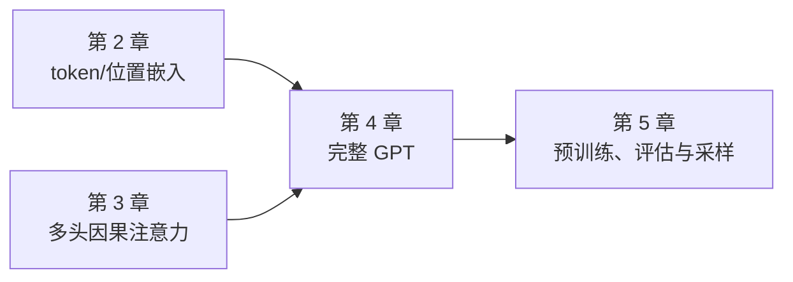
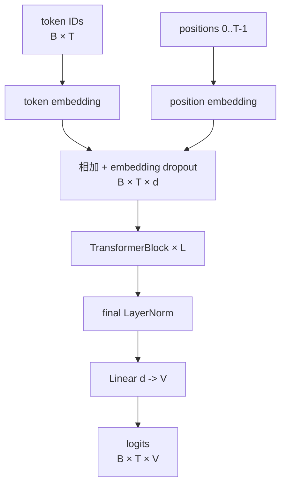
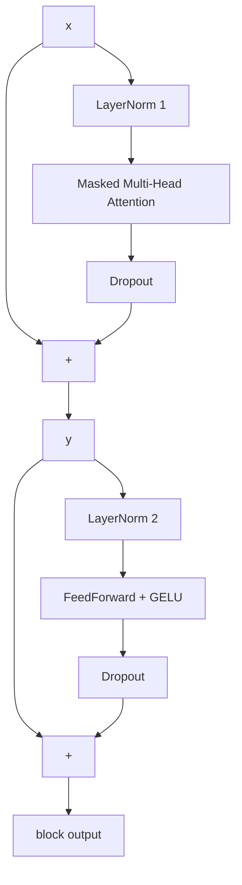
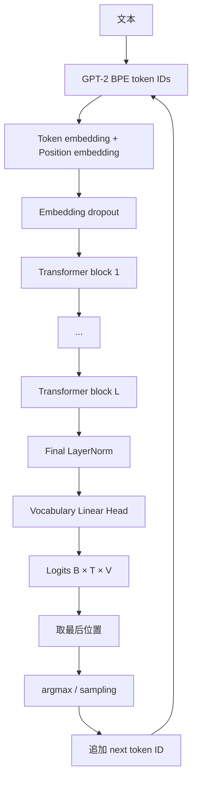
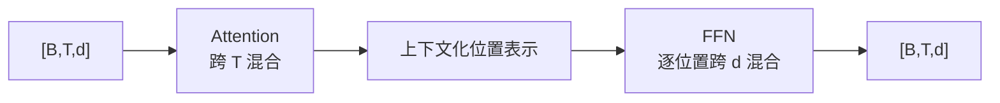

## 0. 本章定位、学习目标与装配主线

前三章已经准备好两类关键部件：第 2 章把文本变成 token ID 与输入嵌入，第 3 章实现多头因果注意力。本章完成全书第一阶段的最后一步：实现其余组件，把它们装配成一个可前向传播、可统计参数、可自回归生成 token 的 GPT-2 风格模型。模型此时仍是随机初始化，真正训练在第 5 章进行。



作者采用“先搭空壳，再逐个替换占位符”的装配路线：


每一步解决前一步暴露的缺口：

| 阶段 | 新增能力 | 仍缺什么 |
|---|---|---|
| Dummy GPT | 验证 token ID 到词表 logits 的总体接口 | 深层上下文计算仍为空操作 |
| LayerNorm | 控制每个 token 特征的均值与方差 | 缺少非线性通道变换 |
| GELU + FFN | 每个位置独立扩维、非线性加工、压回 | 深层堆叠梯度仍难传播 |
| Shortcut | 为信息和梯度提供恒等路径 | 组件尚未组合 |
| Transformer block | Attention 混合位置，FFN 混合特征 | 还需重复堆叠与词表输出 |
| GPTModel | 形成完整随机初始化语言模型 | 尚未从数据学到语言规律 |
| Greedy generation | 把 logits 迭代转成 token 序列 | 随机权重只能生成乱码 |

学完本章，应能回答：

1. GPT 配置中的词表、上下文、维度、头数和层数怎样约束各模块？
2. 为什么大部分模块必须保持 `[B,T,d]`，只有输出头变成 `[B,T,V]`？
3. LayerNorm 为什么沿最后一维而非 batch 或 token 维归一化？
4. 为什么实现使用总体方差 `unbiased=False`、epsilon、可训练 scale/shift？
5. GELU 与 ReLU 有何区别，FFN 为什么先扩大 4 倍再压回？
6. Shortcut 为什么能缓解梯度消失，形状为什么必须相同？
7. Pre-LN Transformer block 的精确执行顺序是什么？
8. 为什么书中模型实际有 163M 独立参数，却称 GPT-2 124M？
9. logits、概率和 token ID 如何在生成循环中连接？
10. 为什么随机初始化架构能运行，却生成不连贯文本？

### 0.1 全章形状不变量

设：

- $B$：批大小；
- $T$：当前序列长度；
- $d$：嵌入/隐藏维度；
- $V$：词表大小；
- $L$：Transformer block 数量。

```text
token IDs                    [B, T]
token + position embeddings  [B, T, d]
each Transformer block       [B, T, d] -> [B, T, d]
final LayerNorm              [B, T, d]
vocabulary output head       [B, T, d] -> [B, T, V]
last-position logits         [B, V]
selected next token          [B, 1]
```

保持隐藏形状不变有三项价值：

1. Attention 与 FFN 输出可直接加回 shortcut。
2. 同一种 block 可重复堆叠 $L$ 次。
3. 每个输出位置仍与一个输入 token 位置一一对应，只是表示已上下文化。

### 0.2 GPT-2 small 配置

本章使用：

```python
GPT_CONFIG_124M = {
    "vocab_size": 50257,
    "context_length": 1024,
    "emb_dim": 768,
    "n_heads": 12,
    "n_layers": 12,
    "drop_rate": 0.1,
    "qkv_bias": False,
}
```

| 配置项 | 控制什么 | 直接约束 |
|---|---|---|
| `vocab_size=50257` | GPT-2 BPE 词表 | token embedding 行数、输出 logits 最后一维 |
| `context_length=1024`（1,024） | 最大输入 token 数 | 位置 embedding 行数、因果 mask 尺寸 |
| `emb_dim=768` | 隐藏特征宽度 | embeddings、LayerNorm、attention、FFN、shortcut |
| `n_heads=12` | 并行 attention 头数 | 每头维度 $768/12=64$ |
| `n_layers=12` | block 堆叠深度 | 深层计算与参数量 |
| `drop_rate=0.1` | 本章三处 dropout 强度 | embedding、attention 权重、shortcut 分支 |
| `qkv_bias=False` | Q/K/V 是否有 bias | attention 参数布局；加载 GPT-2 权重时会调整 |

原始 GPT-2 报告曾写 117M，后来修正为约 124M。书中代码保留独立输出矩阵时有约 163M 参数；按原始 GPT-2 的 token embedding/output weight tying 口径才约 124M。两种数字衡量的参数共享方案不同，不矛盾。

GPT-3 的核心架构与 GPT-2 同属 decoder-only Transformer，主要把规模从 GPT-2 最大约 1.5B 扩到 175B，并使用更多数据。作者选择 GPT-2 是因为公开预训练权重可在后续加载，且小模型能在单台电脑上研究；原书引用估计称单张 V100 训练 GPT-3 需约 355 年，RTX 8000 约 665 年，这些只是特定假设下的量级说明，不是当前硬件上的普适常数。

---

## 4.1 Coding an LLM Architecture（编码 LLM 架构）

### 4.1.1 GPT 的顶层组成

GPT 是 *generative pretrained transformer*：

- **Generative**：按条件概率逐 token 生成文本；
- **Pretrained**：先在大规模文本上做下一 token 预训练；
- **Transformer**：主干由多头因果注意力、FFN、归一化和 shortcut 组成。

顶层数据流：



参数量虽大，结构并不由数百万种模块构成；主要规模来自少量大矩阵和同类 block 的重复。

### 4.1.2 为什么先实现 Dummy 模型

直接写完整 GPT 时，任何 shape、设备、位置索引或模块顺序错误都可能混在一起。Dummy 模型先保留外层接口，让 Transformer block 与 LayerNorm 暂时返回输入，从而验证：

- token/position embedding 能否相加；
- 当前长度是否能生成位置索引；
- dropout 与 block stack 是否保持形状；
- 输出头能否映射到词表维度；
- 两条等长文本能否组成批次。

这是“先打通骨架，再替换局部”的工程策略。占位符并非近似 attention，它们是明确的恒等函数。

### 4.1.3 Dummy GPT 的实现

```python
import torch
import torch.nn as nn


class DummyTransformerBlock(nn.Module):
    def __init__(self, cfg):
        super().__init__()

    def forward(self, x):
        return x


class DummyLayerNorm(nn.Module):
    def __init__(self, normalized_shape, eps=1e-5):
        super().__init__()

    def forward(self, x):
        return x


class DummyGPTModel(nn.Module):
    def __init__(self, cfg):
        super().__init__()
        self.tok_emb = nn.Embedding(
            cfg["vocab_size"],
            cfg["emb_dim"],
        )
        self.pos_emb = nn.Embedding(
            cfg["context_length"],
            cfg["emb_dim"],
        )
        self.drop_emb = nn.Dropout(cfg["drop_rate"])
        self.trf_blocks = nn.Sequential(
            *[
                DummyTransformerBlock(cfg)
                for _ in range(cfg["n_layers"])
            ]
        )
        self.final_norm = DummyLayerNorm(cfg["emb_dim"])
        self.out_head = nn.Linear(
            cfg["emb_dim"],
            cfg["vocab_size"],
            bias=False,
        )

    def forward(self, input_ids):
        _, seq_len = input_ids.shape
        token_embeddings = self.tok_emb(input_ids)
        positions = torch.arange(
            seq_len,
            device=input_ids.device,
        )
        position_embeddings = self.pos_emb(positions)
        hidden = token_embeddings + position_embeddings
        hidden = self.drop_emb(hidden)
        hidden = self.trf_blocks(hidden)
        hidden = self.final_norm(hidden)
        return self.out_head(hidden)
```

### 4.1.4 为什么位置索引要跟随输入设备

```python
torch.arange(seq_len, device=input_ids.device)
```

若输入在 GPU、位置索引默认建在 CPU，位置 embedding 查表或后续加法会产生 device mismatch。设备来自实际输入而非硬编码，使同一 forward 同时支持 CPU/GPU。

位置 embedding 形状是 `[T,d]`，token embedding 是 `[B,T,d]`。PyTorch 沿 batch 轴广播：

$$
H_{b,t,:}=E_{\mathrm{tok}}[x_{b,t}]+E_{\mathrm{pos}}[t].
$$

### 4.1.5 为什么输出是 logits，不是 embedding 或概率

输出头：

$$
W_{\mathrm{out}}\in\mathbb R^{V\times d}
$$

对每个位置隐藏向量 $h_{b,t}\in\mathbb R^d$：

$$
\ell_{b,t}=h_{b,t}W_{\mathrm{out}}^{\mathsf T}
\in\mathbb R^V.
$$

$\ell$ 是 logits，即未归一化分数：

- 训练时交叉熵可直接接收 logits，内部稳定地组合 log-softmax 与负对数似然；
- 生成时可根据需要做 softmax、temperature、top-k 或直接 argmax；
- 若模型提前固定 softmax，就降低数值稳定性和解码灵活性。

“输出 embedding”容易造成误解。Transformer block 输出是隐藏/context representation；`out_head` 输出是每个词表 token 的 score，不是供语义检索的通用 embedding。

### 4.1.6 原书批次与输出形状

两条文本：

```python
import tiktoken

tokenizer = tiktoken.get_encoding("gpt2")
texts = [
    "Every effort moves you",
    "Every day holds a",
]
batch = torch.stack(
    [torch.tensor(tokenizer.encode(text)) for text in texts]
)
print(batch)
```

输出：

```text
[[6109, 3626, 6100, 345],
 [6109, 1110, 6622, 257]]
```

两条文本恰好都有 4 个 token，所以能直接 `stack`。若长度不同，必须 padding 并配 mask、分桶，或分别处理；`torch.stack` 不会自动补齐。

运行 Dummy 模型：

```python
torch.manual_seed(123)
dummy_model = DummyGPTModel(GPT_CONFIG_124M)
logits = dummy_model(batch)
print(logits.shape)
```

形状：

```text
[2, 4, 50257]
```

每个批次、每个输入位置都有一个 50,257 维下一 token score 向量。因果语言模型训练会同时监督所有 8 个位置；生成时只使用当前序列最后一个位置。

### 4.1.7 配置之间的硬约束

至少满足：

$$
T\le {\texttt{context\_length}},
$$

$$
{\texttt{emb\_dim}}\bmod {\texttt{n\_heads}}=0,
$$

$$
0\le {\texttt{drop\_rate}}<1.
$$

还需保证 input ID 在 $[0,V-1]$。配置是模块之间的契约，不只是方便存放超参数的字典。

---

## 4.2 Normalizing Activations with Layer Normalization（用层归一化规范激活）

### 4.2.1 为什么深层网络需要控制激活尺度

深层网络反向传播反复乘局部 Jacobian：

$$
\frac{\partial\mathcal L}{\partial x_0}
=\frac{\partial\mathcal L}{\partial x_L}
\prod_{\ell=1}^{L}
\frac{\partial x_\ell}{\partial x_{\ell-1}}.
$$

若局部尺度长期小于 1，梯度可能消失；长期大于 1，梯度可能爆炸。前向激活尺度不断漂移也会使各层优化条件不一致。LayerNorm 对每个 token 的特征向量重新居中、缩放，帮助深层训练更稳定。

它不是单独解决所有梯度问题：初始化、shortcut、优化器和学习率同样重要。本章后续将 LayerNorm 与 shortcut 一起使用。

### 4.2.2 LayerNorm 的归一化轴

输入：

$$
X\in\mathbb R^{B\times T\times d}.
$$

对每个 $(b,t)$ 独立计算最后一个特征轴：

$$
\mu_{b,t}=\frac{1}{d}\sum_{k=1}^{d}X_{b,t,k},
$$

$$
\sigma^2_{b,t}
=\frac{1}{d}\sum_{k=1}^{d}
(X_{b,t,k}-\mu_{b,t})^2.
$$

规范化：

$$
\widehat X_{b,t,k}
=\frac{X_{b,t,k}-\mu_{b,t}}
{\sqrt{\sigma^2_{b,t}+\epsilon}}.
$$

所以代码使用：

```python
mean = x.mean(dim=-1, keepdim=True)
var = x.var(dim=-1, keepdim=True, unbiased=False)
```

`dim=-1` 无论输入是 `[B,d]` 还是 `[B,T,d]`，都指最后的特征维；不会跨 batch，也不会混合不同 token。

### 4.2.3 `keepdim=True` 为什么重要

若 $x$ 形状 `[B,T,d]`：

- `mean(..., keepdim=True)` 得到 `[B,T,1]`；
- `x - mean` 能沿最后一维广播；
- 不需要手动 `unsqueeze`。

若 `keepdim=False` 得到 `[B,T]`，从右对齐广播时末维 $T$ 与 $d$ 通常不匹配。保留降维轴使公式与张量布局直接对应。

### 4.2.4 原书 2×6 激活示例

```python
torch.manual_seed(123)
batch_example = torch.randn(2, 5)
layer = nn.Sequential(nn.Linear(5, 6), nn.ReLU())
activations = layer(batch_example)
print(activations)
```

结果：

```text
[[0.2260, 0.3470, 0.0000, 0.2216, 0.0000, 0.0000],
 [0.2133, 0.2394, 0.0000, 0.5198, 0.3297, 0.0000]]
```

ReLU 把负输入截成 0，所以均值不为 0：

```text
mean     = [[0.1324], [0.2170]]
variance = [[0.0231], [0.0398]]
```

手动规范化后，按相同方差约定检查，可得到均值约 0、方差约 1。$-5.9605\times10^{-8}$ 之类结果是浮点舍入误差，不是算法失败。

### 4.2.5 为什么方差使用 `unbiased=False`

总体方差：

$$
\sigma^2_{\mathrm{pop}}
=\frac{1}{d}\sum_{k=1}^{d}(x_k-\mu)^2.
$$

无偏样本方差使用 Bessel 校正：

$$
s^2
=\frac{1}{d-1}\sum_{k=1}^{d}(x_k-\mu)^2.
$$

LayerNorm 不是从少量样本估计未知总体方差；它是在当前完整特征向量上定义确定变换，因此使用总体方差 `unbiased=False`。这也兼容原始 GPT-2 的 TensorFlow 实现和后续预训练权重。

若手算时使用 PyTorch `var()` 的另一种默认约定，再用 `unbiased=False` 检查，数值会偏离 1。归一化与验收必须使用一致的分母。

### 4.2.6 epsilon 为什么加在方差里

若所有特征相同：

$$
\sigma^2=0.
$$

直接除以标准差会除以 0。加入：

$$
\sqrt{\sigma^2+\epsilon},
\qquad \epsilon=10^{-5},
$$

保证分母为正并改善有限精度稳定性。

epsilon 也解释了实际规范化方差常为 `0.9995`、`0.9997` 而非严格 1：

$$
\operatorname{Var}(\widehat x)
=\frac{\sigma^2}{\sigma^2+\epsilon}<1.
$$

当方差远大于 epsilon 时差异很小。

### 4.2.7 为什么还需要可训练 scale 和 shift

若永远强制每个特征组均值 0、方差 1，可能限制后续层需要的尺度和偏移。LayerNorm 增加：

$$
y_k=\gamma_k\widehat x_k+\beta_k,
$$

其中：

$$
\gamma\in\mathbb R^d,
\qquad
\beta\in\mathbb R^d.
$$

初始：

$$
\gamma=\mathbf1,\qquad\beta=\mathbf0,
$$

所以开始时是纯规范化；训练可逐特征恢复或改变合适尺度。加入 affine 参数后，LayerNorm 的最终输出不必保持均值 0、方差 1，这是有意的表达能力。

### 4.2.8 完整实现

```python
class LayerNorm(nn.Module):
    def __init__(self, emb_dim):
        super().__init__()
        self.eps = 1e-5
        self.scale = nn.Parameter(torch.ones(emb_dim))
        self.shift = nn.Parameter(torch.zeros(emb_dim))

    def forward(self, x):
        mean = x.mean(dim=-1, keepdim=True)
        variance = x.var(
            dim=-1,
            keepdim=True,
            unbiased=False,
        )
        normalized = (x - mean) / torch.sqrt(
            variance + self.eps
        )
        return self.scale * normalized + self.shift
```

参数量：

$$
N_{\mathrm{LayerNorm}}=2d.
$$

$d=768$ 时一层有 1,536 个参数，相对大矩阵很少，但其位置与数值行为对训练很重要。

### 4.2.9 LayerNorm 与 BatchNorm

| 维度 | LayerNorm | BatchNorm |
|---|---|---|
| 归一化范围 | 单样本、单 token 的特征轴 | batch 中同一特征的样本统计 |
| 是否依赖 batch 大小 | 否 | 是 |
| train/eval 统计差异 | 无运行均值/方差切换 | 通常训练用 batch、推理用 running stats |
| 序列模型适配 | 变长、微批次和自回归推理稳定 | 小批次/变长场景较麻烦 |

LayerNorm 不跨样本传播统计信息，适合分布式训练、batch size 变化和单样本生成。

### 4.2.10 Pre-LN、Post-LN 与最终 LayerNorm

原书概述说现代 GPT 在 attention 前后附近使用 LayerNorm；精确到本章代码：

- 每个 attention 子层**之前**有 `norm1`；
- 每个 FFN 子层**之前**有 `norm2`；
- shortcut 相加之后不立即再 norm；
- 全部 blocks 之后还有 `final_norm`。

这叫 **Pre-LayerNorm**。原始 2017 Transformer 常使用 Post-LN，即子层和 shortcut 相加后归一化。Pre-LN 通常给深层网络更直接的梯度路径，训练动态更好；二者不能只改一行而无视预训练权重和整体架构约定。

### 4.2.11 LayerNorm 的行为不变量

```python
x = torch.randn(2, 4, 768)
layer_norm = LayerNorm(768)
y = layer_norm(x)

assert y.shape == x.shape
assert layer_norm.scale.shape == (768,)
assert layer_norm.shift.shape == (768,)
assert torch.allclose(
    y.mean(dim=-1),
    torch.zeros(2, 4),
    atol=1e-5,
)
assert torch.allclose(
    y.var(dim=-1, unbiased=False),
    torch.ones(2, 4),
    atol=2e-4,
)
```

最后一个容差依赖输入方差与 epsilon；接近常量的输入不能要求方差严格为 1。更稳妥的测试还应覆盖常量输入输出有限、反向梯度有限，以及 batch 中一个样本变化不影响另一个样本的规范化统计。

---

## 4.3 Implementing a Feed Forward Network with GELU Activations（实现带 GELU 的前馈网络）

### 4.3.1 为什么只有 attention 还不够

多头 attention 的核心作用是**跨位置读取与混合信息**：位置 $t$ 根据上下文构造新的向量。但如果只有加权平均和线性投影，模型还需要一个强的逐位置非线性变换来加工每个 token 的特征组合。

Transformer block 因此交替使用两类模块：

| 模块 | 主要混合轴 | 是否让不同 token 直接交互 |
|---|---|---:|
| Multi-head attention | token/位置轴 | 是 |
| Feed-forward network | 单个 token 的特征轴 | 否，共享同一函数逐位置处理 |

对输入 $X\in\mathbb R^{B\times T\times d}$，FFN 对每个 $(b,t)$ 独立应用同一个 MLP：

$$
Y_{b,t,:}=f(X_{b,t,:}).
$$

它不改变 $B,T$，只暂时扩大并重新组合最后的特征维。

### 4.3.2 为什么需要非线性激活

若连续堆叠线性层且中间没有激活：

$$
W_2(W_1x+b_1)+b_2
=(W_2W_1)x+(W_2b_1+b_2),
$$

整体仍是一层线性/仿射变换，深度没有带来更复杂的函数族。GELU 在两层之间引入非线性，使模型能学习条件化的特征组合。

### 4.3.3 ReLU 与 GELU

ReLU：

$$
\operatorname{ReLU}(x)=\max(0,x).
$$

优点是简单、正区间梯度为 1；缺点是所有负输入输出和梯度都为 0，在 $x=0$ 有折点。

GELU（Gaussian Error Linear Unit）的精确定义：

$$
\operatorname{GELU}(x)=x\Phi(x),
$$

$\Phi(x)$ 是标准正态分布的累积分布函数。直觉上，它按输入大小平滑地“门控”输入：大正数近似保留，大负数近似抑制，零附近平滑过渡。

GPT-2 使用计算更便宜的拟合近似：

$$
\operatorname{GELU}(x)
\approx\frac{x}{2}
\left[
1+\tanh\left(
\sqrt{\frac{2}{\pi}}
\left(x+0.044715x^3\right)
\right)
\right].
$$

### 4.3.4 GELU 的实现与数值直觉

```python
class GELU(nn.Module):
    def __init__(self):
        super().__init__()

    def forward(self, x):
        coefficient = torch.sqrt(
            torch.tensor(
                2.0 / torch.pi,
                device=x.device,
                dtype=x.dtype,
            )
        )
        return 0.5 * x * (
            1.0
            + torch.tanh(
                coefficient * (x + 0.044715 * x**3)
            )
        )
```

与原书代码相比，这里显式让常量跟随输入的 device 与 dtype，避免 GPU/混合精度时出现设备或类型不匹配。

代表值：

| $x$ | ReLU$(x)$ | GELU 近似值 | 直觉 |
|---:|---:|---:|---|
| $-3$ | 0 | 约 $-0.004$ | 大负值几乎抑制 |
| $-1$ | 0 | 约 $-0.159$ | 仍允许小负输出与梯度 |
| $0$ | 0 | 0 | 平滑穿过原点 |
| $1$ | 1 | 约 $0.841$ | 大部分保留 |
| $3$ | 3 | 约 $2.996$ | 近似恒等 |

GELU 不是单调地“把所有负值变小后保留”；它在约 $x=-0.75$ 附近有浅谷，导数也并非对所有负值都非零且正。核心优势是平滑门控，而不是一条绝对的性能定理。

PyTorch 也提供：

```python
torch.nn.functional.gelu(x, approximate="tanh")
```

加载特定预训练权重时必须匹配其激活近似；精确 GELU 与 tanh 近似很接近，但并非逐位相同。

### 4.3.5 FFN 为什么先扩到 4 倍

本章 FeedForward：

$$
d\xrightarrow{W_1}4d
\xrightarrow{\mathrm{GELU}}4d
\xrightarrow{W_2}d.
$$

代码：

```python
class FeedForward(nn.Module):
    def __init__(self, cfg):
        super().__init__()
        emb_dim = cfg["emb_dim"]
        self.layers = nn.Sequential(
            nn.Linear(emb_dim, 4 * emb_dim),
            GELU(),
            nn.Linear(4 * emb_dim, emb_dim),
        )

    def forward(self, x):
        return self.layers(x)
```

扩大中间维度给非线性变换更多通道来检测和组合特征，再压回 $d$ 以保持 block 接口和 shortcut 形状。4 倍是 GPT-2 的架构选择，不是所有 LLM 的定律；现代模型也常用 SwiGLU 和不同扩展比例。

### 4.3.6 FFN 的形状与共享方式

对：

```python
x = torch.rand(2, 3, 768)
ffn = FeedForward(GPT_CONFIG_124M)
y = ffn(x)
```

内部：

```text
[2, 3, 768]
-> [2, 3, 3072]
-> [2, 3, 3072]
-> [2, 3, 768]
```

也就是每个 token 的特征维从 768 扩到 3,072，再压回 768。

`nn.Linear` 自动只变换最后一维；同一组权重应用到所有 batch 和 token 位置。FFN 不为每个位置保存一套参数，所以可以处理不超过上下文上限的不同 $T$。

### 4.3.7 FFN 参数量推导

两层都使用 bias：

第一层：

$$
N_1=(4d)d+4d=4d^2+4d.
$$

第二层：

$$
N_2=d(4d)+d=4d^2+d.
$$

总计：

$$
N_{\mathrm{FFN}}=8d^2+5d.
$$

$d=768$：

$$
N_{\mathrm{FFN}}
=8\times768^2+5\times768
=4{,}722{,}432.
$$

这正是练习 4.1 的 FFN 参数数。它约为本章多头 attention 的 2 倍，因为 FFN 两个矩阵都经过 4 倍中间维。

### 4.3.8 FFN 的能力与局限

**解决：**逐位置非线性特征加工，扩大 block 表达容量。

**不解决：**跨 token 通信、位置顺序、因果遮罩。单独打乱 token 行后，FFN 输出只会按相同顺序打乱；跨位置关系由 attention 提供。

---

## 4.4 Adding Shortcut Connections（添加快捷/残差连接）

### 4.4.1 深层网络为什么会出现梯度消失

没有 shortcut 的深层复合：

$$
x_L=F_L(F_{L-1}(\cdots F_1(x_0))).
$$

反向梯度：

$$
\frac{\partial\mathcal L}{\partial x_0}
=\frac{\partial\mathcal L}{\partial x_L}
J_{F_L}J_{F_{L-1}}\cdots J_{F_1}.
$$

若多个 Jacobian 的典型奇异值小于 1，连乘会快速衰减；早期层几乎收不到学习信号。大于 1 则可能爆炸。

### 4.4.2 Shortcut 的公式与梯度路径

残差层写成：

$$
y=x+F(x).
$$

其 Jacobian：

$$
\frac{\partial y}{\partial x}
=I+J_F.
$$

反向：

$$
\frac{\partial\mathcal L}{\partial x}
=\frac{\partial\mathcal L}{\partial y}
(I+J_F).
$$

$I$ 提供一条不经过 $F$ 内部权重与激活的直接梯度路径。即使 $J_F$ 很小，梯度仍可沿恒等项传播。Shortcut 不是让梯度永远不衰减的绝对保证，但显著改善深层优化。

### 4.4.3 为什么称为学习残差

若目标变换为 $H(x)$，残差分支只需学习：

$$
F(x)=H(x)-x,
$$

最终：

$$
H(x)=x+F(x).
$$

当某层无需修改表示时，只需学到 $F(x)\approx0$，block 近似恒等映射。这使“增加更多层但不破坏已有表示”更容易。

### 4.4.4 形状为什么必须匹配

逐元素相加要求：

$$
\operatorname{shape}(x)
=\operatorname{shape}(F(x)).
$$

原书演示代码只在 shape 完全相同时应用 shortcut：

```python
if self.use_shortcut and x.shape == layer_output.shape:
    x = x + layer_output
else:
    x = layer_output
```

真实残差网络若维度不同，可用投影 shortcut：

$$
y=W_sx+F(x),
$$

但本章 GPT block 特意让 attention 与 FFN 都回到 $d$，无需额外投影。

### 4.4.5 原书五层实验

```python
class ExampleDeepNeuralNetwork(nn.Module):
    def __init__(self, layer_sizes, use_shortcut):
        super().__init__()
        self.use_shortcut = use_shortcut
        self.layers = nn.ModuleList(
            [
                nn.Sequential(
                    nn.Linear(layer_sizes[index], layer_sizes[index + 1]),
                    GELU(),
                )
                for index in range(len(layer_sizes) - 1)
            ]
        )

    def forward(self, x):
        for layer in self.layers:
            layer_output = layer(x)
            if self.use_shortcut and x.shape == layer_output.shape:
                x = x + layer_output
            else:
                x = layer_output
        return x
```

配置：

```python
layer_sizes = [3, 3, 3, 3, 3, 1]
sample_input = torch.tensor([[1.0, 0.0, -1.0]])
```

前四层输入输出同为 3 维，可加 shortcut；最后一层从 3 维变 1 维，不能直接相加。

### 4.4.6 梯度实验如何测量

模型输出与目标 0 计算均方误差：

$$
\mathcal L=(\widehat y-0)^2.
$$

执行 `loss.backward()` 后，对每层 weight 梯度取绝对值均值：

$$
g_\ell
=\frac{1}{N_\ell}
\sum_{i=1}^{N_\ell}
\left|\frac{\partial\mathcal L}
{\partial W_{\ell,i}}\right|.
$$

这是便于比较的汇总指标，不等于梯度范数，也不能单凭一次样本全面评价训练稳定性。

### 4.4.7 无 shortcut 与有 shortcut 的结果

原书固定随机种子后，无 shortcut：

| 层 | 平均绝对梯度 |
|---|---:|
| `layers.0` | 0.0002017 |
| `layers.1` | 0.0001201 |
| `layers.2` | 0.0007152 |
| `layers.3` | 0.0013989 |
| `layers.4` | 0.0050496 |

靠近输入的层梯度远小于最后层。

使用 shortcut：

| 层 | 平均绝对梯度 |
|---|---:|
| `layers.0` | 0.2216979 |
| `layers.1` | 0.2069411 |
| `layers.2` | 0.3289700 |
| `layers.3` | 0.2665733 |
| `layers.4` | 1.3258542 |

早期层梯度提高多个数量级，虽然最后层仍最大，但不再呈严重消失。

这些具体数字依赖 PyTorch 版本、初始化与 GELU 实现。应关注同权重条件下 shortcut 提供的梯度路径，而不是把打印值当跨环境常数。

### 4.4.8 为什么要重新设置相同随机种子

比较有无 shortcut 时都调用：

```python
torch.manual_seed(123)
```

使两模型初始线性层参数一致，唯一主要差异是 forward 是否相加。若初始化不同，就无法把梯度差异归因于 shortcut。

### 4.4.9 Shortcut 与 dropout、LayerNorm 的关系

本章 Transformer 子层采用：

$$
y=x+\operatorname{Dropout}(F(\operatorname{LN}(x))).
$$

- LayerNorm 稳定进入分支的激活尺度；
- $F$ 学 attention 或 FFN 变换；
- dropout 只随机作用于变换分支；
- shortcut 保留未经 dropout 的原始 $x$。

若对相加后的整个结果做 dropout，恒等路径也会随机断开，改变本章设计。

### 4.4.10 Shortcut 不等于拼接或原地修改

Shortcut 使用逐元素加法，输出维度不变。拼接会得到 $2d$，需额外投影。实现通常写：

```python
shortcut = x
x = sublayer(x)
x = x + shortcut
```

不应误写成可能破坏 autograd 所需值的任意原地操作。变量重新绑定不等于修改底层张量。

### 4.4.11 这一节为 Transformer block 准备了什么

Attention 与 FFN 都满足：

$$
F:\mathbb R^{B\times T\times d}
\rightarrow\mathbb R^{B\times T\times d}.
$$

因此每个子层都能构成：

$$
x\leftarrow x+F(\operatorname{LN}(x)).
$$

下一节只需按正确顺序连接两条残差分支，就形成可重复堆叠的 Pre-LN Transformer block。

---

## 4.5 Connecting Attention and Linear Layers in a Transformer Block（在 Transformer block 中连接注意力与线性层）

### 4.5.1 Transformer block 的职责分工

一个 GPT block 包含两条子层：

1. **多头因果 self-attention**：同一序列不同位置之间交换信息。
2. **逐位置 FeedForward**：对每个位置的特征独立做非线性变换。

每条子层前有独立 LayerNorm，子层输出经 dropout 后加回 shortcut：



数学形式：

$$
y=x+\operatorname{Dropout}
\left(\operatorname{MHA}(\operatorname{LN}_1(x))\right),
$$

$$
z=y+\operatorname{Dropout}
\left(\operatorname{FFN}(\operatorname{LN}_2(y))\right).
$$

### 4.5.2 为什么是 Pre-LN

本章在子层**之前**归一化：

```text
LN -> sublayer -> dropout -> add shortcut
```

这是 Pre-LN。Post-LN 则通常：

```text
sublayer -> dropout -> add shortcut -> LN
```

Pre-LN 的 shortcut 从 block 输入到输出保留未经归一化和子层的恒等路径，梯度可更直接地跨越多个 block；现代深层 Transformer 常因此更容易训练。选择哪一种是架构契约，加载预训练权重时必须一致。

### 4.5.3 为什么 attention 和 FFN 各自需要 LayerNorm

第一条子层改变 $x$，得到 $y$。第二条 FFN 应规范化新的 $y$，而不是复用第一条 `norm1(x)`。两套 LayerNorm 还各有独立 $\gamma,\beta$，让 attention 与 FFN 的输入尺度分别适配。

错误写法如只在 block 开头做一次 norm，会改变第二条分支的输入分布和预训练架构。

### 4.5.4 完整实现

以下假设第 3 章的 `MultiHeadAttention` 已定义：

```python
class TransformerBlock(nn.Module):
    def __init__(self, cfg):
        super().__init__()
        self.att = MultiHeadAttention(
            d_in=cfg["emb_dim"],
            d_out=cfg["emb_dim"],
            context_length=cfg["context_length"],
            dropout=cfg["drop_rate"],
            num_heads=cfg["n_heads"],
            qkv_bias=cfg["qkv_bias"],
        )
        self.ff = FeedForward(cfg)
        self.norm1 = LayerNorm(cfg["emb_dim"])
        self.norm2 = LayerNorm(cfg["emb_dim"])
        self.drop_shortcut = nn.Dropout(cfg["drop_rate"])

    def forward(self, x):
        shortcut = x
        x = self.norm1(x)
        x = self.att(x)
        x = self.drop_shortcut(x)
        x = x + shortcut

        shortcut = x
        x = self.norm2(x)
        x = self.ff(x)
        x = self.drop_shortcut(x)
        x = x + shortcut
        return x
```

### 4.5.5 第二条 shortcut 为什么必须在 attention 之后更新

第二条残差基线应是 attention 分支完成后的 $y$：

```python
shortcut = x  # 此时 x 已是 y
```

若错误地仍加最初 block 输入 $x_0$，实现会变成：

$$
z=x_0+\operatorname{FFN}(\operatorname{LN}(y)),
$$

丢掉 $y$ 的直接恒等路径，与标准 Transformer block 不同。

### 4.5.6 为什么只需一个 dropout 模块对象

同一个 `nn.Dropout` 实例可在 forward 中调用两次；训练模式下每次调用都会采样新的随机 mask，不会重复使用相同图案。它没有可训练参数，复用对象只是共享相同丢弃概率和模式状态。

若想让 attention shortcut 与 FFN shortcut 使用不同 rate，则需要两个模块或按配置分别构造；练习 4.3 讨论的是 embedding、attention 内部和 shortcut 三类位置，并未要求两条 shortcut 分开。

### 4.5.7 形状不变量

```python
torch.manual_seed(123)
x = torch.rand(2, 4, 768)
block = TransformerBlock(GPT_CONFIG_124M)
y = block(x)

assert y.shape == x.shape == (2, 4, 768)
```

虽然 shape 不变，内容已发生两次重新编码：attention 让位置融合合法前缀信息，FFN 再加工每个位置的通道特征。

### 4.5.8 一个 block 的参数组成

对 $d=768$：

- Multi-head attention：2,360,064；
- FeedForward：4,722,432；
- 两个 LayerNorm：$2\times(2d)=3,072$；
- dropout 与 mask buffer：0 个可训练参数。

合计：

$$
2{,}360{,}064+4{,}722{,}432+3{,}072
=7{,}085{,}568.
$$

12 个 block：

$$
12\times7{,}085{,}568
=85{,}026{,}816.
$$

### 4.5.9 练习 4.1：FFN 与 attention 参数比较

附录 C 的代码：

```python
block = TransformerBlock(GPT_CONFIG_124M)

ff_params = sum(
    parameter.numel()
    for parameter in block.ff.parameters()
)
att_params = sum(
    parameter.numel()
    for parameter in block.att.parameters()
)

print(ff_params)   # 4,722,432
print(att_params)  # 2,360,064
```

比值：

$$
\frac{4{,}722{,}432}{2{,}360{,}064}
\approx2.001.
$$

所以 block 中 FFN 参数约为 attention 的两倍。Attention 的运行内存仍可能因 $T\times T$ 权重而成为长上下文瓶颈；参数多寡与运行时内存/计算不能混为一谈。

---

## 4.6 Coding the GPT Model（编码完整 GPT 模型）

### 4.6.1 从 Dummy 替换为真实组件

完整 `GPTModel` 的外壳几乎不变，只把：

- `DummyTransformerBlock` 替换为 `TransformerBlock`；
- `DummyLayerNorm` 替换为 `LayerNorm`。

这说明先搭骨架的价值：顶层 token/position embedding、block stack 和输出接口已验证，局部替换后可继续沿用。

### 4.6.2 完整实现

```python
class GPTModel(nn.Module):
    def __init__(self, cfg):
        super().__init__()
        self.tok_emb = nn.Embedding(
            cfg["vocab_size"],
            cfg["emb_dim"],
        )
        self.pos_emb = nn.Embedding(
            cfg["context_length"],
            cfg["emb_dim"],
        )
        self.drop_emb = nn.Dropout(cfg["drop_rate"])
        self.trf_blocks = nn.Sequential(
            *[
                TransformerBlock(cfg)
                for _ in range(cfg["n_layers"])
            ]
        )
        self.final_norm = LayerNorm(cfg["emb_dim"])
        self.out_head = nn.Linear(
            cfg["emb_dim"],
            cfg["vocab_size"],
            bias=False,
        )

    def forward(self, input_ids):
        _, seq_len = input_ids.shape
        if seq_len > self.pos_emb.num_embeddings:
            raise ValueError("sequence exceeds configured context length")

        token_embeddings = self.tok_emb(input_ids)
        positions = torch.arange(
            seq_len,
            device=input_ids.device,
        )
        position_embeddings = self.pos_emb(positions)

        hidden = token_embeddings + position_embeddings
        hidden = self.drop_emb(hidden)
        hidden = self.trf_blocks(hidden)
        hidden = self.final_norm(hidden)
        return self.out_head(hidden)
```

原书代码没有显式长度检查，超长输入会在位置 embedding 查表或 attention mask 处失败；这里给出更清晰错误，不改变合法输入行为。

### 4.6.3 为什么 block stack 使用 `nn.Sequential`

所有 block 接口相同：

$$
[B,T,d]\rightarrow[B,T,d].
$$

所以可用：

```python
nn.Sequential(
    *[TransformerBlock(cfg) for _ in range(n_layers)]
)
```

列表推导每次创建新的对象和独立参数。不能写成把同一个 block 对象重复 12 次，否则会意外共享全部层权重，变成另一种架构。

### 4.6.4 为什么 blocks 后还有 `final_norm`

Pre-LN block 的最后一步是 shortcut 相加，输出没有经过额外归一化。堆叠结束后用 `final_norm` 规范送入词表头的表示尺度，也是 GPT-2 架构的一部分。

### 4.6.5 124M 配置的输出接口

对原书 batch：

```text
[[6109, 3626, 6100, 345],
 [6109, 1110, 6622, 257]]
```

完整模型输出仍为：

```text
[2, 4, 50257]
```

模型尚未训练，logit 数值由随机初始化决定；shape 正确只证明计算图与接口成立，不证明模型具备语言能力。

### 4.6.6 参数量逐项推导

令 $V=50{,}257,C=1{,}024,d=768,L=12$。

**Token embedding：**

$$
Vd=50{,}257\times768=38{,}597{,}376.
$$

**Position embedding：**

$$
Cd=1{,}024\times768=786{,}432.
$$

**12 个 blocks：**

$$
L\times7{,}085{,}568=85{,}026{,}816.
$$

**Final LayerNorm：**

$$
2d=1{,}536.
$$

**独立 output head：**

$$
Vd=38{,}597{,}376.
$$

总计：

$$
38{,}597{,}376
+786{,}432
+85{,}026{,}816
+1{,}536
+38{,}597{,}376
=163{,}009{,}536.
$$

与 `sum(p.numel() for p in model.parameters())` 一致。

### 4.6.7 Weight tying 是什么

输入 token embedding：

$$
E\in\mathbb R^{V\times d}.
$$

输出头权重：

$$
W_{\mathrm{out}}\in\mathbb R^{V\times d}.
$$

Weight tying 令：

$$
W_{\mathrm{out}}=E,
$$

同一个参数矩阵既把 ID 映射到向量，又用隐藏向量为 token 打分。独立存储参数减少：

$$
163{,}009{,}536-38{,}597{,}376
=124{,}412{,}160.
$$

### 4.6.8 “减去输出头”不等于代码已经 tying

原书通过从总数减去 output head 参数，说明若共享时的独立参数口径。当前 `GPTModel` 仍实际创建两份 `Parameter`，所以：

```python
model.out_head.weight is model.tok_emb.weight
```

为 `False`。真正 tying 需显式共享参数，例如初始化后：

```python
model.out_head.weight = model.tok_emb.weight
```

共享会影响 `state_dict`、优化器与训练行为，加载预训练权重时必须按目标架构处理。本书当前选择独立层，作者称其经验上可带来更好训练表现；现代 LLM 是否 tying 取决于具体架构，不能一概而论。

### 4.6.9 参数量、模型文件与训练内存不要混淆

FP32 仅参数权重：

$$
163{,}009{,}536\times4
=652{,}038{,}144\ {\mathrm{bytes}}.
$$

换算 MiB：

$$
\frac{652{,}038{,}144}{1024^2}
=621.83\ {\mathrm{MiB}}.
$$

原书显示 “MB”，实际除以 $1024^2$ 得到的是 MiB 口径。

这不是训练总显存。训练还需：

- 梯度；
- 优化器状态；
- 前向激活；
- attention 中间张量；
- 临时 workspace；
- 混合精度 master weights 等。

推理也有激活和 KV cache。因此“模型参数文件 621.83 MiB”不能直接当训练显存需求。

### 4.6.10 练习 4.2：更大 GPT-2 配置

同一个 `GPTModel` 类只需改配置：

| 版本 | `emb_dim` | `n_layers` | `n_heads` | 每头维度 |
|---|---:|---:|---:|---:|
| small | 768 | 12 | 12 | 64 |
| medium | 1,024 | 24 | 16 | 64 |
| large | 1,280 | 36 | 20 | 64 |
| XL | 1,600 | 48 | 25 | 64 |

按本书“独立 output head”实现和相同 $V=50{,}257,C=1{,}024$ 复算：

| 版本 | 当前代码总参数 | weight-tying 口径 | FP32 参数 MiB |
|---|---:|---:|---:|
| small | 163,009,536 | 124,412,160 | 621.83 |
| medium | 406,212,608 | 354,749,440 | 1,549.58 |
| large | 838,220,800 | 773,891,840 | 3,197.56 |
| XL | 1,637,792,000 | 1,557,380,800 | 6,247.68 |

例如 XL：

```python
gpt2_xl_config = GPT_CONFIG_124M.copy()
gpt2_xl_config["emb_dim"] = 1600
gpt2_xl_config["n_layers"] = 48
gpt2_xl_config["n_heads"] = 25
```

附录 C 给出本书独立 output head 实现的 XL 统计：

```text
Total parameters: 1,637,792,000
Considering weight tying: 1,557,380,800
FP32 parameter size: 6,247.68 MiB
```

原书总结用 124M、345M、762M、1,542M 作为 GPT-2 家族名；本书当前独立输出头实现会比 weight-tied/官方口径更大。参数名是模型族标签，不应替代对具体代码的 `numel()` 统计。

### 4.6.11 配置扩展的资源边界

只改字典即可在代码层构造更大模型，不表示机器能实际完成初始化或前向：

- 参数内存随 $L d^2$ 主导增长；
- attention 激活随 $BHT^2$ 增长；
- 完整训练还需数倍于参数文件的状态；
- CPU 构造 XL 可能耗费大量内存和时间。

因此可用参数公式或 `meta` device 做静态统计，不必为了回答参数量而在有限环境真实分配全部权重。

---

## 4.7 Generating Text（生成文本）

### 4.7.1 从 logits 到下一 token

给定当前 ID 序列：

$$
x_{1:T},
$$

GPT 输出：

$$
L\in\mathbb R^{B\times T\times V}.
$$

第 $t$ 行 logits 对应“在截至位置 $t$ 的上下文后预测下一 token”。生成当前下一 token 时，只取最后位置：

$$
\ell=L[:,-1,:]\in\mathbb R^{B\times V}.
$$

softmax 转概率：

$$
p(v\mid x_{1:T})
=\frac{e^{\ell_v}}{\sum_{u=1}^{V}e^{\ell_u}}.
$$

贪心解码选择：

$$
x_{T+1}=\arg\max_v p(v\mid x_{1:T}).
$$

再追加并重复。

### 4.7.2 为什么只取最后一个位置

一次 forward 会返回所有输入位置的下一 token 预测：

```text
position 0 -> predict token after x0
position 1 -> predict token after x0,x1
...
position T-1 -> predict token after x0,...,xT-1
```

历史位置的预测对应已经存在的 token，只有最后位置预测当前未知后续。因此：

```python
logits = logits[:, -1, :]
```

把 `[B,T,V]` 变为 `[B,V]`。

### 4.7.3 简单贪心生成函数

```python
def generate_text_simple(
    model,
    input_ids,
    max_new_tokens,
    context_size,
):
    for _ in range(max_new_tokens):
        conditioned_ids = input_ids[:, -context_size:]

        with torch.no_grad():
            logits = model(conditioned_ids)

        last_logits = logits[:, -1, :]
        probabilities = torch.softmax(last_logits, dim=-1)
        next_id = torch.argmax(
            probabilities,
            dim=-1,
            keepdim=True,
        )
        input_ids = torch.cat((input_ids, next_id), dim=1)

    return input_ids
```

每轮形状：

```text
input_ids       [B, current_T]
conditioned_ids [B, min(current_T, context_size)]
logits          [B, conditioned_T, V]
last_logits     [B, V]
next_id         [B, 1]
new input_ids   [B, current_T + 1]
```

### 4.7.4 裁剪上下文与保留完整输出的区别

```python
conditioned_ids = input_ids[:, -context_size:]
```

只裁剪**本轮送入模型**的条件窗口，原变量 `input_ids` 仍保存提示与全部新 token。最终返回完整序列。

当序列超过绝对位置 embedding 上限时，模型只看到最近窗口：

$$
p(x_{t+1}\mid x_{1:t})
\approx
p(x_{t+1}\mid x_{t-C+1:t}),
$$

其中 $C$ 是 context size。更早信息不再直接可见，除非已被后续文本摘要或外部系统重新提供。

### 4.7.5 为什么贪心解码不需要 softmax

softmax 对每个 logit 严格单调：

$$
\ell_i>\ell_j
\Longrightarrow
\frac{e^{\ell_i}}{\sum_k e^{\ell_k}}
>
\frac{e^{\ell_j}}{\sum_k e^{\ell_k}}.
$$

所以：

$$
\arg\max_v\operatorname{softmax}(\ell)_v
=\arg\max_v\ell_v.
$$

可简化：

```python
next_id = torch.argmax(last_logits, dim=-1, keepdim=True)
```

原书保留 softmax 是为了展示 logits 到概率的完整概念链。后续若按概率采样、调温度或截断候选，概率计算才有实际作用。

### 4.7.6 Greedy decoding 的性质

**优点：**

- 确定性强；
- 实现简单；
- 每步只选当前最高分 token；
- 适合验证模型与生成循环是否打通。

**局限：**

- 局部最优不保证整段联合概率全局最优；
- 容易重复、保守或陷入退化模式；
- 无法表达合理候选之间的不确定性；
- 没有 temperature、top-k/top-p 和停止 token 逻辑。

第 5 章会引入更灵活采样。

### 4.7.7 原书提示的编码

```python
start_context = "Hello, I am"
encoded = tokenizer.encode(start_context)
encoded_tensor = torch.tensor(encoded).unsqueeze(0)
```

得到：

```text
IDs: [15496, 11, 314, 716]
shape: [1, 4]
```

`unsqueeze(0)` 增加 batch 轴；模型接口始终要求 `[B,T]`，即使只有一条文本。

### 4.7.8 为什么生成前要 `eval()` 与 `no_grad()`

```python
model.eval()
with torch.no_grad():
    logits = model(conditioned_ids)
```

- `eval()` 关闭 embedding、attention 和 shortcut dropout，使输出确定；
- `no_grad()` 不记录反向图，减少内存和开销。

二者职责不同，不能互相替代。当前 LayerNorm 不维护 train/eval 运行统计，因此主要模式差异来自 dropout。

### 4.7.9 随机权重为何输出乱码

原书固定随机种子后生成 6 个 token：

```text
[15496, 11, 314, 716, 27018, 24086, 47843,
 30961, 42348, 7267]
```

解码：

```text
Hello, I am Featureiman Byeswickattribute argue
```

架构只定义函数族和信息流；随机参数没有通过下一 token 语料学习语言分布。输出能形成合法 token，是因为 tokenizer 和输出维度正确；不连贯则说明参数尚未训练。

因此：

$$
{\text{代码可运行}}
\not\Rightarrow
{\text{模型已学会语言}}.
$$

第 5 章才会定义损失、优化参数并评估生成质量。

### 4.7.10 当前生成实现的计算局限

每新增一个 token 都把最近窗口完整送入模型，重新计算所有层的 Q/K/V：

```text
step 1: process T tokens
step 2: process T+1 tokens
...
```

没有 KV cache 时，已处理前缀被重复计算。实际高效推理会缓存各层过去 key/value，只为新 token 计算增量；本章专注最小正确算法，未实现 cache。

函数也没有 EOS 提前停止。`max_new_tokens=6` 会固定追加 6 个 token，即便模型生成 `<|endoftext|>`。生产生成器通常支持停止 ID、批内不同完成状态和最大总长度。

### 4.7.11 练习 4.3：拆分三类 dropout 配置

原配置用一个 `drop_rate` 控制三种语义不同的位置：

1. embedding 相加后的 dropout；
2. attention 权重内部 dropout；
3. attention/FFN 残差分支输出 dropout。

附录 C 建议：

```python
GPT_CONFIG_124M_SEPARATE_DROPOUT = {
    "vocab_size": 50257,
    "context_length": 1024,
    "emb_dim": 768,
    "n_heads": 12,
    "n_layers": 12,
    "drop_rate_attn": 0.1,
    "drop_rate_shortcut": 0.1,
    "drop_rate_emb": 0.1,
    "qkv_bias": False,
}
```

对应修改：

```python
# TransformerBlock
self.att = MultiHeadAttention(
    d_in=cfg["emb_dim"],
    d_out=cfg["emb_dim"],
    context_length=cfg["context_length"],
    dropout=cfg["drop_rate_attn"],
    num_heads=cfg["n_heads"],
    qkv_bias=cfg["qkv_bias"],
)
self.drop_shortcut = nn.Dropout(
    cfg["drop_rate_shortcut"]
)

# GPTModel
self.drop_emb = nn.Dropout(cfg["drop_rate_emb"])
```

拆分后可独立调优，也更清楚地区分随机化发生在哪种数据上；若都设 0.1，则行为目标与原配置相同，但具体随机 mask 仍受模块创建和调用顺序影响。

---

## 5. 全章知识结构

### 5.1 一张图串起完整 GPT



### 5.2 Block 内的两种混合



Attention 与 FFN 不是替代关系；前者决定位置之间如何交换信息，后者增加每个位置内部的非线性计算容量。

### 5.3 训练稳定性的三层设计

| 机制 | 前向作用 | 反向作用 |
|---|---|---|
| LayerNorm | 控制子层输入尺度 | 改善局部优化条件 |
| Shortcut | 保留输入、学习残差 | 提供恒等梯度路径 |
| Dropout | 随机扰动分支表示 | 正则化，降低共同适应 |

### 5.4 模型“能运行、能生成、会生成”的区别

| 状态 | 表现 |
|---|---|
| 能运行 | shape、设备和模块接口正确 |
| 能生成 | 可把 logits 迭代转成合法 token ID |
| 会生成 | 经训练后续写在语法、语义和任务上合理 |

本章完成前两项，第 5 章开始解决第三项。

---

## 6. 核心公式与参数速查

### 6.1 LayerNorm

$$
\mu=\frac1d\sum_kx_k,
\qquad
\sigma^2=\frac1d\sum_k(x_k-\mu)^2,
$$

$$
y_k=\gamma_k
\frac{x_k-\mu}{\sqrt{\sigma^2+\epsilon}}
+\beta_k.
$$

参数量 $2d$，沿最后特征维独立规范每个 token。

### 6.2 GELU 近似

$$
\operatorname{GELU}(x)
\approx\frac{x}{2}
\left[1+\tanh\left(
\sqrt{\frac2\pi}(x+0.044715x^3)
\right)\right].
$$

### 6.3 FeedForward

$$
\operatorname{FFN}(x)
=W_2\operatorname{GELU}(W_1x+b_1)+b_2,
$$

$$
d\rightarrow4d\rightarrow d,
\qquad
N_{\mathrm{FFN}}=8d^2+5d.
$$

### 6.4 Pre-LN 残差 block

$$
y=x+\operatorname{Dropout}
(\operatorname{MHA}(\operatorname{LN}_1(x))),
$$

$$
z=y+\operatorname{Dropout}
(\operatorname{FFN}(\operatorname{LN}_2(y))).
$$

### 6.5 GPT 输出

$$
{\text{logits}}=H W_{\mathrm{out}}^{\mathsf T},
$$

$$
(B,T,d)@(d,V)\rightarrow(B,T,V).
$$

### 6.6 贪心生成

$$
x_{t+1}=\arg\max_v\ell_{t,v},
$$

然后把 $x_{t+1}$ 追加到输入并重复。

### 6.7 GPT-2 small 参数账

| 组件 | 参数量 |
|---|---:|
| Token embedding | 38,597,376 |
| Position embedding | 786,432 |
| 12 Transformer blocks | 85,026,816 |
| Final LayerNorm | 1,536 |
| Independent output head | 38,597,376 |
| **总计** | **163,009,536** |
| **若 tying 后的独立参数** | **124,412,160** |

---

## 7. 易混概念与常见误区

| 常见说法 | 准确辨析 |
|---|---|
| GPT 有上亿种不同层 | 结构由少量模块重复；参数多主要来自大矩阵与层堆叠。 |
| 原始报告的 117M 与本章 124M 是两个架构 | 117M 后来被修正；本书按约 124M 的 GPT-2 small 口径。 |
| 本章 `GPTModel` 真的只有 124M 参数 | 独立 output head 时是 163,009,536；124M 是 weight-tying 口径。 |
| 从总数减去 output head 就已经实现 tying | 那只是统计假设；当前两份参数仍独立，需显式共享。 |
| 参数量等于模型文件或训练显存 | 参数量是元素数；文件取决于 dtype，训练还需梯度、状态和激活。 |
| 配置字典只是方便命名 | 它定义词表、位置表、整除关系、深度和模块接口，是架构契约。 |
| Dummy block 已近似 Transformer | 它只是恒等函数，用于打通外壳接口。 |
| `[B,T,V]` 是 token embedding | 它是词表 logits；输入/隐藏 embedding 最后一维是 $d$。 |
| Logits 已是概率 | logits 可为任意实数；softmax 后才形成概率分布。 |
| 训练时应在模型 forward 里先 softmax | 交叉熵直接接 logits 更稳定；softmax 留给解码或分析。 |
| LayerNorm 跨 batch 归一化 | 它对每个 token 的最后特征轴独立归一化。 |
| LayerNorm 与 BatchNorm 只差名字 | 归一化轴、batch 依赖和 train/eval 统计都不同。 |
| `unbiased=False` 是不精确的错误选择 | LayerNorm 定义总体方差变换，并需兼容 GPT-2 权重。 |
| LayerNorm 输出方差必须逐位严格为 1 | epsilon 和浮点误差使其近似 1；可训练 scale 后更不必为 1。 |
| epsilon 加在标准差外也一样 | 本章定义是 $\sqrt{\sigma^2+\epsilon}$，改位置会改变数值。 |
| GELU 把所有负数置零 | GELU 对负值保留小的平滑输出；ReLU 才直接截断。 |
| GELU 一定在任何模型上优于 ReLU | 它是 GPT-2 的有效架构选择，不是无条件性能定理。 |
| FFN 负责 token 之间通信 | FFN 逐位置共享；attention 才直接跨 token 混合。 |
| 4 倍扩维是 Transformer 定律 | 是 GPT-2 设计；其他模型可用不同比例和门控 FFN。 |
| Shortcut 是把特征拼接起来 | 本章 shortcut 是逐元素相加，shape 不变。 |
| Shortcut 让梯度永远不消失 | 提供恒等路径并缓解问题，但整体稳定性仍依赖其他因素。 |
| 两条残差都应加最初 block 输入 | FFN 残差应加 attention 完成后的中间表示。 |
| 同一个 Dropout 对象调用两次会复用 mask | 每次训练前向调用都会采样新 mask。 |
| Pre-LN 是在每个 block 输出后归一化 | Pre-LN 在每个子层之前；全部 blocks 后另有 final norm。 |
| Block shape 不变表示内容没变 | 表示被 attention 与 FFN 深度重编码，只是轴长度不变。 |
| `nn.Sequential` 重复一个对象会自动复制参数 | 必须每次构造新 block；重复同一实例会共享权重。 |
| Softmax 后 argmax 与 logits argmax 不同 | softmax 保序，贪心选择相同；概率采样时 softmax 才必要。 |
| 生成时应使用所有位置 logits | 当前下一 token 只取最后输入位置。 |
| 上下文裁剪会删除最终返回的历史文本 | 只裁剪本轮模型条件；完整 `input_ids` 继续保留。 |
| `no_grad()` 会关闭 dropout | `eval()` 关闭 dropout；`no_grad()` 关闭梯度记录。 |
| 随机模型生成乱码说明架构错误 | 合法但不连贯 token 是未训练的预期结果；仍需用 shape/梯度测试排除实现错误。 |
| 本章生成器已是高效推理 | 它每步重算整个窗口，没有 KV cache 或 EOS 批处理。 |

---

## 8. 作者分析与解决问题的一般思路

### 8.1 先固定外部接口，再填内部实现

Dummy GPT 先定义：

$$
[B,T]\rightarrow[B,T,V].
$$

LayerNorm 与 block 暂时恒等，仍可验证 embeddings、设备、堆叠和输出头。内部组件成熟后逐一替换，减少一次调试多个未知因素。

### 8.2 用 shape-preserving 设计获得可组合性

Attention、FFN、LayerNorm、dropout 和 shortcut 都保持 `[B,T,d]`。这让：

- 残差可直接相加；
- block 可任意重复；
- 顶层 GPT 不关心 block 内细节；
- 小/中/大模型可用同一类、只改配置。

### 8.3 每个稳定化组件对应一个失败模式

| 失败模式 | 设计 |
|---|---|
| 激活尺度漂移 | LayerNorm |
| 纯线性堆叠表达不足 | GELU |
| 隐藏通道容量不足 | 4× FFN |
| 深层梯度路径过长 | Shortcut |
| 过拟合/共同适应 | Dropout |
| 未来信息泄漏 | 第 3 章 causal mask |

作者不是罗列组件，而是让每个组件有明确问题来源。

### 8.4 用小实验隔离机制

- 2×6 激活验证 LayerNorm 轴和方差；
- 5 层小网络对比 shortcut 梯度；
- `[2,4,768]` 验证 block shape；
- 两条 4-token 文本验证 GPT logits；
- 随机模型生成验证解码管线。

小实验不能证明大模型质量，却能便宜地证伪局部实现。

### 8.5 参数账从组件公式向上汇总

先算 LayerNorm、FFN、attention，再算 block、block stack、embedding 和 output head。出现“163M vs 124M”时，不靠名称猜，而是定位重复的大矩阵并识别 weight tying。

这种分层账本也适用于显存和 FLOPs 估算。

### 8.6 区分架构正确与参数学成

前向 shape、有限梯度和生成循环只能证明程序实现了某个函数。语言能力来自数据、损失和优化。看到随机输出时，作者不在生成器上打补丁，而是把问题正确路由到下一章训练。

### 8.7 从教学实现到生产实现

| 教学实现 | 生产扩展方向 | 保持的核心契约 |
|---|---|---|
| Python 配置字典 | 校验过的配置对象 | 模块维度一致 |
| 手写 GELU/LayerNorm | 框架融合 kernel | 数学与权重兼容 |
| 普通 attention | FlashAttention 等 | 因果 self-attention 语义 |
| 每步重算窗口 | KV cache | 下一 token 条件分布 |
| Greedy decoding | temperature/top-k/top-p/beam | 自回归追加 |
| 单设备模型 | 张量/流水线并行 | block 数据流 |

---

## 9. 可运行的端到端迷你 GPT

下面代码保留本章完整结构，但使用小配置，便于在 CPU 上验证前向、参数梯度、因果性和生成；它假设已安装 PyTorch。

```python
import torch
import torch.nn as nn


class MiniLayerNorm(nn.Module):
    def __init__(self, dim, eps=1e-5):
        super().__init__()
        self.eps = eps
        self.scale = nn.Parameter(torch.ones(dim))
        self.shift = nn.Parameter(torch.zeros(dim))

    def forward(self, x):
        mean = x.mean(dim=-1, keepdim=True)
        variance = x.var(dim=-1, keepdim=True, unbiased=False)
        normalized = (x - mean) / torch.sqrt(variance + self.eps)
        return self.scale * normalized + self.shift


class MiniGELU(nn.Module):
    def forward(self, x):
        coefficient = torch.sqrt(
            torch.tensor(
                2.0 / torch.pi,
                device=x.device,
                dtype=x.dtype,
            )
        )
        return 0.5 * x * (
            1.0
            + torch.tanh(
                coefficient * (x + 0.044715 * x**3)
            )
        )


class MiniAttention(nn.Module):
    def __init__(self, dim, num_heads, context_length, dropout):
        super().__init__()
        if dim % num_heads != 0:
            raise ValueError("dim must be divisible by num_heads")
        self.dim = dim
        self.num_heads = num_heads
        self.head_dim = dim // num_heads
        self.query = nn.Linear(dim, dim, bias=False)
        self.key = nn.Linear(dim, dim, bias=False)
        self.value = nn.Linear(dim, dim, bias=False)
        self.output = nn.Linear(dim, dim)
        self.dropout = nn.Dropout(dropout)
        self.register_buffer(
            "mask",
            torch.triu(
                torch.ones(context_length, context_length),
                diagonal=1,
            ).bool(),
        )

    def forward(self, x):
        batch_size, num_tokens, _ = x.shape

        def split(projection):
            return projection.view(
                batch_size,
                num_tokens,
                self.num_heads,
                self.head_dim,
            ).transpose(1, 2)

        queries = split(self.query(x))
        keys = split(self.key(x))
        values = split(self.value(x))
        scores = queries @ keys.transpose(-2, -1)
        scores = scores.masked_fill(
            self.mask[:num_tokens, :num_tokens],
            -torch.inf,
        )
        weights = torch.softmax(
            scores / self.head_dim**0.5,
            dim=-1,
        )
        contexts = self.dropout(weights) @ values
        contexts = contexts.transpose(1, 2).reshape(
            batch_size,
            num_tokens,
            self.dim,
        )
        return self.output(contexts)


class MiniFeedForward(nn.Module):
    def __init__(self, dim):
        super().__init__()
        self.layers = nn.Sequential(
            nn.Linear(dim, 4 * dim),
            MiniGELU(),
            nn.Linear(4 * dim, dim),
        )

    def forward(self, x):
        return self.layers(x)


class MiniTransformerBlock(nn.Module):
    def __init__(self, config):
        super().__init__()
        dim = config["emb_dim"]
        self.norm1 = MiniLayerNorm(dim)
        self.attention = MiniAttention(
            dim,
            config["n_heads"],
            config["context_length"],
            config["drop_rate"],
        )
        self.norm2 = MiniLayerNorm(dim)
        self.feed_forward = MiniFeedForward(dim)
        self.shortcut_dropout = nn.Dropout(config["drop_rate"])

    def forward(self, x):
        x = x + self.shortcut_dropout(
            self.attention(self.norm1(x))
        )
        x = x + self.shortcut_dropout(
            self.feed_forward(self.norm2(x))
        )
        return x


class MiniGPT(nn.Module):
    def __init__(self, config):
        super().__init__()
        dim = config["emb_dim"]
        self.token_embedding = nn.Embedding(config["vocab_size"], dim)
        self.position_embedding = nn.Embedding(
            config["context_length"],
            dim,
        )
        self.embedding_dropout = nn.Dropout(config["drop_rate"])
        self.blocks = nn.Sequential(
            *[
                MiniTransformerBlock(config)
                for _ in range(config["n_layers"])
            ]
        )
        self.final_norm = MiniLayerNorm(dim)
        self.output_head = nn.Linear(
            dim,
            config["vocab_size"],
            bias=False,
        )

    def forward(self, token_ids):
        num_tokens = token_ids.shape[1]
        positions = torch.arange(num_tokens, device=token_ids.device)
        hidden = self.token_embedding(token_ids)
        hidden = hidden + self.position_embedding(positions)
        hidden = self.embedding_dropout(hidden)
        hidden = self.blocks(hidden)
        hidden = self.final_norm(hidden)
        return self.output_head(hidden)


def generate_greedy(model, token_ids, max_new_tokens, context_size):
    for _ in range(max_new_tokens):
        conditioned = token_ids[:, -context_size:]
        with torch.no_grad():
            logits = model(conditioned)[:, -1, :]
        next_id = torch.argmax(logits, dim=-1, keepdim=True)
        token_ids = torch.cat((token_ids, next_id), dim=1)
    return token_ids


config = {
    "vocab_size": 101,
    "context_length": 16,
    "emb_dim": 24,
    "n_heads": 4,
    "n_layers": 3,
    "drop_rate": 0.0,
}
torch.manual_seed(123)
model = MiniGPT(config)
input_ids = torch.tensor([[1, 5, 9, 2], [3, 8, 4, 7]])
logits = model(input_ids)
generated = generate_greedy(model, input_ids[:1], 5, 16)

assert logits.shape == (2, 4, 101)
assert generated.shape == (1, 9)

# 因果性：改变未来输入位置 3，不得影响位置 0..2 logits。
model.eval()
changed = input_ids.clone()
changed[:, 3] = 99
with torch.no_grad():
    original_logits = model(input_ids)
    changed_logits = model(changed)
assert torch.allclose(
    original_logits[:, :3],
    changed_logits[:, :3],
)

# 可训练性：全部参数应获得有限梯度。
model.train()
loss = model(input_ids).square().mean()
loss.backward()
assert all(
    parameter.grad is not None
    and torch.isfinite(parameter.grad).all()
    for parameter in model.parameters()
)

print("logits shape:", logits.shape)
print("generated shape:", generated.shape)
print("causal prefix unchanged: True")
print("parameter count:", sum(p.numel() for p in model.parameters()))
```

预期输出：

```text
logits shape: torch.Size([2, 4, 101])
generated shape: torch.Size([1, 9])
causal prefix unchanged: True
parameter count: 26,736
```

---

## 10. 核心结论

1. GPT 由 token/位置 embedding、重复 Transformer blocks、final LayerNorm 和词表输出头组成。
2. 配置中的 $V,C,d,H,L$ 共同定义模块形状与资源规模，必须满足上下文和整除约束。
3. Dummy GPT 用恒等占位符先验证 `[B,T] -> [B,T,V]` 顶层接口，降低装配调试复杂度。
4. GPT forward 输出 logits，不输出概率；训练交叉熵和生成策略在外部处理它们。
5. LayerNorm 沿每个 token 的最后特征维，用总体方差、epsilon 和可训练 scale/shift。
6. LayerNorm 不依赖 batch 统计，适合变长序列、小批次和自回归推理。
7. GELU 提供平滑非线性；GPT-2 使用 tanh 近似而非简单 ReLU。
8. FFN 对每个 token 独立执行 $d\to4d\to d$，负责特征混合，参数约为 attention 的两倍。
9. Shortcut 令 $y=x+F(x)$，提供恒等信息与梯度路径，并要求分支 shape 一致。
10. 本章 block 使用 Pre-LN：每个 attention/FFN 子层前归一化，分支 dropout 后再加 shortcut。
11. Attention 跨位置混合，FFN 逐位置跨特征混合；二者互补并保持 `[B,T,d]`。
12. GPT-2 small 堆叠 12 个 block，每个 block 在本书配置下有 7,085,568 个参数。
13. 当前独立 output head 的代码有 163,009,536 个参数；按 GPT-2 weight tying 口径为 124,412,160。
14. FP32 参数约 621.83 MiB，但训练内存远大于参数权重本身。
15. 同一个 `GPTModel` 可通过配置构造 medium、large 与 XL，但资源需求会快速增加。
16. 生成循环只使用最后位置 logits，选择下一 ID、追加并反复执行。
17. 贪心 argmax 前的 softmax 数值上可省略，因为 softmax 保持排序。
18. Context cropping 只限制本轮模型可见窗口，不删除最终返回的完整历史。
19. `eval()` 关闭 dropout，`no_grad()` 关闭梯度记录；生成通常两者都需要。
20. 随机初始化模型生成乱码是预期结果；语言能力必须通过第 5 章训练获得。

---

## 11. 一页复习表

| 问题 | 一句话回答 |
|---|---|
| GPT block 输入输出形状？ | 都是 `[B,T,d]`。 |
| GPT 最终输出形状？ | `[B,T,V]` logits。 |
| LayerNorm 沿哪个轴？ | 每个 token 的最后特征轴。 |
| 为什么 `unbiased=False`？ | 使用总体方差并匹配 GPT-2/TensorFlow 实现。 |
| epsilon 做什么？ | 防止零方差除零并改善数值稳定。 |
| scale/shift 做什么？ | 让模型学习规范化后的逐特征尺度与偏移。 |
| GELU 的核心直觉？ | 按输入大小平滑门控，而非硬截断负值。 |
| FFN 为什么扩 4 倍？ | 增加逐位置非线性通道容量，再压回残差维。 |
| Shortcut 的公式？ | $y=x+F(x)$。 |
| Pre-LN 顺序？ | LN -> sublayer -> dropout -> add shortcut。 |
| Attention 与 FFN 区别？ | 前者跨 token，后者逐 token 混合特征。 |
| 为什么 block 可堆叠？ | 所有 block 保持相同 `[B,T,d]` 接口。 |
| 163M 与 124M 的差别？ | 独立 output head 与 weight tying 参数口径。 |
| Weight tying 共享什么？ | token embedding 与 output head 权重矩阵。 |
| 生成为何只取最后 logits？ | 它对应完整当前前缀之后的未知 token。 |
| Greedy 是否需要 softmax？ | 不需要，argmax 排序相同。 |
| 为什么裁剪上下文？ | 不能超过位置 embedding 与因果 mask 上限。 |
| 随机模型为何乱码？ | 参数尚未从语言数据优化。 |

---

## 12. 自测题与参考答案

### 12.1 输入 `[8,128]`、$d=768,V=50257$ 时主要形状如何变化？

```text
IDs             [8, 128]
embeddings      [8, 128, 768]
each block      [8, 128, 768]
final logits    [8, 128, 50257]
next logits     [8, 50257]
next IDs        [8, 1]
```

### 12.2 为什么 LayerNorm 不跨 token 维？

跨 token 会让当前位置规范化结果依赖其他位置和序列长度，还可能在因果模型中引入不合适的信息耦合。LayerNorm 只对当前位置完整特征向量定义稳定变换。

### 12.3 常量向量经过 LayerNorm 会怎样？

方差为 0，减均值后分子全 0；epsilon 保证分母有限，所以规范化部分为 0，最终输出为可训练 shift $\beta$。

### 12.4 $d=1024$ 时 FFN 参数量是多少？

$$
8d^2+5d
=8\times1024^2+5\times1024
=8{,}393{,}728.
$$

包括两层 bias。

### 12.5 为什么 FFN 的 4 倍中间层不会改变 block 输出维？

第一层扩到 $4d$ 只是内部表示，第二层再映射回 $d$；最终可与 shortcut 的 $d$ 维输入相加。

### 12.6 Shortcut 为什么允许深层 block 近似恒等映射？

若变换分支学到 $F(x)\approx0$，则 $x+F(x)\approx x$。新增层不必强行重写全部表示。

### 12.7 为什么第二条残差不能加 block 最初输入？

FFN 是对 attention 后表示 $y$ 的改进，应计算 $y+FFN(LN(y))$。加最初 $x$ 会删除 $y$ 的直接路径并改变标准 block。

### 12.8 GPT-2 small 的 output head 有多少参数？

$$
50{,}257\times768=38{,}597{,}376.
$$

无 bias。它与 token embedding 形状相同，因而可以 tying。

### 12.9 生成 6 个新 token 后长度为何从 4 变 10？

每轮追加一个 `[B,1]` ID，不替换原提示：

$$
T_{\mathrm{final}}=4+6=10.
$$

### 12.10 为什么局部 greedy 最优不保证整句最优？

序列联合概率是各步条件概率乘积。某一步稍低概率的 token 可能开启后续总体更高概率路径；greedy 不回溯，只优化当前一步。

### 12.11 如何测试模型确实因果？

复制输入，只修改后缀位置 $k..T-1$，比较两个输入在前缀位置 $0..k-1$ 的 logits。正确 causal GPT 的前缀 logits 不变。

### 12.12 为什么架构测试通过仍不能证明训练会成功？

Shape、因果性和梯度有限只证明计算图基本合法。训练还依赖数据、目标错位、初始化、优化器、学习率、数值精度和评估流程。

---

## 13. 本章到后续章节的导航

| 本章产物 | 第 5、6 章如何使用 |
|---|---|
| `GPTModel` logits | 第 5 章与右移 targets 计算交叉熵 |
| `generate_text_simple` | 训练过程中定期检查续写质量 |
| 参数与内存账 | 选择可运行配置和设备 |
| LayerNorm/Pre-LN 顺序 | 必须与预训练权重架构匹配 |
| GPT-2 配置族 | 第 6 章选择并加载相应公开权重 |
| `qkv_bias`、weight tying | 加载 OpenAI 参数时按源模型调整 |

第 4 章完成了一条完整但尚未学习的生成链：**token ID 经 embedding 进入重复的 Pre-LN Transformer blocks；attention 跨位置汇总，FFN 逐位置加工，LayerNorm 与 shortcut 稳定深层训练；最终隐藏状态映射为词表 logits，再由自回归循环逐 token 追加。** 第 5 章将为这套架构加入损失、优化和数据训练，使“能生成合法 token”变成“能生成连贯文本”。
