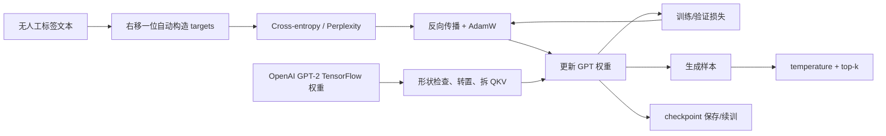
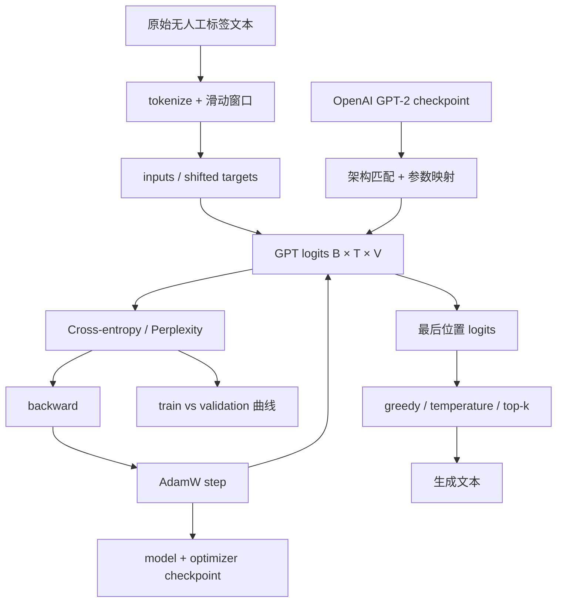

## 0. 本章定位、学习目标与闭环主线

第 4 章已经得到一个随机初始化、能输出 `[B,T,V]` logits 并逐 token 生成的 GPT。第 5 章进入全书第二阶段：把文本自身提供的下一 token 目标转化为损失，用反向传播更新所有权重；同时建立评估、解码、检查点和公开预训练权重迁移的完整闭环。



本章依次解决五个问题：

1. **5.1 评估**：怎样把“文本质量”变成可微、可比较的数字？
2. **5.2 训练**：怎样用这个数字计算梯度、更新权重并监控过拟合？
3. **5.3 解码**：训练后的同一概率分布如何在确定性与多样性之间取舍？
4. **5.4 检查点**：怎样保存推理权重，或完整恢复 AdamW 续训状态？
5. **5.5 权重迁移**：怎样把 OpenAI TensorFlow GPT-2 参数准确装入自写 PyTorch 架构？

### 0.1 “无标签”为什么仍有监督目标

给定 token 流：

$$
z_0,z_1,\ldots,z_N,
$$

输入与目标为：

$$
X=[z_0,z_1,\ldots,z_{N-1}],
\qquad
Y=[z_1,z_2,\ldots,z_N].
$$

标签来自数据本身的时间结构，不需要人逐项标注。准确说法是**自监督学习（self-supervised learning）预训练**，不是“没有目标”或“完全无监督”。模型学习：

$$
p_\theta(z_{t+1}\mid z_{\le t}).
$$

### 0.2 训练、评估、生成三种模式

| 模式 | `model` 状态 | 梯度 | token 选择 | 目的 |
|---|---|---:|---|---|
| 训练 | `train()` | 开启 | 不需要生成选择 | 计算 loss、backward、step |
| 数值评估 | `eval()` | `no_grad()` | 不需要 | 稳定计算 train/val loss |
| 文本生成 | `eval()` | `no_grad()` | argmax 或 sampling | 观察/使用模型输出 |

`eval()` 控制 dropout 等模块行为，`no_grad()` 控制 autograd 图；两者不能互相替代。

### 0.3 本章张量形状账本

| 数据 | 形状 | 含义 |
|---|---:|---|
| `input_batch` | $B\times T$ | 当前上下文 token ID |
| `target_batch` | $B\times T$ | 每个位置的真实下一 ID |
| `logits` | $B\times T\times V$ | 每个位置对词表的未归一化分数 |
| `logits_flat` | $(BT)\times V$ | 交叉熵所需类别矩阵 |
| `targets_flat` | $BT$ | 每行对应一个类别 ID |
| `last_logits` | $B\times V$ | 生成当前下一 token 的分数 |
| `next_id` | $B\times1$ | 追加到序列的 token |

---

## 5.1 Evaluating Generative Text Models（评估生成式文本模型）

### 5.1.1 为什么先评估，再训练

反向传播需要一个标量目标回答“参数向哪个方向调整”。直接比较生成字符串是否“好看”不可微、主观且稀疏；下一 token 交叉熵则为每个位置提供密集、精确的训练信号。

作者的路线是：

```text
复习生成接口
-> 取出真实 target 的预测概率
-> 负对数并平均
-> 用 cross_entropy 一步稳定实现
-> 扩展到 train/validation loaders
```

### 5.1.2 教学配置为何把上下文缩到 256

本章从 GPT-2 small 配置出发，只把：

```python
GPT_CONFIG_124M = {
    "vocab_size": 50257,
    "context_length": 256,
    "emb_dim": 768,
    "n_heads": 12,
    "n_layers": 12,
    "drop_rate": 0.1,
    "qkv_bias": False,
}
```

原始 1,024 token 缩为 256，减少 attention 的二次计算与中间矩阵：

$$
\left(\frac{256}{1024}\right)^2=\frac1{16}.
$$

这主要降低 attention 部分的开销；参数量只因位置 embedding 少了行而略减，FFN 等计算仍存在。后面加载 OpenAI 权重时必须恢复 1,024，因为位置 embedding 形状和原模型配置要匹配。

### 5.1.3 文本与 token ID 的辅助函数

```python
import torch


def text_to_token_ids(text, tokenizer):
    encoded = tokenizer.encode(
        text,
        allowed_special={"<|endoftext|>"},
    )
    return torch.tensor(encoded).unsqueeze(0)


def token_ids_to_text(token_ids, tokenizer):
    flat_ids = token_ids.squeeze(0)
    return tokenizer.decode(flat_ids.tolist())
```

`unsqueeze(0)` 添加 batch 轴。`squeeze(0)` 只适用于 batch size 为 1 的便捷解码；若 $B>1$，应逐行 decode，而不是无条件 squeeze。

允许 `<|endoftext|>` 表示调用方有意把该字符串作为 GPT-2 特殊 token；不应对不可信输入任意放行控制 token。

随机模型从 `Every effort moves you` 开始输出乱码，是未训练参数的预期行为，不是 tokenizer/生成函数自动失败。接下来要用数值损失区分随机模型与逐渐学好的模型。

### 5.1.4 输入、目标与 logits

原书使用两条长度为 3 的输入：

```python
inputs = torch.tensor(
    [
        [16833, 3626, 6100],  # every effort moves
        [40, 1107, 588],      # I really like
    ]
)
targets = torch.tensor(
    [
        [3626, 6100, 345],    # effort moves you
        [1107, 588, 11311],   # really like chocolate
    ]
)
```

满足行内错位：

$$
X_{b,1:}=Y_{b,:-1}.
$$

模型输出：

$$
L=f_\theta(X)\in\mathbb R^{2\times3\times50257}.
$$

第 $(b,t)$ 行对真实类别 $Y_{b,t}$ 的概率：

$$
p_{b,t}
=\operatorname{softmax}(L_{b,t,:})_{Y_{b,t}}.
$$

初始词表若近似均匀：

$$
p\approx\frac1{50{,}257}
\approx1.99\times10^{-5}.
$$

实际随机网络不完全均匀，原书六个目标概率在约 $4.76\times10^{-6}$ 到 $7.45\times10^{-5}$ 之间。

### 5.1.5 为什么 argmax 准确率不适合直接训练

Argmax 只告诉预测 ID 是否等于 target：

$$
\mathbf1[\arg\max_v L_v=y].
$$

它忽略“差一点”和“完全确信地答错”的区别，并且对 logits 的绝大多数小变化梯度为 0/不可导。交叉熵使用目标概率的连续变化，能给所有参数提供优化方向。

### 5.1.6 从最大似然推导负对数似然

假设给定上下文后，各目标 token 的条件概率按链式法则相乘，数据似然：

$$
\mathcal L_{\mathrm{like}}(\theta)
=\prod_{b=1}^{B}\prod_{t=1}^{T}
p_\theta(Y_{b,t}\mid X_{b,\le t}).
$$

直接连乘许多小概率会数值下溢，也不便优化。取 log 把乘积变求和：

$$
\log\mathcal L_{\mathrm{like}}
=\sum_{b,t}\log p_{b,t}.
$$

最大化 log-likelihood 等价于最小化平均负 log-likelihood：

$$
\mathcal L_{\mathrm{NLL}}
=-\frac1{BT}\sum_{b,t}\log p_{b,t}.
$$

这就是 one-hot 目标下的 token-level cross entropy。

### 5.1.7 为什么对数损失有效

目标概率与损失：

| $p_y$ | $-\ln p_y$ |
|---:|---:|
| 0.9 | 0.105 |
| 0.5 | 0.693 |
| 0.1 | 2.303 |
| 0.01 | 4.605 |
| 0.00001 | 11.513 |

越确信地把真实 token 概率压低，惩罚越大。若 $p_y\to1$，损失趋近 0；有限 logits 的 softmax 通常不能得到数学上严格的 1，所以“loss=0”是理想极限。

### 5.1.8 手工六步与 `cross_entropy`

原书六个 target 的 log probabilities：

```text
[-9.5042, -10.3796, -11.3677,
 -11.4798, -9.7764, -12.2561]
```

平均：

$$
\frac{1}{6}\sum_i\log p_i=-10.7940,
$$

取负：

$$
\mathcal L=10.7940.
$$

PyTorch 接口需要类别维在最后二维输入的列轴。把 batch/token 合并：

```python
logits_flat = logits.flatten(0, 1)  # [6, 50257]
targets_flat = targets.flatten()    # [6]

loss = torch.nn.functional.cross_entropy(
    logits_flat,
    targets_flat,
)
```

`cross_entropy` 内部以 log-sum-exp 稳定计算 log-softmax，再取 target 类负 log 概率；不应先手工 softmax 后再传入。

### 5.1.9 交叉熵对 logits 的梯度直觉

对单位置 softmax 概率 $p_j$ 和 one-hot target $y_j$：

$$
\frac{\partial\mathcal L}{\partial z_j}=p_j-y_j.
$$

- 对真实类，$y_j=1$，梯度 $p_j-1<0$，梯度下降会提高其 logit；
- 对其他类，$y_j=0$，梯度 $p_j>0$，梯度下降会降低其 logit；
- 错误但高概率的非目标类受到更大压低。

这直接实现“提高正确 token 相对概率”的训练目标。

### 5.1.10 Perplexity（困惑度）

若 loss 使用自然对数的平均 NLL：

$$
\operatorname{PPL}=e^{\mathcal L}.
$$

原书使用未四舍五入的底层 loss，得到：

$$
\operatorname{PPL}\approx48{,}725.82.
$$

若直接对打印后保留四位小数的 $10.7940$ 指数化，则约为 $48{,}727.56$；两者的细小差异来自先舍入 loss 再取指数。

可解释为每步面对约 48,726 个等概率候选的等效不确定性，接近 50,257 词表的随机水平。

边界：

- 只在 tokenizer、数据和 loss 聚合方式可比时比较；
- PPL 越低通常下一 token 建模越好，不直接等于事实性或人类偏好；
- 若含 padding，必须排除无效 token；
- corpus-level PPL 应从所有 token 的总 NLL 计算，而非先对各段 PPL 做算术平均。

### 5.1.11 训练集与验证集的职责

- **训练集**：参与 `backward()` 和参数更新；
- **验证集**：只评估，不更新，用来估计对未参与更新文本的泛化并选择训练停止点/超参数。

本章把 “The Verdict” 字符串前 90% 作训练，后 10% 作验证：

```python
train_ratio = 0.90
split_index = int(train_ratio * len(text_data))
train_data = text_data[:split_index]
validation_data = text_data[split_index:]
```

按字符边界连续切分避免相同片段随机散入两边，但边界可能切在词或文档内部；对多文档语料通常应按文档划分、去重并防止近重复泄漏。

测试集与验证集也不同：验证集可反复用于调参，最终测试集应尽量只用于一次无偏报告。本章教学只构造 train/validation。

### 5.1.12 教学数据规模与真实预训练成本

“The Verdict”：

```text
characters: 20,479
GPT-2 tokens: 5,145
```

这足以验证代码，不足以训练通用 124M LLM。原书还提到：

- 补充代码可处理 Project Gutenberg 超过 60,000 本公共领域书；
- Llama 2 7B 训练约处理 2 万亿 token、消耗 184,320 A100 GPU-hours；
- 按 8×A100 服务器每小时约 30 美元粗估，计算成本约 690,000 美元。

这些数字用于量级对比，受云价格、利用率、失败实验、通信和口径影响，不是完整项目账单。

### 5.1.13 DataLoader 配置与样本数量

本章设置：

```python
train_loader = create_dataloader_v1(
    train_data,
    batch_size=2,
    max_length=256,
    stride=256,
    drop_last=True,
    shuffle=True,
    num_workers=0,
)
validation_loader = create_dataloader_v1(
    validation_data,
    batch_size=2,
    max_length=256,
    stride=256,
    drop_last=False,
    shuffle=False,
    num_workers=0,
)
```

得到 9 个训练 batch 和 1 个验证 batch，每个完整 batch 为 `[2,256]`。训练 shuffle 让窗口顺序每轮变化；验证固定顺序保证可复现。训练 `drop_last=True` 保持更新 batch 大小，验证 `False` 尽量不漏样本。

`stride=max_length` 让输入窗口不重叠，降低小语料重复计算。固定长度便于批处理；原书指出变长输入也可能改善对不同长度的泛化，但需 padding/mask 或分桶。

### 5.1.14 单 batch loss

```python
def calc_loss_batch(input_batch, target_batch, model, device):
    input_batch = input_batch.to(device)
    target_batch = target_batch.to(device)
    logits = model(input_batch)
    return torch.nn.functional.cross_entropy(
        logits.flatten(0, 1),
        target_batch.flatten(),
    )
```

输入和模型必须在同一 device。targets 应为整数 `torch.long` 类别 ID；不能先转成 embedding 或浮点概率。

### 5.1.15 Loader loss 与平均方式

```python
def calc_loss_loader(
    data_loader,
    model,
    device,
    num_batches=None,
):
    if len(data_loader) == 0:
        return float("nan")

    if num_batches is None:
        num_batches = len(data_loader)
    else:
        num_batches = min(num_batches, len(data_loader))

    total_loss = 0.0
    for batch_index, (inputs, targets) in enumerate(data_loader):
        if batch_index >= num_batches:
            break
        total_loss += calc_loss_batch(
            inputs,
            targets,
            model,
            device,
        ).item()
    return total_loss / num_batches
```

本书对**batch mean 再等权平均**。当所有 batch 的有效 token 数相同，这等于 token-level 总平均；若最后 batch 较小、变长或有 padding，batch 等权会让小 batch 权重过大。严格 corpus NLL 应累计总 loss 和有效 token 数：

$$
\mathcal L_{\mathrm{corpus}}
=\frac{\sum_b N_b\mathcal L_b}{\sum_bN_b}.
$$

本章验证 loader 只有一个完整 batch，因此不影响示例结论，但这是推广到真实数据时的重要边界。

### 5.1.16 为什么可限制 `num_batches`

训练期间频繁遍历完整 train/validation 会显著拖慢训练。`eval_iter=5` 只取最多 5 个 batch，提供有噪声但便宜的进度估计。

要让不同评估点可比较，应尽量固定验证 batch；训练 loader 开启 shuffle 时，对训练 loss 取“前 5 批”可能每次样本不同。最终报告应在完整、固定验证集上计算。

### 5.1.17 初始 train/validation loss

原书随机模型：

```text
Training loss:   10.98758347829183
Validation loss: 10.98110580444336
```

随机均匀基线：

$$
\ln(50{,}257)\approx10.8249.
$$

两者同量级是合理的；随机初始化不保证完全均匀，具体值受种子、实现和数据影响。训练目标是让两者下降，但验证 loss 是否持续下降才反映泛化。

---

## 5.2 Training an LLM（训练 LLM）

### 5.2.1 训练循环在优化什么

设模型参数为 $\theta$，一个 batch 的平均 token loss：

$$
\mathcal L_B(\theta)
=-\frac1{BT}\sum_{b,t}
\log p_\theta(Y_{b,t}\mid X_{b,\le t}).
$$

反向传播计算：

$$
g=\nabla_\theta\mathcal L_B(\theta),
$$

优化器据此更新：

$$
{\boldsymbol\theta}\leftarrow\operatorname{AdamW}({\boldsymbol\theta},g).
$$

一次更新只基于当前 mini-batch，是完整语料梯度的随机估计。不断遍历 batch，让模型逐步提高真实下一 token 的相对 logit。

### 5.2.2 标准 PyTorch 步骤与顺序

```text
for each epoch:
    model.train()
    for inputs, targets in train_loader:
        optimizer.zero_grad()
        logits/loss = forward(inputs, targets)
        loss.backward()
        optimizer.step()
        update counters
        optionally evaluate
    generate a qualitative sample
```

顺序有明确依据：

1. `zero_grad()`：PyTorch 默认累加梯度；不清空会把多个 batch 意外相加。
2. forward/loss：在当前参数下建立计算图和标量目标。
3. `backward()`：链式法则把 loss 梯度传到所有参与参数。
4. `step()`：优化器读取 `.grad` 并原地更新参数。

若先 `step()` 再 `backward()`，没有当前梯度可用；若在 `no_grad()` 中训练，计算图不会建立。

### 5.2.3 `zero_grad(set_to_none=True)` 的补充

原书使用：

```python
optimizer.zero_grad()
```

现代 PyTorch 常可用：

```python
optimizer.zero_grad(set_to_none=True)
```

把 `.grad` 设为 `None` 而非填零，可能减少内存写入；下一次 backward 会重新创建梯度。两者在本章正常训练语义上等价，但检查梯度代码要允许 `None` 表示本轮参数未参与计算。

### 5.2.4 完整 `train_model_simple`

```python
def train_model_simple(
    model,
    train_loader,
    validation_loader,
    optimizer,
    device,
    num_epochs,
    eval_freq,
    eval_iter,
    start_context,
    tokenizer,
):
    train_losses = []
    validation_losses = []
    tracked_tokens_seen = []
    tokens_seen = 0
    global_step = -1

    for epoch in range(num_epochs):
        model.train()

        for input_batch, target_batch in train_loader:
            optimizer.zero_grad()
            loss = calc_loss_batch(
                input_batch,
                target_batch,
                model,
                device,
            )
            loss.backward()
            optimizer.step()

            tokens_seen += input_batch.numel()
            global_step += 1

            if global_step % eval_freq == 0:
                train_loss, validation_loss = evaluate_model(
                    model,
                    train_loader,
                    validation_loader,
                    device,
                    eval_iter,
                )
                train_losses.append(train_loss)
                validation_losses.append(validation_loss)
                tracked_tokens_seen.append(tokens_seen)
                print(
                    f"Ep {epoch + 1} "
                    f"(Step {global_step:06d}): "
                    f"Train loss {train_loss:.3f}, "
                    f"Val loss {validation_loss:.3f}"
                )

        generate_and_print_sample(
            model,
            tokenizer,
            device,
            start_context,
        )

    return train_losses, validation_losses, tracked_tokens_seen
```

### 5.2.5 三种进度计量

| 量 | 定义 | 本章初值/更新 |
|---|---|---|
| epoch | 训练 loader 完整遍历次数 | 外层循环一次加 1 |
| global step | optimizer 更新次数的 0-based 索引 | 初值 -1，每 batch 加 1 |
| tokens seen | 累计输入 token 元素数 | 加 `input_batch.numel()` |

本章每个完整 batch 有：

$$
B\times T=2\times256=512
$$

个输入 token，9 个 batch/epoch，所以每 epoch 约计：

$$
9\times512=4{,}608
$$

个 tokens seen。它是**处理量**，包含跨 epoch 重复，不等于唯一语料 token 数；target 也有同样数量，但通常不再重复计数。

`global_step=-1` 后在首 batch 更新为 0，于是条件 `0 % eval_freq == 0` 会在第一次更新后立即评估。若期望训练前基线，应在进入循环前单独评估。

### 5.2.6 评估函数为什么切换模式

```python
def evaluate_model(
    model,
    train_loader,
    validation_loader,
    device,
    eval_iter,
):
    model.eval()
    with torch.no_grad():
        train_loss = calc_loss_loader(
            train_loader,
            model,
            device,
            num_batches=eval_iter,
        )
        validation_loss = calc_loss_loader(
            validation_loader,
            model,
            device,
            num_batches=eval_iter,
        )
    model.train()
    return train_loss, validation_loss
```

- `eval()` 关闭 dropout，避免随机 mask 给 loss 增加噪声；
- `no_grad()` 不保存反向图，节省内存与计算；
- 结束后 `train()` 恢复后续 batch 的训练行为。

这个函数假设调用前模型应继续训练。更通用库函数可以记录 `was_training=model.training`，结束后恢复原状态，避免调用者原本在 eval 模式时被强制切回 train。

### 5.2.7 文本样本是定性监控，不是 loss 替代品

```python
def generate_and_print_sample(
    model,
    tokenizer,
    device,
    start_context,
):
    model.eval()
    context_size = model.pos_emb.weight.shape[0]
    encoded = text_to_token_ids(
        start_context,
        tokenizer,
    ).to(device)

    with torch.no_grad():
        generated = generate_text_simple(
            model=model,
            idx=encoded,
            max_new_tokens=50,
            context_size=context_size,
        )

    decoded = token_ids_to_text(generated, tokenizer)
    print(decoded.replace("\n", " "))
    model.train()
```

固定 prompt 和 greedy decoding 便于跨 epoch 比较。样本能发现重复、乱码和记忆片段，却只覆盖一条路径；不能替代完整验证 loss，也不能单独证明事实性或泛化。

### 5.2.8 为什么从模型本身读取 context size

```python
context_size = model.pos_emb.weight.shape[0]
```

生成辅助函数以实际位置 embedding 行数为准，而非依赖可能过期的外部配置。加载 1,024 位置的 GPT-2 后也可自动适配。

### 5.2.9 AdamW 是什么

Adam 为每个参数维护一阶、二阶梯度矩估计，形成自适应更新。简化表示：

$$
m_t=\beta_1m_{t-1}+(1-\beta_1)g_t,
$$

$$
v_t=\beta_2v_{t-1}+(1-\beta_2)g_t^2,
$$

$$
{\boldsymbol\theta}_t
=\theta_{t-1}
-\eta\frac{\widehat m_t}{\sqrt{\widehat v_t}+\epsilon}.
$$

AdamW 把 weight decay 与梯度自适应更新解耦，额外近似执行：

$$
{\boldsymbol\theta}\leftarrow(1-\eta\lambda){\boldsymbol\theta}
$$

再做 Adam 更新。相比把 $\lambda\lVert\theta\rVert^2$ 混入 Adam 梯度，它使衰减语义更直接，因此广泛用于 Transformer。

本章：

```python
optimizer = torch.optim.AdamW(
    model.parameters(),
    lr=0.0004,
    weight_decay=0.1,
)
```

教学代码对所有参数统一 weight decay；大型训练常用参数组，让 bias 与 LayerNorm scale/shift 不衰减。原书把 warmup、cosine annealing 和 gradient clipping 放到附录 D。

### 5.2.10 学习率与 weight decay 的作用不同

- `lr` 控制每步更新总体尺度；过大可能发散，过小训练慢。
- `weight_decay` 持续收缩权重，作为正则化；它不能替代更多数据或验证监控。

本章的 0.0004/0.1 是教学配置，不是任意模型、batch、数据都最优的固定配方。

### 5.2.11 本章训练结果如何阅读

10 epochs 中代表点：

| 时点 | Train loss | Val loss |
|---|---:|---:|
| Epoch 1, step 0 | 9.781 | 9.933 |
| Epoch 1, step 5 | 8.111 | 8.339 |
| Epoch 9, step 80 | 0.541 | 6.393 |
| Epoch 10, step 85 | 0.391 | 6.452 |

早期两者同时下降：模型学到可迁移的局部语言规律。第二个 epoch 后训练 loss 继续下降、验证 loss 停滞/回升：泛化差距扩大，出现过拟合。

### 5.2.12 过拟合为什么在这里几乎必然发生

- 模型约 124M/163M 参数口径，训练文本仅约 4.6k token/epoch；
- 同一短篇小说重复 10 遍；
- 数据风格和内容单一；
- 模型容量远超独特训练信号。

最终生成可以逐字复现训练片段。这说明**低训练 loss 与语法流畅不等于泛化或原创**。

如果验证文本与训练文本来自同一篇连续小说，验证仍很相近；即便如此 loss 已显著分离。真实评估应有更多独立文档、去重和域外测试。

### 5.2.13 训练 loss 与验证 loss 的典型组合

| 现象 | 可能解释 | 下一步 |
|---|---|---|
| 两者都高且不降 | 实现、学习率、梯度或数据问题 | 查目标错位、梯度、优化器与基线 |
| 两者同步下降 | 正在学习且泛化改善 | 继续并监控 |
| train 降、val 停滞/升 | 过拟合或分布差异 | 早停、更多数据、正则化、去重 |
| 两者都很低 | 任务学好，也可能数据泄漏 | 检查切分与独立测试 |
| val 略低于 train | dropout/增强、样本噪声或验证更易 | 看完整数据和置信区间 |

验证 loss 不能自动告诉根因，需要结合数据来源和训练设置。

### 5.2.14 绘图中的双横轴

原书同时显示 epochs 与 tokens seen：

```python
epochs_seen = torch.linspace(
    0,
    num_epochs,
    len(train_losses),
)
```

上轴用累计处理 token 对齐同一 loss 点。Epoch 适合同一数据集内沟通，tokens seen 更适合比较 batch/epoch 方案和不同数据规模。

`linspace(0,num_epochs,n_points)` 是近似展示；精确 epoch 位置应按 global step 与 `len(train_loader)` 计算。

### 5.2.15 教学循环缺少哪些生产能力

本章有意保持简洁，尚未包括：

- mixed precision 与 loss scaling；
- gradient accumulation；
- distributed data parallel；
- learning-rate warmup/decay；
- gradient clipping；
- 定期 checkpoint 与最佳模型选择；
- 数据流式读取、恢复 sampler/RNG 状态；
- 日志、异常恢复和评估套件。

它能证明优化闭环，不是大规模预训练系统的完整实现。

---

## 5.3 Decoding Strategies to Control Randomness（控制随机性的解码策略）

### 5.3.1 解码与训练是两层不同决策

训练学得条件分布：

$$
p_\theta(x_{t+1}\mid x_{\le t}).
$$

解码策略决定如何从这个分布选一个实际 token：

- greedy：总选最高概率；
- categorical sampling：按概率随机抽样；
- temperature：重塑概率尖锐程度；
- top-k：截断候选支持集。

改变解码不会更新 $\theta$，也不会改善模型在验证集上的 NLL。一个过拟合模型即使用高温也仍可能记忆；一个事实错误模型降温只会更稳定地输出高概率错误。

### 5.3.2 Greedy 与概率采样

Greedy：

$$
x_{t+1}=\arg\max_i z_i,
$$

同一模型、prompt 和模式下结果确定。

概率采样：

$$
x_{t+1}\sim\operatorname{Categorical}(p),
\qquad p=\operatorname{softmax}(z).
$$

```python
next_id = torch.multinomial(
    probabilities,
    num_samples=1,
)
```

最高概率 token 最常出现，但其他非零概率 token 也可能被选。固定 seed 只让伪随机序列可复现，不会把采样数学变成 argmax。

### 5.3.3 原书九词玩具分布

```python
vocabulary = {
    "closer": 0,
    "every": 1,
    "effort": 2,
    "forward": 3,
    "inches": 4,
    "moves": 5,
    "pizza": 6,
    "toward": 7,
    "you": 8,
}

next_token_logits = torch.tensor(
    [4.51, 0.89, -1.90, 6.75, 1.63,
     -1.62, -1.89, 6.28, 1.79]
)
```

`forward` 的 logit 6.75 最大，greedy 总选它。按 $T=1$ 概率采样 1,000 次，原书固定 seed 得到约：

```text
73 closer, 582 forward, 2 inches, 343 toward,
其他近似 0
```

有限抽样频数不是精确概率；样本量越大，相对频率才更接近理论概率。

### 5.3.4 Temperature scaling 的公式

温度 $\tau>0$：

$$
p_i(\tau)
=\frac{e^{z_i/\tau}}
{\sum_j e^{z_j/\tau}}.
$$

```python
def softmax_with_temperature(logits, temperature):
    if temperature <= 0:
        raise ValueError("temperature must be positive")
    return torch.softmax(logits / temperature, dim=-1)
```

- $\tau=1$：原始 softmax；
- $0<\tau<1$：logit 差被放大，分布更尖；
- $\tau>1$：差被缩小，分布更平；
- $\tau\to0^+$：若最大值唯一，趋近 greedy one-hot；
- $\tau\to\infty$：在未 mask 的有限候选上趋近均匀。

### 5.3.5 Temperature 如何改变相对 odds

任意两个 token：

$$
\frac{p_i(\tau)}{p_j(\tau)}
=\exp\left(\frac{z_i-z_j}{\tau}\right).
$$

若 $z_i-z_j=2$：

| 温度 | odds $p_i/p_j$ |
|---:|---:|
| 0.5 | $e^4\approx54.6$ |
| 1 | $e^2\approx7.39$ |
| 2 | $e^1\approx2.72$ |

低温指数级放大偏好，高温压平偏好。它不会改变 logit 排名，所以 temperature 后再 argmax 与原 greedy 相同；只有结合随机 sampling 才改变输出路径。

### 5.3.6 Temperature、熵与质量边界

通常升温提高分布熵和多样性，降温降低熵和随机性。但：

- 低温只偏向模型认为最可能的 token，不保证真实或安全；
- 高温让低概率 token 更常出现，可能新颖，也更易语法/语义失真；
- 合适值依赖模型校准、任务与后续约束；
- temperature 不能为负；代码用 `temperature=0` 作为“关闭采样、走 greedy 分支”的 API 哨兵，而不是计算 $z/0$。

### 5.3.7 练习 5.1：pizza 的抽样频率与真实概率

附录答案：

| 温度 | 1,000 次中 `pizza` 频数 | 理论概率 |
|---:|---:|---:|
| 0 或 0.1 | 0 | 极接近 0 |
| 5 | 32 | 约 4.3% |

抽 1,000 次得到 $32/1000=3.2\%$ 是 Monte Carlo 估计；更快、更准确的方法直接读取：

```python
pizza_probability = scaled_probabilities[2][6].item()
```

频数与理论 4.3% 不相等是有限样本随机误差，不是 `multinomial` 错误。

### 5.3.8 Top-k 为什么被引入

高温可能让极低概率但荒谬的 token（如 `pizza`）被抽到。Top-k 先把候选限制为当前 logits 最高的 $k$ 个，再在其中采样：

$$
S_k={\text{TopKIndices}}(z,k).
$$

遮罩：

$$
z'_i=\begin{cases}
z_i,&i\in S_k,\\
-\infty,&i\notin S_k.
\end{cases}
$$

softmax 后非候选概率严格为 0。

### 5.3.9 原书 top-3 数值

```python
top_values, top_positions = torch.topk(
    next_token_logits,
    k=3,
)
```

得到：

```text
logits:    [6.75, 6.28, 4.51]
positions: [3, 7, 0]
tokens:    forward, toward, closer
```

遮罩后：

```text
[4.51, -inf, -inf, 6.75, -inf,
 -inf, -inf, 6.28, -inf]
```

softmax：

```text
[0.0615, 0, 0, 0.5775, 0, 0, 0, 0.3610, 0]
```

`pizza` 无论温度多高都不会被选，因为支持集已排除它。

### 5.3.10 Top-k 的阈值实现与并列边界

本章批量实现：

```python
top_logits, _ = torch.topk(logits, top_k)
threshold = top_logits[:, -1, None]
logits = torch.where(
    logits < threshold,
    torch.tensor(-torch.inf, device=logits.device),
    logits,
)
```

使用 `< threshold` 保留所有等于第 $k$ 大值的 token。若阈值处并列，非零候选数可能超过 $k$。若必须严格恰好 $k$ 个，可根据 `topk` 返回 indices 构造布尔 mask；但并列如何打破仍需定义。

还应校验：

$$
1\le k\le V.
$$

`top_k=1` 只保留最高 logit，后续 multinomial 也必然确定。

### 5.3.11 Temperature 与 top-k 的组合顺序

正温度缩放不改变 logit 排名：

$$
z_i>z_j\Longleftrightarrow z_i/\tau>z_j/\tau.
$$

因此候选 top-k 集合相同。通常先 top-k mask，再除温度、softmax，可避免对大词表所有候选做后续概率计算，并保证被 mask 的 $-\infty$ 保持 0 概率。

### 5.3.12 完整多样化生成函数

```python
def generate(
    model,
    input_ids,
    max_new_tokens,
    context_size,
    temperature=0.0,
    top_k=None,
    eos_id=None,
):
    for _ in range(max_new_tokens):
        conditioned = input_ids[:, -context_size:]
        with torch.no_grad():
            logits = model(conditioned)[:, -1, :]

        if top_k is not None:
            if not 1 <= top_k <= logits.shape[-1]:
                raise ValueError("top_k outside vocabulary range")
            top_logits, _ = torch.topk(logits, top_k)
            threshold = top_logits[:, -1, None]
            logits = logits.masked_fill(
                logits < threshold,
                -torch.inf,
            )

        if temperature > 0.0:
            probabilities = torch.softmax(
                logits / temperature,
                dim=-1,
            )
            next_id = torch.multinomial(
                probabilities,
                num_samples=1,
            )
        else:
            next_id = torch.argmax(
                logits,
                dim=-1,
                keepdim=True,
            )

        if eos_id is not None and torch.all(next_id == eos_id):
            break

        input_ids = torch.cat((input_ids, next_id), dim=1)

    return input_ids
```

这里比原书 `if idx_next == eos_id` 更明确地处理 batch。原书表达式只在张量恰有一个元素时可转为布尔值；$B>1$ 时会报“Boolean value of Tensor is ambiguous”。真正批量生成还应逐样本维护 finished mask，而不是等全部样本同一步 EOS。

### 5.3.13 EOS 检查应在追加前还是后

原书在检测到 EOS 时先 `break`，不把 EOS 追加到返回序列。若调用方希望保留结束 token，应先 concat 再更新完成状态。两种都可行，但 API 语义要明确；解码文本通常不需要显示特殊 token。

### 5.3.14 原书多样化生成结果

设置：

```python
torch.manual_seed(123)
top_k = 25
temperature = 1.4
```

输出示例：

```text
Every effort moves you stand to work on surprise,
a one of us had gone with random-
```

它不同于 greedy 记忆片段，说明采样改变了路径；不能据此断言质量更高。应多 seed、多 prompt 并结合任务指标评估。

### 5.3.15 练习 5.2：不同任务的设置

附录建议：

- 较小 top-k（如小于 10）与 $\tau<1$：更可预测、连贯，适合正式报告、技术分析、代码、问答和教学内容。
- 较大 top-k（如 20–40）与 $\tau>1$：更多样，适合头脑风暴和虚构创作。

这是经验起点，不是安全保证。代码生成也可能用候选采样配合测试筛选；创作也可能低温维持角色一致性。应由模型、任务和自动/人工验证共同决定。

### 5.3.16 练习 5.3：强制确定性

附录给出两类：

1. `temperature=0.0, top_k=None`：进入 greedy 分支。
2. `top_k=1`：候选只剩一个，即使 temperature $>0$ 做 multinomial 也确定。

补充边界：硬件上的某些算子可能非确定，且 dropout 必须关闭；严格复现还需固定模型、tokenizer、seed/后端确定性。概念上的 token 选择则在上述条件下确定。

### 5.3.17 Top-k 与 top-p 不要混淆

本章只实现 top-k：每步固定最多约 $k$ 个候选。Top-p（nucleus）则取累计概率达到阈值 $p$ 的最小候选集合，集合大小随分布尖锐度变化。二者都截断低概率尾部，但控制量不同。

---

## 5.4 Loading and Saving Model Weights in PyTorch（加载与保存 PyTorch 模型权重）

### 5.4.1 为什么保存 `state_dict` 而不是整个对象

预训练昂贵，训练结果必须可复用。PyTorch 推荐保存：

```python
torch.save(model.state_dict(), "model.pth")
```

`state_dict` 是名称到 tensor 的映射，包含 parameters 和默认持久化 buffers。相比序列化整个 Python 模型对象：

- 与类定义/模块路径耦合更小；
- 文件内容更明确；
- 可检查缺失/多余 key；
- 便于跨设备加载和版本迁移。

它不保存模型类或配置。加载者仍须先以**相同架构配置**创建模型。

### 5.4.2 仅推理的保存与加载

```python
# 保存
torch.save(model.state_dict(), "model.pth")

# 加载
model = GPTModel(GPT_CONFIG_124M)
state = torch.load("model.pth", map_location=device)
model.load_state_dict(state)
model.to(device)
model.eval()
```

`map_location` 决定 checkpoint tensor 初始加载设备，避免在没有原 GPU 的机器失败。`model.to(device)` 确保模型后续与输入同设备。

`load_state_dict` 默认 `strict=True`，key 或 shape 不匹配会报错。不要为了“先跑起来”随意设 `strict=False`；缺失核心层会保留随机参数。

### 5.4.3 为什么继续训练还要保存 optimizer

AdamW 不只保存学习率，还为每个参数维护：

- step 计数；
- 一阶矩 $m_t$；
- 二阶矩 $v_t$；
- 参数组超参数。

只恢复模型权重会把这些历史清零，续训轨迹不同，可能出现 loss 跳变。保存：

```python
torch.save(
    {
        "model_state_dict": model.state_dict(),
        "optimizer_state_dict": optimizer.state_dict(),
    },
    "model_and_optimizer.pth",
)
```

加载顺序：

```python
checkpoint = torch.load(
    "model_and_optimizer.pth",
    map_location=device,
)
model = GPTModel(GPT_CONFIG_124M).to(device)
model.load_state_dict(checkpoint["model_state_dict"])

optimizer = torch.optim.AdamW(
    model.parameters(),
    lr=5e-4,
    weight_decay=0.1,
)
optimizer.load_state_dict(
    checkpoint["optimizer_state_dict"]
)
model.train()
```

必须先为新模型创建 optimizer，再加载 optimizer state，让参数组与新对象建立关联。

### 5.4.4 “精确续训”还缺哪些状态

模型+optimizer 足以继续训练，但不保证与未中断运行逐步完全相同。严格恢复还需视系统保存：

- epoch、global step、tokens seen；
- learning-rate scheduler；
- gradient scaler（混合精度）；
- Python/NumPy/PyTorch CPU/GPU RNG state；
- DataLoader sampler/shuffle 位置；
- 数据版本、tokenizer 和配置；
- 当前累积梯度（若在 accumulation 中途保存）。

否则 dropout、shuffle 或学习率时间表会从不同状态继续。

### 5.4.5 练习 5.4：新会话续训一 epoch

附录答案的核心：加载 model/optimizer 后再次调用训练函数：

```python
train_model_simple(
    model,
    train_loader,
    validation_loader,
    optimizer,
    device,
    num_epochs=1,
    eval_freq=5,
    eval_iter=5,
    start_context="Every effort moves you",
    tokenizer=tokenizer,
)
```

若还想让日志 step 连续，原书函数需要新增 `initial_global_step`、`initial_tokens_seen` 或从 checkpoint 恢复计数；原实现每次调用会从 step 0 重新记日志，但优化器内部 step 已恢复。

### 5.4.6 Checkpoint 安全与兼容性

Checkpoint 来自外部时应视为不可信输入。某些 PyTorch 序列化格式可能触发对象反序列化；优先使用可信来源、校验哈希，并在版本支持时使用限制性加载选项（如仅 weights）。

还要记录：

- PyTorch 与代码 commit；
- 架构配置；
- tokenizer 名称/版本；
- dtype；
- 数据许可与训练状态。

同样的 `.pth` 扩展不保证内部结构相同。

---

## 5.5 Loading Pretrained Weights from OpenAI（加载 OpenAI 预训练权重）

### 5.5.1 为什么复用公开权重

本章短篇小说训练证明了优化流程，却因数据太小严重过拟合。OpenAI GPT-2 已在大规模语料上预训练，并公开 TensorFlow checkpoint；复用它可以：

- 跳过昂贵通用预训练；
- 验证自写架构与真实模型兼容；
- 为第 6、7 章下游微调提供基础能力。

权重不是“数据文件直接拷贝”即可用；架构、维度、bias、参数布局和命名都必须匹配。

### 5.5.2 下载产物与环境边界

原书使用 TensorFlow 与 `tqdm` 下载/读取 GPT-2 checkpoint，124M 包含 7 个文件，例如：

- `checkpoint`；
- `encoder.json`；
- `hparams.json`（原书下载输出拼作 `hprams.json`）；
- `model.ckpt.data-00000-of-00001`，约 498 MB；
- `model.ckpt.index`；
- `model.ckpt.meta`；
- `vocab.bpe`。

下载代码可能因服务器、网络或发布方式变化而失效，应以书的在线仓库更新为准。执行下载的 Python 模块前应检查来源与内容，不盲目运行网络脚本。

### 5.5.3 `settings` 与 `params`

```python
settings, params = download_and_load_gpt2(
    model_size="124M",
    models_dir="gpt2",
)
```

原书：

```text
settings = {
    'n_vocab': 50257,
    'n_ctx': 1024,
    'n_embd': 768,
    'n_head': 12,
    'n_layer': 12,
}
params.keys() = ['blocks', 'b', 'g', 'wpe', 'wte']
params['wte'].shape = (50257, 768)
```

- `settings` 描述架构；
- `params` 保存 NumPy 权重；
- `wte` 是 token embedding；
- `wpe` 是 position embedding；
- `blocks` 是各 Transformer block；
- 顶层 `g,b` 是 final LayerNorm scale/shift。

### 5.5.4 GPT-2 家族配置

```python
model_configs = {
    "gpt2-small (124M)": {
        "emb_dim": 768, "n_layers": 12, "n_heads": 12,
    },
    "gpt2-medium (355M)": {
        "emb_dim": 1024, "n_layers": 24, "n_heads": 16,
    },
    "gpt2-large (774M)": {
        "emb_dim": 1280, "n_layers": 36, "n_heads": 20,
    },
    "gpt2-xl (1558M)": {
        "emb_dim": 1600, "n_layers": 48, "n_heads": 25,
    },
}
```

这里名称沿 OpenAI 下载接口的 124M/355M/774M/1558M；第 4 章也出现 345M/762M/1542M 等另一统计口径。不要仅凭名称比较参数，应核对实际配置与共享方式。

### 5.5.5 为什么必须恢复 context 和 QKV bias

本章训练教学模型用 256 context、`qkv_bias=False`。OpenAI GPT-2 是：

```python
new_config = GPT_CONFIG_124M.copy()
new_config.update(model_configs[model_name])
new_config["context_length"] = 1024
new_config["qkv_bias"] = True
```

原因：

- `wpe` 有 1,024 行；位置表必须同形；
- checkpoint 包含 Q/K/V bias；模型若没有 bias 就无处加载；
- block/头/维度必须与所选尺寸一致。

“现代模型通常不用 QKV bias”不能覆盖“加载已有 GPT-2 必须匹配源架构”这一事实。

### 5.5.6 `assign` 的形状防线

原书：

```python
def assign(left, right):
    if left.shape != right.shape:
        raise ValueError(
            f"Shape mismatch. Left: {left.shape}, "
            f"Right: {right.shape}"
        )
    return torch.nn.Parameter(torch.tensor(right))
```

它能发现维度不匹配，却不能发现：

- Q 与 K 同形但互换；
- block 索引错位；
- 矩阵忘记转置但碰巧方阵；
- LayerNorm scale/shift 对调；
- dtype/device 不理想。

因此形状检查是必要而非充分条件。

### 5.5.7 `assign` 替换 Parameter 的工程边界

`return nn.Parameter(...)` 后再赋给模块属性，会创建新的参数对象。如果 optimizer 已经创建，它仍引用旧参数，后续不会更新新对象。因此必须：

```text
创建模型 -> 装入预训练参数 -> 创建 optimizer
```

更通用的加载器可在 `torch.no_grad()` 下 `left.copy_(right_tensor)`，保留 Parameter 身份、device 与 dtype：

```python
def copy_parameter_(left, right):
    right_tensor = torch.as_tensor(
        right,
        device=left.device,
        dtype=left.dtype,
    )
    if left.shape != right_tensor.shape:
        raise ValueError(
            f"shape mismatch: {left.shape} vs {right_tensor.shape}"
        )
    with torch.no_grad():
        left.copy_(right_tensor)
```

原书的替换方式适合在 optimizer 创建前完成教学迁移。

### 5.5.8 QKV 为什么要拆成三份

OpenAI 把 Q/K/V 合并存储：

$$
W_{\mathrm{c\_attn}}
\in\mathbb R^{d\times3d}.
$$

沿最后轴拆分：

```python
query_weight, key_weight, value_weight = np.split(
    params["blocks"][block_index]["attn"]["c_attn"]["w"],
    3,
    axis=-1,
)
```

得到三个 $d\times d$。本书 PyTorch `nn.Linear.weight` 存为 `[out,in]`，而源矩阵用于 `x @ W`，所以赋值时 `.T`：

```python
target.W_query.weight = assign(
    target.W_query.weight,
    query_weight.T,
)
```

Bias 合并形状 $3d$，拆成三个 $d$，无需转置。

### 5.5.9 Attention 与 FFN 的矩阵转置

OpenAI Conv1D 风格权重布局与 PyTorch `Linear` 不同：

- `attn.c_proj.w` 转置后给 `out_proj.weight`；
- `mlp.c_fc.w` 转置后给 FFN 第一层；
- `mlp.c_proj.w` 转置后给 FFN 第二层。

Bias 是一维向量，直接映射。是否转置不能靠“矩阵是方的看不出来”判断，应理解两边 forward 的乘法约定，并用输出行为验证。

### 5.5.10 LayerNorm 与 embedding 映射

| OpenAI params | 本书模型 |
|---|---|
| `wpe` | `gpt.pos_emb.weight` |
| `wte` | `gpt.tok_emb.weight` |
| block `ln_1.g/b` | `norm1.scale/shift` |
| block `ln_2.g/b` | `norm2.scale/shift` |
| top-level `g/b` | `final_norm.scale/shift` |

OpenAI 的 `g` 是 gamma/scale，`b` 是 beta/shift。

### 5.5.11 Output head 与 weight tying

原书最后：

```python
gpt.out_head.weight = assign(
    gpt.out_head.weight,
    params["wte"],
)
```

这让两个矩阵**数值相同**，但 `assign` 分别创建 Parameter 时不一定是同一对象。严格 weight tying 应：

```python
gpt.out_head.weight = gpt.tok_emb.weight
```

两者差异：

- 数值复制：初始相同，后续可分别更新；
- 对象共享：始终同一权重与梯度。

用于复现推理时，加载后数值相同即可得到正确初始输出；继续训练是否维持 tying 取决于实现目标。

### 5.5.12 完整迁移流程的伪代码

```text
1. 下载并读取 OpenAI settings/params
2. 用对应 emb_dim/layers/heads/context/qkv_bias 构造 GPTModel
3. 复制 wte、wpe
4. 对每个 block:
       拆 c_attn W/b -> Q, K, V
       转置并复制 Q/K/V weights
       复制 Q/K/V biases
       转置并复制 attention output projection
       转置并复制 FFN expand/contract matrices
       复制两个 LayerNorm scale/shift
5. 复制 final LayerNorm
6. 设置 output head（数值复制或真正 tying）
7. 移到 device，eval()
8. 用已知 prompt 做行为验证
9. 若要微调，再创建 optimizer
```

### 5.5.13 为什么连贯生成是强但不完备的检查

迁移后原书用：

```python
top_k=50
temperature=1.5
```

从 `Every effort moves you` 生成：

```text
Every effort moves you toward finding an ideal new way
to practice something! What makes us want to be on top of that?
```

随机模型通常无法持续连贯，所以这是很强的集成信号；但单个样本仍可能漏掉局部错误。更可靠验证还包括：

- 与参考实现比较固定输入 logits；
- 检查每层 tensor 数值和 shape；
- 比较 loss/perplexity；
- 多 prompt、greedy 输出；
- 确认所有 key 都已消费且无随机参数残留。

### 5.5.14 练习 5.5：预训练 GPT-2 在短篇上的 loss

附录结果（124M）：

```text
Training loss:   3.754748503367106
Validation loss: 3.559617757797241
```

两者同量级，验证略低可能只是小样本噪声或验证段更容易。不能据此断言 “The Verdict” 不在 GPT-2 训练数据：

- 若不在，说明模型泛化到该风格；
- 若在，train/validation 两段都可能已被预训练见过，当前划分无法检测预训练泄漏。

要严谨测试记忆，应使用确定晚于 GPT-2 训练截止时间的新数据、去重和成员推断等方法。

对应 perplexity 约：

$$
e^{3.7547}\approx42.7,
\qquad
e^{3.5596}\approx35.1.
$$

明显优于随机约 50k 的等效不确定性。

### 5.5.15 练习 5.6：切换到 GPT-2 XL

下载和模型名两处改为：

```python
settings, params = download_and_load_gpt2(
    model_size="1558M",
    models_dir="gpt2",
)
model_name = "gpt2-xl (1558M)"
```

代码改动小不等于资源成本小。XL 参数、内存和计算显著增加；比较生成时应固定 prompt、解码设置和 seed，不能把采样随机差异误归因于模型尺寸。

### 5.5.16 预训练权重的适用边界

公开权重提供通用语言基础，不保证：

- 当前事实最新；
- 无偏见、无有害输出；
- 适合特定领域和许可证要求；
- 在所有 prompt 上优于小模型；
- tokenizer 或架构可任意更换。

后续 fine-tuning 改变任务行为，但仍需独立评估与安全约束。

---

## 6. 全章知识结构

### 6.1 一张图串起评估、训练与复用



### 6.2 四个不能混淆的评价维度

| 维度 | 主要证据 | 不能替代什么 |
|---|---|---|
| 下一 token 建模 | validation cross-entropy/PPL | 事实性、偏好、安全 |
| 生成路径多样性 | temperature/top-k、多 seed | 模型参数质量 |
| 泛化与过拟合 | train/validation gap、独立数据 | 单个流畅样本 |
| 权重迁移正确性 | shape + logits/reference + 多 prompt | 仅“代码未报错” |

### 6.3 三种模型状态

```text
random initialization
    -> 计算图正确，但 loss 约随机基线、文本乱码

small-corpus pretrained
    -> 训练 loss 很低、可生成语法文本，但可能逐字记忆

OpenAI GPT-2 pretrained
    -> 通用预训练能力较强，可作为下游微调起点
```

---

## 7. 核心公式与算法速查

### 7.1 自回归似然与 NLL

$$
p_\theta(x_{1:T})
=\prod_{t=1}^{T}p_\theta(x_t\mid x_{<t}),
$$

$$
\mathcal L
=-\frac1T\sum_t
\log p_\theta(x_t\mid x_{<t}).
$$

### 7.2 Cross-entropy

对 logits $z$ 和真实类别 $y$：

$$
\ell(z,y)
=-z_y+\log\sum_j e^{z_j}.
$$

这是稳定 log-softmax 形式，无需先显式 softmax。

### 7.3 梯度

$$
\frac{\partial\ell}{\partial z_j}
=p_j-\mathbf1[j=y].
$$

提高目标 logit，降低非目标 logits。

### 7.4 Perplexity

$$
\operatorname{PPL}=e^{\mathcal L}.
$$

只适合在 tokenizer、数据和聚合口径可比时解释。

### 7.5 Corpus token-weighted loss

$$
\mathcal L_{\mathrm{corpus}}
=\frac{\sum_bN_b\mathcal L_b}{\sum_bN_b}.
$$

等长 batch 时可简化为 batch loss 算术平均。

### 7.6 Temperature

$$
p_i(\tau)=
\frac{e^{z_i/\tau}}{\sum_j e^{z_j/\tau}},
\qquad \tau>0.
$$

### 7.7 Top-k

$$
z'_i=\begin{cases}
z_i,&i\in\operatorname{TopK}(z,k),\\
-\infty,&\text{otherwise}.
\end{cases}
$$

### 7.8 训练循环伪代码

```text
for epoch:
    model.train()
    for inputs, targets:
        clear gradients
        loss = cross_entropy(model(inputs), targets)
        backward
        AdamW step
        update step/token counters
        periodically eval train/validation loss
    generate fixed-prompt sample
```

### 7.9 完整 checkpoint

```text
model weights
+ optimizer moments and step
+ scheduler/scaler
+ epoch/global step/tokens seen
+ RNG and sampler state
+ config/tokenizer/data version
```

---

## 8. 易混概念与常见误区

| 常见说法 | 准确辨析 |
|---|---|
| 无标签预训练没有 targets | targets 由 token 流右移一位自动构造，是自监督。 |
| 训练目标是让生成字符串等于某段答案 | 每个位置最大化真实下一 token 条件概率。 |
| Argmax 准确率适合作为训练 loss | argmax 不可微且丢掉概率置信信息；训练用 cross-entropy。 |
| Cross-entropy 应先对 logits 做 softmax | PyTorch 接收 raw logits，内部稳定计算 log-softmax。 |
| Log probability 越负越好 | 目标是平均 log probability 趋近 0，等价于 NLL 趋近 0。 |
| PPL 是模型每次真的只考虑这么多个 token | 它是由平均 NLL 指数化得到的等效不确定性。 |
| 不同 tokenizer 的 PPL 可直接比较 | token 粒度改变预测步数和难度，通常不可直接比较。 |
| Loss 下降就代表事实更准确 | 它只表示更贴近评测文本的下一 token 分布。 |
| Validation set 可用于 backward | validation 只评估；参与更新会污染泛化估计。 |
| 按字符切 90/10 是所有语料的最佳划分 | 教学简化；真实多文档应按文档和去重划分。 |
| Loader batch loss 平均总等于 token 平均 | 只有有效 token 数相同时成立。 |
| `num_batches=5` 的 loss 是完整集精确值 | 它是便宜的子集估计，可能有采样噪声。 |
| `zero_grad()` 可省略 | PyTorch 默认累加 `.grad`，会意外跨 batch 累积。 |
| `backward()` 会更新参数 | 它只计算/累积梯度；`optimizer.step()` 才更新。 |
| `model.eval()` 关闭梯度 | 它只切换模块行为；`no_grad()` 才关闭图记录。 |
| `no_grad()` 关闭 dropout | Dropout 由 train/eval 模式控制。 |
| Epoch、step 与 tokens seen 相同 | 分别是数据遍历、优化更新与累计处理量。 |
| Tokens seen 是唯一语料 token 数 | 多 epoch 和重叠窗口会重复计数。 |
| Training loss 很低表示通用能力强 | 小语料可被记忆，需 validation 与独立数据。 |
| Val loss 比 train 略低必然实现错误 | 可能是噪声、数据难度或 dropout 差异；需整体调查。 |
| AdamW 的 weight decay 就是普通 Adam 加 L2 | AdamW 将衰减与自适应梯度更新解耦。 |
| 解码 temperature 会改善 validation loss | 解码不改权重，也不改模型分布的训练 NLL。 |
| 高温等于创造力 | 只是提高低概率 token 被采样机会，也增加错误。 |
| 低温等于事实正确 | 只是更偏向模型最高 logit，模型可能自信地错。 |
| Temperature=0 是数学 softmax 温度 | 本章 API 把 0 当 greedy 分支哨兵，不执行除零。 |
| Temperature 改变 token 排名 | 正温度缩放保序，只改变概率比。 |
| Top-k=3 总严格保留 3 项 | 本章阈值实现遇并列可能保留超过 3 项。 |
| Top-k 与 top-p 相同 | top-k 固定候选数；top-p 固定累计概率质量。 |
| 固定 seed 就保证跨平台完全一致 | 算子与后端可能非确定，还需确定性设置。 |
| `if next_id == eos_id` 对任意 batch 都有效 | 多元素 tensor 布尔值不明确，需逐样本 finished mask。 |
| 保存 model weights 就能精确续训 | AdamW moments、scheduler、RNG、sampler 等也影响轨迹。 |
| `.pth` 文件天然安全且兼容 | 外部 checkpoint 需可信来源、版本与架构校验。 |
| `strict=False` 是解决加载错误的通用办法 | 它可能留下随机核心参数，应先解释 key/shape 差异。 |
| Shape 匹配证明权重映射正确 | 同形 Q/K 可互换、方阵可漏转置，需数值/行为验证。 |
| `assign` 之后旧 optimizer 会自动跟踪新参数 | 替换 Parameter 对象后必须重建 optimizer。 |
| 给 output head 复制 `wte` 就是永久 tying | 数值相同不等于对象共享；继续训练时可能分离。 |
| 生成一段连贯文本证明每层都映射正确 | 是强集成信号，但仍需 reference logits/loss 和多输入检查。 |
| 更大 GPT-2 只改两行，所以成本也差不多 | 代码接口相同，内存与计算却大幅增加。 |

---

## 9. 作者分析与解决问题的一般思路

### 9.1 把主观目标改写为密集可微目标

“生成高质量文本”无法直接求梯度。作者利用下一 token 自监督，把每个 token 位置变成一个 $V$ 类分类问题，再用 NLL 聚合。这同时解决标签获取、数值评估和参数优化。

### 9.2 先手工展开，再用稳定库函数

先展示：

```text
logits -> softmax -> gather target probabilities
-> log -> mean -> negate
```

理解后换成 `cross_entropy`。这种路线既建立直觉，又避免生产代码用不稳定的手工 softmax/log。

### 9.3 把评估嵌进训练闭环

训练每若干 step：

- 用固定模式计算 train/validation loss；
- 记录 tokens seen；
- 用固定 prompt 输出样本。

数值信号发现泛化趋势，文本信号发现重复和明显退化；两者互补。

### 9.4 从曲线差距定位过拟合，而非只看终点

Train 与 validation 同降说明共享规律；train 继续降而 validation 停滞说明模型开始记忆训练特例。作者进一步搜索生成片段是否在原文中，形成“曲线假设 → 文本证据”的验证链。

### 9.5 分离模型分布与解码策略

同一 logits 可以 greedy、temperature 或 top-k。先固定已训练模型，再改变选择规则，能把“模型学到了什么”与“输出路径怎样抽样”分开分析。

### 9.6 用等价变换解释算法

- NLL 与 cross-entropy；
- $-\infty$ mask 与零概率；
- temperature 对 odds 的指数变化；
- input/output embedding 同形带来的 tying；
- TensorFlow `x@W` 与 PyTorch `Linear.weight` 转置。

理解等价关系后，代码不再是孤立 API。

### 9.7 先保存最小状态，再识别精确恢复边界

推理只需模型参数；续训增加 optimizer；逐步精确恢复再增加 scheduler、RNG 和数据位置。按需求分层保存，避免把“能继续跑”误称为“完全相同续训”。

### 9.8 权重迁移采用三层验证

1. **结构**：settings/config 一致。
2. **局部**：每个 tensor shape、拆分、转置、名称映射正确。
3. **行为**：reference logits/loss 与连贯生成。

仅靠其中一层都不足。

---

## 10. 可运行的端到端迷你预训练闭环

下面用小型 GRU 语言模型演示本章通用训练/评估/采样/checkpoint 逻辑。它不是 GPT 架构；选择 GRU 只是让 CPU 快速完成闭环，loss 与解码原理相同。

```python
from pathlib import Path
from tempfile import TemporaryDirectory

import torch
import torch.nn as nn
import torch.nn.functional as F
from torch.utils.data import DataLoader, TensorDataset


class TinyLanguageModel(nn.Module):
    def __init__(self, vocab_size, embedding_dim, hidden_dim):
        super().__init__()
        self.embedding = nn.Embedding(vocab_size, embedding_dim)
        self.recurrent = nn.GRU(
            embedding_dim,
            hidden_dim,
            batch_first=True,
        )
        self.output = nn.Linear(hidden_dim, vocab_size)

    def forward(self, token_ids):
        embedded = self.embedding(token_ids)
        hidden, _ = self.recurrent(embedded)
        return self.output(hidden)


def batch_loss(model, inputs, targets):
    logits = model(inputs)
    return F.cross_entropy(
        logits.flatten(0, 1),
        targets.flatten(),
    )


def greedy_generate(model, prompt, new_tokens, context_size):
    model.eval()
    output = prompt.clone()
    for _ in range(new_tokens):
        conditioned = output[:, -context_size:]
        with torch.no_grad():
            logits = model(conditioned)[:, -1, :]
        next_id = logits.argmax(dim=-1, keepdim=True)
        output = torch.cat((output, next_id), dim=1)
    return output


torch.manual_seed(123)
vocab_size = 11
# 周期序列让下一 token 规律明确且可快速学习。
stream = torch.arange(240) % vocab_size
window = 8
inputs = torch.stack(
    [stream[start:start + window] for start in range(200)]
)
targets = torch.stack(
    [stream[start + 1:start + window + 1] for start in range(200)]
)
train_loader = DataLoader(
    TensorDataset(inputs, targets),
    batch_size=20,
    shuffle=True,
)

model = TinyLanguageModel(vocab_size, 16, 24)
optimizer = torch.optim.AdamW(
    model.parameters(),
    lr=0.03,
    weight_decay=0.01,
)

model.eval()
with torch.no_grad():
    initial_loss = batch_loss(model, inputs, targets).item()

for _ in range(8):
    model.train()
    for input_batch, target_batch in train_loader:
        optimizer.zero_grad()
        loss = batch_loss(model, input_batch, target_batch)
        loss.backward()
        optimizer.step()

model.eval()
with torch.no_grad():
    final_loss = batch_loss(model, inputs, targets).item()

generated = greedy_generate(
    model,
    prompt=torch.tensor([[0, 1, 2]]),
    new_tokens=6,
    context_size=window,
)
assert final_loss < initial_loss
assert generated.tolist() == [[0, 1, 2, 3, 4, 5, 6, 7, 8]]

# 保存并恢复模型与 AdamW 状态。
with TemporaryDirectory() as directory:
    checkpoint_path = Path(directory) / "checkpoint.pth"
    torch.save(
        {
            "model_state_dict": model.state_dict(),
            "optimizer_state_dict": optimizer.state_dict(),
        },
        checkpoint_path,
    )

    checkpoint = torch.load(
        checkpoint_path,
        map_location="cpu",
        weights_only=True,
    )
    restored = TinyLanguageModel(vocab_size, 16, 24)
    restored.load_state_dict(checkpoint["model_state_dict"])
    restored_optimizer = torch.optim.AdamW(
        restored.parameters(),
        lr=0.03,
        weight_decay=0.01,
    )
    restored_optimizer.load_state_dict(
        checkpoint["optimizer_state_dict"]
    )

    restored.eval()
    with torch.no_grad():
        restored_logits = restored(inputs[:2])
        original_logits = model(inputs[:2])
    assert torch.equal(restored_logits, original_logits)
    assert restored_optimizer.state_dict()["state"]

print(f"initial loss: {initial_loss:.4f}")
print(f"final loss: {final_loss:.4f}")
print("generated IDs:", generated.tolist())
print("checkpoint logits identical: True")
```

该示例验证的是本章训练闭环，不应误读为 GRU 与 GPT 架构等价。

---

## 11. 六道练习结论汇总

| 练习 | 核心结论 |
|---|---|
| 5.1 | 1,000 次抽样频数有 Monte Carlo 误差；$T=5$ 时 pizza 理论概率约 4.3% |
| 5.2 | 低温/小 k 偏稳定，适合精确任务；高温/较大 k 偏多样，适合创意探索 |
| 5.3 | temperature=0 greedy 或 top-k=1 可强制 token 选择确定 |
| 5.4 | 续训至少恢复 model 与 optimizer，再训练 1 epoch |
| 5.5 | OpenAI 124M 在短篇上的 train/val loss 约 3.755/3.560，不能据此判断数据成员关系 |
| 5.6 | 切换 1558M 只需改下载尺寸与配置名，但资源需求显著增加 |

---

## 12. 核心结论

1. 无标签文本通过右移一位自动产生下一 token targets，形成自监督预训练。
2. 训练目标是最大化所有真实下一 token 的条件似然，等价于最小化平均 NLL/cross-entropy。
3. `cross_entropy` 直接接收 `[BT,V]` logits 与 `[BT]` 整数 targets，内部稳定完成 log-softmax。
4. Perplexity 是平均 NLL 的指数，可解释等效不确定性，但只在相同 tokenization/数据口径下可比。
5. Train set 更新参数，validation set 只评估泛化；切分与去重决定评估可信度。
6. 本章 loader 有 9 个训练 batch、1 个验证 batch，短篇数据只适合教学。
7. 标准训练顺序是 clear gradients、forward/loss、backward、AdamW step。
8. Epoch、global step 与 tokens seen 衡量不同进度；tokens seen 会重复计算多 epoch 数据。
9. 评估必须 `eval()+no_grad()`，训练后恢复 `train()`。
10. Train 降而 validation 停滞说明过拟合；流畅复现训练原文不是泛化。
11. Temperature 调整概率尖锐度，top-k 删除低排名尾部；两者只改变解码，不改变模型权重。
12. 高温提高多样性也提高错误风险；低温提高确定性不保证真实性。
13. Top-k 用 $-\infty$ 将非候选概率变 0；阈值并列是实现边界。
14. 推理 checkpoint 保存 model state；可靠续训还应保存 optimizer 和进度/RNG 等状态。
15. OpenAI GPT-2 权重迁移要求上下文、维度、层数、头数、QKV bias 全部匹配。
16. TensorFlow 合并 QKV 需拆分，矩阵需按 PyTorch Linear 存储约定转置。
17. Shape 检查只能发现部分映射错误，还需 reference logits/loss 和生成行为验证。
18. 数值复制 embedding 到 output head 不等于永久 weight tying；对象共享才是严格 tying。
19. 预训练公开权重把昂贵通用学习作为可复用起点，后续仍需任务微调与独立评估。

---

## 13. 一页复习表

| 问题 | 一句话回答 |
|---|---|
| 无标签怎样训练？ | 把同一 token 流右移一位自动当 targets。 |
| Loss 最小化什么？ | 真实下一 token 的平均负 log 概率。 |
| Logits 要先 softmax 吗？ | 传给 cross-entropy 时不要。 |
| PPL 如何计算？ | $e^{\mathrm{loss}}$。 |
| 为什么 validation 不 backward？ | 它要模拟未参与更新数据的泛化。 |
| 一次 step 的顺序？ | zero_grad -> loss -> backward -> optimizer.step。 |
| 为什么 AdamW？ | 自适应矩估计并解耦 weight decay。 |
| `tokens_seen` 是唯一 token 吗？ | 不是，包含重复 epoch/窗口的处理量。 |
| 如何判断过拟合？ | train 继续降而 validation 停滞/升，且可能记忆原文。 |
| Temperature<1 做什么？ | 放大 logit 差，分布更尖。 |
| Temperature>1 做什么？ | 压小 logit 差，分布更平。 |
| Top-k 做什么？ | 只保留最高 k 附近候选，其他概率为 0。 |
| 如何强制确定？ | greedy 分支或 top-k=1，并关闭 dropout。 |
| 推理要保存 optimizer 吗？ | 不需要；续训需要。 |
| `state_dict` 保存架构吗？ | 不保存，需用相同配置先建模型。 |
| 为什么 OpenAI QKV 要拆分？ | 源 checkpoint 合并存为一块，本书有三层。 |
| 为什么矩阵要转置？ | TensorFlow Conv1D 与 PyTorch Linear 权重布局不同。 |
| Shape 对就够了吗？ | 不够，同形参数也可能映射错。 |
| Weight tying 的严格含义？ | 输入 embedding 与输出头引用同一 Parameter。 |

---

## 14. 自测题与参考答案

### 14.1 若真实 token 概率从 0.01 提高到 0.1，NLL 降多少？

$$
-\ln0.01-(-\ln0.1)
=4.605-2.303=2.302.
$$

概率提高 10 倍，NLL 降 $\ln10$。

### 14.2 为什么不能平均每个 batch 的 perplexity 得到 corpus perplexity？

Perplexity 是指数非线性：

$$
\frac{e^{L_1}+e^{L_2}}2
\ne e^{(L_1+L_2)/2}.
$$

应先按有效 token 汇总 NLL，再指数化。

### 14.3 为什么 validation loss 评估要关闭 dropout？

否则每次随机 mask 不同，loss 混入正则化噪声，难以比较模型参数本身；`eval()` 使用完整网络的确定行为。

### 14.4 训练 3 epochs、每 epoch 9 batch、每 batch 512 token，tokens seen 是多少？

$$
3\times9\times512=13{,}824.
$$

这是累计处理量，不是 13,824 个唯一 token。

### 14.5 为什么 temperature 后 argmax 不变？

$\tau>0$ 时除法和指数都是严格单调变换，保持 logits 排名；temperature 只有配合 sampling 才改变路径。

### 14.6 Top-k=1 与低温趋近 0 有何差异？

Top-k=1 精确只保留一个候选；低温有限时其他 token 概率仍非零，只在 $\tau\to0^+$ 极限趋近 greedy。

### 14.7 为什么保存 optimizer 后仍可能无法逐位复现续训？

Dropout、shuffle、scheduler、mixed-precision scaler 和数据位置也有状态；未恢复它们，下一批与随机 mask 不同。

### 14.8 QKV 源权重形状为 `[768,2304]`，怎样映射？

沿最后维平均拆为三个 `[768,768]`，再各自转置成 PyTorch `Linear.weight` 的 `[out,in]` 布局。

### 14.9 为什么 shape 检查无法发现 Q/K 互换？

Q、K 都为同形矩阵，交换后维度完全合法，但 attention score 语义改变；需 reference 输出或明确名称映射。

### 14.10 预训练 GPT-2 validation loss 低于 train loss 是否证明泛化更好？

不证明。小验证集可能更易或有随机噪声；还可能两段都曾在预训练数据中。需更大独立数据和不确定性分析。

---

## 15. 本章到后续章节的导航

| 本章产物 | 后续用途 |
|---|---|
| Cross-entropy 与 loader loss | 第 6、7 章复用到分类/指令 fine-tuning |
| Train/eval loop | 替换任务数据和目标后继续训练 |
| Temperature/top-k generator | 观察指令模型回答与控制多样性 |
| Model/optimizer checkpoint | 保存 fine-tuning 进度与部署权重 |
| OpenAI GPT-2 参数映射 | 第 6 章作为分类微调基础模型 |
| 预训练与过拟合诊断 | 判断下游训练何时停止、是否泄漏 |

第 5 章完成了从“随机架构”到“可学习、可评估、可复用模型”的闭环：**自监督右移目标产生 cross-entropy，反向传播和 AdamW 更新全部权重，train/validation 曲线揭示学习与记忆；temperature/top-k 决定如何从已学分布取样；checkpoint 保存训练资产，OpenAI 权重映射则复用昂贵通用预训练。** 后续章节将在这个基础模型上用更小的有标签或指令数据改变任务行为。
