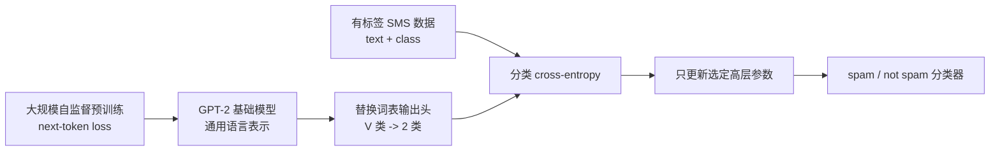
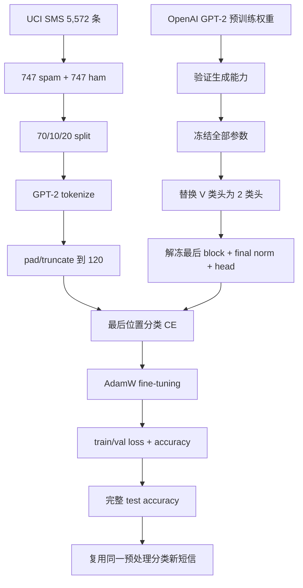

## 0. 本章定位、学习目标与迁移主线

第 5 章得到的 GPT-2 基础模型已经通过下一 token 预训练学到通用语言表示，但它的输出头仍回答“词表中哪个 token 最可能接在后面”。第 6 章把同一主干适配为二分类器：输入一条短信，输出 `0`（not spam/ham）或 `1`（spam）。这一步进入全书第三阶段，即用较小、有标签的任务数据改变基础模型的用途。



本章严格沿原书顺序解决八个问题：

1. **6.1 选择微调范式**：分类微调和指令微调分别适合什么目标？
2. **6.2 准备数据**：怎样下载、平衡、编码标签并划分 train/validation/test？
3. **6.3 构造 DataLoader**：变长文本怎样 padding/truncation 后组成 batch？
4. **6.4 初始化基础模型**：为什么必须先确认 OpenAI GPT-2 权重加载正确？
5. **6.5 改造模型**：怎样把 50,257 维词表头替换成 2 类头，并选择解冻范围？
6. **6.6 定义指标**：为什么 accuracy 用于报告，而 cross-entropy 用于训练？
7. **6.7 监督微调**：训练循环与预训练相比，目标和进度计量改变了什么？
8. **6.8 部署推理**：新文本怎样复用训练时完全相同的预处理和决策规则？

### 0.1 任务接口的根本变化

预训练时，每个 token 位置都有一个词表标签：

$$
X\in\mathbb Z^{B\times T}
\longrightarrow
L_{\mathrm{LM}}\in\mathbb R^{B\times T\times V},
$$

$$
Y_{\mathrm{LM}}\in\mathbb Z^{B\times T}.
$$

分类微调时，每条文本只有一个类别标签：

$$
X\in\mathbb Z^{B\times T}
\longrightarrow
L_{\mathrm{cls}}\in\mathbb R^{B\times C},
$$

$$
Y_{\mathrm{cls}}\in\{0,1,\ldots,C-1\}^{B}.
$$

本章 $C=2$。GPT 主干仍先产生每个位置的隐藏表示，只是最终只取一个位置并映射到类别空间。

### 0.2 全章形状账本

| 数据或张量 | 形状 | 含义 |
|---|---:|---|
| 一条 padding 后短信 | $T$ | token ID 序列 |
| 一个输入 batch | $B\times T$ | 本章常见为 $8\times120$ |
| 一个标签 batch | $B$ | 每条短信一个 0/1 标签 |
| GPT 隐藏表示 | $B\times T\times d$ | 每个位置的上下文化向量 |
| 新分类头输出 | $B\times T\times2$ | 每个位置均有两类 logits |
| 最后位置 logits | $B\times2$ | 用来计算分类 loss/预测 |
| 预测类别 | $B$ | `argmax` 结果 |

### 0.3 本章最重要的三个不变量

1. **数据不变量**：validation/test 必须使用训练集确定的同一 `max_length`、tokenizer、padding ID 和标签映射。
2. **架构不变量**：分类头输入维仍是基础模型的 `emb_dim`，只有输出维从 $V$ 改为 $C$。
3. **因果位置不变量**：使用最后位置时，该位置可通过 causal attention 读取所有此前位置；使用第一位置则只能读取自身。

---

## 6.1 Different Categories of Fine-Tuning（不同微调类别）

### 6.1.1 Fine-tuning 到底改变什么

预训练得到参数 $\theta_0$。微调从这个起点继续优化较小任务数据集：

$$
\theta_{\mathrm{task}}
=\operatorname{Train}(\theta_0,\mathcal D_{\mathrm{task}}).
$$

与从随机参数开始相比，$\theta_0$ 已编码词法、句法、语义和上下文模式；任务数据主要负责把已有表示重新组织到目标输出上。微调不是只改提示，也不是重新学习整个语言。

### 6.1.2 Instruction fine-tuning（指令微调）

数据形态通常是：

```text
instruction + optional input -> desired natural-language response
```

例如：

```text
Instruction: Is this message spam? Answer yes or no.
Input: You won a cash prize. Call now.
Response: yes
```

或者翻译、摘要、问答等开放任务。输出仍是一串 token，训练通常继续使用生成式 token-level loss。优势是一个模型可根据自然语言指令处理多种任务；代价是需要更广、更高质量的演示数据和更多计算，并且输出格式、事实性与指令遵循都要评估。

### 6.1.3 Classification fine-tuning（分类微调）

分类微调（classification fine-tuning）的数据形态是：

```text
text -> one label from a fixed class set
```

本章：

```text
SMS -> {not spam, spam}
```

模型无需每次在输入中附带“请判断是否垃圾短信”的指令，直接输出固定类别 logits。它更专用、数据与计算要求通常更低、决策接口更容易约束，但不能自由回答类别集合之外的问题。

### 6.1.4 两种范式的对照

| 维度 | 分类微调 | 指令微调 |
|---|---|---|
| 输出空间 | 固定 $C$ 类 | 开放 token 序列 |
| 输出头 | 常替换为 $d\to C$ | 通常保留词表头 $d\to V$ |
| 监督粒度 | 每条输入一个类别 | 回答区多个 token |
| 推理接口 | 文本直接分类 | 指令模板 + 文本 |
| 灵活性 | 低，任务专用 | 高，可覆盖多任务 |
| 数据/算力 | 通常更少 | 通常更多 |
| 评估 | accuracy、precision、recall 等 | 生成质量、任务正确性、格式等 |

### 6.1.5 为什么本章选择分类微调

目标是预定义的二元决策，分类头直接表达任务，不必让生成模型学习输出单词 `yes/no` 的格式。它有三个工程优势：

1. 类别空间固定，非法输出不可能出现。
2. Cross-entropy 与 accuracy 定义清楚。
3. 可以只训练很小一部分高层参数，快速验证迁移学习。

如果产品需要同一模型同时翻译、解释、摘要和分类，则指令微调更合适；下一章会实现该路线。

### 6.1.6 “更通用”不等于“对特定任务更好”

指令模型可通过 prompt 完成分类，但：

- 可能输出额外解释或不合法标签；
- prompt 改写可能影响结果；
- 生成多个 token 比计算两个 logits 更慢；
- 特定小数据任务上，专用分类器可能更准确稳定。

反过来，分类器也不能回答“为什么这是 spam”。选择应由输出契约、数据量、延迟、可解释需求和任务范围共同决定。

---

## 6.2 Preparing the Dataset（准备数据集）

### 6.2.1 数据准备的三阶段位置

作者把分类微调拆成：


数据处理先于模型改造，因为类别定义、序列长度和 split 会决定输出头、batch 接口和可信评估。

### 6.2.2 SMS Spam Collection 数据

原书使用 UCI SMS Spam Collection：

```text
total rows: 5,572
ham:        4,825
spam:         747
```

`ham` 表示正常短信。原书虽然说明相同步骤适用于电子邮件，但当前数据是手机短信；把数据来源说成 email 会混淆文本长度、语言风格和部署分布。

下载代码将 ZIP 解压并把无扩展名原文件改名为 `SMSSpamCollection.tsv`。网络下载与 `extractall` 应只处理可信来源；生产流程还应校验哈希、限制解压路径并固定数据版本。

### 6.2.3 为什么类别不平衡是问题

原始 majority baseline 总预测 ham 的 accuracy：

$$
\frac{4{,}825}{5{,}572}
\approx86.6\%.
$$

所以在原始数据上看到 86% accuracy 可能完全没有识别出 spam。类别不平衡还会让未加权 cross-entropy 的梯度主要由 ham 样本贡献，模型倾向多数类。

这说明 accuracy 必须和类别分布一起解释；后续还应关注 spam recall、precision 和 confusion matrix。

### 6.2.4 原书为何下采样多数类

原书随机抽取 747 条 ham，与全部 747 条 spam 合并：

```python
def create_balanced_dataset(frame):
    spam_rows = frame[frame["Label"] == "spam"]
    ham_rows = frame[frame["Label"] == "ham"].sample(
        n=len(spam_rows),
        random_state=123,
    )
    return pd.concat([ham_rows, spam_rows])
```

平衡后：

$$
N=747+747=1{,}494,
$$

随机猜测/固定猜一类的基线约为 50%。数据也更小，便于笔记本电脑快速训练。

### 6.2.5 下采样的收益与代价

**收益：**

- 类别贡献接近均衡；
- accuracy 更直观；
- 训练更快；
- 无需改 loss。

**代价：**

- 丢弃 $4{,}825-747=4{,}078$ 条 ham，浪费多数类多样性；
- 人工类先验从真实约 13.4% spam 改成 50%；
- 训练后的 raw softmax 概率不再对应真实部署 prevalence；
- 生产阈值和概率通常需要按真实分布重新校准。

替代方案包括类别加权 loss、过采样少数类、focal loss、分层采样和收集更多 spam。本章为教学简单选择 undersampling，并不表示它普遍最优。

### 6.2.6 标签编码与 token ID 不同

```python
balanced_df["Label"] = balanced_df["Label"].map(
    {"ham": 0, "spam": 1}
)
```

- token ID 0/1 是 GPT 词表中的离散文本单位；
- class label 0/1 是任务标签；
- 数值相同不代表语义相同，也不会送入 token embedding。

Cross-entropy 只要求类别标签是 $[0,C-1]$ 的整数索引，映射方向可以改变，但训练、评估和推理返回名称必须保持一致。

### 6.2.7 70/10/20 划分的精确数量

先用固定种子打乱 1,494 行，再计算：

$$
N_{\mathrm{train}}
=\lfloor0.7\times1{,}494\rfloor
=1{,}045,
$$

$$
N_{\mathrm{val}}
=\lfloor0.1\times1{,}494\rfloor
=149,
$$

$$
N_{\mathrm{test}}
=1{,}494-1{,}045-149
=300.
$$

实现：

```python
def random_split(frame, train_fraction, validation_fraction):
    shuffled = frame.sample(
        frac=1,
        random_state=123,
    ).reset_index(drop=True)

    train_end = int(len(shuffled) * train_fraction)
    validation_end = train_end + int(
        len(shuffled) * validation_fraction
    )
    return (
        shuffled.iloc[:train_end],
        shuffled.iloc[train_end:validation_end],
        shuffled.iloc[validation_end:],
    )
```

### 6.2.8 三个 split 的职责

| Split | 是否更新参数 | 是否用于调 epoch/超参数 | 何时报告 |
|---|---:|---:|---|
| Train | 是 | 间接 | 训练过程 |
| Validation | 否 | 是 | 训练过程/模型选择 |
| Test | 否 | 否 | 决策冻结后的最终评估 |

如果反复根据 test accuracy 改模型，test 就变成了 validation，最终结果会乐观偏置。

### 6.2.9 随机划分的边界

原书先全局平衡再普通随机切分，没有显式 stratify，因此每个 split 不保证恰好 50/50，只会在随机意义上接近。更稳妥的生产流程可按标签分层划分。

短信数据还可能存在重复或近重复营销模板；若相似消息跨 split，测试会高估泛化。应在划分前做去重/群组划分，并避免同一发送者或模板泄漏。

### 6.2.10 为什么保存 CSV

把固定划分保存为 `train.csv`、`validation.csv`、`test.csv`：

- 后续运行不再重新随机抽样；
- 模型实验共享完全相同 split；
- 可审计标签与文本；
- 避免训练/评估边界悄然变化。

CSV 本身还应配数据版本、随机种子和哈希；文件名相同不保证内容相同。

---

## 6.3 Creating Data Loaders（创建 DataLoader）

### 6.3.1 为什么分类数据不能使用预训练滑动窗口原样处理

预训练从一条长 token 流切固定窗口，每个窗口的 target 是右移 token 序列。短信分类中，每条消息是一个不可随意跨越的样本，长度不同，target 是单个 class label。

```text
pretraining:  [T token IDs] -> [T next-token IDs]
classification: [variable text] -> one class ID
```

因此需要对每条消息独立 tokenize，再统一长度后 batch。

### 6.3.2 截断最短长度还是 padding 最长长度

两个极端：

1. 全部截到最短消息：计算便宜，但长消息的大量 spam 线索丢失。
2. 全部补到最大长度：保留原文本，但增加无效计算和 padding 影响。

原书选择第二种，并用训练集最长序列 $T_{\max}=120$。这是数据质量与效率的折中，不是 padding 越长越好。

### 6.3.3 为什么使用 `<|endoftext|>` ID 50256

GPT-2 没有独立 PAD token，原书复用已在预训练中存在的 `<|endoftext|>`：

```python
tokenizer.encode(
    "<|endoftext|>",
    allowed_special={"<|endoftext|>"},
)
# [50256]
```

优点是 embedding 行已有预训练值，不必扩词表和随机初始化新 token。缺点是模型没有专门 padding mask，本章会实际处理这些 padding token；它们不是完全“无影响”。

### 6.3.4 `SpamDataset` 的完整职责

```python
import pandas as pd
import torch
from torch.utils.data import Dataset


class SpamDataset(Dataset):
    def __init__(
        self,
        csv_file,
        tokenizer,
        max_length=None,
        pad_token_id=50256,
    ):
        self.data = pd.read_csv(csv_file)
        self.encoded_texts = [
            tokenizer.encode(text)
            for text in self.data["Text"]
        ]

        if max_length is None:
            self.max_length = max(
                len(ids) for ids in self.encoded_texts
            )
        else:
            self.max_length = max_length
            self.encoded_texts = [
                ids[:max_length] for ids in self.encoded_texts
            ]

        self.encoded_texts = [
            ids + [pad_token_id] * (self.max_length - len(ids))
            for ids in self.encoded_texts
        ]

    def __len__(self):
        return len(self.data)

    def __getitem__(self, index):
        label = int(self.data.iloc[index]["Label"])
        return (
            torch.tensor(self.encoded_texts[index], dtype=torch.long),
            torch.tensor(label, dtype=torch.long),
        )
```

### 6.3.5 为什么 `max_length` 只能由训练集决定

```python
train_dataset = SpamDataset("train.csv", tokenizer)
validation_dataset = SpamDataset(
    "validation.csv",
    tokenizer,
    max_length=train_dataset.max_length,
)
test_dataset = SpamDataset(
    "test.csv",
    tokenizer,
    max_length=train_dataset.max_length,
)
```

如果分别用 validation/test 最长长度：

- batch shape 不同；
- 分类所取“最后位置”代表不同 padding 深度；
- 推理预处理难以固定；
- 使用评估集统计决定模型输入规则，形成轻微信息泄漏。

训练集确定 $T=120$ 后，验证/测试超长样本截断、短样本 padding，所有 split 接口一致。

### 6.3.6 Padding 后“最后 token”实际是什么

对短消息：

```text
real IDs: [a, b, c]
padded:   [a, b, c, EOT, EOT, ..., EOT]  # 长度 120
```

本章分类使用索引 `-1`，所以读取的是**最后一个 padding/EOT 位置**，不是最后一个真实文本 token。由于 GPT causal attention，位置 119 可以读取位置 0..119，包含整条真实消息和此前 padding，因而可作为固定位置的汇总表示。

这条设计能工作，但 padding 数量会影响表示；本章没有 padding attention mask。不能笼统地说“padding 完全被模型忽略”。

### 6.3.7 为什么补到 1,024 反而更差

练习 6.1 将所有输入补到模型最大 1,024，测试 accuracy 从主线的 95.67% 降到 78.33%。可能机制包括：

- 短短信后出现数百个重复 EOT，最后表示经过大量 padding 位置；
- 训练计算约按 attention 的 $T^2$ 增长：

$$
\left(\frac{1024}{120}\right)^2
\approx72.8;
$$

- 固定数据和 epoch 下，有效文本 token 占比显著下降；
- 分类位置离真实文本更远，优化更困难。

这个结果说明“模型支持更长上下文”不等于“把短文本补得越长越好”。

### 6.3.8 静态 padding 的替代方案

- 每个 batch 动态补到本 batch 最长：减少计算，但分类位置/padding 深度变化。
- 加独立 PAD token 与 attention mask：更明确忽略 padding，但需改 attention 与 embedding/权重兼容。
- 取每条样本最后真实 token 的 hidden state：需要携带长度并用 gather。
- 加专用 classification token：需要定义其位置、attention 方向并训练对应 embedding。
- mean/max pooling：需用 mask 排除 padding。

原书选固定训练最大长度，是最少改动 GPT 架构的教学方案。

### 6.3.9 DataLoader 形状与 batch 数

```python
from torch.utils.data import DataLoader

batch_size = 8
train_loader = DataLoader(
    train_dataset,
    batch_size=batch_size,
    shuffle=True,
    drop_last=True,
    num_workers=0,
)
validation_loader = DataLoader(
    validation_dataset,
    batch_size=batch_size,
    shuffle=False,
    drop_last=False,
    num_workers=0,
)
test_loader = DataLoader(
    test_dataset,
    batch_size=batch_size,
    shuffle=False,
    drop_last=False,
    num_workers=0,
)
```

典型完整 batch：

```text
inputs: [8, 120]
labels: [8]
```

根据 split 数量：

$$
\left\lfloor\frac{1045}{8}\right\rfloor=130
$$

个训练 batch（余 5 条因 `drop_last=True` 丢弃）；

$$
\left\lceil\frac{149}{8}\right\rceil=19,
\qquad
\left\lceil\frac{300}{8}\right\rceil=38
$$

个 validation/test batch。

### 6.3.10 `drop_last` 与评估口径

训练丢掉尾部小 batch 可固定更新规模；shuffle 后每 epoch 被丢的 5 条通常不同。Validation/test 必须 `drop_last=False`，否则 accuracy 会漏样本。

训练集最终 full accuracy 若复用 `train_loader`，每次仍只评估 1,040/1,045 条，而非全部训练样本。差异很小但应准确描述；若要报告全训练集指标，可另建 `drop_last=False, shuffle=False` 的评估 loader。

### 6.3.11 `num_workers=0` 的含义

数据在主进程读取，兼容 Windows/Jupyter 且调试简单。大数据可增加 workers 并使用 pinned memory/persistent workers，但必须处理进程启动、随机种子和内存复制；workers 不改变样本语义。

### 6.3.12 数据侧验收不变量

```python
inputs, labels = next(iter(train_loader))

assert inputs.dtype == torch.long
assert labels.dtype == torch.long
assert inputs.shape == (8, 120)
assert labels.shape == (8,)
assert labels.min() >= 0 and labels.max() <= 1
assert inputs.min() >= 0 and inputs.max() < 50257
```

还应检查每个 split 无重复 ID/文本泄漏、标签分布、截断比例和 padding 比例，而不只看 shape。

---

## 6.4 Initializing a Model with Pretrained Weights（用预训练权重初始化模型）

### 6.4.1 为什么分类微调必须从基础模型开始

若随机初始化 124M GPT 再用约 1,045 条训练短信学习，它既要从零学语言，又要学 spam 边界，数据远远不足。OpenAI GPT-2 已学到通用语言表示，分类数据只需教会高层把这些表示映射到 0/1。

迁移学习的假设是：

$$
{\text{通用语言特征}}
+{\text{少量任务监督}}
\rightarrow
{\text{有效任务表示}}.
$$

如果目标域与预训练分布差异极大，或 tokenizer/语言不匹配，迁移收益会下降，可能需要继续预训练或解冻更多层。

### 6.4.2 本章 GPT-2 配置

```python
CHOOSE_MODEL = "gpt2-small (124M)"
BASE_CONFIG = {
    "vocab_size": 50257,
    "context_length": 1024,
    "drop_rate": 0.0,
    "qkv_bias": True,
}
MODEL_CONFIGS = {
    "gpt2-small (124M)": {
        "emb_dim": 768,
        "n_layers": 12,
        "n_heads": 12,
    },
    "gpt2-medium (355M)": {
        "emb_dim": 1024,
        "n_layers": 24,
        "n_heads": 16,
    },
    "gpt2-large (774M)": {
        "emb_dim": 1280,
        "n_layers": 36,
        "n_heads": 20,
    },
    "gpt2-xl (1558M)": {
        "emb_dim": 1600,
        "n_layers": 48,
        "n_heads": 25,
    },
}
BASE_CONFIG.update(MODEL_CONFIGS[CHOOSE_MODEL])
```

- `context_length=1024` 匹配 OpenAI position embedding；
- `qkv_bias=True` 匹配源 checkpoint；
- `drop_rate=0.0` 让本章分类训练不使用 dropout，输出更稳定；
- SMS 实际输入 120，模型仍保留 1,024 上限。

### 6.4.3 从模型名提取下载尺寸

```python
model_size = (
    CHOOSE_MODEL.split(" ")[-1]
    .lstrip("(")
    .rstrip(")")
)
# "124M"
```

这是字符串便利写法，依赖命名格式。更稳健的工程配置应把下载 ID 作为独立字段，而不是从展示名称解析。

### 6.4.4 加载顺序

```python
settings, parameters = download_and_load_gpt2(
    model_size=model_size,
    models_dir="gpt2",
)
model = GPTModel(BASE_CONFIG)
load_weights_into_gpt(model, parameters)
model.eval()
```

顺序是：先用匹配配置构造架构，再覆盖随机参数，最后 eval。若在替换 Parameter 前已经创建 optimizer，optimizer 可能仍引用旧参数；分类 optimizer 应在全部加载、冻结和换头之后创建。

### 6.4.5 为什么先验证语言生成

原书用 `Every effort moves you`，预训练模型续写：

```text
Every effort moves you forward.
The first step is to understand the importance of your work
```

连贯生成是权重映射成功的强集成检查。若 Q/K/V 转置或层映射错误，输出通常退化。仍应注意，单个 prompt 不是完备验证；更严谨可比较参考 logits/loss。

### 6.4.6 为什么基础 GPT-2 不会直接听 spam 指令

原书提示要求回答 yes/no，基础 GPT-2 却复述提示。原因是它只做过互联网文本的 next-token pretraining，最自然行为是续写，不是把用户文本解释为命令并遵循格式。

这说明：

- 预训练语言能力不等于 instruction following；
- prompt 中出现任务描述不保证基础模型学会该接口；
- 分类微调和指令微调解决不同后训练问题。

---

## 6.5 Adding a Classification Head（添加分类头）

### 6.5.1 从词表头改成类别头

原输出头：

$$
W_{\mathrm{LM}}\in\mathbb R^{50{,}257\times768}.
$$

新分类头：

$$
W_{\mathrm{cls}}\in\mathbb R^{2\times768},
\qquad
b_{\mathrm{cls}}\in\mathbb R^2.
$$

```python
torch.manual_seed(123)
model.out_head = torch.nn.Linear(
    in_features=BASE_CONFIG["emb_dim"],
    out_features=2,
)
```

新头随机初始化，因为 OpenAI checkpoint 没有 spam 分类参数。这里默认有 bias；原语言模型输出头无 bias，两者架构职责不同。

### 6.5.2 二分类为什么使用两个 logits

二分类也可用单 logit + sigmoid/BCE：

$$
p(y=1\mid x)=\sigma(z).
$$

本章使用两个 logits + softmax cross-entropy：

$$
p(y=c\mid x)
=\frac{e^{z_c}}{e^{z_0}+e^{z_1}}.
$$

它自然推广到 $C$ 类，只需 `out_features=C`；标签保持整数索引。两种参数化对二分类都可行，不能把单节点称为错误。

### 6.5.3 分类头参数量

$d=768,C=2$，含 bias：

$$
N_{\mathrm{head}}=Cd+C
=2\times768+2
=1{,}538.
$$

与原独立词表头 38,597,376 参数相比极小。替换头会丢失该模型直接生成词表 logits 的能力；若还需生成和分类，通常保留 LM head 并另加分类 head，或使用独立模型实例。

### 6.5.4 为什么先冻结全部参数

```python
for parameter in model.parameters():
    parameter.requires_grad = False
```

然后替换的新 `out_head` 默认 `requires_grad=True`。冻结可：

- 保留通用表示，降低灾难性遗忘；
- 减少参数梯度和 optimizer 状态内存；
- 降低小数据过拟合风险；
- 加快 backward/step。

但冻结层仍必须前向计算。由于最后 block 可训练，它的输入来自前 11 个冻结 blocks；这些层不会被 optimizer 更新，并不表示可以完全跳过。

### 6.5.5 为什么额外解冻最后 block 与 final norm

仅训练线性头相当于固定特征上的 linear probing。作者实验发现进一步训练最靠近输出的表示层可提高分类效果：

```python
for parameter in model.trf_blocks[-1].parameters():
    parameter.requires_grad = True

for parameter in model.final_norm.parameters():
    parameter.requires_grad = True
```

高层表示更接近任务输出，允许它适配 SMS spam 模式；底层继续保留通用语言结构。

解冻范围是 bias-variance/资源权衡：数据更多、域差更大时可能解冻更多；数据很少时只训头更稳。

### 6.5.6 训练参数范围

本章可训练部分：

```text
last Transformer block
+ final LayerNorm
+ new classification head
```

其余：

```text
token/position embeddings
+ first 11 Transformer blocks
```

冻结。

创建 optimizer 时可直接传：

```python
trainable_parameters = [
    parameter
    for parameter in model.parameters()
    if parameter.requires_grad
]
```

虽然传 `model.parameters()` 也能工作，显式过滤更清楚，也避免 optimizer 为冻结参数建立不必要状态。

### 6.5.7 练习 6.2：全模型微调

附录结果：不冻结任何层，测试 accuracy 为 **96.67%**，比主线 **95.67%** 高 1 个百分点。

这不证明全量微调总是更好：

- 计算和 optimizer 内存更高；
- 小数据下过拟合/遗忘风险更大；
- 1 个百分点可能受随机种子和样本波动影响；
- 应多次运行或给置信区间。

它说明本任务中更多适配容量有小幅收益。

### 6.5.8 改头后的输出形状

输入：

```python
input_ids = torch.tensor(
    tokenizer.encode("Do you have time")
).unsqueeze(0)
# [1, 4]
```

输出：

$$
[1,4,2].
$$

原书随机新头示例最后一行：

```text
[-3.5983, 3.9902]
```

此时预测 1，但新头尚未训练，这只是随机决策。

### 6.5.9 为什么选择最后位置

因果 attention 的位置 $t$ 只能读取 $0..t$。因此：

```text
first position  -> only first token
middle position -> prefix through that position
last position   -> entire padded sequence
```

最后位置拥有最大感受野，可将整条消息的信息聚合到一个向量，再由分类头映射类别。

### 6.5.10 最后位置与最后真实 token 的差别

本章固定 padding 到 120，所以短消息的索引 `-1` 是 EOT padding。它仍能 attention 到真实前缀，但也处理了多个 EOT。另一设计可记录每条真实长度并选：

$$
h_{b,\ell_b-1},
$$

即最后真实 token；这可能减少 padding 影响，但训练和推理必须携带长度并正确 gather。

### 6.5.11 练习 6.3：第一位置为何显著更差

把所有 `[:, -1, :]` 改为 `[:, 0, :]`，测试 accuracy 降至 **75.00%**。因为第一位置在 causal mask 下看不到后续短信，只能基于第一个 token 分类，绝大多数证据不可用。

这不是“第一 token embedding 天生差”，而是 decoder-only 因果可见性决定。双向 encoder 或带前置 CLS 的不同 mask 设计会有不同结论。

---

## 6.6 Calculating the Classification Loss and Accuracy（计算分类损失与准确率）

### 6.6.1 从 logits 到类别

最后位置 logits：

$$
Z\in\mathbb R^{B\times2}.
$$

预测：

$$
\widehat y_b=\arg\max_{c\in\{0,1\}}Z_{b,c}.
$$

Softmax 对 argmax 保序，所以推断类别不需要先算概率。若要显示置信度或调整阈值，才计算 softmax；raw softmax 还可能需要校准。

### 6.6.2 Accuracy 的公式

$$
\operatorname{Accuracy}
=\frac1N\sum_{i=1}^{N}
\mathbf1[\widehat y_i=y_i].
$$

它直观但不可微；argmax 在大多数区域不随小参数变化，不能作为反向传播 loss。

平衡数据上 50% 是朴素基线。真实不平衡部署中 accuracy 可能掩盖 spam recall，应补 precision、recall、F1、ROC/PR 和 confusion matrix。

### 6.6.3 Accuracy loader

```python
def calc_accuracy_loader(
    data_loader,
    model,
    device,
    num_batches=None,
):
    model.eval()
    if len(data_loader) == 0:
        return float("nan")

    if num_batches is None:
        num_batches = len(data_loader)
    else:
        num_batches = min(num_batches, len(data_loader))

    correct = 0
    examples = 0
    for batch_index, (inputs, labels) in enumerate(data_loader):
        if batch_index >= num_batches:
            break
        inputs = inputs.to(device)
        labels = labels.to(device)
        with torch.no_grad():
            logits = model(inputs)[:, -1, :]
        predictions = logits.argmax(dim=-1)
        correct += (predictions == labels).sum().item()
        examples += labels.numel()

    return correct / examples
```

与原书相比增加空 loader 防护。函数没有恢复原训练模式；在训练循环 epoch 末调用后，下一 epoch 开头会 `model.train()`，但更通用实现应记录并恢复状态。

### 6.6.4 初始 accuracy 为什么约随机

新分类头随机初始化，10-batch 估计：

```text
train:      46.25%
validation: 45.00%
test:       48.75%
```

接近 50% 说明预训练表示尚未被新头映射到任务标签。它不表示基础模型没有语言知识，也不表示最终任务不可学。

### 6.6.5 分类 cross-entropy

每条样本只取最后位置：

$$
\ell_b
=-\log\frac{e^{Z_{b,y_b}}}
{\sum_{c=0}^{1}e^{Z_{b,c}}}.
$$

Batch mean：

$$
\mathcal L_{\mathrm{cls}}
=\frac1B\sum_b\ell_b.
$$

```python
def calc_loss_batch(inputs, labels, model, device):
    inputs = inputs.to(device)
    labels = labels.to(device)
    logits = model(inputs)[:, -1, :]
    return torch.nn.functional.cross_entropy(logits, labels)
```

预训练 loss 对 $BT$ 个 token 分类；本章 loss 对 $B$ 条消息分类。函数名相同，监督粒度和 logits shape 已改变。

### 6.6.6 为什么 cross-entropy 是 accuracy 的代理

单样本梯度仍是：

$$
\frac{\partial\ell}{\partial z_c}
=p_c-\mathbf1[c=y].
$$

它连续地提高正确类 logit、压低错误类；当正确类超过其他类时 accuracy 才发生离散变化。Cross-entropy 提供比 0/1 accuracy 更密集的学习信号。

### 6.6.7 初始 loss 为何可高于 $\ln2$

均匀两类基线：

$$
\ln2\approx0.693.
$$

原书新头初始 5-batch loss：

```text
train:      2.453
validation: 2.583
test:       2.322
```

随机线性头并不输出均匀概率，可能对错误类非常自信，所以 NLL 远高于 $\ln2$。Accuracy 接近 50% 与 high cross-entropy 可同时成立；后者反映置信度。

### 6.6.8 Loader loss 的平均边界

原书复用 batch loss 算术平均。最后 validation/test batch 较小，等权 batch 平均会让小 batch 权重与大 batch 相同。严格 example-level loss 应：

$$
\mathcal L
=\frac{\sum_b B_b\mathcal L_b}{\sum_bB_b}.
$$

训练期间只取 5 个完整 batch 时无此差异；完整评估时最好按样本数加权。

### 6.6.9 Accuracy 与 loss 必须一起看

两个模型 accuracy 都 95%，一个对正确类概率 0.51，另一个 0.99，cross-entropy 会显著不同；反之 loss 小幅改善未必立刻改变 argmax accuracy。

- loss 用于优化和早期趋势；
- accuracy 用于直观任务表现；
- 不平衡/高风险任务还需类别级指标和阈值分析。

---

## 6.7 Fine-Tuning the Model on Supervised Data（在监督数据上微调模型）

### 6.7.1 与预训练循环相同和不同的部分

相同：

```text
model.train -> zero_grad -> forward/loss
-> backward -> optimizer.step -> periodic eval
```

不同：

| 维度 | 预训练 | 分类微调 |
|---|---|---|
| Target | 每个位置下一 token | 每条消息一个类别 |
| Logits | `[B,T,V]` 全部位置 | `[B,2]` 最后位置 |
| 进度 | tokens seen | examples seen |
| 定性监控 | 生成固定 prompt | 分类 accuracy |
| 可训练参数 | 通常全部模型 | 本章只高层 + 新头 |

### 6.7.2 完整训练函数

```python
def train_classifier_simple(
    model,
    train_loader,
    validation_loader,
    optimizer,
    device,
    num_epochs,
    eval_freq,
    eval_iter,
):
    train_losses = []
    validation_losses = []
    train_accuracies = []
    validation_accuracies = []
    examples_seen = 0
    global_step = -1

    for epoch in range(num_epochs):
        model.train()

        for inputs, labels in train_loader:
            optimizer.zero_grad()
            loss = calc_loss_batch(
                inputs,
                labels,
                model,
                device,
            )
            loss.backward()
            optimizer.step()

            examples_seen += inputs.shape[0]
            global_step += 1

            if global_step % eval_freq == 0:
                train_loss, validation_loss = evaluate_model(
                    model,
                    train_loader,
                    validation_loader,
                    device,
                    eval_iter,
                )
                train_losses.append(train_loss)
                validation_losses.append(validation_loss)

        train_accuracy = calc_accuracy_loader(
            train_loader,
            model,
            device,
            num_batches=eval_iter,
        )
        validation_accuracy = calc_accuracy_loader(
            validation_loader,
            model,
            device,
            num_batches=eval_iter,
        )
        train_accuracies.append(train_accuracy)
        validation_accuracies.append(validation_accuracy)

    return (
        train_losses,
        validation_losses,
        train_accuracies,
        validation_accuracies,
        examples_seen,
    )
```

### 6.7.3 为什么统计 examples seen 而不是 tokens seen

分类监督单位是一条消息，每条消息只贡献一个标签；因此：

$$
{\text{examples seen}}
\leftarrow
{\text{examples seen}}+B.
$$

虽然每条输入有 120 token，但监督信号不是 120 个独立标签。比较不同 padding 长度时，也应区分 examples seen 与实际计算 token 数。

本章每 epoch 使用：

$$
130\times8=1{,}040
$$

条训练样本，5 epochs 共：

$$
5\times1{,}040=5{,}200
$$

次 example exposures。每 epoch 因 drop-last 漏 5 条，但 shuffle 后通常不是固定 5 条。

### 6.7.4 优化器为什么在冻结之后创建

```python
optimizer = torch.optim.AdamW(
    [p for p in model.parameters() if p.requires_grad],
    lr=5e-5,
    weight_decay=0.1,
)
```

学习率 $5\times10^{-5}$ 比第 5 章从头预训练的 $4\times10^{-4}$ 小，因为已有权重只需温和适配，过大更新可能破坏预训练表示。新头随机初始化，有时可为头和主干使用不同学习率；原书保持单一配置简化教学。

### 6.7.5 为什么训练只需约几分钟

- 数据仅约 1k 训练样本；
- 序列长度 120；
- 只解冻最后 block/final norm/head；
- 5 epochs。

但冻结并不消除全部前向成本。CPU/M3 约 5.65 分钟，V100/A100 少于半分钟是原书特定环境结果，不是性能保证。

### 6.7.6 训练日志怎样解释

代表点：

| Epoch/step | Train loss | Val loss |
|---|---:|---:|
| 1/0 | 2.153 | 2.392 |
| 1/100 | 0.523 | 0.557 |
| 3/350 | 0.340 | 0.306 |
| 5/600 | 0.083 | 0.074 |

两者同步快速下降且差距小，说明在该 split 上学习与泛化同时改善。Validation loss 偶尔低于 train 可能来自小样本、batch 选择和数据难度，不必视为异常。

### 6.7.7 Epoch accuracy 是快速估计

训练函数用：

```python
eval_iter = 5
batch_size = 8
```

所以每次 accuracy 只看最多：

$$
5\times8=40
$$

条消息。97.5% 在 40 条上相当于 39/40，单个样本就改变 2.5 个百分点；100% 也不代表完整训练集全对。

图 6.17 的曲线适合监控，不是最终指标。

### 6.7.8 为什么画 loss 和 accuracy 两张曲线

- Loss 连续，能看见置信度改善和过拟合先兆。
- Accuracy 离散，直接对应任务正确率。

同一 accuracy 下 loss 可继续下降；loss 轻微变化也可能跨过 argmax 边界让 accuracy 跳变。两者联合比只看一个更可靠。

### 6.7.9 Epoch 数如何选择

“5 epochs 是起点”不是定律。应根据 validation 指标：

- validation loss 继续下降：可增加；
- train 下降而 validation 上升：早停或增强正则化；
- 两者都停滞：检查学习率、解冻范围和数据。

选择最佳 epoch 后，应加载该 validation checkpoint，再只在 test 上报告一次。

### 6.7.10 完整 loader 最终 accuracy

原书：

```text
Training accuracy:   97.21%
Validation accuracy: 97.32%
Test accuracy:       95.67%
```

Validation 略高于 train/test 不表示它本质更容易泛化；开发过程中超参数根据 validation 选择，会给 validation 带来轻微适配偏差。Test 95.67% 是更接近最终未见数据估计。

### 6.7.11 Train accuracy 仍不是严格全部 1,045 条

`train_loader.drop_last=True`，所以完整 loader 只包含：

$$
130\times8=1{,}040
$$

条。若要严格报告所有训练样本，应使用独立 evaluation loader：

```python
train_eval_loader = DataLoader(
    train_dataset,
    batch_size=8,
    shuffle=False,
    drop_last=False,
)
```

### 6.7.12 “几乎无过拟合”的证据边界

Train/test accuracy 差约：

$$
97.21\%-95.67\%=1.54\text{ percentage points}.
$$

支持过拟合较小，但数据仅 300 条 test，且可能有模板相似/随机波动。95.67% 约为 287/300（具体取决于实际预测），少数样本即可改变约 0.33 个百分点。

应报告 confusion matrix 和多 seed，尤其 spam 漏报/误报成本不同。

### 6.7.13 正则化与泛化调节

若 gap 增大，可考虑：

- 提高 dropout；
- 调整 weight decay；
- 减少 epochs/早停；
- 只训练更少层；
- 增加/增强数据；
- 使用 class weights 或真实分布评估。

不能只追求 validation accuracy 反复调 test。

### 6.7.14 全量微调收益如何评价

练习 6.2：95.67% → 96.67%，在 300 条 test 上约多正确 3 条。是否值得取决于：

- 多 seed 是否稳定；
- 训练内存/时间；
- 域迁移与遗忘；
- 部署错误成本。

单次 1% 提升不足以建立普遍结论。

---

## 6.8 Using the LLM as a Spam Classifier（把 LLM 用作 spam 分类器）

### 6.8.1 推理预处理必须与训练一致

新文本需要复用：

- 同一 GPT-2 tokenizer；
- 同一 `pad_token_id=50256`；
- 同一 `max_length=120`；
- 同一 truncation/padding 方向；
- 同一最后位置 logits；
- 同一 `0 -> not spam, 1 -> spam` 映射。

任何一项漂移都会造成 train-serving skew。

### 6.8.2 更稳健的分类函数

原书 `max_length=None` 默认值若直接进入 `min(max_length, supported)` 会报错；实际调用传入训练长度。下面显式处理该边界：

```python
def classify_text(
    text,
    model,
    tokenizer,
    device,
    max_length,
    pad_token_id=50256,
):
    model.eval()
    supported_length = model.pos_emb.weight.shape[0]
    effective_length = min(max_length, supported_length)

    token_ids = tokenizer.encode(text)[:effective_length]
    token_ids += [pad_token_id] * (
        effective_length - len(token_ids)
    )
    input_tensor = torch.tensor(
        token_ids,
        dtype=torch.long,
        device=device,
    ).unsqueeze(0)

    with torch.no_grad():
        logits = model(input_tensor)[:, -1, :]
    predicted = logits.argmax(dim=-1).item()
    return "spam" if predicted == 1 else "not spam"
```

### 6.8.3 为什么取模型支持长度与训练长度的最小值

$$
T_{\mathrm{effective}}
=\min(T_{\mathrm{train}},T_{\mathrm{model}}).
$$

不能超过位置 embedding/causal mask 上限；也不能无意使用比训练更长的位置作为分类汇聚点。正常本章配置是 $\min(120,1024)=120$。

### 6.8.4 空字符串的行为

空文本编码为 `[]`，随后补成 120 个 EOT，因此函数仍能输出类别。但这不是有意义 spam 证据；应用层应明确拒绝空输入、返回 unknown 或单独评估，而不是把任意 argmax 当可信判断。

### 6.8.5 两个原书示例

奖金/现金诱导消息：

```text
You are a winner ... selected to receive $1000 cash ...
```

返回 `spam`。

晚餐确认消息：

```text
Hey, just wanted to check if we're still on for dinner tonight?
```

返回 `not spam`。

两个案例说明调用链成立，不代表覆盖所有网络钓鱼、缩写、多语言、对抗拼写或分布漂移。

### 6.8.6 Argmax 与业务阈值

两类 argmax 等价于比较：

$$
z_1>z_0.
$$

若计算 spam probability $p_1$，默认阈值约 0.5。但真实 spam prevalence、漏报与误报成本不同，最优阈值未必 0.5。应在 validation 上按目标成本/precision-recall 选择阈值，再锁定后评 test。

由于训练集被平衡，softmax 概率可能不校准到真实世界 13.4% spam 先验；部署前可做 temperature calibration、Platt/isotonic 等校准并在真实分布验证。

### 6.8.7 保存分类器

```python
torch.save(
    model.state_dict(),
    "review_classifier.pth",
)
```

加载前必须：

1. 创建相同 GPT-2 配置；
2. 替换为相同 2 类 head；
3. 再 `load_state_dict`；
4. 移到 device 并 `eval()`。

只保存 state dict 不包含 tokenizer、`max_length`、标签映射和阈值；部署 artifact 应把这些元数据一起版本化。

### 6.8.8 分类器上线还需要什么

- 真实分布上的 precision/recall/F1 与 confusion matrix；
- 阈值和概率校准；
- 多语言、短链接、emoji、混淆拼写测试；
- 隐私与日志策略；
- 漂移监控和再训练触发；
- 不确定/拒绝机制；
- 对误报/漏报的人工复核流程；
- 延迟、批处理和资源评估。

本章完成模型原理闭环，不等于生产 spam 系统全部完成。

---

## 7. 全章知识结构

### 7.1 从基础模型到分类器



### 7.2 三个阶段的关键产物

| 阶段 | 输入 | 产物 | 关键验收 |
|---|---|---|---|
| 数据 | 原始短信/标签 | 固定 split、`[B,120]`、`[B]` | 类别、泄漏、padding、shape |
| 模型 | GPT-2 权重 | 2 类头与选定可训练层 | 连贯续写、freeze scope、`[B,T,2]` |
| 训练/部署 | 分类 loss | fine-tuned state dict 与推理函数 | val/test 指标、预处理一致、漂移监控 |

### 7.3 三种分布不能混淆

1. **原始 UCI 分布**：spam 约 13.4%。
2. **平衡训练/当前评估分布**：人为接近 50/50。
3. **真实部署分布**：随地区、时间、渠道变化，可能远低于或高于 13.4%。

模型 accuracy、softmax 概率和阈值都依赖评估分布。平衡 test 上 95.67% 不直接等于线上 precision/recall。

---

## 8. 核心公式与算法速查

### 8.1 分类头

$$
z=W_{\mathrm{cls}}h+b,
\qquad
W_{\mathrm{cls}}\in\mathbb R^{C\times d}.
$$

本章 $C=2,d=768$。

### 8.2 Softmax 与预测

$$
p_c=\frac{e^{z_c}}{\sum_j e^{z_j}},
\qquad
\widehat y=\arg\max_c z_c.
$$

### 8.3 Classification cross-entropy

$$
\mathcal L
=-\frac1B\sum_{b=1}^{B}
\log p_{b,y_b}.
$$

### 8.4 Accuracy


$$
\operatorname{Accuracy}
=\frac{{\text{correct predictions}}}
{{\text{all evaluated examples}}}.
$$


### 8.5 Example-weighted loader loss

$$
\mathcal L_{\mathrm{loader}}
=\frac{\sum_kB_k\mathcal L_k}{\sum_kB_k}.
$$

### 8.6 最后位置表示

对 causal decoder：

$$
h_{T-1}
=f(x_0,x_1,\ldots,x_{T-1}),
$$

第一位置只有：

$$
h_0=f(x_0).
$$

### 8.7 微调更新

仅对可训练集合 $\Theta_{\mathrm{train}}$：

$$
{\boldsymbol\theta}
\leftarrow
\operatorname{AdamW}
({\boldsymbol\theta},\nabla_{\boldsymbol\theta}\mathcal L),
\qquad
{\boldsymbol\theta}\in\Theta_{\mathrm{train}}.
$$

冻结参数不进入更新。

---

## 9. 易混概念与常见误区

| 常见说法 | 准确辨析 |
|---|---|
| Fine-tuning 就是重新预训练 | 从预训练权重出发，在小任务数据上继续优化不同目标。 |
| Classification 与 instruction fine-tuning 只差 prompt | 输出头、监督粒度、数据和推理接口都不同。 |
| 指令模型一定优于专用分类器 | 专用分类器可更快、更稳定、只输出合法类别。 |
| 原始数据 86% accuracy 很高 | 全猜 ham 已约 86.6%，可能 spam recall 为 0。 |
| 平衡数据没有代价 | 下采样丢 4,078 条 ham，并改变真实类别先验。 |
| 标签 0/1 是 GPT token ID | 类别索引与文本 token ID 是不同命名空间。 |
| 70/10/20 保证每份严格平衡 | 普通随机 split 未显式 stratify，只近似平衡。 |
| Test 可用来选择 epochs | Test 应在决策冻结后最终报告，否则产生偏置。 |
| Padding token 会被 GPT 自动忽略 | 本章无 padding mask，EOT padding 会参与 attention。 |
| 最后位置是最后真实短信 token | 固定 padding 时通常是最后一个 EOT 位置。 |
| 模型支持 1,024 就应全部补到 1,024 | 练习测试 accuracy 降到 78.33%，计算也约增 72.8 倍 attention 规模。 |
| Validation/test 可各自使用自己的最长长度 | 会导致输入协议不一致并利用评估统计；应复用训练 max length。 |
| `drop_last=True` 不丢数据 | 每 epoch 丢尾 batch；shuffle 只改变通常丢哪些样本。 |
| 加载 GPT-2 后就会遵循 spam 指令 | 基础模型会续写，不一定遵循命令；需后训练。 |
| 换分类头仍可正常语言生成 | 新头只输出两类，不再是词表 logits。 |
| 二分类必须两个输出节点 | 也可单 logit+BCE；本章选可推广的 $C$ logits+CE。 |
| 冻结层不会运行 | 仍做前向，只是不计算/更新参数梯度。 |
| 只训最后一层总是最佳 | 是资源/泛化折中；全量微调本例高 1%，但成本更高。 |
| Lower layers 永远只含通用特征 | 是经验趋势，不是严格层功能划分。 |
| 第一位置也代表整条序列 | causal GPT 第一位置看不到后续，练习 accuracy 仅 75%。 |
| Accuracy 可作为 backward loss | Argmax 不可微；训练用 cross-entropy。 |
| 两类 softmax 前必须手动算概率再 argmax | Argmax logits 与 argmax softmax 相同。 |
| 两类随机基线 loss 必然是 0.693 | 随机新头可自信地错，loss 可远高于 $\ln2$。 |
| 只看 accuracy 足够 | 不平衡任务还需 precision/recall/F1、confusion matrix 和阈值。 |
| 训练函数的 100% accuracy 是完整训练集 | `eval_iter=5` 只看 40 条样本。 |
| 完整 train accuracy 覆盖 1,045 条 | 原 train loader drop-last，只覆盖 1,040 条。 |
| Validation 高于 test 说明 test 出错 | 调参适配 validation、样本噪声和难度都可造成小差距。 |
| 单次 1% 提升证明全量微调普遍更好 | 约 3 个 test 样本，需多 seed/置信区间和成本分析。 |
| 推理可任意改变 max length | 必须匹配训练时分类位置和 padding 协议。 |
| 平衡训练后 softmax=线上 spam 概率 | 类先验改变，概率可能需在真实分布校准。 |
| 保存 state dict 就保存了完整分类服务 | tokenizer、长度、标签映射、阈值和配置也需版本化。 |

---

## 10. 作者分析与解决问题的一般思路

### 10.1 先选择最小满足需求的后训练范式

目标只有固定两类，因此不引入开放生成和复杂指令数据，直接改分类头。这体现：

$$
{\text{输出契约}}
\rightarrow
{\text{选择训练范式与损失}}.
$$

### 10.2 先控制数据基线，再评价模型

作者先检查 4,825/747 分布，发现 accuracy 基线会误导，于是平衡类别后再训练。一般流程应始终先问：

- 类别比例？
- 固定多数类基线？
- 数据泄漏/重复？
- 错误成本是否对称？

### 10.3 让预处理规则只从训练数据产生

训练集决定 `max_length=120`，validation/test 复用。该原则也适用于词表、归一化统计、阈值调节和特征选择：评估数据不能参与拟合预处理。

### 10.4 利用架构可见性选择 pooling 位置

不是凭惯例选最后 token，而是从 causal mask 推导：最后位置看过全部前缀，第一位置看不到后文。练习 6.3 用 75% vs 95.67% 的反例验证该假设。

### 10.5 从最小可训练集合逐步扩大

先冻结全部、训练新头；再解冻最后 block 和 norm；练习再对比全模型。这个顺序使性能/资源变化可归因，而不是一开始全量更新后无法知道哪些层必要。

### 10.6 区分优化指标与报告指标

Cross-entropy 可微，适合优化；accuracy 直观，适合报告。作者训练时同时看 loss 与 accuracy，避免只看离散平台期或只看置信度。

### 10.7 用快速子集评估保持迭代速度，再用全量收尾

`eval_iter=5` 让训练监控便宜，最后不限制 batches 计算完整 validation/test。这是“开发代理指标 + 最终严格指标”的通用模式，但必须清楚标注两者样本量。

### 10.8 推理代码复刻 Dataset，而非另写随意预处理

`classify_text` 重复 tokenizer、truncate、pad、last-position 与 label map。更稳健工程会把预处理封装为单一可复用对象，减少训练/服务漂移。

---

## 11. 可运行的端到端迷你文本分类微调

下面代码使用小型因果 Transformer 和合成文本模式，演示：预训练式主干、冻结低层、替换分类头、最后位置 loss、监督微调、保存加载和推理。它不下载 GPT-2 权重，目的是在 CPU 上快速验证本章控制流。

```python
from pathlib import Path
from tempfile import TemporaryDirectory

import torch
import torch.nn as nn
import torch.nn.functional as F
from torch.utils.data import DataLoader, TensorDataset


class TinyCausalBlock(nn.Module):
    def __init__(self, dim, num_heads):
        super().__init__()
        self.norm1 = nn.LayerNorm(dim)
        self.attention = nn.MultiheadAttention(
            dim,
            num_heads,
            batch_first=True,
        )
        self.norm2 = nn.LayerNorm(dim)
        self.feed_forward = nn.Sequential(
            nn.Linear(dim, 2 * dim),
            nn.GELU(),
            nn.Linear(2 * dim, dim),
        )

    def forward(self, x):
        num_tokens = x.shape[1]
        causal_mask = torch.triu(
            torch.ones(
                num_tokens,
                num_tokens,
                dtype=torch.bool,
                device=x.device,
            ),
            diagonal=1,
        )
        normalized = self.norm1(x)
        attended, _ = self.attention(
            normalized,
            normalized,
            normalized,
            attn_mask=causal_mask,
            need_weights=False,
        )
        x = x + attended
        return x + self.feed_forward(self.norm2(x))


class TinyClassifier(nn.Module):
    def __init__(self, vocab_size=32, dim=16, num_classes=2):
        super().__init__()
        self.token_embedding = nn.Embedding(vocab_size, dim)
        self.blocks = nn.ModuleList(
            [TinyCausalBlock(dim, 4), TinyCausalBlock(dim, 4)]
        )
        self.final_norm = nn.LayerNorm(dim)
        self.output_head = nn.Linear(dim, num_classes)

    def forward(self, token_ids):
        hidden = self.token_embedding(token_ids)
        for block in self.blocks:
            hidden = block(hidden)
        hidden = self.final_norm(hidden)
        return self.output_head(hidden)


torch.manual_seed(123)
num_examples = 320
sequence_length = 12
inputs = torch.randint(0, 30, (num_examples, sequence_length))
# 类别由后缀是否含特殊 token 31 决定。
labels = torch.randint(0, 2, (num_examples,))
inputs[labels == 1, -3] = 31
inputs[labels == 0, -3] = 0

train_inputs, test_inputs = inputs[:256], inputs[256:]
train_labels, test_labels = labels[:256], labels[256:]
train_loader = DataLoader(
    TensorDataset(train_inputs, train_labels),
    batch_size=16,
    shuffle=True,
)

model = TinyClassifier()
# 模拟迁移学习：冻结 embedding 和第一个 block。
for parameter in model.parameters():
    parameter.requires_grad = False
model.output_head = nn.Linear(16, 2)
for parameter in model.blocks[-1].parameters():
    parameter.requires_grad = True
for parameter in model.final_norm.parameters():
    parameter.requires_grad = True

optimizer = torch.optim.AdamW(
    [p for p in model.parameters() if p.requires_grad],
    lr=0.02,
    weight_decay=0.01,
)

for _ in range(8):
    model.train()
    for input_batch, label_batch in train_loader:
        optimizer.zero_grad()
        logits = model(input_batch)[:, -1, :]
        loss = F.cross_entropy(logits, label_batch)
        loss.backward()
        optimizer.step()

model.eval()
with torch.no_grad():
    test_logits = model(test_inputs)[:, -1, :]
    test_predictions = test_logits.argmax(dim=-1)
    test_accuracy = (
        test_predictions == test_labels
    ).float().mean().item()

assert test_accuracy > 0.95
assert model.token_embedding.weight.grad is None
assert all(
    parameter.grad is None
    for parameter in model.blocks[0].parameters()
)

# 保存并恢复分类器。
with TemporaryDirectory() as directory:
    path = Path(directory) / "classifier.pth"
    torch.save(model.state_dict(), path)
    restored = TinyClassifier()
    for parameter in restored.parameters():
        parameter.requires_grad = False
    restored.output_head = nn.Linear(16, 2)
    restored.load_state_dict(
        torch.load(path, weights_only=True)
    )
    restored.eval()
    with torch.no_grad():
        restored_logits = restored(test_inputs)
        original_logits = model(test_inputs)
    assert torch.equal(restored_logits, original_logits)

print(f"test accuracy: {test_accuracy:.4f}")
print("frozen lower layers have no gradients: True")
print("restored logits identical: True")
```

该示例中底层是随机冻结而非真实预训练，因此任务被刻意设计得简单；它验证微调机制，不代表随机主干通常能替代预训练 GPT。

---

## 12. 三道练习结论汇总

| 练习 | 改动 | 测试 accuracy | 主要解释 |
|---|---|---:|---|
| 6.1 | 全部 padding 到 1,024 | 78.33% | 过量 EOT 与计算/分类位置距离增加 |
| 主线 | padding 到训练最长 120，训最后 block+norm+head | 95.67% | 有效折中 |
| 6.2 | 全模型微调 | 96.67% | 更多适配容量，小幅收益、成本更高 |
| 6.3 | 使用第一位置 logits | 75.00% | 因果第一位置看不到后续消息 |

这些是单次教学实验，不是所有数据集上的普遍排名。

---

## 13. 核心结论

1. 分类微调输出固定类别 logits；指令微调输出开放 token 序列，两者适用场景和数据需求不同。
2. UCI SMS 原始数据有 4,825 ham、747 spam，accuracy 必须结合不平衡基线解释。
3. 原书下采样 ham，形成 747/747 平衡数据，训练更快但丢弃 4,078 条多数类并改变类别先验。
4. 平衡后 1,494 条按 70/10/20 分为 1,045/149/300。
5. Tokenizer、标签映射、max length 和 padding 规则只能由训练流程确定，validation/test 必须复用。
6. 本章固定补到训练最长 120，输入/标签 batch 形状为 `[8,120]`/`[8]`。
7. GPT-2 复用 `<|endoftext|>` ID 50256 作为 padding，但没有 padding mask，padding 会参与计算。
8. 补到 1,024 使测试 accuracy 降至 78.33%，说明最大支持长度不等于最佳输入长度。
9. 必须先加载并验证预训练 GPT-2；基础预训练模型会续写，但不天然遵循 spam 指令。
10. 分类头把 $768\to50{,}257$ 替换为 $768\to2$，新头只有 1,538 个参数。
11. 本章冻结 embeddings 和前 11 blocks，只训练最后 block、final norm 与新头。
12. 全模型微调测试 accuracy 96.67%，比主线高 1%，但资源和过拟合风险更高。
13. Decoder-only causal GPT 的最后位置能读取整个此前序列，适合分类；第一位置实验仅 75%。
14. 分类 accuracy 用于报告，cross-entropy 提供可微训练信号。
15. 初始 accuracy 接近 50%，但初始 CE 可远高于 $\ln2$，因为随机头可能自信地错。
16. 微调循环与预训练相似，但每条消息一个标签，并跟踪 examples seen。
17. `eval_iter=5` 的 epoch accuracy 只基于最多 40 条，是快速估计而非完整指标。
18. 最终完整 loader accuracy 为 train 97.21%、validation 97.32%、test 95.67%。
19. 部署推理必须严格复刻 tokenizer、120 长度、50256 padding、最后位置和标签映射。
20. 平衡训练下的 softmax 未必是现实 spam 概率，线上需按真实先验校准阈值并监控漂移。

---

## 14. 一页复习表

| 问题 | 一句话回答 |
|---|---|
| 为什么不用基础 GPT prompt 直接分类？ | 它只预训练续写，未学指令接口，专用头更稳定高效。 |
| 原数据多数类基线？ | 全猜 ham 约 86.6%。 |
| 为什么平衡？ | 避免多数类主导并简化教学指标。 |
| 平衡代价？ | 丢弃 4,078 ham，改变真实先验。 |
| Split 数量？ | 1,045 train、149 validation、300 test。 |
| Padding ID？ | GPT-2 EOT 的 50256。 |
| 为什么长度 120？ | 训练集最长消息，保留训练文本且控制计算。 |
| 为什么不补 1,024？ | 大量无效 padding，实验 accuracy 仅 78.33%。 |
| 新输出头形状？ | 768 -> 2，含 bias 共 1,538 参数。 |
| 冻结哪些层？ | embeddings 与前 11 blocks。 |
| 训练哪些层？ | 最后 block、final norm、classification head。 |
| 为什么最后位置？ | 因果 attention 下它能读取全部前缀。 |
| 分类 loss？ | 最后位置两类 logits 的 cross-entropy。 |
| Accuracy 能 backward 吗？ | 不能，argmax 不可微。 |
| 微调学习率？ | 原书 AdamW `5e-5`、weight decay `0.1`。 |
| 最终 test accuracy？ | 95.67%。 |
| 推理最重要约束？ | 训练/服务预处理完全一致。 |

---

## 15. 自测题与参考答案

### 15.1 原始数据全猜 ham 的 accuracy 与 spam recall 是多少？

$$
\operatorname{accuracy}=4825/5572\approx86.6\%,
$$

但所有 spam 都被漏掉：

$$
\operatorname{spam\ recall}=0/747=0.
$$

### 15.2 为什么平衡训练后不能直接信任 0.9 的 spam softmax 为现实概率？

训练先验被改成 50%，现实原数据约 13.4%，且神经网络本身可能未校准。后验概率受先验和训练目标影响，需要真实分布校准。

### 15.3 为什么 validation/test 超过 120 的消息会截断？

训练输入协议固定为 120，使所有 split/服务 shape 和分类位置一致；代价是超长评估文本尾部信息丢失，应统计截断率。

### 15.4 为什么最后 EOT padding 位置仍能分类？

该位置在 causal mask 下可读取所有前序真实 token 和 padding；多层 attention 可把前文信息汇聚到其 hidden state。但 padding 仍会影响表示，并非被忽略。

### 15.5 两 logits 的 CE 与一个 sigmoid logit 有何关系？

二类 softmax 只依赖 logit 差 $z_1-z_0$，可等价重参数化为一个 sigmoid logit；两个 logits 更方便推广多类。

### 15.6 若只训练新头，属于什么方法？

通常称 linear probing：预训练表示固定，只学习线性决策边界。解冻高层后属于部分 fine-tuning。

### 15.7 为什么第一位置测试不是 50%，而是 75%？

第一个 token 仍可能含有类别相关词或分布偏差，所以优于随机；但看不到剩余消息，远低于最后位置 95.67%。

### 15.8 40 条验证样本得到 97.5% 代表多少条错误？

$$
39/40=97.5\%,
$$

即 1 条错误。样本很少，指标步长为 2.5 个百分点。

### 15.9 全量 fine-tuning 的 1% 提升在 300 条 test 上约是多少条？

$$
0.01\times300=3.
$$

需要多随机种子判断是否稳定。

### 15.10 为什么分类 checkpoint 还要保存 max length 与标签映射？

State dict 只有 tensor；改变 padding 长度会改变最后位置表示，交换 0/1 映射会把预测名称反转，因此它们都是模型接口的一部分。

---

## 16. 本章到后续章节的导航

| 本章方法 | 第 7 章的对应变化 |
|---|---|
| 固定两类输出头 | 恢复词表 LM head |
| 每条文本一个标签 | 回答区每个 token 一个目标 |
| 直接文本输入 | instruction/input/response 模板 |
| Accuracy/CE | 生成质量、指令正确性与 token loss |
| 最后位置 pooling | 自回归生成整个回答 |
| 部分高层微调 | 指令数据上监督 fine-tuning |

第 6 章展示了迁移学习的最小完整路径：**先把类别分布与 split 做可信，再把变长文本变成固定 token batch；从预训练 GPT-2 出发，用两类输出头和最后位置表示定义可微分类目标，只更新最接近任务的高层参数；最后用独立 test 和一致预处理完成推理。** 它也揭示了分类系统的关键边界：padding、类别先验、阈值、冻结范围和评估分布与模型架构同样重要。
