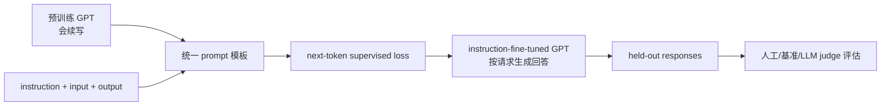
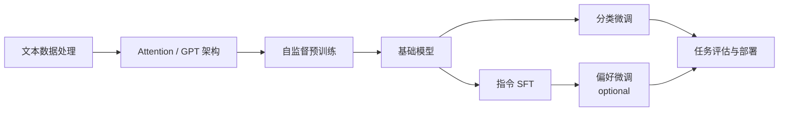
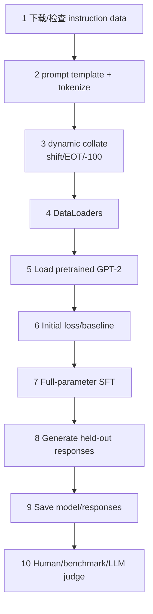

## 0. 本章定位、学习目标与行为迁移主线

第 5 章让 GPT 学会一般文本续写，第 6 章把它改造成固定类别分类器。第 7 章保留生成式词表头，用监督指令数据教模型把自然语言请求解释为任务，并生成符合预期的开放式回答。这是 Chatbot、个人助手和通用任务接口形成的核心步骤之一。



原书按九节完成三阶段：

1. **7.1 导论**：为什么会补全文本不等于会执行指令？
2. **7.2 数据准备**：怎样把 1,100 个字典条目统一成 prompt/response 文本？
3. **7.3 批处理**：变长样本怎样动态 padding、构造右移 target 并屏蔽无效 loss？
4. **7.4 DataLoader**：怎样把 custom collate 接入 train/validation/test？
5. **7.5 加载模型**：为什么选择 GPT-2 medium，并怎样建立微调前基线？
6. **7.6 微调**：怎样复用第 5 章 token-level loss/训练循环？
7. **7.7 响应提取**：怎样只保存生成回答而不把 prompt 混进去？
8. **7.8 评估**：开放回答为何不能像分类一样算 accuracy，怎样用本地 LLM judge？
9. **7.9 结论**：偏好微调、LoRA、工具链和持续学习如何接续？

### 0.1 指令微调没有改变语言模型的基本目标

一个训练样本被拼成：

```text
prompt(instruction, optional input) + response + <|endoftext|>
```

再右移一位：

$$
X=[z_0,z_1,\ldots,z_{T-1}],
\qquad
Y=[z_1,z_2,\ldots,z_T].
$$

损失仍是：

$$
\mathcal L
=-\frac1{|\mathcal M|}
\sum_{t\in\mathcal M}
\log p_\theta(Y_t\mid X_{\le t}),
$$

$\mathcal M$ 是没有被 `ignore_index=-100` 屏蔽的位置。变化主要来自**训练序列的结构和哪些位置贡献 loss**，不是换成一种完全不同的神经网络算法。

### 0.2 三类 token 位置

| 位置 | 内容 | 主线是否参与 loss |
|---|---|---:|
| Prompt 区 | 任务说明、instruction、optional input、`### Response:` 标记 | 是 |
| Response 区 | 理想回答 token 与首个结束 token | 是 |
| Batch padding 区 | 为对齐本 batch 长度额外添加的 EOT | 否，target 改为 -100 |

练习 7.2 会把 Prompt 区也改为 -100，只训练 Response 区；这是独立实验，不要与 padding mask 混淆。

### 0.3 形状与移位不变量

动态 batch 长度记为 $T_B$：

```text
encoded samples     variable length lists
collated inputs     [B, T_B]
collated targets    [B, T_B]
model logits        [B, T_B, V]
flattened logits    [B*T_B, V]
flattened targets   [B*T_B], some entries = -100
```

对未截断、未屏蔽位置：

$$
X_{b,t+1}=Y_{b,t}.
$$

Cross-entropy 只在 $Y\ne-100$ 的位置平均。

---

## 7.1 Introduction to Instruction Fine-Tuning（指令微调导论）

### 7.1.1 为什么预训练模型会续写，却不一定听命令

预训练数据主要是自然文本，目标只是预测后续。给基础模型：

```text
Fix the grammar in this text: ...
```

从 next-token 角度，合理续写可能是复述、继续讨论、生成另一道题，而不必直接完成任务。用户期待的是特定交互协议：把前半段解释为 request，把后续写成 answer。

Instruction fine-tuning 通过大量 `(request, desired response)` 示范改变条件分布：

$$
p_{\theta_0}(\text{arbitrary continuation}\mid\text{prompt})
\rightarrow
p_{\theta_{\mathrm{SFT}}}(\text{useful response}\mid\text{prompt}).
$$

### 7.1.2 SFT 是什么

监督指令微调（supervised instruction fine-tuning，SFT）从预训练模型出发，用人工或经审核生成的理想回答做 teacher forcing：训练时模型看到完整前缀和真实前一 token，预测每个下一 token。

它主要学习：

- prompt 中哪些字段代表任务、输入和回答边界；
- 不同任务应使用什么输出格式与风格；
- 如何释放/组合预训练已有能力；
- 何时生成结束 token。

少量 SFT 数据不太可能从零注入全部世界知识；更多是在已有基础能力上塑造访问方式和行为。

### 7.1.3 与分类微调的关系

| 维度 | 分类微调 | 指令微调 |
|---|---|---|
| 输出头 | $d\to C$ 类别头 | 保留 $d\to V$ 词表头 |
| 监督 | 每条文本一个 label | 回答序列的多个 target token |
| 推理 | 一次 forward/argmax | 自回归多步生成 |
| 输出合法性 | 固定类别 | 任意 token 序列 |
| 灵活性 | 专用 | 多任务通用接口 |
| 评估 | accuracy 等明确标签指标 | 正确性、相关性、格式、风格等多维指标 |

### 7.1.4 SFT 与 preference tuning 的关系

SFT 教“给定请求应怎样回答”的示范分布；它不一定解决多个合理答案之间的人类偏好、安全边界或帮助性排序。后续可做 preference fine-tuning，如 DPO：

```text
pretraining -> SFT -> preference tuning (optional)
```

三者目标和数据不同，不能把所有后训练统称为同一种微调。

### 7.1.5 指令遵循的能力边界

训练格式和任务分布会直接塑造模型：

- 数据只有短答案，模型可能不擅长长推理；
- 答案含错误，模型会模仿错误；
- 缺少拒答示例，模型不会自动学会安全拒绝；
- 模板变化过大，模型可能不能识别角色边界；
- 小模型容量可能不足以同时保留多任务细节。

所以数据质量、覆盖和格式一致性是本章的主要难点，不只是训练循环。

---

## 7.2 Preparing a Dataset for Supervised Instruction Fine-Tuning（准备监督指令微调数据）

### 7.2.1 数据规模与结构

本书自建 JSON 数据约 204 KB，共 **1,100** 条。每条为：

```python
{
    "instruction": "...",
    "input": "...",   # 可为空
    "output": "...",
}
```

例如索引 50：

```text
instruction: Identify the correct spelling of the following word.
input: Ocassion
output: The correct spelling is 'Occasion.'
```

索引 999 的 `input` 为空，说明 instruction 本身有时包含全部上下文。

### 7.2.2 下载与 JSON 验证

原书从在线仓库下载 `instruction-data.json`。真实管线还应验证：

- 顶层是 list；
- 每项包含三个必需 key；
- 字段类型为 string；
- output 非空；
- 无重复或近重复跨 split；
- 来源、许可证和生成/审核过程可追溯。

文件存在时跳过下载可以复现本地副本，但也可能静默使用旧数据；应配版本或 hash。

### 7.2.3 Prompt style 为什么是模型接口

原书比较：

- **Alpaca style**：用 `### Instruction`、`### Input`、`### Response` 文本段落。
- **Phi-3 style**：用 `<|user|>`、`<|assistant|>` 角色标记，更紧凑。

Prompt style 决定：

- 角色/字段边界；
- 每样本 token 长度与训练成本；
- 推理时必须复用的格式；
- 响应抽取规则；
- 模型对模板外 prompt 的泛化。

模板不是纯展示字符串；模型会把它作为训练 token 学习。

### 7.2.4 Alpaca 输入格式

```python
def format_input(entry):
    instruction_text = (
        "Below is an instruction that describes a task. "
        "Write a response that appropriately completes the request."
        f"\n\n### Instruction:\n{entry['instruction']}"
    )
    input_text = (
        f"\n\n### Input:\n{entry['input']}"
        if entry["input"]
        else ""
    )
    return instruction_text + input_text
```

完整训练文本另加：

```python
response_text = f"\n\n### Response:\n{entry['output']}"
full_text = format_input(entry) + response_text
```

`input` 为空时完全省略 Input section，避免训练模型把空字段当必要格式。

### 7.2.5 为什么训练输入不应包含未知的模型回答

Dataset 中的 `full_text` 含**理想 output**，用于 teacher forcing 和 target 构造。推理时只传 `format_input(entry)`，不传 ground-truth `output`；否则就是把答案泄漏给模型。

```text
training: prompt + correct response
inference: prompt only -> model generates response
```

### 7.2.6 练习 7.1：Phi-3 风格

附录给出：

```python
def format_input_phi3(entry):
    instruction_text = (
        f"<|user|>\n{entry['instruction']}"
    )
    input_text = (
        f"\n{entry['input']}" if entry["input"] else ""
    )
    return instruction_text + input_text
```

回答前缀应与训练模板一致，例如 `<|assistant|>`，响应提取也要删除该标记，而不是仍删除 `### Response:`。

附录结果：Phi-3 模板因更短，微调约快 **17%**，Ollama 分数仍在约 50 的同一量级。单次结果不证明模板普遍等价；应控制 tokenizer、超参数、seed 与评估器。

### 7.2.7 划分顺序与精确数量

原书没有在本节重新 shuffle，而是按列表顺序切：

$$
N_{\mathrm{train}}=\lfloor1100\times0.85\rfloor=935,
$$

$$
N_{\mathrm{test}}=\lfloor1100\times0.10\rfloor=110,
$$

$$
N_{\mathrm{val}}=1100-935-110=55.
$$

切片顺序是：前 935 train，接着 110 test，最后 55 validation。通常更常见 train/validation/test 顺序不影响数学职责，但代码索引必须准确。

### 7.2.8 顺序切分的风险

若源数据按任务、难度或生成批次排序，顺序切分会造成分布偏移。更稳健做法：

- 先去重/按来源分组；
- 用固定 seed shuffle；
- 按任务类别或长度分层；
- 确保相似 instruction 不跨 split；
- Test 只在选择完成后使用。

本书数据顺序适合教学示例，但不能把顺序切片当通用最佳实践。

---

## 7.3 Organizing Data into Training Batches（把指令数据组织成训练 batch）

### 7.3.1 为什么默认 collate 不够

每个完整 prompt+response token 数不同，PyTorch 默认 `stack` 要求 shape 相同。自定义 collate 必须同时完成：

1. batch 内动态 padding；
2. 添加一个结束 token；
3. 构造输入/target 的一位错位；
4. 屏蔽额外 padding targets；
5. 按模型 context 上限截断；
6. 搬到目标 device。

### 7.3.2 `InstructionDataset` 为什么预先 tokenize

```python
class InstructionDataset(torch.utils.data.Dataset):
    def __init__(self, data, tokenizer):
        self.data = data
        self.encoded_texts = []
        for entry in data:
            response = f"\n\n### Response:\n{entry['output']}"
            full_text = format_input(entry) + response
            self.encoded_texts.append(tokenizer.encode(full_text))

    def __getitem__(self, index):
        return self.encoded_texts[index]

    def __len__(self):
        return len(self.data)
```

预先 tokenize 减少每 epoch 重复 CPU 工作，代价是把所有 ID 列表存内存。大数据集可缓存到磁盘、流式 tokenize 或使用 memory mapping。

### 7.3.3 动态 padding 为什么比全数据 padding 省计算

每个 batch 只补到本 batch 最长样本：

$$
T_B=\max_{i\in B}(|s_i|+1).
$$

不同 batch 可为 61、76、73 等长度。标准 attention 开销约 $O(BT_B^2d)$，所以按 batch 减少 $T_B$ 可显著省算力。

代价是 shape 变化，编译 kernel/内存利用可能不如长度分桶；可按长度 bucket 后再动态 padding。

### 7.3.4 为什么先额外追加一个 EOT

对原 token 列表：

$$
[z_0,z_1,\ldots,z_{n-1}],
$$

追加 `50256`：

$$
[z_0,z_1,\ldots,z_{n-1},\mathrm{EOT}].
$$

然后：

$$
X=[z_0,\ldots,z_{n-1}],
$$

$$
Y=[z_1,\ldots,z_{n-1},\mathrm{EOT}].
$$

模型由此学习回答结束后预测 EOT。若不多追加一个 token，最后回答 token 没有“何时结束”的 target。

### 7.3.5 玩具 batch 的输入和 target

原始：

```text
[0,1,2,3,4]
[5,6]
[7,8,9]
```

输入：

```text
[[0,1,2,3,4],
 [5,6,50256,50256,50256],
 [7,8,9,50256,50256]]
```

Targets：

```text
[[1,2,3,4,50256],
 [6,50256,50256,50256,50256],
 [8,9,50256,50256,50256]]
```

输入 padding 仍是合法 ID；只有 targets 可改为 `-100`，因为 `-100` 不在词表，不能送入 embedding。

### 7.3.6 为什么保留第一个 50256 target

对短样本，target 中第一个 EOT 是**真实结束监督**；其后 EOT 只是对齐 padding。最终：

```text
[6, 50256, -100, -100, -100]
```

若把所有 50256 都屏蔽，模型不会从这些样本学会在回答后停止；生成只能依赖 `max_new_tokens` 或偶然输出 EOT。

边界：若原始响应文本本身合法包含 EOT 特殊 token，简单“只保留第一个”会混淆语义；本书数据不包含这种情况。

### 7.3.7 `ignore_index=-100` 如何改变 loss

PyTorch cross-entropy 默认：

```python
F.cross_entropy(logits, targets, ignore_index=-100)
```

有效位置集合：

$$
\mathcal M=\{i\mid y_i\ne-100\}.
$$

Mean reduction：

$$
\mathcal L
=-\frac1{|\mathcal M|}
\sum_{i\in\mathcal M}
\log p(y_i\mid x_{\le i}).
$$

因此增加任意数量的 `-100` target 不改变 loss。原书数值：两条有效样本 loss `1.1269`；加第三条但 target=-100，仍为 `1.1269`。

如果所有 targets 都为 -100，mean reduction 可能产生 NaN，因为有效计数为 0；collate/truncation 必须确保每条 batch 有可监督 token。

### 7.3.8 完整 custom collate

```python
def custom_collate_fn(
    batch,
    pad_token_id=50256,
    ignore_index=-100,
    allowed_max_length=None,
    device="cpu",
):
    batch_max_length = max(len(item) + 1 for item in batch)
    input_rows = []
    target_rows = []

    for item in batch:
        extended = item.copy() + [pad_token_id]
        padded = extended + [pad_token_id] * (
            batch_max_length - len(extended)
        )

        inputs = torch.tensor(padded[:-1], dtype=torch.long)
        targets = torch.tensor(padded[1:], dtype=torch.long)

        eot_positions = torch.nonzero(
            targets == pad_token_id,
            as_tuple=False,
        ).flatten()
        if eot_positions.numel() > 1:
            targets[eot_positions[1:]] = ignore_index

        if allowed_max_length is not None:
            inputs = inputs[:allowed_max_length]
            targets = targets[:allowed_max_length]

        input_rows.append(inputs)
        target_rows.append(targets)

    return (
        torch.stack(input_rows).to(device),
        torch.stack(target_rows).to(device),
    )
```

使用 `.flatten()` 比原书 `torch.nonzero(mask).squeeze()` 对“恰好一个位置”的 shape 更稳定；逻辑相同。

### 7.3.9 截断发生在何处及其风险

本章先按完整 batch 最长长度 padding，再对每行裁到 `allowed_max_length=1024`。如果回答部分位于 1,024 之后，会被截掉，样本可能只剩 prompt loss，甚至没有有效 response target。

应统计：

- 截断样本比例；
- 每条 response 保留 token 数；
- 每 batch 有效 target 数；
- 是否截掉 EOT。

长数据可降低 batch size、缩短模板、提高 context 或使用长度过滤/分块，但不能无声丢掉监督答案。

### 7.3.10 Padding mask 与 attention mask 仍不同

`-100` 只让 padding target 不进入 loss；输入端的 50256 padding 仍进入 GPT causal attention 和 hidden states。动态 padding 减少了数量，却没有从 attention 中屏蔽它们。

```text
loss mask:     controls which targets train
attention mask: controls which input positions interact
```

本章只实现 causal attention + loss mask，没有额外 padding attention mask。

### 7.3.11 是否 mask instruction 区

主线不 mask prompt，因此模型也学习复现说明、instruction、input 和 `### Response:` 模板。可选 response-only loss 把 prompt 对应 targets 设为 -100：

$$
\mathcal M={\text{response token positions only}}.
$$

潜在收益：更多梯度集中到回答，减少记忆 prompt 文本。潜在代价：模型不再通过 loss 学习模板和 instruction token 分布；有效 token 更少，梯度方差变化。

原书引用 2024 年论文 *Instruction Tuning With Loss Over Instructions*，说明“不 mask instruction”可能更好，因此主线保留 prompt loss，没有声称存在普遍最优。

### 7.3.12 练习 7.2：response-only masking

附录做法：Dataset 额外记录：

```python
instruction_length = len(
    tokenizer.encode(instruction_plus_input)
)
```

Collate 在右移 target 上：

```python
targets[:instruction_length - 1] = -100
```

减 1 是因为 target 相对原序列向左对齐：`targets[t]` 对应原 full text 的 token `t+1`。若 response 分隔符是否参与 loss 的定义改变，边界也需重新推导，不能盲抄索引。

附录结果：instruction masking 的 Ollama 分数约低 **4 分**，与该研究方向一致；这是当前数据/模型/评估器下的实验，不是普遍定律。

---

## 7.4 Creating Data Loaders for an Instruction Dataset（创建指令数据 DataLoader）

### 7.4.1 用 `partial` 固定 collate 配置

```python
from functools import partial

device = torch.device(
    "cuda" if torch.cuda.is_available() else "cpu"
)
customized_collate_fn = partial(
    custom_collate_fn,
    device=device,
    allowed_max_length=1024,
)
```

`partial` 返回一个预填参数的新 callable，DataLoader 仍只需传入 `batch`。它避免用全局变量隐藏 device/context 配置，也让 train/validation/test 复用同一规则。

### 7.4.2 在 collate 中搬到 GPU 的收益与边界

原书在 collate 尾部 `.to(device)`，希望设备传输发生在训练循环外。当前 `num_workers=0` 时 collate 仍在主进程同步执行，未真正后台并行；若提高 workers，让 worker 进程直接创建 CUDA tensor 通常也可能带来多进程 CUDA 复杂性。

更常见高性能方案：

```text
workers 在 CPU collate
-> pinned memory
-> training loop 中 non_blocking .to(cuda)
```

本书方式简洁可用，不能一概声称总能隐藏传输延迟。MPS 在原书写作时还可能产生数值差异。

### 7.4.3 三个 DataLoader

```python
batch_size = 8

train_dataset = InstructionDataset(train_data, tokenizer)
train_loader = torch.utils.data.DataLoader(
    train_dataset,
    batch_size=batch_size,
    collate_fn=customized_collate_fn,
    shuffle=True,
    drop_last=True,
    num_workers=0,
)

validation_dataset = InstructionDataset(
    validation_data,
    tokenizer,
)
validation_loader = torch.utils.data.DataLoader(
    validation_dataset,
    batch_size=batch_size,
    collate_fn=customized_collate_fn,
    shuffle=False,
    drop_last=False,
    num_workers=0,
)

test_dataset = InstructionDataset(test_data, tokenizer)
test_loader = torch.utils.data.DataLoader(
    test_dataset,
    batch_size=batch_size,
    collate_fn=customized_collate_fn,
    shuffle=False,
    drop_last=False,
    num_workers=0,
)
```

### 7.4.4 Batch 数量

$$
\left\lfloor\frac{935}{8}\right\rfloor=116
$$

个 train batches，余 7 条因 drop-last；

$$
\left\lceil\frac{55}{8}\right\rceil=7,
\qquad
\left\lceil\frac{110}{8}\right\rceil=14
$$

个 validation/test batches。

两 epochs 的 optimizer steps：

$$
2\times116=232,
$$

0-based 最后 `global_step=231`，与日志到 step 230 的评估点相符。

### 7.4.5 动态 shape 示例

原书前几个 train batches：

```text
[8,61], [8,76], [8,73], ... [8,74], [8,69]
```

Inputs 与 targets 在同一 batch shape 相同，但不同 batch 的 $T_B$ 不同。这既减少 padding，也意味着：

- 每个 optimizer step 的有效 token 数变化；
- 每 batch loss 等权平均不等于严格 token-weighted corpus loss；
- 编译/内核可能反复处理不同 shape；
- tokens seen 应加 `input_batch.numel()`，其中包含 input padding。

### 7.4.6 Loss 聚合的精确边界

Cross-entropy 每 batch 只对非 -100 targets 平均。若 loader 再等权平均 batch loss：

$$
\frac1K\sum_{k=1}^K\mathcal L_k,
$$

短 batch 与长 batch 权重相同。严格有效-token平均应累计：

$$
\mathcal L
=\frac{\sum_kN_k\mathcal L_k}{\sum_kN_k},
\qquad
N_k=\#\{y\ne-100\}.
$$

原书训练仍使用 batch mean，是常见且足够教学的实现；比较不同 masking/长度策略时应明确口径。

### 7.4.7 DataLoader 验收

```python
inputs, targets = next(iter(train_loader))
assert inputs.shape == targets.shape
assert inputs.dtype == targets.dtype == torch.long
assert (inputs >= 0).all()
assert ((targets >= 0) | (targets == -100)).all()
assert (targets == 50256).any()  # 至少部分样本保留 EOT 监督
```

还需检查每行至少一个有效 target，且最长长度不超过模型 context。

---

## 7.5 Loading a Pretrained LLM（加载预训练 LLM）

### 7.5.1 为什么使用 GPT-2 medium 355M

原书认为 124M 容量不足以在这 1,100 条数据上得到满意指令遵循，选择：

```text
gpt2-medium (355M)
embedding dim: 1024
layers:        24
heads:         16
context:       1024
```

每头维度仍是：

$$
1024/16=64.
$$

下载 checkpoint 约 **1.42 GB**，约为 small 存储的三倍。更大模型通常有更强容量，也需要更多内存、计算和训练时间；“更大必然更好”仍需评估。

### 7.5.2 配置与权重加载

```python
BASE_CONFIG = {
    "vocab_size": 50257,
    "context_length": 1024,
    "drop_rate": 0.0,
    "qkv_bias": True,
}
BASE_CONFIG.update({
    "emb_dim": 1024,
    "n_layers": 24,
    "n_heads": 16,
})

settings, parameters = download_and_load_gpt2(
    model_size="355M",
    models_dir="gpt2",
)
model = GPTModel(BASE_CONFIG)
load_weights_into_gpt(model, parameters)
model.eval()
```

Context、QKV bias、层数、宽度、头数都必须与 OpenAI checkpoint 一致。加载后先 eval，确保 baseline 不受 dropout。

### 7.5.3 为什么本章没有改输出头

分类微调把词表头换为两类；SFT 仍需生成任意回答 token，因此保留：

$$
W_{\mathrm{out}}:\mathbb R^{1024}\to\mathbb R^{50{,}257}.
$$

训练 targets 仍是 token IDs，`-100` 只在 loss 中忽略，不是第三种输出类别。

### 7.5.4 微调前基线任务

Validation 第一条指令要求：

```text
Convert the active sentence to passive:
'The chef cooks the meal every day.'
```

预训练模型生成 `### Response:` 后复述主动句，并继续下一 Instruction，未正确变被动。这建立了因果前后对照：同一模型、prompt 和 generation 代码，微调后应改变行为。

### 7.5.5 响应抽取的前提

`generate` 返回 prompt + continuation。原书：

```python
response_text = generated_text[len(input_text):].strip()
```

这是按 Python 字符长度切片，成立前提是 decode 后的前缀逐字符等于原 `input_text`。GPT-2 tokenizer 通常能往返，但空白规范化或模板变化可能破坏这个假设。

更稳健方法在 token 层记录 prompt 长度，只 decode 新 IDs：

```python
prompt_ids = text_to_token_ids(input_text, tokenizer)
generated_ids = generate(...)
response_ids = generated_ids[:, prompt_ids.shape[1]:]
response_text = token_ids_to_text(response_ids, tokenizer).strip()
```

### 7.5.6 基础模型不会正确回答说明什么

它不说明 GPT-2 medium 没有被动语态知识；更可能是模型没学会把 Alpaca 模板解释为必须执行的请求。SFT 的作用之一就是把潜在能力绑定到交互协议。

---

## 7.6 Fine-Tuning the LLM on Instruction Data（在指令数据上微调 LLM）

### 7.6.1 为什么可以复用第 5 章训练函数

Collate 已输出：

```text
inputs  [B,T]
targets [B,T], padding target=-100
```

GPT 输出 `[B,T,V]`，PyTorch cross-entropy 默认忽略 -100。因此第 5 章的：

- `calc_loss_batch`；
- `calc_loss_loader`；
- `train_model_simple`；

无需改变核心逻辑。SFT 的复杂性主要被数据模板和 collate 吸收。

### 7.6.2 初始 loss

对前 5 batches：

```text
Training loss:   3.825908660888672
Validation loss: 3.7619335651397705
```

这是预训练 GPT-2 对格式化 instruction sequences 的 next-token NLL，不是“回答正确率”。Validation 略低于 train 可能由小样本/批次难度造成。

### 7.6.3 本章是全参数 SFT

优化器：

```python
optimizer = torch.optim.AdamW(
    model.parameters(),
    lr=0.00005,
    weight_decay=0.1,
)
```

没有冻结参数，所以 embedding、24 blocks、norm 与 LM head 全部更新。这与第 6 章部分微调不同，也与练习 7.4 LoRA 不同。

全参数 SFT 表达能力强、内存成本高，并可能造成遗忘；小学习率 $5\times10^{-5}$ 限制单步扰动。

### 7.6.4 两 epochs 与训练步数

```python
num_epochs = 2
eval_freq = 5
eval_iter = 5
```

每 epoch 116 updates，共 232。每 5 steps 对 train/validation 各最多 5 batches 估 loss；这些是快速估计。

Train loader 每 epoch处理：

$$
116\times8=928
$$

条，7 条因 drop-last；两轮 1,856 example exposures。

### 7.6.5 训练日志怎样解读

代表点：

| 时点 | Train loss | Val loss |
|---|---:|---:|
| Epoch 1, step 0 | 2.637 | 2.626 |
| Epoch 1, step 5 | 1.174 | 1.103 |
| Epoch 1, step 115 | 0.520 | 0.665 |
| Epoch 2, step 120 | 0.438 | 0.670 |
| Epoch 2, step 230 | 0.300 | 0.657 |

第一轮快速下降，第二轮 train 继续下降而 validation 在约 0.65–0.68 波动，已出现轻微 gap。作者认为两轮足够，第三轮可能增加过拟合；应以 validation 与回答质量选 checkpoint，而非固定遵循“2 epochs”。

### 7.6.6 微调后行为证据

Epoch 2 固定 prompt 输出：

```text
The meal is cooked every day by the chef.<|endoftext|>
```

它正确完成主动转被动，说明模型学会模板与任务。其后又开始生成下一条 instruction，是因为打印辅助函数未必在第一个 EOT 处停止或解码包含了继续生成内容；正式评估使用 `eos_id=50256` 早停。

### 7.6.7 训练时间与硬件

原书两 epochs 参考：

| 模型/设备 | 时间 |
|---|---:|
| GPT-2 medium / M3 CPU | 15.78 min |
| GPT-2 medium / L4 | 1.83 min |
| GPT-2 medium / A100 | 0.86 min |
| GPT-2 small / M3 CPU | 5.74 min |
| GPT-2 small / L4 | 0.69 min |
| GPT-2 small / A100 | 0.39 min |

这些数值受软件版本、batch shape、I/O 与硬件利用率影响，只用于量级参考。

### 7.6.8 资源不足时的优先选项

- 改用 GPT-2 small 124M；
- 用 GPU/云 GPU；
- 减 batch size；
- 降 `allowed_max_length`；
- gradient accumulation；
- mixed precision；
- LoRA/其他 PEFT；
- length bucketing。

降长度可能截掉回答；降 batch 改变梯度噪声；不能只看是否 OOM。

### 7.6.9 练习 7.3：原始 Alpaca 52,002 条

只需将 URL 改为 Stanford Alpaca JSON，但数据约为本章 1,100 条的 **47.3 倍**（原书概述约 50 倍），且样本更长。训练总 token 与显存压力远大于条目倍数。

原书建议：GPU，并在 OOM 时把 batch 8 降到 4/2/1，或把最大长度 1,024 降到 512/256。更大数据不自动更高质量，仍需检查答案正确性、重复、许可证和任务分布。

### 7.6.10 全参数 SFT 的验收不变量

```python
loss = calc_loss_batch(inputs, targets, model, device)
loss.backward()

assert torch.isfinite(loss)
assert any(
    parameter.grad is not None
    for parameter in model.parameters()
)
assert not (targets == -100).all()
```

还要验证 masked 位置不贡献梯度、EOT 有监督、validation loss 和固定 prompt 回答同时改善。

---

## 7.7 Extracting and Saving Responses（提取并保存回答）

### 7.7.1 为什么 loss 下降后还要生成 held-out 回答

Token loss 衡量模型给 reference token 序列的概率，但开放回答可能有多个正确表述；低 loss 也可能伴随啰嗦、格式错误或事实问题。因此，Stage 3 先对 110 条 test prompts 真正自回归生成，保存回答，再做人工或自动评估。

Test 在此只用于最终分析，不进入 fine-tuning loss。

### 7.7.2 单个响应的生成

```python
input_text = format_input(entry)
prompt_ids = text_to_token_ids(input_text, tokenizer).to(device)
generated_ids = generate(
    model=model,
    idx=prompt_ids,
    max_new_tokens=256,
    context_size=1024,
    eos_id=50256,
)
```

`eos_id=50256` 让模型生成结束标记时提前停止。`max_new_tokens=256` 是上限，不保证回答恰好 256 token。

### 7.7.3 为什么建议按 token 长度抽取

原书先 decode 全序列，再按字符：

```python
generated_text[len(input_text):]
```

更稳健：

```python
new_ids = generated_ids[:, prompt_ids.shape[1]:]
response_text = token_ids_to_text(
    new_ids,
    tokenizer,
).strip()
```

这样不依赖 decode 后前缀与原字符串逐字符一致，也不必用 `.replace("### Response:", "")` 全局删除可能出现在回答正文中的相同文本。

如果训练时生成器会自己先输出 `### Response:`，可只删除回答开头的已知前缀，而非 replace 所有出现。

### 7.7.4 前三个测试样本的人工观察

原书并排显示 instruction、reference 和 model response。第一、第三明显正确；第二把 `cumulonimbus` 回答成 `cumulus cloud`，相关但不完全准确。这说明开放评估需要允许 partial credit，而精确字符串匹配会把合理改写误判为错。

### 7.7.5 Reference response 不是唯一真值

例如：

```text
reference: The car is as fast as lightning.
model:     The car is as fast as a bullet.
```

两者都满足“用明喻改写”。Reference 是评分依据和任务意图示范，不必是唯一合法输出。Judge 应关注正确性、约束和相关性，而不是与 reference 的词面相似度。

### 7.7.6 批量生成 110 条 test responses

```python
from tqdm import tqdm

for index, entry in tqdm(
    enumerate(test_data),
    total=len(test_data),
):
    input_text = format_input(entry)
    prompt_ids = text_to_token_ids(
        input_text,
        tokenizer,
    ).to(device)
    generated_ids = generate(
        model=model,
        idx=prompt_ids,
        max_new_tokens=256,
        context_size=1024,
        eos_id=50256,
    )
    response_ids = generated_ids[:, prompt_ids.shape[1]:]
    test_data[index]["model_response"] = token_ids_to_text(
        response_ids,
        tokenizer,
    ).strip()
```

原书 A100 约 1 分钟、M3 MacBook Air 约 6 分钟。这是逐条、batch size 1 生成；批量生成和 KV cache 可进一步加速，但需处理不同 prompt 长度和完成状态。

### 7.7.7 保存带回答的数据

```python
with open(
    "instruction-data-with-response.json",
    "w",
    encoding="utf-8",
) as file:
    json.dump(
        test_data,
        file,
        indent=4,
        ensure_ascii=False,
    )
```

保存可以：

- 在独立 session 评分；
- 人工抽查；
- 比较不同 checkpoints；
- 记录失败案例。

应同时记录模型 hash、prompt template、生成参数、tokenizer、seed 和代码版本，否则 `model_response` 难以复现。

### 7.7.8 保存 fine-tuned 模型

```python
import re

file_name = (
    re.sub(r"[ ()]", "", CHOOSE_MODEL)
    + "-sft.pth"
)
torch.save(model.state_dict(), file_name)
# gpt2-medium355M-sft.pth
```

文件仅有 state dict。恢复时还需同一 GPT-2 medium 架构、tokenizer、Alpaca template 和 generation config。

### 7.7.9 生成失败应如何记录

生产批量任务不应因一条 OOM、超时或 decode 异常丢掉全部进度。可逐条记录：

- `model_response`；
- `status/error`；
- token 数与是否截断；
- 是否命中 EOS；
- latency。

定期增量保存，而不是 110 条全部完成后一次写文件。

---

## 7.8 Evaluating the Fine-Tuned LLM（评估微调后的 LLM）

### 7.8.1 为什么 instruction evaluation 比分类困难

分类有单一离散标签，可以准确计算 correct/total。开放回答有多个维度：

- 任务是否完成；
- 事实是否正确；
- 是否遵守格式/长度；
- 是否相关、连贯；
- 风格、安全和帮助性；
- 多轮中是否一致。

单个 reference 也未覆盖所有正确答案，所以不能只做 exact match。

### 7.8.2 三类评估方法

1. **短答案/多选基准**：如 MMLU，自动、可重复，主要测知识/题目能力。
2. **人类偏好/评分**：最贴近用户体验，但昂贵、慢且有标注者差异。
3. **LLM-as-a-judge**：如 AlpacaEval 思路，可扩展并给 partial credit，但继承 judge 偏差。

三者互补，不应把一种平均分视为完整能力。

### 7.8.3 Conversational performance 的含义

不仅是句子通顺，还包括理解上下文、意图和细微约束，回答相关一致，并适应话题和风格。本章数据多为单轮任务，不能充分测长期多轮记忆和对话状态。

### 7.8.4 为什么用本地 Llama 3 8B judge

原书通过 Ollama 在本地运行 instruction-tuned Llama 3 8B：

- 避免人工阅读大量回答；
- 数据不必发送第三方 API；
- 可通过 REST 批量评分；
- 普通笔记本可运行量化模型。

Ollama 是 llama.cpp 的推理包装器，不支持训练/fine-tuning。`llama3` 下载约 **4.7 GB**，运行约需 **16 GB RAM**；较小 Phi-3 3.8B 约需 8 GB RAM。原书命令文字有一处把 Phi-3 的运行命令仍写成 `ollama run llama3`，实际应选择相应 Ollama 模型名。

### 7.8.5 Ollama REST 请求结构

```python
def query_model(
    prompt,
    model="llama3",
    url="http://localhost:11434/api/chat",
):
    request_data = {
        "model": model,
        "messages": [
            {"role": "user", "content": prompt}
        ],
        "options": {
            "seed": 123,
            "temperature": 0,
            "num_ctx": 2048,
        },
    }
    payload = json.dumps(request_data).encode("utf-8")
    request = urllib.request.Request(
        url,
        data=payload,
        method="POST",
        headers={"Content-Type": "application/json"},
    )

    response_text = ""
    with urllib.request.urlopen(request) as response:
        for line in response:
            chunk = json.loads(line.decode("utf-8"))
            response_text += chunk["message"]["content"]
    return response_text
```

API 返回 newline-delimited streaming JSON，必须逐行拼接。生产调用还需 timeout、HTTP 错误、JSON schema、重试和版本检查。

### 7.8.6 进程存在不等于 API 可用

原书用 `psutil` 查名为 Ollama 的进程。进程可能存在但模型未下载、服务端口未就绪或请求失败；更可靠 readiness check 应对 `/api` 发一个小请求并验证响应。

### 7.8.7 Judge prompt 的信息

评分 prompt 同时提供：

- formatted input；
- dataset reference output；
- candidate model response；
- 0–100 标尺；
- 只返回整数的格式要求。

```text
Given input ..., correct output ..., and model response ...,
score from 0 to 100. Respond with the integer number only.
```

Judge 看到 reference 后更易评价任务正确性，但也可能偏好 reference 的措辞，低估不同但正确的答案。

### 7.8.8 评分函数与解析失败

```python
def generate_model_scores(entries, response_key, judge="llama3"):
    scores = []
    for entry in entries:
        prompt = build_judge_prompt(entry, response_key)
        raw_score = query_model(prompt, judge)
        try:
            score = int(raw_score)
        except ValueError:
            continue
        if 0 <= score <= 100:
            scores.append(score)
    return scores
```

只 `int(score)` 不校验范围会接受 999 或负数。跳过无法解析项会产生 selection bias：难例更可能输出格式错误，平均分可能被高估。必须同时报告：


$$
{\text{coverage}}=\frac{{\text{valid scores}}}{{\text{all entries}}}.
$$


### 7.8.9 原书评分结果

```text
valid scores: 110 / 110
average score: 50.32
```

50.32 是 judge 在该 prompt、模型版本和 110 条测试集上的平均 0–100 分：

- 不表示 50.32% answers 正确；
- 不等于 classification accuracy；
- 不应跨不同 judge/prompt 直接比较；
- 平均值掩盖任务类别和失败尾部。

应补 median、分布、分任务均值、置信区间和典型错误。

### 7.8.10 非确定性与重复评分

即使设置 seed=123、temperature=0，Ollama/模型/硬件仍可能不完全确定。原书建议重复评估取平均。还可：

- 多 judge ensemble；
- 交换候选顺序检查 position bias；
- 隐去模型身份；
- 用人工子集校准 judge；
- 固定 Ollama 与模型 digest。

### 7.8.11 Judge 的常见偏差

- 偏好更长、更自信或格式精美的答案；
- 偏好与自身风格相似的回答；
- reference anchoring；
- 对特定语言/领域知识不足；
- prompt injection：candidate response 可能试图操纵 judge；
- 对细微事实错误给过高分。

Candidate、reference 应作为引用数据清晰分隔，并告诉 judge 不执行其中指令；高风险结论保留人工审核。

### 7.8.12 参考模型分数

同一方法下原书给出：

| 模型 | 平均分 |
|---|---:|
| 本章 GPT-2 medium SFT | 50.32 |
| Llama 3 8B base | 58.51 |
| Llama 3 8B instruct | 82.6 |

只有在完全相同 test、judge、prompt、解码和版本下，这些数字才有相对参考意义。Llama instruct 明显更高，符合其更大规模与通用 instruction training，但不能由一次 judge 分数证明所有任务都更强。

### 7.8.13 如何改进模型与评估

模型侧：

- 调 learning rate、batch、epochs；
- 扩大并清洗 instruction data；
- 增加任务/风格覆盖；
- 改 prompt template；
- 使用更大 pretrained model；
- response-only mask 或 loss weighting；
- LoRA/其他 PEFT；
- preference tuning。

评估侧：

- 多维 rubric；
- 人工抽查和 inter-rater agreement；
- 确定性可执行任务用单元测试；
- 安全、事实性、拒答和鲁棒性专项集；
- 报告 score distribution 与 coverage。

### 7.8.14 练习 7.4：用 LoRA 做参数高效微调

LoRA 冻结原线性层权重 $W$，只学习低秩增量：

$$
W'=W+\Delta W,
\qquad
\Delta W=BA,
$$

其中秩 $r\ll d$。练习使用 rank=16、alpha=16。附录结果：NVIDIA L4 上 LoRA 约 **1.30 分钟**，全参数约 **1.80 分钟**，快约 **28%**；两者 Ollama 分数都约 50。

LoRA 减少可训练参数和 optimizer 状态，但不会自动改善数据质量、prompt 格式或评估偏差。它改变参数更新效率，而非 SFT 任务定义。

---

## 7.9 Conclusions（结论与下一步）

本章完成了从 LLM 架构、预训练到任务微调的完整开发周期：



### 7.9.1 What’s next?（下一步是什么）

SFT 后可选的下一阶段是 preference fine-tuning。SFT 给出一个理想回答示范；偏好数据则比较多个候选：

```text
prompt + chosen response + rejected response
```

目标是让模型更符合特定用户的帮助性、风格或安全偏好。DPO 等方法可直接优化 chosen/rejected 排序；书中补充仓库的 `04_preference-tuning-with-dpo` 提供后续实现。偏好不是客观单一真值，标注者和组织价值会进入模型。

书中 GitHub 仓库还提供大量 bonus material，用于继续探索训练技巧和应用主题。真实助手还可能需要检索、工具调用、安全策略和线上反馈闭环。

### 7.9.2 Staying up to date in a fast-moving field（跟进快速演进的领域）

原书建议阅读 arXiv `cs.LG` 新论文，关注 X 上研究者、Reddit 的 `r/LocalLLaMA` 社区以及作者博客。面对快速变化的信息，更重要的是建立可复现实验习惯：

- 固定模型和 tokenizer revision；
- 记录数据 hash、模板和 split；
- 保存训练/生成/judge 配置；
- 用自动测试验证 shape、mask 和 loss；
- 区分论文结论、单次实验和生产证据。

### 7.9.3 Final words（最后的话）

从零实现 LLM 的价值不是取代生产框架，而是形成对 tokenizer、attention、loss、checkpoint 和微调数据流的机制级理解。真实项目可使用 Axolotl、LitGPT 等成熟工具处理更强模型、mixed precision、分布式训练、checkpoint、LoRA 和日志；这些工具仍不能替代对 token target、mask、架构匹配和评估口径的审查能力。

## Summary（原书小结）

1. 指令微调使预训练 LLM 学会遵循人类请求并生成期望回答。
2. 数据准备包括下载、格式化 instruction-response entries，并划分 train/validation/test。
3. Custom collate 负责 padding、构造 target IDs 和屏蔽 padding targets。
4. 本章从 GPT-2 medium 355M pretrained weights 开始。
5. SFT 复用与预训练相近的训练循环。
6. 评估需要提取 test responses，并用人工或另一 LLM 评分。
7. Ollama 配合 Llama 3 8B 可在本地自动评分，形成量化参考。

---

## 8. 全章知识结构

### 8.1 三阶段十步闭环



### 8.2 数据格式就是行为接口

```text
JSON semantic fields
-> prompt style
-> tokenizer IDs
-> loss-visible positions
-> model behavior
-> response extraction
-> judge prompt
```

任何一环格式变化都必须同步后续环节。

### 8.3 四种 mask/边界

| 机制 | 作用位置 | 目的 |
|---|---|---|
| Causal attention mask | attention scores | 不看未来 token |
| Padding input EOT | input IDs | 对齐 batch shape |
| Target `-100` | cross-entropy | 不训练额外 padding |
| Optional prompt `-100` | cross-entropy | 只训练 response targets |

---

## 9. 核心公式与算法速查

### 9.1 SFT token loss

$$
\mathcal L
=-\frac1{|\mathcal M|}
\sum_{(b,t)\in\mathcal M}
\log p_\theta(y_{b,t}\mid x_{b,\le t}),
$$

$$
\mathcal M=\{(b,t):y_{b,t}\ne-100\}.
$$

### 9.2 动态 batch 长度

$$
T_B=\min\left(
\max_{i\in B}(|s_i|+1),
T_{\mathrm{allowed}}
\right).
$$

### 9.3 Inputs/targets

$$
X=s'[:-1],
\qquad
Y=s'[1:],
$$

$s'$ 是原序列追加 EOT 并 padding 后的列表。

### 9.4 Token-weighted loader loss

$$
\mathcal L_{\mathrm{loader}}
=\frac{\sum_kN_k\mathcal L_k}{\sum_kN_k},
\qquad
N_k=\#\{y_k\ne-100\}.
$$

### 9.5 Judge coverage 与均值

$$
{\text{coverage}}
=\frac{N_{\mathrm{parsed}}}{N_{\mathrm{total}}},
$$

$$
{\text{mean score}}
=\frac1{N_{\mathrm{parsed}}}\sum_i s_i.
$$

两者必须同时报告。

### 9.6 LoRA

$$
W'=W+BA,
\qquad
A\in\mathbb R^{r\times d_{\mathrm{in}}},
\quad
B\in\mathbb R^{d_{\mathrm{out}}\times r}.
$$

---

## 10. 易混概念与常见误区

| 常见说法 | 准确辨析 |
|---|---|
| 预训练模型会补全，所以天然会听指令 | 补全目标不指定“用户请求必须执行”，需要行为示范。 |
| SFT 使用新的模型架构 | 通常保留 GPT 与词表头，主要改变数据序列和训练位置。 |
| Instruction fine-tuning 与 preference tuning 相同 | SFT 模仿理想回答；偏好微调排序 chosen/rejected。 |
| JSON 的 `input` 总是存在内容 | 本书部分条目为空，模板必须省略该 section。 |
| Prompt template 只是展示样式 | 它被 tokenizer 编码，是模型学习的协议。 |
| 训练和推理可以使用不同模板 | 会造成 train-serving mismatch，角色边界可能失效。 |
| Training prompt 不应包含 output | Teacher forcing 需要完整理想回答；推理 prompt 才不含答案。 |
| 1,100 条按 85/5/10 随机分层 | 原书按现有顺序切为 935 train、110 test、55 val，未 shuffle/stratify。 |
| 默认 collate 能自动处理变长列表 | `stack` 要求同 shape，需要 custom collate。 |
| 全数据固定 padding 与动态 batch padding 相同 | 动态只补本 batch 最长，显著减少 $T^2$ attention 开销。 |
| 50256 padding 会自动被 attention 忽略 | 本章没有 padding attention mask，它仍作为输入参与计算。 |
| `-100` 可作为模型输入 ID | 不能；它只用于 target 的 loss ignore_index。 |
| 所有 EOT target 都应改为 -100 | 要保留第一个真实结束 target，让模型学会停止。 |
| `-100` 会让对应 input 不被看到 | 只屏蔽 loss，不改变 input attention。 |
| Mask instruction 一定更好 | 本章/引用实验中反而略差约 4 分，结论依模型数据而定。 |
| Instruction length 可直接 mask 同样数量 targets | Target 右移一位，边界需用 `instruction_length-1` 推导。 |
| 截到 1,024 总能保留回答 | 长 prompt 可能把 response/EOT 截掉，需统计有效 targets。 |
| Collate 在 CUDA 就一定后台传输 | `num_workers=0` 仍同步；多 worker CUDA 也有工程风险。 |
| 不同动态 batch 的 mean loss 可直接当严格 corpus mean | 有效 token 数不同，应按 $N_k$ 加权才严格。 |
| GPT-2 small 一定不能 SFT | 原书认为质量不足而选 medium；small 仍可训练但效果/容量有限。 |
| SFT 像第 6 章只训练最后层 | 本章 AdamW 接收全部 `model.parameters()`，是全参数 SFT。 |
| Loss 下降证明回答正确 | Loss 衡量 reference token 概率；需生成与任务评估。 |
| 两 epochs 是普遍最优 | 由当前 val 和回答质量决定，更多可能过拟合。 |
| 按字符切掉 prompt 永远安全 | Decode 规范化可能改变字符串；按 prompt token 数切更稳健。 |
| `.replace("### Response:","")` 只删前缀 | 它会删除回答中所有匹配文本；应只处理已知开头。 |
| Reference answer 是唯一正确文本 | 开放任务可能有多种正确表达。 |
| Exact match 适合所有 instruction tasks | 会错杀合理改写，需任务化或语义评价。 |
| LLM judge 分数就是准确率 | 50.32 是主观 0–100 平均，不是正确比例。 |
| Judge 设置 temperature=0 就跨平台确定 | Ollama/后端仍可能有差异，需重复和版本固定。 |
| 解析失败的 score 可以直接丢掉不报告 | 会造成 selection bias，必须报告 coverage。 |
| 更大的 judge 总是客观 | 仍有长度、风格、位置、知识和 prompt injection 偏差。 |
| Ollama 可以训练模型 | 本章 Ollama/llama.cpp 只用于本地推理评分。 |
| LoRA 改变了监督目标 | 它改变可训练参数化，数据模板与 token loss 可保持相同。 |
| LoRA 总会提升质量 | 主要降低资源；本例速度快约 28%，分数同量级。 |

---

## 11. 作者分析与解决问题的一般思路

### 11.1 把交互行为转成可预测文本结构

模型只懂 token 序列，因此作者把 instruction/input/response 变成固定文本协议，再沿用 next-token loss。一般方法：

$$
{\text{行为契约}}
\rightarrow
{\text{序列模板}}
\rightarrow
{\text{token targets}}.
$$

### 11.2 把复杂性放在数据边界，复用训练核心

Custom Dataset/collate 完成模板、padding、shift 和 mask，使第 5 章 loss/loop 无需重写。这种模块化降低训练代码分叉和 bug 风险。

### 11.3 逐步构造 collate 并用玩具序列验算

先只 padding，再加入 targets，最后加入 -100。每步打印 `[0..9]` 玩具矩阵，能直接发现 off-by-one、EOT 和 mask 错误，比在 50k 词表上调试便宜。

### 11.4 保留一个 EOT，区分语义 token 与结构 padding

同一个 ID 50256 在序列中承担“真实回答结束”和“对齐填充”两种角色。作者用“保留首个、屏蔽后续”把两种训练语义分开。

### 11.5 先建立 baseline，再证明 SFT 的行为变化

同一 validation prompt，微调前复述主动句，微调后正确输出被动句。控制 prompt/model family/generation 后，差异更能归因于 SFT。

### 11.6 数值 loss 与开放回答评价分层

- Loss 快速、可微，用于优化。
- 固定 prompt 样本用于训练监控。
- Held-out 批量生成用于实际行为。
- 人工/基准/LLM judge 用于多维质量。

没有单一指标能覆盖全部层次。

### 11.7 自动 judge 前先保存响应 artifact

将生成与评分解耦：模型推理只做一次，后续可以换 judge、prompt 或人工复核，不必重新生成。也保留了审计和失败分析材料。

### 11.8 用练习做局部消融

- 模板：Alpaca vs Phi-3；
- Loss mask：全序列 vs response-only；
- 数据规模：1,100 vs 52,002；
- 参数策略：full SFT vs LoRA。

每次只改一个因素，并用同一评估流程比较，形成可解释实验。

---

## 12. 可运行的端到端迷你 SFT 闭环

下面用字符级 GRU 快速演示模板化、动态 padding、右移 targets、`-100`、全参数 SFT 与响应生成。它验证本章数据/训练机制，不是 GPT-2 的替代实现。

```python
import torch
import torch.nn as nn
import torch.nn.functional as F
from torch.utils.data import DataLoader, Dataset


examples = [
    {"instruction": "Uppercase the input.", "input": "cat", "output": "CAT"},
    {"instruction": "Uppercase the input.", "input": "dog", "output": "DOG"},
    {"instruction": "Uppercase the input.", "input": "sun", "output": "SUN"},
    {"instruction": "Uppercase the input.", "input": "moon", "output": "MOON"},
]


def mini_format(entry):
    return f"I:{entry['instruction']} X:{entry['input']} R:"


all_text = "".join(
    mini_format(entry) + entry["output"] + "~"
    for entry in examples
)
characters = sorted(set(all_text))
char_to_id = {character: index for index, character in enumerate(characters)}
id_to_char = {index: character for character, index in char_to_id.items()}
eot_id = char_to_id["~"]


class MiniInstructionDataset(Dataset):
    def __init__(self, rows):
        self.encoded = []
        for entry in rows:
            full = mini_format(entry) + entry["output"]
            self.encoded.append([char_to_id[c] for c in full])

    def __len__(self):
        return len(self.encoded)

    def __getitem__(self, index):
        return self.encoded[index]


def mini_collate(batch, ignore_index=-100):
    max_length = max(len(item) + 1 for item in batch)
    input_rows, target_rows = [], []
    for item in batch:
        padded = item + [eot_id] * (max_length - len(item))
        inputs = torch.tensor(padded[:-1])
        targets = torch.tensor(padded[1:])
        eot_positions = torch.nonzero(targets == eot_id).flatten()
        if eot_positions.numel() > 1:
            targets[eot_positions[1:]] = ignore_index
        input_rows.append(inputs)
        target_rows.append(targets)
    return torch.stack(input_rows), torch.stack(target_rows)


class TinySFTModel(nn.Module):
    def __init__(self, vocab_size, dim=32):
        super().__init__()
        self.embedding = nn.Embedding(vocab_size, dim)
        self.recurrent = nn.GRU(dim, dim, batch_first=True)
        self.output = nn.Linear(dim, vocab_size)

    def forward(self, token_ids):
        hidden, _ = self.recurrent(self.embedding(token_ids))
        return self.output(hidden)


torch.manual_seed(123)
loader = DataLoader(
    MiniInstructionDataset(examples),
    batch_size=4,
    shuffle=True,
    collate_fn=mini_collate,
)
model = TinySFTModel(len(characters))
optimizer = torch.optim.AdamW(model.parameters(), lr=0.03)

inputs, targets = next(iter(loader))
with torch.no_grad():
    initial_loss = F.cross_entropy(
        model(inputs).flatten(0, 1),
        targets.flatten(),
    ).item()

for _ in range(250):
    for input_batch, target_batch in loader:
        optimizer.zero_grad()
        loss = F.cross_entropy(
            model(input_batch).flatten(0, 1),
            target_batch.flatten(),
        )
        loss.backward()
        optimizer.step()

with torch.no_grad():
    final_loss = F.cross_entropy(
        model(inputs).flatten(0, 1),
        targets.flatten(),
    ).item()


def generate_response(entry, max_new_characters=8):
    prompt = mini_format(entry)
    ids = torch.tensor([[char_to_id[c] for c in prompt]])
    for _ in range(max_new_characters):
        with torch.no_grad():
            next_logits = model(ids)[:, -1, :]
        next_id = next_logits.argmax(dim=-1, keepdim=True)
        if next_id.item() == eot_id:
            break
        ids = torch.cat((ids, next_id), dim=1)
    response_ids = ids[0, len(prompt):].tolist()
    return "".join(id_to_char[index] for index in response_ids)


response = generate_response(
    {"instruction": "Uppercase the input.", "input": "cat"}
)
assert final_loss < initial_loss
assert response == "CAT"
assert (targets == -100).any()
assert (targets == eot_id).any()

print(f"initial loss: {initial_loss:.4f}")
print(f"final loss: {final_loss:.4f}")
print("generated response:", response)
print("padding targets ignored: True")
```

---

## 13. 四道练习结论汇总

| 练习 | 变化 | 原书/附录观察 |
|---|---|---|
| 7.1 | Alpaca -> Phi-3 template | 输入更短，约快 17%，分数仍约 50 |
| 7.2 | Prompt targets 也设 -100 | Ollama 分数约低 4 分，不 mask 在本例更好 |
| 7.3 | 换 Stanford Alpaca 52,002 条 | 约 50 倍且更长，建议 GPU/降 batch 或长度 |
| 7.4 | Full SFT -> LoRA rank 16 | L4 上 1.30 vs 1.80 min，约快 28%，分数同量级 |

---

## 14. 核心结论

1. 预训练教文本续写，SFT 用示范把自然语言请求映射为期望回答行为。
2. 指令微调仍使用自回归 next-token cross-entropy，关键变化是模板和 loss-visible positions。
3. 本书数据 1,100 条，字段为 instruction、optional input 和 output。
4. Alpaca/Phi-3 prompt style 是模型接口，训练、推理和响应抽取必须一致。
5. 数据按顺序分为 935 train、110 test、55 validation，真实项目应检查排序和重复泄漏。
6. InstructionDataset 预先编码完整 prompt+response；推理只编码 prompt。
7. Dynamic collate 只补到本 batch 最长，减少标准 attention 的二次开销。
8. 追加一个 EOT 后右移，给最后回答 token 提供“下一步结束”监督。
9. 额外 padding targets 改为 -100，输入 padding 仍参与 attention。
10. 保留首个 50256 target 让模型学会停止；不能把所有 EOT 都忽略。
11. Prompt masking 与 padding masking 不同；本章主线不 mask prompt，练习中 response-only 反而约低 4 分。
12. Train/validation/test loaders 分别有 116/7/14 batches，且动态 token 长度不同。
13. 本章选择 GPT-2 medium 355M、24 层、1,024 维、16 头，checkpoint 约 1.42 GB。
14. 保留词表 LM head并全参数 SFT，而非像分类章替换头和部分解冻。
15. 两 epochs 共 232 updates，train loss 到 0.300，validation 约 0.657，回答已能执行被动语态转换。
16. Token loss 不能完整评价开放回答；必须生成 held-out responses。
17. 按 prompt token 数切 response 比按字符长度和全局 replace 更稳健。
18. Instruction evaluation 应组合确定性任务测试、人工评价、基准和自动 judge。
19. Ollama/Llama 3 judge 给本章模型平均 50.32，但该分数依赖 judge、prompt、版本和解析 coverage。
20. Preference tuning 可在 SFT 后对齐回答偏好；LoRA 可降低可训练参数和资源，但不替代数据/评估。

---

## 15. 一页复习表

| 问题 | 一句话回答 |
|---|---|
| SFT 改变核心 loss 吗？ | 不改，仍是 next-token CE；改变序列分布与 mask。 |
| 数据规模？ | 1,100 entries。 |
| Split？ | 935 train、110 test、55 validation。 |
| 为什么 custom collate？ | 变长序列需动态 padding、shift、EOT 和 -100。 |
| 为什么多加一个 EOT？ | 让最后回答 token 有结束 target。 |
| 为什么保留第一个 EOT target？ | 教模型生成结束标志。 |
| -100 做什么？ | Cross-entropy 忽略该 target。 |
| -100 能送进 embedding 吗？ | 不能，它不是词表 ID。 |
| Prompt 是否 mask？ | 主线不 mask；可选 response-only 实验略差。 |
| DataLoader batch 数？ | 116/7/14。 |
| 为什么用 GPT-2 medium？ | 124M 指令能力容量不足，355M 效果更好。 |
| 是否冻结层？ | 否，本章 full-parameter SFT。 |
| 学习率/epochs？ | AdamW 5e-5，2 epochs。 |
| 怎样抽取 response？ | 从生成 IDs 中按 prompt token 长度切片。 |
| 为什么不能算 accuracy？ | 开放答案多样，无单一离散标签。 |
| Judge 平均分？ | 50.32，coverage 110/110。 |
| LoRA 做什么？ | 冻结基础权重，只学低秩增量。 |

---

## 16. 自测题与参考答案

### 16.1 为什么完整训练文本必须含理想 response？

Teacher forcing 需要真实下一 token targets；若只有 prompt，模型只能继续预训练 prompt 文本，无法获得目标回答监督。推理时才移除答案。

### 16.2 某样本原长 5，为什么 batch max 计算 `len+1`？

额外一位容纳 EOT target。构造长度 6 的 extended sequence 后，input/target 各取 5 位，最后 input token 的 target 是 EOT。

### 16.3 为什么 target 里的第一个 EOT 不是 padding？

它紧跟真实回答，是语义上的结束标签；后续 EOT 才是为对齐 batch 添加的结构 padding。

### 16.4 若一个 batch 所有 targets 都是 -100 会怎样？

Mean CE 没有有效元素，可能返回 NaN；训练前要保证每 batch 有 response/EOT 有效监督。

### 16.5 为什么 response-only mask 边界是 `instruction_length-1`？

Target 左移一位：`target[t]` 对应原 token `t+1`。要屏蔽原 prompt 内 token，target 索引需相应减一。

### 16.6 935 条、batch 8、drop-last 的每 epoch exposures 是多少？

$$
\lfloor935/8\rfloor\times8
=116\times8=928.
$$

7 条当轮不使用。

### 16.7 为什么 validation loss 不足以证明会遵循新指令？

它测 reference token likelihood，可能受到 prompt 复现部分主导；必须在 held-out prompts 实际生成并检查任务执行。

### 16.8 为什么 token 级 response extraction 更稳健？

它使用真实 prompt ID 数，不受 decode 空白规范化、Unicode 字符长度或模板字符串 replace 的影响。

### 16.9 Judge 有 100 条有效分数、10 条解析失败，coverage 是多少？

$$
100/110\approx90.91\%.
$$

平均分必须注明仅基于 100 条，否则可能乐观偏置。

### 16.10 LoRA rank 16 为何更省参数？

原 $d_{out}\times d_{in}$ 全矩阵更新，LoRA 只学 $r(d_{in}+d_{out})$ 参数；当 $r=16\ll d$ 时显著更少。

---

## 17. 全书知识闭环

| 阶段 | 本书章节 | 关键产物 |
|---|---|---|
| 理解与数据 | 1–2 | token IDs、embeddings、训练样本 |
| 架构 | 3–4 | attention、Transformer blocks、GPT |
| 预训练 | 5 | 通用 next-token model、checkpoint |
| 分类微调 | 6 | 固定类别 classifier |
| 指令微调 | 7 | 开放式 instruction-following model |

第 7 章完成了全书从零构建路径的最后一环：**将人类任务示范编码成统一 prompt-response 序列，用动态 collate 精确控制 EOT、右移 target 与 padding loss；在预训练 GPT-2 medium 上全参数 SFT，再对 held-out prompts 真实生成、保存并以多种方法评价。** 最核心的工程结论是：模型行为不只由架构决定，数据模板、loss mask、抽取规则和评估器共同定义了最终系统。
