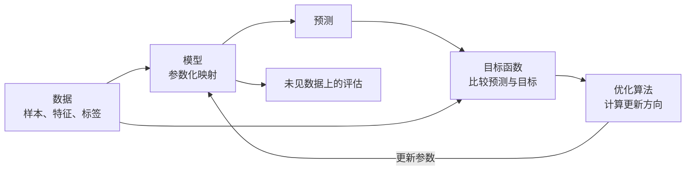
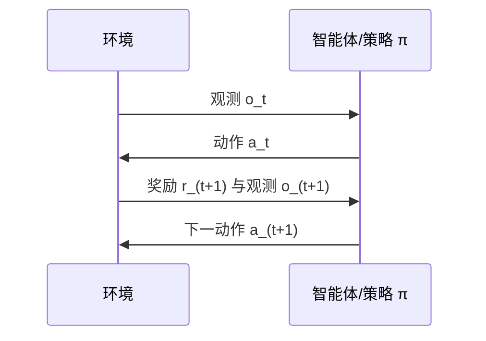
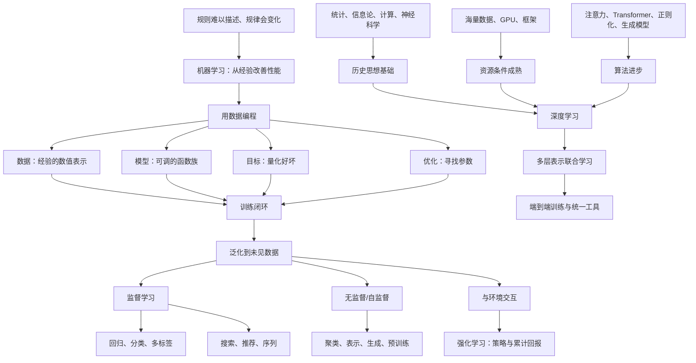

> 对应原文：d2l-en.md 的第 1 章 **Introduction**。本章的任务不是立即介绍某一种神经网络，而是先建立一张全局地图：什么问题需要机器学习，一个学习系统由哪些部分组成，不同任务应怎样表述，以及数据、计算和算法为何共同推动了深度学习的发展。

## 1. 从编写规则到用数据编程

### 1.1 什么问题不需要机器学习

传统程序的核心是人写出的明确规则。例如，电商系统可以把“用户点击加入购物车”写成确定的业务逻辑：验证用户和商品，随后在购物车表中建立关联。开发者虽然要处理空购物车、库存不足等边界情况，但原则上能够枚举条件并规定动作。

可以把这种程序写成：

$$
\text{输出}=\text{人写的规则}(\text{输入})。
$$

如果规则能够被完整描述、能够覆盖所有情形，而且需求不会随数据自动变化，那么直接编程通常更可靠、更便宜，也更容易测试。书中的判断很重要：**当人工规则能够做到几乎始终正确时，通常不应为了使用机器学习而使用机器学习。**

### 1.2 为什么有些任务无法靠枚举规则解决

原书给出天气预测、开放式问答、图像中的人物检测和个性化推荐等任务。它们难以手写规则，原因并不完全相同：

1. **关系过于复杂**：从数十万像素到“这是一个人”的映射包含大量相互作用，很难写成有限规则。
2. **规律并不为意识所知**：人可以识别人脸或语音，却通常说不清大脑完成识别的全部计算步骤。
3. **模式会随时间变化**：用户兴趣、欺诈手法、语言用法和环境都可能变化，固定规则会逐渐失效。
4. **目标具有统计性**：天气和消费行为不是确定映射；相同输入条件下也可能出现不同结果。

机器学习由此改变了问题的解法：不要求程序员直接写出最终映射，而是给出一个**能够从经验中改善的算法**。这里的经验通常是观测数据，也可以是智能体与环境交互得到的轨迹。

$$
\text{模型}=\text{学习算法}(\text{数据或交互经验}),
\qquad
\text{预测}=\text{模型}(\text{新输入})。
$$

这就是本章反复强调的“**用数据编程**”（programming with data）：数据不只是程序要处理的内容，也间接决定程序的行为。

### 1.3 机器学习、表示学习与深度学习

- **机器学习**研究如何让计算机系统利用经验，在特定任务上提高性能。
- **表示学习**研究如何从数据中自动找到适合任务的表示，而不是完全依赖人工设计特征。
- **深度学习**是机器学习的一部分，主要使用多层神经网络，让多层表示变换共同从数据中学习。

三者的关系可以概括为：


这张图表示常见的概念包含关系，而不是说所有人工智能都依赖机器学习，也不是说所有机器学习都属于深度学习。规则系统、搜索和规划同样可以是人工智能系统的一部分。

## 2. 动机案例：唤醒词识别

### 2.1 一次手机交互背后的多个模型

作者以“唤醒手机并导航到咖啡店”为例：

1. 唤醒词模型判断音频中是否出现“Hey Siri”；
2. 语音识别模型把语音转成文字；
3. 意图识别系统判断用户想要导航；
4. 地图系统寻找路线并预测通行时间。

用户只经历几秒钟的一次操作，后台却连续调用了多个输入、输出和目标各不相同的模型。这说明真实产品往往不是“一个万能模型”，而是由多个学习组件与确定性业务逻辑共同组成。

### 2.2 为什么唤醒词难以手写

麦克风每秒大约采集 $44\,000$ 个声波振幅值。即使只看一秒音频，输入也已经是一个高维序列：

$$
\mathbf{x}=(x_1,x_2,\ldots,x_{44000}).
$$

目标是输出：

$$
y\in\{\text{是},\text{否}\}.
$$

真正困难的不是写出 `if`，而是不知道应检查哪些振幅组合。说话人的音色、语速、口音、距离、背景噪声和设备都会改变波形；相同词语也不会产生逐点相同的信号。若逐一列规则，规则数量巨大且脆弱。

不过，人能够听出唤醒词，因此能够收集音频并给出标签。这就把“不会描述识别规则”转化为“能够提供正确示例”。机器学习利用的正是这种不对称性。

### 2.3 参数、模型、模型族和学习算法

设一个灵活的函数为 $f_{\boldsymbol\theta}$：

$$
\widehat y=f_{\boldsymbol\theta}(\mathbf{x}),
$$

其中：

- $\mathbf{x}$ 是输入音频；
- $\widehat y$ 是预测；
- $\boldsymbol\theta$ 是可调整的**参数**；
- 固定一组 $\boldsymbol\theta$ 后，$f_{\boldsymbol\theta}$ 就是一个具体**模型**；
- 所有允许的参数取值对应的函数集合 $\mathcal F=\{f_{\boldsymbol\theta}:\boldsymbol\theta\in\Theta\}$ 是**模型族**；
- 根据数据选择 $\boldsymbol\theta$ 的过程是**学习算法**或训练算法。

“旋钮”比喻的精确含义是：参数不是程序外部的规则，而是同一计算结构中的数值。改变参数，就改变输入到输出的映射。一个合适的模型族既要有能力表示“Alexa”，也应能通过另一组参数表示“Apricot”；若任务从音频分类变为图像描述，输入输出结构发生根本变化，模型族也可能需要改变。

这里存在第一个核心难点：

> 模型族太弱，任何参数都无法表达目标规律；模型族很强但数据不足，又可能记住训练样本而不能泛化。

因此，学习不等于“把参数调到训练集最好”这么简单，模型容量、数据数量、数据质量和泛化能力必须共同考虑。

### 2.4 典型训练闭环

原书把训练过程概括为四步：

1. 随机初始化一个尚无实用能力的模型；
2. 取出一批输入及相应标签；
3. 调整参数，使模型在这些样本上的表现改善；
4. 重复取数据和调参数，直到达到要求。

更形式化地，给定训练集

$$
\mathcal D=\{(\mathbf{x}_i,y_i)\}_{i=1}^{n},
$$

先定义单样本损失 $\ell(f_{\boldsymbol\theta}(\mathbf{x}_i),y_i)$，再最小化平均训练损失（经验风险）：

$$
\widehat R(\boldsymbol\theta)
=\frac{1}{n}\sum_{i=1}^{n}
\ell\!\left(f_{\boldsymbol\theta}(\mathbf{x}_i),y_i\right).
$$

训练循环不是凭感觉转动旋钮，而是让目标函数提供方向：

```text
初始化参数 θ
重复：
    从训练集采样一小批数据 B
    计算预测 f_θ(x)
    计算批量平均损失 L_B(θ)
    计算损失对参数的梯度
    沿降低损失的方向更新 θ
直到满足停止条件
```

训练结束得到的不是数据本身，而是一组从数据中提炼出的参数。部署时通常只需保留模型结构和已学习参数，便可对新输入进行**推理**。

## 3. 机器学习的四个关键组件

本章用四个组件建立统一分析框架：**数据、模型、目标函数、优化算法**。任何学习任务都可以先用这四个问题审视：

1. 从什么数据学习？
2. 用什么函数族变换数据？
3. 怎样量化“好”与“坏”？
4. 怎样找到更好的参数？

它们形成闭环，而不是可任意替换的四个孤立名词：



### 3.1 数据：经验必须被表示出来

#### 3.1.1 样本、特征和标签

数据集通常由多个样本组成。一个监督学习样本可写为 $(\mathbf{x},y)$：

- **样本**（example/sample/data point/instance）：一次观测；
- **特征**（feature/covariate/input）：模型用于预测的属性 $\mathbf{x}$；
- **标签**（label/target）：希望模型预测、但推理时未知的属性 $y$。

例如，一张 $200\times200$ 的 RGB 彩色图像可以表示成三个亮度网格，共有

$$
200\times200\times3=120\,000
$$

个数值。图像是一个样本，像素值是特征，图像类别是标签。医疗例子中，年龄、生命体征、合并症、用药和近期操作可以作为特征，“患者未来 30 天是否存活”是二元标签。

必须注意，“特征”和“标签”由任务决定，而不是数据列的固有身份。同一列“未来 30 天是否存活”在生存预测任务中是标签，在研究其他结局时也可能成为输入特征。

#### 3.1.2 固定长度与可变长度

若每个样本都由相同数量的数值描述，则输入是固定长度向量，长度称为**维数**。表格数据和统一尺寸的图像适合批量计算，经典算法也常要求这种表示。

但互联网图像分辨率不同，评论长短悬殊，语音和视频持续时间也不同。粗暴裁剪或填充虽然能统一尺寸，却可能丢失内容或引入大量无效位置。深度学习的重要优势之一，是能够较自然地处理序列、集合、图和不同尺寸图像等可变结构数据。

“能够处理可变长度”并不意味着无需预处理。实践中仍需分词、采样、归一化、批内填充和掩码；区别在于模型可以显式区分有效内容与填充，并学习跨位置的关系。

#### 3.1.3 数据量、模型能力和先验假设

一般而言，更多数据允许训练更有表达力的模型，并减少对人工先验的依赖。可以把三者理解为一种约束关系：

- 数据少时，需要更强的结构假设、更简单的模型或迁移学习；
- 数据多时，可以估计更多参数，使用更灵活的模型；
- 模型容量增大而数据量不变时，过拟合风险通常上升。

这不是“数据越多必然越好”。重复、泄漏、错误或来自错误分布的数据，增加数量也可能无益。

#### 3.1.4 正确的数据比大量数据更重要

“垃圾进，垃圾出”至少包含四层含义：

1. **测量错误**：特征或标签本身不准确；
2. **信息不足**：输入特征根本不包含预测目标所需的信息；
3. **样本不具代表性**：训练数据没有覆盖部署人群和场景；
4. **历史偏见**：标签记录的是过去的制度性偏差，而不是真正想优化的社会目标。

书中的两个例子尤其关键：只见过浅色皮肤的皮肤癌模型可能无法服务深色皮肤人群；用历史招聘决策训练的简历模型可能自动复制历史不公。这些问题不会因为开发者“没有恶意”而消失。模型擅长拟合数据中的统计规律，但不会自动判断规律是否公正、是否具有因果意义、是否适合继续沿用。

### 3.2 模型：把输入变成预测的计算结构

模型是接收一种数据并产生预测的计算装置。其核心是一个参数化函数：

$$
f_{\boldsymbol\theta}:\mathcal X\rightarrow\mathcal Y.
$$

简单模型适合简单关系；本书关注的原始图像、音频和语言任务往往超出浅层经典模型的能力。深度模型将多个变换串联：

$$
f_{\boldsymbol\theta}(\mathbf{x})
=f^{(L)}_{\theta_L}\circ f^{(L-1)}_{\theta_{L-1}}
\circ\cdots\circ f^{(1)}_{\theta_1}(\mathbf{x}).
$$

“深”指多层变换，不只是代码执行了很多行。关键在于每层表示的参数都能根据最终任务**联合学习**。底层可能从像素中提取局部边缘，中层组合形状，高层形成与类别相关的表示；这些语义是便于理解的直觉，不保证每个神经元都能被如此清晰解释。

### 3.3 目标函数：把任务要求变成可比较的数值

仅说“模型要变好”无法指导算法。目标函数把好坏变成数值。通常约定越小越好，此时常称为**损失函数**；若原指标越大越好，取负号即可转化为最小化问题。

#### 3.3.1 回归中的平方误差

对预测 $\widehat y$ 和真实值 $y$，平方损失可写为

$$
\ell(\widehat y,y)=\frac{1}{2}(\widehat y-y)^2.
$$

系数 $1/2$ 不改变最优解，只让导数更简洁：

$$
\frac{\partial \ell}{\partial \widehat y}=\widehat y-y.
$$

平方会消除正负误差的抵消，并对大误差施加更重惩罚。它的局限也由此而来：异常值的残差一旦很大，平方后可能主导训练。

平方损失与高斯噪声并非偶然联系。若假设

$$
y=f_{\boldsymbol\theta}(\mathbf{x})+\varepsilon,
\qquad \varepsilon\sim\mathcal N(0,\sigma^2),
$$

则条件概率为

$$
p(y\mid\mathbf{x};\boldsymbol\theta)
=\frac{1}{\sqrt{2\pi\sigma^2}}
\exp\!\left[-\frac{(y-f_{\boldsymbol\theta}(\mathbf{x}))^2}{2\sigma^2}\right].
$$

对独立样本最大化似然，等价于最小化负对数似然。去掉与 $\boldsymbol\theta$ 无关的常数后得到

$$
-\log p(\mathcal D\mid\boldsymbol\theta)
\propto
\sum_i\left(y_i-f_{\boldsymbol\theta}(\mathbf{x}_i)\right)^2.
$$

所以，最小二乘隐含了“误差独立、均值为零、方差相同且近似高斯”等建模假设。噪声重尾、方差随输入变化或异常值很多时，绝对误差、Huber 损失或显式预测分布可能更合适。

#### 3.3.2 分类中的错误率与替代目标

分类错误率为

$$
\operatorname{err}
=\frac{1}{n}\sum_{i=1}^{n}
\mathbb I\!\left[\widehat y_i\neq y_i\right].
$$

它符合最终评价直觉，却在预测类别改变前始终不变，且跳变点不可微，难以直接用梯度优化。因此训练通常使用可微的**替代目标**，如交叉熵。若模型给真实类别 $y_i$ 的概率为 $p_{\boldsymbol\theta}(y_i\mid\mathbf{x}_i)$，交叉熵损失为

$$
\ell_i=-\log p_{\boldsymbol\theta}(y_i\mid\mathbf{x}_i).
$$

模型越确信正确类别，损失越接近 $0$；若把极小概率分给真实类别，损失会很大。这同时鼓励类别正确和概率有区分度。

替代目标与最终指标不是同一个东西。优化交叉熵通常有助于降低错误率，但部署目标可能还包括召回率、延迟、公平性、成本或用户长期满意度。选错目标，优化算法越强，反而可能越有效地解决错误问题。

#### 3.3.3 训练集、测试集、泛化与过拟合

训练时把训练数据视为已知常量，调整参数以降低训练损失。但真正关心的是来自目标分布的新样本上的期望风险：

$$
R(\boldsymbol\theta)
=\mathbb E_{(\mathbf{x},y)\sim P}
\left[\ell(f_{\boldsymbol\theta}(\mathbf{x}),y)\right].
$$

由于不知道真实分布 $P$，只能用有限训练集上的经验风险 $\widehat R$ 近似它。**泛化**指模型把训练中学到的规律迁移到未见样本的能力。训练误差低而测试误差高称为**过拟合**。

原书用模拟考试和期末考试类比：记住练习题会提高练习分数，却不等于掌握了可迁移的方法。测试集必须在模型选择和调参期间保持独立；若反复根据测试结果修改模型，测试集实际上也参与了训练，评估会过于乐观。实践中通常再划出验证集用于选择超参数，将测试集留到最后一次评估。

### 3.4 优化算法：怎样寻找参数

模型规定“可以表示哪些函数”，目标函数规定“哪个函数更好”，优化算法负责在参数空间里寻找它。

深度学习最常用的基础方法是梯度下降。对参数 $\boldsymbol\theta$，更新为

$$
\boldsymbol\theta_{t+1}
=\boldsymbol\theta_t-\eta\nabla_{\boldsymbol\theta}
\widehat R(\boldsymbol\theta_t),
$$

其中 $\eta>0$ 是学习率。为什么减去梯度？由一阶泰勒展开，对小改变量 $\Delta\boldsymbol\theta$：

$$
\widehat R(\boldsymbol\theta+\Delta\boldsymbol\theta)
\approx \widehat R(\boldsymbol\theta)
+\nabla\widehat R(\boldsymbol\theta)^\top\Delta\boldsymbol\theta.
$$

在改变量长度固定时，令 $\Delta\boldsymbol\theta$ 与梯度反向，内积最小，因此局部下降最快。学习率过大可能越过低点甚至发散，过小则收敛缓慢。

实际训练通常用小批量 $B$ 近似全体数据的梯度：

$$
\boldsymbol\theta_{t+1}
=\boldsymbol\theta_t-
\eta\frac{1}{|B|}\sum_{i\in B}
\nabla_{\boldsymbol\theta}\ell_i.
$$

这样既减少一次更新的计算量，又能利用 GPU 的并行能力；采样噪声有时还有助于离开较差区域。但梯度下降只保证利用当前局部信息找下降方向，在深度网络的非凸目标中通常不保证找到全局最优解。

## 4. 机器学习问题的主要类型

任务类型主要由**可用反馈、输出结构以及模型是否影响未来数据**决定，而不是由采用了哪种神经网络决定。

### 4.1 监督学习

监督学习给定带标签样本，目标是从输入预测标签。概率上常写为估计条件分布

$$
p(y\mid\mathbf{x}).
$$

学习算法接收数据集并输出一个函数，这一点容易被忽略：

$$
\underbrace{A(\mathcal D)}_{\text{训练}}
=f_{\widehat{\boldsymbol\theta}},
\qquad
\underbrace{f_{\widehat{\boldsymbol\theta}}(\mathbf{x}_{\text{new}})}_{\text{推理}}
=\widehat y.
$$

典型流程是收集样本、获得人工或自然产生的标签、训练模型，再对未见输入预测。许多工业问题能清晰表述成“在现有证据下估计未知量”，因此监督学习长期占据重要地位。

#### 4.1.1 回归：回答“多少”

回归的标签是数值型。房价、住院时长、未来六小时降雨量和手术耗时都属于典型回归目标。决定任务性质的是**输出的含义**，不是输入：同一张医学影像，预测肿瘤体积是回归，预测是否恶性则是分类。

原书的管道清理账单给出了最小的线性回归例子。假设费用由上门费 $b$ 与每小时费用 $w$ 组成：

$$
y=wx+b.
$$

已知工作 $3$ 小时收费 $350$ 美元、工作 $2$ 小时收费 $250$ 美元：

$$
\begin{aligned}
3w+b&=350,\\
2w+b&=250.
\end{aligned}
$$

两式相减得到 $w=100$，代回得到 $b=50$，所以预测公式为

$$
\widehat y=100x+50.
$$

这个推导之所以成立，是因为先做了两个强假设：费用随时间线性增长，且所有订单共享固定上门费。真实数据受材料、路程和难度影响时，两点无法精确确定普遍规律，就要用更多样本并最小化整体误差。

#### 4.1.2 分类：回答“哪一个”

分类的标签来自离散类别集合。手写数字识别有 $10$ 类；猫狗识别只有两类，称为二分类；类别超过两个称为多分类。

模型通常不直接输出一个僵硬类别，而先估计每个类别的概率：

$$
p_k=P(y=k\mid\mathbf{x}),
\qquad p_k\ge0,
\qquad \sum_{k=1}^{K}p_k=1.
$$

最简单决策是选概率最大的类别 $\arg\max_k p_k$，但**预测概率不等于行动决策**。原书的死帽蕈例子说明：即使模型只给出 $20\%$ 的致命蘑菇概率，食用也不是合理行动，因为错误代价极不对称。

设真实状态为 $y$，行动为 $a$，采取行动的损失为 $C(a,y)$。给定输入后的理性决策应最小化条件期望损失：

$$
a^{\ast}(\mathbf{x})
=\arg\min_a\sum_y C(a,y)P(y\mid\mathbf{x}).
$$

因此，分类模型负责提供对状态的不确定性估计，决策规则再结合收益与伤害选择行动。医疗筛查、欺诈拦截和安全系统中的阈值都应由错误成本、资源约束和概率校准共同决定，而不应机械固定为 $0.5$。

##### 层次分类

类别可能具有层次结构，此时错误距离不同。把贵宾犬错认成雪纳瑞通常比错认成恐龙更接近；但在毒蛇识别中，生物分类上的接近并不等于决策风险上的接近。由此得到一个一般原则：**合理的类别结构和损失函数取决于使用场景。**

#### 4.1.3 多标签分类：一个样本可以有多个答案

普通多分类假设类别互斥，一个样本只选一个类别；多标签分类允许标签集合中的多个元素同时为真。包含驴、狗、猫和公鸡的图片不能被一个动物类别完整描述，博客文章也可以同时带有“机器学习”“GPU”和“云计算”等标签。

若共有 $K$ 个标签，目标可表示为多热向量：

$$
\mathbf y=(y_1,\ldots,y_K),\qquad y_k\in\{0,1\}.
$$

模型通常为每个标签分别给出概率，而不要求它们之和为 $1$。标签之间仍可能高度相关，例如“云计算”与“AWS”常共同出现。原书提到 PubMed 的 MeSH 体系约有 $28\,000$ 个标签，人工标注可能滞后一年；机器学习可先给出临时标签，但不取代最终专业审核。

#### 4.1.4 搜索与排序：集合相同，顺序也会改变价值

搜索任务不只是判断网页是否相关，还要把更值得展示的结果排在前面。一种通用表述是学习评分函数

$$
s(q,d,u),
$$

其中 $q$ 是查询，$d$ 是候选文档，$u$ 可表示用户或上下文，再按分数排序取前若干项。早期 PageRank 主要估计与具体查询无关的网页权威性，现代系统则结合查询、内容和行为信号产生相关性分数。

排序和分类的差别在于：分类只关心每项属于哪类；排序还关心项目间相对次序，且列表顶部错误通常比底部错误更重要。因此准确率未必是合适指标，实际常关注 Precision@K、Recall@K 或 NDCG 等位置敏感指标。

#### 4.1.5 推荐系统：个性化排序及其反馈闭环

推荐和搜索都从候选集合中选出高分项目，区别在于推荐更强调用户个性化。最简单的模型估计

$$
s(u,i)\approx \text{用户 }u\text{ 对物品 }i\text{ 的偏好},
$$

分数可以是预期星级或购买概率。反馈有两类：

- **显式反馈**：评分、评论、点赞；含义较直接，但数量少且存在选择偏差。
- **隐式反馈**：点击、停留、跳过、购买；数量大，但行为可能有多种解释。

推荐的困难不仅是预测不准，更在于观测数据受到旧推荐策略影响：用户只能反馈看过的物品，而“看过什么”正是系统决定的。这造成三类问题：

1. **反馈被删失**：未评分不等于不喜欢；
2. **暴露偏差**：热门或已推荐物品获得更多反馈；
3. **反馈循环**：多推荐带来多购买，多购买又被当成更优证据。

所以推荐系统不是静态、独立同分布的普通预测问题；探索、反事实评估、长期用户价值与生态影响都是仍在研究的重要问题。

#### 4.1.6 序列学习：上下文和顺序不能被丢弃

前述表格回归可把每个输入独立处理，但视频、语音、文本和病人监测数据具有顺序。一个时刻的含义依赖前后文，输入或输出长度也可能变化。序列模型一般表示为

$$
(\mathbf{x}_1,\ldots,\mathbf{x}_T)
\longmapsto
(\mathbf{y}_1,\ldots,\mathbf{y}_{T'}),
$$

其中 $T$ 与 $T'$ 不必相等。

原书列出四种代表情形：

| 任务 | 输入与输出关系 | 关键难点 |
|---|---|---|
| 词性标注、命名实体识别 | 输入输出大致逐位置对齐，$T'=T$ | 标签既依赖当前词，也依赖上下文 |
| 自动语音识别 | 音频序列远长于文本，$T'\ll T$ | 一个词对应许多采样帧，边界未知 |
| 文本转语音 | 输出音频远长于输入文本，$T'\gg T$ | 时长、韵律与自然度 |
| 机器翻译 | 长度和次序都可能不同 | 跨语言对齐、长距离依赖、语序变化 |

例如德语动词可能出现在句末，逐词按原位置替换会产生错误英语语序。这说明序列学习不能只做局部分类，还要学习对齐、重排和上下文状态。对话更进一步：当前回答可能依赖很早的交流、现实知识以及对话参与者的目标。

### 4.2 无监督学习与自监督学习

#### 4.2.1 无监督学习：没有指定标签时问什么

无监督学习只给出输入 $\{\mathbf{x}_i\}$，没有一个老板逐条告诉模型正确答案。困难首先不在优化，而在**问题本身没有唯一目标**：同一批照片既可按物体、颜色、拍摄地点分组，也可按清晰度分组。因此算法发现的结构由目标函数和表示中的归纳偏置共同决定。

原书列出几类典型问题：

1. **聚类**：用少量原型概括数据，把相似样本分组。典型目标是在组内尽量相似，如
   $$
   \min_{\{\boldsymbol\mu_k\},\{c_i\}}
   \sum_i\left\|\mathbf{x}_i-\boldsymbol\mu_{c_i}\right\|^2.
   $$
2. **子空间估计与主成分分析**：用少数参数抓住主要变化方向。PCA 在线性子空间中寻找保留方差最多、重构误差最小的表示。
3. **嵌入与表示学习**：把任意结构对象放到欧氏空间，使符号关系能由几何关系表达，例如“Rome - Italy + France ≈ Paris”。
4. **因果与概率图模型**：尝试描述观测变量背后的依赖或成因。但仅凭相关数据通常无法自动确定因果方向，还需要假设、干预或实验设计。
5. **深度生成模型**：学习数据分布 $p(\mathbf{x})$，用于评价样本似然或生成新样本。原书依次提到变分自编码器、生成对抗网络、归一化流和扩散模型。

“没有人工标签”不等于“没有监督信号”，也不等于“没有目标函数”。算法仍由人为选择的重构、聚类、密度估计或对比目标驱动。

#### 4.2.2 自监督学习：从数据自身构造标签

自监督学习利用未标注数据内部可自动获得的关系构造预测任务。例如：

- 遮住句中的某个词，让模型根据上下文预测它；
- 遮住图像区域，让模型重建内容；
- 判断两个裁剪是否来自同一图像；
- 判断一个图像块相对另一个图像块的位置。

可将过程写成

$$
\mathbf{x}
\xrightarrow{\text{自动变换}}
(\widetilde{\mathbf{x}},\widetilde y)
\xrightarrow{\text{监督式目标}}
\text{预训练模型}.
$$

$\widetilde y$ 不是人工标注，而是由原始数据和变换规则自动产生。模型先从海量数据学习通用表示，再在少量带标签的下游数据上微调。它解决了人工标签昂贵的问题，但预训练目标与下游目标可能不一致；数据偏见也会随预训练被吸收。

#### 4.2.3 三种学习范式的辨析

| 范式 | 原始数据提供什么 | 训练信号来自哪里 | 典型目标 |
|---|---|---|---|
| 监督学习 | 输入与人工/自然标签 | 外部标签 | 预测 $p(y\mid x)$ |
| 无监督学习 | 只有输入 | 人为定义的结构性目标 | 聚类、降维、密度估计 |
| 自监督学习 | 只有输入 | 从输入自动生成的伪标签 | 预训练可迁移表示 |

自监督通常被视为广义无监督学习的一部分，但训练形式看起来像监督学习。分类依据应是**标签从何而来**，而不是代码是否调用了交叉熵。

### 4.3 与环境交互：从静态预测到行动

监督和无监督学习常先收集一批数据，再离开环境训练，称为**离线学习**。这种设置有利于把模式识别单独研究，却忽略了模型输出可能改变世界。

预测与行动有本质区别：预测天气不会改变天气，但推荐一个商品会改变用户接下来看到和购买的内容；垃圾邮件过滤器的策略会促使发送者改变文本；机器人当前转向会决定下一时刻看见什么。

一旦行动影响未来观测，就要追问：

- 环境是否记得之前的行动？
- 环境与智能体合作还是对抗？
- 规律会不会自然变化，或因系统部署而变化？
- 训练数据与部署数据是否来自相同分布？

训练分布 $P_{\text{train}}(x,y)$ 与测试或部署分布 $P_{\text{test}}(x,y)$ 不同，称为**分布偏移**。这会破坏“训练集经验风险代表未来风险”的前提。书中用助教出作业、教师出考试作类比：学生可能熟悉作业风格，却遇到不同的考试分布。

### 4.4 强化学习

#### 4.4.1 智能体—环境循环

强化学习研究智能体如何通过与环境连续交互学习行动策略。在时刻 $t$：

1. 环境给出观测 $o_t$；
2. 智能体按策略 $\pi$ 选择动作 $a_t$；
3. 环境接收动作，产生奖励 $r_{t+1}$ 和下一观测 $o_{t+1}$；
4. 循环继续。



策略是从观测到动作的映射；随机策略可写为

$$
\pi(a\mid o)=P(a_t=a\mid o_t=o).
$$

目标不是让当前奖励每次最大，而是让一段时间内的累计回报较大。常见定义为

$$
G_t=\sum_{k=0}^{\infty}\gamma^k r_{t+k+1},
\qquad 0\le\gamma<1,
$$

其中折扣因子 $\gamma$ 平衡近期和远期奖励，并使无限和在奖励有界时收敛。

深度强化学习只是用深度网络表示策略、价值函数或环境模型。DQN 从 Atari 游戏画面学习行动，AlphaGo 将深度学习、搜索与强化学习结合起来；成功并非仅来自“网络更深”。

#### 4.4.2 三个核心难点

**信用分配**：奖励可能延迟很久。国际象棋通常只在终局给出胜负，算法必须判断此前哪些动作应获益或受罚。

**部分可观测**：当前观测不一定等于完整状态。清洁机器人进入多个外观相同的壁橱之一，仅凭当前画面无法定位，必须利用历史观测形成记忆或信念。

**探索与利用**：利用当前最好策略可获得短期收益，探索未知动作可能暂时吃亏，却能发现更优策略。只利用会困在已知方案，只探索则无法兑现知识。

此外，强化学习的数据不是预先固定的：策略改变会改变访问到的状态和收到的数据分布。这使训练稳定性、安全探索和离线评估都比普通监督学习更困难。

#### 4.4.3 监督学习能否看作强化学习

形式上可以把一次分类看成一步交互：动作对应预测类别，预测正确给奖励，随后回合结束。但原书说“奖励等于原监督损失”时应注意符号约定：若损失越小越好，则强化学习通常应取 $r=-\ell$，或把问题表述成最小化成本。

这种改写说明强化学习框架很一般，却不代表实践中应该用强化学习训练普通分类器。监督学习已经给出每个样本的正确标签，能提供比单一奖励更直接、方差更小的训练信号。

#### 4.4.4 强化学习的几个特例

- **马尔可夫决策过程（MDP）**：环境状态被完全观测，并满足给定当前状态和动作后，下一状态与更早历史条件独立。
- **上下文赌博机**：每轮观察上下文并选动作，奖励取决于当前上下文和动作，但没有动作影响后续状态的长期链条。
- **多臂赌博机**：连上下文或状态也没有，只需在若干奖励未知的动作之间平衡探索与利用。

从 MDP 到上下文赌博机再到多臂赌博机，长期状态依赖逐步减少，因此问题也更容易。并非所有交互任务都应套用最一般、最复杂的形式。

## 5. 思想根源：深度学习不是凭空出现的

本章按历史脉络说明，现代深度学习汇合了统计学、信息论、计算理论、神经科学和工程计算，而不是某一天突然发明的单一技术。

### 5.1 从估计与统计开始

- 伯努利分布和高斯分布代表了用概率描述不确定性的早期成果。
- 高斯提出的最小二乘思想至今仍用于保险、医学和工程；欧姆定律则展示了线性模型对自然规律的简洁描述。
- Jacob Köbel 的书记录了让 $16$ 名成年男子排成一列、求平均脚长来估计“一英尺”的方法。去掉最长和最短者再求平均，已具有**截尾均值**的思想，用来降低极端值影响。
- Ronald Fisher 推动了统计理论及其在遗传学中的应用，线性判别分析、Fisher 信息矩阵和 1936 年发布的 Iris 数据集仍有影响。原书同时指出 Fisher 支持优生学，以提醒读者：数据科学有生产性历史，也有不道德应用的历史。

这些例子建立了一条连续主线：有限样本不能直接等同于总体规律，因此需要估计、概率模型、稳健方法和实验设计。

### 5.2 信息、计算与智能

Claude Shannon 的信息论为不确定性、编码和交叉熵等概念奠定基础。Alan Turing 的计算理论界定“哪些过程可以计算”，并在 1950 年提出以文本交互中的不可区分性讨论机器智能，即后来所谓图灵测试。

图灵测试衡量的是外显交互是否难以与人区分，不等于证明机器具有意识，也不解释系统内部如何实现智能。

### 5.3 神经科学启发与神经网络原则

Donald Hebb 提出神经元连接可因共同活动而增强的学习思想，后来影响了感知机和参数更新方法。现代神经网络虽保留生物学名称，但已不应被视为对真实大脑的逐部件复制。

本章提炼出神经网络中延续至今的两个原则：

1. 线性处理单元和非线性处理单元交替组成多层结构；
2. 使用链式法则，也就是反向传播，高效计算所有层参数对最终损失的影响。

若只有线性层而没有非线性，无论叠多少层，组合仍是一个线性变换：

$$
W_3(W_2(W_1\mathbf{x}))=(W_3W_2W_1)\mathbf{x}.
$$

非线性因此是深层组合表达复杂函数的必要因素之一。反向传播则解决“最终误差如何分配到前面每一层参数”的计算问题。

### 5.4 1995—2005 年前后的低潮

神经网络研究一度发展缓慢，主要受两个现实条件限制：

- 训练计算昂贵，算力不足；
- 数据集太小，MNIST 的 $60\,000$ 个手写数字当时已被认为很大。

在小数据和低算力条件下，核方法、决策树和概率图模型往往效果更好、训练更快，并有较强理论保证。这个历史说明算法优劣与资源条件有关：今天流行的模型不一定适合数据稀缺、要求可解释或设备受限的任务。

## 6. 通往深度学习之路

### 6.1 数据、存储和算力共同改变了最优选择

互联网、大规模在线服务、低价传感器和存储带来海量数据；摩尔定律推动通用计算，面向游戏图形的 GPU 则特别适合大规模并行数值运算。原书用数量级展示这一变化：

| 年代 | 代表性数据规模 | 内存 | 每秒浮点计算能力 |
|---|---:|---:|---:|
| 1970 | $10^2$（Iris） | 1 KB | 100 KF |
| 1980 | $10^3$（波士顿房价） | 100 KB | 1 MF |
| 1990 | $10^4$（光学字符识别） | 10 MB | 10 MF |
| 2000 | $10^7$（网页） | 100 MB | 1 GF |
| 2010 | $10^{10}$（广告） | 1 GB | 1 TF |
| 2020 | $10^{12}$（社交网络） | 100 GB | 1 PF |

表中的 K/M/G/T/P 是数量级标记，具体硬件和基准会影响实际值，不能把它当作严格性能测试。重要结论是趋势：**数据增长快于内存，而计算增长快于数据。** 因而算法必须更节省存储、采用小批量和分布式读取，同时可以花更多计算反复优化大量参数。

这使机器学习的优势区间从广义线性模型和核方法逐渐向深度网络移动。多层感知机、卷积网络、长短期记忆网络和 Q 学习的关键思想早已存在，后来在资源条件成熟后重新成为主流。

### 6.2 资源并不是全部：算法与架构也在进步

原书列举了一系列推动近十余年进展的技术，它们分别解决不同瓶颈。

#### Dropout：控制容量与缓解过拟合

训练时随机屏蔽部分中间单元，相当于向网络注入噪声，使模型不能过分依赖少数共适应特征。这是一种正则化手段，不是简单地把模型永久删小；推理阶段通常使用完整网络并做相应缩放。

#### 注意力：按内容读取中间表示

固定长度向量很难装下长序列的全部信息。注意力机制让模型根据当前需要，对一组中间状态分配不同权重，可理解为可学习的软指针：

$$
\operatorname{Attention}(q,K,V)
=\sum_j \alpha_j v_j,
\qquad
\alpha_j\ge0,
\qquad
\sum_j\alpha_j=1.
$$

它无需把整个输入压缩成一个固定摘要，再一次性生成全部输出，因此改善了长序列任务。

#### Transformer：以注意力为核心并展现规模扩展能力

Transformer 主要依靠注意力组织信息，在增加数据量、模型规模和训练计算时表现出良好的扩展趋势。原章列举了它在自然语言、视觉、语音、强化学习和图神经网络中的应用，并提到单一 Transformer 可预训练于文本、图像、关节力矩和按键等多种模态。

“扩展有效”不是无限保证。数据质量、训练稳定性、内存、推理成本和收益递减仍构成边界。

#### 语言模型：根据上下文预测文本

语言模型学习文本序列概率，例如自回归分解：

$$
p(x_1,\ldots,x_T)
=\prod_{t=1}^{T}p(x_t\mid x_1,\ldots,x_{t-1}).
$$

随着数据、模型和计算扩大，语言模型展现出问答、代码调试和创作等能力。通过人类反馈等方法使模型行为更符合人的意图，是把“会生成文本”变成“更有帮助的对话系统”的重要环节。

#### 多阶段设计：让内部状态反复更新

记忆网络和神经程序解释器等工作允许模型多次修改内部状态，表达迭代推理过程。其动机是：有些任务不能靠一次前向映射轻易完成，需要保存中间结果并分步骤处理。

#### 生成对抗网络：把生成器变成可微的任意算法

GAN 让生成器 $G$ 与判别器 $D$ 对抗训练。判别器区分真实与生成样本，生成器学习让判别器无法区分。关键突破是生成过程不必局限于容易写出密度的传统概率族，只要生成器参数可通过梯度调整即可。训练不稳定、模式坍塌和评价困难则是其典型局限。

#### 扩散模型：学习逆转加噪过程

正向过程逐步向数据加入随机噪声，模型学习逐步去噪，从随机噪声恢复数据。它在 DALL-E 2、Imagen 等文本生成图像系统中得到应用，并逐渐成为重要生成范式。代价是传统采样往往需要多次去噪步骤，推理开销较高。

#### 并行与分布式训练：把大数据和大模型变得可计算

单张 GPU 无法容纳和处理全部训练工作，需要数据并行、模型并行及高效通信。原书举例：$1024$ 张 GPU、每张处理 $32$ 张图像时，总批量约为

$$
1024\times32=32768.
$$

后续工作把批量推到 $64\,000$，使 ImageNet 上 ResNet-50 的训练从数天缩短到不足 $7$ 分钟。大批量虽然提高硬件吞吐，也会改变优化动态，通常需要调整学习率、预热策略和通信方式。

#### 仿真推动强化学习

强化学习依赖大量 $(\text{状态},\text{动作},\text{奖励})$ 数据。真实机器人试错昂贵且危险，游戏与物理模拟器则可以并行生成经验，促成围棋、Atari、星际争霸等任务上的进展。但仿真成功迁移到现实仍受“仿真—现实差距”限制。

#### 框架降低实现与传播门槛

从 Caffe、Torch、Theano，到 TensorFlow/Keras、MXNet，再到 PyTorch、Gluon 和 JAX，框架逐渐提供自动微分、GPU 算子、模块组合和分布式能力。系统研究者构建工具，统计建模者设计模型，分工使过去需要大量代码的逻辑回归如今可用不到十行高级 API 实现。

框架降低了实现门槛，却没有消除建模责任。能够运行代码不等于数据、目标和评估设置正确。

## 7. 成功案例、能力边界与现实风险

### 7.1 从隐形基础设施到消费级应用

机器学习早已用于邮件光学字符识别、支票读取、信用评分、欺诈检测、国际象棋、搜索、排序、个性化与推荐，只是许多能力作为基础设施不易被察觉。近期深度学习让一些过去难以解决、消费者可直接感知的问题取得突破：

- Siri、Alexa 等智能助手能理解一定范围的语音请求；
- 特定语音识别任务达到接近人类的准确率；
- ImageNet 的 top-5 错误率从 2010 年约 $28\%$ 降至 2017 年约 $2.25\%$；
- 从 TD-Gammon、Deep Blue 到 AlphaGo 和 Libratus，系统依次处理更大的状态空间、搜索和部分可观测博弈；
- 自动驾驶已实现部分自动化，但完全自主仍要求感知、推理、规则和安全工程协同。

这些数字必须放回具体基准理解。“在某项基准达到人类水平”不等于所有场景、所有人群、所有噪声条件下都等同于人类，更不等于系统获得通用智能。

### 7.2 深度学习只是系统的一部分

自动驾驶的例子揭示工程现实：深度学习目前主要处理视觉感知，其他部分还依赖规则、地图、规划、控制和大量工程调试。类似地，智能助手也包含唤醒、识别、理解、检索、执行和权限控制等多个组件。

因此不能把一个模型在离线测试集上的准确率直接当作整个产品的可靠性。系统还要处理接口错误、级联误差、延迟、异常输入、监控、回退和人为监督。

### 7.3 不必夸大“有意识的通用智能”，更应关注当下影响

原书认为，当前系统都围绕具体目标被设计、训练和部署，其看似通用的行为来自规则、启发式和统计模型的组合。现阶段没有成熟工具能让系统自主理解并持续重构自身架构，从而解决任意一般任务。因此，把主要注意力放在有意识机器蓄意毁灭人类上，会掩盖更迫切的问题。

现实风险包括：

- 自动化改变就业结构；
- 信贷、保释和招聘模型直接影响人的机会；
- 数据偏见导致种族、性别或年龄歧视；
- 不透明流程损害程序公平；
- 模型部署后的反馈循环放大既有差异。

技术人员的责任不止是降低平均误差，还要确认目标是否合法合理、数据覆盖谁、错误由谁承担、结果能否申诉，以及系统何时应拒绝自动决策。

## 8. 深度学习的本质

### 8.1 多层表示的联合学习

传统流水线通常分成两段：领域专家先设计特征，再训练浅层模型。计算机视觉中，Canny 边缘检测和 SIFT 特征曾长期用于把原始图像变成固定特征向量。

深度学习把表示和预测放在一个可微系统中，根据最终目标联合调整：

$$
\mathbf{x}
\xrightarrow{f^{(1)}_{\theta_1}}
\mathbf{h}_1
\xrightarrow{f^{(2)}_{\theta_2}}
\cdots
\xrightarrow{f^{(L)}_{\theta_L}}
\widehat y.
$$

最终损失通过链式法则影响每一层：

$$
\frac{\partial \ell}{\partial \theta_1}
=\frac{\partial \ell}{\partial \mathbf{h}_{L-1}}
\frac{\partial \mathbf{h}_{L-1}}{\partial \mathbf{h}_{L-2}}
\cdots
\frac{\partial \mathbf{h}_1}{\partial \theta_1}.
$$

这使底层特征不再按人的固定直觉设计，而是以最终任务是否改善为依据。算法可以在大量候选表示中持续、统一地评价，往往超过人工逐项尝试。

### 8.2 端到端训练解决了什么

**端到端训练**指从原始或接近原始的输入到最终输出整体优化，而不是分别调好各组件后再拼接。它带来三点好处：

1. 中间表示直接服务最终目标；
2. 减少昂贵、领域专用的特征工程；
3. 图像、语音、语言和医疗等领域可共享网络、优化和训练工具。

端到端不是永远正确。数据不足、规则必须严格满足、错误代价极高、需要审计解释，或模块拥有可靠物理模型时，混合系统和模块化设计可能更适合。端到端还可能让局部故障难以定位，并需要更多数据覆盖完整流程。

### 8.3 从强参数假设走向更灵活的模型

数据稀缺时，必须借助强简化假设限制可能函数；数据丰富后，可以使用更灵活、近似非参数化的模型拟合复杂规律。这里“非参数”不表示没有参数，现代深度网络显然含有大量参数；它强调模型有效容量可以随数据和资源扩展，而不是被少量固定参数的简单分布族严格限制。

灵活性换来的代价包括：

- 需要更多数据和计算；
- 优化通常非凸；
- 结果更难解释；
- 很难给出传统统计方法那样完整的理论保证。

### 8.4 经验主义与非凸优化

深度学习社区接受用不完美优化方法寻找足够好的解，也常先通过实验验证，再逐步建立理论解释。这种经验主义加速了实用进展，但也容易重复发明旧方法、过度依赖基准和忽视失败条件。

开源框架、模型和训练代码让学界与产业界共享工具，降低了复现和入门门槛。本书把数学、代码和可执行笔记结合起来，也是在延续这种“通过动手理解”的方法。

## 9. 一个可运行例子：数据如何决定程序行为

下面只用 NumPy 实现原章“四组件 + 训练闭环”。任务沿用管道工账单，模型为 $\widehat y=wx+b$，损失为均方误差，优化方法为小批量梯度下降。这里故意不调用高级训练框架，以便逐行看见原理。

```python
import numpy as np

# 1. 数据：工时 x 与账单 y。后两个样本加入轻微现实波动。
x = np.array([2.0, 3.0, 4.0, 5.0])
y = np.array([250.0, 350.0, 455.0, 545.0])

# 标准化输入和标签，避免数值尺度过大导致学习率难调。
x_mean, x_std = x.mean(), x.std()
y_mean, y_std = y.mean(), y.std()
x_norm = (x - x_mean) / x_std
y_norm = (y - y_mean) / y_std

# 2. 模型参数：y_hat_norm = w * x_norm + b
rng = np.random.default_rng(0)
w = rng.normal()
b = 0.0

# 3. 目标函数 + 4. 优化算法
learning_rate = 0.1
for step in range(500):
    y_hat = w * x_norm + b
    error = y_hat - y_norm
    loss = np.mean(error**2) / 2

    # 链式法则给出的均方误差梯度
    grad_w = np.mean(error * x_norm)
    grad_b = np.mean(error)

    w -= learning_rate * grad_w
    b -= learning_rate * grad_b

# 把标准化空间中的预测还原为美元
def predict(hours: float) -> float:
    hours_norm = (hours - x_mean) / x_std
    prediction_norm = w * hours_norm + b
    return float(prediction_norm * y_std + y_mean)

print(f"final loss: {loss:.8f}")
print(f"6-hour estimate: ${predict(6):.2f}")
```

代码与原理一一对应：

1. `x, y` 是经验；没有它们，程序不知道收费规律。
2. `w, b` 定义模型族；无论数据怎样，它只能表达直线。
3. `loss` 定义“拟合好”的含义；平方损失会重点惩罚大偏差。
4. `grad_w, grad_b` 衡量参数微小变化对损失的影响。
5. 减去梯度反复更新，让参数从随机值逐渐变成数据支持的值。
6. `predict(6)` 是对未见输入的推理；它是否可靠取决于直线假设能否外推到 6 小时。

这个例子也揭示局限：只有四个样本，无法知道高工时是否加收费用；模型只能学直线；没有独立测试集，不能可靠评估泛化。训练损失很小只表示模型解释了现有四点，不等于发现了真实收费机制，更不证明因果关系。

## 10. 容易混淆的概念与常见误区

### 10.1 参数、超参数与模型结构

- 参数由训练数据和优化算法更新，如权重 $w$、偏置 $b$。
- 超参数由训练流程外部选择，如学习率、层数、批量大小。
- 模型结构规定参数如何参与计算。

层数虽影响模型函数族，但通常不通过普通梯度步骤自动改变，因此常被称为超参数。

### 10.2 模型与学习算法

模型是训练后用于输入到输出的函数；学习算法是把数据变成模型参数的过程。逻辑回归函数不是梯度下降，梯度下降也不只用于逻辑回归。

### 10.3 损失、指标和真实效用

损失是便于训练的目标，指标是报告性能的量，真实效用是系统对现实造成的收益和成本。三者应相关，却不必相同。交叉熵下降不保证业务长期收益增加，准确率高也不保证高风险决策合理。

### 10.4 分类与多标签分类

多分类是在互斥类别中选一个；多标签分类允许多个标签同时为真。“猫、狗、驴、公鸡”不是四分类答案，而是一个多标签集合。

### 10.5 预测与决策

$P(y\mid x)$ 描述模型对结果的判断，行动还必须结合错误代价与约束。概率最大的结果不一定对应损失最小的行动，死帽蕈例子就是反例。

### 10.6 相关、预测与因果

模型能用 $x$ 预测 $y$，不代表改变 $x$ 会导致 $y$ 改变。招聘、信贷和医疗决策尤其不能把历史相关性直接当作干预依据。

### 10.7 训练表现与泛化能力

训练损失衡量对已见样本的拟合，测试表现才近似衡量未见数据。若测试数据分布又与部署环境不同，即使测试成绩好也可能失效。

### 10.8 无监督与自监督

无监督学习没有外部标签，但仍有目标；自监督从数据内部自动生成训练信号。自监督不是“模型自己监督自己，也不需要人为设计任务”。

### 10.9 神经网络与大脑

神经网络受神经科学启发并沿用了名称，但现代网络主要是数学和工程模型，不是对生物神经系统的忠实模拟。

### 10.10 深度学习与万能方法

深度学习擅长大规模、复杂、低层感知数据，但通常需要大量数据、计算和工程。小样本表格、强规则约束、严格可解释场景中，经典统计模型、树模型、物理模型或规则系统可能更好。

## 11. 本章练习的思考方向

### 11.1 哪些代码中的选择可以从数据学习

寻找代码中长期靠人工阈值、排序权重、模式规则或启发式打分的部分。例如垃圾邮件关键词权重、搜索排序公式、告警阈值和容量预测。候选问题还必须满足：有可观察反馈，错误成本可接受，且数据能覆盖未来使用场景。

### 11.2 哪些任务“例子很多，但自动化规则说不清”

图像缺陷检测、客服意图识别、日志异常归类和文档标签推荐都符合这一模式。先确认人类能相对一致地判断答案；若专家之间都无法定义目标，收集再多标签也可能只把分歧写进模型。

### 11.3 算法、数据和计算之间的关系

三者共同决定可行方案：

- 数据规模和结构决定能估计多复杂的规律；
- 算法决定怎样利用数据、需要多少存储与计算；
- 计算资源决定可尝试的模型规模、训练轮数和实验数量。

数据少时，强先验和简单模型更稳健；数据大但内存有限时，需要小批量和流式训练；算力充裕时，可以用更多迭代优化大模型，但仍无法修复错误标签或分布不匹配。

### 11.4 哪些模块化流程可能受益于端到端训练

语音系统中的降噪—特征—识别、搜索中的召回—打分—排序、机器人中的感知—状态估计—控制，都可能通过联合目标减少组件间不匹配。但若中间环节有硬安全约束、可验证规则或缺乏全流程数据，保留模块边界更稳妥。

## 12. 全章知识结构



## 13. 核心结论与一般解题方法

### 13.1 核心结论

1. 机器学习适合规则难以显式写出、但能够获得经验和评价反馈的问题；能可靠手写的确定规则不必强行学习。
2. 学习系统的四个基本组件是数据、模型、目标函数和优化算法，任何一个选错都会使其余部分失去意义。
3. 训练的直接目标是降低有限样本上的经验损失，真正目标却是在目标环境中的未见数据上泛化。
4. 任务类型由标签形式、反馈来源、输出结构以及行动是否影响未来数据决定。
5. 概率预测只是决策的输入；现实行动必须再考虑错误成本、约束和长期影响。
6. 深度学习的关键不是单纯“参数多”，而是多层表示能够围绕最终目标联合学习，并支持端到端优化。
7. 深度学习的兴起是历史思想、海量数据、GPU 算力、算法架构和开源框架共同作用的结果。
8. 高基准成绩不等于通用智能或可靠产品；偏见、分布偏移、反馈循环和程序公平是当下更直接的问题。

### 13.2 面对新问题时的通用分析顺序

1. **先问是否该用机器学习**：规则是否可完整写出？规律是否稳定？是否有足够经验？
2. **定义任务边界**：输入是什么，输出是什么，预测供谁采取什么行动？
3. **审查数据生成过程**：标签如何产生，谁被遗漏，训练与部署分布是否一致？
4. **选择问题形式**：回归、分类、多标签、排序、序列、生成还是交互决策？
5. **选择模型族**：它是否有足够表达能力，是否符合数据结构和资源约束？
6. **把现实目标写成目标函数**：训练损失是否真能代理最终效用，错误是否等价？
7. **设计优化与验证**：用训练集更新参数，用验证集选择方案，把测试集留作最终检验。
8. **检查部署后的闭环**：模型会不会改变数据、诱发对抗、放大偏差或随时间失效？
9. **保留监控和回退机制**：记录分布、性能和群体差异，允许人工接管并定期重新评估。

本章最终建立的不是一份模型名录，而是一种问题求解观：**把人难以明确表达的映射转化为可由数据评价的参数化程序，再用优化寻找参数，同时始终区分训练拟合、未知数据上的泛化和现实世界中的决策后果。** 后续章节的张量、微积分、概率、线性模型和神经网络，都会围绕这条主线逐步提供实现工具。
