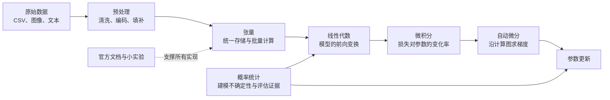
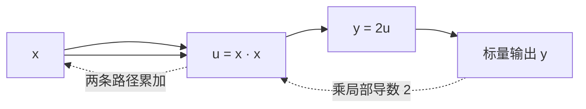
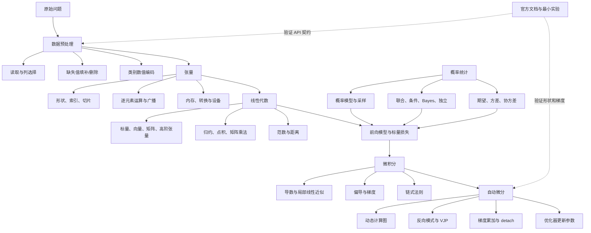

> 对应原文：d2l-en.md 的第 2 章 **Preliminaries**。本章是一套面向后续深度学习内容的“生存工具箱”：先学会用张量保存和操作数据，再把现实数据预处理为张量；随后用线性代数描述模型计算，用微积分描述参数变化，用自动微分真正算出梯度，用概率统计处理不确定性，最后掌握依靠官方文档解决 API 问题的方法。

## 1. 本章要解决什么问题

第 1 章已经把机器学习概括为数据、模型、目标函数和优化算法组成的系统。要把这四个名词变成可运行程序，还缺少一组基础能力：

1. **数据操作**：怎样在计算机中高效保存、变形、索引和计算高维数据？
2. **数据预处理**：怎样把 CSV 中的类别和缺失值转换为模型可接受的数值？
3. **线性代数**：怎样精确描述一批样本、权重、层间变换和距离？
4. **微积分**：参数稍微变化时，损失会怎样变化？应朝哪个方向调整参数？
5. **自动微分**：怎样让框架沿复杂计算过程自动应用链式法则？
6. **概率统计**：怎样描述未知结果、从样本估计规律并更新不确定性？
7. **查阅文档**：遇到书中未介绍的函数时，怎样自己找到并验证正确用法？

它们不是互不相关的七门小课，而是一条完整的数据到学习链路：



本章采取“够用即止”的策略：数学内容不是完整教材，而是为后续模型建立共同语言。作者的分析顺序也很有意图：先让读者能操作具体对象，再解释对象背后的数学，最后把手算导数交回框架。

## 2. 数据操作：张量是深度学习的基本容器

### 2.1 为什么从张量开始

数据处理包含两步：先获取数据，再在计算机中处理数据。若没有统一、可高效计算的存储形式，获取再多数据也没有用。现代深度学习框架以 $n$ 维数组作为主要接口，通常称为**张量**（tensor）。

PyTorch 的 `Tensor` 与 NumPy 的 `ndarray` 很相似，但增加了深度学习最需要的两种能力：

- **自动微分**：记录运算依赖并计算梯度；
- **加速设备支持**：可把大规模数值运算放到 GPU 等设备执行。

因此张量同时承担三种角色：数据容器、数值计算对象和计算图中的节点。

### 2.2 阶、轴、形状和元素个数

一个张量可以用三组信息描述：

- **阶（order）或轴数**：有多少个索引方向；
- **形状（shape）**：每条轴的长度；
- **元素个数（size/numel）**：所有轴长度的乘积。

| 数学对象 | 轴数 | 示例形状 | 常见含义 |
|---|---:|---|---|
| 标量 | 0 | `()` | 一个损失值、学习率 |
| 向量 | 1 | `(d,)` | 一个样本的 $d$ 个特征 |
| 矩阵 | 2 | `(n, d)` | $n$ 个样本、每个 $d$ 个特征 |
| 三阶张量 | 3 | `(h, w, c)` | 一张高 $h$、宽 $w$、通道数 $c$ 的图像 |
| 四阶张量 | 4 | `(b, c, h, w)` | 一批图像，具体轴顺序由框架和模型约定 |

若 `X.shape == (2, 3, 4)`，则轴数为 $3$，三条轴长度分别为 $2,3,4$，元素总数为

$$
2\times3\times4=24.
$$

“维度”一词常被混用：有人用它表示轴数，有人用它表示某条轴的长度。原书为减少歧义，用“阶”表示轴数，用“维数”表示向量的分量数。阅读代码时最好直接说“轴数”和“第 $i$ 轴长度”。

### 2.3 创建张量

常见创建方法对应不同的数据来源：

```python
import torch

x = torch.arange(12, dtype=torch.float32)  # 0 到 11，左闭右开
zeros = torch.zeros((2, 3, 4))             # 全 0
ones = torch.ones((2, 3, 4))               # 全 1
noise = torch.randn((3, 4))                # 独立标准正态样本
exact = torch.tensor([[2, 1, 4, 3],
                      [1, 2, 3, 4],
                      [4, 3, 2, 1]])        # 从明确数值创建

print(x.numel())   # 12
print(x.shape)     # torch.Size([12])
```

`dtype` 不是装饰信息。整数张量适合索引和类别编号，浮点张量适合参与可微计算。若两个张量的数据类型或设备不同，运算可能触发类型提升、复制或报错。后续训练时还要关心精度、速度和显存之间的权衡。

### 2.4 改变形状而不改变元素

`reshape` 只重组元素的坐标，不改变元素数量和顺序：

```python
x = torch.arange(12, dtype=torch.float32)
X = x.reshape(3, 4)
```

结果为

$$
\mathbf X=
\begin{bmatrix}
0&1&2&3\\
4&5&6&7\\
8&9&10&11
\end{bmatrix}.
$$

因此 `x[3] == X[0, 3]`。合法重塑必须满足

$$
\prod_i s_i=\operatorname{numel}(X),
$$

其中 $s_i$ 是目标形状各轴长度。若总元素数已知，只需指定其余轴，便可用一个 `-1` 让框架推断该轴：

```python
X1 = x.reshape(-1, 4)  # 推断为 3 行
X2 = x.reshape(3, -1)  # 推断为 4 列
```

只能有一个 `-1`，否则未知数多于约束。还要注意，`reshape` 的结果可能与原张量共享底层存储，也可能因内存布局不兼容而创建副本；如果程序依赖别名关系，应显式检查而不是凭外观猜测。

### 2.5 索引、切片与赋值

Python 索引从 $0$ 开始；负索引从末尾计数；切片 `start:stop` 包含 `start`，不包含 `stop`。对于多轴张量，只给一个索引时默认作用于轴 0：

```python
last_row = X[-1]
middle_rows = X[1:3]
single_value = X[1, 2]
```

索引不仅能读取，也能定位写入位置：

```python
X[1, 2] = 17
X[:2, :] = 12  # 前两行、所有列都写成 12
```

切片的价值在于表达“对一整块数据做同一种操作”，框架可以把它变成批量内核，而不必在 Python 中逐元素循环。但赋值会修改状态；若张量参与自动微分，原地修改可能破坏反向传播所需的中间值，后面会再次讨论。

### 2.6 逐元素运算

若标量函数为 $f:\mathbb R\to\mathbb R$，将它提升到张量上，就是对每个元素独立应用：

$$
[F(\mathbf x)]_i=f(x_i).
$$

例如 `torch.exp(x)` 计算每个位置的 $e^{x_i}$。对于两个同形状张量，二元逐元素运算满足

$$
[F(\mathbf x,\mathbf y)]_i=f(x_i,y_i).
$$

```python
x = torch.tensor([1.0, 2, 4, 8])
y = torch.tensor([2.0, 2, 2, 2])

print(x + y)   # 加法
print(x - y)   # 减法
print(x * y)   # 逐元素乘法
print(x / y)   # 逐元素除法
print(x ** y)  # 逐元素乘方
```

这里的 `x * y` 不是点积，也不是矩阵乘法。区分运算的最好方法不是记符号，而是先写出输入输出形状和单个输出元素的定义。

### 2.7 拼接、比较与求和

拼接把多个张量沿指定轴首尾连接。除拼接轴外，其他轴长度必须一致。若 $\operatorname{shape}(X)=\operatorname{shape}(Y)=(3,4)$：

- `torch.cat((X, Y), dim=0)` 的形状为 $(6,4)$；
- `torch.cat((X, Y), dim=1)` 的形状为 $(3,8)$。

比较运算逐元素产生布尔张量：

```python
mask = X == Y
```

布尔张量可以用于过滤、条件选择或统计满足条件的元素数。`X.sum()` 则把所有元素加总，得到只有一个元素的标量张量。后面的线性代数部分会系统说明“沿某条轴求和”如何改变形状。

### 2.8 广播：在不手动复制数据时对齐形状

逐元素二元运算通常要求同形状，但许多常见计算希望“每一行加同一个向量”或“每个元素加一个标量”。广播机制把这种意图编码为形状规则。

比较两个形状时，从最右侧轴开始对齐；每对轴满足以下任一条件即可广播：

1. 两条轴长度相同；
2. 其中一条轴长度为 $1$；
3. 某个张量没有该轴，可把缺失轴视为长度 $1$。

长度为 $1$ 的轴在概念上被复制到目标长度。实现通常通过步幅和视图避免真的存储所有副本。

原书例子为

$$
\mathbf a=\begin{bmatrix}0\\1\\2\end{bmatrix}\in\mathbb R^{3\times1},
\qquad
\mathbf b=\begin{bmatrix}0&1\end{bmatrix}\in\mathbb R^{1\times2}.
$$

两者相加时，$\mathbf a$ 沿列扩展，$\mathbf b$ 沿行扩展：

$$
\mathbf a+\mathbf b=
\begin{bmatrix}
0+0&0+1\\
1+0&1+1\\
2+0&2+1
\end{bmatrix}
=
\begin{bmatrix}
0&1\\1&2\\2&3
\end{bmatrix}.
$$

广播很简洁，也容易产生“代码能运行但语义错”的隐蔽问题。例如本想按列归一化，却因保留了错误轴而按行广播。每次广播前都应在纸上写出形状变化。

### 2.9 内存、对象引用与原地更新

执行

```python
Y = Y + X
```

通常先为结果分配新内存，再让变量 `Y` 指向新对象。旧对象若无引用会被回收；若其他变量仍指向旧对象，它们看到的值不会变化。可用 `id(Y)` 观察 Python 对象身份是否改变。

深度学习中参数可能占用数百 MB，并在每秒内更新多次，反复分配会增加显存压力和开销。可以把结果写回已有存储：

```python
Z = torch.zeros_like(Y)
Z[:] = X + Y

X += Y  # 若后续不再需要旧 X，可原地更新
```

原地更新有两个前提：

1. 确实不再需要旧值；
2. 不会破坏自动微分保存的计算历史。

“节省一次分配”不是无条件收益。若多个变量共享底层存储，原地修改会让所有别名同时变化；若反向传播需要旧值，PyTorch 会报版本不匹配错误或禁止对需要梯度的叶子张量做某些原地操作。训练代码中应优先保证正确，再针对实际瓶颈优化内存。

### 2.10 与 NumPy 和 Python 标量互换

CPU 上的 PyTorch 张量与 NumPy 数组可以共享底层内存：

```python
A = X.numpy()
B = torch.from_numpy(A)
```

因此修改其中一方可能影响另一方。这种零复制很高效，但也带来别名风险。GPU 张量不能直接转 NumPy；需要梯度的张量通常应先用 `detach()` 切断计算图，再移到 CPU：

```python
array = tensor.detach().cpu().numpy()
```

只含一个元素的张量可转成普通 Python 标量：

```python
a = torch.tensor([3.5])
print(a.item(), float(a), int(a))
```

`.item()` 会离开张量计算世界；频繁在 GPU 训练循环中调用还可能迫使设备同步，因此通常只用于日志、条件判断或最终结果。

## 3. 数据预处理：从杂乱表格到数值张量

### 3.1 为什么仅会操作张量还不够

前面的张量都是人工构造的整洁数据。现实数据往往来自 CSV、数据库、多文件日志或传感器，包含文本类别、缺失项、异常值和记录错误。模型只接受规则的数值张量，因此必须先完成：

$$
\text{原始记录}
\longrightarrow
\text{清洗与编码}
\longrightarrow
\text{同形状数值数组}
\longrightarrow
\text{张量}.
$$

这一阶段常比模型本身更耗时，也可能成为整个流水线的性能和质量瓶颈。

### 3.2 读取 CSV 与划分输入、目标

原书构造了一个极小房屋数据集：

| NumRooms | RoofType | Price |
|---:|---|---:|
| 缺失 | 缺失 | 127500 |
| 2 | 缺失 | 106000 |
| 4 | Slate | 178100 |
| 缺失 | 缺失 | 140000 |

`pandas.read_csv` 会把 `NA` 或空字段读成 `NaN`。监督学习首先要把输入列和目标列分开：

```python
inputs = data.iloc[:, 0:2]
targets = data.iloc[:, 2]
```

`iloc` 按整数位置选择，切片仍是左闭右开。实际项目用列名通常更稳健，因为插入或移动列不会悄悄改变语义：

```python
inputs = data[["NumRooms", "RoofType"]]
targets = data["Price"]
```

目标列是否缺失要单独处理。输入缺失可以估计，目标缺失通常意味着该样本无法直接用于普通监督训练，不能随便把平均标签填进去，否则会制造虚假监督信号。

### 3.3 缺失值：填补还是删除

缺失值常见两类处理：

- **填补（imputation）**：用估计值替代缺失项；保留样本，但会引入假设。
- **删除（deletion）**：删除含缺失的行或列；简单，但可能浪费信息并产生选择偏差。

选择之前应先问“为什么缺失”。传感器随机丢包、患者因病重未完成检查、用户不愿披露收入，背后的机制不同。若缺失本身携带信息，把它悄悄改成均值可能掩盖信号。

#### 类别特征：把缺失作为一个类别

`RoofType` 包含 `Slate` 和缺失两种状态。`pd.get_dummies(..., dummy_na=True)` 可得到两个指示列：

| RoofType_Slate | RoofType_nan | 含义 |
|---:|---:|---|
| 1 | 0 | 屋顶类型为 Slate |
| 0 | 1 | 屋顶类型缺失 |

这种**独热编码**把类别变成模型可处理的数值，并保留“未知”状态。各列不是类别编号的大小关系；不能把 `Slate=1, Tile=2, Metal=3` 当作连续数值，否则模型会误以为类别之间有固定顺序和距离。

当类别数达到数十万时，独热向量非常稀疏且维度巨大，后续通常使用哈希、频次截断或可学习嵌入。若每个类别都唯一，例如订单 ID 或姓名，直接独热编码通常只会帮助记忆训练样本，除非该标识能在部署时重复出现且确有预测意义。

#### 数值特征：用列均值填补

原书用相应列均值替换数值缺失：

```python
inputs = inputs.fillna(inputs.mean())
```

均值填补简单、快速，并保持样本数，但它会缩小该变量的方差，弱化变量间关系，而且默认“缺失样本大致像平均样本”。更完整的做法常同时增加一个“是否缺失”指示变量，让模型知道该值是观测还是填补所得。

最重要的工程约束是：**填补均值、类别词表和标准化参数只能在训练集上拟合，再原样应用于验证集、测试集和线上数据。** 若先用全体数据算均值，就让测试信息泄漏进了训练流程。

### 3.4 转为张量

所有输入和目标都变成数值后，可先转 NumPy，再构造张量：

```python
X = torch.tensor(inputs.to_numpy(dtype=float), dtype=torch.float32)
y = torch.tensor(targets.to_numpy(dtype=float), dtype=torch.float32)
```

此处显式指定 `float32`，避免 pandas/NumPy 默认产生 `float64`，而模型参数常为 `float32`。特征矩阵形状通常为 $(n,d)$，目标向量可能是 $(n,)$；某些损失函数要求目标为 $(n,1)$ 或整数类别索引，必须查清接口契约。

### 3.5 从教学例子走向真实流水线

现实预处理还会遇到：

- 多个关系表的连接及时间对齐；
- 文本、图像、音频、点云等非表格类型；
- 异常值、单位混乱、重复记录和传感器错误；
- 数据量大于内存，需要分块、流式或分布式读取；
- 训练与线上处理代码不一致，造成训练—服务偏差。

可视化工具能帮助发现分布偏斜、异常点和缺失模式，但图形检查不能代替自动数据验证。生产流水线还应检查列类型、合法范围、唯一性、时间泄漏和分布漂移。

## 4. 线性代数：描述数据和模型计算的语言

### 4.1 标量

标量是单个数，通常用普通小写字母 $x,y,z$ 表示。$x\in\mathbb R$ 表示 $x$ 属于实数集合。摄氏温度与华氏温度的关系

$$
c=\frac{5}{9}(f-32)
$$

只涉及标量运算。PyTorch 用零阶、单元素张量表示标量：

```python
x = torch.tensor(3.0)
y = torch.tensor(2.0)
print(x + y, x * y, x / y, x**y)
```

标量张量形状是 `torch.Size([])`，而形状 `(1,)` 是含一个元素的一阶张量；两者元素数相同，轴数不同。

### 4.2 向量

向量是固定长度的标量序列，用粗体小写字母表示：

$$
\mathbf x=
\begin{bmatrix}
x_1\\x_2\\\vdots\\x_n
\end{bmatrix}
\in\mathbb R^n.
$$

$n$ 是向量维数。贷款申请人的收入、工作年限和历史违约次数可组成特征向量；病人的生命体征也可组成向量。数学下标通常从 $1$ 开始，Python 索引从 $0$ 开始，所以数学中的 $x_3$ 对应代码 `x[2]`。

代码中的一阶张量没有显式“行向量”或“列向量”方向，形状只是 `(n,)`。若矩阵运算需要明确方向，要重塑为 `(1,n)` 或 `(n,1)`。

### 4.3 矩阵、转置与对称性

矩阵是二维标量表：

$$
\mathbf A=
\begin{bmatrix}
a_{11}&a_{12}&\cdots&a_{1n}\\
a_{21}&a_{22}&\cdots&a_{2n}\\
\vdots&\vdots&\ddots&\vdots\\
a_{m1}&a_{m2}&\cdots&a_{mn}
\end{bmatrix}
\in\mathbb R^{m\times n}.
$$

机器学习常把每行作为一个样本，每列作为一种特征。转置交换行列：

$$
[\mathbf A^\top]_{ij}=a_{ji},
\qquad
\mathbf A\in\mathbb R^{m\times n}
\Rightarrow
\mathbf A^\top\in\mathbb R^{n\times m}.
$$

若方阵满足 $\mathbf A=\mathbf A^\top$，称为对称矩阵。协方差矩阵、$\mathbf X^\top\mathbf X$ 等常见对象都是对称的。

转置不是“把元素倒序”，而是交换轴。两个基本性质可直接由元素定义证明：

$$
(\mathbf A^\top)^\top=\mathbf A,
\qquad
(\mathbf A+\mathbf B)^\top=\mathbf A^\top+\mathbf B^\top.
$$

### 4.4 高阶张量

张量把向量和矩阵推广到任意轴数。彩色图像可表示为高度、宽度、通道三条轴；一批图像再增加批量轴。轴的含义不是由数值对象自动知道的，而是由数据约定赋予的。

同一个形状 `(32, 3, 224, 224)` 可以被解释为 $32$ 张 RGB 图像，也可以表示完全不同的数据。模型只按轴位置计算，因此交换轴时必须明确语义。

### 4.5 基本张量算术与 Hadamard 积

同形状张量逐元素加法保持形状。两个同形状矩阵的逐元素乘法称为 **Hadamard 积**：

$$
[\mathbf A\odot\mathbf B]_{ij}=a_{ij}b_{ij}.
$$

PyTorch 中 `A * B` 是 Hadamard 积，`A @ B` 才是矩阵乘法。标量与张量相加或相乘相当于把标量广播到每个元素，结果形状不变。

### 4.6 归约：沿轴汇总信息

对向量求和：

$$
\sum_{i=1}^{n}x_i.
$$

对矩阵所有元素求和：

$$
\sum_{i=1}^{m}\sum_{j=1}^{n}a_{ij}.
$$

“沿某条轴归约”表示消去该轴，并对它的所有索引取值聚合。设

$$
\mathbf A=
\begin{bmatrix}
0&1&2\\
3&4&5
\end{bmatrix},
\qquad \operatorname{shape}(\mathbf A)=(2,3).
$$

| 操作 | 结果 | 形状 | 被消去的轴 |
|---|---|---|---|
| `A.sum()` | $15$ | `()` | 轴 0、1 |
| `A.sum(dim=0)` | $[3,5,7]$ | `(3,)` | 轴 0，跨行汇总 |
| `A.sum(dim=1)` | $[3,12]$ | `(2,)` | 轴 1，跨列汇总 |
| `A.sum(dim=1, keepdim=True)` | $[[3],[12]]$ | `(2,1)` | 保留长度为 1 的轴 1 |

均值等于和除以元素数。保留归约轴的意义是让后续广播语义清楚，例如每行除以自己的行和：

$$
B_{ij}=\frac{A_{ij}}{\sum_k A_{ik}}.
$$

若不保留轴，形状 `(2,)` 与 `(2,3)` 从右侧对齐时并不兼容；`keepdim=True` 得到 `(2,1)`，才能沿列广播。

`cumsum` 是累计和而非归约。沿轴 0 对上面的矩阵累计得到

$$
\begin{bmatrix}
0&1&2\\
3&5&7
\end{bmatrix},
$$

输出仍保留原形状，因为每个位置都保留了截至该位置的部分和。

### 4.7 点积：逐元素乘积的总和

对 $\mathbf x,\mathbf y\in\mathbb R^d$，点积定义为

$$
\mathbf x^\top\mathbf y
=\langle\mathbf x,\mathbf y\rangle
=\sum_{i=1}^{d}x_i y_i.
$$

它可以写成 `torch.dot(x, y)`，也等价于 `(x * y).sum()`。点积有三种重要解释：

1. **加权和**：$\mathbf w^\top\mathbf x$ 把多个特征按权重汇总；
2. **加权平均**：若 $w_i\ge0$ 且 $\sum_iw_i=1$；
3. **方向相似度**：若两向量单位化，点积等于夹角余弦。

点积要求两个向量长度相同，输出是标量。它把“对应位置的相互作用”压缩为一个总分，是线性模型最基本的计算。

### 4.8 矩阵—向量乘法：同时计算多组点积

设 $\mathbf A\in\mathbb R^{m\times n}$，$\mathbf x\in\mathbb R^n$。把 $\mathbf A$ 看作 $m$ 个行向量：

$$
\mathbf A\mathbf x=
\begin{bmatrix}
\mathbf a_1^\top\mathbf x\\
\mathbf a_2^\top\mathbf x\\
\vdots\\
\mathbf a_m^\top\mathbf x
\end{bmatrix}
\in\mathbb R^m.
$$

内侧维数 $n$ 必须匹配，输出保留矩阵的行数 $m$。它既可看作 $m$ 次点积，也可看作从 $\mathbb R^n$ 到 $\mathbb R^m$ 的线性变换。神经网络一层的核心计算正是把上一层表示乘以权重矩阵，再加偏置并经过非线性函数。

### 4.9 矩阵乘法：行与列的两两点积

若

$$
\mathbf A\in\mathbb R^{n\times k},
\qquad
\mathbf B\in\mathbb R^{k\times m},
$$

则

$$
\mathbf C=\mathbf A\mathbf B\in\mathbb R^{n\times m},
\qquad
c_{ij}=\sum_{r=1}^{k}a_{ir}b_{rj}.
$$

每个 $c_{ij}$ 是 $\mathbf A$ 第 $i$ 行与 $\mathbf B$ 第 $j$ 列的点积。形状判断口诀“外侧留下、内侧相等”只是结果，真正依据是点积长度必须一致。

矩阵乘法满足结合律：

$$
(\mathbf A\mathbf B)\mathbf C
=\mathbf A(\mathbf B\mathbf C),
$$

但一般不满足交换律：$\mathbf A\mathbf B\ne\mathbf B\mathbf A$，后者甚至可能没有定义。结合顺序虽然不改变数学结果，却会极大改变计算量和中间内存。

原书练习给出

$$
\mathbf A\in\mathbb R^{2^{10}\times2^{16}},\quad
\mathbf B\in\mathbb R^{2^{16}\times2^5},\quad
\mathbf C\in\mathbb R^{2^5\times2^{14}}.
$$

先算 $\mathbf A\mathbf B$，主要乘加次数约为 $2^{31}$，中间结果只有 $2^{10}\times2^5$；先算 $\mathbf B\mathbf C$ 则第一步约为 $2^{35}$，产生 $2^{16}\times2^{14}$ 的巨大中间矩阵，第二步还约需 $2^{40}$ 次乘加。相同代数表达式，合理结合次序可能带来数量级差异。

### 4.10 范数：把“大小”和“距离”变成数值

范数 $\|\cdot\|$ 把向量映射为非负标量，并满足：

1. **绝对齐次性**：$\|\alpha\mathbf x\|=|\alpha|\|\mathbf x\|$；
2. **三角不等式**：$\|\mathbf x+\mathbf y\|\le\|\mathbf x\|+\|\mathbf y\|$；
3. **正定性**：$\|\mathbf x\|\ge0$，且仅 $\mathbf x=\mathbf0$ 时等于 $0$。

最常见的 $\ell_2$ 范数是欧氏长度：

$$
\|\mathbf x\|_2=\sqrt{\sum_{i=1}^{n}x_i^2}.
$$

例如 $[3,-4]$ 的 $\ell_2$ 范数为 $5$。$\ell_1$ 范数为绝对值之和：

$$
\|\mathbf x\|_1=\sum_{i=1}^{n}|x_i|,
$$

同一向量的 $\ell_1$ 范数为 $7$。一般 $p\ge1$ 时

$$
\|\mathbf x\|_p=
\left(\sum_{i=1}^{n}|x_i|^p\right)^{1/p}.
$$

$0<p<1$ 的表达式不满足三角不等式，因此不是严格意义的范数。

矩阵的 Frobenius 范数把所有元素摊平后计算 $\ell_2$ 长度：

$$
\|\mathbf X\|_F=
\sqrt{\sum_{i=1}^{m}\sum_{j=1}^{n}x_{ij}^2}.
$$

谱范数则关心矩阵对向量最多能放大多少：

$$
\|\mathbf A\|_2
=\max_{\mathbf x\ne0}
\frac{\|\mathbf A\mathbf x\|_2}{\|\mathbf x\|_2}.
$$

深度学习用范数表达预测误差、表示距离和参数规模。不同范数编码不同几何偏好：$\ell_2$ 对大分量惩罚更强且平滑，$\ell_1$ 常促进稀疏并对异常大分量相对不敏感。

## 5. 微积分：从局部变化率得到优化方向

### 5.1 极限为什么是起点

原书以阿基米德用内接多边形逼近圆面积开场。把圆分成 $n$ 个近似三角形，每个高趋近 $r$，底边趋近 $2\pi r/n$，总面积趋近

$$
n\cdot\frac12\cdot r\cdot\frac{2\pi r}{n}
=\pi r^2.
$$

关键不是圆面积本身，而是**用一系列可计算近似，在分割无限细时定义目标量**。微分用极限定义瞬时变化率，积分用极限定义累积量。深度学习主要用微分回答：参数微调后，损失会朝哪个方向变化？

微积分帮助优化训练集损失，却不保证在未见数据上泛化。这两个问题必须区分：一个模型可把训练损失降到极低，同时严重过拟合。

### 5.2 导数的定义与直觉

对标量函数 $f:\mathbb R\to\mathbb R$，在 $x$ 处的导数为

$$
f'(x)=\lim_{h\to0}
\frac{f(x+h)-f(x)}{h}.
$$

差商分子是输出变化，分母是输入扰动，极限给出输入发生无穷小变化时的局部变化率。几何上，它是函数曲线在该点切线的斜率；优化上，它告诉我们参数增加一点时损失首先会怎样变化。

若极限存在，称 $f$ 在该点可微。准确率、AUC、阶跃函数和绝对值在某些点不可微，因此深度学习常优化可微替代损失，而把不可微指标留作评估。

### 5.3 从差商到解析导数

原书使用

$$
f(x)=3x^2-4x.
$$

直接代入导数定义：

$$
\begin{aligned}
f'(x)
&=\lim_{h\to0}
\frac{3(x+h)^2-4(x+h)-(3x^2-4x)}{h}\\
&=\lim_{h\to0}
\frac{6xh+3h^2-4h}{h}\\
&=\lim_{h\to0}(6x+3h-4)\\
&=6x-4.
\end{aligned}
$$

在 $x=1$ 处，$f'(1)=2$。用有限但不断缩小的 $h$ 计算差商，会观察到结果接近 $2$。这叫有限差分，可用于检查自动微分，但不能把 $h$ 设得无限小：$h$ 太大有截断误差，太小则浮点减法发生消去和舍入误差。

### 5.4 常用导数与运算法则

基础公式为

$$
\frac{dC}{dx}=0,
\qquad
\frac{d x^n}{dx}=nx^{n-1},
\qquad
\frac{d e^x}{dx}=e^x,
\qquad
\frac{d\ln x}{dx}=\frac1x.
$$

复合表达式依靠以下规则拆解：

$$
\begin{aligned}
(Cf)'&=Cf',\\
(f+g)'&=f'+g',\\
(fg)'&=f'g+fg',\\
\left(\frac fg\right)'
&=\frac{f'g-fg'}{g^2},\qquad g\ne0.
\end{aligned}
$$

以乘积法则为例，在差商中加减 $f(x+h)g(x)$：

$$
\begin{aligned}
\frac{f(x+h)g(x+h)-f(x)g(x)}{h}
&=f(x+h)\frac{g(x+h)-g(x)}{h}\\
&\quad+g(x)\frac{f(x+h)-f(x)}{h}.
\end{aligned}
$$

令 $h\to0$，可微函数连续，所以 $f(x+h)\to f(x)$，得到

$$
(fg)'=fg'+gf'.
$$

这些规则的作用不是让人长期手算巨大网络，而是证明复杂计算确实可以被机械拆成局部导数。

### 5.5 切线与一阶近似

在 $x=a$ 附近，可用切线近似函数：

$$
f(x)\approx f(a)+f'(a)(x-a).
$$

对 $f(x)=3x^2-4x$，$f(1)=-1$、$f'(1)=2$，切线为

$$
y=-1+2(x-1)=2x-3.
$$

梯度下降本质上不断使用这种局部一阶近似：先假设在很小邻域中曲面近似平面，再选择让该平面下降的方向。学习率必须限制步长，因为走得太远，一阶近似就可能失效。

原书还实现了 `use_svg_display`、`set_figsize`、`set_axes` 和 `plot` 等辅助函数。它们并非微积分算法，而是统一图形格式、坐标轴和多曲线输入，使函数与切线能被直观看见。工具代码中大量形状判断也再次说明：数值内容正确但形状错，程序仍无法正确工作。

### 5.6 偏导数与梯度

深度学习损失依赖大量参数。对

$$
y=f(x_1,x_2,\ldots,x_n),
$$

关于 $x_i$ 的偏导数在其他变量保持不变时定义：

$$
\frac{\partial y}{\partial x_i}
=\lim_{h\to0}
\frac{f(x_1,\ldots,x_i+h,\ldots,x_n)-f(x_1,\ldots,x_i,\ldots,x_n)}{h}.
$$

把所有偏导按列排列，得到标量函数 $f:\mathbb R^n\to\mathbb R$ 的梯度：

$$
\nabla_{\mathbf x}f(\mathbf x)
=
\begin{bmatrix}
\partial f/\partial x_1\\
\partial f/\partial x_2\\
\vdots\\
\partial f/\partial x_n
\end{bmatrix}.
$$

梯度不只是“所有导数组成的向量”。对单位方向 $\mathbf v$，方向导数为

$$
D_{\mathbf v}f
=\nabla f(\mathbf x)^\top\mathbf v.
$$

由 Cauchy–Schwarz 不等式，

$$
\nabla f^\top\mathbf v
\le\|\nabla f\|_2\|\mathbf v\|_2
=\|\nabla f\|_2.
$$

当 $\mathbf v$ 与梯度同向时取最大值，所以梯度是局部上升最快方向，负梯度是局部下降最快方向。这正是梯度下降选择更新

$$
\mathbf x\leftarrow\mathbf x-\eta\nabla f(\mathbf x)
$$

的依据。

常用向量公式包括

$$
\nabla_{\mathbf x}(\mathbf x^\top\mathbf x)=2\mathbf x,
$$

以及对方阵 $\mathbf A$：

$$
\nabla_{\mathbf x}(\mathbf x^\top\mathbf A\mathbf x)
=(\mathbf A+\mathbf A^\top)\mathbf x.
$$

若 $\mathbf A$ 对称，结果简化为 $2\mathbf A\mathbf x$。矩阵 Frobenius 范数平方的梯度同理：

$$
\nabla_{\mathbf X}\|\mathbf X\|_F^2=2\mathbf X.
$$

### 5.7 链式法则：把深层组合拆成局部变化

若 $y=f(u)$，$u=g(x)$，则

$$
\frac{dy}{dx}
=\frac{dy}{du}\frac{du}{dx}.
$$

直觉是：$x$ 每变化一单位，先引起 $u$ 变化 $du/dx$ 单位；$u$ 每变化一单位，又引起 $y$ 变化 $dy/du$ 单位；两段影响相乘得到总影响。

对向量映射 $\mathbf u=g(\mathbf x)\in\mathbb R^m$ 和标量 $y=f(\mathbf u)$，定义 Jacobian

$$
[\mathbf J_g]_{ij}=\frac{\partial u_i}{\partial x_j},
\qquad
\mathbf J_g\in\mathbb R^{m\times n}.
$$

采用列梯度约定时，链式法则为

$$
\nabla_{\mathbf x}y
=\mathbf J_g^\top\nabla_{\mathbf u}y.
$$

第 $j$ 个分量是

$$
\frac{\partial y}{\partial x_j}
=\sum_{i=1}^{m}
\frac{\partial y}{\partial u_i}
\frac{\partial u_i}{\partial x_j}.
$$

这解释了反向传播为何充满矩阵—向量乘法，也解释了线性代数和微积分在深度学习中不可分割。

### 5.8 用线性回归串起本节

设单样本预测和平方损失为

$$
\widehat y=\mathbf w^\top\mathbf x+b,
\qquad
\ell=\frac12(\widehat y-y)^2.
$$

把计算拆成两层：先由 $(\mathbf w,b)$ 得到 $\widehat y$，再由 $\widehat y$ 得到 $\ell$。

$$
\frac{\partial\ell}{\partial\widehat y}
=\widehat y-y,
\qquad
\nabla_{\mathbf w}\widehat y=\mathbf x,
\qquad
\frac{\partial\widehat y}{\partial b}=1.
$$

链式法则给出

$$
\nabla_{\mathbf w}\ell
=(\widehat y-y)\mathbf x,
\qquad
\frac{\partial\ell}{\partial b}=\widehat y-y.
$$

这两个式子的直觉很清楚：预测残差决定改多少，输入特征决定每个权重应承担多少影响。后续神经网络只是把中间层增加很多，基本逻辑不变。

### 5.9 可微、驻点和最优点不是同义词

- 可微只说明局部线性近似存在；
- $f'(x)=0$ 说明该点是驻点，可能是极小值、极大值或平坦拐点；
- 梯度下降找到梯度较小的点，不自动证明它是全局最优；
- 训练目标达到较小值，也不自动证明测试误差小。

例如 $f(x)=x^3$ 在 $x=0$ 处导数为 $0$，但它既不是局部极小也不是局部极大。

## 6. 自动微分：让框架执行链式法则

### 6.1 为什么不能一直手算

单个二次函数的导数容易计算，但现代网络含有数百万参数和大量分支、循环、矩阵运算。手推既耗时又容易漏项。自动微分（autograd）在程序执行前向计算时记录值之间的依赖，构造计算图；随后从输出反向遍历，反复应用局部导数和链式法则。



自动微分不是数值有限差分，也不是符号代数化简：

- 有限差分通过多次扰动近似导数，有截断与舍入误差；
- 符号微分产生解析表达式，可能出现表达式膨胀；
- 自动微分对程序中的基本算子使用精确局部导数，并按实际计算图组合，结果在浮点误差范围内精确。

### 6.2 一个标量输出的例子

令

$$
y=2\mathbf x^\top\mathbf x
=2\sum_i x_i^2,
$$

则

$$
\nabla_{\mathbf x}y=4\mathbf x.
$$

PyTorch 实现为：

```python
import torch

x = torch.arange(4.0, requires_grad=True)
y = 2 * torch.dot(x, x)
y.backward()

print(x.grad)              # tensor([ 0.,  4.,  8., 12.])
print(torch.equal(x.grad, 4 * x))
```

完整流程是：

1. 对需要求导的叶子张量设置 `requires_grad=True`；
2. 执行前向计算，框架记录图；
3. 对标量目标调用 `backward()`；
4. 从叶子张量的 `.grad` 读取梯度。

梯度与变量形状一致，因为标量对向量每个分量各有一个偏导数。

### 6.3 梯度会累加而不会自动清零

PyTorch 默认把新梯度加到已有 `.grad` 缓冲区：

```python
x.grad.zero_()
y = x.sum()
y.backward()
print(x.grad)  # 每个分量都是 1
```

累加是有意设计：一个总目标可能分成多个子目标，分别反向后希望梯度相加。但训练循环若忘记清零，当前批梯度会与历史批次叠加，更新就不再符合预期。常见写法是在每轮反向前调用 `optimizer.zero_grad()`。

### 6.4 非标量输出、Jacobian 与向量—Jacobian 积

若 $\mathbf y\in\mathbb R^m$、$\mathbf x\in\mathbb R^n$，完整导数是 Jacobian：

$$
\mathbf J=
\frac{\partial\mathbf y}{\partial\mathbf x}
\in\mathbb R^{m\times n}.
$$

深度学习通常不显式构造这个矩阵，因为它可能巨大。反向模式更常计算给定上游向量 $\mathbf v$ 的向量—Jacobian 积：

$$
\mathbf v^\top\mathbf J.
$$

因此对非标量 `y` 直接调用 `backward()` 会要求给出上游梯度：

```python
x.grad.zero_()
y = x * x
y.backward(gradient=torch.ones_like(y))
print(x.grad)  # 2 * x
```

这里 $\mathbf v=\mathbf1$，等价于先计算 `y.sum()` 再反向：

$$
\nabla_{\mathbf x}\sum_i y_i
=\mathbf1^\top\frac{\partial\mathbf y}{\partial\mathbf x}.
$$

“对非标量求梯度”本身不完整，必须说明要完整 Jacobian、Jacobian—向量积，还是向量—Jacobian 积。

### 6.5 `detach`：数值相同，依赖关系不同

设

$$
\mathbf y=\mathbf x\odot\mathbf x,
\qquad
\mathbf z=\mathbf y\odot\mathbf x.
$$

若保留完整图，$z_i=x_i^3$，所以 $dz_i/dx_i=3x_i^2$。若定义

```python
y = x * x
u = y.detach()
z = u * x
```

`u` 与 `y` 的当前数值相同，但框架不再追踪 `u` 如何由 `x` 得到。对 `z.sum()` 求导时把 `u` 当常量，得到

$$
\frac{\partial}{\partial\mathbf x}
\sum_i u_i x_i
=\mathbf u,
$$

而不是 $3\mathbf x^2$。

这体现**总导数**与**阻断某条路径后的偏影响**之别。`detach` 常用于固定目标网络、停止某分支梯度或把张量交给不需要计算图的代码，但滥用会让本应训练的组件收不到梯度。

### 6.6 Python 控制流与动态计算图

原书构造了包含 `while` 和 `if` 的函数，循环次数和分支取决于输入。PyTorch 在一次具体执行中只记录实际经过的算子，因此即使图的结构事先未知，也能对这次执行得到的结果反向求导。

这对变长文本、递归结构和条件计算很重要。自动微分求的是**已执行路径**的导数，不是同时对所有未选择分支求导。在分支边界处，函数还可能不可微。

### 6.7 反向模式为什么适合深度学习

设函数 $f:\mathbb R^n\to\mathbb R^m$：

- 前向模式高效计算 Jacobian—向量积 $\mathbf J\mathbf v$，一次传播对应一个输入方向；当输入维数 $n$ 小、输出维数 $m$ 大时更有利。
- 反向模式高效计算向量—Jacobian 积 $\mathbf v^\top\mathbf J$，一次反向可得到一个标量输出对全部输入的梯度；当参数很多、损失只有一个标量时特别合适。

神经网络通常有数百万参数但一个总损失，所以反向模式成为默认。代价是前向阶段要保存反向所需中间值，显存占用可能很大；梯度检查点等技术用额外重算换内存。

### 6.8 计算图生命周期和高阶导数

普通 `backward()` 后，部分中间缓冲会释放。对同一图再次反向通常需要 `retain_graph=True`；若要让一阶梯度本身继续参与求导，需要 `create_graph=True`。二阶导数更昂贵，因为要对“求梯度的计算”再次建图，并保存更多中间量。

这些选项不应为绕过报错而随手打开。若只是下一轮训练，应重新执行前向计算，得到新图；长期保留旧图会造成内存不断增长。

## 7. 概率与统计：在不确定性下推理

### 7.1 为什么机器学习离不开不确定性

监督学习预测未知标签，无监督学习判断样本是否异常，强化学习估计动作将带来什么状态和奖励，都需要描述不确定性。概率与统计方向相反但相互依赖：

- **概率论**：给定生成过程或分布，推导可能观察到什么；
- **统计学**：给定已经观察到的数据，反推生成过程或总体规律。

频率学派主要把概率解释为可重复事件长期频率；贝叶斯学派还把概率用于表达对不可重复命题的信念程度，并允许不同观察者拥有不同先验。两者都遵循概率运算规则，但对未知参数和证据的解释不同。

### 7.2 抛硬币：概率、频率与估计量

公平硬币正面概率为

$$
P(H)=\frac12.
$$

抛 $n$ 次观察到 $n_H$ 次正面，经验频率为

$$
\widehat p=\frac{n_H}{n}.
$$

$p$ 是生成过程的理论参数，$\widehat p$ 是数据的统计量。把数据映射为参数估计的规则称为**估计量**；代入某批具体数据后的数值称为**估计值**。

若每次抛掷独立且正面概率为 $p$，令 $X_i\in\{0,1\}$ 表示第 $i$ 次是否正面，则

$$
\widehat p=\frac1n\sum_{i=1}^{n}X_i,
\qquad
E[\widehat p]=p,
\qquad
\operatorname{Var}(\widehat p)=\frac{p(1-p)}{n}.
$$

所以该估计量无偏，方差以 $1/n$ 缩小，标准误差以 $1/\sqrt n$ 缩小。要把误差尺度减少为原来的 $1/10$，通常需要约 $100$ 倍样本，而不是 $10$ 倍。

大数定律说明样本均值在适当条件下收敛到期望；中心极限定理进一步说明许多样本均值经 $\sqrt n$ 缩放后的误差趋近正态分布。有限样本的正反面数一般不会恰好相等，随机波动并不否定硬币公平。

### 7.3 样本空间、结果和事件

随机试验所有可能结果组成样本空间 $\mathcal S$。一次硬币抛掷：

$$
\mathcal S=\{H,T\}.
$$

两次抛掷：

$$
\mathcal S=\{(H,H),(H,T),(T,H),(T,T)\}.
$$

**结果**是样本空间中的一个元素；**事件**是样本空间的一个子集。例如“两次中第一次为正面”对应 $\{(H,H),(H,T)\}$。一次具体试验只产生一个结果，却可同时使多个事件成立。

概率函数把事件映射到 $[0,1]$，满足 Kolmogorov 三条公理：

1. $P(\mathcal A)\ge0$；
2. $P(\mathcal S)=1$；
3. 对两两互斥的可数事件，
   $$
   P\!\left(\bigcup_i\mathcal A_i\right)
   =\sum_iP(\mathcal A_i).
   $$

由此可推出：

$$
P(\varnothing)=0,
\qquad
P(\mathcal A^c)=1-P(\mathcal A).
$$

概率为 $0$ 在连续空间中不一定表示逻辑不可能：连续随机变量取某个精确点的概率为 $0$，但该点仍属于可能结果。更准确地说，空事件必为零概率，而零概率事件未必为空。

### 7.4 随机变量：把复杂结果映射为可分析的值

随机变量不是“会自己随机变化的普通变量”，而是从样本空间到数值集合的函数：

$$
X:\mathcal S\to\mathcal X.
$$

它可以把原始结果压缩为关心的属性。例如对两次抛硬币，$X$ 可表示正面次数，取值 $0,1,2$；多个原始结果可能映射到同一个 $X$ 值。多个随机变量也可定义在同一底层样本空间上，因此它们可能相关。

离散随机变量用概率质量 $P(X=x)$；连续随机变量用密度 $p(x)$。连续变量精确等于某一点通常概率为 $0$，区间概率通过积分得到：

$$
P(a\le X\le b)=\int_a^b p(x)\,dx.
$$

密度值本身可以大于 $1$，只要总积分为 $1$；密度不是点事件的概率。

### 7.5 联合概率、边缘化和条件概率

联合概率 $P(A=a,B=b)$ 描述两个变量同时取给定值。联合分布包含关于变量概率关系的完整信息。从联合分布对另一个变量求和，可恢复边缘分布：

$$
P(A=a)=\sum_bP(A=a,B=b).
$$

条件概率定义为

$$
P(B=b\mid A=a)
=\frac{P(A=a,B=b)}{P(A=a)},
\qquad P(A=a)>0.
$$

它表示已经知道 $A=a$ 后，在缩小的样本空间中重新归一化。乘法法则随即得到：

$$
P(A,B)=P(B\mid A)P(A)=P(A\mid B)P(B).
$$

边缘化也可写成全概率公式：

$$
P(B)=\sum_aP(B\mid A=a)P(A=a).
$$

### 7.6 贝叶斯定理：反转条件方向

比较乘法法则的两种展开：

$$
P(B\mid A)P(A)=P(A\mid B)P(B),
$$

得到

$$
P(A\mid B)
=\frac{P(B\mid A)P(A)}{P(B)}.
$$

若 $A$ 表示假设、$B$ 表示证据：

- $P(A)$ 是看到证据前的**先验**；
- $P(B\mid A)$ 是该假设产生证据的**似然**；
- $P(A\mid B)$ 是看到证据后的**后验**；
- $P(B)$ 是归一化证据概率。

常写成

$$
P(A\mid B)\propto P(B\mid A)P(A),
$$

但“成比例”没有免除归一化。离散假设下

$$
P(A=a\mid B)
=\frac{P(B\mid A=a)P(A=a)}
{\sum_{a'}P(B\mid A=a')P(A=a')}.
$$

贝叶斯定理没有凭空创造信息，它只是把生成方向 $P(B\mid A)$、先验与证据组合成诊断方向 $P(A\mid B)$。

### 7.7 独立与条件独立

若知道 $A$ 不改变对 $B$ 的概率判断，则 $A$ 与 $B$ 独立：

$$
A\perp B
\quad\Longleftrightarrow\quad
P(A,B)=P(A)P(B).
$$

条件独立定义为

$$
A\perp B\mid C
\quad\Longleftrightarrow\quad
P(A,B\mid C)=P(A\mid C)P(B\mid C).
$$

独立与条件独立不能互相替换：

- 鞋码和阅读能力在小学生总体中相关，给定年龄后可能近似独立，因为年龄是共同原因；
- 骨折和肺癌在总体中可能独立，给定“已住院”后却相关，因为二者都是住院原因；观察共同结果会产生“解释消除”效应。

“不相关”通常只表示协方差为 $0$，比独立弱。除联合高斯等特殊条件外，零协方差不能推出独立。

### 7.8 HIV 检测案例：准确率为何不等于阳性后患病率

第一次检测满足：

$$
P(D_1=1\mid H=1)=1,
\qquad
P(D_1=1\mid H=0)=0.01,
$$

人群患病率为

$$
P(H=1)=0.0015,
\qquad
P(H=0)=0.9985.
$$

先用全概率公式计算阳性率：

$$
\begin{aligned}
P(D_1=1)
&=P(D_1=1\mid H=1)P(H=1)\\
&\quad+P(D_1=1\mid H=0)P(H=0)\\
&=1\times0.0015+0.01\times0.9985\\
&=0.011485.
\end{aligned}
$$

再用贝叶斯定理：

$$
P(H=1\mid D_1=1)
=\frac{1\times0.0015}{0.011485}
\approx0.1306.
$$

虽然检测对患病者没有漏检、健康者误报率仅 $1\%$，阳性者真正患病概率仍只有约 $13.06\%$。原因是基础患病率极低：假设有 $100\,000$ 人，约 $150$ 人患病并全部阳性；$99\,850$ 名健康者中约有 $998.5$ 个假阳性，假阳性人数反而更多。

第二次检测满足

$$
P(D_2=1\mid H=1)=0.98,
\qquad
P(D_2=1\mid H=0)=0.03.
$$

若两次检测在给定健康状态后条件独立：

$$
\begin{aligned}
P(D_1=1,D_2=1\mid H=1)&=1\times0.98=0.98,\\
P(D_1=1,D_2=1\mid H=0)&=0.01\times0.03=0.0003.
\end{aligned}
$$

双阳性的总概率为

$$
0.98\times0.0015+0.0003\times0.9985
=0.00176955.
$$

所以

$$
P(H=1\mid D_1=1,D_2=1)
=\frac{0.98\times0.0015}{0.00176955}
\approx0.8307.
$$

第二个检测单独看更不准确，却把后验提升到约 $83.07\%$，因为它提供了额外证据。**条件独立假设是乘法的关键前提。** 若两次只是重复同一检测、共享同一系统误差，就不能把证据强度简单相乘，也不会获得同样的信息增益。

### 7.9 期望：按概率加权的平均结果

离散随机变量期望定义为

$$
E[X]=\sum_xxP(X=x),
$$

连续变量则为

$$
E[X]=\int xp(x)\,dx.
$$

函数的期望为

$$
E[f(X)]=\sum_xf(x)P(x)
\quad\text{或}\quad
E[f(X)]=\int f(x)p(x)\,dx.
$$

原书投资例子中，$50\%$ 概率损失全部、$40\%$ 概率得到 $2$ 倍、$10\%$ 概率得到 $10$ 倍，预期回报倍数为

$$
0.5\times0+0.4\times2+0.1\times10=1.8.
$$

但决策不只取决于金钱期望。若相应效用为 $-1,2,4$，预期效用为

$$
0.5\times(-1)+0.4\times2+0.1\times4=0.7.
$$

若把安全持有资金的效用当作 $1$，投资反而降低预期效用。期望回报最大与个人最优决策不是同一问题，风险偏好要通过效用函数表达。

### 7.10 方差、标准差与协方差

直接计算 $E[X-E[X]]$ 总是 $0$，正负偏差会抵消。因此用偏差平方的期望衡量波动：

$$
\operatorname{Var}(X)
=E[(X-E[X])^2].
$$

展开可得常用形式：

$$
\begin{aligned}
\operatorname{Var}(X)
&=E[X^2-2XE[X]+E[X]^2]\\
&=E[X^2]-2E[X]^2+E[X]^2\\
&=E[X^2]-E[X]^2.
\end{aligned}
$$

标准差为 $\sigma=\sqrt{\operatorname{Var}(X)}$，与原变量单位相同。投资例子的方差为

$$
0.5\times0^2+0.4\times2^2+0.1\times10^2-1.8^2
=8.36,
$$

标准差约为 $2.89$，波动远大于均值，说明风险很高。

对随机向量 $\mathbf x$，均值向量为

$$
\boldsymbol\mu=E[\mathbf x],
$$

协方差矩阵为

$$
\boldsymbol\Sigma
=E[(\mathbf x-\boldsymbol\mu)
(\mathbf x-\boldsymbol\mu)^\top].
$$

对任意方向 $\mathbf v$：

$$
\operatorname{Var}(\mathbf v^\top\mathbf x)
=\mathbf v^\top\boldsymbol\Sigma\mathbf v.
$$

这说明协方差矩阵记录了任意线性组合的波动。对角线是每个分量的方差，非对角线是成对协方差；正值表示倾向同向变化，负值表示倾向反向变化。

### 7.11 偶然不确定性与认知不确定性

- **偶然不确定性（aleatoric）**来自过程内在随机性或未观测变量。即使完全知道公平硬币的参数，下一次结果仍不确定。
- **认知不确定性（epistemic）**来自对模型或参数知识不足，通常可通过更多高质量数据减少。

两者在实践中不总能完全分离。增加传感器或特征可能把原本看似内在的随机性变成可解释变化；错误模型也可能把认知不足误当成噪声。

### 7.12 数据收益递减与 Chebyshev 不等式

许多估计误差以 $1/\sqrt n$ 缩小。因此样本从 $10$ 增到 $1000$（扩大 $100$ 倍）可把标准误差约缩小 $10$ 倍；再从 $1000$ 增到 $2000$ 只缩小约 $\sqrt2$ 倍。后期提升往往需要大量数据和计算。

只知道均值 $\mu$ 和方差 $\sigma^2$ 时，Chebyshev 不等式给出

$$
P(|X-\mu|\ge k\sigma)\le\frac1{k^2}.
$$

取 $k=\sqrt2$，至少有 $50\%$ 概率落在 $[\mu-\sqrt2\sigma,\mu+\sqrt2\sigma]$。该界适用于任何方差有限的分布，因此很通用，也往往较宽松；若知道分布近似高斯，可以得到更紧的区间。

## 8. 查阅文档：把未知 API 变成可验证知识

### 8.1 为什么“会查”是预备知识的一部分

任何教材都不可能列出 PyTorch 的全部函数，API 还会随版本变化。记忆所有接口既不现实，也容易过时。更可靠的工作方式是：定位候选对象，阅读官方契约，运行最小实验，最后检查形状、类型、设备和数值。

### 8.2 用 `dir` 探索模块

```python
print(dir(torch.distributions))
```

`dir` 返回模块暴露的属性名。双下划线开头和结尾的名称通常是 Python 特殊方法，单下划线开头通常是内部实现；它们并非绝对不能用，但不应在不了解兼容性承诺时依赖。

`dir` 适合发现“可能有什么”，不说明参数、返回值和边界行为。

### 8.3 用 `help` 查看具体函数

```python
help(torch.ones)
```

文档应重点读取：

- 函数签名与默认参数；
- 输入形状、数据类型和设备要求；
- 返回值及是否共享内存；
- 是否原地修改；
- 示例和版本说明。

Jupyter 中 `对象?` 显示帮助，`对象??` 在可用时还显示实现源码。源码能解释文档未覆盖的细节，但内部实现可能变化，不应把偶然行为当作公共 API 保证。

### 8.4 最小实验闭环

读完文档后立即运行最小例子：

```python
result = torch.ones(4)
print(result)
print(result.shape, result.dtype, result.device)
```

一个有效的 API 调查循环是：

```text
明确问题
→ 用 dir / 搜索定位对象
→ 用 help / 官方文档读取契约
→ 构造最小输入
→ 检查值、形状、dtype、device、梯度与内存行为
→ 再集成进真实代码
```

“试一下没报错”不足以证明理解正确。广播和类型提升尤其可能静默产生语义错误，实验必须包含断言和预期值。

## 9. 可运行的综合实验

下面的脚本把本章关键概念放在同一个可执行检查中：张量形状与广播、pandas 缺失值处理、矩阵计算、自动微分、贝叶斯数值和硬币频率估计。运行需要 `torch`、`pandas` 和 `numpy`。

```python
from io import StringIO

import numpy as np
import pandas as pd
import torch

torch.manual_seed(7)

# 1. 张量、重塑、广播与归约
x = torch.arange(12, dtype=torch.float32)
X = x.reshape(3, 4)
a = torch.arange(3).reshape(3, 1)
b = torch.arange(2).reshape(1, 2)
broadcast_sum = a + b

assert X.shape == (3, 4)
assert X.numel() == 12
assert torch.equal(
    broadcast_sum,
    torch.tensor([[0, 1], [1, 2], [2, 3]]),
)
assert torch.equal(X.sum(dim=0), torch.tensor([12.0, 15.0, 18.0, 21.0]))

# 2. 读取、编码并填补原书中的微型房价数据
csv_text = """NumRooms,RoofType,Price
NA,NA,127500
2,NA,106000
4,Slate,178100
NA,NA,140000
"""
data = pd.read_csv(StringIO(csv_text))
inputs = pd.get_dummies(data[["NumRooms", "RoofType"]], dummy_na=True)
inputs = inputs.fillna(inputs.mean())

features = torch.tensor(inputs.to_numpy(dtype=np.float32))
targets = torch.tensor(data["Price"].to_numpy(dtype=np.float32))
assert features.shape[0] == targets.shape[0] == 4
assert not torch.isnan(features).any()

# 3. 线性代数：矩阵乘法的形状与范数
A = torch.arange(6, dtype=torch.float32).reshape(2, 3)
B = torch.ones(3, 4)
C = A @ B
assert C.shape == (2, 4)
assert torch.isclose(torch.linalg.vector_norm(torch.tensor([3.0, -4.0])),
                     torch.tensor(5.0))

# 4. 自动微分与解析梯度一致
weights = torch.arange(4.0, requires_grad=True)
objective = 2 * torch.dot(weights, weights)
objective.backward()
assert torch.allclose(weights.grad, 4 * weights.detach())

# 5. 用贝叶斯公式复算第一次和两次 HIV 阳性后的后验概率
prevalence = 0.0015
first_positive = 1.0 * prevalence + 0.01 * (1 - prevalence)
posterior_one = 1.0 * prevalence / first_positive

both_positive = 0.98 * prevalence + 0.0003 * (1 - prevalence)
posterior_two = 0.98 * prevalence / both_positive
assert abs(posterior_one - 0.1306) < 1e-4
assert abs(posterior_two - 0.8307) < 1e-4

# 6. 大量公平硬币样本的经验频率应接近理论概率
tosses = torch.bernoulli(torch.full((100_000,), 0.5))
estimated_probability = tosses.mean().item()
assert abs(estimated_probability - 0.5) < 0.01

print("feature shape:", tuple(features.shape))
print("autograd gradient:", weights.grad.tolist())
print(f"P(HIV | one positive) = {posterior_one:.4f}")
print(f"P(HIV | two positives) = {posterior_two:.4f}")
print(f"estimated P(heads) = {estimated_probability:.4f}")
```

这段代码不是为了训练一个有用模型，而是用断言建立“数学—API”对应关系：

- `shape` 与 `numel` 检查张量结构；
- 广播结果验证长度为 $1$ 的轴如何扩展；
- pandas 负责类别编码与均值填补，随后显式转 `float32`；
- `A @ B` 验证内侧维数匹配；
- 自动微分结果与 $4\mathbf x$ 的解析梯度比较；
- 贝叶斯计算复现原书的 $13.06\%$ 与 $83.07\%$；
- 固定随机种子后，频率实验可重复，同时仍表现有限样本波动。

## 10. 重要概念辨析与常见误区

### 10.1 数学张量与框架 `Tensor`

数学中的张量有更严格的坐标变换含义；深度学习框架通常把任意多维数组对象统称为张量。本章主要使用后者，不应由名称推断代码对象自动具备所有微分几何性质。

### 10.2 轴数、形状、维数和元素数

形状 `(2,3,4)` 的张量有 3 条轴、24 个元素；`len(X)` 只返回轴 0 长度 2，不返回轴数或总元素数。轴数用 `X.ndim`，总元素数用 `X.numel()`。

### 10.3 `reshape` 与转置

`reshape` 按存储顺序重新解释坐标，转置交换轴。把 $(2,3)$ 矩阵重塑成 $(3,2)$ 通常不等于其转置，虽然两者形状相同。

### 10.4 逐元素乘法、点积与矩阵乘法

- `A * B`：对应位置相乘，通常要求同形状或可广播；
- `torch.dot(x, y)`：向量对应位置乘后求和，输出标量；
- `A @ B`：行与列做点积，要求内侧维数相等。

三者的输出形状和语义不同，不能只因都含“乘法”而替换。

### 10.5 广播与拼接

广播为逐元素运算虚拟扩展长度为 1 的轴，输出轴长度取兼容后的最大值；拼接把真实张量沿某轴接在一起，该轴长度相加。广播不等于 `cat`。

### 10.6 原地操作与节省内存

原地操作保留对象存储，但不一定降低整个训练峰值显存，因为反向传播还需保存中间值。它还会引入别名和计算图风险。只有经过性能分析并确认旧值无用时才值得使用。

### 10.7 缺失、零和未知类别

缺失不是数值 $0$。$0$ 可能是合法测量，缺失表示没有观测；未知类别也不一定与某个已知类别相同。编码时应保留语义差异。

### 10.8 填补与数据泄漏

均值填补本身不是泄漏；用验证集或测试集共同计算填补均值才是泄漏。所有从数据“学到”的预处理参数都属于训练流程的一部分。

### 10.9 向量维数与数据空间维度

$\mathbf x\in\mathbb R^{100}$ 表示 100 个分量，不说明其中有多少独立信息。现实数据可能落在更低维流形或子空间上，坐标数与内在维度不同。

### 10.10 Hadamard 积与矩阵积

Hadamard 积保持对应位置，矩阵积汇总共享内侧轴。前者的计算量约随元素数增长，朴素方阵矩阵乘法则约为立方级；二者表示的模型关系完全不同。

### 10.11 范数与距离

范数衡量单个向量相对原点的大小；距离通常由差向量定义：

$$
d(\mathbf x,\mathbf y)=\|\mathbf x-\mathbf y\|.
$$

平方 $\ell_2$ 距离常用于损失，但它本身不满足三角不等式，因此不是范数或严格度量。

### 10.12 导数、偏导数、梯度与 Jacobian

- 标量对标量：导数是标量；
- 多元标量函数对向量：梯度是向量；
- 向量函数对向量：完整导数是 Jacobian 矩阵；
- `backward` 常计算向量—Jacobian 积，而非显式 Jacobian。

### 10.13 梯度为零与找到最优解

梯度为零可能是极小值、极大值、鞍点或平坦拐点。非凸网络中还可能只得到近似驻点。优化成功与泛化成功也不是同一结论。

### 10.14 自动微分与反向传播

自动微分是按计算图组合局部导数的通用技术；反向传播是适合标量输出、众多输入参数的反向模式实现。反向传播不是“神经网络专属的梯度下降”，它负责算梯度，优化器负责使用梯度更新参数。

### 10.15 `.detach()` 与复制

`detach()` 切断梯度历史，但通常共享底层存储；它不必然复制数据。若还需独立存储，应根据目的使用 `detach().clone()`。

### 10.16 概率与经验频率

概率是模型中的理论量，频率是有限数据上的统计量。频率趋近概率需要独立同分布等条件和足够样本；一次频率偏离 $0.5$ 不能立刻证明硬币不公平。

### 10.17 概率质量与概率密度

离散变量在点上有概率质量；连续变量在点上的概率通常为 $0$，区间概率是密度积分。密度 $p(x)=2$ 不表示“概率为 200%”。

### 10.18 $P(A\mid B)$ 与 $P(B\mid A)$

二者一般不同。检测在患病条件下阳性的概率很高，不代表阳性条件下患病概率同样高；后者还取决于基础患病率。

### 10.19 独立、不相关与条件独立

独立通常推出不相关（期望存在时），不相关一般不推出独立。给定第三变量后，原本的独立关系还可能反转。任何概率分解都必须明确条件。

### 10.20 期望值与最可能值

期望是概率加权平均，可能不是随机变量能够取得的值；众数是概率最大的单个值。公平骰子的期望为 $3.5$，但永远不会掷出 $3.5$。

### 10.21 高准确率与高后验概率

灵敏度、特异度、总体准确率和阳性预测值是不同条件概率。罕见事件中，即使假阳性率很低，也可能产生大量假阳性。

## 11. 关键练习的推导与思考

### 11.1 为什么 $\mathbf A+\mathbf A^\top$ 一定对称

令 $\mathbf S=\mathbf A+\mathbf A^\top$，则

$$
\mathbf S^\top
=(\mathbf A+\mathbf A^\top)^\top
=\mathbf A^\top+(\mathbf A^\top)^\top
=\mathbf A^\top+\mathbf A
=\mathbf S.
$$

因此任意方阵与其转置之和都是对称矩阵。

### 11.2 为什么 `A / A.sum(axis=1)` 容易出错

若 $\mathbf A$ 形状为 $(2,3)$，`A.sum(dim=1)` 形状为 `(2,)`。广播从右对齐，需要比较 `(2,3)` 的末轴 3 与 `(2,)` 的末轴 2，二者既不相等也不为 1，因此报错。应使用

```python
A / A.sum(dim=1, keepdim=True)
```

把行和保留成 `(2,1)`，再沿列广播。

### 11.3 $x^x$ 的导数

普通幂法则假设指数固定，指数函数法则假设底数固定；$x^x$ 两者都变化。对 $x>0$ 取对数：

$$
y=x^x,
\qquad
\ln y=x\ln x.
$$

两边求导：

$$
\frac{y'}{y}=\ln x+1,
$$

所以

$$
\frac{d}{dx}x^x=x^x(\ln x+1).
$$

### 11.4 逆函数的导数

若 $y=f(x)$ 可逆且 $f'(x)\ne0$，由

$$
f^{-1}(f(x))=x
$$

两边求导：

$$
(f^{-1})'(f(x))f'(x)=1.
$$

令 $y=f(x)$，得到

$$
(f^{-1})'(y)=\frac{1}{f'(f^{-1}(y))}.
$$

分母不能为零，否则逆映射局部斜率可能不存在或无限大。

### 11.5 为什么二阶导数更昂贵

一阶反向需要保存前向中间值；二阶导数还要记录“一阶梯度是怎样算出的”，再对这套梯度计算求导。它增加计算图规模和中间存储。若要完整 Hessian，参数数为 $n$ 时结果含 $n^2$ 个元素，通常只计算 Hessian—向量积。

### 11.6 抛硬币估计量的方差

若 $X_i\sim\operatorname{Bernoulli}(p)$ 独立，则

$$
\operatorname{Var}(X_i)=p(1-p).
$$

样本比例 $\widehat p=n^{-1}\sum_iX_i$ 的方差为

$$
\begin{aligned}
\operatorname{Var}(\widehat p)
&=\operatorname{Var}\left(\frac1n\sum_iX_i\right)\\
&=\frac1{n^2}\sum_i\operatorname{Var}(X_i)\\
&=\frac{p(1-p)}{n}.
\end{aligned}
$$

第二步使用独立性使协方差项为零。由 Chebyshev 不等式：

$$
P(|\widehat p-p|\ge\varepsilon)
\le\frac{p(1-p)}{n\varepsilon^2}.
$$

这给出不依赖正态近似的有限样本上界，但通常比中心极限定理给出的近似区间保守。

### 11.7 三变量 Markov 链的联合分布

若 $B$ 只依赖 $A$，$C$ 在给定 $B$ 后不再依赖 $A$，则

$$
P(A,B,C)
=P(A)P(B\mid A)P(C\mid A,B)
=P(A)P(B\mid A)P(C\mid B).
$$

这里使用的是条件独立 $C\perp A\mid B$，不是声称 $A$ 与 $C$ 边缘独立。

### 11.8 高基数类别为什么不能盲目独热编码

若类别数为 $K$，独热编码每个样本产生 $K$ 维向量。$K$ 很大时存储、模型参数和稀有类别估计都变困难；若每类只出现一次，模型几乎无法从同类样本共享统计信息。应先判断类别是否是真正特征，再考虑合并稀有类、哈希、目标编码或嵌入，并严格防止目标编码泄漏。

## 12. 全章知识结构



## 13. 核心结论与一般解题方法

### 13.1 核心结论

1. 张量是深度学习的数据和计算接口；理解形状、轴、数据类型、设备和内存关系，比记忆函数名更重要。
2. 广播、归约和矩阵乘法的正确性都可通过形状推理检查，先写形状能消除大量错误。
3. 预处理不是模型之前无关紧要的杂务；缺失值假设、类别编码和数据泄漏会直接决定模型学到什么。
4. 线性代数描述批量数据和层间变换，范数把大小、误差和距离变成目标函数。
5. 导数给出局部变化率，梯度给出最快上升方向，负梯度因此成为降低损失的基本方向。
6. 链式法则把深层组合的总影响分解为局部影响；反向模式自动微分高效计算标量损失对大量参数的梯度。
7. 自动微分只负责求导，不负责选择目标、保证全局最优或保证泛化；梯度缓冲、非标量输出和计算图生命周期必须显式管理。
8. 概率从生成过程推导观测，统计从样本反推规律；有限样本频率与理论概率不能混为一谈。
9. 贝叶斯定理结合先验和似然反转条件方向，基础发生率会显著改变诊断结论。
10. 期望描述中心，方差和协方差描述波动与共同变化；决策还需结合效用和风险偏好。
11. 官方文档、源码和最小可复现实验构成持续学习 API 的闭环，不能只靠记忆或“没报错”。

### 13.2 面对后续模型时的通用分析顺序

1. **写出每个张量的语义和形状**：哪条轴是批量、特征、时间、通道？
2. **逐步推导形状**：每次广播、归约和矩阵乘法后保留哪些轴、消去哪些轴？
3. **写出标量目标**：模型到底最小化哪个数，它与现实任务是否一致？
4. **画出依赖关系**：目标通过哪些中间变量依赖每个参数？
5. **用链式法则推导一个样本**：先理解局部梯度，再让自动微分扩展到批量和深层模型。
6. **检查梯度管理**：何时清零，输出是否标量，是否误用 `detach` 或原地修改？
7. **明确概率假设**：样本是否独立同分布，条件概率方向是什么，先验从哪里来？
8. **区分估计和真实量**：训练数据给出的均值、频率和协方差都有采样误差。
9. **隔离预处理拟合范围**：只在训练数据上学习均值、词表和编码参数。
10. **查文档并做最小断言**：验证值、形状、类型、设备、梯度和别名行为，再接入完整训练。

本章最终建立了一条贯穿全书的技术主线：**现实数据先被清洗并表示为张量，模型通过线性代数和非线性运算产生预测，标量损失把预测质量量化，微积分与自动微分计算参数对损失的影响，概率统计解释数据和预测中的不确定性，文档与实验则保证这些数学意图被 API 正确实现。** 后续每个模型都只是这条主线在不同数据结构和任务目标上的具体展开。
