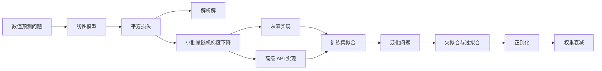
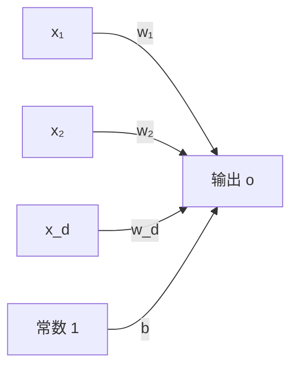
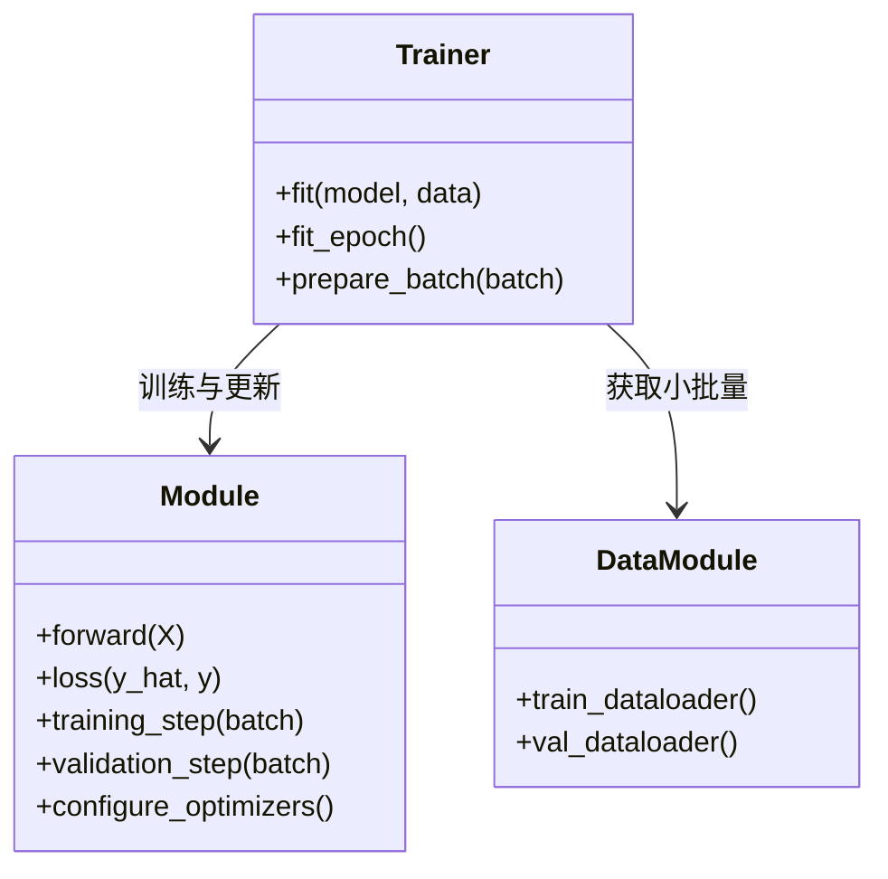
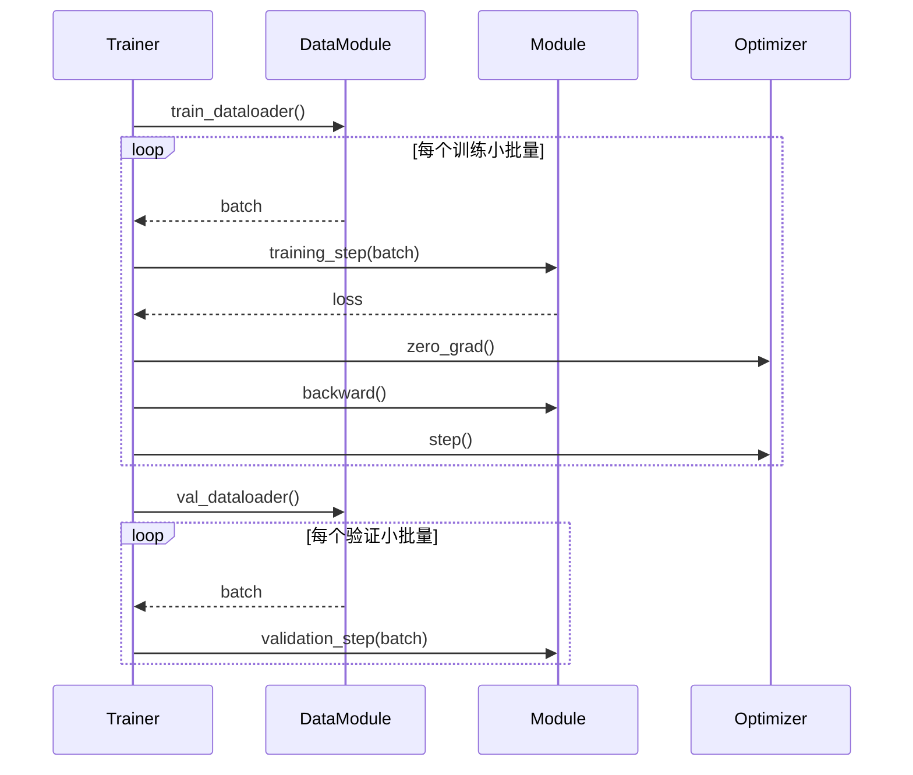
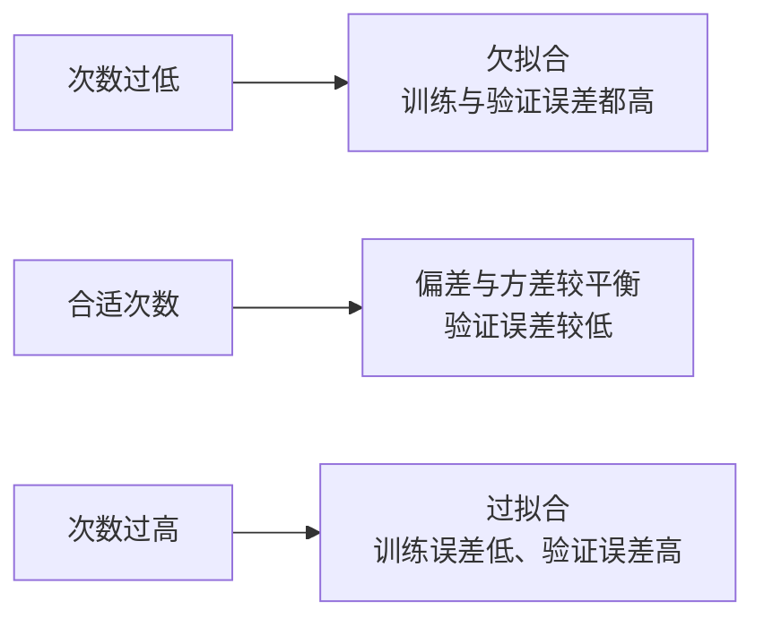
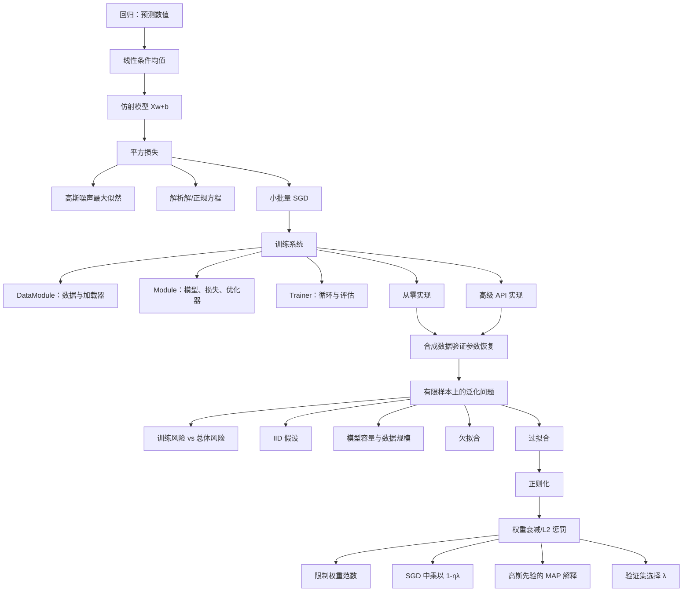

> 本章并不急着把网络做深，而是选择最简单的线性回归，把一个学习系统完整拆成数据、模型、损失、优化和评估，再分别用底层张量与高级 API 实现。后半章进一步指出：训练集拟合好并不是终点，真正困难的是泛化；权重衰减则是本书给出的第一种实用正则化方法。

## 1. 为什么先学习浅层线性网络

深度网络包含许多层和复杂结构，如果一开始就进入这些细节，很难分清训练失败究竟来自数据、模型、损失、梯度还是代码。本章先研究输入直接连接输出的浅层网络，目的有三层：

1. **隔离训练系统的基本组件**：参数怎样定义，数据怎样分批，损失怎样计算，梯度怎样更新。
2. **建立可复用的实现框架**：后续模型仍会使用相同的 `Module`、`DataModule` 和 `Trainer` 协作关系。
3. **掌握可靠基线**：线性回归和下一章的 softmax 回归是经典统计方法。复杂模型只有稳定地超过简单基线，复杂性才有理由。

本章的推理路线如下：



“线性神经网络”不是与“线性回归”不同的新算法。它是从神经网络的组件和连接方式重新观察线性模型，为后续增加隐藏层、非线性和复杂输出结构做准备。

## 2. 线性回归

### 2.1 回归问题与基本术语

回归用于预测数值，例如房价、住院时长、零售需求和股票收益。以房价预测为例，每次房屋销售是一条样本：

- 房屋面积、房龄是**特征**（feature/covariate）；
- 成交价格是**标签**（label/target）；
- 全部已知样本组成**训练集**；
- 样本数记为 $n$，特征数记为 $d$；
- 第 $i$ 个样本记为 $\mathbf x^{(i)}$，其第 $j$ 个特征记为 $x_j^{(i)}$。

上标枚举样本，下标枚举坐标。它们不是幂次，这一记号约定在后续推导中很重要。

线性回归有两个核心建模假设：

1. 条件均值 $E[Y\mid X=\mathbf x]$ 可由特征的加权和近似；
2. 真实观测允许围绕条件均值随机波动，经典设定把噪声建模为高斯分布。

第一条规定要学习的信号形状，第二条解释即使模型正确，标签也不必完全落在一条直线上。

### 2.2 模型：加权和与偏置

用面积和房龄预测价格：

$$
\widehat{\operatorname{price}}
=w_{\text{area}}\operatorname{area}
+w_{\text{age}}\operatorname{age}+b.
$$

权重表示相应特征每增加一个单位时预测的局部变化量，偏置 $b$ 表示所有特征为零时的基准输出。即使“面积为零的房屋”没有现实意义，偏置仍然必要，因为它允许拟合不经过原点的超平面。

严格地说，

$$
f(\mathbf x)=\mathbf w^\top\mathbf x+b
$$

是**仿射变换**，不是严格的线性变换；当 $b\ne0$ 时，$f(\mathbf0)\ne\mathbf0$。机器学习惯例常把它简称为线性模型。

对单个 $d$ 维样本：

$$
\widehat y
=w_1x_1+\cdots+w_dx_d+b
=\mathbf w^\top\mathbf x+b,
\qquad
\mathbf x,\mathbf w\in\mathbb R^d.
$$

对 $n$ 个样本，把样本按行排成设计矩阵：

$$
\mathbf X=
\begin{bmatrix}
(\mathbf x^{(1)})^\top\\
(\mathbf x^{(2)})^\top\\
\vdots\\
(\mathbf x^{(n)})^\top
\end{bmatrix}
\in\mathbb R^{n\times d}.
$$

整个数据集的预测为

$$
\widehat{\mathbf y}=\mathbf X\mathbf w+b\mathbf1_n
\in\mathbb R^n.
$$

代码中常写 `X @ w + b`，标量偏置通过广播加到每个样本。形状必须始终清楚：

| 对象 | 形状 | 含义 |
|---|---|---|
| $\mathbf X$ | $(n,d)$ | $n$ 个样本、每个 $d$ 个特征 |
| $\mathbf w$ | $(d,1)$ 或 $(d,)$ | 每个特征的权重 |
| $b$ | 标量或 $(1,)$ | 共享偏置 |
| $\widehat{\mathbf y}$ | $(n,1)$ 或 $(n,)$ | 每个样本一个预测 |

预测和标签必须采用兼容且语义相同的形状。若预测是 `(batch, 1)`、标签是 `(batch,)`，PyTorch 可能广播成 `(batch, batch)`，代码不报错却计算了完全错误的两两损失。

#### 把仿射模型写成线性模型

给每个样本追加常数特征 $1$：

$$
\widetilde{\mathbf x}=
\begin{bmatrix}\mathbf x\\1\end{bmatrix},
\qquad
\widetilde{\mathbf w}=
\begin{bmatrix}\mathbf w\\b\end{bmatrix}.
$$

于是

$$
\mathbf w^\top\mathbf x+b
=\widetilde{\mathbf w}^\top\widetilde{\mathbf x}.
$$

这使偏置可以和权重一起进入矩阵推导，但实现中通常仍把二者分开，因为偏置常采用不同初始化和正则化策略。

### 2.3 平方损失：怎样量化拟合质量

模型只规定怎样产生预测，还没有规定“哪组参数更好”。对第 $i$ 个样本，平方损失为

$$
\ell^{(i)}(\mathbf w,b)
=\frac12\left(\widehat y^{(i)}-y^{(i)}\right)^2
=\frac12\left(\mathbf w^\top\mathbf x^{(i)}+b-y^{(i)}\right)^2.
$$

它满足：

- 非负，预测正确时为 $0$；
- 正负误差不会抵消；
- 大误差被平方放大；
- 光滑可微，便于优化。

系数 $1/2$ 不改变最优参数，只是让导数中的 $2$ 抵消：

$$
\frac{\partial}{\partial\widehat y}
\frac12(\widehat y-y)^2=\widehat y-y.
$$

整个训练集的经验损失取样本平均：

$$
L(\mathbf w,b)
=\frac1n\sum_{i=1}^{n}\ell^{(i)}(\mathbf w,b).
$$

训练目标为

$$
(\mathbf w^{\ast},b^{\ast})
=\operatorname*{argmin}_{\mathbf w,b}L(\mathbf w,b).
$$

平均和求和拥有相同最优点，但梯度尺度相差 $n$ 倍，学习率不能不加调整地混用。平方损失对异常值敏感是双刃剑：它积极纠正大误差，也可能让少量错误标签支配训练。

### 2.4 梯度的逐步推导

记第 $i$ 个样本残差为

$$
r^{(i)}=\widehat y^{(i)}-y^{(i)}
=\mathbf w^\top\mathbf x^{(i)}+b-y^{(i)}.
$$

由链式法则：

$$
\nabla_{\mathbf w}\ell^{(i)}
=r^{(i)}\mathbf x^{(i)},
\qquad
\frac{\partial\ell^{(i)}}{\partial b}=r^{(i)}.
$$

直觉上，残差决定更新方向和总体大小，特征值决定每个权重对这次误差应承担多少责任。若 $x_j^{(i)}$ 很大，同样残差会对 $w_j$ 产生更大梯度，这也是特征尺度会影响优化速度的原因。

对全体样本，令

$$
\mathbf r=\mathbf X\mathbf w+b\mathbf1_n-\mathbf y,
$$

则

$$
\nabla_{\mathbf w}L=\frac1n\mathbf X^\top\mathbf r,
\qquad
\frac{\partial L}{\partial b}=\frac1n\mathbf1_n^\top\mathbf r.
$$

这正是训练代码中“前向预测—计算残差—反向传播”的数学内容。

### 2.5 解析解：正规方程怎样得到

线性回归的平方损失是少数可以直接求最优参数的学习问题。先用追加常数列的方式吸收偏置，简写为

$$
L(\mathbf w)=\frac12\|\mathbf y-\mathbf X\mathbf w\|_2^2.
$$

展开：

$$
\begin{aligned}
2L(\mathbf w)
&=(\mathbf y-\mathbf X\mathbf w)^\top
(\mathbf y-\mathbf X\mathbf w)\\
&=\mathbf y^\top\mathbf y
-2\mathbf w^\top\mathbf X^\top\mathbf y
+\mathbf w^\top\mathbf X^\top\mathbf X\mathbf w.
\end{aligned}
$$

对 $\mathbf w$ 求梯度：

$$
\nabla_{\mathbf w}L
=\mathbf X^\top\mathbf X\mathbf w-\mathbf X^\top\mathbf y.
$$

令梯度为零，得到**正规方程**：

$$
\mathbf X^\top\mathbf X\mathbf w
=\mathbf X^\top\mathbf y.
$$

若 $\mathbf X$ 列满秩，则 $\mathbf X^\top\mathbf X$ 可逆，唯一解为

$$
\mathbf w^{\ast}
=(\mathbf X^\top\mathbf X)^{-1}\mathbf X^\top\mathbf y.
$$

#### 几何解释

$\mathbf X\mathbf w^{\ast}$ 是 $\mathbf y$ 在 $\mathbf X$ 列空间上的正交投影。正规方程可重写为

$$
\mathbf X^\top(\mathbf y-\mathbf X\mathbf w^{\ast})=\mathbf0,
$$

说明最优残差与每一列特征都正交；沿任何模型可以表达的方向继续移动，都不能再降低平方距离。

#### 解析解的前提和局限

1. **列满秩**：若特征线性相关，解不唯一，普通逆不存在。
2. **计算代价**：形成 $\mathbf X^\top\mathbf X$ 需要遍历数据并占用 $d\times d$ 存储，求解通常约为 $O(d^3)$。
3. **数值稳定性**：显式计算逆矩阵并不是推荐实现；通常用 QR、SVD 或线性方程求解器。正规方程还会平方条件数。
4. **模型局限**：绝大多数深度模型的目标非线性、非凸且参数巨大，没有类似闭式解。

若不满秩，可用 Moore–Penrose 伪逆得到最小范数解，或加入岭正则化：

$$
\mathbf w_\lambda
=(\mathbf X^\top\mathbf X+\lambda\mathbf I)^{-1}
\mathbf X^\top\mathbf y.
$$

后者正是本章末尾权重衰减在线性回归中的解析形式。

### 2.6 小批量随机梯度下降

解析解不具普适性，因此本书更重视可扩展到神经网络的迭代优化。

#### 三种批量策略

| 方法 | 每次更新使用的数据 | 优点 | 局限 |
|---|---:|---|---|
| 批量梯度下降 | 全部 $n$ 个样本 | 梯度精确、稳定 | 每次更新昂贵，需完整遍历数据 |
| 随机梯度下降 | 1 个样本 | 更新频繁、内存小 | 梯度噪声大，硬件利用率差 |
| 小批量 SGD | $1<B<n$ | 兼顾统计效率和矩阵并行 | 批量大小需调节，仍有随机性 |

处理器做成块的矩阵运算，通常远比逐样本从内存搬运并启动小算子高效；但整批数据又可能放不进内存，且相邻样本信息冗余。小批量是硬件吞吐、内存和梯度噪声之间的折中。

原书建议把 $32$ 到 $256$、且通常为较大 $2$ 的幂的数作为起点，而不是普遍最优定律。可用批量大小取决于设备内存、并行规模、层类型、数据大小和优化器。

#### 更新公式

第 $t$ 次迭代随机选择小批量 $\mathcal B_t$，计算平均梯度：

$$
(\mathbf w,b)
\leftarrow
(\mathbf w,b)
-\frac{\eta}{|\mathcal B_t|}
\sum_{i\in\mathcal B_t}
\nabla_{(\mathbf w,b)}\ell^{(i)}.
$$

对线性模型和平方损失展开：

$$
\begin{aligned}
\mathbf w&\leftarrow\mathbf w
-\frac{\eta}{|\mathcal B_t|}
\sum_{i\in\mathcal B_t}
\mathbf x^{(i)}
(\mathbf w^\top\mathbf x^{(i)}+b-y^{(i)}),\\
b&\leftarrow b
-\frac{\eta}{|\mathcal B_t|}
\sum_{i\in\mathcal B_t}
(\mathbf w^\top\mathbf x^{(i)}+b-y^{(i)}).
\end{aligned}
$$

$\eta>0$ 是学习率。梯度已经对批量取平均时，代码中不应再次除以批量大小。若损失改为求和，梯度扩大约 $\lvert \mathcal B\rvert$ 倍，通常需要相应减小学习率。

#### 算法步骤

```text
随机初始化参数 w, b
重复多个 epoch：
    打乱训练样本
    对每个小批量 B：
        y_hat = X_B @ w + b
        loss = mean((y_hat - y_B)^2 / 2)
        清空旧梯度
        反向传播计算梯度
        在不记录梯度的上下文中更新参数
在独立验证数据上评估
```

**epoch** 表示大致完整遍历一次训练集，**iteration/step** 表示处理一个小批量并更新一次。若最后样本数不足一个完整批量，默认数据加载器通常仍返回较小的末批；设置 `drop_last=True` 才会丢弃它。

学习率和批量大小不是由梯度更新自动学习的模型参数，而是**超参数**。它们应依据验证集选择，不能用测试集反复调节。

#### 为什么结果不是精确、确定的最优解

- 有限步迭代通常只接近最优点；
- 随机初始化不同；
- 每轮小批量抽样顺序不同；
- 并行硬件和浮点归约也可能带来非确定性。

线性回归平方目标是凸二次函数，满秩时有唯一全局最优点；深度网络则通常存在大量鞍点、局部结构和等价参数。实际目标不是恢复唯一“真实参数”，而是找到预测准确的参数。

### 2.7 预测与“推断”术语

训练得到 $\widehat{\mathbf w},\widehat b$ 后，对新样本计算

$$
\widehat y
=\widehat{\mathbf w}^\top\mathbf x+\widehat b.
$$

深度学习工程常把部署阶段称为 inference，但统计学中的 inference 还包括由数据推断参数、区间和假设。原书因此尽量使用“预测”描述给新样本产生标签，避免跨学科歧义。

### 2.8 向量化为什么快

逐元素 Python 循环每次都要解释字节码、检查对象并启动小操作；向量化把一整块工作交给优化过的底层线性代数库，能利用 SIMD、缓存、线程和 GPU。

原书比较长度 $10\,000$ 的两个向量相加：

```python
# 慢：Python 控制每个坐标
for i in range(n):
    c[i] = a[i] + b[i]

# 快：底层一次处理整个数组
d = a + b
```

向量化通常带来数量级加速，还减少代码量和索引错误。它不是“数学上少算了”，而是改变计算的组织、内存访问和并行方式。极小张量上启动开销可能占主导，因此仍应实测而不是机械断言。

### 2.9 高斯噪声为什么导出平方损失

正态分布密度为

$$
p(z)=\frac{1}{\sqrt{2\pi\sigma^2}}
\exp\left[-\frac{(z-\mu)^2}{2\sigma^2}\right].
$$

改变均值 $\mu$ 会平移曲线，增大标准差 $\sigma$ 会使分布更宽、峰值更低，但总面积始终为 $1$。

假设线性关系带有独立同分布的加性高斯噪声：

$$
y^{(i)}=\mathbf w^\top\mathbf x^{(i)}+b+\epsilon^{(i)},
\qquad
\epsilon^{(i)}\overset{\mathrm{iid}}{\sim}\mathcal N(0,\sigma^2).
$$

因此单个标签的条件密度为

$$
p(y^{(i)}\mid\mathbf x^{(i)};\mathbf w,b)
=\frac{1}{\sqrt{2\pi\sigma^2}}
\exp\left[
-\frac{(y^{(i)}-\mathbf w^\top\mathbf x^{(i)}-b)^2}
{2\sigma^2}
\right].
$$

样本条件独立时，整个数据集的似然是乘积：

$$
p(\mathbf y\mid\mathbf X;\mathbf w,b)
=\prod_{i=1}^{n}
p(y^{(i)}\mid\mathbf x^{(i)};\mathbf w,b).
$$

最大化似然等价于最小化负对数似然。取对数把乘积变成和：

$$
\begin{aligned}
-\log p(\mathbf y\mid\mathbf X)
&=\sum_{i=1}^{n}
\left[
\frac12\log(2\pi\sigma^2)
+\frac{(y^{(i)}-\mathbf w^\top\mathbf x^{(i)}-b)^2}
{2\sigma^2}
\right].
\end{aligned}
$$

若 $\sigma$ 固定，第一项与 $\mathbf w,b$ 无关，第二项只是平方误差乘以正常数。因此：

> 在线性条件均值、独立同方差加性高斯噪声假设下，最小化平方误差等价于对 $\mathbf w,b$ 做最大似然估计。

这不是说所有回归噪声都服从高斯分布。若异常值多，Laplace 噪声对应绝对误差；计数数据更适合 Poisson 模型；正价格常对对数价格建模。损失函数隐含了数据生成假设。

### 2.10 线性回归作为单层神经网络

把每个特征看作输入节点，把一个数值预测看作输出节点，所有输入都直接连接到输出：

$$
o=\sum_{j=1}^{d}w_jx_j+b.
$$

这是一个单层、全连接神经网络。输入节点只是给定值，不算经过计算的层；网络只有一个计算输出节点，没有隐藏层和非线性。



生物神经元的树突接收输入，突触强度类似权重，胞体聚合信号，轴突传递输出。这种类比启发了人工神经元，但现代深度学习主要由数学、统计、计算机系统、语言学等共同推动。正如飞机不必通过精确复制鸟来飞行，人工网络也不是生物神经系统的忠实模拟。

### 2.11 线性回归原理小结

线性回归第一次把后续所有模型共有的组件放在一起：

- 参数化函数 $f_{\mathbf w,b}$；
- 可微目标 $L$；
- 解析解或小批量 SGD 优化；
- 新数据上的预测；
- 独立验证数据上的评估。

模型虽简单，训练系统的骨架已经完整。

## 3. 面向对象的实现设计

### 3.1 为什么此处先设计接口

若每一章都重新编写数据读取、训练循环、监控和验证，代码会淹没模型差异。原书借鉴 PyTorch Lightning 的思想，把职责分给三个核心对象：

- `Module`：模型、损失、训练步骤和优化器；
- `DataModule`：数据准备以及训练/验证加载器；
- `Trainer`：把模型与数据连接起来，管理 epoch、设备和循环。



这种分工使模型、优化器和数据源可以单独替换。它不是训练算法本身，而是降低实验代码耦合的组织方法。

### 3.2 `add_to_class`：为 Notebook 分段定义类

类定义通常很长，而教学 Notebook 希望代码和解释交替出现。`add_to_class` 装饰器使用 `setattr`，把后面定义的函数动态注册成已有类的方法：

```python
def add_to_class(Class):
    def wrapper(obj):
        setattr(Class, obj.__name__, obj)
    return wrapper
```

即使实例已经创建，后续给类增加方法后，该实例也能通过类查找获得新方法。这是 Python 动态对象模型的结果。

这种技巧适合教学展示，不一定适合大型生产代码：类行为分散在文件各处，会降低静态分析、导航和维护性。真实项目通常把完整类定义放在模块中，或通过继承和组合扩展。

### 3.3 `HyperParameters` 与实验配置

`save_hyperparameters` 自动把构造函数参数保存为实例属性，减少

```python
self.lr = lr
self.batch_size = batch_size
```

之类的样板代码，并便于记录实验配置。`ignore` 可以排除不希望保存的参数。

原章暂时隐藏完整实现，重点是理解契约：调用后才能通过 `self.a`、`self.b` 等属性访问参数。自动捕获局部变量虽方便，也可能让属性来源不直观；生产实验还需要把配置序列化、版本化，并避免保存不可序列化或敏感对象。

### 3.4 `ProgressBoard`：训练过程不是黑箱

`ProgressBoard.draw(x,y,label,every_n)` 动态绘制训练和验证指标。`every_n` 把相邻 $n$ 个点平均后显示，减少图形更新开销和短期噪声。

平滑只改变可视化，不改变训练，也可能掩盖尖峰。诊断数值不稳定时应保留原始日志；大型项目通常使用 TensorBoard、Weights & Biases 等更完整工具。

### 3.5 `Module`：模型应回答哪些问题

`Module` 继承 PyTorch `nn.Module`，定义以下职责：

1. `forward(X)`：怎样由输入得到输出；
2. `loss(y_hat, y)`：怎样量化预测质量；
3. `training_step(batch)`：一个训练批怎样产生损失并记录指标；
4. `validation_step(batch)`：验证批怎样评估；
5. `configure_optimizers()`：用什么算法更新哪些参数。

调用 `model(X)` 会经由 `nn.Module.__call__` 间接执行 `forward`。不要日常直接调用 `model.forward(X)`，因为 `__call__` 还处理钩子、自动混合精度等框架机制。

默认 `training_step` 把批量最后一个元素当标签，前面的元素传给模型：

$$
\text{batch}=(X_1,\ldots,X_k,y)
\longrightarrow
\ell(f(X_1,\ldots,X_k),y).
$$

这使单输入、多输入模型共用一套训练接口。

### 3.6 `DataModule`：隔离数据来源

`DataModule` 负责下载、预处理和提供加载器：

- `train_dataloader()` 返回训练小批量，通常打乱；
- `val_dataloader()` 返回验证小批量，通常保持稳定顺序；
- 每个小批量最终交给 `Module.training_step` 或 `validation_step`。

模型不需要知道数据来自内存张量、磁盘文件、网络流还是在线生成器。这个抽象让同一算法能复用于不同数据源，也让数据增强和后处理可以组合成流水线。

### 3.7 `Trainer`：把组件组织成生命周期

`Trainer.fit(model,data)` 的职责是：

1. 获取训练和验证加载器；
2. 把 `trainer` 反向关联到模型，便于记录进度；
3. 从模型取得优化器；
4. 循环多个 epoch，调用 `fit_epoch`。

一次典型 epoch 的交互如下：



本章的基类暂不支持 GPU，后续会逐步增加设备放置、梯度裁剪、并行和更复杂优化器。抽象的价值在于这些能力主要进入 `Trainer`，不必重写每个模型。

### 3.8 模块化的边界

好的抽象应让常见路径简洁，同时保留覆盖点。过度封装会隐藏梯度何时清零、模型处于训练还是验证模式、张量在哪个设备等关键事实。因此本章先展示接口，再从零实现循环，是为了既获得复用，又不失去对底层行为的理解。

## 4. 合成回归数据

### 4.1 为什么学习自己生成的数据

合成数据本身没有未知规律，但它提供真实数据没有的**已知答案**。若生成参数预先已知，就能区分：

- 算法是否理论上能恢复规律；
- 实现是否存在形状、梯度或更新错误；
- 参数误差来自噪声、有限样本还是代码缺陷。

它相当于机器学习流水线的受控单元测试，而不是现实性能证明。

### 4.2 数据生成过程

原书取

$$
\mathbf w_{\text{true}}=
\begin{bmatrix}2\\-3.4\end{bmatrix},
\qquad
b_{\text{true}}=4.2,
$$

生成 $1000$ 个训练样本和 $1000$ 个验证样本，特征独立来自标准正态分布：

$$
\mathbf X\in\mathbb R^{2000\times2},
\qquad
X_{ij}\sim\mathcal N(0,1).
$$

标签为

$$
\mathbf y
=\mathbf X\mathbf w_{\text{true}}
+b_{\text{true}}\mathbf1
+\boldsymbol\epsilon,
\qquad
\epsilon_i\overset{\mathrm{iid}}{\sim}\mathcal N(0,0.01^2).
$$

每个特征批形状为 `(batch_size, 2)`，标签批形状为 `(batch_size, 1)`。较小噪声让参数容易恢复，但又保留“观测不会完全落在直线”的现实特征。

### 4.3 手写小批量生成器

训练阶段先构造索引并随机打乱，验证阶段使用固定顺序；随后每隔 `batch_size` 切一段索引：

```text
indices = 训练索引或验证索引
若训练：shuffle(indices)
for start in range(0, len(indices), batch_size):
    batch_indices = indices[start:start + batch_size]
    yield X[batch_indices], y[batch_indices]
```

随机打乱使批量梯度更接近总体梯度，避免数据按标签、时间或类别排序时产生系统性偏差。验证不打乱并不影响平均损失，但固定顺序便于复现和定位样本。

若样本数不能整除批量大小，切片自然产生较小末批。例如 $1000/32=31$ 个完整批加一个含 $8$ 个样本的批，共 $32$ 批。只有算法依赖固定批量形状时才考虑丢弃末批。

### 4.4 使用框架数据加载器

PyTorch 的 `TensorDataset` 把多个张量按第一轴配对，`DataLoader` 负责批处理与打乱：

```python
dataset = torch.utils.data.TensorDataset(X, y)
loader = torch.utils.data.DataLoader(
    dataset,
    batch_size=32,
    shuffle=True,
)
```

框架实现通常更高效，并支持多进程加载、固定内存、磁盘文件、流式数据和即时变换。`len(loader)` 返回批次数，不是样本数：

$$
\operatorname{len}(\text{loader})
=\left\lceil\frac{n}{B}\right\rceil
$$

（当 `drop_last=False`）。

### 4.5 大数据与可重复生成

手写例子把全部数据放在内存并做随机索引，大规模场景可能不可行。可选方案包括：

- 分片存储，先打乱分片顺序，再在分片内缓冲打乱；
- 使用可迭代数据集在线读取；
- 根据样本索引和固定种子确定性生成数据，不保存全部样本；
- 用伪随机置换避免保存完整排列。

“每次迭代生成新数据”和“每次得到相同数据”取决于随机数状态管理。固定全局种子但连续调用生成器，通常得到可复现的序列而非每次相同批；若需要同一索引永远生成同一样本，应从索引派生局部随机种子。

## 5. 从零实现线性回归

### 5.1 为什么已经有框架还要从零实现

高级 API 可以自动创建层、损失和优化器，却容易让初学者只会拼接口。从零实现只依赖张量和自动微分，能显式看见：

- 参数是什么；
- 前向公式如何对应代码；
- 损失怎样归约；
- 梯度何时产生、清空和使用；
- 参数更新为何不能进入计算图。

以后自定义新层和新目标时，这些知识比记住某个 API 更重要。

### 5.2 参数初始化

原书初始化

$$
w_j\sim\mathcal N(0,0.01^2),
\qquad b=0.
$$

```python
w = torch.normal(0, 0.01, size=(num_inputs, 1), requires_grad=True)
b = torch.zeros(1, requires_grad=True)
```

对单输出线性回归，全部权重初始化为零仍可训练，因为不同特征的梯度通常不同；深层网络中同层神经元全零初始化会造成对称性，多个单元接收完全相同梯度而无法分化。

初始化方差过大时，初始预测和平方损失可能巨大，梯度也随残差放大，固定学习率可能使参数发散或产生非有限值。小随机值让初始计算处于稳定尺度。

若用自定义普通张量作为参数，必须显式交给自定义优化器；只有包装成 `nn.Parameter` 并挂到 `nn.Module` 上，才会自动出现在 `model.parameters()` 中。

### 5.3 前向模型

```python
def forward(X, w, b):
    return X @ w + b
```

若 `X` 为 $(B,d)$，`w` 为 $(d,1)$，则 `X @ w` 为 $(B,1)$；`b` 广播后仍为 $(B,1)$。这就是批量形式

$$
\widehat{\mathbf y}_{\mathcal B}
=\mathbf X_{\mathcal B}\mathbf w+b\mathbf1_B.
$$

### 5.4 损失函数与形状安全

```python
def squared_loss(y_hat, y):
    y = y.reshape_as(y_hat)
    return ((y_hat - y) ** 2 / 2).mean()
```

先把标签变成预测的形状，是为了避免意外广播。返回批量平均标量后，`loss.backward()` 能直接启动反向传播，而且学习率不随批量大小线性变化。

原章的合成标签本来就是 `(B,1)`，因此不一定需要重塑；通用实现仍应明确检查形状，而不是依赖碰巧一致。

### 5.5 手写 SGD

```python
class SGD:
    def __init__(self, params, lr):
        self.params = list(params)
        self.lr = lr

    def zero_grad(self):
        for param in self.params:
            if param.grad is not None:
                param.grad.zero_()

    @torch.no_grad()
    def step(self):
        for param in self.params:
            param -= self.lr * param.grad
```

关键点：

1. PyTorch 默认累加梯度，因此每次反向前要清零；
2. 更新参数不属于模型前向函数，必须在 `torch.no_grad()` 下执行；
3. 不要用 `param = param - ...` 仅重绑定循环局部变量，应原地修改参数值；
4. 损失已经取平均，不再除以批量大小。

清零可放在前向之前或损失算出之后，只要在本次 `backward()` 之前完成且不会误删需要累加的梯度。惯例是 `zero_grad → forward → loss → backward → step`，生命周期最清楚。

### 5.6 训练和验证循环

```python
for epoch in range(max_epochs):
    model.train()
    for X, y in train_loader:
        optimizer.zero_grad()
        loss = model.loss(model(X), y)
        loss.backward()
        optimizer.step()

    model.eval()
    with torch.no_grad():
        for X, y in val_loader:
            val_loss = model.loss(model(X), y)
```

`model.train()` 和 `model.eval()` 不表示“执行训练”或“执行预测”，而是切换 dropout、批量归一化等层的行为；线性层本身在两种模式下相同。`torch.no_grad()` 则真正关闭梯度记录，验证时可减少内存和计算。

原书在训练阶段还预留梯度裁剪接口，后续用于限制梯度范数。当前线性回归一般不需要它。

### 5.7 恢复已知参数与可识别性

用学习率 $0.03$ 训练 $3$ 个 epoch 后，估计值应接近

$$
\mathbf w_{\text{true}}=[2,-3.4]^\top,
\qquad b_{\text{true}}=4.2.
$$

但“预测准确”和“恢复真实参数”不是同义词。若特征线性相关，例如 $x_2=2x_1$，多组权重都能产生相同预测，参数不可唯一识别；SGD 仍可能找到低损失解。深度网络中的缩放、置换等对称性让非唯一性更普遍。

机器学习通常首先关心新样本预测，而不是某个参数是否等于数据生成参数。只有因果解释、科学测量等场景才特别依赖参数可识别性。

### 5.8 学习率、异常值和稳健损失

- 学习率太小：损失下降缓慢，有限 epoch 下欠优化；
- 学习率太大：跨过最优点振荡甚至发散；
- 增加 epoch 只能缓解欠优化，不能修复错误模型、过拟合或过大学习率。

平方损失梯度等于残差，异常标签 $y=10000$ 会产生巨大梯度。绝对误差的梯度幅值几乎恒定，更稳健但在零点不可微。Huber 损失结合二者：小残差用二次项保持平滑，大残差用线性项限制梯度。

一种常见定义为

$$
\ell_\delta(r)=
\begin{cases}
\frac12r^2,&|r|\le\delta,\\
\delta\left(|r|-\frac12\delta\right),&|r|>\delta.
\end{cases}
$$

它不能自动识别所有坏数据，阈值 $\delta$ 仍需依据噪声尺度选择。

## 6. 线性回归的简洁实现

### 6.1 高级 API 自动化了什么

从零实现证明了原理；日常工程应优先使用经过优化和测试的标准组件：

- `torch.utils.data`：数据集和加载器；
- `torch.nn`：层、参数注册和损失；
- `torch.optim`：SGD 等优化器；
- 自动微分：梯度计算。

高级 API 减少的是样板代码，不改变数学模型和训练生命周期。

### 6.2 `Linear` 与 `LazyLinear`

已知输入维数时：

```python
net = nn.Linear(in_features=2, out_features=1)
```

它计算

$$
\mathbf Y=\mathbf X\mathbf W^\top+\mathbf b,
$$

其中 PyTorch 权重存储形状为 `(out_features, in_features)`，因此单输出层权重是 `(1,2)`，与手写列向量 `(2,1)` 互为转置。

`nn.LazyLinear(1)` 只指定输出维数，在第一次前向时根据输入末轴推断 `in_features`。它能减少复杂网络中的形状计算，但参数在首次前向前尚未实体化；初始化、保存和某些工具调用要注意时机。形状简单时显式 `nn.Linear(2,1)` 更透明。

参数初始化可在无梯度环境中完成：

```python
with torch.no_grad():
    net.weight.normal_(0, 0.01)
    net.bias.zero_()
```

以下划线结尾的方法通常表示原地操作。

### 6.3 内置均方误差

```python
loss_fn = nn.MSELoss(reduction="mean")
```

PyTorch `MSELoss` 默认计算

$$
\frac1N\sum_i(\widehat y_i-y_i)^2,
$$

没有手写版本中的 $1/2$。最优参数相同，但梯度大两倍，因此同一个数值学习率对应的更新大小不同。比较实现时不能只看函数名称，要检查缩放和 `reduction`。

### 6.4 内置优化器

```python
optimizer = torch.optim.SGD(net.parameters(), lr=0.03)
```

`net.parameters()` 递归返回已注册的 `nn.Parameter`。标准训练顺序为

```python
optimizer.zero_grad()
y_hat = net(X)
loss = loss_fn(y_hat, y)
loss.backward()
optimizer.step()
```

训练循环和从零实现相同，只有组件内部被库接管。理解底层后使用标准实现，既避免重复造轮子，也保留自定义新组件的能力。

### 6.5 简洁不等于无需检查

即使使用内置层，仍要核对：

- 输入末轴是否真是特征轴；
- 标签和预测形状是否一致；
- 损失是求和还是平均；
- 参数是否已注册并交给优化器；
- 模型模式和梯度上下文是否正确；
- 学习率与损失缩放是否匹配。

框架保证组件实现经过测试，不保证用户组合后的任务定义正确。

## 7. 泛化

### 7.1 从记忆训练题到发现规律

原书用两名学生类比：Ellie 完美记住往年试题，遇到原题可得 $100\%$，遇到新题可能完全失败；Irene 记忆差但能归纳模式，在旧题和新题上都保持约 $90\%$。

机器学习需要预测明天的价格和未见患者，而不是复述训练样本。**泛化**研究由有限观测得到的模型，何时能在同一总体的新样本上继续有效。这也是统计归纳的核心问题。

即使有百万图像，相对于所有可能的百万像素图像空间仍微不足道。有限样本永远留下“模型只是记忆偶然细节”的风险。

### 7.2 IID 假设

标准监督学习通常假设训练和测试样本：

1. 相互独立（independent）；
2. 来自相同联合分布（identically distributed）。

即

$$
(\mathbf x^{(i)},y^{(i)})
\overset{\mathrm{iid}}{\sim}P(X,Y),
$$

测试样本也来自同一个 $P$。没有任何连接训练分布 $P$ 与部署分布 $Q$ 的假设，就无法从 $P$ 上的表现推断 $Q$ 上的表现。

IID 很强，时间序列、同一患者的重复记录、社交网络节点和部署后的反馈数据经常违反独立性或同分布。此时不是简单“多做验证”就够了，而要显式建模依赖或分布偏移。

### 7.3 训练误差与泛化误差

固定模型 $f$ 的经验训练误差为

$$
R_{\mathrm{emp}}(f)
=\frac1n\sum_{i=1}^{n}
\ell(\mathbf x^{(i)},y^{(i)},f(\mathbf x^{(i)})).
$$

它是有限训练样本上的统计量。真实泛化误差是总体期望：

$$
R(f)
=E_{(\mathbf x,y)\sim P}
[\ell(\mathbf x,y,f(\mathbf x))].
$$

也可写为

$$
R(f)=\iint
\ell(\mathbf x,y,f(\mathbf x))
p(\mathbf x,y)\,d\mathbf x\,dy.
$$

真实分布未知，也不能取得无限样本，所以 $R(f)$ 无法精确计算。独立测试集的平均损失只是它的估计。

为什么训练误差通常过于乐观？模型 $\widehat f=A(\mathcal D_{\text{train}})$ 本身就是根据训练集选择的；算法专门寻找了在这批数据上误差小的函数。评估固定模型的独立测试集则没有参与选择，因此更接近无偏的总体风险估计。

常把

$$
R(f)-R_{\mathrm{emp}}(f)
$$

称为泛化间隙；也有文献采用相反符号。重要的是明确约定。在常见过拟合情形中，训练误差较小，以上定义为正。

### 7.4 模型复杂度为何影响泛化

若模型族能为任意训练输入拟合任意随机标签，那么训练误差为零并不能说明发现了规律。一个能解释任何观测的假设没有排除任何可能性，因而从训练拟合本身得不到泛化保证；原书把这种思想与 Popper 的可证伪性联系起来。

模型复杂度不只等于参数个数，还可能取决于：

- 参数允许取值的范围或范数；
- 网络结构和共享方式；
- 优化算法的隐式偏好；
- 输入表示与数据增强；
- 函数变化的平滑程度。

核方法可在无限维空间工作，却通过范数控制有效复杂度；深度网络参数极多，仍可能比小网络泛化更好。因此“参数越多必然越过拟合”不是普遍定律。

可以确定的是：对一个足以拟合任意标签的模型，**低训练误差既不能证明泛化好，也不能证明泛化差**。必须依靠独立留出数据和更强假设评估。

### 7.5 欠拟合与过拟合

| 现象 | 训练误差 | 验证误差 | 典型原因 | 常见方向 |
|---|---:|---:|---|---|
| 欠拟合 | 高 | 高且与训练接近 | 模型太简单、特征不足、优化不充分 | 增加容量、改进特征、训练更充分 |
| 合理拟合 | 低 | 低且差距可接受 | 信号被学习且约束合适 | 继续验证稳定性 |
| 过拟合 | 很低 | 明显更高 | 模型相对数据过强、训练过久或数据偏差 | 更多数据、正则化、降容量 |

训练和验证都高且接近，并不总是模型容量不足，也可能是数据噪声、错误目标或优化失败。过拟合也不是单看“差距大”决定的：最终目标是降低验证/总体误差。一个模型即使训练—验证差距较大，只要验证误差最低，仍可能是最佳预测模型。

### 7.6 多项式曲线拟合

单变量 $d$ 次多项式为

$$
\widehat y=\sum_{j=0}^{d}w_jx^j.
$$

把

$$
\phi(x)=[1,x,x^2,\ldots,x^d]^\top
$$

看作新特征后，这仍是线性回归：模型对参数 $\mathbf w$ 是线性的，虽然对原始输入 $x$ 是非线性的。

固定训练数据时，更高次模型包含低次模型作为特例，因此最优训练误差只会下降或不变。若 $n$ 个输入值互异，至多 $n-1$ 次的插值多项式就可精确穿过任意 $n$ 个标签；如此精确的训练拟合可能在样本之间剧烈振荡。



次数是模型容量的显式旋钮；权重衰减稍后提供连续而细粒度的容量控制。

### 7.7 数据规模与学习曲线

固定任务、分布和合理训练流程时，训练样本越少，越容易把偶然噪声当成规律；增加独立、同分布且高质量的数据，通常降低泛化误差，并允许使用更复杂模型。

“更多数据几乎总有帮助”有前提：错误标签、重复样本、分布偏移或泄漏数据可能伤害模型。它不是“任何来源的数据越多越好”。

可绘制学习曲线诊断是否值得继续收集数据：逐步用 $10\%,20\%,\ldots$ 的训练数据拟合，记录训练和验证误差。

- 验证误差随数据量持续明显下降：更多数据可能有效；
- 两条曲线都高且已汇合：优先改善模型、特征或优化；
- 训练很低、验证较高且差距随数据缩小：更多数据或正则化可能有效。

### 7.8 模型选择与三路数据划分

模型选择不仅选择网络结构，也包括特征、预处理、损失、学习率、训练轮数和正则强度。正确职责为：

- **训练集**：拟合模型参数；
- **验证集**：选择超参数和模型；
- **测试集**：所有选择结束后，估计最终方案的泛化表现。

若反复根据测试结果修改模型，测试集就在实验者层面参与了训练，最终数字会过度乐观。即使每次都没有对测试样本反向传播，也可能“对测试集过拟合”。

现实基准常被整个研究社区反复使用，长期也会形成基准过拟合。原书坦诚指出，书中多数所谓测试表现实际上更接近验证表现，并不存在每次实验后永久封存的真正测试集。

### 7.9 $K$ 折交叉验证

数据少到无法稳定留出验证集时，把训练数据分成 $K$ 个互不重叠子集。执行 $K$ 轮：每轮用 $K-1$ 折训练，用剩余一折验证，最后平均指标。

$$
\widehat R_{\mathrm{CV}}
=\frac1K\sum_{k=1}^{K}R_k.
$$

优点是每个样本都恰好用于一次验证，多数样本又用于训练；代价是每组超参数都要训练 $K$ 次。估计还可能相对最终“用全部训练数据重训”的模型有偏，因为每折模型只见到 $(K-1)/K$ 的数据。

时间序列或群组数据不能随意随机分折，否则未来信息或同一主体会泄漏到验证折；应使用时间顺序划分或按组划分。

### 7.10 泛化小结

本节给出的经验规则是：

1. 模型选择使用验证集或交叉验证；
2. 更复杂模型通常需要更多数据或更强约束；
3. 参数数量和参数取值范围都影响复杂度；
4. 同分布高质量数据增加通常改善泛化；
5. 所有这些结论都依赖 IID 或其他连接训练与部署分布的假设。

## 8. 权重衰减

### 8.1 为什么还需要比“删特征”更细的控制

限制多项式次数或直接删除特征可以降低容量，但粒度很粗。对 $k$ 个变量，恰好 $d$ 次单项式的数量为

$$
\binom{k-1+d}{k-1}.
$$

变量多时，次数从 $2$ 增到 $3$ 就可能让特征数暴涨。我们需要一种不删除整类特征、而是连续控制函数复杂度的方法。

权重衰减通过限制参数大小实现这种细粒度控制。在深度学习外，它常被称为 $\ell_2$ 正则化；在线性回归中对应岭回归。

### 8.2 正则化目标

原始经验损失为

$$
L(\mathbf w,b)
=\frac1n\sum_{i=1}^{n}
\frac12(\mathbf w^\top\mathbf x^{(i)}+b-y^{(i)})^2.
$$

加入权重平方范数惩罚：

$$
J(\mathbf w,b)
=L(\mathbf w,b)
+\frac\lambda2\|\mathbf w\|_2^2,
\qquad \lambda\ge0.
$$

$\lambda$ 控制拟合与简单性的权衡：

- $\lambda=0$：退化为普通经验风险最小化；
- 小 $\lambda$：轻微抑制大权重；
- 大 $\lambda$：强迫模型靠近零函数，过大则欠拟合。

系数 $1/2$ 让惩罚梯度简化：

$$
\nabla_{\mathbf w}
\frac\lambda2\|\mathbf w\|_2^2
=\lambda\mathbf w.
$$

使用平方范数而不是范数本身还去掉了平方根，在零点可微且计算简单。

通常不惩罚偏置，因为偏置只平移整体输出，不控制对输入变化的敏感度；是否正则化偏置仍是实现选择。批量归一化参数等也常使用不同策略。

### 8.3 为什么小权重可表示较简单函数

对线性函数

$$
f(\mathbf x)=\mathbf w^\top\mathbf x,
$$

输入扰动 $\Delta\mathbf x$ 引起

$$
|f(\mathbf x+\Delta\mathbf x)-f(\mathbf x)|
=|\mathbf w^\top\Delta\mathbf x|
\le\|\mathbf w\|_2\|\Delta\mathbf x\|_2.
$$

较小的 $\|\mathbf w\|_2$ 限制了模型对输入扰动的最大敏感度，使函数更平滑、更不容易利用训练数据中的微小偶然差异。

这个解释依赖特征尺度。若把某特征从米改成毫米，相同函数的权重缩小 $1000$ 倍，惩罚也改变。因此使用权重范数前通常应标准化特征，否则正则化强度在不同坐标上不公平。

### 8.4 从 $\ell_2$ 惩罚到“衰减”更新

正则化梯度为

$$
\nabla_{\mathbf w}J
=\nabla_{\mathbf w}L+\lambda\mathbf w.
$$

梯度下降更新：

$$
\begin{aligned}
\mathbf w
&\leftarrow\mathbf w-
\eta(\nabla_{\mathbf w}L+\lambda\mathbf w)\\
&=(1-\eta\lambda)\mathbf w
-\eta\nabla_{\mathbf w}L.
\end{aligned}
$$

对小批量展开为

$$
\mathbf w\leftarrow
(1-\eta\lambda)\mathbf w
-\frac\eta{|\mathcal B|}
\sum_{i\in\mathcal B}
\mathbf x^{(i)}
(\mathbf w^\top\mathbf x^{(i)}+b-y^{(i)}).
$$

第一项每步把旧权重乘以小于 $1$ 的因子，因此称为**权重衰减**。若只有惩罚而没有数据梯度，经过 $t$ 步：

$$
\mathbf w_t=(1-\eta\lambda)^t\mathbf w_0.
$$

通常要求 $0<\eta\lambda<1$ 才呈平滑单调收缩；过大时可能跨过零点振荡。

### 8.5 $\ell_2$ 与 $\ell_1$ 正则化

| 特性 | $\ell_2$：$\sum_jw_j^2$ | $\ell_1$：$\sum_j\lvert w_j\rvert$ |
|---|---|---|
| 大权重惩罚 | 二次增长，特别强 | 线性增长 |
| 零点可微性 | 可微 | 不可微，可用次梯度 |
| 典型结果 | 多数权重变小但非零 | 许多权重精确变为零 |
| 经典名称 | 岭回归 | Lasso |
| 常见用途 | 稳定、分散依赖 | 稀疏性与特征选择 |

$\ell_2$ 倾向把影响分散在相关特征上，降低对单个测量误差的敏感度；$\ell_1$ 倾向只保留少数特征，可减少采集、存储和传输成本。没有一种范数对所有任务都更好。

### 8.6 贝叶斯解释

高斯似然下，给权重施加零均值各向同性高斯先验：

$$
p(\mathbf w)
\propto
\exp\left(-\frac\lambda2\|\mathbf w\|_2^2\right).
$$

最大后验估计满足

$$
\begin{aligned}
\mathbf w_{\mathrm{MAP}}
&=\operatorname*{argmax}_{\mathbf w}
p(\mathbf y\mid\mathbf X,\mathbf w)p(\mathbf w)\\
&=\operatorname*{argmin}_{\mathbf w}
\left[-\log p(\mathbf y\mid\mathbf X,\mathbf w)
-\log p(\mathbf w)\right].
\end{aligned}
$$

负对数似然给出平方预测损失，负对数先验给出 $\ell_2$ 惩罚。因此权重衰减可理解为“在数据证据之外，先验偏好较小权重”。若先验是 Laplace 分布，则导出 $\ell_1$ 惩罚。

正则化不是完整贝叶斯推断；MAP 只取后验众数，没有保留参数后验的不确定性。

### 8.7 高维小样本实验

原书构造

$$
y=0.05+\sum_{j=1}^{d}0.01x_j+\epsilon,
\qquad
\epsilon\sim\mathcal N(0,0.01^2),
$$

并设置：

- 特征数 $d=200$；
- 训练样本仅 $20$；
- 验证样本 $100$；
- 批量大小 $5$。

训练集只有 $20$ 条方程，却有 $200$ 个权重和一个偏置，问题严重欠定。模型可以用大量方向拟合训练噪声。$\lambda=0$ 时训练误差下降很低而验证误差保持高；使用较强权重衰减（原书示例为 $\lambda=3$）后：

- 权重范数变小；
- 训练误差可能上升；
- 验证误差反而下降。

这正是正则化预期行为：主动放弃一部分训练集拟合，换取更低的总体误差。不能把“训练损失上升”单独判为模型变差。

### 8.8 从零实现

惩罚函数：

```python
def l2_penalty(w):
    return (w ** 2).sum() / 2
```

总损失：

```python
prediction_loss = ((y_hat - y) ** 2 / 2).mean()
loss = prediction_loss + lambd * l2_penalty(w)
```

这里正则项没有再对批量取平均，因为它只依赖当前模型参数，不是逐样本损失。若训练循环对不同数量的批次累加目标而不是每步独立更新，还需统一缩放约定。

### 8.9 高级 API 与参数组

PyTorch 优化器可以对不同参数组设置不同策略：

```python
optimizer = torch.optim.SGD(
    [
        {"params": net.weight, "weight_decay": wd},
        {"params": net.bias, "weight_decay": 0.0},
    ],
    lr=lr,
)
```

这样只衰减权重，不衰减偏置。框架实现避免在每批前向中显式构造惩罚标量，并让参数策略集中在优化器配置中。

对普通 SGD，损失中的 $\ell_2$ 惩罚与上述权重衰减更新等价；对带自适应缩放的优化器，两者通常不等价，因为“把 $\lambda\mathbf w$ 加入梯度后再缩放”不同于“独立按比例缩小参数”。AdamW 的 `W` 就强调解耦权重衰减。

### 8.10 如何选择 $\lambda$

$\lambda$ 是超参数，应在对数尺度上搜索，例如

$$
0,10^{-5},10^{-4},\ldots,10^2,
$$

用验证误差选择，而不是挑训练误差最低者。选出的值只是给定数据划分、搜索集合和随机性的估计最优值，不是自然界唯一真值。必要时重复随机种子或使用交叉验证评估稳定性。

### 8.11 权重衰减的适用范围和局限

权重衰减简单、廉价且广泛适用，但不是过拟合的万能解法：

- 不能修复标签错误和训练—部署分布偏移；
- 权重大小受输入尺度和参数化方式影响；
- 某些层的尺度对称性会削弱“权重小即函数简单”的解释；
- 过强衰减导致欠拟合；
- 深度网络常还需数据增强、早停、dropout、结构先验等方法。

它是控制有效容量的一种偏好，不是保证泛化的定理。

## 9. 可运行的完整实验

下面的 PyTorch 代码不依赖 `d2l` 包，完成两个实验：先从零恢复二维线性模型参数，再在 $20$ 样本、$200$ 特征的欠定问题中比较无正则化和权重衰减。代码中的断言把本章公式变成可执行检查。

```python
import torch
from torch import nn
from torch.utils.data import DataLoader, TensorDataset

torch.manual_seed(42)

def make_linear_data(w, b, num_examples, noise_std=0.01):
    """Generate y = Xw + b + Gaussian noise."""
    X = torch.randn(num_examples, w.numel())
    noise = torch.randn(num_examples, 1) * noise_std
    y = X @ w.reshape(-1, 1) + b + noise
    return X, y

def train_from_scratch():
    true_w = torch.tensor([2.0, -3.4])
    true_b = 4.2
    X, y = make_linear_data(true_w, true_b, 2000)
    loader = DataLoader(TensorDataset(X, y), batch_size=32, shuffle=True)

    w = torch.randn(2, 1) * 0.01
    w.requires_grad_()
    b = torch.zeros(1, requires_grad=True)
    learning_rate = 0.03

    for _ in range(5):
        for X_batch, y_batch in loader:
            prediction = X_batch @ w + b
            loss = ((prediction - y_batch) ** 2 / 2).mean()

            if w.grad is not None:
                w.grad.zero_()
                b.grad.zero_()
            loss.backward()

            with torch.no_grad():
                w -= learning_rate * w.grad
                b -= learning_rate * b.grad

    weight_error = torch.linalg.vector_norm(w.detach().flatten() - true_w)
    bias_error = abs(b.item() - true_b)
    assert weight_error < 0.02
    assert bias_error < 0.02
    return w.detach().flatten(), b.item(), weight_error.item(), bias_error

def train_high_dimensional(weight_decay):
    num_inputs = 200
    true_w = torch.full((num_inputs,), 0.01)
    true_b = 0.05
    X, y = make_linear_data(true_w, true_b, 120)
    train_X, val_X = X[:20], X[20:]
    train_y, val_y = y[:20], y[20:]

    loader = DataLoader(
        TensorDataset(train_X, train_y),
        batch_size=5,
        shuffle=True,
    )
    net = nn.Linear(num_inputs, 1)
    with torch.no_grad():
        net.weight.normal_(0, 0.01)
        net.bias.zero_()

    optimizer = torch.optim.SGD(
        [
            {"params": net.weight, "weight_decay": weight_decay},
            {"params": net.bias, "weight_decay": 0.0},
        ],
        lr=0.01,
    )
    loss_fn = nn.MSELoss()

    for _ in range(100):
        net.train()
        for X_batch, y_batch in loader:
            optimizer.zero_grad()
            loss = loss_fn(net(X_batch), y_batch)
            loss.backward()
            optimizer.step()

    net.eval()
    with torch.no_grad():
        train_loss = loss_fn(net(train_X), train_y).item()
        val_loss = loss_fn(net(val_X), val_y).item()
        weight_norm = torch.linalg.vector_norm(net.weight).item()
    return train_loss, val_loss, weight_norm

learned_w, learned_b, weight_error, bias_error = train_from_scratch()

# Reset the seed so both regularization runs start from comparable randomness.
torch.manual_seed(7)
without_decay = train_high_dimensional(weight_decay=0.0)
torch.manual_seed(7)
with_decay = train_high_dimensional(weight_decay=3.0)

assert with_decay[2] < without_decay[2]
assert with_decay[1] < without_decay[1]

print("learned w:", learned_w.tolist())
print(f"learned b: {learned_b:.4f}")
print(f"parameter errors: w={weight_error:.5f}, b={bias_error:.5f}")
print("no decay  (train, val, ||w||):", without_decay)
print("with decay(train, val, ||w||):", with_decay)
```

代码和原理的对应关系：

1. `make_linear_data` 精确实现 $\mathbf y=\mathbf X\mathbf w+b+\boldsymbol\epsilon$；
2. 第一个实验显式创建权重和偏置，手写平方损失与 SGD，只把梯度交给自动微分；
3. `with torch.no_grad()` 确保参数更新不进入下一轮计算图；
4. 第二个实验使用 `nn.Linear`、`nn.MSELoss` 和内置 `SGD`，说明高级 API 没有改变训练逻辑；
5. 参数组只对 `weight` 设置 `weight_decay`；
6. 同一随机种子使两组实验更可比；
7. 断言检查正则化后权重范数和验证损失都下降，而不是只比较训练损失。

这是受控合成实验，不保证每个现实数据集上 `weight_decay=3` 都最好。真实任务必须用验证集选择正则强度。

## 10. 重要概念辨析与常见误区

### 10.1 回归与线性回归

回归是预测数值的一类任务；线性回归只是其中一种模型。决策树、神经网络也能做回归，输出数值不代表模型一定线性。

### 10.2 对参数线性与对输入线性

多项式模型

$$
f(x)=w_0+w_1x+w_2x^2
$$

对原始 $x$ 非线性，却对参数 $\mathbf w$ 线性，因此把 $[1,x,x^2]$ 当特征后仍可用线性回归。

### 10.3 线性变换与仿射变换

$\mathbf w^\top\mathbf x$ 是线性映射，$\mathbf w^\top\mathbf x+b$ 在 $b\ne0$ 时是仿射映射。机器学习口语常把二者都叫线性模型。

### 10.4 参数与超参数

$\mathbf w,b$ 由训练梯度更新，是模型参数；学习率、批量大小、epoch 数和 $\lambda$ 由训练外层选择，是超参数。超参数也可通过搜索自动选择，但不是当前模型前向中的可学习参数。

### 10.5 损失、训练误差与验证误差

损失是逐样本或批量优化目标；训练误差是在训练集上的统计量；验证误差估计未见数据表现。三者可用同一公式计算，却承担不同职责。

### 10.6 MSE 与带 $1/2$ 的平方损失

二者最优点相同，梯度尺度不同。切换实现后若保持同一学习率，收敛速度和稳定性可能改变。

### 10.7 闭式解与“无需训练”

闭式公式仍需读取数据、形成统计量并求解线性系统，也受秩、内存和数值稳定性限制。“有解析表达式”不等于计算免费。

### 10.8 求逆与求解线性方程

数学推导写 $(\mathbf X^\top\mathbf X)^{-1}$，数值代码通常不应显式求逆。使用 `lstsq`、QR、SVD 或 `solve` 更稳定。

### 10.9 SGD、随机梯度下降与小批量 SGD

严格说单样本更新才是随机梯度下降；工程语境常把小批量算法也简称 SGD。看到 `torch.optim.SGD` 仍需查看批量加载器才能知道每步用了多少样本。

### 10.10 epoch 与 iteration

一个 epoch 大致遍历训练集一次，一个 iteration 只处理一个小批量。$n=1000$、$B=32$ 且保留末批时，每个 epoch 有 $32$ 次 iteration。

### 10.11 `train()`、`eval()` 与 `no_grad()`

`train()`/`eval()` 切换层行为，不控制是否记录梯度；`torch.no_grad()` 控制自动微分记录，不切换层模式。验证通常两者都需要。

### 10.12 参数恢复与预测能力

参数接近真值通常意味着受控实验成功，但特征相关或模型存在对称性时，参数可不同而预测完全相同。预测问题不总要求真实参数可识别。

### 10.13 训练损失低与泛化好

高容量模型可以记住随机标签，低训练误差本身不能证明学到一般规律。必须查看独立验证或测试数据。

### 10.14 验证集与测试集

验证集参与模型选择，测试集只做最终评估。反复查看测试结果并改模型，会在实验者层面造成测试集过拟合。

### 10.15 欠拟合与欠优化

训练误差高可能因为模型表达力不足，也可能只是学习率不合适、训练轮数不够或代码错误。增加模型复杂度前应先排除优化问题。

### 10.16 模型容量与参数数量

参数多常提高容量，但参数范围、共享结构、正则化和优化偏好也影响可表达函数。不能跨模型只按参数数目机械比较复杂度。

### 10.17 正则化与优化

正则化改变偏好的解或训练目标；优化负责寻找该目标的低值点。增加训练轮数改善欠优化，却可能加剧对未正则化目标的过拟合。

### 10.18 $\ell_2$ 正则化与权重衰减

普通 SGD 下二者可导出同一更新；自适应优化器下一般不等价。必须区分“把惩罚加到损失/梯度”和“独立衰减参数”。

### 10.19 权重小与函数简单

该直觉依赖参数化和特征尺度。先标准化输入，并结合模型结构理解范数；不能把原始权重绝对值跨特征或跨网络直接比较。

### 10.20 正则化后训练误差上升

这是可能且正常的。正则化明确牺牲部分训练拟合来换取验证误差下降。判断是否有效应看独立数据，而非只看训练曲线。

### 10.21 偏置是否正则化

没有统一强制规则。许多实现不衰减偏置，因为它不控制输入敏感度；框架默认值和参数组配置可能不同，应明确检查。

### 10.22 更多数据与更好数据

更多 IID、高质量、覆盖部署场景的数据通常改善泛化；更多错误、重复、泄漏或异分布数据不一定有帮助。

## 11. 原章重要练习的推导与延伸

### 11.1 平方误差下最佳常数是均值

令

$$
J(b)=\sum_{i=1}^{n}(x_i-b)^2.
$$

求导：

$$
J'(b)=2\sum_{i=1}^{n}(b-x_i)
=2\left(nb-\sum_i x_i\right).
$$

令其为零：

$$
b^{\ast}=\frac1n\sum_i x_i.
$$

二阶导 $J''(b)=2n>0$，所以是唯一极小值。这与高斯分布未知均值的最大似然估计一致。

### 11.2 绝对误差下最佳常数是中位数

对

$$
J(b)=\sum_i|x_i-b|,
$$

当 $b$ 向右移动一点，左侧样本贡献增加，右侧样本贡献减少。两侧样本数平衡时无法继续降低，因此任何中位数都是最优解。偶数样本时，中间两个次序统计量之间的任意值都可能最优。

均值对异常值敏感，中位数更稳健，这对应平方损失和绝对损失的差异。

### 11.3 两层线性层为什么仍是线性模型

若

$$
\mathbf h=\mathbf W_1\mathbf x+\mathbf b_1,
\qquad
\mathbf y=\mathbf W_2\mathbf h+\mathbf b_2,
$$

代入得到

$$
\mathbf y
=(\mathbf W_2\mathbf W_1)\mathbf x
+(\mathbf W_2\mathbf b_1+\mathbf b_2).
$$

它仍是一个仿射变换，表达能力没有超过单层。深层网络需要非线性激活，否则层数只改变参数化和优化，不扩大函数族。

### 11.4 设计矩阵不满秩会怎样

若存在非零向量 $\mathbf v$ 使 $\mathbf X\mathbf v=0$，则

$$
\mathbf X(\mathbf w+\alpha\mathbf v)
=\mathbf X\mathbf w
$$

对任意 $\alpha$ 成立，因此有无穷多组参数产生相同预测。SGD 可收敛到其中某个解，具体取决于初始化和隐式偏好；从零初始化的梯度法常趋向最小范数解。

加入岭惩罚后 Hessian 变为

$$
\mathbf X^\top\mathbf X+\lambda\mathbf I,
$$

$\lambda>0$ 时正定可逆，从而获得唯一稳定解。

### 11.5 Laplace 噪声导出绝对损失

若

$$
p(\epsilon)=\frac12e^{-|\epsilon|},
\qquad
y=f_{\mathbf w}(x)+\epsilon,
$$

则负对数似然为

$$
-\log p(\mathbf y\mid\mathbf X)
=n\log2+
\sum_i|y^{(i)}-f_{\mathbf w}(\mathbf x^{(i)})|.
$$

忽略常数后就是绝对误差。它可用次梯度 SGD 优化，但残差接近零时梯度仍可能在 $\pm1$ 间跳变，固定学习率会在最优点附近振荡。可减小学习率，或使用平滑的 Huber 损失。

### 11.6 为什么价格常预测对数

加性高斯模型允许负价格，并假设同样的绝对误差对廉价房和豪宅意义相同。若价格满足乘性波动：

$$
P=P_0e^\epsilon,
$$

取对数得到

$$
\log P=\log P_0+\epsilon,
$$

更接近加性高斯模型，并把相对误差转成近似绝对误差。预测后指数变换还需注意 $E[e^Z]\ne e^{E[Z]}$ 带来的偏差。

### 11.7 计数数据与 Poisson 损失

苹果销量 $Y\in\{0,1,2,\ldots\}$ 非负且离散，高斯模型会分配负值概率。Poisson 分布为

$$
p(k\mid\lambda)=\frac{\lambda^ke^{-\lambda}}{k!},
\qquad \lambda>0.
$$

其期望：

$$
\begin{aligned}
E[K]
&=\sum_{k=0}^{\infty}k\frac{\lambda^ke^{-\lambda}}{k!}\\
&=\lambda\sum_{k=1}^{\infty}
\frac{\lambda^{k-1}e^{-\lambda}}{(k-1)!}\\
&=\lambda.
\end{aligned}
$$

负对数似然为

$$
\ell(\lambda;k)=\lambda-k\log\lambda+\log(k!).
$$

若模型输出 $s=\log\lambda$，则 $\lambda=e^s$ 自动保证正值，忽略与参数无关的 $\log(k!)$：

$$
\ell(s;k)=e^s-ks.
$$

这说明输出范围和噪声分布应随目标类型设计，不能把所有数值预测都套进高斯平方损失。

### 11.8 $\ell_1$ 正则化更新

目标为

$$
J(\mathbf w)=L(\mathbf w)+\lambda\sum_j|w_j|.
$$

当 $w_j\ne0$，次梯度更新为

$$
w_j\leftarrow w_j-
\eta\left(\frac{\partial L}{\partial w_j}
+\lambda\operatorname{sign}(w_j)\right).
$$

在零点，次梯度集合为 $[-\lambda,\lambda]$。普通次梯度下降不一定精确产生大量零权重；近端梯度使用软阈值算子更直接：

$$
w_j\leftarrow
\operatorname{sign}(z_j)
\max(|z_j|-\eta\lambda,0),
\qquad
z_j=w_j-\eta\frac{\partial L}{\partial w_j}.
$$

### 11.9 矩阵的 $\ell_2$ 式惩罚

对权重矩阵 $\mathbf W$，常用 Frobenius 范数平方：

$$
\|\mathbf W\|_F^2
=\sum_{i,j}W_{ij}^2
=\operatorname{tr}(\mathbf W^\top\mathbf W).
$$

其梯度为 $2\mathbf W$；若惩罚写为 $\frac\lambda2\|\mathbf W\|_F^2$，梯度为 $\lambda\mathbf W$，仍导出逐元素权重衰减。

## 12. 全章知识结构



## 13. 核心结论与一般解题方法

### 13.1 核心结论

1. 线性回归假设条件均值是特征的仿射函数，用平方损失衡量连续预测误差。
2. 平方损失既有计算上的光滑性，也可由独立同方差高斯噪声下的最大似然推导出来。
3. 线性回归有正规方程解析解，但满秩、计算和数值稳定性限制使迭代优化更具普适价值。
4. 小批量 SGD 在全批精确梯度与单样本高噪声更新之间平衡，同时利用现代硬件的矩阵运算能力。
5. 向量化、形状推理、梯度生命周期和数据加载器是实现正确且高效训练的基础。
6. `Module`、`DataModule` 与 `Trainer` 分离模型、数据和训练控制，使同一骨架能复用于后续网络。
7. 从零实现揭示参数、损失和更新的真实机制；高级 API 减少样板代码，但不替代对这些机制的理解。
8. 合成数据通过已知真值验证实现，却不能证明模型适合真实世界。
9. 训练误差是被优化过的有限样本统计量，泛化误差是未知总体上的期望；低训练误差不能单独证明泛化。
10. 欠拟合、过拟合由训练与验证表现共同诊断，模型容量必须相对于数据规模和任务噪声理解。
11. 模型选择使用验证集，测试集应保留作最终评估；数据稀缺时可使用符合数据结构的交叉验证。
12. 权重衰减在损失中加入 $\ell_2$ 惩罚，通过连续压缩参数范数控制容量；它以提高训练误差为代价降低验证误差。
13. 正则化强度、特征尺度、参数组和优化器都会影响权重衰减效果，不能把它当作无条件泛化保证。

### 13.2 解决回归问题的一般顺序

1. **明确目标类型**：是任意实数、正价格还是计数？这决定输出范围和噪声模型。
2. **检查数据语义与形状**：样本轴、特征轴、标签形状和单位是否正确？
3. **从简单基线开始**：先拟合线性回归，确认数据管道和评估流程可用。
4. **写出生成假设**：条件均值是什么，噪声是加性还是乘性，是否近似高斯？
5. **由假设选择损失**：高斯对应平方损失，Laplace 对应绝对损失，Poisson 对应计数负对数似然。
6. **先推导一个样本梯度**：再推广到批量矩阵形式，并与自动微分结果核对。
7. **选择求解方式**：低维稳定问题可用最小二乘求解器；大规模和复杂模型使用小批量优化。
8. **建立训练生命周期**：清零梯度、前向、损失、反向、更新，并分离训练与验证模式。
9. **用合成数据做实现检查**：先确认能恢复已知规律，再进入真实数据。
10. **同时观察训练和验证曲线**：区分欠优化、欠拟合和过拟合。
11. **只用验证集选超参数**：包括学习率、epoch、模型容量和正则强度。
12. **根据证据控制容量**：更多高质量数据、权重衰减、早停或更合适结构，而不是盲目增大模型。
13. **最后评估部署前提**：测试数据是否代表未来分布，IID 假设是否成立，错误代价是否与训练损失一致？

本章完成了从“一个预测公式”到“完整机器学习方法”的第一次闭环：**线性模型把输入映射为数值预测，平方损失把误差变成标量，小批量 SGD 借助自动微分更新参数，统一对象接口组织训练；但只有独立数据上的低误差才说明模型可能学到了可泛化规律，而权重衰减通过偏好较小参数，为有限样本下的模型选择加入第一种明确约束。**
