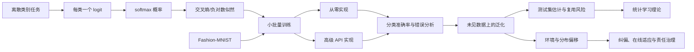
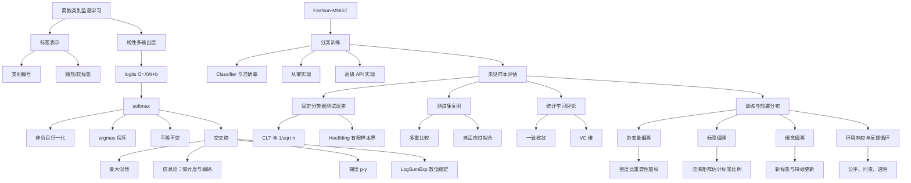

> 对应原文：d2l-en.md 的第 4 章 **Linear Neural Networks for Classification**。本章沿用上一章的数据加载、前向计算、损失、反向传播和参数更新框架，但把输出从一个连续数值改成离散类别。核心不只是 softmax 回归：原章还依次讨论 Fashion-MNIST、分类模型基类、两种实现、分类中的泛化、测试集复用、统计学习理论，以及环境和分布偏移。

## 1. 从数值预测转向类别预测

线性回归回答“多少”，分类回答“属于哪一类”。任务改变后，训练管线大体不变：

1. 从数据加载器取得小批量；
2. 模型产生输出；
3. 损失衡量输出与标签的差异；
4. 自动微分计算梯度；
5. 优化器更新参数。

真正需要改变的是三件事：

- **标签表示**：类别不是任意实数；
- **输出参数化**：模型需要同时为所有类别给出分数或概率；
- **损失函数**：平方误差不再是最自然的概率目标。

本章的完整逻辑链如下：



这条主线把“训练一个分类器”和“证明它能在真实环境中可靠使用”明确分开。前者是优化问题，后者还涉及统计估计、环境变化、决策成本和伦理约束。

## 2. Softmax 回归

### 2.1 分类问题的边界

原书给出垃圾邮件、订阅转化、动物图像、下一部电影和下一节阅读内容等例子。分类至少包含两个层次：

- **硬分类**：只输出最终类别，如“垃圾邮件”；
- **软分类**：输出每个类别的概率，如“垃圾邮件概率 $0.92$”。

即使产品最终只需要硬标签，训练时通常仍学习软概率，因为概率能表达不确定性，并能通过光滑损失提供梯度。

还要区分：

- **多类分类**：类别互斥，一个样本恰属一类；
- **多标签分类**：多个标签可同时成立，如一篇新闻同时属于商业、娱乐和航天。

Softmax 回归针对的是互斥多类分类。多标签任务通常对每个标签使用独立 sigmoid 和二元交叉熵，不能强迫所有标签概率之和为 $1$。

### 2.2 标签：类别编号与独热向量

假设输入是 $2\times2$ 灰度图，展平后有四个特征；类别为猫、鸡和狗。计算机可把标签存成类别编号：

$$
y\in\{0,1,2\}.
$$

编号只是存储索引，不表示“狗比猫大 1”。若类别本身有自然次序，如婴儿、儿童、青年、成人、老年，可考虑序数回归；普通分类没有这种顺序。

数学推导常使用**独热编码**：

$$
\mathbf y\in
\{(1,0,0),(0,1,0),(0,0,1)\}.
$$

真实类别位置为 $1$，其余为 $0$。类别编号和独热向量表达同一硬标签，但用途不同：

- 类别编号存储紧凑，可直接用于稀疏交叉熵索引；
- 独热向量便于写统一的概率和梯度公式；
- 软标签如 $(0.1,0.2,0.7)$ 无法用单个类别编号完整表示。

### 2.3 线性模型：每个类别一个输出分数

要估计 $q$ 个类别，需要为每类计算一个仿射分数。对四个输入、三个类别：

$$
\begin{aligned}
o_1&=w_{11}x_1+w_{12}x_2+w_{13}x_3+w_{14}x_4+b_1,\\
o_2&=w_{21}x_1+w_{22}x_2+w_{23}x_3+w_{24}x_4+b_2,\\
o_3&=w_{31}x_1+w_{32}x_2+w_{33}x_3+w_{34}x_4+b_3.
\end{aligned}
$$

$o_j$ 称为 **logit**：它是未归一化分数，不是概率。用列向量记号：

$$
\mathbf o=\mathbf W\mathbf x+\mathbf b,
\qquad
\mathbf W\in\mathbb R^{q\times d},
\quad
\mathbf b\in\mathbb R^q.
$$

所有输入都连接到每个输出，因此这是单层全连接网络。严格说只需参数化 $q-1$ 个相对分数，但为保持类别对称性，softmax 使用 $q$ 个输出。这会引入冗余：给所有 logits 加同一常数，概率不变。

### 2.4 为什么不能把 logits 直接当概率

仿射输出存在两个问题：

1. $o_j$ 可为负数；
2. $\sum_j o_j$ 不一定为 $1$。

若直接用线性输出表示“购买概率”，面积继续增加时甚至可能预测大于 $1$ 的概率。分类需要把任意实向量映射到概率单纯形：

$$
\Delta^{q-1}
=\left\{\mathbf p:p_j\ge0,\ \sum_{j=1}^{q}p_j=1\right\}.
$$

一种历史方案是 probit 模型，用高斯噪声定义选择概率；softmax 则给出更简洁的多类概率形式和优化结构。

### 2.5 Softmax 的构造

先对每个分数取指数，保证为正；再除以指数总和，保证归一化：

$$
\widehat y_j
=\operatorname{softmax}(\mathbf o)_j
=\frac{e^{o_j}}{\sum_{k=1}^{q}e^{o_k}}.
$$

Softmax 满足：

- $\widehat y_j>0$；
- $\sum_j\widehat y_j=1$；
- $o_a>o_b\Rightarrow\widehat y_a>\widehat y_b$；
- 有限 logits 只能得到开区间内概率，不能精确得到 $0$ 或 $1$。

因为指数函数单调，归一化分母对所有类别相同：

$$
\operatorname*{argmax}_j\widehat y_j
=\operatorname*{argmax}_j o_j.
$$

只需硬预测时无需显式计算 softmax，直接对 logits 取 `argmax` 更快、更稳定。

#### 平移不变性与参数冗余

对任意常数 $c$：

$$
\operatorname{softmax}(\mathbf o+c\mathbf1)_j
=\frac{e^{o_j+c}}{\sum_ke^{o_k+c}}
=\frac{e^ce^{o_j}}{e^c\sum_ke^{o_k}}
=\operatorname{softmax}(\mathbf o)_j.
$$

所以概率只依赖类别间的 logit 差。模型参数不是唯一的，梯度各分量之和也为零。这种冗余不妨碍预测，却意味着目标沿“所有 logits 同时平移”的方向是平坦的。

#### 二分类与 logistic 函数

对两个类别：

$$
P(y=1)
=\frac{e^{o_1}}{e^{o_1}+e^{o_2}}
=\frac{1}{1+e^{-(o_1-o_2)}}.
$$

因此二类 softmax 只依赖一个分数差，等价于 logistic/sigmoid 回归。两个输出是对称但冗余的参数化。

#### 温度

加入温度 $T>0$：

$$
p_j(T)=\frac{e^{o_j/T}}{\sum_ke^{o_k/T}}.
$$

$T\to0^+$ 时分布趋近最大 logit 的硬选择；$T\to\infty$ 时趋近均匀分布。温度可调节概率尖锐度，但改变置信度不自动改善分类正确率，通常要在验证集上校准。

### 2.6 小批量向量化

对 $n$ 个样本、$d$ 个特征、$q$ 个类别：

$$
\mathbf X\in\mathbb R^{n\times d},
\qquad
\mathbf W\in\mathbb R^{d\times q},
\qquad
\mathbf b\in\mathbb R^{1\times q}.
$$

批量 logits 和概率为

$$
\mathbf O=\mathbf X\mathbf W+\mathbf b,
\qquad
\widehat{\mathbf Y}=\operatorname{softmax}(\mathbf O).
$$

Softmax 必须**逐行**归一化：每一行对应一个样本在 $q$ 个类别上的概率。若沿批量轴归一化，就会让不同样本竞争概率总和，语义完全错误。

主要计算是矩阵乘法 $\mathbf X\mathbf W$，参数量和计算量约为 $O(dq)$。当类别数是数十万词汇时，完整输出层会成为存储和计算瓶颈，需要采样 softmax、层次 softmax、低秩或结构化矩阵等近似。

### 2.7 从最大似然推导交叉熵

模型给出条件概率 $\widehat{\mathbf y}^{(i)}$。样本条件独立时，真实标签的似然为

$$
P(\mathbf Y\mid\mathbf X)
=\prod_{i=1}^{n}P(\mathbf y^{(i)}\mid\mathbf x^{(i)}).
$$

最大化似然等价于最小化负对数似然：

$$
-\log P(\mathbf Y\mid\mathbf X)
=\sum_{i=1}^{n}
\ell(\mathbf y^{(i)},\widehat{\mathbf y}^{(i)}).
$$

对一个样本，交叉熵为

$$
\ell(\mathbf y,\widehat{\mathbf y})
=-\sum_{j=1}^{q}y_j\log\widehat y_j.
$$

若 $\mathbf y$ 是独热向量，只有真实类别 $c$ 的项保留：

$$
\ell=-\log\widehat y_c.
$$

模型给真实类概率越高，损失越小：

| $\widehat y_c$ | $-\log\widehat y_c$ |
|---:|---:|
| $0.9$ | $0.105$ |
| $0.5$ | $0.693$ |
| $0.1$ | $2.303$ |
| $0.001$ | $6.908$ |

对错误答案越自信，惩罚越大；若真实类概率趋近 $0$，损失趋向无穷。有限 logits 下概率不会精确为 $1$，因此有限参数的单样本损失一般不能精确达到 $0$。

### 2.8 合并 softmax 与交叉熵

将 softmax 代入交叉熵：

$$
\begin{aligned}
\ell(\mathbf y,\mathbf o)
&=-\sum_jy_j
\log\frac{e^{o_j}}{\sum_ke^{o_k}}\\
&=-\sum_jy_jo_j
+\left(\sum_jy_j\right)
\log\sum_ke^{o_k}\\
&=\log\sum_ke^{o_k}-\sum_jy_jo_j.
\end{aligned}
$$

最后一步使用 $\sum_jy_j=1$。对硬标签 $c$：

$$
\ell(\mathbf o,c)
=\operatorname{logsumexp}(\mathbf o)-o_c.
$$

这说明交叉熵可以直接从 logits 计算，无需先把概率物化出来。

### 2.9 交叉熵对 logits 的梯度

先求 log-sum-exp 的导数：

$$
\frac{\partial}{\partial o_j}
\log\sum_ke^{o_k}
=\frac{e^{o_j}}{\sum_ke^{o_k}}
=\widehat y_j.
$$

因此

$$
\frac{\partial\ell}{\partial o_j}
=\widehat y_j-y_j.
$$

梯度就是“预测概率减真实分布”。

- 真实类：梯度 $\widehat y_c-1<0$，梯度下降会提高其 logit；
- 非真实类：梯度 $\widehat y_j>0$，梯度下降会降低其 logit；
- 所有梯度之和为 $\sum_j(\widehat y_j-y_j)=0$，符合平移不变性。

它与平方损失梯度“预测减真实值”具有相同结构，这不是巧合，而是指数族最大似然的典型性质。

#### Hessian 与分类不确定性

二阶导矩阵为

$$
\nabla_{\mathbf o}^{2}\ell
=\operatorname{diag}(\mathbf p)-\mathbf p\mathbf p^\top,
\qquad \mathbf p=\operatorname{softmax}(\mathbf o).
$$

它正是一个独热类别随机变量的协方差矩阵。对任意 $\mathbf v$：

$$
\mathbf v^\top
(\operatorname{diag}(\mathbf p)-\mathbf p\mathbf p^\top)
\mathbf v
=\operatorname{Var}_{J\sim\mathbf p}(v_J)\ge0.
$$

所以交叉熵关于 logits 是凸的；softmax 线性模型的负对数似然关于参数也是凸的，但因参数冗余未必严格凸。深层网络加入非线性后，整体目标不再因此保持凸性。

### 2.10 数值稳定性：LogSumExp 技巧

直接计算 $e^{o_j}$ 会溢出或下溢。令

$$
m=\max_j o_j.
$$

利用 softmax 平移不变性：

$$
\widehat y_j
=\frac{e^{o_j-m}}{\sum_ke^{o_k-m}}.
$$

此时每个指数的参数不大于 $0$，分子不超过 $1$，分母位于 $[1,q]$，避免正向溢出。

但极小项仍可能下溢为 $0$，随后计算 `log(0)`。因此稳定交叉熵直接计算

$$
\log\widehat y_j
=o_j-m-
\log\sum_ke^{o_k-m},
$$

或

$$
\operatorname{logsumexp}(\mathbf o)
=m+\log\sum_ke^{o_k-m}.
$$

PyTorch 的 `F.cross_entropy(logits, target)` 把 `log_softmax` 与负对数似然融合。**应传入原始 logits，不要先手动 softmax。** 先 softmax 不仅重复计算，还损失数值稳定性并改变函数语义。

### 2.11 信息论解释

#### 熵

分布 $P$ 的熵为

$$
H(P)=-\sum_jP(j)\log P(j).
$$

使用自然对数时单位为 nat；$1$ nat 等于

$$
\log_2e=\frac{1}{\ln2}\approx1.44
$$

bit。熵是知道真实分布时的最小平均编码长度极限，也是平均不确定性。

#### 惊异度

观察到模型赋予概率 $Q(j)$ 的事件，其惊异度为

$$
I_Q(j)=-\log Q(j).
$$

越不可能的事件发生，惊异度越大。总是相同的数据流容易预测，也容易压缩；不可预测的数据需要更多编码信息。

#### 交叉熵

真实数据来自 $P$，却用预测分布 $Q$ 编码，平均惊异度为

$$
H(P,Q)=-\sum_jP(j)\log Q(j).
$$

它满足

$$
H(P,Q)=H(P)+D_{\mathrm{KL}}(P\|Q).
$$

对固定真实分布 $P$，$H(P)$ 是常数，KL 散度非负且仅在 $P=Q$ 时为零，因此最小化交叉熵等价于让预测分布接近真实分布。

对独热标签，单样本 $P$ 的熵为 $0$，交叉熵就是负对数似然；对标签平滑、知识蒸馏等软目标，它仍表示真实软分布下的期望惊异度。

### 2.12 Softmax 回归的能力边界

模型决策边界由 logit 相等决定：

$$
o_a=o_b
\Longleftrightarrow
(\mathbf w_a-\mathbf w_b)^\top\mathbf x
+(b_a-b_b)=0.
$$

所以类别间边界是超平面。Softmax 解决了概率输出和损失问题，却没有让模型获得非线性表示能力。复杂图像中，展平像素后的线性边界只能作为基线，后续多层感知机和卷积网络将学习更灵活特征。

## 3. 图像分类数据集：Fashion-MNIST

### 3.1 为什么不用 MNIST 作为主要基准

MNIST 包含 $60\,000$ 张训练手写数字图像和 $10\,000$ 张测试图像，每张为 $28\times28$。它在 1990 年代很有挑战，推动了邮政编码识别；但现代简单模型也常超过 $95\%$ 准确率，难以区分强弱算法。

ImageNet 更接近现代视觉挑战，却太大，不适合交互式教学。Fashion-MNIST 在规模和格式上与 MNIST 相同，但包含 2017 年发布的十类服饰，难度更高，适合在轻量实验中比较模型。

十个类别依次为：

```text
0 t-shirt, 1 trouser, 2 pullover, 3 dress, 4 coat,
5 sandal, 6 shirt, 7 sneaker, 8 bag, 9 ankle boot
```

每类训练图像 $6000$ 张、测试图像 $1000$ 张，总计 $60\,000/10\,000$。

### 3.2 加载与变换

Torchvision 提供预处理数据集：

```python
from torchvision import datasets, transforms

transform = transforms.Compose([
    transforms.Resize((28, 28)),
    transforms.ToTensor(),
])

train_set = datasets.FashionMNIST(
    root="../data", train=True, transform=transform, download=True
)
test_set = datasets.FashionMNIST(
    root="../data", train=False, transform=transform, download=True
)
```

`ToTensor` 将图像变为浮点张量，并把轴组织为 $(C,H,W)$。灰度图 $C=1$，所以原尺寸样本形状为 $(1,28,28)$。若教学示例把图像放大到 $32\times32$，形状变为 $(1,32,32)$；后续 softmax 训练使用默认 $28\times28$，因此展平长度仍是 $784$。

现代彩色图像通常有 RGB 三通道；高光谱图像可有上百通道。伪彩色可视化不表示原数据真的有多个颜色通道。

### 3.3 小批量数据加载

```python
train_loader = torch.utils.data.DataLoader(
    train_set,
    batch_size=64,
    shuffle=True,
    num_workers=4,
)
```

一个默认批量的形状为：

$$
X:(B,1,28,28),
\qquad
y:(B,).
$$

图像通常为浮点类型，类别编号通常为 `int64/long`，因为交叉熵用它索引类别。训练集打乱，验证集无需打乱。

数据加载器速度应足以让模型计算而不是 I/O 成为瓶颈。可调手段包括 `num_workers`、`pin_memory`、预取、缓存和把部分变换移到 GPU；最佳配置依赖操作系统、存储和模型速度，必须用分析器测量。

### 3.4 为什么必须可视化数据

随机显示图像及文字标签能快速发现：

- 标签映射错位；
- 通道或轴顺序错误；
- 像素范围异常；
- 缩放、裁剪或增强破坏内容；
- 数据本身含糊或错误。

可视化不是装饰，而是实验设计的安全检查。数值训练可以在错误标签或颠倒图像上正常下降，损失曲线不会自动告诉我们任务语义错了。

### 3.5 测试集命名的现实问题

原书加载 Fashion-MNIST 官方测试集，却在本章训练过程中反复查看其表现，实质上把它当作验证集。严格流程还应保留一份从未参与调参的最终测试集。数据集对象名叫 `test` 不会自动保证统计上的“测试集纯洁性”。

## 4. 分类模型基类

### 4.1 为什么单独建立 `Classifier`

回归和分类共享训练骨架，但分类几乎总要报告准确率。`Classifier` 在通用 `Module` 基础上增加：

- 验证时计算损失；
- 验证时计算准确率；
- 默认用小批量 SGD 配置参数更新。

这让后续 softmax、MLP、CNN 等分类模型复用同一评估逻辑。

### 4.2 从分数得到硬预测

若 `Y_hat` 形状为 $(B,q)$，每行是一个样本的类别分数：

$$
\widehat y_i^{\mathrm{hard}}
=\operatorname*{argmax}_{j}Y_{ij}.
$$

准确率为

$$
\operatorname{acc}
=\frac1B\sum_{i=1}^{B}
\mathbf1(\widehat y_i^{\mathrm{hard}}=y_i).
$$

`argmax` 可作用于 logits 或 softmax 概率，结果相同。标签和预测的数据类型要一致，否则相等比较可能失败。

### 4.3 为什么训练不用准确率

准确率只关心最大类别是否正确。只要 argmax 不变，把真实类概率从 $0.51$ 提到 $0.99$，准确率完全不变；跨过决策边界时又突然跳变。因此它几乎处处梯度为零，在边界处不可微，不适合作为梯度训练目标。

交叉熵提供连续信号：不仅奖励分类正确，还奖励对真实类给出更高概率，并重罚自信错误。因此常见分工是：

- 交叉熵用于训练；
- 准确率用于直观评估。

准确率也有局限。类别极不平衡时，永远预测多数类也可能很高；医疗和风控中不同错误成本不同，应报告混淆矩阵、精确率、召回率、校准度或成本敏感指标。

### 4.4 最优决策不总是 argmax

Argmax 对应所有误分类代价相同的 0-1 损失。若动作 $a$ 与真实类别 $y$ 的代价为 $C(a,y)$，最优决策应最小化条件期望代价：

$$
a^*(\mathbf x)
=\operatorname*{argmin}_{a}
\sum_yC(a,y)P(y\mid\mathbf x).
$$

医疗漏诊代价远高于误报时，合理阈值不会简单等于 $0.5$，也不一定选择概率最大的类别。

### 4.5 按批平均的细微偏差

原书的绘图工具先求每批平均，再把各批平均等权平均。若最后一批较小，这不等于按样本平均。

设共有 $m$ 批，前 $m-1$ 批大小为 $B$，末批大小为 $r$，批均值为 $l_1,\ldots,l_m$。快速估计：

$$
L_{\mathrm{quick}}=\frac1m\sum_{k=1}^{m}l_k.
$$

正确样本平均：

$$
L
=\frac{B\sum_{k=1}^{m-1}l_k+rl_m}
{(m-1)B+r}.
$$

代入 $\sum_{k=1}^{m-1}l_k=mL_{\mathrm{quick}}-l_m$：

$$
L=
\frac{BmL_{\mathrm{quick}}-(B-r)l_m}
{(m-1)B+r}.
$$

随机 IID 分批时快速估计在期望上可无偏，但方差和具体数值仍不同；严谨评估应累计损失总和与样本数。

## 5. 从零实现 Softmax 回归

### 5.1 手写 softmax

按定义实现：

```python
def naive_softmax(X):
    X_exp = torch.exp(X)
    partition = X_exp.sum(dim=1, keepdim=True)
    return X_exp / partition
```

`keepdim=True` 保留形状 $(B,1)$，才能沿类别轴广播除法。此实现适合教学，不适合生产：logit 为 $1000$ 时指数溢出；所有 logits 很负时可能全下溢为零，得到 `0/0`。

较稳定概率实现为：

```python
def stable_softmax(X):
    shifted = X - X.max(dim=1, keepdim=True).values
    exp_values = torch.exp(shifted)
    return exp_values / exp_values.sum(dim=1, keepdim=True)
```

真正训练仍应使用框架融合的 logits 交叉熵。

### 5.2 模型参数与形状

Fashion-MNIST 图像展平为

$$
d=28\times28=784
$$

个特征，类别数 $q=10$。参数为

$$
\mathbf W\in\mathbb R^{784\times10},
\qquad
\mathbf b\in\mathbb R^{10}.
$$

```python
W = torch.normal(0, 0.01, size=(784, 10), requires_grad=True)
b = torch.zeros(10, requires_grad=True)
```

一个批量从 $(B,1,28,28)$ 展平为 $(B,784)$：

```python
X = X.reshape(-1, 784)
logits = X @ W + b
probabilities = stable_softmax(logits)
```

展平舍弃了二维邻接结构：模型把相邻像素和远隔像素同等看待。这使 softmax 回归简单，但限制了视觉性能。

### 5.3 稀疏标签下的交叉熵

对类别编号 `y`，无需先构造独热矩阵。可用高级索引取出每行真实类概率：

```python
rows = torch.arange(len(y))
true_probabilities = probabilities[rows, y]
loss = -torch.log(true_probabilities).mean()
```

例如

```python
y = torch.tensor([0, 2])
y_hat = torch.tensor([[0.1, 0.3, 0.6],
                      [0.3, 0.2, 0.5]])
```

选中概率为 $0.1$ 和 $0.5$，平均交叉熵：

$$
-\frac12(\log0.1+\log0.5)
\approx1.4979.
$$

这与独热公式完全等价，却省去 $(B,q)$ 独热标签的存储。类别编号必须在 $[0,q-1]$ 且为整数类型。

### 5.4 训练配置

原书使用：

- 批量大小 $256$；
- 学习率 $0.1$；
- 训练 $10$ 个 epoch；
- 输入 $784$，输出 $10$。

这些都是超参数，应在验证集上选择。训练循环复用上一章的 `Trainer`，说明回归转分类后改变的是模型输出和损失，而不是梯度更新骨架。

### 5.5 错误样本可视化

训练后：

1. 对验证批计算 logits 或概率；
2. `argmax` 得到类别编号；
3. 构造 `preds != y` 掩码；
4. 只显示错误图像，并同时标注真实类与预测类。

只看总准确率不知道模型为何犯错。错误样本可揭示 shirt/coat/pullover 等视觉相似类别、裁剪异常和标签噪声。不过挑选少数“有趣错误”会产生选择偏差，仍要结合完整混淆矩阵和分组指标。

## 6. Softmax 回归的简洁实现

### 6.1 内置模型

```python
from torch import nn

net = nn.Sequential(
    nn.Flatten(),
    nn.LazyLinear(10),
)
```

`Flatten` 保留批量轴，把其余轴合并：

$$
(B,1,28,28)\longrightarrow(B,784).
$$

`LazyLinear(10)` 首次前向时推断输入维数并产生十个 logits。也可显式写 `nn.Linear(784,10)`，在形状已知时更透明。

### 6.2 模型返回 logits 而不是概率

简洁实现的 `forward` 直接返回线性层输出：

```python
def forward(X):
    return net(X)  # logits
```

损失使用：

```python
loss = torch.nn.functional.cross_entropy(logits, y)
```

`F.cross_entropy` 内部稳定地组合 `log_softmax` 与负对数似然。硬预测直接 `logits.argmax(dim=1)`；只有展示概率或做概率决策时再调用 `softmax(dim=1)`。

### 6.3 为什么高级 API 更可靠

框架实现处理了：

- 最大值平移与 LogSumExp；
- 稀疏类别索引；
- 批量归约；
- 自动微分；
- 多种浮点格式和加速内核。

便利既是优点也是风险：用户可能不知道损失需要 logits、类别轴在哪里、标签类型是什么。原书因此要求同时理解从零版本和简洁版本：标准组件用高级 API，新研究组件仍需能从数学定义正确实现。

### 6.4 训练过久和学习率

增加 epoch 不保证验证准确率一直上升。训练损失继续下降时，模型可能逐渐过拟合；可用验证曲线、早停、正则化和更多数据缓解。

学习率太大可能让交叉熵振荡或发散，太小则有限时间内几乎不学习。比较学习率时应同时观察训练损失、验证损失和准确率，并固定随机性以减少实验噪声。

## 7. 分类中的泛化

### 7.1 为什么训练准确率没有证明力

高维数据中几乎每个输入都唯一。一个记忆器可以保存训练图像与标签，训练准确率达到 $100\%$；遇到新图像却只能随机猜测。分类的目标仍是发现可迁移模式，而不是查询训练表。

本节提出三个问题：

1. 需要多少测试样本，才能准确估计总体分类误差？
2. 同一测试集反复评估许多模型会怎样？
3. 为什么从训练集选出的模型有理由泛化，而不是只记忆？

### 7.2 固定分类器的测试误差

先固定分类器 $f$，再取得一份未用于训练和选择的新测试集

$$
\mathcal D=\{(\mathbf x^{(i)},y^{(i)})\}_{i=1}^{n}.
$$

经验测试误差为

$$
\epsilon_{\mathcal D}(f)
=\frac1n\sum_{i=1}^{n}
\mathbf1(f(\mathbf x^{(i)})\ne y^{(i)}).
$$

总体误差为

$$
\epsilon(f)
=E_{(\mathbf x,y)\sim P}
[\mathbf1(f(\mathbf x)\ne y)].
$$

对固定 $f$，每个错误指示变量是参数为 $\epsilon(f)$ 的 Bernoulli 变量。因此：

$$
E[\epsilon_{\mathcal D}(f)]=\epsilon(f),
$$

$$
\operatorname{Var}[\epsilon_{\mathcal D}(f)]
=\frac{\epsilon(f)(1-\epsilon(f))}{n}
\le\frac{1}{4n}.
$$

最坏标准误差不超过

$$
\frac{1}{2\sqrt n}.
$$

误差率接近 $0$ 或 $1$ 时，真实方差比最坏界小；接近 $0.5$ 时最大。

### 7.3 中心极限定理给出的样本量直觉

中心极限定理说明大样本下测试误差近似正态，标准差以 $O(1/\sqrt n)$ 缩小。

- 要把标准误差减半，需要 $4$ 倍测试样本；
- 要把标准误差缩小 $100$ 倍，需要 $10\,000$ 倍样本。

最坏情况下，让一个标准差不超过 $0.01$：

$$
\frac{0.5}{\sqrt n}\le0.01
\Longrightarrow n\ge2500.
$$

让近似 $95\%$ 区间半宽不超过 $0.01$：

$$
1.96\frac{0.5}{\sqrt n}\le0.01
\Longrightarrow n\ge9604,
$$

约为 $10\,000$。这解释了许多基准测试集的数量级，也提醒我们：在同一万级测试集上宣称小于一个百分点的改进，必须报告不确定性和配对比较，而不能只看点估计。

### 7.4 Hoeffding 有限样本界

对有界错误指示变量，Hoeffding 不等式给出一侧界：

$$
P(\epsilon_{\mathcal D}(f)-\epsilon(f)\ge t)
\le e^{-2nt^2}.
$$

要求右侧不超过 $0.05$ 且 $t=0.01$：

$$
n\ge\frac{\ln(1/0.05)}{2(0.01)^2}
\approx14\,979.
$$

即原书所说约 $15\,000$。若要求双侧偏差，用并合界

$$
P(|\epsilon_{\mathcal D}-\epsilon|\ge t)
\le2e^{-2nt^2},
$$

所需样本约 $18\,445$。有限样本保证更保守，但不依赖渐近正态近似。

### 7.5 测试集复用与多重比较

对一个预先固定模型，测试误差是无偏估计。若在同一测试集上比较 $k$ 个模型，再挑分数最好者，就增加了至少一个模型“偶然走运”的机会。

若每次误导概率为 $5\%$ 且粗略假设独立，$20$ 次中至少一次误导的概率为

$$
1-0.95^{20}\approx64.2\%.
$$

实际模型结果相关，不能把此数当精确结论，但它说明单次 $95\%$ 置信不能自动扩展到多次搜索。需要多重假设检验、预注册或独立确认集。

### 7.6 自适应过拟合

更严重的是，后续模型往往在看到早期测试结果后设计。测试集信息通过研究者决策进入新模型，即使标签从未直接用于反向传播，模型也已不再独立于测试集。这称为**自适应过拟合**。

一旦信息泄漏，严格意义上的测试集无法恢复纯洁。实践建议：

- 建立真实、访问受控的测试集；
- 尽量少查看；
- 模型选择只用训练/验证集；
- 高风险、小数据场景加强多重比较控制；
- 长期挑战维护多轮私有测试集，旧测试集降级为验证集。

公开基准被整个社区多年反复使用，也会发生社区层面的测试集过拟合。

### 7.7 为什么需要统计学习理论

测试集只能在训练后证实某个固定模型是否泛化，不能提前解释为什么从训练集选择的模型应该泛化。统计学习理论试图把以下三者联系起来：

- 模型类 $\mathcal F$ 的复杂度；
- 样本数 $n$；
- 经验误差与总体误差的差距。

关键难点是学习算法在同一训练集上选择并评估模型。单个固定模型的误差容易估计；在巨大甚至无限的模型类中挑最优者时，必须防止某个模型仅因随机波动得到虚假的低训练误差。

### 7.8 一致收敛与偏差—方差权衡

一致收敛希望以至少 $1-\delta$ 的概率，让模型类中**所有**模型的经验误差同时接近总体误差。若成立，随后挑训练误差最低的模型也不会严重利用估计噪声。

过于灵活的“记忆器”可以拟合任何标签，不可能得到有意义保证；只有一个固定函数的模型类泛化估计最容易，却可能完全欠拟合。经典学习理论由此形成：

- 灵活模型偏差低、方差和过拟合风险高；
- 刚性模型方差低、偏差和欠拟合风险高。

深度学习中的实际行为比这张经典图更复杂，但它仍提供理解模型选择的起点。

### 7.9 VC 维

模型类的 VC 维是它能对任意二元标记进行完全拟合的最大点数。$d$ 维输入上的线性分类器 VC 维为 $d+1$：二维直线可以打散一般位置的三个点，却不能对任意四点标记都实现。

原书给出形如

$$
P\left(
R(f)-R_{\mathrm{emp}}(f)<\alpha
\right)\ge1-\delta,
$$

其中足够大的界满足近似关系

$$
\alpha
\gtrsim
c\sqrt{\frac{\operatorname{VC}-\log\delta}{n}}.
$$

含义是：样本越多，界按 $1/\sqrt n$ 缩小；模型类越复杂，保证越弱；要求失败概率 $\delta$ 越小，需要更多数据。

这类界对深度网络往往极度保守。大型网络可记忆随机标签、VC 维巨大，却在真实任务上用远少于理论要求的数据良好泛化，甚至更大网络有时泛化更好。VC 理论是重要基础，却不能直接解释现代深度学习的全部现象。

## 8. 环境与分布偏移

### 8.1 为什么高测试准确率仍可能部署失败

前面默认训练和测试来自同一分布，也默认模型输出不会改变环境。现实中两点都可能失败：

- 部署数据分布与训练数据不同；
- 模型决策改变用户行为，进而改变未来数据。

原书的鞋类贷款例子说明相关不等于稳定机制：若牛津鞋与还款相关，系统据此放贷，申请人很快都会改穿牛津鞋，但信用能力没有改变。模型部署破坏了原有相关性。

设源/训练分布为

$$
q(\mathbf x,y),
$$

目标/部署分布为

$$
p(\mathbf x,y).
$$

如果二者可以任意变化，可靠迁移不可能。例如输入图像分布不变，却把猫狗标签完全互换，单看无标签目标输入无法发现。

### 8.2 协变量偏移

协变量偏移假设输入边缘分布变化，但标注规律不变：

$$
q(\mathbf x)\ne p(\mathbf x),
\qquad
q(y\mid\mathbf x)=p(y\mid\mathbf x).
$$

当相信 $\mathbf x$ 导致 $y$ 时，这通常是自然假设。例子：训练图像是真实猫狗照片，部署图像却全是卡通。对象定义没变，但输入风格分布改变。

### 8.3 标签偏移

标签偏移假设类别先验变化，而每类产生特征的机制不变：

$$
q(y)\ne p(y),
\qquad
q(\mathbf x\mid y)=p(\mathbf x\mid y).
$$

当 $y$ 导致 $\mathbf x$ 时较合理。例如疾病导致症状，疾病流行率随季节变化，但给定疾病后的症状分布近似稳定。

标签空间通常低维，因此估计标签比例变化可能比在高维图像空间估计密度比更容易。

### 8.4 概念偏移

概念偏移指预测关系或标签定义变化：

$$
q(y\mid\mathbf x)\ne p(y\mid\mathbf x).
$$

精神疾病诊断标准、时尚定义、职位名称和不同地区对软饮料的称呼都会变化。机器翻译中，同一句话在地区或时代下可能有不同恰当译法。

三种偏移不能只靠观察准确率下降可靠区分；纠偏方法成立与否取决于对应假设是否真的成立。

### 8.5 原章案例揭示的共同问题

#### 医疗诊断

患病组来自年长男性患者，健康对照却来自大学生献血者。分类器可轻易利用年龄、激素、饮食和活动差异达到高准确率，却未必识别疾病。采样过程制造了严重协变量偏移，且两组支持区域可能几乎不重叠，事后重加权也难以补救。

#### 自动驾驶合成数据

渲染引擎中的路肩使用固定简单纹理，检测器学会纹理捷径，在合成测试集优秀，真实道路上失败。问题不是模型没有拟合，而是测试集复制了生成器偏差。

#### 坦克与阴影

原章讲述坦克照片案例：有坦克和无坦克照片在不同时段拍摄，模型学习阴影而非坦克。无论该故事在现实流传中的细节如何，它表达的实验原则明确：标签若与拍摄条件混杂，随机划分同一采集批次也无法检验真正目标。

#### 非平稳分布

- 广告模型没有及时纳入新设备；
- 垃圾邮件发送者主动改变写法；
- 推荐系统圣诞后仍推荐圣诞帽；
- 人脸检测器没见过占满画面的特写；
- 美国搜索模型直接部署英国；
- 人为类别均衡训练集部署到自然长尾世界。

共同教训是：数据集不是世界本身，而是采样机制、时间和模型行为共同产生的切片。

### 8.6 经验风险与目标风险

训练最小化经验风险：

$$
\widehat R_q(f)
=\frac1n\sum_{i=1}^{n}
\ell(f(\mathbf x_i),y_i),
\qquad
(\mathbf x_i,y_i)\sim q.
$$

真正关心的是目标分布风险：

$$
R_p(f)
=E_{p(\mathbf x,y)}
[\ell(f(\mathbf x),y)].
$$

经验风险最小化只有在样本代表目标分布，或能正确纠偏时，才近似目标风险最小化。

### 8.7 协变量偏移纠正：重要性加权

利用 $p(y\mid\mathbf x)=q(y\mid\mathbf x)$：

$$
\begin{aligned}
R_p(f)
&=\iint \ell(f(\mathbf x),y)
p(y\mid\mathbf x)p(\mathbf x)\,d\mathbf x\,dy\\
&=\iint \ell(f(\mathbf x),y)
q(y\mid\mathbf x)q(\mathbf x)
\frac{p(\mathbf x)}{q(\mathbf x)}
\,d\mathbf x\,dy\\
&=E_q[\beta(\mathbf x)\ell(f(\mathbf x),y)],
\end{aligned}
$$

其中

$$
\beta(\mathbf x)=\frac{p(\mathbf x)}{q(\mathbf x)}.
$$

因此用加权经验风险：

$$
\widehat R_{\mathrm{IW}}(f)
=\frac1n\sum_i
\beta(\mathbf x_i)
\ell(f(\mathbf x_i),y_i).
$$

目标分布常只有无标签输入，密度比未知。可把源样本标为 $z=-1$、目标样本标为 $z=1$，训练域分类器。若混合样本中两域先验相等：

$$
\frac{P(z=1\mid\mathbf x)}
{P(z=-1\mid\mathbf x)}
=\frac{p(\mathbf x)}{q(\mathbf x)}.
$$

若域分类器 logit 为 $h(\mathbf x)$，则

$$
\beta(\mathbf x)=e^{h(\mathbf x)}.
$$

若目标域混合先验为 $\pi=P(z=1)$，则应校正：

$$
\frac{p(\mathbf x)}{q(\mathbf x)}
=\frac{1-\pi}{\pi}
\frac{P(z=1\mid\mathbf x)}{P(z=-1\mid\mathbf x)}.
$$

#### 关键前提与局限

必须满足目标支持被源支持覆盖：

$$
p(\mathbf x)>0\Rightarrow q(\mathbf x)>0.
$$

若目标区域训练时从未出现，权重应为无穷，重加权无法创造缺失标签。极大权重还会造成高方差，实践常裁剪

$$
\widetilde\beta=\min(\beta,c),
$$

以方差换偏差。域分类器近乎完美往往不是好消息，而是两域缺乏重叠、纠偏困难。

### 8.8 标签偏移纠正

标签偏移下：

$$
R_p(f)
=E_q\left[
\frac{p(y)}{q(y)}
\ell(f(\mathbf x),y)
\right].
$$

权重为

$$
\beta(y)=\frac{p(y)}{q(y)}.
$$

源标签比例 $q(y)$ 可直接估计；目标标签不可见，可借助源验证集上的混淆矩阵。

令

$$
C_{ij}=P_q(\widehat Y=i\mid Y=j)
$$

为**按真实类别归一化**的混淆矩阵，目标域预测类别比例为

$$
\mu_i=P_p(\widehat Y=i).
$$

在标签偏移假设下：

$$
\mu_i=\sum_jC_{ij}p(y=j),
$$

即

$$
\mathbf C\mathbf p=\boldsymbol\mu.
$$

若 $\mathbf C$ 可逆且估计稳定：

$$
\mathbf p=\mathbf C^{-1}\boldsymbol\mu.
$$

随后按 $p(y_i)/q(y_i)$ 重加权源训练样本。注意：若把混淆矩阵单元定义为占验证集总数的联合比例，而非条件比例，上式不再直接成立；归一化约定必须一致。

方法要求：类别集合不变、分类器有一定区分能力、混淆矩阵条件良好，并且 $p(\mathbf x\mid y)=q(\mathbf x\mid y)$ 近似成立。求逆结果出现负概率时通常说明采样噪声、病态矩阵或假设失效，需要约束优化而非直接接受。

### 8.9 概念偏移纠正

若 $P(y\mid\mathbf x)$ 本身改变，仅靠旧标签和新无标签输入通常无法识别新概念。极端地，从“猫/狗”变成“黑/白动物”只能收集新标签并重训。

现实概念常缓慢变化，可从旧权重继续用新标注做少量更新，并配合滑动窗口、漂移检测、样本重加权和回滚监控。在线更新会遗忘旧能力，也可能被异常或攻击数据污染，因此需要版本控制和离线验证。

### 8.10 学习问题的分类

#### 批量学习

一次获得训练数据，训练模型后部署，通常不再更新。此前 Fashion-MNIST 实验属于此类。

#### 在线学习

每轮先观察 $\mathbf x_t$，产生预测，再看到 $y_t$ 和损失，更新为下一模型：

$$
f_t\to\mathbf x_t\to f_t(\mathbf x_t)
\to y_t\to\ell_t\to f_{t+1}.
$$

它适合持续到来的数据和非平稳环境，但要求处理延迟反馈、灾难性遗忘和安全更新。

#### 多臂赌博机

动作集合有限，通常只观察被选动作的奖励，而不知道未选动作会怎样。核心是探索与利用。它不是普通全反馈监督学习的简单改名。

#### 控制

动作改变环境状态，未来观测依赖历史动作。锅炉温度受此前加热影响，新闻用户也受此前推荐影响。PID 是经典控制方法，学习控制还会显式或隐式建模动态。

#### 强化学习

更一般地，环境有记忆，奖励延迟，其他参与者可能合作或对抗。围棋、星际争霸和自动驾驶都要求优化长期策略，而非独立样本准确率。

选择算法前必须判断环境是静态、缓慢变化、突变还是会针对模型适应。问题表述错了，离线准确率再高也没有意义。

### 8.11 公平、问责与透明

部署模型通常是在自动化决策，不只是输出一个概率。必须追问：

- 模型对哪些人群有效，哪些人群缺乏数据？
- 不同误分类的伤害是否相同？
- 谁能审计、解释和申诉？
- 决策会不会改变未来训练数据？

预测性警务的反馈环：


记录增加不一定表示真实犯罪率增加，而可能只是观察强度增加。模型把自己的决策后果当成世界证据，形成失控反馈。准确率无法表达这种制度性影响；技术指标必须与成本、公平、程序正义和社会价值一起设计。

## 9. 可运行的综合实验

下面的代码不下载 Fashion-MNIST，而是在本地生成三类二维数据，以便稳定验证本章核心数学：稳定 softmax、融合交叉熵、梯度 $\mathbf p-\mathbf y$、线性多类训练、测试误差标准误、Hoeffding 样本量，以及协变量偏移下的重要性加权。

```python
import math

import torch
from torch.nn import functional as F

torch.manual_seed(11)

def stable_softmax(logits):
    shifted = logits - logits.max(dim=1, keepdim=True).values
    exp_values = torch.exp(shifted)
    return exp_values / exp_values.sum(dim=1, keepdim=True)

def cross_entropy_from_logits(logits, labels):
    max_logits = logits.max(dim=1, keepdim=True).values
    log_partition = max_logits.squeeze(1) + torch.log(
        torch.exp(logits - max_logits).sum(dim=1)
    )
    true_logits = logits[torch.arange(len(labels)), labels]
    return (log_partition - true_logits).mean()

# 1. Stable probabilities and translation invariance.
extreme_logits = torch.tensor([[1000.0, 1001.0, 999.0],
                               [-1001.0, -1000.0, -999.0]])
probabilities = stable_softmax(extreme_logits)
assert torch.isfinite(probabilities).all()
assert torch.allclose(probabilities.sum(dim=1), torch.ones(2))
assert torch.allclose(
    probabilities,
    stable_softmax(extreme_logits + 12345.0),
    atol=1e-5,
)

# 2. Manual fused loss matches PyTorch, and its gradient is (p - y) / batch.
logits = torch.tensor([[2.0, 0.5, -1.0],
                       [-0.5, 0.0, 1.5]], requires_grad=True)
labels = torch.tensor([0, 2])
manual_loss = cross_entropy_from_logits(logits, labels)
builtin_loss = F.cross_entropy(logits, labels)
assert torch.allclose(manual_loss, builtin_loss, atol=1e-6)
manual_loss.backward()

one_hot = F.one_hot(labels, num_classes=3).float()
expected_gradient = (stable_softmax(logits.detach()) - one_hot) / len(labels)
assert torch.allclose(logits.grad, expected_gradient, atol=1e-6)

# 3. Train a three-class linear softmax model from scratch.
centers = torch.tensor([[-2.0, -1.5], [2.0, -1.0], [0.0, 2.0]])
train_features = torch.cat([
    center + 0.55 * torch.randn(200, 2) for center in centers
])
train_labels = torch.arange(3).repeat_interleave(200)
test_features = torch.cat([
    center + 0.55 * torch.randn(100, 2) for center in centers
])
test_labels = torch.arange(3).repeat_interleave(100)

weights = (torch.randn(2, 3) * 0.01).requires_grad_()
bias = torch.zeros(3, requires_grad=True)
learning_rate = 0.2

for _ in range(200):
    train_logits = train_features @ weights + bias
    loss = cross_entropy_from_logits(train_logits, train_labels)
    if weights.grad is not None:
        weights.grad.zero_()
        bias.grad.zero_()
    loss.backward()
    with torch.no_grad():
        weights -= learning_rate * weights.grad
        bias -= learning_rate * bias.grad

with torch.no_grad():
    train_predictions = (train_features @ weights + bias).argmax(dim=1)
    test_predictions = (test_features @ weights + bias).argmax(dim=1)
    train_accuracy = (train_predictions == train_labels).float().mean().item()
    test_accuracy = (test_predictions == test_labels).float().mean().item()

assert train_accuracy > 0.98
assert test_accuracy > 0.98

# 4. Error-estimation uncertainty and one-sided Hoeffding sample size.
test_error = 1.0 - test_accuracy
plug_in_standard_error = math.sqrt(
    test_error * (1.0 - test_error) / len(test_labels)
)
worst_case_standard_error = 0.5 / math.sqrt(len(test_labels))
hoeffding_n = math.ceil(math.log(1 / 0.05) / (2 * 0.01**2))
assert hoeffding_n == 14979
assert worst_case_standard_error > 0

# 5. Covariate-shift identity with known Gaussian density ratio.
# Source q(x)=N(0,1), target p(x)=N(1,1), while P(y=1|x)=sigmoid(2x).
generator = torch.Generator().manual_seed(23)
num_samples = 200_000
source_x = torch.randn(num_samples, generator=generator)
target_x = torch.randn(num_samples, generator=generator) + 1.0

source_probability = torch.sigmoid(2 * source_x)
target_probability = torch.sigmoid(2 * target_x)
source_y = torch.bernoulli(source_probability, generator=generator)
target_y = torch.bernoulli(target_probability, generator=generator)

source_prediction = (source_x > 0.2).float()
target_prediction = (target_x > 0.2).float()
source_error = (source_prediction != source_y).float()
target_risk = (target_prediction != target_y).float().mean()

# For N(1,1) / N(0,1), p(x) / q(x) = exp(x - 1/2).
importance_weight = torch.exp(source_x - 0.5)
weighted_source_risk = (importance_weight * source_error).mean()
assert abs(weighted_source_risk.item() - target_risk.item()) < 0.01

print(f"manual CE = {manual_loss.item():.6f}")
print("gradient check = PASS")
print(f"train/test accuracy = {train_accuracy:.4f}/{test_accuracy:.4f}")
print(
    "test-error SE (plug-in/worst-case) = "
    f"{plug_in_standard_error:.5f}/{worst_case_standard_error:.5f}"
)
print(f"Hoeffding n (one-sided, t=.01, 95%) = {hoeffding_n}")
print(
    "target/importance-weighted risk = "
    f"{target_risk.item():.4f}/{weighted_source_risk.item():.4f}"
)
```

代码与原理逐项对应：

1. 极端 logits 检查最大值平移避免溢出，并验证 softmax 平移不变性；
2. 手写 LogSumExp 交叉熵与 `F.cross_entropy` 对齐；
3. 自动微分结果与 $(\mathbf p-\mathbf y)/B$ 解析梯度比较；
4. 三类二维簇可被线性边界分开，因此单层 softmax 应取得高准确率；
5. 测试误差标准误同时报告插件估计和最坏情形上界；即使有限测试集恰好没有错误，插件值为零也不表示总体误差已被精确证明为零；
6. Hoeffding 公式复算原章约 $15\,000$ 的一侧有限样本保证；
7. 已知高斯密度比的实验验证 $R_p(f)=E_q[\beta(X)\ell]$。

最后一项只是重要性加权恒等式的受控演示。真实任务不知道精确密度比，估计误差和大权重方差会使结果更困难。

## 10. 重要概念辨析与常见误区

### 10.1 分类与回归

分类预测离散类别或类别概率，回归预测数值。把类别编号当连续数值做平方回归，会人为引入类别距离和顺序。

### 10.2 多类与多标签

多类任务各类别互斥，用 softmax；多标签任务多个标签可同时为真，通常逐标签 sigmoid。新闻同时属于多个主题时不能强制概率总和为 $1$。

### 10.3 类别编号与序数

类别编号只是索引。除非任务本身有顺序，否则类别 `2` 不比类别 `1` 大，也没有“两倍”关系。

### 10.4 Logit、概率与硬标签

Logit 是任意实数分数；softmax 后才是概率；`argmax` 后是硬标签。三者不能混用，尤其 `F.cross_entropy` 接受 logits 而非概率。

### 10.5 Softmax 与 argmax

Softmax 保持次序，因此硬分类无需计算 softmax。但风险决策、校准和概率展示仍需要概率。

### 10.6 Softmax 平移不变与 log-sum-exp

Softmax 满足 $\operatorname{softmax}(\mathbf o+c\mathbf1)=\operatorname{softmax}(\mathbf o)$；log-sum-exp 则满足

$$
\operatorname{LSE}(\mathbf o+c\mathbf1)
=c+\operatorname{LSE}(\mathbf o),
$$

并非不变。原书练习若把后者写成完全不变，应按此公式理解。

### 10.7 交叉熵与准确率

交叉熵可微且利用置信度，适合训练；准确率不连续、忽略置信度，适合报告。更低交叉熵通常有帮助，却不保证每次都对应更高准确率。

### 10.8 交叉熵与 KL 散度

$H(P,Q)=H(P)+D_{\mathrm{KL}}(P\|Q)$。对固定 $P$，最小化交叉熵等价于最小化 KL；二者数值不一定相同。

### 10.9 独热标签与稀疏标签

独热标签便于推导，整数标签便于存储和索引。`F.cross_entropy` 的常见硬标签接口需要 `long` 类别索引，而不是形状 `(B,q)` 的独热张量。

### 10.10 数值稳定与数学等价

直接 `log(softmax(logits))` 与 `log_softmax(logits)` 数学等价，浮点计算不等价。稳定融合形式避免中间概率变成 $0$ 或无穷。

### 10.11 图像展平与信息丢失

展平不会丢失像素数值，却丢失模型对二维邻接结构的显式归纳偏置。线性层仍可为每个位置学习权重，但不能高效共享局部模式。

### 10.12 `train/eval` 与梯度开关

`model.eval()` 改变某些层的行为，不关闭梯度；`torch.no_grad()` 关闭记录，不切换模式。验证时通常同时使用。

### 10.13 准确率与真实决策质量

准确率默认所有类别、样本和错误代价相同。罕见病漏诊、群体公平和反馈循环不能用一个平均准确率概括。

### 10.14 验证集与测试集

验证集用于模型选择，测试集用于最终估计。文件名叫 `test` 但被反复查看时，它在统计职责上已是验证集。

### 10.15 固定模型评估与训练集泛化

固定模型在新测试集上的误差是普通均值估计；从同一训练集选择并评估模型需要控制整个模型类的适应性，问题更难。

### 10.16 置信区间与模型比较

单个模型的置信区间不能直接证明两个模型差异显著。两模型在同一测试样本上评估时，应利用配对结果，而不是把两个独立区间机械比较。

### 10.17 测试集复用与直接训练

即使测试标签从未进入梯度，反复查看分数并据此改模型也会泄漏信息，造成自适应过拟合。

### 10.18 协变量、标签与概念偏移

- 协变量偏移：$P(x)$ 变，$P(y\mid x)$ 不变；
- 标签偏移：$P(y)$ 变，$P(x\mid y)$ 不变；
- 概念偏移：$P(y\mid x)$ 变化。

纠偏公式不能跨假设套用。

### 10.19 相关性与稳定机制

训练数据中鞋类、阴影或纹理与标签相关，不表示部署后关系稳定。模型可能学到采样过程的捷径，而非目标机制。

### 10.20 重要性加权与重采样

重要性加权改变每个源样本对目标风险的贡献，不会创造源数据从未覆盖的目标区域。大权重还会显著增加方差。

### 10.21 在线学习与强化学习

在线学习强调数据按序到达并持续更新；强化学习还强调动作影响未来状态和长期奖励。二者有交集但不等同。

### 10.22 预测与决策

模型估计 $P(y\mid x)$，决策还需成本、资源和伦理约束。概率最大的类别只在对称 0-1 代价下是最优动作。

## 11. 原章重要练习的推导与延伸

### 11.1 Softmax Hessian 等于类别协方差

Softmax 导数：

$$
\frac{\partial p_i}{\partial o_j}
=p_i(\mathbf1_{i=j}-p_j).
$$

交叉熵梯度为 $\mathbf p-\mathbf y$，所以 Hessian 元素：

$$
H_{ij}=p_i\mathbf1_{i=j}-p_ip_j.
$$

即

$$
\mathbf H=\operatorname{diag}(\mathbf p)-\mathbf p\mathbf p^\top.
$$

若随机独热向量 $\mathbf Z$ 以概率 $p_i$ 取第 $i$ 个基向量，则 $E[\mathbf Z]=\mathbf p$、$E[\mathbf Z\mathbf Z^\top]=\operatorname{diag}(\mathbf p)$，故 $\operatorname{Cov}(\mathbf Z)=\mathbf H$。

### 11.2 三个等概率类别的编码

单个三类符号无法用固定长度整数个二进制位达到熵下界，因为需要至少两位却有一个码字浪费。熵为

$$
H=\log_2 3\approx1.585\ \text{bit}.
$$

联合编码 $n$ 个符号有 $3^n$ 种序列，可用约

$$
\lceil\log_2 3^n\rceil
=\lceil n\log_23\rceil
$$

位，平均每符号逐渐接近 $\log_23$ 位。压缩优势来自块编码，而非要求每个符号单独使用整数位。

### 11.3 LogSumExp 是 max 的光滑上界

设 $m=\max_i x_i$：

$$
\operatorname{LSE}(\mathbf x)
=m+\log\sum_ie^{x_i-m}.
$$

至少一项为 $1$，至多 $q$ 项且每项不超过 $1$，所以

$$
m\le\operatorname{LSE}(\mathbf x)
\le m+\log q.
$$

温度缩放形式

$$
g_\lambda(\mathbf x)
=\frac1\lambda
\log\sum_ie^{\lambda x_i}
$$

满足

$$
m\le g_\lambda(\mathbf x)
\le m+\frac{\log q}{\lambda},
$$

因此 $\lambda\to\infty$ 时趋近最大值。Softmin 可定义为

$$
\operatorname{softmin}_\lambda(\mathbf x)
=-\frac1\lambda\log\sum_ie^{-\lambda x_i}.
$$

### 11.4 温度与幂变换

若

$$
Q(i)\propto P(i)^\alpha,
$$

把 $P(i)\propto e^{o_i/T}$ 代入，得到有效温度 $T'=T/\alpha$。

- 温度加倍：$\alpha=1/2$；
- 温度减半：$\alpha=2$；
- $T\to0$：集中到最大概率类别；
- $T\to\infty$：在有限支持上趋近均匀。

### 11.5 成本敏感的最优类别

给定损失矩阵 $L(y,a)$，选择动作

$$
a^*=\operatorname*{argmin}_a
E[L(Y,a)\mid X=x]
=\operatorname*{argmin}_a
\sum_yL(y,a)P(y\mid x).
$$

0-1 损失下，错误代价均为 $1$，该式化为选择后验概率最大类别。其他代价下 argmax 不再普遍最优。

### 11.6 测试误差精度需要多少样本

Hoeffding 双侧界：

$$
P(|\widehat\epsilon-\epsilon|\ge t)
\le2e^{-2nt^2}.
$$

若希望误差不超过 $t=10^{-4}$、置信度超过 $99.9\%$，令 $\delta=0.001$：

$$
n\ge
\frac{\ln(2/\delta)}{2t^2}
=\frac{\ln2000}{2\times10^{-8}}
\approx3.80\times10^8.
$$

需要约 $3.8$ 亿样本，显示极高绝对精度的分布无关保证非常昂贵。

### 11.7 五次多项式阈值与矩形的 VC 维

一元 $d$ 次多项式的符号最多有 $d$ 个实根，可在直线上形成至多 $d+1$ 个交替区间；其二元分类器 VC 维通常为 $d+1$，五次为 $6$。

二维轴对齐矩形的 VC 维为 $4$：可用上、下、左、右四个极点实现任意标记，但任意五点中至少有一个不是四个方向极值，无法在包含所有四个外点时任意排除它。

### 11.8 域分类器密度比的先验校正

若目标域标签 $z=1$ 在混合训练集中的比例为 $\pi$：

$$
P(z=1\mid x)
=\frac{\pi p(x)}{\pi p(x)+(1-\pi)q(x)}.
$$

整理后：

$$
\frac{p(x)}{q(x)}
=\frac{1-\pi}{\pi}
\frac{P(z=1\mid x)}{1-P(z=1\mid x)}.
$$

只有两域样本数相等，即 $\pi=1/2$ 时，后验赔率才直接等于密度比。

## 12. 全章知识结构



## 13. 核心结论与一般解题方法

### 13.1 核心结论

1. 多类分类需要每类一个 logit；softmax 把任意 logits 转成非负、和为 $1$ 的概率。
2. Softmax 只依赖 logit 差并保持排序，硬预测可直接对 logits 取 `argmax`。
3. 交叉熵来自类别分布的最大似然，也等于真实分布下的期望惊异度。
4. Softmax 与交叉熵组合后的梯度是 $\mathbf p-\mathbf y$，Hessian 是类别协方差矩阵。
5. 训练应直接把 logits 交给融合交叉熵，利用 LogSumExp 避免指数溢出和 `log(0)`。
6. Fashion-MNIST 提供十类、$28\times28$ 灰度服饰图像，是比 MNIST 更有区分力、又比 ImageNet 轻量的教学数据集。
7. 准确率直观但不可微、忽略置信度和错误代价；交叉熵用于训练，准确率和任务指标用于评估。
8. 从零实现揭示形状、归一化轴和稀疏索引，高级 API 提供经过测试的稳定实现；两者都应理解。
9. 对固定分类器，新测试集误差是 Bernoulli 均值估计，精度按 $1/\sqrt n$ 改善；极小误差区间需要巨大测试集。
10. 反复使用同一测试集会带来多重比较和自适应过拟合，使原有置信结论失效。
11. VC 维和一致收敛连接模型复杂度、样本量与泛化，但经典界往往无法解释大型深度网络的实际泛化。
12. 训练与部署分布任意不同时学习不可能；协变量、标签和概念偏移只有在各自假设下才能纠正。
13. 重要性加权要求源分布覆盖目标分布；大密度比会造成高方差，裁剪只能以偏差换方差。
14. 模型部署会改变环境和后续数据，预测性警务等反馈环说明准确率不是系统责任的充分指标。

### 13.2 解决分类问题的一般顺序

1. **明确标签结构**：互斥多类、多标签还是有序类别？
2. **明确输出语义**：模型输出 logits、概率还是最终动作？
3. **写出张量形状**：批量、特征和类别轴分别在哪里，softmax 沿哪条轴？
4. **从生成假设选损失**：互斥类别用类别似然与交叉熵，不把编号当连续数值回归。
5. **使用稳定实现**：训练传 logits 给融合交叉熵，只在需要解释概率时显式 softmax。
6. **推导并检查梯度**：单样本应为 $\mathbf p-\mathbf y$，批量平均再除以批量大小。
7. **先用线性基线**：验证数据、标签、训练循环和评估是否正确，再增加模型复杂度。
8. **查看错误结构**：不仅看平均准确率，还看混淆矩阵、类别不平衡、置信校准和典型错误。
9. **按代价制定决策**：概率预测与行动规则分离，用期望成本确定阈值。
10. **保护测试集**：训练参数用训练集，模型选择用验证集，最终测试尽量只做一次。
11. **量化评估不确定性**：依据错误率和样本量报告标准误、置信区间或有限样本界。
12. **审查数据生成机制**：训练和部署是否 IID，是否存在混杂、捷径或时间变化？
13. **识别偏移类型再纠偏**：不要在概念已变化时套协变量重加权，也不要忽略支持覆盖。
14. **持续监控环境反馈**：部署后重新检查分布、群体表现、错误成本和模型造成的行为变化。

本章完成了从分类数学到现实部署的完整闭环：**线性层产生类别 logits，softmax 与交叉熵把离散预测转成可微的概率最大似然问题，稳定实现和数据加载器使其可训练；新测试集上的准确率只能在有限精度下证明固定模型的表现，反复复用会泄漏信息，而真实环境中的分布偏移和反馈循环进一步要求我们超越静态准确率，审查数据机制、决策代价与社会影响。**
