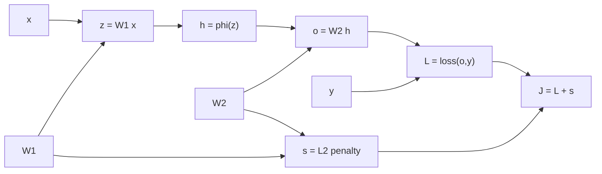
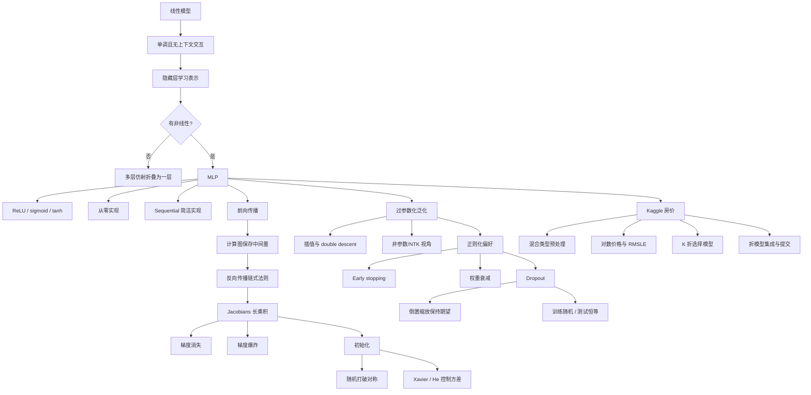

> 本章引入第一类真正的深层网络：多层感知机（MLP）。作者先解释为什么堆叠线性层没有意义、非线性激活怎样带来表达能力，再分别实现 MLP；随后沿计算图推导反向传播，分析梯度消失、梯度爆炸和初始化，重新审视过参数化网络的泛化，以 dropout 注入内部噪声，最后把数据预处理、交叉验证和模型集成应用到 Kaggle 房价预测。

## 1. 本章要解决的问题

前两章已经建立了线性回归和 softmax 回归。它们的训练系统完整，却只能学习仿射决策结构。第 5 章追问一组彼此相连的问题：

1. **表达能力**：现实规律不线性时，怎样让模型自动学习有用表示？
2. **可训练性**：深层复合函数的梯度怎样计算，为什么可能消失或爆炸？
3. **初始化**：参数初值怎样同时打破神经元对称性并控制信号尺度？
4. **泛化**：参数远多于样本、甚至能记住随机标签的网络为什么仍可能泛化？
5. **正则化**：怎样通过 early stopping、权重衰减和 dropout 改变模型偏好？
6. **完整实践**：面对混合类型、缺失值和隐藏测试标签的真实表格数据，怎样选择模型并提交预测？

原章的推理链如下：


自动微分让代码变短，却没有消除理解梯度、内存和初始化的必要性。模型一旦比线性回归更灵活，训练损失下降不再是最困难的部分；稳定优化和未见数据表现成为核心。

## 2. 多层感知机

### 2.1 线性模型为什么不够

线性模型假设输出由特征的加权和决定：

$$
f(\mathbf x)=\mathbf w^\top\mathbf x+b.
$$

它隐含每个特征影响方向固定的单调性：$w_j>0$ 时，增大 $x_j$ 总使输出上升；$w_j<0$ 时总使输出下降。某些任务近似合理，例如在其他条件相同时，收入增加通常不会降低还款能力，但其边际影响很可能并不恒定。

原书用三个层次说明线性假设的局限：

1. **单调但不线性**：收入从 $0$ 增至 $50\,000$ 美元，对还款概率的影响可能远大于从 $1\,000\,000$ 增至 $1\,050\,000$。
2. **非单调**：体温高于约 $37^\circ\mathrm C$ 时继续升高意味着风险，低于正常体温时继续降低也意味着风险。单一权重无法让两端都危险。
3. **上下文依赖**：猫狗图像中某像素变亮究竟支持哪一类，取决于周围像素和物体位置；单个像素没有固定全局含义。

手工构造 $\lvert T-37\rvert$ 等特征可修复简单非线性，但图像中可能存在海量未知交互，无法逐一设计。深度学习的目标因此不是完全抛弃线性预测，而是**先从数据中学习表示，再在表示上做线性预测**。

决策树、核方法和样条也能处理非线性。MLP 的独特路线是把许多简单可微变换组合起来，并用最终任务损失联合学习所有中间表示。

### 2.2 隐藏层与网络深度

一层隐藏层 MLP 包含：

- 输入层：只承载给定特征，不执行参数化计算；
- 隐藏层：产生中间表示；
- 输出层：把隐藏表示变成任务输出。

若输入维数 $d$、隐藏单元数 $h$、输出数 $q$，对含 $n$ 个样本的小批量：

$$
\mathbf X\in\mathbb R^{n\times d},
\quad
\mathbf W^{(1)}\in\mathbb R^{d\times h},
\quad
\mathbf b^{(1)}\in\mathbb R^{1\times h},
$$

$$
\mathbf W^{(2)}\in\mathbb R^{h\times q},
\quad
\mathbf b^{(2)}\in\mathbb R^{1\times q}.
$$

输入层不计作计算层，所以一个隐藏层加一个输出层通常称为两层 MLP。参数量为

$$
dh+h+hq+q.
$$

例如 Fashion-MNIST 使用 $d=784$、$h=256$、$q=10$，参数总数为

$$
784\times256+256+256\times10+10
=203\,530.
$$

### 2.3 只堆叠仿射层为什么无效

先不加激活函数：

$$
\mathbf H=\mathbf X\mathbf W^{(1)}+\mathbf b^{(1)},
$$

$$
\mathbf O=\mathbf H\mathbf W^{(2)}+\mathbf b^{(2)}.
$$

代入第一式：

$$
\begin{aligned}
\mathbf O
&=(\mathbf X\mathbf W^{(1)}+\mathbf b^{(1)})\mathbf W^{(2)}
+\mathbf b^{(2)}\\
&=\mathbf X(\mathbf W^{(1)}\mathbf W^{(2)})
+(\mathbf b^{(1)}\mathbf W^{(2)}+\mathbf b^{(2)})\\
&=\mathbf X\mathbf W+\mathbf b.
\end{aligned}
$$

仿射函数的复合仍是仿射函数。增加任意多个纯线性层都不能扩大最终函数族，反而可能因窄瓶颈降低表达力。例如二维输入先压到一个隐藏单元再恢复二维：

$$
\mathbf W_{\mathrm{eff}}=\mathbf W^{(1)}\mathbf W^{(2)}
$$

的秩至多为 $1$，无法表示秩为 $2$ 的恒等映射。多层线性参数化可能改变优化路径，却不能表示一般非线性函数。

### 2.4 非线性激活是关键缺口

在隐藏层仿射变换后加入非线性 $\sigma$：

$$
\mathbf H
=\sigma(\mathbf X\mathbf W^{(1)}+\mathbf b^{(1)}),
$$

$$
\mathbf O
=\mathbf H\mathbf W^{(2)}+\mathbf b^{(2)}.
$$

$\sigma$ 通常逐元素作用，因而不会改变形状。非线性阻止两个层被代数合并，使网络能够根据输入所在区域采用不同有效线性关系。继续堆叠可得到

$$
\mathbf H^{(\ell)}
=\sigma_\ell(\mathbf H^{(\ell-1)}\mathbf W^{(\ell)}
+\mathbf b^{(\ell)}).
$$

隐藏层可看成学习表示，输出层在该表示上完成回归或分类。激活函数通常加在隐藏层；多类分类输出层返回 logits，再由融合交叉熵处理 softmax，不应在隐藏层随意使用 softmax。

### 2.5 通用逼近定理说明了什么

一些通用逼近结果表明：在适当激活函数和条件下，单隐藏层网络只要足够宽，就能在紧致区域上以任意精度逼近广泛的连续函数。

但“存在参数”不等于“能有效学到参数”：

- 所需隐藏单元可能多得不可行；
- 定理不保证 SGD 在有限时间找到它；
- 不保证有限样本下泛化；
- 不保证数值稳定或数据效率；
- 不说明该表示最紧凑。

“C 语言能表达任何可计算程序”不代表任何程序都容易写。类似地，通用逼近是表达能力结论，不是训练算法或模型选择指南。很多函数可由深层网络比单层超宽网络更紧凑地表示；某些任务中核方法又可能更直接。

## 3. 激活函数

### 3.1 ReLU

修正线性单元定义为

$$
\operatorname{ReLU}(x)=\max(x,0).
$$

导数在 $x\ne0$ 时为

$$
\operatorname{ReLU}'(x)=
\begin{cases}
0,&x<0,\\
1,&x>0.
\end{cases}
$$

$x=0$ 不可微，框架约定一个次梯度，PyTorch 通常取 $0$。单点不可微在连续输入下概率通常为零，不妨碍基于梯度的工程实践。

ReLU 的优势：

- 计算只需阈值操作；
- 正半轴梯度为 $1$，比饱和 sigmoid 更利于深层传播；
- 产生大量零激活，形成稀疏表示；
- ReLU 网络形成连续分段线性函数。

局限是**死亡 ReLU**：若某单元对所有样本的预激活长期为负，其输出和局部梯度均为零，可能无法恢复。过大学习率、偏置和不当初始化会加剧问题。

### 3.2 pReLU 与泄漏负半轴

参数化 ReLU：

$$
\operatorname{pReLU}(x)
=\max(0,x)+\alpha\min(0,x)
=
\begin{cases}
\alpha x,&x<0,\\
x,&x\ge0.
\end{cases}
$$

导数为

$$
\operatorname{pReLU}'(x)=
\begin{cases}
\alpha,&x<0,\\
1,&x>0.
\end{cases}
$$

$\alpha$ 可固定（Leaky ReLU）或学习（pReLU）。负半轴保留小梯度，缓解单元永久死亡，但增加选择或学习参数，并不保证所有任务优于 ReLU。

### 3.3 Sigmoid

$$
\sigma(x)=\frac{1}{1+e^{-x}}
\in(0,1).
$$

导数推导：

$$
\begin{aligned}
\sigma'(x)
&=\frac{e^{-x}}{(1+e^{-x})^2}\\
&=\sigma(x)(1-\sigma(x)).
\end{aligned}
$$

最大导数在 $x=0$ 处为 $1/4$；$\lvert x\rvert$ 很大时输出饱和到 $0$ 或 $1$，导数趋近 $0$。多层反复乘以不超过 $0.25$ 的局部导数，容易导致早期层梯度消失。

Sigmoid 曾被视为平滑的生物阈值单元，如今很少作为普通深层隐藏激活，但仍适合：

- 二元分类输出概率；
- 多标签任务的逐标签概率；
- LSTM 等门控结构中控制信息比例。

### 3.4 Tanh

$$
\tanh(x)=\frac{1-e^{-2x}}{1+e^{-2x}}
\in(-1,1).
$$

导数：

$$
\frac{d}{dx}\tanh(x)=1-\tanh^2(x).
$$

它在 $0$ 处导数为 $1$，输出以零为中心，但两端同样饱和并产生梯度消失。Tanh 与 sigmoid 的关系为

$$
\tanh(x)=2\sigma(2x)-1.
$$

因为相邻仿射层可吸收输入缩放和输出平移，二者在理想参数化下可生成相关函数类，但优化行为和信号尺度仍不同。

### 3.5 GELU 与 Swish

原书还提到现代平滑激活：

$$
\operatorname{GELU}(x)=x\Phi(x),
$$

其中 $\Phi$ 是标准正态累积分布；以及

$$
\operatorname{Swish}(x)=x\sigma(\beta x).
$$

Swish 导数为

$$
\frac{d}{dx}[x\sigma(\beta x)]
=\sigma(\beta x)
+\beta x\sigma(\beta x)(1-\sigma(\beta x)).
$$

这些函数允许部分负值平滑通过，在某些架构中精度优于 ReLU，但计算更贵，效果依赖模型和训练配方。激活选择不是脱离初始化、归一化和任务的独立竞赛。

### 3.6 ReLU 网络为何分段线性

仿射函数连续且线性；ReLU 是两个线性分支的连续拼接。固定所有 ReLU 的开/关模式后，整个网络只是若干仿射变换的复合，因此在该输入区域内为仿射函数。输入跨过某个预激活为零的超平面时，激活模式改变，切换到另一个仿射片段。

有限 ReLU MLP 因而表示连续分段线性函数。深度可以组合并复用折点，用较少单元形成大量线性区域，但“区域数多”仍不自动等于泛化好。

## 4. 多层感知机的实现

### 4.1 从零实现的参数

Fashion-MNIST 输入 $28\times28=784$，类别数 $10$。原书构造一层含 $256$ 单元的 MLP：

```python
class MLPScratch(nn.Module):
    def __init__(self):
        super().__init__()
        self.W1 = nn.Parameter(torch.randn(784, 256) * 0.01)
        self.b1 = nn.Parameter(torch.zeros(256))
        self.W2 = nn.Parameter(torch.randn(256, 10) * 0.01)
        self.b2 = nn.Parameter(torch.zeros(10))

    def forward(self, X):
        X = X.reshape(-1, 784)
        H = torch.maximum(X @ self.W1 + self.b1, torch.zeros_like(X @ self.W1))
        return H @ self.W2 + self.b2
```

实际代码不应重复计算 `X @ W1`，可先保存预激活。`nn.Parameter` 会自动注册参数，使 `model.parameters()` 和优化器能够发现它们。普通 `Tensor` 即使 `requires_grad=True`，若没有注册，也不会自动进入标准优化器参数列表。

隐藏宽度和层数是超参数。宽度常取较大 $2$ 的倍数以利于硬件对齐，但这只是起点；GPU 内核、数据类型和矩阵尺寸共同决定真实性能。

### 4.2 前向过程与输出

推荐写法：

```python
def forward(self, X):
    X = X.reshape(X.shape[0], -1)
    Z = X @ self.W1 + self.b1
    H = torch.relu(Z)
    return H @ self.W2 + self.b2
```

最后返回十个 logits，不在模型内做 softmax；`F.cross_entropy` 会稳定地融合 softmax 和负对数似然。训练循环和 softmax 回归完全相同，证明数据、优化与模型架构可以分离。

### 4.3 简洁实现

```python
net = nn.Sequential(
    nn.Flatten(),
    nn.LazyLinear(256),
    nn.ReLU(),
    nn.LazyLinear(10),
)
```

`nn.Sequential` 按顺序把前一模块输出交给后一模块。模型可继承通用 `forward` 并调用 `self.net(X)`。高级 API 自动处理参数注册、初始化接口、设备迁移和性能优化。

从零实现适合理解原理和开发新组件；标准层应优先使用框架实现。层数增加后手工维护 `W42`、`W43` 等参数既脆弱，也妨碍框架做模块级优化。

### 4.4 隐藏宽度、瓶颈与超参数

增加隐藏单元通常提高表达力和计算量。若隐藏层只有一个单元，所有输入先被压缩成单一标量：

$$
h=\sigma(\mathbf w^\top\mathbf x+b),
$$

后续所有类别只能依赖这个一维摘要，形成严重信息瓶颈；ReLU 关闭时整个样本的隐藏表示还会变成零。

学习率、epoch、层数、每层宽度、激活和初始化相互作用。联合网格搜索会呈指数增长，实践通常使用随机搜索、贝叶斯优化或分阶段缩小范围，并严格依赖验证集。

## 5. 前向传播、反向传播与计算图

### 5.1 前向传播

原书为简化推导，取单样本列向量 $\mathbf x\in\mathbb R^d$，省略偏置。一层隐藏网络：

$$
\mathbf z=\mathbf W^{(1)}\mathbf x,
\qquad
\mathbf W^{(1)}\in\mathbb R^{h\times d},
$$

$$
\mathbf h=\phi(\mathbf z)\in\mathbb R^h,
$$

$$
\mathbf o=\mathbf W^{(2)}\mathbf h,
\qquad
\mathbf W^{(2)}\in\mathbb R^{q\times h}.
$$

数据损失：

$$
L=\ell(\mathbf o,y).
$$

$\ell_2$ 正则项：

$$
s=\frac\lambda2
\left(
\|\mathbf W^{(1)}\|_F^2
+\|\mathbf W^{(2)}\|_F^2
\right).
$$

总目标：

$$
J=L+s.
$$

前向传播按依赖顺序计算并保存中间量。计算图可表示为：



方框是变量，操作节点表达依赖。计算图不仅用于画图，也是自动微分安排前向和反向执行的基础。

### 5.2 反向传播的核心思想

反向传播是**反向模式自动微分在神经网络计算图上的高效实现**。它从标量目标 $J$ 开始，按反拓扑顺序应用链式法则，把每条后继路径的梯度贡献累加到前驱。

若 $\mathsf Y=f(\mathsf X)$、$\mathsf Z=g(\mathsf Y)$，抽象地：

$$
\frac{\partial\mathsf Z}{\partial\mathsf X}
=\operatorname{prod}\left(
\frac{\partial\mathsf Z}{\partial\mathsf Y},
\frac{\partial\mathsf Y}{\partial\mathsf X}
\right),
$$

其中 `prod` 代表按形状执行适当的转置、收缩和矩阵乘法。实践中最可靠的检查不是死记布局，而是确认每个梯度与被求导变量形状相同。

### 5.3 逐步推导梯度

目标对两个加数：

$$
\frac{\partial J}{\partial L}=1,
\qquad
\frac{\partial J}{\partial s}=1.
$$

令输出层上游梯度

$$
\boldsymbol\delta_o
=\frac{\partial J}{\partial\mathbf o}
=\frac{\partial L}{\partial\mathbf o}
\in\mathbb R^q.
$$

正则项梯度：

$$
\frac{\partial s}{\partial\mathbf W^{(1)}}
=\lambda\mathbf W^{(1)},
\qquad
\frac{\partial s}{\partial\mathbf W^{(2)}}
=\lambda\mathbf W^{(2)}.
$$

输出层权重：

$$
\frac{\partial J}{\partial\mathbf W^{(2)}}
=\boldsymbol\delta_o\mathbf h^\top
+\lambda\mathbf W^{(2)}
\in\mathbb R^{q\times h}.
$$

隐藏激活：

$$
\frac{\partial J}{\partial\mathbf h}
={\mathbf W^{(2)}}^\top\boldsymbol\delta_o
\in\mathbb R^h.
$$

预激活使用逐元素链式法则：

$$
\boldsymbol\delta_z
=\frac{\partial J}{\partial\mathbf z}
=\left({\mathbf W^{(2)}}^\top\boldsymbol\delta_o\right)
\odot\phi'(\mathbf z).
$$

隐藏层权重：

$$
\frac{\partial J}{\partial\mathbf W^{(1)}}
=\boldsymbol\delta_z\mathbf x^\top
+\lambda\mathbf W^{(1)}
\in\mathbb R^{h\times d}.
$$

若加入偏置：

$$
\frac{\partial J}{\partial\mathbf b^{(2)}}
=\boldsymbol\delta_o,
\qquad
\frac{\partial J}{\partial\mathbf b^{(1)}}
=\boldsymbol\delta_z.
$$

批量训练时，对样本外积求和或平均；偏置梯度沿批量轴归约。计算图中某变量被多条路径使用时，其梯度是各路径贡献之和，这就是自动微分需要梯度累加的原因。

### 5.4 为什么反向传播高效

若分别对每个参数从头应用链式法则，会反复计算相同子表达式。反向传播保存每个节点的上游梯度并复用它，计算一次标量损失对全部参数的梯度，时间通常与若干次前向同一数量级。

前向保存 $\mathbf z,\mathbf h$ 等中间值，反向才能计算 $\phi'(\mathbf z)$ 和外积。这带来重要后果：

- 训练比只做预测占用更多内存；
- 激活内存大致随批量大小和层数增长；
- 更深网络或更大批量更容易 OOM；
- 梯度检查点可丢弃部分激活，反向时重算，以计算换内存；
- 模型并行可跨设备拆图，但引入通信、调度和负载平衡成本。

二阶导数还要对一阶梯度计算建图，内存和时间进一步增长；完整 Hessian 对 $P$ 个参数有 $P^2$ 个元素，实际常用 Hessian–向量积。

### 5.5 一次训练迭代的依赖闭环

```text
当前参数
→ 前向传播并保存中间量
→ 标量损失
→ 反向传播得到参数梯度
→ 优化器更新参数
→ 下一批重新前向
```

反向必须使用产生当前损失时的参数和中间量。若在反向前原地改参数或激活，梯度就不再对应原计算；框架通常通过版本计数报错。

## 6. 数值稳定与参数初始化

### 6.1 深层梯度是 Jacobian 的长乘积

设

$$
\mathbf h^{(\ell)}
=f_\ell(\mathbf h^{(\ell-1)}),
\qquad
\mathbf h^{(0)}=\mathbf x.
$$

较早层参数对输出的梯度含有大量 Jacobian 乘积：

$$
\frac{\partial\mathbf o}{\partial\mathbf W^{(\ell)}}
=\mathbf M^{(L)}\mathbf M^{(L-1)}\cdots
\mathbf M^{(\ell+1)}\mathbf v^{(\ell)}.
$$

若每个局部变换在某方向平均缩小到因子 $c<1$，经过 $k$ 层约为 $c^k$，梯度指数衰减；若因子大于 $1$，则指数增长。矩阵不同方向的奇异值不同，所以同一网络中某些方向可消失、另一些方向可爆炸。

问题不仅是浮点上下溢：

- 梯度过小使早期层几乎不更新；
- 梯度过大使一步更新摧毁已有表示，产生 `inf/NaN`；
- 梯度条件数差使不同方向学习速度悬殊。

### 6.2 Sigmoid 导致梯度消失

Sigmoid 导数至多为 $0.25$。忽略权重矩阵影响，经过 $k$ 个 sigmoid 局部导数的上界为

$$
0.25^k.
$$

$k=20$ 时约为 $9.1\times10^{-13}$。输入远离零时实际导数更小。历史上深层 sigmoid 网络常出现早期层长期不学习；ReLU 正半轴导数为 $1$，缓解但不彻底消除梯度问题。

### 6.3 随机矩阵乘积与梯度爆炸

原书连续相乘 $100$ 个独立 $4\times4$ 标准高斯矩阵，结果通常迅速增大。单个权重方差看似合理，不代表长乘积稳定。循环网络、极深 MLP 和不当初始化中尤其明显。

梯度裁剪可在更新前限制范数：

$$
\mathbf g\leftarrow
\mathbf g\min\left(1,\frac\tau{\|\mathbf g\|_2}\right),
$$

但它只限制症状，不修复不合理信号传播或初始化。

### 6.4 对称性为什么必须打破

同一隐藏层神经元可任意置换，只要下一层对应权重也置换，网络函数不变。若所有隐藏单元权重初始化成同一常数，它们接收相同输入，产生相同激活，得到相同梯度，更新后仍完全相同。宽度为 $h$ 的层事实上退化成一个重复单元。

随机初始化给不同单元不同起点，打破置换对称性。需要辨析：

- 线性回归从全零权重开始通常能训练；
- softmax 回归全零开始时类别梯度由标签不同而分化，也能训练；
- MLP 同层隐藏单元全同初始化会保持对称，无法发挥宽度。

Dropout 的随机掩码可能暂时让同值单元收到不同梯度，但不应把它当成合理随机初始化的替代品。

### 6.5 Xavier 初始化的前向方差推导

无激活全连接层：

$$
o_i=\sum_{j=1}^{n_{\mathrm{in}}}w_{ij}x_j.
$$

假设：

- $E[w_{ij}]=0$，$\operatorname{Var}(w_{ij})=\sigma^2$；
- $E[x_j]=0$，$\operatorname{Var}(x_j)=\gamma^2$；
- 权重、输入及各项近似独立。

则

$$
E[o_i]=0,
$$

且交叉项期望为零：

$$
\operatorname{Var}(o_i)
=n_{\mathrm{in}}\sigma^2\gamma^2.
$$

要保持前向方差，需要

$$
n_{\mathrm{in}}\sigma^2\approx1.
$$

反向同理，为保持梯度方差，希望

$$
n_{\mathrm{out}}\sigma^2\approx1.
$$

两者一般无法同时严格满足，Xavier 取折中：

$$
\frac{n_{\mathrm{in}}+n_{\mathrm{out}}}{2}
\sigma^2=1,
$$

因此高斯初始化标准差为

$$
\sigma=\sqrt{\dfrac{2}{n_{\mathrm{in}}+n_{\mathrm{out}}}}.
$$

### 6.6 Xavier 均匀初始化

若 $W\sim U(-a,a)$，方差为 $a^2/3$。令其等于 Xavier 方差：

$$
\frac{a^2}{3}
=\frac{2}{n_{\mathrm{in}}+n_{\mathrm{out}}},
$$

得到

$$
a=\sqrt{\frac{6}{n_{\mathrm{in}}+n_{\mathrm{out}}}}.
$$

所以

$$
W\sim U\left(
-\sqrt{\frac{6}{n_{\mathrm{in}}+n_{\mathrm{out}}}},
\sqrt{\frac{6}{n_{\mathrm{in}}+n_{\mathrm{out}}}}
\right).
$$

### 6.7 激活函数会改变初始化条件

Xavier 的简单推导忽略非线性。ReLU 对近似对称输入会把约一半负值置零，使二阶矩下降；Kaiming/He 初始化常取

$$
\operatorname{Var}(W)\approx\frac{2}{n_{\mathrm{in}}}
$$

以补偿 ReLU 门控。Tanh/sigmoid 更常配 Xavier。真实网络还受相关性、偏置、归一化、残差连接和有限宽度影响，因此初始化是有效启发式，不是严格保持每层分布的保证。

框架默认初始化对中等规模网络通常可用；极深、共享参数、序列或生成模型可能需要专用方案。初始化与架构、激活和优化器必须整体考虑。

## 7. 深度学习中的泛化

### 7.1 优化只是手段

机器学习用优化器降低训练损失，但目标是总体分布上的预测。深度网络在视觉、语言、推荐、医疗和博弈中表现出惊人泛化；然而为何易于优化、为何高度过参数化仍能泛化，目前没有统一完整理论。

实践已形成大量有效启发式，理论也给出若干局部解释，但不能把某一条经典复杂度定理当成现代深度学习的完整答案。

### 7.2 归纳偏置与没有免费午餐

“没有免费午餐”定理说明：没有算法能在所有可能数据分布上都更好。有限数据必然需要偏好，即**归纳偏置**。

MLP 的偏置包括：

- 用简单函数复合构建复杂函数；
- 参数共享方式由全连接层结构规定；
- 初始化和 SGD 偏好某些可达解；
- 激活、正则化与 early stopping 改变解的选择。

泛化来自偏置与真实数据规律的匹配，而不是模型“没有偏见”。

### 7.3 经典复杂度图景为何受挑战

经典直觉认为：复杂度增加使训练误差下降，验证误差先降后升；正则化通过限制特征数、非零参数数或参数范数降低容量。

深度学习出现反直觉现象：

- 网络可在百万级数据上达到零训练误差；
- 同一架构甚至能记住随机标签；
- 都能插值训练集的模型之间，仍有很大泛化差异；
- 增加宽度、深度或训练时间有时反而降低测试误差；
- 风险随复杂度可能出现**双降（double descent）**：先恶化，再在过参数化区域重新改善。

因此“参数越多越过拟合”“只要不能把训练集拟合完才会泛化”都不成立。VC 维和 Rademacher 复杂度等最坏情况界往往无法解释实际网络为何用远少于理论要求的数据泛化。

### 7.4 插值与非参数视角

深度网络有固定参数文件，形式上是参数模型；但其有效复杂度常随数据和模型规模增长，并在过参数化区域精确插值训练数据，这与非参数方法有相似之处。

$1$ 近邻直接记忆训练集，训练误差为零，却在适当条件下仍是一致估计器。它的关键偏置不在“是否插值”，而在距离度量：什么样本被认为相近。

类似地，神经网络的架构、特征几何和训练动力学决定插值方式。无限宽 MLP 在某些极限下与神经切线核（NTK）方法等价，为分析提供工具；但该极限不能完全解释有限宽、特征会显著学习的现代网络。

### 7.5 Early stopping

神经网络往往先拟合清洁、简单规律，随后才逐渐记忆噪声标签。Early stopping 通过限制训练时间改变最终解：

```text
每个 epoch 评估验证指标
若改善超过 min_delta：
    保存当前最佳参数，重置 patience 计数
否则：
    patience += 1
若 patience 达到阈值：
    停止，并恢复最佳参数
```

它是正则化，因为同一模型、同一训练目标下，不同停止时间对应不同有效复杂度和参数解。

适用性：

- 标签噪声或目标内在随机时通常重要；
- 数据真正可分且无标签噪声时，继续训练未必显著伤害泛化；
- 还能节省 GPU 时间和成本。

验证集被反复用于停止决策，因此最终性能仍应由独立测试集评估。只停止而不恢复最佳检查点，会返回验证指标已恶化后的参数。

### 7.6 经典正则化在深度网络中的新解释

权重衰减和 $\ell_1$ 惩罚仍广泛使用，但常用强度未必足以阻止网络插值训练数据。其收益可能不只是缩小假设类，而是与 SGD、初始化和 early stopping 共同形成更合适的归纳偏置。

向输入或隐藏表示注入噪声也是常见路线。它鼓励模型对扰动不敏感，相当于偏好平滑函数。Dropout 是把噪声注入内部激活的代表方法。

### 7.7 泛化结论的边界

深度学习泛化仍是开放问题。可可靠采用的工程原则是：

- 使用有代表性的验证与测试数据；
- 比较学习曲线和噪声拟合；
- 把架构、数据增强、优化和正则化视为共同偏置；
- 不因零训练误差就断言过拟合，也不因大模型成功就否认过拟合；
- 让经验结果接受严格、独立、可重复的评估。

## 8. Dropout

### 8.1 从平滑性到内部噪声

好模型应对无关小扰动保持稳定。例如图像像素加入少量噪声，不应改变类别。Bishop 证明，在某些线性模型设定中，训练时加入高斯输入噪声等价于 Tikhonov 正则化，连接了抗扰动与函数平滑性。

Dropout 把噪声推进隐藏层：训练每次前向随机丢弃一部分激活，迫使后续层不能依赖某个固定激活组合。原论文称这种依赖为“共同适应（co-adaptation）”。该解释是直觉而非完整理论，方法本身却长期有效。

### 8.2 倒置 dropout 的定义

丢弃概率为 $p$，保留概率为 $1-p$。对激活 $h$：

$$
h'=\frac{m}{1-p}h,
\qquad
m\sim\operatorname{Bernoulli}(1-p).
$$

即

$$
h'=
\begin{cases}
0,&\text{概率 }p,\\
\dfrac{h}{1-p},&\text{概率 }1-p.
\end{cases}
$$

期望保持不变：

$$
E[h']
=(1-p)\frac{h}{1-p}+p\cdot0=h.
$$

方差为

$$
\begin{aligned}
\operatorname{Var}(h')
&=E[(h')^2]-h^2\\
&=(1-p)\frac{h^2}{(1-p)^2}-h^2\\
&=\frac{p}{1-p}h^2.
\end{aligned}
$$

所以 dropout 保持均值，却随着 $p$ 和激活幅度增加方差。$p\to1$ 时幸存值缩放巨大，训练非常不稳定。

### 8.3 为什么称为“倒置” dropout

当前框架通常训练时把幸存激活除以 $1-p$，测试时原样通过。这称为 inverted dropout：缩放成本在训练阶段完成，部署无需额外操作。

另一历史约定是训练时不缩放，测试时乘 $1-p$。两者期望对应，但不能同时使用，否则会重复缩放。

### 8.4 对前向和反向的影响

被丢弃激活为零，因此当前小批量中：

- 它不影响下一层输出；
- 沿这条路径回传的梯度为零；
- 不同迭代采样不同子网络。

这可视为共享参数的大量随机子网络训练，测试时用完整网络的尺度匹配近似集成。该“模型平均”解释是启发式，非线性网络的完整测试输出不严格等于所有子网络输出平均。

### 8.5 从零实现

原书的教学实现可改写为设备和数据类型安全的版本：

```python
def dropout_layer(X, p, training=True):
    if not 0 <= p <= 1:
        raise ValueError("p must be in [0, 1]")
    if not training or p == 0:
        return X
    if p == 1:
        return torch.zeros_like(X)
    mask = (torch.rand_like(X) > p).to(X.dtype)
    return mask * X / (1 - p)
```

`torch.rand_like` 保证掩码和输入在同一设备。边界 $p=1$ 必须单独处理，避免除零。

### 8.6 在 MLP 中的位置

原书两层隐藏 MLP：

```text
Flatten
→ Linear → ReLU → Dropout(p1)
→ Linear → ReLU → Dropout(p2)
→ Linear → logits
```

Dropout 通常放在隐藏激活后，而不放在最终 logits 后。靠近输入层常使用较低丢弃率，因为原始特征被破坏后的恢复空间较小；这只是经验规则，最佳概率依赖宽度、数据量和其他正则化。

手写模型必须检查 `self.training`：

```python
if self.training:
    H = dropout_layer(H, self.dropout)
```

内置 `nn.Dropout(p)` 会自动响应 `model.train()` 和 `model.eval()`。

### 8.7 训练与测试行为

- `model.train()`：每次前向重新采样掩码并缩放幸存激活；
- `model.eval()`：dropout 成为恒等映射；
- `torch.no_grad()`：只控制梯度记录，不会自动关闭 dropout。

所以验证需要同时 `model.eval()` 和 `torch.no_grad()`。仅使用后者而忘记 `eval()`，预测仍随机；仅使用 `eval()` 则仍可能建立无用计算图。

### 8.8 Monte Carlo dropout

少数场景会在测试时主动保持 dropout，多次随机前向：

$$
\{f_{m_1}(x),\ldots,f_{m_T}(x)\}.
$$

均值用作预测，样本间变化作为不确定性启发式，称为 MC dropout。它增加推理成本，其不确定性质量需校准验证，不能自动视为严格贝叶斯后验。

### 8.9 Dropout 的局限与组合

- 过大 $p$ 会欠拟合并增加梯度噪声；
- 小模型或数据充分时可能无益；
- 与权重衰减、数据增强、归一化和 early stopping 的效果不一定相加，需联合调参；
- 在某些现代架构中，随机深度、注意力 dropout 等结构化变体更合适；
- DropConnect 丢弃权重而非激活，噪声结构和计算代价不同。

Dropout 是改变训练分布和解偏好的正则化技术，不是仅为“减少神经元数量”的压缩方法；测试时仍使用完整参数。

## 9. Kaggle 房价预测

### 9.1 为什么用房价竞赛收束本章

掌握 MLP、正则化和训练后，原书以 Ames 房价竞赛展示完整表格学习流程。数据覆盖美国爱荷华州 Ames 在 2006–2010 年的房屋销售，比经典 Boston Housing 拥有更多样本和特征。

Kaggle 提供数据、隐藏测试标签、排行榜、论坛和共享代码。它让模型可量化比较，也容易诱导过度追逐排行榜、反复试探测试集而忽略问题机制。排行榜分数是反馈，不是科学结论的全部。

### 9.2 数据规模与结构

原始训练表：

- $1460$ 行；
- `Id` 加 $79$ 个预测属性，再加 `SalePrice`，共 $81$ 列。

官方测试表：

- $1459$ 行；
- `Id` 加同样 $79$ 个预测属性，共 $80$ 列；
- 不提供 `SalePrice`。

特征混合整数、浮点和类别字符串，并含 `NA`。官方测试标签只有提交到 Kaggle 后才能间接获得评分，因此必须从训练表内部划分验证数据。

### 9.3 下载、缓存与完整性

原书的下载工具用 URL、缓存目录和 SHA-1：若本地文件哈希匹配则复用，否则重新下载。哈希检查用于发现损坏或非预期文件，不是安全签名的完整替代。压缩文件解包还应防止路径穿越，生产代码不能盲目信任归档内路径。

### 9.4 删除标识符

`Id` 唯一标识样本，通常没有稳定预测意义。直接使用它会鼓励模型记忆行号或采集顺序，因此原书将其删除。

但“所有 ID 都无用”不是定律：某些重复实体 ID 可连接历史行为，可能含信息；此时也要按实体分组划分，防止同一实体泄漏到训练和验证。是否保留取决于生成机制，而不是列名。

### 9.5 数值特征标准化与缺失填补

原书对每个数值列做

$$
x\leftarrow\frac{x-\mu}{\sigma}.
$$

标准化后均值约为 $0$、方差约为 $1$。作用：

- 各坐标梯度尺度更接近，优化更稳定；
- 权重衰减不再因原始单位差异而对某些特征惩罚更重。

随后用 $0$ 填数值缺失。因为标准化后的 $0$ 就是原列均值，这等价于先用均值填补再标准化。

局限：均值填补假设缺失值近似平均且缺失机制无害。若豪宅刻意不报告某项设施，缺失本身含信息，应增加缺失指示变量或使用更合适模型。常数列 $\sigma=0$ 也需单独处理，否则会除零。

### 9.6 类别特征独热编码

类别列用 `pd.get_dummies(..., dummy_na=True)` 转成指标列，缺失也作为一类。例如 `MSZoning` 取 `RL/RM`，转换为相应二元列。

原书把训练与官方测试特征先拼接再编码，确保两边列完全一致，最终预测特征从 $79$ 扩展至约 $331$。这使用了测试输入分布但没有标签，属于转导式预处理。Kaggle 场景常接受；严格评估或部署流程应只在训练折拟合均值、方差和类别词表，再把未知类别映射到统一 `unknown`，以避免验证信息渗入预处理。

### 9.7 为什么预测对数价格

绝对误差 $100\,000$ 美元对 $125\,000$ 美元房屋很严重，对 $4\,000\,000$ 美元房屋可能相对较小。竞赛使用对数价格的均方根误差：

$$
\operatorname{RMSLE}
=\sqrt{\frac1n\sum_{i=1}^{n}
(\log y_i-\log\widehat y_i)^2}.
$$

若

$$
|\log\widehat y-\log y|\le\delta,
$$

则

$$
e^{-\delta}
\le\frac{\widehat y}{y}
\le e^\delta.
$$

因此对数误差约束乘法比例，而非固定美元差。小相对误差 $r=(\widehat y-y)/y$ 下：

$$
\log\widehat y-\log y
=\log(1+r)\approx r.
$$

原书直接把目标变成 $\log y$，用普通平方损失训练；模型输出可为任意实数，指数还原后价格自动为正。若直接对原价格预测再算对数，必须裁剪非正预测。还需注意

$$
E[e^Z]\ne e^{E[Z]},
$$

所以指数化对数均值估计的是条件中位数式量，若目标是原尺度条件均值可能需要偏差修正。

### 9.8 线性基线的价值

原章先训练线性模型，不期望赢得竞赛。基线用于：

- 验证预处理与标签管道没有明显错误；
- 估计数据是否包含可学习信号；
- 衡量复杂 MLP 真正增加多少收益；
- 在复杂模型失效时提供可解释回退。

若复杂模型没有稳定超过正确线性基线，应先检查实验，而不是继续加层。

### 9.9 $K$ 折交叉验证

把 $n$ 个带标签样本分为 $K$ 折。第 $k$ 轮用一折验证、其余训练，得到 $K$ 个验证误差：

$$
\widehat R_{\mathrm{CV}}
=\frac1K\sum_{k=1}^{K}R_k.
$$

原书使用 $K=5$，学习率 $0.01$，每折训练 $10$ 个 epoch。交叉验证用于选择层数、宽度、学习率、权重衰减和 dropout 等超参数。

正确流程要求**每折内部拟合预处理器**。若先用全部训练数据计算标准化统计量再分折，会使验证折特征信息进入训练预处理，产生轻微乐观偏差。原书为教学简洁没有严格封装这一点。

尝试超参数组合过多仍会对交叉验证结果过拟合。交叉验证降低单次划分波动，不会让验证集变成无限可复用的真理。

### 9.10 训练/验证曲线诊断

- 训练误差和验证误差都高：基线欠拟合、特征处理不足或优化不充分；
- 训练误差低而验证误差高：过拟合，应考虑正则化、简化模型或更多数据；
- 两者接近且验证误差仍下降：数据可能支持更强模型。

只报告最终平均折分数会隐藏折间不稳定性。应同时记录均值、标准差和每折曲线，检查是否某个时间段或类别分布导致异常。

### 9.11 用折模型集成并提交

原书保留 $K$ 个折模型，对官方测试集分别预测对数价格，再指数还原并平均原尺度价格：

$$
\widehat y
=\frac1K\sum_{k=1}^{K}
\exp(\widehat z_k).
$$

这通常比单模型稳定。另一种选择是先平均对数再指数化：

$$
\exp\left(\frac1K\sum_k\widehat z_k\right),
$$

即几何平均；两者不同，应根据验证指标比较。

提交 CSV 必须包含官方 `Id` 和正值 `SalePrice`，行序与测试表一致：

```python
submission = pd.DataFrame({
    "Id": test_ids,
    "SalePrice": predictions,
})
submission.to_csv("submission.csv", index=False)
```

提交前应检查行数、缺失值、非有限值、重复 ID、价格范围和列名。排行榜只能作为一次外部评估，频繁据此调参会逐渐过拟合公开/私有榜单。

## 10. 可运行的综合实验

下面的 PyTorch 代码不下载外部数据，验证本章最关键的机制：线性网络无法解决 XOR，ReLU MLP 可以；手推反向传播与 autograd 一致；Xavier 初始化控制信号尺度；倒置 dropout 保持期望并产生理论方差；训练/评估模式正确切换 dropout；对数误差对应相对比例。

```python
import math

import torch
from torch import nn
from torch.nn import functional as F

torch.manual_seed(19)

def inverted_dropout(X, p, training=True):
    if not 0 <= p <= 1:
        raise ValueError("p must be in [0, 1]")
    if not training or p == 0:
        return X
    if p == 1:
        return torch.zeros_like(X)
    mask = (torch.rand_like(X) > p).to(X.dtype)
    return mask * X / (1 - p)

# 1. Manual backpropagation for one hidden ReLU layer.
x = torch.tensor([[1.0, -2.0, 0.5]], dtype=torch.float64)
W1 = torch.tensor(
    [[0.2, -0.4, 0.7],
     [-0.5, 0.3, 0.1],
     [0.6, 0.2, -0.8]],
    dtype=torch.float64,
    requires_grad=True,
)
W2 = torch.tensor(
    [[0.5, -0.2],
     [-0.3, 0.4],
     [0.8, -0.6]],
    dtype=torch.float64,
    requires_grad=True,
)
target = torch.tensor([1])

z = x @ W1
h = torch.relu(z)
logits = h @ W2
loss = F.cross_entropy(logits, target)
loss.backward()

with torch.no_grad():
    probability = torch.softmax(logits, dim=1)
    one_hot = F.one_hot(target, num_classes=2).to(torch.float64)
    delta_o = probability - one_hot
    manual_W2_grad = h.T @ delta_o
    delta_z = (delta_o @ W2.detach().T) * (z > 0)
    manual_W1_grad = x.T @ delta_z

assert torch.allclose(W2.grad, manual_W2_grad, atol=1e-10)
assert torch.allclose(W1.grad, manual_W1_grad, atol=1e-10)

# 2. A linear classifier cannot fit noisy XOR, while a ReLU MLP can.
def make_xor(points_per_quadrant, noise, generator):
    centers = torch.tensor([
        [-1.0, -1.0], [-1.0, 1.0],
        [1.0, -1.0], [1.0, 1.0],
    ])
    labels = torch.tensor([0, 1, 1, 0])
    features = torch.cat([
        center + noise * torch.randn(points_per_quadrant, 2, generator=generator)
        for center in centers
    ])
    targets = labels.repeat_interleave(points_per_quadrant)
    return features, targets

train_generator = torch.Generator().manual_seed(101)
test_generator = torch.Generator().manual_seed(202)
train_X, train_y = make_xor(150, 0.22, train_generator)
test_X, test_y = make_xor(100, 0.22, test_generator)

def fit_full_batch(model, epochs, learning_rate):
    optimizer = torch.optim.Adam(model.parameters(), lr=learning_rate)
    for _ in range(epochs):
        model.train()
        optimizer.zero_grad()
        batch_loss = F.cross_entropy(model(train_X), train_y)
        batch_loss.backward()
        optimizer.step()
    model.eval()
    with torch.no_grad():
        train_accuracy = (model(train_X).argmax(1) == train_y).float().mean()
        test_accuracy = (model(test_X).argmax(1) == test_y).float().mean()
    return train_accuracy.item(), test_accuracy.item()

torch.manual_seed(31)
linear_model = nn.Linear(2, 2)
linear_accuracy = fit_full_batch(linear_model, epochs=300, learning_rate=0.03)

torch.manual_seed(31)
mlp = nn.Sequential(
    nn.Linear(2, 16),
    nn.ReLU(),
    nn.Dropout(0.1),
    nn.Linear(16, 2),
)
for module in mlp.modules():
    if isinstance(module, nn.Linear):
        nn.init.xavier_uniform_(module.weight)
        nn.init.zeros_(module.bias)
mlp_accuracy = fit_full_batch(mlp, epochs=500, learning_rate=0.03)

assert linear_accuracy[1] < 0.75
assert mlp_accuracy[0] > 0.98
assert mlp_accuracy[1] > 0.98

# 3. Inverted dropout preserves the mean and has variance p/(1-p) * h^2.
p = 0.25
constant_activation = torch.full((200_000,), 2.0)
dropped = inverted_dropout(constant_activation, p, training=True)
theoretical_variance = p / (1 - p) * 2.0**2
assert abs(dropped.mean().item() - 2.0) < 0.02
assert abs(dropped.var(unbiased=False).item() - theoretical_variance) < 0.03

# Training predictions are stochastic; evaluation predictions are deterministic.
probe = test_X[:16]
mlp.train()
train_output_1 = mlp(probe)
train_output_2 = mlp(probe)
mlp.eval()
eval_output_1 = mlp(probe)
eval_output_2 = mlp(probe)
assert not torch.equal(train_output_1, train_output_2)
assert torch.equal(eval_output_1, eval_output_2)

# 4. Xavier's target variance and log-price ratio interpretation.
fan_in, fan_out = 128, 64
xavier_variance = 2 / (fan_in + fan_out)
xavier_bound = math.sqrt(6 / (fan_in + fan_out))
assert math.isclose(xavier_bound**2 / 3, xavier_variance)

price = torch.tensor([100_000.0])
double_price = torch.tensor([200_000.0])
log_error = (torch.log(double_price) - torch.log(price)).abs().item()
assert abs(log_error - math.log(2)) < 1e-6

print("manual backpropagation = PASS")
print(f"linear XOR accuracy (train/test) = {linear_accuracy}")
print(f"MLP XOR accuracy (train/test) = {mlp_accuracy}")
print(
    "dropout mean/variance (observed vs expected) = "
    f"{dropped.mean().item():.4f}/2.0000, "
    f"{dropped.var(unbiased=False).item():.4f}/{theoretical_variance:.4f}"
)
print(f"Xavier variance/bound = {xavier_variance:.6f}/{xavier_bound:.6f}")
print(f"log error for a 2x price ratio = {log_error:.6f}")
```

代码与原理的对应关系：

1. 单样本计算显式构造 $\delta_o$、$\delta_z$ 和两个权重梯度，与 autograd 逐元素比较；
2. XOR 的四个象限不能由一条直线分开，线性分类器接近随机，而 ReLU 隐藏层学到分段线性边界；
3. MLP 只改变模型，交叉熵和优化循环与线性分类完全相同；
4. `nn.Parameter` 由内置层注册，Xavier 初始化按 fan-in/fan-out 设置尺度；
5. 大样本 dropout 实验同时验证均值 $h$ 与方差 $ph^2/(1-p)$；
6. `train()` 下输出随机、`eval()` 下确定，验证了模式切换；
7. 价格翻倍的对数误差为 $\log2$，直观展示 RMSLE 衡量比例。

## 11. 重要概念辨析与常见误区

### 11.1 隐藏层与非线性

隐藏层只是中间计算层；若没有非线性，多层仿射变换仍等价于一层。表达力增长来自“层 + 非线性”的组合，不来自层数标签本身。

### 11.2 深度与输入层计数

输入层不执行参数化变换，通常不计入网络深度。一个隐藏层加一个输出层常称两层 MLP；不同文献计数约定可能不同，应看具体变换数。

### 11.3 激活与输出概率

隐藏激活是中间表示，不一定是概率；分类输出层产生 logits，softmax 概率通常在损失或推理阶段计算。不要因名称“activation”就要求其位于 $[0,1]$。

### 11.4 通用逼近与可学习性

通用逼近只证明参数存在，不保证数据量、网络宽度、优化时间、数值稳定或泛化。它不能用来回答“该任务应选多少层”。

### 11.5 ReLU 不可微与无法训练

ReLU 只在零点不可微，框架采用次梯度即可训练。真正更常见的问题是大量预激活长期为负造成死亡单元。

### 11.6 Sigmoid 隐藏层与 sigmoid 输出层

Sigmoid 在深层隐藏层易饱和，并不意味着它不能用于二元概率输出和门控。位置和语义不同。

### 11.7 前向传播与预测

前向传播是计算模型输出和中间量的过程，训练与预测都会执行；“预测”还包括模式切换、后处理和决策。训练前向会记录计算图，纯预测通常不记录。

### 11.8 反向传播与梯度下降

反向传播计算梯度；梯度下降/Adam 使用梯度更新参数。一个是微分算法，一个是优化算法，不能互换。

### 11.9 计算图与网络结构图

网络结构图强调层和连接；计算图细化一次具体执行中的变量、算子和依赖，还包含损失、正则项和动态分支。

### 11.10 梯度消失与损失已经收敛

梯度小可能意味着接近驻点，也可能是长 Jacobian 乘积或饱和激活阻断了信号。应检查各层梯度、激活分布和训练损失，而非仅看总梯度范数。

### 11.11 梯度爆炸与学习率过大

两者都能导致更新过大。梯度爆炸发生在反向信号本身，学习率则把已有梯度缩放成更新；需分别检查梯度范数和参数步长。

### 11.12 随机初始化与随机模型

随机初始化用于打破对称并控制尺度，训练后模型仍由数据和优化决定。固定随机种子帮助复现，却不证明结果对其他种子稳定。

### 11.13 Xavier 与 He 初始化

Xavier 折中保持线性前向和反向方差，常配 tanh；He 初始化补偿 ReLU 丢弃负半轴。二者是基于近似独立假设的启发式，不是任意网络的稳定保证。

### 11.14 参数多与一定过拟合

现代网络可过参数化并达到零训练误差，却仍可能良好泛化。参数数目影响容量，但优化偏置、架构、数据和正则化同样重要。

### 11.15 零训练误差与零泛化误差

前者表示插值训练样本，后者表示总体上永不犯错。二者没有直接等价关系；随机标签也可被大网络插值。

### 11.16 正则化与限制模型类

经典正则化常被解释为缩小假设类；在深度网络中，常用强度可能仍允许任意插值，其作用更可能是改变 SGD 选择哪一个插值解。

### 11.17 Early stopping 与训练失败

Early stopping 是根据验证表现选择训练轨迹上的参数，不是因为“优化器做不到继续下降”。应保存并恢复最佳检查点。

### 11.18 Dropout 概率与保留概率

PyTorch `nn.Dropout(p)` 的 $p$ 是丢弃概率，保留概率为 $1-p$。把二者混淆会得到完全不同噪声强度。

### 11.19 Dropout 与模型压缩

训练时随机置零不永久删除权重，测试时仍使用完整网络。它是正则化，不直接减少部署参数量或计算量。

### 11.20 `eval()` 与 `no_grad()`

`eval()` 关闭 dropout 等训练行为，`no_grad()` 关闭梯度记录。验证通常两者都需要，任何一个都不能替代另一个。

### 11.21 标准化与归一化

房价案例的标准化是每列减均值除标准差；它不同于把向量缩放到和为 $1$ 或范数为 $1$。术语在不同语境常混用，应看公式。

### 11.22 均值填补与缺失机制

均值填补只是一种启发式。缺失非随机时，它会掩盖信号并引入偏差；应检查缺失原因并考虑指示变量或专门模型。

### 11.23 训练/测试拼接预处理与标签泄漏

拼接无标签测试特征不直接使用测试标签，但利用了目标输入分布，属于转导信息。严格泛化评估应在每个训练折单独拟合预处理器。

### 11.24 RMSLE 与 RMSE

RMSE 惩罚绝对差，RMSLE 近似惩罚相对差并要求正目标。两者优化的业务偏好不同，不能仅凭数值大小比较。

### 11.25 交叉验证与最终测试

交叉验证用于模型选择和误差估计，官方隐藏测试用于最终外部评估。反复根据排行榜调参会把排行榜变成验证集。

## 12. 原章重要练习的推导与延伸

### 12.1 无非线性深层网络可能主动降秩

对多层线性网络：

$$
f(\mathbf x)=\mathbf W_L\cdots\mathbf W_1\mathbf x.
$$

有效矩阵秩满足

$$
\operatorname{rank}(\mathbf W_L\cdots\mathbf W_1)
\le\min_\ell\operatorname{rank}(\mathbf W_\ell).
$$

若任一隐藏宽度小于输入和输出所需秩，函数族比单层全矩阵更小。例如 $2\to1\to2$ 无法表示二维恒等映射。

### 12.2 批量相关激活会带来什么问题

若某样本输出依赖同批其他样本：

- 同一输入放入不同批次会得到不同预测；
- 小批量统计噪声影响梯度；
- 训练与单样本部署存在行为差异；
- 分布式设备上的局部批统计可能不一致。

Batch normalization 正是批量相关操作，但通过训练/评估模式、运行统计量和同步方案管理这些问题。

### 12.3 反向传播中的偏置梯度

批量行向量约定下：

$$
\mathbf Z=\mathbf X\mathbf W+\mathbf1\mathbf b,
$$

若上游梯度为 $\boldsymbol\Delta=\partial J/\partial\mathbf Z$，则

$$
\frac{\partial J}{\partial\mathbf W}
=\mathbf X^\top\boldsymbol\Delta,
\qquad
\frac{\partial J}{\partial\mathbf b}
=\mathbf1^\top\boldsymbol\Delta.
$$

偏置被每个样本共享，所以沿批量轴求和；若损失取批均值，$\boldsymbol\Delta$ 已包含相应 $1/B$。

### 12.4 训练和预测内存量级

设批量 $B$、各层宽度 $h_0,\ldots,h_L$。仅激活存储约为

$$
O\left(B\sum_{\ell=1}^{L}h_\ell\right).
$$

参数约为

$$
O\left(\sum_{\ell=1}^{L}h_{\ell-1}h_\ell\right).
$$

训练还需梯度、优化器状态和反向中间量；Adam 常为每个参数再保存一阶、二阶矩。预测可逐层释放中间激活，因此峰值通常显著较低。

### 12.5 Early stopping 的耐心准则

设验证损失序列 $v_t$，改善阈值 $\epsilon$、耐心 $P$。当

$$
v_t<\min_{s<t}v_s-\epsilon
$$

时保存参数并清零计数，否则计数加一；连续 $P$ 次未改善则停止。$\epsilon$ 防止把数值噪声当改进，$P$ 防止一次随机波动过早终止。

### 12.6 Dropout 方差随概率变化

固定 $h$：

$$
\operatorname{Var}(h')=\frac{p}{1-p}h^2.
$$

当 $p=0.5$，方差为 $h^2$；$p=0.9$ 时为 $9h^2$。所以高丢弃率并非“更强总是更好”，它会显著增加优化噪声。

### 12.7 丢弃权重与丢弃激活

若对权重矩阵掩码：

$$
\widetilde{\mathbf W}
=\frac{\mathbf M\odot\mathbf W}{1-p},
$$

称为 DropConnect 类方法。激活 dropout 对同一单元输出整体置零；权重 dropout 独立破坏连接，噪声粒度更细，矩阵实现和方差结构不同。

### 12.8 为什么不标准化会影响优化和正则化

若房屋面积量级为 $10^3$，某二元特征量级为 $1$，相同学习率下前者权重梯度可能大很多。优化等高线狭长，梯度下降来回振荡。权重衰减还会对实现同样函数所需的不同尺度权重施加不公平惩罚。标准化改善条件数并让范数正则更有可比性。

### 12.9 缺失非随机的反例

若只有带严重缺陷的房主选择不填写地下室状况，缺失本身强烈预示低价格。均值填补把这些房屋伪装成平均状况，丢失信息。可增加 `BasementCondition_missing` 指示列，或把缺失作为类别并验证机制。

### 12.10 对数预测的指数偏差

若

$$
Z=\log Y\mid X\sim\mathcal N(\mu,\sigma^2),
$$

则

$$
E[Y\mid X]=e^{\mu+\sigma^2/2},
$$

而

$$
e^{E[Z\mid X]}=e^\mu
$$

是中位数。竞赛指标在对数空间时直接预测 $\mu$ 合理；若业务需要原尺度均值，应估计并补偿 $e^{\sigma^2/2}$。

## 13. 全章知识结构



## 14. 核心结论与一般解题方法

### 14.1 核心结论

1. 线性模型无法自动表达非单调和上下文相关规律；隐藏层的职责是从数据学习表示。
2. 只堆叠仿射层仍等价于一个仿射层，非线性激活才让深度获得新的表达能力。
3. 通用逼近定理证明表达可能性，不保证模型容易训练、数据高效或能够泛化。
4. ReLU 简单且正半轴梯度稳定，是常见隐藏激活；sigmoid/tanh 会饱和，但在概率输出和门控中仍有明确用途。
5. MLP 的训练循环与 softmax 回归相同，模块化使架构变化不必重写数据和优化系统。
6. 前向传播计算并保存中间量，反向传播按反向拓扑应用链式法则；训练内存因此显著高于预测。
7. 深层梯度包含 Jacobian 长乘积，局部尺度不当会造成梯度消失、爆炸和病态优化。
8. 随机初始化打破隐藏单元对称，Xavier/He 等方法依据 fan-in、fan-out 和激活控制信号方差。
9. 深度网络常处于过参数化插值区域，参数数目和零训练误差都不能单独预测泛化；经典复杂度图景并不完整。
10. Early stopping、权重衰减和 dropout 既可能限制有效复杂度，也可能通过优化动力学选择更合适的插值解。
11. 倒置 dropout 在训练时随机置零并按 $1/(1-p)$ 缩放，保持激活期望；测试时通常关闭。
12. 真实表格建模的性能高度依赖缺失处理、标准化、类别编码、指标选择和无泄漏验证，而不只取决于网络结构。
13. 对数房价损失衡量乘法比例；$K$ 折交叉验证用于超参数选择，折模型集成可降低预测方差。

### 14.2 解决深层模型问题的一般顺序

1. **先建立简单基线**：确认数据、标签、损失与评估无误，再增加隐藏层。
2. **写清每层形状**：输入宽度、隐藏宽度、输出宽度和参数量是否符合任务？
3. **确认非线性位置**：隐藏层仿射后加激活，输出层按任务返回 logits 或数值。
4. **检查表达瓶颈**：过窄线性或隐藏层是否丢失必要秩和信息？
5. **用计算图理解梯度**：标出中间量、分支和正则项，逐层检查梯度形状。
6. **监控信号尺度**：查看各层激活、梯度和参数范数，区分收敛、消失与爆炸。
7. **匹配初始化和激活**：tanh 可从 Xavier 开始，ReLU 可从 He 初始化开始，并用多随机种子验证。
8. **分离优化与泛化**：训练损失降不下去先解决优化；训练好而验证差再处理过拟合。
9. **使用独立验证轨迹**：early stopping 保存最佳参数，测试集不参与 patience 和超参数选择。
10. **逐项加入正则化**：权重衰减、dropout、数据增强等做消融，避免默认认为效果可相加。
11. **严格切换模式**：训练用 `train()`，验证用 `eval()` 加 `no_grad()`，特别检查 dropout。
12. **让预处理进入验证边界**：每个训练折独立拟合均值、方差和类别词表，防止泄漏。
13. **让指标匹配业务**：绝对误差、相对误差、对数误差和原尺度均值代表不同目标。
14. **最终检查可部署性**：模型大小、推理确定性、缺失/未知类别、输出范围和数据漂移是否受控？

本章第一次把深度学习的核心矛盾完整展开：**非线性复合赋予 MLP 强大表示能力，计算图和反向传播使其可训练，但同一复合也造成梯度尺度与内存问题；过参数化让训练集易于插值，却使经典泛化直觉失效，因此初始化、优化轨迹、正则化和数据验证必须共同决定最终解。Kaggle 房价案例进一步表明，真正完整的深度学习工作不是只搭网络，而是从数据生成机制、预处理和指标，到交叉验证、集成与部署格式的全流程推理。**
