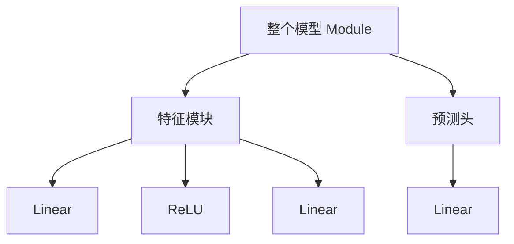
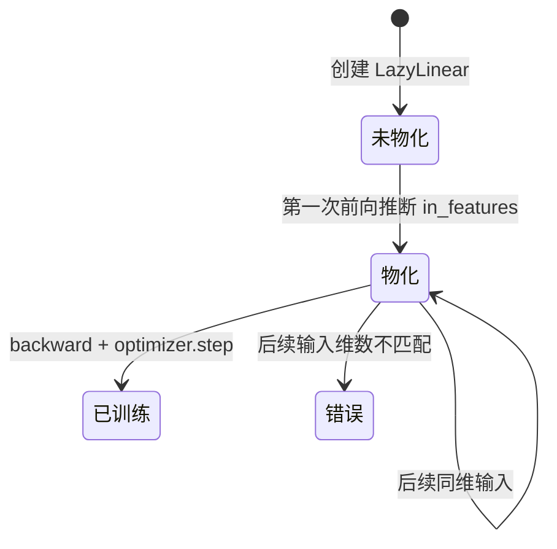
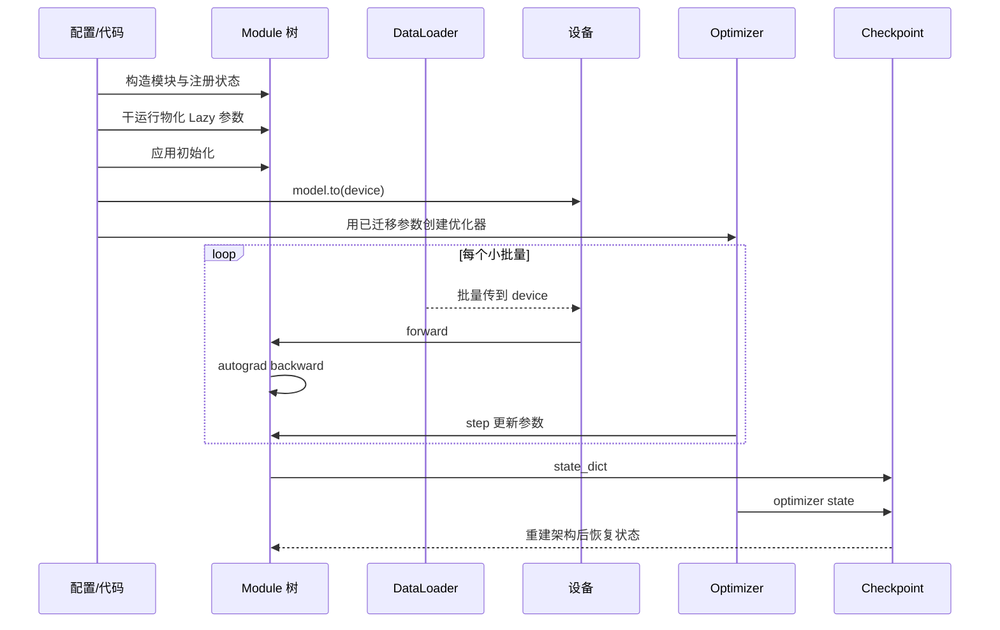
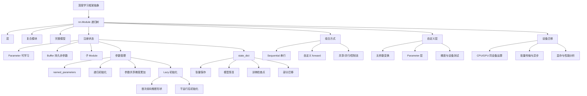

> 中文目录将其称为“深度学习计算”。前五章教我们构造并训练模型，本章则揭开框架抽象：模块怎样递归组合，参数怎样注册、初始化和共享，未知输入维数怎样延迟初始化，怎样安全编写自定义层与保存检查点，以及怎样让数据和模型在 GPU 上高效协同。

## 1. 从框架使用者到模型构建者

深度学习的发展不仅依赖数据和硬件，也依赖软件抽象。早期研究者逐个实现神经元和导数；现代开发者更多用层、模块乃至重复的大型模块设计网络。这类似硬件工程从晶体管上升到逻辑门和高级描述语言：抽象复用成熟组件，同时必须保留下探能力，以便实现尚不存在的新结构。

本章不引入新的预测模型或数据集，而是回答六个工程问题：

1. 一个层、一个重复结构和整个模型如何使用同一套模块接口？
2. 框架如何发现参数，怎样读取、初始化和共享它们？
3. 输入维数未知时，参数为何可以推迟到第一次前向再创建？
4. 怎样编写带参数或不带参数的自定义层，并让 autograd、设备迁移和序列化继续工作？
5. 怎样保存张量、模型参数和可恢复训练的检查点？
6. 怎样选择设备并避免 CPU/GPU 传输抵消加速收益？

这些问题形成一条共同主线：**只有把状态注册进模块树，框架才能统一完成梯度计算、初始化、设备迁移和持久化。**

```mermaid
flowchart LR
    A[模型定义] --> B[Module 递归树]
    B --> C1[子模块注册]
    B --> C2[Parameter 注册]
    B --> C3[Buffer 注册]
    C1 --> D[state_dict]
    C2 --> D
    C3 --> D
    B --> E[forward 计算图]
    E --> F[autograd 反向传播]
    B --> G[初始化与共享]
    D --> H[保存/恢复/迁移]
    B --> I[to(device)]
    I --> J[CPU 或 GPU 执行]
```

## 2. 层与模块

### 2.1 为什么“模块”比“层”更一般

单个神经元、整层神经元和完整 MLP 都具有相似结构：

- 接收输入；
- 计算输出；
- 可能拥有可学习参数；
- 参与反向传播。

复杂网络还包含“比层大、比模型小”的重复结构。例如 ResNet-152 有数百层，但主要由若干种残差模块反复组合。若逐层手写，不仅冗长，也难以统一迁移、保存和检查。

PyTorch 用 `nn.Module` 表示这种递归抽象。一个模块可以是：

- 无参数操作，如 `nn.ReLU`；
- 一个带参数层，如 `nn.Linear`；
- 多层组成的模块；
- 整个模型；
- 包含条件、循环、分支和共享参数的任意可微程序。

模块树可递归嵌套：



框架沿这棵树递归查找参数、切换训练模式、移动设备和生成状态字典。

### 2.2 `nn.Module` 的基本契约

自定义模块通常需要：

1. 继承 `nn.Module`；
2. 在构造函数第一时间调用 `super().__init__()`；
3. 把子模块、参数和持久状态注册为实例属性；
4. 实现 `forward`，说明输入怎样变成输出。

```python
class MLP(nn.Module):
    def __init__(self, num_inputs, num_hiddens, num_outputs):
        super().__init__()
        self.hidden = nn.Linear(num_inputs, num_hiddens)
        self.output = nn.Linear(num_hiddens, num_outputs)

    def forward(self, X):
        H = torch.relu(self.hidden(X))
        return self.output(H)
```

我们只写前向，不手写模块的 `backward`。前向使用的张量运算会动态构造计算图，autograd 根据图生成反向计算。

调用模型应写：

```python
Y = model(X)
```

而不是日常直接调用 `model.forward(X)`。`model(X)` 实际进入 `nn.Module.__call__`，后者除调用 `forward` 外，还负责前后向钩子、自动混合精度等框架机制。绕过 `__call__` 可能让这些机制失效。

### 2.3 子模块为什么必须注册

把 `nn.Module` 赋给已经初始化的父模块属性时，PyTorch 会把它加入内部 `_modules` 容器：

```python
self.hidden = nn.Linear(20, 256)
```

之后框架才能递归执行：

```python
list(model.parameters())
model.to(device)
model.train()
model.eval()
model.state_dict()
```

若把层仅存进普通 Python 列表：

```python
self.layers = [nn.Linear(4, 8), nn.Linear(8, 2)]
```

前向调用仍可能运行，但参数不会自动出现在 `model.parameters()`，不会跟随 `.to(device)`，也不会保存进 `state_dict`。正确容器是：

```python
self.layers = nn.ModuleList([
    nn.Linear(4, 8),
    nn.Linear(8, 2),
])
```

需要键名时使用 `nn.ModuleDict`；动态添加单个模块可调用 `add_module(name, module)`。

这揭示一个重要原则：**“Python 能访问到对象”不等于“框架已注册对象”。**

### 2.4 `nn.Sequential` 的工作方式

简单串行结构可写为：

```python
net = nn.Sequential(
    nn.LazyLinear(256),
    nn.ReLU(),
    nn.LazyLinear(10),
)
```

`Sequential` 维护有序子模块列表，前向依次执行：

$$
X_0=X,
\qquad
X_{i+1}=M_i(X_i).
$$

一个简化实现：

```python
class MySequential(nn.Module):
    def __init__(self, *modules):
        super().__init__()
        for index, module in enumerate(modules):
            self.add_module(str(index), module)

    def forward(self, X):
        for module in self.children():
            X = module(X)
        return X
```

`add_module` 不只是把对象放入列表，还完成注册。`children()` 返回直接子模块且保持注册顺序。

`Sequential` 适合单输入单输出的纯链式结构。若需要多输入、多输出、残差连接、并行分支、复用中间量或数据依赖控制流，应编写自定义 `forward`，而不是勉强把结构塞入顺序容器。

### 2.5 任意代码与动态控制流

`forward` 是普通 Python 方法，可包含：

- 张量算术；
- 条件分支和循环；
- 子模块复用；
- 拼接、索引和多个返回值；
- 非参数常量。

原书的 `FixedHiddenMLP` 重复使用同一个 `Linear` 层，并循环除以 $2$，直到输出绝对值之和不大于 $1$。这说明动态执行的实际路径可以由数据决定，autograd 对本次执行过的张量操作求导。

但任意 Python 控制流有工程代价：

- 用 GPU 张量作为 `while` 条件常触发 CPU/GPU 同步；
- 数据依赖循环难以被静态图编译器优化；
- 循环次数不可控时延迟难预测；
- 原地操作可能破坏反向所需中间值。

“框架允许”不等于“性能合适”。

### 2.6 参数、缓冲区与普通属性

模块内部状态应按语义分三类：

| 状态 | 注册方法 | 求梯度 | 随 `.to()` 移动 | 进入 `state_dict` | 示例 |
|---|---|---:|---:|---:|---|
| 可学习参数 | `nn.Parameter` | 通常是 | 是 | 是 | 权重、偏置 |
| 持久非参数状态 | `register_buffer` | 通常否 | 是 | 默认是 | 运行均值、固定矩阵 |
| 普通 Python 属性 | 直接赋值 | 否 | 张量不会自动移动 | 否 | 整数配置、字符串 |

原书把固定随机权重写成普通张量属性：

```python
self.rand_weight = torch.rand(20, 20)
```

它不会被优化，但也不会自动随模型迁移到 GPU 或保存。现代 PyTorch 更稳妥的写法：

```python
self.register_buffer("rand_weight", torch.rand(20, 20))
```

若常量无需持久化，可设置 `persistent=False`。把 `requires_grad=False` 的张量包装成 `Parameter` 虽然不产生梯度，却会把它语义上列为模型参数；固定模型状态通常应使用 buffer。

### 2.7 参数共享与模块复用

同一个模块实例可以在前向中调用多次：

```python
self.shared = nn.Linear(8, 8)

def forward(self, X):
    X = torch.relu(self.shared(X))
    X = torch.relu(self.shared(X))
    return X
```

两次调用使用相同参数，这叫**参数共享**。它不同于创建两个初值相等但相互独立的层。共享要求输入输出形状兼容。

若总损失为

$$
L=L_1(W)+L_2(W),
$$

共享参数梯度为

$$
\dfrac{\partial L}{\partial W}
=\dfrac{\partial L_1}{\partial W}
+\dfrac{\partial L_2}{\partial W}.
$$

autograd 会把所有使用路径的贡献累加到同一 `Parameter.grad`，优化器应只更新该对象一次。

参数共享可以：

- 减少参数量和显存；
- 强制不同位置使用同一变换，编码归纳偏置；
- 让不同数据位置共同估计同一参数；
- 实现循环网络、孪生网络和重复迭代模块。

它也会耦合梯度和表示能力，不适合本应学习不同变换的位置。

### 2.8 并行模块与模块工厂

并行模块可对同一输入运行两个子网络并拼接：

```python
class ParallelConcat(nn.Module):
    def __init__(self, net1, net2, dim=-1):
        super().__init__()
        self.net1 = net1
        self.net2 = net2
        self.dim = dim

    def forward(self, X):
        return torch.cat((self.net1(X), self.net2(X)), dim=self.dim)
```

构造多个“相同结构但参数独立”的模块时，应每次调用工厂，或用 `copy.deepcopy`：

```python
blocks = nn.ModuleList([make_block() for _ in range(4)])
```

若把同一个 `block` 对象重复放入列表，得到的是参数共享，不是四份独立参数。是否共享必须是明确设计，而非 Python 引用别名的偶然结果。

## 3. 参数管理

### 3.1 参数对象包含什么

`nn.Parameter` 是特殊张量，除了数值，还具有：

- `requires_grad`：是否参与梯度记录；
- `.grad`：反向后累积的梯度；
- 数据类型与设备；
- 在模块树中的名称和归属。

模型第一次反向前，参数梯度通常为 `None`，不是全零：

```python
assert layer.weight.grad is None
```

`optimizer.zero_grad(set_to_none=True)` 也会把梯度恢复为 `None`。这可节省写零开销，并帮助区分“参数未收到梯度”和“参数收到恰好为零的梯度”。

### 3.2 定向访问参数

顺序模型可按索引取得层：

```python
layer = net[2]
weight = layer.weight
bias = layer.bias
```

查看数值时通常使用：

```python
weight.detach()
```

若要转成 NumPy：

```python
array = weight.detach().cpu().numpy()
```

不推荐用 `.data` 做日常修改。`.data` 绕过 autograd 的版本追踪，可能静默产生错误梯度。需要手动改值时：

```python
with torch.no_grad():
    layer.weight.add_(1.0)
```

### 3.3 一次访问所有参数

```python
for name, parameter in model.named_parameters():
    print(name, parameter.shape)
```

名称反映模块树路径，例如：

```text
features.0.weight
features.0.bias
head.weight
head.bias
```

常用遍历接口：

- `parameters()`：递归参数对象，供优化器使用；
- `named_parameters()`：参数名和对象；
- `children()`：直接子模块；
- `modules()`：包含自身的全部递归模块；
- `named_modules()`：模块路径和对象；
- `state_dict()`：参数和持久 buffer 的名称到张量映射。

`state_dict` 不等同于 `named_parameters`：它还包含 BatchNorm 运行统计等 buffer。

### 3.4 参数是否真共享

数值相等不能证明共享。应检查对象身份或存储地址：

```python
assert net[2].weight is net[4].weight
assert net[2].weight.data_ptr() == net[4].weight.data_ptr()
```

修改一处后另一处同步变化，也能证明共享，但不要用危险的 `.data` 修改：

```python
with torch.no_grad():
    net[2].weight[0, 0] = 100
```

`named_parameters()` 默认会去重同一参数对象，而 `state_dict` 可能保留反映模块路径的键。加载后是否继续共享由**模型架构中的对象关系**决定，不是仅靠两个相同张量值决定。

## 4. 参数初始化

### 4.1 参数初始化的目标

初始化需要同时满足：

1. 打破隐藏单元对称性；
2. 让前向激活和反向梯度处于合理尺度；
3. 与激活函数和网络结构匹配；
4. 具备可复现和可审计的配置。

框架默认初始化常适合中等网络，但研究和复杂结构经常需要显式方案。

### 4.2 递归应用内置初始化器

`Module.apply(fn)` 先递归访问子模块，再把函数应用于每个模块。推荐用 `isinstance`，兼容 `nn.Linear` 子类：

```python
def init_normal(module):
    if isinstance(module, nn.Linear):
        nn.init.normal_(module.weight, mean=0.0, std=0.01)
        if module.bias is not None:
            nn.init.zeros_(module.bias)

model.apply(init_normal)
```

其他常用初始化：

```python
nn.init.xavier_uniform_(module.weight)
nn.init.kaiming_normal_(module.weight, nonlinearity="relu")
nn.init.constant_(module.bias, 0.0)
```

可以只对某个子模块调用 `apply`，为不同层设置不同策略。输出层、嵌入层、归一化缩放参数不一定采用相同初始化。

### 4.3 自定义初始化分布

原书构造：

$$
w\sim
\begin{cases}
U(5,10),&\operatorname{probability}=1/4,\\
0,&\operatorname{probability}=1/2,\\
U(-10,-5),&\operatorname{probability}=1/4.
\end{cases}
$$

可先采样 $U(-10,10)$，再把绝对值小于 $5$ 的元素置零：

```python
def custom_init(module):
    if isinstance(module, nn.Linear):
        with torch.no_grad():
            module.weight.uniform_(-10, 10)
            module.weight.mul_(module.weight.abs() >= 5)
            if module.bias is not None:
                module.bias.zero_()
```

区间总长为 $20$，两侧保留区间各长 $5$，所以概率各为 $1/4$；中间长度 $10$ 被映射为零，概率为 $1/2$。

自定义初始化必须考虑设备和 dtype，且只应在参数形状已确定后运行。

## 5. 延迟初始化

### 5.1 为什么参数形状可以暂时未知

普通线性层需要 `in_features` 和 `out_features`，权重形状为：

$$
W\in\mathbb R^{d_{\mathrm{out}}\mathbin{\times}d_{\mathrm{in}}}.
$$

复杂网络中，前一层输出维数可能受输入分辨率、卷积参数或分支结构影响，手算容易出错。`nn.LazyLinear(out_features)` 先只知道输出维数，把权重保留为未初始化参数，直到第一次看到输入末轴长度。

```python
net = nn.Sequential(
    nn.LazyLinear(256),
    nn.ReLU(),
    nn.LazyLinear(10),
)
```

第一次输入 `X.shape == (2, 20)` 后：

- 第一层权重形状变为 $(256,20)$；
- 第一层输出末轴为 $256$；
- 第二层权重形状变为 $(10,256)$。

框架沿前向顺序传播形状并物化参数。

### 5.2 延迟初始化的生命周期



延迟只发生一次。第一次输入若形状错误，会把层锁定到错误维数；后续不同维度输入会矩阵乘法失败。Lazy 层不是支持任意输入宽度的动态权重层。

### 5.3 初始化时机

在未物化参数上访问形状或执行依赖形状的自定义初始化可能失败。稳妥流程：

```python
model = LazyModel()
with torch.no_grad():
    model(example_input)  # dry run，物化形状
model.apply(init_fn)
```

干运行输入必须具有正确设备、dtype 和代表性形状。若模型包含 BatchNorm 或 dropout，可先切换合适模式，避免干运行意外改变运行统计或引入不必要随机性。

有些现代 PyTorch 初始化器和 `load_state_dict` 能处理部分 lazy 场景，但明确物化后再初始化、检查和创建优化器，生命周期更容易推理。

### 5.4 延迟初始化的优点与局限

优点：

- 修改上游架构时少改一个输入维数；
- 减少卷积后展平尺寸的手算错误；
- 原型代码更简洁。

局限：

- 运行前参数量和形状不完整；
- 初始化和优化器构造时机更敏感；
- 第一次输入具有隐式配置作用；
- 静态分析、导出和某些编译工具更喜欢显式形状；
- 不能解决样本间特征宽度真的不同的问题。

可变宽度输入通常要填充/掩码、池化成固定宽度、使用共享逐位置层，或为不同输入类型设计独立适配器，而不是重复物化同一 Lazy 层。

## 6. 自定义层

### 6.1 为什么需要自定义层

框架提供线性、卷积、归一化等常用层，但新研究经常需要：

- 新数学变换；
- 新参数约束或共享方式；
- 图像、文本、序列或动态规划专用操作；
- 特定输入输出结构；
- 不存在于当前版本的研究组件。

自定义层仍继承 `nn.Module`，因此只要正确注册状态并使用可微张量运算，就能无缝进入更大模型、优化器、设备迁移和检查点。

### 6.2 不带参数的层

原书的中心化层：

```python
class CenteredLayer(nn.Module):
    def forward(self, X):
        return X - X.mean()
```

它减去整个输入张量的单一均值，所以输出全局均值接近零：

$$
Y=X-\bar X,
\qquad
\bar X=\dfrac{1}{N}\sum_iX_i.
$$

浮点舍入可能使 `Y.mean()` 是很小的非零数。

需要区分“全局中心化”和“逐特征中心化”。若输入形状 $(B,d)$，希望每个特征在批量上均值为零，应写：

```python
return X - X.mean(dim=0, keepdim=True)
```

而样本独立推理通常不应让一个样本输出依赖同批其他样本，除非这是明确设计（如 BatchNorm 的训练行为）。

### 6.3 带参数的层

自定义全连接层：

```python
class MyLinear(nn.Module):
    def __init__(self, in_units, out_units):
        super().__init__()
        self.weight = nn.Parameter(torch.empty(in_units, out_units))
        self.bias = nn.Parameter(torch.zeros(out_units))
        nn.init.xavier_uniform_(self.weight)

    def forward(self, X):
        return torch.relu(X @ self.weight + self.bias)
```

前向形状：

$$
X\in\mathbb R^{B\mathbin{\times}d_{\mathrm{in}}},
\quad
W\in\mathbb R^{d_{\mathrm{in}}\mathbin{\times}d_{\mathrm{out}}},
$$

$$
Y=\operatorname{ReLU}(XW+b)
\in\mathbb R^{B\mathbin{\times}d_{\mathrm{out}}}.
$$

原书合并稿中的示例前向使用 `self.weight.data` 和 `self.bias.data`。在现代 PyTorch 中这会让计算绕开 autograd，参数可能收不到梯度。**正确做法是直接使用 `self.weight` 和 `self.bias`。** `.data` 不应出现在需要求导的前向路径中。

### 6.4 自定义层的梯度检查

最低限度应验证：

```python
layer = MyLinear(5, 3)
X = torch.randn(2, 5, requires_grad=True)
loss = layer(X).sum()
loss.backward()

assert layer.weight.grad is not None
assert layer.weight.grad.shape == layer.weight.shape
assert X.grad is not None
```

复杂公式还应使用有限差分或 `torch.autograd.gradcheck`（通常需 `float64`、小输入和光滑点）核对解析梯度。只检查前向形状不足以证明层可训练。

### 6.5 二次交互层

原章练习要求：

$$
y_k=\sum_{i,j}W_{kij}x_ix_j.
$$

批量实现可使用 Einstein 求和：

```python
class QuadraticLayer(nn.Module):
    def __init__(self, in_features, out_features):
        super().__init__()
        self.weight = nn.Parameter(
            torch.randn(out_features, in_features, in_features) * 0.01
        )
        self.bias = nn.Parameter(torch.zeros(out_features))

    def forward(self, X):
        return torch.einsum("bi,kij,bj->bk", X, self.weight, X) + self.bias
```

计算量和参数量为 $O(qd^2)$，高维时很昂贵。因为 $x_ix_j=x_jx_i$，$W$ 的反对称部分不影响输出，可约束对称或采用低秩分解减少冗余。

### 6.6 傅里叶系数层

返回实信号前半频谱可用：

```python
class HalfSpectrum(nn.Module):
    def forward(self, X):
        spectrum = torch.fft.rfft(X, dim=-1)
        return spectrum[..., : spectrum.shape[-1] // 2]
```

需提前约定：

- 输出是复数还是拆成实部/虚部；
- 保留多少频率；
- 是否规范化；
- 输入长度变化时输出形状如何处理；
- 下游层是否支持复数。

FFT 对输入可微，框架能反向传播；但离散截断会永久丢弃高频信息。

### 6.7 自定义层的工程清单

1. 参数用 `nn.Parameter`；持久常量用 `register_buffer`。
2. 前向不用 `.data`、NumPy 或不可微 Python 标量运算切断图。
3. 保持 dtype、device 和批量语义。
4. 不做会破坏反向中间量的原地修改。
5. 文档明确输入输出形状和边界条件。
6. 测试前向值、形状、梯度、序列化和 CPU/GPU 迁移。
7. 必要时实现 `extra_repr`，方便打印配置。

## 7. 文件 I/O 与检查点

### 7.1 为什么必须保存

模型持久化用于：

- 训练后部署推理；
- 长任务中断恢复；
- 保存最佳验证检查点；
- 复现实验和比较阶段结果；
- 迁移学习或复用部分层；
- 离线分析参数。

只保存最终权重解决“推理恢复”，不一定解决“训练无缝恢复”。

### 7.2 保存张量和容器

```python
x = torch.arange(4)
torch.save(x, "x.pt")
x2 = torch.load("x.pt", weights_only=True)
```

列表和字典也可保存：

```python
payload = {"x": x, "y": torch.zeros(4)}
torch.save(payload, "tensors.pt")
loaded = torch.load("tensors.pt", weights_only=True)
```

`torch.save` 保存的是 Python/PyTorch 序列化数据，不是语言无关交换格式。`torch.load` 对不可信文件存在代码执行与资源消耗风险；现代版本应优先显式使用 `weights_only=True` 加载纯张量状态，并且仍只加载可信来源。

### 7.3 `state_dict` 是什么

```python
state = model.state_dict()
```

它是有序的名称到张量映射，包含：

- 递归注册的参数；
- 持久 buffer；
- 某些模块额外保存的状态。

不包含：

- Python 类定义与 `forward` 代码；
- 普通未注册张量属性；
- 一般超参数和数据处理配置；
- 优化器状态（除非单独保存）。

推荐保存状态字典：

```python
torch.save(model.state_dict(), "model.pt")
```

恢复需要先用代码重建兼容架构：

```python
clone = MLP(...)
state = torch.load("model.pt", map_location="cpu", weights_only=True)
clone.load_state_dict(state)
clone.eval()
```

同一输入应使用 `torch.testing.assert_close` 或 `torch.allclose` 比较。若模型含 dropout/BatchNorm，必须切换 `eval()` 才能比较稳定推理行为。

### 7.4 为什么通常不直接保存整个模型对象

```python
torch.save(model, "entire-model.pt")
```

虽然某些环境可用，但它依赖 Python pickle、类的导入路径和当前代码结构。重命名模块、修改类或跨环境部署都可能破坏恢复，也扩大加载不可信对象的安全风险。

更稳健的组合是：

- 模型代码和版本控制；
- JSON/YAML 等架构配置；
- `state_dict`；
- 依赖和框架版本；
- 预处理器与标签词表。

需要语言无关或优化部署时，可进一步使用适合当前目标平台的导出格式；导出能力受动态控制流和算子支持限制。

### 7.5 可恢复训练的检查点

完整训练检查点通常包含：

```python
checkpoint = {
    "epoch": epoch,
    "model": model.state_dict(),
    "optimizer": optimizer.state_dict(),
    "scheduler": scheduler.state_dict() if scheduler else None,
    "best_metric": best_metric,
    "config": config,
    "torch_rng": torch.get_rng_state(),
}
if torch.cuda.is_available():
    checkpoint["cuda_rng"] = torch.cuda.get_rng_state_all()

torch.save(checkpoint, "checkpoint.pt")
```

使用自动混合精度时还应保存梯度缩放器；分布式采样器、数据顺序和外部随机库也可能影响精确复现。

优化器状态如动量和 Adam 二阶矩是训练轨迹的一部分。只恢复模型权重再创建新优化器可以继续训练，但不等价于从中断点无缝恢复。

### 7.6 安全写入与版本兼容

长训练不应直接覆盖唯一检查点。更安全流程：

1. 写入临时文件；
2. 刷新并关闭；
3. 原子重命名为正式文件；
4. 保留最近若干周期和最佳指标检查点；
5. 可选记录哈希和文件大小。

加载时检查：

- 架构和配置版本；
- 参数键、形状和 dtype；
- 预处理器版本；
- 缺失/意外键；
- 文件来源和完整性。

### 7.7 部分复用参数

迁移前两层到新网络时，可筛选名称和形状：

```python
source = torch.load("old.pt", map_location="cpu", weights_only=True)
target_state = new_model.state_dict()

compatible = {
    key: value
    for key, value in source.items()
    if key in target_state and value.shape == target_state[key].shape
}

result = new_model.load_state_dict(compatible, strict=False)
print("missing:", result.missing_keys)
print("unexpected:", result.unexpected_keys)
```

`strict=False` 不应成为忽略所有错误的开关。必须审查缺失和意外键，确认它们正是有意更换的层。名称相同、形状相同也不保证语义相同，架构变更需版本记录。

### 7.8 `map_location` 与设备无关恢复

GPU 保存的张量可加载到 CPU：

```python
state = torch.load(
    "model.pt",
    map_location=torch.device("cpu"),
    weights_only=True,
)
```

推荐先在 CPU 加载状态，再把完整模型移到目标设备。这样恢复逻辑不依赖原机器 GPU 编号，也避免在加载瞬间占用错误显卡。

## 8. GPU 计算

### 8.1 设备是张量状态的一部分

每个张量都有 `device`：

```python
cpu_device = torch.device("cpu")
cuda_device = torch.device("cuda:0")
```

默认张量在 CPU 主存。CUDA 张量存于某张 GPU 显存并由该 GPU 执行支持的算子。`cuda` 等价于当前默认 CUDA 设备，显式 `cuda:0` 更清楚。

设备选择：

```python
device = torch.device(
    "cuda:0" if torch.cuda.is_available() else "cpu"
)
```

可用 GPU 数量：

```python
count = torch.cuda.device_count()
```

稳健的所有设备辅助函数应在没有 GPU 时返回 CPU，而不是空列表：

```python
def available_devices():
    if torch.cuda.is_available():
        return [torch.device(f"cuda:{i}")
                for i in range(torch.cuda.device_count())]
    return [torch.device("cpu")]
```

### 8.2 同一算子的输入必须在同一设备

```python
X = torch.ones(2, 3, device=device)
Y = torch.rand(2, 3, device=device)
Z = X + Y
```

CPU 张量与 CUDA 张量不能直接相加，不同 GPU 上的张量通常也不能直接参与同一普通算子。框架选择报错而非偷偷复制，是为了暴露可能非常昂贵的隐式传输。

移动张量：

```python
X_gpu = X.to("cuda:0")
X_cpu = X_gpu.to("cpu")
```

如果目标设备与当前相同，`.to(device)` 通常直接返回原对象；若 dtype 或设备变化，则创建副本。需要强制复制可用 `copy=True`。

### 8.3 模型和批量必须一起迁移

```python
model = model.to(device)

for X, y in loader:
    X = X.to(device)
    y = y.to(device)
    logits = model(X)
```

`model.to(device)` 递归移动已注册参数和 buffer，这再次说明普通未注册张量属性会造成设备错配。

通常应先把模型移到最终设备，再创建优化器：

```python
model = Model().to(device)
optimizer = torch.optim.Adam(model.parameters(), lr=1e-3)
```

设备转换可能替换参数对象；先创建优化器再移动模型在某些后端或工作流中可能让优化器保留旧引用。

### 8.4 数据传输为何昂贵

GPU 擅长高吞吐并行算术，但 CPU 与 GPU 通过总线传输数据，延迟和带宽都远弱于显存内部计算。若每个小操作前后都搬数据，加速收益会被传输和同步吞噬。

经验原则：

- 让参数、激活和损失尽量长期驻留 GPU；
- 一次搬较大连续批量，避免大量小拷贝；
- 不在每个训练步调用 `.item()`、`print(tensor)` 或 `.cpu().numpy()`；
- 在 GPU 累积日志，隔若干步批量传回；
- 使用分析器确认瓶颈，而不是假设 GPU 一定更快。

小矩阵和轻量任务可能因内核启动与传输开销而比 CPU 慢。

### 8.5 固定内存与异步传输

CUDA 训练中，数据加载器可使用页锁定内存：

```python
loader = DataLoader(
    dataset,
    batch_size=256,
    pin_memory=True,
    num_workers=4,
)
```

随后：

```python
X = X.to(device, non_blocking=True)
```

在满足条件时，页锁定内存和 `non_blocking=True` 允许 CPU 到 GPU 拷贝与部分计算重叠。它不是无条件加速：页锁内存是稀缺系统资源，批量太小、工作线程过多或流水线不匹配都可能变慢。

### 8.6 GPU 异步执行与正确计时

CUDA 算子通常异步排队。普通 Python 计时可能只测到“提交内核”的时间：

```python
start = time.perf_counter()
Y = X @ X
torch.cuda.synchronize()
elapsed = time.perf_counter() - start
```

更精确的 GPU 区间计时可使用 CUDA events。预热若干次以排除首次内核和缓存开销，并分别报告传输时间与纯计算时间。

许多操作会隐式同步：

- `.item()`；
- 把 CUDA 张量转 CPU/NumPy；
- 某些打印和 Python 条件；
- 显式 `synchronize()`。

同步不是错误，但放在每批热路径会串行化原本可重叠的工作。

### 8.7 GPU 内存构成

训练显存通常包含：

- 模型参数；
- 参数梯度；
- 优化器状态；
- 前向激活和反向中间量；
- 临时工作区与 CUDA 缓存分配。

OOM 时可考虑：

- 减小批量；
- 混合精度；
- 梯度累积；
- 激活检查点；
- 更节省状态的优化器；
- 模型/数据并行；
- 减少不必要的计算图保留。

`torch.cuda.empty_cache()` 只释放缓存分配器中当前未使用的块给其他进程，不会释放仍被张量引用的显存，也不是修复内存泄漏的主要方法。

### 8.8 多 GPU 的基本边界

原章用两张 GPU 演示设备间复制，目的是解释数据流，不是完整分布式训练。并行加速需要：

- 将任务拆到不同设备；
- 尽量并发执行；
- 控制设备间通信；
- 最后同步或聚合结果。

两个 GPU 各做独立矩阵乘法可能接近线性加速；若每一步都互相传小张量，通信会占主导。后续章节会系统讨论多 GPU 与参数服务器。

### 8.9 CPU 回退与可移植代码

教学和测试代码应允许无 CUDA 环境运行：

```python
device = torch.device("cuda" if torch.cuda.is_available() else "cpu")
```

但 CPU 回退只能验证功能，不能证明 CUDA 性能、显存和异步行为。GPU 专属结论必须在真实 GPU 上用同步计时和分析器验证。

## 9. 一个贯穿全章的运行流程



顺序有实际意义：Lazy 参数未物化前不能可靠自定义初始化；模型迁移后再建优化器可避免旧参数引用；恢复时先重建兼容架构，再加载状态并切换推理模式。

## 10. 可运行的综合实验

下面的 PyTorch 脚本不要求 GPU。它验证本章最关键的框架语义：模块注册、buffer 迁移、自定义层梯度、延迟初始化、参数共享的梯度累加、递归初始化、状态字典保存恢复，以及 CPU/GPU 自动选择。

```python
from pathlib import Path
from tempfile import TemporaryDirectory

import torch
from torch import nn

torch.manual_seed(17)

class CenteredLayer(nn.Module):
    def forward(self, X):
        return X - X.mean(dim=0, keepdim=True)

class MyLinear(nn.Module):
    def __init__(self, in_features, out_features):
        super().__init__()
        self.weight = nn.Parameter(torch.empty(in_features, out_features))
        self.bias = nn.Parameter(torch.zeros(out_features))
        nn.init.xavier_uniform_(self.weight)

    def forward(self, X):
        # Use Parameters directly; .data here would detach the computation.
        return torch.relu(X @ self.weight + self.bias)

class SharedBlock(nn.Module):
    def __init__(self, width):
        super().__init__()
        self.shared = nn.Linear(width, width, bias=False)
        self.register_buffer("scale", torch.tensor(0.5))

    def forward(self, X):
        first = self.shared(X)
        second = self.shared(self.scale * X)
        return first + second

class LazyNet(nn.Module):
    def __init__(self):
        super().__init__()
        self.net = nn.Sequential(
            nn.LazyLinear(8),
            nn.ReLU(),
            CenteredLayer(),
            MyLinear(8, 2),
        )

    def forward(self, X):
        return self.net(X)

# 1. Lazy initialization infers the first layer's input width.
model = LazyNet()
example = torch.randn(6, 4)
with torch.no_grad():
    model(example)
assert tuple(model.net[0].weight.shape) == (8, 4)

# 2. Recursive initialization reaches registered submodules.
def initialize(module):
    if isinstance(module, nn.Linear):
        nn.init.xavier_uniform_(module.weight)
        if module.bias is not None:
            nn.init.zeros_(module.bias)

model.apply(initialize)

# 3. The custom Parameter receives gradients; centering is per feature.
features = torch.randn(12, 4, requires_grad=True)
targets = torch.randn(12, 2)
prediction = model(features)
loss = torch.nn.functional.mse_loss(prediction, targets)
loss.backward()

assert model.net[3].weight.grad is not None
assert model.net[3].weight.grad.shape == model.net[3].weight.shape
assert features.grad is not None
centered = CenteredLayer()(torch.randn(20, 5))
assert torch.allclose(centered.mean(dim=0), torch.zeros(5), atol=1e-6)

# 4. Reusing one module accumulates gradients from both paths.
shared_block = SharedBlock(width=3)
shared_input = torch.randn(4, 3)
shared_output = shared_block(shared_input).sum()
shared_output.backward()

expected_input = shared_input + 0.5 * shared_input
expected_gradient = torch.ones(3, 4) @ expected_input
assert torch.allclose(shared_block.shared.weight.grad, expected_gradient)
assert "scale" in shared_block.state_dict()
assert len(list(shared_block.parameters())) == 1

# 5. State dictionaries restore identical evaluation outputs.
model.eval()
probe = torch.randn(5, 4)
with torch.no_grad():
    reference = model(probe)

with TemporaryDirectory() as temporary_directory:
    checkpoint_path = Path(temporary_directory) / "model.pt"
    torch.save(model.state_dict(), checkpoint_path)

    clone = LazyNet()
    with torch.no_grad():
        clone(probe)  # Materialize lazy parameters.
    state = torch.load(
        checkpoint_path,
        map_location="cpu",
        weights_only=True,
    )
    clone.load_state_dict(state)
    clone.eval()
    with torch.no_grad():
        restored = clone(probe)

torch.testing.assert_close(restored, reference)

# 6. Parameters and buffers move together to the available device.
device = torch.device("cuda:0" if torch.cuda.is_available() else "cpu")
shared_block = shared_block.to(device)
device_input = shared_input.to(device)
device_output = shared_block(device_input)

assert shared_block.shared.weight.device == device
assert shared_block.scale.device == device
assert device_output.device == device

print("custom-layer gradients = PASS")
print("lazy weight shape =", tuple(model.net[0].weight.shape))
print("shared gradient norm =", shared_block.shared.weight.grad.norm().item())
print("state-dict round trip = PASS")
print("selected device =", device)
```

代码与原理对应如下：

1. `LazyLinear` 在干运行后从输入推断权重形状 $(8,4)$；
2. `model.apply` 递归初始化注册子模块；
3. `MyLinear` 直接使用 `Parameter`，因此权重和输入都收到梯度；
4. 同一线性层用在两条路径，梯度等于两条路径贡献之和；
5. `scale` 作为 buffer 进入 `state_dict` 并随模型迁移，却不进入优化参数；
6. 临时目录中的 `state_dict` 被新架构恢复，相同输入得到相同输出；
7. 脚本有 CUDA 就使用第一张 GPU，否则在 CPU 验证相同设备语义。

GPU 性能、异步传输和显存行为不能由 CPU 回退证明，仍需在实际 CUDA 设备上单独基准测试。

## 11. 容易混淆的概念与常见误区

### 11.1 层、模块、模块组与模型

它们不是互斥类型。`nn.Module` 是统一编程抽象：一个模块可以是一层、重复模块或完整模型。语义层级由组合位置决定。

### 11.2 `forward(X)` 与 `model(X)`

`forward` 定义计算；`model(X)` 经 `__call__` 执行并保留钩子等框架行为。日常调用应使用后者。

### 11.3 普通列表与 `ModuleList`

普通列表只让 Python 保存引用；`ModuleList` 还让框架注册子模块。前者可能前向可跑，却无法正确优化、迁移或保存。

### 11.4 `Parameter`、buffer 与常量

`Parameter` 是可学习模型状态；buffer 是不由优化器更新但需迁移/保存的张量；普通常量适合不依赖设备的配置。`requires_grad=False` 不会自动把张量变成 buffer。

### 11.5 参数相等与参数共享

两个参数数值相等可能只是初始化相同；共享意味着同一对象和同一存储。前者各自接收梯度，后者汇总所有使用路径的梯度。

### 11.6 注册参数与参与优化

参数注册后会出现在 `model.parameters()`，但只有被交给优化器且收到梯度才会更新。冻结参数、遗漏优化器参数组或计算图断开都会阻止更新。

### 11.7 `.data` 与 `detach`

两者都能取得不跟踪当前历史的视图，但 `.data` 绕过版本检查，可能静默破坏 autograd；读值用 `detach()`，改参数用 `with torch.no_grad()`。

### 11.8 `state_dict` 与模型对象

`state_dict` 保存状态，不保存 `forward` 代码和架构。恢复时必须重建兼容模块树。保存整个 pickle 对象不是长期兼容部署的默认好方案。

### 11.9 参数字典与训练检查点

模型 `state_dict` 足以推理，不足以无缝继续训练。检查点还需优化器、调度器、epoch、最佳指标和随机状态。

### 11.10 `strict=False` 与兼容加载

它允许缺键和多余键，不会证明迁移语义正确，也不会自动忽略所有形状冲突。加载结果必须人工审查。

### 11.11 延迟初始化与动态输入

Lazy 层只在第一次前向推断一次形状，不会为每种输入尺寸创建新权重。后续特征宽度必须兼容。

### 11.12 初始化与加载预训练参数

初始化用于新参数；`load_state_dict` 用已训练值覆盖参数。若加载后再次 `apply(init_fn)`，会把预训练结果抹掉。

### 11.13 自定义层前向正确与可训练

输出形状正确不代表梯度正确。NumPy 转换、`.item()`、`.data` 或不可微分支都可能切断图，必须检查 `.grad` 或运行 `gradcheck`。

### 11.14 模型设备与输入设备

模型在 GPU 不会自动把输入搬过去；两者必须显式位于同一设备。输出通常跟随执行算子的输入/参数设备。

### 11.15 `.to(device)` 与原地操作

张量的 `.to()` 返回位于目标设备的张量，必须接收返回值；模块的 `.to()` 会原地修改模块并返回自身。不要把两者的对象语义混淆。

### 11.16 CUDA 可用与 CUDA 被使用

`torch.cuda.is_available()` 只说明运行时可用；模型、数据和实际算子是否在 CUDA 上还要检查 `.device` 和分析器。

### 11.17 GPU 更强与任何任务更快

GPU 擅长足够大的并行工作。小算子、频繁传输和同步可能让 CPU 更快。性能结论必须含预热、同步和端到端数据管线。

### 11.18 GPU 异步与“代码执行完”

Python 返回可能只表示内核已排队。读取标量、复制回 CPU 或显式同步才保证结果完成。错误计时常因此夸大 GPU 速度。

### 11.19 显存缓存与内存泄漏

PyTorch 缓存分配器保留已释放块以便复用，所以监控工具显示占用不立即下降不等于泄漏。若仍有张量或计算图引用，`empty_cache()` 也无法释放。

### 11.20 保存到 GPU 与从 GPU 保存

保存的是张量状态及其设备信息；恢复时可用 `map_location` 重映射。检查点文件本身不“住在 GPU”。

## 12. 原章练习的推导与延伸

### 12.1 普通列表为何漏参数

`nn.Module.__setattr__` 只在属性本身是 `Module`、`Parameter` 或已注册 buffer 时触发注册。列表内部对象对父模块不可见。`ModuleList` 自己是模块，并逐项调用注册接口，因此递归遍历可发现内部层。

### 12.2 参数共享的梯度验证

若共享层 $g_W$ 被调用两次：

$$
Y=g_W(X)+g_W(\alpha X),
$$

对线性层 $g_W(X)=XW^{\mathsf T}$，标量损失 $L=\sum Y$ 的梯度为两次输入贡献之和：

$$
\dfrac{\partial L}{\partial W}
=\mathbf1^{\mathsf T}X
+\alpha\mathbf1^{\mathsf T}X.
$$

若创建两个独立层，即使初值相同，各自 `.grad` 只含一条路径贡献。

### 12.3 第一层显式、后续层 Lazy 会怎样

若第一层输入输出都显式确定，后一 `LazyLinear` 仍需等第一次前向才物化，因为框架通常不通过静态阅读任意 Python `forward` 推断形状。`Sequential` 理论上可知前层输出，但 Lazy 机制保持统一运行时推断。

### 12.4 输入维数不匹配

线性层物化为权重 $(q,d)$ 后，输入末轴必须为 $d$：

$$
(B,d')\cdot(d,q)
$$

只有 $d'=d$ 才定义。若样本原始长度变化，可先填充并掩码，或使用对长度不敏感的池化；不能期望同一固定矩阵接受任意宽度。

### 12.5 二次层的对称冗余

因为

$$
x_ix_j=x_jx_i,
$$

把权重分解为对称和反对称部分：

$$
W=S+A,
\qquad
S^{\mathsf T}=S,
\quad
A^{\mathsf T}=-A.
$$

则

$$
\mathbf x^{\mathsf T}A\mathbf x=0,
$$

所以只有 $S$ 影响输出。可只参数化上三角或显式对称化，减少不可识别自由度。

### 12.6 为什么保存参数仍有价值

即使永不跨设备部署，检查点仍能：

- 防止断电或抢占损失多日训练；
- 回滚到最佳验证轮次；
- 比较训练阶段和做消融；
- 复现论文结果；
- 诊断数值异常出现在哪一轮。

### 12.7 怎样保存架构

一种可维护方案：

```text
model_config.json     # 层宽、激活、版本等
model_state.pt        # state_dict
preprocessor.json/pt  # 特征统计、词表
metadata.json         # 代码提交、依赖、指标
```

架构必须能由受版本控制的代码和配置确定性重建。任意数据依赖 Python 控制流会限制某些静态导出格式，应提前定义部署目标。

### 12.8 GPU 参数怎样读写

保存时 `state_dict` 可直接包含 CUDA 张量。跨设备加载时：

```python
state = torch.load(path, map_location="cpu", weights_only=True)
model.load_state_dict(state)
model.to(target_device)
```

这比假设原 CUDA 编号存在更稳健。若恢复优化器，模型参数对象和优化器状态设备也必须一致。

### 12.9 为什么逐步打印 GPU 标量很慢

每次

```python
print(loss.item())
```

都要求 GPU 完成此前队列，把标量复制到 CPU，再由 Python 输出。$1000$ 次同步会破坏流水线。更好做法是在 GPU 张量中累计，按较低频率一次传回，或使用异步日志架构。

### 12.10 并行两张 GPU 何时接近线性加速

只有两项工作足够大、相互独立、同时提交且最终同步成本较小时，耗时才接近单项最大值而非两项之和。若 CPU 串行提交、显存带宽共享、频繁跨卡通信或工作不均，扩展效率下降。

## 13. 全章知识结构



## 14. 核心结论与一般解题方法

### 14.1 核心结论

1. `nn.Module` 统一表示层、复合模块和整个模型，递归组合是构建大规模网络的基础。
2. 子模块必须通过属性、`add_module`、`ModuleList` 或 `ModuleDict` 注册，普通列表会让参数对框架不可见。
3. 可学习状态用 `Parameter`，需迁移和保存但不优化的张量用 buffer，普通属性不自动参与框架生命周期。
4. 参数共享是同一对象被多次使用，反向传播会累加所有路径贡献；数值相等不等于共享。
5. 参数应通过 `detach` 读取、在 `no_grad` 下修改，前向中使用 `.data` 会破坏 autograd 安全性。
6. `Module.apply` 可递归初始化子层；初始化必须与层、激活和参数物化时机匹配。
7. Lazy 层把输入维数推迟到首次前向推断，简化原型但增加隐式生命周期，且不能支持任意变化的特征宽度。
8. 自定义层只要正确注册状态并使用可微张量运算，就能自动获得反向传播、设备迁移和序列化能力。
9. `state_dict` 保存参数与持久 buffer，不保存任意模型代码；架构、配置和预处理器必须单独可重建。
10. 可恢复训练的检查点还需优化器、调度器、轮次、随机状态和最佳指标，而不仅是模型权重。
11. 所有参与同一算子的张量必须位于同一设备；模型和每个批量都要显式迁移。
12. GPU 加速依赖足够大的并行计算和较少的数据传输；频繁 `.item()`、打印和 CPU 转换会强制同步。
13. CPU 回退能验证功能，不能验证 CUDA 性能、异步和显存结论；性能必须在目标硬件上正确同步并分析。

### 14.2 构建新模块的一般顺序

1. **写出接口契约**：输入、输出、批量轴、dtype 和设备要求是什么？
2. **选择状态类别**：每个张量是 Parameter、buffer 还是普通配置？
3. **注册所有子模块**：动态集合使用 ModuleList/ModuleDict，明确独立还是共享。
4. **实现纯张量前向**：避免 `.data`、NumPy 和无意同步，谨慎使用原地操作与 Python 控制流。
5. **先做形状干运行**：物化 Lazy 参数，检查每层输入输出和参数总数。
6. **应用匹配的初始化**：在参数物化后递归初始化，并记录随机种子和方案。
7. **验证梯度**：检查每个应学习参数的 `.grad`、形状和有限性，复杂公式运行 gradcheck。
8. **验证框架生命周期**：执行 `train/eval`、`.to(device)`、`state_dict` 保存恢复和部分加载测试。
9. **再创建优化器**：模型已在最终设备且参数对象稳定后，把正确参数组交给优化器。
10. **设计检查点**：区分推理权重与完整训练状态，使用安全加载、版本信息和原子写入。
11. **优化数据流而非单个算子**：批量搬运、减少同步、使用分析器定位 CPU、传输或 GPU 瓶颈。
12. **在目标硬件复核**：正确预热和同步，分别测纯计算、传输、内存与端到端吞吐。

本章建立了现代深度学习工程的底层心智模型：**模型不是一串孤立张量，而是一棵注册了子模块、参数和缓冲区的递归对象树；这棵树同时驱动 autograd、初始化、设备迁移和状态持久化。正确扩展框架的关键不是绕过抽象，而是把新计算和新状态接入抽象的生命周期；高性能的关键也不只是“调用 GPU”，而是让模型、批量和日志形成少传输、少同步、可恢复且可验证的数据流。**
