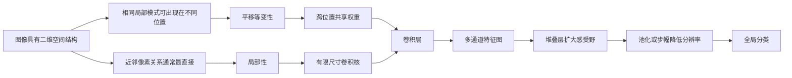
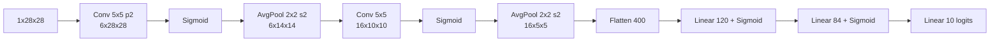
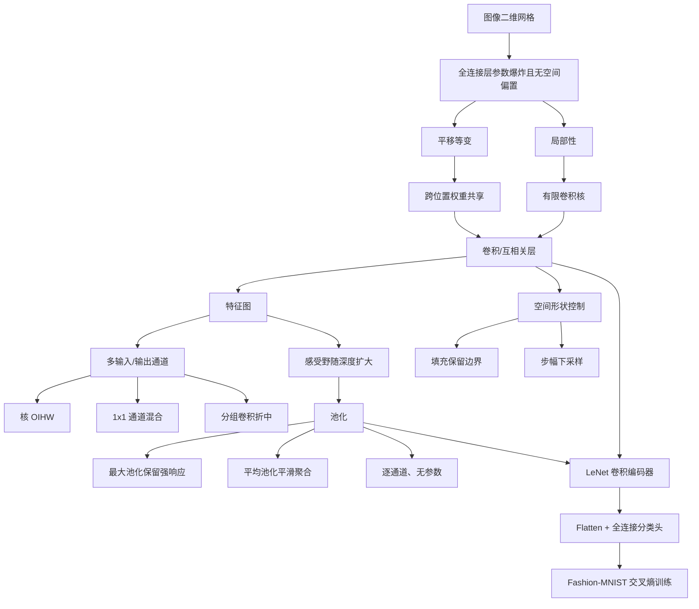

> 对应原文：d2l-en.md 的第 7 章 **Convolutional Neural Networks**。本章不从“卷积公式必须如此”出发，而是从图像的空间结构反推网络约束：平移等变性导出权重共享，局部性导出有限感受窗口，多通道补回表示能力；随后依次讲二维互相关、填充与步幅、多输入/输出通道、池化，最后把所有组件组装为 LeNet。

## 1. 为什么图像需要专门的网络结构

图像天然是空间网格。灰度图中每个位置对应一个数值，彩色图中每个位置对应 RGB 等多个通道。此前的 softmax 回归和 MLP 把 $28\times28$ 图像展平为长度 $784$ 的向量，虽然数值没有丢失，却主动抹去了“哪些像素彼此相邻”的结构。

全连接层对任意固定的特征排列都拥有相同的函数容量：如果把所有图像像素以同一种置换重排，模型仍可重新学习一套参数。这里不是说一个训练完成的 MLP 对像素置换不变，而是说**全连接架构本身没有偏好真实二维邻接关系**。

对一百万像素图像，即使第一隐藏层只有 $1000$ 个单元，权重数也达到

$$
10^6\times10^3=10^9.
$$

这带来三重困难：

- 参数存储和矩阵计算昂贵；
- 需要海量样本估计每个位置的独立权重；
- 模型必须从数据重新发现“同一种局部模式可出现在不同位置”。

卷积神经网络（CNN）把图像先验写进架构，以更少参数获得更强的样本效率和计算效率。其推导主线为：



CNN 的优势来自归纳偏置。若任务确实具有局部性和模式复用，约束会减少无谓自由度；若绝对位置或远距离关系决定标签，纯卷积偏置也可能不合适。

## 2. 从全连接层到卷积

### 2.1 表格数据与感知数据的差别

表格数据每行是样本、每列是特征。除非掌握领域知识，我们通常不能假设第 $j$ 列只和附近列交互，因此 MLP 是合理通用基线。

图像、音频和时间序列则有明确邻域：像素附近通常属于同一边缘或纹理，邻近音频采样共同描述局部波形。若仍使用结构无关的全连接层，就浪费了已知信息。

CNN 不是“图像唯一正确的模型”。它只是把以下假设编码得尤其直接：

1. 同一模式在不同位置具有相近意义；
2. 低层模式主要由局部输入决定；
3. 更大尺度结构可由多层局部模式逐步组合。

### 2.2 平移等变与平移不变

原书把早期层应具备的性质称为 translation invariance，并在括号中也使用 equivariance。严格区分：

- **平移等变（equivariance）**：输入移动，特征图对应移动；
  $$
  F(T_\delta X)=T_\delta F(X).
  $$
- **平移不变（invariance）**：输入移动，最终输出不变；
  $$
  g(T_\delta X)=g(X).
  $$

卷积层主要提供等变性：Waldo 从左上移到右下，检测响应峰也随之移动。分类器在汇聚空间信息后才希望“图中是否有 Waldo”基本不受位置影响。

这一性质不是无条件精确成立。有限图像的边界、零填充、步幅大于 $1$、池化和裁剪都会破坏某些平移等变性。更准确的说法是：**共享核在内部位置按相同规则处理局部模式，并在兼容边界条件下等变。**

### 2.3 从二维全连接映射开始

令输入图像和隐藏表示分别为二维矩阵 $\mathbf X$ 与 $\mathbf H$。若每个输出位置 $(i,j)$ 都连接所有输入位置 $(k,l)$：

$$
[\mathbf H]_{i,j}
=[\mathbf U]_{i,j}
+\sum_k\sum_l
[\mathsf W]_{i,j,k,l}[\mathbf X]_{k,l}.
$$

这里权重是四阶张量：每个输出位置对每个输入位置都有独立参数。把输入位置重写为相对输出位置的偏移

$$
k=i+a,
\qquad
l=j+b,
$$

并定义

$$
[\mathsf V]_{i,j,a,b}
=[\mathsf W]_{i,j,i+a,j+b},
$$

则

$$
[\mathbf H]_{i,j}
=[\mathbf U]_{i,j}
+\sum_a\sum_b
[\mathsf V]_{i,j,a,b}[\mathbf X]_{i+a,j+b}.
$$

这只是换索引，尚未减少参数。

### 2.4 平移等变性导出权重共享

如果同一个局部模式不应因绝对位置改变处理规则，则偏移 $(a,b)$ 对应的权重不能依赖输出位置 $(i,j)$：

$$
[\mathsf V]_{i,j,a,b}=[\mathbf V]_{a,b}.
$$

偏置也应跨空间共享为标量 $u$。于是

$$
[\mathbf H]_{i,j}
=u+\sum_a\sum_b
[\mathbf V]_{a,b}[\mathbf X]_{i+a,j+b}.
$$

同一个核 $\mathbf V$ 在所有空间位置滑动，这就是**权重共享**。对 $1000\times1000$ 输入和同尺寸输出，全连接权重约 $10^{12}$；共享位置后，即使核仍覆盖所有相对偏移，也只需约 $(2\times1000-1)^2\approx4\times10^6$ 个空间系数。

权重共享同时带来：

- 参数减少；
- 同一模式可由所有位置的训练样本共同估计；
- 特征图按统一语义组织；
- 对模式位置的归纳偏置。

代价是无法为每个绝对位置自由学习完全不同规则。若“天空通常在上、道路通常在下”很重要，边界、坐标特征、位置编码或后续结构需要补充位置信息。

### 2.5 局部性导出有限卷积核

早期视觉特征通常只依赖邻域。设超过半径 $\Delta$ 的权重为零：

$$
[\mathbf V]_{a,b}=0
\quad\text{if}\quad
|a|>\Delta\ \text{or}\ |b|>\Delta.
$$

则

$$
[\mathbf H]_{i,j}
=u+
\sum_{a=-\Delta}^{\Delta}
\sum_{b=-\Delta}^{\Delta}
[\mathbf V]_{a,b}[\mathbf X]_{i+a,j+b}.
$$

精确空间参数数为 $(2\Delta+1)^2$，原书以约 $4\Delta^2$ 表示其数量级。若 $\Delta<10$，参数从百万级降到数百级。

局部性不表示网络永远看不到远处。堆叠局部卷积、非线性和下采样后，深层单元的感受野逐步扩大，最终能整合全图信息。

### 2.6 参数减少是一种有代价的约束

CNN 不是在“不损失任何可能函数”的前提下免费减少参数。它主动限制函数族：

- 同一输出通道在所有位置使用同一核；
- 单层只访问有限邻域；
- 位置关系通过网格邻接定义。

这些约束与自然图像匹配时，模型更容易泛化；若任务标签依赖精确绝对位置，或数据没有规则网格结构，普通卷积可能欠拟合。所有学习都依赖归纳偏置，关键是偏置是否与问题机制相符。

### 2.7 数学卷积与深度学习卷积

连续卷积定义为

$$
(f*g)(\mathbf x)
=\int f(\mathbf z)g(\mathbf x-\mathbf z)\,d\mathbf z.
$$

二维离散卷积为

$$
(f*g)(i,j)
=\sum_a\sum_b f(a,b)g(i-a,j-b).
$$

严格卷积会翻转其中一个函数。深度学习层通常计算的是互相关：

$$
(X\star K)(i,j)
=\sum_a\sum_bX(i+a,j+b)K(a,b).
$$

两者只差核在水平和垂直方向的翻转。因为核由数据学习，使用哪一种不会改变可表达函数族：严格卷积会学习到互相关核的翻转版本。可是对手工边缘核或预训练权重，方向有实际意义，不能忽略翻转。

本章遵循深度学习惯例，把互相关层简称为“卷积层”。PyTorch 的 `nn.Conv2d` 实际也执行互相关。

### 2.8 通道补回表示维度

彩色输入不是二维矩阵，而是每个位置具有多个分量：

$$
\mathsf X\in\mathbb R^{C_{\mathrm{in}}\times H\times W}.
$$

隐藏表示也使用多个通道/特征图。完整多通道卷积：

$$
[\mathsf H]_{i,j,d}
=b_d+
\sum_a\sum_b\sum_c
[\mathsf V]_{d,c,a,b}
[\mathsf X]_{c,i+a,j+b}.
$$

其中 $c$ 枚举输入通道，$d$ 枚举输出通道。每个输出通道从所有输入通道提取一种联合特征。低层通道可能与边缘、颜色或纹理方向相关，但特征通常分布在通道空间的组合方向，不能总把单个通道解释成一个人类概念。

## 3. 图像卷积的实际计算

### 3.1 二维互相关

输入

$$
X=
\begin{bmatrix}
0&1&2\\
3&4&5\\
6&7&8
\end{bmatrix},
$$

核

$$
K=
\begin{bmatrix}
0&1\\
2&3
\end{bmatrix}.
$$

将 $2\times2$ 窗口从左到右、从上到下滑动。第一个输出：

$$
0\times0+1\times1+3\times2+4\times3=19.
$$

四个输出为

$$
Y=
\begin{bmatrix}
19&25\\
37&43
\end{bmatrix}.
$$

无填充、步幅为 $1$ 时，输入 $(n_h,n_w)$、核 $(k_h,k_w)$ 的输出形状为

$$
(n_h-k_h+1)\times(n_w-k_w+1).
$$

窗口必须完整落在输入内，因此每个轴少 $k-1$ 个位置。

### 3.2 从零实现 `corr2d`

```python
def corr2d(X, K):
    kernel_h, kernel_w = K.shape
    output_h = X.shape[0] - kernel_h + 1
    output_w = X.shape[1] - kernel_w + 1
    rows = []
    for i in range(output_h):
        row = []
        for j in range(output_w):
            patch = X[i:i + kernel_h, j:j + kernel_w]
            row.append((patch * K).sum())
        rows.append(torch.stack(row))
    return torch.stack(rows)
```

每个输出是窗口与核的逐元素积之和。教学循环清晰但慢；框架会把卷积转换为高度优化的并行内核、隐式矩阵乘法或专用算法。

使用 `stack` 组合结果保留 autograd 依赖。若用 `.item()` 把中间值转成 Python 数，或在前向使用 `.data`，会切断梯度。

### 3.3 自定义卷积层

```python
class Conv2D(nn.Module):
    def __init__(self, kernel_size):
        super().__init__()
        self.weight = nn.Parameter(torch.rand(kernel_size))
        self.bias = nn.Parameter(torch.zeros(1))

    def forward(self, X):
        return corr2d(X, self.weight) + self.bias
```

核和偏置是可学习参数。单输入、单输出通道时偏置是一个标量；标准多输出卷积为每个输出通道配一个偏置，并广播到所有空间位置。

### 3.4 边缘检测是有限差分

构造 $6\times8$ 图像：两侧为 $1$，中间四列为 $0$。核

$$
K=[1,-1]
$$

计算

$$
Y_{i,j}=X_{i,j}-X_{i,j+1}.
$$

相邻像素相同时输出 $0$；从白到黑输出 $1$；从黑到白输出 $-1$。它沿水平方向求一阶有限差分，因此响应的是**垂直边缘**。核作用于转置图像时，若变化方向变成垂直而核仍水平，响应会消失。

方向很容易混淆：差分方向是核跨越的方向，检测到的边缘方向与梯度方向正交。

### 3.5 从数据学习核

已知输入 $X$ 和目标边缘图 $Y$，可随机初始化一个 `(1,2)` 卷积核并最小化平方误差：

```text
初始化 K_hat
重复：
    Y_hat = corr2d(X, K_hat)
    loss = sum((Y_hat - Y)^2)
    反向计算 d loss / d K_hat
    K_hat -= learning_rate * gradient
```

训练后 $\widehat K$ 接近 $[1,-1]$。这个小例子展示 CNN 的核心思想：我们不必为每种边缘、纹理和形状手工设计滤波器，而可由任务数据学习它们。

需要注意，有限训练样本可能无法唯一识别核。若输入没有足够变化，多组核可能产生相同目标；学到接近真值依赖数据对参数方向提供充分约束。

### 3.6 特征图与感受野

卷积输出称为**特征图**：每个空间位置保存相应局部模式的响应。某层一个元素的**感受野**，是所有可能影响它的前层或原输入元素集合。

一个 $2\times2$ 核的输出元素在输入上的感受野为 $2\times2$。再接一个 $2\times2$、步幅 $1$ 的卷积，最终单元素会依赖原输入 $3\times3$ 区域，而非 $4\times4$。

一般递推。令第 $\ell$ 层相邻特征位置在原输入上的间隔为 $j_\ell$，感受野大小为 $r_\ell$，初始

$$
j_0=1,
\qquad
r_0=1.
$$

核大小 $k_\ell$、步幅 $s_\ell$ 时：

$$
j_\ell=j_{\ell-1}s_\ell,
$$

$$
r_\ell=r_{\ell-1}+(k_\ell-1)j_{\ell-1}.
$$

填充通常改变感受野在边界处对应真实像素还是填充值，但不改变理论尺寸。深度、较大核和下采样都会扩大深层单元看到的原图范围。

理论感受野只表示“存在计算路径”，不表示所有位置影响相等。实际有效感受野常集中在中心，且受训练权重和激活影响。

## 4. 填充与步幅

### 4.1 为什么连续卷积会缩小特征图

无填充、步幅 $1$ 时，每层每轴缩小 $k-1$。$240\times240$ 图像连续经过十个 $5\times5$ 卷积：

$$
240-10(5-1)=200.
$$

面积由 $57\,600$ 降到 $40\,000$，约损失 $30.6\%$ 的空间位置；边界像素被使用的次数也少于中心像素。

填充用于保留边界和控制输出尺寸，步幅用于跳过位置、降低分辨率和计算量。

### 4.2 填充的形状公式

设顶部、底部、左侧、右侧填充分别为 $p_t,p_b,p_l,p_r$。步幅 $1$ 时：

$$
H_{\mathrm{out}}
=H+p_t+p_b-k_h+1,
$$

$$
W_{\mathrm{out}}
=W+p_l+p_r-k_w+1.
$$

原书用 $p_h=p_t+p_b$、$p_w=p_l+p_r$ 表示**总填充量**：

$$
(H-k_h+p_h+1)
\times
(W-k_w+p_w+1).
$$

PyTorch 的 `nn.Conv2d(..., padding=(r_h,r_w))` 通常表示**每一侧**分别填 $r_h,r_w$，总量为 $2r_h,2r_w$。这是最常见的公式/API 混淆之一。

### 4.3 保持尺寸的“same”填充

步幅 $1$ 时要使输出与输入同尺寸，总填充应为

$$
p_h=k_h-1,
\qquad
p_w=k_w-1.
$$

奇数核可对称分配：

$$
p_t=p_b=\frac{k_h-1}{2},
\qquad
p_l=p_r=\frac{k_w-1}{2}.
$$

例如 $3\times3$ 核每侧填 $1$；$5\times3$ 核高度每侧填 $2$、宽度每侧填 $1$。

奇数核的好处不仅是尺寸好算：输出位置 $(i,j)$ 的窗口可明确以输入 $(i,j)$ 为中心。偶数核要不对称填充，中心落在像素之间，位置对齐更容易混淆。

### 4.4 步幅的完整公式

窗口每次垂直移动 $s_h$、水平移动 $s_w$。输出尺寸：

$$
H_{\mathrm{out}}
=\left\lfloor
\frac{H+p_t+p_b-k_h}{s_h}
\right\rfloor+1,
$$

$$
W_{\mathrm{out}}
=\left\lfloor
\frac{W+p_l+p_r-k_w}{s_w}
\right\rfloor+1.
$$

等价写为原书形式：

$$
\left\lfloor
\frac{H-k_h+p_h+s_h}{s_h}
\right\rfloor
\times
\left\lfloor
\frac{W-k_w+p_w+s_w}{s_w}
\right\rfloor.
$$

若使用 same 总填充 $p_h=k_h-1$，则

$$
H_{\mathrm{out}}=\left\lceil\frac{H}{s_h}\right\rceil.
$$

当 $H$ 能被 $s_h$ 整除时，恰为 $H/s_h$。

### 4.5 两个形状例子

输入 $8\times8$，$3\times3$ 核，每侧填 $1$，步幅 $2$：

$$
H_{\mathrm{out}}
=\left\lfloor\frac{8+2-3}{2}\right\rfloor+1
=4,
$$

输出 $4\times4$。

输入 $8\times8$，核 $(3,5)$，PyTorch `padding=(0,1)` 即高度总填充 $0$、宽度总填充 $2$，步幅 $(3,4)$：

$$
H_{\mathrm{out}}
=\left\lfloor\frac{8-3}{3}\right\rfloor+1=2,
$$

$$
W_{\mathrm{out}}
=\left\lfloor\frac{8+2-5}{4}\right\rfloor+1=2.
$$

输出为 $2\times2$。

### 4.6 步幅的收益与代价

步幅 $s>1$：

- 降低输出空间尺寸；
- 减少后续层计算和激活内存；
- 更快扩大有效感受野；
- 丢弃细粒度位置；
- 可能产生混叠（aliasing）。

若输入含高频模式，直接每隔 $s$ 个位置采样会把高频伪装成低频。平均池化、模糊滤波或学习到的低通结构可在下采样前减轻混叠，但标准步幅卷积不自动保证抗混叠。

### 4.7 填充方式与边界效应

零填充计算便宜，框架甚至无需真正分配完整填充张量；但它在边界引入与图像内部不同的常量，使网络可推断距离边界的位置。因此零填充既缓解尺寸缩小，又破坏严格平移等变并隐式编码位置。

其他方式：

- reflection/mirror：镜像边界；
- replicate：复制边缘值；
- circular：周期环绕。

选择取决于数据的边界机制。纹理处理常用反射填充减少黑边，周期信号可能适合 circular；不存在普遍最佳方式。

### 4.8 “步幅 $1/2$”意味着什么

普通滑窗步幅必须是正整数。所谓分数步幅 $1/2$ 表示输出分辨率放大约两倍，可通过：

- 先在输入位置间插零，再做卷积；
- 转置卷积；
- 上采样后普通卷积。

它常用于分割、生成模型和解码器，不是让普通卷积窗口真的移动半个离散像素。

## 5. 多输入与多输出通道

### 5.1 PyTorch 的张量布局

单样本图像通常写为

$$
(C,H,W),
$$

小批量为

$$
(N,C,H,W).
$$

PyTorch 卷积核布局为

$$
(C_{\mathrm{out}},C_{\mathrm{in}},k_h,k_w).
$$

不同框架可能使用 NHWC 等布局，不能只凭四个数字猜轴语义。

### 5.2 多输入通道

输入

$$
X\in\mathbb R^{C_{\mathrm{in}}\times H\times W},
$$

产生单输出通道的核为

$$
K\in\mathbb R^{C_{\mathrm{in}}\times k_h\times k_w}.
$$

先在每个输入通道做二维互相关，再沿通道求和：

$$
Y=\sum_{c=1}^{C_{\mathrm{in}}}
X_c\star K_c.
$$

```python
def corr2d_multi_in(X, K):
    return sum(corr2d(x, k) for x, k in zip(X, K))
```

输入通道数必须与核的输入通道数一致。输出单通道不是分别保留每个颜色结果，而是通过核学习跨 RGB 等通道的联合模式。

### 5.3 多输出通道

每个输出通道拥有一组覆盖所有输入通道的核：

$$
K\in\mathbb R^{C_{\mathrm{out}}\times C_{\mathrm{in}}\times k_h\times k_w}.
$$

第 $d$ 个输出：

$$
Y_d
=b_d+
\sum_{c=1}^{C_{\mathrm{in}}}
X_c\star K_{d,c}.
$$

```python
def corr2d_multi_in_out(X, K):
    return torch.stack([corr2d_multi_in(X, kernel) for kernel in K])
```

输出形状为

$$
(C_{\mathrm{out}},H_{\mathrm{out}},W_{\mathrm{out}}).
$$

输出通道是模型设计者选择的表示宽度，不由 RGB 三通道限制。深层网络常在降低空间分辨率的同时增加通道数，以更低分辨率保存更多类型的特征。

### 5.4 参数量与计算量

带偏置的标准卷积参数量：

$$
C_{\mathrm{out}}
\left(C_{\mathrm{in}}k_hk_w+1\right).
$$

每个输出元素需要 $C_{\mathrm{in}}k_hk_w$ 次乘法和约同量加法。乘加次数（MACs）约为

$$
H_{\mathrm{out}}W_{\mathrm{out}}
C_{\mathrm{out}}C_{\mathrm{in}}k_hk_w.
$$

若把乘法和加法各算一次 FLOP，约为两倍。对 $256\times256$、$5\times5$ 核、输入输出通道均为 $128$：

$$
256^2\times25\times128^2
\approx2.684\times10^{10}\ \text{MACs},
$$

约 $5.37\times10^{10}$ 次乘/加操作，与原书“超过 530 亿”一致。

输入、输出通道同时翻倍，标准卷积主要计算和权重参数约增加 $4$ 倍。增加填充不改变参数量，但若扩大输出尺寸，会增加计算和激活内存。

### 5.5 $1\times1$ 卷积

$1\times1$ 核不访问相邻空间位置，只在每个像素位置混合通道：

$$
Y_{d,i,j}
=b_d+
\sum_{c=1}^{C_{\mathrm{in}}}
W_{d,c}X_{c,i,j}.
$$

这等价于把同一个全连接层应用到每个空间位置，权重跨位置共享。把输入重塑为

$$
X_{\mathrm{flat}}
\in\mathbb R^{C_{\mathrm{in}}\times HW},
$$

则

$$
Y_{\mathrm{flat}}=WX_{\mathrm{flat}}.
$$

$1\times1$ 卷积的作用：

- 改变通道数而不改空间尺寸；
- 组合不同通道特征；
- 构造计算瓶颈，先降通道再做昂贵空间卷积；
- 与非线性组合，在每个位置形成共享 MLP。

单独相邻的两个线性卷积且中间无非线性时可合并；加入激活后 $1\times1$ 卷积不再能简单吸收到另一线性卷积。

### 5.6 通道不等于独立语义

“一个通道检测边缘、一个通道检测纹理”是有用直觉，但训练目标只要求通道联合有用。任意可逆通道基变换若由下一层抵消，整体函数可能不变。因此语义可能对应通道空间的某个方向，而不是某个固定索引。

解释 CNN 时应观察多通道组合、探针或消融，不能仅凭单个特征图外观下结论。

### 5.7 分组卷积作为计算折中

标准卷积让每个输出通道连接所有输入通道。分组卷积把通道分成 $g$ 组，每组独立卷积，参数和计算约降为原来的 $1/g$。极端 $g=C_{\mathrm{in}}$ 是深度卷积，每个输入通道独立做空间卷积。

代价是组间信息交流受限，通常再用 $1\times1$ 卷积或通道重排混合。原书以块对角通道矩阵解释 ResNeXt 等后续架构的效率思想。

### 5.8 连续卷积的合并边界

两个无非线性的、步幅 $1$、适当边界条件下的空间卷积可合并为一个更大核。$k_1\times k_1$ 与 $k_2\times k_2$ 的有效核尺寸为

$$
(k_1+k_2-1)\times(k_1+k_2-1).
$$

但反向分解不总可行：两个小核的卷积对大核施加代数秩约束，多通道中间宽度不足时尤其如此。非线性、步幅或复杂填充也阻止简单合并。

## 6. 池化

### 6.1 为什么需要空间聚合

图像分类最终回答全局问题，如“是否有猫”。网络需要逐步把局部特征聚合成大范围表示。降低空间分辨率可：

- 加快感受野扩张；
- 减少后续计算和内存；
- 对小幅位置变化降低敏感性。

池化层在滑动窗口内做固定聚合，不学习卷积核。常见为最大池化和平均池化。

### 6.2 最大池化与平均池化

窗口 $\mathcal W_{i,j}$ 上：

$$
Y_{i,j}^{\mathrm{max}}
=\max_{(a,b)\in\mathcal W_{i,j}}X_{a,b},
$$

$$
Y_{i,j}^{\mathrm{avg}}
=\frac{1}{|\mathcal W_{i,j}|}
\sum_{(a,b)\in\mathcal W_{i,j}}X_{a,b}.
$$

对

$$
X=
\begin{bmatrix}
0&1&2\\3&4&5\\6&7&8
\end{bmatrix}
$$

使用 $2\times2$、步幅 $1$ 的最大池化：

$$
Y=
\begin{bmatrix}
4&5\\7&8
\end{bmatrix}.
$$

平均池化对应：

$$
\begin{bmatrix}
2&3\\5&6
\end{bmatrix}.
$$

最大池化保留窗口内最强响应，对“模式是否存在”有效；平均池化汇总所有值，平滑噪声并更像低通下采样。哪一种更好取决于特征语义，原书指出传统视觉 CNN 中 max pooling 往往优于 average pooling，但现代网络也广泛使用全局平均池化。

### 6.3 从零实现

```python
def pool2d(X, pool_size, mode="max"):
    pool_h, pool_w = pool_size
    output_h = X.shape[0] - pool_h + 1
    output_w = X.shape[1] - pool_w + 1
    rows = []
    for i in range(output_h):
        row = []
        for j in range(output_w):
            patch = X[i:i + pool_h, j:j + pool_w]
            value = patch.max() if mode == "max" else patch.mean()
            row.append(value)
        rows.append(torch.stack(row))
    return torch.stack(rows)
```

池化没有可学习参数，但仍参与计算图。最大池化反向把上游梯度传给窗口中的最大位置；若并列最大，具体分配由实现约定。平均池化把梯度平均分给窗口所有位置。

### 6.4 池化的填充、步幅与通道

空间输出公式与卷积相同，只需把核尺寸替换为池化窗口尺寸。框架通常默认

$$
\text{stride}=\text{pool\_size},
$$

使窗口不重叠。例如 $2\times2$ 池化、步幅 $2$ 将高宽各减半，空间元素总数变为四分之一。

与标准卷积不同，池化**逐通道独立**执行：

$$
(N,C,H,W)
\longrightarrow
(N,C,H_{\mathrm{out}},W_{\mathrm{out}}).
$$

通道数不变，也不会把不同通道相加。

### 6.5 池化提供的是近似局部不变性

若某个强边缘响应在 $2\times2$ 窗口内移动一格，窗口最大值可能保持不变。因此最大池化降低对小位置偏移的敏感性。

但它不保证任意平移不变：

- 模式跨过池化窗口边界时输出会变；
- 步幅下采样对一像素平移可能非常敏感；
- 多层边界和填充继续影响结果。

因此更准确说法是“提升一定局部鲁棒性并下采样”，不是彻底解决平移不变性。

### 6.6 平均池化可由固定卷积实现

对单通道，$p_h\times p_w$ 平均池化等价于核全为

$$
\frac{1}{p_hp_w}
$$

的固定卷积，并采用相同步幅/填充。多通道时使用 depthwise/grouped 卷积，避免跨通道求和。

最大池化不能由单一线性卷积实现，因为 `max` 非线性。例如线性算子应满足加法性，而一般

$$
\max(X+Z)\ne\max(X)+\max(Z).
$$

不过可用 ReLU 组合：

$$
\max(a,b)=\operatorname{ReLU}(a-b)+b.
$$

最小池化无需单独原语：

$$
\min(X)=-\max(-X).
$$

### 6.7 池化与步幅卷积

两者都可下采样：

- 池化使用固定聚合，参数少、行为明确；
- 步幅卷积同时学习特征提取和下采样，更灵活；
- 平均池化在采样前有平滑作用；
- 最大池化保留最强局部响应。

现代 CNN 常用步幅卷积替代部分池化，但要注意混叠和计算成本。选择不是“新方法必然更好”，应由架构目标和验证结果决定。

## 7. LeNet：第一套完整 CNN

### 7.1 历史背景

LeNet 由 Yann LeCun 团队为手写数字识别发展，是较早通过反向传播成功训练并实际部署的 CNN。它在当时达到低于 $1\%$ 的逐数字错误率，并用于 ATM 支票/存款数字识别。

本书的 PyTorch 版本保留 LeNet-5 的核心结构，但并非逐细节复刻历史模型：输入使用裁剪后的 $28\times28$ 图像，首层加填充；历史 Gaussian/RBF 输出被现代 logits 加交叉熵替代；原始 LeNet 的部分连接和可学习下采样也被现代标准层简化。

### 7.2 两个组成部分

LeNet 包含：

1. **卷积编码器**：两组卷积、sigmoid 和平均池化；
2. **全连接分类头**：展平后经过 $120$、$84$、$10$ 个输出单元。



Sigmoid 和平均池化反映历史时期选择；现代化实验通常换成 ReLU 和最大池化，但那已经改变了模型，应通过对照实验评估。

### 7.3 每层形状推导

输入小批量：

$$
(N,1,28,28).
$$

第一卷积：核 $5$、每侧填 $2$、步幅 $1$、输出通道 $6$：

$$
\left\lfloor\frac{28+4-5}{1}\right\rfloor+1=28,
$$

得到 $(N,6,28,28)$。

平均池化 $2\times2$、步幅 $2$：

$$
\left\lfloor\frac{28-2}{2}\right\rfloor+1=14,
$$

得到 $(N,6,14,14)$。

第二卷积：核 $5$、无填充、输出通道 $16$：

$$
14-5+1=10,
$$

得到 $(N,16,10,10)$。

第二池化：

$$
\left\lfloor\frac{10-2}{2}\right\rfloor+1=5,
$$

得到 $(N,16,5,5)$。

展平维数：

$$
16\times5\times5=400.
$$

随后形状依次为 $(N,120)$、$(N,84)$、$(N,10)$。

逐层打印 shape 是构建 CNN 最廉价的检查之一，可在训练前发现 padding、stride 和展平维数错误。

### 7.4 参数量推导

卷积参数公式：

$$
C_{\mathrm{out}}
(C_{\mathrm{in}}k_hk_w+1).
$$

各层参数：

| 层 | 参数量 |
|---|---:|
| Conv1：$1\to6$, $5\times5$ | $6(1\times25+1)=156$ |
| Conv2：$6\to16$, $5\times5$ | $16(6\times25+1)=2416$ |
| Linear：$400\to120$ | $120(400+1)=48120$ |
| Linear：$120\to84$ | $84(120+1)=10164$ |
| Linear：$84\to10$ | $10(84+1)=850$ |
| **总计** | **$61\,706$** |

卷积编码器只有 $2572$ 个参数，大多数参数集中在第一个全连接层。这也解释现代 CNN 后来为何继续减少大规模全连接头，采用全局平均池化等方式。

作为对比，第 5 章的 $784\to256\to10$ MLP 有约 $203\,530$ 个参数。LeNet 参数更少，但卷积核在每个空间位置重复计算，计算量不一定按参数比例更小。

### 7.5 PyTorch 实现

```python
class LeNet(nn.Module):
    def __init__(self, num_classes=10):
        super().__init__()
        self.net = nn.Sequential(
            nn.Conv2d(1, 6, kernel_size=5, padding=2),
            nn.Sigmoid(),
            nn.AvgPool2d(kernel_size=2, stride=2),
            nn.Conv2d(6, 16, kernel_size=5),
            nn.Sigmoid(),
            nn.AvgPool2d(kernel_size=2, stride=2),
            nn.Flatten(),
            nn.Linear(16 * 5 * 5, 120),
            nn.Sigmoid(),
            nn.Linear(120, 84),
            nn.Sigmoid(),
            nn.Linear(84, num_classes),
        )

    def forward(self, X):
        return self.net(X)
```

最后一层返回 logits，不显式加 softmax；训练使用 `F.cross_entropy`。卷积层和线性层可使用 Xavier 初始化：

```python
def init_cnn(module):
    if isinstance(module, (nn.Conv2d, nn.Linear)):
        nn.init.xavier_uniform_(module.weight)
        if module.bias is not None:
            nn.init.zeros_(module.bias)
```

### 7.6 训练配置与计算特点

原书在 Fashion-MNIST 上使用：

- 批量大小 $128$；
- 学习率 $0.1$；
- 小批量 SGD；
- 交叉熵；
- $10$ 个 epoch；
- 有 GPU 时使用一张 GPU。

CNN 参数少，但每个核参数跨许多空间位置复用，参与大量乘加，因此可能比参数量相近的 MLP 计算更重。GPU 很适合并行卷积，但真实速度还受批量、内存布局和数据加载影响。

训练前应检查：

1. 每层输出 shape；
2. 最终 logits 维数等于类别数；
3. 一个随机批次的交叉熵有限；
4. 反向后每个参数梯度存在且有限；
5. 少量训练样本能否被过拟合，作为管线 sanity check。

### 7.7 激活可视化与分布外输入

原章练习建议显示 LeNet 前两层激活。可视化不同衣物时，应比较：

- 哪些通道响应边缘方向、纹理或轮廓；
- 同一通道是否在相似局部模式上响应；
- 深层特征图是否更稀疏、更抽象。

给猫、汽车或随机噪声等分布外输入时，网络仍会产生 logits，甚至可能高置信预测某类服饰。激活“有响应”不等于输入属于训练分布；CNN 本身不会自动可靠拒识 OOD 样本。

## 8. 可运行的综合实验

下面的代码不下载 Fashion-MNIST，集中验证本章的可计算结论：手写互相关、边缘核学习、填充/步幅形状、多通道与 $1\times1$ 等价、池化、圆周边界下的平移等变，以及 LeNet 形状、参数量和反向传播。

```python
import torch
from torch import nn
from torch.nn import functional as F

torch.manual_seed(29)

def corr2d(X, K):
    kernel_h, kernel_w = K.shape
    output_h = X.shape[0] - kernel_h + 1
    output_w = X.shape[1] - kernel_w + 1
    rows = []
    for i in range(output_h):
        values = []
        for j in range(output_w):
            patch = X[i:i + kernel_h, j:j + kernel_w]
            values.append((patch * K).sum())
        rows.append(torch.stack(values))
    return torch.stack(rows)

def corr2d_multi_in(X, K):
    return sum(corr2d(x, k) for x, k in zip(X, K))

def corr2d_multi_in_out(X, K):
    return torch.stack([corr2d_multi_in(X, kernel) for kernel in K])

def pool2d(X, pool_size, mode="max"):
    pool_h, pool_w = pool_size
    output_h = X.shape[0] - pool_h + 1
    output_w = X.shape[1] - pool_w + 1
    rows = []
    for i in range(output_h):
        values = []
        for j in range(output_w):
            patch = X[i:i + pool_h, j:j + pool_w]
            values.append(patch.max() if mode == "max" else patch.mean())
        rows.append(torch.stack(values))
    return torch.stack(rows)

# 1. The textbook 2D cross-correlation example.
X = torch.tensor([[0.0, 1.0, 2.0],
                  [3.0, 4.0, 5.0],
                  [6.0, 7.0, 8.0]])
K = torch.tensor([[0.0, 1.0],
                  [2.0, 3.0]])
expected = torch.tensor([[19.0, 25.0],
                         [37.0, 43.0]])
assert torch.equal(corr2d(X, K), expected)

framework_output = F.conv2d(
    X.reshape(1, 1, 3, 3),
    K.reshape(1, 1, 2, 2),
)
assert torch.equal(framework_output[0, 0], expected)

# 2. Learn the horizontal finite-difference kernel [1, -1].
edge_image = torch.ones(6, 8)
edge_image[:, 2:6] = 0
edge_target = corr2d(edge_image, torch.tensor([[1.0, -1.0]]))

edge_layer = nn.Conv2d(1, 1, kernel_size=(1, 2), bias=False)
optimizer = torch.optim.SGD(edge_layer.parameters(), lr=0.2)
edge_input_4d = edge_image.reshape(1, 1, 6, 8)
edge_target_4d = edge_target.reshape(1, 1, 6, 7)

for _ in range(100):
    optimizer.zero_grad()
    edge_loss = F.mse_loss(edge_layer(edge_input_4d), edge_target_4d)
    edge_loss.backward()
    optimizer.step()

learned_kernel = edge_layer.weight.detach().reshape(1, 2)
assert torch.allclose(
    learned_kernel,
    torch.tensor([[1.0, -1.0]]),
    atol=0.02,
)

# 3. Padding and stride shape formula.
shape_layer = nn.Conv2d(
    in_channels=3,
    out_channels=4,
    kernel_size=(3, 5),
    padding=(0, 1),
    stride=(3, 4),
)
shape_output = shape_layer(torch.randn(2, 3, 8, 8))
assert shape_output.shape == (2, 4, 2, 2)

# 4. Multi-channel correlation and 1x1 convolution equivalence.
multi_X = torch.randn(3, 4, 5)
multi_K = torch.randn(2, 3, 1, 1)
manual_1x1 = corr2d_multi_in_out(multi_X, multi_K)
matrix_1x1 = (multi_K[:, :, 0, 0] @ multi_X.reshape(3, -1)).reshape(2, 4, 5)
framework_1x1 = F.conv2d(multi_X.unsqueeze(0), multi_K).squeeze(0)
torch.testing.assert_close(manual_1x1, matrix_1x1)
torch.testing.assert_close(manual_1x1, framework_1x1)

# 5. Pooling matches the framework implementation.
pool_input = torch.arange(9, dtype=torch.float32).reshape(3, 3)
manual_max = pool2d(pool_input, (2, 2), mode="max")
manual_avg = pool2d(pool_input, (2, 2), mode="avg")
framework_max = F.max_pool2d(pool_input.reshape(1, 1, 3, 3), 2, stride=1)[0, 0]
framework_avg = F.avg_pool2d(pool_input.reshape(1, 1, 3, 3), 2, stride=1)[0, 0]
torch.testing.assert_close(manual_max, framework_max)
torch.testing.assert_close(manual_avg, framework_avg)

# 6. Convolution is translation equivariant under circular boundary handling.
equivariance_input = torch.randn(1, 1, 7, 9)
equivariance_kernel = torch.randn(1, 1, 3, 3)

def circular_correlation(tensor, kernel):
    padded = F.pad(tensor, (1, 1, 1, 1), mode="circular")
    return F.conv2d(padded, kernel)

base_output = circular_correlation(equivariance_input, equivariance_kernel)
shifted_input = torch.roll(equivariance_input, shifts=(1, 2), dims=(2, 3))
shifted_output = circular_correlation(shifted_input, equivariance_kernel)
expected_shift = torch.roll(base_output, shifts=(1, 2), dims=(2, 3))
torch.testing.assert_close(shifted_output, expected_shift, atol=1e-5, rtol=1e-5)

# 7. LeNet shape flow, parameter count, and finite gradients.
class LeNet(nn.Module):
    def __init__(self, num_classes=10):
        super().__init__()
        self.net = nn.Sequential(
            nn.Conv2d(1, 6, kernel_size=5, padding=2),
            nn.Sigmoid(),
            nn.AvgPool2d(kernel_size=2, stride=2),
            nn.Conv2d(6, 16, kernel_size=5),
            nn.Sigmoid(),
            nn.AvgPool2d(kernel_size=2, stride=2),
            nn.Flatten(),
            nn.Linear(16 * 5 * 5, 120),
            nn.Sigmoid(),
            nn.Linear(120, 84),
            nn.Sigmoid(),
            nn.Linear(84, num_classes),
        )

    def forward(self, tensor):
        return self.net(tensor)

lenet = LeNet()
for module in lenet.modules():
    if isinstance(module, (nn.Conv2d, nn.Linear)):
        nn.init.xavier_uniform_(module.weight)
        nn.init.zeros_(module.bias)

features = torch.randn(4, 1, 28, 28)
labels = torch.tensor([0, 1, 2, 3])
shape_trace = []
activation = features
for layer in lenet.net:
    activation = layer(activation)
    shape_trace.append(tuple(activation.shape))

assert shape_trace[0] == (4, 6, 28, 28)
assert shape_trace[2] == (4, 6, 14, 14)
assert shape_trace[3] == (4, 16, 10, 10)
assert shape_trace[5] == (4, 16, 5, 5)
assert shape_trace[-1] == (4, 10)
assert sum(parameter.numel() for parameter in lenet.parameters()) == 61_706

loss = F.cross_entropy(activation, labels)
loss.backward()
assert all(
    parameter.grad is not None and torch.isfinite(parameter.grad).all()
    for parameter in lenet.parameters()
)

print("corr2d and framework Conv2d = PASS")
print("learned edge kernel =", learned_kernel.tolist())
print("stride example output shape =", tuple(shape_output.shape))
print("1x1 channel mixing = PASS")
print("pooling checks = PASS")
print("circular translation equivariance = PASS")
print("LeNet shapes =", shape_trace)
print("LeNet parameters =", sum(p.numel() for p in lenet.parameters()))
```

代码与原理逐项对应：

1. 手写 `corr2d` 复现 $[[19,25],[37,43]]$，并与 `F.conv2d` 对齐，证明框架“卷积”实际是互相关；
2. 只观察输入—输出对即可通过梯度下降恢复 $[1,-1]$ 边缘核；
3. `(3,5)` 核、`padding=(0,1)`、`stride=(3,4)` 在 $8\times8$ 输入上得到 $2\times2$；
4. 手写多通道、通道矩阵乘法与框架 $1\times1$ 卷积三者一致；
5. 手写最大/平均池化与框架实现一致；
6. 圆周填充避免边界信息丢失，在该边界约定下验证平移等变；
7. LeNet 每层形状、总参数 $61\,706$ 和全部有限梯度均由断言验证。

## 9. 容易混淆的概念与常见误区

### 9.1 卷积与互相关

数学卷积翻转核，深度学习 `Conv2d` 通常不翻转，执行互相关。可学习核使函数族等价，但手工核方向和权重迁移时差异不能忽略。

### 9.2 平移等变与平移不变

卷积特征图随输入一起移动，是等变；分类输出不随位置改变才是不变。池化只带来有限局部鲁棒性，不自动获得任意平移不变。

### 9.3 MLP 对像素顺序“不敏感”

训练完成的 MLP 并不对任意像素置换保持输出。准确说，架构没有二维邻域偏置；对数据列和参数作一致置换后，函数类等价。

### 9.4 权重共享与输入值共享

权重共享指同一核参数用于所有空间位置，不表示各位置输入相同，也不表示输出值相同。

### 9.5 局部连接与只能学习局部任务

单层卷积局部，深层感受野可覆盖全图。局部性是逐层构造全局表示的方法，不是永远拒绝远距离信息。

### 9.6 核大小与感受野

核大小是当前层一次操作的窗口；感受野是某深层元素在原输入上所有可能影响位置。堆叠后感受野通常远大于单层核。

### 9.7 特征图与通道

一个输出通道是一张特征图；完整表示由所有通道组成。单通道未必具有独立、稳定的人类语义。

### 9.8 原书总填充与 PyTorch `padding`

公式中的 $p_h$ 常表示上下总和；PyTorch 整数 `padding=r` 表示上下各 $r$。代入公式前必须统一约定。

### 9.9 Same padding 与输出一定等于输入

步幅 $1$ 时 same padding 保持尺寸；步幅大于 $1$ 时通常输出为 $\lceil H/s\rceil$，不再等于输入。

### 9.10 步幅与池化

步幅规定窗口移动间隔；池化规定窗口内聚合方式。卷积和池化都可有步幅，二者不是同一概念。

### 9.11 通道求和与池化逐通道

标准卷积为每个输出通道对所有输入通道求和；普通空间池化逐通道独立执行并保持通道数。

### 9.12 $1\times1$ 卷积与无意义卷积

它不提取空间邻域，却在每个位置混合通道、改变通道宽度，并通过权重共享保持空间等变，是现代 CNN 的关键组件。

### 9.13 参数少与计算一定少

共享核参数很少，但每个参数在许多位置重复使用。CNN 可能参数少却 FLOPs 高；存储复杂度与计算复杂度要分别评估。

### 9.14 最大池化与最大值可微

最大池化在唯一最大值处可微，梯度传给 argmax；并列最大处不可微，框架采用约定。不可处处光滑不等于不能训练。

### 9.15 平均池化与模糊必然抗混叠

平均池化有低通倾向，但简单箱式滤波未必充分抑制所有高频；严格抗混叠需根据采样率设计滤波器。

### 9.16 输出层的 softmax

LeNet 代码最后输出 logits，交叉熵内部处理 softmax。模型结构图写“概率输出”不表示应在 `forward` 末尾手动 softmax。

### 9.17 LeNet 与原始 LeNet-5

教材版本保留核心思想但现代化了输入、连接和输出。不能把教材 `Sequential` 逐层实现当作历史架构所有细节的精确复刻。

### 9.18 Xavier 与 sigmoid 一定稳定

Xavier 改善初始方差传播，不能防止训练后 sigmoid 饱和、学习率过大或深层 Jacobian 病态。初始化只是稳定训练的一部分。

### 9.19 CNN 只适用于图像

一维卷积可用于音频、文本和时间序列，图卷积可推广到非规则结构；前提是能定义合理邻域和共享规则。

### 9.20 CNN 自动理解旋转和缩放

普通卷积主要编码平移模式复用，不自动具备旋转、缩放或视角不变性。需要数据增强、专门群等变网络或其他结构。

## 10. 原章重要练习的推导与延伸

### 10.1 $\Delta=0$ 与逐位置 MLP

空间半径 $\Delta=0$ 时，核为 $1\times1$：

$$
H_{i,j,d}
=b_d+
\sum_cW_{d,c}X_{i,j,c}.
$$

它是对每个位置独立应用、跨位置共享参数的全连接层。多个 $1\times1$ 卷积与非线性堆叠构成逐位置 MLP，即 Network in Network 思想。

### 10.2 一维音频卷积

对多通道序列 $X_{c,t}$：

$$
Y_{d,t}
=b_d+
\sum_c\sum_{a=0}^{k-1}
K_{d,c,a}X_{c,t+a}.
$$

局部性表示短时间内采样相关，平移等变表示模式在不同时间出现应得到同类响应。语音转频谱后，还可把时间—频率图作为二维输入；但频率平移的物理含义与空间平移不同，不能机械套用图像假设。

### 10.3 二阶有限差分

一维二阶导数近似：

$$
f''(x)
\approx
\frac{f(x+h)-2f(x)+f(x-h)}{h^2}.
$$

忽略比例时核为

$$
[1,-2,1],
$$

最小宽度为 $3$。它对线性渐变响应为零，对曲率、细线和强度突变响应较强。二维 Laplacian 常用

$$
\begin{bmatrix}
0&1&0\\
1&-4&1\\
0&1&0
\end{bmatrix}.
$$

### 10.4 模糊核

最简单 $k\times k$ 均值模糊：

$$
K_{i,j}=\frac1{k^2}.
$$

更平滑的 Gaussian 核给中心更大权重。模糊可降噪、抗混叠或去除高频细节，但也损失边缘。核系数和为 $1$ 可保持常量图像平均亮度。

### 10.5 高阶差分的最小核

离散 $d$ 阶前向差分需要至少 $d+1$ 个点，其系数来自

$$
(1-z)^d
=\sum_{r=0}^{d}(-1)^r
\binom dr z^r.
$$

中心差分可能需要不同宽度以获得更高精度，但“至少 $d+1$ 个独立采样点”是基本离散信息要求。

### 10.6 把互相关写成矩阵乘法

把每个滑动窗口展平为一行，形成

$$
X_{\mathrm{col}}
\in\mathbb R^{H_{\mathrm{out}}W_{\mathrm{out}}
\times C_{\mathrm{in}}k_hk_w},
$$

把每个输出核展平为列：

$$
K_{\mathrm{col}}
\in\mathbb R^{C_{\mathrm{in}}k_hk_w
\times C_{\mathrm{out}}}.
$$

则

$$
Y_{\mathrm{col}}
=X_{\mathrm{col}}K_{\mathrm{col}}.
$$

这称为 im2col 思路，复用高效 GEMM，但显式展开会重复存储重叠像素，增加内存。高性能库可选择隐式展开、Winograd 或其他算法。

### 10.7 卷积前向的计算与内存

标准卷积主要 MACs：

$$
N H_{\mathrm{out}}W_{\mathrm{out}}
C_{\mathrm{out}}C_{\mathrm{in}}k_hk_w.
$$

参数内存：

$$
C_{\mathrm{out}}C_{\mathrm{in}}k_hk_w+C_{\mathrm{out}}.
$$

输入/输出激活分别约为

$$
NC_{\mathrm{in}}HW,
\qquad
NC_{\mathrm{out}}H_{\mathrm{out}}W_{\mathrm{out}}
$$

个元素。训练反向还需保存输入/激活，并计算输入梯度和权重梯度，其量级与前向相当但常数和临时工作区依实现不同。

### 10.8 分块通道矩阵的速度

$c\times c$ 稠密通道变换成本 $O(c^2)$。分成 $b$ 个等大块，每块 $(c/b)\times(c/b)$，总成本

$$
b\left(\frac cb\right)^2
=\frac{c^2}{b},
$$

理论约快 $b$ 倍。代价是组间不交流，表达矩阵局限于块对角。可用通道重排、跨组 $1\times1$ 卷积或多层交错缓解。

### 10.9 最大池化的 ReLU 表达

两数最大值：

$$
\max(a,b)=b+\operatorname{ReLU}(a-b).
$$

四个数可树形组合三次两数最大值。若要用卷积和 ReLU 构造 $2\times2$ max pooling，可先用固定卷积提取差与基准，再逐层合并；它比专用池化算子复杂，主要用于说明 max 是分段线性运算。

### 10.10 Softmax 池化

可定义温度控制的软最大：

$$
\operatorname{pool}_\tau(x_1,\ldots,x_m)
=\sum_i
\frac{e^{x_i/\tau}}{\sum_je^{x_j/\tau}}x_i.
$$

$\tau\to0$ 时趋近最大值，温度高时趋向平均。它比 max/avg 计算昂贵，指数存在数值稳定问题，且输出对所有窗口值都敏感；除非软选择带来明确收益，简单池化更高效。

### 10.11 LeNet 现代化实验应怎样设计

逐项替换而不是一次全改：

1. 固定种子和训练预算，AvgPool 换 MaxPool；
2. 单独把 sigmoid 换 ReLU，并把 Xavier 换成 He 初始化；
3. 调整通道数、核大小和层数；
4. 每项报告参数、FLOPs、训练时间、验证均值和随机种子方差；
5. 最后才组合有效改动。

原章练习中的“把 softmax 层换成 ReLU”应结合当前实现理解：教材网络末层实际输出 logits，并没有显式 softmax 模块；通常应替换的是隐藏 sigmoid，而不是在最终 logits 后加 ReLU，否则会限制类别分数为非负并与融合交叉熵的常规设定不符。

## 11. 全章知识结构



## 12. 核心结论与一般解题方法

### 12.1 核心结论

1. 展平图像保留像素值，却丢掉架构对二维邻域的偏好；高分辨率全连接层还会造成参数爆炸。
2. 平移等变性要求同一局部模式在不同位置使用同一规则，由此导出卷积核的空间权重共享。
3. 局部性把全图依赖限制为有限窗口，使参数从不可行规模降到小核规模；深度再逐步扩大感受野。
4. 深度学习所谓卷积通常是互相关。学习核时函数容量相同，但手工核、方向解释和权重迁移要区分翻转。
5. 填充控制边界与输出尺寸，步幅控制采样密度；输出形状必须统一“总填充”与“每侧填充”的约定后计算。
6. 步幅下采样节省计算并扩大有效感受野，但会丢失位置细节并可能产生混叠。
7. 多输入通道在每个输出通道内求和，多输出通道使用不同核组；标准核布局为 $(C_o,C_i,k_h,k_w)$。
8. $1\times1$ 卷积不混合空间邻域，却以共享全连接方式混合通道，是改变宽度和构造瓶颈的关键工具。
9. 池化没有学习参数，逐通道聚合窗口；最大池化保留强响应，平均池化平滑信息，二者均可下采样。
10. 池化只提供近似、局部的位置鲁棒性，不保证严格全局平移不变。
11. LeNet 用卷积、sigmoid、平均池化和全连接层完成端到端分类，展示从局部特征到全局类别的完整 CNN。
12. LeNet 在 $28\times28$ 输入上的关键形状为 $28\to14\to10\to5$，展平维数 $400$，总参数 $61\,706$。
13. CNN 参数少不代表计算少；核参数在大量空间位置复用，必须分别分析参数、FLOPs、激活内存和真实吞吐。

### 12.2 设计与排查 CNN 的一般顺序

1. **确认数据布局**：批量、通道、高、宽分别在哪条轴，框架使用 NCHW 还是 NHWC？
2. **明确任务先验**：模式是否局部复用，是否需要绝对位置、旋转或尺度信息？
3. **从单通道手算互相关**：先确认窗口方向、核方向和边缘响应，再扩展多通道。
4. **逐层写出形状公式**：核、每侧填充、步幅和输出通道必须完整记录。
5. **检查参数和计算量**：参数由通道与核决定，计算还乘输出空间位置和批量。
6. **规划感受野**：根据核和步幅递推，确保深层单元能覆盖任务所需范围。
7. **谨慎下采样**：池化或步幅卷积前考虑细节损失和混叠，保留定位任务所需分辨率。
8. **用 $1\times1$ 调整通道**：在不改变空间尺寸时混合特征或降低昂贵层输入宽度。
9. **训练前跑 shape trace**：随机批量逐层输出形状、参数量和有限性。
10. **做前向与梯度单元测试**：手写小张量结果对齐框架，确保所有参数收到有限梯度。
11. **先验证能过拟合小样本**：若不能，优先排查数据、损失、模式切换和优化，而非直接加正则。
12. **用消融现代化架构**：激活、池化、通道和初始化逐项替换，记录精度、成本和随机性。
13. **检查边界与分布外行为**：零填充伪影、裁剪位置和高置信 OOD 预测都不会由平均准确率自动暴露。

本章从合理的图像先验推导出 CNN，而不是把卷积当作神秘技巧：**位置共享把“同一模式在哪里出现”从独立参数问题变成同一检测器的滑动应用，局部性把不可计算的全连接图像映射压缩为小核，多通道恢复丰富表示，填充、步幅和池化控制空间尺度，深度则把局部感受野组合成全局语义。LeNet 最终证明，这些简单组件只需按清楚的形状和数据流组合，就能构成可端到端训练、参数高效且具有明确归纳偏置的视觉模型。**
