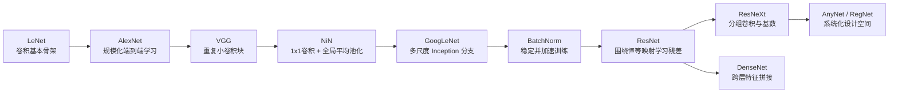
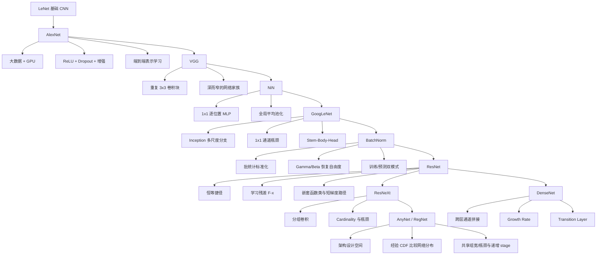

> 对应原文：d2l-en.md 的第 8 章 **Modern Convolutional Neural Networks**。本章按历史顺序回顾一系列曾主导计算机视觉的 CNN：AlexNet、VGG、NiN、GoogLeNet、Batch Normalization、ResNet/ResNeXt、DenseNet，以及 AnyNet/RegNet 设计空间。重点不是背网络名称，而是理解每一代架构发现了什么瓶颈、引入了什么结构、付出了什么代价，以及这些思想怎样累积成现代网络设计原则。

## 1. 为什么要研究一代代 CNN 架构

“把更多层堆起来”只是深度网络的定义，不是可用架构的设计方法。层的类型、排列、宽度、下采样位置、支路、归一化和捷径都会显著改变：

- 表达能力与归纳偏置；
- 梯度能否传到早期层；
- 参数量、激活内存和计算量；
- 训练速度与可接受学习率；
- 未见数据上的准确率；
- 对设备吞吐和内存带宽的利用率。

本章架构大多曾赢得或推动 ImageNet 大规模视觉识别竞赛，并成为检测、分割、跟踪和风格迁移等任务的特征骨干。它们的价值不只在视觉：BatchNorm、残差连接和模块化设计也影响了序列模型、图网络与 Transformer。

原章按时间展示思想积累：



这些网络并非单变量改进。AlexNet 的成功同时来自数据、GPU、ReLU、dropout 和增强；ResNet 的可训练性也依赖初始化、归一化与优化配方。架构名称不能脱离训练条件比较。

## 2. 深度卷积神经网络 AlexNet

### 2.1 从手工特征到表示学习

LeNet 在小型手写数字上成功后，CNN 并未立刻统治视觉。1990 年代到 2012 年前后，主流视觉流水线通常是：

1. 收集图像；
2. 根据光学和几何知识做预处理；
3. 用 SIFT、SURF、HOG 或视觉词袋等手工特征提取器产生表示；
4. 将表示交给线性模型、核方法或集成分类器。

真正驱动性能的常是特征工程，而分类器只是最后一步。表示学习提出相反路线：从原始或轻度处理的像素出发，让多层网络围绕最终标签**联合学习**边缘、纹理、部件和对象级表示。

AlexNet 第一层学到的滤波器与颜色、方向边缘等传统描述子相似，但它们不是人工指定，而是由分类目标和数据共同决定。高层再组合低层表示：

$$
\text{像素}
\rightarrow\text{边缘/颜色}
\rightarrow\text{纹理/部件}
\rightarrow\text{对象表示}
\rightarrow\text{类别 logits}.
$$

这不是保证每个通道都有清晰人类语义，而是端到端学习常产生逐层抽象的有效组织。

### 2.2 为什么突破发生在 2012 年

AlexNet 与 LeNet 在结构上是演进关系，迟到近二十年的关键原因是生态条件成熟。

#### 数据规模

2009 年发布的 ImageNet 约含百万级训练图像、$1000$ 类，每类约 $1000$ 张，典型分辨率约 $224\times224$。相较只含数百或数千个样本的早期数据集，大数据让高容量网络进入优于手工特征和凸模型的区域。

类别候选由 WordNet 名词体系和搜索引擎收集，再通过众包确认。数据规模本身并不消除标签噪声和采样偏差，但它改变了可训练模型的复杂度上限。

#### 计算硬件

CNN 的主要运算是卷积和矩阵乘法，具有高度规则的数据并行。CPU 核心少而强，擅长复杂控制流；GPU 拥有大量较简单的处理单元、高吞吐和高显存带宽，更适合执行密集线性代数。

AlexNet 使用两张显存仅 3 GB 的 GTX 580，并由专门 CUDA 卷积实现支撑训练。GPU 的价值不是“单核更聪明”，而是用大量并行算术单元和宽带宽换吞吐。

#### 训练技术

同时成熟的关键组件包括：

- 更合理的参数初始化；
- 小批量随机优化及其变体；
- ReLU 等非饱和激活；
- dropout；
- 数据增强；
- 更易用的自动微分和 GPU 框架。

因此，把 AlexNet 成功归因于单一网络图会遗漏真正因果组合。

### 2.3 AlexNet 的结构

原始 AlexNet 面向 RGB ImageNet 和 $1000$ 类。原书给出便于教学的单通道、类别数可配置、去掉部分双 GPU 历史细节的版本。它包含五个卷积层、两个全连接隐藏层和一个输出层，通常称八个有权重层。

教材版对 $224\times224$ 单通道输入的形状大致为：

| 阶段 | 配置 | 输出形状（不含批量） |
|---|---|---|
| 输入 | 灰度图 | $1\times224\times224$ |
| Conv1 | $96$, $11\times11$, stride $4$, padding $1$ | $96\times54\times54$ |
| Pool1 | $3\times3$, stride $2$ | $96\times26\times26$ |
| Conv2 | $256$, $5\times5$, padding $2$ | $256\times26\times26$ |
| Pool2 | $3\times3$, stride $2$ | $256\times12\times12$ |
| Conv3 | $384$, $3\times3$, padding $1$ | $384\times12\times12$ |
| Conv4 | $384$, $3\times3$, padding $1$ | $384\times12\times12$ |
| Conv5 | $256$, $3\times3$, padding $1$ | $256\times12\times12$ |
| Pool3 | $3\times3$, stride $2$ | $256\times5\times5$ |
| Flatten | $256\times5\times5$ | $6400$ |
| FC1 | $4096$ + ReLU + dropout | $4096$ |
| FC2 | $4096$ + ReLU + dropout | $4096$ |
| 输出 | 类别 logits | $q$ |

第一层使用大核和大步幅，快速处理高分辨率输入；后续逐步转向 $5\times5$ 和 $3\times3$ 小核。今天的大步幅首层可能损失细节，但在当时是计算约束下的有效选择。

### 2.4 ReLU 为什么替代 sigmoid

Sigmoid 的指数运算更昂贵，并在大正负输入处饱和：

$$
\sigma'(x)=\sigma(x)(1-\sigma(x))\rightarrow0.
$$

ReLU：

$$
\operatorname{ReLU}(x)=\max(x,0)
$$

在正半轴导数为 $1$，计算简单，也更不容易让深层梯度因连续饱和而消失。ReLU 仍可能产生死亡单元，不能把它理解为彻底解决所有梯度问题。

### 2.5 容量控制与图像增强

AlexNet 两个 $4096$ 维全连接层拥有巨大容量，因此使用 $p=0.5$ 的 dropout。训练还采用随机裁剪、翻转和颜色扰动等数据增强，把“标签应对这些变换保持稳定”的先验注入训练。

增强不是真实新增独立样本，但它扩展了观察到的输入变化，并惩罚对无关细节敏感的解。错误增强也会伤害模型，例如文字识别中水平翻转可能改变语义。

### 2.6 全连接头是效率瓶颈

第一大矩阵约为

$$
6400\times4096\approx26.2\text{ million weights},
$$

第二个为

$$
4096\times4096\approx16.8\text{ million weights}.
$$

仅 FP32 权重约需

$$
(26.2+16.8)\times4\text{ bytes}
\approx172\text{ MB},
$$

还未计偏置、输出层、梯度和优化器状态。原书按矩阵主体给出约 164 MB 的量级。卷积层参数较少但计算多；全连接层参数和内存占比大。这一瓶颈直接推动 NiN 和 GoogLeNet 用全局平均池化替代巨大分类头。

### 2.7 在 Fashion-MNIST 上放大到 $224\times224$

原书为保持 AlexNet 结构，将 $28\times28$ Fashion-MNIST 放大到 $224\times224$。插值不会创造新语义信息，却让空间面积扩大 $64$ 倍，计算显著增加。这是教学中的架构复现选择，不是合理生产方案。

更好的小图方案应调整 stem：使用较小核、较小步幅或减少早期池化，直接处理原分辨率。

### 2.8 AlexNet 的核心结论

AlexNet 证明：在足够数据、算力和训练技术下，端到端学习表示可以明显超过手工特征流水线。它并未提供统一网络设计模板，层参数仍有明显试验性，但打开了“规模化深 CNN”路线。

## 3. 使用块的网络 VGG

### 3.1 从逐层调参到重复模块

AlexNet 证明深 CNN 有效，却没有回答下一座网络该怎样系统设计。VGG 借鉴工程中的模块化：把一组重复模式封装成块，再用配置表组合网络家族。

一个 VGG 块包含：

1. 若干个 $3\times3$、padding $1$ 的卷积；
2. 每个卷积后接 ReLU；
3. 最后一个 $2\times2$、stride $2$ 的最大池化。

```python
def vgg_block(num_convs, out_channels):
    layers = []
    for _ in range(num_convs):
        layers.extend([
            nn.LazyConv2d(out_channels, kernel_size=3, padding=1),
            nn.ReLU(),
        ])
    layers.append(nn.MaxPool2d(kernel_size=2, stride=2))
    return nn.Sequential(*layers)
```

卷积保持空间尺寸，块末才下采样。这样可在分辨率下降前增加多次非线性变换，突破“每个卷积后都池化时最多约 $\log_2 d$ 层”的限制。

### 3.2 为什么偏好堆叠 $3\times3$ 小核

两个 stride $1$ 的 $3\times3$ 卷积具有 $5\times5$ 感受野。若输入输出通道均为 $c$，忽略偏置：

$$
2\times3\times3\times c^2=18c^2
$$

个参数，小于一个 $5\times5$ 卷积的

$$
25c^2.
$$

而且中间多一个 ReLU，函数表达更丰富。三个 $3\times3$ 卷积具有 $7\times7$ 感受野，参数 $27c^2$，远少于单个 $7\times7$ 的 $49c^2$。

这个比较假设通道宽度相同且忽略边界。真实速度还取决于内核实现、内存访问和设备；参数更少不必然端到端更快。

### 3.3 VGG-11 的配置

VGG 用 `(卷积数, 输出通道数)` 配置块：

```text
(1, 64), (1, 128), (2, 256), (2, 512), (2, 512)
```

共八个卷积层，后接三个全连接层，因此称 VGG-11。输入 $224$ 经五次池化：

$$
224\rightarrow112\rightarrow56\rightarrow28
\rightarrow14\rightarrow7.
$$

展平为 $512\times7\times7=25088$，再接与 AlexNet 类似的 $4096$、$4096$、类别输出全连接头。

VGG-16、VGG-19 通过增加每块卷积数形成同一家族，提供速度、内存和准确率之间的可配置取舍。

### 3.4 深而窄的意义

VGG 的实验推动了“多层小核优于较浅大核”的经验：

- 相同感受野下参数更少；
- 更多激活带来更多非线性；
- 统一 $3\times3$ 模式简化实现和优化；
- 块配置使架构更可复现。

但更深不自动更好。无残差网络变得很深后优化困难，激活内存和计算也增长。VGG 的大全连接头仍占据巨量参数，因此它是现代模块化的重要一步，不是效率终点。

### 3.5 VGG 的工程价值与局限

VGG 首次把网络更多地描述为“块的序列”而非孤立层清单。现代框架中循环即可生成家族；早期系统甚至需要繁琐配置文件。

局限：

- 计算和显存需求高；
- 分类头参数极大；
- 没有显式跨层捷径，极深版本难训练；
- 为小图盲目放大输入非常浪费。

## 4. 网络中的网络 NiN

### 4.1 NiN 解决的两个瓶颈

LeNet、AlexNet、VGG 都是“卷积提取空间特征 + 巨型全连接分类头”。问题是：

1. 全连接头消耗大量参数和内存；
2. 在卷积骨干早期加入全连接层会展平并破坏空间结构。

NiN 用两个简单思想同时缓解：

- 用 $1\times1$ 卷积在每个空间位置执行共享 MLP，增加通道非线性；
- 用全局平均池化聚合空间，移除大规模全连接层。

### 4.2 NiN 块

一个 NiN 块由：

1. 一个普通空间卷积；
2. ReLU；
3. 两个 $1\times1$ 卷积，每个后接 ReLU。

```python
def nin_block(out_channels, kernel_size, stride, padding):
    return nn.Sequential(
        nn.LazyConv2d(out_channels, kernel_size,
                      stride=stride, padding=padding),
        nn.ReLU(),
        nn.LazyConv2d(out_channels, kernel_size=1),
        nn.ReLU(),
        nn.LazyConv2d(out_channels, kernel_size=1),
        nn.ReLU(),
    )
```

$1\times1$ 卷积在每个 $(i,j)$ 位置计算相同的通道 MLP：

$$
\mathbf h_{i,j}^{(\ell+1)}
=\sigma(W^{(\ell)}\mathbf h_{i,j}^{(\ell)}+b^{(\ell)}).
$$

它不扩大空间感受野，却能重组通道并在不展平图像的条件下增加表达能力。

### 4.3 全局平均池化

最后一个 NiN 块输出通道数设为类别数 $q$。对每个类别通道：

$$
o_c
=\frac{1}{HW}
\sum_{i=1}^{H}\sum_{j=1}^{W}X_{c,i,j}.
$$

输出直接变为 $q$ 个 logits。`nn.AdaptiveAvgPool2d((1,1))` 可对任意输入空间尺寸得到 $1\times1$。

好处：

- 几乎没有分类头参数；
- 空间平均增加一定位置鲁棒性；
- 输入分辨率更灵活；
- 通道和类别之间建立清晰结构约束。

代价：

- 固定平均没有学习空间权重；
- 最后通道必须承担类别证据；
- 过早把大量特征压到 $q$ 通道可能形成瓶颈；
- 平均会稀释很小目标的强局部响应。

### 4.4 NiN 模型脉络

NiN 沿用 AlexNet 的 $11\times11$、$5\times5$、$3\times3$ 空间核和池化节奏，在每个空间卷积后增加两个 $1\times1$ 卷积；最终 dropout 后把通道变为类别数，再全局平均。

NiN 显著减少参数，但不一定减少所有计算：大量 $1\times1$ 卷积仍在每个空间位置执行。它的两项核心设计——逐位置通道 MLP 与全局平均池化——深刻影响了后续 GoogLeNet、ResNet 和现代轻量网络。

## 5. 多分支网络 GoogLeNet

### 5.1 Stem、body、head 的明确分工

GoogLeNet 在 2014 ImageNet 获胜，并清晰体现：

- **stem**：前几层接收图像，提取低级特征并快速降采样；
- **body**：重复的 Inception 模块执行主要表示变换；
- **head**：把最终表示聚合成任务输出。

这一模式延续到 ResNet、RegNet 和许多 Transformer。更换分类头即可把同一 body 用于检测、分割或迁移学习。

### 5.2 Inception 块的四条分支

Inception 同时尝试不同空间尺度：

1. $1\times1$ 卷积分支；
2. $1\times1$ 降通道，再 $3\times3$ 卷积；
3. $1\times1$ 降通道，再 $5\times5$ 卷积；
4. $3\times3$ 最大池化（stride $1$、padding $1$），再 $1\times1$ 卷积。

各分支保持相同高宽，最后沿通道拼接：

$$
Y=\operatorname{Concat}_{C}(Y_1,Y_2,Y_3,Y_4).
$$

若四分支最终通道为 $c_1,c_{2o},c_{3o},c_4$：

$$
C_{\mathrm{out}}
=c_1+c_{2o}+c_{3o}+c_4.
$$

不同核捕获不同尺度，网络无需先决定“唯一最佳核”。代价是分支宽度、降维通道和块数量带来大量超参数。

### 5.3 $1\times1$ 瓶颈为什么节省计算

若输入通道 $C$、目标输出 $O$，直接 $5\times5$ 卷积参数：

$$
25CO.
$$

先用 $1\times1$ 降到 $R$ 通道，再做 $5\times5$：

$$
CR+25RO.
$$

例如 $C=192,R=32,O=96$：

$$
25\times192\times96=460800,
$$

而瓶颈为

$$
192\times32+25\times32\times96=82944,
$$

约少 $5.56$ 倍。中间 ReLU 还增加非线性。若 $R$ 太小，则信息瓶颈可能伤害准确率。

### 5.4 GoogLeNet 整体结构

简化版含九个 Inception 块，分成三组，组间最大池化。stem 先用 $7\times7$ 卷积和池化，再用 $1\times1$ 与 $3\times3$ 卷积得到 $192$ 通道。body 的分支通道逐步增加，最终达到 $1024$ 通道；head 使用全局平均池化和一个类别线性层。

原始 GoogLeNet 还带中间辅助分类器，以缓解深层训练并提供正则化；原书简化版因现代训练技术更成熟而省略。

### 5.5 手工通道分配的历史局限

GoogLeNet 比 AlexNet 更准确且计算更便宜，说明网络设计开始显式权衡误差与成本。但每个 Inception 块的四分支通道数仍由大量试验手工设定。

这带来三个问题：

- 搜索成本高；
- 难以从某个配置总结可迁移规律；
- 输入分辨率或算力预算变化后要重新调整。

本章末尾 AnyNet/RegNet 正是对“如何系统设计网络家族”的回应。

### 5.6 教学训练设置

原书在 Fashion-MNIST 上将输入放大到 $96\times96$，而非原始 ImageNet 的 $224\times224$，以降低成本。这里的缩放仍主要为了复用大图架构，不增加原始图像信息。

GoogLeNet 的重要遗产是多尺度并行、$1\times1$ 降维、全局平均池化和 stem-body-head 分工，而不是必须复刻每个手工通道数字。

## 6. 批量规范化 Batch Normalization

### 6.1 为什么深层网络需要内部尺度控制

输入标准化让特征处于相近尺度，通常改善优化。深层网络训练中，中间激活尺度会随层、单元和参数更新变化。如果某层信号比另一层大百倍，一个统一学习率很难同时适合所有参数。

BatchNorm（BN）在训练时用当前小批量统计量标准化中间变量，再用可学习缩放和平移恢复表达自由度。实践中它常允许更大学习率、加速收敛，并通过批统计噪声产生一定正则化。

### 6.2 BatchNorm 公式

对同一特征或通道的一组元素 $\mathcal B$：

$$
\mu_{\mathcal B}
=\frac{1}{m}\sum_{i=1}^{m}x_i,
$$

$$
\sigma_{\mathcal B}^2
=\frac{1}{m}\sum_{i=1}^{m}
(x_i-\mu_{\mathcal B})^2,
$$

$$
\widehat x_i
=\frac{x_i-\mu_{\mathcal B}}
{\sqrt{\sigma_{\mathcal B}^2+\epsilon}},
$$

$$
y_i=\gamma\widehat x_i+\beta.
$$

$\epsilon>0$ 防止方差为零时除零；$\gamma$ 和 $\beta$ 是可学习参数。标准化不是强制网络永远输出零均值单位方差，因为模型可通过 $\gamma,\beta$ 学回合适尺度。

### 6.3 全连接与卷积中的归约轴

对全连接输出 $X\in\mathbb R^{N\times D}$，每个特征独立统计，沿批量轴 $N$ 求均值与方差；$\gamma,\beta\in\mathbb R^D$。

对 CNN 输出

$$
X\in\mathbb R^{N\times C\times H\times W},
$$

每个通道沿 $N,H,W$ 一起统计：

$$
\mu_c
=\frac{1}{NHW}
\sum_{n,h,w}X_{n,c,h,w}.
$$

$\gamma_c,\beta_c$ 每通道一个标量，并共享到所有空间位置，保持卷积的空间共享结构。

### 6.4 BN 的典型位置与偏置冗余

原始常见顺序：

```text
Linear/Conv → BatchNorm → Activation
```

即

$$
h=\phi(\operatorname{BN}(Wx+b)).
$$

训练时 BN 减去批均值，前一层对所有样本共享的偏置 $b$ 会被消去；BN 自己又有 $\beta$，因此卷积/线性层常设置 `bias=False`：

$$
\operatorname{BN}(Wx+b)
=\operatorname{BN}(Wx)
$$

（在同一批统计且忽略数值细节时）。这可减少冗余参数。若 BN 被移除、冻结方式特殊或顺序不同，结论需重新判断。

### 6.5 训练模式与预测模式

训练时：

- 使用当前小批量均值与方差；
- 更新运行均值和运行方差；
- 同一输入可能因同批其他样本不同而改变输出。

预测时：

- 使用训练期间累计的 running mean/variance；
- 输出不应依赖当前预测批次；
- 支持单样本稳定推理。

PyTorch 必须显式：

```python
model.train()  # 批统计 + 更新运行状态
model.eval()   # 固定运行统计
```

`torch.no_grad()` 只关闭梯度记录，不会让 BN 进入预测模式。反过来，`eval()` 也不会关闭 autograd。

### 6.6 运行统计量与 momentum

PyTorch 风格更新近似为：

$$
\mu_{\mathrm{run}}
\leftarrow
(1-\rho)\mu_{\mathrm{run}}
+\rho\mu_{\mathrm{batch}},
$$

方差同理。这里 API 名 `momentum=\rho` 与优化器动量无关，而且与某些文献使用“旧值权重”为 momentum 的约定相反，必须查框架文档。

运行均值/方差不是模型优化参数，而是持久 buffer：应进入 `state_dict` 并随 `.to(device)` 迁移，不应交给优化器。

### 6.7 批量大小的影响

BN 引入的统计噪声依赖有效样本数：

- 批量很大：统计稳定，噪声正则较弱；
- 中等批量：估计可用且带适度噪声；
- 极小批量：均值方差高噪，训练可能不稳定。

对 `BatchNorm1d` 的单样本单特征，减均值后所有值为零，无法提供有用标准化；PyTorch 训练模式通常会拒绝每通道仅一个值。CNN 即使 $N=1$，若 $H\times W>1$ 仍可沿空间统计，但深层 $1\times1$ 特征图仍会退化。

分布式训练中，每张 GPU 的局部小批量可能太小，可用同步 BN 聚合跨设备统计，但增加通信。

### 6.8 LayerNorm 与 BatchNorm

LayerNorm 对每个样本内部的特征归一化，不依赖其他样本：

$$
\mu=\frac1D\sum_{j=1}^{D}x_j,
\qquad
\sigma^2=\frac1D\sum_j(x_j-\mu)^2.
$$

| 特性 | BatchNorm | LayerNorm |
|---|---|---|
| 统计范围 | 跨批量；CNN 还跨空间 | 单个样本的特征维 |
| 训练/预测行为 | 不同 | 通常相同 |
| 对批量大小 | 敏感 | 不敏感 |
| 常见场景 | CNN | Transformer、序列模型 |

它们不是“同一层换名字”。归一化轴决定保留和消除哪些变化，也决定归纳偏置。

### 6.9 自定义实现中的框架陷阱

原书教学实现用 `torch.is_grad_enabled()` 判断训练/预测。这会把“是否记录梯度”误当作“模块模式”：验证时可能 `eval()` 但仍启用梯度，或训练时局部 `no_grad()`。稳健实现应使用 `self.training`。

运行统计量应通过 `register_buffer` 注册，而不是每次前向手动搬设备：

```python
self.register_buffer("running_mean", torch.zeros(num_features))
self.register_buffer("running_var", torch.ones(num_features))
```

更新 buffer 应在 `torch.no_grad()` 下原地执行。生产中优先使用框架 `nn.BatchNorm1d/2d`，其方差约定、混合精度和分布式边界经过更多测试。

### 6.10 “内部协变量偏移”不是已证实机制

BN 原论文以减少 internal covariate shift 解释效果，但该术语与训练/部署分布的 covariate shift 不同，定义也不充分。后续研究提出优化平滑、尺度重参数化和噪声正则等解释。

应区分：

- **技术事实**：BN 常加快许多深 CNN 的训练，并有明确前向公式；
- **经验直觉**：它稳定中间尺度、允许较大学习率；
- **尚无统一定论的机制解释**：究竟哪项效应主导。

方法有效不等于最初解释正确。现代研究表达应把可验证结论与启发式叙事分开。

### 6.11 BN 的适用范围和代价

优点：

- 常使优化更稳定、更快；
- 允许更积极学习率；
- 批统计噪声可正则化；
- 与卷积通道结构匹配。

局限：

- 小批量和非 IID 批次敏感；
- 训练/预测统计不一致；
- 在线学习和分布偏移会让运行统计过时；
- 样本间耦合可能影响隐私、对抗鲁棒性和复现；
- 并非每层都必须使用，也不能无条件替代 dropout。

## 7. 残差网络 ResNet 与 ResNeXt

### 7.1 为什么“增加层”可能让模型变差

设架构可达到的函数类为 $\mathcal F$，最优可达函数：

$$
f_{\mathcal F}^{*}
=\operatorname*{argmin}_{f\in\mathcal F}
L(X,y,f).
$$

换成一个看似更复杂的架构 $\mathcal F'$，若

$$
\mathcal F\not\subseteq\mathcal F',
$$

则旧模型函数未必能由新架构表示，最优拟合甚至可能变差。理想的扩展应形成嵌套函数类：

$$
\mathcal F_1\subseteq\mathcal F_2\subseteq\cdots.
$$

如果新层能轻易实现恒等映射，深模型至少可以退化为浅模型，再利用额外容量学习改进。这是 ResNet 的核心设计目标。

### 7.2 残差映射

普通块直接学习目标映射 $f(x)$。残差块改写：

$$
f(x)=x+g(x),
$$

只让参数分支学习

$$
g(x)=f(x)-x.
$$

若最佳映射接近恒等，普通块要拟合 $x$，残差分支只需把权重推向使 $g(x)\approx0$ 的状态。

捷径分支不仅帮助表达恒等，也提供直接梯度路径。若

$$
y=x+g(x),
$$

则

$$
\frac{\partial y}{\partial x}
=I+\frac{\partial g}{\partial x}.
$$

上游梯度包含恒等项，不必完全经过所有卷积 Jacobian。这缓解深层退化和梯度传播困难，但不保证任何深度、学习率和初始化都稳定。

### 7.3 基本残差块

原书采用经典 post-activation 块：

```text
主分支：3x3 Conv → BN → ReLU → 3x3 Conv → BN
捷径：Identity 或 1x1 Conv
相加 → ReLU
```

如果输入输出形状相同：

$$
Y=\operatorname{ReLU}(g(X)+X).
$$

若需要通道变化或 stride $2$ 下采样，捷径也必须用 $1\times1$ 卷积和相同步幅：

$$
Y=\operatorname{ReLU}(g(X)+P(X)).
$$

逐元素相加要求两分支的 $N,C,H,W$ 完全相同；广播虽可能让代码运行，但会破坏残差语义，应显式断言 shape。

### 7.4 恒等映射的细节

经典块末尾 ReLU 意味着整个块严格等于 $x$ 还要求输入/和位于非负区域。后来的 pre-activation ResNet 将顺序改为 BN → ReLU → Conv，使捷径更接近无阻碍恒等路径。

常见技巧是把残差分支最后一个 BN 的 $\gamma$ 初始化为零，让初始 $g(x)\approx0$，整个块从接近恒等开始。它不是原书基本代码的必要条件，但体现“围绕恒等参数化”的思想。

### 7.5 ResNet-18

ResNet stem：

```text
7x7 Conv, 64, stride 2
→ BatchNorm → ReLU
→ 3x3 MaxPool, stride 2
```

body 有四个 stage，通道为 $64,128,256,512$，每个 stage 两个残差块；除第一个 stage 外，每个 stage 首块 stride $2$ 且用投影捷径。head 为全局平均池化和线性分类器。

主路径有：

$$
1\text{ stem conv}
+4\times2\times2\text{ block conv}
+1\text{ FC}
=18
$$

个主要有权重层，因此称 ResNet-18。投影 $1\times1$ 卷积通常不计入命名中的主路径层数。

通道随 stage 增长，空间分辨率下降：计算在更粗网格上转移到更丰富通道。全局平均池化避免巨型全连接头。

### 7.6 ResNet 的真正贡献

ResNet 不只是“多了一条相加线”：

- 让新增块可近似恒等，形成更自然的嵌套扩展；
- 把简单函数偏好从 $g(x)=0$ 转成 $f(x)=x$；
- 提供前向信息和反向梯度的短路径；
- 让 100 层以上网络成为常规设计；
- 模块简单、统一，容易按 stage 扩展。

残差连接后来进入 Transformer、图网络和序列模型，说明其价值超越卷积。

### 7.7 ResNeXt：把“基数”作为新维度

增大网络容量可增加深度、宽度，或增加并行变换数。ResNeXt 借鉴 Inception 的分支思想，但不为每条支路手工选择不同核，而是重复**同一种变换**，用 cardinality（基数/组数）控制并行组。

标准通道变换从 $C_i$ 到 $C_o$ 的通道连接成本约

$$
O(C_iC_o).
$$

分成 $g$ 组后，每组输入 $C_i/g$、输出 $C_o/g$：

$$
g\cdot\frac{C_i}{g}\cdot\frac{C_o}{g}
=\frac{C_iC_o}{g},
$$

参数和计算约降低 $g$ 倍。

### 7.8 ResNeXt 瓶颈结构

典型 ResNeXt 块：

```text
1x1 Conv：压缩/混合到 b 通道
→ 3x3 Grouped Conv：g 组
→ 1x1 Conv：恢复到 c 通道
→ 与捷径相加
```

空间卷积主要成本从 $9b^2$ 降为

$$
\frac{9b^2}{g},
$$

两端 $1\times1$ 成本约 $O(cb)$，并负责组间混合。若只有连续分组卷积而没有通道混合，各组会长期隔离。

PyTorch `Conv2d(..., groups=g)` 中 `groups` 是**组数**，输入输出通道必须都被 $g$ 整除。有些实现 API 使用“每组宽度”再换算组数，不能只看变量名。

### 7.9 Inception 与 ResNeXt 的区别

| 维度 | Inception | ResNeXt |
|---|---|---|
| 分支变换 | 不同核/池化的异构分支 | 相同结构的同构分组 |
| 合并 | 通道拼接 | 聚合后残差相加 |
| 主要超参数 | 每支路宽度和核 | 基数、瓶颈宽度 |
| 设计风格 | 手工多尺度组合 | 规则化、易扩展 |

二者都利用稀疏通道连接降低成本，但 ResNeXt 更减少逐支路人工调参。

## 8. 稠密连接网络 DenseNet

### 8.1 从相加到拼接

ResNet：

$$
x_{\ell}=x_{\ell-1}+F_\ell(x_{\ell-1}).
$$

相加将旧特征和新特征压在相同通道中。DenseNet 改为：

$$
x_\ell
=H_\ell([x_0,x_1,\ldots,x_{\ell-1}]),
$$

并把新输出继续拼入总表示：

$$
[x_0,x_1,\ldots,x_\ell].
$$

每层直接看到所有此前特征，旧表示不被加法覆盖。

原书用 Taylor 展开中逐级增加高阶项作类比。它是启发性比喻，不表示 DenseNet 层真的计算函数导数。

### 8.2 Dense block 与增长率

每个卷积块采用 pre-activation：

```text
BatchNorm → ReLU → 3x3 Conv
```

若每层产生 $k$ 个新通道，$k$ 称为 growth rate。输入通道 $C_0$，包含 $L$ 个卷积块后：

$$
C_{\mathrm{out}}=C_0+Lk.
$$

```python
class DenseBlock(nn.Module):
    def forward(self, X):
        for block in self.blocks:
            Y = block(X)
            X = torch.cat((X, Y), dim=1)
        return X
```

后层输入越来越宽，因此即使每层只新增少量通道，仍能复用丰富早期特征。

### 8.3 Transition layer

通道持续线性增长最终会不可控。Dense block 之间用过渡层：

```text
BatchNorm → ReLU
→ 1x1 Conv 降通道
→ 2x2 AveragePool, stride 2 降空间
```

$1\times1$ 控制通道，平均池化降低分辨率。若压缩系数为 $\theta\in(0,1]$：

$$
C_{\mathrm{next}}=\lfloor\theta C_{\mathrm{current}}\rfloor.
$$

原书示例通常把通道减半。

### 8.4 DenseNet 的优点

- 特征复用：后层直接访问早期细粒度特征；
- 短梯度路径：每层与损失有较直接连接；
- 每层只需产生较少新通道，参数可能低于同精度 ResNet；
- 拼接保留不同层信息而非立即相加。

### 8.5 DenseNet 的内存代价

拼接表示随深度增长，训练必须保存许多中间激活。朴素实现还可能重复物化连接张量，导致高显存和内存带宽压力。DenseNet 参数少不等于训练内存少。

可用：

- 梯度检查点，反向时重算 BN/ReLU；
- 更高效共享存储和拼接实现；
- 降低 growth rate；
- 更强 transition 压缩；
- 混合精度。

这些方法常以更多重算或精度风险换内存。

### 8.6 ResNet 与 DenseNet 的核心区别

| 属性 | ResNet | DenseNet |
|---|---|---|
| 跨层合并 | 逐元素相加 | 通道拼接 |
| 通道要求 | 相加前必须同形状 | 通道自然增长 |
| 旧特征 | 与新残差融合 | 原样保留并可直接访问 |
| 参数效率 | 统一残差块 | 小 growth rate 可更省参数 |
| 激活内存 | 相对可控 | 通常更高 |

两者都为信息和梯度提供短路径，但采用不同状态组织方式。

## 9. 从手工架构到设计空间：AnyNet 与 RegNet

### 9.1 为什么不只搜索“最好的一张网络图”

AlexNet 到 ResNeXt 主要依赖专家直觉与昂贵试验。神经架构搜索（NAS）可在固定搜索空间中用强化学习、进化或可微优化寻找单个高分架构，但成本巨大，且下次改变搜索空间可能要重来。

RegNet 的路线是研究**设计空间中的网络分布**：不只问哪一个样本最好，而问什么约束能让大量随机抽出的网络普遍更好。这样既获得模型，也获得可解释设计规律。

### 9.2 Stem、body、head 和 stage

AnyNet 把 CNN 抽象为：

- stem：$3\times3$、stride $2$ 卷积 + BN + ReLU；
- body：四个逐步降采样的 stage；
- head：全局平均池化 + 线性分类器。

每个 stage：

- 第一个 ResNeXt 块 stride $2$ 并用投影捷径；
- 后续块保持分辨率和通道；
- stage 内共享宽度、组和瓶颈配置。

输入 $224$：stem 和四个 stage 共下采样五次：

$$
224/2^5=7.
$$

body 最终为 $7\times7\times C_4$，head 聚合为类别输出。

### 9.3 AnyNet 的 17 个设计参数

典型选择包括：

- stem/body 宽度 $c_0,\ldots,c_4$：5 个；
- 四个 stage 深度 $d_1,\ldots,d_4$：4 个；
- 瓶颈比 $k_1,\ldots,k_4$：4 个；
- 组宽/组配置 $g_1,\ldots,g_4$：4 个。

合计 $17$。即使每项只有两个候选，也有

$$
2^{17}=131072
$$

种组合，完整训练穷举不可行。

### 9.4 设计空间实验的四个假设

1. **好设计原则不只产生一张好网络**：约束后的空间中应有许多高质量网络。
2. **低保真评估可预示最终表现**：少量 epoch 可作为代理，减少搜索成本。
3. **小规模规律可迁移到大规模**：先在较小网络和预算上探索，再验证放大。
4. **设计因素近似可分解**：可逐步收紧某些维度并比较分布。

这些是假设，不是普遍定理。训练排名可能随预算反转，小模型结论也可能无法外推；最终必须在目标规模复验。

### 9.5 用经验 CDF 比较设计空间

从设计分布 $p$ 采样网络，误差为 $e(\text{net})$。误差累积分布：

$$
F(e,p)
=P_{\text{net}\sim p}
\{e(\text{net})\le e\}.
$$

采样 $n$ 张网络得到经验 CDF：

$$
\widehat F(e;\mathcal Z)
=\frac1n\sum_{i=1}^{n}
\mathbf1(e_i\le e).
$$

对误差指标，在同一阈值 $e$ 下 CDF 越高，表示越多网络能达到不超过该误差；若一条 CDF 在所有阈值上不低于另一条，就具有一阶随机优势。

只比较单个最佳值容易选中因训练噪声“走运”的网络；比较分布能判断设计原则是否稳定提高整个家族。

### 9.6 从 AnyNet 收紧到 RegNet

实验发现可加入简单约束而不降低网络分布质量：

1. 所有 stage 共享瓶颈比
   $$
   k_i=k;
   $$
2. 所有 stage 共享组宽/组规则
   $$
   g_i=g;
   $$
3. 深层 stage 通道不减少
   $$
   c_i\le c_{i+1};
   $$
4. 深层 stage 深度不减少
   $$
   d_i\le d_{i+1}.
   $$

最佳网络还显示块宽近似随全局块索引线性增长：

$$
c_j\approx c_0+c_a j,
\qquad c_a>0,
$$

再量化成每个 stage 的分段常数宽度。实验还发现 $k=1$，即不使用瓶颈，常有较好分布表现。

由此得到 RegNetX 家族；加入 Squeeze-and-Excitation 全局通道注意力得到 RegNetY。

### 9.7 一个 RegNetX 示例

原书给出的简化变体：

- stem 通道 $32$；
- 共享组宽 $16$；
- 瓶颈比 $1$；
- stage 深度 $(4,6)$；
- stage 通道 $(32,80)$。

每个 stage 首块下采样，随后保持尺寸。名称中的“32”可与模型家族/层数或预算命名相关，不能仅由两个 stage 块数直接理解；判断模型应查看实际主路径层和配置。

### 9.8 设计空间方法的价值与局限

价值：

- 输出可解释的架构规律，而不只是一张网络；
- 约束空间降低搜索成本；
- 网络家族覆盖不同算力预算；
- 将专家直觉与统计实验结合。

局限：

- 代理训练预算可能错误排序；
- 规律依赖数据集、优化器和硬件；
- FLOPs 相同不代表延迟相同；
- CDF 估计也有采样误差；
- 搜索空间决定了能发现什么。

### 9.9 CNN 与视觉 Transformer 的边界

CNN 强烈编码局部性和平移共享，在中小数据和许多设备上仍高效。视觉 Transformer 归纳偏置更弱，却可借助超大数据和硬件扩展学习结构，并在大规模任务上取得领先。

“可扩展性胜过归纳偏置”不是说先验永远无用，而是数据、算力和架构共同决定最佳偏置强度。许多 Transformer 训练技巧也能反向改善 ConvNet，但实际设备对矩阵乘法、卷积和注意力的优化不同，精度不能脱离成本比较。

## 10. 架构思想的横向比较

| 架构/技术 | 主要瓶颈 | 核心解决思路 | 主要代价或局限 |
|---|---|---|---|
| AlexNet | 手工特征、大规模训练未证实 | GPU + 大数据 + ReLU + dropout + 增强 | 巨型全连接头、结构手工 |
| VGG | 缺少统一深层模板 | 重复 $3\times3$ 卷积块 | 计算、显存和 FC 参数大 |
| NiN | FC 头昂贵、局部非线性不足 | $1\times1$ MLP + 全局平均池化 | 类别通道瓶颈、平均聚合固定 |
| GoogLeNet | 核尺度选择、成本 | Inception 多分支 + $1\times1$ 降维 | 分支超参数繁多 |
| BatchNorm | 中间尺度和深层优化困难 | 批统计标准化 + 可学习仿射 | 批量依赖、训练/预测差异 |
| ResNet | 加深后退化、梯度路径长 | 恒等捷径 + 残差映射 | 形状对齐、并非自动防过拟合 |
| ResNeXt | 宽度成本二次增长 | 同构分组卷积 + 瓶颈 | 组间信息需 $1\times1$ 混合 |
| DenseNet | 旧特征复用与梯度路径 | 跨层通道拼接 | 激活内存和带宽高 |
| RegNet | 架构手工搜索不可解释 | 优化网络分布/设计空间 | 代理和迁移假设需验证 |

从历史看，现代 CNN 的共同趋势是：

1. 从逐层手工参数走向重复模块和网络家族；
2. 用 $1\times1$、分组卷积和全局池化控制成本；
3. 用归一化和捷径改善深层优化；
4. 用加法或拼接建立跨层信息通路；
5. 从搜索单点转向研究可解释设计空间；
6. 同时报告准确率、参数、FLOPs、内存和真实延迟。

## 11. 可运行的综合实验

下面的 PyTorch 代码不下载数据，也不完整训练大网络，而是验证本章最核心、可迁移的架构机制：VGG 块形状、NiN 全局平均头、Inception 通道拼接、BatchNorm 训练/预测差异、残差恒等梯度、ResNeXt 分组参数节省、DenseNet 通道增长，以及一个小型 stem-body-head 网络的尺寸流。

```python
import torch
from torch import nn

torch.manual_seed(37)

def parameter_count(module):
    return sum(parameter.numel() for parameter in module.parameters())

def vgg_block(in_channels, out_channels, num_convs):
    layers = []
    current_channels = in_channels
    for _ in range(num_convs):
        layers.extend([
            nn.Conv2d(current_channels, out_channels, 3, padding=1),
            nn.ReLU(),
        ])
        current_channels = out_channels
    layers.append(nn.MaxPool2d(2, stride=2))
    return nn.Sequential(*layers)

class NiNBlock(nn.Module):
    def __init__(self, in_channels, out_channels, kernel_size,
                 stride=1, padding=0):
        super().__init__()
        self.net = nn.Sequential(
            nn.Conv2d(in_channels, out_channels, kernel_size,
                      stride=stride, padding=padding),
            nn.ReLU(),
            nn.Conv2d(out_channels, out_channels, 1),
            nn.ReLU(),
            nn.Conv2d(out_channels, out_channels, 1),
            nn.ReLU(),
        )

    def forward(self, X):
        return self.net(X)

class Inception(nn.Module):
    def __init__(self, in_channels, c1, c2, c3, c4):
        super().__init__()
        self.branch1 = nn.Sequential(
            nn.Conv2d(in_channels, c1, 1), nn.ReLU()
        )
        self.branch2 = nn.Sequential(
            nn.Conv2d(in_channels, c2[0], 1), nn.ReLU(),
            nn.Conv2d(c2[0], c2[1], 3, padding=1), nn.ReLU(),
        )
        self.branch3 = nn.Sequential(
            nn.Conv2d(in_channels, c3[0], 1), nn.ReLU(),
            nn.Conv2d(c3[0], c3[1], 5, padding=2), nn.ReLU(),
        )
        self.branch4 = nn.Sequential(
            nn.MaxPool2d(3, stride=1, padding=1),
            nn.Conv2d(in_channels, c4, 1), nn.ReLU(),
        )

    def forward(self, X):
        outputs = (
            self.branch1(X), self.branch2(X),
            self.branch3(X), self.branch4(X),
        )
        spatial_shapes = {output.shape[-2:] for output in outputs}
        assert len(spatial_shapes) == 1
        return torch.cat(outputs, dim=1)

class ResidualUnit(nn.Module):
    """Pre-activation-style unit without a final ReLU for identity testing."""
    def __init__(self, in_channels, out_channels, stride=1, groups=1):
        super().__init__()
        self.branch = nn.Sequential(
            nn.BatchNorm2d(in_channels),
            nn.ReLU(),
            nn.Conv2d(in_channels, out_channels, 3, stride=stride,
                      padding=1, groups=groups, bias=False),
            nn.BatchNorm2d(out_channels),
            nn.ReLU(),
            nn.Conv2d(out_channels, out_channels, 3, padding=1,
                      groups=groups, bias=False),
        )
        self.projection = (
            nn.Conv2d(in_channels, out_channels, 1, stride=stride, bias=False)
            if stride != 1 or in_channels != out_channels else nn.Identity()
        )

    def forward(self, X):
        return self.projection(X) + self.branch(X)

class DenseLayer(nn.Module):
    def __init__(self, in_channels, growth_rate):
        super().__init__()
        self.net = nn.Sequential(
            nn.BatchNorm2d(in_channels),
            nn.ReLU(),
            nn.Conv2d(in_channels, growth_rate, 3, padding=1),
        )

    def forward(self, X):
        return self.net(X)

class DenseBlock(nn.Module):
    def __init__(self, in_channels, growth_rate, num_layers):
        super().__init__()
        self.layers = nn.ModuleList()
        channels = in_channels
        for _ in range(num_layers):
            self.layers.append(DenseLayer(channels, growth_rate))
            channels += growth_rate
        self.out_channels = channels

    def forward(self, X):
        for layer in self.layers:
            X = torch.cat((X, layer(X)), dim=1)
        return X

class TinyModernCNN(nn.Module):
    """A small stem-body-head network using residual stages."""
    def __init__(self, num_classes=10):
        super().__init__()
        self.stem = nn.Sequential(
            nn.Conv2d(3, 8, 3, stride=2, padding=1, bias=False),
            nn.BatchNorm2d(8),
            nn.ReLU(),
        )
        self.body = nn.Sequential(
            ResidualUnit(8, 16, stride=2),
            ResidualUnit(16, 16),
            ResidualUnit(16, 32, stride=2, groups=1),
            ResidualUnit(32, 32),
        )
        self.head = nn.Sequential(
            nn.AdaptiveAvgPool2d((1, 1)),
            nn.Flatten(),
            nn.Linear(32, num_classes),
        )

    def forward(self, X):
        return self.head(self.body(self.stem(X)))

# 1. VGG preserves resolution inside a block, then halves it once.
X = torch.randn(2, 3, 32, 32)
vgg = vgg_block(3, 16, num_convs=2)
assert vgg(X).shape == (2, 16, 16, 16)

# 2. NiN performs local channel MLPs; global averaging removes spatial axes.
nin = nn.Sequential(
    NiNBlock(3, 12, kernel_size=3, padding=1),
    nn.Conv2d(12, 5, kernel_size=1),
    nn.AdaptiveAvgPool2d((1, 1)),
    nn.Flatten(),
)
assert nin(X).shape == (2, 5)

# 3. Inception preserves spatial size and concatenates final branch channels.
inception = Inception(3, 4, (5, 6), (2, 3), 7)
inception_output = inception(X)
assert inception_output.shape == (2, 4 + 6 + 3 + 7, 32, 32)

# A 1x1 bottleneck makes the 5x5 branch much smaller than direct convolution.
direct_5x5 = 192 * 96 * 5 * 5
bottleneck_5x5 = 192 * 32 + 32 * 96 * 5 * 5
assert bottleneck_5x5 < direct_5x5 / 5

# 4. BatchNorm uses batch statistics in training and running statistics in eval.
bn = nn.BatchNorm2d(3, affine=True, momentum=0.1)
bn.train()
bn_input = 4.0 * torch.randn(16, 3, 8, 8) + torch.tensor([1.0, 5.0, -3.0]).reshape(1, 3, 1, 1)
bn_training_output = bn(bn_input)
training_mean = bn_training_output.mean(dim=(0, 2, 3))
training_var = bn_training_output.var(dim=(0, 2, 3), unbiased=False)
assert torch.allclose(training_mean, torch.zeros(3), atol=1e-5)
assert torch.allclose(training_var, torch.ones(3), atol=2e-4)
assert "running_mean" in bn.state_dict()

bn.eval()
with torch.no_grad():
    eval_output_1 = bn(bn_input[:2])
    eval_output_2 = bn(bn_input[:2])
assert torch.equal(eval_output_1, eval_output_2)

# 5. A zero residual branch starts as identity and preserves a direct gradient.
identity_block = ResidualUnit(4, 4)
for module in identity_block.branch.modules():
    if isinstance(module, nn.Conv2d):
        nn.init.zeros_(module.weight)
identity_block.eval()
identity_input = torch.randn(2, 4, 8, 8, requires_grad=True)
identity_output = identity_block(identity_input)
torch.testing.assert_close(identity_output, identity_input)
identity_output.sum().backward()
torch.testing.assert_close(identity_input.grad, torch.ones_like(identity_input))

# Projection aligns both channel count and spatial resolution.
projecting_block = ResidualUnit(4, 8, stride=2)
assert projecting_block(torch.randn(2, 4, 16, 16)).shape == (2, 8, 8, 8)

# 6. Grouped 3x3 convolution cuts parameters by the number of groups.
dense_conv = nn.Conv2d(16, 32, 3, padding=1, bias=False)
grouped_conv = nn.Conv2d(16, 32, 3, padding=1, groups=4, bias=False)
assert parameter_count(dense_conv) == 4 * parameter_count(grouped_conv)

# 7. DenseNet grows channels by growth_rate for every layer.
dense_block = DenseBlock(in_channels=8, growth_rate=4, num_layers=3)
dense_output = dense_block(torch.randn(2, 8, 16, 16))
assert dense_block.out_channels == 8 + 3 * 4
assert dense_output.shape == (2, 20, 16, 16)

# 8. Stem-body-head shape flow and finite gradients.
model = TinyModernCNN(num_classes=10)
model_input = torch.randn(4, 3, 64, 64)
stem_output = model.stem(model_input)
body_output = model.body(stem_output)
logits = model.head(body_output)
assert stem_output.shape == (4, 8, 32, 32)
assert body_output.shape == (4, 32, 8, 8)
assert logits.shape == (4, 10)

loss = nn.functional.cross_entropy(logits, torch.tensor([0, 1, 2, 3]))
loss.backward()
assert all(
    parameter.grad is not None and torch.isfinite(parameter.grad).all()
    for parameter in model.parameters()
)

print("VGG block shape =", tuple(vgg(X).shape))
print("NiN global head shape =", tuple(nin(X).shape))
print("Inception output channels =", inception_output.shape[1])
print("5x5 bottleneck parameter ratio =", direct_5x5 / bottleneck_5x5)
print("BatchNorm training mean/variance =", training_mean.tolist(), training_var.tolist())
print("residual identity gradient = PASS")
print("grouped-conv parameter reduction =", parameter_count(dense_conv) / parameter_count(grouped_conv))
print("DenseNet channels =", dense_output.shape[1])
print("tiny CNN stem/body/head =", tuple(stem_output.shape), tuple(body_output.shape), tuple(logits.shape))
```

代码与原理对应如下：

1. VGG 块内连续两个 $3\times3$ 卷积保持分辨率，块末池化才减半；
2. NiN 用 $1\times1$ 通道变换和全局平均池化产生固定长度 logits；
3. Inception 四分支保持高宽并按通道拼接，$1\times1$ 瓶颈把示例 $5\times5$ 分支参数减少五倍以上；
4. BatchNorm 训练输出逐通道近似零均值单位方差，运行统计进入 `state_dict`，评估前向确定；
5. 残差分支为零时模块精确传递输入和单位梯度，投影捷径完成通道与分辨率对齐；
6. 四组卷积的空间核参数恰为稠密卷积四分之一；
7. Dense block 按 `growth_rate` 线性增加通道；
8. 小型 stem-body-head 网络验证 $64\to32\to8$ 的空间流和完整有限梯度。

## 12. 容易混淆的概念与常见误区

### 12.1 AlexNet 成功只因为“更深”

错误。数据规模、GPU 卷积、ReLU、dropout、增强和初始化共同作用；孤立复制八层结构不保证复现突破。

### 12.2 手工特征完全无用

端到端表示学习减少了人工流水线，却仍依赖数据增强、架构先验和领域知识。小数据、高可解释或物理约束任务中，人工特征仍可能有价值。

### 12.3 输入放大等于增加信息

把 $28\times28$ 插值到 $224\times224$ 只增加采样点和计算，不创造新视觉细节。它是适配大图架构的权宜之计。

### 12.4 VGG 的“层数”与打印模块数

VGG-11 的 11 指有权重层：8 个卷积和 3 个全连接。ReLU、池化、Flatten 和块包装通常不计入命名。

### 12.5 小核参数少所以必然快

多个 $3\times3$ 参数可少于一个大核，但层数、激活读写和内核启动增加。真实延迟由硬件和实现决定。

### 12.6 $1\times1$ 卷积没有空间作用所以无用

它不扩大空间感受野，却重组通道、增加逐位置非线性、构造瓶颈并控制宽度，是 NiN、Inception、ResNet 和 ResNeXt 的基础。

### 12.7 全局平均池化等于普通平均池化

普通池化在局部窗口滑动并保留空间网格；全局平均池化把每个通道整个 $H\times W$ 聚合为一个数。

### 12.8 Inception 多分支等于模型集成

分支在同一网络中联合训练并拼接中间特征，不是独立训练多个完整模型后平均预测。

### 12.9 BatchNorm 是输入数据标准化

数据标准化使用训练集固定统计处理原始特征；BN 在网络内部、训练时按小批量动态统计，并学习 $\gamma,\beta$。二者目的相关但生命周期不同。

### 12.10 BatchNorm 消除内部协变量偏移是定论

不是。它是历史解释，后续研究质疑其定义和因果机制。BN 的公式和经验效果明确，完整理论解释仍需谨慎。

### 12.11 `no_grad()` 会让 BatchNorm 进入预测模式

不会。BN 行为由 `module.training` 决定，需调用 `eval()`；`no_grad()` 只控制 autograd。

### 12.12 BatchNorm momentum 等于优化器动量

不是。BN momentum 控制运行统计更新权重，不参与参数梯度的速度积累，而且不同框架约定可能相反。

### 12.13 BatchNorm 与 LayerNorm 可随意互换

归约轴和批量依赖不同。替换会改变函数、训练噪声和推理行为，必须重新调参验证。

### 12.14 残差连接保证梯度永不消失

恒等路径改善梯度传播，但激活、投影、损失、数值和优化仍可造成问题。它是结构性缓解，不是数学上的无条件保证。

### 12.15 残差块学习的是输出本身

参数分支学习 $g(x)=f(x)-x$，块输出由捷径和残差合成。若存在投影捷径，则基准是 $P(x)$ 而非严格 $x$。

### 12.16 相加会自动处理不同形状

残差相加要求形状完全匹配。需要 $1\times1$ 投影和相同步幅；依赖广播会改变语义并通常是错误。

### 12.17 ResNeXt 的 groups 参数总是“每组宽度”

PyTorch `groups` 是组数。论文和封装 API 也可能报告 cardinality 或 group width，三者需通过通道数换算，不能只看名称。

### 12.18 分组卷积减少计算而不损表达

分组会切断组间连接，表达受限。前后 $1\times1$ 混合、通道 shuffle 或多层组合用于恢复交流。

### 12.19 DenseNet 参数少所以显存也少

参数量和激活内存不同。DenseNet 拼接并保留许多层特征，训练激活显存可能很高。

### 12.20 ResNet 相加与 DenseNet 拼接只是写法区别

相加保持通道数并融合特征，拼接保留各层特征并增长通道；它们改变信息流、参数形状和内存复杂度。

### 12.21 NAS 与设计空间方法相同

NAS 通常在固定空间中寻找单个高分实例；RegNet 方法比较网络分布，逐步收紧空间并总结家族规律。二者可结合但目标不同。

### 12.22 FLOPs 相同就同样快

延迟还受并行度、内存带宽、算子融合、张量形状、设备内核和批量影响。$1\times1$、depthwise 和 grouped 卷积在不同硬件上的实际效率可能与理论 FLOPs 不成比例。

### 12.23 更大模型一定属于嵌套函数类

只有新增结构能包含旧函数（例如近似恒等）时才有嵌套保证。随意改变激活、宽度瓶颈或下采样可能让函数类只是不同而非包含。

### 12.24 CNN 已被 Transformer 完全淘汰

Transformer 在大规模预训练上领先许多基准，但 CNN 在数据效率、延迟、边缘设备和特定任务中仍重要。选择取决于规模、硬件和部署约束。

## 13. 重要公式、算法与练习推导

### 13.1 AlexNet 全连接层的内存

FP32 每权重 4 字节。两个隐藏矩阵：

$$
6400\times4096\times4
\approx104.9\text{ MB},
$$

$$
4096\times4096\times4
\approx67.1\text{ MB}.
$$

合计约 $172$ MB（十进制 MB），训练还要梯度和优化器状态。若 Adam 为每参数保存梯度及两阶矩，仅这些权重相关状态可达参数存储数倍。

### 13.2 两个 $3\times3$ 的感受野

步幅 $1$ 下感受野递推：

$$
r_0=1,
\qquad
r_{\ell}=r_{\ell-1}+(k_\ell-1).
$$

两个 $3\times3$：

$$
r=1+2+2=5.
$$

三个：

$$
r=1+2+2+2=7.
$$

因此 VGG 用小核堆叠近似大核视野并插入更多非线性。

### 13.3 全局平均池化的梯度

$$
o_c=\frac1{HW}\sum_{i,j}X_{c,i,j}.
$$

若上游梯度为 $g_c=\partial L/\partial o_c$：

$$
\frac{\partial L}{\partial X_{c,i,j}}
=\frac{g_c}{HW}.
$$

梯度均匀分配到所有位置。这有利于全图证据聚合，也解释小局部目标信号可能被稀释。

### 13.4 Inception 瓶颈何时省参数

直接 $k\times k$：

$$
P_{\mathrm{direct}}=k^2C_iC_o.
$$

先降到 $R$：

$$
P_{\mathrm{bottle}}=C_iR+k^2RC_o.
$$

要省参数：

$$
R(C_i+k^2C_o)<k^2C_iC_o,
$$

即

$$
R<\frac{k^2C_iC_o}{C_i+k^2C_o}.
$$

瓶颈越窄越省，但信息损失风险越高。

### 13.5 BatchNorm 的尺度近似不变性

忽略 $\epsilon$ 且 $a>0$：

$$
\operatorname{BN}(aX)
=\gamma\frac{aX-a\mu}{a\sigma}+\beta
=\operatorname{BN}(X).
$$

$a<0$ 时标准化部分会翻转符号，可由 $\gamma$ 调整。$\epsilon$、有限批量和运行统计使等式仅近似。尺度不变会改变参数空间几何和有效学习率。

### 13.6 BN 前偏置为何冗余

对批量内共享偏置 $b$：

$$
\mu(WX+b)=\mu(WX)+b.
$$

所以

$$
(WX+b)-[\mu(WX)+b]
=WX-\mu(WX).
$$

训练时偏置完全被中心化抵消，BN 的 $\beta$ 提供平移自由度。

### 13.7 残差块的梯度路径

多层残差递推：

$$
x_{\ell+1}=x_\ell+F_\ell(x_\ell).
$$

则

$$
\frac{\partial x_L}{\partial x_0}
=\prod_{\ell=0}^{L-1}
\left(I+J_{F_\ell}(x_\ell)\right).
$$

与普通深网纯 Jacobian 乘积相比，每一项包含恒等分量。若残差 Jacobian 较小，乘积更接近单位传播。

### 13.8 分组卷积的参数与限制

标准 $k\times k$：

$$
P=k^2C_iC_o.
$$

$g$ 组：

$$
P_g
=g\cdot k^2\frac{C_i}{g}\frac{C_o}{g}
=\frac{k^2C_iC_o}{g}.
$$

权重矩阵在通道维呈块对角，跨组元素固定为零。$1\times1$ 稠密卷积可在前后改变基，使多层组合实现跨组交互。

### 13.9 Dense block 通道和计算增长

第 $\ell$ 层输入通道：

$$
C_{\ell}=C_0+(\ell-1)k.
$$

若每层一个 $3\times3$ 卷积，参数总量：

$$
9k\sum_{\ell=1}^{L}
[C_0+(\ell-1)k]
$$

$$
=9k\left(LC_0+\dfrac{kL(L-1)}{2}\right).
$$

虽然输出通道每层只增 $k$，输入宽度增长使朴素参数/计算含二次项。实际 DenseNet 常加 $1\times1$ 瓶颈控制成本。

### 13.10 DenseNet 过渡层为什么用平均池化

平均池化保留通道整体响应并平滑下采样，与 DenseNet 强调特征复用相符；最大池化只保留局部极值，可能丢失更多已拼接特征。它不是数学必然，仍可通过实验比较。

### 13.11 经验 CDF 的置信波动

对固定误差阈值 $e$，指示变量

$$
I_i=\mathbf1(e_i\le e)
$$

是 Bernoulli，经验 CDF 标准误约为

$$
\sqrt{\frac{F(e)(1-F(e))}{n}}
\le\frac{1}{2\sqrt n}.
$$

采样网络数量少时，两条 CDF 的细小差异可能只是随机波动；应报告重复试验或置信带。

### 13.12 设计空间为何优于只看冠军

假设空间 A 的最好样本略优于 B，但 A 大多数网络很差；空间 B 大多数网络都稳定优秀。只看最小误差会偏好 A，并可能选中噪声幸运值；CDF 比较更偏好可复现、对超参数不敏感的设计原则。

### 13.13 怎样公平比较架构

至少控制或报告：

- 训练数据和增强；
- 优化器、学习率日程、epoch；
- 初始化、正则化和标签平滑；
- 输入分辨率；
- 参数量、MACs/FLOPs、峰值显存；
- 目标硬件上的 batch-1 延迟和吞吐；
- 多随机种子均值与方差。

只比较论文标题下的单个准确率，无法区分架构与训练配方贡献。

## 14. 全章知识结构



## 15. 核心结论与解决问题的一般思路

### 15.1 核心结论

1. AlexNet 的突破来自端到端表示学习、大规模数据、GPU 和一整套训练技术的共同成熟，不只是增加层数。
2. VGG 用重复小卷积块把架构设计提升到模块层；堆叠 $3\times3$ 可用更少参数获得大感受野和更多非线性。
3. NiN 的 $1\times1$ 卷积在每个位置混合通道，全局平均池化移除昂贵全连接头，并增强输入尺寸灵活性。
4. GoogLeNet 的 Inception 同时处理多种空间尺度，$1\times1$ 瓶颈使大核分支可计算，stem-body-head 成为长期模板。
5. BatchNorm 用小批量统计标准化中间激活，再以可学习 $\gamma,\beta$ 恢复尺度；训练使用批统计，预测使用运行统计。
6. BatchNorm 常加速并稳定训练，但“内部协变量偏移”不是已证实的完整机制；批量大小和模式切换是关键边界。
7. ResNet 让新增块围绕恒等映射学习残差，提供直接信息与梯度路径，使极深网络更容易优化。
8. 当形状改变时，残差捷径必须投影对齐；相加要求精确同形状，不能依赖意外广播。
9. ResNeXt 以同构分组卷积增加 cardinality，在宽度和计算之间建立规则化取舍；$1\times1$ 负责组间混合。
10. DenseNet 用通道拼接保留并复用所有早期特征，growth rate 控制新增宽度，transition layer 控制通道与分辨率。
11. 参数量、计算量和激活内存是不同资源；DenseNet 可省参数却耗激活内存，VGG/AlexNet 的全连接头则主要耗参数。
12. AnyNet/RegNet 不只搜索一个冠军，而通过网络误差分布逐步收紧设计空间，获得可解释且可扩展的网络家族原则。
13. 架构准确率必须与输入分辨率、训练配方、参数、FLOPs、内存和目标硬件延迟一起比较。

### 15.2 面对新 CNN 架构时的一般分析顺序

1. **划分 stem、body、head**：哪里接收数据，哪里处理表示，哪里映射任务输出？
2. **识别基本块**：串行、并行、残差还是稠密连接，模块是否可重复配置？
3. **逐 stage 写形状**：空间何时减半，通道何时增加，分支拼接或相加是否兼容？
4. **计算参数和 MACs**：区分卷积骨干、全连接头、$1\times1$ 和空间卷积的成本。
5. **检查感受野与尺度**：小核堆叠、多尺度分支或大核分别怎样覆盖目标结构？
6. **检查通道混合**：分组/深度卷积是否有后续 $1\times1$ 交流，瓶颈是否过窄？
7. **检查梯度路径**：是否有恒等捷径、短连接或 Dense 拼接，新增深度能否近似旧模型？
8. **检查归一化轴和模式**：BN/LN 在哪些轴统计，训练与推理状态是否正确保存？
9. **检查分类头**：巨型 FC、全局平均还是注意力聚合，参数与位置敏感性如何？
10. **分离架构与训练配方**：增强、正则、优化器和学习率是否才是性能差异来源？
11. **在目标设备实测**：理论 FLOPs 之外，测吞吐、延迟、显存、带宽和算子支持。
12. **做逐项消融**：每次改变一个块、归一化、组数或捷径，使用多随机种子和相同预算。
13. **评估设计空间而非幸运单点**：比较多个配置的误差分布、鲁棒性和规模迁移。
14. **最后检查任务适配**：大图架构是否被浪费地套在小图上，归纳偏置是否符合数据和部署环境？

本章展示的不是一条简单的“网络越新越好”时间线，而是一套持续解决瓶颈的方法：**AlexNet把表示交给数据和 GPU，VGG把层组织成块，NiN 和 GoogLeNet用通道变换、多尺度分支和全局池化提高参数效率，BatchNorm与ResNet重塑深层优化，ResNeXt和DenseNet探索稀疏聚合与特征复用，RegNet则把架构发明提升为可统计比较的设计空间。理解这些控制变量，比背诵任何一张网络结构图更能指导下一次模型设计。**
